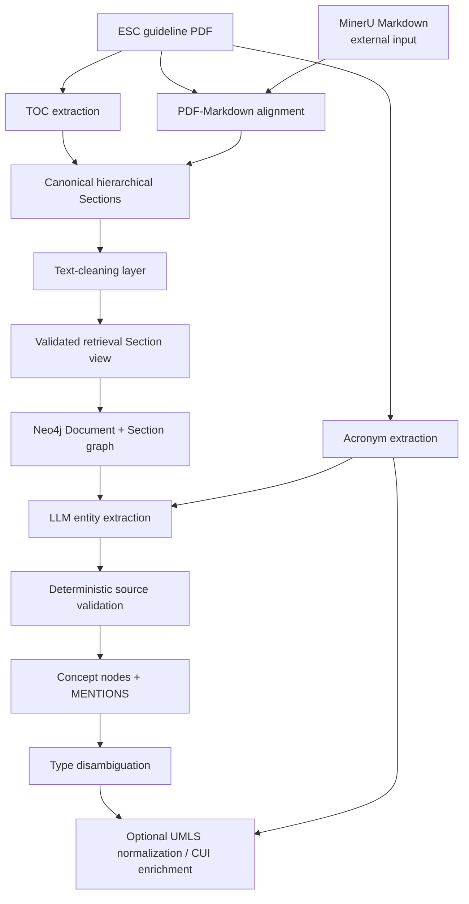
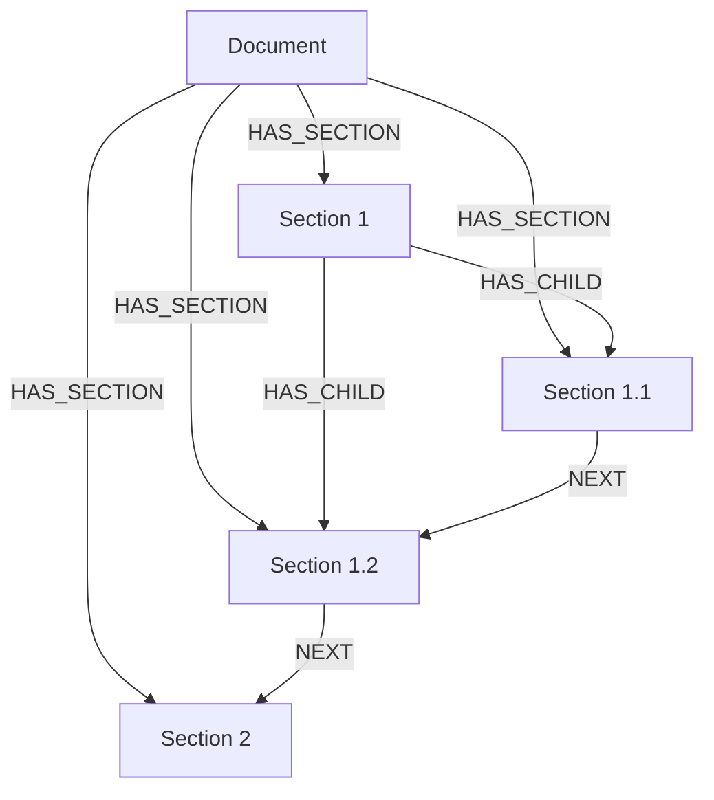
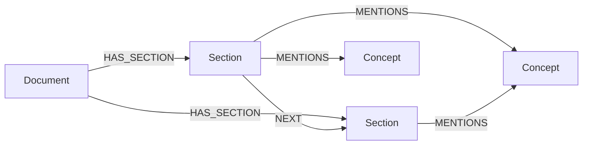

## How to run 

> ![NOTE]
> To run the code the module of the repo cardiology-gen-ai MUST be installed e.g. via
> ```
> uv pip install -e ../cardiology-gen-ai
> ```
> (change `../cardiology-gen-ai` with the relative path to the repo in your machine).

> Other dependencies can be installed using `uv pip install .`

The first step is to download the .pdf documents from [this](https://drive.google.com/drive/folders/1rgaemZ4Jetyz98ivTw8fpLIndgZ2jczn?usp=sharing) Google Drive folder and save them into the `data/pdfdocs` folder (you have to create it).

Then, start the python virtual environment with this command:
```
source .venv/bin/activate
```

Start the docker container:
```
docker compose up -d
```

Set the environmental variables:
```
export CONFIG_PATH="absolute/path/to/data-etl/config.json"
export APP_CONFIG_PATH="absolute/path/to/cardiology-gen-ai/config.json"
export QDRANT_URL="http://localhost:6333"
export INDEX_ROOT="absolute/path/to/data-etl"
```

Finally, start the main script:
```
uv run -m src.main
```

## 1. What this repository does

`data-etl` contains the ETL pipeline used to transform ESC clinical-guideline documents into representations that can be consumed by the retrieval systems.

There are two related but distinct paths in the repository:

1. **Classic/vector ETL**, historically exposed through `src/main.py`, which prepares documents for vector retrieval.
2. **Knowledge-graph ETL**, exposed through `src/main_graph.py`, which builds a document/section graph in Neo4j, extracts biomedical entities, creates `Concept` nodes, disambiguates their local types, and can optionally normalize those concepts against UMLS.

This guide focuses mainly on the second path, because it is the one that contains the preprocessing → graph → entities → normalization pipeline.

A useful mental model is:



The main design principle is that **the canonical hierarchical representation of the guideline is kept separate from the representation used for retrieval and graph ingestion**. The graph loader consumes a derived and validated **Section view**, not the raw/canonical chunk file directly.

---

# 2. Repository map

The important top-level files/directories are:

```text
data-etl/
├── .env.template
├── config.json
├── config.template.json
├── pyproject.toml
├── README.md
├── scripts/
└── src/
    ├── main.py
    ├── main_graph.py
    ├── config/
    ├── managers/
    └── knowledge_graph/
```

### Entry points

- `src/main.py`  
  Entry point for the older/classic ETL path.

- `src/main_graph.py`  
  Main entry point for the current graph-oriented pipeline. It:
  - loads `.env`;
  - loads the selected application from `config.json`;
  - resolves configuration and environment overrides;
  - translates the requested `KG_PIPELINE_PHASE` into concrete pipeline switches;
  - constructs the graph-pipeline configuration;
  - invokes the orchestration code in `src/knowledge_graph/build_graph.py`.

### Graph orchestration

- `src/knowledge_graph/build_graph.py`  
  This is the main orchestration layer. It coordinates:
  - preprocessing;
  - construction/validation of the retrieval Section view;
  - Neo4j loading;
  - entity extraction;
  - embedding generation;
  - concept-type disambiguation;
  - optional UMLS normalization;
  - sanity checks.

### Preprocessing managers

The `src/managers/` package contains most of the document-processing logic. The important modules include components for:

- table-of-contents extraction;
- MinerU Markdown handling;
- Markdown/PDF alignment;
- hierarchical chunk construction;
- cleaning of Section text;
- retrieval Section-view generation;
- acronym extraction;
- optional image/table handling.

The exact manager should generally be treated as an implementation detail; `build_graph.py` is the best place to understand **the order in which these pieces are composed**.

### Graph/entity modules

Inside `src/knowledge_graph/`:

- `graph_loader.py`  
  Validates a Section view and writes `Document` and `Section` nodes plus structural relationships to Neo4j.

- `add_entities.py`  
  Extracts biomedical concepts from retrievable Sections using the configured chat model.

- `entity_schema.py`  
  Defines the local entity taxonomy, type aliases, name normalization, blocklists, and concept deduplication helpers.

- `validate_entities.py`  
  Checks extracted concepts against the actual source Section before they are allowed into the graph.

- `entity_disambiguation.py`  
  Resolves the final `Concept.canonical_type` using evidence collected from `MENTIONS` relationships.

- `acronym_utils.py`  
  Loads and normalizes the per-document acronym cache used during entity validation and UMLS normalization.

- `umls_normalization.py`  
  Maps already validated local `Concept` nodes to UMLS candidates and, when confidence is sufficient, enriches them with CUI and UMLS metadata.

- `entity_review_exports.py`  
  Produces audit/review artifacts for entity extraction and normalization.

- `sanity_checks.py`  
  Contains graph consistency checks.

---


## 3 Neo4j

The graph phases require Neo4j.

For a local instance, the expected URI is normally:

```text
bolt://localhost:7687
```

The repository also supports Neo4j Aura, for example:

```text
neo4j+s://<instance>.databases.neo4j.io
```

The KG utilities themselves read the Neo4j connection from `.env`.

---

# 4. `.env`: what should go there

Create:

```bash
cp .env.template .env
```

A **minimal practical `.env` for the KG pipeline** is:

```dotenv
# Required by src/main_graph.py
CONFIG_PATH=config.json

# Optional. Defaults to cardiology_protocols.
KG_APP_ID=cardiology_protocols

# Neo4j
NEO4J_URI=bolt://localhost:7687
NEO4J_USERNAME=neo4j
NEO4J_PASSWORD=<your-password>

# Runtime mode used by some local/cluster utilities
KG_NEO4J_MODE=local
LOCAL_NEO4J_URI=bolt://localhost:7687

# Needed if entity extraction uses OpenAI
OPENAI_API_KEY=<your-openai-key>

# Needed only for the UMLS API normalization phase
UMLS_API_KEY=<your-umls-api-key>

# Optional logging/review settings
KG_LOG_TO_FILE=true
KG_ENTITY_EXPORT_REVIEW=true
KG_ENTITY_CLEAR_PREVIOUS_REVIEW=true
KG_ENTITY_INCLUDE_SOURCE_PREVIEW_IN_REVIEW=false
```

For Neo4j Aura:

```dotenv
NEO4J_URI=neo4j+s://<your-instance>.databases.neo4j.io
NEO4J_USERNAME=neo4j
NEO4J_PASSWORD=<your-aura-password>
```

## 4.1 What should *not* be hard-coded in `config.json`

Secrets should remain in `.env`, especially:

- `OPENAI_API_KEY`;
- `UMLS_API_KEY`;
- `NEO4J_PASSWORD`.

The JSON config should describe **pipeline behaviour**; `.env` should hold **credentials and machine/runtime-specific overrides**.

## 4.2 Useful optional overrides

Several important settings can temporarily be overridden from the environment, for example:

```dotenv
KG_PIPELINE_PHASE=entities
KG_PDF_DIR=first_prototype/pdfdocs
KG_WORK_ROOT=first_prototype
KG_MINERU_MARKDOWN_ROOT=first_prototype/mddocs
KG_RETRIEVAL_VIEW_OUTPUT_DIR=first_prototype/section_views
```

The phase resolver follows:

```text
KG_PIPELINE_PHASE environment variable
        ↓
knowledge_graph.pipeline.phase in config.json
        ↓
"default: preprocess"
```

For paths such as `pdf_dir`, `work_root`, and the MinerU Markdown root, environment overrides also take precedence over their config values.

**Recommendation:** keep the stable experiment definition in `config.json` and use environment overrides only for machine-specific paths, secrets, or short-lived test runs.

---

# 5. `config.json`: the configuration model

`src/main_graph.py` expects `CONFIG_PATH` to point to a JSON file containing an application configuration. Unless overridden with `KG_APP_ID`, the application id is:

```text
cardiology_protocols
```

The current `config.template.json` is the best reference for supported fields.

A reduced configuration focusing on the stages described in this document looks conceptually like:

```json
{
  "cardiology_protocols": {
    "preprocessing": {
      "storage": {
        "parent_folder": "first_prototype",
        "input_folder": "pdfdocs",
        "output_folder": "mddocs",
        "allowed_extensions": ["pdf"]
      },
      "images": {
        "enabled": false,
        "dpi": 200,
        "tol": 40.0,
        "pad": 16.0,
        "caption_keywords": ["Figure"]
      },
      "chunking": {
        "markdown_first": true,
        "header_levels": 4,
        "splitter": "recursive",
        "chunk_size": 1000,
        "chunk_overlap": 200
      }
    },

    "knowledge_graph": {
      "pipeline": {
        "phase": "preprocess",
        "pdf_dir": "first_prototype/pdfdocs",
        "work_root": "first_prototype",
        "mineru_markdown_root": null,
        "clear_neo4j_before_run": false,
        "force_toc": false,
        "force_markdown": false,
        "force_anchors": false,
        "force_chunks": false,
        "force_acronyms": false
      },

      "providers": {
        "chat_provider": "openai",
        "embedding_provider": "openai",
        "local_files_only": false
      },

      "models": {
        "chat_model": "gpt-4.1-mini",
        "chat_model_path": "",
        "embedding_model": "text-embedding-3-small",
        "embedding_dimensions": null,
        "embedding_model_path": "",
        "chat_max_new_tokens": 1024
      },

      "acronyms": {
        "enabled": true,
        "sample_size": 0,
        "print_all": false
      },

      "text_cleaning": {
        "enabled": true,
        "force": false,
        "clean_chunk_dir": null,
        "audit_dir": null
      },

      "retrieval_view": {
        "max_level": null,
        "include_descendant_titles": true,
        "include_section_ids_in_titles": true,
        "force": false,
        "output_dir": null
      },

      "graph_loader": {
        "batch_size": 200,
        "min_text_chars_to_embed": 20,
        "replace_existing_document": true
      },

      "entities": {
        "use_section_text": true,
        "max_sections": null,
        "max_sections_per_batch": 2,
        "max_batch_chars": 30000,
        "emergency_max_single_chars": 12000,
        "skip_processed": true,
        "replace_section_mentions": true,
        "use_acronym_validation": true,
        "acronym_dir": null,
        "export_review": true,
        "review_output_dir": null,
        "clear_previous_review": true,
        "include_source_preview_in_review": false
      },

      "entity_disambiguation": {
        "delete_orphans": true
      },

      "entity_normalization": {
        "enabled": false,
        "doc_id": null,
        "backend": "umls_api",
        "threshold": 0.85,
        "exact_threshold": 0.75,
        "max_candidates": 3,
        "use_acronyms": true,
        "acronym_dir": null,
        "force": false,
        "dry_run": false,
        "export_review": true,
        "review_output_dir": null,
        "fuzzy_threshold": 90,
        "api_cache_dir": null,
        "api_timeout": 30,
        "api_rate_limit_per_second": 2
      }
    }
  }
}
```

Do not blindly replace the repository config with this shortened example. It is intended to show the structure and the settings most relevant to onboarding.

---

# 6. How to run the KG pipeline

From the repository root:

```bash
cd /path/to/data-etl
source .venv/bin/activate
```

If your virtual environment is located one directory above the repository, use `../.venv/bin/python` instead of `.venv/bin/python`. The important point is simply to run `src/main_graph.py` with the environment that has the project installed.

## 6.1 Run from the phase in `config.json`

Set:

```json
"knowledge_graph": {
  "pipeline": {
    "phase": "preprocess"
  }
}
```

Then run:

```bash
python src/main_graph.py
```

## 6.2 Override the phase from the shell

This is convenient for staged execution:

```bash
KG_PIPELINE_PHASE=preprocess python src/main_graph.py
KG_PIPELINE_PHASE=graph python src/main_graph.py
KG_PIPELINE_PHASE=entities python src/main_graph.py
KG_PIPELINE_PHASE=normalization python src/main_graph.py
```

The supported phase names include:

| Phase | Purpose |
|---|---|
| `preprocess` | Prepare document artifacts and the validated Section view |
| `graph` | Load document/section structure into Neo4j |
| `entities` | Extract entities, validate them, create concepts/mentions, disambiguate types |
| `embeddings` | Generate Section embeddings and related vector-index artifacts |
| `normalization` | Normalize existing Concept nodes to UMLS |
| `full` | Run the enabled end-to-end sequence |
| `umls_connections` | Experimental UMLS/SNOMED relation stage; not documented here |

For development and debugging, **running the phases separately is preferable** because it makes cache behaviour and failures much easier to inspect.
Also the `full` phase has not been tested yet, so I would avoid using it.
---

# 7. Input and working directories

Two paths are especially important:

```json
"pdf_dir": "first_prototype/pdfdocs",
"work_root": "first_prototype"
```

Relative KG paths are resolved from the `data-etl` repository root.

A typical work area is therefore conceptually:

```text
first_prototype/
├── pdfdocs/
│   └── Cardiomyopathies_2023.pdf
├── mddocs/
│   └── ... MinerU Markdown ...
├── toc/
├── anchors/
├── chunks/
├── clean_chunks/
├── section_views/
├── acronyms/
├── entity_review/
├── logs/
└── umls_api_cache/
```

The exact generated subdirectories depend on the configuration, but this separation is intentional: the pipeline keeps intermediate artifacts so later phases can be rerun without repeating expensive upstream work.

---

# 8. Pipeline phases at a glance

The core dependency chain is:

```text
PDF + external MinerU Markdown
        │
        ▼
preprocess
        │
        ├── TOC
        ├── acronym cache
        ├── PDF↔Markdown anchors
        ├── canonical hierarchical chunks
        ├── cleaned text source
        └── validated retrieval Section view
        │
        ▼
graph
        │
        ├── Document
        ├── Section
        ├── HAS_SECTION
        ├── HAS_CHILD
        └── NEXT
        │
        ▼
entities
        │
        ├── LLM extraction
        ├── deterministic validation
        ├── Concept
        ├── MENTIONS
        └── canonical type disambiguation
        │
        ▼
normalization
        │
        └── UMLS CUI + normalization metadata
```

A key consequence is that the later stages can operate from cached artifacts. You normally do **not** need to re-extract the TOC or reconstruct chunks every time you rerun entity extraction or normalization.

---

# 9. Preprocessing in detail

The preprocessing stage is more than "PDF to chunks". It reconstructs a document representation that preserves the hierarchy of the original guideline and produces a separate, validated representation for retrieval.

The main orchestration function is in:

```text
src/knowledge_graph/build_graph.py
```

## 9.1 Document identity

For each PDF:

```text
doc_id = PDF filename without extension
```

Example:

```text
Cardiomyopathies_2023.pdf
        ↓
doc_id = Cardiomyopathies_2023
```

This `doc_id` is used consistently to name caches and to identify the `Document` and its `Section` nodes.

---

## 9.2 TOC extraction

The pipeline first obtains the guideline table of contents.

Conceptually:

```text
PDF
 ↓
GuidelineTOCExtractor
 ↓
<doc_id>_toc.json
```

If the cached TOC exists and `force_toc=false`, it is reused.

If:

```json
"force_toc": true
```

the cache is regenerated.

The TOC is important because it provides the **canonical structural hierarchy** of the document. Section reconstruction should therefore not be understood as ordinary fixed-size text splitting: section identity and parent/child relations originate from the guideline structure.

---

## 9.3 Acronym extraction

When acronym extraction is enabled:

```json
"acronyms": {
  "enabled": true
}
```

the pipeline creates a per-document acronym cache.

The extractor can use:

- the PDF itself;
- the cached TOC when available;
- fallback PDF heuristics when the TOC is unavailable.

The resulting acronym dictionary is reused later in two important places:

1. **entity validation**;
2. **UMLS normalization**.

Example conceptual behaviour:

```text
"HCM" found in Section
        │
        ├── raw LLM extraction: "HCM"
        │
        ▼
acronym cache
        │
        ▼
"hypertrophic cardiomyopathy"
```

The raw surface form is still retained for auditability, while the graph can use the expanded, normalized concept identity.

---

## 9.4 MinerU Markdown is an external input

This is an important implementation detail.

The KG preprocessing path deliberately **does not invoke MinerU itself**.

Instead, `load_or_convert_markdown()` loads Markdown that has already been generated externally and matches the document by `doc_id`.

Therefore:

```text
PDF ────────────────┐
                    ├── KG preprocessing
MinerU Markdown ────┘
```

is the correct mental model, not:

```text
PDF → main_graph.py → MinerU → Markdown
```

By default the Markdown root is resolved from:

```json
"knowledge_graph": {
  "pipeline": {
    "mineru_markdown_root": null
  }
}
```

where `null` means the pipeline falls back to the configured work-root Markdown directory.

`force_markdown=true` does **not** mean "run MinerU again"; in this KG path it means re-read/re-evaluate the already existing MinerU input.

---

## 9.5 PDF ↔ Markdown alignment and page anchors

The PDF and MinerU Markdown are two representations of the same guideline, but their text positions do not directly coincide.

The pipeline therefore builds **page anchors** using `MarkdownManager`.

Conceptually:

```text
PDF pages              MinerU Markdown
    │                        │
    └──────── alignment ─────┘
                │
                ▼
       page anchor cache
```

The anchor artifact records enough information to relate sections reconstructed in Markdown to their PDF location.

The cache also tracks information about the Markdown source, including its hash. This helps avoid silently reusing stale alignment artifacts when the MinerU file has changed.

`force_anchors=true` forces anchor recomputation.

---

## 9.6 Canonical hierarchical chunks

Using:

- the TOC tree;
- the Markdown;
- the page anchors;

the pipeline calls the hierarchical chunk builder.

The resulting artifact is not primarily a fixed-size RAG chunk set. It is a **canonical Section representation** aligned with the document hierarchy.

Conceptually:

```text
TOC hierarchy
     +
aligned Markdown
     │
     ▼
canonical Sections
```

For each document, the pipeline also produces a boundary-validation report. The validation tracks issues such as:

- missing section boundaries;
- empty leaf sections;
- uncertain boundaries;
- cases where PDF fallback logic was required.

This is important because structural reconstruction errors propagate directly to both retrieval and the graph.

`force_chunks=true` rebuilds the canonical hierarchical chunk artifact.

---

# 10. Text cleaning and the retrieval Section view

The canonical hierarchical chunks are intentionally treated as source artifacts.

The graph does **not** directly mutate or load them.

Instead:

```text
canonical hierarchical chunks
            │
            ▼
      text-cleaning source
            │
            ▼
  retrieval Section view
            │
            ▼
       graph loader
```

## 10.1 Why there is a separate Section view

The Section view lets the retrieval representation change without changing the canonical structure.

For example:

```json
"retrieval_view": {
  "max_level": null
}
```

means that all active canonical Sections are preserved as retrieval units.

If instead:

```json
"max_level": 4
```

deeper sections can be **absorbed into their nearest level-4 owner**.

This is useful for hierarchy-aware retrieval experiments: the source reconstruction stays fixed while only the retrieval representation changes.

## 10.2 Retrieval versus structural Sections

A Section view can contain nodes with different roles.

The most important distinction is:

```text
section_view_role = retrieval
section_view_role = structural
```

A retrieval Section carries retrievable content and is eligible for downstream operations such as entity extraction.

A structural Section exists to preserve hierarchy/context but is not treated as a normal retrievable content unit.

This distinction later prevents structural-only nodes from being sent to the LLM for entity extraction.

## 10.3 Aggregation metadata

The Section view preserves provenance fields that make an aggregated retrieval unit auditable, including concepts such as:

- source section ids;
- represented section ids;
- absorbed section ids;
- root section/chunk;
- aggregation mode;
- retrieval order;
- structural context.

Therefore, even when multiple low-level Sections are merged for retrieval, the system keeps track of where that content came from.

## 10.4 Cache validation

A cached Section view is reused only if its validation metadata remains compatible with the current inputs/configuration.

The cache validation checks, among other things:

- source SHA-256;
- `max_level`;
- descendant-title inclusion;
- section-id-in-title configuration;
- validity of the Section-view artifact itself.

This prevents a stale retrieval representation from being reused after its canonical source or aggregation settings change.

---

# 11. Graph loading

The graph loader lives in:

```text
src/knowledge_graph/graph_loader.py
```

It accepts the **validated Section view** as its source.

The compatibility alias that historically loaded ordinary chunks is deliberately rejected: this helps enforce the invariant that Neo4j reflects the selected retrieval representation.

---

## 11.1 Core graph schema before entity extraction

At the structural stage, the main node types are:

```text
(:Document)
(:Section)
```

and the main relationships are:

```text
(:Document)-[:HAS_SECTION]->(:Section)

(:Section)-[:HAS_CHILD]->(:Section)

(:Section)-[:NEXT]->(:Section)
```

Conceptually:



`NEXT` is created between **retrievable Sections**, representing retrieval/document order rather than hierarchy.

---

## 11.2 Section identity

Section UIDs are document-scoped.

Conceptually:

```text
uid = <doc_id>::<section_id>
```

This prevents identical printed section identifiers from different guidelines from colliding.

---

## 11.3 Important Section properties

A `Section` carries not only text but provenance and processing state.

Relevant groups of properties include:

### Structural identity

- `uid`;
- `doc_id`;
- `section_id`;
- printed section id;
- title;
- level;
- parent section id.

### Content/provenance

- text;
- page start/end;
- quality flags;
- source section ids;
- represented section ids;
- absorbed section ids;
- content-owner section id.

### Retrieval-view state

- `section_view_role`;
- `retrieval_order`;
- `retrieval_unit_id`;
- `retrieval_strategy`;
- aggregation metadata;
- `embed`;
- `excluded`.

### Downstream processing state

Initially the loader sets fields such as:

```text
has_embedding = false
entity_extracted = false
```

with associated status/timestamp fields.

This makes the pipeline resumable: later phases can identify work already completed.

---

## 11.4 Per-document replacement

The recommended graph-loader setting is:

```json
"replace_existing_document": true
```

This refreshes the currently loaded document rather than globally deleting the database.

That is much safer than:

```json
"clear_neo4j_before_run": true
```

which should only be used when a full destructive reset is explicitly intended.

For routine development:

```text
replace one document > clear entire Neo4j
```

---

# 12. Entity extraction

The entity extraction stage is implemented mainly in:

```text
src/knowledge_graph/add_entities.py
```

The output model is:

```text
Section ──MENTIONS──> Concept
```

The LLM is therefore **not directly responsible for writing arbitrary graph nodes or relationships**. It proposes typed concepts; deterministic code validates and normalizes those proposals before graph insertion.

---

## 12.1 Which Sections are processed

Only Sections satisfying the retrieval-view constraints are eligible.

In particular, entity extraction is intended for:

- `section_view_role = retrieval`;
- embeddable/active Sections;
- non-excluded Sections.

Structural-only hierarchy nodes are not sent to the LLM.

This matters because otherwise parent containers or empty structural Sections could create duplicated or semantically misleading concept evidence.

---

## 12.2 Input to the LLM

The entity stage can process Sections in batches.

Relevant configuration:

```json
"max_sections_per_batch": 2,
"max_batch_chars": 30000,
"emergency_max_single_chars": 12000
```

The normal path batches a limited number of Sections while staying under the character budget.

If one Section is itself too long, it is **segmented rather than truncated**.

The important invariant is:

> Oversized Section content should not simply disappear because it exceeded the model request size.

Segment-level entity results are later merged and validated against the original full Section.

---

## 12.3 Structured response schema

The LLM is asked to return structured concept records of the form:

```json
{
  "name": "hypertrophic cardiomyopathy",
  "type": "disease"
}
```

For batched extraction, concepts are associated with the corresponding Section UID.

The allowed types come from `entity_schema.py`; arbitrary LLM type labels are not accepted as the final graph schema.

---

# 13. Local entity schema

The current entity schema is deliberately described in the code as a **lightweight local entity schema, not a complete clinical ontology**.

The main canonical types are:

```text
disease
clinical_finding
exposure_or_lifestyle_factor
genetic_factor
biomarker
diagnostic_test
score_or_risk_model
drug_or_drug_class
procedure_or_intervention
device
care_strategy
anatomical_structure
clinical_outcome
microorganism_or_pathogen
population_or_patient_group
```

The design rule is important:

> `canonical_type` describes what the concept intrinsically **is**, not the role it happens to play in one sentence.

For example:

```text
hypertension
```

remains a `disease` even if a sentence discusses it as a risk factor.

Similarly, concepts such as:

```text
risk_factor
complication
comorbidity
target_population
```

are not automatically treated as intrinsic entity types merely because those contextual roles occur in text.

This separation is intentional because a future contextual assertion layer can model those roles without changing the identity of the underlying `Concept`.

---

# 14. Entity normalization before graph insertion

There are **three different operations that can all sound like "normalization"**. They should not be confused.

## Layer 1 — local deterministic entity normalization

This happens during extraction, before the `Concept` is written.

The pipeline normalizes:

- concept names;
- accepted type aliases;
- duplicate extractions.

The goal is to avoid creating separate nodes simply because the LLM used cosmetic variants.

Conceptually:

```text
"Hypertrophic Cardiomyopathy"
"hypertrophic cardiomyopathy"
" hypertrophic   cardiomyopathy "
          │
          ▼
one normalized concept identity
```

Likewise, safe aliases of entity types are mapped to the local canonical schema.

The graph therefore aims to maintain:

```text
one Concept node per normalized local concept name
```

at this stage.

---

# 15. Deterministic validation against the Section text

LLM extraction is treated as a **candidate generation step**, not as unquestioned truth.

Before an extracted concept is written to Neo4j, `validate_entities.py` checks whether it is supported by the actual Section source.

This is a critical anti-hallucination layer.

Conceptually:

```text
Section text
    │
    ├────────────┐
    │            │
    ▼            ▼
LLM candidates   deterministic validation
    │            │
    └──────┬─────┘
           ▼
      accepted concepts
```

Rejected concepts are not silently inserted.

---

## 15.1 Acronym-aware validation

Acronyms are an important exception to naive string matching.

Suppose the Section contains:

```text
HCM
```

and the LLM extracts:

```text
hypertrophic cardiomyopathy
```

A strict surface-string check would reject the long form because those literal words might not appear in that Section.

With acronym validation enabled, the cached document acronym map can establish:

```text
HCM ↔ hypertrophic cardiomyopathy
```

and allow the candidate to pass validation.

Conversely, if the LLM itself extracts the acronym, it can be expanded before graph insertion so the `Concept` represents the meaningful long form.

The original LLM surface is still preserved on `MENTIONS` for auditing.

---

# 16. `Concept` and `MENTIONS`

After validation:

```text
(:Section)-[:MENTIONS]->(:Concept)
```

is created.

A useful design choice is that the edge preserves **observation-level evidence**, while the Concept stores the shared identity.

## Concept-level state

A `Concept` represents a normalized entity across Sections.

During the extraction pass, its final `canonical_type` is intentionally left unresolved/pending because different Sections may provide different type observations.

## Relationship-level state

`MENTIONS` stores information tied to the concrete extraction occurrence, including evidence such as:

- observed type(s);
- raw extracted name;
- raw extracted type;
- relationship provenance/metadata.

This means the system does not destroy disagreement produced in different contexts.

Example:

```text
Section A ──MENTIONS {observed_types:["clinical_finding"]}──> X
Section B ──MENTIONS {observed_types:["disease"]}──────────> X
```

The final type can then be resolved in a separate, explicit step rather than by whichever Section happened to be processed last.

---

# 17. Entity review artifacts

With:

```json
"export_review": true
```

the entity pipeline exports accepted/rejected extraction evidence to review files.

These artifacts are useful for:

- inspecting false positives;
- checking acronym behaviour;
- comparing model versions;
- validating schema changes;
- understanding why a Concept exists in Neo4j.

For development, it is strongly recommended to leave review export enabled.

`include_source_preview_in_review=false` keeps the export compact; it can be enabled when textual inspection is more important than file size.

---

# 18. Type disambiguation

After entity extraction, `entity_disambiguation.py` resolves concept-level type state from the `MENTIONS` evidence.

This is **Layer 2 of normalization/disambiguation** and is completely separate from UMLS.

The algorithm recomputes support from the current graph.

Each Section contributes type evidence for a Concept. The policy is approximately:

```text
one valid observed type
        ↓
use that type

multiple types, one unique best-supported type
        ↓
use the winner

tie
        ↓
keep an existing/manual canonical_type
only if it is still one of the tied supported types

otherwise
        ↓
canonical_type = "ambiguous"
needs_type_review = true
```

If no valid schema type remains:

```text
canonical_type = "no_supported_type"
```

Invalid or obsolete observed types are retained separately for review rather than silently disappearing.

This is preferable to assigning a type during the first extraction because it makes the decision depend on **aggregate evidence across the document graph**.

---

## 18.1 Orphan cleanup

If:

```json
"entity_disambiguation": {
  "delete_orphans": true
}
```

Concepts that no longer have incoming `MENTIONS` relationships can be deleted.

This is useful after reruns where:

```json
"replace_section_mentions": true
```

has replaced stale entity annotations.

Without orphan cleanup, old Concept nodes could remain in Neo4j even though no current Section supports them.

---

# 19. UMLS normalization

This is **Layer 3**.

The relevant module is:

```text
src/knowledge_graph/umls_normalization.py
```

Its purpose is not to redo entity extraction.

Instead:

```text
validated local Concept
        │
        ▼
candidate UMLS search
        │
        ▼
candidate ranking / compatibility checks
        │
        ▼
CUI + UMLS metadata when accepted
```

The module explicitly treats UMLS as an enrichment layer over already validated local concepts.

---

## 19.1 Prerequisites

Before running UMLS normalization, the graph should already contain:

```text
Document
Section
Concept
MENTIONS
resolved Concept type state
```

and `.env` must contain:

```dotenv
UMLS_API_KEY=<key>
```

For the default API backend, install:

```bash
uv pip install -e ".[normalization]"
```

---

## 19.2 Recommended configuration

Example:

```json
"entity_normalization": {
  "enabled": true,
  "doc_id": "Cardiomyopathies_2023",
  "backend": "umls_api",
  "threshold": 0.85,
  "exact_threshold": 0.75,
  "max_candidates": 3,
  "use_acronyms": true,
  "force": false,
  "dry_run": false,
  "export_review": true,
  "fuzzy_threshold": 90,
  "api_timeout": 30,
  "api_rate_limit_per_second": 2
}
```

During development, setting a single `doc_id` is useful because it prevents an accidental corpus-wide normalization run.

---

# 20. How UMLS candidate generation works

For each eligible local Concept, the normalizer constructs aliases.

Sources include:

1. normalized concept name;
2. acronym expansions, where relevant;
3. additional safe aliases available to the normalizer.

Acronym provenance matters because a short form can be ambiguous. The implementation therefore does more than blindly query every expansion.

For the UMLS API backend, search strategies include:

```text
exact
normalizedString
words
```

These candidate generators have different strengths. An `exact` API result is stronger evidence than a broad word search, but exact lookup alone is still **not sufficient proof of semantic equivalence**.

---

# 21. Candidate ranking is not only lexical

A UMLS candidate is evaluated using more than raw name similarity.

The current policy also considers compatibility between:

```text
local Concept canonical_type
        ↕
UMLS semantic information
```

This is essential in clinical terminology because the same or very similar surface string can refer to entities of different semantic classes.

The normalizer also contains safeguards for overly specific disease candidates. For example, it avoids automatically treating a narrower hereditary/familial subtype as equivalent to a broader local disease concept merely because lexical similarity is high.

This explains why an apparently plausible UMLS result may be kept as a low-confidence candidate instead of becoming the selected CUI.

---

# 22. Why concept type must be resolved first

Concepts that still require type review should not be treated as clean inputs for automated ontology mapping.

Conceptually:

```text
canonical_type = disease
        ↓
UMLS normalization can evaluate disease-compatible candidates

canonical_type = ambiguous
        ↓
normalization should not pretend semantic compatibility is known
```

This ordering is one reason the pipeline separates:

```text
entity extraction
→ type disambiguation
→ UMLS normalization
```

rather than trying to do everything in one LLM call.

---

# 23. Normalization thresholds

The default configuration exposes two important thresholds:

```json
"threshold": 0.85,
"exact_threshold": 0.75
```

The exact-search threshold is separate because exact UMLS lookup is treated as stronger candidate evidence, while still requiring conservative semantic checks.

There is also a fuzzy-name threshold:

```json
"fuzzy_threshold": 90
```

Fuzzy evidence should be understood as supporting/review evidence, not as an unrestricted guarantee that two biomedical concepts are identical.

---

# 24. What gets written after a successful UMLS match

When a candidate is accepted, the existing local `Concept` can be enriched with fields such as:

```text
umls_cui
umls_canonical_name
umls_definition
umls_aliases
umls_score
umls semantic-type metadata
normalization method/status
normalization timestamps
```

The important architectural point is:

```text
local Concept identity is retained
        +
UMLS metadata is attached
```

rather than replacing the local graph schema with UMLS.

This allows the KG to preserve the project-specific entity taxonomy while also gaining a standard biomedical identifier for compatible concepts.

---

# 25. Normalization statuses and reviewability

Not every Concept becomes a CUI.

The pipeline can distinguish outcomes such as:

```text
umls_matched
umls_low_confidence
umls_no_plausible_match
umls_no_match
review_required
skipped
failed
```

This is preferable to forcing every entity into UMLS.

A concept can legitimately remain local when:

- UMLS returns no suitable candidate;
- lexical evidence is weak;
- semantic type is incompatible;
- the local concept itself is ambiguous;
- the returned concept appears too specific;
- candidate evidence requires review.

With review export enabled, candidate traces are written so that the decision can be audited outside Neo4j.

---


# 26. Cache and rerun behaviour

The pipeline is designed to avoid recomputing all upstream artifacts on every invocation.

A useful dependency view is:

```text
TOC cache
  │
  ├──> acronym extraction
  │
  └──> canonical chunks
           │
           ▼
      cleaned source
           │
           ▼
      Section view
           │
           ▼
        Neo4j
           │
           ▼
        entities
           │
           ▼
       UMLS mapping
```

Typical rerun cases:

### Change only entity prompts/model

Usually rerun:

```bash
KG_PIPELINE_PHASE=entities python src/main_graph.py
```

No need to regenerate TOC/chunks if the Section representation is unchanged.

### Change the retrieval hierarchy policy

Example:

```json
"retrieval_view": {
  "max_level": 4
}
```

Rebuild/validate the Section view and reload the document graph before rerunning entities.


### Change local entity schema

Rerun extraction/disambiguation as appropriate because old `MENTIONS.observed_types` may no longer reflect the current schema.

### Change UMLS ranking thresholds

Rerun normalization only, ideally with:

```json
"force": true
```

when you explicitly want previous normalization decisions reconsidered.

---

# 29. Force flags: what they mean

Relevant preprocessing controls include:

```json
"force_toc": false,
"force_markdown": false,
"force_anchors": false,
"force_chunks": false,
"force_acronyms": false
```

and Section-view/normalization stages have their own force settings.

Use force flags when the **inputs or algorithm changed but the output filename did not**.

Do not enable all force flags by default. Cached artifacts are intentional and make the staged pipeline practical.

---


# 31. Graph schema after entity extraction

The core graph can be summarized as:



Hierarchy adds:

```text
Section ──HAS_CHILD──> Section
```

The division of responsibility is:

| Layer | Stores |
|---|---|
| `Document` | guideline identity |
| `Section` | structural/retrieval units and text provenance |
| `HAS_CHILD` | guideline hierarchy |
| `NEXT` | retrieval/document order |
| `Concept` | shared normalized biomedical entity identity |
| `MENTIONS` | Section-specific evidence and observed entity type |
| UMLS fields on `Concept` | external terminology normalization metadata |

---

# 32. Why the pipeline is structured this way

Several implementation choices may initially look more complicated than necessary, but they solve distinct problems.

## Canonical chunks vs retrieval Section view

Without this separation, changing retrieval granularity would mutate the structural source of truth and make experiments difficult to compare.

## `MENTIONS.observed_types` vs immediate `Concept.canonical_type`

Without relationship-level evidence, whichever Section is processed last could accidentally determine the global type of a Concept.

## LLM extraction + deterministic validation

The LLM is good at semantic candidate generation but should not be the sole source of truth for whether a phrase actually occurs in the source evidence.

## Local schema + UMLS enrichment

The project needs a compact graph schema designed around retrieval experiments. UMLS is much larger and serves a different purpose. Keeping local identity and ontology normalization separate avoids coupling the entire KG to an external ontology model.

## Caches and validation sidecars

The pipeline includes expensive and partly external steps. Reproducibility requires knowing not only that an artifact exists, but also whether it corresponds to the same source/configuration.

---

# 33. Minimal commands cheat sheet

```bash
# 1. Enter repository / environment
cd /path/to/data-etl
source .venv/bin/activate

# 2. Preprocessing
KG_PIPELINE_PHASE=preprocess python src/main_graph.py

# 3. Graph structure
KG_PIPELINE_PHASE=graph python src/main_graph.py

# 4. Entity extraction + local concept handling
KG_PIPELINE_PHASE=entities python src/main_graph.py

# 5. UMLS concept normalization
KG_PIPELINE_PHASE=normalization python src/main_graph.py

# 6. Tests
PYTHONPATH="$PWD/src" python -m pytest -q
```

If the environment is outside `data-etl`, replace `python` with the appropriate interpreter path, e.g.:

```bash
../.venv/bin/python src/main_graph.py
```


