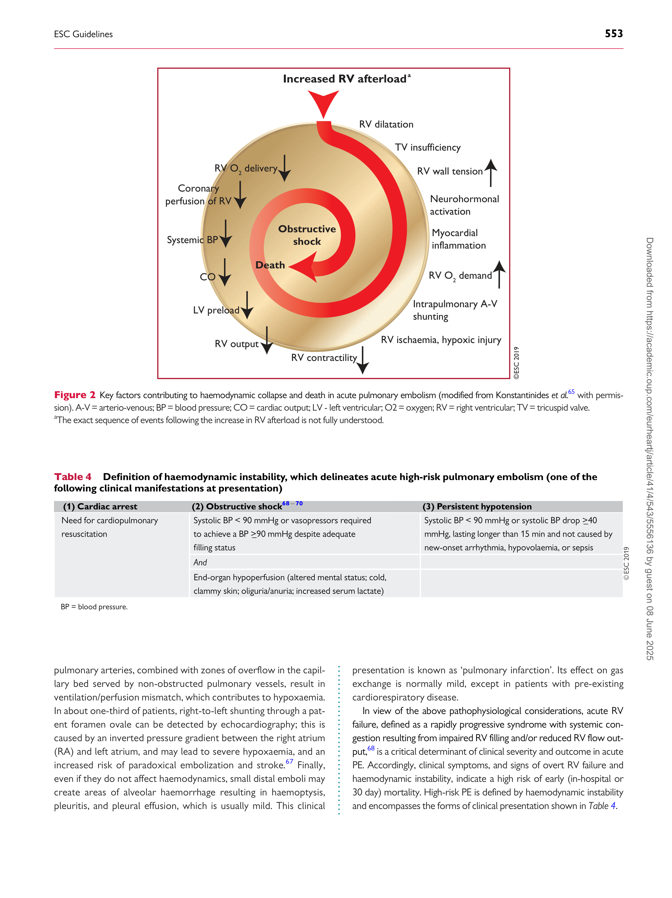
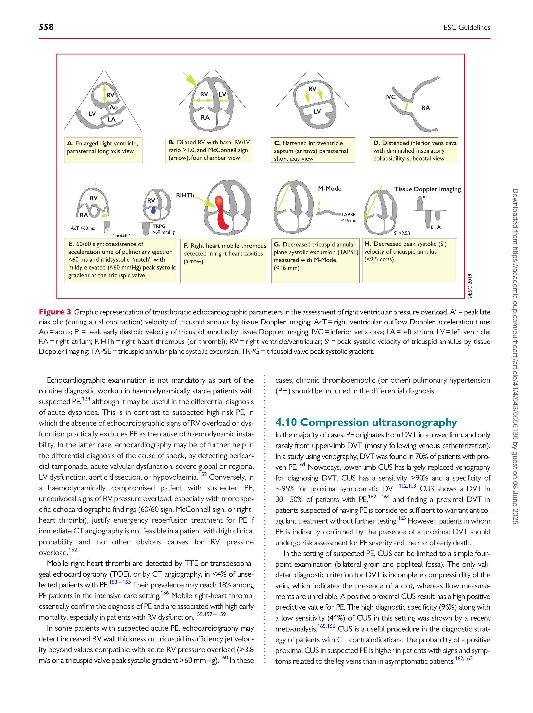

# 2019 ESC Guidelines for the diagnosis and management of acute pulmonary embolism developed in collaboration with the European Respiratory Society (ERS)
## The Task Force for the diagnosis and management of acute pulmonary embolism of the European Society of Cardiology (ESC)
#### Authors/Task Force Members: Stavros V. Konstantinides* (Chairperson) (Germany/ Greece), Guy Meyer* (Co-Chairperson) (France), Cecilia Becattini (Italy), He´ctor Bueno (Spain), Geert-Jan Geersing (Netherlands), Veli-Pekka Harjola (Finland), Menno V. Huisman (Netherlands), Marc Humbert [1] (France), Catriona Sian Jennings (United Kingdom), David Jime´nez (Spain), Nils Kucher (Switzerland), Irene Marthe Lang (Austria), Mareike Lankeit (Germany), Roberto Lorusso (Netherlands), Lucia Mazzolai (Switzerland), Nicolas � Meneveau (France), Fionnuala Nı Ainle (Ireland), Paolo Prandoni (Italy), Piotr [�] Pruszczyk (Poland), Marc Righini (Switzerland), Adam Torbicki (Poland), Eric Van Belle (France), and Jose´ Luis Zamorano (Spain)

- Corresponding authors: Stavros V. Konstantinides, Center for Thrombosis and Hemostasis, Johannes Gutenberg University Mainz, Building 403, Langenbeckstr. 1, 55131 Mainz,
[Germany. Tel: þ49 613 117 6255, Fax: þ49 613 117 3456, Email: stavros.konstantinides@unimedizin-mainz.de; and Department of Cardiology, Democritus University of Thrace,](mailto:)
[68100 Alexandroupolis, Greece. Email: skonst@med.duth.gr. Guy Meyer, Respiratory Medicine Department, Hoˆpital Europe´en Georges Pompidou, 20 Rue Leblanc, 75015 Paris,](mailto:)
[France. Tel: þ33 156 093 461, Fax: þ33 156 093 255, Email: guy.meyer@aphp.fr; and Universite´ Paris Descartes, 15 rue de l’e´cole de me´decine 75006 Paris, France.](mailto:)

Author/Task Force Member Affiliations: listed in the Appendix.

ESC Committee for Practice Guidelines (CPG) and National Cardiac Societies document reviewers: listed in the Appendix.

1 Representing the ERS.

ESC entities having participated in the development of this document:

Associations: Acute Cardiovascular Care Association (ACCA), Association of Cardiovascular Nursing & Allied Professions (ACNAP), European Association of Cardiovascular
Imaging (EACVI), European Association of Percutaneous Cardiovascular Interventions (EAPCI), Heart Failure Association (HFA).

Councils: Council on Cardiovascular Primary Care.

Working Groups: Aorta and Peripheral Vascular Diseases, Cardiovascular Surgery, Pulmonary Circulation and Right Ventricular Function, Thrombosis.

The content of these European Society of Cardiology (ESC) Guidelines has been published for personal and educational use only. No commercial use is authorized. No part of the
ESC Guidelines may be translated or reproduced in any form without written permission from the ESC. Permission can be obtained upon submission of a written request to Oxford
University Press, the publisher of the European Heart Journal and the party authorized to handle such permissions on behalf of the ESC (journals.permissions@oxfordjournals.org).

Disclaimer. The ESC Guidelines represent the views of the ESC and were produced after careful consideration of the scientific and medical knowledge, and the evidence available
at the time of their publication. The ESC is not responsible in the event of any contradiction, discrepancy, and/or ambiguity between the ESC Guidelines and any other official recommendations or guidelines issued by the relevant public health authorities, in particular in relation to good use of healthcare or therapeutic strategies. Health professionals are encouraged to take the ESC Guidelines fully into account when exercising their clinical judgment, as well as in the determination and the implementation of preventive, diagnostic, or
therapeutic medical strategies; however, the ESC Guidelines do not override, in any way whatsoever, the individual responsibility of health professionals to make appropriate and accurate decisions in consideration of each patient’s health condition and in consultation with that patient and, where appropriate and/or necessary, the patient’s caregiver. Nor do the
ESC Guidelines exempt health professionals from taking into full and careful consideration the relevant official updated recommendations or guidelines issued by the competent public
health authorities, in order to manage each patient’s case in light of the scientifically accepted data pursuant to their respective ethical and professional obligations. It is also the health
professional’s responsibility to verify the applicable rules and regulations relating to drugs and medical devices at the time of prescription.

V C The European Society of Cardiology 2019. All rights reserved. For permissions please email: journals.permissions@oup.com.

544 ESC Guidelines

Document Reviewers: Nazzareno Galie´ (CPG Review Coordinator) (Italy), J. Simon R. Gibbs (CPG Review
Coordinator) (United Kingdom), Victor Aboyans (France), Walter Ageno (Italy), Stefan Agewall (Norway),
Ana G. Almeida (Portugal), Felicita Andreotti (Italy), Emanuele Barbato (Italy), Johann Bauersachs
(Germany), Andreas Baumbach (United Kingdom), Farzin Beygui (France), Jørn Carlsen (Denmark),
Marco De Carlo (Italy), Marion Delcroix [1] (Belgium), Victoria Delgado (Netherlands), Pilar Escribano Subias
(Spain), Donna Fitzsimons (United Kingdom), Sean Gaine [1] (Ireland), Samuel Z. Goldhaber (United States
of America), Deepa Gopalan (United Kingdom), Gilbert Habib (France), Sigrun Halvorsen (Norway),
David Jenkins (United Kingdom), Hugo A. Katus (Germany), Barbro Kjellstro¨ m (Sweden), Mitja Lainscak
(Slovenia), Patrizio Lancellotti (Belgium), Geraldine Lee (United Kingdom), Gre´goire Le Gal (Canada),
Emmanuel Messas (France), Joao Morais (Portugal), Steffen E. Petersen (United Kingdom),
Anna Sonia Petronio (Italy), Massimo Francesco Piepoli (Italy), Susanna Price (United Kingdom),
Marco Roffi (Switzerland), Aldo Salvi (Italy), Olivier Sanchez [1] (France), Evgeny Shlyakhto (Russian
Federation), Iain A. Simpson (United Kingdom), Stefan Stortecky (Switzerland), Matthias Thielmann
(Germany), Anton Vonk Noordegraaf [1] (Netherlands)

The disclosure forms of all experts involved in the development of these Guidelines are available on the
[ESC website www.escardio.org/guidelines](http://www.escardio.org/guidelines)

For the Supplementary Data which include background information and detailed discussion of the data
[that have provided the basis for the Guidelines see https://academic.oup.com/eurheartj/article-lookup/doi/](https://academic.oup.com/eurheartj/article-lookup/doi/10.1093/eurheartj/ehz405#supplementary-data)
[10.1093/eurheartj/ehz405#supplementary-data](https://academic.oup.com/eurheartj/article-lookup/doi/10.1093/eurheartj/ehz405#supplementary-data)

Online publish-ahead-of-print 31 August 2019

...................................................................................................................................................................................................

Keywords Guidelines - pulmonary embolism - venous thrombosis - shock - dyspnoea - heart failure - right ventricle              - diagnosis              - risk assessment              - echocardiography              - biomarkers              - treatment              - anticoagulation              thrombolysis            - pregnancy            - venous thromboembolism            - embolectomy

### Table of contents

Abbreviations and acronyms . . . . . . . . . . . . . . . . . . . . . . . . . . . . . . . . . . . . . . 546

1 Preamble . . . . . . . . . . . . . . . . . . . . . . . . . . . . . . . . . . . . . . . . . . . . . . . . . . . . . . . 547

2 Introduction . . . . . . . . . . . . . . . . . . . . . . . . . . . . . . . . . . . . . . . . . . . . . . . . . . . . 548

2.1 Why do we need new Guidelines on the diagnosis and

management of pulmonary embolism? . . . . . . . . . . . . . . . . . . . . . . . . . . 548

2.2 What is new in the 2019 Guidelines? . . . . . . . . . . . . . . . . . . . . . . . . 549

2.2.1 New/revised concepts in 2019 . . . . . . . . . . . . . . . . . . . . . . . . . . 549

2.2.2 Changes in recommendations 2014�19 . . . . . . . . . . . . . . . . 549

2.2.3 Main new recommendations 2019 . . . . . . . . . . . . . . . . . . . . . . 550

3 General considerations . . . . . . . . . . . . . . . . . . . . . . . . . . . . . . . . . . . . . . . . . 550

3.1 Epidemiology . . . . . . . . . . . . . . . . . . . . . . . . . . . . . . . . . . . . . . . . . . . . . . . 550

3.2 Predisposing factors . . . . . . . . . . . . . . . . . . . . . . . . . . . . . . . . . . . . . . . . 551

3.3 Pathophysiology and determinants of outcome . . . . . . . . . . . . . . 552

4 Diagnosis . . . . . . . . . . . . . . . . . . . . . . . . . . . . . . . . . . . . . . . . . . . . . . . . . . . . . . . 554

4.1 Clinical presentation . . . . . . . . . . . . . . . . . . . . . . . . . . . . . . . . . . . . . . . . 554

4.2 Assessment of clinical (pre-test) probability . . . . . . . . . . . . . . . . . . 554

4.3 Avoiding overuse of diagnostic tests for pulmonary

embolism . . . . . . . . . . . . . . . . . . . . . . . . . . . . . . . . . . . . . . . . . . . . . . . . . . . . . . 555

4.4 D-dimer testing . . . . . . . . . . . . . . . . . . . . . . . . . . . . . . . . . . . . . . . . . . . . 555

4.4.1 Age-adjusted D-dimer cut-offs . . . . . . . . . . . . . . . . . . . . . . . . . . 555

4.4.2 D-dimer cut-offs adapted to clinical probability . . . . . . . . . . 555

4.4.3 Point-of-care D-dimer assays . . . . . . . . . . . . . . . . . . . . . . . . . . . 555

4.5 Computed tomographic pulmonary angiography . . . . . . . . . . . . . 555

4.6 Lung scintigraphy . . . . . . . . . . . . . . . . . . . . . . . . . . . . . . . . . . . . . . . . . . . 556

4.7 Pulmonary angiography . . . . . . . . . . . . . . . . . . . . . . . . . . . . . . . . . . . . . 557

4.8 Magnetic resonance angiography . . . . . . . . . . . . . . . . . . . . . . . . . . . . 557

4.9 Echocardiography . . . . . . . . . . . . . . . . . . . . . . . . . . . . . . . . . . . . . . . . . . 557

4.10 Compression ultrasonography . . . . . . . . . . . . . . . . . . . . . . . . . . . . . 558

4.12 Computed tomography venography . . . . . . . . . . . . . . . . . . . . . . . 560

5 Assessment of pulmonary embolism severity and the risk of

early death . . . . . . . . . . . . . . . . . . . . . . . . . . . . . . . . . . . . . . . . . . . . . . . . . . . . . . . 560

5.1 Clinical parameters of pulmonary embolism severity . . . . . . . . . 560

5.2 Imaging of right ventricular size and function . . . . . . . . . . . . . . . . . 560

5.2.1 Echocardiography . . . . . . . . . . . . . . . . . . . . . . . . . . . . . . . . . . . . . . 560

5.2.2 Computed tomographic pulmonary angiography . . . . . . . . 561

5.3 Laboratory biomarkers . . . . . . . . . . . . . . . . . . . . . . . . . . . . . . . . . . . . . 561

5.3.1 Markers of myocardial injury . . . . . . . . . . . . . . . . . . . . . . . . . . . . 561

5.3.2 Markers of right ventricular dysfunction . . . . . . . . . . . . . . . . . 561

5.3.3 Other laboratory biomarkers . . . . . . . . . . . . . . . . . . . . . . . . . . . 561

5.4 Combined parameters and scores for assessment of

pulmonary embolism severity . . . . . . . . . . . . . . . . . . . . . . . . . . . . . . . . . . 562

5.5 Integration of aggravating conditions and comorbidity

into risk assessment of acute pulmonary embolism . . . . . . . . . . . . . . 562

5.6 Prognostic assessment strategy . . . . . . . . . . . . . . . . . . . . . . . . . . . . . 562

6 Treatment in the acute phase . . . . . . . . . . . . . . . . . . . . . . . . . . . . . . . . . . . 564

6.1 Haemodynamic and respiratory support . . . . . . . . . . . . . . . . . . . . . 564

6.1.1 Oxygen therapy and ventilation . . . . . . . . . . . . . . . . . . . . . . . . . 564

ESC Guidelines 545

6.1.2 Pharmacological treatment of acute right ventricular

failure . . . . . . . . . . . . . . . . . . . . . . . . . . . . . . . . . . . . . . . . . . . . . . . . . . . . . . . 564

6.1.3 Mechanical circulatory support and oxygenation . . . . . . . . . 565

6.1.4 Advanced life support in cardiac arrest . . . . . . . . . . . . . . . . . . 565

6.2 Initial anticoagulation . . . . . . . . . . . . . . . . . . . . . . . . . . . . . . . . . . . . . . . 565

6.2.1 Parenteral anticoagulation . . . . . . . . . . . . . . . . . . . . . . . . . . . . . . 565

6.2.2 Non-vitamin K antagonist oral anticoagulants . . . . . . . . . . . . 566

6.2.3 Vitamin K antagonists . . . . . . . . . . . . . . . . . . . . . . . . . . . . . . . . . . . 566

6.3 Reperfusion treatment . . . . . . . . . . . . . . . . . . . . . . . . . . . . . . . . . . . . . . 566

6.3.1 Systemic thrombolysis . . . . . . . . . . . . . . . . . . . . . . . . . . . . . . . . . . 566

6.3.2 Percutaneous catheter-directed treatment . . . . . . . . . . . . . . 567

6.3.3 Surgical embolectomy . . . . . . . . . . . . . . . . . . . . . . . . . . . . . . . . . . 567

6.4 Multidisciplinary pulmonary embolism teams . . . . . . . . . . . . . . . . 568

6.5 Vena cava filters . . . . . . . . . . . . . . . . . . . . . . . . . . . . . . . . . . . . . . . . . . . . 568

7 Integrated risk-adapted diagnosis and management . . . . . . . . . . . . . . . 570

7.1 Diagnostic strategies . . . . . . . . . . . . . . . . . . . . . . . . . . . . . . . . . . . . . . . . 570

7.1.1 Suspected pulmonary embolism with haemodynamic

instability . . . . . . . . . . . . . . . . . . . . . . . . . . . . . . . . . . . . . . . . . . . . . . . . . . . . 571

7.1.2 Suspected pulmonary embolism without haemodynamic

instability . . . . . . . . . . . . . . . . . . . . . . . . . . . . . . . . . . . . . . . . . . . . . . . . . . . . 572

7.1.2.1 Strategy based on computed tomographic pulmonary

angiography . . . . . . . . . . . . . . . . . . . . . . . . . . . . . . . . . . . . . . . . . . . . . . 572

7.1.2.2 Strategy based on ventilation/perfusion

scintigraphy . . . . . . . . . . . . . . . . . . . . . . . . . . . . . . . . . . . . . . . . . . . . . . . 572

7.2 Treatment strategies . . . . . . . . . . . . . . . . . . . . . . . . . . . . . . . . . . . . . . . 572

7.2.1 Emergency treatment of high-risk pulmonary embolism . . 572

7.2.2 Treatment of intermediate-risk pulmonary embolism . . . . 572

7.2.3 Management of low-risk pulmonary embolism: triage

for early discharge and home treatment . . . . . . . . . . . . . . . . . . . . . . 572

8 Chronic treatment and prevention of recurrence . . . . . . . . . . . . . . . . 574

8.1 Assessment of venous thromboembolism

recurrence risk . . . . . . . . . . . . . . . . . . . . . . . . . . . . . . . . . . . . . . . . . . . . . . . . 575

8.2 Anticoagulant-related bleeding risk . . . . . . . . . . . . . . . . . . . . . . . . . . 576

8.3 Regimens and treatment durations with non-vitamin

K antagonist oral anticoagulants, and with other non-vitamin

K antagonist antithrombotic drugs . . . . . . . . . . . . . . . . . . . . . . . . . . . . . . 576

8.5 Management of pulmonary embolism in patients

with cancer . . . . . . . . . . . . . . . . . . . . . . . . . . . . . . . . . . . . . . . . . . . . . . . . . . . . 578

9 Pulmonary embolism and pregnancy . . . . . . . . . . . . . . . . . . . . . . . . . . . . . 579

9.1 Epidemiology and risk factors for pulmonary embolism

in pregnancy . . . . . . . . . . . . . . . . . . . . . . . . . . . . . . . . . . . . . . . . . . . . . . . . . . . 579

9.2 Diagnosis of pulmonary embolism in pregnancy . . . . . . . . . . . . . . 579

9.2.1 Clinical prediction rules and D-dimers . . . . . . . . . . . . . . . . . . . 579

9.2.2 Imaging tests . . . . . . . . . . . . . . . . . . . . . . . . . . . . . . . . . . . . . . . . . . . 579

9.3 Treatment of pulmonary embolism in pregnancy . . . . . . . . . . . . . 581

9.3.1 Role of a multidisciplinary pregnancy heart team . . . . . . . . . 582

9.4 Amniotic fluid embolism . . . . . . . . . . . . . . . . . . . . . . . . . . . . . . . . . . . . 582

10 Long-term sequelae of pulmonary embolism . . . . . . . . . . . . . . . . . . . . 583

10.1 Persisting symptoms and functional limitation after

pulmonary embolism . . . . . . . . . . . . . . . . . . . . . . . . . . . . . . . . . . . . . . . . . . . 583

10.2 Chronic thromboembolic pulmonary hypertension . . . . . . . . . 583

10.2.1 Epidemiology, pathophysiology, and natural history . . . . . 583

10.2.2 Clinical presentation and diagnosis . . . . . . . . . . . . . . . . . . . . . 584

10.2.3 Surgical treatment . . . . . . . . . . . . . . . . . . . . . . . . . . . . . . . . . . . . 584

10.2.4 Balloon pulmonary angioplasty . . . . . . . . . . . . . . . . . . . . . . . . 585

10.2.5 Pharmacological treatment . . . . . . . . . . . . . . . . . . . . . . . . . . . . 585

10.3 Strategies for patient follow-up after pulmonary

embolism . . . . . . . . . . . . . . . . . . . . . . . . . . . . . . . . . . . . . . . . . . . . . . . . . . . . . . 586

11 Non-thrombotic pulmonary embolism . . . . . . . . . . . . . . . . . . . . . . . . . 587

12 Key messages . . . . . . . . . . . . . . . . . . . . . . . . . . . . . . . . . . . . . . . . . . . . . . . . . 587

13 Gaps in the evidence . . . . . . . . . . . . . . . . . . . . . . . . . . . . . . . . . . . . . . . . . . 588

14 ‘What to do’ and ‘what not to do’ messages from the

Guidelines . . . . . . . . . . . . . . . . . . . . . . . . . . . . . . . . . . . . . . . . . . . . . . . . . . . . . . . 589

15 Supplementary data . . . . . . . . . . . . . . . . . . . . . . . . . . . . . . . . . . . . . . . . . . . 590

16 Appendix . . . . . . . . . . . . . . . . . . . . . . . . . . . . . . . . . . . . . . . . . . . . . . . . . . . . . 590

17 References . . . . . . . . . . . . . . . . . . . . . . . . . . . . . . . . . . . . . . . . . . . . . . . . . . . . 591

Recommendations

4.11 Recommendations for diagnosis . . . . . . . . . . . . . . . . . . . . . . . . . . . . . . 559

5.7 Recommendations for prognostic assessment . . . . . . . . . . . . . . . . . . 564

6.6 Recommendations for acute-phase treatment of high-risk

pulmonary embolism . . . . . . . . . . . . . . . . . . . . . . . . . . . . . . . . . . . . . . . . . . . . . 568

6.7 Recommendations for acute-phase treatment of intermediate
or low-risk pulmonary embolism . . . . . . . . . . . . . . . . . . . . . . . . . . . . . . . . . 569

6.8 Recommendations for multidisciplinary pulmonary embolism

teams . . . . . . . . . . . . . . . . . . . . . . . . . . . . . . . . . . . . . . . . . . . . . . . . . . . . . . . . . . . 569

6.9 Recommendations for inferior vena cava filters . . . . . . . . . . . . . . . . . 569

6.10 Recommendations for early discharge and home treatment . . . . 569

8.4 Recommendations for the regimen and the duration of

anticoagulation after pulmonary embolism in patients without

cancer . . . . . . . . . . . . . . . . . . . . . . . . . . . . . . . . . . . . . . . . . . . . . . . . . . . . . . . . . . . 577

8.6 Recommendations for the regimen and the duration of

anticoagulation after pulmonary embolism in patients with active

cancer . . . . . . . . . . . . . . . . . . . . . . . . . . . . . . . . . . . . . . . . . . . . . . . . . . . . . . . . . . . 579

9.5 Recommendations for pulmonary embolism in pregnancy . . . . . . 582

10.4 Recommendations for follow-up after acute pulmonary

embolism . . . . . . . . . . . . . . . . . . . . . . . . . . . . . . . . . . . . . . . . . . . . . . . . . . . . . . . . 587

List of tables

Table 1 Classes of recommendation . . . . . . . . . . . . . . . . . . . . . . . . . . . . . . . 548

Table 2 Levels of evidence . . . . . . . . . . . . . . . . . . . . . . . . . . . . . . . . . . . . . . . . 548

Table 3 Predisposing factors for venous thromboembolism . . . . . . . . 552

Table 4 Definition of haemodynamic instability, which delineates

acute high-risk pulmonary embolism . . . . . . . . . . . . . . . . . . . . . . . . . . . . . . 553

Table 5 The revised Geneva clinical prediction rule for pulmonary

embolism . . . . . . . . . . . . . . . . . . . . . . . . . . . . . . . . . . . . . . . . . . . . . . . . . . . . . . . . 554

Table 6 Imaging tests for diagnosis of pulmonary embolism . . . . . . . . . 556

Table 7 Original and simplified Pulmonary Embolism

Severity Index . . . . . . . . . . . . . . . . . . . . . . . . . . . . . . . . . . . . . . . . . . . . . . . . . . . . 562

Table 8 Classification of pulmonary embolism severity and the

risk of early (in-hospital or 30-day) death . . . . . . . . . . . . . . . . . . . . . . . . . . 563

6.2.1 Parenteral anticoagulation . . . . . . . . . . . . . . . . . . . . . . . . . . . . . . 565

6.2.2 Non-vitamin K antagonist oral anticoagulants . . . . . . . . . . . . 566

6.2.3 Vitamin K antagonists . . . . . . . . . . . . . . . . . . . . . . . . . . . . . . . . . . . 566

6.3 Reperfusion treatment . . . . . . . . . . . . . . . . . . . . . . . . . . . . . . . . . . . . . . 566

6.3.1 Systemic thrombolysis . . . . . . . . . . . . . . . . . . . . . . . . . . . . . . . . . . 566

6.3.2 Percutaneous catheter-directed treatment . . . . . . . . . . . . . . 567

6.3.3 Surgical embolectomy . . . . . . . . . . . . . . . . . . . . . . . . . . . . . . . . . . 567

6.4 Multidisciplinary pulmonary embolism teams . . . . . . . . . . . . . . . . 568

6.5 Vena cava filters . . . . . . . . . . . . . . . . . . . . . . . . . . . . . . . . . . . . . . . . . . . . 568

7 Integrated risk-adapted diagnosis and management . . . . . . . . . . . . . . . 570

7.1 Diagnostic strategies . . . . . . . . . . . . . . . . . . . . . . . . . . . . . . . . . . . . . . . . 570

7.1.1 Suspected pulmonary embolism with haemodynamic

instability . . . . . . . . . . . . . . . . . . . . . . . . . . . . . . . . . . . . . . . . . . . . . . . . . . . . 571

7.1.2 Suspected pulmonary embolism without haemodynamic

instability . . . . . . . . . . . . . . . . . . . . . . . . . . . . . . . . . . . . . . . . . . . . . . . . . . . . 572

7.1.2.1 Strategy based on computed tomographic pulmonary

angiography . . . . . . . . . . . . . . . . . . . . . . . . . . . . . . . . . . . . . . . . . . . . . . 572

7.1.2.2 Strategy based on ventilation/perfusion

scintigraphy . . . . . . . . . . . . . . . . . . . . . . . . . . . . . . . . . . . . . . . . . . . . . . . 572

7.2 Treatment strategies . . . . . . . . . . . . . . . . . . . . . . . . . . . . . . . . . . . . . . . 572

7.2.1 Emergency treatment of high-risk pulmonary embolism . . 572

7.2.2 Treatment of intermediate-risk pulmonary embolism . . . . 572

7.2.3 Management of low-risk pulmonary embolism: triage

for early discharge and home treatment . . . . . . . . . . . . . . . . . . . . . . 572

8 Chronic treatment and prevention of recurrence . . . . . . . . . . . . . . . . 574

8.1 Assessment of venous thromboembolism

recurrence risk . . . . . . . . . . . . . . . . . . . . . . . . . . . . . . . . . . . . . . . . . . . . . . . . 575

8.2 Anticoagulant-related bleeding risk . . . . . . . . . . . . . . . . . . . . . . . . . . 576

8.3 Regimens and treatment durations with non-vitamin

K antagonist oral anticoagulants, and with other non-vitamin

K antagonist antithrombotic drugs . . . . . . . . . . . . . . . . . . . . . . . . . . . . . . 576

8.5 Management of pulmonary embolism in patients

with cancer . . . . . . . . . . . . . . . . . . . . . . . . . . . . . . . . . . . . . . . . . . . . . . . . . . . . 578

9 Pulmonary embolism and pregnancy . . . . . . . . . . . . . . . . . . . . . . . . . . . . . 579

9.1 Epidemiology and risk factors for pulmonary embolism

in pregnancy . . . . . . . . . . . . . . . . . . . . . . . . . . . . . . . . . . . . . . . . . . . . . . . . . . . 579

9.2 Diagnosis of pulmonary embolism in pregnancy . . . . . . . . . . . . . . 579

9.2.1 Clinical prediction rules and D-dimers . . . . . . . . . . . . . . . . . . . 579

9.2.2 Imaging tests . . . . . . . . . . . . . . . . . . . . . . . . . . . . . . . . . . . . . . . . . . . 579

9.3 Treatment of pulmonary embolism in pregnancy . . . . . . . . . . . . . 581

9.3.1 Role of a multidisciplinary pregnancy heart team . . . . . . . . . 582

9.4 Amniotic fluid embolism . . . . . . . . . . . . . . . . . . . . . . . . . . . . . . . . . . . . 582

10 Long-term sequelae of pulmonary embolism . . . . . . . . . . . . . . . . . . . . 583

10.1 Persisting symptoms and functional limitation after

pulmonary embolism . . . . . . . . . . . . . . . . . . . . . . . . . . . . . . . . . . . . . . . . . . . 583

10.2 Chronic thromboembolic pulmonary hypertension . . . . . . . . . 583

546 ESC Guidelines

Table 9 Treatment of right ventricular failure in acute high-risk

pulmonary embolism . . . . . . . . . . . . . . . . . . . . . . . . . . . . . . . . . . . . . . . . . . . . . 565

Table 10 Thrombolytic regimens, doses, and contra

indications . . . . . . . . . . . . . . . . . . . . . . . . . . . . . . . . . . . . . . . . . . . . . . . . . . . . . . . 567

Table 11 Categorization of risk factors for venous

thromboembolism based on the risk of recurrence over the

long-term . . . . . . . . . . . . . . . . . . . . . . . . . . . . . . . . . . . . . . . . . . . . . . . . . . . . . . . . 575

Table 12 Estimated radiation absorbed in procedures used for

diagnosing pulmonary embolism (based on various references) . . . . . 581

Table 13 Risk factors and predisposing conditions for Chronic

thromboembolic pulmonary hypertension . . . . . . . . . . . . . . . . . . . . . . . . . 584

List of figures

Figure 1 Trends in annual incidence rates and case fatality rates

of pulmonary embolism around the world, based on data

retrieved from various references . . . . . . . . . . . . . . . . . . . . . . . . . . . . . . . . . 551

Figure 2 Key factors contributing to haemodynamic collapse

and death in acute pulmonary embolism . . . . . . . . . . . . . . . . . . . . . . . . . . . 553

Figure 3 Graphic representation of transthoracic

echocardiographic parameters in the assessment of right

ventricular pressure overload . . . . . . . . . . . . . . . . . . . . . . . . . . . . . . . . . . . . . 558

Figure 4 Diagnostic algorithm for patients with suspected

high-risk pulmonary embolism, presenting with haemodynamic

instability . . . . . . . . . . . . . . . . . . . . . . . . . . . . . . . . . . . . . . . . . . . . . . . . . . . . . . . . . 570

Figure 5 Diagnostic algorithm for patients with suspected

pulmonary embolism without haemodynamic instability . . . . . . . . . . . . 571

Figure 6 Risk-adjusted management strategy for acute pulmonary

embolism . . . . . . . . . . . . . . . . . . . . . . . . . . . . . . . . . . . . . . . . . . . . . . . . . . . . . . . . 573

Figure 7 Diagnostic workup for suspected pulmonary

embolism during pregnancy and up to 6 weeks post-partum . . . . . . . . 580

Figure 8 Follow-up strategy and diagnostic workup for

long-term sequelae of pulmonary embolism . . . . . . . . . . . . . . . . . . . . . . . 586
### Abbreviations and acronyms

AcT Right ventricular outflow Doppler acceleration

time

AFE Amniotic fluid embolism

ALT Alanine aminotransferase

AMPLIFY Apixaban for the Initial Management of Pulmonary
Embolism and Deep-Vein Thrombosis as First-line
Therapy
ASPIRE Aspirin to Prevent Recurrent Venous

Thromboembolism trial

AV Arteriovenous

b.i.d Bis in die (twice a day)
BNP B-type natriuretic peptide
BP Blood pressure
BPA Balloon pulmonary angioplasty
b.p.m Beats per minute
CI Confidence interval
CO Cardiac output
CPET Cardiopulmonary exercise testing

CPG Committee for Practice Guidelines

List of figures

Figure 1 Trends in annual incidence rates and case fatality rates

of pulmonary embolism around the world, based on data

retrieved from various references . . . . . . . . . . . . . . . . . . . . . . . . . . . . . . . . . 551

Figure 2 Key factors contributing to haemodynamic collapse

and death in acute pulmonary embolism . . . . . . . . . . . . . . . . . . . . . . . . . . . 553

Figure 3 Graphic representation of transthoracic

echocardiographic parameters in the assessment of right

ventricular pressure overload . . . . . . . . . . . . . . . . . . . . . . . . . . . . . . . . . . . . . 558

Figure 4 Diagnostic algorithm for patients with suspected

high-risk pulmonary embolism, presenting with haemodynamic

instability . . . . . . . . . . . . . . . . . . . . . . . . . . . . . . . . . . . . . . . . . . . . . . . . . . . . . . . . . 570

Figure 5 Diagnostic algorithm for patients with suspected

pulmonary embolism without haemodynamic instability . . . . . . . . . . . . 571

Figure 6 Risk-adjusted management strategy for acute pulmonary

embolism . . . . . . . . . . . . . . . . . . . . . . . . . . . . . . . . . . . . . . . . . . . . . . . . . . . . . . . . 573

Figure 7 Diagnostic workup for suspected pulmonary

embolism during pregnancy and up to 6 weeks post-partum . . . . . . . . 580

Figure 8 Follow-up strategy and diagnostic workup for

long-term sequelae of pulmonary embolism . . . . . . . . . . . . . . . . . . . . . . . 586

CRNM Clinically relevant non-major (bleeding)
CT Computed tomogram/tomographic/tomography

CTED Chronic thromboembolic disease

CTEPH Chronic thromboembolic pulmonary hypertension
CTPA Computed tomography pulmonary angiography/

angiogram
CUS Compression ultrasonography
CYP3A4 Cytochrome 3A4
DAMOVES D-dimer, Age, Mutation, Obesity, Varicose veins,
Eight [coagulation factor VIII], Sex
DASH D-dimer, Age, Sex, Hormonal therapy
DVT Deep vein thrombosis
ECMO Extracorporeal membrane oxygenation
ELISA Enzyme-linked immunosorbent assay
EMA European Medicines Agency
ERS European Respiratory Society
ESC European Society of Cardiology
FAST H-FABP, Syncope, Tachycardia (prognostic score)
FDA US Food and Drug Administration
GUSTO Global Utilization of Streptokinase and Tissue
Plasminogen Activator for Occluded Coronary

Arteries

HAS-BLED Hypertension, Abnormal renal/liver function,
Stroke, Bleeding history or predisposition, Labile
international normalized ratio, Elderly (>65 years),
Drugs/alcohol concomitantly
HERDOO2 Hyperpigmentation, Edema, or Redness in either
leg; D-dimer level >_250 lg/L; Obesity with body
mass index >_30 kg/m [2] ; or Older age, >_65 years
H-FABP Heart-type fatty acid-binding protein
HIV Human immunodeficiency virus

HR Hazard ratio

INR International normalized ratio

IU International units

i.v Intravenous

IVC Inferior vena cava

LA Left atrium

LMWH Low-molecular weight heparin(s)

LV Left ventricle/ventricular

MRA Magnetic resonance angiography

NCT National clinical trial

NOAC(s) Non-vitamin K antagonist oral anticoagulant(s)
NT-proBNP N-terminal pro B-type natriuretic peptide

NYHA New York Heart Association

OBRI Outpatient Bleeding Risk Index
o.d Omni die (once a day)

OR Odds ratio

PAH Pulmonary arterial hypertension
PAP Pulmonary artery pressure
PE Pulmonary embolism
PEA Pulmonary endarterectomy
PEITHO Pulmonary Embolism Thrombolysis trial
PERC Pulmonary Embolism Rule-out Criteria
PERT Pulmonary Embolism Response Team
PESI Pulmonary Embolism Severity Index

### Abbreviations and acronyms

AcT Right ventricular outflow Doppler acceleration

time

AFE Amniotic fluid embolism

ALT Alanine aminotransferase

AMPLIFY Apixaban for the Initial Management of Pulmonary
Embolism and Deep-Vein Thrombosis as First-line
Therapy
ASPIRE Aspirin to Prevent Recurrent Venous

Thromboembolism trial

AV Arteriovenous

b.i.d Bis in die (twice a day)
BNP B-type natriuretic peptide
BP Blood pressure
BPA Balloon pulmonary angioplasty
b.p.m Beats per minute
CI Confidence interval
CO Cardiac output
CPET Cardiopulmonary exercise testing

CPG Committee for Practice Guidelines

CrCl Creatinine clearance

ESC Guidelines 547

P-gp P-glycoprotein
PH Pulmonary hypertension
PIOPED Prospective Investigation On Pulmonary Embolism
Diagnosis
PISAPED Prospective Investigative Study of Acute Pulmonary
Embolism Diagnosis
PREPIC Prevention of Recurrent Pulmonary Embolism by
Vena Cava Interruption
PVR Pulmonary vascular resistance
RA Right atrium/atrial

RCT Randomized controlled trial

RIETE Registro Informatizado de la Enfermedad

Thromboembolica venosa

RR Relative risk

rtPA Recombinant tissue-type plasminogen activator
RV Right ventricle/ventricular
SaO 2 Arterial oxygen saturation
SPECT Single-photon emission computed tomography
sPESI Simplified Pulmonary Embolism Severity Index
SURVET Sulodexide in Secondary Prevention of Recurrent
Deep Vein Thrombosis study
TAPSE Tricuspid annular plane systolic excursion
TOE Transoesophageal echocardiography/
echocardiogram
TTE Transthoracic echocardiography/echocardiogram
TV Tricuspid valve

U Unit

UFH Unfractionated heparin
VKA(s) Vitamin K antagonist(s)
V/Q Ventilation/perfusion (lung scintigraphy)

VTE Venous thromboembolism

VTE-BLEED ActiVe cancer, male with uncontrolled

hyperTension at baseline, anaEmia, history of
BLeeding, agE >_60 years, rEnal Dysfunction
WARFASA Warfarin and Aspirin study
### 1 Preamble

Guidelines summarize and evaluate available evidence with the aim of

assisting health professionals in proposing the best management
strategies for an individual patient with a given condition. Guidelines
and their recommendations should facilitate decision making of
health professionals in their daily practice. However, the final decisions concerning an individual patient must be made by the responsible health professional(s) in consultation with the patient and

caregiver as appropriate.
A great number of guidelines have been issued in recent years by
the European Society of Cardiology (ESC), as well as by other societies and organisations. Because of their impact on clinical practice,
quality criteria for the development of guidelines have been established in order to make all decisions transparent to the user. The recommendations for formulating and issuing ESC Guidelines can be
[found on the ESC website (http://www.escardio.org/Guidelines-&-](http://www.escardio.org/Guidelines-&-Education/Clinical-Practice-Guidelines/Guidelines-development/Writing-ESC-Guidelines)
[Education/Clinical-Practice-Guidelines/Guidelines-development/Wri](http://www.escardio.org/Guidelines-&-Education/Clinical-Practice-Guidelines/Guidelines-development/Writing-ESC-Guidelines)
[ting-ESC-Guidelines). The ESC Guidelines represent the official posi-](http://www.escardio.org/Guidelines-&-Education/Clinical-Practice-Guidelines/Guidelines-development/Writing-ESC-Guidelines)

The ESC carries out a number of registries which are essential to
assess, diagnostic/therapeutic processes, use of resources and adherence to Guidelines. These registries aim at providing a better understanding of medical practice in Europe and around the world, based
on data collected during routine clinical practice.
The guidelines are developed together with derivative educational
material addressing the cultural and professional needs for cardiologists and allied professionals. Collecting high-quality observational
data, at appropriate time interval following the release of ESC
Guidelines, will help evaluate the level of implementation of the
Guidelines, checking in priority the key end points defined with the

ESC Guidelines and Education Committees and Task Force members

in charge.
The Members of this Task Force were selected by the ESC, including representation from its relevant ESC sub-specialty groups, in
order to represent professionals involved with the medical care of
patients with this pathology. Selected experts in the field undertook a
comprehensive review of the published evidence for management of
a given condition according to ESC Committee for Practice
Guidelines (CPG) policy. A critical evaluation of diagnostic and therapeutic procedures was performed, including assessment of the
risk�benefit ratio. The level of evidence and the strength of the recommendation of particular management options were weighed and
graded according to predefined scales, as outlined in Tables 1 and 2.

The experts of the writing and reviewing panels provided declaration of interest forms for all relationships that might be perceived as
real or potential sources of conflicts of interest. These forms were
[compiled into one file and can be found on the ESC website (http://](http://www.escardio.org/guidelines)
[www.escardio.org/guidelines). Any changes in declarations of interest](http://www.escardio.org/guidelines)
that arise during the writing period were notified to the ESC and
updated. The Task Force received its entire financial support from
the ESC without any involvement from the healthcare industry.

The ESC CPG supervises and coordinates the preparation of new
Guidelines. The Committee is also responsible for the endorsement
process of these Guidelines. The ESC Guidelines undergo extensive
review by the CPG and external experts. After appropriate revisions
the Guidelines are approved by all the experts involved in the Task
Force. The finalized document is approved by the CPG for publication in the European Heart Journal. The Guidelines were developed
after careful consideration of the scientific and medical knowledge
and the evidence available at the time of their dating.
The task of developing ESC Guidelines also includes the creation of educational tools and implementation programmes for the
recommendations including condensed pocket guideline versions,
summary slides, booklets with essential messages, summary cards
for non-specialists and an electronic version for digital applications
(smartphones, etc.). These versions are abridged and thus, for
more detailed information, the user should always access to the
full text version of the Guidelines, which is freely available via the
ESC website and hosted on the EHJ website. The National
Societies of the ESC are encouraged to endorse, translate and
implement all ESC Guidelines. Implementation programmes are

needed because it has been shown that the outcome of disease

may be favourably influenced by the thorough application of clini
cal recommendations.

Health professionals are encouraged to take the ESC Guidelines fully
into account when exercising their clinical judgment, as well as in the

### 1 Preamble

Guidelines summarize and evaluate available evidence with the aim of

assisting health professionals in proposing the best management
strategies for an individual patient with a given condition. Guidelines
and their recommendations should facilitate decision making of
health professionals in their daily practice. However, the final decisions concerning an individual patient must be made by the responsible health professional(s) in consultation with the patient and

caregiver as appropriate.
A great number of guidelines have been issued in recent years by
the European Society of Cardiology (ESC), as well as by other societies and organisations. Because of their impact on clinical practice,
quality criteria for the development of guidelines have been established in order to make all decisions transparent to the user. The recommendations for formulating and issuing ESC Guidelines can be
[found on the ESC website (http://www.escardio.org/Guidelines-&-](http://www.escardio.org/Guidelines-&-Education/Clinical-Practice-Guidelines/Guidelines-development/Writing-ESC-Guidelines)
[Education/Clinical-Practice-Guidelines/Guidelines-development/Wri](http://www.escardio.org/Guidelines-&-Education/Clinical-Practice-Guidelines/Guidelines-development/Writing-ESC-Guidelines)
[ting-ESC-Guidelines). The ESC Guidelines represent the official posi-](http://www.escardio.org/Guidelines-&-Education/Clinical-Practice-Guidelines/Guidelines-development/Writing-ESC-Guidelines)
tion of the ESC on a given topic and are regularly updated.

548 ESC Guidelines

Table 1 Classes of recommendations

Wording to use

Table 2 Levels of evidence

determination and the implementation of preventive, diagnostic or therapeutic medical strategies. However, the ESC Guidelines do not override in any way whatsoever the individual responsibility of health
professionals to make appropriate and accurate decisions in consideration of each patient’s health condition and in consultation with that
patient or the patient’s caregiver where appropriate and/or necessary. It
is also the health professional’s responsibility to verify the rules and regulations applicable in each country to drugs and devices at the time of

prescription.

### 2 Introduction

2.1 Why do we need new Guidelines on
the diagnosis and management of
pulmonary embolism?
This document follows the previous ESC Guidelines focusing on the
clinical management of pulmonary embolism (PE), published in 2000,
2008, and 2014. Many recommendations have been retained or their
validity has been reinforced; however, new data have extended or

ESC Guidelines 549

modified our knowledge in respect of the optimal diagnosis, assessment, and treatment of patients with PE. These new aspects have been
integrated into previous knowledge to suggest optimal and—whenever
possible—objectively validated management strategies for patients
with suspected or confirmed PE. To limit the length of the printed text,
additional information, tables, figures, and references are available as
[supplementary data on the ESC website (www.escardio.org).](https://academic.oup.com/eurheartj/article-lookup/doi/10.1093/eurheartj/ehz405#supplementary-data)

These Guidelines focus on the diagnosis and management of acute
PE in adult patients. For further details specifically related to the diagnosis and management of deep vein thrombosis (DVT), the reader is
referred to the joint consensus document of the ESC Working
Groups of Aorta and Peripheral Vascular Diseases, and Pulmonary
Circulation and Right Ventricular Function. [1]

2.2 What is new in the 2019 Guidelines?

2.2.1 New/revised concepts in 2019

|VTE recurrence scores are presented and discussed in parallel with bleeding scores for patients on anticoagulation treatment (Supplementary Tables 13 and 14 respectively).|Col2|
|---|---|
|A reduced dose of apixaban or rivaroxaban for extended anticoagula- tion should be considered after the first 6 months of treatment.|A reduced dose of apixaban or rivaroxaban for extended anticoagula- tion should be considered after the first 6 months of treatment.|
|PE in cancer|PE in cancer|
|Edoxaban or rivaroxaban should be considered as an alternative to LMWH, with a word of caution for patients with gastrointestinal cancer due to the increased bleeding risk with NOACs.|Edoxaban or rivaroxaban should be considered as an alternative to LMWH, with a word of caution for patients with gastrointestinal cancer due to the increased bleeding risk with NOACs.|
|PE in pregnancy|PE in pregnancy|
|A dedicated diagnostic algorithm is proposed for suspected PE in pregnancy (Figure 7).|A dedicated diagnostic algorithm is proposed for suspected PE in pregnancy (Figure 7).|
|Updated information is provided on radiation absorption related to procedures used for diagnosing PE in pregnancy (Table 12).|Updated information is provided on radiation absorption related to procedures used for diagnosing PE in pregnancy (Table 12).|
|Long-term sequelae|Long-term sequelae|
|An integrated model of patient care after PE is proposed to ensure optimal transition from hospital to community care.|An integrated model of patient care after PE is proposed to ensure optimal transition from hospital to community care.|
|Recommendations on patient care have been extended to the entire spectrum of post-PE symptoms and functional limitation, not only CTEPH.|Recommendations on patient care have been extended to the entire spectrum of post-PE symptoms and functional limitation, not only CTEPH.|
|A new comprehensive algorithm is proposed for patient follow-up after acute PE (Figure 8).|A new comprehensive algorithm is proposed for patient follow-up after acute PE (Figure 8).|

CTEPH = Chronic thromboembolic pulmonary hypertension; CTPA = computed
tomography pulmonary angiography; LMWH = low-molecular weight heparin;
NOAC(s) = non-vitamin K antagonist oral anticoagulant(s); PE = pulmonary
embolism; RV = right ventricular; VKA(s) = vitamin K antagonist(s); VTE = venous

thromboembolism.

2.2.2 Changes in recommendations 2014�19

|Recommendations|2014|2019|Col4|
|---|---|---|---|
|Rescue thrombolytic therapy is recommended for patients who deteriorate haemodynamically.|IIa|I|I|
|Surgical embolectomy or catheter-directed treatment should be considered as alternatives to rescue thrombolytic therapy for patients who deteriorate haemodynamically.|IIb|IIa|IIa|
|D-dimer measurement and clinical prediction rules should be considered to rule out PE during pregnancy or the post-partum period.|IIb|IIa|IIa|
|Further evaluation may be considered for asymp- tomatic PE survivors at increased risk for CTEPH.|III|IIb|IIb|

CTEPH = Chronic thromboembolic pulmonary hypertension; PE = pulmonary

embolism.

Coloured columns indicate classes of recommendation (see Table 1 for colour
coding).

Continued

550 ESC Guidelines

2.2.3 Main new recommendations 2019

|Thrombolysis or surgical embolectomy should be considered for pregnant women with high-risk PE.|IIa|Col3|
|---|---|---|
|NOACs are not recommended during pregnancy or lactation.|III|III|
|Post-PE care and long-term sequelae|Post-PE care and long-term sequelae|Post-PE care and long-term sequelae|
|Routine clinical evaluation is recommended 36 months after acute PE.|I|I|
|An integrated model of care is recommended after acute PE to ensure optimal transition from hospital to ambulatory care.|I|I|
|It is recommended that symptomatic patients with mismatched perfusion defects on a V/Q scan >3 months after acute PE are referred to a pulmonary hypertension/CTEPH expert centre, taking into account the results of echocardiography, natriu- retic peptide, and/or cardiopulmonary exercise testing.|I|I|

CPET = cardiopulmonary exercise testing; CTEPH = Chronic thromboembolic
pulmonary hypertension; CUS = compression ultrasonography; ECMO = extracorporeal membrane oxygenation; LMWH = low-molecular weight heparin;
NOAC(s) = non-vitamin K antagonist oral anticoagulant(s); PE = pulmonary
embolism; PESI = Pulmonary Embolism Severity Index; RV = right ventricular;
SPECT = single-photon emission computed tomography; sPESI = simplified
Pulmonary Embolism Severity Index; VKA(s) = vitamin K antagonist(s); V/Q =
ventilation/perfusion (lung scintigraphy).
Coloured columns indicate classes of recommendation (see Table 1 for colour
coding).
### 3 General considerations

3.1 Epidemiology
Venous thromboembolism (VTE), clinically presenting as DVT or
PE, is globally the third most frequent acute cardiovascular syndrome behind myocardial infarction and stroke. [2] In epidemiologi
�
cal studies, annual incidence rates for PE range from 39 115 per
100 000 population; for DVT, incidence rates range from 53�162
per 100 000 population. [3][,][4] Cross-sectional data show that the
incidence of VTE is almost eight times higher in individuals aged
>_80 years than in the fifth decade of life. [3] In parallel, longitudinal
studies have revealed a rising tendency in annual PE incidence
rates [4][�][7] over time. Together with the substantial hospitalassociated, preventable, and indirect annual expenditures for VTE
(an estimated total of up to e8.5 billion in the European Union), [8]

these data demonstrate the importance of PE and DVT in ageing
populations in Europe and other areas of the world. They further
suggest that VTE will increasingly pose a burden on health systems
worldwide in the years to come.

PE may cause <_300 000 deaths per year in the US, ranking high
among the causes of cardiovascular mortality. [3] In six European
countries with a total population of 454.4 million, more than 370

000 deaths were related to VTE in 2004, as estimated on the basis
of an epidemiological model. [9] Of these patients, 34% died suddenly or within a few hours of the acute event, before therapy
could be initiated or take effect. Of the other patients, death
resulted from acute PE that was diagnosed after death in 59% and
only 7% of patients who died early were correctly diagnosed with
PE before death. [9]

|Diagnosis|Col2|
|---|---|
|A D-dimer test, using an age-adjusted cut-off or adapted to clinical probability, should be considered as an alternative to the fixed cut-off level.|IIa|
|If a positive proximal CUS is used to confirm PE, risk assessment should be considered to guide management.|IIa|
|V/Q SPECT may be considered for PE diagnosis.|IIb|
|Risk assessment|Risk assessment|
|Assessment of the RV by imaging or laboratory bio- markers should be considered, even in the presence of a low PESI or a sPESI of 0.|IIa|
|Validated scores combining clinical, imaging, and labo- ratory prognostic factors may be considered to fur- ther stratify PE severity.|IIb|
|Treatment in the acute phase|Treatment in the acute phase|
|When oral anticoagulation is initiated in a patient with PE who is eligible for a NOAC (apixaban, dabigatran, edoxaban, or rivaroxaban), a NOAC is the recom- mended form of anticoagulant treatment.|I|
|Set-up of multidisciplinary teams for management of high-risk and selected cases of intermediate-risk PE should be considered, depending on the resources and expertise available in each hospital.|IIa|
|ECMO may be considered, in combination with surgi- cal embolectomy or catheter-directed treatment, in refractory circulatory collapse or cardiac arrest.|IIb|
|Chronic treatment and prevention of recurrence|Chronic treatment and prevention of recurrence|
|Indefinite treatment with a VKA is recommended for patients with antiphospholipid antibody syndrome.|I|
|Extended anticoagulation should be considered for patients with no identifiable risk factor for the index PE event.|IIa|
|Extended anticoagulation should be considered for patients with a persistent risk factor other than anti- phospholipid antibody syndrome.|IIa|
|Extended anticoagulation should be considered for patients with a minor transient/reversible risk factor for the index PE event.|IIa|
|A reduced dose of apixaban or rivaroxaban should be considered after the first 6 months.|IIa|
|PE in cancer|PE in cancer|
|Edoxaban or rivaroxaban should be considered as an alternative to LMWH, with the exception of patients with gastrointestinal cancer.|IIa|
|PE in pregnancy|PE in pregnancy|
|Amniotic fluid embolism should be considered in a pregnant or post-partum woman, with unexplained haemodynamic instability or respiratory deteriora- tion, and disseminated intravascular coagulation.|IIa|

Continued

ESC Guidelines 551

Time trend analyses in European, Asian, and North American
populations suggest that case fatality rates of acute PE may be
decreasing. [4][�][7][,][10][,][11] Increased use of more effective therapies and
interventions, and possibly better adherence to guidelines, [12][,][13]

has most likely exerted a significant positive effect on the prognosis of PE in recent years. However, there is also a tendency
towards overdiagnosis of (subsegmental or even non-existent) PE
in the modern era, [14] and this might in turn lead to a false drop in
case fatality rates by inflating the denominator, i.e. the total num
ber of PE cases.

Figure 1 summarizes the existing data on global trends in PE, highlighting increasing incidence rates in parallel with decreasing case
fatality rates over an �15 year period.
In children, studies have reported an annual incidence of VTE of
between 53�57 per 100 000 among hospitalized patients, [19][,][20] and
between 1.4�4.9 per 100 000 in the community overall. [21][,][22]

3.2 Predisposing factors
There is an extensive collection of predisposing environmental and
genetic factors for VTE; a list of predisposing (risk) factors is shown in
Table 3. VTE is considered to be a consequence of the interaction
between patient-related—usually permanent—risk factors and setting-related—usually temporary—risk factors. Since categorization
of temporary and permanent risk factors for VTE is important for
assessing the risk of recurrence, and consequently for decisionmaking on chronic anticoagulation, it is discussed in more detail in sec
tion 8 of these Guidelines.

Major trauma, surgery, lower-limb fractures and joint replacements, and spinal cord injury are strong provoking factors for
VTE. [23][,][24] Cancer is a well-recognized predisposing factor for VTE.
The risk of VTE varies with different types of cancer; [25][,][26] pancreatic cancer, haematological malignancies, lung cancer, gastric can

has most likely exerted a significant positive effect on the prognosis of PE in recent years. However, there is also a tendency
towards overdiagnosis of (subsegmental or even non-existent) PE
in the modern era, [14] and this might in turn lead to a false drop in
case fatality rates by inflating the denominator, i.e. the total num
ber of PE cases.

Figure 1 summarizes the existing data on global trends in PE, highlighting increasing incidence rates in parallel with decreasing case
fatality rates over an �15 year period.
In children, studies have reported an annual incidence of VTE of
between 53�57 per 100 000 among hospitalized patients, [19][,][20] and
between 1.4�4.9 per 100 000 in the community overall. [21][,][22]

3.2 Predisposing factors
There is an extensive collection of predisposing environmental and
genetic factors for VTE; a list of predisposing (risk) factors is shown in
Table 3. VTE is considered to be a consequence of the interaction
between patient-related—usually permanent—risk factors and setting-related—usually temporary—risk factors. Since categorization
of temporary and permanent risk factors for VTE is important for
assessing the risk of recurrence, and consequently for decisionmaking on chronic anticoagulation, it is discussed in more detail in sec
tion 8 of these Guidelines.

Major trauma, surgery, lower-limb fractures and joint replacements, and spinal cord injury are strong provoking factors for
VTE. [23][,][24] Cancer is a well-recognized predisposing factor for VTE.
The risk of VTE varies with different types of cancer; [25][,][26] pancreatic cancer, haematological malignancies, lung cancer, gastric cancer, and brain cancer carry the highest risk. [27][,][28] Moreover, cancer

is a strong risk factor for all-cause mortality following an episode
of VTE. [29]

Oestrogen-containing oral contraceptive agents are associated
with an elevated VTE risk, and contraceptive use is the most frequent
VTE risk factor in women of reproductive age. [30][�][32] More specifically,
combined oral contraceptives (containing both an oestrogen and a
progestogen) are associated with an approximately two- to six-fold
increase in VTE risk over baseline. [32][,][33] In general, the absolute VTE
risk remains low in the majority of the >100 million combined oral
contraceptive users worldwide; [34] however, VTE risk factors, including severe inherited thrombophilia (discussed in section 8), [35] increase
this risk. Third-generation combined oral contraceptives, containing
progestogens such as desogestrel or gestodene, are associated with a
higher VTE risk than the second-generation combined oral contraceptives, which contain progestogens such as levonorgestrel or norgestrel. [36][,][37] On the other hand, hormone-releasing intrauterine
devices and some progesterone-only pills (used at contraceptive
doses) are not associated with a significant increase in VTE risk; [33][,][38]

consequently, and following counselling and full risk assessment,
these options are often proposed to women with a personal or
strong family history of VTE.

In post-menopausal women who receive hormone replacement
therapy, the risk of VTE varies widely depending on the formulation
used. [39]

Infection is a common trigger for VTE. [23][,][40][,][41] Blood transfusion
and erythropoiesis-stimulating agents are also associated with an
increased risk of VTE. [23][,][42]

In children, PE is usually associated with DVT and is rarely unpro
voked. Serious chronic medical conditions and central venous lines
are considered likely triggers of PE. [43]

VTE may be viewed as part of the cardiovascular disease continuum, and common risk factors—such as cigarette smoking,
obesity, hypercholesterolaemia, hypertension, and diabetes

Figure 1 Trends in annual incidence rates (left panel) and case fatality rates (right panel) of pulmonary embolism around the world, based on data
retrieved from various references. [5][,][6][,][11][,][14][�][17] Reproduced with permission from JACC 2016;67:976-90. PE= pulmonary embolism; US = United States.
a PE listed as principal diagnosis.
b Any listed code for PE was considered.

552 ESC Guidelines

Table 3 Predisposing factors for venous thromboembolism (data modified from Rogers et al. [23] and Anderson
and Spencer [24] )

|Strong risk factors (OR > 10)|Col2|
|---|---|
|Fracture of lower limb Hospitalization for heart failure or atrial fibrillation/flutter (within previous 3 months) Hip or knee replacement Major trauma Myocardial infarction (within previous 3 months) Previous VTE Spinal cord injury|Fracture of lower limb Hospitalization for heart failure or atrial fibrillation/flutter (within previous 3 months) Hip or knee replacement Major trauma Myocardial infarction (within previous 3 months) Previous VTE Spinal cord injury|
|Moderate risk factors (OR 29)|Moderate risk factors (OR 29)|
|Arthroscopic knee surgery Autoimmune diseases Blood transfusion Central venous lines Intravenous catheters and leads Chemotherapy Congestive heart failure or respiratory failure Erythropoiesis-stimulating agents Hormone replacement therapy (depends on formulation) In vitro fertilization Oral contraceptive therapy Post-partum period Infection (specifically pneumonia, urinary tract infection, and HIV) Inflammatory bowel disease Cancer (highest risk in metastatic disease) Paralytic stroke Superficial vein thrombosis Thrombophilia|Arthroscopic knee surgery Autoimmune diseases Blood transfusion Central venous lines Intravenous catheters and leads Chemotherapy Congestive heart failure or respiratory failure Erythropoiesis-stimulating agents Hormone replacement therapy (depends on formulation) In vitro fertilization Oral contraceptive therapy Post-partum period Infection (specifically pneumonia, urinary tract infection, and HIV) Inflammatory bowel disease Cancer (highest risk in metastatic disease) Paralytic stroke Superficial vein thrombosis Thrombophilia|
|Weak risk factors (OR < 2)|Weak risk factors (OR < 2)|
|Bed rest >3 days Diabetes mellitus Arterial hypertension Immobility due to sitting (e.g. prolonged car or air travel) Increasing age Laparoscopic surgery (e.g. cholecystectomy) Obesity Pregnancy Varicose veins|Bed rest >3 days Diabetes mellitus Arterial hypertension Immobility due to sitting (e.g. prolonged car or air travel) Increasing age Laparoscopic surgery (e.g. cholecystectomy) Obesity Pregnancy Varicose veins|

HIV = human immunodeficiency virus; OR = odds ratio; VTE = venous

thromboembolism.

mellitus [44][�][47] —are shared with arterial disease, notably atherosclerosis. [48][�][51] However, this may be an indirect association
mediated, at least in part, by the complications of coronary
artery disease and, in the case of smoking, cancer. [52][,][53]

Myocardial infarction and heart failure increase the risk of
PE. [54][,][55] Conversely, patients with VTE have an increased risk of
subsequent myocardial infarction and stroke, or peripheral arterial embolization. [56]

3.3 Pathophysiology and determinants of
outcome

Acute PE interferes with both circulation and gas exchange. Right
ventricular (RV) failure due to acute pressure overload is considered the primary cause of death in severe PE. Pulmonary artery
pressure (PAP) increases if >30�50% of the total cross-sectional
area of the pulmonary arterial bed is occluded by thromboemboli. [57] PE-induced vasoconstriction, mediated by the release of

thromboxane A2 and serotonin, contributes to the initial increase
in pulmonary vascular resistance (PVR) after PE. [58] Anatomical
obstruction and hypoxic vasoconstriction in the affected lung area
lead to an increase in PVR, and a proportional decrease in arterial
compliance. [59]

The abrupt increase in PVR results in RV dilation, which alters the

�
contractile properties of the RV myocardium via the Frank Starling
mechanism. The increase in RV pressure and volume leads to an
increase in wall tension and myocyte stretch. The contraction time of
the RV is prolonged, while neurohumoral activation leads to inotropic and chronotropic stimulation. Together with systemic vasoconstriction, these compensatory mechanisms increase PAP,
improving flow through the obstructed pulmonary vascular bed and
thus temporarily stabilizing systemic blood pressure (BP). However,
the extent of immediate adaptation is limited, as a nonpreconditioned, thin-walled RV is unable to generate a mean PAP
>40 mmHg.
Prolongation of RV contraction time into early diastole in the left
ventricle (LV) leads to leftward bowing of the interventricular septum. [60] The desynchronization of the ventricles may be exacerbated
by the development of right bundle branch block. As a result, LV filling is impeded in early diastole, and this may lead to a reduction in
the cardiac output (CO), and contribute to systemic hypotension
and haemodynamic instability. [61]

As described above, excessive neurohumoral activation in PE can

be the result of both abnormal RV wall tension and circulatory shock.
The finding of massive infiltrates of inflammatory cells in the RV myocardia of patients who died within 48 h of acute PE may be explained
by high levels of epinephrine released as a result of the PE-induced
‘myocarditis’. [62] This inflammatory response might explain the secondary haemodynamic destabilization that sometimes occurs 24�48 h
after acute PE, although early recurrence of PE may be an alternative
explanation in some of these cases.

Finally, the association between elevated circulating levels of biomarkers of myocardial injury and an adverse early outcome indicates
that RV ischaemia is of pathophysiological significance in the acute
phase of PE. [63][,][64] Although RV infarction is uncommon after PE, it is
likely that the imbalance between oxygen supply and demand can
result in damage to cardiomyocytes, and further reduce contractile
forces. Systemic hypotension is a critical element in this process, leading to impairment of the coronary driving pressure to the overloaded

RV.

The detrimental effects of acute PE on the RV myocardium and
the circulation are summarized in Figure 2.
Respiratory failure in PE is predominantly a consequence of
haemodynamic disturbances. [66] Low CO results in desaturation of

the mixed venous blood. Zones of reduced flow in obstructed

ESC Guidelines 553

Figure 2 Key factors contributing to haemodynamic collapse and death in acute pulmonary embolism (modified from Konstantinides et al. [65] with permission). A-V= arterio-venous; BP= blood pressure; CO= cardiac output; LV - left ventricular; O2= oxygen; RV= right ventricular; TV= tricuspid valve.
a The exact sequence of events following the increase in RV afterload is not fully understood.

Table 4 Definition of haemodynamic instability, which delineates acute high-risk pulmonary embolism (one of the
following clinical manifestations at presentation)

|(1) Cardiac arrest|Col2|(2) Obstructive shock6870|Col4|(3) Persistent hypotension|Col6|
|---|---|---|---|---|---|
|Need for cardiopulmonary resuscitation|Need for cardiopulmonary resuscitation|Systolic BP < 90 mmHg or vasopressors required to achieve a BP >_90 mmHg despite adequate filling status|Systolic BP < 90 mmHg or vasopressors required to achieve a BP >_90 mmHg despite adequate filling status|Systolic BP < 90 mmHg or systolic BP drop >_40 mmHg, lasting longer than 15 min and not caused by new-onset arrhythmia, hypovolaemia, or sepsis|Systolic BP < 90 mmHg or systolic BP drop >_40 mmHg, lasting longer than 15 min and not caused by new-onset arrhythmia, hypovolaemia, or sepsis|
|Need for cardiopulmonary resuscitation|Need for cardiopulmonary resuscitation|And|And|||
|Need for cardiopulmonary resuscitation|Need for cardiopulmonary resuscitation|End-organ hypoperfusion (altered mental status; cold, clammy skin; oliguria/anuria; increased serum lactate)|End-organ hypoperfusion (altered mental status; cold, clammy skin; oliguria/anuria; increased serum lactate)|||

BP = blood pressure.

pulmonary arteries, combined with zones of overflow in the capillary bed served by non-obstructed pulmonary vessels, result in
ventilation/perfusion mismatch, which contributes to hypoxaemia.
In about one-third of patients, right-to-left shunting through a patent foramen ovale can be detected by echocardiography; this is
caused by an inverted pressure gradient between the right atrium
(RA) and left atrium, and may lead to severe hypoxaemia, and an
increased risk of paradoxical embolization and stroke. [67] Finally,
even if they do not affect haemodynamics, small distal emboli may
create areas of alveolar haemorrhage resulting in haemoptysis,

presentation is known as ‘pulmonary infarction’. Its effect on gas
exchange is normally mild, except in patients with pre-existing
cardiorespiratory disease.

In view of the above pathophysiological considerations, acute RV
failure, defined as a rapidly progressive syndrome with systemic congestion resulting from impaired RV filling and/or reduced RV flow output, [68] is a critical determinant of clinical severity and outcome in acute
PE. Accordingly, clinical symptoms, and signs of overt RV failure and
haemodynamic instability, indicate a high risk of early (in-hospital or
30 day) mortality. High-risk PE is defined by haemodynamic instability
and encompasses the forms of clinical presentation shown in Table 4.

554 ESC Guidelines

As an immediately life-threatening situation, high-risk PE requires
an emergency diagnostic (upon suspicion) and therapeutic (upon
confirmation or if the level of suspicion is sufficiently high) strategy, as
outlined in section 7. However, the absence of haemodynamic instability does not exclude beginning (and possibly progressing) RV dysfunction, and thus an elevated PE-related early risk. In this large
population, further assessment (outlined in sections 5 and 7) is necessary to determine the level of risk and adjust management decisions
accordingly.
### 4 Diagnosis

The increased awareness of venous thromboembolic disease and the

ever-increasing availability of non-invasive imaging tests, mainly computed tomography (CT) pulmonary angiography (CTPA), have generated a tendency for clinicians to suspect and initiate a diagnostic
workup for PE more frequently than in the past. This changing attitude is illustrated by the rates of PE confirmation among patients
undergoing diagnostic workup: these were as low as 5% in recent
North American diagnostic studies, in sharp contrast to the approximately 50% prevalence reported back in the early 1980s. [71]

Therefore, it is critical that, when evaluating non-invasive diagnostic
strategies for PE in the modern era, it is ensured that they are capable
of safely excluding PE in contemporary patient populations with a
rather low pre-test probability of the disease. [72] Conversely, a positive test should have an adequate specificity to set the indication for
anticoagulant treatment.

4.1 Clinical presentation
The clinical signs and symptoms of acute PE are non-specific. In most
cases, PE is suspected in a patient with dyspnoea, chest pain, presyncope or syncope, or haemoptysis. [73][�][75] Haemodynamic instability
is a rare but important form of clinical presentation, as it indicates
central or extensive PE with severely reduced haemodynamic
reserve. Syncope may occur, and is associated with a higher prevalence of haemodynamic instability and RV dysfunction. [76] Conversely,
and according to the results of a recent study, acute PE may be a frequent finding in patients presenting with syncope (17%), even in the
presence of an alternative explanation. [77]

In some cases, PE may be asymptomatic or discovered incidentally
during diagnostic workup for another disease.
Dyspnoea may be acute and severe in central PE; in small peripheral PE, it is often mild and may be transient. In patients with preexisting heart failure or pulmonary disease, worsening dyspnoea may
be the only symptom indicative of PE. Chest pain is a frequent symptom of PE and is usually caused by pleural irritation due to distal
emboli causing pulmonary infarction. [78] In central PE, chest pain may
have a typical angina character, possibly reflecting RV ischaemia, and
requiring differential diagnosis from an acute coronary syndrome or

aortic dissection.

In addition to symptoms, knowledge of the predisposing factors
for VTE is important in determining the clinical probability of the
disease, which increases with the number of predisposing factors
present; however, in 40% of patients with PE, no predisposing factors are found. [79] Hypoxaemia is frequent, but <_40% of patients
have normal arterial oxygen saturation (SaO 2 ) and 20% have a

Table 5 The revised Geneva clinical prediction rule for
pulmonary embolism

|Items|Col2|Clinical decision rule points ................................................ Original Simplified version91 version87|Col4|Col5|
|---|---|---|---|---|
|Previous PE or DVT|Previous PE or DVT|3|1|1|
|Heart rate|Heart rate||||
|7594 b.p.m.|7594 b.p.m.|3|1|1|
|>_95 b.p.m.|>_95 b.p.m.|5|2|2|
|Surgery or fracture within the past month|Surgery or fracture within the past month|2|1|1|
|Haemoptysis|Haemoptysis|2|1|1|
|Active cancer|Active cancer|2|1|1|
|Unilateral lower-limb pain|Unilateral lower-limb pain|3|1|1|
|Pain on lower-limb deep venous palpation and unilateral oedema|Pain on lower-limb deep venous palpation and unilateral oedema|4|1|1|
|Age >65 years|Age >65 years|1|1|1|
|Clinical probability|Clinical probability|Clinical probability|Clinical probability|Clinical probability|
|Three-level score|Three-level score||||
|Low|Low|03|01|01|
|Intermediate|Intermediate|410|24|24|
|High|High|>_11|>_5|>_5|
|Two-level score|Two-level score||||
|PE-unlikely|PE-unlikely|05|02|02|
|PE-likely|PE-likely|>_6|>_3|>_3|

b.p.m. = beats per minute; DVT = deep vein thrombosis; PE = pulmonary

embolism.

normal alveolar�arterial oxygen gradient. [80][,][81] Hypocapnia is also
often present. A chest X-ray is frequently abnormal and, although
its findings are usually non-specific in PE, it may be useful for
excluding other causes of dyspnoea or chest pain. [82]

Electrocardiographic changes indicative of RV strain—such as
inversion of T waves in leads V1�V4, a QR pattern in V1, a
S1Q3T3 pattern, and incomplete or complete right bundle branch
block—are usually found in more severe cases of PE; [83] in milder
cases, the only abnormality may be sinus tachycardia, present in
40% of patients. Finally, atrial arrhythmias, most frequently atrial
fibrillation, may be associated with acute PE.

4.2 Assessment of clinical (pre-test)
probability
The combination of symptoms and clinical findings with the presence
of predisposing factors for VTE allows the classification of patients
with suspected PE into distinct categories of clinical or pre-test probability, which correspond to an increasing actual prevalence of confirmed PE. This pre-test assessment can be done either by implicit
(empirical) clinical judgement or by using prediction rules. As the
post-test (i.e. after an imaging test) probability of PE depends not only
on the characteristics of the diagnostic test itself but also on the pretest probability, this is a key step in all diagnostic algorithms for PE.
The value of empirical clinical judgement has been confirmed in
several large series. [84][,][85] Clinical judgement usually includes

ESC Guidelines 555

commonplace tests such as chest X-rays and electrocardiograms for
differential diagnosis. However, as clinical judgement lacks standardization, several explicit clinical prediction rules have been developed.
Of these, the most frequently used prediction rules are the revised
Geneva rule (Table 5) and the Wells rule (see Supplementary Data
[Table 1).](https://academic.oup.com/eurheartj/article-lookup/doi/10.1093/eurheartj/ehz405#supplementary-data) [86] Both prediction rules have been simplified in an attempt
to increase their adoption into clinical practice; [87][,][88] the simplified versions have been externally validated. [89][,][90]

Regardless of the score used, the proportion of patients with confirmed PE can be expected to be �10% in the low-probability category,
30% in the moderate-probability category, and 65% in the highprobability category. [92] When the two-level classification is used, the
proportion of patients with confirmed PE is �12% in the PE-unlikely category and 30% in the PE-likely category. [92] A direct prospective comparison of these rules confirmed a similar diagnostic performance. [89]

4.3 Avoiding overuse of diagnostic tests
for pulmonary embolism
Searching for PE in every patient with dyspnoea or chest pain may
lead to high costs and complications of unnecessary tests. The
Pulmonary Embolism Rule-out Criteria (PERC) were developed for
emergency department patients with the purpose of selecting, on
clinical grounds, patients whose likelihood of having PE is so low that
diagnostic workup should not even be initiated. [93] They comprise
eight clinical variables significantly associated with an absence of PE:
age < 50 years; pulse < 100 beats per minute; SaO 2 >94%; no unilateral leg swelling; no haemoptysis; no recent trauma or surgery; no
history of VTE; and no oral hormone use. The results of a prospective validation study, [94] and those of a randomized non-inferiority
management study, [95] suggested safe exclusion of PE in patients with
low clinical probability who, in addition, met all criteria of the PERC
rule. However, the low overall prevalence of PE in these studies [94][,][95]

does not support the generalizability of the results.

4.4 D-dimer testing
D-dimer levels are elevated in plasma in the presence of acute thrombosis because of simultaneous activation of coagulation and fibrinolysis. The negative predictive value of D-dimer testing is high, and a
normal D-dimer level renders acute PE or DVT unlikely. On the
other hand, the positive predictive value of elevated D-dimer levels is
low and D-dimer testing is not useful for confirmation of PE. D-dimer
is also more frequently elevated in patients with cancer, [96][,][97] in hospitalized patients, [89][,][98] in severe infection or inflammatory disease, and
during pregnancy. [99][,][100] Accordingly, the number of patients in whom
D-dimer must be measured to exclude one PE (number needed to
test) rises from 3 in the general population of an emergency department to >_10 in the specific situations listed above.

As a number of D-dimer assays are available, clinicians should
become aware of the diagnostic performance of the test used in their
own hospital. The quantitative enzyme-linked immunosorbent assay
(ELISA) or ELISA-derived assays have a diagnostic sensitivity of >_95%,
and can be used to exclude PE in patients with either low or intermediate pre-test probability. In the emergency department, a negative ELISA
D-dimer can, in combination with clinical probability, exclude the disease without further testing in �30% of patients with suspected

embolic risk was <1% in patients with low or intermediate clinical probability who were left untreated on the basis of a negative test result. [104]

4.4.1 Age-adjusted D-dimer cut-offs
The specificity of D-dimer in suspected PE decreases steadily with age
to �10% in patients >80 years of age. [105] The use of age-adjusted cutoffs may improve the performance of D-dimer testing in the elderly. A
multinational prospective management study evaluated a previously
validated age-adjusted cut-off (age � 10 mg/L, for patients aged >50
years) in a cohort of 3346 patients. [106] Patients with a normal ageadjusted D-dimer value did not undergo CTPA; they were left
untreated and followed for a 3 month period. Among the 766 patients
who were >_75 years of age, 673 had a non-high clinical probability.
Use of the age-adjusted (instead of the ‘standard’ 500 mg/L) D-dimer
cut-off increased the number of patients in whom PE could be
excluded from 6.4 to 30%, without additional false-negative findings. [106]

4.4.2 D-dimer cut-offs adapted to clinical probability
A prospective management trial used the ‘YEARS’ clinical decision
rule, which consists of three clinical items of the Wells score (see
[Supplementary Data Table 1)—namely signs of DVT, haemoptysis,](https://academic.oup.com/eurheartj/article-lookup/doi/10.1093/eurheartj/ehz405#supplementary-data)
and PE more likely than an alternative diagnosis—plus D-dimer concentrations. [107] PE was considered to be excluded in patients without
clinical items and D-dimer levels <1000 ng/mL, or in patients with
one or more clinical items and D-dimer levels <500 ng/mL. All other
patients underwent CTPA. Of the 2946 patients (85%) in whom PE
was ruled out at baseline and who were left untreated, 18 [0.61%,

�
95% confidence interval (CI) 0.36 0.96%] were diagnosed with
symptomatic VTE during the 3 month follow-up. CTPA was avoided
in 48% of the included patients using this algorithm, compared to
34% if the Wells rule and a fixed D-dimer threshold of 500 ng/mL
would have been applied. [107]

4.4.3 Point-of-care D-dimer assays
In certain situations, notably in community or primary care medicine,
‘on-the-spot’ D-dimer testing may have advantages over referring a
patient to a central laboratory for D-dimer testing. This may particularly apply to remote areas where access to healthcare is limited. [108][,][109] However, point-of-care assays have a lower sensitivity and
negative predictive value compared with laboratory-based D-dimer
tests. In a systematic review and meta-analysis, sensitivity of point-of
�
care D-dimer assays was 88% (95% CI 83 92%) whereas conventional laboratory-based D-dimer testing had a sensitivity of at least
95%. [110] As a result, point-of-care D-dimer assays should only be
used in patients with a low pre-test probability. In these situations, PE
could be ruled out in 46% of patients with suspected PE without proceeding to imaging tests (with a failure rate of 1.5%), as suggested by a
prospective study in Dutch primary care. [111]

4.5 Computed tomographic pulmonary
angiography
Multidetector CTPA is the method of choice for imaging the pulmonary vasculature in patients with suspected PE. It allows adequate visualization of the pulmonary arteries down to the subsegmental
level. [112][�][114] The Prospective Investigation On Pulmonary Embolism
Diagnosis (PIOPED) II study observed a sensitivity of 83% and a

Regardless of the score used, the proportion of patients with confirmed PE can be expected to be �10% in the low-probability category,
30% in the moderate-probability category, and 65% in the highprobability category. [92] When the two-level classification is used, the
proportion of patients with confirmed PE is �12% in the PE-unlikely category and 30% in the PE-likely category. [92] A direct prospective comparison of these rules confirmed a similar diagnostic performance. [89]

4.3 Avoiding overuse of diagnostic tests
for pulmonary embolism
Searching for PE in every patient with dyspnoea or chest pain may
lead to high costs and complications of unnecessary tests. The
Pulmonary Embolism Rule-out Criteria (PERC) were developed for
emergency department patients with the purpose of selecting, on
clinical grounds, patients whose likelihood of having PE is so low that
diagnostic workup should not even be initiated. [93] They comprise
eight clinical variables significantly associated with an absence of PE:
age < 50 years; pulse < 100 beats per minute; SaO 2 >94%; no unilateral leg swelling; no haemoptysis; no recent trauma or surgery; no
history of VTE; and no oral hormone use. The results of a prospective validation study, [94] and those of a randomized non-inferiority
management study, [95] suggested safe exclusion of PE in patients with
low clinical probability who, in addition, met all criteria of the PERC
rule. However, the low overall prevalence of PE in these studies [94][,][95]

does not support the generalizability of the results.

4.4 D-dimer testing
D-dimer levels are elevated in plasma in the presence of acute thrombosis because of simultaneous activation of coagulation and fibrinolysis. The negative predictive value of D-dimer testing is high, and a
normal D-dimer level renders acute PE or DVT unlikely. On the
other hand, the positive predictive value of elevated D-dimer levels is
low and D-dimer testing is not useful for confirmation of PE. D-dimer
is also more frequently elevated in patients with cancer, [96][,][97] in hospitalized patients, [89][,][98] in severe infection or inflammatory disease, and
during pregnancy. [99][,][100] Accordingly, the number of patients in whom
D-dimer must be measured to exclude one PE (number needed to
test) rises from 3 in the general population of an emergency department to >_10 in the specific situations listed above.

As a number of D-dimer assays are available, clinicians should
become aware of the diagnostic performance of the test used in their
own hospital. The quantitative enzyme-linked immunosorbent assay
(ELISA) or ELISA-derived assays have a diagnostic sensitivity of >_95%,
and can be used to exclude PE in patients with either low or intermediate pre-test probability. In the emergency department, a negative ELISA
D-dimer can, in combination with clinical probability, exclude the disease without further testing in �30% of patients with suspected
PE. [101][�][103] Outcome studies have shown that the 3 month thrombo
556 ESC Guidelines

Table 6 Imaging tests for diagnosis of pulmonary embolism

|Col1|Col2|Strengths|Col4|Weaknesses/limitations|Col6|Radiation issuesa|Col8|
|---|---|---|---|---|---|---|---|
|CTPA|CTPA|• Readily available around the clock in most centres • Excellent accuracy • Strong validation in prospective manage- ment outcome studies • Low rate of inconclusive results (35%) • May provide alternative diagnosis if PE excluded • Short acquisition time|• Readily available around the clock in most centres • Excellent accuracy • Strong validation in prospective manage- ment outcome studies • Low rate of inconclusive results (35%) • May provide alternative diagnosis if PE excluded • Short acquisition time|• Radiation exposure • Exposure to iodine contrast:  limited use in iodine allergy and hyperthyroidism  risks in pregnant and breastfeeding women  contraindicated in severe renal failure • Tendency to overuse because of easy accessibility • Clinical relevance of CTPA diagnosis of subsegmental PE unknown|• Radiation exposure • Exposure to iodine contrast:  limited use in iodine allergy and hyperthyroidism  risks in pregnant and breastfeeding women  contraindicated in severe renal failure • Tendency to overuse because of easy accessibility • Clinical relevance of CTPA diagnosis of subsegmental PE unknown|• Radiation effective dose 310 mSvb • Significant radiation exposure to young female breast tissue|• Radiation effective dose 310 mSvb • Significant radiation exposure to young female breast tissue|
|Planar V/Q scan|Planar V/Q scan|• Almost no contraindications • Relatively inexpensive • Strong validation in prospective manage- ment outcome studies|• Almost no contraindications • Relatively inexpensive • Strong validation in prospective manage- ment outcome studies|• Not readily available in all centres • Interobserver variability in interpretation • Results reported as likelihood ratios • Inconclusive in 50% of cases • Cannot provide alternative diagnosis if PE excluded|• Not readily available in all centres • Interobserver variability in interpretation • Results reported as likelihood ratios • Inconclusive in 50% of cases • Cannot provide alternative diagnosis if PE excluded|• Lower radiation than CTPA, effective dose 2 mSvb|• Lower radiation than CTPA, effective dose 2 mSvb|
|V/Q SPECT|V/Q SPECT|• Almost no contraindications • Lowest rate of non-diagnostic tests (<3%) • High accuracy according to available data • Binary interpretation (‘PE’ vs. ‘no PE’)|• Almost no contraindications • Lowest rate of non-diagnostic tests (<3%) • High accuracy according to available data • Binary interpretation (‘PE’ vs. ‘no PE’)|• Variability of techniques • Variability of diagnostic criteria • Cannot provide alternative diagnosis if PE excluded • No validation in prospective management outcome studies|• Variability of techniques • Variability of diagnostic criteria • Cannot provide alternative diagnosis if PE excluded • No validation in prospective management outcome studies|• Lower radiation than CTPA, effective dose 2 mSvb|• Lower radiation than CTPA, effective dose 2 mSvb|
|Pulmonary angiography|Pulmonary angiography|• Historical gold standard|• Historical gold standard|• Invasive procedure • Not readily available in all centres|• Invasive procedure • Not readily available in all centres|• Highest radiation, effective dose 1020 mSvb|• Highest radiation, effective dose 1020 mSvb|

CTPA = computed tomographic pulmonary angiography; mGy = milligray; mSv = millisieverts; PE = pulmonary embolism; SPECT = single-photon emission computed tomography; V/Q = ventilation/perfusion (lung scintigraphy).
a In this section, effective radiation dose is expressed in mSv [dose in mSv = absorbed dose in mGy � radiation weighting factor (1.0 for X-rays) � tissue weighting factor]. This
reflects the effective doses of all organs that have been exposed, that is, the overall radiation dose to the body from the imaging test. Compare with Table 12, in which the
absorbed radiation dose is expressed in mGy to reflect the radiation exposure to single organs or to the foetus.
b For comparison, the whole-body effective dose of a chest X-ray examination is 0.1 mSv. 141

specificity of 96% for (mainly four-detector) CTPA in PE diagnosis. [115]

PIOPED II also highlighted the influence of pre-test clinical probability
on the predictive value of multidetector CTPA. In patients with a low
or intermediate clinical probability of PE, a negative CTPA had a high
negative predictive value for PE (96 and 89%, respectively), but its negative predictive value was only 60% if the pre-test probability was high.
Conversely, the positive predictive value of a positive CTPA was high

�
(92 96%) in patients with an intermediate or high clinical probability,
but much lower (58%) in patients with a low pre-test likelihood of
PE. [115] Therefore, clinicians should consider further testing in case of
discordance between clinical judgement and the CTPA result.

Several studies have provided evidence in favour of CTPA as a
stand-alone imaging test for excluding PE. Taken together, the available data suggest that a negative CTPA result is an adequate criterion
for the exclusion of PE in patients with low or intermediate clinical
probability of PE. On the other hand, it remains controversial
whether patients with a negative CTPA and a high clinical probability
should be further investigated.
Chronic thromboembolic pulmonary hypertension (CTEPH) is a

be missed in patients investigated for suspected acute PE. Signs of pre[existing CTEPH on CTPA are listed in Supplementary Data Table 2;](https://academic.oup.com/eurheartj/article-lookup/doi/10.1093/eurheartj/ehz405#supplementary-data)
the diagnosis and management of CTEPH is discussed in section 10.
The major strengths, weaknesses/limitations, and radiation issues
related to the use of CTPA in the diagnosis of PE are summarized in

Table 6.

4.6 Lung scintigraphy
The planar ventilation/perfusion [V/Q (lung scintigraphy)] scan is an
established diagnostic test for suspected PE. Perfusion scans are combined with ventilation studies, for which multiple tracers such as
xenon-133 gas, krypton-81 gas, technetium-99m-labelled aerosols,
or technetium-99m-labelled carbon microparticles (Technegas) can
be used. The purpose of the ventilation scan is to increase specificity:
in acute PE, ventilation is expected to be normal in hypoperfused segments (mismatched). Being a lower-radiation and contrast mediumsparing procedure, the V/Q scan may preferentially be applied in outpatients with a low clinical probability and a normal chest X-ray, in
young (particularly female) patients, in pregnant women, in patients

ESC Guidelines 557

with history of contrast medium-induced anaphylaxis, and patients
with severe renal failure. [116]

Planar lung scan results are frequently classified according to the
criteria established in the PIOPED study. [117] These criteria were the
subject of debate and have been revised. [118][,][119] To facilitate communication with clinicians, a three-tier classification is preferable: normal
scan (excluding PE), high-probability scan (considered diagnostic of
PE in most patients), and non-diagnostic scan. [120][�][122] Prospective
clinical outcome studies suggested that it is safe to withhold anticoagulant therapy in patients with a normal perfusion scan. This was confirmed by a randomized trial comparing the V/Q scan with CTPA. [122]

An analysis from the PIOPED II study suggested that a highprobability V/Q scan could confirm PE, although other sources suggest that the positive predictive value of a high-probability lung scan is
not sufficient to confirm PE in patients with a low clinical
probability. [123][,][124]

Performing only a perfusion scan might be acceptable in patients
with a normal chest X-ray; any perfusion defect in this situation
would be considered a mismatch. The high frequency of nondiagnostic scans is a limitation because they indicate the necessity for
further diagnostic testing. Various strategies to overcome this problem have been proposed, notably the incorporation of clinical probability. Although the use of perfusion scanning and chest X-ray with
the Prospective Investigative Study of Acute Pulmonary Embolism
Diagnosis (PISAPED) criteria may be associated with a low rate of
inconclusive results, the sensitivity appears too low to exclude PE
and thus this approach may be less safe than CTPA. [123][,][125]

Several studies suggest that data acquisition in single-photon emission CT (SPECT) imaging, with or without low-dose CT, may
decrease the proportion of non-diagnostic scans to as low as
0�5%. [121][,][126][�][128] However, most studies reporting on the accuracy
of SPECT are limited by their retrospective design [129][,][130] or the inclusion of SPECT itself in the reference standard, [127] and only one study
used a validated diagnostic algorithm. [131] The diagnostic criteria for
SPECT also varied; most studies defined PE as one or two subsegmental perfusion defects without ventilation defects, but these criteria are infrequently used in clinical practice. In addition, the optimal
scanning technique (perfusion SPECT, V/Q SPECT, perfusion SPECT
with non-enhanced CT, or V/Q SPECT with non-enhanced CT)
remains to be defined. Finally, few outcome studies are available, and
with incomplete follow-up. [132] Large-scale prospective studies are
needed to validate SPECT techniques.

The major strengths, weaknesses/limitations, and radiation issues
related to the use of V/Q scan and V/Q SPECT in the diagnosis of PE

are summarized in Table 6.

4.7 Pulmonary angiography
For several decades, pulmonary angiography was the ‘gold standard’
for the diagnosis or exclusion of acute PE, but it is now rarely performed as less-invasive CTPA offers similar diagnostic accuracy. [133]

The diagnosis of acute PE is based on direct evidence of a thrombus in
two projections, either as a filling defect or as amputation of a pulmonary arterial branch. [134] Thrombi as small as 1�2 mm within the subsegmental arteries can be visualized by digital subtraction angiography,
but there is substantial interobserver variability at this level. [135][,][136]

Pulmonary angiography is not free of risk. In a study of 1111

complications occurred in 1%, and minor complications in 5%. [137]

The majority of deaths occurred in patients with haemodynamic
compromise or respiratory failure. The amount of contrast agent
should be reduced and non-selective injections avoided in patients
with haemodynamic compromise. [138]

The major strengths, weaknesses/limitations, and radiation issues
related to the use of pulmonary angiography in the diagnosis of PE

are summarized in Table 6.

4.8 Magnetic resonance angiography
Magnetic resonance angiography (MRA) has been evaluated for several years regarding suspected PE. However, the results of large-scale
studies [139][,][140] show that this technique, although promising, is not yet
ready for clinical practice due to its low sensitivity, the high proportion of inconclusive MRA scans, and its low availability in most emergency settings. The hypothesis that a negative MRA, combined with
the absence of proximal DVT on compression ultrasonography
(CUS), may safely rule out clinically significant PE is currently being
investigated in an ongoing multicentre outcome study

[Clinicaltrials.gov National Clinical Trial (NCT) number 02059551].

4.9 Echocardiography
Acute PE may lead to RV pressure overload and dysfunction, which
can be detected by echocardiography. Given the peculiar geometry
of the RV, there is no individual echocardiographic parameter that
provides fast and reliable information on RV size or function. This is
why echocardiographic criteria for the diagnosis of PE have differed
between studies. Because of the reported negative predictive value
of 40�50%, a negative result cannot exclude PE. [124][,][142][,][143] On the
other hand, signs of RV overload or dysfunction may also be found in
the absence of acute PE, and may be due to concomitant cardiac or
respiratory disease. [144]

Echocardiographic findings of RV overload and/or dysfunction are
graphically presented in Figure 3. RV dilation is found in >_25% of
patients with PE on transthoracic echocardiography (TTE) and is useful for risk stratification of the disease. [145] More specific echocardiographic findings were reported to retain a high positive predictive
value for PE even in the presence of pre-existing cardiorespiratory
disease. Thus, the combination of a pulmonary ejection acceleration
time (measured in the RV outflow tract) <60 ms with a peak systolic
tricuspid valve gradient <60 mmHg (‘60/60’ sign), or with depressed
contractility of the RV free wall compared to the ‘echocardiographic’
RV apex (McConnell sign), is suggestive of PE. [146] However, these
findings are present in only �12 and 20% of unselected PE patients,
respectively. [145] Detection of echocardiographic signs of RV pressure
overload helps to distinguish acute PE from RV free wall hypokinesia
or akinesia due to RV infarction, which may mimic the McConnell
sign. [147] It should be noted that in �10% of PE patients, echocardiography can show potentially misleading incidental findings such as significant LV systolic dysfunction or valvular heart disease. [145]

Decreased tricuspid annular plane systolic excursion (TAPSE) may
also be present in PE patients. [148][,][149] Echocardiographic parameters
of RV function derived from Doppler tissue imaging and wall strain
assessment may also be affected by the presence of acute PE
(Figure 3). However, they probably have low sensitivity as stand-alone
findings, as they were reported to be normal in haemodynamically
stable patients despite the presence of PE. [150][,][151]

Planar lung scan results are frequently classified according to the
criteria established in the PIOPED study. [117] These criteria were the
subject of debate and have been revised. [118][,][119] To facilitate communication with clinicians, a three-tier classification is preferable: normal
scan (excluding PE), high-probability scan (considered diagnostic of
PE in most patients), and non-diagnostic scan. [120][�][122] Prospective
clinical outcome studies suggested that it is safe to withhold anticoagulant therapy in patients with a normal perfusion scan. This was confirmed by a randomized trial comparing the V/Q scan with CTPA. [122]

An analysis from the PIOPED II study suggested that a highprobability V/Q scan could confirm PE, although other sources suggest that the positive predictive value of a high-probability lung scan is
not sufficient to confirm PE in patients with a low clinical
probability. [123][,][124]

Performing only a perfusion scan might be acceptable in patients
with a normal chest X-ray; any perfusion defect in this situation
would be considered a mismatch. The high frequency of nondiagnostic scans is a limitation because they indicate the necessity for
further diagnostic testing. Various strategies to overcome this problem have been proposed, notably the incorporation of clinical probability. Although the use of perfusion scanning and chest X-ray with
the Prospective Investigative Study of Acute Pulmonary Embolism
Diagnosis (PISAPED) criteria may be associated with a low rate of
inconclusive results, the sensitivity appears too low to exclude PE
and thus this approach may be less safe than CTPA. [123][,][125]

Several studies suggest that data acquisition in single-photon emission CT (SPECT) imaging, with or without low-dose CT, may
decrease the proportion of non-diagnostic scans to as low as
0�5%. [121][,][126][�][128] However, most studies reporting on the accuracy
of SPECT are limited by their retrospective design [129][,][130] or the inclusion of SPECT itself in the reference standard, [127] and only one study
used a validated diagnostic algorithm. [131] The diagnostic criteria for
SPECT also varied; most studies defined PE as one or two subsegmental perfusion defects without ventilation defects, but these criteria are infrequently used in clinical practice. In addition, the optimal
scanning technique (perfusion SPECT, V/Q SPECT, perfusion SPECT
with non-enhanced CT, or V/Q SPECT with non-enhanced CT)
remains to be defined. Finally, few outcome studies are available, and
with incomplete follow-up. [132] Large-scale prospective studies are
needed to validate SPECT techniques.

The major strengths, weaknesses/limitations, and radiation issues
related to the use of V/Q scan and V/Q SPECT in the diagnosis of PE

are summarized in Table 6.

4.7 Pulmonary angiography
For several decades, pulmonary angiography was the ‘gold standard’
for the diagnosis or exclusion of acute PE, but it is now rarely performed as less-invasive CTPA offers similar diagnostic accuracy. [133]

The diagnosis of acute PE is based on direct evidence of a thrombus in
two projections, either as a filling defect or as amputation of a pulmonary arterial branch. [134] Thrombi as small as 1�2 mm within the subsegmental arteries can be visualized by digital subtraction angiography,
but there is substantial interobserver variability at this level. [135][,][136]

Pulmonary angiography is not free of risk. In a study of 1111
patients, procedure-related mortality was 0.5%, major non-fatal

558 ESC Guidelines

Figure 3 Graphic representation of transthoracic echocardiographic parameters in the assessment of right ventricular pressure overload. A [0] = peak late
diastolic (during atrial contraction) velocity of tricuspid annulus by tissue Doppler imaging; AcT = right ventricular outflow Doppler acceleration time;
Ao= aorta; E [0] = peak early diastolic velocity of tricuspid annulus by tissue Doppler imaging; IVC= inferior vena cava; LA= left atrium; LV = left ventricle;
RA = right atrium; RiHTh= right heart thrombus (or thrombi); RV = right ventricle/ventricular; S [0] = peak systolic velocity of tricuspid annulus by tissue
Doppler imaging; TAPSE= tricuspid annular plane systolic excursion; TRPG= tricuspid valve peak systolic gradient.

Echocardiographic examination is not mandatory as part of the
routine diagnostic workup in haemodynamically stable patients with
suspected PE, [124] although it may be useful in the differential diagnosis
of acute dyspnoea. This is in contrast to suspected high-risk PE, in
which the absence of echocardiographic signs of RV overload or dysfunction practically excludes PE as the cause of haemodynamic instability. In the latter case, echocardiography may be of further help in
the differential diagnosis of the cause of shock, by detecting pericardial tamponade, acute valvular dysfunction, severe global or regional
LV dysfunction, aortic dissection, or hypovolaemia. [152] Conversely, in
a haemodynamically compromised patient with suspected PE,
unequivocal signs of RV pressure overload, especially with more specific echocardiographic findings (60/60 sign, McConnell sign, or rightheart thrombi), justify emergency reperfusion treatment for PE if
immediate CT angiography is not feasible in a patient with high clinical
probability and no other obvious causes for RV pressure
overload. [152]

Mobile right-heart thrombi are detected by TTE or transoesophageal echocardiography (TOE), or by CT angiography, in <4% of unselected patients with PE. [153][�][155] Their prevalence may reach 18% among
PE patients in the intensive care setting. [156] Mobile right-heart thrombi
essentially confirm the diagnosis of PE and are associated with high early
mortality, especially in patients with RV dysfunction. [155][,][157][�][159]

In some patients with suspected acute PE, echocardiography may
detect increased RV wall thickness or tricuspid insufficiency jet velocity beyond values compatible with acute RV pressure overload (>3.8

cases, chronic thromboembolic (or other) pulmonary hypertension
(PH) should be included in the differential diagnosis.

4.10 Compression ultrasonography
In the majority of cases, PE originates from DVT in a lower limb, and only
rarely from upper-limb DVT (mostly following venous catheterization).
In a study using venography, DVT was found in 70% of patients with proven PE. [161] Nowadays, lower-limb CUS has largely replaced venography
for diagnosing DVT. CUS has a sensitivity >90% and a specificity of
�95% for proximal symptomatic DVT. [162][,][163] CUS shows a DVT in
30�50% of patients with PE, [162][�][164] and finding a proximal DVT in
patients suspected of having PE is considered sufficient to warrant anticoagulant treatment without further testing. [165] However, patients in whom
PE is indirectly confirmed by the presence of a proximal DVT should
undergo risk assessment for PE severity and the risk of early death.

In the setting of suspected PE, CUS can be limited to a simple fourpoint examination (bilateral groin and popliteal fossa). The only validated diagnostic criterion for DVT is incomplete compressibility of the
vein, which indicates the presence of a clot, whereas flow measurements are unreliable. A positive proximal CUS result has a high positive
predictive value for PE. The high diagnostic specificity (96%) along with
a low sensitivity (41%) of CUS in this setting was shown by a recent
meta-analysis. [165][,][166] CUS is a useful procedure in the diagnostic strategy of patients with CT contraindications. The probability of a positive
proximal CUS in suspected PE is higher in patients with signs and symptoms related to the leg veins than in asymptomatic patients. [162][,][163]

ESC Guidelines 559

4.11 Recommendations for diagnosis

|Recommendations|Classa|Levelb|
|---|---|---|
|Suspected PE with haemodynamic instability|Suspected PE with haemodynamic instability|Suspected PE with haemodynamic instability|
|In suspected high-risk PE, as indicated by the presence of haemodynamic instability, bedside echocardiography or emer- gency CTPA (depending on availability and clinical circumstances) is recommended for diagnosis.169|I|C|
|It is recommended that i.v. anticoagulation with UFH, including a weight-adjusted bolus injection, be initiated without delay in patients with suspected high-risk PE.|I|C|
|Suspected PE without haemodynamic instability|Suspected PE without haemodynamic instability|Suspected PE without haemodynamic instability|
|The use of validated criteria for diagnosing PE is recommended.12|I|B|
|Initiation of anticoagulation is recommended without delay in patients with high or intermediate clinical probability of PE while diagnostic workup is in progress.|I|C|
|Clinical evaluation|Clinical evaluation|Clinical evaluation|
|It is recommended that the diagnostic strategy be based on clinical probability, assessed either by clinical judgement or by a validated prediction rule.89,91,92,103,134,170172|I|A|
|D-dimer|D-dimer|D-dimer|
|Plasma D-dimer measurement, preferably using a highly sensitive assay, is recommended in outpatients/emergency depart- ment patients with low or intermediate clinical probability, or those that are PE-unlikely, to reduce the need for unneces- sary imaging and irradiation.101103,122,164,171,173,174|I|A|
|As an alternative to the fixed D-dimer cut-off, a negative D-dimer test using an age-adjusted cut-off (age  10 mg/L, in patients aged >50 years) should be considered for excluding PE in patients with low or intermediate clinical probability, or those that are PE-unlikely.106|IIa|B|
|As an alternative to the fixed or age-adjusted D-dimer cut-off, D-dimer levels adapted to clinical probabilityc should be considered to exclude PE.107|IIa|B|
|D-dimer measurement is not recommended in patients with high clinical probability, as a normal result does not safely exclude PE, even when using a highly sensitive assay.175,176|III|A|
|CTPA|CTPA|CTPA|
|It is recommended to reject the diagnosis of PE (without further testing) if CTPA is normal in a patient with low or inter- mediate clinical probability, or who is PE-unlikely.101,122,164,171|I|A|
|It is recommended to accept the diagnosis of PE (without further testing) if CTPA shows a segmental or more proximal filling defect in a patient with intermediate or high clinical probability.115|I|B|
|It should be considered to reject the diagnosis of PE (without further testing) if CTPA is normal in a patient with high clini- cal probability or who is PE-likely.171|IIa|B|
|Further imaging tests to confirm PE may be considered in cases of isolated subsegmental filling defects.115|IIb|C|
|CT venography is not recommended as an adjunct to CTPA.115,164|III|B|
|V/Q scintigraphy|V/Q scintigraphy|V/Q scintigraphy|
|It is recommended to reject the diagnosis of PE (without further testing) if the perfusion lung scan is normal.75,122,134,174|I|A|
|It should be considered to accept that the diagnosis of PE (without further testing) if the V/Q scan yields high probability for PE.134|IIa|B|
|A non-diagnostic V/Q scan should be considered as exclusion of PE when combined with a negative proximal CUS in patients with low clinical probability, or who are PE-unlikely.75,122,174|IIa|B|

Continued

560 ESC Guidelines

|V/Q SPECT|Col2|Col3|Col4|
|---|---|---|---|
|V/Q SPECT may be considered for PE diagnosis.121,126128|IIbd|B|B|
|Lower-limb CUS|Lower-limb CUS|Lower-limb CUS|Lower-limb CUS|
|It is recommended to accept the diagnosis of VTE (and PE) if a CUS shows a proximal DVT in a patient with clinical suspi- cion of PE.164,165|I|A|A|
|If CUS shows only a distal DVT, further testing should be considered to confirm PE.177|IIa|B|B|
|If a positive proximal CUS is used to confirm PE, assessment of PE severity should be considered to permit risk-adjusted management.178,179|IIa|C|C|
|MRA|MRA|MRA|MRA|
|MRA is not recommended for ruling out PE.139,140|III|A|A|

CT = computed tomographic; CTPA = computed tomography pulmonary angiography/angiogram; CUS = compression ultrasonography; DVT = deep vein thrombosis; i.v. =
intravenous; MRA = magnetic resonance angiography; PE = pulmonary embolism; SPECT = single-photon emission computed tomography; UFH = unfractionated heparin; V/Q
= ventilation/perfusion (lung scintigraphy); VTE = venous thromboembolism.
a Class of recommendation.
b Level of evidence.

c D-dimer cut-off levels adapted to clinical probability according to the YEARS model (signs of DVT, haemoptysis, and whether an alternative diagnosis is less likely than PE) may
be used. According to this model, PE is excluded in patients without clinical items and D-dimer levels <1000 mg/L, or in patients with one or more clinical items and D-dimer
levels <500 mg/L. [107]

d
Low level of recommendation in view of the limitations summarized in Table 5.

In patients admitted to the emergency department with haemodynamic instability and suspicion of PE, a combination of venous ultrasound with cardiac ultrasound may further increase specificity.
Conversely, an echocardiogram without signs of RV dysfunction and
a normal venous ultrasound excluded PE with a high (96%) negative
predictive value in one study. [167]

For further details on the diagnosis and management of DVT, the
reader is referred to the joint consensus document of the ESC
Working Groups of Aorta and Peripheral Vascular Diseases, and
Pulmonary Circulation and Right Ventricular Function. [1]

4.12 Computed tomography venography
When using CTPA, it is possible to image the deep veins of the legs
during the same acquisition. [115] However, this approach has not been
widely validated and the added value of venous imaging is limited. [164]

Moreover, using CT venography is associated with increased radiation doses. [168]
### 5 Assessment of pulmonary embolism severity and the risk of early death

Risk stratification of patients with acute PE is mandatory for determining the appropriate therapeutic management approach. As

described in section 3.3, initial risk stratification is based on clinical

symptoms and signs of haemodynamic instability (Table 4), which indicate a high risk of early death. In the large remaining group of patients
with PE who present without haemodynamic instability, further
(advanced) risk stratification requires the assessment of two sets of
prognostic criteria: (i) clinical, imaging, and laboratory indicators of
PE severity, mostly related to the presence of RV dysfunction; and (ii)
presence of comorbidity and any other aggravating conditions that

5.1 Clinical parameters of pulmonary
embolism severity
Acute RV failure, defined as a rapidly progressive syndrome with systemic congestion resulting from impaired RV filling and/or reduced
RV flow output, [68] is a critical determinant of outcome in acute PE.
Tachycardia, low systolic BP, respiratory insufficiency (tachypnoea
and/or low SaO 2 ), and syncope, alone or in combination, have been
associated with an unfavourable short-term prognosis in acute PE.

5.2 Imaging of right ventricular size and
function

5.2.1 Echocardiography
Echocardiographic parameters used to stratify the early risk of
patients with PE are graphically presented in Figure 3, and their prog[nostic values are summarized in Supplementary Data Table 3. Of](https://academic.oup.com/eurheartj/article-lookup/doi/10.1093/eurheartj/ehz405#supplementary-data)

these, an RV/LV diameter ratio >_1.0 and a TAPSE <16 mm are the

findings for which an association with unfavourable prognosis has
most frequently been reported. [148]

Overall, evidence for RV dysfunction on echocardiography is
found in >_25% of unselected patients with acute PE. [145]

Systematic reviews and meta-analyses have suggested that RV
dysfunction on echocardiography is associated with an elevated
risk of short-term mortality in patients who appear haemodynamically stable at presentation, [180][,][181] but its overall positive
predictive value for PE-related death was low (<10%) in a metaanalysis. [180] This weakness is partly related to the fact that echocardiographic parameters have proved difficult to standardize. [148][,][180] Nevertheless, echocardiographic assessment of the
morphology and function of the RV is widely recognized as a valuable tool for the prognostic assessment of normotensive
patients with acute PE in clinical practice.

In addition to RV dysfunction, echocardiography can identify rightto-left shunt through a patent foramen ovale and the presence of
right heart thrombi, both of which are associated with increased

For further details on the diagnosis and management of DVT, the
reader is referred to the joint consensus document of the ESC
Working Groups of Aorta and Peripheral Vascular Diseases, and
Pulmonary Circulation and Right Ventricular Function. [1]

4.12 Computed tomography venography
When using CTPA, it is possible to image the deep veins of the legs
during the same acquisition. [115] However, this approach has not been
widely validated and the added value of venous imaging is limited. [164]

Moreover, using CT venography is associated with increased radiation doses. [168]

### 5 Assessment of pulmonary embolism severity and the risk of early death

Risk stratification of patients with acute PE is mandatory for determining the appropriate therapeutic management approach. As

described in section 3.3, initial risk stratification is based on clinical

symptoms and signs of haemodynamic instability (Table 4), which indicate a high risk of early death. In the large remaining group of patients
with PE who present without haemodynamic instability, further
(advanced) risk stratification requires the assessment of two sets of
prognostic criteria: (i) clinical, imaging, and laboratory indicators of
PE severity, mostly related to the presence of RV dysfunction; and (ii)
presence of comorbidity and any other aggravating conditions that
may adversely affect early prognosis.

ESC Guidelines 561

mortality in patients with acute PE. [67][,][158] A patent foramen ovale also
increases the risk of ischaemic stroke due to paradoxical embolism in
patients with acute PE and RV dysfunction. [182][,][183]

5.2.2 Computed tomographic pulmonary angiography
CTPA parameters used to stratify the early risk of patients with
[PE are summarized in Supplementary Data Table 3. Four-](https://academic.oup.com/eurheartj/article-lookup/doi/10.1093/eurheartj/ehz405#supplementary-data)
chamber views of the heart by CT angiography can detect RV
enlargement (RV end-diastolic diameter and RV/LV ratio measured in the transverse or four-chamber view) as an indicator of
RV dysfunction. The prognostic value of an enlarged RV is supported by the results of a prospective multicentre cohort study
in 457 patients. [184] In that study, RV enlargement (defined as an
RV/LV ratio >_0.9) was an independent predictor of an adverse inhospital outcome, both in the overall population with PE [hazard

�
ratio (HR) 3.5, 95% CI 1.6 7.7] and in haemodynamically stable

�
patients (HR 3.8, 95% CI 1.3 10.9). [184] A meta-analysis of 49
studies investigating >13 000 patients with PE confirmed that an

increased RV/LV ratio of >_1.0 on CT was associated with a 2.5
fold increased risk for all-cause mortality [odds ratio (OR) 2.5,
95% CI 1.8�3.5], and with a five-fold risk for PE-related mortality

�
(OR 5.0, 95% CI 2.7 9.2). [185]

Mild RV dilation (RV/LV slightly above 0.9) on CT is a frequent
finding (>50% of haemodynamically stable PE patients [186] ), but it
probably has minor prognostic significance. However, increasing RV/
LV diameter ratios are associated with rising prognostic specificity, [187][,][188] even in patients considered to be at ‘low’ risk on the basis
of clinical criteria. [186] Thus, RV/LV ratios >_ 1.0 (instead of 0.9) on CT
angiography may be more appropriate to indicate poor prognosis.

Apart from RV size and the RV/LV ratio, CT may provide further
prognostic information based on volumetric analysis of the heart
chambers [189][�][191] and assessment of contrast reflux to the inferior
vena cava (IVC). [185][,][192][,][193]

5.3 Laboratory biomarkers
5.3.1 Markers of myocardial injury
Elevated plasma troponin concentrations on admission may be associated with a worse prognosis in the acute phase of PE. Cardiac troponin

I or T elevation are defined as concentrations above the normal limits,

and thresholds depend on the assay used; an overview of the cut-off values has been provided by a meta-analysis. [194] Of patients with acute PE,
between 30 (using conventional assays) [194][,][195] and 60% (using highsensitivity assays) [196][,][197] have elevated cardiac troponin I or T concentrations. A meta-analysis showed that elevated troponin concentrations
were associated with an increased risk of mortality, both in unselected

�
patients (OR 5.2, 95% CI 3.3 8.4) and in those who were haemody
�
namically stable at presentation (OR 5.9, 95% CI 2.7 13.0). [195]

On their own, increased circulating levels of cardiac troponins
have relatively low specificity and positive predictive value for
early mortality in normotensive patients with acute PE. However,
when interpreted in combination with clinical and imaging findings,
they may improve the identification of an elevated PE-related risk
and the further prognostic stratification of such patients
[(Supplementary Data Table 4). At the other end of the severity](https://academic.oup.com/eurheartj/article-lookup/doi/10.1093/eurheartj/ehz405#supplementary-data)
spectrum, high-sensitivity troponin assays possess a high negative

prospective multicentre cohort of 526 normotensive patients,
high-sensitivity troponin T concentrations <14 pg/mL had a negative predictive value of 98% for excluding an adverse in-hospital
clinical outcome. [63] Age-adjusted high-sensitivity troponin T cutoff values (>_14 pg/mL for patients aged <75 years and >_45 pg/mL
for those >_75 years) may further improve the negative predictive
value of this biomarker. [196]

Heart-type fatty acid-binding protein (H-FABP), an early and sensitive marker of myocardial injury, provides prognostic information in
acute PE, both in unselected [198][,][199] and normotensive patients. [200][,][201]

In a meta-analysis investigating 1680 patients with PE, H-FABP concentrations >_6 ng/mL were associated with an adverse short-term

�
outcome (OR 17.7, 95% CI 6.0 51.9) and all-cause mortality (OR

�
32.9, 95% CI 8.8 123.2). [202]

5.3.2 Markers of right ventricular dysfunction
RV pressure overload due to acute PE is associated with increased
myocardial stretch, which leads to the release of B-type natriuretic
peptide (BNP) and N-terminal (NT)-proBNP. Thus, the plasma levels
of natriuretic peptides reflect the severity of RV dysfunction and haemodynamic compromise in acute PE. [203] A meta-analysis found that
51% of 1132 unselected patients with acute PE had elevated BNP or
NT-proBNP concentrations on admission; these patients had a 10%

� �
risk of early death (95% CI 8.0 13%) and a 23% (95% CI 20 26%)
risk of an adverse clinical outcome. [204]

Similar to cardiac troponins (see above), elevated BNP or NTproBNP concentrations possess low specificity and positive predictive value (for early mortality) in normotensive patients with PE, [205]

but low levels of BNP or NT-proBNP are capable of excluding an
unfavourable early clinical outcome, with high sensitivity and a negative predictive value. [180] In this regard, an NT-proBNP cut-off value
<500 pg/mL was used to select patients for home treatment in a multicentre management study. [206] If emphasis is placed on increasing the
prognostic specificity for an adverse early outcome, higher cut-off values >_600 pg/mL might be more appropriate. [207]

5.3.3 Other laboratory biomarkers
Lactate is a marker of imbalance between tissue oxygen supply and
demand, and consequently of severe PE with overt or imminent haemodynamic compromise. Elevated arterial plasma levels >_2 mmol/L
predict PE-related complications, both in unselected [208] and in initially
normotensive [209][,][210] PE patients.

Elevated serum creatinine levels and a decreased (calculated) glomerular filtration rate are related to 30 day all-cause mortality in acute
PE. [211] Elevated neutrophil gelatinase-associated lipocalin and cystatin
C, both indicating acute kidney injury, are also of prognostic value. [212]

A recent meta-analysis investigating 18 616 patients with acute PE
found that hyponatraemia predicted in-hospital mortality (OR 5.6,
95% CI 3.4�9.1). [213]

Vasopressin is released upon endogenous stress, hypotension, and
low CO. Its surrogate marker, copeptin, has been reported to be
useful for risk stratification of patients with acute PE. [214][,][215] In a singlecentre derivation study investigating 268 normotensive PE patients,
copeptin levels >_24 pmol/L were associated with a 5.4-fold (95% CI
1.7�17.6) increased risk of an adverse outcome. [216] These results

5.2.2 Computed tomographic pulmonary angiography
CTPA parameters used to stratify the early risk of patients with
[PE are summarized in Supplementary Data Table 3. Four-](https://academic.oup.com/eurheartj/article-lookup/doi/10.1093/eurheartj/ehz405#supplementary-data)
chamber views of the heart by CT angiography can detect RV
enlargement (RV end-diastolic diameter and RV/LV ratio measured in the transverse or four-chamber view) as an indicator of
RV dysfunction. The prognostic value of an enlarged RV is supported by the results of a prospective multicentre cohort study
in 457 patients. [184] In that study, RV enlargement (defined as an
RV/LV ratio >_0.9) was an independent predictor of an adverse inhospital outcome, both in the overall population with PE [hazard

�
ratio (HR) 3.5, 95% CI 1.6 7.7] and in haemodynamically stable

�
patients (HR 3.8, 95% CI 1.3 10.9). [184] A meta-analysis of 49
studies investigating >13 000 patients with PE confirmed that an

increased RV/LV ratio of >_1.0 on CT was associated with a 2.5
fold increased risk for all-cause mortality [odds ratio (OR) 2.5,
95% CI 1.8�3.5], and with a five-fold risk for PE-related mortality

�
(OR 5.0, 95% CI 2.7 9.2). [185]

Mild RV dilation (RV/LV slightly above 0.9) on CT is a frequent
finding (>50% of haemodynamically stable PE patients [186] ), but it
probably has minor prognostic significance. However, increasing RV/
LV diameter ratios are associated with rising prognostic specificity, [187][,][188] even in patients considered to be at ‘low’ risk on the basis
of clinical criteria. [186] Thus, RV/LV ratios >_ 1.0 (instead of 0.9) on CT
angiography may be more appropriate to indicate poor prognosis.

Apart from RV size and the RV/LV ratio, CT may provide further
prognostic information based on volumetric analysis of the heart
chambers [189][�][191] and assessment of contrast reflux to the inferior
vena cava (IVC). [185][,][192][,][193]

5.3 Laboratory biomarkers
5.3.1 Markers of myocardial injury
Elevated plasma troponin concentrations on admission may be associated with a worse prognosis in the acute phase of PE. Cardiac troponin

I or T elevation are defined as concentrations above the normal limits,

and thresholds depend on the assay used; an overview of the cut-off values has been provided by a meta-analysis. [194] Of patients with acute PE,
between 30 (using conventional assays) [194][,][195] and 60% (using highsensitivity assays) [196][,][197] have elevated cardiac troponin I or T concentrations. A meta-analysis showed that elevated troponin concentrations
were associated with an increased risk of mortality, both in unselected

�
patients (OR 5.2, 95% CI 3.3 8.4) and in those who were haemody
�
namically stable at presentation (OR 5.9, 95% CI 2.7 13.0). [195]

On their own, increased circulating levels of cardiac troponins
have relatively low specificity and positive predictive value for
early mortality in normotensive patients with acute PE. However,
when interpreted in combination with clinical and imaging findings,
they may improve the identification of an elevated PE-related risk
and the further prognostic stratification of such patients
[(Supplementary Data Table 4). At the other end of the severity](https://academic.oup.com/eurheartj/article-lookup/doi/10.1093/eurheartj/ehz405#supplementary-data)
spectrum, high-sensitivity troponin assays possess a high negative
predictive value in the setting of acute PE. [197] For example, in a

562 ESC Guidelines

were confirmed in 843 normotensive PE patients prospectively
included in three European cohorts. [217]

5.4 Combined parameters and scores for
assessment of pulmonary embolism
severity
In patients who present without haemodynamic instability, individual
baseline findings may not suffice to determine and further classify PE
severity and PE-related early risk when used as stand-alone parameters. As a result, various combinations of the clinical, imaging, and laboratory parameters described above have been used to build
prognostic scores, which permit a (semi)quantitative assessment of
early PE-related risk of death. Of these, the Bova [218][�][221] and the HFABP (or high-sensitivity troponin T), Syncope, Tachycardia (FAST)
scores [219][,][222][,][223] have been validated in cohort studies (see
[Supplementary Data Table 4). However, their implications for patient](https://academic.oup.com/eurheartj/article-lookup/doi/10.1093/eurheartj/ehz405#supplementary-data)
management remain unclear. To date, only a combination of RV dysfunction on an echocardiogram (or CTPA) with a positive cardiac
troponin test has directly been tested as a guide for early therapeutic
decisions (anticoagulation plus reperfusion treatment vs. anticoagulation alone) in a large randomized controlled trial (RCT) of PE patients
presenting without haemodynamic instability. [224]

5.5 Integration of aggravating conditions
and comorbidity into risk assessment of
acute pulmonary embolism
In addition to the clinical, imaging, and laboratory findings, which are
directly linked to PE severity and PE-related early death, baseline
parameters related to aggravating conditions and comorbidity are
necessary to assess a patient’s overall mortality risk and early outcome. Of the clinical scores integrating PE severity and comorbidity,
the Pulmonary Embolism Severity Index (PESI) (Table 7) is the one
that has been most extensively validated to date. [225][�][228] The principal
strength of the PESI lies in the reliable identification of patients at low
risk for 30 day mortality (PESI classes I and II). One randomized trial
employed a low PESI as the principal inclusion criterion for home
treatment of acute PE. [178]

In view of the complexity of the original PESI, which includes 11 differently weighed variables, a simplified version (sPESI; Table 7) has
been developed and validated. [229][�][231] As with the original version of
the PESI, the strength of the sPESI lies in the reliable identification of
patients at low risk for 30 day mortality. The prognostic performance

of the sPESI has been confirmed in observational cohort studies, [227][,][228] although this index has not yet been prospectively used to
guide therapeutic management of low-risk PE patients.

The diagnosis of concomitant DVT has been identified as an
adverse prognostic factor, being independently associated with death
within the first 3 months after acute PE. [232] In a meta-analysis investigating 8859 patients with PE, the presence of concomitant DVT was
confirmed as a predictor of 30 day all-cause mortality (OR 1.9, 95%
CI 1.5�2.4), although it did not predict PE-related adverse outcomes
at 90 days. [233] Thus, concomitant DVT can be regarded as an indicator of significant comorbidity in acute PE.

Table 7 Original and simplified Pulmonary Embolism
Severity Index

|Parameter|Col2|Original version226|Col4|Simplified version229|
|---|---|---|---|---|
|Age|Age|Age in years|Age in years|1 point (if age >80 years)|
|Male sex|Male sex|þ10 points|þ10 points||
|Cancer|Cancer|þ30 points|þ30 points|1 point|
|Chronic heart failure|Chronic heart failure|þ10 points|þ10 points|1 point|
|Chronic pulmonary disease|Chronic pulmonary disease|þ10 points|þ10 points|þ10 points|
|Pulse rate >_110 b.p.m.|Pulse rate >_110 b.p.m.|þ20 points|þ20 points|1 point|
|Systolic BP <100 mmHg|Systolic BP <100 mmHg|þ30 points|þ30 points|1 point|
|Respiratory rate >30 breaths per min|Respiratory rate >30 breaths per min|þ20 points|þ20 points||
|Temperature <36C|Temperature <36C|þ20 points|þ20 points||
|Altered mental status|Altered mental status|þ60 points|þ60 points||
|Arterial oxyhaemo- globin saturation <90%|Arterial oxyhaemo- globin saturation <90%|þ20 points|þ20 points|1 point|

|Col1|Risk strataa|Col3|Col4|
|---|---|---|---|
||Class I: 65 points very low 30 day mor- tality risk (01.6%) Class II: 6685 points low mortality risk (1.73.5%)|0 points 5 30 day mortality risk 1.0% (95% CI 0.02.1%)||
||Class III: 86105 points moderate mortality risk (3.27.1%) Class IV: 106125 points high mortality risk (4.011.4%) Class V: >125 points very high mortality risk (10.024.5%)|1 point(s) 5 30 day mortality risk 10.9% (95% CI 8.513.2%)|1 point(s) 5 30 day mortality risk 10.9% (95% CI 8.513.2%)|

BP = blood pressure; b.p.m. = beats per minute; CI = confidence interval.
a Based on the sum of points.

5.6 Prognostic assessment strategy
The classification of PE severity and the risk of early (in-hospital or 30
day) death is summarized in Table 8. Risk assessment of acute PE
begins upon suspicion of the disease and initiation of the diagnostic
workup. At this early stage, it is critical to identify patients with (suspected) high-risk PE. This clinical setting necessitates an emergency

ESC Guidelines 563

Table 8 Classification of pulmonary embolism severity and the risk of early (in-hospital or 30 day) death

|Early mortality risk|Col2|Indicators of risk|Col4|Col5|Col6|
|---|---|---|---|---|---|
|Early mortality risk|Early mortality risk|Haemodynamic instabilitya|Clinical parameters of PE severity and/ or comorbidity: PESI class III–V or sPESI ≥1|RV dysfunction on TTE or CTPAb|Elevated cardiac troponin levelsc|
|High|High|+|(+)d|+|(+)|
|Intermediate|Intermediate–high|-|+e|+|+|
|Intermediate|Intermediate–low|-|+e|One (or none) positive|One (or none) positive|
|Low|Low|-|-|-|Assesment optional; if assessed, negative|

BP = blood pressure; CTPA = computed tomography pulmonary angiography; H-FABP = heart-type fatty acid-binding protein; NT-proBNP = N-terminal pro B-type natriuretic
peptide; PE = pulmonary embolism; PESI = Pulmonary Embolism Severity Index; RV = right ventricular; sPESI = simplified Pulmonary Embolism Severity Index; TTE = transthoracic echocardiogram.
a One of the following clinical presentations (Table 4): cardiac arrest, obstructive shock (systolic BP <90 mmHg or vasopressors required to achieve a BP >_90 mmHg despite an
adequate filling status, in combination with end-organ hypoperfusion), or persistent hypotension (systolic BP <90 mmHg or a systolic BP drop >_40 mmHg for >15 min, not
caused by new-onset arrhythmia, hypovolaemia, or sepsis).
b Prognostically relevant imaging (TTE or CTPA) findings in patients with acute PE, and the corresponding cut-off levels, are graphically presented in Figure 3, and their prognostic
[value is summarized in Supplementary Data Table 3.](https://academic.oup.com/eurheartj/article-lookup/doi/10.1093/eurheartj/ehz405#supplementary-data)
c Elevation of further laboratory biomarkers, such as NT-proBNP >_600 ng/L, H-FABP >_6 ng/mL, or copeptin >_24 pmol/L, may provide additional prognostic information. These
markers have been validated in cohort studies but they have not yet been used to guide treatment decisions in randomized controlled trials.
d Haemodynamic instability, combined with PE confirmation on CTPA and/or evidence of RV dysfunction on TTE, is sufficient to classify a patient into the high-risk PE category.
In these cases, neither calculation of the PESI nor measurement of troponins or other cardiac biomarkers is necessary.
e Signs of RV dysfunction on TTE (or CTPA) or elevated cardiac biomarker levels may be present, despite a calculated PESI of I�II or an sPESI of 0. 234 Until the implications of
such discrepancies for the management of PE are fully understood, these patients should be classified into the intermediate-risk category.

diagnostic algorithm (Figure 4) and immediate referral for reperfusion
treatment, as explained in section 7, and displayed in Figure 6 and
[Supplementary Data Figure 1. Testing for laboratory biomarkers such](https://academic.oup.com/eurheartj/article-lookup/doi/10.1093/eurheartj/ehz405#supplementary-data)
as cardiac troponins or natriuretic peptides is not necessary for
immediate therapeutic decisions in patients with high-risk PE.
In the absence of haemodynamic instability at presentation, further
risk stratification of PE is recommended, as it has implications for
early discharge vs. hospitalization or monitoring of the patient
(explained in section 7). Table 8 provides an overview of the clinical,
imaging, and laboratory parameters used to distinguish intermediateand low-risk PE. The PESI is—in its original or simplified form—the
most extensively validated and most broadly used clinical score to
date, as it integrates baseline indicators of the severity of the acute PE
episode with aggravating conditions and the comorbidity of the

�
patient. Overall, a PESI of class I II or an sPESI of 0 is a reliable pre
dictor of low-risk PE.

In addition to clinical parameters, patients in the intermediate-risk
group who display evidence of both RV dysfunction (on echocardiography or CTPA) and elevated cardiac biomarker levels in the circulation (particularly a positive cardiac troponin test) are classified into
the intermediate-high-risk category. As will be discussed in more
detail in section 7, close monitoring is recommended in these cases to
permit the early detection of haemodynamic decompensation or collapse, and consequently the need for rescue reperfusion therapy. [179]

CTPA, and/or who have normal cardiac biomarker levels, belong to
the intermediate-low-risk category. As an alternative approach, use
of further prognostic scores combining clinical, imaging, and laboratory parameters may be considered to semi-quantitatively assess the
severity of the PE episode, and distinguish intermediate-high-risk and
[intermediate-low-risk PE. Supplementary Data Table 4 lists the scores](https://academic.oup.com/eurheartj/article-lookup/doi/10.1093/eurheartj/ehz405#supplementary-data)
most frequently investigated for this purpose in observational
(cohort) studies; however, none of them has been used in RCTs to

date.

A recent meta-analysis included 21 cohort studies with a total
of 3295 patients with ‘low-risk’ PE based on a PESI of I�II or an
sPESI of 0. [234] Overall, 34% (95% CI 30�39%) of them were
reported to have signs of RV dysfunction on echocardiography or
CTPA. Data on early mortality were provided in seven studies

�
(1597 patients) and revealed an OR of 4.19 (95% CI 1.39 12.58)
for death from any cause in the presence of RV dysfunction; elevated cardiac troponin levels were associated with a comparable
magnitude of risk elevation. [234] Early all-cause mortality rates
(1.8% for RV dysfunction and 3.8% for elevated troponin levels [234] ) were in the lower range of those previously reported for
patients with intermediate-risk PE. [235] Until the clinical implications of such discrepancies are clarified, patients with signs of RV
dysfunction or elevated cardiac biomarkers, despite a low PESI or

an sPESI of 0, should be classified into the intermediate-low-risk

category.

564 ESC Guidelines

5.7 Recommendations for prognostic assessment

|Recommendations|Classa|Levelb|Col4|
|---|---|---|---|
|Initial risk stratification of suspected or confirmed PE, based on the presence of haemodynamic instability, is recom- mended to identify patients at high risk of early mortality.218,219,235|I|B|B|
|In patients without haemodynamic instability, further stratification of patients with acute PE into intermediate- and low- risk categories is recommended.179,218,219,235|I|B|B|
|In patients without haemodynamic instability, use of clinical prediction rules integrating PE severity and comorbidity, pref- erably the PESI or sPESI, should be considered for risk assessment in the acute phase of PE.178,226,229|IIa|B|B|
|Assessment of the RV by imaging methodsc or laboratory biomarkersd should be considered, even in the presence of a low PESI or a negative sPESI.234|IIa|B|B|
|In patients without haemodynamic instability, use of validated scores combining clinical, imaging, and laboratory PE-related prognostic factors may be considered to further stratify the severity of the acute PE episode.218223|IIb|C|C|

PE = pulmonary embolism; PESI = Pulmonary Embolism Severity Index; RV = right ventricle; sPESI = simplified Pulmonary Embolism Severity Index.
a Class of recommendation.
b Level of evidence.

c Transthoracic echocardiography or computed tomography pulmonary angiography.
d Cardiac troponins or natriuretic peptides.

### 6 Treatment in the acute phase

6.1 Haemodynamic and respiratory
support
6.1.1 Oxygen therapy and ventilation
Hypoxaemia is one of the features of severe PE, and is mostly due to
the mismatch between ventilation and perfusion. Administration of
supplemental oxygen is indicated in patients with PE and SaO 2 <90%.
Severe hypoxaemia/respiratory failure that is refractory to conventional oxygen supplementation could be explained by right-to-left
shunt through a patent foramen ovale or atrial septal defect. [67]

Further oxygenation techniques should also be considered, including
high-flow oxygen (i.e. a high-flow nasal cannula) [236][,][237] and mechanical
ventilation (non-invasive or invasive) in cases of extreme instability
(i.e. cardiac arrest), taking into consideration that correction of hypoxaemia will not be possible without simultaneous pulmonary
reperfusion.

Patients with RV failure are frequently hypotensive or are highly
susceptible to the development of severe hypotension during induction of anaesthesia, intubation, and positive-pressure ventilation.
Consequently, intubation should be performed only if the patient is
unable to tolerate or cope with non-invasive ventilation. When feasible, non-invasive ventilation or oxygenation through a high-flow nasal
cannula should be preferred; if mechanical ventilation is used, care
should be taken to limit its adverse haemodynamic effects. In particular, positive intrathoracic pressure induced by mechanical ventilation
may reduce venous return and worsen low CO due to RV failure in
patients with high-risk PE; therefore, positive end-expiratory pressure should be applied with caution. Tidal volumes of approximately
6 mL/kg lean body weight should be used in an attempt to keep the
end-inspiratory plateau pressure <30 cm H 2 O. If intubation is
needed, anaesthetic drugs more prone to cause hypotension should

6.1.2 Pharmacological treatment of acute right

ventricular failure

Acute RV failure with resulting low systemic output is the leading
cause of death in patients with high-risk PE. The principles of acute
right heart failure management have been reviewed in a statement
from the Heart Failure Association and the Working Group on
Pulmonary Circulation and Right Ventricular Function of the ESC. [68]

An overview of the current treatment options for acute RV failure is
provided in Table 9.

If the central venous pressure is low, modest (<_500 mL) fluid challenge can be used as it may increase the cardiac index in patients with
acute PE. [238] However, volume loading has the potential to overdistend the RV and ultimately cause a reduction in systemic CO. [239]

Experimental studies suggest that aggressive volume expansion is of
no benefit and may even worsen RV function. [240] Cautious volume
loading may be appropriate if low arterial pressure is combined with
an absence of elevated filling pressures. Assessment of central venous
pressure by ultrasound imaging of the IVC (a small and/or collapsible
IVC in the setting of acute high-risk PE indicates low volume status)
or, alternatively, by central venous pressure monitoring may help
guide volume loading. If signs of elevated central venous pressure are
observed, further volume loading should be withheld.

Use of vasopressors is often necessary, in parallel with (or while
waiting for) pharmacological, surgical, or interventional reperfusion
treatment. Norepinephrine can improve systemic haemodynamics
by bringing about an improvement in ventricular systolic interaction
and coronary perfusion, without causing a change in PVR. [240] Its use
should be limited to patients in cardiogenic shock. Based on the
results of a small series, the use of dobutamine may be considered
for patients with PE, a low cardiac index, and normal BP; however,
raising the cardiac index may aggravate the ventilation/perfusion mismatch by further redistributing flow from (partly) obstructed to
unobstructed vessels. [241] Although experimental data suggest that

ESC Guidelines 565

Table 9 Treatment of right ventricular failure in acute high-risk pulmonary embolism

|Strategy|Col2|Properties and use|Col4|Caveats|Col6|
|---|---|---|---|---|---|
|Volume optimization|Volume optimization|Volume optimization|Volume optimization|Volume optimization|Volume optimization|
|Cautious volume loading, saline, or Ringer’s lactate, <_500 mL over 1530 min|Cautious volume loading, saline, or Ringer’s lactate, <_500 mL over 1530 min|Consider in patients with normallow central venous pressure (due, for example, to con- comitant hypovolaemia)|Consider in patients with normallow central venous pressure (due, for example, to con- comitant hypovolaemia)|Volume loading can over-distend the RV, wor- sen ventricular interdependence, and reduce CO239|Volume loading can over-distend the RV, wor- sen ventricular interdependence, and reduce CO239|
|Vasopressors and inotropes|Vasopressors and inotropes|Vasopressors and inotropes|Vasopressors and inotropes|Vasopressors and inotropes|Vasopressors and inotropes|
|Norepinephrine, 0.21.0 mg/kg/mina 240|Norepinephrine, 0.21.0 mg/kg/mina 240|Increases RV inotropy and systemic BP, pro- motes positive ventricular interactions, and restores coronary perfusion gradient|Increases RV inotropy and systemic BP, pro- motes positive ventricular interactions, and restores coronary perfusion gradient|Excessive vasoconstriction may worsen tissue perfusion|Excessive vasoconstriction may worsen tissue perfusion|
|Dobutamine, 220 mg/kg/min241|Dobutamine, 220 mg/kg/min241|Increases RV inotropy, lowers filling pressures|Increases RV inotropy, lowers filling pressures|May aggravate arterial hypotension if used alone, without a vasopressor; may trigger or aggravate arrhythmias|May aggravate arterial hypotension if used alone, without a vasopressor; may trigger or aggravate arrhythmias|
|Mechanical circulatory support|Mechanical circulatory support|Mechanical circulatory support|Mechanical circulatory support|Mechanical circulatory support|Mechanical circulatory support|
|Venoarterial ECMO/extracorporeal life support251,252,258|Venoarterial ECMO/extracorporeal life support251,252,258|Rapid short-term support combined with oxygenator|Rapid short-term support combined with oxygenator|Complications with use over longer periods (>510 days), including bleeding and infec- tions; no clinical benefit unless combined with surgical embolectomy; requires an experienced team|Complications with use over longer periods (>510 days), including bleeding and infec- tions; no clinical benefit unless combined with surgical embolectomy; requires an experienced team|

CO = cardiac output; BP = blood pressure; ECMO = extracorporeal membrane oxygenation; RV = right ventricle/ventricular.
a Epinephrine is used in cardiac arrest.

�
levosimendan may restore RV pulmonary arterial coupling in acute
PE by combining pulmonary vasodilation with an increase in RV contractility, [242] no evidence of clinical benefit is available.

Vasodilators decrease PAP and PVR, but may worsen hypotension
and systemic hypoperfusion due to their lack of specificity for the pulmonary vasculature after systemic [intravenous (i.v.)] administration.
Although small clinical studies have suggested that inhalation of nitric
oxide may improve the haemodynamic status and gas exchange of
patients with PE, [243][�][245] no evidence for its clinical efficacy or safety is
available to date. [246]

6.1.3 Mechanical circulatory support and oxygenation
The temporary use of mechanical cardiopulmonary support, mostly
with veno�arterial extracorporeal membrane oxygenation
(ECMO), may be helpful in patients with high-risk PE, and circulatory
collapse or cardiac arrest. Survival of critically ill patients has been
described in a number of case series, [247][�][252] but no RCTs testing the
efficacy and safety of these devices in the setting of high-risk PE have
been conducted to date. Use of ECMO is associated with a high incidence of complications, even when used for short periods, and the
results depend on the experience of the centre as well as patient
selection. The increased risk of bleeding related to the need for vascular access should be considered, particularly in patients undergoing
thrombolysis. At present, the use of ECMO as a stand-alone technique with anticoagulation is controversial [247][,][252] and additional therapies, such as surgical embolectomy, have to be considered.

A few cases suggesting good outcomes with use of the Impella [V] R

catheter in patients in shock caused by acute PE have been
reported. [253][,][254]

6.1.4 Advanced life support in cardiac arrest
Acute PE is part of the differential diagnosis of cardiac arrest with

activity. In cardiac arrest presumably caused by acute PE, current
guidelines for advanced life support should be followed. [255][,][256] The
decision to treat for acute PE must be taken early, when a good outcome is still possible. Thrombolytic therapy should be considered;
once a thrombolytic drug is administered, cardiopulmonary resuscitation should be continued for at least 60�90 min before terminating
resuscitation attempts. [257]

6.2 Initial anticoagulation
6.2.1 Parenteral anticoagulation
In patients with high or intermediate clinical probability of PE (see section 4), anticoagulation should be initiated while awaiting the results
of diagnostic tests. This is usually done with subcutaneous, weightadjusted low-molecular weight heparin (LMWH) or fondaparinux
[(Supplementary Data Table 5), or i.v. unfractionated heparin (UFH).](https://academic.oup.com/eurheartj/article-lookup/doi/10.1093/eurheartj/ehz405#supplementary-data)
[Based on pharmacokinetic data (Supplementary Data Table 6),](https://academic.oup.com/eurheartj/article-lookup/doi/10.1093/eurheartj/ehz405#supplementary-data) [259] an
equally rapid anticoagulant effect can also be achieved with a nonvitamin K antagonist oral anticoagulant (NOAC), and phase III clinical
trials have demonstrated the non-inferior efficacy of a single-oral
drug anticoagulation strategy using higher doses of apixaban for 7
days or rivaroxaban for 3 weeks. [259][�][261]

LMWH and fondaparinux are preferred over UFH for initial
anticoagulation in PE, as they carry a lower risk of inducing major
bleeding and heparin-induced thrombocytopenia. [262][�][265] Neither
LMWH nor fondaparinux need routine monitoring of anti-Xa levels. Use of UFH is nowadays largely restricted to patients with
overt haemodynamic instability or imminent haemodynamic
decompensation in whom primary reperfusion treatment will be
necessary. UFH is also recommended for patients with serious
renal impairment [creatinine clearance (CrCl) <_30 mL/min] or
severe obesity. If LMWH is prescribed in patients with CrCl
15 - 30 mL/min, an adapted dosing scheme should be used. The

Vasodilators decrease PAP and PVR, but may worsen hypotension
and systemic hypoperfusion due to their lack of specificity for the pulmonary vasculature after systemic [intravenous (i.v.)] administration.
Although small clinical studies have suggested that inhalation of nitric
oxide may improve the haemodynamic status and gas exchange of
patients with PE, [243][�][245] no evidence for its clinical efficacy or safety is
available to date. [246]

6.1.3 Mechanical circulatory support and oxygenation
The temporary use of mechanical cardiopulmonary support, mostly
with veno�arterial extracorporeal membrane oxygenation
(ECMO), may be helpful in patients with high-risk PE, and circulatory
collapse or cardiac arrest. Survival of critically ill patients has been
described in a number of case series, [247][�][252] but no RCTs testing the
efficacy and safety of these devices in the setting of high-risk PE have
been conducted to date. Use of ECMO is associated with a high incidence of complications, even when used for short periods, and the
results depend on the experience of the centre as well as patient
selection. The increased risk of bleeding related to the need for vascular access should be considered, particularly in patients undergoing
thrombolysis. At present, the use of ECMO as a stand-alone technique with anticoagulation is controversial [247][,][252] and additional therapies, such as surgical embolectomy, have to be considered.

A few cases suggesting good outcomes with use of the Impella [V] R

catheter in patients in shock caused by acute PE have been
reported. [253][,][254]

6.1.4 Advanced life support in cardiac arrest
Acute PE is part of the differential diagnosis of cardiac arrest with
non-shockable rhythm against a background of pulseless electrical

566 ESC Guidelines

dosing of UFH is adjusted based on the activated partial thrombo[plastin time (Supplementary Data Table 7).](https://academic.oup.com/eurheartj/article-lookup/doi/10.1093/eurheartj/ehz405#supplementary-data) [266]

6.2.2 Non-vitamin K antagonist oral anticoagulants
NOACs are small molecules that directly inhibit one activated coagulation factor, which is thrombin for dabigatran and factor Xa for apix
aban, edoxaban, and rivaroxaban. The characteristics of NOACs

used in the treatment of acute PE are summarized in Supplementary
[Data Table 6. Owing to their predictable bioavailability and pharma-](https://academic.oup.com/eurheartj/article-lookup/doi/10.1093/eurheartj/ehz405#supplementary-data)
cokinetics, NOACs can be given at fixed doses without routine laboratory monitoring. Compared with vitamin K antagonists (VKAs),
there are fewer interactions when NOACs are given concomitantly
with other drugs. [259] In the phase III VTE trials, the dosages of dabigatran, rivaroxaban, and apixaban were not reduced in patients with
mild�moderate renal dysfunction (CrCl between 30�60 mL/min),
whereas edoxaban was given at a 30 mg dose in these patients.
Patients with CrCl <25 mL/min were excluded from the trials testing
apixaban, whereas patients with CrCl <30 mL/min were excluded
from those investigating rivaroxaban, edoxaban, and dabigatran
[(Supplementary Data Table 8).](https://academic.oup.com/eurheartj/article-lookup/doi/10.1093/eurheartj/ehz405#supplementary-data)

Phase III trials on the treatment of acute VTE (Supplementary Data
[Table 8), as well as those on extended treatment beyond the first 6](https://academic.oup.com/eurheartj/article-lookup/doi/10.1093/eurheartj/ehz405#supplementary-data)
months (see section 8), demonstrated the non-inferiority of NOACs
compared with the combination of LMWH with VKA for the prevention of symptomatic or lethal VTE recurrence, along with significantly
reduced rates of major bleeding. [267] The different drug regimens
[tested in these trials are displayed in Supplementary Data Table 8. In a](https://academic.oup.com/eurheartj/article-lookup/doi/10.1093/eurheartj/ehz405#supplementary-data)
meta-analysis, the incidence rate of the primary efficacy outcome was
2.0% for NOAC-treated patients and 2.2% for VKA-treated patients

�

[relative risk (RR) 0.88, 95% CI 0.74 1.05]. [268] Major bleeding
occurred in 1.1% of NOAC-treated patients and 1.7% of VKA
�
treated patients for an RR of 0.60 (95% CI 0.41 0.88). Compared
with VKA-treated patients, critical site major bleeding occurred less

�
frequently in NOAC-treated patients (RR 0.38, 95% CI 0.23 0.62);
in particular, there was a significant reduction in intracranial bleeding

�
(RR 0.37, 95% CI 0.21 0.68) and in fatal bleeding (RR 0.36, 95% CI
0.15�0.87) with NOACs compared with VKAs. [268]

Suggestions for the anticoagulation management of PE in specific
clinical situations, for which conclusive evidence is lacking, are pre[sented in Supplementary Data Table 9.](https://academic.oup.com/eurheartj/article-lookup/doi/10.1093/eurheartj/ehz405#supplementary-data)
Practical guidance for clinicians regarding the handling of NOACs
and the management of emergency situations related to their use are
regularly updated by the European Heart Rhythm Association. [259]

6.2.3 Vitamin K antagonists
VKAs have been the gold standard in oral anticoagulation for more
than 50 years. When VKAs are used, anticoagulation with UFH,
LMWH, or fondaparinux should be continued in parallel with the
oral anticoagulant for >_5 days and until the international normalized

�
ratio (INR) value has been 2.0 3.0 for 2 consecutive days. Warfarin
may be started at a dose of 10 mg in younger (e.g. aged <60 years)
otherwise healthy patients and at a dose <_5 mg in older patients. [269]

The daily dose is adjusted according to the INR over the next 5�7

�
days, aiming for an INR level of 2.0 3.0. Pharmacogenetic testing
may increase the precision of warfarin dosing. [270][,][271] When used in

anticoagulation control and may be associated with a reduced risk of
bleeding, but does not reduce the risk of thromboembolic events or
mortality. [272]

The implementation of a structured anticoagulant service (most
commonly, anticoagulant clinics) appears to be associated with
increased time in the therapeutic range and improved clinical outcome, compared with control of anticoagulation by the general practitioner. [273][,][274] Finally, in patients who are selected and appropriately
trained, self-monitoring of VKA is associated with fewer thromboembolic events and increased time in the therapeutic range compared with usual care. [275]

6.3 Reperfusion treatment
6.3.1 Systemic thrombolysis
Thrombolytic therapy leads to faster improvements in pulmonary
obstruction, PAP, and PVR in patients with PE, compared with UFH
alone; these improvements are accompanied by a reduction in RV
dilation on echocardiography. [276][�][279] The greatest benefit is
observed when treatment is initiated within 48 h of symptom onset,
but thrombolysis can still be useful in patients who have had symptoms for 6�14 days. [280] Unsuccessful thrombolysis, as judged by persistent clinical instability and unchanged RV dysfunction on
echocardiography after 36 h, has been reported in 8% of high-risk PE
patients. [281]

A meta-analysis of thrombolysis trials that included (but were not
confined to) patients with high-risk PE, defined mainly as the presence
of cardiogenic shock, indicated a significant reduction in the combined outcome of mortality and recurrent PE (Supplementary Data
[Table 10). This was achieved with a 9.9% rate of severe bleeding and](https://academic.oup.com/eurheartj/article-lookup/doi/10.1093/eurheartj/ehz405#supplementary-data)
a 1.7% rate of intracranial haemorrhage. [282]

In normotensive patients with intermediate-risk PE, defined as the
presence of RV dysfunction and elevated troponin levels, the impact
of thrombolytic treatment was investigated in the Pulmonary
Embolism Thrombolysis (PEITHO) trial. [179] Thrombolytic therapy
was associated with a significant reduction in the risk of haemodynamic decompensation or collapse, but this was paralleled by an
increased risk of severe extracranial and intracranial bleeding. [179] In
the PEITHO trial, 30 day death rates were low in both treatment
groups, although meta-analyses have suggested a reduction in PE
�
related and overall mortality of as much as 50 60% following thrombolytic treatment in the intermediate-risk category (Supplementary
[Data Table 10).](https://academic.oup.com/eurheartj/article-lookup/doi/10.1093/eurheartj/ehz405#supplementary-data) [282][,][283]

The approved regimens and doses of thrombolytic agents for PE,
as well as the contraindications to this type of treatment, are shown

in Table 10. Accelerated i.v. administration of recombinant tissue
type plasminogen activator (rtPA; 100 mg over 2 h) is preferable to
prolonged infusions of first-generation thrombolytic agents (streptokinase and urokinase). Preliminary reports on the efficacy and safety
of reduced-dose rtPA [284][,][285] need confirmation by solid evidence
before any recommendations can be made in this regard. UFH may
be administered during continuous infusion of alteplase, but should
be discontinued during infusion of streptokinase or urokinase. [65]

Reteplase, [286] desmoteplase, [287] or tenecteplase [179][,][278][,][279] have also
been investigated; at present, none of these agents are approved for

use in acute PE.

It remains unclear whether early thrombolysis for (intermediateor high-risk) acute PE has an impact on clinical symptoms, functional

6.2.2 Non-vitamin K antagonist oral anticoagulants
NOACs are small molecules that directly inhibit one activated coagulation factor, which is thrombin for dabigatran and factor Xa for apix
aban, edoxaban, and rivaroxaban. The characteristics of NOACs

used in the treatment of acute PE are summarized in Supplementary
[Data Table 6. Owing to their predictable bioavailability and pharma-](https://academic.oup.com/eurheartj/article-lookup/doi/10.1093/eurheartj/ehz405#supplementary-data)
cokinetics, NOACs can be given at fixed doses without routine laboratory monitoring. Compared with vitamin K antagonists (VKAs),
there are fewer interactions when NOACs are given concomitantly
with other drugs. [259] In the phase III VTE trials, the dosages of dabigatran, rivaroxaban, and apixaban were not reduced in patients with
mild�moderate renal dysfunction (CrCl between 30�60 mL/min),
whereas edoxaban was given at a 30 mg dose in these patients.
Patients with CrCl <25 mL/min were excluded from the trials testing
apixaban, whereas patients with CrCl <30 mL/min were excluded
from those investigating rivaroxaban, edoxaban, and dabigatran
[(Supplementary Data Table 8).](https://academic.oup.com/eurheartj/article-lookup/doi/10.1093/eurheartj/ehz405#supplementary-data)

Phase III trials on the treatment of acute VTE (Supplementary Data
[Table 8), as well as those on extended treatment beyond the first 6](https://academic.oup.com/eurheartj/article-lookup/doi/10.1093/eurheartj/ehz405#supplementary-data)
months (see section 8), demonstrated the non-inferiority of NOACs
compared with the combination of LMWH with VKA for the prevention of symptomatic or lethal VTE recurrence, along with significantly
reduced rates of major bleeding. [267] The different drug regimens
[tested in these trials are displayed in Supplementary Data Table 8. In a](https://academic.oup.com/eurheartj/article-lookup/doi/10.1093/eurheartj/ehz405#supplementary-data)
meta-analysis, the incidence rate of the primary efficacy outcome was
2.0% for NOAC-treated patients and 2.2% for VKA-treated patients

�

[relative risk (RR) 0.88, 95% CI 0.74 1.05]. [268] Major bleeding
occurred in 1.1% of NOAC-treated patients and 1.7% of VKA
�
treated patients for an RR of 0.60 (95% CI 0.41 0.88). Compared
with VKA-treated patients, critical site major bleeding occurred less

�
frequently in NOAC-treated patients (RR 0.38, 95% CI 0.23 0.62);
in particular, there was a significant reduction in intracranial bleeding

�
(RR 0.37, 95% CI 0.21 0.68) and in fatal bleeding (RR 0.36, 95% CI
0.15�0.87) with NOACs compared with VKAs. [268]

Suggestions for the anticoagulation management of PE in specific
clinical situations, for which conclusive evidence is lacking, are pre[sented in Supplementary Data Table 9.](https://academic.oup.com/eurheartj/article-lookup/doi/10.1093/eurheartj/ehz405#supplementary-data)
Practical guidance for clinicians regarding the handling of NOACs
and the management of emergency situations related to their use are
regularly updated by the European Heart Rhythm Association. [259]

6.2.3 Vitamin K antagonists
VKAs have been the gold standard in oral anticoagulation for more
than 50 years. When VKAs are used, anticoagulation with UFH,
LMWH, or fondaparinux should be continued in parallel with the
oral anticoagulant for >_5 days and until the international normalized

�
ratio (INR) value has been 2.0 3.0 for 2 consecutive days. Warfarin
may be started at a dose of 10 mg in younger (e.g. aged <60 years)
otherwise healthy patients and at a dose <_5 mg in older patients. [269]

The daily dose is adjusted according to the INR over the next 5�7

�
days, aiming for an INR level of 2.0 3.0. Pharmacogenetic testing
may increase the precision of warfarin dosing. [270][,][271] When used in
addition to clinical parameters, pharmacogenetic testing improves

ESC Guidelines 567

Table 10 Thrombolytic regimens, doses, and contraindications

|Molecule|Col2|Regimen|Col4|Contraindications to fibrinolysis|Col6|
|---|---|---|---|---|---|
|rtPA|rtPA|100 mg over 2 h|100 mg over 2 h|Absolute History of haemorrhagic stroke or stroke of unknown origin Ischaemic stroke in previous 6 months Central nervous system neoplasm Major trauma, surgery, or head injury in previous 3 weeks Bleeding diathesis Active bleeding Relative Transient ischaemic attack in previous 6 months Oral anticoagulation Pregnancy or first post-partum week Non-compressible puncture sites Traumatic resuscitation Refractory hypertension (systolic BP >180 mmHg) Advanced liver disease Infective endocarditis Active peptic ulcer|Absolute History of haemorrhagic stroke or stroke of unknown origin Ischaemic stroke in previous 6 months Central nervous system neoplasm Major trauma, surgery, or head injury in previous 3 weeks Bleeding diathesis Active bleeding Relative Transient ischaemic attack in previous 6 months Oral anticoagulation Pregnancy or first post-partum week Non-compressible puncture sites Traumatic resuscitation Refractory hypertension (systolic BP >180 mmHg) Advanced liver disease Infective endocarditis Active peptic ulcer|
|rtPA|rtPA|0.6 mg/kg over 15 min (maximum dose 50 mg)a|0.6 mg/kg over 15 min (maximum dose 50 mg)a|0.6 mg/kg over 15 min (maximum dose 50 mg)a|0.6 mg/kg over 15 min (maximum dose 50 mg)a|
|Streptokinase|Streptokinase|250 000 IU as a loading dose over 30 min, followed by 100 000 IU/h over 1224 h|250 000 IU as a loading dose over 30 min, followed by 100 000 IU/h over 1224 h|250 000 IU as a loading dose over 30 min, followed by 100 000 IU/h over 1224 h|250 000 IU as a loading dose over 30 min, followed by 100 000 IU/h over 1224 h|
|Streptokinase|Streptokinase|Accelerated regimen: 1.5 million IU over 2 h|Accelerated regimen: 1.5 million IU over 2 h|Accelerated regimen: 1.5 million IU over 2 h|Accelerated regimen: 1.5 million IU over 2 h|
|Urokinase|Urokinase|4400 IU/kg as a loading dose over 10 min, followed by 4400 IU/kg/h over 1224 h|4400 IU/kg as a loading dose over 10 min, followed by 4400 IU/kg/h over 1224 h|4400 IU/kg as a loading dose over 10 min, followed by 4400 IU/kg/h over 1224 h|4400 IU/kg as a loading dose over 10 min, followed by 4400 IU/kg/h over 1224 h|
|Urokinase|Urokinase|Accelerated regimen: 3 million IU over 2 h|Accelerated regimen: 3 million IU over 2 h|Accelerated regimen: 3 million IU over 2 h|Accelerated regimen: 3 million IU over 2 h|

BP = blood pressure; IU = international units; rtPA, recombinant tissue-type plasminogen activator.
a This is the accelerated regimen for rtPA in pulmonary embolism; it is not officially approved, but it is sometimes used in extreme haemodynamic instability such as cardiac

arrest.

limitation, or CTEPH at long-term follow-up. A small randomized
trial of 83 patients suggested that thrombolysis might improve functional capacity at 3 months compared with anticoagulation alone. [278]

In the PEITHO trial, [179] mild persisting symptoms, mainly dyspnoea,
were present in 33% of the patients at long-term (at 41.6 ± 15.7
months) clinical follow-up. [288] However, the majority of patients
(85% in the tenecteplase arm and 96% in the placebo arm) had a low
or intermediate probability—based on the ESC Guidelines definition [289] —of persisting or new-onset PH at echocardiographic followup. [288] Consequently, the findings of this study do not support a role
for thrombolysis with the aim of preventing long-term sequelae (section 10) after intermediate-risk PE, although they are limited by the
fact that clinical follow-up was available for only 62% of the study
population.

6.3.2 Percutaneous catheter-directed treatment

Mechanical reperfusion is based on the insertion of a catheter into
the pulmonary arteries via the femoral route. Different types of cath[eters (summarized in Supplementary Data Table 11) are used for](https://academic.oup.com/eurheartj/article-lookup/doi/10.1093/eurheartj/ehz405#supplementary-data)
mechanical fragmentation, thrombus aspiration, or more commonly
a pharmacomechanical approach combining mechanical or ultrasound fragmentation of the thrombus with in situ reduced-dose
thrombolysis.
Most knowledge about catheter-based embolectomy is derived
from registries and pooled results from case series. [290][,][291] The
overall procedural success rates (defined as haemodynamic stabilization, correction of hypoxia, and survival to hospital discharge)
of percutaneous catheter-based therapies reported in these studies have reached 87%; [292] however, these results may be subject to

treatment and a catheter-based therapy combining ultrasoundbased clot fragmentation with low-dose in situ thrombolysis in 59
patients with intermediate-risk PE. In that study, ultrasoundassisted thrombolysis was associated with a larger decrease in the

RV/LV diameter ratio at 24 h, without an increased risk of bleeding. [293] Data from two prospective cohort studies [294][,][295] and a
registry, [296] with a total of 352 patients, support the improvement
in RV function, lung perfusion, and PAP in patients with intermediate- or high-risk PE using this technique. Intracranial haemorrhage
was rare, although the rate of Global Utilization of Streptokinase
and Tissue Plasminogen Activator for Occluded Coronary
Arteries (GUSTO) severe and moderate bleeding complications
was 10% in one of these cohorts. [294] These results should be inter
preted with caution, considering the relatively small numbers of
patients treated, the lack of studies directly comparing catheterdirected with systemic thrombolytic therapy, and the lack of data
from RCTs on clinical efficacy outcomes.

6.3.3 Surgical embolectomy
Surgical embolectomy in acute PE is usually carried out with cardiopulmonary bypass, without aortic cross-clamping and cardioplegic cardiac arrest, followed by incision of the two main
pulmonary arteries with the removal or suction of fresh clots.
Recent reports have indicated favourable surgical results in high
risk PE, with or without cardiac arrest, and in selected cases of
intermediate-risk PE. [297][�][300] Among 174 322 patients hospitalized between 1999 and 2013 with a diagnosis of PE in New York
state, survival and recurrence rates were compared between
patients who underwent thrombolysis (n = 1854) or surgical
embolectomy (n = 257) as first-line therapy. [297] Overall, there

In the PEITHO trial, [179] mild persisting symptoms, mainly dyspnoea,
were present in 33% of the patients at long-term (at 41.6 ± 15.7
months) clinical follow-up. [288] However, the majority of patients
(85% in the tenecteplase arm and 96% in the placebo arm) had a low
or intermediate probability—based on the ESC Guidelines definition [289] —of persisting or new-onset PH at echocardiographic followup. [288] Consequently, the findings of this study do not support a role
for thrombolysis with the aim of preventing long-term sequelae (section 10) after intermediate-risk PE, although they are limited by the
fact that clinical follow-up was available for only 62% of the study
population.

6.3.2 Percutaneous catheter-directed treatment

Mechanical reperfusion is based on the insertion of a catheter into
the pulmonary arteries via the femoral route. Different types of cath[eters (summarized in Supplementary Data Table 11) are used for](https://academic.oup.com/eurheartj/article-lookup/doi/10.1093/eurheartj/ehz405#supplementary-data)
mechanical fragmentation, thrombus aspiration, or more commonly
a pharmacomechanical approach combining mechanical or ultrasound fragmentation of the thrombus with in situ reduced-dose
thrombolysis.
Most knowledge about catheter-based embolectomy is derived
from registries and pooled results from case series. [290][,][291] The
overall procedural success rates (defined as haemodynamic stabilization, correction of hypoxia, and survival to hospital discharge)
of percutaneous catheter-based therapies reported in these studies have reached 87%; [292] however, these results may be subject to
publication bias. One RCT compared conventional heparin-based

568 ESC Guidelines

was no difference between the two types of reperfusion treatment regarding 30 day mortality (15 and 13%, respectively), but
thrombolysis was associated with a higher risk of stroke and reintervention at 30 days. No difference was found in terms of 5
year actuarial survival, but thrombolytic therapy was associated
with a higher rate of recurrent PE requiring readmission compared
with surgery (7.9 vs. 2.8%). However, the two treatments were not
randomly allocated in this observational retrospective study, and the
patients referred for surgery may have been selected. An analysis of
the Society of Thoracic Surgery Database with multicentre data collection, including 214 patients submitted for surgical embolectomy for
high- (n = 38) or intermediate-risk (n = 176) PE, revealed an in-hospital
mortality rate of 12%, with the worst outcome (32%) in the group
experiencing pre-operative cardiac arrest. [299]

Recent experience appears to support combining ECMO with
surgical embolectomy, particularly in patients with high-risk PE
with or without the need for cardiopulmonary resuscitation.
Among patients who presented with intermediate-risk PE (n =
28), high-risk PE without cardiac arrest (n = 18), and PE with cardiac arrest (n = 9), the in-hospital and 1 year survival rates were
93 and 91%, respectively. [300]

6.4 Multidisciplinary pulmonary
embolism teams

The concept of multidisciplinary rapid-response teams for the man

filter was associated with a significant reduction in the risk of
recurrent PE and a significant increase in the risk of DVT, without
a significant difference in the risk of recurrent VTE or death. [303][,][304]

The PREPIC-2 trial randomized 399 patients with PE and venous
thrombosis to receive anticoagulant treatment, with or without a
retrievable vena cava filter. In this study, the rate of recurrent VTE
was low in both groups and did not differ between groups. [302] A
systematic review and meta-analysis of published reports on the
efficacy and safety of vena cava filters included 11 studies, with a
total of 2055 patients who received a filter vs. 2149 controls. [305]

Vena cava filter placement was associated with a 50% decrease in

the incidence of PE and an �70% increase in the risk of DVT over

time. Neither all-cause mortality nor PE-related mortality differed
between patients with or without filter placement.

The broad indication for placement of a venous filter in patients with
recent (<1 month) proximal DVT and an absolute contraindication to
anticoagulant treatment is based mainly on the perceived high risk of
recurrent PE in this setting, and the lack of other treatment options.
Complications associated with vena cava filters are common and
can be serious. A systematic literature review revealed penetration
of the venous wall in 1699 (19%) of 9002 procedures; of these cases,
19% showed adjacent organ involvement and >_8% were symptomatic. [306] Lethal complications were rare (only two cases), but 5% of
the patients required major interventions such as surgical removal of
the filter, endovascular stent placement or embolization, endovascu
6.6 Recommendations for acute-phase treatment of
high-risk pulmonary embolism [a]

Recent experience appears to support combining ECMO with
surgical embolectomy, particularly in patients with high-risk PE
with or without the need for cardiopulmonary resuscitation.
Among patients who presented with intermediate-risk PE (n =
28), high-risk PE without cardiac arrest (n = 18), and PE with cardiac arrest (n = 9), the in-hospital and 1 year survival rates were
93 and 91%, respectively. [300]

6.4 Multidisciplinary pulmonary
embolism teams

The concept of multidisciplinary rapid-response teams for the management of ‘severe’ (high-risk and selected cases of intermediaterisk) PE emerged in the USA, with increasing acceptance by the medical community and implementation in hospitals in Europe and worldwide. Set-up of PE response teams (PERTs) is encouraged, as they
address the needs of modern systems-based healthcare. [301] A PERT
brings together a team of specialists from different disciplines including, for example, cardiology, pulmonology, haematology, vascular
medicine, anaesthesiology/intensive care, cardiothoracic surgery, and
(interventional) radiology. The team convenes in real time (face-toface or via web conference) to enhance clinical decision-making. This
allows the formulation of a treatment plan and facilitates its immediate implementation. [301] The exact composition and operating mode
of a PERT are not fixed, depending on the resources and expertise
available in each hospital for the management of acute PE.

6.5 Vena cava filters

The aim of vena cava interruption is to mechanically prevent venous
clots from reaching the pulmonary circulation. Most devices in current use are inserted percutaneously and can be retrieved after several weeks or months, or left in place over the long-term, if needed.

Potential indications include VTE and absolute contraindication to

anticoagulant treatment, recurrent PE despite adequate anticoagulation, and primary prophylaxis in patients with a high risk of VTE.
Other potential indications for filter placement, including freefloating thrombi, have not been confirmed in patients without contraindications to therapeutic anticoagulation.
Only two phase III randomized trials have compared anticoagulation with or without vena cava interruption in patients with
proximal DVT, with or without associated PE. [302][�][304] In the
Prevention of Recurrent Pulmonary Embolism by Vena Cava
Interruption (PREPIC) study, insertion of a permanent vena cava

|Recommendations|Classb|Levelc|Col4|
|---|---|---|---|
|It is recommended that anticoagulation with UFH, including a weight-adjusted bolus injec- tion, be initiated without delay in patients with high-risk PE.|I|C|C|
|Systemic thrombolytic therapy is recom- mended for high-risk PE. 282|I|B|B|
|Surgical pulmonary embolectomy is recom- mended for patients with high-risk PE, in whom thrombolysis is contraindicated or has failed.d 281|I|C|C|
|Percutaneous catheter-directed treatment should be considered for patients with high- risk PE, in whom thrombolysis is contraindi- cated or has failed.d|IIa|C|C|
|Norepinephrine and/or dobutamine should be considered in patients with high-risk PE.|IIa|C|C|
|ECMO may be considered, in combination with surgical embolectomy or catheter-directed treat- ment, in patients with PE and refractory circula- tory collapse or cardiac arrest.d 252|IIb|C|C|

ECMO = extracorporeal membrane oxygenation; PE = pulmonary embolism;
UFH = unfractionated heparin.
a See Table 4 for definition of high-risk PE. After haemodynamic stabilization
of the patient, continue with anticoagulation treatment as in intermediate- or
low-risk PE (section 6.7).
b Class of recommendation.

c Level of evidence.
d If appropriate expertise and resources are available on-site.

ESC Guidelines 569

6.7 Recommendations for acute-phase treatment of
intermediate- or low-risk pulmonary embolism

6.8 Recommendations for multidisciplinary pulmonary
embolism teams

|Recommendation|Classa|Levelb|Col4|
|---|---|---|---|
|Set-up of a multidisciplinary team and a pro- gramme for the management of high- and (in selected cases) intermediate-risk PE should be considered, depending on the resources and expertise available in each hospital.|IIa|C|C|

|Recommendations|Classa|Levelb|Col4|
|---|---|---|---|
|IVC filters should be considered in patients with acute PE and absolute contraindications to anticoagulation.|IIa|C|C|
|IVC filters should be considered in cases of PE recurrence despite therapeutic anticoagulation.|IIa|C|C|
|Routine use of IVC filters is not recommended.302304|III|A|A|

IVC = inferior vena cava; PE = pulmonary embolism.
a Class of recommendation.
b Level of evidence.

6.10 Recommendations for early discharge and home
treatment

PE = pulmonary embolism.
a Class of recommendation.
b Level of evidence.

6.9 Recommendations for inferior vena cava filters

|Recommendations|Classa|Levelb|Col4|
|---|---|---|---|
|Initiation of anticoagulation|Initiation of anticoagulation|Initiation of anticoagulation|Initiation of anticoagulation|
|Initiation of anticoagulation is recommended without delay in patients with high or inter- mediate clinical probability of PE,c while diag- nostic workup is in progress.|I|C|C|
|If anticoagulation is initiated parenterally, LMWH or fondaparinux is recommended (over UFH) for most patients.262,309311|I|A|A|
|When oral anticoagulation is started in a patient with PE who is eligible for a NOAC (apixaban, dabigatran, edoxaban, or rivaroxa- ban), a NOAC is recommended in preference to a VKA.260,261,312314|I|A|A|
|When patients are treated with a VKA, over- lapping with parenteral anticoagulation is rec- ommended until an INR of 2.5 (range 2.03.0) is reached.315,316|I|A|A|
|NOACs are not recommended in patients with severe renal impairment,d during pregnancy and lactation, and in patients with antiphospholipid antibody syndrome.260,261,312314|III|C|C|
|Reperfusion treatment|Reperfusion treatment|Reperfusion treatment|Reperfusion treatment|
|Rescue thrombolytic therapy is recommended for patients with haemodynamic deterioration on anticoagulation treatment.282|I|B|B|
|As an alternative to rescue thrombolytic ther- apy, surgical embolectomye or percutaneous catheter-directed treatmente should be con- sidered for patients with haemodynamic dete- rioration on anticoagulation treatment.|IIa|C|C|
|Routine use of primary systemic thrombolysis is not recommended in patients with inter- mediate- or low-risk PE.c,f 179|III|B|B|

CrCl = creatinine clearance; INR = international normalized ratio; LMWH =

low-molecular weight heparin; NOAC(s) = non-vitamin K antagonist oral anticoagulant(s); PE = pulmonary embolism; UFH = unfractionated heparin; VKA = vitamin K antagonist.
a Class of recommendation.
b Level of evidence.

c See Table 8 for definition of the PE severity and PE-related risk.
d Dabigatran is not recommended in patients with CrCl <30 mL/min. Edoxaban
should be given at a dose of 30 mg once daily in patients with CrCl of 15 - 50 mL/
min and is not recommended in patients with CrCl <15 mL/min. Rivaroxaban
and apixaban are to be used with caution in patients with CrCl 15 - 29 mL/min,
and their use is not recommended in patients with CrCl <15 mL/min.
e If appropriate expertise and resources are available on-site.
f The risk-to-benefit ratios of surgical embolectomy or catheter-directed procedures have not yet been established in intermediate- or low-risk PE.

|Recommendation|Classa|Levelb|Col4|
|---|---|---|---|
|Carefully selected patients with low-risk PE should be considered for early discharge and continuation of treatment at home, if proper outpatient care and anticoagulant treatment can be provided.c 178,206,317319|IIa|A|A|

PE = pulmonary embolism.
a Class of recommendation.
b Level of evidence.

c See section 7 and Figure 6 for further guidance on defining low-risk PE and decision-making.

570 ESC Guidelines

lar retrieval of the permanent filter, or percutaneous nephrostomy
or ureteral stent placement. [306] Further reported complications
include filter fracture and/or embolization, and DVT occasionally
extending up to the vena cava. [303][,][307][,][308]
### 7 Integrated risk-adapted diagnosis and management

7.1 Diagnostic strategies
Various combinations of clinical assessments, plasma D-dimer meas

### 7 Integrated risk-adapted diagnosis and management

7.1 Diagnostic strategies
Various combinations of clinical assessments, plasma D-dimer measurements, and imaging tests have been proposed and validated for PE

diagnosis. These strategies have been tested in patients presenting
with suspected PE in the emergency department or during their hospital stay, [101][,][164][,][171][,][320] and more recently in the primary care setting. [111] Withholding of anticoagulation without adherence to
evidence-based diagnostic strategies was associated with a significant
increase in the number of VTE episodes and sudden cardiac death at
3 month follow-up. [12] The most straightforward diagnostic algorithms
for suspected PE—with and without haemodynamic instability—are
presented in Figures 4 and 5, respectively. However, it is recognized
that the diagnostic approach for suspected PE may vary, depending
on the availability of, and expertise in, specific tests in various hospitals and clinical settings.

shock or instability high-risk PE [a] shock or instability

Figure 4 Diagnostic algorithm for patients with suspected high-risk pulmonary embolism presenting with haemodynamic instability.
CTPA= computed tomography pulmonary angiography; CUS = compression ultrasonography; DVT = deep vein thrombosis; LV = left ventricle;
PE= pulmonary embolism; RV = right ventricle; TOE= transoesophageal echocardiography; TTE = transthoracic echocardiogram.
a See Table 4 for definition of haemodynamic instability and high-risk PE.
b Ancillary bedside imaging tests may include TOE, which may detect emboli in the pulmonary artery and its main branches; and bilateral venous CUS,
which may confirm DVT and thus VTE.
c In the emergency situation of suspected high-risk PE, this refers mainly to a RV/LV diameter ratio >1.0; the echocardiographic findings of RV dysfunction,
[and the corresponding cut-off levels, are graphically presented in Figure 3, and their prognostic value summarized in Supplementary Data Table 3.](https://academic.oup.com/eurheartj/article-lookup/doi/10.1093/eurheartj/ehz405#supplementary-data)
d Includes the cases in which the patient’s condition is so critical that it only allows bedside diagnostic tests. In such cases, echocardiographic findings of RV
dysfunction confirm high-risk PE and emergency reperfusion therapy is recommended

ESC Guidelines 571

**Assess clinical probability of PE**
Clinical judgement or prediction rule [b]

Low or intermediate clinical probability,
or PE unlikely

High clinical probability
or PE likely

Negative Positive

CTPA CTPA

No PE PE confirmed [d] No PE PE confirmed [d]

No treatment [c] Treatment [c] No treatment [c]

Figure 5 Diagnostic algorithm for patients with suspected pulmonary embolism without haemodynamic instability.
CTPA= computed tomography pulmonary angiography/angiogram; PE = pulmonary embolism.

a
The proposed diagnostic strategy for pregnant women with suspected acute PE is discussed in section 9.
b Two alternative classification schemes may be used for clinical probability assessment, i.e. a three-level scheme (clinical probability defined as low, intermediate, or high) or a two-level scheme (PE unlikely or PE likely). When using a moderately sensitive assay, D-dimer measurement should be restricted to
patients with low clinical probability or a PE-unlikely classification, while highly sensitive assays may also be used in patients with intermediate clinical probability of PE due to a higher sensitivity and negative predictive value. Note that plasma D-dimer measurement is of limited use in suspected PE occurring in
hospitalized patients.
c Treatment refers to anticoagulation treatment for PE.
d CTPA is considered diagnostic of PE if it shows PE at the segmental or more proximal level.
e In case of a negative CTPA in patients with high clinical probability, investigation by further imaging tests may be considered before withholding PE-specific

treatment.

The diagnostic strategy for suspected acute PE in pregnancy is dis
cussed in section 9.

7.1.1 Suspected pulmonary embolism with
haemodynamic instability
The proposed strategy is shown in Figure 4. The clinical probability is
usually high and the differential diagnosis includes cardiac tamponade, acute coronary syndrome, aortic dissection, acute valvular
dysfunction, and hypovolaemia. The most useful initial test in this situation is bedside TTE, which will yield evidence of acute RV dysfunction if acute PE is the cause of the patient’s haemodynamic
decompensation. In a highly unstable patient, echocardiographic evidence of RV dysfunction is sufficient to prompt immediate reperfusion without further testing. This decision may be strengthened by

the (rare) visualization of right heart thrombi. [155][,][157][,][321][,][322] Ancillary
bedside imaging tests include TOE, which may allow direct visualization of thrombi in the pulmonary artery and its main branches, especially in patients with RV dysfunction. TOE should be cautiously
performed in hypoxaemic patients. Moreover, bedside CUS can
detect proximal DVT. As soon as the patient is stabilized using supportive treatment, final confirmation of the diagnosis by CT angiography should be sought.

For unstable patients admitted directly to the catheterization laboratory with suspected acute coronary syndrome, pulmonary angiography may be considered as a diagnostic procedure after the acute
coronary syndrome has been excluded, provided that PE is a probable diagnostic alternative and particularly if percutaneous catheterdirected treatment is a therapeutic option.

572 ESC Guidelines

7.1.2 Suspected pulmonary embolism without
haemodynamic instability
7.1.2.1 Strategy based on computed tomographic pulmonary
angiography
The proposed strategy based on CTPA is shown in Figure 5. In patients
admitted to the emergency department, measurement of plasma Ddimer is the logical first step following the assessment of clinical probability and allows PE to be ruled out in �30% of outpatients. D-dimer
should not be measured in patients with a high clinical probability of
PE, owing to a low negative predictive value in this population. [323] It is
also less useful in hospitalized patients because the number that needs
to be tested to obtain a clinically relevant negative result is high.

In most centres, multidetector CTPA is the second-line test in

patients with an elevated D-dimer level and the first-line test in
patients with a high clinical probability of PE. CTPA is considered to
be diagnostic of PE when it shows a clot at least at the segmental level
of the pulmonary arterial tree. False-negative results of CTPA have
been reported in patients with a high clinical probability of PE; [115]

however, such discrepancies are infrequent and the 3 month thromboembolic risk was low in these patients. [171] Accordingly, both the
necessity of performing further tests and the nature of these tests

remain controversial in these clinical situations.

7.1.2.2 Strategy based on ventilation/perfusion scintigraphy
In hospitals in which V/Q scintigraphy is readily available, it is a valid
option for patients with an elevated D-dimer and a contraindication to
CTPA. Also, V/Q scintigraphy may be preferred over CTPA to avoid
unnecessary radiation, particularly in younger patients and in female
patients in whom thoracic CT might raise the lifetime risk of breast
cancer. [324] V/Q lung scintigraphy is diagnostic (with either normal- or
high-probability findings) in �30�50% of emergency ward patients
with suspected PE. [75][,][122][,][134][,][325] The proportion of diagnostic V/Q scans
is higher in patients with a normal chest X-ray, and this might support
the use of a V/Q scan as a first-line imaging test for PE in younger
patients, depending on local availability. [326] The number of patients with
inconclusive findings may further be reduced by taking into account
clinical probability. Thus, patients with a non-diagnostic lung scan and
low clinical probability of PE have a low prevalence of confirmed
PE, [124][,][325] and the negative predictive value of this combination is further increased by the absence of a DVT on lower-limb CUS. If a highprobability lung scan is obtained from a patient with low clinical probability of PE, confirmation by other tests should be considered.

7.2 Treatment strategies
7.2.1 Emergency treatment of high-risk pulmonary

embolism

The algorithm for a risk-adjusted therapeutic approach to acute PE is
shown in Figure 6; an emergency management algorithm specifically for
patients with suspected acute high-risk PE is proposed in Supplementary
[Data Figure 1. Primary reperfusion treatment, in most cases systemic](https://academic.oup.com/eurheartj/article-lookup/doi/10.1093/eurheartj/ehz405#supplementary-data)
thrombolysis, is the treatment of choice for patients with high-risk PE.
Surgical pulmonary embolectomy or percutaneous catheter-directed
treatment are alternative reperfusion options in patients with contraindications to thrombolysis, if expertise with either of these methods and
the appropriate resources are available on-site.
Following reperfusion treatment and haemodynamic stabilization,

parenteral to oral anticoagulation. As patients belonging to this risk
category were excluded from the phase III NOAC trials, the optimal
time point for this transition has not been determined by existing evidence but should instead be based on clinical judgement. The specifications concerning the higher initial dose of apixaban or rivaroxaban
(for 1 and 3 weeks after PE diagnosis, respectively), or the minimum
overall period (5 days) of heparin anticoagulation before switching to
dabigatran or edoxaban, must be followed (see Supplementary Data
[Table 8 for tested and approved regimens).](https://academic.oup.com/eurheartj/article-lookup/doi/10.1093/eurheartj/ehz405#supplementary-data)

7.2.2 Treatment of intermediate-risk pulmonary

embolism

For most cases of acute PE without haemodynamic compromise,
parenteral or oral anticoagulation (without reperfusion techniques)
is adequate treatment. As shown in Figure 6, normotensive patients
with at least one indicator of elevated PE-related risk, or with aggravating conditions or comorbidity, should be hospitalized. In this
group, patients with signs of RV dysfunction on echocardiography or
CTPA (graphically presented in Figure 3), accompanied by a positive
troponin test, should be monitored over the first hours or days due
to the risk of early haemodynamic decompensation and circulatory
collapse. [179] Routine primary reperfusion treatment, notably full-dose
systemic thrombolysis, is not recommended, as the risk of potentially
life-threatening bleeding complications appears too high for the
expected benefits from this treatment. [179] Rescue thrombolytic therapy or, alternatively, surgical embolectomy or percutaneous
catheter-directed treatment should be reserved for patients who
develop signs of haemodynamic instability. In the PEITHO trial, the
mean time between randomization and death or haemodynamic
decompensation was 1.79 ± 1.60 days in the placebo (heparin-only)
arm. [179] Therefore, it appears reasonable to leave patients with intermediate-high-risk PE on LMWH anticoagulation over the first 2 - 3
days and ensure that they remain stable before switching to oral anticoagulation. As mentioned in the previous section, the specifications
concerning the increased initial dose of apixaban or rivaroxaban, or
the minimum overall period of heparin anticoagulation before switching to dabigatran or edoxaban, must be followed.

Suggestions for the anticoagulation and overall management of
acute PE in specific clinical situations, for which conclusive evidence is
[lacking, are presented in Supplementary Data Table 9.](https://academic.oup.com/eurheartj/article-lookup/doi/10.1093/eurheartj/ehz405#supplementary-data)

7.2.3 Management of low-risk pulmonary embolism: triage for early discharge and home treatment
As a general rule, early discharge of a patient with acute PE and continuation of anticoagulant treatment at home should be considered if
three sets of criteria are fulfilled: (i) the risk of early PE-related death
or serious complications is low (section 5); (ii) there is no serious
comorbidity or aggravating condition(s) (see section 5) that would
mandate hospitalization; and (iii) proper outpatient care and anticoagulant treatment can be provided, considering the patient’s (anticipated) compliance, and the possibilities offered by the healthcare
system and social infrastructure.
Randomized trials and prospective management cohort studies
that investigated the feasibility and safety of early discharge, and
home treatment, of PE adhered to these principles, even though

In most centres, multidetector CTPA is the second-line test in

patients with an elevated D-dimer level and the first-line test in
patients with a high clinical probability of PE. CTPA is considered to
be diagnostic of PE when it shows a clot at least at the segmental level
of the pulmonary arterial tree. False-negative results of CTPA have
been reported in patients with a high clinical probability of PE; [115]

however, such discrepancies are infrequent and the 3 month thromboembolic risk was low in these patients. [171] Accordingly, both the
necessity of performing further tests and the nature of these tests

remain controversial in these clinical situations.

7.1.2.2 Strategy based on ventilation/perfusion scintigraphy
In hospitals in which V/Q scintigraphy is readily available, it is a valid
option for patients with an elevated D-dimer and a contraindication to
CTPA. Also, V/Q scintigraphy may be preferred over CTPA to avoid
unnecessary radiation, particularly in younger patients and in female
patients in whom thoracic CT might raise the lifetime risk of breast
cancer. [324] V/Q lung scintigraphy is diagnostic (with either normal- or
high-probability findings) in �30�50% of emergency ward patients
with suspected PE. [75][,][122][,][134][,][325] The proportion of diagnostic V/Q scans
is higher in patients with a normal chest X-ray, and this might support
the use of a V/Q scan as a first-line imaging test for PE in younger
patients, depending on local availability. [326] The number of patients with
inconclusive findings may further be reduced by taking into account
clinical probability. Thus, patients with a non-diagnostic lung scan and
low clinical probability of PE have a low prevalence of confirmed
PE, [124][,][325] and the negative predictive value of this combination is further increased by the absence of a DVT on lower-limb CUS. If a highprobability lung scan is obtained from a patient with low clinical probability of PE, confirmation by other tests should be considered.

7.2 Treatment strategies
7.2.1 Emergency treatment of high-risk pulmonary

embolism

The algorithm for a risk-adjusted therapeutic approach to acute PE is
shown in Figure 6; an emergency management algorithm specifically for
patients with suspected acute high-risk PE is proposed in Supplementary
[Data Figure 1. Primary reperfusion treatment, in most cases systemic](https://academic.oup.com/eurheartj/article-lookup/doi/10.1093/eurheartj/ehz405#supplementary-data)
thrombolysis, is the treatment of choice for patients with high-risk PE.
Surgical pulmonary embolectomy or percutaneous catheter-directed
treatment are alternative reperfusion options in patients with contraindications to thrombolysis, if expertise with either of these methods and
the appropriate resources are available on-site.
Following reperfusion treatment and haemodynamic stabilization,
patients recovering from high-risk PE can be switched from

ESC Guidelines 573

Figure 6 Central Illustration. Risk-adjusted management strategy for acute pulmonary embolism.
CTPA= computed tomography pulmonary angiography/angiogram; PE = pulmonary embolism; PESI = Pulmonary Embolism Severity Index; RV = right
ventricular; sPESI = simplified Pulmonary Embolism Severity Index; TTE= transthoracic echocardiogram.
a See also emergency management algorithm shown in the online Supplementary Data.
b Refer to Table 8 for definition of high, intermediate-high-, intermediate-low-, and low-risk PE.
c Cancer, heart failure and chronic lung disease are included in the PESI and sPESI (Table 7).
d [See Supplementary Data Table 12 for the Hestia criteria.](https://academic.oup.com/eurheartj/article-lookup/doi/10.1093/eurheartj/ehz405#supplementary-data)

e
Prognostically relevant imaging (TTE or CTPA) findings in patients with acute PE, are graphically presented in Figure 3.
f A cardiac troponin test may already have been performed during initial diagnostic work-up.
g Included in the Hestia criteria.

574 ESC Guidelines

slightly different criteria or combinations thereof were used to
ensure the above three requirements.
[The Hestia exclusion criteria (Supplementary Data Table 12)](https://academic.oup.com/eurheartj/article-lookup/doi/10.1093/eurheartj/ehz405#supplementary-data)
represent a checklist of clinical parameters or questions that can
be obtained/answered at the bedside. They integrate aspects of
PE severity, comorbidity, and the feasibility of home treatment. If
the answer to one or more of the questions is ‘yes’, then the
patient cannot be discharged early. In a single-arm management

trial that used these criteria to select candidates for home treat
�
ment, the 3 month rate of recurrent VTE was 2.0% (0.8 4.3%) in
patients with acute PE who were discharged within 24 h. [317] In a
subsequent non-inferiority trial that randomized 550 patients to
direct discharge based on the Hestia criteria alone vs. additional
NT-proBNP testing and discharge if levels were <_500 pg/mL, the
primary outcome (30 day PE- or bleeding-related mortality, cardiopulmonary resuscitation, or admission to an intensive care unit)
was very low in both arms. The results suggest no incremental
value of natriuretic-peptide testing in patients who are eligible for
home treatment based on the Hestia criteria, although the study
was not powered to exclude this possibility. [318]

The PESI and its simplified form, the sPESI (Table 7), also integrate
clinical parameters of PE severity and comorbidity to permit assessment of overall 30 day mortality. Compared with the Hestia criteria,
the PESI is more standardized, but it contains a less-comprehensive
list of aggravating conditions; moreover, the sPESI excludes all
patients with cancer from the low-risk category (compare Table 7
[with Supplementary Data Table 12). The PESI was not primarily](https://academic.oup.com/eurheartj/article-lookup/doi/10.1093/eurheartj/ehz405#supplementary-data)
developed as a tool to select candidates for home treatment, but it
has been used—in combination with additional feasibility criteria—in
a trial of 344 patients randomized to inpatient vs. outpatient treatment of PE. [178] One (0.6%) patient in each treatment group died
within 90 days. [178]

In patients who were included in prospective cohort studies and
treated at home, with or without a short hospitalization period, the 3
month rates of thromboembolic recurrence, major bleeding, and
death were 1.75, 1.43, and 2.83%, respectively. [327]

In summary, the currently available evidence indicates that both
the Hestia rule and the PESI or sPESI appear capable of reliably identifying patients who are (i) at low PE-related risk, and (ii) free of serious
comorbidity. Consequently, either may be used for clinical triage
according to local experience and preference. If a PESI- or sPESIbased approach is chosen, it must be combined with assessment of
the feasibility of early discharge and home treatment; this assessment
is already integrated into the Hestia criteria.
A more difficult decision related to immediate or early discharge is whether the exclusion of intermediate-risk PE on clinical
grounds alone is adequate, or whether the assessment of RV dysfunction or myocardial injury (see section 5) by an imaging test or a
laboratory biomarker is necessary to provide maximal safety for
the patient in this ‘vulnerable’ early period. A systematic review
and meta-analysis of cohort studies suggested that the prognostic
sensitivity is increased further when clinical criteria (e.g. PESI or
sPESI) are combined with imaging findings, or laboratory biomarker levels. [234] A multicentre prospective management trial
tested this hypothesis, investigating the efficacy and safety of early
discharge, and ambulatory rivaroxaban treatment, in patients

Overall, �20% of the screened unselected patients with PE were
included. At the predefined interim analysis of 525 patients (50%
of the planned population), the 3 month rate of symptomatic or
fatal recurrent VTE was 0.6% (one-sided upper 99.6% CI 2.1%),
permitting the early rejection of the null hypothesis and termination of the trial. Major bleeding occurred in six (1.2%) of the
patients in the safety population. There were no PE-related
deaths. [319] In view of the existing evidence—and taking into consideration (i) the catastrophic scenario of early death if a patient
with acute PE is falsely judged to be at low risk on clinical grounds
alone and discharged ‘too early’ (as described in a prematurely
terminated trial [328] ), and (ii) the ease and minimal additional effort
of assessing RV size and function at presentation by echocardiography, or on the CTPA performed to diagnose the PE event
itself [329] (section 5)—it is wise to exclude RV dysfunction and right

�
heart thrombi if immediate or early (within the first 24 48 h) discharge of the patient is planned.
### 8 Chronic treatment and prevention of recurrence

The aim of anticoagulation after acute PE is to complete the treatment of the acute episode and prevent recurrence of VTE over
the long-term. Current drugs and regimens for the initial phase,
and the first months of anticoagulant treatment, are described

insection 6.

Most of the randomized studies focusing on long-term anticoagulation for VTE have included patients with DVT, with or without PE;
only two randomized studies have specifically focused on patients
with PE. [330][,][331] The incidence of recurrent VTE does not appear to
depend on the clinical manifestation of the first event (i.e. it is similar
after PE and after proximal DVT). However, in patients who have
had a PE, VTE more frequently recurs as PE, while in patients who
have had a DVT, it tends to recur more frequently as DVT. [332] As a
consequence, the case fatality rate of recurrent VTE in patients who
have previously had a PE is twice as high as that of VTE recurrence
after DVT. [333][,][334]

Landmark clinical trials have evaluated various durations of anticoagulant treatment with VKAs for VTE. [330][,][331][,][335][�][337] The findings of
these studies permit the following conclusions. First, all patients with
PE should receive >_3 months of anticoagulant treatment. Second,
after withdrawal of anticoagulant treatment, the risk of recurrence is
expected to be similar if anticoagulants are stopped after 3�6
months compared with longer treatment periods (e.g. 12�24
months). Third, extended oral anticoagulant treatment reduces the
risk for recurrent VTE by <_90%, but this benefit is partially offset by
the risk of bleeding.

Oral anticoagulants are highly effective in preventing recurrent
VTE during treatment, but they do not eliminate the risk of subsequent recurrence after the discontinuation of treatment. [330][,][331]

Based on this fact on the one hand, and considering the bleeding
risk of anticoagulation treatment on the other, the clinically
important question is how to best select candidates for extended
or indefinite anticoagulation. Involvement of the patient in the
decision-making process is crucial to optimize and maintain treat
ment adherence.

ESC Guidelines 575

Table 11 Categorization of risk factors for venous thromboembolism based on the risk of recurrence over the longterm

|Estimated risk for long-term recurrencea|Risk factor category for index PEb|Examplesb|
|---|---|---|
|Low (<3% per year)|Major transient or reversible factors associated with >10-fold increased risk for the index VTE event (compared to patients without the risk factor)|• Surgery with general anaesthesia for >30 min to bed in hospital (only “bathroom privileges”) for ≥3 days due to an acute illness, or acute exacerbation of a chronic illness • Trauma with fractures|
|Intermediate (3–8% per year)|Transient or reversible factors associated with ≤10-fold increased risk for (index) VTE|• Minor surgery (general anaesthesia for <30 min) • Admission to hospital for <3 days with an acute illness • Oestrogen therapy/contraception • Pregnancy or puerperium to bed out of hospital for ≥3 days with an acute illness • Leg injury (without fracture) associated with reduced mobility for ≥3 days • Long-haul|
|Intermediate (3–8% per year)|Non-malignant persistent risk factors|bowel disease • Active autoimmune disease|
|Intermediate (3–8% per year)|No risk factor||
|High (>8% per year)||• Active cancer • One or more previous episodes of VTE in the absence of a major transient or reversible factor • Antiphospholipid antibody syndrome|

PE = pulmonary embolism; VTE = venous thromboembolism.
a If anticoagulation is discontinued after the first 3 months (based on data from Baglin et al. 340 and Iorio et al. 341 ).
b The categorization of risk factors for the index VTE event is in line with that proposed by the International Society on Thrombosis and Haemostasis. 338 The present
Guidelines avoid terms such as ‘provoked’, ‘unprovoked’, or ‘idiopathic’ VTE.

8.1 Assessment of venous

thromboembolism recurrence risk

The risk for recurrent VTE after discontinuation of treatment is

related to the features of the index PE (or, in the broader sense,
VTE) event. A study, which followed patients after a first episode of

acute PE, found that the recurrence rate after discontinuation of

treatment was �2.5% per year after PE associated with transient risk
factors, compared with 4.5% per year after PE occurring in the
absence of known cancer, known thrombophilia, or any transient risk
factor. [331] Similar observations were made in other prospective studies in patients with DVT. [337] Advancing the concept further, randomized anticoagulation trials over the past 15 years, which have focused
on secondary VTE prevention, have classified patients into distinct
groups based on their risk of VTE recurrence after discontinuation of
anticoagulant treatment. In general, these groups are: (i) patients in
whom a strong (major) transient or reversible risk factor, most commonly major surgery or trauma, can be identified as being responsible
for the acute (index) episode; (ii) patients in whom the index episode
might be partly explained by the presence of a weak (minor) transient
or reversible risk factor, or if a non-malignant risk factor for thrombosis persists; (iii) patients in whom the index episode occurred in the

absence of any identifiable risk factor (the present Guidelines avoid
terms such as ‘unprovoked’ or ‘idiopathic’ VTE); (iv) patients with one
or more previous episodes of VTE, and those with a major persistent
pro-thrombotic condition such as antiphospholipid antibody syndrome; and (v) patients with active cancer. [338]

Table 11 shows examples of transient/reversible and persistent
risk factors for VTE, classified by the risk of long-term recurrence.
As active cancer is a major risk factor for recurrence of VTE, but
also for bleeding while on anticoagulant treatment, [339] section 8.4 is
specifically dedicated to the management of PE in patients with

cancer.

Overall, assessment of the VTE recurrence risk after acute PE, in

the absence of a major transient or reversible risk factor, is a complex
issue. Beyond the examples listed in Table 11, patients who are carriers of some forms of hereditary thrombophilia, notably those with
confirmed deficiency of antithrombin, protein C, or protein S, and
patients with homozygous factor V Leiden or homozygous pro
thrombin G20210A mutation, are often candidates for indefinite anti
coagulant treatment after a first episode of PE occurring in the
absence of a major reversible risk factor. In view of these possible
implications, testing for thrombophilia (including antiphospholipid

576 ESC Guidelines

antibodies and lupus anticoagulant) [342] may be considered in patients
in whom VTE occurs at a young age (e.g. aged <50 years) and in the
absence of an otherwise identifiable risk factor, especially when this
occurs against the background of a strong family history of VTE. In
such cases, testing may help to tailor the regimen and dose of the
anticoagulant agent over the long-term. On the other hand, no evidence of a clinical benefit of extended anticoagulant treatment is currently available for carriers of heterozygous factor V Leiden or
prothrombin 20210A mutation.

A number of risk prediction models have been developed for the
assessment of the risk of recurrence in an individual patient
[(Supplementary Data Table 13).](https://academic.oup.com/eurheartj/article-lookup/doi/10.1093/eurheartj/ehz405#supplementary-data) [343][,][344] The clinical value and, in particular, the possible therapeutic implications of these models in the

NOAC era are unclear.

8.2 Anticoagulant-related bleeding risk

Incidence estimates from cohort studies conducted more than 15

years ago reported an �3% annual incidence of major bleeding in
patients treated with VKAs. [345] Meta-analyses of phase III studies
focusing on the first 3 - 12 months of anticoagulant treatment showed
an �40% reduction in the risk for major bleeding with NOACs compared with VKAs. [346] The risk of major bleeding is higher in the first
month of anticoagulant treatment, and then declines and remains stable over time. Based on currently available evidence, risk factors
include: (i) advanced age (particularly >75 years); (ii) previous bleeding (if not associated with a reversible or treatable cause) or anaemia;
(iii) active cancer; (iv) previous stroke, either haemorrhagic or ischaemic; (v) chronic renal or hepatic disease; (vi) concomitant antiplatelet
therapy or non-steroidal anti-inflammatory drugs (to be avoided, if
possible); (vii) other serious acute or chronic illness; and (viii) poor
anticoagulation control.

Existing bleeding risk scores and their current validation status
[are reviewed in Supplementary DataTable 14. The patient’s bleed-](https://academic.oup.com/eurheartj/article-lookup/doi/10.1093/eurheartj/ehz405#supplementary-data)
ing risk should be assessed, either by implicit judgement after evaluating individual risk factors or by the use of a bleeding risk score,
at the time of initiation of anticoagulant treatment. It should be
reassessed periodically (e.g. once a year in patients at low risk, and
every 3 or 6 months in patients at high risk for bleeding). Bleeding
risk assessment should be used to identify and treat modifiable
bleeding risk factors, and it may influence decision-making on the
duration and regimen/dose of anticoagulant treatment after acute

PE.

8.3 Regimens and treatment durations
with non-vitamin K antagonist oral anticoagulants, and with other non-vitamin K
antagonist antithrombotic drugs
All patients with PE should be treated with anticoagulants for >_3
months. [347] Beyond this period, the balance between the risk of
VTE recurrence and that of bleeding, which has been used to
select candidates for extended anticoagulation after a first VTE
event in the VKA era, is currently being revisited based on the
lower bleeding rates with NOACs. However, despite the

with NOACs is not without risk. Phase III clinical trials on the

extended treatment of VTE have shown that the rate of major
bleeding may be �1%, and that of clinically relevant non-major
(CRNM) bleeding as high as 6%. Bleeding rates may be higher in
everyday clinical practice. [348][,][349]

The NOAC trials that focused on extended VTE treatment are

[summarized in Supplementary Data Table 15. In all studies, patients](https://academic.oup.com/eurheartj/article-lookup/doi/10.1093/eurheartj/ehz405#supplementary-data)
with PE made up approximately one-third of the entire study population, while the remaining two-thirds were patients with proximal
DVT but no clinically overt PE. Patients needed to have completed
the initial and long-term anticoagulation phase to be included in the

extended studies.

Dabigatran was compared with warfarin or placebo in two differ[ent studies (Supplementary Data Table 15).](https://academic.oup.com/eurheartj/article-lookup/doi/10.1093/eurheartj/ehz405#supplementary-data) [350] In these studies, dabigatran was non-inferior to warfarin for the prevention of confirmed
recurrent symptomatic VTE or VTE-related death, and more effective than placebo for the prevention of symptomatic recurrent VTE
or unexplained death. [350] The rate of major bleeding was 0.9% with
dabigatran compared to 1.8% with warfarin (HR 0.52, 95% CI
0.27�1.02). [350]

Rivaroxaban was compared with placebo or aspirin in two different studies in patients who had completed 6�12 months of anticoagulation treatment for a first VTE event (Supplementary Data
[Table 15). Treatment with rivaroxaban [20 mg once a day (o.d.)]](https://academic.oup.com/eurheartj/article-lookup/doi/10.1093/eurheartj/ehz405#supplementary-data)
reduced recurrent VTE by �80%, with a 6.0% incidence of major or
CRNM bleeding as compared to 1.2% with placebo. [351] Rivaroxaban
given at a dose of 20 or 10 mg o.d. was compared with aspirin (100
mg o.d.) in 3365 patients. [352] Both doses of rivaroxaban reduced
symptomatic recurrent fatal or non-fatal VTE by �70% in comparison with aspirin. No significant differences in the rates of major or
CRNM bleeding were shown between either dose of rivaroxaban
and aspirin. [352]

Patients with VTE were randomized to receive two different doses

of apixaban [2.5 or 5 mg twice a day (bis in die: b.i.d.)] or placebo after
6�12 months of initial anticoagulation (Supplementary Data
[Table 15).](https://academic.oup.com/eurheartj/article-lookup/doi/10.1093/eurheartj/ehz405#supplementary-data) [353] Both doses of apixaban reduced the incidence of symptomatic recurrent VTE or death from any cause compared with placebo, with no safety concerns. [353]

Patients at high bleeding risk—based on the investigator’s judgement, the patient’s medical history, and the results of laboratory

examinations—were excluded from the extension studies men
tioned above; this was also the case for studies on extended anticoagulation with VKAs. [330][,][331] This fact should be taken into account
during triage of a patient for extended anticoagulation with one of
the above regimens.

In a randomized, open-label study in high-risk patients with
antiphospholipid syndrome (testing triple positive for lupus anticoagulant, anticardiolipin, and anti-b2-glycoprotein I), rivaroxaban

was associated with an increased rate of thromboembolic and

major bleeding events compared with warfarin (HR for the compo
�
site primary outcome 6.7; 95% CI 1.5 30.5). [354] At present, NOACs
are not an alternative to VKAs for patients with antiphospholipid
syndrome.

In two trials with a total of 1224 patients, extended therapy with
aspirin (after termination of standard oral anticoagulation) was

A number of risk prediction models have been developed for the
assessment of the risk of recurrence in an individual patient
[(Supplementary Data Table 13).](https://academic.oup.com/eurheartj/article-lookup/doi/10.1093/eurheartj/ehz405#supplementary-data) [343][,][344] The clinical value and, in particular, the possible therapeutic implications of these models in the

NOAC era are unclear.

8.2 Anticoagulant-related bleeding risk

Incidence estimates from cohort studies conducted more than 15

years ago reported an �3% annual incidence of major bleeding in
patients treated with VKAs. [345] Meta-analyses of phase III studies
focusing on the first 3 - 12 months of anticoagulant treatment showed
an �40% reduction in the risk for major bleeding with NOACs compared with VKAs. [346] The risk of major bleeding is higher in the first
month of anticoagulant treatment, and then declines and remains stable over time. Based on currently available evidence, risk factors
include: (i) advanced age (particularly >75 years); (ii) previous bleeding (if not associated with a reversible or treatable cause) or anaemia;
(iii) active cancer; (iv) previous stroke, either haemorrhagic or ischaemic; (v) chronic renal or hepatic disease; (vi) concomitant antiplatelet
therapy or non-steroidal anti-inflammatory drugs (to be avoided, if
possible); (vii) other serious acute or chronic illness; and (viii) poor
anticoagulation control.

Existing bleeding risk scores and their current validation status
[are reviewed in Supplementary DataTable 14. The patient’s bleed-](https://academic.oup.com/eurheartj/article-lookup/doi/10.1093/eurheartj/ehz405#supplementary-data)
ing risk should be assessed, either by implicit judgement after evaluating individual risk factors or by the use of a bleeding risk score,
at the time of initiation of anticoagulant treatment. It should be
reassessed periodically (e.g. once a year in patients at low risk, and
every 3 or 6 months in patients at high risk for bleeding). Bleeding
risk assessment should be used to identify and treat modifiable
bleeding risk factors, and it may influence decision-making on the
duration and regimen/dose of anticoagulant treatment after acute

PE.

8.3 Regimens and treatment durations
with non-vitamin K antagonist oral anticoagulants, and with other non-vitamin K
antagonist antithrombotic drugs
All patients with PE should be treated with anticoagulants for >_3
months. [347] Beyond this period, the balance between the risk of
VTE recurrence and that of bleeding, which has been used to
select candidates for extended anticoagulation after a first VTE
event in the VKA era, is currently being revisited based on the
lower bleeding rates with NOACs. However, despite the
improved safety of these drugs compared with VKAs, treatment

ESC Guidelines 577

associated with a 30�35% reduction in the risk of recurrence com[pared with placebo (Supplementary Data Table 15).](https://academic.oup.com/eurheartj/article-lookup/doi/10.1093/eurheartj/ehz405#supplementary-data) [355][,][356] However,
more recently, another trial demonstrated the superiority of anticoagulation with rivaroxaban, either 20 or 10 mg o.d., over aspirin for
secondary prophylaxis of VTE recurrence. [352]

A randomized, placebo controlled study evaluated sulodexide (2

in 615 patients with a first VTE event without an identifiable risk fac
�
tor, who had completed 3 12 months of oral anticoagulant treat[ment (Supplementary Data Table 15).](https://academic.oup.com/eurheartj/article-lookup/doi/10.1093/eurheartj/ehz405#supplementary-data) [357] Sulodexide reduced the risk
of recurrence by �50% with no apparent increase in bleeding events.
However, only 8% of patients in this study had PE as the index VTE
event. [357]

8.4 Recommendations for the regimen and duration of anticoagulation after pulmonary embolism in patients without

cancer

|Recommendations|Classa|Levelb|Col4|
|---|---|---|---|
|Therapeutic anticoagulation for >_ 3 months is recommended for all patients with PE.347|I|A|A|
|Patients in whom discontinuation of anticoagulation after 3 months is recommended|Patients in whom discontinuation of anticoagulation after 3 months is recommended|Patients in whom discontinuation of anticoagulation after 3 months is recommended|Patients in whom discontinuation of anticoagulation after 3 months is recommended|
|For patients with first PE/VTE secondary to a major transient/reversible risk factor, discontinuation of therapeutic oral anticoagulation is recommended after 3 months.331,340,341|I|B|B|
|Patients in whom extension of anticoagulation beyond 3 months is recommended|Patients in whom extension of anticoagulation beyond 3 months is recommended|Patients in whom extension of anticoagulation beyond 3 months is recommended|Patients in whom extension of anticoagulation beyond 3 months is recommended|
|Oral anticoagulant treatment of indefinite duration is recommended for patients presenting with recurrent VTE (that is, with at least one previous episode of PE or DVT) not related to a major transient or reversible risk factor.358|I|B|B|
|Oral anticoagulant treatment with a VKA for an indefinite period is recommended for patients with antiphospholipid anti- body syndrome.359|I|B|B|
|Patients in whom extension of anticoagulation beyond 3 months should be consideredc,d|Patients in whom extension of anticoagulation beyond 3 months should be consideredc,d|Patients in whom extension of anticoagulation beyond 3 months should be consideredc,d|Patients in whom extension of anticoagulation beyond 3 months should be consideredc,d|
|Extended oral anticoagulation of indefinite duration should be considered for patients with a first episode of PE and no identifiable risk factor.330,331,347,351353|IIa|A|A|
|Extended oral anticoagulation of indefinite duration should be considered for patients with a first episode of PE associated with a persistent risk factor other than antiphospholipid antibody syndrome.330,352,353|IIa|C|C|
|Extended oral anticoagulation of indefinite duration should be considered for patients with a first episode of PE associated with a minor transient or reversible risk factor.330,331,352|IIa|C|C|
|NOAC dose in extended anticoagulatione|NOAC dose in extended anticoagulatione|NOAC dose in extended anticoagulatione|NOAC dose in extended anticoagulatione|
|If extended oral anticoagulation is decided after PE in a patient without cancer, a reduced dose of the NOACs apixaban (2.5 mg b.i.d.) or rivaroxaban (10 mg o.d.) should be considered after 6 months of therapeutic anticoagulation.352,353|IIa|A|A|
|Extended treatment with alternative antithrombotic agents|Extended treatment with alternative antithrombotic agents|Extended treatment with alternative antithrombotic agents|Extended treatment with alternative antithrombotic agents|
|In patients who refuse to take or are unable to tolerate any form of oral anticoagulants, aspirin or sulodexide may be con- sidered for extended VTE prophylaxis.355357|IIb|B|B|
|Follow-up of the patient under anticoagulation|Follow-up of the patient under anticoagulation|Follow-up of the patient under anticoagulation|Follow-up of the patient under anticoagulation|
|In patients who receive extended anticoagulation, it is recommended that their drug tolerance and adherence, hepatic and renalf function, and bleeding risk be reassessed at regular intervals.259|I|C|C|

b.i.d. = bis in die (twice a day); DVT = deep vein thrombosis; NOAC(s) = non-vitamin K antagonist oral anticoagulant(s); o.d. = omni die (once a day); PE = pulmonary embolism; VKA = vitamin K antagonist; VTE = venous thromboembolism.
a Class of recommendation.
b Level of evidence.

c [The patient’s bleeding risk should be assessed (see Supplementary Data Table 14 for prediction models) to identify and treat modifiable bleeding risk factors, and it may influ-](https://academic.oup.com/eurheartj/article-lookup/doi/10.1093/eurheartj/ehz405#supplementary-data)
ence decision-making on the duration and regimen/dose of anticoagulant treatment.
d [Refer to Supplementary Data Table 9 for therapeutic decisions in specific clinical situations.](https://academic.oup.com/eurheartj/article-lookup/doi/10.1093/eurheartj/ehz405#supplementary-data)
e If dabigatran or edoxaban is chosen for extended anticoagulation after PE, the dose should remain unchanged, as reduced-dose regimens were not investigated in dedicated
extension trials. [313][,][350]

f Especially for patients receiving NOACs.

578 ESC Guidelines

8.5 Management of pulmonary embolism
in patients with cancer
Five RCTs compared LMWH vs. conventional VTE treatment (heparin followed by VKA) in the treatment of VTE in cancer-associated
thrombosis. [360][�][364] In 2003, a significant reduction in VTE recurrence
was reported with LMWH compared with conventional (VKA) treatment without an increase in bleeding complications. [362] In a more
recent trial, long-term administration of tinzaparin failed to achieve a
statistically significant reduction in overall VTE recurrence over con
�
ventional treatment (HR 0.65, 95% CI 0.41 1.03); however, the

overall rate of recurrent VTE in the control arm was lower than that

previously observed, probably as a result of the recruitment of
patients with a lower cancer-specific thrombotic risk. [360] Overall,
LMWHs were found to decrease the risk of recurrent VTE by 40%
with a risk of major bleeding complications similar to that of VKAs. [365]

Accordingly, LMWHs have become the standard of care. However,
these agents are associated with a relevant cost and burden for
patients. In addition, the absolute rate of recurrent VTE while on

�
LMWH remains high (7 9%) compared with that observed in non
�
cancer patients with VTE on conventional treatment (1.5 3%). [365]

NOACs could make the treatment of VTE easier and more con
venient in patients with cancer, due to their oral administration in
fixed-dose regimens and their lower cost compared with LMWH.

�
However, only 3 9% of patients included in phase III studies with

NOACs for the treatment of VTE had concomitant cancer. [260][,][261][,][312][,][314][,][351] A randomized, open-label trial compared edoxaban with LMWH in the secondary prevention of VTE in 1050
patients with cancer-associated thrombosis (mostly symptomatic or
asymptomatic PE). [366] Edoxaban (60 mg o.d., reduced to 30 mg in subjects with moderate renal impairment, low body weight, or concomitant need for strong inhibitors of glycoprotein-P) was started after 5
days of LMWH and treatment was given for >_6 months. Edoxaban
was non-inferior to dalteparin in the prevention of VTE recurrence
or major bleeding over 12 months after randomization (HR 0.97,
95% CI 0.70�1.36). Major bleeding occurred in 6.9% of the patients
in the edoxaban arm and 4.0% in the dalteparin arm (difference in risk

�
2.9 percentage points, 95% CI 0.1 5.6). This difference appears to
have been mainly accounted for by the high rate of bleeding in
patients with gastrointestinal cancer allocated to the edoxaban
group. [366] Similar results were reported by a randomized, open-label
pilot trial comparing rivaroxaban with dalteparin in 406 patients with
VTE and cancer, 58% of whom had metastases. [367] A significant

decrease in the risk of recurrent VTE was observed with rivaroxaban

�
(HR 0.43, 95% CI 0.19 0.99). The 6 month cumulative rate of major

�
bleeding, which was mostly gastrointestinal, was 6% (95% CI 3 11%)

�
for rivaroxaban and 4% (95% CI 2 8%) for dalteparin (HR 1.83, 95%
CI 0.68�4.96). Corresponding rates of CRNM bleeds were 13%

� �
(95% CI 9 19%) and 4% (95% CI 2 9%), respectively (HR 3.76,
95% CI 1.63�8.69). [367]

Based on the currently available evidence, as described above,
patients with acute PE and cancer, particularly those with gastrointestinal cancer, should be encouraged to continue LMWH for >_ 3�6

severe renal impairment. In all other cases, especially in patients with
an anticipated low risk of bleeding and without gastrointestinal

tumours, the choice between LMWH and edoxaban or rivaroxaban

is left to the discretion of the physician, and the patient’s preference.
Owing to the high risk for recurrence, patients with cancer should
receive indefinite anticoagulation after a first episode of VTE.
Although existing evidence is limited, it is conceivable that once cancer is cured the risk for recurrence decreases and anticoagulation
can be stopped. However, the definition of cured cancer is not always

clear. The risk of recurrence of PE in cancer was assessed in a cohort

study of 543 patients and was validated in an independent set of 819
patients. [368] The proposed score to predict the risk of recurrence
included breast cancer (minus 1 point), Tumour Node Metastasis
stage I or II (minus 1 point), and female sex, lung cancer, and previous
VTE (plus 1 point each). Patients with a score <_0 were at low risk
(<_4.5%) and those with a score >_1 were at high (>_19%) risk of VTE
recurrence over the first 6 months. [368]

After the first 3�6 months, extended anticoagulation may consist
of continuation of LMWH or transition to an oral anticoagulant. Two
cohort studies have assessed the safety of extended treatment with
LMWH (<_12 months) in cancer-associated thrombosis. [369][,][370] In
both studies, the incidence of bleeding complications was higher in
the first months and then reached a plateau that remained unchanged

after the sixth month. In the absence of conclusive evidence, the deci
sion to continue with LMWH or to change to VKA or a NOAC
should be made on a case-by-case basis after consideration of the
success of anticancer therapy, the estimated risk of recurrence of
VTE, the bleeding risk, and the preference of the patient. Periodic
reassessment of the risk-to-benefit ratio of continued anticoagulant
treatment is mandatory.

As mentioned in section 5, venous filters are principally indicated
when anticoagulation is impossible due to active haemorrhage or an
excessive bleeding risk. However, the risk of VTE recurrence in the
absence of anticoagulation is particularly high in patients with cancer,
and the insertion of a filter should not delay the initiation of anticoagulation as soon as it is safe to do so. There is no evidence to support
the use of venous filters as an adjunct to anticoagulation treatment in
patients with cancer.
A number of studies have reported that a proportion of patients
presenting with PE in the absence of identifiable risk factors develop
cancer within the first year after diagnosis. [371] Consequently, the optimal strategy to achieve early diagnosis of these occult cancers was
investigated. Two large randomized trials failed to show that comprehensive CT of the abdomen or [18] F deoxy-fluoro-glucose positron
emission tomography were able to detect more cancers than limited
screening in patients with an unprovoked VTE. [372][,][373] Therefore,
based on current evidence, the search for occult cancer after an episode of VTE may be restricted to careful history taking, physical
examination, basic laboratory tests, and a chest X-ray (if no CTPA
was performed to diagnose PE). [372][,][374][,][375]

In patients with cancer, incidental PE should be managed in the
same manner as symptomatic PE, whether it involves segmental or
more proximal branches, multiple subsegmental vessels, or a single
subsegmental vessel in association with detectable DVT. [376][,][377]

ESC Guidelines 579

8.6 Recommendations for the regimen and the duration of anticoagulation after pulmonary embolism in patients with
active cancer

|Recommendations|Classa|Levelb|Col4|
|---|---|---|---|
|For patients with PE and cancer, weight-adjusted subcutaneous LMWH should be considered for the first 6 months over VKAs.360363|IIa|A|A|
|Edoxaban should be considered as an alternative to weight-adjusted subcutaneous LMWH in patients without gastrointes- tinal cancer.366|IIa|B|B|
|Rivaroxaban should be considered as an alternative to weight-adjusted subcutaneous LMWH in patients without gastroin- testinal cancer.367|IIa|C|C|
|For patients with PE and cancer, extended anticoagulation (beyond the first 6 months)c should be considered for an indef- inite period or until the cancer is cured.378|IIa|B|B|
|In patients with cancer, management of incidental PE in the same manner as symptomatic PE should be considered, if it involves segmental or more proximal branches, multiple subsegmental vessels, or a single subsegmental vessel in associa- tion with proven DVT.376,377|IIa|B|B|

DVT = deep vein thrombosis; LMWH = low-molecular weight heparin; PE = pulmonary embolism; VKAs = vitamin K antagonists.
a Class of recommendation.
b Level of evidence.

c [Refer to Supplementary Data Table 9 for further guidance on therapeutic decisions after the first 6 months.](https://academic.oup.com/eurheartj/article-lookup/doi/10.1093/eurheartj/ehz405#supplementary-data)

### 9 Pulmonary embolism and pregnancy

9.1 Epidemiology and risk factors for
pulmonary embolism in pregnancy
Acute PE remains one of the leading causes of maternal death in
high-income countries. [379][,][380] For example, in the UK and Ireland,

thrombosis and thromboembolism were the most common

causes of direct maternal death (death resulting from the pregnancy rather than pre-existing conditions) in the triennium
2013�15, resulting in 1.13 mortalities per 100 000 maternities
[(https://www.npeu.ox.ac.uk/mbrrace-uk). VTE risk is higher in](https://www.npeu.ox.ac.uk/mbrrace-uk)
pregnant women compared with non-pregnant women of similar
age; it increases during pregnancy and reaches a peak during the
post-partum period. [381] The baseline pregnancy-related
risk increases further in the presence of additional VTE risk factors, including in vitro fertilization: in a cross-sectional study
derived from a Swedish registry, the HR for VTE following in vitro

�
fertilization was 1.77 (95% CI 1.41 2.23) overall and 4.22 (95%
CI 2.46�7.20) during the first trimester. [382] Other important and
common risk factors include prior VTE, obesity, medical comorbidities, stillbirth, pre-eclampsia, post-partum haemorrhage, and

caesarean section; documented risk assessment is therefore
essential. [383]

The recommendations provided in these Guidelines are in line
with those included in the 2018 ESC Guidelines on the management
of cardiovascular diseases during pregnancy. [384]

9.2 Diagnosis of pulmonary embolism in

pregnancy
9.2.1 Clinical prediction rules and D-dimers
Diagnosis of PE during pregnancy can be challenging as symptoms

prevalence of confirmed PE is low among women investigated for
the disease, between 2 and 7%. [385][�][388] D-dimer levels continuously increase during pregnancy, [389][,][390] and levels are above the
threshold for VTE ‘rule-out’ in almost one-quarter of pregnant
women in the third trimester. [390] The results of a multinational

prospective management study of 441 pregnant women presenting to emergency departments with clinically suspected PE suggest that a diagnostic strategy�based on the assessment of
clinical probability, D-dimer measurement, CUS, and
CTPA�may safely exclude PE in pregnancy. [388] In that study, PE
exclusion on the basis of a negative D-dimer result (without
imaging) was possible in 11.7% of the 392 women with a non-high
pre-test probability (Geneva) score, a rate that was reduced to
4.2% in the third trimester. [388] A further prospective management
study evaluated a combination of a pregnancy-adapted YEARS
algorithm with D-dimer levels in 498 women with suspected PE
during pregnancy. PE was ruled out without CTPA in women
deemed to be at low PE risk according to the combination of the
algorithm and D-dimer results. At 3 months, only one woman
with PE excluded on the basis of the algorithm developed a popli
�
teal DVT (0.21%, 95% CI 0.04 1.2) and no women developed
PE. [391]

9.2.2 Imaging tests
A proposed algorithm for the investigation of suspected PE in
women who are pregnant, or <_6 weeks post-partum, is shown in
Figure 7. Both maternal and foetal radiation exposure are low
using modern imaging techniques (Table 12). [385][,][392][�][398] For V/Q

scans and CTPA, foetal radiation doses are well below the

threshold associated with foetal radiation complications (which
is 50�100 mSv). [399][,][400] In the past, CTPA has been reported to
cause high radiation exposure to the breast; [395][,][401] however, CT
technology has evolved, and several techniques can now reduce
radiation exposure without compromising image quality. These

9.1 Epidemiology and risk factors for
pulmonary embolism in pregnancy
Acute PE remains one of the leading causes of maternal death in
high-income countries. [379][,][380] For example, in the UK and Ireland,

thrombosis and thromboembolism were the most common

causes of direct maternal death (death resulting from the pregnancy rather than pre-existing conditions) in the triennium
2013�15, resulting in 1.13 mortalities per 100 000 maternities
[(https://www.npeu.ox.ac.uk/mbrrace-uk). VTE risk is higher in](https://www.npeu.ox.ac.uk/mbrrace-uk)
pregnant women compared with non-pregnant women of similar
age; it increases during pregnancy and reaches a peak during the
post-partum period. [381] The baseline pregnancy-related
risk increases further in the presence of additional VTE risk factors, including in vitro fertilization: in a cross-sectional study
derived from a Swedish registry, the HR for VTE following in vitro

�
fertilization was 1.77 (95% CI 1.41 2.23) overall and 4.22 (95%
CI 2.46�7.20) during the first trimester. [382] Other important and
common risk factors include prior VTE, obesity, medical comorbidities, stillbirth, pre-eclampsia, post-partum haemorrhage, and

caesarean section; documented risk assessment is therefore
essential. [383]

The recommendations provided in these Guidelines are in line
with those included in the 2018 ESC Guidelines on the management
of cardiovascular diseases during pregnancy. [384]

9.2 Diagnosis of pulmonary embolism in

pregnancy
9.2.1 Clinical prediction rules and D-dimers
Diagnosis of PE during pregnancy can be challenging as symptoms
frequently overlap with those of normal pregnancy. The overall

580 ESC Guidelines

Anticoagulate with LMWH

Figure 7 Diagnostic workup and management of suspected pulmonary embolism during pregnancy, and up to 6 weeks post-partum.
CTPA= computed tomography pulmonary angiography; CUS = compression ultrasonography; DVT= deep vein thrombosis; LMWH = low-molecularweight heparin; PE = pulmonary embolism.
a If chest X-ray abnormal, consider also alternative cause of chest symptoms.
b DVT in pelvic veins may not be ruled out by CUS. If the entire leg is swollen, or there is buttock pain or other symptoms suggestive of pelvic thrombosis,
consider magnetic resonance venography to rule out DVT.
c CTPA technique must ensure very low foetal radiation exposure (see Table 12).
d Perform full blood count (to measure haemoglobin and platelet count) and calculate creatinine clearance before administration. Assess bleeding risk and

ensure absence of contra-indications.

e
See Table 8.

include reducing the anatomical coverage of the scan, [393] reducing
the kilovoltage, using iterative reconstructive techniques, and
reducing the contrast-monitoring component of the
CTPA. [392][,][393] Modern CTPA imaging techniques may therefore

�
expose the maternal breast to median doses as low as 3 4 mGy
(Table 12). [392] The effect on maternal cancer risk with modern
CTPA techniques is negligible (lifetime cancer risk is

�
reportedly increased by a factor of 1.0003 1.0007); avoiding
CTPA on the grounds of maternal cancer risk is therefore not

A normal perfusion scan and a negative CTPA appear equally safe
for ruling out PE in pregnancy, as suggested by retrospective
series. [385][,][386][,][402][�][404] Inconclusive results can be a problem (4�33%
of investigations), [385][,][386][,][405] especially late in pregnancy. [405] A recent
survey of 24 sites in the UK, representing a population of 15.5 million,
revealed a similar rate of inadequate or indeterminate CTPA and
scintigraphy scans, suggesting that the initial choice of imaging is best
determined by local expertise and resources. [406]

V/Q SPECT is associated with low foetal and maternal radiation
exposure, and has promise in PE diagnosis in pregnancy. [407] However,

ESC Guidelines 581

anti-activated coagulation factor levels are lacking, and (iii) the assay
itself has limitations. [414] In addition, there are no solid data on the clin
ical benefit vs. harm of frequent, weight-based dose adjustments of
LMWH during pregnancy. Thus, anti-activated coagulation factor X
monitoring may be reserved for specific high-risk circumstances such
as recurrent VTE, renal impairment, and extremes of body weight.

The use of UFH has been associated with heparin-induced thrombocytopenia and bone loss. It remains uncertain whether, and to

what extent, the risk of bone loss is increased with LMWH use. In a

recent observational cohort study, in which bone mineral density

�
was measured by dual-energy X-ray absorptiometry 4 7 years after
the last delivery in 152 women (92 of whom received prolonged
LMWH during pregnancy), lumbar spine bone mineral density was
similar in LWMH-treated women and controls following adjustment
for potential confounders. No osteoporosis or osteoporotic fractures were reported. [415]

Fondaparinux may be considered if there is an allergy or adverse
response to LMWH, although solid data are lacking and minor transplacental passage has been demonstrated. [416] VKAs cross the placenta
and are associated with a well-defined embryopathy during the first

trimester. Administration of VKAs in the third trimester can result in

foetal and neonatal haemorrhage, as well as placental abruption.
Warfarin may be associated with central nervous system anomalies
in the foetus throughout pregnancy. NOACs are contraindicated in
pregnant patients. [417]

The management of labour and delivery requires particular attention. In women receiving therapeutic LMWH, strong consideration
should be given to planned delivery in collaboration with the multidisciplinary team to avoid the risk of spontaneous labour while fully anticoagulated. The incidence of spinal haematoma after regional anaesthesia
is unknown in pregnant women under anticoagulation treatment. If
regional analgesia is considered for a woman receiving therapeutic
LMWH, >_24 h should have elapsed since the last LMWH dose before
insertion of a spinal or epidural needle (assuming normal renal function
and including risk assessment at extremes of body weight).
In high-risk situations, for example in patients with recent PE, it is
recommended that LMWH be converted to UFH >_36 h prior to
delivery. The UFH infusion should be stopped 4 - 6 h prior to anticipated delivery and the activated partial thromboplastin time should
be normal (i.e. not prolonged) prior to regional anaesthesia. [418]

Data are limited on the optimal timing of post-partum reinitiation
of LMWH. [419][,][420] Timing will depend upon the mode of delivery and
an assessment of the thrombotic vs. bleeding risk by a multidisciplinary team. LMWH should not be given for >_4 h after removal of the
epidural catheter; the decision on timing and dose should consider
whether the epidural insertion was traumatic, and take into account
the risk profile of the woman. For example, an interim dose of a prophylactic LMWH dose may be considered post-operatively (after
caesarean section), once at least 4 h have elapsed since epidural catheter removal, and allowing for an interval of >_8�12 h between the
prophylactic and the next therapeutic dose. Close collaboration
between the obstetrician, the anaesthesiologist, and the attending
physician is recommended.

Anticoagulant treatment should be administered for >_6 weeks
after delivery and with a minimum overall treatment duration of 3
months. LMWH and warfarin can be given to breastfeeding mothers;
the use of NOACs is not recommended. [417]

Table 12 Estimated amounts of radiation absorbed in
procedures used to diagnose pulmonary embolism (based
on various references [385][,][392–398] )

|Test|Estimated foetal radiation exposure (mGy)a|Estimated maternal radiation exposure to breast tissue (mGy)a|Col4|
|---|---|---|---|
|Chest X-ray|<0.01|<0.1|<0.1|
|Perfusion lung scan with technetium-99m- labelled albumin Low dose: 40 MBq High dose: 200 MBq|0.020.20 0.200.60|0.160.5 1.2|0.160.5 1.2|
|Ventilation lung scan|0.100.30|<0.01|<0.01|
|CTPA|0.050.5|310|310|

CTPA = computed tomography pulmonary angiography; mGy = milligray; MBq =
megabecquerel; PE = pulmonary embolism.
a In this section, absorbed radiation dose is expressed in mGy to reflect the radiation exposure to single organs, or the foetus, as a result of various diagnostic
techniques. Compare with Table 6, in which effective radiation dose is expressed
in millisieverts to reflect the effective doses of all organs that have been exposed.

further evaluation of this technique is required before its widespread
incorporation into diagnostic algorithms. For MRA, the long-term
effects of gadolinium contrast on the foetus are not known. In nonpregnant patients, technically inadequate images are frequently
obtained and the rate of inconclusive scan results is high. [140]

Therefore, use of this technique for diagnosing or ruling out PE during
pregnancy cannot be recommended at present. Conventional pulmonary angiography involves significantly higher radiation exposure

�
of the foetus (2.2 3.7 mSv) and should be avoided during
pregnancy. [400]

Overdiagnosis of PE is a potential pitfall that can have significant,
lifelong implications for a pregnant woman, including the risk of
bleeding at the time of delivery, the withholding of oestrogen contraception, and the requirement for thromboprophylaxis during future
pregnancies. Consequently, avoiding PE overdiagnosis in pregnancy is
as important as not missing a PE diagnosis.

9.3 Treatment of pulmonary embolism in

pregnancy
LMWH is the treatment of choice for PE during pregnancy. [384] In contrast to VKAs and NOACs, LMWH does not cross the placenta, and
consequently does not confer a risk of foetal haemorrhage or teratogenicity. Moreover, while UFH is also safe in pregnancy, LMWH has
more predictable pharmacokinetics and a more favourable risk
profile. [408][�][411] Although no RCT has evaluated the optimal dose of
LMWH for the treatment of PE during pregnancy, currently published data favour similar dosing to non-pregnant patients, either with
o.d. or b.i.d. regimens based on early pregnancy weight. [408][,][410] For the
majority of patients receiving LMWH treatment for PE during pregnancy, [412][,][413] it remains uncertain whether using serial measurements
of plasma anti-activated coagulation factor X activity to guide dosing
may be of clinical benefit. It is important to bear in mind that: (i)
LMWH has a predictable pharmacokinetic profile, (ii) data on optimal

582 ESC Guidelines

High-risk, life-threatening PE during pregnancy is a rare, but potentially devastating, event. A recent systematic review included 127
cases of severe PE during pregnancy (and until 6 weeks post-partum)
treated with thrombolysis, thrombectomy, and/or ECMO. [421] Both
high- and intermediate-risk PE cases were included, and 23% of
women experienced cardiac arrest. Reported survival rates were 94
and 86% following thrombolysis and surgical thrombectomy, respectively; however, these favourable rates may reflect reporting bias.
Following thrombolysis, major bleeding occurred in 18 and 58% of
cases during pregnancy and in the post-partum period, respectively. [421] Finally, foetal deaths occurred in 12 and 20% of the cases
following thrombolysis and thrombectomy, respectively. [421]

Thrombolytic treatment should not be used peri-partum, except in
the setting of life-threatening PE. Typically, UFH is used in the acute
treatment of high-risk PE.

Although the indications for vena cava filters are similar to those
for non-pregnant patients (discussed in section 6), there is limited
experience with their use in pregnancy and the risk associated with
the procedure may be increased.
Suggestions for the anticoagulation management of PE in specific
clinical situations (also) related to pregnancy, for which conclusive
[evidence is lacking, are presented in Supplementary Data Table 9.](https://academic.oup.com/eurheartj/article-lookup/doi/10.1093/eurheartj/ehz405#supplementary-data)

9.3.1 Role of a multidisciplinary pregnancy heart team
A team of multidisciplinary colleagues should collaborate in the planning of ante-, peri-, and post-partum care pathways for women with
cardiovascular diseases, including PE. As many members as possible
of this team should have expertise in the management of PE during
pregnancy and the post-partum period. Jointly agreed, written care
pathways should be available (if timelines permit) for effective communication (an example is shown in Figure 7).

9.4 Amniotic fluid embolism

Amniotic fluid embolism (AFE) is a rare condition that occurs during pregnancy or shortly after delivery. It remains one of the leading
causes of direct maternal death (i.e. death resulting from the pregnancy rather than from pre-existing conditions) in high-income
countries. [422] Diagnosis of AFE is challenging, being primarily a clinical diagnosis of exclusion. Awareness of AFE, prompt diagnosis, and
aggressive life support are of critical importance. AFE is characterized by unexplained sudden cardiovascular or respiratory deterioration, often accompanied by disseminated intravascular
coagulation, [422] and occurring during pregnancy or after delivery. [423][,][424] The reported incidence is approximately 2�7 per 100

�
000 maternities, with a mortality rate of 0.5 6 deaths per 100 000
deliveries. [422][,][425][,][426] Reported case fatality rates vary, reflecting the
challenges in making the diagnosis and the rarity of AFE. In a retrospective Californian study including more than 3.5 million deliveries,
a case fatality rate of 13% was reported, as in other US and
Canadian studies. [425] Similarly, a case fatality rate of 19% was
reported in a recent prospective UK population-based study with
validated case criteria. [422] Recent literature have suggested that risk
factors for AFE may include pre-existing cardiac, cerebrovascular,
and renal disorders, placenta previa, polyhydramnios, stillbirth, chorioamnionitis, hypertensive disorders, instrumental delivery, and
caesarean section. [422][,][425] Management of AFE is supportive, and

9.5 Recommendations for pulmonary embolism in

pregnancy

|Recommendations|Classa|Levelb|Col4|
|---|---|---|---|
|Diagnosis|Diagnosis|Diagnosis|Diagnosis|
|Formal diagnostic assessment with validated methods is recommended if PE is suspected dur- ing pregnancy or in the post-partum period.388,391|I|B|B|
|D-dimer measurement and clinical prediction rules should be considered to rule out PE during pregnancy or the post-partum period.388,391|IIa|B|B|
|In a pregnant patient with suspected PE (par- ticularly if she has symptoms of DVT), venous CUS should be considered to avoid unneces- sary irradiation.388|IIa|B|B|
|Perfusion scintigraphy or CTPA (with a low-radi- ation dose protocol) should be considered to rule out suspected PE in pregnant women; CTPA should be considered as the first-line option if the chest X-ray is abnormal.385,386|IIa|C|C|
|Treatment|Treatment|Treatment|Treatment|
|A therapeutic, fixed dose of LMWH based on early pregnancy body weight is the recom- mended therapy for PE in the majority of preg- nant women without haemodynamic instability.408,410|I|B|B|
|Thrombolysis or surgical embolectomy should be considered for pregnant women with high- risk PE.421|IIa|C|C|
|Insertion of a spinal or epidural needle is not rec- ommended, unless >_24 h have passed since the last therapeutic dose of LMWH.|III|C|C|
|Administration of LMWH is not recom- mended within 4 h of removal of an epidural catheter.|III|C|C|
|NOACs are not recommended during preg- nancy or lactation.|III|C|C|
|Amniotic fluid embolism|Amniotic fluid embolism|Amniotic fluid embolism|Amniotic fluid embolism|
|Amniotic fluid embolism should be considered in a pregnant or post-partum woman with otherwise unexplained cardiac arrest, sus- tained hypotension, or respiratory deteriora- tion, especially if accompanied by disseminated intravascular coagulation.422,425,426|IIa|C|C|

CTPA = computed tomography pulmonary angiography; CUS = compression ultrasonography; DVT = deep vein thrombosis; LMWH = low-molecular weight heparin;
NOACs = non-vitamin K antagonist oral anticoagulants; PE = pulmonary embolism.
a Class of recommendation.
b Level of evidence.

based on high-quality emergency care following the recognition
and diagnosis of the condition, with prompt treatment of bleeding
and coagulopathy. [423] Awareness of AFE should be integral to the
education of involved physicians and to emergency algorithms.

ESC Guidelines 583

### 10 Long-term sequelae of pulmonary embolism

The patency of the pulmonary arterial bed is restored in the majority
of PE survivors within the first few months following the acute episode; therefore, no routine follow-up CTPA imaging is needed in
such patients treated for PE. [427] However, in other patients, thrombi
become persistent and organized, which in rare cases may result in
CTEPH, a potentially life-threatening obstructing vasculopathy. The
rarity of this condition is in contrast to the relatively large number of
patients who report persisting dyspnoea or poor physical perform
ance over several months after acute PE. Thus, the aims of an efficient

follow-up strategy after PE should be to: (i) provide appropriate care
(exercise rehabilitation, treatment of comorbidity, behavioural education, and modification of risk factors) to patients with persisting
symptoms, and (ii) ensure early detection of CTEPH to refer the
patient for further diagnostic workup and specific treatment.

10.1 Persisting symptoms and functional
limitation after pulmonary embolism
Cohort studies conducted over the past decade (summarized in Klok
et al. [428] ) have revealed that persisting or deteriorating dyspnoea, and
poor physical performance, are frequently present 6 months to 3
years after an acute PE episode. The proportion of patients claiming
that their health status is worse at 6 month follow-up than it was at
the time of PE diagnosis varies widely, ranging between 20 and
75%. [429][�][431] The following baseline parameters and findings could be
identified as predictors of exertional dyspnoea at long-term followup after PE: advanced age, cardiac or pulmonary comorbidity, higher
body mass index, and history of smoking; [429] higher systolic PAP and
RV dysfunction at diagnosis; [430][,][432][,][433] and residual pulmonary vascular
obstruction at discharge. [434]

More recently, a prospective cohort study enrolled 100 patients at
five Canadian hospitals between 2010 and 2013, and followed them
over 1 year. [435] As many as 47% of the patients had reduced maximal
aerobic capacity, defined as peak oxygen consumption <80% of the
predicted value on cardiopulmonary exercise testing (CPET). This
functional outcome was associated with significantly worse generic
health-related quality of life and dyspnoea scores, as well as with a significantly reduced 6 min walk distance. [435] Independent predictors of
reduced functional exercise capacity and quality of life over time
included female sex, higher body mass index, history of lung disease,
higher pulmonary artery systolic pressures on the 10 day echocardiogram, and higher main pulmonary artery diameter on the baseline
CTPA. [436] Of note, pulmonary function tests and echocardiographic
results at follow-up were largely within normal limits, both in patients
with and without reduced maximal aerobic capacity. [435] Lack of an
association between exercise impairment, and persistent RV dilation
or dysfunction, was also reported by a study of 20 survivors of massive or submassive PE. [437]

Taken together, older and more recent cohort studies have suggested that muscle deconditioning, particularly in the presence of
excess body weight and cardiopulmonary comorbidity, is largely
responsible for the frequently reported dyspnoea and signs of exer
cise limitation after acute PE. This also means that, at least in the

appear to be attributable to ‘large’ residual thrombi, or persisting/
progressive PH and RV dysfunction. Ongoing prospective studies in
large numbers of patients may help to better identify predictors of
functional and/or haemodynamic impairment after acute PE, and their
possible implications for shaping follow-up programmes. [438]

As mentioned in section 6, it remains unclear whether early reperfusion treatment, notably thrombolysis, has an impact on clinical
symptoms, functional limitation, or persistent (or new-onset) PH at
long-term follow-up after PE. Consequently, prevention of long-term
PE sequelae is, at present, no justification for thrombolytic treatment
in the acute phase of PE.

10.2 Chronic thromboembolic
pulmonary hypertension
10.2.1 Epidemiology, pathophysiology, and natural
history
CTEPH is a disease caused by the persistent obstruction of pulmonary arteries by organized thrombi, leading to flow redistribution and
secondary remodelling of the pulmonary microvascular bed. CTEPH
has been reported with a cumulative incidence of between 0.1 and
9.1% in the first 2 years after a symptomatic PE event; the large margin of error is due to referral bias, the paucity of early symptoms, and
the difficulty of differentiating acute PE from symptoms of preexisting CTEPH. [439][,][440] A prospective, multicentre, observational
screening survey for the detection of CTEPH included patients with

acute PE from 11 centres in Switzerland, from March 2009 to

November 2016. Screening for possible CTEPH was performed at 6,
12, and 24 months using a stepwise algorithm that included a phonebased dyspnoea survey, TTE, right heart catheterization, and radiological confirmation of CTEPH. Of 508 patients assessed for CTEPH
screening over 2 years, CTEPH incidence following PE was 3.7 per
1000 patient-years, with a 2 year cumulative incidence of 0.79%. [441] In
Germany, the incidence of CTEPH in 2016 was estimated at 5.7 per
million adult population. [442]

The hallmark of CTEPH is fibrotic transformation of a pulmonary
arterial thrombus, causing fixed mechanical obstruction of pulmonary arteries and leading to overflow of the open pulmonary arterial bed. Together with collateral supply from systemic arteries
downstream of pulmonary arterial occlusions, this contributes to
microvascular remodelling causing a progressive increase in
PVR. [443] Owing to this complex pathophysiology, there is no clear
correlation between the degree of mechanical obstruction found at
imaging and haemodynamics, which can deteriorate in the absence
of recurrent PE. [444]

Two historical trials assessed survival in patients with CTEPH
before the availability of surgical treatment. In both studies, mean
PAP >30 mmHg was related to poor survival, similar to that reported
for idiopathic pulmonary arterial hypertension. [445][,][446]

The most frequently cited risk factors and predisposing conditions
for CTEPH are shown in Table 13. In an international registry, a history of acute PE was reported by 75% of patients. [447] Associated conditions and comorbidities included thrombophilic disorders,
particularly antiphospholipid antibody syndrome and high coagulation
factor VIII levels, cancer, a history of splenectomy, inflammatory

bowel disease, ventriculo-atrial shunts, and infection of chronic i.v.

lines and devices such as implantable pacemakers.

The patency of the pulmonary arterial bed is restored in the majority
of PE survivors within the first few months following the acute episode; therefore, no routine follow-up CTPA imaging is needed in
such patients treated for PE. [427] However, in other patients, thrombi
become persistent and organized, which in rare cases may result in
CTEPH, a potentially life-threatening obstructing vasculopathy. The
rarity of this condition is in contrast to the relatively large number of
patients who report persisting dyspnoea or poor physical perform
ance over several months after acute PE. Thus, the aims of an efficient

follow-up strategy after PE should be to: (i) provide appropriate care
(exercise rehabilitation, treatment of comorbidity, behavioural education, and modification of risk factors) to patients with persisting
symptoms, and (ii) ensure early detection of CTEPH to refer the
patient for further diagnostic workup and specific treatment.

10.1 Persisting symptoms and functional
limitation after pulmonary embolism
Cohort studies conducted over the past decade (summarized in Klok
et al. [428] ) have revealed that persisting or deteriorating dyspnoea, and
poor physical performance, are frequently present 6 months to 3
years after an acute PE episode. The proportion of patients claiming
that their health status is worse at 6 month follow-up than it was at
the time of PE diagnosis varies widely, ranging between 20 and
75%. [429][�][431] The following baseline parameters and findings could be
identified as predictors of exertional dyspnoea at long-term followup after PE: advanced age, cardiac or pulmonary comorbidity, higher
body mass index, and history of smoking; [429] higher systolic PAP and
RV dysfunction at diagnosis; [430][,][432][,][433] and residual pulmonary vascular
obstruction at discharge. [434]

More recently, a prospective cohort study enrolled 100 patients at
five Canadian hospitals between 2010 and 2013, and followed them
over 1 year. [435] As many as 47% of the patients had reduced maximal
aerobic capacity, defined as peak oxygen consumption <80% of the
predicted value on cardiopulmonary exercise testing (CPET). This
functional outcome was associated with significantly worse generic
health-related quality of life and dyspnoea scores, as well as with a significantly reduced 6 min walk distance. [435] Independent predictors of
reduced functional exercise capacity and quality of life over time
included female sex, higher body mass index, history of lung disease,
higher pulmonary artery systolic pressures on the 10 day echocardiogram, and higher main pulmonary artery diameter on the baseline
CTPA. [436] Of note, pulmonary function tests and echocardiographic
results at follow-up were largely within normal limits, both in patients
with and without reduced maximal aerobic capacity. [435] Lack of an
association between exercise impairment, and persistent RV dilation
or dysfunction, was also reported by a study of 20 survivors of massive or submassive PE. [437]

Taken together, older and more recent cohort studies have suggested that muscle deconditioning, particularly in the presence of
excess body weight and cardiopulmonary comorbidity, is largely
responsible for the frequently reported dyspnoea and signs of exer
cise limitation after acute PE. This also means that, at least in the

majority of cases, poor physical performance after PE does not

584 ESC Guidelines

Table 13 Risk factors and predisposing conditions for chronic thromboembolic pulmonary hypertension [447][�][449]

|Findings related to the acute PE event (obtained at PE diagnosis)|Col2|Concomitant chronic diseases and conditions predisposing to CTEPH (documented at PE diagnosis or at 36 month follow-up)|Col4|
|---|---|---|---|
|Previous episodes of PE or DVT|Previous episodes of PE or DVT|Ventriculo-atrial shunts|Ventriculo-atrial shunts|
|Large pulmonary arterial thrombi on CTPA|Large pulmonary arterial thrombi on CTPA|Infected chronic i.v. lines or pacemakers|Infected chronic i.v. lines or pacemakers|
|Echocardiographic signs of PH/RV dysfunctiona|Echocardiographic signs of PH/RV dysfunctiona|History of splenectomy|History of splenectomy|
|CTPA findings suggestive of pre-existing chronic thromboembolic diseaseb|CTPA findings suggestive of pre-existing chronic thromboembolic diseaseb|Thrombophilic disorders, particularly antiphospholipid antibody syndrome and high coagulation factor VIII levels|Thrombophilic disorders, particularly antiphospholipid antibody syndrome and high coagulation factor VIII levels|
|||Non-O blood group|Non-O blood group|
|||Hypothyroidism treated with thyroid hormones|Hypothyroidism treated with thyroid hormones|
|||History of cancer|History of cancer|
|||Myeloproliferative disorders|Myeloproliferative disorders|
|||Inflammatory bowel disease|Inflammatory bowel disease|
|||Chronic osteomyelitis|Chronic osteomyelitis|

CTEPH = Chronic thromboembolic pulmonary hypertension; CTPA = computed tomographic pulmonary angiography; DVT = deep vein thrombosis; i.v. = intravenous; LV =
left ventricular; PE = pulmonary embolism; PH = pulmonary hypertension; RV = right ventricular.
a [Echocardiographic criteria of RV dysfunction are graphically presented in Figure 3, and their prognostic value summarized in Supplementary Data Table 3. On CTPA (four-](https://academic.oup.com/eurheartj/article-lookup/doi/10.1093/eurheartj/ehz405#supplementary-data)
chamber views of the heart), RV dysfunction is defined as RV/LV diameter ratio >1.0.
b [Direct and indirect vascular signs, as well as lung parenchymal findings, are summarized in Supplementary Data Table 2.](https://academic.oup.com/eurheartj/article-lookup/doi/10.1093/eurheartj/ehz405#supplementary-data)

10.2.2 Clinical presentation and diagnosis
Diagnosing CTEPH is difficult. Algorithms for predicting [450] or ruling
out CTEPH [451][,][452] are limited by a lack of specificity. The clinical characteristics of patients enrolled in an international CTEPH registry
have shown that the median age at diagnosis is 63 years and that both
sexes are equally affected; paediatric cases are rare. [447] Clinical symptoms and signs are non-specific or absent in early CTEPH, with signs
of right heart failure only becoming evident in advanced disease.
Thus, early diagnosis remains a challenge in CTEPH, with a median
time of 14 months between symptom onset and diagnosis in expert
centres. [453] When present, the clinical symptoms of CTEPH may
resemble those of acute PE or of pulmonary arterial hypertension; in
the latter context, oedema and haemoptysis occur more often in
CTEPH, while syncope is more common in pulmonary arterial
hypertension. [453]

The diagnosis of CTEPH is based on findings obtained after at least
3 months of effective anticoagulation, to distinguish this condition
from acute PE. The diagnosis requires a mean PAP of >_25 mmHg
along with a pulmonary arterial wedge pressure of <_15 mmHg, documented at right heart catheterization in a patient with mismatched
perfusion defects on V/Q lung scan. Specific diagnostic signs for
CTEPH on multidetector CT angiography or conventional pulmonary cineangiography include ring-like stenoses, webs, slits, and
chronic total occlusions. [289]

Some patients may present with normal pulmonary haemodynamics at rest despite symptomatic disease. If other causes of exercise
limitation are excluded, these patients are considered as having
chronic thromboembolic disease (CTED). Identification of patients
with chronic thromboembolism without PH, who may have an indication for surgical or interventional treatment, requires particular
expertise and should be done in CTEPH referral centres. Among
1019 patients who were submitted to pulmonary endarterectomy

hypertension at rest but showed functional improvement after the
operation. [454]

Planar V/Q lung scan is a suitable first-line imaging modality for
CTEPH as it has 96�97% sensitivity and 90�95% specificity for the
diagnosis. [455] SPECT seems less sensitive than planar V/Q scanning if
assessed at a level of individual segmental arteries, but it is unlikely to
miss clinically relevant CTEPH in an individual patient. In contrast to
CTEPH, abnormal mismatched perfusion defects sometimes found in
pulmonary arterial hypertension and pulmonary veno-occlusive disease typically have a non-segmental pattern.

CTPA is gaining ground as a diagnostic modality in CTEPH, [456] but
it should not be used as a stand-alone test to exclude the disease. [455]

Newer diagnostic tests include dual-energy CT, which allows the
simultaneous assessment of patency of the pulmonary arteries and of
lung perfusion, probably at a cost of some increase in radiation delivered to the patient. Magnetic resonance imaging of the pulmonary
vasculature is still considered inferior to CT. [457] Cone-beam CT, [458]

angioscopy, [459] intravascular ultrasound, and optical coherence
tomography are more suitable for the characterization of lesions during interventional treatment than for diagnosis. High-resolution CT
scan of the chest may assist in the differential diagnosis of CTEPH,
showing emphysema, bronchial, or interstitial lung disease, as well as

infarcts, and vascular and thoracic wall malformations. Perfusion

inequalities manifesting as a mosaic parenchymal pattern are frequently found in CTEPH, but may also be observed in <_12% of
patients with other causes of PH. Differential diagnosis of CTEPH
should also include pulmonary arteritis, pulmonary angiosarcoma,
tumour embolism, parasites (hydatid cyst), foreign body embolism,
and congenital or acquired pulmonary artery stenoses. [289]

10.2.3 Surgical treatment
Surgical PEA is the treatment of choice for operable CTEPH. In contrast to surgical embolectomy for acute PE, treatment of CTEPH

ESC Guidelines 585

necessitates a true bilateral endarterectomy through the medial layer
of the pulmonary arteries. It requires deep hypothermia and intermittent circulatory arrest, without a need for cerebral perfusion. [460][,][461]

In-hospital mortality is currently as low as 4.7% [462] and is even lower
in high-volume single centres. [463] The majority of patients experience
substantial relief from symptoms and near-normalization of
haemodynamics. [461][�][464] Owing to the complexity of both the surgical
technique and peri-procedural management, PEA is performed in
specialized centres. Eligibility for surgery requires a decision taken
during a dedicated meeting of a multidisciplinary CTEPH team including experienced surgeons for PEA, interventional radiologists or cardiologists, radiologists experienced in pulmonary vascular imaging,
and clinicians with expertise in PH. The CTEPH team should confirm
the diagnosis, assess the surgical accessibility of chronic postthrombotic obstructions (‘surgical operability’), and consider the risks
related to comorbidities (‘medical operability’). The operability of
patients with CTEPH is determined by multiple factors that cannot
easily be standardized. These are related to the suitability of the
patient, the expertise of the surgical team, and available resources.
General criteria include pre-operative New York Heart Association
(NYHA) functional class and the surgical accessibility of thrombi in
the main, lobar, or segmental pulmonary arteries. [462] Advanced age
per se is no contraindication for surgery. There is no haemodynamic
threshold or measure of RV dysfunction that can be considered to
preclude PEA.

Data from the international CTEPH registry, set up in 27 centres
to evaluate the long-term outcome and outcome predictors in 679
operated and not-operated patients, showed estimated survival at 3
years of 89% in operated and 70% in not-operated patients. [465]

Mortality was associated with NYHA functional class, RA pressure,
and a history of cancer. [465] In this prospective registry, the long-term
prognosis of operated patients was better than the outcome of notoperated patients. [465] Additional correlates of mortality were bridging
therapy with pulmonary vasodilators, post-operative PH, surgical
complications, and additional cardiac procedures in operated
patients, and comorbidities such as coronary disease, left heart failure, and chronic obstructive pulmonary disease in not-operated
patients. [465] A recent report identified mean PAP >_38 mmHg and
PVR >_425 dyn - s - cm [-5] as determinants of poor prognosis in survivors
of surgical treatment for CTEPH. [466]

Post-operative ECMO is recommended as the standard of care in
PEA centres. [461] Early post-operative reperfusion oedema may
require veno-arterial ECMO, and severe persistent PH may be
bridged to emergency lung transplantation with ECMO. After PEA,
patients should be followed in CTEPH centres to exclude persistent
or recurrent PH, with at least one haemodynamic assessment to be

considered at 6�12 months after the intervention.

10.2.4 Balloon pulmonary angioplasty
Over the past decade, balloon pulmonary angioplasty (BPA) has
emerged as an effective treatment for technically inoperable CTEPH.
It allows dilatation of obstructions down to subsegmental vessels,
which are inaccessible to surgery. BPA is a stepwise procedure

�
requiring several (usually 4 10) separate sessions. This is necessary
to engage all under-perfused lung segments, while limiting the con

pulmonary arteries requires particular expertise, as the complexity
and individual variability of the pulmonary arterial tree greatly
exceeds that of other vascular beds. Complications include wire- and
balloon-induced injury, which may result in intrapulmonary bleeding,
haemoptysis, and reperfusion lung injury. Usually, bleeding resolves
spontaneously, but sometimes it has to be controlled by transient
balloon inflation proximal to the site of perforation; in rare cases it
requires embolization. Mild hypoxaemia is frequent and can be controlled by oxygen delivery. Mechanical ventilation or ECMO is rarely

needed.

The largest published registry to date included 249 patients with a
mean age of 61.5 years, who were treated with BPA between 2004
and 2013 in seven Japanese centres. [467] Mean PAP decreased from 43
to 24 mmHg after terminating BPA sessions, and this result was maintained in 196 patients who underwent follow-up right heart catheterization. Complications occurred in 36% of the patients, including
pulmonary injury (18%), haemoptysis (14%), and pulmonary artery
perforation (2.9%). After BPA, 30 day mortality was 2.6% and overall
survival was 97% at 1 year. [467]

While most of the BPA procedures are performed in technically
inoperable patients, this method has also been used for sequential
treatment for PH persisting after PEA. Few ‘rescue’ BPA interventions performed in unstable patients remaining on ECMO after PEA
were ineffective. [468]

10.2.5 Pharmacological treatment
Optimal medical treatment for CTEPH consists of anticoagulants, as
well as diuretics and oxygen in cases of heart failure or hypoxaemia.
Lifelong oral anticoagulation with VKAs is recommended, and also
after successful PEA or BPA. No data exist on the efficacy and safety

of NOACs.

Pulmonary microvascular disease in CTEPH has provided the
rationale for also testing drugs that have been approved for pulmonary arterial hypertension for this indication. Based on available data,
medical treatment of CTEPH with targeted therapy is now justified
for technically inoperable patients, [469][,][470] as well as for patients with
PH persisting after PEA. [469] To date, the only drug approved for inoperable CTEPH or persistent/recurrent PH after PEA is riociguat, an
oral stimulator of soluble guanylate cyclase. [469] In a prospective
randomized trial of 261 patients with inoperable CTEPH or persistent/recurrent PH after PEA, treatment with riociguat significantly
increased 6 min walking distance and reduced PVR. [469] In a similar
population of 157 patients, the dual endothelin antagonist bosentan
showed a positive effect on haemodynamics, but no improvement
was observed in exercise capacity and the primary outcome was not
met. [471] Another dual endothelin antagonist, macitentan, was found
to significantly improve PVR and 6 min walking distance compared to
placebo in a phase II trial focusing on inoperable patients with
CTEPH. [470] Currently, riociguat is being tested in trials addressing its
efficacy and safety: (i) as bridging therapy for patients scheduled to
undergo PEA (NCT 03273257) and (ii) in comparison to BPA (NCT
02634203).

Overall, the effects on clinical worsening of drugs tested with
RCTs in patients with CTEPH have not yet been clarified.
Furthermore, no data exist on medical treatment in technically operable patients with prohibitive comorbidities or those refusing surgery.

In-hospital mortality is currently as low as 4.7% [462] and is even lower
in high-volume single centres. [463] The majority of patients experience
substantial relief from symptoms and near-normalization of
haemodynamics. [461][�][464] Owing to the complexity of both the surgical
technique and peri-procedural management, PEA is performed in
specialized centres. Eligibility for surgery requires a decision taken
during a dedicated meeting of a multidisciplinary CTEPH team including experienced surgeons for PEA, interventional radiologists or cardiologists, radiologists experienced in pulmonary vascular imaging,
and clinicians with expertise in PH. The CTEPH team should confirm
the diagnosis, assess the surgical accessibility of chronic postthrombotic obstructions (‘surgical operability’), and consider the risks
related to comorbidities (‘medical operability’). The operability of
patients with CTEPH is determined by multiple factors that cannot
easily be standardized. These are related to the suitability of the
patient, the expertise of the surgical team, and available resources.
General criteria include pre-operative New York Heart Association
(NYHA) functional class and the surgical accessibility of thrombi in
the main, lobar, or segmental pulmonary arteries. [462] Advanced age
per se is no contraindication for surgery. There is no haemodynamic
threshold or measure of RV dysfunction that can be considered to
preclude PEA.

Data from the international CTEPH registry, set up in 27 centres
to evaluate the long-term outcome and outcome predictors in 679
operated and not-operated patients, showed estimated survival at 3
years of 89% in operated and 70% in not-operated patients. [465]

Mortality was associated with NYHA functional class, RA pressure,
and a history of cancer. [465] In this prospective registry, the long-term
prognosis of operated patients was better than the outcome of notoperated patients. [465] Additional correlates of mortality were bridging
therapy with pulmonary vasodilators, post-operative PH, surgical
complications, and additional cardiac procedures in operated
patients, and comorbidities such as coronary disease, left heart failure, and chronic obstructive pulmonary disease in not-operated
patients. [465] A recent report identified mean PAP >_38 mmHg and
PVR >_425 dyn - s - cm [-5] as determinants of poor prognosis in survivors
of surgical treatment for CTEPH. [466]

Post-operative ECMO is recommended as the standard of care in
PEA centres. [461] Early post-operative reperfusion oedema may
require veno-arterial ECMO, and severe persistent PH may be
bridged to emergency lung transplantation with ECMO. After PEA,
patients should be followed in CTEPH centres to exclude persistent
or recurrent PH, with at least one haemodynamic assessment to be

considered at 6�12 months after the intervention.

10.2.4 Balloon pulmonary angioplasty
Over the past decade, balloon pulmonary angioplasty (BPA) has
emerged as an effective treatment for technically inoperable CTEPH.
It allows dilatation of obstructions down to subsegmental vessels,
which are inaccessible to surgery. BPA is a stepwise procedure

�
requiring several (usually 4 10) separate sessions. This is necessary
to engage all under-perfused lung segments, while limiting the contrast burden and radiation delivered per session. Navigation in distal

586 ESC Guidelines

Off-label combination of drugs approved for pulmonary arterial
hypertension has been proposed for CTEPH patients presenting with
severe haemodynamic compromise, but only limited prospective
data are available to date. [470]

Medical therapy is not indicated in symptomatic survivors of acute
PE with documented post-thrombotic obstructions but an absence

10.3 Strategies for patient follow-up after
pulmonary embolism
Figure 8 displays a proposed follow-up strategy for survivors of acute
PE following discharge from hospital. Evaluation of the patients 3�6
months after the acute PE episode is recommended to assess the
persistence (or new onset) and severity of dyspnoea or functional
limitation, and to check for possible signs of VTE recurrence, cancer,

Figure 8 Follow-up strategy and diagnostic workup for long-term sequelae of pulmonary embolism. CPET= cardiopulmonary exercise testing;
CTEPH = chronic thromboembolic pulmonary hypertension; NT-proBNP= N-terminal pro B-type natriuretic peptide;
PE= pulmonary embolism; PH= pulmonary hypertension; TTE = transthoracic echocardiography/echocardiogram; V/Q = ventilation/perfusion (lung scintigraphy).
a Assess the persistence (or new onset) and severity of dyspnoea or functional limitation, and also check for possible signs of VTE recurrence, cancer, or
bleeding complications of anticoagulation.
b The Medical Research Council scale can be used to standardize the evaluation of dyspnoea; 160 alternatively, the World Health Organization functional
[class can be determined (Supplementary Data Table16).](https://academic.oup.com/eurheartj/article-lookup/doi/10.1093/eurheartj/ehz405#supplementary-data) [289]

c [As defined by the ESC/ERS guidelines on the diagnosis and treatment of Pulmonary Hypertension (Supplementary Data Tables 17 and 18).](https://academic.oup.com/eurheartj/article-lookup/doi/10.1093/eurheartj/ehz405#supplementary-data) 289

d
Risk factors and predisposing conditions for CTEPH are listed in Table 13.
e Cardiopulmonary exercise testing, if appropriate expertise and resources are available on site; abnormal results include, among others, reduced maximal
aerobic capacity (peak oxygen consumption), increased ventilatory equivalent for carbon dioxide, and reduced end-tidal carbon dioxide pressure.
f Consider CPET in the diagnostic work-up.

ESC Guidelines 587

or bleeding complications of anticoagulation. The severity of dyspnoea can be assessed using the Medical Research Council scale; [160]

alternatively, the World Health Organization functional class can be
[determined (Supplementary Data Table 16).](https://academic.oup.com/eurheartj/article-lookup/doi/10.1093/eurheartj/ehz405#supplementary-data) [289]

In patients complaining of persisting dyspnoea and poor physical
performance, TTE should be considered as the next step to assess
the probability of (chronic) PH and thus possible CTEPH. The criteria and levels of PH probability are defined by current ESC
Guidelines, [289] [and are listed in Supplementary Data Tables 17 and](https://academic.oup.com/eurheartj/article-lookup/doi/10.1093/eurheartj/ehz405#supplementary-data)
[18. Patients with a high echocardiographic probability of PH, or](https://academic.oup.com/eurheartj/article-lookup/doi/10.1093/eurheartj/ehz405#supplementary-data)
those with intermediate probability combined with elevated NTproBNP levels or risk factors/predisposing conditions for CTEPH,
such as those listed in Table 13, should be considered for a V/Q

scan.

If mismatched perfusion defects are found on the V/Q scan,
referral to a PH or CTEPH expert centre for further diagnostic
workup is indicated. If, on the other hand, the V/Q scan is normal
and the patient’s symptoms remain unexplained, CPET may be
performed. By providing evidence of reduced maximal aerobic
capacity, CPET supports the need for further follow-up visits and
helps to identify candidates for pulmonary rehabilitation, exercise, or weight-reduction programmes. [435][,][436] CPET may also be
helpful in patients with suspected CTEPH and coexisting left
heart and/or respiratory disease; in such cases, it can help to
establish the main limiting factor and thus set priorities for the
treatment strategy. [472]

For patients who report as free of dyspnoea or functional limitation at 3�6-month follow-up after acute PE but have risk factors/predisposing conditions for CTEPH (Table 13), further follow-up visits
may be scheduled and the patient must be advised to return if symptoms appear. Alternatively, TTE may be considered to assess the
probability of PH (Figure 8).
Apart from the recommended screening and diagnostic measures,
an integrated model of patient care after PE should be provided, taking into consideration the infrastructure and possibilities offered by
each country’s health system. The model should include appropriately qualified nurses, interdisciplinary working with physicians in the
care of both in-hospital and ambulatory PE patients, standardized
treatment protocols adapted to the capacities of each hospital, and
bidirectional referral pathways between general practice and the hospital. Such models ensure smooth transitions between hospital specialists and practitioners; provide continuity, and easy access to care
along with information and education; and respect the patients’ pref
erences, and those of their families and social environment. In this

context, nurse-led care models to deliver follow-up have been
shown to be effective after acute coronary syndrome, [473] in primary
care-based management of chronic diseases, [474] and in community
based self-management initiatives. [475] A recently published study
investigated the care of 42 patients followed at a pulmonary arterial
hypertension (PAH)/CTEPH nurse-led outpatient clinic and showed
positive results. [476] During patient follow-up visits, appropriately
qualified nurses screen for signs and symptoms indicating VTE recurrence or complications of treatment, and assess adherence to medication. Nurses work collaboratively with patients using behavioural
frameworks and motivational interviewing, to identify and modify
associated risk factors (smoking cessation, diet, physical activity, and
exercise). In addition, they promote self-management skills such as

10.4 Recommendations for follow-up after acute pulmonary embolism

|Recommendations|Classa|Levelb|Col4|
|---|---|---|---|
|Routine clinical evaluationc of patients 36 months after the acute PE episode is recommended.288,352,353,437|I|B|B|
|An integrated model of patient care after PE (involving hospital specialists, appropriately qualified nurses, and primary care physicians) is recommended to ensure optimal transition from hospital to community care.|I|C|C|
|In symptomatic patients with mismatched per- fusion defects persisting on V/Q scand beyond 3 months after acute PE, referral to a PH/ CTEPH expert centre is recommended, after taking into account the results of echocardiog- raphy, natriuretic peptide levels, and/or CPET.477|I|C|C|
|Further diagnostic evaluatione should be con- sidered in patients with persistent or new- onset dyspnoea/exercise limitation after PE.|IIa|C|C|
|Further diagnostic evaluatione may be consid- ered in asymptomatic patients with risk factors for CTEPH.f 447449,478|IIb|C|C|

CPET = cardiopulmonary exercise testing; CT = computed tomography; CTEPH
= Chronic thromboembolic pulmonary hypertension; PE = pulmonary embolism;
PH = pulmonary hypertension; V/Q = ventilation/perfusion (lung scintigraphy).
a Class of recommendation.
b Level of evidence.

c For symptoms suggesting recurrence, bleeding, malignancy, or persistent or
new-onset exercise limitation, and to decide on extension of anticoagulant

treatment.
d Alternatively, dual-energy CT may be used, if appropriate expertise and resour
ces are available on-site.

e
As proposed in the algorithm shown in Figure 8.
f
Risk factors and predisposing conditions for CTEPH are listed in Table 13.

the use of compression stockings, safe increase in mobility, increased
awareness of signs of recurrence, or complications.
### 11 Non-thrombotic pulmonary embolism

[This section is included in the Supplementary Data available online](https://academic.oup.com/eurheartj/article-lookup/doi/10.1093/eurheartj/ehz405#supplementary-data)
[on the EHJ and ESC websites (www.escardio.org/guidelines).](http://www.escardio.org/guidelines)
### 12 Key messages

The ESC Task Force has selected 10 simple key messages and rules
to guide physicians in the diagnosis and management of PE:

(1) In patients presenting with haemodynamic instability, perform bed
side TTE as a fast, immediate step to differentiate suspected high
risk PE from other acute life-threatening situations.

588 ESC Guidelines

(2) If you suspect acute PE, institute anticoagulation therapy as soon

as possible, while the diagnostic workup is ongoing, unless the

patient is bleeding or has absolute contraindications to this

therapy.

(3) Use recommended, validated diagnostic algorithms for PE, includ
ing standardized assessment of (pre-test) clinical probability and

D-dimer testing. They help to avoid unnecessary, expensive, and

potentially harmful imaging tests and exposure to ionizing

radiation.

(4) If the CTPA report suggests single subsegmental PE, consider

the possibility of a false-positive finding. Discuss the findings again

with the radiologist and/or seek a second opinion to avoid misdiag
nosis, and unnecessary, potentially harmful anticoagulation

treatment.

(5) Confirmation of PE in a patient, without haemodynamic instability,

must be followed by further risk assessment involving clinical find
ings, evaluation of the size and/or function of the RV, and labora
tory biomarkers as appropriate. This information will help you to

decide on the need for reperfusion treatment or monitoring for

patients at elevated risk, or consider the option of early discharge

and continuation of anticoagulation on an ambulatory basis for

patients at low risk.

(6) As soon as you diagnose (or strongly suspect) high-risk PE, select

the best reperfusion option (systemic thrombolysis, surgical

embolectomy, or catheter-directed treatment) considering the

patient’s risk profile, and the resources and expertise available at

your hospital. For patients with intermediate-high-risk PE, reperfu
sion is not first-line treatment, but you should prospectively plan

the management strategy with your team to have a contingency

plan ready if the situation deteriorates.

(7) Prefer anticoagulation with a NOAC over the ‘traditional’

LMWH-VKA regimen unless the patient has contraindication(s) to

this type of drug.

(8) Always remember that, with the exception of acute PE provoked

by a strong transient/reversible risk factor, there is a lifelong risk of

VTE recurrence after a first episode of PE. Consequently, re
examine the patient after the first 3 - 6 months of anticoagulation,

weigh the benefits vs. risks of continuing treatment, and decide on

the extension and dose of anticoagulant therapy, also considering

the patient’s preference. Remember to recommend regular

follow-up examinations, e.g. at yearly intervals.

(9) If you suspect PE in a pregnant patient, consider diagnostic path
ways and algorithms including CTPA or V/Q lung scan, which can

be used safely during pregnancy.

(10) After acute PE, patients should not be lost to follow-up. Apart

from checking for possible signs of VTE recurrence, cancer, or

bleeding complications of anticoagulation, ask the patient if there is

persisting or new-onset dyspnoea or functional limitation. If yes,

implement a staged diagnostic workup to exclude CTEPH or

chronic thromboembolic disease, and to detect/treat comorbidity

or ‘simple’ deconditioning. Follow-up imaging is not routinely rec
ommended in an asymptomatic patient, but it may be considered

in patients with risk factors for development of CTEPH.

### 13 Gaps in the evidence

Diagnosis

 - [The optimal method to adjust (based on the patient’s age or in]
combination with clinical probability) the D-dimer threshold, permitting the exclusion of PE while reducing the number of
unnecessary imaging tests to a minimum, remains to be
determined.

 - [The diagnostic value and clinical significance of isolated subseg-]
mental contrast-filling defects in the modern CTPA era remain
controversial.

 - [No robust data exist to guide the decision on whether to treat]
incidental PE with anticoagulants compared with a strategy of
watchful waiting.

 - [For patients presenting with non-traumatic chest pain, the bene-]
fits vs. risks of ‘triple rule-out’ (for coronary artery disease, PE,
and aortic dissection) CT angiography need further evaluation
before such an approach can be routinely recommended.

Assessment of pulmonary embolism severity and the risk
of early death

 - [The optimal, clinically most relevant combination (and cut-off lev-]
els) of clinical and biochemical predictors of early PE-related
death remain to be determined, particularly with regard to identifying possible candidates for reperfusion treatment among
patients with intermediate-risk PE.

 - [The need for assessment of the RV status in addition to clinical]
parameters, to classify a patient with acute symptomatic PE as
being at low vs. intermediate risk, needs to be confirmed by further prospective management (cohort) studies.

Treatment in the acute phase

 - [The clinical benefits vs. risks of reduced-dose thrombolysis and]
catheter-based reperfusion modalities in patients with intermediate-high-risk PE should be evaluated in prospective randomized
trials.

 - [The place of ECMO in the management of acute high-risk PE]
awaits support by additional evidence from prospective management (cohort) studies.

 - [The optimal anticoagulant drug(s) and regimen in patients with]
renal insufficiency and CrCl <30 mL/min remain unclear.

 - [The criteria for selecting patients for early discharge and]
outpatient treatment of PE, and particularly the need
for assessment of the RV status with imaging methods
and/or laboratory markers in addition to calculating a clinical
score, need to be further validated in prospective cohort
studies.

Chronic treatment and prevention of recurrence

 - [The clinical value and the possible therapeutic implications of]
models or scores assessing the risk of VTE recurrence, and the
risk of bleeding under anticoagulation, need to be revisited in the
NOAC era.

 - [The effectiveness of extended treatment with a reduced dose, or]
apixaban or rivaroxaban, should be confirmed in patients with a
high risk of recurrent PE.

ESC Guidelines 589

- [The evidence supporting the efficacy and safety of NOACs for]
the treatment of PE in patients with cancer needs to be
extended by further studies.

- [In patients with cancer, the anticoagulant regimen and dose after]
the first 6 months should be clarified and prospectively tested.

- [The optimal time for discontinuing anticoagulant treatment after]
an episode of acute PE in patients with cancer is yet to be
determined.

Pulmonary embolism and pregnancy

- [Diagnostic algorithms for PE in pregnancy, using modern radio-]
logical imaging techniques and low radiation doses, need to be
prospectively tested in adequately powered cohort studies.

- [Controversy persists on the optimal LMWH dose and regimen]
for the treatment of PE during pregnancy.

- [NOACs are not allowed in pregnancy. However, if exposure to]
these drugs occurs during pregnancy despite this warning, any

more precise information on the risks and complications of these
drugs, and adapt the instructions to physicians in the future.

Long-term sequelae of pulmonary embolism

 - [The optimal follow-up strategy, including the spectrum of diag-]
nostic tests that may be necessary, in patients with persisting
symptoms and functional limitation after acute PE needs to be
defined and prospectively validated.

 - [In the absence of persisting symptoms or functional limitation]
after acute PE, the criteria for identifying patients whose risk of
developing CTEPH may be sufficiently high to justify further diagnostic workup require further elaboration and validation in prospective cohort studies.
### 14 ‘What to do’ and ‘what not to do’ messages from the Guidelines

Pulmonary embolism and pregnancy

- [Diagnostic algorithms for PE in pregnancy, using modern radio-]
logical imaging techniques and low radiation doses, need to be
prospectively tested in adequately powered cohort studies.

- [Controversy persists on the optimal LMWH dose and regimen]
for the treatment of PE during pregnancy.

- [NOACs are not allowed in pregnancy. However, if exposure to]
these drugs occurs during pregnancy despite this warning, any
possible effects on the foetus should be recorded to provide

|Diagnosis|Classa|
|---|---|
|In suspected high-risk PE, perform bedside echocardiography or emergency CTPA (depending on availability and clinical circumstan- ces) for diagnosis.|I|
|In suspected high-risk PE, initiate intravenous anticoagulation with UFH without delay, including a weight-adjusted bolus injection.|I|
|In suspected PE without haemodynamic instability, use validated diagnostic criteria.|I|
|In suspected PE without haemodynamic instability, initiate anticoagulation in case of high or intermediate clinical probability, while diagnostic workup is in progress.|I|
|Base the diagnostic strategy on clinical probability, using either clinical judgement or a validated prediction rule.|I|
|Measure D-dimers in plasma, preferably with a highly sensitive assay, in outpatients/emergency department patients with low or inter- mediate clinical probability, or who are PE-unlikely.|I|
|Reject the diagnosis of PE (without further testing) if CTPA is normal in a patient with low or intermediate clinical probability, or if the patient is PE-unlikely.|I|
|Reject the diagnosis of PE (without further testing) if the perfusion lung scan is normal.|I|
|Accept the diagnosis of PE if CTPA shows a segmental or more proximal filling defect in a patient with intermediate or high clinical probability.|I|
|Accept the diagnosis of VTE if CUS shows a proximal DVT in a patient with clinical suspicion of PE.|I|
|Do not measure D-dimers in patients with high clinical probability, as a normal result does not safely exclude PE.|III|
|Do not perform CT venography as an adjunct to CTPA.|III|
|Do not perform MRA to rule out PE.|III|
|Risk assessment|Risk assessment|
|Stratify patients with suspected or confirmed PE, based on the presence of haemodynamic instability, to identify those at high risk of early mortality.|I|
|In patients without haemodynamic instability, further stratify PE into intermediate- and low-risk categories.|I|
|Treatment in the acute phase|Treatment in the acute phase|
|Administer systemic thrombolytic therapy to patients with high-risk PE.|I|
|Surgical pulmonary embolectomy for patients with high-risk PE, in whom recommended thrombolysis is contraindicated or has failed.|I|
|If anticoagulation is initiated parenterally in a patient without haemodynamic instability, prefer LMWH or fondaparinux over UFH.|I|

Continued

590 ESC Guidelines

|When oral anticoagulation is initiated in a patient with PE who is eligible for a NOAC (apixaban, dabigatran, edoxaban, or rivaroxa- ban), prefer a NOAC.|I|Col3|
|---|---|---|
|As an alternative to a NOAC, administer a VKA, overlapping with parenteral anticoagulation until an INR of 2.5 (range 2.03.0) has been reached.|I|I|
|Administer rescue thrombolytic therapy to a patient with haemodynamic deterioration on anticoagulation treatment.|I|I|
|Do not use NOACs in patients with severe renal impairment or in those with antiphospholipid antibody syndrome.|III|III|
|Do not routinely administer systemic thrombolysis as primary treatment in patients with intermediate- or low-risk PE.|III|III|
|Do not routinely use inferior vena cava filters.|III|III|
|Chronic treatment and prevention of recurrence|Chronic treatment and prevention of recurrence|Chronic treatment and prevention of recurrence|
|Administer therapeutic anticoagulation for >_3 months to all patients with PE.|I|I|
|Discontinue therapeutic oral anticoagulation after 3 months in patients with first PE secondary to a major transient/reversible risk factor.|I|I|
|Continue oral anticoagulant treatment indefinitely in patients presenting with recurrent VTE (at least one previous episode of PE or DVT) that is not related to a major transient or reversible risk factor.|I|I|
|Continue oral anticoagulant treatment with a VKA indefinitely in patients with antiphospholipid antibody syndrome.|I|I|
|In patients who receive extended anticoagulation, reassess drug tolerance and adherence, hepatic and renal function, and the bleeding risk at regular intervals.|I|I|
|PE in pregnancy|PE in pregnancy|PE in pregnancy|
|Perform formal diagnostic assessment with validated methods if PE is suspected during pregnancy or in the post-partum period.|I|I|
|Administer therapeutic, fixed doses of LMWH, based on early pregnancy weight, in the majority of pregnant women without haemo- dynamic instability.|I|I|
|Do not insert a spinal or epidural needle within 24 h since the last LMWH dose.|III|III|
|Do not administer LMWH within 4 h of removal of an epidural catheter.|III|III|
|Do not use NOACs during pregnancy or lactation.|III|III|
|Post-PE care and long-term sequelae|Post-PE care and long-term sequelae|Post-PE care and long-term sequelae|
|Routinely re-evaluate patients 36 months after acute PE.|I|I|
|Implement an integrated model of care after acute PE, in order to ensure optimal transition from hospital to ambulatory care.|I|I|
|Refer symptomatic patients with mismatched perfusion defects on V/Q lung scan beyond 3 months after acute PE to a pulmonary hypertension/CTEPH expert centre, taking into account the results of echocardiography, natriuretic peptide, and/or cardiopulmonary exercise testing.|I|I|

CT = computed tomography; CTPA = computed tomographic pulmonary angiography/angiogram; CTEPH = Chronic thromboembolic pulmonary hypertension; CUS = compression ultrasonography; DVT = deep vein thrombosis; INR = international normalized ratio; LMWH = low-molecular weight heparin; MRA = magnetic resonance angiography; NOAC(s) = non-vitamin K antagonist oral anticoagulant(s); PE = pulmonary embolism; UFH = unfractionated heparin; VKA = vitamin K antagonist; V/Q = ventilation/
perfusion (lung scintigraphy); VTE = venous thromboembolism.
a Class of recommendation.

### 15 Supplementary data

[Supplementary Data with additional Web Supplementary Tables](https://academic.oup.com/eurheartj/article-lookup/doi/10.1093/eurheartj/ehz405#supplementary-data)
complementing the full text, as well as section 11 on non-thrombotic
PE, are available on the European Heart Journal website and via the
ESC website at www.escardio.org/guidelines.
### 16 Appendix

Author/Task Force Member Affiliations:

Cecilia Becattini, Internal and Cardiovascular Medicine, University
of Perugia, Perugia, Italy; He´ctor Bueno, Centro Nacional de
Investigaciones Cardiovasculares, Madrid, Spain; and Cardiology,
Hospital Universitario 12 de Octubre & iþ12 Research Institute,
Madrid, Spain; CIBERCV, Madrid, Spain; Geert-Jan Geersing, Julius

[Supplementary Data with additional Web Supplementary Tables](https://academic.oup.com/eurheartj/article-lookup/doi/10.1093/eurheartj/ehz405#supplementary-data)
complementing the full text, as well as section 11 on non-thrombotic
PE, are available on the European Heart Journal website and via the
ESC website at www.escardio.org/guidelines.

### 16 Appendix

Author/Task Force Member Affiliations:

Cecilia Becattini, Internal and Cardiovascular Medicine, University
of Perugia, Perugia, Italy; He´ctor Bueno, Centro Nacional de
Investigaciones Cardiovasculares, Madrid, Spain; and Cardiology,
Hospital Universitario 12 de Octubre & iþ12 Research Institute,
Madrid, Spain; CIBERCV, Madrid, Spain; Geert-Jan Geersing, Julius
Center for Health Sciences and Primary Care, University Medical

Center Utrecht, Utrecht University, Utrecht, Netherlands; VeliPekka Harjola, Emergency Medicine, Department of Emergency
Medicine and Services, Helsinki University, Helsinki University
Hospital, Helsinki, Finland; Menno V. Huisman, Thrombosis and
Hemostasis, Leiden University Medical Center, Leiden, Netherlands;
Marc Humbert, Service de Pneumologie, Hoˆpital Bic^etre,
Assistance Publique-Hoˆpitaux de Paris, Univ. Paris-Sud, Universite´
Paris-Saclay, Le Kremlin-Bic^etre, France; Catriona Sian Jennings,
National Heart and Lung Institute (NHLI), Imperial College London,
London, United Kingdom; David Jime´nez, Respiratory Department,
Ramon y Cajal Hospital and Alcala University, IRYCIS, Madrid, Spain;�
Nils Kucher, Angiology, University Hospital, Zurich, Switzerland;
Irene Marthe Lang, Cardiology, Medical University of Vienna,
Vienna, Austria; Mareike Lankeit, Department of Internal Medicine

�
and Cardiology, Campus Virchow Klinikum, Charite´ University
Medicine Berlin, Berlin, Germany; and Center for Thrombosis and
Hemostasis, University Medical Center Mainz, Mainz, Germany; Clinic

ESC Guidelines 591

of Cardiology and Pneumology, University Medical Center Go¨ttingen,
Go¨ttingen, Germany; Roberto Lorusso, Cardio-Thoracic Surgery
Department, Heart and Vascular Centre, Maastricht University
Medical Centre (MUMC), Cardiovascular Research Institute
Maastricht (CARIM), Maastricht, Netherlands; Lucia Mazzolai,
Department of Angiology, CHUV, Lausanne, Switzerland; Nicolas
Meneveau, Department of Cardiology, University Hospital Jean
Minjoz and EA3920, University of Franche-Comte´, Besanc¸on, France;
Fionnuala N�ı Ainle [�], Haematology, Rotunda and Mater University
Hospitals, Dublin, University College Dublin, Dublin, Ireland; Paolo
Prandoni, Arianna Foundation on Anticoagulation, Bologna, Italy;
Piotr Pruszczyk, Department of Internal Medicine and Cardiology,
Medical University of Warsaw, Warsaw, Poland; Marc Righini,
Division of Angiology and Hemostasis, Geneva University Hospitals
and Faculty of Medicine, Geneva, Switzerland; Adam Torbicki,
Department of Pulmonary Circulation, Thromboembolic Diseases
and Cardiology, Centre of Postgraduate Medical Education, Warsaw,
ECZ-Otwock, Poland; Eric Van Belle, Cardiology, Institut Coeur
Poumon CHU de Lille and INSERM U1011 Lille, Lille, France; Jose´
Luis Zamorano, Cardiology, Hospital Ramon y Cajal, Madrid, Spain.�

ESC Committee for Practice Guidelines (CPG): Stephan
Windecker (Chairperson) (Switzerland), Victor Aboyans (France),
Colin Baigent (United Kingdom), Jean-Philippe Collet (France),
Veronica Dean (France), Victoria Delgado (Netherlands), Donna
Fitzsimons (United Kingdom), Chris P. Gale (United Kingdom),
Diederick E. Grobbee (Netherlands), Sigrun Halvorsen (Norway),
Gerhard Hindricks (Germany), Bernard Iung (France), Peter Ju¨ni
(Canada), Hugo A. Katus (Germany), Ulf Landmesser (Germany),
Christophe Leclercq (France), Maddalena Lettino (Italy), Basil S.
Lewis (Israel), Bela Merkely (Hungary), Christian Mueller
(Switzerland), Steffen E. Petersen (United Kingdom), Anna Sonia
Petronio (Italy), Dimitrios J. Richter (Greece), Marco Roffi
(Switzerland), Evgeny Shlyakhto (Russian Federation), Iain A.
Simpson (United Kingdom), Miguel Sousa-Uva (Portugal), Rhian M.
Touyz (United Kingdom).

ESC National Cardiac Societies actively involved in the review
process of the 2019 ESC Guidelines on the diagnosis and management of acute pulmonary embolism:

Algeria: Algerian Society of Cardiology, Naima Hammoudi;
Armenia: Armenian Cardiologists Association, Hamlet
Hayrapetyan; Austria: Austrian Society of Cardiology, Julia
Mascherbauer; Azerbaijan: Azerbaijan Society of Cardiology,
Firdovsi Ibrahimov; Belarus: Belorussian Scientific Society of
Cardiologists, Oleg Polonetsky; Belgium: Belgian Society of
Cardiology, Patrizio Lancellotti; Bulgaria: Bulgarian Society of
Cardiology, Mariya Tokmakova; Croatia: Croatian Cardiac Society,
Bosko Skoric; Cyprus: Cyprus Society of Cardiology, Ioannis
Michaloliakos; Czech Republic: Czech Society of Cardiology,
Martin Hutyra; Denmark: Danish Society of Cardiology, Søren
Mellemkjaer; Egypt: Egyptian Society of Cardiology, Mansour
Mostafa; Estonia: Estonian Society of Cardiology, Julia Reinmets;
Finland: Finnish Cardiac Society, Pertti J€a€askel€ainen; France:
French Society of Cardiology, Denis Angoulvant; Germany:

Society of Cardiology, George Giannakoulas; Hungary: Hungarian
Society of Cardiology, Endre Zima; Italy: Italian Federation of
Cardiology, Carmine Dario Vizza; Kazakhstan: Association of
Cardiologists of Kazakhstan, Akhmetzhan Sugraliyev; Kosovo
(Republic of): Kosovo Society of Cardiology, Ibadete Bytyc¸i;
Latvia: Latvian Society of Cardiology, Aija Maca; Lithuania:
Lithuanian Society of Cardiology, Egle Ereminiene; Luxembourg:
Luxembourg Society of Cardiology, Steve Huijnen; Malta: Maltese
Cardiac Society, Robert Xuereb; Moldova (Republic of):
Moldavian Society of Cardiology, Nadejda Diaconu; Montenegro:
Montenegro Society of Cardiology, Nebojsa Bulatovic; Morocco:
Moroccan Society of Cardiology, Ilyasse Asfalou; North
Macedonia: North Macedonian Society of Cardiology, Marijan
Bosevski; Norway: Norwegian Society of Cardiology, Sigrun
Halvorsen; Poland: Polish Cardiac Society, Bozena Sobkowicz;_
Portugal: Portuguese Society of Cardiology, Daniel Ferreira;
Romania: Romanian Society of Cardiology, Antoniu Octavian
Petris; Russian Federation: Russian Society of Cardiology, Olga
Moiseeva; San Marino: San Marino Society of Cardiology, Marco
Zavatta; Serbia: Cardiology Society of Serbia, Slobodan Obradovic;
Slovakia: Slovak Society of Cardiology, Iveta [�] Simkova; Slovenia:
Slovenian Society of Cardiology, Peter Radsel; Spain: Spanish
Society of Cardiology, Borja Ibanez; Sweden: Swedish Society of
Cardiology, Gerhard Wikstro¨m; Switzerland: Swiss Society of
Cardiology, Drahomir Aujesky; Turkey: Turkish Society of
Cardiology, Cihangir Kaymaz; Ukraine: Ukrainian Association of
Cardiology, Alexander Parkhomenko; United Kingdom of Great
Britain and Northern Ireland: British Cardiovascular Society,
Joanna Pepke-Zaba.

17 References

1. Mazzolai L, Aboyans V, Ageno W, Agnelli G, Alatri A, Bauersachs R, Brekelmans
MPA, Buller HR, Elias A, Farge D, Konstantinides S, Palareti G, Prandoni P, Righini M,
Torbicki A, Vlachopoulos C, Brodmann M. Diagnosis and management of
acute deep vein thrombosis: a joint consensus document from the European Society
of Cardiology working groups of aorta and peripheral vascular diseases and pulmonary circulation and right ventricular function. Eur Heart J 2018;39:4208�4218.
2. Raskob GE, Angchaisuksiri P, Blanco AN, Buller H, Gallus A, Hunt BJ, Hylek EM,
Kakkar A, Konstantinides SV, McCumber M, Ozaki Y, Wendelboe A, Weitz JI.
Thrombosis: a major contributor to global disease burden. Arterioscler Thromb Vasc
Biol 2014;34:2363�2371.

3. Wendelboe AM, Raskob GE. Global burden of thrombosis: epidemiologic aspects.
Circ Res 2016;118:1340�1347.

4. Keller K, Hobohm L, Ebner M, Kresoja KP, Munzel T, Konstantinides SV, Lankeit
M. Trends in thrombolytic treatment and outcomes of acute pulmonary embolism
in Germany. Eur Heart J 2020;41:522�529.
5. de Miguel-Diez J, Jimenez-Garcia R, Jimenez D, Monreal M, Guijarro R, Otero R,
Hernandez-Barrera V, Trujillo-Santos J, Lopez de Andres A, Carrasco-Garrido P.
Trends in hospital admissions for pulmonary embolism in Spain from 2002 to
2011. Eur Respir J 2014;44:942�950.
6. Dentali F, Ageno W, Pomero F, Fenoglio L, Squizzato A, Bonzini M. Time
trends and case fatality rate of in-hospital treated pulmonary embolism during
11 years of observation in Northwestern Italy. Thromb Haemost 2016;115:

399�405.

7. Lehnert P, Lange T, Moller CH, Olsen PS, Carlsen J. Acute pulmonary embolism
in a national Danish cohort: increasing incidence and decreasing mortality. Thromb
Haemost 2018;118:539�546.

8. Barco S, Woersching AL, Spyropoulos AC, Piovella F, Mahan CE. European

Union-28: an annualised cost-of-illness model for venous thromboembolism.

Thromb Haemost 2016;115:800�808.

9. Cohen AT, Agnelli G, Anderson FA, Arcelus JI, Bergqvist D, Brecht JG, Greer IA,
Heit JA, Hutchinson JL, Kakkar AK, Mottier D, Oger E, Samama MM, Spannagl M;
VTE Impact Assessment Group in Europe (VITAE). Venous thromboembolism
(VTE) in Europe. The number of VTE events and associated morbidity and mortality. Thromb Haemost 2007;98:756�764.

ESC Committee for Practice Guidelines (CPG): Stephan
Windecker (Chairperson) (Switzerland), Victor Aboyans (France),
Colin Baigent (United Kingdom), Jean-Philippe Collet (France),
Veronica Dean (France), Victoria Delgado (Netherlands), Donna
Fitzsimons (United Kingdom), Chris P. Gale (United Kingdom),
Diederick E. Grobbee (Netherlands), Sigrun Halvorsen (Norway),
Gerhard Hindricks (Germany), Bernard Iung (France), Peter Ju¨ni
(Canada), Hugo A. Katus (Germany), Ulf Landmesser (Germany),
Christophe Leclercq (France), Maddalena Lettino (Italy), Basil S.
Lewis (Israel), Bela Merkely (Hungary), Christian Mueller
(Switzerland), Steffen E. Petersen (United Kingdom), Anna Sonia
Petronio (Italy), Dimitrios J. Richter (Greece), Marco Roffi
(Switzerland), Evgeny Shlyakhto (Russian Federation), Iain A.
Simpson (United Kingdom), Miguel Sousa-Uva (Portugal), Rhian M.
Touyz (United Kingdom).

ESC National Cardiac Societies actively involved in the review
process of the 2019 ESC Guidelines on the diagnosis and management of acute pulmonary embolism:

Algeria: Algerian Society of Cardiology, Naima Hammoudi;
Armenia: Armenian Cardiologists Association, Hamlet
Hayrapetyan; Austria: Austrian Society of Cardiology, Julia
Mascherbauer; Azerbaijan: Azerbaijan Society of Cardiology,
Firdovsi Ibrahimov; Belarus: Belorussian Scientific Society of
Cardiologists, Oleg Polonetsky; Belgium: Belgian Society of
Cardiology, Patrizio Lancellotti; Bulgaria: Bulgarian Society of
Cardiology, Mariya Tokmakova; Croatia: Croatian Cardiac Society,
Bosko Skoric; Cyprus: Cyprus Society of Cardiology, Ioannis
Michaloliakos; Czech Republic: Czech Society of Cardiology,
Martin Hutyra; Denmark: Danish Society of Cardiology, Søren
Mellemkjaer; Egypt: Egyptian Society of Cardiology, Mansour
Mostafa; Estonia: Estonian Society of Cardiology, Julia Reinmets;
Finland: Finnish Cardiac Society, Pertti J€a€askel€ainen; France:
French Society of Cardiology, Denis Angoulvant; Germany:
German Cardiac Society, Johann Bauersachs; Greece: Hellenic

592 ESC Guidelines

10. Jimenez D, de Miguel-Diez J, Guijarro R, Trujillo-Santos J, Otero R, Barba R,
Muriel A, Meyer G, Yusen RD, Monreal M; RIETE Investigators. Trends in the
management and outcomes of acute pulmonary embolism: analysis from the
RIETE registry. J Am Coll Cardiol 2016;67:162�170.
11. Agarwal S, Clark D III, Sud K, Jaber WA, Cho L, Menon V. Gender disparities in
outcomes and resource utilization for acute pulmonary embolism hospitalizations in the United States. Am J Cardiol 2015;116:1270�1276.
12. Roy PM, Meyer G, Vielle B, Le Gall C, Verschuren F, Carpentier F, Leveau P,
Furber A; EMDEPU Study Group. Appropriateness of diagnostic management
and outcomes of suspected pulmonary embolism. Ann Intern Med
2006;144:157�164.

13. Jimenez D, Bikdeli B, Barrios D, Morillo R, Nieto R, Guerassimova I, Muriel A,
Jara-Palomares L, Moores L, Tapson V, Yusen RD, Monreal M; RIETE
Investigators. Management appropriateness and outcomes of patients with acute
pulmonary embolism. Eur Respir J 2018;51:1800445.
14. Wiener RS, Schwartz LM, Woloshin S. Time trends in pulmonary embolism in
the United States: evidence of overdiagnosis. Arch Intern Med
2011;171:831�837.

15. Shiraev TP, Omari A, Rushworth RL. Trends in pulmonary embolism morbidity
and mortality in Australia. Thromb Res 2013;132:19�25.
16. Tsai J, Grosse SD, Grant AM, Hooper WC, Atrash HK. Trends in in-hospital
deaths among hospitalizations with pulmonary embolism. Arch Intern Med
2012;172:960�961.

17. Yang Y, Liang L, Zhai Z, He H, Xie W, Peng X, Wang C; Investigators for
National Cooperative Project for Prevention and Treatment of PTE-DVT.
Pulmonary embolism incidence and fatality trends in chinese hospitals from 1997
to 2008: a multicenter registration study. PLoS One 2011;6:e26861.
18. Konstantinides SV, Barco S, Lankeit M, Meyer G. Management of pulmonary
embolism: an update. J Am Coll Cardiol 2016;67:976�990.
19. Biss TT, Brandao LR, Kahr WH, Chan AK, Williams S. Clinical features and out
come of pulmonary embolism in children. Br J Haematol 2008;142:808�818.
20. Andrew M, David M, Adams M, Ali K, Anderson R, Barnard D, Bernstein M,

Brisson L, Cairney B, DeSai D. Venous thromboembolic complications (VTE) in
children: first analyses of the Canadian Registry of VTE. Blood
1994;83:1251�1257.

21. Stein PD, Kayali F, Olson RE. Incidence of venous thromboembolism in infants
and children: data from the National Hospital Discharge Survey. J Pediatr
2004;145:563�565.

22. van Ommen CH, Heijboer H, Buller HR, Hirasing RA, Heijmans HS, Peters M.
Venous thromboembolism in childhood: a prospective two-year registry in The
Netherlands. J Pediatr 2001;139:676�681.
23. Rogers MA, Levine DA, Blumberg N, Flanders SA, Chopra V, Langa KM. Triggers
of hospitalization for venous thromboembolism. Circulation 2012;125:2092�2099.
24. Anderson FA Jr, Spencer FA. Risk factors for venous thromboembolism.
Circulation 2003;107:I9�I16.

25. Ku GH, White RH, Chew HK, Harvey DJ, Zhou H, Wun T. Venous thromboembolism in patients with acute leukemia: incidence, risk factors, and effect on
survival. Blood 2009;113:3911�3917.

26. Chew HK, Wun T, Harvey D, Zhou H, White RH. Incidence of venous thromboembolism and its effect on survival among patients with common cancers.
Arch Intern Med 2006;166:458�464.

27. Timp JF, Braekkan SK, Versteeg HH, Cannegieter SC. Epidemiology of cancerassociated venous thrombosis. Blood 2013;122:1712�1723.

28. Blom JW, Doggen CJ, Osanto S, Rosendaal FR. Malignancies, prothrombotic
mutations, and the risk of venous thrombosis. JAMA 2005;293:715�722.
29. Gussoni G, Frasson S, La Regina M, Di Micco P, Monreal M; RIETE Investigators.
Three-month mortality rate and clinical predictors in patients with venous
thromboembolism and cancer. Findings from the RIETE registry. Thromb Res
2013;131:24�30.

30. Blanco-Molina A, Rota L, Di Micco P, Brenner B, Trujillo-Santos J, Ruiz-Gamietea
A, Monreal M; RIETE Investigators. Venous thromboembolism during pregnancy,
postpartum or during contraceptive use. Thromb Haemost 2010;103:306�311.
31. Blanco-Molina A, Trujillo-Santos J, Tirado R, Canas I, Riera A, Valdes M, Monreal M;
RIETE Investigators. Venous thromboembolism in women using hormonal contraceptives. Findings from the RIETE Registry. Thromb Haemost 2009;101:478�482.
32. van Hylckama Vlieg A, Middeldorp S. Hormone therapies and venous thromboembolism: where are we now? J Thromb Haemost 2011;9:257�266.
33. Lidegaard Ø, Nielsen LH, Skovlund CW, Skjeldestad FE, Løkkegaard E. Risk of
venous thromboembolism from use of oral contraceptives containing different progestogens and oestrogen doses: Danish cohort study, 2001-9. BMJ 2011;343:d6423.
34. de Bastos M, Stegeman BH, Rosendaal FR, Van Hylckama Vlieg A, Helmerhorst
FM, Stijnen T, Dekkers OM. Combined oral contraceptives: venous thrombosis.
Cochrane Database Syst Rev 2014;3:CD010813.
35. van Vlijmen EF, Wiewel-Verschueren S, Monster TB, Meijer K. Combined oral

36. Tricotel A, Collin C, Zureik M. Impact of the sharp changes in the use of contraception in 2013 on the risk of pulmonary embolism in France. J Thromb Haemost
2015;13:1576�1580.

37. Kemmeren JM, Algra A, Grobbee DE. Third generation oral contraceptives and
risk of venous thrombosis: meta-analysis. BMJ 2001;323:131�134.
38. van Hylckama Vlieg A, Helmerhorst FM, Rosendaal FR. The risk of deep venous
thrombosis associated with injectable depot-medroxyprogesterone acetate contraceptives or a levonorgestrel intrauterine device. Arterioscler Thromb Vasc Biol
2010;30:2297�2300.

39. Sweetland S, Beral V, Balkwill A, Liu B, Benson VS, Canonico M, Green J, Reeves
GK; Million Women Study Collaborators. Venous thromboembolism risk in relation to use of different types of postmenopausal hormone therapy in a large prospective study. J Thromb Haemost 2012;10:2277�2286.
40. Clayton TC, Gaskin M, Meade TW. Recent respiratory infection and risk of
venous thromboembolism: case-control study through a general practice database. Int J Epidemiol 2011;40:819�827.
41. Smeeth L, Cook C, Thomas S, Hall AJ, Hubbard R, Vallance P. Risk of deep vein
thrombosis and pulmonary embolism after acute infection in a community setting. Lancet 2006;367:1075�1079.
42. Khorana AA, Kuderer NM, Culakova E, Lyman GH, Francis CW. Development
and validation of a predictive model for chemotherapy-associated thrombosis.
Blood 2008;111:4902�4907.

43. Dijk FN, Curtin J, Lord D, Fitzgerald DA. Pulmonary embolism in children.
Paediatr Respir Rev 2012;13:112�122.
44. Piazza G, Goldhaber SZ. Venous thromboembolism and atherothrombosis: an

integrated approach. Circulation 2010;121:2146�2150.
45. Steffen LM, Cushman M, Peacock JM, Heckbert SR, Jacobs DR Jr, Rosamond WD,
Folsom AR. Metabolic syndrome and risk of venous thromboembolism: longitudinal
investigation of thromboembolism etiology. J Thromb Haemost 2009;7:746�751.
46. Severinsen MT, Kristensen SR, Johnsen SP, Dethlefsen C, Tjonneland A, Overvad
K. Anthropometry, body fat, and venous thromboembolism: a Danish follow-up
study. Circulation 2009;120:1850�1857.
47. Ageno W, Becattini C, Brighton T, Selby R, Kamphuisen PW. Cardiovascular risk
factors and venous thromboembolism: a meta-analysis. Circulation
2008;117:93�102.

48. Piazza G, Goldhaber SZ, Lessard DM, Goldberg RJ, Emery C, Spencer FA.
Venous thromboembolism in patients with symptomatic atherosclerosis. Thromb
Haemost 2011;106:1095�1102.

49. Montecucco F, Mach F. Should we focus on "venous vulnerability" instead of "plaque vulnerability" in symptomatic atherosclerotic patients? Thromb Haemost
2011;106:995�996.

50. Gresele P, Momi S, Migliacci R. Endothelium, venous thromboembolism and
ischaemic cardiovascular events. Thromb Haemost 2010;103:56�61.

51. Fox EA, Kahn SR. The relationship between inflammation and venous thrombosis

  - A systematic review of clinical studies. Thromb Haemost 2005;94:362�365.
52. Wattanakit K, Lutsey PL, Bell EJ, Gornik H, Cushman M, Heckbert SR,
Rosamond WD, Folsom AR. Association between cardiovascular disease risk fac
tors and occurrence of venous thromboembolism. A time-dependent analysis.
Thromb Haemost 2012;108:508�515.

53. Enga KF, Braekkan SK, Hansen-Krone IJ, le Cessie S, Rosendaal FR, Hansen JB.
Cigarette smoking and the risk of venous thromboembolism: the Tromsø Study.
J Thromb Haemost 2012;10:2068�2074.
54. Sorensen HT, Horvath-Puho E, Lash TL, Christiansen CF, Pesavento R, Pedersen L,

Baron JA, Prandoni P. Heart disease may be a risk factor for pulmonary embolism
without peripheral deep venous thrombosis. Circulation 2011;124:1435�1441.
55. Prandoni P, Pesavento R, Sorensen HT, Gennaro N, Dalla Valle F, Minotto I,

Perina F, Pengo V, Pagnan A. Prevalence of heart diseases in patients with pulmonary embolism with and without peripheral venous thrombosis: findings from a
cross-sectional survey. Eur J Intern Med 2009;20:470�473.
56. Sorensen HT, Horvath-Puho E, Pedersen L, Baron JA, Prandoni P. Venous
thromboembolism and subsequent hospitalisation due to acute arterial cardiovascular events: a 20-year cohort study. Lancet 2007;370:1773�1779.
57. McIntyre KM, Sasahara AA. The hemodynamic response to pulmonary embolism
in patients without prior cardiopulmonary disease. Am J Cardiol
1971;28:288�294.

58. Smulders YM. Pathophysiology and treatment of haemodynamic instability in
acute pulmonary embolism: the pivotal role of pulmonary vasoconstriction.
Cardiovasc Res 2000;48:23�33.

59. Lankhaar JW, Westerhof N, Faes TJC, Marques KMJ, Marcus JT, Postmus PE,
Vonk-Noordegraaf A. Quantification of right ventricular afterload in patients
with and without pulmonary hypertension. Am J Physiol Heart Circ Physiol
2006;291:H1731�H1737.

60. Marcus JT, Gan CT, Zwanenburg JJ, Boonstra A, Allaart CP, Gotte MJ, VonkNoordegraaf A. Interventricular mechanical asynchrony in pulmonary arterial
hypertension: left-to-right delay in peak shortening is related to right ventricular
overload and left ventricular underfilling. J Am Coll Cardiol 2008;51:750�757.

ESC Guidelines 593

61. Mauritz GJ, Marcus JT, Westerhof N, Postmus PE, Vonk-Noordegraaf A.
Prolonged right ventricular post-systolic isovolumic period in pulmonary arterial
hypertension is not a reflection of diastolic dysfunction. Heart 2011;97:473�478.
62. Begieneman MP, van de Goot FR, van der Bilt IA, Vonk Noordegraaf A,
Spreeuwenberg MD, Paulus WJ, van Hinsbergh VW, Visser FC, Niessen HW.
Pulmonary embolism causes endomyocarditis in the human heart. Heart
2008;94:450�456.

63. Lankeit M, Jime´nez D, Kostrubiec M, Dellas C, Hasenfuss G, Pruszczyk P,
Konstantinides S. Predictive value of the high-sensitivity troponin T assay and the
simplified Pulmonary Embolism Severity Index in hemodynamically stable patients
with acute pulmonary embolism: a prospective validation study. Circulation
2011;124:2716�2724.

64. Lankeit M, Kempf T, Dellas C, Cuny M, Tapken H, Peter T, Olschewski M,
Konstantinides S, Wollert KC. Growth differentiation factor-15 for prognostic
assessment of patients with acute pulmonary embolism. Am J Respir Crit Care Med
2008;177:1018�1025.

65. Konstantinides SV, Torbicki A, Agnelli G, Danchin N, Fitzmaurice D, Galie N,
Gibbs JS, Huisman MV, Humbert M, Kucher N, Lang I, Lankeit M, Lekakis J,
Maack C, Mayer E, Meneveau N, Perrier A, Pruszczyk P, Rasmussen LH,
Schindler TH, Svitil P, Vonk NA, Zamorano JL, Zompatori M. 2014 ESC
Guidelines on the diagnosis and management of acute pulmonary embolism. Eur
Heart J 2014;35:3033�3073.
66. Burrowes KS, Clark AR, Tawhai MH. Blood flow redistribution and ventilation
perfusion mismatch during embolic pulmonary arterial occlusion. Pulm Circ
2011;1:365�376.

67. Konstantinides S, Geibel A, Kasper W, Olschewski M, Blumel L, Just H. Patent
foramen ovale is an important predictor of adverse outcome in patients with
major pulmonary embolism. Circulation 1998;97:1946�1951.
68. Harjola VP, Mebazaa A, Celutkiene J, Bettex D, Bueno H, Chioncel O, CrespoLeiro MG, Falk V, Filippatos G, Gibbs S, Leite-Moreira A, Lassus J, Masip J,
Mueller C, Mullens W, Naeije R, Nordegraaf AV, Parissis J, Riley JP, Ristic A,
Rosano G, Rudiger A, Ruschitzka F, Seferovic P, Sztrymf B, Vieillard-Baron A,
Yilmaz MB, Konstantinides S. Contemporary management of acute right ventricular failure: a statement from the Heart Failure Association and the Working
Group on Pulmonary Circulation and Right Ventricular Function of the European
Society of Cardiology. Eur J Heart Fail 2016;18:226�241.
69. Mebazaa A, Tolppanen H, Mueller C, Lassus J, DiSomma S, Baksyte G, Cecconi
M, Choi DJ, Cohen Solal A, Christ M, Masip J, Arrigo M, Nouira S, Ojji D,
Peacock F, Richards M, Sato N, Sliwa K, Spinar J, Thiele H, Yilmaz MB, Januzzi J.
Acute heart failure and cardiogenic shock: a multidisciplinary practical guidance.
Intensive Care Med 2016;42:147�163.

70. Thiele H, Ohman EM, Desch S, Eitel I, de Waha S. Management of cardiogenic
shock. Eur Heart J 2015;36:1223�1230.
71. Righini M, Robert-Ebadi H, Le Gal G. Diagnosis of acute pulmonary embolism.
J Thromb Haemost 2017;15:1251�1261.
72. Dronkers CEA, van der Hulle T, Le Gal G, Kyrle PA, Huisman MV, Cannegieter
SC, Klok FA; Subcommittee on Predictive and Diagnostic Variables in
Thrombotic Disease. Towards a tailored diagnostic standard for future diagnostic
studies in pulmonary embolism: communication from the SSC of the ISTH.
J Thromb Haemost 2017;15:1040�1043.
73. Pollack CV, Schreiber D, Goldhaber SZ, Slattery D, Fanikos J, O’Neil BJ,
Thompson JR, Hiestand B, Briese BA, Pendleton RC, Miller CD, Kline JA. Clinical
characteristics, management, and outcomes of patients diagnosed with acute pulmonary embolism in the emergency department: initial report of EMPEROR
(Multicenter Emergency Medicine Pulmonary Embolism in the Real World
Registry). J Am Coll Cardiol 2011;57:700�706.
74. Miniati M, Prediletto R, Formichi B, Marini C, Di Ricco G, Tonelli L, Allescia G,

Pistolesi M. Accuracy of clinical assessment in the diagnosis of pulmonary embolism. Am J Respir Crit Care Med 1999;159:864�871.
75. Wells PS, Ginsberg JS, Anderson DR, Kearon C, Gent M, Turpie AG, Bormanis J,
Weitz J, Chamberlain M, Bowie D, Barnes D, Hirsh J. Use of a clinical model for
safe management of patients with suspected pulmonary embolism. Ann Intern
Med 1998;129:997�1005.

76. Barco S, Ende-Verhaar YM, Becattini C, Jimenez D, Lankeit M, Huisman MV,
Konstantinides SV, Klok FA. Differential impact of syncope on the prognosis of
patients with acute pulmonary embolism: a systematic review and meta-analysis.
Eur Heart J 2018;39:4186�4195.
77. Prandoni P, Lensing AW, Prins MH, Ciammaichella M, Perlati M, Mumoli N,
Bucherini E, Visona A, Bova C, Imberti D, Campostrini S, Barbar S; PESIT
Investigators. Prevalence of pulmonary embolism among patients hospitalized for
syncope. N Engl J Med 2016;375:1524�1531.
78. Stein PD, Henry JW. Clinical characteristics of patients with acute pulmonary embolism stratified according to their presenting syndromes. Chest 1997;112:974�979.
79. White RH. The epidemiology of venous thromboembolism. Circulation

80. Rodger MA, Carrier M, Jones GN, Rasuli P, Raymond F, Djunaedi H, Wells PS.
Diagnostic value of arterial blood gas measurement in suspected pulmonary
embolism. Am J Respir Crit Care Med 2000;162:2105�2108.
81. Stein PD, Goldhaber SZ, Henry JW, Miller AC. Arterial blood gas analysis in the
assessment of suspected acute pulmonary embolism. Chest 1996;109:78�81.
82. Elliott CG, Goldhaber SZ, Visani L, DeRosa M. Chest radiographs in acute pulmonary embolism. Results from the International Cooperative Pulmonary
Embolism Registry. Chest 2000;118:33�38.
83. Shopp JD, Stewart LK, Emmett TW, Kline JA. Findings from 12-lead electrocardiography that predict circulatory shock from pulmonary embolism: systematic
review and meta-analysis. Acad Emerg Med 2015;22:1127�1137.
84. Sanders S, Doust J, Glasziou P. A systematic review of studies comparing diagnostic clinical prediction rules with clinical judgment. PLoS One
2015;10:e0128233.

85. Penaloza A, Verschuren F, Meyer G, Quentin-Georget S, Soulie C, Thys F, Roy
PM. Comparison of the unstructured clinician gestalt, the wells score, and the
revised Geneva score to estimate pretest probability for suspected pulmonary
embolism. Ann Emerg Med 2013;62:117�124 e2.
86. Wells PS, Anderson DR, Rodger M, Ginsberg JS, Kearon C, Gent M, Turpie AG,
Bormanis J, Weitz J, Chamberlain M, Bowie D, Barnes D, Hirsh J. Derivation of a
simple clinical model to categorize patients probability of pulmonary embolism:
increasing the models utility with the SimpliRED D-dimer. Thromb Haemost
2000;83:416�420.

87. Klok FA, Mos IC, Nijkeuter M, Righini M, Perrier A, Le Gal G, Huisman MV.
Simplification of the revised Geneva score for assessing clinical probability of pulmonary embolism. Arch Intern Med 2008;168:2131�2136.
88. Gibson NS, Sohne M, Kruip MJHA, Tick LW, Gerdes VE, Bossuyt PM, Wells PS,
Buller HR; Christopher Study Investigators. Further validation and simplification
of the Wells clinical decision rule in pulmonary embolism. Thromb Haemost
2008;99:229�234.

89. Douma RA, Mos IC, Erkens PM, Nizet TA, Durian MF, Hovens MM, van Houten

AA, Hofstee HM, Klok FA, ten Cate H, Ullmann EF, Bu¨ller HR, Kamphuisen PW,
Huisman MV; Prometheus Study Group. Performance of 4 clinical decision rules
in the diagnostic management of acute pulmonary embolism: a prospective cohort
study. Ann Intern Med 2011;154:709�718.
90. Douma RA, Gibson NS, Gerdes VE, Buller HR, Wells PS, Perrier A, Le Gal G.

Validity and clinical utility of the simplified Wells rule for assessing clinical probability for the exclusion of pulmonary embolism. Thromb Haemost
2009;101:197�200.

91. Le Gal G, Righini M, Roy PM, Sanchez O, Aujesky D, Bounameaux H, Perrier A.
Prediction of pulmonary embolism in the emergency department: the revised
Geneva score. Ann Intern Med 2006;144:165�171.

92. Ceriani E, Combescure C, Le Gal G, Nendaz M, Perneger T, Bounameaux H,
Perrier A, Righini M. Clinical prediction rules for pulmonary embolism: a systematic review and meta-analysis. J Thromb Haemost 2010;8:957�970.
93. Kline JA, Mitchell AM, Kabrhel C, Richman PB, Courtney DM. Clinical criteria to
prevent unnecessary diagnostic testing in emergency department patients with
suspected pulmonary embolism. J Thromb Haemost 2004;2:1247�1255.
94. Penaloza A, Soulie C, Moumneh T, Delmez Q, Ghuysen A, El Kouri D, Brice C,
Marjanovic NS, Bouget J, Moustafa F, Trinh-Duc A, Le Gall C, Imsaad L, Chretien
JM, Gable B, Girard P, Sanchez O, Schmidt J, Le Gal G, Meyer G, Delvau N, Roy
PM. Pulmonary embolism rule-out criteria (PERC) rule in European patients with
low implicit clinical probability (PERCEPIC): a multicentre, prospective, observational study. Lancet Haematol 2017;4:e615�e621.
95. Freund Y, Cachanado M, Aubry A, Orsini C, Raynal PA, Feral-Pierssens AL,
Charpentier S, Dumas F, Baarir N, Truchot J, Desmettre T, Tazarourte K,
Beaune S, Leleu A, Khellaf M, Wargon M, Bloom B, Rousseau A, Simon T, Riou
B, Group PI. Effect of the pulmonary embolism rule-out criteria on subsequent
thromboembolic events among low-risk emergency department patients: the
PROPER randomized clinical trial. JAMA 2018;319:559�566.
96. Righini M, Le Gal G, De Lucia S, Roy PM, Meyer G, Aujesky D, Bounameaux H,
Perrier A. Clinical usefulness of D-dimer testing in cancer patients with suspected pulmonary embolism. Thromb Haemost 2006;95:715�719.
97. Di Nisio M, Sohne M, Kamphuisen PW, Buller HR. D-dimer test in cancer
patients with suspected acute pulmonary embolism. J Thromb Haemost
2005;3:1239�1242.

98. Miron MJ, Perrier A, Bounameaux H, de Moerloose P, Slosman DO, Didier D,
Junod A. Contribution of noninvasive evaluation to the diagnosis of pulmonary
embolism in hospitalized patients. Eur Respir J 1999;13:1365�1370.
99. Chabloz P, Reber G, Boehlen F, Hohlfeld P, de Moerloose P. TAFI antigen and
D-dimer levels during normal pregnancy and at delivery. Br J Haematol
2001;115:150�152.

100. Francalanci I, Comeglio P, Liotta AA, Cellai AP, Fedi S, Parretti E, Mello G,
Prisco D, Abbate R. D-dimer concentrations during normal pregnancy, as measured by ELISA. Thromb Res 1995;78:399�405.

594 ESC Guidelines

101. Perrier A, Roy PM, Sanchez O, Le Gal G, Meyer G, Gourdier AL, Furber A,
Revel MP, Howarth N, Davido A, Bounameaux H. Multidetector-row com
puted tomography in suspected pulmonary embolism. N Engl J Med
2005;352:1760�1768.

102. Perrier A, Roy PM, Aujesky D, Chagnon I, Howarth N, Gourdier AL,
Leftheriotis G, Barghouth G, Cornuz J, Hayoz D, Bounameaux H. Diagnosing
pulmonary embolism in outpatients with clinical assessment, D-dimer measurement, venous ultrasound, and helical computed tomography: a multicenter
management study. Am J Med 2004;116:291�299.
103. Wells PS, Anderson DR, Rodger M, Stiell I, Dreyer JF, Barnes D, Forgie M,
Kovacs G, Ward J, Kovacs MJ. Excluding pulmonary embolism at the bedside
without diagnostic imaging: management of patients with suspected pulmonary
embolism presenting to the emergency department by using a simple clinical
model and D-dimer. Ann Intern Med 2001;135:98�107.

104. Carrier M, Righini M, Djurabi RK, Huisman MV, Perrier A, Wells PS, Rodger M,
Wuillemin WA, Le Gal G. VIDAS D-dimer in combination with clinical pre-test
probability to rule out pulmonary embolism. A systematic review of management outcome studies. Thromb Haemost 2009;101:886�892.

105. Righini M, Goehring C, Bounameaux H, Perrier A. Effects of age on the performance of common diagnostic tests for pulmonary embolism. Am J Med
2000;109:357�361.

106. Righini M, Van Es J, Den Exter PL, Roy PM, Verschuren F, Ghuysen A,
Rutschmann OT, Sanchez O, Jaffrelot M, Trinh-Duc A, Le Gall C, Moustafa F,
Principe A, Van Houten AA, Ten Wolde M, Douma RA, Hazelaar G, Erkens
PM, Van Kralingen KW, Grootenboers MJ, Durian MF, Cheung YW, Meyer G,
Bounameaux H, Huisman MV, Kamphuisen PW, Le Gal G. Age-adjusted Ddimer cutoff levels to rule out pulmonary embolism: the ADJUST-PE study.
JAMA 2014;311:1117�1124.
107. van der Hulle T, Cheung WY, Kooij S, Beenen LFM, van Bemmel T, van Es J,
Faber LM, Hazelaar GM, Heringhaus C, Hofstee H, Hovens MMC, Kaasjager
KAH, van Klink RCJ, Kruip M, Loeffen RF, Mairuhu ATA, Middeldorp S,
Nijkeuter M, van der Pol LM, Schol-Gelok S, Ten Wolde M, Klok FA, Huisman
MV, Years Study Group. Simplified diagnostic management of suspected pulmonary embolism (the YEARS study): a prospective, multicentre, cohort study.
Lancet 2017;390:289�297.

108. Howick J, Cals JW, Jones C, Price CP, Pluddemann A, Heneghan C, Berger MY,
Buntinx F, Hickner J, Pace W, Badrick T, Van den Bruel A, Laurence C, van
Weert HC, van Severen E, Parrella A, Thompson M. Current and future use of
point-of-care tests in primary care: an international survey in Australia, Belgium,
The Netherlands, the UK and the USA. BMJ Open 2014;4:e005611.
109. Kingma AEC, van Stel HF, Oudega R, Moons KGM, Geersing GJ. Multi-faceted
implementation strategy to increase use of a clinical guideline for the diagnosis
of deep venous thrombosis in primary care. Fam Pract 2017;34:446�451.
110. Geersing GJ, Janssen KJ, Oudega R, Bax L, Hoes AW, Reitsma JB, Moons KG.
Excluding venous thromboembolism using point of care D-dimer tests in outpatients: a diagnostic meta-analysis. BMJ 2009;339:b2990.
111. Geersing GJ, Erkens PM, Lucassen WA, Buller HR, Cate HT, Hoes AW, Moons
KG, Prins MH, Oudega R, van Weert HC, Stoffers HE. Safe exclusion of pulmonary embolism using the Wells rule and qualitative D-dimer testing in primary
care: prospective cohort study. BMJ 2012;345:e6564.
112. Patel S, Kazerooni EA, Cascade PN. Pulmonary embolism: optimization of small
pulmonary artery visualization at multi-detector row CT. Radiology
2003;227:455�460.

113. Ghaye B, Szapiro D, Mastora I, Delannoy V, Duhamel A, Remy J, Remy-Jardin
M. Peripheral pulmonary arteries: how far in the lung does multi-detector row
spiral CT allow analysis? Radiology 2001;219:629�636.
114. Carrier M, Righini M, Wells PS, Perrier A, Anderson DR, Rodger MA, Pleasance S,
Le Gal G. Subsegmental pulmonary embolism diagnosed by computed tomography: incidence and clinical implications. A systematic review and meta-analysis of
the management outcome studies. J Thromb Haemost 2010;8:1716�1722.
115. Stein PD, Fowler SE, Goodman LR, Gottschalk A, Hales CA, Hull RD, Leeper KV
Jr, Popovich J Jr, Quinn DA, Sos TA, Sostman HD, Tapson VF, Wakefield TW,
Weg JG, Woodard PK; PIOPED II Investigators. Multidetector computed tomography for acute pulmonary embolism. N Engl J Med 2006;354:2317�2327.
116. Reid JH, Coche EE, Inoue T, Kim EE, Dondi M, Watanabe N, Mariani G;
International Atomic Energy Agency Consultants’ Group. Is the lung scan alive
and well? Facts and controversies in defining the role of lung scintigraphy for
the diagnosis of pulmonary embolism in the era of MDCT. Eur J Nucl Med Mol
Imaging 2009;36:505�521.
117. Waxman AD, Bajc M, Brown M, Fahey FH, Freeman LM, Haramati LB, Julien P,
Le Gal G, Neilly B, Rabin J, Soudry G, Tapson V, Torbati S, Kauffman J, Ahuja S,
Donohoe K. Appropriate use criteria for ventilation-perfusion imaging in pulmonary embolism: summary and excerpts. J Nucl Med 2017;58:13N�15N.
118. Sostman HD, Coleman RE, DeLong DM, Newman GE, Paine S. Evaluation of
revised criteria for ventilation-perfusion scintigraphy in patients with suspected

119. Gottschalk A, Sostman HD, Coleman RE, Juni JE, Thrall J, McKusick KA,
Froelich JW, Alavi A. Ventilation-perfusion scintigraphy in the PIOPED study.
Part II. Evaluation of the scintigraphic criteria and interpretations. J Nucl Med
1993;34:1119�1126.

120. Glaser JE, Chamarthy M, Haramati LB, Esses D, Freeman LM. Successful and
safe implementation of a trinary interpretation and reporting strategy for V/Q
lung scintigraphy. J Nucl Med 2011;52:1508�1512.
121. Bajc M, Olsson B, Palmer J, Jonson B. Ventilation/perfusion SPECT for diagnostics of pulmonary embolism in clinical practice. J Intern Med 2008;264:379�387.
122. Anderson DR, Kahn SR, Rodger MA, Kovacs MJ, Morris T, Hirsch A, Lang E,
Stiell I, Kovacs G, Dreyer J, Dennie C, Cartier Y, Barnes D, Burton E, Pleasance
S, Skedgel C, O’Rouke K, Wells PS. Computed tomographic pulmonary angiography vs ventilation-perfusion lung scanning in patients with suspected pulmonary embolism: a randomized controlled trial. JAMA 2007;298:2743�2753.
123. Sostman HD, Stein PD, Gottschalk A, Matta F, Hull R, Goodman L. Acute pulmonary embolism: sensitivity and specificity of ventilation-perfusion scintigraphy
in PIOPED II study. Radiology 2008;246:941�946.
124. Roy PM, Colombet I, Durieux P, Chatellier G, Sors H, Meyer G. Systematic
review and meta-analysis of strategies for the diagnosis of suspected pulmonary
embolism. BMJ 2005;331:259.
125. van Es J, Douma RA, Hezemans RE, Penaloza A, Motte S, Erkens PG, Durian
MF, van Eck-Smit BL, Kamphuisen PW. Accuracy of X-ray with perfusion scan
in young patients with suspected pulmonary embolism. Thromb Res
2015;136:221�224.

126. Gutte H, Mortensen J, Jensen CV, Johnbeck CB, von der Recke P, Petersen
CL, Kjaergaard J, Kristoffersen US, Kjaer A. Detection of pulmonary
embolism with combined ventilation-perfusion SPECT and low-dose CT:
head-to-head comparison with multidetector CT angiography. J Nucl Med
2009;50:1987�1992.

127. Reinartz P, Wildberger JE, Schaefer W, Nowak B, Mahnken AH, Buell U.
Tomographic imaging in the diagnosis of pulmonary embolism: a comparison
between V/Q lung scintigraphy in SPECT technique and multislice spiral CT.
J Nucl Med 2004;45:1501�1508.
128. Collart JP, Roelants V, Vanpee D, Lacrosse M, Trigaux JP, Delaunois L, Gillet JB,
De CP, Vander BT. Is a lung perfusion scan obtained by using single photon
emission computed tomography able to improve the radionuclide diagnosis of
pulmonary embolism? Nucl Med Commun 2002;23:1107�1113.
129. Kumar N, Xie K, Mar W, Anderson TM, Carney B, Mehta N, Machado R, Blend
MJ, Lu Y. Software-based hybrid perfusion SPECT/CT provides diagnostic accuracy when other pulmonary embolism imaging is indeterminate. Nucl Med Mol
Imaging 2015;49:303�311.
130. Ling IT, Naqvi HA, Siew TK, Loh NK, Ryan GF. SPECT ventilation perfusion
scanning with the addition of low-dose CT for the investigation of suspected
pulmonary embolism. Intern Med J 2012;42:1257�1261.
131. Le Duc-Pennec A, Le Roux PY, Cornily JC, Jaffrelot M, Delluc A, de SaintMartin L, Guillo P, Le Gal G, Salaun PY, Leroyer C. Diagnostic accuracy of
single-photon emission tomography ventilation/perfusion lung scan in the diagnosis of pulmonary embolism. Chest 2012;141:381�387.
132. Simanek M, Koranda P. The benefit of personalized hybrid SPECT/CT pulmonary imaging. Am J Nucl Med Mol Imaging 2016;6:215�222.
133. Qanadli SD, Hajjam ME, Mesurolle B, Barre O, Bruckert F, Joseph T, Mignon F,
Vieillard-Baron A, Dubourg O, Lacombe P. Pulmonary embolism detection:
prospective evaluation of dual-section helical CT versus selective pulmonary
arteriography in 157 patients. Radiology 2000;217:447�455.
134. Investigators P. Value of the ventilation/perfusion scan in acute pulmonary
embolism. Results of the prospective investigation of pulmonary embolism diagnosis (PIOPED). JAMA 1990;263:2753�2759.
135. Stein PD, Henry JW, Gottschalk A. Reassessment of pulmonary angiography for
the diagnosis of pulmonary embolism: relation of interpreter agreement to the
order of the involved pulmonary arterial branch. Radiology 1999;210:689�691.
136. Diffin DC, Leyendecker JR, Johnson SP, Zucker RJ, Grebe PJ. Effect of anatomic
distribution of pulmonary emboli on interobserver agreement in the interpretation of pulmonary angiography. AJR Am J Roentgenol 1998;171:1085�1089.
137. Stein PD, Athanasoulis C, Alavi A, Greenspan RH, Hales CA, Saltzman HA,
Vreim CE, Terrin ML, Weg JG. Complications and validity of pulmonary angiography in acute pulmonary embolism. Circulation 1992;85:462�468.
138. Engelberger RP, Kucher N. Catheter-based reperfusion treatment of pulmonary
embolism. Circulation 2011;124:2139�2144.

139. Revel MP, Sanchez O, Couchon S, Planquette B, Hernigou A, Niarra R, Meyer
G, Chatellier G. Diagnostic accuracy of magnetic resonance imaging for an
acute pulmonary embolism: results of the ‘IRM-EP’ study. J Thromb Haemost
2012;10:743�750.

140. Stein PD, Chenevert TL, Fowler SE, Goodman LR, Gottschalk A, Hales CA,

Hull RD, Jablonski KA, Leeper KV Jr, Naidich DP, Sak DJ, Sostman HD, Tapson
VF, Weg JG, Woodard PK; PIOPED III (Prospective Investigation of Pulmonary
Embolism Diagnosis II) Investigators. Gadolinium-enhanced magnetic resonance

ESC Guidelines 595

angiography for pulmonary embolism: a multicenter prospective study (PIOPED
III). Ann Intern Med 2010;152:434�443, W142�W143.
141. Leung AN, Bull TM, Jaeschke R, Lockwood CJ, Boiselle PM, Hurwitz LM, James
AH, McCullough LB, Menda Y, Paidas MJ, Royal HD, Tapson VF, Winer-Muram
HT, Chervenak FA, Cody DD, McNitt-Gray MF, Stave CD, Tuttle BD. An official American Thoracic Society/Society of Thoracic Radiology clinical practice
guideline: evaluation of suspected pulmonary embolism in pregnancy. Am J
Respir Crit Care Med 2011;184:1200�1208.
142. Grifoni S, Olivotto I, Cecchini P, Pieralli F, Camaiti A, Santoro G, Conti A,

Agnelli G, Berni G. Short-term clinical outcome of patients with acute pulmonary embolism, normal blood pressure, and echocardiographic right ventricular
dysfunction. Circulation 2000;101:2817�2822.
143. Torbicki A, Kurzyna M, Ciurzynski M, Pruszczyk P, Pacho R, Kuch-Wocial A,
Szulc M. Proximal pulmonary emboli modify right ventricular ejection pattern.
Eur Respir J 1999;13:616�621.
144. Bova C, Greco F, Misuraca G, Serafini O, Crocco F, Greco A, Noto A.

Diagnostic utility of echocardiography in patients with suspected pulmonary
embolism. Am J Emerg Med 2003;21:180�183.
145. Kurnicka K, Lichodziejewska B, Goliszek S, Dzikowska-Diduch O, Zdonczyk O,
Kozlowska M, Kostrubiec M, Ciurzynski M, Palczewski P, Grudzka K, Krupa M,
Koc M, Pruszczyk P. Echocardiographic pattern of acute pulmonary embolism:
analysis of 511 consecutive patients. J Am Soc Echocardiogr 2016;29:907�913.
146. Kurzyna M, Torbicki A, Pruszczyk P, Burakowska B, Fijalkowska A, Kober J,
Oniszh K, Kuca P, Tomkowski W, Burakowski J, Wawrzy�nska L. Disturbed right
ventricular ejection pattern as a new Doppler echocardiographic sign of acute
pulmonary embolism. Am J Cardiol 2002;90:507�511.
147. Casazza F, Bongarzoni A, Capozi A, Agostoni O. Regional right ventricular dysfunction in acute pulmonary embolism and right ventricular infarction. Eur J
Echocardiogr 2005;6:11�4.
148. Pruszczyk P, Goliszek S, Lichodziejewska B, Kostrubiec M, Ciurzy�nski M,
Kurnicka K, Dzikowska-Diduch O, Palczewski P, Wyzgal A. Prognostic value of
echocardiography in normotensive patients with acute pulmonary embolism.
JACC Cardiovasc Imaging 2014;7:553�560.
149. Lobo JL, Holley A, Tapson V, Moores L, Oribe M, Barron M, Otero R, Nauffal�
D, Valle R, Monreal M, Yusen RD, Jime´nez D; PROTECT and RIETE
Investigators. Prognostic significance of tricuspid annular displacement in normotensive patients with acute symptomatic pulmonary embolism. J Thromb
Haemost 2014;12:1020�1027.

150. Platz E, Hassanein AH, Shah A, Goldhaber SZ, Solomon SD. Regional right ventricular strain pattern in patients with acute pulmonary embolism.
Echocardiography 2012;29:464�470.
151. Sugiura E, Dohi K, Onishi K, Takamura T, Tsuji A, Ota S, Yamada N, Nakamura
M, Nobori T, Ito M. Reversible right ventricular regional non-uniformity quantified by speckle-tracking strain imaging in patients with acute pulmonary thromboembolism. J Am Soc Echocardiogr 2009;22:1353�1359.
152. Dresden S, Mitchell P, Rahimi L, Leo M, Rubin-Smith J, Bibi S, White L, Langlois
B, Sullivan A, Carmody K. Right ventricular dilatation on bedside echocardiography performed by emergency physicians aids in the diagnosis of pulmonary
embolism. Ann Emerg Med 2014;63:16�24.
153. Casazza F, Becattini C, Guglielmelli E, Floriani I, Morrone V, Caponi C, Pizzorno
L, Masotti L, Bongarzoni A, Pignataro L. Prognostic significance of free-floating
right heart thromboemboli in acute pulmonary embolism: results from the
Italian Pulmonary Embolism Registry. Thromb Haemost 2014;111:53�57.
154. Mansencal N, Attias D, Caille V, Desperramons J, Guiader J, El Hajjam M,
Lacombe P, Abi Nasr I, Jardin F, Vieillard-Baron A, Dubourg O. Computed
tomography for the detection of free-floating thrombi in the right heart in acute
pulmonary embolism. Eur Radiol 2011;21:240�245.
155. Torbicki A, Galie´ N, Covezzoli A, Rossi E, De Rosa M, Goldhaber SZ; ICOPER

Study Group. Right heart thrombi in pulmonary embolism: results from the
International Cooperative Pulmonary Embolism Registry. J Am Coll Cardiol
2003;41:2245�2251.

156. Casazza F, Bongarzoni A, Centonze F, Morpurgo M. Prevalence and prognostic
significance of right-sided cardiac mobile thrombi in acute massive pulmonary
embolism. Am J Cardiol 1997;79:1433�1435.
157. Ko�c M, Kostrubiec M, Elikowski W, Meneveau N, Lankeit M, Grifoni S, KuchWocial A, Petris A, Zaborska B, Stefanovi�c BS, Hugues T, Torbicki A,
Konstantinides S, Pruszczyk P, RiHTER Investigators. Outcome of patients with
right heart thrombi: the Right Heart Thrombi European Registry. Eur Respir J
2016;47:869�875.

158. Barrios D, Rosa-Salazar V, Morillo R, Nieto R, Fernandez S, Zamorano JL,
Monreal M, Torbicki A, Yusen RD, Jimenez D. Prognostic significance of right
heart thrombi in patients with acute symptomatic pulmonary embolism: systematic review and meta-analysis. Chest 2017;151:409�416.
159. Barrios D, Rosa-Salazar V, Jime´nez D, Morillo R, Muriel A, Del Toro J, Lopez-�
Jime´nez L, Farge-Bancel D, Yusen R, Monreal M; RIETE investigators. Right heart

160. Guerin L, Couturaud F, Parent F, Revel MP, Gillaizeau F, Planquette B, Pontal D,
Guegan M, Simonneau G, Meyer G, Sanchez O. Prevalence of chronic thromboembolic pulmonary hypertension after acute pulmonary embolism. Prevalence
of CTEPH after pulmonary embolism. Thromb Haemost 2014;112:598�605.
161. Hull RD, Hirsh J, Carter CJ, Jay RM, Dodd PE, Ockelford PA, Coates G, Gill GJ,
Turpie AG, Doyle DJ, Buller HR, Raskob GE. Pulmonary angiography, ventilation lung scanning, and venography for clinically suspected pulmonary embolism
with abnormal perfusion lung scan. Ann Intern Med 1983;98:891�899.
162. Perrier A, Bounameaux H. Ultrasonography of leg veins in patients suspected
of having pulmonary embolism. Ann Intern Med 1998;128:243�243.
163. Kearon C, Ginsberg JS, Hirsh J. The role of venous ultrasonography in the diagnosis of suspected deep venous thrombosis and pulmonary embolism. Ann
Intern Med 1998;129:1044�1049.

164. Righini M, Le Gal G, Aujesky D, Roy PM, Sanchez O, Verschuren F,
Rutschmann O, Nonent M, Cornuz J, Thys F, Le Manach CP, Revel MP, Poletti
PA, Meyer G, Mottier D, Perneger T, Bounameaux H, Perrier A. Diagnosis of
pulmonary embolism by multidetector CT alone or combined with venous
ultrasonography of the leg: a randomised non-inferiority trial. Lancet
2008;371:1343�13452.

165. Le Gal G, Righini M, Sanchez O, Roy PM, Baba-Ahmed M, Perriers A,
Bounameaux H. A positive compression ultrasonography of the lower limb
veins is highly predictive of pulmonary embolism on computed tomography in
suspected patients. Thromb Haemost 2006;95:963�966.
166. Da Costa Rodrigues J, Alzuphar S, Combescure C, Le Gal G, Perrier A.
Diagnostic characteristics of lower limb venous compression ultrasonography
in suspected pulmonary embolism: a meta-analysis. J Thromb Haemost
2016;14:1765�1772.

167. Nazerian P, Volpicelli G, Gigli C, Lamorte A, Grifoni S, Vanni S. Diagnostic accuracy of focused cardiac and venous ultrasound examinations in patients with shock
and suspected pulmonary embolism. Intern Emerg Med 2018;13:567�574.
168. Rademaker J, Griesshaber V, Hidajat N, Oestmann JW, Felix R. Combined CT
pulmonary angiography and venography for diagnosis of pulmonary embolism
and deep vein thrombosis: radiation dose. J Thorac Imaging 2001;16:297�299.
169. Kucher N, Luder CM, Dornhofer T, Windecker S, Meier B, Hess OM. Novel

management strategy for patients with suspected pulmonary embolism. Eur
Heart J 2003;24:366�376.
170. Lucassen W, Geersing GJ, Erkens PM, Reitsma JB, Moons KG, Buller H, van
Weert HC. Clinical decision rules for excluding pulmonary embolism: a metaanalysis. Ann Intern Med 2011;155:448�460.
171. van Belle A, Buller HR, Huisman MV, Huisman PM, Kaasjager K, Kamphuisen
PW, Kramer MH, Kruip MJ, Kwakkel-van Erp JM, Leebeek FW, Nijkeuter M,
Prins MH, Sohne M, Tick LW. Effectiveness of managing suspected pulmonary
embolism using an algorithm combining clinical probability, D-dimer testing, and
computed tomography. JAMA 2006;295:172�179.
172. Musset D, Parent F, Meyer G, Maıˆtre S, Girard P, Leroyer C, Revel MP, Carette
MF, Laurent M, Charbonnier B, Laurent F, Mal H, Nonent M, Lancar R, Grenier

P, Simonneau G; Evaluation du Scanner Spirale´ dans l’Embolie Pulmonaire study
group. Diagnostic strategy for patients with suspected pulmonary embolism: a
prospective multicentre outcome study. Lancet 2002;360:1914�1920.
173. Kruip MJHA, Slob MJ, Schijen JHEM, van der Heul C, Bu¨ller HR. Use of a clinical
decision rule in combination with D-dimer concentration in diagnostic workup
of patients with suspected pulmonary embolism - A prospective management
study. Arch Intern Med 2002;162:1631�1635.
174. Perrier A, Desmarais S, Miron MJ, de Moerloose P, Lepage R, Slosman D,
Didier D, Unger PF, Patenaude JV, Bounameaux H. Non-invasive diagnosis of
venous thromboembolism in outpatients. Lancet 1999;353:190�195.
175. Di Nisio M, Squizzato A, Rutjes AWS, Buller HR, Zwinderman AH, Bossuyt
PMM. Diagnostic accuracy of D-dimer test for exclusion of venous thromboembolism: a systematic review. J Thromb Haemost 2007;5:296�304.
176. Stein PD, Hull RD, Patel KC, Olson RE, Ghali WA, Brant R, Biel RK, Bharadia V,

Kalra NK. D-dimer for the exclusion of acute venous thrombosis and pulmonary embolism: a systematic review. Ann Intern Med 2004;140:589�602.
177. Righini M, Le Gal G, Aujesky D, Roy PM, Sanchez O, Verschuren F, Kossovsky
M, Bressollette L, Meyer G, Perrier A, Bounameaux H. Complete venous ultrasound in outpatients with suspected pulmonary embolism. J Thromb Haemost
2009;7:406�412.

178. Aujesky D, Roy PM, Verschuren F, Righini M, Osterwalder J, Egloff M, Renaud
B, Verhamme P, Stone RA, Legall C, Sanchez O, Pugh NA, N’Gako A, Cornuz J,
Hugli O, Beer HJ, Perrier A, Fine MJ, Yealy DM. Outpatient versus inpatient
treatment for patients with acute pulmonary embolism: an international, openlabel, randomised, non-inferiority trial. Lancet 2011;378:41�48.
179. Meyer G, Vicaut E, Danays T, Agnelli G, Becattini C, Beyer-Westendorf J,
Bluhmki E, Bouvaist H, Brenner B, Couturaud F, Dellas C, Empen K, Franca A,
Galie N, Geibel A, Goldhaber SZ, Jimenez D, Kozak M, Kupatt C, Kucher N,
Lang IM, Lankeit M, Meneveau N, Pacouret G, Palazzini M, Petris A, Pruszczyk
P, Rugolotto M, Salvi A, Schellong S, Sebbane M, Sobkowicz B, Stefanovic BS,

596 ESC Guidelines

Thiele H, Torbicki A, Verschuren F, Konstantinides SV; PEITHO Investigators.
Fibrinolysis for patients with intermediate-risk pulmonary embolism. N Engl J
Med 2014;370:1402�1411.

180. Coutance G, Cauderlier E, Ehtisham J, Hamon M, Hamon M. The prognostic
value of markers of right ventricular dysfunction in pulmonary embolism: a
meta-analysis. Crit Care 2011;15:R103.
181. Sanchez O, Trinquart L, Colombet I, Durieux P, Huisman MV, Chatellier G,
Meyer G. Prognostic value of right ventricular dysfunction in patients with haemodynamically stable pulmonary embolism: a systematic review. Eur Heart J
2008;29:1569�1577.

182. Doyen D, Castellani M, Moceri P, Chiche O, Lazdunski R, Bertora D, Cerboni
P, Chaussade C, Ferrari E. Patent foramen ovale and stroke in intermediate-risk

pulmonary embolism. Chest 2014;146:967�973.
183. Goliszek S, Wisniewska M, Kurnicka K, Lichodziejewska B, Ciurzynski M,
Kostrubiec M, Golebiowski M, Babiuch M, Paczynska M, Koc M, Palczewski P,
Wyzgal A, Pruszczyk P. Patent foramen ovale increases the risk of acute ischemic stroke in patients with acute pulmonary embolism leading to right ventricular dysfunction. Thromb Res 2014;134:1052�1056.
184. Becattini C, Agnelli G, Vedovati MC, Pruszczyk P, Casazza F, Grifoni S, Salvi A,
Bianchi M, Douma R, Konstantinides S, Lankeit M, Duranti M. Multidetector

computed tomography for acute pulmonary embolism: diagnosis and risk stratification in a single test. Eur Heart J 2011;32:1657�1663.
185. Meinel FG, Nance JW Jr, Schoepf UJ, Hoffmann VS, Thierfelder KM, Costello P,
Goldhaber SZ, Bamberg F. Predictive value of computed tomography in acute
pulmonary embolism: systematic review and meta-analysis. Am J Med
2015;128:747�759.e2.

186. Cote´ B, Jimenez D, Planquette B, Roche A, Marey J, Pastre J, Meyer G, Sanchez
O. Prognostic value of right ventricular dilatation in patients with low-risk pulmonary embolism. Eur Respir J 2017;50:1701611.
187. George E, Kumamaru KK, Ghosh N, Gonzalez Quesada C, Wake N, Bedayat A,
Dunne RM, Saboo SS, Khandelwal A, Hunsaker AR, Rybicki FJ, GerhardHerman M. Computed tomography and echocardiography in patients with
acute pulmonary embolism: part 2: prognostic value. J Thorac Imaging
2014;29:W7�W12.

188. Etesamifard N, Shirani S, Jenab Y, Lotfi-Tokaldany M, Pourjafari M, Jalali A. Role
of clinical and pulmonary computed tomography angiographic parameters in
the prediction of short- and long-term mortality in patients with pulmonary
embolism. Intern Emerg Med 2016;11:405�413.
189. Aviram G, Soikher E, Bendet A, Shmueli H, Ziv-Baran T, Amitai Y, Friedensohn

L, Berliner S, Meilik A, Topilsky Y. Prediction of mortality in pulmonary embolism based on left atrial volume measured on CT pulmonary angiography. Chest
2016;149:667�675.

190. Aviram G, Sirota-Cohen C, Steinvil A, Keren G, Banai S, Sosna J, Berliner S,
Rogowski O. Automated volumetric analysis of four cardiac chambers in pulmonary embolism: a novel technology for fast risk stratification. Thromb
Haemost 2012;108:384�393.

191. Kang DK, Thilo C, Schoepf UJ, Barraza JM Jr, Nance JW Jr, Bastarrika G, Abro
JA, Ravenel JG, Costello P, Goldhaber SZ. CT signs of right ventricular dysfunction: prognostic role in acute pulmonary embolism. JACC Cardiovasc Imaging
2011;4:841�849.

192. Bach AG, Nansalmaa B, Kranz J, Taute BM, Wienke A, Schramm D, Surov A.
CT pulmonary angiography findings that predict 30-day mortality in patients
with acute pulmonary embolism. Eur J Radiol 2015;84:332�337.
193. Aviram G, Cohen D, Steinvil A, Shmueli H, Keren G, Banai S, Berliner S,

Rogowski O. Significance of reflux of contrast medium into the inferior vena
cava on computerized tomographic pulmonary angiogram. Am J Cardiol
2012;109:432�437.

194. Bajaj A, Saleeb M, Rathor P, Sehgal V, Kabak B, Hosur S. Prognostic value of
troponins in acute nonmassive pulmonary embolism: a meta-analysis. Heart
Lung 2015;44:327�334.
195. Becattini C, Vedovati MC, Agnelli G. Prognostic value of troponins in acute pulmonary embolism: a meta-analysis. Circulation 2007;116:427�433.
196. Kaeberich A, Seeber V, Jimenez D, Kostrubiec M, Dellas C, Hasenfuss G,
Giannitsis E, Pruszczyk P, Konstantinides S, Lankeit M. Age-adjusted highsensitivity troponin T cut-off value for risk stratification of pulmonary embolism.
Eur Respir J 2015;45:1323�1331.
197. Lankeit M, Friesen D, Aschoff J, Dellas C, Hasenfuss G, Katus H, Konstantinides
S, Giannitsis E. Highly sensitive troponin T assay in normotensive patients with
acute pulmonary embolism. Eur Heart J 2010;31:1836�1844.
198. Boscheri A, Wunderlich C, Langer M, Schoen S, Wiedemann B, Stolte D, Elmer
G, Barthel P, Strasser RH. Correlation of heart-type fatty acid-binding protein
with mortality and echocardiographic data in patients with pulmonary embolism
at intermediate risk. Am Heart J 2010;160:294�300.
199. Puls M, Dellas C, Lankeit M, Olschewski M, Binder L, Geibel A, Reiner C,

permits early risk stratification of pulmonary embolism. Eur Heart J
2007;28:224�229.

200. Dellas C, Puls M, Lankeit M, Schafer K, Cuny M, Berner M, Hasenfuss G,
Konstantinides S. Elevated heart-type fatty acid-binding protein levels on admission predict an adverse outcome in normotensive patients with acute pulmonary embolism. J Am Coll Cardiol 2010;55:2150�2157.
201. Dellas C, Lobo JL, Rivas A, Ballaz A, Portillo AK, Nieto R, Del Rey JM,
Zamorano JL, Lankeit M, Jimenez D. Risk stratification of acute pulmonary
embolism based on clinical parameters, H-FABP and multidetector CT. Int J
Cardiol 2018;265:223�228.

202. Bajaj A, Rathor P, Sehgal V, Shetty A, Kabak B, Hosur S. Risk stratification in
acute pulmonary embolism with heart-type fatty acid-binding protein: a metaanalysis. J Crit Care 2015;30:1151.e1�7.
203. Henzler T, Roeger S, Meyer M, Schoepf UJ, Nance JW Jr, Haghi D, Kaminski
WE, Neumaier M, Schoenberg SO, Fink C. Pulmonary embolism: CT signs and
cardiac biomarkers for predicting right ventricular dysfunction. Eur Respir J
2012;39:919�926.

204. Klok FA, Mos IC, Huisman MV. Brain-type natriuretic peptide levels in the prediction of adverse outcome in patients with pulmonary embolism: a systematic
review and meta-analysis. Am J Respir Crit Care Med 2008;178:425�430.
205. Kucher N, Goldhaber SZ. Cardiac biomarkers for risk stratification of patients
with acute pulmonary embolism. Circulation 2003;108:2191�2194.
206. Agterof MJ, Schutgens RE, Snijder RJ, Epping G, Peltenburg HG, Posthuma EF,
Hardeman JA, van der GR, Koster T, Prins MH, Biesma DH. Out of hospital
treatment of acute pulmonary embolism in patients with a low NT-proBNP
level. J Thromb Haemost 2010;8:1235�1241.
207. Lankeit M, Jimenez D, Kostrubiec M, Dellas C, Kuhnert K, Hasenfuss G,
Pruszczyk P, Konstantinides S. Validation of N-terminal pro-brain natriuretic
peptide cut-off values for risk stratification of pulmonary embolism. Eur Respir J
2014;43:1669�1677.

208. Vanni S, Viviani G, Baioni M, Pepe G, Nazerian P, Socci F, Bartolucci M,
Bartolini M, Grifoni S. Prognostic value of plasma lactate levels among patients
with acute pulmonary embolism: the thrombo-embolism lactate outcome
study. Ann Emerg Med 2013;61:330�338.
209. Vanni S, Jimenez D, Nazerian P, Morello F, Parisi M, Daghini E, Pratesi M, Lopez
R, Bedate P, Lobo JL, Jara-Palomares L, Portillo AK, Grifoni S. Short-term clinical outcome of normotensive patients with acute PE and high plasma lactate.
Thorax 2015;70:333�338.

210. Vanni S, Nazerian P, Bova C, Bondi E, Morello F, Pepe G, Paladini B, Liedl G,
Cangioli E, Grifoni S, Jimenez D. Comparison of clinical scores for identification
of patients with pulmonary embolism at intermediate-high risk of adverse clinical outcome: the prognostic role of plasma lactate. Intern Emerg Med
2017;12:657�665.

211. Kostrubiec M, Plywaczewska M, Jime´nez D, Lankeit M, Ciurzynski M, Konstantinides
S, Pruszczyk P. The prognostic value of renal function in acute pulmonary embolisma multi-centre cohort study. Thromb Haemost 2019;119:140�148.
212. Kostrubiec M, Labyk A, Pedowska-Wloszek J, Dzikowska-Diduch O,
Wojciechowski A, Garlinska M, Ciurzynski M, Pruszczyk P. Neutrophil
gelatinase-associated lipocalin, cystatin C and eGFR indicate acute kidney injury
and predict prognosis of patients with acute pulmonary embolism. Heart
2012;98:1221�1228.

213. Zhou XY, Chen HL, Ni SS. Hyponatremia and short-term prognosis of patients
with acute pulmonary embolism: a meta-analysis. Int J Cardiol 2017;227:251�256.
214. Vuilleumier N, Simona A, Mean M, Limacher A, Lescuyer P, Gerstel E,
Bounameaux H, Aujesky D, Righini M. Comparison of cardiac and non-cardiac
biomarkers for risk stratification in elderly patients with non-massive pulmonary
embolism. PLoS One 2016;11:e0155973.

215. Wyzgal A, Koc M, Pacho S, Bielecki M, Wawrzyniak R, Kostrubiec M,
Ciurzynski M, Kurnicka K, Goliszek S, Paczynska M, Palczewski P, Pruszczyk P.
Plasma copeptin for short term risk stratification in acute pulmonary embolism.
J Thromb Thrombolysis 2016;41:563�568.
216. Hellenkamp K, Schwung J, Rossmann H, Kaeberich A, Wachter R, Hasenfuss G,
Konstantinides S, Lankeit M. Risk stratification of normotensive pulmonary
embolism: prognostic impact of copeptin. Eur Respir J 2015;46:1701�1710.
217. Hellenkamp K, Pruszczyk P, Jimenez D, Wyzgal A, Barrios D, Ciurzynski M,
Morillo R, Hobohm L, Keller K, Kurnicka K, Kostrubiec M, Wachter R, Hasenfuss

G, Konstantinides S, Lankeit M. Prognostic impact of copeptin in pulmonary
embolism: a multicentre validation study. Eur Respir J 2018;51:1702037.
218. Jimenez D, Lobo JL, Fernandez-Golfin C, Portillo AK, Nieto R, Lankeit M,
Konstantinides S, Prandoni P, Muriel A, Yusen RD; PROTECT Investigators.
Effectiveness of prognosticating pulmonary embolism using the ESC algorithm
and the Bova score. Thromb Haemost 2016;115:827�834.

219. Hobohm L, Hellenkamp K, Hasenfuss G, Munzel T, Konstantinides S, Lankeit M.
Comparison of risk assessment strategies for not-high-risk pulmonary embolism. Eur Respir J 2016;47:1170�1178.

ESC Guidelines 597

220. Fernandez C, Bova C, Sanchez O, Prandoni P, Lankeit M, Konstantinides S,

Vanni S, Fernandez-Golfin C, Yusen RD, Jimenez D. Validation of a model for
identification of patients at intermediate to high risk for complications associated with acute symptomatic pulmonary embolism. Chest 2015;148:211�218.
221. Bova C, Sanchez O, Prandoni P, Lankeit M, Konstantinides S, Vanni S, Jimenez
D. Identification of intermediate-risk patients with acute symptomatic pulmonary embolism. Eur Respir J 2014;44:694�703.
222. Dellas C, Tschepe M, Seeber V, Zwiener I, Kuhnert K, Schafer K, Hasenfuss G,
Konstantinides S, Lankeit M. A novel H-FABP assay and a fast prognostic score
for risk assessment of normotensive pulmonary embolism. Thromb Haemost
2014;111:996�1003.

223. Lankeit M, Friesen D, Schafer K, Hasenfuss G, Konstantinides S, Dellas C. A sim
ple score for rapid risk assessment of non-high-risk pulmonary embolism. Clin
Res Cardiol 2013;102:73�80.

224. Committee TPS. Single-bolus tenecteplase plus heparin compared with heparin
alone for normotensive patients with acute pulmonary embolism who have evidence of right ventricular dysfunction and myocardial injury: rationale and
design of the Pulmonary Embolism Thrombolysis (PEITHO) trial. Am Heart J
2012;163:33�38.

225. Donze J, Le Gal G, Fine MJ, Roy PM, Sanchez O, Verschuren F, Cornuz J, Meyer
G, Perrier A, Righini M, Aujesky D. Prospective validation of the Pulmonary
Embolism Severity Index. A clinical prognostic model for pulmonary embolism.
Thromb Haemost 2008;100:943�948.

226. Aujesky D, Obrosky DS, Stone RA, Auble TE, Perrier A, Cornuz J, Roy PM,
Fine MJ. Derivation and validation of a prognostic model for pulmonary embolism. Am J Respir Crit Care Med 2005;172:1041�1046.
227. Elias A, Mallett S, Daoud-Elias M, Poggi JN, Clarke M. Prognostic models in
acute pulmonary embolism: a systematic review and meta-analysis. BMJ Open
2016;6:e010324.

228. Kohn CG, Mearns ES, Parker MW, Hernandez AV, Coleman CI. Prognostic
accuracy of clinical prediction rules for early post-pulmonary embolism allcause mortality: a bivariate meta-analysis. Chest 2015;147:1043�1062.
229. Jime´nez D, Aujesky D, Moores L, Gomez V, Lobo JL, Uresandi F, Otero R,�
Monreal M, Muriel A, Yusen RD; RIETE Investigators. Simplification of the pulmonary embolism severity index for prognostication in patients with acute
symptomatic pulmonary embolism. Arch Intern Med 2010;170:1383�1389.
230. Righini M, Roy PM, Meyer G, Verschuren F, Aujesky D, Le Gal G. The
Simplified Pulmonary Embolism Severity Index (PESI): validation of a clinical
prognostic model for pulmonary embolism. J Thromb Haemost
2011;9:2115�2117.

231. Sam A, Sanchez D, Gomez V, Wagner C, Kopecna D, Zamarro C, Moores L,
Aujesky D, Yusen R, Jimenez Castro D. The shock index and the simplified PESI
for identification of low-risk patients with acute pulmonary embolism. Eur Respir
J 2011;37:762�766.
232. Jime´nez D, Aujesky D, D�ıaz G, Monreal M, Otero R, Mart�ı D, Marin E, Aracil E,
Sueiro A, Yusen RD; RIETE Investigators. Prognostic significance of deep vein
thrombosis in patients presenting with acute symptomatic pulmonary embolism. Am J Respir Crit Care Med 2010;181:983�991.
233. Becattini C, Cohen AT, Agnelli G, Howard L, Castejon B, Trujillo-Santos J,
Monreal M, Perrier A, Yusen RD, Jime´nez D. Risk stratification of patients with
acute symptomatic pulmonary embolism based on presence or absence of
lower extremity DVT: systematic review and Meta-analysis. Chest
2016;149:192�200.

234. Barco S, Mahmoudpour SH, Planquette B, Sanchez O, Konstantinides SV,
Meyer G. Prognostic value of right ventricular dysfunction or elevated cardiac
biomarkers in patients with low-risk pulmonary embolism: a systematic review
and meta-analysis. Eur Heart J 2019;40:902�910.
235. Becattini C, Agnelli G, Lankeit M, Masotti L, Pruszczyk P, Casazza F, Vanni S,
Nitti C, Kamphuisen P, Vedovati MC, De Natale MG, Konstantinides S. Acute
pulmonary embolism: mortality prediction by the 2014 European Society of
Cardiology risk stratification model. Eur Respir J 2016;48:780�786.
236. Messika J, Goutorbe P, Hajage D, Ricard JD. Severe pulmonary embolism managed
with high-flow nasal cannula oxygen therapy. Eur J Emerg Med 2017;24:230�232.
237. Lacroix G, Pons F, D’Aranda E, Legodec J, Romanat PE, Goutorbe P. High-flow
oxygen, a therapeutic bridge while awaiting thrombolysis in pulmonary embolism? Am J Emerg Med 2013;31:463.e1�2.
238. Mercat A, Diehl JL, Meyer G, Teboul JL, Sors H. Hemodynamic effects of fluid
loading in acute massive pulmonary embolism. Crit Care Med 1999;27:540�544.
239. Green EM, Givertz MM. Management of acute right ventricular failure in the
intensive care unit. Curr Heart Fail Rep 2012;9:228�235.
240. Ghignone M, Girling L, Prewitt RM. Volume expansion versus norepinephrine
in treatment of a low cardiac output complicating an acute increase in right
ventricular afterload in dogs. Anesthesiology 1984;60:132�135.
241. Manier G, Castaing Y. Influence of cardiac output on oxygen exchange in acute

242. Kerbaul F, Gariboldi V, Giorgi R, Mekkaoui C, Guieu R, Fesler P, Gouin F,
Brimioulle S, Collart F. Effects of levosimendan on acute pulmonary embolisminduced right ventricular failure. Crit Care Med 2007;35:1948�1954.
243. Capellier G, Jacques T, Balvay P, Blasco G, Belle E, Barale F. Inhaled nitric oxide
in patients with pulmonary embolism. Intensive Care Med 1997;23:1089�1092.
244. Szold O, Khoury W, Biderman P, Klausner JM, Halpern P, Weinbroum AA.
Inhaled nitric oxide improves pulmonary functions following massive pulmonary
embolism: a report of four patients and review of the literature. Lung
2006;184:1�5.

245. Summerfield DT, Desai H, Levitov A, Grooms DA, Marik PE. Inhaled nitric

oxide as salvage therapy in massive pulmonary embolism: a case series. Respir
Care 2012;57:444�448.

246. Bhat T, Neuman A, Tantary M, Bhat H, Glass D, Mannino W, Akhtar M, Bhat A,
Teli S, Lafferty J. Inhaled nitric oxide in acute pulmonary embolism: a systematic
review. Rev Cardiovasc Med 2015;16:1�8.

247. Corsi F, Lebreton G, Brechot N, Hekimian G, Nieszkowska A, Trouillet JL, Luyt
CE, Leprince P, Chastre J, Combes A, Schmidt M. Life-threatening massive pulmonary embolism rescued by venoarterial-extracorporeal membrane oxygenation. Crit Care 2017;21:76.

248. Weinberg A, Tapson VF, Ramzy D. Massive pulmonary embolism: extracorporeal membrane oxygenation and surgical pulmonary embolectomy. Semin Respir
Crit Care Med 2017;38:66�72.

249. Dolmatova EV, Moazzami K, Cocke TP, Elmann E, Vaidya P, Ng AF, Satya K,
Narayan RL. Extracorporeal membrane oxygenation in massive pulmonary
embolism. Heart Lung 2017;46:106�109.
250. Swol J, Buchwald D, Strauch J, Schildhauer TA. Extracorporeal life support
(ECLS) for cardiopulmonary resuscitation (CPR) with pulmonary embolism in
surgical patients - a case series. Perfusion 2016;31:54�59.
251. Yusuff HO, Zochios V, Vuylsteke A. Extracorporeal membrane oxygenation in
acute massive pulmonary embolism: a systematic review. Perfusion
2015;30:611�616.

252. Meneveau N, Guillon B, Planquette B, Piton G, Kimmoun A, Gaide-Chevronnay
L, Aissaoui N, Neuschwander A, Zogheib E, Dupont H, Pili-Floury S, Ecarnot F,
Schiele F, Deye N, de Prost N, Favory R, Girard P, Cristinar M, Ferre A, Meyer
G, Capellier G, Sanchez O. Outcomes after extracorporeal membrane oxygenation for the treatment of high-risk pulmonary embolism: a multicentre series
of 52 cases. Eur Heart J 2018;39:4196�4204.
253. Shokr M, Rashed A, Mostafa A, Mohamad T, Schreiber T, Elder M, Kaki A.

Impella RP support and catheter-directed thrombolysis to treat right ventricular
failure caused by pulmonary embolism in 2 patients. Tex Heart Inst J
2018;45:182�185.

254. Kumar Bhatia N, Dickert NW, Samady H, Babaliaros V. The use of hemodynamic support in massive pulmonary embolism. Catheter Cardiovasc Interv
2017;90:516�520.

255. Perkins GD, Olasveengen TM, Maconochie I, Soar J, Wyllie J, Greif R, Lockey A,
Semeraro F, Van de Voorde P, Lott C, Monsieurs KG, Nolan JP; European
Resuscitation Council. European Resuscitation Council Guidelines for
Resuscitation: 2017 update. Resuscitation 2018;123:43�50.
256. Soar J, Nolan JP, Bo¨ttiger BW, Perkins GD, Lott C, Carli P, Pellis T, Sandroni C,
Skrifvars MB, Smith GB, Sunde K, Deakin CD; Adult advanced life support section
Collaborators. European Resuscitation Council Guidelines for Resuscitation 2015:
Section 3. Adult advanced life support. Resuscitation 2015;95:100�147.
257. Truhl�a�r A, Deakin CD, Soar J, Khalifa GE, Alfonzo A, Bierens JJ, Brattebø G,
Brugger H, Dunning J, Hunyadi-Anti�cevi�c S, Koster RW, Lockey DJ, Lott C, Paal
P, Perkins GD, Sandroni C, Thies KC, Zideman DA, Nolan JP; Cardiac arrest in
special circumstances section Collaborators. European Resuscitation Council
Guidelines for Resuscitation 2015: Section 4. Cardiac arrest in special circumstances. Resuscitation 2015;95:148�201.

258. Aso S, Matsui H, Fushimi K, Yasunaga H. In-hospital mortality and successful
weaning from venoarterial extracorporeal membrane oxygenation: analysis of
5,263 patients using a national inpatient database in Japan. Crit Care 2016;20:80.
259. Steffel J, Verhamme P, Potpara TS, Albaladejo P, Antz M, Desteghe L, Haeusler
KG, Oldgren J, Reinecke H, Roldan-Schilling V, Rowell N, Sinnaeve P, Collins R,
Camm AJ, Heidbu¨chel H; ESC Scientific Document Group. The 2018 European
Heart Rhythm Association Practical Guide on the use of non-vitamin K antagonist oral anticoagulants in patients with atrial fibrillation. Eur Heart J
2018;39:1330�1393.

260. Agnelli G, Buller HR, Cohen A, Curto M, Gallus AS, Johnson M, Masiukiewicz
U, Pak R, Thompson J, Raskob GE, Weitz JI. Oral apixaban for the treatment of
acute venous thromboembolism. N Engl J Med 2013;369:799�808.
261. Buller HR, Prins MH, Lensin AW, Decousus H, Jacobson BF, Minar E, Chlumsky
J, Verhamme P, Wells P, Agnelli G, Cohen A, Berkowitz SD, Bounameaux H,
Davidson BL, Misselwitz F, Gallus AS, Raskob GE, Schellong S, Segers A. Oral
rivaroxaban for the treatment of symptomatic pulmonary embolism. N Engl J
Med 2012;366:1287�1297.

598 ESC Guidelines

262. Cossette B, Pelletier ME, Carrier N, Turgeon M, Leclair C, Charron P, Echenberg
D, Fayad T, Farand P. Evaluation of bleeding risk in patients exposed to therapeutic unfractionated or low-molecular-weight heparin: a cohort study in the context
of a quality improvement initiative. Ann Pharmacother 2010;44:994�1002.
263. Erkens PM, Prins MH. Fixed dose subcutaneous low molecular weight heparins
versus adjusted dose unfractionated heparin for venous thromboembolism.
Cochrane Database Syst Rev 2010;9:CD001100.
264. Stein PD, Hull RD, Matta F, Yaekoub AY, Liang J. Incidence of thrombocytopenia in hospitalized patients with venous thromboembolism. Am J Med
2009;122:919�930.

265. Prandoni P, Siragusa S, Girolami B, Fabris F; BELZONI Investigators Group. The
incidence of heparin-induced thrombocytopenia in medical patients treated
with low-molecular-weight heparin: a prospective cohort study. Blood
2005;106:3049�3054.

266. Raschke RA, Reilly BM, Guidry JR, Fontana JR, Srinivas S. The weight-based heparin dosing nomogram compared with a "standard care" nomogram. A randomized controlled trial. Ann Intern Med 1993;119:874�881.

267. van Es N, Coppens M, Schulman S, Middeldorp S, Bu¨ller HR. Direct oral anticoagulants compared with vitamin K antagonists for acute venous thromboembolism: evidence from phase 3 trials. Blood 2014;124:1968�1975.
268. van der Hulle T, Kooiman J, den Exter PL, Dekkers OM, Klok FA, Huisman MV.
Effectiveness and safety of novel oral anticoagulants as compared with vitamin
K antagonists in the treatment of acute symptomatic venous thromboembolism:
a systematic review and meta-analysis. J Thromb Haemost 2014;12:320�328.
269. Witt DM, Clark NP, Kaatz S, Schnurr T, Ansell JE. Guidance for the practical
management of warfarin therapy in the treatment of venous thromboembolism.
J Thromb Thrombolysis 2016;41:187�205.
270. Carlquist JF, Anderson JL. Using pharmacogenetics in real time to guide warfarin
initiation: a clinician update. Circulation 2011;124:2554�2559.
271. Epstein RS, Moyer TP, Aubert RE, DJ OK, Xia F, Verbrugge RR, Gage BF,
Teagarden JR. Warfarin genotyping reduces hospitalization rates results from
the MM-WES (Medco-Mayo Warfarin Effectiveness study). J Am Coll Cardiol
2010;55:2804�2812.

272. Kheiri B, Abdalla A, Haykal T, Osman M, Ahmed S, Hassan M, Bachuwa G.
Meta-analysis of genotype-guided versus standard dosing of vitamin K antagonists. Am J Cardiol 2018;121:879�887.
273. Mearns ES, White CM, Kohn CG, Hawthorne J, Song JS, Meng J, Schein JR, Raut
MK, Coleman CI. Quality of vitamin K antagonist control and outcomes in atrial
fibrillation patients: a meta-analysis and meta-regression. Thromb J 2014;12:14.
274. Garcia DA, Witt DM, Hylek E, Wittkowsky AK, Nutescu EA, Jacobson A, Moll S,
Merli GJ, Crowther M, Earl L, Becker RC, Oertel L, Jaffer A, Ansell JE;
Anticoagulation Forum. Delivery of optimized anticoagulant therapy: consensus
statement from the Anticoagulation Forum. Ann Pharmacother 2008;42:979�988.
275. Sharma P, Scotland G, Cruickshank M, Tassie E, Fraser C, Burton C, Croal B,

Ramsay CR, Brazzelli M. Is self-monitoring an effective option for people receiving long-term vitamin K antagonist therapy? A systematic review and economic
evaluation. BMJ Open 2015;5:e007758.
276. Goldhaber SZ, Come PC, Lee RT, Braunwald E, Parker JA, Haire WD, Feldstein
ML, Miller M, Toltzis R, Smith JL, Taveira da Silva AM, Mogtader A, McDonough
TJ. Alteplase versus heparin in acute pulmonary embolism: randomised trial
assessing right-ventricular function and pulmonary perfusion. Lancet
1993;341:507�511.

277. Dalla-Volta S, Palla A, Santolicandro A, Giuntini C, Pengo V, Visioli O, Zonzin P,
Zanuttini D, Barbaresi F, Agnelli G, Morpurgo M, Marini MG, Visani L. PAIMS 2:
alteplase combined with heparin versus heparin in the treatment of acute pulmonary embolism. Plasminogen activator Italian multicenter study 2. J Am Coll
Cardiol 1992;20:520�526.

278. Kline JA, Nordenholz KE, Courtney DM, Kabrhel C, Jones AE, Rondina MT,
Diercks DB, Klinger JR, Hernandez J. Treatment of submassive pulmonary
embolism with tenecteplase or placebo: cardiopulmonary outcomes at 3
months: multicenter double-blind, placebo-controlled randomized trial.
J Thromb Haemost 2014;12:459�468.
279. Becattini C, Agnelli G, Salvi A, Grifoni S, Pancaldi LG, Enea I, Balsemin F,
Campanini M, Ghirarduzzi A, Casazza F. Bolus tenecteplase for right ventricle
dysfunction in hemodynamically stable patients with pulmonary embolism.
Thromb Res 2010;125:e82�e86.

280. Daniels LB, Parker JA, Patel SR, Grodstein F, Goldhaber SZ. Relation of duration of symptoms with response to thrombolytic therapy in pulmonary embolism. Am J Cardiol 1997;80:184�188.
281. Meneveau N, Seronde MF, Blonde MC, Legalery P, Didier-Petit K, Briand F,
Caulfield F, Schiele F, Bernard Y, Bassand JP. Management of unsuccessful
thrombolysis in acute massive pulmonary embolism. Chest
2006;129:1043�1050.

282. Marti C, John G, Konstantinides S, Combescure C, Sanchez O, Lankeit M,

283. Chatterjee S, Chakraborty A, Weinberg I, Kadakia M, Wilensky RL, Sardar P,
Kumbhani DJ, Mukherjee D, Jaff MR, Giri J. Thrombolysis for pulmonary embolism and risk of all-cause mortality, major bleeding, and intracranial hemorrhage:
a meta-analysis. JAMA 2014;311:2414�2421.
284. Sharifi M, Bay C, Skrocki L, Rahimi F, Mehdipour M; MOPETT Investigators.
Moderate pulmonary embolism treated with thrombolysis (from the
"MOPETT" Trial). Am J Cardiol 2013;111:273�277.
285. Wang C, Zhai Z, Yang Y, Wu Q, Cheng Z, Liang L, Dai H, Huang K, Lu W,
Zhang Z, Cheng X, Shen YH. Efficacy and safety of low dose recombinant
tissue-type plasminogen activator for the treatment of acute pulmonary thromboembolism: a randomized, multicenter, controlled trial. Chest

2010;137:254�262.

286. Tebbe U, Graf A, Kamke W, Zahn R, Forycki F, Kratzsch G, Berg G.
Hemodynamic effects of double bolus reteplase versus alteplase infusion in
massive pulmonary embolism. Am Heart J 1999;138:39�44.
287. Tebbe U, Bramlage P, Graf A, Lechleitner P, Bode C, Riess FC, Clemens N, Al
Rawi Y, Konstantinides S, Goldhaber SZ. Desmoteplase in acute massive pulmonary thromboembolism. Thromb Haemost 2009;101:557�562.
288. Konstantinides SV, Vicaut E, Danays T, Becattini C, Bertoletti L, BeyerWestendorf J, Bouvaist H, Couturaud F, Dellas C, Duerschmied D, Empen K,
Ferrari E, Galie N, Jimenez D, Kostrubiec M, Kozak M, Kupatt C, Lang IM,
Lankeit M, Meneveau N, Palazzini M, Pruszczyk P, Rugolotto M, Salvi A, Sanchez
O, Schellong S, Sobkowicz B, Meyer G. Impact of thrombolytic therapy on the
long-term outcome of intermediate-risk pulmonary embolism. J Am Coll Cardiol
2017;69:1536�1544.

289. Galie` N, Humbert M, Vachiery JL, Gibbs S, Lang I, Torbicki A, Simonneau G,
Peacock A, Vonk Noordegraaf A, Beghetti M, Ghofrani A, Gomez Sanchez MA,
Hansmann G, Klepetko W, Lancellotti P, Matucci M, McDonagh T, Pierard LA,
Trindade PT, Zompatori M, Hoeper M; ESC Scientific Document Group. 2015
ESC/ERS Guidelines for the diagnosis and treatment of pulmonary hypertension: The Joint Task Force for the Diagnosis and Treatment of Pulmonary
Hypertension of the European Society of Cardiology (ESC) and the European
Respiratory Society (ERS): Endorsed by: Association for European Paediatric
and Congenital Cardiology (AEPC), International Society for Heart and Lung
Transplantation (ISHLT). Eur Heart J 2016;37:67�119.
290. Tafur AJ, Shamoun FE, Patel SI, Tafur D, Donna F, Murad MH. Catheterdirected treatment of pulmonary embolism: a systematic review and metaanalysis of modern literature. Clin Appl Thromb Hemost 2017;23:821�829.
291. Kaymaz C, Akbal OY, Tanboga IH, Hakgor A, Yilmaz F, Ozturk S, Poci N,
Turkday S, Ozdemir N, Konstantinides S. Ultrasound-assisted catheter-directed
thrombolysis in high-risk and intermediate-high-risk pulmonary embolism: a
meta-analysis. Curr Vasc Pharmacol 2018;16:179�189.
292. Bajaj NS, Kalra R, Arora P, Ather S, Guichard JL, Lancaster WJ, Patel N, Raman
F, Arora G, Al Solaiman F, Clark DT III, Dell’Italia LJ, Leesar MA, Davies JE,
McGiffin DC, Ahmed MI. Catheter-directed treatment for acute pulmonary
embolism: systematic review and single-arm meta-analyses. Int J Cardiol
2016;225:128�139.

293. Kucher N, Boekstegers P, Muller OJ, Kupatt C, Beyer-Westendorf J, Heitzer T,
Tebbe U, Horstkotte J, Muller R, Blessing E, Greif M, Lange P, Hoffmann RT,
Werth S, Barmeyer A, Hartel D, Grunwald H, Empen K, Baumgartner I.
Randomized, controlled trial of ultrasound-assisted catheter-directed thrombolysis
for acute intermediate-risk pulmonary embolism. Circulation 2014;129:479�486.
294. Piazza G, Hohlfelder B, Jaff MR, Ouriel K, Engelhardt TC, Sterling KM, Jones NJ,
Gurley JC, Bhatheja R, Kennedy RJ, Goswami N, Natarajan K, Rundback J, Sadiq
IR, Liu SK, Bhalla N, Raja ML, Weinstock BS, Cynamon J, Elmasri FF, Garcia MJ,
Kumar M, Ayerdi J, Soukas P, Kuo W, Liu PY, Goldhaber SZ. A prospective,
single-arm, multicenter trial of ultrasound-facilitated, catheter-directed, lowdose fibrinolysis for acute massive and submassive pulmonary embolism: the
SEATTLE II study. JACC Cardiovasc Interv 2015;8:1382�1392.
295. Tapson VF, Sterling K, Jones N, Elder M, Tripathy U, Brower J, Maholic RL,
Ross CB, Natarajan K, Fong P, Greenspon L, Tamaddon H, Piracha AR,
Engelhardt T, Katopodis J, Marques V, Sharp ASP, Piazza G, Goldhaber SZ. A
randomized trial of the optimum duration of acoustic pulse thrombolysis procedure in acute intermediate-risk pulmonary embolism: the OPTALYSE PE trial.
JACC Cardiovasc Interv 2018;11:1401�1410.
296. Kuo WT, Banerjee A, Kim PS, DeMarco FJ Jr, Levy JR, Facchini FR, Unver K,
Bertini MJ, Sista AK, Hall MJ, Rosenberg JK, De Gregorio MA. Pulmonary
Embolism Response to Fragmentation, Embolectomy, and Catheter
Thrombolysis (PERFECT): initial results from a prospective multicenter
Registry. Chest 2015;148:667�673.
297. Lee T, Itagaki S, Chiang YP, Egorova NN, Adams DH, Chikwe J. Survival and
recurrence after acute pulmonary embolism treated with pulmonary embolectomy or thrombolysis in New York State, 1999 to 2013. J Thorac Cardiovasc Surg
2018;155:1084�1090.e12.

298. Wu MY, Liu YC, Tseng YH, Chang YS, Lin PJ, Wu TI. Pulmonary embolectomy
in high-risk acute pulmonary embolism: the effectiveness of a comprehensive

ESC Guidelines 599

therapeutic algorithm including extracorporeal life support. Resuscitation
2013;84:1365�1370.

299. Keeling WB, Sundt T, Leacche M, Okita Y, Binongo J, Lasajanak Y, Aklog L,
Lattouf OM. Outcomes after surgical pulmonary embolectomy for acute pulmonary embolus: a multi-institutional study. Ann Thorac Surg
2016;102:1498�1502.

300. Pasrija C, Kronfli A, Rouse M, Raithel M, Bittle GJ, Pousatis S, Ghoreishi M,
Gammie JS, Griffith BP, Sanchez PG, Kon ZN. Outcomes after surgical pulmonary embolectomy for acute submassive and massive pulmonary embolism: a
single-center experience. J Thorac Cardiovasc Surg 2018;155:1095�1106.e2.
301. Dudzinski DM, Piazza G. Multidisciplinary pulmonary embolism response teams.
Circulation 2016;133:98�103.

302. Mismetti P, Laporte S, Pellerin O, Ennezat PV, Couturaud F, Elias A, Falvo N,
Meneveau N, Quere I, Roy PM, Sanchez O, Schmidt J, Seinturier C, Sevestre
MA, Beregi JP, Tardy B, Lacroix P, Presles E, Leizorovicz A, Decousus H, Barral
FG, Meyer G; PREPIC2 Study Group. Effect of a retrievable inferior vena cava
filter plus anticoagulation vs anticoagulation alone on risk of recurrent pulmonary embolism: a randomized clinical trial. JAMA 2015;313:1627�1635.
303. PREPIC Study Group. Eight-year follow-up of patients with permanent vena
cava filters in the prevention of pulmonary embolism: the PREPIC (Prevention
du Risque d’Embolie Pulmonaire par Interruption Cave) randomized study.
Circulation 2005;112:416�422.

304. Decousus H, Leizorovicz A, Parent F, Page Y, Tardy B, Girard P, Laporte S,
Faivre R, Charbonnier B, Barral FG, Huet Y, Simonneau G. A clinical trial of

vena caval filters in the prevention of pulmonary embolism in patients with
proximal deep-vein thrombosis. Prevention du Risque d’Embolie Pulmonaire
par Interruption Cave Study Group. N Engl J Med 1998;338:409�415.
305. Bikdeli B, Chatterjee S, Desai NR, Kirtane AJ, Desai MM, Bracken MB, Spencer
FA, Monreal M, Goldhaber SZ, Krumholz HM. Inferior vena cava filters to prevent pulmonary embolism: systematic review and meta-analysis. J Am Coll
Cardiol 2017;70:1587�1597.

306. Jia Z, Wu A, Tam M, Spain J, McKinney JM, Wang W. Caval penetration by inferior vena cava filters: a systematic literature review of clinical significance and
management. Circulation 2015;132:944�952.
307. Durack JC, Westphalen AC, Kekulawela S, Bhanu SB, Avrin DE, Gordon RL,
Kerlan RK. Perforation of the IVC: rule rather than exception after longer
indwelling times for the Gunther Tulip and Celect retrievable filters. Cardiovasc
Intervent Radiol 2012;35:299�308.

308. Angel LF, Tapson V, Galgon RE, Restrepo MI, Kaufman J. Systematic review of
the use of retrievable inferior vena cava filters. J Vasc Interv Radiol
2011;22:1522�1530.e3.

309. Buller HR, Davidson BL, Decousus H, Gallus A, Gent M, Piovella F, Prins MH,

Raskob G, Segers AE, Cariou R, Leeuwenkamp O, Lensing AW. Fondaparinux
or enoxaparin for the initial treatment of symptomatic deep venous thrombosis: a randomized trial. Ann Intern Med 2004;140:867�873.

310. Buller HR, Davidson BL, Decousus H, Gallus A, Gent M, Piovella F, Prins MH,

Raskob G, vdB-S, AECariou, R Leeuwenkamp, O Lensing AW. Subcutaneous
fondaparinux versus intravenous unfractionated heparin in the initial treatment
of pulmonary embolism. N Engl J Med 2003;349:1695�1702.
311. Robertson L, Jones LE. Fixed dose subcutaneous low molecular weight heparins
versus adjusted dose unfractionated heparin for the initial treatment of venous
thromboembolism. Cochrane Database Syst Rev 2017;2:CD001100.
312. Schulman S, Kakkar AK, Goldhaber SZ, Schellong S, Eriksson H, Mismetti P,
Christiansen AV, Friedman J, Le MF, Peter N, Kearon C. Treatment of acute
venous thromboembolism with dabigatran or warfarin and pooled analysis.
Circulation 2014;129:764�772.

313. Buller HR, Decousus H, Grosso MA, Mercuri M, Middeldorp S, Prins MH,
Raskob GE, Schellong SM, Schwocho L, Segers A, Shi M, Verhamme P, Wells P.
Edoxaban versus warfarin for the treatment of symptomatic venous thromboembolism. N Engl J Med 2013;369:1406�1415.
314. Schulman S, Kearon C, Kakkar AK, Mismetti P, Schellong S, Eriksson H, Baanstra
D, Schnee J, Goldhaber SZ. Dabigatran versus warfarin in the treatment of acute
venous thromboembolism. N Engl J Med 2009;361:2342�2352.
315. Brandjes DP, Heijboer H, Buller HR, de RM, Jagt H, ten Cate JW.
Acenocoumarol and heparin compared with acenocoumarol alone in the initial
treatment of proximal-vein thrombosis. N Engl J Med 1992;327:1485�1489.
316. Hull RD, Raskob GE, Rosenbloom D, Panju AA, Brill-Edwards P, Ginsberg JS,
Hirsh J, Martin GJ, Green D. Heparin for 5 days as compared with 10 days in
the initial treatment of proximal venous thrombosis. N Engl J Med
1990;322:1260�1264.

317. Zondag W, Mos IC, Creemers-Schild D, Hoogerbrugge AD, Dekkers OM,
Dolsma J, Eijsvogel M, Faber LM, Hofstee HM, Hovens MM, Jonkers GJ, van
Kralingen KW, Kruip MJ, Vlasveld T, DE Vreede MJ, Huisman MV; Hestia Study
Investigators. Outpatient treatment in patients with acute pulmonary embolism:

318. den Exter PL, Zondag W, Klok FA, Brouwer RE, Dolsma J, Eijsvogel M, Faber
LM, van GM, Grootenboers MJ, Heller-Baan R, Hovens MM, Jonkers GJ, van
Kralingen KW, Melissant CF, Peltenburg H, Post JP, Van De Ree MA, Vlasveld
T, DE Vreede MJ, Huisman MV; Vesta Study Investigators.Efficacy and safety of
outpatient treatment based on the Hestia clinical decision rule with or without
NT-proBNP testing in patients with acute pulmonary embolism: a randomized
clinical trial. Am J Respir Crit Care Med 2016;194:998�1006.
319. Barco S, Schmidtmann I, Ageno W, Bauersachs RM, Becattini C, Bernardi E,
Beyer-Westendorf J, Bonacchini L, Brachmann J, Christ M, Czihal M,
Duerschmied D, Empen K, Espinola-Klein C, Ficker J, Fonseca C, Genth-Zotz S,
Jimenez D, Harjola VP, Held M, Iogna Prat L, Lange TJ, Manolis A, Meyer A,
Mustonen P, Rauch-Kroehner U, Ruiz-Artacho P, Schellong S, Schwaiblmair M,
Stahrenberg R, Westerweel PE, Wild PS, Konstantinides SV, Lankeit M; HoT-PE
Investigators. Early discharge and home treatment of patients with low-risk pulmonary embolism with the oral factor Xa inhibitor rivaroxaban: an international
multicentre single-arm clinical trial. Eur Heart J 2020;41:509�518.
320. Kline JA, Webb WB, Jones AE, Hernandez-Nino J. Impact of a rapid rule-out
protocol for pulmonary embolism on the rate of screening, missed cases, and
pulmonary vascular imaging in an urban US emergency department. Ann Emerg
Med 2004;44:490�502.

321. Pierre-Justin G, Pierard LA. Management of mobile right heart thrombi: a prospective series. Int J Cardiol 2005;99:381�388.
322. Ferrari E, Benhamou M, Berthier F, Baudouy M. Mobile thrombi of the right
heart in pulmonary embolism: delayed disappearance after thrombolytic treatment. Chest 2005;127:1051�1053.

323. Righini M, Aujesky D, Roy PM, Cornuz J, de Moerloose P, Bounameaux H,
Perrier A. Clinical usefulness of D-dimer depending on clinical probability and
cutoff value in outpatients with suspected pulmonary embolism. Arch Intern Med
2004;164:2483�2487.

324. Brenner DJ, Hall EJ. Computed tomography–an increasing source of radiation
exposure. N Engl J Med 2007;357:2277�2284.
325. Perrier A, Miron MJ, Desmarais S, de MP, Slosman D, Didier D, Unger PF,
Junod A, Patenaude JV, Bounameaux H. Using clinical evaluation and lung scan
to rule out suspected pulmonary embolism: is it a valid option in patients with
normal results of lower-limb venous compression ultrasonography? Arch Intern
Med 2000;160:512�516.

326. Stein PD, Sostman HD, Dalen JE, Bailey DL, Bajc M, Goldhaber SZ, Goodman
LR, Gottschalk A, Hull RD, Matta F, Pistolesi M, Tapson VF, Weg JG, Wells PS,
Woodard PK; Consensus Group. Controversies in diagnosis of pulmonary
embolism. Clin Appl Thromb Hemost 2011;17:140�149.
327. Roy PM, Moumneh T, Penaloza A, Sanchez O. Outpatient management of pulmonary embolism. Thromb Res 2017;155:92�100.
328. Otero R, Uresandi F, Jimenez D, Cabezudo MA, Oribe M, Nauffal D, Conget F,
Rodriguez C, Cayuela A. Home treatment in pulmonary embolism. Thromb Res
2010;126:e1�e5.

329. Torbicki A. Assessing the severity of acute pulmonary embolism: back to the
future? Eur Heart J 2019;40:911�913.
330. Couturaud F, Sanchez O, Pernod G, Mismetti P, Jego P, Duhamel E, Provost K,
dit Sollier CB, Presles E, Castellant P, Parent F, Salaun PY, Bressollette L,

Nonent M, Lorillon P, Girard P, Lacut K, Gue´gan M, Bosson JL, Laporte S,
Leroyer C, De´cousus H, Meyer G, Mottier D; PADIS-PE Investigators. Six
months vs extended oral anticoagulation after a first episode of pulmonary
embolism: the PADIS-PE randomized clinical trial. JAMA 2015;314:31�40.
331. Agnelli G, Prandoni P, Becattini C, Silingardi M, Taliani MR, Miccio M, Imberti D,
Poggio R, Ageno W, Pogliani E, Porro F, Zonzin P. Extended oral anticoagulant therapy after a first episode of pulmonary embolism. Ann Intern Med 2003;139:19�25.
332. Murin S, Romano PS, White RH. Comparison of outcomes after hospitalization
for deep venous thrombosis or pulmonary embolism. Thromb Haemost
2002;88:407�414.

333. Carrier M, Le GG, Wells PS, Rodger MA. Systematic review: case-fatality rates of
recurrent venous thromboembolism and major bleeding events among patients
treated for venous thromboembolism. Ann Intern Med 2010;152:578�589.

334. Douketis JD, Gu CS, Schulman S, Ghirarduzzi A, Pengo V, Prandoni P. The risk
for fatal pulmonary embolism after discontinuing anticoagulant therapy for
venous thromboembolism. Ann Intern Med 2007;147:766�774.

335. Campbell IA, Bentley DP, Prescott RJ, Routledge PA, Shetty HG, Williamson IJ.
Anticoagulation for three versus six months in patients with deep vein thrombosis or pulmonary embolism, or both: randomised trial. BMJ 2007;334:674.
336. Kearon C, Gent M, Hirsh J, Weitz J, Kovacs MJ, Anderson DR, Turpie AG,
Green D, Ginsberg JS, Wells P, MacKinnon B, Julian JA. A comparison of three
months of anticoagulation with extended anticoagulation for a first episode of
idiopathic venous thromboembolism. N Engl J Med 1999;340:901�907;
Erratum N Engl J Med 1999;341:298].
337. Schulman S, Rhedin AS, Lindmarker P, Carlsson A, Larfars G, Nicol P, Loogna
E, Svensson E, Ljungberg B, Walter H. A comparison of six weeks with six

600 ESC Guidelines

months of oral anticoagulant therapy after a first episode of venous thromboembolism. Duration of Anticoagulation Trial Study Group. N Engl J Med
1995;332:1661�1665.

338. Kearon C, Ageno W, Cannegieter SC, Cosmi B, Geersing GJ, Kyrle PA;
Subcommittees on Control of Anticoagulation, and Predictive and Diagnostic
Variables in Thrombotic Disease. Categorization of patients as having provoked
or unprovoked venous thromboembolism: guidance from the SSC of ISTH.
J Thromb Haemost 2016;14:1480�1483.
339. Hutten BA, Prins MH, Gent M, Ginsberg J, Tijssen JG, Buller HR. Incidence of
recurrent thromboembolic and bleeding complications among patients with
venous thromboembolism in relation to both malignancy and achieved international normalized ratio: a retrospective analysis. J Clin Oncol 2000;18:3078�3083.
340. Baglin T, Luddington R, Brown K, Baglin C. Incidence of recurrent venous
thromboembolism in relation to clinical and thrombophilic risk factors: prospective cohort study. Lancet 2003;362:523�526.
341. Iorio A, Kearon C, Filippucci E, Marcucci M, Macura A, Pengo V, Siragusa S,
Palareti G. Risk of recurrence after a first episode of symptomatic venous
thromboembolism provoked by a transient risk factor: a systematic review.
Arch Intern Med 2010;170:1710�1716.

342. Devreese KMJ, Ortel TL, Pengo V, de Laat B’ Subcommittee on Lupus
Anticoagulant/Antiphospholipid Antibodies. Laboratory criteria for antiphospholipid syndrome: communication from the SSC of the ISTH. J Thromb
Haemost 2018;16:809�813.

343. Rodger MA, Le Gal G, Anderson DR, Schmidt J, Pernod G, Kahn SR, Righini M,
Mismetti P, Kearon C, Meyer G, Elias A, Ramsay T, Ortel TL, Huisman MV,
Kovacs MJ; REVERSE II Study Investigators. Validating the HERDOO2 rule
to guide treatment duration for women with unprovoked venous thrombosis:
multinational prospective cohort management study. BMJ 2017;356:j1065.
344. Ensor J, Riley RD, Moore D, Snell KI, Bayliss S, Fitzmaurice D. Systematic review
of prognostic models for recurrent venous thromboembolism (VTE) posttreatment of first unprovoked VTE. BMJ Open 2016;6:e011190.
345. Linkins LA, Choi PT, Douketis JD. Clinical impact of bleeding in patients taking
oral anticoagulant therapy for venous thromboembolism: a meta-analysis. Ann
Intern Med 2003;139:893�900.

346. Kakkos SK, Kirkilesis GI, Tsolakis IA. Editor’s Choice - efficacy and safety of the new
oral anticoagulants dabigatran, rivaroxaban, apixaban, and edoxaban in the treatment
and secondary prevention of venous thromboembolism: a systematic review and
meta-analysis of phase III trials. Eur J Vasc Endovasc Surg 2014;48:565�575.
347. Boutitie F, Pinede L, Schulman S, Agnelli G, Raskob G, Julian J, Hirsh J, Kearon C.
Influence of preceding length of anticoagulant treatment and initial presentation of
venous thromboembolism on risk of recurrence after stopping treatment: analysis of
individual participants’ data from seven trials. BMJ 2011;342:d3036.
348. Helmert S, Marten S, Mizera H, Reitter A, Sahin K, Tittl L, Beyer-Westendorf J.
Effectiveness and safety of apixaban therapy in daily-care patients with atrial
fibrillation: results from the Dresden NOAC Registry. J Thromb Thrombolysis
2017;44:169�178.

349. Beyer-Westendorf J, Forster K, Pannach S, Ebertz F, Gelbricht V, Thieme C,
Michalski F, Kohler C, Werth S, Sahin K, Tittl L, Hansel U, Weiss N. Rates, man
agement, and outcome of rivaroxaban bleeding in daily care: results from the
Dresden NOAC registry. Blood 2014;124:955�962.
350. Schulman S, Kearon C, Kakkar AK, Schellong S, Eriksson H, Baanstra D,
Kvamme AM, Friedman J, Mismetti P, Goldhaber SZ. Extended use of dabigatran, warfarin, or placebo in venous thromboembolism. N Engl J Med
2013;368:709�718.

351. Bauersachs R, Berkowitz SD, Brenner B, Buller HR, Decousus H, Gallus AS,

Lensing AW, Misselwitz F, Prins MH, Raskob GE, Segers A, Verhamme P, Wells
P, Agnelli G, Bounameaux H, Cohen A, Davidson BL, Piovella F, Schellong S.
Oral rivaroxaban for symptomatic venous thromboembolism. N Engl J Med
2010;363:2499�2510.

352. Weitz JI, Lensing AWA, Prins MH, Bauersachs R, Beyer-Westendorf J,
Bounameaux H, Brighton TA, Cohen AT, Davidson BL, Decousus H, Freitas
MCS, Holberg G, Kakkar AK, Haskell L, van Bellen B, Pap AF, Berkowitz SD,
Verhamme P, Wells PS, Prandoni P; EINSTEIN CHOICE Investigators.
Rivaroxaban or aspirin for extended treatment of venous thromboembolism. N
Engl J Med 2017;376:1211�1222.
353. Agnelli G, Buller HR, Cohen A, Curto M, Gallus AS, Johnson M, Porcari A,
Raskob GE, Weitz JI; AMPLIFY-EXT Investigators. Apixaban for extended treatment of venous thromboembolism. N Engl J Med 2013;368:699�708.
354. Pengo V, Denas G, Zoppellaro G, Jose SP, Hoxha A, Ruffatti A, Andreoli L,
Tincani A, Cenci C, Prisco D, Fierro T, Gresele P, Cafolla A, De Micheli V,

Ghirarduzzi A, Tosetto A, Falanga A, Martinelli I, Testa S, Barcellona D, Gerosa
M, Banzato A. Rivaroxaban vs warfarin in high-risk patients with antiphospholipid syndrome. Blood 2018;132:1365�1371.
355. Brighton TA, Eikelboom JW, Mann K, Mister R, Gallus A, Ockelford P, Gibbs H,
Hague W, Xavier D, Diaz R, Kirby A, Simes J. Low-dose aspirin for preventing

356. Becattini C, Agnelli G, Schenone A, Eichinger S, Bucherini E, Silingardi M,
Bianchi M, Moia M, Ageno W, Vandelli MR, Grandone E, Prandoni P. Aspirin for
preventing the recurrence of venous thromboembolism. N Engl J Med
2012;366:1959�1967.
357. Andreozzi GM, Bignamini AA, Dav�ı G, Palareti G, Matuska J, Holy M, PawlaczykGabriel K, D�zupina A, Sokurenko GY, Didenko YP, Andrei LD, Lessiani G, Vison�a
A; SURVET Study Investigators. Sulodexide for the prevention of recurrent
venous thromboembolism: the Sulodexide in Secondary Prevention of Recurrent
Deep Vein Thrombosis (SURVET) study: a multicenter, randomized, double-blind,
placebo-controlled trial. Circulation 2015;132:1891�1897.
358. Schulman S, Granqvist S, Holmstro¨m M, Carlsson A, Lindmarker P, Nicol P,
Eklund SG, Nordlander S, L€arfars G, Leijd B, Linder O, Loogna E. The duration
of oral anticoagulant therapy after a second episode of venous thromboembolism. The Duration of Anticoagulation Trial Study Group. N Engl J Med
1997;336:393�398.

359. Schulman S, Svenungsson E, Granqvist S. Anticardiolipin antibodies predict early
recurrence of thromboembolism and death among patients with venous thromboembolism following anticoagulant therapy. Duration of Anticoagulation Study
Group. Am J Med 1998;104:332�338.
360. Lee AY, Kamphuisen PW, Meyer G, Bauersachs R, Janas MS, Jarner MF,
Khorana AA. Tinzaparin vs warfarin for treatment of acute venous thromboembolism in patients with active cancer: a randomized clinical trial. JAMA
2015;314:677�686.

361. Deitcher SR, Kessler CM, Merli G, Rigas JR, Lyons RM, Fareed J. Secondary prevention of venous thromboembolic events in patients with active cancer: enoxaparin alone versus initial enoxaparin followed by warfarin for a 180-day
period. Clin Appl Thromb Hemost 2006;12:389�396.
362. Lee AY, Levine MN, Baker RI, Bowden C, Kakkar AK, Prins M, Rickles FR, Julian
JA, Haley S, Kovacs MJ, Gent M. Low-molecular-weight heparin versus a coumarin for the prevention of recurrent venous thromboembolism in patients
with cancer. N Engl J Med 2003;349:146�153.
363. Meyer G, Marjanovic Z, Valcke J, Lorcerie B, Gruel Y, Solal-Celigny P, Le
Maignan C, Extra JM, Cottu P, Farge D. Comparison of low-molecular-weight
heparin and warfarin for the secondary prevention of venous thromboembolism in patients with cancer: a randomized controlled study. Arch Intern Med
2002;162:1729�1735.

364. Hull RD, Pineo GF, Brant RF, Mah AF, Burke N, Dear R, Wong T, Cook R,
Solymoss S, Poon MC, Raskob G. Long-term low-molecular-weight heparin versus usual care in proximal-vein thrombosis patients with cancer. Am J Med
2006;119:1062�1072.

365. Posch F, Konigsbrugge O, Zielinski C, Pabinger I, Ay C. Treatment of venous
thromboembolism in patients with cancer: a network meta-analysis comparing
efficacy and safety of anticoagulants. Thromb Res 2015;136:582�589.
366. Raskob GE, van Es N, Verhamme P, Carrier M, Di Nisio M, Garcia D, Grosso

MA, Kakkar AK, Kovacs MJ, Mercuri MF, Meyer G, Segers A, Shi M, Wang TF,
Yeo E, Zhang G, Zwicker JI, Weitz JI, Bu¨ller HR; Hokusai VTE Cancer
Investigators. Edoxaban for the treatment of cancer-associated venous thromboembolism. N Engl J Med 2018;378:615�624.
367. Young AM, Marshall A, Thirlwall J, Chapman O, Lokare A, Hill C, Hale D, Dunn
JA, Lyman GH, Hutchinson C, MacCallum P, Kakkar A, Hobbs FDR, Petrou S,
Dale J, Poole CJ, Maraveyas A, Levine M. Comparison of an oral factor Xa inhibitor with low molecular weight heparin in patients with cancer with venous
thromboembolism: results of a randomized trial (SELECT-D). J Clin Oncol
2018;36:2017�2023.

368. Louzada ML, Carrier M, Lazo-Langner A, Dao V, Kovacs MJ, Ramsay TO,
Rodger MA, Zhang J, Lee AY, Meyer G, Wells PS. Development of a clinical
prediction rule for risk stratification of recurrent venous thromboembolism in
patients with cancer-associated venous thromboembolism. Circulation
2012;126:448�454.

369. Jara-Palomares L, Solier-Lopez A, Elias-Hernandez T, Asensio-Cruz M, BlascoEsquivias I, Marin-Barrera L, de la Borbolla-Artacho MR, Praena-Fernandez JM,
Montero-Romero E, Navarro-Herrero S, Serrano-Gotarredona MP, S�anchezD�ıaz JM, Palacios C, Otero R. Tinzaparin in cancer associated thrombosis
beyond 6months: TiCAT study. Thromb Res 2017;157:90�96.
370. Francis CW, Kessler CM, Goldhaber SZ, Kovacs MJ, Monreal M, Huisman MV,
Bergqvist D, Turpie AG, Ortel TL, Spyropoulos AC, Pabinger I, Kakkar AK.
Treatment of venous thromboembolism in cancer patients with dalteparin for
up to 12 months: the DALTECAN study. J Thromb Haemost 2015;13:

1028�1035.

371. van Es N, Le Gal G, Otten HM, Robin P, Piccioli A, Lecumberri R, JaraPalomares L, Religa P, Rieu V, Rondina M, Beckers MM, Prandoni P, Salaun PY,
Di Nisio M, Bossuyt PM, Buller HR, Carrier M. Screening for occult cancer in
patients with unprovoked venous thromboembolism: a systematic review and
meta-analysis of individual patient data. Ann Intern Med 2017;167:410�417.
372. Carrier M, Lazo-Langner A, Shivakumar S, Tagalakis V, Zarychanski R, Solymoss
S, Routhier N, Douketis J, Danovitch K, Lee AY, Le GG, Wells PS, Corsi DJ,

ESC Guidelines 601

Ramsay T, Coyle D, Chagnon I, Kassam Z, Tao H, Rodger MA. Screening for
occult cancer in unprovoked venous thromboembolism. N Engl J Med
2015;373:697�704.

373. Robin P, Le Roux PY, Planquette B, Accassat S, Roy PM, Couturaud F, Ghazzar N,
Prevot-Bitot N, Couturier O, Delluc A, Sanchez O, Tardy B, Le Gal G, Salaun PY;
NVTEP study group. Limited screening with versus without (18)F-fluorodeoxyglucose PET/CT for occult malignancy in unprovoked venous thromboembolism: an
open-label randomised controlled trial. Lancet Oncol 2016;17:193�199.
374. Farge D, Bounameaux H, Brenner B, Cajfinger F, Debourdeau P, Khorana AA,
Pabinger I, Solymoss S, Douketis J, Kakkar A. International clinical practice
guidelines including guidance for direct oral anticoagulants in the treatment and
prophylaxis of venous thromboembolism in patients with cancer. Lancet Oncol
2016;17:e452�e466.
375. Mandal�a M, Falanga A, Roila F; .ESMO Guidelines Working Group. Management
of venous thromboembolism (VTE) in cancer patients: ESMO Clinical Practice
Guidelines. Ann Oncol 2011;22:vi85�vi92.

376. den Exter PL, Hooijer J, Dekkers OM, Huisman MV. Risk of recurrent venous
thromboembolism and mortality in patients with cancer incidentally diagnosed
with pulmonary embolism: a comparison with symptomatic patients. J Clin Oncol
2011;29:2405�2409.

377. Dentali F, Ageno W, Becattini C, Galli L, Gianni M, Riva N, Imberti D, Squizzato
A, Venco A, Agnelli G. Prevalence and clinical history of incidental, asymptomatic pulmonary embolism: a meta-analysis. Thromb Res 2010;125:518�522.
378. Napolitano M, Saccullo G, Malato A, Sprini D, Ageno W, Imberti D,
Mascheroni D, Bucherini E, Gallucci P, D’Alessio A, Prantera T, Spadaro P,
Rotondo S, Di Micco P, Oriana V, Urbano O, Recchia F, Ghirarduzzi A, Lo

Coco L, Mancuso S, Casuccio A, Rini GB, Siragusa S. Optimal duration of low
molecular weight heparin for the treatment of cancer-related deep vein thrombosis: the Cancer-DACUS Study. J Clin Oncol 2014;32:3607�3612.
379. Berg CJ, Callaghan WM, Syverson C, Henderson Z. Pregnancy-related mortality
in the United States, 1998 to 2005. Obstet Gynecol 2010;116:1302�1309.
380. Heit JA, Kobbervig CE, James AH, Petterson TM, Bailey KR, Melton LJ III.
Trends in the incidence of venous thromboembolism during pregnancy or postpartum: a 30-year population-based study. Ann Intern Med 2005;143:697�706.
381. Sultan AA, West J, Tata LJ, Fleming KM, Nelson-Piercy C, Grainge MJ. Risk of
first venous thromboembolism in and around pregnancy: a population-based
cohort study. Br J Haematol 2012;156:366�373.
382. Henriksson P, Westerlund E, Wallen H, Brandt L, Hovatta O, Ekbom A.

Incidence of pulmonary and venous thromboembolism in pregnancies after
in vitro fertilisation: cross sectional study. BMJ 2013;346:e8632.
383. Sultan AA, West J, Grainge MJ, Riley RD, Tata LJ, Stephansson O, Fleming KM,
Nelson-Piercy C, Ludvigsson JF. Development and validation of risk prediction
model for venous thromboembolism in postpartum women: multinational
cohort study. BMJ 2016;355:i6253.
384. Regitz-Zagrosek V, Roos-Hesselink JW, Bauersachs J, Blomstro¨m-Lundqvist C,
C�ıfkov�a R, De Bonis M, Iung B, Johnson MR, Kintscher U, Kranke P, Lang IM,
Morais J, Pieper PG, Presbitero P, Price S, Rosano GMC, Seeland U, Simoncini
T, Swan L, Warnes CA; ESC Scientific Document Group. 2018 ESC Guidelines
for the management of cardiovascular diseases during pregnancy. Eur Heart J
2018;39:3165�3241.

385. Sheen JJ, Haramati LB, Natenzon A, Ma H, Tropper P, Bader AS, Freeman LM,
Bernstein PS, Moadel RM. Performance of low-dose perfusion scintigraphy and
CT pulmonary angiography for pulmonary embolism in pregnancy. Chest
2018;153:152�160.

386. van Mens TE, Scheres LJ, de Jong PG, Leeflang MM, Nijkeuter M, Middeldorp S.
Imaging for the exclusion of pulmonary embolism in pregnancy. Cochrane
Database Syst Rev 2017;1:CD011053.
387. Hamilton EJ, Green AQ, Cook JA, Nash H. Investigating for pulmonary embolism in pregnancy: Five year retrospective review of referrals to the acute medical unit of a large teaching hospital. Acute Med 2016;15:58�62.
388. Righini M, Robert-Ebadi H, Elias A, Sanchez O, Le Moigne E, Schmidt J, Le Gall
C, Cornuz J, Aujesky D, Roy PM, Chauleur C, Rutschmann OT, Poletti PA, Le
Gal G; CT-PE-Pregnancy Group. Diagnosis of pulmonary embolism during pregnancy: a multicenter prospective management outcome study. Ann Intern Med
2018;169:766�773.

389. Murphy N, Broadhurst DI, Khashan AS, Gilligan O, Kenny LC, O’Donoghue K.
Gestation-specific D-dimer reference ranges: a cross-sectional study. BJOG
2015;122:395�400.

390. Ercan S, Ozkan S, Yucel N, Orcun A. Establishing reference intervals for Ddimer to trimesters. J Matern Fetal Neonatal Med 2015;28:983�987.
391. van der Pol LM, Tromeur C, Bistervels IM, Ni Ainle F, van Bemmel T, Bertoletti

L, Couturaud F, van Dooren YPA, Elias A, Faber LM, Hofstee HMA, van der

Hulle T, Kruip M, Maignan M, Mairuhu ATA, Middeldorp S, Nijkeuter M, Roy
PM, Sanchez O, Schmidt J, Ten Wolde M, Klok FA, Huisman MV; Artemis Study
Investigators. Pregnancy-adapted YEARS algorithm for diagnosis of suspected

392. Mitchell DP, Rowan M, Loughman E, Ridge CA, MacMahon PJ. Contrast monitoring techniques in CT pulmonary angiography: an important and underappreciated contributor to breast dose. Eur J Radiol 2017;86:184�189.
393. Shahir K, McCrea JM, Lozano LA, Goodman LR. Reduced z-axis technique for
CT pulmonary angiography in pregnancy–validation for practical use and dose
reduction. Emerg Radiol 2015;22:651�656.
394. Perisinakis K, Seimenis I, Tzedakis A, Damilakis J. Perfusion scintigraphy versus
256-slice CT angiography in pregnant patients suspected of pulmonary embolism: comparison of radiation risks. J Nucl Med 2014;55:1273�1280.
395. Astani SA, Davis LC, Harkness BA, Supanich MP, Dalal I. Detection of pulmonary embolism during pregnancy: comparing radiation doses of CTPA and pulmonary scintigraphy. Nucl Med Commun 2014;35:704�711.
396. Chunilal SD, Bates SM. Venous thromboembolism in pregnancy: diagnosis, management and prevention. Thromb Haemost 2009;101:428�438.
397. Bajc M, Neilly JB, Miniati M, Schuemichen C, Meignan M, Jonson B; EANM
Committee. EANM guidelines for ventilation/perfusion scintigraphy : Part 1.
Pulmonary imaging with ventilation/perfusion single photon emission tomography. Eur J Nucl Med Mol Imaging 2009;36:1356�1370.
398. Nijkeuter M, Geleijns J, De Roos A, Meinders AE, Huisman MV. Diagnosing pulmonary embolism in pregnancy: rationalizing fetal radiation exposure in radiological procedures. J Thromb Haemost 2004;2:1857�1858.
399. Tromeur C, van der Pol LM, Klok FA, Couturaud F, Huisman MV. Pitfalls in the

diagnostic management of pulmonary embolism in pregnancy. Thromb Res
2017;151:S86�S91.

400. Ginsberg JS, Hirsh J, Rainbow AJ, Coates G. Risks to the fetus of radiologic procedures used in the diagnosis of maternal venous thromboembolic disease.
Thromb Haemost 1989;61:189�196.

401. Schembri GP, Miller AE, Smart R. Radiation dosimetry and safety issues in the
investigation of pulmonary embolism. Semin Nucl Med 2010;40:442�454.
402. Ramsay R, Byrd L, Tower C, James J, Prescott M, Thachil J. The problem of pulmonary embolism diagnosis in pregnancy. Br J Haematol 2015;170:727�728.
403. Bourjeily G, Khalil H, Raker C, Martin S, Auger P, Chalhoub M, Larson L, Miller
M. Outcomes of negative multidetector computed tomography with pulmonary
angiography in pregnant women suspected of pulmonary embolism. Lung
2012;190:105�111.

404. Chan WS, Ray JG, Murray S, Coady GE, Coates G, Ginsberg JS. Suspected pulmonary embolism in pregnancy: clinical presentation, results of lung scanning, and subsequent maternal and pediatric outcomes. Arch Intern Med 2002;162:1170�1175.
405. Siegel Y, Kuker R, Banks J, Danton G. CT pulmonary angiogram quality comparison between early and later pregnancy. Emerg Radiol 2017;24:635�640.
406. Armstrong L, Gleeson F, Mackillop L, Mutch S, Beale A. Survey of UK imaging
practice for the investigation of pulmonary embolism in pregnancy. Clin Radiol
2017;72:696�701.

407. Bajc M, Olsson B, Gottsater A, Hindorf C, Jogi J. V/P SPECT as a diagnostic tool
for pregnant women with suspected pulmonary embolism. Eur J Nucl Med Mol
Imaging 2015;42:1325�1330.
408. Romualdi E, Dentali F, Rancan E, Squizzato A, Steidl L, Middeldorp S, Ageno W.
Anticoagulant therapy for venous thromboembolism during pregnancy: a systematic review and a meta-analysis of the literature. J Thromb Haemost
2013;11:270�281.

409. Bates SM, Greer IA, Middeldorp S, Veenstra DL, Prabulos AM, Vandvik PO. VTE,
thrombophilia, antithrombotic therapy, and pregnancy: Antithrombotic Therapy
and Prevention of Thrombosis, 9th ed: American College of Chest Physicians
Evidence-Based Clinical Practice Guidelines. Chest 2012;141:e691S�e736S.

410. Greer IA, Nelson-Piercy C. Low-molecular-weight heparins for thromboprophylaxis and treatment of venous thromboembolism in pregnancy: a systematic
review of safety and efficacy. Blood 2005;106:401�407.
411. Ni Ainle F, Wong A, Appleby N, Byrne B, Regan C, Hassan T, Milner M,
Sullivan AO, White B, O’Donnell J. Efficacy and safety of once daily low molecular weight heparin (tinzaparin sodium) in high risk pregnancy. Blood Coagul
Fibrinolysis 2008;19:689�692.
412. Baglin T, Barrowcliffe TW, Cohen A, Greaves M; British Committee for
Standards in Haematology. Guidelines on the use and monitoring of heparin. Br
J Haematol 2006;133:19�34.
413. Harenberg J. Is laboratory monitoring of low-molecular-weight heparin therapy
necessary? Yes. J Thromb Haemost 2004;2:547�550.
414. Greer I, Hunt BJ. Low molecular weight heparin in pregnancy: current issues. Br
J Haematol 2005;128:593�601.
415. Galambosi P, Hiilesmaa V, Ulander VM, Laitinen L, Tiitinen A, Kaaja R.
Prolonged low-molecular-weight heparin use during pregnancy and subsequent
bone mineral density. Thromb Res 2016;143:122�126.
416. Dempfle CE. Minor transplacental passage of fondaparinux in vivo. N Engl J Med
2004;350:1914�1915.

417. Cohen H, Arachchillage DR, Middeldorp S, Beyer-Westendorf J, Abdul-Kadir R.
Management of direct oral anticoagulants in women of childbearing potential:
guidance from the SSC of the ISTH. J Thromb Haemost 2016;14:1673�1676.

602 ESC Guidelines

418. Leffert L, Butwick A, Carvalho B, Arendt K, Bates SM, Friedman A, Horlocker

T, Houle T, Landau R, Taskforce SV. The Society for Obstetric Anesthesia and
Perinatology Consensus Statement on the anesthetic management of pregnant
and postpartum women receiving thromboprophylaxis or higher dose anticoagulants. Anesth Analg 2018;126:928�944.
419. Leffert LR, Dubois HM, Butwick AJ, Carvalho B, Houle TT, Landau R. Neuraxial
anesthesia in obstetric patients receiving thromboprophylaxis with unfractionated or low-molecular-weight heparin: a systematic review of spinal epidural
hematoma. Anesth Analg 2017;125:223�231.
420. Gogarten W, Vandermeulen E, Van Aken H, Kozek S, Llau JV, Samama CM;
European Soceity of Anaesthesiology. Regional anaesthesia and antithrombotic
agents: recommendations of the European Society of Anaesthesiology. Eur J
Anaesthesiol 2010;27:999�1015.

421. Martillotti G, Boehlen F, Robert-Ebadi H, Jastrow N, Righini M, Blondon M.
Treatment options for severe pulmonary embolism during pregnancy and the
postpartum period: a systematic review. J Thromb Haemost 2017;15:1942�1950.
422. Fitzpatrick KE, Tuffnell D, Kurinczuk JJ, Knight M. Incidence, risk factors, management and outcomes of amniotic-fluid embolism: a population-based cohort
and nested case-control study. BJOG 2016;123:100�109.
423. Society for Maternal-Fetal Medicine; Pacheco LD, Saade G, Hankins GD, Clark
SL. Amniotic fluid embolism: diagnosis and management. Am J Obstet Gynecol
2016;215:B16�B24.

424. Clark SL, Romero R, Dildy GA, Callaghan WM, Smiley RM, Bracey AW,
Hankins GD, D’Alton ME, Foley M, Pacheco LD, Vadhera RB, Herlihy JP,
Berkowitz RL, Belfort MA. Proposed diagnostic criteria for the case definition
of amniotic fluid embolism in research studies. Am J Obstet Gynecol
2016;215:408�412.

425. Fong A, Chau CT, Pan D, Ogunyemi DA. Amniotic fluid embolism: antepartum,
intrapartum and demographic factors. J Matern Fetal Neonatal Med
2015;28:793�798.

426. McDonnell N, Knight M, Peek MJ, Ellwood D, Homer CS, McLintock C, Vaughan
G, Pollock W, Li Z, Javid N, Sullivan E; the Australasian Maternity Outcomes
Surveillance System (AMOSS). Amniotic fluid embolism: an Australian-New
Zealand population-based study. BMC Pregnancy Childbirth 2015;15:352.
427. den Exter PL, Van EJ, Kroft LJ, Erkens PM, Douma RA, Mos IC, Jonkers G,
Hovens MM, Durian MF, ten CH, Beenen LF, Kamphuisen PW, Huisman MV.
Thromboembolic resolution assessed by CT pulmonary angiography after treatment for acute pulmonary embolism. Thromb Haemost 2015;114:26�34.
428. Klok FA, van der Hulle T, den Exter PL, Lankeit M, Huisman MV,

Konstantinides S. The post-PE syndrome: a new concept for chronic complications of pulmonary embolism. Blood Rev 2014;28:221�226.
429. Klok FA, van Kralingen KW, van Dijk AP, Heyning FH, Vliegen HW, Huisman
MV. Prevalence and potential determinants of exertional dyspnea after acute
pulmonary embolism. Respir Med 2010;104:1744�1749.
430. Kline JA, Steuerwald MT, Marchick MR, Hernandez-Nino J, Rose GA. Prospective
evaluation of right ventricular function and functional status 6 months after acute
submassive pulmonary embolism: frequency of persistent or subsequent elevation in
estimated pulmonary artery pressure. Chest 2009;136:1202�1210.
431. Becattini C, Agnelli G, Pesavento R, Silingardi M, Poggio R, Taliani MR, Ageno
W. Incidence of chronic thromboembolic pulmonary hypertension after a first
episode of pulmonary embolism. Chest 2006;130:172�175.
432. Sanchez O, Helley D, Couchon S, Roux A, Delaval A, Trinquart L, Collignon
MA, Fischer AM, Meyer G. Perfusion defects after pulmonary embolism: risk
factors and clinical significance. J Thromb Haemost 2010;8:1248�1255.
433. Stevinson BG, Hernandez-Nino J, Rose G, Kline JA. Echocardiographic and functional cardiopulmonary problems 6 months after first-time pulmonary embolism in previously healthy patients. Eur Heart J 2007;28:2517�2524.
434. Meneveau N, Ider O, Seronde MF, Chopard R, Davani S, Bernard Y, Schiele F.
Long-term prognostic value of residual pulmonary vascular obstruction at discharge in patients with intermediate- to high-risk pulmonary embolism. Eur
Heart J 2013;34:693�701.
435. Kahn SR, Hirsch AM, Akaberi A, Hernandez P, Anderson DR, Wells PS, Rodger
MA, Solymoss S, Kovacs MJ, Rudski L, Shimony A, Dennie C, Rush C, Geerts
WH, Aaron SD, Granton JT. Functional and exercise limitations after a first episode of pulmonary embolism: results of the ELOPE prospective cohort study.
Chest 2017;151:1058�1068.

436. Kahn SR, Akaberi A, Granton JT, Anderson DR, Wells PS, Rodger MA,
Solymoss S, Kovacs MJ, Rudski L, Shimony A, Dennie C, Rush C, Hernandez P,
Aaron SD, Hirsch AM. Quality of life, dyspnea, and functional exercise capacity
following a first episode of pulmonary embolism: results of the ELOPE cohort
study. Am J Med 2017;130:990.e9�990.e21.
437. Albaghdadi MS, Dudzinski DM, Giordano N, Kabrhel C, Ghoshhajra B, Jaff MR,
Weinberg I, Baggish A. Cardiopulmonary exercise testing in patients following
massive and submassive pulmonary embolism. J Am Heart Assoc 2018;7:e006841.
438. Konstantinides SV, Barco S, Rosenkranz S, Lankeit M, Held M, Gerhardt F,

Heydenreich N, Hoeper MM, Leuchte HH, Mayer E, Meyer FJ, Neurohr C,
Opitz C, Pinto A, Seyfarth HJ, Wachter R, Zapf B, Wilkens H, Binder H, Wild
PS. Late outcomes after acute pulmonary embolism: rationale and design of
FOCUS, a prospective observational multicenter cohort study. J Thromb
Thrombolysis 2016;42:600�609.
439. Simonneau G, Hoeper MM. Evaluation of the incidence of rare diseases: difficulties and uncertainties, the example of chronic thromboembolic pulmonary
hypertension. Eur Respir J 2017;49:1602522.
440. Ende-Verhaar YM, Cannegieter SC, Vonk Noordegraaf A, Delcroix M,
Pruszczyk P, Mairuhu AT, Huisman MV, Klok FA. Incidence of chronic thromboembolic pulmonary hypertension after acute pulmonary embolism: a contemporary view of the published literature. Eur Respir J 2017;49:1601792.
441. Coquoz N, Weilenmann D, Stolz D, Popov V, Azzola A, Fellrath JM, Stricker H,
Pagnamenta A, Ott S, Ulrich S, Gyorik S, Pasquier J, Aubert JD. Multicentre
observational screening survey for the detection of CTEPH following pulmonary embolism. Eur Respir J 2018;51:1702505.
442. Kramm T, Wilkens H, Fuge J, Schafers HJ, Guth S, Wiedenroth CB, Weingard
B, Huscher D, Pittrow D, Cebotari S, Hoeper MM, Mayer E, Olsson KM.
Incidence and characteristics of chronic thromboembolic pulmonary hypertension in Germany. Clin Res Cardiol 2018;107:548�553.
443. Dorfmuller P, Gunther S, Ghigna MR, Thomas de Montpreville V, Boulate D, Paul
JF, Jais X, Decante B, Simonneau G, Dartevelle P, Humbert M, Fadel E, Mercier O.
Microvascular disease in chronic thromboembolic pulmonary hypertension: a role
for pulmonary veins and systemic vasculature. Eur Respir J 2014;44:1275�1288.
444. Azarian R, Wartski M, Collignon MA, Parent F, Herve P, Sors H, Simonneau G.
Lung perfusion scans and hemodynamics in acute and chronic pulmonary embolism. J Nucl Med 1997;38:980�983.
445. Lewczuk J, Piszko P, Jagas J, Porada A, Wojciak S, Sobkowicz B, Wrabec K.
Prognostic factors in medically treated patients with chronic pulmonary embolism. Chest 2001;119:818�823.

446. Riedel M, Stanek V, Widimsky J, Prerovsky I. Longterm follow-up of patients
with pulmonary thromboembolism. Late prognosis and evolution of hemodynamic and respiratory data. Chest 1982;81:151�158.
447. Pepke-Zaba J, Delcroix M, Lang I, Mayer E, Jansa P, Ambroz D, Treacy C,
D’Armini AM, Morsolini M, Snijder R, Bresser P, Torbicki A, Kristensen B,
Lewczuk J, Simkova I, Barbera JA, de Perrot M, Hoeper MM, Gaine S, Speich R,
Gomez-Sanchez MA, Kovacs G, Hamid AM, Jais X, Simonneau G. Chronic
thromboembolic pulmonary hypertension (CTEPH): results from an international prospective registry. Circulation 2011;124:1973�1981.
448. Lang IM, Simonneau G, Pepke-Zaba JW, Mayer E, Ambroz D, Blanco I, Torbicki
A, Mellemkjaer S, Yaici A, Delcroix M. Factors associated with diagnosis and
operability of chronic thromboembolic pulmonary hypertension. A casecontrol study. Thromb Haemost 2013;110:83�91.
449. Bonderman D, Wilkens H, Wakounig S, Schafers HJ, Jansa P, Lindner J, Simkova
I, Martischnig AM, Dudczak J, Sadushi R, Skoro-Sajer N, Klepetko W, Lang IM.
Risk factors for chronic thromboembolic pulmonary hypertension. Eur Respir J
2009;33:325�331.

450. Klok FA, Dzikowska-Diduch O, Kostrubiec M, Vliegen HW, Pruszczyk P,
Hasenfuss G, Huisman MV, Konstantinides S, Lankeit M. Derivation of a clinical

prediction score for chronic thromboembolic pulmonary hypertension after
acute pulmonary embolism. J Thromb Haemost 2016;14:121�128.
451. Klok FA, Surie S, Kempf T, Eikenboom J, van Straalen JP, van Kralingen KW, van Dijk
AP, Vliegen HW, Bresser P, Wollert KC, Huisman MV. A simple non-invasive diagnostic algorithm for ruling out chronic thromboembolic pulmonary hypertension in
patients after acute pulmonary embolism. Thromb Res 2011;128:21�26.
452. Klok FA, Tesche C, Rappold L, Dellas C, Hasenfuss G, Huisman MV,
Konstantinides S, Lankeit M. External validation of a simple non-invasive algorithm to rule out chronic thromboembolic pulmonary hypertension after acute
pulmonary embolism. Thromb Res 2015;135:796�801.
453. Pepke-Zaba J, Jansa P, Kim NH, Naeije R, Simonneau G. Chronic thromboembolic pulmonary hypertension: role of medical therapy. Eur Respir J
2013;41:985�990.

454. Taboada D, Pepke-Zaba J, Jenkins DP, Berman M, Treacy CM, Cannon JE,
Toshner M, Dunning JJ, Ng C, Tsui SS, Sheares KK. Outcome of pulmonary
endarterectomy in symptomatic chronic thromboembolic disease. Eur Respir J
2014;44:1635�1645.

455. Tunariu N, Gibbs SJ, Win Z, Gin-Sing W, Graham A, Gishen P, Al-Nahhas A.
Ventilation-perfusion scintigraphy is more sensitive than multidetector CTPA in
detecting chronic thromboembolic pulmonary disease as a treatable cause of
pulmonary hypertension. J Nucl Med 2007;48:680�684.
456. Fang W, Ni XH, He JG, Liu ZH, Xiong CM, He ZX. Value of radionuclide lung
scintigraphy in the diagnosis and quantitative analysis of chronic thromboembolic pulmonary hypertension [article in Chinese]. Zhonghua Xin Xue Guan Bing
Za Zhi 2008;36:7�10.

457. Ley S, Ley-Zaporozhan J, Pitton MB, Schneider J, Wirth GM, Mayer E, Duber C,
Kreitner KF. Diagnostic performance of state-of-the-art imaging techniques for

ESC Guidelines 603

morphological assessment of vascular abnormalities in patients with chronic
thromboembolic pulmonary hypertension (CTEPH). Eur Radiol
2012;22:607�616.

458. Fukuda T, Ogo T, Nakanishi N, Ueda J, Sanda Y, Morita Y, Sugiyama M, Fukui S,
Tsuji A, Naito H. Evaluation of organized thrombus in distal pulmonary arteries
in patients with chronic thromboembolic pulmonary hypertension using conebeam computed tomography. Jpn J Radiol 2016;34:423�431.
459. Shure D, Gregoratos G, Moser KM. Fiberoptic angioscopy: role in the
diagnosis of chronic pulmonary arterial obstruction. Ann Intern Med 1985;103:

844�850.

460. Vuylsteke A, Sharples L, Charman G, Kneeshaw J, Tsui S, Dunning J, Wheaton
E, Klein A, Arrowsmith J, Hall R, Jenkins D. Circulatory arrest versus cerebral
perfusion during pulmonary endarterectomy surgery (PEACOG): a randomised
controlled trial. Lancet 2011;378:1379�1387.

461. Jenkins D, Madani M, Fadel E, D’Armini AM, Mayer E. Pulmonary endarterectomy in the management of chronic thromboembolic pulmonary hypertension.
Eur Respir Rev 2017;26:160111.
462. Mayer E, Jenkins D, Lindner J, D’Armini A, Kloek J, Meyns B, Ilkjaer LB,
Klepetko W, Delcroix M, Lang I, Pepke-Zaba J, Simonneau G, Dartevelle P.
Surgical management and outcome of patients with chronic thromboembolic
pulmonary hypertension: results from an international prospective registry.
J Thorac Cardiovasc Surg 2011;141:702�710.
463. Madani MM, Auger WR, Pretorius V, Sakakibara N, Kerr KM, Kim NH, Fedullo
PF, Jamieson SW. Pulmonary endarterectomy: recent changes in a single institution’s experience of more than 2,700 patients. Ann Thorac Surg
2012;94:97�103; discussion 103.

464. Jenkins D, Mayer E, Screaton N, Madani M. State-of-the-art chronic thromboembolic pulmonary hypertension diagnosis and management. Eur Respir Rev
2012;21:32�39.

465. Delcroix M, Lang I, Pepke-Zaba J, Jansa P, D’Armini AM, Snijder R, Bresser P,
Torbicki A, Mellemkjaer S, Lewczuk J, Simkova I, Barbera JA, de Perrot M,
Hoeper MM, Gaine S, Speich R, Gomez-Sanchez MA, Kovacs G, Jais X, Ambroz
D, Treacy C, Morsolini M, Jenkins D, Lindner J, Dartevelle P, Mayer E,
Simonneau G. Long-term outcome of patients with chronic thromboembolic
pulmonary hypertension: results from an international prospective registry.
Circulation 2016;133:859�871.

466. Cannon JE, Su L, Kiely DG, Page K, Toshner M, Swietlik E, Treacy C,
Ponnaberanam A, Condliffe R, Sheares K, Taboada D, Dunning J, Tsui S, Ng C,
Gopalan D, Screaton N, Elliot C, Gibbs S, Howard L, Corris P, Lordan J,
Johnson M, Peacock A, MacKenzie-Ross R, Schreiber B, Coghlan G,
Dimopoulos K, Wort SJ, Gaine S, Moledina S, Jenkins DP, Pepke-Zaba J.
Dynamic risk stratification of patient long-term outcome after pulmonary
endarterectomy: results from the United Kingdom National Cohort. Circulation
2016;133:1761�1771.

467. Ogawa A, Satoh T, Fukuda T, Sugimura K, Fukumoto Y, Emoto N, Yamada N,
Yao A, Ando M, Ogino H, Tanabe N, Tsujino I, Hanaoka M, Minatoya K, Ito H,
Matsubara H. Balloon pulmonary angioplasty for chronic thromboembolic pulmonary hypertension: results of a multicenter registry. Circ Cardiovasc Qual

468. Collaud S, Brenot P, Mercier O, Fadel E. Rescue balloon pulmonary angioplasty
for early failure of pulmonary endarterectomy: the earlier the better? Int J
Cardiol 2016;222:39�40.

469. Ghofrani HA, D’Armini AM, Grimminger F, Hoeper MM, Jansa P, Kim NH,
Mayer E, Simonneau G, Wilkins MR, Fritsch A, Neuser D, Weimann G, Wang
C. Riociguat for the treatment of chronic thromboembolic pulmonary hypertension. N Engl J Med 2013;369:319�329.
470. Ghofrani HA, Simonneau G, D’Armini AM, Fedullo P, Howard LS, Jais X,
Jenkins DP, Jing ZC, Madani MM, Martin N, Mayer E, Papadakis K, Richard D,
Kim NH; MERIT study investigators. Macitentan for the treatment of inoperable
chronic thromboembolic pulmonary hypertension (MERIT-1): results from the
multicentre, phase 2, randomised, double-blind, placebo-controlled study.
Lancet Respir Med 2017;5:785�794.
471. Jais X, D’Armini AM, Jansa P, Torbicki A, Delcroix M, Ghofrani HA, Hoeper
MM, Lang IM, Mayer E, Pepke-Zaba J, Perchenet L, Morganti A, Simonneau G,
Rubin LJ. Bosentan for treatment of inoperable chronic thromboembolic pulmonary hypertension: BENEFiT (Bosentan Effects in iNopErable Forms of
chronIc Thromboembolic pulmonary hypertension), a randomized, placebocontrolled trial. J Am Coll Cardiol 2008;52:2127�2134.
472. van Kan C, van der Plas MN, Reesink HJ, van Steenwijk RP, Kloek JJ, Tepaske R,
Bonta PI, Bresser P. Hemodynamic and ventilatory responses during exercise in
chronic thromboembolic disease. J Thorac Cardiovasc Surg 2016;152:763�771.
473. Al-Mallah MH, Farah I, Al-Madani W, Bdeir B, Al Habib S, Bigelow ML, Murad
MH, Ferwana M. The impact of nurse-led clinics on the mortality and morbidity
of patients with cardiovascular diseases: a systematic review and meta-analysis.
J Cardiovasc Nurs 2016;31:89�95.
474. Mart�ınez-Gonz�alez NA, Tandjung R, Djalali S, Huber-Geismann F, Markun S,
Rosemann T. Effects of physician-nurse substitution on clinical parameters: a
systematic review and meta-analysis. PLoS One 2014;9:e89181.
475. Massimi A, De Vito C, Brufola I, Corsaro A, Marzuillo C, Migliara G, Rega ML,
Ricciardi W, Villari P, Damiani G. Are community-based nurse-led selfmanagement support interventions effective in chronic patients? Results of a
systematic review and meta-analysis. PLoS One 2017;12:e0173617.
476. Ivarsson B, Radegran G, Hesselstrand R, Kjellstrom B. Coping, social support
and information in patients with pulmonary arterial hypertension or chronic
thromboembolic pulmonary hypertension: a 2-year retrospective cohort study.
SAGE Open Med 2018;6:2050312117749159.
477. Kim NH, Delcroix M, Jenkins DP, Channick R, Dartevelle P, Jansa P, Lang I,
Madani MM, Ogino H, Pengo V, Mayer E. Chronic thromboembolic pulmonary
hypertension. J Am Coll Cardiol 2013;62:D92�D99.
478. Barco S, Russo M, Vicaut E, Becattini C, Bertoletti L, Beyer-Westendorf J,
Bouvaist H, Couturaud F, Danays T, Dellas C, Duerschmied D, Empen K,
Ferrari E, Galie N, Jimenez D, Klok FA, Kostrubiec M, Kozak M, Kupatt C, Lang
IM, Lankeit M, Meneveau N, Palazzini M, Pruszczyk P, Rugolotto M, Salvi A,
Sanchez O, Schellong S, Sobkowicz B, Meyer G, Konstantinides SV. Incomplete
echocardiographic recovery at 6 months predicts long-term sequelae after
intermediate-risk pulmonary embolism. A post-hoc analysis of the Pulmonary
Embolism Thrombolysis (PEITHO) trial. Clin Res Cardiol;doi: 10.1007/s00392018-1405-1. Published online ahead of print 18 December 2018.

