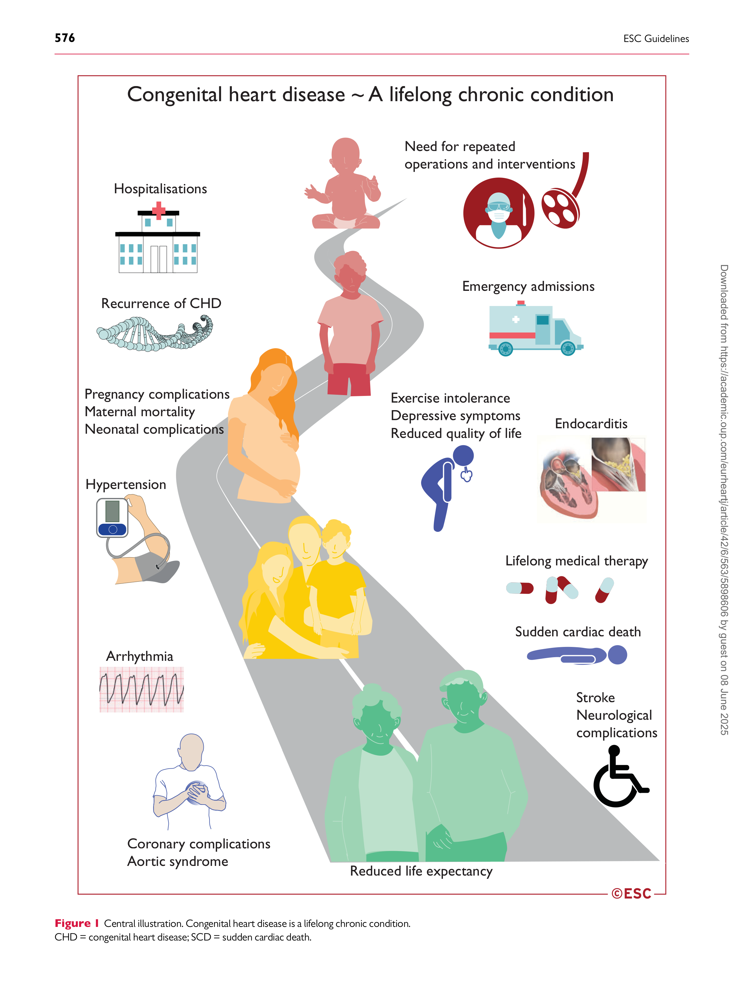
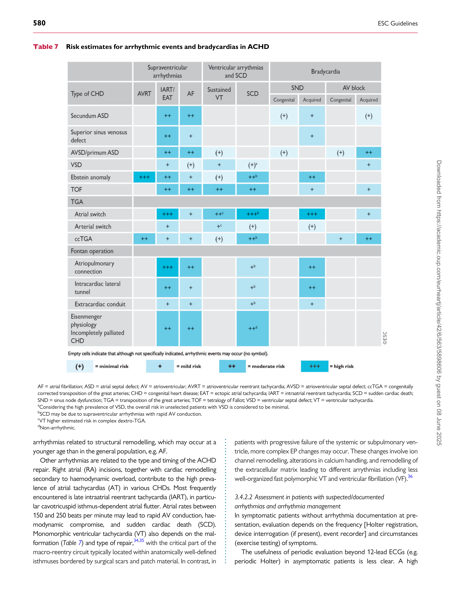

##### ESC GUIDELINES

European Heart Journal (2021) 42, 563�645

doi:10.1093/eurheartj/ehaa554
# 2020 ESC Guidelines for the management of adult congenital heart disease
### The Task Force for the management of adult congenital heart disease of the European Society of Cardiology (ESC)
##### Endorsed by: Association for European Paediatric and Congenital Cardiology (AEPC), International Society for Adult Congenital Heart Disease (ISACHD) Authors/Task Force Members: Helmut Baumgartner* (Chairperson) (Germany), Julie De Backer* (Chairperson) (Belgium), Sonya V. Babu-Narayan (United Kingdom), Werner Budts (Belgium), Massimo Chessa [1] (Italy), Gerhard-Paul Diller (Germany), Bernard Iung (France), Jolanda Kluin (Netherlands), Irene M. Lang (Austria), Folkert Meijboom (Netherlands), Philip Moons (Belgium), Barbara J. M. Mulder (Netherlands), Erwin Oechslin (Canada), Jolien W. Roos-Hesselink (Netherlands), Markus Schwerzmann (Switzerland), Lars Sondergaard (Denmark), Katja Zeppenfeld (Netherlands)

Document reviewers: Sabine Ernst (CPG Review Coordinator) (United Kingdom), Magalie Ladouceur
(CPG Review Coordinator) (France), Victor Aboyans (France), David Alexander (United Kingdom),
Ruxandra Christodorescu (Romania), Domenico Corrado (Italy), Michele D’Alto (Italy),

- Corresponding authors: Helmut Baumgartner, Department of Cardiology III: Adult Congenital and Valvular Heart Disease, University Hospital Muenster, Albert Schweitzer
[Campus 1, Building A1, D-48149, Muenster, Germany. Tel: þ49 251 83 46110, Fax: þ49 251 83 46109, E-mail: helmut.baumgartner@ukmuenster.de. Julie De Backer,](mailto:)
[Department of Cardiology, Ghent University Hospital, C. Heymanslaan 10, 9000 Ghent. Tel: þ32 9 332 56 27, E-mail: Julie.debacker@ugent.be.](mailto:)

ESC Committee for Practice Guidelines (CPG) and National Cardiac Societies document reviewers, and Author/Task Force Member Affiliations: listed in
the Appendix.

1 Representing the AEPC.

ESC entities having participated in the development of this document:

Associations: Association for Acute Cardiovascular Care (ACVC), Association of Cardiovascular Nursing & Allied Professions (ACNAP), European Association of
Cardiovascular Imaging (EACVI), European Association of Preventive Cardiology (EAPC), European Association of Percutaneous Cardiovascular Interventions (EAPCI), European
Heart Rhythm Association (EHRA), Heart Failure Association (HFA).

Councils: Council for Cardiology Practice, Council of Cardio-Oncology, Council on Valvular Heart Disease.

Working Groups: Adult Congenital Heart Disease, Aorta and Peripheral Vascular Diseases, Cardiovascular Pharmacotherapy, Cardiovascular Surgery, Development Anatomy
and Pathology, e-Cardiology, Pulmonary Circulation and Right Ventricular Function.

The content of these European Society of Cardiology (ESC) Guidelines has been published for personal and educational use only. No commercial use is authorized. No part of
the ESC Guidelines may be translated or reproduced in any form without written permission from the ESC. Permission can be obtained upon submission of a written request to
[Oxford University Press, the publisher of the European Heart Journal and the party authorized to handle such permissions on behalf of the ESC (journals.permissions@oup.com).](mailto:)

Disclaimer. The ESC Guidelines represent the views of the ESC and were produced after careful consideration of the scientific and medical knowledge, and the evidence available at the time of their publication. The ESC is not responsible in the event of any contradiction, discrepancy, and/or ambiguity between the ESC Guidelines and any other official recommendations or guidelines issued by the relevant public health authorities, in particular in relation to good use of healthcare or therapeutic strategies. Health
professionals are encouraged to take the ESC Guidelines fully into account when exercising their clinical judgment, as well as in the determination and the implementation of preventive, diagnostic, or therapeutic medical strategies; however, the ESC Guidelines do not override, in any way whatsoever, the individual responsibility of health professionals to
make appropriate and accurate decisions in consideration of each patient’s health condition and in consultation with that patient and, where appropriate and/or necessary, the
patient’s caregiver. Nor do the ESC Guidelines exempt health professionals from taking into full and careful consideration the relevant official updated recommendations or
guidelines issued by the competent public health authorities, in order to manage each patient’s case in light of the scientifically accepted data pursuant to their respective ethical
and professional obligations. It is also the health professional’s responsibility to verify the applicable rules and regulations relating to drugs and medical devices at the time of
prescription.

V C The European Society of Cardiology 2020. All rights reserved. For permissions please email: journals.permissions@oup.com.

564 ESC Guidelines

Natasja de Groot (Netherlands), Victoria Delgado (Netherlands), Giovanni Di Salvo (United Kingdom),
Laura Dos Subira (Spain), Andreas Eicken [1] (Germany), Donna Fitzsimons (United Kingdom), Alexandra A.
Frogoudaki (Greece), Michael Gatzoulis (United Kingdom), Stephane Heymans (Netherlands/Belgium),
Ju¨ rgen Ho¨ rer (Germany), Lucile Houyel (France), Guillaume Jondeau (France), Hugo A. Katus (Germany),
Ulf Landmesser (Germany), Basil S. Lewis (Israel), Alexander Lyon (United Kingdom), Christian E. Mueller
(Switzerland), Darren Mylotte (Ireland), Steffen E. Petersen (United Kingdom), Anna Sonia Petronio
(Italy), Marco Roffi (Switzerland), Raphael Rosenhek (Austria), Evgeny Shlyakhto (Russia), Iain A. Simpson
(United Kingdom), Miguel Sousa-Uva (Portugal), Christian Tobias Torp-Pedersen (Denmark), Rhian M.
Touyz (United Kingdom), Alexander Van De Bruaene (Belgium)

The disclosure forms of all experts involved in the development of these Guidelines are available on the
[ESC website www.escardio.org/guidelines](http://www.escardio.org/guidelines)

[Click here to access the corresponding chapter in Section 17- Congenital heart disease in children and](https://oxfordmedicine.com/view/10.1093/med/9780198784906.001.0001/med-9780198784906-part-24)

[adults](https://oxfordmedicine.com/view/10.1093/med/9780198784906.001.0001/med-9780198784906-part-24)

...................................................................................................................................................................................................

Keywords Guidelines - congenital heart disease - disease - adult - diagnosis - imaging - late complications - medical
treatment            - congenital cardiac surgery            - catheter intervention            - patient follow-up            - recommendations

#### Table of contents

1 Preamble . . . . . . . . . . . . . . . . . . . . . . . . . . . . . . . . . . . . . . . . . . . . . . . . . . . . . . . 568

2 Introduction . . . . . . . . . . . . . . . . . . . . . . . . . . . . . . . . . . . . . . . . . . . . . . . . . . . . 570

2.1 Why do we need new Guidelines on the management of

adult congenital heart disease? . . . . . . . . . . . . . . . . . . . . . . . . . . . . . . . . . . 570

2.2 Content of these Guidelines . . . . . . . . . . . . . . . . . . . . . . . . . . . . . . . . 570

2.3 New format of the Guidelines . . . . . . . . . . . . . . . . . . . . . . . . . . . . . . . 570

2.4 How to use these Guidelines . . . . . . . . . . . . . . . . . . . . . . . . . . . . . . . . 570

2.5 What is new in the 2020 Guidelines? . . . . . . . . . . . . . . . . . . . . . . . . 570

3 General aspects . . . . . . . . . . . . . . . . . . . . . . . . . . . . . . . . . . . . . . . . . . . . . . . . 570

3.1 Prevalence of adult congenital heart disease . . . . . . . . . . . . . . . . . 570

3.2 Organization of care . . . . . . . . . . . . . . . . . . . . . . . . . . . . . . . . . . . . . . . . 570

3.3 Diagnostic work-up . . . . . . . . . . . . . . . . . . . . . . . . . . . . . . . . . . . . . . . . 575

3.3.1 Echocardiography . . . . . . . . . . . . . . . . . . . . . . . . . . . . . . . . . . . . . . 577

3.3.2 Cardiovascular magnetic resonance imaging . . . . . . . . . . . . . 578

3.3.3 Cardiovascular computed tomography . . . . . . . . . . . . . . . . . . 578

3.3.4 Cardiopulmonary exercise testing . . . . . . . . . . . . . . . . . . . . . . 578

3.3.5 Cardiac catheterization . . . . . . . . . . . . . . . . . . . . . . . . . . . . . . . . . 578

3.3.6 Biomarkers . . . . . . . . . . . . . . . . . . . . . . . . . . . . . . . . . . . . . . . . . . . . 578

3.4 Therapeutic considerations . . . . . . . . . . . . . . . . . . . . . . . . . . . . . . . . . 579

3.4.1 Heart failure . . . . . . . . . . . . . . . . . . . . . . . . . . . . . . . . . . . . . . . . . . . 579

3.4.2 Arrhythmias and sudden cardiac death . . . . . . . . . . . . . . . . . . 579

3.4.2.1 Arrhythmia substrates . . . . . . . . . . . . . . . . . . . . . . . . . . . . . . . . 579

3.4.2.2 Assessment in patients with suspected/documented

arrythmias and arrythmia management . . . . . . . . . . . . . . . . . . . . . . . 580

3.4.2.3 Sinus node dysfunction, atrioventricular block and

infra-hisian conduction delay . . . . . . . . . . . . . . . . . . . . . . . . . . . . . . . . . 581

3.4.2.4 Sudden cardiac death and risk stratification . . . . . . . . . . . . . 581

3.4.3 Pulmonary hypertension . . . . . . . . . . . . . . . . . . . . . . . . . . . . . . . . 582

3.4.3.1 Introduction and classification . . . . . . . . . . . . . . . . . . . . . . . . . 582

3.4.3.2 Diagnosis . . . . . . . . . . . . . . . . . . . . . . . . . . . . . . . . . . . . . . . . . . . 583

3.4.3.2.1 The diagnostic work-up of pulmonary hypertension

in adult congenital heart disease . . . . . . . . . . . . . . . . . . . . . . . . . . . 583

3.4.3.2.2 Risk assessment . . . . . . . . . . . . . . . . . . . . . . . . . . . . . . . . . 583

3.4.3.3 Therapeutic management of pulmonary hypertension

in adult congential heart disease . . . . . . . . . . . . . . . . . . . . . . . . . . . . . . 583

3.4.3.3.1 Expert centres . . . . . . . . . . . . . . . . . . . . . . . . . . . . . . . . . . 583

3.4.3.3.2 General measures . . . . . . . . . . . . . . . . . . . . . . . . . . . . . . . 583

3.4.3.3.3 Anticoagulation . . . . . . . . . . . . . . . . . . . . . . . . . . . . . . . . . 583

3.4.3.3.4 Shunt repair . . . . . . . . . . . . . . . . . . . . . . . . . . . . . . . . . . . . 584

3.4.3.3.5 Pulmonary arterial hypertension-directed medical

therapy . . . . . . . . . . . . . . . . . . . . . . . . . . . . . . . . . . . . . . . . . . . . . . . . . 584

3.4.4 Surgical treatment . . . . . . . . . . . . . . . . . . . . . . . . . . . . . . . . . . . . . . 584

3.4.5 Catheter intervention . . . . . . . . . . . . . . . . . . . . . . . . . . . . . . . . . . 585

3.4.6 Infective endocarditis . . . . . . . . . . . . . . . . . . . . . . . . . . . . . . . . . . . 585

3.4.7 Antithrombotic treatment . . . . . . . . . . . . . . . . . . . . . . . . . . . . . . 585

3.4.8 Management of cyanotic patients . . . . . . . . . . . . . . . . . . . . . . . . 585

3.4.8.1 Adoptive mechanisms . . . . . . . . . . . . . . . . . . . . . . . . . . . . . . . . 586

3.4.8.2 Multisystem disorder . . . . . . . . . . . . . . . . . . . . . . . . . . . . . . . . . 586

3.4.8.3 Clinical presentation and natural history . . . . . . . . . . . . . . . . 586

3.4.8.4 Late complications . . . . . . . . . . . . . . . . . . . . . . . . . . . . . . . . . . . 586

3.4.8.5 Diagnostic aspects . . . . . . . . . . . . . . . . . . . . . . . . . . . . . . . . . . . 586

3.4.8.6 Laboratory precautions . . . . . . . . . . . . . . . . . . . . . . . . . . . . . . . 587

3.4.8.7 Indications for intervention . . . . . . . . . . . . . . . . . . . . . . . . . . . . 587

3.4.8.8 Medical therapy . . . . . . . . . . . . . . . . . . . . . . . . . . . . . . . . . . . . . 587

3.4.8.9 Follow-up recommendations . . . . . . . . . . . . . . . . . . . . . . . . . . 587

3.4.8.10 Additional considerations . . . . . . . . . . . . . . . . . . . . . . . . . . . . 588

3.5 Additional considerations . . . . . . . . . . . . . . . . . . . . . . . . . . . . . . . . . . . 588

3.5.1 Sex differences . . . . . . . . . . . . . . . . . . . . . . . . . . . . . . . . . . . . . . . . . 588

3.5.2 Adult congenital heart disease at more advanced age . . . . . 588

3.5.3 Advance care planning and end-of-life care . . . . . . . . . . . . . . 588

3.5.4 Insurance and employment . . . . . . . . . . . . . . . . . . . . . . . . . . . . . 588

3.5.5 Exercise and sports . . . . . . . . . . . . . . . . . . . . . . . . . . . . . . . . . . . . . 589

3.5.6 Non-cardiac surgery . . . . . . . . . . . . . . . . . . . . . . . . . . . . . . . . . . . 589

3.5.7 Pregnancy, contraception, and genetic counselling . . . . . . . 589

3.5.7.1 Pregnancy and contraception . . . . . . . . . . . . . . . . . . . . . . . . . 589

3.5.7.2 Genetic counselling and recurrence risk . . . . . . . . . . . . . . . . . 590

ESC Guidelines 565

4 Specific lesions . . . . . . . . . . . . . . . . . . . . . . . . . . . . . . . . . . . . . . . . . . . . . . . . . 591

4.1 Atrial septal defect and anomalous pulmonary venous

connection . . . . . . . . . . . . . . . . . . . . . . . . . . . . . . . . . . . . . . . . . . . . . . . . . . . . 591

4.1.1 Introduction and background . . . . . . . . . . . . . . . . . . . . . . . . . . . 591

4.1.2 Clinical presentation and natural history . . . . . . . . . . . . . . . . . 591

4.1.3 Diagnostic work-up . . . . . . . . . . . . . . . . . . . . . . . . . . . . . . . . . . . . 591

4.1.4 Surgical/catheter interventional treatment . . . . . . . . . . . . . . . 591

4.1.5 Specific aspects of isolated anomalous pulmonary

venous connections . . . . . . . . . . . . . . . . . . . . . . . . . . . . . . . . . . . . . . . . . 592

4.1.6 Follow-up recommendations . . . . . . . . . . . . . . . . . . . . . . . . . . . 593

4.1.7 Additional considerations . . . . . . . . . . . . . . . . . . . . . . . . . . . . . . . 594

4.2 Ventricular septal defect . . . . . . . . . . . . . . . . . . . . . . . . . . . . . . . . . . . . 594

4.2.1 Introduction and background . . . . . . . . . . . . . . . . . . . . . . . . . . . 594

4.2.2 Clinical presentation and natural history . . . . . . . . . . . . . . . . . 594

4.2.3 Diagnostic work-up . . . . . . . . . . . . . . . . . . . . . . . . . . . . . . . . . . . . 594

4.2.4 Surgical/catheter interventional treatment . . . . . . . . . . . . . . . 595

4.2.5 Follow-up recommendations . . . . . . . . . . . . . . . . . . . . . . . . . . . 595

4.2.6 Additional considerations . . . . . . . . . . . . . . . . . . . . . . . . . . . . . . . 595

4.3 Atrioventricular septal defect . . . . . . . . . . . . . . . . . . . . . . . . . . . . . . . 595

4.3.1 Introduction and background . . . . . . . . . . . . . . . . . . . . . . . . . . . 595

4.3.2 Clinical presentation and natural history . . . . . . . . . . . . . . . . . 596

4.3.3 Diagnostic work-up . . . . . . . . . . . . . . . . . . . . . . . . . . . . . . . . . . . . 596

4.3.4 Surgical/catheter interventional treatment . . . . . . . . . . . . . . . 596

4.3.5 Follow-up recommendations . . . . . . . . . . . . . . . . . . . . . . . . . . . 597

4.3.6 Additional considerations . . . . . . . . . . . . . . . . . . . . . . . . . . . . . . . 597

4.4 Patent ductus arteriosus . . . . . . . . . . . . . . . . . . . . . . . . . . . . . . . . . . . .597

4.4.1 Introduction and background . . . . . . . . . . . . . . . . . . . . . . . . . . . 597

4.4.2 Clinical presentation and natural history . . . . . . . . . . . . . . . . . 597

4.4.3 Diagnostic work-up . . . . . . . . . . . . . . . . . . . . . . . . . . . . . . . . . . . . 598

4.4.4 Surgical/catheter interventional treatment . . . . . . . . . . . . . . . 598

4.4.5 Follow-up recommendations . . . . . . . . . . . . . . . . . . . . . . . . . . . 598

4.4.6 Additional considerations . . . . . . . . . . . . . . . . . . . . . . . . . . . . . . . 598

4.5 Left ventricular outflow tract obstruction . . . . . . . . . . . . . . . . . . . . 598

4.5.1 Valvular aortic stenosis . . . . . . . . . . . . . . . . . . . . . . . . . . . . . . . . . 598

4.5.1.1 Introduction and background . . . . . . . . . . . . . . . . . . . . . . . . . . 598

4.5.1.2 Clinical presentation and natural history . . . . . . . . . . . . . . . . 598

4.5.1.3 Diagnostic work-up . . . . . . . . . . . . . . . . . . . . . . . . . . . . . . . . . . 598

4.5.1.4 Medical therapy . . . . . . . . . . . . . . . . . . . . . . . . . . . . . . . . . . . . . 600

4.5.1.5 Surgical/catheter interventional treatment . . . . . . . . . . . . . . 600

4.5.1.6 Follow-up recommendations . . . . . . . . . . . . . . . . . . . . . . . . . . 600

4.5.1.7 Additional considerations . . . . . . . . . . . . . . . . . . . . . . . . . . . . . 600

4.5.2 Supravalvular aortic stenosis . . . . . . . . . . . . . . . . . . . . . . . . . . . . 601

4.5.2.1 Introduction and background . . . . . . . . . . . . . . . . . . . . . . . . . . 601

4.5.2.2 Clinical presentation and natural history . . . . . . . . . . . . . . . . 601

4.5.2.3 Diagnostic work-up . . . . . . . . . . . . . . . . . . . . . . . . . . . . . . . . . . 601

4.5.2.4 Surgical/catheter interventional treatment . . . . . . . . . . . . . . 602

4.5.2.5 Follow-up recommendations . . . . . . . . . . . . . . . . . . . . . . . . . . 602

4.5.2.6 Additional considerations . . . . . . . . . . . . . . . . . . . . . . . . . . . . . 602

4.5.3 Subaortic stenosis . . . . . . . . . . . . . . . . . . . . . . . . . . . . . . . . . . . . . . . . 602

4.5.3.1 Introduction and background . . . . . . . . . . . . . . . . . . . . . . . . . . 602

4.5.3.2 Clinical presentation and natural history . . . . . . . . . . . . . . . . 602

4.5.3.3 Diagnostic work-up . . . . . . . . . . . . . . . . . . . . . . . . . . . . . . . . . . 602

4.5.3.4 Surgical/catheter interventional treatment . . . . . . . . . . . . . . 602

4.5.3.5 Follow-up recommendations . . . . . . . . . . . . . . . . . . . . . . . . . . 602

4.5.3.6 Additional considerations . . . . . . . . . . . . . . . . . . . . . . . . . . . . . 603

4.6 Coarctation of the aorta . . . . . . . . . . . . . . . . . . . . . . . . . . . . . . . . . . . . 603

4.6.2 Clinical presentation and natural history . . . . . . . . . . . . . . . . . 603

4.6.3 Diagnostic work-up . . . . . . . . . . . . . . . . . . . . . . . . . . . . . . . . . . . . 603

4.6.4 Surgical/catheter interventional treatment . . . . . . . . . . . . . . . 604

4.6.5 Follow-up recommendations . . . . . . . . . . . . . . . . . . . . . . . . . . . 604

4.6.6 Additional considerations . . . . . . . . . . . . . . . . . . . . . . . . . . . . . . . 605

4.7 Aortopathies . . . . . . . . . . . . . . . . . . . . . . . . . . . . . . . . . . . . . . . . . . . . . . . 605

4.7.1 Marfan syndrome and related heritable thoracic aortic

diseases . . . . . . . . . . . . . . . . . . . . . . . . . . . . . . . . . . . . . . . . . . . . . . . . . . . . . 605

4.7.1.1 Introduction and background . . . . . . . . . . . . . . . . . . . . . . . . . . 605

4.7.1.2 Clinical presentation and natural history . . . . . . . . . . . . . . . . 606

4.7.1.3 Diagnostic work-up . . . . . . . . . . . . . . . . . . . . . . . . . . . . . . . . . . 606

4.7.1.4 Medical therapy . . . . . . . . . . . . . . . . . . . . . . . . . . . . . . . . . . . . . 606

4.7.1.5 Surgical treatment . . . . . . . . . . . . . . . . . . . . . . . . . . . . . . . . . . . 606

4.7.1.6 Follow-up recommendations . . . . . . . . . . . . . . . . . . . . . . . . . . 607

4.7.1.7 Additional considerations . . . . . . . . . . . . . . . . . . . . . . . . . . . . . 607

4.7.2 Bicuspid aortic disease . . . . . . . . . . . . . . . . . . . . . . . . . . . . . . . . . . 607

4.7.3 Turner syndrome . . . . . . . . . . . . . . . . . . . . . . . . . . . . . . . . . . . . . . 607

4.8 Right ventricular outflow tract obstruction . . . . . . . . . . . . . . . . . . 608

4.8.1 Introduction and background . . . . . . . . . . . . . . . . . . . . . . . . . . . 608

4.8.2 Clinical presentation and natural history . . . . . . . . . . . . . . . . . 608

4.8.3 Diagnostic work-up . . . . . . . . . . . . . . . . . . . . . . . . . . . . . . . . . . . . 609

4.8.4 Surgical/catheter interventional treatment . . . . . . . . . . . . . . . 609

4.8.5 Follow-up recommendations . . . . . . . . . . . . . . . . . . . . . . . . . . . 609

4.8.6 Additional considerations . . . . . . . . . . . . . . . . . . . . . . . . . . . . . . . 609

4.9 Ebstein anomaly . . . . . . . . . . . . . . . . . . . . . . . . . . . . . . . . . . . . . . . . . . . . 610

4.9.1 Introduction and background . . . . . . . . . . . . . . . . . . . . . . . . . . . 610

4.9.2 Clinical presentation and natural history . . . . . . . . . . . . . . . . . 610

4.9.3 Diagnostic work-up . . . . . . . . . . . . . . . . . . . . . . . . . . . . . . . . . . . . 611

4.9.4 Surgical/catheter interventional treatment . . . . . . . . . . . . . . . 611

4.9.5 Follow-up recommendations . . . . . . . . . . . . . . . . . . . . . . . . . . . 611

4.9.6 Additional considerations . . . . . . . . . . . . . . . . . . . . . . . . . . . . . . . 611

4.10 Tetralogy of Fallot . . . . . . . . . . . . . . . . . . . . . . . . . . . . . . . . . . . . . . . . . 612

4.10.1 Introduction and background . . . . . . . . . . . . . . . . . . . . . . . . . . 612

4.10.2 Clinical presentation and natural history . . . . . . . . . . . . . . . . 612

4.10.3 Diagnostic work-up of repaired patients . . . . . . . . . . . . . . . 612

4.10.4 Late surgical/catheter interventional treatment . . . . . . . . . 613

4.10.5 Indications for electrophysiological testing and

implantable cardioverter defibrillator . . . . . . . . . . . . . . . . . . . . . . . . . 614

4.10.6 Follow-up recommendations . . . . . . . . . . . . . . . . . . . . . . . . . . 615

4.10.7 Additional considerations . . . . . . . . . . . . . . . . . . . . . . . . . . . . . 615

4.11 Pulmonary atresia with ventricular septal defect . . . . . . . . . . . . 615

4.11.1 Introduction and background . . . . . . . . . . . . . . . . . . . . . . . . . . 615

4.11.2 Clinical presentation and natural history . . . . . . . . . . . . . . . . 615

4.11.3 Diagnostic work-up . . . . . . . . . . . . . . . . . . . . . . . . . . . . . . . . . . . 615

4.11.4 Surgical/catheter interventional treatment . . . . . . . . . . . . . 616

4.11.5 Follow-up recommendations . . . . . . . . . . . . . . . . . . . . . . . . . . 616

4.11.6 Additional considerations . . . . . . . . . . . . . . . . . . . . . . . . . . . . . 616

4.12 Transposition of the great arteries . . . . . . . . . . . . . . . . . . . . . . . . . 616

4.12.1 Introduction and background . . . . . . . . . . . . . . . . . . . . . . . . . . 616

4.12.2 Atrial switch operation . . . . . . . . . . . . . . . . . . . . . . . . . . . . . . . . 616

4.12.2.1 Clinical presentation after atrial switch . . . . . . . . . . . . . . . . 616

4.12.2.2 Diagnostic work-up . . . . . . . . . . . . . . . . . . . . . . . . . . . . . . . . . 618

4.12.2.3 Medical treatment . . . . . . . . . . . . . . . . . . . . . . . . . . . . . . . . . 618

4.12.2.4 Surgical/catheter interventional treatment . . . . . . . . . . . . . 618

4.12.3 Arterial switch operation . . . . . . . . . . . . . . . . . . . . . . . . . . . . . . 619

4.12.3.1 Clinical presentation after arterial switch . . . . . . . . . . . . . . 619

4.12.3.2 Diagnostic work-up . . . . . . . . . . . . . . . . . . . . . . . . . . . . . . . . . 619

4.1 Atrial septal defect and anomalous pulmonary venous

connection . . . . . . . . . . . . . . . . . . . . . . . . . . . . . . . . . . . . . . . . . . . . . . . . . . . . 591

4.1.1 Introduction and background . . . . . . . . . . . . . . . . . . . . . . . . . . . 591

4.1.2 Clinical presentation and natural history . . . . . . . . . . . . . . . . . 591

4.1.3 Diagnostic work-up . . . . . . . . . . . . . . . . . . . . . . . . . . . . . . . . . . . . 591

4.1.4 Surgical/catheter interventional treatment . . . . . . . . . . . . . . . 591

4.1.5 Specific aspects of isolated anomalous pulmonary

venous connections . . . . . . . . . . . . . . . . . . . . . . . . . . . . . . . . . . . . . . . . . 592

4.1.6 Follow-up recommendations . . . . . . . . . . . . . . . . . . . . . . . . . . . 593

4.1.7 Additional considerations . . . . . . . . . . . . . . . . . . . . . . . . . . . . . . . 594

4.2 Ventricular septal defect . . . . . . . . . . . . . . . . . . . . . . . . . . . . . . . . . . . . 594

4.2.1 Introduction and background . . . . . . . . . . . . . . . . . . . . . . . . . . . 594

4.2.2 Clinical presentation and natural history . . . . . . . . . . . . . . . . . 594

4.2.3 Diagnostic work-up . . . . . . . . . . . . . . . . . . . . . . . . . . . . . . . . . . . . 594

4.2.4 Surgical/catheter interventional treatment . . . . . . . . . . . . . . . 595

4.2.5 Follow-up recommendations . . . . . . . . . . . . . . . . . . . . . . . . . . . 595

4.2.6 Additional considerations . . . . . . . . . . . . . . . . . . . . . . . . . . . . . . . 595

4.3 Atrioventricular septal defect . . . . . . . . . . . . . . . . . . . . . . . . . . . . . . . 595

4.3.1 Introduction and background . . . . . . . . . . . . . . . . . . . . . . . . . . . 595

4.3.2 Clinical presentation and natural history . . . . . . . . . . . . . . . . . 596

4.3.3 Diagnostic work-up . . . . . . . . . . . . . . . . . . . . . . . . . . . . . . . . . . . . 596

4.3.4 Surgical/catheter interventional treatment . . . . . . . . . . . . . . . 596

4.3.5 Follow-up recommendations . . . . . . . . . . . . . . . . . . . . . . . . . . . 597

4.3.6 Additional considerations . . . . . . . . . . . . . . . . . . . . . . . . . . . . . . . 597

4.4 Patent ductus arteriosus . . . . . . . . . . . . . . . . . . . . . . . . . . . . . . . . . . . .597

4.4.1 Introduction and background . . . . . . . . . . . . . . . . . . . . . . . . . . . 597

4.4.2 Clinical presentation and natural history . . . . . . . . . . . . . . . . . 597

4.4.3 Diagnostic work-up . . . . . . . . . . . . . . . . . . . . . . . . . . . . . . . . . . . . 598

4.4.4 Surgical/catheter interventional treatment . . . . . . . . . . . . . . . 598

4.4.5 Follow-up recommendations . . . . . . . . . . . . . . . . . . . . . . . . . . . 598

4.4.6 Additional considerations . . . . . . . . . . . . . . . . . . . . . . . . . . . . . . . 598

4.5 Left ventricular outflow tract obstruction . . . . . . . . . . . . . . . . . . . . 598

4.5.1 Valvular aortic stenosis . . . . . . . . . . . . . . . . . . . . . . . . . . . . . . . . . 598

4.5.1.1 Introduction and background . . . . . . . . . . . . . . . . . . . . . . . . . . 598

4.5.1.2 Clinical presentation and natural history . . . . . . . . . . . . . . . . 598

4.5.1.3 Diagnostic work-up . . . . . . . . . . . . . . . . . . . . . . . . . . . . . . . . . . 598

4.5.1.4 Medical therapy . . . . . . . . . . . . . . . . . . . . . . . . . . . . . . . . . . . . . 600

4.5.1.5 Surgical/catheter interventional treatment . . . . . . . . . . . . . . 600

4.5.1.6 Follow-up recommendations . . . . . . . . . . . . . . . . . . . . . . . . . . 600

4.5.1.7 Additional considerations . . . . . . . . . . . . . . . . . . . . . . . . . . . . . 600

4.5.2 Supravalvular aortic stenosis . . . . . . . . . . . . . . . . . . . . . . . . . . . . 601

4.5.2.1 Introduction and background . . . . . . . . . . . . . . . . . . . . . . . . . . 601

4.5.2.2 Clinical presentation and natural history . . . . . . . . . . . . . . . . 601

4.5.2.3 Diagnostic work-up . . . . . . . . . . . . . . . . . . . . . . . . . . . . . . . . . . 601

4.5.2.4 Surgical/catheter interventional treatment . . . . . . . . . . . . . . 602

4.5.2.5 Follow-up recommendations . . . . . . . . . . . . . . . . . . . . . . . . . . 602

4.5.2.6 Additional considerations . . . . . . . . . . . . . . . . . . . . . . . . . . . . . 602

4.5.3 Subaortic stenosis . . . . . . . . . . . . . . . . . . . . . . . . . . . . . . . . . . . . . . . . 602

4.5.3.1 Introduction and background . . . . . . . . . . . . . . . . . . . . . . . . . . 602

4.5.3.2 Clinical presentation and natural history . . . . . . . . . . . . . . . . 602

4.5.3.3 Diagnostic work-up . . . . . . . . . . . . . . . . . . . . . . . . . . . . . . . . . . 602

4.5.3.4 Surgical/catheter interventional treatment . . . . . . . . . . . . . . 602

4.5.3.5 Follow-up recommendations . . . . . . . . . . . . . . . . . . . . . . . . . . 602

4.5.3.6 Additional considerations . . . . . . . . . . . . . . . . . . . . . . . . . . . . . 603

4.6 Coarctation of the aorta . . . . . . . . . . . . . . . . . . . . . . . . . . . . . . . . . . . . 603

4.6.1 Introduction and background . . . . . . . . . . . . . . . . . . . . . . . . . . . 603

566 ESC Guidelines

4.12.3.3 Surgical/catheter interventional treatment . . . . . . . . . . . . . 620

4.12.4 Rastelli-type operation . . . . . . . . . . . . . . . . . . . . . . . . . . . . . . . . 620

4.12.4.1 Clinical presentation after Rastelli-type repair . . . . . . . . . . 620

4.12.4.2 Diagnostic work-up . . . . . . . . . . . . . . . . . . . . . . . . . . . . . . . . . 620

4.12.4.3 Surgical/catheter interventional treatment . . . . . . . . . . . . . 620

4.12.5 Follow-up recommendations (irrespective of

type of repair) . . . . . . . . . . . . . . . . . . . . . . . . . . . . . . . . . . . . . . . . . . . . . . . 620

4.12.6 Additional considerations (irrespective of

type of repair) . . . . . . . . . . . . . . . . . . . . . . . . . . . . . . . . . . . . . . . . . . . . . . . 620

4.13 Congenitally corrected transposition of the great arteries . . . 620

4.13.1 Introduction and background . . . . . . . . . . . . . . . . . . . . . . . . . . 620

4.13.2 Clinical presentation and natural history . . . . . . . . . . . . . . . . 621

4.13.3 Diagnostic work-up . . . . . . . . . . . . . . . . . . . . . . . . . . . . . . . . . . . 621

4.13.4 Medical treatment . . . . . . . . . . . . . . . . . . . . . . . . . . . . . . . . . . . . 621

4.13.5 Surgical/catheter interventional treatment . . . . . . . . . . . . . 621

4.13.6 Follow-up recommendations . . . . . . . . . . . . . . . . . . . . . . . . . . 622

4.13.7 Additional considerations . . . . . . . . . . . . . . . . . . . . . . . . . . . . . 622

4.14 Right ventricular to pulmonary artery conduit . . . . . . . . . . . . . . 622

4.14.1 Introduction and background . . . . . . . . . . . . . . . . . . . . . . . . . . 622

4.14.2 Diagnostic work-up . . . . . . . . . . . . . . . . . . . . . . . . . . . . . . . . . . . 622

4.14.3 Surgical/catheter interventional treatment . . . . . . . . . . . . . 622

4.14.4 Follow-up recommendations . . . . . . . . . . . . . . . . . . . . . . . . . . 623

4.14.5 Additional considerations . . . . . . . . . . . . . . . . . . . . . . . . . . . . . 623

4.15 Univentricular heart . . . . . . . . . . . . . . . . . . . . . . . . . . . . . . . . . . . . . . . 623

4.15.1 Introduction and background . . . . . . . . . . . . . . . . . . . . . . . . . . 623

4.15.2 Clinical presentation and natural history . . . . . . . . . . . . . . . . 623

4.15.3 Diagnostic work-up . . . . . . . . . . . . . . . . . . . . . . . . . . . . . . . . . . . 624

4.15.4 Conservative management . . . . . . . . . . . . . . . . . . . . . . . . . . . . 625

4.15.5 Follow-up recommendations . . . . . . . . . . . . . . . . . . . . . . . . . . 625

4.15.6 Additional considerations . . . . . . . . . . . . . . . . . . . . . . . . . . . . . 625

4.16 Patients after Fontan operation . . . . . . . . . . . . . . . . . . . . . . . . . . . . 625

4.16.1 Introduction and background . . . . . . . . . . . . . . . . . . . . . . . . . . 625

4.16.2 Clinical presentation and natural history . . . . . . . . . . . . . . . . 625

4.16.3 Diagnostic work-up . . . . . . . . . . . . . . . . . . . . . . . . . . . . . . . . . . . 626

4.16.4 Medical treatment . . . . . . . . . . . . . . . . . . . . . . . . . . . . . . . . . . . . 626

4.16.5 Surgical/interventional treatment . . . . . . . . . . . . . . . . . . . . . . 626

4.16.6 Follow-up recommendations . . . . . . . . . . . . . . . . . . . . . . . . . . 627

4.16.7 Additional considerations . . . . . . . . . . . . . . . . . . . . . . . . . . . . . 627

4.17 Coronary anomalies . . . . . . . . . . . . . . . . . . . . . . . . . . . . . . . . . . . . . . . 627

4.17.1 Introduction and background . . . . . . . . . . . . . . . . . . . . . . . . . . 627

4.17.1.1 Anomalous coronary artery from the

pulmonary artery . . . . . . . . . . . . . . . . . . . . . . . . . . . . . . . . . . . . . . . . . . . 627

4.17.1.2 Anomalous aortic origin of a coronary artery . . . . . . . . . . . 627

4.17.1.3 Coronary artery fistulae . . . . . . . . . . . . . . . . . . . . . . . . . . . . . 628

4.17.2 Diagnostic evaluation . . . . . . . . . . . . . . . . . . . . . . . . . . . . . . . . . 628

4.17.3 Surgical treatment . . . . . . . . . . . . . . . . . . . . . . . . . . . . . . . . . . . . 628

5 Quality indicators . . . . . . . . . . . . . . . . . . . . . . . . . . . . . . . . . . . . . . . . . . . . . . . 628

6 Gaps in evidence . . . . . . . . . . . . . . . . . . . . . . . . . . . . . . . . . . . . . . . . . . . . . . . 629

6.1 General aspects . . . . . . . . . . . . . . . . . . . . . . . . . . . . . . . . . . . . . . . . . . . . 629

6.1.1 Organization of care and patient evaluation . . . . . . . . . . . . . . 629

6.1.2 Heart failure . . . . . . . . . . . . . . . . . . . . . . . . . . . . . . . . . . . . . . . . . . . 629

6.1.3 Arrhythmia . . . . . . . . . . . . . . . . . . . . . . . . . . . . . . . . . . . . . . . . . . . . 629

6.1.4 Pulmonary arterial hypertension . . . . . . . . . . . . . . . . . . . . . . . . 629

6.1.5 Cyanotic patients . . . . . . . . . . . . . . . . . . . . . . . . . . . . . . . . . . . . . . 629

6.2 Specific lesions . . . . . . . . . . . . . . . . . . . . . . . . . . . . . . . . . . . . . . . . . . . . . 629

6.2.1 Shunt lesions . . . . . . . . . . . . . . . . . . . . . . . . . . . . . . . . . . . . . . . . . . . 629

6.2.2 Left ventricular outflow tract obstruction and

coarctation . . . . . . . . . . . . . . . . . . . . . . . . . . . . . . . . . . . . . . . . . . . . . . . . . . 629

6.2.3 Aortopathies . . . . . . . . . . . . . . . . . . . . . . . . . . . . . . . . . . . . . . . . . . . 629

6.2.4 Right ventricular outflow tract obstruction . . . . . . . . . . . . . . 629

6.2.5 Ebstein anomaly . . . . . . . . . . . . . . . . . . . . . . . . . . . . . . . . . . . . . . . . 630

6.2.6 Tetralogy of Fallot . . . . . . . . . . . . . . . . . . . . . . . . . . . . . . . . . . . . . . 630

6.2.7 Transposition of the great arteries . . . . . . . . . . . . . . . . . . . . . . 630

6.2.8 Congenitally corrected transposition of the great

arteries . . . . . . . . . . . . . . . . . . . . . . . . . . . . . . . . . . . . . . . . . . . . . . . . . . . . . 630

6.2.9 Univentricular heart and Fontan operation . . . . . . . . . . . . . . 630

6.2.10 Coronary anomalies . . . . . . . . . . . . . . . . . . . . . . . . . . . . . . . . . . 630

7 Key messages . . . . . . . . . . . . . . . . . . . . . . . . . . . . . . . . . . . . . . . . . . . . . . . . . . . 630

7.1 General aspects . . . . . . . . . . . . . . . . . . . . . . . . . . . . . . . . . . . . . . . . . . . . 630

7.1.1 Organization of care and patient evaluation . . . . . . . . . . . . . . 630

7.1.2 Heart failure . . . . . . . . . . . . . . . . . . . . . . . . . . . . . . . . . . . . . . . . . . . 630

7.1.3 Arrhythmia . . . . . . . . . . . . . . . . . . . . . . . . . . . . . . . . . . . . . . . . . . . . 630

7.1.4 Pulmonary arterial hypertension . . . . . . . . . . . . . . . . . . . . . . . . 630

7.1.5 Cyanotic patients . . . . . . . . . . . . . . . . . . . . . . . . . . . . . . . . . . . . . . 631

7.2 Specific lesions . . . . . . . . . . . . . . . . . . . . . . . . . . . . . . . . . . . . . . . . . . . . . 631

7.2.1 Shunt lesions . . . . . . . . . . . . . . . . . . . . . . . . . . . . . . . . . . . . . . . . . . . 631

7.2.2 Left ventricular outflow tract obstruction . . . . . . . . . . . . . . . 631

7.2.3 Aortic coarctation . . . . . . . . . . . . . . . . . . . . . . . . . . . . . . . . . . . . . . 631

7.2.4 Aortopathies . . . . . . . . . . . . . . . . . . . . . . . . . . . . . . . . . . . . . . . . . . . 631

7.2.5 Right ventricular outflow tract obstruction . . . . . . . . . . . . . . 631

7.2.6 Ebstein anomaly . . . . . . . . . . . . . . . . . . . . . . . . . . . . . . . . . . . . . . . . 631

7.2.7 Tetralogy of Fallot . . . . . . . . . . . . . . . . . . . . . . . . . . . . . . . . . . . . . . 631

7.2.8 Transposition of the great arteries . . . . . . . . . . . . . . . . . . . . . . 631

7.2.9 Congenitally corrected transposition of the

great arteries . . . . . . . . . . . . . . . . . . . . . . . . . . . . . . . . . . . . . . . . . . . . . . . . 631

7.2.10 Univentricular heart and Fontan operation . . . . . . . . . . . . . 632

7.2.11 Coronary anomalies . . . . . . . . . . . . . . . . . . . . . . . . . . . . . . . . . . 632

8 ‘What to do’ and ‘what not to do’ messages . . . . . . . . . . . . . . . . . . . . . . 632

9 Appendix . . . . . . . . . . . . . . . . . . . . . . . . . . . . . . . . . . . . . . . . . . . . . . . . . . . . . . 635

10 References . . . . . . . . . . . . . . . . . . . . . . . . . . . . . . . . . . . . . . . . . . . . . . . . . . . . 636

Tables of Recommendations

Recommendations for treatment of arrhythmias in adult

congenital heart disease . . . . . . . . . . . . . . . . . . . . . . . . . . . . . . . . . . . . . . . . . . 581

Recommendations for treatment of pulmonary arterial

hypertension associated with congenital heart disease . . . . . . . . . . . . . . 584

Recommendations for intervention in atrial septal defect

(native and residual) . . . . . . . . . . . . . . . . . . . . . . . . . . . . . . . . . . . . . . . . . . . . . . 592

Recommendations for intervention in ventricular septal

defect (native and residual) . . . . . . . . . . . . . . . . . . . . . . . . . . . . . . . . . . . . . . . 595

Recommendations for intervention in atrioventricular

septal defect . . . . . . . . . . . . . . . . . . . . . . . . . . . . . . . . . . . . . . . . . . . . . . . . . . . . . 597

Recommendations for intervention in patent ductus

arteriosus . . . . . . . . . . . . . . . . . . . . . . . . . . . . . . . . . . . . . . . . . . . . . . . . . . . . . . . . 598

Recommendations for intervention in valvular aortic stenosis . . . . . . . 600

Recommendations for intervention in supravalvular aortic

stenosis . . . . . . . . . . . . . . . . . . . . . . . . . . . . . . . . . . . . . . . . . . . . . . . . . . . . . . . . . . 602

Recommendations for intervention in subaortic stenosis . . . . . . . . . . . 603

Recommendations for intervention in coarctation and

re-coarctation of the aorta . . . . . . . . . . . . . . . . . . . . . . . . . . . . . . . . . . . . . . . . 604

Recommendations for aortic surgery in aortopathies . . . . . . . . . . . . . . . 608

4.13.1 Introduction and background . . . . . . . . . . . . . . . . . . . . . . . . . . 620

4.13.2 Clinical presentation and natural history . . . . . . . . . . . . . . . . 621

4.13.3 Diagnostic work-up . . . . . . . . . . . . . . . . . . . . . . . . . . . . . . . . . . . 621

4.13.4 Medical treatment . . . . . . . . . . . . . . . . . . . . . . . . . . . . . . . . . . . . 621

4.13.5 Surgical/catheter interventional treatment . . . . . . . . . . . . . 621

4.13.6 Follow-up recommendations . . . . . . . . . . . . . . . . . . . . . . . . . . 622

4.13.7 Additional considerations . . . . . . . . . . . . . . . . . . . . . . . . . . . . . 622

4.14 Right ventricular to pulmonary artery conduit . . . . . . . . . . . . . . 622

4.14.1 Introduction and background . . . . . . . . . . . . . . . . . . . . . . . . . . 622

4.14.2 Diagnostic work-up . . . . . . . . . . . . . . . . . . . . . . . . . . . . . . . . . . . 622

4.14.3 Surgical/catheter interventional treatment . . . . . . . . . . . . . 622

4.14.4 Follow-up recommendations . . . . . . . . . . . . . . . . . . . . . . . . . . 623

4.14.5 Additional considerations . . . . . . . . . . . . . . . . . . . . . . . . . . . . . 623

4.15 Univentricular heart . . . . . . . . . . . . . . . . . . . . . . . . . . . . . . . . . . . . . . . 623

4.15.1 Introduction and background . . . . . . . . . . . . . . . . . . . . . . . . . . 623

4.15.2 Clinical presentation and natural history . . . . . . . . . . . . . . . . 623

4.15.3 Diagnostic work-up . . . . . . . . . . . . . . . . . . . . . . . . . . . . . . . . . . . 624

4.15.4 Conservative management . . . . . . . . . . . . . . . . . . . . . . . . . . . . 625

4.15.5 Follow-up recommendations . . . . . . . . . . . . . . . . . . . . . . . . . . 625

4.15.6 Additional considerations . . . . . . . . . . . . . . . . . . . . . . . . . . . . . 625

4.16 Patients after Fontan operation . . . . . . . . . . . . . . . . . . . . . . . . . . . . 625

4.16.1 Introduction and background . . . . . . . . . . . . . . . . . . . . . . . . . . 625

4.16.2 Clinical presentation and natural history . . . . . . . . . . . . . . . . 625

4.16.3 Diagnostic work-up . . . . . . . . . . . . . . . . . . . . . . . . . . . . . . . . . . . 626

4.16.4 Medical treatment . . . . . . . . . . . . . . . . . . . . . . . . . . . . . . . . . . . . 626

4.16.5 Surgical/interventional treatment . . . . . . . . . . . . . . . . . . . . . . 626

4.16.6 Follow-up recommendations . . . . . . . . . . . . . . . . . . . . . . . . . . 627

4.16.7 Additional considerations . . . . . . . . . . . . . . . . . . . . . . . . . . . . . 627

4.17 Coronary anomalies . . . . . . . . . . . . . . . . . . . . . . . . . . . . . . . . . . . . . . . 627

4.17.1 Introduction and background . . . . . . . . . . . . . . . . . . . . . . . . . . 627

4.17.1.1 Anomalous coronary artery from the

pulmonary artery . . . . . . . . . . . . . . . . . . . . . . . . . . . . . . . . . . . . . . . . . . . 627

4.17.1.2 Anomalous aortic origin of a coronary artery . . . . . . . . . . . 627

4.17.1.3 Coronary artery fistulae . . . . . . . . . . . . . . . . . . . . . . . . . . . . . 628

4.17.2 Diagnostic evaluation . . . . . . . . . . . . . . . . . . . . . . . . . . . . . . . . . 628

4.17.3 Surgical treatment . . . . . . . . . . . . . . . . . . . . . . . . . . . . . . . . . . . . 628

5 Quality indicators . . . . . . . . . . . . . . . . . . . . . . . . . . . . . . . . . . . . . . . . . . . . . . . 628

6 Gaps in evidence . . . . . . . . . . . . . . . . . . . . . . . . . . . . . . . . . . . . . . . . . . . . . . . 629

6.1 General aspects . . . . . . . . . . . . . . . . . . . . . . . . . . . . . . . . . . . . . . . . . . . . 629

6.1.1 Organization of care and patient evaluation . . . . . . . . . . . . . . 629

6.1.2 Heart failure . . . . . . . . . . . . . . . . . . . . . . . . . . . . . . . . . . . . . . . . . . . 629

6.1.3 Arrhythmia . . . . . . . . . . . . . . . . . . . . . . . . . . . . . . . . . . . . . . . . . . . . 629

6.1.4 Pulmonary arterial hypertension . . . . . . . . . . . . . . . . . . . . . . . . 629

6.1.5 Cyanotic patients . . . . . . . . . . . . . . . . . . . . . . . . . . . . . . . . . . . . . . 629

6.2 Specific lesions . . . . . . . . . . . . . . . . . . . . . . . . . . . . . . . . . . . . . . . . . . . . . 629

6.2.1 Shunt lesions . . . . . . . . . . . . . . . . . . . . . . . . . . . . . . . . . . . . . . . . . . . 629

ESC Guidelines 567

Recommendations for intervention in right ventricular

outflow tract obstruction . . . . . . . . . . . . . . . . . . . . . . . . . . . . . . . . . . . . . . . . . 609

Recommendations for intervention in Ebstein anomaly . . . . . . . . . . . . . 611

Recommendations for intervention after repair of tetralogy

of Fallot . . . . . . . . . . . . . . . . . . . . . . . . . . . . . . . . . . . . . . . . . . . . . . . . . . . . . . . . . . 614

Recommendations for intervention in transposition of the

great arteries after atrial switch operation . . . . . . . . . . . . . . . . . . . . . . . . . 619

Recommendations for intervention in transposition of the

great arteries after arterial switch operation . . . . . . . . . . . . . . . . . . . . . . . 620

Recommendations for intervention in congenitally corrected

transposition of the great arteries . . . . . . . . . . . . . . . . . . . . . . . . . . . . . . . . . 621

Recommendations for intervention in right ventricular to

pulmonary artery conduits . . . . . . . . . . . . . . . . . . . . . . . . . . . . . . . . . . . . . . . . 622

Special considerations and Recommendations for intervention

in univentricular heart . . . . . . . . . . . . . . . . . . . . . . . . . . . . . . . . . . . . . . . . . . . . 624

Special considerations and Recommendations for intervention

after Fontan operation . . . . . . . . . . . . . . . . . . . . . . . . . . . . . . . . . . . . . . . . . . . . 627

Recommendations for the management of patients with

anomalous coronary arteries . . . . . . . . . . . . . . . . . . . . . . . . . . . . . . . . . . . . . . 628

List of tables

Table 1 Classes of recommendations . . . . . . . . . . . . . . . . . . . . . . . . . . . . . . 569

Table 2 Levels of evidence . . . . . . . . . . . . . . . . . . . . . . . . . . . . . . . . . . . . . . . . 569

Table 3 Selected revised recommendations, new

recommendations, and new concepts . . . . . . . . . . . . . . . . . . . . . . . . . . . . . 571

Table 4 Classification of congenital heart disease

complexity . . . . . . . . . . . . . . . . . . . . . . . . . . . . . . . . . . . . . . . . . . . . . . . . . . . . . . . 575

Table 5 Staff requirements for specialist ACHD centres . . . . . . . . . . . . 577

Table 6 Indications for cardiovascular magnetic resonance

imaging in ACHD patients . . . . . . . . . . . . . . . . . . . . . . . . . . . . . . . . . . . . . . . . 577

Table 7 Risk estimates for arrhythmic events and

bradycardias in ACHD . . . . . . . . . . . . . . . . . . . . . . . . . . . . . . . . . . . . . . . . . . . . 580

Table 8 Definitions of pulmonary hypertension subtypes and

their occurrence in ACHD . . . . . . . . . . . . . . . . . . . . . . . . . . . . . . . . . . . . . . . 583

Table 9 Risk reduction strategies in patients with cyanotic

congenital heart disease . . . . . . . . . . . . . . . . . . . . . . . . . . . . . . . . . . . . . . . . . . 587

Table 10 Congenital heart disease with high risk and

extremely high risk for pregnancy . . . . . . . . . . . . . . . . . . . . . . . . . . . . . . . . . 590

Table 11 Recurrence rates for various congenital heart

lesions according to the sex of the affected parent . . . . . . . . . . . . . . . . . 590

Table 12 Diagnostic criteria for degree of aortic stenosis

severity . . . . . . . . . . . . . . . . . . . . . . . . . . . . . . . . . . . . . . . . . . . . . . . . . . . . . . . . . . 599

List of figures

Figure 1 Central illustration. Congenital heart disease is a

lifelong chronic condition . . . . . . . . . . . . . . . . . . . . . . . . . . . . . . . . . . . . . . . . . 576

Figure 2 Management of atrial septal defect . . . . . . . . . . . . . . . . . . . . . . . . 593

Figure 3 Management of ventricular septal defect . . . . . . . . . . . . . . . . . . 596

Figure 4 Management of patent ductus arteriosus . . . . . . . . . . . . . . . . . . 599

Figure 5 Management of left ventricular outflow tract

obstruction . . . . . . . . . . . . . . . . . . . . . . . . . . . . . . . . . . . . . . . . . . . . . . . . . . . . . . 601

Figure 6 Management of coarctation and re-coarctation

Figure 7 Management of right ventricular outflow tract

obstruction . . . . . . . . . . . . . . . . . . . . . . . . . . . . . . . . . . . . . . . . . . . . . . . . . . . . . . 610

Figure 8 Management of repaired tetralogy of Fallot:

long-term complications to address during follow-up . . . . . . . . . . . . . . 613

Figure 9 Management of transposition of the great arteries:

long-term complications to address during follow-up . . . . . . . . . . . . . . 617
#### Abbreviations and acronyms

3D Three-dimensional

6MWT 6-minute walk test

AAOCA Anomalous aortic origin of a coronary artery
AAOLCA Anomalous aortic origin of the left coronary artery
ACAPA Anomalous coronary artery from the pulmonary

artery
ACE Angiotensin-converting enzyme
ACHD Adult congenital heart disease
AF Atrial fibrillation
ALCAPA Anomalous left coronary artery from the
pulmonary artery
AR Aortic regurgitation
ARB Angiotensin II receptor blocker
ARCAPA Anomalous right coronary artery from the
pulmonary artery

AS Aortic stenosis

ASD Atrial septal defect

ASI Aortic size index

AT Atrial tachycardia

AV Atrioventricular

AVA Aortic valve area

AVAi Indexed aortic valve area

AVNRT Atrioventricular node reentrant tachycardia
AVRT Atrioventricular reentrant tachycardia
AVSD Atrioventricular septal defect
BAV Bicuspid aortic valve
BNP B-type natriuretic peptide
BSA Body surface area
CAD Coronary artery disease
CABG Coronary artery bypass graft
CCT Cardiovascular computed tomography
ccTGA Congenitally corrected transposition of the great

arteries

CHD Congenital heart disease
CMR Cardiovascular magnetic resonance

CoA Coarctation of the aorta

CONCOR CONgenital CORvitia
CPET Cardiopulmonary exercise testing
CRT Cardiac resynchronization therapy
DCRV Double-chambered right ventricle
EACVI European Association of Cardiovascular Imaging
EAT Ectopic atrial tachycardia
ECG Electrocardiogram
EF Ejection fraction
EP Electrophysiology/electrophysiological
ERA Endothelin receptor antagonist
ESC European Society of Cardiology

List of tables

Table 1 Classes of recommendations . . . . . . . . . . . . . . . . . . . . . . . . . . . . . . 569

Table 2 Levels of evidence . . . . . . . . . . . . . . . . . . . . . . . . . . . . . . . . . . . . . . . . 569

Table 3 Selected revised recommendations, new

recommendations, and new concepts . . . . . . . . . . . . . . . . . . . . . . . . . . . . . 571

Table 4 Classification of congenital heart disease

complexity . . . . . . . . . . . . . . . . . . . . . . . . . . . . . . . . . . . . . . . . . . . . . . . . . . . . . . . 575

Table 5 Staff requirements for specialist ACHD centres . . . . . . . . . . . . 577

Table 6 Indications for cardiovascular magnetic resonance

imaging in ACHD patients . . . . . . . . . . . . . . . . . . . . . . . . . . . . . . . . . . . . . . . . 577

Table 7 Risk estimates for arrhythmic events and

bradycardias in ACHD . . . . . . . . . . . . . . . . . . . . . . . . . . . . . . . . . . . . . . . . . . . . 580

Table 8 Definitions of pulmonary hypertension subtypes and

their occurrence in ACHD . . . . . . . . . . . . . . . . . . . . . . . . . . . . . . . . . . . . . . . 583

Table 9 Risk reduction strategies in patients with cyanotic

congenital heart disease . . . . . . . . . . . . . . . . . . . . . . . . . . . . . . . . . . . . . . . . . . 587

Table 10 Congenital heart disease with high risk and

extremely high risk for pregnancy . . . . . . . . . . . . . . . . . . . . . . . . . . . . . . . . . 590

Table 11 Recurrence rates for various congenital heart

lesions according to the sex of the affected parent . . . . . . . . . . . . . . . . . 590

Table 12 Diagnostic criteria for degree of aortic stenosis

severity . . . . . . . . . . . . . . . . . . . . . . . . . . . . . . . . . . . . . . . . . . . . . . . . . . . . . . . . . . 599

List of figures

Figure 1 Central illustration. Congenital heart disease is a

lifelong chronic condition . . . . . . . . . . . . . . . . . . . . . . . . . . . . . . . . . . . . . . . . . 576

Figure 2 Management of atrial septal defect . . . . . . . . . . . . . . . . . . . . . . . . 593

Figure 3 Management of ventricular septal defect . . . . . . . . . . . . . . . . . . 596

Figure 4 Management of patent ductus arteriosus . . . . . . . . . . . . . . . . . . 599

Figure 5 Management of left ventricular outflow tract

obstruction . . . . . . . . . . . . . . . . . . . . . . . . . . . . . . . . . . . . . . . . . . . . . . . . . . . . . . 601

Figure 6 Management of coarctation and re-coarctation

of the aorta . . . . . . . . . . . . . . . . . . . . . . . . . . . . . . . . . . . . . . . . . . . . . . . . . . . . . . 605

568 ESC Guidelines

HLHS Hypoplastic left heart syndrome

HTAD Heritable thoracic aortic disease

IART Intraatrial reentrant tachycardia
ICD Implantable cardioverter defibrillator

IE Infective endocarditis

INR International normalized ratio

IVC Inferior vena cava

LA Left atrium/atrial

L�R Left-to-right

LV Left ventricle/ventricular

LVEF Left ventricular ejection fraction
LVESD Left ventricular end systolic diameter
LVH Left ventricular hypertrophy
LVOT Left ventricular outflow tract
LVOTO Left ventricular outflow tract obstruction
MAPCAs Major aortic pulmonary collaterals
MCV Mean corpuscular volume
mWHO Modified World Health Organization
NOAC Non-vitamin K antagonist oral anticoagulant
NT-pro-BNP N-terminal-pro-B-type natriuretic peptide

NYHA New York Heart Association

PA Pulmonary artery
PAH Pulmonary arterial hypertension
PAH-CHD Pulmonary arterial hypertension associated with
congenital heart disease
PAP Pulmonary artery pressure

PDA Patent ductus arteriosus

PDE-5 Phosphodiesterase type 5
PES Programmed electrical stimulation

PFO Patent foramen ovale

PH Pulmonary hypertension

PM Pacemaker

PR Pulmonary regurgitation
PS Pulmonary stenosis
PVD Pulmonary vascular disease
PVR Pulmonary vascular resistance
PVRep Pulmonary valve replacement
QIs Quality indicators
Qp:Qs Pulmonary to systemic flow ratio
RA Right atrium/atrial
R�L Right-to-left
rTOF Repaired tetralogy of Fallot
RV Right ventricle/ventricular
RVEDVi Right ventricular end diastolic volume indexed
RVEF Right ventricular ejection fraction
RVESVi Right ventricular end systolic volume indexed
RVH Right ventricular hypertrophy
RVOT Right ventricular outflow tract
RVOTO Right ventricular outflow tract obstruction
RVSP Right ventricular systolic pressure

SCD Sudden cardiac death

SND Sinus node dysfunction

SubAS Subaortic stenosis

SupraAS Supravalvular aortic stenosis
SVC Superior vena cava

TGA Transposition of the great arteries
TOE Transoesophageal echocardiography
TOF Tetralogy of Fallot
TPVI Transcatheter pulmonary valve implantation
TR Tricuspid regurgitation
TTE Transthoracic echocardiography
TV Tricuspid valve

UVH Univentricular heart

VE/VCO2 Ventilation to carbon dioxide output
VF Ventricular fibrillation
VKA Vitamin K antagonist
Vmax Maximum Doppler velocity
VSD Ventricular septal defect
VT Ventricular tachycardia
WHO World Health Organization

WU Wood units
#### 1 Preamble

Guidelines summarize and evaluate available evidence with the aim of

assisting health professionals in proposing the best management
strategies for an individual patient with a given condition. Guidelines
and their recommendations should facilitate decision making of
health professionals in their daily practice. However, the final decisions concerning an individual patient must be made by the responsible health professional(s) in consultation with the patient and

caregiver as appropriate.
A great number of guidelines have been issued in recent years by
the European Society of Cardiology (ESC), as well as by other societies and organizations. Because of their impact on clinical practice,
quality criteria for the development of guidelines have been established in order to make all decisions transparent to the user. The recommendations for formulating and issuing ESC Guidelines can be
[found on the ESC website (https://www.escardio.org/Guidelines/](https://www.escardio.org/Guidelines/Clinical-Practice-Guidelines/Guidelines-development/Writing-ESC-Guidelines)
[Clinical-Practice-Guidelines/Guidelines-development/Writing-ESC-](https://www.escardio.org/Guidelines/Clinical-Practice-Guidelines/Guidelines-development/Writing-ESC-Guidelines)
[Guidelines). The ESC Guidelines represent the official position of the](https://www.escardio.org/Guidelines/Clinical-Practice-Guidelines/Guidelines-development/Writing-ESC-Guidelines)
ESC on a given topic and are regularly updated.

In addition to the publication of Clinical Practice Guidelines, the
ESC carries out the EurObservational Research Programme of international registries of cardiovascular diseases and interventions which
are essential to assess, diagnostic/therapeutic processes, use of
resources and adherence to Guidelines. These registries aim at providing a better understanding of medical practice in Europe and
around the world, based on high-quality data collected during routine
clinical practice.
Furthermore, the ESC has developed and embedded in this document a set of quality indicators (QIs), which are tools to evaluate the
level of implementation of the Guidelines and may be used by the
ESC, hospitals, healthcare providers and professionals to measure
clinical practice as well as used in educational programmes, alongside
the key messages from the guidelines, to improve quality of care and

clinical outcomes.

The Members of this Task Force were selected by the ESC, including representation from its relevant ESC sub-specialty groups, in
order to represent professionals involved with the medical care of

ESC Guidelines 569

Table 1 Classes of recommendations

Wording to use

Table 2 Levels of evidence

patients with this pathology. Selected experts in the field undertook a
comprehensive review of the published evidence for management of
a given condition according to ESC Committee for Practice
Guidelines (CPG) policy. A critical evaluation of diagnostic and therapeutic procedures was performed, including assessment of the
risk�benefit ratio. The level of evidence and the strength of the recommendation of particular management options were weighed and
graded according to predefined scales, as outlined below.
The experts of the writing and reviewing panels provided declaration of interest forms for all relationships that might be perceived as
real or potential sources of conflicts of interest. Their declarations of

[rules and can be found on the ESC website (http://www.escardio.org/](http://www.escardio.org/guidelines)
[guidelines). This process ensures transparency and prevents potential](http://www.escardio.org/guidelines)
biases in the development and review processes. Any changes in declarations of interest that arise during the writing period were notified
to the ESC and updated. The Task Force received its entire financial
support from the ESC without any involvement from the healthcare
industry.

The ESC CPG supervises and coordinates the preparation of new
Guidelines. The Committee is also responsible for the endorsement
process of these Guidelines. The ESC Guidelines undergo extensive
review by the CPG and external experts. After appropriate revisions
the Guidelines are approved by all the experts involved in the Task

570 ESC Guidelines

Force. The finalized document is approved by the CPG for publication in the European Heart Journal. The Guidelines were developed
after careful consideration of the scientific and medical knowledge
and the evidence available at the time of their dating.
The task of developing ESC Guidelines also includes the creation
of educational tools and implementation programmes for the recommendations including condensed pocket guideline versions, summary
slides, booklets with essential messages, summary cards for nonspecialists and an electronic version for digital applications (smartphones, etc.). These versions are abridged and thus, for more
detailed information, the user should always access to the full text
version of the Guidelines, which is freely available via the ESC website
and hosted on the EHJ website. The National Cardiac Societies of the
ESC are encouraged to endorse, adopt, translate and implement all
ESC Guidelines. Implementation programmes are needed because it
has been shown that the outcome of disease may be favourably influenced by the thorough application of clinical recommendations.
Health professionals are encouraged to take the ESC Guidelines
fully into account when exercising their clinical judgment, as well as in
the determination and the implementation of preventive, diagnostic
or therapeutic medical strategies. However, the ESC Guidelines do
not override in any way whatsoever the individual responsibility of
health professionals to make appropriate and accurate decisions in
consideration of each patient’s health condition and in consultation
with that patient or the patient’s caregiver where appropriate and/or
necessary. It is also the health professional’s responsibility to verify
the rules and regulations applicable in each country to drugs and devices at the time of prescription.
#### 2 Introduction

2.1 Why do we need new Guidelines on
the management of adult congenital
heart disease?

Since the previous version of the Guidelines on the management of
grown-up congenital heart disease (CHD) was published in 2010,
new evidence has accumulated for this patient group, particularly on
percutaneous interventional techniques and risk stratification with
regard to timing of surgery and catheter intervention, as well as medi
cal treatment. This made a revision of the recommendations

necessary.
Since adult patients with CHD now present in increasing numbers
at advanced ages, including the elderly, the term grown-up CHD no
longer appears appropriate and was therefore replaced with adult
CHD (ACHD) throughout the document. This is also in accordance

with international literature.

2.2 Content of these Guidelines

Decision making in ACHD involves accurate diagnosis, timing of
intervention, risk assessment, and selection of the most suitable type
of intervention. In addition, specific aspects of medical treatment for
conditions such as heart failure, pulmonary hypertension (PH), and
anticoagulation are addressed.
These guidelines focus on ACHD, are oriented towards manage

disease, and aortic disease, refer to the relevant separate guideline
documents published by the European Society of Cardiology (ESC).

2.3 New format of the Guidelines

The new Guidelines have been adapted to facilitate their use in clinical practice and to meet the readers’ demands by focusing on condensed, clearly presented recommendations. At the end of the
document, section 5 proposes topics for future research and section 6
summarizes the key messages. For more background information
please refer to the ESC Textbook of Cardiovascular Medicine. [1]

2.4 How to use these Guidelines

The Committee emphasizes that many factors ultimately determine
the most appropriate treatment in individual patients within a given
community. These factors include availability of diagnostic equipment, the expertise of cardiologists and surgeons, especially in the
field of congenital heart surgery and percutaneous intervention, and
notably, the wishes of well-informed patients. Furthermore, owing to

the lack of evidence-based data in the field of ACHD, most recom
mendations are largely the result of expert consensus based on retrospective and prospective observational studies and registries.
Therefore, deviations from these Guidelines may be appropriate in

certain clinical circumstances.

2.5 What is new in the 2020 Guidelines?

Selected revised recommendations, new recommendations, and new

concepts are summarized in Table 3.
#### 3 General aspects

3.1 Prevalence of adult congenital heart
disease

To date, the prevalence of CHD worldwide is �9 per 1000 newborns, with substantial geographic variation. [2][,][3] While the prevalence
of severe congenital heart defects is declining in many Western/
developed countries due to foetal screening and pregnancy termination, overall prevalence on a global scale is increasing. [4] Due to medical, surgical, and technological evolutions over the past decades,

>90% of individuals with CHD who are born, now survive into adulthood. [5] As a result, the prevalence of CHD in the community has
increased and now by far exceeds the number of children with
CHD. [6] CHD can be classified as mild, moderate, or severe (see
Table 4).

3.2 Organization of care
When patients with CHD are approaching adulthood, they require
transfer to ACHD care. This transfer should be preceded by a preparatory transition phase, which continues into adulthood according
to the needs of the patient. Special healthcare organization and training programmes are required to meet the needs of this patient population. [7] Importantly, the care for ACHD patients is a lifelong process
(Figure 1) and also requires advance care planning strategies. The ESC
Working Group on Grown-up Congenital Heart Disease published a
position paper on recommendations for organization of care and
training in the subspecialty of ACHD in Europe. [8] The position paper
refers to the previous ESC Guidelines [9] and stratified patient care into

#### 2 Introduction

2.1 Why do we need new Guidelines on
the management of adult congenital
heart disease?

Since the previous version of the Guidelines on the management of
grown-up congenital heart disease (CHD) was published in 2010,
new evidence has accumulated for this patient group, particularly on
percutaneous interventional techniques and risk stratification with
regard to timing of surgery and catheter intervention, as well as medi
cal treatment. This made a revision of the recommendations

necessary.
Since adult patients with CHD now present in increasing numbers
at advanced ages, including the elderly, the term grown-up CHD no
longer appears appropriate and was therefore replaced with adult
CHD (ACHD) throughout the document. This is also in accordance

with international literature.

2.2 Content of these Guidelines

Decision making in ACHD involves accurate diagnosis, timing of
intervention, risk assessment, and selection of the most suitable type
of intervention. In addition, specific aspects of medical treatment for
conditions such as heart failure, pulmonary hypertension (PH), and
anticoagulation are addressed.
These guidelines focus on ACHD, are oriented towards management, and for more details in the topics of endocarditis, isolated valve

ESC Guidelines 571

Table 3 Selected revised recommendations (R), new recommendations (N), and new concepts

|R|Emphasize the importance of sequential PAH therapy strategy in Eisenmenger syndrome and use of 6MWT for the decision to initiate therapy.|In Eisenmenger patients with reduced exercise capacity (6MWT distance <450 m), a treatment strategy with initial endothelin receptor antagonist monotherapy should be con- sidered followed by combination therapy if patients fail to improve.|
|---|---|---|
|Shunt lesions|Shunt lesions|Shunt lesions|

|N|Take older age into account in the decision for surgical ASD closure.|In elderly patients not suitable for device closure, it is recom- mended to weigh the surgical risk against the potential benefit of ASD closure.|
|---|---|---|
|R|Transcatheter VSD closure has become an alternative to sur- gery in selected patients, particularly in residual VSD.|Transcatheter VSD closure has become an alternative, partic- ularly in residual VSDs, VSDs poorly accessible by surgery, and in muscular VSDs centrally located in the interventricular septum.|
|R|Specify the requirement for a congenital cardiac surgeon for partial AVSD closure.|Surgical closure is recommended in patients with significant RV volume overload and should only be performed by a con- genital cardiac surgeon.|
|R|Specify the presence of atrial fibrillation or PH as require- ments for valve repair in AVSD.|In asymptomatic patients with severe left-sided AV valve regurgitation, preserved LV function (LVESD <45 mm and/or LVEF >60%), high likelihood of successful valve repair, and low surgical risk, intervention should be considered when atrial fibrillation or systolic PAP >50 mmHg is present.|
|R|Specify the option of fenestrated ASD closure.|In patients with PVR >_5 WU, fenestrated ASD closure may be considered when PVR falls below 5 WU after targeted PAH treatment and significant LR shunt is present (Qp:Qs >1.5).|
|R|Include desaturation on exercise as a contraindication for ASD, VSD, AVSD, and PDA closure.|Shunt closure is not recommended in patients with severe PAH (PVR >_5 WU) presenting with desaturation on exercise.|

Continued

572 ESC Guidelines

|Left ventricular outflow tract obstruction and aortopathies|Col2|Col3|
|---|---|---|
|R|Increase the recommendation class from IIa to I in low-flow, low-gradient AS for intervention.|Intervention is indicated in patients with severe low-flow, low- gradient (mean gradient <40 mmHg) AS with reduced EF and evidence of flow (contractile) reserve excluding pseudosevere AS.|
|R|Lower mean Doppler gradient threshold for LVOTO inter- vention from 50 to 40 mmHg.|In symptomatic patients with valvular, subvalvular, or supra- valvular AS and mean Doppler gradient >_40 mmHg surgery is recommended.|
|R|Include BNP levels and increased PAP in the indication for intervention in valvular AS.|Intervention should be considered in asymptomatic patients with normal EF and no exercise test abnormalities (see Section 4.5.1) if the surgical risk is low and one of the following findings is present:  Markedly elevated BNP levels (>3-fold age- and sex-cor- rected normal range) confirmed by repeated measurements without other explanation.  Severe PH (systolic PAP at rest >60 mmHg confirmed by invasive measurement) without other explanation.|
|R|Confirm pressure gradients by invasive measurement and pre- fer stenting in coarctation and re-coarctation when technically feasible.|Repair of coarctation or re-coarctation (surgically or catheter based) is indicated in hypertensive patients with an increased non-invasive gradient between upper and lower limbs con- firmed by invasive measurement (peak-to-peak >_20 mmHg), with preference for catheter treatment (stenting) when tech- nically feasible.|

|Right ventricular outflow tract obstruction / tetralogy of Fallot /Ebstein|Col2|Col3|
|---|---|---|
|R|Adjust recommendations for surgical intervention in RVOTO according to symptoms.|If surgical valve replacement is the only option, it is indicated in patients with severe stenosis who are symptomatic.|
|R|Adjust recommendations for surgical intervention in RVOTO according to symptoms.|If surgical valve replacement is the only option in patients with severe stenosis who are asymptomatic, it is indicated in the presence of one or more of the following:  Objective decrease in exercise capacity  Decreasing RV function and/or progressive TR to at least moderate  RVSP >80 mmHg  RL shunting via an ASD or VSD.|
|R|Include preference for catheter intervention for pulmonary valve implantation in TOF.|In patients with no native outflow tract, catheter intervention (TPVI) should be preferred if anatomically feasible.|
|R|Specify RV dilatation in the setting of pulmonary valve replace- ment for TOF and for RVOT conduits.|Pulmonary valve replacement should be considered in asymp- tomatic patients with severe PR and/or RVOTO, in the pres- ence of progressive RV dilation to RVESVi >_80 mL/m2, and/or RVEDVi >_160 mL/m2, and/or progression of TR to at least moderate.|

Continued

ESC Guidelines 573

|R|In case of ASDs in Ebstein anomaly, add caution about RA pressure rise or fall in cardiac output.|In the case of documented systemic embolism probably caused by paradoxical embolism, isolated device closure of ASD/PFO should be considered but requires careful evalua- tion before intervention to exclude induction of RA pressure increase or fall in cardiac output.|
|---|---|---|
|R|In case of ASDs in Ebstein anomaly, add caution about RA pressure rise or fall in cardiac output.|If cyanosis (oxygen saturation at rest <90%) is the leading problem, isolated device closure of ASD/PFO may be consid- ered but requires careful evaluation before intervention to exclude induction of RA pressure increase or fall in cardiac output.|
|Transposition of the great arteries|Transposition of the great arteries|Transposition of the great arteries|
|R|Downgrade level of recommendation for AV valve repair in TGA/atrial switch from I to IIa in symptomatic patients.|In patients with severe systemic (tricuspid) AV valve regurgita- tion without significant ventricular systolic dysfunction (EF >40%), valve repair or replacement should be considered regardless of symptoms.|
|R|In patients with TGA/atrial switch requiring PM/ICD implanta- tion: pay attention to the presence of baffle leaks.|In patients with a baffle leak who require a PM/ICD, closure of the baffle leak should be considered, when technically feasible, prior to insertion of transvenous leads.|

N In ccTGA, biventricular pacing should be considered in case of complete AV block or >40% ventricular pacing requirement.

|R|Revise indications for TV replacement in ccTGA, according to symptoms and systemic ventricular function. (Upgrade level of recommendation for symptomatic ccTGA patients from IIa to I).|In symptomatic patients with severe TR and preserved or mildly impaired systemic RV systolic function (EF >40%), TV replacement is indicated.|
|---|---|---|
|R|Revise indications for TV replacement in ccTGA, according to symptoms and systemic ventricular function. (Upgrade level of recommendation for symptomatic ccTGA patients from IIa to I).|In asymptomatic patients with severe TR and progressive sys- temic RV dilatation and/or mildly impaired systemic RV sys- tolic function (EF >40%), TV replacement should be considered.|
|R|Revise indications for TV replacement in ccTGA, according to symptoms and systemic ventricular function. (Upgrade level of recommendation for symptomatic ccTGA patients from IIa to I).|In symptomatic patients with severe TR and more than mildly reduced systemic RV systolic function (EF <_40%), TV replace- ment may be considered.|
|R|Anatomic repair (atrial þ arterial switch) for ccTGA removed from the recommendations.||
|Univentricular heart|Univentricular heart|Univentricular heart|

Continued

574 ESC Guidelines

6MWT = 6-minute walk test; AAOCA = anomalous aortic origin of a coronary artery; AAOLCA = anomalous aortic origin of the left coronary artery; ACAPA = anomalous
coronary artery from the pulmonary artery; ACHD = adult congenital heart disease; AF = atrial fibrillation; ALCAPA = anomalous left coronary artery from the pulmonary
artery; ARCAPA = anomalous right coronary artery from the pulmonary artery; AS = aortic stenosis; ASD = atrial septal defect; AV = atrioventricular; AVSD = atrioventricular
septal defect; BNP = B-type natriuretic peptide; ccTGA = congenitally corrected transposition of the great arteries; CHD = congenital heart disease; CMR = cardiovascular
magnetic resonance; EF = ejection fraction; HTAD = heritable thoracic aortic disease; IART = intraatrial reentrant tachycardia; ICD = implantable cardioverter defibrillator;
L�R = left-to-right; LV = left ventricle/ventricular; LVEF = left ventricular ejection fraction; LVESD = left ventricular end systolic diameter; LVOT = left ventricular outflow
tract; LVOTO = left ventricular outflow tract obstruction; N = new recommendation; PAH = pulmonary arterial hypertension; PAH-CHD = pulmonary arterial hypertension
associated with congenital heart disease; PAP = pulmonary artery pressure; PDA = patent ductus arteriosus; PFO = patent foramen ovale; PH = pulmonary hypertension; PR =
pulmonary regurgitation; PVR = pulmonary vascular resistance; Qp:Qs = pulmonary to systemic flow ratio; R = revised recommendation; RA = right atrium/atrial; R�L = rightto-left; RV = right ventricle/ventricular; RVEDVi = right ventricular end diastolic volume indexed; RVESVi = right ventricular end systolic volume indexed; RVOT = right ventricular outflow tract; RVOTO = right ventricular outflow tract obstruction; RVSP = right ventricular systolic pressure; SVT = supraventricular tachycardia; TGA = transposition of
the great arteries; TGFBR = transforming growth factor beta receptor; TOF = tetralogy of Fallot; TPVI = transcatheter pulmonary valve implantation; TR = tricuspid regurgitation; TV = tricuspid valve; UVH = univentricular heart; VSD = ventricular septal defect; VT = ventricular tachycardia; WU = Wood units.

three levels: (i) patients who require care exclusively in a specialist
centre, (ii) patients for whom shared care can be established with the
appropriate general adult cardiac services, and (iii) patients who can be
managed in non-specialist clinics (with access to specialized care if
required). The proposed staff requirements for specialist centres are
described in Table 5. The complexity of the heart defect should not be
the only criterion to assign patients to a certain level of care. Although
patients with complex defects can easily be assigned to a high level of
care, even anatomically simple defects may require specialist care
under certain circumstances [e.g. atrial septal defect (ASD) with pulmonary arterial hypertension (PAH)]. Therefore, it is recommended
that all ACHD patients are seen once in a specialist centre, allowing
ACHD specialists to determine the most appropriate level of care and
follow-up intervals for each individual patient. [8] Networks of specialist
centres with general adult care should be established for each catchment area. Indeed, with the growing population of adults with CHD,
more patients will first present to general cardiologists for acute conditions, such as arrhythmia, heart failure, or endocarditis. In such cases,

unstable patients but ought to liaise with the patient’s ACHD centre
immediately to discuss appropriate management strategies or transfer
of the patient. Special attention is necessary for patients after Fontan
correction presenting with arrhythmia, as even supraventricular
arrhythmias are not well tolerated. Detailed advice on emergency care
for ACHD patients will follow in a separate future position paper.

Transfer of adolescents to ACHD care is vital as they approach
adulthood without gaps in care, and should be preceded by a preparatory transition phase with additional transition support that continues into early adulthood according to the needs of the patient. [10]

Transition requires a special healthcare organization. [10][,][11] It is recommended that specialist ACHD centres have teams including specialist
nurses, psychologists, and social workers given that anxiety, depression, or problems coping with the medical condition are well known
concerns in adult patients with CHD. [12] They also play a critical role
in the transition process by taking over the transitional care of
patients after the transfer from paediatric cardiology. Aspects that
have to be addressed by allied health professionals include mental
health, psychic well-being, and quality of life. [12][,][13] During the ACHD

ESC Guidelines 575

Table 4 Classification of congenital heart disease complexity

MILD:

 - [Isolated congenital aortic valve disease and bicuspid aortic disease]

 - [Isolated congenital mitral valve disease (except parachute valve, cleft leaflet)]

 - [Mild isolated pulmonary stenosis (infundibular, valvular, supravalvular)]

 - [Isolated small ASD, VSD, or PDA]

 - [Repaired secundum ASD, sinus venosus defect, VSD, or PDA without residuae or sequellae, such as chamber enlargement, ventricular dysfunction,]

or elevated PAP.

MODERATE: (Repaired or unrepaired where not specified; alphabetical order)

 - [Anomalous pulmonary venous connection (partial or total)]

 - [Anomalous coronary artery arising from the PA]

 - [Anomalous coronary artery arising from the opposite sinus]

 - [Aortic stenosis - subvalvular or supravalvular]

 - [AVSD, partial or complete, including primum ASD (excluding pulmonary vascular disease)]

 - [ASD secundum, moderate or large unrepaired (excluding pulmonary vascular disease)]

 - [Coarctation of the aorta]

 - [Double chambered right ventricle]

 - [Ebstein anomaly]

 - [Marfan syndrome and related HTAD, Turner Syndrome]

 - [PDA, moderate or large unrepaired (excluding pulmonary vascular disease)]

 - [Peripheral pulmonary stenosis]

 - [Pulmonary stenosis (infundibular, valvular, supravalvular), moderate or severe]

 - [Sinus of Valsalva aneurysm/fistula]

 - [Sinus venosus defect]

 - [Tetralogy of Fallot][ �] [repaired]

 - [Transposition of the great arteries after arterial switch operation]

 - [VSD with associated abnormalities (excluding pulmonary vascular disease) and/or moderate or greater shunt.]

SEVERE: (Repaired or unrepaired where not specified; alphabetical order)

 - [Any CHD (repaired or unrepaired) associated with pulmonary vascular disease (including Eisenmenger syndrome)]

 - [Any cyanotic CHD (unoperated or palliated)]

 - [Double-outlet ventricle]

 - [Fontan circulation]

 - [Interrupted aortic arch]

 - [Pulmonary atresia (all forms)]

 - [Transposition of the great arteries (except for patients with arterial switch operation)]

 - [Univentricular heart (including double inlet left/right ventricle, tricuspid/mitral atresia, hypoplastic left heart syndrome, any other anatomic abnormality]

with a functionally single ventricle)

 - [Truncus arteriosus]

 - [Other complex abnormalities of AV and ventriculoarterial connection (i.e. crisscross heart, heterotaxy syndromes, ventricular inversion).]

ASD = atrial septal defect; AV = atrioventricular; AVSD = atrioventricular septal defect; CHD = congenital heart disease; HTAD = heritable thoracic aortic disease; LV = left
ventricle/ventricular; PA = pulmonary artery; PAP = pulmonary artery pressure; PDA = patent ductus arteriosus; VSD = ventricular septal defect.

care journey, advance care planning choices and strategies relating to
end of life also require expert support.

3.3 Diagnostic work-up
Besides a thorough clinical evaluation, the medical history, including
detailed information about palliative or reparative surgery and
catheter-based interventions, is of critical importance in the work-up
of ACHD patients. The aim of analysing patient history is to assess
present and past symptoms, as well as to look for intercurrent events
and any changes in medication. The most frequent symptoms

objective measures of exercise capacity. [14] Therefore, cardiopulmonary exercise testing (CPET) has gained importance for objective
assessment of exercise intolerance in both apparently asymptomatic
and symptomatic patients. In addition, the patient should be questioned about his/her lifestyle to detect progressive changes in daily
activity in order to limit the subjectivity of symptom analysis. In symptomatic patients, alternative causes such as anaemia, depression,
weight gain, and physical deconditioning, besides the congenital
defect and its sequelae or residuae, should be kept in mind and further excluded if necessary.

Clinical examination plays a major role and includes careful evaluation of any changes in auscultation findings, blood pressure, or

576 ESC Guidelines

Figure 1 Central illustration. Congenital heart disease is a lifelong chronic condition.
CHD = congenital heart disease; SCD = sudden cardiac death.

ESC Guidelines 577

Table 5 Staff requirements for specialist ACHD
centres [a]

|Discipline|Col2|Required number|Col4|
|---|---|---|---|
|Adult/paediatric cardiologist with ACHD certification|Adult/paediatric cardiologist with ACHD certification|>_2|>_2|
|ACHD imaging specialist (certified in TTE/TOE, CMR, CCT)|ACHD imaging specialist (certified in TTE/TOE, CMR, CCT)|>_2|>_2|
|Congenital interventional cardiologist|Congenital interventional cardiologist|>_2|>_2|
|CHD surgeon|CHD surgeon|>_2|>_2|
|Anaesthesiologist with CHD experience and expertise|Anaesthesiologist with CHD experience and expertise|>_2|>_2|
|Specialist nurse (if national professional nursing bodies allow specialization)|Specialist nurse (if national professional nursing bodies allow specialization)|>_2|>_2|
|Invasive electrophysiologist with ACHD experience|Invasive electrophysiologist with ACHD experience|>_1|>_1|
|Pulmonary vascular disease expert|Pulmonary vascular disease expert|>_1|>_1|
|Clinical geneticist|Clinical geneticist|>_1|>_1|
|Psychologist|Psychologist|>_1|>_1|
|Social worker|Social worker|>_1|>_1|
|Palliative care team|Palliative care team|||

ACHD = adult congenital heart disease; CHD = congenital heart disease; CMR =
cardiovascular magnetic resonance; CCT = cardiovascular computed tomography; TOE = transoesophageal echocardiography; TTE = transthoracic
echocardiography.
a 8
Modified from Baumgartner et al.

development of signs of heart failure. An electrocardiogram
(ECG) and pulse oximetry are routinely carried out alongside clinical
examination. A chest X-ray provides information on changes in heart
size and configuration, as well as pulmonary vascularization. Noninvasive imaging is routinely performed by transthoracic echocardiography (TTE) involving transoesophageal echocardiography (TOE)
and cardiovascular magnetic resonance (CMR) imaging where indicated. Thus, patients with CHD may particularly benefit from magnetic resonance-conditional/compatible pacemakers and

defibrillators.

Echocardiography is superior to CMR in estimating pressure gradients and pulmonary artery (PA) pressure (PAP), and detecting
small, highly mobile structures such as vegetations. CMR is ideal for
accurate quantification of ventricular volumes, ejection fraction (EF),
valvular regurgitation, [15] calculation of pulmonary and systemic blood
flow, and myocardial fibrosis assessment. Cardiovascular computed
tomography (CCT) with modern single or dual source scanners can
be performed with dose-saving protocols and may be required for
special indications � as indicated in Table 6. Interdisciplinary expert
collaboration is important: imaging CHD experts need to respond to
feedback from CHD surgeons, interventionalists, and electrophysiologists to optimize imaging contribution to care, as well as work with
each other to enhance appropriate use of multimodality imaging.
Advanced imaging is usually best reserved for when patients are seen
in the specialist centre rather than be repeated.

Echocardiography, CMR, and CCT require staff with expertise in
CHD as well as in imaging, which has training and resource implications. Within the ESC, this is recognized by a certification examination of the European Association of Cardiovascular Imaging (EACVI),
separate from the standard TTE, TOE, or CMR examination, and
specific to CHD.

Table 6 Indications for cardiovascular magnetic resonance imaging in ACHD patients

ACHD = adult congenital heart disease; CAD = coronary artery disease; CMR =
cardiovascular magnetic resonance; CCT = cardiovascular computed tomography; EF = ejection fraction; LV = left ventricle/ventricular; PA = pulmonary artery;
PR = pulmonary regurgitation; Qp:Qs = pulmonary to systemic flow ratio; RV =
right ventricle/ventricular; RVOTO = right ventricular outflow tract obstruction.

3.3.1 Echocardiography
Echocardiography remains the first-line imaging modality. [16] M-mode,
two-dimensional, and three-dimensional (3D) echocardiography are
all used for imaging, whereas tissue Doppler imaging and deformation
imaging, especially longitudinal strain and strain rate, are becoming
integral parts of functional assessment. [17]

Echocardiography provides information on cardiac anatomy, situs
(including orientation and position of the heart), connection of the

atria and ventricles, heart valves, and connection of ventricles with

the great arteries. For assessment of morphology and function of cardiac valves, TTE and, if necessary, TOE (nowadays often combined
with 3D echocardiography), is the preferred imaging modality. This is
also true for shunt lesions, such as ASDs or ventricular septal defects
(VSDs): 3D echocardiography enables an en face view, which can be
helpful in the assessment of the size and shape of a defect and its relation to surrounding structures.
Ventricular size, shape, volume, and EF can be measured and calculated with TTE. Signs of volume overload, in the case of a shunt or
valvular regurgitation, or pressure overload, in the case of increased
afterload, are detected in a good-quality TTE. Even older techniques
using M-mode for measurement of tricuspid annular plane systolic

578 ESC Guidelines

excursion and mitral annular plane systolic excursion are still valid,
especially in longitudinal follow-up. For left ventricular (LV) systolic
function, 3D echocardiography, tissue Doppler imaging, and
two-dimensional deformation imaging have proved to be robust
tools and deserve to be integrated into clinical practice. Even
accounting for newer techniques, echocardiography retains a key
role in longitudinal follow-up assessment of systolic function of a right
or single ventricle, although for more accurate measurements additional imaging is often needed in the form of CMR.

3.3.2 Cardiovascular magnetic resonance imaging
CMR has become an essential facility in the specialist unit. It enables 3D
anatomical reconstruction, which is not restricted by body size or
acoustic windows, and has rapidly improving spatial and temporal resolution. [18] CMR requires a regular heart rhythm for optimal image quality,
however, diagnostic CMR studies are often achievable even in patients
with irregular heart rhythms [frequent ectopy or atrial fibrillation (AF)]
and metallic artefacts. CMR is the gold-standard imaging method for
quantification of volumes. It may be an alternative when echocardiography cannot be obtained with sufficient quality, or used as a second
method when echocardiography measurements are borderline or
ambiguous. Furthermore, the lack of radiation makes it a useful tool
when serial evaluations are needed (e.g. for monitoring aortic dimensions). CMR allows calculation of systemic and pulmonary blood flow in
patients with multiple sources of blood supply and, in combination with
invasive catheterization, of pulmonary vascular resistance (PVR). Tissue
characterisation for myocardial fibrosis is a unique capability of CMR.
Late gadolinium enhancement CMR for focal fibrosis and interstitial fibrosis T1 mapping imaging are increasingly being applied in ACHD for
their potential diagnostic and prognostic value. However, large CHD
lesion-specific studies to determine if they predict survival are ongoing.

To mitigate the low risk of nephrogenic systemic fibrosis, gadolinium contrast should be avoided in patients with a low glomerular filtration rate (<30 mL/min/1.73 m [2] ). It is therefore recommended that
creatinine levels are checked prior to CMR. Even though clinical
repercussions have not yet been seen, long-term brain deposits of
gadolinium � regardless of renal function � raised concerns about
cumulative lifetime doses in CHD patients who undergo serial CMR
from a young age. It is preferred, therefore, that gadolinium is selectively administered in specialist centres using a macrocyclic, rather
than linear chelated, gadolinium contrast, which presents a decreased
risk at the lowest dose to achieve image enhancement. [19]

Adults with CHD with conventional pacemakers (PM) and defibrillators (ICD) can undergo CMR within guidelines where local support
is available. [20]

3D CMR imaging can be integrated into electrophysiology (EP)
procedures to inform and guide them. 3D CCT and CMR reconstructions can also be used for virtual reality rehearsal of interventions or planning from patient-specific 3D prints.

Indications for CMR are summarized in Table 6.

3.3.3 Cardiovascular computed tomography
CCT has high spatial resolution and rapid acquisition time; it is particularly relevant for imaging the great vessels, coronary arteries, and
collateral arteries, and for parenchymal lung disease (Table 6). In
many institutions, CCT is the preferred imaging modality in planning

be assessed, with inferior temporal resolution compared with CMR,
typically with an increased radiation dose, and is therefore not used
serially for this indication. Recent rapid developments have substantially reduced the amount of radiation exposure, achieving <5 mSv
for a combined CCT coronary, pulmonary, and aortic angiogram. For
ACHD patients, this has made CCT more attractive for specific indications such as assessment, in particular for coronary artery pathology, and detailed assessment of collaterals. [21]

CCT is particularly useful in emergency settings including dissection, pulmonary embolism, and paravalvular abscess in the setting of
endocarditis, where it may have advantages over echocardiography
and CMR due to being less susceptible to prosthetic valve artefact.
In patients with prosthetic valves (in situ >3 months), fluorine-18fluorodeoxyglucose positron emission tomography/computed tomography is useful for early diagnosis of inflammation and infection at the
site of the valve, and also for identifying infection at secondary sites. [22]

3.3.4 Cardiopulmonary exercise testing
Formal exercise testing has an important role in the CHD population,
in which quality of life and functional capacity are key measures of the
success of intervention. CPET, including assessment of objective
exercise capacity (peak oxygen consumption), ventilatory efficiency

[ventilation to carbon dioxide output (VE/VCO 2 ) slope], chronotropic and blood pressure response, as well as exercise-induced
arrhythmia and desaturation, gives a broader evaluation of functional
capacity and physical fitness, and has endpoints which correlate well
with morbidity and mortality in ACHD patients. [23] Serial exercise
testing should therefore be a part of long-term follow-up protocols.
It plays an important role in the timing of interventions and reinterventions. CPET is also a useful tool for recommending the intensity
of physical activity based on an individualized exercise prescription. [24]

The 6-minute walk test (6MWT) is another simple test for quantification of exercise capacity; it relates to outcome in patients with PAH.

3.3.5 Cardiac catheterization

Cardiac catheterization is mainly reserved for resolution of specific
anatomical and physiological questions, or for intervention.

Indications include assessment of PVR, ventricular diastolic function

(including constrictive and restrictive physiology), pressure gradients,
shunt quantification, coronary angiography, and evaluation of extracardiac vessels such as aortic pulmonary collateral arteries when noninvasive evaluation leaves uncertainty.
In shunt lesions with Doppler echocardiographic signs of PH, catheterization � including testing of vasoreactivity � remains essential

in the decision on shunt closure. Inhaled nitric oxide is the most

widely used agent for this purpose. Estimation of PVR in shunt lesions
requires accurate calculation of pulmonary flow using the Fick principle. This method with measured oxygen consumption allows the
most accurate cardiac output quantification.
Before surgery, coronary artery imaging should be performed (by
CCT or invasive coronary angiography) in men >40 years of age,
postmenopausal women, and patients with signs of, or one or more
risk factors for, coronary artery disease (CAD). [25]

3.3.6 Biomarkers

Different classes of biomarkers have been reported to be associated
with adverse events in the CHD population, including

3.3.2 Cardiovascular magnetic resonance imaging
CMR has become an essential facility in the specialist unit. It enables 3D
anatomical reconstruction, which is not restricted by body size or
acoustic windows, and has rapidly improving spatial and temporal resolution. [18] CMR requires a regular heart rhythm for optimal image quality,
however, diagnostic CMR studies are often achievable even in patients
with irregular heart rhythms [frequent ectopy or atrial fibrillation (AF)]
and metallic artefacts. CMR is the gold-standard imaging method for
quantification of volumes. It may be an alternative when echocardiography cannot be obtained with sufficient quality, or used as a second
method when echocardiography measurements are borderline or
ambiguous. Furthermore, the lack of radiation makes it a useful tool
when serial evaluations are needed (e.g. for monitoring aortic dimensions). CMR allows calculation of systemic and pulmonary blood flow in
patients with multiple sources of blood supply and, in combination with
invasive catheterization, of pulmonary vascular resistance (PVR). Tissue
characterisation for myocardial fibrosis is a unique capability of CMR.
Late gadolinium enhancement CMR for focal fibrosis and interstitial fibrosis T1 mapping imaging are increasingly being applied in ACHD for
their potential diagnostic and prognostic value. However, large CHD
lesion-specific studies to determine if they predict survival are ongoing.

To mitigate the low risk of nephrogenic systemic fibrosis, gadolinium contrast should be avoided in patients with a low glomerular filtration rate (<30 mL/min/1.73 m [2] ). It is therefore recommended that
creatinine levels are checked prior to CMR. Even though clinical
repercussions have not yet been seen, long-term brain deposits of
gadolinium � regardless of renal function � raised concerns about
cumulative lifetime doses in CHD patients who undergo serial CMR
from a young age. It is preferred, therefore, that gadolinium is selectively administered in specialist centres using a macrocyclic, rather
than linear chelated, gadolinium contrast, which presents a decreased
risk at the lowest dose to achieve image enhancement. [19]

Adults with CHD with conventional pacemakers (PM) and defibrillators (ICD) can undergo CMR within guidelines where local support
is available. [20]

3D CMR imaging can be integrated into electrophysiology (EP)
procedures to inform and guide them. 3D CCT and CMR reconstructions can also be used for virtual reality rehearsal of interventions or planning from patient-specific 3D prints.

Indications for CMR are summarized in Table 6.

3.3.3 Cardiovascular computed tomography
CCT has high spatial resolution and rapid acquisition time; it is particularly relevant for imaging the great vessels, coronary arteries, and
collateral arteries, and for parenchymal lung disease (Table 6). In
many institutions, CCT is the preferred imaging modality in planning
for transcatheter valve implantation. Ventricular size and function can

ESC Guidelines 579

neurohormones and markers of myocardial injury (high-sensitivity
troponins) or inflammation (high-sensitivity C-reactive protein).
Among the neurohormones, natriuretic peptides [B-type natriuretic
peptide (BNP) and N-terminal-pro-BNP (NT-pro-BNP)] are best
studied in ACHD patients. They carry important prognostic information, but are less useful to diagnose heart failure across different cardiac lesions due to a cut-off variability depending on the underlying
defect and type of repair. [26] They are most useful in patients with
biventricular circulation and least useful in patients with a Fontan circulation. [27] Serial testing of natriuretic peptides plays a role in identifying patients at risk for adverse events. Of note, natriuretic peptides
may be increased in cyanotic heart disease simply due to hypoxiainduced peptide secretion. [28]

3.4 Therapeutic considerations

3.4.1 Heart failure

The development of heart failure is a common problem affecting
20�50% of the ACHD population, and is a main cause of death. [29] The
incidence is increasing and is probably underestimated. Since latent
signs and symptoms of heart failure might occur frequently, patients at
high risk of developing heart failure require systematic follow-up and
diagnostic screening. [30] Any haemodynamic abnormalities, including
arrhythmias, potentially causing heart failure that can be addressed by
intervention or surgery must be excluded and, if possible, treated first.
In the absence of specific guidelines, ACHD practitioners follow the
current guidelines for medical treatment for both heart failure and

common heart failure-related comorbidities, such as diabetes mellitus,
AF, central sleep apnoea, iron deficiency, and cachexia. [31] However, as
the pathophysiology of cardiorespiratory dysfunction is often different
from the failing circulation in patients with non-congenital (acquired)
heart disease, extrapolation of results from published heart failure studies to ACHD patients are inappropriate, particularly in patients with a
systemic right ventricle (RV), a failing subpulmonary ventricle, or in
patients with a single ventricle physiology. The pathophysiology of
ACHD heart failure with systolic ventricular dysfunction includes a
broad spectrum of causes. Both systemic and subpulmonary ventricles,
whether morphological left or right, single ventricles included, might be
chronically overloaded by pressure and/or volume, which leads to progressive ventricular dysfunction. Altered myocardial architecture (noncompaction) and ventricular interdependence can compromise systolic
ventricular function. Myocardial injury (limited myocardial protection
during bypass, after ventriculotomy, and after chronic hypoxia) may
occur in CHD patients. Finally, ischaemic heart disease � mainly
related to ageing or congenital coronary anomalies � and persistent
tachyarrhythmia might be responsible for impaired systemic and subpulmonary ventricular function. [30] The few available data on heart failure treatments, specifically in ACHD patients, are often not conclusive
and derived from small patient cohorts. As a consequence, ACHDspecific recommendations are mostly based on clinical experience or
position statements. [30] In a biventricular circulation, patients with an
impaired systemic LV are generally treated with conventional heart failure therapy; this is also applied in symptomatic patients with a failing
systemic RV. Diuretics mainly control symptoms; whether the longterm use of inhibitors of the renin�angiotensin aldosterone system or

beta blockers influences clinical outcome remains unknown. Also, no

long-term clinical benefit of conventional heart failure treatment has

might alleviate symptoms. Treatment of symptomatic patients with a
failing single ventricle in a Fontan circulation, or in the case of a persis
�
tent right-to-left (R L) shunt, should always be carefully initiated, taking the labile balance of ventricular preload and systemic afterload into
account. In ACHD patients with heart failure, there are currently only
a few small studies looking at the new drug sacubitril/valsartan, which
was found to decrease morbidity and mortality and implemented in
the therapy of chronic heart failure in recent ESC Guidelines [31], how
ever, no recommendation can be made at this moment. Heart failure

with preserved EF is also not uncommon in ACHD patients.
Therapeutic recommendations should follow the general heart failure
guidelines. On top of medical treatment, cardiac resynchronization
therapy (CRT) has gained increasing interest for use in ACHD patients
with congestive heart failure, despite little evidence on indications and
outcomes. Efficacy of CRT in CHD may vary with the underlying structural and functional substrate, such as anatomy of the systemic ventricle
(left, right, or functionally single), presence and degree of structural systemic atrioventricular (AV) valve regurgitation, primary myocardial disease or scarring, and type of electrical conduction delay. [32]

It is expected that the incidence of acute heart failure in ACHD
patients will also increase over time due to increasing age and more
complex diseases. The knowledge of correct use of inotropes, the
availability of extra-corporal membrane oxygenation, and advanced
bridging techniques are the minimum requirements to adequately
support ACHD patients with acute heart failure; transfer to an
expert centre is recommended. [33]

Heart transplantation may also be considered as a therapeutic option
for end-stage heart failure. Outcome after transplant surgery is continuously improving, particularly in CHD patients, but perioperative mortality still remains higher than in other underlying diseases. This is mainly
related to previous cardiac surgery, complex anatomy and pathophysiology, and comorbidities (multisystem disorder). The increased use of ventricular assist devices can bridge patients to transplantation; in selected
patients, it may be an option as destination therapy. Some patients may
have extreme complex anatomy or high levels of antibodies against the
human leucocyte antigens and are not eligible for transplantation.
In some patients, multiorgan transplantation is required. Heartlung transplantation is applied in CHD patients with irreversible PAH
such as Eisenmenger syndrome, however, the lack of donor organs is
a major limitation.
Simultaneous heart-liver transplantation is rarely done in liver failure after Fontan palliation or in patients with long-standing hepatic
pressure load due to right heart failure [e.g. unrecognized Ebstein’s
malformation of the tricuspid valve (TV)]; experience of this kind of
surgery is limited.
In all cases, timely evaluation for transplantation by ACHD heart
failure specialists in a transplant centre with ACHD expertise is recommended. Advance care planning, eventually including palliative
care, should be offered to all advanced heart failure patients.

3.4.2 Arrhythmias and sudden cardiac death
3.4.2.1 Arrhythmia substrates
The entire spectrum of arrhythmias may be encountered in ACHD
patients. However, some congenital arrhythmia substrates are
related to the malformation itself (Table 7 and section 4). Longer life
expectancy (in conjunction with exposure to conventional risk factors for arrhythmogenic substrates) increases the prevalence of

580 ESC Guidelines

Table 7 Risk estimates for arrhythmic events and bradycardias in ACHD

AF = atrial fibrillation; ASD = atrial septal defect; AV = atrioventricular; AVRT = atrioventricular reentrant tachycardia; AVSD = atrioventricular septal defect; ccTGA = congenitally
corrected transposition of the great arteries; CHD = congenital heart disease; EAT = ectopic atrial tachycardia; IART = intraatrial reentrant tachycardia; SCD = sudden cardiac death;
SND = sinus node dysfunction; TGA = transposition of the great arteries; TOF = tetralogy of Fallot; VSD = ventricular septal defect; VT = ventricular tachycardia.
a Considering the high prevalence of VSD, the overall risk in unselected patients with VSD is considered to be minimal.
b SCD may be due to supraventricular arrhythmias with rapid AV conduction.
c VT higher estimated risk in complex dextro-TGA.
d Non-arrhythmic.

arrhythmias related to structural remodelling, which may occur at a
younger age than in the general population, e.g. AF.
Other arrhythmias are related to the type and timing of the ACHD
repair. Right atrial (RA) incisions, together with cardiac remodelling
secondary to haemodynamic overload, contribute to the high prevalence of atrial tachycardias (AT) in various CHDs. Most frequently
encountered is late intraatrial reentrant tachycardia (IART), in particular cavotricuspid isthmus-dependent atrial flutter. Atrial rates between
150 and 250 beats per minute may lead to rapid AV conduction, haemodynamic compromise, and sudden cardiac death (SCD).
Monomorphic ventricular tachycardia (VT) also depends on the malformation (Table 7) and type of repair, [34][,][35] with the critical part of the
macro-reentry circuit typically located within anatomically well-defined

patients with progressive failure of the systemic or subpulmonary ventricle, more complex EP changes may occur. These changes involve ion
channel remodelling, alterations in calcium handling, and remodelling of
the extracellular matrix leading to different arrythmias including less
well-organized fast polymorphic VT and ventricular fibrillation (VF). [36]

3.4.2.2 Assessment in patients with suspected/documented
arrhythmias and arrhythmia management
In symptomatic patients without arrhythmia documentation at presentation, evaluation depends on the frequency [Holter registration,
device interrogation (if present), event recorder] and circumstances
(exercise testing) of symptoms.
The usefulness of periodic evaluation beyond 12-lead ECGs (e.g.
periodic Holter) in asymptomatic patients is less clear. A high

ESC Guidelines 581

prevalence of asymptomatic findings has been reported that rarely
change management. [37]

In all patients, evaluation for a reversible cause of the arrhythmia
(e.g. hyperthyroidism, inflammatory process) and new or residual
haemodynamic abnormalities is important. Arrhythmias causing haemodynamic instability require immediate termination irrespective of
duration/anticoagulation following current recommendations. [32]

Post-conversion, sinus arrest/bradycardia may occur and availability
of back-up pacing needs to be considered in patients at risk for sinus
node dysfunction (SND) (Table 7). If IART/AF is tolerated and lasting
>_48 h, cardiac thrombus needs to be ruled out (TOE) and/or appropriate anticoagulation (>3 weeks) and pharmacological rate control
needs to be initiated before cardioversion using a beta blocker or calcium channel blocker (in patients with normal systemic ventricular
function and absent preexcitation). [32][,][37][,][38] Maintenance of sinus
rhythm is the aim in all CHD patients. [32][,][37] Catheter ablation is recommended as first-line therapy and preferred over long-term pharmacological treatment, in case of amenable, circumscribed
substrates, as antiarrhythmic drugs are often associated with negative
inotropic and/or dromotropic effects. [32] Antiarrhythmic drugs such as
class IC drugs may slow the rate of IART without blocking AV conduction allowing 1:1 conduction with worsening haemodynamics. [32]

Amiodarone may be considered for AT/AF recurrence prevention in
patients with CHD and systemic ventricular dysfunction, hypertrophy of systemic ventricle, or CAD, in whom catheter ablation fails or
is otherwise no option. Side effects of amiodarone are frequent and it
should be used with caution in cyanotic CHD, low body weight, hep

atic, thyroid, or pulmonary disease, or prolonged QT interval. Longterm amiodarone therapy is not advised in young CHD patients. [32]

For optimal chronic arrhythmia management, referral to a centre
with a multidisciplinary team and expertise in CHD-related arrhythmias is mandatory. [32][,][37] For more specifications on anticoagulation

see section 3.4.7.

3.4.2.3 Sinus node dysfunction, atrioventricular block, and infra-hisian
conduction delay
Periodic Holter for patients at risk for SND and AV block should be
considered in asymptomatic patients. Chronic SND/bradycardia with
ineffective atrial haemodynamics may affect atrial remodelling and
facilitate IART. Patients with post-operative AV block are considered
at increased risk for SCD. Accordingly, broader indications for pacemaker implantation compared with patients with structurally normal
hearts have been suggested. [20][,][32]

In ACHD patients with a biventricular circulation and a systemic

LV, indications for CRT follow standard criteria. Of note, conven
tional ventricular pacing rather than bundle branch block is the major
cause of systemic ventricular dysfunction. Accordingly, CRT is recommended in ACHD with a systemic EF <_35% and intrinsic narrow
QRS, and an anticipated requirement for significant pacing and new
device placement. Alternatively, his bundle pacing could be considered. Efficacy of CRT in ACHD may vary across defects and may
depend on the individual anatomy and causes of dyssynchrony (e.g.
systemic RV/single ventricle, AV valve regurgitation, scarring). In general, QRS duration alone may not be a sufficient predictor and
follow-up data are limited. In addition, thoracotomy or hybrid lead
implantation is often required and data on longevity of CRT are
lacking. [32]

3.4.2.4 Sudden cardiac death and risk stratification
SCD related to ventricular arrhythmia is of concern (7�26% of all
deaths in adults). [29][,][39][,][40] Although the incidence in the CHD population at large is relatively low (<0.1% per year), some defects place
patients at higher risk, with occasional disease-specific substrates and
risk factors (Table 7). Identifying patients at risk for SCD remains a
challenge.

ICD implantation for secondary prevention of SCD and for primary prevention in patients with biventricular physiology and a systemic LV follows standard criteria. [37][,][41] Antiarrhythmic drugs may be
used as an adjunct to an ICD in order to reduce the ventricular
arrhythmia burden. [32] The benefit of ICD therapy in primary prevention for single or systemic RVs is less well established.

Accordingly, with the exception of tetralogy of Fallot (TOF), specific guidelines regarding ICD implantation for primary prevention in
CHD remain elusive. [32][,][37] Transvenous ICD systems have been used,
but in patients with limited venous access to the ventricle or intracardiac shunt, the subcutaneous ICD may be an alternative. However,
not all patients are eligible due to the risk of inappropriate sensing
and lack of antitachycardia and antibradycardia pacing.

The usefulness of programmed electrical stimulation (PES) in
asymptomatic patients with CHD is unclear. It seems reasonable in
patients with ventricular incisions and/or a substrate for ventricular
reentry typically, but not exclusively, encountered in repaired TOF
(rTOF). It is important to recognize other causes of SCD due to bradycardia/total AV block and bradycardia-induced ventricular arrhythmia with or without long QT, and IART/AF with rapid conduction.

Recommendations for treatment of arrhythmias in
adult congenital heart disease

|Recommendations|Classa|Levelb|
|---|---|---|
|In patients with moderate and severe CHD com- plexity (Table 4) and documented arrhythmias, referral to a centre with a multidisciplinary team and expertise in ACHD patients and ACHD- related arrhythmia is indicated.|I|C|
|In CHD patients with documented arrhythmias or at high risk for post-procedural arrhythmias (e.g. ASD closure at older age) considered for percutaneous or surgical (re)interventions, referral to a centre with a multidisciplinary team with expertise in these interventions and in inva- sive treatment of arrhythmias is indicated.|I|C|
|In mild CHD, catheter ablation is recommended over long-term medical therapy for sympto- matic, sustained recurrent SVT (AVNRT, AVRT, AT, and IART), or if SVT is potentially related to SCD (Table 7).|I|C|
|In moderate and severe CHD, catheter ablation should be considered for symptomatic, sustained recurrent SVT (AVNRT, AVRT, AT, and IART), or if SVT is potentially related to SCD (Table 7), provided that the procedure is performed in experienced centres.|IIa|C|

Continued

582 ESC Guidelines

|junctional bradycardia (daytime heart rate <40 beats per minute or pauses >3 s).|Col2|Col3|Col4|
|---|---|---|---|
|PM implantation should be considered for patients with CHD and compromised haemody- namics due to sinus bradycardia or loss of AV synchrony.|IIa|C|C|
|PM implantation may be considered for patients with moderate CHD and sinus or junctional bra- dycardia (daytime heart rate <40 beats per minute or pauses >3 s).|IIb|C|C|

ACHD = adult congenital heart disease; ASD = atrial septal defect; AT = atrial
tachycardia; AV = atrioventricular; AVNRT = atrioventricular node reentrant
tachycardia; AVRT = atrioventricular reentrant tachycardia; CHD = congenital
heart disease; CMR = cardiovascular magnetic resonance; EF = ejection fraction;
EP = electrophysiology/electrophysiological; IART = intraatrial reentrant tachycardia; ICD = implantable cardioverter defibrillator; LV = left ventricle/ventricular; NYHA = New York Heart Association; PM = pacemaker; RV = right
ventricle/ventricular; SCD = sudden cardiac death; SVT = supraventricular tachycardia; TGA = transposition of the great arteries; TOF = tetralogy of Fallot; VF =
ventricular fibrillation; VT = ventricular tachycardia.
a Class of recommendation.
b Level of evidence.

c Considering the broad spectrum of ACHD with LV pathologies that may differ
from acquired heart diseases, the potentially higher risk of ICD-related complications in ACHD, and the paucity of data on the benefit of ICDs for primary prevention of SCD in ACHD, a personalized approach seems appropriate.
d Data are sparse and risk factors may be lesion specific, including non-sustained
VT, NYHA II/III, severe AV valve regurgitation, and wide QRS >_140 ms (TGA).

3.4.3 Pulmonary hypertension
3.4.3.1 Introduction and classification
PH is an important prognostic factor in patients with CHD, [42] requiring particular attention in pregnancy [43] or prior to reparative cardiac
or other major surgery. Until recently, PH was defined by an increase
in invasively measured mean PAP >_25 mmHg at rest. [44] While this has
now been reduced to >20 mmHg, [45] classification as pre-capillary PH
� also called PAH � additionally requires an increase in PVR >_3
Wood units (WU) (Table 8). [45] This increase in resistance in this
group is due to an obstructive pulmonary vasculopathy which is
driven by genetic background, modifier genes, vascular shear stress,
and environmental triggers. [44] It is important to separate PAH associated with CHD (PAH-CHD, in group 1 of the PH classification [44] )
from conditions with an LV filling pressure >15 mmHg (post-capillary
PH due to passive transmission of LV filling pressures in groups 2 and
5 of the PH classification), [44] because of the futility of PAH-targeted
treatments in post-capillary PH. Clinical subtypes of PAH-CHD are
PAH with congenital systemic-pulmonary shunts, Eisenmenger syndrome, repaired defects, and PAH that appears coincidental with
CHD, frequently with small defects. Fontan circulation is another
condition with pulmonary vascular disease (PVD) and sometimes elevated PVR. An increase in PAP in these patients is, however, more
frequently caused post-capillary (increase in ventricular filling pressure and/or AV valve regurgitation). In complex CHD, PAH may be
restricted to certain segments of the pulmonary vascular bed (segmental PAH). [46] This is most frequently encountered in complex pulmonary atresia with VSD.

Although PAH-CHD can occur in males and females of any age, the
disease is more frequently encountered in females, and increases with
biological age and age at defect closure. [47] The sex bias disappears in
PAH-CHD after defect repair. [48] More recently, a nationwide CHD

|Catheter ablation is indicated as adjunctive ther- apy to ICDs in patients who present with recur- rent monomorphic VT, incessant VT, or electrical storm not manageable by medical ther- apy or ICD reprogramming.|I|C|
|---|---|---|
|Catheter ablation should be considered for symptomatic, monomorphic sustained VT in patients for whom medical therapy is not desired, provided that the procedure is per- formed in experienced centres.|IIa|C|
|Implantable cardiac defibrillator|Implantable cardiac defibrillator|Implantable cardiac defibrillator|
|ICD implantation is indicated in adults with CHD who are survivors of an aborted cardiac arrest due to VF or haemodynamically untoler- ated VT after evaluation to define the cause of the event and exclusion of reversible causes.|I|C|
|ICD implantation is indicated in adults with CHD and sustained VT after haemodynamic evaluation and repair when indicated. EP evalua- tion is required to identify patients in whom catheter ablation or surgical ablation may be beneficial as adjunctive treatment or in whom it may offer a reasonable alternative.|I|C|
|ICD implantation should be considered in adults with CHD with biventricular physiology and a systemic LV presenting with symptomatic heart failure (NYHA II/III) and EF <_35% despite >_ 3 months of optimal medical treatment, provided they are expected to survive substantially longer than one year with good functional status.c|IIa|C|
|ICD implantation should be considered in patients with CHD and unexplained syncope and suspicion for arrhythmia aetiology and either advanced ventricular dysfunction or indu- cible VT/VF at programmed electrical stimulation.|IIa|C|
|ICD implantation should be considered in selected TOF patients with multiple risk factors for SCD, including LV dysfunction, non-sus- tained, symptomatic VT, QRS duration >_180 ms, extensive RV scarring on CMR, or inducible VT at programmed electrical stimulation.|IIa|C|
|ICD implantation may be considered in patients with advanced single or systemic RV dysfunction (EF systemic RV <35%) in the presence of addi- tional risk factors.d|IIb|C|
|Pacemaker|Pacemaker|Pacemaker|
|PM implantation should be considered in ACHD patients with bradycardia-tachycardia syndrome to prevent IART, if ablation fails or is not possible.|IIa|C|
|PM implantation should be considered for patients with severe CHD and sinus or|IIa|C|

Continued

ESC Guidelines 583

Table 8 Definitions of pulmonary hypertension subtypes and their occurrence in ACHD

|Pulmonary Hypertension in Adult Congenital Heart Disease .................................................................................................................................................................................................................... Definition Haemodynamic characteristicsa Clinical settings Pulmonary Hypertension (PH) Mean PAP >20 mmHg All Pre-capillary PH (PAH) Mean PAP >20 mmHg Shunt lesions prior to and after repair (including Eisenmenger syndrome) PAWP <_15 mmHg Complex CHD (including UVH, segmental PAH) PVR >_3 WU Isolated post-capillary PH Mean PAP >20 mmHg Systemic ventricular dysfunction PAWP >15 mmHg Systemic AV valve dysfunction PVR <3 WU Pulmonary vein obstruction Cor triatriatum Combined pre- and post-capillary PH Mean PAP >20 mmHg Settings listed under isolated post-capillary PH PAWP >15 mmHg Settings listed under isolated post-capillary PH in combination PVR >_3 WU with shunt lesions/complex CHD|Col2|Col3|
|---|---|---|
|Pulmonary Hypertension (PH)|Mean PAP >20 mmHg|All|
|Pre-capillary PH (PAH)|Mean PAP >20 mmHg PAWP <_15 mmHg PVR >_3 WU|Shunt lesions prior to and after repair (including Eisenmenger syndrome) Complex CHD (including UVH, segmental PAH)|
|Isolated post-capillary PH|Mean PAP >20 mmHg PAWP >15 mmHg PVR <3 WU|Systemic ventricular dysfunction Systemic AV valve dysfunction Pulmonary vein obstruction Cor triatriatum|
|Combined pre- and post-capillary PH|Mean PAP >20 mmHg PAWP >15 mmHg PVR >_3 WU|Settings listed under isolated post-capillary PH Settings listed under isolated post-capillary PH in combination with shunt lesions/complex CHD|

ACHD = adult congenital heart disease; AV = atrioventricular; CHD = congenital heart disease; PAH = pulmonary arterial hypertension; PAP = pulmonary artery pressure;
PAWP = pulmonary artery wedge pressure; PH = pulmonary hypertension; PVR = pulmonary vascular resistance; UVH = univentricular heart; WU = Wood units.
a The most recent definition of PH 45 lowers mean PAP from >_25 mmHg 44 to >20 mmHg but additionally requires a PVR >_3 WU for pre-capillary PH.

population study reported a PAH prevalence of 3.2% in CHD patients,
accounting for 100 per million in the general adult population. [47]

3.4.3.2 Diagnosis
The 2015 guidelines for the diagnosis and treatment of PH presented
a haemodynamic algorithm for the diagnosis of PH, highlighting the
role of right heart catheterization to differentiate pre- from postcapillary PH. [44] The algorithm has recently been modified, [45] and
Table 8 illustrates current definitions of different types of PH and the
settings in which they may occur in ACHD. In this definition, mean
PAP threshold is >20 instead of >_25 mmHg in the presence of a PVR
>_3 WU to define pre-capillary PH. [45]

3.4.3.2.1 Diagnostic work-up of pulmonary hypertension in adult congenital

heart disease.

The diagnostic work-up includes medical history, physical examination,
lung function tests, arterial blood gas analysis, imaging (especially echocardiography), and laboratory testing (including total blood cell counts,
serum iron levels, haematocrit, infectious diseases, and NT-pro-BNP
measurements). In general, right heart catheterization with compartmental oximetry is required for major decisions such as start and follow-up
of vasodilator therapy, pregnancy, or surgery. The threshold for invasive
assessment is, however, higher in patients with Eisenmenger syndrome.
Invasive haemodynamic assessment is usually not required for guiding
therapeutic interventions over time. Because higher haematocrit levels
lead to higher PVR, this may have to be taken into account. [49]

3.4.3.2.2 Risk assessment.

Outcomes of PAH-CHD patients have improved with the availability
of new PAH therapies, advances in surgical and perioperative management, and use of a team-based, multidisciplinary approach. [44][,][50][,][51]

In recent series, outcomes of PAH-CHD patients appear to be better
than in idiopathic PAH, [48] but depend on the PH subset. Outcomes of

PAH associated with small defects resemble the dismal outcomes of

idiopathic PAH, presumably because these conditions are based on a

3.4.3.2 Diagnosis
The 2015 guidelines for the diagnosis and treatment of PH presented
a haemodynamic algorithm for the diagnosis of PH, highlighting the
role of right heart catheterization to differentiate pre- from postcapillary PH. [44] The algorithm has recently been modified, [45] and
Table 8 illustrates current definitions of different types of PH and the
settings in which they may occur in ACHD. In this definition, mean
PAP threshold is >20 instead of >_25 mmHg in the presence of a PVR
>_3 WU to define pre-capillary PH. [45]

3.4.3.2.1 Diagnostic work-up of pulmonary hypertension in adult congenital

heart disease.

The diagnostic work-up includes medical history, physical examination,
lung function tests, arterial blood gas analysis, imaging (especially echocardiography), and laboratory testing (including total blood cell counts,
serum iron levels, haematocrit, infectious diseases, and NT-pro-BNP
measurements). In general, right heart catheterization with compartmental oximetry is required for major decisions such as start and follow-up
of vasodilator therapy, pregnancy, or surgery. The threshold for invasive
assessment is, however, higher in patients with Eisenmenger syndrome.
Invasive haemodynamic assessment is usually not required for guiding
therapeutic interventions over time. Because higher haematocrit levels
lead to higher PVR, this may have to be taken into account. [49]

3.4.3.2.2 Risk assessment.

Outcomes of PAH-CHD patients have improved with the availability
of new PAH therapies, advances in surgical and perioperative management, and use of a team-based, multidisciplinary approach. [44][,][50][,][51]

In recent series, outcomes of PAH-CHD patients appear to be better
than in idiopathic PAH, [48] but depend on the PH subset. Outcomes of

PAH associated with small defects resemble the dismal outcomes of

idiopathic PAH, presumably because these conditions are based on a

similar vascular proliferative disorder. PAH after defect repair carries
even worse prognosis. [48]

3.4.3.3 Therapeutic management of pulmonary hypertension in adult
congenital heart disease

3.4.3.3.1 Expert centres.
Successful management of an ACHD patient with PH requires a multidisciplinary management team comprising experts in imaging, cardiology, respiratory medicine, haematology, infectious diseases,
obstetrics, anaesthesiology, neonatology, PH, thoracic and cardiovascular surgery, nursing, and medical genetics.

3.4.3.3.2 General measures.

The main general measures are social and psychological
support, vaccination, and avoidance of excessive physical stress.
Follow-up visits are planned individually. Pregnancy must be avoided
in all cases of pre-capillary PH. Continuous supplemental oxygen is
recommended when the arterial blood oxygen pressure is consistently <60 mmHg, [44] except in Eisenmenger patients in whom it is only
recommended when it produces a documented, consistent, and significant increase in oxygen saturation and improvement of symptoms.

3.4.3.3.3 Anticoagulation.
Anticoagulation with vitamin K antagonists (VKAs) in the absence of
atrial arrhythmia, mechanical valves, or vascular prosthesis is not generally recommended in PAH-CHD, and has to be decided on an individual basis, e.g. large PA aneurysms with thrombus or previous

thromboembolic events. No data exist on the use of non-vitamin K

antagonist oral anticoagulants (NOACs). In patients with
Eisenmenger syndrome, data supporting the routine use of anticoagulation are lacking, but oral anticoagulation should be considered in
patients with atrial arrhythmias and may be considered in the presence of PA thrombosis or embolism and low bleeding risk. As the
risk of bleeding is increased in cyanotic patients, the use of oral

584 ESC Guidelines

anticoagulation and antiplatelet agents should be considered carefully
on a case-by-case basis.

3.4.3.3.4 Shunt repair.
Because endothelial shear triggers PH, [52] surgical/interventional repair of
conditions of increased flow are conceptualized to protect the pulmonary vasculature. The threshold PVR permitting reparative surgical clo
�
sure of a left-to-right (L R) shunt without right heart failure differs for
the different shunt lesions (see sections 4.1�4.4). However, the decision
to close a shunt is made using all the available information and is not
solely dependent on the haemodynamics obtained at cardiac catheterization; [53][,][54] the decision should only be taken in expert centres.

There is no prospective evidence that a treat-and-repair approach
in patients with PAH-CHD confers long-term benefits. [44][,][55] No prospective data are available on the usefulness of vasoreactivity testing,

3.4.3.3.5 Pulmonary arterial hypertension-directed medical therapy.
Advanced therapies benefit patients with Eisenmenger syndrome, [51]

and likely also other PAH-CHD. [61][,][62] According to the 2015 ESC/ERS
Guidelines on PH, [44] pre-capillary PH (PAH), including Eisenmenger
syndrome, is a moderate- to high-risk condition and requires a proactive approach using initial [63] or sequential combination treatment, [64][,][65]

including parenteral prostacyclins. [44] Parenteral prostaglandins work
best when started early. [66] The presence of a central intravenous
catheter for parenteral therapy, however, increases the risk of paradoxical embolism and infection in Eisenmenger patients and those
with R�L shunt lesions. In this setting, subcutaneous or inhaled forms
of administration are therefore generally preferred.

Exclusions to this rule are patients with closed or coincidental
defects meeting strict criteria for vasodilator responsiveness (mainly
a decrease of mean PAP >10 mmHg and below 40 mmHg acutely
under nitric oxide inhalation) who may be treated with calcium channel blocker therapy only. However, such patients are extremely rare
among adults with PAH-CHD. General vasoreactivity testing is not
recommended in PAH-CHD. [44]

Long-term home oxygen therapy may improve symptoms but has
not been shown to augment survival in Eisenmenger patients. The
use of supplemental oxygen should be restricted to those cases in
which it produces a documented, consistent, and significant increase
in arterial oxygen saturation and improves symptoms.
Secondary erythrocytosis is beneficial for adequate oxygen transport and delivery, and routine phlebotomy should be avoided; for

more details see section 3.4.8.

In Eisenmenger patients, the endothelin receptor antagonist (ERA)
bosentan has been shown to improve 6MWT and decrease PVR after
16 weeks of treatment in World Health Organization (WHO) functional class III patients. [67] Although a beneficial effect of bosentan has
been shown on exercise capacity and quality of life in this group of
patients, an effect on mortality is less well documented. Long-term follow-up showed sustained improvement in symptoms. Experiences
with other ERAs and the phosphodiesterase type 5 (PDE-5) inhibitors,
sildenafil and tadalafil, show favourable functional and haemodynamic
results in patients with PAH-CHD and Eisenmenger syndrome, with
less robust evidence. Experience is limited for latest-generation PAH
drugs such as macitentan, selexipag, or riociguat in the setting of
CHD. [66] While patients with simple repaired lesions have been

included in the landmark studies for these substances, and are likely to
benefit similarly to idiopathic PAH patients, data are currently limited
for Eisenmenger patients. A recent randomized controlled trial investigating efficacy of macitentan to improve 6MWT in Eisenmenger syndrome was neutral. [68] Most centres follow a sequential symptomorientated treatment strategy in Eisenmenger syndrome, generally
starting with an oral ERA or PDE-5 inhibitor and escalating therapy if
symptoms persist or in the case of clinical deterioration. Should an
adequate improvement in symptoms not be achieved with oral therapy, parenteral options should be considered proactively.

The effect of PAH therapy in patients with segmental PAH remains
a matter of debate. While some series reported promising results,
there have been cases where therapies were not tolerated. [46]

Heart-lung or lung transplantation with heart surgery is an option
in special cases not responsive to medical treatment but is limited by
surgical complexity and organ availability.

Recommendations for treatment of pulmonary arterial
hypertension associated with congenital heart disease

|Recommendations|Classa|Levelb|Col4|
|---|---|---|---|
|It is recommended that patients with CHD and confirmed pre-capillary PHc are counselled against pregnancy.|I|C|C|
|Risk assessment is recommended in all patients with PAH-CHD.d|I|C|C|
|In low- and intermediate-risk patients with repaired simple lesions and pre-capillary PH, initial oral combination therapy or sequential combination therapy is recommended and high- risk patients should be treated with initial com- bination therapy including parenteral prosta- noids.e 6365|I|A|A|
|In Eisenmenger patients with reduced exercise capacity (6MWT distance <450 m), a treatment strategy with initial endothelin receptor antago- nist monotherapy should be considered fol- lowed by combination therapy if patients fail to improve.6769|IIa|B|B|

6MWT = 6-minute walk test; CHD = congenital heart disease; PAH-CHD = pulmonary arterial hypertension associated with congenital heart disease; PH = pulmonary hypertension.
a Class of recommendation.
b Level of evidence.

c The risk of pregnancy in patients with pre-capillary PH is very high. It may be less
in pregnancies of patients with post-capillary PH, therefore, a right heart catheterization is necessary in all patients with a suspicion of pre-capillary PH to confirm the diagnosis.
d For details see 2015 ESC/ERS Guidelines for diagnosis and treatment of PH. 44

e For details about choice of drugs and the recommended risk-adjusted treatment
algorithm see 2015 ESC/ERS Guidelines for diagnosis and treatment of PH. [44]

3.4.4 Surgical treatment
Cardiac surgery in ACHD patients deserves special attention. Even
small operations can carry a high risk due to the dysregulation of the
delicate balance in which ACHD patients often thrive. This risk cannot be calculated using conventional surgical risk scores. The adult
congenital heart surgery score was derived from the Society of

ESC Guidelines 585

Thoracic Surgeons Congenital Heart Surgery Database as the first
evidence-based score, designed specifically for surgery in ACHD. [70]

Upon evaluation, the score reached a good predictive power in
ACHD, although the corresponding paediatric score performed better in children, [71] indicating that in ACHD, individual patients’ comorbidities may play a more important role in determining outcomes.
The ACHD mortality score, an expert-based score that accounts for
comorbidities, may therefore also be considered for evaluating the
risk of cardiac surgery in ACHD. [72]

Apart from the need for personalized risk assessment, understanding the specific anatomy and haemodynamics, experience with
redo surgery, and special requirements in intensive care units are
factors that determine short- and long-term outcomes. When
ACHD patients are operated on by a congenital cardiac surgeon,
outcome is proven to be superior. [73] Therefore, the strict recommendation is that all ACHD patients are operated on by a congenital cardiac surgeon in a multidisciplinary environment with
expertise in ACHD. This holds true for all ACHD cardiac surgery
in the present recommendations except for surgery of uncomplicated bicuspid aortic valve (BAV), heritable thoracic aortic disease
(HTAD) such as Marfan syndrome, and secundum-type ASD without anomalous pulmonary venous connection and/or absence of
PVD. The multidisciplinary expert environment also favours the
growing interest in, and need for, hybrid procedures, where (congenital) cardiac surgeons, vascular surgeons, interventional congenital cardiologists, and electrophysiologists collaborate in technically
challenging procedures.

3.4.5 Catheter intervention

Catheter-based interventions, either as stand-alone or hybrid procedures, are an appealing alternative to conventional open-heart surgery, obviating the need for redo sternotomy/thoracotomy and
cardiopulmonary bypass. The most frequent percutaneous interventions are closure of shunt lesions (in particular secundum-type ASD,
rarely VSD, and persistent arterial duct), fistula, or unusual collaterals;
balloon dilatation of the pulmonary valve and valved grafts; balloon
dilatation and/or stenting of narrowed great vessels [e.g. (re-coarctation of the aorta (CoA) and pulmonary arterial stenosis]; and transcatheter pulmonary valve implantation (TPVI). ACHD diagnosis and,
in particular, interventional care should be delivered by people who
are trained as CHD caregivers and are part of an ACHD care centre,
where individual procedures are reviewed and discussed within a
multidisciplinary team. [74] It is of particular importance that a programme performing transcatheter interventions in ACHD patients
should be co-located with appropriate congenital cardiac services for
the management of procedural complications. In many programmes,
experienced paediatric interventional cardiologists form an important component of ACHD intervention services, but in others (e.g.
those based in a separate paediatric hospital), paediatric interventionalists may be uncomfortable with the interventional management of
adults with congenital cardiac problems. Therefore, full collaboration
between adult and paediatric cardiology is recommended.

Concentration of ACHD catheterization in a limited number of des
ignated centres allows quality assurance as well as co-location of key
cardiovascular services. [74] Minimum annual numbers of interventions

per centre have been proposed in a recent recommendation

3.4.6 Infective endocarditis

The risk of infective endocarditis (IE) in ACHD patients is higher than
in the general population, with marked variation between lesions.

The 2015 ESC Guidelines on IE maintain the restriction of antibiotic

prophylaxis to patients at high risk of IE undergoing at-risk dental procedures. [22] High-risk conditions are prosthetic valves, including transcatheter valves, valve repair using a prosthetic ring, previous IE, any
cyanotic CHD, and any CHD repaired with prosthetic material up to
6 months after the procedure or lifelong if residual shunt or valvular

regurgitation remains.

Non-specific hygiene measures should be applied in all ACHD
patients: good oral and cutaneous hygiene, and aseptic measures during healthcare and any invasive procedure. Piercings and tattoos are
discouraged and otherwise should be performed in optimal hygienic

conditions.

All patients need to be educated about symptoms of IE and appropriate behaviour (seeking medical advice, importance of blood cultures before starting antibiotic treatment) at occurrence of such

symptoms.
Recent studies confirmed the relatively high risk of IE in patients
after valve surgery, particularly previous IE and bovine jugular vein
conduits. [75][�][78] Specific awareness is needed after TPVI using a
Melody valve prosthesis. [75]

3.4.7 Antithrombotic treatment

Patients with ACHD are at increased risk of thromboembolic events,

but evidence on prevention is limited. In patients with IART or AF,
the CHA 2 DS 2 -VASc and HAS-BLED scores have proven beneficial in
adult patients with acquired heart disease. [38] However, as their validity in the CHD population is uncertain, the scores should only be
used in combination with individually assessed risks. Traditionally,
VKAs are used for thromboembolic prevention, but in general cardiology, NOACs are currently recommended in preference to VKA.
Also, in the CHD population, NOACs seem similarly safe and effec
tive, in the absence of mechanical valves or severe mitral valve stenosis. [79][,][80] Anticoagulation therapy is recommended in paroxysmal and
persistent AF/IART in patients with moderate or severe CHD, but an
individualized approach remains necessary. In patients with mild
CHD, the CHA 2 DS 2 -VASc and HAS-BLED scores [38] should be used
as per general recommendations. [81] Whether all Fontan patients benefit from anticoagulation is unclear at the moment. Bleeding risk
should also be considered and weighed against thrombogenic risk,
especially in cyanotic patients. For secondary prevention, anticoagulation is recommended in patients with a thromboembolic event or
incidental intracardiac or intravascular thrombus (see also 2017 ESC/

EACTS Guidelines on valvular heart disease and 2018 ESC

Guidelines on pregnancy).

3.4.8 Management of cyanotic patients
Cyanosis is caused by R�L shunt due to an anatomical communication between the systemic and pulmonary circulation at the atrial,
ventricular, or arterial level. Cyanotic heart disease comprises a heterogeneous group of lesions with different underlying anatomy and
pathophysiology: normal or restricted pulmonary blood flow in the
presence of an obstruction across the pulmonary outflow tract or
increased pulmonary blood flow in the absence of such an obstruction which, in some defects, may result in development of PAH and

Upon evaluation, the score reached a good predictive power in
ACHD, although the corresponding paediatric score performed better in children, [71] indicating that in ACHD, individual patients’ comorbidities may play a more important role in determining outcomes.
The ACHD mortality score, an expert-based score that accounts for
comorbidities, may therefore also be considered for evaluating the
risk of cardiac surgery in ACHD. [72]

Apart from the need for personalized risk assessment, understanding the specific anatomy and haemodynamics, experience with
redo surgery, and special requirements in intensive care units are
factors that determine short- and long-term outcomes. When
ACHD patients are operated on by a congenital cardiac surgeon,
outcome is proven to be superior. [73] Therefore, the strict recommendation is that all ACHD patients are operated on by a congenital cardiac surgeon in a multidisciplinary environment with
expertise in ACHD. This holds true for all ACHD cardiac surgery
in the present recommendations except for surgery of uncomplicated bicuspid aortic valve (BAV), heritable thoracic aortic disease
(HTAD) such as Marfan syndrome, and secundum-type ASD without anomalous pulmonary venous connection and/or absence of
PVD. The multidisciplinary expert environment also favours the
growing interest in, and need for, hybrid procedures, where (congenital) cardiac surgeons, vascular surgeons, interventional congenital cardiologists, and electrophysiologists collaborate in technically
challenging procedures.

3.4.5 Catheter intervention

Catheter-based interventions, either as stand-alone or hybrid procedures, are an appealing alternative to conventional open-heart surgery, obviating the need for redo sternotomy/thoracotomy and
cardiopulmonary bypass. The most frequent percutaneous interventions are closure of shunt lesions (in particular secundum-type ASD,
rarely VSD, and persistent arterial duct), fistula, or unusual collaterals;
balloon dilatation of the pulmonary valve and valved grafts; balloon
dilatation and/or stenting of narrowed great vessels [e.g. (re-coarctation of the aorta (CoA) and pulmonary arterial stenosis]; and transcatheter pulmonary valve implantation (TPVI). ACHD diagnosis and,
in particular, interventional care should be delivered by people who
are trained as CHD caregivers and are part of an ACHD care centre,
where individual procedures are reviewed and discussed within a
multidisciplinary team. [74] It is of particular importance that a programme performing transcatheter interventions in ACHD patients
should be co-located with appropriate congenital cardiac services for
the management of procedural complications. In many programmes,
experienced paediatric interventional cardiologists form an important component of ACHD intervention services, but in others (e.g.
those based in a separate paediatric hospital), paediatric interventionalists may be uncomfortable with the interventional management of
adults with congenital cardiac problems. Therefore, full collaboration
between adult and paediatric cardiology is recommended.

Concentration of ACHD catheterization in a limited number of des
ignated centres allows quality assurance as well as co-location of key
cardiovascular services. [74] Minimum annual numbers of interventions

per centre have been proposed in a recent recommendation
paper. [74]

586 ESC Guidelines

eventually Eisenmenger syndrome (see sections 3.4.3 and 4.15).
They may present with or without prior palliative intervention.
Cyanotic patients are complex and must be followed by an ACHD
specialist.

3.4.8.1 Adaptive mechanisms
Cyanosis induces adaptive mechanisms to improve oxygen transport
and delivery to the tissue: secondary erythrocytosis, rightward shift
of the oxyhaemoglobin dissociation curve, and increase in cardiac
output. [82][,][83] Erythrocytosis secondary to erythropoietin stimulus is
the physiological response to chronic hypoxaemia. Compensated
erythrocytosis reflects an equilibrium and decompensated erythrocytosis indicates failure of an equilibrium (excessive red blood cell/haemoglobin increase and unstable, rising haematocrit with major
hyperviscosity symptoms). [82][,][84]

3.4.8.2 Multisystem disorder
Cyanosis and secondary erythrocytosis imply profound consequences for the entire organ system: [82][,][84][,][85]

 - [Blood viscosity is increased and is directly related to red blood]
cell mass. [84]

 - [Haemostatic abnormalities are common and complex and are]

attributed to abnormalities in platelets (thrombocytopaenia and
thrombasthenia), coagulation pathways, and other abnormal
coagulation mechanisms. Vitamin K-dependent clotting factors
and factor V are reduced, fibrinolytic activity is increased, and the
largest von Willebrand multimers are depleted.

 - [Increased turnover of red blood cells/haemoglobin and impaired]
urate filtration lead to hyperuricaemia. [86] The increased concentration of unconjugated bilirubin puts cyanotic patients at risk for
calcium bilirubinate gallstones.

 - [Severe endothelial dysfunction is evident by the striking impair-]
ment of endothelium-dependent vasodilation. [85]

 - [Chronic hypoxaemia, increased blood viscosity, and endothelial]

dysfunction affect microcirculation, myocardial function, and the
function of other organ systems.

3.4.8.3 Clinical presentation and natural history
Clinical presentation includes central cyanosis, a result of an
increased quantity of reduced haemoglobin (>5 g/100 mL blood),
clubbing, and frequently scoliosis. The underlying anatomy/pathophysiology characterizes cardiac findings.
Mortality is significantly higher in cyanotic patients than in acyanotic
patients. [87] Outcome is determined by the underlying anatomy, pathophysiology, palliative procedures, complications of cyanosis, and
preventive measures. [88][,][89] Low platelet count, severe hypoxia, cardiomegaly, and elevated haematocrit during childhood are parameters to
predict premature death and adverse events in patients with and without PVD. [90] Iron deficiency is associated with adverse late outcome; [91][,][92]

BNP can predict outcome in Eisenmenger patients. [93][,][94] However, in a
multicentre study, [89] only age, pre-tricuspid shunt, absence of sinus
rhythm, lower oxygen saturation at rest, and presence of pericardial
effusion, but not BNP, were the strongest predictors for death.

3.4.8.4 Late complications

 - [Hyperviscosity symptoms include headache, faintness, dizziness,]

lips, muscle pain, and weakness (classified moderate when they
interfere with some activities, severe when they interfere with
most activities). [82][,][83] Hyperviscosity symptoms are unlikely in an
iron-replete patient with haematocrit <65%.

 - [Bleeding and thrombotic diathesis occur; both cause a therapeu-]

tic dilemma (risks of thrombosis and bleeding). Spontaneous
bleeding is usually minor, self-limiting (dental bleeding, epistaxis,
easy bruising, menorrhagia). Haemoptysis is the most common
major bleeding event and is an external manifestation of an intrapulmonary haemorrhage not reflecting the extent of parenchymal bleeding (reported in up to 100% of Eisenmenger
patients). [95][,][96] Thrombosis is caused by coagulation abnormalities,

stasis of blood in dilated chambers and vessels, atherosclerosis

and/or endothelial dysfunction, the presence of thrombogenic
material (e.g. conduits), and arrhythmias. The haemostatic abnormalities do not protect against thrombotic complications.
Laminated thrombi in large, partially calcified and aneurysmal PAs
are common (up to 30%). [97][�][100] Female sex, low oxygen saturation, older age, biventricular dysfunction, and dilated PAs have
been identified as risk factors. [97][,][100][,][101]

 - [Cerebrovascular infarctions are common, but underreported.] [97]

They may be caused by thromboembolic events (paradoxical
embolism, supraventricular arrhythmia), rheological factors
(microcytosis), endothelial dysfunction, and traditional atherosclerotic risk factors. The severity of secondary erythrocytosis is
not in itself a risk factor. [102] Microcytosis caused by iron deficiency, due to inappropriate phlebotomies, was the strongest
independent predictor for cerebrovascular events in one study. [91]

Severity of cyanosis and CHD complexity are other risk
factors. [97]

 - [Paradoxical emboli may be caused by transvenous leads or]

catheters.

 - [Iron deficiency is frequently caused by, and may be exacerbated]

by, inappropriate phlebotomies or heavy menstruation in female

patients.

 - [Arrhythmias][ �] [supraventricular and ventricular.]

 - [Infectious complications include endocarditis, cerebral abscess,]

and pneumonia. Fever, associated with a new or different headache, raises suspicion of a brain abscess.

 - [Renal dysfunction is common and is due to functional and struc-]

tural abnormalities of the kidneys.

 - [Cholelithiasis is common and can be complicated by cholecysti-]

tis/choledocholithiasis.

 - [Rheumatological complications include gouty arthritis, hypertro-]
phic osteoarthropathy, and kyphoscoliosis. [83]

3.4.8.5 Diagnostic aspects
Particular attention must be paid to hyperviscosity symptoms and
bleeding/ischaemic complications. Oxygen saturation must be
obtained with pulse oximetry at rest for at least 5 min, and exercise
capacity should be assessed on a regular basis, preferably with a

6MWT.

Blood work must include cellular blood count, mean corpuscular
volume (MCV), serum ferritin (serum iron, iron saturation, transferrin, and transferrin saturation may be required for earlier detection
of iron deficiency), creatinine, serum uric acid, clotting profile, BNP/
NT-pro-BNP, folic acid, and vitamin B12 in the presence of elevated

MCV or normal MCV and low serum ferritin.

3.4.8.1 Adaptive mechanisms
Cyanosis induces adaptive mechanisms to improve oxygen transport
and delivery to the tissue: secondary erythrocytosis, rightward shift
of the oxyhaemoglobin dissociation curve, and increase in cardiac
output. [82][,][83] Erythrocytosis secondary to erythropoietin stimulus is
the physiological response to chronic hypoxaemia. Compensated
erythrocytosis reflects an equilibrium and decompensated erythrocytosis indicates failure of an equilibrium (excessive red blood cell/haemoglobin increase and unstable, rising haematocrit with major
hyperviscosity symptoms). [82][,][84]

3.4.8.2 Multisystem disorder
Cyanosis and secondary erythrocytosis imply profound consequences for the entire organ system: [82][,][84][,][85]

- [Blood viscosity is increased and is directly related to red blood]
cell mass. [84]

- [Haemostatic abnormalities are common and complex and are]

attributed to abnormalities in platelets (thrombocytopaenia and
thrombasthenia), coagulation pathways, and other abnormal
coagulation mechanisms. Vitamin K-dependent clotting factors
and factor V are reduced, fibrinolytic activity is increased, and the
largest von Willebrand multimers are depleted.

- [Increased turnover of red blood cells/haemoglobin and impaired]
urate filtration lead to hyperuricaemia. [86] The increased concentration of unconjugated bilirubin puts cyanotic patients at risk for
calcium bilirubinate gallstones.

- [Severe endothelial dysfunction is evident by the striking impair-]
ment of endothelium-dependent vasodilation. [85]

- [Chronic hypoxaemia, increased blood viscosity, and endothelial]

dysfunction affect microcirculation, myocardial function, and the
function of other organ systems.

3.4.8.3 Clinical presentation and natural history
Clinical presentation includes central cyanosis, a result of an
increased quantity of reduced haemoglobin (>5 g/100 mL blood),
clubbing, and frequently scoliosis. The underlying anatomy/pathophysiology characterizes cardiac findings.
Mortality is significantly higher in cyanotic patients than in acyanotic
patients. [87] Outcome is determined by the underlying anatomy, pathophysiology, palliative procedures, complications of cyanosis, and
preventive measures. [88][,][89] Low platelet count, severe hypoxia, cardiomegaly, and elevated haematocrit during childhood are parameters to
predict premature death and adverse events in patients with and without PVD. [90] Iron deficiency is associated with adverse late outcome; [91][,][92]

BNP can predict outcome in Eisenmenger patients. [93][,][94] However, in a
multicentre study, [89] only age, pre-tricuspid shunt, absence of sinus
rhythm, lower oxygen saturation at rest, and presence of pericardial
effusion, but not BNP, were the strongest predictors for death.

3.4.8.4 Late complications

- [Hyperviscosity symptoms include headache, faintness, dizziness,]

fatigue, tinnitus, blurred vision, paraesthesia of fingers, toes, and

ESC Guidelines 587

3.4.8.6 Laboratory precautions

 - [Coagulation parameters: plasma volume is reduced due to sec-]

ondary erythrocytosis; the amount of sodium citrate must be
adjusted to haematocrit if haematocrit is >55%.

 - [Haematocrit determined with automated electronic particle]

counts (micro-haematocrit centrifugation) results in falsely high
haematocrit due to plasma trapping.

 - [Glucose level can be reduced (increased in vitro glycolysis, which]

results from the increased number of erythrocytes).

3.4.8.7 Indications for intervention
Risk and benefit must be carefully considered and require expertise.
Cyanotic patients without PAH/Eisenmenger syndrome must be
periodically evaluated for any procedure that may improve quality of
life and reduce morbidity, or for eligibility for physiological repair (see
section 4.15).

3.4.8.8 Medical therapy

 - [Arrhythmias: sinus rhythm should be maintained whenever possi-]

ble. Antiarrhythmic therapy must be individualized (medications,
ablation, epicardial PM/ICD). Antiarrhythmic therapy is
extremely difficult; drug therapy should be initiated with particular care and generally in a hospital.

 - [Therapeutic phlebotomy should only be performed in the pres-]

ence of moderate/severe hyperviscosity symptoms due to secondary erythrocytosis (haematocrit at least >65%), in the absence
of dehydration and iron deficiency. [82] Isovolumetric fluid replacement (750�1000 mL of isotonic saline while removing 400�500
mL of blood) should be undertaken.

 - [Blood transfusion may be required in the presence of iron-]

replete anaemia (haemoglobin inadequate to oxygen
saturation) and should not be based on conventional

indications.

 - [Iron supplementation should be performed in the presence of]

iron deficiency (MCV <80 fL, low iron stores) and carefully followed (rebound effect).

 - [Routine anticoagulation/aspirin: currently available data do not sup-]

port any benefit in cyanotic patients to prevent thromboembolic
complications. There is, however, an increased risk of bleeding.

 - [Indication for anticoagulation: atrial flutter/AF (target INR 2][�][2.5;]

higher target INR in the presence of other risk factors). Note laboratory precautions: false high INR values are measured due to
the high haematocrit. There are no data and only anecdotal experiences about the use of NOACs (see also section 3.4.7).

 - [Haemoptysis: requires chest computed tomography if there is an]

infiltrate on the chest X-ray. Bronchoscopy puts the patient at
risk and seldom provides useful information. Therapy includes
discontinuation of aspirin, non-steroidal anti-inflammatory
agents, oral anticoagulants; treatment of hypovolaemia and anaemia; reduction of physical activity; and suppression of nonproductive cough. Selective embolization of bronchial arteries
may be required for refractory intrapulmonary haemorrhage/
haemoptysis. Antifibrinolytic agents (e.g. inhaled tranexamic acid)
are under investigation and may be a novel approach to treat
haemoptysis. [103] More trials are needed.

 - [Hyperuricaemia:] no indication to treat asymptomatic
hyperuricaemia.

 - [Acute gouty arthritis (atypical presentation) is treated with oral]

or intravenous colchicine, probenecid, and anti-inflammatory
drugs, with attention paid to the risk of renal failure and bleeding.
Uricosuric (e.g. probenecid) or uricostatic agents (e.g. allopurinol) avoid recurrence.

3.4.8.9 Follow-up recommendations
All cyanotic patients require lifelong evaluation with follow-up visits

�
every 6 12 months in a specialized ACHD centre in close collaboration with the family physician. Evaluation includes:

- [Coagulation parameters: plasma volume is reduced due to sec-]

ondary erythrocytosis; the amount of sodium citrate must be
adjusted to haematocrit if haematocrit is >55%.

- [Haematocrit determined with automated electronic particle]

counts (micro-haematocrit centrifugation) results in falsely high
haematocrit due to plasma trapping.

- [Glucose level can be reduced (increased in vitro glycolysis, which]

results from the increased number of erythrocytes).

3.4.8.7 Indications for intervention
Risk and benefit must be carefully considered and require expertise.
Cyanotic patients without PAH/Eisenmenger syndrome must be
periodically evaluated for any procedure that may improve quality of
life and reduce morbidity, or for eligibility for physiological repair (see
section 4.15).

3.4.8.8 Medical therapy

 - [Arrhythmias: sinus rhythm should be maintained whenever possi-]

ble. Antiarrhythmic therapy must be individualized (medications,
ablation, epicardial PM/ICD). Antiarrhythmic therapy is
extremely difficult; drug therapy should be initiated with particular care and generally in a hospital.

 - [Therapeutic phlebotomy should only be performed in the pres-]

ence of moderate/severe hyperviscosity symptoms due to secondary erythrocytosis (haematocrit at least >65%), in the absence
of dehydration and iron deficiency. [82] Isovolumetric fluid replacement (750�1000 mL of isotonic saline while removing 400�500
mL of blood) should be undertaken.

 - [Blood transfusion may be required in the presence of iron-]

replete anaemia (haemoglobin inadequate to oxygen
saturation) and should not be based on conventional

indications.

Table 9 Risk reduction strategies in patients with cyanotic congenital heart disease

|Prophylactic measures are the mainstay of care to avoid complications.83 The following exposures/activities should be avoided: Other risk reduction strategies include: • Pregnancy in patients with Eisenmenger syndrome and in cyanotic • Use of an air filter in an intravenous line to prevent air embolism patients without PAH, but arterial oxygen saturation <90% • Iron deficiency and anaemia (no routine, inappropriate phlebotomies • Consultation with an ACHD cardiologist before administration of any agent to maintain a pre-determined haemoglobin)  treat iron deficiency and performance of any surgical/interventional procedure and iron-deficient anaemia • Inappropriate anticoagulation • Prompt antibiotic therapy of upper respiratory tract infections • Dehydration • Cautious use or avoidance of agents that impair renal function • Infectious disease: administer influenza and pneumococcal vaccines • Contraceptive advice at each clinic visit • Cigarette smoking, recreational drug abuse including excessive alcohol • Transvenous PM/ICD leads • Strenuous exercise • Acute exposure to heat (sauna, hot tub, or hot shower) or extreme cold • Oestrogen-containing contraception|Col2|
|---|---|
|• Pregnancy in patients with Eisenmenger syndrome and in cyanotic patients without PAH, but arterial oxygen saturation <90%|• Use of an air filter in an intravenous line to prevent air embolism|
|• Iron deficiency and anaemia (no routine, inappropriate phlebotomies to maintain a pre-determined haemoglobin)  treat iron deficiency and iron-deficient anaemia|• Consultation with an ACHD cardiologist before administration of any agent and performance of any surgical/interventional procedure|
|• Inappropriate anticoagulation|• Prompt antibiotic therapy of upper respiratory tract infections|
|• Dehydration|• Cautious use or avoidance of agents that impair renal function|
|• Infectious disease: administer influenza and pneumococcal vaccines|• Contraceptive advice at each clinic visit|
|• Cigarette smoking, recreational drug abuse including excessive alcohol||
|• Transvenous PM/ICD leads||
|• Strenuous exercise||
|• Acute exposure to heat (sauna, hot tub, or hot shower) or extreme cold||
|• Oestrogen-containing contraception||

CHD = congenital heart disease; ICD = implantable cardioverter defibrillator; PAH = pulmonary arterial hypertension; PM = pacemaker.

588 ESC Guidelines

- [Comprehensive evaluation and systematic review of potential]

complications.

- [Blood tests (see][ section 3.4.8.8][)]

- [Education about risk reduction strategies (][Table][ 9][).]

3.4.8.10 Additional considerations

- [Air flight: commercial air travel is well tolerated.] [104][,][105] [Risk-]

reduction strategies include avoidance of travel- and non-travelrelated stress, dehydration, alcoholic drinks, and measures to
prevent deep vein thrombosis.

- [Exposure to high altitude: acute exposure to high altitude]

(>2500 m) should be avoided. Gradual ascent up to 2500 m may

be tolerated.

- [Pregnancy][:][ pregnancy in cyanotic patients, without PH, results in]

significant maternal and foetal complications and requires followup by a Pregnancy Heart Team. Oxygen saturation (>85%) and
haemoglobin (<200 g/L) before pregnancy were the strongest
predictors for live birth in one series. [106] Pregnancy should be
strongly discouraged in Eisenmenger syndrome and in cyanotic
patients without PAH, but an arterial oxygen saturation <90% [43]

(see section 3.5.7).

- [IE prophylaxis: recommended in all patients (see][ section 3.4.6][).]

3.5 Additional considerations

Sex differences

Women have been appropriately included in trials, and sex-stratified
analyses are available to some extent. Data regarding sex difference
on prevalence of CHD, morbidity, and mortality are conflicting. [76][,][107][�][110] Although no differences in mortality were noted in
the CONgenital CORvitia (CONCOR) study, there were significant
sex differences in morbidity (increased risk for PH for women, but
lower risk for IE, aortic complications, and ICD implantation). [111]

Whether these differences relate to genetic and inherent biological
difference, smaller body size, or other not yet defined differences
warrants further exploration. [112]

Sex differences are important for diagnostic evaluation and clinical
decision making. Although recommendations are usually not sex specific, body surface area (BSA)-normalized cut-offs of aortic and cardiac chamber dimensions may correct for smaller BSA in women. [113]

Personalized counselling is essential in women contemplating pregnancy, as indications for intervention in females may set lower absovalues for aortic surgery (hereditary/CHD-associated
aortopathy) or for pulmonary valve replacement (PVRep) in patients
with TOF. [112]

There are data showing different impacts for men than women for
employment, [114] gaps in medical care, [115] and physical activity. [116]

Clinical evaluation, decision making, and counselling may require tailoring to the individual to help ensure equity of outcomes.

Adult congenital heart disease at more advanced

To date, �90% of patients with mild, 75% with moderate, and 40%
with complex heart defects reach the age of 60 years. [117] These
proportions are expected to rise further in the upcoming decades.
Hence, there is a growing population of older persons with CHD

characterized by more comorbidities, inherent age-related risk for
arrhythmia (especially AF), accelerated ageing, acquired disease,
changed responses to medication, earlier onset of geriatric syndromes (e.g. cognitive decline, immobility/falls, failure to thrive,
sensory alterations), and an altered psychosocial profile. [118][,][119]

Dedicated guidelines for older patients with CHD ought to be
consulted to provide adequate care to this more vulnerable
patient population. [120] The onset of acquired diseases starts early
in life, therefore, prevention strategies ought to be implemented
in the first decades of life (at paediatric cardiology).

3.5.3 Advance care planning and end-of-life care
Most patients, independent of defect complexity, wish to discuss
life expectancy prior to being confronted with life-threatening
complications. [121] Such complications may occur during high-risk
interventions or reflect an uncertain illness trajectory. Timely discussion of advance care planning is a critical component of
patient-centred, comprehensive care. [121][,][122] Initiation of this
demanding conversation is difficult. Unplanned hospital admissions, ICD insertion, or functional decline can serve as a trigger
for such conversations. Most patients do not start advance
care planning discussions on their own and wait for the provider’s
initiative. The content of advance care planning discussions
depends on the patient’s physical and psychological health and
preferences. Initially, discussion about life expectancy and treatment preferences may be all the patient wants. With deteriorating health, a holistic assessment of the patient’s wishes and
values, advance directives, nomination of a surrogate decision
maker, and decisions regarding device therapies in ICD patients
are required.

During the process of care, active disease-specific treatment may
progressively become supported and eventually substituted by palliative care. Involvement of palliative care specialists can be supportive.
At any time, it is important to emphasize that active disease-specific
care might continue during the advance care planning process, even
near the end of life, keeping in line with patients’ preferences and
goals. The role of palliative care and family support continues after
the patient’s death in managing bereavement care. [123]

Whenever possible, family members should be involved in all
steps. Patient preferences can change over time and periodic reevaluation of the patient’s wishes is necessary.

3.5.4 Insurance and employment
For ACHD patients, it is often difficult to obtain life-, health-, or travel
insurance, and mortgages. [124][�][126] If insurance is granted, patients frequently need to pay an extra charge or the heart defect as a preexisting condition excludes them from insurance. In general, obtaining insurance or not, and the higher fee, are mostly unrelated to the
complexity of the defect, the functional status of the patient, or the
prognosis, [124][,][126] but are rather a function of the policies of insurance
companies and reflect a large inter- and intra-country variation.
Patients currently need to shop around, and both clinicians and
patient associations may be of help. Insurability is a definite issue that
should be discussed during patient counselling. Also, employment, in
particular the requirements for specific professions, needs attention. [127] Starting in adolescence, choices about education should be

3.4.8.10 Additional considerations

- [Air flight: commercial air travel is well tolerated.] [104][,][105] [Risk-]

reduction strategies include avoidance of travel- and non-travelrelated stress, dehydration, alcoholic drinks, and measures to
prevent deep vein thrombosis.

- [Exposure to high altitude: acute exposure to high altitude]

(>2500 m) should be avoided. Gradual ascent up to 2500 m may

be tolerated.

- [Pregnancy][:][ pregnancy in cyanotic patients, without PH, results in]

significant maternal and foetal complications and requires followup by a Pregnancy Heart Team. Oxygen saturation (>85%) and
haemoglobin (<200 g/L) before pregnancy were the strongest
predictors for live birth in one series. [106] Pregnancy should be
strongly discouraged in Eisenmenger syndrome and in cyanotic
patients without PAH, but an arterial oxygen saturation <90% [43]

(see section 3.5.7).

- [IE prophylaxis: recommended in all patients (see][ section 3.4.6][).]

3.5 Additional considerations

3.5.1 Sex differences

Women have been appropriately included in trials, and sex-stratified
analyses are available to some extent. Data regarding sex difference
on prevalence of CHD, morbidity, and mortality are conflicting. [76][,][107][�][110] Although no differences in mortality were noted in
the CONgenital CORvitia (CONCOR) study, there were significant
sex differences in morbidity (increased risk for PH for women, but
lower risk for IE, aortic complications, and ICD implantation). [111]

Whether these differences relate to genetic and inherent biological
difference, smaller body size, or other not yet defined differences
warrants further exploration. [112]

Sex differences are important for diagnostic evaluation and clinical
decision making. Although recommendations are usually not sex specific, body surface area (BSA)-normalized cut-offs of aortic and cardiac chamber dimensions may correct for smaller BSA in women. [113]

Personalized counselling is essential in women contemplating pregnancy, as indications for intervention in females may set lower absolute values for aortic surgery (hereditary/CHD-associated
aortopathy) or for pulmonary valve replacement (PVRep) in patients
with TOF. [112]

There are data showing different impacts for men than women for
employment, [114] gaps in medical care, [115] and physical activity. [116]

Clinical evaluation, decision making, and counselling may require tailoring to the individual to help ensure equity of outcomes.

3.5.2 Adult congenital heart disease at more advanced

age
To date, �90% of patients with mild, 75% with moderate, and 40%
with complex heart defects reach the age of 60 years. [117] These
proportions are expected to rise further in the upcoming decades.
Hence, there is a growing population of older persons with CHD
and unique healthcare needs. These older patients are

ESC Guidelines 589

made based on the possibilities to perform heavy exercise and work
night shifts, and the use of specific medication such as oral
anticoagulation.

3.5.5 Exercise and sports
Recommendations for exercise and sports need to be based on the
underlying congenital heart defect and its potential complications, the
haemodynamic and EP status of the patient, and their pre-existing fitness. [24] Counselling must consider the type of sport and the anticipated
effort levels. In general, physicians have been over-conservative in their
advice, especially as physical activity has well-documented benefits for
fitness, psychological well-being, and social interaction, as well as a positive effect on the future risk of acquired heart disease; symptoms do
not exclude physical activity. Dynamic exercise is more suitable than
static exercise. In addition, in patients with known cardiac conditions,
complications during exercise, including SCD, are rare. [128]

Recommendations for participation in low- to high-intensity sports are
discussed in the position paper of Budts et al. [24] Guidelines on elite
sports in athletes with CHD are described in the 2020 ESC Guidelines
on sports cardiology. [129] Assessment of physical exercise capacity
should be done before recommending recreational exercise or sport
in order to avoid intense exercise in untrained patients. Most patients
with CHD can safely engage in regular, moderate physical activity. A
few conditions, such as systemic ventricular systolic dysfunction, systemic ventricular outflow tract obstruction, PH, haemodynamically significant arrhythmias, or aortic dilation, warrant more caution.

3.5.6 Non-cardiac surgery
The evaluation and management of ACHD patients should follow
the principles of the 2014 ESC Guidelines on non-cardiac surgery [130]

and consider the specificities of CHD. Factors associated with
increased risk of perioperative morbidity and mortality are cyanosis,
congestive heart failure, poor general health, younger age, PH, operations on the respiratory and nervous systems, complex CHD, and
urgent/emergency procedures. In patients with complex CHD
(Fontan, Eisenmenger syndrome, cyanotic patients), non-cardiac surgical and interventional procedures should be performed in an expert
centre. [130][,][131] Issues to consider are endocarditis prophylaxis, complications related to underlying haemodynamics, abnormal venous and/
or arterial anatomy affecting venous and arterial access, persistent
shunts, valvular disease, arrhythmias including bradyarrhythmias,
erythrocytosis, pulmonary vascular disease (PVD), prevention of
venous thrombosis, monitoring of renal and liver function, periprocedural anticoagulation, possible need for non-conventional drug dosing, increased prevalence of hepatitis C infection because of prior
procedures and remote blood transfusions and, finally, developmental disability.

3.5.7 Pregnancy, contraception, and genetic counselling
3.5.7.1 Pregnancy and contraception
The majority of ACHD patients tolerate pregnancy well, but
women with complex CHD have higher risks. Detailed ESC
Guidelines on pregnancy and heart disease were published in 2018. [43]

Pre-pregnancy counselling should be provided to all women with
CHD. Specialist care is best provided in a multidisciplinary team set

ACHD cardiology, obstetrics, and anaesthesia, and where necessary
from other specialists, including clinical geneticists. The team should
be involved in all patients with at least moderate to complex heart
disease before pregnancy for timely counselling and advice during
pregnancy in order to plan antenatal care, including delivery and
post-partum follow-up and need for cardiac monitoring. Risk estima
tion should be individualized and based on the modified WHO
(mWHO) classification (Table 10). [43]

Functional status before pregnancy, ventricular function, severity
of the lesions, and history of previous cardiac events are also of prognostic value. [132] CPET performed before conception can predict
maternal and neonatal outcomes. A blunted heart rate response to
exercise is associated with a higher risk of maternal cardiac and neo
natal adverse events.

�
Maternal mortality is 0 1% and heart failure complicates pregnancy
in 11% of women with heart disease, with PAH being associated with
the highest risks. [133][,][134] Cyanosis poses a significant risk to the foetus,
with live birth unlikely (<12%) if oxygen saturation is <85%. [106]

Women with cardiac disease also have an increased risk of obstet
ric complications, including premature labour, pre-eclampsia, and
postpartum haemorrhage. [135] The potential for drugs affecting the
foetus should always be considered; angiotensin-converting enzyme
(ACE) inhibitors and angiotensin II receptor blockers (ARBs), in particular, should not be used. Women requiring oral anticoagulation
deserve special attention. VKAs are teratogenic, especially at higher
doses. A dose-adjusted treatment algorithm is proposed in the 2018
ESC Guidelines on pregnancy. [43]

The pregnancy duration and mode of delivery should be
decided by the Pregnancy Heart Team, taking the CHD severity

into account.

Contraception should be discussed in a timely fashion with specific
attention to effectiveness and safety. [136] Barrier methods are safe and
protect against sexually transmitted diseases, however, they only
have a high contraceptive efficacy with compliant couples. Hormonal
contraceptives are highly efficacious, but there are few data on their
safety in the ACHD population. The combined oral contraceptive is
highly effective (99.9%), but is best avoided in patients with a preexisting thrombotic risk (cyanosis, Fontan physiology, mechanical
valves, prior thrombotic events, PAH), especially as there are few
data to suggest that concomitant oral anticoagulation therapy will
negate this risk. Progesterone-only contraceptives, on the other
hand, do not pose such a high thrombosis risk, and newer preparations available for oral administration or with intrauterine implants
have a high efficacy (>95%). The risk of endocarditis after insertion of
progesterone-coated intrauterine devices is probably low. However,
there is a risk of vasovagal reactions (5%) at the time of insertion or
removal. Patients with a fragile physiology (e.g. patients with a Fontan
circulation, PH, cyanotic CHD, Eisenmenger syndrome) should have
their intrauterine device inserted/removed in a safe environment (i.e.
in an environment with expertise in ACHD). Female sterilization or
male partner sterilization should only be considered after careful discussion, with particular reference to long-term prognosis.

Assisted reproduction has added risks above those of pregnancy
alone, and consultation with an ACHD specialist must be performed
before treatment. Superovulation is prothrombotic and can be complicated by ovarian hyperstimulation syndrome, with marked fluid
shifts and an even greater risk of thrombosis. [137] The risk of ovarian

3.5.5 Exercise and sports
Recommendations for exercise and sports need to be based on the
underlying congenital heart defect and its potential complications, the
haemodynamic and EP status of the patient, and their pre-existing fitness. [24] Counselling must consider the type of sport and the anticipated
effort levels. In general, physicians have been over-conservative in their
advice, especially as physical activity has well-documented benefits for
fitness, psychological well-being, and social interaction, as well as a positive effect on the future risk of acquired heart disease; symptoms do
not exclude physical activity. Dynamic exercise is more suitable than
static exercise. In addition, in patients with known cardiac conditions,
complications during exercise, including SCD, are rare. [128]

Recommendations for participation in low- to high-intensity sports are
discussed in the position paper of Budts et al. [24] Guidelines on elite
sports in athletes with CHD are described in the 2020 ESC Guidelines
on sports cardiology. [129] Assessment of physical exercise capacity
should be done before recommending recreational exercise or sport
in order to avoid intense exercise in untrained patients. Most patients
with CHD can safely engage in regular, moderate physical activity. A
few conditions, such as systemic ventricular systolic dysfunction, systemic ventricular outflow tract obstruction, PH, haemodynamically significant arrhythmias, or aortic dilation, warrant more caution.

3.5.6 Non-cardiac surgery
The evaluation and management of ACHD patients should follow
the principles of the 2014 ESC Guidelines on non-cardiac surgery [130]

and consider the specificities of CHD. Factors associated with
increased risk of perioperative morbidity and mortality are cyanosis,
congestive heart failure, poor general health, younger age, PH, operations on the respiratory and nervous systems, complex CHD, and
urgent/emergency procedures. In patients with complex CHD
(Fontan, Eisenmenger syndrome, cyanotic patients), non-cardiac surgical and interventional procedures should be performed in an expert
centre. [130][,][131] Issues to consider are endocarditis prophylaxis, complications related to underlying haemodynamics, abnormal venous and/
or arterial anatomy affecting venous and arterial access, persistent
shunts, valvular disease, arrhythmias including bradyarrhythmias,
erythrocytosis, pulmonary vascular disease (PVD), prevention of
venous thrombosis, monitoring of renal and liver function, periprocedural anticoagulation, possible need for non-conventional drug dosing, increased prevalence of hepatitis C infection because of prior
procedures and remote blood transfusions and, finally, developmental disability.

3.5.7 Pregnancy, contraception, and genetic counselling
3.5.7.1 Pregnancy and contraception
The majority of ACHD patients tolerate pregnancy well, but
women with complex CHD have higher risks. Detailed ESC
Guidelines on pregnancy and heart disease were published in 2018. [43]

Pre-pregnancy counselling should be provided to all women with
CHD. Specialist care is best provided in a multidisciplinary team setting by the Pregnancy Heart Team. This team should have input from

590 ESC Guidelines

Table 10 Congenital heart disease with high risk and extremely high risk for pregnancy

|Significantly increased risk of maternal mortality or severe morbidity (mWHO class III) (cardiac event rate 1927%)|Col2|Extremely high risk of maternal mortality or severe mor- bidity (mWHO class IV)a (cardiac event rate 40100%)|Col4|
|---|---|---|---|
|Unrepaired cyanotic heart disease|Unrepaired cyanotic heart disease|Pulmonary arterial hypertension|Pulmonary arterial hypertension|
|Moderate LV impairment (EF 3045%)|Moderate LV impairment (EF 3045%)|Severe LV impairment (EF <30% or NYHA class IIIIV)|Severe LV impairment (EF <30% or NYHA class IIIIV)|
|Systemic RV with good or mildly decreased ventricular function|Systemic RV with good or mildly decreased ventricular function|Systemic RV with moderate or severely decreased ventricular function|Systemic RV with moderate or severely decreased ventricular function|
|Fontan circulation. If the patient is otherwise well and the cardiac condition uncomplicated|Fontan circulation. If the patient is otherwise well and the cardiac condition uncomplicated|Fontan with any complication|Fontan with any complication|
|Severe asymptomatic AS|Severe asymptomatic AS|Severe symptomatic AS|Severe symptomatic AS|
|Moderate mitral stenosis|Moderate mitral stenosis|Severe mitral stenosis|Severe mitral stenosis|
|Moderate aortic dilatation (4045 mm in Marfan syndrome or other HTAD; 4550 mm in BAV, 2025 mm/m2 in Turner syndrome)|Moderate aortic dilatation (4045 mm in Marfan syndrome or other HTAD; 4550 mm in BAV, 2025 mm/m2 in Turner syndrome)|Severe aortic dilatation (>45 mm in Marfan syndrome or other HTAD, >50 mm in BAV, >25 mm/m2 in Turner syndrome)|Severe aortic dilatation (>45 mm in Marfan syndrome or other HTAD, >50 mm in BAV, >25 mm/m2 in Turner syndrome)|
|Mechanical valve|Mechanical valve|Severe (re-)coarctation|Severe (re-)coarctation|

AS = aortic stenosis; ASI = aortic size index; BAV = bicuspid aortic valve; CHD = congenital heart defect; EF = ejection fraction; HTAD = heritable thoracic aortic disease; LV
= left ventricle/ventricular; mWHO = modified World Health Organization; NYHA = New York Heart Association; RV = right ventricle/ventricular; TOF = tetralogy of Fallot.
a Pregnancy should definitely be avoided in women with these conditions.
Modified from the 2018 ESC guidelines for the management of cardiovascular disease during pregnancy. [43]

hyperstimulation syndrome can be reduced by careful cycle monitoring, using low-dose follicle-stimulating hormone in combination with
a gonadotropin-releasing hormone antagonist, freezing all embryos,
and only transferring a single embryo. The last option is strongly
advised in women with heart disease, since conceiving a multiple
pregnancy is associated with greater cardiovascular changes and
more maternal and foetal complications. [138] Pregnancy and fertility

treatment are contraindicated in women with mWHO classification
of maternal cardiovascular risk class IV. [43] In women with mWHO

class III, or those who are anticoagulated, the risk of superovulation is
very high and the alternative of natural cycle in vitro fertilization

should be considered.

Sexuality is an important element of quality of life. The few available data suggest that sexual function is a concern in both women
and men and should be discussed more often. [139]

3.5.7.2 Genetic counselling and recurrence risk
Genetic counselling, whether supplemented with further genetic
testing or not, should at least be considered for every ACHD patient.
Demonstrating a genetic abnormality can be important to further
adjust the patient’s own management and is evidently also important
for family planning. It is estimated that 10�30% of all structural CHD
would have a genetic basis. This rate is higher in cases of associated
organ disorders and familial occurrence, and lower in isolated cases.
With the rapid technical progress and possibilities of genetic testing,
the reliability of these tests is further improving. Naturally, genetic
elaboration in each patient must be multidisciplinary, with integration
of necessary clinical data and adequate interpretation of found
genetic variants. A detailed consensus document on this subject, providing an algorithm for genetic testing and an overview of the main
syndromes to consider, has recently been published. [140]

One of the important and specific aspects of genetic counselling is

the assessment of recurrence risk, which needs consideration in both

men and women. The recurrence rate of CHD in offspring ranges

Table 11 Recurrence rates for various congenital heart
lesions according to the sex of the affected parent [a]

|Col1|Col2|Recurrence rate (%)* ................................................. Women Men|Col4|
|---|---|---|---|
|ASD|ASD|46|1.53.5|
|VSD|VSD|610|23.5|
|AVSD|AVSD|11.514|14.5|
|PDA|PDA|3.54|22.5|
|CoA|CoA|46.5|23.5|

|Marfan/HTAD|50b|Col3|
|---|---|---|
|LVOTO|818|34|
|RVOTO (PS)|46.5|23.5|
|Eisenmenger syndrome|6|NR|
|TOF|22.5|1.5|
|Pulmonary atresia/VSD|NR|NR|

ASD = atrial septal defect; AVSD = atrioventricular septal defect; ccTGA = congenitally corrected transposition of the great arteries; CHD = congenital heart
disease; CoA = coarctation of the aorta; HLHS = hypoplastic left heart syndrome; HTAD = heritable thoracic aortic disease; LVOTO = left ventricular out
flow tract obstruction; NR = not reported; PDA = patent ductus arteriosus; PS =
pulmonary stenosis; RVOTO = right ventricular outflow tract obstruction; TGA
= transposition of the great arteries; TOF = tetralogy of Fallot; UVH = univentricular heart; VSD = ventricular septal defect.
*Except for Marfan syndrome, rates apply to patients with isolated cardiac lesions
in whom known genetic/syndromic entities have been excluded.
a 141
Modified from Pierpont et al.

b Sex-specific data not available or not relevant.

from 2�50% and is higher in affected women than men. The highest
recurrence risks are found in single gene disorders and/or chromosomal abnormalities such as Marfan, Noonan, 22q11 deletion syndrome, and Holt-Oram syndrome. Among patients with isolated,

ESC Guidelines 591

�
non-familial CHD, the recurrence rate varies from 1 21%, [141]

according to the underlying lesion. An overview is provided in
Table 11. Foetal echocardiography in affected couples is recommended at 19�22 weeks gestation and can be done as early as
15�16 weeks gestation.
#### 4 Specific lesions

4.1 Atrial septal defect and anomalous
pulmonary venous connection
4.1.1 Introduction and background
ASD can remain undiagnosed until adulthood. ASD types include:

 - [Secundum ASD (80% of ASDs; located in the region of the fossa]

ovalis and its surrounding).

 - [Primum ASD [15%; synonyms: partial AV septal defect [atrioven-]

tricular septal defect (AVSD) with communication on the atrial
level only], partial AV canal; located near the crux, AV valves are
typically malformed, resulting in various degrees of regurgitation
(see section 4.3)].

 - [Superior sinus venosus defect [5%; located near the superior]

vena cava (SVC) entry, associated with partial or complete connection of right pulmonary veins to SVC/RA].

 - [Inferior sinus venosus defect [<1%; located near the inferior vena]

cava (IVC) entry].

 - [Unroofed coronary sinus [<1%; separation from the left atrium]

(LA) can be partially or completely missing].

Associated lesions include anomalous pulmonary venous connection, persistent left SVC, pulmonary valve stenosis, and mitral valve
prolapse. Interatrial defects are the most frequently associated
defects in Ebstein anomaly (see section 4.9). Treatment decisions are
more complex in the latter combination. The present section deals

with isolated ASD.

The shunt volume depends on RV/LV compliance, defect size, and
LA/RA pressure. A simple ASD results in L�R shunt because of the
higher compliance of the RV compared with the LV (relevant shunt in
general with defect sizes >_10 mm), and causes RV volume overload
and pulmonary overcirculation. Reduction in LV compliance, or any
condition with elevation of LA pressure (hypertension, ischaemic heart
disease, cardiomyopathy, aortic and mitral valve disease), increases
L�R shunt. As a consequence, an ASD may become haemodynamically more important with age. Reduced RV compliance (pulmonic
stenosis, PAH, other RV disease) or TV disease may decrease L�R
shunt or eventually cause shunt reversal, resulting in cyanosis.

4.1.2 Clinical presentation and natural history
Patients frequently remain asymptomatic until adulthood. However,
the majority develop symptoms beyond the fourth decade including
reduced functional capacity, exertional shortness of breath, and palpitations (supraventricular tachyarrhythmias), and less frequently pul

overall, but survival is much better than previously assumed. [142] PAP
can be normal, but on average increases with age. Severe PVD is
nevertheless very rare (<5%); its development presumably requires
additional factors and the disease course is similar to idiopathic
PAH. [48] With increasing age, and with increasing PAP, tachyarrhythmias become more common (atrial flutter, AF). [143] Systemic embolism
may be caused by paradoxical embolism (rare) or AF and atrial flutter.

4.1.3 Diagnostic work-up
See section 3.3 for general principles.
Key clinical findings include fixed splitting of the second heart
sound and a systolic pulmonary flow murmur. ECG typically shows
an incomplete right bundle branch block and right-axis deviation
(superior left-axis deviation in partial AVSD). An increased pulmonary vascularity on chest X-ray is frequently overlooked.

 - [Echocardiography is the first-line diagnostic technique, providing]

diagnosis and quantification. RV volume overload, which may be
the first unexpected finding in a patient with previously undiagnosed ASD, is the key finding and best characterizes the haemodynamic relevance of the defect (preferable to the shunt ratio).
Sinus venosus defects in general require TOE for accurate diagnosis (CMR/CCT is an alternative and superior in case of inferior
sinus venosus defects). TOE is also required for precise evalua
tion of secundum defects before device closure, which should

include sizing, exploration of the residual septum’s morphology,
the rim size and quality, exclusion of additional defects, and confirmation of a normal pulmonary venous connection. 3D echocardiography provides visualization of ASD morphology. Other
key information to be provided includes PAP and tricuspid regurgitation (TR).

 - [CMR is rarely required but may be useful for assessment of RV]

volume overload, identification of inferior sinus venosus defect,

quantification of pulmonary to systemic flow ratio (Qp:Qs), and
evaluation of pulmonary venous connection (alternatively for the
latter, use CCT).

 - [Cardiac catheterization is required in case of non-invasive signs]

of PAP elevation (calculated systolic PAP >40 mmHg or indirect
signs when PAP cannot be estimated) to determine PVR.

 - [Exercise testing should be performed in patients with PAH to]

exclude desaturation.

4.1.4 Surgical/catheter interventional treatment

Indications for intervention are summarized in the Recommendations

for intervention in atrial septal defect (native and residual) table and in
Figure 2.
Surgical repair has low mortality (<1% in patients without significant comorbidity) and good long-term outcome when performed
early (childhood, adolescence) and in the absence of PH. [144][,][145]

Although surgical repair can be performed with very low risk, even in
the elderly, comorbidities that may affect operative risk need to be
considered and then risk weighed against potential benefit.

according to the underlying lesion. An overview is provided in
Table 11. Foetal echocardiography in affected couples is recommended at 19�22 weeks gestation and can be done as early as
15�16 weeks gestation.

#### 4 Specific lesions

4.1 Atrial septal defect and anomalous
pulmonary venous connection
4.1.1 Introduction and background
ASD can remain undiagnosed until adulthood. ASD types include:

- [Secundum ASD (80% of ASDs; located in the region of the fossa]

ovalis and its surrounding).

- [Primum ASD [15%; synonyms: partial AV septal defect [atrioven-]

tricular septal defect (AVSD) with communication on the atrial
level only], partial AV canal; located near the crux, AV valves are
typically malformed, resulting in various degrees of regurgitation
(see section 4.3)].

- [Superior sinus venosus defect [5%; located near the superior]

vena cava (SVC) entry, associated with partial or complete connection of right pulmonary veins to SVC/RA].

- [Inferior sinus venosus defect [<1%; located near the inferior vena]

cava (IVC) entry].

- [Unroofed coronary sinus [<1%; separation from the left atrium]

(LA) can be partially or completely missing].

Associated lesions include anomalous pulmonary venous connection, persistent left SVC, pulmonary valve stenosis, and mitral valve
prolapse. Interatrial defects are the most frequently associated
defects in Ebstein anomaly (see section 4.9). Treatment decisions are
more complex in the latter combination. The present section deals

with isolated ASD.

The shunt volume depends on RV/LV compliance, defect size, and
LA/RA pressure. A simple ASD results in L�R shunt because of the
higher compliance of the RV compared with the LV (relevant shunt in
general with defect sizes >_10 mm), and causes RV volume overload
and pulmonary overcirculation. Reduction in LV compliance, or any
condition with elevation of LA pressure (hypertension, ischaemic heart
disease, cardiomyopathy, aortic and mitral valve disease), increases
L�R shunt. As a consequence, an ASD may become haemodynamically more important with age. Reduced RV compliance (pulmonic
stenosis, PAH, other RV disease) or TV disease may decrease L�R
shunt or eventually cause shunt reversal, resulting in cyanosis.

4.1.2 Clinical presentation and natural history
Patients frequently remain asymptomatic until adulthood. However,
the majority develop symptoms beyond the fourth decade including
reduced functional capacity, exertional shortness of breath, and palpitations (supraventricular tachyarrhythmias), and less frequently pulmonary infections and right heart failure. Life expectancy is reduced

592 ESC Guidelines

assumed to be zero, several recent studies have reported no mortality.
Serious complications have been observed in <_1% of patients. [148][,][149]

Atrial tachyarrhythmias occurring early after intervention are mostly

transient. Erosion of the atrial wall, anterior mitral leaflet, or the aorta,
as well as thromboembolic events, appear to be very rare. [150][,][151]

Antiplatelet therapy is required for at least 6 months (aspirin 75 mg
o.d. minimum). Potential incidence of late arrhythmias or adverse
events still requires investigation. Studies comparing surgery and catheter intervention have reported similar success rates and mortality, but
morbidity was lower and hospital stays shorter with catheter intervention while reintervention rate was slightly higher. [148][,][152]

Outcome is best with repair at age <25 years. [144][,][145] ASD closure
after the age of 40 years appears not to affect the frequency of
arrhythmia development during follow-up. [146][,][153] However, the
patient’s morbidity benefits from closure at any age (exercise
capacity, shortness of breath, right heart failure), particularly when it
can be done by catheter intervention. [146][,][153]

In patients with impaired LV function (systolic and diastolic), ASD
closure may worsen heart failure. These patients must be carefully evaluated and may require pre-interventional testing (balloon occlusion
with reassessment of haemodynamics) to decide between complete,
fenestrated, or no closure, considering that an increase in filling pressure due to ASD closure may worsen symptoms and outcome. [154]

Patients with PH must be evaluated with particular care.
Calculation of PVR is mandatory. In patients with PVR <5 WU, ASD

closure has been shown to be safe and associated with a decrease in
PAP and improvement of symptoms. [60][,][153][,][155] However, even in this
group, the extent of improvement decreases with increasing PAP.
Patients with PVR >_5 WU are unlikely to improve [60] and likely to
have an even worse outcome with complete ASD closure. [48][,][156]

Vasoreactivity testing is not recommended when making the decision
whether to close an ASD in patients with PVR >_5 WU. It appears
safer to treat PAH, re-evaluate haemodynamics during follow-up, and
consider fenestrated closure only when PVR falls below 5 WU in the

�
presence of significant L R shunt. If this is not the case, ASD closure

should be avoided.

In patients with atrial flutter/AF, cryo- or radiofrequency ablation
(modified maze procedure) should be considered at the time of surgery. Device closure may restrict access to the LA for later EP

interventions.

In patients of advanced age with ASDs not suitable for device closure, individual surgical risk due to comorbidities must be carefully
weighed against the potential benefits of ASD closure.

4.1.5 Specific aspects of isolated anomalous pulmonary

venous connections

Anomalous pulmonary venous connections do not only occur in
association with ASD (typically in sinus venous defects) but can also
be isolated. This results in volume overload of the right heart, with a
physiological effect similar to that of an ASD, but when isolated, dif
�
fers in that there is no potential for R L shunting, and the magnitude
of the L�R shunt is not exacerbated by the development of acquired
left heart disease. Most common is the connection of the right upper
pulmonary vein to the SVC. Other abnormal connections include
right pulmonary vein(s) to the IVC (‘scimitar vein’, which may be
associated with sequestration of the right lower lobe), left upper

Recommendations for intervention in atrial septal
defect (native and residual)

|Recommendations|Classa|Levelb|Col4|
|---|---|---|---|
|In patients with evidence of RV volume over- loadc and no PAH (no non-invasive signs of PAP elevation or invasive confirmation of PVR <3 WU in case of such signs) or LV disease, ASD closure is recommended regardless of symptoms.146,147|I|B|B|
|Device closure is recommended as the method of choice for secundum ASD closure when technically suitable.|I|C|C|
|In elderly patients not suitable for device clo- sure, it is recommended to carefully weigh the surgical risk against the potential benefit of ASD closure.|I|C|C|
|In patients with non-invasive signs of PAP eleva- tion, invasive measurement of PVR is mandatory.|I|C|C|
|In patients with LV disease, it is recommended to perform balloon testing and carefully weigh the benefit of eliminating LR shunt against the potential negative impact of ASD closure on outcome due to an increase in filling pressure (taking closure, fenestrated closure, and no clo- sure into consideration).|I|C|C|
|In patients with suspicion of paradoxical embo- lism (exclusion of other causes), ASD closure should be considered regardless of size provid- ing there is absence of PAH and LV disease.|IIa|C|C|
|In patients with PVR 35 WU, ASD closure should be considered when significant LR shunt is present (Qp:Qs >1.5).|IIa|C|C|
|In patients with PVR >_5 WU, fenestrated ASD closure may be considered when PVR falls below 5 WU after targeted PAH treatment and significant LR shunt is present (Qp:Qs >1.5).|IIb|C|C|
|ASD closure is not recommended in patients with Eisenmenger physiology, patients with PAH and PVR >_5 WU despite targeted PAH treat- ment, or desaturation on exercise.d|III|C|C|

ASD = atrial septal defect; L�R = left-to-right; LV = left ventricle/ventricular;
PAH = pulmonary arterial hypertension; PAP = pulmonary artery pressure; PVR
= pulmonary vascular resistance; Qp:Qs = pulmonary to systemic flow ratio; RV
= right ventricle/ventricular; WU = Wood units.
a Class of recommendation.
b Level of evidence.

c RV enlargement with increased stroke volume.
d There are limited data available for a precise cut-off, but by clinical experience,
this would be given by a fall of arterial oxygen saturation <90%.

Device closure has become the first choice for secundum defect clo
sure, when feasible, based on the morphology (includes stretched
diameter <_38 mm and sufficient rim of 5 mm except towards the
aorta). This is the case in �80% of patients. Although it cannot be

ESC Guidelines 593

Figure 2 Management of atrial septal defect.

�
ASD = atrial septal defect; L R = left-to-right; LV = left ventricle/ventricular; PAH = pulmonary arterial hypertension; PVR = pulmonary vascular resistance; Qp:Qs = pulmonary to systemic flow ratio; RV = right ventricle/ventricular; WU = Wood units.
a RV enlargement with increased stroke volume.
b Providing there is no PAH or LV disease.
c In elderly patients not suitable for device closure, carefully weigh surgical risk vs. potential benefit of ASD closure.
d �
Carefully weigh the benefit of eliminating L R shunt against the potential negative impact of ASD closure on outcome due to an increase in filling pressure (taking closure, fenestrated closure, and no closure into consideration).

pulmonary vein(s) to the left innominate vein, and right upper pulmonary vein(s) connecting high on the SVC. Long-term sequelae of
anomalous pulmonary venous connections reflect the impact of right
heart volume overload and are similar to the sequelae of ASDs.
Surgical repair can be challenging as low-velocity venous flow
imparts risk of thrombosis of the surgically operated vein, particularly
in scimitar syndrome; it should only be performed by a congenital
cardiac surgeon.
Indications for surgery follow the principals of recommendation for
ASD closure, but technical suitability for repair and operative risk must
be weighed against the potential benefit of intervention. It is unusual for
a single anomalous pulmonary venous connection of only one pulmonary lobe to result in a sufficient volume load to justify surgical repair.

4.1.6 Follow-up recommendations
Follow-up evaluation should include assessment of a residual shunt, RV
size and function, TR and PAP by echocardiography, and assessment of

residua (no residual shunt, normal PAP, normal RV, no arrhythmias) do
not require regular follow-up. However, patients and referring physicians
should be informed about the possible late occurrence of
tachyarrhythmias.
Patients with residual shunt, elevated PAP, or arrhythmias (before
or after repair) and those repaired at adult age (particularly >40 years)
should be followed on a regular basis, including evaluation in specialized ACHD centres (intervals depending on the severity of residual
problems). After device closure, regular follow-up during the first 2

�
years and then, depending on results, every 3 5 years is reasonable.
Late post-operative arrhythmias after surgical repair at age <40 years
are most frequently IART or atrial flutter, which can be successfully
treated with radiofrequency or cryoablation. Without repair or with
repair after age 40 years, AF becomes more common. In patients who
undergo ASD closure aged >40 years, the prevalence of atrial arrhyth
�
mias is up to 40 60%. Access to the LA may be restricted after device

closure.

SVC stenosis may occur after repair of a sinus venosus defect, as
well as stenoses of redirected pulmonary veins.

594 ESC Guidelines

4.1.7 Additional considerations

 - [Exercise/sports: no restrictions in asymptomatic patients before]

or after intervention without PH, significant arrhythmias, or RV
dysfunction; limitation to low-intensity recreational sports in
PAH patients (see section 3.5.5).

 - [Pregnancy: low risk in patients without PH, although there may be]

an increased risk of paradoxical embolism. Patients with pre-capillary
PH should be counselled against pregnancy (see section 3.5.7).

 - [IE prophylaxis: recommended for 6 months after device closure]

(see section 3.4.6).

4.2 Ventricular septal defect
4.2.1 Introduction and background
VSD is mostly diagnosed and � when indicated � treated before adulthood. Spontaneous closure is frequent in childhood. Several locations
of the defect within the interventricular septum are possible, and these
can be divided into four groups according to their location within the
RV (nomenclature varies and synonyms are added): [157]

 - [Perimembranous/paramembranous/subaortic/conoventricular]

(most common, �80% of VSDs; located in the membranous septum with possible extension into inlet, trabecular, or outlet septum; adjacent to tricuspid and aortic valve; so-called aneurysms of
the membranous septum � i.e. tissue from the septal leaflet of the
TV � are frequent and may result in partial or complete closure).

 - [Muscular/trabecular (up to 15][�][20%; completely surrounded by]

muscle; various locations; frequently multiple; spontaneous closure particularly frequent).

 - [Outlet (with or without malalignment of the outlet septum)/]

supracristal/subarterial/subpulmonary/infundibular/conal/doubly
committed juxta-arterial [�5%; located beneath the semilunar
valves in the conal or outlet septum; may be associated with progressive aortic regurgitation (AR) due to prolapse of the right
aortic cusp and aneurysm of the sinus of Valsalva].

 - [Inlet/AV canal/AVSD type (inlet of the ventricular septum imme-]

diately inferior to the AV valve apparatus; associated with a common AV valve; may be associated with AV septal malalignment
and straddling TV; typically occurring in Down syndrome).

Often there is one single defect, but multiple defects do occur.
VSD is also a common component of complex anomalies, such as
TOF, transposition of the great arteries (TGA), and congenitally corrected TGA (ccTGA). Spontaneous closure occurs mainly during
childhood and is uncommon in outlet defects. [158]

The direction and magnitude of the shunt are determined by PVR
and systemic vascular resistance, the size of the defect, LV/RV systolic
and diastolic function, and the presence of right ventricular outflow
tract (RVOT) obstruction (RVOTO) and left ventricular outflow
tract (LVOT) obstruction (LVOTO).

4.2.2 Clinical presentation and natural history
The usual clinical presentations in adults include:

 - [VSD operated on in childhood, without residual VSD and no PH.]

 - [VSD operated on in childhood, with residual VSD. The residual]

shunt size determines the degree of LV volume overload and the

 - [Small VSD with insignificant L][�][R shunt, without LV volume over-]

load or PH (restrictive VSD), which was not considered for surgery in childhood.

 - [VSD with L][�][R shunt, PH (various degrees), and various degrees]

of LV volume overload (rare).

 - [VSD with R][�][L shunt (Eisenmenger syndrome): large, non-]

�
restrictive, VSD with originally large L R shunt and development
of severe PVD eventually resulting in shunt reversal (cyanosis;
see sections 3.4.3 and 3.4.8).

A large majority of patients with a VSD that has been closed
entirely in childhood (spontaneously or surgically), or patients with a
small VSD who were either never operated on or who had a residual
defect after surgical repair with no LV volume overload on echocardiography, usually remain asymptomatic and do not require further
surgery. [159] However, an unknown percentage of patients with a small
residual VSD develop problems later in life. [160] Survival 40 years after
closure appears to remain slightly lower than in the general
population. [161]

Several possible problems may occur with advancing age:

 - [A double-chambered RV (DCRV) can develop over time, mostly]

in perimembranous defects, and may be a result of the jet lesion
of the RV endothelium caused by the high-velocity VSD jet.

 - [In the case of an outlet (supracristal) VSD (less commonly]

perimembranous), there is a risk for prolapse of the right coronary (or non-coronary) cusp of the aortic valve, resulting in
progressive AR and formation of a sinus of Valsalva aneurysm.

 - [Arrhythmias can occur, but are less frequent than in other forms]
of CHD [162] .

 - [Complete heart block][ �] [rare nowadays][ �] [was not uncommon]

in the earlier years of cardiac smurgery, so can occur, especially
in older patients. These patients usually require lifelong pacing.

 - [Late LV dysfunction and heart failure.]

 - [Endocarditis.]

4.2.3 Diagnostic work-up
See section 3.3 for general principles.
Specific clinical findings include a holosystolic murmur over the third
to fourth left intercostal space, and a precordial thrill may be felt.

 - [Echocardiography is the key diagnostic technique, in general]

providing the diagnosis and assessment of disease severity. Key
findings to provide are location, number, and size of defects,
severity of LV volume overload, and estimated PAP. AR due to
prolapse of the right or non-coronary cusp must be checked for,
especially in the case of outlet (supracristal) and high perimembranous VSDs. DCRV and sinus of Valsalva aneurysm must be

excluded.

 - [CMR can serve as an alternative if echocardiography is insuffi-]

cient, particularly for assessment of LV volume overload and
shunt quantification.

 - [Cardiac catheterization is required in case of non-invasive]

signs of PAP elevation (calculated systolic PAP >40 mmHg or
indirect signs when PAP cannot be estimated) to determine

PVR.

 - [Exercise testing should be performed in patients with PAH to]

exclude desaturation.

- [Exercise/sports: no restrictions in asymptomatic patients before]

or after intervention without PH, significant arrhythmias, or RV
dysfunction; limitation to low-intensity recreational sports in
PAH patients (see section 3.5.5).

- [Pregnancy: low risk in patients without PH, although there may be]

an increased risk of paradoxical embolism. Patients with pre-capillary
PH should be counselled against pregnancy (see section 3.5.7).

- [IE prophylaxis: recommended for 6 months after device closure]

(see section 3.4.6).

4.2 Ventricular septal defect
4.2.1 Introduction and background
VSD is mostly diagnosed and � when indicated � treated before adulthood. Spontaneous closure is frequent in childhood. Several locations
of the defect within the interventricular septum are possible, and these
can be divided into four groups according to their location within the
RV (nomenclature varies and synonyms are added): [157]

- [Perimembranous/paramembranous/subaortic/conoventricular]

(most common, �80% of VSDs; located in the membranous septum with possible extension into inlet, trabecular, or outlet septum; adjacent to tricuspid and aortic valve; so-called aneurysms of
the membranous septum � i.e. tissue from the septal leaflet of the
TV � are frequent and may result in partial or complete closure).

- [Muscular/trabecular (up to 15][�][20%; completely surrounded by]

muscle; various locations; frequently multiple; spontaneous closure particularly frequent).

- [Outlet (with or without malalignment of the outlet septum)/]

supracristal/subarterial/subpulmonary/infundibular/conal/doubly
committed juxta-arterial [�5%; located beneath the semilunar
valves in the conal or outlet septum; may be associated with progressive aortic regurgitation (AR) due to prolapse of the right
aortic cusp and aneurysm of the sinus of Valsalva].

- [Inlet/AV canal/AVSD type (inlet of the ventricular septum imme-]

diately inferior to the AV valve apparatus; associated with a common AV valve; may be associated with AV septal malalignment
and straddling TV; typically occurring in Down syndrome).

Often there is one single defect, but multiple defects do occur.
VSD is also a common component of complex anomalies, such as
TOF, transposition of the great arteries (TGA), and congenitally corrected TGA (ccTGA). Spontaneous closure occurs mainly during
childhood and is uncommon in outlet defects. [158]

The direction and magnitude of the shunt are determined by PVR
and systemic vascular resistance, the size of the defect, LV/RV systolic
and diastolic function, and the presence of right ventricular outflow
tract (RVOT) obstruction (RVOTO) and left ventricular outflow
tract (LVOT) obstruction (LVOTO).

4.2.2 Clinical presentation and natural history
The usual clinical presentations in adults include:

- [VSD operated on in childhood, without residual VSD and no PH.]

- [VSD operated on in childhood, with residual VSD. The residual]

shunt size determines the degree of LV volume overload and the
development of PH.

ESC Guidelines 595

4.2.4 Surgical/catheter interventional treatment

Indications for intervention are summarized in the Recommendations

for intervention in ventricular septal defect (native and residual) table and
in Figure 3.
Surgical closure can be performed with low operative mortality
(1�2%) and good long-term results. [163] Transcatheter closure has
become an alternative, particularly in residual VSDs, in VSDs that are
poorly accessible for surgical closure, and in muscular VSDs that are
located centrally in the interventricular septum. In perimembranous
VSD, it has been shown to be feasible. Whether the risk of complete
AV block and entrapment of TV tissue leading to TR, or the risk of

AR that has been observed in children, is relevant in adults under
going interventional closure of a perimembranous VSD remains to

be seen.

Patients eligible for VSD closure at adult age are rare. Most
patients have either small VSDs with insignificant shunt or have
already developed PH. The latter must be evaluated with particular
caution. Patients with shunt closure and persistent/progressive PAH
appear to have a particularly poor outcome. [48]

Recommendations for intervention in ventricular septal
defect (native and residual)

|Recommendations|Classa|Levelb|Col4|
|---|---|---|---|
|In patients with evidence of LV volume over- loadc and no PAH (no non-invasive signs of PAP elevation or invasive confirmation of PVR <3 WU in case of such signs), VSD closure is rec- ommended regardless of symptoms.|I|C|C|
|In patients with no significant LR shunt, but a history of repeated episodes of IE, VSD closure should be considered.|IIa|C|C|
|In patients with VSD-associated prolapse of an aortic valve cusp causing progressive AR, sur- gery should be considered.|IIa|C|C|
|In patients who have developed PAH with PVR 35 WU, VSD closure should be considered when there is still significant LR shunt (Qp:Qs >1.5).|IIa|C|C|
|In patients who have developed PAH with PVR >_5 WU, VSD closure may be considered when there is still significant LR shunt (Qp:Qs >1.5), but careful individual decision in expert centres is required.|IIb|C|C|
|VSD closure is not recommended in patients with Eisenmenger physiology and patients with severe PAH (PVR >_5 WU) presenting with desaturation on exercise.d|III|C|C|

AR = aortic regurgitation; IE = infective endocarditis; L�R = left-to-right; LV =
left ventricle/ventricular; PAH = pulmonary arterial hypertension; PAP = pulmonary artery pressure; PVR = pulmonary vascular resistance; Qp:Qs = pulmonary
to systemic flow ratio; VSD = ventricular septal defect; WU = Wood units.
a Class of recommendation.
b Level of evidence.

c LV enlargement with increased stroke volume.
d There are limited data available for a precise cut-off, but by clinical experience,

4.2.5 Follow-up recommendations
Development of AR or TR, degree of (residual) shunt, LV dysfunction, elevation of PAP, or development of DCRV, should be excluded
or assessed if present by echocardiography.
Possible development of complete AV block requires attention
(patients who develop bifascicular block or transient trifascicular
block after VSD closure are at risk in later years for the development
of complete AV block).

Patients with more than small residual VSD, valvular lesions, or

haemodynamic impairment (LV dysfunction or PAH) should be seen
every year, including evaluation in specialized ACHD centres. In
patients with a small VSD (native or residual, normal LV, normal PAP,

�
asymptomatic) and no other lesion, 3 5-year intervals may be reasonable. After device closure, regular follow-up during the first 2

�
years and then, depending on the results, every 2 5 years is reasonable. After surgical closure without residual abnormality, 5-year intervals may be reasonable.

4.2.6 Additional considerations

 - [Exercise/sports:] no restrictions are required in patients
after VSD closure, or with small VSD without PH, significant
arrhythmias, or LV dysfunction. Patients with PAH must limit
themselves to low-intensity recreational activity/sports (see section 3.5.5).

 - [Pregnancy: patients with pre-capillary PH (PAH) should be coun-]

selled against pregnancy. The risk is low in asymptomatic patients
with normal LV and no PAH (see section 3.5.7).

 - [IE prophylaxis: recommended only for high-risk patients (see][ sec-]

tion 3.4.6).

4.3 Atrioventricular septal defect
4.3.1 Introduction and background
An AVSD (AV canal or endocardial cushion defect) is characterized by the presence of a common AV junction. The partial AVSD
usually has a defect only at the atrial level (primum ASD) or, in
rare cases, only at the ventricular level. The anterior and posterior
bridging leaflets are fused centrally, creating separate left- and
right-sided orifices. In a complete AVSD, the central fusion is not
present and there is only one orifice. A complete AVSD (complete
AV canal) has a septal defect in the crux of the heart, extending
into both the interatrial and interventricular septum (non-restrictive inlet VSD). The AV node is positioned posterior and inferior
to the coronary sinus. The bundle of His and the left bundle branch
are displaced posteriorly. This accounts for an abnormal activation
sequence of the ventricles (prolongation of AV conduction time,
left-axis deviation) and is important to recognize during EP studies

and catheter ablation.

Most complete AVSDs occur in Down syndrome patients (>75%),
and most partial AVSDs occur in non-Down syndrome patients
(>90%). AVSD may occur in association with TOF and other forms
of complex CHD. An AVSD with unequal position of the common
AV valve above the ventricles is accompanied by a variable degree of
ventricular hypoplasia (unbalanced AVSD). The following recommendations apply to balanced AVSDs.

Patients eligible for VSD closure at adult age are rare. Most
patients have either small VSDs with insignificant shunt or have
already developed PH. The latter must be evaluated with particular
caution. Patients with shunt closure and persistent/progressive PAH
appear to have a particularly poor outcome. [48]

Recommendations for intervention in ventricular septal
defect (native and residual)

AR = aortic regurgitation; IE = infective endocarditis; L�R = left-to-right; LV =
left ventricle/ventricular; PAH = pulmonary arterial hypertension; PAP = pulmonary artery pressure; PVR = pulmonary vascular resistance; Qp:Qs = pulmonary
to systemic flow ratio; VSD = ventricular septal defect; WU = Wood units.
a Class of recommendation.
b Level of evidence.

c LV enlargement with increased stroke volume.
d There are limited data available for a precise cut-off, but by clinical experience,
this would be given by a fall of arterial oxygen saturation <90%.

596 ESC Guidelines

Figure 3 Management of ventricular septal defect.
AR = aortic regurgitation; IE = infective endocarditis; LV = left ventricle/ventricular; Qp:Qs = pulmonary to systemic flow ratio; PAH = pulmonary artery
hypertension; PVR = pulmonary vascular resistance; VSD = ventricular septal defect; WU = Wood units.
a LV enlargement with increased stroke volume.
b Includes all patients with desaturation at rest (Eisenmenger physiology) or on exercise.
c Careful individual decision in expert centres is required.

4.3.2 Clinical presentation and natural history
Clinical presentation depends on the presence and size of the ASD
and VSD and competence of the left-sided AV valve. Symptoms
are not specific for an AVSD and are caused by intracardiac shunt
� �
ing (L R, R L, or bidirectional), PH, AV valve regurgitation, ventricular dysfunction, or LVOTO. Exercise intolerance, dyspnoea,
arrhythmia, and cyanosis may be present. LVOTO (subvalvular)
may be present or develop over time. Complete AV block may
develop late.
The history of unoperated complete AVSD is that of
Eisenmenger syndrome unless the VSD is only small (see sections
3.4.3 and 3.4.8).
Unrepaired primum ASD (partial AVSD) is not uncommon in
adults. The presenting clinical symptoms are that of an L�R shunt at
the atrial level (see section 4.1) and/or that of left-sided AV valve
regurgitation (‘cleft’). Patients may still be asymptomatic, but symptoms tend to increase with age; most adults are symptomatic by 40
years of age.

4.3.3 Diagnostic work-up
See section 3.3 for general principles.
Clinical findings depend on the individual variant (see sections 4.3.1

 - [Echocardiography is the key diagnostic technique. It provides]

assessment of each anatomic component of the AVSD, of the AV
valves and their connections, the severity and exact substrate of
AV valve regurgitation, the magnitude and direction of intracardiac shunting, LV and RV function, PAP, and assessment of the
presence/absence of LVOTO.

 - [CMR is indicated when additional quantification of ventricular]

volumes and function, AV valve regurgitation, or intracardiac
shunting is required for decision making.

 - [Cardiac catheterization is required in case of non-invasive signs]

of PAP elevation (calculated systolic PAP >40 mmHg or indirect
signs when PAP cannot be estimated) to determine PVR.

 - [Exercise testing should be performed in patients with PAH to]

exclude desaturation.

4.3.4 Surgical/catheter interventional treatment

Catheter closure of AVSDs is not feasible, and intervention is there
fore surgical (defect closure, valve repair). In cases of residual interatrial or interventricular communications, endocardial pacing causes
an elevated risk of paradoxical emboli; this should be taken into
account when pacing is indicated. Epicardial pacing may be required.
The expertise of a congenital cardiac surgeon is recommended for all
kinds of AVSD defect closures and AV valve repairs.

ESC Guidelines 597

elevation, LVOTO, and arrhythmias. [164] The frequency of outpatient
visits depends on the presence and severity of residual abnormalities.
A patient with a surgically repaired AVSD without significant residual

�
abnormalities should be seen at least every 2 3 years. In the case of

residual abnormalities, the intervals should be shorter.

Indications for reoperation for residual abnormalities are comparable with the indications for primary surgery. In operated patients, the
most frequently occurring problem is left-sided AV valve regurgitation. [165][,][166] It has to be emphasized that these valves are different
from mitral valves and more difficult to repair. Left-sided AV valve
stenosis (most often a result of previous repair) that causes symptoms should be operated on.

4.3.6 Additional considerations

 - [Exercise/sports: for most patients with uncomplicated, repaired]

AVSD, physical activity does not need restriction. Many will,
however, have subnormal exercise performance when measured
objectively. Patients with important residual problems require
individual recommendations (see section 3.5.5).

 - [Pregnancy: well tolerated in patients with complete repair and no]

significant residual lesions. An unoperated partial AVSD increases
the risk of paradoxical embolization. Patients with pre-capillary
PH should be counselled against pregnancy. As a rule, patients
with residual left-sided AV valve regurgitation, who have no indication for surgery, tolerate pregnancy relatively well, although
arrhythmias and worsening of AV valve regurgitation may
occur [167] (see section 3.5.7).

 - [IE prophylaxis: recommended only for high-risk patients (see][ sec-]

tion 3.4.6).

4.4 Patent ductus arteriosus

4.4.1 Introduction and background
Patent ductus arteriosus (PDA) is the persistent communication
between the proximal left PA and the descending aorta just distal to
the left subclavian artery. It can be associated with a variety of CHD
lesions, however, in adults, it is usually an isolated finding.
PDA originally results in L�R shunt and LV and LA volume overload. In moderate and large PDA, PAP is elevated. In patients who

reach adulthood with a moderate PDA, either LV volume overload

or PAH may be predominant. Adult patients with a large PDA have,
in general, developed Eisenmenger physiology.

4.4.2 Clinical presentation and natural history
Presentations of adult patients with PDA include:

 - [Small duct with no LV volume overload (normal LV) and normal]

PAP (generally asymptomatic).

 - [Moderate PDA with predominant LV volume overload: large LV]

with normal or reduced function (may present with left heart
failure).

 - [Moderate PDA with predominant PAH: pressure-overloaded RV]

(may present with right heart failure).

 - [Large PDA: Eisenmenger physiology with differential hypoxaemia]

and differential cyanosis (lower extremities cyanotic, sometimes
left arm too); see sections 3.4.3 and 3.4.8.
Aneurysm formation of the duct is a very rare complication.

Recommendations for intervention in atrioventricular
septal defect

|Recommendations|Classa|Levelb|Col4|
|---|---|---|---|
|Complete AVSD|Complete AVSD|Complete AVSD|Complete AVSD|
|Surgical repair is not recommended in patients with Eisenmenger physiology, and patients with PAH (PVR >_5 WU) presenting with desa- turation on exercise.c|III|C|C|
|For recommendations on intervention see also recommendations for intervention in VSD (section 4.2).|For recommendations on intervention see also recommendations for intervention in VSD (section 4.2).|For recommendations on intervention see also recommendations for intervention in VSD (section 4.2).|For recommendations on intervention see also recommendations for intervention in VSD (section 4.2).|
|Partial AVSD (primum ASD)|Partial AVSD (primum ASD)|Partial AVSD (primum ASD)|Partial AVSD (primum ASD)|
|Surgical closure is recommended in patients with significant RV volume overload and should only be performed by a congenital car- diac surgeon.|I|C|C|
|For further details see recommendations for intervention in ASD (section 4.1).|For further details see recommendations for intervention in ASD (section 4.1).|For further details see recommendations for intervention in ASD (section 4.1).|For further details see recommendations for intervention in ASD (section 4.1).|
|AV valve regurgitation|AV valve regurgitation|AV valve regurgitation|AV valve regurgitation|
|Valve surgery, preferably AV valve repair, is recommended in symptomatic patients with moderate to severe AV valve regurgitation and should be performed by a congenital car- diac surgeon.|I|C|C|
|In asymptomatic patients with severe left- sided AV valve regurgitation, valve surgery is recommended when LVESD >_45 mmd and/or LVEF <_60% provided other causes of LV dysfunction are excluded.|I|C|C|
|In asymptomatic patients with severe left- sided AV valve regurgitation, preserved LV function (LVESD <45 mmd and/or LVEF >60%), high likelihood of successful valve repair, and low surgical risk, intervention should be considered when atrial fibrillation or systolic PAP >50 mmHg is present.|IIa|C|C|
|Left ventricular outflow tract obstruction|Left ventricular outflow tract obstruction|Left ventricular outflow tract obstruction|Left ventricular outflow tract obstruction|
|See recommendations for intervention in SubAS (section 4.5.3).|See recommendations for intervention in SubAS (section 4.5.3).|See recommendations for intervention in SubAS (section 4.5.3).|See recommendations for intervention in SubAS (section 4.5.3).|

ASD = atrial septal defect; AV = atrioventricular; AVSD = atrioventricular septal
defect; LV = left ventricle/ventricular; LVEF = left ventricular ejection fraction;
LVESD = left ventricular end systolic diameter; LVOTO = left ventricular outflow
tract obstruction; PAH = pulmonary artery hypertension; PAP = pulmonary
artery pressure; PVR = pulmonary vascular resistance; RV = right ventricle/ventricular; SubAS = subaortic stenosis; VSD = ventricular septal defect; WU =

Wood units.

a Class of recommendation.
b Level of evidence.

c There are limited data available for a precise cut-off, but by clinical experience,
this would be given by a fall of arterial oxygen saturation <90%.
d Cut-off refers to average-sized adults and may require adaption in patients with
unusually small or large stature.

4.3.5 Follow-up recommendations
Lifelong regular follow-up of all patients with an AVSD, operated and
unoperated, is recommended, including evaluation in specialized
ACHD centres. Particular attention should be paid to residual shunt,
AV valve malfunction, LV and RV enlargement and dysfunction, PAP

598 ESC Guidelines

4.4.3 Diagnostic work-up
See section 3.3 for general principles.
Specific clinical findings include a continuous murmur that disappears with development of Eisenmenger syndrome (for differential
cyanosis, see section 4.4.2; oxygen saturation should be measured at
the upper and lower extremities).

 - [Echocardiography is the key diagnostic technique and provides]

the diagnosis (may be difficult in patients with Eisenmenger physiology), the degree of LV volume overload, PAP, PA size, and right
heart changes.

 - [CMR is indicated when additional quantification of LV volumes]

and quantification of shunt (Qp:Qs) is needed.

 - [CMR/CCT can further evaluate the anatomy where required.]

 - [Cardiac catheterization is required in the case of non-invasive signs]

of PAP elevation (calculated systolic PAP >40 mmHg or indirect
signs when PAP cannot be estimated) to determine PVR. Measurementofpulmonarybloodflowischallenginginthissetting.MeasurementofoxygensaturationinbothleftandrightPAsismandatory.

 - [Exercise testing should be performed in patients with PAH to]

exclude desaturation of lower limbs.

4.4.4 Surgical/catheter interventional treatment

Indications for intervention are summarized in the Recommendation

for intervention in patent ductus arteriosus table and in Figure 4.

Recommendations for intervention in patent ductus
arteriosus

|Recommendations|Classa|Levelb|Col4|
|---|---|---|---|
|In patients with evidence of LV volume overloadc and no PAH (no non-invasive signs of PAP eleva- tion or invasive confirmation of PVR <3 WU in case of such signs), PDA closure is recommended regardless of symptoms.|I|C|C|
|Device closure is recommended as the method of choice when technically suitable.|I|C|C|
|In patients who have developed PAH with PVR 35 WU, PDA closure should be considered when there is still significant LR shunt (Qp:Qs >1.5).|IIa|C|C|
|In patients who have developed PAH with PVR >_5 WU, PDA closure may be considered when there is still significant LR shunt (Qp:Qs >1.5) but careful individual decision in expert centres is required.|IIb|C|C|
|PDA closure is not recommended in patients with Eisenmenger physiology and patients with lower limb desaturation on exercise.d|III|C|C|

L�R = left-to-right; LV = left ventricle/ventricular; PAH = pulmonary arterial
hypertension; PAP = pulmonary artery pressure; PDA = patent ductus arteriosus;
PVR = pulmonary vascular resistance; Qp:Qs = pulmonary to systemic flow ratio;

WU = Wood units.

a Class of recommendation.
b Level of evidence.

c LV enlargement with increased stroke volume.
d There are limited data available for a precise cut-off, but by clinical experience,

In adults, calcification of the PDA may cause a problem for surgical
closure. Device closure is the method of choice, even if cardiac oper
ations are indicated due to other concomitant cardiac lesions, and

can be successfully performed in the vast majority of adults with a
very low complication rate. [168][�][170] Surgery is reserved for the rare
patient with a duct too large for device closure or with unsuitable
anatomy such as aneurysm formation.

4.4.5 Follow-up recommendations
Echocardiographic evaluation should include LV size and function,

PAP, residual shunt, and associated lesions.

Patients with no residual shunt, normal LV, and normal PAP do not

require regular follow-up after 6 months.
Patients with LV dysfunction and patients with residual PAH
should be followed at intervals of 1�3 years, depending on severity,
including evaluation in specialized ACHD centres.

4.4.6 Additional considerations

 - [Exercise/sports: no restrictions in asymptomatic patients before]

or after intervention without PH; limitation to low-intensity
sports in PAH patients.

 - [Pregnancy: no significantly increased risk for patients without PH.]

Patients with pre-capillary PH should be counselled against pregnancy (see section 3.5.7).

 - [IE prophylaxis: limited to high-risk patients (see][ section 3.4.6][).]

4.5 Left ventricular outflow tract

obstruction

4.5.1 Valvular aortic stenosis

4.5.1.1 Introduction and background
The most common cause for congenital valvular aortic stenosis (AS)
is BAV. Up to 80% of patients with a BAV will develop ascending
aortic dilatation, which is discussed in section 4.7.2. For the manage
ment of AR associated with BAV, see the 2017 ESC/EACTS
Guidelines on the management of valvular heart disease. [25]

4.5.1.2 Clinical presentation and natural history
Patients frequently remain asymptomatic for many years. Progression
of stenosis varies and depends on initial severity, degree of calcification, age, and atherosclerotic risk factors. In BAV, progression is
faster in those patients with greater closure-line eccentricity and an
anteroposterior-oriented line of closure.
Prognosis is good and sudden death is rare in asymptomatic
patients with good exercise tolerance, even when stenosis is
severe. [171]

Once symptoms (angina pectoris, dyspnoea, or syncope) occur,
the prognosis deteriorates rapidly. In patients with BAV, cardiac mortality has been reported to be 0.3% per patient-year of follow-up, the
frequency of aortic dissection 0.03%, and endocarditis 0.3%. Dilated
aortic sinuses and/or ascending aorta have been found in 45% of
patients after 9 years of follow-up. [172]

4.5.1.3 Diagnostic work-up
See section 3.3 for general principles. Diagnostic criteria for degree of

AS are summarized in Table 12.

- [Echocardiography is the key diagnostic technique and provides]

the diagnosis (may be difficult in patients with Eisenmenger physiology), the degree of LV volume overload, PAP, PA size, and right
heart changes.

- [CMR is indicated when additional quantification of LV volumes]

and quantification of shunt (Qp:Qs) is needed.

- [CMR/CCT can further evaluate the anatomy where required.]

- [Cardiac catheterization is required in the case of non-invasive signs]

of PAP elevation (calculated systolic PAP >40 mmHg or indirect
signs when PAP cannot be estimated) to determine PVR. Measurementofpulmonarybloodflowischallenginginthissetting.MeasurementofoxygensaturationinbothleftandrightPAsismandatory.

- [Exercise testing should be performed in patients with PAH to]

exclude desaturation of lower limbs.

4.4.4 Surgical/catheter interventional treatment

Indications for intervention are summarized in the Recommendation

for intervention in patent ductus arteriosus table and in Figure 4.

Recommendations for intervention in patent ductus
arteriosus

L�R = left-to-right; LV = left ventricle/ventricular; PAH = pulmonary arterial
hypertension; PAP = pulmonary artery pressure; PDA = patent ductus arteriosus;
PVR = pulmonary vascular resistance; Qp:Qs = pulmonary to systemic flow ratio;

WU = Wood units.

a Class of recommendation.
b Level of evidence.

c LV enlargement with increased stroke volume.
d There are limited data available for a precise cut-off, but by clinical experience,
this would be given by a fall of arterial oxygen saturation <90%.

ESC Guidelines 599

Figure 4 Management of patent ductus arteriosus.
LV = left ventricle/ventricular; Qp:Qs = pulmonary to systemic flow ratio; PAH = pulmonary artery hypertension; PDA = patent ductus arteriosus; PVR =
pulmonary vascular resistance; WU = Wood units.
a LV enlargement with increased stroke volume.
b Includes all patients with lower limb desaturation at rest (Eisenmenger physiology) or on exercise.
c Careful individual decision in expert centres is required.

Specific clinical findings include the typical systolic ejection murmur over the aortic valve, radiating into the carotid arteries. An
ejection click can be heard and a thrill may be palpable. The ECG
may show LV hypertrophy (LVH) with or without strain. In
patients diagnosed with a BAV, CoA should be excluded (see section 4.6).

 - [Echocardiography is the gold standard for the diagnosis of AS]

and for assessing the degree of calcification, LV function, LVH,
and associated lesions including ascending aortic dilatation. With
Doppler echocardiography, the degree of AS severity is determined from transvalvular peak velocity (V max ), mean gradient,
and continuity equation-calculated aortic valve area (AVA). For

more details, see recent recommendations for the echocardiographic assessment of AS. [173]

 - [TOE may occasionally provide more anatomical details about]

valve dysfunction or AVA planimetry in non-calcified valves.

 - [Exercise testing is recommended in asymptomatic patients, par-]

ticularly in moderate-to-severe AS, to confirm asymptomatic status and evaluate exercise tolerance, blood pressure response,
and arrhythmias for risk stratification and timing of surgery.

 - [Low-dose dobutamine or exercise stress echocardiography is]

helpful in AS with reduced stroke volume and impaired LV function (classical low-flow, low-gradient AS). [173]

|Col1|Mild AS|Moderate AS|Severe AS|Col5|
|---|---|---|---|---|
|V (m/s)a max|2.62.9|3.03.9|>_4.0|>_4.0|
|Mean gradient (mmHg)a|<20|2039|>_40|>_40|
|AVA (cm2)|>1.5|1.01.5|<1.0|<1.0|
|AVAi (cm2/m2 BSA)|>0.85|0.600.85|<0.60|<0.60|
|LVOT velocity/aortic valve velocity|>0.50|0.250.50|<0.25|<0.25|

Table 12 Diagnostic criteria for degree of aortic
stenosis severity [173]

AS = aortic stenosis; AVA = aortic valve area; AVAi = indexed aortic valve area;

BSA = body surface area; LVOT = left ventricular outflow tract; V max = maximum
Doppler velocity.
a At normal transvalvular flow.

 - [CMR/CCT, despite having potential for assessing AS, is mainly]

required to assess dilation of the ascending aorta, in cases where
measurement is unreliable with echocardiography.

 - [CCT has become particularly important for the quantification]

of valve calcification when assessing AS severity in lowgradient AS, although it should be noted that aortic valve

600 ESC Guidelines

Recommendations for intervention in valvular aortic

stenosis

4.5.1.4 Medical therapy
Symptomatic patients require urgent surgery. Medical treatment for
AS-related heart failure is reserved for non-operable patients.
Neither statin treatment, nor any other medical treatment, has so far
been shown to retard progression of AS.

4.5.1.5 Surgical/catheter interventional treatment

Indications for intervention are summarized in the Recommendations

for intervention in valvular aortic stenosis table and in Figure 5.
In selected adolescents and young adults with non-calcified
valves, balloon valvuloplasty may be considered. This may be the
case in haemodynamically unstable patients as a bridge to surgery
or to delay valve replacement in women with anatomically suitable
valves and desire of pregnancy. In patients with calcified valves, the
treatment of choice is valve replacement. Mechanical valves are
more durable than biological valves or homografts but require lifelong anticoagulation. The Ross procedure (two-valve operation)
has been suggested for patients of childbearing age and for those
wanting to avoid anticoagulation. Progressive degeneration of the
homograft after the Ross procedure is the most frequent reason
for reintervention during follow-up. Transcatheter pulmonary
valve implantation has become an alternative technique for surgical treatment of the degenerated pulmonary valve. Transcatheter
aortic valve implantation currently has no place in the treatment
of congenital AS, except in very rare cases with high surgical risk,
when technically feasible.

4.5.1.6 Follow-up recommendations
Lifelong and regular follow-up is required, and the intervals depend
upon the degree of stenosis severity. It is also necessary after valve
intervention at minimum yearly intervals.
Echocardiographic imaging of the aortic valve and aortic root to
determine progression of valve stenosis and aortic dilation is mandatory. CMR or CCT of the aorta is recommended in patients with a
native BAV, patients with a history of isolated valve replacement
where the ascending aorta is not well visualized on TTE, and in
patients with root/ascending diameters >40mm. [176]

4.5.1.7 Additional considerations

|Recommendations|Classa|Levelb|Col4|
|---|---|---|---|
|Symptomatic patients with aortic valve stenosis|Symptomatic patients with aortic valve stenosis|Symptomatic patients with aortic valve stenosis|Symptomatic patients with aortic valve stenosis|
|In symptomatic patients with severe high-gra- dient AS (mean gradient >_40 mmHg), inter- vention is recommended.25,171,174,175|I|B|B|
|Intervention is indicated in symptomatic patients with severe low-flow, low-gradient (mean gradient <40 mmHg) AS with reduced EF and evidence of flow (contractile) reserve excluding pseudosevere AS.|I|C|C|
|Asymptomatic patients with severe aortic valve stenosis|Asymptomatic patients with severe aortic valve stenosis|Asymptomatic patients with severe aortic valve stenosis|Asymptomatic patients with severe aortic valve stenosis|
|Intervention is indicated in asymptomatic patients with severe AS and an abnormal exer- cise test showing symptoms on exercise clearly related to AS.|I|C|C|
|Intervention is indicated in asymptomatic patients with severe AS and systolic LV dys- function (LVEF <50%) not due to another cause.|I|C|C|
|Intervention should be considered in asympto- matic patients with severe AS when they present with a fall in blood pressure below baseline during exercise testing.|IIa|C|C|
|Intervention should be considered in asympto- matic patients with normal EF and none of the above-mentioned exercise test abnormalities if the surgical risk is low and one of the follow- ing findings is present: • Very severe AS defined by a V >5.5 m/s. max • Severe valve calcification and a rate of V max progression >_0.3 m/s/year. • Markedly elevated BNP levels (>3-fold age- and sex-corrected normal range) confirmed by repeated measurements without other explanation. • Severe PH (systolic PAP at rest >60 mmHg confirmed by invasive measurement) with- out other explanation.|IIa|C|C|
|Concomitant aortic valve surgery at the time of other cardiac/ ascending aorta surgery|Concomitant aortic valve surgery at the time of other cardiac/ ascending aorta surgery|Concomitant aortic valve surgery at the time of other cardiac/ ascending aorta surgery|Concomitant aortic valve surgery at the time of other cardiac/ ascending aorta surgery|
|Surgery is recommended when patients with severe AS undergo surgery of the ascending aorta or of another valve, or CABG.|I|C|C|
|Patients with moderate AS undergoing CABG surgery or surgery of the ascending aorta or another valve should be considered for addi- tional valve replacement.|IIa|C|C|

AS = aortic stenosis; BNP = B-type natriuretic peptide; CABG = coronary artery
bypass graft; EF = ejection fraction; LV = left ventricle/ventricular; LVEF = left
ventricular ejection fraction; PAP = pulmonary artery pressure; PH = pulmonary
hypertension; V max = maximum Doppler velocity.
a Class of recommendation.
b Level of evidence.

stenosis in young patients is not necessarily associated with sig
nificant calcification.

  - [Cardiac catheterization is only required if non-invasive evaluation]

yields uncertain results, for evaluation of coronary arteries, or
when percutaneous balloon angioplasty is considered.

4.5.1.4 Medical therapy
Symptomatic patients require urgent surgery. Medical treatment for
AS-related heart failure is reserved for non-operable patients.
Neither statin treatment, nor any other medical treatment, has so far
been shown to retard progression of AS.

4.5.1.5 Surgical/catheter interventional treatment

Indications for intervention are summarized in the Recommendations

for intervention in valvular aortic stenosis table and in Figure 5.
In selected adolescents and young adults with non-calcified
valves, balloon valvuloplasty may be considered. This may be the
case in haemodynamically unstable patients as a bridge to surgery
or to delay valve replacement in women with anatomically suitable
valves and desire of pregnancy. In patients with calcified valves, the
treatment of choice is valve replacement. Mechanical valves are
more durable than biological valves or homografts but require lifelong anticoagulation. The Ross procedure (two-valve operation)
has been suggested for patients of childbearing age and for those
wanting to avoid anticoagulation. Progressive degeneration of the
homograft after the Ross procedure is the most frequent reason
for reintervention during follow-up. Transcatheter pulmonary
valve implantation has become an alternative technique for surgical treatment of the degenerated pulmonary valve. Transcatheter
aortic valve implantation currently has no place in the treatment
of congenital AS, except in very rare cases with high surgical risk,
when technically feasible.

4.5.1.6 Follow-up recommendations
Lifelong and regular follow-up is required, and the intervals depend
upon the degree of stenosis severity. It is also necessary after valve
intervention at minimum yearly intervals.
Echocardiographic imaging of the aortic valve and aortic root to
determine progression of valve stenosis and aortic dilation is mandatory. CMR or CCT of the aorta is recommended in patients with a
native BAV, patients with a history of isolated valve replacement
where the ascending aorta is not well visualized on TTE, and in
patients with root/ascending diameters >40mm. [176]

4.5.1.7 Additional considerations

  - [Exercise/sports: patients with severe symptomatic and asympto-]

matic AS, and those with moderate stenosis due to BAV and

dilated aorta, should avoid isometric exercise and high-intensity
sports. In mild and moderate AS, more intensive physical activity
is allowed. A prior exercise test to guide counselling is
recommended. [24]

  - [Pregnancy: contraindicated in severe symptomatic AS. Treatment]

by either balloon valvuloplasty or surgery should be performed
before conception. In asymptomatic patients with severe AS and a
normal exercise test, pregnancy may be possible in selected
patients. The aorta requires particular attention as BAV-related

- [Exercise/sports: patients with severe symptomatic and asympto-]

matic AS, and those with moderate stenosis due to BAV and

dilated aorta, should avoid isometric exercise and high-intensity
sports. In mild and moderate AS, more intensive physical activity
is allowed. A prior exercise test to guide counselling is
recommended. [24]

- [Pregnancy: contraindicated in severe symptomatic AS. Treatment]

by either balloon valvuloplasty or surgery should be performed
before conception. In asymptomatic patients with severe AS and a
normal exercise test, pregnancy may be possible in selected
patients. The aorta requires particular attention as BAV-related

ESC Guidelines 601

Figure 5 Management of severe left ventricular outflow tract obstruction.
AS = aortic stenosis; LVEF = left ventricular ejection fraction; LVOTO = left ventricular outflow tract obstruction; PAP = pulmonary artery pressure; PH
= pulmonary hypertension; SubAS = subaortic stenosis SupraAS = supravalvular aortic stenosis.
a See Section 4.5. There are fundamental differences in management decisions compared to valvular AS, particularly because a valve substitute with its consequences is generally not required.
b Peak velocity >5.5m/s; severe calcification þ peak velocity progression >_0.3 m/s/y; markedly elevated neurohormones (>3-fold age- and sex-corrected
normal range); severe PH (systolic PAP >60 mmHg without other explanation).

aortic dilation may be induced and progress during and after pregnancy; there is a risk of dissection (see section 3.5.7).

 - [IE prophylaxis: recommended only for high-risk patients (see][ sec-]

tion 3.4.6).

4.5.2 Supravalvular aortic stenosis
4.5.2.1 Introduction and background
Supravalvular AS (SupraAS) may occur as a characteristic feature of
Williams�Beuren syndrome or be isolated/familial, which are
respectively caused by deletion of the elastin gene located on chromosome 7q11.23 or a mutation in this same gene. These genetic
defects lead to obstructive arteriopathy of varying severity, which is
most pronounced at the sinotubular junction. [177]

SupraAS may also be encountered in the setting of familial homozygous hypercholesterolaemia. [178] SupraAS occurs as a localized
fibrous diaphragm just distal to the coronary ostia or, most commonly, as an external hourglass deformity with a corresponding luminal narrowing of the aorta, or as diffuse stenosis of the ascending
aorta. It may be associated with aortic valve abnormalities, hypoplasia
of the entire aorta, involvement of coronary ostia, or stenosis of

4.5.2.2 Clinical presentation and natural history
The majority of patients present in childhood with symptoms of either
outflow obstruction or myocardial ischaemia. While progression of
SupraAS is rare in adulthood, adults remain at risk for cardiac complications. [179] Sudden death occurs rarely, but it is more common in

�
SupraAS with Williams Beuren syndrome, with diffuse peripheral PA
stenosis, or with CAD, particularly related to anaesthetic procedures.

4.5.2.3 Diagnostic work-up
See section 3.3 for general principles.
Auscultation typically reveals a loud systolic ejection murmur best
heard at the left lower sternal border without associated ejection

click or diastolic murmur of AR.

 - [Echocardiography enables the anatomic diagnosis of SupraAS]

when the acoustic window allows. Doppler echocardiography
provides pressure gradients, but these may over- or underestimate the actual pressure drop across the obstruction. TOE
allows good visualization of the coronary ostia and 3D TOE can
be used for detailed evaluation of the stenotic region. [180]

 - [For exercise testing, see valvular AS (][section 4.5.1][).]

602 ESC Guidelines

- [CMR/CCT is useful for detailed evaluation of supravalvular anat-]

omy, in particular, when multilevel LVOTO is present or for
(pre-operative) assessment of coronary artery anatomy and
other aortic or aortic branch lesions (e.g. carotid and renal artery
stenosis), and central and branch PAs.

- [Cardiac catheterization: haemodynamic assessment is recom-]

mended when non-invasive quantification remains uncertain.

- [Genetic evaluation, with counselling and subsequent testing using]

�
micro-array techniques to diagnose Williams Beuren syndrome
and sequencing of the elastin gene in non-syndromic presenta
tions, is useful.

4.5.2.4 Surgical/catheter interventional treatment
Surgery is the primary treatment: the operative mortality rate for
fibrous diaphragm and hourglass deformity is <5%. Since the coronary
arteries are under high pressure, surgery might be considered earlier
than in patients with valvular AS, particularly when no valve substitute is
required. Following operative repair, the survival rate has been reported
to be 80�85% at 20 years. [181] AR may be present in �25% of patients,
but usually it is not progressive after surgical relief of SupraAS.

Recommendations for intervention in supravalvular
aortic stenosis

|Recommendations|Classa|Levelb|Col4|
|---|---|---|---|
|In patients with symptoms (spontaneous or on exercise test) and mean Doppler gradient >_40 mmHg, surgery is recommended.|I|C|C|
|In patients with mean Doppler gradient <40 mmHg, surgery is recommended when one or more of the following findings are present:  Symptoms attributable to obstruction (exer- tional dyspnoea, angina, syncope).  LV systolic dysfunction (EF <50% without other explanation).  Surgery required for significant CAD or valvu- lar disease.|I|C|C|
|Patients with mean Doppler gradient >_40 mmHgc  but without symptoms, LV systolic dysfunction, LVH, or abnormal exercise test  may be considered for repair when the surgical risk is low.|IIb|C|C|

CAD = coronary artery disease; EF = ejection fraction; LV = left ventricle/ventricular; LVH = left ventricular hypertrophy.
a Class of recommendation.
b Level of evidence.

c Doppler-derived gradients may overestimate the obstruction and may need confirmation by left heart catheterization.

4.5.2.5 Follow-up recommendations
Lifelong and regular follow-up, including echocardiography, is
required to determine progression of obstruction (rare), LV size/
function, and development of symptoms, as well as after surgery to
detect late restenosis, development of aneurysm (CMR/CCT), and
the occurrence or progression of CAD. Follow-up should include

4.5.2.6 Additional considerations

 - [Exercise/sports: see valvular AS (][section 4.5.1][).]

 - [Pregnancy: See valvular AS (][section 4.5.1][). Male and female patients]

with Williams�Beuren syndrome and elastin gene mutations have
a 50% transmission risk (family screening recommended).

 - [IE prophylaxis: recommended only for high-risk patients (see][ sec-]

tion 3.4.6).

4.5.3 Subaortic stenosis

4.5.3.1 Introduction and background
Subaortic stenosis (SubAS) occurs as an isolated lesion, but is frequently
associated with aortic valve disease, VSD, AVSD, or Shone complex
(multilevel left heart obstruction). It may also develop after repair of
these lesions. It is caused by a fibrous ridge/ring in the LVOT proximal
to the aortic valve or as a fibromuscular narrowing. SubAS has to be differentiated from obstructive hypertrophic cardiomyopathy.

4.5.3.2 Clinical presentation and natural history
The clinical course is highly variable. The presence of associated
CHD, particularly a VSD, is related with SubAS progression; age
seems not to play a role in disease. AR is frequent but rarely haemodynamically significant or progressive. [182] Although infrequent, sudden
death has been reported in SubAS patients.

4.5.3.3 Diagnostic work-up
See section 3.3 for general principles.
Clinical findings mainly include a systolic ejection murmur at the
left sternal border without systolic ejection click. A diastolic murmur

refers to AR.

 - [Echocardiography visualizes LVOT anatomy, associated aortic]

valve abnormality, degree of AR, LV function, LVH, and associated lesions. With Doppler echocardiography, the severity of the
subvalvular obstruction is determined, but Doppler-derived gradients may overestimate the obstruction and may require confirmation by cardiac catheterization. Occasionally, TOE is
necessary to better demonstrate the membrane or ring. 3D TOE
can be helpful to characterize the complex LVOT anatomy and
estimate the area of obstruction by planimetry.

 - [CMR may be useful to characterize complex LVOTO anatomies,]

especially in patients with poor acoustic window.

4.5.3.4 Surgical/catheter interventional treatment
Surgical treatment is the only effective intervention and involves a
complete resection of the fibrous ridge/ring and parts of the muscular
base along the left septal surface. Fibromuscular or tunnel-type
SubAS requires more extensive resection or a Konno procedure.
Surgical results are good, but restenosis may occur. In patients with
low surgical risk and morphologically well suited to repair, the thresh
old for intervention is lower than in aortic valve stenosis since no

valve implant is required. In the case of moderate or severe AR, the
aortic valve must be repaired or replaced at the time of surgery.

4.5.3.5 Follow-up recommendations
Lifelong regular follow-up, including echocardiography, is required in
the non-operated state to determine progression of obstruction, AR,
and LV hypertrophy, function, and size. Regular post-operative follow

4.5.2.4 Surgical/catheter interventional treatment
Surgery is the primary treatment: the operative mortality rate for
fibrous diaphragm and hourglass deformity is <5%. Since the coronary
arteries are under high pressure, surgery might be considered earlier
than in patients with valvular AS, particularly when no valve substitute is
required. Following operative repair, the survival rate has been reported
to be 80�85% at 20 years. [181] AR may be present in �25% of patients,
but usually it is not progressive after surgical relief of SupraAS.

Recommendations for intervention in supravalvular
aortic stenosis

CAD = coronary artery disease; EF = ejection fraction; LV = left ventricle/ventricular; LVH = left ventricular hypertrophy.
a Class of recommendation.
b Level of evidence.

c Doppler-derived gradients may overestimate the obstruction and may need confirmation by left heart catheterization.

4.5.2.5 Follow-up recommendations
Lifelong and regular follow-up, including echocardiography, is
required to determine progression of obstruction (rare), LV size/
function, and development of symptoms, as well as after surgery to
detect late restenosis, development of aneurysm (CMR/CCT), and
the occurrence or progression of CAD. Follow-up should include
evaluation in specialized ACHD centres.

ESC Guidelines 603

up is also necessary to detect and observe late restenosis, progressive
AR, and complications such as arrhythmias, heart block, and iatrogenic
VSD. Follow-up should include evaluation in specialized ACHD centres,
and the frequency is related to the expected disease progression.

Recommendations for intervention in subaortic stenosis

|Recommendations|Classa|Levelb|Col4|
|---|---|---|---|
|In symptomatic patients (spontaneous or on exercise test) with a mean Doppler gradient >_40 mmHgc or severe AR, surgery is recommended.|I|C|C|
|Asymptomatic patients should be considered for surgery when one or more of the following findings are present: • Mean gradient <40 mmHg but LVEF <50%. • AR is severe and LVESD >50 mm (or 25 mm/m2 BSA) and/or EF <50%d. • Mean Doppler gradient is >_40 mmHgc and marked LVH present. • Mean Doppler gradient is >_40 mmHgc and there is a fall in blood pressure below baseline on exercise.|IIa|C|C|
|Asymptomatic patients may be considered for surgery when one or more of the following find- ings are present: • Mean Doppler gradient is >_40 mmHg,c LV is normal (EF >50% and no LVH), exercise test- ing is normal, and surgical risk is low. • Progression of AR is documented and AR becomes more than mild (to prevent further progression).|IIb|C|C|

AR = aortic regurgitation; BSA = body surface area; EF = ejection fraction; ESC =
European Society of Cardiology; LV = left ventricle/ventricular; LVEF = left ventricular ejection fraction; LVESD = left ventricular end systolic diameter; LVH =
left ventricular hypertrophy.
a Class of recommendation.
b Level of evidence.

c Doppler-derived gradients may overestimate the obstruction and may need confirmation by cardiac catheterization.
d See 2017 ESC Guidelines on the management of valvular heart disease. 25

4.5.3.6 Additional considerations

 - [Exercise/sports: see valvular AS (][section 4.5.1][).]

 - [Pregnancy: only contraindicated in severe, symptomatic SubAS]

where surgery should be performed before pregnancy (even in
asymptomatic severe SubAS, surgery should be considered) (see
section 3.5.7).

 - [IE prophylaxis: recommended only for high-risk patients (see][ sec-]

tion 3.4.6).

4.6 Coarctation of the aorta

4.6.1 Introduction and background
CoA is considered as part of a generalized arteriopathy, and not only
as narrowing of the aorta. It occurs as a discrete stenosis or as a long,

area where the ductus arteriosus inserts, and only in rare cases
occurs ectopically (ascending, descending, or abdominal aorta).
Associated lesions include BAV (up to 85%), ascending aortic
aneurysm, SubAS, or SupraAS, (supra)mitral valve stenosis (including
parachute mitral valve), Shone complex, or complex congenital heart
defects. CoA can be associated with Turner syndrome and
Williams�Beuren syndrome. Extracardiac vascular anomalies have
been reported in CoA patients including anomalous origin of the

�
right subclavian artery (in 4 5% of cases), collateral arterial circulation, and intracerebral aneurysms (in up to 10%).

4.6.2 Clinical presentation and natural history
Signs and symptoms depend on the severity of CoA. Patients with
severe CoA usually present with signs and symptoms early in life,
while particularly mild cases may not become evident until adulthood, where CoA is detected in the work-up of arterial
hypertension.
Key symptoms may include headache, nosebleeds, dizziness,
tinnitus, shortness of breath, abdominal angina, claudication, and cold

feet.

Patients with CoA who reach adolescence demonstrate very good
long-term survival up to age 60 years. Long-term morbidity is common, however, largely related to aortic complications and longstanding hypertension. [183]

The natural course may be complicated by left heart failure, intracranial haemorrhage (from berry aneurysm), IE, aortic rupture/dissection, premature coronary and cerebral artery disease, and

associated heart defects.

4.6.3 Diagnostic work-up
See section 3.3 for general principles.
Office blood pressure measurement in the upper and lower
extremities are the primary studies required in all coarctation
patients. A blood pressure gradient between upper and lower
extremities (systolic >_20 mmHg) indicates significant CoA. Weak or
absent pulses in the lower extremities or radiofemoral pulse delay
also indicate significant coarctation.

 - [Ambulatory blood pressure measurements (right arm) are rec-]

ommended to detect/confirm arterial hypertension (24-h mean
systolic >130 mmHg and/or diastolic >80 mmHg).

 - [Other findings consist of a suprasternal thrill (proximal obstruc-]

tion), an interscapular (systolic) murmur, or continuous murmurs
(due to collateral vessels). In the case of a pinpoint CoA, murmurs may be completely absent.

 - [Chest X-ray findings may be characterized by rib notching of the]

third and fourth (to the eighth) ribs due to the collaterals.

 - [Echocardiography provides information regarding site, structure,]

and extent of CoA, LV function and LVH, associated cardiac

abnormalities, and aortic and supra-aortic vessel diameters.
Doppler gradients are not useful for quantification, neither in
native nor in post-operative coarctation. In the presence of
extensive collateral arteries, gradients are not reliable and are
often underestimated. After surgical repair or stenting, increased
systolic flow rates may develop, even in the absence of significant
narrowing, due to decreased/absent aortic compliance and

Recommendations for intervention in subaortic stenosis

AR = aortic regurgitation; BSA = body surface area; EF = ejection fraction; ESC =
European Society of Cardiology; LV = left ventricle/ventricular; LVEF = left ventricular ejection fraction; LVESD = left ventricular end systolic diameter; LVH =
left ventricular hypertrophy.
a Class of recommendation.
b Level of evidence.

c Doppler-derived gradients may overestimate the obstruction and may need confirmation by cardiac catheterization.
d See 2017 ESC Guidelines on the management of valvular heart disease. 25

4.5.3.6 Additional considerations

- [Exercise/sports: see valvular AS (][section 4.5.1][).]

- [Pregnancy: only contraindicated in severe, symptomatic SubAS]

where surgery should be performed before pregnancy (even in
asymptomatic severe SubAS, surgery should be considered) (see
section 3.5.7).

- [IE prophylaxis: recommended only for high-risk patients (see][ sec-]

tion 3.4.6).

4.6 Coarctation of the aorta

4.6.1 Introduction and background
CoA is considered as part of a generalized arteriopathy, and not only
as narrowing of the aorta. It occurs as a discrete stenosis or as a long,
hypoplastic aortic (arch) segment. Typically, CoA is located in the

604 ESC Guidelines

Doppler-related pressure recovery. The gradient is then overestimated. A diastolic tail in the descending aorta and diastolic forward flow in the abdominal aorta are findings of significant
(re-)CoA.

 - [CMR and CCT, including 3D reconstruction, are the preferred]

non-invasive techniques to evaluate the entire aorta in adolescents and adults. Both depict site, extent, and degree of the aortic
narrowing, the aortic arch and head and neck vessels, the preand post-stenotic aorta, and collaterals. Both methods detect
complications such as aneurysms, false aneurysms, restenosis, or
residual stenosis. [184]

 - [Imaging of intracerebral vessels is indicated in the case of symp-]

toms and/or clinical manifestations of aneurysms/rupture.

 - [Cardiac catheterization with manometry (a peak-to-peak gra-]

dient >_20 mmHg) indicates a haemodynamically significant CoA
in the absence of well-developed collaterals and is performed in
the setting of interventional treatment. It should be noted that, in
patients under general anaesthesia, invasive measurement of gradient may be underestimated.

4.6.4 Surgical/catheter interventional treatment

Indications for intervention are summarized in the Recommendations

for intervention in coarctation and re-coarctation of the aorta table and in

Figure 6.
In native CoA, as well as re-coarctation with appropriate anatomy,
stenting has become the first-choice treatment in many ACHD
centres. [185] The use of covered stents is preferred because of lower
short- and long-term complication rates. [186] Biodegradable stents are
in development but are mainly applied in children when the aorta is
still expected to grow.

Balloon angioplasty in adults is only indicated for re-dilatation of
previously stented aortas.
While paediatric surgical techniques include resection and end-to
end anastomosis, resection and extended end-to-end anastomosis,

prosthetic patch aortoplasty, subclavian flap aortoplasty, interposition of a (tube) graft, and bypass tube (jump) grafts, only the latter
two are generally feasible in adults. Ascending-to-descending aorta
conduits may be preferable in adults with difficult anatomy. Although
the surgical risk in simple CoA may currently be <1%, it increases sig
�
nificantly beyond the age of 30 40 years. Spinal cord injury has
become extremely rare. [187]

As coarctation is not a localized disease of the aorta, associated

lesions that may require structural interventions have to be

considered:

 - [Associated significant aortic valve stenosis or regurgitation]

(BAV).

 - [Aneurysm of the ascending aorta with a diameter >50 mm or]

rapid progression of diameter.

 - [Aneurysm and false aneurysms at the previous CoA site.]

 - [Symptomatic or large aneurysms of the circle of Willis.]

Treatment should be performed in centres with extensive experi
ence in the treatment of CHD.

Recommendations for intervention in coarctation and

re-coarctation of the aorta

|Recommendations|Classa|Levelb|Col4|
|---|---|---|---|
|Repair of coarctation or re-coarctation (surgi- cally or catheter based) is indicated in hyperten- sive patientsc with an increased non-invasive gradient between upper and lower limbs con- firmed with invasive measurement (peak-to- peak >_20 mmHg) with preference for catheter treatment (stenting), when technically feasible.|I|C|C|
|Catheter treatment (stenting) should be consid- ered in hypertensive patientsc with >_50% nar- rowing relative to the aortic diameter at the diaphragm, even if the invasive peak-to-peak gra- dient is <20 mmHg, when technically feasible.|IIa|C|C|
|Catheter treatment (stenting) should be consid- ered in normotensive patientsc with an increased non-invasive gradient confirmed with invasive measurement (peak-to-peak >_20 mmHg), when technically feasible.|IIa|C|C|
|Catheter treatment (stenting) may be consid- ered in normotensive patientsc with >_50% nar- rowing relative to the aortic diameter at the diaphragm, even if the invasive peak-to-peak gra- dient is <20 mmHg, when technically feasible.|IIb|C|C|

a Class of recommendation.
b Level of evidence.

c Right arm ambulatory blood pressure monitoring should be considered for the
diagnosis of hypertension.

4.6.5 Follow-up recommendations
Residua, sequelae, and complications are listed below:

 - [Arterial hypertension at rest or during exercise is common, even]

after successful treatment, and is an important risk factor for premature CAD, ventricular dysfunction, and rupture of aortic or
cerebral aneurysms. [188]

 - [The geometry of the arch (gothic, crenel, normal) and smaller]

aortic size in the stented region may play a role in the development of hypertension. Right arm 24-h ambulatory blood pressure
measurement better detects hypertension than a one-off measurement. [189] The significance of isolated, exercise-induced hyper
tension is a matter of debate.

 - [An increased pressure gradient (systolic >_20 mmHg) between]

upper and lower extremities indicates re-coarctation and war
rants invasive assessment for confirmation and treatment.

 - [Medical treatment of arterial hypertension should follow the]
2018 ESC/ESH Guidelines. [190]

 - [Recurring or residual CoA may induce or aggravate systemic]

arterial hypertension and its complications.

 - [Aneurysms of the ascending aorta or at the intervention site]

present a risk of rupture and death. Patch repairs (e.g. with
Dacron) are at particular risk of repair-site aneurysms, while

ESC Guidelines 605

Figure 6 Management of coarctation and re-coarctation of the aorta.

CoA = coarctation of the aorta.

a Right arm ambulatory blood pressure should be considered for diagnosis.
b Invasively confirmed measurement.
c Relative to the aortic diameter at the diaphragm.

interposition grafts are at particular risk of false aneurysms, [191]

and both should be imaged on a regular basis.

[Attention is required for BAV, mitral valve disease, premature]

CAD, and berry aneurysms of the circle of Willis (routine screening in asymptomatic patients is not recommended).

All CoA patients require regular follow-up at least every year. Imaging
of the aorta (preferably with CMR) is required to document post-repair
or post-interventional anatomy and complications (restenosis, aneurysm,
false aneurysm formation). Recommended imaging intervals are com
�
5 years but also depend on baseline pathology.

Additional considerations

[Exercise/sports: patients without residual obstruction, who are]

normotensive at rest and with exercise, can usually lead normally
active lives without restriction. Patients with arterial hypertension, residual obstruction, or other complications should avoid
heavy isometric exercises in proportion to the severity of their
problems.

[Pregnancy: after successful treatment of CoA, many women toler-]
ate pregnancy without major problems. [43] In particular, women
with unrepaired CoA � but also those after repair with arterial
hypertension, residual CoA, or aortic aneurysms � have an

aneurysm during pregnancy and delivery. An excess of miscarriages and hypertensive disorders has been reported [192] (see section 3.5.7).

 - [IE prophylaxis: recommended only for high-risk patients (see][ sec-]

tion 3.4.6).

4.7 Aortopathies
4.7.1 Marfan syndrome and related heritable thoracic

aortic diseases

4.7.1.1 Introduction and background
Marfan syndrome is the prototype of syndromic HTAD entities,
comprising a clinically and genetically heterogeneous group of disorders with aneurysm or dissection of the thoracic aorta as the common denominator. Both syndromic and non-syndromic (or isolated)
forms of HTAD are part of the clinical spectrum, with notable clinical
overlap between the various entities.
For more details on the various syndromes, please refer to the
2014 ESC Guidelines on aortic disease [193] and a consensus document
on genetic testing in ACHD/HTAD. [140] Since most children with
mainly syndromic forms of HTAD will be transferred to ACHD units
at adult age, these Guidelines focus on specific cardiovascular complications. Marfan syndrome is considered as the model disease �
other syndromes are mentioned in case of important differences
from Marfan syndrome.

and both should be imaged on a regular basis.

- [Attention is required for BAV, mitral valve disease, premature]

CAD, and berry aneurysms of the circle of Willis (routine screening in asymptomatic patients is not recommended).

All CoA patients require regular follow-up at least every year. Imaging
of the aorta (preferably with CMR) is required to document post-repair
or post-interventional anatomy and complications (restenosis, aneurysm,
false aneurysm formation). Recommended imaging intervals are com
�
monly every 3 5 years but also depend on baseline pathology.

4.6.6 Additional considerations

- [Exercise/sports: patients without residual obstruction, who are]

normotensive at rest and with exercise, can usually lead normally
active lives without restriction. Patients with arterial hypertension, residual obstruction, or other complications should avoid
heavy isometric exercises in proportion to the severity of their
problems.

- [Pregnancy: after successful treatment of CoA, many women toler-]
ate pregnancy without major problems. [43] In particular, women
with unrepaired CoA � but also those after repair with arterial
hypertension, residual CoA, or aortic aneurysms � have an
increased risk of aortic rupture and rupture of a cerebral

606 ESC Guidelines

4.7.1.2 Clinical presentation and natural history
Although thoracic aortic disease � either aneurysms detected by
screening or dissection in an emergency setting � is the principal
characteristic in Marfan syndrome /HTAD, extra-aortic features in
the skeletal/ocular organ system may be the key to diagnosis in some

patients.
Prognosis in all HTAD entities is mainly determined by progressive dilation of the aorta, leading to aortic dissection or rupture.
Prognosis varies according to the underlying genetic defect. The
average age at death in untreated Marfan syndrome patients is
<40 years, but can approach that of the general population in
patients in whom the diagnosis is known and who are properly
managed. [29][,][194] More rare cardiovascular causes of death include
heart failure and SCD. [29]

In Marfan syndrome, the major determinant of type A aortic dissection is the aortic root diameter with increased risk of rupture >_50
mm. [195] Other risk factors include family history of aortic dissection
at low diameter, [193] aortic root growth rate, pregnancy, and hypertension. Increasing evidence for gene-based differences in aortic risk
are emerging and need to be considered. Other parts of the aorta �
or in the case of some entities, major branching vessels � may also

dilate or dissect.

The presence of significant aortic, tricuspid, or mitral regurgitation � usually related to valve prolapse � may lead to symptoms
of ventricular volume overload. However, LV disease may also
occur independently of valvular dysfunction and this may be associated with arrhythmia. Mitral valve prolapse in patients with
Marfan syndrome manifests early and progresses to severe regurgitation, need for surgery, and IE earlier than idiopathic mitral
valve prolapse. [196]

4.7.1.3 Diagnostic work-up
Early identification and establishment of the correct diagnosis is critical since prophylactic surgery can prevent aortic dissection and rupture. This requires a multidisciplinary team approach with integration
of clinical and genetic findings. [197] The diagnosis of Marfan syndrome
is based on the Ghent criteria, with aortic root aneurysm/dissection
and ectopia lentis as cardinal features. [198] Criteria for the other

HTAD entities are less well defined.

Gene panel testing is meaningful for confirmation of the diagnosis
and to guide management. Mutation pick-up rate in syndromic forms
is higher (>90%) than in non-syndromic entities (20�30%). [199] Once
a pathogenic variant is identified, presymptomatic genetic screening
of family members is mandatory to allow early and appropriate

management.

 - [Echocardiographic assessment of the aortic root should]

include measurements at the annulus, sinus, sinotubular junction, distal ascending, arch, and descending thoracic aortic levels. In adults, measurement at end diastole using the leadingto-leading edge principle is recommended. The values
obtained should be corrected for the individual’s age, sex, and
body size using standardized nomograms. [200][,][201] Valvular morphology (mitral valve prolapse, BAV) and function must be

In Marfan syndrome, the major determinant of type A aortic dissection is the aortic root diameter with increased risk of rupture >_50
mm. [195] Other risk factors include family history of aortic dissection
at low diameter, [193] aortic root growth rate, pregnancy, and hypertension. Increasing evidence for gene-based differences in aortic risk
are emerging and need to be considered. Other parts of the aorta �
or in the case of some entities, major branching vessels � may also

dilate or dissect.

The presence of significant aortic, tricuspid, or mitral regurgitation � usually related to valve prolapse � may lead to symptoms
of ventricular volume overload. However, LV disease may also
occur independently of valvular dysfunction and this may be associated with arrhythmia. Mitral valve prolapse in patients with
Marfan syndrome manifests early and progresses to severe regurgitation, need for surgery, and IE earlier than idiopathic mitral
valve prolapse. [196]

4.7.1.3 Diagnostic work-up
Early identification and establishment of the correct diagnosis is critical since prophylactic surgery can prevent aortic dissection and rupture. This requires a multidisciplinary team approach with integration
of clinical and genetic findings. [197] The diagnosis of Marfan syndrome
is based on the Ghent criteria, with aortic root aneurysm/dissection
and ectopia lentis as cardinal features. [198] Criteria for the other

HTAD entities are less well defined.

Gene panel testing is meaningful for confirmation of the diagnosis
and to guide management. Mutation pick-up rate in syndromic forms
is higher (>90%) than in non-syndromic entities (20�30%). [199] Once
a pathogenic variant is identified, presymptomatic genetic screening
of family members is mandatory to allow early and appropriate

management.

- [Echocardiographic assessment of the aortic root should]

include measurements at the annulus, sinus, sinotubular junction, distal ascending, arch, and descending thoracic aortic levels. In adults, measurement at end diastole using the leadingto-leading edge principle is recommended. The values
obtained should be corrected for the individual’s age, sex, and
body size using standardized nomograms. [200][,][201] Valvular morphology (mitral valve prolapse, BAV) and function must be
assessed, as well as the presence of a PDA. LV dimension and

function should be addressed according to standard

recommendations.

 - [CMR or CCT angiography from head to pelvis should be per-]

formed in every patient at baseline, providing imaging of the
entire aorta and branching vessels. In addition to measuring
aortic diameters, information on aortic/vertebral artery tortuosity is important for diagnostic and prognostic
purposes. [202][,][203]

 - [Holter monitoring should be performed in symptomatic patients,]

as ventricular arrhythmias, conduction disturbances, and SCD

can occur.

4.7.1.4 Medical therapy
Although no reduction in mortality or dissection rate has been
established in any trial, beta blockers remain the mainstay for
medical treatment in Marfan/HTAD patients, reducing wall shear
stress and aortic growth rate. [204] Rigorous antihypertensive medical treatment aimed at a 24-h ambulatory systolic blood pressure
<130 mmHg (110 mmHg in patients with aortic dissection) is
important, although there are no data to establish outright blood
pressure thresholds. ARBs did not prove to have a superior effect
when compared with beta blockers or in addition to beta blockers
in several trials, but may be considered as an alternative in patients
intolerant to beta blockers. [205][,][206] Medical treatment should be

continued after surgery.

Ongoing meta-analyses of medical treatment trials may help define
subgroups � based on genetic and clinical data � who benefit from
specific treatment. [207] Since no medical trials have been conducted in
non-Marfan HTAD, medical treatment is usually adopted from

Marfan data.

4.7.1.5 Surgical treatment

Indications for intervention are summarized in the

Recommendations for aortic surgery in aortopathies table.
Prophylactic aortic root surgery is the only definitive treatment
for the prevention of aortic dissection in Marfan syndrome and
related HTADs. In patients with anatomically normal aortic valves
and low-grade regurgitation, a valve-sparing aortic root replacement by a Dacron prosthesis and reimplantation of the coronary
arteries into the prosthesis (David procedure) has become the
preferred surgical procedure with good long-term outcome,
including in Marfan patients. [193][,][208] Composite graft replacement,
usually with a mechanical valve, is a more durable alternative but
does require lifelong anticoagulation. The decision on which technique to use should be made on an individual basis, and patient
preferences and surgical experience should be taken into
account. [209]

Marfan and related HTADs are associated with a risk of re
dissection and recurrent aneurysm in the distal aorta, especially in
patients with previous dissection. [210][,][211] With improved life expectancy, these complications now occur more frequently. Open aortic
surgery remains the reference method for treatment of distal aortic
disease, although hybrid procedures with endovascular stenting �
where proximal and distal landing is possible in a Dacron tube �

could be considered in selected cases.

ESC Guidelines 607

4.7.1.6 Follow-up recommendations
Lifelong and regular multidisciplinary follow-up at an expert centre is
required. Echocardiography and CCT/CMR are the principal

examinations.

4.7.1.7 Additional considerations

 - [Exercise/sports: patients should be advised to avoid exertion at]

maximal capacity, competitive, contact, and isometric sports.
Risk estimation based on aortic size has been suggested by Budts
et al. [24]

 - [Pregnancy: in genetically confirmed Marfan/HTAD, there is a]

50% transmission risk for both men and women. Proper and
timely genetic counselling is needed. Women with an aortic
root diameter >45 mm are strongly discouraged from becoming pregnant without prior repair because of the increased risk
of dissection. [43] An aortic root diameter <40 mm rarely
presents a problem, although a completely safe diameter does
not exist. With an aortic root 40�45 mm, previous aortic
growth and family history are important factors when considering repair prior to pregnancy. After repair of the ascending
aorta, Marfan patients remain at risk for dissection of the
residual aorta (see section 3.5.7).

 - [IE prophylaxis: recommended only for high-risk patients (see][ sec-]

tion 3.4.6).

4.7.2 Bicuspid aortic disease

�
Depending on the reported series, 20 84% of patients with a BAV
will develop ascending aortic dilatation, [212] indicating that BAV should
be regarded as part of a spectrum of valvluo-aortopathy and that
bicuspid aortic disease may be a more appropriate term. Although
the relative contribution of intrinsic/genetic wall abnormalities and
altered haemodynamics remains debated, both factors are probably

involved.

In the absence of significant valvular dysfunction, aortic
dilatation in the setting of bicuspid aortic disease typically evolves
asymptomatically. With increasing diameters, however, the
risk for acute aortic dissection rises. Compared with the general
population, the dissection incidence in bicuspid aortic
disease patients is eight times higher, which is in absolute numbers still a low risk (31/100 000 patient years) [172][,][176][,][213] and much

lower than in Marfan/HTAD. Observational studies indicate that

the clinical outcome in bicuspid aortic disease patients is
more similar to that of the general population with aneurysms
and represents a more benign aortopathy than Marfan/
HTAD. [176][,][214]

CoA is associated with an increased risk for dissection. [215]

For diagnostic work-up see section 4.7.1.3.

To this date, no evidence for medical treatment of aortic dilatation

reasonable to consider beta blockers or ARBs as first-line treatment

for arterial hypertension.

Indications for intervention are summarized in the

Recommendations for aortic surgery in aortopathies table.
Familial occurrence of BAV has clearly been established with
rates of 5�10% in first-degree relatives in various studies. [216]

Echocardiographic screening in first-degree relatives of BAV
patients is recommended and may be appropriate,
particularly in boys, in athletes, and if hypertension is present.
Rare pathogenic variants in a number of genes account for <5%
of all bicuspid aortic disease cases and routine genetic testing in
this setting is not indicated but may be considered in familial
cases. [140]

There are no data on the risk for dissection related to pregnancy
in women with a dilated aorta. According to the 2018 ESC
Guidelines for the management of cardiovascular disease during
pregnancy, [43] women should be counselled against pregnancy when

the aortic diameter is >50 mm.

For treatment of AR, see 2017 ESC/EACTS Guidelines on the
management of valvular heart disease. [25]

4.7.3 Turner syndrome
Turner syndrome is caused by a partial or complete monosomy of
the X-chromosome and occurs in 1 in 2500 live-born females. [217]

Turner syndrome is associated with short stature, delayed puberty, ovarian dysgenesis, hypergonadotropic hypogonadism, infertility, congenital malformations of the heart, diabetes mellitus,
osteoporosis, and autoimmune disorders. CHD, occurring in
approximately 50% of women with Turner syndrome, includes a
high incidence of BAV, CoA, partial anomalous pulmonary venous
connection, left SVC, elongated transverse aortic arch, dilatation
of the brachiocephalic arteries, and aortic dilatation. Given this
high prevalence of abnormalities, every woman with Turner syndrome should be seen by a cardiologist at least once. [217] Even in
the absence of CHD, all individuals with Turner syndrome have a
generalized arteriopathy and Turner syndrome alone is an independent risk factor for thoracic aortic dilation. Aortic dissection
(both type A and type B) occurs in approximately 40 per 100 000
person-years compared with 6 per 100 000 person-years in the
general population. [218]

For diagnostic work-up see section 4.7.1.3.

Indications for intervention are summarized in the

Recommendations for aortic surgery in aortopathies table.
With advances in assisted reproductive technology and oocyte
donation, an increasing number of women with Turner syndrome
are now able to become pregnant. The presence of aortic dilatation
and CHD increases the risks of pregnancy and Turner syndrome
women are also at increased risk of hypertensive disorders, including
pre-eclampsia. All women with Turner syndrome should be counselled about the increased cardiovascular risk of pregnancy and fertility treatment. [43]

4.7.1.7 Additional considerations

- [Exercise/sports: patients should be advised to avoid exertion at]

maximal capacity, competitive, contact, and isometric sports.
Risk estimation based on aortic size has been suggested by Budts
et al. [24]

- [Pregnancy: in genetically confirmed Marfan/HTAD, there is a]

50% transmission risk for both men and women. Proper and
timely genetic counselling is needed. Women with an aortic
root diameter >45 mm are strongly discouraged from becoming pregnant without prior repair because of the increased risk
of dissection. [43] An aortic root diameter <40 mm rarely
presents a problem, although a completely safe diameter does
not exist. With an aortic root 40�45 mm, previous aortic
growth and family history are important factors when considering repair prior to pregnancy. After repair of the ascending
aorta, Marfan patients remain at risk for dissection of the
residual aorta (see section 3.5.7).

- [IE prophylaxis: recommended only for high-risk patients (see][ sec-]

tion 3.4.6).

4.7.2 Bicuspid aortic disease

�
Depending on the reported series, 20 84% of patients with a BAV
will develop ascending aortic dilatation, [212] indicating that BAV should
be regarded as part of a spectrum of valvluo-aortopathy and that
bicuspid aortic disease may be a more appropriate term. Although
the relative contribution of intrinsic/genetic wall abnormalities and
altered haemodynamics remains debated, both factors are probably

involved.

In the absence of significant valvular dysfunction, aortic
dilatation in the setting of bicuspid aortic disease typically evolves
asymptomatically. With increasing diameters, however, the
risk for acute aortic dissection rises. Compared with the general
population, the dissection incidence in bicuspid aortic
disease patients is eight times higher, which is in absolute numbers still a low risk (31/100 000 patient years) [172][,][176][,][213] and much

lower than in Marfan/HTAD. Observational studies indicate that

the clinical outcome in bicuspid aortic disease patients is
more similar to that of the general population with aneurysms
and represents a more benign aortopathy than Marfan/
HTAD. [176][,][214]

CoA is associated with an increased risk for dissection. [215]

For diagnostic work-up see section 4.7.1.3.

To this date, no evidence for medical treatment of aortic dilatation

in the setting of bicuspid aortic disease is available, but it may be

608 ESC Guidelines

Recommendations for aortic surgery in aortopathies

- [Sub-infundibular stenosis, or DCRV, is commonly associated]

with a VSD. It is caused by narrowing between prominent and
hypertrophied muscle bands or ridges that separate the hypertrophied, high-pressure inlet and apical portions from a lowpressure, non-hypertrophied and non-obstructive infundibular
portion of the RV. [219]

- [Infundibular stenosis usually occurs in combination with other]

lesions, particularly VSD, TOF, and secondary to valvular pulmonary stenosis (PS) (reactive myocardial hypertrophy). At the

infundibular level, and to some extent the sub-infundibular level,

the obstruction tends to be dynamic, meaning that the orifice
narrows during systole.

- [Valvular PS is usually an isolated lesion. Mainly due to intrinsic]

wall abnormalities, and independent of haemodynamics, dilation
of the PA may occur. Most often, there is a typical dome-shaped
pulmonary valve with a narrow central opening but a preserved
mobile valve base. A dysplastic pulmonary valve, with poorly
mobile cusps and myxomatous thickening, is less common

�
(15 20%; even less in untreated adults) and frequently part of
Noonan syndrome. In adults, a stenotic pulmonary valve may calcify late in life.

- [Supravalvular PS, or pulmonary arterial stenosis, is caused by]

narrowing of the main pulmonary trunk, pulmonary arterial
bifurcation, or pulmonary branches. It seldom occurs in isola
�
tion, and may occur in Williams Beuren syndrome, Noonan
syndrome, congenital rubella syndrome, or Alagille syndrome.
The stenosis may be located in the main branches or more
peripherally; it may be discrete or diffuse (hypoplastic) or
there may be frank occlusion, and it may occur as single or
multiple stenoses. Stenosis may be secondary to previous
placement of a PA band or at a previous shunt site. A diameter
narrowing >_50% is usually considered to be significant and
would be expected to have a pressure gradient and result in
hypertension in the proximal PA.

4.8.2 Clinical presentation and natural history

|Recommendations|Classa|Levelb|Col4|
|---|---|---|---|
|Marfan syndrome and HTAD|Marfan syndrome and HTAD|Marfan syndrome and HTAD|Marfan syndrome and HTAD|
|Aortic valve repair, using the reimplantation or remodelling with aortic annuloplasty tech- nique, is recommended in young patients with Marfan syndrome or related HTAD with aortic root dilation and tricuspid aortic valves, when performed by experienced surgeons.|I|C|C|
|Surgery is indicated in patients with Marfan syndrome who have aortic root disease with a maximal aortic sinus diameter >_50 mm.c|I|C|C|
|Surgery should be considered in patients with Marfan syndrome who have aortic root dis- ease with maximal aortic sinus diameter >_45 mmc and additional risk factors.d|IIa|C|C|
|Surgery should be considered in patients with a TGFBR1 or TGFBR2 mutation (including LoeysDietz syndrome) who have aortic root disease with maximal aortic sinus diame- ter >_45mm.c|IIa|C|C|
|Bicuspid aortic disease|Bicuspid aortic disease|Bicuspid aortic disease|Bicuspid aortic disease|
|Aortic surgery should be considered if the ascending aorta is: • >_50 mm in the presence of a bicuspid valve with additional risk factorse or coarctation. • >_55 mm for all other patients.|IIa|C|C|
|Turner syndrome|Turner syndrome|Turner syndrome|Turner syndrome|
|Elective surgery for aneurysms of the aortic root and/or ascending aorta should be consid- ered for women with Turner syndrome who are >16 years of age, have an ascending aortic size index >25 mm/m2, and have associated risk factors for aortic dissection.f|IIa|C|C|
|Elective surgery for aneurysms of the aortic root and/or ascending aorta may be consid- ered for women with Turner syndrome who are >16 years of age, have an ascending aortic size index >25 mm/m2, and do not have asso- ciated risk factors for aortic dissection.f|IIb|C|C|

AR = aortic regurgitation; BAV = bicuspid aortic valve; ECG = electrocardiogram;
BSA = body surface area; CoA = coarctation of the aorta; HTAD = heritable

thoracic aortic disease.

a Class of recommendation.
b Level of evidence.

c At the extreme ends of the BSA range, recommended cut-offs may require
appropriate adjustment.
d Family history of aortic dissection at a low diameter (or personal history of
spontaneous vascular dissection), progressive AR, desire for pregnancy, uncontrolled hypertension, and/or aortic size increase >3 mm/year (on repeated measurements using the same ECG-gated imaging technique measured at the same
level of the aorta with side-by-side comparison and confirmed by another
technique).
e Family history of dissection at a low diameter, desire for pregnancy, systemic
hypertension, and/or size increase >3 mm/year (on repeated measurements using
the same ECG-gated imaging technique, measured at the same level of the aorta
with side-by-side comparison and confirmed by another technique).
f BAV, elongation of the transverse aorta, CoA, and/or hypertension.

4.8 Right ventricular outflow tract
obstruction

4.8.1 Introduction and background

RVOTO can occur at the sub-infundibular, infundibular, valvular, or

supravalvular levels.

  - [Sub-infundibular stenosis, or DCRV, is commonly associated]

with a VSD. It is caused by narrowing between prominent and
hypertrophied muscle bands or ridges that separate the hypertrophied, high-pressure inlet and apical portions from a lowpressure, non-hypertrophied and non-obstructive infundibular
portion of the RV. [219]

  - [Infundibular stenosis usually occurs in combination with other]

lesions, particularly VSD, TOF, and secondary to valvular pulmonary stenosis (PS) (reactive myocardial hypertrophy). At the

infundibular level, and to some extent the sub-infundibular level,

the obstruction tends to be dynamic, meaning that the orifice
narrows during systole.

  - [Valvular PS is usually an isolated lesion. Mainly due to intrinsic]

wall abnormalities, and independent of haemodynamics, dilation
of the PA may occur. Most often, there is a typical dome-shaped
pulmonary valve with a narrow central opening but a preserved
mobile valve base. A dysplastic pulmonary valve, with poorly
mobile cusps and myxomatous thickening, is less common

�
(15 20%; even less in untreated adults) and frequently part of
Noonan syndrome. In adults, a stenotic pulmonary valve may calcify late in life.

  - [Supravalvular PS, or pulmonary arterial stenosis, is caused by]

narrowing of the main pulmonary trunk, pulmonary arterial
bifurcation, or pulmonary branches. It seldom occurs in isola
�
tion, and may occur in Williams Beuren syndrome, Noonan
syndrome, congenital rubella syndrome, or Alagille syndrome.
The stenosis may be located in the main branches or more
peripherally; it may be discrete or diffuse (hypoplastic) or
there may be frank occlusion, and it may occur as single or
multiple stenoses. Stenosis may be secondary to previous
placement of a PA band or at a previous shunt site. A diameter
narrowing >_50% is usually considered to be significant and
would be expected to have a pressure gradient and result in
hypertension in the proximal PA.

4.8.2 Clinical presentation and natural history

  - [Sub-infundibular/infundibular: adult patients with DCRV may be]

asymptomatic or they may present with dyspnoea, chest discomfort, dizziness, or syncope during exertion. The degree of
obstruction is progressive over time. [220]

  - [Valvular: patients with mild-to-moderate valvular PS are usually]

asymptomatic. Mild valvular PS in unoperated adults is usually not
progressive. [221] Moderate PS can progress at the valvular level (calcification) or at the subvalvular level due to reactive myocardial
hypertrophy. Patients with severe stenosis may present with dyspnoea and reduced exercise capacity and have a worse prognosis.

  - [Supravalvular: patients may be asymptomatic or have symptoms of]

dyspnoea and reduced exercise capacity. They are usually recognized in the context of certain syndromes or in patients referred for

- [Sub-infundibular/infundibular: adult patients with DCRV may be]

asymptomatic or they may present with dyspnoea, chest discomfort, dizziness, or syncope during exertion. The degree of
obstruction is progressive over time. [220]

- [Valvular: patients with mild-to-moderate valvular PS are usually]

asymptomatic. Mild valvular PS in unoperated adults is usually not
progressive. [221] Moderate PS can progress at the valvular level (calcification) or at the subvalvular level due to reactive myocardial
hypertrophy. Patients with severe stenosis may present with dyspnoea and reduced exercise capacity and have a worse prognosis.

- [Supravalvular: patients may be asymptomatic or have symptoms of]

dyspnoea and reduced exercise capacity. They are usually recognized in the context of certain syndromes or in patients referred for
suspicion of PH. Peripheral PA stenosis may progress in severity.

ESC Guidelines 609

4.8.3 Diagnostic work-up
See section 3.3 for general principles.
Clinical findings include a harsh systolic murmur across the
obstruction and wide splitting of the second heart sound. In peripheral PS, the systolic murmur is typically heard over the lung fields.

 - [Echocardiography: size, shape, and function of the RV can be]

assessed and the exact position/level of the RVOTO can be
visualized, as well as pulmonary valve, main PA, and proximal PA
branches. For quantification of RV sizes, volumes, and EF, CMR is
a more robust and more reliable technique. Doppler ultrasound

is used for measurements of flow velocities across an obstruction

to assess severity. Correlation between flow velocities and pressure gradients is only good in the case of discrete stenosis, e.g.
isolated valvular PS. In the presence of normal RV function and

normal transvalvular flow, RVOTO is considered mild when the

peak gradient across the obstruction is <36 mmHg, moderate if
36�64 mmHg, and severe when the gradient is >64 mmHg. If
the narrowing is elongated, or if more than one stenosis is
present in series (e.g. subvalvular and valvular), application of the
Bernoulli equation will lead to an overestimation of the pressure
gradient. Doppler flow velocity of TR then gives a more reliable
estimation of RV pressures � and with that, severity of the
RVOTO � than the flow velocity across the RVOTO. Gradients
only represent severity of an obstruction if a good systolic RV
function is present. In a low-flow, low-gradient situation, it is very
difficult to assess severity of a RVOTO. [222]

 - [CMR and CCT frequently provide additional important informa-]

tion identifying the level(s) of obstruction, including at the subinfundibular (DCRV), conduit, or branch PA levels, and assessment of RV volumes, pulmonary annulus, outflow tract and
artery dimensions, and differential pulmonary blood flow. CMR
and CCT are the methods of choice for visualization of pulmonary dilation and peripheral PS.

 - [Cardiac catheterization may be required to confirm the extent,]

severity, and level of obstruction (e.g. DCRV).

4.8.4 Surgical/catheter interventional treatment
Catheter-based balloon valvotomy is recommended for patients
with non-dysplastic valvular PS and with peripheral PS (often with
stent implantation). [223] Surgery is recommended for patients with
sub-infundibular or infundibular PS and hypoplastic pulmonary annulus, with dysplastic pulmonary valves, and for patients with associated
lesions which need a surgical approach, such as severe pulmonary
regurgitation (PR) or severe TR. Peripheral PS can rarely be
addressed with surgery.

Both surgical and catheter interventions should only be performed
in centres specialized in CHD.
In patients with subvalvular, valvular, and supravalvular PS, a markedly dilated pulmonary trunk may be present. Rupture is extremely
rare in these low-pressure, highly elastic vessels and these pulmonary
aneurysms generally do not require intervention. [224]

For RV�PA conduit, see section 4.14.

Indications for intervention are summarized in the

Recommendations for intervention in right ventricular outflow tract obstruction table and in Figure 7.

Recommendations for intervention in right ventricular
outflow tract obstruction

|Recommendations|Classa|Levelb|Col4|
|---|---|---|---|
|In valvular PS, balloon valvuloplasty is the inter- vention of choice, if anatomically suitable.|I|C|C|
|Provided that no valve replacement is required, RVOTO intervention at any level is recommended regardless of symptoms when the stenosis is severe (Doppler peak gradient is >64 mmHgc).|I|C|C|
|If surgical valve replacement is the only option, it is indicated in patients with severe stenosis who are symptomatic.d|I|C|C|
|If surgical valve replacement is the only optiond in patients with severe stenosis who are asympto- matic, it is indicated in the presence of one or more of the following. • Objective decrease in exercise capacity. • Decreasing RV function and/or progression of TR to at least moderate. • RVSP >80 mmHg. • RL shunting via an ASD or VSD.|I|C|C|
|Intervention in patients with a Doppler peak gra- dient <64 mmHg should be considered in the presence of one or more of the following. • Symptoms related to PS. • Decreasing RV function and/or progressive TR to at least moderate. • RL shunting via an ASD or VSD.|IIa|C|C|
|Peripheral PS, regardless of symptoms, should be considered for catheter interventional treatment if >50% diameter narrowing, and RVSP >50 mmHg, and/or related reduced lung perfusion is present.|IIa|C|C|

ASD = atrial septal defect; PS = pulmonary stenosis; R�L = right-to-left; RV =
right ventricle/ventricular; RVOTO = right ventricular outflow tract obstruction;
RVSP = right ventricular systolic pressure; TR = tricuspid regurgitation; VSD =
ventricular septal defect.
a Class of recommendation.
b Level of evidence.

c RVSP estimated from TR velocity should confirm severe PS.
d The threshold for intervention is higher when a valve substitute is required
because long-term risks, such as endocarditis and re-intervention for prosthetic
valve failure, need to be taken into account.

4.8.5 Follow-up recommendations
Patients with RVOTO need lifelong follow-up with regular echocardiographic imaging. The frequency of follow-up depends on the
severity of the lesion, but most patients will need a yearly visit, including evaluation in specialized ACHD centres except for patients with
mild or well repaired valvular stenosis. After surgical or catheter
intervention, a residual PR may need reintervention later in life for
patients who become symptomatic or when progressive RV dilatation or dysfunction occurs (see section 4.10). Patients with mild valvular or mild residual PS need to be seen only once in 5 years.

4.8.6 Additional considerations

 - [Exercise/sports: no restrictions for patients with mild (residual)]

PS. Patients with moderate PS should avoid high-intensity and

610 ESC Guidelines

Figure 7 Management of right ventricular outflow tract obstruction.

�
ASD = atrial septal defect; PS = pulmonary stenosis; R L = right-to-left; RV = right ventricle/ventricular; RVOTO = right ventricular outflow tract
obstruction; RVSP = right ventricular systolic pressure; TR = tricuspid regurgitation; VSD = ventricular septal defect.
a In peripheral PS, regardless of symptoms, catheter interventional treatment should be considered if >50% diameter narrowing and RVSP >50 mmHg and/
or related reduced lung perfusion is present.
b In valvular PS, balloon valvuloplasty is the intervention of choice if anatomically suitable.

static sports. Patients with severe PS should be restricted to low
intensity sports.

 - [Pregnancy: well tolerated unless the RVOTO is extremely severe]

or unless RV failure is a major issue. Transcatheter balloon valvotomy can be performed during pregnancy but is rarely necessary (see section 3.5.7).

 - [IE prophylaxis: recommended only for high-risk patients (see][ sec-]

tion 3.4.6).

4.9 Ebstein anomaly
4.9.1 Introduction and background
Ebstein anomaly is characterized by abnormally formed and apically
displaced leaflets of the TV. The anterior leaflet usually originates at
the annular level but is enlarged and sail-like, while the septal and posterior leaflets are displaced towards the RV apex and often tethered

to the endocardium.

The apical displacement of the TV means that the right heart consists of a morphological RA, an atrialized portion of the RV, and the
remaining functional RV; the TV is often regurgitant.
The most frequently associated anomalies include a shunt at the
atrial level [secundum ASD or patent foramen ovale (PFO)] and

Multiple accessory pathways in conjunction with AT and AF are associated with SCD. Ebstein-like anomaly of the systemic TV is present

in one-third of ccTGA.

Haemodynamic changes depend on the severity of the TV dysfunction, the degree of atrialization of the RV, contractility of the remaining functional RV and the systemic ventricle, type and severity of
concomitant anomalies, and arrhythmias.
The pathophysiology is characterized by systolic regurgitation

of blood from the functional RV, across the TV, and into the

atrialized ventricle or RA, which tend to dilate. An interatrial connec
tion permits a L�R shunt or, especially during exercise, a R�L shunt.
Ebstein anomaly may result in a chronically low systemic cardiac

output.

4.9.2 Clinical presentation and natural history
The clinical presentation ranges from trivial symptoms to the presentation of a profound cyanotic heart defect. Patients with mild forms
can be asymptomatic over decades until they are diagnosed. Typical
complications include high-grade TR, RV dysfunction, RV failure, liver
cirrhosis, cerebral abscesses, paradoxical embolism, pulmonary
embolism, tachyarrhythmias, SCD, and IE. Key symptoms are
arrhythmias [atrioventricular reentrant tachycardia (AVRT) is most

ESC Guidelines 611

common], dyspnoea, fatigue, poor exercise tolerance, chest pain, and
peripheral and/or central cyanosis.

4.9.3 Diagnostic work-up
See section 3.3 for general principles.
Clinical findings may include cyanosis and hepatomegaly.
Auscultation findings include a widely split first sound and second
sound, serial clicks, third and fourth sound, and a systolic murmur
from TR. ECG may show RA hypertrophy, a prolonged PR
interval, right bundle branch block (often with a splintered QRS com
�
plex), deep Q in II, III, aVF, and V1 V4, pre-excitation, low voltage,
multiple pathways (AVRT), and supraventricular and ventricular
arrhythmias.

 - [Chest X-ray is helpful to follow changes in the heart’s size.]

 - [Echocardiography provides information on: anatomy and func-]

tion of the TV; apical distal displacement of the septal or posterior leaflet (in adults >_0.8 cm/m [2] BSA); size of the anterior leaflet;
tethering of the septal or posterior TV leaflet on the septum or

ventricular wall; size and function of the different cardiac sections

(RA, atrialized ventricle, remaining functional RV, and LV); and

RVOTO and associated lesions.

 - [CMR has value with regards to prognostication] [225] [, and for evalu-]

ation before and after surgery, as it offers unrestricted views for
assessment and quantification of the dilated right heart, RV func
tion, and TV function.

4.9.4 Surgical/catheter interventional treatment
Clinical symptoms determine the treatment. Conservative therapy can
alleviate symptoms temporarily and create a beneficial basis for the following operation. [226] Oral anticoagulation is recommended for patients
with a history of paradoxical embolism or AF. In the presence of an
increased thromboembolic risk or a R�L shunt, oral anticoagulation
may be considered. Symptomatic rhythm disorders can be treated
conservatively or, preferably, with EP intervention. [227] Transcatheter
access to right-sided accessory pathways and the slow pathway in AV
node reentry may be hindered by TV surgery, such that it may be reasonable to assess for arrhythmia substrates and proceed with catheter
ablation, if identified, before surgery. Occasionally, there may be an

indication to close the atrial communication in isolation. However, this

needs to be discussed carefully, as it may lead to a further increase in
right heart pressures and a decrease in systemic cardiac output.
Surgical repair remains challenging and should only be performed by
surgeons with specific experience in this lesion. TV repair, if feasible, is
preferred over TV replacement (with closure of an associated interatrial communication). If the RV is too small for repair or RV dysfunction
has developed, an additional bidirectional cavopulmonary (Glenn)
anastomosis may be considered in adults with preserved LV function
when LA pressure and LV end diastolic pressure are not elevated. [228]

In patients with failed repair, or in severe biventricular dysfunction,
heart transplantation may be the only option.

The previously high operative mortality (>25%) has fallen to <6%
in specialized centres. Over 90% of patients operated on by an experienced surgeon survive >10 years, many in functional class I or II.
Late fatalities are probably due to arrhythmias. In a large series, survival free of late reoperation was 86%, 74%, 62%, and 46% at 5, 10,
15, and 20 years, respectively. [229]

Recommendations for intervention in Ebstein anomaly

|Recommendations|Classa|Levelb|Col4|
|---|---|---|---|
|Indications for surgery|Indications for surgery|Indications for surgery|Indications for surgery|
|Surgical repair is recommended in patients with severe TR and symptoms or objective deterio- ration of exercise capacity.|I|C|C|
|It is recommended that surgical repair is per- formed by a congenital surgeon with specific experience in Ebstein surgery.|I|C|C|
|If there is an indication for TV surgery, ASD/ PFO closure is recommended at the time of valve repair if it is expected to be haemodynami- cally tolerated.|I|C|C|
|Surgical repair should be considered regardless of symptoms in patients with progressive right heart dilation or reduction of RV systolic function.|IIa|C|C|
|Indications for catheter intervention|Indications for catheter intervention|Indications for catheter intervention|Indications for catheter intervention|
|In patients with symptomatic arrhythmias, or pre-excitation on the ECG, electrophysiologic testing followed by ablation therapy, if feasible, or surgical treatment of the arrhythmias in the case of planned heart surgery is recommended.|I|C|C|
|In the case of documented systemic embolism, probably caused by paradoxical embolism, iso- lated device closure of ASD/PFO should be con- sidered but requires careful evaluation before intervention to exclude induction of RA pres- sure increase or fall in cardiac output.|IIa|C|C|
|If cyanosis (oxygen saturation at rest <90%) is the leading problem, isolated device closure of ASD/PFO may be considered but requires care- ful evaluation before intervention to exclude induction of RA pressure increase or fall in car- diac output.|IIb|C|C|

ASD = atrial septal defect; ECG = electrocardiogram; PFO = patent foramen
ovale; RA = right atrium/atrial; RV = right ventricle/ventricular; TR = tricuspid
regurgitation; TV = tricuspid valve.
a Class of recommendation.
b Level of evidence.

4.9.5 Follow-up recommendations
Regular follow-up (at least yearly) is required in all patients in specialized ACHD centres. Typical post-operative residual anomalies to
look for are persisting or new TR, the usual complications after valve
replacement, failure of RV or LV, residual atrial shunts, arrhythmias,
and higher-grade AV blocks.
Reintervention may become necessary for recurrent TR and failure of prosthetic valves.

4.9.6 Additional considerations

 - [Exercise/sports: patients without residual anomalies can usually lead]

normally active lives without restriction, except for extensive static

612 ESC Guidelines

sports. Patients with more than mild TR, ventricular dysfunction,
shunting, arrhythmias, or other complications should avoid heavy
isometric exercises, in proportion to the severity of their problems.

- [Pregnancy: asymptomatic females with good ventricular function]

may tolerate pregnancy well. There is a certain risk of RV failure,
arrhythmia, and paradoxical embolism. Pregnancy will be of
higher risk in the presence of significant cyanosis, serious arrhythmia, and right heart failure (see section 3.5.7).

- [IE prophylaxis: recommended only for high-risk patients (see][ sec-]

tion 3.4.6).

4.10 Tetralogy of Fallot
4.10.1 Introduction and background
TOF is characterized by the following four features: a nonrestrictive VSD; overriding aorta (but <50%); infundibular, valvular, supravalvular RVOTO and/or branch PA stenosis; and consequent RV hypertrophy (RVH). TOF populations can be subdivided
into syndromic patients (�20%, such as: microdeletion 22q11,
trisomy 21, Alagille, Noonan, Williams, and Klippel Feil) and nonsyndromic patients (which represent the vast majority). [230] The
standardized mortality rate among patients with repaired TOF is
almost twice as high as among patients with simple defects (ASD
and VSD). [231]

4.10.2 Clinical presentation and natural history
Surgical repair of TOF has evolved over time, with relief of the
RVOTO usually involving infundibulotomy, resection of obstructive
muscle bundles, and the use of a patch to enlarge the pathway from
the RV to the PAs. In some patients, a palliative shunt procedure � in
order to increase pulmonary blood flow � has been performed
before repair. Common complications in adulthood are:

- [PR: significant PR is almost always encountered following a transan-]

nular patch repair. PR is usually well tolerated for years. Severe
chronic PR, however, eventually leads to symptomatic RV dilation
and dysfunction. [232] The severity of PR and its deleterious long-term
effects are augmented by co-existing distal PA stenoses or PAH.

- [Residual RVOTO can occur at the infundibulum, at the level of the]

pulmonary valve and main pulmonary trunk, and into the branches
of the left and right PA. Elevated RV pressure and RVH have been
described as independent risk factors for poor outcome and a
decreased exercise performance, despite smaller RV volumes [233] .

- [Residual VSD can be due to partial patch dehiscence or failure of]

complete closure at the time of surgery; it may lead to LV volume

overload.

- [Aortic complications may occur many years after the initial surgi-]

cal repair and include progressive aortic dilation and AR (rarely
aortic dissection). The underlying mechanism is incompletely
understood, and may include ascending aorta dilation, abnormal
aortic elasticity, or type of surgical repair [234] .

- [RV and LV dysfunction/heart failure: RV dilation is usually due to]

residual longstanding free PR ± RVOTO. Significant TR may
occur as a consequence of RV dilation, which begets more RV
dilation. LV dilatation may result from longstanding palliative arterial shunts, residual VSDs, and/or AR. Both RV and LV dysfunction may be due to longstanding cyanosis before repair and/or

ventricular�ventricular interactions, electromechanical dyssynchrony, [235][,][236] and coronary artery abnormalities. A reduced LV
free wall longitudinal strain has been reported despite preserved
LVEF. [237] The incidence of clinical heart failure, with its typical
signs and symptoms, increases significantly with age. [238]

Underlying mechanisms may also be: damage to myocardium,
sequelae from surgical repair strategies, or electrical conduction
abnormalities. Management strategies effective in acquired heart
disease are frequently applied in these patients, although its effectiveness for RV failure remains uncertain. [239]

 - [Atrial/ventricular arrhythmias and SCD: arrhythmias and sud-]

den death are important late complications. The estimated
lifetime prevalence of atrial arrhythmias is 20%. IART involving
the cavotricuspid isthmus and RA incision are related to RA
enlargement, whereas AF is facilitated by LA dilatation.
Ventricular arrythmias encompass polymorphic VT/VF, typically related to severely impaired RV and LV function, and
monomorphic sustained VT, which are particularly relevant in
rTOF. [34] Although both polymorphic VT/VF and monomorphic VT can lead to SCD, with a reported frequency of
1�3.5% in retrospective studies, [32] the different underlying
ventricular arrhythmia substrates need to be recognized for
risk stratification and treatment. LV systolic or diastolic dysfunction, and ventricular and atrial tachyarrhythmias are predictive of death and sustained VT in adults with rTOF. [240]

Possible risk factors associated with any ventricular arrhythmia and SCD in rTOF are QRS duration >_180 ms, LV systolic
or diastolic dysfunction, and inducible VT at EP testing. Older
age at PVRep and pre-PVRep RVH and dysfunction may be
predictive of shorter time to post-operative death and sustained ventricular arrhythmia. [241] The dominant substrates for
monomorphic VT are anatomically defined isthmuses, bordered by unexcitable tissue. Isthmus dimension and conduction properties can be evaluated by catheter mapping and
likely determine susceptibility to arrhythmias. Targeting the
anatomical isthmuses by catheter ablation has been highly
effective to control VT. [242] Whether catheter mapping can
contribute to individualized risk stratification requires further

investigation.

 - [Endocarditis can be encountered after both surgical and per-]

cutaneous PVRep. Valve-containing prosthetics are an important independent risk factor for IE in the short- and long-term
after implantation, whereas non-valve-containing prosthetics
are a risk factor only during the first 6 months after
implantation. [76]

A schematic overview of long-term complications after repair of
TOF is provided in Figure 8.

4.10.3 Diagnostic work-up of repaired patients
See section 3.3 for general principles.

 - [Clinical findings mostly include a wide split in the second heart]

sound. A low-pitched early ending diastolic murmur suggests
severe PR. A long, loud ejection systolic murmur indicates
RVOTO, a high-pitched diastolic murmur indicates AR, and a
pansystolic murmur indicates a residual VSD.

4.10 Tetralogy of Fallot
4.10.1 Introduction and background
TOF is characterized by the following four features: a nonrestrictive VSD; overriding aorta (but <50%); infundibular, valvular, supravalvular RVOTO and/or branch PA stenosis; and consequent RV hypertrophy (RVH). TOF populations can be subdivided
into syndromic patients (�20%, such as: microdeletion 22q11,
trisomy 21, Alagille, Noonan, Williams, and Klippel Feil) and nonsyndromic patients (which represent the vast majority). [230] The
standardized mortality rate among patients with repaired TOF is
almost twice as high as among patients with simple defects (ASD
and VSD). [231]

4.10.2 Clinical presentation and natural history
Surgical repair of TOF has evolved over time, with relief of the
RVOTO usually involving infundibulotomy, resection of obstructive
muscle bundles, and the use of a patch to enlarge the pathway from
the RV to the PAs. In some patients, a palliative shunt procedure � in
order to increase pulmonary blood flow � has been performed
before repair. Common complications in adulthood are:

- [PR: significant PR is almost always encountered following a transan-]

nular patch repair. PR is usually well tolerated for years. Severe
chronic PR, however, eventually leads to symptomatic RV dilation
and dysfunction. [232] The severity of PR and its deleterious long-term
effects are augmented by co-existing distal PA stenoses or PAH.

- [Residual RVOTO can occur at the infundibulum, at the level of the]

pulmonary valve and main pulmonary trunk, and into the branches
of the left and right PA. Elevated RV pressure and RVH have been
described as independent risk factors for poor outcome and a
decreased exercise performance, despite smaller RV volumes [233] .

- [Residual VSD can be due to partial patch dehiscence or failure of]

complete closure at the time of surgery; it may lead to LV volume

overload.

- [Aortic complications may occur many years after the initial surgi-]

cal repair and include progressive aortic dilation and AR (rarely
aortic dissection). The underlying mechanism is incompletely
understood, and may include ascending aorta dilation, abnormal
aortic elasticity, or type of surgical repair [234] .

- [RV and LV dysfunction/heart failure: RV dilation is usually due to]

residual longstanding free PR ± RVOTO. Significant TR may
occur as a consequence of RV dilation, which begets more RV
dilation. LV dilatation may result from longstanding palliative arterial shunts, residual VSDs, and/or AR. Both RV and LV dysfunction may be due to longstanding cyanosis before repair and/or
inadequate myocardial protection during repair, adverse

ESC Guidelines 613

Figure 8 Management of repaired tetralogy of Fallot: long-term complications to address during follow-up.
Ao = aorta; LV = left ventricle; RV = right ventricle; PA = Pulmonary artery; TV = tricuspid valve; RA = right atrium; RV = right ventricular; LA = left atrium;
PA = pulmonary artery; PS = pulmonary stenosis; SCD = sudden cardiac death; VSD = ventricular septal defect.

- [ECG often shows complete right bundle branch block dependent]

on the surgical approach. The QRS width may also be influenced
by the degree of RV dilation.

- [Echocardiography provides assessment of residual RVOTO and]
PR, residual VSD, RV and LV size and function, [241] TR, RV pressure, aortic root size, and AR. Strain measurements are helpful in
quantifying the degree of electromechanical dyssychrony. [243]

- [CMR is the method of choice for assessment of RV volume and]

function; PR; size, shape, and expansion of the PAs; infundibulum;
the ascending aorta; the position of great vessels or conduits in
relation to the sternum (resternotomy); and evaluation for residual shunt (Qp:Qs). Late gadolinium enhancement demonstrates

fibrosis, the extent of which relates to other risk factors for VT
and SCD. [244] T1 mapping may have an emerging role.

- [CCT provides information on coronary arteries (particularly impor-]

tant for the assessment of the spatial relationship with the RVOT
prior to TPVI or surgery), the extent of conduit calcification (percutaneous valve anchoring), and the presence of major aortic pulmonary collaterals (MAPCAs). CCT may also be considered as an
alternative for RV quantification in patients unable to undergo CMR.

- [CPET assists timing of reintervention and provides prognostic]
information. [23]

- [Holter monitoring, event recorder, and EP evaluation are]

required for selected patients (high risk, suspected or clinical

 - [Cardiac catheterization should be restricted to patients under-]

going catheter-based interventions (i.e. relief of distal PA stenosis,
transcatheter valve implantation) and when non-invasive evaluation is inconclusive. Before surgery, coronary angiography may
visualize the coronary arteries, which is important to assess the
spatial relationship with the RVOT prior to TPVI.

4.10.4 Late surgical/catheter interventional treatment
PVRep and/or relief of RVOTO can be performed with low mortality risk in patients without heart failure and/or advanced ventricular dysfunction. [246] PR is the most frequent reason for
consideration of surgery. Optimal timing remains challenging.
Longitudinal data are more important than single measurements
to assist timing for reintervention. [247] Normalization of RV size
after reintervention becomes unlikely as soon as the end systolic
index exceeds 80 mL/m [2] and the end diastolic volume index
exceeds 160 mL/m [2], [248][�][250] but this cut-off for reintervention may
not correlate with clinical benefit. A recent meta-analysis demonstrated that PVRep can improve symptoms and reduce RV volume, but a survival benefit still needs to be shown. [251]

Distal PA stenosis must be addressed, either at the time of surgery
(including intra-operative stenting) or with a percutaneous approach.
A biological pulmonary valve (xenograft or homograft) seems to

�
have a mean lifespan of 10 20 years, [248][,][252][,][253] and future replacement could be performed by transcatheter valve-in-valve

614 ESC Guidelines

procedures. There is little experience with mechanical valves in this
setting and there is concern about adequate anticoagulation.

Indications for TV annuloplasty, closure of residual VSDs, and/or
aortic root dilation/AR surgery should also be addressed at the time
of surgery. The indication for aortic root surgery does not differ from
the general population. [254]

TPVI techniques have become an alternative to open heart surgery
primarily in patients with RVOT conduit stenosis/regurgitation, but
also in selected patients with native RVOT regurgitation/stenosis.
TPVI, when technically feasible, provides outcomes comparable to
surgical PVRep and is intended to extend the lifetime of a conduit,
hence reducing the number of reoperations during a patient’s lifetime. [255] Stent fracture � the initially most common complication �
has become less of a problem with careful preparation of the ‘landing
zone’ using additional stents. Best long-term results were reported
when a residual gradient of <15 mmHg could be achieved. [256]

Uncommon complications, occurring in <2% of patients, include conduit rupture and coronary artery compression. The risk of endocardi
tis after TPVI remains a concern with an annual incidence rate of
2�3%. [257][,][258] Since coronary artery compression may be lifethreatening, a balloon test to exclude potential coronary artery compression must be performed prior to TPVI, although this test carries
a risk for conduit rupture. In case of severe circumscript conduit calcification, TPVI should only be performed if a CCT scan shows sufficient distance between the conduit and the coronary arteries. The
strong link between slowly conducting anatomical isthmuses and sustained monomorphic VT, and the potential loss of accessibility to the
anatomical isthmus by catheter ablation after surgical PVRep or after
transcutaneous insertion of valves in patch augmented RVOTs, has
important implications for patients who undergo reinterventions. [259]

Whether pre-interventional mapping and preventive ablation of
slowly conducting anatomical isthmuses before or during intervention in patients without documented spontaneous sustained VT is
beneficial is under investigation.

Recommendations for intervention after repair of tetralogy of Fallot

|VSD closure should be considered in patients with residual VSD and significant LV volume overload or if the patient is undergoing pulmo- nary valve surgery.|IIa|C|Col4|
|---|---|---|---|
|In patients with sustained VT who are under- going surgical PVRep or transcutaneous valve insertion, pre-operative catheter mapping and transsection of VT-related anatomical isthmuses before or during the intervention should be considered.|IIa|C|C|
|Electrophysiologic evaluation, including pro- grammed electrical stimulation, should be con- sidered for risk stratification for SCD in patients with additional risk factors (LV/RV dysfunction; non-sustained, symptomatic VT; QRS duration >_180 ms, extensive RV scarring on CMR).|IIa|C|C|
|ICD implantation should be considered in selected TOF patients with multiple risk factors for SCD, including LV dysfunction, non-sus- tained, symptomatic VT, QRS duration >_180 ms, extensive RV scarring on CMR, or inducible VT at programmed electrical stimulation.|IIa|C|C|
|Catheter ablation or concomitant surgical abla- tion for symptomatic monomorphic sustained VT may be considered in those with a preserved biventricular function as an alternative to ICD therapy, provided that the procedure is per- formed in highly experienced centres and that established ablation endpoints have been reached (e.g. non-inducibility, conduction block across ablation lines).|IIb|C|C|

|Recommendations|Classa|Levelb|
|---|---|---|
|PVRep is recommended in symptomatic patients with severe PRc and/or at least moderate RVOTO.d|I|C|
|In patients with no native outflow tract,e cathe- ter intervention (TPVI) should be preferred if anatomically feasible.|I|C|
|PVRep should be considered in asymptomatic patients with severe PR and/or RVOTO when one of the following criteria is present. • Decrease in objective exercise capacity. • Progressive RV dilation to RVESVi >_80 mL/ m2, and/or RVEDVi >_160 mL/m2 f, and/or progression of TR to at least moderate. • Progressive RV systolic dysfunction. • RVOTO with RVSP >80 mmHg.|IIa|C|

Continued

CMR = cardiovascular magnetic resonance; ICD = implantable cardioverter
defibrillator; LV = left ventricle/ventricular; PR = pulmonary regurgitation; PVRep
= pulmonary valve replacement; RV = right ventricle/ventricular; RVESVi = right
ventricular end systolic volume indexed; RVEDVi = right ventricular end diastolic
volume indexed; RVOT = right ventricular outflow tract; RVOTO = right ventricular outflow tract obstruction; RVSP = right ventricular systolic pressure; SCD =
sudden cardiac death; TOF = tetralogy of Fallot; TPVI = transcatheter pulmonary
valve implantation; TR = tricuspid regurgitation; VSD = ventricular septal defect;
VT = ventricular tachycardia.
a Class of recommendation.
b Level of evidence.

c Regurgitant fraction by CMR >30�40%.
d Peak velocity >3 m/s.
e Patients with previous RVOT surgery using homografts, bovine jugular vein
grafts, bioprostheses/conduits.
f Confirmed by repeated measurements.

4.10.5 Indications for electrophysiological testing and
implantable cardioverter defibrillator
An ICD should be implanted for secondary prevention of SCD
(patients with cardiac arrest or sustained VT) (IC recommendation).
ICD implantation for primary prevention remains controversial, and
no ideal risk stratification scheme has so far been developed. Patients
with unexplained syncope and impaired ventricular function or other
risk factors for SCD should undergo haemodynamic and EP evaluation. In the absence of a reversible cause, ICD implantation should be
considered (see section 3.4.2). [260][,][261]

ESC Guidelines 615

4.10.6 Follow-up recommendations
All patients with TOF should have periodic cardiac follow-up in a specialized ACHD centre, which � in most patients � should be done
annually. Follow-up evaluation needs to look for the complications
listed in section 4.10.2. All patients should have CMR at regular intervals, dependent on the pathology found.

4.10.7 Additional considerations

 - [Exercise/sports: there are no restrictions in asymptomatic]

repaired patients with good haemodynamics. Patients at high risk
for clinical arrhythmia/SCD, patients with advanced biventricular
dysfunction, and patients with marked ascending aortopathy
should be limited to low-intensity activity/sports and avoid iso
metric exercise.

 - [Pregnancy: in unrepaired patients constitutes a considerable risk]

of maternal and foetal complications and death. The risk of pregnancy in repaired patients depends on their haemodynamic status (low in patients with good haemodynamics). In patients with
significant residual lesions, there is a risk of arrhythmia and right
heart failure. Pregnancy is unlikely to have an adverse long-term
effect on cardiovascular function [262] (see section 3.5.7).

 - [IE prophylaxis: recommended only for high-risk patients (see][ sec-]

tion 3.4.6).

4.11 Pulmonary atresia with ventricular
septal defect
4.11.1 Introduction and background
Adult patients with pulmonary atresia with VSD are a heterogeneous
population in terms of underlying anatomy, physiology, and previous
interventions. Pulmonary atresia þ VSD patients share the intracardiac anatomy of TOF but lack a direct communication between the
RV and PAs. Microdeletion 22q11.2 is common (facial anomalies,
nasal speech, and developmental delay). [263] PA supply varies in pulmonary atresia þ VSD, and determines both clinical presentation and
management (the complexity of the pulmonary vascular bed may
make repair unattractive or impossible).

Patients with discordant cardiac connections and/or a single ventricle physiology and their management will be discussed in the

appropriate sections.
There are three patterns of PAs:

 - [Unifocal with confluent, good-sized PAs supplied by a PDA.]

 - [Multifocal, with confluent but hypoplastic PAs (‘seagull’ appear-]

ance) supplied by multiple MAPCAs.

 - [Multifocal with non-confluent or absent PAs supplied by]

MAPCAs.

Surgical management is a heavily debated topic due to the lack of
consensus on the optimal treatment.
Patients with confluent, good-sized PAs and a pulmonary trunk
(usually with valvular atresia) are suitable for a Fallot-like repair using
a transannular patch. Patients with good-sized PAs but without a pulmonary trunk should undergo repair with a RV�PA conduit. Patients

reconstruction of the RVOT (without VSD closure), which may
enhance PA growth, and then be reviewed at a later stage for repair
using a valved conduit. Patients with non-confluent PAs with
adequate, but not excessive, pulmonary blood flow in infancy can survive into adulthood without surgery. There are proponents of a
staged unifocalization approach for this latter challenging group of
infants, ultimately aiming for a conduit repair. [264]

4.11.2 Clinical presentation and natural history
At adult age, clinical presentation for repaired patients is similar to
those with TOF (see sections 4.10 and 4.14). Unrepaired patients
present with exertional dyspnoea, fatigue, and progressive chronic
cyanosis, due to decreased pulmonary blood flow from collateral
stenosis, PA stenosis, increased PVR, or increasing ventricular end
diastolic pressures. [265] Cyanosis will eventually lead to multiorgan
involvement (see section 3.4.8). A number of complications may
occur in unrepaired patients:

 - [Haemoptysis may be due to rupture of usually small collateral]

vessels and/or small PA thrombosis.

 - [Chronic heart failure is usually multifactorial and may be due to]

chronic cyanosis, early excessive pulmonary blood flow,
increased PVR, RV dysfunction, AR, and other causes.

 - [Progressive dilation of the ascending aorta with increasing AR]

(rarely aortic dissection).

 - [Endocarditis can be particularly compromising in patients with]

limited cardiovascular reserve and those with significant cyanosis.

 - [Arrhythmia and SCD are not uncommon.]

 - [Segmental PAH.] [46]

4.11.3 Diagnostic work-up
See section 3.3 for general principles.

 - [Clinical findings: cyanosis in unrepaired patients may be profound,]

even with minimal physical effort. Continuous murmurs at the
back suggest MAPCAs. ECG findings include right-axis deviation
and RVH. Chest X-ray may show a boot-shaped cardiac contour
(‘empty PA bay’) with abnormal, decreased pulmonary vascularity (alternating with some areas of increased vascularity through
large MAPCAs).

 - [Echocardiography: findings in repaired patients depend on the]

type of repair (see sections 4.10 and 4.14). For unrepaired
patients, absence of direct flow from the RV to PA, with continuous flow on multiple sites on colour Doppler from the MAPCAs,
may be seen. 3D echocardiography can further aid in delineating
anatomic pathology and biventricular size and function. TOE is
useful in certain patients to evaluate valve anatomy when transthoracic imaging is challenging or when IE is suspected. [266]

 - [CMR, CCT, and cardiac catheterization are required to deter-]

mine sources of pulmonary blood supply and size of PAs, to
assess MAPCAs, and obtain haemodynamics. In repaired patients,
CMR is used for requirements similar to patients with TOF [for
RV volumes and function, PR, size, shape, and expansion of the
PAs, and the size of the ascending aorta, and for residual shunt
(Qp:Qs)]. 3D rotational angiography and 3D overlay imaging, as

4.10.7 Additional considerations

- [Exercise/sports: there are no restrictions in asymptomatic]

repaired patients with good haemodynamics. Patients at high risk
for clinical arrhythmia/SCD, patients with advanced biventricular
dysfunction, and patients with marked ascending aortopathy
should be limited to low-intensity activity/sports and avoid iso
metric exercise.

- [Pregnancy: in unrepaired patients constitutes a considerable risk]

of maternal and foetal complications and death. The risk of pregnancy in repaired patients depends on their haemodynamic status (low in patients with good haemodynamics). In patients with
significant residual lesions, there is a risk of arrhythmia and right
heart failure. Pregnancy is unlikely to have an adverse long-term
effect on cardiovascular function [262] (see section 3.5.7).

- [IE prophylaxis: recommended only for high-risk patients (see][ sec-]

tion 3.4.6).

4.11 Pulmonary atresia with ventricular
septal defect
4.11.1 Introduction and background
Adult patients with pulmonary atresia with VSD are a heterogeneous
population in terms of underlying anatomy, physiology, and previous
interventions. Pulmonary atresia þ VSD patients share the intracardiac anatomy of TOF but lack a direct communication between the
RV and PAs. Microdeletion 22q11.2 is common (facial anomalies,
nasal speech, and developmental delay). [263] PA supply varies in pulmonary atresia þ VSD, and determines both clinical presentation and
management (the complexity of the pulmonary vascular bed may
make repair unattractive or impossible).

Patients with discordant cardiac connections and/or a single ventricle physiology and their management will be discussed in the

appropriate sections.
There are three patterns of PAs:

- [Unifocal with confluent, good-sized PAs supplied by a PDA.]

- [Multifocal, with confluent but hypoplastic PAs (‘seagull’ appear-]

ance) supplied by multiple MAPCAs.

- [Multifocal with non-confluent or absent PAs supplied by]

MAPCAs.

Surgical management is a heavily debated topic due to the lack of
consensus on the optimal treatment.
Patients with confluent, good-sized PAs and a pulmonary trunk
(usually with valvular atresia) are suitable for a Fallot-like repair using
a transannular patch. Patients with good-sized PAs but without a pulmonary trunk should undergo repair with a RV�PA conduit. Patients
with confluent but hypoplastic PAs often require an arterial shunt or

616 ESC Guidelines

well as X-ray and magnetic resonance imaging fusion, aid in precision assessment. [267]

Surgical/catheter interventional treatment
For follow-up and intervention in patients with Fallot-like repair with
transannular patch, see section 4.10; for patients with repair using a

�PA conduit, see section 4.14.

Patients with pulmonary atresia þ VSD surviving unrepaired to
adulthood, or with previous palliative procedures, may actually benefit from modern surgical or interventional procedures. [268][,][269] Patients
with good-sized confluent PAs and those with large MAPCAs anatomically suitable for unifocalization, who have not developed severe
PVD due to protecting stenosis, should be considered for surgery.
Many unrepaired patients may, however, not be suitable for further
surgery, mainly because of the complexity of their pulmonary vasculature. It is important to appreciate that while cardiac surgery may
improve clinical status or prognosis (the latter is purely speculative),
it is also a major cause of mortality.

Catheter intervention may include balloon dilation/stenting of collateral vessels to enhance pulmonary blood flow. [270] On the other
hand, patients with severe haemoptysis may require coiling of rup
tured collateral vessels.

Survival depends on the complexity of the pulmonary malformations and the results of surgical repair. Survival in palliated patients is
significantly lower and has been reported as 60% at 20-year followup. Heart-lung transplantation could possibly be an option for highly

Follow-up recommendations
Patients with pulmonary atresia þ VSD should have periodic followup in a specialized ACHD centre (at least once a year). For the management of cyanosis-related multiorgan involvement, see section

.

Patients with segmental PAH may be considered for targeted PAH
section 3.4.3. [271][,][272]

Symptoms such as dyspnoea, increasing cyanosis, change in the
shunt murmur, heart failure, or arrhythmias warrant special attention

and should necessitate an earlier review and assessment for

Additional considerations

[Exercise/sports: those with excellent haemodynamics should be]

encouraged to exercise regularly, avoiding only extreme isometric exercise. Those with less optimal haemodynamics will be
more functionally limited. Extremes of exertion should be
avoided, but regular low-intensity physical activity (walking, swimming, even cycling) should be encouraged.

[Pregnancy: the risk of pregnancy in repaired patients with good]

haemodynamics and no history of arrhythmias is low. The risk
increases with hypoxaemia, PAH, ventricular dysfunction, heart
failure symptoms, and arrhythmias (see section 3.5.7). As microdeletion 22q11 is fairly common with this defect, patients should

 - [IE prophylaxis: recommended only for high-risk patients (includ-]

ing all unrepaired patients; see section 3.4.6).

4.12 Transposition of the great arteries
4.12.1 Introduction and background
TGA is characterized by AV concordance and ventriculo-arterial discordance: the aorta originates from the RV, the PA from the LV.
TGA is called simple in the absence of associated congenital anomalies; TGA is called complex in the presence of associated anomalies:
VSD (�45%), LVOTO (�25%), and CoA (�5%). Long-term outcome of complex TGA is, regardless of the type of surgical repair,
worse than that of simple TGA.
The aetiology of TGA is unknown and the pathogenesis is controversial. Familial occurrence exists but is very rare. There is a 2:1 male
preponderance.
Natural history is extremely poor and survival to adult life without
surgical repair is the exception. Surgical techniques have evolved:
atrial switch transitioned to arterial switch procedure, and complex
TGAs are often operated upon using a Rastelli-type repair.
A schematic overview of surgical techniques and their long-term
complications in TGA is provided in Figure 9.

4.12.2 Atrial switch operation
4.12.2.1 Clinical presentation after atrial switch
Older adults with a simple TGA have a Mustard or Senning atrial
switch procedure. The most common complications are:

 - [Systemic RV dysfunction and failure.]

 - [Secondary progressive TR (systemic AV valve).]

 - [Bradycardia and chronotropic incompetence due to loss of sinus]

rhythm; AV conduction is usually intact.

 - [Supraventricular] tachyarrhythmia, typically cavotricuspid
isthmus-dependent flutter, followed by macro-reentry circuit
related to surgical incisions/scars; AF may occur at older age.
High heart rates are often haemodynamically poorly tolerated
because of the inability to increase preload, a consequence of the
(restrictive) atrial baffles. Bradycardia due to SND can promote

AT.

 - [Ventricular tachyarrhythmias: primary polymorphic VT or VF]

due to poor ventricular function and heart failure-related mechanism, or monomorphic VT due to scar/incision/patch-related
reentry in repaired complex TGA; secondary VT or VF, preceded by supraventricular tachycardia (SVT) with rapid conduction and consecutive myocardial ischaemia due to the very low

stroke volume associated with the SVT.

 - [Baffle stenosis, either superior baffle (most common) or inferior]

baffle obstruction.

 - [Baffle leakage, with either L][�][R shunt giving rise to pulmonary]

overflow or R�L shunting in the presence of distal flow obstruction, with cyanosis or paradoxical embolism.

 - [Pulmonary veins/venous atrial obstruction, most often at the site]

where the pulmonary veins connect to the pulmonary venous

atrium/RA.

4.11.4 Surgical/catheter interventional treatment
For follow-up and intervention in patients with Fallot-like repair with
transannular patch, see section 4.10; for patients with repair using a

valved RV�PA conduit, see section 4.14.

Patients with pulmonary atresia þ VSD surviving unrepaired to
adulthood, or with previous palliative procedures, may actually benefit from modern surgical or interventional procedures. [268][,][269] Patients
with good-sized confluent PAs and those with large MAPCAs anatomically suitable for unifocalization, who have not developed severe
PVD due to protecting stenosis, should be considered for surgery.
Many unrepaired patients may, however, not be suitable for further
surgery, mainly because of the complexity of their pulmonary vasculature. It is important to appreciate that while cardiac surgery may
improve clinical status or prognosis (the latter is purely speculative),
it is also a major cause of mortality.

Catheter intervention may include balloon dilation/stenting of collateral vessels to enhance pulmonary blood flow. [270] On the other
hand, patients with severe haemoptysis may require coiling of rup
tured collateral vessels.

Survival depends on the complexity of the pulmonary malformations and the results of surgical repair. Survival in palliated patients is
significantly lower and has been reported as 60% at 20-year followup. Heart-lung transplantation could possibly be an option for highly

selected individuals.

4.11.5 Follow-up recommendations
Patients with pulmonary atresia þ VSD should have periodic followup in a specialized ACHD centre (at least once a year). For the management of cyanosis-related multiorgan involvement, see section

3.4.8.

Patients with segmental PAH may be considered for targeted PAH
therapy; see section 3.4.3. [271][,][272]

Symptoms such as dyspnoea, increasing cyanosis, change in the
shunt murmur, heart failure, or arrhythmias warrant special attention

and should necessitate an earlier review and assessment for

intervention.

4.11.6 Additional considerations

- [Exercise/sports: those with excellent haemodynamics should be]

encouraged to exercise regularly, avoiding only extreme isometric exercise. Those with less optimal haemodynamics will be
more functionally limited. Extremes of exertion should be
avoided, but regular low-intensity physical activity (walking, swimming, even cycling) should be encouraged.

- [Pregnancy: the risk of pregnancy in repaired patients with good]

haemodynamics and no history of arrhythmias is low. The risk
increases with hypoxaemia, PAH, ventricular dysfunction, heart
failure symptoms, and arrhythmias (see section 3.5.7). As microdeletion 22q11 is fairly common with this defect, patients should
be checked before pregnancy.

ESC Guidelines 617

Figure 9 Management of transposition of the great arteries: long-term complications to address during follow-up.
Ao = aorta; AV = atrioventricular; IVC = inferior caval vein; LA = left atrium; LV = left ventricle; LVOT = left ventricular (subpulmonary) outflow tract; PS
= pulmonary stenosis (supravalvular/pulmonary artery branch); PV = pulmonary vein; PVA = pulmonary venous atrium; RA = right atrium; RV = right ventricle; SCD = sudden cardiac death; SN-dysf. = sinus node dysfunction; SVA = systemic venous atrium; SVC = superior vena cava; TV = tricuspid valve.

618 ESC Guidelines

- [LVOTO can develop due to bulging of the interventricular sep-]

tum towards the low-pressure subpulmonic LV, frequently associated with systolic anterior motion of the mitral valve.

- [PH can become manifest, sometimes decades after the atrial]
switch procedure; it is usually post-capillary [273] but PAH may be

present too.

- [Death due to heart failure or sudden death, probably caused by]

arrhythmia.

In larger series with follow-up of up to 40 years, survival is
�75%. [274][,][275] Event-free survival is as low as 20%. [276][,][277] Exercise

capacity is usually reduced by inadequate increase in cardiac output:
chronotropic incompetence, reduced preload resulting from the relatively narrowed and/or non-compliant baffles � inherent to the
atrial switch operation � and diminished RV function.

4.12.2.2 Diagnostic work-up
section 3.3 for general principles.
Clinical evaluation must include looking for signs of venous congestion. A swollen head and neck are a sign of superior baffle obstruction. Oedema of the legs, varices, hepatomegaly, and liver cirrhosis
are seen in inferior baffle obstruction. Stenosis, even complete
obstruction, can be asymptomatic due to an effective bypass circulation provided by the azygos or hemiazygos vein.
An ejection-type systolic murmur suggests subpulmonary
outflow tract obstruction, and a systolic regurgitant-type murmur
suggests regurgitation of the systemic TV. ECG findings include RVH
and, not uncommonly, narrow QRS escape rhythm, without visible P

waves.

- [Echocardiography is the first-line diagnostic modality, providing]

information on size and systolic function of the subpulmonic and
systemic ventricles, subpulmonary outflow tract obstruction, TR,
leakage or obstruction of the atrial baffles, and assessment of pulmonary venous return. Signs of PH are often subtle � decreased
flattening of the interventricular septum in systole and an abnormally wide PA � and can be difficult to recognize. Suspicion of
PH dictates diagnostic heart catheterization to exclude/confirm
PH as it may impact management. Contrast echocardiography
can demonstrate baffle leakage � present in up to 50% in nonselected and asymptomatic patients � or baffle obstruction. [278]

Injection of contrast into the upper limbs frequently misses a leak
in the inferior systemic venous baffle; this can only be excluded
by injection into one of the femoral veins. TOE is useful for evalu
ation of baffles.

- [CMR provides more reliable and more robust quantitative]

assessment of systemic RV systolic function than echocardiography, and of patency of the atrial baffles. Size of the great arteries
can be measured reliably; an abnormally wide PA and/or large
subpulmonary LV may indicate PH. Shunt related to baffle leak
can be quantified (Qp:Qs). Small baffle leaks not leading to a relevant shunt are difficult to detect with CMR (contrast echocardiography is superior). Late gadolinium enhancement in the
systemic RV predicts clinical outcome. [279]

- [Exclusion of superior baffle stenosis or baffle leak (and treat-]

In larger series with follow-up of up to 40 years, survival is
60�75%. [274][,][275] Event-free survival is as low as 20%. [276][,][277] Exercise

capacity is usually reduced by inadequate increase in cardiac output:
chronotropic incompetence, reduced preload resulting from the relatively narrowed and/or non-compliant baffles � inherent to the
atrial switch operation � and diminished RV function.

4.12.2.2 Diagnostic work-up
See section 3.3 for general principles.
Clinical evaluation must include looking for signs of venous congestion. A swollen head and neck are a sign of superior baffle obstruction. Oedema of the legs, varices, hepatomegaly, and liver cirrhosis
are seen in inferior baffle obstruction. Stenosis, even complete
obstruction, can be asymptomatic due to an effective bypass circulation provided by the azygos or hemiazygos vein.
An ejection-type systolic murmur suggests subpulmonary
outflow tract obstruction, and a systolic regurgitant-type murmur
suggests regurgitation of the systemic TV. ECG findings include RVH
and, not uncommonly, narrow QRS escape rhythm, without visible P

waves.

- [Echocardiography is the first-line diagnostic modality, providing]

information on size and systolic function of the subpulmonic and
systemic ventricles, subpulmonary outflow tract obstruction, TR,
leakage or obstruction of the atrial baffles, and assessment of pulmonary venous return. Signs of PH are often subtle � decreased
flattening of the interventricular septum in systole and an abnormally wide PA � and can be difficult to recognize. Suspicion of
PH dictates diagnostic heart catheterization to exclude/confirm
PH as it may impact management. Contrast echocardiography
can demonstrate baffle leakage � present in up to 50% in nonselected and asymptomatic patients � or baffle obstruction. [278]

Injection of contrast into the upper limbs frequently misses a leak
in the inferior systemic venous baffle; this can only be excluded
by injection into one of the femoral veins. TOE is useful for evalu
ation of baffles.

- [CMR provides more reliable and more robust quantitative]

assessment of systemic RV systolic function than echocardiography, and of patency of the atrial baffles. Size of the great arteries
can be measured reliably; an abnormally wide PA and/or large
subpulmonary LV may indicate PH. Shunt related to baffle leak
can be quantified (Qp:Qs). Small baffle leaks not leading to a relevant shunt are difficult to detect with CMR (contrast echocardiography is superior). Late gadolinium enhancement in the
systemic RV predicts clinical outcome. [279]

- [Exclusion of superior baffle stenosis or baffle leak (and treat-]

ment) is essential before PM/ICD implantation or placing new/

additional pacemaker wires through the superior baffle. An alternative to CMR and CCT for assessment of the superior baffle is
contrast injection in the right arm and fluoroscopy.

 - [CPET is important in longitudinal follow-up for serial assessment]

of exercise capacity and chronotropic incompetence. It also can
‘unmask’ baffle leakage (desaturation) that is asymptomatic at

rest.

 - [Holter monitoring, event recorder, and EP testing are indicated]

for selected patients if bradycardia and/or tachyarrhythmias are
suspected.

 - [Cardiac catheterization is indicated when non-invasive assess-]

ment is inconclusive or when suspicion of PH requires evaluation
(see section 3.3.5).

4.12.2.3 Medical treatment

 - [Systemic RV systolic dysfunction: there are no data to support]

the hypothesis that ACE inhibitors, ARBs, beta blockers, or
aldosterone antagonists � alone or in combination � improve
outcome. [280] No solid recommendation can currently be made.

 - [Systemic RV failure: in the case of overt heart failure, diuretics]

relieve symptoms. Although no benefit has been demonstrated
for conventional heart failure medical therapy in patients with
systemic RVs, more symptomatic patients may benefit from prescription of ‘classical’ heart failure medication.

 - [Arrhythmia: drugs that lower heart rate should be used with cau-]

tion, since after atrial switch, patients are prone to bradycardia

and SND.

 - [PH: the exact mechanism of PH must be elucidated before con-]

sideration of medical treatment. Post-capillary PH late after atrial
switch operation seems to be most common, with the consequence that specific pulmonary vasodilator therapy is contraindicated but pre-capillary PH may be present, too. Thus, careful
haemodynamic evaluation is crucial.

4.12.2.4 Surgical/catheter interventional treatment
Electrophysiology testing, ablation, cardiac resynchronization therapy, and implantable cardioverter defibrillators.
General principles, also valid for patients with the atrial switch procedure, are discussed in section 3.4.2. [32][,][37]

 - [EP studies and interventions are complicated because baffles]

interfere with normal access to the atria. The dominant mecha
nism of supraventricular arrhythmias is cavotricuspid isthmus
atrial flutter, often requiring baffle puncture to achieve isthmus
block. Alternatively, remote magnetic navigation can be used for
retrograde access to the pulmonary venous atrium.
Conventional retrograde transaortic route access in adults is usually not successful to achieve isthmus block. TOE guidance is recommended when puncture of a baffle is indicated. Programmed

electrical stimulation for risk stratification is not useful.

Indications for intervention are summarized in the

Recommendations for surgical and catheter intervention in TGA after atrial
switch operation table.

ESC Guidelines 619

Recommendations for intervention in transposition of
the great arteries after atrial switch operation

- [Neo-aortic root dilatation, resulting in AR.]

- [Supravalvular PS and pulmonary branch stenosis (unilaterally or]

bilaterally), a consequence of the position of the pulmonary bifurcation anterior to the ascending aorta in the Lecompte technique

and the dilatation of the neo-aortic root.

- [LV dysfunction and ventricular arrhythmias are rare but may]

occur; both may be related to problems with the coronary
arteries, [281] which were reimplanted in the neo-aorta.

- [Acute angle of the aortic arch, which may lead to functional]

obstruction and hypertension.

Survival up to 30 years is excellent (>90% of hospital survivors [282] )
and event-free survival is fair (60�80% [283][�][285] ). A large majority of
these patients are asymptomatic. As a rule, exercise capacity is mildly
reduced, but it can be normal. The incidence of late coronary arteryrelated problems is reported to be very low, [286][,][287] which makes it
questionable whether routine screening of coronary arteries is justified.

4.12.3.2 Diagnostic work-up
See section 3.3 for general principles. Clinical findings of AR or PS may be

present.

|Recommendations|Classa|Levelb|Col4|
|---|---|---|---|
|Indications for surgical intervention|Indications for surgical intervention|Indications for surgical intervention|Indications for surgical intervention|
|In symptomatic patients with pulmonary venous atrium obstruction, surgical repair (catheter intervention rarely possible) is recommended.|I|C|C|
|In symptomatic patients with baffle stenosis not amenable to catheter intervention, surgical repair is recommended.|I|C|C|
|In symptomatic patients with baffle leaks not amenable to catheter-based closure, surgical repair is recommended.|I|C|C|
|In patients with severe systemic (tricuspid) AV valve regurgitation, without significant ventric- ular systolic dysfunction (EF >40%), valve repair or replacement should be considered, regardless of symptoms.|IIa|C|C|
|PA banding in adults, as LV training with subse- quent arterial switch procedure, is not recommended.|III|C|C|
|Indications for catheter intervention|Indications for catheter intervention|Indications for catheter intervention|Indications for catheter intervention|
|In symptomatic patients with baffle stenosis, stenting is recommended when technically feasible.|I|C|C|
|In symptomatic patients with baffle leaks and cyanosis at rest or during exercise, or with strong suspicion of paradoxical emboli, stent- ing (covered) or device closure is recom- mended when technically feasible.|I|C|C|
|In patients with baffle leaks and symptoms due to LR shunt, stenting (covered) or device closure is recommended when technically feasible.|I|C|C|
|In asymptomatic patients with baffle leaks with substantial ventricular volume overload due to LR shunt, stenting (covered) or device clo- sure should be considered when technically feasible.|IIa|C|C|
|In patients with a baffle leak who require a PM/ICD, closure of the baffle leak with a cov- ered stent should be considered, when techni- cally feasible, prior to insertion of transvenous leads.|IIa|C|C|
|In asymptomatic patients with baffle stenosis, stenting may be considered when technically feasible.|IIb|C|C|

AV = atrioventricular; EF = ejection fraction; ICD = implantable cardioverter
defibrillator; L�R = left-to-right; LV = left ventricle/ventricular; PA = pulmonary
artery; PM = pacemaker.
a Class of recommendation.
b Level of evidence.

4.12.3 Arterial switch operation
4.12.3.1 Clinical presentation after arterial switch
Young adults with a simple TGA will probably have had an arterial
switch operation. The most common complications are:

  - [Neo-aortic root dilatation, resulting in AR.]

  - [Supravalvular PS and pulmonary branch stenosis (unilaterally or]

bilaterally), a consequence of the position of the pulmonary bifurcation anterior to the ascending aorta in the Lecompte technique

and the dilatation of the neo-aortic root.

  - [LV dysfunction and ventricular arrhythmias are rare but may]

occur; both may be related to problems with the coronary
arteries, [281] which were reimplanted in the neo-aorta.

  - [Acute angle of the aortic arch, which may lead to functional]

obstruction and hypertension.

Survival up to 30 years is excellent (>90% of hospital survivors [282] )
and event-free survival is fair (60�80% [283][�][285] ). A large majority of
these patients are asymptomatic. As a rule, exercise capacity is mildly
reduced, but it can be normal. The incidence of late coronary arteryrelated problems is reported to be very low, [286][,][287] which makes it
questionable whether routine screening of coronary arteries is justified.

4.12.3.2 Diagnostic work-up
See section 3.3 for general principles. Clinical findings of AR or PS may be

present.

  - [Echocardiography is the key diagnostic modality, providing infor-]

mation on LV function (global and regional); stenosis at the arterial anastomotic sites, most commonly PS; neo-aortic valve
regurgitation; dimension of the neo-aortic root and proximal
ascending aorta; and the acute angulation of the aortic arch. RV
systolic function can be assessed and, if possible, peak RV systolic
pressure (RVSP) should be measured (TR velocity). Due to its
position: far anteriorly and just behind the sternum, echocardiographic visualization of the bifurcation and both branches is rarely
possible.

  - [Stress echocardiography is used to assess stress-induced wall-]

motion abnormalities.

  - [CMR provides more reliable quantitative assessment of ventricu-]

lar volumes, EF, and neo-aortic dilatation or regurgitation.
Pulmonary trunk and branches can be visualized, together with
their relation to the (dilated) neo-aortic root. Flow distribution
between left and right lung can be calculated. Stress CMR is an
alternative technique to assess myocardial perfusion and possible
coronary artery compromise, where clinically indicated.

  - [CCT is the preferred technique for non-invasive imaging of coro-]

nary arteries, including the ostia, when stenosis is suspected. The
reported low incidence of coronary-related problems makes it
questionable whether routine screening for coronary artery
pathologies (with whatever modality) can be justified. [286][,][287]

  - [Nuclear techniques are no longer used as first-choice imaging]

modality but may still have a role if other techniques are not available or lead to inconclusive or contradictory results.

  - [Cardiac catheterization, including coronary angiography, is indi-]

cated in the case of LV dysfunction and suspicion of myocardial
ischaemia. In the case of severe pulmonary branch stenosis and

- [Echocardiography is the key diagnostic modality, providing infor-]

mation on LV function (global and regional); stenosis at the arterial anastomotic sites, most commonly PS; neo-aortic valve
regurgitation; dimension of the neo-aortic root and proximal
ascending aorta; and the acute angulation of the aortic arch. RV
systolic function can be assessed and, if possible, peak RV systolic
pressure (RVSP) should be measured (TR velocity). Due to its
position: far anteriorly and just behind the sternum, echocardiographic visualization of the bifurcation and both branches is rarely
possible.

- [Stress echocardiography is used to assess stress-induced wall-]

motion abnormalities.

- [CMR provides more reliable quantitative assessment of ventricu-]

lar volumes, EF, and neo-aortic dilatation or regurgitation.
Pulmonary trunk and branches can be visualized, together with
their relation to the (dilated) neo-aortic root. Flow distribution
between left and right lung can be calculated. Stress CMR is an
alternative technique to assess myocardial perfusion and possible
coronary artery compromise, where clinically indicated.

- [CCT is the preferred technique for non-invasive imaging of coro-]

nary arteries, including the ostia, when stenosis is suspected. The
reported low incidence of coronary-related problems makes it
questionable whether routine screening for coronary artery
pathologies (with whatever modality) can be justified. [286][,][287]

- [Nuclear techniques are no longer used as first-choice imaging]

modality but may still have a role if other techniques are not available or lead to inconclusive or contradictory results.

- [Cardiac catheterization, including coronary angiography, is indi-]

cated in the case of LV dysfunction and suspicion of myocardial
ischaemia. In the case of severe pulmonary branch stenosis and

620 ESC Guidelines

inconclusive non-invasive assessment or suspected PAH, cardiac

catheterization is indicated.

4.12.3.3 Surgical/catheter interventional treatment

Indications for intervention are summarized in the Recommendations

for interventions in TGA after arterial switch operation table.

Recommendations for intervention in transposition of
the great arteries after arterial switch operation

|Recommendations|Classa|Levelb|Col4|
|---|---|---|---|
|Stenting or surgery (depending on substrate) is recommended for coronary artery stenosis causing ischaemia.|I|C|C|
|Neo-aortic root surgery should be considered when the neo-aortic root is >55 mm, providing average adult stature (for neo-aortic valve replace- ment for severe neo-aortic AR see valvular heart disease guidelines with special considerationsc).|IIa|C|C|
|Stenting should be considered for PA branch stenosis, regardless of symptoms, if >50% diam- eter narrowing and RVSP >50 mmHg and/or related reduced lung perfusion are present.|IIa|C|C|

AR = aortic regurgitation; ESC = European Society of Cardiology; PA = pulmonary artery; RVSP = right ventricular systolic pressure.

Class of recommendation.

Level of evidence.
When applying the 2017 ESC/EACTS valvular heart disease Guidelines 25 for the
decision to operate, it has to be taken into account that this is a reoperation and
technically more difficult.

RVOTO can be subvalvular, valvular (both rare), or supravalvular
(most common). Indications for treatment are similar to those
section 4.8, but different anatomies may require different

Rastelli-type operation
4.12.4.1 Clinical presentation after Rastelli-type repair
Adults with TGA, VSD, and PS (complex transposition) have often
had a Rastelli-type repair. The VSD patch directs blood from the LV

to the aorta and the RV is connected to the PA with a valved conduit.

Variants of the Rastelli technique, sharing the same principle, are the
�a l’etage ventriculaire and Nikaidoh techniques.
Common complications are:

[Stenosis or regurgitation of the valved conduit between the RV]

and the PA.

[LVOTO, i.e. obstruction of the flow from the LV to the aorta.]

[Residual VSD.]

[AR.]

[LV dysfunction.]

[Arrhythmias, both ventricular and supraventricular.]

[Endocarditis of the valved conduit.]

[Death, either sudden (arrhythmia) or due to heart failure.]

The few long-term outcome studies report 20-year survival <60%

�
and 20-year event-free survival 20 30%. Replacement of the conduit

reoperation. Relief of LVOTO is the second most common, followed
by closure of a residual VSD. [288] Endocarditis of the valved conduit is
relatively common.

Exercise capacity is mildly to substantially diminished. Repeat reintervention, surgical or percutaneous, is the fate of most patients with
a Rastelli-type repair.

4.12.4.2 Diagnostic work-up
See section 3.3 for general principles.
Clinical findings may suggest conduit stenosis, residual VSD, TR,
mitral regurgitation, or AR.

 - [Echocardiography: the connection between the posteriorly posi-]

tioned LV and the anteriorly positioned (due to the TGA) aortic

valve, aortic valve function, and aortic root diameters should be

assessed. The anatomy and function of the conduit between the
RV and the pulmonary trunk must be visualized and assessed
with Doppler interrogation. RV pressure assessed with Doppler
measurement of TR jet velocity is of particular importance
because the Doppler technique often overestimates the pressure
gradient across the RV�PA conduit.

 - [CMR provides a more robust quantification of LV and RV vol-]

�
umes, aortic diameters, and EF. The RV PA conduit, often diffi
cult to visualize by echocardiogram, and peripheral PAs can be
readily seen and measured with CMR. In the presence of a residual VSD, Qp:Qs can be calculated.

 - [Cardiac catheterization may be required for haemodynamic]

assessment of conduit stenosis. Angiography can be helpful for
assessing the level of stenosis and peripheral PA stenosis.

4.12.4.3 Surgical/catheter interventional treatment

For indications for treatment of conduit stenosis, see section 4.14.

If L�R shunting through a residual VSD causes symptoms or substantial LV volume overload, surgical/catheter treatment should be
performed (IC recommendation).

4.12.5 Follow-up recommendations (irrespective of
type of repair)
All patients with TGA, regardless of the type of operation, should be
seen at least annually in a specialized ACHD centre, with attention
given to the specific issues previously described (see sections 4.12.2.1,
4.12.3.1 and 4.12.4.1).

4.12.6 Additional considerations (irrespective of type of
repair)

 - [Exercise/pregnancy/IE prophylaxis: see][ sections 3.4.6, 3.5.5][ and]

3.5.7.

4.13 Congenitally corrected
transposition of the great arteries
4.13.1 Introduction and background

ccTGA, or discordant atrio-ventricular and ventriculo-arterial con
nections, is uncommon. The ventricles are inverted, with the aorta

arising anteriorly from the RV (usually on the left side) and the PA
arising posteriorly from the LV (usually on the right side). The abnormal connections in ‘double’ discordance may be present in hearts

4.12.3.3 Surgical/catheter interventional treatment

Indications for intervention are summarized in the Recommendations

for interventions in TGA after arterial switch operation table.

Recommendations for intervention in transposition of
the great arteries after arterial switch operation

AR = aortic regurgitation; ESC = European Society of Cardiology; PA = pulmonary artery; RVSP = right ventricular systolic pressure.
a Class of recommendation.
b Level of evidence.
c When applying the 2017 ESC/EACTS valvular heart disease Guidelines 25 for the
decision to operate, it has to be taken into account that this is a reoperation and
technically more difficult.

RVOTO can be subvalvular, valvular (both rare), or supravalvular
(most common). Indications for treatment are similar to those
described in section 4.8, but different anatomies may require different
approaches.

4.12.4 Rastelli-type operation
4.12.4.1 Clinical presentation after Rastelli-type repair
Adults with TGA, VSD, and PS (complex transposition) have often
had a Rastelli-type repair. The VSD patch directs blood from the LV

to the aorta and the RV is connected to the PA with a valved conduit.

Variants of the Rastelli technique, sharing the same principle, are the
re´paration �a l’etage ventriculaire and Nikaidoh techniques.
Common complications are:

- [Stenosis or regurgitation of the valved conduit between the RV]

and the PA.

- [LVOTO, i.e. obstruction of the flow from the LV to the aorta.]

- [Residual VSD.]

- [AR.]

- [LV dysfunction.]

- [Arrhythmias, both ventricular and supraventricular.]

- [Endocarditis of the valved conduit.]

- [Death, either sudden (arrhythmia) or due to heart failure.]

The few long-term outcome studies report 20-year survival <60%

�
and 20-year event-free survival 20 30%. Replacement of the conduit

between the RV and PA is the most common indication for

ESC Guidelines 621

with usual or mirror-image atrial arrangement. Abnormal base-apex
orientation, especially dextrocardia (apex of the heart pointed to the

�
right), is common (20%). Associated lesions are common (80 90%):
VSD (70%), PS (40%), dysplastic systemic TV (e.g. Ebstein-like
malformation).
The position of the AV node (sometimes multiple AV nodes), and

the course of the bundle of His, are often abnormal and lead to AV

conduction abnormalities. The anterior and lateral displacement of a
fragile His bundle is important to recognize during EP studies and

catheter interventions.

4.13.2 Clinical presentation and natural history
The natural history and clinical presentation are determined by associated malformations. Patients with associated lesions reaching adulthood have either been operated upon [closure of VSD, relief of PS
or (rarely) TV repair or replacement] or have a balanced physiology.
Patients with isolated ccTGA rarely develop complications before

adulthood.

Late complications are:

 - [Systemic RV dysfunction and failure.]

 - [Progressive TR (systemic AV valve).]

 - [LVOTO.]

 - [Complete AV block (2% loss of AV conduction per year); it is]

more common after VSD repair and/or TV replacement and may
occur during pregnancy.

 - [VTs (extremely rare).]

Life expectancy is reduced: �50% of patients with associated
lesions were alive at the age of 40 years; without associated lesions,
�50% of patients were alive at the age of 60 years. Patients die from
congestive heart failure or die suddenly, presumably due to VT/VF,
regardless of the presence of advanced heart failure.

 - [Cardiac] catheterization is indicated when non-invasive

assessment is inconclusive, or PH requires evaluation (see section
3.4.5).

4.13.4 Medical treatment

There are no data to support the hypothesis that ACE
inhibitors, ARBs, beta blockers or aldosterone antagonists, alone or
in combination, improve outcome. [280] Routine prescription of these
medications to prevent heart failure/improve outcome is not

recommended.

 - [Diuretics may provide relief of symptoms if overt heart failure is]

present. Although there is no proven benefit from heart failure
medical therapy, in terms of outcome in patients with systemic
RVs, ‘classical’ heart failure medications or ARBs may provide
some benefit in more symptomatic patients. [289] A systemic RV
morphology is not a contraindication for a ventricular assist
device. The coarse trabecularization of the RV apex may deserve
special consideration, since it may block the inflow cannula.
Selective myomectomy should be considered.

4.13.5 Surgical/catheter interventional treatment
Catheter intervention may be recommended for PA stenosis or con
duit stenosis, which can be dilated or stented. However, a residual

LVOTO may have a beneficial effect on the dilated subaortic RV and
subaortic AV (tricuspid) valve regurgitation because of the septal
shift. If complete heart block occurs, AV sequential pacing is the
standard. Fixation of the pacemaker wire in the smooth-walled LV is
difficult and requires a screw-in electrode. There are some data suggesting that biventricular pacing with a second ventricular wire
through the (normally connecting) coronary sinus behind the subaortic RV may lead to a better preservation of RV systolic function
than LV pacing alone. [290]

Recommendations for intervention in congenitally corrected transposition of the great arteries

4.13.2 Clinical presentation and natural history
The natural history and clinical presentation are determined by associated malformations. Patients with associated lesions reaching adulthood have either been operated upon [closure of VSD, relief of PS
or (rarely) TV repair or replacement] or have a balanced physiology.
Patients with isolated ccTGA rarely develop complications before

adulthood.

Late complications are:

- [Systemic RV dysfunction and failure.]

- [Progressive TR (systemic AV valve).]

- [LVOTO.]

- [Complete AV block (2% loss of AV conduction per year); it is]

more common after VSD repair and/or TV replacement and may
occur during pregnancy.

- [VTs (extremely rare).]

Life expectancy is reduced: �50% of patients with associated
lesions were alive at the age of 40 years; without associated lesions,
�50% of patients were alive at the age of 60 years. Patients die from
congestive heart failure or die suddenly, presumably due to VT/VF,
regardless of the presence of advanced heart failure.

4.13.3 Diagnostic work-up
See section 3.3 for general principles.

- [Clinical findings may include murmurs of TR, VSD, and/or PS.]

- [ECG may reveal a prolonged PR interval or a complete heart block.]

Early septal activation from right to left may cause deep Q waves in

�
II, III, aVF, and V1 V3. Reversal of the normal precordial progression

�
may be seen as a QR pattern in V1 and rS in V6. Wolff
Parkinson�White syndrome is present in 2�4% of patients.

- [Chest X-ray may show an abnormally straight left heart border]

due to the leftward and anterior position of the ascending aorta,
dextroposition with apex to the right (20%), or mesocardia (relatively common).

- [Echocardiography is the key diagnostic modality, demonstrating]

double discordance and identifying associated anomalies
(Ebstein-like malformation of the TV and TR, VSD, LVOTO, and
PS). Systolic RV and LV function and severity of TR can be qualitatively assessed.

- [CMR provides intracardiac and great vessel anatomy and is indi-]

cated for quantification of ventricular volumes, mass, and EF,
especially since echocardiographic assessment of systolic function in systemic RVs is difficult and less reliable.

- [Holter monitoring, event recorder, and EP testing may be indi-]

cated for detection of arrhythmias, progressive AV block, and for

risk assessment for SCD.

|Recommendations|Classa|Levelb|Col4|
|---|---|---|---|
|In symptomatic patients with severe TR and pre- served or mildly impaired systemic RV systolic function (EF >40%), TV replacement is indicated.|I|C|C|
|In asymptomatic patients with severe TR and pro- gressive systemic RV dilatation and/or mildly impaired systemic RV systolic function (EF >40%), TV replacement should be considered.|IIa|C|C|
|Biventricular pacing should be considered in case of complete AV block or >40% ventricular pacing requirement.|IIa|C|C|
|In symptomatic patients with severe TR and more than mildly reduced systemic RV systolic function (EF <_40%), TV replacement may be considered.|IIb|C|C|

AV = atrioventricular; EF = ejection fraction; RV = right ventricle/ventricular; TR
= tricuspid regurgitation; TV = tricuspid valve.
a Class of recommendation.
b Level of evidence.

622 ESC Guidelines

The most challenging questions are TR, RV dysfunction, and when
to implant a TV and/or an ICD. In contrast to the situation in the
paediatric age group, in which double switch is an established treatment option in case of systemic RV failure, this approach is very rarely

successful in adults.

Systemic AV valve (tricuspid) regurgitation is frequently the focus
of surgical treatment. Repair is rarely feasible and, as a rule, valve
replacement is the treatment of choice. Pre-operative systemic RVEF
<_40%, PAP >50 mmHg, AF, and New York Heart Association
(NYHA) class III to IV are associated with late mortality. [291]

4.13.6 Follow-up recommendations
Patients with ccTGA need lifelong follow-up in a specialized ACHD
centre at annual intervals, particularly because of conduction disturbances and subaortic ventricular and subaortic AV valve dysfunction.
For arrhythmias, see section 3.4.2.

4.13.7 Additional considerations

 - [Exercise/sports: symptomatic patients with ccTGA and pre-]

served RVEF should avoid high-intensity sports and preferably
not do more than moderate-static and moderate-intensity
sports. Patients with significant associated lesions and/or

 - [Echocardiography is the first-line diagnostic tool providing size,]

shape, and function of both ventricles, PR, TR, and associated
lesions. Gradients across the conduit may be difficult to measure
and unreliable. RV pressure derived from TR velocity should be

used to assess conduit stenoses.

 - [CMR is used to quantify conduit stenosis and/or regurgitation,]

RV volumes and mass, and to assess PAs.

 - [CMR/CCT is helpful for coronary artery anatomy and proximity]

of the RV/conduit, and other structures to the retro sternum.

 - [Catheterization with haemodynamic assessment is always]

required if intervention is considered. Angiography provides
information on the level of stenosis, peripheral PA stenoses, and
coronary anatomy (anomalies/abnormal course).

4.14.3 Surgical/catheter interventional treatment
Balloon dilation/stent implantation have been reported to be safe and
to prolong the lifespan of failing conduits. [294][,][295] Percutaneous pulmonary valve implantation has now become the treatment of choice for
dysfunctional valves, if technically feasible. Current exclusions for
TPVI include occluded systemic veins, active infection, unsuitable outflow tract morphology, and unfavourable coronary anatomy (compression by the expanded implant). Surgery is preferred when
additional interventions are considered (tricuspid annuloplasty).
Longitudinal data are more important for timing of reintervention
than single measurements.

Recommendations for intervention in right ventricular
to pulmonary artery conduits

4.13.6 Follow-up recommendations
Patients with ccTGA need lifelong follow-up in a specialized ACHD
centre at annual intervals, particularly because of conduction disturbances and subaortic ventricular and subaortic AV valve dysfunction.
For arrhythmias, see section 3.4.2.

4.13.7 Additional considerations

- [Exercise/sports: symptomatic patients with ccTGA and pre-]

served RVEF should avoid high-intensity sports and preferably
not do more than moderate-static and moderate-intensity
sports. Patients with significant associated lesions and/or

decreased subaortic RV function should be restricted to low
static and low-intensity sports.

- [Pregnancy: risk depends on functional status, ventricular function,]

systemic AV valve function, presence of arrhythmias (especially
AV block), and associated lesions (see section 3.5.7).

4.14 Right ventricular to pulmonary
artery conduit
4.14.1 Introduction and background
Conduits establish the continuity between the RV and the PA in complex defects when the native outflow tract is not amenable to reconstruction, including pulmonary atresia, common arterial trunk, TOF,
absent pulmonary valve syndrome, Rastelli procedure, and Ross

operation.
Types of conduits include valved [pulmonary or aortic homograft,
bioprosthetic valves, bovine jugular vein conduits (Contegra)] and
non-valved conduits. There is no ideal conduit. Limited durability
implicates early reoperation. Predictors for conduit failure are sterilization/preservation process, smaller conduit, conduit type, younger
age at implantation, PA stenosis, and diagnosis of transposition. [269][,][292][,][293] Freedom from reoperation for conduit failure at 20
years was reported at 32% and 40%. [269][,][292]

Complications include outgrowth, progressive obstruction with
and without regurgitation, endocarditis, and aneurysms or
pseudoaneurysms.
Clinical presentation may include exertional dyspnoea, palpitations, syncope, and SCD.

4.14.2 Diagnostic work-up
See section 3.3 for general principles.
Clinical findings may include a precordial thrill, prominent A wave
of the jugular veins, and systolic murmur. Conduit calcification may
be seen on chest X-ray.

|Recommendations|Classa|Levelb|Col4|
|---|---|---|---|
|Symptomatic patients with RVSP >60 mmHg (may be lower in case of reduced flow) and/or severe PRc should undergo intervention with preference for catheter intervention (TPVI) if anatomically feasible.|I|C|C|
|Asymptomatic patients with severe RVOTO and/ or severe PR should be considered for interven- tion, preferably catheter intervention (TPVI) if anatomically feasible, when at least one of the following criteria is present: • Decrease in objective exercise capacity (CPET). • Progressive RV dilation to RVESVi >_80 mL/m2, and/or RVEDVi >_160 mL/m2, and/ or progression of TR to at least moderate. • Progressive RV systolic dysfunction. • RVSP >80 mmHg.|IIa|C|C|

CPET = cardiopulmonary exercise testing; CMR = cardiovascular magnetic resonance; PR = pulmonary regurgitation; RV = right ventricle/ventricular; RVEDVi =
right ventricular end diastolic volume indexed; RVESVi = right ventricular end
systolic volume indexed; RVOTO = right ventricular outflow tract obstruction;
RVSP = right ventricular systolic pressure; TPVI = transcatheter pulmonary valve
implantation; TR = tricuspid regurgitation.
a Class of recommendation.
b Level of evidence.

c Regurgitant fraction by CMR >30�40%.

ESC Guidelines 623

4.14.4 Follow-up recommendations
Regular follow-up in a specialized ACHD centre at least every year is
recommended. Special attention should be given to exercise capacity
(CPET), RVSP (conduit gradient), RV function, TR, and arrhythmias.

4.14.5 Additional considerations

 - [Exercise/sports: no restrictions are required in asymptomatic]

patients with mild obstruction. High-risk patients with high RV
pressure must limit themselves to low-intensity activity/sports
and avoid isometric exercise. Other patients should limit themselves according to symptoms.

 - [Pregnancy: maternal and foetal risks are driven by the underlying]

congenital heart defect and severity of RVOTO, arrhythmia, and
heart failure (see section 3.5.7).

 - [IE prophylaxis: recommended in all patients (see][ section 3.4.6][).]

4.15 Univentricular heart

This section deals with unoperated and palliated univentricular heart
(UVH). For patients after Fontan operation see section 4.16.

4.15.1 Introduction and background
The term ‘UVH’ summarizes a variety of malformations where either
the RV or LV is missing or, if present, is hypoplastic and thus not amenable for biventricular repair, such as:

 - [Tricuspid atresia.]

 - [Hypoplastic right heart syndrome variants, e.g. pulmonary atresia]

with intact ventricular septum variants.

 - [Hypoplastic left heart syndrome (HLHS) variants, including mitral]

atresia.

 - [Double-inlet LV.]

 - [Double-inlet RV.]

 - [Extreme forms of unbalanced complete AV septal defects.]

 - [Single ventricle with undefined morphology.]

These malformations are always associated with additional intra
and/or extracardiac lesions such as:

 - [ASD, VSD, AVSD, PDA.]

 - [AS (valvular, subvalvular).]

 - [Aortic arch anomalies: hypoplasia, interruption, coarctation.]

 - [PS (valvular, subvalvular), pulmonary atresia.]

 - [PA anomalies: peripheral stenosis, hypoplasia, one-sided absence.]

 - [Discordant connections, malposition of the great arteries.]

 - [AV valve stenosis, regurgitation, overriding, straddling.]

 - [LA or RA isomerism, abnormal systemic or pulmonary venous]

connections.

 - [Left SVC, absent innominate vein, absent right SVC, absent infra-]

hepatic IVC with azygos or hemiazygos continuity.

 - [Aortic-to-pulmonary collateral arteries.]

 - [Polysplenia or asplenia.]

Detailed anatomic description is beyond the scope of these guidelines and can be found in textbooks. Owing to the lack of data, recommendations are mainly based on expert consensus. [296][�][300] When
presenting as adults, the vast majority of patients with these conditions will have undergone previous palliation with some type of

preferably a Fontan operation or one of its modifications; the latter is

covered in section 4.16.

Two different haemodynamic situations can be identified:

 - [No anatomic restriction to pulmonary blood flow: if pulmonary]

circulation remains unmodified (i.e. no surgery), many patients

will die in childhood due to intractable heart failure. Those who

survive this period will have developed severe PVD. This will be a
main determinant of long-term outcome. Many will have had pulmonary banding to restrict pulmonary blood flow in early childhood. An effective banding will protect against PVD, while
allowing enough pulmonary blood flow to limit the degree of cyanosis. A banding that is too loose will result in pulmonary overflow and PVD despite the banding. If the banding is too tight,
pulmonary blood flow will be extremely limited, resulting in

severe cyanosis.

 - [Obstruction to pulmonary blood flow (frequently valvular and/or]

subvalvular PS or atresia): sometimes the obstruction is such that
the pulmonary circulation is adequate (not excessive, thus avoiding development of PH, and not too restricted, thus without
extreme cyanosis). These balanced situations are the exception
but allow survival into adulthood without having surgery. Most
patients have a very restricted pulmonary blood flow, necessitating a systemic-to-PA shunt operation in childhood � most com
�
monly Blalock Taussig (subclavian to PA), rarely Waterston or
Potts (ascending or descending aorta to PA, respectively). If a
systemic-to-PA shunt is too large, pulmonary overflow will result
in PVD at adult age. If the shunt is too small, patients will be
extremely cyanotic. Beyond infancy, an anastomosis between the
SVC and PA is a possibility: the classical Glenn anastomosis to the
right PA (historical) or an end-to-side anastomosis with the PA,
creating a bidirectional cavopulmonary anastomosis. An
adequate shunt will lead to a balanced situation.

4.15.2 Clinical presentation and natural history
Depending on the extent of pulmonary blood flow, presence or
absence of PVD, and ventricular function, patients may present with
various degrees of cyanosis and congestive heart failure. Exercise ability is generally substantially reduced (with exceptions); complete AV
block, arrhythmias (supraventricular, but also ventricular, SCD not
unusual), stroke, brain abscess, and thromboembolism can occur.
Endocarditis is relatively common in this population. For more

details, see section 3.4.8.

Cyanosis is typically present in patients with UVH without a
Fontan operation. Arterial oxygen saturation commonly ranges from
75�85% but may, in exceptional cases with ideally balanced circula
tions, reach values >90%.

Patients may present with progressive obstruction towards the
aorta. This will lead to ventricular hypertrophy and, eventually, to
reduced cardiac output. Progressive obstruction towards the PA will
cause progressive cyanosis. In Glenn patients, worsening cyanosis
may also be due to development of pulmonary arteriovenous malfor
mations or IVC-to-SVC collaterals.

The UVH has to accommodate both systemic and pulmonary
venous return. This chronic volume overload will lead to a high likelihood of ventricular failure relatively early in life. AV valve regurgitation may develop or progress, if present previously. The already

4.14.5 Additional considerations

- [Exercise/sports: no restrictions are required in asymptomatic]

patients with mild obstruction. High-risk patients with high RV
pressure must limit themselves to low-intensity activity/sports
and avoid isometric exercise. Other patients should limit themselves according to symptoms.

- [Pregnancy: maternal and foetal risks are driven by the underlying]

congenital heart defect and severity of RVOTO, arrhythmia, and
heart failure (see section 3.5.7).

- [IE prophylaxis: recommended in all patients (see][ section 3.4.6][).]

4.15 Univentricular heart

This section deals with unoperated and palliated univentricular heart
(UVH). For patients after Fontan operation see section 4.16.

4.15.1 Introduction and background
The term ‘UVH’ summarizes a variety of malformations where either
the RV or LV is missing or, if present, is hypoplastic and thus not amenable for biventricular repair, such as:

- [Tricuspid atresia.]

- [Hypoplastic right heart syndrome variants, e.g. pulmonary atresia]

with intact ventricular septum variants.

- [Hypoplastic left heart syndrome (HLHS) variants, including mitral]

atresia.

- [Double-inlet LV.]

- [Double-inlet RV.]

- [Extreme forms of unbalanced complete AV septal defects.]

- [Single ventricle with undefined morphology.]

These malformations are always associated with additional intra
and/or extracardiac lesions such as:

- [ASD, VSD, AVSD, PDA.]

- [AS (valvular, subvalvular).]

- [Aortic arch anomalies: hypoplasia, interruption, coarctation.]

- [PS (valvular, subvalvular), pulmonary atresia.]

- [PA anomalies: peripheral stenosis, hypoplasia, one-sided absence.]

- [Discordant connections, malposition of the great arteries.]

- [AV valve stenosis, regurgitation, overriding, straddling.]

- [LA or RA isomerism, abnormal systemic or pulmonary venous]

connections.

- [Left SVC, absent innominate vein, absent right SVC, absent infra-]

hepatic IVC with azygos or hemiazygos continuity.

- [Aortic-to-pulmonary collateral arteries.]

- [Polysplenia or asplenia.]

Detailed anatomic description is beyond the scope of these guidelines and can be found in textbooks. Owing to the lack of data, recommendations are mainly based on expert consensus. [296][�][300] When
presenting as adults, the vast majority of patients with these conditions will have undergone previous palliation with some type of
systemic-to-PA shunt, cavopulmonary connection (Glenn), or now

624 ESC Guidelines

diminished exercise capacity will deteriorate further. Eventually,
overt heart failure may develop, in addition to the cyanosis.
In rare cases, with a well-balanced haemodynamic situation, ventricular dysfunction does not develop, and survival until the fifth, sixth,
and even seventh decade has been reported.

4.15.3 Diagnostic work-up
See section 3.3 for general principles.
Clinical findings include central cyanosis, clubbing of fingers
and toes, and often an asymmetric chest with a precordial heave

at the side where the heart lies in the chest. Scoliosis is a common

problem. The second heart sound is typically single, but the rest of
the auscultation depends on the associated abnormalities. ECG may
reveal rhythm or conduction disturbances. Atrial reentrant tachycardia with 2:1 block and only modest tachycardia may be easily

overlooked.

 - [TTE is the key diagnostic technique, providing information on]

anatomy and monitoring of cardiac function during follow-up. The
segmental approach is required in the echocardiographic examination; UVHs are always complex and can present with a wide
range of abnormalities in situs, orientation, and connections.
Fundamental TTE parameters/issues/items in the diagnosis of

UVHs are:

    - Abdominal and atrial situs.

    Position of the heart in the chest and position of the apex.

    Veno-atrial, AV, and ventriculo-arterial connections.

    Morphological and haemodynamic information has to be

obtained on the entire heart.

    Exact anatomy of the ventriculo-arterial connection and its
functional status has to be assessed, with special focus on
obstruction towards the aorta or pulmonary vascular bed.

    AV valve function should be evaluated, with special focus on

regurgitation.

    Ventricular function/hypertrophy.

    ASD/VSD type, size, number, location.

    Ascending aorta, aortic arch, and descending aorta; detect/

exclude coarctation.

    - PAs � common trunk, branches, and sources of pulmonary
blood supply.

    - �
Visualization of shunts (Blalock Taussig, Waterston, etc.).
TOE may be indicated in cases of inadequate TTE images.

 - [CMR is the imaging modality of choice for extracardiac anatomy,]

including veno-atrial and ventriculo-arterial connections (CCT is
an alternative). Detailed morphological information of intracardiac anatomy can also be obtained. CMR is also the method of
choice for quantification of ventricular volumes, EF, and relative
distribution of blood flow in the left and right lungs.

 - [Cardiac catheterization is required when intervention is consid-]

ered for haemodynamic assessment, in particular PAP and transpulmonary gradient (PVR is often difficult to assess in this
setting). It is mandatory when patients are evaluated for a Fontan
operation. Evaluation of systemic-to-PA or Glenn shunts � and
their sequelae (stenosis of the pulmonary branches) and other
vascular anomalies (arteriovenous collateral vessels, fistulas, etc.)

�
may also require catheterization.

Special considerations and recommendations for intervention in univentricular heart

|Recommendations|Classa|Levelb|Col4|
|---|---|---|---|
|It is recommended that adults with unoperated or palliated UVHs undergo careful evaluation in specialized centres, including multimodality imaging as well as invasive work-up to decide whether they may benefit from surgical or inter- ventional procedures.|I|C|C|
|Only well-selected symptomatic cyanotic patients, after careful evaluation [low pulmonary vascular resistances, adequate function of the AV valve(s), preserved ventricular function], should be considered candidates for a Fontan circulation.|IIa|C|C|
|Patients with increased pulmonary blood flow  unlikely at adult age  should be considered for PA banding or tightening of a previously placed band.|IIa|C|C|
|Patients with severe cyanosis and decreased pul- monary blood flow, but without elevated PVR or PAP, should be considered for a bidirectional Glenn shunt.|IIa|C|C|
|Patients with severe cyanosis and decreased pul- monary blood flow not suitable for a Glenn shunt may be considered for a systemic-to-PA shunt.|IIb|C|C|
|Heart transplantation and heart-lung transplan- tation should be considered when there is no conventional surgical option in patients with poor clinical status.|IIa|C|C|

AV = atrioventricular; PA = pulmonary artery; PAP = pulmonary artery pressure;
PVR = pulmonary vascular resistance; UVH = univentricular heart.
a Class of recommendation.
b Level of evidence.

Interventional treatment, such as pulmonary valvotomy to
increase pulmonary blood flow in cases of severe PS, is debatable.
If the clinical situation is stable, the (frequently high) risk of any
type of surgical intervention should be weighed very carefully against
the possible benefit.
A Fontan operation can only be considered in very well
selected patients (see section 4.16). For patients with severe cyanosis, with decreased pulmonary blood flow without elevated
PVR, a bidirectional Glenn shunt (SVC-to-PA) can be an option.
If a systemic-to-pulmonary shunt (e.g. arteriovenous axillary
fistula or systemic artery pulmonary shunt) is the only option
(bidirectional Glenn shunt not sufficient or PAP not low enough
for this shunt), the benefit of increased pulmonary blood flow
should be weighed against increased volume load to the systemic

ventricle.

For transplantation, previous sternotomies/thoracotomies,
aorto-pulmonary collaterals, and the multisystem nature of cyanotic CHD are technical and medical challenges and limit the

outcome.

ESC Guidelines 625

4.15.4 Conservative management
See sections 3.4.3 and 3.4.8 for haematological management and the
role of targeted therapy in PVD.

4.15.5 Follow-up recommendations
Regular evaluation is required in a specialized ACHD centre.
Frequency is individualized, but at least yearly, with physical examination, measurement of oxygen saturation, laboratory tests (haematological indices, iron status, liver function, kidney function, etc.),
ECG, X-ray, and echocardiography (see also section 3.4.8).
CMR and an exercise test are required at least once at adult age
and at further intervals timed according to baseline findings.

4.15.6 Additional considerations

 - [Exercise/sports: as a rule, patients do not have an elevated risk of]

death during exercise, but they do have a substantially reduced
exercise capacity. Recreational sports can be considered at a
symptom-limited level.

 - [Pregnancy: contraindicated in patients with severely reduced pul-]

monary blood flow or with severe PVD, or if ventricular function
is poor. Cyanosis poses a significant risk to the foetus, with a live
birth unlikely (<12%) if oxygen saturation is <85% [106] (see section
3.5.7).

 - [For contraception, a combined oral contraceptive pill must be]

avoided because of the risk of thrombogenicity and thromboembolism. Progestogen-only pills and progestogen-eluting
intrauterine devices or implantation systems provide safe contraception with a smaller cardiovascular risk.

 - [IE prophylaxis: indicated in all patients (see][ section 3.4.6][).]

4.16 Patients after Fontan operation
4.16.1 Introduction and background
The Fontan operation was introduced in 1968 and has become the
definitive treatment for suitable patients with a range of cardiac malformations characterized by a single functional ventricle (see section
4.15). Surgery consists of the separation of the systemic and pulmonary venous returns without a subpulmonary ventricle and restores
them to being ‘in series’. Since its introduction, a number of modifications have been made to the original procedure, designed to streamline the systemic venous return to the PAs. Currently, the total
cavopulmonary connection has replaced the atriopulmonary connection (RA appendage to PA), with either an intracardiac or extracardiac conduit between the IVC and the PA, together with an SVC-toPA anastomosis (bidirectional Glenn). [301] This circulation is frequently
established in two stages. Adults with HLHS remain a small but
expanding group of patients. The first data in adulthood describe a
considerable prevalence of major adverse cardiovascular events and
it appears that HLHS patients are more prone to complications than
general Fontan patients, warranting closer follow-up and
assessment. [302]

The natural history and outcome of other palliations for hearts

undertaken in all patients in whom the haemodynamics are suitable.
It is now appreciated that the operative mortality and subsequent
outcome depend on the suitability of the circulation and adherence
to defined criteria. Strict selection gives the best early and late results,
with operative mortality of <5% in modern series and includes low
PVR and PAP (mean <15 mmHg), preserved ventricular function,
adequate PA size, no relevant AV valve regurgitation, and normal
rhythm. A ‘fenestration’ has been performed in selected or all cases
by some centres to allow for shunting of deoxygenated blood to the
systemic circulation at atrial level, aiming to improve the cardiac output at the expense of cyanosis. [303] Fontan operation, when considered late in adults, is not always the palliation of choice because of
the limited long-term outcome.

4.16.2 Clinical presentation and natural history
The lack of a subpulmonary ventricle results in chronic systemic
venous hypertension, markedly altered pulmonary haemodynamics,
and a chronically ‘preload-deprived’ ventricle. A number of important
problems have emerged during long-term follow-up. Although 10year survival may approach 90%, it should be appreciated that a premature decline in cardiovascular performance, with reduced survival,
is inevitable even in the best Fontan patients. [304] Important haemodynamic issues contributing to late Fontan failure include a progressive
decline in systemic ventricular function, AV valve regurgitation, a rise
in PVR, atrial enlargement, pulmonary venous obstruction, progressively restrictive subaortic VSD, and the consequences of chronic
systemic venous hypertension including hepatic congestion and dysfunction. [305] Further complications include atrial and PA thrombus
formation, development of pulmonary arteriovenous malformations,
systemic arterial-to-pulmonary venous or systemic arterial-topulmonary arterial connection, and systemic-to-pulmonary venous

collaterals.

After the Fontan operation, the majority of patients do well during
childhood and adolescence, although exercise capacity is reduced
when measured objectively. However, clinical complications may
subsequently develop, with a progressive decline in exercise performance and heart failure, cyanosis, chronic venous insufficiency,
and development of important arrhythmias, especially in patients
with a classical Fontan operation. [306] By 10 years after a Fontan operation, �20% of patients have supraventricular tachyarrhythmias
(including typically IART and atrial flutter, but also AF and focal
AT). [307] Bradycardia due to SND may facilitate occurrence of AT.
The incidence of AT is lower after total cavopulmonary connection
than atriopulmonary connection, and lower after extracardiac conduit than intracardiac conduit. [308] Atrial tachyarrythmias with rapid

conduction are associated with SCD.

The spectrum of Fontan-associated liver disease is wide and
includes both hepatic congestion and severe fibrosis, with signs of
portal hypertension and hyperenhancing nodules as well as hepatocellular carcinoma. [309]

Protein-losing enteropathy is a rare but important complication
and results in peripheral oedema, pleural effusions, and ascites. It can
be diagnosed by documentation of low serum albumin and elevated

4.15.5 Follow-up recommendations
Regular evaluation is required in a specialized ACHD centre.
Frequency is individualized, but at least yearly, with physical examination, measurement of oxygen saturation, laboratory tests (haematological indices, iron status, liver function, kidney function, etc.),
ECG, X-ray, and echocardiography (see also section 3.4.8).
CMR and an exercise test are required at least once at adult age
and at further intervals timed according to baseline findings.

4.15.6 Additional considerations

- [Exercise/sports: as a rule, patients do not have an elevated risk of]

death during exercise, but they do have a substantially reduced
exercise capacity. Recreational sports can be considered at a
symptom-limited level.

- [Pregnancy: contraindicated in patients with severely reduced pul-]

monary blood flow or with severe PVD, or if ventricular function
is poor. Cyanosis poses a significant risk to the foetus, with a live
birth unlikely (<12%) if oxygen saturation is <85% [106] (see section
3.5.7).

- [For contraception, a combined oral contraceptive pill must be]

avoided because of the risk of thrombogenicity and thromboembolism. Progestogen-only pills and progestogen-eluting
intrauterine devices or implantation systems provide safe contraception with a smaller cardiovascular risk.

- [IE prophylaxis: indicated in all patients (see][ section 3.4.6][).]

4.16 Patients after Fontan operation
4.16.1 Introduction and background
The Fontan operation was introduced in 1968 and has become the
definitive treatment for suitable patients with a range of cardiac malformations characterized by a single functional ventricle (see section
4.15). Surgery consists of the separation of the systemic and pulmonary venous returns without a subpulmonary ventricle and restores
them to being ‘in series’. Since its introduction, a number of modifications have been made to the original procedure, designed to streamline the systemic venous return to the PAs. Currently, the total
cavopulmonary connection has replaced the atriopulmonary connection (RA appendage to PA), with either an intracardiac or extracardiac conduit between the IVC and the PA, together with an SVC-toPA anastomosis (bidirectional Glenn). [301] This circulation is frequently
established in two stages. Adults with HLHS remain a small but
expanding group of patients. The first data in adulthood describe a
considerable prevalence of major adverse cardiovascular events and
it appears that HLHS patients are more prone to complications than
general Fontan patients, warranting closer follow-up and
assessment. [302]

The natural history and outcome of other palliations for hearts
with a ‘single ventricle’ are poor, so that the Fontan is usually

626 ESC Guidelines

a1-antitrypsin levels in the stool. [310] It has traditionally been associated with a very poor prognosis (5-year survival <50%) but a more
recent study reported a 5-year survival of 88%; however, treatment
remains challenging. [311] Plastic bronchitis and lymphatic system dysfunction may further complicate prognosis.

For more details, see a recently published extensive review. [312]

4.16.3 Diagnostic work-up
See section 3.3 for general principles.
Clinical findings include commonly mild, non-pulsatile jugular
venous distension. Significant jugular venous distension and hepatomegaly, however, raise suspicion of Fontan obstruction or ventricular
failure. ECG frequently shows junctional rhythm or atrial arrhythmias.
Pleural effusion on chest X-ray raises suspicion of protein-losing
enteropathy.

 - [Echocardiography is the first-line diagnostic tool, providing infor-]

mation on ventricular and valve function. To image the Fontan
pathway, TOE or other imaging modalities are generally
required.

 - [Annual blood tests should include haematology, serum albumin,]

and liver and renal function. When protein losing enteropathy is
suspected, a1-antitrypsin clearance must be calculated.

 - [CMR is helpful for evaluation of the Fontan pathway, collaterals,]

and pulmonary veins (e.g. right pulmonary vein obstruction by
enlarged RA) and for thrombus, all of which CCT can also provide. CCT requires experience to mitigate streaming artefact and
false positive diagnosis of thrombus. CMR is regularly performed
for ventricular volumes, Fontan pathway patency and flows, to
evaluate AV valve regurgitation, subaortic obstruction, myocar
dial fibrosis, and for detection of thrombus.

 - [As liver dysfunction, liver cirrhosis, and hepatocellular carcinoma]

have been recognized as typical complications in this setting, regular liver imaging (ultrasound, computed tomography, magnetic
resonance) and laboratory assessment should be performed.

 - [Cardiac catheterization should be performed at a low threshold]

in cases of unexplained oedema, exercise deterioration, newonset arrhythmia, cyanosis, and haemoptysis. It provides information on ventricular and valvular function, haemodynamics including PVR, and Fontan obstruction and anomalous vascular
connections (see section 4.16.2). Integration with CMR for flows
(cardiac output) may allow more precise measurement of PVR.

4.16.4 Medical treatment

 - [Anticoagulation: right atrial blood stasis and disturbed coagula-]

tion may predispose to thrombosis. The potential for subclinical,
recurrent pulmonary embolism (eventually leading to a rise in
PVR) and systemic embolism have led to a recommendation, by
some, for lifelong anticoagulation. There is, however, no evidence
of benefit, and practice varies between centres. Anticoagulation
is indicated in the presence, or with a history, of atrial thrombus,
atrial arrhythmias, or thromboembolic events. Although NOACs

robust prospective efficacy data are lacking and thus these drugs
cannot currently be recommended as standard therapy.

 - [Antiarrhythmic therapy: loss of sinus rhythm may precipitate]

rapid haemodynamic decline and atrial arrhythmias. Sustained
atrial arrhythmia with rapid AV conduction should be considered
a medical emergency. Electrical cardioversion is the mainstay of
treatment, as drug therapy is often ineffective. Amiodarone may
be effective in preventing recurrence, but it has many long-term

side effects. Sotalol can be an alternative. There should be a low

threshold for radiofrequency ablation, although these are difficult
arrhythmias to treat in the catheterization laboratory. [313]

Antitachycardia atrial PMs may assist. If AV pacing is required, this
will need an epicardial approach. Occurrence of arrhythmias
should prompt haemodynamic evaluation. In addition, a proactive
approach of EP evaluation and ablation therapy (where appropriate) should be considered, including Fontan conversion with concomitant arrhythmia surgery. ICD therapy may be considered in
selected patients. See section 3.4.2.

 - [Therapy of protein losing enteropathy: medical therapy remains]

challenging and various treatments have been proposed (after
exclusion of haemodynamic problems) including salt restriction,
high protein diet, diuretics, ACE inhibitors (may be poorly tolerated), steroids, albumin infusion, chronic subcutaneous heparin,
creation of a fenestration (by interventional catheter), and eventually, consideration of transplantation.

 - [Pulmonary vasodilators: ERAs and PDE-5 inhibitors may be con-]

sidered in selected patients with elevated pulmonary pressure/

resistance in the absence of elevated ventricular end diastolic

pressure. Data on the routine use of these medications in Fontan
patients are limited at present. A randomized trial of the ERA
bosentan has demonstrated significantly improved cardiopulmonary exercise capacity in 75 adults with Fontan physiology. [314]

4.16.5 Surgical/interventional treatment
Patients with a ‘failing Fontan’ (with a combination of intractable
arrhythmia, right atrial dilation, worsening AV valve regurgitation,
deterioration of ventricular function, and/or atrial thrombus) should
be considered for surgery. [315] While patients with failing systemic
ventricular function may benefit from heart transplantation (performed in experienced settings), patients with preserved systemic
ventricular function, atrial arrhythmia, and impaired flow dynamics in
the Fontan pathway may benefit from conversion to extracardiac
total cavopulmonary connection and concomitant cryoablation. [316]

The latter has provided good early results in a very experienced setting, but is associated with surgical mortality and ongoing morbidity,
with the need for both continued drug therapy and pacemaker
implantation in the majority of cases. [317] If performed late, conversion
may be less likely to result in a good outcome, and cardiac transplantation may be required. However, the best timing for a conversion
remains a matter of uncertainty. In selected adult patients, it may be
appropriate to consider device closure of a fenestration if there is significant cyanosis, but this may also worsen the patient’s condition.
Catheter intervention may also be required in the case of flow

obstruction, or anomalous vascular connections.

For more details, see a recently published extensive review. [312]

4.16.3 Diagnostic work-up
See section 3.3 for general principles.
Clinical findings include commonly mild, non-pulsatile jugular
venous distension. Significant jugular venous distension and hepatomegaly, however, raise suspicion of Fontan obstruction or ventricular
failure. ECG frequently shows junctional rhythm or atrial arrhythmias.
Pleural effusion on chest X-ray raises suspicion of protein-losing
enteropathy.

- [Echocardiography is the first-line diagnostic tool, providing infor-]

mation on ventricular and valve function. To image the Fontan
pathway, TOE or other imaging modalities are generally
required.

- [Annual blood tests should include haematology, serum albumin,]

and liver and renal function. When protein losing enteropathy is
suspected, a1-antitrypsin clearance must be calculated.

- [CMR is helpful for evaluation of the Fontan pathway, collaterals,]

and pulmonary veins (e.g. right pulmonary vein obstruction by
enlarged RA) and for thrombus, all of which CCT can also provide. CCT requires experience to mitigate streaming artefact and
false positive diagnosis of thrombus. CMR is regularly performed
for ventricular volumes, Fontan pathway patency and flows, to
evaluate AV valve regurgitation, subaortic obstruction, myocar
dial fibrosis, and for detection of thrombus.

- [As liver dysfunction, liver cirrhosis, and hepatocellular carcinoma]

have been recognized as typical complications in this setting, regular liver imaging (ultrasound, computed tomography, magnetic
resonance) and laboratory assessment should be performed.

- [Cardiac catheterization should be performed at a low threshold]

in cases of unexplained oedema, exercise deterioration, newonset arrhythmia, cyanosis, and haemoptysis. It provides information on ventricular and valvular function, haemodynamics including PVR, and Fontan obstruction and anomalous vascular
connections (see section 4.16.2). Integration with CMR for flows
(cardiac output) may allow more precise measurement of PVR.

4.16.4 Medical treatment

- [Anticoagulation: right atrial blood stasis and disturbed coagula-]

tion may predispose to thrombosis. The potential for subclinical,
recurrent pulmonary embolism (eventually leading to a rise in
PVR) and systemic embolism have led to a recommendation, by
some, for lifelong anticoagulation. There is, however, no evidence
of benefit, and practice varies between centres. Anticoagulation
is indicated in the presence, or with a history, of atrial thrombus,
atrial arrhythmias, or thromboembolic events. Although NOACs
have been reported to be safe in selected Fontan patients, [79]

ESC Guidelines 627

exclude even minor obstructions to cavopulmonary flow and pulmonary venous return, which may have a major haemodynamic impact.

4.16.7 Additional considerations

 - [Exercise/sports: after Fontan operation, patients have significantly]

reduced exercise capacity as part of their circulation. However,
moderate symptom-limited aerobic exercise is to be recommended according to current recommendations to improve
musculatory strength and quality of life. [24]

 - [Pregnancy: patients with a Fontan circulation and any complica-]

tion should be advised against pregnancy. Successful pregnancy is
possible in selected patients, although with significant maternal
morbidity, especially heart failure and arrhythmia, but also thromboembolic complications. Therapeutic anticoagulants should be
considered, balanced against the risk of bleeding, which is also
higher in these patients. Intensive monitoring, including after
delivery, is mandatory. There is a high miscarriage rate of
27�55% and a high rate of prematurity and intrauterine growth
restriction. Whether pregnancy with its volume loading has an
adverse effect on the long-term outcome of women with a single

ventricle remains to be elucidated.

 - [IE prophylaxis: only recommended in patients with a recent redo]

Fontan (<6 months), cyanosis, a prosthetic valve, residual patch
leak, or prior endocarditis.

4.17 Coronary anomalies
4.17.1 Introduction and background
Coronary anomalies include anomalous aortic origin of a coronary
artery (AAOCA), anomalous coronary artery from the PA
(ACAPA), and coronary fistulae.

4.17.1.1 Anomalous coronary artery from the pulmonary artery
Although many congenital coronary anomalies are benign, natural
history studies of anomalous left coronary artery from the PA
(ALCAPA) document poor outcome if untreated. [318] ACAPA results
in low oxygen levels in the coronary artery, coronary steal syndrome,
and myocardial ischaemia. ALCAPA can present as a silent or symptomatic myocardial infarction, LV dysfunction, VTs, or even SCD.
Patients may also primarily present with volume overload due to
L�R shunt causing heart failure symptoms. However, anomalous
right coronary artery from the PA (ARCAPA) has frequently been
diagnosed incidentally. Dual coronary system repair, including coronary button transfer with or without an interposition graft, is preferred. A coronary artery bypass graft (CABG) with closure of the
ACAPA should be reserved for those in whom coronary transfer is

not feasible.

4.17.1.2 Anomalous aortic origin of a coronary artery
Natural history studies are lacking regarding untreated patients with
AAOCA. The debate about management is ongoing, in particular in
patients with an interarterial course of an anomalous coronary artery.

Risk assessment for SCD is difficult because of the lack of data.

Autopsy series show that most patients are young (<35 years) and
die during, or shortly after, exercise. Myocardial fibrosis has been
demonstrated, suggesting myocardial ischaemia may play a role. Left
coronary artery arising from the opposite (right) sinus is less

Special considerations and recommendations for intervention after Fontan operation

|Recommendations|Classa|Levelb|Col4|
|---|---|---|---|
|Sustained atrial arrhythmia with rapid AV con- duction is a medical emergency and should be promptly treated with electrical cardioversion.|I|C|C|
|Anticoagulation is indicated in the presence, or with a history, of atrial thrombus, atrial arrhyth- mias, or thromboembolic events.|I|C|C|
|It is recommended that women with a Fontan circulation and any complication are coun- selled against pregnancy.|I|C|C|
|Cardiac catheterization is recommended at a low threshold in cases of unexplained oedema, exercise deterioration, new-onset arrhythmia, cyanosis, and haemoptysis.|I|C|C|
|In patients with arrhythmias, a proactive approach of electrophysiologic evaluation and ablation (where appropriate) should be considered.|IIa|C|C|
|Regular liver imaging (ultrasound, computed tomography, magnetic resonance) should be considered.|IIa|C|C|
|Endothelin receptor antagonists and phospho- diesterase-5 inhibitors may be considered in selected patients with elevated pulmonary pressure/resistance in the absence of elevated ventricular end diastolic pressure.|IIb|C|C|
|In selected patients with significant cyanosis, device closure of a fenestration may be con- sidered but requires careful evaluation before intervention to exclude induction of systemic venous pressure increase or fall in cardiac output.|IIb|C|C|

AV = atrioventricular.

a Class of recommendation.
b Level of evidence.

4.16.6 Follow-up recommendations
As a result of these many complex issues, the care of Fontan patients
is one of the major challenges for ACHD practitioners. All Fontan
patients should be followed in specialized ACHD centres, usually at
least annually, with echocardiography, ECG, blood tests, and exercise
testing. Intervals for CMR and hepatic ultrasound (or computed
tomography) must be decided on an individual basis. For adults, it
appears reasonable to perform a baseline hepatic assessment with
magnetic resonance imaging at the first visit to guide the frequency
and mode of follow-up based on the degree of pre-existing hepatic
changes. In addition, yearly follow-up hepatic assessments including,
for example, liver ultrasound and alpha-fetoprotein measurement,
should be considered after consultation with local hepatology

services.

Comprehensive assessment is mandatory for patients with manifestations of the ‘failing Fontan’ complex, with particular care to

628 ESC Guidelines

common, but more malignant than the right coronary artery from
the left sinus. High orifice, ostial stenosis, slit-like/fish-mouth-shaped
orifice, acute-angle take-off, intramural course and its length, or interarterial course and hypoplasia of the proximal coronary artery have
been associated with myocardial ischaemia and have all been proposed as risk factors. [319][�][322]

Risk stratification must also include age (<35 years) and level of
exercise (e.g. competitive sports). There is very limited evidence that
surgery in asymptomatic middle-aged patients provides any survival
benefit or modifies the SCD risk. [323][,][324]

4.17.1.3 Coronary artery fistulae
A coronary artery fistula, whether congenital or acquired, is an
abnormal connection between a coronary artery and cardiac chamber or vessel. Small fistulae have a good prognosis without treatment.
Medium or large fistulae are associated with long-term complications
(angina, myocardial infarction, arrhythmias, heart failure, and endocarditis). The presence of symptoms, complications, and a significant
shunt are the main indications for percutaneous or surgical closure.

|Surgery should be considered in asympto- matic patients with AAOCA (right or left) and evidence of myocardial ischaemia.|IIa|C|
|---|---|---|
|Surgery should be considered in asympto- matic patients with AAOLCA and no evi- dence of myocardial ischaemia but a high- risk anatomy.c|IIa|C|
|Surgery may be considered for symptomatic patients with AAOCA even if there is no evidence of myocardial ischaemia or high- risk anatomy.c|IIb|C|
|Surgery may be considered for asymptomatic patients with AAOLCA without myocardial ischaemia and without high-risk anatomyc when they present at young age (<35 years).|IIb|C|
|Surgery is not recommended for AAORCA in asymptomatic patients without myocardial ischaemia and without high-risk anatomy.c|III|C|

AAOCA = anomalous aortic origin of a coronary artery; AAOLCA = anomalous
aortic origin of the left coronary artery; AAORCA = anomalous aortic origin of
the right coronary artery; ALCAPA = anomalous left coronary artery from the
pulmonary artery; ARCAPA = anomalous right coronary artery from the pulmonary artery; CMR = cardiovascular magnetic resonance.
a Class of recommendation.
b Level of evidence.

c High-risk anatomy includes features such as an intramural course and orifice
anomalies (slit-like orifice, acute-angle take-off, orifice >1 cm above the sinotubular junction).

4.17.2 Diagnostic evaluation pulmonary artery; ARCAPA = anomalous right coronary artery from the pulmoCCT is the preferred technique for the evaluation of high-risk anat- nary artery; CMR = cardiovascular magnetic resonance. a Class of recommendation.
omy, including features such as an intramural course and orifice b Level of evidence.
anomalies (slit-like orifice, acute-angle take-off, orifice >1 cm above c High-risk anatomy includes features such as an intramural course and orifice
the sinotubular junction). anomalies (slit-like orifice, acute-angle take-off, orifice >1 cm above the sinotubu
lar junction).

Assessment of physical stress-induced ischaemia using advanced
imaging modalities is the key to decision making.
4.17.3 Surgical treatment

Recommendations for the management of patients with Indications for surgery are summarized in the Recommendations for
anomalous coronary arteries the management of patients with anomalous coronary arteries table.

#### 5 Quality indicators

The overall aim of this new edition of the ESC Clinical Practice

Guidelines for ACHD is to assist caregivers in their daily practice for
the benefit of patients. In a next step, it is important to analyse the
adaptation of, and the adherence to, these Guidelines in practice, a
process that can be envisaged using Quality Indicators (QIs).
QIs are sets of measures that enable the quantification of adherence to Guideline recommendations and provide a mechanism for
measuring opportunities to improve cardiovascular care and outcomes. [325] QIs show important differences from Clinical Practice

Guidelines. For instance, the latter are recommendations for care to

apply prospectively to individual patients, whereas QIs are applied
retrospectively to a group of patients to assess if a care process was
delivered or not. [325]

QIs are derived from evidence, feasible, concretely interpretable, and usable. [326] The goal of QIs is to improve quality of health
care, and they have been increasingly used by health authorities,
professional organisations, healthcare payers, as well as the
public. [327][�][329]

The process of development and defining QIs for the management
of specific ACHD items has been initiated during the Guideline writing process and results will be published later in a dedicated

document.

Recommendations for the management of patients with
anomalous coronary arteries

|Recommendations|Classa|Levelb|
|---|---|---|
|Non-pharmacological functional imaging (e.g. nuclear study, echocardiography, or CMR with physical stress) is recommended in patients with coronary anomalies to con- firm/exclude myocardial ischaemia.|I|C|
|Anomalous coronary arteries from the pulmonary artery|Anomalous coronary arteries from the pulmonary artery|Anomalous coronary arteries from the pulmonary artery|
|Surgery is recommended in patients with ALCAPA.|I|C|
|Surgery is recommended in patients with ARCAPA and symptoms attributable to anomalous coronary artery.|I|C|
|Surgery should be considered for ARCAPA in asymptomatic patients with ventricular dysfunction, or myocardial ischaemia attrib- utable to coronary anomaly.|IIa|C|
|Anomalous aortic origin of the coronary artery|Anomalous aortic origin of the coronary artery|Anomalous aortic origin of the coronary artery|
|Surgery is recommended for AAOCA in patients with typical angina symptoms who present with evidence of stress-induced myocardial ischaemia in a matching territory or high-risk anatomy.c|I|C|

Continued

ESC Guidelines 629

#### 6 Gaps in evidence

6.1 General aspects
6.1.1 Organization of care and patient evaluation

 - [Congenital heart defects are arbitrarily classified into lesions of]

different complexities (mild, moderate, severe; Table 4). The validity of this classification for clinical management and risk stratification remains to be investigated in large registries.

 - [Minimal volumes of patients under care at each ACHD expert]

centre, and the necessary staff resources for an optimal outcome,

need to be defined.

 - [Relevant outcome measures, over and above mortality, need to]

be determined to measure quality of care.

 - [The role of neurohormones to estimate disease severity and tim-]

ing of interventions is not yet fully established and needs to be

defined.

6.1.2 Heart failure

 - [The pathophysiology/mechanism of heart failure, especially in]

those with a systemic RV and Fontan circulation, is incompletely
understood and needs further study to find better ways for pre
vention and treatment.

 - [Indications for application of standard heart failure treatment in]

both acute and chronic settings need to be better defined.

 - [The prediction and course of heart failure needs to be better]

defined to improve indications and timing of ventricular assist
device/transplantation.

 - [Large-scale collaborative international prospective registries on]

medical and device therapy in ACHD are needed and support
for the set up and practical implementation is required.

6.1.3 Arrhythmia

 - [Dedicated scoring systems to assess the indication for anticoagu-]

lation in the setting of atrial arrhythmias are needed for moderate
and complex CHD.

 - [Targeting slow-conducting anatomical isthmuses by catheter]

ablation has been highly effective to control monomorphic VT in
repaired tetralogy of Fallot. Whether catheter mapping can contribute to individualized risk stratification in patients without
spontaneous VTs in repaired tetralogy of Fallot and related
defects requires further research.

 - [The potential loss of accessibility to slow-conducting anatomical]

isthmuses by catheter ablation after re-valving rTOF and related
defects is of concern. Whether patients without documented VT
benefit from preventive ablation before or during re-valving

should be studied.

 - [Indications for pacing and CRT in ACHD patients are mainly]

derived from adults with anatomically normal hearts with ischaemic or dilated cardiomyopathy and are not adapted to the diversity of structural and functional CHD substrates. The selection of
CRT candidates, CRT application, and optimal pacing sites for
the different CHD substrates requires further research.

6.1.4 Pulmonary arterial hypertension

 - [The impact of medical PAH therapy on survival of patients with]

 - [The role of upfront combination therapy in PAH-CHD requires]

further attention.

 - [Limited experience is available for prostacyclin therapy in]

patients with PAH-CHD and needs further investigation.

6.1.5 Cyanotic patients

 - [The benefit of routine anticoagulation, in the absence of any]

strong risk factor for thromboembolic complications (e.g. atrial
arrhythmias), is controversial and requires further study.

6.2 Specific lesions

6.2.1 Shunt lesions

 - [Late outcome after device closure requires further study, partic-]

ularly of arrhythmias.

 - [The impact of shunt closure on long-term outcome of patients]

with PAH remains an area of uncertainty; further research is
required to better define the thresholds for treatment

recommendations.

6.2.2 Left ventricular outflow tract obstruction and

coarctation

 - [The optimal timing of intervention in asymptomatic severe]

LVOTO requires further study.

 - [Transcatheter aortic valve implantation is rapidly evolving; its]

role in ACHD needs further refinement.

 - [According to the 2018 ESC Guidelines for the management of]
arterial hypertension, [190] definitions of hypertension in patients
with repaired CoA are the same as in general arterial hypertension and patients should be managed according to the general
guidelines: evidence for this strategy is lacking and prospective
studies are required.

6.2.3 Aortopathies

 - [Estimation of the risk for aortic dissection and definition of the]

threshold for prophylactic surgery in HTAD based on diameter
alone is suboptimal and calls for a more personalized approach.
Whether the type of underlying gene defect is helpful in this
stratification requires further study.

 - [Current] prophylactic treatment regimens in HTAD
patients include beta blockers and ARBs. Either in monotherapy or
combined, neither one prevents further growth of the aorta. The
search for new and better treatment targets should continue.

6.2.4 Right ventricular outflow tract obstruction

 - [Criteria for concomitant TV repair at the time of RVOT surgery]

require refinement.

 - [The identification of patients with low-gradient RVOTO who]

have severe stenosis and would benefit from intervention

requires improvement.

 - [The criteria for identification of RVOTO patients who would]

benefit from reintervention for residual PR requires further

research.

 - [The role of an EP study for risk stratification for SCD is contro-]

versial in patients with rTOF and needs further study.

6.1 General aspects
6.1.1 Organization of care and patient evaluation

- [Congenital heart defects are arbitrarily classified into lesions of]

different complexities (mild, moderate, severe; Table 4). The validity of this classification for clinical management and risk stratification remains to be investigated in large registries.

- [Minimal volumes of patients under care at each ACHD expert]

centre, and the necessary staff resources for an optimal outcome,

need to be defined.

- [Relevant outcome measures, over and above mortality, need to]

be determined to measure quality of care.

- [The role of neurohormones to estimate disease severity and tim-]

ing of interventions is not yet fully established and needs to be

defined.

6.1.2 Heart failure

- [The pathophysiology/mechanism of heart failure, especially in]

those with a systemic RV and Fontan circulation, is incompletely
understood and needs further study to find better ways for pre
vention and treatment.

- [Indications for application of standard heart failure treatment in]

both acute and chronic settings need to be better defined.

- [The prediction and course of heart failure needs to be better]

defined to improve indications and timing of ventricular assist
device/transplantation.

- [Large-scale collaborative international prospective registries on]

medical and device therapy in ACHD are needed and support
for the set up and practical implementation is required.

6.1.3 Arrhythmia

- [Dedicated scoring systems to assess the indication for anticoagu-]

lation in the setting of atrial arrhythmias are needed for moderate
and complex CHD.

- [Targeting slow-conducting anatomical isthmuses by catheter]

ablation has been highly effective to control monomorphic VT in
repaired tetralogy of Fallot. Whether catheter mapping can contribute to individualized risk stratification in patients without
spontaneous VTs in repaired tetralogy of Fallot and related
defects requires further research.

- [The potential loss of accessibility to slow-conducting anatomical]

isthmuses by catheter ablation after re-valving rTOF and related
defects is of concern. Whether patients without documented VT
benefit from preventive ablation before or during re-valving

should be studied.

- [Indications for pacing and CRT in ACHD patients are mainly]

derived from adults with anatomically normal hearts with ischaemic or dilated cardiomyopathy and are not adapted to the diversity of structural and functional CHD substrates. The selection of
CRT candidates, CRT application, and optimal pacing sites for
the different CHD substrates requires further research.

6.1.4 Pulmonary arterial hypertension

- [The impact of medical PAH therapy on survival of patients with]

Eisenmenger syndrome requires further study.

630 ESC Guidelines

6.2.5 Ebstein anomaly

 - [The identification of asymptomatic Ebstein patients with severe]

TR who would benefit from TV surgery requires further

improvement.

 - [The identification of Ebstein patients at risk for late life-]

threatening arrhythmias needs to be improved.

6.2.6 Tetralogy of Fallot

 - [Optimal timing of PVRep for asymptomatic patients with signifi-]

cant PR needs to be further improved.

 - [Long-term follow-up studies after TPVI are required to increase]

knowledge about valve durability, consequences of stent frac
tures, and occurrence of endocarditis.

 - [The identification of rTOF patients at risk for late life-threatening]

arrhythmias, who would benefit from ICD implantation as primary prevention, needs to be improved.

 - [The effect of medical treatment on RV dilatation and/or dysfunc-]

tion in rTOF patients needs to be established.

6.2.7 Transposition of the great arteries

 - [The potential benefit of classical heart failure medical therapy and]

biventricular pacing in patients with a systemic RV after an atrial
switch procedure requires further study.

 - [Risk stratification for SCD and indications for primary ICD]

implantation after atrial switch require refinement.

 - [After an arterial switch procedure, the risk of dissection/rupture]

of neo-aortic root aneurysms requires further study to refine the
recommendations for prophylactic surgery.

 - [Long-term follow-up after arterial switch is required to study the]

risk for development of CAD after reimplantation of the coronary arteries into the neo-aortic root.

6.2.8 Congenitally corrected transposition of the great

arteries

 - [The definition of optimal timing for TV replacement in patients]

with severe asymptomatic TR requires more data.

 - [The potential benefit of pulmonary banding for the preservation]

of systemic ventricular function requires further study.

6.2.9 Univentricular heart and Fontan operation

 - [The role of medication, including pulmonary vasodilators, in]

Fontan patients is not clear and requires further study.

 - [The effects of pregnancy on long-term maternal outcome must]

be better established.

 - [Physiological determinants of long-term outcome in Fontan]

patients, including the role of the lymphatic system, requires

more research.

6.2.10 Coronary anomalies

 - [Identification] of adult patients with coronary anomalies
(AAOCA, ACAPA) who are at risk for SCD, and for whom sur

#### 7 Key messages

7.1 General aspects
7.1.1 Organization of care and patient evaluation

 - [Special structural and organizational healthcare requirements are]

necessary to meet the needs of ACHD patients.

 - [Multimodality imaging is key for adequate assessment of overall]

anatomy and ventricular and valvular function, and quantification
of blood flow, including perfusion distribution.

 - [Objective exercise testing is an important tool for determining]

the timing of interventions and reinterventions.

 - [Cardiac catheterization remains key for the assessment of hae-]

modynamics, in particular, PAP and vascular resistance.

7.1.2 Heart failure

 - [The key treatment for heart failure in ACHD patients remains its]

prevention by optimizing haemodynamics and heart rhythm. This
requires systematic follow-up in specialized centres to facilitate
timely intervention.

 - [In a biventricular circulation, standard heart failure treatment can]

be extrapolated to ACHD patients with a systemic LV and may
be applied in patients with a systemic RV, although it remains
uncertain whether the known benefits of treating a failing LV can
be expected. Pathophysiology of patients with an atrial switch,
and especially with a UVH and Fontan palliation, differs markedly
from a ‘regular circulation’ and standard heart failure therapy has
to be applied cautiously.

 - [Timely referral and consultation with ACHD and heart failure]

specialists in a centre with a transplant service and ACHD expertise is recommended, especially in those with moderate and
severe complexity CHD.

7.1.3 Arrhythmia

 - [In all patients, evaluation for a reversible cause of an arrhythmia]

and for new or residual haemodynamic abnormalities should be
performed.

 - [Maintenance of sinus rhythm is the aim in most ACHD patients.]

 - [For optimal chronic arrhythmia management, referral to a centre]

with a multidisciplinary team and expertise in ACHD-related
arrhythmias is mandatory.

 - [Patients with documented arrhythmias or at high risk for post-]

procedural arrhythmias considered for percutaneous or surgical
(re)interventions should be discussed in a multidisciplinary team
with expertise in interventions and invasive treatment of
arrhythmias.

7.1.4 Pulmonary arterial hypertension

 - [PAH in CHD is a progressive disease with poor prognosis.]

 - [High suspicion of PAH, and regular assessment for the presence]

of PAH in patients with shunt lesions, after defect closure is

recommended.

 - [Proactive treatment is required in all PAH patients, including]

those with Eisenmenger syndrome.

 - [Women with CHD and confirmed pre-capillary PH should be]

counselled against pregnancy.

- [The identification of asymptomatic Ebstein patients with severe]

TR who would benefit from TV surgery requires further

improvement.

- [The identification of Ebstein patients at risk for late life-]

threatening arrhythmias needs to be improved.

6.2.6 Tetralogy of Fallot

- [Optimal timing of PVRep for asymptomatic patients with signifi-]

cant PR needs to be further improved.

- [Long-term follow-up studies after TPVI are required to increase]

knowledge about valve durability, consequences of stent frac
tures, and occurrence of endocarditis.

- [The identification of rTOF patients at risk for late life-threatening]

arrhythmias, who would benefit from ICD implantation as primary prevention, needs to be improved.

- [The effect of medical treatment on RV dilatation and/or dysfunc-]

tion in rTOF patients needs to be established.

6.2.7 Transposition of the great arteries

- [The potential benefit of classical heart failure medical therapy and]

biventricular pacing in patients with a systemic RV after an atrial
switch procedure requires further study.

- [Risk stratification for SCD and indications for primary ICD]

implantation after atrial switch require refinement.

- [After an arterial switch procedure, the risk of dissection/rupture]

of neo-aortic root aneurysms requires further study to refine the
recommendations for prophylactic surgery.

- [Long-term follow-up after arterial switch is required to study the]

risk for development of CAD after reimplantation of the coronary arteries into the neo-aortic root.

6.2.8 Congenitally corrected transposition of the great

arteries

- [The definition of optimal timing for TV replacement in patients]

with severe asymptomatic TR requires more data.

- [The potential benefit of pulmonary banding for the preservation]

of systemic ventricular function requires further study.

6.2.9 Univentricular heart and Fontan operation

- [The role of medication, including pulmonary vasodilators, in]

Fontan patients is not clear and requires further study.

- [The effects of pregnancy on long-term maternal outcome must]

be better established.

- [Physiological determinants of long-term outcome in Fontan]

patients, including the role of the lymphatic system, requires

more research.

6.2.10 Coronary anomalies

- [Identification] of adult patients with coronary anomalies
(AAOCA, ACAPA) who are at risk for SCD, and for whom surgery provides benefit at adult age, requires further research.

ESC Guidelines 631

7.1.5 Cyanotic patients

 - [Cyanotic patients present with a multisystem disorder and are at]

risk for both bleeding and thrombotic complications, causing a
therapeutic dilemma.

 - [Routine phlebotomies must be avoided as they put patients at]

risk for iron-deficient anaemia and cerebrovascular complications. Therapeutic phlebotomy is only indicated in the presence
of moderate/severe hyperviscosity symptoms.

 - [Cyanotic patients have a very balanced, but fragile, pathophysiol-]

ogy and any intervention puts the patient at high risk; all interventions must therefore be performed in an ACHD expert centre.

 - [Prophylactic measures are the mainstay of care to prevent and]

avoid complications.

7.2 Specific lesions

7.2.1 Shunt lesions

 - [Treatment decisions require careful evaluation of ventricular vol-]

ume overload and pulmonary circulation.

 - [In patients with non-invasive signs of elevated PAP, heart cathe-]

terization with assessment of PVR is mandatory.

 - [In the presence of PVR >_5 WU, ASD closure should be avoided.]

VSD and PDA closure may only be considered in selected
patients with significant shunt after careful evaluation in an
ACHD and PH expert centre.

 - [Device closure is the treatment of choice when technically]

feasible.

7.2.2 Left ventricular outflow tract obstruction

 - [The strongest indications for surgery remain symptoms and LV]

dysfunction.

 - [Exercise testing should be performed in patients with severe]

obstruction who do not report symptoms in order to confirm

asymptomatic status.

 - [In congenital valvular AS, associated aortic disease (ascending]

aortic dilatation and/or CoA) needs to be excluded.

7.2.3 Aortic coarctation

 - [Correct blood pressure measurement (right arm, ambulatory) is]

essential in the follow-up of patients with CoA.

 - [The decision to (re)intervene depends on blood pressure, gra-]

dient, and stenosis morphology.

 - [Stenting is the treatment of choice when technically feasible.]

7.2.4 Aortopathies

 - [Lifelong surveillance is essential in all HTAD patients and should]

include imaging of the entire aorta, as well as assessment of valvular and myocardial function.

 - [The aortic diameter at which surgery should be performed]

depends on the underlying disease and presence of risk factors.

7.2.5 Right ventricular outflow tract obstruction

 - [RVOTO may be overestimated by the flow velocity across the]

obstruction, particularly when the narrowing is elongated, or

Therefore, cross-checking with RV pressure estimated from TR
velocity is required.

 - [Catheter intervention is the treatment of choice for patients with]

non-dysplastic valvular PS (balloon valvuloplasty) and with
peripheral PS (often with stent implantation).

 - [The indication for intervention is more restrictive whenever a]

valve substitute is required because of its long-term implications
for complications and requirement for reintervention.

7.2.6 Ebstein anomaly

 - [Timing of surgery remains challenging and this operation should]

only be performed by surgeons with specific experience in this

lesion.

 - [Valve repair is the preferred technique whenever feasible.]

7.2.7 Tetralogy of Fallot

 - [Significant PR and/or RVOTO, RV and LV dysfunction, and]

arrhythmias are common long-term complications.

 - [Possible risk factors associated with any ventricular arrhythmia]

and SCD in rTOF are QRS duration >180 ms, LV systolic or diastolic dysfunction, RV dysfunction, inducible VT at programmed
electrical stimulation, and history of atrial arrhythmia.

 - [The optimal timing for intervention in asymptomatic severe PR]

remains challenging. Normalization of RV size becomes unlikely
when the end diastolic volume index exceeds 160 mL/m [2], but

this cut-off for reintervention may not correlate with clinical

benefit.

 - [TPVI has become the treatment of choice for RVOT reinterven-]

tion when anatomically feasible.

7.2.8 Transposition of the great arteries

 - [Systemic ventricular failure, secondary systemic AV valve regurgi-]

tation, arrhythmia, and baffle stenosis and/or leakage are common long-term complications that need to be addressed after
atrial switch operation.

 - [Outcome of morbidity has markedly improved with introduction]

of the arterial switch operation. Dilatation of the neo-aortic root
with or without significant regurgitation of the neo-aortic valve,
supravalvular PS, and pulmonary branch stenosis mostly occur
during infancy, but may need reintervention during adulthood.

 - [New LV systolic dysfunction and/or arrhythmias after arterial]

switch require full evaluation, including exclusion of ostial/proximal stenoses of the reimplanted coronary arteries.

 - [Failure of the RV-to-PA conduit (stenosis, regurgitation, or both)]

is the predominant long-term complication requiring reintervention after the Rastelli operation.

7.2.9 Congenitally corrected transposition of the great

arteries

 - [Systemic RV failure, systemic AV valve regurgitation, AV block,]

and atrial arrhythmia are common late complications.

 - [Systemic AV valve regurgitation is an important driver of late out-]

come and, when severe, should be addressed before systemic
RV function becomes impaired.

- [Cyanotic patients present with a multisystem disorder and are at]

risk for both bleeding and thrombotic complications, causing a
therapeutic dilemma.

- [Routine phlebotomies must be avoided as they put patients at]

risk for iron-deficient anaemia and cerebrovascular complications. Therapeutic phlebotomy is only indicated in the presence
of moderate/severe hyperviscosity symptoms.

- [Cyanotic patients have a very balanced, but fragile, pathophysiol-]

ogy and any intervention puts the patient at high risk; all interventions must therefore be performed in an ACHD expert centre.

- [Prophylactic measures are the mainstay of care to prevent and]

avoid complications.

7.2 Specific lesions

7.2.1 Shunt lesions

- [Treatment decisions require careful evaluation of ventricular vol-]

ume overload and pulmonary circulation.

- [In patients with non-invasive signs of elevated PAP, heart cathe-]

terization with assessment of PVR is mandatory.

- [In the presence of PVR >_5 WU, ASD closure should be avoided.]

VSD and PDA closure may only be considered in selected
patients with significant shunt after careful evaluation in an
ACHD and PH expert centre.

- [Device closure is the treatment of choice when technically]

feasible.

7.2.2 Left ventricular outflow tract obstruction

- [The strongest indications for surgery remain symptoms and LV]

dysfunction.

- [Exercise testing should be performed in patients with severe]

obstruction who do not report symptoms in order to confirm

asymptomatic status.

- [In congenital valvular AS, associated aortic disease (ascending]

aortic dilatation and/or CoA) needs to be excluded.

7.2.3 Aortic coarctation

- [Correct blood pressure measurement (right arm, ambulatory) is]

essential in the follow-up of patients with CoA.

- [The decision to (re)intervene depends on blood pressure, gra-]

dient, and stenosis morphology.

- [Stenting is the treatment of choice when technically feasible.]

7.2.4 Aortopathies

- [Lifelong surveillance is essential in all HTAD patients and should]

include imaging of the entire aorta, as well as assessment of valvular and myocardial function.

- [The aortic diameter at which surgery should be performed]

depends on the underlying disease and presence of risk factors.

7.2.5 Right ventricular outflow tract obstruction

- [RVOTO may be overestimated by the flow velocity across the]

obstruction, particularly when the narrowing is elongated, or
stenosis is present in series (e.g. subvalvular and valvular).

632 ESC Guidelines

 - [Surveillance for liver problems is mandatory in all Fontan]

patients.

7.2.11 Coronary anomalies

 - [CCT is the preferred technique for the evaluation of high-risk]

anatomy including features such as an intramural course and orifice anomalies (slit-like orifice, acute-angle take-off, orifice >1 cm
above the sinotubular junction).

 - [Assessment of stress-induced ischaemia, by means of advanced]

imaging modalities with physical stress, is the key for decision
making.

 - [In patients with coronary fistulae, the presence of symptoms,]

complications, and a significant shunt are the main indications for
percutaneous or surgical closure.

7.2.10 Univentricular heart and Fontan operation

 - [Although quality of life is well preserved in many Fontan patients,]

all require regular intensive follow-up at an ACHD expert centre
as they are at risk of developing multiple severe complications
including arrhythmia, heart failure, hepatic disease, and proteinlosing enteropathy.

 - [Low pulmonary artery pressure is mandatory for a good func-]

tioning Fontan circulation and a low threshold for invasive haemodynamic assessment is recommended when dysfunction is
suspected, or complications occur.

 - [Arrhythmias are poorly tolerated and require immediate action.]

 - [Pregnancy is feasible in selected patients with well-functioning]

Fontan circulation but there is a high risk of miscarriage and pregnancy should be managed in an ACHD expert centre.

|Recommendations|Classa|Levelb|
|---|---|---|
|Treatment of arrhythmias in adult congenital heart disease|Treatment of arrhythmias in adult congenital heart disease|Treatment of arrhythmias in adult congenital heart disease|
|In patients with moderate and severe CHD complexity (Table 4) and documented arrhythmias, referral to a centre with a multidisciplinary team and expertise in ACHD patients and ACHD-related arrhythmia is indicated.|I|C|
|In CHD patients with documented arrhythmias or at high risk for post-procedural arrhythmias (e.g. ASD closure at older age) considered for percutaneous or surgical (re)interventions, referral to a centre with a multidisciplinary team with expertise in these interventions and in invasive treatment of arrhythmias is indicated.|I|C|
|In mild CHD, catheter ablation is recommended over long-term medical therapy for symptomatic, sustained recurrent SVT (AVNRT, AVRT, AT, and IART), or if SVT is potentially related to SCD (Table 7).|I|C|
|Catheter ablation is indicated as adjunctive therapy to ICDs in patients who present with recurrent monomorphic VT, inces- sant VT, or electrical storm not manageable by medical therapy or ICD reprogramming.|I|C|
|ICD implantation is indicated in adults with CHD who are survivors of an aborted cardiac arrest due to VF or haemodynami- cally untolerated VT after evaluation to define the cause of the event and exclusion of reversible causes.|I|C|
|ICD implantation is indicated in adults with CHD and sustained VT after haemodynamic evaluation and repair when indicated. EP evaluation is required to identify patients in whom catheter ablation or surgical ablation may be beneficial as adjunctive treatment or in whom it may offer a reasonable alternative.|I|C|
|Treatment of pulmonary arterial hypertension associated with congenital heart disease|Treatment of pulmonary arterial hypertension associated with congenital heart disease|Treatment of pulmonary arterial hypertension associated with congenital heart disease|
|It is recommended that patients with CHD and confirmed pre-capillary PH are counselled against pregnancy.|I|C|
|Risk assessment is recommended in all patients with PAH-CHD.|I|C|
|In low- and intermediate-risk patients with repaired simple lesions and pre-capillary PH, initial oral combination therapy or sequential combination therapy is recommended and high-risk patients should be treated with initial combination therapy including parenteral prostanoids.|I|A|
|Atrial septal defect (native and residual)|Atrial septal defect (native and residual)|Atrial septal defect (native and residual)|
|In patients with evidence of RV volume overload and no PAH (no non-invasive signs of PAP elevation or invasive confirmation of PVR <3 WU in case of such signs) or LV disease, ASD closure is recommended regardless of symptoms.|I|B|
|Device closure is recommended as the method of choice for secundum ASD closure when technically suitable.|I|C|
|In elderly patients not suitable for device closure, it is recommended to carefully weigh the surgical risk against the potential benefit of ASD closure.|I|C|
|In patients with non-invasive signs of PAP elevation, invasive measurement of PVR is mandatory.|I|C|
|In patients with LV disease, it is recommended to perform balloon testing and carefully weigh the benefit of eliminating LR shunt against the potential negative impact of ASD closure on outcome due to an increase in filling pressure (taking closure, fenestrated closure, and no closure into consideration).|I|C|
|ASD closure is not recommended in patients with Eisenmenger physiology, patients with PAH and PVR >_5 WU despite tar- geted PAH treatment, or desaturation on exercise.|III|C|

Continued

ESC Guidelines 633

|Ventricular septal defect (native and residual)|Col2|Col3|
|---|---|---|
|In patients with evidence of LV volume overload and no PAH (no non-invasive signs of PAP elevation or invasive confirmation of PVR <3 WU in case of such signs), VSD closure is recommended regardless of symptoms.|I|C|
|VSD closure is not recommended in patients with Eisenmenger physiology and patients with severe PAH (PVR >_5 WU) pre- senting with desaturation on exercise.|III|C|
|Atrioventricular septal defect|Atrioventricular septal defect|Atrioventricular septal defect|
|Surgical repair is not recommended in patients with Eisenmenger physiology and patients with PAH (PVR >_5 WU) presenting with desaturation on exercise.|III|C|
|Surgical closure is recommended in patients with significant RV volume overload and should only be performed by a congeni- tal cardiac surgeon.|I|C|
|Valve surgery, preferably AV valve repair, is recommended in symptomatic patients with moderate to severe AV valve regur- gitation and should be performed by a congenital cardiac surgeon.|I|C|
|In asymptomatic patients with severe left-sided AV valve regurgitation, valve surgery is recommended when LVESD >_45 mm and/or LVEF <_60% provided other causes of LV dysfunction are excluded.|I|C|
|Patent ductus arteriosus|Patent ductus arteriosus|Patent ductus arteriosus|
|In patients with evidence of LV volume overload and no PAH (no non-invasive signs of PAP elevation or invasive confirmation of PVR <3 WU in case of such signs), PDA closure is recommended regardless of symptoms.|I|C|
|Device closure is recommended as the method of choice when technically suitable.|I|C|
|PDA closure is not recommended in patients with Eisenmenger physiology and patients with lower limb desaturation on exercise.|III|C|
|Valvular aortic stenosis|Valvular aortic stenosis|Valvular aortic stenosis|
|Intervention is recommended in all symptomatic patients with severe high-gradient AS (mean gradient >_40 mmHg).|I|B|
|Intervention is indicated in patients with severe low-flow, low-gradient (mean gradient <40 mmHg) AS with reduced EF and evidence of flow (contractile) reserve excluding pseudosevere AS.|I|C|
|Intervention is indicated in asymptomatic patients with severe AS and an abnormal exercise test showing symptoms on exer- cise clearly related to AS.|I|C|
|Intervention is indicated in asymptomatic patients with severe AS and systolic LV dysfunction (LVEF <50%) not due to another cause.|I|C|
|Surgery is recommended when patients with severe AS undergo surgery of the ascending aorta or of another valve, or CABG.|I|C|
|Supravalvular aortic stenosis|Supravalvular aortic stenosis|Supravalvular aortic stenosis|
|In patients with symptoms (spontaneous or on exercise test) and mean Doppler gradient >_40 mmHg, surgery is recommended.|I|C|
|In patients with mean Doppler gradient <40 mmHg, surgery is recommended when one or more of the following findings are present: • Symptoms attributable to obstruction (exertional dyspnoea, angina, syncope). • LV systolic dysfunction (EF <50% without other explanation). • Surgery required for significant CAD or valvular disease.|I|C|
|Subaortic stenosis|Subaortic stenosis|Subaortic stenosis|
|In symptomatic patients (spontaneous or on exercise test) with a mean Doppler gradient >_40 mmHg or severe AR, surgery is recommended.|I|C|
|Coarctation and re-coarctation of the aorta|Coarctation and re-coarctation of the aorta|Coarctation and re-coarctation of the aorta|
|Repair of coarctation or re-coarctation (surgically or catheter based) is indicated in hypertensive patients with an increased non-invasive gradient between upper and lower limbs confirmed with invasive measurement (peak-to-peak >_20 mmHg) with preference for catheter treatment (stenting) when technically feasible.|I|C|
|Aortic surgery in aortopathies|Aortic surgery in aortopathies|Aortic surgery in aortopathies|
|Aortic valve repair, using the reimplantation or remodelling with aortic annuloplasty technique, is recommended in young patients with Marfan syndrome or related HTAD with aortic root dilation and tricuspid aortic valves when performed by experienced surgeons.|I|C|
|Surgery is indicated in patients with Marfan syndrome who have aortic root disease with a maximal aortic sinus diameter >_50 mm.|I|C|

Continued

634 ESC Guidelines

|Right ventricular outflow tract obstruction|Col2|Col3|
|---|---|---|
|In valvular PS, balloon valvuloplasty is the intervention of choice, if anatomically suitable.|I|C|
|Provided that no valve replacement is required, RVOTO intervention at any level is recommended regardless of symptoms when the stenosis is severe (Doppler peak gradient is >64 mmHg).|I|C|
|If surgical valve replacement is the only option, it is indicated in patients with severe stenosis who are symptomatic.|I|C|
|If surgical valve replacement is the only option in patients with severe stenosis who are asymptomatic, it is indicated in the presence of one or more of the following:  Objective decrease in exercise capacity.  Decreasing RV function and/or progression of TR to at least moderate.  RVSP >80 mmHg.  RL shunting via an ASD or VSD.|I|C|
|Ebstein anomaly|Ebstein anomaly|Ebstein anomaly|
|Surgical repair is recommended in patients with severe TR and symptoms or objective deterioration of exercise capacity.|I|C|
|It is recommended that surgical repair is performed by a congenital surgeon with specific experience in Ebstein surgery.|I|C|
|If there is an indication for TV surgery, ASD/PFO closure is recommended at the time of valve repair if it is expected to be haemodynamically tolerated.|I|C|
|In patients with symptomatic arrhythmias or pre-excitation on the ECG, electrophysiologic testing followed by ablation ther- apy, if feasible, or surgical treatment of the arrhythmias in the case of planned heart surgery is recommended.|I|C|
|After repair of tetralogy of Fallot|After repair of tetralogy of Fallot|After repair of tetralogy of Fallot|
|PVRep is recommended in symptomatic patients with severe PR and/or at least moderate RVOTO.|I|C|
|In patients with no native outflow tract, catheter intervention (TPVI) should be preferred if anatomically feasible.|I|C|
|Transposition of the great arteries after atrial switch operation|Transposition of the great arteries after atrial switch operation|Transposition of the great arteries after atrial switch operation|
|In symptomatic patients with pulmonary venous atrium obstruction, surgical repair (catheter intervention rarely possible) is recommended.|I|C|
|In symptomatic patients with baffle stenosis not amenable to catheter intervention, surgical repair is recommended.|I|C|
|In symptomatic patients with baffle leaks not amenable to catheter-based closure, surgical repair is recommended.|I|C|
|PA banding in adults, as LV training with subsequent arterial switch procedure, is not recommended.|III|C|
|In symptomatic patients with baffle stenosis, stenting is recommended when technically feasible.|I|C|
|In symptomatic patients with baffle leaks and cyanosis at rest or during exercise, or with strong suspicion of paradoxical emboli, stenting (covered) or device closure is recommended when technically feasible.|I|C|
|In patients with baffle leaks and symptoms due to LR shunt, stenting (covered) or device closure is recommended when technically feasible.|I|C|
|Transposition of the great arteries after arterial switch operation|Transposition of the great arteries after arterial switch operation|Transposition of the great arteries after arterial switch operation|
|Stenting or surgery (depending on substrate) is recommended for coronary artery stenosis causing ischaemia.|I|C|
|Congenitally corrected transposition of the great arteries|Congenitally corrected transposition of the great arteries|Congenitally corrected transposition of the great arteries|
|In symptomatic patients with severe TR and preserved or mildly impaired systemic RV systolic function (EF >40%), TV replace- ment is indicated.|I|C|
|Right ventricular to pulmonary artery conduits|Right ventricular to pulmonary artery conduits|Right ventricular to pulmonary artery conduits|
|Symptomatic patients with RVSP >60 mmHg (may be lower in case of reduced flow) and/or severe PR should undergo inter- vention with preference for catheter intervention (TPVI) if anatomically feasible.|I|C|
|Univentricular heart|Univentricular heart|Univentricular heart|
|It is recommended that adults with unoperated or palliated UVHs undergo careful evaluation in specialized centres, including multimodality imaging as well as invasive work-up to decide whether they may benefit from surgical or interventional procedures.|I|C|
|After Fontan operation|After Fontan operation|After Fontan operation|
|Sustained atrial arrhythmia with rapid AV conduction is a medical emergency and should be promptly treated with electrical cardioversion.|I|C|
|Anticoagulation is indicated in the presence, or with a history, of atrial thrombus, atrial arrhythmias, or thromboembolic events.|I|C|
|It is recommended that women with a Fontan circulation and any complication are counselled against pregnancy.|I|C|
|Cardiac catheterization is recommended at a low threshold in cases of unexplained oedema, exercise deterioration, new- onset arrhythmia, cyanosis, and haemoptysis.|I|C|

Continued

ESC Guidelines 635

|Anomalous coronary arteries|Col2|Col3|Col4|
|---|---|---|---|
|Non-pharmacological functional imaging (e.g. nuclear study, echocardiography, or CMR with physical stress) is recommended in patients with coronary anomalies to confirm/exclude myocardial ischaemia.|I|C|C|
|Anomalous coronary arteries from the pulmonary artery|Anomalous coronary arteries from the pulmonary artery|Anomalous coronary arteries from the pulmonary artery|Anomalous coronary arteries from the pulmonary artery|
|Surgery is recommended in patients with ALCAPA.|I|C|C|
|Surgery is recommended in patients with ARCAPA and symptoms attributable to anomalous coronary artery.|I|C|C|
|Anomalous aortic origin of the coronary artery|Anomalous aortic origin of the coronary artery|Anomalous aortic origin of the coronary artery|Anomalous aortic origin of the coronary artery|
|Surgery is recommended for AAOCA in patients with typical angina symptoms who present with evidence of stress-induced myocardial ischaemia in a matching territory or high-risk anatomy.|I|C|C|
|Surgery is not recommended for AAORCA in asymptomatic patients without myocardial ischaemia and without high-risk anatomy.|III|C|C|

AAOCA = anomalous aortic origin of a coronary artery; AAORCA anomalous aortic origin of the right coronary artery; ACHD = adult congenital heart disease; ALCAPA =
anomalous left coronary artery from the pulmonary artery; ARCAPA = anomalous right coronary artery from the pulmonary artery; AR = aortic regurgitation; AS = aortic
stenosis; ASD = atrial septal defect; AT = atrial tachycardia; AV = atrioventricular; AVNRT = atrioventricular node reentrant tachycardia; AVRT = atrioventricular reentrant
tachycardia; AVSD = atrioventricular septal defect; CABG = coronary artery bypass graft; CAD = coronary artery disease; CHD = congenital heart disease; CMR = cardiovascular magnetic resonance; ECG = electrocardiogram; EF = ejection fraction; EP = electrophysiology/electrophysiological; HTAD = heritable thoracic aortic disease; IART=
intraatrial reentrant tachycardia; ICD = implantable cardioverter defibrillator; L�R = left-to-right; LV = left ventricle/ventricular; LVEF = left ventricular ejection fraction;
LVESD = left ventricular end systolic diameter; PAH = pulmonary arterial hypertension; PAP = pulmonary arterial pressure; PAH-CHD = pulmonary arterial hypertension associated with congenital heart disease; PDA = patent ductus arteriosus; PFO = patent foramen ovale; PH = pulmonary hypertension; PR = pulmonary regurgitation; PS = pulmonary stenosis; PVR = pulmonary vascular resistance; PVRep = pulmonary valve replacement; R�L = right-to-left; RV = right ventricle/ventricular; RVOTO = right ventricular
outflow tract obstruction; RVSP = right ventricular systolic pressure; SCD = sudden cardiac death; SVT = supraventricular tachycardia; TPVI = transcatheter pulmonary valve
implantation; TR = tricuspid regurgitation; TV = tricuspid valve; UVH = univentricular heart; VF = ventricular fibrillation; VSD = ventricular septal defect; VT = ventricular tachycardia; WU = Wood units;

a Class of recommendation.
b Level of evidence.

#### 9 Appendix

Author/Task Force Member Affiliations:

Sonya V. Babu-Narayan, NHLI, Imperial College London, Royal
Brompton and Harefield NHS Foundation Trust, London, United
Kingdom; Werner Budts, Congenital and Structural Cardiology,
UZ Leuven and Department of Cardiovascular Sciences, KU Leuven,
Leuven, Belgium; Massimo Chessa, ACHD Unit, Paediatric and
Adult Congenital Heart Centre, IRCCS Policlinico San Donato, San
Donato Milanese, Milan, Italy; Gerhard-Paul Diller, Department of
Cardiology III, Adult Congenital and Valvular Heart Disease,
University Hospital, Muenster, Germany; Bernard Iung,
Cardiology, Bichat Hospital, Paris, France; Jolanda Kluin,
Cardiothoracic Surgery, Amsterdam UMC, University of
Amsterdam, Amsterdam, Netherlands; Irene M. Lang, Cardiology,
Medical University of Vienna, Vienna, Austria; Folkert Meijboom,
Cardiology, University Medical Centre Utrecht, Utrecht,
Netherlands; Philip Moons, Department of Public Health and
Primary Care, KU Leuven, Leuven, Belgium, and Institute of Health
and Care Sciences, University of Gothenburg, Gothenburg, Sweden
and Department of Paediatrics and Child Health, University of Cape
Town, Cape Town, South Africa; Barbara J. M. Mulder,
Cardiology, Amsterdam University Medical Center, Amsterdam,
Netherlands; Erwin Oechslin, Medicine, Division of Cardiology,
Peter Munk Cardiac Centre, University Health Network and
University of Toronto, Toronto, Ontario, Canada; Jolien W. RoosHesselink, Cardiology, Erasmus MC, Rotterdam, Netherlands;
Markus Schwerzmann, Center for Congenital Heart Disease,
Department of Cardiology, University Hospital Inselspital, University
of Bern, Bern, Switzerland; Lars Sondergaard, Cardiology,

Author/Task Force Member Affiliations:

Sonya V. Babu-Narayan, NHLI, Imperial College London, Royal
Brompton and Harefield NHS Foundation Trust, London, United
Kingdom; Werner Budts, Congenital and Structural Cardiology,
UZ Leuven and Department of Cardiovascular Sciences, KU Leuven,
Leuven, Belgium; Massimo Chessa, ACHD Unit, Paediatric and
Adult Congenital Heart Centre, IRCCS Policlinico San Donato, San
Donato Milanese, Milan, Italy; Gerhard-Paul Diller, Department of
Cardiology III, Adult Congenital and Valvular Heart Disease,
University Hospital, Muenster, Germany; Bernard Iung,
Cardiology, Bichat Hospital, Paris, France; Jolanda Kluin,
Cardiothoracic Surgery, Amsterdam UMC, University of
Amsterdam, Amsterdam, Netherlands; Irene M. Lang, Cardiology,
Medical University of Vienna, Vienna, Austria; Folkert Meijboom,
Cardiology, University Medical Centre Utrecht, Utrecht,
Netherlands; Philip Moons, Department of Public Health and
Primary Care, KU Leuven, Leuven, Belgium, and Institute of Health
and Care Sciences, University of Gothenburg, Gothenburg, Sweden
and Department of Paediatrics and Child Health, University of Cape
Town, Cape Town, South Africa; Barbara J. M. Mulder,
Cardiology, Amsterdam University Medical Center, Amsterdam,
Netherlands; Erwin Oechslin, Medicine, Division of Cardiology,
Peter Munk Cardiac Centre, University Health Network and
University of Toronto, Toronto, Ontario, Canada; Jolien W. RoosHesselink, Cardiology, Erasmus MC, Rotterdam, Netherlands;
Markus Schwerzmann, Center for Congenital Heart Disease,
Department of Cardiology, University Hospital Inselspital, University
of Bern, Bern, Switzerland; Lars Sondergaard, Cardiology,

Rigshospitalet, Copenhagen, Denmark; Katja Zeppenfeld, Leiden
University Medical Centre, Leiden, Netherlands.

ESC Committee for Practice Guidelines (CPG): Stephan
Windecker (Chairperson) (Switzerland), Victor Aboyans (France),
Colin Baigent (United Kingdom), Jean-Philippe Collet (France),
Veronica Dean (France), Victoria Delgado (Netherlands), Donna
Fitzsimons (United Kingdom), Chris P. Gale (United Kingdom),
Diederick E. Grobbee (Netherlands), Sigrun Halvorsen (Norway),
Gerhard Hindricks (Germany), Bernard Iung (France), Peter Ju¨ni
(Canada), Hugo A. Katus (Germany), Ulf Landmesser (Germany),
Christophe Leclercq (France), Maddalena Lettino (Italy), Basil S.
Lewis (Israel), Be´la Merkely (Hungary), Christian Mueller
(Switzerland), Steffen E. Petersen (United Kingdom), Anna Sonia
Petronio (Italy), Dimitrios J. Richter (Greece), Marco Roffi
(Switzerland), Evgeny Shlyakhto (Russian Federation), Iain A.
Simpson (United Kingdom), Miguel Sousa-Uva (Portugal), Rhian M.
Touyz (United Kingdom).

ESC National Cardiac Societies actively involved in the review
process of the 2020 ESC Guidelines for the management of adult
congenital heart disease.

Algeria: Algerian Society of Cardiology, Naima Hammoudi;
Armenia: Armenian Cardiologists Association, Svetlana V.
Grigoryan; Austria: Austrian Society of Cardiology, Johannes Mair;
Azerbaijan: Azerbaijan Society of Cardiology, Galib Imanov;
Belarus: Belorussian Scientific Society of Cardiologists, Jouri
Chesnov; Belgium: Belgian Society of Cardiology, Antoine Bondue;
Bosnia and Herzegovina: Association of Cardiologists of Bosnia
and Herzegovina, Naser Nabil; Bulgaria: Bulgarian Society of
Cardiology, Anna Kaneva; Croatia: Croatian Cardiac Society,

636 ESC Guidelines

Margarita Brida; Cyprus: Cyprus Society of Cardiology, Ourania
Hadjisavva; Czech Republic: Czech Society of Cardiology, Jana
Rubackova-Popelova; Denmark: Danish Society of Cardiology,
Dorte Guldbrand Nielsen; Egypt: Egyptian Society of Cardiology,
Maiy Hamdy El Sayed; Estonia: Estonian Society of Cardiology, Raili
Ermel; Finland: Finnish Cardiac Society, Juha Sinisalo; France: French
Society of Cardiology, Jean-Benoit Thambo; Georgia: Georgian
Society of Cardiology, Zviad Bakhutashvili; Germany: German
Cardiac Society, Claudia Walther; Greece: Hellenic Society of
Cardiology, George Giannakoulas; Hungary: Hungarian Society of
Cardiology, Olga Hajnalka B�alint; Ireland: Irish Cardiac Society,
Christopher J. Lockhart; Israel: Israel Heart Society, Amiram Nir;
Italy: Italian Federation of Cardiology, Adriano Murrone; Kosovo
(Republic of): Kosovo Society of Cardiology, Artan Ahmeti;
Kyrgyzstan: Kyrgyz Society of Cardiology, Olga Lunegova; Latvia:
Latvian Society of Cardiology, Ainars Rudzitis; Lebanon: Lebanese
Society of Cardiology, Zakhia Saliba; Lithuania: Lithuanian Society of
Cardiology, Lina Gumbiene; Luxembourg: Luxembourg Society of
Cardiology, Kerstin Wagner; Malta: Maltese Cardiac Society,
Maryanne Caruana; Montenegro: Montenegro Society of
Cardiology, Nebojsa Bulatovic; Morocco: Moroccan Society of
Cardiology, Rachida Amri; Netherlands: Netherlands Society of
Cardiology, Berto J. Bouma; North Macedonia: North Macedonian
Society of Cardiology, Elizabeta Srbinovska-Kostovska; Norway:
Norwegian Society of Cardiology, Mette-Elise Estensen; Poland:
Polish Cardiac Society, Lidia Tomkiewicz-Pajak; Romania: Romanian
Society of Cardiology, Ioan Mircea Coman; Russian Federation:
Russian Society of Cardiology, Olga Moiseeva; San Marino: San
Marino Society of Cardiology, Marco Zavatta; Serbia: Cardiology
Society of Serbia, Anastazija Stojsic-Milosavljevic; Slovakia: Slovak
Society of Cardiology, Iveta Simkova; Slovenia: Slovenian Society of
Cardiology, Katja Prokselj; Spain: Spanish Society of Cardiology,
Pastora Gallego; Sweden: Swedish Society of Cardiology, Bengt
Johansson; Switzerland: Swiss Society of Cardiology, Matthias
Greutmann; Tunisia: Tunisian Society of Cardiology and CardioVascular Surgery, Essia Boughzela; Ukraine: Ukrainian Association of
Cardiology, Yuriy Sirenko; United Kingdom of Great Britain and
Northern Ireland: British Cardiovascular Society, Louise Coats.
#### 10 References

1. Camm AJ, Lu¨scher TF, Maurer G, Serruys PW, European Society of Cardiology.
The ESC Textbook of Cardiovascular Medicine. 3rd ed. Oxford/New York: Oxford
University Press; 2019.
2. van der Linde D, Konings EE, Slager MA, Witsenburg M, Helbing WA, Takkenberg
JJ, Roos-Hesselink JW. Birth prevalence of congenital heart disease worldwide: a
systematic review and meta-analysis. J Am Coll Cardiol 2011;58:2241�2247.
3. Liu Y, Chen S, Zuhlke L, Black GC, Choy MK, Li N, Keavney BD. Global birth
prevalence of congenital heart defects 1970-2017: updated systematic review and
meta-analysis of 260 studies. Int J Epidemiol 2019;48:455�463.
4. Lytzen R, Vejlstrup N, Bjerre J, Petersen OB, Leenskjold S, Dodd JK, Jorgensen FS,
Sondergaard L. Live-born major congenital heart disease in Denmark: incidence,
detection rate, and termination of pregnancy rate from 1996 to 2013. JAMA
Cardiol 2018;3:829�837.

5. Moons P, Bovijn L, Budts W, Belmans A, Gewillig M. Temporal trends in survival
to adulthood among patients born with congenital heart disease from 1970 to
1992 in Belgium. Circulation 2010;122:2264�2272.
6. Marelli AJ, Ionescu-Ittu R, Mackie AS, Guo L, Dendukuri N, Kaouache M. Lifetime
prevalence of congenital heart disease in the general population from 2000 to
2010. Circulation 2014;130:749�756.

#### 10 References

1. Camm AJ, Lu¨scher TF, Maurer G, Serruys PW, European Society of Cardiology.
The ESC Textbook of Cardiovascular Medicine. 3rd ed. Oxford/New York: Oxford
University Press; 2019.
2. van der Linde D, Konings EE, Slager MA, Witsenburg M, Helbing WA, Takkenberg
JJ, Roos-Hesselink JW. Birth prevalence of congenital heart disease worldwide: a
systematic review and meta-analysis. J Am Coll Cardiol 2011;58:2241�2247.
3. Liu Y, Chen S, Zuhlke L, Black GC, Choy MK, Li N, Keavney BD. Global birth
prevalence of congenital heart defects 1970-2017: updated systematic review and
meta-analysis of 260 studies. Int J Epidemiol 2019;48:455�463.
4. Lytzen R, Vejlstrup N, Bjerre J, Petersen OB, Leenskjold S, Dodd JK, Jorgensen FS,
Sondergaard L. Live-born major congenital heart disease in Denmark: incidence,
detection rate, and termination of pregnancy rate from 1996 to 2013. JAMA
Cardiol 2018;3:829�837.

5. Moons P, Bovijn L, Budts W, Belmans A, Gewillig M. Temporal trends in survival
to adulthood among patients born with congenital heart disease from 1970 to
1992 in Belgium. Circulation 2010;122:2264�2272.
6. Marelli AJ, Ionescu-Ittu R, Mackie AS, Guo L, Dendukuri N, Kaouache M. Lifetime
prevalence of congenital heart disease in the general population from 2000 to
2010. Circulation 2014;130:749�756.

7. Moons P, Meijboom FJ, Baumgartner H, Trindade PT, Huyghe E, Kaemmerer H,
Working ESC Group on Grown-up Congenital Heart Disease. Structure and
activities of adult congenital heart disease programmes in Europe. Eur Heart J
2010;31:1305�1310.

8. Baumgartner H, Budts W, Chessa M, Deanfield J, Eicken A, Holm J, Iserin L,
Meijboom F, Stein J, Szatmari A, Trindade PT, Walker F, Working Group on
Grown-up Congenital Heart Disease of the European Society of Cardiology.
Recommendations for organization of care for adults with congenital heart disease
and for training in the subspecialty of ‘Grown-up Congenital Heart Disease’ in
Europe: a position paper of the Working Group on Grown-up Congenital Heart
Disease of the European Society of Cardiology. Eur Heart J 2014;35:686�690.
9. Deanfield J, Thaulow E, Warnes C, Webb G, Kolbel F, Hoffman A, Sorenson K,
Kaemmer H, Thilen U, Bink-Boelkens M, Iserin L, Daliento L, Silove E, Redington
A, Vouhe P, Priori S, Alonso MA, Blanc JJ, Budaj A, Cowie M, Deckers J,
Fernandez BE, Lekakis J, Lindahl B, Mazzotta G, Morais J, Oto A, Smiseth O,
Trappe HJ, Klein W, Blomstrom-Lundqvist C, de Backer G, Hradec J, Mazzotta G,
Parkhomenko A, Presbitero P, Torbicki A. Management of grown up congenital
heart disease. Eur Heart J 2003;24:1035�1084.
10. Moons P, Hilderson D, Van Deyk K. Implementation of transition programs can
prevent another lost generation of patients with congenital heart disease. Eur J
Cardiovasc Nurs 2008;7:259�263.

11. Thomet C, Moons P, Budts W, De Backer J, Chessa M, Diller G, Eicken A,
Gabriel H, Gallego P, Giamberti A, Roos-Hesselink J, Swan L, Webb G,
Schwerzmann M, ESC Working Group on Grown-up Congenital Heart Disease.
Staffing, activities, and infrastructure in 96 specialised adult congenital heart disease clinics in Europe. Int J Cardiol 2019;292:100�105.
12. Kovacs AH, Sears SF, Saidi AS. Biopsychosocial experiences of adults with
congenital heart disease: review of the literature. Am Heart J 2005;150:

193�201.

13. Moons P, De Geest S, Budts W. Comprehensive care for adults with congenital
heart disease: expanding roles for nurses. Eur J Cardiovasc Nurs 2002;1:23�28.
14. Gratz A, Hess J, Hager A. Self-estimated physical functioning poorly predicts
actual exercise capacity in adolescents and adults with congenital heart disease.
Eur Heart J 2009;30:497�504.
15. Uretsky S, Gillam L, Lang R, Chaudhry FA, Argulian E, Supariwala A, Gurram S,
Jain K, Subero M, Jang JJ, Cohen R, Wolff SD. Discordance between echocardiography and MRI in the assessment of mitral regurgitation severity: a prospective
multicenter trial. J Am Coll Cardiol 2015;65:1078�1088.
16. Li W, West C, McGhie J, van den Bosch AE, Babu-Narayan SV, Meijboom F,
Mongeon FP, Khairy P, Kimball TR, Beauchesne LM, Ammash NM, Veldtman GR,
Oechslin E, Gatzoulis MA, Webb G. Consensus recommendations for

echocardiography in adults with congenital heart defects from the International
Society of Adult Congenital Heart Disease (ISACHD). Int J Cardiol
2018;272:77�83.

17. Mertens L, Friedberg MK. Systolic ventricular function. In: Echocardiography in
Pediatric and Congenital Heart Disease: From Fetus to Adult; 2016, Hoboken, US:
Wiley-Blackwell, p.96�131.
18. Di Salvo G, Miller O, Babu Narayan S, Li W, Budts W, Valsangiacomo Buechel
ER, Frigiola A, van den Bosch AE, Bonello B, Mertens L, Hussain T, Parish V,
Habib G, Edvardsen T, Geva T, Baumgartner H, Gatzoulis MA, EACVI Scientific
Documents Committee. Imaging the adult with congenital heart disease: a multimodality imaging approach-position paper from the EACVI. Eur Heart J Cardiovasc
Imaging 2018;19:1077�1098.
19. European Medicines Agency. EMA’s final opinion confirms restrictions on use of
[linear gadolinium agents in body scans. https://www.ema.europa.eu/en/docu](https://www.ema.europa.eu/en/documents/referral/gadolinium-article-31-referral-emas-final-opinion-confirms-restrictions-use-linear-gadolinium-agents_en.pdf)
[ments/referral/gadolinium-article-31-referral-emas-final-opinion-confirms-restric](https://www.ema.europa.eu/en/documents/referral/gadolinium-article-31-referral-emas-final-opinion-confirms-restrictions-use-linear-gadolinium-agents_en.pdf)
[tions-use-linear-gadolinium-agents_en.pdf (28 January 2020).](https://www.ema.europa.eu/en/documents/referral/gadolinium-article-31-referral-emas-final-opinion-confirms-restrictions-use-linear-gadolinium-agents_en.pdf)
20. Brignole M, Auricchio A, Baron-Esquivias G, Bordachar P, Boriani G, Breithardt
OA, Cleland J, Deharo JC, Delgado V, Elliott PM, Gorenek B, Israel CW,
Leclercq C, Linde C, Mont L, Padeletti L, Sutton R, Vardas PE, Zamorano JL,
Achenbach S, Baumgartner H, Bax JJ, Bueno H, Dean V, Deaton C, Erol C,
Fagard R, Ferrari R, Hasdai D, Hoes AW, Kirchhof P, Knuuti J, Kolh P, Lancellotti
P, Linhart A, Nihoyannopoulos P, Piepoli MF, Ponikowski P, Sirnes PA, Tamargo
JL, Tendera M, Torbicki A, Wijns W, Windecker S, Kirchhof P, BlomstromLundqvist C, Badano LP, Aliyev F, Bansch D, Baumgartner H, Bsata W, Buser P,
Charron P, Daubert JC, Dobreanu D, Faerestrand S, Hasdai D, Hoes AW, Le
Heuzey JY, Mavrakis H, McDonagh T, Merino JL, Nawar MM, Nielsen JC, Pieske
B, Poposka L, Ruschitzka F, Tendera M, Van Gelder IC, Wilson CM. 2013 ESC
Guidelines on cardiac pacing and cardiac resynchronization therapy: the Task
Force on cardiac pacing and resynchronization therapy of the European Society
of Cardiology (ESC). Developed in collaboration with the European Heart
Rhythm Association (EHRA). Eur Heart J 2013;34:2281�2329.
21. Kilner P, Nichol E, Rubens M. The roles of CT and CMR in Adult Congenital
Heart Disease. In: ESC Textbook of Cardiovascular Imaging. 2nd ed, Oxford:
Oxford University Press; 2015, p. 563�600.

ESC Guidelines 637

22. Habib G, Lancellotti P, Antunes MJ, Bongiorni MG, Casalta JP, Del Zotti F,
Dulgheru R, El Khoury G, Erba PA, Iung B, Miro JM, Mulder BJ, Plonska-Gosciniak
E, Price S, Roos-Hesselink J, Snygg-Martin U, Thuny F, Tornos Mas P, Vilacosta I,
Zamorano JL, ESC Scientific Document Group. 2015 ESC Guidelines for the
management of infective endocarditis: The Task Force for the Management of
Infective Endocarditis of the European Society of Cardiology (ESC). Endorsed by:
European Association for Cardio-Thoracic Surgery (EACTS), the European
Association of Nuclear Medicine (EANM). Eur Heart J 2015;36:3075�3128.
23. Diller GP, Dimopoulos K, Okonko D, Li W, Babu-Narayan SV, Broberg CS,
Johansson B, Bouzas B, Mullen MJ, Poole-Wilson PA, Francis DP, Gatzoulis MA.
Exercise intolerance in adult congenital heart disease: comparative severity, correlates, and prognostic implication. Circulation 2005;112:828�835.
24. Budts W, Borjesson M, Chessa M, van Buuren F, Trigo Trindade P, Corrado D,
Heidbuchel H, Webb G, Holm J, Papadakis M. Physical activity in adolescents and
adults with congenital heart defects: individualized exercise prescription. Eur
Heart J 2013;34:3669�3674.
25. Baumgartner H, Falk V, Bax JJ, De Bonis M, Hamm C, Holm PJ, Iung B, Lancellotti
P, Lansac E, Rodriguez Munoz D, Rosenhek R, Sjogren J, Tornos Mas P, Vahanian
A, Walther T, Wendler O, Windecker S, Zamorano JL, ESC Scientific Document
Group. 2017 ESC/EACTS Guidelines for the management of valvular heart disease. Eur Heart J 2017;38:2739�2791.
26. Baggen VJ, van den Bosch AE, Eindhoven JA, Schut AW, Cuypers JA, Witsenburg
M, de Waart M, van Schaik RH, Zijlstra F, Boersma E, Roos-Hesselink JW.
Prognostic value of N-terminal pro-B-type natriuretic peptide, troponin-T, and
growth-differentiation factor 15 in adult congenital heart disease. Circulation
2017;135:264�279.

27. Van De Bruaene A, Hickey EJ, Kovacs AH, Crean AM, Wald RM, Silversides CK,
Redington AN, Ross HJ, Alba AC, Billia F, Nair K, Benson L, Horlick E, Osten M,
Colman J, Heggie J, Oechslin EN, Roche SL. Phenotype, management and predictors of outcome in a large cohort of adult congenital heart disease patients with
heart failure. Int J Cardiol 2018;252:80�87.
28. Hopkins WE, Chen Z, Fukagawa NK, Hall C, Knot HJ, LeWinter MM. Increased
atrial and brain natriuretic peptides in adults with cyanotic congenital heart disease: enhanced understanding of the relationship between hypoxia and natriuretic peptide secretion. Circulation 2004;109:2872�2877.
29. Diller GP, Kempny A, Alonso-Gonzalez R, Swan L, Uebing A, Li W, BabuNarayan S, Wort SJ, Dimopoulos K, Gatzoulis MA. Survival prospects and circumstances of death in contemporary adult congenital heart disease patients
under follow-up at a large tertiary centre. Circulation 2015;132:2118�2125.
30. Budts W, Roos-Hesselink J, Radle-Hurst T, Eicken A, McDonagh TA, Lambrinou
E, Crespo-Leiro MG, Walker F, Frogoudaki AA. Treatment of heart failure in
adult congenital heart disease: a position paper of the Working Group of
Grown-Up Congenital Heart Disease and the Heart Failure Association of the
European Society of Cardiology. Eur Heart J 2016;37:1419�1427.
31. Ponikowski P, Voors AA, Anker SD, Bueno H, Cleland JGF, Coats AJS, Falk V,
Gonzalez-Juanatey JR, Harjola VP, Jankowska EA, Jessup M, Linde C,
Nihoyannopoulos P, Parissis JT, Pieske B, Riley JP, Rosano GMC, Ruilope LM,
Ruschitzka F, Rutten FH, van der Meer P, ESC Scientific Document Group. 2016
ESC Guidelines for the diagnosis and treatment of acute and chronic heart failure: The Task Force for the diagnosis and treatment of acute and chronic heart
failure of the European Society of Cardiology (ESC) developed with the special
contribution of the Heart Failure Association (HFA) of the ESC. Eur Heart J
2016;37:2129�2200.

32. Hernandez-Madrid A, Paul T, Abrams D, Aziz PF, Blom NA, Chen J, Chessa M,
Combes N, Dagres N, Diller G, Ernst S, Giamberti A, Hebe J, Janousek J, Kriebel
T, Moltedo J, Moreno J, Peinado R, Pison L, Rosenthal E, Skinner JR, Zeppenfeld
K, ESC Scientific Document Group. Arrhythmias in congenital heart disease: a
position paper of the European Heart Rhythm Association (EHRA), Association
for European Paediatric and Congenital Cardiology (AEPC), and the European
Society of Cardiology (ESC) Working Group on Grown-up Congenital Heart
Disease, endorsed by HRS, PACES, APHRS, and SOLAECE. Europace
2018;20:1719�1753.

33. Van De Bruaene A, Meier L, Droogne W, De Meester P, Troost E, Gewillig M,
Budts W. Management of acute heart failure in adult patients with congenital
heart disease. Heart Fail Rev 2018;23:1�14.

34. Zeppenfeld K, Schalij MJ, Bartelings MM, Tedrow UB, Koplan BA, Soejima K,
Stevenson WG. Catheter ablation of ventricular tachycardia after repair of congenital heart disease: electroanatomic identification of the critical right ventricular isthmus. Circulation 2007;116:2241�2252.

35. Kapel GF, Reichlin T, Wijnmaalen AP, Piers SR, Holman ER, Tedrow UB, Schalij
MJ, Stevenson WG, Zeppenfeld K. Re-entry using anatomically determined isthmuses: a curable ventricular tachycardia in repaired congenital heart disease. Circ
Arrhythm Electrophysiol 2015;8:102�109.
36. Janse MJ. Electrophysiological changes in heart failure and their relationship to
arrhythmogenesis. Cardiovasc Res 2004;61:208�217.

37. Khairy P, Van Hare GF, Balaji S, Berul CI, Cecchin F, Cohen MI, Daniels CJ, Deal
BJ, Dearani JA, Groot N, Dubin AM, Harris L, Janousek J, Kanter RJ, Karpawich
PP, Perry JC, Seslar SP, Shah MJ, Silka MJ, Triedman JK, Walsh EP, Warnes CA.
PACES/HRS Expert Consensus Statement on the Recognition and Management
of Arrhythmias in Adult Congenital Heart Disease: developed in partnership
between the Pediatric and Congenital Electrophysiology Society (PACES) and
the Heart Rhythm Society (HRS). Endorsed by the governing bodies of PACES,
HRS, the American College of Cardiology (ACC), the American Heart
Association (AHA), the European Heart Rhythm Association (EHRA), the
Canadian Heart Rhythm Society (CHRS), and the International Society for Adult
Congenital Heart Disease (ISACHD). Heart Rhythm 2014;11:e102�e165.
38. Kirchhof P, Benussi S, Kotecha D, Ahlsson A, Atar D, Casadei B, Castella M,

Diener HC, Heidbuchel H, Hendriks J, Hindricks G, Manolis AS, Oldgren J,
Popescu BA, Schotten U, Van Putte B, Vardas P. 2016 ESC Guidelines for the
management of atrial fibrillation developed in collaboration with EACTS. Eur
Heart J 2016;37:2893�2962.
39. Oechslin EN, Harrison DA, Connelly MS, Webb GD, Siu SC. Mode of death in
adults with congenital heart disease. Am J Cardiol 2000;86:1111�1116.
40. Koyak Z, Harris L, de Groot JR, Silversides CK, Oechslin EN, Bouma BJ, Budts
W, Zwinderman AH, Van Gelder IC, Mulder BJ. Sudden cardiac death in adult
congenital heart disease. Circulation 2012;126:1944�1954.
41. Priori SG, Blomstrom-Lundqvist C, Mazzanti A, Blom N, Borggrefe M, Camm J,
Elliott PM, Fitzsimons D, Hatala R, Hindricks G, Kirchhof P, Kjeldsen K, Kuck KH,
Hernandez-Madrid A, Nikolaou N, Norekval TM, Spaulding C, Van Veldhuisen
DJ. 2015 ESC Guidelines for the management of patients with ventricular
arrhythmias and the prevention of sudden cardiac death: The Task Force for the
Management of Patients with Ventricular Arrhythmias and the Prevention of
Sudden Cardiac Death of the European Society of Cardiology (ESC). Endorsed
by: Association for European Paediatric and Congenital Cardiology (AEPC). Eur
Heart J 2015;36:2793�2867.
42. Engelfriet PM, Duffels MG, Moller T, Boersma E, Tijssen JG, Thaulow E,
Gatzoulis MA, Mulder BJ. Pulmonary arterial hypertension in adults born with a
heart septal defect: the Euro Heart Survey on adult congenital heart disease.
Heart 2007;93:682�687.

43. Regitz-Zagrosek V, Roos-Hesselink JW, Bauersachs J, Blomstrom-Lundqvist C,
Cifkova R, De Bonis M, Iung B, Johnson MR, Kintscher U, Kranke P, Lang IM,
Morais J, Pieper PG, Presbitero P, Price S, Rosano GMC, Seeland U, Simoncini T,
Swan L, Warnes CA, ESC Scientific Document Group. 2018 ESC Guidelines for
the management of cardiovascular diseases during pregnancy. Eur Heart J
2018;39:3165�3241.

44. Galie N, Humbert M, Vachiery JL, Gibbs S, Lang I, Torbicki A, Simonneau G,
Peacock A, Vonk Noordegraaf A, Beghetti M, Ghofrani A, Gomez Sanchez MA,
Hansmann G, Klepetko W, Lancellotti P, Matucci M, McDonagh T, Pierard LA,
Trindade PT, Zompatori M, Hoeper M. 2015 ESC/ERS Guidelines for the diagnosis and treatment of pulmonary hypertension: The Joint Task Force for the
Diagnosis and Treatment of Pulmonary Hypertension of the European Society of
Cardiology (ESC) and the European Respiratory Society (ERS). Endorsed by:
Association for European Paediatric and Congenital Cardiology (AEPC),
International Society for Heart and Lung Transplantation (ISHLT). Eur Heart J
2016;37:67�119.

45. Simonneau G, Montani D, Celermajer DS, Denton CP, Gatzoulis MA, Krowka M,
Williams PG, Souza R. Haemodynamic definitions and updated clinical classification of pulmonary hypertension. Eur Respir J 2019;53:1801913.
46. Dimopoulos K, Diller GP, Opotowsky AR, D’Alto M, Gu H, Giannakoulas G,
Budts W, Broberg CS, Veldtman G, Swan L, Beghetti M, Gatzoulis MA.
Definition and Management of segmental pulmonary hypertension. J Am Heart
Assoc 2018;7:e008587.

47. van Riel AC, Schuuring MJ, van Hessen ID, Zwinderman AH, Cozijnsen L,
Reichert CL, Hoorntje JC, Wagenaar LJ, Post MC, van Dijk AP, Hoendermis ES,
Mulder BJ, Bouma BJ. Contemporary prevalence of pulmonary arterial hypertension in adult congenital heart disease following the updated clinical classification.
Int J Cardiol 2014;174:299�305.
48. Manes A, Palazzini M, Leci E, Bacchi Reggiani ML, Branzi A, Galie N. Current era
survival of patients with pulmonary arterial hypertension associated with congenital heart disease: a comparison between clinical subgroups. Eur Heart J
2014;35:716�724.

49. Vanderpool RR, Naeije R. Hematocrit-corrected pulmonary vascular resistance.
Am J Respir Crit Care Med 2018;198:305�309.
50. Diller GP, Korten MA, Bauer UM, Miera O, Tutarel O, Kaemmerer H, Berger F,
Baumgartner H, German Competence Network for Congenital Heart Defects
Investigators. Current therapy and outcome of Eisenmenger syndrome: data of
the German National Register for congenital heart defects. Eur Heart J
2016;37:1449�1455.

51. Dimopoulos K, Inuzuka R, Goletto S, Giannakoulas G, Swan L, Wort SJ,
Gatzoulis MA. Improved survival among patients with Eisenmenger syndrome

638 ESC Guidelines

receiving advanced therapy for pulmonary arterial hypertension. Circulation
2010;121:20�25.

52. Rondelet B, Dewachter C, Kerbaul F, Kang X, Fesler P, Brimioulle S, Naeije R,
Dewachter L. Prolonged overcirculation-induced pulmonary arterial hypertension as a cause of right ventricular failure. Eur Heart J 2012;33:1017�1026.
53. Gabriels C, De Meester P, Pasquet A, De Backer J, Paelinck BP, Morissens M,
Van De Bruaene A, Delcroix M, Budts W. A different view on predictors of pulmonary hypertension in secundum atrial septal defect. Int J Cardiol
2014;176:833�840.

54. Goetschmann S, Dibernardo S, Steinmann H, Pavlovic M, Sekarski N, Pfammatter

JP. Frequency of severe pulmonary hypertension complicating "isolated" atrial
septal defect in infancy. Am J Cardiol 2008;102:340�342.
55. Akagi S, Kasahara S, Sarashina T, Nakamura K, Ito H. Treat-and-repair strategy is
a feasible therapeutic choice in adult patients with severe pulmonary arterial
hypertension associated with a ventricular septal defect: case series. Eur Heart J
Case Rep 2018;2:1�7.
56. Bush A, Busst CM, Haworth SG, Hislop AA, Knight WB, Corrin B, Shinebourne
EA. Correlations of lung morphology, pulmonary vascular resistance, and outcome in children with congenital heart disease. Br Heart J 1988;59:480�485.
57. Kannan BR, Sivasankaran S, Tharakan JA, Titus T, Kumar Ajith Francis, VK
Krishnamoorthy, B Harikrishnan, KM Padmakumar, S Nair, R K. Long-term outcome of patients operated for large ventricular septal defects with increased pulmonary vascular resistance. Indian Heart J 2003;55:161�166.
58. Lopes AA, O’Leary PW. Measurement, interpretation and use of haemodynamic
parameters in pulmonary hypertension associated with congenital cardiac disease. Cardiol Young 2009;19:431�435.
59. Neutze JM, Ishikawa T, Clarkson PM, Calder AL, Barratt-Boyes BG, Kerr AR.
Assessment and follow-up of patients with ventricular septal defect and elevated
pulmonary vascular resistance. Am J Cardiol 1989;63:327�331.
60. Steele PM, Fuster V, Cohen M, Ritter DG, McGoon DC. Isolated atrial septal
defect with pulmonary vascular obstructive disease�long-term follow-up and
prediction of outcome after surgical correction. Circulation 1987;76:1037�1042.
61. Galie N, Manes A, Negro L, Palazzini M, Bacchi-Reggiani ML, Branzi A. A metaanalysis of randomized controlled trials in pulmonary arterial hypertension. Eur
Heart J 2009;30:394�403.
62. Lajoie AC, Lauziere G, Lega JC, Lacasse Y, Martin S, Simard S, Bonnet S,
Provencher S. Combination therapy versus monotherapy for pulmonary arterial
hypertension: a meta-analysis. Lancet Respir Med 2016;4:291�305.
63. Galie N, Barbera JA, Frost AE, Ghofrani HA, Hoeper MM, McLaughlin VV,
Peacock AJ, Simonneau G, Vachiery JL, Grunig E, Oudiz RJ, Vonk-Noordegraaf A,
White RJ, Blair C, Gillies H, Miller KL, Harris JH, Langley J, Rubin LJ, AMBITION
Investigators. Initial use of ambrisentan plus tadalafil in pulmonary arterial hypertension. N Engl J Med 2015;373:834�844.
64. Sitbon O, Channick R, Chin KM, Frey A, Gaine S, Galie N, Ghofrani HA, Hoeper
MM, Lang IM, Preiss R, Rubin LJ, Di Scala L, Tapson V, Adzerikho I, Liu J,
Moiseeva O, Zeng X, Simonneau G, McLaughlin VV. Selexipag for the treatment
of pulmonary arterial hypertension. N Engl J Med 2015;373:2522�2533.
65. Pulido T, Adzerikho I, Channick RN, Delcroix M, Galie N, Ghofrani HA, Jansa P,
Jing ZC, Le Brun FO, Mehta S, Mittelholzer CM, Perchenet L, Sastry BK, Sitbon
O, Souza R, Torbicki A, Zeng X, Rubin LJ, Simonneau G, SERAPHIN
Investigators. Macitentan and morbidity and mortality in pulmonary arterial
hypertension. N Engl J Med 2013;369:809�818.
66. Skoro-Sajer N, Gerges C, Balint OH, Kohalmi D, Kaldararova M, Simkova I,
Jakowitsch J, Gabriel H, Baumgartner H, Gerges M, Sadushi-Kolici R, Celermajer
DS, Lang IM. Subcutaneous treprostinil in congenital heart disease-related pulmonary arterial hypertension. Heart 2018;104:1195�1199.
67. Galie N, Beghetti M, Gatzoulis MA, Granton J, Berger RM, Lauer A, Chiossi E,
Landzberg M, Bosentan Randomized Trial of Endothelin Antagonist Therapy-5
(BREATHE-5) Investigators. Bosentan therapy in patients with Eisenmenger syndrome: a multicenter, double-blind, randomized, placebo-controlled study.
Circulation 2006;114:48�54.

68. Gatzoulis MA, Landzberg M, Beghetti M, Berger RM, Efficace M, Gesang S, He J,
Papadakis K, Pulido T, Galie N, MAESTRO Study Investigators. Evaluation of
macitentan in patients with Eisenmenger syndrome. Circulation 2019;139:51�63.
69. D’Alto M, Romeo E, Argiento P, Sarubbi B, Santoro G, Grimaldi N, Correra A,
Scognamiglio G, Russo MG, Calabro R. Bosentan-sildenafil association in patients
with congenital heart disease-related pulmonary arterial hypertension and
Eisenmenger physiology. Int J Cardiol 2012;155:378�382.
70. Fuller SM, He X, Jacobs JP, Pasquali SK, Gaynor JW, Mascio CE, Hill KD, Jacobs
ML, Kim YY. estimating mortality risk for adult congenital heart surgery: an analysis of The Society of Thoracic Surgeons Congenital Heart Surgery Database. Ann
Thorac Surg 2015;100:1728�1735; discussion 1735�1726.
71. O’Brien SM, Clarke DR, Jacobs JP, Jacobs ML, Lacour-Gayet FG, Pizarro C,
Welke KF, Maruszewski B, Tobota Z, Miller WJ, Hamilton L, Peterson ED,

associated with congenital heart surgery. J Thorac Cardiovasc Surg
2009;138:1139�1153.

72. Horer J, Roussin R, LeBret E, Ly M, Abdullah J, Marzullo R, Pabst von Ohain J,
Belli E. Validation of the grown-ups with congenital heart disease score. Heart
2018;104:1019�1025.

73. Karamlou T, Diggs BS, Person T, Ungerleider RM, Welke KF. National practice
patterns for management of adult congenital heart disease: operation by pediatric heart surgeons decreases in-hospital death. Circulation 2008;118:2345�2352.
74. Chessa M, Baumgartner H, Michel-Behnke I, Berger F, Budts W, Eicken A,
Sondergaard L, Stein J, Wiztsemburg M, Thomson J. ESC Working Group
Position Paper: transcatheter adult congenital heart disease interventions: organization of care - recommendations from a Joint Working Group of the European
Society of Cardiology (ESC), European Association of Pediatric and Congenital
Cardiology (AEPC), and the European Association of Percutaneous Cardiac
Intervention (EAPCI). Eur Heart J 2019;40:1042�1048.
75. Haas NA, Bach S, Vcasna R, Laser KT, Sandica E, Blanz U, Jakob A, Dietl M,
Fischer M, Kanaan M, Lehner A. The risk of bacterial endocarditis after percutaneous and surgical biological pulmonary valve implantation. Int J Cardiol
2018;268:55�60.

76. Kuijpers JM, Koolbergen DR, Groenink M, Peels KCH, Reichert CLA, Post MC,
Bosker HA, Wajon E, Zwinderman AH, Mulder BJM, Bouma BJ. Incidence, risk
factors, and predictors of infective endocarditis in adult congenital heart disease:
focus on the use of prosthetic material. Eur Heart J 2017;38:2048�2056.
77. Ostergaard L, Valeur N, Ihlemann N, Bundgaard H, Gislason G, Torp-Pedersen C,
Bruun NE, Sondergaard L, Kober L, Fosbol EL. Incidence of infective endocarditis
among patients considered at high risk. Eur Heart J 2018;39:623�629.
78. Thornhill MH, Jones S, Prendergast B, Baddour LM, Chambers JB, Lockhart PB,
Dayer MJ. Quantifying infective endocarditis risk in patients with predisposing
cardiac conditions. Eur Heart J 2018;39:586�595.
79. Pujol C, Niesert AC, Engelhardt A, Schoen P, Kusmenkov E, Pittrow D, Ewert P,
Kaemmerer H. Usefulness of direct oral anticoagulants in adult congenital heart
disease. Am J Cardiol 2016;117:450�455.
80. Yang H, Bouma BJ, Dimopoulos K, Khairy P, Ladouceur M, Niwa K, Greutmann
M, Schwerzmann M, Egbe A, Scognamiglio G, Budts W, Veldtman G, Opotowsky
AR, Broberg CS, Gumbiene L, Meijboom FJ, Rutz T, Post MC, Moe T, Lipczynska
M, Tsai SF, Chakrabarti S, Tobler D, Davidson W, Morissens M, van Dijk A,
Buber J, Bouchardy J, Skoglund K, Christersson C, Kronvall T, Konings TC,
Alonso-Gonzalez R, Mizuno A, Webb G, Laukyte M, Sieswerda GTJ, Shafer K,
Aboulhosn J, Mulder BJM. Non-vitamin K antagonist oral anticoagulants
(NOACs) for thromboembolic prevention, are they safe in congenital heart disease? Results of a worldwide study. Int J Cardiol 2019;299:123�130
81. Steffel J, Verhamme P, Potpara TS, Albaladejo P, Antz M, Desteghe L, Haeusler
KG, Oldgren J, Reinecke H, Roldan-Schilling V, Rowell N, Sinnaeve P, Collins R,
Camm AJ, Heidbuchel H, ESC Scientific Document Group. The 2018 European
Heart Rhythm Association Practical Guide on the use of non-vitamin K antagonist oral anticoagulants in patients with atrial fibrillation. Eur Heart J
2018;39:1330�1393.

82. Oechslin E. Hematological management of the cyanotic adult with congenital
heart disease. Int J Cardiol 2004;97 (Suppl 1):109�115.
83. Oechslin E. Management of adults with cyanotic congenital heart disease. Heart
2015;101:485�494.

84. Broberg CS, Bax BE, Okonko DO, Rampling MW, Bayne S, Harries C, Davidson
SJ, Uebing A, Khan AA, Thein S, Gibbs JS, Burman J, Gatzoulis MA. Blood viscosity and its relationship to iron deficiency, symptoms, and exercise capacity in
adults with cyanotic congenital heart disease. J Am Coll Cardiol 2006;48:356�365.
85. Oechslin E, Kiowski W, Schindler R, Bernheim A, Julius B, Brunner-La Rocca HP.
Systemic endothelial dysfunction in adults with cyanotic congenital heart disease.
Circulation 2005;112:1106�1112.

86. Perloff JK. Systemic complications of cyanosis in adults with congenital heart disease. Hematologic derangements, renal function, and urate metabolism. Cardiol
Clin 1993;11:689�699.

87. Engelfriet P, Boersma E, Oechslin E, Tijssen J, Gatzoulis MA, Thilen U,
Kaemmerer H, Moons P, Meijboom F, Popelova J, Laforest V, Hirsch R, Daliento
L, Thaulow E, Mulder B. The spectrum of adult congenital heart disease in
Europe: morbidity and mortality in a 5 year follow-up period. The Euro Heart
Survey on adult congenital heart disease. Eur Heart J 2005;26:2325�2333.
88. Hjortshoj CMS, Kempny A, Jensen AS, Sorensen K, Nagy E, Dellborg M,
Johansson B, Rudiene V, Hong G, Opotowsky AR, Budts W, Mulder BJ,
Tomkiewicz-Pajak L, D’Alto M, Prokselj K, Diller GP, Dimopoulos K, Estensen
ME, Holmstrom H, Turanlahti M, Thilen U, Gatzoulis MA, Sondergaard L. Past
and current cause-specific mortality in Eisenmenger syndrome. Eur Heart J
2017;38:2060�2067.

89. Kempny A, Hjortshoj CS, Gu H, Li W, Opotowsky AR, Landzberg MJ, Jensen AS,
Sondergaard L, Estensen ME, Thilen U, Budts W, Mulder BJ, Blok I, TomkiewiczPajak L, Szostek K, D’Alto M, Scognamiglio G, Prokselj K, Diller GP, Dimopoulos

ESC Guidelines 639

K, Wort SJ, Gatzoulis MA. Predictors of death in contemporary adult patients
with Eisenmenger syndrome: a multicenter study. Circulation
2017;135:1432�1440.

90. Sakazaki H, Niwa K, Echigo S, Akagi T, Nakazawa M. Predictive factors for longterm prognosis in adults with cyanotic congenital heart disease�Japanese multicenter study. Int J Cardiol 2007;120:72�78.
91. Ammash N, Warnes CA. Cerebrovascular events in adult patients with cyanotic
congenital heart disease. J Am Coll Cardiol 1996;28:768�772.
92. Van De Bruaene A, Delcroix M, Pasquet A, De Backer J, De Pauw M, Naeije R,
Vachiery JL, Paelinck B, Morissens M, Budts W. Iron deficiency is
associated with adverse outcome in Eisenmenger patients. Eur Heart J
2011;32:2790�2799.

93. Diller GP, Alonso-Gonzalez R, Kempny A, Dimopoulos K, Inuzuka R,
Giannakoulas G, Castle L, Lammers AE, Hooper J, Uebing A, Swan L, Gatzoulis
M, Wort SJ. B-type natriuretic peptide concentrations in contemporary
Eisenmenger syndrome patients: predictive value and response to disease targeting therapy. Heart 2012;98:736�742.
94. Reardon LC, Williams RJ, Houser LS, Miner PD, Child JS, Aboulhosn JA.
Usefulness of serum brain natriuretic peptide to predict adverse events in
patients with the Eisenmenger syndrome. Am J Cardiol 2012;110:1523�1526.
95. Cantor WJ, Harrison DA, Moussadji JS, Connelly MS, Webb GD, Liu P,
McLaughlin PR, Siu SC. Determinants of survival and length of survival in adults
with Eisenmenger syndrome. Am J Cardiol 1999;84:677�681.
96. Daliento L, Somerville J, Presbitero P, Menti L, Brach-Prever S, Rizzoli G, Stone
S. Eisenmenger syndrome. Factors relating to deterioration and death. Eur Heart
J 1998;19:1845�1855.
97. Jensen AS, Idorn L, Thomsen C, von der Recke P, Mortensen J, Sorensen KE,
Thilen U, Nagy E, Kofoed KF, Ostrowski SR, Sondergaard L. Prevalence of cerebral and pulmonary thrombosis in patients with cyanotic congenital heart disease. Heart 2015;101:1540�1546.

98. Niwa K, Perloff JK, Kaplan S, Child JS, Miner PD. Eisenmenger syndrome in adults:
ventricular septal defect, truncus arteriosus, univentricular heart. J Am Coll Cardiol
1999;34:223�232.

99. Perloff JK, Hart EM, Greaves SM, Miner PD, Child JS. Proximal pulmonary arterial
and intrapulmonary radiologic features of Eisenmenger syndrome and primary
pulmonary hypertension. Am J Cardiol 2003;92:182�187.
100. Silversides CK, Granton JT, Konen E, Hart MA, Webb GD, Therrien J.
Pulmonary thrombosis in adults with Eisenmenger syndrome. J Am Coll Cardiol
2003;42:1982�1987.

101. Broberg CS, Ujita M, Prasad S, Li W, Rubens M, Bax BE, Davidson SJ, Bouzas B,
Gibbs JS, Burman J, Gatzoulis MA. Pulmonary arterial thrombosis in
Eisenmenger syndrome is associated with biventricular dysfunction and
decreased pulmonary flow velocity. J Am Coll Cardiol 2007;50:634�642.
102. Perloff JK, Marelli AJ, Miner PD. Risk of stroke in adults with cyanotic congenital
heart disease. Circulation 1993;87:1954�1959.

103. Wand O, Guber E, Guber A, Epstein Shochet G, Israeli-Shani L, Shitrit D.
Inhaled tranexamic acid for hemoptysis treatment: a randomized controlled
trial. Chest 2018;154:1379�1384.

104. Broberg CS, Uebing A, Cuomo L, Thein SL, Papadopoulos MG, Gatzoulis MA.
Adult patients with Eisenmenger syndrome report flying safely on commercial
airlines. Heart 2007;93:1599�1603.

105. Harinck E, Hutter PA, Hoorntje TM, Simons M, Benatar AA, Fischer JC, de
Bruijn D, Meijboom EJ. Air travel and adults with cyanotic congenital heart disease. Circulation 1996;93:272�276.

106. Presbitero P, Somerville J, Stone S, Aruta E, Spiegelhalter D, Rabajoli F.
Pregnancy in cyanotic congenital heart disease. Outcome of mother and fetus.
Circulation 1994;89:2673�2676.

107. Engelfriet P, Mulder BJ. Gender differences in adult congenital heart disease.
Neth Heart J 2009;17:414�417.
108. Marelli AJ, Mackie AS, Ionescu-Ittu R, Rahme E, Pilote L. Congenital heart disease in the general population: changing prevalence and age distribution.
Circulation 2007;115:163�172.

109. Oliver JM, Gallego P, Gonzalez AE, Garcia-Hamilton D, Avila P, Alonso A, RuizCantador J, Peinado R, Yotti R, Fernandez-Aviles F. Impact of age and sex on
survival and causes of death in adults with congenital heart disease. Int J Cardiol
2017;245:119�124.

110. Zomer AC, Ionescu-Ittu R, Vaartjes I, Pilote L, Mackie AS, Therrien J,
Langemeijer MM, Grobbee DE, Mulder BJ, Marelli AJ. Sex differences in hospital
mortality in adults with congenital heart disease: the impact of reproductive
health. J Am Coll Cardiol 2013;62:58�67.
111. Verheugt CL, Uiterwaal CS, van der Velde ET, Meijboom FJ, Pieper PG, Vliegen
HW, van Dijk AP, Bouma BJ, Grobbee DE, Mulder BJ. Gender and outcome in
adult congenital heart disease. Circulation 2008;118:26�32.
112. D’Alto M, Budts W, Diller GP, Mulder B, Egidy Assenza G, Oreto L, Ciliberti P,

and risk of complications in patients with congenital heart disease in the modern era? Int J Cardiol 2019;290:156�161.
113. Meijboom LJ, Timmermans J, Zwinderman AH, Engelfriet PM, Mulder BJ. Aortic
root growth in men and women with the Marfan’s syndrome. Am J Cardiol
2005;96:1441�1444.

114. Sluman MA, Zomer AC, Vaartjes I, Bouma BJ, Mulder BJ. Congenital heart disease may hurt men more than women in job participation. Int J Cardiol
2014;172:230�232.

115. Goossens E, Stephani I, Hilderson D, Gewillig M, Budts W, Van Deyk K, Moons
P, SWITCH(2) Investigators. Transfer of adolescents with congenital heart disease from pediatric cardiology to adult health care: an analysis of transfer destinations. J Am Coll Cardiol 2011;57:2368�2374.
116. Larsson L, Johansson B, Sandberg C, Apers S, Kovacs AH, Luyckx K, Thomet C,
Budts W, Enomoto J, Sluman MA, Wang JK, Jackson JL, Khairy P, Cook SC,
Alday L, Eriksen K, Dellborg M, Berghammer M, Rempel G, Menahem S,
Caruana M, Tomlin M, Soufi A, Fernandes SM, White K, Callus E, Kutty S,
Moons P, APPROACH-IS Consortium; International Society for Adult
Congenital Heart Disease (ISACHD). Geographical variation and predictors of
physical activity level in adults with congenital heart disease. Int J Cardiol Heart
Vasc 2019;22:20�25.

117. van der Bom T, Mulder BJ, Meijboom FJ, van Dijk AP, Pieper PG, Vliegen HW,
Konings TC, Zwinderman AH, Bouma BJ. Contemporary survival of adults with
congenital heart disease. Heart 2015;101:1989�1995.
118. Afilalo J, Therrien J, Pilote L, Ionescu-Ittu R, Martucci G, Marelli AJ. Geriatric
congenital heart disease: burden of disease and predictors of mortality. J Am
Coll Cardiol 2011;58:1509�1515.

119. Tutarel O, Kempny A, Alonso-Gonzalez R, Jabbour R, Li W, Uebing A,
Dimopoulos K, Swan L, Gatzoulis MA, Diller GP. Congenital heart disease
beyond the age of 60: emergence of a new population with high resource utilization, high morbidity, and high mortality. Eur Heart J 2014;35:725�732.
120. Bhatt AB, Foster E, Kuehl K, Alpert J, Brabeck S, Crumb S, Davidson WR, Jr.,
Earing MG, Ghoshhajra BB, Karamlou T, Mital S, Ting J, Tseng ZH, American
Heart Association Council on Clinical Cardiology. Congenital heart disease in

the older adult: a scientific statement from the American Heart Association.

Circulation 2015;131:1884�1931.

121. Greutmann M, Tobler D, Colman JM, Greutmann-Yantiri M, Librach SL, Kovacs
AH. Facilitators of and barriers to advance care planning in adult congenital
heart disease. Congenit Heart Dis 2013;8:281�288.
122. Troost E, Roggen L, Goossens E, Moons P, De Meester P, Van De Bruaene A,
Budts W. Advanced care planning in adult congenital heart disease: transitioning
from repair to palliation and end-of-life care. Int J Cardiol 2019;279:57�61.
123. Gibbs JS, McCoy AS, Gibbs LM, Rogers AE, Addington-Hall JM. Living with and
dying from heart failure: the role of palliative care. Heart 2002;88 (Suppl
2):ii36�ii39.
124. Crossland DS, Jackson SP, Lyall R, Hamilton JR, Hasan A, Burn J, O’Sullivan JJ.
Life insurance and mortgage application in adults with congenital heart disease.
Eur J Cardiothorac Surg 2004;25:931�934.
125. Pickup L, Bowater S, Thorne S, Clift P, Hudsmith L. Travel insurance in adult
congenital heart disease - do they declare their condition? Int J Cardiol
2016;223:316�317.

126. Sluman MA, Apers S, Bouma BJ, van Melle JP, Peels CH, Post MC, Waskowsky
WM, Moons P, Mulder BJ. Uncertainties in insurances for adults with congenital
heart disease. Int J Cardiol 2015;186:93�95.
127. Sluman MA, Apers S, Sluiter JK, Nieuwenhuijsen K, Moons P, Luyckx K, Kovacs
AH, Thomet C, Budts W, Enomoto J, Yang HL, Jackson JL, Khairy P, Cook SC,
Subramanyan R, Alday L, Eriksen K, Dellborg M, Berghammer M, Mattsson E,
Mackie AS, Menahem S, Caruana M, Gosney K, Soufi A, Fernandes SM, White
KS, Callus E, Kutty S, Bouma BJ, Mulder BJM, APPROACH-IS consortium
tISfACHDI. Education as important predictor for successful employment in
adults with congenital heart disease worldwide. Congenit Heart Dis
2019;14:362�371.

128. Opic P, Utens EM, Cuypers JA, Witsenburg M, van den Bosch A, van Domburg
R, Bogers AJ, Boersma E, Pelliccia A, Roos-Hesselink JW. Sports participation in
adults with congenital heart disease. Int J Cardiol 2015;187:175�182.
129. Pelliccia A, Fagard R, Bjornstad HH, Anastassakis A, Arbustini E, Assanelli D,
Biffi A, Borjesson M, Carre F, Corrado D, Delise P, Dorwarth U, Hirth A,
Heidbuchel H, Hoffmann E, Mellwig KP, Panhuyzen-Goedkoop N, Pisani A,
Solberg EE, van-Buuren F, Vanhees L, Blomstrom-Lundqvist C, Deligiannis A,
Dugmore D, Glikson M, Hoff PI, Hoffmann A, Hoffmann E, Horstkotte D,
Nordrehaug JE, Oudhof J, McKenna WJ, Penco M, Priori S, Reybrouck T,
Senden J, Spataro A, Thiene G, Study Group of Sports Cardiology of the
Working Group of Cardiac Rehabilitation and Exercise Physiology, Working
Group of Myocardial and Pericardial Diseases of the European Society of
Cardiology. Recommendations for competitive sports participation in athletes
with cardiovascular disease: a consensus document from the Study Group of

640 ESC Guidelines

Sports Cardiology of the Working Group of Cardiac Rehabilitation and
Exercise Physiology and the Working Group of Myocardial and Pericardial
Diseases of the European Society of Cardiology. Eur Heart J
2005;26:1422�1445.

130. Kristensen SD, Knuuti J, Saraste A, Anker S, Botker HE, Hert SD, Ford I,
Gonzalez-Juanatey JR, Gorenek B, Heyndrickx GR, Hoeft A, Huber K, Iung B,
Kjeldsen KP, Longrois D, Luscher TF, Pierard L, Pocock S, Price S, Roffi M,
Sirnes PA, Sousa-Uva M, Voudris V, Funck-Brentano C. 2014 ESC/ESA

Guidelines on non-cardiac surgery: cardiovascular assessment and management:
The Joint Task Force on non-cardiac surgery: cardiovascular assessment and
management of the European Society of Cardiology (ESC) and the European
Society of Anaesthesiology (ESA). Eur Heart J 2014;35:2383�2431.
131. Stout KK, Daniels CJ, Aboulhosn JA, Bozkurt B, Broberg CS, Colman JM,
Crumb SR, Dearani JA, Fuller S, Gurvitz M, Khairy P, Landzberg MJ, Saidi A,
Valente AM, Van Hare GF. 2018 AHA/ACC Guideline for the Management of
Adults With Congenital Heart Disease. Circulation 2018:CIR0000000000000603.
132. van Hagen IM, Boersma E, Johnson MR, Thorne SA, Parsonage WA, Escribano
Subias P, Lesniak-Sobelga A, Irtyuga O, Sorour KA, Taha N, Maggioni AP, Hall
R, Roos-Hesselink JW, ROPAC investigators and EORP team. Global cardiac
risk assessment in the Registry Of Pregnancy And Cardiac disease: results of a
registry from the European Society of Cardiology. Eur J Heart Fail
2016;18:523�533.

133. Sliwa K, van Hagen IM, Budts W, Swan L, Sinagra G, Caruana M, Blanco MV,
Wagenaar LJ, Johnson MR, Webb G, Hall R, Roos-Hesselink JW, ROPAC investigators. Pulmonary hypertension and pregnancy outcomes: data from the
Registry Of Pregnancy and Cardiac Disease (ROPAC) of the European Society
of Cardiology. Eur J Heart Fail 2016;18:1119�1128.
134. Roos-Hesselink J, Baris L, Johnson M, De Backer J, Otto C, Marelli A, Jondeau G,
Budts W, Grewal J, Sliwa K, Parsonage W, Maggioni AP, van Hagen I, Vahanian A,
Tavazzi L, Elkayam U, Boersma E, Hall R. Pregnancy outcomes in women with
cardiovascular disease: evolving trends over 10 years in the ESC Registry Of
Pregnancy And Cardiac Disease (ROPAC). Eur Heart J 2019;40:3848�3855.
135. van Hagen IM, Roos-Hesselink JW, Donvito V, Liptai C, Morissens M, Murphy
DJ, Galian L, Bazargani NM, Cornette J, Hall R, Johnson MR. Incidence and predictors of obstetric and fetal complications in women with structural heart disease. Heart 2017;103:1610�1618.

136. Roos-Hesselink JW, Cornette J, Sliwa K, Pieper PG, Veldtman GR, Johnson MR.
Contraception and cardiovascular disease. Eur Heart J 2015;36:1728�1734,

1734a�1734b.

137. Humaidan P, Nelson SM, Devroey P, Coddington CC, Schwartz LB, Gordon K,
Frattarelli JL, Tarlatzis BC, Fatemi HM, Lutjen P, Stegmann BJ. Ovarian hyperstimulation syndrome: review and new classification criteria for reporting in clinical trials. Hum Reprod 2016;31:1997�2004.
138. Kametas NA, McAuliffe F, Krampl E, Chambers J, Nicolaides KH. Maternal cardiac function in twin pregnancy. Obstet Gynecol 2003;102:806�815.
139. Opic P, Roos-Hesselink JW, Cuypers JA, Witsenburg M, van den Bosch A, van
Domburg RT, Bogers AJ, Utens EM. Sexual functioning is impaired in adults
with congenital heart disease. Int J Cardiol 2013;168:3872�3877.
140. De Backer J, Bondue A, Budts W, Evangelista A, Gallego P, Jondeau G, Loeys B,
Pena ML, Teixido-Tura G, van de Laar I, Verstraeten A, Roos Hesselink J.
Genetic counselling and testing in adults with congenital heart disease: a consensus document of the ESC Working Group of Grown-Up Congenital Heart
Disease, the ESC Working Group on Aorta and Peripheral Vascular Disease
and the European Society of Human Genetics. Eur J Prev Cardiol

2019:2047487319854552.

141. Pierpont ME, Brueckner M, Chung WK, Garg V, Lacro RV, McGuire AL, Mital S,
Priest JR, Pu WT, Roberts A, Ware SM, Gelb BD, Russell MW, American Heart
Association Council on Cardiovascular Disease in the Young, Council on
Cardiovascular and Stroke Nursing, Council on Genomic and Precision Medicine.
Genetic basis for congenital heart disease: revisited: a scientific statement from
the American Heart Association. Circulation 2018;138:e653�e711.

142. Nyboe C, Karunanithi Z, Nielsen-Kudsk JE, Hjortdal VE. Long-term mortality in
patients with atrial septal defect: a nationwide cohort-study. Eur Heart J
2018;39:993�998.

143. Gatzoulis MA, Freeman MA, Siu SC, Webb GD, Harris L. Atrial arrhythmia
after surgical closure of atrial septal defects in adults. N Engl J Med
1999;340:839�846.

144. Murphy JG, Gersh BJ, McGoon MD, Mair DD, Porter CJ, Ilstrup DM, McGoon
DC, Puga FJ, Kirklin JW, Danielson GK. Long-term outcome after surgical repair
of isolated atrial septal defect. Follow-up at 27 to 32 years. N Engl J Med
1990;323:1645�1650.

145. Roos-Hesselink JW, Meijboom FJ, Spitaels SE, van Domburg R, van Rijen EH,
Utens EM, Bogers AJ, Simoons ML. Excellent survival and low incidence of
arrhythmias, stroke and heart failure long-term after surgical ASD closure at
young age. A prospective follow-up study of 21-33 years. Eur Heart J

146. Attie F, Rosas M, Granados N, Zabal C, Buendia A, Calderon J. Surgical treatment for secundum atrial septal defects in patients >40 years old. A randomized clinical trial. J Am Coll Cardiol 2001;38:2035�2042.
147. Oster M, Bhatt AB, Zaragoza-Macias E, Dendukuri N, Marelli A. Interventional
therapy versus medical therapy for secundum atrial septal defect: a systematic
review (part 2) for the 2018 AHA/ACC Guideline for the management of
adults with congenital heart disease: a report of the American College of
Cardiology/American Heart Association Task Force on Clinical Practice
Guidelines. Circulation 2019;139:e814�e830.

148. Butera G, Carminati M, Chessa M, Youssef R, Drago M, Giamberti A, Pome G,
Bossone E, Frigiola A. Percutaneous versus surgical closure of secundum atrial
septal defect: comparison of early results and complications. Am Heart J
2006;151:228�234.

149. Fischer G, Stieh J, Uebing A, Hoffmann U, Morf G, Kramer HH. Experience
with transcatheter closure of secundum atrial septal defects using the
Amplatzer septal occluder: a single centre study in 236 consecutive patients.
Heart 2003;89:199�204.

150. Amin Z, Hijazi ZM, Bass JL, Cheatham JP, Hellenbrand WE, Kleinman CS.
Erosion of Amplatzer septal occluder device after closure of secundum atrial
septal defects: review of registry of complications and recommendations to
minimize future risk. Catheter Cardiovasc Interv 2004;63:496�502.

151. Krumsdorf U, Ostermayer S, Billinger K, Trepels T, Zadan E, Horvath K, Sievert
H. Incidence and clinical course of thrombus formation on atrial septal defect
and patient foramen ovale closure devices in 1,000 consecutive patients. J Am
Coll Cardiol 2004;43:302�309.

152. Du ZD, Hijazi ZM, Kleinman CS, Silverman NH, Larntz K, Investigators
Amplatzer. Comparison between transcatheter and surgical closure of secundum atrial septal defect in children and adults: results of a multicenter nonrandomized trial. J Am Coll Cardiol 2002;39:1836�1844.
153. Humenberger M, Rosenhek R, Gabriel H, Rader F, Heger M, Klaar U, Binder T,
Probst P, Heinze G, Maurer G, Baumgartner H. Benefit of atrial septal defect
closure in adults: impact of age. Eur Heart J 2011;32:553�560.
154. Tadros VX, Asgar AW. Atrial septal defect closure with left ventricular dysfunction. EuroIntervention 2016;12 (Suppl X):X13�X17.
155. Yong G, Khairy P, De Guise P, Dore A, Marcotte F, Mercier LA, Noble S,
Ibrahim R. Pulmonary arterial hypertension in patients with transcatheter closure of secundum atrial septal defects: a longitudinal study. Circ Cardiovasc Interv
2009;2:455�462.

156. D’Alto M, Romeo E, Argiento P, Correra A, Santoro G, Gaio G, Sarubbi B,
Calabro R, Russo MG. Hemodynamics of patients developing pulmonary arterial
hypertension after shunt closure. Int J Cardiol 2013;168:3797�3801.
157. Lopez L, Houyel L, Colan SD, Anderson RH, Beland MJ, Aiello VD, Bailliard F,
Cohen MS, Jacobs JP, Kurosawa H, Sanders SP, Walters HL, 3rd, Weinberg PM,
Boris JR, Cook AC, Crucean A, Everett AD, Gaynor JW, Giroud J, Guleserian
KJ, Hughes ML, Juraszek AL, Krogmann ON, Maruszewski BJ, St Louis JD, Seslar
SP, Spicer DE, Srivastava S, Stellin G, Tchervenkov CI, Wang L, Franklin RCG.
Classification of ventricular septal defects for the Eleventh Iteration of the
International Classification of Diseases-striving for consensus: a report from the
International Society for Nomenclature of Paediatric and Congenital Heart
Disease. Ann Thorac Surg 2018;106:1578�1589.
158. Miyake T, Shinohara T, Fukuda T, Ikeoka M, Takemura T. Spontaneous closure
of perimembranous ventricular septal defect after school age. Pediatr Int
2008;50:632�635.

159. Gabriel HM, Heger M, Innerhofer P, Zehetgruber M, Mundigler G, Wimmer M,
Maurer G, Baumgartner H. Long-term outcome of patients with ventricular
septal defect considered not to require surgical closure during childhood. J Am
Coll Cardiol 2002;39:1066�1071.

160. Neumayer U, Stone S, Somerville J. Small ventricular septal defects in adults.
Eur Heart J 1998;19:1573�1582.
161. Menting ME, Cuypers JA, Opic P, Utens EM, Witsenburg M, van den Bosch AE,
van Domburg RT, Meijboom FJ, Boersma E, Bogers AJ, Roos-Hesselink JW. The
unnatural history of the ventricular septal defect: outcome up to 40 years after
surgical closure. J Am Coll Cardiol 2015;65:1941�1951.
162. Meijboom F, Szatmari A, Utens E, Deckers JW, Roelandt JR, Bos E, Hess J.
Long-term follow-up after surgical closure of ventricular septal defect in infancy
and childhood. J Am Coll Cardiol 1994;24:1358�1364.
163. Kidd L, Driscoll DJ, Gersony WM, Hayes CJ, Keane JF, O’Fallon WM, Pieroni
DR, Wolfe RR, Weidman WH. Second natural history study of congenital heart
defects. Results of treatment of patients with ventricular septal defects.
Circulation 1993;87(2 Suppl):I38�151.
164. Gatzoulis MA, Hechter S, Webb GD, Williams WG. Surgery for partial atrioventricular septal defect in the adult. Ann Thorac Surg 1999;67:504�510.
165. El-Najdawi EK, Driscoll DJ, Puga FJ, Dearani JA, Spotts BE, Mahoney DW,
Danielson GK. Operation for partial atrioventricular septal defect: a fortyyear review. J Thorac Cardiovasc Surg 2000;119:880�889; discussion

889�890.

ESC Guidelines 641

166. Malhotra SP, Lacour-Gayet F, Mitchell MB, Clarke DR, Dines ML, Campbell
DN. Reoperation for left atrioventricular valve regurgitation after atrioventricular septal defect repair. Ann Thorac Surg 2008;86:147�151; discussion

151�142.

167. Drenthen W, Pieper PG, van der Tuuk K, Roos-Hesselink JW, Voors AA,
Mostert B, Mulder BJ, Moons P, Ebels T, van Veldhuisen DJ, Investigators
Zahara. Cardiac complications relating to pregnancy and recurrence of disease
in the offspring of women with atrioventricular septal defects. Eur Heart J
2005;26:2581�2587.

168. Fisher RG, Moodie DS, Sterba R, Gill CC. Patent ductus arteriosus in adults�
long-term follow-up: nonsurgical versus surgical treatment. J Am Coll Cardiol
1986;8:280�284.

169. Harrison DA, Benson LN, Lazzam C, Walters JE, Siu S, McLaughlin PR.
Percutaneous catheter closure of the persistently patent ductus arteriosus in
the adult. Am J Cardiol 1996;77:1094�1097.
170. John S, Muralidharan S, Jairaj PS, Mani GK, Babuthaman, Krishnaswamy S,
Sukumar IP, Cherian G. The adult ductus: review of surgical experience with
131 patients. J Thorac Cardiovasc Surg 1981;82:314�319.
171. Rosenhek R, Binder T, Porenta G, Lang I, Christ G, Schemper M, Maurer G,
Baumgartner H. Predictors of outcome in severe, asymptomatic aortic stenosis.
N Engl J Med 2000;343:611�617.
172. Tzemos N, Therrien J, Yip J, Thanassoulis G, Tremblay S, Jamorski MT, Webb
GD, Siu SC. Outcomes in adults with bicuspid aortic valves. JAMA
2008;300:1317�1325.

173. Baumgartner H, Hung J, Bermejo J, Chambers JB, Edvardsen T, Goldstein S,
Lancellotti P, LeFevre M, Miller F, Jr., Otto CM. Recommendations on the echocardiographic assessment of aortic valve stenosis: a focused update from the
European Association of Cardiovascular Imaging and the American Society of
Echocardiography. Eur Heart J Cardiovasc Imaging 2017;18:254�275.
174. Leon MB, Smith CR, Mack M, Miller DC, Moses JW, Svensson LG, Tuzcu EM,
Webb JG, Fontana GP, Makkar RR, Brown DL, Block PC, Guyton RA, Pichard
AD, Bavaria JE, Herrmann HC, Douglas PS, Petersen JL, Akin JJ, Anderson WN,
Wang D, Pocock S, PARTNER Trial Investigators. Transcatheter aortic-valve
implantation for aortic stenosis in patients who cannot undergo surgery. N Engl
J Med 2010;363:1597�1607.
175. Thourani VH, Suri RM, Gunter RL, Sheng S, O’Brien SM, Ailawadi G, Szeto
WY, Dewey TM, Guyton RA, Bavaria JE, Babaliaros V, Gammie JS, Svensson L,
Williams M, Badhwar V, Mack MJ. Contemporary real-world outcomes of surgical aortic valve replacement in 141,905 low-risk, intermediate-risk, and high-risk
patients. Ann Thorac Surg 2015;99:55�61.
176. Michelena HI, Della Corte A, Prakash SK, Milewicz DM, Evangelista A,
Enriquez-Sarano M. Bicuspid aortic valve aortopathy in adults: incidence, etiology, and clinical significance. Int J Cardiol 2015;201:400�407.
177. Urban Z, Zhang J, Davis EC, Maeda GK, Kumar A, Stalker H, Belmont JW, Boyd
CD, Wallace MR. Supravalvular aortic stenosis: genetic and molecular dissection of a complex mutation in the elastin gene. Hum Genet 2001;109:512�520.
178. Summers RM, Andrasko-Bourgeois J, Feuerstein IM, Hill SC, Jones EC, Busse
MK, Wise B, Bove KE, Rishforth BA, Tucker E, Spray TL, Hoeg JM. Evaluation of
the aortic root by MRI: insights from patients with homozygous familial hypercholesterolemia. Circulation 1998;98:509�518.

179. Greutmann M, Tobler D, Sharma NC, Vonder Muhll I, Mebus S, Kaemmerer H,

Schuler PK, Deanfield JE, Beauchesne L, Salehian O, Hoffmann A, Golovatyuk V,
Oechslin EN, Silversides CK. Cardiac outcomes in adults with supravalvar aortic
stenosis. Eur Heart J 2012;33:2442�2450.
180. Aboulhosn J, Child JS. Echocardiographic evaluation of congenital left ventricular outflow obstruction. Echocardiography 2015;32 Suppl 2:S140�S147.
181. Roemers R, Kluin J, de Heer F, Arrigoni S, Bokenkamp R, van Melle J, Ebels T,
Hazekamp M. Surgical correction of supravalvar aortic stenosis: 52 years’ experience. World J Pediatr Congenit Heart Surg 2018;9:131�138.
182. van der Linde D, Takkenberg JJ, Rizopoulos D, Heuvelman HJ, Budts W, van
Dijk AP, Witsenburg M, Yap SC, Bogers AJ, Silversides CK, Oechslin EN, RoosHesselink JW. Natural history of discrete subaortic stenosisin adults: a multicentre study. Eur Heart J 2013;34:1548�1556.
183. Choudhary P, Canniffe C, Jackson DJ, Tanous D, Walsh K, Celermajer DS. Late
outcomes in adults with coarctation of the aorta. Heart 2015;101:1190�1195.

184. Padang R, Dennis M, Semsarian C, Bannon PG, Tanous DJ, Celermajer DS,
Puranik R. Detection of serious complications by MR imaging in asymptomatic
young adults with repaired coarctation of the aorta. Heart Lung Circ
2014;23:332�338.

185. Ringel RE, Vincent J, Jenkins KJ, Gauvreau K, Moses H, Lofgren K, Usmani K.
Acute outcome of stent therapy for coarctation of the aorta: results of the
coarctation of the aorta stent trial. Catheter Cardiovasc Interv 2013;82:503�510.

186. Taggart NW, Minahan M, Cabalka AK, Cetta F, Usmani K, Ringel RE, COAST II
Investigators. Immediate outcomes of covered stent placement for treatment
or prevention of aortic wall injury associated with coarctation of the aorta

187. Ungerleider RM, Pasquali SK, Welke KF, Wallace AS, Ootaki Y, Quartermain
MD, Williams DA, Jacobs JP. Contemporary patterns of surgery and outcomes
for aortic coarctation: an analysis of the Society of Thoracic Surgeons
Congenital Heart Surgery Database. J Thorac Cardiovasc Surg
2013;145:150�157; discussion 157�158.

188. Hager A, Kanz S, Kaemmerer H, Schreiber C, Hess J. Coarctation Long-term
Assessment (COALA): significance of arterial hypertension in a cohort of 404
patients up to 27 years after surgical repair of isolated coarctation of the aorta,
even in the absence of restenosis and prosthetic material. J Thorac Cardiovasc
Surg 2007;134:738�745.
189. Morgan GJ, Lee KJ, Chaturvedi R, Bradley TJ, Mertens L, Benson L. Systemic
blood pressure after stent management for arch coarctation implications for
clinical care. JACC Cardiovasc Interv 2013;6:192�201.
190. Williams B, Mancia G, Spiering W, Agabiti Rosei E, Azizi M, Burnier M, Clement
DL, Coca A, de Simone G, Dominiczak A, Kahan T, Mahfoud F, Redon J,
Ruilope L, Zanchetti A, Kerins M, Kjeldsen SE, Kreutz R, Laurent S, Lip GYH,
McManus R, Narkiewicz K, Ruschitzka F, Schmieder RE, Shlyakhto E, Tsioufis C,
Aboyans V, Desormais I, ESC Scientific Document Group. 2018 ESC/ESH
Guidelines for the management of arterial hypertension. Eur Heart J
2018;39:3021�3104.

191. Troost E, Gewillig M, Daenen W, Meyns B, Bogaert J, Van Deyk K, Budts W.
Behaviour of polyester grafts in adult patients with repaired coarctation of the
aorta. Eur Heart J 2009;30:1136�1141.
192. Siegmund AS, Kampman MAM, Bilardo CM, Balci A, van Dijk APJ, Oudijk MA,
Mulder BJM, Roos-Hesselink JW, Sieswerda GT, Koenen SV, Sollie-Szarynska
KM, Ebels T, van Veldhuisen DJ, Pieper PG, ZAHARA investigators. Pregnancy
in women with corrected aortic coarctation: uteroplacental Doppler flow and
pregnancy outcome. Int J Cardiol 2017;249:145�150.
193. Erbel R, Aboyans V, Boileau C, Bossone E, Bartolomeo RD, Eggebrecht H,
Evangelista A, Falk V, Frank H, Gaemperli O, Grabenwoger M, Haverich A, Iung
B, Manolis AJ, Meijboom F, Nienaber CA, Roffi M, Rousseau H, Sechtem U,
Sirnes PA, Allmen RS, Vrints CJ, ESC Committee for Practice Guidelines. 2014
ESC Guidelines on the diagnosis and treatment of aortic diseases: document
covering acute and chronic aortic diseases of the thoracic and abdominal aorta
of the adult. The Task Force for the Diagnosis and Treatment of Aortic
Diseases of the European Society of Cardiology (ESC). Eur Heart J
2014;35:2873�2926.

194. Attias D, Stheneur C, Roy C, Collod-Beroud G, Detaint D, Faivre L, Delrue
MA, Cohen L, Francannet C, Beroud C, Claustres M, Iserin F, Khau Van Kien P,

Lacombe D, Le Merrer M, Lyonnet S, Odent S, Plauchu H, Rio M, Rossi A, Sidi
D, Steg PG, Ravaud P, Boileau C, Jondeau G. Comparison of clinical presentations and outcomes between patients with TGFBR2 and FBN1 mutations in
Marfan syndrome and related disorders. Circulation 2009;120:2541�2549.
195. Jondeau G, Detaint D, Tubach F, Arnoult F, Milleron O, Raoux F, Delorme G,
Mimoun L, Krapf L, Hamroun D, Beroud C, Roy C, Vahanian A, Boileau C.
Aortic event rate in the Marfan population: a cohort study. Circulation
2012;125:226�232.

196. Rybczynski M, Treede H, Sheikhzadeh S, Groene EF, Bernhardt AM,
Hillebrand M, Mir TS, Kuhne K, Koschyk D, Robinson PN, Berger J,
Reichenspurner H, Meinertz T, von Kodolitsch Y. Predictors of outcome of
mitral valve prolapse in patients with the Marfan syndrome. Am J Cardiol
2011;107:268�274.

197. von Kodolitsch Y, Rybczynski M, Vogler M, Mir TS, Schuler H, Kutsche K,
Rosenberger G, Detter C, Bernhardt AM, Larena-Avellaneda A, Kolbel T,
Debus ES, Schroeder M, Linke SJ, Fuisting B, Napp B, Kammal AL, Puschel K,
Bannas P, Hoffmann BA, Gessler N, Vahle-Hinz E, Kahl-Nieke B, Thomalla G,

Weiler-Normann C, Ohm G, Neumann S, Benninghoven D, Blankenberg S,
Pyeritz RE. The role of the multidisciplinary health care team in the management of patients with Marfan syndrome. J Multidiscip Healthc 2016;9:587�614.
198. Loeys BL, Dietz HC, Braverman AC, Callewaert BL, De Backer J, Devereux RB,
Hilhorst-Hofstee Y, Jondeau G, Faivre L, Milewicz DM, Pyeritz RE, Sponseller
PD, Wordsworth P, De Paepe AM. The revised Ghent nosology for the Marfan
syndrome. J Med Genet 2010;47:476�485.
199. Arnaud P, Hanna N, Benarroch L, Aubart M, Bal L, Bouvagnet P, Busa T, Dulac
Y, Dupuis-Girod S, Edouard T, Faivre L, Gouya L, Lacombe D, Langeois M,
Leheup B, Milleron O, Naudion S, Odent S, Tchitchinadze M, Ropers J, Jondeau
G, Boileau C. Genetic diversity and pathogenic variants as possible predictors
of severity in a French sample of nonsyndromic heritable thoracic aortic aneurysms and dissections (nshTAAD). Genet Med 2019;21:2015�2024.
200. Campens L, Demulier L, De Groote K, Vandekerckhove K, De Wolf D, Roman
MJ, Devereux RB, De Paepe A, De Backer J. Reference values for echocardiographic assessment of the diameter of the aortic root and ascending aorta spanning all age categories. Am J Cardiol 2014;114:914�920.
201. Devereux RB, de Simone G, Arnett DK, Best LG, Boerwinkle E, Howard BV,

Kitzman D, Lee ET, Mosley TH, Jr., Weder A, Roman MJ. Normal limits in relation to age, body size and gender of two-dimensional echocardiographic aortic

642 ESC Guidelines

root dimensions in persons >/=15 years of age. Am J Cardiol
2012;110:1189�1194.

202. Franken R, El Morabit A, de Waard V, Timmermans J, Scholte AJ, van den Berg
MP, Marquering H, Planken NR, Zwinderman AH, Mulder BJ, Groenink M.
Increased aortic tortuosity indicates a more severe aortic phenotype in adults
with Marfan syndrome. Int J Cardiol 2015;194:7�12.
203. Morris SA, Orbach DB, Geva T, Singh MN, Gauvreau K, Lacro RV. Increased
vertebral artery tortuosity index is associated with adverse outcomes in children and young adults with connective tissue disorders. Circulation
2011;124:388�396.

204. Shores J, Berger KR, Murphy EA, Pyeritz RE. Progression of aortic dilatation and
the benefit of long-term beta-adrenergic blockade in Marfan’s syndrome. N Engl
J Med 1994;330:1335�1341.
205. Teixido-Tura G, Forteza A, Rodriguez-Palomares J, Gonzalez Mirelis J,
Gutierrez L, Sanchez V, Ibanez B, Garcia-Dorado D, Evangelista A. Losartan
versus atenolol for prevention of aortic dilation in patients with Marfan syndrome. J Am Coll Cardiol 2018;72:1613�1618.
206. Milleron O, Arnoult F, Ropers J, Aegerter P, Detaint D, Delorme G, Attias D,
Tubach F, Dupuis-Girod S, Plauchu H, Barthelet M, Sassolas F, Pangaud N,
Naudion S, Thomas-Chabaneix J, Dulac Y, Edouard T, Wolf JE, Faivre L, Odent
S, Basquin A, Habib G, Collignon P, Boileau C, Jondeau G. Marfan Sartan: a
randomized, double-blind, placebo-controlled trial. Eur Heart J
2015;36:2160�2166.

207. Pitcher A, Emberson J, Lacro RV, Sleeper LA, Stylianou M, Mahony L, Pearson
GD, Groenink M, Mulder BJ, Zwinderman AH, De Backer J, De Paepe AM,
Arbustini E, Erdem G, Jin XY, Flather MD, Mullen MJ, Child AH, Forteza A,
Evangelista A, Chiu HH, Wu MH, Sandor G, Bhatt AB, Creager MA, Devereux
RB, Loeys B, Forfar JC, Neubauer S, Watkins H, Boileau C, Jondeau G, Dietz
HC, Baigent C. Design and rationale of a prospective, collaborative metaanalysis of all randomized controlled trials of angiotensin receptor antagonists
in Marfan syndrome, based on individual patient data: a report from the Marfan
Treatment Trialists’ Collaboration. Am Heart J 2015;169:605�612.
208. David TE, Feindel CM, David CM, Manlhiot C. A quarter of a century of experience with aortic valve-sparing operations. J Thorac Cardiovasc Surg
2014;148:872�879; discussion 879�880.

209. Groenink M, Mulder BJ. How to treat Marfan syndrome: an update. Eur Heart J
2016;37:986�987.

210. Isselbacher EM, Bonaca MP, Di Eusanio M, Froehlich J, Bassone E, Sechtem U,
Pyeritz R, Patel H, Khoynezhad A, Eckstein HH, Jondeau G, Ramponi F, Abbasi
M, Montgomery D, Nienaber CA, Eagle K, Lindsay ME, International Registry of
Aortic Dissection Investigators. Recurrent aortic dissection: observations from
the International Registry of Aortic Dissection. Circulation
2016;134:1013�1024.

211. Mimoun L, Detaint D, Hamroun D, Arnoult F, Delorme G, Gautier M, Milleron

O, Meuleman C, Raoux F, Boileau C, Vahanian A, Jondeau G. Dissection in
Marfan syndrome: the importance of the descending aorta. Eur Heart J
2011;32:443�449.

212. Verma S, Siu SC. Aortic dilatation in patients with bicuspid aortic valve. N Engl J
Med 2014;370:1920�1929.

213. Michelena HI, Desjardins VA, Avierinos JF, Russo A, Nkomo VT, Sundt TM,
Pellikka PA, Tajik AJ, Enriquez-Sarano M. Natural history of asymptomatic
patients with normally functioning or minimally dysfunctional bicuspid aortic
valve in the community. Circulation 2008;117:2776�2784.
214. Detaint D, Michelena HI, Nkomo VT, Vahanian A, Jondeau G, Sarano ME.
Aortic dilatation patterns and rates in adults with bicuspid aortic valves: a comparative study with Marfan syndrome and degenerative aortopathy. Heart
2014;100:126�134.

215. Oliver JM, Alonso-Gonzalez R, Gonzalez AE, Gallego P, Sanchez-Recalde A,
Cuesta E, Aroca A, Lopez-Sendon JL. Risk of aortic root or ascending aorta
complications in patients with bicuspid aortic valve with and without coarctation of the aorta. Am J Cardiol 2009;104:1001�1006.
216. Galian-Gay L, Carro Hevia A, Teixido-Tura G, Rodriguez Palomares J,
Gutierrez-Moreno L, Maldonado G, Gonzalez-Alujas MT, Sao-Aviles A, Gallego
P, Calvo-Iglesias F, Bermejo J, Robledo-Carmona J, Sanchez V, Saura D, Sevilla
T, Burillo-Sanz S, Guala A, Garcia-Dorado D, Evangelista A, BICUSPID investigators. Familial clustering of bicuspid aortic valve and its relationship with aortic
dilation in first-degree relatives. Heart 2019;105:603�608.
217. Silberbach M, Roos-Hesselink JW, Andersen NH, Braverman AC, Brown N,
Collins RT, De Backer J, Eagle KA, Hiratzka LF, Johnson WH, Jr., Kadian-Dodov
D, Lopez L, Mortensen KH, Prakash SK, Ratchford EV, Saidi A, van Hagen I,
Young LT, American Heart Association Council on Cardiovascular Disease in
the Young, Council on Genomic and Precision Medicine, Council on Peripheral
Vascular Disease. Cardiovascular health in Turner syndrome: a scientific state
ment from the American Heart Association. Circ Genom Precis Med

2018;11:e000048.

218. Carlson M, Airhart N, Lopez L, Silberbach M. Moderate aortic enlargement and
bicuspid aortic valve are associated with aortic dissection in Turner syndrome:
report of the international Turner syndrome aortic dissection registry.
Circulation 2012;126:2220�2226.

219. McElhinney DB, Goldmuntz E. Double-chambered right ventricle. In: Diagnosis
and Management Of Adult Congenital Heart Disease. London: Churchill
Livingstone; 2003. p305�311.
220. Oliver JM, Garrido A, Gonzalez A, Benito F, Mateos M, Aroca A, Sanz E. Rapid
progression of midventricular obstruction in adults with double-chambered
right ventricle. J Thorac Cardiovasc Surg 2003;126:711�717.
221. Hayes CJ, Gersony WM, Driscoll DJ, Keane JF, Kidd L, O’Fallon WM, Pieroni
DR, Wolfe RR, Weidman WH. Second natural history study of congenital heart
defects. Results of treatment of patients with pulmonary valvar stenosis.
Circulation 1993;87 (2 suppl):I28�137.
222. Rudski LG, Lai WW, Afilalo J, Hua L, Handschumacher MD, Chandrasekaran K,
Solomon SD, Louie EK, Schiller NB. Guidelines for the echocardiographic
assessment of the right heart in adults: a report from the American Society of
Echocardiography endorsed by the European Association of Echocardiography,
a registered branch of the European Society of Cardiology, and the Canadian
Society of Echocardiography. J Am Soc Echocardiogr 2010;23:685�713; quiz

786�688.

223. Voet A, Rega F, de Bruaene AV, Troost E, Gewillig M, Van Damme S, Budts W.
Long-term outcome after treatment of isolated pulmonary valve stenosis. Int J
Cardiol 2012;156:11�15.

224. Duijnhouwer AL, Navarese EP, Van Dijk AP, Loeys B, Roos-Hesselink JW, De
Boer MJ. Aneurysm of the pulmonary artery, a systematic review and critical
analysis of current literature. Congenit Heart Dis 2016;11:102�109.
225. Rydman R, Shiina Y, Diller GP, Niwa K, Li W, Uemura H, Uebing A, Barbero U,
Bouzas B, Ernst S, Wong T, Pennell DJ, Gatzoulis MA, Babu-Narayan SV. Major
adverse events and atrial tachycardia in Ebstein’s anomaly predicted by cardiovascular magnetic resonance. Heart 2018;104:37�44.
226. Chauvaud S, Berrebi A, d’Attellis N, Mousseaux E, Hernigou A, Carpentier A.
Ebstein’s anomaly: repair based on functional analysis. Eur J Cardiothorac Surg
2003;23:525�531.

227. Shivapour JK, Sherwin ED, Alexander ME, Cecchin F, Mah DY, Triedman JK,
Marx GR, del Nido PJ, Walsh EP. Utility of preoperative electrophysiologic
studies in patients with Ebstein’s anomaly undergoing the Cone procedure.
Heart Rhythm 2014;11:182�186.
228. Raju V, Dearani JA, Burkhart HM, Grogan M, Phillips SD, Ammash N, Pike RP,
Johnson JN, O’Leary PW. Right ventricular unloading for heart failure related
to Ebstein malformation. Ann Thorac Surg 2014;98:167�173; discussion

173�164.

229. Brown ML, Dearani JA, Danielson GK, Cetta F, Connolly HM, Warnes CA, Li
Z, Hodge DO, Driscoll DJ. Functional status after operation for Ebstein anomaly: the Mayo Clinic experience. J Am Coll Cardiol 2008;52:460�466.
230. Morgenthau A, Frishman WH. Genetic origins of Tetralogy of Fallot. Cardiol Rev
2018;26:86�92.

231. Wu MH, Lu CW, Chen HC, Kao FY, Huang SK. Adult congenital heart disease
in a nationwide population 2000-2014: epidemiological trends, arrhythmia, and
standardized mortality ratio. J Am Heart Assoc 2018;7:e007907.
232. Samad MD, Wehner GJ, Arbabshirani MR, Jing L, Powell AJ, Geva T, Haggerty
CM, Fornwalt BK. Predicting deterioration of ventricular function in patients
with repaired tetralogy of Fallot using machine learning. Eur Heart J Cardiovasc
Imaging 2018;19:730�738.
233. Freling HG, Willems TP, van Melle JP, van Slooten YJ, Bartelds B, Berger RM,
van Veldhuisen DJ,, Pieper PG. Effect of right ventricular outflow tract obstruction on right ventricular volumes and exercise capacity in patients with repaired
tetralogy of Fallot. Am J Cardiol 2014;113:719�723.
234. Ordovas KG, Keedy A, Naeger DM, Kallianos K, Foster E, Liu J, Saloner D,
Hope MD. Dilatation of the ascending aorta is associated with presence of
aortic regurgitation in patients after repair of tetralogy of Fallot. Int J Cardiovasc
Imaging 2016;32:1265�1272.
235. Lumens J, Fan CS, Walmsley J, Yim D, Manlhiot C, Dragulescu A, GrosseWortmann L, Mertens L, Prinzen FW, Delhaas T, Friedberg MK. Relative impact
of right ventricular electromechanical dyssynchrony versus pulmonary regurgitation on right ventricular dysfunction and exercise intolerance in patients after
repair of tetralogy of Fallot. J Am Heart Assoc 2019;8:e010903.
236. Jalal Z, Sacher F, Fournier E, Cochet H, Derval N, Haissaguerre M, Fernandez
ET, Iriart X, Denis A, Ploux S, Pillois X, Bordachar P, Thambo JB. right ventricular electrical activation in patients with repaired tetralogy of Fallots. Circ
Arrhythm Electrophysiol 2019;12:e007141.
237. Nakamura A, Horigome H, Seo Y, Ishizu T, Sumazaki R. Right ventricular
remodeling due to pulmonary regurgitation is associated with reduced left ventricular free wall strain in surgically repaired tetralogy of fallot. Circ J
2014;78:1960�1966.

ESC Guidelines 643

238. Wald RM, Valente AM, Marelli A. Heart failure in adult congenital heart disease:
emerging concepts with a focus on tetralogy of Fallot. Trends Cardiovasc Med
2015;25:422�432.

239. Bokma JP, Winter MM, van Dijk AP, Vliegen HW, van Melle JP, Meijboom FJ,
Post MC, Berbee JK, Boekholdt SM, Groenink M, Zwinderman AH, Mulder
BJM, Bouma BJ. effect of losartan on right ventricular dysfunction: results from
the double-blind, randomized REDEFINE trial (Right Ventricular Dysfunction in
Tetralogy of Fallot: Inhibition of the Renin-Angiotensin-Aldosterone System) in
adults with repaired tetralogy of Fallot. Circulation 2018;137:1463�1471.
240. Valente AM, Gauvreau K, Assenza GE, Babu-Narayan SV, Schreier J, Gatzoulis
MA, Groenink M, Inuzuka R, Kilner PJ, Koyak Z, Landzberg MJ, Mulder B,
Powell AJ, Wald R, Geva T. Contemporary predictors of death and sustained
ventricular tachycardia in patients with repaired tetralogy of Fallot enrolled in
the INDICATOR cohort. Heart 2014;100:247�253.

241. Geva T, Mulder B, Gauvreau K, Babu-Narayan SV, Wald RM, Hickey K, Powell
AJ, Gatzoulis MA, Valente AM. preoperative predictors of death and sustained
ventricular tachycardia after pulmonary valve replacement in patients with
repaired tetralogy of Fallot enrolled in the INDICATOR cohort. Circulation
2018;138:2106�2115.

242. Kapel GF, Sacher F, Dekkers OM, Watanabe M, Blom NA, Thambo JB, Derval
N, Schalij MJ, Jalal Z, Wijnmaalen AP, Zeppenfeld K. Arrhythmogenic anatomical
isthmuses identified by electroanatomical mapping are the substrate for ventricular tachycardia in repaired Tetralogy of Fallot. Eur Heart J 2017;38:268�276.
243. Huntgeburth M, Germund I, Geerdink LM, Sreeram N, Udink Ten Cate FEA.
Emerging clinical applications of strain imaging and three-dimensional echocardiography for the assessment of ventricular function in adult congenital heart
disease. Cardiovasc Diagn Ther 2019;9:S326�S345.
244. Babu-Narayan SV, Kilner PJ, Li W, Moon JC, Goktekin O, Davlouros PA, Khan M,
Ho SY, Pennell DJ, Gatzoulis MA. Ventricular fibrosis suggested by cardiovascular
magnetic resonance in adults with repaired tetralogy of Fallot and its relationship
to adverse markers of clinical outcome. Circulation 2006;113:405�413.

245. Khairy P, Landzberg MJ, Gatzoulis MA, Lucron H, Lambert J, Marcon F,
Alexander ME, Walsh EP. Value of programmed ventricular stimulation after
tetralogy of Fallot repair: a multicenter study. Circulation 2004;109:1994�2000.
246. Babu-Narayan SV, Diller GP, Gheta RR, Bastin AJ, Karonis T, Li W, Pennell DJ,
Uemura H, Sethia B, Gatzoulis MA, Shore DF. Clinical outcomes of surgical pulmonary valve replacement after repair of tetralogy of Fallot and potential prognostic value of preoperative cardiopulmonary exercise testing. Circulation
2014;129:18�27.

247. Bokma JP, Geva T, Sleeper LA, Babu Narayan SV, Wald R, Hickey K, Jansen K,
Wassall R, Lu M, Gatzoulis MA, Mulder BJ, Valente AM. A propensity scoreadjusted analysis of clinical outcomes after pulmonary valve replacement in tetralogy of Fallot. Heart 2018;104:738�744.
248. Oosterhof T, Meijboom FJ, Vliegen HW, Hazekamp MG, Zwinderman AH,
Bouma BJ, van Dijk AP, Mulder BJ. Long-term follow-up of homograft function
after pulmonary valve replacement in patients with tetralogy of Fallot. Eur Heart
J 2006;27:1478�1484.
249. Heng EL, Gatzoulis MA, Uebing A, Sethia B, Uemura H, Smith GC, Diller GP,
McCarthy KP, Ho SY, Li W, Wright P, Spadotto V, Kilner PJ, Oldershaw P,
Pennell DJ, Shore DF, Babu-Narayan SV. Immediate and midterm cardiac
remodeling after surgical pulmonary valve replacement in adults with repaired
tetralogy of Fallot: a prospective cardiovascular magnetic resonance and clinical
study. Circulation 2017;136:1703�1713.
250. Bokma JP, Winter MM, Oosterhof T, Vliegen HW, van Dijk AP, Hazekamp MG,
Koolbergen DR, Groenink M, Mulder BJ, Bouma BJ. Preoperative thresholds for
mid-to-late haemodynamic and clinical outcomes after pulmonary valve replacement in tetralogy of Fallot. Eur Heart J 2016;37:829�835.
251. Mongeon FP, Ben Ali W, Khairy P, Bouhout I, Therrien J, Wald RM, Dallaire F,
Bernier PL, Poirier N, Dore A, Silversides C, Marelli A. Pulmonary valve
replacement for pulmonary regurgitation in adults with tetralogy of Fallot: a
meta-analysis�a report for the writing committee of the 2019 update of the
Canadian Cardiovascular Society Guidelines for the management of adults with
congenital heart disease. Can J Cardiol 2019;35:1772�1783.
252. Bokma JP, Winter MM, Oosterhof T, Vliegen HW, van Dijk AP, Hazekamp MG,
Koolbergen DR, Groenink M, Mulder BJ, Bouma BJ. Individualised prediction of
pulmonary homograft durability in tetralogy of Fallot. Heart
2015;101:1717�1723.

253. Abbas JR, Hoschtitzky JA. Which is the best tissue valve used in the pulmonary
position, late after previous repair of tetralogy of Fallot? Interact Cardiovasc
Thorac Surg 2013;17:854�860.
254. Egbe AC, Crestanello J, Miranda WR, Connolly HM. Thoracic aortic dissection
in tetralogy of Fallot: a review of the national inpatient sample database. J Am
Heart Assoc 2019;8:e011943.

255. Daily JA, Tang X, Angtuaco M, Bolin E, Lang SM, Collins RT, 2nd. Transcatheter
versus surgical pulmonary valve replacement in repaired tetralogy of Fallot. Am

256. Georgiev S, Ewert P, Tanase D, Hess J, Hager A, Cleuziou J, Meierhofer C,
Eicken A. A low residual pressure gradient yields excellent long-term outcome
after percutaneous pulmonary valve implantation. JACC Cardiovasc Interv
2019;12:1594�1603.

257. Abdelghani M, Nassif M, Blom NA, Van Mourik MS, Straver B, Koolbergen DR,
Kluin J, Tijssen JG, Mulder BJM, Bouma BJ, de Winter RJ. Infective endocarditis
after melody valve implantation in the pulmonary position: a systematic review.
J Am Heart Assoc 2018;7:e008163.
258. McElhinney DB, Sondergaard L, Armstrong AK, Bergersen L, Padera RF, Balzer
DT, Lung TH, Berger F, Zahn EM, Gray RG, Hellenbrand WE, Kreutzer J,
Eicken A, Jones TK, Ewert P. Endocarditis After transcatheter pulmonary valve
replacement. J Am Coll Cardiol 2018;72:2717�2728.
259. Bergersen L, Benson LN, Gillespie MJ, Cheatham SL, Crean AM, Hor KN,
Horlick EM, Lung TH, McHenry BT, Osten MD, Powell AJ, Cheatham JP.
Harmony feasibility trial: acute and short-term outcomes with a self-expanding
transcatheter pulmonary valve. JACC Cardiovasc Interv 2017;10:1763�1773.
260. Khairy P, Harris L, Landzberg MJ, Viswanathan S, Barlow A, Gatzoulis MA,
Fernandes SM, Beauchesne L, Therrien J, Chetaille P, Gordon E, Vonder Muhll I,
Cecchin F. Implantable cardioverter-defibrillators in tetralogy of Fallot.
Circulation 2008;117:363�370.

261. Koyak Z, de Groot JR, Bouma BJ, Van Gelder IC, Budts W, Zwinderman AH,
Mulder BJ. Symptomatic but not asymptomatic non-sustained ventricular tachycardia is associated with appropriate implantable cardioverter therapy in tetralogy of Fallot. Int J Cardiol 2013;167:1532�1535.
262. Cauldwell M, Quail MA, Smith GS, Heng EL, Ghonim S, Uebing A, Swan L, Li
W, Patel RR, Pennell DJ, Steer PJ, Johnson MR, Gatzoulis MA, Babu-Narayan
SV. Effect of pregnancy on ventricular and aortic dimensions in repaired tetralogy of Fallot. J Am Heart Assoc 2017;6:e005420.
263. Bassett AS, Chow EW, Husted J, Weksberg R, Caluseriu O, Webb GD,
Gatzoulis MA. Clinical features of 78 adults with 22q11 Deletion Syndrome. Am
J Med Genet A 2005;138:307�313.
264. Reddy VM, McElhinney DB, Amin Z, Moore P, Parry AJ, Teitel DF, Hanley FL.
Early and intermediate outcomes after repair of pulmonary atresia with ventricular septal defect and major aortopulmonary collateral arteries: experience
with 85 patients. Circulation 2000;101:1826�1832.
265. Bull K, Somerville J, Ty E, Spiegelhalter D. Presentation and attrition in complex
pulmonary atresia. J Am Coll Cardiol 1995;25:491�499.
266. Valente AM, Cook S, Festa P, Ko HH, Krishnamurthy R, Taylor AM, Warnes
CA, Kreutzer J, Geva T. Multimodality imaging guidelines for patients with
repaired tetralogy of Fallot: a report from the American Society of
Echocardiography: developed in collaboration with the Society for
Cardiovascular Magnetic Resonance and the Society for Pediatric Radiology. J
Am Soc Echocardiogr 2014;27:111�141.
267. Presnell LB, Blankenship A, Cheatham SL, Owens GE, Staveski SL. An overview
of pulmonary atresia and major aortopulmonary collateral arteries. World J
Pediatr Congenit Heart Surg 2015;6:630�639.
268. Belli E, Mace L, Ly M, Dervanian P, Pineau E, Roussin R, Lebret E, Serraf A.
Surgical management of pulmonary atresia with ventricular septal defect in late
adolescence and adulthood. Eur J Cardiothorac Surg 2007;31:236�241.
269. Dearani JA, Danielson GK, Puga FJ, Schaff HV, Warnes CW, Driscoll DJ,
Schleck CD, Ilstrup DM. Late follow-up of 1095 patients undergoing operation
for complex congenital heart disease utilizing pulmonary ventricle to pulmonary
artery conduits. Ann Thorac Surg 2003;75:399�410; discussion 410�411.
270. Redington AN, Somerville J. Stenting of aortopulmonary collaterals in complex
pulmonary atresia. Circulation 1996;94:2479�2484.
271. Giannakoulas G, Gatzoulis MA. Pulmonary arterial hypertension in congenital
heart disease: current perspectives and future challenges. Hellenic J Cardiol
2016;57:218�222.

272. Schuuring MJ, Bouma BJ, Cordina R, Gatzoulis MA, Budts W, Mullen MP, Vis JC,
Celermajer D, Mulder BJ. Treatment of segmental pulmonary artery hypertension in adults with congenital heart disease. Int J Cardiol 2013;164:106�110.
273. Van De Bruaene A, Toh N, Hickey EJ, Benson L, Horlick E, Granton JT,
Williams WG, Roche SL. Pulmonary hypertension in patients with a subaortic
right ventricle: prevalence, impact and management. Heart
2019;105:1471�1478.

274. Gelatt M, Hamilton RM, McCrindle BW, Connelly M, Davis A, Harris L, Gow
RM, Williams WG, Trusler GA, Freedom RM. Arrhythmia and mortality after
the Mustard procedure: a 30-year single-center experience. J Am Coll Cardiol
1997;29:194�201.

275. Raissadati A, Nieminen H, Sairanen H, Jokinen E. Outcomes after the Mustard,
Senning and arterial switch operation for treatment of transposition of the
great arteries in Finland: a nationwide 4-decade perspective. Eur J Cardiothorac
Surg 2017;52:573�580.
276. Cuypers JA, Eindhoven JA, Slager MA, Opic P, Utens EM, Helbing WA,
Witsenburg M, van den Bosch AE, Ouhlous M, van Domburg RT, Rizopoulos
D, Meijboom FJ, Bogers AJ, Roos-Hesselink JW. The natural and unnatural

644 ESC Guidelines

history of the Mustard procedure: long-term outcome up to 40 years. Eur
Heart J 2014;35:1666�1674.
277. Vejlstrup N, Sorensen K, Mattsson E, Thilen U, Kvidal P, Johansson B, Iversen K,
Sondergaard L, Dellborg M, Eriksson P. Long-term outcome of Mustard/Senning
correction for transposition of the great arteries in Sweden and Denmark.
Circulation 2015;132:633�638.

278. De Pasquale G, Bonassin Tempesta F, Lopes BS, Babic D, Oxenius A,
Seeliger T, Gruner C, Tanner FC, Biaggi P, Attenhofer Jost C, Greutmann M.
High prevalence of baffle leaks in adults after atrial switch operations for
transposition of the great arteries. Eur Heart J Cardiovasc Imaging
2017;18:531�535.

279. Rydman R, Gatzoulis MA, Ho SY, Ernst S, Swan L, Li W, Wong T, Sheppard M,
McCarthy KP, Roughton M, Kilner PJ, Pennell DJ, Babu-Narayan SV. Systemic
right ventricular fibrosis detected by cardiovascular magnetic resonance is associated with clinical outcome, mainly new-onset atrial arrhythmia, in patients
after atrial redirection surgery for transposition of the great arteries. Circ
Cardiovasc Imaging 2015;8:e002628.
280. Zaragoza-Macias E, Zaidi AN, Dendukuri N, Marelli A. Medical therapy for
systemic right ventricles: a systematic review (part 1) for the 2018 AHA/ACC
Guideline for the management of adults with congenital heart disease: a
report of the American College of Cardiology/American Heart Association
Task Force on Clinical Practice Guidelines. J Am Coll Cardiol
2019;73:1564�1578.

281. Ou P, Khraiche D, Celermajer DS, Agnoletti G, Le Quan Sang KH, Thalabard
JC, Quintin M, Raisky O, Vouhe P, Sidi D, Bonnet D. Mechanisms of coronary
complications after the arterial switch for transposition of the great arteries. J
Thorac Cardiovasc Surg 2013;145:1263�1269.
282. Losay J, Touchot A, Serraf A, Litvinova A, Lambert V, Piot JD, Lacour-Gayet F,
Capderou A, Planche C. Late outcome after arterial switch operation for transposition of the great arteries. Circulation 2001;104:I-121� I-126.
283. Kempny A, Wustmann K, Borgia F, Dimopoulos K, Uebing A, Li W, Chen SS,
Piorkowski A, Radley-Smith R, Yacoub MH, Gatzoulis MA, Shore DF, Swan L,
Diller GP. Outcome in adult patients after arterial switch operation for transposition of the great arteries. Int J Cardiol 2013;167:2588�2593.
284. Khairy P, Clair M, Fernandes SM, Blume ED, Powell AJ, Newburger JW,
Landzberg MJ, Mayer JE, Jr. Cardiovascular outcomes after the arterial switch
operation for D-transposition of the great arteries. Circulation
2013;127:331�339.

285. Tobler D, Williams WG, Jegatheeswaran A, Van Arsdell GS, McCrindle BW,
Greutmann M, Oechslin EN, Silversides CK. Cardiac outcomes in young adult
survivors of the arterial switch operation for transposition of the great arteries.
J Am Coll Cardiol 2010;56:58�64.
286. Tobler D, Motwani M, Wald RM, Roche SL, Verocai F, Iwanochko RM,

Greenwood JP, Oechslin EN, Crean AM. Evaluation of a comprehensive cardiovascular magnetic resonance protocol in young adults late after the arterial
switch operation for d-transposition of the great arteries. J Cardiovasc Magn
Reson 2014;16:98.

287. van Wijk SWH, van der Stelt F, Ter Heide H, Schoof PH, Doevendans PAFM,
Meijboom FJ, Breur JMPJ. Sudden death due to coronary artery lesions longterm after the arterial switch operation: a systematic review. Can J Cardiol
2017;33:1180�1187.

288. Hazekamp MG, Gomez AA, Koolbergen DR, Hraska V, Metras DR, Mattila IP,
Daenen W, Berggren HE, Rubay JE, Stellin G, European Congenital Heart
Surgeons Association. Surgery for transposition of the great arteries, ventricular
septal defect and left ventricular outflow tract obstruction: European
Congenital Heart Surgeons Association multicentre study. Eur J Cardiothorac
Surg 2010;38:699�706.
289. van Dissel AC, Winter MM, van der Bom T, Vliegen HW, van Dijk APJ, Pieper
PG, Sieswerda GT, Roos-Hesselink JW, Zwinderman AH, Mulder BJM, Bouma
BJ. Long-term clinical outcomes of valsartan in patients with a systemic right
ventricle: follow-up of a multicenter randomized controlled trial. Int J Cardiol
2019;278:84�87.

290. Hofferberth SC, Alexander ME, Mah DY, Bautista-Hernandez V, del Nido PJ,
Fynn-Thompson F. Impact of pacing on systemic ventricular function in L-transposition of the great arteries. J Thorac Cardiovasc Surg 2016;151:131�138.
291. Mongeon FP, Connolly HM, Dearani JA, Li Z, Warnes CA. Congenitally corrected transposition of the great arteries ventricular function at the time of systemic atrioventricular valve replacement predicts long-term ventricular
function. J Am Coll Cardiol 2011;57:2008�2017.
292. Caldarone CA, McCrindle BW, Van Arsdell GS, Coles JG, Webb G, Freedom
RM, Williams WG. Independent factors associated with longevity of prosthetic
pulmonary valves and valved conduits. J Thorac Cardiovasc Surg
2000;120:1022�1030; discussion 1031.

293. Mohammadi S, Belli E, Martinovic I, Houyel L, Capderou A, Petit J, Planche C,
Serraf A. Surgery for right ventricle to pulmonary artery conduit obstruction:

294. Peng LF, McElhinney DB, Nugent AW, Powell AJ, Marshall AC, Bacha EA, Lock
JE. Endovascular stenting of obstructed right ventricle-to-pulmonary artery conduits: a 15-year experience. Circulation 2006;113:2598�2605.
295. Sugiyama H, Williams W, Benson LN. Implantation of endovascular stents for
the obstructive right ventricular outflow tract. Heart 2005;91:1058�1063.
296. Gatzoulis MA, Munk MD, Williams WG, Webb GD. Definitive palliation with
cavopulmonary or aortopulmonary shunts for adults with single ventricle physiology. Heart 2000;83:51�57.
297. Gilljam T, McCrindle BW, Smallhorn JF, Williams WG, Freedom RM.
Outcomes of left atrial isomerism over a 28-year period at a single institution. J
Am Coll Cardiol 2000;36:908�916.

298. Hashmi A, Abu-Sulaiman R, McCrindle BW, Smallhorn JF, Williams WG,
Freedom RM. Management and outcomes of right atrial isomerism: a 26-year
experience. J Am Coll Cardiol 1998;31:1120�1126.
299. Khairy P, Poirier N, Mercier LA. Univentricular heart. Circulation
2007;115:800�812.

300. Ro PS, Rychik J, Cohen MS, Mahle WT, Rome JJ. Diagnostic assessment before
Fontan operation in patients with bidirectional cavopulmonary anastomosis: are
noninvasive methods sufficient? J Am Coll Cardiol 2004;44:184�187.
301. de Leval MR, Kilner P, Gewillig M, Bull C. Total cavopulmonary connection: a
logical alternative to atriopulmonary connection for complex Fontan operations. Experimental studies and early clinical experience. J Thorac Cardiovasc Surg
1988;96:682�695.

302. Wilson WM, Valente AM, Hickey EJ, Clift P, Burchill L, Emmanuel Y, Gibson P,
Greutmann M, Grewal J, Grigg LE, Gurvitz M, Hickey K, Khairy P, Mayer JE, Jr.,
Teo E, Vonder Muhll I, Roche SL, Silversides CK, Wald RM. Outcomes of

patients with hypoplastic left heart syndrome reaching adulthood after Fontan
palliation: multicenter study. Circulation 2018;137:978�981.
303. Kim SJ, Kim WH, Lim HG, Lee JY. Outcome of 200 patients after an extracardiac Fontan procedure. J Thorac Cardiovasc Surg 2008;136:108�116.
304. Fontan F, Kirklin JW, Fernandez G, Costa F, Naftel DC, Tritto F, Blackstone EH.
Outcome after a "perfect" Fontan operation. Circulation 1990;81:1520�1536.
305. Khairy P, Fernandes SM, Mayer JE, Jr., Triedman JK, Walsh EP, Lock JE,
Landzberg MJ. Long-term survival, modes of death, and predictors of mortality
in patients with Fontan surgery. Circulation 2008;117:85�92.
306. Giardini A, Hager A, Pace Napoleone C, Picchio FM. Natural history of exercise
capacity after the Fontan operation: a longitudinal study. Ann Thorac Surg
2008;85:818�821.

307. Durongpisitkul K, Porter CJ, Cetta F, Offord KP, Slezak JM, Puga FJ, Schaff HV,
Danielson GK, Driscoll DJ. Predictors of early- and late-onset supraventricular
tachyarrhythmias after Fontan operation. Circulation 1998;98:1099�1107.
308. Ben Ali W, Bouhout I, Khairy P, Bouchard D, Poirier N. Extracardiac versus lateral tunnel Fontan: a meta-analysis of long-term results. Ann Thorac Surg
2019;107:837�843.

309. Munsterman ID, Duijnhouwer AL, Kendall TJ, Bronkhorst CM, Ronot M, van
Wettere M, van Dijk APJ, Drenth JPH, Tjwa E, Nijmegen Fontan Initiative. The
clinical spectrum of Fontan-associated liver disease: results from a prospective
multimodality screening cohort. Eur Heart J 2019;40:1057�1068.
310. Mertens L, Hagler DJ, Sauer U, Somerville J, Gewillig M. Protein-losing enteropathy after the Fontan operation: an international multicenter study. PLE study
group. J Thorac Cardiovasc Surg 1998;115:1063�1073.
311. John AS, Johnson JA, Khan M, Driscoll DJ, Warnes CA, Cetta F. Clinical outcomes and improved survival in patients with protein-losing enteropathy after
the Fontan operation. J Am Coll Cardiol 2014;64:54�62.
312. Rychik J, Atz AM, Celermajer DS, Deal BJ, Gatzoulis MA, Gewillig MH, Hsia TY,
Hsu DT, Kovacs AH, McCrindle BW, Newburger JW, Pike NA, Rodefeld M,
Rosenthal DN, Schumacher KR, Marino BS, Stout K, Veldtman G, Younoszai

AK, d’Udekem Y, American Heart Association Council on Cardiovascular

Disease in the Young and Council on Cardiovascular and Stroke Nursing.
Evaluation and management of the child and adult with Fontan circulation: a sci
entific statement from the American Heart Association. Circulation

2019:CIR0000000000000696.

313. Abrams DJ, Earley MJ, Sporton SC, Kistler PM, Gatzoulis MA, Mullen MJ, Till JA,
Cullen S, Walker F, Lowe MD, Deanfield JE, Schilling RJ. Comparison of noncontact and electroanatomic mapping to identify scar and arrhythmia late after
the Fontan procedure. Circulation 2007;115:1738�1746.
314. Hebert A, Mikkelsen UR, Thilen U, Idorn L, Jensen AS, Nagy E, Hanseus K,
Sorensen KE, Sondergaard L. Bosentan improves exercise capacity in adolescents and adults after Fontan operation: the TEMPO (Treatment With
Endothelin Receptor Antagonist in Fontan Patients, a Randomized, PlaceboControlled, Double-Blind Study Measuring Peak Oxygen Consumption) study.
Circulation 2014;130:2021�2030.

315. Huddleston CB. The failing Fontan: options for surgical therapy. Pediatr Cardiol
2007;28:472�476.

316. van Melle JP, Wolff D, Horer J, Belli E, Meyns B, Padalino M, Lindberg H, Jacobs
JP, Mattila IP, Berggren H, Berger RM, Pretre R, Hazekamp MG, Helvind M,

ESC Guidelines 645

Nosal M, Tlaskal T, Rubay J, Lazarov S, Kadner A, Hraska V, Fragata J, Pozzi M,
Sarris G, Michielon G, di Carlo D, Ebels T. Surgical options after Fontan failure.
Heart 2016;102:1127�1133.

317. Mavroudis C, Deal BJ, Backer CL, Stewart RD, Franklin WH, Tsao S, Ward
KM, DeFreitas RA. J. Maxwell Chamberlain Memorial Paper for congenital heart
surgery. 111 Fontan conversions with arrhythmia surgery: surgical lessons and
outcomes. Ann Thorac Surg 2007;84:1457�1465; discussion 1465�1466.
318. Yau JM, Singh R, Halpern EJ, Fischman D. Anomalous origin of the left coronary
artery from the pulmonary artery in adults: a comprehensive review of 151
adult cases and a new diagnosis in a 53-year-old woman. Clin Cardiol
2011;34:204�210.

319. Opolski MP, Pregowski J, Kruk M, Witkowski A, Kwiecinska S, Lubienska E,
Demkow M, Hryniewiecki T, Michalek P, Ruzyllo W, Kepka C. Prevalence and
characteristics of coronary anomalies originating from the opposite sinus of
Valsalva in 8,522 patients referred for coronary computed tomography angiography. Am J Cardiol 2013;111:1361�1367.
320. Mainwaring RD, Reddy VM, Reinhartz O, Petrossian E, MacDonald M, Nasirov
T, Miyake CY, Hanley FL. Anomalous aortic origin of a coronary artery:
medium-term results after surgical repair in 50 patients. Ann Thorac Surg
2011;92:691�697.

321. Frommelt PC, Sheridan DC, Berger S, Frommelt MA, Tweddell JS. Ten-year
experience with surgical unroofing of anomalous aortic origin of a coronary
artery from the opposite sinus with an interarterial course. J Thorac Cardiovasc
Surg 2011;142:1046�1051.
322. Jegatheeswaran A, Devlin PJ, McCrindle BW, Williams WG, Jacobs ML,
Blackstone EH, DeCampli WM, Caldarone CA, Gaynor JW, Kirklin JK, Lorber
RO, Mery CM, St Louis JD, Molossi S, Brothers JA. Features associated with
myocardial ischemia in anomalous aortic origin of a coronary artery: a

Congenital Heart Surgeons’ Society study. J Thorac Cardiovasc Surg
2019;158:822�834 e823.

323. Grani C, Benz DC, Steffen DA, Clerc OF, Schmied C, Possner M, Vontobel J,
Mikulicic F, Gebhard C, Pazhenkottil AP, Gaemperli O, Hurwitz S, Kaufmann
PA, Buechel RR. Outcome in middle-aged individuals with anomalous origin of
the coronary artery from the opposite sinus: a matched cohort study. Eur Heart
J 2017;38:2009�2016.
324. Krasuski RA, Magyar D, Hart S, Kalahasti V, Lorber R, Hobbs R, Pettersson G,
Blackstone E. Long-term outcome and impact of surgery on adults with coronary arteries originating from the opposite coronary cusp. Circulation
2011;123:154�162.

325. Spertus JA, Eagle KA, Krumholz HM, Mitchell KR, Normand S-LT. American
College of Cardiology and American Heart Association methodology for the
selection and creation of performance measures for quantifying the quality of
cardiovascular care. Circulation 2005;111:1703�1712.

[326. National Quality Forum. Measure evaluation criteria. http://www.qualityforum.](http://www.qualityforum.org/Measuring_Performance/Submitting_Standards/Measure_Evaluation_Criteria.aspx#comparison)
[org/Measuring_Performance/Submitting_Standards/Measure_Evaluation_](http://www.qualityforum.org/Measuring_Performance/Submitting_Standards/Measure_Evaluation_Criteria.aspx#comparison)
[Criteria.aspx#comparison. (25 March 2020).](http://www.qualityforum.org/Measuring_Performance/Submitting_Standards/Measure_Evaluation_Criteria.aspx#comparison)
327. Bhatt DL, Drozda JP, Shahian DM, Chan PS, Fonarow GC, Heidenreich PA,
Jacobs JP, Masoudi FA, Peterson ED, Welke KF. ACC/AHA/STS statement on
the future of registries and the performance measurement enterprise. J Am Coll
Cardiol 2015;66:2230�2245.

328. Lindauer PK, Remus D, Roman S, Rothberg MB, Banjamin EM, Ma A, Bratzler
DW. Public reporting and pay for performance in hospital quality improvement. N Engl J Med 2007;356:486�496.
329. Raleigh VS, Foot C. Getting the Measure of Quality. Opportunities and Challenges.
London: The King’s Fund; 2010.

