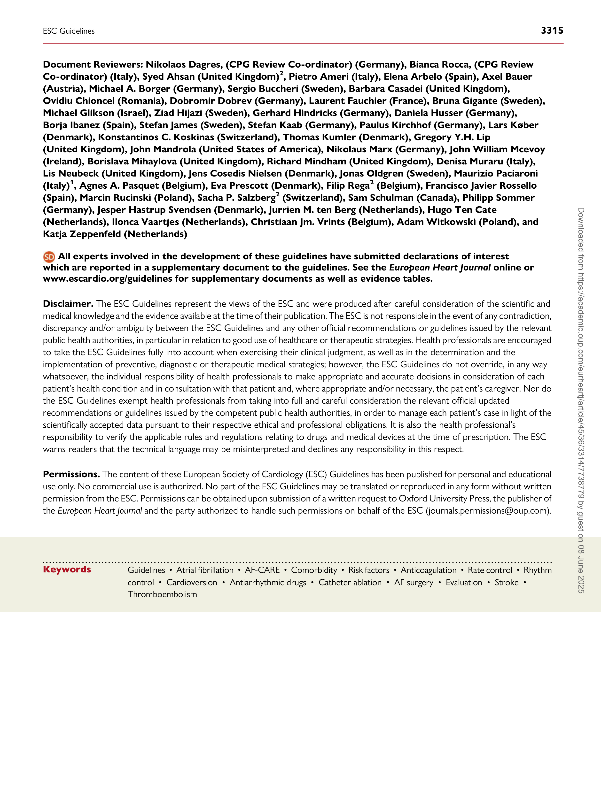
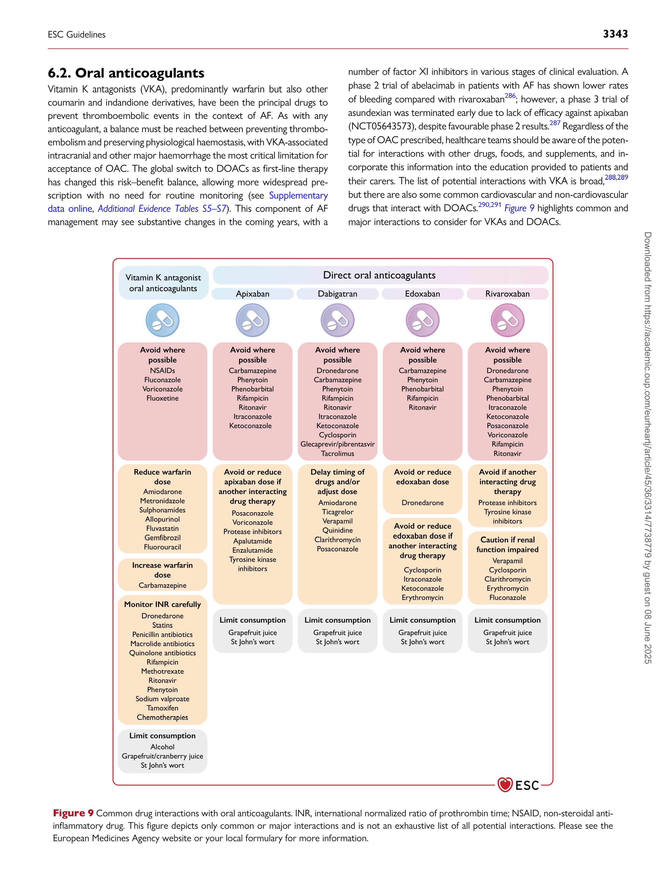
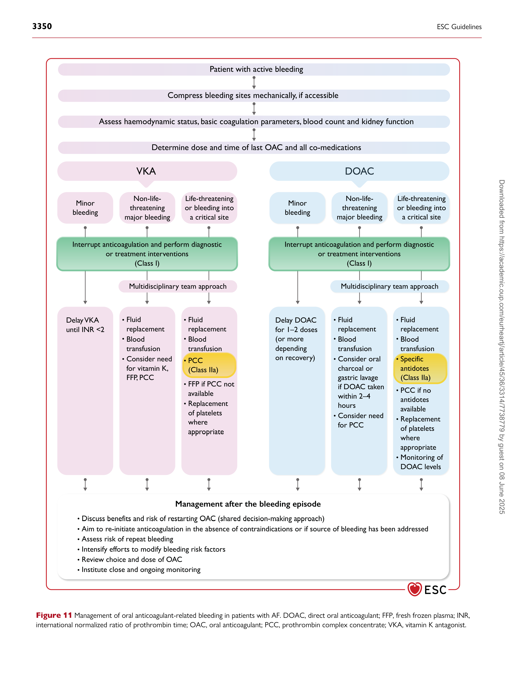
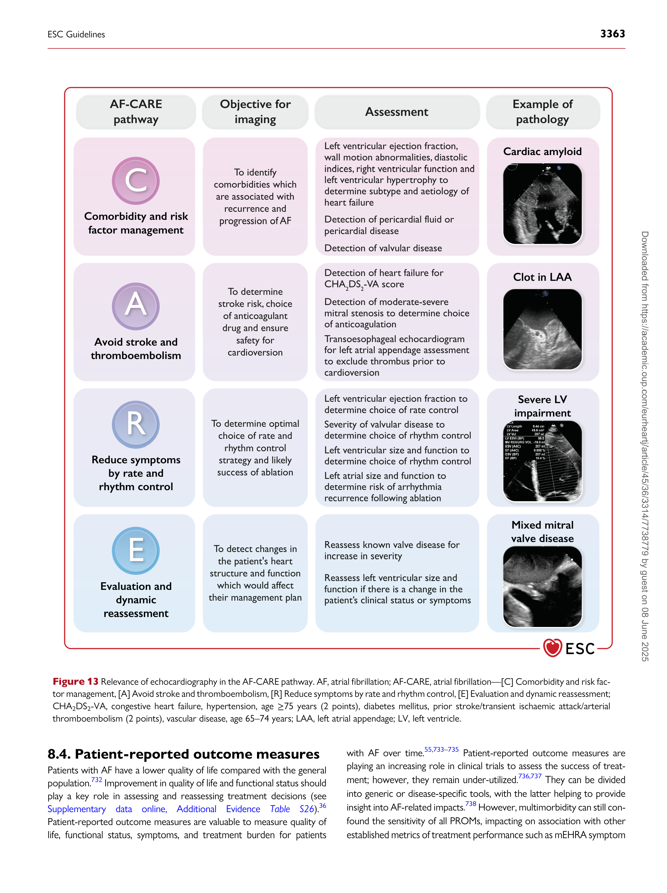
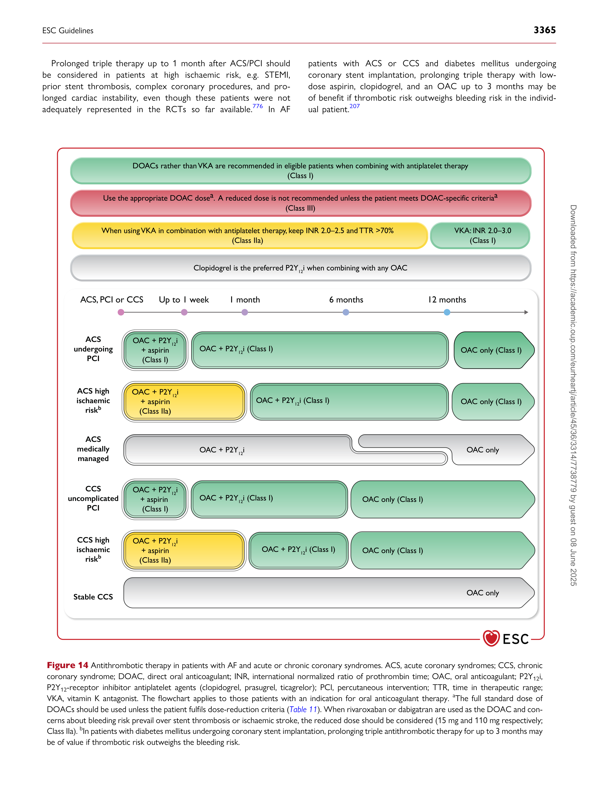

European Heart Journal (2024) **45**, 3314–3414
https://doi.org/10.1093/eurheartj/ehae176

**ESC GUIDELINES**

#### **2024 ESC Guidelines for the management ** **of atrial fibrillation developed in collaboration ** **with the European Association ** **for Cardio-Thoracic Surgery (EACTS)**

**Developed by the task force for the management of atrial fibrillation of the**
**European Society of Cardiology (ESC), with the special contribution of the**
**European Heart Rhythm Association (EHRA) of the ESC.**
***Endorsed by the European Stroke Organisation (ESO)***

**[Authors/Task Force Members: Isabelle C. Van Gelder *](https://orcid.org/0000-0002-7579-1201)** **[†]** **, (Chairperson)**
**(Netherlands), Michiel Rienstra** **±** **, (Task Force Co-ordinator) (Netherlands),**
**Karina V. Bunting** **±** **, (Task Force Co-ordinator) (United Kingdom),**
**Ruben Casado-Arroyo** **(Belgium), Valeria Caso** **1** **(Italy), Harry J.G.M. Crijns**
**(Netherlands), Tom J.R. De Potter** **(Belgium), Jeremy Dwight (United Kingdom),**
**Luigina Guasti** **(Italy), Thorsten Hanke** **2** **(Germany), Tiny Jaarsma** **(Sweden),**
**Maddalena Lettino** **(Italy), Maja-Lisa Løchen** **(Norway), R. Thomas Lumbers**
**(United Kingdom), Bart Maesen** **2** **(Netherlands), Inge Mølgaard (Denmark),**
**Giuseppe M.C. Rosano (United Kingdom), Prashanthan Sanders** **(Australia),**
**Renate B. Schnabel** **(Germany), Piotr Suwalski** **2** **(Poland), Emma Svennberg**
**(Sweden), Juan Tamargo** **(Spain), Otilia Tica** **(Romania), Vassil Traykov**
**[(Bulgaria), Stylianos Tzeis (Greece), Dipak Kotecha *](https://orcid.org/0000-0002-2570-9812)** **[†]** **, (Chairperson)**
**(United Kingdom), and ESC Scientific Document Group**

- Corresponding authors: Isabelle C. Van Gelder, Department of Cardiology, University of Groningen, University Medical Center Groningen, Groningen, Netherlands. Tel: +31 50 361 1327.
[Email: i.c.van.gelder@umcg.nl; and Dipak Kotecha, Institute of Cardiovascular Sciences, University of Birmingham, United Kingdom & NIHR Birmingham Biomedical Research Centre,](mailto:i.c.van.gelder@umcg.nl)
[University Hospitals Birmingham NHS Foundation Trust, Birmingham, United Kingdom. Tel: +44 121 371 8124. Email: d.kotecha@bham.ac.uk](mailto:d.kotecha@bham.ac.uk)

- The two Chairpersons contributed equally to the document and are joint corresponding authors.

± The two Task Force Co-ordinators contributed equally to the document.

**Author/Task Force Member affiliations are listed in author information.**

1 Representing European Stroke Organisation (ESO).

2 Representing European Association for Cardio-Thoracic Surgery (EACTS).

**ESC Clinical Practice Guidelines (CPG) Committee: listed in the Appendix.**

**ESC subspecialty communities having participated in the development of this document:**

**Associations:** Association of Cardiovascular Nursing & Allied Professions (ACNAP), Association for Acute CardioVascular Care (ACVC), European Association of Cardiovascular Imaging
(EACVI), European Association of Preventive Cardiology (EAPC), European Association of Percutaneous Cardiovascular Interventions (EAPCI), European Heart Rhythm Association (EHRA),
Heart Failure Association (HFA).

**Councils:** Council for Cardiology Practice, Council of Cardio-Oncology, Council on Cardiovascular Genomics, Council on Stroke.

**Working Groups:** Cardiac Cellular Electrophysiology, Cardiovascular Pharmacotherapy, E-Cardiology, Thrombosis.

**Patient Forum**

[© The European Society of Cardiology 2024. All rights reserved. For permissions, please email: journals.permissions@oup.com.](mailto:journals.permissions@oup.com)

ESC Guidelines **3315**

**Document Reviewers: Nikolaos Dagres, (CPG Review Co-ordinator) (Germany), Bianca Rocca, (CPG Review**
**Co-ordinator) (Italy), Syed Ahsan (United Kingdom)** **[2]** **, Pietro Ameri (Italy), Elena Arbelo (Spain), Axel Bauer**
**(Austria), Michael A. Borger (Germany), Sergio Buccheri (Sweden), Barbara Casadei (United Kingdom),**
**Ovidiu Chioncel (Romania), Dobromir Dobrev (Germany), Laurent Fauchier (France), Bruna Gigante (Sweden),**
**Michael Glikson (Israel), Ziad Hijazi (Sweden), Gerhard Hindricks (Germany), Daniela Husser (Germany),**
**Borja Ibanez (Spain), Stefan James (Sweden), Stefan Kaab (Germany), Paulus Kirchhof (Germany), Lars Køber**
**(Denmark), Konstantinos C. Koskinas (Switzerland), Thomas Kumler (Denmark), Gregory Y.H. Lip**
**(United Kingdom), John Mandrola (United States of America), Nikolaus Marx (Germany), John William Mcevoy**
**(Ireland), Borislava Mihaylova (United Kingdom), Richard Mindham (United Kingdom), Denisa Muraru (Italy),**
**Lis Neubeck (United Kingdom), Jens Cosedis Nielsen (Denmark), Jonas Oldgren (Sweden), Maurizio Paciaroni**
**(Italy)** **[1]** **, Agnes A. Pasquet (Belgium), Eva Prescott (Denmark), Filip Rega** **[2 ]** **(Belgium), Francisco Javier Rossello**
**(Spain), Marcin Rucinski (Poland), Sacha P. Salzberg** **[2 ]** **(Switzerland), Sam Schulman (Canada), Philipp Sommer**
**(Germany), Jesper Hastrup Svendsen (Denmark), Jurrien M. ten Berg (Netherlands), Hugo Ten Cate**
**(Netherlands), Ilonca Vaartjes (Netherlands), Christiaan Jm. Vrints (Belgium), Adam Witkowski (Poland), and**
**Katja Zeppenfeld (Netherlands)**

**All experts involved in the development of these guidelines have submitted declarations of interest**
**which are reported in a supplementary document to the guidelines. See the** ***European Heart Journal*** **online or**
**[www.escardio.org/guidelines for supplementary documents as well as evidence tables.](https://www.escardio.org/Guidelines)**

**Disclaimer.** The ESC Guidelines represent the views of the ESC and were produced after careful consideration of the scientific and
medical knowledge and the evidence available at the time of their publication. The ESC is not responsible in the event of any contradiction,
discrepancy and/or ambiguity between the ESC Guidelines and any other official recommendations or guidelines issued by the relevant
public health authorities, in particular in relation to good use of healthcare or therapeutic strategies. Health professionals are encouraged
to take the ESC Guidelines fully into account when exercising their clinical judgment, as well as in the determination and the
implementation of preventive, diagnostic or therapeutic medical strategies; however, the ESC Guidelines do not override, in any way
whatsoever, the individual responsibility of health professionals to make appropriate and accurate decisions in consideration of each
patient’s health condition and in consultation with that patient and, where appropriate and/or necessary, the patient’s caregiver. Nor do
the ESC Guidelines exempt health professionals from taking into full and careful consideration the relevant official updated
recommendations or guidelines issued by the competent public health authorities, in order to manage each patient’s case in light of the
scientifically accepted data pursuant to their respective ethical and professional obligations. It is also the health professional’s
responsibility to verify the applicable rules and regulations relating to drugs and medical devices at the time of prescription. The ESC
warns readers that the technical language may be misinterpreted and declines any responsibility in this respect.

**Permissions.** The content of these European Society of Cardiology (ESC) Guidelines has been published for personal and educational
use only. No commercial use is authorized. No part of the ESC Guidelines may be translated or reproduced in any form without written
permission from the ESC. Permissions can be obtained upon submission of a written request to Oxford University Press, the publisher of
the *European Heart Journal* [and the party authorized to handle such permissions on behalf of the ESC (journals.permissions@oup.com).](mailto:journals.permissions@oup.com)

- - - - - - - - - - - - - - - - - - - - - - - - - - - - - - - - - - - - - - - - - - - - - - - - - - - - - - - - - - - - - - - - - - - - - - - - - - - - - - - - - - - - - - - - - - - - - - - - - - - - - - - - - - - - - - - - - - - - - - - - - - - - - - - - - - - - - - - - - - - - - - - - - - - - - - - - - - - Keywords Guidelines • Atrial fibrillation • AF-CARE • Comorbidity • Risk factors • Anticoagulation • Rate control • Rhythm
control • Cardioversion • Antiarrhythmic drugs • Catheter ablation • AF surgery • Evaluation • Stroke •

Thromboembolism

**3316** ESC Guidelines

###### **Table of contents**

1. Preamble .............................................................................................................. 3319

2. Introduction ....................................................................................................... 3321

2.1. What is new ............................................................................................. 3322

3. Definitions and clinical impact .................................................................... 3326

3.1. Definition and classification of AF ................................................... 3326
3.2. Diagnostic criteria for AF ................................................................... 3327

3.3. Symptoms attributable to AF ........................................................... 3328

3.4. Diagnostic evaluation of new AF ..................................................... 3328

3.5. Adverse events associated with AF ................................................ 3329

3.6. Atrial flutter .............................................................................................. 3330
4. Patient pathways and management of AF ............................................. 3330

4.1. Patient-centred, multidisciplinary AF management ................. 3330

4.1.1. The patient at the heart of care .............................................. 3330

4.1.2. Education and shared decision-making ................................. 3331

4.1.3. Education of healthcare professionals ................................... 3332

4.1.4. Inclusive management of AF ...................................................... 3332

4.2. Principles of AF-CARE ......................................................................... 3332

5. [C] Comorbidity and risk factor management ................................... 3338

5.1. Hypertension ............................................................................................ 3339

5.2. Heart failure .............................................................................................. 3339

5.3. Type 2 diabetes mellitus ...................................................................... 3340

5.4. Obesity ....................................................................................................... 3340

5.5. Obstructive sleep apnoea ................................................................... 3340

5.6. Physical inactivity .................................................................................... 3340

5.7. Alcohol excess ......................................................................................... 3341

6. [A] Avoid stroke and thromboembolism .............................................. 3341

6.1. Initiating oral anticoagulation ............................................................. 3341

6.1.1. Decision support for anticoagulation in AF ........................ 3341

6.2. Oral anticoagulants ................................................................................ 3343

6.2.1. Direct oral anticoagulants ........................................................... 3344

6.2.2. Vitamin K antagonists ................................................................... 3345

6.2.3. Clinical vs. device-detected subclinical AF ........................... 3345

6.3. Antiplatelet drugs and combinations with anticoagulants .... 3346

6.4. Residual ischaemic stroke risk despite anticoagulation .......... 3346

6.5. Percutaneous left atrial appendage occlusion ............................ 3346

6.6. Surgical left atrial appendage occlusion ........................................ 3347

6.7. Bleeding risk .............................................................................................. 3348

6.7.1. Assessment of bleeding risk ....................................................... 3348

6.7.2. Management of bleeding on anticoagulant therapy ......... 3348

7. [R] Reduce symptoms by rate and rhythm control ......................... 3351

7.1. Management of heart rate in patients with AF ......................... 3351

7.1.1. Indications and target heart rate .............................................. 3352

7.1.2. Heart rate control in the acute setting ................................. 3352

7.1.3. Long-term heart rate control .................................................... 3352

7.1.4. Atrioventricular node ablation and pacemaker

implantation ................................................................................................... 3353

7.2. Rhythm control strategies in patients with AF .......................... 3353

7.2.1. General principles and anticoagulation ................................. 3353

7.2.2. Electrical cardioversion ................................................................ 3356

7.2.3. Pharmacological cardioversion .................................................. 3356

7.2.4. Antiarrhythmic drugs .................................................................... 3357

7.2.5. Catheter ablation ............................................................................ 3358

7.2.6. Anticoagulation in patients undergoing catheter ablation 3359

7.2.7. Endoscopic and hybrid AF ablation ........................................ 3360

7.2.8. AF ablation during cardiac surgery .......................................... 3361

7.2.9. Atrial tachycardia after pulmonary vein isolation ............. 3361

8. [E] Evaluation and dynamic reassessment ............................................. 3361

8.1. Implementation of dynamic care ..................................................... 3362

8.2. Improving treatment adherence ...................................................... 3362

8.3. Cardiac imaging ....................................................................................... 3362

8.4. Patient-reported outcome measures ............................................ 3363
9. The AF-CARE pathway in specific clinical settings ............................ 3364

9.1. AF-CARE in unstable patients .......................................................... 3364

9.2. AF-CARE in acute and chronic coronary syndromes ............ 3364

9.3. AF-CARE in vascular disease ............................................................. 3366

9.4. AF-CARE in acute stroke or intracranial haemorrhage ........ 3366

9.4.1. Management of acute ischaemic stroke ................................ 3366

9.4.2. Introduction or re-introduction of anticoagulation after

ischaemic stroke .......................................................................................... 3367

9.4.3. Introduction or re-introduction of anticoagulation after

haemorrhagic stroke .................................................................................. 3367

9.5. AF-CARE for trigger-induced AF .................................................... 3367

9.6. AF-CARE in post-operative patients ............................................. 3368

9.7. AF-CARE in embolic stroke of unknown source ..................... 3368

9.8. AF-CARE during pregnancy ............................................................... 3369

9.9. AF-CARE in congenital heart disease ............................................ 3370

9.10. AF-CARE in endocrine disorders ................................................. 3370

9.11. AF-CARE in inherited cardiomyopathies and primary

arrhythmia syndromes .................................................................................. 3370

9.12. AF-CARE in cancer ............................................................................. 3371

9.13. AF-CARE in older, multimorbid, or frail patients .................. 3371
9.14. AF-CARE in atrial flutter .................................................................. 3371
10. Screening and prevention of AF ............................................................. 3371

10.1. Epidemiology of AF ............................................................................. 3371

10.2. Screening tools for AF ....................................................................... 3372

10.3. Screening strategies for AF .............................................................. 3373

10.3.1. Single timepoint screening ‘snapshot’ .................................. 3374

10.3.2. Prolonged screening ................................................................... 3374

10.4. Factors associated with incident AF ............................................ 3375

10.5. Primary prevention of AF ................................................................ 3375

10.5.1. Hypertension ................................................................................. 3376

10.5.2. Heart failure ................................................................................... 3376

10.5.3. Type 2 diabetes mellitus ........................................................... 3376

10.5.4. Obesity ............................................................................................. 3376

10.5.5. Sleep apnoea syndrome ............................................................ 3376

10.5.6. Physical activity .............................................................................. 3376

10.5.7. Alcohol intake ................................................................................ 3377

11. Key messages .................................................................................................. 3377

12. Gaps in evidence ............................................................................................ 3377

13. ‘What to do’ and ‘What not to do’ messages from the

guidelines .................................................................................................................. 3379

14. Evidence tables ............................................................................................... 3382

15. Data availability statement ......................................................................... 3382

16. Author information ...................................................................................... 3382

17. Appendix ........................................................................................................... 3383

18. References ........................................................................................................ 3384

ESC Guidelines **3317**

###### **Tables of Recommendations**

Recommendation Table 1 — Recommendations for the diagnosis of
AF (see also Evidence Table 1) ....................................................................... 3328
Recommendation Table 2 — Recommendations for symptom
evaluation in patients with AF (see also Evidence Table 2) ................ 3328
Recommendation Table 3 — Recommendations for diagnostic
evaluation in patients with new AF (see also Evidence Table 3) ..... 3328
Recommendation Table 4 — Recommendations for patient-centred
care and education (see also Evidence Table 4) ...................................... 3332
Recommendation Table 5 — Recommendations for comorbidity
and risk factor management in AF (see also Evidence Table 5) ....... 3339

Recommendation Table 6 — Recommendations to assess and

manage thromboembolic risk in AF (see also Evidence Table 6) .... 3342

Recommendation Table 7 — Recommendations for oral

anticoagulation in AF (see also Evidence Table 7) .................................. 3344
Recommendation Table 8 — Recommendations for combining
antiplatelet drugs with anticoagulants for stroke prevention (see also
Evidence Table 8) .................................................................................................. 3346

Recommendation Table 9 — Recommendations for

thromboembolism despite anticoagulation (see also Evidence
Table 9) ..................................................................................................................... 3346
Recommendation Table 10 — Recommendations for percutaneous
left atrial appendage occlusion (see also Evidence Table 10) ............ 3347
Recommendation Table 11 — Recommendations for surgical left
atrial appendage occlusion (see also Evidence Table 11) .................... 3348

Recommendation Table 12 — Recommendations for assessment of

bleeding risk (see also Evidence Table 12) ................................................. 3348
Recommendation Table 13 — Recommendations for management
of bleeding in anticoagulated patients (see also Evidence Table 13) 3351

Recommendation Table 14 — Recommendations for heart rate

control in patients with AF (see also Evidence Table 14) ................... 3351
Recommendation Table 15 — Recommendations for general
concepts in rhythm control (see also Evidence Table 15) .................. 3355

Recommendation Table 16 — Recommendations for electrical

cardioversion of AF (see also Evidence Table 16) .................................. 3356

Recommendation Table 17 — Recommendations for

pharmacological cardioversion of AF (see also Evidence Table 17) 3356

Recommendation Table 18 — Recommendations for

antiarrhythmic drugs for long-term maintenance of sinus rhythm
(see also Evidence Table 18) ............................................................................ 3358

Recommendation Table 19 — Recommendations for catheter

ablation of AF (see also Evidence Table 19) ............................................. 3359

Recommendation Table 20 — Recommendations for

anticoagulation in patients undergoing catheter ablation (see also
Evidence Table 20) ............................................................................................... 3360
Recommendation Table 21 — Recommendations for endoscopic
and hybrid AF ablation (see also Evidence Table 21) ........................... 3360

Recommendation Table 22 — Recommendations for AF ablation

during cardiac surgery (see also Evidence Table 22) ............................. 3361
Recommendation Table 23 — Recommendations to improve
patient experience (see also Evidence Table 23) .................................... 3364
Recommendation Table 24 — Recommendations for patients with
acute coronary syndromes or undergoing percutaneous
intervention (see also Evidence Table 24) ................................................. 3366

Recommendation Table 25 — Recommendations for

trigger-induced AF (see also Evidence Table 25) .................................... 3368
Recommendation Table 26 — Recommendations for management
of post-operative AF (see also Evidence Table 26) ............................... 3368

Recommendation Table 27 — Recommendations for patients with
embolic stroke of unknown source (see also Evidence Table 27) .. 3369
Recommendation Table 28 — Recommendations for patients with
AF during pregnancy (see also Evidence Table 28) ................................ 3369
Recommendation Table 29 — Recommendations for patients with
AF and congenital heart disease (see also Evidence Table 29) ......... 3370
Recommendation Table 30 — Recommendations for prevention of
thromboembolism in atrial flutter (see also Evidence Table 30) ..... 3371
Recommendation Table 31 — Recommendations for screening for
AF (see also Evidence Table 31) .................................................................... 3374
Recommendation Table 32 — Recommendations for primary
prevention of AF (see also Evidence Table 32) ....................................... 3376
###### **List of tables**

Table 1 Classes of recommendations .......................................................... 3320

Table 2 Levels of evidence ................................................................................ 3320

Table 3 New recommendations .................................................................... 3322

Table 4 Revised recommendations ............................................................... 3325

Table 5 Definitions and classifications for the temporal pattern of

AF ................................................................................................................................. 3327

Table 6 Other clinical concepts relevant to AF ....................................... 3327
Table 7 The modified European Heart Rhythm Association
(mEHRA) symptom classification ................................................................... 3329
Table 8 Diagnostic work-up for patients with AF .................................. 3330
Table 9 Achieving patient-centred AF management ............................. 3331
Table 10 Updated definitions for the CHA 2 DS 2 -VA score ............... 3342
Table 11 Recommended doses for direct oral anticoagulant
therapy ....................................................................................................................... 3345
Table 12 Drugs for rate control in AF ........................................................ 3352
Table 13 Antiarrhythmic drugs for sinus rhythm restoration ........... 3357
Table 14 Non-cardiac conditions associated with trigger-induced

AF ................................................................................................................................. 3367

Table 15 Tools for AF screening .................................................................... 3373

Table 16 Factors associated with incident AF .......................................... 3375

Table 17 ‘What to do’ and ‘what not to do’ ............................................ 3379
###### **List of figures**

Figure 1 Impacts and outcomes associated with clinical AF. AF, atrial
fibrillation .................................................................................................................. 3329
Figure 2 Multidisciplinary approach to AF management ...................... 3331
Figure 3 Central illustration. Patient pathway for AF-CARE (see *Figures*
*4, 5, 6*, and *7* for the [R] pathways for first-diagnosed, paroxysmal,
persistent and permanent AF) ................................................................................ 3333
Figure 4 [R] Pathway for patients with first-diagnosed AF ................. 3334
Figure 5 [R] Pathway for patients with paroxysmal AF ....................... 3335
Figure 6 [R] Pathway for patients with persistent AF .......................... 3336
Figure 7 [R] Pathway for patients with permanent AF ........................ 3337
Figure 8 Management of key comorbidities to reduce AF

recurrence ................................................................................................................ 3338

Figure 9 Common drug interactions with oral anticoagulants .......... 3343
Figure 10 Modifying the risk of bleeding associated with OAC ....... 3349
Figure 11 Management of oral anticoagulant-related bleeding in
patients with AF .................................................................................................... 3350
Figure 12 Approaches for cardioversion in patients with AF ............ 3354
Figure 13 Relevance of echocardiography in the AF-CARE pathway 3363
Figure 14 Antithrombotic therapy in patients with AF and acute or
chronic coronary syndromes ........................................................................... 3365

**3318** ESC Guidelines

Figure 15 Non-invasive diagnostic methods for AF screening .......... 3372
Figure 16 Approaches to screening for AF ............................................... 3374
###### **Abbreviations and acronyms**

AAD Antiarrhythmic drugs
ACE Angiotensin-converting enzyme
ACEi Angiotensin-converting enzyme inhibitor
ACS Acute coronary syndromes
ACTIVE W Atrial fibrillation Clopidogrel Trial with Irbesartan
for prevention of Vascular Events (trial)
AF Atrial fibrillation
AF-CARE Atrial fibrillation—[C] Comorbidity and risk factor
management, [A] Avoid stroke and
thromboembolism, [R] Reduce symptoms by rate and
rhythm control, [E] Evaluation and dynamic

reassessment

AFEQT Atrial Fibrillation Effect on QualiTy-of-Life
(questionnaire)
AFFIRM Atrial Fibrillation Follow-up Investigation of
Rhythm Management (trial)
AFL Atrial flutter
AFQLQ Atrial Fibrillation Quality of Life Questionnaire
AF-QoL Atrial Fibrillation Quality of Life (questionnaire)
AFSS Atrial Fibrillation Severity Scale
AI Artificial intelligence
APACHE-AF Apixaban After Anticoagulation-associated
Intracerebral Haemorrhage in Patients With Atrial
Fibrillation (trial)

APAF-CRT Ablate and Pace for Atrial Fibrillation—cardiac

resynchronization therapy
ARB Angiotensin receptor blocker
ARTESiA Apixaban for the Reduction of Thromboembolism

in Patients With Device-Detected Sub-Clinical

Atrial Fibrillation (trial)
AT Atrial tachycardia
ATHENA A Placebo-Controlled, Double-Blind, Parallel Arm
Trial to Assess the Efficacy of Dronedarone 400 mg
twice daily for the Prevention of Cardiovascular
Hospitalization or Death from Any Cause in
Patients with Atrial Fibrillation/Atrial Flutter (trial)
AUGUSTUS An open-label, 2 × 2 factorial, randomized controlled,
clinical trial to evaluate the safety of apixaban vs.
vitamin k antagonist and aspirin vs. aspirin placebo in
patients with atrial fibrillation and acute coronary
syndrome or percutaneous coronary intervention
AVERROES Apixaban Versus Acetylsalicylic Acid to Prevent

Stroke in Atrial Fibrillation Patients Who Have

Failed or Are Unsuitable for Vitamin K Antagonist
Treatment (trial)
AVN Atrioventricular node

b.p.m. Beats per minute
BMI Body mass index
BNP B-type natriuretic peptide
BP Blood pressure
C 2 HEST Coronary artery disease or chronic obstructive
pulmonary disease (1 point each); hypertension
(1 point); elderly (age ≥75 years, 2 points); systolic
heart failure (2 points); thyroid disease
(hyperthyroidism, 1 point)

CABANA Catheter Ablation versus Anti-arrhythmic Drug
Therapy for Atrial Fibrillation (trial)
CAD Coronary artery disease

CASTLE-AF Catheter Ablation versus Standard Conventional

Treatment in Patients With Left Ventricle (LV)
Dysfunction and AF (trial)
CASTLE-HTx Catheter Ablation for Atrial Fibrillation in Patients

With End-Stage Heart Failure and Eligibility for
Heart Transplantation (trial)
CCS Chronic coronary syndrome
CHADS 2 Congestive heart failure, hypertension, age >75
years, diabetes; previous stroke (2 points)
CHA 2 DS 2 -VA Congestive heart failure, hypertension, age ≥75 years
(2 points), diabetes mellitus, prior stroke/transient
ischaemic attack/arterial thromboembolism (2
points), vascular disease, age 65–74 years (score)
CHA 2 DS 2 -VASc Congestive heart failure, hypertension, age ≥75
years (2 points), diabetes mellitus, prior stroke or
TIA or thromboembolism (2 points), vascular
disease, age 65–74 years, sex category
CKD Chronic kidney disease
CMR Cardiac magnetic resonance
COMPASS Cardiovascular Outcomes for People Using
Anticoagulation Strategies (trial)
CPAP Continuous positive airway pressure

CrCl Creatinine clearance

CRT Cardiac resynchronization therapy
CT Computed tomography
CTA Computed tomography angiography
CTI Cavo-tricuspid isthmus
DAPT Dual antiplatelet therapy
DOAC Direct oral anticoagulant
EAST-AFNET 4 Early treatment of Atrial fibrillation for Stroke
prevention Trial
ECG Electrocardiogram

ECV Electrical cardioversion

EHRA European Heart Rhythm Association
ELAN Early versus Late initiation of direct oral
Anticoagulants in post-ischaemic stroke patients
with atrial fibrillatioN (trial)
ESUS Embolic stroke of undetermined source

FFP Fresh frozen plasma

GI Gastrointestinal

GWAS Genome-wide association studies

HAS-BLED Hypertension, Abnormal renal/liver function,
Stroke, Bleeding history or predisposition, Labile
international normalized ratio, Elderly (>65 years),
Drugs/alcohol concomitantly (score)
HAVOC Hypertension, age, valvular heart disease,
peripheral vascular disease, obesity, congestive
heart failure, and coronary artery disease
HbA1c Haemoglobin A1c (glycated or glycosylated
haemoglobin)
HCM Hypertrophic cardiomyopathy

HF Heart failure

HFmrEF Heart failure with mildly reduced ejection fraction
HFpEF Heart failure with preserved ejection fraction
HFrEF Heart failure with reduced ejection fraction

HR Hazard ratio

i.v. Intravenous

ESC Guidelines **3319**

ICH Intracranial haemorrhage

ICHOM International Consortium for Health Outcomes

Measurement

IMT Intima-media thickness

INR International normalized ratio (of prothrombin
time)

LA Left atrium

LAA Left atrial appendage
LAAO Left atrial appendage occlusion
LAAOS III Left Atrial Appendage Occlusion Study
LEGACY Long-Term Effect of Goal directed weight
management on Atrial Fibrillation Cohort: a 5 Year
follow-up study
LMWH Low molecular weight heparin
LOOP Atrial Fibrillation Detected by Continuous ECG
Monitoring (trial)
LV Left ventricle

LVEF Left ventricular ejection fraction
LVH Left ventricular hypertrophy
mEHRA Modified European Heart Rhythm Association

score

MI Myocardial infarction
MRI Magnetic resonance imaging
NOAH Non-vitamin K Antagonist Oral Anticoagulants
in Patients With Atrial High Rate Episodes (trial)
NSAID Non-steroidal anti-inflammatory drug
NT-proBNP N-terminal pro-B-type natriuretic peptide

NYHA New York Heart Association

OAC Oral anticoagulant(s)

OR Odds ratio

OSA Obstructive sleep apnoea
PAD Peripheral arterial disease
PCC Prothrombin complex concentrate

PCI Percutaneous intervention

PFO Patent foramen ovale

POAF Post-operative atrial fibrillation
PPG Photoplethysmography
PROM Patient-reported outcome measure
PVD Peripheral vascular disease
PVI Pulmonary vein isolation
QLAF Quality of Life in Atrial Fibrillation (questionnaire)
QRS Q wave, R wave, and S wave, the ‘QRS complex’
represents ventricular depolarization
RACE 7 Rate Control versus Electrical Cardioversion

ACWAS Trial 7—Acute Cardioversion versus Wait and See

(trial)
RACE I RAte Control versus Electrical cardioversion study
RACE II Rate Control Efficacy in Permanent Atrial
Fibrillation (trial)
RACE 3 Routine versus Aggressive upstream rhythm
Control for prevention of Early AF in heart failure
(trial)
RACE 4 IntegRAted Chronic Care Program at Specialized

AF Clinic Versus Usual CarE in Patients with Atrial

Fibrillation (trial)
RATE-AF RAte control Therapy Evaluation in permanent
Atrial Fibrillation (trial)
RCT Randomized controlled trial

RR Relative risk

SAVE Sleep Apnea cardioVascular Endpoints (trial)
SBP Systolic blood pressure
SGLT2 Sodium-glucose cotransporter-2

SIC-AF Successful Intravenous Cardioversion for Atrial

Fibrillation
SORT-AF Supervised Obesity Reduction Trial for AF
Ablation Patients (trial)
SoSTART Start or STop Anticoagulants Randomised Trial
SR Sinus rhythm
STEEER-AF Stroke prevention and rhythm control Therapy:
Evaluation of an Educational programme of the
European Society of Cardiology in a clusterRandomised trial in patients with Atrial Fibrillation
(trial)
STEMI ST-segment elevation myocardial infarction
STROKESTOP Systematic ECG Screening for Atrial Fibrillation
Among 75 Year Old Subjects in the Region of
Stockholm and Halland, Sweden (trial)
TE Thromboembolism

TIA Transient ischaemic attack

TIMING Timing of Oral Anticoagulant Therapy in Acute
Ischemic Stroke With Atrial Fibrillation (trial)
TOE Transoesophageal echocardiography
TSH Thyroid-stimulating hormone
TTE Transthoracic echocardiogram
TTR Time in therapeutic range
UFH Unfractionated heparin
VKA Vitamin K antagonist
###### **1. Preamble**

Guidelines evaluate and summarize available evidence with the aim of

assisting health professionals in proposing the best diagnostic or thera-­
peutic approach for an individual patient with a given condition.
Guidelines are intended for use by health professionals and the
European Society of Cardiology (ESC) makes its Guidelines freely

available.

ESC Guidelines do not override the individual responsibility of
health professionals to make appropriate and accurate decisions in
consideration of each patient’s health condition and in consultation
with that patient or the patient’s caregiver where appropriate and/
or necessary. It is also the health professional’s responsibility to verify
the rules and regulations applicable in each country to drugs and de-­
vices at the time of prescription and to respect the ethical rules of their
profession.

ESC Guidelines represent the official position of the ESC on a given
topic and are regularly updated when warranted by new evidence. ESC
Policies and Procedures for formulating and issuing ESC Guidelines can
[be found on the ESC website (https://www.escardio.org/Guidelines/](https://www.escardio.org/Guidelines/Clinical-Practice-Guidelines/Guidelines-development/Writing-ESC-Guidelines)
[Clinical-Practice-Guidelines/Guidelines-development/Writing-ESC-](https://www.escardio.org/Guidelines/Clinical-Practice-Guidelines/Guidelines-development/Writing-ESC-Guidelines)
[Guidelines). This guideline updates and replaces the previous version](https://www.escardio.org/Guidelines/Clinical-Practice-Guidelines/Guidelines-development/Writing-ESC-Guidelines)

from 2020.

The Members of this task force were selected by the ESC to include
professionals involved with the medical care of patients with this path-­
ology as well as patient representatives and methodologists. The selec-­
tion procedure included an open call for authors and aimed to include
members from across the whole of the ESC region and from relevant
ESC Subspecialty Communities. Consideration was given to diversity

**3320** ESC Guidelines

and inclusion, notably with respect to gender and country of origin.
The task force performed a critical review and evaluation of the
published literature on diagnostic and therapeutic approaches includ-­
ing assessment of the risk–benefit ratio. The strength of every recom-­
mendation and the level of evidence supporting them were weighed
and scored according to predefined scales as outlined in *Tables 1*
*and* *2* below. Patient-reported outcome measures (PROMs) and

Table 1 **Classes of recommendations**

patient-reported experience measures were also evaluated as the ba-­
sis for recommendations and/or discussion in these guidelines. The
task force followed ESC voting procedures and all approved recom-­
mendations were subject to a vote and achieved at least 75% agree-­
ment among voting members. Members of the task force with
declared interests on specific topics were asked to abstain from voting
on related recommendations.

Table 2 **Levels of evidence**

ESC Guidelines **3321**

The experts of the writing and reviewing panels provided declaration of
interest forms for all relationships that might be perceived as real or po-­
tential sources of conflicts of interest. Their declarations of interest were
reviewed according to the ESC declaration of interest rules which can be
[found on the ESC website (http://www.escardio.org/guidelines) and have](http://www.escardio.org/guidelines)
been compiled in a report published in a supplementary document with
the guidelines. Funding for the development of ESC Guidelines is derived
entirely from the ESC with no involvement of the healthcare industry.

The ESC Clinical Practice Guidelines (CPG) Committee supervises and
co-ordinates the preparation of new guidelines and is responsible for the
approval process. In addition to review by the CPG Committee, ESC
Guidelines undergo multiple rounds of double-blind peer review by exter-­
nal experts, including members from across the whole of the ESC region, all
National Cardiac Societies of the ESC and from relevant ESC Subspecialty
Communities. After appropriate revisions, the guidelines are signed off by
all the experts in the task force. The finalized document is signed off by the
CPG Committee for publication in the *European Heart Journal* .

ESC Guidelines are based on analyses of published evidence, chiefly on
clinical trials and meta-analyses of trials, but potentially including other
types of studies. Evidence tables summarizing key information from rele-­
vant studies are generated early in the guideline development process to
facilitate the formulation of recommendations, to enhance comprehension
of recommendations after publication, and reinforce transparency in the
guidelines development process. The tables are published in their
own section of ESC Guidelines and reference specific recommenda-­
tion tables.

Off-label use of medication may be presented in this guideline if a suf-­
ficient level of evidence shows that it can be considered medically
appropriate for a given condition. However, the final decisions con-­
cerning an individual patient must be made by the responsible health
professional giving special consideration to:

- The specific situation of the patient. Unless otherwise provided for
by national regulations, off-label use of medication should be limited
to situations where it is in the patient’s interest with regard to the
quality, safety, and efficacy of care, and only after the patient has
been informed and has provided consent.

- Country-specific health regulations, indications by governmental
drug regulatory agencies, and the ethical rules to which health profes-­
sionals are subject, where applicable.
###### **2. Introduction**

Atrial fibrillation (AF) is one of the most commonly encountered heart
conditions, with a broad impact on all health services across primary
and secondary care. The prevalence of AF is expected to double in
the next few decades as a consequence of the ageing population, an in-­
creasing burden of comorbidities, improved awareness, and new tech-­
nologies for detection.

The effects of AF are variable across individual patients; however, mor-­
bidity from AF remains highly concerning. Patients with AF can suffer
from a variety of symptoms and poor quality of life. Stroke and heart
failure as consequences of AF are now well appreciated by healthcare
professionals, but AF is also linked to a range of other thromboembolic
outcomes. These include subclinical cerebral damage (potentially leading
to vascular dementia), and thromboembolism to every other organ, all of
which contribute to the higher risk of mortality associated with AF.

The typical drivers of AF onset and progression are a range of co-­
morbidities and associated risk factors. To achieve optimal care for pa-­
tients with AF, it is now widely accepted that these comorbidities and
risk factors must be managed early and in a dynamic way. Failure to do
so contributes to recurrent cycles of AF, treatment failure, poor patient
outcomes, and a waste of healthcare resources. In this iteration of the

European Society of Cardiology (ESC) practice guidelines on AF, the
task force has consolidated and evolved past approaches to develop
the AF-CARE framework (Atrial Fibrillation—[C] Comorbidity and
risk factor management, [A] Avoid stroke and thromboembolism, [R]
Reduce symptoms by rate and rhythm control, [E] Evaluation and dy-­
namic reassessment). Comorbidities and risk factors is placed as the ini-­
tial and central component of patient management. This should be
considered first as it applies to all patients with AF, regardless of their
thromboembolic risk factors or any symptoms that might warrant
intervention. This is followed by considering how best to [A] avoid
stroke and thromboembolism, and then the options available to reduce
symptoms, and in some cases improve prognosis, through [R] rate and
rhythm control. [E] Evaluation and reassessment should be individua-­
lized for every patient, with a dynamic approach that accounts for
how AF and its associated conditions change over time.

Patient empowerment is critical in any long-term medical problem
to achieve better outcomes, encourage adherence, and to seek timely
guidance on changes in clinical status. A patient-centred, shared
decision-making approach will facilitate the choice of management
that suits each individual patient, particularly in AF where some ther-­
apies and interventions improve clinical outcomes, and others are
focused on addressing symptoms and quality of life. Education and
awareness are essential, not only for patients but also healthcare pro-­
fessionals in order to constrain the impact of AF on patients and

healthcare services.

With this in mind, the task force have created a range of patient
pathways that cover the major aspects of AF-CARE. At present, these re-­
main based on the time-orientated classification of AF (first-diagnosed,
paroxysmal, persistent, and permanent), but ongoing research may allow
for pathology-based classifications and a future of personalized medicine.
Clinical practice guidelines can only cover common scenarios with an evi-­
dence base, and so there remains a need for healthcare professionals to
care for patients within a local multidisciplinary team. While guidelineadherent care has repeatedly been shown to improve patient outcomes,
the actual implementation of guidelines is often poor in many healthcare
settings. This has been demonstrated in the ESC’s first randomized con-­
trolled trial (RCT), STEEER-AF (Stroke prevention and rhythm control
Therapy: Evaluation of an Educational programme of the European
Society of Cardiology in a cluster-Randomised trial in patients with Atrial
Fibrillation), which has sought to improve guideline adherence in parallel
to guideline production. The task force developing the 2024 AF
Guidelines have made implementation a key goal by focusing on the under-­
pinning evidence and using a consistent writing style for each recommen-­
dation (the intervention proposed, the population it should be applied to,
and the potential value to the patient, followed by any exceptions). *Tables 3*
and *4* below outline new recommendations and those with important re-­
visions. These initiatives have been designed to make the *2024 ESC*
*Guidelines for the management of AF* easier to read, follow, and implement,
with the aim of improving the lives of patients with AF. A patient version of
[these guidelines is also available at http://www.escardio.org/Guidelines/](http://www.escardio.org/Guidelines/guidelines-for-patients)
[guidelines-for-patients.](http://www.escardio.org/Guidelines/guidelines-for-patients)

**3322** ESC Guidelines

**2.1. What is new**

Table 3 **New recommendations**

**Class** **[a]** **Level** **[b]**

**Diagnostic evaluation of new AF—** ***Section 3.4***

A transthoracic echocardiogram is recommended in patients with an AF diagnosis where this will guide treatment decisions. **I** **C**

**Principles of AF-CARE—** ***Section 4.2***

|Education directed to patients, family members, caregivers, and healthcare professionals is recommended to optimize shared decision-making, facilitating open discussion of both the benefit and risk associated with each treatment option.|I|C|
|---|---|---|
|Access to patient-centred management according to the AF-CARE principles is recommended in all patients with AF, regardless of gender, ethnicity, and socioeconomic status, to ensure equality in healthcare provision and improve outcomes.|I|C|
|Patient-centred AF management with a multidisciplinary approach should be considered in all patients with AF to optimize management and improve outcomes.|IIa|B|

**[C] Comorbidity and risk factor management—** ***Section 5***

|Diuretics are recommended in patients with AF, HF, and congestion to alleviate symptoms and facilitate better AF management.|I|C|
|---|---|---|
|Appropriate medical therapy for HF is recommended in AF patients with HF and impaired LVEF to reduce symptoms and/or HF hospitalization and prevent AF recurrence.|I|B|
|Sodium-glucose cotransporter-2 inhibitors are recommended for patients with HF and AF regardless of left ventricular ejection fraction to reduce the risk of HF hospitalization and cardiovascular death.|I|A|
|Effective glycaemic control is recommended as part of comprehensive risk factor management in individuals with diabetes mellitus and AF, to reduce burden, recurrence, and progression of AF.|I|C|
|Bariatric surgery may be considered in conjunction with lifestyle changes and medical management in individuals with AF and body mass index ≥40 kg/m2 c where a rhythm control strategy is planned, to reduce recurrence and progression of AF.|IIb|C|
|Management of obstructive sleep apnoea may be considered as part of a comprehensive management of risk factors in individuals with AF to reduce recurrence and progression.|IIb|B|
|When screening for obstructive sleep apnoea in individuals with AF, using only symptom-based questionnaires is not recommended.|III|B|

**Initiating oral anticoagulation—** ***Section 6.1***

|Oral anticoagulation is recommended in patients with clinical AF at elevated thromboembolic risk to prevent ischaemic stroke and thromboembolism.|I|A|
|---|---|---|
|A CHADS -VA score of 2 or more is recommended as an indicator of elevated thromboembolic risk for decisions on initiating oral 2 2 anticoagulation.|I|C|
|A CHADS -VA score of 1 should be considered an indicator of elevated thromboembolic risk for decisions on initiating oral 2 2 anticoagulation.|IIa|C|
|Oral anticoagulation is recommended in all patients with AF and hypertrophic cardiomyopathy or cardiac amyloidosis, regardless of CHADS -VA score, to prevent ischaemic stroke and thromboembolism. 2 2|I|B|
|Individualized reassessment of thromboembolic risk is recommended at periodic intervals in patients with AF to ensure anticoagulation is started in appropriate patients.|I|B|
|Direct oral anticoagulant therapy may be considered in patients with asymptomatic device-detected subclinical AF and elevated thromboembolic risk to prevent ischaemic stroke and thromboembolism, excluding patients at high risk of bleeding.|IIb|B|

**Oral anticoagulants—** ***Section 6.2***

|A reduced dose of DOAC therapy is not recommended, unless patients meet DOAC-specific criteria, to prevent underdosing and avoidable thromboembolic events.|III|B|
|---|---|---|
|Maintaining VKA treatment rather than switching to a DOAC may be considered in patients aged ≥75 years on clinically stable therapeutic VKA with polypharmacy to prevent excess bleeding risk.|IIb|B|

**Antiplatelet drugs and combinations with anticoagulants—** ***Section 6.3***

Adding antiplatelet treatment to oral anticoagulation is not recommended in AF patients for the goal of preventing ischaemic stroke or

**III** **B**
thromboembolism.

*Continued*

ESC Guidelines **3323**

**Residual ischaemic stroke risk despite anticoagulation—** ***Section 6.4***

|A thorough diagnostic work-up should be considered in patients taking an oral anticoagulant and presenting with ischaemic stroke or thromboembolism to prevent recurrent events, including assessment of non-cardioembolic causes, vascular risk factors, dosage, and adherence.|IIa|B|
|---|---|---|
|Adding antiplatelet treatment to anticoagulation is not recommended in patients with AF to prevent recurrent embolic stroke.|III|B|
|Switching from one DOAC to another, or from a DOAC to a VKA, without a clear indication is not recommended in patients with AF to prevent recurrent embolic stroke.|III|B|

**Surgical left atrial appendage occlusion—** ***Section 6.6***

|Surgical closure of the left atrial appendage should be considered as an adjunct to oral anticoagulation in patients with AF undergoing endoscopic or hybrid AF ablation to prevent ischaemic stroke and thromboembolism.|IIa|C|
|---|---|---|
|Stand-alone endoscopic surgical closure of the left atrial appendage may be considered in patients with AF and contraindications for long-term anticoagulant treatment to prevent ischaemic stroke and thromboembolism.|IIb|C|

**Management of bleeding on anticoagulant therapy—** ***Section 6.7.2***

Specific antidotes should be considered in AF patients on a DOAC who develop a life-threatening bleed, or bleed into a critical site, to

**IIa** **B**
reverse the antithrombotic effect.

**Management of heart rate in patients with AF—** ***Section 7.1***

|Rate control therapy is recommended in patients with AF, as initial therapy in the acute setting, an adjunct to rhythm control therapies, or as a sole treatment strategy to control heart rate and reduce symptoms.|I|B|
|---|---|---|
|Beta-blockers, diltiazem, verapamil, or digoxin are recommended as first-choice drugs in patients with AF and LVEF >40% to control heart rate and reduce symptoms.|I|B|
|Atrioventricular node ablation combined with cardiac resynchronization therapy should be considered in severely symptomatic patients with permanent AF and at least one hospitalization for HF to reduce symptoms, physical limitations, recurrent HF hospitalization, and mortality.|IIa|B|

**General principles and anticoagulation—** ***Section 7.2.1***

|Direct oral anticoagulants are recommended in preference to VKAs in eligible patients with AF undergoing cardioversion for thromboembolic risk reduction.|I|A|
|---|---|---|
|Cardioversion of AF (either electrical or pharmacological) should be considered in symptomatic patients with persistent AF as part of a rhythm control approach.|IIa|B|
|A wait-and-see approach for spontaneous conversion to sinus rhythm within 48 h of AF onset should be considered in patients without haemodynamic compromise as an alternative to immediate cardioversion.|IIa|B|
|Implementation of a rhythm control strategy should be considered within 12 months of diagnosis in selected patients with AF at risk of thromboembolic events to reduce the risk of cardiovascular death or hospitalization.|IIa|B|
|Early cardioversion is not recommended without appropriate anticoagulation or transoesophageal echocardiography if AF duration is longer than 24 h, or there is scope to wait for spontaneous cardioversion.|III|C|

**Electrical cardioversion—** ***Section 7.2.2***

Electrical cardioversion as a diagnostic tool should be considered in patients with persistent AF where there is uncertainty about the value of

**IIa** **C**
sinus rhythm restoration on symptoms, or to assess improvement in left ventricular function.

**Antiarrhythmic drugs—** ***Section 7.2.4***

Antiarrhythmic drug therapy is not recommended in patients with advanced conduction disturbances unless antibradycardia pacing is

**III** **C**
provided.

Atrial fibrillation catheter ablation should be considered in patients with AF-related bradycardia or sinus pauses on AF termination to
**IIa** **C**
improve symptoms and avoid pacemaker implantation.

Recurrence after catheter ablation

Repeat AF catheter ablation should be considered in patients with AF recurrence after initial catheter ablation, provided the patient’s
**IIa** **B**
symptoms were improved after the initial PVI or after failed initial PVI, to reduce symptoms, recurrence, and progression of AF.

**Anticoagulation in patients undergoing catheter ablation—** ***Section 7.2.6***

Uninterrupted oral anticoagulation is recommended in patients undergoing AF catheter ablation to prevent peri-procedural ischaemic

**I** **A**
stroke and thromboembolism.

*Continued*

**3324** ESC Guidelines

**Endoscopic and hybrid AF ablation—** ***Section 7.2.7***

|Continuation of oral anticoagulation is recommended in patients with AF at elevated thromboembolic risk after concomitant, endoscopic, or hybrid AF ablation, independent of rhythm outcome or LAA exclusion, to prevent ischaemic stroke and thromboembolism.|I|C|
|---|---|---|
|Endoscopic and hybrid ablation procedures should be considered in patients with symptomatic persistent AF refractory to AAD therapy to prevent symptoms, recurrence, and progression of AF, within a shared decision-making rhythm control team of electrophysiologists and surgeons.|IIa|A|

**AF ablation during cardiac surgery—** ***Section 7.2.8***

|Intraprocedural imaging for detection of left atrial thrombus in patients undergoing surgical ablation is recommended to guide surgical strategy, independent of oral anticoagulant use, to prevent peri-procedural ischaemic stroke and thromboembolism.|I|C|
|---|---|---|
|Concomitant surgical ablation should be considered in patients undergoing non-mitral valve cardiac surgery and AF suitable for a rhythm control strategy to prevent symptoms and recurrence of AF, with shared decision-making supported by an experienced team of electrophysiologists and arrhythmia surgeons.|IIa|B|

**Patient-reported outcome measures—** ***Section 8.4***

Evaluating quality of care and identifying opportunities for improved treatment of AF should be considered by practitioners and institutions

**IIa** **B**
to improve patient experiences.

Antiplatelet therapy beyond 12 months is not recommended in stable patients with chronic coronary or vascular disease treated with oral
**III** **B**
anticoagulation, due to lack of efficacy and to avoid major bleeding.

**Trigger-induced AF—** ***Section 9.5***

Long-term oral anticoagulation should be considered in suitable patients with trigger-induced AF at elevated thromboembolic risk to

**IIa** **C**
prevent ischaemic stroke and systemic thromboembolism.

**Post-operative AF—** ***Section 9.6***

|Peri-operative amiodarone therapy is recommended where drug therapy is desired to prevent post-operative AF after cardiac surgery.|I|A|
|---|---|---|
|Concomitant posterior peri-cardiotomy should be considered in patients undergoing cardiac surgery to prevent post-operative AF.|IIa|B|

**Patients with embolic stroke of unknown source (ESUS)—** ***Section 9.7***

Initiation of oral anticoagulation in ESUS patients without documented AF is not recommended due to lack of efficacy in preventing

**III** **A**
ischaemic stroke and thromboembolism.

**Atrial flutter—** ***Section 9.14***

Oral anticoagulation is recommended in patients with atrial flutter at elevated thromboembolic risk to prevent ischaemic stroke and

**I** **B**
thromboembolism.

**Screening strategies for AF—** ***Section 10.3***

|Review of an ECG (12-lead, single, or multiple leads) by a physician is recommended to provide a definite diagnosis of AF and commence appropriate management.|I|B|
|---|---|---|
|Population-based screening for AF using a prolonged non-invasive ECG-based approach should be considered in individuals aged ≥75 years, or ≥65 years with additional CHA DS -VA risk factors to ensure earlier detection of AF. 2 2|IIa|B|

**Primary prevention of AF—** ***Section 10.5***

|Maintaining optimal blood pressure is recommended in the general population to prevent AF, with ACE inhibitors or ARBs as first-line therapy.|I|B|
|---|---|---|
|Appropriate medical HF therapy is recommended in individuals with HFrEF to prevent AF.|I|B|
|Maintaining normal weight (BMI 20–25 kg/m2) is recommended for the general population to prevent AF.|I|B|
|Maintaining an active lifestyle is recommended to prevent AF, with the equivalent of 150–300 min per week of moderate intensity or 75– 150 min per week of vigorous intensity aerobic physical activity.|I|B|
|Avoidance of binge drinking and alcohol excess is recommended in the general population to prevent AF.|I|B|
|Metformin or SGLT2 inhibitors should be considered for individuals needing pharmacological management of diabetes mellitus to prevent AF.|IIa|B|
|Weight reduction should be considered in obese individuals to prevent AF.|IIa|B|

AAD, antiarrhythmic drugs; ACEi, angiotensin-converting enzyme inhibitor; AF, atrial fibrillation; AF-CARE, atrial fibrillation—[C] Comorbidity and risk factor management, [A] Avoid stroke
and thromboembolism, [R] Reduce symptoms by rate and rhythm control, [E] Evaluation and dynamic reassessment; ARB, angiotensin receptor blocker; BMI, body mass index; CHA 2 DS 2 -VA,
congestive heart failure, hypertension, age ≥75 years (2 points), diabetes mellitus, prior stroke/transient ischaemic attack/arterial thromboembolism (2 points), vascular disease, age 65–74
years; DOAC, direct oral anticoagulant; ECG, electrocardiogram; ESUS, embolic stroke of undetermined source; HF, heart failure; HFrEF, heart failure with reduced ejection fraction; LAA, left
atrial appendage; LVEF, left ventricular ejection fraction; PVI, pulmonary vein isolation; SGLT2, sodium-glucose cotransporter-2; VKA, vitamin K antagonist.
a Class of recommendation.
b Level of evidence.
c Or body mass index ≥35 kg/m 2 with obesity-related complications.

ESC Guidelines **3325**

Table 4 **Revised recommendations**

**Recommendations in 2020 version** **Class** **[a]** **Level** **[b]** **Recommendations in 2024 version** **Class** **[a]** **Level** **[b]**

***Section 3.2*** **—Diagnostic criteria for AF**

|ECG documentation is required to establish the diagnosis of AF. A standard 12-lead ECG recording or a single-lead ECG tracing of ≥30 s showing heart rhythm with no discernible repeating P waves and irregular RR intervals (when atrioventricular conduction is not impaired) is diagnostic of clinical AF.|I|B|Confirmation by an electrocardiogram (12-lead, multiple, or single leads) is recommended to establish the diagnosis of clinical AF and commence risk stratification and treatment.|I|A|
|---|---|---|---|---|---|
|In patients with AF, it is recommended to: • Evaluate AF-related symptoms (including fatigue, tiredness, exertional shortness of breath, palpitations, and chest pain) and quantify the patient symptom status using the modified EHRA symptom scale before and after initiation of treatment. • Evaluate AF-related symptoms before and after cardioversion of persistent AF to aid rhythm control treatment decisions.|I|C|Evaluating the impact of AF-related symptoms is recommended before and after major changes in treatment to inform shared decision-making and guide treatment choices.|I|B|

***Section 5*** **—[C] Comorbidity and risk factor management**

|Attention to good BP control is recommended in AF patients with hypertension to reduce AF recurrences and risk of stroke and bleeding.|I|B|Blood pressure lowering treatment is recommended in patients with AF and hypertension to reduce recurrence and progression of AF and prevent adverse cardiovascular events.|I|B|
|---|---|---|---|---|---|
|In obese patients with AF, weight loss together with management of other risk factors should be considered to reduce AF incidence, AF progression, AF recurrences, and symptoms.|IIa|B|Weight loss is recommended as part of comprehensive risk factor management in overweight and obese individuals with AF to reduce symptoms and AF burden, with a target of 10% or more reduction in body weight.|I|B|
|Physical activity should be considered to help prevent AF incidence or recurrence, with the exception of excessive endurance exercise, which may promote AF.|IIa|C|A tailored exercise programme is recommended in individuals with paroxysmal or persistent AF to improve cardiorespiratory fitness and reduce AF recurrence.|I|B|
|Advice and management to avoid alcohol excess should be considered for AF prevention and in AF patients considered for OAC therapy.|IIa|B|Reducing alcohol consumption to ≤3 standard drinks (≤30 grams of alcohol) per week is recommended as part of comprehensive risk factor management to reduce AF recurrence.|I|B|

Surgical closure of the left atrial appendage is

recommended as an adjunct to oral anticoagulation in

patients with AF undergoing cardiac surgery to prevent

ischaemic stroke and thromboembolism.

**I** **B**

***Section 6.6*** **—Surgical left atrial appendage occlusion**

Surgical occlusion or exclusion of the LAA may be

considered for stroke prevention in patients with AF

**IIb** **C**
undergoing cardiac surgery.

***Section 6.7*** **—Bleeding risk**

For a formal risk-score-based assessment of bleeding

risk, the HAS-BLED score should be considered to help

address modifiable bleeding risk factors, and to identify

patients at high risk of bleeding (HAS-BLED score ≥3)

for early and more frequent clinical review and

follow-up.

**IIa** **B**

Assessment and management of modifiable bleeding

risk factors is recommended in all patients eligible for

oral anticoagulation, as part of shared decision-making

**I** **B**
to ensure safety and prevent bleeding.

*Continued*

**3326** ESC Guidelines

***Section 7.2*** **—Rhythm control strategies in patients with AF**

|AF catheter ablation for PVI should/may be considered as frist-line rhythm control therapy to improve symptoms in selected patients with symptomatic: • Paroxysmal AF episodes.|IIa|B|Catheter ablation is recommended as a frist-line option within a shared decision-making rhythm control strategy in patients with paroxysmal AF, to reduce symptoms, recurrence, and progression of AF.|I|A|
|---|---|---|---|---|---|
|Thoracoscopic procedures—including hybrid surgical ablation—should be considered in patients who have symptomatic paroxysmal or persistent AF refractory to AAD therapy and have failed percutaneous AF ablation, or with evident risk factors for catheter ablation failure, to maintain long-term sinus rhythm. The decision must be supported by an experienced team of electrophysiologists and surgeons.|IIa|B|Endoscopic and hybrid ablation procedures may be considered in patients with symptomatic paroxysmal AF refractory to AAD therapy and failed percutaneous catheter ablation strategy to prevent symptoms, recurrence, and progression of AF, within a shared decision-making rhythm control team of electrophysiologists and surgeons.|IIb|B|
|Thoracoscopic procedures—including hybrid surgical ablation—may be considered in patients with persistent AF with risk factors for recurrence, who remain symptomatic during AF despite at least one failed AAD and who prefer further rhythm control therapy.|IIb|C|Endoscopic and hybrid ablation procedures should be considered in patients with symptomatic persistent AF refractory to AAD therapy to prevent symptoms, recurrence, and progression of AF, within a shared decision-making rhythm control team of electrophysiologists and surgeons.|IIa|A|
|Concomitant AF ablation should be considered in patients undergoing cardiac surgery, balancing the benefits of freedom from atrial arrhythmias and the risk factors for recurrence (left atrial dilatation, years in AF, age, renal dysfunction, and other cardiovascular risk factors).|IIa|A|Concomitant surgical ablation is recommended in patients undergoing mitral valve surgery and AF suitable for a rhythm control strategy to prevent symptoms and recurrence of AF, with shared decision-making supported by an experienced team of electrophysiologists and arrhythmia surgeons.|I|A|

***Section 9.6*** **—Post-operative AF**

Long-term OAC therapy to prevent thromboembolic

events may be considered in patients at risk for stroke

with post-operative AF after cardiac surgery,

considering the anticipated net clinical benefit of OAC

**IIb** **B**

Long-term oral anticoagulation should be considered in

patients with post-operative AF after cardiac and

non-cardiac surgery at elevated thromboembolic risk,

to prevent ischaemic stroke and thromboembolism.

**IIa** **B**

therapy and informed patient preferences.

AAD, antiarrhythmic drugs; AF, atrial fibrillation; BP, blood pressure; ECG, electrocardiogram; EHRA, European Heart Rhythm Association; HAS-BLED, Hypertension, Abnormal renal/liver
function, Stroke, Bleeding history or predisposition, Labile international normalized ratio, Elderly (>65 years), Drugs/alcohol concomitantly; LAA, left atrial appendage; OAC, oral
anticoagulant; PVI, pulmonary vein isolation; RR, relative risk.
a Class of recommendation.
b Level of evidence.

###### **3. Definitions and clinical impact**

**3.1. Definition and classification of AF**
Atrial fibrillation is one of the most common heart rhythm disorders.
A supraventricular arrhythmia with uncoordinated atrial activation,
AF results in a loss of effective atrial contraction (see
[Supplementary data online for pathophysiology). AF is reflected on](http://academic.oup.com/eurheartj/article-lookup/doi/10.1093/eurheartj/ehae176#supplementary-data)
the surface electrocardiogram (ECG) by the absence of discernible
and regular P waves, and irregular activation of the ventricles. This re-­
sults in no specific pattern to RR intervals, in the absence of an atrio-­
ventricular block. The definition of AF by temporal pattern is
presented in *Table 5* . It should be noted that these categories reflect
observed episodes of AF and do not suggest the underlying patho-­
physiological process. Some patients may progress consecutively
through these categories, while others may need periodic reclassifica-­
tion due to their individual clinical status. Over time, some patients

with AF develop atrial and ventricular damage, which can make at-­
tempts at rhythm control futile. For this reason, or when patients
and physicians make a joint decision for rate control, AF is classified
as permanent (the most common ‘type’ of AF in historical registries). [1]

Despite many limitations, this task force have retained this temporal
approach because most trials in patients with AF have used these de-­
finitions. Classifying AF by underlying drivers could inform manage-­
ment, but the evidence in support of the clinical use of such
classification is currently lacking.

Several other classifications have been applied to patients with AF,
many of which have limited evidence to support them. The definition
of AF is a developing field and ongoing research may allow for
pathology-based strategies that could facilitate personalized manage-­
ment in the future. *Table 6* presents some commonly used concepts
in current clinical practice. Due to the lack of supporting evidence (par-­
ticularly for the time periods stated), this task force have edited and up-­
dated these definitions by consensus.

ESC Guidelines **3327**

Table 5 **Definitions and classifications for the temporal**
**pattern of AF**

|Temporal classification|Definition|
|---|---|
|First-diagnosed AF|AF that has not been diagnosed before, regardless of symptom status, temporal pattern, or duration.|
|Paroxysmal AF|AF which terminates spontaneously within 7 days or with the assistance of an intervention. Evidence suggests that most self-terminating paroxysms last <48 h.2|
|Persistent AF|AF episodes which are not self-terminating. Many intervention trials have used 7 days as a cut-off for defining persistent AF.3,4 Long-standing persistent AF is arbitrarily defined as continuous AF of at least 12 months’ duration but where rhythm control is still a treatment option in selected patients, distinguishing it from permanent AF.|
|Permanent AF|AF for which no further attempts at restoration of sinus rhythm are planned, after a shared decision between the patient and physician.|

AF, atrial fibrillation.

Table 6 **Other clinical concepts relevant to AF**

|AF burden|The overall time spent in AF during a clearly specified and reported period of monitoring, expressed as a percentage of time.|
|---|---|
|Recent-onset AF|There is accumulating data on the value of the term recent-onset AF in decision-making for acute pharmacological or electrical cardioversion of AF. The cut-off time interval to define this entity has not yet been established.8–10|
|Trigger-induced AF|New AF episode in close proximity to a precipitating and potentially reversible factor.11–14|
|Early AF|The time since diagnosis that qualifies for early AF is dissociated from any underlying atrial cardiomyopathy and is not well defined, broadly ranging from 3 to 24 months.15–17 The definition of early AF also does not necessarily determine early timing of intervention.|
|Self-terminating AF|Paroxysmal AF which terminates spontaneously.2 This definition may be of value for decisions on acute rhythm control taken jointly by the patient and healthcare provider.|
|Non-self-terminating AF|Atrial fibrillation which does not terminate spontaneously and, if needed, termination can be achieved only with an intervention.|
|Atrial cardiomyopathy|A combination of structural, electrical, or functional changes in the atria that leads to clinical impact (e.g. progression/ recurrence of AF, limited effectiveness of AF therapy, and/or development of heart failure).18,19 Atrial cardiomyopathy includes inflammatory and prothrombotic remodelling of the atria, neurohormonal activation (thereby affecting the ventricles), and fibrosis of myocardial tissue.20|

AF, atrial fibrillation; b.p.m., beats per minute; ECG, electrocardiogram.
a Atrial high-rate episodes are defined as episodes generally lasting more than 5 min with an
atrial lead rate ≥170 b.p.m., [7][,][21][–][24] detected by implanted cardiac devices that allow for
automated continuous monitoring and storage of atrial rhythm. Atrial high-rate episodes
need to be visually inspected because some may be electrical artefacts or false positives.

**3.2. Diagnostic criteria for AF**
In many patients, the diagnosis of AF is straightforward, e.g. typical
symptoms associated with characteristic features on a standard
12-lead ECG that indicate the need for AF management. Diagnosis be-­
comes more challenging in the context of asymptomatic episodes or AF
detected on longer-term monitoring devices, particularly those that do

|Clinical concept|Definition|
|---|---|
|Clinical AF|Symptomatic or asymptomatic AF that is clearly documented by an ECG (12-lead ECG or other ECG devices). The minimum duration to establish the diagnosis of clinical AF for ambulatory ECG is not clear and depends on the clinical context. Periods of 30 s or more may indicate clinical concern, and trigger further monitoring or risk stratification for thromboembolism.|
|Device-detected subclinical AF|Device-detected subclinical AF refers to asymptomatic episodes of AF detected on continuous monitoring devices. These devices include implanted cardiac electronic devices, for which most atrial high-rate episodesa may be AF, as well as consumer-based wearable monitors. Confirmation is needed by a competent professional reviewing intracardiac electrograms or an ECG-recorded rhythm.5,6 Device-detected subclinical AF is a predictor of future clinical AF.7|

*Continued*

**3328** ESC Guidelines

not provide an ECG (see *Section 10* ). To guard against inappropriate
diagnosis of AF, this task force continues to recommend that ECG
documentation is required to initiate risk stratification and AF manage-­
ment. In current practice, ECG confirmation can include multiple op-­
tions: not only where AF persists across a standard 12-lead ECG, but
also single- and multiple-lead devices that provide an ECG (see
[Supplementary data online, Additional Evidence](http://academic.oup.com/eurheartj/article-lookup/doi/10.1093/eurheartj/ehae176#supplementary-data) *Table S1* ). This does
not include non-ECG wearables and other devices that typically use
photoplethysmography. Note that many pivotal AF trials required
two or more ECGs documenting AF, or an established AF diagnosis be-­
fore randomization. [25][–][29] The time period of AF required for diagnosis
on monitoring devices is not clear cut. A standard 12-lead ECG mea-­
sures 10 s, while 30 s or more on single-lead or multiple-lead ECG de-­
vices has generally been the consensus opinion, albeit with limited

evidence.

Recommendation Table 1 **— Recommendations for the**
**diagnosis of AF (see also Evidence Table 1)**

patient-related effects of symptoms from AF over time can alterna-­
tively be evaluated using patient-reported outcome measures (see
*Section 8.4* ).

Recommendation Table 2 **— Recommendations for**
**symptom evaluation in patients with AF (see also**
**Evidence Table 2)**

|Recommendations|Classa|Levelb|
|---|---|---|
|Evaluating the impact of AF-related symptoms is recommended before and after major changes in treatment to inform shared decision-making and guide treatment choices.17,36,46–55|I|B|

AF, atrial fibrillation.
a Class of recommendation.
b Level of evidence.

|Recommendations|Classa|Levelb|
|---|---|---|
|Confirmation by an electrocardiogram (12-lead, multiple, or single leads) is recommended to establish the diagnosis of clinical AF and commence risk stratification and treatment.25–29|I|A|

AF, atrial fibrillation.
a Class of recommendation.
b Level of evidence.

**3.3. Symptoms attributable to AF**
Symptoms related to episodes of AF are variable and broad, and not
just typical palpitations ( *Figure 1* ). Asymptomatic episodes of AF can
occur, [30] although 90% of patients with AF describe symptoms with
variable severity. [31] Even in symptomatic patients, some episodes of
AF may remain asymptomatic. [32][,][33] The presence or absence of symp-­
toms is not related to incident stroke, systemic embolism, or mortal-­
ity. [34] However, symptoms do impact on patient quality of life. [35][,][36]

Cardiac-specific AF symptoms such as palpitations are less common
than non-specific symptoms such as fatigue, but they significantly
impair quality of life. [36][,][37] Although women are often underrepresented
in clinical trials of AF, [38][–][40] the available literature suggests that
women with AF appear to be more symptomatic and have poorer
quality of life. [41][,][42] Patients with AF report a higher burden of anxiety
and severity of depression (odds ratio [OR], 1.08; 95% confidence
interval [CI], 1.02–1.15; *P* = .009) as compared with the general
population, [43][,][44] with higher prevalence of these symptoms in women
with AF. [45]

Assessment of AF-related symptoms should be recorded initially,
after a change in treatment, or before and after intervention. The
modified European Heart Rhythm Association score (mEHRA)
symptom classification ( *Table 7* ) is similar to the New York
Heart Association (NYHA) functional class for heart failure. It cor-­
relates with quality of life scores in clinical trials, is associated with
clinical progress and events, and may be a valuable starting point
in routine practice to assess the burden and impact of symptoms to-­
gether with the patient. [46][–][48] Note that symptoms may also relate to
associated comorbidities and not just the AF component. The

**3.4. Diagnostic evaluation of new AF**
All patients with AF should be offered a comprehensive diagnostic as-­
sessment and review of medical history to identify risk factors and/or
comorbidities needing active treatment. *Table 8* displays the essential
diagnostic work-up for a patient with AF.

A 12-lead ECG is warranted in all AF patients to confirm rhythm, de-­
termine ventricular rate, and look for signs of structural heart disease,
conduction defects, or ischaemia. [56] Blood tests should be carried out
(kidney function, serum electrolytes, liver function, full blood count, glu-­
cose/glycated haemoglobin [HbA1c], and thyroid tests) to detect any
concomitant conditions that may exacerbate AF or increase the risk
of bleeding and/or thromboembolism. [57][,][58]

Other investigations will depend on individualized assessment and
the planned treatment strategy. [59][–][65] A transthoracic echocardiogram
(TTE) should be carried out in the initial work-up, where this will guide
management decisions, or in patients where there is a change in cardio-­
vascular signs or symptoms. The task force recognizes that accessibility
to TTE might be limited or delayed in the primary care setting, but this
should not delay initiation of oral anticoagulation (OAC) or other com-­
ponents of AF-CARE where indicated. [66] Further details on TTE and re-­
assessment (e.g. if elevated heart rate limits diagnostic imaging, or
where there is a change in clinical status) are presented in *Section 8.3* .
Additional imaging using different modalities may be required to assist
with comorbidity and AF-related management (see [Supplementary](http://academic.oup.com/eurheartj/article-lookup/doi/10.1093/eurheartj/ehae176#supplementary-data)
[data online,](http://academic.oup.com/eurheartj/article-lookup/doi/10.1093/eurheartj/ehae176#supplementary-data) *Figure S1* ).

Recommendation Table 3 **— Recommendations for**
**diagnostic evaluation in patients with new AF (see also**
**Evidence Table 3)**

|Recommendations|Classa|Levelb|
|---|---|---|
|A transthoracic echocardiogram is recommended in patients with an AF diagnosis where this will guide treatment decisions.59,65,67|I|C|

AF, atrial fibrillation.
a Class of recommendation.
b Level of evidence.

ESC Guidelines **3329**

Figure 1 Impacts and outcomes associated with clinical AF. AF, atrial fibrillation.

Table 7 **The modified European Heart Rhythm**
**Association (mEHRA) symptom classification**

|Score|Symptoms|Description|
|---|---|---|
|1|None|AF does not cause any symptoms|
|2a|Mild|Normal daily activity not affected by symptoms related to AF|
|2b|Moderate|Normal daily activity not affected by symptoms related to AF, but patient troubled by symptoms|
|3|Severe|Normal daily activity affected by symptoms related to AF|
|4|Disabling|Normal daily activity discontinued|

AF, atrial fibrillation.

**3.5. Adverse events associated with AF**

Atrial fibrillation is associated with a range of serious adverse events
( *Figure 1* ) (see [Supplementary data online,](http://academic.oup.com/eurheartj/article-lookup/doi/10.1093/eurheartj/ehae176#supplementary-data) *Additional Evidence*
*[Table S2](http://academic.oup.com/eurheartj/article-lookup/doi/10.1093/eurheartj/ehae176#supplementary-data)* ). Patients with AF also have high rates of hospitalization
and complications from coexisting medical conditions. The most com-­
mon non-fatal outcome in those with AF is heart failure, occurring in
around half of patients over time. Patients with AF have a four- to fivefold increase in the relative risk (RR) of heart failure compared with
those without AF, as demonstrated in two meta-analyses (RR, 4.62;
95% CI, 3.13–6.83 and RR, 4.99; 95% CI, 3.0–8.22). [68][,][69] The next
most common adverse impacts from AF are ischaemic stroke (RR,
2.3; 95% CI, 1.84–2.94), ischaemic heart disease (RR, 1.61; 95% CI,
1.38–1.87), and other thromboembolic events. [69][–][71] The latter typic-­
ally include arterial thromboembolic events (preferred to the term
systemic), although venous thromboembolism is also associated

**3330** ESC Guidelines

Table 8 **Diagnostic work-up for patients with AF**

|All patients|Selected patients|
|---|---|
|• Medical history to determine AF pattern, relevant family history, and comorbidities, and to assess risk factors for thromboembolism and bleeding|• Ambulatory ECG monitoring for assessing AF burden and ventricular rate control • Exercise ECG to evaluate rate control or effects of class IC antiarrhythmic drugs|
|• 12-lead ECG|• Further blood tests for investigation of cardiovascular disease and refinement of stroke/ bleeding risk (e.g. NT-proBNP, troponin)|
|• Assess symptoms and functional impairment|• Transoesophageal echocardiography for left atrial thrombus and valvular disease assessment|
|• Collect generic or AF-specific patient-reported outcome measures|• Coronary CT, angiography, or ischaemia imaging for suspected CAD|
|• Blood tests (full blood count, kidney function, serum electrolytes, liver function, glucose/HbA1c, and thyroid function)|• CMR for evaluation of atrial and ventricular cardiomyopathies, and to plan interventional procedures|
|• Transthoracic echocardiography where this will guide AF-CARE management decisions|• Brain imaging and cognitive function assessment for cerebrovascular disease and dementia risk|

AF, atrial fibrillation; AF-CARE, atrial fibrillation—[C] Comorbidity and risk factor
management, [A] Avoid stroke and thromboembolism, [R] Reduce symptoms by rate
and rhythm control, [E] Evaluation and dynamic reassessment; CAD, coronary artery
disease; CMR, cardiac magnetic resonance; CT, computed tomography; CTA, computed
tomography angiography; ECG, electrocardiogram; HbA1c, glycated haemoglobin;
NT-proBNP, N-terminal pro-B-type natriuretic peptide.

with AF. [72][,][73] Patients with AF also have an increased risk of cognitive
impairment (adjusted hazard ratio [HR], 1.39; 95% CI, 1.25–1.53) [74]

and dementia (OR, 1.6; 95% CI, 1.3–2.0). [75][–][77] It should be noted

that most of the observational studies on adverse events have a mix

of patients taking and not taking OAC. When carefully controlling
for the confounding effects of stroke, comorbidities, and OAC, AF ex-­
posure was still significantly associated with vascular dementia (HR,
1.68; 95% CI, 1.33–2.12; *P* < .001), but not Alzheimer’s disease (HR,
0.85; 95% CI, 0.70–1.03; *P* = .09). [78]

Hospital admission rates due to AF vary widely depending on the
population studied, and may be skewed by selection bias. In a Dutch
RCT including first-diagnosed AF patients (mean age 64 years), car-­
diovascular hospitalization rates were 7.0% to 9.4% per year. [79] An
Australian study identified 473 501 hospitalizations for AF during
15 years of follow-up (300 million person-years), with a relative in-­
crease in AF hospitalizations of 203% over the study period, in con-­
trast to an increase for all hospitalizations of 71%. The age-specific
incidence of hospital admission increased particularly in the older
age groups. [80]

Atrial fibrillation is also associated with increased mortality. In
2017, AF contributed to over 250 000 deaths globally, with an
age-standardized mortality rate of 4.0 per 100 000 people (95% un-­
certainty interval 3.9–4.2). [81] The most frequent cause of death in pa-­
tients with AF is heart failure related, [70] with complex relationships to
cardiovascular and non-cardiovascular disease. [82] There is up to a
two-fold increased risk of all-cause mortality (RR, 1.95; 95% CI,
1.50–2.54), [68] and cardiovascular mortality (RR, 2.03; 95% CI, 1.79–
2.30) [69] in AF compared with sinus rhythm. Even in the absence of
major thromboembolic risk factors, the incidence of death is 15.5
per 1000 person-years in those with AF exposure, compared
with 9.4 per 1000 person-years without (adjusted HR, 1.44; 95% CI,
1.38–1.50; *P* < .001). [78] Patients with OAC-related bleeding have
higher mortality, including both minor and major bleeding (as
defined by the International Society on Thrombosis and
Haemostasis scale). [83] Despite OAC, patients with AF remain at high
residual risk of death, highlighting the importance of attention to con-­
comitant disease. [84]

**3.6. Atrial flutter**
Atrial flutter (AFL) is the among the most common atrial tachyarrhyth-­
mias, with an overall incidence rate of 88 per 100 000 person-years, ris-­
ing to 317 per 100 000 person-years in people over 50 years of age. [85]

Risk factors for AFL and AF are similar, and more than half of all patients
with AFL will develop AF. [85] Observational studies suggest that
thromboembolic risk is elevated in AFL. [86] In direct comparison of
AFL with AF, some studies suggest a similar risk of stroke and others
a lower risk in AFL, [87][–][90] possibly due to different comorbidity burdens
and the impact of confounders such as AFL/AF ablation and anticoagu-­
lation (more frequently stopped in AFL). [91]
###### **4. Patient pathways and ** **management of AF**

**4.1. Patient-centred, multidisciplinary AF**
**management**
**4.1.1. The patient at the heart of care**

A patient-centred and integrated approach to AF management means
working with a model of care that respects the patient’s experience,
values, needs, and preferences for planning, co-ordination, and delivery
of care. A central component of this model is the therapeutic relationship
between the patient and the multidisciplinary team of healthcare profes-­
sionals ( *Figure 2* ). In patient-centred AF management, patients are seen
not as passive recipients of health services, but as active participants
who work as partners alongside healthcare professionals. Patientcentred AF management requires integration of all aspects of AF man-­
agement. This includes symptom control, lifestyle recommendations,
psychosocial support, and management of comorbidities, alongside op-­
timal medical treatment consisting of pharmacotherapy, cardioversion,
and interventional or surgical ablation ( *Table 9* ). Services should be de-­
signed to ensure that all patients have access to an organized model of
AF management, including tertiary care specialist services when indi-­
cated (see Supplementary data online, *[Table S1](http://academic.oup.com/eurheartj/article-lookup/doi/10.1093/eurheartj/ehae176#supplementary-data)*, *Evidence Table 4 and*
*[Additional Evidence Table S3](http://academic.oup.com/eurheartj/article-lookup/doi/10.1093/eurheartj/ehae176#supplementary-data)* ). It is equally important to maintain path-­
ways for patients to promptly re-engage with specialist services when

their condition alters.

ESC Guidelines **3331**

Figure 2 Multidisciplinary approach to AF management. Principal caregivers are involved in the community and hospital settings to provide optimal,
patient-centred care for patients living with AF. AF-CARE, atrial fibrillation—[C] Comorbidity and risk factor management, [A] Avoid stroke and
thromboembolism, [R] Reduce symptoms by rate and rhythm control, [E] Evaluation and dynamic reassessment.

Table 9 **Achieving patient-centred AF management**

AF, atrial fibrillation; AF-CARE, atrial fibrillation—[C] Comorbidity and risk factor
management, [A] Avoid stroke and thromboembolism, [R] Reduce symptoms by rate
and rhythm control, [E] Evaluation and dynamic reassessment.
a e-Health refers to healthcare services provided using electronic methods; m-Health,
refers to healthcare services supported by mobile devices; and telemedicine refers to
remote diagnosis or treatment supported by telecommunications technology.

**4.1.2. Education and shared decision-making**

Clear advice about the rationale for treatments, the possibility of
treatment modification, and shared decision-making can help patients
[live with AF (see Supplementary data online,](http://academic.oup.com/eurheartj/article-lookup/doi/10.1093/eurheartj/ehae176#supplementary-data) *Table S2* ). [92] An open and
effective relationship between the patient and the healthcare profes-­
sional is critical, with shared decision-making found to improve
outcomes for OAC and arrhythmia management. [93][,][94] In using a
shared approach, both the clinician and patient are involved in the
decision-making process (to the extent that the patient prefers).
Information is shared in both directions. Furthermore, both the

clinician and the patient express their preferences and discuss the
options. Of the potential treatment decisions, no treatment is
also a possibility. [95] There are several toolkits available to facilitate
this, although most are focused on anticoagulation decisions. For ex-­
[ample, the Shared Decision-Making Toolkit (http://afibguide.com,](http://afibguide.com)
[http://afibguide.com/clinician)](http://afibguide.com/clinician) and the Successful Intravenous
Cardioversion for Atrial Fibrillation (SIC-AF) score have been shown
to reduce decisional conflict compared with usual care in patients
with AF. [93][,][94] Patient-support organizations can also make an import-­
ant contribution to providing understandable and actionable knowl-­
edge about AF and its treatments (e.g. local support groups and
[international charities, such as http://afa-international.org). As AF is a](http://afa-international.org)
chronic or recurrent disease in most patients, education is central
to empower patients, their families, and caregivers.

**3332** ESC Guidelines

**4.1.3. Education of healthcare professionals**
Gaps in knowledge and skills across all domains of AF care are consist-­
ently described among cardiologists, neurologists, internal medicine
specialists, emergency physicians, general practitioners, nurses, and al-­
lied health practitioners. [96][–][98] Healthcare professionals involved in
multidisciplinary AF management should have a knowledge of all avail-­
able options for diagnosis and treatment. [99][–][101] In the STEEER-AF
trial, [99] real-world adherence to clinical practice guidelines for AF
across six ESC countries was poor. These findings highlight the critical
need for appropriate training and education of healthcare
professionals. [102]

Specifically targeted education for healthcare professionals can in-­
crease knowledge and lead to more appropriate use of OAC for
prevention of thromboembolism. [103] However, educational interventions
for healthcare providers are often not enough to sustainably impact be-­
haviour. [104] Other tools may be needed, such as active feedback, [103]

clinical decision support tools, [105] expert consultation, [106] or e-Health
learning. [107]

**4.1.4. Inclusive management of AF**
Evidence is growing on differences in AF incidence, prevalence, risk fac-­
tors, comorbidities, and outcomes according to gender. [108] Women di-­
agnosed with AF are generally older, have more hypertension and heart
failure with preserved ejection fraction (HFpEF), and have less diag-­
nosed coronary artery disease (CAD). [109] Registry studies have re-­
ported differences in outcomes, with higher morbidity and mortality
in women, although these may be confounded by age and comorbidity
burden. [110][–][112] Women with AF may be more symptomatic, and report
a lower quality of life. [41][,][113] It is unclear whether this is related to de-­
layed medical assessment in women, or whether there are genuine
sex differences. Despite a higher symptom load, women are less likely
to undergo AF ablation than men, even though antiarrhythmic drug
therapy seems to be associated with more proarrhythmic events in
women. [109] These observations call for more research on gender
differences in order to prevent disparities and inequality in care.
Other diversity aspects such as age, race, ethnicity, and transgender
issues, as well as social determinants (including socioeconomic status,
disability, education level, health literacy, and rural/urban location) are
important contributors to inequality that should be actively considered
to improve patient outcomes. [114]

**4.2. Principles of AF-CARE**
The *2024 ESC Guidelines for the management of AF* have compiled and
evolved past approaches to create principles of management to aid im-­
plementation of these guidelines, and hence improve patient care and
outcomes. There is growing evidence that clinical support tools [115][–][118]

can aid best-practice management, with the caveat that any tool is a
guide only, and that all patients require personalized attention. The
AF-CARE approach covers many established principles in the manage-­
ment of AF, but does so in a systematic, time-orientated format with
four essential treatment pillars ( *Figure 3* ; central illustration). Joint man-­
agement with each patient forms the starting point of the AF-CARE ap-­
proach. Notably, it takes account of the growing evidence base that
therapies for AF are most effective when associated health conditions

are addressed. A careful search for these comorbidities and risk factors

[C] is critical and should be applied in all patients with a diagnosis of AF.
Avoidance of stroke and thromboembolism [A] in patients with risk

factors is considered next, focused on appropriate use of anticoagu-­
lant therapy. Reducing AF-related symptoms and morbidity by effect-­
ive use of heart rate and rhythm control [R] is then applied, which in
selected patients may also reduce hospitalization or improve progno-­
sis. The potential benefit of rhythm control, accompanied by consid-­
eration of all risks involved, should be considered in all patients at each
contact point with healthcare professionals. As AF, and its related co-­
morbidities, changes over time, different levels of evaluation [E] and
re-evaluation are required in each patient, and these approaches
should be dynamic. Due to the wide variability in response to therapy,
and the changing pathophysiology of AF as age and comorbidities ad-­
vance, reassessment should be built into the standard care pathway to
prevent adverse outcomes for patients and improve population

health.

AF-CARE builds upon prior ESC Guidelines, e.g. the five-step
outcome-focused integrated approach in the *2016 ESC Guidelines for*
*the management of AF*, [119] and the AF Better Care (ABC) pathway in
the *2020 ESC Guidelines for the diagnosis and management of AF* . [120]

The reorganization into AF-CARE was based on the parallel develop-­
ments in new approaches and technologies (in particular for rhythm
control), with new evidence consistently suggesting that all aspects of
AF management are more effective when comorbidities and risk factors
have been considered. This includes management relating to symptom
benefit, improving prognosis, prevention of thromboembolism, and the
response to rate and rhythm control strategies. AF-CARE makes expli-­
cit the need for individualized evaluation and follow-up in every patient,
with an active approach that accounts for how patients, their AF, and
associated comorbidities change over time. The AF-CARE principles
have been applied to different patient pathways for ease of implemen-­
tation into routine clinical care. This includes the management of firstdiagnosed AF ( *Figure 4* ), paroxysmal AF ( *Figure 5* ), persistent AF
( *Figure 6* ), and permanent AF ( *Figure 7* ).

Recommendation Table 4 **— Recommendations for**
**patient-centred care and education (see also Evidence**
**Table 4)**

|Recommendation|Classa|Levelb|
|---|---|---|
|Education directed to patients, family members, caregivers, and healthcare professionals is recommended to optimize shared decision-making, facilitating open discussion of both the benefit and risk associated with each treatment option.94,103|I|C|
|Access to patient-centred management according to the AF-CARE principles is recommended in all patients with AF, regardless of gender, ethnicity, and socioeconomic status, to ensure equality in healthcare provision and improve outcomes.|I|C|
|Patient-centred AF management with a multidisciplinary approach should be considered in all patients with AF to optimize management and improve outcomes.79,121–124|IIa|B|

AF, atrial fibrillation; AF-CARE, Atrial fibrillation—[C] Comorbidity and risk factor
management, [A] Avoid stroke and thromboembolism, [R] Reduce symptoms by rate
and rhythm control, [E] Evaluation and dynamic reassessment.
a Class of recommendation.
b Level of evidence.

ESC Guidelines **3333**

Figure 3 Central illustration. Patient pathway for AF-CARE (see *Figures 4, 5, 6*, and *7* for the [R] pathways for first-diagnosed, paroxysmal, persistent and
permanent AF). AF, atrial fibrillation; AF-CARE, atrial fibrillation—[C] Comorbidity and risk factor management, [A] Avoid stroke and thromboembolism,

[R] Reduce symptoms by rate and rhythm control, [E] Evaluation and dynamic reassessment; CCS, chronic coronary syndrome; CHA 2 DS 2 -VA, congest-­
ive heart failure, hypertension, age ≥75 years (2 points), diabetes mellitus, prior stroke/transient ischaemic attack/arterial thromboembolism (2 points),
vascular disease, age 65–74 years; DOAC, direct oral anticoagulant; ECG, electrocardiogram; HFrEF, heart failure with reduced ejection fraction; INR,
international normalized ratio of prothrombin time; OAC, oral anticoagulant; OSA, obstructive sleep apnoea; PVD, peripheral vascular disease; SGLT2,
sodium-glucose cotransporter-2; VKA, vitamin K antagonist. [a] As part of a comprehensive management of cardiometabolic risk factors.

**3334** ESC Guidelines

Figure 4 [R] Pathway for patients with first-diagnosed AF. AF, atrial fibrillation; AF-CARE, Atrial fibrillation—[C] Comorbidity and risk factor man-­
agement, [A] Avoid stroke and thromboembolism, [R] Reduce symptoms by rate and rhythm control, [E] Evaluation and dynamic reassessment; LVEF,
left ventricular ejection fraction. After following the pathway for first-diagnosed AF, patients with recurrent AF should enter the AF-CARE [R] pathway
for paroxysmal, persistent, or permanent AF, depending on the type of their AF.

ESC Guidelines **3335**

Figure 5 [R] Pathway for patients with paroxysmal AF. AF, atrial fibrillation; AF-CARE, atrial fibrillation—[C] Comorbidity and risk factor manage-­
ment, [A] Avoid stroke and thromboembolism, [R] Reduce symptoms by rate and rhythm control, [E] Evaluation and dynamic reassessment; b.p.m.,
beats per minute; HFmrEF, heart failure with mildly reduced ejection fraction; HFrEF, Heart failure with reduced ejection fraction; LVEF, left ventricular
ejection fraction. [a] In patients with HFrEF: Class I if high probability of tachycardia-induced cardiomyopathy; and Class IIa in selected patients to improve

prognosis.

**3336** ESC Guidelines

Figure 6 [R] Pathway for patients with persistent AF. AF, atrial fibrillation; AF-CARE, Atrial fibrillation—[C] Comorbidity and risk factor management,

[A] Avoid stroke and thromboembolism, [R] Reduce symptoms by rate and rhythm control, [E] Evaluation and dynamic reassessment; b.p.m., beats per
minute; HFmrEF, heart failure with mildly reduced ejection fraction; HFrEF, heart failure with reduced ejection fraction; LVEF, left ventricular ejection
fraction. [a] In patients with HFrEF: Class I if high probability of tachycardia-induced cardiomyopathy; and Class IIa in selected patients to improve prognosis.

ESC Guidelines **3337**

Figure 7 [R] Pathway for patients with permanent AF. AF, atrial fibrillation; AF-CARE, Atrial fibrillation—[C] Comorbidity and risk factor manage-­
ment, [A] Avoid stroke and thromboembolism, [R] Reduce symptoms by rate and rhythm control, [E] Evaluation and dynamic reassessment; b.p.m.,
beats per minute; CRT, cardiac resynchronization therapy; HF, heart failure; LVEF, left ventricular ejection fraction. Permanent AF is a shared decision
made between the patient and physician that no further attempts at restoration of sinus rhythm are planned. [a] Note that the combination of betablockers with diltiazem or verapamil should only be used under specialist advice, and monitored with an ambulatory ECG to check for bradycardia.

**3338** ESC Guidelines

###### **5. [C] Comorbidity and risk factor ** **management**

A broad array of comorbidities are associated with the recurrence
and progression of AF. Managing comorbidities is also central to the
success of other aspects of care for patients with AF, with evidence
available for hypertension, heart failure, diabetes mellitus, obesity,
and sleep apnoea, along with lifestyle changes that improve physical

[activity and reduce alcohol intake (see Supplementary data online,](http://academic.oup.com/eurheartj/article-lookup/doi/10.1093/eurheartj/ehae176#supplementary-data)
*[Additional Evidence Table S4](http://academic.oup.com/eurheartj/article-lookup/doi/10.1093/eurheartj/ehae176#supplementary-data)* ). Identification and treatment of these
comorbidities and clusters of risk factors form an important part
of effective AF-CARE ( *Figure 8* ), with the evidence outlined in the
rest of this section highlighting where management can improve
patient outcomes or prevent AF recurrence. Many of these
factors (and more) are also associated with incident AF (see
*Section 10* ).

Figure 8 Management of key comorbidities to reduce AF recurrence. LVEF, left ventricular ejection fraction; SGLT2, sodium-glucose
cotransporter-2.

ESC Guidelines **3339**

Recommendation Table 5 **— Recommendations for**
**comorbidity and risk factor management in AF (see**
**also Evidence Table 5)**

**5.1. Hypertension**
Hypertension in patients with AF is associated with an increased risk of
stroke, heart failure, major bleeding, and cardiovascular mortality. [158][–][161]

The target for treated systolic blood pressure (BP) in most adults is
120–129 mmHg. Where BP-lowering treatment is poorly tolerated,
clinically significant frailty exists or the patient’s age is 85 years or
older, a more lenient target of <140 mmHg is acceptable or ‘as low
as reasonably achievable’. On-treatment diastolic BP should ideally
be 70–79 mmHg. [162] In an individual participant data meta-analysis of
22 randomized trials reporting baseline AF, a 5 mmHg reduction in
systolic BP reduced the risk of major cardiovascular events by 9%
(HR, 0.91; 95% CI, 0.83–1.00), with identical effect in patients with
AF or sinus rhythm. [129]

In individuals with AF, hypertension often coexists with other
modifiable and non-modifiable risk factors that all contribute to re-­
currence of AF, readmission to hospital, and ongoing symptoms after
rhythm control. [163][–][171] Optimal control of blood pressure should be
considered an essential component of treating AF and undertaken
within a strategy of comprehensive risk factor management. [126][–][128]

Although the majority of research has focused on clinical outcomes,
limited comparative data on hypertension medication suggests that
use of angiotensin-converting enzyme (ACE) inhibitors or angioten-­
sin receptor blockers (ARB) may be superior for prevention of recur-­
rent AF. [172][–][175]

**5.2. Heart failure**

Heart failure is a key determinant of prognosis in patients with AF, as
well as an important factor associated with recurrence and progression
of AF. [176][,][177] During 30 years of follow-up in the Framingham cohort,
57% of those with new heart failure had concomitant AF, and 37% of
those with new AF had heart failure. [178] Numerous cardiovascular

and non-cardiovascular conditions impact the development of both
AF and heart failure, leading to the common pathway of atrial cardio-­
myopathy. [18] In patients with acute heart failure attending the emer-­
gency department, AF is one of the most prevalent triggering factors
of the episode. [179] The development of heart failure in patients with
AF is associated with a two-fold increase in stroke and thrombo-­
embolism, [180] even after anticoagulation, [181] and 25% higher all-cause
mortality. [178] Prognosis may be affected by left ventricular ejection
fraction (LVEF), with the rate of death highest with the combination
of AF and heart failure with reduced ejection fraction (HFrEF)
(LVEF ≤ 40%), as compared with AF and HFpEF (LVEF ≥ 50%).
However, rates of stroke and incident heart failure hospitalization
are similar regardless of LVEF. [182] Due to how common concomitant
AF and heart failure are in clinical practice, strategies to improve out-­
comes in these patients are detailed within each component of the
AF-CARE pathway. However, it is also critical that heart failure itself
is managed appropriately in patients with AF to prevent avoidable ad-­

verse events.

Optimization of heart failure management should follow current
ESC Guidelines: 2023 Focused Update [183] of the 2021 ESC Guidelines
for the diagnosis and treatment of acute and chronic heart failure. [137]

Achieving euvolaemia with diuretics is an important first step that not
only manages the heart failure component, but can also facilitate better
control of heart rate in AF. For HFrEF, it should be highlighted that
many older guideline-recommended therapies lack specific evidence
for benefit in patients with coexisting AF. No trial data are available
in this context for ACE inhibitors, there are conflicting data on
ARBs, [132][,][184] and an individual patient-level analysis of RCTs found no

|Recommendation|Classa|Levelb|
|---|---|---|
|Identification and management of risk factors and comorbidities is recommended as an integral part of AF care.39,125–127|I|B|
|Blood pressure lowering treatment is recommended in patients with AF and hypertension to reduce recurrence and progression of AF and prevent adverse cardiovascular events.126–130|I|B|
|Diuretics are recommended in patients with AF, HF, and congestion to alleviate symptoms and facilitate better AF management.|I|C|
|Appropriate medical therapy for HF is recommended in AF patients with HF and impaired LVEF to reduce symptoms and/or HF hospitalization and prevent AF recurrence.131–137|I|B|
|Sodium-glucose cotransporter-2 inhibitors are recommended for patients with HF and AF regardless of left ventricular ejection fraction to reduce the risk of HF hospitalization and cardiovascular death.136,138–140|I|A|
|Effective glycaemic control is recommended as part of comprehensive risk factor management in individuals with diabetes mellitus and AF, to reduce burden, recurrence, and progression of AF.|I|C|
|Weight loss is recommended as part of comprehensive risk factor management in overweight and obese individuals with AF to reduce symptoms and AF burden, with a target of 10% or more reduction in body weight.125–128|I|B|
|A tailored exercise programme is recommended in individuals with paroxysmal or persistent AF to improve cardiorespiratory fitness and reduce AF recurrence.141–146|I|B|
|Reducing alcohol consumption to ≤3 standard drinks (≤30 grams of alcohol) per week is recommended as part of comprehensive risk factor management to reduce AF recurrence.126,127,147|I|B|
|Bariatric surgery may be considered in conjunction with lifestyle changes and medical management in individuals with AF and body mass index ≥40 kg/m2 c where a rhythm control strategy is planned, to reduce recurrence and progression of AF.|IIb|C|
|Management of obstructive sleep apnoea may be considered as part of a comprehensive management of risk factors in individuals with AF to reduce recurrence and progression.126–128,148–154|IIb|B|
|When screening for obstructive sleep apnoea in individuals with AF, using only symptom-based questionnaires is not recommended.155–157|III|B|

AF, atrial fibrillation; HF, heart failure; LVEF, left ventricular ejection fraction.
a Class of recommendation.
b Level of evidence.
c Or body mass index ≥35 kg/m 2 with obesity-related complications.

**3340** ESC Guidelines

difference between beta-blockers and placebo for all-cause mortality in
HFrEF with AF. [133] However, these drugs have clear proof of safety and
there may be other indications for these therapies beyond prognosis,
including comorbidity management and symptom improvement.
These and other therapies may also have dual functions, for example,
beta-blockers or digoxin for rate control of AF, in addition to improving
heart failure metrics and reducing hospitalization. [48][,][185][,][186] More recent
additions to HFrEF management, such as eplerenone, sacubitrilvalsartan, and sodium-glucose cotransporter-2 (SGLT2) inhibitors,
had substantial numbers of patients with AF enrolled in RCTs, with
no evidence that AF status affected their ability to reduce cardiovascu-­
lar mortality/heart failure hospitalization. [134][–][136] Cardiac resynchroniza-­
tion therapy (CRT) in the context of HFrEF and AF is discussed in detail
in the 2021 ESC Guidelines on cardiac pacing and cardiac resynchroni-­
zation therapy, with an important focus on ensuring effective biventri-­
cular pacing (with a low threshold for considering atrioventricular node
ablation). [187] Patients who have heart failure with mildly reduced ejec-­
tion fraction (HFmrEF) (LVEF 41%–49%) and AF should generally be
treated according to guidance for HFrEF, [137] albeit with limited evidence
to date in AF. [188][–][190] For treatment of HFpEF and AF, [191] pre-specified
subgroup data on AF from multiple large trials show that the SGLT2
inhibitors dapagliflozin, empaglifozin, and sotagliflozin are effective in
improving prognosis. [138][–][140]

Appropriate management of heart failure has the potential to reduce
recurrence of AF, e.g. by reducing adverse atrial and ventricular myo-­
cardial remodelling, but there are limited data for specific therapies.
In the Routine versus Aggressive upstream rhythm Control for preven-­
tion of Early AF in heart failure (RACE 3) trial, combined management
of mild-to-moderate heart failure with ACE inhibitors/ARBs, mineralo-­
corticoid receptor antagonists, statins, and cardiac rehabilitation in-­
creased the maintenance of sinus rhythm on ambulatory monitoring
at 12 months. [39] This benefit was not preserved at the 5 year follow-up,
although this may have been confounded by the lack of ongoing inter-­
vention beyond the initial 12 months. [192]

**5.3. Type 2 diabetes mellitus**
Diabetes mellitus is present in around 25% of patients with AF. [193][–][195]

Patients with both diabetes and AF have a worse prognosis, [196] with in-­
creased healthcare utilization and excess mortality and cardiovascular
events. The prevalence and incidence of AF and type 2 diabetes are
widely increasing, thus making the association of these two conditions
a public health challenge. [195][,][197] Moreover, diabetes is a major factor in-­
fluencing thromboembolic risk. [198][,][199] Following catheter ablation of AF,
diabetes and higher HbA1c are associated with increased length of stay
and a greater recurrence of AF. [200][–][203]

In cohort studies, the management of diabetes mellitus as part of
comprehensive risk factor management has been associated with re-­
duced AF symptoms, burden, reversal of the type of AF (from persist-­
ent to paroxysmal or no AF), and improved maintenance of sinus
rhythm. [126][–][128] However, robust evidence is limited, and individual
glucose-lowering medications have had variable effects on AF. [204][–][206]

There are emerging data of the use of SGLT2 and glucagon-like
peptide-1 antagonists in patients with diabetes and AF that may impact
on treatment choice in the near future. Importantly, diabetes frequently
coexists with multiple risk factors in patients with AF, and a compre-­
hensive approach to management is required. Further details are

provided in the 2023 ESC Guidelines for the management of cardiovas-­
cular disease in patients with diabetes. [207]

**5.4. Obesity**
Obesity frequently coexists with other risk factors that have been inde-­
pendently associated with the development of AF. [208][,][209] Obesity (body
mass index [BMI] ≥30 kg/m [2] ) and being overweight (BMI >25 kg/m [2] )
are associated with a greater risk of recurrent atrial arrhythmias after
AF ablation (13% increase for every 5 kg/m [2 ] higher BMI). [210][–][212] In
the setting of comprehensive risk factor management, weight loss of
≥10% in overweight and obese individuals with AF has been associated
with reduced AF symptoms and AF burden in an RCT (aiming for BMI
<27 kg/m [2] ). [125] Cohort studies have also shown a graded response to
maintenance of sinus rhythm, [126] improved ablation outcomes, [128] and
reversal of the type of AF [127] commensurate with the degree of weight
loss and risk factor management. However, in the Supervised Obesity
Reduction Trial for AF Ablation Patients (SORT-AF) randomized trial
in AF ablation patients, a sole weight loss intervention that achieved
4% loss in weight over 12 months did not impact ablation outcomes. [213]

This is consistent with the findings in LEGACY (Long-Term Effect of
Goal directed weight management on Atrial Fibrillation Cohort: a 5
Year follow-up study) that showed that weight loss of ≤3% had no im-­
pact on AF recurrence. [126] Observational studies have raised the possi-­
bility of a point of no return in terms of the benefit of weight loss, [214] but
also the possibility that bariatric surgery can improve symptoms and re-­
duce AF recurrence. [215][–][217]

**5.5. Obstructive sleep apnoea**
Obstructive sleep apnoea (OSA) is a highly prevalent condition, particu-­
larly in patients with AF. [157][,][218] Optimal screening tools in the AF popu-­
lation are still under evaluation, although it may be reasonable to screen
for OSA in patients where a rhythm control strategy is being pursued.
Polysomnography or home sleep apnoea testing are suggested in pref-­
erence to screening questionnaires. [155][–][157][,][219] Questionnaires assessing
daytime sleepiness are poor predictors of moderate-to-severe OSA. [155]

Which parameter should be used to focus on risk of AF in patients with
OSA, and to guide OSA treatment in patients with AF, is still
unclear. [220][,][221]

Observational studies have suggested that individuals with OSA not
treated with continuous positive airway pressure (CPAP) respond
poorly to treatments for AF, with an increased risk of recurrence
after cardioversion or ablation. [222] Conversely, OSA patients treated
with CPAP seem to mitigate their propensity toward developing
AF. [148][–][153][,][222][–][224] A small randomized trial of CPAP vs. no therapy de-­
monstrated reversal of atrial remodelling in individuals with moderate
OSA. [154] However, other small RCTs have failed to show a benefit of
CPAP therapy on ablation outcomes [225] or post-cardioversion. [226]

Data on the cardiovascular mortality benefit of CPAP therapy in
OSA are inconclusive. [227][–][230]

**5.6. Physical inactivity**
Reduced cardiorespiratory fitness frequently coexists with other modi-­
fiable risk factors and has been associated with a greater recurrence of
AF after catheter ablation. [141] Better cardiorespiratory fitness has a de-­
monstrated inverse relationship to AF burden in both middle-aged and
elderly people. [141] Small RCTs, meta-analyses, and observational

ESC Guidelines **3341**

cohorts have shown that regular aerobic exercise may also improve
AF-related symptoms, quality of life, and exercise capacity. [142][,][143]

Better cardiorespiratory fitness and a gain in cardiorespiratory fitness
over time are associated with a greater reduction in AF burden and im-­
proved maintenance of sinus rhythm. [141][–][145]

**5.7. Alcohol excess**

Alcohol consumption can increase the risk of adverse events in patients
with AF, such as thromboembolism, death, or AF-related hospitaliza-­
tion. [231][,][232] Alcohol is associated with an increased risk of ischaemic

stroke in patients with newly diagnosed AF, and alcohol abstinence after
AF diagnosis can reduce the risk of ischaemic stroke. [233] In patients re-­
ceiving OAC, alcohol excess is associated with a greater risk of bleed-­
ing, [234] mediated by poor adherence, alcohol–drug interactions, liver
disease, and variceal bleeding.

Alcohol consumption is associated with a dose-dependent increase
in the recurrence of AF after catheter ablation. [147][,][235] In an RCT among
regular non-binge drinkers with AF, the goal of abstinence led to a sig-­
nificant reduction in AF recurrence and burden; alcohol intake was re-­
duced from 16.8 to 2.1 standard drinks per week (≤30 grams or 3
standard drinks of alcohol) in the intervention arm, with 61% attaining
abstinence. [147] In observational data of patients undergoing catheter ab-­
lation, reduction of consumption to ≤7 standard drinks (≤70 grams of
alcohol) per week was associated with improved maintenance of sinus
rhythm. [128][,][235]
###### **6. [A] Avoid stroke and ** **thromboembolism**

**6.1. Initiating oral anticoagulation**
Atrial fibrillation is a major risk factor for thromboembolism, irre-­
spective of whether it is paroxysmal, persistent, or permanent. [236][,][237]

Left untreated, and dependent on other patient-specific factors, the
risk of ischaemic stroke in AF is increased five-fold, and one in every
five strokes is associated with AF. [238] The default approach should
therefore be to provide OAC to all eligible patients, except those

at low risk of incident stroke or thromboembolism. The effectiveness

of OAC to prevent ischaemic stroke in patients with AF is well estab-­
lished. [239][,][240] Antiplatelet drugs alone (aspirin, or aspirin in combin-­
ation with clopidogrel) are not recommended for stroke prevention
in AF. [241][,][242]

**6.1.1. Decision support for anticoagulation in AF**

Tools have been developed to enable easier implementation of OAC
in patients with clinical AF. The majority of OAC clinical trials have
used variations of the CHADS 2 score to indicate those at risk (with
points for chronic heart failure, hypertension, age, diabetes, and 2
points for prior stroke/transient ischaemic attack [TIA]). Although
most available stroke risk scores are simple and practical, the predict-­
ive value of scores is generally modest (see [Supplementary data](http://academic.oup.com/eurheartj/article-lookup/doi/10.1093/eurheartj/ehae176#supplementary-data)
online, *[Table S3](http://academic.oup.com/eurheartj/article-lookup/doi/10.1093/eurheartj/ehae176#supplementary-data)* ). [243][–][245] Classification and discrimination of adverse
events is relatively poor for all scores and hence the benefit of using
them to select patients for OAC is unclear. There is also considerable
variation in the definition of risk factors across countries, [246] and a lack
of evidence from clinical trials on the ability of stroke risk scoring to
enhance clinical practice. [243] This guideline continues to provide a

Class IA recommendation for the use of OAC in patients at risk of
thromboembolism. However, in the absence of strong evidence for
how to apply risk scores in real-world patients, this has been sepa-­
rated from the use of any particular risk score. This is also in line
with regulatory approvals for direct oral anticoagulants (DOACs),
which do not stipulate risk scores or numerical thresholds. [25][–][28][,][245]

Substantive changes have occurred in the decades since these risk
scores were developed in regards to population-level risk factor pro-­
files, therapies, and targets. [198] Historical scores do not take into ac-­
count parameters that have been associated with thromboembolism
in contemporary cohorts, such as cancer, chronic kidney disease
(CKD), ethnicity, and a range of circulating biomarkers (including tropo-­
nin and B-type natriuretic peptide [BNP]). As an example, for CKD
there is a correlation between decreasing glomerular filtration rate
and proteinuria with stroke risk, [247][–][250] and cohort data suggest a twofold increased risk of ischaemic stroke and mortality in AF patients with
CKD vs. without. [251] Other factors, such as atrial enlargement, hyperlip-­
idaemia, smoking, and obesity, have been identified in specific cohort
studies as additional risk factors for ischaemic stroke in AF. [70][,][252][,][253]

Biomarkers, such as troponin, natriuretic peptides, growth differenti-­
ation factor-15, cystatin C, and interleukin-6, can also indicate residual
stroke risk among anticoagulated AF patients. [254][,][255] Biomarker-guided
stroke prevention is currently being evaluated in an ongoing RCT
(NCT03753490). Until further validation within RCTs is available, this
task force continues to support using simple clinical classification for im-­
plementation of OAC. Clinicians should use tools that have been vali-­
dated in their local population and take an individualized approach to
thromboembolic risk stratification that considers the full range of
each patient’s specific risk factors. The absolute risk level at which to
start OAC in individual patients cannot be estimated from populationlevel studies. It will vary depending on how those factors interact with
other medical issues, and the degree of risk acceptable or tolerated by
that person. In general, most of the available risk scores have a thresh-­
old of 0.6%–1.0% per annum of thromboembolic events for clinical AF
to warrant OAC prescription.

Across Europe, the most popular risk score is CHA 2 DS 2 –VASc, giv-­
ing points for congestive heart failure, hypertension, age ≥75 years
(2 points), diabetes mellitus, prior stroke/TIA/thromboembolism
(2 points), vascular disease, age 65–74 years and female sex.
However, implementation has varied in terms of gender. Female sex
is an age-dependent stroke risk modifier rather than a risk factor per
se. [112][,][256][,][257] The inclusion of gender complicates clinical practice both
for healthcare professionals and patients. [258] It also omits individuals
who identify as non-binary, transgender, or are undergoing sex hor-­
mone therapy. Previous guidelines from the ESC (and globally) have
not actually used CHA 2 DS 2 -VASc; instead providing different score le-­
vels for women and men with AF to qualify for OAC. Hence,
CHA 2 DS 2 -VA (excluding gender) has effectively been in place
( *Table 10* ). [78] This task force proposes, in the absence of other locally
validated alternatives, that clinicians and patients should use the
CHA 2 DS 2 -VA score to assist in decisions on OAC therapy (i.e. without
a criterion for birth sex or gender). Pending further trials in lower risk
patients (NCT04700826, [259] NCT02387229 [260] ), OAC are recom-­
mended in those with a CHA 2 DS 2 -VA score of 2 or more and should
be considered in those with a CHA 2 DS 2 -VA score of 1, following a
patient-centred and shared care approach. Healthcare professionals

should take care to assess for other thromboembolic risk factors

that may also indicate the need for OAC prescription.

**3342** ESC Guidelines

Recommendation Table 6 **— Recommendations to**
**assess and manage thromboembolic risk in AF (see also**
**Evidence Table 6)**

|A CHADS -VA score of 1 should be considered an 2 2 indicator of elevated thromboembolic risk for decisions on initiating oral anticoagulation.|IIa|C|
|---|---|---|
|Direct oral anticoagulant therapy may be considered in patients with asymptomatic device-detected subclinical AF and elevated thromboembolic risk to prevent ischaemic stroke and thromboembolism, excluding patients at high risk of bleeding.281,282|IIb|B|
|Antiplatelet therapy is not recommended as an alternative to anticoagulation in patients with AF to prevent ischaemic stroke and thromboembolism.242,283|III|A|
|Using the temporal pattern of clinical AF (paroxysmal, persistent, or permanent) is not recommended to determine the need for oral anticoagulation.284,285|III|B|

AF, atrial fibrillation; CHA 2 DS 2 -VA, congestive heart failure, hypertension, age ≥75 years (2
points), diabetes mellitus, prior stroke/transient ischaemic attack/arterial
thromboembolism (2 points), vascular disease, age 65–74 years; DOAC, direct oral
anticoagulant.
a Class of recommendation.
b Level of evidence.

|Recommendations|Classa|Levelb|
|---|---|---|
|Oral anticoagulation is recommended in patients with clinical AF at elevated thromboembolic risk to prevent ischaemic stroke and thromboembolism.239,240|I|A|
|A CHADS -VA score of 2 or more is recommended 2 2 as an indicator of elevated thromboembolic risk for decisions on initiating oral anticoagulation.|I|C|
|Oral anticoagulation is recommended in all patients with AF and hypertrophic cardiomyopathy or cardiac amyloidosis, regardless of CHA DS -VA 2 2 score, to prevent ischaemic stroke and thromboembolism.270–276|I|B|
|Individualized reassessment of thromboembolic risk is recommended at periodic intervals in patients with AF to ensure anticoagulation is started in appropriate patients.277–280|I|B|

*Continued*

Table 10 **Updated definitions for the CHA** **2** **DS** **2** **-VA score**

|CHA DS -VA component 2 2|Col2|Definition and comments|Points awardeda|
|---|---|---|---|
|C|Chronic heart failure|Symptoms and signs of heart failure (irrespective of LVEF, thus including HFpEF, HFmrEF, and HFrEF), or the presence of asymptomatic LVEF ≤40%.261–263|1|
|H|Hypertension|Resting blood pressure >140/90 mmHg on at least two occasions, or current antihypertensive treatment. The optimal BP target associated with lowest risk of major cardiovascular events is 120–129/70–79 mmHg (or keep as low as reasonably achievable).162,264|1|
|A|Age 75 years or above|Age is an independent determinant of ischaemic stroke risk.265 Age-related risk is a continuum, but for reasons of practicality, two points are given for age ≥75 years.|2|
|D|Diabetes mellitus|Diabetes mellitus (type 1 or type 2), as defined by currently accepted criteria,266 or treatment with glucose lowering therapy.|1|
|S|Prior stroke, TIA, or arterial thromboembolism|Previous thromboembolism is associated with highly elevated risk of recurrence and therefore weighted 2 points.|2|
|V|Vascular disease|Coronary artery disease, including prior myocardial infarction, angina, history of coronary revascularization (surgical or percutaneous), and significant CAD on angiography or cardiac imaging.267 OR Peripheral vascular disease, including: intermittent claudication, previous revascularization for PVD, percutaneous or surgical intervention on the abdominal aorta, and complex aortic plaque on imaging (defni ed as features of mobility, ulceration, pedunculation, or thickness ≥4 mm).268,269|1|
|A|Age 65–74 years|1 point is given for age between 65 and 74 years.|1|

BP, blood pressure; CAD, coronary artery disease; CHA 2 DS 2 -VA, chronic heart failure, hypertension, age ≥75 years (2 points), diabetes mellitus, prior stroke/transient ischaemic attack/
arterial thromboembolism (2 points), vascular disease, age 65–74 years; HFmrEF, heart failure with mildly reduced ejection fraction; HFpEF, heart failure with preserved ejection
fraction; HFrEF, heart failure with reduced ejection fraction; LVEF, left ventricular ejection fraction; PVD, peripheral vascular disease.
a In addition to these factors, other markers that modify an individual’s risk for stroke and thromboembolism should be considered, including cancer, chronic kidney disease, ethnicity (black,
Hispanic, Asian), biomarkers (troponin and BNP), and in specific groups, atrial enlargement, hyperlipidaemia, smoking, and obesity.

ESC Guidelines **3343**

**6.2. Oral anticoagulants**
Vitamin K antagonists (VKA), predominantly warfarin but also other
coumarin and indandione derivatives, have been the principal drugs to
prevent thromboembolic events in the context of AF. As with any
anticoagulant, a balance must be reached between preventing thrombo-­
embolism and preserving physiological haemostasis, with VKA-associated
intracranial and other major haemorrhage the most critical limitation for
acceptance of OAC. The global switch to DOACs as first-line therapy
has changed this risk–benefit balance, allowing more widespread pre-­
scription with no need for routine monitoring (see [Supplementary](http://academic.oup.com/eurheartj/article-lookup/doi/10.1093/eurheartj/ehae176#supplementary-data)
data online, *[Additional Evidence Tables S5–S7](http://academic.oup.com/eurheartj/article-lookup/doi/10.1093/eurheartj/ehae176#supplementary-data)* ). This component of AF
management may see substantive changes in the coming years, with a

number of factor XI inhibitors in various stages of clinical evaluation. A
phase 2 trial of abelacimab in patients with AF has shown lower rates
of bleeding compared with rivaroxaban [286] ; however, a phase 3 trial of
asundexian was terminated early due to lack of efficacy against apixaban
(NCT05643573), despite favourable phase 2 results. [287] Regardless of the
type of OAC prescribed, healthcare teams should be aware of the poten-­
tial for interactions with other drugs, foods, and supplements, and in-­
corporate this information into the education provided to patients and
their carers. The list of potential interactions with VKA is broad, [288][,][289]

but there are also some common cardiovascular and non-cardiovascular
drugs that interact with DOACs. [290][,][291] *Figure 9* highlights common and
major interactions to consider for VKAs and DOACs.

Figure 9 Common drug interactions with oral anticoagulants. INR, international normalized ratio of prothrombin time; NSAID, non-steroidal antiinflammatory drug. This figure depicts only common or major interactions and is not an exhaustive list of all potential interactions. Please see the
European Medicines Agency website or your local formulary for more information.

**3344** ESC Guidelines

Recommendation Table 7 **— Recommendations for**
**oral anticoagulation in AF (see also Evidence Table 7)**

|Recommendations|Classa|Levelb|
|---|---|---|
|Direct oral anticoagulants are recommended in preference to VKAs to prevent ischaemic stroke and thromboembolism, except in patients with mechanical heart valves or moderate-to-severe mitral stenosis.25–28,292–294|I|A|
|A target INR of 2.0–3.0 is recommended for patients with AF prescribed a VKA for stroke prevention to ensure safety and effectiveness.295–298|I|B|
|Switching to a DOAC is recommended for eligible patients that have failed to maintain an adequate time in therapeutic range on a VKA (TTR <70%) to prevent thromboembolism and intracranial haemorrhage.299–303|I|B|
|Keeping the time in therapeutic range above 70% should be considered in patients taking a VKA to ensure safety and effectiveness, with INR checks at appropriate frequency and patient-directed education and counselling.304–308|IIa|A|
|Maintaining VKA treatment rather than switching to a DOAC may be considered in patients aged ≥75 years on clinically stable therapeutic VKA with polypharmacy to prevent excess bleeding risk.309|IIb|B|
|A reduced dose of DOAC therapy is not recommended, unless patients meet DOAC-specific criteria,c to prevent underdosing and avoidable thromboembolic events.310–312|III|B|

AF, atrial fibrillation; DOAC, direct oral anticoagulant; INR, international normalized ratio
of prothrombin time; TTR, time in therapeutic range; VKA, vitamin K antagonist.
a Class of recommendation.
b Level of evidence.

c
See *Table 11* .

**6.2.1. Direct oral anticoagulants**

The DOACs (apixaban, dabigatran, edoxaban, and rivaroxaban) have all
demonstrated at least non-inferior efficacy compared with warfarin for
the prevention of thromboembolism, but with the added benefit of a
50% reduction in intracranial haemorrhage (ICH). [25][–][28] Meta-analyses of
individual data from 71 683 RCT patients showed that standard, full-dose
DOAC treatment compared with warfarin reduces the risk of stroke or
systemic embolism (HR, 0.81; 95% CI, 0.73–0.91), all-cause mortality (HR,
0.90; 95% CI, 0.85–0.95), and intracranial bleeding (HR, 0.48; 95% CI,
0.39–0.59), with no significant difference in other major bleeding (HR,
0.86; 95% CI, 0.73–1.00) and little or no between-trial heterogeneity. [292]

Post-marketing observational data on the effectiveness and safety of
dabigatran, [313][,][314] rivaroxaban, [315][,][316] apixaban, [317] and edoxaban [318] vs.
warfarin show general consistency with the respective phase 3 RCTs.

For patients undergoing cardioversion, three underpowered trials
showed non-significantly lower rates of cardiovascular events with
DOACs compared with warfarin. [319][–][321] In meta-analysis of these
5203 patients predominantly undergoing electrical cardioversion, the
composite of stroke, systemic embolism, myocardial infarction (MI),
and cardiovascular death was significantly lower at 0.42% in
patients randomized to a DOAC vs. 0.98% in those allocated VKA

(risk ratio, 0.42; 95% CI, 0.21–0.86; *P* = .017), with no heterogeneity be-­
tween trials and no significant difference in major bleeding. [293]

Specific patient subgroups show consistent benefit with DOACs vs.
VKAs. For heart failure, major thromboembolic events were lower in
DOAC-treated patients vs. warfarin in subgroup analysis of landmark
RCTs, [322] confirmed in large-scale real-world data. [323] In a retrospective
cohort of patients aged over 80 years, DOAC use was associated with a
lower risk of ischaemic stroke, dementia, mortality, and major bleeding
than warfarin, [324] but this may be confounded by prescription bias.

Direct oral anticoagulants retain their efficacy and safety over VKAs
in patients with mild-to-moderate CKD (creatinine clearance

[CrCl] >30 mL/min), [325] although specific dosing adjustments
apply. [25][–][28][,][326] In Europe, reduced doses of rivaroxaban, apixaban, and
edoxaban are approved in patients with severe CKD (CrCl 15–29 mL/
min), although limited numbers of patients were included in the major
RCTs against VKA. [327] Dabigatran is more dependent on renal elimination
and so is contraindicated with an estimated glomerular filtration rate
<30 mL/min/1.73 m [2] . Small trials have been performed in patients on
haemodialysis, with two finding no difference between apixaban 2.5 mg
twice daily and VKA for efficacy or safety outcomes, [328][,][329] and one trial
showing that rivaroxaban 10 mg led to significantly lower rates of cardiovas-­
cular events and major bleeding compared with VKA. [330] Careful institution
and regular follow-up are advised when instituting anticoagulants in any pa-­
tient with impaired renal function (See [Supplementary data online,](http://academic.oup.com/eurheartj/article-lookup/doi/10.1093/eurheartj/ehae176#supplementary-data)
*[Additional Evidence Table 8](http://academic.oup.com/eurheartj/article-lookup/doi/10.1093/eurheartj/ehae176#supplementary-data)* ). [326]

Direct oral anticoagulants as a class should be avoided in specific pa-­
tient groups, such as those with mechanical heart valves or
moderate-to-severe mitral stenosis. In patients with mechanical heart
valves, an excess of thromboembolic and major bleeding events among
patients on dabigatran therapy vs. VKA was observed, with an RCT ter-­
minated prematurely. [331] A trial of apixaban vs. VKA after implantation
of a mechanical aortic valve was also stopped due to excess thrombo-­
embolic events in the apixaban group. [332] The restriction on DOAC use
does not apply to bioprosthetic heart valves (including mitral) or after
transcatheter aortic valve implantation, where DOACs can be used and
trial data show non-inferiority for clinical events compared with
VKAs. [304][,][333][,][334] With regards to mitral stenosis, the DOAC vs. VKA
trials excluded patients with moderate-to-severe disease. In 4531 ran-­
domized patients with rheumatic heart disease and AF, VKAs led to a
lower rate of composite cardiovascular events and death than rivarox-­
aban, without a higher rate of bleeding. [294] Eighty-two per cent of the
patients included had a mitral valve area ≤2 cm, supporting the restric-­
tion of DOAC use in patients with moderate-to-severe mitral stenosis.
Note that patients with other types of valve disease (mitral regurgita-­
tion and others) should preferentially be prescribed a DOAC, and

the term ‘valvular’ AF is obsolete and should be avoided.

Inappropriate dose reductions for DOACs are frequent in clinical
practice, [311] but need to be avoided as they increase the risk of stroke with-­
out decreasing bleeding risk. [310] Hence, DOAC therapy should be instituted
according to the standard full dose as tested in phase 3 RCTs and approved
by regulators ( *Table 11* ). The prescribed dosage should consider the individ-­
ual patient’s profile. [335] Drug interactions need to be considered in all pa-­
tients taking or planned for DOACs (see *Figure 9* for common drug
interactions). [336] There is insufficient evidence currently to advise on routine
laboratory testing for DOAC levels. However, in certain situations, meas-­
urement of DOAC levels (where available) may be helpful, such as severe
bleeding, the need for urgent surgery, or thromboembolic events despite
apparent DOAC compliance. [337][,][338] Patients should always be involved in
decision-making on anticoagulation, [339] leading to better alignment with per-­
sonal preferences that can help to increase understanding and adherence.

ESC Guidelines **3345**

Table 11 **Recommended doses for direct oral anticoagulant therapy**

|DOAC|Standard full dose|Criteria for dose reduction|Reduced dose only if criteria met|
|---|---|---|---|
|Apixaban|5 mg twice daily|Two out of three needed for dose reduction: (i) age ≥80 years (ii) body weight ≤60 kg (iii) serum creatinine ≥133 mmol/L.|2.5 mg twice daily|
|Dabigatran|150 mg twice daily|Dose reduction recommended if any apply: (i) age ≥80 years (ii) receiving concomitant verapamil. Dose reduction considered on an individual basis if any apply: (i) age 75–80 (ii) moderate renal impairment (creatinine clearance 30–50 mL/min) (iii) patients with gastritis, oesophagitis, or gastro-oesophageal reflux (iv) others at increased risk of bleeding.|110 mg twice daily|
|Edoxaban|60 mg once daily|Dose reduction if any apply: (i) moderate or severe renal impairment (creatinine clearance 15–50 mL/min) (ii) body weight ≤60 kg (iii) concomitant use of ciclosporin, dronedarone, erythromycin, or ketoconazole.|30 mg once daily|
|Rivaroxaban|20 mg once daily|Creatinine clearance 15–49 mL/min.|15 mg once daily|

DOAC, direct oral anticoagulant.
Dose and dose adjustments are taken from the European Medicines Association Summary of Product Characteristics for each DOAC. There may be other patient-specific reasons
for providing a reduced dose, but, in general, the standard full dose should be used to provide optimal prevention of thromboembolism related to AF. Note that antiplatelet agents
should be stopped in most patients when commencing a DOAC (see *Section 6.3* ). A number of drug interactions exist with each DOAC and should be taken into consideration
(see *Figure 9* ).

**6.2.2. Vitamin K antagonists**

Vitamin K antagonist therapy reduces stroke risk by 64% and mortality
by 26% in patients with AF at elevated thromboembolic risk (mostly
warfarin in trials, compared with placebo or no treatment). [239]

Vitamin K antagonists are still used in many patients worldwide, but
prescriptions have declined sharply since the introduction of
DOACs. [340][,][341] Vitamin K antagonists are currently the only treatment
option in AF patients with mechanical heart valves or moderate-tosevere mitral valve stenosis. [294][,][331] The use of VKAs is not only limited
by numerous drug and food interactions ( *Figure 9* ), but also a narrow
therapeutic range. This requires frequent monitoring and dose adjust-­
ment according to the prothrombin time expressed as the international
normalized ratio (INR). [342] If the time in therapeutic range (TTR) is
maintained for long periods (e.g. >70% with INR 2.0–3.0), then VKA
can be effective for thromboembolic protection with an acceptable
safety profile. [295][–][297][,][343] However, VKAs are associated with higher
rates of intracranial bleeding, [299][,][300] and also higher rates of other types
of bleeding compared with DOACs. [83]

In view of the potential safety benefits, switching from VKAs to a
DOAC is justified where there are concerns about intracranial bleeding
or for patient-choice reasons, and a switch is recommended where pa-­
tients have failed to maintain an adequate TTR (<70%). This depends
on patients fulfilling eligibility criteria for DOACs and should take into ac-­
count other correctable reasons for poor INR control. There is limited
data on switching OAC in older patients (≥75 years) with polypharmacy
or other markers of frailty. A recent trial in this patient group premature-­
ly stopped for futility showed that switching from VKAs to DOACs led
to a higher primary outcome rate of major or clinically relevant nonmajor bleeding events compared with continuing with INR-guided

VKA (17.8 vs. 10.5 per 100 patient-years, driven by non-major bleeds). [309]

Hence, in such patients who are clinically stable with good TTR, VKAs
may be continued rather than switching to a DOAC after an open discus-­
sion with the patient and shared decision-making.

**6.2.3. Clinical vs. device-detected subclinical AF**

The known benefit of anticoagulation applies to clinical AF. Two RCTs
have been published assessing the value of DOAC therapy in devicedetected subclinical AF. The ARTESiA trial (Apixaban for the

Reduction of Thromboembolism in Patients With Device-Detected

Sub-Clinical Atrial Fibrillation) was completed with 4012 patients
with device-detected subclinical AF and a mean follow-up of 3.5
years. [282] The primary efficacy outcome of stroke or systemic embolism
was significantly less in those randomized to apixaban compared with
aspirin (HR, 0.63; 95% CI, 0.45–0.88; *P* = .007). In the intention-to-treat
analysis, the primary safety outcome of major bleeding was higher with
apixaban (HR, 1.36; 95% CI, 1.01–1.82; *P* = .04). The NOAH trial (Nonvitamin K Antagonist Oral Anticoagulants in Patients With Atrial High
Rate Episodes) was stopped prematurely due to safety concerns and
futility for the efficacy of edoxaban, and hence provides limited informa-­
tion. [281] The analysis of 2536 patients with device-detected atrial highrate episodes and a median follow-up of 21 months identified no differ-­
ence in a composite of cardiovascular death, stroke, or embolism com-­
paring edoxaban and placebo (HR, 0.81; 95% CI, 0.60–1.08;
*P* = .15). Those randomized to edoxaban had a higher rate of the
composite of death or major bleeding than placebo (HR, 1.31;
95% CI, 1.02–1.67; *P* = .03). Patients had a low burden of devicedetected subclinical AF in both trials (median duration 1.5 h and

**3346** ESC Guidelines

2.8 h, respectively), with lower rates of thromboembolism (around 1%
per patient-year) than would be expected for an equivalent cohort of
patients with clinical AF and a CHA 2 DS 2 -VASc score of 4.

Considering the trade-off between potential benefit and the risk of
major bleeding, this task force concludes that DOAC therapy may be
considered in subgroups of patients with asymptomatic devicedetected subclinical AF who have high estimated stroke risk and an ab-­
sence of major bleeding risk factors (see *Section 6.7* ). The duration and
burden of subclinical AF that could indicate potential benefit from OAC
remains uncertain. [344] Regardless of the initial decision on OAC, pa-­
tients with subclinical AF should receive management and follow-up
for all aspects of AF-CARE as the risk of developing clinical AF is high
(6%–9% per year).

**6.3. Antiplatelet drugs and combinations**
**with anticoagulants**
Antiplatelet drugs, such as aspirin and clopidogrel, are not an alternative
to OAC. They should not be used for stroke prevention, and can lead
to potential harm (especially among elderly patients with AF). [345][–][347] In
ACTIVE W (Atrial fibrillation Clopidogrel Trial with Irbesartan for
prevention of Vascular Events), dual antiplatelet therapy (DAPT) with
aspirin and clopidogrel was less effective than warfarin for the preven-­
tion of stroke, systemic embolism, MI, or vascular death (annual risk of
events 5.6% vs. 3.9%, respectively; *P* = .0003), with similar rates of
major bleeding. [348] The AVERROES (Apixaban Versus Acetylsalicylic

Acid to Prevent Stroke in Atrial Fibrillation Patients Who Have Failed

or Are Unsuitable for Vitamin K Antagonist Treatment) trial demon-­
strated a lower rate of stroke or systemic embolism with apixaban
compared with aspirin (HR, 0.45; 95% CI, 0.32–0.62; *P* < .001), with
no significant difference in major bleeding (there were 11 cases of intra-­
cranial bleeding with apixaban and 13 with aspirin). [242]

The combination of OAC with antiplatelet agents (especially aspirin)
without an adequate indication occurs frequently in clinical practice
(see Supplementary data online, *Additional Evidence Table S9* ). [349][,][350]

Bleeding events are more common when antithrombotic agents are
combined, and no clear benefit has been observed in terms of preven-­
tion of stroke or death. [349] In general, combining antiplatelet drugs with
anticoagulants (DOACs or VKAs) should only occur in selected pa-­
tients with acute vascular disease (e.g. acute coronary syndromes; see
*Section 9.2* ). The combination of low-dose rivaroxaban (2.5 mg) with
aspirin reduced the risk of stroke in patients with chronic vascular dis-­
ease in a subanalysis of the COMPASS (Cardiovascular Outcomes for
People Using Anticoagulation Strategies) trial, [351][,][352] but this cannot
be generalized to AF patients because those with an indication for fulldose anticoagulants were excluded.

Recommendation Table 8 **— Recommendations for**
**combining antiplatelet drugs with anticoagulants for**
**stroke prevention (see also Evidence Table 8)**

**6.4. Residual ischaemic stroke risk despite**
**anticoagulation**
Although OAC significantly reduces the risk of ischaemic stroke in pa-­
tients with AF, there remains a residual risk. [252][,][354] One-third of patients
with AF presenting with an ischaemic stroke are already on anticoagu-­
lation, [355] with heterogeneous aetiology. [356] This may include non-AFrelated competing stroke mechanisms (such as large artery and small
vessel diseases), non-adherence to therapy, an inappropriately low
dose of anticoagulant, or thromboembolism despite sufficient anticoa-­
gulation. [357] Laboratory measurement of INR or DOAC levels may con-­
tribute to revealing an amenable cause of the stroke. Regardless of
anticoagulation status, patients with ischaemic stroke are more likely
to have cardiovascular risk factors. [358] Many clinicians managing patients
with an incident stroke despite taking anticoagulation will be tempted
to switch their anticoagulant regimen. While there may be some advan-­
tage in switching from VKAs to DOACs for protection against future
recurrent ischaemic or haemorrhagic stroke, this task force does not
recommend routinely switching from one DOAC to another, or
from a DOAC to a VKA, since this has no proven efficacy. [252][,][356][,][359]

There may be individual reasons for switching, including potential inter-­
actions with new drugs; however, there is no consistent data across
countries that adherence or efficacy differs between once- and twicedaily approaches. [360][,][361] Emerging, but observational evidence suggests
that switching provides limited reduction in the risk of recurrent ischae-­
mic stroke. [252][,][356][,][359] The alternative strategy of adding antiplatelet
therapy to OAC may lead to an increased risk of bleeding. [356][,][359]

Aside from thorough attention to underlying risk factors and co-­
morbidities, the approach to management of patients with a stroke des-­
pite OAC remains a distinct challenge.

Recommendation Table 9 **— Recommendations for**
**thromboembolism despite anticoagulation (see also**
**Evidence Table 9)**

|Recommendation|Classa|Levelb|
|---|---|---|
|A thorough diagnostic work-up should be considered in patients taking an oral anticoagulant and presenting with ischaemic stroke or thromboembolism to prevent recurrent events, including assessment of non-cardioembolic causes, vascular risk factors, dosage, and adherence.356,357|IIa|B|
|Adding antiplatelet treatment to anticoagulation is not recommended in patients with AF to prevent recurrent embolic stroke.356,359|III|B|
|Switching from one DOAC to another, or from a DOAC to a VKA, without a clear indication is not recommended in patients with AF to prevent recurrent embolic stroke.252,356,359|III|B|

AF, atrial fibrillation; DOAC, direct oral anticoagulant; VKA, vitamin K antagonist.
a Class of recommendation.
b Level of evidence.

**6.5. Percutaneous left atrial appendage**
**occlusion**

Percutaneous left atrial appendage occlusion (LAAO) is a device-based
therapy that aims to prevent ischaemic stroke in patients with AF. [362][,][363]

In the VKA era, two RCTs compared warfarin with LAAO using the

|Recommendation|Classa|Levelb|
|---|---|---|
|Adding antiplatelet treatment to oral anticoagulation is not recommended in AF patients for the goal of preventing ischaemic stroke or thromboembolism.345,347,353|III|B|

AF, atrial fibrillation.
a Class of recommendation.
b Level of evidence.

ESC Guidelines **3347**

Watchman device. The 5-year pooled outcomes demonstrated a simi-­
lar rate of the composite endpoint (cardiovascular or unexplained
death, systemic embolism, and stroke) between the LAAO and war-­
farin arms. Those randomized to LAAO had significantly lower rates
of haemorrhagic stroke and all-cause death, but also a 71% nonsignificant increase in ischaemic stroke and systemic embolism. [364]

With DOACs demonstrating similar rates of major bleeding to as-­
pirin, [242] warfarin in the control arms in these trials is no longer standard
of care and hence the place of LAAO in current practice is unclear. The

Amulet occluder is an alternative LAAO device which was non-inferior

in an RCT to the Watchman device for safety events
(procedure-related complications, death, or major bleeding) and
thromboembolism. [365] In the PRAGUE-17 trial, 402 AF patients were
randomized to DOAC or LAAO (Watchman or Amulet), with noninferiority reported for a broad composite primary endpoint of stroke,
TIA, systemic embolism, cardiovascular death, major or non-major clin-­
ically relevant bleeding, and procedure/device-related complica-­
tions. [366][,][367] Larger trials [368][,][369] are expected to provide more
comprehensive data that can add to the current evidence base (see
Supplementary data online, *[Additional Evidence Table S10](http://academic.oup.com/eurheartj/article-lookup/doi/10.1093/eurheartj/ehae176#supplementary-data)* ).

[Pending further RCTs (see Supplementary data online,](http://academic.oup.com/eurheartj/article-lookup/doi/10.1093/eurheartj/ehae176#supplementary-data) *Table S4* ), pa-­
tients with a contraindication to all of the OAC options (the four
DOACs and VKAs) have the most appropriate rationale for LAAO im-­
plantation, despite the paradox that the need for post-procedure
antithrombotic treatment exposes the patient to a bleeding risk that
may be equivalent to that of DOACs. Regulatory approvals based on
RCT protocols suggest the need for 45 days of VKA plus aspirin after
implantation, followed by 6 months of DAPT in patients with no major
peri-device leaks, and then ongoing aspirin (see [Supplementary data](http://academic.oup.com/eurheartj/article-lookup/doi/10.1093/eurheartj/ehae176#supplementary-data)
online, *[Figure S2](http://academic.oup.com/eurheartj/article-lookup/doi/10.1093/eurheartj/ehae176#supplementary-data)* ). [370][–][372] However, real-world practice is markedly dif-­
ferent and also varied. Direct oral anticoagulant administration at full
or reduced dose has been proposed as a treatment alternative to
warfarin. [373] Observational studies have also supported the use of anti-­
platelet therapy without associated increases in device-related throm-­
bosis or stroke. [374][–][376] In a propensity-matched comparison of patients
receiving limited early OAC vs. antiplatelet treatment post-Watchman
implantation, thromboembolic event rates and bleeding complications
were similar. [377] While waiting for solid RCT data (NCT03445949,
NCT03568890), [378] pertinent decisions on antithrombotic treatment
are usually made on an individualized basis. [379][–][381] Prevention of recur-­
rent stroke, in addition to OAC, is another potential indication for
LAAO. Only limited data are so far available from registries, [382] with on-­
going trials expected to provide more insight (NCT03642509,
NCT05963698).

Left atrial appendage occlusion device implantation is associated
with procedural risk including stroke, major bleeding, devicerelated thrombus, pericardial effusion, vascular complications, and
death. [362][,][383][–][385] Voluntary registries enrolling patients considered
ineligible for OAC have reported low peri-procedural
risk, [372][,][376][,][386][,][387] although national registries report in-hospital ma-­
jor adverse event rates of 9.5% in centres performing 5–15 LAAO
cases per year, and 5.6% performing 32–211 cases per year
( *P* < .001). [388] Registries with new-generation devices report a low-­
er complication rate compared with RCT data. [389][,][390] Device
related thrombi occur with an incidence of 1.7%–7.2% and are
associated with a higher risk of ischaemic stroke. [386][,][391][–][397] Their
detection can be documented as late as 1 year post-implantation
in one-fifth of patients, thus mandating a late ‘rule-out’ imaging ap-­
proach. [391] Likewise, follow-up screening for peri-device leaks is
relevant, as small leaks (0–5 mm) are present in ∼25% and have

|Recommendation|Classa|Levelb|
|---|---|---|
|Percutaneous LAA occlusion may be considered in patients with AF and contraindications for long-term anticoagulant treatment to prevent ischaemic stroke and thromboembolism.372,376,386,387|IIb|C|

**6.6. Surgical left atrial appendage occlusion**
Surgical occlusion or exclusion of the left atrial appendage (LAA) can
contribute to stroke prevention in patients with AF undergoing
cardiac surgery. [399][,][400] The Left Atrial Appendage Occlusion Study
(LAAOS III) randomized 4811 patients with AF to undergo or not
undergo LAAO at the time of cardiac surgery for another indication.
During a mean of 3.8 years follow-up, ischaemic stroke or systemic em-­
bolism occurred in 114 patients (4.8%) in the occlusion group and 168
(7.0%) in the control arm (HR, 0.67; 95% CI, 0.53–0.85; *P* = .001). [401]

The LAAOS III trial did not compare appendage occlusion with anticoa-­
gulation (77% of participants continued to receive OAC), and there-­
fore, surgical LAA closure should be considered as an adjunct
therapy to prevent thromboembolism in addition to anticoagulation
in patients with AF.

There are no RCT data showing a beneficial effect on ischaemic
stroke or systemic embolism in patients with AF undergoing LAAO
during endoscopic or hybrid AF ablation. A meta-analysis of RCT and
observational data showed no differences in stroke prevention or allcause mortality when comparing LAA clipping during thoracoscopic
AF ablation with percutaneous LAAO and catheter ablation. [402]

While the percutaneous LAAO/catheter ablation group showed a high-­
er acute success rate, it was also associated with a higher risk of haem-­
orrhage during the peri-operative period. In an observational study
evaluating 222 AF patients undergoing LAA closure using a clipping de-­
vice as a part of endoscopic or hybrid AF ablation, complete closure
was achieved in 95% of patients. [403] There were no intra-operative
complications, and freedom from a combined endpoint of ischaemic
stroke, haemorrhagic stroke, or TIA was 99.1% over 369 patient-years
of follow-up. Trials evaluating the beneficial effect of surgical LAA clos-­
ure in patients undergoing cardiac surgery but without a known history
of AF are ongoing (NCT03724318, NCT02701062). [404]

There is a potential advantage for stand-alone epicardial over
percutaneous LAA closure in patients with a contraindication for
OAC, as there is no need for post-procedure anticoagulation after epi-­
cardial closure. Observational data show that stand-alone LAA closure
using an epicardial clip is feasible and safe. [405] A multidisciplinary team
approach can facilitate the choice between epicardial or percutaneous
LAA closure in such patients. [406] The majority of safety data and experi-­
ence in epicardial LAA closure originate from a single clipping device
(AtriClip) [403][,][407][,][408] (see [Supplementary data online,](http://academic.oup.com/eurheartj/article-lookup/doi/10.1093/eurheartj/ehae176#supplementary-data) *Additional*
*[Evidence Table S11](http://academic.oup.com/eurheartj/article-lookup/doi/10.1093/eurheartj/ehae176#supplementary-data)* ).

been associated with higher thromboembolic and bleeding events
during 1 year follow-up in a large observational registry of one par-­
ticular device. [398]

Recommendation Table 10 **— Recommendations for**
**percutaneous left atrial appendage occlusion (see also**
**Evidence Table 10)**

AF, atrial fibrillation; LAA, left atrial appendage.
a Class of recommendation.
b Level of evidence.

**3348** ESC Guidelines

Recommendation Table 11 **— Recommendations for**
**surgical left atrial appendage occlusion (see also**
**Evidence Table 11)**

OAC that are at high risk of gastrointestinal bleeding. However, the evi-­
dence base is limited and not specifically in patients with AF. Whereas
observational studies have shown potential benefit from proton pump
inhibitors, [437] a large RCT in patients receiving low-dose anticoagulation
and/or aspirin for stable cardiovascular disease found that pantoprazole
had no significant impact on upper gastrointestinal bleeding events
compared with placebo (HR, 0.88; 95% CI, 0.67–1.15). [438] Hence, the
use of gastric protection should be individualized for each patient
according to the totality of their perceived bleeding risk.

Recommendation Table 12 **— Recommendations for**
**assessment of bleeding risk (see also Evidence Table 12)**

|Recommendations|Classa|Levelb|
|---|---|---|
|Surgical closure of the left atrial appendage is recommended as an adjunct to oral anticoagulation in patients with AF undergoing cardiac surgery to prevent ischaemic stroke and thromboembolism.400,401,408–412|I|B|
|Surgical closure of the left atrial appendage should be considered as an adjunct to oral anticoagulation in patients with AF undergoing endoscopic or hybrid AF ablation to prevent ischaemic stroke and thromboembolism.402,403|IIa|C|
|Stand-alone endoscopic surgical closure of the left atrial appendage may be considered in patients with AF and contraindications for long-term anticoagulant treatment to prevent ischaemic stroke and thromboembolism.399,405,406,413|IIb|C|

AF, atrial fibrillation.
a Class of recommendation.
b Level of evidence.

|Recommendations|Classa|Levelb|
|---|---|---|
|Assessment and management of modifiable bleeding risk factors is recommended in all patients eligible for oral anticoagulation, as part of shared decision-making to ensure safety and prevent bleeding.439–444|I|B|
|Use of bleeding risk scores to decide on starting or withdrawing oral anticoagulation is not recommended in patients with AF to avoid under-use of anticoagulation.431,445,446|III|B|

**6.7. Bleeding risk**
**6.7.1. Assessment of bleeding risk**
When initiating antithrombotic therapy, modifiable bleeding risk factors
should be managed to improve safety ( *Figure 10* ). [414][–][418] This includes
strict control of hypertension, advice to reduce excess alcohol intake,
avoidance of unnecessary antiplatelet or anti-inflammatory agents,
and attention to OAC therapy (adherence, control of TTR if on
VKAs, and review of interacting medications). Clinicians should con-­
sider the balance between stroke and bleeding risk—as factors for
both are dynamic and overlapping, they should be re-assessed at
each review depending on the individual patient. [419][–][421] Bleeding risk
factors are rarely a reason to withdraw or withhold OAC in eligible
patients, as the risk of stroke without anticoagulation often outweighs
the risk of major bleeding. [422][,][423] Patients with non-modifiable risk
factors should be reviewed more often, and where appropriate,
a multidisciplinary team approach should be instituted to guide

management.

Several bleeding risk scores have been developed to account for a
wide range of clinical factors (see [Supplementary data online,](http://academic.oup.com/eurheartj/article-lookup/doi/10.1093/eurheartj/ehae176#supplementary-data)
*Table S5* and *[Additional Evidence Tables S12](http://academic.oup.com/eurheartj/article-lookup/doi/10.1093/eurheartj/ehae176#supplementary-data)* and *S13* ). [424] Systematic re-­
views and validation studies in external cohorts have shown contrasting
results and only modest predictive ability. [244][,][425][–][434] This task force
does not recommend a specific bleeding risk score given the uncer-­
tainty in accuracy and potential adverse implications of not providing
appropriate OAC to those at thromboembolic risk. There are very
few absolute contraindications to OAC (especially DOAC therapy).
Whereas primary intracranial tumours [435] or an intracerebral bleed re-­
lated to cerebral amyloid angiopathy [436] are examples where OAC
should be avoided, many other contraindications are relative or tem-­
porary. For example, a DOAC can often be safely initiated or reinitiated after acute bleeding has stopped, as long as the source has
been fully investigated and managed. Co-prescription of proton
pump inhibitors is common in clinical practice for patients receiving

AF, atrial fibrillation.
a Class of recommendation.
b Level of evidence.

**6.7.2. Management of bleeding on anticoagulant**
**therapy**

General management of bleeding in patients receiving OAC is outlined
in *Figure 11* . Cause-specific management is beyond the scope of these
guidelines, and will depend on the individual circumstances of the pa-­
tient and the healthcare environment. [447] Assessment of patients with
active bleeding should include confirmation of the bleeding site,
bleeding severity, type/dose/timepoint of last anticoagulant intake,
concomitant use of other antithrombotic agents, and other factors in-­
fluencing bleeding risk (renal function, platelet count, and medications
such as non-steroidal anti-inflammatories). INR testing and information
on recent results are invaluable for patients taking VKAs. Specific
coagulation tests for DOACs include diluted thrombin time, ecarin
clotting time, ecarin chromogenic assay for dabigatran, and chro-­
mogenic anti-factor Xa assay for rivaroxaban, apixaban, and edoxa-­
ban. [447][–][449] Diagnostic and treatment interventions to identify and
manage the cause of bleeding (e.g. gastroscopy) should be performed
promptly.

In cases of minor bleeding, temporary withdrawal of OAC while the
cause is managed is usually sufficient, noting that the reduction in anti-­
coagulant effect is dependent on the INR level for VKAs or the half-life
of the particular DOAC.

For major bleeding events in patients taking VKAs, administration
of fresh frozen plasma restores coagulation more rapidly than
vitamin K, but prothrombin complex concentrates achieve even
faster blood coagulation with fewer complications, and so are
preferrable to achieve haemostasis. [450] In DOAC-treated patients
where the last DOAC dose was taken within 2–4 h, charcoal

administration and/or gastric lavage may reduce further exposure.
If the patient is taking dabigatran, idarucizumab can fully reverse its anti-­
coagulant effect and help to achieve haemostasis within 2–4 h in

ESC Guidelines **3349**

Figure 10 Modifying the risk of bleeding associated with OAC. DOAC, direct oral anticoagulant; GI, gastrointestinal; INR, international normalized
ratio of prothrombin time; NSAID, non-steroidal anti-inflammatory drug; OAC, oral anticoagulant; TTR, time in therapeutic range; VKA, vitamin K
antagonist. [a] Absolute contraindications for OAC therapy are rare, and include primary intracranial tumours and intracerebral bleeds related to amyloid
angiopathy. In most cases, contraindications may be relative or temporary. Left atrial appendage occlusion can be performed through a percutaneous or
endoscopic approach.

**3350** ESC Guidelines

Figure 11 Management of oral anticoagulant-related bleeding in patients with AF. DOAC, direct oral anticoagulant; FFP, fresh frozen plasma; INR,
international normalized ratio of prothrombin time; OAC, oral anticoagulant; PCC, prothrombin complex concentrate; VKA, vitamin K antagonist.

ESC Guidelines **3351**

uncontrolled bleeding. [451] Dialysis can also be effective in reducing dabiga-­
tran concentration. Andexanet alfa rapidly reverses the activity of factor
[Xa inhibitors (apixaban, edoxaban, rivaroxaban) (see Supplementary data](http://academic.oup.com/eurheartj/article-lookup/doi/10.1093/eurheartj/ehae176#supplementary-data)
online, *[Additional evidence Table S14](http://academic.oup.com/eurheartj/article-lookup/doi/10.1093/eurheartj/ehae176#supplementary-data)* ). An open-label RCT comparing
andexanet alfa to usual care in patients presenting with acute ICH within
6 h of symptom onset was stopped early due to improved control of
bleeding after 450 patients had been randomized. [452] As DOAC-specific
antidotes are not yet available in all institutions, prothrombin complex
concentrates are often used in cases of serious bleeding on factor Xa in-­
hibitors, with evidence limited to observational studies. [453]

Due to the complexities of managing bleeding in patients taking
OAC, it is advisable that each institution develop specific policies involv-­
ing a multidisciplinary team that includes cardiologists, haematologists,
emergency physicians/intensive care specialists, surgeons, and others.
It is also important to educate patients taking anticoagulants on the
signs and symptoms of bleeding events and to alert their healthcare
provider when such events occur. [335]

The decision to reinstate OAC will be determined by the severity,
cause, and subsequent management of bleeding, preferably by a multidis-­
ciplinary team and with close monitoring. Failure to reinstitute OAC after
a bleed significantly increases the risk of MI, stroke, and death. [454]

However, if the cause of severe or life-threatening bleeds cannot be trea-­
ted or reversed, the risk of ongoing bleeding may outweigh the benefit of
thromboembolic protection. [335]

Recommendation Table 13 **— Recommendations for**
**management of bleeding in anticoagulated patients**
**(see also Evidence Table 13)**

**7.1. Management of heart rate in patients**
**with AF**

Limiting tachycardia is an integral part of AF management and is often
sufficient to improve AF-related symptoms. Rate control is indicated as
initial therapy in the acute setting, in combination with rhythm control
therapies, or as the sole treatment strategy to control heart rate and
reduce symptoms. Limited evidence exists to inform the best type
and intensity of rate control treatment. [457] The approach to heart
rate control presented in *Figure 7* can be used for all types of AF, includ-­
ing paroxysmal, persistent, and permanent AF.

Recommendation Table 14 **— Recommendations for**
**heart rate control in patients with AF (see also**
**Evidence Table 14)**

|Recommendations|Classa|Levelb|
|---|---|---|
|Interrupting anticoagulation and performing diagnostic or treatment interventions is recommended in AF patients with active bleeding until the cause of bleeding is identified and resolved.|I|C|
|Prothrombin complex concentrates should be considered in AF patients on VKAs who develop a life-threatening bleed, or bleed into a critical site, to reverse the antithrombotic effect.450|IIa|C|
|Specific antidotes should be considered in AF patients on a DOAC who develop a life-threatening bleed, or bleed into a critical site, to reverse the antithrombotic effect.451,455,456|IIa|B|

AF, atrial fibrillation; DOAC, direct oral anticoagulant; VKA, vitamin K antagonist.
a Class of recommendation.
b Level of evidence.
###### **7. [R] Reduce symptoms by rate ** **and rhythm control**

Most patients diagnosed with AF will need therapies and/or interven-­
tions to control heart rate, revert to sinus rhythm, or maintain sinus
rhythm to limit symptoms or improve outcomes. While the concept
of choosing between rate and rhythm control is often discussed, in real-­
ity most patients require a combination approach which should be con-­
sciously re-evaluated during follow-up. Within a patient-centred and
shared-management approach, rhythm control should be a consider-­
ation in all suitable AF patients, with explicit discussion of benefits
and risks.

|Recommendations|Classa|Levelb|
|---|---|---|
|Rate control therapy is recommended in patients with AF, as initial therapy in the acute setting, an adjunct to rhythm control therapies, or as a sole treatment strategy to control heart rate and reduce symptoms.458–460|I|B|
|Beta-blockers, diltiazem, verapamil, or digoxin are recommended as first-choice drugs in patients with AF and LVEF >40% to control heart rate and reduce symptoms.48,461,462|I|B|
|Beta-blockers and/or digoxin are recommended in patients with AF and LVEF ≤40% to control heart rate and reduce symptoms.40,185,463–465|I|B|
|Combination rate control therapy should be considered if a single drug does not control symptoms or heart rate in patients with AF, providing that bradycardia can be avoided, to control heart rate and reduce symptoms.|IIa|C|
|Lenient rate control with a resting heart rate of < 110 b.p.m. should be considered as the initial target for patients with AF, with stricter control reserved for those with continuing AF-related symptoms.459,460,466|IIa|B|
|Atrioventricular node ablation in combination with pacemaker implantation should be considered in patients unresponsive to, or ineligible for, intensive rate and rhythm control therapy to control heart rate and reduce symptoms.467–469|IIa|B|
|Atrioventricular node ablation combined with cardiac resynchronization therapy should be considered in severely symptomatic patients with permanent AF and at least one hospitalization for HF to reduce symptoms, physical limitations, recurrent HF hospitalization, and mortality.470,471|IIa|B|
|Intravenous amiodarone, digoxin, esmolol, or landiolol may be considered in patients with AF who have haemodynamic instability or severely depressed LVEF to achieve acute control of heart rate.472,473|IIb|B|

AF, atrial fibrillation; b.p.m., beats per minute; HF, heart failure; LVEF, left ventricular
ejection fraction.
a Class of recommendation.
b Level of evidence.

**3352** ESC Guidelines

**7.1.1. Indications and target heart rate**

The optimal heart rate target in AF patients depends on the setting,
symptom burden, presence of heart failure, and whether rate control
is combined with a rhythm control strategy. In the RACE II (Rate
Control Efficacy in Permanent Atrial Fibrillation) RCT of patients
with permanent AF, lenient rate control (target heart rate <110 [beats
per minute] b.p.m.) was non-inferior to a strict approach (<80 b.p.m. at
rest; <110 b.p.m. during exercise; Holter for safety) for a composite of
clinical events, NYHA class, or hospitalization. [186][,][459] Similar results
were found in a post-hoc combined analysis from the AFFIRM (Atrial
Fibrillation Follow-up Investigation of Rhythm Management) and the
RACE (Rate Control versus Electrical cardioversion) studies. [474]

Therefore, lenient rate control is an acceptable initial approach, unless
there are ongoing symptoms or suspicion of tachycardia-induced car-­
diomyopathy, where stricter targets may be indicated.

**7.1.2. Heart rate control in the acute setting**
In acute settings, physicians should always evaluate and manage under-­
lying causes for the initiation of AF prior to, or in parallel to, instituting
acute rate and/or rhythm control. These include treating sepsis, addres-­
sing fluid overload, or managing cardiogenic shock. The choice of drug
( *Table 12* ) will depend on the patient’s characteristics, presence of heart
failure and LVEF, and haemodynamic profile ( *Figure 7* ). In general for
acute rate control, beta-blockers (for all LVEF) and diltiazem/verapamil
(for LVEF >40%) are preferred over digoxin because of their more
rapid onset of action and dose-dependent effects. [462][,][475][,][476] More se-­
lective beta-1 receptor blockers have a better efficacy and safety profile
than unselective beta-blockers. [477] Combination therapy with digoxin
may be required in acute settings (combination of beta-blockers with
diltiazem/verapamil should be avoided except in closely monitored
situations). [177][,][478] In selected patients who are haemodynamically
unstable or with severely impaired LVEF, intravenous amiodarone,
landiolol, or digoxin can be used. [472][,][473][,][479]

**7.1.3. Long-term heart rate control**

Pharmacological rate control can be achieved with beta-blockers,
diltiazem, verapamil, digoxin, or combination therapy ( *Table 12* ) (see
Supplementary data online, *[Additional Evidence Table S15](http://academic.oup.com/eurheartj/article-lookup/doi/10.1093/eurheartj/ehae176#supplementary-data)* ). [480]

Table 12 **Drugs for rate control in AF**

The choice of rate control drugs depends on symptoms, comorbid-­
ities, and the potential for side effects and interactions. Combination
therapy of different rate-controlling drugs should be considered only
when needed to achieve the target heart rate, and careful follow-up
to avoid bradycardia is advised. Combining beta-blockers with verap-­
amil or diltiazem should only be performed in secondary care
with regular monitoring of heart rate by 24 h ECG to check for
bradycardia. [459] Some antiarrhythmic drugs (AADs) also have ratelimiting properties (e.g. amiodarone, sotalol), but they should generally
be used only for rhythm control. Dronedarone should not be instituted
for rate control since it increases rates of heart failure, stroke, and
cardiovascular death in permanent AF. [481]

**Beta-blockers**, specifically beta-1 selective adrenoreceptor an-­
tagonists, are often first-line rate-controlling agents largely based on
their acute effect on heart rate and the beneficial effects demonstrated
in patients with chronic HFrEF. However, the prognostic benefit of
beta-blockers seen in HFrEF patients with sinus rhythm may not be pre-­
sent in patients with AF. [133][,][482]

**Verapamil** and **diltiazem** are non-dihydropyridine calcium channel
blockers. They provide rate control [461] and have a different adverse effect
profile, making verapamil or diltiazem useful for those experiencing side
effects from beta-blockers. [483] In a 60 patient crossover RCT, verapamil
and diltiazem did not lead to the same reduction in exercise capacity as
seen with beta-blockers, and had a beneficial impact on BNP. [480]

**Digoxin** and **digitoxin** are cardiac glycosides that inhibit the
sodium–potassium adenosine triphosphatase and augment parasympa-­
thetic tone. In RCTs, there is no association between the use of digoxin
and any increase in all-cause mortality. [185][,][484] Lower doses of digoxin
may be associated with better prognosis. [185] Serum digoxin concentra-­
tions can be monitored to avoid toxicity, [485] especially in patients at
higher risk due to older age, renal dysfunction, or use of interacting
medications. In RATE-AF (RAte control Therapy Evaluation in perman-­
ent Atrial Fibrillation), a trial in patients with symptomatic permanent
AF, there was no difference between low-dose digoxin and bisoprolol
for patient-reported quality of life outcomes at 6 months. However,
those randomized to digoxin demonstrated fewer adverse effects, a
greater improvement in mEHRA and NYHA scores, and a reduction
in BNP. [48] Two ongoing RCTs are addressing digoxin and digitoxin
use in patients with HFrEF with and without AF (EudraCT2013-005326-38, NCT03783429). [486]

**Agent** **[a]** **Intravenous administration** **Usual range for oral maintenance**

**dose**

**Beta-blockers** [b]

**Contraindicated**

|Metoprolol tartrate|2.5–5 mg bolus over 2 mins; up to 15 mg maximal cumulative dose|25–100 mg twice daily|In case of asthma, non-selective beta-blockers should be avoided. Contraindicated in acute HF and history of severe bronchospasm.|
|---|---|---|---|
|Metoprolol XL (succinate)|N/A|50–200 mg once daily|50–200 mg once daily|
|Bisoprolol|N/A|1.25–20 mg once daily|1.25–20 mg once daily|
|Atenololc|N/A|25–100 mg once daily|25–100 mg once daily|
|Esmolol|500 µg/kg i.v. bolus over 1 min; followed by 50–300 µg/kg/min|N/A|N/A|
|Landiolol|100 µg/kg i.v. bolus over 1 min; followed by 10–40 µg/kg/min|N/A|N/A|
|Nebivolol|N/A|2.5–10 mg once daily|2.5–10 mg once daily|
|Carvedilol|N/A|3.125–50 mg twice daily|3.125–50 mg twice daily|

*Continued*

ESC Guidelines **3353**

**Non-dihydropyridine calcium channel antagonists**

|Verapamil|2.5–10 mg i.v. bolus over 5 min|40 mg twice daily to 480 mg (extended release) once daily|Contraindicated if LVEF ≤40%. Adapt doses in hepatic and renal impairment.|
|---|---|---|---|
|Diltiazem|0.25 mg/kg i.v. bolus over 5 min, then 5–15 mg/h|60 mg three times daily to 360 mg (extended release) once daily|60 mg three times daily to 360 mg (extended release) once daily|

**Digitalis glycosides**

|Digoxin|0.5 mg i.v. bolus (0.75–1.5 mg over 24 h in divided doses)|0.0625–0.25 mg once daily|High plasma levels associated with adverse events. Check renal function before starting digoxin and adapt dose in CKD patients.|
|---|---|---|---|
|Digitoxin|0.4–0.6 mg|0.05–0.1 mg once daily|0.05–0.1 mg once daily|

**Other**

Amiodarone [d] 300 mg i.v. diluted in 250 mL 5% dextrose over

30–60 min (preferably via central venous

cannula), followed by 900–1200 mg i.v. over 24

h diluted in 500–1000 mL via a central venous

cannula

200 mg once daily after loading

Loading: 200 mg three times daily for 4

weeks, then 200 mg daily or less as

appropriate (reduce other rate control

drugs according to heart rate)

Contraindicated in iodine sensitivity.

Serious potential adverse effects (including

pulmonary, ophthalmic, hepatic, and

thyroid). Consider numerous drug

interactions.

AF, atrial fibrillation; CKD, chronic kidney disease; HF, heart failure; i.v., intravenous; min, minutes; N/A, not available or not widely available. Maximum doses have been defined based on the
summary of product characteristic of each drug.
a All rate control drugs are contraindicated in Wolff–Parkinson–White syndrome; also intravenous amiodarone.
b Other beta-blockers are available but not recommended as specific rate control therapy in AF and therefore not mentioned here (e.g. propranolol and labetalol).
c No data on atenolol; should not be used in heart failure with reduced ejection fraction or in pregnancy.
d Loading regimen may vary; i.v. dosage should be considered when calculating total load.

Due to its broad extracardiac adverse effect profile, **amiodarone** is
reserved as a last option when heart rate cannot be controlled even
with maximal tolerated combination therapy, or in patients who do not
qualify for atrioventricular node ablation and pacing. Many of the adverse
effects from amiodarone have a direct relationship with cumulative dose,
restricting the long-term value of amiodarone for rate control. [487]

**7.1.4. Atrioventricular node ablation and pacemaker**
**implantation**

Ablation of the atrioventricular node and pacemaker implantation (‘ablate
and pace’) can lower and regularize heart rate in patients with AF (see
Supplementary data online, *[Additional Evidence Table S16](http://academic.oup.com/eurheartj/article-lookup/doi/10.1093/eurheartj/ehae176#supplementary-data)* ). The procedure
has a low complication rate and a low long-term mortality risk. [468][,][488] The
pacemaker should be implanted a few weeks before the atrioventricular
node ablation, with the initial pacing rate after ablation set at 70–
90 b.p.m. [489][,][490] This strategy does not worsen LV function, [491] and may
even improve LVEF in selected patients. [492][,][493] The evidence base has typ-­
ically included older patients. For younger patients, ablate and pace should
only be considered if heart rate remains uncontrolled despite consideration
of other pharmacological and non-pharmacological treatment options. The
choice of pacing therapy (right ventricular or biventricular pacing) depends
on patient characteristics, presence of heart failure, and LVEF. [187][,][494]

In severely symptomatic patients with permanent AF and at least one
hospitalization for heart failure, atrioventricular node ablation combined
with CRT should be considered. In the APAF-CRT (Ablate and Pace for
Atrial Fibrillation-cardiac resynchronization therapy) trial in a population
with narrow QRS complexes, atrioventricular node ablation combined
with CRT was superior to rate control drugs for the primary outcomes
(all-cause mortality, and death or hospitalization for heart failure), and sec-­
ondary outcomes (symptom burden and physical limitation). [470][,][471]

Conduction system pacing may become a potentially useful alternate pa-­
cing mode when implementing a pace and ablate strategy, once safety and
efficacy have been confirmed in larger RCTs. [495][,][496] In CRT recipients, the
presence (or occurrence) of AF is one of the main reasons for suboptimal
biventricular pacing. [187] Improvement of biventricular pacing is indicated
and can be reached by intensification of rate control drug regimens, atrio-­
ventricular node ablation, or rhythm control, depending on patient and AF
characteristics. [187]

**7.2. Rhythm control strategies in patients**
**with AF**

**7.2.1. General principles and anticoagulation**
Rhythm control refers to therapies dedicated to restoring and main-­
taining sinus rhythm. These treatments include cardioversion, AADs,
percutaneous catheter ablation, endoscopic and hybrid ablation, and
open surgical approaches (see [Supplementary data online,](http://academic.oup.com/eurheartj/article-lookup/doi/10.1093/eurheartj/ehae176#supplementary-data) *Additional*
*[Evidence Table S17](http://academic.oup.com/eurheartj/article-lookup/doi/10.1093/eurheartj/ehae176#supplementary-data)* ). Rhythm control is never a strategy on its own; in-­
stead, it should always be part of the AF-CARE approach.

In patients with acute or worsening haemodynamic instability thought to
be caused by AF, rapid electrical cardioversion is recommended. For other
patients, a wait-and-see approach should be considered as an alternative to
immediate cardioversion ( *Figure 12* ). The Rate Control versus Electrical
Cardioversion Trial 7–Acute Cardioversion versus Wait and See (RACE
7 ACWAS) trial in patients with recent-onset symptomatic AF without
haemodynamic compromise showed a wait-and-see approach for spon-­
taneous conversion until 48 h after the onset of AF symptoms was noninferior as compared with immediate cardioversion at 4 weeks follow-up. [10]

Since the publication of landmark trials more than 20 years ago, the
main reason to consider longer-term rhythm control therapy has been
the reduction in symptoms from AF. [497][–][500] Older studies have shown
that the institution of a rhythm control strategy using AADs does not re-­
duce mortality and morbidity when compared with a rate control-only
strategy, [497][–][500] and may increase hospitalization. [457] In contrast, multiple
studies have shown that rhythm control strategies have a positive effect
on quality of life once sinus rhythm is maintained. [501][,][502] Therefore, in the
case of uncertainty of the presence of symptoms associated with AF, an
attempt to restore sinus rhythm is a rational first step. In patients with
symptoms, patient factors that favour an attempt at rhythm control
should be considered, including suspected tachycardiomyopathy, a brief
AF history, non-dilated left atrium, or patient preference.

Rhythm control strategies have significantly evolved due to an increas-­
ing experience in the safe use of antiarrhythmic drugs, [17] consistent use of
OAC, improvements in ablation technology, [503][–][509] and identification and
management of risk factors and comorbidities. [39][,][510][,][511] In the ATHENA
trial (A Placebo-Controlled, Double-Blind, Parallel Arm Trial to Assess
the Efficacy of Dronedarone 400 mg twice daily for the Prevention of

**3354** ESC Guidelines

Figure 12 Approaches for cardioversion in patients with AF. AF, atrial fibrillation; CHA 2 DS 2 -VA, congestive heart failure, hypertension, age ≥75 years
(2 points), diabetes mellitus, prior stroke/transient ischaemic attack/arterial thromboembolism (2 points), vascular disease, age 65–74 years; h, hour;
LMWH, low molecular weight heparin; DOAC, direct oral anticoagulant; OAC, oral anticoagulant; TOE, transoesophageal echocardiography; UFH,
unfractionated heparin; VKA, vitamin K antagonist. Flowchart for decision-making on cardioversion of AF depending on clinical presentation, AF onset,
oral anticoagulation intake, and risk factors for stroke. [a] See *Section 6* .

ESC Guidelines **3355**

Cardiovascular Hospitalization or Death from Any Cause in Patients with
Atrial Fibrillation/Atrial Flutter), dronedarone significantly reduced the
risk of hospitalization due to cardiovascular events or death as compared
with placebo in patients with paroxysmal or persistent AF. [512] The
CASTLE-AF trial (Catheter Ablation versus Standard Conventional
Treatment in Patients With Left Ventricle Dysfunction and AF) demon-­
strated that a rhythm control strategy with catheter ablation can improve
mortality and morbidity in selected patients with HFrEF and an implanted
cardiac device. [4] In end-stage HFrEF, the CASTLE-HTx trial (Catheter
Ablation for Atrial Fibrillation in Patients With End-Stage Heart Failure
and Eligibility for Heart Transplantation) found, in a single centre, that
catheter ablation combined with guideline-directed medical therapy sig-­
nificantly reduced the composite of death from any cause, implantation
of left ventricular assist device, or urgent heart transplantation compared
with medical treatment. [513] At the same time, however, the CABANA

trial (Catheter Ablation versus Anti-arrhythmic Drug Therapy for
Atrial Fibrillation) could not demonstrate a significant difference in mor-­
tality and morbidity between catheter ablation and standard rhythm and/
or rate control drugs in symptomatic AF patients older than 64 years, or
younger than 65 years with risk factors for stroke. [3] EAST-AFNET 4
(Early treatment of Atrial fibrillation for Stroke prevention Trial) re-­
ported that implementation of a rhythm control strategy within 1 year
compared with usual care significantly reduced the risk of cardiovascular
death, stroke, or hospitalization for heart failure or acute coronary syn-­
drome in patients older than 75 years or with cardiovascular condi-­
tions. [17] Of note, rhythm control was predominantly pursued with
antiarrhythmic drugs (80% of patients in the intervention arm). Usual
care consisted of rate control therapy; only when uncontrolled
AF-related symptoms occurred was rhythm control considered.

Patients in the EAST-AFNET 4 trial all had cardiovascular risk factors

but were at an early stage of AF, with more than 50% being in sinus
rhythm and 30% being asymptomatic at the start of the study.

Based on all of these studies, this task force concludes that implementa-­
tion of a rhythm control strategy can be safely instituted and confers ameli-­
oration of AF-related symptoms. Beyond control of symptoms, sinus
rhythm maintenance should also be pursued to reduce morbidity and mor-­
tality in selected groups of patients. [4][,][17][,][502][,][513][,][514]

Any rhythm control procedure has an inherent risk of thrombo-­
embolism. Patients undergoing cardioversion require at least 3 weeks
of therapeutic anticoagulation (adherence to DOACs or INR >2 if
VKA) prior to the electrical or pharmacological procedure. In acute set-­
tings or when early cardioversion is needed, transoesophageal echocar-­
diography (TOE) can be performed to exclude cardiac thrombus prior
to cardioversion. These approaches have been tested in multiple
RCTs. [319][–][321] In the case of thrombus detection, therapeutic anticoagu-­
lation should be instituted for a minimum of 4 weeks followed by repeat
TOE to ensure thrombus resolution. When the definite duration of AF
is less than 48 hours, cardioversion has typically been considered with-­
out the need for pre-procedure OAC or TOE for thrombus exclusion.
However, the ‘definite’ onset of AF is often not known, and observa-­
tional data suggest that stroke/thromboembolism risk is lowest within
a much shorter time period. [515][–][519] This task force reached consensus
that safety should come first. Cardioversion is not recommended if AF
duration is longer than 24 hours, unless the patient has already received
at least 3 weeks of therapeutic anticoagulation or a TOE is performed
to exclude intracardiac thrombus. Most patients should continue OAC
for at least 4 weeks post-cardioversion. Only for those without
thromboembolic risk factors and sinus rhythm restoration within 24
h of AF onset is post-cardioversion OAC optional. In the presence of
any thromboembolic risk factors, long-term OAC should be instituted
irrespective of the rhythm outcome.

Recommendation Table 15 **— Recommendations for**
**general concepts in rhythm control (see also Evidence**
**Table 15)**

|Recommendations|Classa|Levelb|
|---|---|---|
|Electrical cardioversion is recommended in AF patients with acute or worsening haemodynamic instability to improve immediate patient outcomes.520|I|C|
|Direct oral anticoagulants are recommended in preference to VKAs in eligible patients with AF undergoing cardioversion for thromboembolic risk reduction.293,319–321,521|I|A|
|Therapeutic oral anticoagulation for at least 3 weeks (adherence to DOACs or INR ≥2.0 for VKAs) is recommended before scheduled cardioversion of AF and atrial flutter to prevent procedure-related thromboembolism.319–321|I|B|
|Transoesophageal echocardiography is recommended if 3 weeks of therapeutic oral anticoagulation has not been provided, for exclusion of cardiac thrombus to enable early cardioversion.319–321,522|I|B|
|Oral anticoagulation is recommended to continue for at least 4 weeks in all patients after cardioversion and long-term in patients with thromboembolic risk factor(s) irrespective of whether sinus rhythm is achieved, to prevent thromboembolism.239,319,320,523,524|I|B|
|Cardioversion of AF (either electrical or pharmacological) should be considered in symptomatic patients with persistent AF as part of a rhythm control approach.52,525,526|IIa|B|
|A wait-and-see approach for spontaneous conversion to sinus rhythm within 48 h of AF onset should be considered in patients without haemodynamic compromise as an alternative to immediate cardioversion.10,525|IIa|B|
|Implementation of a rhythm control strategy should be considered within 12 months of diagnosis in selected patients with AF at risk of thromboembolic events to reduce the risk of cardiovascular death or hospitalization.17,527|IIa|B|
|Initiation of therapeutic anticoagulation should be considered as soon as possible in the setting of unscheduled cardioversion for AF or atrial flutter to prevent procedure-related thromboembolism.319–321,528|IIa|B|
|Repeat transoesophageal echocardiography should be considered before cardioversion if thrombus has been identifei d on initial imaging to ensure thrombus resolution and prevent peri-procedural thromboembolism.529|IIa|C|
|Early cardioversion is not recommended without appropriate anticoagulation or transoesophageal echocardiography if AF duration is longer than 24 h, or there is scope to wait for spontaneous cardioversion.522|III|C|

AF, atrial fibrillation; DOAC, direct oral anticoagulant; INR, international normalized ratio
of prothrombin time; VKA, vitamin K antagonist.
a Class of recommendation.
b Level of evidence.

**3356** ESC Guidelines

**7.2.2. Electrical cardioversion**

Electrical cardioversion (ECV) can be safely applied in the elective and
acute setting (see [Supplementary data online,](http://academic.oup.com/eurheartj/article-lookup/doi/10.1093/eurheartj/ehae176#supplementary-data) *Additional Evidence*
*[Table S18](http://academic.oup.com/eurheartj/article-lookup/doi/10.1093/eurheartj/ehae176#supplementary-data)* ) with sedation by intravenous midazolam, propofol, or
etomidate. [530] Structured and integrated care for patients with acuteonset AF at the emergency department is associated with better out-­
comes without compromising safety. [531] Rates of major adverse clinical
events after cardioversion are significantly lower with DOACs com-­
pared with warfarin. [293]

Blood pressure monitoring and oximetry should be used routinely.
Intravenous atropine or isoproterenol, or temporary transcutaneous
pacing, should be available in case of post-cardioversion bradycardia.
Biphasic defibrillators are standard because of their superior efficacy
compared with monophasic defibrillators. [532][–][534] There is no single op-­
timal position for electrodes, with a meta-analysis of 10 RCTs showing
no difference in sinus rhythm restoration comparing anterior-posterior
with antero-lateral electrode positioning. [535] Applying active compres-­
sion to the defibrillation pads is associated with lower defibrillation
thresholds, lower total energy delivery, fewer shocks for successful
ECV, and higher success rates. [536] A randomized trial showed that max-­
imum fixed-energy shocks were more effective than low-escalating en-­
ergy for ECV. [537]

Immediate administration of vernakalant, [538] or pre-treatment
for 3–4 days with flecainide, [539][,][540] ibutilide, [541][,][542] propafenone, [543] or
amiodarone [544][–][546] improves the rate of successful ECV and can
facilitate long-term maintenance of sinus rhythm by preventing
early recurrent AF. [547] A meta-analysis demonstrated that pretreatment with amiodarone (200–800 mg/day for 1–6 weeks precardioversion) and post-treatment (200 mg/day) significantly improved
the restoration and maintenance of sinus rhythm after ECV of AF. [546]

In some cases of persistent AF there is no clear relationship between
the arrhythmia and symptoms. In these cases, restoring sinus rhythm by
ECV might serve to confirm the impact of arrhythmia on symptoms
and/or on heart failure symptoms and signs. Such an approach might
be useful to identify truly asymptomatic individuals, to assess the impact
of AF on LV function in patients with HFrEF, and to distinguish
AF-related symptoms from heart failure symptoms.

Recommendation Table 16 **— Recommendations for**
**electrical cardioversion of AF (see also Evidence**
**Table 16)**

rhythm in 76%–83% of patients with recent-onset AF (10%–18% within
the first 3 h, 55%–66% within 24 h, and 69% within 48 h). [10][,][119][,][445][,][551][–][555]

The choice of a specific drug is based on the type and severity of con-­
comitant heart disease ( *Table 13* ). A meta-analysis demonstrated that
intravenous vernakalant and flecainide have the highest conversion rate
within 4 h, possibly allowing discharge from the emergency department
and reducing hospital admissions. Intravenous and oral formulations of
Class IC antiarrhythmics (flecainide more so than propafenone)
are superior regarding conversion rates within 12 h, while amiodarone
efficacy is exhibited in a delayed fashion (within 24 h). [556]

Pharmacological cardioversion does not require fasting, sedation, or an-­
aesthesia. Anticoagulation should be started or continued according to a
formal (re-)assessment of thromboembolic risk. [554][,][557][–][559]

A single self-administered oral dose of flecainide or propafenone
(pill-in-the-pocket) is effective in symptomatic patients with infre-­
quent and recent-onset paroxysmal AF. Safe implementation of this
strategy requires patient screening to exclude sinus node dysfunction,
atrioventricular conduction defects, or Brugada syndrome, as well as
prior in-hospital validation of its efficacy and safety. [560] An atrioven-­
tricular node-blocking drug should be instituted in patients treated
with Class IC AADs to avoid 1:1 conduction if the rhythm transforms
to AFL. [561]

Recommendation Table 17 **— Recommendations for**
**pharmacological cardioversion of AF (see also Evidence**
**Table 17)**

|Recommendations|Classa|Levelb|
|---|---|---|
|Electrical cardioversion as a diagnostic tool should be considered in patients with persistent AF where there is uncertainty about the value of sinus rhythm restoration on symptoms, or to assess improvement in left ventricular function.548|IIa|C|

AF, atrial fibrillation.
a Class of recommendation.
b Level of evidence.

**7.2.3. Pharmacological cardioversion**

Pharmacological cardioversion to sinus rhythm is an elective procedure
in haemodynamically stable patients. It is less effective than electrical car-­
dioversion for restoration of sinus rhythm, [549] with timing of cardiover-­
sion being a significant determinant of success. [550] There are limited
contemporary data on the true efficacy of pharmacological cardiover-­
sion, which are likely biased by the spontaneous restoration of sinus

|Recommendations|Classa|Levelb|
|---|---|---|
|Intravenous flecainide or propafenone is recommended when pharmacological cardioversion of recent-onset AF is desired, excluding patients with severe left ventricular hypertrophy, HFrEF, or coronary artery disease.562–566|I|A|
|Intravenous vernakalant is recommended when pharmacological cardioversion of recent-onset AF is desired, excluding patients with recent ACS, HFrEF, or severe aortic stenosis.562–568|I|A|
|Intravenous amiodarone is recommended when cardioversion of AF in patients with severe left ventricular hypertrophy, HFrEF, or coronary artery disease is desired, accepting there may be a delay in cardioversion.473,569,570|I|A|
|A single self-administered oral dose of flecainide or propafenone (pill-in-the-pocket) should be considered for patient-led cardioversion in selected patients with infrequent paroxysmal AF, after efficacy and safety assessment and excluding those with severe left ventricular hypertrophy, HFrEF, or coronary artery disease.560,571–573|IIa|B|
|Pharmacological cardioversion is not recommended for patients with sinus node dysfunction, atrioventricular conduction disturbances, or prolonged QTc (>500 ms), unless risks for proarrhythmia and bradycardia have been considered.|III|C|

ACS, acute coronary syndromes; AF, atrial fibrillation; HFrEF, heart failure with reduced
ejection fraction.
a Class of recommendation.
b Level of evidence.

ESC Guidelines **3357**

Table 13 **Antiarrhythmic drugs for sinus rhythm restoration**

|Drug|Administration route|Initial dosing|Subsequent dosing [long- term approach]|Acute success rate and time to sinus rhythm|Contraindications and precautions|
|---|---|---|---|---|---|
|Flecainide|Oral|200–300 mg|[long-term 50−150 mg twice daily]|50%–60% at 3 h and 75%–85% at 6–8 h (3–8 h)|• Should not be used in patients with severe structural or coronary artery disease, Brugada syndrome, or severe renal failure (CrCl <35 mL/min/1.73 m2). • Prior documentation of safety and efficacy in an inpatient setting is recommended prior to pill-in-the-pocket use. • An AVN-blocking agent should be administered to avoid 1:1 conduction if transformation to AFL. • Drug infusion should be discontinued in case of QRS widening >25% or bundle branch block occurrence. • Caution is needed in patients with sinus node disease and AVN dysfunction. • Do NOT use for conversion of atrial flutter.|
|Flecainide|Intravenous|1–2 mg/kg over 10 min||52%–95% (Up to 6 h)|52%–95% (Up to 6 h)|
|Propafenone|Oral|450–600 mg|[long-term 150-300 mg three times daily]|45%–55% at 3 h, 69%–78% at 8 h (3–8 h)|45%–55% at 3 h, 69%–78% at 8 h (3–8 h)|
|Propafenone|Intravenous|1.5–2 mg/kg over 10 min||43%–89% (Up to 6 h)|43%–89% (Up to 6 h)|
|Amiodarone|Intravenous (/oral)|300 mg intravenous over 30–60 min|900-1200 mg intravenous over 24 hours (or 200 mg oral three times daily for 4 weeks). [long-term 200 mg oral daily]|44% (8–12 h to several days)|• May cause phlebitis (use a large peripheral vein, avoid i.v. administration >24 h and use preferably volumetric pump). • May cause hypotension, bradycardia/ atrioventricular block, QT prolongation. • Only if no other option in patients with hyperthyroidism (risk of thyrotoxicosis). • Consider the broad range of drug interactions.|
|Ibutilide|Intravenous|1 mg over 10 min (0.01 mg/kg if body weight <60 kg)|1 mg over 10 min (10–20 min after the initial dose)|31%–51% (30–90 min) in AF 60–75% in AFL (60 min)|• Should be used in the setting of a cardiac care unit as it may cause QT prolongation and torsades de pointes. • ECG monitoring for at least 4 h after administration to detect any proarrhythmic effects. • Should not be used in patients with prolonged QT, severe LVH, or low LVEF.|
|Vernakalant|Intravenous|3 mg/kg over 10 min (maximum 339 mg)|2 mg/kg over 10 min (10–15 min after the initial dose) (maximum 226 mg)|50% within 10 min|• Should not be used in patients with arterial hypotension (SBP <100 mmHg), recent ACS (within 1 month), NYHA III or IV HF, QT prolongation or severe aortic stenosis. • May cause arterial hypotension, QT prolongation, QRS widening, or non-sustained ventricular tachycardia.|

ACS, acute coronary syndromes; AF, atrial fibrillation; AFL, atrial flutter; AVN, atrioventricular node; CrCl, creatinine clearance; ECG, electrocardiogram; HF, heart failure; LVEF, left
ventricular ejection fraction; LVH, left ventricular hypertrophy; NYHA, New York Heart Association; QT, QT interval; SBP, systolic blood pressure. Long-term dosage for maintenance
of sinus rhythm is indicated in [square brackets]. Long-term oral dosing for dronedarone is 400 mg twice daily, and for sotalol 80-160 mg twice daily.

**7.2.4. Antiarrhythmic drugs**
The aims of long-term rhythm control are to maintain sinus rhythm, im-­
prove quality of life, slow the progression of AF, and potentially reduce
morbidity related to AF episodes (see [Supplementary data online,](http://academic.oup.com/eurheartj/article-lookup/doi/10.1093/eurheartj/ehae176#supplementary-data)
[Additional Evidence](http://academic.oup.com/eurheartj/article-lookup/doi/10.1093/eurheartj/ehae176#supplementary-data) *Table S19* ). [17][,][445][,][574][,][575] Antiarrhythmic drugs do
not eliminate recurrences of AF, but in patients with paroxysmal
or persistent AF, a recurrence is not equivalent to treatment

failure if episodes are less frequent, briefer, or less symptomatic.
Antiarrhythmic drugs also have a role for long-term rhythm control in
AF patients that are considered ineligible or unwilling to undergo cath-­
eter or surgical ablation.

Before starting AAD treatment, reversible triggers should be identified
and underlying comorbidities treated to reduce the arrhythmogenic sub-­
strate, prevent progression of AF, and facilitate maintenance of sinus

**3358** ESC Guidelines

rhythm. [39][,][128] The RACE 3 trial, including patients with early persistent AF
and mild-to-moderate heart failure (predominantly HFpEF and HFmrEF),
showed that targeted therapy of underlying conditions improved sinus
rhythm maintenance at 1 year (75% vs. 63% as compared with standard
care). [39] The selection of an AAD for long-term rhythm control requires
careful evaluation that takes into account AF type, patient parameters,
and safety profile. [445] It also includes shared decision-making, balancing
the benefit/risk ratio of AADs in comparison with other strategies.
Notably, recent evidence has shown that careful institution of AADs
can be performed safely. [17]

The long-term effectiveness of AADs is limited. In a meta-analysis of
59 RCTs, AADs reduced AF recurrences by 20%–50% compared with
no treatment, placebo, or drugs for rate control. [576][,][577] When one AAD
fails to reduce AF recurrences, a clinically acceptable response may be
achieved with another drug, particularly if from a different class. [578]

Combinations of AADs are not recommended. The data available sug-­
gest that AADs do not produce an appreciable effect on mortality or
other cardiovascular complications with the exception of increased
mortality signals for sotalol [574][,][579][,][580] and amiodarone. [581] In contrast,
use of AADs within a rhythm control strategy can be associated with
reduction of morbidity and mortality in selected patients. [582]

All AADs may produce serious cardiac (proarrhythmia, negative in-­
otropism, hypotension) and extracardiac adverse effects (organ tox-­
icity, predominantly amiodarone). Drug safety, rather than efficacy,
should determine the choice of drug. The risk of proarrhythmia in-­
creases in patients with structural heart disease. Suggested doses for
long-term oral AAD are presented in *Table 13* . [577][,][583][,][584]

Recommendation Table 18 **— Recommendations for**
**antiarrhythmic drugs for long-term maintenance of si-­**
**nus rhythm (see also Evidence Table 18)**

|Sotalol may be considered in patients with AF requiring long-term rhythm control with normal LVEF or coronary artery disease to prevent recurrence and progression of AF, but requires close monitoring of QT interval, serum potassium levels, renal function, and other proarrhythmia risk factors.585,587|IIb|A|
|---|---|---|
|Antiarrhythmic drug therapy is not recommended in patients with advanced conduction disturbances unless antibradycardia pacing is provided.|III|C|

|Recommendations|Classa|Levelb|
|---|---|---|
|Amiodarone is recommended in patients with AF and HFrEF requiring long-term antiarrhythmic drug therapy to prevent recurrence and progression of AF, with careful consideration and monitoring for extracardiac toxicity.577,585–587|I|A|
|Dronedarone is recommended in patients with AF requiring long-term rhythm control, including those with HFmrEF, HFpEF, ischaemic heart disease, or valvular disease to prevent recurrence and progression of AF.512,577,588,589|I|A|
|Flecainide or propafenone is recommended in patients with AF requiring long-term rhythm control to prevent recurrence and progression of AF, excluding those with impaired left ventricular systolic function, severe left ventricular hypertrophy, or coronary artery disease.526,577,585,590|I|A|
|Concomitant use of a beta-blocker, diltiazem, or verapamil should be considered in AF patients treated with flecainide or propafenone, to prevent 1:1 conduction if their rhythm is transformed to atrial flutter.|IIa|C|

*Continued*

AF, atrial fibrillation; HFmrEF, heart failure with mildly reduced ejection fraction; HFpEF,
heart failure with preserved ejection fraction; HFrEF, heart failure with reduced ejection
fraction; LVEF, left ventricular ejection fraction.
a Class of recommendation.
b Level of evidence.

**7.2.5. Catheter ablation**

Catheter ablation prevents AF recurrences, reduces AF burden, and
improves quality of life in symptomatic paroxysmal or persistent AF
where the patient is intolerant or does not respond to AAD. [503][–][509]

Multiple RCTs have provided evidence in favour of catheter ablation
as a first-line approach for rhythm control in patients with paroxysmal
AF, with a similar risk of adverse events as compared with initial AAD
[treatment (see Supplementary data online, Additional Evidence](http://academic.oup.com/eurheartj/article-lookup/doi/10.1093/eurheartj/ehae176#supplementary-data) *Table*
*[S20](http://academic.oup.com/eurheartj/article-lookup/doi/10.1093/eurheartj/ehae176#supplementary-data)* ). [15][,][16][,][591][–][594] In contrast, it is not clear whether first-line ablation
is superior to drug therapy in persistent AF. Catheter ablation may
also have a role in patients with symptoms due to prolonged pauses
upon AF termination, where non-randomized data have shown im-­
proved symptoms, and avoidance of pacemaker implantation. [595][–][598]

Pulmonary vein isolation (PVI) remains the cornerstone of AF cath-­
eter ablation, [503][,][508][,][593][,][599] but the optimal ablation strategy has not
been clarified in the non-paroxysmal AF population. [600] New technolo-­
gies are emerging, such as pulsed field ablation, in which high-amplitude
electrical pulses are used to ablate the myocardium by electroporation
with high tissue specificity. In a single-blind RCT of 607 patients, pulsed
field ablation was non-inferior for efficacy and safety endpoints com-­
pared with conventional radiofrequency or cryoballoon ablation. [601]

Regarding timing of ablation, a small RCT found that delaying catheter
ablation in patients with paroxysmal or persistent AF by 12 months
(while on optimized medical therapy) did not impact on arrhythmiafree survival compared with ablation within 1 month. [602]

As with any type of rhythm control, many patients in clinical practice

will not be suitable for catheter ablation due to factors that reduce the

likelihood of a positive response, such as left atrial dilatation. Definitive
evidence that supports the prognostic benefit of catheter ablation is
needed before this invasive treatment can be considered for truly
asymptomatic patients. As previously noted, the CABANA trial did
not confirm a benefit of catheter ablation compared with medical ther-­
apy, although high crossover rates and low event rates may have diluted
the treatment effect. [3] Therefore, only highly selected asymptomatic pa-­
tients could be candidates for catheter ablation, and only after detailed
discussion of associated risks and potential benefit of delaying AF pro-­
gression. [4][,][603] Randomized trials have shown that AF catheter ablation
in patients with HFrEF significantly reduces arrhythmia recurrence
and increases ejection fraction, with improvement in clinical outcomes
and mortality also observed in selected patients. [4][,][513][,][514][,][604][–][612] Several

ESC Guidelines **3359**

characteristics, including but not limited to AF type, left atrial dilatation,
and the presence of atrial and/or ventricular fibrosis, could refine pa-­
tient selection to maximize outcome benefit from AF catheter ablation
in patients with HFrEF. [604][,][608][,][613][–][617] The prognostic value of catheter
ablation in patients with HFpEF is less well established than for
HFrEF. [617][–][626]

Recent registries and trials report varying rates of peri-procedural
serious adverse events associated with catheter ablation (2.9%–7.2%)
with a very low 30 day mortality rate (<0.1%). Operator experience
and procedural volume at the ablation centre are critical, since they
are associated with complication rates and 30 day mortality. [627][–][631]

Intermittent rhythm monitoring has typically been used to detect AF
relapses following catheter ablation. Recent technology developments
such as smartwatch or smartphone photoplethysmography and wear-­
able patches may have an emerging role in post-ablation monitor-­
ing. [632][,][633] In addition, implantable loop recorders have been used to
quantify AF burden before and after ablation as an additional endpoint
beyond binary AF elimination. [634] Management of arrhythmia recur-­
rence post-ablation is an informed, shared decision-making process dri-­
ven by available options for symptom control. In the post-AF ablation
context, there is data supporting a role for AAD continuation or reinitiation, even for previously ineffective drugs. [635] A short-term AAD
treatment (2–3 months) following ablation reduces early recurrences
of AF, [554][,][635][–][639] but does not affect late recurrences [636][,][637][,][640][–][642] or
1 year clinical outcomes. [642] Repeat PVI should be offered in patients
with AF recurrence if symptom improvement was demonstrated after
the first ablation, with shared decision-making and clear goals of treat-­
ment. [643][–][645]

Recommendation Table 19 **— Recommendations for**
**catheter ablation of AF (see also Evidence Table 19)**

**Recommendations** **Class** **[a]** **Level** **[b]**

**Patients with heart failure**

|AF catheter ablation is recommended in patients with AF and HFrEF with high probability of tachycardia-induced cardiomyopathy to reverse left ventricular dysfunction.604,611|I|B|
|---|---|---|
|AF catheter ablation should be considered in selected AF patients with HFrEF to reduce HF hospitalization and prolong survival.4,513,514,604,610,612|IIa|B|

**Sinus node disease/tachycardia–bradycardia syndrome**

AF catheter ablation should be considered in patients

with AF-related bradycardia or sinus pauses on AF

termination to improve symptoms and avoid

pacemaker implantation. [595][–][598]

**Recurrence after catheter ablation**

Repeat AF catheter ablation should be considered in

patients with AF recurrence after initial catheter

ablation, provided the patient’s symptoms were

improved after the initial PVI or after failed initial PVI,

to reduce symptoms, recurrence, and progression of

**IIa** **C**

**IIa** **B**

Shared decision-making is recommended when

considering catheter ablation for AF, taking into

account procedural risks, likely benefits, and risk

factors for AF recurrence. [128][,][210][,][503][,][646]

**I** **C**

Catheter ablation is recommended in patients with

paroxysmal or persistent AF resistant or intolerant

to antiarrhythmic drug therapy to reduce symptoms,

recurrence, and progression of AF. [3][,][15][,][503][,][505][,][506][,][508]

**I** **A**

|First-line rhythm control therapy|Col2|Col3|
|---|---|---|
|Catheter ablation is recommended as a first-line option within a shared decision-making rhythm control strategy in patients with paroxysmal AF, to reduce symptoms, recurrence, and progression of AF.16,591–594|I|A|
|Catheter ablation may be considered as a first-line option within a shared decision-making rhythm control strategy in selected patients with persistent AF to reduce symptoms, recurrence, and progression of AF.|IIb|C|

*Continued*

AF. [643][–][645]

AF, atrial fibrillation; HF, heart failure; HFrEF, heart failure with reduced ejection fraction;
PVI, pulmonary vein isolation.
a Class of recommendation.
b Level of evidence.

**7.2.6. Anticoagulation in patients undergoing**
**catheter ablation**

The presence of left atrial thrombus is a contraindication to catheterbased AF ablation due to the risk of thrombus dislodgement leading
to ischaemic stroke. Patients planned for catheter ablation of AF with

an increased risk of thromboembolism should be on OAC for at least
3 full weeks prior to the procedure. [554][,][647]

There is a wide range in practice for visualization of intra-atrial
thrombi prior to catheter ablation, including TOE, intracardiac echo-­
cardiography, or delayed phase cardiac computed tomography
(CT). [554][,][648] The prevalence of left atrial thrombus was 1.3% and
2.7% in two meta-analyses of observational studies in patients planned
for catheter ablation of AF on adequate OAC. [649][,][650] The prevalence of
left atrial thrombus was higher in patients with elevated stroke risk
scores, and in patients with non-paroxysmal compared with paroxys-­
mal AF. [650] In addition, several patient subgroups with AF have increased

risk of ischaemic stroke and intracardiac thrombus even if treated with

adequate anticoagulation, including those with cardiac amyloidosis,
rheumatic heart disease, and hypertrophic cardiomyopathy (HCM).
Cardiac imaging before catheter ablation should be considered in these
high-risk patient groups regardless of preceding effective OAC.
Observational studies suggest that patients with a low thromboembolic
risk profile may be managed without visualization of the LAA, [651][–][653]

[but no RCTs have been performed (see Supplementary data online,](http://academic.oup.com/eurheartj/article-lookup/doi/10.1093/eurheartj/ehae176#supplementary-data)
*[Additional Evidence Table S21](http://academic.oup.com/eurheartj/article-lookup/doi/10.1093/eurheartj/ehae176#supplementary-data)* ).

For patients who have been anticoagulated prior to the ablation pro-­
cedure it is recommended to avoid interruption of OAC (see
Supplementary data online, *[Additional Evidence Table S22](http://academic.oup.com/eurheartj/article-lookup/doi/10.1093/eurheartj/ehae176#supplementary-data)* ). [654][–][656]

Patients with interrupted OAC showed an increase in silent stroke de-­
tected by brain magnetic resonance imaging (MRI) as compared with
those with uninterrupted OAC. [657][–][659] In a true uninterrupted

**3360** ESC Guidelines

DOAC strategy for once-daily dosing, a pre-procedural shift to evening
intake might be considered to mitigate bleeding risk. Randomized trials
show comparable safety and efficacy with minimally interrupted OAC
(withholding the morning DOAC dose on the day of the procedure)
and a totally uninterrupted peri-ablation OAC strategy. [655]

Anticoagulation with heparin during AF ablation is common
practice. [554] Post-ablation DOACs should be continued as per the
dosing regimen when haemostasis has been achieved. [335][,][554][,][647] All
patients should be kept on an OAC for at least 2 months after an
AF ablation procedure irrespective of estimated thromboembolic
risk (see Supplementary data [online,](http://academic.oup.com/eurheartj/article-lookup/doi/10.1093/eurheartj/ehae176#supplementary-data) *Additional* *Evidence*
*[Table S23](http://academic.oup.com/eurheartj/article-lookup/doi/10.1093/eurheartj/ehae176#supplementary-data)* ). [647] Meta-analyses of observational studies have tried to as-­
sess the safety of stopping OAC treatment after catheter ablation for
AF, but the results have been heterogenous. [660][–][663] Until the comple-­
tion of relevant RCTs (e.g. NCT02168829), it is recommended to
continue OAC therapy post-AF ablation according to the patient’s
CHA 2 DS 2 -VA score and not the perceived success of the ablation
procedure. [554]

Recommendation Table 20 **— Recommendations for**
**anticoagulation in patients undergoing catheter ablation**
**(see also Evidence Table 20)**

|Recommendations|Classa|Levelb|
|---|---|---|
|Initiation of oral anticoagulation is recommended at least 3 weeks prior to catheter-based ablation in AF patients at elevated thromboembolic risk, to prevent peri-procedural ischaemic stroke and thromboembolism.554,647|I|C|
|Uninterrupted oral anticoagulation is recommended in patients undergoing AF catheter ablation to prevent peri-procedural ischaemic stroke and thromboembolism.664,665|I|A|
|Continuation of oral anticoagulation is recommended for at least 2 months after AF ablation in all patients, irrespective of rhythm outcome or CHADS -VA score, to reduce the risk of 2 2 peri-procedural ischaemic stroke and thromboembolism.554,663|I|C|
|Continuation of oral anticoagulation is recommended after AF ablation according to the patient’s CHA DS-VA score, and not the perceived 2 2 success of the ablation procedure, to prevent ischaemic stroke and thromboembolism.554|I|C|
|Cardiac imaging should be considered prior to catheter ablation of AF in patients at high risk of ischaemic stroke and thromboembolism despite taking oral anticoagulation to exclude thrombus.649,650|IIa|B|

AF, atrial fibrillation; CHA 2 DS 2 -VA, congestive heart failure, hypertension, age ≥75 years (2
points), diabetes mellitus, prior stroke/transient ischaemic attack/arterial
thromboembolism (2 points), vascular disease, age 65–74 years.
a Class of recommendation.
b Level of evidence.

**7.2.7. Endoscopic and hybrid AF ablation**
Minimally invasive surgical AF ablation can be performed via a thoraco-­
scopic approach or a subxiphoid approach. The term endoscopic cov-­
ers both strategies. Hybrid ablation approaches have been developed
where endoscopic epicardial ablation on the beating heart is performed
in combination with endocardial catheter ablation, either in a simultan-­
eous or sequential procedure. The rationale for combining an endocar-­
dial with an epicardial approach is that a more effective transmural
ablation strategy can be pursued. [666][,][667]

For paroxysmal AF, an endoscopic or hybrid ablation approach may
be considered after a failed percutaneous catheter ablation strat-­
egy. [668][–][670] Long-term follow-up of the FAST RCT (mean of 7.0 years),
which included patients with paroxysmal and persistent AF, found ar-­
rhythmia recurrence was common but substantially lower with thor-­
acoscopic ablation than catheter ablation: 34/61 patients (56%)
compared with 55/63 patients (87%), with *P* < .001 for the compari-­
son. [669] For persistent AF, endoscopic or hybrid ablation approaches
are suitable as a first procedure to maintain long-term sinus rhythm
in selected patients. [667][–][672] A meta-analysis of three RCTs confirmed
a lower rate of atrial arrhythmia recurrence after thoracoscopic vs.
catheter ablation (incidence rate ratio, 0.55; 95% CI, 0.38–0.78;
with no heterogeneity between trials). [669] An RCT with 12 month
follow-up published after the meta-analysis in patients with longstanding persistent AF found no difference in arrhythmia freedom
comparing thoracoscopic with catheter ablation. [673] Although overall
morbidity and mortality of both techniques is low, endoscopic and hy-­
brid ablation have higher complication rates than catheter ablation,
but similar long-term rates of the composite of mortality, MI, or
stroke. [667][,][669]

More recent trials have assessed the efficacy and safety of the hybrid
epicardial-plus-endocardial approach in persistent AF refractory to
AAD therapy, including a single-centre RCT [670] and two multicentre
RCTs. [671][,][674] Across these trials, hybrid ablation was consistently super-­
ior to catheter ablation alone for maintaining long-term sinus rhythm,
without significant differences in major adverse events. Notably, these
studies were typically performed in highly experienced centres (see
Supplementary data online, *[Additional Evidence Table S24](http://academic.oup.com/eurheartj/article-lookup/doi/10.1093/eurheartj/ehae176#supplementary-data)* ).

Similar to other rhythm control approaches, this task force recom-­
mends that OAC are continued in all patients who have a risk of
thromboembolism, irrespective of rhythm outcome, and regardless
of LAA exclusion performed as part of the surgical procedure.

Recommendation Table 21 **— Recommendations for**
**endoscopic and hybrid AF ablation (see also Evidence**
**Table 21)**

|Recommendations|Classa|Levelb|
|---|---|---|
|Continuation of oral anticoagulation is recommended in patients with AF at elevated thromboembolic risk after concomitant, endoscopic, or hybrid AF ablation, independent of rhythm outcome or LAA exclusion, to prevent ischaemic stroke and thromboembolism.|I|C|

*Continued*

ESC Guidelines **3361**

Recommendation Table 22 **— Recommendations for**
**AF ablation during cardiac surgery (see also Evidence**
**Table 22)**

|Endoscopic and hybrid ablation procedures should be considered in patients with symptomatic persistent AF refractory to AAD therapy to prevent symptoms, recurrence, and progression of AF, within a shared decision-making rhythm control team of electrophysiologists and surgeons.667–671,674|IIa|A|
|---|---|---|
|Endoscopic and hybrid ablation procedures may be considered in patients with symptomatic paroxysmal AF refractory to AAD therapy and failed percutaneous catheter ablation strategy to prevent symptoms, recurrence, and progression of AF, within a shared decision-making rhythm control team of electrophysiologists and surgeons.668,669|IIb|B|

AAD, antiarrhythmic drugs; AF, atrial fibrillation; LAA, left atrial appendage.
a Class of recommendation.
b Level of evidence.

**7.2.8. AF ablation during cardiac surgery**
Atrial fibrillation is a significant risk factor for early mortality, late mor-­
tality, and stroke in patients referred for cardiac surgery. [675][–][677] The
best validated method of surgical ablation is the Maze procedure,
consisting of a pattern of transmural lesions including PVI, with
subsequent modifications using bipolar radiofrequency and/or
[cryothermy ablation with LAA amputation (see Supplementary data](http://academic.oup.com/eurheartj/article-lookup/doi/10.1093/eurheartj/ehae176#supplementary-data)
[online, Additional Evidence](http://academic.oup.com/eurheartj/article-lookup/doi/10.1093/eurheartj/ehae176#supplementary-data) *Table S25* ). [678][–][681] Education and training,
close co-operation within a multidisciplinary team, and shared
decision-making can improve the quality and outcomes of surgical
ablation. [682]

A number of RCTs have shown that surgical AF ablation during
cardiac surgery increases freedom from arrhythmia recur-­
rence. [683][–][688] Performing surgical AF ablation, mainly targeting
those patients needing mitral valve surgery, is not associated with
increased morbidity or mortality. [678][,][683][–][685] Observational data,
including large registries, have supported the potential value of
surgical AF ablation, [689][–][700] but further RCTs are needed to evaluate
which patients should be selected, and whether this approach
contributes to the prevention of stroke, thromboembolism, and

death.

Data on pacemaker implantation rates after surgical AF ablation
are variable and are likely influenced by centre experience and the
patients treated (e.g. underlying sinus node disease). In a systematic
review of 22 RCTs (1726 patients), permanent pacemaker implant-­
ation rates were higher with surgical AF ablation than without con-­
comitant AF surgery (6.0% vs. 4.1%; RR, 1.69; 95% CI, 1.12–2.54). [701]

Observational registry data from contemporary cohorts (2011–
2020) suggest an overall pacemaker rate post-operatively of 2.1%
in patients selected for surgical AF ablation, with no discernible
impact of surgical ablation on the need for a pacemaker, but
higher rates in those needing multivalve surgery. [702] With a safetyfirst approach in mind, imaging is advised during surgical AF ablation
to exclude thrombus and help to plan the surgical approach
(e.g. with TOE), regardless of effective pre-procedural anticoagulant

use.

|Recommendations|Classa|Levelb|
|---|---|---|
|Concomitant surgical ablation is recommended in patients undergoing mitral valve surgery and AF suitable for a rhythm control strategy to prevent symptoms and recurrence of AF, with shared decision-making supported by an experienced team of electrophysiologists and arrhythmia surgeons.683– 685,701|I|A|
|Intraprocedural imaging for detection of left atrial thrombus in patients undergoing surgical ablation is recommended to guide surgical strategy, independent of oral anticoagulant use, to prevent peri-procedural ischaemic stroke and thromboembolism.|I|C|
|Concomitant surgical ablation should be considered in patients undergoing non-mitral valve cardiac surgery and AF suitable for a rhythm control strategy to prevent symptoms and recurrence of AF, with shared decision-making supported by an experienced team of electrophysiologists and arrhythmia surgeons.701,703–707|IIa|B|

AF, atrial fibrillation.
a Class of recommendation.
b Level of evidence.

**7.2.9. Atrial tachycardia after pulmonary vein**
**isolation**

After any ablation for AF, recurrent arrhythmias may manifest as AF,
but also as atrial tachycardia (AT). Although AT may be perceived as
a step in the right direction by the treating physician, this view is often
not shared by the patient because AT can be equally or more symptom-­
atic than the original AF. Conventionally, an early arrhythmia recur-­
rence post-PVI (whether AT, AF, or flutter) is considered potentially
transitory. [708] Recent trials using continuous implantable loop recorders
for peri-procedural monitoring have provided insight into the incidence
and significance of early arrhythmia recurrences, and have confirmed a
link between early and later recurrence. [709] Discussion of management
options for AT post-ablation should ideally involve a multidisciplinary
team with experience in interventional management of complex ar-­
rhythmias, considering technical challenges, procedural efficacy, and
safety, in the context of patient preferences.
###### **8. [E] Evaluation and dynamic ** **reassessment**

The development and progression of AF results from continuous
interactions between underlying mechanisms (electrical, cellular,
neurohormonal, and haemodynamic), coupled with a broad range of

clinical factors and associated comorbidities. Each individual factor

**3362** ESC Guidelines

has considerable variability over time, affecting its contribution to the
AF-promoting substrate. The risk profile of each patient is also far
from static, and requires a dynamic mode of care to ensure optimal
AF management. [710][,][711] Patients with AF require periodic reassessment
of therapy based on this changing risk status if we are to improve the
overall quality of care. Timely attention to modifiable factors and
underpinning comorbidities has the potential to slow or reverse the
progression of AF, increase quality of life, and prevent adverse out-­
comes such as heart failure, thromboembolism, and major bleeding.

The [E] in AF-CARE encompasses the range of activity needed by
healthcare professionals and patients to: (i) thoroughly evaluate asso-­
ciated comorbidities and risk factors that can guide treatment; and
(ii) provide the dynamic assessment needed to ensure that treatment
plans remain suited to that particular patient. This task force recom-­
mends an adaptive strategy that not only reacts to changes notified
by a patient, but also proactively seeks out issues where altering man-­
agement could impact on patient wellbeing. Avoidance of unnecessary
and costly follow-up is also inherent in this framework, with educated
and empowered patients contributing to identifying the need for access
to specialist care or an escalation of management. The patient-centred,
shared decision philosophy is embedded to improve efficiency in mod-­
els of care and to address the needs of patients with AF.

Medical history and the results of any tests should be regularly reevaluated to address the dynamic nature of comorbidities and risk fac-­
tors. [712] This may have impact on therapeutic decisions; e.g. resumption
of full-dose DOAC therapy after improvement in the patient’s renal
function. The timing of review of the AF-CARE pathway is patient spe-­
cific and should respond to changes in clinical status. In most cases, this
task force advises re-evaluation 6 months after initial presentation, and
then at least annually by a healthcare professional in primary or second-­
ary care (see *Figure 3* ).

**8.1. Implementation of dynamic care**
A multidisciplinary-based approach is advocated to improve implemen-­
tation of dynamic AF-CARE (see *Figure 2* ); although potentially re-­
source intensive, this is preferred to more simplistic or opportunistic
methods. For example, in a pragmatic trial of 47 333 AF patients iden-­
tified through health insurance claims, there was no difference in OAC
initiation at 1 year in those randomized to a single mailout of patient and
clinician education, compared with those in the usual care group. [713] For
co-ordination of care there is a core role for cardiologists, general prac-­
titioners, specialized nurses, and pharmacists. [714] If needed, and depend-­
ing on local resources, others may also be involved (cardiac surgeons,
physiotherapists, neurologists, psychologists, and other allied health
professionals). It is strongly advocated that one core team member coordinates care, and that additional team members become involved ac-­
cording to the needs of the individual patient throughout their AF
trajectory.

Several organizational models of integrated care for AF have been
evaluated, but which components are most useful remains unclear.
Some models include a multidisciplinary team, [715][,][716] while others are
nurse-led [79][,][122][,][124][,][717] or cardiologist-led. [79][,][122][,][124][,][717] Several published
models used computerized decision support systems or electronic
health applications. [79][,][122][,][715][,][718] Evaluation within RCTs has demon-­
strated mixed results due to the variety of methods tested and differ-­
ences in regional care. Several studies report significant improvements
with respect to adherence to anticoagulation, cardiovascular mortality,
and hospitalization relative to standard of care. [121][–][123] However, the

RACE 4 (IntegRAted Chronic Care Program at Specialized AF Clinic
Versus Usual CarE in Patients with Atrial Fibrillation) trial, which in-­
cluded 1375 patients, failed to demonstrate superiority of nurse-led
over usual care. [79] New studies of the components and optimal models
for delivery for integrated care approaches in routine practice are on-­
going (ACTRN12616001109493, NCT03924739).

**8.2. Improving treatment adherence**
Advances in the care of patients with AF can only be effective if appro-­
priate tools are available to support the implementation of the treat-­
ment regimen. [719] A number of factors are related to the optimal
implementation of care at the level of: (i) the individual patient (culture,
cognitive impairment, and psychological status); (ii) the treatment
(complexity, side effects, polypharmacy, impact on daily life, and
cost); (iii) the healthcare system (access to treatment and multidiscip-­
linary approach); and (iv) the healthcare professional (knowledge,
awareness of guidelines, expertise, and communication skills). A collab-­
orative approach to patient care, based upon shared decision-making
and goals tailored to individual patient needs, is crucial in promoting on-­
going patient adherence to the agreed treatment regimen. [720] Even
when treatment seems feasible for the individual, patients often lack ac-­
cess to reliable and up-to-date information about risks and benefits of
various treatment options, and consequently are not empowered to
engage in their own management. A sense of ownership that promotes
the achievement of joint goals can be encouraged through the use of
[educational programmes, websites (such as https://afibmatters.org),](https://afibmatters.org)
app-based tools, and individually tailored treatment protocols which
take into account gender, ethnic, socioeconomic, environmental, and
work factors. In addition, practical tools (e.g. schedules, apps, bro-­
chures, reminders, pillboxes) can help to implement treatment in daily
life. [721][,][722] Regular review by members of the multidisciplinary team en-­
ables the evolution of a flexible and responsive management regimen
that the patient will find easier to follow.

**8.3. Cardiac imaging**

A TTE is a valuable asset across all four AF-CARE domains when

there are changes in the clinical status of an individual patient
( *Figure 13* ). [723][–][725] The key findings to consider from an echocardiogram
are any structural heart disease (e.g. valvular disease or left ventricular
hypertrophy), impairment of left ventricular function (systolic and/or
diastolic to classify heart failure subtype), left atrial dilatation, and right
heart dysfunction. [59][,][67][,][726] To counter irregularity when in AF, obtaining
measurements in cardiac cycles that follow two similar RR intervals can
improve the value of parameters compared with sequential averaging of
cardiac cycles. [723][,][727] Contrast TTE or alternative imaging modalities
may be required where image quality is poor, and quantification of
left ventricular systolic function is needed for decisions on rate or
rhythm control. Other cardiac imaging techniques, such as cardiac mag-­
netic resonance (CMR), CT, TOE, and nuclear imaging can be valuable
when: (i) TTE quality is suboptimal for diagnostic purposes; (ii) addition-­
al information is needed on structure, substrate, or function; and (iii) to
support decisions on interventional procedures (see [Supplementary](http://academic.oup.com/eurheartj/article-lookup/doi/10.1093/eurheartj/ehae176#supplementary-data)
[data online,](http://academic.oup.com/eurheartj/article-lookup/doi/10.1093/eurheartj/ehae176#supplementary-data) *Figure S1* ). [59][,][724][,][725][,][728] As with TTE, other types of cardiac
imaging can be challenging in the context of AF irregularity or with rapid
heart rate, requiring technique-specific modifications when acquiring
ECG-gated sequences. [729][–][731]

ESC Guidelines **3363**

Figure 13 Relevance of echocardiography in the AF-CARE pathway. AF, atrial fibrillation; AF-CARE, atrial fibrillation—[C] Comorbidity and risk fac-­
tor management, [A] Avoid stroke and thromboembolism, [R] Reduce symptoms by rate and rhythm control, [E] Evaluation and dynamic reassessment;
CHA 2 DS 2 -VA, congestive heart failure, hypertension, age ≥75 years (2 points), diabetes mellitus, prior stroke/transient ischaemic attack/arterial
thromboembolism (2 points), vascular disease, age 65–74 years; LAA, left atrial appendage; LV, left ventricle.

**8.4. Patient-reported outcome measures**
Patients with AF have a lower quality of life compared with the general
population. [732] Improvement in quality of life and functional status should
play a key role in assessing and reassessing treatment decisions (see
[Supplementary data online, Additional Evidence](http://academic.oup.com/eurheartj/article-lookup/doi/10.1093/eurheartj/ehae176#supplementary-data) *Table S26* ). [36]

Patient-reported outcome measures are valuable to measure quality of
life, functional status, symptoms, and treatment burden for patients

with AF over time. [55][,][733][–][735] Patient-reported outcome measures are
playing an increasing role in clinical trials to assess the success of treat-­
ment; however, they remain under-utilized. [736][,][737] They can be divided
into generic or disease-specific tools, with the latter helping to provide
insight into AF-related impacts. [738] However, multimorbidity can still con-­
found the sensitivity of all PROMs, impacting on association with other
established metrics of treatment performance such as mEHRA symptom

**3364** ESC Guidelines

class and natriuretic peptides. [48] Intervention studies have demonstrated
an association between improvement in PROM scores and reduction in
AF burden and symptoms. [48][,][738]

Atrial fibrillation-specific questionnaires include the AF 6 (AF6), [739]

Atrial Fibrillation Effect on QualiTy-of-Life (AFEQT), [740] the Atrial
Fibrillation Quality of Life Questionnaire (AFQLQ), [741] the Atrial
Fibrillation Quality of Life (AF-QoL), [742] and the Quality of Life in
Atrial Fibrillation (QLAF). [743] The measurement properties of most of
these tools lack sufficient validation. [49] The International Consortium
for Health Outcomes Measurement (ICHOM) working group recom-­
mends the use of the AFEQT PROM or a symptom questionnaire called
the Atrial Fibrillation Severity Scale (AFSS) for measuring exercise tol-­
erance and the impact of symptoms in AF. [744] Through wider use of pa-­
tient experience measures, there is an opportunity at the institutional
level to improve the quality of care delivered to patients with AF. [49][–][55]

Recommendation Table 23 **— Recommendations to**
**improve patient experience (see also Evidence Table 23)**

|Recommendations|Classa|Levelb|
|---|---|---|
|Evaluating quality of care and identifying opportunities for improved treatment of AF should be considered by practitioners and institutions to improve patient experiences.49–55|IIa|B|

AF, atrial fibrillation.
a Class of recommendation.
b Level of evidence.

###### **9. The AF-CARE pathway in specific ** **clinical settings**

The following sections detail specific clinical settings where approaches
to AF-CARE may vary. Unless specially discussed, measures for [C] co-­
morbidity and risk factor management, [A] avoidance of stroke and
thromboembolism, [R] rate and rhythm control, and [E] evaluation
and dynamic reassessment should follow the standard pathways intro-­
duced in *Section 4* .

**9.1. AF-CARE in unstable patients**
Unstable patients with AF include those with haemodynamic instability
caused by the arrhythmia or acute cardiac conditions, and severely ill
patients who develop AF (sepsis, trauma, surgery, and particularly
cancer-related surgery). Conditions such as sepsis, adrenergic over-­
stimulation, and electrolyte disturbances contribute to onset and recur-­
rence of AF in these patients. Spontaneous restoration of sinus rhythm
has been reported in up to 83% during the first 48 h after appropriate
treatment of the underlying cause. [551][,][745]

Emergency electrical cardioversion is still considered the first-choice
treatment if sinus rhythm is thought to be beneficial, despite the limita-­
tion of having a high rate of immediate relapse. [746] Amiodarone is a
second-line option because of its delayed activity; however, it may be
an appropriate alternative in the acute setting. [747][,][748] In a multicentre co-­
hort study carried out in the United Kingdom and the United States of
America, amiodarone and beta-blockers were similarly effective for

rate control in intensive care patients, and superior to digoxin and cal-­
cium channel blockers. [749] The ultra-short acting and highly selective betablocker landiolol can safely control rapid AF in patients with low ejection
fraction and acutely decompensated heart failure, with a limited impact
on myocardial contractility or blood pressure. [477][,][750][,][751]

**9.2. AF-CARE in acute and chronic**

**coronary syndromes**
The incidence of AF in acute coronary syndromes (ACS) ranges from
2% to 23%. [752] The risk of new-onset AF is increased by 60%–77% in
patients suffering an MI, [753] and AF may be associated with an increased
risk of ST-segment elevation myocardial infarction (STEMI) or
non-STEMI ACS. [754] Overall, 10%–15% of AF patients undergo percu-­
taneous intervention (PCI) for CAD. [755] In addition, AF is a common
precipitant for type 2 MI. [756] Observational studies show that patients
with both ACS and AF are less likely to receive appropriate antithrom-­
botic therapy [757] and more likely to experience adverse outcomes. [758]

Peri-procedural management of patients with ACS or chronic coronary
syndromes (CCS) are detailed in the *2023 ESC Guidelines for the man-­*
*agement of acute coronary syndromes* and *2024 ESC Guidelines for the*
*management of chronic coronary syndromes* . [759][,][760]

The combination of AF with ACS is the area where use of multiple
antithrombotic drugs is most frequently indicated, consisting of antiplate-­
let agents plus OAC ( *Figure 14* ) (see [Supplementary data online,](http://academic.oup.com/eurheartj/article-lookup/doi/10.1093/eurheartj/ehae176#supplementary-data)
*[Additional Evidence Table S27](http://academic.oup.com/eurheartj/article-lookup/doi/10.1093/eurheartj/ehae176#supplementary-data)* ). There is a general trend to decrease the
duration of DAPT to reduce bleeding; however, this may increase ischae-­
mic events and stent thrombosis. [761][,][762] In ACS there is a high risk of pre-­
dominantly platelet-driven atherothrombosis and thus of coronary
ischaemic events. Acute coronary syndromes treated by PCI require
DAPT for improved short- and long-term prognosis. Therefore, a periprocedural triple antithrombotic regimen including an OAC, aspirin, and
a P2Y 12 inhibitor should be the default strategy for most patients. Major
thrombotic events vs. major bleeding risk need to be balanced when pre-­
scribing antiplatelet therapy and OAC after the acute phase and/or after
PCI. The combination of OAC (preferably a DOAC) and a P2Y 12 inhibi-­
tor results in less major bleeding than triple therapy that includes aspirin.
Clopidogrel is the preferred P2Y 12 inhibitor, as the evidence for ticagre-­
lor and prasugrel is less clear with higher bleeding risk. [763][–][769] Ongoing
trials will add to our knowledge about safely combining DOACs with
antiplatelet agents (NCT04981041, NCT04436978). When using
VKAs with antiplatelet agents, there is consensus opinion to use an
INR range of 2.0–2.5 to mitigate excess bleeding risk.

Short–term triple therapy (≤1 week) is recommended for all pa-­
tients without diabetes after ACS or PCI. In pooled analyses of
RCTs, omitting aspirin in patients with ACS undergoing PCI has
the potential for higher rates of ischaemic/stent thrombosis, without
impact on incident stroke. [761][,][762][,][770][–][772] None of the trials were
powered for ischaemic events. All patients in AUGUSTUS (an open–
label, 2 × 2 factorial, randomized controlled clinical trial to evaluate
the safety of apixaban vs. vitamin k antagonist and aspirin vs. aspirin pla-­
cebo in patients with AF and ACS or PCI) received aspirin plus a P2Y 12
inhibitor for a median time of 6 days. [773] At the end of the trial, apixaban
and a P2Y 12 inhibitor without aspirin was the optimal treatment regi-­
men for most patients with AF and ACS and/or PCI, irrespective of
the patient’s baseline bleeding and stroke risk. [774][,][775]

ESC Guidelines **3365**

Prolonged triple therapy up to 1 month after ACS/PCI should
be considered in patients at high ischaemic risk, e.g. STEMI,
prior stent thrombosis, complex coronary procedures, and pro-­
longed cardiac instability, even though these patients were not
adequately represented in the RCTs so far available. [776] In AF

patients with ACS or CCS and diabetes mellitus undergoing
coronary stent implantation, prolonging triple therapy with lowdose aspirin, clopidogrel, and an OAC up to 3 months may be
of benefit if thrombotic risk outweighs bleeding risk in the individ-­
ual patient. [207]

Figure 14 Antithrombotic therapy in patients with AF and acute or chronic coronary syndromes. ACS, acute coronary syndromes; CCS, chronic
coronary syndrome; DOAC, direct oral anticoagulant; INR, international normalized ratio of prothrombin time; OAC, oral anticoagulant; P2Y 12 i,
P2Y 12 -receptor inhibitor antiplatelet agents (clopidogrel, prasugrel, ticagrelor); PCI, percutaneous intervention; TTR, time in therapeutic range;
VKA, vitamin K antagonist. The flowchart applies to those patients with an indication for oral anticoagulant therapy. [a] The full standard dose of
DOACs should be used unless the patient fulfils dose-reduction criteria ( *Table 11* ). When rivaroxaban or dabigatran are used as the DOAC and con-­
cerns about bleeding risk prevail over stent thrombosis or ischaemic stroke, the reduced dose should be considered (15 mg and 110 mg respectively;
Class IIa). [b] In patients with diabetes mellitus undergoing coronary stent implantation, prolonging triple antithrombotic therapy for up to 3 months may
be of value if thrombotic risk outweighs the bleeding risk.

**3366** ESC Guidelines

The evidence for ACS treated without revascularization is

limited. Six to 12 months of a single antiplatelet agent in addition to a
long-term DOAC is usually sufficient and can minimize bleeding
risk. [760][,][764][,][774] Although there are no head-to-head comparisons be-­
tween aspirin and clopidogrel, studies have typically used clopidogrel.
In patients with stable CCS for more than 12 months, sole
therapy with a DOAC is sufficient and no additional antiplatelet therapy
is required. [353] In patients at potential risk of gastrointestinal bleeding,
use of proton pump inhibitors is reasonable during combined
antithrombotic therapy, although evidence in AF patients is
limited. [437][,][777][–][779] Multimorbid patients with ACS or CCS need careful
assessment of ischaemic risk and management of modifiable bleeding
risk factors, with a comprehensive work-up to individually adapt
antithrombotic therapy.

Recommendation Table 24 **— Recommendations for**
**patients with acute coronary syndromes or undergoing**
**percutaneous intervention (see also Evidence Table 24)**

**Recommendations** **Class** **[a]** **Level** **[b]**

|After uncomplicated PCI, early cessation (≤1 week) of aspirin and continuation of an oral anticoagulant and a P2Y inhibitor (preferably clopidogrel) for up 12 to 6 months is recommended to avoid major bleeding, if ischaemic risk is low.763–766,776,780|I|A|
|---|---|---|
|Triple therapy with aspirin, clopidogrel, and an oral anticoagulant for longer than 1 week should be considered after PCI when the risk of stent thrombosis outweighs the bleeding risk, with the total duration (≤1 month) decided according to assessment of these risks and clear documentation.776|IIa|B|

Antiplatelet therapy beyond 12 months is not

recommended in stable patients with chronic

coronary or vascular disease treated with oral

**III** **B**

|For combinations with antiplatelet therapy, a DOAC is recommended in eligible patients in preference to a VKA to mitigate bleeding risk and prevent thromboembolism.764,766|I|A|
|---|---|---|
|Rivaroxaban 15 mg once daily should be considered in preference to rivaroxaban 20 mg once daily when combined with antiplatelet therapy in patients where concerns about bleeding risk prevail over concerns about stent thrombosis or ischaemic stroke.765|IIa|B|
|Dabigatran 110 mg twice daily should be considered in preference to dabigatran 150 mg twice daily when combined with antiplatelet therapy in patients where concerns about bleeding risk prevail over concerns about stent thrombosis or ischaemic stroke.766|IIa|B|
|Carefully regulated VKA dosing with a target INR of 2.0–2.5 and TTR >70% should be considered when combined with antiplatelet therapy in AF patients to mitigate bleeding risk.|IIa|C|

|Recommendations for AF patients with ACS|Col2|Col3|
|---|---|---|
|Early cessation (≤1 week) of aspirin and continuation of an oral anticoagulant (preferably DOAC) with a P2Y inhibitor (preferably clopidogrel) for up to 12 12 months is recommended in AF patients with ACS undergoing an uncomplicated PCI to avoid major bleeding, if the risk of thrombosis is low or bleeding risk is high.764–767|I|A|
|Triple therapy with aspirin, clopidogrel, and oral anticoagulation for longer than 1 week after an ACS should be considered in patients with AF when ischaemic risk outweighs the bleeding risk, with the total duration (≤1 month) decided according to assessment of these risks and clear documentation of the discharge treatment plan.776|IIa|C|

*Continued*

anticoagulation, due to lack of efficacy and to avoid

major bleeding. [353][,][781][,][782]

ACS, acute coronary syndromes; AF, atrial fibrillation; DOAC, direct oral anticoagulant;
INR, international normalized ratio of prothrombin time; PCI, percutaneous
intervention; TTR, time in therapeutic range; VKA, vitamin K antagonist.
a Class of recommendation.
b Level of evidence.

**9.3. AF-CARE in vascular disease**

Peripheral arterial disease (PAD) is common in patients with AF, ran-­
ging from 6.7% to 14% of patients. [783][,][784] Manifest PAD is associated
with incident AF. [785] PAD predicts a higher mortality in patients with
AF and is an independent predictor of stroke in those not on
OAC. [783][,][786] Patients with lower extremity artery disease and AF
also have a higher overall mortality and risk of major cardiac
events. [784][,][787][,][788] A public health database of >40 000 patients
hospitalized for PAD or critical limb ischaemia showed AF to be an
independent predictor for mortality (HR, 1.46; 95% CI, 1.39–1.52)
and ischaemic stroke (HR, 1.63; 95% CI, 1.44–1.85) as compared
with propensity-matched controls. [784] Similarly, in patients undergoing
carotid endarterectomy or stenting, the presence of AF is associated
with higher mortality (OR, 1.59; 95% CI, 1.11–2.26). [789]

Anticoagulation alone is usually sufficient in the chronic disease
phase, with DOACs being the preferred agents despite one RCT sub-­
analysis showing a higher risk of bleeding as compared with warfarin. [790]

In the case of recent endovascular revascularization, a period of com-­
bination with single antiplatelet therapy should be considered, weighing
bleeding and thrombotic risks and keeping the period of combination
antithrombotic therapy as brief as possible (ranging between 1 month
for peripheral [791] and 90 days for neuro-interventional procedures). [792]

**9.4. AF-CARE in acute stroke or**

**intracranial haemorrhage**
**9.4.1. Management of acute ischaemic stroke**

Management of acute stroke in patients with AF is beyond the scope of
these guidelines. In AF patients presenting with acute ischaemic stroke
while taking OAC, acute therapy depends on the treatment regimen
and intensity of OAC. Management should be co-ordinated by a spe-­
cialist neurologist team according to relevant guidelines. [793]

ESC Guidelines **3367**

**9.4.2. Introduction or re-introduction of**

**anticoagulation after ischaemic stroke**
The optimal time for administering OAC in patients with acute cardio-­
embolic stroke and AF remains unclear. Randomized control trials have

been unable to provide any evidence to support the administration of
anticoagulants or heparin in patients with acute ischaemic stroke within
48 h from stroke onset. This suggests that low-dose aspirin should be
administered to all patients during this timeframe. [794]

Two trials have examined the use of DOAC therapy early after
stroke, with no difference in clinical outcomes compared with delayed
DOAC prescription. The ELAN (Early versus Late initiation of direct
oral Anticoagulants in post-ischaemic stroke patients with atrial
fibrillatioN) trial randomized 2013 patients with acute ischaemic stroke
and AF to open-label early use of DOACs (<48 h after minor/moderate
stroke; day 6–7 after major stroke) vs. later DOAC prescription (day
3–4 after minor stroke; day 6–7 after moderate stroke; day 12–14 after
major stroke). There was no significant difference in the composite
thromboembolic, bleeding, and vascular death outcome at 30 days
(risk difference early vs. late, −1.18%; 95% CI, −2.84 to 0.47). [795] The
TIMING (Timing of Oral Anticoagulant Therapy in Acute Ischemic
Stroke With Atrial Fibrillation) trial, a registry-based, non-inferiority,
open-label, blinded endpoint trial randomized 888 patients within
72 h of ischaemic stroke onset to early (≤4 days) or delayed (5–10 days)
DOAC initiation. Early DOAC use was non-inferior to the delayed
strategy for the composite of thromboembolism, bleeding and all-cause
mortality at 90 days (risk difference, −1.79%; 95% CI, −5.31% to
1.74%). [796] Two ongoing trials will provide further guidance on the
most appropriate timing of DOAC therapy after ischaemic stroke
(NCT03759938, NCT03021928).

**9.4.3. Introduction or re-introduction of**

**anticoagulation after haemorrhagic stroke**
There is insufficient evidence currently to recommend whether OAC
should be started or re-started after ICH to protect against the high
risk of ischaemic stroke in these patients (see [Supplementary data](http://academic.oup.com/eurheartj/article-lookup/doi/10.1093/eurheartj/ehae176#supplementary-data)
online, *[Additional Evidence Table S28](http://academic.oup.com/eurheartj/article-lookup/doi/10.1093/eurheartj/ehae176#supplementary-data)* ). Data from two pilot trials are avail-­
able. The APACHE-AF (Apixaban After Anticoagulation-associated
Intracerebral Haemorrhage in Patients With Atrial Fibrillation) trial
was a prospective, randomized, open-label trial with masked endpoint as-­
sessment; 101 patients who survived 7–90 days after anticoagulationassociated ICH were randomized to apixaban or no OAC. During a
median of 1.9 years follow-up (222 person-years), there was no differ-­
ence in non-fatal stroke or vascular death, with an annual event rate of
12.6% with apixaban and 11.9% with no OAC (adjusted HR, 1.05; 95%
CI, 0.48–2.31; *P* = .90). [797] SoSTART (Start or STop Anticoagulants
Randomised Trial) was an open-label RCT in 203 patients with AF after
symptomatic spontaneous ICH. Starting OAC was not non-inferior to
avoiding long-term (≥1 year) OAC, with ICH recurrence in 8/101
(8%) vs. 4/102 (4%) patients (adjusted HR, 2.42; 95% CI, 0.72–8.09).
Mortality occurred in 22/101 (22%) patients in the OAC group vs.
11/102 (11%) patients where OAC were avoided. [798]

Until additional trials report on the clinical challenge of post-ICH an-­
ticoagulation (NCT03950076, NCT03996772), an individualized multi-­
disciplinary approach is advised led by an expert neurology team.

**9.5. AF-CARE for trigger-induced AF**
Trigger-induced AF is defined as new AF in the immediate association of a
precipitating and potentially reversible factor. Also known as ‘secondary’
AF, this task force prefer the term trigger-induced as there are almost

always underlying factors in individual patients that can benefit from full
consideration of the AF-CARE pathway. The most common precipitant
unmasking a tendency to AF is acute sepsis, where AF prevalence is

between 9% and 20% and has been associated with a worse
prognosis. [11][–][14] The degree of inflammation correlates with the incidence
of AF, [799] which may partly explain the wide variability across studies in
prevalence, as well as recurrence of AF. Longer-term data suggest that
AF triggered by sepsis recurs after discharge in between a third to a half
of patients. [12][,][800][–][807] In addition to other acute triggers which may be causal
(such as alcohol [808][,][809] and illicit drug use [810] ), numerous conditions are also
associated with chronic inflammation leading to subacute stimuli for AF
( *Table 14* ). The specific trigger of an operative procedure is discussed in
*Section 9.6* .

After meeting the diagnostic criteria for AF (see *Section* *3.2* ), the
management of trigger-induced AF is recommended to follow the
AF-CARE principles, with critical consideration of underlying risk factors
and comorbidities. Based on retrospective and observational data, patients
with AF and trigger-induced AF seem to carry the same thromboembolic
risk as patients with primary AF. [811][,][812] In the acute phase of sepsis, patients
show an unclear risk–benefit profile with anticoagulation therapy. [813][,][814]

Prospective studies on anticoagulation in patients with triggered AF epi-­
sodes are lacking. [802][,][812][,][815] Acknowledging that there are no RCTs specif-­
ically available in this population to assess trigger-induced AF, long-term
OAC therapy should be considered in suitable patients with triggerinduced AF who are at elevated risk of thromboembolism, starting
OAC after the acute trigger has been corrected and considering the antici-­
pated net clinical benefit and informed patient preferences. As with any de-­
cision on OAC, not all patients will be suitable for OAC, depending on
relative and absolute contraindications and the risk of major bleeding.
The approach to rate and rhythm control will depend on subsequent re-­
currence of AF or any associated symptoms, and re-evaluation should be
individualized to take account of the often high AF recurrence rate.

Table 14 **Non-cardiac conditions associated with**
**trigger-induced AF**

**3368** ESC Guidelines

Recommendation Table 25 **— Recommendations for**
**trigger-induced AF (see also Evidence Table 25)**

|Recommendation|Classa|Levelb|
|---|---|---|
|Long-term oral anticoagulation should be considered in suitable patients with trigger-induced AF at elevated thromboembolic risk to prevent ischaemic stroke and systemic thromboembolism.13,800,806,807,815|IIa|C|

AF, atrial fibrillation.
a Class of recommendation.
b Level of evidence.

**9.6. AF-CARE in post-operative patients**
Peri-operative AF describes the onset of the arrhythmia during an
ongoing intervention. Post-operative AF (POAF), defined as newonset AF in the immediate post-operative period, is a common com-­
plication with clinical impact that occurs in 30%–50% of patients
undergoing cardiac surgery, [816][–][818] and in 5%–30% of patients under-­
going non-cardiac surgery. Intra- and post-operative changes and
specific AF triggers (including peri-operative complications) and
pre-existing AF-related risk factors and comorbidities increase the
susceptibility to POAF. [819] Although POAF episodes may be selfterminating, POAF is associated with 4–5 times increase in recurrent
AF during the next 5 years, [820][,][821] and is a risk factor for stroke, MI,
heart failure, and death. [822][–][827] Other adverse events associated

with POAF include haemodynamic instability, prolonged hospital
stay, infections, renal complications, bleeding, increased in-hospital
death, and greater healthcare cost. [828][–][830]

While multiple strategies to prevent POAF with pre-treatment or acute
drug treatment have been described, there is a lack of evidence from large
RCTs. Pre-operative use of propranolol or carvedilol plus *N* -acetyl
cysteine in cardiac and non-cardiac surgery is associated with a reduced
incidence of POAF, [831][–][834] but not major adverse events. [835] An umbrella
review of 89 RCTs from 23 meta-analyses (19 211 patients, but not neces-­
sarily in AF) showed no benefit from beta-blockers in cardiac surgery for
mortality, MI, or stroke. In non-cardiac surgery, beta-blockers were asso-­
ciated with reduced rates of MI after surgery (RR range, 0.08–0.92), but
higher mortality (RR range, 1.03–1.31), and increased risk of stroke (RR
range, 1.33–7.72). [836] Prevention of peri-operative AF can also be achieved
with amiodarone. In a meta-analyses, amiodarone (oral or intravenous

[i.v.]) and beta-blockers were equally effective in reducing post-operative
AF, [837] but their combination was better than beta-blockers alone. [838]

Lower cumulative doses of amiodarone (<3000 mg during the
loading phase) could be effective, with fewer adverse events. [837][,][839][,][840]

Withdrawal of beta-blockers should be avoided due to increased risk
of POAF. [841] Other treatment strategies (steroids, magnesium, sotalol,
(bi)atrial pacing, and botulium injection into the epicardial fat pad) lack
scientific evidence for the prevention of peri-operative AF. [842][,][843]

Peri-operative posterior pericardiotomy, due to the reduction of postoperative pericardial effusion, showed a significant decrease in POAF
in patients undergoing cardiac surgery (OR, 0.44; 95% CI, 0.27–0.70;
*P* = .0005). [844][–][846] In 3209 patients undergoing non-cardiac thoracic sur-­
gery, colchicine did not lead to any significant reduction in AF compared
with placebo (HR, 0.85; 95% CI, 0.65–1.10; *P* = .22). [847]

The evidence for prevention of ischaemic stroke in POAF by OAC
is limited. [822][,][827] Oral anticoagulant therapy is associated with a high

bleeding risk soon after cardiac surgery or major non-cardiac inter-­
ventions. [827] Conversely, meta-analyses of observational cohort stud-­
ies suggest a possible protective impact of OAC in POAF for all-cause
mortality [848] and a lower risk of thromboembolic events following car-­
diac surgery, accompanied by higher rates of bleeding. [849] This task
force recommends to treat post-operative AF according to the
AF-CARE pathway as discussed for trigger-induced AF (with the [R]
pathway the same as for first-diagnosed AF). Ongoing RCTs in cardiac
surgery (NCT04045665) and non-cardiac surgery (NCT03968393)
will inform optimal long-term OAC use among patients with POAF.
While awaiting the results of these trials, this task force recommends
that after acute bleeding risk has settled, long-term OAC should be
considered in patients with POAF according to their thromboembolic

risk factors.

Recommendation Table 26 **— Recommendations for**
**management of post-operative AF (see also Evidence**
**Table 26)**

|Recommendations|Classa|Levelb|
|---|---|---|
|Peri-operative amiodarone therapy is recommended where drug therapy is desired to prevent post-operative AF after cardiac surgery.838,839,850,851|I|A|
|Concomitant posterior peri-cardiotomy should be considered in patients undergoing cardiac surgery to prevent post-operative AF.845,846|IIa|B|
|Long-term oral anticoagulation should be considered in patients with post-operative AF after cardiac and non-cardiac surgery at elevated thromboembolic risk, to prevent ischaemic stroke and thromboembolism.811,852–854|IIa|B|
|Routine use of beta-blockers is not recommended in patients undergoing non-cardiac surgery for the prevention of post-operative AF.836,855|III|B|

AF, atrial fibrillation.
a Class of recommendation.
b Level of evidence.

**9.7. AF-CARE in embolic stroke of**

**unknown source**

The term ‘embolic stroke of undetermined source’ (ESUS) was introduced
to identify non-lacunar strokes whose mechanism is likely to be embolic,
but the source remains unidentified. [856] Of note, these patients have a re-­
current risk of stroke of 4%–5% per year. [856] The main embolic sources as-­
sociated with ESUS are concealed AF, atrial cardiomyopathy, left
ventricular disease, atherosclerotic plaques, patent foramen ovale (PFO),
valvular diseases, and cancer. Atrial cardiomyopathy and left ventricular dis-­
ease are the most prevalent causes. [856] AF is reported to be the underlying
mechanism in 30% of ESUS patients. [857][–][859] The detection of AF among
ESUS patients increases the longer cardiac monitoring is provided (see
Supplementary data online, *[Additional Evidence Table S29](http://academic.oup.com/eurheartj/article-lookup/doi/10.1093/eurheartj/ehae176#supplementary-data)* ). [857][,][860][–][864] This
also holds for the duration of implantable cardiac monitoring, with prob-­
ability of AF detection ranging from 2% with 1 week to over 20% by 3
years. [865] In patients with ESUS, factors associated with an increased detec-­
tion of AF are increasing age, [866][,][867] left atrial enlargement, [866] cortical loca-­
tion of stroke, [868] large or small vessel disease, [863] an increased number of

ESC Guidelines **3369**

atrial premature beats per 24 h, [868] rhythm irregularity, [859] and risk stratifi-­
cation scores (such as CHA 2 DS 2- VASc, [869] Brown ESUS-AF, [870]

HAVOC, [871] and C 2 HEST [872] ). This task force recommends prolonged
monitoring depending on the presence of the above-mentioned risk
markers. [865][,][873][,][874]

Currently available evidence, including two completed RCTs and one
stopped for futility, do not support the use of DOACs compared with
aspirin in patients with acute ESUS without documented AF. [875][–][877]

Ongoing trials will provide further guidance (NCT05134454,
NCT05293080, NCT04371055).

Recommendation Table 27 **— Recommendations for**
**patients with embolic stroke of unknown source (see**
**also Evidence Table 27)**

(verapamil should be avoided in the first trimester). Rhythm control is
the preferred strategy during pregnancy. Electrical cardioversion is re-­
commended if there is haemodynamic instability, considerable risk to
mother or foetus, or with concomitant HCM. Electrical cardioversion
can be performed safely without compromising foetal blood flow,
and the consequent risk for foetal arrhythmias or pre-term labour is
low. The foetal heart rate should be closely monitored throughout
and after cardioversion, which should generally be preceded by anticoa-­
gulation. [885] In haemodynamically stable women without structural
heart disease, intravenous ibutilide or flecainide may be considered
for termination of AF, but experience is limited. [890] Catheter ablation
is normally avoided during pregnancy, [883] but is technically feasible with-­
out radiation in refractory symptomatic cases with a minimal/zero
fluoroscopy approach. [883]

Counselling is important in women of childbearing potential prior to
pregnancy, highlighting the potential risks of anticoagulation and rate or
rhythm control drugs (including teratogenic risk, where relevant).
Contraception and timely switch to safe drugs should be proactively

discussed.

Recommendation Table 28 **— Recommendations for**
**patients with AF during pregnancy (see also Evidence**
**Table 28)**

|Recommendations|Classa|Levelb|
|---|---|---|
|Prolonged monitoring for AF is recommended in patients with ESUS to inform on AF treatment decisions.861–863|I|B|
|Initiation of oral anticoagulation in ESUS patients without documented AF is not recommended due to lack of efficacy in preventing ischaemic stroke and thromboembolism.875,876|III|A|

AF, atrial fibrillation; ESUS, embolic stroke of undetermined source.
a Class of recommendation.
b Level of evidence.

**9.8. AF-CARE during pregnancy**
Atrial fibrillation is one of the most common arrhythmias during preg-­
nancy, with prevalence increasing due to higher maternal age and
changes in lifestyle, and because more women with congenital heart dis-­
ease survive to childbearing age. [878][–][881] Rapid atrioventricular conduc-­
tion of AF may have serious haemodynamic consequences for
mother and foetus. AF during pregnancy is associated with an increased
risk of death. [882] A multidisciplinary approach is essential to prevent ma-­
ternal and foetal complications, bringing together gynaecologists, neo-­
natologists, anaesthesiologists, and cardiologists experienced in
maternal medicine. [883]

Pregnancy is associated with a hypercoagulable state and increased
thromboembolic risk. [884] The same rules for risk assessment of

thromboembolism should be used as in non-pregnant women, as de-­
tailed in the *2018 ESC Guidelines for the management of cardiovascular*
*diseases during pregnancy* . [885] The preferred agents for anticoagulation
of AF during pregnancy are unfractionated or low molecular weight he-­
parins (LMWHs), which do not cross the placenta. Vitamin K antago-­
nists should be avoided in the first trimester (risk of miscarriage,
teratogenicity) and from week 36 onwards (risk of foetal intracranial
bleeding if early unexpected delivery). Direct oral anticoagulants are
not recommended during pregnancy due to concerns about safety. [886]

However, an accidental exposure during pregnancy should not lead to a
recommendation for termination of the pregnancy. [887] Vaginal delivery
should be advised for most women, but is contraindicated during VKA
treatment because of the risk of foetal intracranial bleeding. [885]

Intravenous selective beta-1 receptor blockers are recommended as
first choice for acute heart rate control of AF. [888] This does not include
atenolol, which can lead to intrauterine growth retardation. [889] If betablockers fail, digoxin and verapamil can be considered for rate control

|Recommendations|Classa|Levelb|
|---|---|---|
|Immediate electrical cardioversion is recommended in patients with AF during pregnancy and haemodynamic instability or pre-excited AF to improve maternal and foetal outcomes.885,891–893|I|C|
|Therapeutic anticoagulation with LMWHs or VKAs (except VKAs for the first trimester or beyond Week 36) is recommended for pregnant patients with AF at elevated thromboembolic risk to prevent ischaemic stroke and thromboembolism.885|I|C|
|Beta-1 selective blockers are recommended for heart rate control of AF in pregnancy to reduce symptoms and improve maternal and foetal outcomes, excluding atenolol.888|I|C|
|Electrical cardioversion should be considered for persistent AF in pregnant women with HCM to improve maternal and foetal outcomes.885,894|IIa|C|
|Digoxin should be considered for heart rate control of AF in pregnancy, if beta-blockers are ineffective or not tolerated, to reduce symptoms and improve maternal and foetal outcomes.885|IIa|C|
|Intravenous ibutilide or flecainide may be considered for termination of AF in stable pregnant patients with a structurally normal heart to improve maternal and foetal outcomes.895,896|IIb|C|
|Flecainide or propafenone may be considered for longer-term rhythm control in pregnancy, if rate controlling drugs are ineffective or not tolerated, to reduce symptoms and improve maternal and foetal outcomes.885|IIb|C|

AF, atrial fibrillation; HCM, hypertrophic cardiomyopathy; LMWH, low molecular weight
heparin; VKA, vitamin K antagonist.
a Class of recommendation.
b Level of evidence.

**3370** ESC Guidelines

**9.9. AF-CARE in congenital heart disease**
Survival of patients with congenital heart disease has increased over
time, but robust data on the management of AF are missing and avail-­
able evidence is derived mainly from observational studies. Oral anti-­
coagulants are recommended for all patients with AF and intracardiac
repair, cyanotic congenital heart disease, Fontan palliation, or systemic
right ventricle irrespective of the individuals’ thromboembolic risk
factors. [897] Patients with AF and other congenital heart diseases should
follow the general risk stratification for OAC use in AF (i.e. depending
on the thromboembolic risk or CHA 2 DS 2 -VA score). Direct oral
anticoagulants are contraindicated in patients with mechanical heart
valves, [331] but appear safe in patients with congenital heart dis-­
ease, [898][,][899] or those with a valvular bioprosthesis. [900][,][901]

Rate control drugs such as selective beta-1 receptor blockers,
verapamil, diltiazem, and digoxin can be used with caution, with moni-­
toring for bradycardia and hypotension. Rhythm control strategies such
as amiodarone may be effective, but warrant monitoring for bradycar-­
dia. When cardioversion is planned, both 3 weeks of OAC and TOE
should be considered because thrombi are common in patients with
congenital heart disease and atrial arrhythmias. [902][,][903] Ablation ap-­
proaches can be successful in patients with congenital heart disease,
[but AF recurrence rates may be high (see Supplementary data online,](http://academic.oup.com/eurheartj/article-lookup/doi/10.1093/eurheartj/ehae176#supplementary-data)
*[Additional Evidence Table S30](http://academic.oup.com/eurheartj/article-lookup/doi/10.1093/eurheartj/ehae176#supplementary-data)* ).

In patients with atrial septal defect, closure may be performed be-­
fore the fourth decade of life to decrease the risk of AF or AFL. [904]

Patients with stroke who underwent closure of their PFO may have
an increased risk of AF, [905] but in patients with PFO and AF, PFO clos-­
ure is not recommended for stroke prevention. AF surgery or cath-­
eter ablation can be considered at the time of closure of the atrial
septal defect within a multidisciplinary team. [906][–][908] AF catheter
ablation of late atrial arrhythmias is likely to be effective after surgical
atrial septal closure. [909]

Recommendation Table 29 **— Recommendations for**
**patients with AF and congenital heart disease (see also**
**Evidence Table 29)**

|Recommendation|Classa|Levelb|
|---|---|---|
|Oral anticoagulation should be considered in all adult congenital heart disease patients with AF/AFL and intracardiac repair, cyanosis, Fontan palliation, or systemic right ventricle to prevent ischaemic stroke and thromboembolism, regardless of other thromboembolic risk factors.897|IIa|C|

AF, atrial fibrillation; AFL, atrial flutter.
a Class of recommendation.
b Level of evidence.

**9.10. AF-CARE in endocrine disorders**

Endocrine dysfunction is closely related to AF, both as the direct action
of endocrine hormones and as a consequence of treatments for endo-­
crine disease. Optimal management of endocrine disorders is therefore
part of the AF-CARE pathway. [910][,][911]

Clinical and subclinical hyperthyroidism, as well as subclinical hypo-­
thyroidism, are associated with an increased risk of AF. [912][,][913] Patients
presenting with new-onset or recurrent AF should be tested for
thyroid-stimulating hormone (TSH) levels. The risk of AF is enhanced

in vulnerable patients, including the elderly and those with structural
atrial diseases, [914][,][915] as well as cancer patients on immune checkpoint
inhibitors. [916][,][917] In hyperthyroidism, and even in the euthyroid range,
the risk of AF increases according to the reduction in TSH and elevated
levels of thyroxine. [918][,][919] Moreover, the risk of stroke is higher in
patients with hyperthyroidism, which can be mitigated by treating the
thyroid disorder. [920][,][921] Amiodarone induces thyroid dysfunction in
15%–20% of treated patients, leading to both hypo- and hyperthyroid-­
ism, [922][,][923] which warrants referral to an endocrinologist (see
[Supplementary data online for further details).](http://academic.oup.com/eurheartj/article-lookup/doi/10.1093/eurheartj/ehae176#supplementary-data)

Hypercalcaemia may also induce arrhythmias, but the role of primary
hyperparathyroidism in incident AF is poorly studied. Surgical para-­
thyroidectomy has been found to reduce both supraventricular and ven-­
tricular premature beats. [924][–][926] Primary aldosteronism is related to an
increased risk of AF through direct actions and vascular effects, [927][,][928]

with a three-fold higher rate of incident AF compared with patients
with essential hypertension. [929] Increases in genetically predicted plasma
cortisol are associated with greater risk of AF, and patients with adrenal
incidentalomas with subclinical cortisol secretion have a higher preva-­
lence of AF. [930][,][931] Acromegaly may predispose to an increased sub-­
strate for AF, with incident AF rates significantly higher than controls
in long-term follow-up, even after adjusting for AF risk factors. [932]

The association between type 2 diabetes and AF is discussed in
*Sections 5.3* (AF recurrence) and *Section 10.5* (incident AF). In addition
to insulin-resistance mechanisms typical of type 2 diabetes, the loss of
insulin signalling has recently been associated with electrical changes
that can lead to AF. Type 1 diabetes is associated with an increased
risk of several cardiovascular diseases including AF. [933][–][937]

**9.11. AF-CARE in inherited**

**cardiomyopathies and primary**
**arrhythmia syndromes**
A higher incidence and prevalence of AF have been described in pa-­
tients with inherited cardiomyopathies and primary arrhythmia syn-­
dromes. [271][,][938][–][970] AF can be the presenting or only clinically overt
feature. [969][,][971][–][975] AF in these patients is associated with adverse clinical
outcomes, [947][,][954][,][959][,][963][,][965][,][976][–][978] and has important implications on
management (see [Supplementary data online,](http://academic.oup.com/eurheartj/article-lookup/doi/10.1093/eurheartj/ehae176#supplementary-data) *Additional Evidence*
*[Table S31](http://academic.oup.com/eurheartj/article-lookup/doi/10.1093/eurheartj/ehae176#supplementary-data)* ). When AF presents at a young age, there should be a careful
interrogation about family history and a search for underlying
disease. [979]

Rhythm control approaches may be challenging in patients with inher-­
ited cardiomyopathies and primary arrhythmia syndromes. For example,
many drugs have a higher risk of adverse events or may be contraindicated
(e.g. amiodarone and sotalol in congenital long QT syndrome, and Class IC
[AADs in Brugada syndrome) (see Supplementary Data online,](http://academic.oup.com/eurheartj/article-lookup/doi/10.1093/eurheartj/ehae176#supplementary-data) *Table S6* ).
Owing to long-term adverse effects, chronic use of amiodarone is prob-­
lematic in these typically young individuals. In patients with an implantable
cardioverter defibrillator, AF is a common cause of inappropriate
shocks. [959][,][966][,][980][,][981] Programming a single high-rate ventricular fibrillation
zone ≥210–220 b.p.m. with long detection time is safe, [950][,][953][,][982] and is
suggested in patients without documented slow monomorphic ventricu-­
lar tachycardia. Implantation of an atrial lead may be considered in the case
of significant bradycardia with beta-blocker treatment.

Patients with Wolff–Parkinson–White syndrome and AF are at risk
of fast ventricular rates from rapid conduction of atrial electrical activity
to the ventricles via the accessory pathway, potentially leading to ven-­
tricular fibrillation and sudden death. [983][,][984] Immediate electrical cardi-­
oversion is needed for haemodynamically compromised patients with

ESC Guidelines **3371**

pre-excited AF, and atrioventricular node-modulating drugs should be
avoided. [985][,][986] Pharmacological cardioversion can be attempted using
ibutilide [987] or flecainide, while propafenone should be used with cau-­
tion due to effects on the atrioventricular node. [988][,][989] Amiodarone

should be avoided in pre-excited AF due to its delayed action.
Further details on inherited cardiomyopathies can be found in the
*2023 ESC Guidelines for the management of cardiomyopathies* . [990]

**9.12. AF-CARE in cancer**

All types of cancer show an increased risk of AF, with prevalence vary-­
ing from 2% to 28%. [991][–][995] The occurrence of AF may often be related
to a pre-existing atrial substrate with vulnerability to AF. AF may be an
indicator of an occult cancer, but also can appear in the context of con-­
comitant surgery, chemotherapy, or radiotherapy. [916][,][994][,][996] Risk of AF
is dependent on, among other factors, the cancer type and stage, [997] and
is greater in older patients with pre-existing cardiovascular dis-­
ease. [991][,][993][,][994] Some procedures are associated with higher incidence
of AF, including lung surgery (from 6% to 32%) and non-thoracic sur-­
gery such as a colectomy (4%–5%). [994]

Atrial fibrillation in the context of cancer is associated with a twofold higher risk of systemic thromboembolism and stroke, and six-fold
increased risk of heart failure. [991][,][994] On the other hand, the coexistence

of cancer increases the risk of all-cause mortality and major bleeding in
patients with AF. [998] Bleeding in those receiving OAC can also unmask
the presence of cancer. [999]

Stroke risk scores may underestimate thromboembolic risk in cancer
patients. [1000] The association between cancer, AF, and ischaemic stroke
also differs between cancer types. In some types of cancer, the risk of
bleeding seems to exceed the risk of thromboembolism. [998] Risk strati-­
fication is therefore complex in this population, and should be per-­
formed on an individual basis considering cancer type, stage,
prognosis, bleeding risk, and other risk factors. These aspects can
change within a short period of time, requiring dynamic assessment
and management.

As with non-cancer patients, DOACs in those with cancer have simi-­
lar efficacy and better safety compared with VKAs. [1001][–][1010] Low
molecular weight heparin is a short-term anticoagulation option, mostly
during some cancer treatments, recent active bleeding, or thrombo-­
cytopaenia. [1011] Decision-making on AF management, including on
rhythm control, is best performed within a cardio-oncology multi-­
disciplinary team. [916][,][1012] Attention is required on interactions with can-­
cer treatments, in particular QT-interval prolongation with AADs.

**9.13. AF-CARE in older, multimorbid, or**
**frail patients**
Atrial fibrillation increases with age, and older patients more frequently
have multimorbidity and frailty which are associated with worse clinical
outcomes. [1013][–][1016] Multimorbidity is the coexistence of two or more
medically diagnosed diseases in the same individual. Frailty is defined
as a person more vulnerable and less able to respond to a stressor
or acute event, increasing the risk of adverse outcomes. [1016][,][1017] The
prevalence of frailty in AF varies due to different methods of assess-­
ment from 4.4% to 75.4%, and AF prevalence in the frail population
ranges from 48.2% to 75.4%. [1018] Frailty status is a strong independent
risk factor for new-onset AF among older adults with hypertension. [1019]

Atrial fibrillation in frail patients is associated with less use of
OAC and lower rates of management with a rhythm control
strategy. [1015][,][1018][,][1020] Oral anticoagulation initiation in older, frail

multimorbid AF patients has improved since the introduction of
DOACs, but is still lower in AF patients at older age (OR, 0.98 per
year; 95% CI, 0.98–0.98), with dementia (OR, 0.57; 95% CI,
0.55–0.58), or frailty (OR, 0.74; 95% CI, 0.72–0.76). [1021] The value of
observational data which show potential benefit from OAC (in particu-­
lar, DOACs) is limited due to prescription biases. [1022][–][1027] Frail patients
aged ≥75 years with polypharmacy and stable on a VKA may remain on
the VKA rather than switching to a DOAC ( *Section 6.2* ). [309]

**9.14. AF-CARE in atrial flutter**
Due to the association between AFL and thromboembolic outcomes,
and the frequent development of AF in patients with AFL, the manage-­
ment of comorbidities and risk factors in AFL should mirror that for AF

(see *Section 5* ). Similarly, the approach to prevent thromboembolism in
AFL includes peri-procedural and long-term OAC (see *Section 6* ). Rate
control can be difficult to achieve in AFL, despite combination therapy.
Rhythm control is often the first-line approach, [983] with small rando-­
mized trials showing that cavo-tricuspid isthmus (CTI) ablation is super-­
ior to AADs. [1028][,][1029] Recurrence of AFL is uncommon after achieving
and confirming bidirectional block in typical CTI-dependent AFL.
However, the majority of patients (50%–70%) have manifested AF
during long-term follow-up in observational studies after AFL
ablation. [1030][,][1031] Hence the necessity for long-term dynamic reevaluation in all patients with AFL in keeping with the AF-CARE
approach. More detail on the management of AFL and other atrial ar-­
rhythmias is described in the *2019 ESC Guidelines for the management of*
*patients with supraventricular tachycardia* . [983]

Recommendation Table 30 **— Recommendations for**
**prevention of thromboembolism in atrial flutter (see**
**also Evidence Table 30)**

|Recommendation|Classa|Levelb|
|---|---|---|
|Oral anticoagulation is recommended in patients with atrial flutter at elevated thromboembolic risk to prevent ischaemic stroke and thromboembolism.86,1032|I|B|

AF, atrial fibrillation; AFL, atrial flutter.
a Class of recommendation.
b Level of evidence.

###### **10. Screening and prevention of AF**

**10.1. Epidemiology of AF**
Atrial fibrillation is the most common sustained arrhythmia worldwide,
with an estimated global prevalence in 2019 of 59.7 million persons
with AF. [1033] Incident cases of AF are doubling every few decades. [1034]

Future increases are anticipated, in particular in middle-income coun-­
tries. [1034] In community-based individuals, the prevalence of AF in a
United States of America cohort was up to 5.9%. [1035] The
age-standardized prevalence and incidence rates have remained con-­
stant over time. [1033][,][1036] The increase in overall prevalence is largely at-­
tributable to population growth, ageing, and survival from other cardiac
conditions. In parallel, increases in risk factor burden, better awareness,
and improved detection of AF have been observed. [1037] The lifetime risk

**3372** ESC Guidelines

of AF has been estimated to be as high as 1 in 3 for older individuals, [1038]

with age-standardized incidence rates higher for men than women.
Populations of European ancestry are typically found to have higher
AF prevalence, individuals of African ancestry have worse outcomes,
and other groups may have less access to interventions. [1039][–][1041]

Socioeconomic and other factors likely play a role in racial and ethnic

differences in AF, but studies are also limited due to differences in

how groups access healthcare. Greater deprivation in socioeconomic
and living status is associated with higher AF incidence. [1042]

**10.2. Screening tools for AF**
In recent years, an abundance of novel devices that can monitor heart
rhythm have come to the market, including fitness bands and smart-­
watches. Although the evidence for clinical effectiveness of digital de-­
vices is limited, they may be useful in detecting AF, and their clinical,
economic, legal, and policy implications merit further investiga-­
tion. [1043][,][1044] Devices for AF detection can broadly be divided into those
that provide an ECG, and those with non-ECG approaches such as
photoplethysmography ( *Figure 15* and *Table 15* ).

Figure 15 Non-invasive diagnostic methods for AF screening. AF, atrial fibrillation; BP, blood pressure; ECG, electrocardiogram; PPG,
photoplethysmography.

ESC Guidelines **3373**

Table 15 **Tools for AF screening**

ECG, electrocardiogram.

Most consumer-based devices use photoplethysmography, and
several large studies have been performed typically in low-risk indi-­
viduals. [633][,][1076][,][1117][,][1118] In an RCT of 5551 participants invited by
their health insurer, smartphone-based photoplethysmography in-­
creased the odds of OAC-treated new AF by 2.12 (95% CI,
1.19–3.76; *P* = .01) compared with usual care. [605] RCTs powered
for assessment of clinical outcomes are still lacking for consumerbased AF screening. Further head-to-head comparisons between
novel digital devices and those commonly used in healthcare set-­
tings are needed to establish their comparative effectiveness in
the clinical setting and account for different populations and set-­
tings. [1119] In a systematic review of smartphone-based photo-­
plethysmography compared with a reference ECG, unrealistically
high sensitivity and specificity were noted, likely due to small, lowquality studies with a high degree of patient selection bias. [1120]

Hence, when AF is suggested by a photoplethysmography device
or any other screening tool, a single-lead or continuous ECG tra-­
cing of >30 s or 12-lead ECG showing AF analysed by a physician
with expertise in ECG rhythm interpretation is recommended to
establish a definitive diagnosis of AF. [1091][,][1121][–][1125]

The combination of big data and artificial intelligence (AI) is hav-­
ing an increasing impact on the field of electrophysiology.
Algorithms have been created to improve automated AF diagnosis
and several algorithms to aid diagnostics are being investigated. [1046]

However, the clinical performance and broad applicability of these
solutions are not yet known. The use of AI may enable future
treatment changes to be assessed with dynamic and continuous
patient-directed monitoring using wearable devices. [1126] There are
still challenges in the field that need clarification, such as data acqui-­
sition, model performance, external validity, clinical implementation,
algorithm interpretation, and confidence, as well as the ethical
aspects. [1127]

**10.3. Screening strategies for AF**
Screening can be performed systematically, with an invitation issued to
a patient, or opportunistically, at the time of an *ad hoc* meeting with a
healthcare professional. Regardless of the mode of invitation, screening
should be part of a structured programme [1128] and is not the same as
identification of AF during a routine healthcare visit or secondary to ar-­
rhythmia symptoms.

Screening can be done at a single timepoint (snapshot of the heart
rhythm), e.g. using pulse palpation or a 12-lead ECG. Screening can
also be of an extended duration, i.e. prolonged, using either intermittent
or continuous monitoring of heart rhythm. Most studies using an oppor-­
tunistic strategy have screened for AF at a single timepoint with short
duration (such as a single timepoint ECG), compared with systematic
screening studies that have mainly used prolonged (repeated or continu-­
ous) rhythm assessment. [1129] The optimal screening method will vary de-­
pending on the population being studied ( *Figure 16* [) (see Supplementary](http://academic.oup.com/eurheartj/article-lookup/doi/10.1093/eurheartj/ehae176#supplementary-data)
data online, *[Additional Evidence Table S32](http://academic.oup.com/eurheartj/article-lookup/doi/10.1093/eurheartj/ehae176#supplementary-data)* ). More sensitive methods will
detect more AF but may lead to an increased risk of false positives and
an increased detection of low burden AF, whereas more specific meth-­
ods result in less false positives, at the risk of missing AF.

Invasive monitoring of heart rhythm in high-risk populations ex-­
tended for several years has been shown to result in device-detected
AF prevalence of around 30%, albeit most of whom have a low burden
of AF. [5][,][857][,][1130][,][1131] Pacemaker studies have shown that patients with a
low burden of device-detected subclinical AF have a lower risk of is-­
chaemic stroke. [5][,][24][,][1131][,][1132] This has been confirmed in RCTs assessing
DOAC use in patients with device-detected subclinical AF (see *Section*
*6.1.1* ). [5][,][281][,][282] The burden needed for device-detected subclinical AF to
translate into stroke risk is not known, and further studies are clearly
needed. [1133][,][1134] Benefit and cost-effectiveness of screening are dis-­
[cussed in the Supplementary data online.](http://academic.oup.com/eurheartj/article-lookup/doi/10.1093/eurheartj/ehae176#supplementary-data)

**3374** ESC Guidelines

Recommendation Table 31 **— Recommendations for**
**screening for AF (see also Evidence Table 31)**

|Recommendations|Classa|Levelb|
|---|---|---|
|Review of an ECG (12-lead, single, or multiple leads) by a physician is recommended to provide a definite diagnosis of AF and commence appropriate management.1091,1121–1123,1125|I|B|
|Routine heart rhythm assessment during healthcare contact is recommended in all individuals aged ≥65 years for earlier detection of AF.|I|C|
|Population-based screening for AF using a prolonged non-invasive ECG-based approach should be considered in individuals aged ≥75 years, or ≥65 years with additional CHADS -VA risk factors to 2 2 ensure earlier detection of AF.6,1135–1137|IIa|B|

AF, atrial fibrillation; CHA 2 DS 2 -VA, congestive heart failure, hypertension, age ≥75 years
(2 points), diabetes mellitus, prior stroke/transient ischaemic attack/arterial
thromboembolism (2 points), vascular disease, age 65–74 years; ECG, electrocardiogram.
a Class of recommendation.
b Level of evidence.

**10.3.1. Single timepoint screening ‘snapshot’**

Several cluster RCTs in primary care settings have explored whether
screening performed as a snapshot of the heart rhythm at one time-­
point can detect more AF compared with usual care in individuals
aged ≥65 years. [1138][–][1140] No increased detection of AF was seen in
groups randomized to single timepoint screening. [1138][–][1140] These find-­
ings were confirmed in a meta-analysis of RCTs showing that screening
as a one-time event did not increase detection of AF compared with
usual care. [1135] Notably, these studies were performed in healthcare
settings where the detection of AF in the population might be high,
hence the results might not be generalizable to healthcare settings
with a lower spontaneous AF detection. There are no RCTs addressing
clinical outcomes in patients with AF detected by single timepoint
screening. [1123][,][1135]

**10.3.2. Prolonged screening**

Studies using prolonged screening have shown an increased detection
of AF leading to initiation of OAC. [1129][,][1135][,][1141] Two RCTs have inves-­
tigated the effect on clinical outcomes in prolonged screening for AF. [5][,][6]

In the STROKESTOP trial (Systematic ECG Screening for Atrial
Fibrillation Among 75 Year Old Subjects in the Region of Stockholm

Figure 16 Approaches to screening for AF. AF, atrial fibrillation; AF-CARE, atrial fibrillation—[C] Comorbidity and risk factor management, [A] Avoid
stroke and thromboembolism, [R] Reduce symptoms by rate and rhythm control, [E] Evaluation and dynamic reassessment; CHA 2 DS 2 -VA, congestive
heart failure, hypertension, age ≥75 years (2 points), diabetes mellitus, prior stroke/TIA/arterial thromboembolism (2 points), vascular disease, age 65–
74 years; ECG, electrocardiogram. See Figure 15 for non-invasive ECG methods.

ESC Guidelines **3375**

and Halland, Sweden), 75- and 76-year-olds were randomized to be in-­
vited to prolonged screening for AF using single-lead ECGs twice daily
for 2 weeks, or to standard of care. After a median of 6.9 years there
was a small reduction in the primary combined endpoint of all-cause
mortality, stroke, systematic embolism, and severe bleeding in favour
of prolonged screening (HR, 0.96; 95% CI, 0.92–1.00; *P* = .045). [6] In
the LOOP (Atrial Fibrillation Detected by Continuous ECG
Monitoring) trial, individuals at increased risk of stroke were rando-­
mized to receive an implantable loop recorder that monitored heart
rhythm for an average of 3.3 years, or to a control group receiving
standard of care. Although there was a higher detection of AF
(31.8%) and subsequent initiation of OAC in the loop recorder
group compared with standard of care (12.2%), this was not accom-­
panied by a difference in the primary outcome of stroke or systemic
embolism. [5] In a meta-analysis of recent RCTs on the outcome of
stroke, a small but significant benefit was seen in favour of prolonged
screening (RR, 0.91; 95% CI, 0.84–0.99). [1136] This was not repeated
in a second meta-analysis including older RCTs, where no risk reduc-­
tion was seen with regard to mortality or stroke. [1135] Notably, both
these meta-analyses are likely underpowered to assess clinical

outcomes.

**10.4. Factors associated with incident AF**

The most common risk predictors for incident (new-onset) AF are
shown in *Table 16* . While the factors listed are robustly associated
with incident AF in observational studies, it is not known whether
the relationships are causal. Studies using Mendelian randomization
(genetic proxies for risk factors to estimate causal effects) robustly im-­
plicate systolic BP and higher BMI as causal risk factors for incident
AF. [1142]

A high degree of interaction occurs between all factors related to AF
development (see [Supplementary data online,](http://academic.oup.com/eurheartj/article-lookup/doi/10.1093/eurheartj/ehae176#supplementary-data) *Additional Evidence*
*[Table S33](http://academic.oup.com/eurheartj/article-lookup/doi/10.1093/eurheartj/ehae176#supplementary-data)* ). [1038][,][1039][,][1143][–][1145] For ease of clinical application, risk predic-­
tion tools have combined various factors, and have recently employed
machine learning algorithms for prediction. [1146][,][1147] Classical risk scores
are also available with variable predictive ability and model performance
(see [Supplementary data online,](http://academic.oup.com/eurheartj/article-lookup/doi/10.1093/eurheartj/ehae176#supplementary-data) *Table S7* ). [1148] Improved outcomes
when using these risk scores have yet to be demonstrated. Although
knowledge is rapidly increasing about the genetic basis for AF in
some patients, the value of genetic screening is limited at the present
[time (see Supplementary data online).](http://academic.oup.com/eurheartj/article-lookup/doi/10.1093/eurheartj/ehae176#supplementary-data)

Table 16 **Factors associated with incident AF**

|Demographic factors|Age1149–1151|
|---|---|
|Demographic factors|Male sex1149–1152|
|Demographic factors|European ancestry1149,1150|
|Demographic factors|Lower socioeconomic status1150|
|Lifestyle behaviours|Smoking/tobacco use1149–1151|
|Lifestyle behaviours|Alcohol intake1149,1150|
|Lifestyle behaviours|Physical inactivity1149,1150|
|Lifestyle behaviours|Vigorous exercise1153–1156|
|Lifestyle behaviours|Competitive or athlete-level endurance sports1151,1157|
|Lifestyle behaviours|Caffeine1158–1160|

*Continued*

|Comorbidities and risk factors|Hypertension1149–1151|
|---|---|
|Comorbidities and risk factors|Heart failure178,1149–1151,1161|
|Comorbidities and risk factors|Valvular disease1149,1151,1162–1164|
|Comorbidities and risk factors|Coronary artery disease1149,1151,1161,1165|
|Comorbidities and risk factors|Peripheral arterial disease785|
|Comorbidities and risk factors|Congenital heart disease1149,1166|
|Comorbidities and risk factors|Heart rate, heart rate variability1167,1168|
|Comorbidities and risk factors|Total cholesterol1149,1150|
|Comorbidities and risk factors|Low-density lipoprotein cholesterol1150|
|Comorbidities and risk factors|High-density lipoprotein cholesterol1150|
|Comorbidities and risk factors|Triglycerides1150|
|Comorbidities and risk factors|Impaired glucose tolerance,1169–1172diabetes mellitus1149–1151,1169|
|Comorbidities and risk factors|Renal dysfunction/CKD1149–1151,1173,1174|
|Comorbidities and risk factors|Obesity1149–1151,1175,1176|
|Comorbidities and risk factors|Body mass index, weight1149–1151|
|Comorbidities and risk factors|Height1150|
|Comorbidities and risk factors|Sleep apnoea1149,1151,1177,1178|
|Comorbidities and risk factors|Chronic obstructive pulmonary disease1179|
|Subclinical atherosclerosis|Coronary artery calcification1149,1151,1180|
|Subclinical atherosclerosis|Carotid IMT and carotid plaque1149,1151,1181,1182|
|ECG abnormalities|PR interval prolongation1149,1151,1183|
|ECG abnormalities|Sick sinus syndrome1149,1184,1185|
|ECG abnormalities|Wolff–Parkinson–White1149,1186|
|Genetic factors|Family history of AF1149,1151,1187–1190|
|Genetic factors|AF-susceptible loci identified by GWAS1149,1151,1191,1192|
|Genetic factors|Short QT syndrome1149|
|Genetic factors|Genetic cardiomyopathies990,1193|
|Biomarkers|C-reactive protein1150,1151|
|Biomarkers|Fibrinogen1150|
|Biomarkers|Growth differentiation factor-151194|
|Biomarkers|Natriuretic peptides (atrial and B-type)1195–1200|
|Biomarkers|Cardiac troponins1199|
|Biomarkers|Inflammatory biomarkers 1149,1151|
|Others|Thyroid dysfunction912,1149–1151|
|Others|Autoimmune diseases1150|
|Others|Air pollution1149,1201|
|Others|Sepsis1149,1202|
|Others|Psychological factors 1203,1204|

AF, atrial fibrillation; CKD, chronic kidney disease; GWAS, genome-wide association
studies; HF, heart failure; IMT, intima-media thickness.

**10.5. Primary prevention of AF**
Preventing the onset of AF before clinical manifestation has clear
potential to improve the lives of the general population and reduce

the considerable health and social care costs associated with

development of AF. Whereas the [C] in AF-CARE is focused on the
effective management of risk factors and comorbidities to limit AF
recurrence and progression, there is also evidence they can be targeted
to prevent AF. Available data are presented below for hypertension,
heart failure, type 2 diabetes mellitus, obesity, sleep apnoea syndrome,

**3376** ESC Guidelines

physical activity, and alcohol, although many other risk markers can
also be targeted. Further information on each factor’s attributable
risk for AF is provided in the [Supplementary data online (see](http://academic.oup.com/eurheartj/article-lookup/doi/10.1093/eurheartj/ehae176#supplementary-data)
[Supplementary data online,](http://academic.oup.com/eurheartj/article-lookup/doi/10.1093/eurheartj/ehae176#supplementary-data) *Evidence Table 32* and *[additional Evidence](http://academic.oup.com/eurheartj/article-lookup/doi/10.1093/eurheartj/ehae176#supplementary-data)*
*[Tables S34–S39](http://academic.oup.com/eurheartj/article-lookup/doi/10.1093/eurheartj/ehae176#supplementary-data)* ).

Recommendation Table 32 **— Recommendations for**
**primary prevention of AF (see also Evidence Table 32)**

|Recommendation|Classa|Levelb|
|---|---|---|
|Maintaining optimal blood pressure is recommended in the general population to prevent AF, with ACE inhibitors or ARBs as first-line therapy.1205–1207|I|B|
|Appropriate medical HF therapy is recommended in individuals with HFrEF to prevent AF.133,136,1208–1211|I|B|
|Maintaining normal weight (BMI 20–25 kg/m2) is recommended for the general population to prevent AF.208,1212,1213|I|B|
|Maintaining an active lifestyle is recommended to prevent AF, with the equivalent of 150–300 min per week of moderate intensity or 75–150 min per week of vigorous intensity aerobic physical activity.1214–1219|I|B|
|Avoidance of binge drinking and alcohol excess is recommended in the general population to prevent AF.1220–1223|I|B|
|Metformin or SGLT2 inhibitors should be considered for individuals needing pharmacological management of diabetes mellitus to prevent AF.1210,1211,1224–1226|IIa|B|
|Weight reduction should be considered in obese individuals to prevent AF.1212,1227–1231|IIa|B|

ACE, angiotensin-converting enzyme; AF, atrial fibrillation; ARB, angiotensin receptor
blocker; BMI, body mass index; HF, heart failure; HFrEF, heart failure with reduced
ejection fraction; SGLT2, sodium-glucose cotransporter-2.
a Class of recommendation.
b Level of evidence.

**10.5.1. Hypertension**

Management of hypertension has been associated with a reduction in
incident AF. [1205][–][1207][,][1232] In the LIFE (Losartan Intervention for End
point reduction in hypertension) trial, a 10 mmHg reduction in systolic
BP was associated with a 17% reduction in incident AF. [1207] Secondary
analysis of RCTs and observational studies suggest that ACE inhibitors
or ARBs may be superior to beta-blockers, calcium channel blockers, or
diuretics for the prevention of incident AF. [1233][–][1236]

**10.5.2. Heart failure**

Long-standing established pharmacological treatments for HFrEF have
been associated with a reduction in incident AF. The use of ACE inhi-­
bitors or ARBs in patients with known HFrEF was associated with a
44% reduction in incidence of AF. [1208] Similarly, beta-blockers in
HFrEF led to a 33% reduction in the odds of incident AF. [133]

Mineralocorticoid receptor antagonists have also been shown to re-­
duce the risk of new-onset AF by 42% in patients with HFrEF. [1209]

Although there have been variable effects of SGLT2 inhibitors on

incident AF, several meta-analyses have demonstrated that there is
an 18%–37% reduction in incident AF. [136][,][1210][,][1211][,][1237] However, treat-­
ment of HFrEF with sacubitril/valsartan has not yet been shown to con-­
fer any adjunctive benefit in reducing new-onset AF when compared
with ACE inhibitors/ARBs alone. [1238] There is some evidence to suggest
that effective CRT in eligible patients with HFrEF reduces the risk of in-­
cident AF. [1239] To date, no treatments in HFpEF have been shown to

reduce incident AF.

**10.5.3. Type 2 diabetes mellitus**
The integrated care of type 2 diabetes, based on lifestyle and pharma-­
cological treatments for comorbidities such as obesity, hypertension,
and dyslipidaemia, are useful steps in preventing atrial remodelling
and subsequent AF. Intensive glucose-lowering therapy targeting an
HbA1c level of <6.0% (<42 mmol/mol) failed to show a protective ef-­
fect on incident AF. [1240] More than glycaemic control *per se*, the class of
glucose-lowering agent may influence the risk of AF. [1240] Insulin pro-­
motes adipogenesis and cardiac fibrosis, and sulfonylureas have been
consistently associated with an increased risk of AF. [193] Observational

studies have associated metformin with lower rates of incident
AF. [1224][,][1225][,][1241][–][1243] Various recent studies and meta-analyses point
to the positive role of SGLT2 inhibitors to reduce the risk of incident
AF in diabetic and non-diabetic patients. [136][,][1226][,][1244][–][1246] Pooled
data from 22 trials including 52 951 patients with type 2 diabetes and
heart failure showed that SGLT2 inhibitors compared with placebo
can significantly reduce the incidence of AF by 18% in studies on dia-­
betes, and up to 37% in heart failure with or without type 2
diabetes. [1210][,][1211]

**10.5.4. Obesity**

Management of weight is important in the prevention of AF. In a large
population-based cohort study, normal weight was associated with a
reduced risk of incident AF compared with those who were obese
(4.7% increase in the risk of incident AF for each 1 kg/m [2 ] increase of
BMI). [208] In the Women’s Health Study, participants who became obese
had a 41% increased risk of incident AF compared with those who
maintained their BMI <30 kg/m [2] . [1212] Similarly, observational studies
in populations using bariatric surgery for weight loss in morbidly obese
individuals (BMI ≥40 kg/m [2] ) have observed a lower risk of incident
AF. [1227][–][1231]

**10.5.5. Sleep apnoea syndrome**

Although it would seem rational to optimize sleep habits, to date there
is no conclusive evidence to support this for the primary prevention of
AF. The SAVE (Sleep Apnea cardioVascular Endpoints) trial failed to

demonstrate a difference in clinical outcomes in those randomized to
CPAP therapy or placebo. [230] There was no difference in incident AF,
albeit the analysis of AF was not based on systematic screening but ra-­
ther on clinically documented AF.

**10.5.6. Physical activity**
Several studies have demonstrated beneficial effects of moderate phys-­
ical activity on cardiovascular health. [1247] Moderate aerobic exercise
may also reduce the risk of new-onset AF. [1214][–][1219] It should be noted
that the incidence of AF appears to be increased among athletes, with a
meta-analysis of observational studies showing a 2.5-fold increased risk
of AF compared with non-athlete controls. [1248]

ESC Guidelines **3377**

**10.5.7. Alcohol intake**

The premise that reducing alcohol intake can prevent AF is based on
observational studies linking alcohol to an excess risk of incident AF
[in a dose-dependent manner (see Supplementary data online).](http://academic.oup.com/eurheartj/article-lookup/doi/10.1093/eurheartj/ehae176#supplementary-data) [1220][–][1222]

In addition, a population cohort study of those with high alcohol con-­
sumption (>60 g/day for men and >40 g/day for women) found that ab-­
stinence from alcohol was associated with a lower incidence of AF
compared with patients who continued heavy drinking. [1223]
###### **11. Key messages**

(1) General management: optimal treatment according to the
AF-CARE pathway, which includes: [C] Comorbidity and risk fac-­
tor management; [A] Avoid stroke and thromboembolism; [R]
Reduce symptoms by rate and rhythm control; and [E]
Evaluation and dynamic reassessment.
(2) Shared care: patient-centred AF management with joint decisionmaking and a multidisciplinary team.
(3) Equal care: avoid health inequalities based on gender, ethnicity,
disability, and socioeconomic factors.
(4) Education: for patients, family members, caregivers, and health-­

care professionals to aid shared decision-making.
(5) Diagnosis: clinical AF requires confirmation on an ECG device to
initiate risk stratification and AF management.
(6) Initial evaluation: medical history, assessment of symptoms and
their impact, blood tests, echocardiography/other imaging,
patient-reported outcome measures, and risk factors for
thromboembolism and bleeding.
(7) Comorbidities and risk factors: thorough evaluation and manage-­

ment critical to all aspects of care for patients with AF to avoid
recurrence and progression of AF, improve success of AF treat-­
ments, and prevent AF-related adverse outcomes.
(8) Focus on conditions associated with AF: including hypertension,
heart failure, diabetes mellitus, obesity, obstructive sleep apnoea,
physical inactivity, and high alcohol intake.
(9) Assessing the risk of thromboembolism: use locally validated risk
tools or the CHA 2 DS 2 -VA score and assessment of other risk fac-­
tors, with reassessment at periodic intervals to assist in decisions
on anticoagulant prescription.
(10) Oral anticoagulants: recommended for all eligible patients, except

those at low risk of incident stroke or thromboembolism

(CHA 2 DS 2 -VA = 1 anticoagulation should be considered;
CHA 2 DS 2 -VA ≥2 anticoagulation recommended).
(11) Choice of anticoagulant: DOACs (apixaban, dabigatran, edoxa-­

ban, and rivaroxaban) are preferred over VKAs (warfarin and
others), except in patients with mechanical heart valves and mitral

stenosis.

(12) Dose/range of anticoagulant: use full standard doses for DOACs
unless the patient meets specific dose-reduction criteria; for
VKAs, keep INR generally 2.0–3.0, and in range for >70% of the

time.

(13) Switching anticoagulants: switch from a VKA to DOAC if risk of
intracranial haemorrhage or poor control of INR levels.
(14) Bleeding risk: modifiable bleeding risk factors should be managed
to improve safety; bleeding risk scores should not be used to de-­
cide on starting or withdrawing anticoagulants.
(15) Antiplatelet therapy: avoid combining anticoagulants and antipla-­

telet agents, unless the patient has an acute vascular event or
needs interim treatment for procedures.

(16) Rate control therapy: use beta-blockers (any ejection fraction), di-­

goxin (any ejection fraction), or diltiazem/verapamil (LVEF >40%)
as initial therapy in the acute setting, an adjunct to rhythm control
therapies, or as a sole treatment strategy to control heart rate and

symptoms.
(17) Rhythm control: consider in all suitable AF patients, explicitly dis-­

cussing with patients all potential benefits and risks of cardiover-­
sion, antiarrhythmic drugs, and catheter or surgical ablation to
reduce symptoms and morbidity.
(18) Safety first: keep safety and anticoagulation in mind when consid-­

ering rhythm control; e.g. delay cardioversion and provide at least
3 weeks of anticoagulation beforehand if AF duration >24 h, and
consider toxicity and drug interactions for antiarrhythmic
therapy.
(19) Cardioversion: use electrical cardioversion in cases of haemo-­

dynamic instability; otherwise choose electrical or pharmacologic-­
al cardioversion based on patient characteristics and preferences.
(20) Indication for long-term rhythm control: the primary indication
should be reduction in AF-related symptoms and improvement
in quality of life; for selected patient groups, sinus rhythm main-­
tenance can be pursued to reduce morbidity and mortality.
(21) Success or failure of rhythm control: continue anticoagulation ac-­

cording to the patient’s individual risk of thromboembolism, irre-­
spective of whether they are in AF or sinus rhythm.
(22) Catheter ablation: consider as second-line option if antiarrhyth-­

mic drugs fail to control AF, or first-line option in patients with
paroxysmal AF.
(23) Endoscopic or hybrid ablation: consider if catheter ablation fails,
or an alternative to catheter ablation in persistent AF despite anti-­
arrhythmic drugs.
(24) Atrial fibrillation ablation during cardiac surgery: perform in cen-­

tres with experienced teams, especially for patients undergoing
mitral valve surgery.
(25) Dynamic evaluation: periodically reassess therapy and give atten-­

tion to new modifiable risk factors that could slow/reverse the
progression of AF, increase quality of life, and prevent adverse

outcomes.
###### **12. Gaps in evidence**

The following bullet list gives the most important gaps in evidence
where new clinical trials could substantially aid the patient pathway:

**Definition and clinical impact of AF**

- Paroxysmal AF is not one entity, and patterns of AF progression and
regression are highly variable. It is uncertain what the relevance is for
treatment strategies and management decisions.

- Thirty seconds as definition for clinical AF needs validation and evalu-­

ation whether it is related to AF-related outcomes.

- Definition, clinical features, diagnosis, and implementation for treat-­

ment choices of atrial cardiomyopathy in patients with AF is

unsettled.

- Diversity in AF presentation, underlying pathophysiological mechan-­

isms, and associated comorbidities is incompletely understood with
regard to differences in sex, gender, race/ethnicity, socioeconomic
state, education, and differences between low-, moderate-, and high
income countries.

- Personalized risk prediction for AF incidence, AF progression, and as-­

sociated outcomes remains challenging.

**3378** ESC Guidelines

- Insights into psychosocial and environmental factors and risk of AF

and adverse outcomes in AF are understudied.

**Patient-centred, multidisciplinary AF management**

- The benefit of additional education directed to patients, to family
members, and to healthcare professionals in order to optimize
shared decision-making still needs to be proved.

- Access to patient-centred management according to the AF-CARE
principles to ensure equality in healthcare provision and improve out-­
comes warrants evidence.

- The place of remote monitoring and telemedicine for identification
and follow-up of patients with AF, or its subgroups is non-established,
though widely applied.

**[C] Comorbidity and risk factor management**

- Methods to achieve consistent and reproducible weight loss in pa-­

tients with AF requires substantial improvement. Despite some evi-­
dence demonstrating the benefits of weight loss, widespread
adoption has been limited by the need for reproducible strategies.

- The importance of sleep apnoea syndrome and its treatment on

AF-related outcomes remains to be elucidated.

**[A] Avoid stroke and thromboembolism**

- Data are lacking on how to treat patients with low risk of stroke (with
a CHA 2 DS 2 -VA score of 0 or 1), as these patients were excluded
from large RCTs.

- Not enough evidence is available for OAC in elderly patients, frail
polypharmacy patients, those with cognitive impairment/dementia,
recent bleeding, previous ICH, severe end-stage renal failure, liver im-­
pairment, cancer, or severe obesity.

- In elderly patients, routinely switching VKAs to DOACs is associated
with increased bleeding risk; however, the reasons why this happens

are unclear.

- The selection of which patients with asymptomatic device-detected
subclinical AF benefit from OAC therapy needs to be defined.

- There is a lack of evidence whether and when to (re)start anticoagu-­

lation after intracranial haemorrhage.

- There is lack of evidence about optimal anticoagulation in patients
with ischaemic stroke or left atrial thrombus while being treated

with OAC.

- There is uncertainty about the place of LAA closure and how to man-­

age antithrombotic post-procedural management when LAAO is
performed.

- Balance of thromboembolism and bleeding is unclear in patients with
AF and incidental cerebral artery aneurysms identified on brain MRI.

**[R] Reduce symptoms by rate and rhythm control**

- In some patients, AF can be benign in terms of symptoms and out-­

comes. In which patients rhythm control is not needed warrants
investigation.

- Application of antiarrhythmic drugs has been hampered by poor ef-­

fectiveness and side effects; however, new antiarrhythmic drugs are
needed to increase the therapeutic arsenal for AF patients.

- The amount of AF reduction obtained by rhythm control to improve

outcomes is unknown.

- Large catheter ablation studies showed no improved outcome of
patients with AF. Some small studies in specific subpopulations
have observed an improved outcome. This warrants further inves-­
tigation to provide each patient with AF with personalized treat-­
ment goals.

- Uncertainty exists on the time of duration of AF and risk of stroke
when performing a cardioversion.

- The value of diagnostic cardioversion for persistent AF in steering
management of AF is unknown.

- Decisions on continuation of OAC are completely based on stroke
risk scores and irrespective of having (episodes) of AF; whether
this holds for patients undergoing successful catheter ablation is

uncertain.

- Large variability in ablation strategies and techniques exist for pa-­

tients with persistent AF, or after first failed catheter ablation for par-­
oxysmal AF. The optimal catheter ablation strategy and techniques,
however, are unknown.

- Sham-controlled intervention studies are lacking to determine the ef-­

fects on AF symptoms, quality of life, and PROMS, accounting for the
placebo effect that is associated with interventions.

**The AF-CARE pathway in specific clinical settings**

- The optimal duration of triple therapy in patients with AF at high risk
of recurrent coronary events after acute coronary syndrome is

unclear.

- The role of the coronary vessel involved and whether this should im-­

pact on the duration of combined OAC and antiplatelet treatment
needs further study.

- The role of antiplatelet therapy in patients with AF and peripheral ar-­

tery disease on OAC is uncertain.

- The use of DOACs in patients with congenital heart disease, particu-­

larly in patients with complex corrected congenital defects, is poorly

studied.

- Improved risk stratification for stroke in patients with AF and cancer,
or with post-operative or trigger-induced AF is needed to inform on

OAC treatment decisions.

**Screening and prevention of AF**

- There are a lack of adequately powered randomized controlled stud-­

ies on ischaemic stroke rate in patients screened for AF, both in the
primary prevention setting and in secondary prevention (poststroke), and its cost-effectiveness.

- Population selection that might benefit the most from screening, the
optimal duration of screening, and the burden of AF that might in-­
crease the risk for patients with screening-detected AF are uncertain.

- Evaluation of strategies to support longer-term use of technologies

for AF detection are awaited.

- The role of photoplethysmography technology for AF screening in an

effort to assess AF burden and reduce stroke is still unclear.

- How new consumer devices and wearable technology can be used
for diagnostic and monitoring purposes in routine clinical practice
needs to be clarified.

ESC Guidelines **3379**
###### **13. ‘What to do’ and ‘What not to do’ messages from the guidelines**

*Table 17* lists all Class I and Class III recommendations from the text alongside their level of evidence.

Table 17 **‘What to do’ and ‘what not to do’**

**Recommendations** **Class** **[a]** **Level** **[b]**

**Recommendations for the diagnosis of AF**

Confirmation by an electrocardiogram (12-lead, multiple, or single leads) is recommended to establish the diagnosis of clinical AF and

**I** **A**
commence risk stratification and treatment.

**Recommendations for symptom evaluation in patients with AF**

Evaluating the impact of AF-related symptoms is recommended before and after major changes in treatment to inform shared

**I** **B**
decision-making and guide treatment choices.

**Recommendations for diagnostic evaluation in patients with new AF**

A transthoracic echocardiogram is recommended in patients with an AF diagnosis where this will guide treatment decisions. **I** **C**

**Recommendations for patient-centred care and education**

|Education directed to patients, family members, caregivers, and healthcare professionals is recommended to optimize shared decision-making, facilitating open discussion of both the benefit and risk associated with each treatment option.|I|C|
|---|---|---|
|Access to patient-centred management according to the AF-CARE principles is recommended in all patients with AF, regardless of gender, ethnicity, and socioeconomic status, to ensure equality in healthcare provision and improve outcomes.|I|C|

**Recommendations for comorbidity and risk factor management in AF**

|Identification and management of risk factors and comorbidities is recommended as an integral part of AF care.|I|B|
|---|---|---|
|Blood pressure lowering treatment is recommended in patients with AF and hypertension to reduce recurrence and progression of AF and prevent adverse cardiovascular events.|I|B|
|Diuretics are recommended in patients with AF, HF, and congestion to alleviate symptoms and facilitate better AF management.|I|C|
|Appropriate medical therapy for HF is recommended in AF patients with HF and impaired LVEF to reduce symptoms and/or HF hospitalization and prevent AF recurrence.|I|B|
|Sodium-glucose cotransporter-2 inhibitors are recommended for patients with HF and AF regardless of left ventricular ejection fraction to reduce the risk of HF hospitalization and cardiovascular death.|I|A|
|Effective glycaemic control is recommended as part of comprehensive risk factor management in individuals with diabetes mellitus and AF, to reduce burden, recurrence, and progression of AF.|I|C|
|Weight loss is recommended as part of comprehensive risk factor management in overweight and obese individuals with AF to reduce symptoms and AF burden, with a target of 10% or more reduction in body weight.|I|B|
|A tailored exercise programme is recommended in individuals with paroxysmal or persistent AF to improve cardiorespiratory fitness and reduce AF recurrence.|I|B|
|Reducing alcohol consumption to ≤3 standard drinks (≤30 grams of alcohol) per week is recommended as part of comprehensive risk factor management to reduce AF recurrence.|I|B|
|When screening for obstructive sleep apnoea in individuals with AF, using only symptom-based questionnaires is not recommended.|III|B|

**Recommendations to assess and manage thromboembolic risk in AF**

|Oral anticoagulation is recommended in patients with clinical AF at elevated thromboembolic risk to prevent ischaemic stroke and thromboembolism.|I|A|
|---|---|---|
|A CHA DS -VA score of 2 or more is recommended as an indicator of elevated thromboembolic risk for decisions on initiating oral 2 2 anticoagulation.|I|C|
|Oral anticoagulation is recommended in all patients with AF and hypertrophic cardiomyopathy or cardiac amyloidosis, regardless of CHADS -VA score, to prevent ischaemic stroke and thromboembolism. 2 2|I|B|
|Individualized reassessment of thromboembolic risk is recommended at periodic intervals in patients with AF to ensure anticoagulation is started in appropriate patients.|I|B|
|Antiplatelet therapy is not recommended as an alternative to anticoagulation in patients with AF to prevent ischaemic stroke and thromboembolism.|III|A|
|Using the temporal pattern of clinical AF (paroxysmal, persistent, or permanent) is not recommended to determine the need for oral anticoagulation.|III|B|

*Continued*

**3380** ESC Guidelines

**Recommendations for oral anticoagulation in AF**

|Direct oral anticoagulants are recommended in preference to VKAs to prevent ischaemic stroke and thromboembolism, except in patients with mechanical heart valves or moderate-to-severe mitral stenosis.|I|A|
|---|---|---|
|A target INR of 2.0–3.0 is recommended for patients with AF prescribed a VKA for stroke prevention to ensure safety and effectiveness.|I|B|
|Switching to a DOAC is recommended for eligible patients that have failed to maintain an adequate time in therapeutic range on a VKA (TTR <70%) to prevent thromboembolism and intracranial haemorrhage.|I|B|
|A reduced dose of DOAC therapy is not recommended, unless patients meet DOAC-specific criteria, to prevent underdosing and avoidable thromboembolic events.|III|B|

**Recommendations for combining antiplatelet drugs with anticoagulants for stroke prevention**

Adding antiplatelet treatment to oral anticoagulation is not recommended in AF patients for the goal of preventing ischaemic stroke or

**III** **B**
thromboembolism.

**Recommendations for thromboembolism despite anticoagulation**

|Adding antiplatelet treatment to anticoagulation is not recommended in patients with AF to prevent recurrent embolic stroke.|III|B|
|---|---|---|
|Switching from one DOAC to another, or from a DOAC to a VKA, without a clear indication is not recommended in patients with AF to prevent recurrent embolic stroke.|III|B|

**Recommendations for surgical left atrial appendage occlusion**

Surgical closure of the left atrial appendage is recommended as an adjunct to oral anticoagulation in patients with AF undergoing cardiac
**I** **B**
surgery to prevent ischaemic stroke and thromboembolism.

**Recommendations for assessment of bleeding risk**

|Assessment and management of modifiable bleeding risk factors is recommended in all patients eligible for oral anticoagulation, as part of shared decision-making to ensure safety and prevent bleeding.|I|B|
|---|---|---|
|Use of bleeding risk scores to decide on starting or withdrawing oral anticoagulation is not recommended in patients with AF to avoid under-use of anticoagulation.|III|B|

**Recommendations for management of bleeding in anticoagulated patients**

Interrupting anticoagulation and performing diagnostic or treatment interventions is recommended in AF patients with active bleeding until

**I** **C**
the cause of bleeding is identified and resolved.

**Recommendations for heart rate control in patients with AF**

|Rate control therapy is recommended in patients with AF, as initial therapy in the acute setting, an adjunct to rhythm control therapies, or as a sole treatment strategy to control heart rate and reduce symptoms.|I|B|
|---|---|---|
|Beta-blockers, diltiazem, verapamil, or digoxin are recommended as first-choice drugs in patients with AF and LVEF >40% to control heart rate and reduce symptoms.|I|B|
|Beta-blockers and/or digoxin are recommended in patients with AF and LVEF ≤40% to control heart rate and reduce symptoms.|I|B|

**Recommendations for general concepts in rhythm control**

|Electrical cardioversion is recommended in AF patients with acute or worsening haemodynamic instability to improve immediate patient outcomes.|I|C|
|---|---|---|
|Direct oral anticoagulants are recommended in preference to VKAs in eligible patients with AF undergoing cardioversion for thromboembolic risk reduction.|I|A|
|Therapeutic oral anticoagulation for at least 3 weeks (adherence to DOACs or INR ≥2.0 for VKAs) is recommended before scheduled cardioversion of AF and atrial flutter to prevent procedure-related thromboembolism.|I|B|
|Transoesophageal echocardiography is recommended if 3 weeks of therapeutic oral anticoagulation has not been provided, for exclusion of cardiac thrombus to enable early cardioversion.|I|B|
|Oral anticoagulation is recommended to continue for at least 4 weeks in all patients after cardioversion and long-term in patients with thromboembolic risk factor(s) irrespective of whether sinus rhythm is achieved, to prevent thromboembolism.|I|B|
|Early cardioversion is not recommended without appropriate anticoagulation or transoesophageal echocardiography if AF duration is longer than 24 h, or there is scope to wait for spontaneous cardioversion.|III|C|

**Recommendations for pharmacological cardioversion of AF**

|Intravenous flecainide or propafenone is recommended when pharmacological cardioversion of recent-onset AF is desired, excluding patients with severe left ventricular hypertrophy, HFrEF, or coronary artery disease.|I|A|
|---|---|---|
|Intravenous vernakalant is recommended when pharmacological cardioversion of recent-onset AF is desired, excluding patients with recent ACS, HFrEF, or severe aortic stenosis.|I|A|
|Intravenous amiodarone is recommended when cardioversion of AF in patients with severe left ventricular hypertrophy, HFrEF, or coronary artery disease is desired, accepting there may be a delay in cardioversion.|I|A|
|Pharmacological cardioversion is not recommended for patients with sinus node dysfunction, atrioventricular conduction disturbances, or prolonged QTc (>500 ms), unless risks for proarrhythmia and bradycardia have been considered.|III|C|

*Continued*

ESC Guidelines **3381**

**Recommendations for antiarrhythmic drugs for long-term maintenance of sinus rhythm**

|Amiodarone is recommended in patients with AF and HFrEF requiring long-term antiarrhythmic drug therapy to prevent recurrence and progression of AF, with careful consideration and monitoring for extracardiac toxicity.|I|A|
|---|---|---|
|Dronedarone is recommended in patients with AF requiring long-term rhythm control, including those with HFmrEF, HFpEF, ischaemic heart disease, or valvular disease to prevent recurrence and progression of AF.|I|A|
|Flecainide or propafenone is recommended in patients with AF requiring long-term rhythm control to prevent recurrence and progression of AF, excluding those with impaired left ventricular systolic function, severe left ventricular hypertrophy, or coronary artery disease.|I|A|
|Antiarrhythmic drug therapy is not recommended in patients with advanced conduction disturbances unless antibradycardia pacing is provided.|III|C|

Shared decision-making is recommended when considering catheter ablation for AF, taking into account procedural risks, likely benefits, and

**I** **C**
risk factors for AF recurrence.

**Atrial fibrillation patients resistant or intolerant to antiarrhythmic drug therapy**

Catheter ablation is recommended in patients with paroxysmal or persistent AF resistant or intolerant to antiarrhythmic drug therapy to

**I** **A**
reduce symptoms, recurrence, and progression of AF.

**First-line rhythm control therapy**

Catheter ablation is recommended as a first-line option within a shared decision-making rhythm control strategy in patients with

**I** **A**
paroxysmal AF, to reduce symptoms, recurrence, and progression of AF.

**Patients with heart failure**

Atrial fibrillation catheter ablation is recommended in patients with AF and HFrEF with high probability of tachycardia-induced
**I** **B**
cardiomyopathy to reverse left ventricular dysfunction.

**Recommendations for anticoagulation in patients undergoing catheter ablation**

|Initiation of oral anticoagulation is recommended at least 3 weeks prior to catheter-based ablation in AF patients at elevated thromboembolic risk, to prevent peri-procedural ischaemic stroke and thromboembolism.|I|C|
|---|---|---|
|Uninterrupted oral anticoagulation is recommended in patients undergoing AF catheter ablation to prevent peri-procedural ischaemic stroke and thromboembolism.|I|A|
|Continuation of oral anticoagulation is recommended for at least 2 months after AF ablation in all patients, irrespective of rhythm outcome or CHA DS-VA score, to reduce the risk of peri-procedural ischaemic stroke and thromboembolism. 2 2|I|C|
|Continuation of oral anticoagulation is recommended after AF ablation according to the patient’s CHADS -VA score, and not the 2 2 perceived success of the ablation procedure, to prevent ischaemic stroke and thromboembolism.|I|C|

**Recommendations for endoscopic and hybrid AF ablation**

Continuation of oral anticoagulation is recommended in patients with AF at elevated thromboembolic risk after concomitant, endoscopic,

**I** **C**
or hybrid AF ablation, independent of rhythm outcome or LAA exclusion, to prevent ischaemic stroke and thromboembolism.

|Recommendations for AF ablation during cardiac surgery|Col2|Col3|
|---|---|---|
|Concomitant surgical ablation is recommended in patients undergoing mitral valve surgery and AF suitable for a rhythm control strategy to prevent symptoms and recurrence of AF, with shared decision-making supported by an experienced team of electrophysiologists and arrhythmia surgeons.|I|A|
|Intraprocedural imaging for detection of left atrial thrombus in patients undergoing surgical ablation is recommended to guide surgical strategy, independent of oral anticoagulant use, to prevent peri-procedural ischaemic stroke and thromboembolism.|I|C|

For combinations with antiplatelet therapy, a DOAC is recommended in eligible patients in preference to a VKA to mitigate bleeding risk

**I** **A**
and prevent thromboembolism.

**Recommendations for AF patients with ACS**

Early cessation (≤1 week) of aspirin and continuation of an oral anticoagulant (preferably DOAC) with a P2Y 12 inhibitor (preferably

clopidogrel) for up to 12 months is recommended in AF patients with ACS undergoing an uncomplicated PCI to avoid major bleeding, if the

risk of thrombosis is low or bleeding risk is high.

**Recommendations for AF patients undergoing PCI**

**I** **A**

After uncomplicated PCI, early cessation (≤1 week) of aspirin and continuation of an oral anticoagulant and a P2Y 12 inhibitor (preferably

**I** **A**
clopidogrel) for up to 6 months is recommended to avoid major bleeding, if ischaemic risk is low.

*Continued*

**3382** ESC Guidelines

**Recommendations for AF patients with chronic coronary or vascular disease**

Antiplatelet therapy beyond 12 months is not recommended in stable patients with chronic coronary or vascular disease treated with oral
**III** **B**
anticoagulation, due to lack of efficacy and to avoid major bleeding.

**Recommendations for management of post-operative AF**

|Peri-operative amiodarone therapy is recommended where drug therapy is desired to prevent post-operative AF after cardiac surgery.|I|A|
|---|---|---|
|Routine use of beta-blockers is not recommended in patients undergoing non-cardiac surgery for the prevention of post-operative AF.|III|B|

**Recommendations for patients with embolic stroke of unknown source**

|Prolonged monitoring for AF is recommended in patients with ESUS to inform on AF treatment decisions.|I|B|
|---|---|---|
|Initiation of oral anticoagulation in ESUS patients without documented AF is not recommended due to lack of efficacy in preventing ischaemic stroke and thromboembolism.|III|A|

**Recommendations for patients with AF during pregnancy**

|Immediate electrical cardioversion is recommended in patients with AF during pregnancy and haemodynamic instability or pre-excited AF to improve maternal and foetal outcomes.|I|C|
|---|---|---|
|Therapeutic anticoagulation with LMWHs or VKAs (except VKAs for the first trimester or beyond Week 36) is recommended for pregnant patients with AF at elevated thromboembolic risk to prevent ischaemic stroke and thromboembolism.|I|C|
|Beta-1 selective blockers are recommended for heart rate control of AF in pregnancy to reduce symptoms and improve maternal and foetal outcomes, excluding atenolol.|I|C|

**Recommendations for prevention of thromboembolism in atrial flutter**

Oral anticoagulation is recommended in patients with atrial flutter at elevated thromboembolic risk to prevent ischaemic stroke and

**I** **B**
thromboembolism.

**Recommendations for screening for AF**

|Review of an ECG (12-lead, single, or multiple leads) by a physician is recommended to provide a definite diagnosis of AF and commence appropriate management.|I|B|
|---|---|---|
|Routine heart rhythm assessment during healthcare contact is recommended in all individuals aged ≥65 years for earlier detection of AF.|I|C|

**Recommendations for primary prevention of AF**

|Maintaining optimal blood pressure is recommended in the general population to prevent AF, with ACE inhibitors or ARBs as first-line therapy.|I|B|
|---|---|---|
|Appropriate medical HF therapy is recommended in individuals with HFrEF to prevent AF.|I|B|
|Maintaining normal weight (BMI 20–25 kg/m2) is recommended for the general population to prevent AF.|I|B|
|Maintaining an active lifestyle is recommended to prevent AF, with the equivalent of 150–300 min per week of moderate intensity or 75– 150 min per week of vigorous intensity aerobic physical activity.|I|B|
|Avoidance of binge drinking and alcohol excess is recommended in the general population to prevent AF.|I|B|

AAD, antiarrhythmic drugs; ACEi, angiotensin-converting enzyme inhibitor; ACS, acute coronary syndromes; AF, atrial fibrillation; AF-CARE, atrial fibrillation—[C] Comorbidity and risk
factor management, [A] Avoid stroke and thromboembolism, [R] Reduce symptoms by rate and rhythm control, [E] Evaluation and dynamic reassessment; AFL, atrial flutter; ARB,
angiotensin receptor blocker; BMI, body mass index; CHA 2 DS 2 -VA, congestive heart failure, hypertension, age ≥75 years (2 points), diabetes mellitus, prior stroke/transient ischaemic
attack/arterial thromboembolism (2 points), vascular disease, age 65–74 years; DOAC, direct oral anticoagulant; ECG, electrocardiogram; ESUS, embolic stroke of undetermined source;
HF, heart failure; HFmrEF, heart failure with mildly reduced ejection fraction; HFpEF, heart failure with preserved ejection fraction; HFrEF, heart failure with reduced ejection fraction;
INR, international normalized ratio of prothrombin time; LAA, left atrial appendage; LMWH, low molecular weight heparin; LVEF, left ventricular ejection fraction; PCI, percutaneous
intervention; SGLT2, sodium-glucose cotransporter-2; TTR, time in therapeutic range; VKA, vitamin K antagonist.
a Class of recommendation.
b Level of evidence.

###### **14. Evidence tables**

[Evidence tables are available at](http://academic.oup.com/eurheartj/article-lookup/doi/10.1093/eurheartj/ehae176#supplementary-data) *European Heart Journal* online.
###### **15. Data availability statement**

No new data were generated or analysed in support of this research.
###### **16. Author information**

**Author/Task Force Member Affiliations: Michiel Rienstra**,
Department of Cardiology, University of Groningen, University

Medical Center Groningen, Groningen, Netherlands; **Karina**
**V. Bunting**, Institute of Cardiovascular Sciences, University of
Birmingham, Birmingham, United Kingdom, Cardiology Department,
Queen Elizabeth Hospital, University Hospitals Birmingham NHS
Foundation Trust, Birmingham, United Kingdom; **Ruben**
**Casado-Arroyo**, Department of Cardiology, H.U.B.-Hôpital
Erasme, Université Libre de Bruxelles, Brussels, Belgium; **Valeria**
**Caso**, Stroke Unit, Santa della Misericordia Hospital, Perugia, Italy;
**Harry J.G.M. Crijns**, Cardiology Maastricht University Medical
Centre, Maastricht, Netherlands, Cardiology Cardiovascular Research
Institute Maastricht, Maastricht University, Maastricht, Netherlands;
**Tom J. R. De Potter**, Department of Cardiology, OLV Hospital,

ESC Guidelines **3383**

Aalst, Belgium; **Jeremy Dwight** (United Kingdom), ESC Patient
Forum, Sophia Antipolis, France; **Luigina Guasti**, Department of
Medicine and Surgery, University of Insubria, Varese, Italy, Division of
Geriatrics and Clinical Gerontology, ASST-Settelaghi, Varese, Italy;
**Thorsten Hanke**, Clinic For Cardiac Surgery, Asklepios Klinikum,
Harburg, Hamburg, Germany; **Tiny Jaarsma**, Department of
Cardiology, Linkoping University, Linkoping, Sweden, Julius Center
for Health Sciences and Primary Care, University Medical Center
Utrecht, Utrecht, Netherlands; **Maddalena Lettino**, Department
for Cardiac, Thoracic and Vascular Diseases, Fondazione IRCCS San
Gerardo dei Tintori, Monza, Italy; **Maja-Lisa Løchen**, Deparment
of Clincal Medicine UiT, The Arctic University of Norway, Tromsø,
Norway, Department of Cardiology, University Hospital of North
Norway, Tromsø, Norway; **R. Thomas Lumbers**, Institute of
Health Informatics, University College London, London, United
Kingdom, Saint Bartholomew’s Hospital, Barts Health NHS Trust,
London, United Kingdom, University College Hospital, University
College London Hospitals NHS Trust, London, United Kingdom;
**Bart Maesen**, Department of Cardiothoracic Surgery, Maastricht
University Medical Centre+, Maastricht, Netherlands, Cardiovascular
Research Institute Maastricht, Maastricht University, Maastricht,
Netherlands; **Inge Mølgaard** (Denmark), ESC Patient Forum,
Sophia Antipolis, France; **Giuseppe M.C. Rosano**, Department of
Human Sciences and Promotion of Quality of Life, Chair of
Pharmacology, San Raffaele University of Rome, Rome, Italy,
Cardiology, San Raffaele Cassino Hospital, Cassino, Italy,
Cardiovascular Academic Group, St George’s University Medical
School, London, United Kingdom; **Prashanthan Sanders**, Centre
for Heart Rhythm Disorders, University of Adelaide, Adelaide,
Australia, Department of Cardiology, Royal Adelaide Hospital,
Adelaide, Australia; **Renate B. Schnabel**, Cardiology University
Heart & Vascular Center Hamburg, University Medical Center
Hamburg-Eppendorf, Hamburg, Germany, German Center for
Cardiovascular Research (DZHK) Partner site Hamburg/Kiel/Lübeck,
Germany; **Piotr Suwalski**, Department of Cardiac Surgery and
Transplantology, National Medical Institute of the Ministry of Interior
and Administration, Centre of Postgraduate Medical Education,
Warsaw, Poland; **Emma Svennberg**, Department of Medicine,
Karolinska University Hospital Huddinge, Karolinska Institutet,
Stockholm, Sweden, Department of Cardiology, Karolinska University
Hospital, Stockholm, Sweden; **Juan Tamargo**, Pharmacology and
Toxicology School of Medicine, Universidad Complutense, Madrid,
Spain; **Otilia Tica**, Department of Cardiology, Emergency County
Clinical Hospital of Bihor, Oradea, Romania, Institute of
Cardiovascular Sciences, University of Birmingham, Birmingham,
United Kingdom; **Vassil Traykov**, Department of Invasive
Electrophysiology, Acibadem City Clinic Tokuda University Hospital,
Sofia, Bulgaria; and **Stylianos Tzeis**, Cardiology Department, Mitera
Hospital, Athens, Greece.
###### **17. Appendix**

**ESC Scientific Document Group**

Includes Document Reviewers and ESC National Cardiac Societies.

**Document Reviewers:** Nikolaos Dagres (CPG Review
Co-ordinator) (Germany), Bianca Rocca (CPG Review Co-ordinator)
(Italy), Syed Ahsan (United Kingdom), Pietro Ameri (Italy), Elena
Arbelo (Spain), Axel Bauer (Austria), Michael A. Borger (Germany),
Sergio Buccheri (Sweden), Barbara Casadei (United Kingdom), Ovidiu
Chioncel (Romania), Dobromir Dobrev (Germany), Laurent Fauchier

(France), Bruna Gigante (Sweden), Michael Glikson (Israel), Ziad
Hijazi (Sweden), Gerhard Hindricks (Germany), Daniela Husser
(Germany), Borja Ibanez (Spain), Stefan James (Sweden), Stefan Kaab
(Germany), Paulus Kirchhof (Germany), Lars Køber (Denmark),
Konstantinos C. Koskinas (Switzerland), Thomas Kumler (Denmark),
Gregory Y.H. Lip (United Kingdom), John Mandrola (United States of
America), Nikolaus Marx (Germany), John William Mcevoy (Ireland),
Borislava Mihaylova (United Kingdom), Richard Mindham (United
Kingdom), Denisa Muraru (Italy), Lis Neubeck (United Kingdom), Jens
Cosedis Nielsen (Denmark), Jonas Oldgren (Sweden), Maurizio
Paciaroni (Italy), Agnes A. Pasquet (Belgium), Eva Prescott
(Denmark), Filip Rega (Belgium), Francisco Javier Rossello (Spain),
Marcin Rucinski (Poland), Sacha P. Salzberg (Switzerland), Sam
Schulman (Canada), Philipp Sommer (Germany), Jesper Hastrup
Svendsen (Denmark), Jurrien M. ten Berg (Netherlands), Hugo Ten
Cate (Netherlands), Ilonca Vaartjes (Netherlands), Christiaan Jm.
Vrints (Belgium), Adam Witkowski (Poland), and Katja Zeppenfeld
(Netherlands).

**ESC National Cardiac Societies** actively involved in the review
process of the 2024 ESC Guidelines for the management of atrial
fibrillation:

**Albania** : Albanian Society of Cardiology, Leonard Simoni; **Algeria** :
Algerian Society of Cardiology, Brahim Kichou; **Armenia** : Armenian
Cardiologists Association, Hamayak S. Sisakian; **Austria** : Austrian
Society of Cardiology, Daniel Scherr; **Belgium** : Belgian Society of
Cardiology, Frank Cools; **Bosnia and Herzegovina** : Association of
Cardiologists of Bosnia and Herzegovina, Elnur Smajić; **Bulgaria** :
Bulgarian Society of Cardiology, Tchavdar Shalganov; **Croatia** :
Croatian Cardiac Society, Sime Manola; **Cyprus** : Cyprus Society
of Cardiology, Panayiotis Avraamides; **Czechia** : Czech Society of
Cardiology, Milos Taborsky; **Denmark** : Danish Society of
Cardiology, Axel Brandes; **Egypt** : Egyptian Society of Cardiology,
Ahmed M. El-Damaty; **Estonia** : Estonian Society of Cardiology, Priit
Kampus; **Finland** : Finnish Cardiac Society, Pekka Raatikainen;
**France** : French Society of Cardiology, Rodrigue Garcia; **Georgia** :
Georgian Society of Cardiology, Kakhaber Etsadashvili; **Germany** :
German Cardiac Society, Lars Eckardt; **Greece** : Hellenic Society of
Cardiology, Eleftherios Kallergis; **Hungary** : Hungarian Society of
Cardiology, László Gellér; **Iceland** : Icelandic Society of Cardiology,
Kristján Guðmundsson; **Ireland** : Irish Cardiac Society, Jonathan
Lyne; **Israel** : Israel Heart Society, Ibrahim Marai; **Italy** : Italian
Federation of Cardiology, Furio Colivicchi; **Kazakhstan** : Association
of Cardiologists of Kazakhstan, Ayan Suleimenovich Abdrakhmanov;
**Kosovo (Republic of)** : Kosovo Society of Cardiology, Ibadete
Bytyci; **Kyrgyzstan** : Kyrgyz Society of Cardiology, Alina
Kerimkulova; **Latvia** : Latvian Society of Cardiology, Kaspars Kupics;
**Lebanon** : Lebanese Society of Cardiology, Marwan Refaat; **Libya** :
Libyan Cardiac Society, Osama Abdulmajed Bheleel; **Lithuania** :
Lithuanian Society of Cardiology, Jūratė Barysienė; **Luxembourg** :
Luxembourg Society of Cardiology, Patrick Leitz; **Malta** : Maltese
Cardiac Society, Mark A. Sammut; **Moldova (Republic of)** :
Moldavian Society of Cardiology, Aurel Grosu; **Montenegro** :
Montenegro Society of Cardiology, Nikola Pavlovic; **Morocco** :
Moroccan Society of Cardiology, Abdelhamid Moustaghfir;
**Netherlands** : Netherlands Society of Cardiology, Sing-Chien Yap;
**North Macedonia** : National Society of Cardiology of North
Macedonia, Jane Taleski; **Norway** : Norwegian Society of Cardiology,
Trine Fink; **Poland** : Polish Cardiac Society, Jaroslaw Kazmierczak;
**Portugal** : Portuguese Society of Cardiology, Victor M. Sanfins;
**Romania** : Romanian Society of Cardiology, Dragos Cozma; **San**

**3384** ESC Guidelines

**Marino** : San Marino Society of Cardiology, Marco Zavatta; **Serbia** :
Cardiology Society of Serbia, Dragan V. Kovačević; **Slovakia** : Slovak
Society of Cardiology, Peter Hlivak; **Slovenia** : Slovenian Society of
Cardiology, Igor Zupan; **Spain** : Spanish Society of Cardiology, David
Calvo; **Sweden** : Swedish Society of Cardiology, Anna Björkenheim;
**Switzerland:** Swiss Society of Cardiology, Michael Kühne; **Tunisia** :
Tunisian Society of Cardiology and Cardiovascular Surgery, Sana
Ouali; **Turkey** : Turkish Society of Cardiology, Sabri Demircan;
**Ukraine** : Ukrainian Association of Cardiology, Oleg S. Sychov;
**United Kingdom of Great Britain and Northern Ireland** :
British Cardiovascular Society, Andre Ng; and **Uzbekistan** :
Association of Cardiologists of Uzbekistan, Husniddin Kuchkarov.

**ESC Clinical Practice Guidelines (CPG) Committee:** Eva
Prescott (Chairperson) (Denmark), Stefan James (Co-Chairperson)
(Sweden), Elena Arbelo (Spain), Colin Baigent (United Kingdom),
Michael A. Borger (Germany), Sergio Buccheri (Sweden), Borja
Ibanez (Spain), Lars Køber (Denmark), Konstantinos C. Koskinas
(Switzerland), John William McEvoy (Ireland), Borislava Mihaylova
(United Kingdom), Richard Mindham (United Kingdom), Lis Neubeck
(United Kingdom), Jens Cosedis Nielsen (Denmark), Agnes
A. Pasquet (Belgium), Amina Rakisheva (Kazakhstan), Bianca Rocca
(Italy), Xavier Rossello (Spain), Ilonca Vaartjes (Netherlands),
Christiaan Vrints (Belgium), Adam Witkowski (Poland), and Katja
Zeppenfeld (Netherlands). Andrea Sarkozy* (Belgium) **Contributor ei-­*
*ther stepped down or was engaged in only a part of the review process.*
###### **18. References**

1. Alam M, Bandeali SJ, Shahzad SA, Lakkis N. Real-life global survey evaluating
patients with atrial fibrillation (REALISE-AF): results of an international observa-­
tional registry. *Expert Rev Cardiovasc Ther* 2012; **10** [:283–91. https://doi.org/10.](https://doi.org/10.1586/erc.12.8)

[1586/erc.12.8](https://doi.org/10.1586/erc.12.8)
2. De With RR, Erküner Ö, Rienstra M, Nguyen BO, Körver FWJ, Linz D, *et al.* Temporal
patterns and short-term progression of paroxysmal atrial fibrillation: data from RACE
V. *Europace* 2020; **22** [:1162–72. https://doi.org/10.1093/europace/euaa123](https://doi.org/10.1093/europace/euaa123)
3. Packer DL, Mark DB, Robb RA, Monahan KH, Bahnson TD, Poole JE, *et al.* Effect of
catheter ablation vs antiarrhythmic drug therapy on mortality, stroke, bleeding, and
cardiac arrest among patients with atrial fibrillation: the CABANA randomized clinical
trial. *JAMA* 2019; **321** [:1261–74. https://doi.org/10.1001/jama.2019.0693](https://doi.org/10.1001/jama.2019.0693)
4. Marrouche NF, Brachmann J, Andresen D, Siebels J, Boersma L, Jordaens L, *et al.*
Catheter ablation for atrial fibrillation with heart failure. *N Engl J Med* 2018; **378** :
[417–27. https://doi.org/10.1056/NEJMoa1707855](https://doi.org/10.1056/NEJMoa1707855)
5. Svendsen JH, Diederichsen SZ, Højberg S, Krieger DW, Graff C, Kronborg C, *et al.*
Implantable loop recorder detection of atrial fibrillation to prevent stroke (The
LOOP Study): a randomised controlled trial. *Lancet* 2021; **398** [:1507–16. https://doi.](https://doi.org/10.1016/S0140-6736(21)01698-6)
[org/10.1016/S0140-6736(21)01698-6](https://doi.org/10.1016/S0140-6736(21)01698-6)
6. Svennberg E, Friberg L, Frykman V, Al-Khalili F, Engdahl J, Rosenqvist M. Clinical out-­

comes in systematic screening for atrial fibrillation (STROKESTOP): a multicentre,
parallel group, unmasked, randomised controlled trial. *Lancet* 2021; **398** :1498–506.
[https://doi.org/10.1016/S0140-6736(21)01637-8](https://doi.org/10.1016/S0140-6736(21)01637-8)
7. Healey JS, Connolly SJ, Gold MR, Israel CW, Van Gelder IC, Capucci A, *et al.* Subclinical
atrial fibrillation and the risk of stroke. *N Engl J Med* 2012; **366** [:120–9. https://doi.org/](https://doi.org/10.1056/NEJMoa1105575)
[10.1056/NEJMoa1105575](https://doi.org/10.1056/NEJMoa1105575)
8. McIntyre WF, Healey JS, Bhatnagar AK, Wang P, Gordon JA, Baranchuk A, *et al.*
Vernakalant for cardioversion of recent-onset atrial fibrillation: a systematic review
and meta-analysis. *Europace* 2019; **21** [:1159–66. https://doi.org/10.1093/europace/](https://doi.org/10.1093/europace/euz175)

[euz175](https://doi.org/10.1093/europace/euz175)

9. Bager JE, Martín A, Carbajosa Dalmau J, Simon A, Merino JL, Ritz B, *et al.* Vernakalant
for cardioversion of recent-onset atrial fibrillation in the emergency department:
the SPECTRUM study. *Cardiology* 2022; **147** [:566–77. https://doi.org/10.1159/000](https://doi.org/10.1159/000526831)

[526831](https://doi.org/10.1159/000526831)

10. Pluymaekers N, Dudink E, Luermans J, Meeder JG, Lenderink T, Widdershoven J, *et al.*
Early or delayed cardioversion in recent-onset atrial fibrillation. *N Engl J Med* 2019; **380** :
[1499–508. https://doi.org/10.1056/NEJMoa1900353](https://doi.org/10.1056/NEJMoa1900353)
11. Lubitz SA, Yin X, Rienstra M, Schnabel RB, Walkey AJ, Magnani JW, *et al.* Long-term
outcomes of secondary atrial fibrillation in the community: the Framingham Heart
Study. *Circulation* 2015; **131** [:1648–55. https://doi.org/10.1161/CIRCULATIONAHA.](https://doi.org/10.1161/CIRCULATIONAHA.114.014058)

[114.014058](https://doi.org/10.1161/CIRCULATIONAHA.114.014058)

12. Wang EY, Hulme OL, Khurshid S, Weng LC, Choi SH, Walkey AJ, *et al.* Initial precipi-­

tants and recurrence of atrial fibrillation. *Circ Arrhythm Electrophysiol* 2020; **13** :e007716.
[https://doi.org/10.1161/CIRCEP.119.007716](https://doi.org/10.1161/CIRCEP.119.007716)
13. Corica B, Romiti GF, Basili S, Proietti M. Prevalence of new-onset atrial fibrillation and
associated outcomes in patients with sepsis: a systematic review and meta-analysis.
*J Pers Med* 2022; **12** [:547. https://doi.org/10.3390/jpm12040547](https://doi.org/10.3390/jpm12040547)
14. Bedford JP, Ferrando-Vivas P, Redfern O, Rajappan K, Harrison DA, Watkinson PJ,
*et al.* New-onset atrial fibrillation in intensive care: epidemiology and outcomes. *Eur*
*Heart J Acute Cardiovasc Care* 2022; **11** [:620–8. https://doi.org/10.1093/ehjacc/zuac080](https://doi.org/10.1093/ehjacc/zuac080)
15. Wazni OM, Marrouche NF, Martin DO, Verma A, Bhargava M, Saliba W, *et al.*
Radiofrequency ablation vs antiarrhythmic drugs as first-line treatment of symptomat-­
ic atrial fibrillation: a randomized trial. *JAMA* 2005; **293** [:2634–40. https://doi.org/10.](https://doi.org/10.1001/jama.293.21.2634)
[1001/jama.293.21.2634](https://doi.org/10.1001/jama.293.21.2634)
16. Andrade JG, Wells GA, Deyell MW, Bennett M, Essebag V, Champagne J, *et al.*
Cryoablation or drug therapy for initial treatment of atrial fibrillation. *N Engl J Med*
2021; **384** [:305–15. https://doi.org/10.1056/NEJMoa2029980](https://doi.org/10.1056/NEJMoa2029980)
17. Kirchhof P, Camm AJ, Goette A, Brandes A, Eckardt L, Elvan A, *et al.* Early rhythmcontrol therapy in patients with atrial fibrillation. *N Engl J Med* 2020; **383** :1305–16.
[https://doi.org/10.1056/NEJMoa2019422](https://doi.org/10.1056/NEJMoa2019422)
18. Coats AJS, Heymans S, Farmakis D, Anker SD, Backs J, Bauersachs J, *et al.* Atrial disease
and heart failure: the common soil hypothesis proposed by the heart failure associ-­
ation of the European Society of Cardiology. *Eur Heart J* 2022: **43** [:863–7. https://doi.](https://doi.org/10.1093/eurheartj/ehab834)
[org/10.1093/eurheartj/ehab834](https://doi.org/10.1093/eurheartj/ehab834)
19. Schnabel RB, Marinelli EA, Arbelo E, Boriani G, Boveda S, Buckley CM, *et al.* Early diag-­

nosis and better rhythm management to improve outcomes in patients with atrial fib-­
rillation: the 8th AFNET/EHRA consensus conference. *Europace* 2023; **25** [:6–27. https://](https://doi.org/10.1093/europace/euac062)
[doi.org/10.1093/europace/euac062](https://doi.org/10.1093/europace/euac062)
20. Goette A, Kalman JM, Aguinaga L, Akar J, Cabrera JA, Chen SA, *et al.* EHRA/HRS/
APHRS/SOLAECE expert consensus on atrial cardiomyopathies: definition, character-­
ization, and clinical implication. *Europace* 2016; **18** [:1455–90. https://doi.org/10.1093/](https://doi.org/10.1093/europace/euw161)
[europace/euw161](https://doi.org/10.1093/europace/euw161)
21. Sagris D, Georgiopoulos G, Pateras K, Perlepe K, Korompoki E, Milionis H, *et al.* Atrial
high-rate episode duration thresholds and thromboembolic risk: a systematic review
and meta-analysis. *J Am Heart Assoc* 2021; **10** [:e022487. https://doi.org/10.1161/JAHA.](https://doi.org/10.1161/JAHA.121.022487)

[121.022487](https://doi.org/10.1161/JAHA.121.022487)

22. Kaufman ES, Israel CW, Nair GM, Armaganijan L, Divakaramenon S, Mairesse GH,
*et al.* Positive predictive value of device-detected atrial high-rate episodes at different
rates and durations: an analysis from ASSERT. *Heart Rhythm* 2012; **9** [:1241–6. https://](https://doi.org/10.1016/j.hrthm.2012.03.017)
[doi.org/10.1016/j.hrthm.2012.03.017](https://doi.org/10.1016/j.hrthm.2012.03.017)
23. Miyazawa K, Pastori D, Martin DT, Choucair WK, Halperin JL, Lip GYH.
Characteristics of patients with atrial high rate episodes detected by implanted defib-­
rillator and resynchronization devices. *Europace* 2022; **24** [:375–83. https://doi.org/10.](https://doi.org/10.1093/europace/euab186)
[1093/europace/euab186](https://doi.org/10.1093/europace/euab186)
24. Vitolo M, Imberti JF, Maisano A, Albini A, Bonini N, Valenti AC, *et al.* Device-detected
atrial high rate episodes and the risk of stroke/thromboembolism and atrial fibrillation
incidence: a systematic review and meta-analysis. *Eur J Intern Med* 2021; **92** :100–6.
[https://doi.org/10.1016/j.ejim.2021.05.038](https://doi.org/10.1016/j.ejim.2021.05.038)
25. Connolly SJ, Ezekowitz MD, Yusuf S, Eikelboom J, Oldgren J, Parekh A, *et al.* Dabigatran
versus warfarin in patients with atrial fibrillation. *N Engl J Med* 2009; **361** :1139–51.
[https://doi.org/10.1056/NEJMoa0905561](https://doi.org/10.1056/NEJMoa0905561)
26. Giugliano RP, Ruff CT, Braunwald E, Murphy SA, Wiviott SD, Halperin JL, *et al.*
Edoxaban versus warfarin in patients with atrial fibrillation. *N Engl J Med* 2013; **369** :
[2093–104. https://doi.org/10.1056/NEJMoa1310907](https://doi.org/10.1056/NEJMoa1310907)
27. Granger CB, Alexander JH, McMurray JJ, Lopes RD, Hylek EM, Hanna M, *et al.*
Apixaban versus warfarin in patients with atrial fibrillation. *N Engl J Med* 2011; **365** :
[981–92. https://doi.org/10.1056/NEJMoa1107039](https://doi.org/10.1056/NEJMoa1107039)
28. Patel MR, Mahaffey KW, Garg J, Pan G, Singer DE, Hacke W, *et al.* Rivaroxaban versus
warfarin in nonvalvular atrial fibrillation. *N Engl J Med* 2011; **365** [:883–91. https://doi.](https://doi.org/10.1056/NEJMoa1009638)
[org/10.1056/NEJMoa1009638](https://doi.org/10.1056/NEJMoa1009638)
29. Stroke prevention in atrial fibrillation study. Final results. *Circulation* 1991; **84** :527–39.

[https://doi.org/10.1161/01.CIR.84.2.527](https://doi.org/10.1161/01.CIR.84.2.527)
30. Mannina C, Jin Z, Matsumoto K, Ito K, Biviano A, Elkind MSV, *et al.* Frequency of cardiac
arrhythmias in older adults: findings from the subclinical atrial fibrillation and risk of is-­
chemic stroke (SAFARIS) study. *Int J Cardiol* 2021; **337** [:64–70. https://doi.org/10.1016/j.](https://doi.org/10.1016/j.ijcard.2021.05.006)
[ijcard.2021.05.006](https://doi.org/10.1016/j.ijcard.2021.05.006)
31. Schnabel RB, Pecen L, Ojeda FM, Lucerna M, Rzayeva N, Blankenberg S, *et al.* Gender
differences in clinical presentation and 1-year outcomes in atrial fibrillation. *Heart*
2017; **103** [:1024–30. https://doi.org/10.1136/heartjnl-2016-310406](https://doi.org/10.1136/heartjnl-2016-310406)
32. Simantirakis EN, Papakonstantinou PE, Chlouverakis GI, Kanoupakis EM, Mavrakis HE,
Kallergis EM, *et al.* Asymptomatic versus symptomatic episodes in patients with parox-­
ysmal atrial fibrillation via long-term monitoring with implantable loop recorders. *Int J*
*Cardiol* 2017; **231** [:125–30. https://doi.org/10.1016/j.ijcard.2016.12.025](https://doi.org/10.1016/j.ijcard.2016.12.025)
33. Verma A, Champagne J, Sapp J, Essebag V, Novak P, Skanes A, *et al.* Discerning the in-­

cidence of symptomatic and asymptomatic episodes of atrial fibrillation before and
after catheter ablation (DISCERN AF): a prospective, multicenter study. *JAMA Intern*
*Med* 2013; **173** [:149–56. https://doi.org/10.1001/jamainternmed.2013.1561](https://doi.org/10.1001/jamainternmed.2013.1561)

ESC Guidelines **3385**

34. Sgreccia D, Manicardi M, Malavasi VL, Vitolo M, Valenti AC, Proietti M, *et al.*
Comparing outcomes in asymptomatic and symptomatic atrial fibrillation: a systematic
review and meta-analysis of 81,462 patients. *J Clin Med* 2021; **10** [:3979. https://doi.org/](https://doi.org/10.3390/jcm10173979)
[10.3390/jcm10173979](https://doi.org/10.3390/jcm10173979)
35. Holmes DN, Piccini JP, Allen LA, Fonarow GC, Gersh BJ, Kowey PR, *et al.* Defining
clinically important difference in the atrial fibrillation effect on quality-of-life score.
*Circ* *Cardiovasc* *Qual* *Outcomes* 2019; **12** :e005358. [https://doi.org/10.1161/](https://doi.org/10.1161/CIRCOUTCOMES.118.005358)

[CIRCOUTCOMES.118.005358](https://doi.org/10.1161/CIRCOUTCOMES.118.005358)

36. Jones J, Stanbury M, Haynes S, Bunting KV, Lobban T, Camm AJ, *et al.* Importance and
assessment of quality of life in symptomatic permanent atrial fibrillation: patient focus
groups from the RATE-AF trial. *Cardiology* 2020; **145** [:666–75. https://doi.org/10.1159/](https://doi.org/10.1159/000511048)

[000511048](https://doi.org/10.1159/000511048)

37. Abu HO, Wang W, Otabil EM, Saczynski JS, Mehawej J, Mishra A, *et al.* Perception of
atrial fibrillation symptoms: impact on quality of life and treatment in older adults. *J Am*
*Geriatr Soc* 2022; **70** [:2805–17. https://doi.org/10.1111/jgs.17954](https://doi.org/10.1111/jgs.17954)
38. Rienstra M, Vermond RA, Crijns HJ, Tijssen JG, Van Gelder IC; RACE Investigators.
Asymptomatic persistent atrial fibrillation and outcome: results of the RACE study.
*Heart Rhythm* 2014; **11** [:939–45. https://doi.org/10.1016/j.hrthm.2014.03.016](https://doi.org/10.1016/j.hrthm.2014.03.016)
39. Rienstra M, Hobbelt AH, Alings M, Tijssen JGP, Smit MD, Brugemann J, *et al.* Targeted
therapy of underlying conditions improves sinus rhythm maintenance in patients with
persistent atrial fibrillation: results of the RACE 3 trial. *Eur Heart J* 2018; **39** :2987–96.
[https://doi.org/10.1093/eurheartj/ehx739](https://doi.org/10.1093/eurheartj/ehx739)
40. Mulder BA, Van Veldhuisen DJ, Crijns HJ, Tijssen JG, Hillege HL, Alings M, *et al.* Digoxin
in patients with permanent atrial fibrillation: data from the RACE II study. *Heart Rhythm*
2014; **11** [:1543–50. https://doi.org/10.1016/j.hrthm.2014.06.007](https://doi.org/10.1016/j.hrthm.2014.06.007)
41. Kloosterman M, Crijns H, Mulder BA, Groenveld HF, Van Veldhuisen DJ, Rienstra M,
*et al.* Sex-related differences in risk factors, outcome, and quality of life in patients with
permanent atrial fibrillation: results from the RACE II study. *Europace* 2020; **22** :
[1619–27. https://doi.org/10.1093/europace/euz300](https://doi.org/10.1093/europace/euz300)
42. Park YJ, Park JW, Yu HT, Kim TH, Uhm JS, Joung B, *et al.* Sex difference in atrial fibril-­

lation recurrence after catheter ablation and antiarrhythmic drugs. *Heart* 2023; **109** :
[519–26. https://doi.org/10.1136/heartjnl-2021-320601](https://doi.org/10.1136/heartjnl-2021-320601)
43. Kupper N, van den Broek KC, Widdershoven J, Denollet J. Subjectively reported
symptoms in patients with persistent atrial fibrillation and emotional distress. *Front*
*Psychol* 2013; **4** [:192. https://doi.org/10.3389/fpsyg.2013.00192](https://doi.org/10.3389/fpsyg.2013.00192)
44. Schnabel RB, Michal M, Wilde S, Wiltink J, Wild PS, Sinning CR, *et al.* Depression in
atrial fibrillation in the general population. *PLoS One* 2013; **8** [:e79109. https://doi.org/](https://doi.org/10.1371/journal.pone.0079109)
[10.1371/journal.pone.0079109](https://doi.org/10.1371/journal.pone.0079109)
45. Gleason KT, Dennison Himmelfarb CR, Ford DE, Lehmann H, Samuel L, Han HR, *et al.*

Association of sex, age and education level with patient reported outcomes in atrial
fibrillation. *BMC Cardiovasc Disord* 2019; **19** [:85. https://doi.org/10.1186/s12872-019-](https://doi.org/10.1186/s12872-019-1059-6)

[1059-6](https://doi.org/10.1186/s12872-019-1059-6)

46. Schnabel RB, Pecen L, Rzayeva N, Lucerna M, Purmah Y, Ojeda FM, *et al.* Symptom
burden of atrial fibrillation and its relation to interventions and outcome in Europe.
*J Am Heart Assoc* 2018; **7** [:e007559. https://doi.org/10.1161/JAHA.117.007559](https://doi.org/10.1161/JAHA.117.007559)
47. Wynn GJ, Todd DM, Webber M, Bonnett L, McShane J, Kirchhof P, *et al.* The European
Heart Rhythm Association symptom classification for atrial fibrillation: validation and
improvement through a simple modification. *Europace* 2014; **16** [:965–72. https://doi.](https://doi.org/10.1093/europace/eut395)
[org/10.1093/europace/eut395](https://doi.org/10.1093/europace/eut395)
48. Kotecha D, Bunting KV, Gill SK, Mehta S, Stanbury M, Jones JC, *et al.* Effect of digoxin vs
bisoprolol for heart rate control in atrial fibrillation on patient-reported quality of life:
the RATE-AF randomized clinical trial. *JAMA* 2020; **324** [:2497–508. https://doi.org/10.](https://doi.org/10.1001/jama.2020.23138)
[1001/jama.2020.23138](https://doi.org/10.1001/jama.2020.23138)
49. Kotecha D, Ahmed A, Calvert M, Lencioni M, Terwee CB, Lane DA. Patient-reported
outcomes for quality of life assessment in atrial fibrillation: a systematic review of
measurement properties. *PLoS One* 2016; **11** [:e0165790. https://doi.org/10.1371/](https://doi.org/10.1371/journal.pone.0165790)
[journal.pone.0165790](https://doi.org/10.1371/journal.pone.0165790)
50. Mantovan R, Macle L, De Martino G, Chen J, Morillo CA, Novak P, *et al.* Relationship of
quality of life with procedural success of atrial fibrillation (AF) ablation and postablation
AF burden: substudy of the STAR AF randomized trial. *Can J Cardiol* 2013; **29** :1211–7.
[https://doi.org/10.1016/j.cjca.2013.06.006](https://doi.org/10.1016/j.cjca.2013.06.006)
51. Samuel M, Khairy P, Champagne J, Deyell MW, Macle L, Leong-Sit P, *et al.* Association
of atrial fibrillation burden with health-related quality of life after atrial fibrillation ab-­
lation: substudy of the cryoballoon vs contact-force atrial fibrillation ablation
(CIRCA-DOSE) randomized clinical trial. *JAMA Cardiol* 2021; **6** [:1324–8. https://doi.](https://doi.org/10.1001/jamacardio.2021.3063)
[org/10.1001/jamacardio.2021.3063](https://doi.org/10.1001/jamacardio.2021.3063)
52. Sandhu RK, Smigorowsky M, Lockwood E, Savu A, Kaul P, McAlister FA. Impact of elec-­

trical cardioversion on quality of life for the treatment of atrial fibrillation. *Can J Cardiol*
2017; **33** [:450–5. https://doi.org/10.1016/j.cjca.2016.11.013](https://doi.org/10.1016/j.cjca.2016.11.013)
53. Terricabras M, Mantovan R, Jiang CY, Betts TR, Chen J, Deisenhofer I, *et al.* Association
between quality of life and procedural outcome after catheter ablation for atrial fibril-­
lation: a secondary analysis of a randomized clinical trial. *JAMA Netw Open* 2020; **3** :
[e2025473. https://doi.org/10.1001/jamanetworkopen.2020.25473](https://doi.org/10.1001/jamanetworkopen.2020.25473)
54. Zenger B, Zhang M, Lyons A, Bunch TJ, Fang JC, Freedman RA, *et al.* Patient-reported
outcomes and subsequent management in atrial fibrillation clinical practice: results

from the Utah mEVAL AF program. *J Cardiovasc Electrophysiol* 2020; **31** :3187–95.
[https://doi.org/10.1111/jce.14795](https://doi.org/10.1111/jce.14795)
55. Arbelo E, Aktaa S, Bollmann A, D’Avila A, Drossart I, Dwight J, *et al.* Quality indicators
for the care and outcomes of adults with atrial fibrillation. *Europace* 2021; **23** :494–5.
[https://doi.org/10.1093/europace/euaa253](https://doi.org/10.1093/europace/euaa253)
56. Kvist LM, Vinter N, Urbonaviciene G, Lindholt JS, Diederichsen ACP, Frost L.
Diagnostic accuracies of screening for atrial fibrillation by cardiac nurses versus radio-­
graphers. *Open Heart* 2019; **6** [:e000942. https://doi.org/10.1136/openhrt-2018-000942](https://doi.org/10.1136/openhrt-2018-000942)
57. Hijazi Z, Oldgren J, Siegbahn A, Granger CB, Wallentin L. Biomarkers in atrial fibrilla-­

tion: a clinical review. *Eur Heart J* 2013; **34** [:1475–80. https://doi.org/10.1093/eurheartj/](https://doi.org/10.1093/eurheartj/eht024)

[eht024](https://doi.org/10.1093/eurheartj/eht024)

58. Berg DD, Ruff CT, Morrow DA. Biomarkers for risk assessment in atrial fibrillation.
*Clin Chem* 2021; **67** [:87–95. https://doi.org/10.1093/clinchem/hvaa298](https://doi.org/10.1093/clinchem/hvaa298)
59. Tops LF, Schalij MJ, Bax JJ. Imaging and atrial fibrillation: the role of multimodality im-­

aging in patient evaluation and management of atrial fibrillation. *Eur Heart J* 2010; **31** :
[542–51. https://doi.org/10.1093/eurheartj/ehq005](https://doi.org/10.1093/eurheartj/ehq005)
60. Obeng-Gyimah E, Nazarian S. Advancements in imaging for atrial fibrillation ablation: is
there a potential to improve procedural outcomes? *J Innov Card Rhythm Manag* 2020;
**11** [:4172–8. https://doi.org/10.19102/icrm.2020.110701](https://doi.org/10.19102/icrm.2020.110701)
61. Romero J, Husain SA, Kelesidis I, Sanz J, Medina HM, Garcia MJ. Detection of left atrial
appendage thrombus by cardiac computed tomography in patients with atrial fibrilla-­
tion: a meta-analysis. *Circ Cardiovasc Imaging* 2013; **6** [:185–94. https://doi.org/10.1161/](https://doi.org/10.1161/CIRCIMAGING.112.000153)

[CIRCIMAGING.112.000153](https://doi.org/10.1161/CIRCIMAGING.112.000153)

62. Bisbal F, Benito E, Teis A, Alarcón F, Sarrias A, Caixal G, *et al.* Magnetic resonance
imaging-guided fibrosis ablation for the treatment of atrial fibrillation: the ALICIA trial.
*Circ Arrhythm Electrophysiol* 2020; **13** [:e008707. https://doi.org/10.1161/CIRCEP.120.](https://doi.org/10.1161/CIRCEP.120.008707)

[008707](https://doi.org/10.1161/CIRCEP.120.008707)

63. Khurram IM, Habibi M, Gucuk Ipek E, Chrispin J, Yang E, Fukumoto K, *et al.* Left atrial
LGE and arrhythmia recurrence following pulmonary vein isolation for paroxysmal and
persistent AF. *JACC Cardiovasc Imaging* 2016; **9** [:142–8. https://doi.org/10.1016/j.jcmg.](https://doi.org/10.1016/j.jcmg.2015.10.015)

[2015.10.015](https://doi.org/10.1016/j.jcmg.2015.10.015)

64. Marrouche NF, Wilber D, Hindricks G, Jais P, Akoum N, Marchlinski F, *et al.*
Association of atrial tissue fibrosis identified by delayed enhancement MRI and atrial
fibrillation catheter ablation: the DECAAF study. *JAMA* 2014; **311** [:498–506. https://](https://doi.org/10.1001/jama.2014.3)
[doi.org/10.1001/jama.2014.3](https://doi.org/10.1001/jama.2014.3)
65. Roney CH, Sillett C, Whitaker J, Lemus JAS, Sim I, Kotadia I, *et al.* Applications of multi-­

modality imaging for left atrial catheter ablation. *Eur Heart J Cardiovasc Imaging* 2021;
**23** [:31–41. https://doi.org/10.1093/ehjci/jeab205](https://doi.org/10.1093/ehjci/jeab205)
66. Potter A, Augustine DX, Ingram TE. Referring for echocardiography: when not to test.
*Br J Gen Pract* 2021; **71** [:333–4. https://doi.org/10.3399/bjgp21X716441](https://doi.org/10.3399/bjgp21X716441)
67. Troughton RW, Asher CR, Klein AL. The role of echocardiography in atrial fibrillation
and cardioversion. *Heart* 2003; **89** [:1447–54. https://doi.org/10.1136/heart.89.12.1447](https://doi.org/10.1136/heart.89.12.1447)
68. Odutayo A, Wong CX, Hsiao AJ, Hopewell S, Altman DG, Emdin CA. Atrial fibrillation
and risks of cardiovascular disease, renal disease, and death: systematic review and
meta-analysis. *BMJ* 2016; **354** [:i4482. https://doi.org/10.1136/bmj.i4482](https://doi.org/10.1136/bmj.i4482)
69. Ruddox V, Sandven I, Munkhaugen J, Skattebu J, Edvardsen T, Otterstad JE. Atrial fib-­

rillation and the risk for myocardial infarction, all-cause mortality and heart failure: a
systematic review and meta-analysis. *Eur J Prev Cardiol* 2017; **24** [:1555–66. https://doi.](https://doi.org/10.1177/2047487317715769)
[org/10.1177/2047487317715769](https://doi.org/10.1177/2047487317715769)
70. Bassand JP, Accetta G, Al Mahmeed W, Corbalan R, Eikelboom J, Fitzmaurice DA, *et al.*
Risk factors for death, stroke, and bleeding in 28,628 patients from the GARFIELD-AF
registry: rationale for comprehensive management of atrial fibrillation. *PLoS One* 2018;
**13** [:e0191592. https://doi.org/10.1371/journal.pone.0191592](https://doi.org/10.1371/journal.pone.0191592)
71. Bassand JP, Accetta G, Camm AJ, Cools F, Fitzmaurice DA, Fox KA, *et al.* Two-year
outcomes of patients with newly diagnosed atrial fibrillation: results from
GARFIELD-AF. *Eur Heart J* 2016; **37** [:2882–9. https://doi.org/10.1093/eurheartj/](https://doi.org/10.1093/eurheartj/ehw233)

[ehw233](https://doi.org/10.1093/eurheartj/ehw233)

72. Hornestam B, Adiels M, Wai Giang K, Hansson PO, Björck L, Rosengren A. Atrial fib-­

rillation and risk of venous thromboembolism: a Swedish nationwide registry study.
*Europace* 2021; **23** [:1913–21. https://doi.org/10.1093/europace/euab180](https://doi.org/10.1093/europace/euab180)
73. Lutsey PL, Norby FL, Alonso A, Cushman M, Chen LY, Michos ED, *et al.* Atrial fibril-­

lation and venous thromboembolism: evidence of bidirectionality in the atheroscler-­
osis risk in communities study. *J Thromb Haemost* 2018; **16** [:670–9. https://doi.org/10.](https://doi.org/10.1111/jth.13974)
[1111/jth.13974](https://doi.org/10.1111/jth.13974)
74. Koh YH, Lew LZW, Franke KB, Elliott AD, Lau DH, Thiyagarajah A, *et al.* Predictive
role of atrial fibrillation in cognitive decline: a systematic review and meta-analysis of
2.8 million individuals. *Europace* 2022; **24** [:1229–39. https://doi.org/10.1093/europace/](https://doi.org/10.1093/europace/euac003)

[euac003](https://doi.org/10.1093/europace/euac003)

75. Papanastasiou CA, Theochari CA, Zareifopoulos N, Arfaras-Melainis A, Giannakoulas
G, Karamitsos TD, *et al.* Atrial fibrillation is associated with cognitive impairment, allcause dementia, vascular dementia, and Alzheimer’s disease: a systematic review and
meta-analysis. *J Gen Intern Med* 2021; **36** [:3122–35. https://doi.org/10.1007/s11606-](https://doi.org/10.1007/s11606-021-06954-8)

[021-06954-8](https://doi.org/10.1007/s11606-021-06954-8)

76. Giannone ME, Filippini T, Whelton PK, Chiari A, Vitolo M, Boriani G, *et al.* Atrial fib-­

rillation and the risk of early-onset dementia: a systematic review and meta-analysis.
*J Am Heart Assoc* 2022; **11** [:e025653. https://doi.org/10.1161/JAHA.122.025653](https://doi.org/10.1161/JAHA.122.025653)

**3386** ESC Guidelines

77. Zuin M, Roncon L, Passaro A, Bosi C, Cervellati C, Zuliani G. Risk of dementia in pa-­

tients with atrial fibrillation: short versus long follow-up. A systematic review and
meta-analysis. *Int J Geriatr Psychiatry* 2021; **36** [:1488–500. https://doi.org/10.1002/gps.](https://doi.org/10.1002/gps.5582)

[5582](https://doi.org/10.1002/gps.5582)

78. Mobley AR, Subramanian A, Champsi A, Wang X, Myles P, McGreavy P, *et al.*
Thromboembolic events and vascular dementia in patients with atrial fibrillation and
low apparent stroke risk. *Nat Med* [2024. https://doi.org/10.1038/s41591-024-](https://doi.org/10.1038/s41591-024-03049-9)

[03049-9.](https://doi.org/10.1038/s41591-024-03049-9)

79. Wijtvliet E, Tieleman RG, van Gelder IC, Pluymaekers N, Rienstra M, Folkeringa RJ,
*et al.* Nurse-led vs. usual-care for atrial fibrillation. *Eur Heart J* 2020; **41** :634–41.
[https://doi.org/10.1093/eurheartj/ehz666](https://doi.org/10.1093/eurheartj/ehz666)
80. Wong CX, Brooks AG, Lau DH, Leong DP, Sun MT, Sullivan T, *et al.* Factors associated
with the epidemic of hospitalizations due to atrial fibrillation. *Am J Cardiol* 2012; **110** :
[1496–9. https://doi.org/10.1016/j.amjcard.2012.07.011](https://doi.org/10.1016/j.amjcard.2012.07.011)
81. Dai H, Zhang Q, Much AA, Maor E, Segev A, Beinart R, *et al.* Global, regional, and na-­

tional prevalence, incidence, mortality, and risk factors for atrial fibrillation, 1990–
2017: results from the Global Burden of Disease Study 2017. *Eur Heart J Qual Care*
*Clin Outcomes* 2021; **7** [:574–82. https://doi.org/10.1093/ehjqcco/qcaa061](https://doi.org/10.1093/ehjqcco/qcaa061)
82. Țica O, Țica O, Bunting KV, deBono J, Gkoutos GV, Popescu MI, *et al.* Post-mortem
examination of high mortality in patients with heart failure and atrial fibrillation. *BMC*
*Med* 2022; **20** [:331. https://doi.org/10.1186/s12916-022-02533-8](https://doi.org/10.1186/s12916-022-02533-8)
83. Bassand JP, Virdone S, Badoz M, Verheugt FWA, Camm AJ, Cools F, *et al.* Bleeding and
related mortality with NOACs and VKAs in newly diagnosed atrial fibrillation: results
from the GARFIELD-AF registry. *Blood Adv* 2021; **5** [:1081–91. https://doi.org/10.1182/](https://doi.org/10.1182/bloodadvances.2020003560)

[bloodadvances.2020003560](https://doi.org/10.1182/bloodadvances.2020003560)

84. Pokorney SD, Piccini JP, Stevens SR, Patel MR, Pieper KS, Halperin JL, *et al.* Cause of
death and predictors of all-cause mortality in anticoagulated patients with nonvalvular
atrial fibrillation: data from ROCKET AF. *J Am Heart Assoc* 2016; **5** [:e002197. https://doi.](https://doi.org/10.1161/JAHA.115.002197)
[org/10.1161/JAHA.115.002197](https://doi.org/10.1161/JAHA.115.002197)
85. Granada J, Uribe W, Chyou PH, Maassen K, Vierkant R, Smith PN, *et al.* Incidence and
predictors of atrial flutter in the general population. *J Am Coll Cardiol* 2000; **36** :2242–6.
[https://doi.org/10.1016/S0735-1097(00)00982-7](https://doi.org/10.1016/S0735-1097(00)00982-7)
86. Vadmann H, Nielsen PB, Hjortshoj SP, Riahi S, Rasmussen LH, Lip GY, *et al.* Atrial flut-­

ter and thromboembolic risk: a systematic review. *Heart* 2015; **101** [:1446–55. https://](https://doi.org/10.1136/heartjnl-2015-307550)
[doi.org/10.1136/heartjnl-2015-307550](https://doi.org/10.1136/heartjnl-2015-307550)
87. Lelorier P, Humphries KH, Krahn A, Connolly SJ, Talajic M, Green M, *et al.* Prognostic
differences between atrial fibrillation and atrial flutter. *Am J Cardiol* 2004; **93** :647–9.
[https://doi.org/10.1016/j.amjcard.2003.11.042](https://doi.org/10.1016/j.amjcard.2003.11.042)
88. Biblo LA, Yuan Z, Quan KJ, Mackall JA, Rimm AA. Risk of stroke in patients with atrial
flutter. *Am J Cardiol* 2001; **87** [:346–9, A9. https://doi.org/10.1016/S0002-9149(00)](https://doi.org/10.1016/S0002-9149(00)01374-6)
[01374-6](https://doi.org/10.1016/S0002-9149(00)01374-6)

89. Corrado G, Sgalambro A, Mantero A, Gentile F, Gasparini M, Bufalino R, *et al.*
Thromboembolic risk in atrial flutter. The FLASIEC (FLutter Atriale Società Italiana
di Ecografia Cardiovascolare) multicentre study. *Eur Heart J* 2001; **22** :1042–51.
[https://doi.org/10.1053/euhj.2000.2427](https://doi.org/10.1053/euhj.2000.2427)
90. Lin YS, Chen TH, Chi CC, Lin MS, Tung TH, Liu CH, *et al.* Different implications of
heart failure, ischemic stroke, and mortality between nonvalvular atrial fibrillation
and atrial flutter–a view from a national cohort study. *J Am Heart Assoc* 2017; **6** :
[e006406. https://doi.org/10.1161/JAHA.117.006406](https://doi.org/10.1161/JAHA.117.006406)
91. Giehm-Reese M, Johansen MN, Kronborg MB, Jensen HK, Gerdes C, Kristensen J, *et al.*
Discontinuation of oral anticoagulation and risk of stroke and death after ablation for
typical atrial flutter: a nation-wide Danish cohort study. *Int J Cardiol* 2021; **333** :110–6.
[https://doi.org/10.1016/j.ijcard.2021.02.057](https://doi.org/10.1016/j.ijcard.2021.02.057)
92. Gallagher C, Rowett D, Nyfort-Hansen K, Simmons S, Brooks AG, Moss JR, *et al.*
Patient-centered educational resources for atrial fibrillation. *JACC Clin Electrophysiol*
2019; **5** [:1101–14. https://doi.org/10.1016/j.jacep.2019.08.007](https://doi.org/10.1016/j.jacep.2019.08.007)
93. Chung MK, Fagerlin A, Wang PJ, Ajayi TB, Allen LA, Baykaner T, *et al.* Shared decision
making in cardiac electrophysiology procedures and arrhythmia management. *Circ*
*Arrhythm* *Electrophysiol* 2021; **14** :e007958. [https://doi.org/10.1161/CIRCEP.121.](https://doi.org/10.1161/CIRCEP.121.007958)

[007958](https://doi.org/10.1161/CIRCEP.121.007958)

94. Wang PJ, Lu Y, Mahaffey KW, Lin A, Morin DP, Sears SF, *et al.* A randomized clinical
trial to evaluate an atrial fibrillation stroke prevention shared decision-making pathway.
*J Am Heart Assoc* 2022; **12** [:e028562. https://doi.org/10.1161/JAHA.122.028562](https://doi.org/10.1161/JAHA.122.028562)
95. Seaburg L, Hess EP, Coylewright M, Ting HH, McLeod CJ, Montori VM. Shared
decision making in atrial fibrillation: where we are and where we should be going.
*Circulation* 2014; **129** :704–10. [https://doi.org/10.1161/CIRCULATIONAHA.113.](https://doi.org/10.1161/CIRCULATIONAHA.113.004498)

[004498](https://doi.org/10.1161/CIRCULATIONAHA.113.004498)

96. Zhang J, Lenarczyk R, Marin F, Malaczynska-Rajpold K, Kosiuk J, Doehner W, *et al.* The
interpretation of CHA2DS2-VASc score components in clinical practice: a joint survey
by the European Heart Rhythm Association (EHRA) scientific initiatives committee,
the EHRA young electrophysiologists, the Association of Cardiovascular Nursing
and Allied Professionals, and the European Society of Cardiology council on stroke.
*Europace* 2021; **23** [:314–22. https://doi.org/10.1093/europace/euaa358](https://doi.org/10.1093/europace/euaa358)
97. Omoush A, Aloush S, Albashtawy M, Rayan A, Alkhawaldeh A, Eshah N, *et al.* Nurses **’**
knowledge of anticoagulation therapy for atrial fibrillation patients: effectiveness of an
educational course. *Nurs Forum* 2022; **57** [:825–32. https://doi.org/10.1111/nuf.12770](https://doi.org/10.1111/nuf.12770)

98. Heidbuchel H, Dagres N, Antz M, Kuck KH, Lazure P, Murray S, *et al.* Major knowledge
gaps and system barriers to guideline implementation among European physicians
treating patients with atrial fibrillation: a European Society of Cardiology international
educational needs assessment. *Europace* 2018; **20** [:1919–28. https://doi.org/10.1093/](https://doi.org/10.1093/europace/euy039)
[europace/euy039](https://doi.org/10.1093/europace/euy039)
99. Bunting KV, Van Gelder IC, Kotecha D. STEEER-AF: a cluster-randomized education
trial from the ESC. *Eur Heart J* 2020; **41** [:1952–4. https://doi.org/10.1093/eurheartj/](https://doi.org/10.1093/eurheartj/ehaa421)

[ehaa421](https://doi.org/10.1093/eurheartj/ehaa421)

100. Tanner FC, Brooks N, Fox KF, Gonçalves L, Kearney P, Michalis L, *et al.* ESC core cur-­

riculum for the cardiologist. *Eur Heart J* 2020; **41** [:3605–92. https://doi.org/10.1093/](https://doi.org/10.1093/eurheartj/ehaa641)
[eurheartj/ehaa641](https://doi.org/10.1093/eurheartj/ehaa641)
101. Astin F, Carroll D, De Geest S, Fernandez-Oliver AL, Holt J, Hinterbuchner L, *et al.* A
core curriculum for the continuing professional development of nurses working in car-­
diovascular settings: developed by the education committee of the Council on
Cardiovascular Nursing and Allied Professions (CCNAP) on behalf of the European
Society of Cardiology. *Eur J Cardiovasc Nurs* 2015; **14** [:S1–17. https://doi.org/10.1177/](https://doi.org/10.1177/1474515115580905)

[1474515115580905](https://doi.org/10.1177/1474515115580905)

102. Sterlinski M, Bunting KV, Boriani G, Boveda S, Guasch E, Mont L, *et al.* STEEER-AF Trial
Team. Design and deployment of the STEEER-AF trial to evaluate and improve guide-­
line adherence: a cluster-randomised trial by the European Society of Cardiology and
European Heart Rhythm Association. *Europace* 2024:euae178. https://doi.org/
10.1093/europace/euae178
103. Vinereanu D, Lopes RD, Bahit MC, Xavier D, Jiang J, Al-Khalidi HR, *et al.* A multifaceted
intervention to improve treatment with oral anticoagulants in atrial fibrillation
(IMPACT-AF): an international, cluster-randomised trial. *Lancet* 2017; **390** :1737–46.
[https://doi.org/10.1016/S0140-6736(17)32165-7](https://doi.org/10.1016/S0140-6736(17)32165-7)
104. Franchi C, Antoniazzi S, Ardoino I, Proietti M, Marcucci M, Santalucia P, *et al.*
Simulation-based education for physicians to increase oral anticoagulants in hospita-­
lized elderly patients with atrial fibrillation. *Am J Med* 2019; **132** [:e634–47. https://doi.](https://doi.org/10.1016/j.amjmed.2019.03.052)
[org/10.1016/j.amjmed.2019.03.052](https://doi.org/10.1016/j.amjmed.2019.03.052)
105. Baicus C, Delcea C, Dima A, Oprisan E, Jurcut C, Dan GA. Influence of decision aids on
oral anticoagulant prescribing among physicians: a randomised trial. *Eur J Clin Invest*
2017; **47** [:649–58. https://doi.org/10.1111/eci.12786](https://doi.org/10.1111/eci.12786)
106. Ono F, Akiyama S, Suzuki A, Ikeda Y, Takahashi A, Matsuoka H, *et al.* Impact of care
coordination on oral anticoagulant therapy among patients with atrial fibrillation in
routine clinical practice in Japan: a prospective, observational study. *BMC Cardiovasc*
*Disord* 2019; **19** [:235. https://doi.org/10.1186/s12872-019-1216-y](https://doi.org/10.1186/s12872-019-1216-y)
107. Ferguson C, Hickman LD, Phillips J, Newton PJ, Inglis SC, Lam L, *et al.* An mHealth
intervention to improve nurses’ atrial fibrillation and anticoagulation knowledge and
practice: the EVICOAG study. *Eur J Cardiovasc Nurs* 2019; **18** [:7–15. https://doi.org/](https://doi.org/10.1177/1474515118793051)

[10.1177/1474515118793051](https://doi.org/10.1177/1474515118793051)

108. Lip GY, Laroche C, Popescu MI, Rasmussen LH, Vitali-Serdoz L, Dan GA, *et al.*
Improved outcomes with European Society of Cardiology guideline-adherent antith-­
rombotic treatment in high-risk patients with atrial fibrillation: a report from the
EORP-AF general pilot registry. *Europace* 2015; **17** [:1777–86. https://doi.org/10.1093/](https://doi.org/10.1093/europace/euv269)
[europace/euv269](https://doi.org/10.1093/europace/euv269)
109. Linde C, Bongiorni MG, Birgersdotter-Green U, Curtis AB, Deisenhofer I, Furokawa T,
*et al.* Sex differences in cardiac arrhythmia: a consensus document of the European
Heart Rhythm Association, endorsed by the Heart Rhythm Society and Asia Pacific
Heart Rhythm Society. *Europace* 2018; **20** [:1565–1565ao. https://doi.org/10.1093/](https://doi.org/10.1093/europace/euy067)
[europace/euy067](https://doi.org/10.1093/europace/euy067)
110. Camm AJ, Accetta G, Al Mahmeed W, Ambrosio G, Goldhaber SZ, Haas S, *et al.*
Impact of gender on event rates at 1 year in patients with newly diagnosed non-valvular
atrial fibrillation: contemporary perspective from the GARFIELD-AF registry. *BMJ*
*Open* 2017; **7** [:e014579. https://doi.org/10.1136/bmjopen-2016-014579](https://doi.org/10.1136/bmjopen-2016-014579)
111. Emdin CA, Wong CX, Hsiao AJ, Altman DG, Peters SA, Woodward M, *et al.* Atrial
fibrillation as risk factor for cardiovascular disease and death in women compared
with men: systematic review and meta-analysis of cohort studies. *BMJ* 2016; **532** :
[h7013. https://doi.org/10.1136/bmj.h7013](https://doi.org/10.1136/bmj.h7013)
112. Tomasdottir M, Friberg L, Hijazi Z, Lindback J, Oldgren J. Risk of ischemic stroke and
utility of CHA2 DS2 -VASc score in women and men with atrial fibrillation. *Clin Cardiol*
2019; **42** [:1003–9. https://doi.org/10.1002/clc.23257](https://doi.org/10.1002/clc.23257)
113. Kloosterman M, Chua W, Fabritz L, Al-Khalidi HR, Schotten U, Nielsen JC, *et al.* Sex
differences in catheter ablation of atrial fibrillation: results from AXAFA-AFNET 5.
*Europace* 2020; **22** [:1026–35. https://doi.org/10.1093/europace/euaa015](https://doi.org/10.1093/europace/euaa015)
114. Benjamin EJ, Thomas KL, Go AS, Desvigne-Nickens P, Albert CM, Alonso A, *et al.*
Transforming atrial fibrillation research to integrate social determinants of health: a na-­
tional heart, lung, and blood institute workshop report. *JAMA Cardiol* 2023; **8** :182–91.
[https://doi.org/10.1001/jamacardio.2022.4091](https://doi.org/10.1001/jamacardio.2022.4091)
115. Karlsson LO, Nilsson S, Bang M, Nilsson L, Charitakis E, Janzon M. A clinical decision
support tool for improving adherence to guidelines on anticoagulant therapy in pa-­
tients with atrial fibrillation at risk of stroke: a cluster-randomized trial in a Swedish
primary care setting (the CDS-AF study). *PLoS Med* 2018; **15** [:e1002528. https://doi.](https://doi.org/10.1371/journal.pmed.1002528)
[org/10.1371/journal.pmed.1002528](https://doi.org/10.1371/journal.pmed.1002528)

ESC Guidelines **3387**

116. Biersteker TE, Schalij MJ, Treskes RW. Impact of mobile health devices for the detec-­

tion of atrial fibrillation: systematic review. *JMIR Mhealth Uhealth* 2021; **9** :e26161.
[https://doi.org/10.2196/26161](https://doi.org/10.2196/26161)
117. Romiti GF, Pastori D, Rivera-Caravaca JM, Ding WY, Gue YX, Menichelli D, *et al.*
Adherence to the ‘atrial fibrillation better care’ pathway in patients with atrial fibrilla-­
tion: impact on clinical outcomes—a systematic review and meta-analysis of 285,000
patients. *Thromb Haemost* 2022; **122** [:406–14. https://doi.org/10.1055/a-1515-9630](https://doi.org/10.1055/a-1515-9630)
118. Gallagher C, Elliott AD, Wong CX, Rangnekar G, Middeldorp ME, Mahajan R, *et al.*
Integrated care in atrial fibrillation: a systematic review and meta-analysis. *Heart*
2017; **103** [:1947–53. https://doi.org/10.1136/heartjnl-2016-310952](https://doi.org/10.1136/heartjnl-2016-310952)
119. Kirchhof P, Benussi S, Kotecha D, Ahlsson A, Atar D, Casadei B, *et al.* 2016 ESC
Guidelines for the management of atrial fibrillation developed in collaboration with
EACTS. *Eur Heart J* 2016; **37** [:2893–962. https://doi.org/10.1093/eurheartj/ehw210](https://doi.org/10.1093/eurheartj/ehw210)
120. Hindricks G, Potpara T, Dagres N, Arbelo E, Bax JJ, Blomström-Lundqvist C, *et al.* 2020
ESC Guidelines for the diagnosis and management of atrial fibrillation developed in col-­
laboration with the European Association for Cardio-Thoracic Surgery (EACTS): the
task force for the diagnosis and management of atrial fibrillation of the European
Society of Cardiology (ESC) developed with the special contribution of the
European Heart Rhythm Association (EHRA) of the ESC. *Eur Heart J* 2021; **42** :
[373–498. https://doi.org/10.1093/eurheartj/ehaa612](https://doi.org/10.1093/eurheartj/ehaa612)
121. Qvist I, Hendriks JM, Møller DS, Albertsen AE, Mogensen HM, Oddershede GD, *et al.*
Effectiveness of structured, hospital-based, nurse-led atrial fibrillation clinics: a com-­
parison between a real-world population and a clinical trial population. *Open Heart*
2016; **3** [:e000335. https://doi.org/10.1136/openhrt-2015-000335](https://doi.org/10.1136/openhrt-2015-000335)
122. Hendriks JM, de Wit R, Crijns HJ, Vrijhoef HJ, Prins MH, Pisters R, *et al.* Nurse-led care
vs. usual care for patients with atrial fibrillation: results of a randomized trial of inte-­
grated chronic care vs. routine clinical care in ambulatory patients with atrial fibrilla-­
tion. *Eur Heart J* 2012; **33** [:2692–9. https://doi.org/10.1093/eurheartj/ehs071](https://doi.org/10.1093/eurheartj/ehs071)
123. Carter L, Gardner M, Magee K, Fearon A, Morgulis I, Doucette S, *et al.* An integrated
management approach to atrial fibrillation. *J Am Heart Assoc* 2016; **5** [:e002950. https://](https://doi.org/10.1161/JAHA.115.002950)
[doi.org/10.1161/JAHA.115.002950](https://doi.org/10.1161/JAHA.115.002950)
124. van den Dries CJ, van Doorn S, Rutten FH, Oudega R, van de Leur S, Elvan A, *et al.*
Integrated management of atrial fibrillation in primary care: results of the ALL-IN clus-­
ter randomized trial. *Eur Heart J* 2020; **41** [:2836–44. https://doi.org/10.1093/eurheartj/](https://doi.org/10.1093/eurheartj/ehaa055)

[ehaa055](https://doi.org/10.1093/eurheartj/ehaa055)

125. Abed HS, Wittert GA, Leong DP, Shirazi MG, Bahrami B, Middeldorp ME, *et al.* Effect
of weight reduction and cardiometabolic risk factor management on symptom burden
and severity in patients with atrial fibrillation: a randomized clinical trial. *JAMA* 2013;
**310** [:2050–60. https://doi.org/10.1001/jama.2013.280521](https://doi.org/10.1001/jama.2013.280521)
126. Pathak RK, Middeldorp ME, Meredith M, Mehta AB, Mahajan R, Wong CX, *et al.*
Long-term effect of goal-directed weight management in an atrial fibrillation cohort:
a long-term follow-up study (LEGACY). *J Am Coll Cardiol* 2015; **65** [:2159–69. https://](https://doi.org/10.1016/j.jacc.2015.03.002)
[doi.org/10.1016/j.jacc.2015.03.002](https://doi.org/10.1016/j.jacc.2015.03.002)
127. Middeldorp ME, Pathak RK, Meredith M, Mehta AB, Elliott AD, Mahajan R, *et al.*
PREVEntion and regReSsive effect of weight-loss and risk factor modification on atrial
fibrillation: the REVERSE-AF study. *Europace* 2018; **20** [:1929–35. https://doi.org/10.](https://doi.org/10.1093/europace/euy117)
[1093/europace/euy117](https://doi.org/10.1093/europace/euy117)
128. Pathak RK, Middeldorp ME, Lau DH, Mehta AB, Mahajan R, Twomey D, *et al.*
Aggressive risk factor reduction study for atrial fibrillation and implications for the out-­
come of ablation: the ARREST-AF cohort study. *J Am Coll Cardiol* 2014; **64** :2222–31.
[https://doi.org/10.1016/j.jacc.2014.09.028](https://doi.org/10.1016/j.jacc.2014.09.028)
129. Pinho-Gomes AC, Azevedo L, Copland E, Canoy D, Nazarzadeh M, Ramakrishnan R,
*et al.* Blood pressure-lowering treatment for the prevention of cardiovascular events in
patients with atrial fibrillation: an individual participant data meta-analysis. *PLoS Med*
2021; **18** [:e1003599. https://doi.org/10.1371/journal.pmed.1003599](https://doi.org/10.1371/journal.pmed.1003599)
130. Parkash R, Wells GA, Sapp JL, Healey JS, Tardif J-C, Greiss I, *et al.* Effect of aggressive
blood pressure control on the recurrence of atrial fibrillation after catheter ablation: a
randomized, open-label clinical trial (SMAC-AF [Substrate Modification with
Aggressive Blood Pressure Control]). *Circulation* 2017; **135** [:1788–98. https://doi.org/](https://doi.org/10.1161/CIRCULATIONAHA.116.026230)

[10.1161/CIRCULATIONAHA.116.026230](https://doi.org/10.1161/CIRCULATIONAHA.116.026230)

131. McMurray JJ, Adamopoulos S, Anker SD, Auricchio A, Bohm M, Dickstein K, *et al.* ESC
guidelines for the diagnosis and treatment of acute and chronic heart failure 2012: the
task force for the diagnosis and treatment of acute and chronic heart failure 2012 of
the European Society of Cardiology. Developed in collaboration with the Heart Failure
Association (HFA) of the ESC. *Eur Heart J* 2012; **33** [:1787–847. https://doi.org/10.1093/](https://doi.org/10.1093/eurheartj/ehs104)
[eurheartj/ehs104](https://doi.org/10.1093/eurheartj/ehs104)
132. Olsson LG, Swedberg K, Ducharme A, Granger CB, Michelson EL, McMurray JJ, *et al.*
Atrial fibrillation and risk of clinical events in chronic heart failure with and without left
ventricular systolic dysfunction: results from the Candesartan in Heart
failure-Assessment of Reduction in Mortality and morbidity (CHARM) program.
*J Am Coll Cardiol* 2006; **47** [:1997–2004. https://doi.org/10.1016/j.jacc.2006.01.060](https://doi.org/10.1016/j.jacc.2006.01.060)
133. Kotecha D, Holmes J, Krum H, Altman DG, Manzano L, Cleland JG, *et al.* Efficacy of
beta blockers in patients with heart failure plus atrial fibrillation: an individual-patient
data meta-analysis. *Lancet* 2014; **384** [:2235–43. https://doi.org/10.1016/S0140-](https://doi.org/10.1016/S0140-6736(14)61373-8)
[6736(14)61373-8](https://doi.org/10.1016/S0140-6736(14)61373-8)

134. Zannad F, McMurray JJ, Krum H, van Veldhuisen DJ, Swedberg K, Shi H, *et al.*
Eplerenone in patients with systolic heart failure and mild symptoms. *N Engl J Med*
2011; **364** [:11–21. https://doi.org/10.1056/NEJMoa1009492](https://doi.org/10.1056/NEJMoa1009492)
135. McMurray JJ, Packer M, Desai AS, Gong J, Lefkowitz MP, Rizkala AR, *et al.*
Angiotensin-neprilysin inhibition versus enalapril in heart failure. *N Engl J Med* 2014;
**371** [:993–1004. https://doi.org/10.1056/NEJMoa1409077](https://doi.org/10.1056/NEJMoa1409077)
136. Pandey AK, Okaj I, Kaur H, Belley-Cote EP, Wang J, Oraii A, *et al.* Sodium-glucose cotransporter inhibitors and atrial fibrillation: a systematic review and meta-analysis of
randomized controlled trials. *J Am Heart Assoc* 2021; **10** [:e022222. https://doi.org/10.](https://doi.org/10.1161/JAHA.121.022222)
[1161/JAHA.121.022222](https://doi.org/10.1161/JAHA.121.022222)
137. McDonagh TA, Metra M, Adamo M, Gardner RS, Baumbach A, Bohm M, *et al.* 2021
ESC Guidelines for the diagnosis and treatment of acute and chronic heart failure.
*Eur Heart J* 2021; **42** [:3599–726. https://doi.org/10.1093/eurheartj/ehab368](https://doi.org/10.1093/eurheartj/ehab368)
138. Solomon SD, McMurray JJV, Claggett B, de Boer RA, DeMets D, Hernandez AF, *et al.*
Dapagliflozin in heart failure with mildly reduced or preserved ejection fraction. *N Engl*
*J Med* 2022; **387** [:1089–98. https://doi.org/10.1056/NEJMoa2206286](https://doi.org/10.1056/NEJMoa2206286)
139. Anker SD, Butler J, Filippatos G, Ferreira JP, Bocchi E, Böhm M, *et al.* Empagliflozin in
heart failure with a preserved ejection fraction. *N Engl J Med* 2021; **385** :1451–61.
[https://doi.org/10.1056/NEJMoa2107038](https://doi.org/10.1056/NEJMoa2107038)
140. Bhatt DL, Szarek M, Steg PG, Cannon CP, Leiter LA, McGuire DK, *et al.* Sotagliflozin in
patients with diabetes and recent worsening heart failure. *N Engl J Med* 2021; **384** :
[117–28. https://doi.org/10.1056/NEJMoa2030183](https://doi.org/10.1056/NEJMoa2030183)
141. Pathak RK, Elliott A, Middeldorp ME, Meredith M, Mehta AB, Mahajan R, *et al.* Impact of
CARDIOrespiratory FITness on arrhythmia recurrence in obese individuals with atrial
fibrillation: the CARDIO-FIT study. *J Am Coll Cardiol* 2015; **66** [:985–96. https://doi.org/](https://doi.org/10.1016/j.jacc.2015.06.488)
[10.1016/j.jacc.2015.06.488](https://doi.org/10.1016/j.jacc.2015.06.488)
142. Hegbom F, Stavem K, Sire S, Heldal M, Orning OM, Gjesdal K. Effects of short-term
exercise training on symptoms and quality of life in patients with chronic atrial fibrilla-­
tion. *Int J Cardiol* 2007; **116** [:86–92. https://doi.org/10.1016/j.ijcard.2006.03.034](https://doi.org/10.1016/j.ijcard.2006.03.034)
143. Osbak PS, Mourier M, Kjaer A, Henriksen JH, Kofoed KF, Jensen GB. A randomized
study of the effects of exercise training on patients with atrial fibrillation. *Am Heart J*
2011; **162** [:1080–7. https://doi.org/10.1016/j.ahj.2011.09.013](https://doi.org/10.1016/j.ahj.2011.09.013)
144. Malmo V, Nes BM, Amundsen BH, Tjonna AE, Stoylen A, Rossvoll O, *et al.* Aerobic
interval training reduces the burden of atrial fibrillation in the short term: a randomized
trial. *Circulation* 2016; **133** [:466–73. https://doi.org/10.1161/CIRCULATIONAHA.115.](https://doi.org/10.1161/CIRCULATIONAHA.115.018220)

[018220](https://doi.org/10.1161/CIRCULATIONAHA.115.018220)

145. Oesterle A, Giancaterino S, Van Noord MG, Pellegrini CN, Fan D, Srivatsa UN, *et al.*
Effects of supervised exercise training on atrial fibrillation: a meta-analysis of rando-­
mized controlled trials. *J Cardiopulm Rehabil Prev* 2022; **42** [:258–65. https://doi.org/10.](https://doi.org/10.1097/HCR.0000000000000665)

[1097/HCR.0000000000000665](https://doi.org/10.1097/HCR.0000000000000665)

146. Elliott AD, Verdicchio CV, Mahajan R, Middeldorp ME, Gallagher C, Mishima RS, *et al.*
An exercise and physical activity program in patients with atrial fibrillation: the
ACTIVE-AF randomized controlled trial. *JACC Clin Electrophysiol* 2023; **9** :455–65.
[https://doi.org/10.1016/j.jacep.2022.12.002](https://doi.org/10.1016/j.jacep.2022.12.002)
147. Voskoboinik A, Kalman JM, De Silva A, Nicholls T, Costello B, Nanayakkara S, *et al.*
Alcohol abstinence in drinkers with atrial fibrillation. *N Engl J Med* 2020; **382** :20–8.
[https://doi.org/10.1056/NEJMoa1817591](https://doi.org/10.1056/NEJMoa1817591)
148. Holmqvist F, Guan N, Zhu Z, Kowey PR, Allen LA, Fonarow GC, *et al.* Impact of ob-­

structive sleep apnea and continuous positive airway pressure therapy on outcomes in
patients with atrial fibrillation-results from the Outcomes Registry for Better Informed
Treatment of Atrial Fibrillation (ORBIT-AF). *Am Heart J* 2015; **169** [:647–654.e2. https://](https://doi.org/10.1016/j.ahj.2014.12.024)
[doi.org/10.1016/j.ahj.2014.12.024](https://doi.org/10.1016/j.ahj.2014.12.024)
149. Fein AS, Shvilkin A, Shah D, Haffajee CI, Das S, Kumar K, *et al.* Treatment of obstructive
sleep apnea reduces the risk of atrial fibrillation recurrence after catheter ablation. *J Am*
*Coll Cardiol* 2013; **62** [:300–5. https://doi.org/10.1016/j.jacc.2013.03.052](https://doi.org/10.1016/j.jacc.2013.03.052)
150. Li L, Wang ZW, Li J, Ge X, Guo LZ, Wang Y, *et al.* Efficacy of catheter ablation of atrial
fibrillation in patients with obstructive sleep apnoea with and without continuous posi-­
tive airway pressure treatment: a meta-analysis of observational studies. *Europace*
2014; **16** [:1309–14. https://doi.org/10.1093/europace/euu066](https://doi.org/10.1093/europace/euu066)
151. Naruse Y, Tada H, Satoh M, Yanagihara M, Tsuneoka H, Hirata Y, *et al.* Concomitant
obstructive sleep apnea increases the recurrence of atrial fibrillation following radio-­
frequency catheter ablation of atrial fibrillation: clinical impact of continuous positive
airway pressure therapy. *Heart Rhythm* 2013; **10** [:331–7. https://doi.org/10.1016/j.](https://doi.org/10.1016/j.hrthm.2012.11.015)

[hrthm.2012.11.015](https://doi.org/10.1016/j.hrthm.2012.11.015)

152. Qureshi WT, Nasir UB, Alqalyoobi S, O’Neal WT, Mawri S, Sabbagh S, *et al.*
Meta-analysis of continuous positive airway pressure as a therapy of atrial fibrillation
in obstructive sleep apnea. *Am J Cardiol* 2015; **116** [:1767–73. https://doi.org/10.1016/j.](https://doi.org/10.1016/j.amjcard.2015.08.046)
[amjcard.2015.08.046](https://doi.org/10.1016/j.amjcard.2015.08.046)
153. Shukla A, Aizer A, Holmes D, Fowler S, Park DS, Bernstein S, *et al.* Effect of obstructive
sleep apnea treatment on atrial fibrillation recurrence: a meta-analysis. *JACC Clin*
*Electrophysiol* 2015; **1** [:41–51. https://doi.org/10.1016/j.jacep.2015.02.014](https://doi.org/10.1016/j.jacep.2015.02.014)
154. Nalliah CJ, Wong GR, Lee G, Voskoboinik A, Kee K, Goldin J, *et al.* Impact of CPAP on
the atrial fibrillation substrate in obstructive sleep apnea: the SLEEP-AF study. *JACC Clin*
*Electrophysiol* 2022; **8** [:869–77. https://doi.org/10.1016/j.jacep.2022.04.015](https://doi.org/10.1016/j.jacep.2022.04.015)
155. Kadhim K, Middeldorp ME, Elliott AD, Jones D, Hendriks JML, Gallagher C, *et al.*
Self-reported daytime sleepiness and sleep-disordered breathing in patients with atrial

**3388** ESC Guidelines

fibrillation: SNOozE-AF. *Can J Cardiol* 2019; **35** [:1457–64. https://doi.org/10.1016/j.cjca.](https://doi.org/10.1016/j.cjca.2019.07.627)

[2019.07.627](https://doi.org/10.1016/j.cjca.2019.07.627)

156. Traaen GM, Overland B, Aakeroy L, Hunt TE, Bendz C, Sande L, *et al.* Prevalence, risk
factors, and type of sleep apnea in patients with paroxysmal atrial fibrillation. *Int J*
*Cardiol Heart Vasc* 2020; **26** [:100447. https://doi.org/10.1016/j.ijcha.2019.100447](https://doi.org/10.1016/j.ijcha.2019.100447)
157. Kadhim K, Middeldorp ME, Elliott AD, Agbaedeng T, Gallagher C, Malik V, *et al.*
Prevalence and assessment of sleep-disordered breathing in patients with atrial fibril-­
lation: a systematic review and meta-analysis. *Can J Cardiol* 2021; **37** [:1846–56. https://](https://doi.org/10.1016/j.cjca.2021.09.026)
[doi.org/10.1016/j.cjca.2021.09.026](https://doi.org/10.1016/j.cjca.2021.09.026)
158. Friberg L, Rosenqvist M, Lip GY. Evaluation of risk stratification schemes for ischaemic
stroke and bleeding in 182 678 patients with atrial fibrillation: the Swedish atrial fibril-­
lation cohort study. *Eur Heart J* 2012; **33** [:1500–10. https://doi.org/10.1093/eurheartj/](https://doi.org/10.1093/eurheartj/ehr488)

[ehr488](https://doi.org/10.1093/eurheartj/ehr488)

159. Lopes LC, Spencer FA, Neumann I, Ventresca M, Ebrahim S, Zhou Q, *et al.* Systematic
review of observational studies assessing bleeding risk in patients with atrial fibrillation
not using anticoagulants. *PLoS One* 2014; **9** [:e88131. https://doi.org/10.1371/journal.](https://doi.org/10.1371/journal.pone.0088131)
[pone.0088131](https://doi.org/10.1371/journal.pone.0088131)
160. Potpara TS, Polovina MM, Licina MM, Marinkovic JM, Lip GY. Predictors and prognos-­

tic implications of incident heart failure following the first diagnosis of atrial fibrillation
in patients with structurally normal hearts: the Belgrade atrial fibrillation study. *Eur J*
*Heart Fail* 2013; **15** [:415–24. https://doi.org/10.1093/eurjhf/hft004](https://doi.org/10.1093/eurjhf/hft004)
161. Noubiap JJ, Feteh VF, Middeldorp ME, Fitzgerald JL, Thomas G, Kleinig T, *et al.* A
meta-analysis of clinical risk factors for stroke in anticoagulant-naive patients with atrial
fibrillation. *Europace* 2021; **23** [:1528–38. https://doi.org/10.1093/europace/euab087](https://doi.org/10.1093/europace/euab087)
162. McEvoy JW, Touyz RM, McCarthy CP, Bruno RM, Brouwers S, Canavan MD, *et al* .
2024 ESC Guidelines for the management of elevated blood pressure and hyperten-­
sion. *Eur Heart J* [2024. https://doi.org/10.1093/eurheartj/ehae178](https://doi.org/10.1093/eurheartj/ehae178)
163. Santoro F, Di Biase L, Trivedi C, Burkhardt JD, Paoletti Perini A, Sanchez J, *et al.* Impact
of uncontrolled hypertension on atrial fibrillation ablation outcome. *JACC Clin*
*Electrophysiol* 2015; **1** [:164–73. https://doi.org/10.1016/j.jacep.2015.04.002](https://doi.org/10.1016/j.jacep.2015.04.002)
164. Trines SA, Stabile G, Arbelo E, Dagres N, Brugada J, Kautzner J, *et al.* Influence of risk
factors in the ESC-EHRA EORP atrial fibrillation ablation long-term registry. *Pacing Clin*
*Electrophysiol* 2019; **42** [:1365–73. https://doi.org/10.1111/pace.13763](https://doi.org/10.1111/pace.13763)
165. Shah AN, Mittal S, Sichrovsky TC, Cotiga D, Arshad A, Maleki K, *et al.* Long-term out-­

come following successful pulmonary vein isolation: pattern and prediction of very late
recurrence. *J Cardiovasc Electrophysiol* 2008; **19** [:661–7. https://doi.org/10.1111/j.1540-](https://doi.org/10.1111/j.1540-8167.2008.01101.x)

[8167.2008.01101.x](https://doi.org/10.1111/j.1540-8167.2008.01101.x)

166. Berruezo A, Tamborero D, Mont L, Benito B, Tolosana JM, Sitges M, *et al.*
Pre-procedural predictors of atrial fibrillation recurrence after circumferential pul-­
monary vein ablation. *Eur Heart J* 2007; **28** [:836–41. https://doi.org/10.1093/eurheartj/](https://doi.org/10.1093/eurheartj/ehm027)

[ehm027](https://doi.org/10.1093/eurheartj/ehm027)

167. Themistoclakis S, Schweikert RA, Saliba WI, Bonso A, Rossillo A, Bader G, *et al.* Clinical
predictors and relationship between early and late atrial tachyarrhythmias after pul-­
monary vein antrum isolation. *Heart Rhythm* 2008; **5** [:679–85. https://doi.org/10.1016/](https://doi.org/10.1016/j.hrthm.2008.01.031)
[j.hrthm.2008.01.031](https://doi.org/10.1016/j.hrthm.2008.01.031)
168. Letsas KP, Weber R, Burkle G, Mihas CC, Minners J, Kalusche D, *et al.* Pre-ablative pre-­

dictors of atrial fibrillation recurrence following pulmonary vein isolation: the potential
role of inflammation. *Europace* 2009; **11** [:158–63. https://doi.org/10.1093/europace/](https://doi.org/10.1093/europace/eun309)

[eun309](https://doi.org/10.1093/europace/eun309)

169. Khaykin Y, Oosthuizen R, Zarnett L, Essebag V, Parkash R, Seabrook C, *et al.* Clinical
predictors of arrhythmia recurrences following pulmonary vein antrum isolation for
atrial fibrillation: predicting arrhythmia recurrence post-PVAI. *J Cardiovasc*
*Electrophysiol* 2011; **22** [:1206–14. https://doi.org/10.1111/j.1540-8167.2011.02108.x](https://doi.org/10.1111/j.1540-8167.2011.02108.x)
170. Kamioka M, Hijioka N, Matsumoto Y, Nodera M, Kaneshiro T, Suzuki H, *et al.*
Uncontrolled blood pressure affects atrial remodeling and adverse clinical outcome
in paroxysmal atrial fibrillation. *Pacing Clin Electrophysiol* 2018; **41** [:402–10. https://doi.](https://doi.org/10.1111/pace.13311)
[org/10.1111/pace.13311](https://doi.org/10.1111/pace.13311)
171. Zylla MM, Hochadel M, Andresen D, Brachmann J, Eckardt L, Hoffmann E, *et al.*
Ablation of atrial fibrillation in patients with hypertension—an analysis from the
German ablation registry. *J Clin Med* 2020; **9** [:1–14. https://doi.org/10.3390/jcm9082402](https://doi.org/10.3390/jcm9082402)
172. Galzerano D, Di Michele S, Paolisso G, Tuccillo B, Lama D, Carbotta S, *et al.* A multi-­

centre, randomized study of telmisartan versus carvedilol for prevention of atrial fib-­
rillation recurrence in hypertensive patients. *J Renin Angiotensin Aldosterone Syst* 2012;
**13** [:496–503. https://doi.org/10.1177/1470320312443909](https://doi.org/10.1177/1470320312443909)
173. Du H, Fan J, Ling Z, Woo K, Su L, Chen S, *et al.* Effect of nifedipine versus telmisartan on
prevention of atrial fibrillation recurrence in hypertensive patients. *Hypertension* 2013;
**61** [:786–92. https://doi.org/10.1161/HYPERTENSIONAHA.111.202309](https://doi.org/10.1161/HYPERTENSIONAHA.111.202309)
174. Giannopoulos G, Kossyvakis C, Efremidis M, Katsivas A, Panagopoulou V, Doudoumis
K, *et al.* Central sympathetic inhibition to reduce postablation atrial fibrillation recur-­
rences in hypertensive patients: a randomized, controlled study. *Circulation* 2014; **130** :
[1346–52. https://doi.org/10.1161/CIRCULATIONAHA.114.010999](https://doi.org/10.1161/CIRCULATIONAHA.114.010999)
175. Schneider MP, Hua TA, Bohm M, Wachtell K, Kjeldsen SE, Schmieder RE. Prevention
of atrial fibrillation by renin-angiotensin system inhibition a meta-analysis. *J Am Coll*
*Cardiol* 2010; **55** [:2299–307. https://doi.org/10.1016/j.jacc.2010.01.043](https://doi.org/10.1016/j.jacc.2010.01.043)

176. Blum S, Aeschbacher S, Meyre P, Zwimpfer L, Reichlin T, Beer JH, *et al.* Incidence and
predictors of atrial fibrillation progression. *J Am Heart Assoc* 2019; **8** [:e012554. https://](https://doi.org/10.1161/JAHA.119.012554)
[doi.org/10.1161/JAHA.119.012554](https://doi.org/10.1161/JAHA.119.012554)
177. Kotecha D, Piccini JP. Atrial fibrillation in heart failure: what should we do? *Eur Heart J*
2015; **36** [:3250–7. https://doi.org/10.1093/eurheartj/ehv513](https://doi.org/10.1093/eurheartj/ehv513)
178. Santhanakrishnan R, Wang N, Larson MG, Magnani JW, McManus DD, Lubitz SA, *et al.*
Atrial fibrillation begets heart failure and vice versa: temporal associations and differ-­
ences in preserved versus reduced ejection fraction. *Circulation* 2016; **133** :484–92.
[https://doi.org/10.1161/CIRCULATIONAHA.115.018614](https://doi.org/10.1161/CIRCULATIONAHA.115.018614)
179. Rossello X, Gil V, Escoda R, Jacob J, Aguirre A, Martín-Sánchez FJ, *et al.* Editor’s choice
– impact of identifying precipitating factors on 30-day mortality in acute heart failure
patients. *Eur Heart J Acute Cardiovasc Care* 2019; **8** [:667–80. https://doi.org/10.1177/](https://doi.org/10.1177/2048872619869328)

[2048872619869328](https://doi.org/10.1177/2048872619869328)

180. Atrial Fibrillation Investigators. Echocardiographic predictors of stroke in patients with
atrial fibrillation: a prospective study of 1066 patients from 3 clinical trials. *Arch Intern*
*Med* 1998; **158** [:1316–20. https://doi.org/10.1001/archinte.158.12.1316](https://doi.org/10.1001/archinte.158.12.1316)
181. Rohla M, Weiss TW, Pecen L, Patti G, Siller-Matula JM, Schnabel RB, *et al.* Risk factors
for thromboembolic and bleeding events in anticoagulated patients with atrial fibrilla-­
tion: the prospective, multicentre observational PREvention oF thromboembolic
events—European Registry in Atrial Fibrillation (PREFER in AF). *BMJ Open* 2019; **9** :
[e022478. https://doi.org/10.1136/bmjopen-2018-022478](https://doi.org/10.1136/bmjopen-2018-022478)
182. Kotecha D, Chudasama R, Lane DA, Kirchhof P, Lip GY. Atrial fibrillation and heart
failure due to reduced versus preserved ejection fraction: a systematic review and
meta-analysis of death and adverse outcomes. *Int J Cardiol* 2016; **203** [:660–6. https://](https://doi.org/10.1016/j.ijcard.2015.10.220)
[doi.org/10.1016/j.ijcard.2015.10.220](https://doi.org/10.1016/j.ijcard.2015.10.220)
183. McDonagh TA, Metra M, Adamo M, Gardner RS, Baumbach A, Böhm M, *et al.* 2023
focused update of the 2021 ESC Guidelines for the diagnosis and treatment of acute
and chronic heart failure. *Eur Heart J* 2023; **44** [:3627–39. https://doi.org/10.1093/](https://doi.org/10.1093/eurheartj/ehad195)
[eurheartj/ehad195](https://doi.org/10.1093/eurheartj/ehad195)
184. ACTIVE I Investigators; Yusuf S, Healey JS, Pogue J, Chrolavicius S, Flather M, *et al.*
Irbesartan in patients with atrial fibrillation. *N Engl J Med* 2011; **364** [:928–38. https://](https://doi.org/10.1056/NEJMoa1008816)
[doi.org/10.1056/NEJMoa1008816](https://doi.org/10.1056/NEJMoa1008816)
185. Ziff OJ, Lane DA, Samra M, Griffith M, Kirchhof P, Lip GY, *et al.* Safety and efficacy of
digoxin: systematic review and meta-analysis of observational and controlled trial data.
*BMJ* 2015; **351** [:h4451. https://doi.org/10.1136/bmj.h4451](https://doi.org/10.1136/bmj.h4451)
186. Groenveld HF, Crijns HJ, Van den Berg MP, Van Sonderen E, Alings AM, Tijssen JG,
*et al.* The effect of rate control on quality of life in patients with permanent atrial fib-­
rillation: data from the RACE II (Rate Control Efficacy in Permanent Atrial Fibrillation
II) study. *J Am Coll Cardiol* 2011; **58** [:1795–803. https://doi.org/10.1016/j.jacc.2011.06.](https://doi.org/10.1016/j.jacc.2011.06.055)

[055](https://doi.org/10.1016/j.jacc.2011.06.055)

187. Glikson M, Nielsen JC, Kronborg MB, Michowitz Y, Auricchio A, Barbash IM, *et al.* 2021
ESC Guidelines on cardiac pacing and cardiac resynchronization therapy. *Eur Heart J*
2021; **42** [:3427–520. https://doi.org/10.1093/eurheartj/ehab364](https://doi.org/10.1093/eurheartj/ehab364)
188. Solomon SD, Claggett B, Lewis EF, Desai A, Anand I, Sweitzer NK, *et al.* Influence of
ejection fraction on outcomes and efficacy of spironolactone in patients with heart fail-­
ure with preserved ejection fraction. *Eur Heart J* 2016; **37** [:455–62. https://doi.org/10.](https://doi.org/10.1093/eurheartj/ehv464)
[1093/eurheartj/ehv464](https://doi.org/10.1093/eurheartj/ehv464)
189. Lund LH, Claggett B, Liu J, Lam CS, Jhund PS, Rosano GM, *et al.* Heart failure with midrange ejection fraction in CHARM: characteristics, outcomes and effect of candesartan
across the entire ejection fraction spectrum. *Eur J Heart Fail* 2018; **20** [:1230–9. https://](https://doi.org/10.1002/ejhf.1149)
[doi.org/10.1002/ejhf.1149](https://doi.org/10.1002/ejhf.1149)
190. Cleland JGF, Bunting KV, Flather MD, Altman DG, Holmes J, Coats AJS, *et al.*
Beta-blockers for heart failure with reduced, mid-range, and preserved ejection frac-­
tion: an individual patient-level analysis of double-blind randomized trials. *Eur Heart J*
2018; **39** [:26–35. https://doi.org/10.1093/eurheartj/ehx564](https://doi.org/10.1093/eurheartj/ehx564)
191. Țica O, Khamboo W, Kotecha D. Breaking the cycle of heart failure with preserved
ejection fraction and atrial fibrillation. *Card Fail Rev* 2022; **8** [:e32. https://doi.org/10.](https://doi.org/10.15420/cfr.2022.03)

[15420/cfr.2022.03](https://doi.org/10.15420/cfr.2022.03)

192. Nguyen BO, Crijns H, Tijssen JGP, Geelhoed B, Hobbelt AH, Hemels MEW, *et al.*
Long-term outcome of targeted therapy of underlying conditions in patients with early
persistent atrial fibrillation and heart failure: data of the RACE 3 trial. *Europace* 2022;
**24** [:910–20. https://doi.org/10.1093/europace/euab270](https://doi.org/10.1093/europace/euab270)
193. Wang A, Green JB, Halperin JL, Piccini JP, Sr. Atrial fibrillation and diabetes mellitus:
JACC review topic of the week. *J Am Coll Cardiol* 2019; **74** [:1107–15. https://doi.org/](https://doi.org/10.1016/j.jacc.2019.07.020)
[10.1016/j.jacc.2019.07.020](https://doi.org/10.1016/j.jacc.2019.07.020)
194. Alijla F, Buttia C, Reichlin T, Razvi S, Minder B, Wilhelm M, *et al.* Association of diabetes
with atrial fibrillation types: a systematic review and meta-analysis. *Cardiovasc Diabetol*
2021; **20** [:230. https://doi.org/10.1186/s12933-021-01423-2](https://doi.org/10.1186/s12933-021-01423-2)
195. Ding WY, Kotalczyk A, Boriani G, Marin F, Blomstrom-Lundqvist C, Potpara TS, *et al.*
Impact of diabetes on the management and outcomes in atrial fibrillation: an analysis
from the ESC-EHRA EORP-AF long-term general registry. *Eur J Intern Med* 2022;
**103** [:41–9. https://doi.org/10.1016/j.ejim.2022.04.026](https://doi.org/10.1016/j.ejim.2022.04.026)
196. Proietti M, Romiti GF, Basili S. The case of diabetes mellitus and atrial fibrillation:
underlining the importance of non-cardiovascular comorbidities. *Eur J Intern Med*
2022; **103** [:38–40. https://doi.org/10.1016/j.ejim.2022.06.017](https://doi.org/10.1016/j.ejim.2022.06.017)

ESC Guidelines **3389**

197. Karayiannides S, Norhammar A, Landstedt-Hallin L, Friberg L, Lundman P. Prognostic
impact of type 1 and type 2 diabetes mellitus in atrial fibrillation and the effect of severe
hypoglycaemia: a nationwide cohort study. *Eur J Prev Cardiol* 2022; **29** [:1759–69. https://](https://doi.org/10.1093/eurjpc/zwac093)
[doi.org/10.1093/eurjpc/zwac093](https://doi.org/10.1093/eurjpc/zwac093)
198. Lip GY, Nieuwlaat R, Pisters R, Lane DA, Crijns HJ. Refining clinical risk stratification
for predicting stroke and thromboembolism in atrial fibrillation using a novel risk
factor-based approach: the Euro Heart Survey on atrial fibrillation. *Chest* 2010; **137** :
[263–72. https://doi.org/10.1378/chest.09-1584](https://doi.org/10.1378/chest.09-1584)
199. Abdel-Qadir H, Gunn M, Lega IC, Pang A, Austin PC, Singh SM, *et al.* Association of
diabetes duration and glycemic control with stroke rate in patients with atrial fibrilla-­
tion and diabetes: a population-based cohort study. *J Am Heart Assoc* 2022; **11** :
[e023643. https://doi.org/10.1161/JAHA.121.023643](https://doi.org/10.1161/JAHA.121.023643)
200. Donnellan E, Aagaard P, Kanj M, Jaber W, Elshazly M, Hoosien M, *et al.* Association be-­

tween pre-ablation glycemic control and outcomes among patients with diabetes
undergoing atrial fibrillation ablation. *JACC Clin Electrophysiol* 2019; **5** [:897–903. https://](https://doi.org/10.1016/j.jacep.2019.05.018)
[doi.org/10.1016/j.jacep.2019.05.018](https://doi.org/10.1016/j.jacep.2019.05.018)
201. D’Souza S, Elshazly MB, Dargham SR, Donnellan E, Asaad N, Hayat S, *et al.* Atrial fib-­

rillation catheter ablation complications in obese and diabetic patients: insights from
the US nationwide inpatient sample 2005–2013. *Clin Cardiol* 2021; **44** :1151–60.
[https://doi.org/10.1002/clc.23667](https://doi.org/10.1002/clc.23667)
202. Creta A, Providencia R, Adragao P, de Asmundis C, Chun J, Chierchia G, *et al.* Impact of
type-2 diabetes mellitus on the outcomes of catheter ablation of atrial fibrillation
(European Observational Multicentre Study). *Am J Cardiol* 2020; **125** [:901–6. https://](https://doi.org/10.1016/j.amjcard.2019.12.037)
[doi.org/10.1016/j.amjcard.2019.12.037](https://doi.org/10.1016/j.amjcard.2019.12.037)
203. Wang Z, Wang YJ, Liu ZY, Li Q, Kong YW, Chen YW, *et al.* Effect of insulin resistance
on recurrence after radiofrequency catheter ablation in patients with atrial fibrillation.
*Cardiovasc Drugs Ther* 2023; **37** [:705–13. https://doi.org/10.1007/s10557-022-07317-z](https://doi.org/10.1007/s10557-022-07317-z)
204. Papazoglou AS, Kartas A, Moysidis DV, Tsagkaris C, Papadakos SP, Bekiaridou A, *et al.*
Glycemic control and atrial fibrillation: an intricate relationship, yet under investigation.
*Cardiovasc Diabetol* 2022; **21** [:39. https://doi.org/10.1186/s12933-022-01473-0](https://doi.org/10.1186/s12933-022-01473-0)
205. Zhang Z, Zhang X, Korantzopoulos P, Letsas KP, Tse G, Gong M, *et al.*
Thiazolidinedione use and atrial fibrillation in diabetic patients: a meta-analysis. *BMC*
*Cardiovasc Disord* 2017; **17** [:96. https://doi.org/10.1186/s12872-017-0531-4](https://doi.org/10.1186/s12872-017-0531-4)
206. Bell DSH, Goncalves E. Atrial fibrillation and type 2 diabetes: prevalence, etiology,
pathophysiology and effect of anti-diabetic therapies. *Diabetes Obes Metab* 2019; **21** :
[210–7. https://doi.org/10.1111/dom.13512](https://doi.org/10.1111/dom.13512)
207. Marx N, Federici M, Schütt K, Müller-Wieland D, Ajjan RA, Antunes MJ, *et al.* 2023 ESC
Guidelines for the management of cardiovascular disease in patients with diabetes. *Eur*
*Heart J* 2023; **44** [:4043–140. https://doi.org/10.1093/eurheartj/ehad192](https://doi.org/10.1093/eurheartj/ehad192)
208. Di Benedetto L, Michels G, Luben R, Khaw KT, Pfister R. Individual and combined im-­

pact of lifestyle factors on atrial fibrillation in apparently healthy men and women: the
EPIC-Norfolk prospective population study. *Eur J Prev Cardiol* 2018; **25** :1374–83.
[https://doi.org/10.1177/2047487318782379](https://doi.org/10.1177/2047487318782379)
209. Grundvold I, Bodegard J, Nilsson PM, Svennblad B, Johansson G, Ostgren CJ, *et al.* Body
weight and risk of atrial fibrillation in 7,169 patients with newly diagnosed type 2 dia-­
betes; an observational study. *Cardiovasc Diabetol* 2015; **14** [:5. https://doi.org/10.1186/](https://doi.org/10.1186/s12933-014-0170-3)

[s12933-014-0170-3](https://doi.org/10.1186/s12933-014-0170-3)

210. Wong CX, Sullivan T, Sun MT, Mahajan R, Pathak RK, Middeldorp M, *et al.* Obesity and
the risk of incident, post-operative, and post-ablation atrial fibrillation: a meta-analysis
of 626,603 individuals in 51 studies. *JACC Clin Electrophysiol* 2015; **1** [:139–52. https://doi.](https://doi.org/10.1016/j.jacep.2015.04.004)
[org/10.1016/j.jacep.2015.04.004](https://doi.org/10.1016/j.jacep.2015.04.004)
211. Providencia R, Adragao P, de Asmundis C, Chun J, Chierchia G, Defaye P, *et al.* Impact
of body mass index on the outcomes of catheter ablation of atrial fibrillation: a
European observational multicenter study. *J Am Heart Assoc* 2019; **8** [:e012253. https://](https://doi.org/10.1161/JAHA.119.012253)
[doi.org/10.1161/JAHA.119.012253](https://doi.org/10.1161/JAHA.119.012253)
212. Glover BM, Hong KL, Dagres N, Arbelo E, Laroche C, Riahi S, *et al.* Impact of body
mass index on the outcome of catheter ablation of atrial fibrillation. *Heart* 2019;
**105** [:244–50. https://doi.org/10.1136/heartjnl-2018-313490](https://doi.org/10.1136/heartjnl-2018-313490)
213. Gessler N, Willems S, Steven D, Aberle J, Akbulak RO, Gosau N, *et al.* Supervised
obesity reduction trial for AF ablation patients: results from the SORT-AF trial.
*Europace* 2021; **23** [:1548–58. https://doi.org/10.1093/europace/euab122](https://doi.org/10.1093/europace/euab122)
214. Mohanty S, Mohanty P, Natale V, Trivedi C, Gianni C, Burkhardt JD, *et al.* Impact of
weight loss on ablation outcome in obese patients with longstanding persistent atrial
fibrillation. *J Cardiovasc Electrophysiol* 2018; **29** [:246–53. https://doi.org/10.1111/jce.](https://doi.org/10.1111/jce.13394)

[13394](https://doi.org/10.1111/jce.13394)

215. Donnellan E, Wazni OM, Kanj M, Elshazly M, Hussein AA, Patel DR, *et al.* Impact of
risk-factor modification on arrhythmia recurrence among morbidly obese patients
undergoing atrial fibrillation ablation. *J Cardiovasc Electrophysiol* 2020; **31** :1979–86.
[https://doi.org/10.1111/jce.14607](https://doi.org/10.1111/jce.14607)
216. Donnellan E, Wazni OM, Kanj M, Baranowski B, Cremer P, Harb S, *et al.* Association
between pre-ablation bariatric surgery and atrial fibrillation recurrence in morbidly ob-­
ese patients undergoing atrial fibrillation ablation. *Europace* 2019; **21** [:1476–83. https://](https://doi.org/10.1093/europace/euz183)
[doi.org/10.1093/europace/euz183](https://doi.org/10.1093/europace/euz183)
217. Donnellan E, Wazni O, Kanj M, Hussein A, Baranowski B, Lindsay B, *et al.* Outcomes of
atrial fibrillation ablation in morbidly obese patients following bariatric surgery

compared with a nonobese cohort. *Circ Arrhythm Electrophysiol* 2019; **12** :e007598.
[https://doi.org/10.1161/CIRCEP.119.007598](https://doi.org/10.1161/CIRCEP.119.007598)
218. Moula AI, Parrini I, Tetta C, Lucà F, Parise G, Rao CM, *et al.* Obstructive sleep apnea
and atrial fibrillation. *J Clin Med* 2022; **11** [:1242. https://doi.org/10.3390/jcm11051242](https://doi.org/10.3390/jcm11051242)
219. Kapur VK, Auckley DH, Chowdhuri S, Kuhlmann DC, Mehra R, Ramar K, *et al.* Clinical
practice guideline for diagnostic testing for adult obstructive sleep apnea: an American
academy of sleep medicine clinical practice guideline. *J Clin Sleep Med* 2017; **13** :
[479–504. https://doi.org/10.5664/jcsm.6506](https://doi.org/10.5664/jcsm.6506)
220. Linz D, Brooks AG, Elliott AD, Nalliah CJ, Hendriks JML, Middeldorp ME, *et al.*
Variability of sleep apnea severity and risk of atrial fibrillation: the VARIOSA-AF study.
*JACC Clin Electrophysiol* 2019; **5** [:692–701. https://doi.org/10.1016/j.jacep.2019.03.005](https://doi.org/10.1016/j.jacep.2019.03.005)
221. Linz D, Linz B, Dobrev D, Baumert M, Hendriks JM, Pepin JL, *et al.* Personalized man-­

agement of sleep apnea in patients with atrial fibrillation: an interdisciplinary and trans-­
lational challenge. *Int J Cardiol Heart Vasc* 2021; **35** [:100843. https://doi.org/10.1016/j.](https://doi.org/10.1016/j.ijcha.2021.100843)
[ijcha.2021.100843.](https://doi.org/10.1016/j.ijcha.2021.100843)
222. Kanagala R, Murali NS, Friedman PA, Ammash NM, Gersh BJ, Ballman KV, *et al.*
Obstructive sleep apnea and the recurrence of atrial fibrillation. *Circulation* 2003;
**107** [:2589–94. https://doi.org/10.1161/01.CIR.0000068337.25994.21](https://doi.org/10.1161/01.CIR.0000068337.25994.21)
223. Abumuamar AM, Newman D, Dorian P, Shapiro CM. Cardiac effects of CPAP treat-­

ment in patients with obstructive sleep apnea and atrial fibrillation. *J Interv Card*
*Electrophysiol* 2019; **54** [:289–97. https://doi.org/10.1007/s10840-018-0482-4](https://doi.org/10.1007/s10840-018-0482-4)
224. Mittal S, Golombeck D, Pimienta J. Sleep apnoea and AF: where do we stand? Practical
advice for clinicians. *Arrhythm Electrophysiol Rev* 2021; **10** [:140–6. https://doi.org/10.](https://doi.org/10.15420/aer.2021.05)

[15420/aer.2021.05](https://doi.org/10.15420/aer.2021.05)

225. Hunt TE, Traaen GM, Aakeroy L, Bendz C, Overland B, Akre H, *et al.* Effect of continu-­

ous positive airway pressure therapy on recurrence of atrial fibrillation after pulmon-­
ary vein isolation in patients with obstructive sleep apnea: a randomized controlled
trial. *Heart Rhythm* 2022; **19** [:1433–41. https://doi.org/10.1016/j.hrthm.2022.06.016](https://doi.org/10.1016/j.hrthm.2022.06.016)
226. Caples SM, Mansukhani MP, Friedman PA, Somers VK. The impact of continuous posi-­

tive airway pressure treatment on the recurrence of atrial fibrillation post cardiover-­
sion: a randomized controlled trial. *Int J Cardiol* 2019; **278** [:133–6. https://doi.org/10.](https://doi.org/10.1016/j.ijcard.2018.11.100)
[1016/j.ijcard.2018.11.100](https://doi.org/10.1016/j.ijcard.2018.11.100)
227. Labarca G, Dreyse J, Drake L, Jorquera J, Barbe F. Efficacy of continuous positive airway
pressure (CPAP) in the prevention of cardiovascular events in patients with obstruct-­
ive sleep apnea: systematic review and meta-analysis. *Sleep Med Rev* 2020; **52** :101312.
[https://doi.org/10.1016/j.smrv.2020.101312](https://doi.org/10.1016/j.smrv.2020.101312)
228. Abuzaid AS, Al Ashry HS, Elbadawi A, Ld H, Saad M, Elgendy IY, *et al.* Meta-analysis of
cardiovascular outcomes with continuous positive airway pressure therapy in patients
with obstructive sleep apnea. *Am J Cardiol* 2017; **120** [:693–9. https://doi.org/10.1016/j.](https://doi.org/10.1016/j.amjcard.2017.05.042)
[amjcard.2017.05.042](https://doi.org/10.1016/j.amjcard.2017.05.042)
229. Yu J, Zhou Z, McEvoy RD, Anderson CS, Rodgers A, Perkovic V, *et al.* Association of
positive airway pressure with cardiovascular events and death in adults with sleep ap-­
nea: a systematic review and meta-analysis. *JAMA* 2017; **318** [:156–66. https://doi.org/10.](https://doi.org/10.1001/jama.2017.7967)
[1001/jama.2017.7967](https://doi.org/10.1001/jama.2017.7967)
230. McEvoy RD, Antic NA, Heeley E, Luo Y, Ou Q, Zhang X, *et al.* CPAP for prevention of
cardiovascular events in obstructive sleep apnea. *N Engl J Med* 2016; **375** :919–31.
[https://doi.org/10.1056/NEJMoa1606599](https://doi.org/10.1056/NEJMoa1606599)
231. Overvad TF, Rasmussen LH, Skjøth F, Overvad K, Albertsen IE, Lane DA, *et al.* Alcohol
intake and prognosis of atrial fibrillation. *Heart* 2013; **99** [:1093–9. https://doi.org/10.](https://doi.org/10.1136/heartjnl-2013-304036)
[1136/heartjnl-2013-304036](https://doi.org/10.1136/heartjnl-2013-304036)
232. Lim C, Kim T-H, Yu HT, Lee S-R, Cha M-J, Lee J-M, *et al.* Effect of alcohol consumption
on the risk of adverse events in atrial fibrillation: from the COmparison study of Drugs
for symptom control and complication prEvention of Atrial Fibrillation (CODE-AF)
registry. *EP Europace* 2021; **23** [:548–56. https://doi.org/10.1093/europace/euaa340](https://doi.org/10.1093/europace/euaa340)
233. Lee SR, Choi EK, Jung JH, Han KD, Oh S, Lip GYH. Lower risk of stroke after alcohol
abstinence in patients with incident atrial fibrillation: a nationwide population-based
cohort study. *Eur Heart J* 2021; **42** [:4759–68. https://doi.org/10.1093/eurheartj/ehab315](https://doi.org/10.1093/eurheartj/ehab315)
234. Pisters R, Lane DA, Nieuwlaat R, de Vos CB, Crijns HJ, Lip GY. A novel user-friendly
score (HAS-BLED) to assess 1-year risk of major bleeding in patients with atrial fibril-­
lation: the Euro Heart Survey. *Chest* 2010; **138** [:1093–100. https://doi.org/10.1378/](https://doi.org/10.1378/chest.10-0134)

[chest.10-0134](https://doi.org/10.1378/chest.10-0134)

235. Takahashi Y, Nitta J, Kobori A, Sakamoto Y, Nagata Y, Tanimoto K, *et al.* Alcohol con-­

sumption reduction and clinical outcomes of catheter ablation for atrial fibrillation. *Circ*
*Arrhythm* *Electrophysiol* 2021; **14** :e009770. [https://doi.org/10.1161/CIRCEP.121.](https://doi.org/10.1161/CIRCEP.121.009770)

[009770](https://doi.org/10.1161/CIRCEP.121.009770)

236. Friberg L, Hammar N, Rosenqvist M. Stroke in paroxysmal atrial fibrillation: report
from the Stockholm cohort of atrial fibrillation. *Eur Heart J* 2010; **31** [:967–75. https://](https://doi.org/10.1093/eurheartj/ehn599)
[doi.org/10.1093/eurheartj/ehn599](https://doi.org/10.1093/eurheartj/ehn599)
237. Banerjee A, Taillandier S, Olesen JB, Lane DA, Lallemand B, Lip GY, *et al.* Pattern of
atrial fibrillation and risk of outcomes: the Loire valley atrial fibrillation project. *Int J*
*Cardiol* 2013; **167** [:2682–7. https://doi.org/10.1016/j.ijcard.2012.06.118](https://doi.org/10.1016/j.ijcard.2012.06.118)
238. Wolf PA, Abbott RD, Kannel WB. Atrial fibrillation as an independent risk factor for
stroke: the Framingham study. *Stroke* 1991; **22** [:983–8. https://doi.org/10.1161/01.STR.](https://doi.org/10.1161/01.STR.22.8.983)

[22.8.983](https://doi.org/10.1161/01.STR.22.8.983)

**3390** ESC Guidelines

239. Hart RG, Pearce LA, Aguilar MI. Meta-analysis: antithrombotic therapy to prevent
stroke in patients who have nonvalvular atrial fibrillation. *Ann Intern Med* 2007; **146** :
[857–67. https://doi.org/10.7326/0003-4819-146-12-200706190-00007](https://doi.org/10.7326/0003-4819-146-12-200706190-00007)
240. Ruff CT, Giugliano RP, Braunwald E, Hoffman EB, Deenadayalu N, Ezekowitz MD, *et al.*
Comparison of the efficacy and safety of new oral anticoagulants with warfarin in pa-­
tients with atrial fibrillation: a meta-analysis of randomised trials. *Lancet* 2014; **383** :
[955–62. https://doi.org/10.1016/S0140-6736(13)62343-0](https://doi.org/10.1016/S0140-6736(13)62343-0)
241. Sjalander S, Sjalander A, Svensson PJ, Friberg L. Atrial fibrillation patients do not benefit
from acetylsalicylic acid. *Europace* 2014; **16** [:631–8. https://doi.org/10.1093/europace/](https://doi.org/10.1093/europace/eut333)

[eut333](https://doi.org/10.1093/europace/eut333)

242. Connolly SJ, Eikelboom J, Joyner C, Diener HC, Hart R, Golitsyn S, *et al.* Apixaban in
patients with atrial fibrillation. *N Engl J Med* 2011; **364** [:806–17. https://doi.org/10.1056/](https://doi.org/10.1056/NEJMoa1007432)
[NEJMoa1007432](https://doi.org/10.1056/NEJMoa1007432)
243. van Doorn S, Rutten FH, O’Flynn CM, Oudega R, Hoes AW, Moons KGM, *et al.*
Effectiveness of CHA2DS2-VASc based decision support on stroke prevention in atrial
fibrillation: a cluster randomised trial in general practice. *Int J Cardiol* 2018; **273** :123–9.
[https://doi.org/10.1016/j.ijcard.2018.08.096](https://doi.org/10.1016/j.ijcard.2018.08.096)
244. Borre ED, Goode A, Raitz G, Shah B, Lowenstern A, Chatterjee R, *et al.* Predicting
thromboembolic and bleeding event risk in patients with non-valvular atrial fibrillation:
a systematic review. *Thromb Haemost* 2018; **118** [:2171–87. https://doi.org/10.1055/s-](https://doi.org/10.1055/s-0038-1675400)

[0038-1675400](https://doi.org/10.1055/s-0038-1675400)

245. van der Endt VHW, Milders J, de Vries BBLP, Trines SA, Groenwold RHH, Dekkers
OM, *et al.* Comprehensive comparison of stroke risk score performance: a systematic
review and meta-analysis among 6 267 728 patients with atrial fibrillation. *Europace*
2022; **24** [:1739–53. https://doi.org/10.1093/europace/euac096](https://doi.org/10.1093/europace/euac096)
246. Quinn GR, Severdija ON, Chang Y, Singer DE. Wide variation in reported rates of
stroke across cohorts of patients with atrial fibrillation. *Circulation* 2017; **135** :
[208–19. https://doi.org/10.1161/CIRCULATIONAHA.116.024057](https://doi.org/10.1161/CIRCULATIONAHA.116.024057)
247. Pisters R, Lane DA, Marin F, Camm AJ, Lip GY. Stroke and thromboembolism in atrial
fibrillation. *Circ J* 2012; **76** [:2289–304. https://doi.org/10.1253/circj.CJ-12-1036](https://doi.org/10.1253/circj.CJ-12-1036)
248. Hohnloser SH, Hijazi Z, Thomas L, Alexander JH, Amerena J, Hanna M, *et al.* Efficacy of
apixaban when compared with warfarin in relation to renal function in patients with
atrial fibrillation: insights from the ARISTOTLE trial. *Eur Heart J* 2012; **33** :2821–30.
[https://doi.org/10.1093/eurheartj/ehs274](https://doi.org/10.1093/eurheartj/ehs274)
249. Fox KA, Piccini JP, Wojdyla D, Becker RC, Halperin JL, Nessel CC, *et al.* Prevention of
stroke and systemic embolism with rivaroxaban compared with warfarin in patients
with non-valvular atrial fibrillation and moderate renal impairment. *Eur Heart J* 2011;
**32** [:2387–94. https://doi.org/10.1093/eurheartj/ehr342](https://doi.org/10.1093/eurheartj/ehr342)
250. Yaghi S, Henninger N, Giles JA, Leon Guerrero C, Mistry E, Liberman AL, *et al.*
Ischaemic stroke on anticoagulation therapy and early recurrence in acute cardioem-­
bolic stroke: the IAC study. *J Neurol Neurosurg Psychiatry* 2021; **92** [:1062–7. https://doi.](https://doi.org/10.1136/jnnp-2021-326166)
[org/10.1136/jnnp-2021-326166](https://doi.org/10.1136/jnnp-2021-326166)
251. Ocak G, Khairoun M, Khairoun O, Bos WJW, Fu EL, Cramer MJ, *et al.* Chronic kidney
disease and atrial fibrillation: a dangerous combination. *PLoS One* 2022; **17** :e0266046.
[https://doi.org/10.1371/journal.pone.0266046](https://doi.org/10.1371/journal.pone.0266046)
252. Seiffge DJ, De Marchis GM, Koga M, Paciaroni M, Wilson D, Cappellari M, *et al.*
Ischemic stroke despite oral anticoagulant therapy in patients with atrial fibrillation.
*Ann Neurol* 2020; **87** [:677–87. https://doi.org/10.1002/ana.25700](https://doi.org/10.1002/ana.25700)
253. Paciaroni M, Agnelli G, Falocci N, Caso V, Becattini C, Marcheselli S, *et al.* Prognostic
value of trans-thoracic echocardiography in patients with acute stroke and atrial fibril-­
lation: findings from the RAF study. *J Neurol* 2016; **263** [:231–7. https://doi.org/10.1007/](https://doi.org/10.1007/s00415-015-7957-3)
[s00415-015-7957-3](https://doi.org/10.1007/s00415-015-7957-3)

254. Hijazi Z, Oldgren J, Siegbahn A, Wallentin L. Application of biomarkers for risk strati-­

fication in patients with atrial fibrillation. *Clin Chem* 2017; **63** [:152–64. https://doi.org/10.](https://doi.org/10.1373/clinchem.2016.255182)
[1373/clinchem.2016.255182](https://doi.org/10.1373/clinchem.2016.255182)

255. Singleton MJ, Yuan Y, Dawood FZ, Howard G, Judd SE, Zakai NA, *et al.* Multiple blood
biomarkers and stroke risk in atrial fibrillation: the REGARDS study. *J Am Heart Assoc*
2021; **10** [:e020157. https://doi.org/10.1161/JAHA.120.020157](https://doi.org/10.1161/JAHA.120.020157)
256. Wu VC, Wu M, Aboyans V, Chang SH, Chen SW, Chen MC, *et al.* Female sex as a risk
factor for ischaemic stroke varies with age in patients with atrial fibrillation. *Heart* 2020;
**106** [:534–40. https://doi.org/10.1136/heartjnl-2019-315065](https://doi.org/10.1136/heartjnl-2019-315065)
257. Mikkelsen AP, Lindhardsen J, Lip GY, Gislason GH, Torp-Pedersen C, Olesen JB.
Female sex as a risk factor for stroke in atrial fibrillation: a nationwide cohort study.
*J Thromb Haemost* 2012; **10** [:1745–51. https://doi.org/10.1111/j.1538-7836.2012.](https://doi.org/10.1111/j.1538-7836.2012.04853.x)

[04853.x](https://doi.org/10.1111/j.1538-7836.2012.04853.x)

258. Antonenko K, Paciaroni M, Agnelli G, Falocci N, Becattini C, Marcheselli S, *et al.*
Sex-related differences in risk factors, type of treatment received and outcomes in pa-­
tients with atrial fibrillation and acute stroke: results from the RAF study (early recur-­
rence and cerebral bleeding in patients with acute ischemic stroke and atrial
fibrillation). *Eur Stroke J* 2017; **2** [:46–53. https://doi.org/10.1177/2396987316679577](https://doi.org/10.1177/2396987316679577)
259. Wang X, Mobley AR, Tica O, Okoth K, Ghosh RE, Myles P, *et al.* Systematic approach

to outcome assessment from coded electronic healthcare records in the

DaRe2THINK NHS-embedded randomized trial. *Eur Heart J - Dig Health* 2022; **3** :
[426–36. https://doi.org/10.1093/ehjdh/ztac046](https://doi.org/10.1093/ehjdh/ztac046)
260. Rivard L, Khairy P, Talajic M, Tardif JC, Nattel S, Bherer L, *et al.* Blinded randomized trial
of anticoagulation to prevent ischemic stroke and neurocognitive impairment in atrial

fibrillation (BRAIN-AF): methods and design. *Can J Cardiol* 2019; **35** [:1069–77. https://](https://doi.org/10.1016/j.cjca.2019.04.022)
[doi.org/10.1016/j.cjca.2019.04.022](https://doi.org/10.1016/j.cjca.2019.04.022)
261. Chung S, Kim TH, Uhm JS, Cha MJ, Lee JM, Park J, *et al.* Stroke and systemic embolism
and other adverse outcomes of heart failure with preserved and reduced ejection frac-­
tion in patients with atrial fibrillation (from the COmparison study of Drugs for symp-­
tom control and complication prEvention of Atrial Fibrillation [CODE-AF]). *Am J*
*Cardiol* 2020; **125** [:68–75. https://doi.org/10.1016/j.amjcard.2019.09.035](https://doi.org/10.1016/j.amjcard.2019.09.035)
262. Uhm JS, Kim J, Yu HT, Kim TH, Lee SR, Cha MJ, *et al.* Stroke and systemic embolism in
patients with atrial fibrillation and heart failure according to heart failure type. *ESC*
*Heart Fail* 2021; **8** [:1582–9. https://doi.org/10.1002/ehf2.13264](https://doi.org/10.1002/ehf2.13264)
263. McMurray JJ, Ezekowitz JA, Lewis BS, Gersh BJ, van Diepen S, Amerena J, *et al.* Left ven-­

tricular systolic dysfunction, heart failure, and the risk of stroke and systemic embolism
in patients with atrial fibrillation: insights from the ARISTOTLE trial. *Circ Heart Fail*
2013; **6** [:451–60. https://doi.org/10.1161/CIRCHEARTFAILURE.112.000143](https://doi.org/10.1161/CIRCHEARTFAILURE.112.000143)
264. Kim D, Yang PS, Kim TH, Jang E, Shin H, Kim HY, *et al.* Ideal blood pressure in patients
with atrial fibrillation. *J Am Coll Cardiol* 2018; **72** [:1233–45. https://doi.org/10.1016/j.jacc.](https://doi.org/10.1016/j.jacc.2018.05.076)

[2018.05.076](https://doi.org/10.1016/j.jacc.2018.05.076)

265. Lip GY, Clementy N, Pericart L, Banerjee A, Fauchier L. Stroke and major bleeding risk
in elderly patients aged ≥75 years with atrial fibrillation: the Loire valley atrial fibrilla-­
tion project. *Stroke* 2015; **46** [:143–50. https://doi.org/10.1161/STROKEAHA.114.](https://doi.org/10.1161/STROKEAHA.114.007199)

[007199](https://doi.org/10.1161/STROKEAHA.114.007199)

266. American Diabetes Association Professional Practice Committee. 2. Classification and
diagnosis of diabetes: standards of medical care in diabetes—2022. *Diabetes Care* 2022;
**45** [:S17–38. https://doi.org/10.2337/dc22-S002](https://doi.org/10.2337/dc22-S002)
267. Steensig K, Olesen KKW, Thim T, Nielsen JC, Jensen SE, Jensen LO, *et al.* Should the
presence or extent of coronary artery disease be quantified in the CHA2DS2-VASc
score in atrial fibrillation? A report from the western Denmark heart registry.
*Thromb Haemost* 2018; **118** [:2162–70. https://doi.org/10.1055/s-0038-1675401](https://doi.org/10.1055/s-0038-1675401)
268. Zabalgoitia M, Halperin JL, Pearce LA, Blackshear JL, Asinger RW, Hart RG.
Transesophageal echocardiographic correlates of clinical risk of thromboembolism
in nonvalvular atrial fibrillation. Stroke prevention in atrial fibrillation III investigators.
*J Am Coll Cardiol* 1998; **31** [:1622–6. https://doi.org/10.1016/S0735-1097(98)00146-6](https://doi.org/10.1016/S0735-1097(98)00146-6)
269. Stroke Prevention in Atrial Fibrillation Investigators Committee on Echocardiography.
Transesophageal echocardiography in atrial fibrillation: standards for acquisition and
interpretation and assessment of interobserver variability. Stroke prevention in atrial
fibrillation investigators committee on echocardiography. *J Am Soc Echocardiogr* 1996;
**9** [:556–66. https://doi.org/10.1016/S0894-7317(96)90127-3](https://doi.org/10.1016/S0894-7317(96)90127-3)
270. Lozier MR, Sanchez AM, Lee JJ, Donath EM, Font VE, Escolar E. Thromboembolic out-­

comes of different anticoagulation strategies for patients with atrial fibrillation in the
setting of hypertrophic cardiomyopathy: a systematic review. *J Atr Fibrillation* 2019;
**12** [:2207. https://doi.org/10.4022/jafib.2207](https://doi.org/10.4022/jafib.2207)
271. Guttmann OP, Rahman MS, O’Mahony C, Anastasakis A, Elliott PM. Atrial fibrillation
and thromboembolism in patients with hypertrophic cardiomyopathy: systematic re-­
view. *Heart* 2014; **100** [:465–72. https://doi.org/10.1136/heartjnl-2013-304276](https://doi.org/10.1136/heartjnl-2013-304276)
272. Guttmann OP, Pavlou M, O’Mahony C, Monserrat L, Anastasakis A, Rapezzi C, *et al.*
Prediction of thromboembolic risk in patients with hypertrophic cardiomyopathy
(HCM risk-CVA). *Eur J Heart Fail* 2015; **17** [:837–45. https://doi.org/10.1002/ejhf.316](https://doi.org/10.1002/ejhf.316)
273. Vilches S, Fontana M, Gonzalez-Lopez E, Mitrani L, Saturi G, Renju M, *et al.* Systemic
embolism in amyloid transthyretin cardiomyopathy. *Eur J Heart Fail* 2022; **24** :
[1387–96. https://doi.org/10.1002/ejhf.2566](https://doi.org/10.1002/ejhf.2566)
274. Lee SE, Park JK, Uhm JS, Kim JY, Pak HN, Lee MH, *et al.* Impact of atrial fibrillation on
the clinical course of apical hypertrophic cardiomyopathy. *Heart* 2017; **103** :1496–501.
[https://doi.org/10.1136/heartjnl-2016-310720](https://doi.org/10.1136/heartjnl-2016-310720)
275. Hirota T, Kubo T, Baba Y, Ochi Y, Takahashi A, Yamasaki N, *et al.* Clinical profile of
thromboembolic events in patients with hypertrophic cardiomyopathy in a regional
Japanese cohort–results from Kochi RYOMA study. *Circ J* 2019; **83** [:1747–54. https://](https://doi.org/10.1253/circj.CJ-19-0186)
[doi.org/10.1253/circj.CJ-19-0186](https://doi.org/10.1253/circj.CJ-19-0186)
276. Hsu JC, Huang YT, Lin LY. Stroke risk in hypertrophic cardiomyopathy patients with
atrial fibrillation: a nationwide database study. *Aging (Albany NY)* 2020; **12** :24219–27.
[https://doi.org/10.18632/aging.104133](https://doi.org/10.18632/aging.104133)
277. Chao TF, Lip GYH, Liu CJ, Lin YJ, Chang SL, Lo LW, *et al.* Relationship of aging and
incident comorbidities to stroke risk in patients with atrial fibrillation. *J Am Coll*
*Cardiol* 2018; **71** [:122–32. https://doi.org/10.1016/j.jacc.2017.10.085](https://doi.org/10.1016/j.jacc.2017.10.085)
278. Weijs B, Dudink E, de Vos CB, Limantoro I, Tieleman RG, Pisters R, *et al.* Idiopathic
atrial fibrillation patients rapidly outgrow their low thromboembolic risk: a 10-year
follow-up study. *Neth Heart J* 2019; **27** [:487–97. https://doi.org/10.1007/s12471-019-](https://doi.org/10.1007/s12471-019-1272-z)

[1272-z](https://doi.org/10.1007/s12471-019-1272-z)

279. Bezabhe WM, Bereznicki LR, Radford J, Wimmer BC, Salahudeen MS, Garrahy E, *et al.*
Stroke risk reassessment and oral anticoagulant initiation in primary care patients with
atrial fibrillation: A ten-year follow-up. *Eur J Clin Invest* 2021; **51** [:e13489. https://doi.org/](https://doi.org/10.1111/eci.13489)

[10.1111/eci.13489](https://doi.org/10.1111/eci.13489)

280. Fauchier L, Bodin A, Bisson A, Herbert J, Spiesser P, Clementy N, *et al.* Incident co-­

morbidities, aging and the risk of stroke in 608,108 patients with atrial fibrillation: a na-­
tionwide analysis. *J Clin Med* 2020; **9** [:1234. https://doi.org/10.3390/jcm9041234](https://doi.org/10.3390/jcm9041234)

ESC Guidelines **3391**

281. Kirchhof P, Toennis T, Goette A, Camm AJ, Diener HC, Becher N, *et al.*
Anticoagulation with edoxaban in patients with atrial high-rate episodes. *N Engl J*
*Med* 2023; **389** [:1167–79. https://doi.org/10.1056/NEJMoa2303062](https://doi.org/10.1056/NEJMoa2303062)
282. Healey JS, Lopes RD, Granger CB, Alings M, Rivard L, McIntyre WF, *et al.* Apixaban for
stroke prevention in subclinical atrial fibrillation. *N Engl J Med* 2024; **390** :107–17.
[https://doi.org/10.1056/NEJMoa2310234](https://doi.org/10.1056/NEJMoa2310234)
283. van Walraven C, Hart RG, Singer DE, Laupacis A, Connolly S, Petersen P, *et al.* Oral
anticoagulants vs aspirin in nonvalvular atrial fibrillation: an individual patient
meta-analysis. *JAMA* 2002; **288** [:2441–8. https://doi.org/10.1001/jama.288.19.2441](https://doi.org/10.1001/jama.288.19.2441)
284. Hart RG, Pearce LA, Rothbart RM, McAnulty JH, Asinger RW, Halperin JL. Stroke with
intermittent atrial fibrillation: incidence and predictors during aspirin therapy. Stroke
prevention in atrial fibrillation investigators. *J Am Coll Cardiol* 2000; **35** [:183–7. https://](https://doi.org/10.1016/S0735-1097(99)00489-1)
[doi.org/10.1016/S0735-1097(99)00489-1](https://doi.org/10.1016/S0735-1097(99)00489-1)
285. Nieuwlaat R, Dinh T, Olsson SB, Camm AJ, Capucci A, Tieleman RG, *et al.* Should we
abandon the common practice of withholding oral anticoagulation in paroxysmal atrial
fibrillation? *Eur Heart J* 2008; **29** [:915–22. https://doi.org/10.1093/eurheartj/ehn101](https://doi.org/10.1093/eurheartj/ehn101)
286. Ruff CT. AZALEA-TIMI 71 Steering Committee. Abelacimab, a novel factor XI/XIa in-­

hibitor, vs rivaroxaban in patients with atrial fibrillation: primary results of the
AZALEA-TIMI 71 randomized trial. *Circulation* 2024; **148** :e282–317. https://doi.org/

10.1161/CIR.0000000000001200

287. Piccini JP, Caso V, Connolly SJ, Fox KAA, Oldgren J, Jones WS, *et al.* Safety of the oral
factor XIa inhibitor asundexian compared with apixaban in patients with atrial fibrilla-­
tion (PACIFIC-AF): a multicentre, randomised, double-blind, double-dummy, dosefinding phase 2 study. *Lancet* 2022; **399** [:1383–90. https://doi.org/10.1016/S0140-](https://doi.org/10.1016/S0140-6736(22)00456-1)
[6736(22)00456-1](https://doi.org/10.1016/S0140-6736(22)00456-1)
288. Tan CSS, Lee SWH. Warfarin and food, herbal or dietary supplement interactions: a
systematic review. *Br J Clin Pharmacol* 2021; **87** [:352–74. https://doi.org/10.1111/bcp.](https://doi.org/10.1111/bcp.14404)

[14404](https://doi.org/10.1111/bcp.14404)

289. Holbrook AM, Pereira JA, Labiris R, McDonald H, Douketis JD, Crowther M, *et al.*
Systematic overview of warfarin and its drug and food interactions. *Arch Intern Med*
2005; **165** [:1095–106. https://doi.org/10.1001/archinte.165.10.1095](https://doi.org/10.1001/archinte.165.10.1095)
290. Ferri N, Colombo E, Tenconi M, Baldessin L, Corsini A. Drug-drug interactions of dir-­

ect oral anticoagulants (DOACs): from pharmacological to clinical practice.
*Pharmaceutics* 2022; **14** [:1120. https://doi.org/10.3390/pharmaceutics14061120](https://doi.org/10.3390/pharmaceutics14061120)
291. Mar PL, Gopinathannair R, Gengler BE, Chung MK, Perez A, Dukes J, *et al.* Drug inter-­

actions affecting oral anticoagulant use. *Circ Arrhythm Electrophysiol* 2022; **15** :e007956.
[https://doi.org/10.1161/CIRCEP.121.007956](https://doi.org/10.1161/CIRCEP.121.007956)
292. Carnicelli AP, Hong H, Connolly SJ, Eikelboom J, Giugliano RP, Morrow DA, *et al.*
Direct oral anticoagulants versus warfarin in patients with atrial fibrillation: patientlevel network meta-analyses of randomized clinical trials with interaction testing by
age and sex. *Circulation* 2022; **145** :242–55. [https://doi.org/10.1161/](https://doi.org/10.1161/CIRCULATIONAHA.121.056355)

[CIRCULATIONAHA.121.056355](https://doi.org/10.1161/CIRCULATIONAHA.121.056355)

293. Kotecha D, Pollack CV, Jr, De Caterina R, Renda G, Kirchhof P. Direct oral anticoagu-­

lants halve thromboembolic events after cardioversion of AF compared with warfarin.
*J Am Coll Cardiol* 2018; **72** [:1984–6. https://doi.org/10.1016/j.jacc.2018.07.083](https://doi.org/10.1016/j.jacc.2018.07.083)
294. Connolly SJ, Karthikeyan G, Ntsekhe M, Haileamlak A, El Sayed A, El Ghamrawy A,
*et al.* Rivaroxaban in rheumatic heart disease-associated atrial fibrillation. *N Engl J*
*Med* 2022; **387** [:978–88. https://doi.org/10.1056/NEJMoa2209051](https://doi.org/10.1056/NEJMoa2209051)
295. Halperin JL, Hart RG, Kronmal RA, McBride R. Warfarin versus aspirin for prevention
of thromboembolism in atrial fibrillation: stroke prevention in atrial fibrillation II study.
*Lancet* 1994; **343** [:687–91. https://doi.org/10.1016/S0140-6736(94)91577-6](https://doi.org/10.1016/S0140-6736(94)91577-6)
296. Singer DE, Hughes RA, Gress DR, Sheehan MA, Oertel LB, Maraventano SW, *et al.* The
effect of low-dose warfarin on the risk of stroke in patients with nonrheumatic atrial
fibrillation. *N* *Engl* *J* *Med* 1990; **323** :1505–11. [https://doi.org/10.1056/](https://doi.org/10.1056/NEJM199011293232201)
[NEJM199011293232201](https://doi.org/10.1056/NEJM199011293232201)
297. Gulløv AL, Koefoed BG, Petersen P, Pedersen TS, Andersen ED, Godtfredsen J, *et al.*
Fixed minidose warfarin and aspirin alone and in combination vs adjusted-dose war-­
farin for stroke prevention in atrial fibrillation: second Copenhagen atrial fibrillation,
aspirin, and anticoagulation study. *Arch Intern Med* 1998; **158** [:1513–21. https://doi.](https://doi.org/10.1001/archinte.158.14.1513)
[org/10.1001/archinte.158.14.1513](https://doi.org/10.1001/archinte.158.14.1513)
298. Blackshear JL, Halperin JL, Hart RG, Laupacis A. Adjusted-dose warfarin versus lowintensity, fixed-dose warfarin plus aspirin for high-risk patients with atrial fibrillation:
stroke prevention in atrial fibrillation III randomised clinical trial. *Lancet* 1996; **348** :
[633–8. https://doi.org/10.1016/S0140-6736(96)03487-3](https://doi.org/10.1016/S0140-6736(96)03487-3)
299. Amin A, Deitelzweig S, Jing Y, Makenbaeva D, Wiederkehr D, Lin J, *et al.* Estimation of
the impact of warfarin’s time-in-therapeutic range on stroke and major bleeding rates
and its influence on the medical cost avoidance associated with novel oral anticoagu-­
lant use–learnings from ARISTOTLE, ROCKET-AF, and RE-LY trials. *J Thromb*
*Thrombolysis* 2014; **38** [:150–9. https://doi.org/10.1007/s11239-013-1048-z](https://doi.org/10.1007/s11239-013-1048-z)
300. Själander S, Sjögren V, Renlund H, Norrving B, Själander A. Dabigatran, rivaroxaban
and apixaban vs. high TTR warfarin in atrial fibrillation. *Thromb Res* 2018; **167** :113–8.
[https://doi.org/10.1016/j.thromres.2018.05.022](https://doi.org/10.1016/j.thromres.2018.05.022)
301. van Miert JHA, Kooistra HAM, Veeger N, Westerterp A, Piersma-Wichers M, Meijer
K. Choosing between continuing vitamin K antagonists (VKA) or switching to a direct
oral anticoagulant in currently well-controlled patients on VKA for atrial fibrillation: a

randomised controlled trial (GAInN). *Br J Haematol* 2019; **186** [:e21–3. https://doi.org/](https://doi.org/10.1111/bjh.15856)
[10.1111/bjh.15856](https://doi.org/10.1111/bjh.15856)
302. Krittayaphong R, Chantrarat T, Rojjarekampai R, Jittham P, Sairat P, Lip GYH. Poor
time in therapeutic range control is associated with adverse clinical outcomes in pa-­
tients with non-valvular atrial fibrillation: a report from the nationwide COOL-AF
registry. *J Clin Med* 2020; **9** [:1698. https://doi.org/10.3390/jcm9061698](https://doi.org/10.3390/jcm9061698)
303. Szummer K, Gasparini A, Eliasson S, Ärnlöv J, Qureshi AR, Bárány P, *et al.* Time in
therapeutic range and outcomes after warfarin initiation in newly diagnosed atrial fib-­
rillation patients with renal dysfunction. *J Am Heart Assoc* 2017; **6** [:e004925. https://doi.](https://doi.org/10.1161/JAHA.116.004925)
[org/10.1161/JAHA.116.004925](https://doi.org/10.1161/JAHA.116.004925)
304. Cardoso R, Ternes CMP, Justino GB, Fernandes A, Rocha AV, Knijnik L, *et al.*
Non-vitamin K antagonists versus warfarin in patients with atrial fibrillation and bio-­
prosthetic valves: a systematic review and meta-analysis. *Am J Med* 2022; **135** :228–-­
[234.e1. https://doi.org/10.1016/j.amjmed.2021.08.026](https://doi.org/10.1016/j.amjmed.2021.08.026)
305. Wan Y, Heneghan C, Perera R, Roberts N, Hollowell J, Glasziou P, *et al.*
Anticoagulation control and prediction of adverse events in patients with atrial fibril-­
lation: a systematic review. *Circ Cardiovasc Qual Outcomes* 2008; **1** [:84–91. https://doi.](https://doi.org/10.1161/CIRCOUTCOMES.108.796185)
[org/10.1161/CIRCOUTCOMES.108.796185](https://doi.org/10.1161/CIRCOUTCOMES.108.796185)
306. Vestergaard AS, Skjøth F, Larsen TB, Ehlers LH. The importance of mean time in thera-­

peutic range for complication rates in warfarin therapy of patients with atrial fibrilla-­
tion: a systematic review and meta-regression analysis. *PLoS One* 2017; **12** :e0188482.
[https://doi.org/10.1371/journal.pone.0188482](https://doi.org/10.1371/journal.pone.0188482)
307. Macaluso GP, Pagani FD, Slaughter MS, Milano CA, Feller ED, Tatooles AJ, *et al.* Time in
therapeutic range significantly impacts survival and adverse events in destination therapy
patients. *ASAIO J* 2022; **68** [:14–20. https://doi.org/10.1097/MAT.0000000000001572](https://doi.org/10.1097/MAT.0000000000001572)
308. Heneghan C, Ward A, Perera R, Bankhead C, Fuller A, Stevens R, *et al.* Self-monitoring
of oral anticoagulation: systematic review and meta-analysis of individual patient data.
*Lancet* 2012; **379** [:322–34. https://doi.org/10.1016/S0140-6736(11)61294-4](https://doi.org/10.1016/S0140-6736(11)61294-4)
309. Joosten LPT, van Doorn S, van de Ven PM, Köhlen BTG, Nierman MC, Koek HL, *et al.*
Safety of switching from a vitamin K antagonist to a non-vitamin K antagonist oral anti-­
coagulant in frail older patients with atrial fibrillation: results of the FRAIL-AF rando-­
mized controlled trial. *Circulation* 2024; **149** [:279–89. https://doi.org/10.1161/](https://doi.org/10.1161/CIRCULATIONAHA.123.066485)

[CIRCULATIONAHA.123.066485](https://doi.org/10.1161/CIRCULATIONAHA.123.066485)

310. Yao X, Shah ND, Sangaralingham LR, Gersh BJ, Noseworthy PA. Non-vitamin K antag-­

onist oral anticoagulant dosing in patients with atrial fibrillation and renal dysfunction.
*J Am Coll Cardiol* 2017; **69** [:2779–90. https://doi.org/10.1016/j.jacc.2017.03.600](https://doi.org/10.1016/j.jacc.2017.03.600)
311. Steinberg BA, Shrader P, Thomas L, Ansell J, Fonarow GC, Gersh BJ, *et al.* Off-label
dosing of non-vitamin K antagonist oral anticoagulants and adverse outcomes: the
ORBIT-AF II registry. *J Am Coll Cardiol* 2016; **68** [:2597–604. https://doi.org/10.1016/j.](https://doi.org/10.1016/j.jacc.2016.09.966)
[jacc.2016.09.966](https://doi.org/10.1016/j.jacc.2016.09.966)
312. Alexander JH, Andersson U, Lopes RD, Hijazi Z, Hohnloser SH, Ezekowitz JA, *et al.*
Apixaban 5 mg twice daily and clinical outcomes in patients with atrial fibrillation
and advanced age, low body weight, or high creatinine: a secondary analysis of a ran-­
domized clinical trial. *JAMA Cardiol* 2016; **1** [:673–81. https://doi.org/10.1001/jamacardio.](https://doi.org/10.1001/jamacardio.2016.1829)

[2016.1829](https://doi.org/10.1001/jamacardio.2016.1829)

313. Carmo J, Moscoso Costa F, Ferreira J, Mendes M. Dabigatran in real-world atrial fibril-­

lation. Meta-analysis of observational comparison studies with vitamin K antagonists.
*Thromb Haemost* 2016; **116** [:754–63. https://doi.org/10.1160/TH16-03-0203](https://doi.org/10.1160/TH16-03-0203)
314. Huisman MV, Rothman KJ, Paquette M, Teutsch C, Diener HC, Dubner SJ, *et al.*
Two-year follow-up of patients treated with dabigatran for stroke prevention in atrial
fibrillation: global registry on long-term antithrombotic treatment in patients with at-­
rial fibrillation (GLORIA-AF) registry. *Am Heart J* 2018; **198** [:55–63. https://doi.org/10.](https://doi.org/10.1016/j.ahj.2017.08.018)
[1016/j.ahj.2017.08.018](https://doi.org/10.1016/j.ahj.2017.08.018)
315. Camm AJ, Amarenco P, Haas S, Hess S, Kirchhof P, Kuhls S, *et al.* XANTUS: a realworld, prospective, observational study of patients treated with rivaroxaban for stroke
prevention in atrial fibrillation. *Eur Heart J* 2016; **37** [:1145–53. https://doi.org/10.1093/](https://doi.org/10.1093/eurheartj/ehv466)
[eurheartj/ehv466](https://doi.org/10.1093/eurheartj/ehv466)
316. Martinez CAA, Lanas F, Radaideh G, Kharabsheh SM, Lambelet M, Viaud MAL, *et al.*

XANTUS-EL: a real-world, prospective, observational study of patients treated with
rivaroxaban for stroke prevention in atrial fibrillation in Eastern Europe, Middle
East, Africa and Latin America. *Egypt Heart J* 2018; **70** [:307–13. https://doi.org/10.](https://doi.org/10.1016/j.ehj.2018.09.002)
[1016/j.ehj.2018.09.002](https://doi.org/10.1016/j.ehj.2018.09.002)
317. Li XS, Deitelzweig S, Keshishian A, Hamilton M, Horblyuk R, Gupta K, *et al.*
Effectiveness and safety of apixaban versus warfarin in non-valvular atrial fibrillation pa-­
tients in “real-world” clinical practice. A propensity-matched analysis of 76,940 pa-­
tients. *Thromb Haemost* 2017; **117** [:1072–82. https://doi.org/10.1160/TH17-01-0068](https://doi.org/10.1160/TH17-01-0068)
318. Lee SR, Choi EK, Han KD, Jung JH, Oh S, Lip GYH. Edoxaban in Asian patients with
atrial fibrillation: effectiveness and safety. *J Am Coll Cardiol* 2018; **72** [:838–53. https://](https://doi.org/10.1016/j.jacc.2018.05.066)
[doi.org/10.1016/j.jacc.2018.05.066](https://doi.org/10.1016/j.jacc.2018.05.066)
319. Cappato R, Ezekowitz MD, Klein AL, Camm AJ, Ma CS, Le Heuzey JY, *et al.*
Rivaroxaban vs. vitamin K antagonists for cardioversion in atrial fibrillation. *Eur*
*Heart J* 2014; **35** [:3346–55. https://doi.org/10.1093/eurheartj/ehu367](https://doi.org/10.1093/eurheartj/ehu367)
320. Goette A, Merino JL, Ezekowitz MD, Zamoryakhin D, Melino M, Jin J, *et al.* Edoxaban
versus enoxaparin-warfarin in patients undergoing cardioversion of atrial fibrillation
(ENSURE-AF): a randomised, open-label, phase 3b trial. *Lancet* 2016; **388** :
[1995–2003. https://doi.org/10.1016/S0140-6736(16)31474-X](https://doi.org/10.1016/S0140-6736(16)31474-X)

**3392** ESC Guidelines

321. Ezekowitz MD, Pollack CV, Jr, Halperin JL, England RD, VanPelt Nguyen S, Spahr J, *et al.*
Apixaban compared to heparin/vitamin K antagonist in patients with atrial fibrillation
scheduled for cardioversion: the EMANATE trial. *Eur Heart J* 2018; **39** [:2959–71. https://](https://doi.org/10.1093/eurheartj/ehy148)
[doi.org/10.1093/eurheartj/ehy148](https://doi.org/10.1093/eurheartj/ehy148)
322. Savarese G, Giugliano RP, Rosano GM, McMurray J, Magnani G, Filippatos G, *et al.*
Efficacy and safety of novel oral anticoagulants in patients with atrial fibrillation and
heart failure: a meta-analysis. *JACC Heart Fail* 2016; **4** [:870–80. https://doi.org/10.1016/](https://doi.org/10.1016/j.jchf.2016.07.012)
[j.jchf.2016.07.012](https://doi.org/10.1016/j.jchf.2016.07.012)
323. von Lueder TG, Atar D, Agewall S, Jensen JK, Hopper I, Kotecha D, *et al.* All-cause
mortality and cardiovascular outcomes with non-vitamin K oral anticoagulants versus
warfarin in patients with heart failure in the food and drug administration adverse
event reporting system. *Am J Ther* 2019; **26** [:e671–8. https://doi.org/10.1097/MJT.](https://doi.org/10.1097/MJT.0000000000000883)

[0000000000000883](https://doi.org/10.1097/MJT.0000000000000883)

324. Harrison SL, Buckley BJR, Ritchie LA, Proietti R, Underhill P, Lane DA, *et al.* Oral antic-­

oagulants and outcomes in adults >/=80 years with atrial fibrillation: a global federated
health network analysis. *J Am Geriatr Soc* 2022; **70** [:2386–92. https://doi.org/10.1111/jgs.](https://doi.org/10.1111/jgs.17884)

[17884](https://doi.org/10.1111/jgs.17884)

325. Malhotra K, Ishfaq MF, Goyal N, Katsanos AH, Parissis J, Alexandrov AW, *et al.* Oral
anticoagulation in patients with chronic kidney disease: a systematic review and
meta-analysis. *Neurology* 2019; **92** [:e2421–31. https://doi.org/10.1212/WNL.00000000](https://doi.org/10.1212/WNL.0000000000007534)

[00007534](https://doi.org/10.1212/WNL.0000000000007534)

326. Steffel J, Verhamme P, Potpara TS, Albaladejo P, Antz M, Desteghe L, *et al.* The 2018
European heart rhythm association practical guide on the use of non-vitamin K antag-­
onist oral anticoagulants in patients with atrial fibrillation. *Eur Heart J* 2018; **39** :
[1330–93. https://doi.org/10.1093/eurheartj/ehy136](https://doi.org/10.1093/eurheartj/ehy136)
327. Rhee TM, Lee SR, Choi EK, Oh S, Lip GYH. Efficacy and safety of oral anticoagulants for
atrial fibrillation patients with chronic kidney disease: a systematic review and
meta-analysis. *Front Cardiovasc Med* 2022; **9** [:885548. https://doi.org/10.3389/fcvm.](https://doi.org/10.3389/fcvm.2022.885548)

[2022.885548](https://doi.org/10.3389/fcvm.2022.885548)

328. Reinecke H, Engelbertz C, Bauersachs R, Breithardt G, Echterhoff HH, Gerß J, *et al.* A
randomized controlled trial comparing apixaban with the vitamin K antagonist phen-­
procoumon in patients on chronic hemodialysis: the AXADIA-AFNET 8 study.
*Circulation* 2023; **147** :296–309. [https://doi.org/10.1161/CIRCULATIONAHA.122.](https://doi.org/10.1161/CIRCULATIONAHA.122.062779)

[062779](https://doi.org/10.1161/CIRCULATIONAHA.122.062779)

329. Pokorney SD, Chertow GM, Al-Khalidi HR, Gallup D, Dignacco P, Mussina K, *et al.*
Apixaban for patients with atrial fibrillation on hemodialysis: a multicenter randomized
controlled trial. *Circulation* 2022; **146** :1735–45. [https://doi.org/10.1161/](https://doi.org/10.1161/CIRCULATIONAHA.121.054990)

[CIRCULATIONAHA.121.054990](https://doi.org/10.1161/CIRCULATIONAHA.121.054990)

330. De Vriese AS, Caluwé R, Van Der Meersch H, De Boeck K, De Bacquer D. Safety and
efficacy of vitamin K antagonists versus rivaroxaban in hemodialysis patients with atrial
fibrillation: a multicenter randomized controlled trial. *J Am Soc Nephrol* 2021; **32** :
[1474–83. https://doi.org/10.1681/ASN.2020111566](https://doi.org/10.1681/ASN.2020111566)
331. Eikelboom JW, Connolly SJ, Brueckmann M, Granger CB, Kappetein AP, Mack MJ, *et al.*
Dabigatran versus warfarin in patients with mechanical heart valves. *N Engl J Med* 2013;
**369** [:1206–14. https://doi.org/10.1056/NEJMoa1300615](https://doi.org/10.1056/NEJMoa1300615)
332. Wang TY, Svensson LG, Wen J, Vekstein A, Gerdisch M, Rao VU, *et al.* Apixaban or
warfarin in patients with an on-X mechanical aortic valve. *NEJM Evid* 2023; **2** :
[EVIDoa2300067. https://doi.org/10.1056/EVIDoa2300067](https://doi.org/10.1056/EVIDoa2300067)
333. Guimarães HP, Lopes RD, de Barros ESPGM, Liporace IL, Sampaio RO, Tarasoutchi F,
*et al.* Rivaroxaban in patients with atrial fibrillation and a bioprosthetic mitral valve. *N*
*Engl J Med* 2020; **383** [:2117–26. https://doi.org/10.1056/NEJMoa2029603](https://doi.org/10.1056/NEJMoa2029603)
334. Collet JP, Van Belle E, Thiele H, Berti S, Lhermusier T, Manigold T, *et al.* Apixaban vs.
standard of care after transcatheter aortic valve implantation: the ATLANTIS trial. *Eur*
*Heart J* 2022; **43** [:2783–97. https://doi.org/10.1093/eurheartj/ehac242](https://doi.org/10.1093/eurheartj/ehac242)
335. Steffel J, Collins R, Antz M, Cornu P, Desteghe L, Haeusler KG, *et al.* 2021 European
heart rhythm association practical guide on the use of non-vitamin K antagonist oral
anticoagulants in patients with atrial fibrillation. *Europace* 2021; **23** [:1612–76. https://](https://doi.org/10.1093/europace/euab065)
[doi.org/10.1093/europace/euab065](https://doi.org/10.1093/europace/euab065)
336. Grymonprez M, Carnoy L, Capiau A, Boussery K, Mehuys E, De Backer TL, *et al.*
Impact of P-glycoprotein and CYP3A4-interacting drugs on clinical outcomes in pa-­
tients with atrial fibrillation using non-vitamin K antagonist oral anticoagulants: a na-­
tionwide cohort study. *Eur Heart J Cardiovasc Pharmacother* 2023; **9** [:722–30. https://](https://doi.org/10.1093/ehjcvp/pvad070)
[doi.org/10.1093/ehjcvp/pvad070](https://doi.org/10.1093/ehjcvp/pvad070)
337. Testa S, Legnani C, Antonucci E, Paoletti O, Dellanoce C, Cosmi B, *et al.* Drug levels
and bleeding complications in atrial fibrillation patients treated with direct oral antic-­
oagulants. *J Thromb Haemost* 2019; **17** [:1064–72. https://doi.org/10.1111/jth.14457](https://doi.org/10.1111/jth.14457)
338. Suwa M, Nohara Y, Morii I, Kino M. Safety and efficacy re-evaluation of edoxaban and
rivaroxaban dosing with plasma concentration monitoring in non-valvular atrial fibril-­
lation: with observations of on-label and off-label dosing. *Circ Rep* 2023; **5** [:80–9. https://](https://doi.org/10.1253/circrep.CR-22-0076)
[doi.org/10.1253/circrep.CR-22-0076](https://doi.org/10.1253/circrep.CR-22-0076)
339. Song D, Zhou J, Fan T, Chang J, Qiu Y, Zhuang Z, *et al.* Decision aids for shared
decision-making and appropriate anticoagulation therapy in patients with atrial fibrilla-­
tion: a systematic review and meta-analysis. *Eur J Cardiovasc Nurs* 2022; **21** :97–106.
[https://doi.org/10.1093/eurjcn/zvab085](https://doi.org/10.1093/eurjcn/zvab085)
340. Vora P, Morgan Stewart H, Russell B, Asiimwe A, Brobert G. Time trends and treat-­

ment pathways in prescribing individual oral anticoagulants in patients with nonvalvular

atrial fibrillation: an observational study of more than three million patients from
Europe and the United States. *Int J Clin Pract* 2022; **2022** [:6707985. https://doi.org/10.](https://doi.org/10.1155/2022/6707985)

[1155/2022/6707985](https://doi.org/10.1155/2022/6707985)

341. Grymonprez M, Simoens C, Steurbaut S, De Backer TL, Lahousse L. Worldwide
trends in oral anticoagulant use in patients with atrial fibrillation from 2010 to 2018:
a systematic review and meta-analysis. *Europace* 2022; **24** [:887–98. https://doi.org/10.](https://doi.org/10.1093/europace/euab303)
[1093/europace/euab303](https://doi.org/10.1093/europace/euab303)
342. De Caterina R, Husted S, Wallentin L, Andreotti F, Arnesen H, Bachmann F, *et al.*

Vitamin K antagonists in heart disease: current status and perspectives (section III).
Position paper of the ESC working group on thrombosis—task force on anticoagu-­
lants in heart disease. *Thromb Haemost* 2013; **110** [:1087–107. https://doi.org/10.1160/](https://doi.org/10.1160/TH13-06-0443)

[TH13-06-0443](https://doi.org/10.1160/TH13-06-0443)

343. Pandey AK, Xu K, Zhang L, Gupta S, Eikelboom J, Cook O, *et al.* Lower versus standard
INR targets in atrial fibrillation: a systematic review and meta-analysis of randomized
controlled trials. *Thromb Haemost* 2020; **120** [:484–94. https://doi.org/10.1055/s-0039-](https://doi.org/10.1055/s-0039-3401823)

[3401823](https://doi.org/10.1055/s-0039-3401823)

344. Sanders P, Svennberg E, Diederichsen SZ, Crijns HJGM, Lambiase PD, Boriani G, *et al* .
Great debate: device-detected subclinical atrial fibrillation should be treated like clinical at-­
rial fibrillation. *Eur Heart J* 2024; **45** [:2594–603. https://doi.org/10.1093/eurheartj/ehae365](https://doi.org/10.1093/eurheartj/ehae365)
345. ACTIVE Investigators; Connolly SJ, Pogue J, Hart RG, Hohnloser SH, Pfeffer M *, et al.*
Effect of clopidogrel added to aspirin in patients with atrial fibrillation. *N Engl J Med*
2009; **360** [:2066–78. https://doi.org/10.1056/NEJMoa0901301](https://doi.org/10.1056/NEJMoa0901301)
346. Mant J, Hobbs FD, Fletcher K, Roalfe A, Fitzmaurice D, Lip GY, *et al.* Warfarin versus
aspirin for stroke prevention in an elderly community population with atrial fibrillation
(the Birmingham Atrial Fibrillation Treatment of the Aged Study, BAFTA): a rando-­
mised controlled trial. *Lancet* 2007; **370** [:493–503. https://doi.org/10.1016/S0140-](https://doi.org/10.1016/S0140-6736(07)61233-1)
[6736(07)61233-1](https://doi.org/10.1016/S0140-6736(07)61233-1)
347. Lip GY. The role of aspirin for stroke prevention in atrial fibrillation. *Nat Rev Cardiol*
2011; **8** [:602–6. https://doi.org/10.1038/nrcardio.2011.112](https://doi.org/10.1038/nrcardio.2011.112)
348. ACTIVE Writing Group of the ACTIVE Investigators; Connolly S, Pogue J, Hart R,
Pfeffer M, Hohnloser S, *et al.* Clopidogrel plus aspirin versus oral anticoagulation for
atrial fibrillation in the Atrial fibrillation Clopidogrel Trial with Irbesartan for preven-­
tion of Vascular Events (ACTIVE W): a randomised controlled trial. *Lancet* 2006;
**367** [:1903–12. https://doi.org/10.1016/S0140-6736(06)68845-4](https://doi.org/10.1016/S0140-6736(06)68845-4)
349. Fox KAA, Velentgas P, Camm AJ, Bassand JP, Fitzmaurice DA, Gersh BJ, *et al.*
Outcomes associated with oral anticoagulants plus antiplatelets in patients with newly
diagnosed atrial fibrillation. *JAMA Netw Open* 2020; **3** [:e200107. https://doi.org/10.1001/](https://doi.org/10.1001/jamanetworkopen.2020.0107)
[jamanetworkopen.2020.0107](https://doi.org/10.1001/jamanetworkopen.2020.0107)
350. Verheugt FWA, Gao H, Al Mahmeed W, Ambrosio G, Angchaisuksiri P, Atar D, *et al.*
Characteristics of patients with atrial fibrillation prescribed antiplatelet monotherapy
compared with those on anticoagulants: insights from the GARFIELD-AF registry. *Eur*
*Heart J* 2018; **39** [:464–73. https://doi.org/10.1093/eurheartj/ehx730](https://doi.org/10.1093/eurheartj/ehx730)
351. Steffel J, Eikelboom JW, Anand SS, Shestakovska O, Yusuf S, Fox KAA. The COMPASS
trial: net clinical benefit of low-dose rivaroxaban plus aspirin as compared with aspirin
in patients with chronic vascular disease. *Circulation* 2020; **142** [:40–8. https://doi.org/10.](https://doi.org/10.1161/CIRCULATIONAHA.120.046048)

[1161/CIRCULATIONAHA.120.046048](https://doi.org/10.1161/CIRCULATIONAHA.120.046048)

352. Sharma M, Hart RG, Connolly SJ, Bosch J, Shestakovska O, Ng KKH, *et al.* Stroke out-­

comes in the COMPASS trial. *Circulation* 2019; **139** [:1134–45. https://doi.org/10.1161/](https://doi.org/10.1161/CIRCULATIONAHA.118.035864)

[CIRCULATIONAHA.118.035864](https://doi.org/10.1161/CIRCULATIONAHA.118.035864)

353. Yasuda S, Kaikita K, Akao M, Ako J, Matoba T, Nakamura M, *et al.* Antithrombotic ther-­

apy for atrial fibrillation with stable coronary disease. *N Engl J Med* 2019; **381** :1103–13.
[https://doi.org/10.1056/NEJMoa1904143](https://doi.org/10.1056/NEJMoa1904143)
354. Senoo K, Lip GY, Lane DA, Büller HR, Kotecha D. Residual risk of stroke and death in
anticoagulated patients according to the type of atrial fibrillation: AMADEUS trial.
*Stroke* 2015; **46** [:2523–8. https://doi.org/10.1161/STROKEAHA.115.009487](https://doi.org/10.1161/STROKEAHA.115.009487)
355. Meinel TR, Branca M, De Marchis GM, Nedeltchev K, Kahles T, Bonati L, *et al.* Prior
anticoagulation in patients with ischemic stroke and atrial fibrillation. *Ann Neurol*
2021; **89** [:42–53. https://doi.org/10.1002/ana.25917](https://doi.org/10.1002/ana.25917)
356. Polymeris AA, Meinel TR, Oehler H, Hölscher K, Zietz A, Scheitz JF, *et al.* Aetiology,
secondary prevention strategies and outcomes of ischaemic stroke despite oral anti-­
coagulant therapy in patients with atrial fibrillation. *J Neurol Neurosurg Psychiatry*
2022; **93** [:588–98. https://doi.org/10.1136/jnnp-2021-328391](https://doi.org/10.1136/jnnp-2021-328391)
357. Paciaroni M, Agnelli G, Caso V, Silvestrelli G, Seiffge DJ, Engelter S, *et al.* Causes and risk
factors of cerebral ischemic events in patients with atrial fibrillation treated with nonvitamin K antagonist oral anticoagulants for stroke prevention. *Stroke* 2019; **50** :
[2168–74. https://doi.org/10.1161/STROKEAHA.119.025350](https://doi.org/10.1161/STROKEAHA.119.025350)
358. Purrucker JC, Hölscher K, Kollmer J, Ringleb PA. Etiology of ischemic strokes of pa-­

tients with atrial fibrillation and therapy with anticoagulants. *J Clin Med* 2020; **9** :2938.
[https://doi.org/10.3390/jcm9092938](https://doi.org/10.3390/jcm9092938)
359. Paciaroni M, Caso V, Agnelli G, Mosconi MG, Giustozzi M, Seiffge DJ, *et al.* Recurrent
ischemic stroke and bleeding in patients with atrial fibrillation who suffered an acute
stroke while on treatment with nonvitamin K antagonist oral anticoagulants: the
RENO-EXTEND study. *Stroke* 2022; **53** :2620–7. [https://doi.org/10.1161/](https://doi.org/10.1161/STROKEAHA.121.038239)

[STROKEAHA.121.038239](https://doi.org/10.1161/STROKEAHA.121.038239)

360. Smits E, Andreotti F, Houben E, Crijns H, Haas S, Spentzouris G, *et al.* Adherence and
persistence with once-daily vs twice-daily direct oral anticoagulants among patients

ESC Guidelines **3393**

with atrial fibrillation: real-world analyses from The Netherlands, Italy and Germany.
*Drugs Real World Outcomes* 2022; **9** [:199–209. https://doi.org/10.1007/s40801-021-](https://doi.org/10.1007/s40801-021-00289-w)

[00289-w](https://doi.org/10.1007/s40801-021-00289-w)

361. Polymeris AA, Zietz A, Schaub F, Meya L, Traenka C, Thilemann S, *et al.* Once versus
twice daily direct oral anticoagulants in patients with recent stroke and atrial fibrilla-­
tion. *Eur Stroke J* 2022; **7** [:221–9. https://doi.org/10.1177/23969873221099477](https://doi.org/10.1177/23969873221099477)
362. Glikson M, Wolff R, Hindricks G, Mandrola J, Camm AJ, Lip GYH, *et al.* EHRA/EAPCI
expert consensus statement on catheter-based left atrial appendage occlusion—an
update. *Europace* 2020; **22** [:184. https://doi.org/10.1093/europace/euz258](https://doi.org/10.1093/europace/euz258)
363. Blackshear JL, Odell JA. Appendage obliteration to reduce stroke in cardiac surgical pa-­

tients with atrial fibrillation. *Ann Thorac Surg* 1996; **61** [:755–9. https://doi.org/10.1016/](https://doi.org/10.1016/0003-4975(95)00887-X)
[0003-4975(95)00887-X](https://doi.org/10.1016/0003-4975(95)00887-X)
364. Reddy VY, Doshi SK, Kar S, Gibson DN, Price MJ, Huber K, *et al.* 5-Year outcomes
after left atrial appendage closure: from the PREVAIL and PROTECT AF trials. *J Am*
*Coll Cardiol* 2017; **70** [:2964–75. https://doi.org/10.1016/j.jacc.2017.10.021](https://doi.org/10.1016/j.jacc.2017.10.021)
365. Lakkireddy D, Thaler D, Ellis CR, Swarup V, Sondergaard L, Carroll J, *et al.* Amplatzer
amulet left atrial appendage occluder versus watchman device for stroke prophylaxis
(amulet IDE): a randomized, controlled trial. *Circulation* 2021; **144** [:1543–52. https://doi.](https://doi.org/10.1161/CIRCULATIONAHA.121.057063)
[org/10.1161/CIRCULATIONAHA.121.057063](https://doi.org/10.1161/CIRCULATIONAHA.121.057063)
366. Osmancik P, Herman D, Neuzil P, Hala P, Taborsky M, Kala P, *et al.* Left atrial append-­

age closure versus direct oral anticoagulants in high-risk patients with atrial fibrillation.
*J Am Coll Cardiol* 2020; **75** [:3122–35. https://doi.org/10.1016/j.jacc.2020.04.067](https://doi.org/10.1016/j.jacc.2020.04.067)
367. Osmancik P, Herman D, Neuzil P, Hala P, Taborsky M, Kala P, *et al.* 4-Year outcomes
after left atrial appendage closure versus nonwarfarin oral anticoagulation for atrial fib-­
rillation. *J Am Coll Cardiol* 2022; **79** [:1–14. https://doi.org/10.1016/j.jacc.2021.10.023](https://doi.org/10.1016/j.jacc.2021.10.023)
368. Korsholm K, Damgaard D, Valentin JB, Packer EJS, Odenstedt J, Sinisalo J, *et al.* Left at-­

rial appendage occlusion vs novel oral anticoagulation for stroke prevention in atrial
fibrillation: rationale and design of the multicenter randomized occlusion-AF trial.
*Am Heart J* 2022; **243** [:28–38. https://doi.org/10.1016/j.ahj.2021.08.020](https://doi.org/10.1016/j.ahj.2021.08.020)
369. Huijboom M, Maarse M, Aarnink E, van Dijk V, Swaans M, van der Heijden J, *et al.*
COMPARE LAAO: rationale and design of the randomized controlled trial
“COMPARing Effectiveness and safety of Left Atrial Appendage Occlusion to standard
of care for atrial fibrillation patients at high stroke risk and ineligible to use oral antic-­
oagulation therapy”. *Am Heart J* 2022; **250** [:45–56. https://doi.org/10.1016/j.ahj.2022.05.](https://doi.org/10.1016/j.ahj.2022.05.001)

[001](https://doi.org/10.1016/j.ahj.2022.05.001)

370. Freeman JV, Higgins AY, Wang Y, Du C, Friedman DJ, Daimee UA, *et al.*
Antithrombotic therapy after left atrial appendage occlusion in patients with atrial fib-­
rillation. *J Am Coll Cardiol* 2022; **79** [:1785–98. https://doi.org/10.1016/j.jacc.2022.02.047](https://doi.org/10.1016/j.jacc.2022.02.047)
371. Patti G, Sticchi A, Verolino G, Pasceri V, Vizzi V, Brscic E, *et al.* Safety and efficacy of
single versus dual antiplatelet therapy after left atrial appendage occlusion. *Am J*
*Cardiol* 2020; **134** [:83–90. https://doi.org/10.1016/j.amjcard.2020.08.013](https://doi.org/10.1016/j.amjcard.2020.08.013)
372. Boersma LV, Schmidt B, Betts TR, Sievert H, Tamburino C, Teiger E, *et al.* Implant
success and safety of left atrial appendage closure with the WATCHMAN device: periprocedural outcomes from the EWOLUTION registry. *Eur Heart J* 2016; **37** :2465–74.
[https://doi.org/10.1093/eurheartj/ehv730](https://doi.org/10.1093/eurheartj/ehv730)
373. Garg J, Shah S, Shah K, Turagam MK, Tzou W, Natale A, *et al.* Direct oral anticoagulant
versus warfarin for watchman left atrial appendage occlusion—systematic review.
*JACC Clin Electrophysiol* 2020; **6** [:1735–7. https://doi.org/10.1016/j.jacep.2020.08.020](https://doi.org/10.1016/j.jacep.2020.08.020)
374. Osman M, Busu T, Osman K, Khan SU, Daniels M, Holmes DR, *et al.* Short-term anti-­

platelet versus anticoagulant therapy after left atrial appendage occlusion: a systematic
review and meta-analysis. *JACC Clin Electrophysiol* 2020; **6** [:494–506. https://doi.org/10.](https://doi.org/10.1016/j.jacep.2019.11.009)
[1016/j.jacep.2019.11.009](https://doi.org/10.1016/j.jacep.2019.11.009)
375. Hildick-Smith D, Landmesser U, Camm AJ, Diener HC, Paul V, Schmidt B, *et al.* Left
atrial appendage occlusion with the Amplatzer Amulet device: full results of the pro-­
spective global observational study. *Eur Heart J* 2020; **41** [:2894–901. https://doi.org/10.](https://doi.org/10.1093/eurheartj/ehaa169)
[1093/eurheartj/ehaa169](https://doi.org/10.1093/eurheartj/ehaa169)
376. Reddy VY, Mobius-Winkler S, Miller MA, Neuzil P, Schuler G, Wiebe J, *et al.* Left atrial
appendage closure with the Watchman device in patients with a contraindication for
oral anticoagulation: the ASAP study (ASA Plavix Feasibility Study with Watchman Left
Atrial Appendage Closure Technology). *J Am Coll Cardiol* 2013; **61** [:2551–6. https://doi.](https://doi.org/10.1016/j.jacc.2013.03.035)
[org/10.1016/j.jacc.2013.03.035](https://doi.org/10.1016/j.jacc.2013.03.035)
377. Sondergaard L, Wong YH, Reddy VY, Boersma LVA, Bergmann MW, Doshi S, *et al.*
Propensity-matched comparison of oral anticoagulation versus antiplatelet therapy
after left atrial appendage closure with Watchman. *JACC Cardiovasc Interv* 2019; **12** :
[1055–63. https://doi.org/10.1016/j.jcin.2019.04.004](https://doi.org/10.1016/j.jcin.2019.04.004)
378. Flores-Umanzor EJ, Cepas-Guillen PL, Arzamendi D, Cruz-Gonzalez I, Regueiro A,
Freixa X. Rationale and design of a randomized clinical trial to compare two antithrom-­
botic strategies after left atrial appendage occlusion: double antiplatelet therapy vs.
apixaban (ADALA study). *J Interv Card Electrophysiol* 2020; **59** [:471–7. https://doi.org/](https://doi.org/10.1007/s10840-020-00884-x)

[10.1007/s10840-020-00884-x](https://doi.org/10.1007/s10840-020-00884-x)

379. Aminian A, Schmidt B, Mazzone P, Berti S, Fischer S, Montorfano M, *et al.* Incidence,
characterization, and clinical impact of device-related thrombus following left atrial ap-­
pendage occlusion in the prospective global AMPLATZER amulet observational study.
*JACC Cardiovasc Interv* 2019; **12** [:1003–14. https://doi.org/10.1016/j.jcin.2019.02.003](https://doi.org/10.1016/j.jcin.2019.02.003)

380. Kany S, Metzner A, Lubos E, Kirchhof P. The atrial fibrillation heart team-guiding ther-­

apy in left atrial appendage occlusion with increasingly complex patients and little evi-­
dence. *Eur Heart J* 2022; **43** [:1691–2. https://doi.org/10.1093/eurheartj/ehab744](https://doi.org/10.1093/eurheartj/ehab744)
381. Saw J, Holmes DR, Cavalcante JL, Freeman JV, Goldsweig AM, Kavinsky CJ, *et al.* SCAI/
HRS expert consensus statement on transcatheter left atrial appendage closure. *Heart*
*Rhythm* 2023; **20** [:e1–16. https://doi.org/10.1016/j.hrthm.2023.01.007](https://doi.org/10.1016/j.hrthm.2023.01.007)
382. Cruz-González I, González-Ferreiro R, Freixa X, Gafoor S, Shakir S, Omran H, *et al.*

Left atrial appendage occlusion for stroke despite oral anticoagulation (resistant
stroke). Results from the Amplatzer Cardiac Plug registry. *Rev Esp Cardiol (Engl Ed)*
2020; **73** [:28–34. https://doi.org/10.1016/j.rec.2019.02.013](https://doi.org/10.1016/j.rec.2019.02.013)
383. Willits I, Keltie K, Linker N, de Belder M, Henderson R, Patrick H, *et al.* Left atrial ap-­

pendage occlusion in the UK: prospective registry and data linkage to hospital episode
statistics. *Eur Heart J Qual Care Clin Outcomes* 2021; **7** [:468–75. https://doi.org/10.1093/](https://doi.org/10.1093/ehjqcco/qcab042)
[ehjqcco/qcab042](https://doi.org/10.1093/ehjqcco/qcab042)
384. Price MJ, Valderrabano M, Zimmerman S, Friedman DJ, Kar S, Curtis JP, *et al.*
Periprocedural pericardial effusion complicating transcatheter left atrial appendage oc-­
clusion: a report from the NCDR LAAO registry. *Circ Cardiovasc Interv* 2022; **15** :
[e011718. https://doi.org/10.1161/CIRCINTERVENTIONS.121.011718](https://doi.org/10.1161/CIRCINTERVENTIONS.121.011718)
385. Aminian A, De Backer O, Nielsen-Kudsk JE, Mazzone P, Berti S, Fischer S, *et al.*
Incidence and clinical impact of major bleeding following left atrial appendage occlu-­
sion: insights from the amplatzer amulet observational post-market study.
*EuroIntervention* 2021; **17** [:774–82. https://doi.org/10.4244/EIJ-D-20-01309](https://doi.org/10.4244/EIJ-D-20-01309)
386. Boersma LV, Ince H, Kische S, Pokushalov E, Schmitz T, Schmidt B, *et al.* Evaluating realworld clinical outcomes in atrial fibrillation patients receiving the WATCHMAN
left atrial appendage closure technology: final 2–year outcome data of the
EWOLUTION trial focusing on history of stroke and hemorrhage. *Circ Arrhythm*
*Electrophysiol* 2019; **12** [:e006841. https://doi.org/10.1161/CIRCEP.118.006841](https://doi.org/10.1161/CIRCEP.118.006841)
387. Tzikas A, Shakir S, Gafoor S, Omran H, Berti S, Santoro G, *et al.* Left atrial appendage
occlusion for stroke prevention in atrial fibrillation: multicentre experience with the
AMPLATZER cardiac plug. *EuroIntervention* 2016; **11** [:1170–9. https://doi.org/10.4244/](https://doi.org/10.4244/EIJY15M01_06)
[EIJY15M01_06](https://doi.org/10.4244/EIJY15M01_06)
388. Nazir S, Ahuja KR, Kolte D, Isogai T, Michihata N, Saad AM, *et al.* Association of hos-­

pital procedural volume with outcomes of percutaneous left atrial appendage occlu-­
sion. *JACC Cardiovasc Interv* 2021; **14** [:554–61. https://doi.org/10.1016/j.jcin.2020.11.029](https://doi.org/10.1016/j.jcin.2020.11.029)
389. Freeman JV, Varosy P, Price MJ, Slotwiner D, Kusumoto FM, Rammohan C, *et al.* The
NCDR left atrial appendage occlusion registry. *J Am Coll Cardiol* 2020; **75** :1503–18.
[https://doi.org/10.1016/j.jacc.2019.12.040](https://doi.org/10.1016/j.jacc.2019.12.040)
390. Cruz-Gonzalez I, Korsholm K, Trejo-Velasco B, Thambo JB, Mazzone P, Rioufol G,
*et al.* Procedural and short-term results with the new watchman FLX left atrial append-­
age occlusion device. *JACC Cardiovasc Interv* 2020; **13** [:2732–41. https://doi.org/10.1016/](https://doi.org/10.1016/j.jcin.2020.06.056)
[j.jcin.2020.06.056](https://doi.org/10.1016/j.jcin.2020.06.056)
391. Simard T, Jung RG, Lehenbauer K, Piayda K, Pracon R, Jackson GG, *et al.* Predictors of
device-related thrombus following percutaneous left atrial appendage occlusion. *J Am*
*Coll Cardiol* 2021; **78** [:297–313. https://doi.org/10.1016/j.jacc.2021.04.098](https://doi.org/10.1016/j.jacc.2021.04.098)
392. Simard TJ, Hibbert B, Alkhouli MA, Abraham NS, Holmes DR, Jr. Device-related
thrombus following left atrial appendage occlusion. *EuroIntervention* 2022; **18** :
[224–32. https://doi.org/10.4244/EIJ-D-21-01010](https://doi.org/10.4244/EIJ-D-21-01010)
393. Lempereur M, Aminian A, Freixa X, Gafoor S, Kefer J, Tzikas A, *et al.* Device-associated
thrombus formation after left atrial appendage occlusion: a systematic review of events
reported with the Watchman, the Amplatzer Cardiac Plug and the Amulet. *Catheter*
*Cardiovasc Interv* 2017; **90** [:E111–21. https://doi.org/10.1002/ccd.26903](https://doi.org/10.1002/ccd.26903)
394. Saw J, Tzikas A, Shakir S, Gafoor S, Omran H, Nielsen-Kudsk JE, *et al.* Incidence and
clinical impact of device-associated thrombus and peri-device leak following left atrial
appendage closure with the amplatzer cardiac plug. *JACC Cardiovasc Interv* 2017; **10** :
[391–9. https://doi.org/10.1016/j.jcin.2016.11.029](https://doi.org/10.1016/j.jcin.2016.11.029)
395. Fauchier L, Cinaud A, Brigadeau F, Lepillier A, Pierre B, Abbey S, *et al.* Device-related
thrombosis after percutaneous left atrial appendage occlusion for atrial fibrillation.
*J Am Coll Cardiol* 2018; **71** [:1528–36. https://doi.org/10.1016/j.jacc.2018.01.076](https://doi.org/10.1016/j.jacc.2018.01.076)
396. Dukkipati SR, Kar S, Holmes DR, Doshi SK, Swarup V, Gibson DN, *et al.*
Device-related thrombus after left atrial appendage closure: incidence, predictors,
and outcomes. *Circulation* 2018; **138** [:874–85. https://doi.org/10.1161/CIRCULATI](https://doi.org/10.1161/CIRCULATIONAHA.118.035090)

[ONAHA.118.035090](https://doi.org/10.1161/CIRCULATIONAHA.118.035090)

397. Kar S, Doshi SK, Sadhu A, Horton R, Osorio J, Ellis C, *et al.* Primary outcome evaluation
of a next-generation left atrial appendage closure device: results from the PINNACLE
FLX trial. *Circulation* 2021; **143** [:1754–62. https://doi.org/10.1161/CIRCULATIONAHA.](https://doi.org/10.1161/CIRCULATIONAHA.120.050117)

[120.050117](https://doi.org/10.1161/CIRCULATIONAHA.120.050117)

398. Alkhouli M, Du C, Killu A, Simard T, Noseworthy PA, Friedman PA, *et al.* Clinical im-­

pact of residual leaks following left atrial appendage occlusion: insights from the NCDR
LAAO registry. *JACC Clin Electrophysiol* 2022; **8** [:766–78. https://doi.org/10.1016/j.jacep.](https://doi.org/10.1016/j.jacep.2022.03.001)

[2022.03.001](https://doi.org/10.1016/j.jacep.2022.03.001)

399. Tsai YC, Phan K, Munkholm-Larsen S, Tian DH, La Meir M, Yan TD. Surgical left atrial
appendage occlusion during cardiac surgery for patients with atrial fibrillation: a
meta-analysis. *Eur J Cardiothorac Surg* 2015; **47** [:847–54. https://doi.org/10.1093/ejcts/](https://doi.org/10.1093/ejcts/ezu291)

[ezu291](https://doi.org/10.1093/ejcts/ezu291)

**3394** ESC Guidelines

400. Whitlock RP, Vincent J, Blackall MH, Hirsh J, Fremes S, Novick R, *et al.* Left atrial ap-­

pendage occlusion study II (LAAOS II). *Can J Cardiol* 2013; **29** [:1443–7. https://doi.org/](https://doi.org/10.1016/j.cjca.2013.06.015)
[10.1016/j.cjca.2013.06.015](https://doi.org/10.1016/j.cjca.2013.06.015)
401. Whitlock RP, Belley-Cote EP, Paparella D, Healey JS, Brady K, Sharma M, *et al.* Left at-­

rial appendage occlusion during cardiac surgery to prevent stroke. *N Engl J Med* 2021;
**384** [:2081–91. https://doi.org/10.1056/NEJMoa2101897](https://doi.org/10.1056/NEJMoa2101897)
402. Zhang S, Cui Y, Li J, Tian H, Yun Y, Zhou X, *et al.* Concomitant transcatheter occlusion
versus thoracoscopic surgical clipping for left atrial appendage in patients undergoing
ablation for atrial fibrillation: a meta-analysis. *Front Cardiovasc Med* 2022; **9** :970847.
[https://doi.org/10.3389/fcvm.2022.970847](https://doi.org/10.3389/fcvm.2022.970847)
403. van Laar C, Verberkmoes NJ, van Es HW, Lewalter T, Dunnington G, Stark S, *et al.*
Thoracoscopic left atrial appendage clipping: a multicenter cohort analysis. *JACC Clin*
*Electrophysiol* 2018; **4** [:893–901. https://doi.org/10.1016/j.jacep.2018.03.009](https://doi.org/10.1016/j.jacep.2018.03.009)
404. Kiviniemi T, Bustamante-Munguira J, Olsson C, Jeppsson A, Halfwerk FR, Hartikainen J,
*et al.* A randomized prospective multicenter trial for stroke prevention by prophylactic
surgical closure of the left atrial appendage in patients undergoing bioprosthetic aortic
valve surgery–LAA-CLOSURE trial protocol. *Am Heart J* 2021; **237** [:127–34. https://doi.](https://doi.org/10.1016/j.ahj.2021.03.014)
[org/10.1016/j.ahj.2021.03.014](https://doi.org/10.1016/j.ahj.2021.03.014)
405. Cartledge R, Suwalski G, Witkowska A, Gottlieb G, Cioci A, Chidiac G, *et al.*
Standalone epicardial left atrial appendage exclusion for thromboembolism prevention
in atrial fibrillation. *Interact Cardiovasc Thorac Surg* 2022; **34** [:548–55. https://doi.org/10.](https://doi.org/10.1093/icvts/ivab334)
[1093/icvts/ivab334](https://doi.org/10.1093/icvts/ivab334)

406. Branzoli S, Guarracini F, Marini M, D’Onghia G, Penzo D, Piffer S, *et al.* Heart team for
left atrial appendage occlusion: a patient-tailored approach. *J Clin Med* 2022; **11** :176.
[https://doi.org/10.3390/jcm11010176](https://doi.org/10.3390/jcm11010176)
407. Toale C, Fitzmaurice GJ, Eaton D, Lyne J, Redmond KC. Outcomes of left atrial ap-­

pendage occlusion using the AtriClip device: a systematic review. *Interact Cardiovasc*
*Thorac Surg* 2019; **29** [:655–62. https://doi.org/10.1093/icvts/ivz156](https://doi.org/10.1093/icvts/ivz156)
408. Caliskan E, Sahin A, Yilmaz M, Seifert B, Hinzpeter R, Alkadhi H, *et al.* Epicardial left
atrial appendage AtriClip occlusion reduces the incidence of stroke in patients with
atrial fibrillation undergoing cardiac surgery. *Europace* 2018; **20** [:e105–14. https://doi.](https://doi.org/10.1093/europace/eux211)
[org/10.1093/europace/eux211](https://doi.org/10.1093/europace/eux211)
409. Nso N, Nassar M, Zirkiyeva M, Lakhdar S, Shaukat T, Guzman L, *et al.* Outcomes of
cardiac surgery with left atrial appendage occlusion versus no occlusion, direct oral an-­
ticoagulants, and vitamin K antagonists: a systematic review with meta-analysis. *Int J*
*Cardiol Heart Vasc* 2022; **40** [:100998. https://doi.org/10.1016/j.ijcha.2022.100998](https://doi.org/10.1016/j.ijcha.2022.100998)
410. Ibrahim AM, Tandan N, Koester C, Al-Akchar M, Bhandari B, Botchway A, *et al.*
Meta-analysis evaluating outcomes of surgical left atrial appendage occlusion during
cardiac surgery. *Am J Cardiol* 2019; **124** [:1218–25. https://doi.org/10.1016/j.amjcard.](https://doi.org/10.1016/j.amjcard.2019.07.032)

[2019.07.032](https://doi.org/10.1016/j.amjcard.2019.07.032)

411. Park-Hansen J, Holme SJV, Irmukhamedov A, Carranza CL, Greve AM, Al-Farra G,
*et al.* Adding left atrial appendage closure to open heart surgery provides protection
from ischemic brain injury six years after surgery independently of atrial fibrillation his-­
tory: the LAACS randomized study. *J Cardiothorac Surg* 2018; **13** [:53. https://doi.org/10.](https://doi.org/10.1186/s13019-018-0740-7)

[1186/s13019-018-0740-7](https://doi.org/10.1186/s13019-018-0740-7)

412. Soltesz EG, Dewan KC, Anderson LH, Ferguson MA, Gillinov AM. Improved outcomes
in CABG patients with atrial fibrillation associated with surgical left atrial appendage
exclusion. *J Card Surg* 2021; **36** [:1201–8. https://doi.org/10.1111/jocs.15335](https://doi.org/10.1111/jocs.15335)
413. Fu M, Qin Z, Zheng S, Li Y, Yang S, Zhao Y, *et al.* Thoracoscopic left atrial appendage
occlusion for stroke prevention compared with long-term warfarin therapy in patients
with nonvalvular atrial fibrillation. *Am J Cardiol* 2019; **123** [:50–6. https://doi.org/10.1016/](https://doi.org/10.1016/j.amjcard.2018.09.025)
[j.amjcard.2018.09.025](https://doi.org/10.1016/j.amjcard.2018.09.025)
414. Peterson D, Geison E. Pharmacist interventions to reduce modifiable bleeding risk fac-­

tors using HAS-BLED in patients taking warfarin. *Fed Pract* 2017; **34** :S16–20.
415. Chao TF, Lip GYH, Lin YJ, Chang SL, Lo LW, Hu YF, *et al.* Incident risk factors and ma-­

jor bleeding in patients with atrial fibrillation treated with oral anticoagulants: a com-­
parison of baseline, follow-up and Delta HAS-BLED scores with an approach focused
on modifiable bleeding risk factors. *Thromb Haemost* 2018; **47** [:768–77. https://doi.org/](https://doi.org/10.1055/s-0038-1636534)
[10.1055/s-0038-1636534](https://doi.org/10.1055/s-0038-1636534)

416. Linkins LA, Choi PT, Douketis JD. Clinical impact of bleeding in patients taking oral
anticoagulant therapy for venous thromboembolism: a meta-analysis. *Ann Intern Med*
2003; **139** [:893–900. https://doi.org/10.7326/0003-4819-139-11-200312020-00007](https://doi.org/10.7326/0003-4819-139-11-200312020-00007)
417. Kirchhof P, Haas S, Amarenco P, Hess S, Lambelet M, van Eickels M, *et al.* Impact of
modifiable bleeding risk factors on major bleeding in patients with atrial fibrillation an-­
ticoagulated with rivaroxaban. *J Am Heart Assoc* 2020; **9** [:e009530. https://doi.org/10.](https://doi.org/10.1161/JAHA.118.009530)
[1161/JAHA.118.009530](https://doi.org/10.1161/JAHA.118.009530)
418. Guo Y, Lane DA, Chen Y, Lip GYH; mAF-App II Trial investigators. Regular bleeding
risk assessment associated with reduction in bleeding outcomes: the mAFA-II rando-­
mized trial. *Am J Med* 2020; **133** [:1195–1202.e2. https://doi.org/10.1016/j.amjmed.2020.](https://doi.org/10.1016/j.amjmed.2020.03.019)

[03.019](https://doi.org/10.1016/j.amjmed.2020.03.019)

419. Lane DA, Lip GYH. Stroke and bleeding risk stratification in atrial fibrillation: a critical
appraisal. *Eur Heart J Suppl* 2020; **22** [:O14–27. https://doi.org/10.1093/eurheartj/](https://doi.org/10.1093/eurheartj/suaa178)

[suaa178](https://doi.org/10.1093/eurheartj/suaa178)

420. Lip GYH, Lane DA. Bleeding risk assessment in atrial fibrillation: observations on the
use and misuse of bleeding risk scores. *J Thromb Haemost* 2016; **14** [:1711–4. https://doi.](https://doi.org/10.1111/jth.13386)
[org/10.1111/jth.13386](https://doi.org/10.1111/jth.13386)

421. Gorog DA, Gue YX, Chao TF, Fauchier L, Ferreiro JL, Huber K, *et al.* Assessment and
mitigation of bleeding risk in atrial fibrillation and venous thromboembolism: a position
paper from the ESC working group on thrombosis, in collaboration with the European
Heart Rhythm Association, the Association for Acute CardioVascular Care and the
Asia-Pacific Heart Rhythm Society. *Europace* 2022; **24** [:1844–71. https://doi.org/10.](https://doi.org/10.1093/europace/euac020)
[1093/europace/euac020](https://doi.org/10.1093/europace/euac020)
422. Nelson WW, Laliberté F, Patel AA, Germain G, Pilon D, McCormick N, *et al.* Stroke

risk reduction outweighed bleeding risk increase from vitamin K antagonist treatment
among nonvalvular atrial fibrillation patients with high stroke risk and low bleeding risk.
*Curr Med Res Opin* 2017; **33** [:631–8. https://doi.org/10.1080/03007995.2016.1275936](https://doi.org/10.1080/03007995.2016.1275936)
423. Hijazi Z, Lindbäck J, Oldgren J, Benz AP, Alexander JH, Connolly SJ, *et al.* Individual net
clinical outcome with oral anticoagulation in atrial fibrillation using the ABC-AF risk
scores. *Am Heart J* 2023; **261** [:55–63. https://doi.org/10.1016/j.ahj.2023.03.012](https://doi.org/10.1016/j.ahj.2023.03.012)
424. Hijazi Z, Lindbäck J, Alexander JH, Hanna M, Held C, Hylek EM, *et al.* The ABC (age,
biomarkers, clinical history) stroke risk score: a biomarker-based risk score for pre-­
dicting stroke in atrial fibrillation. *Eur Heart J* 2016; **37** [:1582–90. https://doi.org/10.](https://doi.org/10.1093/eurheartj/ehw054)
[1093/eurheartj/ehw054](https://doi.org/10.1093/eurheartj/ehw054)
425. Gao X, Cai X, Yang Y, Zhou Y, Zhu W. Diagnostic accuracy of the HAS-BLED bleeding
score in VKA- or DOAC-treated patients with atrial fibrillation: a systematic review
and meta-analysis. *Front Cardiovasc Med* 2021; **8** [:757087. https://doi.org/10.3389/](https://doi.org/10.3389/fcvm.2021.757087)

[fcvm.2021.757087](https://doi.org/10.3389/fcvm.2021.757087)

426. Zhu W, He W, Guo L, Wang X, Hong K. The HAS-BLED score for predicting major
bleeding risk in anticoagulated patients with atrial fibrillation: a systematic review and
meta-analysis. *Clin Cardiol* 2015; **38** [:555–61. https://doi.org/10.1002/clc.22435](https://doi.org/10.1002/clc.22435)
427. Caldeira D, Costa J, Fernandes RM, Pinto FJ, Ferreira JJ. Performance of the HAS-BLED
high bleeding-risk category, compared to ATRIA and HEMORR2HAGES in patients
with atrial fibrillation: a systematic review and meta-analysis. *J Interv Card*
*Electrophysiol* 2014; **40** [:277–84. https://doi.org/10.1007/s10840-014-9930-y](https://doi.org/10.1007/s10840-014-9930-y)
428. Zeng J, Yu P, Cui W, Wang X, Ma J, Zeng C. Comparison of HAS-BLED with other risk
models for predicting the bleeding risk in anticoagulated patients with atrial fibrillation:
a PRISMA-compliant article. *Medicine (Baltimore)* 2020; **99** [:e20782. https://doi.org/10.](https://doi.org/10.1097/MD.0000000000020782)

[1097/MD.0000000000020782](https://doi.org/10.1097/MD.0000000000020782)

429. Wang C, Yu Y, Zhu W, Yu J, Lip GYH, Hong K. Comparing the ORBIT and HAS-BLED
bleeding risk scores in anticoagulated atrial fibrillation patients: a systematic review and
meta-analysis. *Oncotarget* 2017; **8** [:109703–11. https://doi.org/10.18632/oncotarget.](https://doi.org/10.18632/oncotarget.19858)

[19858](https://doi.org/10.18632/oncotarget.19858)

430. Loewen P, Dahri K. Risk of bleeding with oral anticoagulants: an updated systematic
review and performance analysis of clinical prediction rules. *Ann Hematol* 2011; **90** :
[1191–200. https://doi.org/10.1007/s00277-011-1267-3](https://doi.org/10.1007/s00277-011-1267-3)
431. Hilkens NA, Algra A, Greving JP. Predicting major bleeding in ischemic stroke patients
with atrial fibrillation. *Stroke* 2017; **48** [:3142–4. https://doi.org/10.1161/STROKEAHA.](https://doi.org/10.1161/STROKEAHA.117.019183)

[117.019183](https://doi.org/10.1161/STROKEAHA.117.019183)

432. Dalgaard F, Pieper K, Verheugt F, Camm AJ, Fox KA, Kakkar AK, *et al.* GARFIELD-AF
model for prediction of stroke and major bleeding in atrial fibrillation: a Danish nation-­
wide validation study. *BMJ Open* 2019; **9** [:e033283. https://doi.org/10.1136/bmjopen-](https://doi.org/10.1136/bmjopen-2019-033283)

[2019-033283](https://doi.org/10.1136/bmjopen-2019-033283)

433. Mori N, Sotomi Y, Hirata A, Hirayama A, Sakata Y, Higuchi Y. External validation of the
ORBIT bleeding score and the HAS-BLED score in nonvalvular atrial fibrillation pa-­
tients using direct oral anticoagulants (Asian Data from the DIRECT Registry). *Am J*
*Cardiol* 2019; **124** [:1044–8. https://doi.org/10.1016/j.amjcard.2019.07.005](https://doi.org/10.1016/j.amjcard.2019.07.005)
434. Yao X, Gersh BJ, Sangaralingham LR, Kent DM, Shah ND, Abraham NS, *et al.*
Comparison of the CHA2DS2-VASc, CHADS2, HAS-BLED, ORBIT, and ATRIA
risk scores in predicting non-vitamin K antagonist oral anticoagulants-associated bleed-­
ing in patients with atrial fibrillation. *Am J Cardiol* 2017; **120** [:1549–56. https://doi.org/10.](https://doi.org/10.1016/j.amjcard.2017.07.051)
[1016/j.amjcard.2017.07.051](https://doi.org/10.1016/j.amjcard.2017.07.051)
435. Giustozzi M, Proietti G, Becattini C, Roila F, Agnelli G, Mandalà M. ICH in primary or
metastatic brain cancer patients with or without anticoagulant treatment: a systematic
review and meta-analysis. *Blood Adv* 2022; **6** [:4873–83. https://doi.org/10.1182/](https://doi.org/10.1182/bloodadvances.2022008086)

[bloodadvances.2022008086](https://doi.org/10.1182/bloodadvances.2022008086)

436. Shoamanesh A. Anticoagulation in patients with cerebral amyloid angiopathy. *Lancet*
2023; **402** [:1418–9. https://doi.org/10.1016/S0140-6736(23)02025-1](https://doi.org/10.1016/S0140-6736(23)02025-1)
437. Kurlander JE, Barnes GD, Fisher A, Gonzalez JJ, Helminski D, Saini SD, *et al.* Association
of antisecretory drugs with upper gastrointestinal bleeding in patients using oral antic-­
oagulants: a systematic review and meta-analysis. *Am J Med* 2022; **135** :1231–1243.e8.
[https://doi.org/10.1016/j.amjmed.2022.05.031](https://doi.org/10.1016/j.amjmed.2022.05.031)
438. Moayyedi P, Eikelboom JW, Bosch J, Connolly SJ, Dyal L, Shestakovska O, *et al.*
Pantoprazole to prevent gastroduodenal events in patients receiving rivaroxaban
and/or aspirin in a randomized, double-blind, placebo-controlled trial. *Gastroenterology*
2019; **157** [:403–412.e5. https://doi.org/10.1053/j.gastro.2019.04.041](https://doi.org/10.1053/j.gastro.2019.04.041)
439. DiMarco JP, Flaker G, Waldo AL, Corley SD, Greene HL, Safford RE, *et al.* Factors af-­

fecting bleeding risk during anticoagulant therapy in patients with atrial fibrillation: ob-­
servations from the Atrial Fibrillation Follow-up Investigation of Rhythm Management
(AFFIRM) study. *Am Heart J* 2005; **149** [:650–6. https://doi.org/10.1016/j.ahj.2004.11.015](https://doi.org/10.1016/j.ahj.2004.11.015)
440. Harskamp RE, Lucassen WAM, Lopes RD, Himmelreich JCL, Parati G, Weert H. Risk
of stroke and bleeding in relation to hypertension in anticoagulated patients with atrial

ESC Guidelines **3395**

fibrillation: a meta-analysis of randomised controlled trials. *Acta Cardiol* 2022; **77** :
[191–5. https://doi.org/10.1080/00015385.2021.1882111](https://doi.org/10.1080/00015385.2021.1882111)
441. Schulman S, Beyth RJ, Kearon C, Levine MN. Hemorrhagic complications of anticoagu-­

lant and thrombolytic treatment: American College of Chest Physicians evidencebased clinical practice guidelines (8th Edition). *Chest* 2008; **133** [:257s–98s. https://doi.](https://doi.org/10.1378/chest.08-0674)
[org/10.1378/chest.08-0674](https://doi.org/10.1378/chest.08-0674)
442. Gallego P, Roldán V, Torregrosa JM, Gálvez J, Valdés M, Vicente V, *et al.* Relation of the
HAS-BLED bleeding risk score to major bleeding, cardiovascular events, and mortality
in anticoagulated patients with atrial fibrillation. *Circ Arrhythm Electrophysiol* 2012; **5** :
[312–8. https://doi.org/10.1161/CIRCEP.111.967000](https://doi.org/10.1161/CIRCEP.111.967000)
443. Bouillon K, Bertrand M, Boudali L, Ducimetière P, Dray-Spira R, Zureik M. Short-term
risk of bleeding during heparin bridging at initiation of vitamin K antagonist therapy in
more than 90 000 patients with nonvalvular atrial fibrillation managed in outpatient
care. *J Am Heart Assoc* 2016; **5** [:e004065. https://doi.org/10.1161/JAHA.116.004065](https://doi.org/10.1161/JAHA.116.004065)
444. White HD, Gruber M, Feyzi J, Kaatz S, Tse HF, Husted S, *et al.* Comparison of out-­

comes among patients randomized to warfarin therapy according to anticoagulant
control: results from SPORTIF III and V. *Arch Intern Med* 2007; **167** [:239–45. https://](https://doi.org/10.1001/archinte.167.3.239)
[doi.org/10.1001/archinte.167.3.239](https://doi.org/10.1001/archinte.167.3.239)
445. January CT, Wann LS, Alpert JS, Calkins H, Cigarroa JE, Cleveland JC, Jr, *et al.* 2014
AHA/ACC/HRS guideline for the management of patients with atrial fibrillation: ex-­
ecutive summary: a report of the American College of Cardiology/American Heart
Association Task Force on practice guidelines and the Heart Rhythm Society.
*Circulation* 2014; **130** [:2071–104. https://doi.org/10.1161/CIR.0000000000000040](https://doi.org/10.1161/CIR.0000000000000040)
446. Olesen JB, Lip GY, Lindhardsen J, Lane DA, Ahlehoff O, Hansen ML, *et al.* Risks of
thromboembolism and bleeding with thromboprophylaxis in patients with atrial fibril-­
lation: a net clinical benefit analysis using a ‘real world’ nationwide cohort study.
*Thromb Haemost* 2011; **106** [:739–49. https://doi.org/10.1160/TH11-05-0364](https://doi.org/10.1160/TH11-05-0364)
447. Tomaselli GF, Mahaffey KW, Cuker A, Dobesh PP, Doherty JU, Eikelboom JW, *et al.*
2020 ACC expert consensus decision pathway on management of bleeding in patients
on oral anticoagulants: a report of the American College of Cardiology Solution Set
Oversight Committee. *J Am Coll Cardiol* 2020; **76** [:594–622. https://doi.org/10.1016/j.](https://doi.org/10.1016/j.jacc.2020.04.053)
[jacc.2020.04.053](https://doi.org/10.1016/j.jacc.2020.04.053)
448. Cuker A. Laboratory measurement of the non-vitamin K antagonist oral anticoagu-­

lants: selecting the optimal assay based on drug, assay availability, and clinical indication.
*J Thromb Thrombolysis* 2016; **41** [:241–7. https://doi.org/10.1007/s11239-015-1282-7](https://doi.org/10.1007/s11239-015-1282-7)
449. Douxfils J, Ageno W, Samama CM, Lessire S, Ten Cate H, Verhamme P, *et al.*
Laboratory testing in patients treated with direct oral anticoagulants: a practical guide
for clinicians. *J Thromb Haemost* 2018; **16** [:209–19. https://doi.org/10.1111/jth.13912](https://doi.org/10.1111/jth.13912)
450. Milling TJ, Jr, Refaai MA, Sarode R, Lewis B, Mangione A, Durn BL, *et al.* Safety of a fourfactor prothrombin complex concentrate versus plasma for vitamin K antagonist re-­
versal: an integrated analysis of two phase IIIb clinical trials. *Acad Emerg Med* 2016;
**23** [:466–75. https://doi.org/10.1111/acem.12911](https://doi.org/10.1111/acem.12911)
451. Pollack CV, Jr, Reilly PA, van Ryn J, Eikelboom JW, Glund S, Bernstein RA, *et al.*
Idarucizumab for dabigatran reversal—full cohort analysis. *N Engl J Med* 2017; **377** :
[431–41. https://doi.org/10.1056/NEJMoa1707278](https://doi.org/10.1056/NEJMoa1707278)
452. Connolly SJ, Sharma M, Cohen AT, Demchuk AM, Członkowska A, Lindgren AG, *et al* .
ANNEXA–I investigators. Andexanet for factor Xa inhibitor–associated acute intra-­
cerebral hemorrhage. *N Engl J Med* 2024; **390** [:1745–55. https://doi.org/10.1056/](https://doi.org/10.1056/NEJMoa2313040)
[NEJMoa2313040](https://doi.org/10.1056/NEJMoa2313040)
453. Milioglou I, Farmakis I, Neudeker M, Hussain Z, Guha A, Giannakoulas G, *et al.*
Prothrombin complex concentrate in major bleeding associated with DOACs; an up-­
dated systematic review and meta-analysis. *J Thromb Thrombolysis* 2021; **52** :1137–50.
[https://doi.org/10.1007/s11239-021-02480-w](https://doi.org/10.1007/s11239-021-02480-w)
454. Meyre PB, Blum S, Hennings E, Aeschbacher S, Reichlin T, Rodondi N, *et al.* Bleeding
and ischaemic events after first bleed in anticoagulated atrial fibrillation patients: risk
and timing. *Eur Heart J* 2022; **43** [:4899–908. https://doi.org/10.1093/eurheartj/ehac587](https://doi.org/10.1093/eurheartj/ehac587)
455. Connolly SJ, Crowther M, Eikelboom JW, Gibson CM, Curnutte JT, Lawrence JH, *et al.*
Full study report of andexanet alfa for bleeding associated with factor Xa inhibitors. *N*
*Engl J Med* 2019; **380** [:1326–35. https://doi.org/10.1056/NEJMoa1814051](https://doi.org/10.1056/NEJMoa1814051)
456. Fanikos J, Murwin D, Gruenenfelder F, Tartakovsky I, França LR, Reilly PA, *et al.* Global
use of idarucizumab in clinical practice: outcomes of the RE-VECTO surveillance pro-­
gram. *Thromb Haemost* 2020; **120** [:27–35. https://doi.org/10.1055/s-0039-1695771](https://doi.org/10.1055/s-0039-1695771)
457. Kotecha D, Calvert M, Deeks JJ, Griffith M, Kirchhof P, Lip GY, *et al.* A review of rate
control in atrial fibrillation, and the rationale and protocol for the RATE-AF trial. *BMJ*
*Open* 2017; **7** [:e015099. https://doi.org/10.1136/bmjopen-2016-015099](https://doi.org/10.1136/bmjopen-2016-015099)
458. Hess PL, Sheng S, Matsouaka R, DeVore AD, Heidenreich PA, Yancy CW, *et al.* Strict
versus lenient versus poor rate control among patients with atrial fibrillation and heart
failure (from the get with the guidelines—heart failure program). *Am J Cardiol* 2020;
**125** [:894–900. https://doi.org/10.1016/j.amjcard.2019.12.025](https://doi.org/10.1016/j.amjcard.2019.12.025)
459. Van Gelder IC, Groenveld HF, Crijns HJ, Tuininga YS, Tijssen JG, Alings AM, *et al.*
Lenient versus strict rate control in patients with atrial fibrillation. *N Engl J Med*
2010; **362** [:1363–73. https://doi.org/10.1056/NEJMoa1001337](https://doi.org/10.1056/NEJMoa1001337)
460. Olshansky B, Rosenfeld LE, Warner AL, Solomon AJ, O’Neill G, Sharma A, *et al.* The
Atrial Fibrillation Follow-up Investigation of Rhythm Management (AFFIRM) study: ap-­
proaches to control rate in atrial fibrillation. *J Am Coll Cardiol* 2004; **43** [:1201–8. https://](https://doi.org/10.1016/j.jacc.2003.11.032)
[doi.org/10.1016/j.jacc.2003.11.032](https://doi.org/10.1016/j.jacc.2003.11.032)

461. Ulimoen SR, Enger S, Carlson J, Platonov PG, Pripp AH, Abdelnoor M, *et al.*
Comparison of four single-drug regimens on ventricular rate and arrhythmia-related
symptoms in patients with permanent atrial fibrillation. *Am J Cardiol* 2013; **111** :
[225–30. https://doi.org/10.1016/j.amjcard.2012.09.020](https://doi.org/10.1016/j.amjcard.2012.09.020)
462. Tisdale JE, Padhi ID, Goldberg AD, Silverman NA, Webb CR, Higgins RS, *et al.* A ran-­

domized, double-blind comparison of intravenous diltiazem and digoxin for atrial fib-­
rillation after coronary artery bypass surgery. *Am Heart J* 1998; **135** [:739–47. https://doi.](https://doi.org/10.1016/S0002-8703(98)70031-6)
[org/10.1016/S0002-8703(98)70031-6](https://doi.org/10.1016/S0002-8703(98)70031-6)
463. Khand AU, Rankin AC, Martin W, Taylor J, Gemmell I, Cleland JG. Carvedilol alone or
in combination with digoxin for the management of atrial fibrillation in patients with
heart failure? *J Am Coll Cardiol* 2003; **42** [:1944–51. https://doi.org/10.1016/j.jacc.2003.](https://doi.org/10.1016/j.jacc.2003.07.020)

[07.020](https://doi.org/10.1016/j.jacc.2003.07.020)

464. Nikolaidou T, Channer KS. Chronic atrial fibrillation: a systematic review of medical
heart rate control management. *Postgrad Med J* 2009; **85** [:303–12. https://doi.org/10.](https://doi.org/10.1136/pgmj.2008.068908)
[1136/pgmj.2008.068908](https://doi.org/10.1136/pgmj.2008.068908)
465. Figulla HR, Gietzen F, Zeymer U, Raiber M, Hegselmann J, Soballa R, *et al.* Diltiazem
improves cardiac function and exercise capacity in patients with idiopathic dilated car-­
diomyopathy. Results of the Diltiazem in Dilated Cardiomyopathy Trial. *Circulation*
1996; **94** [:346–52. https://doi.org/10.1161/01.CIR.94.3.346](https://doi.org/10.1161/01.CIR.94.3.346)
466. Andrade JG, Roy D, Wyse DG, Tardif JC, Talajic M, Leduc H, *et al.* Heart rate and ad-­

verse outcomes in patients with atrial fibrillation: a combined AFFIRM and AF-CHF
substudy. *Heart Rhythm* 2016; **13** [:54–61. https://doi.org/10.1016/j.hrthm.2015.08.028](https://doi.org/10.1016/j.hrthm.2015.08.028)
467. Weerasooriya R, Davis M, Powell A, Szili-Torok T, Shah C, Whalley D, *et al.* The

Australian Intervention Randomized Control of Rate in Atrial Fibrillation Trial

(AIRCRAFT). *J Am Coll Cardiol* 2003; **41** [:1697–702. https://doi.org/10.1016/S0735-](https://doi.org/10.1016/S0735-1097(03)00338-3)
[1097(03)00338-3](https://doi.org/10.1016/S0735-1097(03)00338-3)
468. Lim KT, Davis MJ, Powell A, Arnolda L, Moulden K, Bulsara M, *et al.* Ablate and pace
strategy for atrial fibrillation: long-term outcome of AIRCRAFT trial. *Europace* 2007; **9** :
[498–505. https://doi.org/10.1093/europace/eum091](https://doi.org/10.1093/europace/eum091)
469. Vijayaraman P, Subzposh FA, Naperkowski A. Atrioventricular node ablation and His
bundle pacing. *Europace* 2017; **19** [:iv10–6. https://doi.org/10.1093/europace/eux263](https://doi.org/10.1093/europace/eux263)
470. Brignole M, Pokushalov E, Pentimalli F, Palmisano P, Chieffo E, Occhetta E, *et al.* A ran-­

domized controlled trial of atrioventricular junction ablation and cardiac resynchroni-­
zation therapy in patients with permanent atrial fibrillation and narrow QRS. *Eur Heart*
*J* 2018; **39** [:3999–4008. https://doi.org/10.1093/eurheartj/ehy555](https://doi.org/10.1093/eurheartj/ehy555)
471. Brignole M, Pentimalli F, Palmisano P, Landolina M, Quartieri F, Occhetta E, *et al.* AV
junction ablation and cardiac resynchronization for patients with permanent atrial fib-­
rillation and narrow QRS: the APAF-CRT mortality trial. *Eur Heart J* 2021; **42** :4731–9.
[https://doi.org/10.1093/eurheartj/ehab569](https://doi.org/10.1093/eurheartj/ehab569)
472. Delle Karth G, Geppert A, Neunteufl T, Priglinger U, Haumer M, Gschwandtner M,
*et al.* Amiodarone versus diltiazem for rate control in critically ill patients with atrial
tachyarrhythmias. *Crit Care Med* 2001; **29** [:1149–53. https://doi.org/10.1097/](https://doi.org/10.1097/00003246-200106000-00011)

[00003246-200106000-00011](https://doi.org/10.1097/00003246-200106000-00011)

473. Hou ZY, Chang MS, Chen CY, Tu MS, Lin SL, Chiang HT, *et al.* Acute treatment of
recent-onset atrial fibrillation and flutter with a tailored dosing regimen of intravenous
amiodarone. A randomized, digoxin-controlled study. *Eur Heart J* 1995; **16** :521–8.
[https://doi.org/10.1093/oxfordjournals.eurheartj.a060945](https://doi.org/10.1093/oxfordjournals.eurheartj.a060945)
474. Van Gelder IC, Wyse DG, Chandler ML, Cooper HA, Olshansky B, Hagens VE, *et al.*
Does intensity of rate-control influence outcome in atrial fibrillation? An analysis of
pooled data from the RACE and AFFIRM studies. *Europace* 2006; **8** [:935–42. https://](https://doi.org/10.1093/europace/eul106)
[doi.org/10.1093/europace/eul106](https://doi.org/10.1093/europace/eul106)
475. Scheuermeyer FX, Grafstein E, Stenstrom R, Christenson J, Heslop C, Heilbron B, *et al.*
Safety and efficiency of calcium channel blockers versus beta-blockers for rate control
in patients with atrial fibrillation and no acute underlying medical illness. *Acad Emerg*
*Med* 2013; **20** [:222–30. https://doi.org/10.1111/acem.12091](https://doi.org/10.1111/acem.12091)
476. Siu CW, Lau CP, Lee WL, Lam KF, Tse HF. Intravenous diltiazem is superior to intra-­

venous amiodarone or digoxin for achieving ventricular rate control in patients with
acute uncomplicated atrial fibrillation. *Crit Care Med* 2009; **37** :2174–9, quiz 2180.
[https://doi.org/10.1097/CCM.0b013e3181a02f56](https://doi.org/10.1097/CCM.0b013e3181a02f56)
477. Perrett M, Gohil N, Tica O, Bunting KV, Kotecha D. Efficacy and safety of intravenous
beta-blockers in acute atrial fibrillation and flutter is dependent on beta-1 selectivity: a
systematic review and meta-analysis of randomised trials. *Clin Res Cardiol* 2023;
**113** [:831–41. https://doi.org/10.1007/s00392-023-02295-0](https://doi.org/10.1007/s00392-023-02295-0)
478. Darby AE, Dimarco JP. Management of atrial fibrillation in patients with structural
heart disease. *Circulation* 2012; **125** :945–57. [https://doi.org/10.1161/](https://doi.org/10.1161/CIRCULATIONAHA.111.019935)

[CIRCULATIONAHA.111.019935](https://doi.org/10.1161/CIRCULATIONAHA.111.019935)

479. Imamura T, Kinugawa K. Novel rate control strategy with landiolol in patients with car-­

diac dysfunction and atrial fibrillation. *ESC Heart Fail* 2020; **7** [:2208–13. https://doi.org/](https://doi.org/10.1002/ehf2.12879)
[10.1002/ehf2.12879](https://doi.org/10.1002/ehf2.12879)

480. Ulimoen SR, Enger S, Pripp AH, Abdelnoor M, Arnesen H, Gjesdal K, *et al.* Calcium
channel blockers improve exercise capacity and reduce N-terminal Pro-B-type natri-­
uretic peptide levels compared with beta-blockers in patients with permanent atrial
fibrillation. *Eur Heart J* 2014; **35** [:517–24. https://doi.org/10.1093/eurheartj/eht429](https://doi.org/10.1093/eurheartj/eht429)
481. Connolly SJ, Camm AJ, Halperin JL, Joyner C, Alings M, Amerena J, *et al.* Dronedarone
in high-risk permanent atrial fibrillation. *N Engl J Med* 2011; **365** [:2268–76. https://doi.](https://doi.org/10.1056/NEJMoa1109867)
[org/10.1056/NEJMoa1109867](https://doi.org/10.1056/NEJMoa1109867)

**3396** ESC Guidelines

482. Karwath A, Bunting KV, Gill SK, Tica O, Pendleton S, Aziz F, *et al.* Redefining beta-­

blocker response in heart failure patients with sinus rhythm and atrial fibrillation: a ma-­
chine learning cluster analysis. *Lancet* 2021; **398** [:1427–35. https://doi.org/10.1016/](https://doi.org/10.1016/S0140-6736(21)01638-X)
[S0140-6736(21)01638-X](https://doi.org/10.1016/S0140-6736(21)01638-X)
483. Koldenhof T, Wijtvliet P, Pluymaekers N, Rienstra M, Folkeringa RJ, Bronzwaer P, *et al.*
Rate control drugs differ in the prevention of progression of atrial fibrillation. *Europace*
2022; **24** [:384–9. https://doi.org/10.1093/europace/euab191](https://doi.org/10.1093/europace/euab191)
484. Champsi A, Mitchell C, Tica O, Ziff OJ, Bunting KV, Mobley AR, *et al.* Digoxin in pa-­

tients with heart failure and/or atrial fibrillation: a systematic review and meta-analysis
[of 5.9 million patient years of follow-up. SSRN preprint. 2023. https://doi.org/10.2139/](https://doi.org/10.2139/ssrn.4544769)

[ssrn.4544769.](https://doi.org/10.2139/ssrn.4544769)

485. Andrews P, Anseeuw K, Kotecha D, Lapostolle F, Thanacoody R. Diagnosis and prac-­

tical management of digoxin toxicity: a narrative review and consensus. *Eur J Emerg*
*Med* 2023; **30** [:395–401. https://doi.org/10.1097/MEJ.0000000000001065](https://doi.org/10.1097/MEJ.0000000000001065)
486. Bavendiek U, Berliner D, Dávila LA, Schwab J, Maier L, Philipp SA, *et al.* Rationale and
design of the DIGIT-HF trial (DIGitoxin to Improve ouTcomes in patients with ad-­
vanced chronic Heart Failure): a randomized, double-blind, placebo-controlled study.
*Eur J Heart Fail* 2019; **21** [:676–84. https://doi.org/10.1002/ejhf.1452](https://doi.org/10.1002/ejhf.1452)
487. Clemo HF, Wood MA, Gilligan DM, Ellenbogen KA. Intravenous amiodarone for acute
heart rate control in the critically ill patient with atrial tachyarrhythmias. *Am J Cardiol*
1998; **81** [:594–8. https://doi.org/10.1016/S0002-9149(97)00962-4](https://doi.org/10.1016/S0002-9149(97)00962-4)
488. Queiroga A, Marshall HJ, Clune M, Gammage MD. Ablate and pace revisited: long term
survival and predictors of permanent atrial fibrillation. *Heart* 2003; **89** [:1035–8. https://](https://doi.org/10.1136/heart.89.9.1035)
[doi.org/10.1136/heart.89.9.1035](https://doi.org/10.1136/heart.89.9.1035)
489. Geelen P, Brugada J, Andries E, Brugada P. Ventricular fibrillation and sudden death
after radiofrequency catheter ablation of the atrioventricular junction. *Pacing Clin*
*Electrophysiol* 1997; **20** [:343–8. https://doi.org/10.1111/j.1540-8159.1997.tb06179.x](https://doi.org/10.1111/j.1540-8159.1997.tb06179.x)
490. Wang RX, Lee HC, Hodge DO, Cha YM, Friedman PA, Rea RF, *et al.* Effect of pacing
method on risk of sudden death after atrioventricular node ablation and pacemaker
implantation in patients with atrial fibrillation. *Heart Rhythm* 2013; **10** :696–701.
[https://doi.org/10.1016/j.hrthm.2013.01.021](https://doi.org/10.1016/j.hrthm.2013.01.021)
491. Chatterjee NA, Upadhyay GA, Ellenbogen KA, McAlister FA, Choudhry NK, Singh JP.
Atrioventricular nodal ablation in atrial fibrillation: a meta-analysis and systematic re-­
view. *Circ Arrhythm Electrophysiol* 2012; **5** [:68–76. https://doi.org/10.1161/CIRCEP.111.](https://doi.org/10.1161/CIRCEP.111.967810)

[967810](https://doi.org/10.1161/CIRCEP.111.967810)

492. Bradley DJ, Shen WK. Overview of management of atrial fibrillation in symptomatic
elderly patients: pharmacologic therapy versus AV node ablation. *Clin Pharmacol*
*Ther* 2007; **81** [:284–7. https://doi.org/10.1038/sj.clpt.6100062](https://doi.org/10.1038/sj.clpt.6100062)
493. Ozcan C, Jahangir A, Friedman PA, Patel PJ, Munger TM, Rea RF, *et al.* Long-term sur-­

vival after ablation of the atrioventricular node and implantation of a permanent pace-­
maker in patients with atrial fibrillation. *N Engl J Med* 2001; **344** [:1043–51. https://doi.](https://doi.org/10.1056/NEJM200104053441403)
[org/10.1056/NEJM200104053441403](https://doi.org/10.1056/NEJM200104053441403)
494. Chatterjee NA, Upadhyay GA, Ellenbogen KA, Hayes DL, Singh JP. Atrioventricular
nodal ablation in atrial fibrillation: a meta-analysis of biventricular vs. right ventricular
pacing mode. *Eur J Heart Fail* 2012; **14** [:661–7. https://doi.org/10.1093/eurjhf/hfs036](https://doi.org/10.1093/eurjhf/hfs036)
495. Huang W, Su L, Wu S. Pacing treatment of atrial fibrillation patients with heart failure:
His bundle pacing combined with atrioventricular node ablation. *Card Electrophysiol*
*Clin* 2018; **10** [:519–35. https://doi.org/10.1016/j.ccep.2018.05.016](https://doi.org/10.1016/j.ccep.2018.05.016)
496. Huang W, Su L, Wu S, Xu L, Xiao F, Zhou X, *et al.* Benefits of permanent His bundle
pacing combined with atrioventricular node ablation in atrial fibrillation patients with
heart failure with both preserved and reduced left ventricular ejection fraction. *J Am*
*Heart Assoc* 2017; **6** [:e005309. https://doi.org/10.1161/JAHA.116.005309](https://doi.org/10.1161/JAHA.116.005309)
497. Van Gelder IC, Hagens VE, Bosker HA, Kingma JH, Kamp O, Kingma T, *et al.* A com-­

parison of rate control and rhythm control in patients with recurrent persistent atrial
fibrillation. *N Engl J Med* 2002; **347** [:1834–40. https://doi.org/10.1056/NEJMoa021375](https://doi.org/10.1056/NEJMoa021375)
498. Wyse DG, Waldo AL, DiMarco JP, Domanski MJ, Rosenberg Y, Schron EB, *et al.* A
comparison of rate control and rhythm control in patients with atrial fibrillation. *N*
*Engl J Med* 2002; **347** [:1825–33. https://doi.org/10.1056/NEJMoa021328](https://doi.org/10.1056/NEJMoa021328)
499. Hohnloser SH, Kuck KH, Lilienthal J. Rhythm or rate control in atrial fibrillation—
pharmacological intervention in atrial fibrillation (PIAF): a randomised trial. *Lancet*
2000; **356** [:1789–94. https://doi.org/10.1016/S0140-6736(00)03230-X](https://doi.org/10.1016/S0140-6736(00)03230-X)
500. Roy D, Talajic M, Nattel S, Wyse DG, Dorian P, Lee KL, *et al.* Rhythm control versus
rate control for atrial fibrillation and heart failure. *N Engl J Med* 2008; **358** :2667–77.
[https://doi.org/10.1056/NEJMoa0708789](https://doi.org/10.1056/NEJMoa0708789)
501. Blomström-Lundqvist C, Gizurarson S, Schwieler J, Jensen SM, Bergfeldt L, Kennebäck
G, *et al.* Effect of catheter ablation vs antiarrhythmic medication on quality of life in
patients with atrial fibrillation: the CAPTAF randomized clinical trial. *JAMA* 2019;
**321** [:1059–68. https://doi.org/10.1001/jama.2019.0335](https://doi.org/10.1001/jama.2019.0335)
502. Mark DB, Anstrom KJ, Sheng S, Piccini JP, Baloch KN, Monahan KH, *et al.* Effect of cath-­

eter ablation vs medical therapy on quality of life among patients with atrial fibrillation:
the CABANA randomized clinical trial. *JAMA* 2019; **321** [:1275–85. https://doi.org/10.](https://doi.org/10.1001/jama.2019.0692)
[1001/jama.2019.0692](https://doi.org/10.1001/jama.2019.0692)
503. Wilber DJ, Pappone C, Neuzil P, De Paola A, Marchlinski F, Natale A, *et al.* Comparison
of antiarrhythmic drug therapy and radiofrequency catheter ablation in patients with
paroxysmal atrial fibrillation: a randomized controlled trial. *JAMA* 2010; **303** :333–40.
[https://doi.org/10.1001/jama.2009.2029](https://doi.org/10.1001/jama.2009.2029)

504. Calkins H, Reynolds MR, Spector P, Sondhi M, Xu Y, Martin A, *et al.* Treatment of atrial
fibrillation with antiarrhythmic drugs or radiofrequency ablation: two systematic litera-­
ture reviews and meta-analyses. *Circ Arrhythm Electrophysiol* 2009; **2** [:349–61. https://doi.](https://doi.org/10.1161/CIRCEP.108.824789)
[org/10.1161/CIRCEP.108.824789](https://doi.org/10.1161/CIRCEP.108.824789)
505. Jais P, Cauchemez B, Macle L, Daoud E, Khairy P, Subbiah R, *et al.* Catheter ablation
versus antiarrhythmic drugs for atrial fibrillation: the A4 study. *Circulation* 2008; **118** :
[2498–505. https://doi.org/10.1161/CIRCULATIONAHA.108.772582](https://doi.org/10.1161/CIRCULATIONAHA.108.772582)
506. Packer DL, Kowal RC, Wheelan KR, Irwin JM, Champagne J, Guerra PG, *et al.*
Cryoballoon ablation of pulmonary veins for paroxysmal atrial fibrillation: first results
of the North American Arctic Front (STOP AF) pivotal trial. *J Am Coll Cardiol* 2013; **61** :
[1713–23. https://doi.org/10.1016/j.jacc.2012.11.064](https://doi.org/10.1016/j.jacc.2012.11.064)
507. Poole JE, Bahnson TD, Monahan KH, Johnson G, Rostami H, Silverstein AP, *et al.*
Recurrence of atrial fibrillation after catheter ablation or antiarrhythmic drug therapy
in the CABANA trial. *J Am Coll Cardiol* 2020; **75** [:3105–18. https://doi.org/10.1016/j.jacc.](https://doi.org/10.1016/j.jacc.2020.04.065)

[2020.04.065](https://doi.org/10.1016/j.jacc.2020.04.065)

508. Mont L, Bisbal F, Hernandez-Madrid A, Perez-Castellano N, Vinolas X, Arenal A, *et al.*
Catheter ablation vs. antiarrhythmic drug treatment of persistent atrial fibrillation: a
multicentre, randomized, controlled trial (SARA study). *Eur Heart J* 2014; **35** :501–7.
[https://doi.org/10.1093/eurheartj/eht457](https://doi.org/10.1093/eurheartj/eht457)
509. Scherr D, Khairy P, Miyazaki S, Aurillac-Lavignolle V, Pascale P, Wilton SB, *et al.*
Five-year outcome of catheter ablation of persistent atrial fibrillation using termination
of atrial fibrillation as a procedural endpoint. *Circ Arrhythm Electrophysiol* 2015; **8** :18–24.
[https://doi.org/10.1161/CIRCEP.114.001943](https://doi.org/10.1161/CIRCEP.114.001943)
510. Lau DH, Nattel S, Kalman JM, Sanders P. Modifiable risk factors and atrial fibrillation.
*Circulation* 2017; **136** :583–96. [https://doi.org/10.1161/CIRCULATIONAHA.116.](https://doi.org/10.1161/CIRCULATIONAHA.116.023163)

[023163](https://doi.org/10.1161/CIRCULATIONAHA.116.023163)

511. Sanders P, Elliott AD, Linz D. Upstream targets to treat atrial fibrillation. *J Am Coll*
*Cardiol* 2017; **70** [:2906–8. https://doi.org/10.1016/j.jacc.2017.10.043](https://doi.org/10.1016/j.jacc.2017.10.043)
512. Hohnloser SH, Crijns HJ, van Eickels M, Gaudin C, Page RL, Torp-Pedersen C, *et al.*
Effect of dronedarone on cardiovascular events in atrial fibrillation. *N Engl J Med*
2009; **360** [:668–78. https://doi.org/10.1056/NEJMoa0803778](https://doi.org/10.1056/NEJMoa0803778)
513. Sohns C, Fox H, Marrouche NF, Crijns H, Costard-Jaeckle A, Bergau L, *et al.* Catheter
ablation in end-stage heart failure with atrial fibrillation. *N Engl J Med* 2023; **389** :
[1380–9. https://doi.org/10.1056/NEJMoa2306037](https://doi.org/10.1056/NEJMoa2306037)
514. Di Biase L, Mohanty P, Mohanty S, Santangeli P, Trivedi C, Lakkireddy D, *et al.*
Ablation versus amiodarone for treatment of persistent atrial fibrillation in patients
with congestive heart failure and an implanted device: results from the AATAC multi-­
center randomized trial. *Circulation* 2016; **133** [:1637–44. https://doi.org/10.1161/](https://doi.org/10.1161/CIRCULATIONAHA.115.019406)

[CIRCULATIONAHA.115.019406](https://doi.org/10.1161/CIRCULATIONAHA.115.019406)

515. Nuotio I, Hartikainen JE, Gronberg T, Biancari F, Airaksinen KE. Time to cardioversion
for acute atrial fibrillation and thromboembolic complications. *JAMA* 2014; **312** :647–9.
[https://doi.org/10.1001/jama.2014.3824](https://doi.org/10.1001/jama.2014.3824)
516. Garg A, Khunger M, Seicean S, Chung MK, Tchou PJ. Incidence of thromboembolic
complications within 30 days of electrical cardioversion performed within 48 hours
of atrial fibrillation onset. *JACC Clin Electrophysiol* 2016; **2** [:487–94. https://doi.org/10.](https://doi.org/10.1016/j.jacep.2016.01.018)
[1016/j.jacep.2016.01.018](https://doi.org/10.1016/j.jacep.2016.01.018)
517. Tampieri A, Cipriano V, Mucci F, Rusconi AM, Lenzi T, Cenni P. Safety of cardioversion
in atrial fibrillation lasting less than 48 h without post-procedural anticoagulation in pa-­
tients at low cardioembolic risk. *Intern Emerg Med* 2018; **13** [:87–93. https://doi.org/10.](https://doi.org/10.1007/s11739-016-1589-1)

[1007/s11739-016-1589-1](https://doi.org/10.1007/s11739-016-1589-1)

518. Airaksinen KE, Gronberg T, Nuotio I, Nikkinen M, Ylitalo A, Biancari F, *et al.*
Thromboembolic complications after cardioversion of acute atrial fibrillation: the
FinCV (Finnish CardioVersion) study. *J Am Coll Cardiol* 2013; **62** [:1187–92. https://doi.](https://doi.org/10.1016/j.jacc.2013.04.089)
[org/10.1016/j.jacc.2013.04.089](https://doi.org/10.1016/j.jacc.2013.04.089)
519. Hansen ML, Jepsen RM, Olesen JB, Ruwald MH, Karasoy D, Gislason GH, *et al.*
Thromboembolic risk in 16 274 atrial fibrillation patients undergoing direct current
cardioversion with and without oral anticoagulant therapy. *Europace* 2015; **17** :18–23.
[https://doi.org/10.1093/europace/euu189](https://doi.org/10.1093/europace/euu189)
520. Bonfanti L, Annovi A, Sanchis-Gomar F, Saccenti C, Meschi T, Ticinesi A, *et al.*
Effectiveness and safety of electrical cardioversion for acute-onset atrial fibrillation
in the emergency department: a real-world 10-year single center experience. *Clin*
*Exp Emerg Med* 2019; **6** [:64–9. https://doi.org/10.15441/ceem.17.286](https://doi.org/10.15441/ceem.17.286)
521. Telles-Garcia N, Dahal K, Kocherla C, Lip GYH, Reddy P, Dominic P. Non-vitamin K
antagonists oral anticoagulants are as safe and effective as warfarin for cardioversion of
atrial fibrillation: a systematic review and meta-analysis. *Int J Cardiol* 2018; **268** :143–8.
[https://doi.org/10.1016/j.ijcard.2018.04.034](https://doi.org/10.1016/j.ijcard.2018.04.034)
522. Klein AL, Grimm RA, Murray RD, Apperson-Hansen C, Asinger RW, Black IW, *et al.*
Use of transesophageal echocardiography to guide cardioversion in patients with atrial
fibrillation. *N Engl J Med* 2001; **344** [:1411–20. https://doi.org/10.1056/NEJM200105](https://doi.org/10.1056/NEJM200105103441901)
[103441901](https://doi.org/10.1056/NEJM200105103441901)

523. Brunetti ND, Tarantino N, De Gennaro L, Correale M, Santoro F, Di Biase M. Direct
oral anti-coagulants compared to vitamin-K antagonists in cardioversion of atrial fibril-­
lation: an updated meta-analysis. *J Thromb Thrombolysis* 2018; **45** [:550–6. https://doi.org/](https://doi.org/10.1007/s11239-018-1622-5)

[10.1007/s11239-018-1622-5](https://doi.org/10.1007/s11239-018-1622-5)

524. Steinberg JS, Sadaniantz A, Kron J, Krahn A, Denny DM, Daubert J, *et al.* Analysis of
cause-specific mortality in the Atrial Fibrillation Follow-up Investigation of Rhythm

ESC Guidelines **3397**

Management (AFFIRM) study. *Circulation* 2004; **109** [:1973–80. https://doi.org/10.1161/](https://doi.org/10.1161/01.CIR.0000118472.77237.FA)

[01.CIR.0000118472.77237.FA](https://doi.org/10.1161/01.CIR.0000118472.77237.FA)

525. Crijns HJ, Weijs B, Fairley AM, Lewalter T, Maggioni AP, Martín A, *et al.* Contemporary
real life cardioversion of atrial fibrillation: results from the multinational RHYTHM-AF
study. *Int J Cardiol* 2014; **172** [:588–94. https://doi.org/10.1016/j.ijcard.2014.01.099](https://doi.org/10.1016/j.ijcard.2014.01.099)
526. Kirchhof P, Andresen D, Bosch R, Borggrefe M, Meinertz T, Parade U, *et al.* Short-term
versus long-term antiarrhythmic drug treatment after cardioversion of atrial fibrillation
(Flec-SL): a prospective, randomised, open-label, blinded endpoint assessment trial.
*Lancet* 2012; **380** [:238–46. https://doi.org/10.1016/S0140-6736(12)60570-4](https://doi.org/10.1016/S0140-6736(12)60570-4)
527. Zhu W, Wu Z, Dong Y, Lip GYH, Liu C. Effectiveness of early rhythm control in im-­

proving clinical outcomes in patients with atrial fibrillation: a systematic review and
meta-analysis. *BMC Med* 2022; **20** [:340. https://doi.org/10.1186/s12916-022-02545-4](https://doi.org/10.1186/s12916-022-02545-4)
528. Stellbrink C, Nixdorff U, Hofmann T, Lehmacher W, Daniel WG, Hanrath P, *et al.*
Safety and efficacy of enoxaparin compared with unfractionated heparin and oral an-­
ticoagulants for prevention of thromboembolic complications in cardioversion of non-­
valvular atrial fibrillation: the Anticoagulation in Cardioversion using Enoxaparin (ACE)
trial. *Circulation* 2004; **109** [:997–1003. https://doi.org/10.1161/01.CIR.0000120509.](https://doi.org/10.1161/01.CIR.0000120509.64740.DC)

[64740.DC](https://doi.org/10.1161/01.CIR.0000120509.64740.DC)

529. Lip GY, Hammerstingl C, Marin F, Cappato R, Meng IL, Kirsch B, *et al.* Left atrial throm-­

bus resolution in atrial fibrillation or flutter: results of a prospective study with rivar-­
oxaban (X-TRA) and a retrospective observational registry providing baseline data
(CLOT-AF). *Am Heart J* 2016; **178** [:126–34. https://doi.org/10.1016/j.ahj.2016.05.007](https://doi.org/10.1016/j.ahj.2016.05.007)
530. Stiell IG, Eagles D, Nemnom MJ, Brown E, Taljaard M, Archambault PM, *et al.* Adverse
events associated with electrical cardioversion in patients with acute atrial fibrillation
and atrial flutter. *Can J Cardiol* 2021; **37** [:1775–82. https://doi.org/10.1016/j.cjca.2021.08.](https://doi.org/10.1016/j.cjca.2021.08.018)

[018](https://doi.org/10.1016/j.cjca.2021.08.018)

531. Stiell IG, Archambault PM, Morris J, Mercier E, Eagles D, Perry JJ, *et al.* RAFF-3 Trial: a
stepped-wedge cluster randomised trial to improve care of acute atrial fibrillation and
flutter in the emergency department. *Can J Cardiol* 2021; **37** [:1569–77. https://doi.org/](https://doi.org/10.1016/j.cjca.2021.06.016)
[10.1016/j.cjca.2021.06.016](https://doi.org/10.1016/j.cjca.2021.06.016)
532. Gurevitz OT, Ammash NM, Malouf JF, Chandrasekaran K, Rosales AG, Ballman KV,
*et al.* Comparative efficacy of monophasic and biphasic waveforms for transthoracic
cardioversion of atrial fibrillation and atrial flutter. *Am Heart J* 2005; **149** :316–21.
[https://doi.org/10.1016/j.ahj.2004.07.007](https://doi.org/10.1016/j.ahj.2004.07.007)
533. Mortensen K, Risius T, Schwemer TF, Aydin MA, Köster R, Klemm HU, *et al.* Biphasic
versus monophasic shock for external cardioversion of atrial flutter: a prospective,
randomized trial. *Cardiology* 2008; **111** [:57–62. https://doi.org/10.1159/000113429](https://doi.org/10.1159/000113429)
534. Inácio JF, da Rosa Mdos S, Shah J, Rosário J, Vissoci JR, Manica AL, *et al.* Monophasic and
biphasic shock for transthoracic conversion of atrial fibrillation: systematic review and
network meta-analysis. *Resuscitation* 2016; **100** [:66–75. https://doi.org/10.1016/j.](https://doi.org/10.1016/j.resuscitation.2015.12.009)

[resuscitation.2015.12.009](https://doi.org/10.1016/j.resuscitation.2015.12.009)

535. Eid M, Abu Jazar D, Medhekar A, Khalife W, Javaid A, Ahsan C, *et al.* Anterior-posterior
versus anterior-lateral electrodes position for electrical cardioversion of atrial fibrilla-­
tion: a meta-analysis of randomized controlled trials. *Int J Cardiol Heart Vasc* 2022; **43** :
[101129. https://doi.org/10.1016/j.ijcha.2022.101129](https://doi.org/10.1016/j.ijcha.2022.101129)
536. Squara F, Elbaum C, Garret G, Liprandi L, Scarlatti D, Bun SS, *et al.* Active compression
versus standard anterior-posterior defibrillation for external cardioversion of atrial fib-­
rillation: a prospective randomized study. *Heart Rhythm* 2021; **18** [:360–5. https://doi.](https://doi.org/10.1016/j.hrthm.2020.11.005)
[org/10.1016/j.hrthm.2020.11.005](https://doi.org/10.1016/j.hrthm.2020.11.005)
537. Schmidt AS, Lauridsen KG, Torp P, Bach LF, Rickers H, Løfgren B. Maximum-fixed en-­

ergy shocks for cardioverting atrial fibrillation. *Eur Heart J* 2020; **41** [:626–31. https://doi.](https://doi.org/10.1093/eurheartj/ehz585)
[org/10.1093/eurheartj/ehz585](https://doi.org/10.1093/eurheartj/ehz585)
538. Müssigbrodt A, John S, Kosiuk J, Richter S, Hindricks G, Bollmann A.
Vernakalant-facilitated electrical cardioversion: comparison of intravenous vernakalant
and amiodarone for drug-enhanced electrical cardioversion of atrial fibrillation after
failed electrical cardioversion. *Europace* 2016; **18** [:51–6. https://doi.org/10.1093/](https://doi.org/10.1093/europace/euv194)
[europace/euv194](https://doi.org/10.1093/europace/euv194)
539. Climent VE, Marin F, Mainar L, Gomez-Aldaravi R, Martinez JG, Chorro FJ, *et al.* Effects
of pretreatment with intravenous flecainide on efficacy of external cardioversion of
persistent atrial fibrillation. *Pacing Clin Electrophysiol* 2004; **27** [:368–72. https://doi.org/](https://doi.org/10.1111/j.1540-8159.2004.00444.x)
[10.1111/j.1540-8159.2004.00444.x](https://doi.org/10.1111/j.1540-8159.2004.00444.x)
540. Tieleman RG, Van Gelder IC, Bosker HA, Kingma T, Wilde AA, Kirchhof CJ, *et al.* Does
flecainide regain its antiarrhythmic activity after electrical cardioversion of persistent
atrial fibrillation? *Heart Rhythm* 2005; **2** [:223–30. https://doi.org/10.1016/j.hrthm.2004.](https://doi.org/10.1016/j.hrthm.2004.11.014)

[11.014](https://doi.org/10.1016/j.hrthm.2004.11.014)

541. Oral H, Souza JJ, Michaud GF, Knight BP, Goyal R, Strickberger SA, *et al.* Facilitating
transthoracic cardioversion of atrial fibrillation with ibutilide pretreatment. *N Engl J*
*Med* 1999; **340** [:1849–54. https://doi.org/10.1056/NEJM199906173402401](https://doi.org/10.1056/NEJM199906173402401)
542. Nair M, George LK, Koshy SK. Safety and efficacy of ibutilide in cardioversion of atrial
flutter and fibrillation. *J Am Board Fam Med* 2011; **24** [:86–92. https://doi.org/10.3122/](https://doi.org/10.3122/jabfm.2011.01.080096)
[jabfm.2011.01.080096](https://doi.org/10.3122/jabfm.2011.01.080096)
543. Bianconi L, Mennuni M, Lukic V, Castro A, Chieffi M, Santini M. Effects of oral propa-­

fenone administration before electrical cardioversion of chronic atrial fibrillation: a
placebo-controlled study. *J Am Coll Cardiol* 1996; **28** [:700–6. https://doi.org/10.1016/](https://doi.org/10.1016/S0735-1097(96)00230-6)
[S0735-1097(96)00230-6](https://doi.org/10.1016/S0735-1097(96)00230-6)

544. Channer KS, Birchall A, Steeds RP, Walters SJ, Yeo WW, West JN, *et al.* A randomized
placebo-controlled trial of pre-treatment and short- or long-term maintenance ther-­
apy with amiodarone supporting DC cardioversion for persistent atrial fibrillation. *Eur*
*Heart J* 2004; **25** [:144–50. https://doi.org/10.1016/j.ehj.2003.10.020](https://doi.org/10.1016/j.ehj.2003.10.020)
545. Capucci A, Villani GQ, Aschieri D, Rosi A, Piepoli MF. Oral amiodarone increases the
efficacy of direct-current cardioversion in restoration of sinus rhythm in patients with
chronic atrial fibrillation. *Eur Heart J* 2000; **21** [:66–73. https://doi.org/10.1053/euhj.1999.](https://doi.org/10.1053/euhj.1999.1734)
[1734](https://doi.org/10.1053/euhj.1999.1734)

546. Um KJ, McIntyre WF, Healey JS, Mendoza PA, Koziarz A, Amit G, *et al.* Pre- and posttreatment with amiodarone for elective electrical cardioversion of atrial fibrillation: a
systematic review and meta-analysis. *Europace* 2019; **21** [:856–63. https://doi.org/10.](https://doi.org/10.1093/europace/euy310)
[1093/europace/euy310](https://doi.org/10.1093/europace/euy310)
547. Toso E, Iannaccone M, Caponi D, Rotondi F, Santoro A, Gallo C, *et al.* Does antiar-­

rhythmic drugs premedication improve electrical cardioversion success in persistent
atrial fibrillation? *J Electrocardiol* 2017; **50** [:294–300. https://doi.org/10.1016/j.](https://doi.org/10.1016/j.jelectrocard.2016.12.004)
[jelectrocard.2016.12.004](https://doi.org/10.1016/j.jelectrocard.2016.12.004)
548. Ganapathy AV, Monjazeb S, Ganapathy KS, Shanoon F, Razavi M. “Asymptomatic” per-­

sistent or permanent atrial fibrillation: a misnomer in selected patients. *Int J Cardiol*
2015; **185** [:112–3. https://doi.org/10.1016/j.ijcard.2015.03.122](https://doi.org/10.1016/j.ijcard.2015.03.122)
549. Voskoboinik A, Kalman E, Plunkett G, Knott J, Moskovitch J, Sanders P, *et al.* A com-­

parison of early versus delayed elective electrical cardioversion for recurrent episodes
of persistent atrial fibrillation: a multi-center study. *Int J Cardiol* 2019; **284** [:33–7. https://](https://doi.org/10.1016/j.ijcard.2018.10.068)
[doi.org/10.1016/j.ijcard.2018.10.068](https://doi.org/10.1016/j.ijcard.2018.10.068)
550. Airaksinen KEJ. Early versus delayed cardioversion: why should we wait? *Expert Rev*
*Cardiovasc Ther* 2020; **18** [:149–54. https://doi.org/10.1080/14779072.2020.1736563](https://doi.org/10.1080/14779072.2020.1736563)
551. Boriani G, Diemberger I, Biffi M, Martignani C, Branzi A. Pharmacological cardioversion
of atrial fibrillation: current management and treatment options. *Drugs* 2004; **64** :
[2741–62. https://doi.org/10.2165/00003495-200464240-00003](https://doi.org/10.2165/00003495-200464240-00003)
552. Dan GA, Martinez-Rubio A, Agewall S, Boriani G, Borggrefe M, Gaita F, *et al.*
Antiarrhythmic drugs–clinical use and clinical decision making: a consensus document
from the European Heart Rhythm Association (EHRA) and European Society of
Cardiology (ESC) Working Group on Cardiovascular Pharmacology, endorsed by
the Heart Rhythm Society (HRS), Asia-Pacific Heart Rhythm Society (APHRS) and
International Society of Cardiovascular Pharmacotherapy (ISCP). *Europace* 2018; **20** :
[731–732an. https://doi.org/10.1093/europace/eux373](https://doi.org/10.1093/europace/eux373)
553. Gitt AK, Smolka W, Michailov G, Bernhardt A, Pittrow D, Lewalter T. Types and out-­

comes of cardioversion in patients admitted to hospital for atrial fibrillation: results of
the German RHYTHM-AF study. *Clin Res Cardiol* 2013; **102** [:713–23. https://doi.org/10.](https://doi.org/10.1007/s00392-013-0586-x)

[1007/s00392-013-0586-x](https://doi.org/10.1007/s00392-013-0586-x)

554. Calkins H, Hindricks G, Cappato R, Kim YH, Saad EB, Aguinaga L, *et al.* 2017 HRS/
EHRA/ECAS/APHRS/SOLAECE expert consensus statement on catheter and surgical
ablation of atrial fibrillation: executive summary. *Europace* 2018; **20** [:157–208. https://](https://doi.org/10.1093/europace/eux275)
[doi.org/10.1093/europace/eux275](https://doi.org/10.1093/europace/eux275)
555. Danias PG, Caulfield TA, Weigner MJ, Silverman DI, Manning WJ. Likelihood of spon-­

taneous conversion of atrial fibrillation to sinus rhythm. *J Am Coll Cardiol* 1998; **31** :
[588–92. https://doi.org/10.1016/S0735-1097(97)00534-2](https://doi.org/10.1016/S0735-1097(97)00534-2)
556. Tsiachris D, Doundoulakis I, Pagkalidou E, Kordalis A, Deftereos S, Gatzoulis KA, *et al.*
Pharmacologic cardioversion in patients with paroxysmal atrial fibrillation: a network
meta-analysis. *Cardiovasc Drugs Ther* 2021; **35** [:293–308. https://doi.org/10.1007/](https://doi.org/10.1007/s10557-020-07127-1)

[s10557-020-07127-1](https://doi.org/10.1007/s10557-020-07127-1)

557. Grönberg T, Nuotio I, Nikkinen M, Ylitalo A, Vasankari T, Hartikainen JE, *et al.*
Arrhythmic complications after electrical cardioversion of acute atrial fibrillation: the
FinCV study. *Europace* 2013; **15** [:1432–5. https://doi.org/10.1093/europace/eut106](https://doi.org/10.1093/europace/eut106)
558. Brandes A, Crijns H, Rienstra M, Kirchhof P, Grove EL, Pedersen KB, *et al.*
Cardioversion of atrial fibrillation and atrial flutter revisited: current evidence and prac-­
tical guidance for a common procedure. *Europace* 2020; **22** [:1149–61. https://doi.org/](https://doi.org/10.1093/europace/euaa057)
[10.1093/europace/euaa057](https://doi.org/10.1093/europace/euaa057)
559. Stiell IG, Sivilotti MLA, Taljaard M, Birnie D, Vadeboncoeur A, Hohl CM, *et al.* Electrical
versus pharmacological cardioversion for emergency department patients with acute
atrial fibrillation (RAFF2): a partial factorial randomised trial. *Lancet* 2020; **395** :339–49.
[https://doi.org/10.1016/S0140-6736(19)32994-0](https://doi.org/10.1016/S0140-6736(19)32994-0)
560. Alboni P, Botto GL, Baldi N, Luzi M, Russo V, Gianfranchi L, *et al.* Outpatient treatment
of recent-onset atrial fibrillation with the “pill-in-the-pocket” approach. *N Engl J Med*
2004; **351** [:2384–91. https://doi.org/10.1056/NEJMoa041233](https://doi.org/10.1056/NEJMoa041233)
561. Brembilla-Perrot B, Houriez P, Beurrier D, Claudon O, Terrier de la Chaise A, Louis P.
Predictors of atrial flutter with 1:1 conduction in patients treated with class I antiar-­
rhythmic drugs for atrial tachyarrhythmias. *Int J Cardiol* 2001; **80** [:7–15. https://doi.](https://doi.org/10.1016/S0167-5273(01)00459-4)
[org/10.1016/S0167-5273(01)00459-4](https://doi.org/10.1016/S0167-5273(01)00459-4)
562. Conde D, Costabel JP, Caro M, Ferro A, Lambardi F, Corrales Barboza A, *et al.*
Flecainide versus vernakalant for conversion of recent-onset atrial fibrillation. *Int J*
*Cardiol* 2013; **168** [:2423–5. https://doi.org/10.1016/j.ijcard.2013.02.006](https://doi.org/10.1016/j.ijcard.2013.02.006)
563. Markey GC, Salter N, Ryan J. Intravenous flecainide for emergency department man-­

agement of acute atrial fibrillation. *J Emerg Med* 2018; **54** [:320–7. https://doi.org/10.](https://doi.org/10.1016/j.jemermed.2017.11.016)
[1016/j.jemermed.2017.11.016](https://doi.org/10.1016/j.jemermed.2017.11.016)
564. Martinez-Marcos FJ, Garcia-Garmendia JL, Ortega-Carpio A, Fernandez-Gomez JM,
Santos JM, Camacho C. Comparison of intravenous flecainide, propafenone, and

**3398** ESC Guidelines

amiodarone for conversion of acute atrial fibrillation to sinus rhythm. *Am J Cardiol*
2000; **86** [:950–3. https://doi.org/10.1016/S0002-9149(00)01128-0](https://doi.org/10.1016/S0002-9149(00)01128-0)
565. Reisinger J, Gatterer E, Lang W, Vanicek T, Eisserer G, Bachleitner T, *et al.* Flecainide
versus ibutilide for immediate cardioversion of atrial fibrillation of recent onset. *Eur*
*Heart J* 2004; **25** [:1318–24. https://doi.org/10.1016/j.ehj.2004.04.030](https://doi.org/10.1016/j.ehj.2004.04.030)
566. Zhang N, Guo JH, Zhang H, Li XB, Zhang P, Xn Y. Comparison of intravenous ibutilide
vs. propafenone for rapid termination of recent onset atrial fibrillation. *Int J Clin Pract*
2005; **59** [:1395–400. https://doi.org/10.1111/j.1368-5031.2005.00705.x](https://doi.org/10.1111/j.1368-5031.2005.00705.x)
567. Camm AJ, Capucci A, Hohnloser SH, Torp-Pedersen C, Van Gelder IC, Mangal B, *et al.*
A randomized active-controlled study comparing the efficacy and safety of vernakalant
to amiodarone in recent-onset atrial fibrillation. *J Am Coll Cardiol* 2011; **57** :313–21.
[https://doi.org/10.1016/j.jacc.2010.07.046](https://doi.org/10.1016/j.jacc.2010.07.046)
568. Roy D, Pratt CM, Torp-Pedersen C, Wyse DG, Toft E, Juul-Moller S, *et al.* Vernakalant
hydrochloride for rapid conversion of atrial fibrillation: a phase 3, randomized,
placebo-controlled trial. *Circulation* 2008; **117** [:1518–25. https://doi.org/10.1161/](https://doi.org/10.1161/CIRCULATIONAHA.107.723866)

[CIRCULATIONAHA.107.723866](https://doi.org/10.1161/CIRCULATIONAHA.107.723866)

569. Deedwania PC, Singh BN, Ellenbogen K, Fisher S, Fletcher R, Singh SN. Spontaneous
conversion and maintenance of sinus rhythm by amiodarone in patients with heart fail-­
ure and atrial fibrillation: observations from the veterans affairs congestive heart failure
survival trial of antiarrhythmic therapy (CHF-STAT). The Department of Veterans
Affairs CHF-STAT Investigators. *Circulation* 1998; **98** [:2574–9. https://doi.org/10.1161/](https://doi.org/10.1161/01.cir.98.23.2574)

[01.cir.98.23.2574](https://doi.org/10.1161/01.cir.98.23.2574)

570. Hofmann R, Steinwender C, Kammler J, Kypta A, Wimmer G, Leisch F. Intravenous
amiodarone bolus for treatment of atrial fibrillation in patients with advanced congest-­
ive heart failure or cardiogenic shock. *Wien Klin Wochenschr* 2004; **116** [:744–9. https://](https://doi.org/10.1007/s00508-004-0264-0)
[doi.org/10.1007/s00508-004-0264-0](https://doi.org/10.1007/s00508-004-0264-0)
571. Alboni P, Botto GL, Boriani G, Russo G, Pacchioni F, Iori M, *et al.* Intravenous admin-­

istration of flecainide or propafenone in patients with recent-onset atrial fibrillation
does not predict adverse effects during ‘pill-in-the-pocket’ treatment. *Heart* 2010;
**96** [:546–9. https://doi.org/10.1136/hrt.2009.187963](https://doi.org/10.1136/hrt.2009.187963)
572. Khan IA. Single oral loading dose of propafenone for pharmacological cardioversion of
recent-onset atrial fibrillation. *J Am Coll Cardiol* 2001; **37** [:542–7. https://doi.org/10.1016/](https://doi.org/10.1016/S0735-1097(00)01116-5)
[S0735-1097(00)01116-5](https://doi.org/10.1016/S0735-1097(00)01116-5)
573. Khan IA. Oral loading single dose flecainide for pharmacological cardioversion of
recent-onset atrial fibrillation. *Int J Cardiol* 2003; **87** [:121–8. https://doi.org/10.1016/](https://doi.org/10.1016/S0167-5273(02)00467-9)
[S0167-5273(02)00467-9](https://doi.org/10.1016/S0167-5273(02)00467-9)
574. Al-Khatib SM, Allen LaPointe NM, Chatterjee R, Crowley MJ, Dupre ME, Kong DF,
*et al.* Rate- and rhythm-control therapies in patients with atrial fibrillation: a systematic
review. *Ann Intern Med* 2014; **160** [:760–73. https://doi.org/10.7326/M13-1467](https://doi.org/10.7326/M13-1467)
575. Andrade JG, Aguilar M, Atzema C, Bell A, Cairns JA, Cheung CC, *et al.* The 2020
Canadian Cardiovascular Society/Canadian Heart Rhythm Society Comprehensive
Guidelines for the Management of Atrial Fibrillation. *Can J Cardiol* 2020; **36** :
[1847–948. https://doi.org/10.1016/j.cjca.2020.09.001](https://doi.org/10.1016/j.cjca.2020.09.001)
576. Lafuente-Lafuente C, Valembois L, Bergmann JF, Belmin J. Antiarrhythmics for main-­

taining sinus rhythm after cardioversion of atrial fibrillation. *Cochrane Database Syst*
*Rev* 2015; **3** [:CD005049. https://doi.org/10.1002/14651858.CD005049.pub4](https://doi.org/10.1002/14651858.CD005049.pub4)
577. Valembois L, Audureau E, Takeda A, Jarzebowski W, Belmin J, Lafuente-Lafuente C.
Antiarrhythmics for maintaining sinus rhythm after cardioversion of atrial fibrillation.
*Cochrane Database* *Syst Rev* 2019; **2019** [:Cd005049. https://doi.org/10.1002/](https://doi.org/10.1002/14651858.CD005049.pub5)
[14651858.CD005049.pub5](https://doi.org/10.1002/14651858.CD005049.pub5)
578. Crijns HJ, Van Gelder IC, Van Gilst WH, Hillege H, Gosselink AM, Lie KI. Serial antiar-­

rhythmic drug treatment to maintain sinus rhythm after electrical cardioversion for
chronic atrial fibrillation or atrial flutter. *Am J Cardiol* 1991; **68** [:335–41. https://doi.](https://doi.org/10.1016/0002-9149(91)90828-9)
[org/10.1016/0002-9149(91)90828-9](https://doi.org/10.1016/0002-9149(91)90828-9)
579. Chatterjee S, Sardar P, Lichstein E, Mukherjee D, Aikat S. Pharmacologic rate versus
rhythm-control strategies in atrial fibrillation: an updated comprehensive review and
meta-analysis. *Pacing Clin Electrophysiol* 2013; **36** [:122–33. https://doi.org/10.1111/j.](https://doi.org/10.1111/j.1540-8159.2012.03513.x)

[1540-8159.2012.03513.x](https://doi.org/10.1111/j.1540-8159.2012.03513.x)

580. Kotecha D, Kirchhof P. Rate and rhythm control have comparable effects on mortality
and stroke in atrial fibrillation but better data are needed. *Evid Based Med* 2014; **19** :
[222–3. https://doi.org/10.1136/ebmed-2014-110062](https://doi.org/10.1136/ebmed-2014-110062)
581. Piccini JP, Hasselblad V, Peterson ED, Washam JB, Califf RM, Kong DF. Comparative
efficacy of dronedarone and amiodarone for the maintenance of sinus rhythm in pa-­
tients with atrial fibrillation. *J Am Coll Cardiol* 2009; **54** [:1089–95. https://doi.org/10.](https://doi.org/10.1016/j.jacc.2009.04.085)
[1016/j.jacc.2009.04.085](https://doi.org/10.1016/j.jacc.2009.04.085)
582. Eckardt L, Sehner S, Suling A, Borof K, Breithardt G, Crijns H, *et al.* Attaining sinus
rhythm mediates improved outcome with early rhythm control therapy of atrial fibril-­
lation: the EAST-AFNET 4 trial. *Eur Heart J* 2022; **43** [:4127–44. https://doi.org/10.1093/](https://doi.org/10.1093/eurheartj/ehac471)
[eurheartj/ehac471](https://doi.org/10.1093/eurheartj/ehac471)
583. Freemantle N, Lafuente-Lafuente C, Mitchell S, Eckert L, Reynolds M. Mixed treatment
comparison of dronedarone, amiodarone, sotalol, flecainide, and propafenone, for the
management of atrial fibrillation. *Europace* 2011; **13** [:329–45. https://doi.org/10.1093/](https://doi.org/10.1093/europace/euq450)
[europace/euq450](https://doi.org/10.1093/europace/euq450)
584. Frommeyer G, Eckardt L. Drug-induced proarrhythmia: risk factors and electrophysio-­

logical mechanisms. *Nat Rev Cardiol* 2016; **13** [:36–47. https://doi.org/10.1038/nrcardio.](https://doi.org/10.1038/nrcardio.2015.110)

[2015.110](https://doi.org/10.1038/nrcardio.2015.110)

585. Kochiadakis GE, Marketou ME, Igoumenidis NE, Chrysostomakis SI, Mavrakis HE,
Kaleboubas MD, *et al.* Amiodarone, sotalol, or propafenone in atrial fibrillation: which
is preferred to maintain normal sinus rhythm? *Pacing Clin Electrophysiol* 2000; **23** :
[1883–7. https://doi.org/10.1111/j.1540-8159.2000.tb07044.x](https://doi.org/10.1111/j.1540-8159.2000.tb07044.x)
586. Roy D, Talajic M, Dorian P, Connolly S, Eisenberg MJ, Green M, *et al.* Amiodarone to
prevent recurrence of atrial fibrillation. Canadian Trial of Atrial Fibrillation
Investigators. *N* *Engl* *J* *Med* 2000; **342** :913–20. [https://doi.org/10.1056/](https://doi.org/10.1056/NEJM200003303421302)
[NEJM200003303421302](https://doi.org/10.1056/NEJM200003303421302)
587. Singh BN, Singh SN, Reda DJ, Tang XC, Lopez B, Harris CL, *et al.* Amiodarone versus
sotalol for atrial fibrillation. *N Engl J Med* 2005; **352** [:1861–72. https://doi.org/10.1056/](https://doi.org/10.1056/NEJMoa041705)
[NEJMoa041705](https://doi.org/10.1056/NEJMoa041705)
588. Ehrlich JR, Look C, Kostev K, Israel CW, Goette A. Impact of dronedarone on the risk
of myocardial infarction and stroke in atrial fibrillation patients followed in general
practices in Germany. *Int J Cardiol* 2019; **278** [:126–32. https://doi.org/10.1016/j.ijcard.](https://doi.org/10.1016/j.ijcard.2018.11.133)

[2018.11.133](https://doi.org/10.1016/j.ijcard.2018.11.133)

589. Singh BN, Connolly SJ, Crijns HJ, Roy D, Kowey PR, Capucci A, *et al.* Dronedarone for
maintenance of sinus rhythm in atrial fibrillation or flutter. *N Engl J Med* 2007; **357** :
[987–99. https://doi.org/10.1056/NEJMoa054686](https://doi.org/10.1056/NEJMoa054686)
590. Stroobandt R, Stiels B, Hoebrechts R. Propafenone for conversion and prophylaxis of
atrial fibrillation. Propafenone Atrial Fibrillation Trial Investigators. *Am J Cardiol* 1997;
**79** [:418–23. https://doi.org/10.1016/S0002-9149(96)00779-5](https://doi.org/10.1016/S0002-9149(96)00779-5)
591. Wazni OM, Dandamudi G, Sood N, Hoyt R, Tyler J, Durrani S, *et al.* Cryoballoon ab-­

lation as initial therapy for atrial fibrillation. *N Engl J Med* 2021; **384** [:316–24. https://doi.](https://doi.org/10.1056/NEJMoa2029554)
[org/10.1056/NEJMoa2029554](https://doi.org/10.1056/NEJMoa2029554)
592. Cosedis Nielsen J, Johannessen A, Raatikainen P, Hindricks G, Walfridsson H, Kongstad
O, *et al.* Radiofrequency ablation as initial therapy in paroxysmal atrial fibrillation. *N*
*Engl J Med* 2012; **367** [:1587–95. https://doi.org/10.1056/NEJMoa1113566](https://doi.org/10.1056/NEJMoa1113566)
593. Morillo CA, Verma A, Connolly SJ, Kuck KH, Nair GM, Champagne J, *et al.*
Radiofrequency ablation vs antiarrhythmic drugs as first-line treatment of paroxysmal
atrial fibrillation (RAAFT-2): a randomized trial. *JAMA* 2014; **311** [:692–700. https://doi.](https://doi.org/10.1001/jama.2014.467)
[org/10.1001/jama.2014.467](https://doi.org/10.1001/jama.2014.467)
594. Kuniss M, Pavlovic N, Velagic V, Hermida JS, Healey S, Arena G, *et al.* Cryoballoon ab-­

lation vs. antiarrhythmic drugs: first-line therapy for patients with paroxysmal atrial fib-­
rillation. *Europace* 2021; **23** [:1033–41. https://doi.org/10.1093/europace/euab029](https://doi.org/10.1093/europace/euab029)
595. Hocini M, Sanders P, Deisenhofer I, Jais P, Hsu LF, Scavee C, *et al.* Reverse remodeling
of sinus node function after catheter ablation of atrial fibrillation in patients with pro-­
longed sinus pauses. *Circulation* 2003; **108** [:1172–5. https://doi.org/10.1161/01.CIR.](https://doi.org/10.1161/01.CIR.0000090685.13169.07)

[0000090685.13169.07](https://doi.org/10.1161/01.CIR.0000090685.13169.07)

596. Inada K, Yamane T, Tokutake K, Yokoyama K, Mishima T, Hioki M, *et al.* The role of
successful catheter ablation in patients with paroxysmal atrial fibrillation and pro-­
longed sinus pauses: outcome during a 5-year follow-up. *Europace* 2014; **16** :208–13.
[https://doi.org/10.1093/europace/eut159](https://doi.org/10.1093/europace/eut159)
597. Chen YW, Bai R, Lin T, Salim M, Sang CH, Long DY, *et al.* Pacing or ablation: which is
better for paroxysmal atrial fibrillation-related tachycardia-bradycardia syndrome?
*Pacing Clin Electrophysiol* 2014; **37** [:403–11. https://doi.org/10.1111/pace.12340](https://doi.org/10.1111/pace.12340)
598. Zhang R, Wang Y, Yang M, Yang Y, Wang Z, Yin X, *et al.* Risk stratification for atrial
fibrillation and outcomes in tachycardia-bradycardia syndrome: ablation vs. pacing.
*Front Cardiovasc Med* 2021; **8** [:674471. https://doi.org/10.3389/fcvm.2021.674471](https://doi.org/10.3389/fcvm.2021.674471)
599. Oral H, Pappone C, Chugh A, Good E, Bogun F, Pelosi F, Jr, *et al.* Circumferential
pulmonary-vein ablation for chronic atrial fibrillation. *N Engl J Med* 2006; **354** :
[934–41. https://doi.org/10.1056/NEJMoa050955](https://doi.org/10.1056/NEJMoa050955)
600. Yan Huo TG, Schönbauer R, Wójcik M, Fiedler L, Roithinger FX, Martinek M, *et al.*
Low-voltage myocardium-guided ablation trial of persistent atrial fibrillation. *NEJM*
*Evid* 2022; **1** [:EVIDoa2200141. https://doi.org/10.1056/EVIDoa2200141.](https://doi.org/10.1056/EVIDoa2200141)
601. Reddy VY, Gerstenfeld EP, Natale A, Whang W, Cuoco FA, Patel C, *et al.* Pulsed field
or conventional thermal ablation for paroxysmal atrial fibrillation. *N Engl J Med* 2023;
**389** [:1660–71. https://doi.org/10.1056/NEJMoa2307291](https://doi.org/10.1056/NEJMoa2307291)
602. Kalman JM, Al-Kaisey AM, Parameswaran R, Hawson J, Anderson RD, Lim M, *et al.*
Impact of early vs. delayed atrial fibrillation catheter ablation on atrial arrhythmia re-­
currences. *Eur Heart J* 2023; **44** [:2447–54. https://doi.org/10.1093/eurheartj/ehad247](https://doi.org/10.1093/eurheartj/ehad247)
603. Kalman JM, Sanders P, Rosso R, Calkins H. Should we perform catheter ablation for
asymptomatic atrial fibrillation? *Circulation* 2017; **136** [:490–9. https://doi.org/10.1161/](https://doi.org/10.1161/CIRCULATIONAHA.116.024926)

[CIRCULATIONAHA.116.024926](https://doi.org/10.1161/CIRCULATIONAHA.116.024926)

604. Hunter RJ, Berriman TJ, Diab I, Kamdar R, Richmond L, Baker V, *et al.* A randomized
controlled trial of catheter ablation versus medical treatment of atrial fibrillation in
heart failure (the CAMTAF trial). *Circ Arrhythm Electrophysiol* 2014; **7** [:31–8. https://](https://doi.org/10.1161/CIRCEP.113.000806)
[doi.org/10.1161/CIRCEP.113.000806](https://doi.org/10.1161/CIRCEP.113.000806)
605. Jones DG, Haldar SK, Hussain W, Sharma R, Francis DP, Rahman-Haley SL, *et al.* A ran-­

domized trial to assess catheter ablation versus rate control in the management of per-­
sistent atrial fibrillation in heart failure. *J Am Coll Cardiol* 2013; **61** [:1894–903. https://doi.](https://doi.org/10.1016/j.jacc.2013.01.069)
[org/10.1016/j.jacc.2013.01.069](https://doi.org/10.1016/j.jacc.2013.01.069)
606. Kuck KH, Merkely B, Zahn R, Arentz T, Seidl K, Schluter M, *et al.* Catheter ablation
versus best medical therapy in patients with persistent atrial fibrillation and congestive
heart failure: the randomized AMICA trial. *Circ Arrhythm Electrophysiol* 2019; **12** :
[e007731. https://doi.org/10.1161/CIRCEP.119.007731](https://doi.org/10.1161/CIRCEP.119.007731)

ESC Guidelines **3399**

607. MacDonald MR, Connelly DT, Hawkins NM, Steedman T, Payne J, Shaw M, *et al.*
Radiofrequency ablation for persistent atrial fibrillation in patients with advanced heart
failure and severe left ventricular systolic dysfunction: a randomised controlled trial.
*Heart* 2011; **97** [:740–7. https://doi.org/10.1136/hrt.2010.207340](https://doi.org/10.1136/hrt.2010.207340)
608. Parkash R, Wells GA, Rouleau J, Talajic M, Essebag V, Skanes A, *et al.* Randomized
ablation-based rhythm-control versus rate-control trial in patients with heart failure
and atrial fibrillation: results from the RAFT-AF trial. *Circulation* 2022; **145** :
[1693–704. https://doi.org/10.1161/CIRCULATIONAHA.121.057095](https://doi.org/10.1161/CIRCULATIONAHA.121.057095)
609. Romero J, Gabr M, Alviz I, Briceno D, Diaz JC, Rodriguez D, *et al.* Improved survival in
patients with atrial fibrillation and heart failure undergoing catheter ablation compared
to medical treatment: a systematic review and meta-analysis of randomized controlled
trials. *J Cardiovasc Electrophysiol* 2022; **33** [:2356–66. https://doi.org/10.1111/jce.15622](https://doi.org/10.1111/jce.15622)
610. Chen S, Purerfellner H, Meyer C, Acou WJ, Schratter A, Ling Z, *et al.* Rhythm control
for patients with atrial fibrillation complicated with heart failure in the contemporary
era of catheter ablation: a stratified pooled analysis of randomized data. *Eur Heart J*
2020; **41** [:2863–73. https://doi.org/10.1093/eurheartj/ehz443](https://doi.org/10.1093/eurheartj/ehz443)
611. Prabhu S, Taylor AJ, Costello BT, Kaye DM, McLellan AJA, Voskoboinik A, *et al.*
Catheter ablation versus medical rate control in atrial fibrillation and systolic dysfunc-­
tion: the CAMERA-MRI study. *J Am Coll Cardiol* 2017; **70** [:1949–61. https://doi.org/10.](https://doi.org/10.1016/j.jacc.2017.08.041)
[1016/j.jacc.2017.08.041](https://doi.org/10.1016/j.jacc.2017.08.041)
612. Packer DL, Piccini JP, Monahan KH, Al-Khalidi HR, Silverstein AP, Noseworthy PA,
*et al.* Ablation versus drug therapy for atrial fibrillation in heart failure: results from
the CABANA trial. *Circulation* 2021; **143** :1377–90. [https://doi.org/10.1161/](https://doi.org/10.1161/CIRCULATIONAHA.120.050991)

[CIRCULATIONAHA.120.050991](https://doi.org/10.1161/CIRCULATIONAHA.120.050991)

613. Smit MD, Moes ML, Maass AH, Achekar ID, Van Geel PP, Hillege HL, *et al.* The import-­

ance of whether atrial fibrillation or heart failure develops first. *Eur J Heart Fail* 2012; **14** :
[1030–40. https://doi.org/10.1093/eurjhf/hfs097](https://doi.org/10.1093/eurjhf/hfs097)
614. Sohns C, Zintl K, Zhao Y, Dagher L, Andresen D, Siebels J, *et al.* Impact of left ventricu-­

lar function and heart failure symptoms on outcomes post ablation of atrial fibrillation
in heart failure: CASTLE-AF trial. *Circ Arrhythm Electrophysiol* 2020; **13** [:e008461. https://](https://doi.org/10.1161/CIRCEP.120.008461)
[doi.org/10.1161/CIRCEP.120.008461](https://doi.org/10.1161/CIRCEP.120.008461)
615. Sugumar H, Prabhu S, Costello B, Chieng D, Azzopardi S, Voskoboinik A, *et al.*
Catheter ablation versus medication in atrial fibrillation and systolic dysfunction: late
outcomes of CAMERA-MRI study. *JACC Clin Electrophysiol* 2020; **6** [:1721–31. https://](https://doi.org/10.1016/j.jacep.2020.08.019)
[doi.org/10.1016/j.jacep.2020.08.019](https://doi.org/10.1016/j.jacep.2020.08.019)
616. Kirstein B, Neudeck S, Gaspar T, Piorkowski J, Wechselberger S, Kronborg MB, *et al.*
Left atrial fibrosis predicts left ventricular ejection fraction response after atrial fibril-­
lation ablation in heart failure patients: the fibrosis-HF study. *Europace* 2020; **22** :
[1812–21. https://doi.org/10.1093/europace/euaa179](https://doi.org/10.1093/europace/euaa179)
617. Ishiguchi H, Yoshiga Y, Shimizu A, Ueyama T, Fukuda M, Kato T, *et al.* Long-term events
following catheter-ablation for atrial fibrillation in heart failure with preserved ejection
fraction. *ESC Heart Fail* 2022; **9** [:3505–18. https://doi.org/10.1002/ehf2.14079](https://doi.org/10.1002/ehf2.14079)
618. Gu G, Wu J, Gao X, Liu M, Jin C, Xu Y. Catheter ablation of atrial fibrillation in patients
with heart failure and preserved ejection fraction: a meta-analysis. *Clin Cardiol* 2022; **45** :
[786–93. https://doi.org/10.1002/clc.23841](https://doi.org/10.1002/clc.23841)
619. Yamauchi R, Morishima I, Okumura K, Kanzaki Y, Morita Y, Takagi K, *et al.* Catheter
ablation for non-paroxysmal atrial fibrillation accompanied by heart failure with pre-­
served ejection fraction: feasibility and benefits in functions and B-type natriuretic pep-­
tide. *Europace* 2021; **23** [:1252–61. https://doi.org/10.1093/europace/euaa420](https://doi.org/10.1093/europace/euaa420)
620. Rordorf R, Scazzuso F, Chun KRJ, Khelae SK, Kueffer FJ, Braegelmann KM, *et al.*
Cryoballoon ablation for the treatment of atrial fibrillation in patients with concomi-­
tant heart failure and either reduced or preserved left ventricular ejection fraction: re-­
sults from the Cryo AF global registry. *J Am Heart Assoc* 2021; **10** [:e021323. https://doi.](https://doi.org/10.1161/JAHA.121.021323)
[org/10.1161/JAHA.121.021323](https://doi.org/10.1161/JAHA.121.021323)
621. Cha YM, Wokhlu A, Asirvatham SJ, Shen WK, Friedman PA, Munger TM, *et al.* Success
of ablation for atrial fibrillation in isolated left ventricular diastolic dysfunction: a com-­
parison to systolic dysfunction and normal ventricular function. *Circ Arrhythm*
*Electrophysiol* 2011; **4** [:724–32. https://doi.org/10.1161/CIRCEP.110.960690](https://doi.org/10.1161/CIRCEP.110.960690)
622. Machino-Ohtsuka T, Seo Y, Ishizu T, Sugano A, Atsumi A, Yamamoto M, *et al.* Efficacy,
safety, and outcomes of catheter ablation of atrial fibrillation in patients with heart fail-­
ure with preserved ejection fraction. *J Am Coll Cardiol* 2013; **62** [:1857–65. https://doi.](https://doi.org/10.1016/j.jacc.2013.07.020)
[org/10.1016/j.jacc.2013.07.020](https://doi.org/10.1016/j.jacc.2013.07.020)
623. Aldaas OM, Lupercio F, Darden D, Mylavarapu PS, Malladi CL, Han FT, *et al.*
Meta-analysis of the usefulness of catheter ablation of atrial fibrillation in patients
with heart failure with preserved ejection fraction. *Am J Cardiol* 2021; **142** :66–73.
[https://doi.org/10.1016/j.amjcard.2020.11.039](https://doi.org/10.1016/j.amjcard.2020.11.039)
624. Black-Maier E, Ren X, Steinberg BA, Green CL, Barnett AS, Rosa NS, *et al.* Catheter
ablation of atrial fibrillation in patients with heart failure and preserved ejection frac-­
tion. *Heart Rhythm* 2018; **15** [:651–7. https://doi.org/10.1016/j.hrthm.2017.12.001](https://doi.org/10.1016/j.hrthm.2017.12.001)
625. von Olshausen G, Benson L, Dahlström U, Lund LH, Savarese G, Braunschweig F.
Catheter ablation for patients with atrial fibrillation and heart failure: insights from
the Swedish Heart Failure Registry. *Eur J Heart Fail* 2022; **24** [:1636–46. https://doi.org/](https://doi.org/10.1002/ejhf.2604)
[10.1002/ejhf.2604](https://doi.org/10.1002/ejhf.2604)
626. Shiraishi Y, Kohsaka S, Ikemura N, Kimura T, Katsumata Y, Tanimoto K, *et al.* Catheter
ablation for patients with atrial fibrillation and heart failure with reduced and preserved

ejection fraction: insights from the KiCS-AF multicentre cohort study. *Europace* 2023;
**25** [:83–91. https://doi.org/10.1093/europace/euac108](https://doi.org/10.1093/europace/euac108)
627. Wu L, Narasimhan B, Ho KS, Zheng Y, Shah AN, Kantharia BK. Safety and complica-­

tions of catheter ablation for atrial fibrillation: predictors of complications from an up-­
dated analysis the national inpatient database. *J Cardiovasc Electrophysiol* 2021; **32** :
[1024–34. https://doi.org/10.1111/jce.14979](https://doi.org/10.1111/jce.14979)
628. Tripathi B, Arora S, Kumar V, Abdelrahman M, Lahewala S, Dave M, *et al.* Temporal
trends of in-hospital complications associated with catheter ablation of atrial fibrilla-­
tion in the United States: an update from nationwide inpatient sample database
(2011–2014). *J Cardiovasc Electrophysiol* 2018; **29** [:715–24. https://doi.org/10.1111/jce.](https://doi.org/10.1111/jce.13471)

[13471](https://doi.org/10.1111/jce.13471)

629. Steinbeck G, Sinner MF, Lutz M, Muller-Nurasyid M, Kaab S, Reinecke H. Incidence of
complications related to catheter ablation of atrial fibrillation and atrial flutter: a na-­
tionwide in-hospital analysis of administrative data for Germany in 2014. *Eur Heart J*
2018; **39** [:4020–9. https://doi.org/10.1093/eurheartj/ehy452](https://doi.org/10.1093/eurheartj/ehy452)
630. Deshmukh A, Patel NJ, Pant S, Shah N, Chothani A, Mehta K, *et al.* In-hospital compli-­

cations associated with catheter ablation of atrial fibrillation in the United States be-­
tween 2000 and 2010: analysis of 93 801 procedures. *Circulation* 2013; **128** :
[2104–12. https://doi.org/10.1161/CIRCULATIONAHA.113.003862](https://doi.org/10.1161/CIRCULATIONAHA.113.003862)
631. Cheng EP, Liu CF, Yeo I, Markowitz SM, Thomas G, Ip JE, *et al.* Risk of mortality follow-­

ing catheter ablation of atrial fibrillation. *J Am Coll Cardiol* 2019; **74** [:2254–64. https://doi.](https://doi.org/10.1016/j.jacc.2019.08.1036)
[org/10.1016/j.jacc.2019.08.1036](https://doi.org/10.1016/j.jacc.2019.08.1036)
632. Gawalko M, Duncker D, Manninger M, van der Velden RMJ, Hermans ANL, Verhaert
DVM, *et al.* The European TeleCheck-AF project on remote app-based management
of atrial fibrillation during the COVID-19 pandemic: centre and patient experiences.
*Europace* 2021; **23** [:1003–15. https://doi.org/10.1093/europace/euab050](https://doi.org/10.1093/europace/euab050)
633. Rizas KD, Freyer L, Sappler N, von Stülpnagel L, Spielbichler P, Krasniqi A, *et al.*
Smartphone-based screening for atrial fibrillation: a pragmatic randomized clinical trial.
*Nat Med* 2022; **28** [:1823–30. https://doi.org/10.1038/s41591-022-01979-w](https://doi.org/10.1038/s41591-022-01979-w)
634. Andrade JG, Champagne J, Dubuc M, Deyell MW, Verma A, Macle L, *et al.* Cryoballoon
or radiofrequency ablation for atrial fibrillation assessed by continuous monitoring: a
randomized clinical trial. *Circulation* 2019; **140** [:1779–88. https://doi.org/10.1161/](https://doi.org/10.1161/CIRCULATIONAHA.119.042622)

[CIRCULATIONAHA.119.042622](https://doi.org/10.1161/CIRCULATIONAHA.119.042622)

635. Duytschaever M, Demolder A, Phlips T, Sarkozy A, El Haddad M, Taghji P, *et al.*
PulmOnary vein isolation with vs. without continued antiarrhythmic Drug
trEatment in subjects with Recurrent Atrial Fibrillation (POWDER AF): results from
a multicentre randomized trial. *Eur Heart J* 2018; **39** [:1429–37. https://doi.org/10.](https://doi.org/10.1093/eurheartj/ehx666)
[1093/eurheartj/ehx666](https://doi.org/10.1093/eurheartj/ehx666)
636. Darkner S, Chen X, Hansen J, Pehrson S, Johannessen A, Nielsen JB, *et al.* Recurrence
of arrhythmia following short-term oral AMIOdarone after CATheter ablation for at-­
rial fibrillation: a double-blind, randomized, placebo-controlled study (AMIO-CAT
trial). *Eur Heart J* 2014; **35** [:3356–64. https://doi.org/10.1093/eurheartj/ehu354](https://doi.org/10.1093/eurheartj/ehu354)
637. Leong-Sit P, Roux JF, Zado E, Callans DJ, Garcia F, Lin D, *et al.* Antiarrhythmics after
ablation of atrial fibrillation (5A study): six-month follow-up study. *Circ Arrhythm*
*Electrophysiol* 2011; **4** [:11–4. https://doi.org/10.1161/CIRCEP.110.955393](https://doi.org/10.1161/CIRCEP.110.955393)
638. Kaitani K, Inoue K, Kobori A, Nakazawa Y, Ozawa T, Kurotobi T, *et al.* Efficacy of anti-­

arrhythmic drugs short-term use after catheter ablation for atrial fibrillation
(EAST-AF) trial. *Eur Heart J* 2016; **37** [:610–8. https://doi.org/10.1093/eurheartj/ehv501](https://doi.org/10.1093/eurheartj/ehv501)
639. Noseworthy PA, Van Houten HK, Sangaralingham LR, Deshmukh AJ, Kapa S, Mulpuru
SK, *et al.* Effect of antiarrhythmic drug initiation on readmission after catheter ablation
for atrial fibrillation. *JACC Clin Electrophysiol* 2015; **1** [:238–44. https://doi.org/10.1016/j.](https://doi.org/10.1016/j.jacep.2015.04.016)
[jacep.2015.04.016](https://doi.org/10.1016/j.jacep.2015.04.016)
640. Xu X, Alida CT, Yu B. Administration of antiarrhythmic drugs to maintain sinus rhythm
after catheter ablation for atrial fibrillation: a meta-analysis. *Cardiovasc Ther* 2015; **33** :
[242–6. https://doi.org/10.1111/1755-5922.12133](https://doi.org/10.1111/1755-5922.12133)
641. Chen W, Liu H, Ling Z, Xu Y, Fan J, Du H, *et al.* Efficacy of short-term antiarrhythmic
drugs use after catheter ablation of atrial fibrillation—a systematic review with
meta-analyses and trial sequential analyses of randomized controlled trials. *PLoS One*
2016; **11** [:e0156121. https://doi.org/10.1371/journal.pone.0156121](https://doi.org/10.1371/journal.pone.0156121)
642. Schleberger R, Metzner A, Kuck KH, Andresen D, Willems S, Hoffmann E, *et al.*
Antiarrhythmic drug therapy after catheter ablation for atrial fibrillation–insights
from the German Ablation Registry. *Pharmacol Res Perspect* 2021; **9** [:e00880. https://](https://doi.org/10.1002/prp2.880)
[doi.org/10.1002/prp2.880](https://doi.org/10.1002/prp2.880)
643. Zhang XD, Gu J, Jiang WF, Zhao L, Zhou L, Wang YL, *et al.* Optimal rhythm-control
strategy for recurrent atrial tachycardia after catheter ablation of persistent atrial fib-­
rillation: a randomized clinical trial. *Eur Heart J* 2014; **35** [:1327–34. https://doi.org/10.](https://doi.org/10.1093/eurheartj/ehu017)
[1093/eurheartj/ehu017](https://doi.org/10.1093/eurheartj/ehu017)
644. Zhou L, He L, Wang W, Li C, Li S, Tang R, *et al.* Effect of repeat catheter ablation vs.
antiarrhythmic drug therapy among patients with recurrent atrial tachycardia/atrial fib-­
rillation after atrial fibrillation catheter ablation: data from CHINA-AF registry.
*Europace* 2023; **25** [:382–9. https://doi.org/10.1093/europace/euac169](https://doi.org/10.1093/europace/euac169)
645. Fink T, Metzner A, Willems S, Eckardt L, Ince H, Brachmann J, *et al.* Procedural success,
safety and patients satisfaction after second ablation of atrial fibrillation in the elderly:
results from the German ablation registry. *Clin Res Cardiol* 2019; **108** [:1354–63. https://](https://doi.org/10.1007/s00392-019-01471-5)
[doi.org/10.1007/s00392-019-01471-5](https://doi.org/10.1007/s00392-019-01471-5)

**3400** ESC Guidelines

646. Winkle RA, Mead RH, Engel G, Kong MH, Fleming W, Salcedo J, *et al.* Impact of obesity
on atrial fibrillation ablation: patient characteristics, long-term outcomes, and compli-­
cations. *Heart Rhythm* 2017; **14** [:819–27. https://doi.org/10.1016/j.hrthm.2017.02.023](https://doi.org/10.1016/j.hrthm.2017.02.023)
647. Sticherling C, Marin F, Birnie D, Boriani G, Calkins H, Dan G-A, *et al.* Antithrombotic
management in patients undergoing electrophysiological procedures: a European
Heart Rhythm Association (EHRA) position document endorsed by the ESC
Working Group Thrombosis, Heart Rhythm Society (HRS), and Asia Pacific Heart
Rhythm Society (APHRS). *EP Europace* 2015; **17** [:1197–214. https://doi.org/10.1093/](https://doi.org/10.1093/europace/euv190)
[europace/euv190](https://doi.org/10.1093/europace/euv190)
648. Calkins H, Kuck KH, Cappato R, Brugada J, Camm AJ, Chen SA, *et al.* 2012 HRS/EHRA/
ECAS expert consensus statement on catheter and surgical ablation of atrial fibrilla-­
tion: recommendations for patient selection, procedural techniques, patient manage-­
ment and follow-up, definitions, endpoints, and research trial design. *J Interv Card*
*Electrophysiol* 2012; **33** [:171–257. https://doi.org/10.1007/s10840-012-9672-7](https://doi.org/10.1007/s10840-012-9672-7)
649. Noubiap JJ, Agbaedeng TA, Ndoadoumgue AL, Nyaga UF, Kengne AP. Atrial thrombus
detection on transoesophageal echocardiography in patients with atrial fibrillation
undergoing cardioversion or catheter ablation: a pooled analysis of rates and predic-­
tors. *J Cardiovasc Electrophysiol* 2021; **32** [:2179–88. https://doi.org/10.1111/jce.15082](https://doi.org/10.1111/jce.15082)
650. Lurie A, Wang J, Hinnegan KJ, McIntyre WF, Belley-Côté EP, Amit G, *et al.* Prevalence
of left atrial thrombus in anticoagulated patients with atrial fibrillation. *J Am Coll Cardiol*
2021; **77** [:2875–86. https://doi.org/10.1016/j.jacc.2021.04.036](https://doi.org/10.1016/j.jacc.2021.04.036)
651. Efremidis M, Bazoukis G, Vlachos K, Prappa E, Megarisiotou A, Dragasis S, *et al.* Safety
of catheter ablation of atrial fibrillation without pre- or peri-procedural imaging for the
detection of left atrial thrombus in the era of uninterrupted anticoagulation. *J Arrhythm*
2021; **37** [:28–32. https://doi.org/10.1002/joa3.12466](https://doi.org/10.1002/joa3.12466)
652. Diab M, Wazni OM, Saliba WI, Tarakji KG, Ballout JA, Hutt E, *et al.* Ablation of atrial
fibrillation without left atrial appendage imaging in patients treated with direct oral an-­
ticoagulants. *Circ Arrhythm Electrophysiol* 2020; **13** [:e008301. https://doi.org/10.1161/](https://doi.org/10.1161/CIRCEP.119.008301)

[CIRCEP.119.008301](https://doi.org/10.1161/CIRCEP.119.008301)

653. Patel K, Natale A, Yang R, Trivedi C, Romero J, Briceno D, *et al.* Is transesophageal
echocardiography necessary in patients undergoing ablation of atrial fibrillation on
an uninterrupted direct oral anticoagulant regimen? Results from a prospective multi-­
center registry. *Heart Rhythm* 2020; **17** [:2093–9. https://doi.org/10.1016/j.hrthm.2020.](https://doi.org/10.1016/j.hrthm.2020.07.017)

[07.017](https://doi.org/10.1016/j.hrthm.2020.07.017)

654. Mao YJ, Wang H, Huang PF. Meta-analysis of the safety and efficacy of using minimally
interrupted novel oral anticoagulants in patients undergoing catheter ablation for atrial
fibrillation. *J Interv Card Electrophysiol* 2021; **60** [:407–17. https://doi.org/10.1007/s10840-](https://doi.org/10.1007/s10840-020-00754-6)
[020-00754-6](https://doi.org/10.1007/s10840-020-00754-6)

655. van Vugt SPG, Westra SW, Volleberg R, Hannink G, Nakamura R, de Asmundis C, *et al.*
Meta-analysis of controlled studies on minimally interrupted vs. continuous use of nonvitamin K antagonist oral anticoagulants in catheter ablation for atrial fibrillation.
*Europace* 2021; **23** [:1961–9. https://doi.org/10.1093/europace/euab175](https://doi.org/10.1093/europace/euab175)
656. Ge Z, Faggioni M, Baber U, Sartori S, Sorrentino S, Farhan S, *et al.* Safety and efficacy of
nonvitamin K antagonist oral anticoagulants during catheter ablation of atrial fibrilla-­
tion: a systematic review and meta-analysis. *Cardiovasc Ther* 2018; **36** [:e12457. https://](https://doi.org/10.1111/1755-5922.12457)
[doi.org/10.1111/1755-5922.12457](https://doi.org/10.1111/1755-5922.12457)
657. Asad ZUA, Akhtar KH, Jafry AH, Khan MH, Khan MS, Munir MB, *et al.* Uninterrupted
versus interrupted direct oral anticoagulation for catheter ablation of atrial fibrillation:
a systematic review and meta-analysis. *J Cardiovasc Electrophysiol* 2021; **32** :1995–2004.
[https://doi.org/10.1111/jce.15043](https://doi.org/10.1111/jce.15043)
658. Mao YJ, Wang H, Huang PF. Peri-procedural novel oral anticoagulants dosing strategy
during atrial fibrillation ablation: a meta-analysis. *Pacing Clin Electrophysiol* 2020; **43** :
[1104–14. https://doi.org/10.1111/pace.14040](https://doi.org/10.1111/pace.14040)
659. Basu-Ray I, Khanra D, Kupó P, Bunch J, Theus SA, Mukherjee A, *et al.* Outcomes of
uninterrupted vs interrupted periprocedural direct oral anticoagulants in atrial fibrilla-­
tion ablation: a meta-analysis. *J Arrhythm* 2021; **37** [:384–93. https://doi.org/10.1002/joa3.](https://doi.org/10.1002/joa3.12507)

[12507](https://doi.org/10.1002/joa3.12507)

660. Romero J, Cerrud-Rodriguez RC, Diaz JC, Rodriguez D, Arshad S, Alviz I, *et al.* Oral
anticoagulation after catheter ablation of atrial fibrillation and the associated risk of
thromboembolic events and intracranial hemorrhage: a systematic review and
meta-analysis. *J Cardiovasc Electrophysiol* 2019; **30** [:1250–7. https://doi.org/10.1111/jce.](https://doi.org/10.1111/jce.14052)

[14052](https://doi.org/10.1111/jce.14052)

661. Liu XH, Xu Q, Luo T, Zhang L, Liu HJ. Discontinuation of oral anticoagulation therapy
after successful atrial fibrillation ablation: a systematic review and meta-analysis of pro-­
spective studies. *PLoS One* 2021; **16** [:e0253709. https://doi.org/10.1371/journal.pone.](https://doi.org/10.1371/journal.pone.0253709)

[0253709](https://doi.org/10.1371/journal.pone.0253709)

662. Proietti R, AlTurki A, Di Biase L, China P, Forleo G, Corrado A, *et al.* Anticoagulation
after catheter ablation of atrial fibrillation: an unnecessary evil? A systematic review and
meta-analysis. *J Cardiovasc Electrophysiol* 2019; **30** [:468–78. https://doi.org/10.1111/jce.](https://doi.org/10.1111/jce.13822)

[13822](https://doi.org/10.1111/jce.13822)

663. Maduray K, Moneruzzaman M, Changwe GJ, Zhong J. Benefits and risks associated with
long-term oral anticoagulation after successful atrial fibrillation catheter ablation: sys-­
tematic review and meta-analysis. *Clin Appl Thromb Hemost* 2022; **28** :1076029622
[1118480. https://doi.org/10.1177/10760296221118480](https://doi.org/10.1177/10760296221118480)
664. Brockmeyer M, Lin Y, Parco C, Karathanos A, Krieger T, Schulze V, *et al.*
Uninterrupted anticoagulation during catheter ablation for atrial fibrillation: no

difference in major bleeding and stroke between direct oral anticoagulants and vitamin
K antagonists in an updated meta-analysis of randomised controlled trials. *Acta Cardiol*
2021; **76** [:288–95. https://doi.org/10.1080/00015385.2020.1724689](https://doi.org/10.1080/00015385.2020.1724689)
665. Di Monaco A, Guida P, Vitulano N, Quadrini F, Troisi F, Langialonga T, *et al.* Catheter
ablation of atrial fibrillation with uninterrupted anticoagulation: a meta-analysis of six
randomized controlled trials. *J Cardiovasc Med (Hagerstown)* 2020; **21** [:483–90. https://](https://doi.org/10.2459/JCM.0000000000000939)
[doi.org/10.2459/JCM.0000000000000939](https://doi.org/10.2459/JCM.0000000000000939)
666. Maesen B, Luermans J, Bidar E, Chaldoupi SM, Gelsomino S, Maessen JG, *et al.* A hybrid
approach to complex arrhythmias. *Europace* 2021; **23** [:ii28–33. https://doi.org/10.1093/](https://doi.org/10.1093/europace/euab027)
[europace/euab027](https://doi.org/10.1093/europace/euab027)
667. van der Heijden CAJ, Vroomen M, Luermans JG, Vos R, Crijns H, Gelsomino S, *et al.*
Hybrid versus catheter ablation in patients with persistent and longstanding persistent
atrial fibrillation: a systematic review and meta-analysis. *Eur J Cardiothorac Surg* 2019; **56** :
[433–43. https://doi.org/10.1093/ejcts/ezy475](https://doi.org/10.1093/ejcts/ezy475)
668. Boersma LV, Castella M, van Boven W, Berruezo A, Yilmaz A, Nadal M, *et al.* Atrial
fibrillation catheter ablation versus surgical ablation treatment (FAST): a 2-center ran-­
domized clinical trial. *Circulation* 2012; **125** :23–30. [https://doi.org/10.1161/](https://doi.org/10.1161/CIRCULATIONAHA.111.074047)

[CIRCULATIONAHA.111.074047](https://doi.org/10.1161/CIRCULATIONAHA.111.074047)

669. Castella M, Kotecha D, van Laar C, Wintgens L, Castillo Y, Kelder J, *et al.*
Thoracoscopic vs. catheter ablation for atrial fibrillation: long-term follow-up of the
FAST randomized trial. *Europace* 2019; **21** [:746–53. https://doi.org/10.1093/europace/](https://doi.org/10.1093/europace/euy325)
[euy325](https://doi.org/10.1093/europace/euy325)
670. van der Heijden CAJ, Weberndörfer V, Vroomen M, Luermans JG, Chaldoupi SM,
Bidar E, *et al.* Hybrid ablation versus repeated catheter ablation in persistent atrial fib-­
rillation: a randomized controlled trial. *JACC Clin Electrophysiol* 2023; **9** [:1013–23. https://](https://doi.org/10.1016/j.jacep.2022.12.011)
[doi.org/10.1016/j.jacep.2022.12.011](https://doi.org/10.1016/j.jacep.2022.12.011)
671. DeLurgio DB, Crossen KJ, Gill J, Blauth C, Oza SR, Magnano AR, *et al.* Hybrid conver-­

gent procedure for the treatment of persistent and long-standing persistent atrial fib-­
rillation: results of CONVERGE clinical trial. *Circ Arrhythm Electrophysiol* 2020; **13** :
[e009288. https://doi.org/10.1161/CIRCEP.120.009288](https://doi.org/10.1161/CIRCEP.120.009288)
672. Pokushalov E, Romanov A, Elesin D, Bogachev-Prokophiev A, Losik D, Bairamova S,
*et al.* Catheter versus surgical ablation of atrial fibrillation after a failed initial pulmonary
vein isolation procedure: a randomized controlled trial. *J Cardiovasc Electrophysiol* 2013;
**24** [:1338–43. https://doi.org/10.1111/jce.12245](https://doi.org/10.1111/jce.12245)
673. Haldar S, Khan HR, Boyalla V, Kralj-Hans I, Jones S, Lord J, *et al.* Catheter ablation vs.
thoracoscopic surgical ablation in long-standing persistent atrial fibrillation: CASA-AF
randomized controlled trial. *Eur Heart J* 2020; **41** [:4471–80. https://doi.org/10.1093/](https://doi.org/10.1093/eurheartj/ehaa658)
[eurheartj/ehaa658](https://doi.org/10.1093/eurheartj/ehaa658)
674. Doll N, Weimar T, Kosior DA, Bulava A, Mokracek A, Mönnig G, *et al.* Efficacy and
safety of hybrid epicardial and endocardial ablation versus endocardial ablation in pa-­
tients with persistent and longstanding persistent atrial fibrillation: a randomised, con-­
trolled trial. *EClinicalMedicine* 2023; **61** [:102052. https://doi.org/10.1016/j.eclinm.2023.](https://doi.org/10.1016/j.eclinm.2023.102052)

[102052](https://doi.org/10.1016/j.eclinm.2023.102052)

675. Malaisrie SC, McCarthy PM, Kruse J, Matsouaka R, Andrei AC, Grau-Sepulveda MV,
*et al.* Burden of preoperative atrial fibrillation in patients undergoing coronary artery
bypass grafting. *J Thorac Cardiovasc Surg* 2018; **155** [:2358–2367 e1. https://doi.org/10.](https://doi.org/10.1016/j.jtcvs.2018.01.069)
[1016/j.jtcvs.2018.01.069](https://doi.org/10.1016/j.jtcvs.2018.01.069)
676. Saxena A, Dinh DT, Reid CM, Smith JA, Shardey GC, Newcomb AE. Does preopera-­

tive atrial fibrillation portend a poorer prognosis in patients undergoing isolated aortic
valve replacement? A multicentre Australian study. *Can J Cardiol* 2013; **29** :697–703.
[https://doi.org/10.1016/j.cjca.2012.08.016](https://doi.org/10.1016/j.cjca.2012.08.016)
677. Quader MA, McCarthy PM, Gillinov AM, Alster JM, Cosgrove DM, 3rd, Lytle BW, *et al.*
Does preoperative atrial fibrillation reduce survival after coronary artery bypass graft-­
ing? *Ann Thorac Surg* 2004; **77** [:1514–22; discussion 1522–4. https://doi.org/10.1016/j.](https://doi.org/10.1016/j.athoracsur.2003.09.069)

[athoracsur.2003.09.069](https://doi.org/10.1016/j.athoracsur.2003.09.069)

678. Damiano RJ, Jr, Schwartz FH, Bailey MS, Maniar HS, Munfakh NA, Moon MR, *et al.* The
Cox Maze IV procedure: predictors of late recurrence. *J Thorac Cardiovasc Surg* 2011;
**141** [:113–21. https://doi.org/10.1016/j.jtcvs.2010.08.067](https://doi.org/10.1016/j.jtcvs.2010.08.067)
679. Cox JL, Schuessler RB, Boineau JP. The development of the Maze procedure for the
treatment of atrial fibrillation. *Semin Thorac Cardiovasc Surg* 2000; **12** [:2–14. https://](https://doi.org/10.1016/S1043-0679(00)70010-4)
[doi.org/10.1016/S1043-0679(00)70010-4](https://doi.org/10.1016/S1043-0679(00)70010-4)
680. Melby SJ, Zierer A, Bailey MS, Cox JL, Lawton JS, Munfakh N, *et al.* A new era in the
surgical treatment of atrial fibrillation: the impact of ablation technology and lesion
set on procedural efficacy. *Ann Surg* 2006; **244** [:583–92. https://doi.org/10.1097/01.sla.](https://doi.org/10.1097/01.sla.0000237654.00841.26)

[0000237654.00841.26](https://doi.org/10.1097/01.sla.0000237654.00841.26)

681. Badhwar V, Rankin JS, Damiano RJ, Jr, Gillinov AM, Bakaeen FG, Edgerton JR, *et al.* The
Society of Thoracic Surgeons 2017 clinical practice guidelines for the surgical treat-­
ment of atrial fibrillation. *Ann Thorac Surg* 2017; **103** [:329–41. https://doi.org/10.1016/](https://doi.org/10.1016/j.athoracsur.2016.10.076)
[j.athoracsur.2016.10.076](https://doi.org/10.1016/j.athoracsur.2016.10.076)
682. Ad N, Henry L, Hunt S, Holmes SD. Impact of clinical presentation and surgeon experi-­

ence on the decision to perform surgical ablation. *Ann Thorac Surg* 2013; **96** :763–8; dis-­
[cussion 768–9. https://doi.org/10.1016/j.athoracsur.2013.03.066](https://doi.org/10.1016/j.athoracsur.2013.03.066)
683. Cheng DC, Ad N, Martin J, Berglin EE, Chang BC, Doukas G, *et al.* Surgical ablation for
atrial fibrillation in cardiac surgery: a meta-analysis and systematic review. *Innovations*
*(Phila)* 2010; **5** [:84–96. https://doi.org/10.1177/155698451000500204](https://doi.org/10.1177/155698451000500204)

ESC Guidelines **3401**

684. McClure GR, Belley-Cote EP, Jaffer IH, Dvirnik N, An KR, Fortin G, *et al.* Surgical ab-­

lation of atrial fibrillation: a systematic review and meta-analysis of randomized con-­
trolled trials. *Europace* 2018; **20** [:1442–50. https://doi.org/10.1093/europace/eux336](https://doi.org/10.1093/europace/eux336)
685. Phan K, Xie A, La Meir M, Black D, Yan TD. Surgical ablation for treatment of atrial
fibrillation in cardiac surgery: a cumulative meta-analysis of randomised controlled
trials. *Heart* 2014; **100** [:722–30. https://doi.org/10.1136/heartjnl-2013-305351](https://doi.org/10.1136/heartjnl-2013-305351)
686. Barnett SD, Ad N. Surgical ablation as treatment for the elimination of atrial fibrillation:
a meta-analysis. *J Thorac Cardiovasc Surg* 2006; **131** [:1029–35. https://doi.org/10.1016/j.](https://doi.org/10.1016/j.jtcvs.2005.10.020)
[jtcvs.2005.10.020](https://doi.org/10.1016/j.jtcvs.2005.10.020)
687. Gillinov AM, Gelijns AC, Parides MK, DeRose JJ, Jr, Moskowitz AJ, Voisine P, *et al.*
Surgical ablation of atrial fibrillation during mitral-valve surgery. *N Engl J Med* 2015;
**372** [:1399–409. https://doi.org/10.1056/NEJMoa1500528](https://doi.org/10.1056/NEJMoa1500528)
688. MacGregor RM, Bakir NH, Pedamallu H, Sinn LA, Maniar HS, Melby SJ, *et al.* Late re-­

sults after stand-alone surgical ablation for atrial fibrillation. *J Thorac Cardiovasc Surg*
2022; **164** [:1515–1528.e8. https://doi.org/10.1016/j.jtcvs.2021.03.109](https://doi.org/10.1016/j.jtcvs.2021.03.109)
689. Musharbash FN, Schill MR, Sinn LA, Schuessler RB, Maniar HS, Moon MR, *et al.*

Performance of the Cox-Maze IV procedure is associated with improved long-term
survival in patients with atrial fibrillation undergoing cardiac surgery. *J Thorac*
*Cardiovasc Surg* 2018; **155** [:159–70. https://doi.org/10.1016/j.jtcvs.2017.09.095](https://doi.org/10.1016/j.jtcvs.2017.09.095)
690. Rankin JS, Lerner DJ, Braid-Forbes MJ, McCrea MM, Badhwar V. Surgical ablation of
atrial fibrillation concomitant to coronary-artery bypass grafting provides costeffective mortality reduction. *J Thorac Cardiovasc Surg* 2020; **160** :675–686 e13.
[https://doi.org/10.1016/j.jtcvs.2019.07.131](https://doi.org/10.1016/j.jtcvs.2019.07.131)
691. Suwalski P, Kowalewski M, Jasinski M, Staromlynski J, Zembala M, Widenka K, *et al.*
Survival after surgical ablation for atrial fibrillation in mitral valve surgery: analysis
from the Polish National Registry of Cardiac Surgery Procedures (KROK). *J Thorac*
*Cardiovasc Surg* 2019; **157** [:1007–1018 e4. https://doi.org/10.1016/j.jtcvs.2018.07.099](https://doi.org/10.1016/j.jtcvs.2018.07.099)
692. Suwalski P, Kowalewski M, Jasinski M, Staromlynski J, Zembala M, Widenka K, *et al.*
Surgical ablation for atrial fibrillation during isolated coronary artery bypass surgery.
*Eur J Cardiothorac Surg* 2020; **57** [:691–700. https://doi.org/10.1093/ejcts/ezz298](https://doi.org/10.1093/ejcts/ezz298)
693. Wehbe M, Albert M, Lewalter T, Ouarrak T, Senges J, Hanke T, *et al.* The German car-­

diosurgery atrial fibrillation registry: 1-year follow-up outcomes. *Thorac Cardiovasc Surg*
2023; **71** [:255–63. https://doi.org/10.1055/s-0042-1750311](https://doi.org/10.1055/s-0042-1750311)
694. Kim HJ, Kim YJ, Kim M, Yoo JS, Kim DH, Park DW, *et al.* Surgical ablation for atrial
fibrillation during aortic and mitral valve surgery: a nationwide population-based co-­
hort study. *J Thorac Cardiovasc Surg* 2024; **167** [:981–93. https://doi.org/10.1016/j.jtcvs.](https://doi.org/10.1016/j.jtcvs.2022.08.038)

[2022.08.038](https://doi.org/10.1016/j.jtcvs.2022.08.038)

695. Ad N, Henry L, Hunt S, Holmes SD. Do we increase the operative risk by adding the
Cox Maze III procedure to aortic valve replacement and coronary artery bypass sur-­
gery? *J Thorac Cardiovasc Surg* 2012; **143** [:936–44. https://doi.org/10.1016/j.jtcvs.2011.](https://doi.org/10.1016/j.jtcvs.2011.12.018)

[12.018](https://doi.org/10.1016/j.jtcvs.2011.12.018)

696. Maesen B, van der Heijden CAJ, Bidar E, Vos R, Athanasiou T, Maessen JG.
Patient-reported quality of life after stand-alone and concomitant arrhythmia surgery:
a systematic review and meta-analysis. *Interact Cardiovasc Thorac Surg* 2022; **34** :339–48.
[https://doi.org/10.1093/icvts/ivab282](https://doi.org/10.1093/icvts/ivab282)
697. Osmancik P, Budera P, Talavera D, Hlavicka J, Herman D, Holy J, *et al.* Five-year out-­

comes in cardiac surgery patients with atrial fibrillation undergoing concomitant sur-­
gical ablation versus no ablation. The long-term follow-up of the PRAGUE-12 study.
*Heart Rhythm* 2019; **16** [:1334–40. https://doi.org/10.1016/j.hrthm.2019.05.001](https://doi.org/10.1016/j.hrthm.2019.05.001)
698. Lee R, Jivan A, Kruse J, McGee EC, Jr, Malaisrie SC, Bernstein R, *et al.* Late neurologic
events after surgery for atrial fibrillation: rare but relevant. *Ann Thorac Surg* 2013; **95** :
[126–31; discussion 131–2. https://doi.org/10.1016/j.athoracsur.2012.08.048](https://doi.org/10.1016/j.athoracsur.2012.08.048)
699. Kowalewski M, Pasierski M, Kołodziejczak M, Litwinowicz R, Kowalówka A, Wańha W,
*et al.* Atrial fibrillation ablation improves late survival after concomitant cardiac surgery.
*J Thorac Cardiovasc Surg* 2023; **166** [:1656–1668.e8. https://doi.org/10.1016/j.jtcvs.2022.](https://doi.org/10.1016/j.jtcvs.2022.04.035)

[04.035](https://doi.org/10.1016/j.jtcvs.2022.04.035)

700. Cox JL, Ad N, Palazzo T. Impact of the maze procedure on the stroke rate in patients
with atrial fibrillation. *J Thorac Cardiovasc Surg* 1999; **118** [:833–40. https://doi.org/10.](https://doi.org/10.1016/S0022-5223(99)70052-8)
[1016/S0022-5223(99)70052-8](https://doi.org/10.1016/S0022-5223(99)70052-8)
701. Huffman MD, Karmali KN, Berendsen MA, Andrei AC, Kruse J, McCarthy PM, *et al.*
Concomitant atrial fibrillation surgery for people undergoing cardiac surgery.
*Cochrane Database Syst Rev* 2016; **8** [:CD011814. https://doi.org/10.1002/14651858.](https://doi.org/10.1002/14651858.CD011814.pub2)
[CD011814.pub2](https://doi.org/10.1002/14651858.CD011814.pub2)
702. Kowalewski M, Pasierski M, Finke J, Kolodziejczak M, Staromlynski J, Litwinowicz R,
*et al.* Permanent pacemaker implantation after valve and arrhythmia surgery in patients
with preoperative atrial fibrillation. *Heart Rhythm* 2022; **19** [:1442–9. https://doi.org/10.](https://doi.org/10.1016/j.hrthm.2022.04.007)
[1016/j.hrthm.2022.04.007](https://doi.org/10.1016/j.hrthm.2022.04.007)
703. Pokushalov E, Romanov A, Corbucci G, Cherniavsky A, Karaskov A. Benefit of ablation
of first diagnosed paroxysmal atrial fibrillation during coronary artery bypass grafting: a
pilot study. *Eur J Cardiothorac Surg* 2012; **41** [:556–60. https://doi.org/10.1093/ejcts/](https://doi.org/10.1093/ejcts/ezr101)

[ezr101](https://doi.org/10.1093/ejcts/ezr101)

704. Yoo JS, Kim JB, Ro SK, Jung Y, Jung SH, Choo SJ, *et al.* Impact of concomitant surgical
atrial fibrillation ablation in patients undergoing aortic valve replacement. *Circ J* 2014;
**78** [:1364–71. https://doi.org/10.1253/circj.CJ-13-1533](https://doi.org/10.1253/circj.CJ-13-1533)

705. Malaisrie SC, Lee R, Kruse J, Lapin B, Wang EC, Bonow RO, *et al.* Atrial fibrillation ab-­

lation in patients undergoing aortic valve replacement. *J Heart Valve Dis* 2012; **21** :

350–7.

706. Rankin JS, Lerner DJ, Braid-Forbes MJ, Ferguson MA, Badhwar V. One-year mortality
and costs associated with surgical ablation for atrial fibrillation concomitant to coron-­
ary artery bypass grafting. *Eur J Cardiothorac Surg* 2017; **52** [:471–7. https://doi.org/10.](https://doi.org/10.1093/ejcts/ezx126)
[1093/ejcts/ezx126](https://doi.org/10.1093/ejcts/ezx126)
707. Schill MR, Musharbash FN, Hansalia V, Greenberg JW, Melby SJ, Maniar HS, *et al.* Late
results of the Cox-Maze IV procedure in patients undergoing coronary artery bypass
grafting. *J Thorac Cardiovasc Surg* 2017; **153** [:1087–94. https://doi.org/10.1016/j.jtcvs.](https://doi.org/10.1016/j.jtcvs.2016.12.034)

[2016.12.034](https://doi.org/10.1016/j.jtcvs.2016.12.034)

708. Gupta D, Ding WY, Calvert P, Williams E, Das M, Tovmassian L, *et al.* Cryoballoon
pulmonary vein isolation as first-line treatment for typical atrial flutter. *Heart* 2023;
**109** [:364–71. https://doi.org/10.1136/heartjnl-2022-321729](https://doi.org/10.1136/heartjnl-2022-321729)
709. Steinberg C, Champagne J, Deyell MW, Dubuc M, Leong-Sit P, Calkins H, *et al.*
Prevalence and outcome of early recurrence of atrial tachyarrhythmias in the cryobal-­
loon vs irrigated radiofrequency catheter ablation (CIRCA-DOSE) study. *Heart*
*Rhythm* 2021; **18** [:1463–70. https://doi.org/10.1016/j.hrthm.2021.06.1172](https://doi.org/10.1016/j.hrthm.2021.06.1172)
710. Heijman J, Linz D, Schotten U. Dynamics of atrial fibrillation mechanisms and co-­

morbidities. *Annu Rev Physiol* 2021; **83** [:83–106. https://doi.org/10.1146/annurev-](https://doi.org/10.1146/annurev-physiol-031720-085307)
[physiol-031720-085307](https://doi.org/10.1146/annurev-physiol-031720-085307)
711. Fabritz L, Crijns H, Guasch E, Goette A, Hausler KG, Kotecha D, *et al.* Dynamic risk
assessment to improve quality of care in patients with atrial fibrillation: the 7th
AFNET/EHRA consensus conference. *Europace* 2021; **23** [:329–44. https://doi.org/10.](https://doi.org/10.1093/europace/euaa279)
[1093/europace/euaa279](https://doi.org/10.1093/europace/euaa279)
712. Brandes A, Smit MD, Nguyen BO, Rienstra M, Van Gelder IC. Risk factor management
in atrial fibrillation. *Arrhythm Electrophysiol Rev* 2018; **7** [:118–27. https://doi.org/10.](https://doi.org/10.15420/aer.2018.18.2)
[15420/aer.2018.18.2](https://doi.org/10.15420/aer.2018.18.2)

713. Pokorney SD, Cocoros N, Al-Khalidi HR, Haynes K, Li S, Al-Khatib SM, *et al.* Effect of
mailing educational material to patients with atrial fibrillation and their clinicians on use
of oral anticoagulants: a randomized clinical trial. *JAMA Netw Open* 2022; **5** :e2214321.
[https://doi.org/10.1001/jamanetworkopen.2022.14321](https://doi.org/10.1001/jamanetworkopen.2022.14321)
714. Ritchie LA, Penson PE, Akpan A, Lip GYH, Lane DA. Integrated care for atrial fibrilla-­

tion management: the role of the pharmacist. *Am J Med* 2022; **135** [:1410–26. https://doi.](https://doi.org/10.1016/j.amjmed.2022.07.014)
[org/10.1016/j.amjmed.2022.07.014](https://doi.org/10.1016/j.amjmed.2022.07.014)
715. Guo Y, Guo J, Shi X, Yao Y, Sun Y, Xia Y, *et al.* Mobile health technology-supported
atrial fibrillation screening and integrated care: a report from the mAFA-II trial longterm extension cohort. *Eur J Intern Med* 2020; **82** [:105–11. https://doi.org/10.1016/j.](https://doi.org/10.1016/j.ejim.2020.09.024)
[ejim.2020.09.024](https://doi.org/10.1016/j.ejim.2020.09.024)
716. Yan H, Du YX, Wu FQ, Lu XY, Chen RM, Zhang Y. Effects of nurse-led multidisciplin-­

ary team management on cardiovascular hospitalization and quality of life in patients
with atrial fibrillation: randomized controlled trial. *Int J Nurs Stud* 2022; **127** :104159.
[https://doi.org/10.1016/j.ijnurstu.2021.104159](https://doi.org/10.1016/j.ijnurstu.2021.104159)
717. Stewart S, Ball J, Horowitz JD, Marwick TH, Mahadevan G, Wong C, *et al.* Standard
versus atrial fibrillation-specific management strategy (SAFETY) to reduce recurrent
admission and prolong survival: pragmatic, multicentre, randomised controlled trial.
*Lancet* 2015; **385** [:775–84. https://doi.org/10.1016/S0140-6736(14)61992-9](https://doi.org/10.1016/S0140-6736(14)61992-9)
718. Cox JL, Parkash R, Foster GA, Xie F, MacKillop JH, Ciaccia A, *et al.* Integrated manage-­

ment program advancing community treatment of atrial fibrillation (IMPACT-AF): a
cluster randomized trial of a computerized clinical decision support tool. *Am Heart J*
2020; **224** [:35–46. https://doi.org/10.1016/j.ahj.2020.02.019](https://doi.org/10.1016/j.ahj.2020.02.019)
719. Sposato LA, Stirling D, Saposnik G. Therapeutic decisions in atrial fibrillation for stroke
prevention: the role of aversion to ambiguity and physicians’ risk preferences. *J Stroke*
*Cerebrovasc Dis* 2018; **27** [:2088–95. https://doi.org/10.1016/j.jstrokecerebrovasdis.](https://doi.org/10.1016/j.jstrokecerebrovasdis.2018.03.005)

[2018.03.005](https://doi.org/10.1016/j.jstrokecerebrovasdis.2018.03.005)

720. Noseworthy PA, Brito JP, Kunneman M, Hargraves IG, Zeballos-Palacios C, Montori
VM, *et al.* Shared decision-making in atrial fibrillation: navigating complex issues in part-­
nership with the patient. *J Interv Card Electrophysiol* 2019; **56** [:159–63. https://doi.org/10.](https://doi.org/10.1007/s10840-018-0465-5)

[1007/s10840-018-0465-5](https://doi.org/10.1007/s10840-018-0465-5)

721. Poorcheraghi H, Negarandeh R, Pashaeypoor S, Jorian J. Effect of using a mobile drug
management application on medication adherence and hospital readmission among
elderly patients with polypharmacy: a randomized controlled trial. *BMC Health Serv*
*Res* 2023; **23** [:1192. https://doi.org/10.1186/s12913-023-10177-4](https://doi.org/10.1186/s12913-023-10177-4)
722. Kotecha D, Chua WWL, Fabritz L, Hendriks J, Casadei B, Schotten U, *et al.* European
Society of Cardiology (ESC) Atrial Fibrillation Guidelines Taskforce, the CATCH ME
consortium, and the European Heart Rhythm Association (EHRA). European
Society of Cardiology smartphone and tablet applications for patients with atrial fibril-­
lation and their health care providers. *Europace* 2018; **20** [:225–33. https://doi.org/10.](https://doi.org/10.1093/europace/eux299)
[1093/europace/eux299](https://doi.org/10.1093/europace/eux299)
723. Bunting KV, Gill SK, Sitch A, Mehta S, O’Connor K, Lip GY, *et al.* Improving the diag-­

nosis of heart failure in patients with atrial fibrillation. *Heart* 2021; **107** [:902–8. https://](https://doi.org/10.1136/heartjnl-2020-318557)
[doi.org/10.1136/heartjnl-2020-318557](https://doi.org/10.1136/heartjnl-2020-318557)
724. Donal E, Lip GY, Galderisi M, Goette A, Shah D, Marwan M, *et al.* EACVI/EHRA expert
consensus document on the role of multi-modality imaging for the evaluation of pa-­
tients with atrial fibrillation. *Eur Heart J Cardiovasc Imaging* 2016; **17** [:355–83. https://](https://doi.org/10.1093/ehjci/jev354)
[doi.org/10.1093/ehjci/jev354](https://doi.org/10.1093/ehjci/jev354)

**3402** ESC Guidelines

725. Bunting KV, O’Connor K, Steeds RP, Kotecha D. Cardiac imaging to assess left ven-­

tricular systolic function in atrial fibrillation. *Am J Cardiol* 2021; **139** [:40–9. https://doi.](https://doi.org/10.1016/j.amjcard.2020.10.012)
[org/10.1016/j.amjcard.2020.10.012](https://doi.org/10.1016/j.amjcard.2020.10.012)
726. Timperley J, Mitchell AR, Becher H. Contrast echocardiography for left ventricular
opacification. *Heart* 2003; **89** [:1394–7. https://doi.org/10.1136/heart.89.12.1394](https://doi.org/10.1136/heart.89.12.1394)
727. Kotecha D, Mohamed M, Shantsila E, Popescu BA, Steeds RP. Is echocardiography valid
and reproducible in patients with atrial fibrillation? A systematic review. *Europace* 2017;
**19** [:1427–38. https://doi.org/10.1093/europace/eux027](https://doi.org/10.1093/europace/eux027)
728. Quintana RA, Dong T, Vajapey R, Reyaldeen R, Kwon DH, Harb S, *et al.* Preprocedural
multimodality imaging in atrial fibrillation. *Circ Cardiovasc Imaging* 2022; **15** :e014386.
[https://doi.org/10.1161/CIRCIMAGING.122.014386](https://doi.org/10.1161/CIRCIMAGING.122.014386)
729. Laubrock K, von Loesch T, Steinmetz M, Lotz J, Frahm J, Uecker M, *et al.* Imaging of
arrhythmia: real-time cardiac magnetic resonance imaging in atrial fibrillation. *Eur J*
*Radiol Open* 2022; **9** [:100404. https://doi.org/10.1016/j.ejro.2022.100404](https://doi.org/10.1016/j.ejro.2022.100404)
730. Sciagrà R, Sotgia B, Boni N, Pupi A. Assessment of the influence of atrial fibrillation on
gated SPECT perfusion data by comparison with simultaneously acquired nongated
SPECT data. *J Nucl Med* 2008; **49** [:1283–7. https://doi.org/10.2967/jnumed.108.051797](https://doi.org/10.2967/jnumed.108.051797)
731. Clayton B, Roobottom C, Morgan-Hughes G. CT coronary angiography in atrial fibril-­

lation: a comparison of radiation dose and diagnostic confidence with retrospective
gating vs prospective gating with systolic acquisition. *Br J Radiol* 2015; **88** :20150533.
[https://doi.org/10.1259/bjr.20150533](https://doi.org/10.1259/bjr.20150533)
732. Thrall G, Lane D, Carroll D, Lip GY. Quality of life in patients with atrial fibrillation: a
systematic review. *Am J Med* 2006; **119** [:448.e1–19. https://doi.org/10.1016/j.amjmed.](https://doi.org/10.1016/j.amjmed.2005.10.057)

[2005.10.057](https://doi.org/10.1016/j.amjmed.2005.10.057)

733. Steinberg BA, Dorian P, Anstrom KJ, Hess R, Mark DB, Noseworthy PA, *et al.*
[Patient-reported outcomes in atrial fibrillation research: results of a Clinicaltrials.gov](https://Clinicaltrials.gov)
analysis. *JACC Clin Electrophysiol* 2019; **5** [:599–605. https://doi.org/10.1016/j.jacep.2019.](https://doi.org/10.1016/j.jacep.2019.03.008)

[03.008](https://doi.org/10.1016/j.jacep.2019.03.008)

734. Potpara TS, Mihajlovic M, Zec N, Marinkovic M, Kovacevic V, Simic J, *et al.*
Self-reported treatment burden in patients with atrial fibrillation: quantification, major
determinants, and implications for integrated holistic management of the arrhythmia.
*Europace* 2020; **22** [:1788–97. https://doi.org/10.1093/europace/euaa210](https://doi.org/10.1093/europace/euaa210)
735. Moons P, Norekvål TM, Arbelo E, Borregaard B, Casadei B, Cosyns B, *et al.* Placing
patient-reported outcomes at the centre of cardiovascular clinical practice: implica-­
tions for quality of care and management. *Eur Heart J* 2023; **44** [:3405–22. https://doi.](https://doi.org/10.1093/eurheartj/ehad514)
[org/10.1093/eurheartj/ehad514](https://doi.org/10.1093/eurheartj/ehad514)
736. Allan KS, Aves T, Henry S, Banfield L, Victor JC, Dorian P, *et al.* Health-related quality of
life in patients with atrial fibrillation treated with catheter ablation or antiarrhythmic
drug therapy: a systematic review and meta-analysis. *CJC Open* 2020; **2** :286–95.
[https://doi.org/10.1016/j.cjco.2020.03.013](https://doi.org/10.1016/j.cjco.2020.03.013)
737. Vanderhout S, Fergusson DA, Cook JA, Taljaard M. Patient-reported outcomes and
[target effect sizes in pragmatic randomized trials in ClinicalTrials.gov: a cross-sectional](https://ClinicalTrials.gov)
analysis. *PLoS Med* 2022; **19** [:e1003896. https://doi.org/10.1371/journal.pmed.1003896](https://doi.org/10.1371/journal.pmed.1003896)
738. Steinberg BA, Piccini JP, Sr. Tackling patient-reported outcomes in atrial fibrillation and
heart failure: identifying disease-specific symptoms? *Cardiol Clin* 2019; **37** :139–46.
[https://doi.org/10.1016/j.ccl.2019.01.013](https://doi.org/10.1016/j.ccl.2019.01.013)
739. Härdén M, Nyström B, Bengtson A, Medin J, Frison L, Edvardsson N. Responsiveness
of AF6, a new, short, validated, atrial fibrillation-specific questionnaire—symptomatic
benefit of direct current cardioversion. *J Interv Card Electrophysiol* 2010; **28** :185–91.
[https://doi.org/10.1007/s10840-010-9487-3](https://doi.org/10.1007/s10840-010-9487-3)
740. Tailachidis P, Tsimtsiou Z, Galanis P, Theodorou M, Kouvelas D, Athanasakis K. The
atrial fibrillation effect on QualiTy-of-Life (AFEQT) questionnaire: cultural adaptation
and validation of the Greek version. *Hippokratia* 2016; **20** :264–7.
741. Moreira RS, Bassolli L, Coutinho E, Ferrer P, Bragança ÉO, Carvalho AC, *et al.*
Reproducibility and reliability of the quality of life questionnaire in patients with atrial
fibrillation. *Arq Bras Cardiol* 2016; **106** [:171–81. https://doi.org/10.5935/abc.20160026](https://doi.org/10.5935/abc.20160026)
742. Arribas F, Ormaetxe JM, Peinado R, Perulero N, Ramírez P, Badia X. Validation of the
AF-QoL, a disease-specific quality of life questionnaire for patients with atrial fibrilla-­
tion. *Europace* 2010; **12** [:364–70. https://doi.org/10.1093/europace/eup421](https://doi.org/10.1093/europace/eup421)
743. Braganca EO, Filho BL, Maria VH, Levy D, de Paola AA. Validating a new quality of life
questionnaire for atrial fibrillation patients. *Int J Cardiol* 2010; **143** [:391–8. https://doi.](https://doi.org/10.1016/j.ijcard.2009.03.087)
[org/10.1016/j.ijcard.2009.03.087](https://doi.org/10.1016/j.ijcard.2009.03.087)
744. International Consortium for Health Outcomes Measurement. *Atrial fibrillation data*
*collection reference guide Version 5.0.1* [. https://connect.ichom.org/wp-content/](https://connect.ichom.org/wp-content/uploads/2023/02/03-Atrial-Fibrillation-Reference-Guide-2023.5.0.1.pdf)
[uploads/2023/02/03-Atrial-Fibrillation-Reference-Guide-2023.5.0.1.pdf.](https://connect.ichom.org/wp-content/uploads/2023/02/03-Atrial-Fibrillation-Reference-Guide-2023.5.0.1.pdf)
745. Dan GA, Dan AR, Ivanescu A, Buzea AC. Acute rate control in atrial fibrillation: an ur-­

gent need for the clinician. *Eur Heart J Suppl* 2022; **24** [:D3–D10. https://doi.org/10.1093/](https://doi.org/10.1093/eurheartjsupp/suac022)
[eurheartjsupp/suac022](https://doi.org/10.1093/eurheartjsupp/suac022)
746. Shima N, Miyamoto K, Kato S, Yoshida T, Uchino S; AFTER-ICU study group. Primary
success of electrical cardioversion for new-onset atrial fibrillation and its association
with clinical course in non-cardiac critically ill patients: sub-analysis of a multicenter ob-­
servational study. *J Intensive Care* 2021; **9** [:46. https://doi.org/10.1186/s40560-021-](https://doi.org/10.1186/s40560-021-00562-8)

[00562-8](https://doi.org/10.1186/s40560-021-00562-8)

747. Betthauser KD, Gibson GA, Piche SL, Pope HE. Evaluation of amiodarone use for newonset atrial fibrillation in critically ill patients with septic shock. *Hosp Pharm* 2021; **56** :
[116–23. https://doi.org/10.1177/0018578719868405](https://doi.org/10.1177/0018578719868405)

748. Drikite L, Bedford JP, O’Bryan L, Petrinic T, Rajappan K, Doidge J, *et al.* Treatment
strategies for new onset atrial fibrillation in patients treated on an intensive care
unit: a systematic scoping review. *Crit Care* 2021; **25** [:257. https://doi.org/10.1186/](https://doi.org/10.1186/s13054-021-03684-5)

[s13054-021-03684-5](https://doi.org/10.1186/s13054-021-03684-5)

749. Bedford JP, Johnson A, Redfern O, Gerry S, Doidge J, Harrison D, *et al.* Comparative
effectiveness of common treatments for new-onset atrial fibrillation within the ICU:
accounting for physiological status. *J Crit Care* 2022; **67** [:149–56. https://doi.org/10.](https://doi.org/10.1016/j.jcrc.2021.11.005)
[1016/j.jcrc.2021.11.005](https://doi.org/10.1016/j.jcrc.2021.11.005)
750. Iwahashi N, Takahashi H, Abe T, Okada K, Akiyama E, Matsuzawa Y, *et al.* Urgent con-­

trol of rapid atrial fibrillation by landiolol in patients with acute decompensated heart
failure with severely reduced ejection fraction. *Circ Rep* 2019; **1** [:422–30. https://doi.org/](https://doi.org/10.1253/circrep.CR-19-0076)
[10.1253/circrep.CR-19-0076](https://doi.org/10.1253/circrep.CR-19-0076)
751. Unger M, Morelli A, Singer M, Radermacher P, Rehberg S, Trimmel H, *et al.* Landiolol in
patients with septic shock resident in an intensive care unit (LANDI-SEP): study proto-­
col for a randomized controlled trial. *Trials* 2018; **19** [:637. https://doi.org/10.1186/](https://doi.org/10.1186/s13063-018-3024-6)

[s13063-018-3024-6](https://doi.org/10.1186/s13063-018-3024-6)

752. Gonzalez-Pacheco H, Marquez MF, Arias-Mendoza A, Alvarez-Sangabriel A, Eid-Lidt
G, Gonzalez-Hermosillo A, *et al.* Clinical features and in-hospital mortality associated
with different types of atrial fibrillation in patients with acute coronary syndrome with
and without ST elevation. *J Cardiol* 2015; **66** [:148–54. https://doi.org/10.1016/j.jjcc.2014.](https://doi.org/10.1016/j.jjcc.2014.11.001)

[11.001](https://doi.org/10.1016/j.jjcc.2014.11.001)

753. Krijthe BP, Leening MJ, Heeringa J, Kors JA, Hofman A, Franco OH, *et al.* Unrecognized
myocardial infarction and risk of atrial fibrillation: the Rotterdam Study. *Int J Cardiol*
2013; **168** [:1453–7. https://doi.org/10.1016/j.ijcard.2012.12.057](https://doi.org/10.1016/j.ijcard.2012.12.057)
754. Soliman EZ, Safford MM, Muntner P, Khodneva Y, Dawood FZ, Zakai NA, *et al.* Atrial
fibrillation and the risk of myocardial infarction. *JAMA Intern Med* 2014; **174** :107–14.
[https://doi.org/10.1001/jamainternmed.2013.11912](https://doi.org/10.1001/jamainternmed.2013.11912)
755. Kralev S, Schneider K, Lang S, Suselbeck T, Borggrefe M. Incidence and severity of cor-­

onary artery disease in patients with atrial fibrillation undergoing first-time coronary
angiography. *PLoS One* 2011; **6** [:e24964. https://doi.org/10.1371/journal.pone.0024964](https://doi.org/10.1371/journal.pone.0024964)
756. Coscia T, Nestelberger T, Boeddinghaus J, Lopez-Ayala P, Koechlin L, Miró Ò, *et al.*
Characteristics and outcomes of type 2 myocardial infarction. *JAMA Cardiol* 2022; **7** :
[427–34. https://doi.org/10.1001/jamacardio.2022.0043](https://doi.org/10.1001/jamacardio.2022.0043)
757. Guimaraes PO, Zakroysky P, Goyal A, Lopes RD, Kaltenbach LA, Wang TY. Usefulness
of antithrombotic therapy in patients with atrial fibrillation and acute myocardial in-­
farction. *Am J Cardiol* 2019; **123** [:12–8. https://doi.org/10.1016/j.amjcard.2018.09.031](https://doi.org/10.1016/j.amjcard.2018.09.031)
758. Erez A, Goldenberg I, Sabbag A, Nof E, Zahger D, Atar S, *et al.* Temporal trends and
outcomes associated with atrial fibrillation observed during acute coronary syndrome:
real-world data from the Acute Coronary Syndrome Israeli Survey (ACSIS), 2000–
2013. *Clin Cardiol* 2017; **40** [:275–80. https://doi.org/10.1002/clc.22654](https://doi.org/10.1002/clc.22654)
759. Vrints C, Andreotti F, Koskinas K, Rossell X, Adamo M, Ainslie J, *et al* . 2024 ESC
Guidelines for the management of chronic coronary syndromes. *Eur Heart J* 2024;
**45** [:3415–537. https://doi.org/10.1093/eurheartj/ehae177](https://doi.org/10.1093/eurheartj/ehae177)
760. Byrne RA, Rossello X, Coughlan JJ, Barbato E, Berry C, Chieffo A, *et al.* 2023 ESC
Guidelines for the management of acute coronary syndromes. *Eur Heart J* 2023; **44** :
[3720–826. https://doi.org/10.1093/eurheartj/ehad191](https://doi.org/10.1093/eurheartj/ehad191)
761. Park DY, Wang P, An S, Grimshaw AA, Frampton J, Ohman EM, *et al.* Shortening the
duration of dual antiplatelet therapy after percutaneous coronary intervention for
acute coronary syndrome: a systematic review and meta-analysis. *Am Heart J* 2022;
**251** [:101–14. https://doi.org/10.1016/j.ahj.2022.05.019](https://doi.org/10.1016/j.ahj.2022.05.019)
762. Gargiulo G, Goette A, Tijssen J, Eckardt L, Lewalter T, Vranckx P, *et al.* Safety and ef-­

ficacy outcomes of double vs. triple antithrombotic therapy in patients with atrial fib-­
rillation following percutaneous coronary intervention: a systematic review and
meta-analysis of non-vitamin K antagonist oral anticoagulant-based randomized clinical
trials. *Eur Heart J* 2019; **40** [:3757–67. https://doi.org/10.1093/eurheartj/ehz732](https://doi.org/10.1093/eurheartj/ehz732)
763. Dewilde WJ, Oirbans T, Verheugt FW, Kelder JC, De Smet BJ, Herrman JP, *et al.* Use of
clopidogrel with or without aspirin in patients taking oral anticoagulant therapy and
undergoing percutaneous coronary intervention: an open-label, randomised, con-­
trolled trial. *Lancet* 2013; **381** [:1107–15. https://doi.org/10.1016/S0140-6736(12)](https://doi.org/10.1016/S0140-6736(12)62177-1)

[62177-1](https://doi.org/10.1016/S0140-6736(12)62177-1)

764. Lopes RD, Heizer G, Aronson R, Vora AN, Massaro T, Mehran R, *et al.* Antithrombotic
therapy after acute coronary syndrome or PCI in atrial fibrillation. *N Engl J Med* 2019;
**380** [:1509–24. https://doi.org/10.1056/NEJMoa1817083](https://doi.org/10.1056/NEJMoa1817083)
765. Gibson CM, Mehran R, Bode C, Halperin J, Verheugt FW, Wildgoose P, *et al.*
Prevention of bleeding in patients with atrial fibrillation undergoing PCI. *N Engl J*
*Med* 2016; **375** [:2423–34. https://doi.org/10.1056/NEJMoa1611594](https://doi.org/10.1056/NEJMoa1611594)
766. Cannon CP, Bhatt DL, Oldgren J, Lip GYH, Ellis SG, Kimura T, *et al.* Dual antithrom-­

botic therapy with dabigatran after PCI in atrial fibrillation. *N Engl J Med* 2017; **377** :
[1513–24. https://doi.org/10.1056/NEJMoa1708454](https://doi.org/10.1056/NEJMoa1708454)
767. Vranckx P, Valgimigli M, Eckardt L, Tijssen J, Lewalter T, Gargiulo G, *et al.*
Edoxaban-based versus vitamin K antagonist-based antithrombotic regimen after suc-­
cessful coronary stenting in patients with atrial fibrillation (ENTRUST-AF PCI): a ran-­
domised, open-label, phase 3b trial. *Lancet* 2019; **394** [:1335–43. https://doi.org/10.](https://doi.org/10.1016/S0140-6736(19)31872-0)
[1016/S0140-6736(19)31872-0](https://doi.org/10.1016/S0140-6736(19)31872-0)
768. Lopes RD, Hong H, Harskamp RE, Bhatt DL, Mehran R, Cannon CP, *et al.* Safety and
efficacy of antithrombotic strategies in patients with atrial fibrillation undergoing

ESC Guidelines **3403**

percutaneous coronary intervention: a network meta-analysis of randomized con-­
trolled trials. *JAMA Cardiol* 2019; **4** [:747–55. https://doi.org/10.1001/jamacardio.2019.](https://doi.org/10.1001/jamacardio.2019.1880)

[1880](https://doi.org/10.1001/jamacardio.2019.1880)

769. Oldgren J, Steg PG, Hohnloser SH, Lip GYH, Kimura T, Nordaby M, *et al.* Dabigatran
dual therapy with ticagrelor or clopidogrel after percutaneous coronary intervention
in atrial fibrillation patients with or without acute coronary syndrome: a subgroup ana-­
lysis from the RE-DUAL PCI trial. *Eur Heart J* 2019; **40** [:1553–62. https://doi.org/10.](https://doi.org/10.1093/eurheartj/ehz059)
[1093/eurheartj/ehz059](https://doi.org/10.1093/eurheartj/ehz059)
770. Potpara TS, Mujovic N, Proietti M, Dagres N, Hindricks G, Collet JP, *et al.* Revisiting the
effects of omitting aspirin in combined antithrombotic therapies for atrial fibrillation
and acute coronary syndromes or percutaneous coronary interventions: meta-analysis
of pooled data from the PIONEER AF-PCI, RE-DUAL PCI, and AUGUSTUS trials.
*Europace* 2020; **22** [:33–46. https://doi.org/10.1093/europace/euz259](https://doi.org/10.1093/europace/euz259)
771. Haller PM, Sulzgruber P, Kaufmann C, Geelhoed B, Tamargo J, Wassmann S, *et al.*
Bleeding and ischaemic outcomes in patients treated with dual or triple antithrombotic
therapy: systematic review and meta-analysis. *Eur Heart J Cardiovasc Pharmacother*
2019; **5** [:226–36. https://doi.org/10.1093/ehjcvp/pvz021](https://doi.org/10.1093/ehjcvp/pvz021)
772. Lopes RD, Hong H, Harskamp RE, Bhatt DL, Mehran R, Cannon CP, *et al.* Optimal an-­

tithrombotic regimens for patients with atrial fibrillation undergoing percutaneous
coronary intervention: an updated network meta-analysis. *JAMA Cardiol* 2020; **5** :
[582–9. https://doi.org/10.1001/jamacardio.2019.6175](https://doi.org/10.1001/jamacardio.2019.6175)
773. Lopes RD, Vora AN, Liaw D, Granger CB, Darius H, Goodman SG, *et al.* An openlabel, 2 × 2 factorial, randomized controlled trial to evaluate the safety of apixaban
vs. vitamin K antagonist and aspirin vs. placebo in patients with atrial fibrillation and
acute coronary syndrome and/or percutaneous coronary intervention: rationale and
design of the AUGUSTUS trial. *Am Heart J* 2018; **200** [:17–23. https://doi.org/10.1016/](https://doi.org/10.1016/j.ahj.2018.03.001)
[j.ahj.2018.03.001](https://doi.org/10.1016/j.ahj.2018.03.001)
774. Windecker S, Lopes RD, Massaro T, Jones-Burton C, Granger CB, Aronson R, *et al.*
Antithrombotic therapy in patients with atrial fibrillation and acute coronary syn-­
drome treated medically or with percutaneous coronary intervention or undergoing
elective percutaneous coronary intervention: insights from the AUGUSTUS trial.
*Circulation* 2019; **140** :1921–32. [https://doi.org/10.1161/CIRCULATIONAHA.119.](https://doi.org/10.1161/CIRCULATIONAHA.119.043308)

[043308](https://doi.org/10.1161/CIRCULATIONAHA.119.043308)

775. Harskamp RE, Fanaroff AC, Lopes RD, Wojdyla DM, Goodman SG, Thomas LE, *et al.*
Antithrombotic therapy in patients with atrial fibrillation after acute coronary syn-­
dromes or percutaneous intervention. *J Am Coll Cardiol* 2022; **79** [:417–27. https://doi.](https://doi.org/10.1016/j.jacc.2021.11.035)
[org/10.1016/j.jacc.2021.11.035](https://doi.org/10.1016/j.jacc.2021.11.035)
776. Alexander JH, Wojdyla D, Vora AN, Thomas L, Granger CB, Goodman SG, *et al.* Risk/
benefit tradeoff of antithrombotic therapy in patients with atrial fibrillation early and
late after an acute coronary syndrome or percutaneous coronary intervention: insights
from AUGUSTUS. *Circulation* 2020; **141** [:1618–27. https://doi.org/10.1161/CIRCULA](https://doi.org/10.1161/CIRCULATIONAHA.120.046534)

[TIONAHA.120.046534](https://doi.org/10.1161/CIRCULATIONAHA.120.046534)

777. Moayyedi P, Eikelboom JW, Bosch J, Connolly SJ, Dyal L, Shestakovska O, *et al.* Safety
of proton pump inhibitors based on a large, multi-year, randomized trial of patients
receiving rivaroxaban or aspirin. *Gastroenterology* 2019; **157** [:682–691.e2. https://doi.](https://doi.org/10.1053/j.gastro.2019.05.056)
[org/10.1053/j.gastro.2019.05.056](https://doi.org/10.1053/j.gastro.2019.05.056)
778. Jeridi D, Pellat A, Ginestet C, Assaf A, Hallit R, Corre F, *et al.* The safety of long-term
proton pump inhibitor use on cardiovascular health: a meta-analysis. *J Clin Med* 2022;
**11** [:4096. https://doi.org/10.3390/jcm11144096](https://doi.org/10.3390/jcm11144096)
779. Scally B, Emberson JR, Spata E, Reith C, Davies K, Halls H, *et al.* Effects of gastropro-­

tectant drugs for the prevention and treatment of peptic ulcer disease and its compli-­
cations: a meta-analysis of randomised trials. *Lancet Gastroenterol Hepatol* 2018; **3** :
[231–41. https://doi.org/10.1016/S2468-1253(18)30037-2](https://doi.org/10.1016/S2468-1253(18)30037-2)
780. Fiedler KA, Maeng M, Mehilli J, Schulz-Schupke S, Byrne RA, Sibbing D, *et al.* Duration
of triple therapy in patients requiring oral anticoagulation after drug-eluting stent im-­
plantation: the ISAR-TRIPLE trial. *J Am Coll Cardiol* 2015; **65** [:1619–29. https://doi.org/](https://doi.org/10.1016/j.jacc.2015.02.050)
[10.1016/j.jacc.2015.02.050](https://doi.org/10.1016/j.jacc.2015.02.050)
781. Matsumura-Nakano Y, Shizuta S, Komasa A, Morimoto T, Masuda H, Shiomi H, *et al.*

Open-label randomized trial comparing oral anticoagulation with and without single
antiplatelet therapy in patients with atrial fibrillation and stable coronary artery disease
beyond 1 year after coronary stent implantation. *Circulation* 2019; **139** [:604–16. https://](https://doi.org/10.1161/CIRCULATIONAHA.118.036768)
[doi.org/10.1161/CIRCULATIONAHA.118.036768](https://doi.org/10.1161/CIRCULATIONAHA.118.036768)
782. Jensen T, Thrane PG, Olesen KKW, Würtz M, Mortensen MB, Gyldenkerne C, *et al.*
Antithrombotic treatment beyond 1 year after percutaneous coronary intervention
in patients with atrial fibrillation. *Eur Heart J Cardiovasc Pharmacother* 2023; **9** :208–19.
[https://doi.org/10.1093/ehjcvp/pvac058](https://doi.org/10.1093/ehjcvp/pvac058)
783. Vitalis A, Shantsila A, Proietti M, Vohra RK, Kay M, Olshansky B, *et al.* Peripheral arterial
disease in patients with atrial fibrillation: the AFFIRM study. *Am J Med* 2021; **134** :514–8.
[https://doi.org/10.1016/j.amjmed.2020.08.026](https://doi.org/10.1016/j.amjmed.2020.08.026)
784. Wasmer K, Unrath M, Köbe J, Malyar NM, Freisinger E, Meyborg M, *et al.* Atrial fibril-­

lation is a risk marker for worse in-hospital and long-term outcome in patients with
peripheral artery disease. *Int J Cardiol* 2015; **199** [:223–8. https://doi.org/10.1016/j.](https://doi.org/10.1016/j.ijcard.2015.06.094)
[ijcard.2015.06.094](https://doi.org/10.1016/j.ijcard.2015.06.094)
785. Griffin WF, Salahuddin T, O’Neal WT, Soliman EZ. Peripheral arterial disease is asso-­

ciated with an increased risk of atrial fibrillation in the elderly. *Europace* 2016; **18** :794–8.
[https://doi.org/10.1093/europace/euv369](https://doi.org/10.1093/europace/euv369)

786. Lin LY, Lee CH, Yu CC, Tsai CT, Lai LP, Hwang JJ, *et al.* Risk factors and incidence
of ischemic stroke in Taiwanese with nonvalvular atrial fibrillation—a nation wide
database analysis. *Atherosclerosis* 2011; **217** :292–5. [https://doi.org/10.1016/j.](https://doi.org/10.1016/j.atherosclerosis.2011.03.033)

[atherosclerosis.2011.03.033](https://doi.org/10.1016/j.atherosclerosis.2011.03.033)

787. Su MI, Cheng YC, Huang YC, Liu CW. The impact of atrial fibrillation on one-year mor-­

tality in patients with severe lower extremity arterial disease. *J Clin Med* 2022; **11** :1936.
[https://doi.org/10.3390/jcm11071936](https://doi.org/10.3390/jcm11071936)
788. Winkel TA, Hoeks SE, Schouten O, Zeymer U, Limbourg T, Baumgartner I, *et al.*
Prognosis of atrial fibrillation in patients with symptomatic peripheral arterial disease:
data from the REduction of Atherothrombosis for Continued Health (REACH)
Registry. *Eur J Vasc Endovasc Surg* 2010; **40** [:9–16. https://doi.org/10.1016/j.ejvs.2010.](https://doi.org/10.1016/j.ejvs.2010.03.003)

[03.003](https://doi.org/10.1016/j.ejvs.2010.03.003)

789. Nejim B, Mathlouthi A, Weaver L, Faateh M, Arhuidese I, Malas MB. Safety of carotid
artery revascularization procedures in patients with atrial fibrillation. *J Vasc Surg* 2020;
**72** [:2069–2078.e4. https://doi.org/10.1016/j.jvs.2020.01.074](https://doi.org/10.1016/j.jvs.2020.01.074)
790. Jones WS, Hellkamp AS, Halperin J, Piccini JP, Breithardt G, Singer DE, *et al.* Efficacy
and safety of rivaroxaban compared with warfarin in patients with peripheral artery
disease and non-valvular atrial fibrillation: insights from ROCKET AF. *Eur Heart J*
2014; **35** [:242–9. https://doi.org/10.1093/eurheartj/eht492](https://doi.org/10.1093/eurheartj/eht492)
791. Aboyans V, Ricco JB, Bartelink MEL, Björck M, Brodmann M, Cohnert T, *et al.* 2017
ESC Guidelines on the diagnosis and treatment of peripheral arterial diseases, in col-­
laboration with the European Society for Vascular Surgery (ESVS): document covering
atherosclerotic disease of extracranial carotid and vertebral, mesenteric, renal, upper
and lower extremity arteries. Endorsed by: the European Stroke Organization (ESO)
The Task Force for the Diagnosis and Treatment of Peripheral Arterial Diseases of the
European Society of Cardiology (ESC) and of the European Society for Vascular
Surgery (ESVS). *Eur Heart J* 2018; **39** [:763–816. https://doi.org/10.1093/eurheartj/](https://doi.org/10.1093/eurheartj/ehx095)

[ehx095](https://doi.org/10.1093/eurheartj/ehx095)

792. Schirmer CM, Bulsara KR, Al-Mufti F, Haranhalli N, Thibault L, Hetts SW. Antiplatelets
and antithrombotics in neurointerventional procedures: guideline update. *J Neurointerv*
*Surg* 2023; **15** [:1155–62. https://doi.org/10.1136/jnis-2022-019844](https://doi.org/10.1136/jnis-2022-019844)
793. Berge E, Whiteley W, Audebert H, De Marchis GM, Fonseca AC, Padiglioni C, *et al.*
European Stroke Organisation (ESO) guidelines on intravenous thrombolysis for acute
ischaemic stroke. *Eur Stroke J* 2021; **6** [:I–LXII. https://doi.org/10.1177/239698732198](https://doi.org/10.1177/2396987321989865)

[9865](https://doi.org/10.1177/2396987321989865)

794. Caso V, Masuhr F. A narrative review of nonvitamin K antagonist oral anticoagulant use
in secondary stroke prevention. *J Stroke Cerebrovasc Dis* 2019; **28** [:2363–75. https://doi.](https://doi.org/10.1016/j.jstrokecerebrovasdis.2019.05.017)
[org/10.1016/j.jstrokecerebrovasdis.2019.05.017](https://doi.org/10.1016/j.jstrokecerebrovasdis.2019.05.017)
795. Fischer U, Koga M, Strbian D, Branca M, Abend S, Trelle S, *et al.* Early versus later antic-­

oagulation for stroke with atrial fibrillation. *N Engl J Med* 2023; **388** [:2411–21. https://](https://doi.org/10.1056/NEJMoa2303048)
[doi.org/10.1056/NEJMoa2303048](https://doi.org/10.1056/NEJMoa2303048)
796. Oldgren J, Åsberg S, Hijazi Z, Wester P, Bertilsson M, Norrving B. Early versus delayed
non-vitamin K antagonist oral anticoagulant therapy after acute ischemic stroke in at-­
rial fibrillation (TIMING): a registry-based randomized controlled noninferiority study.
*Circulation* 2022; **146** :1056–66. [https://doi.org/10.1161/CIRCULATIONAHA.122.](https://doi.org/10.1161/CIRCULATIONAHA.122.060666)

[060666](https://doi.org/10.1161/CIRCULATIONAHA.122.060666)

797. Schreuder F, van Nieuwenhuizen KM, Hofmeijer J, Vermeer SE, Kerkhoff H, Zock E,
*et al.* Apixaban versus no anticoagulation after anticoagulation-associated intracerebral
haemorrhage in patients with atrial fibrillation in The Netherlands (APACHE-AF): a
randomised, open-label, phase 2 trial. *Lancet Neurol* 2021; **20** [:907–16. https://doi.org/](https://doi.org/10.1016/S1474-4422(21)00298-2)
[10.1016/S1474-4422(21)00298-2](https://doi.org/10.1016/S1474-4422(21)00298-2)
798. SoSTART Collaboration. Effects of oral anticoagulation for atrial fibrillation after spon-­

taneous intracranial haemorrhage in the UK: a randomised, open-label, assessormasked, pilot-phase, non-inferiority trial. *Lancet Neurol* 2021; **20** [:842–53. https://doi.](https://doi.org/10.1016/S1474-4422(21)00264-7)
[org/10.1016/S1474-4422(21)00264-7](https://doi.org/10.1016/S1474-4422(21)00264-7)
799. Klein Klouwenberg PM, Frencken JF, Kuipers S, Ong DS, Peelen LM, van Vught LA, *et al.*
Incidence, predictors, and outcomes of new-onset atrial fibrillation in critically ill pa-­
tients with sepsis. A cohort study. *Am J Respir Crit Care Med* 2017; **195** :205–11.
[https://doi.org/10.1164/rccm.201603-0618OC](https://doi.org/10.1164/rccm.201603-0618OC)
800. Gundlund A, Olesen JB, Butt JH, Christensen MA, Gislason GH, Torp-Pedersen C,
*et al.* One-year outcomes in atrial fibrillation presenting during infections: a nationwide
registry-based study. *Eur Heart J* 2020; **41** [:1112–9. https://doi.org/10.1093/eurheartj/](https://doi.org/10.1093/eurheartj/ehz873)

[ehz873](https://doi.org/10.1093/eurheartj/ehz873)

801. Induruwa I, Hennebry E, Hennebry J, Thakur M, Warburton EA, Khadjooi K.
Sepsis-driven atrial fibrillation and ischaemic stroke. Is there enough evidence to rec-­
ommend anticoagulation? *Eur J Intern Med* 2022; **98** [:32–6. https://doi.org/10.1016/j.](https://doi.org/10.1016/j.ejim.2021.10.022)
[ejim.2021.10.022](https://doi.org/10.1016/j.ejim.2021.10.022)
802. Ko D, Saleeba C, Sadiq H, Crawford S, Paul T, Shi Q, *et al.* Secondary precipitants of
atrial fibrillation and anticoagulation therapy. *J Am Heart Assoc* 2021; **10** :e021746.
[https://doi.org/10.1161/JAHA.121.021746](https://doi.org/10.1161/JAHA.121.021746)
803. Li YG, Borgi M, Lip GY. Atrial fibrillation occurring initially during acute medical illness:
the heterogeneous nature of disease, outcomes and management strategies. *Eur Heart*
*J Acute Cardiovasc Care* 2018; **10** [:2048872618801763. https://doi.org/10.1177/](https://doi.org/10.1177/2048872618801763)

[2048872618801763](https://doi.org/10.1177/2048872618801763)

804. Lowres N, Hillis GS, Gladman MA, Kol M, Rogers J, Chow V, *et al.* Self-monitoring for
recurrence of secondary atrial fibrillation following non-cardiac surgery or acute

**3404** ESC Guidelines

illness: a pilot study. *Int J Cardiol Heart Vasc* 2020; **29** [:100566. https://doi.org/10.1016/j.](https://doi.org/10.1016/j.ijcha.2020.100566)
[ijcha.2020.100566](https://doi.org/10.1016/j.ijcha.2020.100566)
805. Søgaard M, Skjøth F, Nielsen PB, Smit J, Dalager-Pedersen M, Larsen TB, *et al.*
Thromboembolic risk in patients with pneumonia and new-onset atrial fibrillation
not receiving anticoagulation therapy. *JAMA Netw Open* 2022; **5** [:e2213945. https://](https://doi.org/10.1001/jamanetworkopen.2022.13945)
[doi.org/10.1001/jamanetworkopen.2022.13945](https://doi.org/10.1001/jamanetworkopen.2022.13945)
806. Walkey AJ, Hammill BG, Curtis LH, Benjamin EJ. Long-term outcomes following devel-­

opment of new-onset atrial fibrillation during sepsis. *Chest* 2014; **146** [:1187–95. https://](https://doi.org/10.1378/chest.14-0003)
[doi.org/10.1378/chest.14-0003](https://doi.org/10.1378/chest.14-0003)
807. McIntyre WF, Um KJ, Cheung CC, Belley-Côté EP, Dingwall O, Devereaux PJ, *et al.*
Atrial fibrillation detected initially during acute medical illness: a systematic review.
*Eur Heart J Acute Cardiovasc Care* 2019; **8** [:130–41. https://doi.org/10.1177/](https://doi.org/10.1177/2048872618799748)

[2048872618799748](https://doi.org/10.1177/2048872618799748)

808. Marcus GM, Vittinghoff E, Whitman IR, Joyce S, Yang V, Nah G, *et al.* Acute consump-­

tion of alcohol and discrete atrial fibrillation events. *Ann Intern Med* 2021; **174** :1503–9.
[https://doi.org/10.7326/M21-0228](https://doi.org/10.7326/M21-0228)
809. Marcus GM, Modrow MF, Schmid CH, Sigona K, Nah G, Yang J, *et al.* Individualized
studies of triggers of paroxysmal atrial fibrillation: the I-STOP-AFib randomized clinical
trial. *JAMA Cardiol* 2022; **7** [:167–74. https://doi.org/10.1001/jamacardio.2021.5010](https://doi.org/10.1001/jamacardio.2021.5010)
810. Lin AL, Nah G, Tang JJ, Vittinghoff E, Dewland TA, Marcus GM. Cannabis, cocaine,
methamphetamine, and opiates increase the risk of incident atrial fibrillation. *Eur*
*Heart J* 2022; **43** [:4933–42. https://doi.org/10.1093/eurheartj/ehac558](https://doi.org/10.1093/eurheartj/ehac558)
811. Butt JH, Olesen JB, Havers-Borgersen E, Gundlund A, Andersson C, Gislason GH, *et al.*
Risk of thromboembolism associated with atrial fibrillation following noncardiac sur-­
gery. *J Am Coll Cardiol* 2018; **72** [:2027–36. https://doi.org/10.1016/j.jacc.2018.07.088](https://doi.org/10.1016/j.jacc.2018.07.088)
812. Gundlund A, Kümler T, Bonde AN, Butt JH, Gislason GH, Torp-Pedersen C, *et al.*
Comparative thromboembolic risk in atrial fibrillation with and without a secondary
precipitant–Danish nationwide cohort study. *BMJ Open* 2019; **9** [:e028468. https://doi.](https://doi.org/10.1136/bmjopen-2018-028468)
[org/10.1136/bmjopen-2018-028468](https://doi.org/10.1136/bmjopen-2018-028468)
813. Walkey AJ, Quinn EK, Winter MR, McManus DD, Benjamin EJ. Practice patterns and
outcomes associated with use of anticoagulation among patients with atrial fibrillation
during sepsis. *JAMA Cardiol* 2016; **1** [:682–90. https://doi.org/10.1001/jamacardio.2016.](https://doi.org/10.1001/jamacardio.2016.2181)

[2181](https://doi.org/10.1001/jamacardio.2016.2181)

814. Darwish OS, Strube S, Nguyen HM, Tanios MA. Challenges of anticoagulation for atrial
fibrillation in patients with severe sepsis. *Ann Pharmacother* 2013; **47** [:1266–71. https://](https://doi.org/10.1177/1060028013500938)
[doi.org/10.1177/1060028013500938](https://doi.org/10.1177/1060028013500938)
815. Quon MJ, Behlouli H, Pilote L. Anticoagulant use and risk of ischemic stroke and bleed-­

ing in patients with secondary atrial fibrillation associated with acute coronary syn-­
dromes, acute pulmonary disease, or sepsis. *JACC Clin Electrophysiol* 2018; **4** :386–93.
[https://doi.org/10.1016/j.jacep.2017.08.003](https://doi.org/10.1016/j.jacep.2017.08.003)
816. Echahidi N, Pibarot P, O’Hara G, Mathieu P. Mechanisms, prevention, and treatment of
atrial fibrillation after cardiac surgery. *J Am Coll Cardiol* 2008; **51** [:793–801. https://doi.](https://doi.org/10.1016/j.jacc.2007.10.043)
[org/10.1016/j.jacc.2007.10.043](https://doi.org/10.1016/j.jacc.2007.10.043)
817. Gillinov AM, Bagiella E, Moskowitz AJ, Raiten JM, Groh MA, Bowdish ME, *et al.* Rate
control versus rhythm control for atrial fibrillation after cardiac surgery. *N Engl J*
*Med* 2016; **374** [:1911–21. https://doi.org/10.1056/NEJMoa1602002](https://doi.org/10.1056/NEJMoa1602002)
818. Gaudino M, Di Franco A, Rong LQ, Piccini J, Mack M. Postoperative atrial fibrillation:
from mechanisms to treatment. *Eur Heart J* 2023; **44** [:1020–39. https://doi.org/10.1093/](https://doi.org/10.1093/eurheartj/ehad019)
[eurheartj/ehad019](https://doi.org/10.1093/eurheartj/ehad019)
819. Kotecha D, Castella M. Is it time to treat post-operative atrial fibrillation just like regu-­

lar atrial fibrillation? *Eur Heart J* 2020; **41** [:652–654a. https://doi.org/10.1093/eurheartj/](https://doi.org/10.1093/eurheartj/ehz412)

[ehz412](https://doi.org/10.1093/eurheartj/ehz412)

820. Konstantino Y, Zelnik Yovel D, Friger MD, Sahar G, Knyazer B, Amit G. Postoperative
atrial fibrillation following coronary artery bypass graft surgery predicts long-term at-­
rial fibrillation and stroke. *Isr Med Assoc J* 2016; **18** :744–8.
821. Lee SH, Kang DR, Uhm JS, Shim J, Sung JH, Kim JY, *et al.* New-onset atrial fibrillation
predicts long-term newly developed atrial fibrillation after coronary artery bypass
graft. *Am Heart J* 2014; **167** [:593–600.e1. https://doi.org/10.1016/j.ahj.2013.12.010](https://doi.org/10.1016/j.ahj.2013.12.010)
822. Lin MH, Kamel H, Singer DE, Wu YL, Lee M, Ovbiagele B. Perioperative/postoperative
atrial fibrillation and risk of subsequent stroke and/or mortality. *Stroke* 2019; **50** :
[1364–71. https://doi.org/10.1161/STROKEAHA.118.023921](https://doi.org/10.1161/STROKEAHA.118.023921)
823. AlTurki A, Marafi M, Proietti R, Cardinale D, Blackwell R, Dorian P, *et al.* Major adverse
cardiovascular events associated with postoperative atrial fibrillation after noncardiac
surgery: a systematic review and meta-analysis. *Circ Arrhythm Electrophysiol* 2020; **13** :
[e007437. https://doi.org/10.1161/CIRCEP.119.007437](https://doi.org/10.1161/CIRCEP.119.007437)
824. Goyal P, Kim M, Krishnan U, McCullough SA, Cheung JW, Kim LK, *et al.* Post-operative
atrial fibrillation and risk of heart failure hospitalization. *Eur Heart J* 2022; **43** :2971–80.
[https://doi.org/10.1093/eurheartj/ehac285](https://doi.org/10.1093/eurheartj/ehac285)
825. Eikelboom R, Sanjanwala R, Le ML, Yamashita MH, Arora RC. Postoperative atrial fib-­

rillation after cardiac surgery: a systematic review and meta-analysis. *Ann Thorac Surg*
2021; **111** [:544–54. https://doi.org/10.1016/j.athoracsur.2020.05.104](https://doi.org/10.1016/j.athoracsur.2020.05.104)
826. Benedetto U, Gaudino MF, Dimagli A, Gerry S, Gray A, Lees B, *et al.* Postoperative
atrial fibrillation and long-term risk of stroke after isolated coronary artery bypass graft
surgery. *Circulation* 2020; **142** [:1320–9. https://doi.org/10.1161/CIRCULATIONAHA.](https://doi.org/10.1161/CIRCULATIONAHA.120.046940)

[120.046940](https://doi.org/10.1161/CIRCULATIONAHA.120.046940)

827. Taha A, Nielsen SJ, Bergfeldt L, Ahlsson A, Friberg L, Björck S, *et al.* New-onset atrial
fibrillation after coronary artery bypass grafting and long-term outcome: a populationbased nationwide study from the SWEDEHEART registry. *J Am Heart Assoc* 2021; **10** :
[e017966. https://doi.org/10.1161/JAHA.120.017966](https://doi.org/10.1161/JAHA.120.017966)
828. Dobrev D, Aguilar M, Heijman J, Guichard JB, Nattel S. Postoperative atrial fibrillation:
mechanisms, manifestations and management. *Nat Rev Cardiol* 2019; **16** :417–36.
[https://doi.org/10.1038/s41569-019-0166-5](https://doi.org/10.1038/s41569-019-0166-5)
829. Mathew JP, Fontes ML, Tudor IC, Ramsay J, Duke P, Mazer CD, *et al.* A multicenter risk
index for atrial fibrillation after cardiac surgery. *JAMA* 2004; **291** [:1720–9. https://doi.](https://doi.org/10.1001/jama.291.14.1720)
[org/10.1001/jama.291.14.1720](https://doi.org/10.1001/jama.291.14.1720)
830. Villareal RP, Hariharan R, Liu BC, Kar B, Lee VV, Elayda M, *et al.* Postoperative atrial
fibrillation and mortality after coronary artery bypass surgery. *J Am Coll Cardiol*
2004; **43** [:742–8. https://doi.org/10.1016/j.jacc.2003.11.023](https://doi.org/10.1016/j.jacc.2003.11.023)
831. Cardinale D, Sandri MT, Colombo A, Salvatici M, Tedeschi I, Bacchiani G, *et al.*
Prevention of atrial fibrillation in high-risk patients undergoing lung cancer surgery:
the PRESAGE trial. *Ann Surg* 2016; **264** [:244–51. https://doi.org/10.1097/SLA.](https://doi.org/10.1097/SLA.0000000000001626)

[0000000000001626](https://doi.org/10.1097/SLA.0000000000001626)

832. Ojima T, Nakamori M, Nakamura M, Katsuda M, Hayata K, Kato T, *et al.* Randomized
clinical trial of landiolol hydrochloride for the prevention of atrial fibrillation and post-­
operative complications after oesophagectomy for cancer. *Br J Surg* 2017; **104** :1003–9.
[https://doi.org/10.1002/bjs.10548](https://doi.org/10.1002/bjs.10548)
833. Arsenault KA, Yusuf AM, Crystal E, Healey JS, Morillo CA, Nair GM, *et al.* Interventions
for preventing post-operative atrial fibrillation in patients undergoing heart surgery.
*Cochrane Database Syst Rev* 2013; **1** [:CD003611. https://doi.org/10.1002/14651858.](https://doi.org/10.1002/14651858.CD003611.pub3)
[CD003611.pub3](https://doi.org/10.1002/14651858.CD003611.pub3)
834. Ozaydin M, Icli A, Yucel H, Akcay S, Peker O, Erdogan D, *et al.* Metoprolol vs. carvedilol
or carvedilol plus N-acetyl cysteine on post-operative atrial fibrillation: a randomized,
double-blind, placebo-controlled study. *Eur Heart J* 2013; **34** [:597–604. https://doi.org/](https://doi.org/10.1093/eurheartj/ehs423)
[10.1093/eurheartj/ehs423](https://doi.org/10.1093/eurheartj/ehs423)
835. O’Neal JB, Billings F, Liu X, Shotwell MS, Liang Y, Shah AS, *et al.* Effect of preoperative
beta-blocker use on outcomes following cardiac surgery. *Am J Cardiol* 2017; **120** :
[1293–7. https://doi.org/10.1016/j.amjcard.2017.07.012](https://doi.org/10.1016/j.amjcard.2017.07.012)
836. Ziff OJ, Samra M, Howard JP, Bromage DI, Ruschitzka F, Francis DP, *et al.* Beta-blocker
efficacy across different cardiovascular indications: an umbrella review and
meta-analytic assessment. *BMC Med* 2020; **18** [:103. https://doi.org/10.1186/s12916-](https://doi.org/10.1186/s12916-020-01564-3)

[020-01564-3](https://doi.org/10.1186/s12916-020-01564-3)

837. Tisdale JE, Wroblewski HA, Wall DS, Rieger KM, Hammoud ZT, Young JV, *et al.* A ran-­

domized trial evaluating amiodarone for prevention of atrial fibrillation after pulmon-­
ary resection. *Ann Thorac Surg* 2009; **88** [:886–93; discussion 894–5. https://doi.org/10.](https://doi.org/10.1016/j.athoracsur.2009.04.074)
[1016/j.athoracsur.2009.04.074](https://doi.org/10.1016/j.athoracsur.2009.04.074)
838. Auer J, Weber T, Berent R, Puschmann R, Hartl P, Ng CK, *et al.* A comparison between
oral antiarrhythmic drugs in the prevention of atrial fibrillation after cardiac surgery:
the pilot Study of Prevention of Postoperative Atrial Fibrillation (SPPAF), a rando-­
mized, placebo-controlled trial. *Am Heart J* 2004; **147** [:636–43. https://doi.org/10.](https://doi.org/10.1016/j.ahj.2003.10.041)
[1016/j.ahj.2003.10.041](https://doi.org/10.1016/j.ahj.2003.10.041)
839. Buckley MS, Nolan PE, Jr, Slack MK, Tisdale JE, Hilleman DE, Copeland JG. Amiodarone
prophylaxis for atrial fibrillation after cardiac surgery: meta-analysis of dose response
and timing of initiation. *Pharmacotherapy* 2007; **27** [:360–8. https://doi.org/10.1592/phco.](https://doi.org/10.1592/phco.27.3.360)

[27.3.360](https://doi.org/10.1592/phco.27.3.360)

840. Riber LP, Christensen TD, Jensen HK, Hoejsgaard A, Pilegaard HK. Amiodarone signifi-­

cantly decreases atrial fibrillation in patients undergoing surgery for lung cancer. *Ann*
*Thorac Surg* 2012; **94** [:339–44; discussion 345–6. https://doi.org/10.1016/j.athoracsur.](https://doi.org/10.1016/j.athoracsur.2011.12.096)

[2011.12.096](https://doi.org/10.1016/j.athoracsur.2011.12.096)

841. Couffignal C, Amour J, Ait-Hamou N, Cholley B, Fellahi JL, Duval X, *et al.* Timing of
β-blocker reintroduction and the occurrence of postoperative atrial fibrillation after
cardiac surgery: a prospective cohort study. *Anesthesiology* 2020; **132** :267–79.
[https://doi.org/10.1097/ALN.0000000000003064](https://doi.org/10.1097/ALN.0000000000003064)
842. Piccini JP, Ahlsson A, Dorian P, Gillinov MA, Kowey PR, Mack MJ, *et al.* Design and ra-­

tionale of a phase 2 study of NeurOtoxin (Botulinum Toxin Type A) for the
PreVention of post-operative atrial fibrillation—the NOVA study. *Am Heart J* 2022;
**245** [:51–9. https://doi.org/10.1016/j.ahj.2021.10.114](https://doi.org/10.1016/j.ahj.2021.10.114)
843. O’Brien B, Burrage PS, Ngai JY, Prutkin JM, Huang CC, Xu X, *et al.* Society of
Cardiovascular Anesthesiologists/European Association of Cardiothoracic
Anaesthetists Practice Advisory for the management of perioperative atrial fibrillation
in patients undergoing cardiac surgery. *J Cardiothorac Vasc Anesth* 2019; **33** :12–26.
[https://doi.org/10.1053/j.jvca.2018.09.039](https://doi.org/10.1053/j.jvca.2018.09.039)
844. Gaudino M, Sanna T, Ballman KV, Robinson NB, Hameed I, Audisio K, *et al.* Posterior
left pericardiotomy for the prevention of atrial fibrillation after cardiac surgery: an
adaptive, single-centre, single-blind, randomised, controlled trial. *Lancet* 2021; **398** :
[2075–83. https://doi.org/10.1016/S0140-6736(21)02490-9](https://doi.org/10.1016/S0140-6736(21)02490-9)
845. Abdelaziz A, Hafez AH, Elaraby A, Roshdy MR, Abdelaziz M, Eltobgy MA, *et al.*
Posterior pericardiotomy for the prevention of atrial fibrillation after cardiac surgery:
a systematic review and meta-analysis of 25 randomised controlled trials.
*EuroIntervention* 2023; **19** [:e305–17. https://doi.org/10.4244/EIJ-D-22-00948](https://doi.org/10.4244/EIJ-D-22-00948)
846. Soletti GJ, Perezgrovas-Olaria R, Harik L, Rahouma M, Dimagli A, Alzghari T, *et al.*
Effect of posterior pericardiotomy in cardiac surgery: a systematic review and

ESC Guidelines **3405**

meta-analysis of randomized controlled trials. *Front Cardiovasc Med* 2022; **9** :1090102.
[https://doi.org/10.3389/fcvm.2022.1090102](https://doi.org/10.3389/fcvm.2022.1090102)
847. Conen D, Ke Wang M, Popova E, Chan MTV, Landoni G, Cata JP, *et al.* Effect of col-­

chicine on perioperative atrial fibrillation and myocardial injury after non-cardiac sur-­
gery in patients undergoing major thoracic surgery (COP-AF): an international
randomised trial. *Lancet* 2023; **402** [:1627–35. https://doi.org/10.1016/S0140-6736(23)](https://doi.org/10.1016/S0140-6736(23)01689-6)

[01689-6](https://doi.org/10.1016/S0140-6736(23)01689-6)

848. Fragão-Marques M, Teixeira F, Mancio J, Seixas N, Rocha-Neves J, Falcão-Pires I, *et al.*
Impact of oral anticoagulation therapy on postoperative atrial fibrillation outcomes: a
systematic review and meta-analysis. *Thromb J* 2021; **19** [:89. https://doi.org/10.1186/](https://doi.org/10.1186/s12959-021-00342-2)

[s12959-021-00342-2](https://doi.org/10.1186/s12959-021-00342-2)

849. Neves IA, Magalhães A, Lima da Silva G, Almeida AG, Borges M, Costa J, *et al.*
Anticoagulation therapy in patients with post-operative atrial fibrillation: systematic
review with meta-analysis. *Vascul Pharmacol* 2022; **142** [:106929. https://doi.org/10.](https://doi.org/10.1016/j.vph.2021.106929)
[1016/j.vph.2021.106929](https://doi.org/10.1016/j.vph.2021.106929)
850. Daoud EG, Strickberger SA, Man KC, Goyal R, Deeb GM, Bolling SF, *et al.* Preoperative
amiodarone as prophylaxis against atrial fibrillation after heart surgery. *N Engl J Med*
1997; **337** [:1785–91. https://doi.org/10.1056/NEJM199712183372501](https://doi.org/10.1056/NEJM199712183372501)
851. Yagdi T, Nalbantgil S, Ayik F, Apaydin A, Islamoglu F, Posacioglu H, *et al.* Amiodarone
reduces the incidence of atrial fibrillation after coronary artery bypass grafting. *J Thorac*
*Cardiovasc Surg* 2003; **125** [:1420–5. https://doi.org/10.1016/S0022-5223(02)73292-3](https://doi.org/10.1016/S0022-5223(02)73292-3)
852. Butt JH, Xian Y, Peterson ED, Olsen PS, Rorth R, Gundlund A, *et al.* Long-term
thromboembolic risk in patients with postoperative atrial fibrillation after coronary ar-­
tery bypass graft surgery and patients with nonvalvular atrial fibrillation. *JAMA Cardiol*
2018; **3** [:417–24. https://doi.org/10.1001/jamacardio.2018.0405](https://doi.org/10.1001/jamacardio.2018.0405)
853. Gialdini G, Nearing K, Bhave PD, Bonuccelli U, Iadecola C, Healey JS, *et al.*
Perioperative atrial fibrillation and the long-term risk of ischemic stroke. *JAMA* 2014;
**312** [:616–22. https://doi.org/10.1001/jama.2014.9143](https://doi.org/10.1001/jama.2014.9143)
854. Horwich P, Buth KJ, Legare JF. New onset postoperative atrial fibrillation is associated
with a long-term risk for stroke and death following cardiac surgery. *J Card Surg* 2013;
**28** [:8–13. https://doi.org/10.1111/jocs.12033](https://doi.org/10.1111/jocs.12033)
855. Devereaux PJ, Yang H, Yusuf S, Guyatt G, Leslie K, *et al.* Effects of extended-release
metoprolol succinate in patients undergoing non-cardiac surgery (POISE trial): a ran-­
domised controlled trial. *Lancet* 2008; **371** [:1839–47. https://doi.org/10.1016/S0140-](https://doi.org/10.1016/S0140-6736(08)60601-7)
[6736(08)60601-7](https://doi.org/10.1016/S0140-6736(08)60601-7)
856. Hart RG, Diener HC, Coutts SB, Easton JD, Granger CB, O’Donnell MJ, *et al.* Embolic

strokes of undetermined source: the case for a new clinical construct. *Lancet Neurol*

2014; **13** [:429–38. https://doi.org/10.1016/S1474-4422(13)70310-7](https://doi.org/10.1016/S1474-4422(13)70310-7)
857. Sanna T, Diener HC, Passman RS, Di Lazzaro V, Bernstein RA, Morillo CA, *et al.*
Cryptogenic stroke and underlying atrial fibrillation. *N Engl J Med* 2014; **370** :
[2478–86. https://doi.org/10.1056/NEJMoa1313600](https://doi.org/10.1056/NEJMoa1313600)
858. Rubiera M, Aires A, Antonenko K, Lémeret S, Nolte CH, Putaala J, *et al.* European
Stroke Organisation (ESO) guideline on screening for subclinical atrial fibrillation after
stroke or transient ischaemic attack of undetermined origin. *Eur Stroke J* 2022; **7** :VI.
[https://doi.org/10.1177/23969873221099478](https://doi.org/10.1177/23969873221099478)
859. von Falkenhausen AS, Feil K, Sinner MF, Schönecker S, Müller J, Wischmann J, *et al.*
Atrial fibrillation risk assessment after embolic stroke of undetermined source. *Ann*
*Neurol* 2023; **93** [:479–88. https://doi.org/10.1002/ana.26545](https://doi.org/10.1002/ana.26545)
860. Gladstone DJ, Spring M, Dorian P, Panzov V, Thorpe KE, Hall J, *et al.* Atrial fibrillation in
patients with cryptogenic stroke. *N Engl J Med* 2014; **370** [:2467–77. https://doi.org/10.](https://doi.org/10.1056/NEJMoa1311376)
[1056/NEJMoa1311376](https://doi.org/10.1056/NEJMoa1311376)
861. Wachter R, Gröschel K, Gelbrich G, Hamann GF, Kermer P, Liman J, *et al.*
Holter-electrocardiogram-monitoring in patients with acute ischaemic stroke
(Find-AF(RANDOMISED)): an open-label randomised controlled trial. *Lancet Neurol*
2017; **16** [:282–90. https://doi.org/10.1016/S1474-4422(17)30002-9](https://doi.org/10.1016/S1474-4422(17)30002-9)
862. Buck BH, Hill MD, Quinn FR, Butcher KS, Menon BK, Gulamhusein S, *et al.* Effect of
implantable vs prolonged external electrocardiographic monitoring on atrial fibrillation
detection in patients with ischemic stroke: the PER DIEM randomized clinical trial.
*JAMA* 2021; **325** [:2160–8. https://doi.org/10.1001/jama.2021.6128](https://doi.org/10.1001/jama.2021.6128)
863. Bernstein RA, Kamel H, Granger CB, Piccini JP, Sethi PP, Katz JM, *et al.* Effect of longterm continuous cardiac monitoring vs usual care on detection of atrial fibrillation in
patients with stroke attributed to large- or small-vessel disease: the STROKE-AF ran-­
domized clinical trial. *JAMA* 2021; **325** [:2169–77. https://doi.org/10.1001/jama.2021.](https://doi.org/10.1001/jama.2021.6470)

[6470](https://doi.org/10.1001/jama.2021.6470)

864. Tsivgoulis G, Katsanos AH, Köhrmann M, Caso V, Perren F, Palaiodimou L, *et al.*
Duration of implantable cardiac monitoring and detection of atrial fibrillation in ische-­
mic stroke patients: a systematic review and meta-analysis. *J Stroke* 2019; **21** :302–11.
[https://doi.org/10.5853/jos.2019.01067](https://doi.org/10.5853/jos.2019.01067)
865. Sagris D, Harrison SL, Buckley BJR, Ntaios G, Lip GYH. Long-term cardiac monitoring
after embolic stroke of undetermined source: search longer, look harder. *Am J Med*
2022; **135** [:e311–7. https://doi.org/10.1016/j.amjmed.2022.04.030](https://doi.org/10.1016/j.amjmed.2022.04.030)
866. Liantinioti C, Palaiodimou L, Tympas K, Parissis J, Theodorou A, Ikonomidis I, *et al.*
Potential utility of neurosonology in paroxysmal atrial fibrillation detection in patients
with cryptogenic stroke. *J Clin Med* 2019; **8** [:2002. https://doi.org/10.3390/jcm8112002](https://doi.org/10.3390/jcm8112002)
867. Tsivgoulis G, Katsanos AH, Grory BM, Köhrmann M, Ricci BA, Tsioufis K, *et al.*
Prolonged cardiac rhythm monitoring and secondary stroke prevention in patients

with cryptogenic cerebral ischemia. *Stroke* 2019; **50** [:2175–80. https://doi.org/10.](https://doi.org/10.1161/STROKEAHA.119.025169)

[1161/STROKEAHA.119.025169](https://doi.org/10.1161/STROKEAHA.119.025169)

868. Favilla CG, Ingala E, Jara J, Fessler E, Cucchiara B, Messé SR, *et al.* Predictors of finding
occult atrial fibrillation after cryptogenic stroke. *Stroke* 2015; **46** [:1210–5. https://doi.](https://doi.org/10.1161/STROKEAHA.114.007763)
[org/10.1161/STROKEAHA.114.007763](https://doi.org/10.1161/STROKEAHA.114.007763)
869. Lip GY, Nielsen PB. Should patients with atrial fibrillation and 1 stroke risk factor
(CHA2DS2-VASc score 1 in men, 2 in women) be anticoagulated? Yes: even 1 stroke
risk factor confers a real risk of stroke. *Circulation* 2016; **133** :1498–503; discussion

[1503. https://doi.org/10.1161/CIRCULATIONAHA.115.016713](https://doi.org/10.1161/CIRCULATIONAHA.115.016713)
870. Ricci B, Chang AD, Hemendinger M, Dakay K, Cutting S, Burton T, *et al.* A simple score
that predicts paroxysmal atrial fibrillation on outpatient cardiac monitoring after em-­
bolic stroke of unknown source. *J Stroke Cerebrovasc Dis* 2018; **27** [:1692–6. https://doi.](https://doi.org/10.1016/j.jstrokecerebrovasdis.2018.01.028)
[org/10.1016/j.jstrokecerebrovasdis.2018.01.028](https://doi.org/10.1016/j.jstrokecerebrovasdis.2018.01.028)
871. Kwong C, Ling AY, Crawford MH, Zhao SX, Shah NH. A clinical score for predicting
atrial fibrillation in patients with cryptogenic stroke or transient ischemic attack.
*Cardiology* 2017; **138** [:133–40. https://doi.org/10.1159/000476030](https://doi.org/10.1159/000476030)
872. Li YG, Bisson A, Bodin A, Herbert J, Grammatico-Guillon L, Joung B, *et al.* C(2) HEST
score and prediction of incident atrial fibrillation in poststroke patients: a French na-­
tionwide study. *J Am Heart Assoc* 2019; **8** [:e012546. https://doi.org/10.1161/JAHA.119.](https://doi.org/10.1161/JAHA.119.012546)

[012546](https://doi.org/10.1161/JAHA.119.012546)

873. Haeusler KG, Gröschel K, Köhrmann M, Anker SD, Brachmann J, Böhm M, *et al.* Expert
opinion paper on atrial fibrillation detection after ischemic stroke. *Clin Res Cardiol*
2018; **107** [:871–80. https://doi.org/10.1007/s00392-018-1256-9](https://doi.org/10.1007/s00392-018-1256-9)
874. Dilaveris PE, Antoniou CK, Caiani EG, Casado-Arroyo R, Climent A, Cluitmans M,
*et al.* ESC working group on e-cardiology position paper: accuracy and reliability of
electrocardiogram monitoring in the detection of atrial fibrillation in cryptogenic
stroke patients: in collaboration with the Council on Stroke, the European Heart
Rhythm Association, and the Digital Health Committee. *Eur Heart J Digit Health*
2022; **3** [:341–58. https://doi.org/10.1093/ehjdh/ztac026](https://doi.org/10.1093/ehjdh/ztac026)
875. Diener HC, Sacco RL, Easton JD, Granger CB, Bernstein RA, Uchiyama S, *et al.*
Dabigatran for prevention of stroke after embolic stroke of undetermined source.
*N Engl J Med* 2019; **380** [:1906–17. https://doi.org/10.1056/NEJMoa1813959](https://doi.org/10.1056/NEJMoa1813959)
876. Hart RG, Sharma M, Mundl H, Kasner SE, Bangdiwala SI, Berkowitz SD, *et al.*
Rivaroxaban for stroke prevention after embolic stroke of undetermined source. *N*
*Engl J Med* 2018; **378** [:2191–201. https://doi.org/10.1056/NEJMoa1802686](https://doi.org/10.1056/NEJMoa1802686)
877. Poli S, Meissner C, Baezner HJ, Kraft A, Hillenbrand F, Hobohm C, *et al.* Apixaban for
treatment of embolic stroke of undetermined source (ATTICUS) randomized trial—
update of patient characteristics and study timeline after interim analysis. *Eur Heart J*
2021; **42** [:ehab724.2070. https://doi.org/10.1093/eurheartj/ehab724.2070](https://doi.org/10.1093/eurheartj/ehab724.2070)
878. Vaidya VR, Arora S, Patel N, Badheka AO, Patel N, Agnihotri K, *et al.* Burden of ar-­

rhythmia in pregnancy. *Circulation* 2017; **135** [:619–21. https://doi.org/10.1161/](https://doi.org/10.1161/CIRCULATIONAHA.116.026681)

[CIRCULATIONAHA.116.026681](https://doi.org/10.1161/CIRCULATIONAHA.116.026681)

879. Lee MS, Chen W, Zhang Z, Duan L, Ng A, Spencer HT, *et al.* Atrial fibrillation and atrial
flutter in pregnant women—a population-based study. *J Am Heart Assoc* 2016; **5** :
[e003182. https://doi.org/10.1161/JAHA.115.003182](https://doi.org/10.1161/JAHA.115.003182)
880. Tamirisa KP, Elkayam U, Briller JE, Mason PK, Pillarisetti J, Merchant FM, *et al.*
Arrhythmias in pregnancy. *JACC Clin Electrophysiol* 2022; **8** [:120–35. https://doi.org/10.](https://doi.org/10.1016/j.jacep.2021.10.004)
[1016/j.jacep.2021.10.004](https://doi.org/10.1016/j.jacep.2021.10.004)
881. Salam AM, Ertekin E, van Hagen IM, Al Suwaidi J, Ruys TPE, Johnson MR, *et al.* Atrial
fibrillation or flutter during pregnancy in patients with structural heart disease: data
from the ROPAC (Registry on Pregnancy and Cardiac Disease). *JACC Clin*
*Electrophysiol* 2015; **1** [:284–92. https://doi.org/10.1016/j.jacep.2015.04.013](https://doi.org/10.1016/j.jacep.2015.04.013)
882. Chokesuwattanaskul R, Thongprayoon C, Bathini T, O’Corragain OA, Sharma K,
Prechawat S, *et al.* Incidence of atrial fibrillation in pregnancy and clinical significance:
a meta-analysis. *Adv Med Sci* 2019; **64** [:415–22. https://doi.org/10.1016/j.advms.2019.](https://doi.org/10.1016/j.advms.2019.07.003)

[07.003](https://doi.org/10.1016/j.advms.2019.07.003)

883. Tamirisa KP, Dye C, Bond RM, Hollier LM, Marinescu K, Vaseghi M, *et al.* Arrhythmias
and heart failure in pregnancy: a dialogue on multidisciplinary collaboration. *J Cardiovasc*
*Dev Dis* 2022; **9** [:199. https://doi.org/10.3390/jcdd9070199](https://doi.org/10.3390/jcdd9070199)
884. Al Bahhawi T, Aqeeli A, Harrison SL, Lane DA, Skjøth F, Buchan I, *et al.*
Pregnancy-related complications and incidence of atrial fibrillation: a systematic re-­
view. *J Clin Med* 2023; **12** [:1316. https://doi.org/10.3390/jcm12041316](https://doi.org/10.3390/jcm12041316)
885. Regitz-Zagrosek V, Roos-Hesselink JW, Bauersachs J, Blomstrom-Lundqvist C, Cifkova
R, De Bonis M, *et al.* 2018 ESC Guidelines for the management of cardiovascular dis-­
eases during pregnancy. *Eur Heart J* 2018; **39** [:3165–241. https://doi.org/10.1093/](https://doi.org/10.1093/eurheartj/ehy340)
[eurheartj/ehy340](https://doi.org/10.1093/eurheartj/ehy340)
886. Areia AL, Mota-Pinto A. Experience with direct oral anticoagulants in pregnancy—a
systematic review. *J Perinat Med* 2022; **50** [:457–61. https://doi.org/10.1515/jpm-2021-](https://doi.org/10.1515/jpm-2021-0457)

[0457](https://doi.org/10.1515/jpm-2021-0457)

887. Ueberham L, Hindricks G. Anticoagulation in special patient populations with atrial fib-­

rillation. *Herz* 2021; **46** [:323–8. https://doi.org/10.1007/s00059-021-05042-1](https://doi.org/10.1007/s00059-021-05042-1)
888. Bateman BT, Heide-Jørgensen U, Einarsdóttir K, Engeland A, Furu K, Gissler M, *et al.*
β-Blocker use in pregnancy and the risk for congenital malformations: an international
cohort study. *Ann Intern Med* 2018; **169** [:665–73. https://doi.org/10.7326/M18-0338](https://doi.org/10.7326/M18-0338)
889. Butters L, Kennedy S, Rubin PC. Atenolol in essential hypertension during pregnancy.
*BMJ* 1990; **301** [:587–9. https://doi.org/10.1136/bmj.301.6752.587](https://doi.org/10.1136/bmj.301.6752.587)

**3406** ESC Guidelines

890. Ramlakhan KP, Kauling RM, Schenkelaars N, Segers D, Yap SC, Post MC, *et al.*
Supraventricular arrhythmia in pregnancy. *Heart* 2022; **108** [:1674–81. https://doi.org/](https://doi.org/10.1136/heartjnl-2021-320451)
[10.1136/heartjnl-2021-320451](https://doi.org/10.1136/heartjnl-2021-320451)
891. Katritsis DG, Boriani G, Cosio FG, Hindricks G, Jais P, Josephson ME, *et al.* European
Heart Rhythm Association (EHRA) consensus document on the management of su-­
praventricular arrhythmias, endorsed by Heart Rhythm Society (HRS), Asia-Pacific
Heart Rhythm Society (APHRS), and Sociedad Latinoamericana de Estimulacion
Cardiaca y Electrofisiologia (SOLAECE). *Eur Heart J* 2017; **19** [:465–511. https://doi.](https://doi.org/10.1093/europace/euw301)
[org/10.1093/europace/euw301](https://doi.org/10.1093/europace/euw301)
892. Moore JS, Teefey P, Rao K, Berlowitz MS, Chae SH, Yankowitz J. Maternal arrhythmia:
a case report and review of the literature. *Obstet Gynecol Surv* 2012; **67** :298–312.
[https://doi.org/10.1097/OGX.0b013e318253a76e](https://doi.org/10.1097/OGX.0b013e318253a76e)
893. Wang YC, Chen CH, Su HY, Yu MH. The impact of maternal cardioversion on fetal
haemodynamics. *Eur J Obstet Gynecol Reprod Biol* 2006; **126** [:268–9. https://doi.org/10.](https://doi.org/10.1016/j.ejogrb.2005.11.021)
[1016/j.ejogrb.2005.11.021](https://doi.org/10.1016/j.ejogrb.2005.11.021)
894. European Heart Rhythm Association; European Association for Cardio-Thoracic
Surgery; Camm AJ, Kirchhof P, Lip GY, Schotten U, *et al.* Guidelines for the manage-­
ment of atrial fibrillation: the Task Force for the Management of Atrial Fibrillation of
the European Society of Cardiology (ESC). *Eur Heart J* 2010; **31** [:2369–429. https://](https://doi.org/10.1093/eurheartj/ehq278)
[doi.org/10.1093/eurheartj/ehq278](https://doi.org/10.1093/eurheartj/ehq278)
895. Kockova R, Kocka V, Kiernan T, Fahy GJ. Ibutilide-induced cardioversion of atrial fib-­

rillation during pregnancy. *J Cardiovasc Electrophysiol* 2007; **18** [:545–7. https://doi.org/](https://doi.org/10.1111/j.1540-8167.2006.00752.x)
[10.1111/j.1540-8167.2006.00752.x](https://doi.org/10.1111/j.1540-8167.2006.00752.x)
896. Georgiopoulos G, Tsiachris D, Kordalis A, Kontogiannis C, Spartalis M, Pietri P, *et al.*
Pharmacotherapeutic strategies for atrial fibrillation in pregnancy. *Expert Opin*
*Pharmacother* 2019; **20** [:1625–36. https://doi.org/10.1080/14656566.2019.1621290](https://doi.org/10.1080/14656566.2019.1621290)
897. Jensen AS, Idorn L, Nørager B, Vejlstrup N, Sondergaard L. Anticoagulation in adults
with congenital heart disease: the who, the when and the how? *Heart* 2015; **101** :
[424–9. https://doi.org/10.1136/heartjnl-2014-305576](https://doi.org/10.1136/heartjnl-2014-305576)
898. Pujol C, Niesert AC, Engelhardt A, Schoen P, Kusmenkov E, Pittrow D, *et al.*
Usefulness of direct oral anticoagulants in adult congenital heart disease. *Am J*
*Cardiol* 2016; **117** [:450–5. https://doi.org/10.1016/j.amjcard.2015.10.062](https://doi.org/10.1016/j.amjcard.2015.10.062)
899. Yang H, Bouma BJ, Dimopoulos K, Khairy P, Ladouceur M, Niwa K, *et al.* Non-vitamin K
antagonist oral anticoagulants (NOACs) for thromboembolic prevention, are they
safe in congenital heart disease? Results of a worldwide study. *Int J Cardiol* 2020;
**299** [:123–30. https://doi.org/10.1016/j.ijcard.2019.06.014](https://doi.org/10.1016/j.ijcard.2019.06.014)
900. Renda G, Ricci F, Giugliano RP, De Caterina R. Non-vitamin K antagonist oral anticoa-­

gulants in patients with atrial fibrillation and valvular heart disease. *J Am Coll Cardiol*
2017; **69** [:1363–71. https://doi.org/10.1016/j.jacc.2016.12.038](https://doi.org/10.1016/j.jacc.2016.12.038)
901. Caldeira D, David C, Costa J, Ferreira JJ, Pinto FJ. Non-vitamin K antagonist oral antic-­

oagulants in patients with atrial fibrillation and valvular heart disease: systematic review
and meta-analysis. *Eur Heart J Cardiovasc Pharmacother* 2018; **4** [:111–8. https://doi.org/](https://doi.org/10.1093/ehjcvp/pvx028)
[10.1093/ehjcvp/pvx028](https://doi.org/10.1093/ehjcvp/pvx028)
902. Ammash NM, Phillips SD, Hodge DO, Connolly HM, Grogan MA, Friedman PA, *et al.*
Outcome of direct current cardioversion for atrial arrhythmias in adults with congeni-­
tal heart disease. *Int J Cardiol* 2012; **154** [:270–4. https://doi.org/10.1016/j.ijcard.2010.09.](https://doi.org/10.1016/j.ijcard.2010.09.028)

[028](https://doi.org/10.1016/j.ijcard.2010.09.028)

903. Feltes TF, Friedman RA. Transesophageal echocardiographic detection of atrial throm-­

bi in patients with nonfibrillation atrial tachyarrhythmias and congenital heart disease.
*J Am Coll Cardiol* 1994; **24** [:1365–70. https://doi.org/10.1016/0735-1097(94)90121-X](https://doi.org/10.1016/0735-1097(94)90121-X)
904. Roos-Hesselink JW, Meijboom FJ, Spitaels SE, van Domburg R, van Rijen EH, Utens EM,
*et al.* Excellent survival and low incidence of arrhythmias, stroke and heart failure longterm after surgical ASD closure at young age. A prospective follow-up study of 21–33
years. *Eur Heart J* 2003; **24** [:190–7. https://doi.org/10.1016/S0195-668X(02)00383-4](https://doi.org/10.1016/S0195-668X(02)00383-4)
905. Mas JL, Derumeaux G, Guillon B, Massardier E, Hosseini H, Mechtouff L, *et al.* Patent
foramen ovale closure or anticoagulation vs. antiplatelets after stroke. *N Engl J Med*
2017; **377** [:1011–21. https://doi.org/10.1056/NEJMoa1705915](https://doi.org/10.1056/NEJMoa1705915)
906. Gutierrez SD, Earing MG, Singh AK, Tweddell JS, Bartz PJ. Atrial tachyarrhythmias and
the Cox-Maze procedure in congenital heart disease. *Congenit Heart Dis* 2013; **8** :434–9.
[https://doi.org/10.1111/chd.12031](https://doi.org/10.1111/chd.12031)
907. Kobayashi J, Yamamoto F, Nakano K, Sasako Y, Kitamura S, Kosakai Y. Maze procedure
for atrial fibrillation associated with atrial septal defect. *Circulation* 1998; **98** :II399–402.
908. Shim H, Yang JH, Park PW, Jeong DS, Jun TG. Efficacy of the Maze procedure for atrial
fibrillation associated with atrial septal defect. *Korean J Thorac Cardiovasc Surg* 2013; **46** :
[98–103. https://doi.org/10.5090/kjtcs.2013.46.2.98](https://doi.org/10.5090/kjtcs.2013.46.2.98)
909. Sherwin ED, Triedman JK, Walsh EP. Update on interventional electrophysiology in
congenital heart disease: evolving solutions for complex hearts. *Circ Arrhythm*
*Electrophysiol* 2013; **6** [:1032–40. https://doi.org/10.1161/CIRCEP.113.000313](https://doi.org/10.1161/CIRCEP.113.000313)
910. Chiha M, Samarasinghe S, Kabaker AS. Thyroid storm: an updated review. *J Intensive*
*Care Med* 2015; **30** [:131–40. https://doi.org/10.1177/0885066613498053](https://doi.org/10.1177/0885066613498053)
911. Y-Hassan S, Falhammar H. Cardiovascular manifestations and complications of pheo-­

chromocytomas and paragangliomas. *J Clin Med* 2020; **9** [:2435. https://doi.org/10.3390/](https://doi.org/10.3390/jcm9082435)
[jcm9082435](https://doi.org/10.3390/jcm9082435)
912. Baumgartner C, da Costa BR, Collet TH, Feller M, Floriani C, Bauer DC, *et al.* Thyroid
function within the normal range, subclinical hypothyroidism, and the risk of atrial

fibrillation. *Circulation* 2017; **136** [:2100–16. https://doi.org/10.1161/CIRCULATIONAHA.](https://doi.org/10.1161/CIRCULATIONAHA.117.028753)

[117.028753](https://doi.org/10.1161/CIRCULATIONAHA.117.028753)

913. Huang M, Yang S, Ge G, Zhi H, Wang L. Effects of thyroid dysfunction and the thyroidstimulating hormone levels on the risk of atrial fibrillation: a systematic review and
dose-response meta-analysis from cohort studies. *Endocr Pract* 2022; **28** :822–31.
[https://doi.org/10.1016/j.eprac.2022.05.008](https://doi.org/10.1016/j.eprac.2022.05.008)
914. Shin DG, Kang MK, Han D, Choi S, Cho JR, Lee N. Enlarged left atrium and decreased
left atrial strain are associated with atrial fibrillation in patients with hyperthyroidism
irrespective of conventional risk factors. *Int J Cardiovasc Imaging* 2022; **38** :613–20.
[https://doi.org/10.1007/s10554-021-02450-6](https://doi.org/10.1007/s10554-021-02450-6)
915. Sawin CT, Geller A, Wolf PA, Belanger AJ, Baker E, Bacharach P, *et al.* Low serum
thyrotropin concentrations as a risk factor for atrial fibrillation in older persons. *N*
*Engl J Med* 1994; **331** [:1249–52. https://doi.org/10.1056/NEJM199411103311901](https://doi.org/10.1056/NEJM199411103311901)
916. Lyon AR, López-Fernández T, Couch LS, Asteggiano R, Aznar MC, Bergler-Klein J, *et al.*
2022 ESC Guidelines on cardio-oncology developed in collaboration with the
European Hematology Association (EHA), the European Society for Therapeutic
Radiology and Oncology (ESTRO) and the International Cardio-Oncology Society
(IC-OS). *Eur Heart J* 2022; **43** [:4229–361. https://doi.org/10.1093/eurheartj/ehac244](https://doi.org/10.1093/eurheartj/ehac244)
917. El Sabbagh R, Azar NS, Eid AA, Azar ST. Thyroid dysfunctions due to immune check-­

point inhibitors: a review. *Int J Gen Med* 2020; **13** [:1003–9. https://doi.org/10.2147/IJGM.](https://doi.org/10.2147/IJGM.S261433)

[S261433](https://doi.org/10.2147/IJGM.S261433)

918. Gammage MD, Parle JV, Holder RL, Roberts LM, Hobbs FD, Wilson S, *et al.*
Association between serum free thyroxine concentration and atrial fibrillation. *Arch*
*Intern Med* 2007; **167** [:928–34. https://doi.org/10.1001/archinte.167.9.928](https://doi.org/10.1001/archinte.167.9.928)
919. Selmer C, Olesen JB, Hansen ML, Lindhardsen J, Olsen AM, Madsen JC, *et al.* The spec-­

trum of thyroid disease and risk of new onset atrial fibrillation: a large population co-­
hort study. *BMJ* 2012; **345** [:e7895. https://doi.org/10.1136/bmj.e7895](https://doi.org/10.1136/bmj.e7895)
920. Kim K, Yang PS, Jang E, Yu HT, Kim TH, Uhm JS, *et al.* Increased risk of ischemic stroke
and systemic embolism in hyperthyroidism-related atrial fibrillation: a nationwide co-­
hort study. *Am Heart J* 2021; **242** [:123–31. https://doi.org/10.1016/j.ahj.2021.08.018](https://doi.org/10.1016/j.ahj.2021.08.018)
921. Zhang J, Bisson A, Fauchier G, Bodin A, Herbert J, Ducluzeau PH, *et al.* Yearly incidence
of stroke and bleeding in atrial fibrillation with concomitant hyperthyroidism: a nation-­
al discharge database study. *J Clin Med* 2022; **11** [:1342. https://doi.org/10.3390/](https://doi.org/10.3390/jcm11051342)
[jcm11051342](https://doi.org/10.3390/jcm11051342)
922. Bartalena L, Bogazzi F, Chiovato L, Hubalewska-Dydejczyk A, Links TP, Vanderpump
M. 2018 European Thyroid Association (ETA) guidelines for the management of
amiodarone-associated thyroid dysfunction. *Eur Thyroid J* 2018; **7** [:55–66. https://doi.](https://doi.org/10.1159/000486957)
[org/10.1159/000486957](https://doi.org/10.1159/000486957)
923. Cappellani D, Papini P, Di Certo AM, Morganti R, Urbani C, Manetti L, *et al.* Duration
of exposure to thyrotoxicosis increases mortality of compromised AIT patients: the
role of early thyroidectomy. *J Clin Endocrinol Metab* 2020; **105** [:dgaa464. https://doi.](https://doi.org/10.1210/clinem/dgaa464)
[org/10.1210/clinem/dgaa464](https://doi.org/10.1210/clinem/dgaa464)
924. Trevisan C, Piovesan F, Lucato P, Zanforlini BM, De Rui M, Maggi S, *et al.*
Parathormone, vitamin D and the risk of atrial fibrillation in older adults: a prospective
study. *Nutr Metab Cardiovasc Dis* 2019; **29** [:939–45. https://doi.org/10.1016/j.numecd.](https://doi.org/10.1016/j.numecd.2019.05.064)

[2019.05.064](https://doi.org/10.1016/j.numecd.2019.05.064)

925. Pepe J, Cipriani C, Curione M, Biamonte F, Colangelo L, Danese V, *et al.* Reduction of
arrhythmias in primary hyperparathyroidism, by parathyroidectomy, evaluated with
24-h ECG monitoring. *Eur J Endocrinol* 2018; **179** [:117–24. https://doi.org/10.1530/](https://doi.org/10.1530/EJE-17-0948)
[EJE-17-0948](https://doi.org/10.1530/EJE-17-0948)
926. Pepe J, Cipriani C, Sonato C, Raimo O, Biamonte F, Minisola S. Cardiovascular mani-­

festations of primary hyperparathyroidism: a narrative review. *Eur J Endocrinol* 2017;
**177** [:R297–308. https://doi.org/10.1530/EJE-17-0485](https://doi.org/10.1530/EJE-17-0485)
927. Monticone S, D’Ascenzo F, Moretti C, Williams TA, Veglio F, Gaita F, *et al.*
Cardiovascular events and target organ damage in primary aldosteronism compared
with essential hypertension: a systematic review and meta-analysis. *Lancet Diabetes*
*Endocrinol* 2018; **6** [:41–50. https://doi.org/10.1016/S2213-8587(17)30319-4](https://doi.org/10.1016/S2213-8587(17)30319-4)
928. Bollati M, Lopez C, Bioletto F, Ponzetto F, Ghigo E, Maccario M, *et al.* Atrial fibrillation
and aortic ectasia as complications of primary aldosteronism: focus on pathophysio-­
logical aspects. *Int J Mol Sci* 2022; **23** [:2111. https://doi.org/10.3390/ijms23042111](https://doi.org/10.3390/ijms23042111)
929. Kim KJ, Hong N, Yu MH, Lee H, Lee S, Lim JS, *et al.* Time-dependent risk of atrial
fibrillation in patients with primary aldosteronism after medical or surgical treatment
initiation. *Hypertension* 2021; **77** [:1964–73. https://doi.org/10.1161/HYPERTENSIONA](https://doi.org/10.1161/HYPERTENSIONAHA.120.16909)

[HA.120.16909](https://doi.org/10.1161/HYPERTENSIONAHA.120.16909)

930. Larsson SC, Lee WH, Burgess S, Allara E. Plasma cortisol and risk of atrial fibrillation: a
Mendelian randomization study. *J Clin Endocrinol Metab* 2021; **106** [:e2521–6. https://doi.](https://doi.org/10.1210/clinem/dgab219)
[org/10.1210/clinem/dgab219](https://doi.org/10.1210/clinem/dgab219)
931. Di Dalmazi G, Vicennati V, Pizzi C, Mosconi C, Tucci L, Balacchi C, *et al.* Prevalence and
incidence of atrial fibrillation in a large cohort of adrenal incidentalomas: a long-term
study. *J Clin Endocrinol Metab* 2020; **105** [:dgaa270. https://doi.org/10.1210/clinem/](https://doi.org/10.1210/clinem/dgaa270)
[dgaa270](https://doi.org/10.1210/clinem/dgaa270)
932. Hong S, Kim KS, Han K, Park CY. Acromegaly and cardiovascular outcomes: a cohort
study. *Eur Heart J* 2022; **43** [:1491–9. https://doi.org/10.1093/eurheartj/ehab822](https://doi.org/10.1093/eurheartj/ehab822)
933. Polina I, Jansen HJ, Li T, Moghtadaei M, Bohne LJ, Liu Y, *et al.* Loss of insulin signaling
may contribute to atrial fibrillation and atrial electrical remodeling in type 1 diabetes.

ESC Guidelines **3407**

*Proc Natl Acad Sci USA* 2020; **117** [:7990–8000. https://doi.org/10.1073/pnas.19148](https://doi.org/10.1073/pnas.1914853117)

[53117](https://doi.org/10.1073/pnas.1914853117)

934. Lee YB, Han K, Kim B, Lee SE, Jun JE, Ahn J, *et al.* Risk of early mortality and cardiovas-­

cular disease in type 1 diabetes: a comparison with type 2 diabetes, a nationwide study.
*Cardiovasc Diabetol* 2019; **18** [:157. https://doi.org/10.1186/s12933-019-0953-7](https://doi.org/10.1186/s12933-019-0953-7)
935. Bisson A, Bodin A, Fauchier G, Herbert J, Angoulvant D, Ducluzeau PH, *et al.* Sex, age,
type of diabetes and incidence of atrial fibrillation in patients with diabetes mellitus: a
nationwide analysis. *Cardiovasc Diabetol* 2021; **20** [:24. https://doi.org/10.1186/s12933-](https://doi.org/10.1186/s12933-021-01216-7)

[021-01216-7](https://doi.org/10.1186/s12933-021-01216-7)

936. Dahlqvist S, Rosengren A, Gudbjörnsdottir S, Pivodic A, Wedel H, Kosiborod M, *et al.*
Risk of atrial fibrillation in people with type 1 diabetes compared with matched con-­
trols from the general population: a prospective case-control study. *Lancet Diabetes*
*Endocrinol* 2017; **5** [:799–807. https://doi.org/10.1016/S2213-8587(17)30262-0](https://doi.org/10.1016/S2213-8587(17)30262-0)
937. Cai X, Li J, Cai W, Chen C, Ma J, Xie Z, *et al.* Meta-analysis of type 1 diabetes mellitus
and risk of cardiovascular disease. *J Diabetes Complications* 2021; **35** [:107833. https://doi.](https://doi.org/10.1016/j.jdiacomp.2020.107833)
[org/10.1016/j.jdiacomp.2020.107833](https://doi.org/10.1016/j.jdiacomp.2020.107833)
938. Zellerhoff S, Pistulli R, Monnig G, Hinterseer M, Beckmann BM, Kobe J, *et al.* Atrial ar-­

rhythmias in long-QT syndrome under daily life conditions: a nested case control
study. *J Cardiovasc Electrophysiol* 2009; **20** [:401–7. https://doi.org/10.1111/j.1540-8167.](https://doi.org/10.1111/j.1540-8167.2008.01339.x)

[2008.01339.x](https://doi.org/10.1111/j.1540-8167.2008.01339.x)

939. Johnson JN, Tester DJ, Perry J, Salisbury BA, Reed CR, Ackerman MJ. Prevalence of
early-onset atrial fibrillation in congenital long QT syndrome. *Heart Rhythm* 2008; **5** :
[704–9. https://doi.org/10.1016/j.hrthm.2008.02.007](https://doi.org/10.1016/j.hrthm.2008.02.007)
940. Gaita F, Giustetto C, Bianchi F, Wolpert C, Schimpf R, Riccardi R, *et al.* Short QT syn-­

drome: a familial cause of sudden death. *Circulation* 2003; **108** [:965–70. https://doi.org/](https://doi.org/10.1161/01.CIR.0000085071.28695.C4)

[10.1161/01.CIR.0000085071.28695.C4](https://doi.org/10.1161/01.CIR.0000085071.28695.C4)

941. Borggrefe M, Wolpert C, Antzelevitch C, Veltmann C, Giustetto C, Gaita F, *et al.* Short
QT syndrome genotype-phenotype correlations. *J Electrocardiol* 2005; **38** :75–80.
[https://doi.org/10.1016/j.jelectrocard.2005.06.009](https://doi.org/10.1016/j.jelectrocard.2005.06.009)
942. Giustetto C, Di Monte F, Wolpert C, Borggrefe M, Schimpf R, Sbragia P, *et al.* Short
QT syndrome: clinical findings and diagnostic-therapeutic implications. *Eur Heart J*
2006; **27** [:2440–7. https://doi.org/10.1093/eurheartj/ehl185](https://doi.org/10.1093/eurheartj/ehl185)
943. Bordachar P, Reuter S, Garrigue S, Cai X, Hocini M, Jais P, *et al.* Incidence, clinical im-­

plications and prognosis of atrial arrhythmias in Brugada syndrome. *Eur Heart J* 2004;
**25** [:879–84. https://doi.org/10.1016/j.ehj.2004.01.004](https://doi.org/10.1016/j.ehj.2004.01.004)
944. Francis J, Antzelevitch C. Atrial fibrillation and Brugada syndrome. *J Am Coll Cardiol*
2008; **51** [:1149–53. https://doi.org/10.1016/j.jacc.2007.10.062](https://doi.org/10.1016/j.jacc.2007.10.062)
945. Giustetto C, Schimpf R, Mazzanti A, Scrocco C, Maury P, Anttonen O, *et al.* Long-term
follow-up of patients with short QT syndrome. *J Am Coll Cardiol* 2011; **58** :587–95.
[https://doi.org/10.1016/j.jacc.2011.03.038](https://doi.org/10.1016/j.jacc.2011.03.038)
946. Gollob MH, Redpath CJ, Roberts JD. The short QT syndrome: proposed diagnostic
criteria. *J Am Coll Cardiol* 2011; **57** [:802–12. https://doi.org/10.1016/j.jacc.2010.09.048](https://doi.org/10.1016/j.jacc.2010.09.048)
947. Kusano KF, Taniyama M, Nakamura K, Miura D, Banba K, Nagase S, *et al.* Atrial fibril-­

lation in patients with Brugada syndrome relationships of gene mutation, electrophysi-­
ology, and clinical backgrounds. *J Am Coll Cardiol* 2008; **51** [:1169–75. https://doi.org/10.](https://doi.org/10.1016/j.jacc.2007.10.060)
[1016/j.jacc.2007.10.060](https://doi.org/10.1016/j.jacc.2007.10.060)
948. Rodriguez-Manero M, Namdar M, Sarkozy A, Casado-Arroyo R, Ricciardi D, de
Asmundis C, *et al.* Prevalence, clinical characteristics and management of atrial fibrilla-­
tion in patients with Brugada syndrome. *Am J Cardiol* 2013; **111** [:362–7. https://doi.org/](https://doi.org/10.1016/j.amjcard.2012.10.012)
[10.1016/j.amjcard.2012.10.012](https://doi.org/10.1016/j.amjcard.2012.10.012)
949. Choi YJ, Choi EK, Han KD, Jung JH, Park J, Lee E, *et al.* Temporal trends of the preva-­

lence and incidence of atrial fibrillation and stroke among Asian patients with hyper-­
trophic cardiomyopathy: a nationwide population-based study. *Int J Cardiol* 2018;
**273** [:130–5. https://doi.org/10.1016/j.ijcard.2018.08.038](https://doi.org/10.1016/j.ijcard.2018.08.038)
950. Hernandez-Ojeda J, Arbelo E, Borras R, Berne P, Tolosana JM, Gomez-Juanatey A,
*et al.* Patients with Brugada syndrome and implanted cardioverter-defibrillators: longterm follow-up. *J Am Coll Cardiol* 2017; **70** [:1991–2002. https://doi.org/10.1016/j.jacc.](https://doi.org/10.1016/j.jacc.2017.08.029)

[2017.08.029](https://doi.org/10.1016/j.jacc.2017.08.029)

951. Klopotowski M, Kwapiszewska A, Kukula K, Jamiolkowski J, Dabrowski M, Derejko P,
*et al.* Clinical and echocardiographic parameters as risk factors for atrial fibrillation in
patients with hypertrophic cardiomyopathy. *Clin Cardiol* 2018; **41** [:1336–40. https://doi.](https://doi.org/10.1002/clc.23050)
[org/10.1002/clc.23050](https://doi.org/10.1002/clc.23050)
952. Rowin EJ, Orfanos A, Estes NAM, Wang W, Link MS, Maron MS, *et al.* Occurrence and
natural history of clinically silent episodes of atrial fibrillation in hypertrophic cardiomy-­
opathy. *Am J Cardiol* 2017; **119** [:1862–5. https://doi.org/10.1016/j.amjcard.2017.02.040](https://doi.org/10.1016/j.amjcard.2017.02.040)
953. Sacher F, Probst V, Maury P, Babuty D, Mansourati J, Komatsu Y, *et al.* Outcome after
implantation of a cardioverter-defibrillator in patients with Brugada syndrome: a multi-­
center study-part 2. *Circulation* 2013; **128** [:1739–47. https://doi.org/10.1161/](https://doi.org/10.1161/CIRCULATIONAHA.113.001941)

[CIRCULATIONAHA.113.001941](https://doi.org/10.1161/CIRCULATIONAHA.113.001941)

954. Siontis KC, Geske JB, Ong K, Nishimura RA, Ommen SR, Gersh BJ. Atrial fibrillation in
hypertrophic cardiomyopathy: prevalence, clinical correlations, and mortality in a large
high-risk population. *J Am Heart Assoc* 2014; **3** [:e001002. https://doi.org/10.1161/JAHA.](https://doi.org/10.1161/JAHA.114.001002)

[114.001002](https://doi.org/10.1161/JAHA.114.001002)

955. Sumitomo N, Sakurada H, Taniguchi K, Matsumura M, Abe O, Miyashita M, *et al.*
Association of atrial arrhythmia and sinus node dysfunction in patients with

catecholaminergic polymorphic ventricular tachycardia. *Circ J* 2007; **71** :1606–9.
[https://doi.org/10.1253/circj.71.1606](https://doi.org/10.1253/circj.71.1606)
956. Sy RW, Gollob MH, Klein GJ, Yee R, Skanes AC, Gula LJ, *et al.* Arrhythmia character-­

ization and long-term outcomes in catecholaminergic polymorphic ventricular tachy-­
cardia. *Heart Rhythm* 2011; **8** [:864–71. https://doi.org/10.1016/j.hrthm.2011.01.048](https://doi.org/10.1016/j.hrthm.2011.01.048)
957. van Velzen HG, Theuns DA, Yap SC, Michels M, Schinkel AF. Incidence of devicedetected atrial fibrillation and long-term outcomes in patients with hypertrophic car-­
diomyopathy. *Am J Cardiol* 2017; **119** [:100–5. https://doi.org/10.1016/j.amjcard.2016.08.](https://doi.org/10.1016/j.amjcard.2016.08.092)

[092](https://doi.org/10.1016/j.amjcard.2016.08.092)

958. Bourfiss M, Te Riele AS, Mast TP, Cramer MJ, Van Der Heijden J, Van Veen TAB, *et al.*
Influence of genotype on structural atrial abnormalities and atrial fibrillation or flutter
in arrhythmogenic right ventricular dysplasia/cardiomyopathy. *J Cardiovasc*
*Electrophysiol* 2016; **27** [:1420–8. https://doi.org/10.1111/jce.13094](https://doi.org/10.1111/jce.13094)
959. Camm CF, James CA, Tichnell C, Murray B, Bhonsale A, te Riele AS, *et al.* Prevalence of
atrial arrhythmias in arrhythmogenic right ventricular dysplasia/cardiomyopathy. *Heart*
*Rhythm* 2013; **10** [:1661–8. https://doi.org/10.1016/j.hrthm.2013.08.032](https://doi.org/10.1016/j.hrthm.2013.08.032)
960. Chu AF, Zado E, Marchlinski FE. Atrial arrhythmias in patients with arrhythmogenic
right ventricular cardiomyopathy/dysplasia and ventricular tachycardia. *Am J Cardiol*
2010; **106** [:720–2. https://doi.org/10.1016/j.amjcard.2010.04.031](https://doi.org/10.1016/j.amjcard.2010.04.031)
961. Hasselberg NE, Haland TF, Saberniak J, Brekke PH, Berge KE, Leren TP, *et al.* Lamin A/
C cardiomyopathy: young onset, high penetrance, and frequent need for heart trans-­
plantation. *Eur Heart J* 2018; **39** [:853–60. https://doi.org/10.1093/eurheartj/ehx596](https://doi.org/10.1093/eurheartj/ehx596)
962. Kumar S, Baldinger SH, Gandjbakhch E, Maury P, Sellal JM, Androulakis AF, *et al.*
Long-term arrhythmic and nonarrhythmic outcomes of lamin A/C mutation carriers.
*J Am Coll Cardiol* 2016; **68** [:2299–307. https://doi.org/10.1016/j.jacc.2016.08.058](https://doi.org/10.1016/j.jacc.2016.08.058)
963. Mussigbrodt A, Knopp H, Efimova E, Weber A, Bertagnolli L, Hilbert S, *et al.*
Supraventricular arrhythmias in patients with arrhythmogenic right ventricular dyspla-­
sia/cardiomyopathy associate with long-term outcome after catheter ablation of ven-­
tricular tachycardias. *Europace* 2018; **20** [:1182–7. https://doi.org/10.1093/europace/](https://doi.org/10.1093/europace/eux179)

[eux179](https://doi.org/10.1093/europace/eux179)

964. Pasotti M, Klersy C, Pilotto A, Marziliano N, Rapezzi C, Serio A, *et al.* Long-term out-­

come and risk stratification in dilated cardiolaminopathies. *J Am Coll Cardiol* 2008; **52** :
[1250–60. https://doi.org/10.1016/j.jacc.2008.06.044](https://doi.org/10.1016/j.jacc.2008.06.044)
965. Saguner AM, Ganahl S, Kraus A, Baldinger SH, Medeiros-Domingo A, Saguner AR, *et al.*
Clinical role of atrial arrhythmias in patients with arrhythmogenic right ventricular dys-­
plasia. *Circ J* 2014; **78** [:2854–61. https://doi.org/10.1253/circj.CJ-14-0474](https://doi.org/10.1253/circj.CJ-14-0474)
966. Tonet JL, Castro-Miranda R, Iwa T, Poulain F, Frank R, Fontaine GH. Frequency of su-­

praventricular tachyarrhythmias in arrhythmogenic right ventricular dysplasia. *Am J*
*Cardiol* 1991; **67** [:1153. https://doi.org/10.1016/0002-9149(91)90886-P](https://doi.org/10.1016/0002-9149(91)90886-P)
967. van Rijsingen IA, Nannenberg EA, Arbustini E, Elliott PM, Mogensen J, Hermans-van Ast
JF, *et al.* Gender-specific differences in major cardiac events and mortality in lamin A/C
mutation carriers. *Eur J Heart Fail* 2013; **15** [:376–84. https://doi.org/10.1093/eurjhf/](https://doi.org/10.1093/eurjhf/hfs191)

[hfs191](https://doi.org/10.1093/eurjhf/hfs191)

968. Aras D, Tufekcioglu O, Ergun K, Ozeke O, Yildiz A, Topaloglu S, *et al.* Clinical features
of isolated ventricular noncompaction in adults long-term clinical course, echocardio-­
graphic properties, and predictors of left ventricular failure. *J Card Fail* 2006; **12** :
[726–33. https://doi.org/10.1016/j.cardfail.2006.08.002](https://doi.org/10.1016/j.cardfail.2006.08.002)
969. Li S, Zhang C, Liu N, Bai H, Hou C, Wang J, *et al.* Genotype-positive status is associated
with poor prognoses in patients with left ventricular noncompaction cardiomyopathy.
*J Am Heart Assoc* 2018; **7** [:e009910. https://doi.org/10.1161/JAHA.118.009910](https://doi.org/10.1161/JAHA.118.009910)
970. Stollberger C, Blazek G, Winkler-Dworak M, Finsterer J. Atrial fibrillation in left ven-­

tricular noncompaction with and without neuromuscular disorders is associated
with a poor prognosis. *Int J Cardiol* 2009; **133** [:41–5. https://doi.org/10.1016/j.ijcard.](https://doi.org/10.1016/j.ijcard.2007.11.099)

[2007.11.099](https://doi.org/10.1016/j.ijcard.2007.11.099)

971. Fatkin D, MacRae C, Sasaki T, Wolff MR, Porcu M, Frenneaux M, *et al.* Missense muta-­

tions in the rod domain of the lamin A/C gene as causes of dilated cardiomyopathy and
conduction-system disease. *N Engl J Med* 1999; **341** [:1715–24. https://doi.org/10.1056/](https://doi.org/10.1056/NEJM199912023412302)
[NEJM199912023412302](https://doi.org/10.1056/NEJM199912023412302)
972. Hong K, Bjerregaard P, Gussak I, Brugada R. Short QT syndrome and atrial fibrillation
caused by mutation in KCNH2. *J Cardiovasc Electrophysiol* 2005; **16** [:394–6. https://doi.](https://doi.org/10.1046/j.1540-8167.2005.40621.x)
[org/10.1046/j.1540-8167.2005.40621.x](https://doi.org/10.1046/j.1540-8167.2005.40621.x)
973. Olesen MS, Yuan L, Liang B, Holst AG, Nielsen N, Nielsen JB, *et al.* High prevalence of
long QT syndrome-associated SCN5A variants in patients with early-onset lone atrial
fibrillation. *Circ* *Cardiovasc* *Genet* 2012; **5** :450–9. [https://doi.org/10.1161/](https://doi.org/10.1161/CIRCGENETICS.111.962597)

[CIRCGENETICS.111.962597](https://doi.org/10.1161/CIRCGENETICS.111.962597)

974. Pappone C, Radinovic A, Manguso F, Vicedomini G, Sala S, Sacco FM, *et al.* New-onset
atrial fibrillation as first clinical manifestation of latent Brugada syndrome: prevalence
and clinical significance. *Eur Heart J* 2009; **30** [:2985–92. https://doi.org/10.1093/](https://doi.org/10.1093/eurheartj/ehp326)
[eurheartj/ehp326](https://doi.org/10.1093/eurheartj/ehp326)
975. Peters S. Atrial arrhythmias in arrhythmogenic cardiomyopathy: at the beginning or at
the end of the disease story? *Circ J* 2015; **79** [:446. https://doi.org/10.1253/circj.CJ-14-](https://doi.org/10.1253/circj.CJ-14-1193)

[1193](https://doi.org/10.1253/circj.CJ-14-1193)

976. Rowin EJ, Hausvater A, Link MS, Abt P, Gionfriddo W, Wang W, *et al.* Clinical profile
and consequences of atrial fibrillation in hypertrophic cardiomyopathy. *Circulation*
2017; **136** [:2420–36. https://doi.org/10.1161/CIRCULATIONAHA.117.029267](https://doi.org/10.1161/CIRCULATIONAHA.117.029267)

**3408** ESC Guidelines

977. Mazzanti A, Ng K, Faragli A, Maragna R, Chiodaroli E, Orphanou N, *et al.*
Arrhythmogenic right ventricular cardiomyopathy: clinical course and predictors of ar-­
rhythmic risk. *J Am Coll Cardiol* 2016; **68** [:2540–50. https://doi.org/10.1016/j.jacc.2016.](https://doi.org/10.1016/j.jacc.2016.09.951)

[09.951](https://doi.org/10.1016/j.jacc.2016.09.951)

978. Giustetto C, Cerrato N, Gribaudo E, Scrocco C, Castagno D, Richiardi E, *et al.* Atrial
fibrillation in a large population with Brugada electrocardiographic pattern: prevalence,
management, and correlation with prognosis. *Heart Rhythm* 2014; **11** [:259–65. https://](https://doi.org/10.1016/j.hrthm.2013.10.043)
[doi.org/10.1016/j.hrthm.2013.10.043](https://doi.org/10.1016/j.hrthm.2013.10.043)
979. Beckmann BM, Holinski-Feder E, Walter MC, Haserück N, Reithmann C, Hinterseer
M, *et al.* Laminopathy presenting as familial atrial fibrillation. *Int J Cardiol* 2010; **145** :
[394–6. https://doi.org/10.1016/j.ijcard.2010.04.024](https://doi.org/10.1016/j.ijcard.2010.04.024)
980. Pizzale S, Gollob MH, Gow R, Birnie DH. Sudden death in a young man with catecho-­

laminergic polymorphic ventricular tachycardia and paroxysmal atrial fibrillation.
*J Cardiovasc Electrophysiol* 2008; **19** [:1319–21. https://doi.org/10.1111/j.1540-8167.](https://doi.org/10.1111/j.1540-8167.2008.01211.x)

[2008.01211.x](https://doi.org/10.1111/j.1540-8167.2008.01211.x)

981. Sugiyasu A, Oginosawa Y, Nogami A, Hata Y. A case with catecholaminergic poly-­

morphic ventricular tachycardia unmasked after successful ablation of atrial tachycar-­
dias from pulmonary veins. *Pacing Clin Electrophysiol* 2009; **32** [:e21–4. https://doi.org/10.](https://doi.org/10.1111/j.1540-8159.2009.02519.x)
[1111/j.1540-8159.2009.02519.x](https://doi.org/10.1111/j.1540-8159.2009.02519.x)
982. Veltmann C, Kuschyk J, Schimpf R, Streitner F, Schoene N, Borggrefe M, *et al.*
Prevention of inappropriate ICD shocks in patients with Brugada syndrome. *Clin Res*
*Cardiol* 2010; **99** [:37–44. https://doi.org/10.1007/s00392-009-0075-4](https://doi.org/10.1007/s00392-009-0075-4)
983. Brugada J, Katritsis DG, Arbelo E, Arribas F, Bax JJ, Blomstrom-Lundqvist C, *et al.* 2019
ESC Guidelines for the management of patients with supraventricular tachycardia. The
Task Force for the management of patients with supraventricular tachycardia of the
European Society of Cardiology (ESC). *Eur Heart J* 2020; **41** [:655–720. https://doi.org/](https://doi.org/10.1093/eurheartj/ehz467)
[10.1093/eurheartj/ehz467](https://doi.org/10.1093/eurheartj/ehz467)
984. Klein GJ, Bashore TM, Sellers TD, Pritchett EL, Smith WM, Gallagher JJ. Ventricular fib-­

rillation in the Wolff–Parkinson–White syndrome. *N Engl J Med* 1979; **301** :1080–5.
[https://doi.org/10.1056/NEJM197911153012003](https://doi.org/10.1056/NEJM197911153012003)
985. Morady F, DiCarlo LA, Jr, Baerman JM, De Buitleir M. Effect of propranolol on ven-­

tricular rate during atrial fibrillation in the Wolff–Parkinson–White syndrome.
*Pacing Clin Electrophysiol* 1987; **10** [:492–6. https://doi.org/10.1111/j.1540-8159.1987.](https://doi.org/10.1111/j.1540-8159.1987.tb04511.x)

[tb04511.x](https://doi.org/10.1111/j.1540-8159.1987.tb04511.x)

986. Sellers TD, Jr, Bashore TM, Gallagher JJ. Digitalis in the pre-excitation syndrome.
Analysis during atrial fibrillation. *Circulation* 1977; **56** [:260–7. https://doi.org/10.1161/](https://doi.org/10.1161/01.CIR.56.2.260)

[01.CIR.56.2.260](https://doi.org/10.1161/01.CIR.56.2.260)

987. Glatter KA, Dorostkar PC, Yang Y, Lee RJ, Van Hare GF, Keung E, *et al.*
Electrophysiological effects of ibutilide in patients with accessory pathways.
*Circulation* 2001; **104** [:1933–9. https://doi.org/10.1161/hc4101.097538](https://doi.org/10.1161/hc4101.097538)
988. Ludmer PL, McGowan NE, Antman EM, Friedman PL. Efficacy of propafenone in
Wolff–Parkinson–White syndrome: electrophysiologic findings and long-term followup. *J Am Coll Cardiol* 1987; **9** [:1357–63. https://doi.org/10.1016/S0735-1097(87)80478-3](https://doi.org/10.1016/S0735-1097(87)80478-3)
989. Simonian SM, Lotfipour S, Wall C, Langdorf MI. Challenging the superiority of amiodar-­

one for rate control in Wolff–Parkinson–White and atrial fibrillation. *Intern Emerg Med*
2010; **5** [:421–6. https://doi.org/10.1007/s11739-010-0385-6](https://doi.org/10.1007/s11739-010-0385-6)
990. Arbelo E, Protonotarios A, Gimeno JR, Arbustini E, Barriales-Villa R, Basso C, *et al.*
2023 ESC Guidelines for the management of cardiomyopathies. *Eur Heart J* 2023;
**44** [:3503–626. https://doi.org/10.1093/eurheartj/ehad194](https://doi.org/10.1093/eurheartj/ehad194)
991. Hu YF, Liu CJ, Chang PM, Tsao HM, Lin YJ, Chang SL, *et al.* Incident thromboembolism
and heart failure associated with new-onset atrial fibrillation in cancer patients. *Int J*
*Cardiol* 2013; **165** [:355–7. https://doi.org/10.1016/j.ijcard.2012.08.036](https://doi.org/10.1016/j.ijcard.2012.08.036)
992. Mosarla RC, Vaduganathan M, Qamar A, Moslehi J, Piazza G, Giugliano RP.
Anticoagulation strategies in patients with cancer: JACC review topic of the week.
*J Am Coll Cardiol* 2019; **73** [:1336–49. https://doi.org/10.1016/j.jacc.2019.01.017](https://doi.org/10.1016/j.jacc.2019.01.017)
993. Malavasi VL, Fantecchi E, Gianolio L, Pesce F, Longo G, Marietta M, *et al.* Atrial fibril-­

lation in patients with active malignancy and use of anticoagulants: under-prescription
but no adverse impact on all-cause mortality. *Eur J Intern Med* 2019; **59** [:27–33. https://](https://doi.org/10.1016/j.ejim.2018.10.012)
[doi.org/10.1016/j.ejim.2018.10.012](https://doi.org/10.1016/j.ejim.2018.10.012)
994. Farmakis D, Parissis J, Filippatos G. Insights into onco-cardiology: atrial fibrillation in
cancer. *J Am Coll Cardiol* 2014; **63** [:945–53. https://doi.org/10.1016/j.jacc.2013.11.026](https://doi.org/10.1016/j.jacc.2013.11.026)
995. Yun JP, Choi EK, Han KD, Park SH, Jung JH, Ahn HJ, *et al.* Risk of atrial fibrillation ac-­

cording to cancer type: a nationwide population-based study. *JACC CardioOncol* 2021; **3** :
[221–32. https://doi.org/10.1016/j.jaccao.2021.03.006](https://doi.org/10.1016/j.jaccao.2021.03.006)
996. Alexandre J, Salem JE, Moslehi J, Sassier M, Ropert C, Cautela J, *et al.* Identification of
anticancer drugs associated with atrial fibrillation: analysis of the WHO pharmacovigi-­
lance database. *Eur Heart J Cardiovasc Pharmacother* 2021; **7** [:312–20. https://doi.org/10.](https://doi.org/10.1093/ehjcvp/pvaa037)
[1093/ehjcvp/pvaa037](https://doi.org/10.1093/ehjcvp/pvaa037)
997. Guha A, Fradley MG, Dent SF, Weintraub NL, Lustberg MB, Alonso A, *et al.* Incidence,
risk factors, and mortality of atrial fibrillation in breast cancer: a SEER-medicare ana-­
lysis. *Eur Heart J* 2022; **43** [:300–12. https://doi.org/10.1093/eurheartj/ehab745](https://doi.org/10.1093/eurheartj/ehab745)
998. Pastori D, Marang A, Bisson A, Menichelli D, Herbert J, Lip GYH, *et al.*
Thromboembolism, mortality, and bleeding in 2,435,541 atrial fibrillation patients
with and without cancer: a nationwide cohort study. *Cancer* 2021; **127** :2122–9.
[https://doi.org/10.1002/cncr.33470](https://doi.org/10.1002/cncr.33470)

999. Aspberg S, Yu L, Gigante B, Smedby KE, Singer DE. Risk of ischemic stroke and major
bleeding in patients with atrial fibrillation and cancer. *J Stroke Cerebrovasc Dis* 2020; **29** :
[104560. https://doi.org/10.1016/j.jstrokecerebrovasdis.2019.104560](https://doi.org/10.1016/j.jstrokecerebrovasdis.2019.104560)
1000. D’Souza M, Carlson N, Fosbøl E, Lamberts M, Smedegaard L, Nielsen D, *et al.*
CHA(2)DS(2)-VASc score and risk of thromboembolism and bleeding in patients
with atrial fibrillation and recent cancer. *Eur J Prev Cardiol* 2018; **25** [:651–8. https://](https://doi.org/10.1177/2047487318759858)
[doi.org/10.1177/2047487318759858](https://doi.org/10.1177/2047487318759858)
1001. Chen ST, Hellkamp AS, Becker RC, Berkowitz SD, Breithardt G, Fox KAA, *et al.*
Efficacy and safety of rivaroxaban vs. warfarin in patients with non-valvular atrial fib-­
rillation and a history of cancer: observations from ROCKET AF. *Eur Heart J Qual Care*
*Clin Outcomes* 2019; **5** [:145–52. https://doi.org/10.1093/ehjqcco/qcy040](https://doi.org/10.1093/ehjqcco/qcy040)
1002. Melloni C, Dunning A, Granger CB, Thomas L, Khouri MG, Garcia DA, *et al.* Efficacy
and safety of apixaban versus warfarin in patients with atrial fibrillation and a history
of cancer: insights from the ARISTOTLE trial. *Am J Med* 2017; **130** [:1440–8.e1. https://](https://doi.org/10.1016/j.amjmed.2017.06.026)
[doi.org/10.1016/j.amjmed.2017.06.026](https://doi.org/10.1016/j.amjmed.2017.06.026)
1003. Fanola CL, Ruff CT, Murphy SA, Jin J, Duggal A, Babilonia NA, *et al.* Efficacy and safety
of edoxaban in patients with active malignancy and atrial fibrillation: analysis of the
ENGAGE AF-TIMI 48 trial. *J Am Heart Assoc* 2018; **7** [:e008987. https://doi.org/10.](https://doi.org/10.1161/JAHA.118.008987)
[1161/JAHA.118.008987](https://doi.org/10.1161/JAHA.118.008987)
1004. Sawant AC, Kumar A, McCray W, Tetewsky S, Parone L, Sridhara S, *et al.* Superior
safety of direct oral anticoagulants compared to warfarin in patients with atrial fibril-­
lation and underlying cancer: a national veterans affairs database study. *J Geriatr*
*Cardiol* 2019; **16** [:706–9. https://doi.org/10.11909/j.issn.1671-5411.2019.09.006](https://doi.org/10.11909/j.issn.1671-5411.2019.09.006)
1005. Shah S, Norby FL, Datta YH, Lutsey PL, MacLehose RF, Chen LY, *et al.* Comparative
effectiveness of direct oral anticoagulants and warfarin in patients with cancer and
atrial fibrillation. *Blood Adv* 2018; **2** [:200–9. https://doi.org/10.1182/bloodadvances.](https://doi.org/10.1182/bloodadvances.2017010694)

[2017010694](https://doi.org/10.1182/bloodadvances.2017010694)

1006. Mariani MV, Magnocavallo M, Straito M, Piro A, Severino P, Iannucci G, *et al.* Direct
oral anticoagulants versus vitamin K antagonists in patients with atrial fibrillation and
cancer a meta-analysis. *J Thromb Thrombolysis* 2021; **51** [:419–29. https://doi.org/10.](https://doi.org/10.1007/s11239-020-02304-3)

[1007/s11239-020-02304-3](https://doi.org/10.1007/s11239-020-02304-3)

1007. Deitelzweig S, Keshishian AV, Zhang Y, Kang A, Dhamane AD, Luo X, *et al.*
Effectiveness and safety of oral anticoagulants among nonvalvular atrial fibrillation pa-­
tients with active cancer. *JACC CardioOncol* 2021; **3** [:411–24. https://doi.org/10.1016/j.](https://doi.org/10.1016/j.jaccao.2021.06.004)
[jaccao.2021.06.004](https://doi.org/10.1016/j.jaccao.2021.06.004)
1008. Lin YS, Kuan FC, Chao TF, Wu M, Chen SW, Chen MC, *et al.* Mortality associated
with the use of non-vitamin K antagonist oral anticoagulants in cancer patients: dabi-­
gatran versus rivaroxaban. *Cancer Med* 2021; **10** [:7079–88. https://doi.org/10.1002/](https://doi.org/10.1002/cam4.4241)

[cam4.4241](https://doi.org/10.1002/cam4.4241)

1009. Atterman A, Asplund K, Friberg L, Engdahl J. Use of oral anticoagulants after ischae-­

mic stroke in patients with atrial fibrillation and cancer. *J Intern Med* 2020; **288** :
[457–68. https://doi.org/10.1111/joim.13092](https://doi.org/10.1111/joim.13092)
1010. Atterman A, Friberg L, Asplund K, Engdahl J. Net benefit of oral anticoagulants in pa-­

tients with atrial fibrillation and active cancer: a nationwide cohort study. *Europace*
2020; **22** [:58–65. https://doi.org/10.1093/europace/euz306](https://doi.org/10.1093/europace/euz306)
1011. Falanga A, Leader A, Ambaglio C, Bagoly Z, Castaman G, Elalamy I, *et al.* EHA guide-­

lines on management of antithrombotic treatments in thrombocytopenic patients
with cancer. *Hemasphere* 2022; **6** [:e750. https://doi.org/10.1097/HS9.00000000000](https://doi.org/10.1097/HS9.0000000000000750)

[00750](https://doi.org/10.1097/HS9.0000000000000750)

1012. Lancellotti P, Suter TM, López-Fernández T, Galderisi M, Lyon AR, Van der Meer P,
*et al.* Cardio-oncology services: rationale, organization, and implementation. *Eur*
*Heart J* 2019; **40** [:1756–63. https://doi.org/10.1093/eurheartj/ehy453](https://doi.org/10.1093/eurheartj/ehy453)
1013. Richter D, Guasti L, Walker D, Lambrinou E, Lionis C, Abreu A, *et al.* Frailty in car-­

diology: definition, assessment and clinical implications for general cardiology. A con-­
sensus document of the Council for Cardiology Practice (CCP), Association for
Acute Cardio Vascular Care (ACVC), Association of Cardiovascular Nursing and
Allied Professions (ACNAP), European Association of Preventive Cardiology
(EAPC), European Heart Rhythm Association (EHRA), Council on Valvular Heart
Diseases (VHD), Council on Hypertension (CHT), Council of Cardio-Oncology
(CCO), Working Group (WG) aorta and peripheral vascular diseases, WG e-cardi-­
ology, WG thrombosis, of the European Society of Cardiology, European Primary
Care Cardiology Society (EPCCS). *Eur J Prev Cardiol* 2022; **29** [:216–27. https://doi.](https://doi.org/10.1093/eurjpc/zwaa167)
[org/10.1093/eurjpc/zwaa167](https://doi.org/10.1093/eurjpc/zwaa167)
1014. Proietti M, Vitolo M, Harrison SL, Lane DA, Fauchier L, Marin F, *et al.* Impact of clinical
phenotypes on management and outcomes in European atrial fibrillation patients: a
report from the ESC-EHRA EURObservational Research Programme in AF
(EORP-AF) general long-term registry. *BMC Med* 2021; **19** [:256. https://doi.org/10.](https://doi.org/10.1186/s12916-021-02120-3)

[1186/s12916-021-02120-3](https://doi.org/10.1186/s12916-021-02120-3)

1015. Proietti M, Romiti GF, Vitolo M, Harrison SL, Lane DA, Fauchier L, *et al.* Epidemiology
and impact of frailty in patients with atrial fibrillation in Europe. *Age Ageing* 2022; **51** :
[afac192. https://doi.org/10.1093/ageing/afac192](https://doi.org/10.1093/ageing/afac192)
1016. Savelieva I, Fumagalli S, Kenny RA, Anker S, Benetos A, Boriani G, *et al.* EHRA expert
consensus document on the management of arrhythmias in frailty syndrome, en-­
dorsed by the Heart Rhythm Society (HRS), Asia Pacific Heart Rhythm Society
(APHRS), Latin America Heart Rhythm Society (LAHRS), and Cardiac Arrhythmia

ESC Guidelines **3409**

Society of Southern Africa (CASSA). *Europace* 2023; **25** [:1249–76. https://doi.org/10.](https://doi.org/10.1093/europace/euac123)
[1093/europace/euac123](https://doi.org/10.1093/europace/euac123)
1017. Clegg A, Young J, Iliffe S, Rikkert MO, Rockwood K. Frailty in elderly people. *Lancet*
2013; **381** [:752–62. https://doi.org/10.1016/S0140-6736(12)62167-9](https://doi.org/10.1016/S0140-6736(12)62167-9)
1018. Villani ER, Tummolo AM, Palmer K, Gravina EM, Vetrano DL, Bernabei R, *et al.* Frailty
and atrial fibrillation: a systematic review. *Eur J Intern Med* 2018; **56** [:33–8. https://doi.](https://doi.org/10.1016/j.ejim.2018.04.018)
[org/10.1016/j.ejim.2018.04.018](https://doi.org/10.1016/j.ejim.2018.04.018)
1019. Hang F, Chen J, Wang Z, Yan J, Wu Y. Association between the frailty and new-onset
atrial fibrillation/flutter among elderly hypertensive patients. *Front Cardiovasc Med*
2022; **9** [:881946. https://doi.org/10.3389/fcvm.2022.881946](https://doi.org/10.3389/fcvm.2022.881946)
1020. Steinberg BA, Holmes DN, Ezekowitz MD, Fonarow GC, Kowey PR, Mahaffey KW,
*et al.* Rate versus rhythm control for management of atrial fibrillation in clinical prac-­
tice: results from the Outcomes Registry for Better Informed Treatment of Atrial
Fibrillation (ORBIT-AF) registry. *Am Heart J* 2013; **165** [:622–9. https://doi.org/10.](https://doi.org/10.1016/j.ahj.2012.12.019)
[1016/j.ahj.2012.12.019](https://doi.org/10.1016/j.ahj.2012.12.019)
1021. Ko D, Lin KJ, Bessette LG, Lee SB, Walkey AJ, Cheng S, *et al.* Trends in use of oral
anticoagulants in older adults with newly diagnosed atrial fibrillation, 2010–2020.
*JAMA Netw Open* 2022; **5** [:e2242964. https://doi.org/10.1001/jamanetworkopen.](https://doi.org/10.1001/jamanetworkopen.2022.42964)

[2022.42964](https://doi.org/10.1001/jamanetworkopen.2022.42964)

1022. Bul M, Shaikh F, McDonagh J, Ferguson C. Frailty and oral anticoagulant prescription
in adults with atrial fibrillation: a systematic review. *Aging Med (Milton)* 2023; **6** :
[195–206. https://doi.org/10.1002/agm2.12214](https://doi.org/10.1002/agm2.12214)
1023. Hu J, Zhou Y, Cai Z. Outcome of novel oral anticoagulant versus warfarin in frail eld-­

erly patients with atrial fibrillation: a systematic review and meta-analysis of retro-­
spective studies. *Acta Clin Belg* 2023; **78** [:367–77. https://doi.org/10.1080/17843286.](https://doi.org/10.1080/17843286.2023.2179908)

[2023.2179908](https://doi.org/10.1080/17843286.2023.2179908)

1024. Zeng S, Zheng Y, Jiang J, Ma J, Zhu W, Cai X. Effectiveness and safety of DOACs vs.
warfarin in patients with atrial fibrillation and frailty: a systematic review and
meta-analysis. *Front Cardiovasc Med* 2022; **9** [:907197. https://doi.org/10.3389/fcvm.](https://doi.org/10.3389/fcvm.2022.907197)

[2022.907197](https://doi.org/10.3389/fcvm.2022.907197)

1025. Grymonprez M, Petrovic M, De Backer TL, Steurbaut S, Lahousse L. Impact of frailty
on the effectiveness and safety of non-vitamin K antagonist oral anticoagulants
(NOACs) in patients with atrial fibrillation: a nationwide cohort study. *Eur Heart J*
*Qual Care Clin Outcomes* 2024; **10** [:55–65. https://doi.org/10.1093/ehjqcco/qcad019](https://doi.org/10.1093/ehjqcco/qcad019)
1026. Kim D, Yang PS, Sung JH, Jang E, Yu HT, Kim TH, *et al.* Effectiveness and safety of an-­

ticoagulation therapy in frail patients with atrial fibrillation. *Stroke* 2022; **53** :1873–82.
[https://doi.org/10.1161/STROKEAHA.121.036757](https://doi.org/10.1161/STROKEAHA.121.036757)
1027. Chao TF, Liu CJ, Lin YJ, Chang SL, Lo LW, Hu YF, *et al.* Oral anticoagulation in very
elderly patients with atrial fibrillation: a nationwide cohort study. *Circulation* 2018;
**138** [:37–47. https://doi.org/10.1161/CIRCULATIONAHA.117.031658](https://doi.org/10.1161/CIRCULATIONAHA.117.031658)
1028. Da Costa A, Thévenin J, Roche F, Romeyer-Bouchard C, Abdellaoui L, Messier M,
*et al.* Results from the Loire-Ardèche-Drôme-Isère-Puy-de-Dôme (LADIP) trial on
atrial flutter, a multicentric prospective randomized study comparing amiodarone
and radiofrequency ablation after the first episode of symptomatic atrial flutter.
*Circulation* 2006; **114** [:1676–81. https://doi.org/10.1161/CIRCULATIONAHA.106.](https://doi.org/10.1161/CIRCULATIONAHA.106.638395)

[638395](https://doi.org/10.1161/CIRCULATIONAHA.106.638395)

1029. Natale A, Newby KH, Pisano E, Leonelli F, Fanelli R, Potenza D, *et al.* Prospective ran-­

domized comparison of antiarrhythmic therapy versus first-line radiofrequency abla-­
tion in patients with atrial flutter. *J Am Coll Cardiol* 2000; **35** [:1898–904. https://doi.org/](https://doi.org/10.1016/S0735-1097(00)00635-5)
[10.1016/S0735-1097(00)00635-5](https://doi.org/10.1016/S0735-1097(00)00635-5)
1030. Chinitz JS, Gerstenfeld EP, Marchlinski FE, Callans DJ. Atrial fibrillation is common
after ablation of isolated atrial flutter during long-term follow-up. *Heart Rhythm*
2007; **4** [:1029–33. https://doi.org/10.1016/j.hrthm.2007.04.002](https://doi.org/10.1016/j.hrthm.2007.04.002)
1031. De Bortoli A, Shi LB, Ohm OJ, Hoff PI, Schuster P, Solheim E, *et al.* Incidence and clin-­

ical predictors of subsequent atrial fibrillation requiring additional ablation after cavo-­
tricuspid isthmus ablation for typical atrial flutter. *Scand Cardiovasc J* 2017; **51** :123–8.
[https://doi.org/10.1080/14017431.2017.1304570](https://doi.org/10.1080/14017431.2017.1304570)
1032. Rahman F, Wang N, Yin X, Ellinor PT, Lubitz SA, LeLorier PA, *et al.* Atrial flutter: clin-­

ical risk factors and adverse outcomes in the Framingham Heart Study. *Heart Rhythm*
2016; **13** [:233–40. https://doi.org/10.1016/j.hrthm.2015.07.031](https://doi.org/10.1016/j.hrthm.2015.07.031)
1033. Roth GA, Mensah GA, Johnson CO, Addolorato G, Ammirati E, Baddour LM, *et al.*
Global burden of cardiovascular diseases and risk factors, 1990–2019: update from
the GBD 2019 study. *J Am Coll Cardiol* 2020; **76** [:2982–3021. https://doi.org/10.](https://doi.org/10.1016/j.jacc.2020.11.010)
[1016/j.jacc.2020.11.010](https://doi.org/10.1016/j.jacc.2020.11.010)
1034. Lippi G, Sanchis-Gomar F, Cervellin G. Global epidemiology of atrial fibrillation: an
increasing epidemic and public health challenge. *Int J Stroke* 2021; **16** :217–21.
[https://doi.org/10.1177/1747493019897870](https://doi.org/10.1177/1747493019897870)
1035. Alonso A, Alam AB, Kamel H, Subbian V, Qian J, Boerwinkle E, *et al.* Epidemiology of
atrial fibrillation in the all of US research program. *PLoS One* 2022; **17** :e0265498.
[https://doi.org/10.1371/journal.pone.0265498](https://doi.org/10.1371/journal.pone.0265498)
1036. Ghelani KP, Chen LY, Norby FL, Soliman EZ, Koton S, Alonso A. Thirty-year trends in
the incidence of atrial fibrillation: the ARIC study. *J Am Heart Assoc* 2022; **11** :e023583.
[https://doi.org/10.1161/JAHA.121.023583](https://doi.org/10.1161/JAHA.121.023583)
1037. Williams BA, Chamberlain AM, Blankenship JC, Hylek EM, Voyce S. Trends in atrial
fibrillation incidence rates within an integrated health care delivery system, 2006 to

2018. *JAMA Netw Open* 2020; **3** [:e2014874. https://doi.org/10.1001/jamanetwork](https://doi.org/10.1001/jamanetworkopen.2020.14874)
[open.2020.14874](https://doi.org/10.1001/jamanetworkopen.2020.14874)
1038. Magnussen C, Niiranen TJ, Ojeda FM, Gianfagna F, Blankenberg S, Njølstad I, *et al.* Sex
differences and similarities in atrial fibrillation epidemiology, risk factors, and mortality
in community cohorts: results from the BiomarCaRE consortium (Biomarker for
Cardiovascular Risk Assessment in Europe). *Circulation* 2017; **136** [:1588–97. https://](https://doi.org/10.1161/CIRCULATIONAHA.117.028981)
[doi.org/10.1161/CIRCULATIONAHA.117.028981](https://doi.org/10.1161/CIRCULATIONAHA.117.028981)
1039. Rodriguez CJ, Soliman EZ, Alonso A, Swett K, Okin PM, Goff DC, Jr, *et al.* Atrial fib-­

rillation incidence and risk factors in relation to race-ethnicity and the population at-­
tributable fraction of atrial fibrillation risk factors: the multi-ethnic study of
atherosclerosis. *Ann Epidemiol* 2015; **25** [:71–6, 76.e1. https://doi.org/10.1016/j.](https://doi.org/10.1016/j.annepidem.2014.11.024)
[annepidem.2014.11.024](https://doi.org/10.1016/j.annepidem.2014.11.024)
1040. Ugowe FE, Jackson LR, 2nd, Thomas KL. Racial and ethnic differences in the preva-­

lence, management, and outcomes in patients with atrial fibrillation: a systematic re-­
view. *Heart Rhythm* 2018; **15** [:1337–45. https://doi.org/10.1016/j.hrthm.2018.05.019](https://doi.org/10.1016/j.hrthm.2018.05.019)
1041. Volgman AS, Bairey Merz CN, Benjamin EJ, Curtis AB, Fang MC, Lindley KJ, *et al.* Sex
and race/ethnicity differences in atrial fibrillation. *J Am Coll Cardiol* 2019; **74** :2812–5.
[https://doi.org/10.1016/j.jacc.2019.09.045](https://doi.org/10.1016/j.jacc.2019.09.045)
1042. Chung SC, Sofat R, Acosta-Mena D, Taylor JA, Lambiase PD, Casas JP, *et al.* Atrial
fibrillation epidemiology, disparity and healthcare contacts: a population-wide study
of 5.6 million individuals. *Lancet Reg Health Eur* 2021; **7** [:100157. https://doi.org/10.](https://doi.org/10.1016/j.lanepe.2021.100157)
[1016/j.lanepe.2021.100157](https://doi.org/10.1016/j.lanepe.2021.100157)
1043. Svennberg E, Tjong F, Goette A, Akoum N, Di Biase L, Bordachar P, *et al.* How to use
digital devices to detect and manage arrhythmias: an EHRA practical guide. *Europace*
2022; **24** [:979–1005. https://doi.org/10.1093/europace/euac038](https://doi.org/10.1093/europace/euac038)
1044. Spatz ES, Ginsburg GS, Rumsfeld JS, Turakhia MP. Wearable digital health technolo-­

gies for monitoring in cardiovascular medicine. *N Engl J Med* 2024; **390** :346–56.
[https://doi.org/10.1056/NEJMra2301903](https://doi.org/10.1056/NEJMra2301903)
1045. Cooke G, Doust J, Sanders S. Is pulse palpation helpful in detecting atrial fibrillation?
A systematic review. *J Fam Pract* 2006; **55** :130–4.
1046. Attia ZI, Noseworthy PA, Lopez-Jimenez F, Asirvatham SJ, Deshmukh AJ, Gersh BJ,
*et al.* An artificial intelligence-enabled ECG algorithm for the identification of patients
with atrial fibrillation during sinus rhythm: a retrospective analysis of outcome predic-­
tion. *Lancet* 2019; **394** [:861–7. https://doi.org/10.1016/S0140-6736(19)31721-0](https://doi.org/10.1016/S0140-6736(19)31721-0)
1047. Hobbs FD, Fitzmaurice DA, Mant J, Murray E, Jowett S, Bryan S, *et al.* A randomised
controlled trial and cost-effectiveness study of systematic screening (targeted and to-­
tal population screening) versus routine practice for the detection of atrial fibrillation
in people aged 65 and over. The SAFE study. *Health Technol Assess* 2005; **9** :iii–iv, ix-x,
[1–74. https://doi.org/10.3310/hta9400](https://doi.org/10.3310/hta9400)
1048. Grond M, Jauss M, Hamann G, Stark E, Veltkamp R, Nabavi D, *et al.* Improved detec-­

tion of silent atrial fibrillation using 72-hour Holter ECG in patients with ischemic
stroke: a prospective multicenter cohort study. *Stroke* 2013; **44** [:3357–64. https://](https://doi.org/10.1161/STROKEAHA.113.001884)
[doi.org/10.1161/STROKEAHA.113.001884](https://doi.org/10.1161/STROKEAHA.113.001884)
1049. Rizos T, Guntner J, Jenetzky E, Marquardt L, Reichardt C, Becker R, *et al.* Continuous
stroke unit electrocardiographic monitoring versus 24-hour Holter electrocardiog-­
raphy for detection of paroxysmal atrial fibrillation after stroke. *Stroke* 2012; **43** :
[2689–94. https://doi.org/10.1161/STROKEAHA.112.654954](https://doi.org/10.1161/STROKEAHA.112.654954)
1050. Doliwa PS, Frykman V, Rosenqvist M. Short-term ECG for out of hospital detection
of silent atrial fibrillation episodes. *Scand Cardiovasc J* 2009; **43** [:163–8. https://doi.org/](https://doi.org/10.1080/14017430802593435)

[10.1080/14017430802593435](https://doi.org/10.1080/14017430802593435)

1051. Tieleman RG, Plantinga Y, Rinkes D, Bartels GL, Posma JL, Cator R, *et al.* Validation
and clinical use of a novel diagnostic device for screening of atrial fibrillation. *Europace*
2014; **16** [:1291–5. https://doi.org/10.1093/europace/euu057](https://doi.org/10.1093/europace/euu057)
1052. Kearley K, Selwood M, Van den Bruel A, Thompson M, Mant D, Hobbs FR, *et al.*
Triage tests for identifying atrial fibrillation in primary care: a diagnostic accuracy
study comparing single-lead ECG and modified BP monitors. *BMJ Open* 2014; **4** :
[e004565. https://doi.org/10.1136/bmjopen-2013-004565](https://doi.org/10.1136/bmjopen-2013-004565)
1053. Barrett PM, Komatireddy R, Haaser S, Topol S, Sheard J, Encinas J, *et al.* Comparison
of 24-hour Holter monitoring with 14-day novel adhesive patch electrocardiographic
monitoring. *Am J Med* 2014; **127** [:95.e11–7. https://doi.org/10.1016/j.amjmed.2013.10.](https://doi.org/10.1016/j.amjmed.2013.10.003)

[003](https://doi.org/10.1016/j.amjmed.2013.10.003)

1054. Turakhia MP, Hoang DD, Zimetbaum P, Miller JD, Froelicher VF, Kumar UN, *et al.*
Diagnostic utility of a novel leadless arrhythmia monitoring device. *Am J Cardiol*
2013; **112** [:520–4. https://doi.org/10.1016/j.amjcard.2013.04.017](https://doi.org/10.1016/j.amjcard.2013.04.017)
1055. Rosenberg MA, Samuel M, Thosani A, Zimetbaum PJ. Use of a noninvasive continu-­

ous monitoring device in the management of atrial fibrillation: a pilot study. *Pacing Clin*
*Electrophysiol* 2013; **36** [:328–33. https://doi.org/10.1111/pace.12053](https://doi.org/10.1111/pace.12053)
1056. Turakhia MP, Ullal AJ, Hoang DD, Than CT, Miller JD, Friday KJ, *et al.* Feasibility of
extended ambulatory electrocardiogram monitoring to identify silent atrial fibrillation
in high-risk patients: the Screening Study for Undiagnosed Atrial Fibrillation
(STUDY-AF). *Clin Cardiol* 2015; **38** [:285–92. https://doi.org/10.1002/clc.22387](https://doi.org/10.1002/clc.22387)
1057. Rooney MR, Soliman EZ, Lutsey PL, Norby FL, Loehr LR, Mosley TH, *et al.* Prevalence
and characteristics of subclinical atrial fibrillation in a community-dwelling elderly
population: the ARIC study. *Circ Arrhythm Electrophysiol* 2019; **12** [:e007390. https://](https://doi.org/10.1161/CIRCEP.119.007390)
[doi.org/10.1161/CIRCEP.119.007390](https://doi.org/10.1161/CIRCEP.119.007390)

**3410** ESC Guidelines

1058. Stehlik J, Schmalfuss C, Bozkurt B, Nativi-Nicolau J, Wohlfahrt P, Wegerich S, *et al.*
Continuous wearable monitoring analytics predict heart failure hospitalization: the
LINK-HF multicenter study. *Circ Heart Fail* 2020; **13** [:e006513. https://doi.org/10.](https://doi.org/10.1161/CIRCHEARTFAILURE.119.006513)

[1161/CIRCHEARTFAILURE.119.006513](https://doi.org/10.1161/CIRCHEARTFAILURE.119.006513)

1059. Ganne C, Talkad SN, Srinivas D, Somanna S. Ruptured blebs and racing hearts: auto-­

nomic cardiac changes in neurosurgeons during microsurgical clipping of aneurysms.
*Br J Neurosurg* 2016; **30** [:450–2. https://doi.org/10.3109/02688697.2016.1159656](https://doi.org/10.3109/02688697.2016.1159656)
1060. Smith WM, Riddell F, Madon M, Gleva MJ. Comparison of diagnostic value using a
small, single channel, P-wave centric sternal ECG monitoring patch with a standard
3-lead Holter system over 24 hours. *Am Heart J* 2017; **185** [:67–73. https://doi.org/](https://doi.org/10.1016/j.ahj.2016.11.006)
[10.1016/j.ahj.2016.11.006](https://doi.org/10.1016/j.ahj.2016.11.006)
1061. Olson JA, Fouts AM, Padanilam BJ, Prystowsky EN. Utility of mobile cardiac out-­

patient telemetry for the diagnosis of palpitations, presyncope, syncope, and the as-­
sessment of therapy efficacy. *J Cardiovasc Electrophysiol* 2007; **18** [:473–7. https://doi.](https://doi.org/10.1111/j.1540-8167.2007.00779.x)
[org/10.1111/j.1540-8167.2007.00779.x](https://doi.org/10.1111/j.1540-8167.2007.00779.x)
1062. Derkac WM, Finkelmeier JR, Horgan DJ, Hutchinson MD. Diagnostic yield of asymp-­

tomatic arrhythmias detected by mobile cardiac outpatient telemetry and autotrigger
looping event cardiac monitors. *J Cardiovasc Electrophysiol* 2017; **28** [:1475–8. https://](https://doi.org/10.1111/jce.13342)
[doi.org/10.1111/jce.13342](https://doi.org/10.1111/jce.13342)
1063. Teplitzky BA, McRoberts M, Ghanbari H. Deep learning for comprehensive ECG an-­

notation. *Heart Rhythm* 2020; **17** [:881–8. https://doi.org/10.1016/j.hrthm.2020.02.015](https://doi.org/10.1016/j.hrthm.2020.02.015)
1064. Jeon E, Oh K, Kwon S, Son H, Yun Y, Jung ES, *et al.* A lightweight deep learning model
for fast electrocardiographic beats classification with a wearable cardiac monitor: de-­
velopment and validation study. *JMIR Med Inform* 2020; **8** [:e17037. https://doi.org/10.](https://doi.org/10.2196/17037)

[2196/17037](https://doi.org/10.2196/17037)

1065. Breteler MJMM, Huizinga E, van Loon K, Leenen LPH, Dohmen DAJ, Kalkman CJ, *et al.*
Reliability of wireless monitoring using a wearable patch sensor in high-risk surgical
patients at a step-down unit in The Netherlands: a clinical validation study. *BMJ*
*Open* 2018; **8** [:e020162. https://doi.org/10.1136/bmjopen-2017-020162](https://doi.org/10.1136/bmjopen-2017-020162)
1066. Hopkins L, Stacey B, Robinson DBT, James OP, Brown C, Egan RJ, *et al.*
Consumer-grade biosensor validation for examining stress in healthcare profes-­
sionals. *Physiol Rep* 2020; **8** [:e14454. https://doi.org/10.14814/phy2.14454](https://doi.org/10.14814/phy2.14454)
1067. Steinhubl SR, Waalen J, Edwards AM, Ariniello LM, Mehta RR, Ebner GS, *et al.* Effect
of a home-based wearable continuous ECG monitoring patch on detection of undiag-­
nosed atrial fibrillation: the mSToPS randomized clinical trial. *JAMA* 2018; **320** :
[146–55. https://doi.org/10.1001/jama.2018.8102](https://doi.org/10.1001/jama.2018.8102)
1068. Elliot CA, Hamlin MJ, Lizamore CA. Validity and reliability of the hexoskin wearable
biometric vest during maximal aerobic power testing in elite cyclists. *J Strength Cond*
*Res* 2019; **33** [:1437–44. https://doi.org/10.1519/JSC.0000000000002005](https://doi.org/10.1519/JSC.0000000000002005)
1069. Eysenck W, Freemantle N, Sulke N. A randomized trial evaluating the accuracy of AF
detection by four external ambulatory ECG monitors compared to permanent pace-­
maker AF detection. *J Interv Card Electrophysiol* 2020; **57** [:361–9. https://doi.org/10.](https://doi.org/10.1007/s10840-019-00515-0)

[1007/s10840-019-00515-0](https://doi.org/10.1007/s10840-019-00515-0)

1070. Fabregat-Andres O, Munoz-Macho A, Adell-Beltran G, Ibanez-Catala X, Macia A,
Facila L. Evaluation of a new shirt-based electrocardiogram device for cardiac screen-­
ing in soccer players: comparative study with treadmill ergospirometry. *Cardiol Res*
2014; **5** [:101–7. https://doi.org/10.14740/cr333w](https://doi.org/10.14740/cr333w)
1071. Feito Y, Moriarty TA, Mangine G, Monahan J. The use of a smart-textile garment dur-­

ing high-intensity functional training: a pilot study. *J Sports Med Phys Fitness* 2019; **59** :
[947–54. https://doi.org/10.23736/S0022-4707.18.08689-9](https://doi.org/10.23736/S0022-4707.18.08689-9)
1072. Pagola J, Juega J, Francisco-Pascual J, Moya A, Sanchis M, Bustamante A, *et al.* Yield of
atrial fibrillation detection with textile wearable Holter from the acute phase of
stroke: pilot study of crypto-AF registry. *Int J Cardiol* 2018; **251** [:45–50. https://doi.](https://doi.org/10.1016/j.ijcard.2017.10.063)
[org/10.1016/j.ijcard.2017.10.063](https://doi.org/10.1016/j.ijcard.2017.10.063)
1073. Lau JK, Lowres N, Neubeck L, Brieger DB, Sy RW, Galloway CD, *et al.* iphone ECG
application for community screening to detect silent atrial fibrillation: a novel technol-­
ogy to prevent stroke. *Int J Cardiol* 2013; **165** [:193–4. https://doi.org/10.1016/j.ijcard.](https://doi.org/10.1016/j.ijcard.2013.01.220)

[2013.01.220](https://doi.org/10.1016/j.ijcard.2013.01.220)

1074. Bumgarner JM, Lambert CT, Hussein AA, Cantillon DJ, Baranowski B, Wolski K, *et al.*
Smartwatch algorithm for automated detection of atrial fibrillation. *J Am Coll Cardiol*
2018; **71** [:2381–8. https://doi.org/10.1016/j.jacc.2018.03.003](https://doi.org/10.1016/j.jacc.2018.03.003)
1075. Lubitz SA, Faranesh AZ, Atlas SJ, McManus DD, Singer DE, Pagoto S, *et al.* Rationale
and design of a large population study to validate software for the assessment of atrial
fibrillation from data acquired by a consumer tracker or smartwatch: the Fitbit heart
study. *Am Heart J* 2021; **238** [:16–26. https://doi.org/10.1016/j.ahj.2021.04.003](https://doi.org/10.1016/j.ahj.2021.04.003)
1076. Perez MV, Mahaffey KW, Hedlin H, Rumsfeld JS, Garcia A, Ferris T, *et al.* Large-scale
assessment of a smartwatch to identify atrial fibrillation. *N Engl J Med* 2019; **381** :
[1909–17. https://doi.org/10.1056/NEJMoa1901183](https://doi.org/10.1056/NEJMoa1901183)
1077. Saghir N, Aggarwal A, Soneji N, Valencia V, Rodgers G, Kurian T. A comparison of
manual electrocardiographic interval and waveform analysis in lead 1 of 12-lead
ECG and apple watch ECG: a validation study. *Cardiovasc Digit Health J* 2020; **1** :
[30–6. https://doi.org/10.1016/j.cvdhj.2020.07.002](https://doi.org/10.1016/j.cvdhj.2020.07.002)
1078. Seshadri DR, Bittel B, Browsky D, Houghtaling P, Drummond CK, Desai MY, *et al.*
Accuracy of apple watch for detection of atrial fibrillation. *Circulation* 2020; **141** :
[702–3. https://doi.org/10.1161/CIRCULATIONAHA.119.044126](https://doi.org/10.1161/CIRCULATIONAHA.119.044126)

1079. Zhang H, Zhang J, Li HB, Chen YX, Yang B, Guo YT, *et al.* Validation of single centre
pre-mobile atrial fibrillation apps for continuous monitoring of atrial fibrillation in a
real-world setting: pilot cohort study. *J Med Internet Res* 2019; **21** [:e14909. https://](https://doi.org/10.2196/14909)
[doi.org/10.2196/14909](https://doi.org/10.2196/14909)
1080. Fan YY, Li YG, Li J, Cheng WK, Shan ZL, Wang YT, *et al.* Diagnostic performance of a
smart device with photoplethysmography technology for atrial fibrillation detection:
pilot study (Pre-mAFA II registry). *JMIR Mhealth Uhealth* 2019; **7** [:e11437. https://doi.](https://doi.org/10.2196/11437)
[org/10.2196/11437](https://doi.org/10.2196/11437)
1081. Brito R, Mondouagne LP, Stettler C, Combescure C, Burri H. Automatic atrial fibril-­

lation and flutter detection by a handheld ECG recorder, and utility of sequential fin-­
ger and precordial recordings. *J Electrocardiol* 2018; **51** [:1135–40. https://doi.org/10.](https://doi.org/10.1016/j.jelectrocard.2018.10.093)
[1016/j.jelectrocard.2018.10.093](https://doi.org/10.1016/j.jelectrocard.2018.10.093)
1082. Desteghe L, Raymaekers Z, Lutin M, Vijgen J, Dilling-Boer D, Koopman P, *et al.*
Performance of handheld electrocardiogram devices to detect atrial fibrillation in a
cardiology and geriatric ward setting. *Europace* 2017; **19** [:29–39. https://doi.org/10.](https://doi.org/10.1093/europace/euw025)
[1093/europace/euw025](https://doi.org/10.1093/europace/euw025)
1083. Nigolian A, Dayal N, Nigolian H, Stettler C, Burri H. Diagnostic accuracy of multi-lead
ECGs obtained using a pocket-sized bipolar handheld event recorder. *J Electrocardiol*
2018; **51** [:278–81. https://doi.org/10.1016/j.jelectrocard.2017.11.004](https://doi.org/10.1016/j.jelectrocard.2017.11.004)
1084. Magnusson P, Lyren A, Mattsson G. Diagnostic yield of chest and thumb ECG after
cryptogenic stroke, Transient ECG Assessment in Stroke Evaluation (TEASE): an ob-­
servational trial. *BMJ Open* 2020; **10** [:e037573. https://doi.org/10.1136/bmjopen-2020-](https://doi.org/10.1136/bmjopen-2020-037573)

[037573](https://doi.org/10.1136/bmjopen-2020-037573)

1085. Carnlöf C, Schenck-Gustafsson K, Jensen-Urstad M, Insulander P. Instant electrocar-­

diogram feedback with a new digital technique reduces symptoms caused by palpita-­
tions and increases health-related quality of life (the RedHeart study). *Eur J Cardiovasc*
*Nurs* 2021; **20** [:402–10. https://doi.org/10.1093/eurjcn/zvaa031](https://doi.org/10.1093/eurjcn/zvaa031)
1086. Haverkamp HT, Fosse SO, Schuster P. Accuracy and usability of single-lead ECG from
smartphones—a clinical study. *Indian Pacing Electrophysiol J* 2019; **19** [:145–9. https://](https://doi.org/10.1016/j.ipej.2019.02.006)
[doi.org/10.1016/j.ipej.2019.02.006](https://doi.org/10.1016/j.ipej.2019.02.006)
1087. Attia ZI, Kapa S, Lopez-Jimenez F, McKie PM, Ladewig DJ, Satam G, *et al.* Screening for
cardiac contractile dysfunction using an artificial intelligence-enabled electrocardio-­
gram. *Nat Med* 2019; **25** [:70–4. https://doi.org/10.1038/s41591-018-0240-2](https://doi.org/10.1038/s41591-018-0240-2)
1088. Bekker CL, Noordergraaf F, Teerenstra S, Pop G, van den Bemt BJF. Diagnostic ac-­

curacy of a single-lead portable ECG device for measuring QTc prolongation. *Ann*
*Noninvasive Electrocardiol* 2020; **25** [:e12683. https://doi.org/10.1111/anec.12683](https://doi.org/10.1111/anec.12683)
1089. Kaleschke G, Hoffmann B, Drewitz I, Steinbeck G, Naebauer M, Goette A, *et al.*
Prospective, multicentre validation of a simple, patient-operated electrocardiograph-­
ic system for the detection of arrhythmias and electrocardiographic changes.
*Europace* 2009; **11** [:1362–8. https://doi.org/10.1093/europace/eup262](https://doi.org/10.1093/europace/eup262)
1090. Guan J, Wang A, Song W, Obore N, He P, Fan S, *et al.* Screening for arrhythmia with
the new portable single-lead electrocardiographic device (SnapECG): an application
study in community-based elderly population in Nanjing, China. *Aging Clin Exp Res*
2021; **33** [:133–40. https://doi.org/10.1007/s40520-020-01512-4](https://doi.org/10.1007/s40520-020-01512-4)
1091. Svennberg E, Stridh M, Engdahl J, Al-Khalili F, Friberg L, Frykman V, *et al.* Safe auto-­

matic one-lead electrocardiogram analysis in screening for atrial fibrillation.
*Europace* 2017; **19** [:1449–53. https://doi.org/10.1093/europace/euw286](https://doi.org/10.1093/europace/euw286)
1092. Musat DL, Milstein N, Mittal S. Implantable loop recorders for cryptogenic stroke
(plus real-world atrial fibrillation detection rate with implantable loop recorders).
*Card Electrophysiol Clin* 2018; **10** [:111–8. https://doi.org/10.1016/j.ccep.2017.11.011](https://doi.org/10.1016/j.ccep.2017.11.011)
1093. Sakhi R, Theuns D, Szili-Torok T, Yap SC. Insertable cardiac monitors: current indica-­

tions and devices. *Expert Rev Med Devices* 2019; **16** [:45–55. https://doi.org/10.1080/](https://doi.org/10.1080/17434440.2018.1557046)

[17434440.2018.1557046](https://doi.org/10.1080/17434440.2018.1557046)

1094. Tomson TT, Passman R. The reveal LINQ insertable cardiac monitor. *Expert Rev Med*
*Devices* 2015; **12** [:7–18. https://doi.org/10.1586/17434440.2014.953059](https://doi.org/10.1586/17434440.2014.953059)
1095. Ciconte G, Saviano M, Giannelli L, Calovic Z, Baldi M, Ciaccio C, *et al.* Atrial fibrillation
detection using a novel three-vector cardiac implantable monitor: the atrial fibrilla-­
tion detect study. *Europace* 2017; **19** [:1101–8. https://doi.org/10.1093/europace/](https://doi.org/10.1093/europace/euw181)

[euw181](https://doi.org/10.1093/europace/euw181)

1096. Hindricks G, Pokushalov E, Urban L, Taborsky M, Kuck KH, Lebedev D, *et al.*
Performance of a new leadless implantable cardiac monitor in detecting and quanti-­
fying atrial fibrillation: results of the XPECT trial. *Circ Arrhythm Electrophysiol* 2010; **3** :
[141–7. https://doi.org/10.1161/CIRCEP.109.877852](https://doi.org/10.1161/CIRCEP.109.877852)
1097. Mittal S, Rogers J, Sarkar S, Koehler J, Warman EN, Tomson TT, *et al.* Real-world per-­

formance of an enhanced atrial fibrillation detection algorithm in an insertable cardiac
monitor. *Heart Rhythm* 2016; **13** [:1624–30. https://doi.org/10.1016/j.hrthm.2016.05.](https://doi.org/10.1016/j.hrthm.2016.05.010)

[010](https://doi.org/10.1016/j.hrthm.2016.05.010)

1098. Nölker G, Mayer J, Boldt LH, Seidl K VVAND, Massa T, Kollum M, *et al.* Performance
of an implantable cardiac monitor to detect atrial fibrillation: results of the DETECT
AF study. *J Cardiovasc Electrophysiol* 2016; **27** [:1403–10. https://doi.org/10.1111/jce.](https://doi.org/10.1111/jce.13089)

[13089](https://doi.org/10.1111/jce.13089)

1099. Sanders P, Pürerfellner H, Pokushalov E, Sarkar S, Di Bacco M, Maus B, *et al.*
Performance of a new atrial fibrillation detection algorithm in a miniaturized insert-­
able cardiac monitor: results from the reveal LINQ usability study. *Heart Rhythm*
2016; **13** [:1425–30. https://doi.org/10.1016/j.hrthm.2016.03.005](https://doi.org/10.1016/j.hrthm.2016.03.005)

ESC Guidelines **3411**

1100. Chan PH, Wong CK, Poh YC, Pun L, Leung WW, Wong YF, *et al.* Diagnostic per-­

formance of a smartphone-based photoplethysmographic application for atrial fibril-­
lation screening in a primary care setting. *J Am Heart Assoc* 2016; **5** [:e003428. https://](https://doi.org/10.1161/JAHA.116.003428)
[doi.org/10.1161/JAHA.116.003428](https://doi.org/10.1161/JAHA.116.003428)
1101. Mc MD, Chong JW, Soni A, Saczynski JS, Esa N, Napolitano C, *et al.* PULSE-SMART:
pulse-based arrhythmia discrimination using a novel smartphone application.
*J Cardiovasc Electrophysiol* 2016; **27** [:51–7. https://doi.org/10.1111/jce.12842](https://doi.org/10.1111/jce.12842)
1102. Proesmans T, Mortelmans C, Van Haelst R, Verbrugge F, Vandervoort P, Vaes B.
Mobile phone-based use of the photoplethysmography technique to detect atrial fib-­
rillation in primary care: diagnostic accuracy study of the FibriCheck app. *JMIR*
*Mhealth Uhealth* 2019; **7** [:e12284. https://doi.org/10.2196/12284](https://doi.org/10.2196/12284)
1103. Rozen G, Vaid J, Hosseini SM, Kaadan MI, Rafael A, Roka A, *et al.* Diagnostic accuracy
of a novel mobile phone application for the detection and monitoring of atrial fibril-­
lation. *Am J Cardiol* 2018; **121** [:1187–91. https://doi.org/10.1016/j.amjcard.2018.01.035](https://doi.org/10.1016/j.amjcard.2018.01.035)
1104. O’Sullivan JW, Grigg S, Crawford W, Turakhia MP, Perez M, Ingelsson E, *et al.*
Accuracy of smartphone camera applications for detecting atrial fibrillation: a system-­
atic review and meta-analysis. *JAMA Netw Open* 2020; **3** [:e202064. https://doi.org/10.](https://doi.org/10.1001/jamanetworkopen.2020.2064)
[1001/jamanetworkopen.2020.2064](https://doi.org/10.1001/jamanetworkopen.2020.2064)
1105. Koenig N, Seeck A, Eckstein J, Mainka A, Huebner T, Voss A, *et al.* Validation of a new
heart rate measurement algorithm for fingertip recording of video signals with smart-­
phones. *Telemed J E Health* 2016; **22** [:631–6. https://doi.org/10.1089/tmj.2015.0212](https://doi.org/10.1089/tmj.2015.0212)
1106. Krivoshei L, Weber S, Burkard T, Maseli A, Brasier N, Kühne M, *et al.* Smart detection
of atrial fibrillation†. *Europace* 2017; **19** [:753–7. https://doi.org/10.1093/europace/](https://doi.org/10.1093/europace/euw125)

[euw125](https://doi.org/10.1093/europace/euw125)

1107. Wiesel J, Fitzig L, Herschman Y, Messineo FC. Detection of atrial fibrillation using a
modified microlife blood pressure monitor. *Am J Hypertens* 2009; **22** :848–52.
[https://doi.org/10.1038/ajh.2009.98](https://doi.org/10.1038/ajh.2009.98)
1108. Chen Y, Lei L, Wang JG. Atrial fibrillation screening during automated blood pressure
measurement—comment on “diagnostic accuracy of new algorithm to detect atrial
fibrillation in a home blood pressure monitor”. *J Clin Hypertens (Greenwich)* 2017; **19** :
[1148–51. https://doi.org/10.1111/jch.13081](https://doi.org/10.1111/jch.13081)
1109. Kane SA, Blake JR, McArdle FJ, Langley P, Sims AJ. Opportunistic detection of atrial
fibrillation using blood pressure monitors: a systematic review. *Open Heart* 2016; **3** :
[e000362. https://doi.org/10.1136/openhrt-2015-000362](https://doi.org/10.1136/openhrt-2015-000362)
1110. Kario K. Evidence and perspectives on the 24-hour management of hypertension:
hemodynamic biomarker-initiated ‘anticipation medicine’ for zero cardiovascular
event. *Prog Cardiovasc Dis* 2016; **59** [:262–81. https://doi.org/10.1016/j.pcad.2016.04.](https://doi.org/10.1016/j.pcad.2016.04.001)

[001](https://doi.org/10.1016/j.pcad.2016.04.001)

1111. Jaakkola J, Jaakkola S, Lahdenoja O, Hurnanen T, Koivisto T, Pänkäälä M, *et al.* Mobile
phone detection of atrial fibrillation with mechanocardiography: the MODE-AF study
(mobile phone detection of atrial fibrillation). *Circulation* 2018; **137** [:1524–7. https://](https://doi.org/10.1161/CIRCULATIONAHA.117.032804)
[doi.org/10.1161/CIRCULATIONAHA.117.032804](https://doi.org/10.1161/CIRCULATIONAHA.117.032804)
1112. Couderc JP, Kyal S, Mestha LK, Xu B, Peterson DR, Xia X, *et al.* Detection of atrial
fibrillation using contactless facial video monitoring. *Heart Rhythm* 2015; **12** :
[195–201. https://doi.org/10.1016/j.hrthm.2014.08.035](https://doi.org/10.1016/j.hrthm.2014.08.035)
1113. Yan BP, Lai WHS, Chan CKY, Au ACK, Freedman B, Poh YC, *et al.* High-throughput,
contact-free detection of atrial fibrillation from video with deep learning. *JAMA Cardiol*
2020; **5** [:105–7. https://doi.org/10.1001/jamacardio.2019.4004](https://doi.org/10.1001/jamacardio.2019.4004)
1114. Yan BP, Lai WHS, Chan CKY, Chan SC, Chan LH, Lam KM, *et al.* Contact-free screen-­

ing of atrial fibrillation by a smartphone using facial pulsatile photoplethysmographic
signals. *J Am Heart Assoc* 2018; **7** [:e008585. https://doi.org/10.1161/JAHA.118.008585](https://doi.org/10.1161/JAHA.118.008585)
1115. Tsouri GR, Li Z. On the benefits of alternative color spaces for noncontact heart rate
measurements using standard red-green-blue cameras. *J Biomed Opt* 2015; **20** :
[048002. https://doi.org/10.1117/1.JBO.20.4.048002](https://doi.org/10.1117/1.JBO.20.4.048002)
1116. Chan J, Rea T, Gollakota S, Sunshine JE. Contactless cardiac arrest detection using
smart devices. *NPJ Digit Med* 2019; **2** [:52. https://doi.org/10.1038/s41746-019-0128-7](https://doi.org/10.1038/s41746-019-0128-7)
1117. Guo Y, Wang H, Zhang H, Liu T, Liang Z, Xia Y, *et al.* Mobile photoplethysmographic
technology to detect atrial fibrillation. *J Am Coll Cardiol* 2019; **74** [:2365–75. https://doi.](https://doi.org/10.1016/j.jacc.2019.08.019)
[org/10.1016/j.jacc.2019.08.019](https://doi.org/10.1016/j.jacc.2019.08.019)
1118. Lubitz SA, Faranesh AZ, Selvaggi C, Atlas SJ, McManus DD, Singer DE, *et al.* Detection
of atrial fibrillation in a large population using wearable devices: the Fitbit heart study.
*Circulation* 2022; **146** [:1415–24. https://doi.org/10.1161/CIRCULATIONAHA.122.](https://doi.org/10.1161/CIRCULATIONAHA.122.060291)

[060291](https://doi.org/10.1161/CIRCULATIONAHA.122.060291)

1119. Lopez Perales CR, Van Spall HGC, Maeda S, Jimenez A, Laţcu DG, Milman A, *et al.*
Mobile health applications for the detection of atrial fibrillation: a systematic review.
*Europace* 2021; **23** [:11–28. https://doi.org/10.1093/europace/euaa139](https://doi.org/10.1093/europace/euaa139)
1120. Gill S, Bunting KV, Sartini C, Cardoso VR, Ghoreishi N, Uh HW, *et al.* Smartphone
detection of atrial fibrillation using photoplethysmography: a systematic review and
meta-analysis. *Heart* 2022; **108** :1600–7. [https://doi.org/10.1136/heartjnl-2021-](https://doi.org/10.1136/heartjnl-2021-320417)

[320417](https://doi.org/10.1136/heartjnl-2021-320417)

1121. Mant J, Fitzmaurice DA, Hobbs FD, Jowett S, Murray ET, Holder R, *et al.* Accuracy of
diagnosing atrial fibrillation on electrocardiogram by primary care practitioners and
interpretative diagnostic software: analysis of data from screening for atrial fibrillation
in the elderly (SAFE) trial. *BMJ* 2007; **335** [:380. https://doi.org/10.1136/bmj.39227.](https://doi.org/10.1136/bmj.39227.551713.AE)

[551713.AE](https://doi.org/10.1136/bmj.39227.551713.AE)

1122. Halcox JPJ, Wareham K, Cardew A, Gilmore M, Barry JP, Phillips C, *et al.* Assessment
of remote heart rhythm sampling using the AliveCor heart monitor to screen for at-­
rial fibrillation: the REHEARSE-AF study. *Circulation* 2017; **136** [:1784–94. https://doi.](https://doi.org/10.1161/CIRCULATIONAHA.117.030583)
[org/10.1161/CIRCULATIONAHA.117.030583](https://doi.org/10.1161/CIRCULATIONAHA.117.030583)
1123. Duarte R, Stainthorpe A, Greenhalgh J, Richardson M, Nevitt S, Mahon J, *et al.* Lead-I
ECG for detecting atrial fibrillation in patients with an irregular pulse using single time
point testing: a systematic review and economic evaluation. *Health Technol Assess*
2020; **24** [:1–164. https://doi.org/10.3310/hta24030](https://doi.org/10.3310/hta24030)
1124. Mannhart D, Lischer M, Knecht S, du Fay de Lavallaz J, Strebel I, Serban T, *et al.* Clinical
validation of 5 direct-to-consumer wearable smart devices to detect atrial fibrillation:
BASEL wearable study. *JACC Clin Electrophysiol* 2023; **9** [:232–42. https://doi.org/10.](https://doi.org/10.1016/j.jacep.2022.09.011)
[1016/j.jacep.2022.09.011](https://doi.org/10.1016/j.jacep.2022.09.011)
1125. Paul Nordin A, Carnlöf C, Insulander P, Mohammad Ali A, Jensen-Urstad M, Saluveer
O, *et al.* Validation of diagnostic accuracy of a handheld, smartphone-based rhythm
recording device. *Expert Rev Med Devices* 2023; **20** [:55–61. https://doi.org/10.1080/](https://doi.org/10.1080/17434440.2023.2171290)

[17434440.2023.2171290](https://doi.org/10.1080/17434440.2023.2171290)

1126. Gill SK, Barsky A, Guan X, Bunting KV, Karwath A, Tica O, *et al.* Consumer wearable
devices to evaluate dynamic heart rate with digoxin versus beta-blockers: the
RATE-AF randomised trial. *Nat Med* 2024; **30** [:2030–2036. https://doi.org/10.1038/](https://doi.org/10.1038/s41591-024-03094-4)

[s41591-024-03094-4.](https://doi.org/10.1038/s41591-024-03094-4)

1127. Kahwati LC, Asher GN, Kadro ZO, Keen S, Ali R, Coker-Schwimmer E, *et al.*
Screening for atrial fibrillation: updated evidence report and systematic review for
the US preventive services task force. *JAMA* 2022; **327** [:368–83. https://doi.org/10.](https://doi.org/10.1001/jama.2021.21811)
[1001/jama.2021.21811](https://doi.org/10.1001/jama.2021.21811)
1128. Strong K, Wald N, Miller A, Alwan A. Current concepts in screening for noncommu-­

nicable disease: World Health Organization Consultation Group Report on method-­
ology of noncommunicable disease screening. *J Med Screen* 2005; **12** [:12–9. https://doi.](https://doi.org/10.1258/0969141053279086)
[org/10.1258/0969141053279086](https://doi.org/10.1258/0969141053279086)
1129. Whitfield R, Ascenção R, da Silva GL, Almeida AG, Pinto FJ, Caldeira D. Screening
strategies for atrial fibrillation in the elderly population: a systematic review and net-­
work meta-analysis. *Clin Res Cardiol* 2023; **112** [:705–15. https://doi.org/10.1007/](https://doi.org/10.1007/s00392-022-02117-9)

[s00392-022-02117-9](https://doi.org/10.1007/s00392-022-02117-9)

1130. Proietti M, Romiti GF, Vitolo M, Borgi M, Rocco AD, Farcomeni A, *et al.* Epidemiology
of subclinical atrial fibrillation in patients with cardiac implantable electronic devices: a
systematic review and meta-regression. *Eur J Intern Med* 2022; **103** [:84–94. https://doi.](https://doi.org/10.1016/j.ejim.2022.06.023)
[org/10.1016/j.ejim.2022.06.023](https://doi.org/10.1016/j.ejim.2022.06.023)
1131. Healey JS, Alings M, Ha A, Leong-Sit P, Birnie DH, de Graaf JJ, *et al.* Subclinical atrial
fibrillation in older patients. *Circulation* 2017; **136** [:1276–83. https://doi.org/10.1161/](https://doi.org/10.1161/CIRCULATIONAHA.117.028845)

[CIRCULATIONAHA.117.028845](https://doi.org/10.1161/CIRCULATIONAHA.117.028845)

1132. Van Gelder IC, Healey JS, Crijns H, Wang J, Hohnloser SH, Gold MR, *et al.* Duration of
device-detected subclinical atrial fibrillation and occurrence of stroke in ASSERT. *Eur*
*Heart J* 2017; **38** [:1339–44. https://doi.org/10.1093/eurheartj/ehx042](https://doi.org/10.1093/eurheartj/ehx042)
1133. Kemp Gudmundsdottir K, Fredriksson T, Svennberg E, Al-Khalili F, Friberg L, Frykman
V, *et al.* Stepwise mass screening for atrial fibrillation using N-terminal B-type natri-­
uretic peptide: the STROKESTOP II study. *Europace* 2020; **22** [:24–32. https://doi.org/](https://doi.org/10.1093/europace/euz255)
[10.1093/europace/euz255](https://doi.org/10.1093/europace/euz255)
1134. Williams K, Modi RN, Dymond A, Hoare S, Powell A, Burt J, *et al.* Cluster randomised
controlled trial of screening for atrial fibrillation in people aged 70 years and over to
reduce stroke: protocol for the pilot study for the SAFER trial. *BMJ Open* 2022; **12** :
[e065066. https://doi.org/10.1136/bmjopen-2022-065066](https://doi.org/10.1136/bmjopen-2022-065066)
1135. Elbadawi A, Sedhom R, Gad M, Hamed M, Elwagdy A, Barakat AF, *et al.* Screening for
atrial fibrillation in the elderly: a network meta-analysis of randomized trials. *Eur J*
*Intern Med* 2022; **105** [:38–45. https://doi.org/10.1016/j.ejim.2022.07.015](https://doi.org/10.1016/j.ejim.2022.07.015)
1136. McIntyre WF, Diederichsen SZ, Freedman B, Schnabel RB, Svennberg E, Healey JS.
Screening for atrial fibrillation to prevent stroke: a meta-analysis. *Eur Heart J Open*
2022; **2** [:oeac044. https://doi.org/10.1093/ehjopen/oeac044](https://doi.org/10.1093/ehjopen/oeac044)
1137. Lyth J, Svennberg E, Bernfort L, Aronsson M, Frykman V, Al-Khalili F, *et al.*
Cost-effectiveness of population screening for atrial fibrillation: the STROKESTOP
study. *Eur Heart J* 2023; **44** [:196–204. https://doi.org/10.1093/eurheartj/ehac547](https://doi.org/10.1093/eurheartj/ehac547)
1138. Lubitz SA, Atlas SJ, Ashburner JM, Lipsanopoulos ATT, Borowsky LH, Guan W, *et al.*
Screening for atrial fibrillation in older adults at primary care visits: VITAL-AF rando-­
mized controlled trial. *Circulation* 2022; **145** [:946–54. https://doi.org/10.1161/](https://doi.org/10.1161/CIRCULATIONAHA.121.057014)

[CIRCULATIONAHA.121.057014](https://doi.org/10.1161/CIRCULATIONAHA.121.057014)

1139. Uittenbogaart SB, Verbiest-van Gurp N, Lucassen WAM, Winkens B, Nielen M,
Erkens PMG, *et al.* Opportunistic screening versus usual care for detection of atrial
fibrillation in primary care: cluster randomised controlled trial. *BMJ* 2020; **370** :
[m3208. https://doi.org/10.1136/bmj.m3208](https://doi.org/10.1136/bmj.m3208)
1140. Kaasenbrood F, Hollander M, de Bruijn SH, Dolmans CP, Tieleman RG, Hoes AW,
*et al.* Opportunistic screening versus usual care for diagnosing atrial fibrillation in gen-­
eral practice: a cluster randomised controlled trial. *Br J Gen Pract* 2020; **70** :e427–33.
[https://doi.org/10.3399/bjgp20X708161](https://doi.org/10.3399/bjgp20X708161)
1141. Petryszyn P, Niewinski P, Staniak A, Piotrowski P, Well A, Well M, *et al.* Effectiveness
of screening for atrial fibrillation and its determinants. A meta-analysis. *PLoS One*
2019; **14** [:e0213198. https://doi.org/10.1371/journal.pone.0213198](https://doi.org/10.1371/journal.pone.0213198)

**3412** ESC Guidelines

1142. Wang Q, Richardson TG, Sanderson E, Tudball MJ, Ala-Korpela M, Davey Smith G,
*et al.* A phenome-wide bidirectional Mendelian randomization analysis of atrial fibril-­
lation. *Int J Epidemiol* 2022; **51** [:1153–66. https://doi.org/10.1093/ije/dyac041](https://doi.org/10.1093/ije/dyac041)
1143. Siddiqi HK, Vinayagamoorthy M, Gencer B, Ng C, Pester J, Cook NR, *et al.* Sex differ-­

ences in atrial fibrillation risk: the VITAL rhythm study. *JAMA Cardiol* 2022; **7** :1027–35.
[https://doi.org/10.1001/jamacardio.2022.2825](https://doi.org/10.1001/jamacardio.2022.2825)
1144. Lu Z, Aribas E, Geurts S, Roeters van Lennep JE, Ikram MA, Bos MM, *et al.* Association
between sex-specific risk factors and risk of new-onset atrial fibrillation among wo-­
men. *JAMA Netw Open* 2022; **5** [:e2229716. https://doi.org/10.1001/jamanetworkopen.](https://doi.org/10.1001/jamanetworkopen.2022.29716)

[2022.29716](https://doi.org/10.1001/jamanetworkopen.2022.29716)

1145. Wong GR, Nalliah CJ, Lee G, Voskoboinik A, Chieng D, Prabhu S, *et al.* Sex-related
differences in atrial remodeling in patients with atrial fibrillation: relationship to abla-­
tion outcomes. *Circ Arrhythm Electrophysiol* 2022; **15** [:e009925. https://doi.org/10.](https://doi.org/10.1161/CIRCEP.121.009925)

[1161/CIRCEP.121.009925](https://doi.org/10.1161/CIRCEP.121.009925)

1146. Mokgokong R, Schnabel R, Witt H, Miller R, Lee TC. Performance of an electronic
health record-based predictive model to identify patients with atrial fibrillation across
countries. *PLoS One* 2022; **17** [:e0269867. https://doi.org/10.1371/journal.pone.](https://doi.org/10.1371/journal.pone.0269867)

[0269867](https://doi.org/10.1371/journal.pone.0269867)

1147. Schnabel RB, Witt H, Walker J, Ludwig M, Geelhoed B, Kossack N, *et al.* Machine
learning-based identification of risk-factor signatures for undiagnosed atrial fibrillation
in primary prevention and post-stroke in clinical practice. *Eur Heart J Qual Care Clin*
*Outcomes* 2022; **9** [:16–23. https://doi.org/10.1093/ehjqcco/qcac013](https://doi.org/10.1093/ehjqcco/qcac013)
1148. Himmelreich JCL, Veelers L, Lucassen WAM, Schnabel RB, Rienstra M, van Weert H,
*et al.* Prediction models for atrial fibrillation applicable in the community: a systematic
review and meta-analysis. *Europace* 2020; **22** [:684–94. https://doi.org/10.1093/](https://doi.org/10.1093/europace/euaa005)
[europace/euaa005](https://doi.org/10.1093/europace/euaa005)
1149. Benjamin EJ, Muntner P, Alonso A, Bittencourt MS, Callaway CW, Carson AP, *et al.*
Heart disease and stroke statistics—2019 update: a report from the American Heart
Association. *Circulation* 2019; **139** [:e56–528. https://doi.org/10.1161/CIR.000000000](https://doi.org/10.1161/CIR.0000000000000659)

[0000659](https://doi.org/10.1161/CIR.0000000000000659)

1150. Allan V, Honarbakhsh S, Casas JP, Wallace J, Hunter R, Schilling R, *et al.* Are cardio-­

vascular risk factors also associated with the incidence of atrial fibrillation? A system-­
atic review and field synopsis of 23 factors in 32 population-based cohorts of 20
million participants. *Thromb Haemost* 2017; **117** [:837–50. https://doi.org/10.1160/](https://doi.org/10.1160/TH16-11-0825)

[TH16-11-0825](https://doi.org/10.1160/TH16-11-0825)

1151. Kirchhof P, Lip GY, Van Gelder IC, Bax J, Hylek E, Kaab S, *et al.* Comprehensive risk
reduction in patients with atrial fibrillation: emerging diagnostic and therapeutic op-­
tions—a report from the 3rd Atrial Fibrillation Competence NETwork/European
Heart Rhythm Association consensus conference. *Europace* 2012; **14** [:8–27. https://](https://doi.org/10.1093/europace/eur241)
[doi.org/10.1093/europace/eur241](https://doi.org/10.1093/europace/eur241)
1152. Lu Z, Tilly MJ, Geurts S, Aribas E, Roeters van Lennep J, de Groot NMS, *et al.*
Sex-specific anthropometric and blood pressure trajectories and risk of incident atrial
fibrillation: the Rotterdam study. *Eur J Prev Cardiol* 2022; **29** [:1744–55. https://doi.org/](https://doi.org/10.1093/eurjpc/zwac083)
[10.1093/eurjpc/zwac083](https://doi.org/10.1093/eurjpc/zwac083)
1153. Giacomantonio NB, Bredin SS, Foulds HJ, Warburton DE. A systematic review of the
health benefits of exercise rehabilitation in persons living with atrial fibrillation. *Can J*
*Cardiol* 2013; **29** [:483–91. https://doi.org/10.1016/j.cjca.2012.07.003](https://doi.org/10.1016/j.cjca.2012.07.003)
1154. Andersen K, Farahmand B, Ahlbom A, Held C, Ljunghall S, Michaelsson K, *et al.* Risk of
arrhythmias in 52 755 long-distance cross-country skiers: a cohort study. *Eur Heart J*
2013; **34** [:3624–31. https://doi.org/10.1093/eurheartj/eht188](https://doi.org/10.1093/eurheartj/eht188)
1155. Qureshi WT, Alirhayim Z, Blaha MJ, Juraschek SP, Keteyian SJ, Brawner CA, *et al.*
Cardiorespiratory fitness and risk of incident atrial fibrillation: results from the
Henry Ford exercise testing (FIT) project. *Circulation* 2015; **131** [:1827–34. https://](https://doi.org/10.1161/CIRCULATIONAHA.114.014833)
[doi.org/10.1161/CIRCULATIONAHA.114.014833](https://doi.org/10.1161/CIRCULATIONAHA.114.014833)
1156. Kwok CS, Anderson SG, Myint PK, Mamas MA, Loke YK. Physical activity and inci-­

dence of atrial fibrillation: a systematic review and meta-analysis. *Int J Cardiol* 2014;
**177** [:467–76. https://doi.org/10.1016/j.ijcard.2014.09.104](https://doi.org/10.1016/j.ijcard.2014.09.104)
1157. Abdulla J, Nielsen JR. Is the risk of atrial fibrillation higher in athletes than in the gen-­

eral population? A systematic review and meta-analysis. *Europace* 2009; **11** :1156–9.
[https://doi.org/10.1093/europace/eup197](https://doi.org/10.1093/europace/eup197)
1158. Cheng M, Hu Z, Lu X, Huang J, Gu D. Caffeine intake and atrial fibrillation incidence:
dose response meta-analysis of prospective cohort studies. *Can J Cardiol* 2014; **30** :
[448–54. https://doi.org/10.1016/j.cjca.2013.12.026](https://doi.org/10.1016/j.cjca.2013.12.026)
1159. Conen D, Chiuve SE, Everett BM, Zhang SM, Buring JE, Albert CM. Caffeine con-­

sumption and incident atrial fibrillation in women. *Am J Clin Nutr* 2010; **92** :509–14.
[https://doi.org/10.3945/ajcn.2010.29627](https://doi.org/10.3945/ajcn.2010.29627)
1160. Shen J, Johnson VM, Sullivan LM, Jacques PF, Magnani JW, Lubitz SA, *et al.* Dietary fac-­

tors and incident atrial fibrillation: the Framingham heart study. *Am J Clin Nutr* 2011;
**93** [:261–6. https://doi.org/10.3945/ajcn.110.001305](https://doi.org/10.3945/ajcn.110.001305)
1161. Schnabel RB, Yin X, Gona P, Larson MG, Beiser AS, McManus DD, *et al.* 50 year
trends in atrial fibrillation prevalence, incidence, risk factors, and mortality in the
Framingham heart study: a cohort study. *Lancet* 2015; **386** [:154–62. https://doi.org/](https://doi.org/10.1016/S0140-6736(14)61774-8)
[10.1016/S0140-6736(14)61774-8](https://doi.org/10.1016/S0140-6736(14)61774-8)
1162. Furberg CD, Psaty BM, Manolio TA, Gardin JM, Smith VE, Rautaharju PM. Prevalence
of atrial fibrillation in elderly subjects (the cardiovascular health study). *Am J Cardiol*
1994; **74** [:236–41. https://doi.org/10.1016/0002-9149(94)90363-8](https://doi.org/10.1016/0002-9149(94)90363-8)

1163. Lip GYH, Collet JP, de Caterina R, Fauchier L, Lane DA, Larsen TB, *et al.*
Antithrombotic therapy in atrial fibrillation associated with valvular heart disease: ex-­
ecutive summary of a joint consensus document from the European Heart Rhythm
Association (EHRA) and European Society of Cardiology Working Group on
Thrombosis, Endorsed by the ESC Working Group on Valvular Heart Disease,
Cardiac Arrhythmia Society of Southern Africa (CASSA), Heart Rhythm Society
(HRS), Asia Pacific Heart Rhythm Society (APHRS), South African Heart (SA
Heart) Association and Sociedad Latinoamericana de Estimulacion Cardiaca y
Electrofisiologia (SOLEACE). *Thromb Haemost* 2017; **117** [:2215–36. https://doi.org/](https://doi.org/10.1160/TH-17-10-0709)
[10.1160/TH-17-10-0709](https://doi.org/10.1160/TH-17-10-0709)

1164. Benjamin EJ, Levy D, Vaziri SM, D’Agostino RB, Belanger AJ, Wolf PA. Independent
risk factors for atrial fibrillation in a population-based cohort. The Framingham heart
study. *JAMA* 1994; **271** [:840–4. https://doi.org/10.1001/jama.1994.03510350050036](https://doi.org/10.1001/jama.1994.03510350050036)
1165. Michniewicz E, Mlodawska E, Lopatowska P, Tomaszuk-Kazberuk A, Malyszko J.
Patients with atrial fibrillation and coronary artery disease—double trouble. *Adv*
*Med Sci* 2018; **63** [:30–5. https://doi.org/10.1016/j.advms.2017.06.005](https://doi.org/10.1016/j.advms.2017.06.005)
1166. Loomba RS, Buelow MW, Aggarwal S, Arora RR, Kovach J, Ginde S. Arrhythmias in
adults with congenital heart disease: what are risk factors for specific arrhythmias?
*Pacing Clin Electrophysiol* 2017; **40** [:353–61. https://doi.org/10.1111/pace.12983](https://doi.org/10.1111/pace.12983)
1167. Siland JE, Geelhoed B, Roselli C, Wang B, Lin HJ, Weiss S, *et al.* Resting heart rate and
incident atrial fibrillation: a stratified Mendelian randomization in the AFGen consor-­
tium. *PLoS One* 2022; **17** [:e0268768. https://doi.org/10.1371/journal.pone.0268768](https://doi.org/10.1371/journal.pone.0268768)
1168. Geurts S, Tilly MJ, Arshi B, Stricker BHC, Kors JA, Deckers JW, *et al.* Heart rate vari-­

ability and atrial fibrillation in the general population: a longitudinal and Mendelian
randomization study. *Clin Res Cardiol* 2023; **112** [:747–58. https://doi.org/10.1007/](https://doi.org/10.1007/s00392-022-02072-5)

[s00392-022-02072-5](https://doi.org/10.1007/s00392-022-02072-5)

1169. Aune D, Feng T, Schlesinger S, Janszky I, Norat T, Riboli E. Diabetes mellitus, blood
glucose and the risk of atrial fibrillation: a systematic review and meta-analysis of co-­
hort studies. *J Diabetes Complications* 2018; **32** [:501–11. https://doi.org/10.1016/j.](https://doi.org/10.1016/j.jdiacomp.2018.02.004)
[jdiacomp.2018.02.004](https://doi.org/10.1016/j.jdiacomp.2018.02.004)
1170. Nakanishi K, Daimon M, Fujiu K, Iwama K, Yoshida Y, Hirose K, *et al.* Prevalence of
glucose metabolism disorders and its association with left atrial remodelling before
and after catheter ablation in patients with atrial fibrillation. *Europace* 2023; **25** :
[euad119. https://doi.org/10.1093/europace/euad119](https://doi.org/10.1093/europace/euad119)
1171. Kim J, Kim D, Jang E, Kim D, You SC, Yu HT, *et al.* Associations of high-normal blood
pressure and impaired fasting glucose with atrial fibrillation. *Heart* 2023; **109** :929–35.
[https://doi.org/10.1136/heartjnl-2022-322094](https://doi.org/10.1136/heartjnl-2022-322094)
1172. Lee SS, Ae Kong K, Kim D, Lim YM, Yang PS, Yi JE, *et al.* Clinical implication of an im-­

paired fasting glucose and prehypertension related to new onset atrial fibrillation in a
healthy Asian population without underlying disease: a nationwide cohort study in
Korea. *Eur Heart J* 2017; **38** [:2599–607. https://doi.org/10.1093/eurheartj/ehx316](https://doi.org/10.1093/eurheartj/ehx316)
1173. Alonso A, Lopez FL, Matsushita K, Loehr LR, Agarwal SK, Chen LY, *et al.* Chronic kid-­

ney disease is associated with the incidence of atrial fibrillation: the Atherosclerosis
Risk in Communities (ARIC) study. *Circulation* 2011; **123** [:2946–53. https://doi.org/](https://doi.org/10.1161/CIRCULATIONAHA.111.020982)

[10.1161/CIRCULATIONAHA.111.020982](https://doi.org/10.1161/CIRCULATIONAHA.111.020982)

1174. Bansal N, Zelnick LR, Alonso A, Benjamin EJ, de Boer IH, Deo R, *et al.* eGFR and al-­

buminuria in relation to risk of incident atrial fibrillation: a meta-analysis of the Jackson
heart study, the multi-ethnic study of atherosclerosis, and the cardiovascular health
study. *Clin J Am Soc Nephrol* 2017; **12** [:1386–98. https://doi.org/10.2215/CJN.](https://doi.org/10.2215/CJN.01860217)

[01860217](https://doi.org/10.2215/CJN.01860217)

1175. Asad Z, Abbas M, Javed I, Korantzopoulos P, Stavrakis S. Obesity is associated with
incident atrial fibrillation independent of gender: a meta-analysis. *J Cardiovasc*
*Electrophysiol* 2018; **29** [:725–32. https://doi.org/10.1111/jce.13458](https://doi.org/10.1111/jce.13458)
1176. Aune D, Sen A, Schlesinger S, Norat T, Janszky I, Romundstad P, *et al.* Body mass in-­

dex, abdominal fatness, fat mass and the risk of atrial fibrillation: a systematic review
and dose-response meta-analysis of prospective studies. *Eur J Epidemiol* 2017; **32** :
[181–92. https://doi.org/10.1007/s10654-017-0232-4](https://doi.org/10.1007/s10654-017-0232-4)
1177. May AM, Blackwell T, Stone PH, Stone KL, Cawthon PM, Sauer WH, *et al.* Central
sleep-disordered breathing predicts incident atrial fibrillation in older men. *Am J*
*Respir Crit Care Med* 2016; **193** [:783–91. https://doi.org/10.1164/rccm.201508-](https://doi.org/10.1164/rccm.201508-1523OC)

[1523OC](https://doi.org/10.1164/rccm.201508-1523OC)

1178. Tung P, Levitzky YS, Wang R, Weng J, Quan SF, Gottlieb DJ, *et al.* Obstructive and
central sleep apnea and the risk of incident atrial fibrillation in a community cohort
of men and women. *J Am Heart Assoc* 2017; **6** [:e004500. https://doi.org/10.1161/](https://doi.org/10.1161/JAHA.116.004500)
[JAHA.116.004500](https://doi.org/10.1161/JAHA.116.004500)
1179. Desai R, Patel U, Singh S, Bhuva R, Fong HK, Nunna P, *et al.* The burden and impact of
arrhythmia in chronic obstructive pulmonary disease: insights from the national in-­
patient sample. *Int J Cardiol* 2019; **281** [:49–55. https://doi.org/10.1016/j.ijcard.2019.](https://doi.org/10.1016/j.ijcard.2019.01.074)

[01.074](https://doi.org/10.1016/j.ijcard.2019.01.074)

1180. O’Neal WT, Efird JT, Qureshi WT, Yeboah J, Alonso A, Heckbert SR, *et al.* Coronary
artery calcium progression and atrial fibrillation: the multi-ethnic study of athero-­
sclerosis. *Circ Cardiovasc Imaging* 2015; **8** [:e003786. https://doi.org/10.1161/](https://doi.org/10.1161/CIRCIMAGING.115.003786)

[CIRCIMAGING.115.003786](https://doi.org/10.1161/CIRCIMAGING.115.003786)

1181. Chen LY, Leening MJ, Norby FL, Roetker NS, Hofman A, Franco OH, *et al.* Carotid
intima-media thickness and arterial stiffness and the risk of atrial fibrillation: the
Atherosclerosis Risk in Communities (ARIC) study, Multi-Ethnic Study of

ESC Guidelines **3413**

Atherosclerosis (MESA), and the Rotterdam study. *J Am Heart Assoc* 2016; **5** :e002907.
[https://doi.org/10.1161/JAHA.115.002907](https://doi.org/10.1161/JAHA.115.002907)
1182. Geurts S, Brunborg C, Papageorgiou G, Ikram MA, Kavousi M. Subclinical measures of
peripheral atherosclerosis and the risk of new-onset atrial fibrillation in the general
population: the Rotterdam study. *J Am Heart Assoc* 2022; **11** [:e023967. https://doi.](https://doi.org/10.1161/JAHA.121.023967)
[org/10.1161/JAHA.121.023967](https://doi.org/10.1161/JAHA.121.023967)
1183. Cheng S, Keyes MJ, Larson MG, McCabe EL, Newton-Cheh C, Levy D, *et al.*
Long-term outcomes in individuals with prolonged PR interval or first-degree atrio-­
ventricular block. *JAMA* 2009; **301** [:2571–7. https://doi.org/10.1001/jama.2009.888](https://doi.org/10.1001/jama.2009.888)
1184. Alonso A, Jensen PN, Lopez FL, Chen LY, Psaty BM, Folsom AR, *et al.* Association of
sick sinus syndrome with incident cardiovascular disease and mortality: the athero-­
sclerosis risk in communities study and cardiovascular health study. *PLoS One* 2014;
**9** [:e109662. https://doi.org/10.1371/journal.pone.0109662](https://doi.org/10.1371/journal.pone.0109662)
1185. Bodin A, Bisson A, Gaborit C, Herbert J, Clementy N, Babuty D, *et al.* Ischemic stroke
in patients with sinus node disease, atrial fibrillation, and other cardiac conditions.
*Stroke* 2020; **51** [:1674–81. https://doi.org/10.1161/STROKEAHA.120.029048](https://doi.org/10.1161/STROKEAHA.120.029048)
1186. Bunch TJ, May HT, Bair TL, Anderson JL, Crandall BG, Cutler MJ, *et al.* Long-term nat-­

ural history of adult Wolff–Parkinson–White syndrome patients treated with and
without catheter ablation. *Circ Arrhythm Electrophysiol* 2015; **8** [:1465–71. https://doi.](https://doi.org/10.1161/CIRCEP.115.003013)
[org/10.1161/CIRCEP.115.003013](https://doi.org/10.1161/CIRCEP.115.003013)
1187. Chang SH, Kuo CF, Chou IJ, See LC, Yu KH, Luo SF, *et al.* Association of a family his-­

tory of atrial fibrillation with incidence and outcomes of atrial fibrillation: a
population-based family cohort study. *JAMA Cardiol* 2017; **2** [:863–70. https://doi.org/](https://doi.org/10.1001/jamacardio.2017.1855)
[10.1001/jamacardio.2017.1855](https://doi.org/10.1001/jamacardio.2017.1855)
1188. Fox CS, Parise H, D’Agostino RB, Sr, Lloyd-Jones DM, Vasan RS, Wang TJ, *et al.*
Parental atrial fibrillation as a risk factor for atrial fibrillation in offspring. *JAMA*
2004; **291** [:2851–5. https://doi.org/10.1001/jama.291.23.2851](https://doi.org/10.1001/jama.291.23.2851)
1189. Lubitz SA, Yin X, Fontes JD, Magnani JW, Rienstra M, Pai M, *et al.* Association be-­

tween familial atrial fibrillation and risk of new-onset atrial fibrillation. *JAMA* 2010;
**304** [:2263–9. https://doi.org/10.1001/jama.2010.1690](https://doi.org/10.1001/jama.2010.1690)
1190. Zoller B, Ohlsson H, Sundquist J, Sundquist K. High familial risk of atrial fibrillation/at-­

rial flutter in multiplex families: a nationwide family study in Sweden. *J Am Heart Assoc*
2013; **2** [:e003384. https://doi.org/10.1161/JAHA.112.003384](https://doi.org/10.1161/JAHA.112.003384)
1191. Ko D, Benson MD, Ngo D, Yang Q, Larson MG, Wang TJ, *et al.* Proteomics profiling
and risk of new-onset atrial fibrillation: Framingham heart study. *J Am Heart Assoc*
2019; **8** [:e010976. https://doi.org/10.1161/JAHA.118.010976](https://doi.org/10.1161/JAHA.118.010976)
1192. Khera AV, Chaffin M, Aragam KG, Haas ME, Roselli C, Choi SH, *et al.* Genome-wide
polygenic scores for common diseases identify individuals with risk equivalent to
monogenic mutations. *Nat Genet* 2018; **50** [:1219–24. https://doi.org/10.1038/](https://doi.org/10.1038/s41588-018-0183-z)

[s41588-018-0183-z](https://doi.org/10.1038/s41588-018-0183-z)

1193. Buckley BJR, Harrison SL, Gupta D, Fazio-Eynullayeva E, Underhill P, Lip GYH. Atrial
fibrillation in patients with cardiomyopathy: prevalence and clinical outcomes from
real-world data. *J Am Heart Assoc* 2021; **10** [:e021970. https://doi.org/10.1161/JAHA.](https://doi.org/10.1161/JAHA.121.021970)

[121.021970](https://doi.org/10.1161/JAHA.121.021970)

1194. Chen M, Ding N, Mok Y, Mathews L, Hoogeveen RC, Ballantyne CM, *et al.* Growth
differentiation factor 15 and the subsequent risk of atrial fibrillation: the atheroscler-­
osis risk in communities study. *Clin Chem* 2022; **68** [:1084–93. https://doi.org/10.1093/](https://doi.org/10.1093/clinchem/hvac096)

[clinchem/hvac096](https://doi.org/10.1093/clinchem/hvac096)

1195. Chua W, Purmah Y, Cardoso VR, Gkoutos GV, Tull SP, Neculau G, *et al.* Data-driven
discovery and validation of circulating blood-based biomarkers associated with preva-­
lent atrial fibrillation. *Eur Heart J* 2019; **40** [:1268–76. https://doi.org/10.1093/eurheartj/](https://doi.org/10.1093/eurheartj/ehy815)
[ehy815](https://doi.org/10.1093/eurheartj/ehy815)
1196. Brady PF, Chua W, Nehaj F, Connolly DL, Khashaba A, Purmah YJV, *et al.* Interactions
between atrial fibrillation and natriuretic peptide in predicting heart failure hospital-­
ization or cardiovascular death. *J Am Heart Assoc* 2022; **11** [:e022833. https://doi.org/10.](https://doi.org/10.1161/JAHA.121.022833)
[1161/JAHA.121.022833](https://doi.org/10.1161/JAHA.121.022833)
1197. Werhahn SM, Becker C, Mende M, Haarmann H, Nolte K, Laufs U, *et al.* NT-proBNP
as a marker for atrial fibrillation and heart failure in four observational outpatient
trials. *ESC Heart Fail* 2022; **9** [:100–9. https://doi.org/10.1002/ehf2.13703](https://doi.org/10.1002/ehf2.13703)
1198. Geelhoed B, Börschel CS, Niiranen T, Palosaari T, Havulinna AS, Fouodo CJK, *et al.*
Assessment of causality of natriuretic peptides and atrial fibrillation and heart failure:
a Mendelian randomization study in the FINRISK cohort. *Europace* 2020; **22** :1463–9.
[https://doi.org/10.1093/europace/euaa158](https://doi.org/10.1093/europace/euaa158)
1199. Toprak B, Brandt S, Brederecke J, Gianfagna F, Vishram-Nielsen JKK, Ojeda FM, *et al.*
Exploring the incremental utility of circulating biomarkers for robust risk prediction
of incident atrial fibrillation in European cohorts using regressions and modern ma-­
chine learning methods. *Europace* 2023; **25** [:812–9. https://doi.org/10.1093/](https://doi.org/10.1093/europace/euac260)
[europace/euac260](https://doi.org/10.1093/europace/euac260)
1200. Benz AP, Hijazi Z, Lindbäck J, Connolly SJ, Eikelboom JW, Oldgren J, *et al.*
Biomarker-based risk prediction with the ABC-AF scores in patients with atrial fib-­
rillation not receiving oral anticoagulation. *Circulation* 2021; **143** [:1863–73. https://](https://doi.org/10.1161/CIRCULATIONAHA.120.053100)
[doi.org/10.1161/CIRCULATIONAHA.120.053100](https://doi.org/10.1161/CIRCULATIONAHA.120.053100)
1201. Monrad M, Sajadieh A, Christensen JS, Ketzel M, Raaschou-Nielsen O, Tjonneland A,
*et al.* Long-term exposure to traffic-related air pollution and risk of incident atrial fib-­
rillation: a cohort study. *Environ Health Perspect* 2017; **125** [:422–7. https://doi.org/10.](https://doi.org/10.1289/EHP392)

[1289/EHP392](https://doi.org/10.1289/EHP392)

1202. Walkey AJ, Greiner MA, Heckbert SR, Jensen PN, Piccini JP, Sinner MF, *et al.* Atrial
fibrillation among medicare beneficiaries hospitalized with sepsis: incidence and risk
factors. *Am Heart J* 2013; **165** [:949–955.e3. https://doi.org/10.1016/j.ahj.2013.03.020](https://doi.org/10.1016/j.ahj.2013.03.020)
1203. Svensson T, Kitlinski M, Engstrom G, Melander O. Psychological stress and risk of in-­

cident atrial fibrillation in men and women with known atrial fibrillation genetic risk
scores. *Sci Rep* 2017; **7** [:42613. https://doi.org/10.1038/srep42613](https://doi.org/10.1038/srep42613)
1204. Eaker ED, Sullivan LM, Kelly-Hayes M, D’Agostino RB, Sr, Benjamin EJ. Anger and hos-­

tility predict the development of atrial fibrillation in men in the Framingham offspring
study. *Circulation* 2004; **109** [:1267–71. https://doi.org/10.1161/01.CIR.0000118535.](https://doi.org/10.1161/01.CIR.0000118535.15205.8F)

[15205.8F](https://doi.org/10.1161/01.CIR.0000118535.15205.8F)

1205. Chen LY, Bigger JT, Hickey KT, Chen H, Lopez-Jimenez C, Banerji MA, *et al.* Effect of
intensive blood pressure lowering on incident atrial fibrillation and P-wave indices in
the ACCORD blood pressure trial. *Am J Hypertens* 2016; **29** [:1276–82. https://doi.org/](https://doi.org/10.1093/ajh/hpv172)
[10.1093/ajh/hpv172](https://doi.org/10.1093/ajh/hpv172)
1206. Soliman EZ, Rahman AF, Zhang ZM, Rodriguez CJ, Chang TI, Bates JT, *et al.* Effect of
intensive blood pressure lowering on the risk of atrial fibrillation. *Hypertension* 2020;
**75** [:1491–6. https://doi.org/10.1161/HYPERTENSIONAHA.120.14766](https://doi.org/10.1161/HYPERTENSIONAHA.120.14766)
1207. Larstorp ACK, Stokke IM, Kjeldsen SE, Hecht Olsen M, Okin PM, Devereux RB, *et al.*
Antihypertensive therapy prevents new-onset atrial fibrillation in patients with iso-­
lated systolic hypertension: the LIFE study. *Blood Press* 2019; **28** [:317–26. https://doi.](https://doi.org/10.1080/08037051.2019.1633905)
[org/10.1080/08037051.2019.1633905](https://doi.org/10.1080/08037051.2019.1633905)
1208. Healey JS, Baranchuk A, Crystal E, Morillo CA, Garfinkle M, Yusuf S, *et al.* Prevention
of atrial fibrillation with angiotensin-converting enzyme inhibitors and angiotensin re-­
ceptor blockers: a meta-analysis. *J Am Coll Cardiol* 2005; **45** [:1832–9. https://doi.org/10.](https://doi.org/10.1016/j.jacc.2004.11.070)
[1016/j.jacc.2004.11.070](https://doi.org/10.1016/j.jacc.2004.11.070)
1209. Swedberg K, Zannad F, McMurray JJ, Krum H, van Veldhuisen DJ, Shi H, *et al.*
Eplerenone and atrial fibrillation in mild systolic heart failure: results from the
EMPHASIS-HF (eplerenone in mild patients hospitalization and SurvIval study in heart
failure) study. *J Am Coll Cardiol* 2012; **59** [:1598–603. https://doi.org/10.1016/j.jacc.2011.](https://doi.org/10.1016/j.jacc.2011.11.063)

[11.063](https://doi.org/10.1016/j.jacc.2011.11.063)

1210. Wang M, Zhang Y, Wang Z, Liu D, Mao S, Liang B. The effectiveness of SGLT2 inhibi-­

tor in the incidence of atrial fibrillation/atrial flutter in patients with type 2 diabetes
mellitus/heart failure: a systematic review and meta-analysis. *J Thorac Dis* 2022; **14** :
[1620–37. https://doi.org/10.21037/jtd-22-550](https://doi.org/10.21037/jtd-22-550)
1211. Yin Z, Zheng H, Guo Z. Effect of sodium-glucose co-transporter protein 2 inhibitors
on arrhythmia in heart failure patients with or without type 2 diabetes: a
meta-analysis of randomized controlled trials. *Front Cardiovasc Med* 2022; **9** :902923.
[https://doi.org/10.3389/fcvm.2022.902923](https://doi.org/10.3389/fcvm.2022.902923)
1212. Tedrow UB, Conen D, Ridker PM, Cook NR, Koplan BA, Manson JE, *et al.* The longand short-term impact of elevated body mass index on the risk of new atrial fibrilla-­
tion the WHS (Women’s Health Study). *J Am Coll Cardiol* 2010; **55** [:2319–27. https://](https://doi.org/10.1016/j.jacc.2010.02.029)
[doi.org/10.1016/j.jacc.2010.02.029](https://doi.org/10.1016/j.jacc.2010.02.029)
1213. Chan YH, Chen SW, Chao TF, Kao YW, Huang CY, Chu PH. The impact of weight
loss related to risk of new-onset atrial fibrillation in patients with type 2 diabetes mel-­
litus treated with sodium-glucose cotransporter 2 inhibitor. *Cardiovasc Diabetol* 2021;
**20** [:93. https://doi.org/10.1186/s12933-021-01285-8](https://doi.org/10.1186/s12933-021-01285-8)
1214. Mishima RS, Verdicchio CV, Noubiap JJ, Ariyaratnam JP, Gallagher C, Jones D, *et al.*
Self-reported physical activity and atrial fibrillation risk: a systematic review and
meta-analysis. *Heart Rhythm* 2021; **18** [:520–8. https://doi.org/10.1016/j.hrthm.2020.](https://doi.org/10.1016/j.hrthm.2020.12.017)

[12.017](https://doi.org/10.1016/j.hrthm.2020.12.017)

1215. Elliott AD, Linz D, Mishima R, Kadhim K, Gallagher C, Middeldorp ME, *et al.*
Association between physical activity and risk of incident arrhythmias in 402 406 in-­
dividuals: evidence from the UK Biobank cohort. *Eur Heart J* 2020; **41** :1479–86.
[https://doi.org/10.1093/eurheartj/ehz897](https://doi.org/10.1093/eurheartj/ehz897)
1216. Jin MN, Yang PS, Song C, Yu HT, Kim TH, Uhm JS, *et al.* Physical activity and risk of
atrial fibrillation: a nationwide cohort study in general population. *Sci Rep* 2019; **9** :
[13270. https://doi.org/10.1038/s41598-019-49686-w](https://doi.org/10.1038/s41598-019-49686-w)
1217. Khurshid S, Weng LC, Al-Alusi MA, Halford JL, Haimovich JS, Benjamin EJ, *et al.*
Accelerometer-derived physical activity and risk of atrial fibrillation. *Eur Heart J*
2021; **42** [:2472–83. https://doi.org/10.1093/eurheartj/ehab250](https://doi.org/10.1093/eurheartj/ehab250)
1218. Tikkanen E, Gustafsson S, Ingelsson E. Associations of fitness, physical activity,
strength, and genetic risk with cardiovascular disease: longitudinal analyses in the
UK biobank study. *Circulation* 2018; **137** [:2583–91. https://doi.org/10.1161/](https://doi.org/10.1161/CIRCULATIONAHA.117.032432)

[CIRCULATIONAHA.117.032432](https://doi.org/10.1161/CIRCULATIONAHA.117.032432)

1219. Morseth B, Graff-Iversen S, Jacobsen BK, Jørgensen L, Nyrnes A, Thelle DS, *et al.*
Physical activity, resting heart rate, and atrial fibrillation: the Tromsø study. *Eur*
*Heart J* 2016; **37** [:2307–13. https://doi.org/10.1093/eurheartj/ehw059](https://doi.org/10.1093/eurheartj/ehw059)
1220. Csengeri D, Sprünker NA, Di Castelnuovo A, Niiranen T, Vishram-Nielsen JK,
Costanzo S, *et al.* Alcohol consumption, cardiac biomarkers, and risk of atrial fibrilla-­
tion and adverse outcomes. *Eur Heart J* 2021; **42** [:1170–7. https://doi.org/10.1093/](https://doi.org/10.1093/eurheartj/ehaa953)
[eurheartj/ehaa953](https://doi.org/10.1093/eurheartj/ehaa953)
1221. Gallagher C, Hendriks JML, Elliott AD, Wong CX, Rangnekar G, Middeldorp ME, *et al.*
Alcohol and incident atrial fibrillation – a systematic review and meta-analysis. *Int J*
*Cardiol* 2017; **246** [:46–52. https://doi.org/10.1016/j.ijcard.2017.05.133](https://doi.org/10.1016/j.ijcard.2017.05.133)

**3414** ESC Guidelines

1222. Tu SJ, Gallagher C, Elliott AD, Linz D, Pitman BM, Hendriks JML, *et al.* Risk thresholds
for total and beverage-specific alcohol consumption and incident atrial fibrillation.
*JACC Clin Electrophysiol* 2021; **7** [:1561–9. https://doi.org/10.1016/j.jacep.2021.05.013](https://doi.org/10.1016/j.jacep.2021.05.013)
1223. Lee JW, Roh SY, Yoon WS, Kim J, Jo E, Bae DH, *et al.* Changes in alcohol consumption
habits and risk of atrial fibrillation: a nationwide population-based study. *Eur J Prev*
*Cardiol* 2024; **31** [:49–58. https://doi.org/10.1093/eurjpc/zwad270](https://doi.org/10.1093/eurjpc/zwad270)
1224. Chang SH, Wu LS, Chiou MJ, Liu JR, Yu KH, Kuo CF, *et al.* Association of metformin
with lower atrial fibrillation risk among patients with type 2 diabetes mellitus: a
population-based dynamic cohort and *in vitro* studies. *Cardiovasc Diabetol* 2014; **13** :
[123. https://doi.org/10.1186/s12933-014-0123-x](https://doi.org/10.1186/s12933-014-0123-x)
1225. Tseng CH. Metformin use is associated with a lower incidence of hospitalization for
atrial fibrillation in patients with type 2 diabetes mellitus. *Front Med (Lausanne)* 2021;
**7** [:592901. https://doi.org/10.3389/fmed.2020.592901](https://doi.org/10.3389/fmed.2020.592901)
1226. Li WJ, Chen XQ, Xu LL, Li YQ, Luo BH. SGLT2 inhibitors and atrial fibrillation in type
2 diabetes: a systematic review with meta-analysis of 16 randomized controlled trials.
*Cardiovasc Diabetol* 2020; **19** [:130. https://doi.org/10.1186/s12933-020-01105-5](https://doi.org/10.1186/s12933-020-01105-5)
1227. Srivatsa UN, Malhotra P, Zhang XJ, Beri N, Xing G, Brunson A, *et al.* Bariatric surgery
to aLleviate OCcurrence of atrial fibrillation hospitalization—BLOC-AF. *Heart*
*Rhythm O2* 2020; **1** [:96–102. https://doi.org/10.1016/j.hroo.2020.04.004](https://doi.org/10.1016/j.hroo.2020.04.004)
1228. Hoskuldsdottir G, Sattar N, Miftaraj M, Naslund I, Ottosson J, Franzen S, *et al.*
Potential effects of bariatric surgery on the incidence of heart failure and atrial fibril-­
lation in patients with type 2 diabetes mellitus and obesity and on mortality in patients
with preexisting heart failure: a nationwide, matched, observational cohort study.
*J Am Heart Assoc* 2021; **10** [:e019323. https://doi.org/10.1161/JAHA.120.019323](https://doi.org/10.1161/JAHA.120.019323)
1229. Chokesuwattanaskul R, Thongprayoon C, Bathini T, Sharma K, Watthanasuntorn K,
Lertjitbanjong P, *et al.* Incident atrial fibrillation in patients undergoing bariatric sur-­
gery: a systematic review and meta-analysis. *Intern Med J* 2020; **50** [:810–7. https://](https://doi.org/10.1111/imj.14436)
[doi.org/10.1111/imj.14436](https://doi.org/10.1111/imj.14436)
1230. Lynch KT, Mehaffey JH, Hawkins RB, Hassinger TE, Hallowell PT, Kirby JL. Bariatric
surgery reduces incidence of atrial fibrillation: a propensity score-matched analysis.
*Surg Obes Relat Dis* 2019; **15** [:279–85. https://doi.org/10.1016/j.soard.2018.11.021](https://doi.org/10.1016/j.soard.2018.11.021)
1231. Jamaly S, Carlsson L, Peltonen M, Jacobson P, Sjostrom L, Karason K. Bariatric surgery
and the risk of new-onset atrial fibrillation in Swedish obese subjects. *J Am Coll Cardiol*
2016; **68** [:2497–504. https://doi.org/10.1016/j.jacc.2016.09.940](https://doi.org/10.1016/j.jacc.2016.09.940)
1232. Okin PM, Hille DA, Larstorp AC, Wachtell K, Kjeldsen SE, Dahlöf B, *et al.* Effect
of lower on-treatment systolic blood pressure on the risk of atrial fibrillation in
hypertensive patients. *Hypertension* 2015; **66** [:368–73. https://doi.org/10.1161/](https://doi.org/10.1161/HYPERTENSIONAHA.115.05728)

[HYPERTENSIONAHA.115.05728](https://doi.org/10.1161/HYPERTENSIONAHA.115.05728)

1233. Wachtell K, Lehto M, Gerdts E, Olsen MH, Hornestam B, Dahlof B, *et al.* Angiotensin
II receptor blockade reduces new-onset atrial fibrillation and subsequent stroke com-­
pared to atenolol: the Losartan Intervention for End point reduction in hypertension
(LIFE) study. *J Am Coll Cardiol* 2005; **45** [:712–9. https://doi.org/10.1016/j.jacc.2004.10.](https://doi.org/10.1016/j.jacc.2004.10.068)

[068](https://doi.org/10.1016/j.jacc.2004.10.068)

1234. Schmieder RE, Kjeldsen SE, Julius S, McInnes GT, Zanchetti A, Hua TA, *et al.* Reduced
incidence of new-onset atrial fibrillation with angiotensin II receptor blockade: the
VALUE trial. *J Hypertens* 2008; **26** [:403–11. https://doi.org/10.1097/HJH.0b013e](https://doi.org/10.1097/HJH.0b013e3282f35c67)

[3282f35c67](https://doi.org/10.1097/HJH.0b013e3282f35c67)

1235. Schaer BA, Schneider C, Jick SS, Conen D, Osswald S, Meier CR. Risk for incident at-­

rial fibrillation in patients who receive antihypertensive drugs: a nested case-control
study. *Ann Intern Med* 2010; **152** [:78–84. https://doi.org/10.7326/0003-4819-152-2-](https://doi.org/10.7326/0003-4819-152-2-201001190-00005)

[201001190-00005](https://doi.org/10.7326/0003-4819-152-2-201001190-00005)

1236. Dewland TA, Soliman EZ, Yamal JM, Davis BR, Alonso A, Albert CM, *et al.*
Pharmacologic prevention of incident atrial fibrillation: long-term results from the
ALLHAT (antihypertensive and lipid-lowering treatment to prevent heart attack
trial). *Circ Arrhythm Electrophysiol* 2017; **10** [:e005463. https://doi.org/10.1161/](https://doi.org/10.1161/CIRCEP.117.005463)

[CIRCEP.117.005463](https://doi.org/10.1161/CIRCEP.117.005463)

1237. Butt JH, Docherty KF, Jhund PS, de Boer RA, Böhm M, Desai AS, *et al.* Dapagliflozin
and atrial fibrillation in heart failure with reduced ejection fraction: insights from
DAPA-HF. *Eur J Heart Fail* 2022; **24** [:513–25. https://doi.org/10.1002/ejhf.2381](https://doi.org/10.1002/ejhf.2381)
1238. Liu X, Liu H, Wang L, Zhang L, Xu Q. Role of sacubitril-valsartan in the prevention of
atrial fibrillation occurrence in patients with heart failure: a systematic review and
meta-analysis of randomized controlled trials. *PLOS ONE* 2022; **17** :e0263131.
[https://doi.org/10.1371/journal.pone.0263131](https://doi.org/10.1371/journal.pone.0263131)
1239. Hess PL, Jackson KP, Hasselblad V, Al-Khatib SM. Is cardiac resynchronization therapy
an antiarrhythmic therapy for atrial fibrillation? A systematic review and
meta-analysis. *Curr Cardiol Rep* 2013; **15** [:330. https://doi.org/10.1007/s11886-012-](https://doi.org/10.1007/s11886-012-0330-6)

[0330-6](https://doi.org/10.1007/s11886-012-0330-6)

1240. Fatemi O, Yuriditsky E, Tsioufis C, Tsachris D, Morgan T, Basile J, *et al.* Impact of in-­

tensive glycemic control on the incidence of atrial fibrillation and associated cardio-­
vascular outcomes in patients with type 2 diabetes mellitus (from the action to
control cardiovascular risk in diabetes study). *Am J Cardiol* 2014; **114** :1217–22.
[https://doi.org/10.1016/j.amjcard.2014.07.045](https://doi.org/10.1016/j.amjcard.2014.07.045)
1241. Nantsupawat T, Wongcharoen W, Chattipakorn SC, Chattipakorn N. Effects of met-­

formin on atrial and ventricular arrhythmias: evidence from cell to patient. *Cardiovasc*
*Diabetol* 2020; **19** [:198. https://doi.org/10.1186/s12933-020-01176-4](https://doi.org/10.1186/s12933-020-01176-4)
1242. Chang CY, Yeh YH, Chan YH, Liu JR, Chang SH, Lee HF, *et al.* Dipeptidyl peptidase-4
inhibitor decreases the risk of atrial fibrillation in patients with type 2 diabetes: a na-­
tionwide cohort study in Taiwan. *Cardiovasc Diabetol* 2017; **16** [:159. https://doi.org/10.](https://doi.org/10.1186/s12933-017-0640-5)

[1186/s12933-017-0640-5](https://doi.org/10.1186/s12933-017-0640-5)

1243. Ostropolets A, Elias PA, Reyes MV, Wan EY, Pajvani UB, Hripcsak G, *et al.* Metformin
is associated with a lower risk of atrial fibrillation and ventricular arrhythmias com-­
pared with sulfonylureas: an observational study. *Circ Arrhythm Electrophysiol* 2021;
**14** [:e009115. https://doi.org/10.1161/CIRCEP.120.009115](https://doi.org/10.1161/CIRCEP.120.009115)
1244. Proietti R, Lip GYH. Sodium-glucose cotransporter 2 inhibitors: an additional man-­

agement option for patients with atrial fibrillation? *Diabetes Obes Metab* 2022; **24** :
[1897–900. https://doi.org/10.1111/dom.14818](https://doi.org/10.1111/dom.14818)
1245. Karamichalakis N, Kolovos V, Paraskevaidis I, Tsougos E. A new hope: sodiumglucose cotransporter-2 inhibition to prevent atrial fibrillation. *J Cardiovasc Dev Dis*
2022; **9** [:236. https://doi.org/10.3390/jcdd9080236](https://doi.org/10.3390/jcdd9080236)
1246. Lee S, Zhou J, Leung KSK, Wai AKC, Jeevaratnam K, King E, *et al.* Comparison of
sodium-glucose cotransporter-2 inhibitor and dipeptidyl peptidase-4 inhibitor on
the risks of new-onset atrial fibrillation, stroke and mortality in diabetic patients: a
propensity score-matched study in Hong Kong. *Cardiovasc Drugs Ther* 2023; **37** :
[561–9. https://doi.org/10.1007/s10557-022-07319-x](https://doi.org/10.1007/s10557-022-07319-x)
1247. Elliott AD, Maatman B, Emery MS, Sanders P. The role of exercise in atrial fibrillation
prevention and promotion: finding optimal ranges for health. *Heart Rhythm* 2017; **14** :
[1713–20. https://doi.org/10.1016/j.hrthm.2017.07.001](https://doi.org/10.1016/j.hrthm.2017.07.001)
1248. Newman W, Parry-Williams G, Wiles J, Edwards J, Hulbert S, Kipourou K, *et al.* Risk
of atrial fibrillation in athletes: a systematic review and meta-analysis. *Br J Sports Med*
2021; **55** [:1233–8. https://doi.org/10.1136/bjsports-2021-103994](https://doi.org/10.1136/bjsports-2021-103994)

