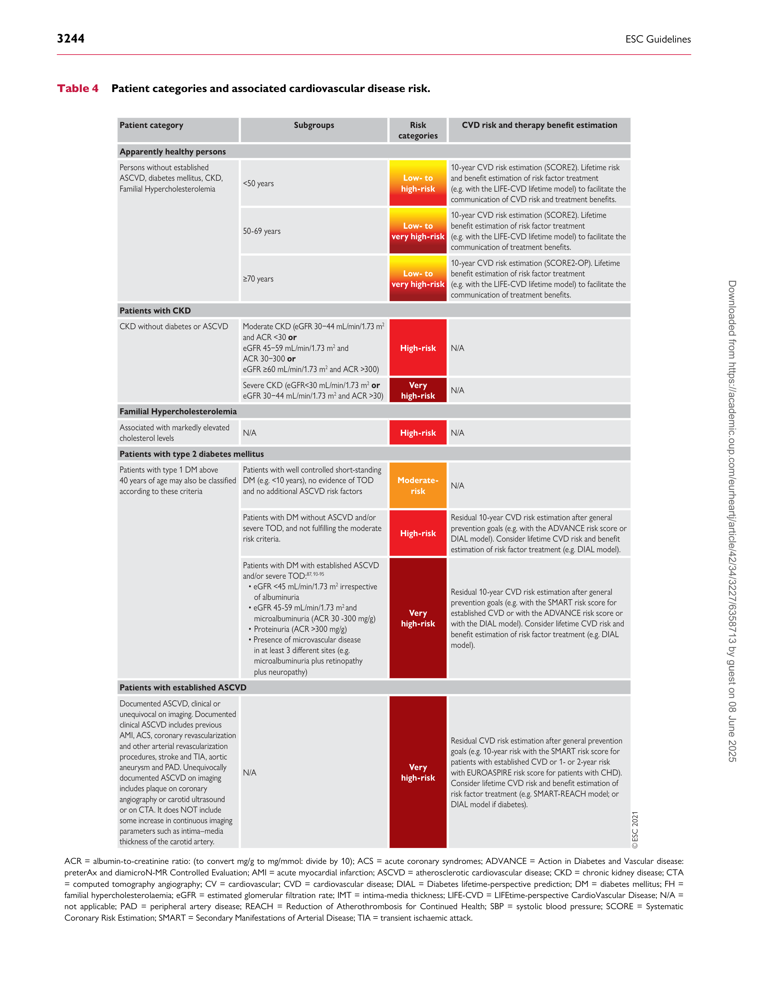
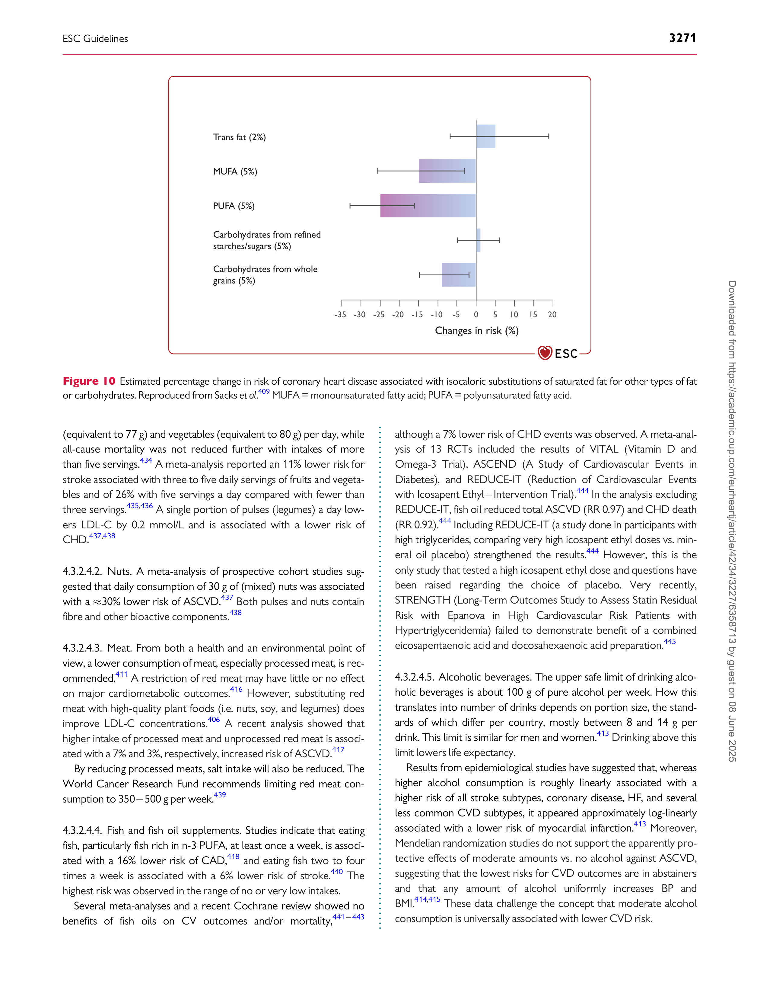

#### ESC GUIDELINES

European Heart Journal (2021) 42, 3227�3337

doi:10.1093/eurheartj/ehab484
# 2021 ESC Guidelines on cardiovascular disease prevention in clinical practice
## Developed by the Task Force for cardiovascular disease prevention in clinical practice with representatives of the European Society of Cardiology and 12 medical societies With the special contribution of the European Association of Preventive Cardiology (EAPC)
#### Authors/Task Force Members: Frank L.J. Visseren* (Chairperson) (Netherlands), Franc¸ois Mach* (Chairperson) (Switzerland), Yvo M. Smulders [†] (Task Force Coordinator) (Netherlands), David Carballo [†] (Task Force Coordinator) (Switzerland), Konstantinos C. Koskinas (Switzerland), Maria Back (Sweden),€ Athanase Benetos [8] (France), Alessandro Biffi [7][,10] (Italy), Jose´-Manuel Boavida [9] (Portugal), Davide Capodanno (Italy), Bernard Cosyns (Belgium), Carolyn Crawford (Northern Ireland), Constantinos H. Davos (Greece), Ileana Desormais (France), Emanuele Di Angelantonio (United Kingdom), Oscar H. Franco (Switzerland), Sigrun Halvorsen (Norway), F. D. Richard Hobbs [13] (United Kingdom), Monika Hollander (Netherlands), Ewa A. Jankowska (Poland), Matthias Michal [11] (Germany), Simona Sacco [6] (Italy), Naveed Sattar (United Kingdom), Lale Tokgozoglu [2] (Turkey), Serena Tonstad (Norway), Konstantinos P. Tsioufis [5] (Greece), Ineke van Dis [3] (Netherlands), Isabelle C. van Gelder (Netherlands), Christoph Wanner [4] (Germany), Bryan Williams (United Kingdom), ESC Scientific Document Group

- Corresponding authors: The two chairpersons contributed equally to the document. Frank Visseren, Department of Vascular Medicine, University Medical Center Utrecht,
Heidelberglaan 100, 3584 CX Utrecht, Netherlands. Tel: þ31 (0)88 7557324, E-mail: F.L.J.Visseren@umcutrecht.nl. Franc¸ois Mach, Cardiology Department, Geneva University Hospital,
Perret-Gentil 4, 1211 Geneva, Switzerland. Tel: þ41 (0)22 372 71 92, E-mail: francois.mach@hcuge.ch. [†] The two task force coordinators contributed equally to the document.

Author/Task Force Member affiliations: listed in Author information.

ESC Clinical Practice Guidelines Committee (CPG): listed in the Appendix.

ESC subspecialty communities having participated in the development of this document. Associations: Association of Cardiovascular Nursing & Allied
Professions (ACNAP), European Association of Cardiovascular Imaging (EACVI), European Association of Preventive Cardiology (EAPC), European Heart Rhythm Association
(EHRA), Heart Failure Association (HFA). Councils: Council for Cardiology Practice, Council on Hypertension. Working Groups: Aorta and Peripheral Vascular Diseases,
Atherosclerosis and Vascular Biology, Cardiovascular Pharmacotherapy.

Patient Forum

The content of these European Society of Cardiology (ESC) Guidelines has been published for personal and educational use only. No commercial use is authorized. No part of
the ESC Guidelines may be translated or reproduced in any form without written permission from the ESC. Permission can be obtained upon submission of a written request to
Oxford University Press, the publisher of the European Heart Journal and the party authorized to handle such permissions on behalf of the ESC (journals.permissions@oup.com).

Disclaimer: The ESC Guidelines represent the views of the ESC and were produced after careful consideration of the scientific and medical knowledge and the evidence available at
the time of their publication. The ESC is not responsible in the event of any contradiction, discrepancy and/or ambiguity between the ESC Guidelines and any other official recommendations or guidelines issued by the relevant public health authorities, in particular in relation to good use of healthcare or therapeutic strategies. Health professionals are encouraged
to take the ESC Guidelines fully into account when exercising their clinical judgment, as well as in the determination and the implementation of preventive, diagnostic or therapeutic
medical strategies; however, the ESC Guidelines do not override, in any way whatsoever, the individual responsibility of health professionals to make appropriate and accurate decisions in consideration of each patient’s health condition and in consultation with that patient and, where appropriate and/or necessary, the patient’s caregiver. Nor do the ESC
Guidelines exempt health professionals from taking into full and careful consideration the relevant official updated recommendations or guidelines issued by the competent public
health authorities, in order to manage each patient’s case in light of the scientifically accepted data pursuant to their respective ethical and professional obligations. It is also the health
professional’s responsibility to verify the applicable rules and regulations relating to drugs and medical devices at the time of prescription.

This article has been co-published with permission in the European Heart Journal and the European Journal of Preventive Cardiology. V C The European Society of Cardiology 2021. All
rights reserved. The articles are identical except for minor stylistic and spelling differences in keeping with each journal’s style. Either citation can be used when citing this article.
For ermissions, please email: journals.permissions@oup.com.

3228 ESC Guidelines

Document Reviewers: Guy De Backer (CPG Review Coordinator) (Belgium), Vera Regitz-Zagrosek (CPG
Review Coordinator) (Germany), Anne Hege Aamodt [6] (Norway), Magdy Abdelhamid (Egypt),
Victor Aboyans (France), Christian Albus [11] (Germany), Riccardo Asteggiano (Italy), Magnus Back€
(Sweden), Michael A. Borger (Germany), Carlos Brotons [13] (Spain), Jelena Celutkien [�] _e (Lithuania), Renata
Cifkova (Czech Republic), Maja Cikes (Croatia), Francesco Cosentino (Italy), Nikolaos Dagres (Germany),
Tine De Backer (Belgium), Dirk De Bacquer (Belgium), Victoria Delgado (Netherlands),
Hester Den Ruijter (Netherlands), Paul Dendale (Belgium), Heinz Drexel (Austria), Volkmar Falk
(Germany), Laurent Fauchier (France), Brian A. Ference (United Kingdom), Jean Ferrie`res (France), Marc
Ferrini (France), Miles Fisher [1] (United Kingdom), Danilo Fliser [4] (Germany), Zlatko Fras (Slovenia), Dan
Gaita [3] (Romania), Simona Giampaoli (Italy), Stephan Gielen (Germany), Ian Graham (Ireland), Catriona
Jennings (Ireland), Torben Jorgensen (Denmark), Alexandra Kautzky-Willer [12] (Austria), Maryam Kavousi
(Netherlands), Wolfgang Koenig (Germany), Aleksandra Konradi (Russia), Dipak Kotecha (United
Kingdom), Ulf Landmesser (Germany), Madalena Lettino (Italy), Basil S. Lewis (Israel), Ale�s Linhart (Czech
Republic), Maja-Lisa Løchen (Norway), Konstantinos Makrilakis [9] (Greece), Giuseppe Mancia [5] (Italy),
Pedro Marques-Vidal (Switzerland), John William McEvoy (Ireland), Paul McGreavy (United Kingdom),
Bela Merkely (Hungary), Lis Neubeck (United Kingdom), Jens Cosedis Nielsen (Denmark), Joep Perk
(Sweden), Steffen E. Petersen (United Kingdom), Anna Sonia Petronio (Italy), Massimo Piepoli (Italy),
Nana Goar Pogosova (Russia), Eva Irene Bossano Prescott (Denmark), Kausik K. Ray [2] (United Kingdom),
Zeljko Reiner (Croatia), Dimitrios J. Richter (Greece), Lars Ryde´n (Sweden), Evgeny Shlyakhto (Russia),
Marta Sitges (Spain), Miguel Sousa-Uva (Portugal), Isabella Sudano (Switzerland), Monica Tiberi [7][,10] (Italy),
Rhian M. Touyz (United Kingdom), Andrea Ungar [8] (Italy), W.M. Monique Verschuren (Netherlands),
Olov Wiklund (Sweden), David Wood (United Kingdom/Ireland), Jose Luis Zamorano (Spain)

All experts involved in the development of these guidelines have submitted declarations of interest.
These have been compiled in a report and published in a supplementary document simultaneously to the
guidelines. The report is also available on the ESC website www.escardio.org/guidelines

Collaborating and endorsing societies: [1] European Association for the Study of Diabetes (EASD);
2 European Atherosclerosis Society (EAS); 3 European Heart Network (EHN); 4 European Renal Association

- European Dialysis and Transplant Association (ERA-EDTA); [5] European Society of Hypertension (ESH);
6 European Stroke Organization (ESO); 7 European Federation of Sports Medicine Association (EFSMA);
8 European Geriatric Medicine Society (EuGMS); 9 International Diabetes Federation Europe (IDF Europe);
10 International Federation of Sport Medicine (FIMS); 11 International Society of Behavioural Medicine
(ISBM); [12] International Society of Gender Medicine (IGM); [13] World Organization of National Colleges,
Academies and Academic Associations of General Practitioners/Family Physicians (WONCA) � Europe

...................................................................................................................................................................................................

Keywords Guidelines - prevention - personalized - population - risk estimation - lifetime risk - lifetime benefit risk management           - shared decision-making           - stepwise approach           - nutrition           - smoking           - healthy lifestyle           psychosocial factors            - blood pressure            - lipids            - diabetes            - smoking            - air pollution            - climate change

### Table of Contents

1. Preamble . . . . . . . . . . . . . . . . . . . . . . . . . . . . . . . . . . . . . . . . . . . . . . . . . . . . . 3233

2. Introduction . . . . . . . . . . . . . . . . . . . . . . . . . . . . . . . . . . . . . . . . . . . . . . . . . . 3234

2.1. Definition and rationale . . . . . . . . . . . . . . . . . . . . . . . . . . . . . . . . . . . 3235

2.2. Development . . . . . . . . . . . . . . . . . . . . . . . . . . . . . . . . . . . . . . . . . . . . . 3236

2.3. Cost-effectiveness . . . . . . . . . . . . . . . . . . . . . . . . . . . . . . . . . . . . . . . . 3236

2.4. What is new? . . . . . . . . . . . . . . . . . . . . . . . . . . . . . . . . . . . . . . . . . . . . . 3236

3. Risk factors and clinical conditions . . . . . . . . . . . . . . . . . . . . . . . . . . . . . 3236

3.1. Target population for assessing cardiovascular disease risk . . 3236

3.2. Risk factors and risk classification . . . . . . . . . . . . . . . . . . . . . . . . . . 3236

3.2.1. Risk factors . . . . . . . . . . . . . . . . . . . . . . . . . . . . . . . . . . . . . . . . . . . 3236

3.2.1.1 Cholesterol . . . . . . . . . . . . . . . . . . . . . . . . . . . . . . . . . . . . . . . . 3242

3.2.1.2 Blood pressure . . . . . . . . . . . . . . . . . . . . . . . . . . . . . . . . . . . . . 3242

3.2.1.3 Cigarette smoking . . . . . . . . . . . . . . . . . . . . . . . . . . . . . . . . . . 3242

3.2.1.4 Diabetes mellitus . . . . . . . . . . . . . . . . . . . . . . . . . . . . . . . . . . . 3243

3.2.1.5 Adiposity . . . . . . . . . . . . . . . . . . . . . . . . . . . . . . . . . . . . . . . . . . 3243

3.2.2. Sex and gender and their impact on health . . . . . . . . . . . . . 3243

3.2.3. Atherosclerotic cardiovascular disease risk classification . 3243

3.2.3.1 A stepwise approach to risk factor treatment and

treatment intensification . . . . . . . . . . . . . . . . . . . . . . . . . . . . . . . . . . . . 3243

3.2.3.2 Risk estimation in apparently healthy people . . . . . . . . . . . 3245

3.2.3.3 Translating cardiovascular disease risk to

treatment thresholds . . . . . . . . . . . . . . . . . . . . . . . . . . . . . . . . . . . . . . 3250

3.2.3.4 Risk estimation and risk factor treatment in

apparently healthy people 50�69 years of age . . . . . . . . . . . . . . . 3253

3.2.3.5 Risk estimation and risk factor treatment

estimation in apparently healthy people �70 years of age . . . . . 3253

ESC Guidelines 3229

3.2.3.6 Risk estimation and risk factor treatment in

apparently healthy people <50 years of age . . . . . . . . . . . . . . . . . 3254

3.2.3.7 Risk estimation and risk factor treatment in patients

with established atherosclerotic cardiovascular disease . . . . . . . . . 3254

3.2.3.8 Risk estimation and risk factor treatment in persons

with type 2 diabetes mellitus . . . . . . . . . . . . . . . . . . . . . . . . . . . . . . . . 3256

3.2.3.9 Risk estimation and risk factor treatment in

persons with type 1 diabetes mellitus . . . . . . . . . . . . . . . . . . . . . . . . 3257

3.2.4. Communication of cardiovascular disease risk . . . . . . . . . . 3257

3.3. Potential risk modifiers . . . . . . . . . . . . . . . . . . . . . . . . . . . . . . . . . . . . 3258

3.3.1. Psychosocial factors . . . . . . . . . . . . . . . . . . . . . . . . . . . . . . . . . . 3258

3.3.2. Ethnicity . . . . . . . . . . . . . . . . . . . . . . . . . . . . . . . . . . . . . . . . . . . . . . 3258

3.3.3. Imaging . . . . . . . . . . . . . . . . . . . . . . . . . . . . . . . . . . . . . . . . . . . . . . . . . 33

3.3.3.1 Coronary artery calcium . . . . . . . . . . . . . . . . . . . . . . . . . . . . . 3259

3.3.3.2 Contrast computed tomography coronary

angiography . . . . . . . . . . . . . . . . . . . . . . . . . . . . . . . . . . . . . . . . . . . . . . 3259

3.3.3.3 Carotid ultrasound . . . . . . . . . . . . . . . . . . . . . . . . . . . . . . . . . . 3259

3.3.3.4 Arterial stiffness . . . . . . . . . . . . . . . . . . . . . . . . . . . . . . . . . . . . 3259

3.3.3.5 Ankle brachial index . . . . . . . . . . . . . . . . . . . . . . . . . . . . . . . . 3259

3.3.3.6 Echocardiography . . . . . . . . . . . . . . . . . . . . . . . . . . . . . . . . . . 3259

3.3.4. Frailty . . . . . . . . . . . . . . . . . . . . . . . . . . . . . . . . . . . . . . . . . . . . . . . . 3259

3.3.5. Family history . . . . . . . . . . . . . . . . . . . . . . . . . . . . . . . . . . . . . . . . . 3259

3.3.6. Genetics . . . . . . . . . . . . . . . . . . . . . . . . . . . . . . . . . . . . . . . . . . . . . 3260

3.3.7. Socioeconomic determinants . . . . . . . . . . . . . . . . . . . . . . . . . 3260

3.3.8. Environmental exposure . . . . . . . . . . . . . . . . . . . . . . . . . . . . . . 3260

3.3.9. Biomarkers in blood or urine . . . . . . . . . . . . . . . . . . . . . . . . . . 3260

3.3.10. Body composition . . . . . . . . . . . . . . . . . . . . . . . . . . . . . . . . . . . 3260

3.3.10.1 Which index of obesity is the best predictor of

cardiovascular risk? . . . . . . . . . . . . . . . . . . . . . . . . . . . . . . . . . . . . . . . . 3261

3.3.10.2 Risk reclassification . . . . . . . . . . . . . . . . . . . . . . . . . . . . . . . . 3261

3.3.10.3 Assess risk factors and cardiovascular disease

risk in persons with obesity . . . . . . . . . . . . . . . . . . . . . . . . . . . . . . . . . . 3262

3.4. Clinical conditions . . . . . . . . . . . . . . . . . . . . . . . . . . . . . . . . . . . . . . . . 3262

3.4.1. Chronic kidney disease . . . . . . . . . . . . . . . . . . . . . . . . . . . . . . . . 3262

3.4.2. Atrial fibrillation . . . . . . . . . . . . . . . . . . . . . . . . . . . . . . . . . . . . . . . 3262

3.4.3. Heart failure . . . . . . . . . . . . . . . . . . . . . . . . . . . . . . . . . . . . . . . . . . 3262

3.4.4. Cancer . . . . . . . . . . . . . . . . . . . . . . . . . . . . . . . . . . . . . . . . . . . . . . . 3263

3.4.4.1 Diagnosis and screening . . . . . . . . . . . . . . . . . . . . . . . . . . . . . 3264

3.4.4.2 Prevention of cardiotoxicity and cardiovascular

risk factors . . . . . . . . . . . . . . . . . . . . . . . . . . . . . . . . . . . . . . . . . . . . . . . . 3264

3.4.5. Chronic obstructive pulmonary disease . . . . . . . . . . . . . . . . 3264

3.4.6. Inflammatory conditions . . . . . . . . . . . . . . . . . . . . . . . . . . . . . . 3265

3.4.7. Infections (human immunodeficiency virus, influenza,

periodontitis) . . . . . . . . . . . . . . . . . . . . . . . . . . . . . . . . . . . . . . . . . . . . . . 3265

3.4.8. Migraine . . . . . . . . . . . . . . . . . . . . . . . . . . . . . . . . . . . . . . . . . . . . . . 3265

3.4.9. Sleep disorders and obstructive sleep apnoea . . . . . . . . . . 3265

3.4.10. Mental disorders . . . . . . . . . . . . . . . . . . . . . . . . . . . . . . . . . . . . 3265

3.4.11. Non-alcoholic fatty liver disease . . . . . . . . . . . . . . . . . . . . . . 3266

3.4.12. Sex-specific conditions . . . . . . . . . . . . . . . . . . . . . . . . . . . . . . . 3266

3.4.12.1 Obstetric conditions . . . . . . . . . . . . . . . . . . . . . . . . . . . . . . . 3266

3.4.12.2 Non-obstetric conditions . . . . . . . . . . . . . . . . . . . . . . . . . . . 3266

3.4.12.3 Erectile dysfunction . . . . . . . . . . . . . . . . . . . . . . . . . . . . . . . . 3266

4. Risk factors and interventions at the individual level . . . . . . . . . . . . . 3266

4.1. Treatment recommendations: classes, grades, and

freedom of choice . . . . . . . . . . . . . . . . . . . . . . . . . . . . . . . . . . . . . . . . . . . . 3266

4.2. Optimizing cardiovascular risk management . . . . . . . . . . . . . . . . 3268

3.3.1. Psychosocial factors . . . . . . . . . . . . . . . . . . . . . . . . . . . . . . . . . . 3258

3.3.2. Ethnicity . . . . . . . . . . . . . . . . . . . . . . . . . . . . . . . . . . . . . . . . . . . . . . 3258

3.3.3. Imaging . . . . . . . . . . . . . . . . . . . . . . . . . . . . . . . . . . . . . . . . . . . . . . . . . 33

3.3.3.1 Coronary artery calcium . . . . . . . . . . . . . . . . . . . . . . . . . . . . . 3259

3.3.3.2 Contrast computed tomography coronary

angiography . . . . . . . . . . . . . . . . . . . . . . . . . . . . . . . . . . . . . . . . . . . . . . 3259

3.3.3.3 Carotid ultrasound . . . . . . . . . . . . . . . . . . . . . . . . . . . . . . . . . . 3259

3.3.3.4 Arterial stiffness . . . . . . . . . . . . . . . . . . . . . . . . . . . . . . . . . . . . 3259

3.3.3.5 Ankle brachial index . . . . . . . . . . . . . . . . . . . . . . . . . . . . . . . . 3259

3.3.3.6 Echocardiography . . . . . . . . . . . . . . . . . . . . . . . . . . . . . . . . . . 3259

3.3.4. Frailty . . . . . . . . . . . . . . . . . . . . . . . . . . . . . . . . . . . . . . . . . . . . . . . . 3259

3.3.5. Family history . . . . . . . . . . . . . . . . . . . . . . . . . . . . . . . . . . . . . . . . . 3259

3.3.6. Genetics . . . . . . . . . . . . . . . . . . . . . . . . . . . . . . . . . . . . . . . . . . . . . 3260

3.3.7. Socioeconomic determinants . . . . . . . . . . . . . . . . . . . . . . . . . 3260

3.3.8. Environmental exposure . . . . . . . . . . . . . . . . . . . . . . . . . . . . . . 3260

3.3.9. Biomarkers in blood or urine . . . . . . . . . . . . . . . . . . . . . . . . . . 3260

3.3.10. Body composition . . . . . . . . . . . . . . . . . . . . . . . . . . . . . . . . . . . 3260

3.3.10.1 Which index of obesity is the best predictor of

cardiovascular risk? . . . . . . . . . . . . . . . . . . . . . . . . . . . . . . . . . . . . . . . . 3261

3.3.10.2 Risk reclassification . . . . . . . . . . . . . . . . . . . . . . . . . . . . . . . . 3261

3.3.10.3 Assess risk factors and cardiovascular disease

risk in persons with obesity . . . . . . . . . . . . . . . . . . . . . . . . . . . . . . . . . . 3262

3.4. Clinical conditions . . . . . . . . . . . . . . . . . . . . . . . . . . . . . . . . . . . . . . . . 3262

3.4.1. Chronic kidney disease . . . . . . . . . . . . . . . . . . . . . . . . . . . . . . . . 3262

3.4.2. Atrial fibrillation . . . . . . . . . . . . . . . . . . . . . . . . . . . . . . . . . . . . . . . 3262

3.4.3. Heart failure . . . . . . . . . . . . . . . . . . . . . . . . . . . . . . . . . . . . . . . . . . 3262

3.4.4. Cancer . . . . . . . . . . . . . . . . . . . . . . . . . . . . . . . . . . . . . . . . . . . . . . . 3263

3.4.4.1 Diagnosis and screening . . . . . . . . . . . . . . . . . . . . . . . . . . . . . 3264

3.4.4.2 Prevention of cardiotoxicity and cardiovascular

risk factors . . . . . . . . . . . . . . . . . . . . . . . . . . . . . . . . . . . . . . . . . . . . . . . . 3264

3.4.5. Chronic obstructive pulmonary disease . . . . . . . . . . . . . . . . 3264

3.4.6. Inflammatory conditions . . . . . . . . . . . . . . . . . . . . . . . . . . . . . . 3265

3.4.7. Infections (human immunodeficiency virus, influenza,

periodontitis) . . . . . . . . . . . . . . . . . . . . . . . . . . . . . . . . . . . . . . . . . . . . . . 3265

3.4.8. Migraine . . . . . . . . . . . . . . . . . . . . . . . . . . . . . . . . . . . . . . . . . . . . . . 3265

3.4.9. Sleep disorders and obstructive sleep apnoea . . . . . . . . . . 3265

3.4.10. Mental disorders . . . . . . . . . . . . . . . . . . . . . . . . . . . . . . . . . . . . 3265

3.4.11. Non-alcoholic fatty liver disease . . . . . . . . . . . . . . . . . . . . . . 3266

3.4.12. Sex-specific conditions . . . . . . . . . . . . . . . . . . . . . . . . . . . . . . . 3266

3.4.12.1 Obstetric conditions . . . . . . . . . . . . . . . . . . . . . . . . . . . . . . . 3266

3.4.12.2 Non-obstetric conditions . . . . . . . . . . . . . . . . . . . . . . . . . . . 3266

3.4.12.3 Erectile dysfunction . . . . . . . . . . . . . . . . . . . . . . . . . . . . . . . . 3266

4. Risk factors and interventions at the individual level . . . . . . . . . . . . . 3266

4.1. Treatment recommendations: classes, grades, and

freedom of choice . . . . . . . . . . . . . . . . . . . . . . . . . . . . . . . . . . . . . . . . . . . . 3266

4.2. Optimizing cardiovascular risk management . . . . . . . . . . . . . . . . 3268

4.2.1. Goals of clinician-patient communication . . . . . . . . . . . . . . 3268

4.2.2. How to improve motivation? . . . . . . . . . . . . . . . . . . . . . . . . . . 3268

4.2.3. Optimizing drug adherence . . . . . . . . . . . . . . . . . . . . . . . . . . . 3268

4.2.4. Treatment goals . . . . . . . . . . . . . . . . . . . . . . . . . . . . . . . . . . . . . . 3268

4.3. Optimizing lifestyle . . . . . . . . . . . . . . . . . . . . . . . . . . . . . . . . . . . . . . . . 3268

4.3.1. Physical activity and exercise . . . . . . . . . . . . . . . . . . . . . . . . . . 3268

4.3.1.1 Physical activity prescription . . . . . . . . . . . . . . . . . . . . . . . . . . 3269

4.3.1.2 Aerobic physical activity . . . . . . . . . . . . . . . . . . . . . . . . . . . . . 3269

4.3.1.3 Resistance exercise . . . . . . . . . . . . . . . . . . . . . . . . . . . . . . . . . 3269

4.3.1.4 Sedentary behaviour . . . . . . . . . . . . . . . . . . . . . . . . . . . . . . . . 3269

4.3.2. Nutrition and alcohol . . . . . . . . . . . . . . . . . . . . . . . . . . . . . . . . . 4269

4.3.2.1 Fatty acids . . . . . . . . . . . . . . . . . . . . . . . . . . . . . . . . . . . . . . . . . 3270

4.3.2.2 Minerals and vitamins . . . . . . . . . . . . . . . . . . . . . . . . . . . . . . . 3270

4.3.2.3 Fibre . . . . . . . . . . . . . . . . . . . . . . . . . . . . . . . . . . . . . . . . . . . . . . 3270

4.3.2.4 Specific foods and food groups . . . . . . . . . . . . . . . . . . . . . . . 3270

4.3.2.4.1. Fruits, vegetables, and pulses . . . . . . . . . . . . . . . . . . 3270

4.3.2.4.2. Nuts . . . . . . . . . . . . . . . . . . . . . . . . . . . . . . . . . . . . . . . . . 3271

4.3.2.4.3. Meat . . . . . . . . . . . . . . . . . . . . . . . . . . . . . . . . . . . . . . . . . 3271

4.3.2.4.4. Fish and fish oil supplements . . . . . . . . . . . . . . . . . . 3271

4.3.2.4.5. Alcoholic beverages . . . . . . . . . . . . . . . . . . . . . . . . . . 3271

4.3.2.4.6. Soft drinks and sugar . . . . . . . . . . . . . . . . . . . . . . . . . . 3272

4.3.2.4.7. Coffee . . . . . . . . . . . . . . . . . . . . . . . . . . . . . . . . . . . . . . . 3272

4.3.2.4.8. Functional foods . . . . . . . . . . . . . . . . . . . . . . . . . . . . . . 3272

4.3.2.4.9. Dietary patterns . . . . . . . . . . . . . . . . . . . . . . . . . . . . . . 3272

4.3.3. Bodyweight and composition . . . . . . . . . . . . . . . . . . . . . . . . . . 3272

4.3.3.1 Treatment goals and modalities . . . . . . . . . . . . . . . . . . . . . . 3272

4.3.3.2 Diets for weight loss . . . . . . . . . . . . . . . . . . . . . . . . . . . . . . . . . 3272

4.4. Mental healthcare and psychosocial interventions . . . . . . . . . . 3273

4.5. Smoking intervention . . . . . . . . . . . . . . . . . . . . . . . . . . . . . . . . . . . . . 3273

4.5.1. Smoking cessation . . . . . . . . . . . . . . . . . . . . . . . . . . . . . . . . . . . . 3273

4.5.2. Evidence-based drug interventions . . . . . . . . . . . . . . . . . . . . 3275

4.5.2.1 Electronic cigarettes . . . . . . . . . . . . . . . . . . . . . . . . . . . . . . . . 3275

4.6. Lipids . . . . . . . . . . . . . . . . . . . . . . . . . . . . . . . . . . . . . . . . . . . . . . . . . . . . . 3275

4.6.1. Measurement of lipids and lipoproteins . . . . . . . . . . . . . . . . 3275

4.6.1.1 Fasting vs. non-fasting measurements . . . . . . . . . . . . . . . . . 3275

4.6.1.2 Low-density lipoprotein cholesterol measurement . . . . . . . . 50

4.6.1.3 Non-high-density lipoprotein cholesterol . . . . . . . . . . . . . . . 3276

4.6.1.4 Apolipoprotein B . . . . . . . . . . . . . . . . . . . . . . . . . . . . . . . . . . . 3276

4.6.2. Defining lipid goals . . . . . . . . . . . . . . . . . . . . . . . . . . . . . . . . . . . . 3276

4.6.2.1 Low-density lipoprotein cholesterol goals . . . . . . . . . . . . . . 3276

4.6.2.2 Triglyceride-rich lipoproteins and their remnants . . . . . . . . 3276

4.6.2.3 High-density lipoprotein cholesterol . . . . . . . . . . . . . . . . . . . 3276

4.6.3. Strategies to control dyslipidaemias . . . . . . . . . . . . . . . . . . . . 3278

4.6.3.1 Strategies to control low-density lipoprotein cholesterol . . 3278

4.6.3.1.1. Diet and lifestyle modifications . . . . . . . . . . . . . . . . 3278

4.6.3.1.2. Drugs for treatment of dyslipidaemias . . . . . . . . . 3278

4.6.3.1.3. Statins . . . . . . . . . . . . . . . . . . . . . . . . . . . . . . . . . . . . . . . 3279

4.6.3.1.3.1. Adverse effects, interactions, and

adherence to statin therapy . . . . . . . . . . . . . . . . . . . . . . . . . 3279

4.6.3.1.4. Cholesterol absorption inhibitors (ezetimibe) . 3279

4.6.3.1.5. Proprotein convertase subtilisin/kexin type 9

inhibitors . . . . . . . . . . . . . . . . . . . . . . . . . . . . . . . . . . . . . . . . . . . . . . 3279

4.6.3.2 Strategies to control plasma triglycerides . . . . . . . . . . . . . . 3279

4.6.3.2.1. Fibrates . . . . . . . . . . . . . . . . . . . . . . . . . . . . . . . . . . . . . . 3279

4.6.4. Important groups . . . . . . . . . . . . . . . . . . . . . . . . . . . . . . . . . . . . . 3280

4.6.4.1 Women . . . . . . . . . . . . . . . . . . . . . . . . . . . . . . . . . . . . . . . . . . . 3280

4.6.4.2 Older patients (�70 years) . . . . . . . . . . . . . . . . . . . . . . . . . . 3280

4.6.4.3 Diabetes mellitus . . . . . . . . . . . . . . . . . . . . . . . . . . . . . . . . . . . 3280

3230 ESC Guidelines

4.6.4.4 Chronic kidney disease . . . . . . . . . . . . . . . . . . . . . . . . . . . . . . 3281

4.6.4.5 Familial hypercholesterolaemia . . . . . . . . . . . . . . . . . . . . . . 3281

4.7. Blood pressure . . . . . . . . . . . . . . . . . . . . . . . . . . . . . . . . . . . . . . . . . . . 3281

4.7.1. Definition and classification of hypertension . . . . . . . . . . . . 3283

4.7.2. Blood pressure measurement . . . . . . . . . . . . . . . . . . . . . . . . . 3283

4.7.2.1 Office blood pressure measurement . . . . . . . . . . . . . . . . . . 3283

4.7.2.2 Unattended automated office blood pressure

measurement . . . . . . . . . . . . . . . . . . . . . . . . . . . . . . . . . . . . . . . . . . . . . 3283

4.7.2.3 Ambulatory blood pressure monitoring . . . . . . . . . . . . . . . . 3283

4.7.2.4 Home blood pressure monitoring . . . . . . . . . . . . . . . . . . . . . 3283

4.7.3. Screening and diagnosis of hypertension . . . . . . . . . . . . . . . 3283

4.7.3.1 White-coat and masked hypertension . . . . . . . . . . . . . . . . . 3284

4.7.4. Clinical evaluation and risk stratification in

hypertensive patients . . . . . . . . . . . . . . . . . . . . . . . . . . . . . . . . . . . . . . . 3284

4.7.5. Treatment of hypertension . . . . . . . . . . . . . . . . . . . . . . . . . . . . 3285

4.7.5.1 Lifestyle interventions to lower blood pressure

and/or reduce cardiovascular risk . . . . . . . . . . . . . . . . . . . . . . . . . . . . 3285

4.7.5.2 Initiation of drug treatment . . . . . . . . . . . . . . . . . . . . . . . . . . 3285

4.7.5.3 Blood pressure treatment targets . . . . . . . . . . . . . . . . . . . . . 3285

4.7.5.3.1. Blood pressure targets according to ambulatory

and home blood pressure monitoring . . . . . . . . . . . . . . . . . . 3287

4.7.5.4 Drug treatment of hypertension . . . . . . . . . . . . . . . . . . . . . . 3288

4.7.6. Resistant hypertension . . . . . . . . . . . . . . . . . . . . . . . . . . . . . . . . 3288

4.7.7. Management of hypertension in women . . . . . . . . . . . . . . . 3288

4.7.8. Duration of treatment and follow-up . . . . . . . . . . . . . . . . . . 3288

4.8. Diabetes mellitus . . . . . . . . . . . . . . . . . . . . . . . . . . . . . . . . . . . . . . . . . 3288

4.8.1. Key risk factor concepts and newer paradigms . . . . . . . . . 3289

4.8.1.1 Lifestyle intervention . . . . . . . . . . . . . . . . . . . . . . . . . . . . . . . . 3289

4.8.1.2 Glycaemic control . . . . . . . . . . . . . . . . . . . . . . . . . . . . . . . . . . 3289

4.8.1.3 Newer diabetes mellitus drug classes: cardiovascular

disease benefits . . . . . . . . . . . . . . . . . . . . . . . . . . . . . . . . . . . . . . . . . . . 3290

4.8.2. Type 1 diabetes mellitus . . . . . . . . . . . . . . . . . . . . . . . . . . . . . . . 3290

4.9. Antithrombotic therapy . . . . . . . . . . . . . . . . . . . . . . . . . . . . . . . . . . . 3290

4.9.1. Antithrombotic therapy in individuals without

atherosclerotic disease . . . . . . . . . . . . . . . . . . . . . . . . . . . . . . . . . . . . . 3291

4.9.2. Antithrombotic therapy in individuals with established

atherosclerotic disease . . . . . . . . . . . . . . . . . . . . . . . . . . . . . . . . . . . . . 3291

4.9.3. Proton pump inhibitors . . . . . . . . . . . . . . . . . . . . . . . . . . . . . . . 3291

4.10. Anti-inflammatory therapy . . . . . . . . . . . . . . . . . . . . . . . . . . . . . . . 3291

4.11. Cardiac rehabilitation and prevention programmes . . . . . . . . 3292

5. Policy interventions at the population level . . . . . . . . . . . . . . . . . . . . . 3292

5.1. Population-level approaches to the prevention of

cardiovascular disease . . . . . . . . . . . . . . . . . . . . . . . . . . . . . . . . . . . . . . . . . 3293

5.2. Specific risk factor interventions at the population level . . . . . 3293

5.2.1. Physical activity . . . . . . . . . . . . . . . . . . . . . . . . . . . . . . . . . . . . . . . 3293

5.2.2. Diet . . . . . . . . . . . . . . . . . . . . . . . . . . . . . . . . . . . . . . . . . . . . . . . . . . 3293

5.2.3. Smoking and tobacco use . . . . . . . . . . . . . . . . . . . . . . . . . . . . . 3293

5.2.4. Alcohol . . . . . . . . . . . . . . . . . . . . . . . . . . . . . . . . . . . . . . . . . . . . . . 3293

5.3. Environment, air pollution, and climate change . . . . . . . . . . . . . 3293

5.3.1. Climate change . . . . . . . . . . . . . . . . . . . . . . . . . . . . . . . . . . . . . . . 3294

5.4. Implications for public health policy and advocacy at the

governmental and non-governmental level . . . . . . . . . . . . . . . . . . . . . 3294

6. Risk management of disease-specific cardiovascular disease . . . . . 3294

6.1. Coronary artery disease . . . . . . . . . . . . . . . . . . . . . . . . . . . . . . . . . . . 3294

6.2. Heart failure . . . . . . . . . . . . . . . . . . . . . . . . . . . . . . . . . . . . . . . . . . . . . . 3295

6.3. Cerebrovascular diseases . . . . . . . . . . . . . . . . . . . . . . . . . . . . . . . . . 3296

6.5. Chronic kidney disease . . . . . . . . . . . . . . . . . . . . . . . . . . . . . . . . . . . . 3298

6.6. Atrial fibrillation . . . . . . . . . . . . . . . . . . . . . . . . . . . . . . . . . . . . . . . . . . . 3298

6.7. Multimorbidity . . . . . . . . . . . . . . . . . . . . . . . . . . . . . . . . . . . . . . . . . . . . 3299

7. Key messages . . . . . . . . . . . . . . . . . . . . . . . . . . . . . . . . . . . . . . . . . . . . . . . . . 3299

8. Gaps in evidence . . . . . . . . . . . . . . . . . . . . . . . . . . . . . . . . . . . . . . . . . . . . . . 3302

9. ‘What to do’ and ‘what not to do’ messages from the guidelines . 3205

10. Quality indicators . . . . . . . . . . . . . . . . . . . . . . . . . . . . . . . . . . . . . . . . . . . . 3310

11. Supplementary data . . . . . . . . . . . . . . . . . . . . . . . . . . . . . . . . . . . . . . . . . . 3310

12. Author information . . . . . . . . . . . . . . . . . . . . . . . . . . . . . . . . . . . . . . . . . . 3310

13. Appendix . . . . . . . . . . . . . . . . . . . . . . . . . . . . . . . . . . . . . . . . . . . . . . . . . . . . 3311

14. References . . . . . . . . . . . . . . . . . . . . . . . . . . . . . . . . . . . . . . . . . . . . . . . . . . 3312

Recommendations

Recommendations for CVD risk assessment . . . . . . . . . . . . . . . . . . . . . . 3242

Recommendations for CVD risk estimation . . . . . . . . . . . . . . . . . . . . . . 3256

Recommendation for CVD risk communication . . . . . . . . . . . . . . . . . . 3257

Recommendations for CVD risk modifiers . . . . . . . . . . . . . . . . . . . . . . . . 3257

Recommendations for cardiovascular disease risk related to air

pollution . . . . . . . . . . . . . . . . . . . . . . . . . . . . . . . . . . . . . . . . . . . . . . . . . . . . . . . . 3260

Recommendations for cardiovascular disease assessment in specific

clinical conditions . . . . . . . . . . . . . . . . . . . . . . . . . . . . . . . . . . . . . . . . . . . . . . . 3261

Recommendations for physical activity . . . . . . . . . . . . . . . . . . . . . . . . . . . 3268

Recommendations for nutrition and alcohol . . . . . . . . . . . . . . . . . . . . . . 3269

Recommendations for body weight . . . . . . . . . . . . . . . . . . . . . . . . . . . . . . 3272

Recommendations for mental healthcare and psychosocial

interventions at the individual level . . . . . . . . . . . . . . . . . . . . . . . . . . . . . . . 3273

Recommendations for smoking intervention strategies . . . . . . . . . . . . 3273

Recommendation on low-density lipoprotein cholesterol goals . . . . 3276

Recommendations for pharmacological low-density lipoprotein cholesterol

lowering for those <70 years of age (for recommendations for persons

aged >_70 years, see respective recommendations tables) . . . . . . . . . . . . 3278

Recommendations for drug treatments of patients with

hypertriglyceridaemia.. . . . . . . . . . . . . . . . . . . . . . . . . . . . . . . . . . . . . . . . . . . . 3284

Recommendations for the treatment of dyslipidaemias in older

people (>_70 years) . . . . . . . . . . . . . . . . . . . . . . . . . . . . . . . . . . . . . . . . . . . . . . 3284

Recommendations for the treatment of dyslipidaemias in diabetes

mellitus . . . . . . . . . . . . . . . . . . . . . . . . . . . . . . . . . . . . . . . . . . . . . . . . . . . . . . . . . . 3284

Recommendations for lipid management in patients with moderate
tosevere chronic kidney disease (Kidney Disease Outcomes

�
Quality Initiative stages 3 5) . . . . . . . . . . . . . . . . . . . . . . . . . . . . . . . . . . . . . 3281

Summary of recommendations for the clinical management of

hypertension . . . . . . . . . . . . . . . . . . . . . . . . . . . . . . . . . . . . . . . . . . . . . . . . . . . . 3282

Recommendations for the treatment of patients with diabetes

mellitus . . . . . . . . . . . . . . . . . . . . . . . . . . . . . . . . . . . . . . . . . . . . . . . . . . . . . . . . . 3288

Recommendations for antithrombotic therapy . . . . . . . . . . . . . . . . . . . . 3290

Recommendation for anti-inflammatory therapy . . . . . . . . . . . . . . . . . . 3291

Recommendations for cardiac rehabilitation . . . . . . . . . . . . . . . . . . . . . . 3292

Recommendations for policy interventions at the population level . . 3292

Recommendations for patients with coronary artery disease . . . . . . 3294

Recommendations regarding pharmacological and non
pharmacological interventions for patients with symptomatic

(New York Heart Association class II-IV) heart failure with reduced

ejection fraction (left ventricular ejection fraction <40%) with

proven benefits on clinical outcomes, including cardiovascular

morbidity and mortality . . . . . . . . . . . . . . . . . . . . . . . . . . . . . . . . . . . . . . . . . . 3295

Recommendations for patients with cerebrovascular disease . . . . . . 3297

4.7.1. Definition and classification of hypertension . . . . . . . . . . . . 3283

4.7.2. Blood pressure measurement . . . . . . . . . . . . . . . . . . . . . . . . . 3283

4.7.2.1 Office blood pressure measurement . . . . . . . . . . . . . . . . . . 3283

4.7.2.2 Unattended automated office blood pressure

measurement . . . . . . . . . . . . . . . . . . . . . . . . . . . . . . . . . . . . . . . . . . . . . 3283

4.7.2.3 Ambulatory blood pressure monitoring . . . . . . . . . . . . . . . . 3283

4.7.2.4 Home blood pressure monitoring . . . . . . . . . . . . . . . . . . . . . 3283

4.7.3. Screening and diagnosis of hypertension . . . . . . . . . . . . . . . 3283

4.7.3.1 White-coat and masked hypertension . . . . . . . . . . . . . . . . . 3284

4.7.4. Clinical evaluation and risk stratification in

hypertensive patients . . . . . . . . . . . . . . . . . . . . . . . . . . . . . . . . . . . . . . . 3284

4.7.5. Treatment of hypertension . . . . . . . . . . . . . . . . . . . . . . . . . . . . 3285

4.7.5.1 Lifestyle interventions to lower blood pressure

and/or reduce cardiovascular risk . . . . . . . . . . . . . . . . . . . . . . . . . . . . 3285

4.7.5.2 Initiation of drug treatment . . . . . . . . . . . . . . . . . . . . . . . . . . 3285

4.7.5.3 Blood pressure treatment targets . . . . . . . . . . . . . . . . . . . . . 3285

4.7.5.3.1. Blood pressure targets according to ambulatory

and home blood pressure monitoring . . . . . . . . . . . . . . . . . . 3287

4.7.5.4 Drug treatment of hypertension . . . . . . . . . . . . . . . . . . . . . . 3288

4.7.6. Resistant hypertension . . . . . . . . . . . . . . . . . . . . . . . . . . . . . . . . 3288

4.7.7. Management of hypertension in women . . . . . . . . . . . . . . . 3288

4.7.8. Duration of treatment and follow-up . . . . . . . . . . . . . . . . . . 3288

4.8. Diabetes mellitus . . . . . . . . . . . . . . . . . . . . . . . . . . . . . . . . . . . . . . . . . 3288

4.8.1. Key risk factor concepts and newer paradigms . . . . . . . . . 3289

4.8.1.1 Lifestyle intervention . . . . . . . . . . . . . . . . . . . . . . . . . . . . . . . . 3289

4.8.1.2 Glycaemic control . . . . . . . . . . . . . . . . . . . . . . . . . . . . . . . . . . 3289

4.8.1.3 Newer diabetes mellitus drug classes: cardiovascular

disease benefits . . . . . . . . . . . . . . . . . . . . . . . . . . . . . . . . . . . . . . . . . . . 3290

4.8.2. Type 1 diabetes mellitus . . . . . . . . . . . . . . . . . . . . . . . . . . . . . . . 3290

4.9. Antithrombotic therapy . . . . . . . . . . . . . . . . . . . . . . . . . . . . . . . . . . . 3290

4.9.1. Antithrombotic therapy in individuals without

atherosclerotic disease . . . . . . . . . . . . . . . . . . . . . . . . . . . . . . . . . . . . . 3291

4.9.2. Antithrombotic therapy in individuals with established

atherosclerotic disease . . . . . . . . . . . . . . . . . . . . . . . . . . . . . . . . . . . . . 3291

4.9.3. Proton pump inhibitors . . . . . . . . . . . . . . . . . . . . . . . . . . . . . . . 3291

4.10. Anti-inflammatory therapy . . . . . . . . . . . . . . . . . . . . . . . . . . . . . . . 3291

4.11. Cardiac rehabilitation and prevention programmes . . . . . . . . 3292

5. Policy interventions at the population level . . . . . . . . . . . . . . . . . . . . . 3292

5.1. Population-level approaches to the prevention of

cardiovascular disease . . . . . . . . . . . . . . . . . . . . . . . . . . . . . . . . . . . . . . . . . 3293

5.2. Specific risk factor interventions at the population level . . . . . 3293

5.2.1. Physical activity . . . . . . . . . . . . . . . . . . . . . . . . . . . . . . . . . . . . . . . 3293

5.2.2. Diet . . . . . . . . . . . . . . . . . . . . . . . . . . . . . . . . . . . . . . . . . . . . . . . . . . 3293

5.2.3. Smoking and tobacco use . . . . . . . . . . . . . . . . . . . . . . . . . . . . . 3293

5.2.4. Alcohol . . . . . . . . . . . . . . . . . . . . . . . . . . . . . . . . . . . . . . . . . . . . . . 3293

5.3. Environment, air pollution, and climate change . . . . . . . . . . . . . 3293

5.3.1. Climate change . . . . . . . . . . . . . . . . . . . . . . . . . . . . . . . . . . . . . . . 3294

5.4. Implications for public health policy and advocacy at the

governmental and non-governmental level . . . . . . . . . . . . . . . . . . . . . 3294

6. Risk management of disease-specific cardiovascular disease . . . . . 3294

6.1. Coronary artery disease . . . . . . . . . . . . . . . . . . . . . . . . . . . . . . . . . . . 3294

6.2. Heart failure . . . . . . . . . . . . . . . . . . . . . . . . . . . . . . . . . . . . . . . . . . . . . . 3295

6.3. Cerebrovascular diseases . . . . . . . . . . . . . . . . . . . . . . . . . . . . . . . . . 3296

6.4. Lower extremity artery disease . . . . . . . . . . . . . . . . . . . . . . . . . . . . 3297

ESC Guidelines 3231

Recommendations for patients with lower extremity artery disease:

best medical therapy . . . . . . . . . . . . . . . . . . . . . . . . . . . . . . . . . . . . . . . . . . . . 3297

Recommendations in patients with chronic kidney disease: best

medical therapy . . . . . . . . . . . . . . . . . . . . . . . . . . . . . . . . . . . . . . . . . . . . . . . . . 3310

Recommendations for lifestyle interventions and management of risk

factors and concomitant diseases in patients with atrial fibrillation . . 3310

Tables

Table 1 Classes of recommendations . . . . . . . . . . . . . . . . . . . . . . . . . . . . . 3234

Table 2 Levels of evidence . . . . . . . . . . . . . . . . . . . . . . . . . . . . . . . . . . . . . . . 3234

Table 3 New recommendations and new and revised concepts . . . . 3237

Table 4 Patient categories and associated cardiovascular disease

risk . . . . . . . . . . . . . . . . . . . . . . . . . . . . . . . . . . . . . . . . . . . . . . . . . . . . . . . . . . . . . 3244

Table 5 Cardiovascular disease risk categories based on

Systemic Coronary Risk Estimation 2 and Systemic Coronary

Risk Estimation 2-Older Persons in apparently healthy people

according to age . . . . . . . . . . . . . . . . . . . . . . . . . . . . . . . . . . . . . . . . . . . . . . . . . 3251

Table 6 Treatment goals for different patient categories . . . . . . . . . . . 3267

Table 7 Classification of physical activity intensity and examples of

absolute and relative intensity levels . . . . . . . . . . . . . . . . . . . . . . . . . . . . . 3269

Table 8 Healthy diet characteristics . . . . . . . . . . . . . . . . . . . . . . . . . . . . . . . 3270

Table 9 ‘Very brief advice’ for smoking cessation . . . . . . . . . . . . . . . . . . 3275

Table 10 Corresponding non-high-density lipoprotein cholesterol

and apolipoprotein B levels for commonly used low-density

lipoprotein cholesterol goals . . . . . . . . . . . . . . . . . . . . . . . . . . . . . . . . . . . . . 3275

Table 11 Dutch Lipid ClinicNetwork diagnostic criteria for familial

hypercholesterolaemia . . . . . . . . . . . . . . . . . . . . . . . . . . . . . . . . . . . . . . . . . . 3281

Table 12 Categories for conventionally measured seated office

blood pressurea . . . . . . . . . . . . . . . . . . . . . . . . . . . . . . . . . . . . . . . . . . . . . . . . . 3283

Table 13 Definitions of hypertension according to office,

ambulatory, and home blood pressure . . . . . . . . . . . . . . . . . . . . . . . . . . . 3283

Table 14 Considerations in blood pressure measurement . . . . . . . . . 3283

Table 15 Indications for home blood pressure monitoring or

ambulatory blood pressuremonitoring . . . . . . . . . . . . . . . . . . . . . . . . . . . 3284

Table 16 Routine tests for patients with hypertension . . . . . . . . . . . . . 3285

Table 17 Patient characteristics that should raise the suspicion of

secondary hypertension . . . . . . . . . . . . . . . . . . . . . . . . . . . . . . . . . . . . . . . . . . 3285

Table 18 Recommended office blood pressure target ranges. The

first step in all groups is a reduction to systolic blood pressure

<140 mmHg . . . . . . . . . . . . . . . . . . . . . . . . . . . . . . . . . . . . . . . . . . . . . . . . . . . . 3287

Figures

Figure 1 Central Illustration . . . . . . . . . . . . . . . . . . . . . . . . . . . . . . . . . . . . . . 3235

Figure 2 Examples of a stepwise approach to risk stratification and

treatment options . . . . . . . . . . . . . . . . . . . . . . . . . . . . . . . . . . . . . . . . . . . . . . . 3245

Figure 3 Systematic Coronary Risk Estimation 2 and Systematic

Coronary Risk Estimation 2-Older Persons risk charts for

fatal and non-fatal (myocardial infarction, stroke) cardiovascular

disease . . . . . . . . . . . . . . . . . . . . . . . . . . . . . . . . . . . . . . . . . . . . . . . . . . . . . . . . . . 3246

Figure 4 Risk regions based on World Health Organization

cardiovascular mortality rates . . . . . . . . . . . . . . . . . . . . . . . . . . . . . . . . . . . . 3250

Figure 5 Schematic representation of increasing 10-year

cardiovascular disease risk thresholds across age groups . . . . . . . . . . 3251

Figure 6 Flow chart of cardiovascular disease risk and risk factor

Tables

Table 1 Classes of recommendations . . . . . . . . . . . . . . . . . . . . . . . . . . . . . 3234

Table 2 Levels of evidence . . . . . . . . . . . . . . . . . . . . . . . . . . . . . . . . . . . . . . . 3234

Table 3 New recommendations and new and revised concepts . . . . 3237

Table 4 Patient categories and associated cardiovascular disease

risk . . . . . . . . . . . . . . . . . . . . . . . . . . . . . . . . . . . . . . . . . . . . . . . . . . . . . . . . . . . . . 3244

Table 5 Cardiovascular disease risk categories based on

Systemic Coronary Risk Estimation 2 and Systemic Coronary

Risk Estimation 2-Older Persons in apparently healthy people

according to age . . . . . . . . . . . . . . . . . . . . . . . . . . . . . . . . . . . . . . . . . . . . . . . . . 3251

Table 6 Treatment goals for different patient categories . . . . . . . . . . . 3267

Table 7 Classification of physical activity intensity and examples of

absolute and relative intensity levels . . . . . . . . . . . . . . . . . . . . . . . . . . . . . 3269

Table 8 Healthy diet characteristics . . . . . . . . . . . . . . . . . . . . . . . . . . . . . . . 3270

Table 9 ‘Very brief advice’ for smoking cessation . . . . . . . . . . . . . . . . . . 3275

Table 10 Corresponding non-high-density lipoprotein cholesterol

and apolipoprotein B levels for commonly used low-density

lipoprotein cholesterol goals . . . . . . . . . . . . . . . . . . . . . . . . . . . . . . . . . . . . . 3275

Table 11 Dutch Lipid ClinicNetwork diagnostic criteria for familial

hypercholesterolaemia . . . . . . . . . . . . . . . . . . . . . . . . . . . . . . . . . . . . . . . . . . 3281

Table 12 Categories for conventionally measured seated office

blood pressurea . . . . . . . . . . . . . . . . . . . . . . . . . . . . . . . . . . . . . . . . . . . . . . . . . 3283

Table 13 Definitions of hypertension according to office,

ambulatory, and home blood pressure . . . . . . . . . . . . . . . . . . . . . . . . . . . 3283

Table 14 Considerations in blood pressure measurement . . . . . . . . . 3283

Table 15 Indications for home blood pressure monitoring or

ambulatory blood pressuremonitoring . . . . . . . . . . . . . . . . . . . . . . . . . . . 3284

Table 16 Routine tests for patients with hypertension . . . . . . . . . . . . . 3285

Table 17 Patient characteristics that should raise the suspicion of

secondary hypertension . . . . . . . . . . . . . . . . . . . . . . . . . . . . . . . . . . . . . . . . . . 3285

Table 18 Recommended office blood pressure target ranges. The

first step in all groups is a reduction to systolic blood pressure

<140 mmHg . . . . . . . . . . . . . . . . . . . . . . . . . . . . . . . . . . . . . . . . . . . . . . . . . . . . 3287

Figures

Figure 1 Central Illustration . . . . . . . . . . . . . . . . . . . . . . . . . . . . . . . . . . . . . . 3235

Figure 2 Examples of a stepwise approach to risk stratification and

treatment options . . . . . . . . . . . . . . . . . . . . . . . . . . . . . . . . . . . . . . . . . . . . . . . 3245

Figure 3 Systematic Coronary Risk Estimation 2 and Systematic

Coronary Risk Estimation 2-Older Persons risk charts for

fatal and non-fatal (myocardial infarction, stroke) cardiovascular

disease . . . . . . . . . . . . . . . . . . . . . . . . . . . . . . . . . . . . . . . . . . . . . . . . . . . . . . . . . . 3246

Figure 4 Risk regions based on World Health Organization

cardiovascular mortality rates . . . . . . . . . . . . . . . . . . . . . . . . . . . . . . . . . . . . 3250

Figure 5 Schematic representation of increasing 10-year

cardiovascular disease risk thresholds across age groups . . . . . . . . . . 3251

Figure 6 Flow chart of cardiovascular disease risk and risk factor

treatment in apparently healthy persons . . . . . . . . . . . . . . . . . . . . . . . . . . 3252

Figure 7 Flow chart of cardiovascular risk and risk factor

treatment in patients with established atherosclerotic

cardiovascular disease . . . . . . . . . . . . . . . . . . . . . . . . . . . . . . . . . . . . . . . . . . . 3253

Figure 8 Flow chart of cardiovascular risk and risk factor treatment

in patients with type 2 diabetes mellitus . . . . . . . . . . . . . . . . . . . . . . . . . . . 3255

Figure 9 The role of risk factors and comorbidities in atrial fibrillation 3263

Figure 10 Estimated percentage change in risk of coronary heart disease

associated with isocaloric substitutions of saturated fat for other

types of fat or carbohydrates . . . . . . . . . . . . . . . . . . . . . . . . . . . . . . . . . . . . 3271

Figure 11 Lifetime atherosclerotic cardiovascular disease benefit

from smoking cessation for apparently healthy persons, based on

the following risk factors: age, sex, systolic blood pressure, and

non-high-density lipoprotein-cholesterol . . . . . . . . . . . . . . . . . . . . . . . . . 3274

Figure 12 Average years-free-of-cardiovascular disease gained per

1 mmol/L (40 mg/dL) low-density lipoprotein cholesterol

reduction in apparently healthy persons . . . . . . . . . . . . . . . . . . . . . . . . . . 3277

Figure 13 Expected low-density lipoprotein cholesterol reductions

for combination therapies . . . . . . . . . . . . . . . . . . . . . . . . . . . . . . . . . . . . . . . 3278

Figure 14 Screening and diagnosis of hypertension . . . . . . . . . . . . . . . . 3284

Figure 15 Lifetime benefit from lowering systolic blood pressure

by 10 mmHg for apparently healthy persons, based on the

following risk factors: age, sex, current smoking, systolic blood

pressure, non-highdensity lipoprotein cholesterol . . . . . . . . . . . . . . . . . 3286

Figure 16 Core drug treatment strategy for hypertension . . . . . . . . . . 3287
### Abbreviations and acronyms

%HR max Percentage of maximum heart rate
ABC Atrial fibrillation Better Care

ABI Ankle brachial index

ABPM Ambulatory blood pressure monitoring

ACCORD Action to Control Cardiovascular Risk in

Diabetes

ACE Angiotensin-converting enzyme

ACR Albumin-to-creatinine ratio

ACS Acute coronary syndromes

ADA American Diabetes Association

ADVANCE Action in Diabetes and Vascular Disease:

preterAx and diamicroN-MR Controlled

Evaluation

AF Atrial fibrillation
AMI Acute myocardial infarction
ARB Angiotensin receptor blocker
ARNI Angiotensin receptor neprilysin inhibitor
ASCEND A Study of Cardiovascular Events in Diabetes

ASCVD Atherosclerotic cardiovascular disease

b.i.d. Bis in die (twice a day)
BMI Body mass index
BP Blood pressure
b.p.m. Beats per minute
CAC Coronary artery calcium
CAD Coronary artery disease
CANTOS Canakinumab Antiinflammatory Thrombosis
Outcome Study

CCB Calcium channel blocker

CCS Chronic coronary syndromes

3232 ESC Guidelines

CCTA Contrast computed tomography angiography
CHD Coronary heart disease
CI Confidence interval
CKD Chronic kidney disease
CKD-EPI Chronic Kidney Disease Epidemiology

COLCOT Colchicine Cardiovascular Outcomes Trial

COMPASS Cardiovascular Outcomes for People Using
Anticoagulation Strategies
COPD Chronic obstructive pulmonary disease

CR Cardiac rehabilitation

CTA Computed tomography angiography

CV Cardiovascular

CVD Cardiovascular disease

DAPA-CKD Dapagliflozin and Prevention of Adverse
Outcomes in Chronic Kidney Disease
DAPT Dual antiplatelet therapy
DASH Dietary Approaches to Stop Hypertension
DBP Diastolic blood pressure
DCCT Diabetes Control and Complications Trial
DIAL Diabetes lifetime-perspective prediction

DM Diabetes mellitus

e-cigarettes Electronic cigarettes
EAPC European Association of Preventive Cardiology
EAS European Atherosclerosis Society
EASD European Association for the Study of Diabetes

EBCR Exercise-based cardiac rehabilitation

ECG Electrocardiographic/electrocardiogram
ED Erectile dysfunction
eGFR Estimated glomerular filtration rate
EORP EURObservational Research Programme
EPIC European Prospective Investigation into Cancer

and Nutrition

ESC European Society of Cardiology
ESH European Society of Hypertension
ESVS European Society for Vascular Surgery
EU European Union
EUROASPIRE European Action on Secondary and Primary
Prevention by Intervention to Reduce Events
EuroHeart European Unified Registries On Heart Care

Evaluation and Randomized Trials

EXPERT EXercise Prescription in Everyday practice &
Rehabilitation Training
FEV1 Forced expiratory volume in 1 second
FH Familial hypercholesterolaemia
FITT Frequency, intensity, time duration, and type of

exercise

GFR Glomerular filtration rate
GLP-1RA Glucagon-like peptide-1 receptor agonist
HbA1c Glycated haemoglobin
HBPM Home blood pressure monitoring
HDL-C High-density lipoprotein cholesterol

HF Heart failure

HFpEF Heart failure with preserved ejection fraction
HFrEF Heart failure with reduced ejection fraction
HIV Human immunodeficiency virus
HMOD Hypertension-mediated organ damage

HR Hazard ratio

IL Interleukin

IMPROVE-IT Improved Reduction of Outcomes: Vytorin
Efficacy International Trial

IMT Intima-media thickness

INVEST INternational VErapamil-SR/Trandolapril STudy
LDL Low-density lipoprotein
LDL-C Low-density lipoprotein cholesterol
LDLR Low-density lipoprotein receptor
LEAD Lower extremity artery disease
LIFE-CVD LIFEtime-perspective CardioVascular Disease

LoDoCo Low-dose colchicine

LV Left ventricular/ventricle

LVEF Left ventricular ejection fraction
MACE Major adverse cardiovascular events
MET Metabolic equivalent of task

mHealth Mobile device-based healthcare

MRA Mineralocorticoid receptor antagonist
MUFA Monounsaturated fatty acid
N/A Not applicable
NAFLD Non-alcoholic fatty liver disease
NRT Nicotine-replacement therapy

NYHA New York Heart Association

o.d. Omni die (once a day)
OARS Open-ended questions, Affirmation, Reflecting
listening, and Summarizing

OR Odds ratio

OSA Obstructive sleep apnoea
PA Physical activity
PAD Peripheral artery disease
PAP Positive airway pressure
PCI Percutaneous coronary intervention
PCSK9 Proprotein convertase subtilisin/kexin type 9

PM Particulate matter

PM 2.5 Particulate matter <2.5 mm
PUFA Polyunsaturated fatty acid
QI Quality indicator
RAAS Renin-angiotensin-aldosterone system
RAS Renin-angiotensin system

RCT Randomized controlled trial

REDUCE-IT Reduction of Cardiovascular Events with

Icosapent Ethyl�Intervention Trial
REWIND Researching Cardiovascular Events With a
Weekly Incretin in Diabetes
RPE Rating of perceived exertion

RR Relative risk

SAVOR-TIMI 53 Saxagliptin Assessment of Vascular Outcomes

Recorded in Patients with Diabetes Mellitus

Thrombolysis in Myocardial Infarction
SBP Systolic blood pressure
SCORE Systemic Coronary Risk Estimation
SCORE2 Systemic Coronary Risk Estimation 2
SCORE2-OP Systematic Coronary Risk Estimation 2-Older

Persons

SCOT-HEART Scottish Computed Tomography of the Heart
SGLT2 Sodium-glucose cotransporter 2

ESC Guidelines 3233

SHARP Study of Heart and Renal Protection
SMART Secondary Manifestations of Arterial Disease
SMART Specific, Measurable, Achievable, Realistic,
Timely
SMART-REACH Secondary Manifestations of Arterial

Disease-Reduction of Atherothrombosis for

Continued Health

SNRI Serotonin-noradrenaline reuptake inhibitor
SPRINT Systolic Blood Pressure Intervention Trial
SSRI Selective serotonin reuptake inhibitor
STAREE STAtin Therapy for Reducing Events in the
Elderly
STRENGTH Long-Term Outcomes Study to Assess Statin
Residual Risk with Epanova in High

Cardiovascular Risk Patients with

Hypertriglyceridemia
SUPRIM Secondary Prevention in Uppsala Primary
Health Care project

SWITCHD Stockholm Women’s Intervention Trial for

Coronary Heart Disease

TIA Transient ischaemic attack

TNF Tumour necrosis factor

TOD Target organ damage
UK United Kingdom
UKPDS UK Prospective Diabetes Study

VADT Veterans Affairs Diabetes Trial

VITAL Vitamin D and Omega-3 Trial
VO 2 Oxygen consumption
WHO World Health Organization
### 1. Preamble

Guidelines summarize and evaluate available evidence with the aim of

assisting health professionals in proposing the best management
strategies for an individual patient with a given condition. Guidelines
and their recommendations should facilitate decision making of
health professionals in their daily practice. However, the final decisions concerning an individual patient must be made by the responsible health professional(s) in consultation with the patient and

caregiver as appropriate.
A great number of guidelines have been issued in recent years by
the European Society of Cardiology (ESC), as well as by other societies and organizations. Because of their impact on clinical practice,
quality criteria for the development of guidelines have been established in order to make all decisions transparent to the user. The recommendations for formulating and issuing ESC Guidelines can be
found on the ESC website (https://www.escardio.org/Guidelines).
The ESC Guidelines represent the official position of the ESC on a
given topic and are regularly updated.
In addition to the publication of Clinical Practice Guidelines, the
ESC carries out the EURObservational Research Programme of
international registries of cardiovascular diseases and interventions
which are essential to assess diagnostic/therapeutic processes, use of

providing a better understanding of medical practice in Europe and
around the world, based on high-quality data collected during routine
clinical practice.
Furthermore, the ESC has developed and embedded in this document a set of quality indicators (QIs), which are tools to evaluate the
level of implementation of the guidelines and may be used by the
ESC, hospitals, healthcare providers and professionals to measure
clinical practice as well as used in educational programmes, alongside
the key messages from the guidelines, to improve quality of care and

clinical outcomes.

The Members of this Task Force were selected by the ESC,
including representation from its relevant ESC sub-specialty
groups, in order to represent professionals involved with the
medical care of patients with this pathology. Selected experts in
the field undertook a comprehensive review of the published evidence for management of a given condition according to ESC
Clinical Practice Guidelines Committee (CPG) policy. A critical
evaluation of diagnostic and therapeutic procedures was performed, including assessment of the risk�benefit ratio. The level
of evidence and the strength of the recommendation of particular
management options were weighed and graded according to pre
defined scales, as outlined below.

The experts of the writing and reviewing panels provided declaration of interest forms for all relationships that might be perceived as real or potential sources of conflicts of interest. Their
declarations of interest were reviewed according to the ESC dec
laration of interest rules and can be found on the ESC website

[(http://www.escardio.org/guidelines)and have been compiled in a](http://www.escardio.org/guidelines)
report and published in a supplementary document simultaneously to the guidelines.

This process ensures transparency and prevents potential
biases in the development and review processes. Any changes in
declarations of interest that arise during the writing period were
notified to the ESC and updated. The Task Force received its
entire financial support from the ESC without any involvement
from the healthcare industry.
The ESC CPG supervises and coordinates the preparation of new
guidelines. The Committee is also responsible for the endorsement
process of these guidelines. The ESC Guidelines undergo extensive
review by the CPG and external experts. After appropriate revisions
the guidelines are signed-off by all the experts involved in the Task
Force. The finalized document is signed-off by the CPG for publication in the European Heart Journal. The guidelines were developed
after careful consideration of the scientific and medical knowledge
and the evidence available at the time of their dating.
The task of developing ESC Guidelines also includes the creation
of educational tools and implementation programmes for the recommendations including condensed pocket guideline versions, summary
slides, summary cards for non-specialists and an electronic version
for digital applications (smartphones, etc.). These versions are
abridged and thus, for more detailed information, the user should
always access to the full text version of the guidelines, which is freely
available via the ESC website and hosted on the EHJ website. The
National Cardiac Societies of the ESC are encouraged to endorse,
adopt, translate and implement all ESC Guidelines. Implementation

### 1. Preamble

Guidelines summarize and evaluate available evidence with the aim of

assisting health professionals in proposing the best management
strategies for an individual patient with a given condition. Guidelines
and their recommendations should facilitate decision making of
health professionals in their daily practice. However, the final decisions concerning an individual patient must be made by the responsible health professional(s) in consultation with the patient and

caregiver as appropriate.
A great number of guidelines have been issued in recent years by
the European Society of Cardiology (ESC), as well as by other societies and organizations. Because of their impact on clinical practice,
quality criteria for the development of guidelines have been established in order to make all decisions transparent to the user. The recommendations for formulating and issuing ESC Guidelines can be
found on the ESC website (https://www.escardio.org/Guidelines).
The ESC Guidelines represent the official position of the ESC on a
given topic and are regularly updated.
In addition to the publication of Clinical Practice Guidelines, the
ESC carries out the EURObservational Research Programme of
international registries of cardiovascular diseases and interventions
which are essential to assess diagnostic/therapeutic processes, use of
resources and adherence to guidelines. These registries aim at

3234 ESC Guidelines

Table 1 Classes of recommendations

Wording to use

Table 2 Levels of evidence

programmes are needed because it has been shown that the outcome of disease may be favourably influenced by the thorough appli
cation of clinical recommendations.

Health professionals are encouraged to take the ESC Guidelines
fully into account when exercising their clinical judgment, as well as in
the determination and the implementation of preventive, diagnostic
or therapeutic medical strategies. However, the ESC Guidelines do
not override in any way whatsoever the individual responsibility of
health professionals to make appropriate and accurate decisions in
consideration of each patient’s health condition and in consultation

necessary. It is also the health professional’s responsibility to verify
the rules and regulations applicable in each country to drugs and devices at the time of prescription.
### 2. Introduction

Atherosclerotic cardiovascular (CV) disease (ASCVD) incidence
and mortality rates are declining in many countries in Europe, but it is
still a major cause of morbidity and mortality. Over the past few decades, major ASCVD risk factors have been identified. The most

ESC Guidelines 3235

Figure 1 Central Illustration. ASCVD = atherosclerotic cardiovascular disease; CKD = chronic kidney disease; COPD = chronic obstructive pulmonary
disease; CVD = cardiovascular disease

important way to prevent ASCVD is to promote a healthy lifestyle
throughout life, especially not smoking. Effective and safe risk factor
treatments have been developed, and most drugs are now generic
and available at low costs. Nevertheless, the prevalence of unhealthy
lifestyle is still high, and ASCVD risk factors are often poorly treated,
even in patients considered to be at high (residual) CVD risk. [1]

Prevention of CV events by reducing CVD risk is the topic of these
guidelines.

2.1. Definition and rationale

The present guidelines have been developed to support healthcare
professionals in their efforts to reduce the burden of ASCVD in both
individual patients, as well as at a population level. The previous
European Guidelines on CVD prevention in clinical practice were

cardiovascular disease (CVD) risk and treatment benefit, as well as
novel treatments and treatment goals, necessitated new, up-to-date
guidelines. The current guidelines on CVD prevention in clinical practice concentrate principally but not exclusively on the risk factors,
risk classification, and prevention of ASCVD.
The current guidelines provide recommendations on ASCVD prevention to support shared decision-making by the patient and their
healthcare professional based on individual patient characteristics.
Special considerations have been given to differences in age, sex and
gender, life expectancy, risk factor profiles, ethnic, and geographic differences. Estimating CVD risk not only in apparently healthy subjects,
but also in older persons and in patients with established ASCVD or
diabetes mellitus (DM), provides information for tailored intervention on an individual level. Treatment goals can be individualized in a
stepwise approach. ‘Residual’ CVD risk is defined as the risk

Prevention of CV events by reducing CVD risk is the topic of these
guidelines.

2.1. Definition and rationale

The present guidelines have been developed to support healthcare
professionals in their efforts to reduce the burden of ASCVD in both
individual patients, as well as at a population level. The previous
European Guidelines on CVD prevention in clinical practice were
published in 2016. [2] Recent developments in prediction of

3236 ESC Guidelines

estimated after initial lifestyle changes and risk factor treatment, and
is mostly used in patients with established ASCVD. For younger
apparently healthy subjects, lifetime CVD risk estimates are available
to support treatment decisions, replacing 10-year risk algorithms that
consistently estimate low 10-year risk even in the presence of high
risk factor levels. In an ageing population, treatment decisions require
a specific CVD risk score that takes competing non-CVD risk into
account, as well as specific low-density lipoprotein cholesterol (LDLC) and blood pressure (BP) treatment considerations. Estimating
lifetime benefit in individual patients of smoking cessation, LDL-C
lowering, and BP lowering provides opportunities to communicate
benefit of treatment in an easy-to-understand way. Personalized
treatment decisions using CVD risk estimations and a stepwise
approach to treatment is more complex than a more general onesize-fits-all prevention strategy, but reflects the diversity in patients
and patient characteristics in clinical practice.
Regarding LDL-C, BP, and glycaemic control in patients with DM,
goals and targets remain as recommended in recent European
Society of Cardiology (ESC) Guidelines. [3][�][5] These prevention
guidelines propose a new, stepwise approach to treatment intensification as a tool to help physicians and patients pursue these targets in
a way that fits patient profile and preferences. Of note, however, new
evidence and/or new consensus may have resulted in some differences with these recent domain-specific ESC Guidelines. New evidence
on antithrombotic treatment regimens for ASCVD prevention is also
presented. Sex-specific aspects are included.
ASCVD prevention needs an integrated, interdisciplinary approach
including input from several disciplines and areas of expertise. We
must work together in a patient- and family-centred way to address
each of the core components of prevention and rehabilitation, including lifestyle modification, psychosocial factors, risk factor treatment,
and social determinants (Central Illustration).

2.2. Development
The Task Force chairs and members were appointed by the ESC
Clinical Practice Guidelines Committee (CPG). Each member of
the Task Force was assigned specific writing tasks, which were
reviewed by other (sub)section writers, the section coordinators,
and the chairs. The text was developed over 11 months, during
which the Task Force members met collectively on three occasions and corresponded intensively between meetings. The
review panel consisted of experts selected by all the scientific
societies that were involved in the development of these guidelines, not only the ESC.

2.3. Cost-effectiveness

The Task Force acknowledge the fact that healthcare budgets are, in
many circumstances, limited and thus that certain recommendations
and goals may not always be attainable. However, the current guidelines do not provide cost-effectiveness analyses. Large national and
regional differences in budgets and costs associated with both interventions and diseases/events preclude valid universal costeffectiveness analyses. However, some recommendations clearly
have financial implications, either in terms of costs for individual
patients and/or in terms of budget impact. Some of these recommendations pertain to diagnosis (e.g. large-scale use of expensive imaging

expensive drugs, such as novel lipid-lowering or anti-diabetic drugs).
For such recommendations, it is inappropriate to ‘unconditionally’
implement them without first considering cost-effectiveness in a
national or regional context or, ideally, to perform formal costeffectiveness analyses with country-specific input parameters and

cost-effectiveness thresholds.

2.4. What is new?

New recommendations, and new and revised concepts, are pre
sented in Table 3.
### 3. Risk factors and clinical conditions

3.1. Target population for assessing
cardiovascular disease risk

CVD risk assessment or screening can be done opportunistically or
systematically. Opportunistic screening, which means screening without a predefined strategy, is done when a person presents for some
other reason. Systematic screening can be done in the general population as part of a formal screening programme, with call and recall of
patients, or in targeted subpopulations such as subjects with type 2
DM, or family history of premature CVD. Systematic screening
results in improvements in risk factors, but has no effect on CVD outcomes. [6][�][9] Opportunistic screening for ASCVD risk factors, such as
BP or lipids, is effective at increasing detection rates and is recommended, although a beneficial effect on clinical outcome is
uncertain. [10]

Structured national programmes aiming to identify undocumented
ASCVD risk factors in adults over 40 years of age without DM or

ASCVD and treat them have shown better risk factor control, but
there are conflicting results as to clinical outcomes. [11][,][12] A high-risk
strategy of inviting the population predicted to be at the highest risk
according to an integrated risk score would be equally effective at
preventing new cases of CVD and have potential cost savings. [13] One
large trial of mobile ultrasound screening for aortic aneurysm, peripheral artery disease (PAD), and hypertension in males aged 65�74
years showed a 7% mortality reduction at 5 years. [14]

A common criticism of screening in general is the potential that
false positive and false negative results may cause harm. However,
evidence on CVD screening shows that those who participate do not
report mental distress. [15][�][18]

Systematic CVD risk assessment assessment in the general population (adult men >40 and women >50 years of age) with no known
CV risk factors appears not cost-effective in reducing subsequent vascular events and premature death, at least in short-term follow-up,

but does increase detection of CV risk factors. Risk assessment is not

a one-time event; it should be repeated, for example, every 5 years,
although there are no empirical data to guide intervals.

3.2. Risk factors and risk classification

3.2.1. Risk factors

The main causal and modifiable ASCVD risk factors are blood

apolipoprotein-B-containing lipoproteins [of which low-density lipoprotein (LDL) is most abundant], high BP, cigarette smoking, and DM.

2.2. Development
The Task Force chairs and members were appointed by the ESC
Clinical Practice Guidelines Committee (CPG). Each member of
the Task Force was assigned specific writing tasks, which were
reviewed by other (sub)section writers, the section coordinators,
and the chairs. The text was developed over 11 months, during
which the Task Force members met collectively on three occasions and corresponded intensively between meetings. The
review panel consisted of experts selected by all the scientific
societies that were involved in the development of these guidelines, not only the ESC.

2.3. Cost-effectiveness

The Task Force acknowledge the fact that healthcare budgets are, in
many circumstances, limited and thus that certain recommendations
and goals may not always be attainable. However, the current guidelines do not provide cost-effectiveness analyses. Large national and
regional differences in budgets and costs associated with both interventions and diseases/events preclude valid universal costeffectiveness analyses. However, some recommendations clearly
have financial implications, either in terms of costs for individual
patients and/or in terms of budget impact. Some of these recommendations pertain to diagnosis (e.g. large-scale use of expensive imaging
tests such as computed tomography), others to interventions (e.g.

ESC Guidelines 3237

Table 3 What is new

|New or revised|Recommendations in 2013 version|Class|Recommendations in 2021 version|Class|
|---|---|---|---|---|
|Risk factors and clinical conditions  section 3|Risk factors and clinical conditions  section 3|Risk factors and clinical conditions  section 3|Risk factors and clinical conditions  section 3|Risk factors and clinical conditions  section 3|
|New|||In apparently healthy people <70 years of age without established ASCVD, DM, CKD, genetic/rarer lipid or BP disorders, estimation of 10-year fatal and nonfatal CVD risk with SCORE2 is recommended.|I|
|New|||In apparently healthy people >_70 years of age without established ASCVD, DM, CKD, genetic/rarer lipid or BP disorder, estimation of 10-year fatal and nonfatal CVD risk with SCORE2-OP is recommended.|I|
|New|||Patients with established ASCVD and/or DM and/or moderate- to-severe renal disease and/or genetic/rarer lipid or BP disorders are to be considered at high or very high CVD risk.|I|
|New|||A stepwise treatment-intensification approach aiming at intensive risk factor treatment is recommended for apparently healthy peo- ple at high or very high ASCVD risk, as well as patients with estab- lished ASCVD and/or DM, with consideration of CVD risk, treatment benefit of risk factors, risk modifiers, comorbidities, and patient preferences.|I|
|New|||Treatment of ASCVD risk factors is recommended in apparently healthy people without DM, CKD, genetic/rarer lipid or BP disor- ders who are at very high CVD risk (SCORE2 >_7.5% for age under 50; SCORE2 >_10% for age 5069; SCORE2-OP >_15% for age >_70).|I|
|New|||An informed discussion about CVD risk and treatment benefits tailored to the needs of a patient is recommended.|I|
|New|||It is recommended that mental disorders with either significant functional impairment or decreased use of healthcare systems be considered as influencing|I|
|New|||Treatment of ASCVD risk factors should be considered in appa- rently healthy people without DM, CKD, genetic/rarer lipid, or BP disorders who are at high CVD risk (SCORE2 2.5 to <7.5% for age under 50; SCORE2 5 to <10% for age 5069; SCORE2-OP 7.5 to <15% for age >_70 years), taking ASCVD risk modifiers, life- time risk and treatment benefit, and patient preferences into account.|IIa|
|New|||In apparently healthy people, after estimation of 10-year fatal and non-fatal CVD risk, lifetime risk and treatment benefit, risk modi- fiers, frailty, polypharmacy, and patient preferences should be considered.|IIa|
|New|||Presence of migraine with aura should be considered in CVD risk assessment.|IIa|
|New|||Assessment of CVD risk should be considered in men with ED.|IIa|
|New|||In women with a history of premature or stillbirth, periodic screening for hypertension and DM may be considered.|IIb|
|New|||Assessment of total CVD risk may be considered in adults with chronic inflammatory conditions.|IIb|
|New|||Avoidance of combined hormonal contraceptives may be consid- ered in women with migraine with aura.|IIb|
|Risk factors and interventions at the individual level  section 4|Risk factors and interventions at the individual level  section 4|Risk factors and interventions at the individual level  section 4|Risk factors and interventions at the individual level  section 4|Risk factors and interventions at the individual level  section 4|
|New|||It is recommended to reduce sedentary time to engage in at least light activity throughout the day to reduce all-cause and CV mor- tality and morbidity.|I|

Continued

3238 ESC Guidelines

Table 3 Continued

|New or revised|Recommendations in 2013 version|Class|Recommendations in 2021 version|Class|
|---|---|---|---|---|
|New|||It is recommended to adopt a Mediterranean or similar diet to lower risk of CVD.|I|
|New|||It is recommended to restrict alcohol consumption to a maximum of 100 g per week.|I|
|New|||It is recommended to eat fish, preferably fatty, at least once a week and restrict (processed) meat.|I|
|New|||Patients with mental disorders need intensified attention and sup- port to improve adherence to lifestyle changes and drug treatment.|I|
|New|||Smoking cessation is recommended regardless of weight gain, as weight gain does not lessen the ASCVD benefits of cessation.|I|
|New|||In patients with established ASCVD, lipid-lowering treatment with an ultimate LDL-C goal of <1.4 mmol/L (55 mg/dL) and a >_50% reduction of LDL-C vs. baseline is recommended.|I|
|New|||For secondary prevention patients not achieving their goals on a maximum tolerated dose of a statin and ezetimibe, combination therapy including a PCSK9 inhibitor is recommended.|I|
|New|||In patients with type 2 DM at very high risk (e.g. with established ASCVD and/or severe TOD), intensive lipid-lowering therapy, ultimately aiming at >_50% LDL-C reduction and an LDL-C of <1.4 mmol/L (<55 mg/dL) is recommended.|I|
|New|||In patients with type 2 DM >40 years of age at high risk, lipid-low- ering treatment with an ultimate LDL-C goal of >_50% LDL-C reduction and an LDL-C of <1.8 mmol/L (70 mg/dL) is recommended.|I|
|New|||It is recommended that the first objective of treatment is to lower BP to <140/90 mmHg in all patients, and that subsequent BP tar- gets are tailored to age and specific comorbidities.|I|
|New|||In treated patients aged 1869 years, it is recommended that SBP should ultimately be lowered to a target range of 120130 mmHg in most patients.|I|
|New|||In treated patients aged >_70 years, it is recommended that SBP should generally be targeted to <140 and down to 130 mmHg if tolerated.|I|
|New|||In all treated patients, DBP is recommended to be lowered to <80 mmHg.|I|
|New|||In persons with type 2 DM and ASCVD, the use of a GLP-1RA or SGLT2 inhibitor with proven outcome benefits is recommended to reduce CV and/or cardiorenal outcomes.|I|
|New|||In patients with type 2 DM and CKD, the use of an SGLT2 inhibi- tor is recommended to improve CVD and/or cardiorenal outcomes.|I|
|New|||In patients with type 2 DM and HFrEF, use of an SGLT2 inhibitor with proven outcome benefits is recommended to lessen HF hos- pitalizations and CV death.|I|
|New|||Participation in a medically supervised, structured, comprehen- sive, multidisciplinary EBCR and prevention programme for patients after ASCVD events and/or revascularization, and for patients with HF (mainly HFrEF), is recommended to improve patient outcomes.|I|

Continued

ESC Guidelines 3239

Table 3 Continued

|New or revised|Recommendations in 2013 version|Class|Recommendations in 2021 version|Class|
|---|---|---|---|---|
|New|||Lifestyle interventions, such as group or individual education, behaviour-change techniques, telephone counselling, and use of consumer-based wearable activity trackers, should be considered to increase PA participation.|IIa|
|New|||Bariatric surgery for obese high-risk individuals should be consid- ered when lifestyle change does not result in maintained weight loss.|IIa|
|New|||ASCVD patients with stress should be considered for referral to psychotherapeutic stress management to improve CVD out- comes and reduce stress symptoms.|IIa|
|New|||Patients with CHD and moderate-to-severe major depression should be considered for antidepressive treatment with an SSRI.|IIa|
|New|||An ultimate LDL-C goal of <1.4 mmol/L (55 mg/dL) and LDL-C reduction of >_50% from baseline should be considered in appa- rently healthy persons <70 years at very high risk.|IIa|
|New|||An ultimate LDL-C goal of <1.8 mmol/L (70 mg/dL) and LDL-C reduction of >_50% from baseline should be considered in appa- rently healthy persons <70 years at high risk.|IIa|
|New|||For those motivated to try, considerable weight loss with use of low-calorie diets followed by food reintroduction and weight- maintenance phases early after diagnosis can lead to DM remis- sion and should be considered.|IIa|
|New|||In patients with type 2 DM and TOD, the use of an SGLT2 inhibi- tor or GLP-1RA with proven outcome benefits may be consid- ered to reduce future CVD and total mortality.|IIb|
|New|||For primary prevention patients at very high risk, but without FH, if the LDL-C goal is not achieved on a maximum tolerated dose of a statin and ezetimibe, combination therapy including a PCSK9 inhibitor may be considered.|IIb|
|New|||In high-risk (or above) patients with triglycerides >1.5 mmol/L (135 mg/dL) despite statin treatment and lifestyle measures, n-3 PUFAs (icosapent ethyl 2 X 2 g/day) may be considered in combi- nation with a statin.|IIb|
|New|||Initiation of statin treatment for primary prevention in older peo- ple aged >_70 may be considered, if at high risk or above.|IIb|
|New|||Statin therapy may be considered in persons aged <_40 years with type 1 or type 2 DM with evidence of TOD and/or an LDL-C level >2.6 mmol/L (100 mg/dL), as long as pregnancy is not being planned.|IIb|
|New|||In patients with DM at high or very high CVD risk, low-dose aspirin may be considered for primary prevention in the absence of clear contraindications.|IIb|
|New|||Home-based CR, telehealth, and mHealth interventions may be considered to increase patient participation and long-term adher- ence to healthy behaviours.|IIb|
|New|||In patients with HF and major depression, SSRIs, SNRIs, and tricy- clic antidepressants are not recommended.|III|
|New|||In patients with dialysis-dependent CKD who are free of ASCVD, commencing statin therapy is not recommended.|III|

Continued

3240 ESC Guidelines

Table 3 Continued

|New or revised|Recommendations in 2013 version|Class|Recommendations in 2021 version|Class|ESC 2021|
|---|---|---|---|---|---|
|Policy interventions at the population level  section 5|Policy interventions at the population level  section 5|Policy interventions at the population level  section 5|Policy interventions at the population level  section 5|Policy interventions at the population level  section 5|Policy interventions at the population level  section 5|
|New|||Putting in place measures to reduce air pollution, including reduc- ing PM emission and gaseous pollutants, reducing the use of fossil fuels, and limiting carbon dioxide emissions, are recommended to reduce CVD mortality and morbidity.|I|I|
|Risk management of disease-specific cardiovascular disease  section 6|Risk management of disease-specific cardiovascular disease  section 6|Risk management of disease-specific cardiovascular disease  section 6|Risk management of disease-specific cardiovascular disease  section 6|Risk management of disease-specific cardiovascular disease  section 6|Risk management of disease-specific cardiovascular disease  section 6|
|New|||It is recommended that patients with HF are enrolled in a com- prehensive CR programme to reduce the risk of HF hospitaliza- tion and death.|I|I|
|New|||It is recommended to screen patients with HF for both CV and non-CV comorbidities which, if present, should be treated, pro- vided safe and effective interventions exist, not only to alleviate symptoms but also to improve prognosis.|I|I|
|New|||In patients with a cerebrovascular event, improvement of lifestyle factors in addition to appropriate pharmacological management is recommended.|I|I|
|New|||Identification and management of risk factors and concomitant diseases are recommended to be an integral part of treatment in patients with AF.|I|I|
|New|||Adding a second antithrombotic drug (a P2Y inhibitor or low- 12 dose rivaroxaban) to aspirin for long-term secondary prevention should be considered in patients with a high risk of ischaemic events and without high bleeding risk.|IIa|IIa|
|New|||In patients with DM and chronic symptomatic LEAD without high bleeding risk, a combination of low-dose rivaroxaban (2.5 mg b.i.d.) and aspirin (100 mg o.d.) may be considered.|IIb|IIb|
||||Adding a second antithrombotic drug to aspirin for long-term sec- ondary prevention may be considered in patients with a moderate risk of ischaemic events and without a high bleeding risk.|IIb|IIb|
|Risk factors and clinical conditions  section 3|Risk factors and clinical conditions  section 3|Risk factors and clinical conditions  section 3|Risk factors and clinical conditions  section 3|Risk factors and clinical conditions  section 3|Risk factors and clinical conditions  section 3|
|Revised|ABI may be considered as a risk modifier in CVD risk assessment.|IIb|The routine collection of other potential modifiers, such as genetic risk scores, circulating or urinary biomarkers, or vascular tests or imaging methods (other than CAC scoring or carotid ultrasound for plaque determination), is not recommended.|III|III|
|Risk factors and interventions at the individual level  section 4|Risk factors and interventions at the individual level  section 4|Risk factors and interventions at the individual level  section 4|Risk factors and interventions at the individual level  section 4|Risk factors and interventions at the individual level  section 4|Risk factors and interventions at the individual level  section 4|
|Revised|Drug treatment should be considered in patients with grade 1 or 2 hypertension who are at high CVD risk.|IIa|For grade 1 hypertension, treatment initiation based on absolute CVD risk, estimated lifetime benefit, and the presence of HMOD is recommended.|I|I|
|Revised|In patients with type 2 DM and CVD, use of an SGLT2 inhibitor should be consid- ered early in the course of the disease to reduce CVD and total mortality.|IIa|In persons with type 2 DM and ASCVD, the use of a GLP-1RA or SGLT2 inhibitor with proven outcome benefits is recommended to reduce CV and/or cardiorenal outcomes.|I|I|

ABI = ankle brachial index; AF = atrial fibrillation; ASCVD = atherosclerotic cardiovascular disease; b.i.d. = bis in die (twice a day); BP = blood pressure; CAC = coronary artery
calcium; CHD = coronary heart disease; CKD = chronic kidney disease; CR = cardiac rehabilitation; CV = cardiovascular; CVD = cardiovascular disease; DM = diabetes mellitus; EBCR = exercise-based cardiac rehabilitation; ED = erectile dysfunction; FH = familial hypercholesterolaemia; GLP-1RA = glucagon-like peptide-1 receptor agonist; HF =
heart failure; HFrEF = heart failure with reduced ejection fraction; HMOD = hypertension-mediated organ damage; LDL-C = low-density lipoprotein cholesterol; LEAD =
lower extremity artery disease; mHealth = mobile device-based healthcare; o.d. = omni die (once a day); PA = physical activity; PCSK9 = proprotein convertase subtilisin/kexin
type 9; PM = particulate matter; PUFA = polyunsaturated fatty acid; SBP = systolic blood pressure; SCORE2 = Systematic Coronary Risk Estimation 2; SCORE2-OP =
Systematic Coronary Risk Estimation 2-Older Persons; SGLT2 = sodium-glucose cotransporter 2; SNRI = serotonin-noradrenaline reuptake inhibitor; SSRI = selective serotonin reuptake inhibitor; TOD = target organ damage.

ESC Guidelines 3241

|New sections|ESC 2021|
|---|---|
|Section 3 3.2.2 Sex and gender and their impact on health 3.2.3 Atherosclerotic cardiovascular disease risk classification 3.2.3.1 A stepwise approach to risk factor treatment and treatment intensification 3.2.3.2 Risk estimation in apparently healthy people 3.2.3.3 Translating atherosclerotic cardiovascular disease risk to treatment thresholds 3.2.3.4 Risk estimation and risk factor treatment in apparently healthy people 5069 years of age 3.2.3.5 Risk estimation and risk factor treatment estimation in apparently healthy people >_70 years of age 3.2.3.6 Risk estimation and risk factor treatment in apparently healthy people <50 years of age 3.2.3.7 Risk estimation and risk factor treatment in patients with established atherosclerotic cardiovascular disease 3.2.4 Communication of cardiovascular disease risk 3.3.1 Psychosocial factors 3.3.4 Frailty 3.3.8 Environmental exposure 3.4 Clinical conditions 3.4.2 Atrial fibrillation 3.4.3 Heart failure 3.4.5 Chronic obstructive pulmonary disease 3.4.6 Inflammatory conditions 3.4.7 Infections (human immunodeficiency virus, influenza, periodontitis) 3.4.8 Migraine 3.4.9 Sleep disorders and obstructive sleep apnoea 3.4.10 Mental disorders 3.4.11 Non-alcoholic fatty liver disease 3.4.12 Sex-specific conditions|Section 3 3.2.2 Sex and gender and their impact on health 3.2.3 Atherosclerotic cardiovascular disease risk classification 3.2.3.1 A stepwise approach to risk factor treatment and treatment intensification 3.2.3.2 Risk estimation in apparently healthy people 3.2.3.3 Translating atherosclerotic cardiovascular disease risk to treatment thresholds 3.2.3.4 Risk estimation and risk factor treatment in apparently healthy people 5069 years of age 3.2.3.5 Risk estimation and risk factor treatment estimation in apparently healthy people >_70 years of age 3.2.3.6 Risk estimation and risk factor treatment in apparently healthy people <50 years of age 3.2.3.7 Risk estimation and risk factor treatment in patients with established atherosclerotic cardiovascular disease 3.2.4 Communication of cardiovascular disease risk 3.3.1 Psychosocial factors 3.3.4 Frailty 3.3.8 Environmental exposure 3.4 Clinical conditions 3.4.2 Atrial fibrillation 3.4.3 Heart failure 3.4.5 Chronic obstructive pulmonary disease 3.4.6 Inflammatory conditions 3.4.7 Infections (human immunodeficiency virus, influenza, periodontitis) 3.4.8 Migraine 3.4.9 Sleep disorders and obstructive sleep apnoea 3.4.10 Mental disorders 3.4.11 Non-alcoholic fatty liver disease 3.4.12 Sex-specific conditions|
|Section 4 • 4.10 Anti-inflammatory treatment|Section 4 • 4.10 Anti-inflammatory treatment|
|New /revised concepts|New /revised concepts|
|Section 3 • SCORE2 and SCORE2-OP risk charts for fatal and non-fatal (myocardial infarction, stroke) ASCVD • Estimating 10-year total CVD risk in apparently healthy people 5069 years of age • Estimating lifetime risk in apparently healthy people <50 years of age • Estimating 10-year total CVD risk in apparently healthy people >_70 years of age • Cut-offs of 10-year CVD risk, based on SCORE2/SCORE2-OP, to define lowmoderate risk, high risk, and very high risk for apparently healthy people in different age groups (<50, 5069, and >_70 years) • Estimating 10-year CVD risk in patients with established CVD and/or DM • Lifetime benefit of stopping smoking, reducing LDL-C, or lowering SBP (sections 3 and 4) • A stepwise approach to attaining ultimate treatment goals (sections 3 and 4) • Communication of CVD risk and benefit of treatment to patients in an understandable way • Stepwise approach to risk factor treatment and treatment intensification|Section 3 • SCORE2 and SCORE2-OP risk charts for fatal and non-fatal (myocardial infarction, stroke) ASCVD • Estimating 10-year total CVD risk in apparently healthy people 5069 years of age • Estimating lifetime risk in apparently healthy people <50 years of age • Estimating 10-year total CVD risk in apparently healthy people >_70 years of age • Cut-offs of 10-year CVD risk, based on SCORE2/SCORE2-OP, to define lowmoderate risk, high risk, and very high risk for apparently healthy people in different age groups (<50, 5069, and >_70 years) • Estimating 10-year CVD risk in patients with established CVD and/or DM • Lifetime benefit of stopping smoking, reducing LDL-C, or lowering SBP (sections 3 and 4) • A stepwise approach to attaining ultimate treatment goals (sections 3 and 4) • Communication of CVD risk and benefit of treatment to patients in an understandable way • Stepwise approach to risk factor treatment and treatment intensification|
|Section 4 • Explicitly addressing cost-effectiveness (on a loco-regional or national level) before implementing some recommendations • Non-fasting lipid measurement (section 4.6.1.1) • A stepwise approach to attaining treatment goals (sections 3 and 4) • Anti-inflammatory treatment for very-high-risk patients|Section 4 • Explicitly addressing cost-effectiveness (on a loco-regional or national level) before implementing some recommendations • Non-fasting lipid measurement (section 4.6.1.1) • A stepwise approach to attaining treatment goals (sections 3 and 4) • Anti-inflammatory treatment for very-high-risk patients|
|Section 5 • Taking into consideration population level interventions to mitigate the effects of pollution on CVD health|Section 5 • Taking into consideration population level interventions to mitigate the effects of pollution on CVD health|
|Section 6 • Risk management of disease-specific CVD. This section addresses CVD prevention when certain underlying diseases are present and aims to provide guidance on how to prevent the worsening of existing, or the development of further, comorbidities that could increase the overall risk of CVD • Subsections include: 6.1 Coronary artery disease; 6.2 Heart failure; 6.3 Cerebrovascular disease; 6.4 Lower extremity artery disease; 6.5 Chronic kidney disease; 6.6 Atrial fibrillation; 6.7 Multimorbidity|Section 6 • Risk management of disease-specific CVD. This section addresses CVD prevention when certain underlying diseases are present and aims to provide guidance on how to prevent the worsening of existing, or the development of further, comorbidities that could increase the overall risk of CVD • Subsections include: 6.1 Coronary artery disease; 6.2 Heart failure; 6.3 Cerebrovascular disease; 6.4 Lower extremity artery disease; 6.5 Chronic kidney disease; 6.6 Atrial fibrillation; 6.7 Multimorbidity|

ASCVD = atherosclerotic cardiovascular disease; CVD = cardiovascular disease; DM =diabetes mellitus; LDL-C = low-density lipoprotein cholesterol; SBP = systolic bloodpressure; SCORE2 = Systematic Coronary Risk Estimation 2; SCORE2-OP = Systematic Coronary Risk Estimation 2-Older Persons.

3242 ESC Guidelines

even a small absolute reduction in LDL-C may be beneficial in a
high- or very-high-risk patient. [22]

 - [Non-high-density lipoprotein cholesterol (HDL-C) encom-]

passes all atherogenic (apo-B-containing) lipoproteins, and is cal
culated as: total cholesterol � HDL-C = non-HDL-C. The

relationship between non-HDL-C and CV risk is at least as
strong as the relationship with LDL-C. Non-HDL-C levels contain, in essence, the same information as a measurement of apoB plasma concentration. [23][,][24] Non-HDL-C is used as an input in
the Systemic Coronary Risk Estimation 2 (SCORE2) and
SCORE2-Older Persons (SCORE2-OP) risk algorithms.

HDL-C is inversely associated with CVD risk. Very high HDL-C levels
may signal an increased CVD risk. There is, however, no evidence

from Mendelian randomization studies, or randomized trials of cho
lesteryl ester transfer protein inhibitors, that raising plasma HDL-C
reduces CVD risk. [25][�][28] HDL-C is nonetheless a useful biomarker to

refine risk estimation using the SCORE2 algorithms. The SCORE2
algorithm cannot be used for patients with a genetic lipid disorder,
such as familial hypercholesterolaemia (FH). Specific LDL-C thresholds and targets are recommended irrespective of estimated CV risk
for patients with FH or other rare/genetic lipid disorders.

3.2.1.2 Blood pressure
Longitudinal studies, genetic epidemiological studies, and RCTs have
shown that raised BP is a major cause of both ASCVD and nonatherosclerotic CVD [particularly heart failure (HF)], accounting for
9.4 million deaths and 7% of global disability adjusted life-years. [29]

Elevated BP is a risk factor for the development of coronary artery
disease (CAD), HF, cerebrovascular disease, lower extremity arterial
disease (LEAD), chronic kidney disease (CKD), and atrial fibrillation
(AF). The risk of death from either CAD or stroke increases linearly
from BP levels as low as 90 mmHg systolic and 75 mmHg diastolic
upwards. [30][,][31] The absolute benefit of reducing systolic BP (SBP)
depends on absolute risk and the absolute reduction in SBP, except
that lower limits of SBP are imposed by tolerability and safety considerations. Management is determined by the category of hypertension
(optimal, normal, high-normal, stages 1 to 3, and isolated systolic
hypertension), defined according to seated office BP, ambulatory BP
monitoring (ABPM), or home BP average values (see section
4.7). Evidence suggests that lifetime BP evolution differs in women
compared to men, potentially resulting in an increased CVD risk at
lower BP thresholds. [32][�][34] The SCORE2 algorithm cannot be used
for patients with secondary causes and rarer forms of hypertension,
such as primary hyperaldosteronism.

3.2.1.3 Cigarette smoking
Cigarette smoking is responsible for 50% of all avoidable deaths in

smokers, with half of these due to ASCVD. A lifetime smoker has a

50% probability of dying due to smoking, and on average will lose 10
years of life. [35] The CVD risk in smokers <50 years of age is five-fold
higher than in non-smokers. [36] Prolonged smoking is more hazardous
for women than for men. [37] Worldwide, after high SBP, smoking is
the leading risk factor for disability adjusted life-years. [38] Second-hand
smoke is associated with an increase in CVD risk. [39] Some smokeless
tobacco is also associated with increased risk of CVD. [40]

Recommendations for CVD risk assessment

|Recommendations|Classa|Levelb|ESC 2021|
|---|---|---|---|
|Systematic global CVD risk assessment is recom- mended in individuals with any major vascular risk factor (i.e. family history of premature CVD, FH, CVD risk factors such as smoking, arterial hypertension, DM, raised lipid level, obesity, or comorbidities increasing CVD risk).|I|C|C|
|Systematic or opportunistic CV risk assessment in the general population in men >40 years of age and in women >50 years of age or postme- nopausal with no known ASCVD risk factors may be considered.9|IIb|C|C|
|In those individuals who have undergone CVD risk assessment in the context of opportunistic screening, a repetition of screening after 5 years (or sooner if risk was close to treatment thresh- olds) may be considered.|IIb|C|C|
|Opportunistic screening of BP in adults at risk for the development of hypertension, such as those who are overweight or with a known fam- ily history of hypertension, should be considered.19|IIa|B|B|
|Systematic CVD risk assessment in men <40 years of age and women <50 years of age with no known CV risk factors is not recommended.9|III|C|C|

ASCVD = atherosclerotic cardiovascular disease; BP = blood pressure; CV = cardiovascular; CVD = cardiovascular disease; DM = diabetes mellitus; FH = familial

hypercholesterolaemia.
a Class of recommendation.
b Level of evidence.

Another important risk factor is adiposity, which increases CVD risk
via both major conventional risk factors and other mechanisms. In
addition to these, there are many other relevant risk factors, modi
fiers, and clinical conditions, which are addressed under risk modifiers

and clinical conditions (sections 3.3 and 3.4).

3.2.1.1 Cholesterol

The causal role of LDL-C, and other apo-B-containing lipoproteins,
in the development of ASCVD is demonstrated beyond any doubt by
genetic, observational, and interventional studies. [20] The key attrib
utes of LDL-C as a risk factor for ASCVD are:

 - [Prolonged lower LDL-C is associated with lower risk of ASCVD]

throughout the range studied, and the results of randomized
controlled trials (RCTs) indicate that lowering LDL-C safely
reduces CVD risk even at low LDL-C levels [e.g. LDL-C <1.4
mmol/L (55 mg/dL)]. [20]

 - [The relative reduction in CVD risk is proportional to the abso-]

lute size of the change in LDL-C, irrespective of the drug(s) used
to achieve such change. [21]

 - [The absolute benefit of lowering LDL-C depends on the abso-]

lute risk of ASCVD and the absolute reduction in LDL-C, so

ESC Guidelines 3243

3.2.1.4 Diabetes mellitus

Type 1 DM, type 2 DM, and prediabetes are independent risk factors
for ASCVD, increasing risk of ASCVD by about two-fold, depending
on the population and therapeutic control. [41] Women with type 2
DM appear to have a particularly higher risk for stroke. [42] Patients
with type 2 DM are likely to have multiple ASCVD risk factors
(including dyslipidaemia and hypertension), each of which mediates

an increase in risk of both ASCVD and non-ASCVD.

3.2.1.5 Adiposity
Over recent decades, body mass index (BMI)—measured as weight
(in kg) divided by squared height (in m [2] )—has increased substantially
worldwide in children, adolescents, and adults. [43] Mendelian random
ization analyses suggest a linear relation between BMI and mortality
in non-smokers and a J-shaped relation in ever-smokers. [44] All-cause

�
mortality is lowest at a BMI of 20 25 kg/m [2] in apparently healthy
people, with a J-shaped or U-shaped relation. [45][,][46] In HF patients,
there is evidence for an obesity paradox, with lower mortality risk in
patients with higher BMI. A meta-analysis concluded that both BMI
and waist circumference are similarly, strongly, and continuously
associated with ASCVD and type 2 DM. [47]

3.2.2. Sex and gender and their impact on health
The current prevention guidelines recognize the importance of integrating sex, gender, and gender identity considerations into the risk
assessment and clinical management of individuals and populations.
These guidelines also acknowledge the complexity of the interrelationship between these concepts and CV, as well as psychological, health. There is, at present, no official ESC position on the specific
terminology to be used. According to the World Health
Organization (WHO), sex ‘refers to the different biological and physiological characteristics of females, males, and intersex persons, such
as chromosomes, hormones and reproductive organs’. [48]

This is to be distinguished from gender, which ‘refers to the characteristics of women, men, girls and boys that are socially con
structed. This includes norms, behaviours and roles associated with

being a woman, man, girl or boy, as well as relationships with each
other. As a social construct, gender varies from society to society
and can change over time’. [48] The Global Health 50/50 definition further states that gender refers ‘to the socially constructed norms that
impose and determine roles, relationships, and positional power for
all people across their lifetime’. [49]

Where evidence exists on the risk modifying effect of sex or
where sex-specific clinical conditions and clinical management strategies exist, this has been included in these guidelines. [50] The influence
of gender on an individual’s experience and access to healthcare is
paramount. [50] The specific health concerns related to gender are thus
also acknowledged in these prevention Guidelines.

Epigenetic effects of social constructs appear to condition the
translation of biological sex into disease pathophysiology.

Furthermore, social constructs can also be determinants of health

access, healthcare utilization, disease perception, decision-making,
and perhaps therapeutic response, [50] including in the field of CVD and
ASCVD prevention. Research is ongoing, but gaps in evidence remain
and this has also been recognized in the guidelines.

Examples of specific topics regarding physiological, pathological,

studied include left ventricular (LV) ejection fraction (LVEF), adverse
drug reactions, trends in ASCVD risk factors and awareness, sex disparities in the management of and outcomes after acute coronary
syndromes (ACS). [51][�][58] Furthermore, CVD health after menopause
transition, pregnancy disorders, and gynaecologic conditions have
recently been reviewed. [59]

3.2.3. Cardiovascular disease risk classification

The current guidelines on CVD prevention in clinical practice concentrate principally, but not exclusively, on risk and prevention of
ASCVD. This includes risk factors, risk prediction, risk modifiers, as

well as clinical conditions that often increase the likelihood of

ASCVD.

Identifying patients who will benefit most from ASCVD risk factor
treatment is central to ASCVD prevention efforts. In general, the
higher the absolute CVD risk, the higher the absolute benefit of risk

factor treatment, and thus the lower the number needed to treat to
prevent one CVD event during a period of time. [60][,][61] With this in

mind, the estimation of CVD risk remains the cornerstone of these

guidelines and thus appears at the forefront of the proposed manage
ment schemes, which are summarized in flowcharts.

Age is the major driver of CVD risk. Women below 50 years and
men below 40 years of age are almost invariably at low 10-year CVD
risk, but may have unfavourable modifiable risk factors that sharply
increase their longer-term CVD risk. Conversely, men over 65 years
and women over 75 years of age are almost always at high 10-year
CVD risk. Only between the ages of 55 and 75 years in women and
40 and 65 years in men does the 10-year CVD risk vary around commonly used thresholds for intervention. The age categories <50,
50�69, and >_70 years should be used with common sense and flexibility. Different age ranges may be considered for men and women
and may differ according to geographic region. Uncertainty around

risk estimations should also be considered.

CVD risk can also be assessed in patients with type 2 DM and in
patients with established ASCVD. The populations or patient groups
in whom CVD risk needs to be considered are summarized and pre
sented in Table 4. Lifetime CVD risk estimation is available for various

groups of patients, and enables estimation of lifetime benefit from
preventive interventions such as smoking cessation (see section 4.5.1),
lipid-lowering (see section 4.6.2.1), and BP treatment (see section
4.7.5.2). Lifetime risk and benefit estimation may be used for communication in the shared decision-making process, together with consideration of comorbidities, frailty, patient preferences for initiating
(STEP 1) and intensifying (STEP 2) risk factor treatment (Figure 2).

3.2.3.1 A stepwise approach to risk factor treatment and treatment
intensification
As explained before, targets and goals for LDL-C, BP, and glycaemic
control in DM remain as recommended in recent ESC Guidelines. [3][�][5]

These guidelines propose a stepwise approach to treatment intensification as a tool to help physicians and patients pursue these targets in
a way that fits patient profiles and preferences. This principle (outlined in Figure 2, using the example of a stepwise approach) is not
conceptually novel, but rather reflects routine clinical practice, in
which treatment strategies are initiated and then intensified, both as
part of a shared decision-making process involving healthcare professionals and patients.

3.2.1.5 Adiposity
Over recent decades, body mass index (BMI)—measured as weight
(in kg) divided by squared height (in m [2] )—has increased substantially
worldwide in children, adolescents, and adults. [43] Mendelian random
ization analyses suggest a linear relation between BMI and mortality
in non-smokers and a J-shaped relation in ever-smokers. [44] All-cause

�
mortality is lowest at a BMI of 20 25 kg/m [2] in apparently healthy
people, with a J-shaped or U-shaped relation. [45][,][46] In HF patients,
there is evidence for an obesity paradox, with lower mortality risk in
patients with higher BMI. A meta-analysis concluded that both BMI
and waist circumference are similarly, strongly, and continuously
associated with ASCVD and type 2 DM. [47]

3.2.2. Sex and gender and their impact on health
The current prevention guidelines recognize the importance of integrating sex, gender, and gender identity considerations into the risk
assessment and clinical management of individuals and populations.
These guidelines also acknowledge the complexity of the interrelationship between these concepts and CV, as well as psychological, health. There is, at present, no official ESC position on the specific
terminology to be used. According to the World Health
Organization (WHO), sex ‘refers to the different biological and physiological characteristics of females, males, and intersex persons, such
as chromosomes, hormones and reproductive organs’. [48]

This is to be distinguished from gender, which ‘refers to the characteristics of women, men, girls and boys that are socially con
structed. This includes norms, behaviours and roles associated with

being a woman, man, girl or boy, as well as relationships with each
other. As a social construct, gender varies from society to society
and can change over time’. [48] The Global Health 50/50 definition further states that gender refers ‘to the socially constructed norms that
impose and determine roles, relationships, and positional power for
all people across their lifetime’. [49]

Where evidence exists on the risk modifying effect of sex or
where sex-specific clinical conditions and clinical management strategies exist, this has been included in these guidelines. [50] The influence
of gender on an individual’s experience and access to healthcare is
paramount. [50] The specific health concerns related to gender are thus
also acknowledged in these prevention Guidelines.

Epigenetic effects of social constructs appear to condition the
translation of biological sex into disease pathophysiology.

Furthermore, social constructs can also be determinants of health

access, healthcare utilization, disease perception, decision-making,
and perhaps therapeutic response, [50] including in the field of CVD and
ASCVD prevention. Research is ongoing, but gaps in evidence remain
and this has also been recognized in the guidelines.

Examples of specific topics regarding physiological, pathological,
and clinical differences related to sex and gender that have been

3244 ESC Guidelines

Table 4 Patient categories and associated cardiovascular disease risk.

|Patient category|Subgroups|Risk categories|Col4|
|---|---|---|---|
|Apparently healthy persons|Apparently healthy persons|Apparently healthy persons|Apparently healthy persons|
|Persons without established ASCVD, diabetes mellitus, CKD, Familial Hypercholesterolemia|<50 years|Low- to high-risk|10-year CVD risk estimation (SCORE2). Lifetime risk (e.g. with the LIFE-CVD lifetime model) to facilitate the|
|Persons without established ASCVD, diabetes mellitus, CKD, Familial Hypercholesterolemia|50-69 years|Low- to very high-risk|10-year CVD risk estimation (SCORE2). Lifetime (e.g. with the LIFE-CVD lifetime model) to facilitate the|
|Persons without established ASCVD, diabetes mellitus, CKD, Familial Hypercholesterolemia|≥70 years|Low- to very high-risk|10-year CVD risk estimation (SCORE2-OP). Lifetime (e.g. with the LIFE-CVD lifetime model) to facilitate the|
|Patients with CKD|Patients with CKD|Patients with CKD|Patients with CKD|
|CKD without diabetes or ASCVD|Moderate CKD (eGFR 30−44 mL/min/1.73 m2 and ACR <30 or eGFR 45−59 mL/min/1.73 m2 and ACR 30−300 or eGFR ≥60 mL/min/1.73 m2 and ACR >300)|High-risk|N/A|
|CKD without diabetes or ASCVD|Severe CKD (eGFR<30 mL/min/1.73 m2 or eGFR 30−44 mL/min/1.73 m2 and ACR >30)|Very high-risk|N/A|
|Familial Hypercholesterolemia|Familial Hypercholesterolemia|Familial Hypercholesterolemia|Familial Hypercholesterolemia|
|Associated with markedly elevated cholesterol levels|N/A|High-risk|N/A|
|Patients with type 2 diabetes mellitus|Patients with type 2 diabetes mellitus|Patients with type 2 diabetes mellitus|Patients with type 2 diabetes mellitus|
|Patients with type 1 DM above according to these criteria|Patients with well controlled short-standing DM (e.g. <10 years), no evidence of TOD and no additional ASCVD risk factors|Moderate- risk|N/A|
|Patients with type 1 DM above according to these criteria|Patients with DM without ASCVD and/or risk criteria.|High-risk|Residual 10-year CVD risk estimation after general prevention goals (e.g. with the ADVANCE risk score or estimation of risk factor treatment (e.g. DIAL model).|
|Patients with type 1 DM above according to these criteria|Patients with DM with established ASCVD and/or severe TOD:87, 93-95 • eGFR <45 mL/min/1.73 m2 irrespective of albuminuria • eGFR 45-59 mL/min/1.73 m2 and microalbuminuria (ACR 30 -300 mg/g) • Proteinuria (ACR >300 mg/g) • Presence of microvascular disease microalbuminuria plus retinopathy plus neuropathy)|Very high-risk|Residual 10-year CVD risk estimation after general prevention goals (e.g. with the SMART risk score for established CVD or with the ADVANCE risk score or with the DIAL model). Consider lifetime CVD risk and model).|
|Patients with established ASCVD|Patients with established ASCVD|Patients with established ASCVD|Patients with established ASCVD|
|Documented ASCVD, clinical or unequivocal on imaging. Documented clinical ASCVD includes previous AMI, ACS, coronary revascularization and other arterial revascularization procedures, stroke and TIA, aortic aneurysm and PAD. Unequivocally documented ASCVD on imaging includes plaque on coronary angiography or carotid ultrasound or on CTA. It does NOT include some increase in continuous imaging parameters such as intima–media thickness of the carotid artery.|N/A|Very high-risk|Residual CVD risk estimation after general prevention goals (e.g. 10-year risk with the SMART risk score for patients with established CVD or 1- or 2-year risk with EUROASPIRE risk score for patients with CHD). risk factor treatment (e.g. SMART-REACH model; or DIAL model if diabetes).|

ACR = albumin-to-creatinine ratio: (to convert mg/g to mg/mmol: divide by 10); ACS = acute coronary syndromes; ADVANCE = Action in Diabetes and Vascular disease:
preterAx and diamicroN-MR Controlled Evaluation; AMI = acute myocardial infarction; ASCVD = atherosclerotic cardiovascular disease; CKD = chronic kidney disease; CTA
= computed tomography angiography; CV = cardiovascular; CVD = cardiovascular disease; DIAL = Diabetes lifetime-perspective prediction; DM = diabetes mellitus; FH =
familial hypercholesterolaemia; eGFR = estimated glomerular filtration rate; IMT = intima-media thickness; LIFE-CVD = LIFEtime-perspective CardioVascular Disease; N/A =
not applicable; PAD = peripheral artery disease; REACH = Reduction of Atherothrombosis for Continued Health; SBP = systolic blood pressure; SCORE = Systematic
Coronary Risk Estimation; SMART = Secondary Manifestations of Arterial Disease; TIA = transient ischaemic attack.

ESC Guidelines 3245

Figure 2 Examples of a stepwise approach to risk stratification and treatment options. ASCVD = atherosclerotic cardiovascular disease; CKD = chronic
kidney disease; DM = diabetes mellitus; FH = familial hypercholesterolaemia; TOD = target organ damage.

A stepwise approach starts with prevention goals for all, regardless
of CVD risk. This is followed by CVD risk stratification and discussion
of potential benefits of treatment with the patient. If treatment is initiated, its effect must be evaluated, and subsequent treatment intensification to reach ultimate risk factor goals must be considered in all
patients, taking into account additional benefit, comorbidities, and
frailty, all of which converge with patient preferences in a shared
decision-making process.
In the field of DM, studies have shown benefit of a stepwise
approach to treatment intensification and do not support the contention of ‘therapeutic nihilism’ occurring in either physicians or patients.
In fact, it appears that attainment of treatment goals is similar, sideeffects are fewer, and patient satisfaction is significantly higher with
such an approach. [66][,][67] We do, however, emphasize that stopping
assessment of treatment goals and/or treatment routinely after the
first step is inappropriate. The evidence-based ultimate targets of
treatment intensification are optimal from the perspective of CVD

3.2.3.2 Risk estimation in apparently healthy people
Apparently healthy people are those without established ASCVD,
type 2 DM, or severe comorbidities. In the 2016 ESC prevention
guidelines, [2] the Systemic Coronary Risk Estimation (SCORE) algorithm was used to estimate 10-year risk of CVD death. However,
CVD morbidity (non-fatal myocardial infarction, non-fatal stroke)
combined with CVD mortality better reflects the total burden of
ASCVD. The updated SCORE algorithm—SCORE2—used in these
guidelines (see Figure 3), estimates an individual’s 10-year risk of fatal
and non-fatal CVD events (myocardial infarction, stroke) in appa
�
rently healthy people aged 40 69 years with risk factors that are
untreated or have been stable for several years. [68]

Several specific considerations apply to CVD risk estimation in
older people. First, the gradient of the relationship between classical
risk factors, such as lipids and BP, with CVD risk attenuates with
age. [69] Second, CVD-free survival dissociates from overall survival
progressively with increasing age, because risk for non-CVD mortality increases (‘competing risk’). [70] For these reasons, traditional risk

3246 ESC Guidelines

Figure 3 Systematic Coronary Risk Estimation 2 and Systematic Coronary Risk Estimation 2-Older Persons risk charts for fatal and non-fatal (myocardial
infarction, stroke) cardiovascular disease. [68][,][72] ASCVD = atherosclerotic cardiovascular disease; CV = cardiovascular; CVD = cardiovascular disease; SBP =
systolic blood pressure; HDL-C = high-density lipoprotein cholesterol; SCORE2 = Systematic Coronary Risk Estimation 2; SCORE2-OP = Systematic
Coronary Risk Estimation 2-Older Persons; TFYR = The Former Yugoslav Republic; UK = United Kingdom. For apparently healthy people aged 40�69
years, the SCORE2 algorithm [68] is used to estimate 10-year risk of fatal and non-fatal (myocardial infarction, stroke) CVD. For apparently healthy people
>_70 years of age, the SCORE2-OP is used. [72] . Low-risk countries: Belgium, Denmark, France, Israel, Luxembourg, Norway, Spain, Switzerland, the
Netherlands, and the UK. Moderate-risk countries: Austria, Cyprus, Finland, Germany, Greece, Iceland, Ireland, Italy, Malta, Portugal, San Marino,
Slovenia, and Sweden. High-risk countries: Albania, Bosnia and Herzegovina, Croatia, Czech Republic, Estonia, Hungary, Kazakhstan, Poland, Slovakia,
and Turkey. Very-high-risk countries: Algeria, Armenia, Azerbaijan, Belarus, Bulgaria, Egypt, Georgia, Kyrgyzstan, Latvia, Lebanon, Libya, Lithuania,
Montenegro, Morocco, Republic of Moldova, Romania, Russian Federation, Serbia, Syria, TFYR (Macedonia), Tunisia, Ukraine, and Uzbekistan.

ESC Guidelines 3247

Figure 3 Continued.

3248 ESC Guidelines

Figure 3 Continued.

ESC Guidelines 3249

Figure 3 Continued.

3250 ESC Guidelines

CVD mortality, tend to overestimate the actual 10-year risk of CVD,
and hence overestimate the potential benefit of treatment. [71] The
SCORE2-OP algorithm estimates 5-year and 10-year fatal and nonfatal CVD events (myocardial infarction, stroke) adjusted for competing risks in apparently healthy people aged >_70 years. [72]

SCORE2 and SCORE2-OP are calibrated to four clusters of coun
tries (low, moderate, high, and very high CVD risk) that are grouped
based on national CVD mortality rates published by the WHO
[(Supplementary Table 3 and Figure 4).](https://academic.oup.com/eurheartj/article-lookup/doi/10.1093/eurheartj/ehab484#supplementary-data) [73] Low-risk countries:
Belgium, Denmark, France, Israel, Luxembourg, Norway, Spain,
Switzerland, the Netherlands, and the United Kingdom (UK).
Moderate-risk countries: Austria, Cyprus, Finland, Germany,
Greece, Iceland, Ireland, Italy, Malta, Portugal, San Marino, Slovenia,
and Sweden. High-risk countries: Albania, Bosnia and
Herzegovina, Croatia, Czech Republic, Estonia, Hungary, Kazakhstan,
Poland, Slovakia, and Turkey. Very high-risk countries: Algeria,
Armenia, Azerbaijan, Belarus, Bulgaria, Egypt, Georgia, Kyrgyzstan,
Latvia, Lebanon, Libya, Lithuania, Montenegro, Morocco, Republic of
Moldova, Romania, Russian Federation, Serbia, Syria, The Former
Yugoslav Republic (Macedonia), Tunisia, Ukraine, and Uzbekistan. A

can be accessed in the ESC CVD Risk app (freely available from app
stores) and in risk charts for the four clusters of countries (Figure 4).
The SCORE2 charts do not apply to persons with documented CVD
or other high-risk conditions such as DM, FH, or other genetic or
rare lipid or BP disorders, CKD, and in pregnant women.

To estimate a person’s 10-year risk of total CVD events, one must
first identify the correct cluster of countries and the accompanying
risk table for their sex, smoking status, and (nearest) age. Within that
table, one then finds the cell nearest to the person’s BP and nonHDL-C. Risk estimates then need to be adjusted upwards as the person approaches the next age category.

3.2.3.3 Translating cardiovascular disease risk to treatment thresholds
While no risk threshold is universally applicable, the intensity of treatment should increase with increasing CVD risk. In individual cases,
however, no lower threshold of total CVD risk precludes treatment
of risk factors. Conversely, no high threshold for total CVD risk
implies ‘mandatory’ treatment. Across the entire range of CVD risk,

the decision to initiate interventions remains a matter of individual

consideration and shared decision-making (see also section 4.1). In
general, risk factor treatment recommendations are based on

ESC Guidelines 3251

Table 5 Cardiovascular disease risk categories based on
SCORE2 and SCORE2-OP in apparently healthy people
according to age

categories of CVD risk (‘low-to-moderate’, ‘high’, and ‘very high’).
The cut-off risk levels for these categories are numerically different
for various age groups to avoid undertreatment in the young and to
avoid overtreatment in older persons. As age is a major driver of
CVD risk, but lifelong risk factor treatment benefit is higher in
younger people, the risk thresholds for considering treatment are
lower for younger people (Table 5).
Risk categories do not ‘automatically’ translate into recommendations for starting drug treatment. In all age groups, consideration of

risk modifiers, lifetime CVD risk, treatment benefit, comorbidities,

frailty, and patient preferences may further guide treatment

decisions.

Also, note that many patients can move themselves towards a
lower risk category without taking drugs just by stopping smoking.
Finally, note that persons >_70 years old may be at very high risk whilst
being at target SBP, and primary prevention with lipid-lowering drugs
in older persons is a Class IIb (‘may consider’) recommendation; see

section 4.6.

In the 50�69-year age range, a 10-year CVD mortality risk threshold of 5% estimated with the previously used SCORE algorithm corresponds, on average, to a 10-year fatal and non-fatal CVD risk
threshold of 10% estimated with SCORE2, as approximately the
same number of people are above the risk threshold and would qualify for treatment. [68]

|Col1|<50 years|5069 years|70 yearsa|ESC 2021|
|---|---|---|---|---|
|Low-to-moderate CVD risk: risk factor treatment gen- erally not recommended|<2.5%|<5%|<7.5%|<7.5%|
|High CVD risk: risk factor treatment should be considered|2.5 to <7.5%|5 to <10%|7.5 to <15%|7.5 to <15%|
|Very high CVD risk: risk fac- tor treatment generally recommendeda|>_7.5%|>_10%|>_15%|>_15%|

CVD = cardiovascular disease.

a In apparently healthy people >_70 years old, the treatment recommendation for
lipid-lowering drugs is Class IIb (‘may be considered’).
The division of the population into three distinct age groups (<50, 50�69, and
>_70 years) results in a discontinuous increase in risk thresholds for low-to-moderate, high, and very high risk. In reality, age is obviously continuous, and a sensible application of the thresholds in clinical practice would require some flexibility
in handling these risk thresholds as patients move towards the next age group, or
recently passed the age cut-off. Figure 5 illustrates how a continuous increase in
age relates to increasing risk thresholds, and may be used as a guide for daily
practice.

Figure 5 Schematic representation of increasing 10-year cardiovascular disease risk thresholds across age groups. CVD = atherosclerotic cardiovascular

disease.

3252 ESC Guidelines

Figure 6 Flow chart of cardiovascular disease risk and risk factor treatment in apparently healthy persons. ASCVD = atherosclerotic cardiovascular disease; CKD = chronic kidney disease; CVD = cardiovascular disease; DM = diabetes mellitus; ESC = European Society of Cardiology; FH = familial hypercholesterolaemia; LDL-C = low-density lipoprotein cholesterol; LIFE-CVD = LIFEtime-perspective CardioVascular Disease; SBP = systolic blood
pressure; SCORE2 = Systematic Coronary Risk Estimation 2; SCORE2-OP = Systematic Coronary Risk Estimation 2-Older Persons. Solid lines represent
default options for the majority of people. Dotted lines represent alternative choices for some, depending on the patient-specific characteristics and conditions indicated in the boxes. Ultimate treatment goals for SBP (<130 mmHg) and LDL-C (according to level of risk) according to the respective ESC
Guidelines are to be pursued as indicated. The stepwise approach has to be applied as a whole: after STEP 1, considering proceeding to the intensified goals
of STEP 2 is mandatory. Risk scores are available in the ESC CVD Risk Calculator app for mobile devices (https://www.escardio.org/Education/ESCPrevention-of-CVD-Programme/Risk-assessment/esc-cvd-risk-calculation-app) and at websites such as https://www.u-prevent.com. [a] Does not include
patients with CVD, DM, CKD, or FH. [b] The LIFE-CVD model for estimating lifetime CVD risk and treatment benefit is calibrated for low- and moderaterisk regions (see Box 1).

ESC Guidelines 3253

Figure 7 Flow chart of cardiovascular risk and risk factor treatment in patients with established atherosclerotic cardiovascular disease. Ultimate treatment goals for SBP (<130 mmHg) and LDL-C (according to level of risk) according to the respective ESC Guidelines [3][,][4] are to be pursued as indicated. The
stepwise approach has to be applied as a whole: after STEP 1, considering proceeding to the intensified goals of STEP 2 is mandatory. ACS = acute coronary syndromes; ASCVD = atherosclerotic cardiovascular disease; CR = cardiac rehabilitation; CVD = cardiovascular disease; DAPT = dual antiplatelet
therapy; DM = diabetes mellitus; ESC = European Society of Cardiology; EUROASPIRE = European Action on Secondary and Primary Prevention by
Intervention to Reduce Events; LDL-C = low-density lipoprotein cholesterol; SBP = systolic blood pressure; SMART = Secondary Manifestations of
Arterial Disease. Risk scores are available in the ESC CVD Risk Calculator app for mobile devices (https://www.escardio.org/Education/ESC-Preventionof-CVD-Programme/Risk-assessment/esc-cvd-risk-calculation-app) and at websites such as https://www.u-prevent.com. [a] For patients with DM see DM
flow chart (Figure 8). [b] For patients with recent ACS, these prevention goals are part of participation in CR (Class I/A). [c] For patients aged >_70 years, a high
10-year risk may be associated with a lower absolute lifetime benefit from treatment due to limited life expectancy. [d] Lifetime treatment benefit is
expressed as extra CVD-free life gained from a certain intervention or treatment intensification.

As the 10-year CVD risk thresholds guide treatment decisions and
have an impact on healthcare costs and resources, countries or
regions may decide on using higher or lower treatment thresholds.

3.2.3.4 Risk estimation and risk factor treatment in apparently healthy

�
people 50 69 years of age
Stopping smoking, lifestyle recommendations, and SBP <160 mmHg
are recommended for all (Figure 6). A 10-year CVD risk (fatal and nonfatal ASCVD events) >_10% is generally considered ‘very high risk’, and
treatment of CVD risk factors is recommended. A 10-year CVD risk of

be considered, taking CVD risk modifiers, lifetime risk and treatment
benefit (in low- and moderate-risk regions, Box 1), and patient preferences into account. A 10-year CVD risk <5% is considered ‘low-to-moderate risk’, and would generally not qualify for risk factor treatment
unless one or several risk modifiers (see section 3.3) increase risk, or the

estimated lifetime risk and treatment benefit is considered substantial.

3.2.3.5 Risk estimation and risk factor treatment estimation in apparently healthy people �70 years of age
Stop smoking, lifestyle recommendations and a SBP <160 mmHg are
recommended for all (Figure 6). Age is the dominant driver of CVD

3254 ESC Guidelines

risk, and estimated 10-year CVD risk of almost all individuals >_70
years exceeds conventional risk thresholds. Also, lifetime benefit of
treatment in terms of time gained free of CVD is lower in older people. Therefore, the CVD risk thresholds for risk factor treatment are
higher in apparently healthy people >_70 years. A 10-year CVD risk
>15% is generally considered ‘very high risk’, and treatment of
ASCVD risk factors is recommended (note: the recommendation for
lipid-lowering treatment in apparently healthy people >_70 years is
class IIb; ‘may be considered’; see section 4.6). A 10-year CVD risk of
7.5 to <15% is considered ‘high risk’, and treatment of risk factors
should be considered taking CVD risk modifiers, frailty, lifetime treatment benefit (in low and moderate risk regions, Box 1), comorbidities, polypharmacy, and patient preferences into account. Given the
subjective nature of many of these factors, it is not possible to define
strict criteria for these considerations. A 10-year CVD risk <7.5% is
considered ‘low-to-moderate risk’, and would generally not qualify
for risk factor treatment unless one or several risk modifiers (section
3.3) increase risk or the estimated lifetime risk and treatment benefit
is considered substantial. [75][�][79]

3.2.3.6 Risk estimation and risk factor treatment in apparently healthy
people <50 years of age
Stopping smoking, lifestyle recommendations, and SBP <160 mmHg are
recommended for all (Figure 6). The 10-year CVD risk in relatively
young, apparently healthy people is on average low, even in the presence of high risk factor levels, but the lifetime CVD risk is in these circumstances very high. In apparently healthy people <50 years of age, a
10-year CVD risk >_7.5% is generally considered ‘very high risk’ as this
risk relates to a high lifetime risk, and treatment of ASCVD risk factors
is recommended. A 10-year CVD risk of 2.5 to <7.5% is considered
‘high risk’, and treatment of risk factors should be considered, taking
CVD risk modifiers, lifetime risk and treatment benefit (in low- and

moderate-risk regions), and patient preferences into account. A 10year CVD risk <2.5% is considered ‘low-to-moderate risk’, and would
generally not qualify for risk factor treatment unless one or several risk
modifiers (see section 3.3) increase risk or the estimated lifetime risk and
treatment benefit is considered substantial (see Box 1) (Figure 6). [75][�][78]

In risk communication with younger people, the lifetime benefit
perspective may be useful, as well as discussing the potential of avoiding a devastating CVD event in the short-to-intermediate term,
despite the fact that 10-year CVD risk may be very low.
CVD risk predictions, as well as predictions of lifetime benefit of
risk factor treatment, are likely to be imprecise at very young age
(<40 years). At that age, lipid-lowering and BP-lowering drug treatment are not usually considered, except for patients with FH or specific BP disorders. A healthy lifestyle that is maintained throughout
life is more relevant for the very young. Mendelian randomization
studies illustrate very nicely that relatively small differences in LDL-C
or SBP maintained throughout life have large implications on CVD
risk over a lifespan. [80]

3.2.3.7 Risk estimation and risk factor treatment in patients with estab
lished atherosclerotic cardiovascular disease

Patients with clinically established ASCVD are, on average, at very
high risk of recurrent CVD events if risk factors are not treated.
Therefore, smoking cessation, adoption of a healthy lifestyle, and risk
factor treatment is recommended in all patients (STEP 1). Further
intensification of risk factor treatment by aiming at lower treatment
goals (STEP 2) is beneficial in most patients and must be considered,
taking 10-year CVD risk, comorbidities, lifetime risk and treatment
benefit (Box 1), frailty, and patient preferences into account in a
shared decision-making process (Figure 7).

After initial risk factor treatment and the achievement of risk

factor treatment goals, the individual residual risk for recurrent

Box 1. Lifetime CVD risk and treatment benefit estimation

Prevention of CVD by treating risk factors is usually done with a lifetime perspective. Lifetime CVD risk can be approximated by clinical experience with clinical criteria such as age, (change in) risk factor levels, risk modifiers, etc. or estimated in apparently healthy people, patients
with established ASCVD, and persons with type 2 DM with specific lifetime CVD risk scores. [75][�][77] Lifetime benefit from risk factor management can be estimated by combining lifetime risk models with HRs derived from RCTs, meta-analyses of RCTs, or Mendelian randomization
studies, which may provide estimates of the effects of longer-term treatment of risk factors. Online calculators (such as the ESC CVD Risk
app) can be used to estimate the average lifetime benefit of smoking cessation (see also Figure 11), lipid lowering (see also Figure 12), and BP
lowering (see also Figure 15) on an individual patient level expressed as extra CVD-free life-years. [78] Average lifetime benefit is easy to interpret
and may improve the communication of potential therapy benefits to patients in a shared decision-making process. This may in turn increase
patient engagement, self-efficacy, and motivation to adhere to lifestyle changes and drug treatment.

The lifetime risk is an estimate of the age at which there is a 50% probability that a person will either have experienced a CVD event or have
died. Lifetime benefit is the numerical difference between the predicted age at which there is a 50% probability that a person will either have
experienced a CVD event or have died with and without a proposed treatment. Currently there are no formal treatment thresholds for average lifetime benefit. In addition, the estimated individual lifetime benefit should be viewed in the light of the estimated duration of treatment.
Duration of lifelong treatment will generally be longer in young persons compared to older people. Both treatment effect and treatment duration determine the individual ‘return on investment’ of risk factor treatment. In a shared decision-making process between healthcare provider
and patient, the minimum desired benefit of a certain treatment needs to be established, a process in which patient preference, expected

treatment harms, and costs can be taken into account.

BP = blood pressure; CVD = cardiovascular disease; DM = diabetes mellitus; ESC = European Society of Cardiology; HR = hazard ratio;

RCT = randomized controlled trial.

ESC Guidelines 3255

Figure 8 Flow chart of cardiovascular risk and risk factor treatment in patients with type 2 diabetes mellitus. Ultimate treatment goals for SBP (<130
mmHg) and LDL-C (according to level of risk) according to the respective ESC Guidelines [3][,][4] are to be pursued as indicated. The stepwise approach has to
be applied as a whole: after STEP 1, considering proceeding to the intensified goals of STEP 2 is mandatory. Risk scores are available in the ESC CVD Risk
Calculator app for mobile devices (https://www.escardio.org/Education/ESC-Prevention-of-CVD-Programme/Risk-assessment/esc-cvd-risk-calculationapp) and at websites such as https://www.u-prevent.com. ACR = albumin-to-creatinine ratio; ASCVD = atherosclerotic cardiovascular disease; CKD =
chronic kidney disease; CVD = cardiovascular disease; DAPT = dual antiplatelet therapy; DM = diabetes mellitus; eGFR = estimated glomerular filtration
rate; ESC = European Society of Cardiology; GLP-1RA = glucagon-like peptide-1 receptor agonist; HbA1c = glycated haemoglobin; HF = heart failure;
LDL-C = low-density lipoprotein cholesterol; SBP = systolic blood pressure; SGLT2 = sodium-glucose cotransporter 2; TOD = target organ damage (retinopathy, nephropathy, neuropathy). [a] Severe TOD is defined as at least one of: eGFR <45 mL/min/1.73 m [2] irrespective of the presence or absence of albuminuria; eGFR 46�59 mL/min/1.73 m [2] and microalbuminuria (ACR 30�300 mg/g or 3�30 mg/mmol); proteinuria (ACR >300 mg/g or >30 mg/mmol);
presence of microvascular disease in at least three different sites (e.g. microalbuminuria plus retinopathy plus neuropathy). [b] See Table 4 for CVD risk groups.
c Patients with prevalent HF or CKD are recommended for SGLT2 inhibitor, and patients post stroke are recommended for GLP-1RA treatment. d Lifetime
treatment benefit is expressed as extra CVD-free life gained from a certain intervention or treatment intensification. See Box 1.

3256 ESC Guidelines

CVD varies widely and should be considered. [81] It is evident that
patients with a recent ACS or progressive vascular disease, and
patients with DM and vascular disease, are all at exceptionally high
risk for recurrent CVD events. For other patients with established
ASCVD, the residual risk may be less evident and could be estimated based on clinical criteria such as age, (change in) risk factor
levels, and risk modifiers, or by calculation of residual CVD risk

with a calculator.

The risk of recurrent CVD is influenced mainly by classical risk factors, vascular disease site, and kidney function. Risk stratification tools
for secondary prevention include the SMART (Secondary
Manifestations of Arterial Disease) risk score (available in the ESC
CVD Risk app) for estimating 10-year residual CVD risk in patients

with stable ASCVD, defined as CAD, PAD, or cerebrovascular disease, [81] and the European Action on Secondary and Primary
Prevention by Intervention to Reduce Events (EUROASPIRE) risk
model, which estimates 2-year risk of recurrent CVD in patients with
stable CAD. [82]

Occasionally, recurrent CVD risk is very high despite maximum
(tolerated) conventional treatments. In such cases, novel but less
well-established preventive treatments such as dual antithrombotic
pathway inhibition, [83] icosapent ethyl, [84] or anti-inflammatory therapy
with colchicine (see section 4.10) [85][,][86] may be considered.

3.2.3.8 Risk estimation and risk factor treatment in persons with type 2

diabetes mellitus

Most adults with type 2 DM are at high or very high risk for future
CVD, particularly from middle age onwards. On average, type 2 DM
doubles CVD risk and reduces life expectancy by 4 - 6 years, with
absolute risks highest in those with any target organ damage (TOD).
Type 2 DM also increases the risk for cardiorenal outcomes, in particular HF and CKD. Relative risks (RRs) for CVD in type 2 DM are
higher at younger ages of onset and are modestly higher in women
compared with men. [87] Smoking cessation and adoption of a healthy
lifestyle are recommended for all people with type 2 DM, and risk factor treatment should be considered in all people with DM, at least
those above the age of 40 years (see sections 4.6 and 4.7). Still, there
is a wide range in individual risk for CVD events, especially after initial
risk factor management. [88]

Persons with DM with severe TOD (for definition: see Table 4)
can be considered to be at very high CVD risk, similar to people with
established CVD (see Table 4). Most others with DM are considered
to be at high ASCVD risk. [64] However, an exception can be made for
patients with well-controlled short-standing DM (e.g. <10 years), no
evidence of TOD, and no additional ASCVD risk factors, who may
be considered as being at moderate CVD risk.

In addition to the semi-quantitative division into three risk categories described above, DM-specific risk models may refine risk estimates and illustrate the impact of treatments. These models
generally include duration of DM, glycated haemoglobin (HbA1c)
level, and presence of TOD. Examples are the ADVANCE (Action in
Diabetes and Vascular disease: preterAx and diamicroN-MR
Controlled Evaluation) risk score, which predicts 10-year CVD risk,
and the UKPDS (UK Prospective Diabetes Study) risk engine, which
predicts fatal and non-fatal CVD risk and is available for use in the

UK. However, we recommend cautious use of these calculators,
since both are based on older cohort data [89][,][90] (Figure 8).

Recommendations for CVD risk estimation

|Recommendations|Classa|Levelb|ESC 2021|
|---|---|---|---|
|In apparently healthy people <70 years without established ASCVD, DM, CKD, genetic/rarer lipid or BP disorders, estimation of 10-year fatal and non-fatal CVD risk with SCORE2 is recommended.68|I|B|B|
|In apparently healthy people >_70 years without established ASCVD, DM, CKD, genetic/rarer lipid or BP disorders, estimation of 10-year fatal and non-fatal CVD risk with SCORE2-OP is recommended.72|I|B|B|
|In apparently healthy people, after estimation of 10-year fatal and non-fatal CVD risk, lifetime risk and treatment benefit, risk modifiers, frailty, polypharmacy, and patient preferences should be considered.|IIa|C|C|
|Patients with established ASCVD and/or DM and/or moderate-to-severe renal disease and/or genetic/rarer lipid or BP disorders are to be considered at high or very high CVD risk.75,77,81,8890|I|A|A|
|A stepwise treatment-intensification approach aiming at intensive risk factor treatment is rec- ommended for apparently healthy people at high or very high CVD risk, as well as patients with established ASCVD and/or DM, with con- sideration of CVD risk, treatment benefit of risk factors, risk modifiers, comorbidities, and patient preferences.66,67|I|B|B|
|Treatment of ASCVD risk factors is recom- mended in apparently healthy people without DM, CKD, genetic/rarer lipid, or BP disorders who are at very high CVD risk (SCORE2 >_7.5% for age under 50; SCORE2 >_10% for age 5069; SCORE2-OP >_15% for age >_70 years).68,72|I|C|C|
|Treatment of ASCVD risk factors should be considered in apparently healthy people without DM, CKD, genetic/rarer lipid, or BP disorders who are at high CVD risk (SCORE2 2.5 to <7.5% for age under 50; SCORE2 5 to <10% for age 5069; SCORE2-OP 7.5 to <15% for age >_70 years), taking CVD risk modifiers, lifetime risk and treatment benefit, and patient preferences into account.|IIa|C|C|

ASCVD = atherosclerotic cardiovascular disease; BP = blood pressure; CKD =
chronic kidney disease (see definition in Table 4); DM = diabetes mellitus;
SCORE2 = Systemic Coronary Risk Estimation 2; SCORE2-OP = Systemic
Coronary Risk Estimation 2-Older Persons.
a Class of recommendation.
b Level of evidence.

ESC Guidelines 3257

Intensification of risk factor treatment in STEP 2 must be consid
ered in all patients, taking into account 10-year CVD risk, comorbidities, lifetime risk and treatment benefit (Box 1), frailty, and patient
preferences in a shared decision-making process. [75]

3.2.3.9 Risk estimation and risk factor treatment in persons with type 1

diabetes mellitus

People with type 1 DM are at increased CVD risk, and earlier manifestation of type 1 DM relates to more life-years lost in women than men,
mostly due to CVD. [91] RRs of CVD are, on average, higher in type 1 vs.
type 2 DM, due to an average of three to four extra decades of hyperglycaemia, and usual risk factors contribute strongly to CVD outcomes
in type 1 DM. [92] CVD risks have declined over time, commensurate
with improvements in life expectancy. [93] Lifetime CVD risks in type 1
DM are higher with poorer glycaemic control, lower social class, and
younger age of onset. The absolute risk of CVD events or CVD mortality is highest among those with any evidence of microvascular disease, particularly renal complications, and is strongly influenced by age.
CVD risk stratification in persons with type 1 DM may be based on the
same risk classification as for type 2 DM, summarized in Table 4,
although the level of evidence for type 1 DM is weaker.

3.2.4. Communication of cardiovascular disease risk

Reducing CVD risk at the individual level begins with appropriate

assessment of individual risk and effective communication of risk and

anticipated risk reduction by risk factor treatment. Patient-doctor
interactions are complex and communicating risk is challenging. [94][,][95]

There is no single ‘correct’ approach; rather, it will depend on the
individual’s preferences and understanding, which may differ with
education status and numeracy. Risk perception is also strongly
affected by emotional factors such as fear, optimism, etc. (‘patients
don’t think risk, they feel risk’). [96]

It is important to explore whether patients understand their risk,
the anticipated risk reduction, and the pros and cons of intervention,
and to identify what is important to them. For example, one patient
may focus on living free of medications, whereas another may be less
able to change their lifestyle. In terms of outcomes, reducing mortality risk is crucial to some, whereas disease risk is more important to
others. Short-term risk may motivate some patients, whereas lifetime
benefit (see Box 1) will have more impact in others. In general, visual
aids (graphs etc.) improve risk understanding, absolute risk (reduction) is better understood than RR (reduction), and the use of ‘num
bers needed to treat’ is less well understood.

In apparently healthy people, the standard approach is to report
absolute 10-year risk of a CVD event with SCORE2 or SCORE2-OP,
which can be found at the ESC CVD Risk Calculator app (https://
www.escardio.org/Education/ESC-Prevention-of-CVD-Programme/
Risk-assessment/esc-cvd-risk-calculation-app) or at http://
www.heartscore.org or https://www.u-prevent.com. In specific situations, one may opt for expressing risk in terms other than absolute
10-year risk. Examples of such situations include risks in young or
very old people. In young people, lifetime risk might be more informative, as 10-year CVD risk is usually low even in the presence of
risk factors. In older persons, specific risk estimation is required, taking competing non-CVD mortality into account. [78] Direct translation

|Recommendation|Classa|Levelb|ESC 2021|
|---|---|---|---|
|An informed discussion about CVD risk and treatment benefits tailored to the needs of a patient is recommended.96|I|C|C|

|Recommendations|Classa|Levelb|ESC 2021|
|---|---|---|---|
|Stress symptoms and psychosocial stressors modify CVD risk. Assessment of these stressors should be considered.100102|IIa|B|B|
|CAC scoring may be considered to improve risk classification around treatment decision thresh- olds. Plaque detection by carotid ultrasound is an alternative when CAC scoring is unavailable or not feasible.103,104|IIb|B|B|
|Multiplication of calculated risk by RR for specific ethnic subgroups should be considered.105|IIa|B|B|
|The routine collection of other potential modi- fiers, such as genetic risk scores, circulating or urinary biomarkers, or vascular tests or imaging methods (other than CAC scoring or carotid ultrasound for plaque determination), is not recommended.|III|B|B|

CVD = cardiovascular disease; CAC = coronary artery calcium; RR = relative

risk.

a Class of recommendation.
b Level of evidence.

of RRs to treatment decisions is not recommended, as absolute risk

remains the key criterion for starting treatment.

An alternative way of expressing individual risk is to calculate a person’s ‘risk age’. [96] The risk age of a person with several ASCVD risk
factors is the age of a person of the same sex with the same level of
risk but with low levels of risk factors. Risk age is an intuitive and easily
understood way of illustrating the likely reduction in life expectancy
that a young person with a low absolute but high RR of CVD will be
exposed to if preventive measures are not adopted. Risk age is also
automatically calculated as part of HeartScore (http://www.heartscore.org/). [97][�][99]

CVD risk may also be expressed with a lifetime rather than a 10year horizon, for example, the LIFE-CVD (LIFEtime-perspective
CardioVascular Disease) calculator (ESC CVD Risk Calculation app
or https://www.u-prevent.com) (also see Box 1). [78] Lifetime CVD
risk-prediction models identify high-risk individuals both in the short
and long term. Such models account for predicted risk in the context
of competing risks from other diseases over the remaining expected
lifespan of an individual. A similar approach also employing lifetime
perspective is to calculate lifetime benefit of preventive

Recommendation for CVD risk communication

CVD = cardiovascular disease.

a Class of recommendation.
b Level of evidence.

Recommendations for CVD risk modifiers

3258 ESC Guidelines

interventions. [78] Lifetime benefit of preventive interventions can be
expressed as gain in CVD-free life (years), which is easier to communicate to a patient and may support the shared decision-making

process.

3.3. Potential risk modifiers

Apart from the conventional CVD risk factors included in the risk
charts, additional risk factors or types of individual information can
also modify calculated risk. Assessment of a potential modifier may

be considered if:

 - [It improves measures of risk prediction, such as discrimination or]

reclassification (e.g. by calculation of net reclassification index)

 - [Public health impact is clear (e.g. number needed to screen or]

net benefit)

 - [It is feasible in daily practice]

 - [Information is not just available on how risk increases with an]

unfavourable result, but also on how risk decreases if the modi
fier shows a favourable result

 - [The literature on this potential modifier is not distorted by publi-]

cation bias.

Very few potential modifiers meet all of these criteria. Metaanalyses in this field are, for example, susceptible to substantial publication bias. [106] Also, the exact way of integrating additional information on top of regular risk calculator input parameters is mostly
unknown. Finally, RCTs to determine whether the added risk information eventually leads to improved health outcomes are generally
lacking.

Assessment of potential risk modifiers seems particularly relevant if

the individual’s risk is close to a decision threshold. In low-risk or

very-high-risk situations, additional information is less likely to alter
management decisions. The number of individuals in this ‘grey zone’ is
large. Therefore, feasibility becomes a limitation as modifiers become
more complex or expensive, such as some imaging techniques.
Care should be taken not to use risk modifiers solely to increase
risk estimates when the modifier profile is unfavourable, but also vice
versa. Although an unfavourable risk modifier may increase an individual’s estimated risk, a more favourable profile than would be
expected based on other patient characteristics must have the opposite effect. Finally, it is important to acknowledge that the degree to
which calculated absolute risk is affected by modifiers is generally
much smaller than the (independent) RRs reported for these modifiers in the literature. [107]

Taking the above into account, we summarize the literature on

3.3.1. Psychosocial factors
Psychosocial stress is associated, in a dose-response pattern, with the
development and progression of ASCVD, independently of conventional risk factors and sex. Psychosocial stress includes stress symptoms
(i.e. symptoms of mental disorders), as well as stressors such as loneliness and critical life events. The RRs of psychosocial stress are commonly between 1.2 and 2.0 [108][,][109] [(Supplementary Table 4). Conversely,](https://academic.oup.com/eurheartj/article-lookup/doi/10.1093/eurheartj/ehab484#supplementary-data)
indicators of mental health, such as optimism and a strong sense of purpose, are associated with lower risk. [109] Psychosocial stress has direct
biological effects, but is also highly correlated with socioeconomic and
behavioural risk factors (e.g. smoking, poor adherence). [100][,][109][�][113]

Although the associations of psychosocial stress with CV health are
robust, only ‘vital exhaustion’ has been proven to improve risk reclassification. [101] Owing to the importance of stress symptoms among
ASCVD patients, several guidelines and scientific statements recommend screening of ASCVD patients for psychological stress [113][�][115]

[(Box 2 and Supplementary Table 5). A recent prospective cohort study](https://academic.oup.com/eurheartj/article-lookup/doi/10.1093/eurheartj/ehab484#supplementary-data)
with a median follow-up of 8.4 years reported favourable effects of
screening for depression on major ASCVD events. [102]

3.3.2. Ethnicity
Europe includes many citizens whose ethnic background originates in

countries such as India, China, North Africa, and Pakistan. Given the

considerable variability in ASCVD risk factors between immigrant
groups, no single CVD risk score performs adequately in all groups.
Rather, the use of a multiplying factor would be helpful to take
account of CVD risk imposed by ethnicity independent of other risk
factors in the risk score. The most contemporary relevant data come
from the QRISK3 findings in the UK, [105] although this focuses on a
wider range of CVD outcomes and not simply on CVD mortality.
Immigrants from South Asia (notably India and Pakistan) present
higher CVD rates independent of other risk factors, whereas
adjusted CVD risks appear lower in most other ethnic groups. The
reasons for such differences remain inadequately studied, as do the
risks associated with other ethnic backgrounds. Based on such data,
the following correction factors, based on data from the UK, could
be applied when assessing CVD risk using risk calculators. [105] Ideally,
country and risk-calculator-specific RRs should be used, as the impact
of ethnicity may vary between regions and risk calculators.

 - [Southern Asian: multiply the risk by 1.3 for Indians and]

Bangladeshis, and 1.7 for Pakistanis.

 - [Other Asian: multiply the risk by 1.1.]

 - [Black Caribbean: multiply the risk by 0.85.]

 - [Black African and Chinese: multiply the risk by 0.7.]

3.3. Potential risk modifiers

Apart from the conventional CVD risk factors included in the risk
charts, additional risk factors or types of individual information can
also modify calculated risk. Assessment of a potential modifier may

be considered if:

- [It improves measures of risk prediction, such as discrimination or]

reclassification (e.g. by calculation of net reclassification index)

- [Public health impact is clear (e.g. number needed to screen or]

net benefit)

- [It is feasible in daily practice]

- [Information is not just available on how risk increases with an]

unfavourable result, but also on how risk decreases if the modi
fier shows a favourable result

- [The literature on this potential modifier is not distorted by publi-]

cation bias.

Very few potential modifiers meet all of these criteria. Metaanalyses in this field are, for example, susceptible to substantial publication bias. [106] Also, the exact way of integrating additional information on top of regular risk calculator input parameters is mostly
unknown. Finally, RCTs to determine whether the added risk information eventually leads to improved health outcomes are generally
lacking.

Assessment of potential risk modifiers seems particularly relevant if

the individual’s risk is close to a decision threshold. In low-risk or

very-high-risk situations, additional information is less likely to alter
management decisions. The number of individuals in this ‘grey zone’ is
large. Therefore, feasibility becomes a limitation as modifiers become
more complex or expensive, such as some imaging techniques.
Care should be taken not to use risk modifiers solely to increase
risk estimates when the modifier profile is unfavourable, but also vice
versa. Although an unfavourable risk modifier may increase an individual’s estimated risk, a more favourable profile than would be
expected based on other patient characteristics must have the opposite effect. Finally, it is important to acknowledge that the degree to
which calculated absolute risk is affected by modifiers is generally
much smaller than the (independent) RRs reported for these modifiers in the literature. [107]

Taking the above into account, we summarize the literature on
several popular risk modifiers in this section.

Box 2. Core topics for psychosocial assessment

Simultaneous diagnostic assessment At least one in five patients carries a diagnosis of a mental disorder, usually presenting with bodily
symptoms (e.g. chest tightness, shortness of breath). Therefore, physicians should be equally attentive to somatic as to emotional causes of symptoms.
Screening Screening instruments assessing depression, anxiety, and insomnia are recommended (e.g. Patient
Health Questionnaire, [116] [see Supplementary Table 5).](https://academic.oup.com/eurheartj/article-lookup/doi/10.1093/eurheartj/ehab484#supplementary-data) [117][,][118]

Stressors There are simple questions to get into a conversation about significant stressors [112] : Are you bothered by stress at work, financial problems, difficulties in the family, loneliness, or any stressful events?
Need for mental health support Are you interested in a referral to a psychotherapist or mental health service?

ESC Guidelines 3259

3.3.3. Imaging
3.3.3.1 Coronary artery calcium
Coronary artery calcium (CAC) scoring can reclassify CVD risk
upwards and downwards in addition to conventional risk factors,
and may thus be considered in men and women with calculated
risks around decision thresholds. [103][,][104] Availability and costeffectiveness of large-scale CAC scanning must, however, be considered in a locoregional context (see section 2.3 on costeffectiveness). If CAC is detected, its extent should be compared
with what would be expected for a patient of the same sex and
age. Higher-than-expected CAC increases the person’s calculated
risk, whereas absent or lower-than-expected CAC is associated
with lower than calculated risk. CAC scoring does not provide
direct information on total plaque burden or stenosis severity,
and can be low or even zero in middle-aged patients with soft
non-calcified plaque. Clinicians are advised to consult existing protocols for details of how to assess and interpret CAC scores.

3.3.3.2 Contrast computed tomography coronary angiography
Contrast computed tomography angiography (CCTA) allows
identification of coronary stenoses and predicts cardiac
events. [119] In the SCOT-HEART (Scottish Computed
Tomography of the Heart) study, 5-year rates of coronary death
or myocardial infarction were reduced when CCTA was used in
patients with stable chest pain. [120] The relative reduction in myocardial infarction was similar in patients with non-cardiac chest
pain. Whether CCTA improves risk classification or adds prognostic value over CAC scoring is unknown.

3.3.3.3 Carotid ultrasound

Systematic use of intima-media thickness (IMT) to improve risk
assessment is not recommended due to the lack of methodological
standardization, and the absence of added value of IMT in predicting
future CVD events, even in the intermediate-risk group. [121]

Plaque is defined as the presence of a focal wall thickening that is
>_50% greater than the surrounding vessel wall, or as a focal region
with an IMT measurement >_1.5 mm that protrudes into the
lumen. [122] Although the evidence is less extensive than it is for CAC,
carotid artery plaque assessment using ultrasonography probably
also reclassifies CVD risk, [104][,][122] and may be considered as a risk
modifier in patients at intermediate risk when a CAC score is not

feasible.

3.3.3.4 Arterial stiffness
Arterial stiffness is commonly measured using either aortic pulse
wave velocity or arterial augmentation index. Studies suggest that
arterial stiffness predicts future CVD risk and improves risk classification. [123] However, measurement difficulties and substantial publication bias [106] argue against widespread use.

3.3.3.5 Ankle brachial index

Estimates are that 12�27% of middle-aged individuals have an
ankle brachial index (ABI) <0.9, around 50�89% of whom do not
have typical claudication. [124] An individual patient data metaanalysis concluded that the reclassification potential of ABI was
limited, perhaps with the exception of women at intermediate

3.3.3.6 Echocardiography
In view of the lack of convincing evidence that it improves CVD risk
reclassification, echocardiography is not recommended to improve
CV risk prediction.

3.3.4.Frailty
Frailty is a multidimensional state, independent of age and multimorbidity, that makes the individual more vulnerable to the effect of

stressors. It constitutes a functional risk factor for unfavourable out
comes, including both high CV and non-CV morbidity and
mortality. [126][,][127]

Frailty is not the same as ageing and the two should not be confused. The incidence of frailty increases with age, but people of the
same chronological age can differ significantly in terms of health status
and vitality. ‘Biological age’ is much more important in the context of
clinical status (including frailty features) and hard clinical outcomes
(including CVD events). [126][,][127] Similarly, although the presence of
comorbidities can exacerbate frailty within an individual, frailty is not
the same as multimorbidity (see section 6.7).

Frailty screening is indicated in every elderly patient, but should also
be performed in every individual regardless of his/her age, when being
at risk of accelerated ageing. [126][,][127] Most of the tools relate to frail features, including slowness, weakness, low physical activity (PA), exhaustion, and shrinking (e.g. Fried scale, Short Physical Performance
Battery, Rockwood Clinical Frailty Scale, handgrip strength, gait
speed). [126][�][129] Frailty assessment is important at each stage of an
ASCVD trajectory. During an acute CVD event, however, frailty
assessment is more difficult, and either relies on history taking or
should be postponed to when patients return to a stable condition.

Frailty is a potential modifier of global CVD risk. The impact of frailty
on CVD risk has been demonstrated across the spectrum of ASCVD,
including people with ASCVD risk factors, patients with subclinical
ASCVD, stable ASCVD, acute cerebral and coronary syndromes, and
HF, [126][�][130] with frailty itself rather than classical CVD risk factors predicting both all-cause and CVD mortality in the very old. [130][,][131]

Importantly, the ability of frailty measures to improve CVD risk prediction has not been formally assessed. Hence, we do not recommend
that frailty measures are integrated into formal CVD risk assessment.

Importantly, frailty may influence treatment. Non-pharmacological
interventions (e.g. balanced nutrition, micronutrient supplementation, exercise training, social activation) aiming to prevent, attenuate,
or reverse frailty are of utmost importance. [126][,][127][,][132] In terms of
pharmacotherapy and device implantations, frailty assessment is not a
method to determine the eligibility for any particular treatment, but
rather serves to build an individualized care plan with predefined priorities. Frail individuals often have comorbidities, polypharmacy, and
may be more susceptible to drug side-effects and serious complications during invasive and surgical procedures. [126][,][127]

3.3.5. Family history
Family history of premature CVD is a simple indicator of CVD risk,
reflecting the genetic and environment interplay. [133] In the few studies
that simultaneously assessed the effects of family history and genetics,
family history remained significantly associated with CVD after adjusting for genetic scores. [134][,][135] However, family history only marginally
improves the prediction of CVD risk beyond conventional ASCVD
risk factors. [136][�][141] Possible explanations are the varying definitions

3.3.3.2 Contrast computed tomography coronary angiography
Contrast computed tomography angiography (CCTA) allows
identification of coronary stenoses and predicts cardiac
events. [119] In the SCOT-HEART (Scottish Computed
Tomography of the Heart) study, 5-year rates of coronary death
or myocardial infarction were reduced when CCTA was used in
patients with stable chest pain. [120] The relative reduction in myocardial infarction was similar in patients with non-cardiac chest
pain. Whether CCTA improves risk classification or adds prognostic value over CAC scoring is unknown.

3.3.3.3 Carotid ultrasound

Systematic use of intima-media thickness (IMT) to improve risk
assessment is not recommended due to the lack of methodological
standardization, and the absence of added value of IMT in predicting
future CVD events, even in the intermediate-risk group. [121]

Plaque is defined as the presence of a focal wall thickening that is
>_50% greater than the surrounding vessel wall, or as a focal region
with an IMT measurement >_1.5 mm that protrudes into the
lumen. [122] Although the evidence is less extensive than it is for CAC,
carotid artery plaque assessment using ultrasonography probably
also reclassifies CVD risk, [104][,][122] and may be considered as a risk
modifier in patients at intermediate risk when a CAC score is not

feasible.

3.3.3.4 Arterial stiffness
Arterial stiffness is commonly measured using either aortic pulse
wave velocity or arterial augmentation index. Studies suggest that
arterial stiffness predicts future CVD risk and improves risk classification. [123] However, measurement difficulties and substantial publication bias [106] argue against widespread use.

3.3.3.5 Ankle brachial index

Estimates are that 12�27% of middle-aged individuals have an
ankle brachial index (ABI) <0.9, around 50�89% of whom do not
have typical claudication. [124] An individual patient data metaanalysis concluded that the reclassification potential of ABI was
limited, perhaps with the exception of women at intermediate
risk. [125]

3260 ESC Guidelines

of family history applied and that conventional ASCVD risk factors
largely explain the impact of family history.

A family history of premature CVD is simple, inexpensive information that can trigger comprehensive risk assessment in individuals
with a family history of premature CVD. [136]

3.3.6. Genetics

The aetiology of ASCVD has a genetic component, but this information is not currently used in preventive approaches. [142] Advances on
polygenic risk scores for risk stratification could increase the use of
genetics in prevention. [143][�][145] For ASCVD, there is, however, a lack

A family history of premature CVD is simple, inexpensive information that can trigger comprehensive risk assessment in individuals
with a family history of premature CVD. [136]

3.3.6. Genetics

The aetiology of ASCVD has a genetic component, but this information is not currently used in preventive approaches. [142] Advances on
polygenic risk scores for risk stratification could increase the use of
genetics in prevention. [143][�][145] For ASCVD, there is, however, a lack
of consensus regarding which genes and corresponding single nucleotide polymorphisms should be included, and whether to use risk
factor-specific or outcome-specific polygenic risk scores. [146]

Polygenic risk scoring has shown some potential to improve ASCVD
risk prediction for primary prevention, [147][�][149] but the incremental
prediction accuracy is relatively modest and needs further evaluation
in both men and women. [150][,][151] Additional evidence is also needed to

evaluate the clinical utility of polygenic risk scores in other clinical settings, such as in patients with pre-existing ASCVD. [152]

exposure to PM 2.5 ; the long-term effects are associated mainly with
PM 2.5 . The evidence linking exposure to PM and CVD events is based
on large-scale epidemiological studies and experimental studies.
Associations with ASCVD mortality vary, but the majority of cohort
studies link long-term air pollution with an increased risk of fatal or
non-fatal CAD, and with subclinical atherosclerosis. Evidence suggests that reduction of PM 2.5 is associated with improvements in

inflammation, thrombosis, and oxidative stress, and a decrease in
death from ischaemic heart disease. [38][,][160][,][161] As sufficiently precise
individual exposure estimates are hard to obtain, formal risk reclassification is difficult to quantify at present.

Recommendations for cardiovascular disease risk
related to air pollution

|Recommendations|Classa|Levelb|ESC 2021|
|---|---|---|---|
|Patients at (very) high risk for CVD may be encouraged to try to avoid long-term exposure to regions with high air pollution.|IIb|C|C|
|In regions where people have long-term exposure to high levels of air pollution, (opportunistic) CVD risk screening programmes may be considered.|IIb|C|C|

CVD = cardiovascular disease.

a Class of recommendation.
b Level of evidence.

3.3.9. Biomarkers in blood or urine

Many biomarkers have been suggested to improve risk stratification.
Some may be causal [e.g. lipoprotein(a), reflecting a pathogenic lipid
fraction], whereas others may reflect underlying mechanisms (e.g. Creactive protein reflecting inflammation) or indicate early cardiac
damage (e.g. natriuretic peptides or high-sensitivity cardiac troponin).
In the 2016 Guidelines, [2] we recommended against the routine use
of biomarkers because most do not improve risk prediction, and publication bias seriously distorts the evidence. [106][,][162] New studies confirm that C-reactive protein has limited additional value. [103] There is
renewed interest in lipoprotein(a), but it too provides limited additional value in terms of reclassification potential. [163][,][164] Cardiac biomarkers are promising, [165][,][166] but further work is needed.

3.3.10. Body composition
Worldwide, BMI has increased substantially in recent decades, in children, adolescents, and adults. [43] In observational studies, all-cause
mortality is minimal at a BMI of 20 - 25 kg/m [2], with a J- or U-shaped
relation in current smokers. [45][,][46] Mendelian randomization analyses
suggest a linear relation between BMI and mortality in never-smokers
and a J-shaped relation in ever-smokers. [44] A meta-analysis concluded
that both BMI and waist circumference are similarly strongly and continuously associated with ASCVD in the elderly and the young and in
men and women. [47]

Among those with established ASCVD, the evidence is contradictory. Systematic reviews of patients with ACS or HF have suggested
an ‘obesity paradox’ whereby obesity appears protective. [167][,][168 169]

However, this evidence should be interpreted with caution as
reverse causality and other biases may be operating. [45]

3.3.7. Socioeconomic determinants

Low socioeconomic status and work stress are independently associated with ASCVD development and prognosis in both sexes. [153][,][154]

The strongest association has been found between low income and
CVD mortality, with a RR of 1.76 [95% confidence interval (CI)
1.45�2.14]. [155] Work stress is determined by job strain (i.e. the combination of high demands and low control at work) and effort-reward
imbalance. There is preliminary evidence that the detrimental impact
of work stress on ASCVD health is independent of conventional risk
factors and their treatment. [156]

3.3.8. Environmental exposure
Environmental exposures with CVD risk modifying potential include
air and soil pollution as well as above-threshold noise levels.
Evaluating individual cumulative exposure to pollutants and noise
remains challenging, but when available, might impact on individual

risk assessment.

Components of outdoor air pollution include airborne particulate
matter [PM; ranging in size from coarse particles 2.5�10 mm in diameter, to fine (<2.5 mm; PM 2.5 ), and ultrafine (<0.1 mm)] and gaseous
pollutants (e.g. ozone, nitrogen dioxide, volatile organic compounds,
carbon monoxide, sulphur dioxide), produced primarily by combustion of fossil fuels. Soil and water pollutions are also CVD risk modifiers; increased exposure to lead, arsenic, and cadmium is associated
with multiple CVD outcomes including hypertension, coronary heart
disease (CHD), stroke, and CVD mortality. [157] Ambient PM pollution
recently ranked as a leading modifiable mortality risk factor and also
responsible for attributable disability adjusted life-years at the global
level. [158] A recent model estimated that loss of life expectancy due to
ambient air pollution is similar to, if not exceeding, that due to
tobacco smoking, and accounts for a global excess mortality estimated at 8.8 million/year. [159]

The short-term attributable effects on mortality are linked primarily to exposure to PM, nitrogen dioxide, and ozone, with an average
1.0% increase of all-cause mortality for an increment of 10 lg/m [3] in

ESC Guidelines 3261

3.3.10.1 Which index of obesity is the best predictor of cardiovascular

risk?

BMI can be measured easily and is used extensively to define catego[ries of body weight (see Supplementary Table 6). Body fat stored in](https://academic.oup.com/eurheartj/article-lookup/doi/10.1093/eurheartj/ehab484#supplementary-data)
visceral and other ectopic depots carries a higher risk than subcutaneous fat. Several measures of global and abdominal fat are available,
of which waist circumference is the simplest to measure. The WHO
thresholds for waist circumference are widely accepted in Europe.

Two action levels are recommended:

 - [Waist circumference >_94 cm in men and >_80 cm in women: no]

further weight gain

 - [Waist circumference >_102 cm in men and >_88 cm in women:]

weight reduction advised.

Different cut-offs for anthropometric measurements may be
required in different ethnicities.
The phenotype of ‘metabolically healthy obesity’, defined by the
presence of obesity in the absence of metabolic risk factors, has
gained interest. Long-term results support the notion that metabolically healthy obesity is a transient phase moving towards glucometabolic abnormalities rather than a specific ‘state’. [170]

3.3.10.2 Risk reclassification
The associations between BMI, waist circumference, and waist-to-hip
ratio and CVD are maintained after adjustment for conventional risk
factors. However, these measures did not improve CVD risk prediction as assessed by reclassification. [47]

Recommendations for cardiovascular disease assessment in specific clinical conditions

|Clinical condition|Recommendations|Classa|Levelb|
|---|---|---|---|
|CKD|In all CKD patients, with or with- out DM, appropriate screening for ASCVD and kidney disease pro- gression, including monitoring changes in albuminuria is recommended.172|I|C|
|Cancer|It is recommended to monitor cardiac dysfunction using imaging techniques and circulating bio- markers before, periodically dur- ing, and after cancer treatment.173|I|B|
|Cancer|Cardioprotection in high-risk patients (those receiving high cumulative doses or combined radiotherapy) receiving anthracy- cline chemotherapy may be con- sidered for prevention of LV dysfunction.174,175|IIb|B|
|Cancer|Screening for ASCVD risk factors and optimization of the CVD risk profile is recommended in patients on treatment for cancer.|I|C|

Continued

|COPD|It is recommended that all COPD patients be investigated for ASCVD and ASCVD risk factors.|I|C|ESC 2021|
|---|---|---|---|---|
|Inflammatory conditions|Assessment of total CVD risk may be considered in adults with chronic inflammatory conditions.176|IIb|B|B|
|Inflammatory conditions|Multiplication of calculated total CVD risk by a factor of 1.5 should be considered in adults with rheu- matoid arthritis.177,178|IIa|B|B|
|Migraine|Presence of migraine with aura should be considered in CVD risk assessment.179181|IIa|B|B|
|Migraine|Avoidance of combined hormonal contraceptives may be considered in women with migraine with aura.182,183|IIb|B|B|
|Sleep disorders and OSA|In patients with ASCVD, obesity, and hypertension, regular screen- ing for non-restorative sleep is indicated (e.g. by the question: ‘how often have you been both- ered by trouble falling or staying asleep, or sleeping too much?’).|I|C|C|
|Sleep disorders and OSA|If there are significant sleep prob- lems, which are not responding within 4 weeks to sleep hygiene, referral to a specialist is recommended.|I|C|C|
|Mental disorders|It is recommended that mental dis- orders with either significant func- tional impairment or decreased use of healthcare systems be considered as influencing total CVD risk.|I|C|C|
|Sex-specific conditions|In women with a history of pree- clampsia and/or pregnancy- induced hypertension, periodic screening for hypertension and DM should be considered.184187|IIa|B|B|
|Sex-specific conditions|In women with a history of poly- cystic ovary syndrome or gesta- tional DM, periodic screening for DM should be considered.188191|IIa|B|B|
|Sex-specific conditions|In women with a history of pre- mature or stillbirth, periodic screening for hypertension and DM may be considered.192,193|IIb|B|B|
|Sex-specific conditions|Assessment of CVD risk should be considered in men with ED.|IIa|C|C|

ASCVD = atherosclerotic cardiovascular disease; CKD = chronic kidney disease;
COPD = chronic obstructive pulmonary disease; CV = cardiovascular; CVD =
cardiovascular disease; DM = diabetes mellitus; ED = erectile dysfunction; LV =
left ventricular; OSA = obstructive sleep apnoea.
a Class of recommendation.
b Level of evidence.

3262 ESC Guidelines

3.3.10.3 Assess risk factors and cardiovascular disease risk in persons
with obesity
Comprehensive CVD risk assessment should be considered in individuals with unfavourable body composition. The main risk-related sequalae of adiposity include hypertension, dyslipidaemia, insulin resistance,
systemic inflammation, a prothrombotic state, albuminuria, as well as a
decline in estimated glomerular filtration rate (eGFR) [171] and the development of type 2 DM, CVD events, as well as HF and AF.

3.4. Clinical conditions

Individual calculated risks of CVD, as evaluated by conventional risk
factors in risk scores, are subject to refinement by potential risk
modifiers as highlighted in section 3.3. Beyond these potential modifiers, specific clinical conditions can influence CVD risk. These clinical

conditions often increase the likelihood of CVD, or are associated

with poorer clinical prognosis. The current section reviews some of

these conditions, which are not often included in traditional risk

scores but may be integrated in some national risk scores. Here we

discuss how these conditions increase this risk.

Many clinical conditions share common CVD and ASCVD risk factors and therefore treating these allows a synergistic reduction in the

overall burden of disease.

3.4.1. Chronic kidney disease
Worldwide, the total number of individuals with chronic kidney disease (CKD) who are not treated with kidney replacement therapy
was approximately 850 million in 2017. [194] This number accounts to a
prevalence of 10 - 12% among men and women. CKD is the third
fastest growing cause of death globally. [195]

CKD is defined as abnormalities of kidney structure or function,
present for >3 months, with health implications. Criteria and markers
of kidney damage, especially kidney disease due to DM, are albuminuria [albumin-to-creatinine ratio (ACR) >30 mg/g in spot urine specimens] and glomerular filtration rate (GFR) <60 mL/min/1.73 m [2] .
GFR can be estimated (eGFR) from calibrated serum creatinine and
estimating equations using the CKD-EPI (Chronic Kidney Disease
Epidemiology) Collaboration formula. Kidney disease severity is differentiated into stages (categories) according to the level of GFR and
albuminuria; a patient with an eGFR <60 mL/min/1.73 m [2] is classified
as having CKD stage 3a, which represents an advanced kidney function impairment. [172]

Among persons with CKD, CVD is the leading cause of morbidity
and death. [196] Even after adjustment for known CAD risk factors, including DM and hypertension, mortality risk progressively increases with
worsening CKD. [197] As GFR declines below approximately 60- 75 mL/
min/1.73 m [2], the probability of developing CAD increases linearly, [198]

with up to triple the CVD mortality risk when reaching an eGFR of 15
mL/min/1.73 m [2] . Kidney disease is associated with a very high CVD risk.
Among persons with CKD, there is a high prevalence of traditional
CAD risk factors, such as DM and hypertension. The use of CAC score
to risk stratify patients with CKD might be a promising tool. [199][�][203]

Furthermore, persons with CKD are also exposed to other nontraditional ASCVD risk factors such as uraemia-related ones, including
inflammation, oxidative stress, and promotors of vascular calcification.
CKD and kidney failure not only increase the risk of CAD, they also

3.4.2. Atrial fibrillation

Atrial fibrillation (AF) appears to be associated with an increased risk
of death and of CVD and kidney disease. [205] Furthermore, AF appears
to be a stronger risk factor for CVD in women than in men. [206]

The prevalence of AF ranges between 2% and 4%, and a 2.3-fold
rise is expected, owing in part to ageing of the population and intensified searching for undiagnosed AF, as well as lower CV death. [207] The
age-adjusted incidence, prevalence, and lifetime risk of AF are lower
in women vs. men and in non-white vs. white cohorts. [208][,][209] The life
time AF risk estimate is now 1 in 3 individuals of European ancestry
at an index age of 55 years. [210] ASCVD risk factor burden and comorbidities, including lifestyle factors, and age significantly affect the lifetime risk for AF development. [211][�][213] The observed effect of clinical
ASCVD risk factor burden and multiple comorbidities on the lifetime
risk of AF (significantly increasing from 23.4% among individuals with
an optimal clinical risk factor profile to 33.4% and 38.4% in those with
borderline and elevated clinical risk factors, respectively [214] ) suggests
that early intervention and control of modifiable ASCVD risk factors
could reduce incident AF. The continuum of unhealthy lifestyle, risk
factor(s), and CVDs can contribute to atrial remodelling/cardiomyopathy and development of AF that commonly results from a combined effect of multiple interacting factors (Figure 9). [215] Risk factor
and CVD management reduces AF burden. Targeted therapy of
underlying conditions may significantly improve maintenance of sinus
rhythm in patients with persistent AF and HF. [216] However, studies
addressing isolated management of specific conditions alone (e.g.
hypertension) yielded inconsistent findings. [217]

The overall annual risk of ischaemic stroke in patients with AF is
5%, but varies considerably according to comorbidities. [215]

Cardioembolic strokes associated with AF are usually more severe,
and often recurrent. [218] Furthermore, AF appears to be a stronger
predictor of stroke in women than in men. [215] AF is also associated
with impaired cognitive function, ranging from mild cognitive impairment to dementia. [219] AF is independently associated with a two-fold
increased risk of all-cause mortality in women and a 1.5-fold
increased risk in men. [220] In one population, the most common causes
of death were HF (14.5%), malignancy (23.1%), and infection/sepsis
(17.3%), while stroke-related mortality was only 6.5%. [221] These data
indicate that, in addition to anticoagulation and HF treatment, comorbid conditions need to be actively treated to reduce AF-related mortality and morbidity.

Regarding PA, both sedentary lifestyles and very high levels of PA
are associated with development of AF (U-shaped association),
through different mechanisms. Furthermore, when AF develops in

athletes it is not associated with the same increased risk of stroke.

3.4.3. Heart failure

Heart failure (HF) of ischaemic origin constitutes a severe clinical
manifestation of ASCVD. Conversely, HF itself (predominantly of
ischaemic aetiology) increases the risk of CVD events (myocardial
infarction, arrhythmias, ischaemic stroke, CV death).
Asymptomatic LV dysfunction (systolic or/and diastolic dysfunction) as well as overt symptomatic HF [across the spectrum of LVEF,
i.e. HF with reduced ejection fraction (HFrEF), HF with mid-range
ejection fraction, [222] and HF with preserved ejection fraction
(HFpEF)] increases the risk of urgent CV hospitalizations (including
hospitalizations due to HF worsening) and CV and all-cause deaths.

3.4. Clinical conditions

Individual calculated risks of CVD, as evaluated by conventional risk
factors in risk scores, are subject to refinement by potential risk
modifiers as highlighted in section 3.3. Beyond these potential modifiers, specific clinical conditions can influence CVD risk. These clinical

conditions often increase the likelihood of CVD, or are associated

with poorer clinical prognosis. The current section reviews some of

these conditions, which are not often included in traditional risk

scores but may be integrated in some national risk scores. Here we

discuss how these conditions increase this risk.

Many clinical conditions share common CVD and ASCVD risk factors and therefore treating these allows a synergistic reduction in the

overall burden of disease.

3.4.1. Chronic kidney disease
Worldwide, the total number of individuals with chronic kidney disease (CKD) who are not treated with kidney replacement therapy
was approximately 850 million in 2017. [194] This number accounts to a
prevalence of 10 - 12% among men and women. CKD is the third
fastest growing cause of death globally. [195]

CKD is defined as abnormalities of kidney structure or function,
present for >3 months, with health implications. Criteria and markers
of kidney damage, especially kidney disease due to DM, are albuminuria [albumin-to-creatinine ratio (ACR) >30 mg/g in spot urine specimens] and glomerular filtration rate (GFR) <60 mL/min/1.73 m [2] .
GFR can be estimated (eGFR) from calibrated serum creatinine and
estimating equations using the CKD-EPI (Chronic Kidney Disease
Epidemiology) Collaboration formula. Kidney disease severity is differentiated into stages (categories) according to the level of GFR and
albuminuria; a patient with an eGFR <60 mL/min/1.73 m [2] is classified
as having CKD stage 3a, which represents an advanced kidney function impairment. [172]

Among persons with CKD, CVD is the leading cause of morbidity
and death. [196] Even after adjustment for known CAD risk factors, including DM and hypertension, mortality risk progressively increases with
worsening CKD. [197] As GFR declines below approximately 60- 75 mL/
min/1.73 m [2], the probability of developing CAD increases linearly, [198]

with up to triple the CVD mortality risk when reaching an eGFR of 15
mL/min/1.73 m [2] . Kidney disease is associated with a very high CVD risk.
Among persons with CKD, there is a high prevalence of traditional
CAD risk factors, such as DM and hypertension. The use of CAC score
to risk stratify patients with CKD might be a promising tool. [199][�][203]

Furthermore, persons with CKD are also exposed to other nontraditional ASCVD risk factors such as uraemia-related ones, including
inflammation, oxidative stress, and promotors of vascular calcification.
CKD and kidney failure not only increase the risk of CAD, they also
modify its clinical presentation and cardinal symptoms. [204]

ESC Guidelines 3263

Figure 9 The role of risk factors and comorbidities in atrial fibrillation. [215] AF = atrial fibrillation; CAD = coronary artery disease; COPD = chronic
obstructive pulmonary disease; CV = cardiovascular; DM = diabetes mellitus; HF = heart failure; OSA = obstructive sleep apnoea.

These unfavourable effects on clinical outcomes have been demon
strated in asymptomatic subjects without overt CVD, in patients with
acute and previous myocardial infarction, in patients with acute and
previous stroke, and in patients with other clinical manifestations of
CVD. [223]

The diagnosis of ischaemic HF positions individuals at very high CV
risk, and justifies recommendations as for secondary prevention therapeutic strategies. Additionally, for patients with symptomatic HFrEF,
several drugs are recommended to reduce the risk of CV morbidity
and mortality (see section 6.2).

3.4.4. Cancer

In patients with cancer, there is an overlap between cancer and
ASCVD risk factors, with shared biological mechanisms and genetic

beneficial in reducing both CVD as well as cancer risk. Moreover, the
rates of the extent of CVD risk depend on both the CVD toxicity of
treatments and patient-related factors. Owing to recent improvements in clinical outcomes for many patients with cancer, CVD mortality may ultimately exceed those from most forms of cancer
recurrence. [224][,][225]

The rapidly expanding variety of novel anticancer drugs/adjuvant
therapies has demonstrated a wide range of both early and late CVD
side-effects, including cardiomyopathy, LV dysfunction, HF, hypertension, CAD, arrhythmias, and other injuries. Therefore, effective strategies for the prediction and prevention of CVD toxicities are
critically important. The latency and severity of radiotherapy cardiotoxicity, as well as accelerated atherosclerosis and cerebral vascular
disease, is related to multiple factors, including the dose (total per
fraction), the volume of the heart irradiated, concomitant

The diagnosis of ischaemic HF positions individuals at very high CV
risk, and justifies recommendations as for secondary prevention therapeutic strategies. Additionally, for patients with symptomatic HFrEF,
several drugs are recommended to reduce the risk of CV morbidity
and mortality (see section 6.2).

3.4.4. Cancer

In patients with cancer, there is an overlap between cancer and
ASCVD risk factors, with shared biological mechanisms and genetic
predispositions. Prevention and treatment of these is therefore

3264 ESC Guidelines

administration of other cardiotoxic drugs, and patient factors (which
include, amongst other factors, younger age, traditional risk factors,
and history of heart disease). [226][,][227] Furthermore, radio- and chemotherapy may exert direct vascular effects and increase
atherosclerosis-related CVD outcomes. [227][,][228]

3.4.4.1 Diagnosis and screening
Signs or symptoms of cardiac dysfunction should be monitored
before and periodically during and after cancer treatment for early
detection of abnormalities in patients receiving potentially cardiotoxic chemotherapy. Detection of subclinical abnormalities using
imaging and measurement of circulating biomarkers (such as cardiac
troponins and natriuretic peptides) is currently recommended. [173][,][229]

Measures of myocardial strain, particularly systolic global longitudinal
strain, may precede a significant decline in LVEF. [230][�][233]

3.4.4.2 Prevention of cardiotoxicity and cardiovascular risk factors
RCTs of preventive therapy with renin-angiotensin-aldosterone system (RAAS) inhibitors and/or beta-blockers after trastuzumab or
anthracyclines have reported contradictory results. [230][,][234][,][235] The
main benefits are less marked LV remodelling or a reduced decline in
LVEF observed with cardiac magnetic resonance, but translation into
better outcomes remains speculative.

Exercise should be strongly advised. In particular, aerobic exercise is
considered a promising non-pharmacological strategy to prevent and/
or treat chemotherapy toxicity. [236] A study showed a significantly
higher risk of CVD in survivors of childhood cancer than in non-cancer
adult controls, and particularly in survivors of adult-onset cancer with
underlying ASCVD risk factors. [237] Therefore, aggressive management
of ASCVD risk factors in this population is recommended.

3.4.5. Chronic obstructive pulmonary disease
Chronic obstructive pulmonary disease (COPD) is a complex, progressive respiratory disorder and currently the fourth leading cause
of death worldwide. It is characterized by chronic airflow limitation
with respiratory symptoms and is associated with an increased
inflammatory response and abnormalities of the airways caused by
significant exposure to noxious particles or gases (mainly smoking).
Although COPD is recognized and thoroughly investigated as a CVD
comorbidity, its role as an ASCVD risk factor is not well established.
Nevertheless, COPD patients have a two- to three- fold increased
risk of CVD compared with age-matched controls when adjusted for
tobacco smoking. Patients with mild-to-moderate COPD are 8�10
times more likely to die from ASCVD than respiratory failure, having
higher rates of hospitalization and death due to CVD, stroke, and
HF. [238][,][239] CVD also runs undiagnosed; less than one-third of COPD
patients with electrocardiographic (ECG) evidence of myocardial
infarction are diagnosed with CVD. [240] CVD mortality increases by
28%, and the frequency of non-fatal coronary events by 20%, for
every 10% decrease in the forced expiratory volume in 1 second
(FEV1). [241] Acute COPD exacerbations, mainly due to infections, are
frequent and are responsible for a four-fold increase of CVD
events. [242] The risk of both myocardial infarction and ischaemic stroke
is increased during the 3 months after an acute exacerbation. [243]

The high prevalence of CVD in COPD patients may be explained
by the fact that both diseases share common risk factors, such as

syndrome and reduced PA is present in 34% of COPD patients, with
its most prevalent components being hypertension (56%), abdominal
obesity (39%), and hyperglycaemia (44%). [245] CVD may be caused by
hypoxia during exercise due to lung hyperinflation, high resting heart
rates, impaired vasodilatory capacity, and peripheral, cardiac, and
neurohumoral sympathetic stress. Atherosclerosis and coronary
artery calcification may be the result of oxidative stress, and reductions in antiaging molecules causing both lung and vascular ageing. [246]

Systemic inflammation is prominent in COPD, with circulating biomarkers in high concentrations and associated with increased mortality. [247] Troponin is elevated during an acute exacerbation of COPD,
and 10% of hospitalized patients meet the definition of acute myocardial infarction (AMI). [248] B-natriuretic peptide level, if elevated,
increases the mortality risk. [249]

Systemic inflammation and oxidative stress caused by COPD promote vascular remodelling, stiffness, and atherosclerosis, and induce
a ‘procoagulant’ state that affects all vasculature types. [250] Cognitive
impairment and dementia due to cerebral microvascular damage is
correlated with COPD severity; patients have a 20% increased risk
for both ischaemic and haemorrhagic stroke, which may be up to
seven-fold higher following an acute exacerbation. [251] PAD is present
in about 9% of COPD patients, [252] who have an almost doubled risk
of developing PAD, [253] as well as an increased prevalence of carotid
plaques related to the disease severity. [254] Finally, COPD is positively
associated with abdominal aortic aneurysm, regardless of smoking
status. [255]

Cardiac arrhythmias are common and may be due to the haemodynamic effects (pulmonary hypertension, diastolic dysfunction, atrial
structural, and electrical remodelling) caused by the disease in combination with autonomic imbalance and abnormal ventricular repolarization. [256] AF is frequent, directly associated with FEV1, usually
triggered by acute exacerbations of COPD, and an independent predictor of in-hospital COPD mortality. [257][,][258] COPD is also a risk factor for ventricular tachycardia independent of LVEF, [259] and for
sudden cardiac death independent of CVD risk profile. [260]

Unrecognized ventricular dysfunction is common in COPD, [261]

although HF is 3.8 times more common in COPD patients than in
controls. [262] Patients with frequent acute exacerbations have a high
frequency of diastolic dysfunction; HFpEF risk is higher because of a
high prevalence of hypertension and DM. [263]

Considering these facts, it seems of upmost importance to screen
COPD patients for ASCVD and ASCVD risk factors, bearing in mind
that COPD affects the accuracy of CVD diagnostic tests. Achieving
adequate exercise is difficult, vasodilators for myocardial perfusion
scanning may be contraindicated because of the risk of bronchospasm, and stress or transthoracic echocardiography is often disturbed by poor ultrasound windows. Computed tomography
coronary angiography or magnetic resonance imaging may be alternatives, but remain expensive, time consuming, and not always

available.

The use of COPD medications (i.e. long-acting muscarinic antagonists and long-acting beta agonists) is not associated with overall CV
adverse events in patients with stable COPD. Olodaterol may reduce
the risk of overall CV adverse events and formoterol may decrease
the risk of cardiac ischaemia. Long-acting beta agonists may reduce
the incidence of hypertension, but may also increase the risk of HF,
so should be used with caution in HF patients. [264]

3.4.4.1 Diagnosis and screening
Signs or symptoms of cardiac dysfunction should be monitored
before and periodically during and after cancer treatment for early
detection of abnormalities in patients receiving potentially cardiotoxic chemotherapy. Detection of subclinical abnormalities using
imaging and measurement of circulating biomarkers (such as cardiac
troponins and natriuretic peptides) is currently recommended. [173][,][229]

Measures of myocardial strain, particularly systolic global longitudinal
strain, may precede a significant decline in LVEF. [230][�][233]

3.4.4.2 Prevention of cardiotoxicity and cardiovascular risk factors
RCTs of preventive therapy with renin-angiotensin-aldosterone system (RAAS) inhibitors and/or beta-blockers after trastuzumab or
anthracyclines have reported contradictory results. [230][,][234][,][235] The
main benefits are less marked LV remodelling or a reduced decline in
LVEF observed with cardiac magnetic resonance, but translation into
better outcomes remains speculative.

Exercise should be strongly advised. In particular, aerobic exercise is
considered a promising non-pharmacological strategy to prevent and/
or treat chemotherapy toxicity. [236] A study showed a significantly
higher risk of CVD in survivors of childhood cancer than in non-cancer
adult controls, and particularly in survivors of adult-onset cancer with
underlying ASCVD risk factors. [237] Therefore, aggressive management
of ASCVD risk factors in this population is recommended.

3.4.5. Chronic obstructive pulmonary disease
Chronic obstructive pulmonary disease (COPD) is a complex, progressive respiratory disorder and currently the fourth leading cause
of death worldwide. It is characterized by chronic airflow limitation
with respiratory symptoms and is associated with an increased
inflammatory response and abnormalities of the airways caused by
significant exposure to noxious particles or gases (mainly smoking).
Although COPD is recognized and thoroughly investigated as a CVD
comorbidity, its role as an ASCVD risk factor is not well established.
Nevertheless, COPD patients have a two- to three- fold increased
risk of CVD compared with age-matched controls when adjusted for
tobacco smoking. Patients with mild-to-moderate COPD are 8�10
times more likely to die from ASCVD than respiratory failure, having
higher rates of hospitalization and death due to CVD, stroke, and
HF. [238][,][239] CVD also runs undiagnosed; less than one-third of COPD
patients with electrocardiographic (ECG) evidence of myocardial
infarction are diagnosed with CVD. [240] CVD mortality increases by
28%, and the frequency of non-fatal coronary events by 20%, for
every 10% decrease in the forced expiratory volume in 1 second
(FEV1). [241] Acute COPD exacerbations, mainly due to infections, are
frequent and are responsible for a four-fold increase of CVD
events. [242] The risk of both myocardial infarction and ischaemic stroke
is increased during the 3 months after an acute exacerbation. [243]

The high prevalence of CVD in COPD patients may be explained
by the fact that both diseases share common risk factors, such as
smoking, ageing, hypertension, and dyslipidaemia. [244] Metabolic

ESC Guidelines 3265

3.4.6. Inflammatory conditions
Inflammatory conditions increase CVD risk both acutely and over
time. The best evidence for chronic inflammation increasing CVD
risk is available for rheumatoid arthritis, which increases CVD risk by
approximately 50% beyond established risk factors. [176] Hence, a low
threshold for assessment of total CVD risk is appropriate in adults
with rheumatoid arthritis, and one should consider increasing the risk
estimate based on the level of disease activity. [176] There is also evidence for an approximately 20% increased CVD risk in patients with
active inflammatory bowel disease. [265]

In other chronic inflammatory conditions, such as psoriasis [177] and
ankylosing spondylitis, [178] CVD risk may also be increased. However,
the strength of the evidence is less strong, as is the independence of

such increased risks from the classical ASCVD risk factors.

Nonetheless, it seems prudent to at least consider CVD risk assessment in patients with any chronic inflammatory condition, and to
take into account the presence of such conditions when there is
doubt regarding initiation of preventive interventions. The cumulative
disease burden and recent degree of inflammation are important
determinants of the risk-enhancing effect.

Apart from optimal anti-inflammatory treatment, CVD risk in
inflammatory conditions should be treated with similar interventions
as in the general high-risk population, as there is evidence that traditional methods to lessen risk (e.g. lipid-lowering treatment) are just
as beneficial in preventing ASCVD.

3.4.7. Infections (human immunodeficiency virus,
influenza, periodontitis)
Infection with human immunodeficiency virus (HIV) is associated
with a 19% increased risk of LEAD and CAD beyond that explained
by traditional atherosclerotic risk factors. [266][,][267] However, for those
with sustained CD4 cell counts <200 cells/mm [3], the risk of incident

LEAD events is nearly two-fold higher, whereas for those with sustained CD4 cell counts >_500 cells/mm [3], there is no excess risk of
incident LEAD events compared with uninfected people. [268]

CVD and influenza have long been associated, due to an overlap in
the peak incidence of each disease during winter months.
Epidemiological studies have noted an increase in CV deaths during
influenza epidemics, indicating that CV complications of influenza
infection, including acute ischaemic heart disease and, less often,
stroke, are important contributors to morbidity and mortality during

influenza infection.

The risk of AMI or stroke is more than four times higher after a
respiratory tract infection, with the highest risk in the first 3 days after
diagnosis. [269] Preventing influenza, particularly by means of vaccination, could prevent influenza-triggered AMI. [270]

Studies have linked periodontal disease to both atherosclerosis and
CVD, [271][�][273] and serological studies have linked elevated antibody titres
of periodontal bacteria to atherosclerotic disease. [274] Nevertheless, if
active treatment or prevention of periodontitis improves, clinical prognosis requires further studies despite preliminary evidence. [275][�][277]

3.4.8. Migraine
Migraine is a highly prevalent condition affecting around 15% of the
general population. [278] There are two main types of migraine—

migraine with aura, which accounts for about one-third of all
migraines; in many patients the two forms coexist.
Available data indicate that migraine overall is associated with a

two-fold increased risk of ischaemic stroke and a 1.5-fold increase in
the risk of cardiac ischaemic disease. [179][�][181][,][279][,][280] The associations
are more evident for migraine with aura. [179][,][180][,][280] Given the young
mean age of the population affected by migraine, the absolute
increase in risk is small at the individual level, but high at the population level because of the high migraine prevalence. [281]

Several lines of evidence also indicate that the vascular risk of subjects with migraine may be magnified by cigarette smoking [182] and by the
use of combined hormonal contraceptives. [183][,][281][�][283] Contraception
using combined hormonal contraceptives should therefore be avoided
in women with migraine. [282][,][283] However, further information is needed
as good-quality studies assessing risk of stroke associated with lowdose oestrogen use in women with migraine are lacking.

3.4.9.Sleep disorders and obstructive sleep apnoea
Sleep disturbances or abnormal sleep durations are associated with
increased CVD risk. [284][�][286] Regarding sleep duration, 7 h seems to
be optimal for CV health. [287]

In the general population, the prevalence of general sleep disturbances is around 32.1%: 8.2% for insomnia, 6.1% for parasomnia,
5.9% for hypersomnolence, 12.5% for restless legs disorder and limb
movements during sleep, and 7.1% for sleep-related breathing disorder [e.g. obstructive sleep apnoea (OSA)]. [288] All sleep disturbances
are strongly associated with mental disorders and share hyperarousal
as an underlying mechanism. [289][,][290]

The most important sleep-related breathing disorder is OSA,
which is characterized by repetitive episodes of apnoea, each exceeding 10 seconds. Despite the strong associations of OSA with CVD,
including hypertension, stroke, HF, CAD, and AF, treatment of OSA
by positive airway pressure (PAP) has failed to improve hard CV outcomes in patients with established CVD. [291][�][293] Therefore, interventions that include behaviour change (reduction of obesity, alcohol
abstinence), sleep hygiene, and stress reduction in addition to PAP are
needed. [290][,][294] Regarding hypertension and OSA, there are modest
effects of PAP on BP levels, but only in patients with ABPM-confirmed
resistant hypertension who use PAP for more than 5.8 h/night. [295]

3.4.10. Mental disorders

The 12-month prevalence of mental disorders or mental health disorders in the general European population is between 27% and 38%
depending on sources and definitions. [296] All mental disorders (e.g.
anxiety disorders, somatoform disorders, substance disorders, personality disorders, mood disorders, and psychotic disorders) are
associated with the development of CVD and reduced life expectancy in both sexes. [297][�][300] The risk increases with the severity of the
mental disturbance and vigilance for (often non-specific) symptoms is
crucial. [301] The onset of CVD is associated with an approximately
2�3-fold increased risk of mental disorders compared to a healthy
population. [115][,][302] In this context, screening should be performed at

�
every consultation (or 2 4 times/year). The 12-month prevalence of
mental disorders in CVD patients is around 40%, leading to significantly worse prognosis. [100][,][108][,][303][,][304] The onset of CVD increases the
risk of committing suicide. [305] In this context, awareness of anxiety
and depression symptoms should be increased.

In other chronic inflammatory conditions, such as psoriasis [177] and
ankylosing spondylitis, [178] CVD risk may also be increased. However,
the strength of the evidence is less strong, as is the independence of

such increased risks from the classical ASCVD risk factors.

Nonetheless, it seems prudent to at least consider CVD risk assessment in patients with any chronic inflammatory condition, and to
take into account the presence of such conditions when there is
doubt regarding initiation of preventive interventions. The cumulative
disease burden and recent degree of inflammation are important
determinants of the risk-enhancing effect.

Apart from optimal anti-inflammatory treatment, CVD risk in
inflammatory conditions should be treated with similar interventions
as in the general high-risk population, as there is evidence that traditional methods to lessen risk (e.g. lipid-lowering treatment) are just
as beneficial in preventing ASCVD.

3.4.7. Infections (human immunodeficiency virus,
influenza, periodontitis)
Infection with human immunodeficiency virus (HIV) is associated
with a 19% increased risk of LEAD and CAD beyond that explained
by traditional atherosclerotic risk factors. [266][,][267] However, for those
with sustained CD4 cell counts <200 cells/mm [3], the risk of incident

LEAD events is nearly two-fold higher, whereas for those with sustained CD4 cell counts >_500 cells/mm [3], there is no excess risk of
incident LEAD events compared with uninfected people. [268]

CVD and influenza have long been associated, due to an overlap in
the peak incidence of each disease during winter months.
Epidemiological studies have noted an increase in CV deaths during
influenza epidemics, indicating that CV complications of influenza
infection, including acute ischaemic heart disease and, less often,
stroke, are important contributors to morbidity and mortality during

influenza infection.

The risk of AMI or stroke is more than four times higher after a
respiratory tract infection, with the highest risk in the first 3 days after
diagnosis. [269] Preventing influenza, particularly by means of vaccination, could prevent influenza-triggered AMI. [270]

Studies have linked periodontal disease to both atherosclerosis and
CVD, [271][�][273] and serological studies have linked elevated antibody titres
of periodontal bacteria to atherosclerotic disease. [274] Nevertheless, if
active treatment or prevention of periodontitis improves, clinical prognosis requires further studies despite preliminary evidence. [275][�][277]

3.4.8. Migraine
Migraine is a highly prevalent condition affecting around 15% of the
general population. [278] There are two main types of migraine—
migraine without aura, which is the most common subtype, and

3266 ESC Guidelines

The precise mechanism by which mental disorders increase CVD
remains uncertain. The detrimental effects are potentially caused by
unhealthy lifestyle, increased exposure to socioeconomic stressors,
and cardiometabolic side-effects of some medications, [113] but also by
direct effects of the amygdala-based fear-defence system and other
direct pathophysiological pathways. [303] Abuse of psychostimulants
(e.g. cocaine) is a powerful trigger of myocardial ischaemia. [306]

Further, the capacity of these patients to adaptively use the healthcare systems is impaired due to their mental condition (e.g. not being
able to trust other people and seek help, impaired capacity to be
adherent). [100] Barriers on the part of healthcare providers are stigmatizing attitudes, insufficient mental health literacy, and lack of confidence in mental healthcare. [307][�][309] Although patients with mental
disorders have an increased CVD risk, they receive a lower rate of
recognition and treatment of traditional ASCVD risk factors. [310]

Preliminary evidence suggests that taking mental disorders into
account improves classical CVD risk models. [311][,][312]

Certain categories of patients with learning difficulties and associated disorders (such as Down’s syndrome) are at increased risk of
CVD disease, but perhaps not specifically ASCVD. However, health
inequalities and the prevalence of CV risk factors may be greater in
these populations, although epidemiology research is scarce.

3.4.11. Non-alcoholic fatty liver disease
Non-alcoholic fatty liver disease (NAFLD) has been associated with
an increased risk of myocardial infarction and stroke. NAFLD represents accumulation of ectopic fat; persons with NAFLD are often
overweight or obese, and not uncommonly have abnormal BP, glucose, and lipid levels. A recent study investigating whether NAFLD
increases CV risk beyond traditional risk factors [313] shows that after
adjusting for established risk factors, the associations did not persist.
Nevertheless, patients with NAFLD should have their CVD risk calculated, be screened for DM, and be recommended a healthy lifestyle

with a reduction of alcohol intake.

3.4.12. Sex-specific conditions

3.4.12.1 Obstetric conditions

Pre-eclampsia (defined as pregnancy-related hypertension accompa
�
nied by proteinuria) occurs in 1 2% of all pregnancies and is associated

�
with an increase in CVD risk by a factor of 1.5 2.7 compared with all
women, [185][,][186][,][314] while the RR of developing hypertension is 3 [187] and
DM is 2. [184][,][185] It has not been established whether the increased CVD

risk after preeclampsia occurs independently of CV risk factors. The
rationale for screening these women for the occurrence of hypertension and DM is, however, quite strong. At present, no separate risk
model for women with a history of hypertensive disorders of pregnancy seems necessary, despite their higher baseline risk. [315]

�
Pregnancy-related hypertension affects 10 15% of all pregnancies.
The associated risk of later CVD is lower than for preeclampsia but is

�
still elevated (RR 1.7 2.5). [193][,][314][,][316][,][317] Also, the risk for sustained or
future hypertension is elevated (RRs vary, from 2.0 to 7.2 or even
higher). [187][,][318] Again, however, there was incomplete adjustment for
conventional risk factors. The risk of developing DM is also elevated

�
in these women (RR 1.6 2.0). [314][,][319] Both preterm (RR 1.6) and stillbirth (RR 1.5) have been associated with a moderate increase in risk

Finally, gestational DM confers a sharply elevated risk of future
DM, with up to 50% of affected women developing DM within 5
years after pregnancy, and an up to two-fold increased risk of CVD in
the future. [188][,][320] Screening by fasting glucose or HbA1c may be preferable to oral glucose tolerance testing. [191][,][321]

3.4.12.2 Non-obstetric conditions

Polycystic ovary syndrome affects 5% of all women in their fertile
years. [322][,][323] It has been associated with an increased risk of CVD. [314]

The risk of developing hypertension is probably increased, but data
are conflicting. [324] Polycystic ovary syndrome is associated with a

�
higher risk of developing DM (RR 2 4), [189][,][190] suggesting that periodic screening for DM is appropriate.

Premature menopause occurs in roughly 1% of women <_40 years
of age. Up to 10% of women experience an early menopause, defined
as that occurring by 45 years of age. [314][,][325] Early menopause is associated with an increased risk of CVD (RR 1.5). [326][�][328] A linear inverse
relationship between earlier menopause and CHD risk has been
found, whereby each 1-year decrease in age at menopause portended a 2% increased risk of CHD. [329]

3.4.12.3 Erectile dysfunction
Erectile dysfunction (ED), defined as the consistent inability to reach
and maintain an erection satisfactory for sexual activity, has a multi
factorial cause. It affects almost 40% and more than 50% of men over
40 years and 60 years of age, respectively. [330][,][331] Men with ED have
an increased risk of all-cause mortality [odds ratio (OR) 1.26, 95% CI
1.01�1.57] and CVD mortality (OR 1.43, 95% CI 1.00�2.05). ED
and CVD share common risk factors (hypercholesterolaemia, hypertension, insulin resistance and DM, smoking, obesity, metabolic syndrome, sedentary lifestyle, and depression) and a common
pathophysiological basis of aetiology and progression. [332][,][333]

Medication used to prevent CVD, such as aldosterone receptor
antagonists, some beta-blockers, and thiazide diuretics, can cause
ED. [330][,][332][�][335] ED is associated with subclinical vascular disease, [336] and

precedes CAD, stroke, and PAD by a period that usually ranges from 2

�
to 5 years (average 3 years). Men with ED have a 44 59% higher risk

for total CV events, 62% for AMI, 39% for stroke, and 24�33% for allcause mortality, with a higher risk in those with severe ED. [337][�][341]

There is strong evidence that CVD risk assessment is needed in men
presenting with ED. [336][,][342] In men with ED and low-to-intermediate
CVD risk, detailed risk profiling by, for example, CAC score is suggested, but so far not supported by evidence. [338][,][341] Assessment of ED
severity and physical examination should be part of the first-line CVD
risk assessment in men. [333][,][341] Lifestyle changes are effective in improving
sexual function in men: these include vigorous physical exercise, [334][,][343]

improved nutrition, weight control, and smoking cessation. [343][�][345]
### 4. Risk factors and interventions at the individual level

4.1. Treatment recommendations:
classes, grades, and freedom of choice
Clear communication about risks and benefits is crucial before any

treatment is initiated. Risk communication is discussed in section 3.2.4,

Further, the capacity of these patients to adaptively use the healthcare systems is impaired due to their mental condition (e.g. not being
able to trust other people and seek help, impaired capacity to be
adherent). [100] Barriers on the part of healthcare providers are stigmatizing attitudes, insufficient mental health literacy, and lack of confidence in mental healthcare. [307][�][309] Although patients with mental
disorders have an increased CVD risk, they receive a lower rate of
recognition and treatment of traditional ASCVD risk factors. [310]

Preliminary evidence suggests that taking mental disorders into
account improves classical CVD risk models. [311][,][312]

Certain categories of patients with learning difficulties and associated disorders (such as Down’s syndrome) are at increased risk of
CVD disease, but perhaps not specifically ASCVD. However, health
inequalities and the prevalence of CV risk factors may be greater in
these populations, although epidemiology research is scarce.

3.4.11. Non-alcoholic fatty liver disease
Non-alcoholic fatty liver disease (NAFLD) has been associated with
an increased risk of myocardial infarction and stroke. NAFLD represents accumulation of ectopic fat; persons with NAFLD are often
overweight or obese, and not uncommonly have abnormal BP, glucose, and lipid levels. A recent study investigating whether NAFLD
increases CV risk beyond traditional risk factors [313] shows that after
adjusting for established risk factors, the associations did not persist.
Nevertheless, patients with NAFLD should have their CVD risk calculated, be screened for DM, and be recommended a healthy lifestyle

with a reduction of alcohol intake.

3.4.12. Sex-specific conditions

3.4.12.1 Obstetric conditions

Pre-eclampsia (defined as pregnancy-related hypertension accompa
�
nied by proteinuria) occurs in 1 2% of all pregnancies and is associated

�
with an increase in CVD risk by a factor of 1.5 2.7 compared with all
women, [185][,][186][,][314] while the RR of developing hypertension is 3 [187] and
DM is 2. [184][,][185] It has not been established whether the increased CVD

risk after preeclampsia occurs independently of CV risk factors. The
rationale for screening these women for the occurrence of hypertension and DM is, however, quite strong. At present, no separate risk
model for women with a history of hypertensive disorders of pregnancy seems necessary, despite their higher baseline risk. [315]

�
Pregnancy-related hypertension affects 10 15% of all pregnancies.
The associated risk of later CVD is lower than for preeclampsia but is

�
still elevated (RR 1.7 2.5). [193][,][314][,][316][,][317] Also, the risk for sustained or
future hypertension is elevated (RRs vary, from 2.0 to 7.2 or even
higher). [187][,][318] Again, however, there was incomplete adjustment for
conventional risk factors. The risk of developing DM is also elevated

�
in these women (RR 1.6 2.0). [314][,][319] Both preterm (RR 1.6) and stillbirth (RR 1.5) have been associated with a moderate increase in risk
of CVD. [316]

ESC Guidelines 3267

Table 6 Treatment goals for different patient categories

|Patient category|Prevention goals (STEP 1)|Intensified/additional prevention goalsa (STEP 2)|ESC 2021|
|---|---|---|---|
|Apparently healthy persons|For BP and lipids: initiation of drug treatment based on CVD risk assessment (Table 5) or SBP >160 mmHg|||
|<50 years|Stop smoking and lifestyle optimization SBP <140 down to 130 mmHg if toleratedb LDL-C <2.6 mmol/L (100 mg/dL)|SBP <130 mmHg if toleratedb LDL-C <1.8 mmol/L (70 mg/dL) and >_50% reduction in high-risk patients LDL-C <1.4 mmol/L (55 mg/dL) and >_50% reduction in very-high-risk patients|SBP <130 mmHg if toleratedb LDL-C <1.8 mmol/L (70 mg/dL) and >_50% reduction in high-risk patients LDL-C <1.4 mmol/L (55 mg/dL) and >_50% reduction in very-high-risk patients|
|50 - 69 years|Stop smoking and lifestyle optimization SBP <140 down to 130 mmHg if toleratedb LDL-C <2.6 mmol/L (100 mg/dL)|SBP <130 mmHg if toleratedb LDL-C <1.8 mmol/L (70 mg/dL) and >_50% reduction in high-risk patients LDL-C <1.4 mmol/L (55 mg/dL) and >_50% reduction in very-high-risk patients|SBP <130 mmHg if toleratedb LDL-C <1.8 mmol/L (70 mg/dL) and >_50% reduction in high-risk patients LDL-C <1.4 mmol/L (55 mg/dL) and >_50% reduction in very-high-risk patients|
|>_70 years|Stop smoking and lifestyle optimization SBP <140 mmHg if toleratedb LDL-C <2.6 mmol/L (100 mg/dL)|For specific risk factor management in patients >_70 years old, please see relevant sections in section 4.|For specific risk factor management in patients >_70 years old, please see relevant sections in section 4.|
|Patients with CKD|Stop smoking and lifestyle optimization SBP <140 down to 130 mmHg if toleratedb LDL-C <2.6 mmol/L (100 mg/dL) and >_50% LDL-C reduction Otherwise according to ASCVD and DM history|LDL-C <1.8 mmol/L (70 mg/dL) in high-risk patients and <1.4 mmol/L (55 mg/dL) in very-high risk patients (see Table 4)|LDL-C <1.8 mmol/L (70 mg/dL) in high-risk patients and <1.4 mmol/L (55 mg/dL) in very-high risk patients (see Table 4)|
|Patients with FH|Stop smoking and lifestyle optimization SBP <140 down to 130 mmHg if toleratedb LDL-C <2.6 mmol/L (100 mg/dL) and >_50% LDL-C reduction Otherwise according to ASCVD and DM history|LDL-C <1.8 mmol/L (70 mg/dL) in high-risk patients and <1.4 mmol/L (55 mg/dL) in very-high risk patients (see Table 4)|LDL-C <1.8 mmol/L (70 mg/dL) in high-risk patients and <1.4 mmol/L (55 mg/dL) in very-high risk patients (see Table 4)|
|People with type 2 DM||||
|Well-controlled short-standing DM (e.g. <10 years), no evidence of TOD and no additional ASCVD risk factors|Stop smoking and lifestyle optimization|||
|Without established ASCVD or severe TOD (see Table 4 for definitions)|Stop smoking and lifestyle optimization SBP <140 down to 130 mmHg if toleratedb LDL-C <2.6 mmol/L (100 mg/dL) HbA1c <53 mmol/mol (7.0%)|SBP <130 mmHg if toleratedb LDL-C <1.8 mmol/L (70 mg/dL) and >_50% reduction SGLT2 inhibitor or GLP-1RA|SBP <130 mmHg if toleratedb LDL-C <1.8 mmol/L (70 mg/dL) and >_50% reduction SGLT2 inhibitor or GLP-1RA|
|With established ASCVD and/or severe TOD (see Table 4 for definitions)|Stop smoking and lifestyle optimisation SBP <140 down to 130 mmHg if toleratedb LDL-C <1.8 mmol/L (70 mg/dL) HbA1c <64 mmol/mol (8.0%) SGLT2 inhibitor or GLP1-RA CVD: antiplatelet therapy|SBP <130 mmHg if toleratedb LDL-C <1.4 mmol/L (55 mg/dL) and >_50% reduction SGLT2 inhibitor or GLP-1RA if not already on May additionally consider novel upcoming treatments: DAPT, dual pathway inhibition,a colchicine, icosapent ethyl|SBP <130 mmHg if toleratedb LDL-C <1.4 mmol/L (55 mg/dL) and >_50% reduction SGLT2 inhibitor or GLP-1RA if not already on May additionally consider novel upcoming treatments: DAPT, dual pathway inhibition,a colchicine, icosapent ethyl|
|Patients with established ASCVD|Stop smoking and lifestyle optimization SBP <140 down to 130 mmHg if toleratedb Intensive oral lipid-lowering therapy aiming at >_50% LDL-C reduction and LDL-C <1.8 mmol/L (70 mg/dL) Antiplatelet therapy|SBP <130 mmHg if toleratedb LDL-C <1.4 mmol/L (55 mg/dL) May additionally consider novel upcoming treatments: DAPT, dual pathway inhibition, colchicine, icosapent ethyl, etc.|SBP <130 mmHg if toleratedb LDL-C <1.4 mmol/L (55 mg/dL) May additionally consider novel upcoming treatments: DAPT, dual pathway inhibition, colchicine, icosapent ethyl, etc.|

ASCVD = atherosclerotic cardiovascular disease; BP = blood pressure; CKD = chronic kidney disease; CVD = cardiovascular disease; DAPT = dual antiplatelet therapy; DBP =
diastolic blood pressure; DM = diabetes mellitus; EAS = European Atherosclerosis Society; ESC = European Society of Cardiology; FH = familial hypercholesterolaemia; GLP1RA = glucagon-like peptide-1receptor agonist; HbA1c = glycated haemoglobin; LDL-C = low-density lipoprotein cholesterol; SBP = systolic blood pressure (office); SGLT2 =
sodium-glucose cotransporter 2; TOD = target organ damage.
a Depending on 10-year (residual) risk and/or estimated lifetime benefit (see Table 4 for details), comorbidities, and patient preference. Levels of evidence of intensified goals
vary, see recommendation tables in sections 4.6 and 4.7. For CKD and FH, LDL-C targets are taken form the 2019 ESC/EAS Guidelines for the treatment of dyslipidaemias. [3]

b Office DBP treatment target range <80 mmHg.

3268 ESC Guidelines

and benefits of individual treatment are the topic of this section. In all

scenarios where recommendations for individual interventions to

reduce risk are ‘strong’ (class I or IIa), it is important to realize that
many patients who have received appropriate risk information often
(in up to 50% of cases, some studies suggest) consciously opt to
forego the proposed intervention. This applies not only to lifestyle
measures, but also to drug interventions. Apparently, what professio
nals feel is sufficient risk reduction for a reasonable effort or initiation

of a drug with few side-effects does not always correspond to
patients’ views. The reverse is also true: not only may some patients
at (very) high risk forego interventions, some patients with low-tomoderate risk may be highly motivated to decrease their risk even
further. Hence, treatment recommendations are never ‘imperative’
for (very) high risk patients, nor are interventions ever ‘prohibited’
for patients at low-to-moderate risk. There is evidence that a higher
proportion of women, compared to men, have a low awareness of
their CVD risk and the need for therapeutic interventions. This warrants efforts to improve awareness, risk assessment, and treatment in
women. [52][,][346][�][351]

4.2. Optimizing cardiovascular risk

4.2. Optimizing cardiovascular risk
management
4.2.1. Goals of clinicianpatient communication
Clinicians should provide a personalized presentation of guidelines to
improve understanding, encourage lifestyle changes, and support
adherence to drug therapy. Applying this in daily practice faces different barriers. [352] Patients’ ability to adopt a healthy lifestyle depends
on cognitive and emotional factors, the impact of a diagnosis or symp
toms, socioeconomic factors, educational level, and mental health.

Perceived susceptibility to illness and the anticipated severity of the
consequences are also prominent components of patients’
motivation. [353]

about consequences and side-effects, intellectual/cognitive abilities,
mental disorders, physical limitations, financial aspects, and living
alone. [360][,][362][�][364] Importantly, only substantial risk reduction motivates patients for preventive drug treatment, which obviates the
need for appropriate risk communication. [365][,][366] Depression is
another important factor, and adequate treatment thereof improves
adherence. [367][,][368]

Mobile phone applications may improve adherence to both medication and behavioural changes. [369] Their use is easy and probably
cost-effective. [370]

4.2.4. Treatment goals
In the subsequent sections, different domains of individual treatment
are discussed. Table 6 summarizes the treatment goals and some key
interventions for different categories of patients. For additional information on risk categories and the principle of a stepwise approach to
treatment targets, please refer to section 3.2.3.1. For details on treatment goals, how to achieve them, strengths of recommendations and
levels of supporting evidence, please go to the relevant subsections.

4.3.Optimizing lifestyle
4.3.1. Physical activity and exercise

Recommendations for physical activity

|Recommendations|Classa|Levelb|ESC 2021|
|---|---|---|---|
|It is recommended for adults of all ages to strive for at least 150 - 300 min a week of moderate- intensity or 75 - 150 min a week of vigorous- intensity aerobic PA, or an equivalent combina- tion thereof, to reduce all-cause mortality, CV mortality, and morbidity.371,372|I|A|A|
|It is recommended that adults who cannot per- form 150 min of moderate-intensity PA a week should stay as active as their abilities and health condition allow.373,374|I|B|B|
|It is recommended to reduce sedentary time to engage in at least light activity throughout the day to reduce all-cause and CV mortality and morbidity.375377|I|B|B|
|Performing resistance exercise, in addition to aerobic activity, is recommended on 2 or more days per week to reduce all-cause mortality.378,379|I|B|B|
|Lifestyle interventions, such as group or individ- ual education, behaviour-change techniques, tel- ephone counselling, and use of consumer-based wearable activity trackers, should be considered to increase PA participation.380382|IIa|B|B|

CV = cardiovascular; PA = physical activity.
a Class of recommendation.
b Level of evidence.

PA reduces the risk of many adverse health outcomes and risk factors
in all ages and both sexes. There is an inverse relationship between
moderate-to-vigorous PA and all-cause mortality, CV morbidity and

4.2.2. How to improve motivation?
Communication strategies such as motivational interviewing are useful. [354] Consultation sessions may include a family member or friend,
especially for elderly patients. Connection is paramount: focus before
greeting; listen intently; agree on what matters most; connect with the
person’s story; and explore emotions. [355] The OARS (Open-ended
questions, Affirmation, Reflective listening, and Summarizing) principle
helps patients to present their perceptions, and clinicians to summarize. The SMART (Specific, Measurable, Achievable, Realistic, Timely)
principle may help with setting goals for behavioural change. [353][,][356]

Healthcare professionals must consider capability, opportunity (physical, social, or environmental) and motivation for behavioural
change. [357] Multidisciplinary behavioural approaches that combine the
knowledge and skills of different caregivers are recommended. [358]

4.2.3. Optimizing drug adherence
Medication adherence ranges from 50% for primary ASCVD prevention to 66% for secondary prevention. [359] Physicians should consider
non-adherence in every patient and inquire non-judgmentally about
it. [360] Approximately 9% of cases of ASCVD in Europe can be attributed to poor medication adherence. [361] Contributors to nonadherence include polypharmacy, complexity of drug/dose regimes,
poor doctor-patient relationship, lack of disease acceptance, beliefs

ESC Guidelines 3269

Table 7 Classification of physical activity intensity and examples of absolute and relative intensity levels.

|Absolute intensity ................................................................................................................|Col2|Col3|Relative intensity ................................................................................................|Col5|Col6|ESC 2021|
|---|---|---|---|---|---|---|
|Intensity|METa|Examples|%HR max|RPE (Borg scale score)|Talk test|Talk test|
|Light|1.12.9|Walking <4.7 km/h, light household work|5763|1011|||
|Moderate|35.9|Walking at moderate or brisk pace (4.16.5 km/h), slow cycling (15 km/h), painting/decorating, vacuuming, gardening (mowing lawn), golf (pulling clubs in trolley), tennis (doubles), ballroom dancing, water aerobics|6476|1213|Breathing is faster but compatible with speaking full sentences|Breathing is faster but compatible with speaking full sentences|
|Vigorous|>_6|Race-walking, jogging, or running, cycling >15 km/h, heavy gardening (continuous digging or hoeing), swim- ming laps, tennis (singles)|7795|1417|Breathing very hard, incompatible with carrying on a conversation comfortably|Breathing very hard, incompatible with carrying on a conversation comfortably|

%HR max = percentage of measured or estimated maximum heart rate (220�age); MET = metabolic equivalent of task; RPE = rating of perceived exertion (Borg-scale 6�20);
VO 2 = oxygen consumption.
a MET is estimated as the energy cost of a given activity divided by resting energy expenditure: 1 MET = 3.5 mL oxygen kg �1 min �1 VO 2 .
Modified from [392]

mortality, as well as incidence of type 2 DM. [371][�][373][,][383][�][387] The
reduction in risk continues across the full range of PA volumes, and
the slope of risk decline is steepest for the least active individuals. [371][�][374][,][386][,][387] More information on PA prescription can be found
in a recent ESC Guideline. [388]

4.3.1.1 Physical activity prescription
PA should be individually assessed and prescribed in terms of frequency, intensity, time (duration), type, and progression. [389]

Recommendations regarding pre-participation screening can be
found in previous ESC Guidelines. [388] Interventions shown to increase
PA level or reduce sedentary behaviour include behaviour theorybased interventions, such as goal-setting, re-evaluation of goals, selfmonitoring, and feedback. [372][,][380][,][381] Using a wearable activity tracker
may help increase PA. [382] Most important is to encourage activity that
people enjoy and/or can include in their daily routines, as such activities are more likely to be sustainable.

4.3.1.2 Aerobic physical activity
Examples of aerobic PA include walking, jogging, cycling, etc. [389]

Adults are recommended to perform at least 150�300 min a week

�
of moderate-intensity PA, or 75 150 min of vigorous-intensity PA,
or an equivalent combination of both, spread throughout the
week. [371][,][372] Additional benefits are gained with even more PA.
Practising PA should still be encouraged in individuals unable to meet
the minimum. In sedentary individuals, a gradual increase in activity

level is recommended. When older adults or individuals with chronic

conditions cannot achieve 150 min of moderate-intensity PA a week,
they should be as active as their abilities and conditions
allow. [371][�][375][,][384][,][385] PA accumulated in bouts of even <10 min is

4.3.1.1 Physical activity prescription
PA should be individually assessed and prescribed in terms of frequency, intensity, time (duration), type, and progression. [389]

Recommendations regarding pre-participation screening can be
found in previous ESC Guidelines. [388] Interventions shown to increase
PA level or reduce sedentary behaviour include behaviour theorybased interventions, such as goal-setting, re-evaluation of goals, selfmonitoring, and feedback. [372][,][380][,][381] Using a wearable activity tracker
may help increase PA. [382] Most important is to encourage activity that
people enjoy and/or can include in their daily routines, as such activities are more likely to be sustainable.

4.3.1.2 Aerobic physical activity
Examples of aerobic PA include walking, jogging, cycling, etc. [389]

Adults are recommended to perform at least 150�300 min a week

�
of moderate-intensity PA, or 75 150 min of vigorous-intensity PA,
or an equivalent combination of both, spread throughout the
week. [371][,][372] Additional benefits are gained with even more PA.
Practising PA should still be encouraged in individuals unable to meet
the minimum. In sedentary individuals, a gradual increase in activity

level is recommended. When older adults or individuals with chronic

conditions cannot achieve 150 min of moderate-intensity PA a week,
they should be as active as their abilities and conditions
allow. [371][�][375][,][384][,][385] PA accumulated in bouts of even <10 min is
associated with favourable outcomes, including mortality. [371][,][390]

PA can be expressed in absolute or relative terms. [389] Absolute
intensity is the amount of energy expended per minute of activity,
assessed by oxygen uptake per unit of time (mL/min or L/min) or by
metabolic equivalent of task (MET). A compendium of the energy
cost in MET values for various activities is available. [391] An absolute

measure does not consider individual factors such as body weight,
sex, and fitness level. [389]

Relative intensity is determined based on an individual’s maximum
(peak) effort, e.g. percentage of cardiorespiratory fitness (%VO 2
max), percentage of maximum (peak) heart rate (%HR max ) or using
rating of perceived exertion according to the Borg scale. Less fit individuals generally require a higher level of effort than fitter people to
perform the same activity. A relative intensity measure is necessary
to provide an individualized PA prescription. [389]

Classification for both absolute and relative intensity and examples
are presented in Table 7.

4.3.1.3 Resistance exercise

Resistance exercise in addition to aerobic PA is associated with lower
risks of total CV events and all-cause mortality. [378][,][379][,][393][�][395] The sug
�
gested prescription is one to three sets of 8 12 repetitions at the

�
intensity of 60 80% of the individual’s 1 repetition maximum at a frequency of at least 2 days a week in a variety of 8�10 different exercises
involving each major muscle group. For older adults or deconditioned

�
individuals, it is suggested to start with one set of 10 15 repetitions at
40�50% of 1 repetition maximum. [389] In addition, older adults are recommended to perform multicomponent PA that combines aerobic,
muscle-strengthening, and balance exercises to prevent falls. [372]

4.3.1.4 Sedentary behaviour
Sedentary time is associated with greater risk for several major
chronic diseases and mortality. [371][,][372][,][375][�][377][,][396][�][399] For physically
inactive adults, light-intensity PA, even as little as 15 minutes a day, is
likely to produce benefits. There is mixed evidence to suggest how
activity bouts that interrupt sedentary behaviour are associated with
health outcomes. [375][,][398][,][400]

4.3.2. Nutrition and alcohol

Recommendations for nutrition and alcohol

|Recommendations|Classa|Levelb|
|---|---|---|
|A healthy diet is recommended as a cornerstone of CVD prevention in all individuals.401,402|I|A|

Continued

Recommendations for nutrition and alcohol

3270 ESC Guidelines

Table 8 Healthy diet characteristics

|Adopt a more plant- and less animal-based food pattern|ESC 2021|
|---|---|
|Saturated fatty acids should account for <10% of total energy intake, through replacement by PUFAs, MUFAs, and carbohydrates from whole grains|Saturated fatty acids should account for <10% of total energy intake, through replacement by PUFAs, MUFAs, and carbohydrates from whole grains|
|Trans unsaturated fatty acids should be minimized as far as possible, with none from processed foods|Trans unsaturated fatty acids should be minimized as far as possible, with none from processed foods|
|<5 g total salt intake per day|<5 g total salt intake per day|
|3045 g of fibre of per day, preferably from wholegrains|3045 g of fibre of per day, preferably from wholegrains|
|>_200 g of fruit per day (>_23 servings)|>_200 g of fruit per day (>_23 servings)|
|>_200 g of vegetables per day (>_23 servings)|>_200 g of vegetables per day (>_23 servings)|
|Red meat should be reduced to a maximum of 350 - 500 g a week, in par- ticular processed meat should be minimized|Red meat should be reduced to a maximum of 350 - 500 g a week, in par- ticular processed meat should be minimized|
|Fish is recommended 12 times per week, in particular fatty fish|Fish is recommended 12 times per week, in particular fatty fish|
|30 g unsalted nuts per day|30 g unsalted nuts per day|
|Consumption of alcohol should be limited to a maximum of 100 g per week|Consumption of alcohol should be limited to a maximum of 100 g per week|
|Sugar-sweetened beverages, such as soft drinks and fruit juices, must be discouraged|Sugar-sweetened beverages, such as soft drinks and fruit juices, must be discouraged|

MUFA = monounsaturated fatty acid; PUFA = polyunsaturated fatty acid.

The DASH (Dietary Approaches to Stop Hypertension) trial showed
a dose�response relation between sodium reduction and BP
reduction. [423] In a meta-analysis, salt reduction of 2.5 g/day resulted in
a 20% reduction of ASCVD events (RR 0.80). [410] A U- or J-shaped
relation between a low salt intake and ASCVD is debated. [424]

Underlying illness and malnutrition may explain both low food and
salt intakes as well as increased ASCVD. [410][,][425][,][426] The totality of evidence warrants salt reduction to prevent CHD and stroke.

In most Western countries, salt intake is high (�9�10 g/day),
whereas the recommended maximum intake is 5 g/day. Optimal
intake might be as low as �3 g/day. Salt reduction can be achieved by
dietary choices (fewer processed foods) and the reformulation of
foods by lowering their salt content (see section 5.2.2).
Potassium (e.g. in fruits and vegetables) has favourable effects on
BP and risk of stroke (RR 0.76). [427]

As for vitamins, observational studies have found inverse associa
tions between vitamins A and E and risk of ASCVD. However, inter
vention trials have failed to confirm these findings. Also, trials of
supplementation with B vitamins (B6, folic acid, and B12), and vitamins C and D have not shown beneficial effects. [428][,][429]

4.3.2.3 Fibre

Each 7 g/day higher intake of total fibre is associated with a 9% lower
risk of CAD (RR 0.91). [430] A 10 g/day higher fibre intake was associated with a 16% lower risk of stroke (RR 0.84) and a 6% lower risk of
type 2 DM (RR 0.94). [431][,][432] A high fibre intake may reduce postprandial glucose responses after carbohydrate-rich meals and also lower
triglyceride levels. [433]

4.3.2.4 Specific foods and food groups

4.3.2.4.1. Fruits, vegetables, and pulses. A meta-analysis reported a
4% lower risk in CV mortality for each additional serving of fruits

|It is recommended to adopt a Mediterranean or similar diet to lower risk of CVD.403,404|I|A|ESC 2021|
|---|---|---|---|
|It is recommended to replace saturated with unsaturated fats to lower the risk of CVD.405409|I|A|A|
|It is recommended to reduce salt intake to lower BP and risk of CVD.410|I|A|A|
|It is recommended to choose a more plant- based food pattern, rich in fibre, that includes whole grains, fruits, vegetables, pulses, and nuts.411,412|I|B|B|
|It is recommended to restrict alcohol consump- tion to a maximum of 100 g per week.413415|I|B|B|
|It is recommended to eat fish, preferably fatty, at least once a week and restrict (processed) meat.406,416418|I|B|B|
|It is recommended to restrict free sugar con- sumption, in particular sugar-sweetened bever- ages, to a maximum of 10% of energy intake.419,420|I|B|B|

CVD = cardiovascular disease; BP = blood pressure.
a Class of recommendation.
b Level of evidence.

Dietary habits influence CV risk, mainly through risk factors such as
lipids, BP, body weight, and DM. [401][,][402] Table 8 summarizes the characteristics of a healthy diet. Although recommendations about
nutrients and foods remain important for CV health, there is a growing concern about environmental sustainability, supporting a shift
from an animal- to a more plant-based food pattern. [411][,][412]

4.3.2.1 Fatty acids
Risk of CHD is reduced when dietary saturated fats are replaced
appropriately (Figure 10). This is also the case when replacing meat
and dairy foods. [406][,][407] Polyunsaturated fats (-25%), monounsaturated
fats (-15%), and to a lesser extent carbohydrates from whole grains
(-9%), were all associated with reduced CHD risk when isocalorically
substituted for dietary saturated fat. [408][,][409]

Reducing saturated fatty acid intake to less than 10% of energy
may have additional benefits. [405] However, the LDL-C-lowering effect
of substituting polyunsaturated fatty acids (PUFAs) for saturated fatty
acids may be less in obese (5.3%) than in normal-weight persons
(9.7%). [421]

Trans fatty acids, formed during industrial processing of fats, have
unfavourable effects on total cholesterol (increase) and HDL-C
(decrease). On average, a 2% increase in energy intake from trans
fatty acids is associated with a 23% higher CHD risk. [422] A regulation
of the European Union (EU) Commission has set the upper limit to 2
g per 100 g of fat (April 2019) (https://ec.europa.eu/food/safety/labelling_nutrition/trans-fat-food_en).

When guidelines to lower saturated fat intake are followed, reductions in dietary cholesterol intake follow.

4.3.2.2 Minerals and vitamins

A reduction in sodium intake may reduce SBP by, on average, 5.8
mmHg in hypertensive, and 1.9 mmHg in normotensive patients. [410]

ESC Guidelines 3271

Figure 10 Estimated percentage change in risk of coronary heart disease associated with isocaloric substitutions of saturated fat for other types of fat
or carbohydrates. Reproduced from Sacks et al. [409] MUFA = monounsaturated fatty acid; PUFA = polyunsaturated fatty acid.

(equivalent to 77 g) and vegetables (equivalent to 80 g) per day, while
all-cause mortality was not reduced further with intakes of more
than five servings. [434] A meta-analysis reported an 11% lower risk for
stroke associated with three to five daily servings of fruits and vegetables and of 26% with five servings a day compared with fewer than
three servings. [435][,][436] A single portion of pulses (legumes) a day lowers LDL-C by 0.2 mmol/L and is associated with a lower risk of
CHD. [437][,][438]

4.3.2.4.2. Nuts. A meta-analysis of prospective cohort studies suggested that daily consumption of 30 g of (mixed) nuts was associated
with a �30% lower risk of ASCVD. [437] Both pulses and nuts contain
fibre and other bioactive components. [438]

4.3.2.4.3. Meat. From both a health and an environmental point of
view, a lower consumption of meat, especially processed meat, is recommended. [411] A restriction of red meat may have little or no effect
on major cardiometabolic outcomes. [416] However, substituting red
meat with high-quality plant foods (i.e. nuts, soy, and legumes) does
improve LDL-C concentrations. [406] A recent analysis showed that
higher intake of processed meat and unprocessed red meat is associated with a 7% and 3%, respectively, increased risk of ASCVD. [417]

By reducing processed meats, salt intake will also be reduced. The
World Cancer Research Fund recommends limiting red meat con
�
sumption to 350 500 g per week. [439]

4.3.2.4.4. Fish and fish oil supplements. Studies indicate that eating
fish, particularly fish rich in n-3 PUFA, at least once a week, is associated with a 16% lower risk of CAD, [418] and eating fish two to four
times a week is associated with a 6% lower risk of stroke. [440] The

highest risk was observed in the range of no or very low intakes.

Several meta-analyses and a recent Cochrane review showed no

4.3.2.4.2. Nuts. A meta-analysis of prospective cohort studies suggested that daily consumption of 30 g of (mixed) nuts was associated
with a �30% lower risk of ASCVD. [437] Both pulses and nuts contain
fibre and other bioactive components. [438]

4.3.2.4.3. Meat. From both a health and an environmental point of
view, a lower consumption of meat, especially processed meat, is recommended. [411] A restriction of red meat may have little or no effect
on major cardiometabolic outcomes. [416] However, substituting red
meat with high-quality plant foods (i.e. nuts, soy, and legumes) does
improve LDL-C concentrations. [406] A recent analysis showed that
higher intake of processed meat and unprocessed red meat is associated with a 7% and 3%, respectively, increased risk of ASCVD. [417]

By reducing processed meats, salt intake will also be reduced. The
World Cancer Research Fund recommends limiting red meat con
�
sumption to 350 500 g per week. [439]

4.3.2.4.4. Fish and fish oil supplements. Studies indicate that eating
fish, particularly fish rich in n-3 PUFA, at least once a week, is associated with a 16% lower risk of CAD, [418] and eating fish two to four
times a week is associated with a 6% lower risk of stroke. [440] The

highest risk was observed in the range of no or very low intakes.

Several meta-analyses and a recent Cochrane review showed no
benefits of fish oils on CV outcomes and/or mortality, [441][�][443]

although a 7% lower risk of CHD events was observed. A meta-analysis of 13 RCTs included the results of VITAL (Vitamin D and
Omega-3 Trial), ASCEND (A Study of Cardiovascular Events in
Diabetes), and REDUCE-IT (Reduction of Cardiovascular Events

�
with Icosapent Ethyl Intervention Trial). [444] In the analysis excluding
REDUCE-IT, fish oil reduced total ASCVD (RR 0.97) and CHD death
(RR 0.92). [444] Including REDUCE-IT (a study done in participants with
high triglycerides, comparing very high icosapent ethyl doses vs. mineral oil placebo) strengthened the results. [444] However, this is the
only study that tested a high icosapent ethyl dose and questions have
been raised regarding the choice of placebo. Very recently,
STRENGTH (Long-Term Outcomes Study to Assess Statin Residual
Risk with Epanova in High Cardiovascular Risk Patients with
Hypertriglyceridemia) failed to demonstrate benefit of a combined
eicosapentaenoic acid and docosahexaenoic acid preparation. [445]

4.3.2.4.5. Alcoholic beverages. The upper safe limit of drinking alcoholic beverages is about 100 g of pure alcohol per week. How this
translates into number of drinks depends on portion size, the standards of which differ per country, mostly between 8 and 14 g per
drink. This limit is similar for men and women. [413] Drinking above this
limit lowers life expectancy.

Results from epidemiological studies have suggested that, whereas
higher alcohol consumption is roughly linearly associated with a
higher risk of all stroke subtypes, coronary disease, HF, and several
less common CVD subtypes, it appeared approximately log-linearly
associated with a lower risk of myocardial infarction. [413] Moreover,
Mendelian randomization studies do not support the apparently protective effects of moderate amounts vs. no alcohol against ASCVD,
suggesting that the lowest risks for CVD outcomes are in abstainers
and that any amount of alcohol uniformly increases BP and
BMI. [414][,][415] These data challenge the concept that moderate alcohol
consumption is universally associated with lower CVD risk.

3272 ESC Guidelines

4.3.2.4.6. Soft drinks and sugar. Regular consumption of sugarsweetened beverages (i.e. two servings per day compared with one
serving per month) was associated with a 35% higher risk of CAD in
women in the Nurses’ Health Study, whereas artificially sweetened
beverages were not associated with CAD. In the EPIC (European
Prospective Investigation into Cancer and Nutrition) cohort, both artificially and sugar-sweetened soft drinks were associated with all-cause
mortality, while only the former was associated with circulatory diseases. [419] The WHO guideline recommends a maximum intake of 10%
of energy from free sugars (mono- and disaccharides), which includes
added sugars as well as sugars present in fruit juices. [420]

4.3.2.4.7. Coffee. Non-filtered coffee contains LDL-C-raising cafestol
and kahweol, and may be associated with an up to 25% increased risk
of ASCVD mortality by consumption of nine or more drinks a day. [446]

Non-filtered coffee includes boiled, Greek, and Turkish coffee and

�
some espresso coffees. Moderate coffee consumption (3 4 cups
per day) is probably not harmful, perhaps even moderately
beneficial. [447]

4.3.2.4.8. Functional foods. Functional foods containing phytosterols
(plant sterols and stanols) are effective in lowering LDL-C levels by
an average of 10% when consumed in amounts of 2 g/day. [448] The

effect is in addition to that obtained with a low-fat diet or use of sta
tins. No studies with clinical endpoints have been performed yet.

Red yeast rice supplements are not recommended and may even
cause side-effects. [449]

4.3.2.4.9. Dietary patterns. Studying the impact of a total dietary pattern shows the full preventive potential of diet. The Mediterranean
diet includes high intakes of fruits, vegetables, pulses, wholegrain
products, fish, and olive oil, moderate consumption of alcohol, and
low consumption of (red) meat, dairy products, and saturated fatty

acids. Greater adherence to a Mediterranean diet is associated with a

10% reduction in CV incidence or mortality and an 8% reduction in
all-cause mortality. [403] Following a Mediterranean diet enriched with
nuts over a 5-year period, compared with a control diet, lowered the
risk of ASCVD by 28% and by 31% with a diet enriched with extravirgin olive oil. [404]

Also, a shift from a more animal-based to a plant-based food pattern may reduce ASCVD. [411]

4.3.3. Body weight and composition

Recommendations for body weight

not result in maintained weight loss. [455]

CVD = cardiovascular disease; BP = blood pressure; DM = diabetes mellitus.
a Class of recommendation.
b Level of evidence.

4.3.3.1 Treatment goals and modalities
Although diet, exercise, and behaviour modification are the main
therapies for overweight and obesity, they are often unsuccessful in
the long term. Yet, maintaining even a moderate weight loss of
5- 10% from baseline has salutary effects on risk factors including BP,
lipids, and glycaemic control, [450][,][451] as well as on premature all-cause
mortality. [456] Weight loss is associated with lower morbidity but
higher mortality in (biologically) older adults (the ‘obesity paradox’).
In this group, emphasis should be less on weight loss and more on
maintaining muscle mass and good nutrition.

4.3.3.2 Diets for weight loss
Energy restriction is the cornerstone of management. PA is essential
to maintain weight loss and prevent rebound weight gain, but is not
reviewed here. Hypocaloric diets may be categorized as:

1. Diets that aim to reduce ASCVD, including plant-based [457][,][458] and
hypocaloric Mediterranean diets, [458][,][459] with modifications to suit

local food availability and preferences.

2. Changes to the fat and carbohydrate macronutrient composition of

the diet, including low or very low carbohydrate diets (with

50�130 g and 20�49 g carbohydrates/day, respectively), moderate

�
carbohydrate diets (>130 225 g carbohydrates/day), and low-fat

diets (<30% of energy from fat).

3. High-protein diets to preserve lean muscle mass and enhance

satiety.

4. Diets focusing on specific food groups (e.g. increasing fruit and vege
tables or avoiding refined sugars).

5. Diets that restrict energy intake for specified time periods, for

example on 2 days a week or alternate days (intermittent fasting) or

during certain hours of the day (time-restricted eating).

These diets give broadly similar short-term weight loss. [452][�][454] By
12 months, the effects tend to diminish. [453] Benefits of the

Mediterranean diet, however, tend to persist. The quality of nutrients
in a diet, for example substituting unsaturated for saturated fats (see
section 4.3.2.1) and including fibre-rich carbohydrates [460] determines
whether a diet is healthy in the long term.

Low or very low carbohydrate diets may have advantages regarding appetite control, lowering triglycerides, and reducing medications
for type 2 DM. [461] Such diets may be ketogenic and need medical or
at least dietetic supervision. Studies beyond 2 years are scarce.
Extreme carbohydrate intakes should be avoided in the long term
and plant substitutions of fat and protein for carbohydrates are
advantageous over animal ones. [462]

Intermittent fasting diets produce equivalent weight loss to continuous energy restriction when matched for energy intake. [463]

Medications approved in Europe as aids to weight loss (orlistat,
naltrexone/bupropion, high-dose liraglutide) may supplement
lifestyle change to achieve weight loss and maintenance, although

Bariatric surgery for obese high-risk individuals

should be considered when lifestyle change does

IIa B

|Recommendations|Classa|Levelb|
|---|---|---|
|It is recommended that overweight and obese people aim for a reduction in weight to reduce BP, dyslipidaemia, and risk of type 2 DM, and thus improve their CVD risk profile.450,451|I|A|
|While a range of diets are effective for weight loss, it is recommended that a healthy diet in regard to CVD risk is maintained over time.452454|I|A|

Continued

ESC Guidelines 3273

sometimes at the expense of side-effects. Meta-analysis of
medication-assisted weight loss found favourable effects on BP, glycaemic control, and ASCVD mortality. [464]

A very effective treatment option for extreme obesity or obesity
with comorbidities is bariatric surgery. A meta-analysis indicated that
patients undergoing bariatric surgery had over 50% lower risks of
total, ASCVD, and cancer mortality compared with people of similar
weight who did not have surgery. [455]

4.4. Mental healthcare and psychosocial
interventions

Recommendations for mental healthcare and psychosocial interventions at the individual level

A very effective treatment option for extreme obesity or obesity
with comorbidities is bariatric surgery. A meta-analysis indicated that
patients undergoing bariatric surgery had over 50% lower risks of
total, ASCVD, and cancer mortality compared with people of similar
weight who did not have surgery. [455]

4.4. Mental healthcare and psychosocial
interventions

Recommendations for mental healthcare and psychosocial interventions at the individual level

fatal and non-fatal first recurrent ASCVD events [hazard ratio (HR
0.59)] and fewer recurrent AMIs (HR 0.55). [467] In SWITCHD
(Stockholm Women’s Intervention Trial for Coronary Heart
Disease), the intervention yielded a substantial reduction in all-cause
mortality (OR 0.33). [468] A recent RCT reported that cardiac rehabilitation (CR) enhanced by stress management produced significant
reductions in ASCVD events compared with standard CR alone (HR
0.49). [469] Concerning psychopharmacotherapy of patients with CHD
and depression, selective serotonin reuptake inhibitor (SSRI) treatment lowers rates of CHD readmission (risk ratio 0.63) and all-cause
mortality (risk ratio 0.56). [470] A recent RCT reported that, in patients
with ACS and depression, treatment with the SSRI, escitalopram,
resulted in a lower rate of the composite endpoint of all-cause mortality, myocardial infarction, or percutaneous coronary intervention
(PCI) (HR 0.69). [471] Collaborative care for patients with CHD and
depression has small beneficial effects on depression, but significantly
reduces short-term major cardiac events. [485]

Concerning side-effects of psychopharmacological treatments,
many psychiatric drugs are associated with an increased risk of sudden cardiac death. [486] In patients with HF, antidepressants are associated with increased risk of cardiac and all-cause mortality (HR 1.27;
[for details see supplementary material for section 4.4).](https://academic.oup.com/eurheartj/article-lookup/doi/10.1093/eurheartj/ehab484#supplementary-data) [472] Therefore,
ASCVD patients with complex mental disorders, and particularly
those needing psychiatric drug treatment, require interdisciplinary

cooperation.

4.5. Smoking intervention

Recommendations for smoking intervention strategies

|Recommendations|Classa|Levelb|ESC 2021|
|---|---|---|---|
|Patients with mental disorders need intensified attention and support to improve adherence to lifestyle changes and drug treatment.3,465|I|C|C|
|In ASCVD patients with mental disorders, evi- dence-based mental healthcare and interdiscipli- nary cooperation are recommended.100,113,466|I|B|B|
|ASCVD patients with stress should be consid- ered for referral to psychotherapeutic stress management to improve CV outcomes and reduce stress symptoms.467469|IIa|B|B|
|Patients with CHD and moderate-to-severe major depression should be considered for anti- depressive treatment with an SSRI.470,471|IIa|B|B|
|In patients with HF and major depression, SSRIs, SNRIs, and tricyclic antidepressants are not rec- ommended.472,473 c|III|B|B|

ASCVD = atherosclerotic cardiovascular disease; CHD = coronary heart disease;
CV = cardiovascular; HF = heart failure; SNRI = serotonin-noradrenaline reuptake inhibitor; SSRI = selective serotonin reuptake inhibitor.
a Class of recommendation.
b Level of evidence.

c [Details explaining this recommendation are provided in the supplementary](https://academic.oup.com/eurheartj/article-lookup/doi/10.1093/eurheartj/ehab484#supplementary-data)

[material section 2.1.](https://academic.oup.com/eurheartj/article-lookup/doi/10.1093/eurheartj/ehab484#supplementary-data)

Treatment of an unhealthy lifestyle will reduce CVD risk as well as
improve mental health. Smoking cessation, for instance, has a positive
effect on depression outcomes, [474][,][475] as do exercise therapy [113][,][476]

and healthy dietary practices. [477] Evidence-based interventions for
smoking cessation, and improving PA and diet, are considered useful
and applicable for persons with mental disorders. [465][,][478][�][480]

Mental disorders are associated with an increased risk of CVD and

a worse prognosis in patients with ASCVD, due to CVD events or
other death causes, including suicide. [100][,][113][,][305] Mental-health treatments effectively reduce stress symptoms and improve quality of life.

Several observational studies indicate that treatment or remission of
depression reduces CVD risk. [113][,][481][�][484] Psychological interventions
in patients with CHD may reduce cardiac mortality (RR 0.79) and
alleviate psychological symptoms. [466] Psychotherapy focusing on
stress management in ASCVD patients improves CVD outcomes. In
SUPRIM (Secondary Prevention in Uppsala Primary Health Care
project), patients in the intervention group had a 41% lower rate of

|Recommendations|Classa|Levelb|ESC 2021|
|---|---|---|---|
|All smoking of tobacco should be stopped, as tobacco use is strongly and independently causal of ASCVD.487,488|I|A|A|
|In smokers, offering follow-up support, nicotine replacement therapy, varenicline, and bupropion individually or in combination should be considered.489494|IIa|A|A|
|Smoking cessation is recommended regardless of weight gain, as weight gain does not lessen the ASCVD benefits of cessation.495|I|B|B|

ASCVD = atherosclerotic cardiovascular disease.

a Class of recommendation.
b Level of evidence.

4.5.1. Smoking cessation
Stopping smoking is potentially the most effective of all preventive
measures, with substantial reductions in (repeat) myocardial infarctions or death. [487][,][488] Lifetime gains in CVD-free years are substantial
at all ages, and benefits are obviously even more substantial if other
complications from smoking would be accounted for. From age 45
years, gains of 3 - 5 years persist in men to age 65 and in women to
age 75 years (Figure 11). Even in heavy smokers (>_20 cigarettes/day),
cessation lowers CVD risk within 5 years, although it remains elevated beyond 5 years. Total health benefits will be even larger
because of gain in non-CVD health.

3274 ESC Guidelines

Figure 11 Lifetime atherosclerotic cardiovascular disease benefit from smoking cessation for apparently healthy persons, based on the following risk
factors: age, sex, systolic blood pressure, and non-high-density lipoprotein-cholesterol. The model is currently validated for low- and moderate-risk countries. CVD = cardiovascular disease; ESC = European Society of Cardiology; HDL-C = high-density lipoprotein cholesterol; HR = hazard ratio; LIFE-CVD
= LIFEtime-perspective CardioVascular Disease; SBP = systolic blood pressure. The lifetime benefit is expressed as ‘years of median life expectancy free
from myocardial infarction or stroke’ gained from smoking cessation. The lifetime benefit is calculated by estimating lifetime CVD risk with the LIFE-CVD
model [76] multiplied by the HR compared to sustained smoking (0.60) from a meta-analysis of studies on the CVD risk of smoking [496] and multiplied by the
HR (0.73) for non-CVD competing mortality. [497] For individualized estimations of lifetime benefit, this table can be used or the electronic version of LIFECVD, assessable via the ESC CVD risk app or https://u-prevent.com/.

ESC Guidelines 3275

Table 9 ‘Very brief advice’ for smoking cessation

|‘Very brief advice’ on smoking is a proven 30-second clinical intervention, developed in the UK, which identifies smokers, advises them on the best method of quitting, and supports subsequent quit attempts. There are three elements to very brief advice:|ESC 2021|
|---|---|
|• ASK - establishing and recording smoking status|• ASK - establishing and recording smoking status|
|• ADVISE - advising on the best ways of stopping|• ADVISE - advising on the best ways of stopping|
|• ACT - offering help|• ACT - offering help|

UK = United Kingdom.

Quitting must be encouraged in all smokers, and passive smoking
should be avoided as much as possible. Very brief advice may be
advantageous when time is limited (Table 9). A major impetus for cessation occurs at the time of diagnosis or treatment of CVD.
Prompting a person to try to quit, brief reiteration of CV and other
benefits of quitting, and agreeing on a specific plan with a follow-up
arrangement are evidence-based interventions.
Smokers who quit may expect an average weight gain of 5 kg, but
the health benefits of tobacco cessation outweigh risks from weight
gain. [495] Persistent or reuptake of smoking is common in patients with
CHD, in particular in those with severe depression and environmental exposures. [498] Mood-management therapies may improve outcomes in patients with current or past depression. [499]

4.5.2. Evidence-based drug interventions
Drug support for stopping smoking should be considered in all smokers
who are ready to undertake this action. Evidence-based drug interventions include nicotine-replacement therapy (NRT), bupropion, varenicline, and cytisine (not widely available). [489][�][491] All forms of NRT
(chewing gum, transdermal nicotine patches, nasal spray, inhaler, sublingual tablets) are effective. Combination vs. single-form NRT and 4 mg
vs. 2 mg gum can increase success. [492] NRT shows no adverse effects in
patients with ASCVD, [493] but evidence of efficacy in this group is inconclusive. [494] In patients with ASCVD, varenicline (RR 2.6), bupropion (RR
1.4), telephone therapy (RR 1.5), and individual counselling (RR 1.6) all
increase success rates. [494] The antidepressant, bupropion, aids longterm smoking cessation with similar efficacy to NRT. [490]

Varenicline 1 mg b.i.d. (twice a day) increases quitting rates more
than two-fold compared with placebo. [491] The RR for abstinence vs.
NRT was 1.25 and vs. bupropion, 1.4. Lower or variable doses are
also effective and reduce side-effects. Varenicline beyond the 12week standard regimen is well tolerated. Varenicline initiated in hospital following ACS is efficacious and safe. [500]

The main side-effect of varenicline is nausea, but this usually subsides. A causal link between varenicline and neuropsychiatric adverse
events is unlikely. [501] Varenicline, bupropion, and NRT do not
increase serious CV adverse event risks during or after treatment. [502]

Cytisine is effective for smoking cessation, but evidence to date is
limited. [491]

4.5.2.1 Electronic cigarettes
Electronic cigarettes (e-cigarettes) simulate combustible cigarettes
by heating nicotine and other chemicals into a vapour. E-cigarettes

deliver nicotine without most of the tobacco chemicals, and are

probably less harmful than tobacco.
Recent evidence suggests that e-cigarettes are probably more
effective than NRT in terms of smoking cessation. [503][�][505] The longterm effects of e-cigarettes on CV and pulmonary health, however,
require more research. [506] Dual use with cigarettes should be
avoided. Furthermore, as e-cigarettes are addictive, their use should
be subject to similar marketing controls as standard cigarettes, especially the flavoured varieties that appeal to children. [507] Despite being
lower in toxicants than regular cigarettes, ‘heat-not-burn’ cigarettes
do contain tobacco and should be discouraged.

4.6. Lipids
This section covers recommendations for the diagnosis and treatment of unfavourable blood lipid levels. More detail and guidance for
complex cases/tertiary care, including genetic lipid disorders, are
available in the 2019 ESC/European Atherosclerosis Society (EAS)
Guidelines for the management of dyslipidaemias. [3]

Recent evidence has confirmed that the key initiating event in atherogenesis is the retention of LDL and other cholesterol-rich lipoproteins within the arterial wall. The causal role of LDL-C, and other apoB-containing lipoproteins, in the development of ASCVD is demonstrated beyond any doubt by genetic, observational, and interventional studies. [20] Meta-analysis of clinical trials has indicated that the
relative reduction in CVD risk is proportional to the absolute reduction of LDL-C, irrespective of the drug(s) used to achieve such
change, with no evidence of a lower limit for LDL-C values or ‘J-curve’
effect. [21] The absolute benefit of lowering LDL-C depends on the

absolute risk of ASCVD and the absolute reduction in LDL-C, so

even a small absolute reduction in LDL-C may translate to significant
absolute risk reduction in a high- or very-high-risk patient. [22] A recent
LDL-C target-driven RCT in patients after ischaemic stroke or transient ischaemic attack (TIA) demonstrated a target LDL-C level of <1.8
mmol/L (70 mg/dL) with the use of statin and, if required, ezetimibe,
was associated with a lower CVD risk than those who had a target
range of 2.3�2.8 mmol/L (90�110 mg/dL). [508] Studies on the clinical
safety of (very) low achieved LDL-C values have not caused particular
concerns, although monitoring for longer periods is required.

4.6.1. Measurement of lipids and lipoproteins
4.6.1.1 Fasting vs. non-fasting measurements
Non-fasting sampling of lipid parameters is recommended for general
risk screening, since it has the same prognostic value as fasting samples. [509][,][510] In patients with metabolic syndrome, DM, or hypertriglyceridaemia, calculated LDL-C from non-fasting samples should be
interpreted with care.

Table 10 Corresponding non-high-density lipoprotein
cholesterol and apolipoprotein B levels for commonly used
low-density lipoprotein cholesterol goals

|LDL-C|Non-HDL-C|Apolipoprotein B|ESC 2021|
|---|---|---|---|
|2.6 mmol/L (100 mg/dL)|3.4 mmol/L (131 mg/dL)|100 mg/dL|100 mg/dL|
|1.8 mmol/L (70 mg/dL)|2.6 mmol/L (100 mg/dL)|80 mg/dL|80 mg/dL|
|1.4 mmol/L (55 mg/dL)|2.2 mmol/L (85 mg/dL)|65 mg/dL|65 mg/dL|

HDL-C = high-density lipoprotein cholesterol; LDL-C = low-density lipoprotein

cholesterol.

3276 ESC Guidelines

4.6.1.2 Low-density lipoprotein cholesterol measurement
LDL-C can be measured directly, but in most studies and many laboratories, LDL-C is calculated using the Friedewald formula:

 - [In mmol/L: LDL-C = total cholesterol][ �] [HDL-C][ �] [(0.45][ �] [trigly-]

cerides)

 - [In mg/dL: LDL-C = total cholesterol][ �] [HDL-C][ �] [(0.2][ �] [trigly-]

cerides)

The calculation is only valid when the concentration of triglycerides is <4.5 mmol/L (�400 mg/dL), and not precise when LDL-C is
very low [<1.3 mmol/L (50 mg/dL)]. In patients with low LDL-C levels and/or hypertriglyceridaemia (<_800 mg/dL), alternative formulae
are available [511][,][512] or LDL-C can be measured directly.

4.6.1.3 Non-high-density lipoprotein cholesterol
The non-HDL-C value is calculated by subtracting HDL-C from total
cholesterol. Non-HDL-C, unlike LDL-C, does not require the triglyceride concentration to be <4.5 mmol/L (400 mg/dL). It also has an
advantage in that it is accurate in a non-fasting setting, and may be
more accurate in patients with DM. There is evidence for a role
of non-HDL-C as a treatment target as it captures the information
regarding all apolipoprotein-B-containing lipoproteins. [513] We suggest
it as a reasonable alternative treatment goal for all patients, particularly
for those with hypertriglyceridaemia or DM. How non-HDL-C levels
correspond to commonly used LDL-C goals is shown in Table 10.

4.6.1.4 Apolipoprotein B
Apolipoprotein B provides a direct estimate of the total concentration of atherogenic lipid particles, particularly in patients with elevated triglycerides. However, on average, the information conferred
by apolipoprotein B is similar to that of calculated LDL-C. [514]

How apolipoprotein B levels correspond to commonly used LDL-C
goals is shown in Table 10.

4.6.2. Defining lipid goals
4.6.2.1 Low-density lipoprotein cholesterol goals

Recommendation on low-density lipoprotein cholesterol goals [a]

|Recommendation|Classb|Levelc|ESC 2021|
|---|---|---|---|
|A stepwise treatment-intensification approach is recommended for apparently healthy people at high or very high CVD risk, as well as patients with established ASCVD and/or DM with con- sideration of CVD risk, treatment benefit, risk modifiers, comorbidities, and patient preferences.|I|C|C|

ASCVD = atherosclerotic cardiovascular disease; DM = diabetes mellitus.

a
Recommendation from section 3.2.
b Class of recommendation.

c Level of evidence.

LDL-C goals are summarized in the recommendations below. As not
all drugs are tolerated or available/affordable, treatment should focus
on achieving LDL-C levels as close as possible to the given goals.
Treatment should be a shared decision-making process between

- [In mmol/L: LDL-C = total cholesterol][ �] [HDL-C][ �] [(0.45][ �] [trigly-]

cerides)

- [In mg/dL: LDL-C = total cholesterol][ �] [HDL-C][ �] [(0.2][ �] [trigly-]

cerides)

As explained earlier in these guidelines (section 3.2.3.1), we propose
a stepwise approach to treatment goals, also for LDL-C (Figures 6�8).
This approach may seem novel but, in reality, resembles clinical practice, where treatment intensification is considered based on anticipated
benefit, side-effects, and—importantly—patient preferences. The ultimate lipid goals are the same as in the 2019 ESC/EAS dyslipidaemia
Guidelines. [3] Evidence from glucose-lowering treatment studies indicates that stepwise treatment does not compromise goal attainment,
and is associated with fewer side-effects and higher patient satisfaction. [66][,][67] In specific cases (at very high risk), the physician may opt to
merge both steps and proceed directly to the low LDL-C target level
of STEP 2. In apparently healthy people, lifetime treatment benefit of
LDL-C reduction may play a role in shared decision-making, together
with risk modifiers, comorbidities, patient preference, and frailty. Figure
12 may support decision-making, as it shows the estimated lifetime
benefits in years-free-of-CVD in relation to the total CVD risk profile,

calibrated in low-to-moderate CVD risk countries.

After STEP 1, treatment intensification with STEP 2 must be con
sidered in all patients. Given that lower is better, we encourage liberal
intensification of treatment, particularly if submaximal doses of (lowcost) generic statins are used and side-effects are not apparent.
The treatment goal of LDL-C <1.4 mmol/L (55 mg/dL) in STEP 2,
in patients with established ASCVD or without ASCVD but at very
high risk, is lower than the lowest LDL-C goal of 1.8 mmol/L (70 mg/
dL) in the 2016 ESC prevention Guidelines. [2] This low goal was established based on data from recent Mendelian randomization studies, [80]

meta-analyses from the Cholesterol Treatment Trialists’
Collaboration, [21] RCTs such as IMPROVE-IT (Improved Reduction of
Outcomes: Vytorin Efficacy International Trial), [515] and—more
recently—proprotein convertase subtilisin/kexin type 9 (PCSK9)
inhibitor clinical outcome studies. [516][�][518] The class and level of evi
dence supporting this LDL-C target of <1.4 mmol/L (55 mg/dL) for
patients with ASCVD is identical to that in the recent ESC/EAS dyslipidaemia guidelines. [3] For primary prevention in very-high-risk
patients, however, the class of recommendation is lower (Class I in
the dyslipidaemia guidelines, Class IIa in the current guidelines),
because the Task Force was less unanimous with regards to this low
LDL-C target in the primary prevention context.
For patients with ASCVD who experience a second vascular event
within 2 years (not necessarily of the same type as the first) while taking maximum tolerated statin-based therapy, an even lower LDL-C
goal of <1.0 mmol/L (40 mg/dL) may be considered. Importantly,

there are no differences in the RR reductions between men and

women and between younger and older patients (at least up to age
75 years), or between those with and without DM. [3]

4.6.2.2 Triglyceride-rich lipoproteins and their remnants
There are no treatment goals for triglycerides, but <1.7 mmol/L (150
mg/dL) is considered to indicate lower risk, whereas higher levels

indicate a need to look for other risk factors.

4.6.2.3 High-density lipoprotein cholesterol
To date, no specific goals for HDL-C levels have been determined in
clinical trials, although low HDL-C is associated with (residual) risk in
ASCVD patients. PA and other lifestyle factors, rather than drug
treatment, remain important means of increasing HDL-C levels.

The calculation is only valid when the concentration of triglycerides is <4.5 mmol/L (�400 mg/dL), and not precise when LDL-C is
very low [<1.3 mmol/L (50 mg/dL)]. In patients with low LDL-C levels and/or hypertriglyceridaemia (<_800 mg/dL), alternative formulae
are available [511][,][512] or LDL-C can be measured directly.

4.6.1.3 Non-high-density lipoprotein cholesterol
The non-HDL-C value is calculated by subtracting HDL-C from total
cholesterol. Non-HDL-C, unlike LDL-C, does not require the triglyceride concentration to be <4.5 mmol/L (400 mg/dL). It also has an
advantage in that it is accurate in a non-fasting setting, and may be
more accurate in patients with DM. There is evidence for a role
of non-HDL-C as a treatment target as it captures the information
regarding all apolipoprotein-B-containing lipoproteins. [513] We suggest
it as a reasonable alternative treatment goal for all patients, particularly
for those with hypertriglyceridaemia or DM. How non-HDL-C levels
correspond to commonly used LDL-C goals is shown in Table 10.

4.6.1.4 Apolipoprotein B
Apolipoprotein B provides a direct estimate of the total concentration of atherogenic lipid particles, particularly in patients with elevated triglycerides. However, on average, the information conferred
by apolipoprotein B is similar to that of calculated LDL-C. [514]

How apolipoprotein B levels correspond to commonly used LDL-C
goals is shown in Table 10.

4.6.2. Defining lipid goals
4.6.2.1 Low-density lipoprotein cholesterol goals

Recommendation on low-density lipoprotein cholesterol goals [a]

ASCVD = atherosclerotic cardiovascular disease; DM = diabetes mellitus.

a
Recommendation from section 3.2.
b Class of recommendation.

c Level of evidence.

LDL-C goals are summarized in the recommendations below. As not
all drugs are tolerated or available/affordable, treatment should focus
on achieving LDL-C levels as close as possible to the given goals.
Treatment should be a shared decision-making process between
physicians and the patient.

ESC Guidelines 3277

Figure 12 Average years-free-of-cardiovascular disease gained per 1 mmol/L (40 mg/dL) low-density lipoprotein cholesterol reduction in apparently
healthy persons. The model is currently validated for low- and moderate-risk countries. Lifetime benefit of 1 mmol/L LDL-C lowering for apparently
healthy persons, based on the following risk factors: age, sex, current smoking, SBP, and non-HDL-C. The lifetime benefit is expressed as ‘years of median
life expectancy free from myocardial infarction or stroke’ gained from 1 mmol/L LDL-C lowering. For 2 mmol/L LDL-C lowering, the average effect is
almost twice as large, and so on. The lifetime benefit is calculated by estimating lifetime CVD risk with the LIFE-CVD model [76] multiplied by the HR (0.78)
from a meta-analysis of the effect of lipid lowering. [22] For individualized estimations of lifetime benefit, this table can be used or the electronic version of
LIFE-CVD, assessable via the ESC CVD risk app or https://u-prevent.com/. CVD = cardiovascular disease; ESC = European Society of Cardiology; HDL-C
= high-density lipoprotein cholesterol; HR = hazard ratio; LDL-C = low-density lipoprotein cholesterol; LIFE-CVD = LIFEtime-perspective
CardioVascular Disease; SBP = systolic blood pressure.

3278 ESC Guidelines

Figure 13 Expected low-density lipoprotein cholesterol reductions for combination therapies. LDL-C = low-density lipoprotein cholesterol; PCSK9 =
proprotein convertase subtilisin/kexin type 9. Adapted from Mach et al. [3]

4.6.3. Strategies to control dyslipidaemias
The presence of dyslipidaemias secondary to other conditions must
be excluded before beginning treatment, as treatment of underlying
disease may improve hyperlipidaemia without requiring lipidlowering therapy. This is particularly true for hypothyroidism.
Secondary dyslipidaemias can also be caused by alcohol abuse, DM,
Cushing’s syndrome, diseases of the liver and kidneys, as well as by
in all patients with higher than optimal lipid levels.

Recommendations for pharmacological low-density lipoprotein cholesterol lowering for those <70 years of age
(for recommendations for persons aged �70 years, see
respective recommendations tables).

approved in several European countries. Results from the ASCVD
outcomes trial are expected for 2023.
The expected LDL-C reductions in response to therapy are
shown in Figure 13, and may vary widely among individuals.
Therefore, monitoring the effect on LDL-C levels is recommended,
with assessment of LDL-C levels 4 - 6 weeks after any treatment
strategy initiation or change.

4.6.3.1 Strategies to control low-density lipoprotein cholesterol

4.6.3.1.1. Diet and lifestyle modifications. Dietary factors influence
the development of ASCVD, either directly or through their action
on traditional risk factors, such as plasma lipids, BP, or glucose levels.
Consistent evidence from epidemiological studies indicates that
higher consumption of fruit, non-starchy vegetables, nuts, legumes,
fish, vegetable oils, yoghurt, and wholegrains, along with a lower
intake of red and processed meats, foods higher in refined carbohydrates, and salt, is associated with a lower incidence of CV events. [519]

Moreover, the replacement of animal fats, including dairy fat, with
vegetable sources of fats and PUFAs may decrease the risk of
ASCVD. [407] More detail on lifestyle recommendations can be found

earlier in this section.

4.6.3.1.2. Drugs for treatment of dyslipidaemias. The currently
available lipid-lowering drugs include inhibitors of 3-hydroxy-3-methylglutaryl-coenzyme A reductase (statins), fibrates, bile acid sequestrants, selective cholesterol absorption inhibitors (e.g. ezetimibe),
and—more recently—PCSK9 inhibitors. Bempedoic acid, an oral
cholesterol synthesis inhibitor, has recently been approved in several
countries. Usage is mainly intended in combination with ezetimibe in
patients with statin intolerance. ASCVD outcome trials are not
expected before the end of 2022. Additionally, inclisiran, a new small
interfering ribonucleic acid, has shown to reduce LDL-C by 50�55%
when applied subcutaneously twice a year. These results were
obtained either on top of statin or without other lipid-lowering
therapies, and with almost no side-effects. Inclisiran has been

Recommendations for pharmacological low-density lipoprotein cholesterol lowering for those <70 years of age
(for recommendations for persons aged �70 years, see
respective recommendations tables).

|Recommendations|Classa|Levelb|
|---|---|---|
|It is recommended that a high-intensity statin is prescribed up to the highest tolerated dose to reach the LDL-C goals set for the specific risk group.21,520,521|I|A|
|An ultimatec LDL-C goal of <1.4 mmol/L (55 mg/ dL) and LDL-C reduction of >_50% from baseline should be considered in apparently healthy persons <70 years at very high risk.21,22,522|IIa|C|
|An ultimatec LDL-C goal of <1.8 mmol/L (70 mg/dL) and LDL-C reduction of >_50% from baseline should be considered in apparently healthy persons <70 years at high risk.21,22,522|IIa|C|
|In patients with established ASCVD, lipid-lowering treatment with an ultimatec LDL-C goal of <1.4 mmol/L (55 mg/dL) and a >_50% reduction in LDL- C vs. baseline is recommended.21,508,515517,522|I|A|
|If the goals are not achieved with the maximum tolerated dose of a statin, combination with eze- timibe is recommended.515|I|B|
|For primary prevention patients at very high risk, but without FH, if the LDL-C goal is not achieved on a maximum tolerated dose of a sta- tin and ezetimibe, combination therapy including a PCSK9 inhibitor may be considered.|IIb|C|

Continued

ESC Guidelines 3279

pharmacological therapy for concomitant conditions. In practice,
management of a patient with myalgia but without a major increase in
creatine kinase is based on trial and error, and usually involves switching to a different statin or use of a very low dosage several days a
week, with a gradual increase in frequency and dosage. A management algorithm may help to manage these patients. [3]

4.6.3.1.4. Cholesterol absorption inhibitors (ezetimibe). The combination of statin with ezetimibe brings a benefit that is in line with
meta-analyses showing that LDL-C reduction has benefits independent of the approach used. [3][,][21] The beneficial effect of ezetimibe is also
supported by genetic studies. [528] Together, these data support the
position that ezetimibe should be considered as second-line therapy,
either on top of statins when the therapeutic goal is not achieved, or
when a statin cannot be prescribed.

4.6.3.1.5. Proprotein convertase subtilisin/kexin type 9 inhibitors.
PCSK9 inhibitors (monoclonal antibodies to PCSK9) decrease LDL-C
by up to 60%, either as monotherapy or in addition to the maximum
tolerated dose of statin and/or other lipid-lowering therapies, such as
ezetimibe. Their efficacy appears to be largely independent of background therapy. In combination with high-intensity or maximum tolerated statins, alirocumab and evolocumab reduced LDL-C by 46�73%
more than placebo, and by 30% more than ezetimibe. [516][,][517] Among
patients in whom statins cannot be prescribed, PCSK9 inhibition

reduced LDL-C levels when administered in combination with ezetimibe. [529] Both alirocumab and evolocumab effectively lower LDL-C
levels in patients who are at high or very high CVD risk, including those
with DM, with a large reduction in future ASCVD events. [516][,][517]

PCSK9 inhibitors also lower triglycerides, raise HDL-C and apolipoprotein A-I, and lower lipoprotein(a), although the relative contributions of these lipid modifications remain unknown. PCSK9 inhibitors
are costly, and their cost-effectiveness, long-term safety, and effect in
primary prevention are as yet unknown. We recommend considering
cost-effectiveness in a loco-regional context before implementing rec
ommendations that involve their use. Recommendations for the use of

PCSK9 inhibitors are described in the Recommendations for pharmacological LDL-C lowering. Inclisiran is a long-acting hepatic PCSK9 synthesis inhibitor that also lowers LDL-C levels considerably. [530] Its effect

on clinical outcomes remains to be established.

4.6.3.2 Strategies to control plasma triglycerides
Although CVD risk is increased when fasting triglycerides are >1.7
mmol/L (150 mg/dL), [531] the use of drugs to lower triglyceride levels
may only be considered in high-risk patients when triglycerides are
>2.3 mmol/L (200 mg/dL) and triglycerides cannot be lowered by lifestyle measures. The available pharmacological interventions include
statins, fibrates, PCSK9 inhibitors, and n-3 PUFAs (in particular icosapent ethyl in doses of 2�4 g/day; see section 4.3.2.4.4).

Recommendations for the treatment of hypertriglyceridaemia are

shown in the Recommendations below.

4.6.3.2.1. Fibrates. Fibrates are used primarily for triglyceride lowering and, occasionally, for increasing HDL-C. Evidence supporting the
use of these drugs for CVD event reduction is limited, and given the
strong evidence favouring statins, routine use of these drugs in CVD
prevention is not recommended. [3] To prevent pancreatitis, when

|For secondary prevention patients not achieving their goals on a maximum tolerated dose of a statin and ezetimibe, combination therapy including a PCSK9 inhibitor is recommended.516,517|I|A|
|---|---|---|
|For very-high-risk FH patients (that is, with ASCVD or with another major risk factor) who do not achieve their goals on a maximum toler- ated dose of a statin and ezetimibe, combination therapy including a PCSK9 inhibitor is recommended.|I|C|
|If a statin-based regimen is not tolerated at any dosage (even after rechallenge), ezetimibe should be considered.515,523525|IIa|B|
|If a statin-based regimen is not tolerated at any dosage (even after rechallenge), a PCSK9 inhibitor added to ezetimibe may be considered.523,524,526|IIb|C|
|If the goal is not achieved, statin combination with a bile acid sequestrant may be considered.|IIb|C|
|Statin therapy is not recommended in premenopausal female patients who are consid- ering pregnancy or are not using adequate contraception.|III|C|

ASCVD = atherosclerotic cardiovascular disease; FH = familial hypercholesterolaemia; LDL-C = low-density lipoprotein cholesterol; PCSK9 = proprotein convertase subtilisin/kexin type 9.
a Class of recommendation.
b Level of evidence.

c A stepwise approach to LDL-C targets is recommended; see section 3.2.3.1 and
Figures 6 and 7.
Adapted from [3]

4.6.3.1.3. Statins. Statins decrease LDL-C, thereby reducing ASCVD
morbidity and mortality as well as the need for coronary artery interventions. Statins also lower triglycerides, and may reduce pancreatitis
risk. Therefore, they are the drug of first choice in patients at
increased risk of ASCVD. [3]

4.6.3.1.3.1. Adverse effects, interactions, and adherence to statin

therapy
The most frequent adverse effect of statin therapy is myopathy, but
this is rare. A meta-analysis ruled out any contribution to an increase
in non-CV mortality. [522] Increased blood sugar and HbA1c levels (i.e.
increased risk of type 2 DM) can occur after treatment initiation and
are dose dependent, in part linked to slight weight gain, but the benefits of statins outweigh the risks for the majority of patients. [527]

Adhering to lifestyle changes when prescribed a statin should lessen
the risk of DM. Increased levels of liver enzymes may occur during
statin therapy, and are usually reversible. Routine monitoring of liver
enzyme values is not indicated.

�
Although 5 10% of patients receiving statins complain of myalgia,
in most cases it is not attributable to statins. [3] The risk of myopathy
(severe muscular symptoms) can be minimized by identifying vulnerable patients and/or by avoiding statin interactions with specific drugs.
Rhabdomyolysis is extremely rare. As statins are prescribed on a
long-term basis, possible interactions with other drugs deserve particular and continuous attention, as many patients will receive

3280 ESC Guidelines

triglycerides are >10 mmol/L (900 mg/dL), they must be reduced not
only by drugs, but also by restriction of alcohol, treatment of DM,
withdrawal of oestrogen therapy, etc. In patients with severe primary
hypertriglyceridaemia, referral to a specialist must be considered.

An evidence-based approach to the use of lipid-lowering nutraceuticals could improve the quality of the treatment, including therapy adherence, and achievement of the LDL-C goal in clinical
practice. However, it has to be clearly stressed that there are still no
outcome studies proving that nutraceuticals can prevent CVD morbidity or mortality. [532]

4.6.4. Important groups

Recommendations for drug treatments of patients with
hypertriglyceridaemia.

An evidence-based approach to the use of lipid-lowering nutraceuticals could improve the quality of the treatment, including therapy adherence, and achievement of the LDL-C goal in clinical
practice. However, it has to be clearly stressed that there are still no
outcome studies proving that nutraceuticals can prevent CVD morbidity or mortality. [532]

4.6.4. Important groups

Recommendations for drug treatments of patients with
hypertriglyceridaemia.

Recent evidence has strengthened the role of LDL-C as an ASCVD
risk factor in older patients. [537] Evidence from trials indicates that statins
and other lipid-lowering drugs produce significant reductions in major
vascular events irrespective of age. [538][,][539] However, there is less direct

evidence of statin benefit in those without evidence of ASCVD. Under

the age of 70 years, statins are recommended for primary prevention
depending on the level of risk. Above that age, initiation of statin treatment for primary prevention may be considered when at (very) high
risk, but we explicitly recommend also taking other arguments into
account, such as risk modifiers, frailty, estimated life-time benefit,
comorbidities, and patient preferences (see section 3.2.3.3 and Figure
12). In case of renal function impairment or risk for drug interactions,
the statin dose should be up-titrated carefully. In terms of LDL-C targets, there is insufficient evidence to support targets for primary prevention in older patients. Although the conventional LDL-C target of
<2.6 mmol/L (100 mg/dL) may seem reasonable, the results of ongoing
primary prevention trials in older patients must be awaited [STAREE
(STAtin Therapy for Reducing Events in the Elderly) trial; clinicatrials.
gov registration: NCT02099123]. Frailty, polypharmacy, and muscle
symptoms remain relevant factors to consider in older patients.

Recommendations for the treatment of dyslipidaemias
in older people (�70 years).

|Recommendations|Classa|Levelb|ESC 2021|
|---|---|---|---|
|Statin treatment is recommended as the first drug of choice for reducing CVD risk in high-risk individuals with hypertriglyceridaemia [triglycer- ides >2.3 mmol/L (200 mg/dL)].533|I|A|A|
|In patients taking statins who are at LDL-C goal with triglycerides >2.3 mmol/L (200 mg/dL), fenofi- brate or bezafibrate may be considered.534536|IIb|B|B|
|In high-risk (or above) patients with triglycerides >1.5 mmol/L (135 mg/dL) despite statin treat- ment and lifestyle measures, n-3 PUFAs (icosa- pent ethyl 2  2 g/day) may be considered in combination with a statin.84|IIb|B|B|

|Recommendations|Classa|Levelb|ESC 2021|
|---|---|---|---|
|Treatment with statins is recommended for older people with ASCVD in the same way as for younger patients.538,539|I|A|A|
|Initiation of statin treatment for primary preven- tion in older people aged >_70 may be consid- ered, if at high risk or above.538,539|IIb|B|B|
|It is recommended that the statin is started at a low dose if there is significant renal impairment and/or the potential for drug interactions.|I|C|C|

CVD = cardiovascular disease; LDL-C = low-density lipoprotein cholesterol;
PUFA = polyunsaturated fatty acid.
a Class of recommendation.
b Level of evidence.
Adapted from [3]

4.6.4.1 Women

The proportional reductions per mmol/L reduction in LDL-C in
major vascular events, major coronary events, coronary revasculari
zation, and stroke are similar in women and men. In addition, the rela
tive effects of non-statin drugs that lower LDL-C (ezetimibe and
PCSK9 inhibitors, on top of high-intensity statin therapy) are also similar in both women and men. [3]

4.6.4.2 Older patients (�70 years)
Compared to the 2019 ESC/EAS dyslipidaemia guidelines, [3] we provide a single cut-off for identifying ‘older persons’ as those >_70 years
of age, as opposed to 75 years, for reasons of consistency with other
parts of the current guidelines. As a result, class and level of evidence
have been modified in some age groups, in particular the category of
patients between 70 and 75 years. Although a single age cut-off is
now used, it is important to stress that all such age cut-offs are relatively arbitrary, and biological age influences this threshold in clinical
practice. For example, a very fit 75-year-old person may qualify for a
treatment normally reserved for those <70 and, conversely, a very
frail 65-year-old person should sometimes be considered ‘older’.
General recommendations for lipid-lowering treatment in older
patients are summarized below.

ASCVD = atherosclerotic cardiovascular disease.

a Class of recommendation.
b Level of evidence.
Adapted from [3]

4.6.4.3 Diabetes mellitus

Lowering of LDL-C in patients with DM is consistently associated
with lower CVD risk. Similar to prevention in apparently healthy
individuals, we propose a stepwise approach to lipid control,
dependent on risk, estimated lifetime benefit, comorbidities, and
patient preferences (Figure 8). PCSK9 inhibitors can also be used in
patients with DM not reaching their LDL-C targets with statins and/

or ezetimibe.

Recommendations for the treatment of dyslipidaemias
in diabetes mellitus.

|Recommendations|Classa|Levelb|
|---|---|---|
|In patients with type 2 DM at very high risk (e.g. with established ASCVD and/or severe TODc), intensive lipid-lowering therapy, ultimatelyd aim- ing at >_50% LDL-C reduction and an LDL-C of <1.4 mmol/L (55 mg/dL) is recommended.21,22,522,540,541|I|A|

Continued

ESC Guidelines 3281

|In patients with type 2 DM >40 years at high risk, lipid-lowering treatment with an ultimate LDL-C goal of >_50% LDL-C reduction and an LDL-C of <1.8 mmol/L (70 mg/dL) is recommended.540,541|I|A|ESC 2021|
|---|---|---|---|
|Statin therapy may be considered in persons aged <_40 years with type 1 or type 2 DM with evidence of TOD and/or an LDL-C level >2.6 mmol/L (100 mg/dL), as long as pregnancy is not being planned.|IIb|C|C|
|If the LDL-C goal is not reached, statin combination with ezetimibe should be considered.515,542|IIa|B|B|

|Criteria (choose only one score per group, the highest applicable; diagnosis is based on the total number of points obtained)|Points|ESC 2021|
|---|---|---|
|1) Family history|1) Family history|1) Family history|
|First-degree relative with known premature (men aged <55 years; women <60 years) coronary or vascular dis- ease, or first-degree relative with known LDL-C above the 95th percentile|1|1|
|First-degree relative with tendinous xanthomata and/or arcus cornealis, or children aged <18 years with LDL-C above the 95th percentile|2|2|
|2) Clinical history|2) Clinical history|2) Clinical history|
|Patient with premature (men aged <55 years; women <60 years) CAD|2|2|
|Patient with premature (men aged <55 years; women <60 years) cerebral or peripheral vascular disease|1|1|
|3) Physical examination|3) Physical examination|3) Physical examination|
|Tendinous xanthomata|6|6|
|Arcus cornealis before age 45 years|4|4|
|4) LDL-C levels (without treatment)|4) LDL-C levels (without treatment)|4) LDL-C levels (without treatment)|
|LDL-C >_8.5 mmol/L (326 mg/dL)|8|8|
|LDL-C 6.58.4 mmol/L (251325 mg/dL)|5|5|
|LDL-C 5.06.4 mmol/L (191250 mg/dL)|3|3|
|LDL-C 4.04.9 mmol/L (155190 mg/dL)|1|1|
|5) DNA analysis|5) DNA analysis|5) DNA analysis|
|Functional mutation in the LDLR, apolipoprotein B, or PCSK9 genes|8|8|
|A ‘definite’ FH diagnosis requires >8 points|A ‘definite’ FH diagnosis requires >8 points|A ‘definite’ FH diagnosis requires >8 points|
|A ‘probable’ FH diagnosis requires 68 points|A ‘probable’ FH diagnosis requires 68 points|A ‘probable’ FH diagnosis requires 68 points|
|A ‘possible’ FH diagnosis requires 35 points|A ‘possible’ FH diagnosis requires 35 points|A ‘possible’ FH diagnosis requires 35 points|

CAD = coronary artery disease; DNA = deoxyribonucleic acid; FH = familial hypercholesterolaemia; LDL-C = low-density lipoprotein cholesterol; LDLR = low-density
lipoprotein receptor; PCSK9 = proprotein convertase subtilisin/kexin type 9.

4.6.4.5 Familial Hypercholesterolaemia
Patients who could have genetic dyslipidaemias, such as heterozygous
FH, can be identified by extreme lipid abnormalities and/or family history (Table 11). An LDL-C >4.9 mmol/L (190 mg/dL) in therapynaı¨ve patients requires careful evaluation for possible FH. However,
in the presence of premature ASCVD or family history, possible FH
should be considered at lower LDL-C levels. Besides genetic testing
(not always affordable), use of the Dutch Clinical Lipid Network criteria (Table 11) is recommended to identify possible FH.
Homozygous FH is rare and should always be placed under the care
of lipid experts.
Treatment guidelines for people with FH can be found in the 2019
ESC/EAS dyslipidaemia Guidelines. [3]

4.7. Blood pressure

Hypertension is one of the most important preventable causes of
premature morbidity and mortality. It affects more than 150 million

Table 11 Dutch Lipid Clinic Network diagnostic criteria
for familial hypercholesterolaemia

ASCVD = atherosclerotic cardiovascular disease; DM = diabetes mellitus; eGFR

= estimated glomerular filtration rate; LDL-C = low-density lipoprotein cholesterol; TOD = target organ damage.
a Class of recommendation.
b Level of evidence.
c Severe TOD in this specific context includes eGFR <45 mL/min/1.73 m 2 ; eGFR
46�79 mL/min/1.73 m [2] plus microalbuminuria; proteinuria; presence of microvascular disease in at least three different sites (e.g. albuminuria plus retinopathy
plus neuropathy). See Table 4 for details.
d A stepwise approach to LDL-C targets is recommended; see section 3.2.3.1 and
Figure 8.
Adapted from [3]

4.6.4.4 Chronic kidney disease
Patients with CKD are at high or very high risk of ASCVD, and have a
characteristic dyslipidaemia (high triglycerides, normal LDL-C, and
low HDL-C). Statin therapy or statin therapy in combination with
ezetimibe (which allows larger LDL-C reductions without increasing
the statin dose) has a beneficial effect on ASCVD outcomes in
CKD. [543] For patients with end-stage renal disease, however, we recommend that hypolipidaemic therapy should not be initiated (see
Recommendations below). If patients with CKD already on a hypolipidaemic therapy enter end-stage renal disease, the therapy may be

maintained.

Recommendations for lipid management in patients
with moderate-to-severe chronic kidney disease (Kidney

�
Disease Outcomes Quality Initiative stages 3 5).

|Recommendations|Classa|Levelb|ESC 2021|
|---|---|---|---|
|The use of statins or statin/ezetimibe combina- tion is recommended in patients with non-dialy- sis-dependent, stage 35 CKD.525,544,545|I|A|A|
|In patients already on statins, ezetimibe, or a sta- tin/ezetimibe combination at the time of dialysis initiation, continuation of these drugs should be considered, particularly in patients with ASCVD.|IIa|C|C|
|In patients with dialysis-dependent CKD who are free of ASCVD, commencing statin therapy is not recommended.546,547|III|A|A|

ASCVD = atherosclerotic cardiovascular disease; CKD = chronic kidney disease.
a Class of recommendation.
b Level of evidence.
Adapted from [3]

3282 ESC Guidelines

Summary of recommendations for the clinical management of hypertension

|Treatment of hypertension: drug treatment|Col2|Col3|ESC 2021|
|---|---|---|---|
|It is recommended to initiate antihypertensive treatment with a two-drug combination in most patients, preferably as a single-pill combination. Exceptions are frail older patients and those with low-risk, grade 1 hypertension (particularly if SBP <150 mmHg).560565|I|B|B|
|It is recommended that the preferred combina- tions include a RAS blocker (i.e. an ACE inhibitor or ARB) with a CCB or diuretic, but other com- binations of the five major classes can be used (ACE inhibitor, ARB, beta-blocker, CCB, thia- zide/thiazide-like diuretic).566569|I|A|A|
|It is recommended, if BP remains uncontrolled with a two-drug combination, that treatment be increased to a three-drug combination, usually a RAS blocker with a CCB and a diuretic, prefera- bly as a single-pill combination.563,570,571|I|A|A|
|It is recommended, if BP is not controlled by a three-drug combination, that treatment should be increased by the addition of spironolactone, or if not tolerated, other diuretics such as ami- loride or higher doses of other diuretics, an alpha-blocker or beta-blocker, or clonidine.555,572574|I|B|B|
|The combination of two RAS blockers is not recommended.575,576|III|A|A|
|Management of CVD risk in hypertensive patients|Management of CVD risk in hypertensive patients|Management of CVD risk in hypertensive patients|Management of CVD risk in hypertensive patients|
|Statin therapy is recommended for many patients with hypertension.d|Section 4.6|Section 4.6|Section 4.6|
|Antiplatelet therapy is indicated for secondary prevention in patients with hypertension.e|Section 4.9|Section 4.9|Section 4.9|

ABPM = ambulatory blood pressure monitoring; ACE = angiotensin-converting
enzyme; ACR = albumin-to-creatinine ratio; ARB = angiotensin receptor blocker;
ASCVD = atherosclerotic cardiovascular disease; BP = blood pressure; CCB =
calcium channel blocker; DBP = diastolic blood pressure; DM = diabetes mellitus;
ECG = electrocardiogram; eGFR = estimated glomerular filtration rate; HBPM =
home blood pressure monitoring; HMOD = hypertension-mediated organ damage; LV = left ventricular; RAS = renin�angiotensin system; SBP = systolic blood

pressure.
a Class of recommendation.
b Level of evidence.

c See section 4.3 for details.
d See section 4.6 for details.

e See section 4.9 for details.

|Recommendations|Classa|Levelb|
|---|---|---|
|Classification of BP|Classification of BP|Classification of BP|
|It is recommended that BP should be classified as optimal, normal, high-normal, or grades 1 - 3 hypertension, according to office BP.|I|C|
|Diagnosis of hypertension|Diagnosis of hypertension|Diagnosis of hypertension|
|It is recommended to base the diagnosis of hypertension on:  Repeated office BP measurements, on more than one visit, except when hypertension is severe (e.g. grade 3 and especially in high-risk patients) or  Out-of-office BP measurement with ABPM and/ or HBPM when feasible.|I I|C C|
|Assessment of HMOD|Assessment of HMOD|Assessment of HMOD|
|To evaluate for the presence of HMOD, meas- urement of serum creatinine, eGFR, electrolytes, and ACR is recommended for all patients. A 12- lead ECG is recommended for all patients, and echocardiography is recommended for those with ECG abnormalities or signs/symptoms of LV dysfunction. Fundoscopy or retinal imaging is recommended for patients with grades 2 or 3 hypertension and all hypertensive patients with DM.548551|I|B|
|Thresholds for initiation of drug treatment of hypertension|Thresholds for initiation of drug treatment of hypertension|Thresholds for initiation of drug treatment of hypertension|
|For grade 1 hypertension, treatment initiation based on absolute CVD risk, estimated lifetime benefit, and the presence of HMOD is recommended.552,553|I|C|
|For patients with grade 2 hypertension or higher, drug treatment is recommended.4,552|I|A|
|Office BP treatment targets|Office BP treatment targets|Office BP treatment targets|
|It is recommended that the first objective of treatment is to lower BP to <140/90 mmHg in all patients, and that subsequent BP targets are tailored to age and specific comorbidities.552,554|I|A|
|In treated patients aged 1869 years, it is rec- ommended that SBP should ultimately be low- ered to a target range of 120 - 130 mmHg in most patients.552,554556|I|A|
|In treated patients aged >_70 years, it is recom- mended that SBP should generally be targeted to <140 and down to 130 mmHg if tolerated.552,554,557|I|A|
|In all treated patients, DBP is recommended to be lowered to <80 mmHg.555,558,559|I|A|
|Treatment of hypertension: lifestyle interventions|Treatment of hypertension: lifestyle interventions|Treatment of hypertension: lifestyle interventions|
|Lifestyle interventions are recommended for people with high-normal BP or higher.c|I|A|

Continued

people across Europe, over 1 billion globally, with a prevalence of
�30�45% in adults, increasing with age to more than 60% in people
aged >60 years, and accounting for �10 million deaths globally per
annum. [577] Despite extensive evidence for the effectiveness of BPlowering treatments at reducing CVD risk and death, the detection,
treatment, and control of BP in Europe and globally remains
suboptimal. [578]

This section covers recommendations for the diagnosis and treatment of hypertension to be applied in routine primary and secondary
care. More detail and guidance for complex cases/tertiary care are
available in the 2018 ESC/European Society of Hypertension (ESH)

ESC Guidelines 3283

4.7.1. Definition and classification of hypertension
BP is classified according to seated office BP (Table 12), with approximately corresponding values according to ABPM or home BP average

values in Table 13.

4.7.2. Blood pressure measurement
4.7.2.1 Office blood pressure measurement
Office BP should be measured in standardized conditions using
validated auscultatory or (semi)automatic devices, as described in

Table 14.

4.7.2.2 Unattended automated office blood pressure measurement
Repeated automated office BP readings may improve the reproducibility of BP measurement. If the patient is seated alone and unobserved, unattended automated office BP measurement may reduce

or eliminate the ‘white-coat’ effect, and unattended automated office

BP measurements are usually lower than conventional office BP
measurements, and more similar to ambulatory daytime BP or home
BP values. There is limited information on the prognostic value of
unattended automated office BP measurements. [4]

4.7.2.3 Ambulatory blood pressure monitoring

dictor of hypertension-mediated organ damage (HMOD) and clinical
outcomes than office BP, and identifies ‘white-coat’ hypertension and
masked hypertension (see below). Diagnostic thresholds for hypertension are lower with ABPM than office BP (Table 12). [4]

4.7.2.4 Home blood pressure monitoring
Home BP is the average of all BP readings performed with a validated
semiautomatic monitor, for at least 3 consecutive days (ideally 6 - 7
days), with readings in the morning and evening, taken seated in a
quiet room after 5 min of rest. Home BP monitoring (HBPM) thresholds for the diagnosis of hypertension are lower than those for office
BP (Table 12). Patient self-monitoring may have a beneficial effect on
medication adherence and BP control. [4]

Clinical indications for ambulatory or home monitoring are shown

in Table 15.

4.7.3 Screening and diagnosis of hypertension
Ideally, all adults should be screened for the presence of hypertension, [578][,][579] but most countries lack the required resources and infrastructure. Formally, these guidelines recommend opportunistic
screening at least in susceptible individuals, such as those who are
overweight or have a family history of hypertension (see section 3.1).

4.7.2. Blood pressure measurement
4.7.2.1 Office blood pressure measurement
Office BP should be measured in standardized conditions using
validated auscultatory or (semi)automatic devices, as described in

Table 14.

4.7.2.2 Unattended automated office blood pressure measurement
Repeated automated office BP readings may improve the reproducibility of BP measurement. If the patient is seated alone and unobserved, unattended automated office BP measurement may reduce

or eliminate the ‘white-coat’ effect, and unattended automated office

BP measurements are usually lower than conventional office BP
measurements, and more similar to ambulatory daytime BP or home
BP values. There is limited information on the prognostic value of
unattended automated office BP measurements. [4]

4.7.2.3 Ambulatory blood pressure monitoring
ABPM is the average of repeated automated measurements of BP
during the daytime, night-time, and over 24 h. ABPM is a better pre

Table 12 Categories for conventionally measured seated
office blood pressure [a]

Table 14 Considerations in blood pressure
measurement

|Category|SBP (mmHg)|Col3|DBP (mmHg)|ESC 2021|
|---|---|---|---|---|
|Optimal|<120|and|<80|<80|
|Normal|120129|and/or|8084|8084|
|High-normal|130139|and/or|8589|8589|
|Grade 1 hypertension|140159|and/or|9099|9099|
|Grade 2 hypertension|160179|and/or|100109|100109|
|Grade 3 hypertension|>_180|and/or|>_110|>_110|
|Isolated systolic hypertensionb|>_140|and|<90|<90|

BP = blood pressure; DBP = diastolic blood pressure; SBP = systolic blood pressure.
a BP category is defined according to seated clinic BP and by the highest level of
BP, whether systolic or diastolic.
b Isolated systolic hypertension is graded 1, 2, or 3 according to SBP values in the
ranges indicated.

Table 13 Definitions of hypertension according to office,
ambulatory, and home blood pressure

|Category|SBP (mmHg)|Col3|DBP (mmHg)|ESC 2021|
|---|---|---|---|---|
|Office BPa|>_140|and/or|>_90|>_90|
|Ambulatory BP|||||
|Daytime (or awake) mean|>_135|and/or|>_85|>_85|
|Night-time (or asleep) mean|>_120|and/or|>_70|>_70|
|24-h mean|>_130|and/or|>_80|>_80|
|Home BP mean|>_135|and/or|>_85|>_85|

BP = blood pressure; DBP = diastolic blood pressure; SBP = systolic blood

pressure.
a Refers to conventional office BP rather than unattended office BP.

Table 14 Considerations in blood pressure
measurement

|Patients should be seated comfortably in a quiet environment for 5 min before BP measurements.|ESC 2021|
|---|---|
|Three BP measurements should be recorded, 12 min apart, and addi- tional measurements if the first two readings differ by >10 mmHg. BP is recorded as the average of the last two BP readings.|Three BP measurements should be recorded, 12 min apart, and addi- tional measurements if the first two readings differ by >10 mmHg. BP is recorded as the average of the last two BP readings.|
|Additional measurements may have to be performed in patients with unstable BP values due to arrhythmias, such as in patents with AF, in whom manual auscultatory methods should be used as most automated devices have not been validated for BP measurement in AF.|Additional measurements may have to be performed in patients with unstable BP values due to arrhythmias, such as in patents with AF, in whom manual auscultatory methods should be used as most automated devices have not been validated for BP measurement in AF.|
|Use a standard bladder cuff (1213 cm wide and 35 cm long) for most patients, but use larger and smaller cuffs for larger (arm circumference >32 cm) and smaller (arm circumference <26 cm) arms, respectively.|Use a standard bladder cuff (1213 cm wide and 35 cm long) for most patients, but use larger and smaller cuffs for larger (arm circumference >32 cm) and smaller (arm circumference <26 cm) arms, respectively.|
|The cuff should be positioned at the level of the heart with the back and arm supported, to avoid muscle contraction and isometric-exercise- dependant increases in BP.|The cuff should be positioned at the level of the heart with the back and arm supported, to avoid muscle contraction and isometric-exercise- dependant increases in BP.|
|When using auscultatory methods, use phase I and V (sudden reduction/ disappearance) Korotkoff sounds to identify SBP and DBP, respectively.|When using auscultatory methods, use phase I and V (sudden reduction/ disappearance) Korotkoff sounds to identify SBP and DBP, respectively.|
|Measure BP in both arms at the first visit to detect possible between-arm differences. Use the arm with the higher value as the reference.|Measure BP in both arms at the first visit to detect possible between-arm differences. Use the arm with the higher value as the reference.|
|Measure BP 1 min and 3 min after standing from the seated position in all patients at the first measurement to exclude orthostatic hypotension. Lying and standing BP measurements should also be considered in subse- quent visits in older people, in people with DM, and in other conditions in which orthostatic hypotension may frequently occur. Initial orthostatic hypotension may occur <1 min after standing and may be difficult to detect with conventional measurement techniques.|Measure BP 1 min and 3 min after standing from the seated position in all patients at the first measurement to exclude orthostatic hypotension. Lying and standing BP measurements should also be considered in subse- quent visits in older people, in people with DM, and in other conditions in which orthostatic hypotension may frequently occur. Initial orthostatic hypotension may occur <1 min after standing and may be difficult to detect with conventional measurement techniques.|
|Record heart rate and use pulse palpation to exclude arrhythmia.|Record heart rate and use pulse palpation to exclude arrhythmia.|

AF = atrial fibrillation; BP = blood pressure; DBP = diastolic blood pressure; DM

3284 ESC Guidelines

When hypertension is suspected, the diagnosis of hypertension
should be confirmed, either by repeated office BP measurements
over a number of visits, or by 24-h ABPM or HBPM (Figure 14).

4.7.3.1 White-coat and masked hypertension
White-coat hypertension refers to BP that is elevated in the office
but is normal when measured by ABPM or HBPM. It occurs in up to
30�40% of patients. The risk associated with white-coat hypertension is lower than sustained hypertension but may be higher than
normotension. People with white-coat hypertension should receive
lifestyle advice to reduce their CV risk and be offered BP measurement at least every 2 years by ABPM or HBPM because of high rates
of transition to sustained hypertension. Routine drug treatment for
white-coat hypertension is not indicated.
Masked hypertension refers to patients with a normal office BP but
an elevated BP on ABPM or HBPM. These patients often have
HMOD and are at a CV risk level at least equivalent to sustained
hypertension. It is more common in younger people and in those with
high-normal office BP. In masked hypertension, lifestyle changes are
recommended, and drug treatment should be considered to control
‘out-of-office’ BP, with periodic monitoring of BP, usually with HBPM.

4.7.4. Clinical evaluation and risk stratification in

hypertensive patients
The routine work-up for hypertensive patients is shown in Table 16.
Alongside clinical examination, this is designed to:

Table 15 Indications for home blood pressure monitoring or ambulatory blood pressure monitoring

|Conditions in which white-coat hypertension is more common, for example: • Grade 1 hypertension on office BP measurement • Marked office BP elevation without HMOD|ESC 2021|
|---|---|
|Conditions in which masked hypertension is more common, for example: • High-normal office BP • Normal office BP in individuals with HMOD or at high total CV risk|Conditions in which masked hypertension is more common, for example: • High-normal office BP • Normal office BP in individuals with HMOD or at high total CV risk|
|Postural and post-prandial hypotension in untreated and treated patients|Postural and post-prandial hypotension in untreated and treated patients|
|Evaluation of resistant hypertension|Evaluation of resistant hypertension|
|Evaluation of BP control, especially in treated higher-risk patients|Evaluation of BP control, especially in treated higher-risk patients|
|Exaggerated BP response to exercise|Exaggerated BP response to exercise|
|When there is considerable variability in the office BP|When there is considerable variability in the office BP|
|Evaluating symptoms consistent with hypotension during treatment|Evaluating symptoms consistent with hypotension during treatment|
|Specific indications for ABPM rather than HBPM: • Assessment of nocturnal BP values and dipping status (e.g. suspicion of nocturnal hypertension, such as in sleep apnoea, CKD, DM, endocrine hypertension, or autonomic dysfunction)|Specific indications for ABPM rather than HBPM: • Assessment of nocturnal BP values and dipping status (e.g. suspicion of nocturnal hypertension, such as in sleep apnoea, CKD, DM, endocrine hypertension, or autonomic dysfunction)|

ABPM = ambulatory blood pressure monitoring; BP = blood pressure; CKD =
chronic kidney disease; CV = cardiovascular; DM = diabetes mellitus; HBPM =
home blood pressure monitoring; HMOD = hypertension-mediated organ
damage.

Figure 14 Screening and diagnosis of hypertension. ABPM = ambulatory blood pressure monitoring; BP = blood pressure; HBPM = home blood pressure monitoring.

ESC Guidelines 3285

Table 17 Patient characteristics that should raise the
suspicion of secondary hypertension.

|Characteristics|ESC 2021|
|---|---|
|Younger patients (<40 years) with grade 2 hypertension or onset of any grade of hypertension in childhood|Younger patients (<40 years) with grade 2 hypertension or onset of any grade of hypertension in childhood|
|Acute worsening of hypertension in patients with previously documented chronically stable normotension|Acute worsening of hypertension in patients with previously documented chronically stable normotension|
|Resistant hypertension (BP uncontrolled despite treatment with optimal or best-tolerated doses of three or more drugs including a diuretic, and confirmed by ABPM or HBPM)|Resistant hypertension (BP uncontrolled despite treatment with optimal or best-tolerated doses of three or more drugs including a diuretic, and confirmed by ABPM or HBPM)|
|Severe (grade 3) hypertension or a hypertension emergency|Severe (grade 3) hypertension or a hypertension emergency|
|Presence of extensive HMOD|Presence of extensive HMOD|
|Clinical or biochemical features suggestive of endocrine causes of hyper- tension or CKD|Clinical or biochemical features suggestive of endocrine causes of hyper- tension or CKD|
|Clinical features suggestive of OSA|Clinical features suggestive of OSA|
|Symptoms suggestive of pheochromocytoma or family history of pheochromocytoma|Symptoms suggestive of pheochromocytoma or family history of pheochromocytoma|

ABPM = ambulatory blood pressure monitoring; BP = blood pressure; CKD =
chronic kidney disease; HBPM = home blood pressure monitoring; HMOD =
hypertension-mediated organ damage; OSA = obstructive sleep apnoea.
Adapted from [4]

reduction in SBP is at least moderate to high [Figure 15 (lifetime benefit calibrated in low-to-moderate CVD risk countries]. Also, the presence of HMOD mandates treatment of grade 1 hypertension. For
grade 2 hypertension or higher (SBP >160 mmHg), treatment is recommended, because not only is the lifetime benefit of reducing BP
almost universally high in such patients, there is also the importance
of reducing the risk of HMOD resulting in other morbidities such as
renal disease, haemorrhagic cerebrovascular disease, and HF.

4.7.5.3 Blood pressure treatment targets
When drug treatment is used, the aim is to control BP to target
within 3 months. Evidence now suggests that the BP targets in the
previous iteration of this guideline [2] were too conservative, especially
for older patients. In line with the stepwise approach (section 3.2.3.1),
it is now recommended that the first step in all treated patients
should achieve a treated SBP <140 mmHg and diastolic BP (DBP)
<80 mmHg. [552][,][554] The recommended ultimate SBP treatment target

� �
range for younger patients (18 69 years) is 120 130 mmHg,
although some patients may safely achieve lower treated SBP levels
than this and, if they are well tolerated, there is no need to backtitrate treatment. [552][,][554][�][556] The ultimate target SBP for patients aged
>_70 years is <140 mmHg and down to 130 mmHg if tolerated. [552][,][554][,][557][,][580] This change in the BP target range for older people
compared with the 2016 ESC prevention guidelines [2] is supported by
evidence that these treatment targets are safely achieved in many
older patients and are associated with significant reductions in the
risk of major stroke, HF, and CV death. [557][,][580] It also takes into
account that the even lower SBP in the intensively treated group in
SPRINT (Systolic Blood Pressure Intervention Trial) (mean 124
mmHg) probably reflects a conventional office SBP range of
130�139 mmHg. [555] It is recognized, however, that the evidence supporting more strict targets is less strong for very old people (>80
years) and those who are frail. Also, in these older and especially frail

Table 16 Routine tests for patients with hypertension

|Routine tests|ESC 2021|
|---|---|
|Haemoglobin and/or haematocrit|Haemoglobin and/or haematocrit|
|Fasting blood glucose and/or HbA1c|Fasting blood glucose and/or HbA1c|
|Blood lipids: total cholesterol, LDL-C, HDL-C, triglycerides|Blood lipids: total cholesterol, LDL-C, HDL-C, triglycerides|
|Blood potassium and sodium|Blood potassium and sodium|
|Blood uric acid|Blood uric acid|
|Blood creatinine and eGFR|Blood creatinine and eGFR|
|Blood liver function tests|Blood liver function tests|
|Urine analysis: microscopic; urinary protein by dipstick or, ideally, ACR|Urine analysis: microscopic; urinary protein by dipstick or, ideally, ACR|
|12-lead ECG|12-lead ECG|

ACR = albumin-to-creatinine ratio; ECG = electrocardiogram; eGFR = estimated
glomerular filtration rate; HbA1c = glycated haemoglobin; HDL-C = high-density
lipoprotein cholesterol; LDL-C = low-density lipoprotein cholesterol.

 - [Assess risk factors for ASCVD (see][ section 3.2][), or the presence]

of cardiac, vascular, or renal disease

 - [Detect evidence of HMOD, e.g. LV hypertrophy, renal disease,]

or retinopathy

 - [Consider potential secondary causes of hypertension, e.g. reno-]

vascular disease, hyperaldosteronism, or pheochromocytoma
(see Table 17). Also, carefully evaluate substance abuse (e.g.
cocaine), drugs that may increase BP (e.g. cyclosporine, sympaticomimetics), liquorice, etc. More detail on work-up of suspected
secondary hypertension is provided elsewhere. [4]

Echocardiography is recommended in patients with ECG abnor
malities, and should be considered when the result will influence clini
cal decision-making. Fundoscopy is recommended in grade 2 or 3
hypertension and in all patients with DM. The routine measurement
of other biomarkers and use of vascular imaging are not
recommended. [548][�][551]

4.7.5. Treatment of hypertension
The treatment of hypertension involves lifestyle interventions for all
patients and drug therapy for most patients.

4.7.5.1 Lifestyle interventions to lower blood pressure and/or reduce car
diovascular risk

Lifestyle interventions are indicated for all patients with high-normal
BP or hypertension because they can delay the need for drug treatment or complement the BP-lowering effect of drug treatment.
Moreover, most lifestyle interventions have health benefits beyond
their effect on BP. Lifestyle is discussed extensively in section 4.3.

4.7.5.2 Initiation of drug treatment
Drug treatment decisions in CVD prevention are mostly based on

absolute CVD risk, risk modifiers, comorbidities, estimated benefit of

treatment, frailty, and patient preferences. The same is true for
hypertension. Drug treatment of grade 1 hypertension (SBP
140 - 159 mmHg) has level A evidence for reducing CVD risk. In
younger patients, however, the absolute 10-year CVD risk is often

low, and lifetime benefit of treatment should be considered and com
municated before instituting treatment (Figure 6 and section 3.2.3.6).
In many such cases, the absolute lifetime benefit per 10-mmHg

3286 ESC Guidelines

Figure 15 Lifetime benefit from lowering systolic blood pressure by 10 mmHg for apparently healthy persons, based on the following risk factors: age,
sex, current smoking, systolic blood pressure, non-high-density lipoprotein cholesterol. The model is currently validated for low- and moderate-risk countries. The lifetime benefit is expressed as ‘years of median life expectancy free from myocardial infarction or stroke’ gained from 10 mmHg SBP lowering.
The lifetime benefit is calculated by estimating lifetime CVD risk with the LIFE-CVD model multiplied by the HR (0.80) from a meta-analysis of the effect of
BP lowering. For 20 mmHg SBP lowering, the average effect is almost twice as large, etc. For individualized estimations of lifetime benefit, this table can be
used or the electronic version of LIFE-CVD, assessable via the ESC CVD risk app or https://u-prevent.com/. BP = blood pressure; CVD = cardiovascular
disease; ESC = European Society of Cardiology; HDL-C = high-density lipoprotein cholesterol; HR = hazard ratio; LIFE-CVD = LIFEtime-perspective
CardioVascular Disease; N/A = not applicable; SBP = systolic blood pressure.

ESC Guidelines 3287

Table 18 Recommended office blood pressure target ranges. The first step in all groups is a reduction to systolic blood
pressure <140 mmHg. The subsequent optimal goals are listed below.

|Age group|Office SBP treatment target ranges (mmHg) ......................................................................................................................................................... Hypertension 1 DM 1 CKD 1 CAD 1 Stroke/TIA 120130 120130 <140130 120130 120130 Lower SBP acceptable if tolerated <140 mmHg, down to 130 mmHg if tolerated 2021 Lower SBP acceptable if tolerated ESC <80 for all treated patients|Col3|Col4|Col5|Col6|
|---|---|---|---|---|---|
|Age group|...................................... Hypertension|.............................. 1 DM|................................ 1 CKD|.............................. 1 CAD|....................... 1 Stroke/TIA|
|18 2 69 years|120130|120130|<140130|120130|120130|
|18 2 69 years|Lower SBP acceptable if tolerated|Lower SBP acceptable if tolerated|Lower SBP acceptable if tolerated|Lower SBP acceptable if tolerated|Lower SBP acceptable if tolerated|
|70 years|70 years|70 years|70 years|70 years|70 years|
|DBP treatment target (mmHg)|DBP treatment target (mmHg)|DBP treatment target (mmHg)|DBP treatment target (mmHg)|DBP treatment target (mmHg)|DBP treatment target (mmHg)|

CAD = coronary artery disease; CKD = chronic kidney disease; DBP = diastolic blood pressure; DM = diabetes mellitus; SBP = systolic blood pressure; TIA = transient ischae
mic attack.

Figure 16 Core drug treatment strategy for hypertension. This algorithm is appropriate for most patients with hypertension-mediated organ damage,
diabetes mellitus, cerebrovascular disease, and peripheral artery disease. ACE = angiotensin-converting enzyme; AF = atrial fibrillation; ARB = angiotensin
receptor blocker; BP = blood pressure; CCB = calcium channel blocker; HF = heart failure; o.d. = omni die (once a day).

patients, it may be difficult to achieve the recommended target BP
range due to poor tolerability or adverse effects, and high-quality
measurement and monitoring for tolerability and adverse effects is
especially important in these groups. [580]

Compared to previous ESC/ESH Hypertension Guidelines, [4] we
changed the cut-off for identifying who is ’older’ from 65 to 70 years
for reasons of consistency with other parts of the current guidelines.
Although a single age cut-off is provided, it is important to stress that

example, a very fit 75-year-old person may qualify for a treatment
policy normally reserved for those <70 and, vice versa, a very frail
65-year-old person should sometimes be considered ‘older’.

BP targets for patient subgroups with various comorbidities are

shown in Table 18.

4.7.5.3.1. Blood pressure targets according to ambulatory and
home blood pressure monitoring. There are no outcome-based trials that have used ABPM or HBPM to guide treatment. Therefore,

3288 ESC Guidelines

ABPM and HBPM BP targets are extrapolated from observational
data. A treated office SBP of 130 mmHg likely corresponds to a 24-h
SBP of 125 mmHg and home SBP <130 mmHg. [4]

4.7.5.4 Drug treatment of hypertension
The most important driver of benefit is the magnitude of BP lowering.
Single-drug therapy will rarely achieve optimal BP control.

Initial therapy with a combination of two drugs should be
considered usual care for hypertension. [560][�][563][,][565][,][581] The only
exceptions would be patients with a baseline BP close to the recommended target, who might achieve that target with a single drug, or
very old (>80 years) or frail patients who may better tolerate a more
gentle reduction of BP. Initial combination therapy, even low-dose
combination therapy, is more effective at lowering BP than monotherapy, [560][,][561][,][565] and will reduce BP faster and reduce heterogeneity
in response. [560][,][565] Moreover, initial combination therapy does not
increase risk of adverse effects. [560][�][563][,][565] Initiating therapy with two
drugs will also help overcome treatment inertia where patients
remain on one drug long term despite inadequate BP control. [562]

Single-pill strategy to treat hypertension: poor adherence to
BP-lowering medication is a major cause of poor BP control rates,
and is directly related to the number of pills. [581] Single-pill combination therapy (if available) is the preferred strategy. This strategy will
control BP in most patients. [560][�][565]

Recommended drug therapy and treatment algorithm: five
major classes of BP-lowering drug therapy have shown benefit in
reducing CV events; angiotensin-converting enzyme (ACE) inhibitors,
angiotensin receptor blockers (ARBs), beta-blockers, calcium channel blockers (CCBs), and thiazide or thiazide-like diuretics. [582] A recommended treatment algorithm based on best available evidence,

CKD and eGFR <45 mL/min/m [2] and blood potassium levels >4.5
mmol/L. [555][,][572] Potassium-binding drugs reduce the risk of hyperkalaemia. [573] When spironolactone is not tolerated, amiloride, alphablockers, beta-blockers, or centrally acting drugs, such as clonidine,
have evidence supporting their use. [555][,][572][,][574] Renal denervation and
device-based therapy may be considered for specific cases, and are
discussed in the 2018 ESC/ESH hypertension guidelines. [4]

4.7.7. Management of hypertension in women
The diagnosis and treatment of hypertension in women is similar to
that in men, except for women of child-bearing potential or during
pregnancy, because of potential adverse effects of some drugs on the
foetus, especially in the first trimester. In addition, the effect of oral
contraceptive pills on the risk of developing or worsening hypertension should be considered. [4]

4.7.8. Duration of treatment and follow-up
Treatment of hypertension is usually maintained indefinitely because
cessation of treatment usually results in a return of BP to pretreatment levels. In some patients with successful lifestyle changes, it may
be possible to gradually reduce the dose or number of drugs. After

BP is stable and controlled, visits should be scheduled at least annu
ally, and include the control of other risk factors, renal function, and
HMOD, as well as reinforce lifestyle advice. When there is a loss of
BP control in a previously well-controlled patient, non-compliance
with therapy should be considered. Self-measurement of BP using
HBPM helps engage the patient in their own management and can
improve BP control. HBPM is essential to monitor BP control in
patients with a significant ‘white-coat effect’ or masked hypertension.
Supervision of patient follow-up increasingly involves nurses and
pharmacists and is likely to become increasingly supported by telemedicine and app-based technologies.

4.8. Diabetes mellitus

4.7.5.4 Drug treatment of hypertension
The most important driver of benefit is the magnitude of BP lowering.
Single-drug therapy will rarely achieve optimal BP control.

Initial therapy with a combination of two drugs should be
considered usual care for hypertension. [560][�][563][,][565][,][581] The only
exceptions would be patients with a baseline BP close to the recommended target, who might achieve that target with a single drug, or
very old (>80 years) or frail patients who may better tolerate a more
gentle reduction of BP. Initial combination therapy, even low-dose
combination therapy, is more effective at lowering BP than monotherapy, [560][,][561][,][565] and will reduce BP faster and reduce heterogeneity
in response. [560][,][565] Moreover, initial combination therapy does not
increase risk of adverse effects. [560][�][563][,][565] Initiating therapy with two
drugs will also help overcome treatment inertia where patients
remain on one drug long term despite inadequate BP control. [562]

Single-pill strategy to treat hypertension: poor adherence to
BP-lowering medication is a major cause of poor BP control rates,
and is directly related to the number of pills. [581] Single-pill combination therapy (if available) is the preferred strategy. This strategy will
control BP in most patients. [560][�][565]

Recommended drug therapy and treatment algorithm: five
major classes of BP-lowering drug therapy have shown benefit in
reducing CV events; angiotensin-converting enzyme (ACE) inhibitors,
angiotensin receptor blockers (ARBs), beta-blockers, calcium channel blockers (CCBs), and thiazide or thiazide-like diuretics. [582] A recommended treatment algorithm based on best available evidence,
pragmatic considerations (e.g. combination pill availability), and pathophysiological reasoning is shown in Figure 16. [4] A combination of an

ACE inhibitor or ARB with a CCB or thiazide/thiazide-like diuretic is

the preferred initial therapy for most patients with hypertension. [566][�][569] For those in whom treatment requires escalation to
three drugs, a combination of an ACE inhibitor or ARB with a CCB
and a thiazide/thiazide-like diuretic should be used. [563][,][570][,][571] Beta
blockers should be used when there is a specific indication (e.g.
angina, post myocardial infarction, arrythmia, HFrEF, or as an alternative to an ACE inhibitor or ARB in women of child-bearing potential). [582] Combinations of an ACE inhibitor and an ARB are not

recommended because of no added benefit on outcomes and
increased risk of harm. [575][,][576]

Specific modifications to the treatment algorithm are recommended for patients with CHD, CKD, HF, and AF. [4]

Recommendations for the treatment of patients with
diabetes mellitus

4.7.6. Resistant hypertension
Resistant hypertension is defined as BP being uncontrolled despite
treatment with optimal or best-tolerated doses of three or more
drugs including a diuretic, and confirmed by ABPM or HBPM. The
prevalence of resistant hypertension is likely to be <10% of treated
hypertensive patients. Spironolactone is the most effective drug for
lowering BP in resistant hypertension when added to existing treatment; however, the risk of hyperkalaemia is increased in patients with

Recommendations for the treatment of patients with
diabetes mellitus

|Recommendations|Classa|Levelb|
|---|---|---|
|Screening|Screening|Screening|
|When screening for DM in individuals with or without ASCVD, assessment of HbA1c (which can be done non-fasting) or fasting blood glu- cose should be considered.583|IIa|A|
|Lifestyle|Lifestyle|Lifestyle|
|Lifestyle changes including smoking cessation, a low saturated fat, high-fibre diet, aerobic PA, and strength training are recommended.584|I|A|
|Reduction in energy intake is recommended to patients, to help achieve lower body weight or prevent or slow weight gain.584|I|B|
|For those motivated to try, considerable weight loss with use of low-calorie diets followed by food reintroduction and weight-maintenance phases early after diagnosis can lead to DM remission and should be considered.585,586|IIa|A|

Continued

ESC Guidelines 3289

4.8.1.1 Lifestyle intervention
Lifestyle management is a first priority for ASCVD prevention and
management of DM. Most persons with DM are obese, so weight
control is crucial. Several dietary patterns can be adopted, where the
predominance of fruits, vegetables, wholegrain cereals, and low-fat
protein sources is more important than the precise proportions of
total energy provided by the major macronutrients. Salt intake should
be restricted. Specific recommendations include limiting saturated
and trans fats and alcohol intake, monitoring carbohydrate consumption, and increasing dietary fibre. A Mediterranean-type diet, where
fat sources are derived primarily from monounsaturated oils, is protective against ASCVD. More detail is provided in section 4.3.2.
A combination of aerobic and resistance exercise training is effective in preventing the progression of type 2 DM and for the control
of glycaemia. Smokers should be offered cessation support (see section 4.5). Lifestyle intervention lowers future microvascular and macrovascular risks as well as mortality in the longer term. [603] Intensive
lifestyle changes with low-calorie diets and mean weight losses in the
region of 10 kg leads to remission of type 2 DM in around 46% of
cases at 1 year and 36% by 2 years. [585] In those with prediabetes,
other ASCVD risk factors should be assessed both before (to incentivize improvements) and after lifestyle changes have taken place. [604]

|Glycaemia targets|Col2|Col3|ESC 2021|
|---|---|---|---|
|A target HbA1c for the reduction of CVD risk and microvascular complications of DM of <7.0% (53 mmol/mol) is recommended for the majority of adults with either type 1 or type 2 DM.587,588|I|A|A|
|For patients with a long duration of DM and in old or frail adults, a relaxing of the HbA1c tar- gets (i.e. less stringent) should be considered.588|IIa|B|B|
|A target HbA1c of <_6.5% (48 mmol/mol) should be considered at diagnosis or early in the course of type 2 DM in persons who are not frail and do not have ASCVD.587,588|IIa|B|B|
|Treatment of hyperglycaemia and ASCVD/cardiorenal risks|Treatment of hyperglycaemia and ASCVD/cardiorenal risks|Treatment of hyperglycaemia and ASCVD/cardiorenal risks|Treatment of hyperglycaemia and ASCVD/cardiorenal risks|
|Metformin is recommended as first-line therapy, following evaluation of renal function, in the majority of patients without previous ASCVD, CKD, or HF.589|I|B|B|
|In persons with type 2 DM with ASCVD, metfor- min should be considered, unless contraindica- tions are present.5,590592|IIa|B|B|
|Avoidance of hypoglycaemia and excessive weight gain should be considered.559,588,593|IIa|B|B|
|In persons with type 2 DM and ASCVD, the use of a GLP-1RA or SGLT2 inhibitor with proven outcome benefits is recommended to reduce CV and/or cardiorenal outcomes.590592|I|A|A|
|In patients with type 2 DM and TOD,c the use of an SGLT2 inhibitor or GLP-1RA with proven outcome benefits may be considered to reduce future CV and total mortality.594597|IIb|B|B|
|In patients with type 2 DM and CKD, the use of an SGLT2 inhibitor is recommended to improve ASCVD and/or cardiorenal outcomes.598,599|I|A|A|
|In patients with type 2 DM and HFrEF, use of an SGLT2 inhibitor with proven outcome benefits is recommended to lessen HF hospitalizations and CV death.600,601|I|A|A|
|In patients with type 2 DM but without ASCVD, HF, or CKD, use of an SGLT2 inhibitor or GLP- 1RA should be considered based on estimated future risks (e.g. with the ADVANCE risk score or DIAL model) for adverse CVD or cardiorenal outcomes from risk factor profiles.602|IIa|B|B|

ACR = albumin-to-creatinine ratio; ADVANCE = Action in Diabetes and

Vascular disease: preterAx and diamicroN-MR Controlled Evaluation; ASCVD =
atherosclerotic cardiovascular disease; CKD = chronic kidney disease; CV = cardiovascular; DIAL = Diabetes lifetime-perspective prediction; DM = diabetes
mellitus; eGFR = estimated glomerular filtration rate; GLP-1RA = glucagon-like
peptide-1 receptor agonist; HbA1c = glycated haemoglobin; HF = heart failure;
HFrEF = heart failure with reduced ejection fraction; PA = physical activity;
SGLT2 = sodium-glucose cotransporter 2; TOD = target organ damage.
a Class of recommendation.
b Level of evidence.

c See Table 4 for details.

4.8.1. Key risk factor concepts and newer paradigms
Except for glucose management, prevention of ASCVD follows the
same principles as for people without type 2 DM. Achieving BP and
LDL-C targets is particularly important. More recently, trial evidence
has shown that drugs in the sodium-glucose cotransporter 2
(SGLT2) inhibitor or glucagon-like peptide-1 receptor agonist (GLP1RA) classes lower ASCVD, HF, and renal risks independently of
baseline HbA1c and whether patients are on metformin. Such benefits are most evident in those with existing ASCVD, HF, or CKD, but
appear to extend to groups at elevated risk. This has led to newer
treatment algorithms.

4.8.1.1 Lifestyle intervention
Lifestyle management is a first priority for ASCVD prevention and
management of DM. Most persons with DM are obese, so weight
control is crucial. Several dietary patterns can be adopted, where the
predominance of fruits, vegetables, wholegrain cereals, and low-fat
protein sources is more important than the precise proportions of
total energy provided by the major macronutrients. Salt intake should
be restricted. Specific recommendations include limiting saturated
and trans fats and alcohol intake, monitoring carbohydrate consumption, and increasing dietary fibre. A Mediterranean-type diet, where
fat sources are derived primarily from monounsaturated oils, is protective against ASCVD. More detail is provided in section 4.3.2.
A combination of aerobic and resistance exercise training is effective in preventing the progression of type 2 DM and for the control
of glycaemia. Smokers should be offered cessation support (see section 4.5). Lifestyle intervention lowers future microvascular and macrovascular risks as well as mortality in the longer term. [603] Intensive
lifestyle changes with low-calorie diets and mean weight losses in the
region of 10 kg leads to remission of type 2 DM in around 46% of
cases at 1 year and 36% by 2 years. [585] In those with prediabetes,
other ASCVD risk factors should be assessed both before (to incentivize improvements) and after lifestyle changes have taken place. [604]

4.8.1.2 Glycaemic control
The UKPDS [587] established the importance of intensive glucose lowering with respect to CVD risk reduction in persons newly diagnosed
with DM, with better evidence to support metformin, which correctly remains the first agent of choice for the majority of patients
diagnosed with DM. Three trials were conducted to see if CV events
could be reduced further with more intensive glycaemia treatment. [559][,][588][,][593] However, there were unexpected increases in total
and ASCVD deaths in the ACCORD (Action to Control
Cardiovascular Risk in Diabetes) trial [559] and a similar trend in VADT
(Veterans Affairs Diabetes Trial). [593] The results prompted concerns
about pursuing tight glucose control, particularly in older people with
DM and in those with existing ASCVD. Subsequent meta-analyses of

relevant trials showed reductions in non-fatal AMI and CAD events,
but no effect on stroke or total mortality. [605][,][606] The meta-analyses
suggested that CVD benefits for an average HbA1c reduction of 0.9%
over 5 years were less than via treatment of cholesterol and BP.
HbA1c targets should be personalized to individual characteristics
and preferences.

Four trials of dipeptidyl peptidase-4 inhibitors [607][�][610] in patients
with DM and existing ASCVD or at high risk demonstrated non

4.8.1.2 Glycaemic control
The UKPDS [587] established the importance of intensive glucose lowering with respect to CVD risk reduction in persons newly diagnosed
with DM, with better evidence to support metformin, which correctly remains the first agent of choice for the majority of patients
diagnosed with DM. Three trials were conducted to see if CV events
could be reduced further with more intensive glycaemia treatment. [559][,][588][,][593] However, there were unexpected increases in total
and ASCVD deaths in the ACCORD (Action to Control
Cardiovascular Risk in Diabetes) trial [559] and a similar trend in VADT
(Veterans Affairs Diabetes Trial). [593] The results prompted concerns
about pursuing tight glucose control, particularly in older people with
DM and in those with existing ASCVD. Subsequent meta-analyses of

relevant trials showed reductions in non-fatal AMI and CAD events,
but no effect on stroke or total mortality. [605][,][606] The meta-analyses
suggested that CVD benefits for an average HbA1c reduction of 0.9%
over 5 years were less than via treatment of cholesterol and BP.
HbA1c targets should be personalized to individual characteristics
and preferences.

Four trials of dipeptidyl peptidase-4 inhibitors [607][�][610] in patients
with DM and existing ASCVD or at high risk demonstrated noninferiority (i.e. safety) but not superiority with respect to CVD risk.

3290 ESC Guidelines

There was, however, an increase in the rate of hospitalization for HF
with saxagliptin in the SAVOR-TIMI 53 (Saxagliptin Assessment of

Vascular Outcomes Recorded in Patients with Diabetes Mellitus
Thrombolysis in Myocardial Infarction) trial. [608]

4.8.1.3 Newer diabetes mellitus drug classes: cardiovascular disease
benefits
Recent trials from two classes of drugs (SGLT2 inhibitors and GLP1RAs) have shown CVD benefits that appear independent of
glycaemic control and, where examined, of baseline metformin
use. [596][,][597][,][611] Their results have recently been systematically meta[analysed (Supplementary Figures 1 �](https://academic.oup.com/eurheartj/article-lookup/doi/10.1093/eurheartj/ehab484#supplementary-data) [4).](https://academic.oup.com/eurheartj/article-lookup/doi/10.1093/eurheartj/ehab484#supplementary-data) [590][,][591]

For SGLT2 inhibitors, three trials demonstrated the CV benefits of
empagliflozin, canagliflozin, and dapagliflozin. [611][�][613] Major adverse
CV events (MACE) were reduced modestly, by 14%, with no clear
effect on stroke and an unclear effect on myocardial infarction. [590]

However, reductions in incident HF hospitalization/CVD death by
24% and renal endpoints by 44% were seen. [590] The MACE benefits
were evident only in those with baseline ASCVD, but HF and renal
benefits appeared to extend to those with type 2 DM with multiple
risk factors. However, a more recent trial in people with type 2 DM
and ASCVD showed ertugliflozin to be non-inferior to placebo with
respect to MACE outcomes. [614] Whether the results represent a

class effect is, therefore, not clear. Four further SGLT2 inhibitor trials
demonstrated the benefit of canagliflozin [598] and dapagliflozin [599] in
patients with CKD [with DAPA-CKD (Dapagliflozin and Prevention
of Adverse Outcomes in Chronic Kidney Disease) showing similar
benefits in people without DM], and dapagliflozin [600] and empagliflozin [601] in patients with HFrEF, with both trials showing similar benefits
in those without type 2 DM.

The specific pattern of trial results (e.g. early separation of curves
for HF hospitalization) suggests that the benefits of SGLT2 inhibitors
may relate more to cardiorenal haemodynamic effects than to atherosclerosis. [600] Other than genitourinary infections, rates of adverse
events (including diabetic ketoacidosis) were generally low. One trial
showed an excess of amputations and fractures, [612] but none of the

other trials noted imbalances. Patients should be advised on the

importance of genitourinary hygiene before being prescribed these

medications.

GLP-1RAs reduce MACE, CV death, and all-cause mortality by

(EASD) consensus report, [592] recommend that metformin should be
used as first-line treatment, while the ESC Guidelines [5] recommended

in 2019 that SGLT2 inhibitors and GLP-1RAs may be used without
metformin in people with DM and CVD or at high risk of CVD, as
reviewed. [602] A subset of the writing groups of the ADA/EASD consensus report and the ESC Guidelines [616] was convened as an expert
panel. The expert panel emphasized the overall commonalities of
approach and the need to ensure that people with type 2 DM, CVD,
HF, or CKD are treated appropriately with an SGLT2 inhibitor or
GLP-1RA. The panel concluded that this approach should be initiated
independent of background therapy, glycaemic control, or individualized treatment goals. [616] The view of the ESC is that metformin
should be considered, but is not mandatory first-line treatment in
patients with ASCVD or evidence of TOD. Certainly, the initiation of
metformin in such patients should not forego or delay the initiation
of evidence-based SGLT2 inhibitors or GLP-1RAs. A risk score plus
cost-effective analyses would be useful to determine which patients
free from ASCVD or evidence of TOD may be recommended for
these newer drugs. In all the above, there is no evidence of any sex
interaction in benefits. Finally, people with type 2 DM should be
involved in decision-making after explanation of the potential benefits
and side-effects of the drugs.

4.8.2. Type 1 diabetes mellitus
The DCCT (Diabetes Control and Complications Trial) established
the importance of tight glucose control to lessen the risks of both

microvascular and macrovascular disease in both men and women
with type 1 DM. [617] A 27-year follow-up of this trial showed that 6.5
years of intensive DM therapy was associated with a modestly lower
all-cause mortality rate. [617] A glycaemic target for HbA1c of
6.5�7.5% (48�58 mmol/mol) appears to be a balanced approach
for long-term care.

Recently, metformin was shown not to lower progression of carotid IMT in persons with type 1 DM considered to be at elevated CVD
risk. [618] Its use is not recommended in type 1 DM for this indication.
SGLT2 inhibitors improve metabolic control in type 1 DM and may
complement insulin therapy in selected patients.

4.9. Antithrombotic therapy

4.8.1.3 Newer diabetes mellitus drug classes: cardiovascular disease
benefits
Recent trials from two classes of drugs (SGLT2 inhibitors and GLP1RAs) have shown CVD benefits that appear independent of
glycaemic control and, where examined, of baseline metformin
use. [596][,][597][,][611] Their results have recently been systematically meta[analysed (Supplementary Figures 1 �](https://academic.oup.com/eurheartj/article-lookup/doi/10.1093/eurheartj/ehab484#supplementary-data) [4).](https://academic.oup.com/eurheartj/article-lookup/doi/10.1093/eurheartj/ehab484#supplementary-data) [590][,][591]

For SGLT2 inhibitors, three trials demonstrated the CV benefits of
empagliflozin, canagliflozin, and dapagliflozin. [611][�][613] Major adverse
CV events (MACE) were reduced modestly, by 14%, with no clear
effect on stroke and an unclear effect on myocardial infarction. [590]

However, reductions in incident HF hospitalization/CVD death by
24% and renal endpoints by 44% were seen. [590] The MACE benefits
were evident only in those with baseline ASCVD, but HF and renal
benefits appeared to extend to those with type 2 DM with multiple
risk factors. However, a more recent trial in people with type 2 DM
and ASCVD showed ertugliflozin to be non-inferior to placebo with
respect to MACE outcomes. [614] Whether the results represent a

class effect is, therefore, not clear. Four further SGLT2 inhibitor trials
demonstrated the benefit of canagliflozin [598] and dapagliflozin [599] in
patients with CKD [with DAPA-CKD (Dapagliflozin and Prevention
of Adverse Outcomes in Chronic Kidney Disease) showing similar
benefits in people without DM], and dapagliflozin [600] and empagliflozin [601] in patients with HFrEF, with both trials showing similar benefits
in those without type 2 DM.

The specific pattern of trial results (e.g. early separation of curves
for HF hospitalization) suggests that the benefits of SGLT2 inhibitors
may relate more to cardiorenal haemodynamic effects than to atherosclerosis. [600] Other than genitourinary infections, rates of adverse
events (including diabetic ketoacidosis) were generally low. One trial
showed an excess of amputations and fractures, [612] but none of the

other trials noted imbalances. Patients should be advised on the

importance of genitourinary hygiene before being prescribed these

medications.

GLP-1RAs reduce MACE, CV death, and all-cause mortality by
around 12%, with around a 9% reduction in myocardial infarction and
a 16% reduction in stroke. [591] Furthermore, HF is lowered by 9% and
a composite renal outcome was lowered by 17%. The results cannot
be explained by lowering of glucose levels and, in multiple SGLT2
inhibitor and GLP-1RA trials, subgroup analyses suggested that these
benefits could be independent of metformin use. [594][�][597] Most trials
were conducted in patients with existing ASCVD or, in the REWIND
(Researching Cardiovascular Events With a Weekly Incretin in
Diabetes) trial, with a significant proportion of patients at high risk for
CVD. [615] Side-effects of this class mainly include nausea and vomiting,
which can lessen with gradual up-titration. Risks of hypoglycaemia
can be reduced by lowering doses of sulphonylureas or insulin.

The largely positive results of these two classes of drugs (SGLT2
inhibitors and GLP-1RAs) have led to rapid changes in DM algorithms, but with some differences in interpretation. [602] Most DM
guidelines, including those within the 2020 American Diabetes
Association (ADA)/European Association for the Study of Diabetes

|Recommendations|Classa|Levelb|
|---|---|---|
|Aspirin 75 - 100 mg daily is recommended for secondary prevention of CVD.619|I|A|
|Clopidogrel 75 mg daily is recommended as an alternative to aspirin in secondary prevention in case of aspirin intolerance.620|I|B|
|Clopidogrel 75 mg daily may be considered in preference to aspirin in patients with established ASCVD.620,621|IIb|A|
|Concomitant use of a proton pump inhibitor is recommended in patients receiving antiplatelet therapy who are at high risk of gastrointestinal bleeding.622,623|I|A|

Continued

Recommendations for antithrombotic therapy

ESC Guidelines 3291

|In patients with DM at high or very high CVD risk, low-dose aspirin may be considered for pri- mary prevention in the absence of clear contraindications.5,624,625|IIb|A|ESC 2021|
|---|---|---|---|
|Antiplatelet therapy is not recommended in indi- viduals with low/moderate CV risk due to the increased risk of major bleeding.624,626630|III|A|A|

|Recommendation|Classa|Levelb|ESC 2021|
|---|---|---|---|
|Low-dose colchicine (0.5 mg o.d.) may be consid- ered in secondary prevention of CVD, particu- larly if other risk factors are insufficiently controlled or if recurrent CVD events occur under optimal therapy.85,86|IIb|A|A|

CVD = cardiovascular; o.d. = omni die (once a day).
a Class of recommendation.
b Level of evidence.

Acknowledging that the process of atherosclerosis has inflammatory components has led to the investigation of various antiinflammatory therapies in recent years. The first study to examine
the effects of reducing inflammation without impacting lipid levels
was CANTOS (Canakinumab Antiinflammatory Thrombosis
Outcome Study), in which the monoclonal antibody, canakinumab, provided proof-of-concept for anti-inflammatory therapy in
high-risk patients. [636] This particular drug was, however, not further developed for this indication because of the risk of fatal infections and high costs. Methotrexate was the second antiinflammatory drug studied for this purpose, but was not proven
effective in reducing CVD outcomes. [637]

In 2019, COLCOT (Colchicine Cardiovascular Outcomes Trial)
reported a significant reduction (HR 0.77) in CVD outcomes with
low-dose colchicine [0.5 mg o.d. (once a day)] in patients with a
recent AMI. The more recent LoDoCo2 (second low-dose colchicine) trial reinforced these results in patients with chronic CAD (HR
0.69). [85] This study observed a trend towards increased non-CV mortality, which requires further attention.

The use of colchicine in daily practice remains to be established
based on further clinical study data and experiences in daily practice.
Nonetheless, the encouraging results justify consideration of lowdose colchicine in selected, high-risk patients.

ASCVD = atherosclerotic cardiovascular disease; CV = cardiovascular; DM = dia
betes mellitus.

a Class of recommendation.
b Level of evidence.

4.9.1. Antithrombotic therapy in individuals without

atherosclerotic disease

In 2009, a meta-analysis in patients with low CVD risk reported a
12% reduction in ASCVD with aspirin but a significant increase in
major bleeding. [619] CVD risk reduction and bleeding risks were similar
in men and women. [631] More contemporary primary prevention trials
reported no or little benefit in patients without ASCVD and a consistent increase in bleeding. [624][,][626][,][627] An updated meta-analysis did not
show a reduction in all-cause or CV mortality with aspirin, but did
show a lower risk of non-fatal myocardial infarction (RR 0.82) and
ischaemic stroke (RR 0.87). [628] Conversely, aspirin was associated
with a higher risk of major bleeding (RR 1.50), intracranial bleeding
(RR 1.32), and major gastrointestinal bleeding (RR 1.52), with no difference in the risk of fatal bleeding (RR 1.09). Bleeding risks were particularly increased in older persons. Other recent meta-analyses
found very similar results. [629][,][630] Overall, although aspirin should
not be given routinely to patients without established ASCVD, we
cannot exclude that in some patients at high or very high CVD
risk, the benefits outweigh the risks. [632][,][633] In patients with DM
and no evident ASCVD, the ASCEND study reported a 12% risk
reduction and a significant increase in major bleeding, but not in
fatal or intracranial bleeding. [624] A meta-analysis of aspirin for
primary prevention in DM found a number needed to treat of
95 to prevent one major adverse ischaemic event in 5 years. [625]

Hence, as in patients without DM, aspirin may be considered if
CVD risk is exceptionally high. Only one in four patients in the
ASCEND study were being treated with a proton pump inhibitor.
Wider use than this could potentially amplify the benefit of aspirin
in primary prevention for patients at higher atherosclerotic risk.

In apparently healthy persons <70 years of age with (very) high

CVD risk, further studies are needed. Until then, decisions in these

high-risk persons should be made on a case-by-case basis, taking both
ischaemic risk and bleeding risk into consideration.

4.9.2. Antithrombotic therapy in individuals with

established atherosclerotic disease

In established atherosclerotic disease, aspirin is associated with significant reductions in serious vascular events, including stroke and coronary events, and a 10% reduction in total mortality. [619] These benefits
outweigh the bleeding hazards.

In patients with previous myocardial infarction, stroke, or
LEAD, clopidogrel showed a slight superiority for ischaemic
events with respect to aspirin, with a similar safety profile. [620]

Subgroup analysis suggested a greater benefit of clopidogrel in
patients with LEAD. A meta-analysis showed a clinically modest
risk reduction with P2Y 12 inhibitor monotherapy (number needed
to treat: 244), and no effect on all-cause or vascular mortality and
major bleeding. [621] More guidance on antithrombotic treatment in
the specific settings of CAD, cerebrovascular disease, and LEAD,
including possible indications for dual pathway inhibition in
patients with LEAD, is given in section 6.

4.9.3. Proton pump inhibitors
Proton pump inhibitors reduce the risk of gastrointestinal bleeding in
patients treated with antiplatelet drugs and may be a useful adjunctive
therapy to improve safety. [634][,][635] Proton pump inhibitors that specifically inhibit CYP2C19 (omeprazole or esomeprazole) may reduce
the pharmacodynamic response to clopidogrel. Although this interac
tion has not been shown to affect the risk of ischaemic events, coad
ministration of omeprazole or esomeprazole with clopidogrel is not
recommended. [622]

4.10. Anti-inflammatory therapy

Recommendation for anti-inflammatory therapy

3292 ESC Guidelines

4.11. Cardiac rehabilitation and
prevention programmes

Recommendations for cardiac rehabilitation

|Recommendations|Classa|Levelb|ESC 2021|
|---|---|---|---|
|Participation in a medically supervised, struc- tured, comprehensive, multidisciplinary EBCR and prevention programme for patients after ASCVD events and/or revascularization, and for patients with HF (mainly HFrEF), is recom- mended to improve patient outcomes.638642|I|A|A|
|Methods to increase CR and prevention referral and uptake should be considered (i.e. electronic prompts or automatic referrals, referral and liai- son visits, structured follow-up by nurses or health professionals, and early programme initia- tion after discharge).643646|IIa|B|B|
|Home-based CR, telehealth, and mHealth inter- ventions may be considered to increase patient participation and long-term adherence to healthy behaviours.647,648|IIb|B|B|

ASCVD = atherosclerotic cardiovascular disease; CR = cardiac rehabilitation;

EBCR = exercise-based cardiac rehabilitation; HF = heart failure; HFrEF = heart

failure with reduced ejection fraction; mHealth = mobile device-based

healthcare.

a Class of recommendation.
b Level of evidence.

CR is a comprehensive, multidisciplinary intervention not just including exercise training and PA counselling, but also education, risk factor modification, diet/nutritional counselling, and vocational and
psychosocial support. [358] Prevention and rehabilitation programmes
after ASCVD events or revascularization reduce CV hospitalizations,
myocardial infarction, CV mortality and, in some programmes, all

Recommendations for cardiac rehabilitation

ASCVD = atherosclerotic cardiovascular disease; CR = cardiac rehabilitation;

EBCR = exercise-based cardiac rehabilitation; HF = heart failure; HFrEF = heart

failure with reduced ejection fraction; mHealth = mobile device-based

healthcare.

a Class of recommendation.
b Level of evidence.

CR is a comprehensive, multidisciplinary intervention not just including exercise training and PA counselling, but also education, risk factor modification, diet/nutritional counselling, and vocational and
psychosocial support. [358] Prevention and rehabilitation programmes
after ASCVD events or revascularization reduce CV hospitalizations,
myocardial infarction, CV mortality and, in some programmes, allcause mortality. [638][,][640][�][642] They may also reduce depressive/anxiety
symptoms. [649] In patients with chronic HF (mainly HFrEF), exercisebased cardiac rehabilitation (EBCR) may improve all-cause mortality,
reduce hospital admissions, and improve exercise capacity and quality
of life. [639][,][650] CR is generally cost-effective. [651]

Clinical trials and registries are highly heterogeneous, which influences national guidelines, legislation, and reimbursement. [652][,][653] The
results of recent reviews provide clinicians with minimal requirements for successful CR after ACS or coronary artery bypass graft:

Recently, the European Association of Preventive Cardiology
(EAPC) proposed minimal and optimal standards for improvement
of secondary prevention through CR programmes in Europe. [657]

Although exercise training prescription should adopt the FITT (frequency, intensity, time duration, and type of exercise) model, interclinician variance and disagreement exists. [658] To optimize exercise
training, the EAPC has introduced a digital, interactive decision support tool; the EXPERT (EXercise Prescription in Everyday practice &
Rehabilitation Training) Tool (https://www.escardio.org/Education/
Practice-Tools/CVD-prevention-toolbox/expert-tool). [659] No single
exercise component is a significant predictor of mortality; only adherence to the full intervention improves outcome. [660]

Despite proven benefits, rates of referral, participation, and implementation are low. [653][,][660][,][661] Uptake seems lower in women, but a
variety of other intrapersonal, interpersonal, clinical, logistical, health
system, and CR programme-related factors affect participation and
adherence. [662] CR enrolment is higher if trained nurses or allied
healthcare providers intervene face-to-face, whereas adherence may
be higher when remote interventions are implemented (i.e. homebased). [643] Nurse-coordinated programmes can increase
effectiveness. [644][�][646] Home-based CR with or without telemonitor
ing may increase participation and appear similarly effective as
centre-based CR. [647] Telehealth interventions are more effective than
no intervention, [648] but may also complement conventional CR. Also,
mobile device-based healthcare (mHealth) delivery through smartphones may be as effective as traditional centre-based CR, showing
significant improvements in health-related quality of life. [663] These
novel interventions may support the patient to maintain long-term
healthy behaviours after specialized CR programmes. [664]
### 5. Policy interventions at the population level

Recommendations for policy interventions at the population level

|Recommendations|Classa|Levelb,c|ESC 2021|
|---|---|---|---|
|Policies and population approaches to PA, diet, smoking and tobacco use, and alcohol in gov- ernmental restrictions and mandates, media and education, labelling and information, economic incentives, schools, worksites, and community settings follow different levels of recommenda- tions (see specific tables in the supplementary material for section 5).||||
|Putting in place measures to reduce air pollution, including reducing PM emission and gaseous pol- lutants, reducing the use of fossil fuels, and limit- ing carbon dioxide emissions, are recommended, to reduce CVD mortality and morbidity.|I|C|C|

CVD = cardiovascular disease; PA = physical activity; PM = particulate matter.
a Class of recommendation.
b Level of evidence.

c Level of evidence applies less well to policy interventions, and the type of empirical evidence varies widely across the separate approaches suggested.

- [CR is a comprehensive multidisciplinary intervention] [466][,][649][,][654][,][655]

- [CR is supervised and carried out by adequately trained health]
professionals, including cardiologists [649]

- [CR starts as soon as possible after the initial CV event] [649]

- [EBCR includes aerobic and muscular resistance exercise, which]

should be individually prescribed based on pre-exercise screening and exercise testing [656]

- [The dose of EBCR (number of weeks of exercise training][ �]

average number of sessions/week � average duration of session
in minutes) exceeds 1000 [638]

- [The number of EBCR sessions needs to exceed 36] [641]

- [During CR, all individually recognized CV risk factors need to be]
addressed and treated. [642]

ESC Guidelines 3293

5.1. Population-level approaches to the
prevention of cardiovascular disease
Population level approaches to CVD prevention centre around
upstream measures requiring broad public-health interventions targeting lifestyle and promoting monitoring of CVD. These measures
are designed to address populations and are intended to shift the
population attributable risk. This is based on a prevention paradox
described by Geoffrey Rose in 1981. [665] The population attributable
risk depends on the RR and on the prevalence of a risk factor in the
general population. If the prevalence of a significant RR factor is low,
then the population attributable risk may be modest. Conversely, if a
low-impact RR factor is common, the population attributable risk
may be high. This prevention approach following the Geoffrey Rose
paradigm [665][,][666] states that small shifts in the risk of disease across a
whole population consistently lead to greater reductions in disease
burden than does a large shift in high-risk individuals only. [667][,][668] In
other words, many people exposed to a small risk may generate
more disease than a few exposed to a conspicuous risk. This
population-wide approach—as opposed to strategies targeting highrisk individuals—has major advantages at the population level whilst
sometimes having only a modest benefit at the individual level,
because it addresses the CV health of a large number of individuals
over the entire life course. It should be noted that high-risk and
population-level prevention strategies are not mutually exclusive and

must therefore coexist.

Prevalence of high-risk conditions and incidence rates of CVD vary
across countries. Many of their underlying causes are known, and
they are closely related to dietary habits, PA, smoking, alcohol,
employment, social deprivation, and the environment. The objective
of population approaches to prevention of CVD is to control the
underlying determinants of CV health and, in this way, reduce population incidence rates. The population approach may bring numerous
benefits, such as narrowing the gap in health inequalities, preventing
other conditions such as cancer, pulmonary diseases, and type 2 DM,
and saving costs from the avoided CV events and early retirement
due to health problems.

Individual behaviour is enacted in an environment with hierarchical

levels, which encompass individual choice, family influence, cultural and
ethnic grouping, workplace, healthcare, and policy at the regional, state
and global levels (e.g. EU policies and international trade agreements).
The aim of this section of the guidelines is to provide evidence-based
suggestions for the most effective interventions to reduce CVD risk at
the population level, improve CVD health, and promote healthy
choices at the community, regional, and global level. Health challenges
cannot be solved by the healthcare systems alone and require political
support. To advance this cause, the WHO has been organizing Global
Conferences on Health promotion since 1990.

5.2. Specific risk factor interventions at
the population level
Population-level interventions aim to alter the societal environment,
modify certain social determinants of health, and provide incentives
to encourage changes in individual behaviour and exposure to risk factors. Social determinants of health include socioeconomic status (education, occupation, and income), wealth inequalities, neighbourhood

professionals play an important role in advocating evidence-based
population-level interventions. By modifying the general context, one
can induce healthy decisions as a default in entire populations (all age
groups and particularly vulnerable ones). The task for both national
and local authorities is to create social environments that provide
healthier defaults, taking health literacy into account. [669][,][670] The evidence presented here builds on recent comprehensive reviews and
individual studies, noting that it is rarely feasible to use an RCT to evaluate population-level interventions (in contrast to individual-level
interventions). [671][,][672] The importance of heart disease in women has
become apparent and sex differences in CVD prevention have
prompted sex-specific awareness campaigns with the aim of reducing
sex disparities in research and clinical care. While interpreting this
section, it is important to recognize that there are often vested interests, which may influence policy decisions on health promotion.

[The supplementary material for this section presents evidence for](https://academic.oup.com/eurheartj/article-lookup/doi/10.1093/eurheartj/ehab484#supplementary-data)
population-level strategies dealing with specific risk factor interventions for PA (section 5.2.1), diet (section 5.2.2), smoking and tobacco
use (section 5.2.3), and alcohol consumption (section 5.2.4). Lifestyle
changes at the population level take time, may be expensive, and
need to be sustained over time. Furthermore, the benefits may be
slow to manifest; however, they persist over the long term and
improve health-related quality of life and well-being.

5.2.1. Physical activity
[Please see the supplementary material section 3.1.](https://academic.oup.com/eurheartj/article-lookup/doi/10.1093/eurheartj/ehab484#supplementary-data)

5.2.2. Diet

[Please see the supplementary material section 3.2.](https://academic.oup.com/eurheartj/article-lookup/doi/10.1093/eurheartj/ehab484#supplementary-data)

5.2.3. Smoking and tobacco use
[Please see the supplementary material section 3.3.](https://academic.oup.com/eurheartj/article-lookup/doi/10.1093/eurheartj/ehab484#supplementary-data)

5.2.4. Alcohol

[Please see the supplementary material section 3.4.](https://academic.oup.com/eurheartj/article-lookup/doi/10.1093/eurheartj/ehab484#supplementary-data)

5.3. Environment, air pollution, and
climate change
Air pollution contributes to mortality and morbidity. It specifically
increases the risk of respiratory and CV diseases, notably CAD, HF,
cardiac arrhythmias and arrest, cerebrovascular disease, and venous
thromboembolism. [158][,][673][,][674] Loss of life-expectancy due to ambient
air pollution has been estimated at 2.9 years, accounting for an estimated global excess mortality of 8.8 million/year. [159] Plausible mechanisms by which air pollution is linked to CVD include promoting
atherosclerosis, inflammation, thrombosis, systemic vascular dysfunction, myocardial fibrosis, epigenetic changes, and interactions with
traditional risk factors. [158]

Important sources of fine particles are road traffic, power plants,
and industrial and residential heating using oil, coal, and wood. Main
components of outdoor air pollution include airborne PM (ranging in
size from coarse particles 2.5�10 mm, fine particles <2.5 mm (PM 2.5 ),
and ultrafine particles <0.1 mm in diameter) and gaseous pollutants
such as ozone, nitrogen dioxide, volatile organic compounds, carbon
monoxide, and sulphur dioxide, produced primarily by fossil fuel
combustion. [158][,][675] Up to one-third of Europeans living in urban areas

3294 ESC Guidelines

are exposed to levels exceeding EU air-quality standards. The EU
Commission released a policy package to be implemented by 2030,
with measures to reduce harmful emissions from traffic, energy
plants, and agriculture.

Indoor air pollution and exposure to noise must also be highlighted.
Household air pollution, such as that produced from burning biomass,
accounts for over 3 million deaths worldwide. [38] It has been estimated

by the WHO that 30% of the European population is exposed to
nightly levels of noise exceeding 55 dB. [161] These levels have been
associated with hypertension, arteriosclerosis, CAD, CV mortality,
and stroke. It should be noted that mitigating efforts to reduce noise
exposure have not, as yet, proven to have a beneficial health effect. [161]

The extent to which environmental exposures in soil and water
contribute to CVD has also been established. [157] Interventions to

reduce this pollution are required, including factory regulations and
drinking water controls. [157]

Patient organizations and health professionals have an important
role in supporting education and policy initiatives. Information on
patients’ behaviour during smog peaks is needed. Economic
incentives, such as reduced taxes on electric and hybrid cars, can contribute to the improvement of air quality as well as incentives encouraging the use of public transport. Urban design promoting the
construction of new houses and schools in areas remote from highways and polluting industries needs to be urged.
‘Clean air’ legislation aimed at promoting decreased particle emissions,
and promotion of public transport should also be encouraged. The
urgency of accepting what might appear as ‘comfort sacrifices’ for distant
health benefits, and the transitory high costs of reorganizing entire sec

Indoor air pollution and exposure to noise must also be highlighted.
Household air pollution, such as that produced from burning biomass,
accounts for over 3 million deaths worldwide. [38] It has been estimated

by the WHO that 30% of the European population is exposed to
nightly levels of noise exceeding 55 dB. [161] These levels have been
associated with hypertension, arteriosclerosis, CAD, CV mortality,
and stroke. It should be noted that mitigating efforts to reduce noise
exposure have not, as yet, proven to have a beneficial health effect. [161]

The extent to which environmental exposures in soil and water
contribute to CVD has also been established. [157] Interventions to

reduce this pollution are required, including factory regulations and
drinking water controls. [157]

Patient organizations and health professionals have an important
role in supporting education and policy initiatives. Information on
patients’ behaviour during smog peaks is needed. Economic
incentives, such as reduced taxes on electric and hybrid cars, can contribute to the improvement of air quality as well as incentives encouraging the use of public transport. Urban design promoting the
construction of new houses and schools in areas remote from highways and polluting industries needs to be urged.
‘Clean air’ legislation aimed at promoting decreased particle emissions,
and promotion of public transport should also be encouraged. The
urgency of accepting what might appear as ‘comfort sacrifices’ for distant
health benefits, and the transitory high costs of reorganizing entire sections of industry, probably remain a major dilemma to the populationbased approach. An example of such legislation is the European Green
Deal, by which the EU aims to be climate neutral by 2050.

6.1.Coronary artery disease
Disease-specific acute management of coronary syndromes is covered in detail in recent guidelines. [677][�][680]

As for antithrombotic therapy, dual antiplatelet therapy (DAPT)
for 12 months, preferably with prasugrel or ticagrelor, is the standard
antithrombotic treatment after ACS. [681][�][683] There are conflicting
data as to whether prasugrel is preferable to ticagrelor. [684][,][685] A 6month duration of DAPT after ACS is generally too short, [686] but
may be considered in selected patients at high bleeding risk.

In patients with chronic coronary syndromes (CCS) undergoing

elective PCI, the standard duration of DAPT is 6 months, but short
ening this to 1 - 3 months is an option when bleeding risk is very
high. [622] Clopidogrel is the P2Y 12 inhibitor of choice, but prasugrel
and ticagrelor may be considered after complex interventions. [622]

Prolonged DAPT (>12 months) following PCI for either ACS or
CCS is an option for patients who tolerate DAPT well and have features of high ischaemic risk. [687][,][688] In patients with stable CAD, dualpathway inhibition with low-dose rivaroxaban (2.5 mg b.i.d.) and
aspirin improved CV outcomes at the price of more major bleeding
events than aspirin alone. [83]

Based on the above, and in line with the CCS Guidelines, [622] adding
a second antithrombotic drug (P2Y 12 inhibitor or low-dose rivaroxaban) to aspirin for long-term secondary prevention should be considered for patients who are at high ischaemic risk and do not have a
high risk of bleeding. It may also be considered in patients who are at
moderate ischaemic risk and without a high risk of bleeding, but the
benefits are lower. [622] More details on antithrombotic treatment
options are found in the ESC Guidelines for CCS. [622]

Recommendations for patients with coronary artery
disease

5.3.1.Climate change
Climate change resulting from the increasing use of fossil fuels, as a
major source of both air pollution and ‘greenhouse’ gases, is becoming
a major public health and environmental concern. Societal measures to

reduce such fuels, and transfer towards renewable sources, are becoming urgent to reduce air pollution and climate change. [676] The impact of
diet, notably long-term non-sustainable meat-based food production
chains, as well as the impact of sedentary lifestyles on climate-altering
variables, will also need to be addressed by policy makers.

5.4. Implications for public health policy
and advocacy at the governmental and
non-governmental level
[Please see the supplementary material section 3.5.](https://academic.oup.com/eurheartj/article-lookup/doi/10.1093/eurheartj/ehab484#supplementary-data)
### 6. Risk management of disease- specific cardiovascular disease

This section addresses CVD prevention in specific clinical contexts.
A significant number of patients already have such comorbidities,
which put them at additional risk. The general principles of lifestyle
modification and treatment of major risk factors are outlined in section 4. In this section, only disease-specific aspects are added.

Recommendations for patients with coronary artery
disease

|Recommendations|Classa|Levelb|
|---|---|---|
|Aspirin 75 - 100 mg daily is recommended for patients with a previous myocardial infarction or revascularization.619|I|A|
|Aspirin 75 - 100 mg daily may be considered in patients without a history of myocardial infarc- tion or revascularization, but with definitive evi- dence of CAD on imaging.622|IIb|C|
|In ACS, DAPT with a P2Y inhibitor in addition 12 to aspirin is recommended for 12 months, unless there are contraindications such as excessive risk of bleeding.681683|I|A|
|In patients with CCS, clopidogrel 75 mg daily is recommended, in addition to aspirin, for 6 months following coronary stenting, irrespective of stent type, unless a shorter duration (1 - 3 months) is indicated due to risk or occurrence of life-threatening bleeding.622|I|A|
|Adding a second antithrombotic drug (a P2Y 12 inhibitor or low-dose rivaroxaban) to aspirin for long-term secondary prevention should be con- sidered in patients with a high risk of ischaemic events and without high bleeding risk.83,622,687689|IIa|A|

Continued

ESC Guidelines 3295

|Adding a second antithrombotic drug to aspirin for long-term secondary prevention may be con- sidered in patients with a moderate risk of ischaemic events and without a high bleeding risk.83,622,687689|IIb|A|ESC 2021|
|---|---|---|---|
|ACE inhibitors (or ARB) are recommended if a patient has other conditions (e.g. HF, hyperten- sion, or DM).622|I|A|A|
|Beta-blockers are recommended in patients with LV dysfunction or systolic HF.622|I|A|A|
|In patients with established ASCVD, oral lipid- lowering treatment with an ultimate LDL-C goal of <1.4 mmol/L (55 mg/dL) and a >_50% reduc- tion in LDL-C vs. baseline is recommended.|I|A|A|

ACE = angiotensin-converting enzyme; ACS = acute coronary syndromes; ARB
= angiotensin receptor blocker; ASCVD = atherosclerotic cardiovascular disease;
CAD = coronary artery disease; CCS = chronic coronary syndromes; DAPT =
dual antiplatelet therapy; DM = diabetes mellitus; HF = heart failure; LDL-C =
low-density lipoprotein cholesterol; LV = left ventricular.
a Class of recommendation.
b Level of evidence.

The management of dyslipidaemia and hypertension in patients
with CAD is discussed in sections 4.6 and 4.7, respectively. For ACE
inhibitors (or ARBs) and beta-blockers, see also the 2019 ESC
Guidelines for diagnosis and management of CCS. [622]

6.2. Heart failure

The management of HF aims to improve mortality, hospitalization
rate, and quality of life. [690] To achieve this, multidisciplinary management programmes and structured follow-up with patient education,
optimization of medical treatment, using telehealth facilities, lifestyle
changes, psychosocial support, and improved access to care are
fundamental. [691][�][694]

Regarding the management of CVD risk factors, similar basic rules
apply for those with and without HF. However, in HF, low cholesterol levels [695][,][696] and low body weight are associated with increased
mortality. [697][,][698] Initiation of lipid-lowering therapy is not recommended in patients with HF without compelling indications for their
use. [3] Whereas unintentional weight loss is associated with a worse
prognosis regardless of baseline BMI, the effects of intentional weight

loss remain unclear.

Conversely, regular exercise training (particularly combined aerobic and resistance exercises) improves clinical status in all patients
with HF [650][,][699][,][700] and improves CVD burden and prognosis in
HFrEF. [700][,][701]

It is recommended to screen all patients with HF for both CV and
non-CV comorbidities; if present, they should be treated. [690] These
diseases include CAD, hypertension, lipid disorders, DM, obesity,
cachexia and sarcopenia, thyroid disorders, CKD, anaemia, iron deficiency, and sleep apnoea. [690]

For patients with symptomatic HFrEF, neurohormonal antagonists

[ACE inhibitors, [702][�][705] ARBs, [706] angiotensin receptor neprilysin
inhibitors (ARNIs), [707][�][710] beta-blockers, [711][�][717] and mineralocorticoid receptor antagonists (MRAs) [718][,][719] ] improve survival and
reduce the risk of HF hospitalizations. [690] These drugs also reduce the

Recommendations regarding pharmacological and nonpharmacological interventions for patients with symp
2
tomatic (New York Heart Association class II IV) heart
failure with reduced ejection fraction (left ventricular
ejection fraction <40%) with proven benefits on clinical
outcomes, including cardiovascular morbidity and
mortality.

|Recommendations|Classa|Levelb|
|---|---|---|
|It is recommended that patients with HF are enrolled in a comprehensive CR programme to reduce the risk of HF hospitalization and death.c 691-694|I|A|
|EBCR is recommended in stable symptomatic patients with HFrEF to reduce the risk of HF hospitalization.700,701|I|A|
|It is recommended to screen patients with HF for both CV and non-CV comorbidities which, if present, should be treated, provided safe and effective interventions exist, not only to alleviate symptoms but also to improve prognosis.c|I|A|
|An ACE inhibitor is recommended, in addition to a beta-blocker and an MRA, for patients with symptomatic HFrEF to reduce the risk of HF hospitalization and death.702705|I|A|
|A beta-blocker is recommended, in addition to an ACE inhibitor (or an ARNI) and an MRA, for patients with stable, symptomatic HFrEF to reduce the risk of HF hospitalization and death.711717|I|A|

Continued

risk of CV events in patients with symptomatic HFrEF. [702][�][719]

Importantly, these drugs should be up-titrated to the maximum tolerated doses, which may be different for men and women, particularly
in patients recently discharged after HF hospitalization. [690][,][720][,][721]

SGLT2 inhibitors (currently dapagliflozin and empagliflozin) added
on top of neurohormonal blockade reduces the risk of CV death and
worsening HF in patients with symptomatic HFrEF, with or without
DM, [600][,][601] and are recommended for all patients with symptomatic
HFrEF already treated with an ACE inhibitor (or ARNI), a beta
blocker, and an MRA.

Recently, an oral soluble guanylate cyclase receptor stimulator
(vericiguat), administered along with standard neurohormonal blockade in symptomatic patients with HFrEF with recent HF hospitalization, reduced the composite of death from any cause or HF
hospitalization. [722]

Other drugs bring additional moderate benefits for selected
patients with symptomatic HFrEF. Diuretics, [723][,][724] ivabradine, [725][,][726]

and hydralazine [727][,][728] should be considered, and digoxin [729] may be
considered as complementary therapies in specific patients with
symptomatic HFrEF. Some of these therapies reduce CV morbidity
and mortality (e.g. ivabradine).

Additionally, for selected patients with symptomatic HFrEF, there
are indications for an implantable cardioverter defibrillator to reduce
the risk of sudden death and all-cause mortality, and for cardiac
resynchronization therapy to reduce morbidity and mortality (for
details, see 2021 HF Guidelines). [690]

Recommendations regarding pharmacological and nonpharmacological interventions for patients with symp
2
tomatic (New York Heart Association class II IV) heart
failure with reduced ejection fraction (left ventricular
ejection fraction <40%) with proven benefits on clinical
outcomes, including cardiovascular morbidity and
mortality.

3296 ESC Guidelines

|An MRA is recommended for patients with HFrEF already treated with an ACE inhibitor (or an ARNI) and a beta-blocker, to reduce the risk of HF hospitalization and death.718,719|I|A|
|---|---|---|
|Sacubitril/valsartan is recommended as a replacement for an ACE inhibitor to reduce the risk of HF hospitalization and death in patients with HFrEF.707,730|I|B|
|An ARB is recommended to reduce the risk of HF hospitalization or CV death in symptomatic patients with HFrEF who are unable to tolerate an ACE inhibitor and/or ARNI (patients should also receive a beta-blocker and an MRA).706|I|B|
|Dapagliflozin or empagliflozin are recom- mended, in addition to optimal treatment of an ACE inhibitor (or ARNI), a beta-blocker, and an MRA, for patients with HFrEF to reduce the risk of HF hospitalization and death.600,601,730|I|A|
|Vericiguat may be considered in patients with symp- tomatic HFrEF who have experienced HF worsen- ing despite treatment with an ACE inhibitor (or an ARNI), a beta-blocker, and an MRA, to reduce the risk of HF hospitalization or CV death.722|IIb|B|
|Diuretics are recommended in patients with HFrEF with signs and/or symptoms of congestion to reduce the risk of HF hospitalization.723,724|I|C|
|Ivabradine should be considered in symptomatic patients with LVEF <_35%, in sinus rhythm, and with a resting heart rate >_70 bpm despite treatment with an evidence-based dose of a beta-blocker (or maximum tolerated dose below that), an ACE inhibitor (or an ARNI), and an MRA, to reduce the risk of HF hospitalization or CV death.725|IIa|B|
|Ivabradine should be considered in symptomatic patients with LVEF <_35%, in sinus rhythm, and with a resting heart rate >_70 b.p.m. who are unable to tolerate or have contraindications for a beta-blocker to reduce the risk of HF hospital- ization or CV death. Patients should also receive an ACE inhibitor (or ARNI) and an MRA.726|IIa|C|
|Hydralazine and isosorbide dinitrate should be considered in self-identified black patients with LVEF <_35% or with LVEF <45% combined with a dilated LV in NYHA class IIIIV despite treat- ment with an ACE inhibitor (or ARNI), a beta- blocker, and an MRA, to reduce the risk of HF hospitalization and death.731|IIa|B|
|Hydralazine and isosorbide dinitrate may be con- sidered in patients with symptomatic HFrEF who cannot tolerate ACE inhibitors, ARBs, or ARNIs (or if they are contraindicated), to reduce the risk of death.728|IIb|B|

Continued

Digoxin may be considered in patients with

symptomatic HFrEF in sinus rhythm despite

treatment with an ACE inhibitor (or ARNI), a

beta-blocker, and an MRA, to reduce the risk of

hospitalizations (all-cause and HF). [729]

6.3. Cerebrovascular diseases

Interventions for cerebrovascular diseases depend on the type of
event, i.e. ischaemic or haemorrhagic. [732][,][733] Ischaemic events are
mainly caused by atherothrombosis, cardiac embolism, or small vessel disease. [734] Other mechanisms (e.g. arterial dissection, patent foramen ovale, thrombophilia, inherited diseases) are relatively rare.
Intracerebral haemorrhage is mostly caused by hypertensive angiopathy and/or cerebral amyloid angiopathy. [735] Bleeding can be precipitated by surges in BP values, use of anticoagulants, or diseases
impairing coagulation. [733][,][735]

In patients with ischaemic stroke or TIA, antithrombotics prevent

further vascular events. Cardioembolic ischaemia, which occurs

mainly in AF, requires anticoagulation (see sections 3.4.3 and
6.6). [736][�][742] In non-cardioembolic mechanism, platelet inhibitors are
recommended. [619][,][620][,][743][�][753]

In non-cardioembolic ischaemic stroke, aspirin is the most studied

�
antithrombotic drug. Aspirin 75 150 mg/day reduces the risk of
recurrent ischaemic stroke and serious vascular events. [619][,][743]

Clopidogrel shows slight superiority to aspirin. [620] In patients with
ischaemic stroke or TIA and ipsilateral carotid stenosis, ticagrelor
added to aspirin compared to aspirin alone reduced the risk of stroke
or death at 1 month, without an increase of severe bleeding. [754] Adding
aspirin to clopidogrel was associated with a non-significant reduction in
major vascular events and an increased long-term bleeding risk. [747][�][749]

However, in patients with minor ischaemic stroke or TIA, a short
course of DAPT with aspirin and clopidogrel is beneficial. [750][,][751]

Similarly, ticagrelor and aspirin vs. aspirin alone reduces stroke or death
at 30 days after mild-to-moderate ischaemic stroke or TIA not treated
with thrombolysis or thrombectomy. However, DAPT with ticagrelor
and aspirin did not improve the incidence of disability and contributed
to severe bleeding. [755] DAPT with dipyridamole plus aspirin also
showed superiority over aspirin alone. [744] In patients with ischaemic
stroke, however, dipyridamole plus aspirin vs. clopidogrel alone
showed similar rates of recurrent stroke, including haemorrhagic
stroke, [745] but more major haemorrhagic events. In patients with noncardioembolic ischaemic stroke, oral vitamin K antagonists are not
superior to aspirin and carry a higher bleeding risk. [752][,][753] In the absence
of a definite cause of ischaemia and a presumed occult cardioembolic

IIb B

ACE = angiotensin-converting enzyme; ARB = angiotensin receptor blocker;
ARNI = angiotensin receptor neprilysin inhibitor; b.p.m. = beats per minute; CR
= cardiac rehabilitation; CV = cardiovascular; EBCR = exercise-based cardiac

rehabilitation; HF = heart failure; HFrEF = heart failure with reduced ejection
fraction; LV = left ventricle; LVEF = left ventricular ejection fraction; MRA = mineralocorticoid receptor antagonist; NYHA = New York Heart Association.
a Class of recommendation.
b Level of evidence.

c Applies to all patients with HF, regardless of LVEF.
For implantable cardioverter-defibrillator and cardiac resynchronization recommendations, see [690]

ESC Guidelines 3297

source (e.g. embolic stroke of undetermined cause), neither dabigatran
nor rivaroxaban are better than aspirin. [756][,][757]

Recommendations for BP and lipid management are congruent to
the general recommendations outlined in sections 4.6 and 4.7.4. In
patients with either ischaemic or haemorrhagic cerebrovascular
disease who have a BP of 140/90 mmHg or higher, lowering BP
reduces the risk of recurrent stroke. [758][,][759] Optimal BP targets
in these patients are uncertain, as is the optimal drug regimen. [760]

Most evidence is available for ACE inhibitors, ARBs, and diuretics.

Comorbidities may guide the choice of antihypertensive agent. In
patients with recent lacunar stroke, the target SBP is <130 mmHg. [761]

In patients with stroke (ischaemic or haemorrhagic) or TIA with an
LDL-C level of 100 - 190 mg/dL, atorvastatin 80 mg/day reduced the
overall incidence of strokes and CV events. [762] A recent trial supported an LDL-C target of <1.8 mmol/L (70 mg/dL). [508]

Evidence of cerebrovascular lesions (e.g. white matter hyperintensities, lacunes, non-lacunar ischaemia) in the absence of any stroke
history is a relatively common finding at neuroimaging, especially in
older patients. Silent cerebrovascular disease is a marker of increased
risk of stroke. [763][,][764] Arterial hypertension, DM, and cigarette smok

Recommendations for BP and lipid management are congruent to
the general recommendations outlined in sections 4.6 and 4.7.4. In
patients with either ischaemic or haemorrhagic cerebrovascular
disease who have a BP of 140/90 mmHg or higher, lowering BP
reduces the risk of recurrent stroke. [758][,][759] Optimal BP targets
in these patients are uncertain, as is the optimal drug regimen. [760]

Most evidence is available for ACE inhibitors, ARBs, and diuretics.

Comorbidities may guide the choice of antihypertensive agent. In
patients with recent lacunar stroke, the target SBP is <130 mmHg. [761]

In patients with stroke (ischaemic or haemorrhagic) or TIA with an
LDL-C level of 100 - 190 mg/dL, atorvastatin 80 mg/day reduced the
overall incidence of strokes and CV events. [762] A recent trial supported an LDL-C target of <1.8 mmol/L (70 mg/dL). [508]

Evidence of cerebrovascular lesions (e.g. white matter hyperintensities, lacunes, non-lacunar ischaemia) in the absence of any stroke
history is a relatively common finding at neuroimaging, especially in
older patients. Silent cerebrovascular disease is a marker of increased
risk of stroke. [763][,][764] Arterial hypertension, DM, and cigarette smoking contribute to these lesions and should be attended to. There are
no studies addressing the best treatment options for silent cerebral
ischaemia. [765]

6.4. Lower extremity artery disease
Symptomatic or asymptomatic LEAD (ABI <_0.90) is associated with
a doubling of the 10-year rate of coronary events, CV mortality, and
total mortality. [125] Within 5 years of LEAD diagnosis, 20% develop
AMI or stroke, and mortality is 10�15%. [767]

All LEAD patients require lifestyle improvement and pharmacological therapy. Smoking cessation increases walking distance and lowers
amputation risk. [2] In patients with DM, glycaemic control improves
limb outcomes. [768] Statins provide modest improvements in walking
distance, and lower the risk of adverse limb events. [769][,][770] Combining
a statin with ezetimibe [771] or a PCSK9 inhibitor also has beneficial
effects. [772]

Platelet inhibitors are used to prevent limb-related and general CV
events. The optimal antiplatelet strategy remains unclear. [773] DAPT is
currently recommended only after intervention (irrespective of the
stent type) for at least 1 month.

In the COMPASS (Cardiovascular Outcomes for People Using
Anticoagulation Strategies) trial, low-dose rivaroxaban added to aspirin
in CVD patients with an ABI <0.90 reduced not only ASCVD events,
but also major adverse limb events, including amputation (HR 0.54),

Recommendations for patients with lower extremity
artery disease: best medical therapy

|Recommendations|Classa|Levelb|ESC 2021|
|---|---|---|---|
|Smoking cessation is recommended in all patients with LEAD.29,781|I|B|B|
|Healthy diet and PA are recommended for all patients with LEAD.|I|C|C|
|In patients with intermittent claudication:  Supervised exercise training is recommended782784|I|A|A|
| Non-supervised exercise training is recom- mended when supervised exercise training is not feasible or available.|I|C|C|
|Antiplatelet therapy is recommended in patients with symptomatic LEAD.c|I|C|C|
|In patients with LEAD and hypertension, it is recommended to control BP at <140/90 mmHg.776,785,786|I|A|A|
|In patients with LEAD and DM, strict glycaemic control is recommended.768|I|A|A|
|ACE inhibitors or ARBs should be considered as first-line therapy in patients with PAD and hypertension.d 575,787|IIa|B|B|
|In patients with DM and chronic symptomatic LEAD without high bleeding risk, a combination of low-dose rivaroxaban (2.5 mg b.i.d.) and aspirin (100 mg o.d.) may be considered.774|IIb|B|B|

ACE = angiotensin-converting enzyme; ARB = angiotensin receptor blocker; b.i.d.
= bis in die (twice a day); BP = blood pressure; CCB = calcium channel blocker;
DM = diabetes mellitus; LEAD = lower extremity artery disease; o.d. = omni die
(once a day); PA = physical activity; PAD = peripheral artery disease.
a Class of recommendation.
b Level of evidence.

c Evidence is not available for all sites. When evidence is available, recommenda
tions specific for the vascular site are presented in corresponding sections.
d CCBs should be proposed in black individuals.

Recommendations for patients with cerebrovascular
disease

|Recommendations|Classa|Levelb|ESC 2021|
|---|---|---|---|
|In patients with a cerebrovascular event, improvement of lifestyle factors in addition to appropriate pharmacological management is recommended.732,733,741|I|A|A|
|In patients with ischaemic stroke or TIA, preven- tion with antithrombotics is recommended; choice of antithrombotic depends on the mecha- nism of event. Use of an antiplatelet is recom- mended for patients with non-cardioembolic ischaemic stroke or TIA, and use of an anticoa- gulant is recommended in patients with cardi- oembolic ischaemic stroke or TIA.732,741|I|A|A|
|In patients with non-cardioembolic ischaemic stroke or TIA, prevention with aspirin only, or dipyridamole plus aspirin, or clopidogrel alone is recommended.620,743745|I|A|A|
|In patients with minor ischaemic strokec or TIA, DAPT with aspirin and clopidogrel or with aspirin and ticagrelor, for 3 weeks after the acute event should be considered.750,751,755|IIa|A|A|
|In patients with stroke or TIA who have BP of 140/90 mmHg or higher, BP lowering is recommended.757,766|I|A|A|

BP = blood pressure; DAPT = dual antiplatelet therapy; TIA = transient ischaemic

attack.

a Class of recommendation.
b Level of evidence.

c Minor ischaemic stroke defined as score at National Institutes of Health Stroke
Scale <_3, or <_5 depending on the trial.

3298 ESC Guidelines

albeit at the cost of higher major bleeding risk. [774] These results, combined with similar benefits of rivaroxaban vs. aspirin monotherapy, suggest a benefit of anticoagulants in LEAD. However, further studies are
needed. Optimal antithrombotic therapy is addressed in more detail in
the 2017 ESC/European Society for Vascular Surgery (ESVS)
Guidelines. [775] Importantly, in patients with isolated asymptomatic
LEAD (e.g. low ABI), antiplatelet treatment is not recommended. [775]

Recommendations for BP and lipid management are congruent to
the general recommendations outlined in sections 4.6 and 4.7.
Hypertension targets are based mainly on INVEST (INternational
VErapamil-SR/Trandolapril STudy). [776] An SBP below 110�120 mmHg
may increase CV events in patients with LEAD. [776] ACE inhibitors and
ARBs reduce CV events in patients with LEAD, [575][,][777] and are preferred (as monotherapy or as part of a combination drug regimen). [778]

Beta-blockers are not contraindicated in mild-to-moderate LEAD as
they do not affect walking capacity or adverse limb events, [779] and significantly reduce coronary events. [780] Nevertheless, beta-blockers
should be carefully considered in critical limb-threatening ischaemia.

6.5. Chronic kidney disease
Severe CKD is associated with a very high risk of CVD and is considered a CAD risk equivalent (see section 3.2). As GFR declines, nontraditional risk factors emerge and non-atherosclerotic CVD event
risk increases. [204] Trials often exclude patients with eGFR <30 mL/
min/1.73 m [2] . In patients on dialysis, coronary syndromes may present
atypically, and angina equivalents—such as shortness of breath or
fatigue—are frequent. [788] Standard CVD risk management is effective
in patients on dialysis, but unique haemodialysis-specific syndromes
(i.e. intradialytic hypotension and myocardial stunning) associated
with mortality complicate treatment and modify outcomes.

Risk classification of patients with various degrees of CKD is sum
marized in Table 4. Treatment with a statin or statin/ezetimibe combi
nation is recommended in CKD patients with sufficiently high CVD
risk, but not in those treated with kidney replacement therapy. This
recommendation is built on evidence from SHARP (Study of Heart
and Renal Protection), which demonstrated a reduction of major
atherosclerotic events. [525] Statins should be dosed according to a
moderate-intensity regimen based on limited experience and risks
associated with high-intensity regimens. [543] Subgroup analysis of a
recent study with a PCSK9 inhibitor has shown that the benefits
may extend to those with earlier CKD stages (60�90 as well as
30�60 mL/min/1.73 m [2] ). [789]

Treatment with an ACE inhibitor or an ARB is recommended in

patients with DM, hypertension, and albuminuria. These medications
should be titrated to the maximum tolerated dose (Kidney Disease
Improving Global Outcomes grading 1B).
Individualized HbA1c targets, ranging from 6.5% to <8.0% in
patients with DM and non-dialysis-dependent CKD, are recommended in parallel. The role of SGLT2 inhibitors and GLP-1RAs in
CKD associated with DM is addressed in section 4.8. Dapagliflozin has
shown promising reno- and cardioprotective effects, [599] and more
studies investigating SGLT2 inhibitors in CKD patients without DM
are ongoing. [790]

Overall, the management of CAD in CKD patients must be
informed by the modification of its clinical presentation in CKD, as
well as comorbidity and risks of treatment side-effects. Treatment of
established risk factors is often suboptimal in patients with CKD.

Recommendations in patients with chronic kidney disease: best medical therapy [a]

Recommendations in patients with chronic kidney disease: best medical therapy [a]

|Recommendations|Classb|Levelc|ESC 2021|
|---|---|---|---|
|Treatment with an ACE inhibitor or an ARB is recommended in patients with DM, hyperten- sion, and albuminuria. These medications should be titrated to the highest approved dose that is tolerated.|I|B|B|
|An SGLT2 inhibitor with proven outcome benefits should be considered for the prevention of renal deterioration and mortality in patients with CKD.599|IIa|B|B|
|Combination treatment with ACE inhibitors and ARBs is not recommended.|III|C|C|

ACE = angiotensin-converting enzyme; ARB = angiotensin receptor blocker;
CKD = chronic kidney disease; DM = diabetes mellitus; SGLT2 = sodium-glucose
cotransporter 2.
a Recommendations on CKD management in patients with DM are found in sec
tion 4.8.
b Class of recommendation.

c Level of evidence.

6.6. Atrial fibrillation

The simple ‘Atrial fibrillation Better Care’ (ABC) holistic pathway
(‘A’ = Anticoagulation/Avoid stroke; ‘B’ = Better symptom management; ‘C’ = Cardiovascular and Comorbidity optimization)
streamlines integrated care of patients with AF. [215] The ABC pathway lowers risk of all-cause death and the composite of stroke,
major bleeding, CV death, or first hospitalization, [791] and lowers
rates of CV events [792][,][793] and health-related costs. [794]

The ‘C’ component of the ABC pathway refers to identification
and management of concomitant diseases, cardiometabolic risk
factors, and unhealthy lifestyle factors. Therapy of underlying conditions improves rhythm control in persistent AF and HF. [216] In
obese patients, weight reduction prevents AF recurrences and
symptoms. [795][�][802] Given that hypertension precipitates AF, treatment of hypertension is mandatory. Alcohol excess is a risk factor
for incident AF, [803][,][804] and abstinence reduced AF recurrences in
regular drinkers. [798] Many studies have demonstrated beneficial
effects of moderate exercise/PA. [805][�][807] The incidence of AF

appears, however, to be increased in elite athletes, mainly related
to endurance sports. [808][�][811] Patients should be encouraged to
practise moderate-intensity exercise and remain physically active
to prevent AF incidence or recurrence, but avoid excessive
endurance exercise. CR is a universally recommended programme for patients with ACS and/or revascularization, and for
patients with HF. [639][,][640][,][655] The benefits of EBCR are more uncertain in patients with AF, but CR remains recommended in patients
with the aforementioned indications. [812] Continuous PAP may
improve rhythm control and attenuate AF recurrences in OSA
patients. [813][�][816] Intensive glycaemic control does not affect the
rate of new-onset AF. [817] Optimal glycaemic control during the 12

months before AF ablation does, however, reduce AF recurrence
after ablation. [818] All patients with HF and AF should receive
guideline-adherent HF therapy. [819]

ESC Guidelines 3299

So far, guidance for the treatment of CVD has focused mainly on
single CVDs. In multimorbid patients, application of a single guideline
for one CVD is often not feasible as therapeutic competition is highly
prevalent (22.6%) [820] and treatment for one condition can worsen a
coexisting condition. The challenges for managing CVD and multimorbidity are disease-disease, disease-drug, and drug-drug interactions. [820] Further, pharmacokinetics can be different in patients with
comorbidities, and life expectancy has to be taken into account when
starting a new medication. A value-based approach should always be
discussed and proposed when possible. [820] The incremental benefit of
medication when added to an already complex regimen is often
uncertain. [828] Moreover, care for multimorbid CVD patients is often
fragmented and given by multiple providers, complicating decisionmaking and adherence to recommended treatment. [820]

Multimorbid CVD patients have been underrepresented in most
clinical trials that underlie the guidelines. Trials including patients with
multimorbidity and endpoints that matter to patients, pragmatic trials, and the use of registries and big data could help elucidate how to
optimize treatment and care for patients with CVD and
multimorbidity. [820]

There is a plea for a paradigm shift from disease-focused to
patient-centred care for multimorbid CVD patients, with a central
place for patients’ overarching goals of care. [828] ‘What matters to
you?’ should be the central question, instead of ‘what is the matter?’.

Patient-centred care should include assessment of patients’ preferences, interpretation of the evidence and its application to the specific patient, consideration of overall prognosis, including life
expectancy, functional status, and quality of life, and clinical feasibility.
Adherence to treatment, the occurrence of adverse drug events, the
economic burden, and the stress experienced by caregivers should
be taken into account when optimizing therapies and care plans
where adherence to essential medication is emphasized and nonessential drugs are stopped. [828] Furthermore, advanced care planning
should be initiated early. Multidisciplinary teams and close collaboration between primary care workers and specialists is needed. Finally,
automated decision support systems for multimorbidity and CVD
could help in aligning the relevant evidence and making adequate
decisions. [829]
### 7. Key messages

Risk factors and risk classification

 - [The major risk factors for ASCVD are cholesterol, BP, cigarette]

smoking, DM, and adiposity.

 - [Risk factors are treated in a stepwise approach to reach the ulti-]

mate treatment goals in apparently healthy people, patients with
established ASCVD, and patients with DM.

 - [10-year CVD risk is estimated in apparently healthy people aged]

40�69 years with SCORE2, and in people aged >_70 years with

SCORE2-OP.

 - [Age-specific 10-year CVD risk thresholds—together with con-]

sideration of risk modifiers, frailty, comorbidities, lifetime CVD
risk, treatment benefit, polypharmacy, and patient preferences—
guide treatment decisions for lipid and BP treatment.

 - [There are various options of communicating the (residual) CVD]

risk, and this should be tailored to the individual patient.

Recommendations for lifestyle interventions and management of risk factors and concomitant diseases in
patients with atrial fibrillation [215]

|Recommendations|Classa|Levelb|
|---|---|---|
|Identification and management of risk factors and concomitant diseases are recommended to be an integral part of treatment.795|I|B|
|Modification of unhealthy lifestyle and targeted therapy of intercurrent conditions is recom- mended to reduce AF burden and symptom severity.216,795802|I|B|
|Attention to good BP control is recommended in AF patients with hypertension to reduce AF recurrences and risk of stroke and bleeding.800,801|I|B|
|In obese patients with AF, weight loss together with management of other risk factors should be considered to reduce AF incidence, AF progres- sion, AF recurrences, and symptoms.795797|IIa|B|
|Advice and management to avoid alcohol excess should be considered for AF prevention and in AF patients considered for oral anticoagulant therapy.798,803,804|IIa|B|
|PA should be considered to help prevent AF incidence or recurrence, with the exception of excessive endurance exercise, which may pro- mote AF.805812|IIa|C|
|Optimal management of OSA may be consid- ered to reduce AF incidence, AF progression, AF recurrences, and symptoms.813816|IIb|C|

AF = atrial fibrillation; BP = blood pressure; OSA = obstructive sleep apnoea; PA
= physical activity.
a Class of recommendation.
b Level of evidence.

6.7. Multimorbidity
The older adult population is growing fast and survival after acute
CVD has improved, [820] leading to an increasing number of older
patients with CVD and multimorbidity. [821][,][822] This development is
associated with high healthcare costs, [823][,][824] worse outcome measures, higher readmission rates, [825] and mortality. [826]

Up to 70% of patients aged >_70 years have at least one CVD and
two-thirds also develop non-CVD comorbidities. Multimorbidity is
important in patients with CVD. [823]

The prevailing CV conditions in patients aged >60 years are hypertension, hyperlipidaemia, ischaemic heart disease, arrhythmia, DM,
and CAD. [823] Other frequent comorbidities include anaemia and
arthritis. Low vision, back and neck problems, osteoarthritis, COPD,
depression, and cancer are the most common non-CV comorbidities
in CVD patients. Most studies have found no sex differences in the

number of comorbidities. However, men have more CVD comorbid
ities and women have more non-CVD comorbidities (in particular
more depression). [822][,][826][,][827]

3300 ESC Guidelines

Risk modifiers

 - [Psychosocial stress is associated with risk of ASCVD.]

 - [Current risk scores may under- or overestimate CVD risk in dif-]

fering ethnic minority groups.

 - [CAC scoring is the best-established imaging modality to improve]

CVD risk stratification.

 - [Frailty is a functional risk factor of both CV and non-CV morbid-]

ity and mortality.

 - [Frailty assessment is not a method to determine eligibility for any]

particular treatment, but rather serves to build an individualized
care plan with predefined priorities.

 - [Family history should be enquired about routinely, and a positive]

family history of premature ASCVD should be followed by comprehensive CVD risk assessment.

 - [Current data does not support the use of genomic risk scores in]

CVD risk assessment in primary prevention.

 - [ASCVD development and prognosis are linked to social]

gradients.

 - [Air pollution is strongly associated with ASCVD.]

 - [Additional circulating and urine biomarkers should not be rou-]

tinely measured.

 - [Assess CVD risk in persons with obesity.]

Clinical conditions

 - [CKD is an independent risk factor for ASCVD, and ASCVD is]

the leading cause of death in CKD.

 - [A short-term reduction in albuminuria by approximately 30%]

upon starting RAAS inhibition is associated with improved CV
and kidney outcomes.

 - [Similarly, SGLT2 inhibitors are associated with long-term bene-]

fits in CV and renal risks.

 - [AF is associated with an increased risk of death and an increased]

risk of CVD.

 - [Ischaemic HF constitutes the most advanced clinical manifesta-]

tion of atherosclerosis within the myocardium.

 - [The diagnosis of overt HF, as well as asymptomatic presentation]

with LV dysfunction, increases the risk of CVD events (myocardial infarction, ischaemic stroke, CV death).

 - [There is an overlap between cancer and CV risk factors; CV risk]

in patients with cancer depends on both the CV toxicity of treatments and patient-related factors.

 - [Signs or symptoms of cardiac dysfunction should be monitored]

before, periodically during, and after treatment.

 - [Exercise should be strongly advised, in particular aerobic exer-]

cise, to prevent cardiotoxicity.

 - [COPD is a major risk factor for CVD, especially ASCVD, stroke,]

and HF.

 - [COPD patients are prone to arrhythmias (AF and ventricular]

tachycardia) and sudden cardiac death.

 - [All COPD patients should be investigated for CVD.]

 - [Common COPD medications are usually safe in terms of CV]

adverse events.

 - [Chronic inflammatory conditions increase CVD risk.]

 - [Infection with HIV is associated with an increased risk of LEAD]

and CAD.

 - [There is an association between influenza and periodontitis]

infections and ASCVD.

- [Psychosocial stress is associated with risk of ASCVD.]

- [Current risk scores may under- or overestimate CVD risk in dif-]

fering ethnic minority groups.

- [CAC scoring is the best-established imaging modality to improve]

CVD risk stratification.

- [Frailty is a functional risk factor of both CV and non-CV morbid-]

ity and mortality.

- [Frailty assessment is not a method to determine eligibility for any]

particular treatment, but rather serves to build an individualized
care plan with predefined priorities.

- [Family history should be enquired about routinely, and a positive]

family history of premature ASCVD should be followed by comprehensive CVD risk assessment.

- [Current data does not support the use of genomic risk scores in]

CVD risk assessment in primary prevention.

- [ASCVD development and prognosis are linked to social]

gradients.

- [Air pollution is strongly associated with ASCVD.]

- [Additional circulating and urine biomarkers should not be rou-]

tinely measured.

- [Assess CVD risk in persons with obesity.]

Clinical conditions

- [CKD is an independent risk factor for ASCVD, and ASCVD is]

the leading cause of death in CKD.

- [A short-term reduction in albuminuria by approximately 30%]

upon starting RAAS inhibition is associated with improved CV
and kidney outcomes.

- [Similarly, SGLT2 inhibitors are associated with long-term bene-]

fits in CV and renal risks.

- [AF is associated with an increased risk of death and an increased]

risk of CVD.

- [Ischaemic HF constitutes the most advanced clinical manifesta-]

tion of atherosclerosis within the myocardium.

- [The diagnosis of overt HF, as well as asymptomatic presentation]

with LV dysfunction, increases the risk of CVD events (myocardial infarction, ischaemic stroke, CV death).

- [There is an overlap between cancer and CV risk factors; CV risk]

in patients with cancer depends on both the CV toxicity of treatments and patient-related factors.

- [Signs or symptoms of cardiac dysfunction should be monitored]

before, periodically during, and after treatment.

- [Exercise should be strongly advised, in particular aerobic exer-]

cise, to prevent cardiotoxicity.

- [COPD is a major risk factor for CVD, especially ASCVD, stroke,]

and HF.

- [COPD patients are prone to arrhythmias (AF and ventricular]

tachycardia) and sudden cardiac death.

- [All COPD patients should be investigated for CVD.]

- [Common COPD medications are usually safe in terms of CV]

adverse events.

- [Chronic inflammatory conditions increase CVD risk.]

- [Infection with HIV is associated with an increased risk of LEAD]

and CAD.

- [There is an association between influenza and periodontitis]

infections and ASCVD.

 - [Migraine, particularly migraine with aura, is an independent risk]

factor for stroke and ischaemic cardiac disease.

 - [The risk of ischaemic stroke in subjects with migraine with aura]

is magnified by the use of combined hormonal contraceptives
and cigarette smoking.

 - [Non-restorative sleep and a sleep duration that varies signifi-]

cantly up or down from the optimum of 7 h are associated with

increased CV risk.

 - [Mental disorders are common in the general population (12-]

month prevalence of 27%) and are associated with excess
mortality.

 - [The onset of CVD increases the risk of mental disorders by 2.2-]

fold, leading to a worse prognosis.

 - [Some mental disorders—even symptoms of anxiety and depres-]

sion—are associated with the development of CVD and with a
worse prognosis in those with existing CVD (CHD, arterial
hypertension, AF, HF).

 - [Excess mortality is mainly caused by behaviour-dependent risk]

factors (e.g. smoking addiction) and an impaired capacity for selfcare (e.g. treatment adherence).

 - [NAFLD is associated with other cardiometabolic risk factors.]

 - [Patients with NAFLD should be evaluated for other cardiometa-]

bolic risk factors.

 - [Sex-specific conditions:]

   - [Preeclampsia and pregnancy-related hypertension are asso-]

ciated with a higher risk of CVD.

   - [Polycystic ovary syndrome confers a significant risk for]

future development of DM.

   - [ED is associated with future CV events and mortality in]

men.

   - [CVD risk should be assessed in men with ED.]

   - [Asking about ED should be a standard procedure in routine]

CV risk assessment in men.

Risk factors and interventions at the individual level

 - [Regular PA is a mainstay of ASCVD prevention.]

 - [Aerobic PA in combination with resistance exercise and the]

reduction of sedentary time are recommended for all adults.

 - [A healthy diet lowers the risk of CVD and other chronic]

diseases.

 - [A shift from a more animal- to plant-based food pattern may]

reduce CVD.

 - [Achieving and maintaining a healthy weight through lifestyle]

changes has favourable effects on risk factors (BP, lipids, glucose
metabolism) and lowers CVD risk.

 - [When changes in diet and PA—as well as other conventional,]

non-invasive interventions—are unsuccessful, bariatric surgery
should be considered for high-risk individuals.

 - [Anti-obesity medications with protective ASCVD effects may]

also be considered.

 - [Patients with mental disorders have sharply increased lifestyle]

risks that need recognition and treatment.

 - [Mental healthcare improves stress symptoms and quality of life,]

reduces the risk of suicide, and may improve CV outcomes.

 - [The treatment of ASCVD patients with mental disorders]

requires interdisciplinary cooperation and communication.

 - [Stopping smoking rapidly reduces CVD risk and is the most]

cost-effective strategy for ASCVD prevention.

ESC Guidelines 3301

- [There is strong evidence for medication-assisted interventions:]

NRT, bupropion, varenicline, and drugs in combination. The
most effective are assistance using drug therapy and follow-up

support.

- [Lower is better: the effect of LDL-C on the risk of CVD appears]

to be determined by both the baseline level and the total duration of exposure to LDL-C.

- [Lowering LDL-C with statins, ezetimibe, and—if needed]

and cost-effective—PCSK9 inhibitors, decreases the risk of

ASCVD proportionally to the absolute achieved reduction in

LDL-C.

- [When LDL-C goals according to level of risk cannot be attained,]

aim to reduce LDL-C by >_50% and then strive to reduce other
risk factors as part of a shared decision-making process with the

patient.

- [When hypertension is suspected, the diagnosis should be con-]

firmed by repeated office BP measurement at different visits, or

ABPM or HBPM.

- [Lifestyle interventions are indicated for all patients with hyper-]

tension and can delay the need for drug treatment or complement the BP-lowering effect of drug treatment.

- [BP-lowering drug treatment is recommended in many adults]

when office BP is >_140/90 mmHg and in all adults when BP is
>_160/100 mmHg.

- [BP treatment goals are lower than in the previous ESC CVD pre-]

vention guidelines for all patient groups, including independent
older patients.

- [Wider use of single-pill combination therapy is recommended to]

reduce poor adherence to BP treatment.

- [A simple drug treatment algorithm should be used to treat most]

�
patients, based on combinations of a renin angiotensin system
(RAS) blocker with a CCB or thiazide/thiazide-like diuretic, or all
three. Beta-blockers may also be used where there is a
guideline-directed indication.

- [Many patients with hypertension will be at sufficient risk to bene-]

fit from statin therapy for primary prevention. Antiplatelet therapy is indicated for secondary prevention.

- [A multifactorial approach, including lifestyle changes, is critical in]

persons with type 2 DM.

- [Management of hyperglycaemia reduces the risk of microvascu-]

lar complications and, to a lesser extent, the risk of CVD.
Glycaemic targets should be relaxed in older adults and frail

individuals.

- [New antihyperglycaemic drugs are particularly important for per-]

sons with type 2 DM with existing ASCVD and (heightened risk
of) HF or renal disease, broadly irrespective of glycaemia levels.

Type 1 diabetes mellitus

- [Intensive management of hyperglycaemia in DM reduces the risk]

of micro- and macrovascular complications and premature mor
� �
tality; a target of 6.5 7.5% (48 58 mmol/mol) HbA1c is

recommended.

- [Metformin is not recommended in type 1 DM to lower CVD]

risk.

- [Dapagliflozin has been recommended for use in type 1 DM,]

although there is an increased risk of diabetic ketoacidosis with
such therapies.

Type 1 diabetes mellitus

- [Intensive management of hyperglycaemia in DM reduces the risk]

of micro- and macrovascular complications and premature mor
� �
tality; a target of 6.5 7.5% (48 58 mmol/mol) HbA1c is

recommended.

- [Metformin is not recommended in type 1 DM to lower CVD]

risk.

- [Dapagliflozin has been recommended for use in type 1 DM,]

although there is an increased risk of diabetic ketoacidosis with
such therapies.

 - [Targeting other risk factors, in particular smoking, BP, and cho-]

lesterol levels, remains an important means to lower CVD risk in
type 1 DM.

 - [All patients with established ASCVD require some form of]

antithrombotic therapy.

 - [Anti-inflammatory therapy is a promising strategy in CVD]

prevention.

 - [Patients after ACS and/or coronary artery bypass graft/PCI, or]

with chronic HFrEF, should participate as early as possible in
structured, multidisciplinary EBCR and prevention programmes.

 - [EBCR and prevention programmes must comply with certain]

quality standards and be individualized to each patient’s profile.

 - [Participation and long-term adherence to these programmes has]

to be encouraged and enhanced. Telerehabilitation and mHealth
may help towards achieving this target.

Population-level approaches to cardiovascular disease
prevention

Physical activity

 - [A significant percentage of the worldwide population, in particu-]

lar the European population, shows high levels of sedentary
behaviour and physical inactivity.

 - [The percentage of those exercising at a regular level is greater in]

men than in women.

 - [Global progress to increase PA has been slow, largely due to]

lack of awareness and investment.

 - [The optimal dose of different types of PA for CVD and general]

prevention is still controversial and subjected to frequent
updates. Increasing moderate-to-vigorous PA and reducing sitting time, however, is beneficial and any level of PA is considered

better than none.

 - [PA for health promotion should be implemented by physicians]

in the same way as drug prescription and should also be promoted by other healthcare professionals.

 - [Population-based interventions are effective in promoting]

PA for groups based on age, sex, and race, for high-, middle-, and
low-income populations, and for different environments
(e.g. kindergarten, school, gyms, companies, and worksites in
general).

 - [Daily PA at school should be practised for at least 3 h/week, and]

preferably for 60 minutes per day.

 - [Population-based approaches are complementary to individual-]

centred interventions.

 - [Diet]

 - [Structural measures such as changes in agricultural supply chain]

and food industry, product reformulation, limitations on (digital)
marketing to children, taxes on unhealthy foods/nutrients, and
consumer-friendly nutrition labelling will improve healthy food

choices.

 - [Healthy environments in the community, on public transport, at]

schools, and in workplaces will stimulate a healthier lifestyle.

 - [The WHO Global Action Plan for the Prevention and Control]

of Non-Communicable Diseases 2013�2020 extended to 2025

recommends to develop goals in global, regional, and national
agendas. Within the 10 voluntary targets to reach in 2025 is a
30% relative reduction in mean population intake of sodium/
salt. [830]

3302 ESC Guidelines

Smoking and tobacco use

 - [Adolescence is the most vulnerable period for the uptake of]

smoking, with lifelong consequences.

 - [Previous prevention campaigns reduced tobacco use in girls]

much less than in boys.

 - [Teenagers should be informed that smoking is not helpful in]

weight control.

 - [High taxes on all tobacco products is the most effective policy]

measure to reduce smoking uptake by the young.

 - [There should be restrictions on smokeless tobacco due to]

strong evidence of harm.

 - [Also, restrictions on e-cigarettes due to evidence of harm.]

 - [Plain packaging is effective in reducing the attractiveness of]

tobacco products.

 - [There should be restrictions on advertising, promotion, and]

sponsorship by the tobacco industry.

 - [A goal would be to make a common European decision to]

achieve a smoking-free Europe by 2030.

Alcohol

 - [Alcohol intake is associated with increased CV mortality, and]

alcohol use is the leading risk factor for premature death and dis
�
ability among people aged 15 49 years.

 - [The interventions for addressing the harmful use of alcohol are]

cost-effective, with a good return (i.e. increasing alcoholic beverage minimum unit pricing and excise taxes, restricting access to
alcoholic beverages, and implementing comprehensive restrictions and bans on advertising and the promotion of alcoholic
beverages).

 - [Healthcare providers may inquire about alcohol intake in every]

medical evaluation and should inform patients that alcohol is
energy-dense: it provides 7 kcal/g and no nutrients.

Environment, air pollution, and climate change

 - [Air pollution contributes to mortality and morbidity, and specifi-]

cally increases the risk of respiratory and CV diseases.

 - [Environmental exposure has taken on new urgency, as air pollu-]

tion, in addition to its health effects, has also been ascribed as a

major contributor to climate changes, notably through the burning of fossil fuels leading to increasing emissions of carbon

dioxide.

Risk management of disease-specific cardiovascular disease
Coronary artery disease

 - [Multidimensional prevention is crucial for short- and long-term]

outcomes in CAD.

Heart failure

 - [Patients with HF benefit from multidisciplinary care management]

programmes.

 - [Several neurohormonal antagonists, as well as novel molecules,]

improve clinical outcomes in symptomatic patients with HFrEF.

Cerebrovascular diseases

 - [Ischaemic events are mainly caused by atherothrombosis, cardi-]

haemorrhage is mostly caused by hypertensive angiopathy or
cerebral amyloid angiopathy.

 - [Platelet inhibitors are recommended for non-cardioembolic]

events and anticoagulants for cardioembolic events.

 - [In patients with a previous stroke or TIA and high BP, BP lower-]

ing reduces the recurrence risk.

 - [In patients with stroke or TIA, statins prevent CVD and cerebro-]

vascular events.

 - [Lower extremity artery disease]

 - [LEAD is associated with an increased CVD risk.]

 - [Antiplatelet therapy (alone or in combination with low-dose]

oral anticoagulation) reduces the risk of adverse limb events and
overall CVD risk in patients with LEAD.

 - [Smoking cessation and control of other CVD risk factors]

improve prognosis.

Chronic kidney disease

 - [Hypertension, dyslipidaemia, and DM are prevalent among indi-]

viduals with CKD and require a high-risk treatment strategy
approach.

 - [Risk management includes lifestyle, smoking cessation, nutrition,]

sufficient RAAS blockade, target BP control, lipid management,
and—in established CVD—aspirin.

 - [A high value is placed on self-management education pro-]

grammes and team-based integrated care in patients with DM,

CKD, and CVD.

Atrial fibrillation

 - [Holistic management of patients with AF improves prognosis]

and reduces health-related costs.

 - [Comprehensive risk-factor modification and targeting underlying]

conditions reduce AF burden and recurrence.

Multimorbidity

 - [The number of patients with multiple CV and non-CV comor-]

bidities is rapidly increasing.

 - [Therapeutic competition should be considered in multimorbid]

patients, as the treatment of one condition might worsen a coexisting condition.

 - [A paradigm shift from disease-focused to patient-centred care]

for multimorbid CVD patients is recommended.
### 8. Gaps in evidence

CVD risk classification

 - [Country-specific risk algorithms for patients with established]

CVD and people with DM.

 - [Formal comparison of effectiveness and cost-effectiveness of]

CVD risk-guided treatment vs. treatment guided by risk factor

level.

 - [Comparison of the precision of competing risk-adjusted CVD]

risk models vs. standard CVD risk models.

 - [Incorporating potential risk markers into conventional risk mod-]

els, such as socioeconomic status and ethnicity.

 - [Comparison of treatment benefit-guided strategy vs. risk-guided]

strategy in reducing risk factor levels and CVD risk.

- [Adolescence is the most vulnerable period for the uptake of]

smoking, with lifelong consequences.

- [Previous prevention campaigns reduced tobacco use in girls]

much less than in boys.

- [Teenagers should be informed that smoking is not helpful in]

weight control.

- [High taxes on all tobacco products is the most effective policy]

measure to reduce smoking uptake by the young.

- [There should be restrictions on smokeless tobacco due to]

strong evidence of harm.

- [Also, restrictions on e-cigarettes due to evidence of harm.]

- [Plain packaging is effective in reducing the attractiveness of]

tobacco products.

- [There should be restrictions on advertising, promotion, and]

sponsorship by the tobacco industry.

- [A goal would be to make a common European decision to]

achieve a smoking-free Europe by 2030.

Alcohol

- [Alcohol intake is associated with increased CV mortality, and]

alcohol use is the leading risk factor for premature death and dis
�
ability among people aged 15 49 years.

- [The interventions for addressing the harmful use of alcohol are]

cost-effective, with a good return (i.e. increasing alcoholic beverage minimum unit pricing and excise taxes, restricting access to
alcoholic beverages, and implementing comprehensive restrictions and bans on advertising and the promotion of alcoholic
beverages).

- [Healthcare providers may inquire about alcohol intake in every]

medical evaluation and should inform patients that alcohol is
energy-dense: it provides 7 kcal/g and no nutrients.

Environment, air pollution, and climate change

- [Air pollution contributes to mortality and morbidity, and specifi-]

cally increases the risk of respiratory and CV diseases.

- [Environmental exposure has taken on new urgency, as air pollu-]

tion, in addition to its health effects, has also been ascribed as a

major contributor to climate changes, notably through the burning of fossil fuels leading to increasing emissions of carbon

dioxide.

Risk management of disease-specific cardiovascular disease
Coronary artery disease

- [Multidimensional prevention is crucial for short- and long-term]

outcomes in CAD.

Heart failure

- [Patients with HF benefit from multidisciplinary care management]

programmes.

- [Several neurohormonal antagonists, as well as novel molecules,]

improve clinical outcomes in symptomatic patients with HFrEF.

Cerebrovascular diseases

- [Ischaemic events are mainly caused by atherothrombosis, cardi-]

oembolism, or small vessel disease, whereas intracerebral

ESC Guidelines 3303

- [Management of CVD risk in older people (>85 years) with]

marked fragility, for whom no data currently exist.

- [Comparison of different methods for the estimation of lifetime]

CVD risk and lifetime benefit of risk factor treatment.

Risk modifiers

Psychosocial factors

- [More evidence that psychosocial factors improve risk prediction]

beyond the classical risk-factor models.

Ethnicity

- [Whether recalibration of factors for ethnicity are homogeneous]

in various European countries.

- [Risks associated with other ethnic backgrounds.]

- [Consensus on a clinically orientated screening tool for frailty to]

be applied across the spectrum of ASCVD.

- [Quantitative contribution of frailty to the global CVD risk-]

prediction scheme.

- [At which degree of frailty treatment of specific risk factors]

should be less aggressive.

Family history

- [Disentangle the role and (genetic, socioeconomic, etc.) mecha-]

nisms of family history on CVD risk.

Genetics

- [The potential of polygenic risk scores to complement existing]

risk scores.

Socioeconomic determinants

- [More evidence from different risk regions that the inclusion of]

socioeconomic factors improves risk prediction beyond classical

risk factor models in both men and women.

Environmental exposure

- [Whether air pollution reclassifies risk in individual patients.]

Biomarkers

- [Added value of biomarkers in risk classification.]

Clinical conditions

Chronic kidney disease

- [Identification of a good biomarker, besides albuminuria, and per-]

haps the use of CAC score to subclassify CV risk in CKD.

- [Early and precise identification of progressive CKD with novel]

biomarkers that are more sensitive than eGFR and albuminuria.

Atrial fibrillation

- [Evaluate the effect of interventions aimed at reducing outcomes]

beyond stroke.

- [Is AF a causal factor for increased CVD morbidity and]

mortality?

- [Stroke risk prediction for low-risk AF patients.]

 - [Emerging evidence suggests that stroke can occur in patients]

with AF even after sinus rhythm is restored.

Heart failure

 - [It remains unknown whether patients with HFrEF of ischaemic]

origin should have different target LDL-C levels than those recommended for secondary prevention in individuals without HF.

Cancer

 - [RCTs using preventive therapy to demonstrate a clear effect on]

prevention of CV events.

Chronic obstructive pulmonary disease

 - [Although common pathophysiological pathways between CVD]

and COPD are probable, they remain to be clarified.

Inflammatory conditions

 - [The optimal way of integrating information on chronic inflamma-]

tory conditions into CVD risk assessment.

 - [The effect of modern anti-inflammatory drugs on CV risk [e.g.]

anti-tumour necrosis factor (TNF), interleukin (IL)-1, IL-17, IL-23
biologics].

Infections

 - [Large-scale studies to assess the efficacy of influenza vaccination]

or periodontitis treatment in preventing CVD.

 - [The association of infection with HIV and total CVD risk.]

Migraine

 - [There are no data that allow reliable identification of subgroups]

of migraineurs at particular high risk (e.g. active migraine, highfrequency auras, young subjects, women).

 - [The role of comorbid factors (e.g. patent foramen ovale, throm-]

bophilic factors) is unclear, and at the moment there is no indication to screen or to manage for these factors.

Sleep disorders

 - [There is lack of evidence that the inclusion of sleep improves risk]

prediction.

 - [Trials are needed that target the complex pathways linking sleep]

disturbances with CVD.

Mental disorders

 - [The precise mechanism by which mental disorders increase]

CVD remains uncertain.

 - [How the consideration of mental disorders improves CV risk]

models.

Non-alcoholic fatty liver disease

 - [Whether NAFLD increases CV risk beyond traditional risk]

factors.

Sex-specific conditions

 - [The degree to which increased CVD risk associated with several]

of the female-specific conditions occurs independently of

Risk modifiers

Psychosocial factors

- [More evidence that psychosocial factors improve risk prediction]

beyond the classical risk-factor models.

Ethnicity

- [Whether recalibration of factors for ethnicity are homogeneous]

in various European countries.

- [Risks associated with other ethnic backgrounds.]

Frailty

- [Consensus on a clinically orientated screening tool for frailty to]

be applied across the spectrum of ASCVD.

- [Quantitative contribution of frailty to the global CVD risk-]

prediction scheme.

- [At which degree of frailty treatment of specific risk factors]

should be less aggressive.

Family history

- [Disentangle the role and (genetic, socioeconomic, etc.) mecha-]

nisms of family history on CVD risk.

Genetics

- [The potential of polygenic risk scores to complement existing]

risk scores.

Socioeconomic determinants

- [More evidence from different risk regions that the inclusion of]

socioeconomic factors improves risk prediction beyond classical

risk factor models in both men and women.

Environmental exposure

- [Whether air pollution reclassifies risk in individual patients.]

Biomarkers

- [Added value of biomarkers in risk classification.]

Clinical conditions

Chronic kidney disease

- [Identification of a good biomarker, besides albuminuria, and per-]

haps the use of CAC score to subclassify CV risk in CKD.

- [Early and precise identification of progressive CKD with novel]

biomarkers that are more sensitive than eGFR and albuminuria.

Atrial fibrillation

- [Evaluate the effect of interventions aimed at reducing outcomes]

beyond stroke.

- [Is AF a causal factor for increased CVD morbidity and]

mortality?

- [Stroke risk prediction for low-risk AF patients.]

3304 ESC Guidelines

conventional CVD risk factors, although data in women are still
underpowered compared to men.

- [Information on whether female-specific conditions improve risk]

classification.

- [There are insufficient data to draw conclusions on a possible]

increased risk of hypertension or DM with premature

menopause.

- [Studies on the specificities of CVD disease in the transgender]

population are scarce.

Erectile dysfunction

- [The benefit of routine screening for ED and the most effective]

tool to assess it are still unclear.

- [The benefit of assessment of subclinical vascular disease in men]

with ED and low-to-intermediate CVD risk is unclear.

Risk factors and interventions at the individual level

Physical activity and exercise

- [Knowledge of the relative importance of the various characteris-]

tics of aerobic PA and resistance exercise, or their combination,

on all-cause mortality, CV incidence, and mortality.

- [Understanding how sex, age, weight, race/ethnicity, occupation,]

and socioeconomic status may modify associations between PA

and health outcomes.

- [Implementation of strategies to achieve long-term adherence to]

PA.

- [Evaluation of the effects of eHealth tools in promoting PA.]

Nutrition

- [Effective strategies to encourage people to change their diet and]

to enjoy and maintain a healthy diet.

Body weight

- [Knowledge and implementation of effective lifestyle and]

medication-assisted strategies to achieve weight loss and maintain a long-term healthy weight.

Mental healthcare and psychosocial interventions

- [The effectiveness of mental healthcare for the prevention of]

major CVD events.

- [How to implement effective CVD prevention measures in this]

high-risk population of patients with mental disorders.

Smoking intervention

- [A better understanding of how to incorporate effective smoking]

cessation into clinical practice.

- [Direct empirical evidence for the stepwise approach to treat-]

ment intensification from RCTs. The feasibility and effects of
reaching LDL-C levels <1.4 mmol/L (55 mg/dL) needs further
investigation, especially in primary care.

- [Particularly among people at low-to-moderate CVD risk, older]

people, and for newer interventions, more evidence of the
effects of lipid-modifying treatments on overall mortality is

Erectile dysfunction

- [The benefit of routine screening for ED and the most effective]

tool to assess it are still unclear.

- [The benefit of assessment of subclinical vascular disease in men]

with ED and low-to-intermediate CVD risk is unclear.

Risk factors and interventions at the individual level

Physical activity and exercise

- [Knowledge of the relative importance of the various characteris-]

tics of aerobic PA and resistance exercise, or their combination,

on all-cause mortality, CV incidence, and mortality.

- [Understanding how sex, age, weight, race/ethnicity, occupation,]

and socioeconomic status may modify associations between PA

and health outcomes.

- [Implementation of strategies to achieve long-term adherence to]

PA.

- [Evaluation of the effects of eHealth tools in promoting PA.]

Nutrition

- [Effective strategies to encourage people to change their diet and]

to enjoy and maintain a healthy diet.

Body weight

- [Knowledge and implementation of effective lifestyle and]

medication-assisted strategies to achieve weight loss and maintain a long-term healthy weight.

Mental healthcare and psychosocial interventions

- [The effectiveness of mental healthcare for the prevention of]

major CVD events.

- [How to implement effective CVD prevention measures in this]

high-risk population of patients with mental disorders.

Smoking intervention

- [A better understanding of how to incorporate effective smoking]

cessation into clinical practice.

Lipids

- [Direct empirical evidence for the stepwise approach to treat-]

ment intensification from RCTs. The feasibility and effects of
reaching LDL-C levels <1.4 mmol/L (55 mg/dL) needs further
investigation, especially in primary care.

- [Particularly among people at low-to-moderate CVD risk, older]

people, and for newer interventions, more evidence of the
effects of lipid-modifying treatments on overall mortality is
needed in the form of long-term post-trial follow-up in RCTs.

 - [The cost-effectiveness of using lifetime CVD risk and more pre-]

cise CVD risk scores to target interventions needs further

investigation.

 - [The value of triglycerides or HDL-C values as a target for]

therapy.

 - [Whether lipoprotein(a) lowering against background statin, eze-]

timibe and PCSK9i therapy can reduce the risk of ASCVD.

 - [Whether functional foods and food supplements with a lipid-]

lowering effect can safely reduce the risk of CVD.

Blood pressure

 - [What is the incremental benefit, over CVD risk calculators, of]

measures of HMOD in reclassifying the CV risk of patients with
hypertension?

 - [Direct empirical evidence for the stepwise approach to treat-]

ment intensification from RCTs.

 - [What are the benefits of BP treatment for patients with BP in the]

high-normal range?

 - [More data on the benefits of BP treatment in very old people]

and the influence of frailty.

 - [Effect of single-pill vs. multidrug treatment strategies on adher-]

ence to treatment, BP control, and clinical outcomes.

 - [Effectiveness of antihypertensive treatment in preventing cogni-]

tive dysfunction or dementia.

 - [Efficacy and cost-effectiveness of invasive procedures and devi-]

ces for the treatment of hypertension.

 - [Sex-specific BP treatment thresholds for men and women.]

Diabetes mellitus

 - [More work is needed to develop risk scores for both MACE and]

HF in type 2 DM.

 - [Whether combined SGLT2 inhibitor and GLP-1RA treatments]

lower MACE or other outcomes beyond either drug alone

requires testing.

 - [Longer-term safety of newer classes of drug is required.]

Antithrombotic therapy

 - [The role of antithrombotic therapy in primary prevention in]

(very) high-risk individuals remains to be established.

Cardiac rehabilitation and prevention programmes

 - [The effect and the optimal delivery of EBCR in women, older/]

frail patients, patients with cardiac implantable electronic devices, after heart transplantation or valve replacement, and in
patients with AF, stroke, HFpEF, LEAD, or multiple

comorbidities.

 - [Alternative and cost-effective models of CR need to ensure par-]

ticipation globally, including low- and middle-income countries.

 - [Large RCTs investigating the long-term effects of home-based]

telerehabilitation and mHealth are needed.

Environment, air pollution, and climate change

 - [Individual-level exposure studies are needed to better specify]

the effect of mitigating measures.

Risk management of disease-specific cardiovascular disease
Coronary artery disease

ESC Guidelines 3305

- [The efficacy and safety of aspirin or other antithrombotic ther-]

apy in patients without clinical manifestations of CAD—but with
atherosclerotic disease identified on imaging, such as CCTA—
requires further assessment.

- [The optimal long-term antithrombotic therapy in patients at high]

risk of ischaemic events is uncertain.

- [Clinical studies comparing the efficacy and safety of P2Y] 12 [inhibi-]

tors vs. low-dose rivaroxaban or other factor Xa inhibitors, in

combination with aspirin, are warranted to determine which
subgroups will derive greater clinical benefit with each strategy.

Heart failure

- [For patients with HFpEF, no specific pharmacotherapy or device]

implantation has been shown to modify the risk of any CV

outcome.

- [Lower dosage of HF treatments in women with HFrEF needs to]

be addressed, since women were underrepresented in many HF

trials.

Cerebrovascular disease

- [The optimal selection of patient for a short course of DAPT.]

- [The optimal antihypertensive regimen and target BP.]

- [The optimal target level of LDL-C.]

- [Optimal treatment for patients with silent cerebrovascular]

Heart failure

- [For patients with HFpEF, no specific pharmacotherapy or device]

implantation has been shown to modify the risk of any CV

outcome.

- [Lower dosage of HF treatments in women with HFrEF needs to]

be addressed, since women were underrepresented in many HF

trials.

Cerebrovascular disease

- [The optimal selection of patient for a short course of DAPT.]

- [The optimal antihypertensive regimen and target BP.]

- [The optimal target level of LDL-C.]

- [Optimal treatment for patients with silent cerebrovascular]

disease.

Lower extremity artery disease

 - [The optimal type and potency of antithrombotic therapy in]

patients with different manifestations of symptomatic or asymptomatic LEAD are partly unclear.

Chronic kidney disease

 - [Few CVD trials have a focus on patients with CKD, particularly]

those with advanced CKD.

 - [Additional prospective studies focusing on diagnosis, prevention,]

and treatment of CAD and CVD are needed in CKD.

Atrial fibrillation

 - [The effects of various CV risk factors and comorbidities in AF.]

 - [Optimal treatment of OSA and its effect on AF progression and]

symptoms.

Multimorbidity

 - [The effect of different clusters or combinations of CV and non-]

CV comorbidities on CV outcomes.

 - [Optimal, pragmatic treatment strategies in patients with CV and]

non-CV comorbidities, with particular focus on treatment
adherence and therapeutic competition.

### 9. ‘What to do’ and ‘what not to do’ messages from the guidelines

|Recommendations|Classa|Levelb|
|---|---|---|
|Recommendations for cardiovascular disease risk assessment|Recommendations for cardiovascular disease risk assessment|Recommendations for cardiovascular disease risk assessment|
|Systematic global CVD risk assessment is recommended in individuals with any major vascular risk factor (i.e. family history of premature CVD, FH, CVD risk factors such as smoking, arterial hypertension, DM, raised lipid level, obesity, or comorbidities increasing CVD risk).|I|C|
|Systematic CVD risk assessment in men <40 years of age and women <50 years of age with no known CV risk factors is not recommended.|III|C|
|Recommendations for cardiovascular disease risk estimation|Recommendations for cardiovascular disease risk estimation|Recommendations for cardiovascular disease risk estimation|
|In apparently healthy people <70 years of age without established ASCVD, DM, CKD, genetic/rarer lipid or BP disorders, estima- tion of 10-year fatal and non-fatal CVD risk with SCORE2 is recommended.|I|B|
|In apparently healthy people >_70 years of age without established ASCVD, DM, CKD, genetic/rarer lipid or BP disorder, estima- tion of 10-year fatal and nonfatal CVD risk with SCORE2-OP is recommended.|I|B|
|Patients with established CVD and/or DM and/or moderate-to-severe renal disease and/or genetic/rarer lipid or BP disorders are to be considered at high or very high CVD risk.|I|A|
|A stepwise treatment-intensification approach aiming at intensive risk factor treatment is recommended for apparently healthy people at high or very high CVD risk, as well as patients with established ASCVD and/or DM, with consideration of CVD risk, treatment benefit of risk factors, risk modifiers, comorbidities, and patient preferences.|I|B|
|Treatment of ASCVD risk factors is recommended in apparently healthy people without DM, CKD, genetic/rarer lipid or BP dis- orders who are at very high risk (SCORE2 >_7.5% for age under 50; SCORE2 >_10% for age 5069; SCORE2-OP >_15% for age >_70 years).|I|C|
|Recommendation for cardiovascular disease risk communication|Recommendation for cardiovascular disease risk communication|Recommendation for cardiovascular disease risk communication|
|An informed discussion about CVD risk and treatment benefits tailored to the needs of a patient is recommended.|I|C|
|Recommendations for risk modifiers|Recommendations for risk modifiers|Recommendations for risk modifiers|
|The routine collection of other potential modifiers, such as genetic risk scores, circulating or urinary biomarkers, or vascular tests or imaging methods (other than CAC scoring or carotid ultrasound for plaque determination), is not recommended.|III|B|

Continued

3306 ESC Guidelines

|Recommendations for cardiovascular disease risk assessment in specific clinical conditions|Col2|Col3|
|---|---|---|
|In all CKD patients, with or without DM, appropriate screening for ASCVD and kidney disease progression, including monitoring changes in albuminuria is recommended.|I|C|
|It is recommended to monitor cardiac dysfunction using imaging techniques and circulating biomarkers before, periodically during, and after cancer treatment.|I|B|
|Screening for CV risk factors and optimization of the CV risk profile is recommended in patients on treatment for cancer.|I|C|
|It is recommended that all COPD patients be investigated for ASCVD and ASCVD risk factors.|I|C|
|In patients with CVD, obesity, and hypertension, regular screening for non-restorative sleep is indicated (e.g. by the question: ‘how often have you been bothered by trouble falling or staying asleep, or sleeping too much?’).|I|C|
|If there are significant sleep problems, which are not responding within 4 weeks to sleep hygiene, referral to a specialist is recommended.|I|C|
|It is recommended that mental disorders with either significant functional impairment or decreased use of healthcare systems be considered as influencing total CVD risk.|I|C|
|It is recommended for adults of all ages to strive for at least 150300 min a week of moderate-intensity or 75150 min a week of vigorous-intensity aerobic PA, or an equivalent combination thereof, to reduce all-cause mortality, CV mortality, and morbidity.|I|A|
|It is recommended that adults who cannot perform 150 min of moderate-intensity PA a week should stay as active as their abil- ities and health condition allow.|I|B|
|It is recommended to reduce sedentary time to engage in at least light activity throughout the day to reduce all-cause and CV mortality and morbidity.|I|B|
|Performing resistance exercise, in addition to aerobic activity, is recommended on 2 or more days per week to reduce all-cause mortality.|I|B|
|Recommendations for nutrition and alcohol|Recommendations for nutrition and alcohol|Recommendations for nutrition and alcohol|
|A healthy diet is recommended as a cornerstone of CVD prevention in all individuals.|I|A|
|It is recommended to adopt a Mediterranean or similar diet to lower risk of CVD.|I|A|
|It is recommended to replace saturated with unsaturated fats to lower the risk of CVD.|I|A|
|It is recommended to reduce salt intake to lower BP and risk of CVD.|I|A|
|It is recommended to choose a more plant-based food pattern, rich in fibre, that includes whole grains, fruits, vegetables, pulses, and nuts.|I|B|
|It is recommended to restrict alcohol consumption to a maximum of 100 g per week.|I|B|
|It is recommended to eat fish, preferably fatty, at least once a week and restrict (processed) meat.|I|B|
|It is recommended to restrict free sugar consumption, in particular sugar-sweetened beverages, to a maximum of 10% of energy intake.|I|B|
|Recommendations for body weight|Recommendations for body weight|Recommendations for body weight|
|It is recommended that overweight and obese people aim for a reduction in weight to reduce BP, dyslipidaemia, and risk of type 2 DM, and thus improve their CVD risk profile.|I|A|
|While a range of diets are effective for weight loss, it is recommended that a healthy diet in regard to CVD risk is maintained over time.|I|A|
|Recommendations for mental healthcare and psychosocial interventions at the individual level|Recommendations for mental healthcare and psychosocial interventions at the individual level|Recommendations for mental healthcare and psychosocial interventions at the individual level|
|Patients with mental disorders need intensified attention and support to improve adherence to lifestyle changes and drug treatment.|I|C|
|In ASCVD patients with mental disorders, evidence-based mental healthcare and interdisciplinary cooperation are recommended.|I|B|
|In patients with HF and major depression, SSRIs, SNRIs, and tricyclic antidepressants are not recommended.|III|B|
|Recommendations for smoking intervention strategies|Recommendations for smoking intervention strategies|Recommendations for smoking intervention strategies|
|All smoking of tobacco should be stopped, as tobacco use is strongly and independently causal of ASCVD.|I|A|
|Smoking cessation is recommended regardless of weight gain, as weight gain does not lessen the ASCVD benefits of cessation.|I|B|
|Recommendations on low-density lipoprotein cholesterol goals|Recommendations on low-density lipoprotein cholesterol goals|Recommendations on low-density lipoprotein cholesterol goals|
|A stepwise treatment-intensification approach is recommended for apparently healthy people at high or very high CVD risk, as well as patients with established ASCVD and/or DM with consideration of CVD risk, treatment benefit, risk modifiers, comorbid- ities, and patient preferences.|I|C|

Continued

ESC Guidelines 3307

|Recommendations for pharmacological low-density lipoprotein cholesterol lowering for those <70 years of age|Col2|Col3|
|---|---|---|
|It is recommended that a high-intensity statin is prescribed up to the highest tolerated dose to reach the LDL-C goals set for the specific risk group.|I|A|
|In patients with established ASCVD, lipid-lowering treatment with an ultimate LDL-C goal of <1.4 mmol/L (55 mg/dL) and a >_50% reduction in LDL-C vs. baseline is recommended.|I|A|
|If the goals are not achieved with the maximum tolerated dose of a statin, combination with ezetimibe is recommended.|I|B|
|For secondary prevention patients not achieving their goals on a maximum tolerated dose of a statin and ezetimibe, combination therapy including a PCSK9 inhibitor is recommended.|I|A|
|For very-high-risk FH patients (that is, with ASCVD or with another major risk factor) who do not achieve their goals on a maxi- mum tolerated dose of a statin and ezetimibe, combination therapy including a PCSK9 inhibitor is recommended.|I|C|
|Statin therapy is not recommended in premenopausal female patients who are considering pregnancy or are not using adequate contraception.|III|C|
|Recommendation for drug treatments of patients with hypertriglyceridaemia|Recommendation for drug treatments of patients with hypertriglyceridaemia|Recommendation for drug treatments of patients with hypertriglyceridaemia|
|Statin treatment is recommended as the first drug of choice for reducing CVD risk in high-risk individuals with hypertriglyceridae- mia [triglycerides >2.3 mmol/L (200 mg/dL)].|I|A|
|Recommendations for the treatment of dyslipidaemias in older people (70 years)|Recommendations for the treatment of dyslipidaemias in older people (70 years)|Recommendations for the treatment of dyslipidaemias in older people (70 years)|
|Treatment with statins is recommended for older people with ASCVD in the same way as for younger patients.|I|A|
|It is recommended that the statin is started at a low dose if there is significant renal impairment and/or the potential for drug interactions.|I|C|
|Recommendation for the treatment of dyslipidaemias in diabetes mellitus|Recommendation for the treatment of dyslipidaemias in diabetes mellitus|Recommendation for the treatment of dyslipidaemias in diabetes mellitus|
|In patients with type 2 DM at very high risk (e.g. with established ASCVD and/or severe TOD) intensive lipid-lowering therapy, ultimately aiming at >_50% LDL-C reduction and an LDL-C of <1.4 mmol/L (55 mg/dL) is recommended.|I|A|
|In patients with type 2 DM >40 years at high risk, lipid-lowering treatment with an ultimate LDL-C goal of >_50% LDL-C reduction and an LDL-C of <1.8 mmol/L (70 mg/dL) is recommended.|I|A|
|Recommendations for lipid management in patients with moderate-to-severe chronic kidney disease (Kidney Disease Outcomes Quality Initiative stages 35)|Recommendations for lipid management in patients with moderate-to-severe chronic kidney disease (Kidney Disease Outcomes Quality Initiative stages 35)|Recommendations for lipid management in patients with moderate-to-severe chronic kidney disease (Kidney Disease Outcomes Quality Initiative stages 35)|
|The use of statins or statin/ezetimibe combination is recommended in patients with non-dialysis-dependent, stage 35 CKD.|I|A|
|In patients with dialysis-dependent CKD who are free of ASCVD, commencing statin therapy is not recommended.|III|A|
|Recommendations for the clinical management of hypertension|Recommendations for the clinical management of hypertension|Recommendations for the clinical management of hypertension|
|Classification of BP|Classification of BP|Classification of BP|
|It is recommended that BP should be classified as optimal, normal, high-normal, or grades 13 hypertension, according to office BP.|I|C|
|Diagnosis of hypertension|Diagnosis of hypertension|Diagnosis of hypertension|
|It is recommended to base the diagnosis of hypertension on: • Repeated office BP measurements, on more than one visit, except when hypertension is severe (e.g. grade 3 and especially in high-risk patients) or|I|C|
|• Out-of-office BP measurement with ABPM and/or HBPM when feasible.|I|C|
|Assessment of HMOD|Assessment of HMOD|Assessment of HMOD|
|To evaluate for the presence of HMOD, measurement of serum creatinine, eGFR, electrolytes, and ACR is recommended for all patients. A 12-lead ECG is recommended for all patients, and echocardiography is recommended for those with ECG abnormal- ities or signs/symptoms of LV dysfunction. Fundoscopy or retinal imaging is recommended for patients with grades 2 or 3 hyper- tension and all hypertensive patients with DM.|I|B|
|Thresholds for initiation of drug treatment of hypertension|Thresholds for initiation of drug treatment of hypertension|Thresholds for initiation of drug treatment of hypertension|
|For grade 1 hypertension, treatment initiation based on absolute CVD risk, estimated lifetime benefit, and the presence of HMOD is recommended.|I|C|
|For patients with grade 2 hypertension or higher, drug treatment is recommended.|I|A|
|Office BP treatment targets|Office BP treatment targets|Office BP treatment targets|
|It is recommended that the first objective of treatment is to lower BP to <140/90 mmHg in all patients, and that subsequent BP targets are tailored to age and specific comorbidities.|I|A|

Continued

3308 ESC Guidelines

|In treated patients aged 1869 years, it is recommended that SBP should ultimately be lowered to a target range of 120130 mmHg in most patients.|I|A|
|---|---|---|
|In treated patients aged >_70 years, it is recommended that SBP should generally be targeted to <140 and down to 130 mmHg if tolerated.|I|A|
|In all treated patients, DBP is recommended to be lowered to <80 mmHg.|I|A|
|Treatment of hypertension: lifestyle interventions|Treatment of hypertension: lifestyle interventions|Treatment of hypertension: lifestyle interventions|
|Lifestyle interventions are recommended for people with high-normal BP or higher.|I|A|
|Treatment of hypertension: drug treatment|Treatment of hypertension: drug treatment|Treatment of hypertension: drug treatment|
|It is recommended to initiate antihypertensive treatment with a two-drug combination in most patients, preferably as a single-pill combination. Exceptions are frail older patients and those with low-risk, grade 1 hypertension (particularly if SBP <150 mmHg).|I|B|
|It is recommended that the preferred combinations include a RAS blocker (i.e. an ACE inhibitor or ARB) with a CCB or diuretic, but other combinations of the five major classes can be used (ACE inhibitor, ARB, beta-blocker, CCB, thiazide/thiazide-like diuretic).|I|A|
|It is recommended, if BP remains uncontrolled with a two-drug combination, that treatment be increased to a three-drug combi- nation, usually a RAS blocker with a CCB and a diuretic, preferably as a single-pill combination.|I|A|
|It is recommended, if BP is not controlled by a three-drug combination, that treatment should be increased by the addition of spi- ronolactone, or if not tolerated, other diuretics such as amiloride or higher doses of other diuretics, an alpha-blocker or beta- blocker, or clonidine.|I|B|
|The combination of two RAS blockers is not recommended.|III|A|
|Recommendations for the treatment of patients with diabetes mellitus|Recommendations for the treatment of patients with diabetes mellitus|Recommendations for the treatment of patients with diabetes mellitus|
|Lifestyle|Lifestyle|Lifestyle|
|Lifestyle changes including smoking cessation, a low saturated fat, high-fibre diet, aerobic PA, and strength training are recommended.|I|A|
|Reduction in energy intake is recommended to patients, to help achieve lower body weight or prevent or slow weight gain.|I|A|
|Glycaemia target|Glycaemia target|Glycaemia target|
|A target HbA1c for the reduction of CVD risk and microvascular complications of DM of <7.0% (53 mmol/mol) is recommended for the majority of adults with either type 1 or type 2 DM.|I|A|
|Treatment of hyperglycaemia and ASCVD/cardiorenal risks|Treatment of hyperglycaemia and ASCVD/cardiorenal risks|Treatment of hyperglycaemia and ASCVD/cardiorenal risks|
|Metformin is recommended as first-line therapy, following evaluation of renal function, in the majority of patients without pre- vious ASCVD, CKD, or HF.|I|B|
|In persons with type 2 DM and ASCVD, the use of a GLP-1RA or SGLT2 inhibitor with proven outcome benefits is recom- mended to reduce CV and/or cardiorenal outcomes.|I|A|
|In patients with type 2 DM and CKD, the use of an SGLT2 inhibitor is recommended to improve CVD and/or cardiorenal outcomes.|I|A|
|In patients with type 2 DM and HFrEF, use of an SGLT2 inhibitor with proven outcome benefits is recommended to lessen HF hospitalizations and CV death.|I|A|
|Recommendations for antithrombotic therapy|Recommendations for antithrombotic therapy|Recommendations for antithrombotic therapy|
|Aspirin 75100 mg daily is recommended for secondary prevention of CVD.|I|A|
|Clopidogrel 75 mg daily is recommended as an alternative to aspirin in secondary prevention in case of aspirin intolerance.|I|B|
|Concomitant use of a proton pump inhibitor is recommended in patients receiving antiplatelet therapy who are at high risk of gas- trointestinal bleeding.|I|B|
|Antiplatelet therapy is not recommended in individuals with low/moderate CV risk due to the increased risk of major bleeding.|III|A|
|Recommendations for cardiac rehabilitation|Recommendations for cardiac rehabilitation|Recommendations for cardiac rehabilitation|
|Participation in a medically supervised, structured, comprehensive, multidisciplinary EBCR and prevention programme for patients after ASCVD events and/ or revascularization, and for patients with HF (mainly HFrEF), is recommended to improve patient outcomes.|I|A|
|Recommendation for policy interventions at the population level|Recommendation for policy interventions at the population level|Recommendation for policy interventions at the population level|
|Putting in place measures to reduce air pollution, including reducing PM emission and gaseous pollutants, reducing the use of fossil fuels, and limiting carbon dioxide emissions, are recommended, to reduce CVD mortality and morbidity.|I|C|

Continued

ESC Guidelines 3309

|Recommendations for patients with coronary artery disease|Col2|Col3|
|---|---|---|
|Aspirin 75100 mg daily is recommended for patients with a previous myocardial infarction or revascularization.|I|A|
|In ACS, DAPT with a P2Y inhibitor in addition to aspirin is recommended for 12 months, unless there are contraindications 12 such as excessive risk of bleeding.|I|A|
|In patients with CCS, clopidogrel 75 mg daily is recommended, in addition to aspirin, for 6 months following coronary stenting, irrespective of stent type, unless a shorter duration (13 months) is indicated due to risk or the occurrence of life-threatening bleeding.|I|A|
|ACE inhibitors (or ARB) are recommended if a patient has other conditions (e.g. HF, hypertension, or DM).|I|A|
|Beta-blockers are recommended in patients with LV dysfunction or systolic HF.|I|A|
|In patients with established ASCVD, oral lipid-lowering treatment with an ultimate LDL-C goal of <1.4 mmol/L (55 mg/dL) and a >_50% reduction in LDL-C vs. baseline is recommended.|I|A|
|Recommendations regarding pharmacological and nonpharmacological interventions for patients with symptomatic (New York Heart Association class II-IV) heart failure with reduced ejection fraction (left ventricular ejection fraction <40%) with proven benefits on clin- ical outcomes, including cardiovascular morbidity and mortality|Recommendations regarding pharmacological and nonpharmacological interventions for patients with symptomatic (New York Heart Association class II-IV) heart failure with reduced ejection fraction (left ventricular ejection fraction <40%) with proven benefits on clin- ical outcomes, including cardiovascular morbidity and mortality|Recommendations regarding pharmacological and nonpharmacological interventions for patients with symptomatic (New York Heart Association class II-IV) heart failure with reduced ejection fraction (left ventricular ejection fraction <40%) with proven benefits on clin- ical outcomes, including cardiovascular morbidity and mortality|
|It is recommended that patients with HF are enrolled in a comprehensive CR programme to reduce the risk of HF hospitalization and death.|I|A|
|EBCR is recommended in stable symptomatic patients with HFrEF to reduce the risk of HF hospitalization.|I|A|
|It is recommended to screen patients with HF for both CV and non-CV comorbidities, which, if present, should be treated, pro- vided safe and effective interventions exist, not only to alleviate symptoms but also to improve prognosis.|I|A|
|An ACE inhibitor is recommended, in addition to a beta-blocker and an MRA, for patients with symptomatic HFrEF to reduce the risk of HF hospitalization and death.|I|A|
|A beta-blocker is recommended, in addition to an ACE inhibitor (or an ARNI) and an MRA, for patients with stable, symptomatic HFrEF to reduce the risk of HF hospitalization and death.|I|A|
|An MRA is recommended for patients with HFrEF already treated with an ACE inhibitor (or an ARNI) and a beta-blocker, to reduce the risk of HF hospitalization and death.|I|A|
|Sacubitril/valsartan is recommended as a replacement for an ACE inhibitor to reduce the risk of HF hospitalization and death in patients with HFrEF.|I|B|
|An ARB is recommended to reduce the risk of HF hospitalization or CV death in symptomatic patients with HFrEF who are unable to tolerate an ACE inhibitor and/or ARNI (patients should also receive a beta-blocker and an MRA).|I|B|
|Dapagliflozin or empagliflozin are recommended, in addition to optimal treatment of an ACE inhibitor (or ARNI), a beta-blocker, and an MRA, for patients with HFrEF to reduce the risk of HF hospitalization and death.|I|A|
|Diuretics are recommended in patients with HFrEF with signs and/or symptoms of congestion to reduce the risk of HF hospitalization.|I|C|
|Recommendations for patients with cerebrovascular disease|Recommendations for patients with cerebrovascular disease|Recommendations for patients with cerebrovascular disease|
|In patients with a cerebrovascular event, improvement of lifestyle factors in addition to appropriate pharmacological management is recommended.|I|A|
|In patients with ischaemic stroke or TIA, prevention with antithrombotics is recommended; choice of antithrombotic depends on the mechanism of event. Use of an antiplatelet is recommended for patients with non-cardioembolic ischaemic stroke or TIA, and use of an anticoagulant is recommended in patients with cardioembolic ischaemic stroke or TIA.|I|A|
|In patients with non-cardioembolic ischaemic stroke or TIA, prevention with aspirin only, or dipyridamole plus aspirin, or clopi- dogrel alone is recommended.|I|A|
|In patients with stroke or TIA who have BP of 140/90 mmHg or higher, BP lowering is recommended.|I|A|
|Recommendations for patients with lower extremity artery disease: best medical therapy|Recommendations for patients with lower extremity artery disease: best medical therapy|Recommendations for patients with lower extremity artery disease: best medical therapy|
|Smoking cessation is recommended in all patients with LEAD.|I|B|
|Healthy diet and PA are recommended for all patients with LEAD.|I|C|
|In patients with intermittent claudication: • Supervised exercise training is recommended|I|A|
|• Non-supervised exercise training is recommended when supervised exercise training is not feasible or available.|I|C|
|Antiplatelet therapy is recommended in patients with symptomatic LEAD.|I|C|
|In patients with LEAD and hypertension, it is recommended to control BP at <140/90 mmHg.|I|A|
|In patients with LEAD and DM, strict glycaemic control is recommended.|I|A|

Continued

3310 ESC Guidelines

|Recommendations in patients with chronic kidney disease: best medical therapy|Col2|Col3|ESC 2021|
|---|---|---|---|
|Treatment with an ACE inhibitor or an ARB is recommended in patients with DM, hypertension, and albuminuria. These medica- tions should be titrated to the highest approved dose that is tolerated.|I|B|B|
|Combination treatment with ACE inhibitors and ARBs is not recommended.|III|C|C|
|Recommendations for lifestyle interventions and management of risk factors and concomitant diseases in patients with atrial fibrillation|Recommendations for lifestyle interventions and management of risk factors and concomitant diseases in patients with atrial fibrillation|Recommendations for lifestyle interventions and management of risk factors and concomitant diseases in patients with atrial fibrillation|Recommendations for lifestyle interventions and management of risk factors and concomitant diseases in patients with atrial fibrillation|
|Identification and management of risk factors and concomitant diseases are recommended to be considered an integral part of treatment.|I|B|B|
|Modification of unhealthy lifestyle and targeted therapy of intercurrent conditions is recommended to reduce AF burden and symptom severity.|I|B|B|
|Attention to good BP control is recommended in AF patients with hypertension to reduce AF recurrences and risk of stroke and bleeding.|I|B|B|

ABPM = ambulatory blood pressure monitoring; ACE = angiotensin-converting enzyme; ACR = albumin-to-creatinine ratio; ACS = acute coronary syndromes; AF = atrial fibrillation; ARB = angiotensin receptor blocker; ARNI = angiotensin receptor neprilysin inhibitor; ASCVD = atherosclerotic cardiovascular disease; BP = blood pressure; CAC =
coronary artery calcium; CCB = calcium channel blocker; CCS = chronic coronary syndromes; CKD = chronic kidney disease; COPD = chronic obstructive pulmonary disease;
CR = cardiac rehabilitation; CV = cardiovascular; CVD = cardiovascular disease; DAPT = dual antiplatelet therapy; DBP = diastolic blood pressure; DM = diabetes mellitus;
EBCR = exercise-based cardiac rehabilitation; ECG = electrocardiogram; eGRF = estimated glomerular filtration rate; FH = familial hypercholesterolaemia; GLP-1RA = glucagon-like peptide-1 receptor agonist; HbA1c = glycated haemoglobin; HBPM = home blood pressure monitoring; HF = heart failure; HFrEF = heart failure with reduced ejection
fraction; HMOD = hypertension-mediated organ damage; LDL-C = low-density lipoprotein cholesterol; LEAD = lower extremity artery disease; LV = left ventricular; MRA =
mineralocorticoid receptor antagonist; PA = physical activity; PCSK9 = proprotein convertase subtilisin/kexin type 9; PM = particulate matter; RAS = renin-angiotensin system;
SBP = systolic blood pressure; SCORE2 = Systematic Coronary Risk Estimation 2; SCORE2-OP = Systematic Coronary Risk Estimation 2-Older Persons; SGLT2 = sodium-glucose cotransporter 2; SNRI = serotonin-noradrenaline reuptake inhibitor; SSRI = selective serotonin reuptake inhibitor; TIA = transient ischaemic attack; TOD = target organ
damage.

### 10. Quality indicators

Quality indicators (QIs) are tools that may be used to evaluate care
quality, including that of processes of care and clinical outcomes. [730]

They may also serve as a mechanism for enhancing adherence to
guideline recommendations, through quality assurance endeavours
and benchmarking of care providers. [831] As such, the role of QIs in
driving quality improvement is increasingly recognized and attracts
interest from healthcare authorities, professional organizations,
payers, and the public. [832]

The ESC recognizes the need for measuring and reporting the
quality and outcomes of CV care. One aspect of this is the development and implementation of QIs for CVD. The methodology by
which the ESC QIs are developed has been published [832] and, to date,
a suite of QIs for an initial tranche of CV conditions has been produced. [833][,][834] To facilitate quality improvement initiatives, the diseasespecific ESC QIs are included in corresponding ESC Clinical Practice
Guidelines. [215][,][680] This is further enhanced by way of their integration
into the EORP (EURObservational Research Programme) and the
EuroHeart (European Unified Registries On Heart Care Evaluation
and Randomized Trials) project. [835]

For CVD prevention, QIs are available for specific conditions, such
as the management of high BP [836] and secondary lipid prevention. [837]

However, a comprehensive set of QIs that encompasses the depth
and breadth of CVD prevention is lacking. Such a set may evaluate
the adoption of, and adherence to, the guideline recommendations
provided in this document, and may be applied retrospectively to
assess the delivery of evidence-based care. Thus, and in line with
other ESC Clinical Practice Guidelines, the process of developing and
defining QIs for CVD prevention has been initiated during the writing
of this guideline and the results will be published in a separate

### 11 Supplementary data

[Supplementary data with additional Supplementary Figures, Tables,](https://academic.oup.com/eurheartj/article-lookup/doi/10.1093/eurheartj/ehab484#supplementary-data)
and text complementing the full text are available on the European
[Heart Journal website and via the ESC website at https://www.escar](https://www.escardio.org/guidelines)
[dio.org/guidelines.](https://www.escardio.org/guidelines)
### 12. Author information

Author/Task Force Member Affiliations: Yvo M. Smulders,

Internal Medicine, Amsterdam University Medical Center,
Amsterdam, Netherlands; David Carballo, Cardiology, Geneva
University Hospitals, Geneva, Switzerland; Konstantinos C.
Koskinas, Cardiology, Bern University Hospital � INSELSPITAL,
Bern, Switzerland; Maria Back,€ Unit of Physiotherapy, Department
of Health, Medicine and Caring Sciences, Linko¨ping University,
Linko¨ping, Sweden, and Department of Molecular and Clinical
Medicine, Institute of Medicine, Sahlgrenska Academy, University of
Gothenburg, and Sahlgrenska University Hospital, Gothenburg,
Sweden; Athanase Benetos, Geriatric Department CHRU de
Nancy and ISERM DCAC, Universite´ de Lorraine, Nancy, France;
Alessandro Biffi, Cardiology, FIMS and EFSMA, Rome, Italy; Jose´Manuel Boavida, APDP � Diabetes Portugal, IDF-E International
Diabetes Federation � Europe, Lisbon, Portugal; Davide
Capodanno, Cardiothoracic, Vascular and Transplants, Policlinico
“G. Rodolico-San Marco”, University of Catania, Catania, Italy;
Bernard Cosyns, Cardiology, Centrum voor Hart en vaatziekte
(CHVZ) Universitair Ziekenhuis Brussel, Brussels, Belgium; Carolyn
A. Crawford, (Northern Ireland), ESC Patient Forum, Sophia
Antipolis, France; Constantinos H. Davos, Cardiovascular
Research Laboratory, Biomedical Research Foundation, Academy of

ESC Guidelines 3311

Athens, Athens, Greece; Ileana Desormais, INSERM, Univ.

Limoges, CHU Limoges, IRD, U1094 Tropical Neuroepidemiology,
GEIST, Limoges, France; Emanuele Di Angelantonio,
Department of Public Health and Primary Care, University of
Cambridge, Cambridge, UK; Oscar H. Franco Duran, ISPM
Institute of Social and Preventive Medicine, University of Bern, Bern,
Switzerland; Sigrun Halvorsen, Department of Cardiology, Oslo
University Hospital Ullevaal, Oslo, Norway; F. D. Richard Hobbs,
NDPCHS, University of Oxford, Oxford, UK; Monika Hollander,
Julius Center for Health Sciences and Primary Care, UMC Utrecht,
Utrecht University, Utrecht, Netherlands; Ewa A. Jankowska,
Department of Heart Diseases, Wroclaw Medical University,
Wroclaw, Poland; Matthias Michal, Department of Psychosomatic
Medicine and Psychotherapy, University Medical Center Mainz,
Mainz, Germany; Simona Sacco, Department of Applied Clinical
and Biotechnological Sciences, University of L’Aquila, L’Aquila, Italy;
Naveed Sattar, Institute of Cardiovascular and Medical Sciences,

University of Glasgow, Glasgow, UK; Lale Tokgozoglu,
Cardiology, Hacettepe University, Ankara, Turkey; Serena
Tonstad, Preventive Cardiology, Oslo University Hospital, Oslo,
Norway; Konstantinos P. Tsioufis, First Cardiology Clinic, Medical
School, National and Kapodistrian University, Hippokration Hospital,
Athens, Greece; Ineke van Dis, European Heart Network,
Brussels, Belgium; Isabelle C. van Gelder, Cardiology, University
of Groningen, University Medical Center Groningen; Groningen,
Netherlands; Christoph Wanner, Department of Nephrology,
University Wu¨rzburg, Germany; Bryan Williams, Institute of
Cardiovascular Science, University College London, London, UK
### 13. Appendix

ESC Scientific Document Group

Includes Document Reviewers and ESC National Cardiac Societies.

Document Reviewers: Guy De Backer (CPG Review
Coordinator) (Belgium), Vera Regitz-Zagrosek (CPG Review
Coordinator) (Germany), Anne Hege Aamodt (Norway), Magdy
Abdelhamid (Egypt), Victor Aboyans (France), Christian Albus
(Germany), Riccardo Asteggiano (Italy), Magnus B€ack (Sweden),
Michael A. Borger (Germany), Carlos Brotons (Spain), JelenaCelutkien� e (Lithuania), Renata Cifkova (Czech Republic), Maja Cikes_
(Croatia), Francesco Cosentino (Italy), Nikolaos Dagres (Germany),
Tine De Backer (Belgium), Dirk De Bacquer (Belgium), Victoria
Delgado (Netherlands), Hester Den Ruijter (Netherlands), Paul
Dendale (Belgium), Heinz Drexel (Austria), Volkmar Falk (Germany),
Laurent Fauchier (France), Brian A. Ference [1] (United Kingdom), Jean
Ferrie`res (France), Marc Ferrini (France), Miles Fisher [2] (United
Kingdom), Danilo Fliser (Germany), Zlatko Fras (Slovenia), Dan Gaita
(Romania), Simona Giampaoli (Italy), Stephan Gielen (Germany), Ian
Graham (Ireland), Catriona Jennings (Ireland), Torben Jorgensen
(Denmark), Alexandra Kautzky-Willer (Austria), Maryam Kavousi
(Netherlands), Wolfgang Koenig (Germany), Aleksandra Konradi
(Russia), Dipak Kotecha (United Kingdom), Ulf Landmesser
(Germany), Madalena Lettino (Italy), Basil S. Lewis (Israel), Ale�s
Linhart (Czech Republic), Maja-Lisa Løchen (Norway), Konstantinos

(Switzerland), John William McEvoy (Ireland), Paul McGreavy
(United Kingdom), Bela Merkely (Hungary), Lis Neubeck (United
Kingdom), Jens Cosedis Nielsen (Denmark), Joep Perk (Sweden),
Steffen E. Petersen (United Kingdom), Anna Sonia Petronio (Italy),
Massimo Piepoli (Italy), Nana Goar Pogosova (Russia), Eva Irene
Bossano Prescott (Denmark), Kausik K. Ray (United Kingdom),
Zeljko Reiner (Croatia), Dimitrios J. Richter (Greece), Lars Ryde´n
(Sweden), Evgeny Shlyakhto (Russia), Marta Sitges (Spain), Miguel
Sousa-Uva (Portugal), Isabella Sudano (Switzerland), Monica Tiberi
(Italy), Rhian M. Touyz (United Kingdom), Andrea Ungar (Italy),
W.M. Monique Verschuren (Netherlands), Olov Wiklund (Sweden),
David Wood (United Kingdom/Ireland), Jose Luis Zamorano (Spain).

ESC National Cardiac Societies actively involved in the review
process of the 2021 ESC Guidelines on cardiovascular disease prevention in clinical practice:

Algeria: Algerian Society of Cardiology, Naima Hammoudi;
Armenia: Armenian Cardiologists Association, Parounak Zelveian;
Austria: Austrian Society of Cardiology, Peter Siostrzonek;
Azerbaijan: Azerbaijan Society of Cardiology, Elman Alakbarov;
Belarus: Belorussian Scientific Society of Cardiologists, Olga
Pavlova; Belgium: Belgian Society of Cardiology, Johan De Sutter;
Bosnia and Herzegovina: Association of Cardiologists of Bosnia
and Herzegovina, Mirza Dili�c; Bulgaria: Bulgarian Society of
Cardiology, Nina Gotcheva; Croatia: Croatian Cardiac Society,
Bosko Skoric; Cyprus: Cyprus Society of Cardiology, Hera
Heracleous Moustra; Czech Republic: Czech Society of
Cardiology, Renata Cifkova; Denmark: Danish Society of
Cardiology, Ann Bovin; Egypt: Egyptian Society of Cardiology,
Bassem Zarif; Estonia: Estonian Society of Cardiology, Margus
Viigimaa; Finland: Finnish Cardiac Society, Anna-Mari Hekkala;
France: French Society of Cardiology, Serge Kownator; Georgia:
Georgian Society of Cardiology, Zurab Pagava; Germany: German
Cardiac Society, Ulf Landmesser; Greece: Hellenic Society of
Cardiology, Harry Grassos; Hungary: Hungarian Society of
Cardiology, Eszter Szabados; Iceland: Icelandic Society of
Cardiology, Karl Andersen; Ireland: Irish Cardiac Society, John
William McEvoy; Israel: Israel Heart Society, Barak Zafrir; Italy:
Italian Federation of Cardiology, Francesco Barill�a; Kosovo
(Republic of): Kosovo Society of Cardiology, Pranvera Ibrahimi;
Kyrgyzstan: Kyrgyz Society of Cardiology, Erkin Mirrakhimov;
Latvia: Latvian Society of Cardiology, Iveta Mintale; Lebanon:
Lebanese Society of Cardiology, Samir Arnaout; Lithuania:
Lithuanian Society of Cardiology, Rimvydas [�] Slapikas; Luxembourg:
Luxembourg Society of Cardiology, Cristiana Banu; Malta: Maltese
Cardiac Society, Mark Abela; Moldova (Republic of): Moldavian
Society of Cardiology, Victor Rudi; Montenegro: Montenegro
Society of Cardiology, Aneta Boskovic; Morocco: Moroccan Society
of Cardiology, Mohamed Alami; Netherlands: Netherlands Society
of Cardiology, Hareld M.C. Kemps; North Macedonia: North
Macedonian Society of Cardiology, Marijan Bosevski; Norway:
Norwegian Society of Cardiology, Erik Ekker Solberg; Poland: Polish
Cardiac Society, Tomasz Zdrojewski; Portugal: Portuguese Society
of Cardiology, Carlos Rabac¸al; Romania: Romanian Society of
Cardiology, Dan Gaita; Russian Federation: Russian Society of
Cardiology, Yury Belenkov; San Marino: San Marino Society of

### 13. Appendix

ESC Scientific Document Group

Includes Document Reviewers and ESC National Cardiac Societies.

Document Reviewers: Guy De Backer (CPG Review
Coordinator) (Belgium), Vera Regitz-Zagrosek (CPG Review
Coordinator) (Germany), Anne Hege Aamodt (Norway), Magdy
Abdelhamid (Egypt), Victor Aboyans (France), Christian Albus
(Germany), Riccardo Asteggiano (Italy), Magnus B€ack (Sweden),
Michael A. Borger (Germany), Carlos Brotons (Spain), JelenaCelutkien� e (Lithuania), Renata Cifkova (Czech Republic), Maja Cikes_
(Croatia), Francesco Cosentino (Italy), Nikolaos Dagres (Germany),
Tine De Backer (Belgium), Dirk De Bacquer (Belgium), Victoria
Delgado (Netherlands), Hester Den Ruijter (Netherlands), Paul
Dendale (Belgium), Heinz Drexel (Austria), Volkmar Falk (Germany),
Laurent Fauchier (France), Brian A. Ference [1] (United Kingdom), Jean
Ferrie`res (France), Marc Ferrini (France), Miles Fisher [2] (United
Kingdom), Danilo Fliser (Germany), Zlatko Fras (Slovenia), Dan Gaita
(Romania), Simona Giampaoli (Italy), Stephan Gielen (Germany), Ian
Graham (Ireland), Catriona Jennings (Ireland), Torben Jorgensen
(Denmark), Alexandra Kautzky-Willer (Austria), Maryam Kavousi
(Netherlands), Wolfgang Koenig (Germany), Aleksandra Konradi
(Russia), Dipak Kotecha (United Kingdom), Ulf Landmesser
(Germany), Madalena Lettino (Italy), Basil S. Lewis (Israel), Ale�s
Linhart (Czech Republic), Maja-Lisa Løchen (Norway), Konstantinos
Makrilakis (Greece), Giuseppe Mancia (Italy), Pedro Marques-Vidal

3312 ESC Guidelines

Cardiology, Luca Bertelli; Serbia: Cardiology Society of Serbia,
Vojislav Giga; Slovakia: Slovak Society of Cardiology, Daniel Pella;
Slovenia: Slovenian Society of Cardiology, Zlatko Fras; Spain:
Spanish Society of Cardiology, Regina Dalmau; Sweden: Swedish
Society of Cardiology, Anna Kiessling; Switzerland: Swiss Society of
Cardiology, Otmar Pfister; Syrian Arab Republic: Syrian
Cardiovascular Association, Yassin Bani Marjeh; Tunisia: Tunisian
Society of Cardiology and Cardio-Vascular Surgery, Salem
Abdessalem; Turkey: Turkish Society of Cardiology, Oner Ozdogan;
Ukraine: Ukrainian Association of Cardiology, Elena Nesukay;
United Kingdom of Great Britain and Northern Ireland:
British Cardiovascular Society, Riyaz Patel; Uzbekistan: Association
of Cardiologists of Uzbekistan, Guzal Mullabayeva.
ESC Clinical Practice Guidelines Committee (CPG):
Colin Baigent (Chairperson) (United Kingdom), Magdy Abdelhamid
(Egypt), Victor Aboyans (France), Sotiris Antoniou (United
Kingdom), Elena Arbelo (Spain), Riccardo Asteggiano (Italy), Andreas
Baumbach (United Kingdom), Michael A. Borger (Germany), JelenaCelutkien� e (Lithuania), Maja Cikes (Croatia), Jean-Philippe Collet_
(France), Volkmar Falk (Germany), Laurent Fauchier (France), Chris
P. Gale (United Kingdom), Sigrun Halvorsen (Norway), Bernard Iung
(France), Tiny Jaarsma (Sweden), Aleksandra Konradi (Russia),
Konstantinos C. Koskinas (Switzerland), Dipak Kotecha (United
Kingdom), Ulf Landmesser (Germany), Basil S. Lewis (Israel), Ale�s
Linhart (Czech Republic), Maja-Lisa Løchen (Norway), Jens Cosedis
Nielsen (Denmark), Steffen E. Petersen (United Kingdom), Eva Irene
Bossano Prescott (Denmark), Amina Rakisheva (Kazakhstan), Marta
Sitges (Spain), Rhian M. Touyz (United Kingdom)
### 14. References

1. Kotseva K, De Backer G, De Bacquer D, Ryden L, Hoes A, Grobbee D, Maggioni
A, Marques-Vidal P, Jennings C, Abreu A, Aguiar C, Badariene J, Bruthans J,
Cifkova R, Davletov K, Dilic M, Dolzhenko M, Gaita D, Gotcheva N, Hasan-Ali H,

Jankowski P, Lionis C, Mancas S, Milicic D, Mirrakhimov E, Oganov R, Pogosova N,
Reiner Z, Vulic D, Wood D. Primary prevention efforts are poorly developed in
people at high cardiovascular risk: A report from the European Society of
Cardiology EURObservational Research Programme EUROASPIRE V survey in 16
European countries. Eur J Prev Cardiol 2020:2047487320908698.

2. Piepoli MF, Hoes AW, Agewall S, Albus C, Brotons C, Catapano AL, Cooney MT,
Corra U, Cosyns B, Deaton C, Graham I, Hall MS, Hobbs FDR, Lochen ML,
Lollgen H, Marques-Vidal P, Perk J, Prescott E, Redon J, Richter DJ, Sattar N,
Smulders Y, Tiberi M, van der Worp HB, van Dis I, Verschuren WMM, Binno S,
ESC Scientific Document Group. 2016 European Guidelines on cardiovascular disease prevention in clinical practice: The Sixth Joint Task Force of the European
Society of Cardiology and Other Societies on Cardiovascular Disease Prevention
in Clinical Practice (constituted by representatives of 10 societies and by invited
experts)Developed with the special contribution of the European Association for
Cardiovascular Prevention & Rehabilitation (EACPR). Eur Heart J
2016;37:2315�2381.

3. Mach F, Baigent C, Catapano AL, Koskinas KC, Casula M, Badimon L, Chapman
MJ, De Backer GG, Delgado V, Ference BA, Graham IM, Halliday A, Landmesser
U, Mihaylova B, Pedersen TR, Riccardi G, Richter DJ, Sabatine MS, Taskinen MR,
Tokgozoglu L, Wiklund O, ESC Scientific Document Group. 2019 ESC/EAS
Guidelines for the management of dyslipidaemias: lipid modification to reduce cardiovascular risk. Eur Heart J 2020;41:111�188.
4. Williams B, Mancia G, Spiering W, Agabiti Rosei E, Azizi M, Burnier M, Clement
DL, Coca A, de Simone G, Dominiczak A, Kahan T, Mahfoud F, Redon J, Ruilope
L, Zanchetti A, Kerins M, Kjeldsen SE, Kreutz R, Laurent S, Lip GYH, McManus R,
Narkiewicz K, Ruschitzka F, Schmieder RE, Shlyakhto E, Tsioufis C, Aboyans V,
Desormais I, ESC Scientific Document Group. 2018 ESC/ESH Guidelines for the
management of arterial hypertension. Eur Heart J 2018;39:3021�3104.

### 14. References

1. Kotseva K, De Backer G, De Bacquer D, Ryden L, Hoes A, Grobbee D, Maggioni
A, Marques-Vidal P, Jennings C, Abreu A, Aguiar C, Badariene J, Bruthans J,
Cifkova R, Davletov K, Dilic M, Dolzhenko M, Gaita D, Gotcheva N, Hasan-Ali H,

Jankowski P, Lionis C, Mancas S, Milicic D, Mirrakhimov E, Oganov R, Pogosova N,
Reiner Z, Vulic D, Wood D. Primary prevention efforts are poorly developed in
people at high cardiovascular risk: A report from the European Society of
Cardiology EURObservational Research Programme EUROASPIRE V survey in 16
European countries. Eur J Prev Cardiol 2020:2047487320908698.

2. Piepoli MF, Hoes AW, Agewall S, Albus C, Brotons C, Catapano AL, Cooney MT,
Corra U, Cosyns B, Deaton C, Graham I, Hall MS, Hobbs FDR, Lochen ML,
Lollgen H, Marques-Vidal P, Perk J, Prescott E, Redon J, Richter DJ, Sattar N,
Smulders Y, Tiberi M, van der Worp HB, van Dis I, Verschuren WMM, Binno S,
ESC Scientific Document Group. 2016 European Guidelines on cardiovascular disease prevention in clinical practice: The Sixth Joint Task Force of the European
Society of Cardiology and Other Societies on Cardiovascular Disease Prevention
in Clinical Practice (constituted by representatives of 10 societies and by invited
experts)Developed with the special contribution of the European Association for
Cardiovascular Prevention & Rehabilitation (EACPR). Eur Heart J
2016;37:2315�2381.

3. Mach F, Baigent C, Catapano AL, Koskinas KC, Casula M, Badimon L, Chapman
MJ, De Backer GG, Delgado V, Ference BA, Graham IM, Halliday A, Landmesser
U, Mihaylova B, Pedersen TR, Riccardi G, Richter DJ, Sabatine MS, Taskinen MR,
Tokgozoglu L, Wiklund O, ESC Scientific Document Group. 2019 ESC/EAS
Guidelines for the management of dyslipidaemias: lipid modification to reduce cardiovascular risk. Eur Heart J 2020;41:111�188.
4. Williams B, Mancia G, Spiering W, Agabiti Rosei E, Azizi M, Burnier M, Clement
DL, Coca A, de Simone G, Dominiczak A, Kahan T, Mahfoud F, Redon J, Ruilope
L, Zanchetti A, Kerins M, Kjeldsen SE, Kreutz R, Laurent S, Lip GYH, McManus R,
Narkiewicz K, Ruschitzka F, Schmieder RE, Shlyakhto E, Tsioufis C, Aboyans V,
Desormais I, ESC Scientific Document Group. 2018 ESC/ESH Guidelines for the
management of arterial hypertension. Eur Heart J 2018;39:3021�3104.

5. Cosentino F, Grant PJ, Aboyans V, Bailey CJ, Ceriello A, Delgado V, Federici M,
Filippatos G, Grobbee DE, Hansen TB, Huikuri HV, Johansson I, Juni P, Lettino M,
Marx N, Mellbin LG, Ostgren CJ, Rocca B, Roffi M, Sattar N, Seferovic PM, SousaUva M, Valensi P, Wheeler DC, ESC Scientific Document Group. 2019 ESC
Guidelines on diabetes, pre-diabetes, and cardiovascular diseases developed in
collaboration with the EASD. Eur Heart J 2020;41:255�323.
6. Jorgensen T, Jacobsen RK, Toft U, Aadahl M, Glumer C, Pisinger C. Effect of
screening and lifestyle counselling on incidence of ischaemic heart disease in general population: Inter99 randomised trial. BMJ 2014;348:g3617.
7. Ebrahim S, Taylor F, Ward K, Beswick A, Burke M, Davey Smith G. Multiple risk
factor interventions for primary prevention of coronary heart disease. Cochrane
Database Syst Rev 2011:CD001561.
8. Kennedy O, Su F, Pears R, Walmsley E, Roderick P. Evaluating the effectiveness of
the NHS Health Check programme in South England: a quasi-randomised controlled trial. BMJ Open 2019;9:e029420.
9. Krogsboll LT, Jorgensen KJ, Gotzsche PC. General health checks in adults for
reducing morbidity and mortality from disease. Cochrane Database Syst Rev
2019;1:CD009009.

10. Si S, Moss JR, Sullivan TR, Newton SS, Stocks NP. Effectiveness of general
practice-based health checks: a systematic review and meta-analysis. Br J Gen
Pract 2014;64:e47-53.

11. Patel R, Barnard S, Thompson K, Lagord C, Clegg E, Worrall R, Evans T, Carter
S, Flowers J, Roberts D, Nuttall M, Samani NJ, Robson J, Kearney M, Deanfield J,
Waterall J. Evaluation of the uptake and delivery of the NHS Health Check programme in England, using primary care data from 9.5 million people: a crosssectional study. BMJ Open 2020;10:e042963.

12. Mehta S, Wells S, Grey C, Riddell T, Kerr A, Marshall R, Ameratunga S, Harrison
J, Kenealy T, Bramley D, Chan WC, Thornley S, Sundborn G, Jackson R.
Initiation and maintenance of cardiovascular medications following cardiovascular
risk assessment in a large primary care cohort: PREDICT CVD-16. Eur J Prev
Cardiol 2014;21:192�202.

13. Chamnan P, Simmons RK, Khaw KT, Wareham NJ, Griffin SJ. Estimating the population impact of screening strategies for identifying and treating people at high
risk of cardiovascular disease: modelling study. BMJ 2010;340:c1693.

14. Lindholt JS, Sogaard R. Population screening and intervention for vascular
disease in Danish men (VIVA): a randomised controlled trial. Lancet
2017;390:2256�2265.

15. Christensen B, Engberg M, Lauritzen T. No long-term psychological reaction to
information about increased risk of coronary heart disease in general practice.
Eur J Cardiovasc Prev Rehabil 2004;11:239�243.

16. Nielsen AD, Videbech P, Gerke O, Petersen H, Jensen JM, Sand NP, Egstrup K,
Larsen ML, Mickley H, Diederichsen AC. Population screening for coronary
artery calcification does not increase mental distress and the use of psychoactive
medication. J Thorac Imaging 2012;27:202�206.
17. Lokkegaard T, Andersen JS, Jacobsen RK, Badsberg JH, Jorgensen T, Pisinger C.
Psychological consequences of screening for cardiovascular risk factors in an unselected general population: results from the Inter99 randomised intervention
study. Scand J Public Health 2015;43:102�110.
18. Jorgensen T, Ladelund S, Borch-Johnsen K, Pisinger C, Schrader AM, Thomsen T,
Glumer C, Ibsen H, Mortensen EL. Screening for risk of cardiovascular disease is not
associated with mental distress: the Inter99 study. Prev Med 2009;48:242�246.
19. Piper MA, Evans CV, Burda BU, Margolis KL, O’Connor E, Smith N, Webber E,
Perdue LA, Bigler KD, Whitlock EP. Screening for High Blood Pressure in Adults: A
Systematic Evidence Review for the U.S. Preventive Services Task Force. Rockville
(MD); 2014.
20. Ference BA, Ginsberg HN, Graham I, Ray KK, Packard CJ, Bruckert E, Hegele
RA, Krauss RM, Raal FJ, Schunkert H, Watts GF, Boren J, Fazio S, Horton JD,
Masana L, Nicholls SJ, Nordestgaard BG, van de Sluis B, Taskinen MR,
Tokgozoglu L, Landmesser U, Laufs U, Wiklund O, Stock JK, Chapman MJ,
Catapano AL. Low-density lipoproteins cause atherosclerotic cardiovascular disease. 1. Evidence from genetic, epidemiologic, and clinical studies. A consensus
statement from the European Atherosclerosis Society Consensus Panel. Eur
Heart J 2017;38:2459�2472.
21. Cholesterol Treatment Trialists’ (CTT) Collaboration, Baigent C, Blackwell L,
Emberson J, Holland LE, Reith C, Bhala N, Peto R, Barnes EH, Keech A, Simes J,
Collins R. Efficacy and safety of more intensive lowering of LDL cholesterol: a
meta-analysis of data from 170,000 participants in 26 randomised trials. Lancet
2010;376:1670�1681.

22. Cholesterol Treatment Trialists’ (CTT) Collaborators, Mihaylova B, Emberson J,
Blackwell L, Keech A, Simes J, Barnes EH, Voysey M, Gray A, Collins R, Baigent
C. The effects of lowering LDL cholesterol with statin therapy in people at low
risk of vascular disease: meta-analysis of individual data from 27 randomised trials. Lancet 2012;380:581�590.

23. Pencina KM, Thanassoulis G, Wilkins JT, Vasan RS, Navar AM, Peterson ED,
Pencina MJ, Sniderman AD. Trajectories of Non-HDL Cholesterol Across

ESC Guidelines 3313

Midlife: Implications for Cardiovascular Prevention. J Am Coll Cardiol
2019;74:70�79.

24. Emerging Risk Factors Collaboration, Di Angelantonio E, Sarwar N, Perry P,
Kaptoge S, Ray KK, Thompson A, Wood AM, Lewington S, Sattar N, Packard CJ,
Collins R, Thompson SG, Danesh J. Major lipids, apolipoproteins, and risk of vascular disease. JAMA 2009;302:1993�2000.
25. Holmes MV, Asselbergs FW, Palmer TM, Drenos F, Lanktree MB, Nelson CP,
Dale CE, Padmanabhan S, Finan C, Swerdlow DI, Tragante V, van Iperen EP,
Sivapalaratnam S, Shah S, Elbers CC, Shah T, Engmann J, Giambartolomei C,
White J, Zabaneh D, Sofat R, McLachlan S, UCLEB consortium, Doevendans PA,
Balmforth AJ, Hall AS, North KE, Almoguera B, Hoogeveen RC, Cushman M,
Fornage M, Patel SR, Redline S, Siscovick DS, Tsai MY, Karczewski KJ, Hofker
MH, Verschuren WM, Bots ML, van der Schouw YT, Melander O, Dominiczak

AF, Morris R, Ben-Shlomo Y, Price J, Kumari M, Baumert J, Peters A, Thorand B,
Koenig W, Gaunt TR, Humphries SE, Clarke R, Watkins H, Farrall M, Wilson JG,
Rich SS, de Bakker PI, Lange LA, Davey Smith G, Reiner AP, Talmud PJ, Kivimaki
M, Lawlor DA, Dudbridge F, Samani NJ, Keating BJ, Hingorani AD, Casas JP.
Mendelian randomization of blood lipids for coronary heart disease. Eur Heart J
2015;36:539�550.

26. Voight BF, Peloso GM, Orho-Melander M, Frikke-Schmidt R, Barbalic M, Jensen
MK, Hindy G, Holm H, Ding EL, Johnson T, Schunkert H, Samani NJ, Clarke R,
Hopewell JC, Thompson JF, Li M, Thorleifsson G, Newton-Cheh C, Musunuru K,
Pirruccello JP, Saleheen D, Chen L, Stewart A, Schillert A, Thorsteinsdottir U,
Thorgeirsson G, Anand S, Engert JC, Morgan T, Spertus J, Stoll M, Berger K,
Martinelli N, Girelli D, McKeown PP, Patterson CC, Epstein SE, Devaney J,
Burnett MS, Mooser V, Ripatti S, Surakka I, Nieminen MS, Sinisalo J, Lokki ML,
Perola M, Havulinna A, de Faire U, Gigante B, Ingelsson E, Zeller T, Wild P, de
Bakker PI, Klungel OH, Maitland-van der Zee AH, Peters BJ, de Boer A, Grobbee
DE, Kamphuisen PW, Deneer VH, Elbers CC, Onland-Moret NC, Hofker MH,
Wijmenga C, Verschuren WM, Boer JM, van der Schouw YT, Rasheed A,
Frossard P, Demissie S, Willer C, Do R, Ordovas JM, Abecasis GR, Boehnke M,
Mohlke KL, Daly MJ, Guiducci C, Burtt NP, Surti A, Gonzalez E, Purcell S,
Gabriel S, Marrugat J, Peden J, Erdmann J, Diemert P, Willenborg C, Konig IR,
Fischer M, Hengstenberg C, Ziegler A, Buysschaert I, Lambrechts D, Van de
Werf F, Fox KA, El Mokhtari NE, Rubin D, Schrezenmeir J, Schreiber S, Schafer
A, Danesh J, Blankenberg S, Roberts R, McPherson R, Watkins H, Hall AS,
Overvad K, Rimm E, Boerwinkle E, Tybjaerg-Hansen A, Cupples LA, Reilly MP,
Melander O, Mannucci PM, Ardissino D, Siscovick D, Elosua R, Stefansson K,

O’Donnell CJ, Salomaa V, Rader DJ, Peltonen L, Schwartz SM, Altshuler D,
Kathiresan S. Plasma HDL cholesterol and risk of myocardial infarction: a mendelian randomisation study. Lancet 2012;380:572�580.
27. Frikke-Schmidt R, Nordestgaard BG, Stene MC, Sethi AA, Remaley AT, Schnohr
P, Grande P, Tybjaerg-Hansen A. Association of loss-of-function mutations in the
ABCA1 gene with high-density lipoprotein cholesterol levels and risk of ischemic
heart disease. JAMA 2008;299:2524�2532.
28. HPS3/TIMI55�REVEAL Collaborative Group, Bowman L, Hopewell JC, Chen F,
Wallendszus K, Stevens W, Collins R, Wiviott SD, Cannon CP, Braunwald E,

Sammons E, Landray MJ. Effects of Anacetrapib in Patients with Atherosclerotic
Vascular Disease. N Engl J Med 2017;377:1217�1227.
29. Lim SS, Vos T, Flaxman AD, Danaei G, Shibuya K, Adair-Rohani H, Amann M,
Anderson HR, Andrews KG, Aryee M, Atkinson C, Bacchus LJ, Bahalim AN,
Balakrishnan K, Balmes J, Barker-Collo S, Baxter A, Bell ML, Blore JD, Blyth F,
Bonner C, Borges G, Bourne R, Boussinesq M, Brauer M, Brooks P, Bruce NG,
Brunekreef B, Bryan-Hancock C, Bucello C, Buchbinder R, Bull F, Burnett RT,
Byers TE, Calabria B, Carapetis J, Carnahan E, Chafe Z, Charlson F, Chen H,
Chen JS, Cheng AT, Child JC, Cohen A, Colson KE, Cowie BC, Darby S, Darling
S, Davis A, Degenhardt L, Dentener F, Des Jarlais DC, Devries K, Dherani M,
Ding EL, Dorsey ER, Driscoll T, Edmond K, Ali SE, Engell RE, Erwin PJ, Fahimi S,
Falder G, Farzadfar F, Ferrari A, Finucane MM, Flaxman S, Fowkes FG, Freedman

G, Freeman MK, Gakidou E, Ghosh S, Giovannucci E, Gmel G, Graham K,

Grainger R, Grant B, Gunnell D, Gutierrez HR, Hall W, Hoek HW, Hogan A,
Hosgood HD, 3rd, Hoy D, Hu H, Hubbell BJ, Hutchings SJ, Ibeanusi SE, Jacklyn
GL, Jasrasaria R, Jonas JB, Kan H, Kanis JA, Kassebaum N, Kawakami N, Khang
YH, Khatibzadeh S, Khoo JP, Kok C, Laden F, Lalloo R, Lan Q, Lathlean T,
Leasher JL, Leigh J, Li Y, Lin JK, Lipshultz SE, London S, Lozano R, Lu Y, Mak J,
Malekzadeh R, Mallinger L, Marcenes W, March L, Marks R, Martin R, McGale P,
McGrath J, Mehta S, Mensah GA, Merriman TR, Micha R, Michaud C, Mishra V,
Mohd Hanafiah K, Mokdad AA, Morawska L, Mozaffarian D, Murphy T, Naghavi
M, Neal B, Nelson PK, Nolla JM, Norman R, Olives C, Omer SB, Orchard J,
Osborne R, Ostro B, Page A, Pandey KD, Parry CD, Passmore E, Patra J, Pearce
N, Pelizzari PM, Petzold M, Phillips MR, Pope D, Pope CA, 3rd, Powles J, Rao M,
Razavi H, Rehfuess EA, Rehm JT, Ritz B, Rivara FP, Roberts T, Robinson C,
Rodriguez-Portales JA, Romieu I, Room R, Rosenfeld LC, Roy A, Rushton L,
Salomon JA, Sampson U, Sanchez-Riera L, Sanman E, Sapkota A, Seedat S, Shi P,
Shield K, Shivakoti R, Singh GM, Sleet DA, Smith E, Smith KR, Stapelberg NJ,

Dingenen R, van Donkelaar A, Veerman JL, Vijayakumar L, Weintraub R,
Weissman MM, White RA, Whiteford H, Wiersma ST, Wilkinson JD, Williams
HC, Williams W, Wilson N, Woolf AD, Yip P, Zielinski JM, Lopez AD, Murray
CJ, Ezzati M, AlMazroa MA, Memish ZA. A comparative risk assessment of burden of disease and injury attributable to 67 risk factors and risk factor clusters in
21 regions, 1990-2010: a systematic analysis for the Global Burden of Disease
Study 2010. Lancet 2012;380:2224�2260.
30. Lewington S, Clarke R, Qizilbash N, Peto R, Collins R, Prospective Studies
Collaboration. Age-specific relevance of usual blood pressure to vascular mortality: a meta-analysis of individual data for one million adults in 61 prospective
studies. Lancet 2002;360:1903�1913.

31. Whelton SP, McEvoy JW, Shaw L, Psaty BM, Lima JAC, Budoff M, Nasir K, Szklo
M, Blumenthal RS, Blaha MJ. Association of Normal Systolic Blood Pressure
Level With Cardiovascular Disease in the Absence of Risk Factors. JAMA Cardiol
2020;5:1011�1018.

32. Wills AK, Lawlor DA, Matthews FE, Sayer AA, Bakra E, Ben-Shlomo Y, Benzeval
M, Brunner E, Cooper R, Kivimaki M, Kuh D, Muniz-Terrera G, Hardy R. Life
course trajectories of systolic blood pressure using longitudinal data from eight
UK cohorts. PLoS Med 2011;8:e1000440.

33. Ji H, Niiranen TJ, Rader F, Henglin M, Kim A, Ebinger JE, Claggett B, Merz CNB,
Cheng S. Sex Differences in Blood Pressure Associations With Cardiovascular
Outcomes. Circulation 2021;143:761�763.

34. Ji H, Kim A, Ebinger JE, Niiranen TJ, Claggett BL, Bairey Merz CN, Cheng S. Sex
Differences in Blood Pressure Trajectories Over the Life Course. JAMA Cardiol
2020;5:19�26.

35. Doll R, Peto R, Boreham J, Sutherland I. Mortality in relation to smoking: 50
years’ observations on male British doctors. BMJ 2004;328:1519.
36. Prescott E, Hippe M, Schnohr P, Hein HO, Vestbo J. Smoking and risk of myocardial infarction in women and men: longitudinal population study. BMJ
1998;316:1043�1047.

37. Huxley RR, Woodward M. Cigarette smoking as a risk factor for coronary heart
disease in women compared with men: a systematic review and meta-analysis of
prospective cohort studies. Lancet 2011;378:1297�1305.
38. GBD 2017 Risk Factor Collaborators. Global, regional, and national comparative risk
assessment of 84 behavioural, environmental and occupational, and metabolic risks or
clusters of risks for 195 countries and territories, 1990-2017: a systematic analysis for
the Global Burden of Disease Study 2017. Lancet 2018;392:1923�1994.
39. Lv X, Sun J, Bi Y, Xu M, Lu J, Zhao L, Xu Y. Risk of all-cause mortality and cardiovascular disease associated with secondhand smoke exposure: a systematic
review and meta-analysis. Int J Cardiol 2015;199:106�115.
40. Gupta R, Gupta S, Sharma S, Sinha DN, Mehrotra R. Risk of Coronary Heart
Disease Among Smokeless Tobacco Users: Results of Systematic Review and
Meta-Analysis of Global Data. Nicotine Tob Res 2019;21:25�31.
41. Emerging Risk Factors Collaboration, Sarwar N, Gao P, Seshasai SR, Gobin R,
Kaptoge S, Di Angelantonio E, Ingelsson E, Lawlor DA, Selvin E, Stampfer M,
Stehouwer CD, Lewington S, Pennells L, Thompson A, Sattar N, White IR, Ray
KK, Danesh J. Diabetes mellitus, fasting blood glucose concentration, and risk of
vascular disease: a collaborative meta-analysis of 102 prospective studies. Lancet
2010;375:2215�2222.

42. Peters SA, Huxley RR, Woodward M. Diabetes as a risk factor for stroke in
women compared with men: a systematic review and meta-analysis of 64
cohorts, including 775,385 individuals and 12,539 strokes. Lancet
2014;383:1973�1980.

43. NCD Risk Factor Collaboration (NCD-RisC). Worldwide trends in body-mass
index, underweight, overweight, and obesity from 1975 to 2016: a pooled analysis of 2416 population-based measurement studies in 128.9 million children, adolescents, and adults. Lancet 2017;390:2627�2642.

44. Sun YQ, Burgess S, Staley JR, Wood AM, Bell S, Kaptoge SK, Guo Q, Bolton TR,
Mason AM, Butterworth AS, Di Angelantonio E, Vie GA, Bjorngaard JH, Kinge
JM, Chen Y, Mai XM. Body mass index and all cause mortality in HUNT and UK
Biobank studies: linear and non-linear mendelian randomisation analyses. BMJ
2019;364:l1042.

45. Global BMI Mortality Collaboration, Di Angelantonio E, Bhupathiraju Sh N,
Wormser D, Gao P, Kaptoge S, Berrington de Gonzalez A, Cairns BJ, Huxley R,
Jackson Ch L, Joshy G, Lewington S, Manson JE, Murphy N, Patel AV, Samet JM,
Woodward M, Zheng W, Zhou M, Bansal N, Barricarte A, Carter B, Cerhan JR,
Smith GD, Fang X, Franco OH, Green J, Halsey J, Hildebrand JS, Jung KJ, Korda
RJ, McLerran DF, Moore SC, O’Keeffe LM, Paige E, Ramond A, Reeves GK,
Rolland B, Sacerdote C, Sattar N, Sofianopoulou E, Stevens J, Thun M, Ueshima
H, Yang L, Yun YD, Willeit P, Banks E, Beral V, Chen Z, Gapstur SM, Gunter MJ,
Hartge P, Jee SH, Lam TH, Peto R, Potter JD, Willett WC, Thompson SG,
Danesh J, Hu FB. Body-mass index and all-cause mortality: individual-participantdata meta-analysis of 239 prospective studies in four continents. Lancet
2016;388:776�786.

46. Aune D, Sen A, Prasad M, Norat T, Janszky I, Tonstad S, Romundstad P, Vatten
LJ. BMI and all cause mortality: systematic review and non-linear dose-response

3314 ESC Guidelines

meta-analysis of 230 cohort studies with 3.74 million deaths among 30.3 million
participants. BMJ 2016;353:i2156.
47. Emerging Risk Factors Collaboration, Wormser D, Kaptoge S, Di Angelantonio
E, Wood AM, Pennells L, Thompson A, Sarwar N, Kizer JR, Lawlor DA,
Nordestgaard BG, Ridker P, Salomaa V, Stevens J, Woodward M, Sattar N,
Collins R, Thompson SG, Whitlock G, Danesh J. Separate and combined associations of body-mass index and abdominal adiposity with cardiovascular disease:
collaborative analysis of 58 prospective studies. Lancet 2011;377:1085�1095.
[48. World Health Organization. Gender and health. https://www.who.int/health-](https://www.who.int/health-topics/gender#tab=tab_1)
[topics/gender#tab=tab_1 (4 June 2021).](https://www.who.int/health-topics/gender#tab=tab_1)
[49. Global Health 50/50. Gender and global health. https://globalhealth5050.org/gen](https://globalhealth5050.org/gender-and-global-health)
[der-and-global-health (4 June 2021).](https://globalhealth5050.org/gender-and-global-health)
50. Mauvais-Jarvis F, Bairey Merz N, Barnes PJ, Brinton RD, Carrero JJ, DeMeo DL,
De Vries GJ, Epperson CN, Govindan R, Klein SL, Lonardo A, Maki PM,
McCullough LD, Regitz-Zagrosek V, Regensteiner JG, Rubin JB, Sandberg K,
Suzuki A. Sex and gender: modifiers of health, disease, and medicine. Lancet
2020;396:565�582.

51. Peters SAE, Muntner P, Woodward M. Sex Differences in the Prevalence of, and

Trends in, Cardiovascular Risk Factors, Treatment, and Control in the United

States, 2001 to 2016. Circulation 2019;139:1025�1035.

52. Lee CMY, Mnatzaganian G, Woodward M, Chow CK, Sitas F, Robinson S,
Huxley RR. Sex disparities in the management of coronary heart disease in general practices in Australia. Heart 2019;105:1898�1904.
53. Cushman M, Shay CM, Howard VJ, Jimenez MC, Lewey J, McSweeney JC, Newby
LK, Poudel R, Reynolds HR, Rexrode KM, Sims M, Mosca LJ, American Heart
Association. Ten-Year Differences in Women’s Awareness Related to Coronary
Heart Disease: Results of the 2019 American Heart Association National Survey:
A Special Report From the American Heart Association. Circulation
2021;143:e239�e248.

54. Pelletier R, Khan NA, Cox J, Daskalopoulou SS, Eisenberg MJ, Bacon SL, Lavoie
KL, Daskupta K, Rabi D, Humphries KH, Norris CM, Thanassoulis G, Behlouli H,
Pilote L, GENESIS-PRAXY Investigators. Sex Versus Gender-Related
Characteristics: Which Predicts Outcome After Acute Coronary Syndrome in
the Young? J Am Coll Cardiol 2016;67:127�135.
55. Bots SH, Groepenhoff F, Eikendal ALM, Tannenbaum C, Rochon PA, RegitzZagrosek V, Miller VM, Day D, Asselbergs FW, den Ruijter HM. Adverse Drug
Reactions to Guideline-Recommended Heart Failure Drugs in Women: A
Systematic Review of the Literature. JACC Heart Fail 2019;7:258�266.
56. Regitz-Zagrosek V, Seeland U. Sex and gender differences in clinical medicine.
Handb Exp Pharmacol 2012:3�22.
57. Wehner GJ, Jing L, Haggerty CM, Suever JD, Leader JB, Hartzel DN, Kirchner
HL, Manus JNA, James N, Ayar Z, Gladding P, Good CW, Cleland JGF, Fornwalt
BK. Routinely reported ejection fraction and mortality in clinical practice: where
does the nadir of risk lie? Eur Heart J 2020;41:1249�1257.
58. Chung AK, Das SR, Leonard D, Peshock RM, Kazi F, Abdullah SM, Canham RM,
Levine BD, Drazner MH. Women have higher left ventricular ejection fractions
than men independent of differences in left ventricular volume: the Dallas Heart
Study. Circulation 2006;113:1597�1604.
59. Maas A, Rosano G, Cifkova R, Chieffo A, van Dijken D, Hamoda H, Kunadian V,
Laan E, Lambrinoudaki I, Maclaran K, Panay N, Stevenson JC, van Trotsenburg M,
Collins P. Cardiovascular health after menopause transition, pregnancy disorders,
and other gynaecologic conditions: a consensus document from European cardiologists, gynaecologists, and endocrinologists. Eur Heart J 2021;42:967�984.
60. Glasziou PP, Irwig LM. An evidence based approach to individualising treatment.
BMJ 1995;311:1356�1359.
61. Dorresteijn JA, Visseren FL, Ridker PM, Wassink AM, Paynter NP, Steyerberg
EW, van der Graaf Y, Cook NR. Estimating treatment effects for
individual patients based on the results of randomised clinical trials. BMJ
2011;343:d5888.

62. Fox CS, Matsushita K, Woodward M, Bilo HJ, Chalmers J, Heerspink HJ, Lee BJ,
Perkins RM, Rossing P, Sairenchi T, Tonelli M, Vassalotti JA, Yamagishi K, Coresh
J, de Jong PE, Wen CP, Nelson RG, Chronic Kidney Disease Prognosis
Consortium. Associations of kidney disease measures with mortality and endstage renal disease in individuals with and without diabetes: a meta-analysis.
Lancet 2012;380:1662�1673.

63. Robbins JM, Strauss G, Aron D, Long J, Kuba J, Kaplan Y. Mortality rates and diabetic foot ulcers: is it time to communicate mortality risk to patients with diabetic foot ulceration? J Am Podiatr Med Assoc 2008;98:489�493.
64. Brownrigg JR, Hughes CO, Burleigh D, Karthikesalingam A, Patterson BO, Holt
PJ, Thompson MM, de Lusignan S, Ray KK, Hinchliffe RJ. Microvascular disease
and risk of cardiovascular events among individuals with type 2 diabetes: a
population-level cohort study. Lancet Diabetes Endocrinol 2016;4:588�597.
65. International Society of Nephrology. KDIGO 2020 Clinical Practice Guideline for
[Diabetes Management in Chronic Kidney Disease. https://kdigo.org/wp-content/](https://kdigo.org/wp-content/uploads/2020/10/KDIGO-2020-Diabetes-in-CKD-GL.pdf)
[uploads/2020/10/KDIGO-2020-Diabetes-in-CKD-GL.pdf (4 June 2021).](https://kdigo.org/wp-content/uploads/2020/10/KDIGO-2020-Diabetes-in-CKD-GL.pdf)

66. Cersosimo E, Johnson EL, Chovanes C, Skolnik N. Initiating therapy in patients
newly diagnosed with type 2 diabetes: Combination therapy vs a stepwise
approach. Diabetes Obes Metab 2018;20:497�507.
67. Rodbard HW, Visco VE, Andersen H, Hiort LC, Shu DH. Treatment intensifica
tion with stepwise addition of prandial insulin aspart boluses compared with full
basal-bolus therapy (FullSTEP Study): a randomised, treat-to-target clinical trial.
Lancet Diabetes Endocrinol 2014;2:30�37.

68. SCORE2 working group and ESC Cardiovascular risk collaboration. SCORE2
risk prediction algorithms: new models to estimate 10-year risk of cardiovascular
disease in Europe. Eur Heart J 2021;42:2439�2454.
69. Kannel WB. Coronary heart disease risk factors in the elderly. Am J Geriatr
Cardiol 2002;11:101�107.

70. Wolbers M, Koller MT, Witteman JC, Steyerberg EW. Prognostic models with
competing risks: methods and application to coronary risk prediction.
Epidemiology 2009;20:555�561.
71. Berry SD, Ngo L, Samelson EJ, Kiel DP. Competing risk of death: an important
consideration in studies of older adults. J Am Geriatr Soc 2010;58:783�787.
72. SCORE2-OP working group and ESC Cardiovascular risk collaboration.
SCORE2-OP risk prediction algorithms: estimating incident cardiovascular event
risk in older persons in four geographical risk regions. Eur Heart J
2021;42:2455�2467.

[73. World Health Organization. Disease burden and mortality estimates. www.who.](http://www.who.int/healthinfo/global_burden_disease/estimates/en)
[int/healthinfo/global_burden_disease/estimates/en (4 June 2021).](http://www.who.int/healthinfo/global_burden_disease/estimates/en)
74. Pennells L, Kaptoge S, Wood A, Sweeting M, Zhao X, White I, Burgess S, Willeit
P, Bolton T, Moons KGM, van der Schouw YT, Selmer R, Khaw KT, Gudnason V,

Assmann G, Amouyel P, Salomaa V, Kivimaki M, Nordestgaard BG, Blaha MJ,
Kuller LH, Brenner H, Gillum RF, Meisinger C, Ford I, Knuiman MW, Rosengren
A, Lawlor DA, Volzke H, Cooper C, Marin Ibanez A, Casiglia E, Kauhanen J,
Cooper JA, Rodriguez B, Sundstrom J, Barrett-Connor E, Dankner R, Nietert PJ,
Davidson KW, Wallace RB, Blazer DG, Bjorkelund C, Donfrancesco C,
Krumholz HM, Nissinen A, Davis BR, Coady S, Whincup PH, Jorgensen T,
Ducimetiere P, Trevisan M, Engstrom G, Crespo CJ, Meade TW, Visser M,
Kromhout D, Kiechl S, Daimon M, Price JF, Gomez de la Camara A, Wouter
Jukema J, Lamarche B, Onat A, Simons LA, Kavousi M, Ben-Shlomo Y, Gallacher
J, Dekker JM, Arima H, Shara N, Tipping RW, Roussel R, Brunner EJ, Koenig W,
Sakurai M, Pavlovic J, Gansevoort RT, Nagel D, Goldbourt U, Barr ELM, Palmieri
L, Njolstad I, Sato S, Monique Verschuren WM, Varghese CV, Graham I, Onuma
O, Greenland P, Woodward M, Ezzati M, Psaty BM, Sattar N, Jackson R, Ridker
PM, Cook NR, D’Agostino RB, Thompson SG, Danesh J, Di Angelantonio E,
Emerging Risk Factors Collaboration. Equalization of four cardiovascular risk
algorithms after systematic recalibration: individual-participant meta-analysis of
86 prospective studies. Eur Heart J 2019;40:621�631.
75. Berkelmans GFN, Gudbjornsdottir S, Visseren FLJ, Wild SH, Franzen S,
Chalmers J, Davis BR, Poulter NR, Spijkerman AM, Woodward M, Pressel SL,
Gupta AK, van der Schouw YT, Svensson AM, van der Graaf Y, Read SH,
Eliasson B, Dorresteijn JAN. Prediction of individual life-years gained without cardiovascular events from lipid, blood pressure, glucose, and aspirin treatment
based on data of more than 500 000 patients with Type 2 diabetes mellitus. Eur
Heart J 2019;40:2899�2906.
76. Jaspers NEM, Blaha MJ, Matsushita K, van der Schouw YT, Wareham NJ, Khaw
KT, Geisel MH, Lehmann N, Erbel R, Jockel KH, van der Graaf Y, Verschuren
WMM, Boer JMA, Nambi V, Visseren FLJ, Dorresteijn JAN. Prediction of individualized lifetime benefit from cholesterol lowering, blood pressure lowering,
antithrombotic therapy, and smoking cessation in apparently healthy people. Eur
Heart J 2020;41:1190�1199.
77. Kaasenbrood L, Bhatt DL, Dorresteijn JAN, Wilson PWF, D’Agostino RB, Sr.,
Massaro JM, van der Graaf Y, Cramer MJM, Kappelle LJ, de Borst GJ, Steg PG,
Visseren FLJ. Estimated Life Expectancy Without Recurrent Cardiovascular
Events in Patients With Vascular Disease: The SMART-REACH Model. J Am
Heart Assoc 2018;7:e009217.

78. Rossello X, Dorresteijn JA, Janssen A, Lambrinou E, Scherrenberg M, BonnefoyCudraz E, Cobain M, Piepoli MF, Visseren FL, Dendale P. Risk prediction tools in
cardiovascular disease prevention: A report from the ESC Prevention of CVD
Programme led by the European Association of Preventive Cardiology (EAPC) in
collaboration with the Acute Cardiovascular Care Association (ACCA) and the
Association of Cardiovascular Nursing and Allied Professions (ACNAP). Eur J
Cardiovasc Nurs 2019;18:534�544.

79. Benetos A, Petrovic M, Strandberg T. Hypertension Management in Older and
Frail Older Patients. Circ Res 2019;124:1045�1060.

80. Ference BA, Bhatt DL, Catapano AL, Packard CJ, Graham I, Kaptoge S, Ference
TB, Guo Q, Laufs U, Ruff CT, Cupido A, Hovingh GK, Danesh J, Holmes MV,
Smith GD, Ray KK, Nicholls SJ, Sabatine MS. Association of Genetic Variants
Related to Combined Exposure to Lower Low-Density Lipoproteins and Lower
Systolic Blood Pressure With Lifetime Risk of Cardiovascular Disease. JAMA
2019;322:1381�1391.

ESC Guidelines 3315

81. Kaasenbrood L, Boekholdt SM, van der Graaf Y, Ray KK, Peters RJ, Kastelein JJ,
Amarenco P, LaRosa JC, Cramer MJ, Westerink J, Kappelle LJ, de Borst GJ,

Visseren FL. Distribution of Estimated 10-Year Risk of Recurrent Vascular Events

and Residual Risk in a Secondary Prevention Population. Circulation
2016;134:1419�1429.

82. De Bacquer D, Ueda P, Reiner Z, De Sutter J, De Smedt D, Lovic D, Gotcheva
N, Fras Z, Pogosova N, Mirrakhimov E, Lehto S, Jernberg T, Kotseva K, Ryden L,
Wood D, EUROASPIRE IV and V National Coordinators. Prediction of recurrent

event in patients with coronary heart disease: the EUROASPIRE Risk Model. Eur
J Prev Cardiol 2020:[Online ahead of print].
83. Eikelboom JW, Connolly SJ, Bosch J, Dagenais GR, Hart RG, Shestakovska O,
Diaz R, Alings M, Lonn EM, Anand SS, Widimsky P, Hori M, Avezum A, Piegas
LS, Branch KRH, Probstfield J, Bhatt DL, Zhu J, Liang Y, Maggioni AP, LopezJaramillo P, O’Donnell M, Kakkar AK, Fox KAA, Parkhomenko AN, Ertl G, Stork
S, Keltai M, Ryden L, Pogosova N, Dans AL, Lanas F, Commerford PJ, TorpPedersen C, Guzik TJ, Verhamme PB, Vinereanu D, Kim JH, Tonkin AM, Lewis
BS, Felix C, Yusoff K, Steg PG, Metsarinne KP, Cook Bruns N, Misselwitz F, Chen
E, Leong D, Yusuf S, COMPASS Investigators. Rivaroxaban with or without
Aspirin in Stable Cardiovascular Disease. N Engl J Med 2017;377:1319�1330.
84. Bhatt DL, Steg PG, Miller M, Brinton EA, Jacobson TA, Ketchum SB, Doyle RT,
Jr., Juliano RA, Jiao L, Granowitz C, Tardif JC, Ballantyne CM, REDUCE-IT
Investigators. Cardiovascular Risk Reduction with Icosapent Ethyl for
Hypertriglyceridemia. N Engl J Med 2019;380:11�22.
85. Nidorf SM, Fiolet ATL, Mosterd A, Eikelboom JW, Schut A, Opstal TSJ, The
SHK, Xu XF, Ireland MA, Lenderink T, Latchem D, Hoogslag P, Jerzewski A,
Nierop P, Whelan A, Hendriks R, Swart H, Schaap J, Kuijper AFM, van Hessen
MWJ, Saklani P, Tan I, Thompson AG, Morton A, Judkins C, Bax WA, Dirksen M,
Alings M, Hankey GJ, Budgeon CA, Tijssen JGP, Cornel JH, Thompson PL,
LoDoCo2 Trial Investigators. Colchicine in Patients with Chronic Coronary
Disease. N Engl J Med 2020;383:1838�1847.
86. Tardif JC, Kouz S, Waters DD, Bertrand OF, Diaz R, Maggioni AP, Pinto FJ,
Ibrahim R, Gamra H, Kiwan GS, Berry C, Lopez-Sendon J, Ostadal P, Koenig W,
Angoulvant D, Gregoire JC, Lavoie MA, Dube MP, Rhainds D, Provencher M,
Blondeau L, Orfanos A, L’Allier PL, Guertin MC, Roubille F. Efficacy and Safety of
Low-Dose Colchicine after Myocardial Infarction. N Engl J Med
2019;381:2497�2505.

87. Sattar N, Rawshani A, Franzen S, Rawshani A, Svensson AM, Rosengren A,
McGuire DK, Eliasson B, Gudbjornsdottir S. Age at Diagnosis of Type 2 Diabetes
Mellitus and Associations With Cardiovascular and Mortality Risks. Circulation
2019;139:2228�2237.

88. Kaasenbrood L, Poulter NR, Sever PS, Colhoun HM, Livingstone SJ, Boekholdt
SM, Pressel SL, Davis BR, van der Graaf Y, Visseren FL, CARDS, ALLHAT, and

ASCOT Investigators. Development and Validation of a Model to Predict
Absolute Vascular Risk Reduction by Moderate-Intensity Statin Therapy in
Individual Patients With Type 2 Diabetes Mellitus: The Anglo Scandinavian
Cardiac Outcomes Trial, Antihypertensive and Lipid-Lowering Treatment to
Prevent Heart Attack Trial, and Collaborative Atorvastatin Diabetes Study. Circ
Cardiovasc Qual Outcomes 2016;9:213�221.
89. Kengne AP, Patel A, Marre M, Travert F, Lievre M, Zoungas S, Chalmers J,
Colagiuri S, Grobbee DE, Hamet P, Heller S, Neal B, Woodward M, ADVANCE
Collaborative Group. Contemporary model for cardiovascular risk prediction in
people with type 2 diabetes. Eur J Cardiovasc Prev Rehabil 2011;18:393�398.
90. Stevens RJ, Kothari V, Adler AI, Stratton IM, United Kingdom Prospective
Diabetes Study (UKPDS) Group. The UKPDS risk engine: a model for the risk of
coronary heart disease in Type II diabetes (UKPDS 56). Clin Sci (Lond)
2001;101:671�679.

91. Rawshani A, Sattar N, Franzen S, Rawshani A, Hattersley AT, Svensson AM,
Eliasson B, Gudbjornsdottir S. Excess mortality and cardiovascular disease in
young adults with type 1 diabetes in relation to age at onset: a nationwide,
register-based cohort study. Lancet 2018;392:477�486.
92. Rawshani A, Rawshani A, Sattar N, Franzen S, McGuire DK, Eliasson B, Svensson

AM, Zethelius B, Miftaraj M, Rosengren A, Gudbjornsdottir S. Relative
Prognostic Importance and Optimal Levels of Risk Factors for Mortality and
Cardiovascular Outcomes in Type 1 Diabetes Mellitus. Circulation
2019;139:1900�1912.

93. Livingstone SJ, Looker HC, Hothersall EJ, Wild SH, Lindsay RS, Chalmers J,
Cleland S, Leese GP, McKnight J, Morris AD, Pearson DW, Peden NR, Petrie JR,
Philip S, Sattar N, Sullivan F, Colhoun HM. Risk of cardiovascular disease and
total mortality in adults with type 1 diabetes: Scottish registry linkage study. PLoS
Med 2012;9:e1001321.

94. Spiegelhalter D, Pearson M, Short I. Visualizing uncertainty about the future.
Science 2011;333:1393�1400.

95. Zipkin DA, Umscheid CA, Keating NL, Allen E, Aung K, Beyth R, Kaatz S, Mann
DM, Sussman JB, Korenstein D, Schardt C, Nagi A, Sloane R, Feldstein DA.
Evidence-based risk communication: a systematic review. Ann Intern Med

96. Karmali KN, Persell SD, Perel P, Lloyd-Jones DM, Berendsen MA, Huffman MD.
Risk scoring for the primary prevention of cardiovascular disease. Cochrane
Database Syst Rev 2017;3:CD006887.
97. Damman OC, Vonk SI, van den Haak MJ, van Hooijdonk CMJ, Timmermans
DRM. The effects of infographics and several quantitative versus qualitative formats for cardiovascular disease risk, including heart age, on people’s risk understanding. Patient Educ Couns 2018;101:1410�1418.
98. Cooney MT, Vartiainen E, Laatikainen T, De Bacquer D, McGorrian C, Dudina
A, Graham I, SCORE and FINRISK investigators. Cardiovascular risk age: concepts and practicalities. Heart 2012;98:941�946.
99. Cuende JI, Cuende N, Calaveras-Lagartos J. How to calculate vascular age with
the SCORE project scales: a new method of cardiovascular risk evaluation. Eur
Heart J 2010;31:2351�2358.
100. Albus C, Waller C, Fritzsche K, Gunold H, Haass M, Hamann B, Kindermann I,

Kollner V, Leithauser B, Marx N, Meesmann M, Michal M, Ronel J, Scherer M,
Schrader V, Schwaab B, Weber CS, Herrmann-Lingen C. Significance of psychosocial factors in cardiology: update 2018 : Position paper of the German
Cardiac Society. Clin Res Cardiol 2019;108:1175�1196.
101. Schnohr P, Marott JL, Kristensen TS, Gyntelberg F, Gronbaek M, Lange P,
Jensen MT, Jensen GB, Prescott E. Ranking of psychosocial and traditional risk
factors by importance for coronary heart disease: the Copenhagen City Heart
Study. Eur Heart J 2015;36:1385�1393.
102. Kim JM, Stewart R, Kang HJ, Kim SY, Kim JW, Lee HJ, Lee JY, Kim SW, Shin IS,
Kim MC, Shin HY, Hong YJ, Ahn Y, Jeong MH, Yoon JS. Long-term cardiac outcomes of depression screening, diagnosis and treatment in patients with acute
coronary syndrome: the DEPACS study. Psychol Med 2020:1�11.
103. Lin JS, Evans CV, Johnson E, Redmond N, Coppola EL, Smith N. Nontraditional
Risk Factors in Cardiovascular Disease Risk Assessment: Updated Evidence
Report and Systematic Review for the US Preventive Services Task Force. JAMA
2018;320:281�297.

104. Peters SA, den Ruijter HM, Bots ML, Moons KG. Improvements in risk stratification for the occurrence of cardiovascular disease by imaging subclinical atherosclerosis: a systematic review. Heart 2012;98:177�184.
105. Hippisley-Cox J, Coupland C, Brindle P. Development and validation of QRISK3
risk prediction algorithms to estimate future risk of cardiovascular disease: prospective cohort study. BMJ 2017;357:j2099.
106. Tzoulaki I, Siontis KC, Evangelou E, Ioannidis JP. Bias in associations of
emerging biomarkers with cardiovascular disease. JAMA Intern Med
2013;173:664�671.

107. Kooter AJ, Kostense PJ, Groenewold J, Thijs A, Sattar N, Smulders YM.
Integrating information from novel risk factors with calculated risks: the critical
impact of risk factor prevalence. Circulation 2011;124:741�745.
108. Kivimaki M, Steptoe A. Effects of stress on the development and progression of
cardiovascular disease. Nat Rev Cardiol 2018;15:215�229.

109. Rozanski A. Behavioral cardiology: current advances and future directions. J Am
Coll Cardiol 2014;64:100�110.

110. Crawshaw J, Auyeung V, Norton S, Weinman J. Identifying psychosocial predictors of medication non-adherence following acute coronary syndrome: A systematic review and meta-analysis. J Psychosom Res 2016;90:10�32.
111. Steinberg ML, Williams JM, Li Y. Poor Mental Health and Reduced Decline in
Smoking Prevalence. Am J Prev Med 2015;49:362�369.
112. Rosengren A, Hawken S, Ounpuu S, Sliwa K, Zubaid M, Almahmeed WA,
Blackett KN, Sitthi-amorn C, Sato H, Yusuf S, INTERHEART investigators.
Association of psychosocial risk factors with risk of acute myocardial infarction
in 11119 cases and 13648 controls from 52 countries (the INTERHEART
study): case-control study. Lancet 2004;364:953�962.
113. Vaccarino V, Badimon L, Bremner JD, Cenko E, Cubedo J, Dorobantu M,
Duncker DJ, Koller A, Manfrini O, Milicic D, Padro T, Pries AR, Quyyumi AA,
Tousoulis D, Trifunovic D, Vasiljevic Z, de Wit C, Bugiardini R, ESC Scientific
Document Group Reviewers. Depression and coronary heart disease: 2018
position paper of the ESC working group on coronary pathophysiology and
microcirculation. Eur Heart J 2020;41:1687�1696.
114. Albus C, Barkhausen J, Fleck E, Haasenritter J, Lindner O, Silber S. The Diagnosis
of Chronic Coronary Heart Disease. Dtsch Arztebl Int 2017;114:712�719.
115. Jha MK, Qamar A, Vaduganathan M, Charney DS, Murrough JW. Screening and
Management of Depression in Patients With Cardiovascular Disease: JACC
State-of-the-Art Review. J Am Coll Cardiol 2019;73:1827�1845.
116. Spitzer RL, Kroenke K, Williams JB. Validation and utility of a self-report version
of PRIME-MD: the PHQ primary care study. Primary Care Evaluation of Mental
Disorders. Patient Health Questionnaire. JAMA 1999;282:1737�1744.
117. Celano CM, Suarez L, Mastromauro C, Januzzi JL, Huffman JC. Feasibility and
utility of screening for depression and anxiety disorders in patients with cardiovascular disease. Circ Cardiovasc Qual Outcomes 2013;6:498�504.
118. MacGregor KL, Funderburk JS, Pigeon W, Maisto SA. Evaluation of the PHQ-9
Item 3 as a screen for sleep disturbance in primary care. J Gen Intern Med
2012;27:339�344.

3316 ESC Guidelines

119. Hadamitzky M, Freissmuth B, Meyer T, Hein F, Kastrati A, Martinoff S, Schomig
A, Hausleiter J. Prognostic value of coronary computed tomographic angiography for prediction of cardiac events in patients with suspected coronary artery
disease. JACC Cardiovasc Imaging 2009;2:404�411.
120. SCOT-HEART Investigators, Newby DE, Adamson PD, Berry C, Boon NA,
Dweck MR, Flather M, Forbes J, Hunter A, Lewis S, MacLean S, Mills NL,
Norrie J, Roditi G, Shah ASV, Timmis AD, van Beek EJR, Williams MC.
Coronary CT Angiography and 5-Year Risk of Myocardial Infarction. N Engl J
Med 2018;379:924�933.

121. Den Ruijter HM, Peters SA, Anderson TJ, Britton AR, Dekker JM, Eijkemans MJ,
Engstrom G, Evans GW, de Graaf J, Grobbee DE, Hedblad B, Hofman A,
Holewijn S, Ikeda A, Kavousi M, Kitagawa K, Kitamura A, Koffijberg H, Lonn EM,
Lorenz MW, Mathiesen EB, Nijpels G, Okazaki S, O’Leary DH, Polak JF, Price
JF, Robertson C, Rembold CM, Rosvall M, Rundek T, Salonen JT, Sitzer M,
Stehouwer CD, Witteman JC, Moons KG, Bots ML. Common carotid intimamedia thickness measurements in cardiovascular risk prediction: a meta-analysis.
JAMA 2012;308:796�803.
122. Stein JH, Korcarz CE, Hurst RT, Lonn E, Kendall CB, Mohler ER, Najjar SS,
Rembold CM, Post WS, American Society of Echocardiography Carotid IntimaMedia Thickness Task Force. Use of carotid ultrasound to identify subclinical

vascular disease and evaluate cardiovascular disease risk: a consensus statement

from the American Society of Echocardiography Carotid Intima-Media
Thickness Task Force. Endorsed by the Society for Vascular Medicine. J Am Soc
Echocardiogr 2008;21:93�111; quiz 189-190.
123. Vlachopoulos C, Aznaouridis K, Stefanadis C. Prediction of cardiovascular
events and all-cause mortality with arterial stiffness: a systematic review and
meta-analysis. J Am Coll Cardiol 2010;55:1318�1327.
124. McDermott MM, Greenland P, Liu K, Guralnik JM, Celic L, Criqui MH, Chan C,
Martin GJ, Schneider J, Pearce WH, Taylor LM, Clark E. The ankle brachial
index is associated with leg function and physical activity: the Walking and Leg
Circulation Study. Ann Intern Med 2002;136:873�883.
125. Ankle Brachial Index Collaboration, Fowkes FG, Murray GD, Butcher I, Heald
CL, Lee RJ, Chambless LE, Folsom AR, Hirsch AT, Dramaix M, deBacker G,
Wautrecht JC, Kornitzer M, Newman AB, Cushman M, Sutton-Tyrrell K,
Fowkes FG, Lee AJ, Price JF, d’Agostino RB, Murabito JM, Norman PE, Jamrozik
K, Curb JD, Masaki KH, Rodriguez BL, Dekker JM, Bouter LM, Heine RJ, Nijpels
G, Stehouwer CD, Ferrucci L, McDermott MM, Stoffers HE, Hooi JD,
Knottnerus JA, Ogren M, Hedblad B, Witteman JC, Breteler MM, Hunink MG,
Hofman A, Criqui MH, Langer RD, Fronek A, Hiatt WR, Hamman R, Resnick
HE, Guralnik J, McDermott MM. Ankle brachial index combined with
Framingham Risk Score to predict cardiovascular events and mortality: a metaanalysis. JAMA 2008;300:197�208.
126. Afilalo J, Alexander KP, Mack MJ, Maurer MS, Green P, Allen LA, Popma JJ,
Ferrucci L, Forman DE. Frailty assessment in the cardiovascular care of older
adults. J Am Coll Cardiol 2014;63:747�762.
127. Singh M, Stewart R, White H. Importance of frailty in patients with cardiovascular disease. Eur Heart J 2014;35:1726�1731.
128. Tamura Y, Ishikawa J, Fujiwara Y, Tanaka M, Kanazawa N, Chiba Y, Iizuka A,
Kaito S, Tanaka J, Sugie M, Nishimura T, Kanemaru A, Shimoji K, Hirano H,
Furuta K, Kitamura A, Seino S, Shinkai S, Harada K, Kyo S, Ito H, Araki A.
Prevalence of frailty, cognitive impairment, and sarcopenia in outpatients with
cardiometabolic disease in a frailty clinic. BMC Geriatr 2018;18:264.
129. Chainani V, Shaharyar S, Dave K, Choksi V, Ravindranathan S, Hanno R, Jamal
O, Abdo A, Abi Rafeh N. Objective measures of the frailty syndrome (hand
grip strength and gait speed) and cardiovascular mortality: A systematic review.
Int J Cardiol 2016;215:487�493.
130. Higueras-Fresnillo S, Cabanas-Sanchez V, Lopez-Garcia E, Esteban-Cornejo I,
Banegas JR, Sadarangani KP, Rodriguez-Artalejo F, Martinez-Gomez D. Physical
Activity and Association Between Frailty and All-Cause and Cardiovascular
Mortality in Older Adults: Population-Based Prospective Cohort Study. J Am
Geriatr Soc 2018;66:2097�2103.

131. Vaes B, Depoortere D, Van Pottelbergh G, Mathei C, Neto J, Degryse J.
Association between traditional cardiovascular risk factors and mortality in the
oldest old: untangling the role of frailty. BMC Geriatr 2017;17:234.
132. Vigorito C, Abreu A, Ambrosetti M, Belardinelli R, Corra U, Cupples M, Davos
CH, Hoefer S, Iliou MC, Schmid JP, Voeller H, Doherty P. Frailty and cardiac

rehabilitation: A call to action from the EAPC Cardiac Rehabilitation Section.

Eur J Prev Cardiol 2017;24:577�590.
133. Bachmann JM, Willis BL, Ayers CR, Khera A, Berry JD. Association between
family history and coronary heart disease death across long-term follow-up in
men: the Cooper Center Longitudinal Study. Circulation 2012;125:3092�3098.
134. Tikkanen E, Havulinna AS, Palotie A, Salomaa V, Ripatti S. Genetic risk prediction and a 2-stage risk screening strategy for coronary heart disease. Arterioscler
Thromb Vasc Biol 2013;33:2261�2266.

135. Ripatti S, Tikkanen E, Orho-Melander M, Havulinna AS, Silander K, Sharma A,

Salomaa V, Peltonen L, Kathiresan S. A multilocus genetic risk score for coronary heart disease: case-control and prospective cohort analyses. Lancet
2010;376:1393�1400.

136. Sivapalaratnam S, Boekholdt SM, Trip MD, Sandhu MS, Luben R, Kastelein JJ,
Wareham NJ, Khaw KT. Family history of premature coronary heart disease
and risk prediction in the EPIC-Norfolk prospective population study. Heart
2010;96:1985�1989.

137. Veronesi G, Gianfagna F, Giampaoli S, Chambless LE, Mancia G, Cesana G,
Ferrario MM. Improving long-term prediction of first cardiovascular event: the
contribution of family history of coronary heart disease and social status. Prev
Med 2014;64:75�80.

138. Yeboah J, McClelland RL, Polonsky TS, Burke GL, Sibley CT, O’Leary D, Carr JJ,
Goff DC, Greenland P, Herrington DM. Comparison of novel risk markers for
improvement in cardiovascular risk assessment in intermediate-risk individuals.
JAMA 2012;308:788�795.
139. Antiochos P, Marques-Vidal P, McDaid A, Waeber G, Vollenweider P.
Association between parental history and genetic risk scores for coronary heart
disease prediction: The population-based CoLaus study. Atherosclerosis
2016;244:59�65.

140. van Dis I, Geleijnse JM, Kromhout D, Boer J, Boshuizen H, Verschuren WM. Do
obesity and parental history of myocardial infarction improve cardiovascular
risk prediction? Eur J Prev Cardiol 2013;20:793�799.
141. Merry AH, Boer JM, Schouten LJ, Ambergen T, Steyerberg EW, Feskens EJ,
Verschuren WM, Gorgels AP, van den Brandt PA. Risk prediction of incident
coronary heart disease in The Netherlands: re-estimation and improvement of
the SCORE risk function. Eur J Prev Cardiol 2012;19:840�848.
142. Musunuru K, Kathiresan S. Genetics of Common, Complex Coronary Artery
Disease. Cell 2019;177:132�145.

143. Torkamani A, Wineinger NE, Topol EJ. The personal and clinical utility of polygenic risk scores. Nat Rev Genet 2018;19:581�590.
144. Lambert SA, Gil L, Jupp S, Ritchie SC, Xu Y, Buniello A, McMahon A, Abraham
G, Chapman M, Parkinson H, Danesh J, MacArthur JAL, Inouye M. The
Polygenic Score Catalog as an open database for reproducibility and systematic
evaluation. Nat Genet 2021;53:420�425.

145. Wand H, Lambert SA, Tamburro C, Iacocca MA, O’Sullivan JW, Sillari C, Kullo
IJ, Rowley R, Dron JS, Brockman D, Venner E, McCarthy MI, Antoniou AC,
Easton DF, Hegele RA, Khera AV, Chatterjee N, Kooperberg C, Edwards K,
Vlessis K, Kinnear K, Danesh JN, Parkinson H, Ramos EM, Roberts MC,
Ormond KE, Khoury MJ, Janssens A, Goddard KAB, Kraft P, MacArthur JAL,
Inouye M, Wojcik GL. Improving reporting standards for polygenic scores in
risk prediction studies. Nature 2021;591:211�219.
146. Lambert SA, Abraham G, Inouye M. Towards clinical utility of polygenic risk
scores. Hum Mol Genet 2019;28:R133�R142.

147. Inouye M, Abraham G, Nelson CP, Wood AM, Sweeting MJ, Dudbridge F, Lai
FY, Kaptoge S, Brozynska M, Wang T, Ye S, Webb TR, Rutter MK, Tzoulaki I,
Patel RS, Loos RJF, Keavney B, Hemingway H, Thompson J, Watkins H,
Deloukas P, Di Angelantonio E, Butterworth AS, Danesh J, Samani NJ, UK
Biobank CardioMetabolic Consortium CHD Working Group. Genomic Risk
Prediction of Coronary Artery Disease in 480,000 Adults: Implications for
Primary Prevention. J Am Coll Cardiol 2018;72:1883�1893.
148. Khera AV, Chaffin M, Aragam KG, Haas ME, Roselli C, Choi SH, Natarajan P,
Lander ES, Lubitz SA, Ellinor PT, Kathiresan S. Genome-wide polygenic scores
for common diseases identify individuals with risk equivalent to monogenic
mutations. Nat Genet 2018;50:1219�1224.

149. Sun L, Pennells L, Kaptoge S, Nelson CP, Ritchie SC, Abraham G, Arnold M,
Bell S, Bolton T, Burgess S, Dudbridge F, Guo Q, Sofianopoulou E, Stevens D,
Thompson JR, Butterworth AS, Wood A, Danesh J, Samani NJ, Inouye M, Di
Angelantonio E. Polygenic risk scores in cardiovascular risk prediction: A cohort
study and modelling analyses. PLoS Med 2021;18:e1003498.
150. Elliott J, Bodinier B, Bond TA, Chadeau-Hyam M, Evangelou E, Moons KGM,
Dehghan A, Muller DC, Elliott P, Tzoulaki I. Predictive Accuracy of a Polygenic
Risk Score-Enhanced Prediction Model vs a Clinical Risk Score for Coronary
Artery Disease. JAMA 2020;323:636�645.
151. Mosley JD, Gupta DK, Tan J, Yao J, Wells QS, Shaffer CM, Kundu S, RobinsonCohen C, Psaty BM, Rich SS, Post WS, Guo X, Rotter JI, Roden DM, Gerszten
RE, Wang TJ. Predictive Accuracy of a Polygenic Risk Score Compared With a
Clinical Risk Score for Incident Coronary Heart Disease. JAMA
2020;323:627�635.

152. Levin MG, Rader DJ. Polygenic Risk Scores and Coronary Artery Disease:
Ready for Prime Time? Circulation 2020;141:637�640.
153. Schultz WM, Kelli HM, Lisko JC, Varghese T, Shen J, Sandesara P, Quyyumi AA,
Taylor HA, Gulati M, Harold JG, Mieres JH, Ferdinand KC, Mensah GA, Sperling
LS. Socioeconomic Status and Cardiovascular Outcomes: Challenges and
Interventions. Circulation 2018;137:2166�2178.

154. de Mestral C, Stringhini S. Socioeconomic Status and Cardiovascular Disease:
an Update. Curr Cardiol Rep 2017;19:115.

ESC Guidelines 3317

155. Khaing W, Vallibhakara SA, Attia J, McEvoy M, Thakkinstian A. Effects of education and income on cardiovascular outcomes: A systematic review and metaanalysis. Eur J Prev Cardiol 2017;24:1032�1042.
156. Kivimaki M, Pentti J, Ferrie JE, Batty GD, Nyberg ST, Jokela M, Virtanen M,
Alfredsson L, Dragano N, Fransson EI, Goldberg M, Knutsson A, Koskenvuo M,
Koskinen A, Kouvonen A, Luukkonen R, Oksanen T, Rugulies R, Siegrist J,
Singh-Manoux A, Suominen S, Theorell T, Vaananen A, Vahtera J, Westerholm
PJM, Westerlund H, Zins M, Strandberg T, Steptoe A, Deanfield J, IPD-Work

consortium. Work stress and risk of death in men and women with and with
out cardiometabolic disease: a multicohort study. Lancet Diabetes Endocrinol
2018;6:705�713.

157. Burroughs Pena MS, Rollins A. Environmental Exposures and Cardiovascular
Disease: A Challenge for Health and Development in Low- and Middle-Income
Countries. Cardiol Clin 2017;35:71�86.

158. Newby DE, Mannucci PM, Tell GS, Baccarelli AA, Brook RD, Donaldson K,
Forastiere F, Franchini M, Franco OH, Graham I, Hoek G, Hoffmann B,

Hoylaerts MF, Kunzli N, Mills N, Pekkanen J, Peters A, Piepoli MF, Rajagopalan
S, Storey RF, ESC Working Group on Thrombosis, European Association for
Cardiovascular Prevention and Rehabilitation, ESC Heart Failure Association.

Expert position paper on air pollution and cardiovascular disease. Eur Heart J
2015;36:83�93b.

159. Lelieveld J, Pozzer A, Poschl U, Fnais M, Haines A, Munzel T. Loss of life expectancy from air pollution compared to other risk factors: a worldwide perspective. Cardiovasc Res 2020;116:1910�1917.

160. Liu C, Chen R, Sera F, Vicedo-Cabrera AM, Guo Y, Tong S, Coelho M, Saldiva
PHN, Lavigne E, Matus P, Valdes Ortega N, Osorio Garcia S, Pascal M, Stafoggia
M, Scortichini M, Hashizume M, Honda Y, Hurtado-Diaz M, Cruz J, Nunes B,
Teixeira JP, Kim H, Tobias A, Iniguez C, Forsberg B, Astrom C, Ragettli MS,
Guo YL, Chen BY, Bell ML, Wright CY, Scovronick N, Garland RM, Milojevic A,
Kysely J, Urban A, Orru H, Indermitte E, Jaakkola JJK, Ryti NRI, Katsouyanni K,
Analitis A, Zanobetti A, Schwartz J, Chen J, Wu T, Cohen A, Gasparrini A, Kan
H. Ambient Particulate Air Pollution and Daily Mortality in 652 Cities. N Engl J
Med 2019;381:705�715.

161. Argacha JF, Mizukami T, Bourdrel T, Bind MA. Ecology of the cardiovascular
system: Part II - A focus on non-air related pollutants. Trends Cardiovasc Med
2019;29:274�282.

162. Ioannidis JP, Tzoulaki I. Minimal and null predictive effects for the most
popular blood biomarkers of cardiovascular disease. Circ Res
2012;110:658�662.

163. Emerging Risk Factors Collaboration, Di Angelantonio E, Gao P, Pennells L,
Kaptoge S, Caslake M, Thompson A, Butterworth AS, Sarwar N, Wormser D,
Saleheen D, Ballantyne CM, Psaty BM, Sundstrom J, Ridker PM, Nagel D, Gillum
RF, Ford I, Ducimetiere P, Kiechl S, Koenig W, Dullaart RP, Assmann G,
D’Agostino RB, Sr., Dagenais GR, Cooper JA, Kromhout D, Onat A, Tipping
RW, Gomez-de-la-Camara A, Rosengren A, Sutherland SE, Gallacher J, Fowkes
FG, Casiglia E, Hofman A, Salomaa V, Barrett-Connor E, Clarke R, Brunner E,
Jukema JW, Simons LA, Sandhu M, Wareham NJ, Khaw KT, Kauhanen J,
Salonen JT, Howard WJ, Nordestgaard BG, Wood AM, Thompson SG,
Boekholdt SM, Sattar N, Packard C, Gudnason V, Danesh J. Lipid-related
markers and cardiovascular disease prediction. JAMA 2012;307:2499�2506.
164. Kamstrup PR, Tybjaerg-Hansen A, Nordestgaard BG. Extreme lipoprotein(a)
levels and improved cardiovascular risk prediction. J Am Coll Cardiol
2013;61:1146�1156.

165. Natriuretic Peptides Studies Collaboration, Willeit P, Kaptoge S, Welsh P,
Butterworth AS, Chowdhury R, Spackman SA, Pennells L, Gao P, Burgess S,
Freitag DF, Sweeting M, Wood AM, Cook NR, Judd S, Trompet S, Nambi V,
Olsen MH, Everett BM, Kee F, Arnlov J, Salomaa V, Levy D, Kauhanen J,
Laukkanen JA, Kavousi M, Ninomiya T, Casas JP, Daniels LB, Lind L, Kistorp
CN, Rosenberg J, Mueller T, Rubattu S, Panagiotakos DB, Franco OH, de
Lemos JA, Luchner A, Kizer JR, Kiechl S, Salonen JT, Goya Wannamethee S, de
Boer RA, Nordestgaard BG, Andersson J, Jorgensen T, Melander O, Ballantyne
Ch M, DeFilippi C, Ridker PM, Cushman M, Rosamond WD, Thompson SG,
Gudnason V, Sattar N, Danesh J, Di Angelantonio E. Natriuretic peptides and
integrated risk assessment for cardiovascular disease: an individual-participantdata meta-analysis. Lancet Diabetes Endocrinol 2016;4:840�849.
166. Willeit P, Welsh P, Evans JDW, Tschiderer L, Boachie C, Jukema JW, Ford I,
Trompet S, Stott DJ, Kearney PM, Mooijaart SP, Kiechl S, Di Angelantonio E,
Sattar N. High-Sensitivity Cardiac Troponin Concentration and Risk of FirstEver Cardiovascular Outcomes in 154,052 Participants. J Am Coll Cardiol
2017;70:558�568.

167. Lamelas PM, Maheer K, Schwalm JD. Body mass index and mortality after acute
coronary syndromes: a systematic review and meta-analysis. Acta Cardiol
2017;72:655�661.

168. Ma WQ, Sun XJ, Wang Y, Han XQ, Zhu Y, Liu NF. Does body mass index truly

graft? A systematic review and network meta-analysis. Obes Rev
2018;19:1236�1247.

169. Mahajan R, Stokes M, Elliott A, Munawar DA, Khokhar KB, Thiyagarajah A,
Hendriks J, Linz D, Gallagher C, Kaye D, Lau D, Sanders P. Complex interaction
of obesity, intentional weight loss and heart failure: a systematic review and
meta-analysis. Heart 2020;106:58�68.
170. Bell JA, Hamer M, Sabia S, Singh-Manoux A, Batty GD, Kivimaki M. The natural
course of healthy obesity over 20 years. J Am Coll Cardiol 2015;65:101�102.
171. Chang AR, Grams ME, Ballew SH, Bilo H, Correa A, Evans M, Gutierrez OM,
Hosseinpanah F, Iseki K, Kenealy T, Klein B, Kronenberg F, Lee BJ, Li Y, Miura K,
Navaneethan SD, Roderick PJ, Valdivielso JM, Visseren FLJ, Zhang L,
Gansevoort RT, Hallan SI, Levey AS, Matsushita K, Shalev V, Woodward M,
CKD Prognosis Consortium (CKD-PC). Adiposity and risk of decline in glomerular filtration rate: meta-analysis of individual participant data in a global consortium. BMJ 2019;364:k5301.
172. GBD Chronic Kidney Disease Collaboration. Global, regional, and national burden of chronic kidney disease, 1990-2017: a systematic analysis for the Global
Burden of Disease Study 2017. Lancet 2020;395:709�733.
173. Celutkiene J, Pudil R, Lopez-Fernandez T, Grapsa J, Nihoyannopoulos P,
Bergler-Klein J, Cohen-Solal A, Farmakis D, Tocchetti CG, von Haehling S,
Barberis V, Flachskampf FA, Ceponiene I, Haegler-Laube E, Suter T, Lapinskas
T, Prasad S, de Boer RA, Wechalekar K, Anker MS, Iakobishvili Z, Bucciarelli
Ducci C, Schulz-Menger J, Cosyns B, Gaemperli O, Belenkov Y, Hulot JS,
Galderisi M, Lancellotti P, Bax J, Marwick TH, Chioncel O, Jaarsma T, Mullens
W, Piepoli M, Thum T, Heymans S, Mueller C, Moura B, Ruschitzka F,
Zamorano JL, Rosano G, Coats AJS, Asteggiano R, Seferovic P, Edvardsen T,
Lyon AR. Role of cardiovascular imaging in cancer patients receiving cardiotoxic
therapies: a position statement on behalf of the Heart Failure Association
(HFA), the European Association of Cardiovascular Imaging (EACVI) and the
Cardio-Oncology Council of the European Society of Cardiology (ESC). Eur J
Heart Fail 2020;22:1504�1524.

174. Bosch X, Rovira M, Sitges M, Domenech A, Ortiz-Perez JT, de Caralt TM,
Morales-Ruiz M, Perea RJ, Monzo M, Esteve J. Enalapril and carvedilol for preventing chemotherapy-induced left ventricular systolic dysfunction in patients
with malignant hemopathies: the OVERCOME trial (preventiOn of left
Ventricular dysfunction with Enalapril and caRvedilol in patients submitted to
intensive ChemOtherapy for the treatment of Malignant hEmopathies). J Am
Coll Cardiol 2013;61:2355�2362.

175. Kalam K, Marwick TH. Role of cardioprotective therapy for prevention of cardiotoxicity with chemotherapy: a systematic review and meta-analysis. Eur J
Cancer 2013;49:2900�2909.

176. Agca R, Heslinga SC, Rollefstad S, Heslinga M, McInnes IB, Peters MJ, Kvien TK,
Dougados M, Radner H, Atzeni F, Primdahl J, Sodergren A, Wallberg Jonsson S,
van Rompay J, Zabalan C, Pedersen TR, Jacobsson L, de Vlam K, Gonzalez-Gay
MA, Semb AG, Kitas GD, Smulders YM, Szekanecz Z, Sattar N, Symmons DP,

Nurmohamed MT. EULAR recommendations for cardiovascular disease risk

management in patients with rheumatoid arthritis and other forms of inflammatory joint disorders: 2015/2016 update. Ann Rheum Dis 2017;76:17�28.
177. Ogdie A, Yu Y, Haynes K, Love TJ, Maliha S, Jiang Y, Troxel AB, Hennessy S,
Kimmel SE, Margolis DJ, Choi H, Mehta NN, Gelfand JM. Risk of major cardiovascular events in patients with psoriatic arthritis, psoriasis and rheumatoid
arthritis: a population-based cohort study. Ann Rheum Dis 2015;74:326�332.
178. Hung YM, Chang WP, Wei JC, Chou P, Wang PY. Midlife Ankylosing
Spondylitis Increases the Risk of Cardiovascular Diseases in Males 5 Years
Later: A National Population-Based Study. Medicine (Baltimore) 2016;95:e3596.
179. Adelborg K, Szepligeti SK, Holland-Bill L, Ehrenstein V, Horvath-Puho E,
Henderson VW, Sorensen HT. Migraine and risk of cardiovascular diseases:
Danish population based matched cohort study. BMJ 2018;360:k96.
180. Mahmoud AN, Mentias A, Elgendy AY, Qazi A, Barakat AF, Saad M, Mohsen A,
Abuzaid A, Mansoor H, Mojadidi MK, Elgendy IY. Migraine and the risk of cardiovascular and cerebrovascular events: a meta-analysis of 16 cohort studies
including 1 152 407 subjects. BMJ Open 2018;8:e020498.
181. Sacco S, Ornello R, Ripa P, Tiseo C, Degan D, Pistoia F, Carolei A. Migraine
and risk of ischaemic heart disease: a systematic review and meta-analysis of
observational studies. Eur J Neurol 2015;22:1001�1011.
182. Chang CL, Donaghy M, Poulter N. Migraine and stroke in young women: casecontrol study. The World Health Organisation Collaborative Study of
Cardiovascular Disease and Steroid Hormone Contraception. BMJ
1999;318:13�18.

183. Champaloux SW, Tepper NK, Monsour M, Curtis KM, Whiteman MK,
Marchbanks PA, Jamieson DJ. Use of combined hormonal contraceptives among
women with migraines and risk of ischemic stroke. Am J Obstet Gynecol
2017;216:489 e481�489 e487.

184. Engeland A, Bjorge T, Daltveit AK, Skurtveit S, Vangen S, Vollset SE, Furu K.
Risk of diabetes after gestational diabetes and preeclampsia. A registry-based
study of 230,000 women in Norway. Eur J Epidemiol 2011;26:157�163.

3318 ESC Guidelines

185. Lykke JA, Langhoff-Roos J, Sibai BM, Funai EF, Triche EW, Paidas MJ.
Hypertensive pregnancy disorders and subsequent cardiovascular morbidity
and type 2 diabetes mellitus in the mother. Hypertension 2009;53:944�951.
186. Skjaerven R, Wilcox AJ, Klungsoyr K, Irgens LM, Vikse BE, Vatten LJ, Lie RT.
Cardiovascular mortality after pre-eclampsia in one child mothers: prospective,
population based cohort study. BMJ 2012;345:e7677.
187. Wilson BJ, Watson MS, Prescott GJ, Sunderland S, Campbell DM, Hannaford P,
Smith WC. Hypertensive diseases of pregnancy and risk of hypertension and
stroke in later life: results from cohort study. BMJ 2003;326:845.
188. Bellamy L, Casas JP, Hingorani AD, Williams D. Type 2 diabetes mellitus after
gestational diabetes: a systematic review and meta-analysis. Lancet
2009;373:1773�1779.

189. Moran LJ, Misso ML, Wild RA, Norman RJ. Impaired glucose tolerance, type 2
diabetes and metabolic syndrome in polycystic ovary syndrome: a systematic
review and meta-analysis. Hum Reprod Update 2010;16:347�363.
190. Morgan CL, Jenkins-Jones S, Currie CJ, Rees DA. Evaluation of adverse outcome in young women with polycystic ovary syndrome versus matched, reference controls: a retrospective, observational study. J Clin Endocrinol Metab
2012;97:3251�3260.

191. Venkataraman H, Sattar N, Saravanan P. Postnatal testing following gestational
diabetes: time to replace the oral glucose tolerance test? Lancet Diabetes
Endocrinol 2015;3:754�756.

192. Bonamy AK, Parikh NI, Cnattingius S, Ludvigsson JF, Ingelsson E. Birth characteristics and subsequent risks of maternal cardiovascular disease: effects of gestational age and fetal growth. Circulation 2011;124:2839�2846.
193. Lykke JA, Paidas MJ, Damm P, Triche EW, Kuczynski E, Langhoff-Roos J.
Preterm delivery and risk of subsequent cardiovascular morbidity and type-II
diabetes in the mother. BJOG 2010;117:274�281.
194. Jager KJ, Kovesdy C, Langham R, Rosenberg M, Jha V, Zoccali C. A single number for advocacy and communication-worldwide more than 850 million individuals have kidney diseases. Nephrol Dial Transplant 2019;34:1803�1805.
195. GBD 2016 Causes of Death Collaborators. Global, regional, and national agesex specific mortality for 264 causes of death, 1980-2016: a systematic analysis
for the Global Burden of Disease Study 2016. Lancet 2017;390:1151�1210.
196. Gansevoort RT, Correa-Rotter R, Hemmelgarn BR, Jafar TH, Heerspink HJ,
Mann JF, Matsushita K, Wen CP. Chronic kidney disease and cardiovascular risk:
epidemiology, mechanisms, and prevention. Lancet 2013;382:339�352.
197. Chronic Kidney Disease Prognosis Consortium, Matsushita K, van der Velde M,
Astor BC, Woodward M, Levey AS, de Jong PE, Coresh J, Gansevoort RT.
Association of estimated glomerular filtration rate and albuminuria with allcause and cardiovascular mortality in general population cohorts: a collaborative meta-analysis. Lancet 2010;375:2073�2081.
198. Manjunath G, Tighiouart H, Ibrahim H, MacLeod B, Salem DN, Griffith JL,
Coresh J, Levey AS, Sarnak MJ. Level of kidney function as a risk factor for atherosclerotic cardiovascular outcomes in the community. J Am Coll Cardiol
2003;41:47�55.

199. Dzaye O, Dudum R, Reiter-Brennan C, Kianoush S, Tota-Maharaj R, CainzosAchirica M, Blaha MJ. Coronary artery calcium scoring for individualized cardiovascular risk estimation in important patient subpopulations after the 2019
AHA/ACC primary prevention guidelines. Prog Cardiovasc Dis
2019;62:423�430.

200. Chen J, Budoff MJ, Reilly MP, Yang W, Rosas SE, Rahman M, Zhang X, Roy JA,
Lustigova E, Nessel L, Ford V, Raj D, Porter AC, Soliman EZ, Wright JT, Jr.,
Wolf M, He J, CRIC Investigators. Coronary Artery Calcification and Risk of
Cardiovascular Disease and Death Among Patients With Chronic Kidney
Disease. JAMA Cardiol 2017;2:635�643.
201. Matsushita K, Sang Y, Ballew SH, Shlipak M, Katz R, Rosas SE, Peralta CA,
Woodward M, Kramer HJ, Jacobs DR, Sarnak MJ, Coresh J. Subclinical atherosclerosis measures for cardiovascular prediction in CKD. J Am Soc Nephrol
2015;26:439�447.

202. Kramer H, Toto R, Peshock R, Cooper R, Victor R. Association between
chronic kidney disease and coronary artery calcification: the Dallas Heart Study.
J Am Soc Nephrol 2005;16:507�513.
203. Budoff MJ, Rader DJ, Reilly MP, Mohler ER, 3rd, Lash J, Yang W, Rosen L, Glenn
M, Teal V, Feldman HI, CRIC Study Investigators. Relationship of estimated
GFR and coronary artery calcification in the CRIC (Chronic Renal Insufficiency
Cohort) Study. Am J Kidney Dis 2011;58:519�526.
204. Wanner C, Amann K, Shoji T. The heart and vascular system in dialysis. Lancet
2016;388:276�284.

205. Odutayo A, Wong CX, Hsiao AJ, Hopewell S, Altman DG, Emdin CA. Atrial
fibrillation and risks of cardiovascular disease, renal disease, and death: systematic review and meta-analysis. BMJ 2016;354:i4482.
206. Emdin CA, Wong CX, Hsiao AJ, Altman DG, Peters SA, Woodward M,
Odutayo AA. Atrial fibrillation as risk factor for cardiovascular disease and
death in women compared with men: systematic review and meta-analysis of

207. Lane DA, Skjoth F, Lip GYH, Larsen TB, Kotecha D. Temporal Trends in
Incidence, Prevalence, and Mortality of Atrial Fibrillation in Primary Care. J Am
Heart Assoc 2017;6:e005155.

208. Ko D, Rahman F, Schnabel RB, Yin X, Benjamin EJ, Christophersen IE. Atrial
fibrillation in women: epidemiology, pathophysiology, presentation, and prognosis. Nat Rev Cardiol 2016;13:321�332.

209. Mou L, Norby FL, Chen LY, O’Neal WT, Lewis TT, Loehr LR, Soliman EZ,
Alonso A. Lifetime Risk of Atrial Fibrillation by Race and Socioeconomic Status:
ARIC Study (Atherosclerosis Risk in Communities). Circ Arrhythm Electrophysiol
2018;11:e006350.

210. Magnussen C, Niiranen TJ, Ojeda FM, Gianfagna F, Blankenberg S, Njolstad I,
Vartiainen E, Sans S, Pasterkamp G, Hughes M, Costanzo S, Donati MB,
Jousilahti P, Linneberg A, Palosaari T, de Gaetano G, Bobak M, den Ruijter HM,
Mathiesen E, Jorgensen T, Soderberg S, Kuulasmaa K, Zeller T, Iacoviello L,
Salomaa V, Schnabel RB, BiomarCaRE Consortium. Sex Differences and

Similarities in Atrial Fibrillation Epidemiology, Risk Factors, and Mortality
in Community Cohorts: Results From the BiomarCaRE Consortium
(Biomarker for Cardiovascular Risk Assessment in Europe). Circulation
2017;136:1588�1597.

211. Wyse DG, Van Gelder IC, Ellinor PT, Go AS, Kalman JM, Narayan SM, Nattel S,
Schotten U, Rienstra M. Lone atrial fibrillation: does it exist? J Am Coll Cardiol
2014;63:1715�1723.

212. Allan V, Honarbakhsh S, Casas JP, Wallace J, Hunter R, Schilling R, Perel P,
Morley K, Banerjee A, Hemingway H. Are cardiovascular risk factors also associated with the incidence of atrial fibrillation? A systematic review and field synopsis of 23 factors in 32 population-based cohorts of 20 million participants.
Thromb Haemost 2017;117:837�850.

213. Feghaly J, Zakka P, London B, MacRae CA, Refaat MM. Genetics of Atrial
Fibrillation. J Am Heart Assoc 2018;7:e009884.
214. Staerk L, Wang B, Preis SR, Larson MG, Lubitz SA, Ellinor PT, McManus DD,
Ko D, Weng LC, Lunetta KL, Frost L, Benjamin EJ, Trinquart L. Lifetime risk of
atrial fibrillation according to optimal, borderline, or elevated levels of risk factors: cohort study based on longitudinal data from the Framingham Heart
Study. BMJ 2018;361:k1453.
215. Hindricks G, Potpara T, Dagres N, Arbelo E, Bax JJ, Blomstrom-Lundqvist C,
Boriani G, Castella M, Dan GA, Dilaveris PE, Fauchier L, Filippatos G, Kalman
JM, La Meir M, Lane DA, Lebeau JP, Lettino M, Lip GYH, Pinto FJ, Thomas GN,
Valgimigli M, Van Gelder IC, Van Putte BP, Watkins CL, ESC Scientific
Document Group. 2020 ESC Guidelines for the diagnosis and management of
atrial fibrillation developed in collaboration with the European Association for
Cardio-Thoracic Surgery (EACTS): The Task Force for the diagnosis and management of atrial fibrillation of the European Society of Cardiology (ESC)
Developed with the special contribution of the European Heart Rhythm
Association (EHRA) of the ESC. Eur Heart J 2021;42:373�498.
216. Rienstra M, Hobbelt AH, Alings M, Tijssen JGP, Smit MD, Brugemann J,
Geelhoed B, Tieleman RG, Hillege HL, Tukkie R, Van Veldhuisen DJ, Crijns H,
Van Gelder IC, RACE 3 Investigators. Targeted therapy of underlying conditions
improves sinus rhythm maintenance in patients with persistent atrial fibrillation:
results of the RACE 3 trial. Eur Heart J 2018;39:2987�2996.
217. Parkash R, Wells GA, Sapp JL, Healey JS, Tardif JC, Greiss I, Rivard L, Roux JF,
Gula L, Nault I, Novak P, Birnie D, Ha A, Wilton SB, Mangat I, Gray C, Gardner
M, Tang ASL. Effect of Aggressive Blood Pressure Control on the Recurrence
of Atrial Fibrillation After Catheter Ablation: A Randomized, Open-Label
Clinical Trial (SMAC-AF [Substrate Modification With Aggressive Blood
Pressure Control]). Circulation 2017;135:1788�1798.
218. Lin HJ, Wolf PA, Kelly-Hayes M, Beiser AS, Kase CS, Benjamin EJ, D’Agostino
RB. Stroke severity in atrial fibrillation. The Framingham Study. Stroke
1996;27:1760�1764.

219. Kalantarian S, Stern TA, Mansour M, Ruskin JN. Cognitive impairment associated with atrial fibrillation: a meta-analysis. Ann Intern Med 2013;158:338�346.
220. Andersson T, Magnuson A, Bryngelsson IL, Frobert O, Henriksson KM,
Edvardsson N, Poci D. All-cause mortality in 272,186 patients hospitalized with
incident atrial fibrillation 1995-2008: a Swedish nationwide long-term case-control study. Eur Heart J 2013;34:1061�1067.
221. An Y, Ogawa H, Yamashita Y, Ishii M, Iguchi M, Masunaga N, Esato M, Tsuji H,
Wada H, Hasegawa K, Abe M, Lip GYH, Akao M. Causes of death in Japanese
patients with atrial fibrillation: The Fushimi Atrial Fibrillation Registry. Eur Heart
J Qual Care Clin Outcomes 2019;5:35�42.
222. Bozkurt B, Coats AJS, Tsutsui H, Abdelhamid CM, Adamopoulos S, Albert N,
Anker SD, Atherton J, Bohm M, Butler J, Drazner MH, Michael Felker G,
Filippatos G, Fiuzat M, Fonarow GC, Gomez-Mesa JE, Heidenreich P, Imamura
T, Jankowska EA, Januzzi J, Khazanie P, Kinugawa K, Lam CSP, Matsue Y, Metra
M, Ohtani T, Francesco Piepoli M, Ponikowski P, Rosano GMC, Sakata Y,
Seferovic P, Starling RC, Teerlink JR, Vardeny O, Yamamoto K, Yancy C, Zhang
J, Zieroth S. Universal definition and classification of heart failure: a report of
the Heart Failure Society of America, Heart Failure Association of the

ESC Guidelines 3319

European Society of Cardiology, Japanese Heart Failure Society and Writing
Committee of the Universal Definition of Heart Failure: Endorsed by the
Canadian Heart Failure Society, Heart Failure Association of India, Cardiac
Society of Australia and New Zealand, and Chinese Heart Failure Association.
Eur J Heart Fail 2021;23:352�380.
223. Chew DS, Heikki H, Schmidt G, Kavanagh KM, Dommasch M, Bloch Thomsen
PE, Sinnecker D, Raatikainen P, Exner DV. Change in Left Ventricular Ejection
Fraction Following First Myocardial Infarction and Outcome. JACC Clin
Electrophysiol 2018;4:672�682.
224. Doyle JJ, Neugut AI, Jacobson JS, Grann VR, Hershman DL. Chemotherapy and
cardiotoxicity in older breast cancer patients: a population-based study. J Clin
Oncol 2005;23:8597�8605.

225. Patnaik JL, Byers T, DiGuiseppi C, Dabelea D, Denberg TD. Cardiovascular disease competes with breast cancer as the leading cause of death for older
females diagnosed with breast cancer: a retrospective cohort study. Breast
Cancer Res 2011;13:R64.

226. Darby S, McGale P, Peto R, Granath F, Hall P, Ekbom A. Mortality from cardiovascular disease more than 10 years after radiotherapy for breast cancer:
nationwide cohort study of 90 000 Swedish women. BMJ 2003;326:256�257.
227. Darby SC, Ewertz M, McGale P, Bennet AM, Blom-Goldman U, Bronnum D,
Correa C, Cutter D, Gagliardi G, Gigante B, Jensen MB, Nisbet A, Peto R,
Rahimi K, Taylor C, Hall P. Risk of ischemic heart disease in women after radiotherapy for breast cancer. N Engl J Med 2013;368:987�998.
228. Dahlen T, Edgren G, Lambe M, Hoglund M, Bjorkholm M, Sandin F, Sjalander A,
Richter J, Olsson-Stromberg U, Ohm L, Back M, Stenke L, Swedish CML
Group, Swedish CML Register Group. Cardiovascular Events Associated With
Use of Tyrosine Kinase Inhibitors in Chronic Myeloid Leukemia: A PopulationBased Cohort Study. Ann Intern Med 2016;165:161�166.
229. Pudil R, Mueller C, Celutkiene J, Henriksen PA, Lenihan D, Dent S, Barac A,
Stanway S, Moslehi J, Suter TM, Ky B, Sterba M, Cardinale D, Cohen-Solal A,
Tocchetti CG, Farmakis D, Bergler-Klein J, Anker MS, Von Haehling S, Belenkov
Y, Iakobishvili Z, Maack C, Ciardiello F, Ruschitzka F, Coats AJS, Seferovic P,
Lainscak M, Piepoli MF, Chioncel O, Bax J, Hulot JS, Skouri H, Hagler-Laube ES,
Asteggiano R, Fernandez TL, de Boer RA, Lyon AR. Role of serum biomarkers
in cancer patients receiving cardiotoxic cancer therapies: a position statement
from the Cardio-Oncology Study Group of the Heart Failure Association and
the Cardio-Oncology Council of the European Society of Cardiology. Eur J
Heart Fail 2020;22:1966�1983.

230. Gulati G, Heck SL, Ree AH, Hoffmann P, Schulz-Menger J, Fagerland MW,
Gravdehaug B, von Knobelsdorff-Brenkenhoff F, Bratland A, Storas TH, Hagve
TA, Rosjo H, Steine K, Geisler J, Omland T. Prevention of cardiac dysfunction
during adjuvant breast cancer therapy (PRADA): a 2 x 2 factorial, randomized,
placebo-controlled, double-blind clinical trial of candesartan and metoprolol.
Eur Heart J 2016;37:1671�1680.
231. Narayan HK, French B, Khan AM, Plappert T, Hyman D, Bajulaiye A, Domchek
S, DeMichele A, Clark A, Matro J, Bradbury A, Fox K, Carver JR, Ky B.
Noninvasive Measures of Ventricular-Arterial Coupling and Circumferential
Strain Predict Cancer Therapeutics-Related Cardiac Dysfunction. JACC
Cardiovasc Imaging 2016;9:1131�1141.
232. Thavendiranathan P, Poulin F, Lim KD, Plana JC, Woo A, Marwick TH. Use of
myocardial strain imaging by echocardiography for the early detection of cardiotoxicity in patients during and after cancer chemotherapy: a systematic review.
J Am Coll Cardiol 2014;63:2751�2768.
233. Yu AF, Ky B. Roadmap for biomarkers of cancer therapy cardiotoxicity. Heart
2016;102:425�430.

234. Boekhout AH, Gietema JA, Milojkovic Kerklaan B, van Werkhoven ED, Altena
R, Honkoop A, Los M, Smit WM, Nieboer P, Smorenburg CH, Mandigers CM,
van der Wouw AJ, Kessels L, van der Velden AW, Ottevanger PB, Smilde T, de
Boer J, van Veldhuisen DJ, Kema IP, de Vries EG, Schellens JH. Angiotensin IIReceptor Inhibition With Candesartan to Prevent Trastuzumab-Related
Cardiotoxic Effects in Patients With Early Breast Cancer: A Randomized
Clinical Trial. JAMA Oncol 2016;2:1030�1037.
235. Pituskin E, Mackey JR, Koshman S, Jassal D, Pitz M, Haykowsky MJ, Pagano JJ,
Chow K, Thompson RB, Vos LJ, Ghosh S, Oudit GY, Ezekowitz JA, Paterson
DI. Multidisciplinary Approach to Novel Therapies in Cardio-Oncology
Research (MANTICORE 101-Breast): A Randomized Trial for the Prevention
of Trastuzumab-Associated Cardiotoxicity. J Clin Oncol 2017;35:870�877.
236. Jones LW, Habel LA, Weltzien E, Castillo A, Gupta D, Kroenke CH, Kwan ML,
Quesenberry CP, Jr., Scott J, Sternfeld B, Yu A, Kushi LH, Caan BJ. Exercise and
Risk of Cardiovascular Events in Women With Nonmetastatic Breast Cancer. J
Clin Oncol 2016;34:2743�2749.

237. Armenian SH, Xu L, Ky B, Sun C, Farol LT, Pal SK, Douglas PS, Bhatia S, Chao
C. Cardiovascular Disease Among Survivors of Adult-Onset Cancer: A
Community-Based Retrospective Cohort Study. J Clin Oncol
2016;34:1122�1130.

238. Chen W, Thomas J, Sadatsafavi M, FitzGerald JM. Risk of cardiovascular comorbidity in patients with chronic obstructive pulmonary disease: a systematic
review and meta-analysis. Lancet Respir Med 2015;3:631�639.
239. Vanfleteren LEGW, Spruit MA, Wouters EFM, Franssen FME. Management of
chronic obstructive pulmonary disease beyond the lungs. Lancet Respir Med
2016;4:911�924.

240. Brekke PH, Omland T, Smith P, Soyseth V. Underdiagnosis of myocardial infarction in COPD - Cardiac Infarction Injury Score (CIIS) in patients hospitalised
for COPD exacerbation. Respir Med 2008;102:1243�1247.
241. Sin DD, Man SF. Chronic obstructive pulmonary disease as a risk factor for cardiovascular morbidity and mortality. Proc Am Thorac Soc 2005;2:8�11.
242. Kunisaki KM, Dransfield MT, Anderson JA, Brook RD, Calverley PMA, Celli BR,
Crim C, Hartley BF, Martinez FJ, Newby DE, Pragman AA, Vestbo J, Yates JC,
Niewoehner DE, SUMMIT Investigators. Exacerbations of Chronic Obstructive
Pulmonary Disease and Cardiac Events. A Post Hoc Cohort Analysis from the
SUMMIT Randomized Clinical Trial. Am J Respir Crit Care Med 2018;198:51�57.
243. Rothnie KJ, Connell O, Mullerova H, Smeeth L, Pearce N, Douglas I, Quint JK.
Myocardial Infarction and Ischemic Stroke after Exacerbations of Chronic
Obstructive Pulmonary Disease. Ann Am Thorac Soc 2018;15:935�946.
244. Huiart L, Ernst P, Suissa S. Cardiovascular morbidity and mortality in COPD.
Chest 2005;128:2640�2646.

245. Cebron Lipovec N, Beijers RJ, van den Borst B, Doehner W, Lainscak M, Schols
AM. The Prevalence of Metabolic Syndrome In Chronic Obstructive Pulmonary
Disease: A Systematic Review. COPD 2016;13:399�406.
246. Wang LY, Zhu YN, Cui JJ, Yin KQ, Liu SX, Gao YH. Subclinical atherosclerosis
risk markers in patients with chronic obstructive pulmonary disease: A systematic review and meta-analysis. Respir Med 2017;123:18�27.
247. Agusti A, Edwards LD, Rennard SI, MacNee W, Tal-Singer R, Miller BE, Vestbo
J, Lomas DA, Calverley PM, Wouters E, Crim C, Yates JC, Silverman EK,
Coxson HO, Bakke P, Mayer RJ, Celli B, Evaluation of COPD Longitudinally to
Identify Predictive Surrogate Endpoints (ECLIPSE) Investigators. Persistent systemic inflammation is associated with poor clinical outcomes in COPD: a novel
phenotype. PLoS One 2012;7:e37483.
248. MacDonald MI, Shafuddin E, King PT, Chang CL, Bardin PG, Hancox RJ. Cardiac
dysfunction during exacerbations of chronic obstructive pulmonary disease.
Lancet Respir Med 2016;4:138�148.
249. Chang CL, Robinson SC, Mills GD, Sullivan GD, Karalus NC, McLachlan JD,
Hancox RJ. Biochemical markers of cardiac dysfunction predict mortality in
acute exacerbations of COPD. Thorax 2011;66:764�768.

250. Maclay JD, McAllister DA, Johnston S, Raftis J, McGuinnes C, Deans A, Newby
DE, Mills NL, MacNee W. Increased platelet activation in patients with stable
and acute exacerbation of COPD. Thorax 2011;66:769�774.

251. Lahousse L, Tiemeier H, Ikram MA, Brusselle GG. Chronic obstructive pulmonary disease and cerebrovascular disease: A comprehensive review. Respir Med
2015;109:1371�1380.

252. Houben-Wilke S, Jorres RA, Bals R, Franssen FM, Glaser S, Holle R, Karch A,
Koch A, Magnussen H, Obst A, Schulz H, Spruit MA, Wacker ME, Welte T,
Wouters EF, Vogelmeier C, Watz H. Peripheral Artery Disease and Its Clinical
Relevance in Patients with Chronic Obstructive Pulmonary Disease in the
COPD and Systemic Consequences-Comorbidities Network Study. Am J Respir
Crit Care Med 2017;195:189�197.

253. Terzikhan N, Lahousse L, Verhamme KMC, Franco OH, Ikram AM, Stricker BH,

Brusselle GG. COPD is associated with an increased risk of peripheral artery
disease and mortality. ERJ Open Res 2018;4:[eCollection].
254. Ambrosino P, Lupoli R, Cafaro G, Iervolino S, Carone M, Pappone N, Di Minno
MND. Subclinical carotid atherosclerosis in patients with chronic obstructive pulmonary disease: a meta-analysis of literature studies. Ann Med 2017;49:513�524.
255. Xiong J, Wu Z, Chen C, Guo W. Chronic obstructive pulmonary disease effect
on the prevalence and postoperative outcome of abdominal aortic aneurysms:
A meta-analysis. Sci Rep 2016;6:25003.
256. Goudis CA, Konstantinidis AK, Ntalas IV, Korantzopoulos P.
Electrocardiographic abnormalities and cardiac arrhythmias in chronic obstructive pulmonary disease. Int J Cardiol 2015;199:264�273.
257. Buch P, Friberg J, Scharling H, Lange P, Prescott E. Reduced lung function and
risk of atrial fibrillation in the Copenhagen City Heart Study. Eur Respir J
2003;21:1012�1016.

258. Goudis CA. Chronic obstructive pulmonary disease and atrial fibrillation: An
unknown relationship. J Cardiol 2017;69:699�705.
259. Konecny T, Somers KR, Park JY, John A, Orban M, Doshi R, Scanlon PD,
Asirvatham SJ, Rihal CS, Brady PA. Chronic obstructive pulmonary disease as a
risk factor for ventricular arrhythmias independent of left ventricular function.
Heart Rhythm 2018;15:832�838.
260. van den Berg ME, Stricker BH, Brusselle GG, Lahousse L. Chronic obstructive
pulmonary disease and sudden cardiac death: A systematic review. Trends
Cardiovasc Med 2016;26:606�613.

3320 ESC Guidelines

261. Macchia A, Rodriguez Moncalvo JJ, Kleinert M, Comignani PD, Gimeno G,
Arakaki D, Laffaye N, Fuselli JJ, Massolin HP, Gambarte J, Romero M, Tognoni
G. Unrecognised ventricular dysfunction in COPD. Eur Respir J 2012;39:51�58.
262. Curkendall SM, DeLuise C, Jones JK, Lanes S, Stang MR, Goehring E, Jr., She D.
Cardiovascular disease in patients with chronic obstructive pulmonary disease,
Saskatchewan Canada cardiovascular disease in COPD patients. Ann Epidemiol
2006;16:63�70.

263. Mannino DM, Thorn D, Swensen A, Holguin F. Prevalence and outcomes of diabetes, hypertension and cardiovascular disease in COPD. Eur Respir J
2008;32:962�969.

264. Li C, Cheng W, Guo J, Guan W. Relationship of inhaled long-acting bronchodilators with cardiovascular outcomes among patients with stable COPD: a
meta-analysis and systematic review of 43 randomized trials. Int J Chron Obstruct
Pulmon Dis 2019;14:799�808.

265. Singh S, Singh H, Loftus EV, Jr., Pardi DS. Risk of cerebrovascular accidents and ischemic heart disease in patients with inflammatory bowel disease: a systematic review
and meta-analysis. Clin Gastroenterol Hepatol 2014;12:382�393 e381: quiz e322.
266. Hsue PY, Waters DD. HIV infection and coronary heart disease: mechanisms
and management. Nat Rev Cardiol 2019;16:745�759.
267. Sinha A, Feinstein MJ. Coronary Artery Disease Manifestations in HIV: What,
How, and Why. Can J Cardiol 2019;35:270�279.
268. Beckman JA, Duncan MS, Alcorn CW, So-Armah K, Butt AA, Goetz MB, Tindle
HA, Sico JJ, Tracy RP, Justice AC, Freiberg MS. Association of Human
Immunodeficiency Virus Infection and Risk of Peripheral Artery Disease.
Circulation 2018;138:255�265.

269. Smeeth L, Thomas SL, Hall AJ, Hubbard R, Farrington P, Vallance P. Risk of
myocardial infarction and stroke after acute infection or vaccination. N Engl J
Med 2004;351:2611�2618.

270. Udell JA, Zawi R, Bhatt DL, Keshtkar-Jahromi M, Gaughran F, Phrommintikul A,
Ciszewski A, Vakili H, Hoffman EB, Farkouh ME, Cannon CP. Association

between influenza vaccination and cardiovascular outcomes in high-risk
patients: a meta-analysis. JAMA 2013;310:1711�1720.
271. Dietrich T, Jimenez M, Krall Kaye EA, Vokonas PS, Garcia RI. Age-dependent
associations between chronic periodontitis/edentulism and risk of coronary
heart disease. Circulation 2008;117:1668�1674.

272. Carrizales-Sepulveda EF, Ordaz-Farias A, Vera-Pineda R, Flores-Ramirez R.
Periodontal Disease, Systemic Inflammation and the Risk of Cardiovascular
Disease. Heart Lung Circ 2018;27:1327�1334.
273. Ryden L, Buhlin K, Ekstrand E, de Faire U, Gustafsson A, Holmer J, Kjellstrom B,
Lindahl B, Norhammar A, Nygren A, Nasman P, Rathnayake N, Svenungsson E,
Klinge B. Periodontitis Increases the Risk of a First Myocardial Infarction: A
Report From the PAROKRANK Study. Circulation 2016;133:576�583.
274. Qi J, Zihang Z, Zhang J, Park YM, Shrestha D, Jianling B, Merchant AT.
Periodontal Antibodies and All-Cause and Cardiovascular Disease Mortality. J
Dent Res 2020;99:51�59.

275. Lee YL, Hu HY, Chou P, Chu D. Dental prophylaxis decreases the risk of acute
myocardial infarction: a nationwide population-based study in Taiwan. Clin Interv
Aging 2015;10:175�182.
276. Holmlund A, Lampa E, Lind L. Poor Response to Periodontal Treatment May
Predict Future Cardiovascular Disease. J Dent Res 2017;96:768�773.
277. Park SY, Kim SH, Kang SH, Yoon CH, Lee HJ, Yun PY, Youn TJ, Chae IH.
Improved oral hygiene care attenuates the cardiovascular risk of oral health disease: a population-based study from Korea. Eur Heart J 2019;40:1138�1145.
278. Vos T, Flaxman AD, Naghavi M, Lozano R, Michaud C, Ezzati M, Shibuya K,
Salomon JA, Abdalla S, Aboyans V, Abraham J, Ackerman I, Aggarwal R, Ahn
SY, Ali MK, Alvarado M, Anderson HR, Anderson LM, Andrews KG, Atkinson

C, Baddour LM, Bahalim AN, Barker-Collo S, Barrero LH, Bartels DH, Basanez

MG, Baxter A, Bell ML, Benjamin EJ, Bennett D, Bernabe E, Bhalla K, Bhandari
B, Bikbov B, Bin Abdulhak A, Birbeck G, Black JA, Blencowe H, Blore JD, Blyth
F, Bolliger I, Bonaventure A, Boufous S, Bourne R, Boussinesq M, Braithwaite T,
Brayne C, Bridgett L, Brooker S, Brooks P, Brugha TS, Bryan-Hancock C,
Bucello C, Buchbinder R, Buckle G, Budke CM, Burch M, Burney P, Burstein R,
Calabria B, Campbell B, Canter CE, Carabin H, Carapetis J, Carmona L, Cella
C, Charlson F, Chen H, Cheng AT, Chou D, Chugh SS, Coffeng LE, Colan SD,
Colquhoun S, Colson KE, Condon J, Connor MD, Cooper LT, Corriere M,
Cortinovis M, de Vaccaro KC, Couser W, Cowie BC, Criqui MH, Cross M,
Dabhadkar KC, Dahiya M, Dahodwala N, Damsere-Derry J, Danaei G, Davis A,
De Leo D, Degenhardt L, Dellavalle R, Delossantos A, Denenberg J, Derrett S,
Des Jarlais DC, Dharmaratne SD, Dherani M, Diaz-Torne C, Dolk H, Dorsey
ER, Driscoll T, Duber H, Ebel B, Edmond K, Elbaz A, Ali SE, Erskine H, Erwin PJ,
Espindola P, Ewoigbokhan SE, Farzadfar F, Feigin V, Felson DT, Ferrari A, Ferri
CP, Fevre EM, Finucane MM, Flaxman S, Flood L, Foreman K, Forouzanfar MH,

Fowkes FG, Franklin R, Fransen M, Freeman MK, Gabbe BJ, Gabriel SE, Gakidou
E, Ganatra HA, Garcia B, Gaspari F, Gillum RF, Gmel G, Gosselin R, Grainger R,
Groeger J, Guillemin F, Gunnell D, Gupta R, Haagsma J, Hagan H, Halasa YA,

C, Hoen B, Hoffman H, Hotez PJ, Hoy D, Huang JJ, Ibeanusi SE, Jacobsen KH,
James SL, Jarvis D, Jasrasaria R, Jayaraman S, Johns N, Jonas JB, Karthikeyan G,
Kassebaum N, Kawakami N, Keren A, Khoo JP, King CH, Knowlton LM,
Kobusingye O, Koranteng A, Krishnamurthi R, Lalloo R, Laslett LL, Lathlean T,
Leasher JL, Lee YY, Leigh J, Lim SS, Limb E, Lin JK, Lipnick M, Lipshultz SE, Liu
W, Loane M, Ohno SL, Lyons R, Ma J, Mabweijano J, MacIntyre MF, Malekzadeh
R, Mallinger L, Manivannan S, Marcenes W, March L, Margolis DJ, Marks GB,
Marks R, Matsumori A, Matzopoulos R, Mayosi BM, McAnulty JH, McDermott
MM, McGill N, McGrath J, Medina-Mora ME, Meltzer M, Mensah GA, Merriman
TR, Meyer AC, Miglioli V, Miller M, Miller TR, Mitchell PB, Mocumbi AO,
Moffitt TE, Mokdad AA, Monasta L, Montico M, Moradi-Lakeh M, Moran A,

Morawska L, Mori R, Murdoch ME, Mwaniki MK, Naidoo K, Nair MN, Naldi L,

Narayan KM, Nelson PK, Nelson RG, Nevitt MC, Newton CR, Nolte S,
Norman P, Norman R, O’Donnell M, O’Hanlon S, Olives C, Omer SB, Ortblad

K, Osborne R, Ozgediz D, Page A, Pahari B, Pandian JD, Rivero AP, Patten SB,
Pearce N, Padilla RP, Perez-Ruiz F, Perico N, Pesudovs K, Phillips D, Phillips
MR, Pierce K, Pion S, Polanczyk GV, Polinder S, Pope CA, 3rd, Popova S,
Porrini E, Pourmalek F, Prince M, Pullan RL, Ramaiah KD, Ranganathan D,
Razavi H, Regan M, Rehm JT, Rein DB, Remuzzi G, Richardson K, Rivara FP,
Roberts T, Robinson C, De Leon FR, Ronfani L, Room R, Rosenfeld LC,

Rushton L, Sacco RL, Saha S, Sampson U, Sanchez-Riera L, Sanman E, Schwebel
DC, Scott JG, Segui-Gomez M, Shahraz S, Shepard DS, Shin H, Shivakoti R,
Singh D, Singh GM, Singh JA, Singleton J, Sleet DA, Sliwa K, Smith E, Smith JL,
Stapelberg NJ, Steer A, Steiner T, Stolk WA, Stovner LJ, Sudfeld C, Syed S,
Tamburlini G, Tavakkoli M, Taylor HR, Taylor JA, Taylor WJ, Thomas B,
Thomson WM, Thurston GD, Tleyjeh IM, Tonelli M, Towbin JA, Truelsen T,
Tsilimbaris MK, Ubeda C, Undurraga EA, van der Werf MJ, van Os J, Vavilala
MS, Venketasubramanian N, Wang M, Wang W, Watt K, Weatherall DJ,
Weinstock MA, Weintraub R, Weisskopf MG, Weissman MM, White RA,
Whiteford H, Wiersma ST, Wilkinson JD, Williams HC, Williams SR, Witt E,
Wolfe F, Woolf AD, Wulf S, Yeh PH, Zaidi AK, Zheng ZJ, Zonies D, Lopez
AD, Murray CJ, AlMazroa MA, Memish ZA. Years lived with disability (YLDs)
for 1160 sequelae of 289 diseases and injuries 1990-2010: a systematic analysis
for the Global Burden of Disease Study 2010. Lancet 2012;380:2163�2196.
279. Kurth T, Winter AC, Eliassen AH, Dushkes R, Mukamal KJ, Rimm EB, Willett
WC, Manson JE, Rexrode KM. Migraine and risk of cardiovascular disease in
women: prospective cohort study. BMJ 2016;353:i2610.
280. Schurks M, Rist PM, Bigal ME, Buring JE, Lipton RB, Kurth T. Migraine and
cardiovascular disease: systematic review and meta-analysis. BMJ
2009;339:b3914.

281. Sacco S, Kurth T. Migraine and the risk for stroke and cardiovascular disease.
Curr Cardiol Rep 2014;16:524.
282. Sacco S, Merki-Feld GS, KL AE, Bitzer J Canonico M, Kurth T, Lampl C,
Lidegaard O, Anne MacGregor E, MaassenVanDenBrink A, Mitsikostas DD,
Nappi RE, Ntaios G, Sandset PM, Martelletti p, European Headache Federation
(EHF) and the European Society of Contraception and Reproductive Health
(ESC). Hormonal contraceptives and risk of ischemic stroke in women with
migraine: a consensus statement from the European Headache Federation
(EHF) and the European Society of Contraception and Reproductive Health
(ESC). J Headache Pain 2017;18:108.
283. Ornello R, Canonico M, Merki-Feld GS, Kurth T, Lidegaard O, MacGregor EA,
Lampl C, Nappi RE, Martelletti P, Sacco S. Migraine, low-dose combined hormonal
contraceptives, and ischemic stroke in young women: a systematic review and suggestions for future research. Expert Rev Neurother 2020;20:313�317.
284. Badran M, Yassin BA, Fox N, Laher I, Ayas N. Epidemiology of Sleep
Disturbances and Cardiovascular Consequences. Can J Cardiol
2015;31:873�879.

285. Sofi F, Cesari F, Casini A, Macchi C, Abbate R, Gensini GF. Insomnia and risk of

cardiovascular disease: a meta-analysis. Eur J Prev Cardiol 2014;21:57�64.
286. Ge L, Guyatt G, Tian J, Pan B, Chang Y, Chen Y, Li H, Zhang J, Li Y, Ling J, Yang
K. Insomnia and risk of mortality from all-cause, cardiovascular disease, and cancer: Systematic review and meta-analysis of prospective cohort studies. Sleep
Med Rev 2019;48:101215.

287. Yin J, Jin X, Shan Z, Li S, Huang H, Li P, Peng X, Peng Z, Yu K, Bao W, Yang W,
Chen X, Liu L. Relationship of Sleep Duration With All-Cause Mortality and
Cardiovascular Events: A Systematic Review and Dose-Response Meta-Analysis
of Prospective Cohort Studies. J Am Heart Assoc 2017;6:e005947.
288. Kerkhof GA. Epidemiology of sleep and sleep disorders in The Netherlands.
Sleep Med 2017;30:229�239.
289. Remi J, Pollmacher T, Spiegelhalder K, Trenkwalder C, Young P. Sleep-Related
Disorders in Neurology and Psychiatry. Dtsch Arztebl Int 2019;116:681�688.
290. Kalmbach DA, Cuamatzi-Castelan AS, Tonnu CV, Tran KM, Anderson JR, Roth
T, Drake CL. Hyperarousal and sleep reactivity in insomnia: current insights.
Nat Sci Sleep 2018;10:193�201.
291. Tietjens JR, Claman D, Kezirian EJ, De Marco T, Mirzayan A, Sadroonri B,
Goldberg AN, Long C, Gerstenfeld EP, Yeghiazarians, Y. Obstructive Sleep

ESC Guidelines 3321

Apnea in Cardiovascular Disease: A Review of the Literature and Proposed
Multidisciplinary Clinical Management Strategy. J Am Heart Assoc
2019;8:e010440.

292. McEvoy RD, Antic NA, Heeley E, Luo Y, Ou Q, Zhang X, Mediano O, Chen R,
Drager LF, Liu Z, Chen G, Du B, McArdle N, Mukherjee S, Tripathi M, Billot L,
Li Q, Lorenzi-Filho G, Barbe F, Redline S, Wang J, Arima H, Neal B, White DP,
Grunstein RR, Zhong N, Anderson CS, SAVE Investigators and Coordinators.
CPAP for Prevention of Cardiovascular Events in Obstructive Sleep Apnea. N
Engl J Med 2016;375:919�931.
293. Collen J, Lettieri C, Wickwire E, Holley A. Obstructive sleep apnea and cardiovascular disease, a story of confounders! Sleep Breath 2020;24:1299�1313.
294. Drager LF, McEvoy RD, Barbe F, Lorenzi-Filho G, Redline S, INCOSACT
Initiative (International Collaboration of Sleep Apnea Cardiovascular Trialists).
Sleep Apnea and Cardiovascular Disease: Lessons From Recent Trials and
Need for Team Science. Circulation 2017;136:1840�1850.

295. Kasiakogias A, Tsioufis C, Thomopoulos C, Tousoulis D. Effects of continuous
positive airway pressure on blood pressure in hypertensive patients with
obstructive sleep apnoea. J Hypertens 2014;32:2279�2280.
296. Wittchen HU, Jacobi F, Rehm J, Gustavsson A, Svensson M, Jonsson B, Olesen
J, Allgulander C, Alonso J, Faravelli C, Fratiglioni L, Jennum P, Lieb R, Maercker
A, van Os J, Preisig M, Salvador-Carulla L, Simon R, Steinhausen HC. The size
and burden of mental disorders and other disorders of the brain in Europe
2010. Eur Neuropsychopharmacol 2011;21:655�679.
297. Krupchanka D, Mlada K, Winkler P, Khazaal Y, Albanese E. Mortality in people
with mental disorders in the Czech Republic: a nationwide, register-based
cohort study. Lancet Public Health 2018;3:e289�e295.
298. Starace F, Mungai F, Baccari F, Galeazzi GM. Excess mortality in people with
mental illness: findings from a Northern Italy psychiatric case register. Soc
Psychiatry Psychiatr Epidemiol 2018;53:249�257.
299. John U, Rumpf HJ, Hanke M, Meyer C. Mental disorders and total mortality
after 20 years in an adult general population sample. Eur Psychiatry 2020;63:e30.
300. Lawrence D, Hancock KJ, Kisely S. The gap in life expectancy from preventable
physical illness in psychiatric patients in Western Australia: retrospective analysis of population based registers. BMJ 2013;346:f2539.
301. Scott KM, de Jonge P, Alonso J, Viana MC, Liu Z, O’Neill S, Aguilar-Gaxiola S,
Bruffaerts R, Caldas-de-Almeida JM, Stein DJ, de Girolamo G, Florescu SE, Hu
C, Taib NI, Lepine JP, Levinson D, Matschinger H, Medina-Mora ME, Piazza M,
Posada-Villa JA, Uda H, Wojtyniak BJ, Lim CC, Kessler RC. Associations
between DSM-IV mental disorders and subsequent heart disease onset: beyond
depression. Int J Cardiol 2013;168:5293�5299.
302. Harter M, Baumeister H, Reuter K, Jacobi F, Hofler M, Bengel J, Wittchen HU.
Increased 12-month prevalence rates of mental disorders in patients with
chronic somatic diseases. Psychother Psychosom 2007;76:354�360.
303. Dar T, Radfar A, Abohashem S, Pitman RK, Tawakol A, Osborne MT. Psychosocial
Stress and Cardiovascular Disease. Curr Treat Options Cardiovasc Med 2019;21:23.
304. Zhang WY, Nan N, Song XT, Tian JF, Yang XY. Impact of depression on clinical
outcomes following percutaneous coronary intervention: a systematic review
and meta-analysis. BMJ Open 2019;9:e026445.
305. Petersen BD, Stenager E, Mogensen CB, Erlangsen A. The association between
heart diseases and suicide: a nationwide cohort study. J Intern Med
2020;287:558�568.

306. Duflou J. Psychostimulant use disorder and the heart. Addiction
2020;115:175�183.

307. Schnyder N, Panczak R, Groth N, Schultze-Lutter F. Association between mental health-related stigma and active help-seeking: systematic review and metaanalysis. Br J Psychiatry 2017;210:261�268.
308. Knaak S, Mantler E, Szeto A. Mental illness-related stigma in healthcare: Barriers
to access and care and evidence-based solutions. Healthc Manage Forum
2017;30:111�116.

309. Henderson C, Noblett J, Parke H, Clement S, Caffrey A, Gale-Grant O, Schulze
B, Druss B, Thornicroft G. Mental health-related stigma in health care and mental health-care settings. Lancet Psychiatry 2014;1:467�482.
310. Thornicroft G. Physical health disparities and mental illness: the scandal of premature mortality. Br J Psychiatry 2011;199:441�442.
311. Cunningham R, Poppe K, Peterson D, Every-Palmer S, Soosay I, Jackson R.
Prediction of cardiovascular disease risk among people with severe mental illness: A cohort study. PLoS One 2019;14:e0221521.
312. Piepoli MF, Abreu A, Albus C, Ambrosetti M, Brotons C, Catapano AL, Corra
U, Cosyns B, Deaton C, Graham I, Hoes A, Lochen ML, Matrone B, Redon J,
Sattar N, Smulders Y, Tiberi M. Update on cardiovascular prevention in clinical
practice: A position paper of the European Association of Preventive
Cardiology of the European Society of Cardiology. Eur J Prev Cardiol
2020;27:181�205.

313. Alexander M, Loomis AK, van der Lei J, Duarte-Salles T, Prieto-Alhambra D,
Ansell D, Pasqua A, Lapi F, Rijnbeek P, Mosseveld M, Avillach P, Egger P,

Sattar N. Non-alcoholic fatty liver disease and risk of incident acute myocardial
infarction and stroke: findings from matched cohort study of 18 million
European adults. BMJ 2019;367:l5367.
314. Young L, Cho L. Unique cardiovascular risk factors in women. Heart
2019;105:1656�1660.

315. Dam V, Onland-Moret NC, Verschuren WMM, Boer JMA, Benschop L, Franx
A, Moons KGM, Boersma E, van der Schouw YT, CREW-consortium.

Cardiovascular risk model performance in women with and without hypertensive disorders of pregnancy. Heart 2019;105:330�336.
316. Grandi SM, Filion KB, Yoon S, Ayele HT, Doyle CM, Hutcheon JA, Smith GN,
Gore GC, Ray JG, Nerenberg K, Platt RW. Cardiovascular Disease-Related
Morbidity and Mortality in Women With a History of Pregnancy
Complications. Circulation 2019;139:1069�1079.
317. Riise HKR, Sulo G, Tell GS, Igland J, Nygard O, Iversen AC, Daltveit AK.
Association Between Gestational Hypertension and Risk of Cardiovascular
Disease Among 617 589 Norwegian Women. J Am Heart Assoc
2018;7:e008337.

318. Grandi SM, Reynier P, Platt RW, Basso O, Filion KB. The timing of onset of
hypertensive disorders in pregnancy and the risk of incident hypertension and
cardiovascular disease. Int J Cardiol 2018;270:273�275.
319. Timpka S, Markovitz A, Schyman T, Mogren I, Fraser A, Franks PW, RichEdwards JW. Midlife development of type 2 diabetes and hypertension in
women by history of hypertensive disorders of pregnancy. Cardiovasc Diabetol
2018;17:124.

320. Kramer CK, Campbell S, Retnakaran R. Gestational diabetes and the risk of cardiovascular disease in women: a systematic review and meta-analysis.
Diabetologia 2019;62:905�914.
321. Claesson R, Ignell C, Shaat N, Berntorp K. HbA1c as a predictor of diabetes
after gestational diabetes mellitus. Prim Care Diabetes 2017;11:46�51.
322. Ding T, Hardiman PJ, Petersen I, Wang FF, Qu F, Baio G. The prevalence of polycystic ovary syndrome in reproductive-aged women of different ethnicity: a
systematic review and meta-analysis. Oncotarget 2017;8:96351�96358.
323. Liu J, Wu Q, Hao Y, Jiao M, Wang X, Jiang S, Han L. Measuring the global disease burden of polycystic ovary syndrome in 194 countries: Global Burden of
Disease Study 2017. Hum Reprod 2021;36:1108�1119.
324. Shaw LJ, Bairey Merz CN, Azziz R, Stanczyk FZ, Sopko G, Braunstein GD,
Kelsey SF, Kip KE, Cooper-Dehoff RM, Johnson BD, Vaccarino V, Reis SE,
Bittner V, Hodgson TK, Rogers W, Pepine CJ. Postmenopausal women with a
history of irregular menses and elevated androgen measurements at high risk
for worsening cardiovascular event-free survival: results from the National
Institutes of Health–National Heart, Lung, and Blood Institute sponsored
Women’s Ischemia Syndrome Evaluation. J Clin Endocrinol Metab
2008;93:1276�1284.

325. Muka T, Oliver-Williams C, Kunutsor S, Laven JS, Fauser BC, Chowdhury R,
Kavousi M, Franco OH. Association of Age at Onset of Menopause and Time
Since Onset of Menopause With Cardiovascular Outcomes, Intermediate
Vascular Traits, and All-Cause Mortality: A Systematic Review and Meta-analysis. JAMA Cardiol 2016;1:767�776.
326. Ding DC, Tsai IJ, Wang JH, Lin SZ, Sung FC. Coronary artery disease
risk in young women with polycystic ovary syndrome. Oncotarget
2018;9:8756�8764.

327. Hong JS, Yi SW, Kang HC, Jee SH, Kang HG, Bayasgalan G, Ohrr H. Age at
menopause and cause-specific mortality in South Korean women: Kangwha
Cohort Study. Maturitas 2007;56:411�419.
328. Zhao L, Zhu Z, Lou H, Zhu G, Huang W, Zhang S, Liu F. Polycystic ovary syndrome (PCOS) and the risk of coronary heart disease (CHD): a meta-analysis.
Oncotarget 2016;7:33715�33721.
329. Wellons M, Ouyang P, Schreiner PJ, Herrington DM, Vaidya D. Early menopause predicts future coronary heart disease and stroke: the Multi-Ethnic Study
of Atherosclerosis. Menopause 2012;19:1081�1087.
330. DeLay KJ, Haney N, Hellstrom WJ. Modifying Risk Factors in the Management
of Erectile Dysfunction: A Review. World J Mens Health 2016;34:89�100.
331. Kessler A, Sollie S, Challacombe B, Briggs K, Van Hemelrijck M. The global
prevalence of erectile dysfunction: a review. BJU Int 2019:[Online ahead of
print].
332. Ibrahim A, Ali M, Kiernan TJ, Stack AG. Erectile Dysfunction and Ischaemic
Heart Disease. Eur Cardiol 2018;13:98�103.

333. Miner M, Nehra A, Jackson G, Bhasin S, Billups K, Burnett AL, Buvat J, Carson
C, Cunningham G, Ganz P, Goldstein I, Guay A, Hackett G, Kloner RA, Kostis
JB, LaFlamme KE, Montorsi P, Ramsey M, Rosen R, Sadovsky R, Seftel A,
Shabsigh R, Vlachopoulos C, Wu F. All men with vasculogenic erectile dysfunction require a cardiovascular workup. Am J Med 2014;127:174�182.
334. Montorsi P, Ravagnani PM, Galli S, Salonia A, Briganti A, Werba JP, Montorsi F.
Association between erectile dysfunction and coronary artery disease: Matching
the right target with the right test in the right patient. Eur Urol
2006;50:721�731.

3322 ESC Guidelines

335. Vlachopoulos CV, Terentes-Printzios DG, Ioakeimidis NK, Aznaouridis KA,
Stefanadis CI. Prediction of cardiovascular events and all-cause mortality with
erectile dysfunction: a systematic review and meta-analysis of cohort studies.
Circ Cardiovasc Qual Outcomes 2013;6:99�109.
336. Zhao B, Zhang W. Does erectile dysfunction independently predict cardiovascular events? It’s time to act on the evidence. Eur J Prev Cardiol
2018;25:1307�1311.

337. Chrysant SG. Antihypertensive therapy causes erectile dysfunction. Curr Opin
Cardiol 2015;30:383�390.

338. Fan Y, Hu B, Man C, Cui F. Erectile dysfunction and risk of cardiovascular and
all-cause mortality in the general population: a meta-analysis of cohort studies.
World J Urol 2018;36:1681�1689.
339. Imprialos KP, Stavropoulos K, Doumas M, Tziomalos K, Karagiannis A, Athyros
VG. Sexual Dysfunction, Cardiovascular Risk and Effects of Pharmacotherapy.
Curr Vasc Pharmacol 2018;16:130�142.

340. Osondu CU, Vo B, Oni ET, Blaha MJ, Veledar E, Feldman T, Agatston AS, Nasir
K, Aneni EC. The relationship of erectile dysfunction and subclinical cardiovascular disease: A systematic review and meta-analysis. Vasc Med 2018;23:9�20.
341. Raheem OA, Su JJ, Wilson JR, Hsieh TC. The Association of Erectile
Dysfunction and Cardiovascular Disease: A Systematic Critical Review. Am J
Mens Health 2017;11:552�563.

342. Gowani Z, Uddin SMI, Mirbolouk M, Ayyaz D, Billups KL, Miner M, Feldman DI,
Blaha MJ. Vascular Erectile Dysfunction and Subclinical Cardiovascular Disease.
Curr Sex Health Rep 2017;9:305�312.
343. Shah NP, Cainzos-Achirica M, Feldman DI, Blumenthal RS, Nasir K, Miner MM,

Billups KL, Blaha MJ. Cardiovascular Disease Prevention in Men with Vascular
Erectile Dysfunction: The View of the Preventive Cardiologist. Am J Med
2016;129:251�259.

344. Gerbild H, Larsen CM, Graugaard C, Areskoug Josefsson K. Physical Activity to
Improve Erectile Function: A Systematic Review of Intervention Studies. Sex
Med 2018;6:75�89.

345. Vlachopoulos C, Jackson G, Stefanadis C, Montorsi P. Erectile dysfunction in
the cardiovascular patient. Eur Heart J 2013;34:2034�2046.
346. Rachamin Y, Grischott T, Rosemann T, Meyer MR. Inferior control of lowdensity lipoprotein cholesterol in women is the primary sex difference in modifiable cardiovascular risk: A large-scale, cross-sectional study in primary care.
Atherosclerosis 2021;324:141�147.

347. Victor BM, Teal V, Ahedor L, Karalis DG. Gender differences in achieving optimal lipid goals in patients with coronary artery disease. Am J Cardiol
2014;113:1611�1615.

348. Virani SS, Woodard LD, Ramsey DJ, Urech TH, Akeroyd JM, Shah T, Deswal A,
Bozkurt B, Ballantyne CM, Petersen LA. Gender disparities in evidence-based
statin therapy in patients with cardiovascular disease. Am J Cardiol
2015;115:21�26.

349. Xia S, Du X, Guo L, Du J, Arnott C, Lam CSP, Huffman MD, Arima H, Yuan Y,
Zheng Y, Wu S, Guang X, Zhou X, Lin H, Cheng X, Anderson CS, Dong J, Ma
C. Sex Differences in Primary and Secondary Prevention of Cardiovascular
Disease in China. Circulation 2020;141:530�539.

350. Hyun KK, Redfern J, Patel A, Peiris D, Brieger D, Sullivan D, Harris M,
Usherwood T, MacMahon S, Lyford M, Woodward M. Gender inequalities in
cardiovascular risk factor assessment and management in primary healthcare.
Heart 2017;103:492�498.

351. Mosca L, Barrett-Connor E, Wenger NK. Sex/gender differences in cardiovascular disease prevention: what a difference a decade makes. Circulation
2011;124:2145�2154.

352. Wandell PE, de Waard AM, Holzmann MJ, Gornitzki C, Lionis C, de Wit N,
Sondergaard J, Sonderlund AL, Kral N, Seifert B, Korevaar JC, Schellevis FG,
Carlsson AC. Barriers and facilitators among health professionals in primary
care to prevention of cardiometabolic diseases: A systematic review. Fam Pract
2018;35:383�398.

353. Astin F, Lucock M, Jennings CS. Heart and mind: behavioural cardiology demystified for the clinician. Heart 2019;105:881�888.

354. Lee WW, Choi KC, Yum RW, Yu DS, Chair SY. Effectiveness of motivational

interviewing on lifestyle modification and health outcomes of clients at risk or
diagnosed with cardiovascular diseases: A systematic review. Int J Nurs Stud
2016;53:331�341.

355. Zulman DM, Haverfield MC, Shaw JG, Brown-Johnson CG, Schwartz R, Tierney
AA, Zionts DL, Safaeinili N, Fischer M, Thadaney Israni S, Asch SM, Verghese A.
Practices to Foster Physician Presence and Connection With Patients in the
Clinical Encounter. JAMA 2020;323:70�81.
356. Miller WR, Rose GS. Toward a theory of motivational interviewing. Am Psychol
2009;64:527�537.

357. Michie S, van Stralen MM, West R. The behaviour change wheel: a new method
for characterising and designing behaviour change interventions. Implement Sci
2011;6:42.

358. Ambrosetti M, Abreu A, Corra U, Davos CH, Hansen D, Frederix I, Iliou MC,

Pedretti RF, Schmid JP, Vigorito C, Voller H, Wilhelm M, Piepoli MF, BjarnasonWehrens B, Berger T, Cohen-Solal A, Cornelissen V, Dendale P, Doehner W,
Gaita D, Gevaert AB, Kemps H, Kraenkel N, Laukkanen J, Mendes M, Niebauer
J, Simonenko M, Zwisler AO. Secondary prevention through comprehensive
cardiovascular rehabilitation: From knowledge to implementation. 2020 update.
A position paper from the Secondary Prevention and Rehabilitation Section of
the European Association of Preventive Cardiology. Eur J Prev Cardiol

2020:2047487320913379.

359. Naderi SH, Bestwick JP, Wald DS. Adherence to drugs that prevent cardiovascular disease: meta-analysis on 376,162 patients. Am J Med 2012;125:882�887

e881.

360. Brown MT, Bussell J, Dutta S, Davis K, Strong S, Mathew S. Medication
Adherence: Truth and Consequences. Am J Med Sci 2016;351:387�399.
361. Chowdhury R, Khan H, Heydon E, Shroufi A, Fahimi S, Moore C, Stricker B,
Mendis S, Hofman A, Mant J, Franco OH. Adherence to cardiovascular therapy:
a meta-analysis of prevalence and clinical consequences. Eur Heart J
2013;34:2940�2948.

362. Arlt AD, Nestoriuc Y, Rief W. Why current drug adherence programs fail:
addressing psychological risk factors of nonadherence. Curr Opin Psychiatry
2017;30:326�333.

363. Easthall C, Taylor N, Bhattacharya D. Barriers to medication adherence in
patients prescribed medicines for the prevention of cardiovascular disease: a
conceptual framework. Int J Pharm Pract 2019;27:223�231.
364. Seabury SA, Dougherty JS, Sullivan J. Medication adherence as a measure of the
quality of care provided by physicians. Am J Manag Care 2019;25:78�83.
365. Schneider APH, Gaedke MA, Garcez A, Barcellos NT, Paniz VMV. Effect of

characteristics of pharmacotherapy on non-adherence in chronic cardiovascular
disease: A systematic review and meta-analysis of observational studies. Int J Clin
Pract 2018;72:[Epub].
366. Albarqouni L, Doust J, Glasziou P. Patient preferences for cardiovascular preventive medication: a systematic review. Heart 2017;103:1578�1586.
367. Hennein R, Hwang SJ, Au R, Levy D, Muntner P, Fox CS, Ma J. Barriers to medi
cation adherence and links to cardiovascular disease risk factor control: the

Framingham Heart Study. Intern Med J 2018;48:414�421.
368. Goldstein CM, Gathright EC, Garcia S. Relationship between depression and
medication adherence in cardiovascular disease: the perfect challenge for the
integrated care team. Patient Prefer Adherence 2017;11:547�559.
369. Palmer MJ, Barnard S, Perel P, Free C. Mobile phone-based interventions
for improving adherence to medication prescribed for the primary prevention
of cardiovascular disease in adults. Cochrane Database Syst Rev
2018;6:CD012675.

370. Guerriero C, Cairns J, Roberts I, Rodgers A, Whittaker R, Free C. The costeffectiveness of smoking cessation support delivered by mobile phone text
messaging: Txt2stop. Eur J Health Econ 2013;14:789�797.
371. Kraus WE, Powell KE, Haskell WL, Janz KF, Campbell WW, Jakicic JM, Troiano
RP, Sprow K, Torres A, Piercy KL, 2018 Physical Activity Guidelines Advisory
Committee. Physical Activity, All-Cause and Cardiovascular Mortality, and
Cardiovascular Disease. Med Sci Sports Exerc 2019;51:1270�1281.
372. Powell KE, King AC, Buchner DM, Campbell WW, DiPietro L, Erickson KI,
Hillman CH, Jakicic JM, Janz KF, Katzmarzyk PT, Kraus WE, Macko RF, Marquez
DX, McTiernan A, Pate RR, Pescatello LS, Whitt-Glover MC. The Scientific

Foundation for the Physical Activity Guidelines for Americans, 2nd Edition. J
Phys Act Health 2018:1�11.
373. Sattelmair J, Pertman J, Ding EL, Kohl HW, 3rd, Haskell W, Lee IM. Dose
response between physical activity and risk of coronary heart disease: a metaanalysis. Circulation 2011;124:789�795.
374. Hupin D, Roche F, Gremeaux V, Chatard JC, Oriol M, Gaspoz JM, Barthelemy
JC, Edouard P. Even a low-dose of moderate-to-vigorous physical activity
reduces mortality by 22% in adults aged >/=60 years: a systematic review and
meta-analysis. Br J Sports Med 2015;49:1262�1267.
375. Ekelund U, Tarp J, Steene-Johannessen J, Hansen BH, Jefferis B, Fagerland MW,
Whincup P, Diaz KM, Hooker SP, Chernofsky A, Larson MG, Spartano N,
Vasan RS, Dohrn IM, Hagstromer M, Edwardson C, Yates T, Shiroma E,
Anderssen SA, Lee IM. Dose-response associations between accelerometry
measured physical activity and sedentary time and all cause mortality: systematic review and harmonised meta-analysis. BMJ 2019;366:l4570.
376. Patterson R, McNamara E, Tainio M, de Sa TH, Smith AD, Sharp SJ, Edwards P,
Woodcock J, Brage S, Wijndaele K. Sedentary behaviour and risk of all-cause,
cardiovascular and cancer mortality, and incident type 2 diabetes: a systematic
review and dose response meta-analysis. Eur J Epidemiol 2018;33:811�829.
377. Biswas A, Oh PI, Faulkner GE, Bajaj RR, Silver MA, Mitchell MS, Alter DA.
Sedentary time and its association with risk for disease incidence, mortality, and
hospitalization in adults: a systematic review and meta-analysis. Ann Intern Med
2015;162:123�132.

ESC Guidelines 3323

378. Liu Y, Lee DC, Li Y, Zhu W, Zhang R, Sui X, Lavie CJ, Blair SN. Associations of
Resistance Exercise with Cardiovascular Disease Morbidity and Mortality. Med
Sci Sports Exerc 2019;51:499�508.
379. Saeidifard F, Medina-Inojosa JR, West CP, Olson TP, Somers VK, Bonikowske
AR, Prokop LJ, Vinciguerra M, Lopez-Jimenez F. The association of resistance
training with mortality: A systematic review and meta-analysis. Eur J Prev Cardiol
2019;26:1647�1665.

380. Cradock KA, OL G, Finucane FM, Gainforth HL, Quinlan LR, Ginis KA.
Behaviour change techniques targeting both diet and physical activity in type 2
diabetes: A systematic review and meta-analysis. Int J Behav Nutr Phys Act
2017;14:18.

381. Howlett N, Trivedi D, Troop NA, Chater AM. Are physical activity interventions for healthy inactive adults effective in promoting behavior change and
maintenance, and which behavior change techniques are effective? A systematic
review and meta-analysis. Transl Behav Med 2019;9:147�157.
382. Brickwood KJ, Watson G, O’Brien J, Williams AD. Consumer-Based Wearable
Activity Trackers Increase Physical Activity Participation: Systematic Review and
Meta-Analysis. JMIR Mhealth Uhealth 2019;7:e11819.
383. Kyu HH, Bachman VF, Alexander LT, Mumford JE, Afshin A, Estep K, Veerman
JL, Delwiche K, Iannarone ML, Moyer ML, Cercy K, Vos T, Murray CJ,
Forouzanfar MH. Physical activity and risk of breast cancer, colon cancer, diabetes, ischemic heart disease, and ischemic stroke events: systematic review and
dose-response meta-analysis for the Global Burden of Disease Study 2013. BMJ
2016;354:i3857.

384. Wahid A, Manek N, Nichols M, Kelly P, Foster C, Webster P, Kaur A,
Friedemann Smith C, Wilkins E, Rayner M, Roberts N, Scarborough P.
Quantifying the Association Between Physical Activity and Cardiovascular
Disease and Diabetes: A Systematic Review and Meta-Analysis. J Am Heart Assoc
2016;5:e002495.

385. Moore SC, Patel AV, Matthews CE, Berrington de Gonzalez A, Park Y, Katki
HA, Linet MS, Weiderpass E, Visvanathan K, Helzlsouer KJ, Thun M, Gapstur
SM, Hartge P, Lee IM. Leisure time physical activity of moderate to vigorous
intensity and mortality: a large pooled cohort analysis. PLoS Med
2012;9:e1001335.

386. Moore SC, Lee IM, Weiderpass E, Campbell PT, Sampson JN, Kitahara CM,
Keadle SK, Arem H, Berrington de Gonzalez A, Hartge P, Adami HO, Blair CK,
Borch KB, Boyd E, Check DP, Fournier A, Freedman ND, Gunter M, Johannson
M, Khaw KT, Linet MS, Orsini N, Park Y, Riboli E, Robien K, Schairer C, Sesso

H, Spriggs M, Van Dusen R, Wolk A, Matthews CE, Patel AV. Association of
Leisure-Time Physical Activity With Risk of 26 Types of Cancer in 1.44 Million
Adults. JAMA Intern Med 2016;176:816�825.
387. Arem H, Moore SC, Patel A, Hartge P, Berrington de Gonzalez A, Visvanathan
K, Campbell PT, Freedman M, Weiderpass E, Adami HO, Linet MS, Lee IM,
Matthews CE. Leisure time physical activity and mortality: a detailed pooled
analysis of the dose-response relationship. JAMA Intern Med 2015;175:959�967.
388. Pelliccia A, Sharma S, Gati S, Back M, Borjesson M, Caselli S, Collet JP, Corrado
D, Drezner JA, Halle M, Hansen D, Heidbuchel H, Myers J, Niebauer J,
Papadakis M, Piepoli MF, Prescott E, Roos-Hesselink JW, Graham Stuart A,
Taylor RS, Thompson PD, Tiberi M, Vanhees L, Wilhelm M, ESC Scientific
Document Group. 2020 ESC Guidelines on sports cardiology and exercise in
patients with cardiovascular disease. Eur Heart J 2021;42:17�96.
389. Garber CE, Blissmer B, Deschenes MR, Franklin BA, Lamonte MJ, Lee IM,
Nieman DC, Swain DP, American College of Sports Medicine. American
College of Sports Medicine position stand. Quantity and quality of exercise for
developing and maintaining cardiorespiratory, musculoskeletal, and neuromotor
fitness in apparently healthy adults: guidance for prescribing exercise. Med Sci
Sports Exerc 2011;43:1334�1359.
390. Jakicic JM, Kraus WE, Powell KE, Campbell WW, Janz KF, Troiano RP, Sprow K,
Torres A, Piercy KL, 2018 Physical Activity Guidelines Advisory Committee.
Association between Bout Duration of Physical Activity and Health: Systematic
Review. Med Sci Sports Exerc 2019;51:1213�1219.
391. Ainsworth BE, Haskell WL, Herrmann SD, Meckes N, Bassett DR, Jr., TudorLocke C, Greer JL, Vezina J, Whitt-Glover MC, Leon AS. 2011 Compendium of
Physical Activities: a second update of codes and MET values. Med Sci Sports
Exerc 2011;43:1575�1581.

392. Howley ET. Type of activity: resistance, aerobic and leisure versus occupational
physical activity. Med Sci Sports Exerc 2001;33:S364�369; discussion S419-320.
393. Ortega FB, Silventoinen K, Tynelius P, Rasmussen F. Muscular strength in male
adolescents and premature death: cohort study of one million participants. BMJ
2012;345:e7279.

394. Ruiz JR, Sui X, Lobelo F, Morrow JR, Jr., Jackson AW, Sjostrom M, Blair SN.
Association between muscular strength and mortality in men: prospective
cohort study. BMJ 2008;337:a439.
395. Volaklis KA, Halle M, Meisinger C. Muscular strength as a strong predictor of
mortality: A narrative review. Eur J Intern Med 2015;26:303�310.

396. Chastin SFM, De Craemer M, De Cocker K, Powell L, Van Cauwenberg J, Dall
P, Hamer M, Stamatakis E. How does light-intensity physical activity associate
with adult cardiometabolic health and mortality? Systematic review with metaanalysis of experimental and observational studies. Br J Sports Med
2019;53:370�376.

397. Lee IM, Shiroma EJ, Lobelo F, Puska P, Blair SN, Katzmarzyk PT, Lancet Physical
Activity Series Working Group. Effect of physical inactivity on major noncommunicable diseases worldwide: an analysis of burden of disease and life
expectancy. Lancet 2012;380:219�229.
398. Katzmarzyk PT, Powell KE, Jakicic JM, Troiano RP, Piercy K, Tennant B, 2018
Physical Activity Guidelines Advisory Committee. Sedentary Behavior and
Health: Update from the 2018 Physical Activity Guidelines Advisory
Committee. Med Sci Sports Exerc 2019;51:1227�1241.
399. Young DR, Hivert MF, Alhassan S, Camhi SM, Ferguson JF, Katzmarzyk PT,
Lewis CE, Owen N, Perry CK, Siddique J, Yong CM, Physical Activity
Committee of the Council on Lifestyle and Cardiometabolic Health, Council on
Clinical Cardiology, Council on Epidemiology and Prevention, Council on
Functional Genomics and Translational Biology, and Stroke Council. Sedentary
Behavior and Cardiovascular Morbidity and Mortality: A Science Advisory From
the American Heart Association. Circulation 2016;134:e262-279.

400. Yates T, Edwardson CL, Celis-Morales C, Biddle SJH, Bodicoat D, Davies MJ,
Esliger D, Henson J, Kazi A, Khunti K, Sattar N, Sinclair AJ, Rowlands A,
Velayudhan L, Zaccardi F, Gill JMR. Metabolic Effects of Breaking Prolonged
Sitting With Standing or Light Walking in Older South Asians and White
Europeans: A Randomized Acute Study. J Gerontol A Biol Sci Med Sci
2020;75:139�146.

401. Eilat-Adar S, Sinai T, Yosefy C, Henkin Y. Nutritional recommendations for cardiovascular disease prevention. Nutrients 2013;5:3646�3683.
402. European Heart Network. Transforming European food and drink policies for cardi[ovascular health. http://www.ehnheart.org/publications-and-papers/publications/](http://www.ehnheart.org/publications-and-papers/publications/1093:transforming-european-food-and-drinks-policies-for-cardiovascular-health.html)
[1093:transforming-european-food-and-drinks-policies-for-cardiovascular-health.](http://www.ehnheart.org/publications-and-papers/publications/1093:transforming-european-food-and-drinks-policies-for-cardiovascular-health.html)
[html (21 July 2020).](http://www.ehnheart.org/publications-and-papers/publications/1093:transforming-european-food-and-drinks-policies-for-cardiovascular-health.html)
403. Sofi F, Abbate R, Gensini GF, Casini A. Accruing evidence on benefits of adherence to the Mediterranean diet on health: an updated systematic review and
meta-analysis. Am J Clin Nutr 2010;92:1189�1196.
404. Estruch R, Ros E, Salas-Salvado J, Covas MI, Corella D, Aros F, Gomez-Gracia
E, Ruiz-Gutierrez V, Fiol M, Lapetra J, Lamuela-Raventos RM, Serra-Majem L,
Pinto X, Basora J, Munoz MA, Sorli JV, Martinez JA, Fito M, Gea A, Hernan MA,
Martinez-Gonzalez MA, PREDIMED Study Investigators. Primary Prevention of
Cardiovascular Disease with a Mediterranean Diet Supplemented with ExtraVirgin Olive Oil or Nuts. N Engl J Med 2018;378:e34.
405. Mensink RP. Effects of saturated fatty acids on serum lipids and lipoproteins: a sys[tematic review and regression analysis https://apps.who.int/iris/bitstream/handle/](https://apps.who.int/iris/bitstream/handle/10665/246104/9789241565349-eng.pdf?sequence=1)
[10665/246104/9789241565349-eng.pdf?sequence=1 (21 July 2020).](https://apps.who.int/iris/bitstream/handle/10665/246104/9789241565349-eng.pdf?sequence=1)
406. Guasch-Ferre M, Satija A, Blondin SA, Janiszewski M, Emlen E, O’Connor LE,
Campbell WW, Hu FB, Willett WC, Stampfer MJ. Meta-Analysis of
Randomized Controlled Trials of Red Meat Consumption in Comparison With
Various Comparison Diets on Cardiovascular Risk Factors. Circulation
2019;139:1828�1845.

407. Chen M, Li Y, Sun Q, Pan A, Manson JE, Rexrode KM, Willett WC, Rimm EB,
Hu FB. Dairy fat and risk of cardiovascular disease in 3 cohorts of US adults.
Am J Clin Nutr 2016;104:1209�1217.
408. Li Y, Hruby A, Bernstein AM, Ley SH, Wang DD, Chiuve SE, Sampson L,
Rexrode KM, Rimm EB, Willett WC, Hu FB. Saturated Fats Compared With
Unsaturated Fats and Sources of Carbohydrates in Relation to Risk of
Coronary Heart Disease: A Prospective Cohort Study. J Am Coll Cardiol
2015;66:1538�1548.

409. Sacks FM, Lichtenstein AH, Wu JHY, Appel LJ, Creager MA, Kris-Etherton PM,
Miller M, Rimm EB, Rudel LL, Robinson JG, Stone NJ, Van Horn LV, American
Heart Association. Dietary Fats and Cardiovascular Disease: A Presidential
Advisory From the American Heart Association. Circulation 2017;136:e1�e23.
410. He FJ, Tan M, Ma Y, MacGregor GA. Salt Reduction to Prevent Hypertension
and Cardiovascular Disease: JACC State-of-the-Art Review. J Am Coll Cardiol
2020;75:632�647.

411. Willett W, Rockstrom J, Loken B, Springmann M, Lang T, Vermeulen S, Garnett
T, Tilman D, DeClerck F, Wood A, Jonell M, Clark M, Gordon LJ, Fanzo J,
Hawkes C, Zurayk R, Rivera JA, De Vries W, Majele Sibanda L, Afshin A,
Chaudhary A, Herrero M, Agustina R, Branca F, Lartey A, Fan S, Crona B, Fox
E, Bignet V, Troell M, Lindahl T, Singh S, Cornell SE, Srinath Reddy K, Narain S,
Nishtar S, Murray CJL. Food in the Anthropocene: the EAT-Lancet
Commission on healthy diets from sustainable food systems. Lancet
2019;393:447�492.

[412. World Health Organization. A healthy diet sustainably produced. https://apps.](https://apps.who.int/iris/bitstream/handle/10665/278948/WHO-NMH-NHD-18.12-eng.pdf?ua=1)
[who.int/iris/bitstream/handle/10665/278948/WHO-NMH-NHD-18.12-eng.pdf?](https://apps.who.int/iris/bitstream/handle/10665/278948/WHO-NMH-NHD-18.12-eng.pdf?ua=1)
[ua=1 (21 July 2020).](https://apps.who.int/iris/bitstream/handle/10665/278948/WHO-NMH-NHD-18.12-eng.pdf?ua=1)

3324 ESC Guidelines

413. Wood AM, Kaptoge S, Butterworth AS, Willeit P, Warnakula S, Bolton T, Paige
E, Paul DS, Sweeting M, Burgess S, Bell S, Astle W, Stevens D, Koulman A,
Selmer RM, Verschuren WMM, Sato S, Njolstad I, Woodward M, Salomaa V,
Nordestgaard BG, Yeap BB, Fletcher A, Melander O, Kuller LH, Balkau B,
Marmot M, Koenig W, Casiglia E, Cooper C, Arndt V, Franco OH, Wennberg
P, Gallacher J, de la Camara AG, Volzke H, Dahm CC, Dale CE, Bergmann MM,
Crespo CJ, van der Schouw YT, Kaaks R, Simons LA, Lagiou P, Schoufour JD,
Boer JMA, Key TJ, Rodriguez B, Moreno-Iribas C, Davidson KW, Taylor JO,
Sacerdote C, Wallace RB, Quiros JR, Tumino R, Blazer DG, 2nd, Linneberg A,
Daimon M, Panico S, Howard B, Skeie G, Strandberg T, Weiderpass E, Nietert
PJ, Psaty BM, Kromhout D, Salamanca-Fernandez E, Kiechl S, Krumholz HM,
Grioni S, Palli D, Huerta JM, Price J, Sundstrom J, Arriola L, Arima H, Travis RC,
Panagiotakos DB, Karakatsani A, Trichopoulou A, Kuhn T, Grobbee DE,
Barrett-Connor E, van Schoor N, Boeing H, Overvad K, Kauhanen J, Wareham
N, Langenberg C, Forouhi N, Wennberg M, Despres JP, Cushman M, Cooper
JA, Rodriguez CJ, Sakurai M, Shaw JE, Knuiman M, Voortman T, Meisinger C,
Tjonneland A, Brenner H, Palmieri L, Dallongeville J, Brunner EJ, Assmann G,
Trevisan M, Gillum RF, Ford I, Sattar N, Lazo M, Thompson SG, Ferrari P, Leon
DA, Smith GD, Peto R, Jackson R, Banks E, Di Angelantonio E, Danesh J,
Emerging Risk Factors Collaboration/EPIC-CVD/UK Biobank Alcohol Study
Group. Risk thresholds for alcohol consumption: combined analysis of
individual-participant data for 599 912 current drinkers in 83 prospective studies. Lancet 2018;391:1513�1523.

414. Millwood IY, Walters RG, Mei XW, Guo Y, Yang L, Bian Z, Bennett DA, Chen
Y, Dong C, Hu R, Zhou G, Yu B, Jia W, Parish S, Clarke R, Davey Smith G,
Collins R, Holmes MV, Li L, Peto R, Chen Z, China Kadoorie Biobank

Collaborative Group. Conventional and genetic evidence on alcohol and vascular disease aetiology: a prospective study of 500 000 men and women in China.
Lancet 2019;393:1831�1842.

415. Holmes MV, Dale CE, Zuccolo L, Silverwood RJ, Guo Y, Ye Z, Prieto-Merino
D, Dehghan A, Trompet S, Wong A, Cavadino A, Drogan D, Padmanabhan S,
Li S, Yesupriya A, Leusink M, Sundstrom J, Hubacek JA, Pikhart H, Swerdlow
DI, Panayiotou AG, Borinskaya SA, Finan C, Shah S, Kuchenbaecker KB, Shah T,
Engmann J, Folkersen L, Eriksson P, Ricceri F, Melander O, Sacerdote C,
Gamble DM, Rayaprolu S, Ross OA, McLachlan S, Vikhireva O, Sluijs I, Scott
RA, Adamkova V, Flicker L, Bockxmeer FM, Power C, Marques-Vidal P, Meade
T, Marmot MG, Ferro JM, Paulos-Pinheiro S, Humphries SE, Talmud PJ, Mateo
Leach I, Verweij N, Linneberg A, Skaaby T, Doevendans PA, Cramer MJ, van
der Harst P, Klungel OH, Dowling NF, Dominiczak AF, Kumari M, Nicolaides
AN, Weikert C, Boeing H, Ebrahim S, Gaunt TR, Price JF, Lannfelt L, Peasey A,
Kubinova R, Pajak A, Malyutina S, Voevoda MI, Tamosiunas A, Maitland-van der
Zee AH, Norman PE, Hankey GJ, Bergmann MM, Hofman A, Franco OH,
Cooper J, Palmen J, Spiering W, de Jong PA, Kuh D, Hardy R, Uitterlinden AG,
Ikram MA, Ford I, Hypponen E, Almeida OP, Wareham NJ, Khaw KT, Hamsten
A, Husemoen LL, Tjonneland A, Tolstrup JS, Rimm E, Beulens JW, Verschuren
WM, Onland-Moret NC, Hofker MH, Wannamethee SG, Whincup PH, Morris
R, Vicente AM, Watkins H, Farrall M, Jukema JW, Meschia J, Cupples LA, Sharp
SJ, Fornage M, Kooperberg C, LaCroix AZ, Dai JY, Lanktree MB, Siscovick DS,
Jorgenson E, Spring B, Coresh J, Li YR, Buxbaum SG, Schreiner PJ, Ellison RC,
Tsai MY, Patel SR, Redline S, Johnson AD, Hoogeveen RC, Hakonarson H,
Rotter JI, Boerwinkle E, de Bakker PI, Kivimaki M, Asselbergs FW, Sattar N,
Lawlor DA, Whittaker J, Davey Smith G, Mukamal K, Psaty BM, Wilson JG,
Lange LA, Hamidovic A, Hingorani AD, Nordestgaard BG, Bobak M, Leon DA,
Langenberg C, Palmer TM, Reiner AP, Keating BJ, Dudbridge F, Casas JP,

InterAct Consortium. Association between alcohol and cardiovascular disease:

Mendelian randomisation analysis based on individual participant data. BMJ
2014;349:g4164.
416. Zeraatkar D, Johnston BC, Bartoszko J, Cheung K, Bala MM, Valli C, Rabassa M,
Sit D, Milio K, Sadeghirad B, Agarwal A, Zea AM, Lee Y, Han MA, Vernooij
RWM, Alonso-Coello P, Guyatt GH, El Dib R. Effect of Lower Versus Higher
Red Meat Intake on Cardiometabolic and Cancer Outcomes: A Systematic
Review of Randomized Trials. Ann Intern Med 2019;171:721�731.

417. Zhong VW, Van Horn L, Greenland P, Carnethon MR, Ning H, Wilkins JT,
Lloyd-Jones DM, Allen NB. Associations of Processed Meat, Unprocessed Red
Meat, Poultry, or Fish Intake With Incident Cardiovascular Disease and AllCause Mortality. JAMA Intern Med 2020;180:503�512.
418. Zheng J, Huang T, Yu Y, Hu X, Yang B, Li D. Fish consumption and CHD mortality: an updated meta-analysis of seventeen cohort studies. Public Health Nutr
2012;15:725�737.

419. Mullee A, Romaguera D, Pearson-Stuttard J, Viallon V, Stepien M, Freisling H,
Fagherazzi G, Mancini FR, Boutron-Ruault MC, Kuhn T, Kaaks R, Boeing H,
Aleksandrova K, Tjonneland A, Halkjaer J, Overvad K, Weiderpass E, Skeie G,
Parr CL, Quiros JR, Agudo A, Sanchez MJ, Amiano P, Cirera L, Ardanaz E,
Khaw KT, Tong TYN, Schmidt JA, Trichopoulou A, Martimianaki G, Karakatsani
A, Palli D, Agnoli C, Tumino R, Sacerdote C, Panico S, Bueno-de-Mesquita B,

Guelpen B, Holgersson PL, Tsilidis KK, Heath AK, Muller D, Riboli E, Gunter
MJ, Murphy N. Association Between Soft Drink Consumption and Mortality in
10 European Countries. JAMA Intern Med 2019;179:1479�1490.
420. World Health Organization. Guideline: sugars intake for adults and children.
[https://www.who.int/publications/i/item/9789241549028 (21 July 2020).](https://www.who.int/publications/i/item/9789241549028)
421. Sundfor TM, Svendsen M, Heggen E, Dushanov S, Klemsdal TO, Tonstad S. BMI
modifies the effect of dietary fat on atherogenic lipids: a randomized clinical
trial. Am J Clin Nutr 2019;110:832�841.
422. Mozaffarian D, Katan MB, Ascherio A, Stampfer MJ, Willett WC. Trans fatty
acids and cardiovascular disease. N Engl J Med 2006;354:1601�1613.
423. Sacks FM, Svetkey LP, Vollmer WM, Appel LJ, Bray GA, Harsha D, Obarzanek E,
Conlin PR, Miller ER, 3rd, Simons-Morton DG, Karanja N, Lin PH, DASH-Sodium
Collaborative Research Group. Effects on blood pressure of reduced dietary sodium
and the Dietary Approaches to Stop Hypertension (DASH) diet. DASH-Sodium
Collaborative Research Group. N Engl J Med 2001;344:3�10.
424. Mente A, O’Donnell M, Rangarajan S, Dagenais G, Lear S, McQueen M, Diaz R,
Avezum A, Lopez-Jaramillo P, Lanas F, Li W, Lu Y, Yi S, Rensheng L, Iqbal R,
Mony P, Yusuf R, Yusoff K, Szuba A, Oguz A, Rosengren A, Bahonar A, Yusufali
A, Schutte AE, Chifamba J, Mann JF, Anand SS, Teo K, Yusuf S, PURE,
EPIDREAM and ONTARGET/TRANSCEND Investigators. Associations of urinary sodium excretion with cardiovascular events in individuals with and without hypertension: a pooled analysis of data from four studies. Lancet
2016;388:465�475.

425. Cappuccio FP, Campbell NR. Population Dietary Salt Reduction and the Risk of
Cardiovascular Disease: A Commentary on Recent Evidence. J Clin Hypertens
(Greenwich) 2017;19:4�5.
426. He FJ, Ma Y, Campbell NRC, MacGregor GA, Cogswell ME, Cook NR.
Formulas to Estimate Dietary Sodium Intake From Spot Urine Alter SodiumMortality Relationship. Hypertension 2019;74:572�580.
427. Aburto NJ, Hanson S, Gutierrez H, Hooper L, Elliott P, Cappuccio FP. Effect of
increased potassium intake on cardiovascular risk factors and disease: systematic review and meta-analyses. BMJ 2013;346:f1378.
428. Manson JE, Cook NR, Lee IM, Christen W, Bassuk SS, Mora S, Gibson H,
Gordon D, Copeland T, D’Agostino D, Friedenberg G, Ridge C, Bubes V,
Giovannucci EL, Willett WC, Buring JE, VITAL Research Group. Vitamin D
Supplements and Prevention of Cancer and Cardiovascular Disease. N Engl J
Med 2019;380:33�44.

429. Huang T, Afzal S, Yu C, Guo Y, Bian Z, Yang L, Millwood IY, Walters RG, Chen
Y, Chen N, Gao R, Chen J, Clarke R, Chen Z, Ellervik C, Nordestgaard BG, Lv
J, Li L, China Kadoorie Biobank Collaborative Group. Vitamin D and causespecific vascular disease and mortality: a Mendelian randomisation study involving 99,012 Chinese and 106,911 European adults. BMC Med 2019;17:160.
430. Threapleton DE, Greenwood DC, Evans CE, Cleghorn CL, Nykjaer C,
Woodhead C, Cade JE, Gale CP, Burley VJ. Dietary fibre intake and risk of cardiovascular disease: systematic review and meta-analysis. BMJ 2013;347:f6879.
431. Zhang Z, Xu G, Liu D, Zhu W, Fan X, Liu X. Dietary fiber consumption and
risk of stroke. Eur J Epidemiol 2013;28:119�130.
432. Yao B, Fang H, Xu W, Yan Y, Xu H, Liu Y, Mo M, Zhang H, Zhao Y. Dietary
fiber intake and risk of type 2 diabetes: a dose-response analysis of prospective
studies. Eur J Epidemiol 2014;29:79�88.
433. Giacco R, Costabile G, Della Pepa G, Anniballi G, Griffo E, Mangione A,
Cipriano P, Viscovo D, Clemente G, Landberg R, Pacini G, Rivellese AA,
Riccardi G. A whole-grain cereal-based diet lowers postprandial plasma insulin
and triglyceride levels in individuals with metabolic syndrome. Nutr Metab
Cardiovasc Dis 2014;24:837�844.

434. Wang X, Ouyang Y, Liu J, Zhu M, Zhao G, Bao W, Hu FB. Fruit and vegetable
consumption and mortality from all causes, cardiovascular disease, and cancer:
systematic review and dose-response meta-analysis of prospective cohort studies. BMJ 2014;349:g4490.
435. He FJ, Nowson CA, MacGregor GA. Fruit and vegetable consumption and
stroke: meta-analysis of cohort studies. Lancet 2006;367:320�326.
436. Dauchet L, Amouyel P, Hercberg S, Dallongeville J. Fruit and vegetable consumption and risk of coronary heart disease: a meta-analysis of cohort studies. J
Nutr 2006;136:2588�2593.

437. Luo C, Zhang Y, Ding Y, Shan Z, Chen S, Yu M, Hu FB, Liu L. Nut consumption
and risk of type 2 diabetes, cardiovascular disease, and all-cause mortality: a systematic review and meta-analysis. Am J Clin Nutr 2014;100:256�269.
438. Afshin A, Micha R, Khatibzadeh S, Mozaffarian D. Consumption of nuts and
legumes and risk of incident ischemic heart disease, stroke, and diabetes: a systematic review and meta-analysis. Am J Clin Nutr 2014;100:278�288.
439. World Cancer Research Fund, American Institute for Cancer Research. Diet,

[Nutrition, Physical Activity and Cancer: a Global Perspective, 2018. https://www.wcrf.](https://www.wcrf.org/dietandcancer/recommendations/limit-red-processed-meat)
[org/dietandcancer/recommendations/limit-red-processed-meat (21 July 2020).](https://www.wcrf.org/dietandcancer/recommendations/limit-red-processed-meat)
440. Chowdhury R, Kunutsor S, Vitezova A, Oliver-Williams C, Chowdhury S,
Kiefte-de-Jong JC, Khan H, Baena CP, Prabhakaran D, Hoshen MB, Feldman BS,
Pan A, Johnson L, Crowe F, Hu FB, Franco OH. Vitamin D and risk of cause

ESC Guidelines 3325

specific death: systematic review and meta-analysis of observational cohort and
randomised intervention studies. BMJ 2014;348:g1903.
441. Rizos EC, Ntzani EE, Bika E, Kostapanos MS, Elisaf MS. Association between
omega-3 fatty acid supplementation and risk of major cardiovascular disease
events: a systematic review and meta-analysis. JAMA 2012;308:1024�1033.
442. Abdelhamid AS, Brown TJ, Brainard JS, Biswas P, Thorpe GC, Moore HJ, Deane
KH, AlAbdulghafoor FK, Summerbell CD, Worthington HV, Song F, Hooper L.
Omega-3 fatty acids for the primary and secondary prevention of cardiovascular disease. Cochrane Database Syst Rev 2018;7:CD003177.
443. Aung T, Halsey J, Kromhout D, Gerstein HC, Marchioli R, Tavazzi L, Geleijnse JM,
Rauch B, Ness A, Galan P, Chew EY, Bosch J, Collins R, Lewington S, Armitage J,
Clarke R, Omega-3 Treatment Trialists’ Collaboration. Associations of Omega-3
Fatty Acid Supplement Use With Cardiovascular Disease Risks: Meta-analysis of
10 Trials Involving 77917 Individuals. JAMA Cardiol 2018;3:225�234.
444. Hu Y, Hu FB, Manson JE. Marine Omega-3 Supplementation and Cardiovascular
Disease: An Updated Meta-Analysis of 13 Randomized Controlled Trials
Involving 127 477 Participants. J Am Heart Assoc 2019;8:e013543.
445. Nicholls SJ, Lincoff AM, Garcia M, Bash D, Ballantyne CM, Barter PJ, Davidson
MH, Kastelein JJP, Koenig W, McGuire DK, Mozaffarian D, Ridker PM, Ray KK,
Katona BG, Himmelmann A, Loss LE, Rensfeldt M, Lundstrom T, Agrawal R,
Menon V, Wolski K, Nissen SE. Effect of High-Dose Omega-3 Fatty Acids vs
Corn Oil on Major Adverse Cardiovascular Events in Patients at High
Cardiovascular Risk: The STRENGTH Randomized Clinical Trial. JAMA
2020;324:2268�2280.

446. Tverdal A, Selmer R, Cohen JM, Thelle DS. Coffee consumption and mortality
from cardiovascular diseases and total mortality: Does the brewing method
matter? Eur J Prev Cardiol 2020;27:1986�1993.
447. Poole R, Kennedy OJ, Roderick P, Fallowfield JA, Hayes PC, Parkes J. Coffee
consumption and health: umbrella review of meta-analyses of multiple health
outcomes. BMJ 2017;359:j5024.
448. Ras RT, Geleijnse JM, Trautwein EA. LDL-cholesterol-lowering effect of plant
sterols and stanols across different dose ranges: a meta-analysis of randomised
controlled studies. Br J Nutr 2014;112:214�219.
449. Peng D, Fong A, Pelt AV. Original Research: The Effects of Red Yeast
Rice Supplementation on Cholesterol Levels in Adults. Am J Nurs
2017;117:46�54.

450. Zomer E, Gurusamy K, Leach R, Trimmer C, Lobstein T, Morris S, James WP,
Finer N. Interventions that cause weight loss and the impact on cardiovascular
risk factors: a systematic review and meta-analysis. Obes Rev
2016;17:1001�1011.

451. Wing RR, Espeland MA, Clark JM, Hazuda HP, Knowler WC, Pownall HJ, Unick
J, Wadden T, Wagenknecht L, Action for Health in Diabetes (Look AHEAD)
Study Group. Association of Weight Loss Maintenance and Weight Regain on
4-Year Changes in CVD Risk Factors: the Action for Health in Diabetes (Look
AHEAD) Clinical Trial. Diabetes Care 2016;39:1345�1355.
452. Howell S, Kones R. "Calories in, calories out" and macronutrient intake: the

hope, hype, and science of calories. Am J Physiol Endocrinol Metab
2017;313:E608�E612.

453. Ge L, Sadeghirad B, Ball GDC, da Costa BR, Hitchcock CL, Svendrovski A,
Kiflen R, Quadri K, Kwon HY, Karamouzian M, Adams-Webber T, Ahmed W,
Damanhoury S, Zeraatkar D, Nikolakopoulou A, Tsuyuki RT, Tian J, Yang K,
Guyatt GH, Johnston BC. Comparison of dietary macronutrient patterns of 14
popular named dietary programmes for weight and cardiovascular risk factor
reduction in adults: systematic review and network meta-analysis of randomised
trials. BMJ 2020;369:m696.
454. Tobias DK, Chen M, Manson JE, Ludwig DS, Willett W, Hu FB. Effect of low-fat
diet interventions versus other diet interventions on long-term weight change
in adults: a systematic review and meta-analysis. Lancet Diabetes Endocrinol
2015;3:968�979.

455. Cardoso L, Rodrigues D, Gomes L, Carrilho F. Short- and long-term mortality
after bariatric surgery: A systematic review and meta-analysis. Diabetes Obes
Metab 2017;19:1223�1232.

456. Ma C, Avenell A, Bolland M, Hudson J, Stewart F, Robertson C, Sharma P,
Fraser C, MacLennan G. Effects of weight loss interventions for adults who are
obese on mortality, cardiovascular disease, and cancer: systematic review and
meta-analysis. BMJ 2017;359:j4849.
457. Mancini JG, Filion KB, Atallah R, Eisenberg MJ. Systematic Review of the
Mediterranean Diet for Long-Term Weight Loss. Am J Med 2016;129:407�415

e404.

458. Sofi F, Dinu M, Pagliai G, Cesari F, Gori AM, Sereni A, Becatti M, Fiorillo C, Marcucci
R, Casini A. Low-Calorie Vegetarian Versus Mediterranean Diets for Reducing Body
Weight and Improving Cardiovascular Risk Profile: CARDIVEG Study
(Cardiovascular Prevention With Vegetarian Diet). Circulation 2018;137:1103�1113.
459. Huang RY, Huang CC, Hu FB, Chavarro JE. Vegetarian Diets and Weight
Reduction: a Meta-Analysis of Randomized Controlled Trials. J Gen Intern Med

460. Reynolds A, Mann J, Cummings J, Winter N, Mete E, Te Morenga L.
Carbohydrate quality and human health: a series of systematic reviews and
meta-analyses. Lancet 2019;393:434�445.
461. Kirkpatrick CF, Bolick JP, Kris-Etherton PM, Sikand G, Aspry KE, Soffer DE,
Willard KE, Maki KC. Review of current evidence and clinical recommendations

on the effects of low-carbohydrate and very-low-carbohydrate (including ketogenic) diets for the management of body weight and other cardiometabolic risk
factors: A scientific statement from the National Lipid Association Nutrition
and Lifestyle Task Force. J Clin Lipidol 2019;13:689�711 e681.
462. Seidelmann SB, Claggett B, Cheng S, Henglin M, Shah A, Steffen LM, Folsom
AR, Rimm EB, Willett WC, Solomon SD. Dietary carbohydrate intake and mortality: a prospective cohort study and meta-analysis. Lancet Public Health
2018;3:e419�e428.

463. Rynders CA, Thomas EA, Zaman A, Pan Z, Catenacci VA, Melanson EL.
Effectiveness of Intermittent Fasting and Time-Restricted Feeding Compared to
Continuous Energy Restriction for Weight Loss. Nutrients 2019;11:2442.
464. Kane JA, Mehmood T, Munir I, Kamran H, Kariyanna PT, Zhyvotovska A,
Yusupov D, Suleman UJ, Gustafson DR, McFarlane SI. Cardiovascular Risk
Reduction Associated with Pharmacological Weight Loss: A Meta-Analysis. Int J
Clin Res Trials 2019;4:131.

465. Barber S, Thornicroft G. Reducing the Mortality Gap in People With Severe
Mental Disorders: The Role of Lifestyle Psychosocial Interventions. Front
Psychiatry 2018;9:463.
466. Richards SH, Anderson L, Jenkinson CE, Whalley B, Rees K, Davies P, Bennett
P, Liu Z, West R, Thompson DR, Taylor RS. Psychological interventions for
coronary heart disease. Cochrane Database Syst Rev 2017;4:CD002902.
467. Gulliksson M, Burell G, Vessby B, Lundin L, Toss H, Svardsudd K. Randomized
controlled trial of cognitive behavioral therapy vs standard treatment to prevent recurrent cardiovascular events in patients with coronary heart disease:
Secondary Prevention in Uppsala Primary Health Care project (SUPRIM). Arch
Intern Med 2011;171:134�140.

468. Orth-Gomer K, Schneiderman N, Wang HX, Walldin C, Blom M, Jernberg T.
Stress reduction prolongs life in women with coronary disease: the Stockholm
Women’s Intervention Trial for Coronary Heart Disease (SWITCHD). Circ
Cardiovasc Qual Outcomes 2009;2:25�32.
469. Blumenthal JA, Sherwood A, Smith PJ, Watkins L, Mabe S, Kraus WE, Ingle K,
Miller P, Hinderliter A. Enhancing Cardiac Rehabilitation With Stress
Management Training: A Randomized, Clinical Efficacy Trial. Circulation
2016;133:1341�1350.

470. Pizzi C, Rutjes AW, Costa GM, Fontana F, Mezzetti A, Manzoli L. Meta-analysis
of selective serotonin reuptake inhibitors in patients with depression and coronary heart disease. Am J Cardiol 2011;107:972�979.
471. Kim JM, Stewart R, Lee YS, Lee HJ, Kim MC, Kim JW, Kang HJ, Bae KY, Kim
SW, Shin IS, Hong YJ, Kim JH, Ahn Y, Jeong MH, Yoon JS. Effect of Escitalopram
vs Placebo Treatment for Depression on Long-term Cardiac Outcomes in
Patients With Acute Coronary Syndrome: A Randomized Clinical Trial. JAMA
2018;320:350�358.

472. He W, Zhou Y, Ma J, Wei B, Fu Y. Effect of antidepressants on death in patients
with heart failure: a systematic review and meta-analysis. Heart Fail Rev
2020;25:919�926.

473. Angermann CE, Gelbrich G, Stork S, Gunold H, Edelmann F, Wachter R,
Schunkert H, Graf T, Kindermann I, Haass M, Blankenberg S, Pankuweit S,
Prettin C, Gottwik M, Bohm M, Faller H, Deckert J, Ertl G, MOOD-HF Study
Investigators and Committee Members. Effect of Escitalopram on All-Cause
Mortality and Hospitalization in Patients With Heart Failure and Depression:
The MOOD-HF Randomized Clinical Trial. JAMA 2016;315:2683�2693.
474. Taylor G, McNeill A, Girling A, Farley A, Lindson-Hawley N, Aveyard P.
Change in mental health after smoking cessation: systematic review and metaanalysis. BMJ 2014;348:g1151.
475. Prochaska JJ, Hall SE, Delucchi K, Hall SM. Efficacy of initiating tobacco dependence treatment in inpatient psychiatry: a randomized controlled trial. Am J Public
Health 2014;104:1557�1565.

476. Cooney GM, Dwan K, Greig CA, Lawlor DA, Rimer J, Waugh FR, McMurdo M,
Mead GE. Exercise for depression. Cochrane Database Syst Rev 2013:CD004366.
477. Opie RS, Itsiopoulos C, Parletta N, Sanchez-Villegas A, Akbaraly TN, Ruusunen
A, Jacka FN. Dietary recommendations for the prevention of depression. Nutr
Neurosci 2017;20:161�171.

478. Palmer VJ, Lewis M, Stylianopolous V, Furler J. Primary care prevention of the
cardiovascular health crisis for people with severe mental illnesses: The elephant in the room. Aust J Gen Pract 2018;47:846�850.
479. Druss BG, von Esenwein SA, Compton MT, Rask KJ, Zhao L, Parker RM. A
randomized trial of medical care management for community mental health settings: the Primary Care Access, Referral, and Evaluation (PCARE) study. Am J
Psychiatry 2010;167:151�159.
480. Osborn D, Burton A, Walters K, Atkins L, Barnes T, Blackburn R, Craig T,
Gilbert H, Gray B, Hardoon S, Heinkel S, Holt R, Hunter R, Johnston C, King

3326 ESC Guidelines

M, Leibowitz J, Marston L, Michie S, Morris R, Morris S, Nazareth I, Omar R,
Petersen I, Peveler R, Pinfold V, Stevenson F, Zomer E. Primary care management
of cardiovascular risk for people with severe mental illnesses: the Primrose research
programme including cluster RCT. Southampton (UK); 2019.
481. Seldenrijk A, Vogelzangs N, Batelaan NM, Wieman I, van Schaik DJ, Penninx BJ.
Depression, anxiety and 6-year risk of cardiovascular disease. J Psychosom Res
2015;78:123�129.

482. Gilsanz P, Kubzansky LD, Tchetgen Tchetgen EJ, Wang Q, Kawachi I, Patton
KK, Fitzpatrick AL, Kop WJ, Longstreth WT, Jr., Glymour MM. Changes in
Depressive Symptoms and Subsequent Risk of Stroke in the Cardiovascular
Health Study. Stroke 2017;48:43�48.
483. Smolderen KG, Buchanan DM, Gosch K, Whooley M, Chan PS, Vaccarino V,
Parashar S, Shah AJ, Ho PM, Spertus JA. Depression Treatment and 1-Year
Mortality After Acute Myocardial Infarction: Insights From the TRIUMPH
Registry (Translational Research Investigating Underlying Disparities in Acute
Myocardial Infarction Patients’ Health Status). Circulation 2017;135:1681�1689.
484. Smolderen KG, Spertus JA, Gosch K, Dreyer RP, D’Onofrio G, Lichtman JH,
Geda M, Beltrame J, Safdar B, Bueno H, Krumholz HM. Depression Treatment
and Health Status Outcomes in Young Patients With Acute Myocardial
Infarction: Insights From the VIRGO Study (Variation in Recovery: Role of
Gender on Outcomes of Young AMI Patients). Circulation
2017;135:1762�1764.

485. Tully PJ, Baumeister H. Collaborative care for comorbid depression and coronary heart disease: a systematic review and meta-analysis of randomised controlled trials. BMJ Open 2015;5:e009128.
486. Honkola J, Hookana E, Malinen S, Kaikkonen KS, Junttila MJ, Isohanni M,
Kortelainen ML, Huikuri HV. Psychotropic medications and the risk of sudden
cardiac death during an acute coronary event. Eur Heart J 2012;33:745�751.
487. Critchley JA, Capewell S. Mortality risk reduction associated with smoking cessation in patients with coronary heart disease: a systematic review. JAMA
2003;290:86�97.

488. Anthonisen NR, Skeans MA, Wise RA, Manfreda J, Kanner RE, Connett JE, Lung
Health Study Research Group. The effects of a smoking cessation intervention on
14.5-year mortality: a randomized clinical trial. Ann Intern Med 2005;142:233�239.
489. Hartmann-Boyce J, Chepkin SC, Ye W, Bullen C, Lancaster T. Nicotine replacement therapy versus control for smoking cessation. Cochrane Database Syst Rev
2018;5:CD000146.

490. HughesJR, Stead LF, Lancaster T. Antidepressants for smoking cessation.
Cochrane Database Syst Rev 2007:CD000031.
491. Cahill K, Lindson-Hawley N, Thomas KH, Fanshawe TR, Lancaster T. Nicotine
receptor partial agonists for smoking cessation. Cochrane Database Syst Rev

2016:CD006103.

492. Lindson N, Chepkin SC, Ye W, Fanshawe TR, Bullen C, Hartmann-Boyce J.
Different doses, durations and modes of delivery of nicotine replacement therapy for smoking cessation. Cochrane Database Syst Rev 2019;4:CD013308.
493. Woolf KJ, Zabad MN, Post JM, McNitt S, Williams GC, Bisognano JD. Effect of
nicotine replacement therapy on cardiovascular outcomes after acute coronary
syndromes. Am J Cardiol 2012;110:968�970.
494. Suissa K, Lariviere J, Eisenberg MJ, Eberg M, Gore GC, Grad R, Joseph L,
Reynier PM, Filion KB. Efficacy and Safety of Smoking Cessation Interventions in
Patients With Cardiovascular Disease: A Network Meta-Analysis of
Randomized Controlled Trials. Circ Cardiovasc Qual Outcomes 2017;10:e002458.
495. Hu Y, Zong G, Liu G, Wang M, Rosner B, Pan A, Willett WC, Manson JE, Hu
FB, Sun Q. Smoking Cessation, Weight Change, Type 2 Diabetes, and Mortality.
N Engl J Med 2018;379:623�632.
496. Mons U, Muezzinler A, Gellert C, Schottker B, Abnet CC, Bobak M, de Groot L,

Freedman ND, Jansen E, Kee F, Kromhout D, Kuulasmaa K, Laatikainen T,
O’Doherty MG, Bueno-de-Mesquita B, Orfanos P, Peters A, van der Schouw YT,
Wilsgaard T, Wolk A, Trichopoulou A, Boffetta P, Brenner H, CHANCES
Consortium. Impact of smoking and smoking cessation on cardiovascular events and
mortality among older adults: meta-analysis of individual participant data from prospective cohort studies of the CHANCES consortium. BMJ 2015;350:h1551.
497. Gellert C, Schottker B, Brenner H. Smoking and all-cause mortality in older
people: systematic review and meta-analysis. Arch Intern Med
2012;172:837�844.

498. Prugger C, Wellmann J, Heidrich J, De Bacquer D, De Backer G, Perier MC,
Empana JP, Reiner Z, Fras Z, Jennings C, Kotseva K, Wood D, Keil U,
EUROASPIRE Study Group. Readiness for smoking cessation in coronary heart
disease patients across Europe: Results from the EUROASPIRE III survey. Eur J
Prev Cardiol 2015;22:1212�1219.

499. Hartmann-Boyce J, Stead LF, Cahill K, Lancaster T. Efficacy of interventions to
combat tobacco addiction: Cochrane update of 2013 reviews. Addiction
2014;109:1414�1425.

500. Eisenberg MJ, Windle SB, Roy N, Old W, Grondin FR, Bata I, Iskander A,
Lauzon C, Srivastava N, Clarke A, Cassavar D, Dion D, Haught H, Mehta SR,

Varenicline for Smoking Cessation in Hospitalized Patients With Acute
Coronary Syndrome. Circulation 2016;133:21�30.
501. Anthenelli RM, Benowitz NL, West R, St Aubin L, McRae T, Lawrence D,

Ascher J, Russ C, Krishen A, Evins AE. Neuropsychiatric safety and efficacy of
varenicline, bupropion, and nicotine patch in smokers with and without psychiatric disorders (EAGLES): a double-blind, randomised, placebo-controlled clinical trial. Lancet 2016;387:2507�2520.

502. Benowitz NL, Pipe A, West R, Hays JT, Tonstad S, McRae T, Lawrence D, St
Aubin L, Anthenelli RM. Cardiovascular Safety of Varenicline, Bupropion, and
Nicotine Patch in Smokers: A Randomized Clinical Trial. JAMA Intern Med
2018;178:622�631.

503. Hartmann-Boyce J, McRobbie H, Lindson N, Bullen C, Begh R, Theodoulou A,
Notley C, Rigotti NA, Turner T, Butler AR, Hajek P. Electronic cigarettes for
smoking cessation. Cochrane Database Syst Rev 2020;10:CD010216.
504. Hajek P, Phillips-Waller A, Przulj D, Pesola F, Myers Smith K, Bisal N, Li J,
Parrott S, Sasieni P, Dawkins L, Ross L, Goniewicz M, Wu Q, McRobbie HJ. A
Randomized Trial of E-Cigarettes versus Nicotine-Replacement Therapy. N
Engl J Med 2019;380:629�637.
505. Li J, Hajek P, Pesola F, Wu Q, Phillips-Waller A, Przulj D, Myers Smith K, Bisal
N, Sasieni P, Dawkins L, Ross L, Goniewicz ML, McRobbie H, Parrott S. Cost
effectiveness of e-cigarettes compared with nicotine replacement therapy in
stop smoking services in England (TEC study): a randomized controlled trial.
Addiction 2020;115:507�517.

506. Kavousi M, Pisinger C, Barthelemy JC, Smedt D, Koskinas K, Marques-Vidal P,
Panagiotakos D, Prescott EB, Tiberi M, Vassiliou VS, Lochen ML. Electronic cigarettes and health with special focus on cardiovascular effects: position paper of
the European Association of Preventive Cardiology (EAPC). Eur J Prev Cardiol

2020:2047487320941993.

507. European Heart Network. Electronic cigarettes and cardiovascular disease �
[an update from the European Heart Network http://www.ehnheart.org/compo](http://www.ehnheart.org/component/attachments/attachments.html?task=attachment&hx0026;id=3093)
[nent/attachments/attachments.html?task=attachment&id=3093 (21 July 2020).](http://www.ehnheart.org/component/attachments/attachments.html?task=attachment&hx0026;id=3093)
508. Amarenco P, Kim JS, Labreuche J, Charles H, Abtan J, Bejot Y, Cabrejo L, Cha
JK, Ducrocq G, Giroud M, Guidoux C, Hobeanu C, Kim YJ, Lapergue B,
Lavallee PC, Lee BC, Lee KB, Leys D, Mahagne MH, Meseguer E, Nighoghossian
N, Pico F, Samson Y, Sibon I, Steg PG, Sung SM, Touboul PJ, Touze E, Varenne
O, Vicaut E, Yelles N, Bruckert E, Treat Stroke to Target Investigators. A
Comparison of Two LDL Cholesterol Targets after Ischemic Stroke. N Engl J
Med 2020;382:9.

509. Chapman MJ, Ginsberg HN, Amarenco P, Andreotti F, Boren J, Catapano AL,
Descamps OS, Fisher E, Kovanen PT, Kuivenhoven JA, Lesnik P, Masana L,
Nordestgaard BG, Ray KK, Reiner Z, Taskinen MR, Tokgozoglu L, TybjaergHansen A, Watts GF, European Atherosclerosis Society Consensus Panel.
Triglyceride-rich lipoproteins and high-density lipoprotein cholesterol in
patients at high risk of cardiovascular disease: evidence and guidance for management. Eur Heart J 2011;32:1345�1361.
510. Cartier LJ, Collins C, Lagace M, Douville P. Comparison of fasting and nonfasting lipid profiles in a large cohort of patients presenting at a community hospital. Clin Biochem 2018;52:61�66.
511. Sampson M, Ling C, Sun Q, Harb R, Ashmaig M, Warnick R, Sethi A, Fleming
JK, Otvos JD, Meeusen JW, Delaney SR, Jaffe AS, Shamburek R, Amar M,
Remaley AT. A New Equation for Calculation of Low-Density Lipoprotein
Cholesterol in Patients With Normolipidemia and/or Hypertriglyceridemia.
JAMA Cardiol 2020;5:540�548.
512. Penson P, Martin SS, Henney NC, Banach M. Comparison of LDL-C calculation
by friedewald and martin/hopkins methods in 12,243 adults from the United
States of America [abstract]. Eur Heart J 2020;41(Suppl 2):2932.
513. Boekholdt SM, Arsenault BJ, Mora S, Pedersen TR, LaRosa JC, Nestel PJ, Simes
RJ, Durrington P, Hitman GA, Welch KM, DeMicco DA, Zwinderman AH,
Clearfield MB, Downs JR, Tonkin AM, Colhoun HM, Gotto AM, Jr., Ridker PM,
Kastelein JJ. Association of LDL cholesterol, non-HDL cholesterol, and apolipoprotein B levels with risk of cardiovascular events among patients treated with
statins: a meta-analysis. JAMA 2012;307:1302�1309.
514. Welsh C, Celis-Morales CA, Brown R, Mackay DF, Lewsey J, Mark PB, Gray SR,
Ferguson LD, Anderson JJ, Lyall DM, Cleland JG, Jhund PS, Gill JMR, Pell JP,
Sattar N, Welsh P. Comparison of Conventional Lipoprotein Tests and
Apolipoproteins in the Prediction of Cardiovascular Disease. Circulation
2019;140:542�552.

515. Cannon CP, Blazing MA, Giugliano RP, McCagg A, White JA, Theroux P, Darius
H, Lewis BS, Ophuis TO, Jukema JW, De Ferrari GM, Ruzyllo W, De Lucca P, Im
K, Bohula EA, Reist C, Wiviott SD, Tershakovec AM, Musliner TA, Braunwald E,

Califf RM, IMPROVE-IT Investigators. Ezetimibe Added to Statin Therapy after
Acute Coronary Syndromes. N Engl J Med 2015;372:2387�2397.
516. Sabatine MS, Giugliano RP, Keech AC, Honarpour N, Wiviott SD, Murphy SA,
Kuder JF, Wang H, Liu T, Wasserman SM, Sever PS, Pedersen TR, FOURIER
Steering Committee and Investigators. Evolocumab and Clinical Outcomes in
Patients with Cardiovascular Disease. N Engl J Med 2017;376:1713�1722.

ESC Guidelines 3327

517. Schwartz GG, Steg PG, Szarek M, Bhatt DL, Bittner VA, Diaz R, Edelberg JM,
Goodman SG, Hanotin C, Harrington RA, Jukema JW, Lecorps G, Mahaffey
KW, Moryusef A, Pordy R, Quintero K, Roe MT, Sasiela WJ, Tamby JF, Tricoci
P, White HD, Zeiher AM, ODYSSEY OUTCOMES Committees and

Investigators. Alirocumab and Cardiovascular Outcomes after Acute Coronary
Syndrome. N Engl J Med 2018;379:2097�2107.
518. Ridker PM, Rose LM, Kastelein JJP, Santos RD, Wei C, Revkin J, Yunis C, Tardif
JC, Shear CL, Studies of PCSK9 Inhibition and the Reduction of vascular Events
(SPIRE) Investigators. Cardiovascular event reduction with PCSK9 inhibition
among 1578 patients with familial hypercholesterolemia: Results from the SPIRE
randomized trials of bococizumab. J Clin Lipidol 2018;12:958�965.
519. Mozaffarian D. Natural trans fat, dairy fat, partially hydrogenated oils, and cardiometabolic health: the Ludwigshafen Risk and Cardiovascular Health Study. Eur
Heart J 2016;37:1079�1081.
520. Brugts JJ, Yetgin T, Hoeks SE, Gotto AM, Shepherd J, Westendorp RG, de
Craen AJ, Knopp RH, Nakamura H, Ridker P, van Domburg R, Deckers JW.
The benefits of statins in people without established cardiovascular disease but
with cardiovascular risk factors: meta-analysis of randomised controlled trials.
BMJ 2009;338:b2376.
521. Mills EJ, Rachlis B, Wu P, Devereaux PJ, Arora P, Perri D. Primary prevention of
cardiovascular mortality and events with statin treatments: a network metaanalysis involving more than 65,000 patients. J Am Coll Cardiol
2008;52:1769�1781.

522. Cholesterol Treatment Trialists’ (CTT) Collaboration, Fulcher J, O’Connell R,
Voysey M, Emberson J, Blackwell L, Mihaylova B, Simes J, Collins R, Kirby A,
Colhoun H, Braunwald E, La Rosa J, Pedersen TR, Tonkin A, Davis B, Sleight P,
Franzosi MG, Baigent C, Keech A. Efficacy and safety of LDL-lowering therapy
among men and women: meta-analysis of individual data from 174,000 participants in 27 randomised trials. Lancet 2015;385:1397�1405.
523. Moriarty PM, Thompson PD, Cannon CP, Guyton JR, Bergeron J, Zieve FJ,
Bruckert E, Jacobson TA, Kopecky SL, Baccara-Dinet MT, Du Y, Pordy R, Gipe
DA, ODYSSEY ALTERNATIVE Investigators. Efficacy and safety of alirocumab
vs ezetimibe in statin-intolerant patients, with a statin rechallenge arm: The
ODYSSEY ALTERNATIVE randomized trial. J Clin Lipidol 2015;9:758�769.
524. Nissen SE, Stroes E, Dent-Acosta RE, Rosenson RS, Lehman SJ, Sattar N, Preiss
D, Bruckert E, Ceska R, Lepor N, Ballantyne CM, Gouni-Berthold I, Elliott M,
Brennan DM, Wasserman SM, Somaratne R, Scott R, Stein EA, GAUSS-3

Investigators. Efficacy and Tolerability of Evolocumab vs Ezetimibe in Patients

With Muscle-Related Statin Intolerance: The GAUSS-3 Randomized Clinical

Trial. JAMA 2016;315:1580�1590.
525. Baigent C, Landray MJ, Reith C, Emberson J, Wheeler DC, Tomson C, Wanner
C, Krane V, Cass A, Craig J, Neal B, Jiang L, Hooi LS, Levin A, Agodoa L,
Gaziano M, Kasiske B, Walker R, Massy ZA, Feldt-Rasmussen B, Krairittichai U,
Ophascharoensuk V, Fellstrom B, Holdaas H, Tesar V, Wiecek A, Grobbee D,
de Zeeuw D, Gronhagen-Riska C, Dasgupta T, Lewis D, Herrington W,
Mafham M, Majoni W, Wallendszus K, Grimm R, Pedersen T, Tobert J,
Armitage J, Baxter A, Bray C, Chen Y, Chen Z, Hill M, Knott C, Parish S,
Simpson D, Sleight P, Young A, Collins R, SHARP Investigators. The effects of
lowering LDL cholesterol with simvastatin plus ezetimibe in patients with
chronic kidney disease (Study of Heart and Renal Protection): a randomised
placebo-controlled trial. Lancet 2011;377:2181�2192.
526. Schreml J, Gouni-Berthold I. Role of Anti-PCSK9 Antibodies in the Treatment
of Patients with Statin Intolerance. Curr Med Chem 2018;25:1538�1548.

527. Collins R, Reith C, Emberson J, Armitage J, Baigent C, Blackwell L, Blumenthal
R, Danesh J, Smith GD, DeMets D, Evans S, Law M, MacMahon S, Martin S,
Neal B, Poulter N, Preiss D, Ridker P, Roberts I, Rodgers A, Sandercock P,
Schulz K, Sever P, Simes J, Smeeth L, Wald N, Yusuf S, Peto R. Interpretation of
the evidence for the efficacy and safety of statin therapy. Lancet
2016;388:2532�2561.

528. Myocardial Infarction Genetics Consortium Investigators, Stitziel NO, Won
HH, Morrison AC, Peloso GM, Do R, Lange LA, Fontanillas P, Gupta N, Duga
S, Goel A, Farrall M, Saleheen D, Ferrario P, Konig I, Asselta R, Merlini PA,
Marziliano N, Notarangelo MF, Schick U, Auer P, Assimes TL, Reilly M,
Wilensky R, Rader DJ, Hovingh GK, Meitinger T, Kessler T, Kastrati A, Laugwitz
KL, Siscovick D, Rotter JI, Hazen SL, Tracy R, Cresci S, Spertus J, Jackson R,
Schwartz SM, Natarajan P, Crosby J, Muzny D, Ballantyne C, Rich SS, O’Donnell
CJ, Abecasis G, Sunaev S, Nickerson DA, Buring JE, Ridker PM, Chasman DI,
Austin E, Kullo IJ, Weeke PE, Shaffer CM, Bastarache LA, Denny JC, Roden DM,
Palmer C, Deloukas P, Lin DY, Tang ZZ, Erdmann J, Schunkert H, Danesh J,
Marrugat J, Elosua R, Ardissino D, McPherson R, Watkins H, Reiner AP, Wilson
JG, Altshuler D, Gibbs RA, Lander ES, Boerwinkle E, Gabriel S, Kathiresan S.
Inactivating mutations in NPC1L1 and protection from coronary heart disease.
N Engl J Med 2014;371:2072�2082.
529. Cho L, Rocco M, Colquhoun D, Sullivan D, Rosenson RS, Dent R, Xue A, Scott
R, Wasserman SM, Stroes E. Clinical Profile of Statin Intolerance in the Phase 3

530. Ray KK, Wright RS, Kallend D, Koenig W, Leiter LA, Raal FJ, Bisch JA,
Richardson T, Jaros M, Wijngaard PLJ, Kastelein JJP, ORION-10 and ORION-11
Investigators. Two Phase 3 Trials of Inclisiran in Patients with Elevated LDL
Cholesterol. N Engl J Med 2020;382:1507�1519.
531. Triglyceride Coronary Disease Genetics Consortium, Emerging Risk Factors
Collaboration, Sarwar N, Sandhu MS, Ricketts SL, Butterworth AS, Di

Angelantonio E, Boekholdt SM, Ouwehand W, Watkins H, Samani NJ, Saleheen
D, Lawlor D, Reilly MP, Hingorani AD, Talmud PJ, Danesh J. Triglyceride-mediated pathways and coronary disease: collaborative analysis of 101 studies.
Lancet 2010;375:1634�1639.

532. Cicero AFG, Colletti A, Bajraktari G, Descamps O, Djuric DM, Ezhov M, Fras
Z, Katsiki N, Langlois M, Latkovskis G, Panagiotakos DB, Paragh G, Mikhailidis
DP, Mitchenko O, Paulweber B, Pella D, Pitsavos C, Reiner Z, Ray KK, Rizzo
M, Sahebkar A, Serban MC, Sperling LS, Toth PP, Vinereanu D, Vrablik M,
Wong ND, Banach M. Lipid-lowering nutraceuticals in clinical practice: position paper from an International Lipid Expert Panel. Nutr Rev
2017;75:731�767.

533. Vallejo-Vaz AJ, Fayyad R, Boekholdt SM, Hovingh GK, Kastelein JJ, Melamed S,
Barter P, Waters DD, Ray KK. Triglyceride-Rich Lipoprotein Cholesterol and
Risk of Cardiovascular Events Among Patients Receiving Statin Therapy in the
TNT Trial. Circulation 2018;138:770�781.

534. Chapman MJ, Redfern JS, McGovern ME, Giral P. Niacin and fibrates in atherogenic dyslipidemia: pharmacotherapy to reduce cardiovascular risk. Pharmacol
Ther 2010;126:314�345.

535. ACCORD Study Group, Ginsberg HN, Elam MB, Lovato LC, Crouse JR, 3rd,
Leiter LA, Linz P, Friedewald WT, Buse JB, Gerstein HC, Probstfield J, Grimm
RH, Ismail-Beigi F, Bigger JT, Goff DC, Jr., Cushman WC, Simons-Morton DG,
Byington RP. Effects of combination lipid therapy in type 2 diabetes mellitus. N
Engl J Med 2010;362:1563�1574.
536. Keech A, Simes RJ, Barter P, Best J, Scott R, Taskinen MR, Forder P, Pillai A,
Davis T, Glasziou P, Drury P, Kesaniemi YA, Sullivan D, Hunt D, Colman P,
d’Emden M, Whiting M, Ehnholm C, Laakso M, FIELD study investigators.
Effects of long-term fenofibrate therapy on cardiovascular events in 9795 people with type 2 diabetes mellitus (the FIELD study): randomised controlled trial.
Lancet 2005;366:1849�1861.

537. Mortensen MB, Nordestgaard BG. Elevated LDL cholesterol and increased risk
of myocardial infarction and atherosclerotic cardiovascular disease in individuals
aged 70-100 years: a contemporary primary prevention cohort. Lancet
2020;396:1644�1652.

538. Cholesterol Treatment Trialists’ Collaboration. Efficacy and safety of statin
therapy in older people: a meta-analysis of individual participant data from 28
randomised controlled trials. Lancet 2019;393:407�415.

539. Gencer B, Marston NA, Im K, Cannon CP, Sever P, Keech A, Braunwald E,

Giugliano RP, Sabatine MS. Efficacy and safety of lowering LDL cholesterol in
older patients: a systematic review and meta-analysis of randomised controlled
trials. Lancet 2020;396:1637�1643.

540. Cholesterol Treatment Trialists’ (CTT) Collaborators, Kearney PM, Blackwell L,
Collins R, Keech A, Simes J, Peto R, Armitage J, Baigent C. Efficacy of
cholesterol-lowering therapy in 18,686 people with diabetes in 14 randomised
trials of statins: a meta-analysis. Lancet 2008;371:117�125.
541. Emerging Risk Factors Collaboration, Di Angelantonio E, Kaptoge S, Wormser
D, Willeit P, Butterworth AS, Bansal N, O’Keeffe LM, Gao P, Wood AM,

Burgess S, Freitag DF, Pennells L, Peters SA, Hart CL, Haheim LL, Gillum RF,
Nordestgaard BG, Psaty BM, Yeap BB, Knuiman MW, Nietert PJ, Kauhanen J,
Salonen JT, Kuller LH, Simons LA, van der Schouw YT, Barrett-Connor E,
Selmer R, Crespo CJ, Rodriguez B, Verschuren WM, Salomaa V, Svardsudd K,
van der Harst P, Bjorkelund C, Wilhelmsen L, Wallace RB, Brenner H,
Amouyel P, Barr EL, Iso H, Onat A, Trevisan M, D’Agostino RB, Sr., Cooper C,
Kavousi M, Welin L, Roussel R, Hu FB, Sato S, Davidson KW, Howard BV,

Leening MJ, Leening M, Rosengren A, Dorr M, Deeg DJ, Kiechl S, Stehouwer
CD, Nissinen A, Giampaoli S, Donfrancesco C, Kromhout D, Price JF, Peters A,
Meade TW, Casiglia E, Lawlor DA, Gallacher J, Nagel D, Franco OH, Assmann
G, Dagenais GR, Jukema JW, Sundstrom J, Woodward M, Brunner EJ, Khaw KT,
Wareham NJ, Whitsel EA, Njolstad I, Hedblad B, Wassertheil-Smoller S,
Engstrom G, Rosamond WD, Selvin E, Sattar N, Thompson SG, Danesh J.
Association of Cardiometabolic Multimorbidity With Mortality. JAMA
2015;314:52�60.

542. Giugliano RP, Cannon CP, Blazing MA, Nicolau JC, Corbalan R, Spinar J, Park
JG, White JA, Bohula EA, Braunwald E, IMPROVE-IT (Improved Reduction of
Outcomes: Vytorin Efficacy International Trial) Investigators. Benefit of Adding
Ezetimibe to Statin Therapy on Cardiovascular Outcomes and Safety in Patients
With Versus Without Diabetes Mellitus: Results From IMPROVE-IT (Improved
Reduction of Outcomes: Vytorin Efficacy International Trial). Circulation
2018;137:1571�1582.

543. Wanner C, Tonelli M, Kidney Disease: Improving Global Outcomes Lipid
Guideline Development Work Group Members. KDIGO Clinical Practice

3328 ESC Guidelines

Guideline for Lipid Management in CKD: summary of recommendation statements and clinical approach to the patient. Kidney Int 2014;85:1303�1309.
544. Cholesterol Treatment Trialists’ (CTT) Collaboration, Herrington WG,
Emberson J, Mihaylova B, Blackwell L, Reith C, Solbu MD, Mark PB, Fellstrom B,
Jardine AG, Wanner C, Holdaas H, Fulcher J, Haynes R, Landray MJ, Keech A,
Simes J, Collins R, Baigent C. Impact of renal function on the effects of LDL
cholesterol lowering with statin-based regimens: a meta-analysis of individual
participant data from 28 randomised trials. Lancet Diabetes Endocrinol
2016;4:829�839.

545. Barylski M, Nikfar S, Mikhailidis DP, Toth PP, Salari P, Ray KK, Pencina MJ, Rizzo
M, Rysz J, Abdollahi M, Nicholls SJ, Banach M, Lipid and Blood Pressure MetaAnalysis Collaboration Group. Statins decrease all-cause mortality only in CKD
patients not requiring dialysis therapy–a meta-analysis of 11 randomized controlled trials involving 21,295 participants. Pharmacol Res 2013;72:35�44.
546. Wanner C, Krane V, Marz W, Olschewski M, Mann JF, Ruf G, Ritz E, German
Diabetes and Dialysis Study Investigators. Atorvastatin in patients with type 2
diabetes mellitus undergoing hemodialysis. N Engl J Med 2005;353:238�248.
547. Fellstrom BC, Jardine AG, Schmieder RE, Holdaas H, Bannister K, Beutler J,
Chae DW, Chevaile A, Cobbe SM, Gronhagen-Riska C, De Lima JJ, Lins R,
Mayer G, McMahon AW, Parving HH, Remuzzi G, Samuelsson O, Sonkodi S,
Sci D, Suleymanlar G, Tsakiris D, Tesar V, Todorov V, Wiecek A, Wuthrich RP,
Gottlow M, Johnsson E, Zannad F, AURORA Study Group. Rosuvastatin and
cardiovascular events in patients undergoing hemodialysis. N Engl J Med
2009;360:1395�1407.

548. Okin PM, Devereux RB, Jern S, Kjeldsen SE, Julius S, Nieminen MS, Snapinn S,
Harris KE, Aurup P, Edelman JM, Wedel H, Lindholm LH, Dahlof B, LIFE Study
Investigators. Regression of electrocardiographic left ventricular hypertrophy
during antihypertensive treatment and the prediction of major cardiovascular
events. JAMA 2004;292:2343�2349.
549. Sehestedt T, Jeppesen J, Hansen TW, Wachtell K, Ibsen H, Torp-Pedersen C,
Hildebrandt P, Olsen MH. Risk prediction is improved by adding markers of
subclinical organ damage to SCORE. Eur Heart J 2010;31:883�891.
550. Perrone-Filardi P, Coca A, Galderisi M, Paolillo S, Alpendurada F, de Simone G,
Donal E, Kahan T, Mancia G, Redon J, Schmieder R, Williams B, Agabiti-Rosei E.
Non-invasive cardiovascular imaging for evaluating subclinical target organ damage in hypertensive patients: A consensus paper from the European Association
of Cardiovascular Imaging (EACVI), the European Society of Cardiology
Council on Hypertension, and the European Society of Hypertension (ESH).
Eur Heart J Cardiovasc Imaging 2017;18:945�960.
551. Ninomiya T, Perkovic V, de Galan BE, Zoungas S, Pillai A, Jardine M, Patel A,
Cass A, Neal B, Poulter N, Mogensen CE, Cooper M, Marre M, Williams B,
Hamet P, Mancia G, Woodward M, Macmahon S, Chalmers J, ADVANCE
Collaborative Group. Albuminuria and kidney function independently predict
cardiovascular and renal outcomes in diabetes. J Am Soc Nephrol
2009;20:1813�1821.

552. Ettehad D, Emdin CA, Kiran A, Anderson SG, Callender T, Emberson J,
Chalmers J, Rodgers A, Rahimi K. Blood pressure lowering for prevention of
cardiovascular disease and death: a systematic review and meta-analysis. Lancet
2016;387:957�967.

553. Sundstrom J, Arima H, Jackson R, Turnbull F, Rahimi K, Chalmers J, Woodward
M, Neal B, Blood Pressure Lowering Treatment Trialists’ Collaboration. Effects
of blood pressure reduction in mild hypertension: a systematic review and
meta-analysis. Ann Intern Med 2015;162:184�191.
554. Thomopoulos C, Parati G, Zanchetti A. Effects of blood pressure lowering on
outcome incidence in hypertension. 1. Overview, meta-analyses, and metaregression analyses of randomized trials. J Hypertens 2014;32:2285�2295.
555. SPRINT Research Group, Wright JT, Jr., Williamson JD, Whelton PK, Snyder JK,
Sink KM, Rocco MV, Reboussin DM, Rahman M, Oparil S, Lewis CE, Kimmel
PL, Johnson KC, Goff DC, Jr., Fine LJ, Cutler JA, Cushman WC, Cheung AK,

Ambrosius WT. A Randomized Trial of Intensive versus Standard Blood
Pressure Control. N Engl J Med 2015;373:2103�2116.
556. Patel A, ADVANCE Collaborative Group, MacMahon S, Chalmers J, Neal B,
Woodward M, Billot L, Harrap S, Poulter N, Marre M, Cooper M, Glasziou P,
Grobbee DE, Hamet P, Heller S, Liu LS, Mancia G, Mogensen CE, Pan CY,
Rodgers A, Williams B. Effects of a fixed combination of perindopril and indapamide on macrovascular and microvascular outcomes in patients with type 2 diabetes mellitus (the ADVANCE trial): a randomised controlled trial. Lancet
2007;370:829�840.

557. Williamson JD, Supiano MA, Applegate WB, Berlowitz DR, Campbell RC,
Chertow GM, Fine LJ, Haley WE, Hawfield AT, Ix JH, Kitzman DW, Kostis JB,
Krousel-Wood MA, Launer LJ, Oparil S, Rodriguez CJ, Roumie CL, Shorr RI,
Sink KM, Wadley VG, Whelton PK, Whittle J, Woolard NF, Wright JT, Jr.,
Pajewski NM, SPRINT Research Group. Intensive vs Standard Blood Pressure
Control and Cardiovascular Disease Outcomes in Adults Aged >/=75 Years: A
Randomized Clinical Trial. JAMA 2016;315:2673�2682.

558. Thomopoulos C, Parati G, Zanchetti A. Effects of blood pressure lowering on
outcome incidence in hypertension: 7. Effects of more vs. less intensive blood
pressure lowering and different achieved blood pressure levels - updated overview and meta-analyses of randomized trials. J Hypertens 2016;34:613�622.
559. ACCORD Study Group, Cushman WC, Evans GW, Byington RP, Goff DC, Jr.,
Grimm RH, Jr., Cutler JA, Simons-Morton DG, Basile JN, Corson MA,
Probstfield JL, Katz L, Peterson KA, Friedewald WT, Buse JB, Bigger JT,
Gerstein HC, Ismail-Beigi F. Effects of intensive blood-pressure control in type
2 diabetes mellitus. N Engl J Med 2010;362:1575�1585.
560. Wald DS, Law M, Morris JK, Bestwick JP, Wald NJ. Combination therapy versus
monotherapy in reducing blood pressure: meta-analysis on 11,000 participants
from 42 trials. Am J Med 2009;122:290�300.
561. Egan BM, Bandyopadhyay D, Shaftman SR, Wagner CS, Zhao Y, Yu-Isenberg
KS. Initial monotherapy and combination therapy and hypertension control the
first year. Hypertension 2012;59:1124�1131.
562. Rea F, Corrao G, Merlino L, Mancia G. Early cardiovascular protection by initial
two-drug fixed-dose combination treatment vs. monotherapy in hypertension.
Eur Heart J 2018;39:3654�3661.
563. Salam A, Kanukula R, Atkins E, Wang X, Islam S, Kishore SP, Jaffe MG, Patel A,
Rodgers A. Efficacy and safety of dual combination therapy of blood pressurelowering drugs as initial treatment for hypertension: a systematic review and
meta-analysis of randomized controlled trials. J Hypertens 2019;37:1768�1774.
564. Gupta P, Patel P, Strauch B, Lai FY, Akbarov A, Gulsin GS, Beech A, Maresova
V, Topham PS, Stanley A, Thurston H, Smith PR, Horne R, Widimsky J, Keavney
B, Heagerty A, Samani NJ, Williams B, Tomaszewski M. Biochemical Screening

for Nonadherence Is Associated With Blood Pressure Reduction and

Improvement in Adherence. Hypertension 2017;70:1042�1048.
565. MacDonald TM, Williams B, Webb DJ, Morant S, Caulfield M, Cruickshank JK,
Ford I, Sever P, Mackenzie IS, Padmanabhan S, McCann GP, Salsbury J, McInnes
G, Brown MJ, British Hypertension Society Programme of Prevention And
Treatment of Hypertension With Algorithm-based Therapy (PATHWAY).
Combination Therapy Is Superior to Sequential Monotherapy for the Initial
Treatment of Hypertension: A Double-Blind Randomized Controlled Trial. J
Am Heart Assoc 2017;6:e006986.

566. Dahlof B, Sever PS, Poulter NR, Wedel H, Beevers DG, Caulfield M, Collins R,

Kjeldsen SE, Kristinsson A, McInnes GT, Mehlsen J, Nieminen M, O’Brien E,
Ostergren J, ASCOT Investigators. Prevention of cardiovascular events with an
antihypertensive regimen of amlodipine adding perindopril as required versus
atenolol adding bendroflumethiazide as required, in the Anglo-Scandinavian
Cardiac Outcomes Trial-Blood Pressure Lowering Arm (ASCOT-BPLA): a multicentre randomised controlled trial. Lancet 2005;366:895�906.

567. Jamerson K, Weber MA, Bakris GL, Dahlof B, Pitt B, Shi V, Hester A, Gupte J,
Gatlin M, Velazquez EJ, ACCOMPLISH Trial Investigators. Benazepril plus amlodipine or hydrochlorothiazide for hypertension in high-risk patients. N Engl J
Med 2008;359:2417�2428.

568. Yusuf S, Lonn E, Pais P, Bosch J, Lopez-Jaramillo P, Zhu J, Xavier D, Avezum A,
Leiter LA, Piegas LS, Parkhomenko A, Keltai M, Keltai K, Sliwa K, Chazova I,
Peters RJ, Held C, Yusoff K, Lewis BS, Jansky P, Khunti K, Toff WD, Reid CM,
Varigos J, Accini JL, McKelvie R, Pogue J, Jung H, Liu L, Diaz R, Dans A,
Dagenais G, HOPE-3 Investigators. Blood-Pressure and Cholesterol Lowering
in Persons without Cardiovascular Disease. N Engl J Med 2016;374:2032�2043.
569. Matsuzaki M, Ogihara T, Umemoto S, Rakugi H, Matsuoka H, Shimada K, Abe
K, Suzuki N, Eto T, Higaki J, Ito S, Kamiya A, Kikuchi K, Suzuki H, Tei C, Ohashi
Y, Saruta T, Combination Therapy of Hypertension to Prevent Cardiovascular
Events Trial Group. Prevention of cardiovascular events with calcium channel
blocker-based combination therapies in patients with hypertension: a randomized controlled trial. J Hypertens 2011;29:1649�1659.
570. Weir MR, Hsueh WA, Nesbitt SD, Littlejohn TJ, 3rd, Graff A, Shojaee A,
Waverczak WF, Qian C, Jones CJ, Neutel JM. A titrate-to-goal study of switching patients uncontrolled on antihypertensive monotherapy to fixed-dose combinations of amlodipine and olmesartan medoxomil þ/- hydrochlorothiazide. J
Clin Hypertens (Greenwich) 2011;13:404�412.
571. Volpe M, Christian Rump L, Ammentorp B, Laeis P. Efficacy and safety of triple
antihypertensive therapy with the olmesartan/amlodipine/hydrochlorothiazide
combination. Clin Drug Investig 2012;32:649�664.
572. Williams B, MacDonald TM, Morant SV, Webb DJ, Sever P, McInnes GT, Ford I,
Cruickshank JK, Caulfield MJ, Padmanabhan S, Mackenzie IS, Salsbury J, Brown
MJ, British Hypertension Society programme of Prevention And Treatment of
Hypertension With Algorithm based Therapy (PATHWAY) Study Group.
Endocrine and haemodynamic changes in resistant hypertension, and blood
pressure responses to spironolactone or amiloride: the PATHWAY-2 mechanisms substudies. Lancet Diabetes Endocrinol 2018;6:464�475.

573. Agarwal R, Rossignol P, Romero A, Garza D, Mayo MR, Warren S, Ma J, White
WB, Williams B. Patiromer versus placebo to enable spironolactone use in
patients with resistant hypertension and chronic kidney disease (AMBER): a

ESC Guidelines 3329

phase 2, randomised, double-blind, placebo-controlled trial. Lancet
2019;394:1540�1550.

574. Krieger EM, Drager LF, Giorgi DMA, Pereira AC, Barreto-Filho JAS, Nogueira
AR, Mill JG, Lotufo PA, Amodeo C, Batista MC, Bodanese LC, Carvalho ACC,
Castro I, Chaves H, Costa EAS, Feitosa GS, Franco RJS, Fuchs FD, Guimaraes
AC, Jardim PC, Machado CA, Magalhaes ME, Mion D, Jr., Nascimento RM,
Nobre F, Nobrega AC, Ribeiro ALP, Rodrigues-Sobrinho CR, Sanjuliani AF,
Teixeira M, Krieger JE, ReHOT Investigators. Spironolactone Versus Clonidine
as a Fourth-Drug Therapy for Resistant Hypertension: The ReHOT
Randomized Study (Resistant Hypertension Optimal Treatment). Hypertension
2018;71:681�690.

575. ONTARGET Investigators, Yusuf S, Teo KK, Pogue J, Dyal L, Copland I,
Schumacher H, Dagenais G, Sleight P, Anderson C. Telmisartan, ramipril, or
both in patients at high risk for vascular events. N Engl J Med
2008;358:1547�1559.

576. Parving HH, Brenner BM, McMurray JJ, de Zeeuw D, Haffner SM, Solomon SD,
Chaturvedi N, Persson F, Desai AS, Nicolaides M, Richard A, Xiang Z, Brunel P,
Pfeffer MA, ALTITUDE Investigators. Cardiorenal end points in a trial of aliskiren for type 2 diabetes. N Engl J Med 2012;367:2204�2213.
577. Forouzanfar MH, Liu P, Roth GA, Ng M, Biryukov S, Marczak L, Alexander L,
Estep K, Hassen Abate K, Akinyemiju TF, Ali R, Alvis-Guzman N, Azzopardi P,
Banerjee A, Barnighausen T, Basu A, Bekele T, Bennett DA, Biadgilign S, CatalaLopez F, Feigin VL, Fernandes JC, Fischer F, Gebru AA, Gona P, Gupta R,
Hankey GJ, Jonas JB, Judd SE, Khang YH, Khosravi A, Kim YJ, Kimokoti RW,
Kokubo Y, Kolte D, Lopez A, Lotufo PA, Malekzadeh R, Melaku YA, Mensah
GA, Misganaw A, Mokdad AH, Moran AE, Nawaz H, Neal B, Ngalesoni FN,
Ohkubo T, Pourmalek F, Rafay A, Rai RK, Rojas-Rueda D, Sampson UK, Santos
IS, Sawhney M, Schutte AE, Sepanlou SG, Shifa GT, Shiue I, Tedla BA, Thrift
AG, Tonelli M, Truelsen T, Tsilimparis N, Ukwaja KN, Uthman OA, Vasankari
T, Venketasubramanian N, Vlassov VV, Vos T, Westerman R, Yan LL, Yano Y,

Yonemoto N, Zaki ME, Murray CJ. Global Burden of Hypertension and Systolic
Blood Pressure of at Least 110 to 115 mm Hg, 1990-2015. JAMA
2017;317:165�182.

578. Chow CK, Teo KK, Rangarajan S, Islam S, Gupta R, Avezum A, Bahonar A,
Chifamba J, Dagenais G, Diaz R, Kazmi K, Lanas F, Wei L, Lopez-Jaramillo P,
Fanghong L, Ismail NH, Puoane T, Rosengren A, Szuba A, Temizhan A,
Wielgosz A, Yusuf R, Yusufali A, McKee M, Liu L, Mony P, Yusuf S, PURE
(Prospective Urban Rural Epidemiology) Study investigators. Prevalence, awareness, treatment, and control of hypertension in rural and urban communities in
high-, middle-, and low-income countries. JAMA 2013;310:959�968.
579. Siu AL, US Preventive Services Task Force. Screening for high blood pressure in

adults: U.S. Preventive Services Task Force recommendation statement. Ann

Intern Med 2015;163:778�786.

580. Huang CJ, Chiang CE, Williams B, Kario K, Sung SH, Chen CH, Wang TD,
Cheng HM. Effect Modification by Age on the Benefit or Harm of
Antihypertensive Treatment for Elderly Hypertensives: A Systematic Review
and Meta-analysis. Am J Hypertens 2019;32:163�174.
581. Verma AA, Khuu W, Tadrous M, Gomes T, Mamdani MM. Fixed-dose combina
tion antihypertensive medications, adherence, and clinical outcomes: A
population-based retrospective cohort study. PLoS Med 2018;15:e1002584.
582. Thomopoulos C, Parati G, Zanchetti A. Effects of blood pressure lowering on
outcome incidence in hypertension: 4. Effects of various classes of antihypertensive drugs - overview and meta-analyses. J Hypertens 2015;33:195�211.
583. Sattar N, Preiss D. HbA1c in type 2 diabetes diagnostic criteria: addressing
the right questions to move the field forwards. Diabetologia
2012;55:1564�1567.

584. The Task Force on diabetes, pre-diabetes, and cardiovascular diseases of the
European Society of Cardiology (ESC) and developed in collaboration with the
European Association for the Study of Diabetes (EASD). ESC Guidelines on
diabetes, pre-diabetes, and cardiovascular diseases developed in collaboration
with the EASD. Eur Heart J 2013;34:3035�3087.
585. Lean MEJ, Leslie WS, Barnes AC, Brosnahan N, Thom G, McCombie L, Peters
C, Zhyzhneuskaya S, Al-Mrabeh A, Hollingsworth KG, Rodrigues AM,
Rehackova L, Adamson AJ, Sniehotta FF, Mathers JC, Ross HM, McIlvenna Y,
Welsh P, Kean S, Ford I, McConnachie A, Messow CM, Sattar N, Taylor R.
Durability of a primary care-led weight-management intervention for remission
of type 2 diabetes: 2-year results of the DiRECT open-label, cluster-randomised
trial. Lancet Diabetes Endocrinol 2019;7:344�355.

586. Taheri S, Zaghloul H, Chagoury O, Elhadad S, Ahmed SH, El Khatib N, Amona
RA, El Nahas K, Suleiman N, Alnaama A, Al-Hamaq A, Charlson M, Wells MT,
Al-Abdulla S, Abou-Samra AB. Effect of intensive lifestyle intervention on
bodyweight and glycaemia in early type 2 diabetes (DIADEM-I): an open-label,
parallel-group, randomised controlled trial. Lancet Diabetes Endocrinol
2020;8:477�489.

risk of complications in patients with type 2 diabetes (UKPDS 33). Lancet
1998;352:837�853.

588. ADVANCE Collaborative Group, Patel A, MacMahon S, Chalmers J, Neal B,
Billot L, Woodward M, Marre M, Cooper M, Glasziou P, Grobbee D, Hamet P,
Harrap S, Heller S, Liu L, Mancia G, Mogensen CE, Pan C, Poulter N, Rodgers
A, Williams B, Bompoint S, de Galan BE, Joshi R, Travert F. Intensive blood glucose control and vascular outcomes in patients with type 2 diabetes. N Engl J
Med 2008;358:2560�2572.

589. UK Prospective Diabetes Study (UKPDS) Group. Effect of intensive bloodglucose control with metformin on complications in overweight patients with
type 2 diabetes (UKPDS 34). Lancet 1998;352:854�865.
590. Zelniker TA, Wiviott SD, Raz I, Im K, Goodrich EL, Bonaca MP, Mosenzon O,

Kato ET, Cahn A, Furtado RHM, Bhatt DL, Leiter LA, McGuire DK, Wilding
JPH, Sabatine MS. SGLT2 inhibitors for primary and secondary prevention of
cardiovascular and renal outcomes in type 2 diabetes: a systematic review and
meta-analysis of cardiovascular outcome trials. Lancet 2019;393:31�39.
591. Kristensen SL, Rorth R, Jhund PS, Docherty KF, Sattar N, Preiss D, Kober L,
Petrie MC, McMurray JJV. Cardiovascular, mortality, and kidney outcomes with
GLP-1 receptor agonists in patients with type 2 diabetes: a systematic review
and meta-analysis of cardiovascular outcome trials. Lancet Diabetes Endocrinol
2019;7:776�785.

592. Buse JB, Wexler DJ, Tsapas A, Rossing P, Mingrone G, Mathieu C, D’Alessio
DA, Davies MJ. 2019 update to: Management of hyperglycaemia in type 2 diabetes, 2018. A consensus report by the American Diabetes Association (ADA)
and the European Association for the Study of Diabetes (EASD). Diabetologia
2020;63:221�228.

593. Duckworth W, Abraira C, Moritz T, Reda D, Emanuele N, Reaven PD, Zieve

FJ, Marks J, Davis SN, Hayward R, Warren SR, Goldman S, McCarren M, Vitek
ME, Henderson WG, Huang GD, VADT Investigators. Glucose control and vascular complications in veterans with type 2 diabetes. N Engl J Med
2009;360:129�139.

594. Hernandez AF, Green JB, Janmohamed S, D’Agostino RB, Sr., Granger CB,
Jones NP, Leiter LA, Rosenberg AE, Sigmon KN, Somerville MC, Thorpe KM,
McMurray JJV, Del Prato S, Harmony Outcomes committees and investigators.
Albiglutide and cardiovascular outcomes in patients with type 2 diabetes and
cardiovascular disease (Harmony Outcomes): a double-blind, randomised
placebo-controlled trial. Lancet 2018;392:1519�1529.
595. Ferrannini G, Gerstein H, Colhoun HM, Dagenais GR, Diaz R, Dyal L,
Lakshmanan M, Mellbin L, Probstfield J, Riddle MC, Shaw JE, Avezum A, Basile
JN, Cushman WC, Jansky P, Keltai M, Lanas F, Leiter LA, Lopez-Jaramillo P, Pais
P, Pirags V, Pogosova N, Raubenheimer PJ, Sheu WH, Ryden L. Similar cardiovascular outcomes in patients with diabetes and established or high risk for coronary vascular disease treated with dulaglutide with and without baseline
metformin. Eur Heart J 2020:[Online ahead of print].
596. Crowley MJ, McGuire DK, Alexopoulos AS, Jensen TJ, Rasmussen S, Saevereid
HA, Verma S, Buse JB. Effects of Liraglutide on Cardiovascular Outcomes in
Type 2 Diabetes Patients With and Without Baseline Metformin Use: Post Hoc
Analyses of the LEADER Trial. Diabetes Care 2020;43:e108�e110.
597. Neuen BL, Arnott C, Perkovic V, Figtree G, de Zeeuw D, Fulcher G, Jun M,
Jardine MJ, Zoungas S, Pollock C, Mahaffey KW, Neal B, Heerspink HJL.
Sodium-glucose co-transporter-2 inhibitors with and without metformin: A
meta-analysis of cardiovascular, kidney and mortality outcomes. Diabetes Obes
Metab 2021;23:382�390.

598. Perkovic V, Jardine MJ, Neal B, Bompoint S, Heerspink HJL, Charytan DM,
Edwards R, Agarwal R, Bakris G, Bull S, Cannon CP, Capuano G, Chu PL, de
Zeeuw D, Greene T, Levin A, Pollock C, Wheeler DC, Yavin Y, Zhang H,
Zinman B, Meininger G, Brenner BM, Mahaffey KW, CREDENCE Trial
Investigators. Canagliflozin and Renal Outcomes in Type 2 Diabetes and
Nephropathy. N Engl J Med 2019;380:2295�2306.
599. Heerspink HJL, Stefansson BV, Correa-Rotter R, Chertow GM, Greene T, Hou
FF, Mann JFE, McMurray JJV, Lindberg M, Rossing P, Sjostrom CD, Toto RD,
Langkilde AM, Wheeler DC, DAPA-CKD Trial Committees and Investigators.
Dapagliflozin in Patients with Chronic Kidney Disease. N Engl J Med
2020;383:1436�1446.

600. McMurray JJV, Solomon SD, Inzucchi SE, Kober L, Kosiborod MN, Martinez FA,
Ponikowski P, Sabatine MS, Anand IS, Belohlavek J, Bohm M, Chiang CE,
Chopra VK, de Boer RA, Desai AS, Diez M, Drozdz J, Dukat A, Ge J, Howlett
JG, Katova T, Kitakaze M, Ljungman CEA, Merkely B, Nicolau JC, O’Meara E,
Petrie MC, Vinh PN, Schou M, Tereshchenko S, Verma S, Held C, DeMets DL,

Docherty KF, Jhund PS, Bengtsson O, Sjostrand M, Langkilde AM, DAPA-HF
Trial Committees and Investigators. Dapagliflozin in Patients with Heart Failure
and Reduced Ejection Fraction. N Engl J Med 2019;381:1995�2008.
601. Packer M, Anker SD, Butler J, Filippatos G, Pocock SJ, Carson P, Januzzi J,
Verma S, Tsutsui H, Brueckmann M, Jamal W, Kimura K, Schnee J, Zeller C,
Cotton D, Bocchi E, Bohm M, Choi DJ, Chopra V, Chuquiure E, Giannetti N,
Janssens S, Zhang J, Gonzalez Juanatey JR, Kaul S, Brunner-La Rocca HP,

3330 ESC Guidelines

Merkely B, Nicholls SJ, Perrone S, Pina I, Ponikowski P, Sattar N, Senni M,
Seronde MF, Spinar J, Squire I, Taddei S, Wanner C, Zannad F, EMPERORReduced Trial Investigators. Cardiovascular and Renal Outcomes with
Empagliflozin in Heart Failure. N Engl J Med 2020;383:1413�1424.
602. Sattar N, McMurray JJ, Cheng AY. Cardiorenal risk reduction guidance in diabetes: can we reach consensus? Lancet Diabetes Endocrinol 2020;8:357�360.

603. Gong Q, Zhang P, Wang J, Ma J, An Y, Chen Y, Zhang B, Feng X, Li H, Chen X,
Cheng YJ, Gregg EW, Hu Y, Bennett PH, Li G, Da Qing Diabetes Prevention
Study Group. Morbidity and mortality after lifestyle intervention for people
with impaired glucose tolerance: 30-year results of the Da Qing Diabetes
Prevention Outcome Study. Lancet Diabetes Endocrinol 2019;7:452�461.
604. Celis-Morales CA, Petermann F, Hui L, Lyall DM, Iliodromiti S, McLaren J,
Anderson J, Welsh P, Mackay DF, Pell JP, Sattar N, Gill JMR, Gray SR.

Associations Between Diabetes and Both Cardiovascular Disease and All-Cause

Mortality Are Modified by Grip Strength: Evidence From UK Biobank, a
Prospective Population-Based Cohort Study. Diabetes Care
2017;40:1710�1718.

605. Ray KK, Seshasai SR, Wijesuriya S, Sivakumaran R, Nethercott S, Preiss D,
Erqou S, Sattar N. Effect of intensive control of glucose on cardiovascular outcomes and death in patients with diabetes mellitus: a meta-analysis of randomised controlled trials. Lancet 2009;373:1765�1772.

606. Control Group, Turnbull FM, Abraira C, Anderson RJ, Byington RP, Chalmers
JP, Duckworth WC, Evans GW, Gerstein HC, Holman RR, Moritz TE, Neal BC,
Ninomiya T, Patel AA, Paul SK, Travert F, Woodward M. Intensive glucose control and macrovascular outcomes in type 2 diabetes. Diabetologia
2009;52:2288�2298.

607. Green JB, Bethel MA, Armstrong PW, Buse JB, Engel SS, Garg J, Josse R,
Kaufman KD, Koglin J, Korn S, Lachin JM, McGuire DK, Pencina MJ, Standl E,
Stein PP, Suryawanshi S, Van de Werf F, Peterson ED, Holman RR, TECOS
Study Group. Effect of Sitagliptin on Cardiovascular Outcomes in Type 2
Diabetes. N Engl J Med 2015;373:232�242.
608. Scirica BM, Bhatt DL, Braunwald E, Steg PG, Davidson J, Hirshberg B, Ohman P,
Frederich R, Wiviott SD, Hoffman EB, Cavender MA, Udell JA, Desai NR,
Mosenzon O, McGuire DK, Ray KK, Leiter LA, Raz I, SAVOR-TIMI 53 Steering
Committee and Investigators. Saxagliptin and cardiovascular outcomes in
patients with type 2 diabetes mellitus. N Engl J Med 2013;369:1317�1326.
609. White WB, Cannon CP, Heller SR, Nissen SE, Bergenstal RM, Bakris GL, Perez
AT, Fleck PR, Mehta CR, Kupfer S, Wilson C, Cushman WC, Zannad F,
EXAMINE Investigators. Alogliptin after acute coronary syndrome in patients
with type 2 diabetes. N Engl J Med 2013;369:1327�1335.
610. Rosenstock J, Perkovic V, Johansen OE, Cooper ME, Kahn SE, Marx N,
Alexander JH, Pencina M, Toto RD, Wanner C, Zinman B, Woerle HJ, Baanstra
D, Pfarr E, Schnaidt S, Meinicke T, George JT, von Eynatten M, McGuire DK,
CARMELINA Investigators. Effect of Linagliptin vs Placebo on Major
Cardiovascular Events in Adults With Type 2 Diabetes and High Cardiovascular
and Renal Risk: The CARMELINA Randomized Clinical Trial. JAMA
2019;321:69�79.

611. Zinman B, Wanner C, Lachin JM, Fitchett D, Bluhmki E, Hantel S, Mattheus M,
Devins T, Johansen OE, Woerle HJ, Broedl UC, Inzucchi SE, EMPA-REG
OUTCOME Investigators. Empagliflozin, Cardiovascular Outcomes, and
Mortality in Type 2 Diabetes. N Engl J Med 2015;373:2117�2128.
612. Neal B, Perkovic V, Mahaffey KW, de Zeeuw D, Fulcher G, Erondu N, Shaw
W, Law G, Desai M, Matthews DR, CANVAS Program Collaborative Group.
Canagliflozin and Cardiovascular and Renal Events in Type 2 Diabetes. N Engl J
Med 2017;377:644�657.

613. Wiviott SD, Raz I, Bonaca MP, Mosenzon O, Kato ET, Cahn A, Silverman MG,

Zelniker TA, Kuder JF, Murphy SA, Bhatt DL, Leiter LA, McGuire DK, Wilding
JPH, Ruff CT, Gause-Nilsson IAM, Fredriksson M, Johansson PA, Langkilde AM,
Sabatine MS, DECLARE�TIMI 58 Investigators. Dapagliflozin and
Cardiovascular Outcomes in Type 2 Diabetes. N Engl J Med
2019;380:347�357.

614. Cannon CP, Pratley R, Dagogo-Jack S, Mancuso J, Huyck S, Masiukiewicz U,
Charbonnel B, Frederich R, Gallo S, Cosentino F, Shih WJ, Gantz I, Terra SG,
Cherney DZI, McGuire DK, VERTIS CV Investigators. Cardiovascular
Outcomes with Ertugliflozin in Type 2 Diabetes. N Engl J Med
2020;383:1425�1435.

615. Gerstein HC, Colhoun HM, Dagenais GR, Diaz R, Lakshmanan M, Pais P,
Probstfield J, Riesmeyer JS, Riddle MC, Ryden L, Xavier D, Atisso CM, Dyal L,
Hall S, Rao-Melacini P, Wong G, Avezum A, Basile J, Chung N, Conget I,
Cushman WC, Franek E, Hancu N, Hanefeld M, Holt S, Jansky P, Keltai M,
Lanas F, Leiter LA, Lopez-Jaramillo P, Cardona Munoz EG, Pirags V, Pogosova
N, Raubenheimer PJ, Shaw JE, Sheu WH, Temelkova-Kurktschiev T, REWIND
Investigators. Dulaglutide and cardiovascular outcomes in type 2 diabetes
(REWIND): a double-blind, randomised placebo-controlled trial. Lancet
2019;394:121�130.

616. Marx N, Davies MJ, Grant PJ, Mathieu C, Petrie JR, Cosentino F, Buse JB.
Guideline recommendations and the positioning of newer drugs in type 2 diabetes care. Lancet Diabetes Endocrinol 2021;9:46�52.

617. Writing Group for the DCCT/EDIC Research Group, Orchard TJ, Nathan DM,
Zinman B, Cleary P, Brillon D, Backlund JY, Lachin JM. Association between 7
years of intensive treatment of type 1 diabetes and long-term mortality. JAMA
2015;313:45�53.

618. Petrie JR, Chaturvedi N, Ford I, Brouwers M, Greenlaw N, Tillin T, Hramiak I,
Hughes AD, Jenkins AJ, Klein BEK, Klein R, Ooi TC, Rossing P, Stehouwer
CDA, Sattar N, Colhoun HM, REMOVAL Study Group. Cardiovascular and
metabolic effects of metformin in patients with type 1 diabetes (REMOVAL): a
double-blind, randomised, placebo-controlled trial. Lancet Diabetes Endocrinol
2017;5:597�609.

619. Antithrombotic Trialists’ (ATT) Collaboration, Baigent C, Blackwell L, Collins
R, Emberson J, Godwin J, Peto R, Buring J, Hennekens C, Kearney P, Meade T,
Patrono C, Roncaglioni MC, Zanchetti A. Aspirin in the primary and secondary
prevention of vascular disease: collaborative meta-analysis of individual participant data from randomised trials. Lancet 2009;373:1849�1860.
620. CAPRIE Steering Committee. A randomised, blinded, trial of clopidogrel versus
aspirin in patients at risk of ischaemic events (CAPRIE). Lancet
1996;348:1329�1339.

621. Chiarito M, Sanz-Sanchez J, Cannata F, Cao D, Sturla M, Panico C, Godino C,
Regazzoli D, Reimers B, De Caterina R, Condorelli G, Ferrante G, Stefanini
GG. Monotherapy with a P2Y12 inhibitor or aspirin for secondary prevention
in patients with established atherosclerosis: a systematic review and meta-analysis. Lancet 2020;395:1487�1495.

622. Knuuti J, Wijns W, Saraste A, Capodanno D, Barbato E, Funck-Brentano C,
Prescott E, Storey RF, Deaton C, Cuisset T, Agewall S, Dickstein K, Edvardsen
T, Escaned J, Gersh BJ, Svitil P, Gilard M, Hasdai D, Hatala R, Mahfoud F, Masip
J, Muneretto C, Valgimigli M, Achenbach S, Bax JJ, ESC Scientific Document
Group. 2019 ESC Guidelines for the diagnosis and management of chronic coronary syndromes. Eur Heart J 2020;41:407�477.
623. Valgimigli M, Bueno H, Byrne RA, Collet JP, Costa F, Jeppsson A, Juni P, Kastrati
A, Kolh P, Mauri L, Montalescot G, Neumann FJ, Petricevic M, Roffi M, Steg PG,
Windecker S, Zamorano JL, Levine GN, ESC Scientific Document Group. 2017
ESC focused update on dual antiplatelet therapy in coronary artery disease
developed in collaboration with EACTS. Eur J Cardiothorac Surg 2018;53:34�78.
624. ASCEND Study Collaborative Group, Bowman L, Mafham M, Wallendszus K,
Stevens W, Buck G, Barton J, Murphy K, Aung T, Haynes R, Cox J, Murawska
A, Young A, Lay M, Chen F, Sammons E, Waters E, Adler A, Bodansky J,
Farmer A, McPherson R, Neil A, Simpson D, Peto R, Baigent C, Collins R,
Parish S, Armitage J. Effects of Aspirin for Primary Prevention in Persons with
Diabetes Mellitus. N Engl J Med 2018;379:1529�1539.
625. Seidu S, Kunutsor SK, Sesso HD, Gaziano JM, Buring JE, Roncaglioni MC, Khunti
K. Aspirin has potential benefits for primary prevention of cardiovascular outcomes in diabetes: updated literature-based and individual participant data
meta-analyses of randomized controlled trials. Cardiovasc Diabetol 2019;18:70.
626. McNeil JJ, Wolfe R, Woods RL, Tonkin AM, Donnan GA, Nelson MR, Reid CM,
Lockery JE, Kirpach B, Storey E, Shah RC, Williamson JD, Margolis KL, Ernst
ME, Abhayaratna WP, Stocks N, Fitzgerald SM, Orchard SG, Trevaks RE, Beilin
LJ, Johnston CI, Ryan J, Radziszewska B, Jelinek M, Malik M, Eaton CB, Brauer D,
Cloud G, Wood EM, Mahady SE, Satterfield S, Grimm R, Murray AM, ASPREE
Investigator Group. Effect of Aspirin on Cardiovascular Events and Bleeding in
the Healthy Elderly. N Engl J Med 2018;379:1509�1518.
627. Gaziano JM, Brotons C, Coppolecchia R, Cricelli C, Darius H, Gorelick PB,
Howard G, Pearson TA, Rothwell PM, Ruilope LM, Tendera M, Tognoni G,
ARRIVE Executive Committee. Use of aspirin to reduce risk of initial vascular
events in patients at moderate risk of cardiovascular disease (ARRIVE): a randomised, double-blind, placebo-controlled trial. Lancet 2018;392:1036�1046.
628. Abdelaziz HK, Saad M, Pothineni NVK, Megaly M, Potluri R, Saleh M, Kon DLC,
Roberts DH, Bhatt DL, Aronow HD, Abbott JD, Mehta JL. Aspirin for Primary
Prevention of Cardiovascular Events. J Am Coll Cardiol 2019;73:2915�2929.
629. Zheng SL, Roddick AJ. Association of Aspirin Use for Primary Prevention With
Cardiovascular Events and Bleeding Events: A Systematic Review and Meta-analysis. JAMA 2019;321:277�287.
630. Mahmoud AN, Gad MM, Elgendy AY, Elgendy IY, Bavry AA. Efficacy and safety
of aspirin for primary prevention of cardiovascular events: a meta-analysis and
trial sequential analysis of randomized controlled trials. Eur Heart J
2019;40:607�617.

631. Berger JS, Roncaglioni MC, Avanzini F, Pangrazzi I, Tognoni G, Brown DL.
Aspirin for the primary prevention of cardiovascular events in women and men:
a sex-specific meta-analysis of randomized controlled trials. JAMA
2006;295:306�313.

632. Halvorsen S, Andreotti F, ten Berg JM, Cattaneo M, Coccheri S, Marchioli R,
Morais J, Verheugt FW, De Caterina R. Aspirin therapy in primary

ESC Guidelines 3331

cardiovascular disease prevention: a position paper of the European Society of
Cardiology working group on thrombosis. J Am Coll Cardiol 2014;64:319�327.
633. Yusuf S, Joseph P, Dans A, Gao P, Teo K, Xavier D, Lopez-Jaramillo P, Yusoff K,
Santoso A, Gamra H, Talukder S, Christou C, Girish P, Yeates K, Xavier F,

Dagenais G, Rocha C, McCready T, Tyrwhitt J, Bosch J, Pais P, International
Polycap Study 3 Investigators. Polypill with or without Aspirin in Persons without Cardiovascular Disease. N Engl J Med 2021;384:216�228.
634. Scally B, Emberson JR, Spata E, Reith C, Davies K, Halls H, Holland L, Wilson K,
Bhala N, Hawkey C, Hochberg M, Hunt R, Laine L, Lanas A, Patrono C, Baigent
C. Effects of gastroprotectant drugs for the prevention and treatment of peptic
ulcer disease and its complications: a meta-analysis of randomised trials. Lancet
Gastroenterol Hepatol 2018;3:231�241.
635. Agewall S, Cattaneo M, Collet JP, Andreotti F, Lip GY, Verheugt FW, Huber K,
Grove EL, Morais J, Husted S, Wassmann S, Rosano G, Atar D, Pathak A,
Kjeldsen K, Storey RF, ESC Working Group on Cardiovascular Pharmacology
and Drug Therapy and ESC Working Group on Thrombosis. Expert position
paper on the use of proton pump inhibitors in patients with cardiovascular disease and antithrombotic therapy. Eur Heart J 2013;34:1708�1713, 1713a
1713b.

636. Ridker PM, Everett BM, Thuren T, MacFadyen JG, Chang WH, Ballantyne C,
Fonseca F, Nicolau J, Koenig W, Anker SD, Kastelein JJP, Cornel JH, Pais P, Pella
D, Genest J, Cifkova R, Lorenzatti A, Forster T, Kobalava Z, Vida-Simiti L,
Flather M, Shimokawa H, Ogawa H, Dellborg M, Rossi PRF, Troquay RPT,
Libby P, Glynn RJ, CANTOS Trial Group. Antiinflammatory Therapy with
Canakinumab for Atherosclerotic Disease. N Engl J Med 2017;377:1119�1131.
637. Ridker PM, Everett BM, Pradhan A, MacFadyen JG, Solomon DH, Zaharris E,
Mam V, Hasan A, Rosenberg Y, Iturriaga E, Gupta M, Tsigoulis M, Verma S,
Clearfield M, Libby P, Goldhaber SZ, Seagle R, Ofori C, Saklayen M, Butman S,
Singh N, Le May M, Bertrand O, Johnston J, Paynter NP, Glynn RJ, CIRT
Investigators. Low-Dose Methotrexate for the Prevention of Atherosclerotic
Events. N Engl J Med 2019;380:752�762.
638. Anderson L, Thompson DR, Oldridge N, Zwisler AD, Rees K, Martin N, Taylor
RS. Exercise-based cardiac rehabilitation for coronary heart disease. Cochrane
Database Syst Rev 2016:CD001800.
639. Long L, Mordi IR, Bridges C, Sagar VA, Davies EJ, Coats AJ, Dalal H, Rees K,
Singh SJ, Taylor RS. Exercise-based cardiac rehabilitation for adults with heart
failure. Cochrane Database Syst Rev 2019;1:CD003331.
640. Salzwedel A, Jensen K, Rauch B, Doherty P, Metzendorf MI, Hackbusch M,
Voller H, Schmid JP, Davos CH. Effectiveness of comprehensive cardiac rehabilitation in coronary artery disease patients treated according to contemporary
evidence based medicine: Update of the Cardiac Rehabilitation Outcome Study
(CROS-II). Eur J Prev Cardiol 2020;27:1756�1774.
641. Santiago de Araujo Pio C, Marzolini S, Pakosh M, Grace SL. Effect of Cardiac
Rehabilitation Dose on Mortality and Morbidity: A Systematic Review and
Meta-regression Analysis. Mayo Clin Proc 2017;92:1644�1659.
642. van Halewijn G, Deckers J, Tay HY, van Domburg R, Kotseva K, Wood D.
Lessons from contemporary trials of cardiovascular prevention and rehabilitation: A systematic review and meta-analysis. Int J Cardiol 2017;232:294�303.
643. Santiago de Araujo Pio C, Chaves GS, Davies P, Taylor RS, Grace SL.
Interventions to promote patient utilisation of cardiac rehabilitation. Cochrane
Database Syst Rev 2019;2:CD007131.
644. Jorstad HT, von Birgelen C, Alings AM, Liem A, van Dantzig JM, Jaarsma W, Lok
DJ, Kragten HJ, de Vries K, de Milliano PA, Withagen AJ, Scholte Op Reimer
WJ, Tijssen JG, Peters RJ. Effect of a nurse-coordinated prevention programme
on cardiovascular risk after an acute coronary syndrome: main results of the
RESPONSE randomised trial. Heart 2013;99:1421�1430.

645. Jennings C, Kotseva K, De Bacquer D, Hoes A, de Velasco J, Brusaferro S, Mead
A, Jones J, Tonstad S, Wood D, EUROACTION PLUS Study Group.
Effectiveness of a preventive cardiology programme for high CVD risk persistent smokers: the EUROACTION PLUS varenicline trial. Eur Heart J
2014;35:1411�1420.

646. Wood DA, Kotseva K, Connolly S, Jennings C, Mead A, Jones J, Holden A, De
Bacquer D, Collier T, De Backer G, Faergeman O, EUROACTION Study
Group. Nurse-coordinated multidisciplinary, family-based cardiovascular disease
prevention programme (EUROACTION) for patients with coronary heart disease and asymptomatic individuals at high risk of cardiovascular disease: a
paired, cluster-randomised controlled trial. Lancet 2008;371:1999�2012.
647. Anderson L, Sharp GA, Norton RJ, Dalal H, Dean SG, Jolly K, Cowie A,
Zawada A, Taylor RS. Home-based versus centre-based cardiac rehabilitation.
Cochrane Database Syst Rev 2017;6:CD007130.
648. Jin K, Khonsari S, Gallagher R, Gallagher P, Clark AM, Freedman B, Briffa T,
Bauman A, Redfern J, Neubeck L. Telehealth interventions for the secondary
prevention of coronary heart disease: A systematic review and meta-analysis.
Eur J Cardiovasc Nurs 2019;18:260�271.
649. Verschueren S, Eskes AM, Maaskant JM, Roest AM, Latour CHM, Op Reimer

patients with ischemic heart disease: A systematic review. J Psychosom Res
2018;105:80�91.

650. Taylor RS, Walker S, Smart NA, Piepoli MF, Warren FC, Ciani O, Whellan D,
O’Connor C, Keteyian SJ, Coats A, Davos CH, Dalal HM, Dracup K, Evangelista
LS, Jolly K, Myers J, Nilsson BB, Passino C, Witham MD, Yeh GY,
ExTraMATCH II Collaboration. Impact of Exercise Rehabilitation on Exercise
Capacity and Quality-of-Life in Heart Failure: Individual Participant MetaAnalysis. J Am Coll Cardiol 2019;73:1430�1443.
651. Shields GE, Wells A, Doherty P, Heagerty A, Buck D, Davies LM. Cost-effectiveness of cardiac rehabilitation: a systematic review. Heart
2018;104:1403�1410.

652. Bjarnason-Wehrens B, McGee H, Zwisler AD, Piepoli MF, Benzer W, Schmid
JP, Dendale P, Pogosova NG, Zdrenghea D, Niebauer J, Mendes M, Cardiac
Rehabilitation Section European Association of Cardiovascular Prevention and
Rehabilitation. Cardiac rehabilitation in Europe: results from the European
Cardiac Rehabilitation Inventory Survey. Eur J Cardiovasc Prev Rehabil
2010;17:410�418.

653. Benzer W, Rauch B, Schmid JP, Zwisler AD, Dendale P, Davos CH, Kouidi E,
Simon A, Abreu A, Pogosova N, Gaita D, Miletic B, Bonner G, Ouarrak T,
McGee H, EuroCaReD study group. Exercise-based cardiac rehabilitation in
twelve European countries results of the European cardiac rehabilitation registry. Int J Cardiol 2017;228:58�67.
654. Kabboul NN, Tomlinson G, Francis TA, Grace SL, Chaves G, Rac V, Daou
Kabboul T, Bielecki JM, Alter DA, Krahn M. Comparative Effectiveness of the
Core Components of Cardiac Rehabilitation on Mortality and Morbidity: A
Systematic Review and Network Meta-Analysis. J Clin Med 2018;7:514.
655. Anderson L, Brown JP, Clark AM, Dalal H, Rossau HK, Bridges C, Taylor RS.
Patient education in the management of coronary heart disease. Cochrane
Database Syst Rev 2017;6:CD008895.
656. Borjesson M, Dellborg M, Niebauer J, LaGerche A, Schmied C, Solberg EE,
Halle M, Adami E, Biffi A, Carre F, Caselli S, Papadakis M, Pressler A, Rasmusen
H, Serratosa L, Sharma S, van Buuren F, Pelliccia A. Recommendations for participation in leisure time or competitive sports in athletes-patients with coronary artery disease: a position statement from the Sports Cardiology Section of
the European Association of Preventive Cardiology (EAPC). Eur Heart J
2019;40:13�18.

657. Abreu A, Frederix I, Dendale P, Janssen A, Doherty P, Piepoli MF, Voller H,
Secondary Prevention and Rehabilitation Section of EAPC. Standardization and
quality improvement of secondary prevention through cardiovascular rehabilitation programmes in Europe: The avenue towards EAPC accreditation programme: A position statement of the Secondary Prevention and Rehabilitation
Section of the European Association of Preventive Cardiology (EAPC). Eur J

Prev Cardiol 2020:2047487320924912.

658. Hansen D, Rovelo Ruiz G, Doherty P, Iliou MC, Vromen T, Hinton S, Frederix
I, Wilhelm M, Schmid JP, Abreu A, Ambrosetti M, Garcia-Porrero E, Coninx K,
Dendale P, EAPC EXPERT working group. Do clinicians prescribe exercise similarly in patients with different cardiovascular diseases? Findings from the EAPC
EXPERT working group survey. Eur J Prev Cardiol 2018;25:682�691.
659. Hansen D, Dendale P, Coninx K, Vanhees L, Piepoli MF, Niebauer J,
Cornelissen V, Pedretti R, Geurts E, Ruiz GR, Corra U, Schmid JP, Greco E,
Davos CH, Edelmann F, Abreu A, Rauch B, Ambrosetti M, Braga SS, Barna O,
Beckers P, Bussotti M, Fagard R, Faggiano P, Garcia-Porrero E, Kouidi E,
Lamotte M, Neunhauserer D, Reibis R, Spruit MA, Stettler C, Takken T, Tonoli
C, Vigorito C, Voller H, Doherty P. The European Association of Preventive
Cardiology Exercise Prescription in Everyday Practice and Rehabilitative
Training (EXPERT) tool: A digital training and decision support system for optimized exercise prescription in cardiovascular disease. Concept, definitions and
construction methodology. Eur J Prev Cardiol 2017;24:1017�1031.
660. Abell B, Glasziou P, Hoffmann T. The Contribution of Individual Exercise

Training Components to Clinical Outcomes in Randomised Controlled Trials of
Cardiac Rehabilitation: A Systematic Review and Meta-regression. Sports Med
Open 2017;3:19.
661. Kotseva K, De Backer G, De Bacquer D, Ryden L, Hoes A, Grobbee D, Maggioni
A, Marques-Vidal P, Jennings C, Abreu A, Aguiar C, Badariene J, Bruthans J, Castro
Conde A, Cifkova R, Crowley J, Davletov K, Deckers J, De Smedt D, De Sutter J,
Dilic M, Dolzhenko M, Dzerve V, Erglis A, Fras Z, Gaita D, Gotcheva N,
Heuschmann P, Hasan-Ali H, Jankowski P, Lalic N, Lehto S, Lovic D, Mancas S,
Mellbin L, Milicic D, Mirrakhimov E, Oganov R, Pogosova N, Reiner Z, Stoerk S,
Tokgozoglu L, Tsioufis C, Vulic D, Wood D, EUROASPIRE Investigators. Lifestyle
and impact on cardiovascular risk factor control in coronary patients across 27
countries: Results from the European Society of Cardiology ESC-EORP
EUROASPIRE V registry. Eur J Prev Cardiol 2019;26:824�835.
662. Resurreccion DM, Moreno-Peral P, Gomez-Herranz M, Rubio-Valera M, Pastor

L, Caldas de Almeida JM, Motrico E. Factors associated with non-participation
in and dropout from cardiac rehabilitation programmes: a systematic review of
prospective cohort studies. Eur J Cardiovasc Nurs 2019;18:38�47.

3332 ESC Guidelines

663. Hamilton SJ, Mills B, Birch EM, Thompson SC. Smartphones in the secondary
prevention of cardiovascular disease: a systematic review. BMC Cardiovasc Disord
2018;18:25.

664. Giannuzzi P, Temporelli PL, Marchioli R, Maggioni AP, Balestroni G, Ceci V,
Chieffo C, Gattone M, Griffo R, Schweiger C, Tavazzi L, Urbinati S, Valagussa F,
Vanuzzo D, GOSPEL Investigators. Global secondary prevention strategies to
limit event recurrence after myocardial infarction: results of the GOSPEL study,
a multicenter, randomized controlled trial from the Italian Cardiac

Rehabilitation Network. Arch Intern Med 2008;168:2194�2204.

665. Rose G. Sick individuals and sick populations. Int J Epidemiol 1985;14:32�38.
666. Rose G. Strategy of prevention: lessons from cardiovascular disease. Br Med J
(Clin Res Ed) 1981;282:1847�1851.
667. Sniderman AD, Thanassoulis G, Wilkins JT, Furberg CD, Pencina M. Sick
Individuals and Sick Populations by Geoffrey Rose: Cardiovascular Prevention
Updated. J Am Heart Assoc 2018;7:e010049.
668. Doyle YG, Furey A, Flowers J. Sick individuals and sick populations: 20 years
later. J Epidemiol Community Health 2006;60:396�398.
669. Sorensen K, Pelikan JM, Rothlin F, Ganahl K, Slonska Z, Doyle G, Fullam J,
Kondilis B, Agrafiotis D, Uiters E, Falcon M, Mensing M, Tchamov K, van den
Broucke S, Brand H, HLS-EU Consortium. Health literacy in Europe: comparative results of the European health literacy survey (HLS-EU). Eur J Public Health
2015;25:1053�1058.

670. Magnani JW, Mujahid MS, Aronow HD, Cene CW, Dickson VV, Havranek E,
Morgenstern LB, Paasche-Orlow MK, Pollak A, Willey JZ, American Heart
Association Council on Epidemiology and Prevention, Council on
Cardiovascular Disease in the Young, Council on Cardiovascular and Stroke
Nursing, Council on Peripheral Vascular Disease, Council on Quality of Care
and Outcomes Research, Council S. Health Literacy and Cardiovascular
Disease: Fundamental Relevance to Primary and Secondary Prevention: A

Scientific Statement From the American Heart Association. Circulation

2018;138:e48�e74.

671. Jorgensen T, Capewell S, Prescott E, Allender S, Sans S, Zdrojewski T, De
Bacquer D, de Sutter J, Franco OH, Logstrup S, Volpe M, Malyutina S, MarquesVidal P, Reiner Z, Tell GS, Verschuren WM, Vanuzzo D, PEP section of EACPR.

Population-level changes to promote cardiovascular health. Eur J Prev Cardiol
2013;20:409�421.

672. Mozaffarian D, Afshin A, Benowitz NL, Bittner V, Daniels SR, Franch HA, Jacobs
DR, Jr., Kraus WE, Kris-Etherton PM, Krummel DA, Popkin BM, Whitsel LP,
Zakai NA, American Heart Association Council on Epidemiology and
Prevention, Council on Nutrition, Physical Activity and Metabolism, Council on
Clinical Cardiology, Council on Cardiovascular Disease in the Young, Council
on the Kidney in Cardiovascular Disease, Council on Peripheral Vascular
Disease, the American Heart Association Advocacy Coordinating Committee.
Population approaches to improve diet, physical activity, and smoking habits: a

scientific statement from the American Heart Association. Circulation

2012;126:1514�1563.

673. Shah AS, Langrish JP, Nair H, McAllister DA, Hunter AL, Donaldson K, Newby
DE, Mills NL. Global association of air pollution and heart failure: a systematic
review and meta-analysis. Lancet 2013;382:1039�1048.
674. Shah AS, Lee KK, McAllister DA, Hunter A, Nair H, Whiteley W, Langrish JP,
Newby DE, Mills NL. Short term exposure to air pollution and stroke: systematic review and meta-analysis. BMJ 2015;350:h1295.
675. Al-Kindi SG, Brook RD, Biswal S, Rajagopalan S. Environmental determinants of
cardiovascular disease: lessons learned from air pollution. Nat Rev Cardiol
2020;17:656�672.

676. Haines A, Ebi K. The Imperative for Climate Action to Protect Health. N Engl J
Med 2019;380:263�273.

677. Roffi M, Patrono C, Collet JP, Mueller C, Valgimigli M, Andreotti F, Bax JJ,
Borger MA, Brotons C, Chew DP, Gencer B, Hasenfuss G, Kjeldsen K,
Lancellotti P, Landmesser U, Mehilli J, Mukherjee D, Storey RF, Windecker S,
ESC Scientific Document Group. 2015 ESC Guidelines for the management of
acute coronary syndromes in patients presenting without persistent STsegment elevation: Task Force for the Management of Acute Coronary
Syndromes in Patients Presenting without Persistent ST-Segment Elevation of
the European Society of Cardiology (ESC). Eur Heart J 2016;37:267�315.
678. Ibanez B, James S, Agewall S, Antunes MJ, Bucciarelli-Ducci C, Bueno H,
Caforio ALP, Crea F, Goudevenos JA, Halvorsen S, Hindricks G, Kastrati A,
Lenzen MJ, Prescott E, Roffi M, Valgimigli M, Varenhorst C, Vranckx P,
Widimsky P, ESC Scientific Document Group. 2017 ESC Guidelines for the
management of acute myocardial infarction in patients presenting with STsegment elevation: The Task Force for the management of acute myocardial
infarction in patients presenting with ST-segment elevation of the European
Society of Cardiology (ESC). Eur Heart J 2018;39:119�177.
679. Neumann FJ, Sousa-Uva M, Ahlsson A, Alfonso F, Banning AP, Benedetto U,
Byrne RA, Collet JP, Falk V, Head SJ, Juni P, Kastrati A, Koller A, Kristensen SD,

Yadav R, Zembala MO, ESC Scientific Document Group. 2018 ESC/EACTS
Guidelines on myocardial revascularization. Eur Heart J 2019;40:87�165.
680. Collet JP, Thiele H, Barbato E, Barthelemy O, Bauersachs J, Bhatt DL, Dendale
P, Dorobantu M, Edvardsen T, Folliguet T, Gale CP, Gilard M, Jobs A, Juni P,
Lambrinou E, Lewis BS, Mehilli J, Meliga E, Merkely B, Mueller C, Roffi M,
Rutten FH, Sibbing D, Siontis GCM, ESC Scientific Document Group. 2020 ESC
Guidelines for the management of acute coronary syndromes in patients presenting without persistent ST-segment elevation. Eur Heart J
2021;42:1289�1367.

681. Yusuf S, Zhao F, Mehta SR, Chrolavicius S, Tognoni G, Fox KK, Clopidogrel in
Unstable Angina to Prevent Recurrent Events Trial Investigators. Effects of clopidogrel in addition to aspirin in patients with acute coronary syndromes without ST-segment elevation. N Engl J Med 2001;345:494�502.
682. Wiviott SD, Braunwald E, McCabe CH, Montalescot G, Ruzyllo W, Gottlieb S,
Neumann FJ, Ardissino D, De Servi S, Murphy SA, Riesmeyer J, Weerakkody G,
Gibson CM, Antman EM, TRITON-TIMI 38 Investigators. Prasugrel versus clopidogrel in patients with acute coronary syndromes. N Engl J Med
2007;357:2001�2015.

683. Wallentin L, Becker RC, Budaj A, Cannon CP, Emanuelsson H, Held C, Horrow
J, Husted S, James S, Katus H, Mahaffey KW, Scirica BM, Skene A, Steg PG,
Storey RF, Harrington RA, PLATO Investigators. Ticagrelor versus
clopidogrel in patients with acute coronary syndromes. N Engl J Med
2009;361:1045�1057.

684. Schupke S, Neumann FJ, Menichelli M, Mayer K, Bernlochner I, Wohrle J,
Richardt G, Liebetrau C, Witzenbichler B, Antoniucci D, Akin I, Bott-Flugel L,
Fischer M, Landmesser U, Katus HA, Sibbing D, Seyfarth M, Janisch M,
Boncompagni D, Hilz R, Rottbauer W, Okrojek R, Mollmann H, Hochholzer
W, Migliorini A, Cassese S, Mollo P, Xhepa E, Kufner S, Strehle A, Leggewie S,
Allali A, Ndrepepa G, Schuhlen H, Angiolillo DJ, Hamm CW, Hapfelmeier A,
Tolg R, Trenk D, Schunkert H, Laugwitz KL, Kastrati A, ISAR-REACT 5 Trial
Investigators. Ticagrelor or Prasugrel in Patients with Acute Coronary
Syndromes. N Engl J Med 2019;381:1524�1534.
685. Navarese EP, Khan SU, Kolodziejczak M, Kubica J, Buccheri S, Cannon CP,
Gurbel PA, De Servi S, Budaj A, Bartorelli A, Trabattoni D, Ohman EM,
Wallentin L, Roe MT, James S. Comparative Efficacy and Safety of Oral P2Y12
Inhibitors in Acute Coronary Syndrome: Network Meta-Analysis of 52 816
Patients From 12 Randomized Trials. Circulation 2020;142:150�160.

686. Hahn JY, Song YB, Oh JH, Cho DK, Lee JB, Doh JH, Kim SH, Jeong JO, Bae JH,
Kim BO, Cho JH, Suh IW, Kim DI, Park HK, Park JS, Choi WG, Lee WS, Kim J,
Choi KH, Park TK, Lee JM, Yang JH, Choi JH, Choi SH, Gwon HC, SMARTDATE investigators. 6-month versus 12-month or longer dual antiplatelet therapy after percutaneous coronary intervention in patients with acute coronary
syndrome (SMART-DATE): a randomised, open-label, non-inferiority trial.
Lancet 2018;391:1274�1284.

687. Mauri L, Kereiakes DJ, Yeh RW, Driscoll-Shempp P, Cutlip DE, Steg PG,
Normand SL, Braunwald E, Wiviott SD, Cohen DJ, Holmes DR, Jr., Krucoff
MW, Hermiller J, Dauerman HL, Simon DI, Kandzari DE, Garratt KN, Lee DP,
Pow TK, Ver Lee P, Rinaldi MJ, Massaro JM, DAPT Study Investigators. Twelve
or 30 months of dual antiplatelet therapy after drug-eluting stents. N Engl J Med
2014;371:2155�2166.

688. Bonaca MP, Braunwald E, Sabatine MS. Long-Term Use of Ticagrelor in Patients
with Prior Myocardial Infarction. N Engl J Med 2015;373:1274�1275.
689. Steg PG, Bhatt DL, Simon T, Fox K, Mehta SR, Harrington RA, Held C,
Andersson M, Himmelmann A, Ridderstrale W, Leonsson-Zachrisson M, Liu Y,

Opolski G, Zateyshchikov D, Ge J, Nicolau JC, Corbalan R, Cornel JH,
Widimsky P, Leiter LA, THEMIS Steering Committee and Investigators.
Ticagrelor in Patients with Stable Coronary Disease and Diabetes. N Engl J Med
2019;381:1309�1320.

690. McDonagh T, Metra M, Adamo M, Gardner R, Baumbach A, Bo¨hm M, Burri H,
Butler J, Celutkien [�] e J, Chioncel O, Cleland JGF, Coats AJS, Crespo-Leiro MG,_
Farmakis D, Gilard M, Heymans S, Hoes AW, Jaarsma T, Jankowska EW,
Lainscak M, Lam CSP, Lyon AR, McMurray JJV, Mebazaa A, Mindham R,
Muneretto C, Piepoli MF, Price S, Rosano GMC, Ruschitzka F, Skibelund AK,
ESC Scientific Document Group. 2021 ESC Guidelines for the diagnosis and
treatment of acute and chronic heart failure. Eur Heart J 2021; doi: 10.1093/
eurheartj/ehab368.
691. Phillips CO, Wright SM, Kern DE, Singa RM, Shepperd S, Rubin HR.
Comprehensive discharge planning with postdischarge support for older patients
with congestive heart failure: a meta-analysis. JAMA 2004;291:1358�1367.
692. Stewart S, Vandenbroek AJ, Pearson S, Horowitz JD. Prolonged beneficial
effects of a home-based intervention on unplanned readmissions and mortality
among patients with congestive heart failure. Arch Intern Med
1999;159:257�261.

693. McAlister FA, Stewart S, Ferrua S, McMurray JJ. Multidisciplinary strategies for
the management of heart failure patients at high risk for admission: a systematic
review of randomized trials. J Am Coll Cardiol 2004;44:810�819.

ESC Guidelines 3333

694. Feltner C, Jones CD, Cene CW, Zheng ZJ, Sueta CA, Coker-Schwimmer EJ,
Arvanitis M, Lohr KN, Middleton JC, Jonas DE. Transitional care interventions
to prevent readmissions for persons with heart failure: a systematic review and
meta-analysis. Ann Intern Med 2014;160:774�784.
695. Horwich TB, Hamilton MA, Maclellan WR, Fonarow GC. Low serum total cho
lesterol is associated with marked increase in mortality in advanced heart failure. J Card Fail 2002;8:216�224.
696. Greene SJ, Vaduganathan M, Lupi L, Ambrosy AP, Mentz RJ, Konstam MA,
Nodari S, Subacius HP, Fonarow GC, Bonow RO, Gheorghiade M, EVEREST
Trial Investigators. Prognostic significance of serum total cholesterol and triglyceride levels in patients hospitalized for heart failure with reduced ejection fraction (from the EVEREST Trial). Am J Cardiol 2013;111:574�581.
697. Sharma A, Lavie CJ, Borer JS, Vallakati A, Goel S, Lopez-Jimenez F, ArbabZadeh A, Mukherjee D, Lazar JM. Meta-analysis of the relation of body mass
index to all-cause and cardiovascular mortality and hospitalization in patients
with chronic heart failure. Am J Cardiol 2015;115:1428�1434.
698. Gupta PP, Fonarow GC, Horwich TB. Obesity and the obesity paradox in heart
failure. Can J Cardiol 2015;31:195�202.
699. Pandey A, Parashar A, Kumbhani D, Agarwal S, Garg J, Kitzman D, Levine B,
Drazner M, Berry J. Exercise training in patients with heart failure and preserved
ejection fraction: meta-analysis of randomized control trials. Circ Heart Fail
2015;8:33�40.

700. O’Connor CM, Whellan DJ, Lee KL, Keteyian SJ, Cooper LS, Ellis SJ, Leifer ES,
Kraus WE, Kitzman DW, Blumenthal JA, Rendall DS, Miller NH, Fleg JL,
Schulman KA, McKelvie RS, Zannad F, Pina IL, HF-ACTION Investigators.
Efficacy and safety of exercise training in patients with chronic heart failure: HFACTION randomized controlled trial. JAMA 2009;301:1439�1450.
701. Taylor RS, Sagar VA, Davies EJ, Briscoe S, Coats AJ, Dalal H, Lough F, Rees K,
Singh S. Exercise-based rehabilitation for heart failure. Cochrane Database Syst

Rev 2014:CD003331.

702. CONSENSUS Trial Study Group. Effects of enalapril on mortality in severe
congestive heart failure. Results of the Cooperative North Scandinavian
Enalapril Survival Study (CONSENSUS). N Engl J Med 1987;316:1429�1435.
703. Garg R, Yusuf S. Overview of randomized trials of angiotensin-converting
enzyme inhibitors on mortality and morbidity in patients with heart failure.
Collaborative Group on ACE Inhibitor Trials. JAMA 1995;273:1450�1456.
704. Packer M, Poole-Wilson PA, Armstrong PW, Cleland JG, Horowitz JD, Massie
BM, Ryden L, Thygesen K, Uretsky BF. Comparative effects of low and high
doses of the angiotensin-converting enzyme inhibitor, lisinopril, on morbidity
and mortality in chronic heart failure. ATLAS Study Group. Circulation
1999;100:2312�2318.

705. SOLVD Investigators, Yusuf S, Pitt B, Davis CE, Hood WB, Cohn JN. Effect of
enalapril on survival in patients with reduced left ventricular ejection fractions
and congestive heart failure. N Engl J Med 1991;325:293�302.
706. Granger CB, McMurray JJ, Yusuf S, Held P, Michelson EL, Olofsson B,
Ostergren J, Pfeffer MA, Swedberg K, CHARM Investigators and Committees.
Effects of candesartan in patients with chronic heart failure and reduced leftventricular systolic function intolerant to angiotensin-converting-enzyme inhibitors: the CHARM-Alternative trial. Lancet 2003;362:772�776.

707. McMurray JJ, Packer M, Desai AS, Gong J, Lefkowitz MP, Rizkala AR, Rouleau JL,
Shi VC, Solomon SD, Swedberg K, Zile MR, PARADIGM-HF Investigators and
Committees. Angiotensin-neprilysin inhibition versus enalapril in heart failure. N
Engl J Med 2014;371:993�1004.
708. Velazquez EJ, Morrow DA, DeVore AD, Duffy CI, Ambrosy AP, McCague K,
Rocha R, Braunwald E, PIONEER-HF Investigators. Angiotensin-Neprilysin
Inhibition in Acute Decompensated Heart Failure. N Engl J Med
2019;380:539�548.

709. DeVore AD, Braunwald E, Morrow DA, Duffy CI, Ambrosy AP, Chakraborty
H, McCague K, Rocha R, Velazquez EJ, PIONEER-HF Investigators. Initiation of
Angiotensin-Neprilysin Inhibition After Acute Decompensated Heart Failure:
Secondary Analysis of the Open-label Extension of the PIONEER-HF Trial.
JAMA Cardiol 2020;5:202�207.
710. Wachter R, Senni M, Belohlavek J, Straburzynska-Migaj E, Witte KK, Kobalava Z,
Fonseca C, Goncalvesova E, Cavusoglu Y, Fernandez A, Chaaban S, Bohmer E,
Pouleur AC, Mueller C, Tribouilloy C, Lonn E, ALB J, Gniot J, Mozheiko M, Lelonek
M, Noe A, Schwende H, Bao W, Butylin D, Pascual-Figal D, TRANSITION
Investigators. Initiation of sacubitril/valsartan in haemodynamically stabilised heart failure patients in hospital or early after discharge: primary results of the randomised
TRANSITION study. Eur J Heart Fail 2019;21:998�1007.
711. Hjalmarson A, Goldstein S, Fagerberg B, Wedel H, Waagstein F, Kjekshus J,
Wikstrand J, El Allaf D, Vitovec J, Aldershvile J, Halinen M, Dietz R, Neuhaus
KL, Janosi A, Thorgeirsson G, Dunselman PH, Gullestad L, Kuch J, Herlitz J,
Rickenbacher P, Ball S, Gottlieb S, Deedwania P. Effects of controlled-release

metoprolol on total mortality, hospitalizations, and well-being in patients with

congestive heart failure (MERIT-HF). MERIT-HF Study Group. JAMA
2000;283:1295�1302.

712. Packer M, Coats AJ, Fowler MB, Katus HA, Krum H, Mohacsi P, Rouleau JL,
Tendera M, Castaigne A, Roecker EB, Schultz MK, DeMets DL, Carvedilol
Prospective Randomized Cumulative Survival Study Group. Effect of carvedilol
on survival in severe chronic heart failure. N Engl J Med 2001;344:1651�1658.
713. Packer M, Bristow MR, Cohn JN, Colucci WS, Fowler MB, Gilbert EM,
Shusterman NH. The effect of carvedilol on morbidity and mortality in patients
with chronic heart failure. U.S. Carvedilol Heart Failure Study Group. N Engl J
Med 1996;334:1349�1355.

714. MERIT-HF Study Group. Effect of metoprolol CR/XL in chronic heart failure:
Metoprolol CR/XL Randomised Intervention Trial in Congestive Heart Failure
(MERIT-HF). Lancet 1999;353:2001�2007.
715. Packer M, Fowler MB, Roecker EB, Coats AJ, Katus HA, Krum H, Mohacsi P,
Rouleau JL, Tendera M, Staiger C, Holcslaw TL, Amann-Zalan I, DeMets DL,
Carvedilol Prospective Randomized Cumulative Survival Study Group. Effect of
carvedilol on the morbidity of patients with severe chronic heart failure: results
of the carvedilol prospective randomized cumulative survival (COPERNICUS)
study. Circulation 2002;106:2194�2199.
716. CIBIS-II Investigators and Committees. The Cardiac Insufficiency Bisoprolol
Study II (CIBIS-II): a randomised trial. Lancet 1999;353:9�13.
717. Flather MD, Shibata MC, Coats AJ, Van Veldhuisen DJ, Parkhomenko A,
Borbola J, Cohen-Solal A, Dumitrascu D, Ferrari R, Lechat P, Soler-Soler J,
Tavazzi L, Spinarova L, Toman J, Bohm M, Anker SD, Thompson SG, PooleWilson PA, SENIORS Investigators. Randomized trial to determine the effect of
nebivolol on mortality and cardiovascular hospital admission in elderly patients
with heart failure (SENIORS). Eur Heart J 2005;26:215�225.
718. Pitt B, Zannad F, Remme WJ, Cody R, Castaigne A, Perez A, Palensky J, Wittes
J. The effect of spironolactone on morbidity and mortality in patients with
severe heart failure. Randomized Aldactone Evaluation Study Investigators. N
Engl J Med 1999;341:709�717.
719. Zannad F, McMurray JJ, Krum H, van Veldhuisen DJ, Swedberg K, Shi H, Vincent
J, Pocock SJ, Pitt B, EMPHASIS-HF Study Group. Eplerenone in patients with
systolic heart failure and mild symptoms. N Engl J Med 2011;364:11�21.
720. McMurray JJV, Jackson AM, Lam CSP, Redfield MM, Anand IS, Ge J, Lefkowitz
MP, Maggioni AP, Martinez F, Packer M, Pfeffer MA, Pieske B, Rizkala AR,
Sabarwal SV, Shah AM, Shah SJ, Shi VC, van Veldhuisen DJ, Zannad F, Zile MR,
Cikes M, Goncalvesova E, Katova T, Kosztin A, Lelonek M, Sweitzer N,

Vardeny O, Claggett B, Jhund PS, Solomon SD. Effects of Sacubitril-Valsartan
Versus Valsartan in Women Compared With Men With Heart Failure and
Preserved Ejection Fraction: Insights From PARAGON-HF. Circulation
2020;141:338�351.

721. Santema BT, Ouwerkerk W, Tromp J, Sama IE, Ravera A, Regitz-Zagrosek V,
Hillege H, Samani NJ, Zannad F, Dickstein K, Lang CC, Cleland JG, Ter Maaten
JM, Metra M, Anker SD, van der Harst P, Ng LL, van der Meer P, van
Veldhuisen DJ, Meyer S, Lam CSP, ASIAN-HF investigators, Voors AA.
Identifying optimal doses of heart failure medications in men compared with
women: a prospective, observational, cohort study. Lancet
2019;394:1254�1263.

722. Armstrong PW, Pieske B, Anstrom KJ, Ezekowitz J, Hernandez AF, Butler J, Lam
CSP, Ponikowski P, Voors AA, Jia G, McNulty SE, Patel MJ, Roessig L, Koglin J,
O’Connor CM, VICTORIA Study Group. Vericiguat in Patients with Heart
Failure and Reduced Ejection Fraction. N Engl J Med 2020;382:1883�1893.
723. Faris RF, Flather M, Purcell H, Poole-Wilson PA, Coats AJ. Diuretics for heart
failure. Cochrane Database Syst Rev 2012:CD003838.
724. Faris R, Flather M, Purcell H, Henein M, Poole-Wilson P, Coats A. Current evi
dence supporting the role of diuretics in heart failure: a meta analysis of randomised controlled trials. Int J Cardiol 2002;82:149�158.
725. Swedberg K, Komajda M, Bohm M, Borer JS, Ford I, Dubost-Brama A,
Lerebours G, Tavazzi L, SHIFT Investigators. Ivabradine and outcomes in
chronic heart failure (SHIFT): a randomised placebo-controlled study. Lancet
2010;376:875�885.

726. Swedberg K, Komajda M, Bohm M, Borer J, Robertson M, Tavazzi L, Ford I,
SHIFT Investigators. Effects on outcomes of heart rate reduction by ivabradine
in patients with congestive heart failure: is there an influence of beta-blocker
dose?: findings from the SHIFT (Systolic Heart failure treatment with the I(f)
inhibitor ivabradine Trial) study. J Am Coll Cardiol 2012;59:1938�1945.
727. Cin�a CS, Devereaux PJ, McFalls EO, ward HB, Moritz TE, Goldman S, Krupski
WC, Littooy F, Pierpont G, Santilli S, Rapp J, Hattler B, Shunk K, Jaenicke C,
Thottapurathu L, Ellis N, Reda DJ, Henderson WG. Coronary-artery revascularization before elective major vascular surgery. N Engl J Med. 2004; 351: 2795804. Vasc Med 2006;11:61-63.

728. Cohn JN, Archibald DG, Ziesche S, Franciosa JA, Harston WE, Tristani FE,
Dunkman WB, Jacobs W, Francis GS, Flohr KH, Goldman S, Cobb FR, Shah
PM, Saunders R, Fletcher RD, Loeb HS, Hughes VC, Baker B. Effect of

3334 ESC Guidelines

vasodilator therapy on mortality in chronic congestive heart failure. Results of a
Veterans Administration Cooperative Study. N Engl J Med
1986;314:1547�1552.

729. Digitalis Investigation Group. The effect of digoxin on mortality and morbidity
in patients with heart failure. N Engl J Med 1997;336:525�533.
730. Minchin M, Roland M, Richardson J, Rowark S, Guthrie B. Quality of Care in the
United Kingdom after Removal of Financial Incentives. N Engl J Med
2018;379:948�957.

731. Taylor AL, Ziesche S, Yancy C, Carson P, D’Agostino R, Jr., Ferdinand K, Taylor
M, Adams K, Sabolinski M, Worcel M, Cohn JN, African-American Heart Failure
Trial Investigators. Combination of isosorbide dinitrate and hydralazine in blacks
with heart failure. N Engl J Med 2004;351:2049�2057.
732. Kernan WN, Ovbiagele B, Black HR, Bravata DM, Chimowitz MI, Ezekowitz
MD, Fang MC, Fisher M, Furie KL, Heck DV, Johnston SC, Kasner SE, Kittner SJ,
Mitchell PH, Rich MW, Richardson D, Schwamm LH, Wilson JA, American
Heart Association Stroke Council, Council on Cardiovascular and Stroke

Nursing, Council on Clinical Cardiology, Council on Peripheral Vascular
Disease. Guidelines for the prevention of stroke in patients with stroke and
transient ischemic attack: a guideline for healthcare professionals from the

American Heart Association/American Stroke Association. Stroke

2014;45:2160�2236.

733. Steiner T, Al-Shahi Salman R, Beer R, Christensen H, Cordonnier C, Csiba L,

Forsting M, Harnof S, Klijn CJ, Krieger D, Mendelow AD, Molina C, Montaner J,
Overgaard K, Petersson J, Roine RO, Schmutzhard E, Schwerdtfeger K, Stapf C,
Tatlisumak T, Thomas BM, Toni D, Unterberg A, Wagner M, European Stroke
Organisation. European Stroke Organisation (ESO) guidelines for the management of spontaneous intracerebral hemorrhage. Int J Stroke 2014;9:840�855.
734. Ornello R, Degan D, Tiseo C, Di Carmine C, Perciballi L, Pistoia F, Carolei A,
Sacco S. Distribution and Temporal Trends From 1993 to 2015 of Ischemic
Stroke Subtypes: A Systematic Review and Meta-Analysis. Stroke
2018;49:814�819.

735. Rodrigues MA, Samarasekera N, Lerpiniere C, Humphreys C, McCarron MO,
White PM, Nicoll JAR, Sudlow CLM, Cordonnier C, Wardlaw JM, Smith C, AlShahi Salman R. The Edinburgh CT and genetic diagnostic criteria for lobar
intracerebral haemorrhage associated with cerebral amyloid angiopathy: model
development and diagnostic test accuracy study. Lancet Neurol
2018;17:232�240.

736. Hart RG, Pearce LA, Aguilar MI. Meta-analysis: antithrombotic therapy to prevent stroke in patients who have nonvalvular atrial fibrillation. Ann Intern Med
2007;146:857�867.

737. Risk factors for stroke and efficacy of antithrombotic therapy in atrial fibrillation. Analysis of pooled data from five randomized controlled trials. Arch Intern
Med 1994;154:1449�1457.

738. Connolly SJ, Ezekowitz MD, Yusuf S, Eikelboom J, Oldgren J, Parekh A, Pogue J,
Reilly PA, Themeles E, Varrone J, Wang S, Alings M, Xavier D, Zhu J, Diaz R,
Lewis BS, Darius H, Diener HC, Joyner CD, Wallentin L, RE-LY Steering
Committee and Investigators. Dabigatran versus warfarin in patients with atrial
fibrillation. N Engl J Med 2009;361:1139�1151.
739. Giugliano RP, Ruff CT, Braunwald E, Murphy SA, Wiviott SD, Halperin JL,
Waldo AL, Ezekowitz MD, Weitz JI, Spinar J, Ruzyllo W, Ruda M, Koretsune Y,
Betcher J, Shi M, Grip LT, Patel SP, Patel I, Hanyok JJ, Mercuri M, Antman EM,
ENGAGE AF-TIMI 48 Investigators. Edoxaban versus warfarin in patients with
atrial fibrillation. N Engl J Med 2013;369:2093�2104.
740. Granger CB, Alexander JH, McMurray JJ, Lopes RD, Hylek EM, Hanna M, AlKhalidi HR, Ansell J, Atar D, Avezum A, Bahit MC, Diaz R, Easton JD, Ezekowitz
JA, Flaker G, Garcia D, Geraldes M, Gersh BJ, Golitsyn S, Goto S, Hermosillo
AG, Hohnloser SH, Horowitz J, Mohan P, Jansky P, Lewis BS, Lopez-Sendon JL,
Pais P, Parkhomenko A, Verheugt FW, Zhu J, Wallentin L, ARISTOTLE
Committees and Investigators. Apixaban versus warfarin in patients with atrial
fibrillation. N Engl J Med 2011;365:981�992.
741. Klijn CJ, Paciaroni M, Berge E, Korompoki E, Korv J, Lal A, Putaala J, Werring
DJ. Antithrombotic treatment for secondary prevention of stroke and other
thromboembolic events in patients with stroke or transient ischemic attack and
non-valvular atrial fibrillation: A European Stroke Organisation guideline. Eur
Stroke J 2019;4:198�223.
742. Patel MR, Mahaffey KW, Garg J, Pan G, Singer DE, Hacke W, Breithardt G,
Halperin JL, Hankey GJ, Piccini JP, Becker RC, Nessel CC, Paolini JF, Berkowitz
SD, Fox KA, Califf RM, ROCKET AF Investigators. Rivaroxaban versus warfarin
in nonvalvular atrial fibrillation. N Engl J Med 2011;365:883�891.
743. Antithrombotic Trialists’ Collaboration. Collaborative meta-analysis of randomised trials of antiplatelet therapy for prevention of death, myocardial infarction, and stroke in high risk patients. BMJ 2002;324:71�86.
744. ESPRIT Study Group, Halkes PH, van Gijn J, Kappelle LJ, Koudstaal PJ, Algra A.
Aspirin plus dipyridamole versus aspirin alone after cerebral ischaemia of
arterial origin (ESPRIT): randomised controlled trial. Lancet

745. Sacco RL, Diener HC, Yusuf S, Cotton D, Ounpuu S, Lawton WA, Palesch Y,
Martin RH, Albers GW, Bath P, Bornstein N, Chan BP, Chen ST, Cunha L,

Dahlof B, De Keyser J, Donnan GA, Estol C, Gorelick P, Gu V, Hermansson K,
Hilbrich L, Kaste M, Lu C, Machnig T, Pais P, Roberts R, Skvortsova V, Teal P,
Toni D, Vandermaelen C, Voigt T, Weber M, Yoon BW, PRoFESS Study
Group. Aspirin and extended-release dipyridamole versus clopidogrel for
recurrent stroke. N Engl J Med 2008;359:1238�1251.
746. Johnston SC, Amarenco P, Albers GW, Denison H, Easton JD, Evans SR, Held
P, Jonasson J, Minematsu K, Molina CA, Wang Y, Wong KS, SOCRATES
Steering Committee and Investigators. Ticagrelor versus Aspirin in Acute
Stroke or Transient Ischemic Attack. N Engl J Med 2016;375:35�43.
747. SPS3 Investigators, Benavente OR, Hart RG, McClure LA, Szychowski JM,
Coffey CS, Pearce LA. Effects of clopidogrel added to aspirin in patients with
recent lacunar stroke. N Engl J Med 2012;367:817�825.
748. Bhatt DL, Fox KA, Hacke W, Berger PB, Black HR, Boden WE, Cacoub P,
Cohen EA, Creager MA, Easton JD, Flather MD, Haffner SM, Hamm CW,
Hankey GJ, Johnston SC, Mak KH, Mas JL, Montalescot G, Pearson TA, Steg
PG, Steinhubl SR, Weber MA, Brennan DM, Fabry-Ribaudo L, Booth J, Topol
EJ, CHARISMA Investigators. Clopidogrel and aspirin versus aspirin alone for
the prevention of atherothrombotic events. N Engl J Med
2006;354:1706�1717.

749. Diener HC, Bogousslavsky J, Brass LM, Cimminiello C, Csiba L, Kaste M, Leys
D, Matias-Guiu J, Rupprecht HJ, MATCH investigators. Aspirin and clopidogrel
compared with clopidogrel alone after recent ischaemic stroke or transient
ischaemic attack in high-risk patients (MATCH): randomised, double-blind, placebo-controlled trial. Lancet 2004;364:331�337.

750. Johnston SC, Easton JD, Farrant M, Barsan W, Conwit RA, Elm JJ, Kim AS,
Lindblad AS, Palesch YY, Clinical Research Collaboration, Neurological
Emergencies Treatment Trials Network, the POINT Investigators. Clopidogrel
and Aspirin in Acute Ischemic Stroke and High-Risk TIA. N Engl J Med
2018;379:215�225.

751. Wang Y, Wang Y, Zhao X, Liu L, Wang D, Wang C, Wang C, Li H, Meng X,
Cui L, Jia J, Dong Q, Xu A, Zeng J, Li Y, Wang Z, Xia H, Johnston SC,
CHANCE Investigators. Clopidogrel with aspirin in acute minor stroke or transient ischemic attack. N Engl J Med 2013;369:11�19.
752. Liu M, Counsell C, Sandercock P. Anticoagulants for preventing recurrence following ischaemic stroke or transient ischaemic attack. Cochrane Database Syst

Rev 2000:CD000248.

753. Mohr JP, Thompson JL, Lazar RM, Levin B, Sacco RL, Furie KL, Kistler JP, Albers
GW, Pettigrew LC, Adams HP, Jr., Jackson CM, Pullicino P, Warfarin-Aspirin
Recurrent Stroke Study Group. A comparison of warfarin and aspirin for the
prevention of recurrent ischemic stroke. N Engl J Med 2001;345:1444�1451.
754. Amarenco P, Denison H, Evans SR, Himmelmann A, James S, Knutsson M,
Ladenvall P, Molina CA, Wang Y, Johnston SC, THALES Steering Committee
and Investigators. Ticagrelor Added to Aspirin in Acute Nonsevere Ischemic
Stroke or Transient Ischemic Attack of Atherosclerotic Origin. Stroke
2020;51:3504�3513.

755. Johnston SC, Amarenco P, Denison H, Evans SR, Himmelmann A, James S,
Knutsson M, Ladenvall P, Molina CA, Wang Y, THALES Investigators. Ticagrelor
and Aspirin or Aspirin Alone in Acute Ischemic Stroke or TIA. N Engl J Med
2020;383:207�217.

756. Diener HC, Sacco RL, Easton JD, Granger CB, Bernstein RA, Uchiyama S,
Kreuzer J, Cronin L, Cotton D, Grauer C, Brueckmann M, Chernyatina M,
Donnan G, Ferro JM, Grond M, Kallmunzer B, Krupinski J, Lee BC, Lemmens R,
Masjuan J, Odinak M, Saver JL, Schellinger PD, Toni D, Toyoda K, RE-SPECT
ESUS Steering Committee and Investigators. Dabigatran for Prevention of
Stroke after Embolic Stroke of Undetermined Source. N Engl J Med
2019;380:1906�1917.

757. Hart RG, Sharma M, Mundl H, Kasner SE, Bangdiwala SI, Berkowitz SD,
Swaminathan B, Lavados P, Wang Y, Wang Y, Davalos A, Shamalov N, Mikulik
R, Cunha L, Lindgren A, Arauz A, Lang W, Czlonkowska A, Eckstein J, Gagliardi
RJ, Amarenco P, Ameriso SF, Tatlisumak T, Veltkamp R, Hankey GJ, Toni D,
Bereczki D, Uchiyama S, Ntaios G, Yoon BW, Brouns R, Endres M, Muir KW,
Bornstein N, Ozturk S, O’Donnell MJ, De Vries Basson MM, Pare G, Pater C,
Kirsch B, Sheridan P, Peters G, Weitz JI, Peacock WF, Shoamanesh A,
Benavente OR, Joyner C, Themeles E, Connolly SJ, NAVIGATE ESUS
Investigators. Rivaroxaban for Stroke Prevention after Embolic Stroke of
Undetermined Source. N Engl J Med 2018;378:2191�2201.
758. PATS Collaborating Group. Post-stroke antihypertensive treatment study. A
preliminary result. Chin Med J (Engl) 1995;108:710�717.
759. Wang WT, You LK, Chiang CE, Sung SH, Chuang SY, Cheng HM, Chen CH.
Comparative Effectiveness of Blood Pressure-lowering Drugs in Patients who
have Already Suffered From Stroke: Traditional and Bayesian Network Metaanalysis of Randomized Trials. Medicine (Baltimore) 2016;95:e3302.
760. Odden MC, McClure LA, Sawaya BP, White CL, Peralta CA, Field TS, Hart RG,
Benavente OR, Pergola PE. Achieved Blood Pressure and Outcomes in the

ESC Guidelines 3335

Secondary Prevention of Small Subcortical Strokes Trial. Hypertension
2016;67:63�69.

761. White CL, Szychowski JM, Pergola PE, Field TS, Talbert R, Lau H, Peri K,
Benavente OR, Secondary Prevention of Small Subcortical Strokes Study
Investigators. Can blood pressure be lowered safely in older adults with lacunar
stroke? The Secondary Prevention of Small Subcortical Strokes study experience. J Am Geriatr Soc 2015;63:722�729.
762. Amarenco P, Bogousslavsky J, Callahan A, 3rd, Goldstein LB, Hennerici M,
Rudolph AE, Sillesen H, Simunovic L, Szarek M, Welch KM, Zivin JA, Stroke
Prevention by Aggressive Reduction in Cholesterol Levels (SPARCL)
Investigators. High-dose atorvastatin after stroke or transient ischemic attack. N
Engl J Med 2006;355:549�559.
763. Vermeer SE, Hollander M, van Dijk EJ, Hofman A, Koudstaal PJ, Breteler MM,
Rotterdam Scan Study. Silent brain infarcts and white matter lesions increase
stroke risk in the general population: the Rotterdam Scan Study. Stroke
2003;34:1126�1129.

764. Bernick C, Kuller L, Dulberg C, Longstreth WT, Jr., Manolio T, Beauchamp N,
Price T, Cardiovascular Health Study Collaborative Reseach Group. Silent MRI
infarcts and the risk of future stroke: the cardiovascular health study. Neurology
2001;57:1222�1229.

765. Debette S, Beiser A, DeCarli C, Au R, Himali JJ, Kelly-Hayes M, Romero JR,
Kase CS, Wolf PA, Seshadri S. Association of MRI markers of vascular brain

injury with incident stroke, mild cognitive impairment, dementia, and mortality:
the Framingham Offspring Study. Stroke 2010;41:600�606.
766. Katsanos AH, Filippatou A, Manios E, Deftereos S, Parissis J, Frogoudaki A,
Vrettou AR, Ikonomidis I, Pikilidou M, Kargiotis O, Voumvourakis K,
Alexandrov AW, Alexandrov AV, Tsivgoulis G. Blood Pressure Reduction and
Secondary Stroke Prevention: A Systematic Review and Metaregression
Analysis of Randomized Clinical Trials. Hypertension 2017;69:171�179.
767. Society for Vascular Surgery Lower Extremity Guidelines Writing Group,
Conte MS, Pomposelli FB, Clair DG, Geraghty PJ, McKinsey JF, Mills JL, Moneta
GL, Murad MH, Powell RJ, Reed AB, Schanzer A, Sidawy AN, Society for
Vascular Surgery. Society for Vascular Surgery practice guidelines for atherosclerotic occlusive disease of the lower extremities: management of asymptomatic disease and claudication. J Vasc Surg 2015;61:2S�41S.
768. Singh S, Armstrong EJ, Sherif W, Alvandi B, Westin GG, Singh GD, Amsterdam
EA, Laird JR. Association of elevated fasting glucose with lower patency and
increased major adverse limb events among patients with diabetes undergoing
infrapopliteal balloon angioplasty. Vasc Med 2014;19:307�314.
769. Momsen AH, Jensen MB, Norager CB, Madsen MR, Vestersgaard-Andersen T,
Lindholt JS. Drug therapy for improving walking distance in intermittent claudication: a systematic review and meta-analysis of robust randomised controlled
studies. Eur J Vasc Endovasc Surg 2009;38:463�474.
770. Kumbhani DJ, Steg PG, Cannon CP, Eagle KA, Smith SC, Jr., Goto S, Ohman
EM, Elbez Y, Sritara P, Baumgartner I, Banerjee S, Creager MA, Bhatt DL,
REACH Registry Investigators. Statin therapy and long-term adverse limb outcomes in patients with peripheral artery disease: insights from the REACH
registry. Eur Heart J 2014;35:2864�2872.
771. Murphy SA, Cannon CP, Blazing MA, Giugliano RP, White JA, Lokhnygina Y,
Reist C, Im K, Bohula EA, Isaza D, Lopez-Sendon J, Dellborg M, Kher U,
Tershakovec AM, Braunwald E. Reduction in Total Cardiovascular Events With

Ezetimibe/Simvastatin Post-Acute Coronary Syndrome: The IMPROVE-IT Trial.
J Am Coll Cardiol 2016;67:353�361.
772. Bonaca MP, Nault P, Giugliano RP, Keech AC, Pineda AL, Kanevsky E, Kuder J,
Murphy SA, Jukema JW, Lewis BS, Tokgozoglu L, Somaratne R, Sever PS, Pedersen
TR, Sabatine MS. Low-Density Lipoprotein Cholesterol Lowering With Evolocumab
and Outcomes in Patients With Peripheral Artery Disease: Insights From the
FOURIER Trial (Further Cardiovascular Outcomes Research With PCSK9 Inhibition
in Subjects With Elevated Risk). Circulation 2018;137:338�350.
773. Schmit K, Dolor RJ, Jones WS, Vemulapalli S, Hasselblad V, Subherwal S,
Heidenfelder B, Patel MR. Comparative effectiveness review of antiplatelet
agents in peripheral artery disease. J Am Heart Assoc 2014;3:e001330.
774. Anand SS, Bosch J, Eikelboom JW, Connolly SJ, Diaz R, Widimsky P, Aboyans V,
Alings M, Kakkar AK, Keltai K, Maggioni AP, Lewis BS, Stork S, Zhu J, LopezJaramillo P, O’Donnell M, Commerford PJ, Vinereanu D, Pogosova N, Ryden L,
Fox KAA, Bhatt DL, Misselwitz F, Varigos JD, Vanassche T, Avezum AA, Chen
E, Branch K, Leong DP, Bangdiwala SI, Hart RG, Yusuf S, COMPASS
Investigators. Rivaroxaban with or without aspirin in patients with stable peripheral or carotid artery disease: an international, randomised, double-blind, placebo-controlled trial. Lancet 2018;391:219�229.

775. The Task Force for the Diagnosis and Treatment of Peripheral Arterial
Diseases of the European Society of Cardiology (ESC) and of the European
Society for Vascular Surgery (ESVS), Aboyans V, Ricco JB, Bartelink MEL, Bjorck
M, Brodmann M, Cohnert T, Collet JP, Czerny M, De Carlo M, Debus S,
Espinola-Klein C, Kahan T, Kownator S, Mazzolai L, Naylor AR, Roffi M, Rother

2017 ESC Guidelines on the Diagnosis and Treatment of Peripheral Arterial
Diseases, in collaboration with the European Society for Vascular Surgery
(ESVS). Document covering atherosclerotic disease of extracranial carotid and
vertebral, mesenteric, renal, upper and lower extremity arteries. Endorsed by:
the European Stroke Organization (ESO). Eur Heart J 2018;39:763�816.
776. Bavry AA, Anderson RD, Gong Y, Denardo SJ, Cooper-Dehoff RM, Handberg
EM, Pepine CJ. Outcomes Among hypertensive patients with concomitant
peripheral and coronary artery disease: findings from the INternational
VErapamil-SR/Trandolapril STudy. Hypertension 2010;55:48�53.
777. Heart Outcomes Prevention Evaluation Study Investigators, Yusuf S, Sleight P,
Pogue J, Bosch J, Davies R, Dagenais G. Effects of an angiotensin-convertingenzyme inhibitor, ramipril, on cardiovascular events in high-risk patients. N Engl
J Med 2000;342:145�153.
778. Shahin Y, Barnes R, Barakat H, Chetter IC. Meta-analysis of angiotensin
converting enzyme inhibitors effect on walking ability and ankle brachial pressure index in patients with intermittent claudication. Atherosclerosis
2013;231:283�290.

779. Paravastu SC, Mendonca DA, Da Silva A. Beta blockers for peripheral arterial
disease. Cochrane Database Syst Rev 2013:CD005508.
780. Aronow WS, Ahn C. Effect of beta blockers on incidence of new coronary
events in older persons with prior myocardial infarction and symptomatic
peripheral arterial disease. Am J Cardiol 2001;87:1284�1286.
781. Bullen C. Impact of tobacco smoking and smoking cessation on cardiovascular
risk and disease. Expert Rev Cardiovasc Ther 2008;6:883�895.
782. Mazari FA, Khan JA, Samuel N, Smith G, Carradice D, McCollum PC, Chetter
IC. Long-term outcomes of a randomized clinical trial of supervised exercise,
percutaneous transluminal angioplasty or combined treatment for patients with
intermittent claudication due to femoropopliteal disease. Br J Surg
2017;104:76�83.

783. Fakhry F, Spronk S, van der Laan L, Wever JJ, Teijink JA, Hoffmann WH, Smits
TM, van Brussel JP, Stultiens GN, Derom A, den Hoed PT, Ho GH, van Dijk
LC, Verhofstad N, Orsini M, van Petersen A, Woltman K, Hulst I, van Sambeek

MR, Rizopoulos D, Rouwet EV, Hunink MG. Endovascular Revascularization
and Supervised Exercise for Peripheral Artery Disease and Intermittent
Claudication: A Randomized Clinical Trial. JAMA 2015;314:1936�1944.
784. Jansen SCP, Hoorweg BBN, Hoeks SE, van den Houten MML, Scheltinga MRM,
Teijink JAW, Rouwet EV. A systematic review and meta-analysis of the effects
of supervised exercise therapy on modifiable cardiovascular risk factors in intermittent claudication. J Vasc Surg 2019;69:1293�1308 e1292.
785. Law MR, Morris JK, Wald NJ. Use of blood pressure lowering drugs in the prevention of cardiovascular disease: meta-analysis of 147 randomised trials in the
context of expectations from prospective epidemiological studies. BMJ
2009;338:b1665.

786. Mancia G, Fagard R, Narkiewicz K, Redon J, Zanchetti A, Bohm M, Christiaens
T, Cifkova R, De Backer G, Dominiczak A, Galderisi M, Grobbee DE, Jaarsma
T, Kirchhof P, Kjeldsen SE, Laurent S, Manolis AJ, Nilsson PM, Ruilope LM,
Schmieder RE, Sirnes PA, Sleight P, Viigimaa M, Waeber B, Zannad F, Task
Force Members. 2013 ESH/ESC Guidelines for the management of arterial
hypertension: the Task Force for the management of arterial hypertension of
the European Society of Hypertension (ESH) and of the European Society of
Cardiology (ESC). J Hypertens 2013;31:1281�1357.
787. Ostergren J, Sleight P, Dagenais G, Danisa K, Bosch J, Qilong Y, Yusuf S, HOPE
study investigators. Impact of ramipril in patients with evidence of clinical or
subclinical peripheral arterial disease. Eur Heart J 2004;25:17�24.
788. Sarnak MJ, Amann K, Bangalore S, Cavalcante JL, Charytan DM, Craig JC, Gill JS,
Hlatky MA, Jardine AG, Landmesser U, Newby LK, Herzog CA, Cheung M,
Wheeler DC, Winkelmayer WC, Marwick TH, Conference Participants.
Chronic Kidney Disease and Coronary Artery Disease: JACC State-of-the-Art
Review. J Am Coll Cardiol 2019;74:1823�1838.
789. Charytan DM, Sabatine MS, Pedersen TR, Im K, Park JG, Pineda AL,
Wasserman SM, Deedwania P, Olsson AG, Sever PS, Keech AC, Giugliano RP,
FOURIER Steering Committee and Investigators. Efficacy and Safety of
Evolocumab in Chronic Kidney Disease in the FOURIER Trial. J Am Coll Cardiol
2019;73:2961�2970.

790. Herrington WG, Preiss D, Haynes R, von Eynatten M, Staplin N, Hauske SJ,
George JT, Green JB, Landray MJ, Baigent C, Wanner C. The potential for
improving cardio-renal outcomes by sodium-glucose co-transporter-2 inhibition
in people with chronic kidney disease: a rationale for the EMPA-KIDNEY study.
Clin Kidney J 2018;11:749�761.
791. Proietti M, Romiti GF, Olshansky B, Lane DA, Lip GYH. Improved Outcomes
by Integrated Care of Anticoagulated Patients with Atrial Fibrillation Using the
Simple ABC (Atrial Fibrillation Better Care) Pathway. Am J Med
2018;131:1359�1366 e1356.

792. Yoon M, Yang PS, Jang E, Yu HT, Kim TH, Uhm JS, Kim JY, Sung JH, Pak HN,
Lee MH, Joung B, Lip GYH. Improved Population-Based Clinical Outcomes of
Patients with Atrial Fibrillation by Compliance with the Simple ABC (Atrial

3336 ESC Guidelines

Fibrillation Better Care) Pathway for Integrated Care Management: A
Nationwide Cohort Study. Thromb Haemost 2019;19:1695�1703.
793. Pastori D, Pignatelli P, Menichelli D, Violi F, Lip GYH. Integrated Care
Management of Patients With Atrial Fibrillation and Risk of Cardiovascular
Events: The ABC (Atrial fibrillation Better Care) Pathway in the ATHERO-AF
Study Cohort. Mayo Clin Proc 2019;94:1261�1267.
794. Pastori D, Farcomeni A, Pignatelli P, Violi F, Lip GY. ABC (Atrial fibrillation
Better Care) Pathway and Healthcare Costs in Atrial Fibrillation: The
ATHERO-AF Study. Am J Med 2019;132:856�861.
795. Abed HS, Wittert GA, Leong DP, Shirazi MG, Bahrami B, Middeldorp ME,
Lorimer MF, Lau DH, Antic NA, Brooks AG, Abhayaratna WP, Kalman JM,
Sanders P. Effect of weight reduction and cardiometabolic risk factor management on symptom burden and severity in patients with atrial fibrillation: a
randomized clinical trial. JAMA 2013;310:2050�2060.
796. Pathak RK, Middeldorp ME, Lau DH, Mehta AB, Mahajan R, Twomey D,
Alasady M, Hanley L, Antic NA, McEvoy RD, Kalman JM, Abhayaratna WP,
Sanders P. Aggressive risk factor reduction study for atrial fibrillation and implications for the outcome of ablation: the ARREST-AF cohort study. J Am Coll
Cardiol 2014;64:2222�2231.

797. Pathak RK, Middeldorp ME, Meredith M, Mehta AB, Mahajan R, Wong CX,
Twomey D, Elliott AD, Kalman JM, Abhayaratna WP, Lau DH, Sanders P. LongTerm Effect of Goal-Directed Weight Management in an Atrial Fibrillation
Cohort: A Long-Term Follow-Up Study (LEGACY). J Am Coll Cardiol
2015;65:2159�2169.

798. Voskoboinik A, Kalman JM, De Silva A, Nicholls T, Costello B, Nanayakkara S,
Prabhu S, Stub D, Azzopardi S, Vizi D, Wong G, Nalliah C, Sugumar H, Wong
M, Kotschet E, Kaye D, Taylor AJ, Kistler PM. Alcohol Abstinence in Drinkers
with Atrial Fibrillation. N Engl J Med 2020;382:20�28.
799. Pathak RK, Elliott A, Middeldorp ME, Meredith M, Mehta AB, Mahajan R,
Hendriks JM, Twomey D, Kalman JM, Abhayaratna WP, Lau DH, Sanders P.
Impact of CARDIOrespiratory FITness on Arrhythmia Recurrence in Obese
Individuals With Atrial Fibrillation: The CARDIO-FIT Study. J Am Coll Cardiol
2015;66:985�996.

800. Lip GYH, Coca A, Kahan T, Boriani G, Manolis AS, Olsen MH, Oto A, Potpara
TS, Steffel J, Marin F, de Oliveira Figueiredo MJ, de Simone G, Tzou WS, Chiang
CE, Williams B, Reviewers, Dan GA, Gorenek B, Fauchier L, Savelieva I, Hatala

R, van Gelder I, Brguljan-Hitij J, Erdine S, Lovic D, Kim YH, Salinas-Arce J, Field
M. Hypertension and cardiac arrhythmias: a consensus document from the
European Heart Rhythm Association (EHRA) and ESC Council on
Hypertension, endorsed by the Heart Rhythm Society (HRS), Asia-Pacific Heart
Rhythm Society (APHRS) and Sociedad Latinoamericana de Estimulacion Cardiaca y
Electrofisiologia (SOLEACE). Europace 2017;19:891�911.
801. Dzeshka MS, Shantsila A, Shantsila E, Lip GYH. Atrial Fibrillation and
Hypertension. Hypertension 2017;70:854�861.
802. Huxley RR, Misialek JR, Agarwal SK, Loehr LR, Soliman EZ, Chen LY, Alonso A.
Physical activity, obesity, weight change, and risk of atrial fibrillation: the
Atherosclerosis Risk in Communities study. Circ Arrhythm Electrophysiol
2014;7:620�625.

803. Conen D, Albert CM. Alcohol consumption and risk of atrial fibrillation: how
much is too much? J Am Coll Cardiol 2014;64:290�292.
804. Larsson SC, Drca N, Wolk A. Alcohol consumption and risk of atrial fibrillation:
a prospective study and dose-response meta-analysis. J Am Coll Cardiol
2014;64:281�289.

805. Lavie CJ, Thomas RJ, Squires RW, Allison TG, Milani RV. Exercise training and
cardiac rehabilitation in primary and secondary prevention of coronary heart
disease. Mayo Clin Proc 2009;84:373�383.
806. Mont L. Arrhythmias and sport practice. Heart 2010;96:398�405.
807. Menezes AR, Lavie CJ, De Schutter A, Milani RV, O’Keefe J, DiNicolantonio JJ,
Morin DP, Abi-Samra FM. Lifestyle modification in the prevention and treatment of atrial fibrillation. Prog Cardiovasc Dis 2015;58:117�125.
808. Karjalainen J, Kujala UM, Kaprio J, Sarna S, Viitasalo M. Lone atrial fibrillation in
vigorously exercising middle aged men: case-control study. BMJ
1998;316:1784�1785.

809. Baldesberger S, Bauersfeld U, Candinas R, Seifert B, Zuber M, Ritter M, Jenni R,
Oechslin E, Luthi P, Scharf C, Marti B, Attenhofer Jost CH. Sinus node disease
and arrhythmias in the long-term follow-up of former professional cyclists. Eur
Heart J 2008;29:71�78.
810. Molina L, Mont L, Marrugat J, Berruezo A, Brugada J, Bruguera J, Rebato C,
Elosua R. Long-term endurance sport practice increases the incidence of lone
atrial fibrillation in men: a follow-up study. Europace 2008;10:618�623.
811. Nielsen JR, Wachtell K, Abdulla J. The Relationship Between Physical Activity
and Risk of Atrial Fibrillation-A Systematic Review and Meta-Analysis. J Atr
Fibrillation 2013;5:789.

812. Khan H, Kella D, Rauramaa R, Savonen K, Lloyd MS, Laukkanen JA.
Cardiorespiratory fitness and atrial fibrillation: A population-based follow-up

813. Linz D, McEvoy RD, Cowie MR, Somers VK, Nattel S, Levy P, Kalman JM,
Sanders P. Associations of Obstructive Sleep Apnea With Atrial Fibrillation and
Continuous Positive Airway Pressure Treatment: A Review. JAMA Cardiol
2018;3:532�540.

814. Holmqvist F, Guan N, Zhu Z, Kowey PR, Allen LA, Fonarow GC, Hylek EM,
Mahaffey KW, Freeman JV, Chang P, Holmes DN, Peterson ED, Piccini JP,
Gersh BJ, ORBIT-AF Investigators. Impact of obstructive sleep apnea and continuous positive airway pressure therapy on outcomes in patients with atrial
fibrillation-Results from the Outcomes Registry for Better Informed Treatment
of Atrial Fibrillation (ORBIT-AF). Am Heart J 2015;169:647�654 e642.
815. Qureshi WT, Nasir UB, Alqalyoobi S, O’Neal WT, Mawri S, Sabbagh S, Soliman
EZ, Al-Mallah MH. Meta-Analysis of Continuous Positive Airway Pressure as a
Therapy of Atrial Fibrillation in Obstructive Sleep Apnea. Am J Cardiol
2015;116:1767�1773.

816. Shukla A, Aizer A, Holmes D, Fowler S, Park DS, Bernstein S, Bernstein N,

Chinitz L. Effect of Obstructive Sleep Apnea Treatment on Atrial Fibrillation
Recurrence: A Meta-Analysis. JACC Clin Electrophysiol 2015;1:41�51.
817. Fatemi O, Yuriditsky E, Tsioufis C, Tsachris D, Morgan T, Basile J, Bigger T,
Cushman W, Goff D, Soliman EZ, Thomas A, Papademetriou V. Impact of intensive
glycemic control on the incidence of atrial fibrillation and associated cardiovascular
outcomes in patients with type 2 diabetes mellitus (from the Action to Control
Cardiovascular Risk in Diabetes Study). Am J Cardiol 2014;114:1217�1222.
818. Donnellan E, Aagaard P, Kanj M, Jaber W, Elshazly M, Hoosien M, Baranowski
B, Hussein A, Saliba W, Wazni O. Association Between Pre-Ablation Glycemic
Control and Outcomes Among Patients With Diabetes Undergoing Atrial
Fibrillation Ablation. JACC Clin Electrophysiol 2019;5:897�903.
819. Ponikowski P, Voors AA, Anker SD, Bueno H, Cleland JG, Coats AJ, Falk V,
Gonzalez-Juanatey JR, Harjola VP, Jankowska EA, Jessup M, Linde C,
Nihoyannopoulos P, Parissis JT, Pieske B, Riley JP, Rosano GM, Ruilope LM,
Ruschitzka F, Rutten FH, van der Meer P, Authors/Task Force Members,

Document Reviewers. 2016 ESC Guidelines for the diagnosis and treatment of
acute and chronic heart failure: The Task Force for the diagnosis and treatment
of acute and chronic heart failure of the European Society of Cardiology (ESC).
Developed with the special contribution of the Heart Failure Association
(HFA) of the ESC. Eur J Heart Fail 2016;18:891�975.
820. Forman DE, Maurer MS, Boyd C, Brindis R, Salive ME, Horne FM, Bell SP,
Fulmer T, Reuben DB, Zieman S, Rich MW. Multimorbidity in Older Adults
With Cardiovascular Disease. J Am Coll Cardiol 2018;71:2149�2161.
821. Tran J, Norton R, Conrad N, Rahimian F, Canoy D, Nazarzadeh M, Rahimi K.
Patterns and temporal trends of comorbidity among adult patients with incident
cardiovascular disease in the UK between 2000 and 2014: A population-based
cohort study. PLoS Med 2018;15:e1002513.
822. Buddeke J, Bots ML, van Dis I, Liem A, Visseren FLJ, Vaartjes I. Trends in
comorbidity in patients hospitalised for cardiovascular disease. Int J Cardiol
2017;248:382�388.

823. Dunlay SM, Chamberlain AM. Multimorbidity in Older Patients with
Cardiovascular Disease. Curr Cardiovasc Risk Rep 2016;10:3.
824. Jani BD, Nicholl BI, McQueenie R, Connelly DT, Hanlon P, Gallacher KI, Lee D,
Mair FS. Multimorbidity and co-morbidity in atrial fibrillation and effects on survival: findings from UK Biobank cohort. Europace 2018;20:f329�f336.
825. Tisminetzky M, Goldberg R, Gurwitz JH. Magnitude and Impact of
Multimorbidity on Clinical Outcomes in Older Adults with Cardiovascular
Disease: A Literature Review. Clin Geriatr Med 2016;32:227�246.

826. Bell SP, Saraf AA. Epidemiology of Multimorbidity in Older Adults with
Cardiovascular Disease. Clin Geriatr Med 2016;32:215�226.

827. Hall M, Dondo TB, Yan AT, Mamas MA, Timmis AD, Deanfield JE, Jernberg T,
Hemingway H, Fox KAA, Gale CP. Multimorbidity and survival for patients with
acute myocardial infarction in England and Wales: Latent class analysis of a
nationwide population-based cohort. PLoS Med 2018;15:e1002501.
828. Kim DH, Rich MW. Patient-Centred Care of Older Adults With Cardiovascular

Disease and Multiple Chronic Conditions. Can J Cardiol 2016;32:1097�1107.
829. Rahimi K, Lam CSP, Steinhubl S. Cardiovascular disease and multimorbidity: A
call for interdisciplinary research and personalized cardiovascular care. PLoS
Med 2018;15:e1002545.

830. World Health Organization. Global Action Plan for the Prevention and Control of
[NCDs 2013-2020. https://www.who.int/publications/i/item/9789241506236 (22](https://www.who.int/publications/i/item/9789241506236)
June 2021).
831. Song Z, Ji Y, Safran DG, Chernew ME. Health Care Spending, Utilization, and
Quality 8 Years into Global Payment. N Engl J Med 2019;381:252�263.
832. Aktaa S, Batra G, Wallentin L, Baigent C, Erlinge D, James S, Ludman P,
Maggioni AP, Price S, Weston C, Casadei B, Gale CP. European Society of
Cardiology methodology for the development of quality indicators for the
quantification of cardiovascular care and outcomes. Eur Heart J Qual Care Clin
Outcomes 2020:[Online ahead of print].
833. Schiele F, Aktaa S, Rossello X, Ahrens I, Claeys MJ, Collet JP, Fox KAA, Gale
CP, Huber K, Iakobishvili Z, Keys A, Lambrinou E, Leonardi S, Lettino M,

ESC Guidelines 3337

Masoudi FA, Price S, Quinn T, Swahn E, Thiele H, Timmis A, Tubaro M, Vrints
CJM, Walker D, Bueno H, ESC Scientific Document Group, Halvorsen S,
Jernberg T, Jortveit J, Blondal M, Ibanez B, Hassager C. 2020 Update of the quality indicators for acute myocardial infarction: a position paper of the
Association for Acute Cardiovascular Care: the study group for quality indicators from the ACVC and the NSTE-ACS guideline group. Eur Heart J Acute
Cardiovasc Care 2021;10:224�233.

834. Arbelo E, Aktaa S, Bollmann A, D’Avila A, Drossart I, Dwight J, Hills MT,
Hindricks G, Kusumoto FM, Lane DA, Lau DH, Lettino M, Lip GYH, Lobban T,
Pak HN, Potpara T, Saenz LC, Van Gelder IC, Varosy P, Gale CP, Dagres N,
Reviewers, Boveda S, Deneke T, Defaye P, Conte G, Lenarczyk R, Providencia
R, Guerra JM, Takahashi Y, Pisani C, Nava S, Sarkozy A, Glotzer TV, Martins
Oliveira M. Quality indicators for the care and outcomes of adults with atrial

835. Wallentin L, Gale CP, Maggioni A, Bardinet I, Casadei B. EuroHeart: European
Unified Registries On Heart Care Evaluation and Randomized Trials. Eur Heart J
2019;40:2745�2749.

836. Casey DE, Jr., Thomas RJ, Bhalla V, Commodore-Mensah Y, Heidenreich PA,
Kolte D, Muntner P, Smith SC, Jr., Spertus JA, Windle JR, Wozniak GD, Ziaeian
B. 2019 AHA/ACC Clinical Performance and Quality Measures for Adults With
High Blood Pressure: A Report of the American College of Cardiology/
American Heart Association Task Force on Performance Measures. J Am Coll
Cardiol 2019;74:2661�2706.

837. Drozda JP, Jr., Ferguson TB, Jr., Jneid H, Krumholz HM, Nallamothu BK, Olin
JW, Ting HH. 2015 ACC/AHA Focused Update of Secondary Prevention Lipid
Performance Measures: A Report of the American College of Cardiology/
American Heart Association Task Force on Performance Measures. J Am Coll
Cardiol 2016;67:558�587.

