European Heart Journal (2023) **44**, 4043–4140
[https://doi.org/10.1093/eurheartj/ehad192](https://doi.org/10.1093/eurheartj/ehad192)

###### **ESC GUIDELINES**

# **2023 ESC Guidelines for the management of ** **cardiovascular disease in patients with diabetes**
### **Developed by the task force on the management of cardiovascular ** **disease in patients with diabetes of the European Society of ** **Cardiology (ESC)**
###### **Authors/Task Force Members: Nikolaus Marx * [†], (Chairperson) (Germany), ** **Massimo Federici * [†], (Chairperson) (Italy), Katharina Schütt  ‡, (Task Force ** **Co-ordinator) (Germany), Dirk Müller-Wieland  ‡, (Task Force Co-ordinator) ** **(Germany), Ramzi A. Ajjan  (United Kingdom), Manuel J. Antunes  (Portugal), ** **Ruxandra M. Christodorescu (Romania), Carolyn Crawford (United Kingdom), ** **Emanuele Di Angelantonio  (United Kingdom/Italy), Björn Eliasson  (Sweden), ** **Christine Espinola-Klein (Germany), Laurent Fauchier (France), Martin Halle ** **(Germany), William G. Herrington  (United Kingdom), ** **Alexandra Kautzky-Willer  (Austria), Ekaterini Lambrinou  (Cyprus), ** **Maciej Lesiak  (Poland), Maddalena Lettino  (Italy), Darren K. McGuire ** **(United States of America), Wilfried Mullens (Belgium), Bianca Rocca  (Italy), ** **Naveed Sattar  (United Kingdom), and ESC Scientific Document Group**

[* Corresponding authors: Nikolaus Marx, Department of Internal Medicine I, Cardiology, RWTH Aachen University, Aachen, Germany. Tel: +49 241 80-89300, E-mail: nmarx@ukaachen.de;](mailto:nmarx@ukaachen.de)
and Massimo Federici, Department of Systems Medicine, University of Rome Tor Vergata, Rome, Italy, and Center for Atherosclerosis, Policlinico Tor Vergata, Rome, Italy. Tel: +39 06
[20902085, E-mail: federicm@uniroma2.it](mailto:federicm@uniroma2.it)

- The two Chairpersons contributed equally to the document and are joint corresponding authors.

- The two Task Force Co-ordinators contributed equally to the document.

**Author/Task Force Member affiliations are listed in author information.**

**ESC Clinical Practice Guidelines (CPG) Committee: listed in the Appendix.**

**ESC subspecialty communities having participated in the development of this document:**

**Associations:** Association of Cardiovascular Nursing & Allied Professions (ACNAP), Association for Acute CardioVascular Care (ACVC), European Association of Cardiovascular Imaging
(EACVI), European Association of Preventive Cardiology (EAPC), European Association of Percutaneous Cardiovascular Interventions (EAPCI), European Heart Rhythm Association (EHRA),
and Heart Failure Association (HFA).

**Councils:** Council for Cardiology Practice, Council on Hypertension.

**Working Groups:** Aorta and Peripheral Vascular Diseases, Cardiovascular Pharmacotherapy, Cardiovascular Surgery, Thrombosis.

**Patient Forum**

The content of these European Society of Cardiology (ESC) Guidelines has been published for personal and educational use only. No commercial use is authorized. No part of the ESC
Guidelines may be translated or reproduced in any form without written permission from the ESC. Permission can be obtained upon submission of a written request to Oxford
University Press, the publisher of the *European Heart Journal* [, and the party authorized to handle such permissions on behalf of the ESC (journals.permissions@oup.com).](mailto:journals.permissions@oup.com)

**Disclaimer.** The ESC Guidelines represent the views of the ESC and were produced after careful consideration of the scientific and medical knowledge and the evidence available at the time
of their publication. The ESC is not responsible in the event of any contradiction, discrepancy, and/or ambiguity between the ESC Guidelines and any other official recommendations or
guidelines issued by the relevant public health authorities, in particular in relation to good use of healthcare or therapeutic strategies. Health professionals are encouraged to take the
ESC Guidelines fully into account when exercising their clinical judgment, as well as in the determination and the implementation of preventive, diagnostic or therapeutic medical strategies;
however, the ESC Guidelines do not override, in any way whatsoever, the individual responsibility of health professionals to make appropriate and accurate decisions in consideration of each
patient’s health condition and in consultation with that patient and, where appropriate and/or necessary, the patient’s caregiver. Nor do the ESC Guidelines exempt health professionals from
taking into full and careful consideration the relevant official updated recommendations or guidelines issued by the competent public health authorities, in order to manage each patient’s case
in light of the scientifically accepted data pursuant to their respective ethical and professional obligations. It is also the health professional’s responsibility to verify the applicable rules and
regulations relating to drugs and medical devices at the time of prescription.
© The European Society of Cardiology 2023. All rights reserved. For permissions please e-mail: journals.permissions@oup.com.

**4044** ESC Guidelines

**Document Reviewers: Eva Prescott, (Clinical Practice Guidelines Review Co-ordinator) (Denmark),**
**Francesco Cosentino, (Clinical Practice Guidelines Review Co-ordinator) (Sweden), Magdy Abdelhamid (Egypt),**
**Victor Aboyans (France), Sotiris Antoniou (United Kingdom), Riccardo Asteggiano (Italy), Iris Baumgartner**
**(Switzerland), Sergio Buccheri (Sweden), Hector Bueno (Spain), Jelena Čelutkienė (Lithuania), Alaide Chieffo**
**(Italy), Christina Christersson (Sweden), Andrew Coats (United Kingdom), Bernard Cosyns (Belgium),**
**Martin Czerny (Germany), Christi Deaton (United Kingdom), Volkmar Falk (Germany), Brian A. Ference (United**
**Kingdom), Gerasimos Filippatos (Greece), Miles Fisher (United Kingdom), Heikki Huikuri (Finland), Borja Ibanez**
**(Spain), Tiny Jaarsma (Sweden), Stefan James (Sweden), Kamlesh Khunti (United Kingdom), Lars Køber**
**(Denmark), Konstantinos C. Koskinas (Switzerland), Basil S. Lewis (Israel), Maja-Lisa Løchen (Norway), John**
**William McEvoy (Ireland), Borislava Mihaylova (United Kingdom), Richard Mindham (United Kingdom),**
**Lis Neubeck (United Kingdom), Jens Cosedis Nielsen (Denmark), Gianfranco Parati (Italy), Agnes A. Pasquet**
**(Belgium), Carlo Patrono (Italy), Steffen E. Petersen (United Kingdom), Massimo Francesco Piepoli (Italy),**
**Amina Rakisheva (Kazakhstan), Xavier Rossello (Spain), Peter Rossing (Denmark), Lars Rydén (Sweden),**
**Eberhard Standl (Germany), Lale Tokgozoglu (Türkiye), Rhian M. Touyz (Canada/United Kingdom),**
**Frank Visseren (Netherlands), Massimo Volpe (Italy), Christiaan Vrints (Belgium), and Adam Witkowski (Poland)**

**All experts involved in the development of these guidelines have submitted declarations of interest. These have**
**been compiled in a report and simultaneously published in a supplementary document to the guidelines. The**
**[report is also available on the ESC website www.escardio.org/Guidelines](https://www.escardio.org/Guidelines)**

**See the** ***European Heart Journal*** **online for supplementary documents that include background information and**
**evidence tables.**

Keywords Guidelines • Aortic and peripheral arterial diseases • Arrhythmias • Atrial fibrillation • Cardiovascular disease •
Cardiovascular risk assessment • Chronic kidney disease • Coronary artery disease • Diabetes mellitus • Heart failure

           - Patient-centred care • Pharmacological treatment • Prevention • Risk factors

#### **Table of contents**

1. Preamble ................................................................................................................. 4050

2. Introduction .......................................................................................................... 4050

2.1. Central figure .............................................................................................. 4052

2.2. What is new ................................................................................................ 4053

3. Diagnosis of diabetes ......................................................................................... 4057

3.1. Laboratory criteria for diagnosing diabetes and pre-diabetes 4057

3.1.1. Fasting glucose .................................................................................... 4057

3.1.2. Two-hour oral glucose tolerance test and random

glucose ................................................................................................................ 4057

3.1.3. Glycated haemoglobin ..................................................................... 4058

3.2. Classifying diabetes ................................................................................... 4059

3.2.1. Type 1 diabetes .................................................................................. 4059

3.2.2. Type 2 diabetes .................................................................................. 4059

3.2.3. Monogenic diabetes .......................................................................... 4059

3.2.4. Secondary diabetes and stress hyperglycaemia .................... 4059

3.2.5. Gestational diabetes ......................................................................... 4059

3.2.6. Further sub-group classification of type 2 diabetes ............ 4059
3.3. Screening for diabetes ............................................................................. 4059

4. Cardiovascular risk assessment in patients with type 2 diabetes .. 4060

4.1. Assessing cardiovascular risk in type 2 diabetes .......................... 4060

4.1.1. Cardiovascular risk categories in type 2 diabetes ................ 4060

4.1.2. SCORE2-Diabetes: estimating 10-year cardiovascular

disease risk ........................................................................................................ 4060

5. Cardiovascular risk reduction in patients with diabetes: targets

and treatments .......................................................................................................... 4061

5.1. Lifestyle and diabetes ............................................................................... 4061

5.1.1. Weight reduction .............................................................................. 4062

5.1.2. Change in diet or nutrition ........................................................... 4062

5.1.3. Increasing physical activity and exercise .................................. 4063

5.1.4. Smoking cessation ............................................................................. 4063

5.2. Glycaemic targets ...................................................................................... 4064

5.2.1. Role of glycated haemoglobin ...................................................... 4064

5.2.2. Additional glycaemic targets ......................................................... 4064

5.2.3. Glycaemic control following vascular events ......................... 4064

5.3. Atherosclerotic cardiovascular disease risk reduction by

glucose-lowering medications in diabetes ............................................... 4065

5.3.1. Glucose-lowering medications with cardiovascular
efficacy demonstrated in dedicated cardiovascular outcomes

trials ..................................................................................................................... 4065

5.3.1.1. Sodium–glucose co-transporter-2 inhibitors ................ 4065

5.3.1.2. Glucagon-like peptide-1 receptor agonists .................... 4066

5.3.1.3. Pioglitazone .................................................................................. 4068

5.3.2. Glucose-lowering medications with cardiovascular safety
but not incremental efficacy demonstrated in dedicated

cardiovascular outcomes trials ................................................................. 4068

5.3.2.1. Dipeptidyl peptidase-4 inhibitors ....................................... 4068

5.3.2.2. Lixisenatide and exenatide .................................................... 4068

5.3.2.3. Insulin ............................................................................................. 4068

5.3.2.4. Glimepiride .................................................................................. 4069

5.3.3. Cardiovascular considerations of older glucose-lowering

medications not tested in dedicated cardiovascular outcomes

trials ..................................................................................................................... 4069

ESC Guidelines **4045**

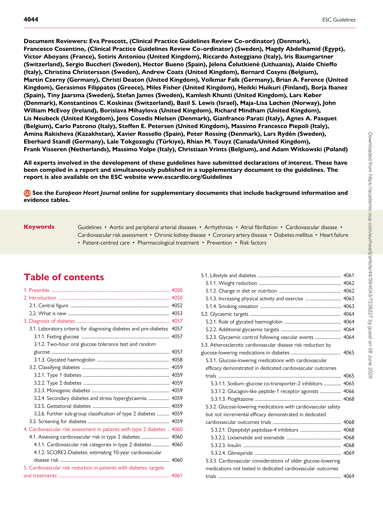

5.3.3.1. Metformin .................................................................................... 4069

5.3.3.2. Sulphonylureas ........................................................................... 4069

5.3.4. Special considerations ...................................................................... 4069

5.3.4.1. Hypoglycaemia and cardiovascular risk ........................... 4069

5.3.4.2. Effects on weight ....................................................................... 4070

5.3.5. Implications of results from cardiovascular outcomes

trials of glucose-lowering medications .................................................. 4070

5.4. Blood pressure and diabetes ................................................................ 4072

5.4.1. Screening and diagnosis ................................................................... 4072

5.4.2. Treatment targets ............................................................................. 4072

5.4.3. Management of hypertension ....................................................... 4073

5.4.3.1. Effects of lifestyle intervention and weight loss ........... 4073

5.4.3.2. Pharmacological treatments in patients with diabetes 4074

5.4.3.3. Blood pressure changes with glucose-lowering agents 4074
5.4.4. Sex-specific aspects ........................................................................... 4074
5.5. Lipids and diabetes .................................................................................... 4075

5.5.1. Treatment targets ............................................................................. 4075

5.5.2. Lipid-lowering agents ....................................................................... 4075

5.5.2.1. Statins ............................................................................................. 4075

5.5.2.2. Ezetimibe ...................................................................................... 4075

5.5.2.3. Proprotein convertase subtilisin/kexin type 9

inhibitors ....................................................................................................... 4076

5.5.2.4. Fibrates and other TG-lowering drugs ............................ 4076

5.5.3. Novel cholesterol-lowering drugs .............................................. 4076

5.5.3.1. Inclisiran ......................................................................................... 4076

5.5.3.2. Bempedoic acid .......................................................................... 4076

5.6. Antithrombotic therapy and diabetes .............................................. 4077

5.6.1. Patients without a history of symptomatic atherosclerotic

cardiovascular disease or revascularization ........................................ 4077

5.6.2. Patients with atherosclerotic cardiovascular disease and/

or revascularization without an indication for long-term oral

anticoagulation ................................................................................................ 4078

5.6.2.1. Chronic coronary syndromes .............................................. 4078

5.6.2.2. Acute coronary syndrome .................................................... 4079

5.6.2.2.1. Peri-procedural management ...................................... 4079

5.6.2.2.2. Post-procedural management ..................................... 4079

5.6.2.2.3. Prolonging DAPT post-ACS ........................................ 4079

5.6.2.2.4. Shortening or de-escalating DAPT post-ACS in

diabetes .................................................................................................... 4079

5.6.3. Patients with atherosclerotic cardiovascular disease

and/or revascularization requiring long-term

oral anticoagulation ....................................................................................... 4081

5.6.4. Preventing gastrointestinal bleeding .......................................... 4081

5.7. Multifactorial approach to risk-factor management in diabetes 4082

6. Management of coronary artery disease and diabetes ....................... 4083

6.1. Chronic coronary syndromes and diabetes .................................. 4083

6.1.1. Clinical presentation ......................................................................... 4083

6.1.2. Screening and diagnosis ................................................................... 4083

6.1.3. Management ......................................................................................... 4084

6.1.3.1. Pharmacotherapy ...................................................................... 4084

6.1.3.1.1. Glucose-lowering medication ..................................... 4084

6.1.3.1.2. Other medications ........................................................... 4084

6.1.3.2. Revascularization ....................................................................... 4084

6.2. Acute coronary syndromes and diabetes ....................................... 4084

6.2.1. Clinical presentation and diagnosis ............................................ 4084

6.2.2. Management ......................................................................................... 4085

6.2.2.1. Pharmacotherapy ...................................................................... 4085

6.2.2.2. Glucose control in patients with acute coronary

syndrome ...................................................................................................... 4085

6.2.2.3. Reperfusion strategies in ST-elevation myocardial

infarction ....................................................................................................... 4085

6.2.2.4. Optimal timing of invasive strategy in non-ST
elevation acute coronary syndrome ................................................. 4085

6.3. Ischaemia with no obstructive coronary artery disease in

diabetes .................................................................................................................. 4086

7. Heart failure and diabetes ............................................................................... 4086

7.1. Definition and pathophysiology .......................................................... 4086
7.2. Epidemiology and prognosis ................................................................. 4086

7.3. Screening and diagnosis .......................................................................... 4087

7.4. Treatment of heart failure in patients with diabetes ................. 4088

7.4.1. Treatment of heart failure with reduced

ejection fraction .............................................................................................. 4088

7.4.1.1. Sodium–glucose co-transporter-2 inhibitors ................ 4089

7.4.1.2. Angiotensin receptor–neprilysin inhibitor and

angiotensin-converting enzyme inhibitors ...................................... 4089

7.4.1.3. Mineralocorticoid receptor antagonists .......................... 4089

7.4.1.4. Beta-blockers .............................................................................. 4089

7.4.1.5. Angiotensin-II receptor blockers ........................................ 4089

7.4.1.6. Ivabradine ..................................................................................... 4090

7.4.1.7. Hydralazine and isosorbide dinitrate ................................ 4090

7.4.1.8. Digoxin .......................................................................................... 4090

7.4.1.9. Diuretics ........................................................................................ 4090

7.4.1.10. Device therapy and surgery ............................................... 4090

7.4.2. Treatment of heart failure with mildly reduced ejection

fraction ............................................................................................................... 4090

7.4.3. Treatment of heart failure with preserved ejection

fraction ............................................................................................................... 4091

7.5. Safety profile of glucose-lowering agents in patients with

heart failure and diabetes ............................................................................... 4091

7.5.1. Sodium–glucose co-transporter-2 inhibitors ......................... 4091

7.5.2. Glucagon-like peptide-1 receptor agonists ............................ 4092

7.5.3. Dipeptidyl peptidase-4 inhibitors ................................................ 4093

7.5.4. Insulin ...................................................................................................... 4093

7.5.5. Metformin ............................................................................................. 4093

7.5.6. Sulphonylureas .................................................................................... 4093

7.5.7. Thiazolidinediones ............................................................................. 4093

7.5.8. Special consideration: hypoglycaemia and risk of heart

failure hospitalization .................................................................................... 4093
8. Arrhythmias: atrial fibrillation, ventricular arrhythmias, and sudden

cardiac death and diabetes ................................................................................... 4096

8.1. Atrial fibrillation and diabetes .............................................................. 4096

8.1.1. Epidemiology of atrial fibrillation and its association with

diabetes .............................................................................................................. 4096

8.1.2. Screening and managing atrial fibrillation in patients with

diabetes .............................................................................................................. 4096

8.1.3. Preventing stroke in patients with atrial fibrillation and

diabetes .............................................................................................................. 4098

8.2. Ventricular arrhythmias and risk of sudden cardiac death and

diabetes .................................................................................................................. 4098

9. Chronic kidney disease and diabetes ......................................................... 4099

9.1. Chronic kidney disease definitions, staging, and screening ...... 4099
9.2. Management of cardiovascular disease risk and kidney failure

in patients with chronic kidney disease and diabetes ......................... 4100

9.3. Blood pressure and glycaemic control in patients with

diabetes and chronic kidney disease .......................................................... 4103

9.4. Roles for antithrombotic therapy and invasive strategies in

managing atherosclerotic cardiovascular disease in patients with

diabetes and chronic kidney disease .......................................................... 4103

**4046** ESC Guidelines

10. Aortic and peripheral arterial diseases and diabetes ........................ 4104

10.1. The impact of diabetes on peripheral atherosclerosis ........... 4104

10.1.1. Diabetes and lower-extremity artery disease .................... 4104

10.1.2. Diabetes and carotid artery disease ....................................... 4106

10.2. Diabetes and aortic aneurysm .......................................................... 4106

11. Type 1 diabetes and cardiovascular disease ......................................... 4107

11.1. Cardiovascular risk assessment in type 1 diabetes .................. 4107

11.2. Managing cardiovascular risk .............................................................. 4107

11.2.1. Exercise and lifestyle ...................................................................... 4108

11.2.2. Lipid lowering ................................................................................... 4108

11.2.3. Blood pressure ................................................................................. 4108

11.2.4. Antiplatelet therapy ....................................................................... 4108

11.3. Glucose-lowering agents beyond insulin ...................................... 4108

11.4. Renal protection in type 1 diabetes ............................................... 4108

12. Person-centred care ....................................................................................... 4108

13. Practical guidance ............................................................................................. 4110

14. Key messages ..................................................................................................... 4110

15. Gaps in evidence ............................................................................................... 4111

16. Sex differences .................................................................................................. 4112

17. ‘What to do’ and ‘What not to do’ messages from the Guidelines 4113

18. Quality indicators ............................................................................................. 4117

19. Supplementary data ......................................................................................... 4117

20. Data availability statement ............................................................................ 4117

21. Author information ......................................................................................... 4117

22. Appendix .............................................................................................................. 4118

23. Acknowledgements ......................................................................................... 4118

24. References ........................................................................................................... 4119
#### **Tables of Recommendations**

Recommendation Table 1 — Recommendations for diagnosing

diabetes ........................................................................................................................ 4060

Recommendation Table 2 — Recommendations for assessing
cardiovascular risk in patients with type 2 diabetes ................................. 4061
Recommendation Table 3 — Recommendations for reducing
weight in patients with type 2 diabetes with or without

cardiovascular disease ............................................................................................ 4062

Recommendation Table 4 — Recommendations for nutrition in

patients with type 2 diabetes with or without cardiovascular disease 4063
Recommendation Table 5 — Recommendations for physical
activity/exercise in patients with type 2 diabetes with or without

cardiovascular disease ............................................................................................ 4063

Recommendation Table 6 — Recommendations for smoking
cessation in patients with type 2 diabetes with or without

cardiovascular disease ............................................................................................ 4064

Recommendation Table 7 — Recommendations for glycaemic
targets in patients with diabetes ........................................................................ 4064

Recommendation Table 8 — Recommendations for

glucose-lowering treatment for patients with type 2 diabetes and

atherosclerotic cardiovascular disease to reduce cardiovascular risk 4072

Recommendation Table 9 — Recommendation for

glucose-lowering treatment for patients with type 2 diabetes

without atherosclerotic cardiovascular disease or severe

target-organ damage to reduce cardiovascular risk .................................. 4072

Recommendation Table 10 — Recommendations for blood

pressure management in patients with diabetes ........................................ 4074

Recommendation Table 11 — Recommendations for the

management of dyslipidaemia in patients with diabetes ......................... 4076

Recommendation Table 12 — Recommendations for patients with
diabetes without a history of symptomatic atherosclerotic

cardiovascular disease or revascularization ............................................................. 4077

Recommendation Table 13 — Recommendations for

antithrombotic therapy in patients with diabetes and acute or
chronic coronary syndrome without indications for long-term oral
anticoagulation .......................................................................................................... 4080

Recommendation Table 14 — Recommendations for

antithrombotic therapy in patients with diabetes and acute or
chronic coronary syndrome and/or post-percutaneous coronary
intervention requiring long-term oral anticoagulation ............................. 4081
Recommendation Table 15 — Recommendations for gastric
protection in patients with diabetes taking antithrombotic drugs ..... 4081

Recommendation Table 16 — Recommendations for a

multifactorial approach in patients with type 2 diabetes with and

without cardiovascular disease ........................................................................... 4082

Recommendation Table 17 — Recommendations for

revascularization in patients with diabetes ................................................... 4084
Recommendation Table 18 — Recommendations for glycaemic
control in patients with diabetes and acute coronary syndrome ....... 4085

Recommendation Table 19 — Recommendations for heart failure

screening and diagnosis in patients with diabetes ...................................... 4088

Recommendation Table 20 — Recommendations for heart failure

treatments in patients with heart failure with reduced ejection

fraction and diabetes .............................................................................................. 4090

Recommendation Table 21 — Recommendations for heart failure

treatments in patients with diabetes and left ventricular ejection

fraction over 40% .................................................................................................... 4091

Recommendation Table 22 — Recommendations for

glucose-lowering medications in patients with type 2 diabetes with

and without heart failure ...................................................................................... 4094

Recommendation Table 23 — Recommendations for atrial

fibrillation in patients with diabetes ................................................................. 4098
Recommendation Table 24 — Recommendations for patients with
chronic kidney disease and diabetes ................................................................ 4103
Recommendation Table 25 — Recommendations for peripheral
arterial and aortic diseases in patients with diabetes ............................... 4106
Recommendation Table 26 — Recommendations for patients with
type 1 diabetes .......................................................................................................... 4108

Recommendation Table 27 — Recommendations for

person-centred care in diabetes ........................................................................ 4110
#### **List of tables**

Table 1 Classes of recommendations ............................................................. 4051

Table 2 Levels of evidence ................................................................................... 4051

Table 3 New recommendations ....................................................................... 4053

Table 4 Revised recommendations .................................................................. 4056

Table 5 Revised concepts 2023 Guidelines .................................................. 4057
Table 6 Biochemical diagnostic criteria for diabetes and pre-diabetes
according to the World Health Organization and the American

Diabetes Association .............................................................................................. 4058

Table 7 Cardiovascular risk categories in type 2 diabetes ..................... 4060
Table 8 Blood pressure measurement ........................................................... 4073
Table 9 Heart failure phenotypes according to ejection fraction

distribution .................................................................................................................. 4086

Table 10 Risk factors for developing heart failure in patients with

diabetes ........................................................................................................................ 4086

Table 11 KDIGO staging by glomerular filtration rate
and urinary albumin-to-creatinine ratio categories with

ESC Guidelines **4047**

colour chart for risk of initiation of maintenance kidney replacement
therapy .......................................................................................................................... 4099

Table 12 ‘What to do’ and ‘What not to do’ ............................................. 4113
#### **List of figures**

Figure 1 Management of cardiovascular disease in patients with type
2 diabetes: clinical approach and key recommendations ........................ 4052
Figure 2 Diagnosis of diabetes and pre-diabetes ........................................ 4058
Figure 3 Cardiovascular risk categories in patients with type 2

diabetes ........................................................................................................................ 4061

Figure 4 Simple guide to glycaemic targets in patients with type 2

diabetes and cardiovascular disease ................................................................. 4065

Figure 5 Meta-analysis of cardiovascular outcomes trial results of
sodium–glucose co-transporter-2 inhibitors among patients with
type 2 diabetes with or at high risk for atherosclerotic cardiovascular

disease ........................................................................................................................... 4066

Figure 6 Meta-analysis of cardiovascular outcomes trials with
glucagon-like peptide-1 receptor agonists (sensitivity analysis
removing ELIXA). Risk of major adverse cardiovascular events and
its components ......................................................................................................... 4067
Figure 7 Glucose-lowering treatment for patients with type 2
diabetes to reduce cardiovascular risk based on the presence of
atherosclerotic cardiovascular disease/severe target-organ damage
and 10-year cardiovascular disease risk estimation via

SCORE2-Diabetes ................................................................................................... 4070

Figure 8 Glucose-lowering treatment for patients with type 2

diabetes and atherosclerotic cardiovascular disease to reduce

cardiovascular risk .................................................................................................... 4071

Figure 9 Screening and diagnosis of hypertension in patients with

diabetes ........................................................................................................................ 4073

Figure 10 Recommended low-density lipoprotein-cholesterol
targets by cardiovascular risk categories in patients with type 2

diabetes ........................................................................................................................ 4075

Figure 11 Mechanisms contributing to altered platelet activation and
atherothrombosis in patients with diabetes ................................................. 4078
Figure 12 Recommendations for antiplatelet therapy in patients with
diabetes with acute or chronic coronary syndrome undergoing
percutaneous coronary intervention or coronary artery bypass
grafting without indications for long-term oral anticoagulation .......... 4080
Figure 13 Assessment of lifestyle risk-factor components and
stepwise lifestyle recommendations in patients with diabetes ............ 4083
Figure 14 Diagnostic algorithm for heart failure in patients with

diabetes ........................................................................................................................ 4087

Figure 15 Absolute risk reduction with sodium–glucose
co-transporter-2 inhibitors in relation to patient risk based on rate
of heart failure-related endpoints in the placebo arm of the
respective trials ......................................................................................................... 4092
Figure 16 Glucose-lowering treatment of patients with heart failure
and type 2 diabetes ................................................................................................. 4095
Figure 17 Screening for atrial fibrillation in patients with diabetes .... 4097
Figure 18 Pharmacological management to reduce cardiovascular or
kidney failure risk in patients with type 2 diabetes and chronic kidney

disease ........................................................................................................................... 4101

Figure 19 Absolute benefits and harms of sodium–glucose
co-transporter-2 inhibitors in patients with and without diabetes .... 4102
Figure 20 Screening for and managing lower-extremity artery
disease in patients with diabetes ....................................................................... 4105
Figure 21 Person-centred care approach for patients with diabetes

with or without cardiovascular disease .......................................................... 4109

**Abbreviations and acronyms**

2hPG 2 h plasma glucose

ABI Ankle–brachial index

ABPM Ambulatory blood pressure monitoring

ACCORD Action to Control Cardiovascular Risk in

Diabetes

ACE-I Angiotensin-converting enzyme inhibitor
ACS Acute coronary syndrome

ADA American Diabetes Association

ADAPTABLE Aspirin Dosing: A Patient-Centric Trial Assessing
Benefits and Long-term
ADDITION Anglo-Danish-Dutch Study of Intensive
Treatment In People with Screen Detected
Diabetes in Primary Care
ADJUNCT ONE The Efficacy and Safety of Liraglutide as Adjunct
Therapy to Insulin in the Treatment of Type 1

Diabetes

ADVANCE Action in Diabetes and Vascular Disease:

Preterax and Diamicron MR Controlled

Evaluation

AF Atrial fibrillation
ARB Angiotensin-II receptor blocker
ARNI Angiotensin receptor–neprilysin inhibitor

ARR Absolute risk reduction

ASA Acetylsalicylic acid
ASCEND A Study of Cardiovascular Events iN

Diabetes

ASCVD Atherosclerotic cardiovascular disease

ATTACK Aspirin to Target Arterial Events in Chronic
Kidney Disease
b.i.d. Twice a day
b.p.m. Beats per minute
BANTING Evaluation of Evolocumab Efficacy in Diabetic
Adults With Hypercholesterolemia/Mixed
Dyslipidemia
BARC Bleeding Academic Research Consortium
BARI 2D Bypass Angioplasty Revascularization
Investigation 2 Diabetes
BERSON Safety and Efficacy of Evolocumab in
Combination With Statin Therapy in Adults
With Diabetes and Hyperlipidemia or Mixed
Dyslipidemia
BMI Body mass index
BNP B-type natriuretic peptide
BP Blood pressure
CABG Coronary artery bypass graft
CAC Coronary artery calcium
CAD Coronary artery disease
CANVAS Canagliflozin Cardiovascular Assessment
Study

CARMELINA Cardiovascular and Renal Microvascular

Outcome Study With Linagliptin in Patients
With Type 2 Diabetes Mellitus
CAROLINA Cardiovascular Outcome Study of Linagliptin
Versus Glimepiride in Patients With Type 2

Diabetes

CCB Calcium channel blocker

CCS Chronic coronary syndrome
CGM Continuous glucose monitoring

**4048** ESC Guidelines

CHA 2 DS 2 -VASc Congestive heart failure, Hypertension, Age ≥75
years (2 points), Diabetes mellitus, Stroke or
transient ischaemic attack (2 points), Vascular
disease, Age 65–74 years, Sex category (female)
CHAP Chronic Hypertension and Pregnancy
CHD Coronary heart disease
CI Confidence interval
CKD Chronic kidney disease
CKD-EPI Chronic kidney disease epidemiology/CKD
Epidemiology Collaboration
CKD-MBD Chronic kidney disease–mineral bone disorder
CLEAR Cholesterol Lowering via Bempedoic Acid, an
ACL-Inhibiting Regimen
CLTI Chronic limb-threatening ischaemia
COMPASS Cardiovascular Outcomes for People Using
Anticoagulation Strategies

CPG Clinical Practice Guidelines

CREDENCE Canagliflozin and Renal Events in Diabetes with
Established Nephropathy Clinical Evaluation
CRT Cardiac resynchronization therapy
CRT-D Cardiac resynchronization therapy with an
implantable defibrillator
CRT-P Cardiac resynchronization therapy-pacemaker
CT Computed tomography
CTA Computed tomography angiography
CURRENT- Clopidogrel Optimal Loading Dose Usage to

OASIS

EDIC Epidemiology of Diabetes Interventions and
Complications
eGFR Estimated glomerular filtration rate
ELIXA Evaluation of Lixisenatide in Acute Coronary
Syndrome
EMMY Impact of EMpagliflozin on cardiac function and
biomarkers of heart failure in patients with acute

MYocardial infarction

EMPA-KIDNEY The Study of Heart and Kidney Protection With
Empagliflozin
EMPA-REG Empagliflozin Cardiovascular Outcome Event
OUTCOME

EMPA-REG Empagliflozin Cardiovascular Outcome Event
OUTCOME Trial in Type 2 Diabetes Mellitus Patients

EMPA-RESPONSE- Empagliflozin on Clinical Outcomes in Patients
AHF

EMPA-RESPONSE- Empagliflozin on Clinical Outcomes in Patients
AHF With Acute Decompensated Heart Failure

EMPEROR- EMPagliflozin outcomE tRial in Patients With
Preserved

EMPEROR- EMPagliflozin outcomE tRial in Patients With
Preserved chrOnic heaRt Failure With Preserved Ejection

Fraction

EMPEROR- Empagliflozin Outcome Trial in Patients with
Reduced

CURRENT- Clopidogrel Optimal Loading Dose Usage to
OASIS Reduce Recurrent EveNTs/Optimal Antiplatelet

Strategy for InterventionS

CV Cardiovascular

CVD Cardiovascular disease

CVOT Cardiovascular outcomes trial

DAPA-CKD Dapagliflozin and Prevention of Adverse
Outcomes in Chronic Kidney Disease
DAPA-HF Dapagliflozin and Prevention of Adverse
Outcomes in Heart Failure

DAPT Dual antiplatelet therapy
DAT Dual antithrombotic therapy
DBP Diastolic blood pressure
DCCT Diabetes Control and Complications Trial

DD Double diabetes

DECLARE-TIMI Dapagliflozin Effect on Cardiovascular Events
58 −

DECLARE-TIMI Dapagliflozin Effect on Cardiovascular Events
58 −Thrombolysis In Myocardial Infarction 58

DELIVER Dapagliflozin Evaluation to Improve the Lives of
Patients with Preserved Ejection Fraction Heart

Failure

DES Drug-eluting stent
DEVOTE A Trial Comparing Cardiovascular Safety of
Insulin Degludec vs Insulin Glargine in Patients
With Type 2 Diabetes at High Risk of

Cardiovascular Events

DIAL Diabetes lifetime-perspective prediction

DIGAMI Diabetes Mellitus Insulin-Glucose Infusion in

Acute Myocardial Infarction

DiRECT Diabetes Remission Clinical Trial

DPP-4 Dipeptidyl peptidase-4
EACTS European Association for Cardio-Thoracic
Surgery
EASD European Association for the Study of Diabetes
ECG Electrocardiogram
EDC Pittsburgh Epidemiology of Diabetes
Complications

EMPEROR- Empagliflozin Outcome Trial in Patients with
Reduced Chronic Heart Failure with Reduced Ejection

Fraction

EMPULSE A Study to Test the Effect of Empagliflozin in
Patients Who Are in Hospital for Acute Heart

Failure

EORP EURObservational Research Programme

ER Extended release

ESC European Society of Cardiology
ESH European Society of Hypertension
EXAMINE Cardiovascular Outcomes Study of Alogliptin in
Patients With Type 2 Diabetes and Acute
Coronary Syndrome
EXSCEL Exenatide Study of Cardiovascular Event
Lowering
FIDELIO-DKD Efficacy and Safety of Finerenone in Subjects
With Type 2 Diabetes Mellitus and Diabetic
Kidney Disease
FIGARO-DKD Efficacy and Safety of Finerenone in Subjects
With Type 2 Diabetes Mellitus and the Clinical
Diagnosis of Diabetic Kidney Disease
FLOW Effect of Semaglutide Versus Placebo on the
Progression of Renal Impairment in Subjects
With Type 2 Diabetes and Chronic Kidney

Disease

FOURIER Further Cardiovascular Outcomes Research

with PCSK9 Inhibition in Subjects with Elevated

Risk

FPG Fasting plasma glucose

GDM Gestational diabetes mellitus

GFR Glomerular filtration rate
GLOBAL- A Clinical Study Comparing Two Forms of

LEADERS

HARMONY Effect of Albiglutide, When Added to Standard
Outcomes Blood Glucose Lowering Therapies, on Major

Cardiovascular Events in Subjects With Type 2

Diabetes Mellitus

HAS-BLED Hypertension, Abnormal renal/liver function,
Stroke, Bleeding history or predisposition, Labile
international normalized ratio, Elderly (>65
years), Drugs/alcohol concomitantly

GLOBAL- A Clinical Study Comparing Two Forms of
LEADERS Antiplatelet Therapy After Stent

Implantation
GLP-1 RA Glucagon-like peptide-1 receptor agonist
GRACE Global Registry of Acute Coronary Events
HARMONY Effect of Albiglutide, When Added to Standard

Outcomes

ESC Guidelines **4049**

HbA1c Glycated haemoglobin
HBPM Home blood pressure monitoring
HCP Healthcare professional
HDL-C High-density lipoprotein-cholesterol

HF Heart failure

HFmrEF Heart failure with mildly reduced ejection

fraction

HFpEF Heart failure with preserved ejection fraction
HFrEF Heart failure with reduced ejection fraction
HMOD Hypertension-mediated organ damage

HR Hazard ratio

ICD Implantable cardioverter defibrillator
IFG Impaired fasting glucose
IGT Impaired glucose tolerance

IHD Ischaemic heart disease

IMPROVE-IT Improved Reduction of Outcomes: Vytorin
Efficacy International Trial
INR International normalized ratio

IPD Individual participant data
ISAR-REACT 5 Intracoronary Stenting and Antithrombotic
Regimen: Rapid Early Action for Coronary

Treatment

ISCHEMIA International Study of Comparative Health

Effectiveness with Medical and Invasive

Approaches
ISCHEMIA-CKD International Study of Comparative Health

Effectiveness with Medical and Invasive

Approaches–Chronic Kidney Disease
ISTH International Society of Thrombosis and

Haemostasis

i.v. Intravenous

J-DOIT3 Japan Diabetes Optimal Integrated Treatment
Study for 3 Major Risk Factors of Cardiovascular

Diseases

KDIGO Kidney Disease: Improving Global Outcomes
KRT Kidney replacement therapy
LDL-C Low-density lipoprotein-cholesterol
LEAD Lower-extremity artery disease
LEADER Liraglutide Effect and Action in Diabetes:
Evaluation of Cardiovascular Outcome Results

LIBERATES Improving Glucose Control in Patients with
Diabetes Following Myocardial Infarction: The
Role of a Novel Glycaemia Monitoring Strategy

Look AHEAD Action for Health in Diabetes

LV Left ventricular

LVEF Left ventricular ejection fraction
MACE Major adverse cardiovascular events
MI Myocardial infarction
MRA Mineralocorticoid receptor antagonist

NNH Number needed to harm

NNT Number needed to treat

NO Nitric oxide

NOAC Non-Vitamin K Antagonist Oral Anticoagulant
NSTE-ACS Non-ST-elevation acute coronary syndrome
NT-proBNP N-terminal pro-B-type natriuretic peptide

NYHA New York Heart Association

o.d. Once a day
OAC Oral anticoagulant
OARS Open-ended questions, Affirmation, Reflective
listening, and Summarizing

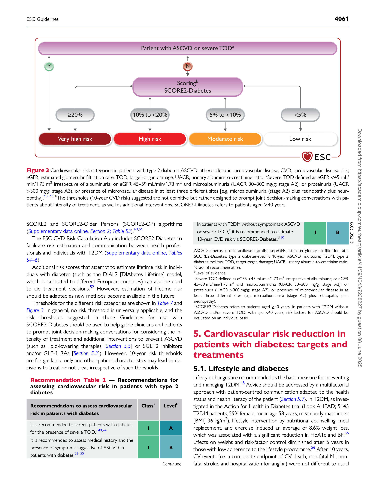

ODYSSEY Efficacy and Safety of Alirocumab Versus Usual
DM-DYSLIPIDE-­ Care on Top of Maximally Tolerated Statin
MIA Therapy in Patients With Type 2 Diabetes and

Mixed Dyslipidemia

ODYSSEY Evaluation of Cardiovascular Outcomes After an

OUTCOMES

ODYSSEY

DM-DYSLIPIDE-­
MIA

ODYSSEY Evaluation of Cardiovascular Outcomes After an

OUTCOMES Acute Coronary Syndrome During Treatment

With Alirocumab

OGTT Oral glucose tolerance test
OMT Optimal medical therapy

OR Odds ratio

ORIGIN Outcome Reduction With Initial Glargine

Intervention

ORION Inclisiran for Participants With Atherosclerotic

Cardiovascular Disease and Elevated

Low-density Lipoprotein Cholesterol
PA Physical activity
PAD Peripheral arterial diseases
PARAGON-HF Efficacy and Safety of LCZ696 Compared to
Valsartan, on Morbidity and Mortality in Heart
Failure Patients With Preserved Ejection

Fraction

PCI Percutaneous coronary intervention
PCSK9 Proprotein convertase subtilisin/kexin type 9

PEGASUS-TIMI Prevention of Cardiovascular Events in Patients

54

PEGASUS-TIMI Prevention of Cardiovascular Events in Patients

54 With Prior Heart Attack Using Ticagrelor

Compared to Placebo on a Background of
Aspirin
PIONEER 6 Trial Investigating the Cardiovascular Safety of
Oral Semaglutide in Subjects With Type 2

Diabetes

PROactive PROspective pioglitAzone Clinical Trial In

macroVascular Events

QI Quality indicator
QTc Correct QT interval
RAS Renin–angiotensin system

RCT Randomized controlled trial

REDUCE-IT Reduction of Cardiovascular Events with

Icosapent Ethyl–Intervention
REWIND Researching Cardiovascular Events With a
Weekly Incretin in Diabetes
ROS Reactive oxygen species
RPG Random plasma glucose

RR Relative risk

SAPT Single antiplatelet therapy
SAVOR-TIMI 53 Saxagliptin Assessment of Vascular Outcomes

Recorded in Patients with Diabetes Mellitus

−
Thrombolysis In Myocardial Infarction 53
SBP Systolic blood pressure

s.c. Subcutaneous

SCD Sudden cardiac death

SCORED Effect of Sotagliflozin on Cardiovascular and
Renal Events in Participants With Type 2
Diabetes and Moderate Renal Impairment Who

Are at Cardiovascular Risk

SCORE2- type 2 diabetes-specific 10-year CVD risk score
Diabetes

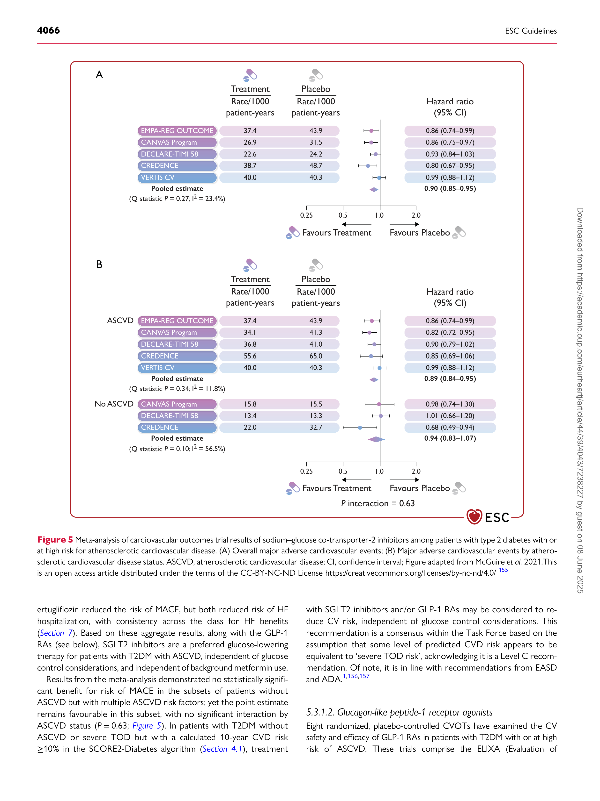

type 2 diabetes-specific 10-year CVD risk score

SCORE2-OP SCORE2-older persons
SGLT2 Sodium–glucose co-transporter-2
SMART Specific, Measurable, Achievable, Realistic,
Timely

**4050** ESC Guidelines

SOLOIST-WHF Effect of Sotagliflozin on Cardiovascular Events in
Patients with Type 2 Diabetes Post Worsening

Heart Failure

STEMI ST-elevation myocardial infarction
STRONG-HF Safety, Tolerability and Efficacy of Rapid
Optimization, Helped by NT-proBNP testinG, of
Heart Failure Therapies

SUSTAIN 6 Trial to Evaluate Cardiovascular and Other

Long-term Outcomes With Semaglutide in
Subjects With Type 2 Diabetes
T1DM Type 1 diabetes mellitus
T2DM Type 2 diabetes mellitus
TAT Triple antithrombotic therapy

TBI Toe–brachial index

TcPO 2 Transcutaneous oxygen pressure
TECOS Trial Evaluating Cardiovascular Outcomes with
Sitagliptin
TG Triglyceride
THEMIS Effect of Ticagrelor on Health Outcomes in
Diabetes Mellitus Patients Intervention Study
TIMI Thrombolysis in Myocardial Infarction
TOD Target-organ damage

TRACK Treatment of CVD with Low Dose Rivaroxaban

in Advanced CKD

TRL Triglyceride-rich lipoprotein
TROPICAL-ACS Testing Responsiveness to Platelet Inhibition on
Chronic Antiplatelet Treatment for Acute
Coronary Syndromes

TSAT Transferrin saturation

TZD Thiazolidinedione

UACR Urine albumin-to-creatinine ratio

UKPDS United Kingdom Prospective Diabetes Study

VADT Veterans Affairs Diabetes Trial

VALUE Valsartan Antihypertensive Long-term Use

Evaluation

VERTIS CV Evaluation of Ertugliflozin Efficacy and Safety
Cardiovascular Outcomes Trial

VKA Vitamin K antagonist
WHO World Health Organization
WIfI Wound, Ischaemia, foot Infection
#### **1. Preamble**

Guidelines evaluate and summarize available evidence, with the aim of as-­
sisting health professionals in proposing the best diagnostic or therapeut-­
ic approach for an individual patient with a given condition. Guidelines are
intended for use by health professionals and the European Society of
Cardiology (ESC) makes its Guidelines freely available.

ESC Guidelines do not override the individual responsibility of health
professionals to make appropriate and accurate decisions in consider-­
ation of each patient’s health condition and in consultation with that pa-­
tient or the patient’s caregiver where appropriate and/or necessary. It is
also the health professional’s responsibility to verify the rules and reg-­
ulations applicable in each country to drugs and devices at the time of
prescription, and, where appropriate, to respect the ethical rules of
their profession.

ESC Guidelines represent the official position of the ESC on a given
topic and are regularly updated. ESC Policies and Procedures for

formulating and issuing ESC Guidelines can be found on the ESC web-­
[site (https://www.escardio.org/Guidelines).](https://www.escardio.org/Guidelines)

The Members of this Task Force were selected by the ESC to re-­
present professionals involved with the medical care of patients with
this pathology. The selection procedure aimed to include members
from across the whole of the ESC region and from relevant ESC
Subspecialty Communities. Consideration was given to diversity and in-­
clusion, notably with respect to gender and country of origin. The Task
Force performed a critical evaluation of diagnostic and therapeutic ap-­
proaches, including assessment of the risk-benefit ratio. The strength of
every recommendation and the level of evidence supporting them were
weighed and scored according to pre-defined scales as outlined below.
The Task Force followed ESC voting procedures, and all approved re-­
commendations were subject to a vote and achieved at least 75%
agreement among voting members.

The experts of the writing and reviewing panels provided declaration
of interest forms for all relationships that might be perceived as real or
potential sources of conflicts of interest. Their declarations of interest
were reviewed according to the ESC declaration of interest rules and
[can be found on the ESC website (http://www.escardio.org/](http://www.escardio.org/Guidelines)
[Guidelines), and have been compiled in a report published in a supple-­](http://www.escardio.org/Guidelines)
mentary document with the guidelines. The Task Force received its en-­
tire financial support from the ESC without any involvement from the
healthcare industry.

The ESC Clinical Practice Guidelines (CPG) Committee supervises and
co-ordinates the preparation of new guidelines and is responsible for the
approval process. ESC Guidelines undergo extensive review by the CPG
Committee and external experts, including members from across the
whole of the ESC region and from relevant ESC Subspecialty
Communities and National Cardiac Societies. After appropriate revisions,
the guidelines are signed off by all the experts involved in the Task Force.
The finalized document is signed off by the CPG Committee for publica-­
tion in the *European Heart Journal* . The guidelines were developed after
careful consideration of the scientific and medical knowledge and the evi-­
dence available at the time of their writing. Tables of evidence summarizing
the findings of studies informing development of the guidelines are in-­
cluded. The ESC warns readers that the technical language may be misin-­
terpreted and declines any responsibility in this respect.

Off-label use of medication may be presented in the current
Guidelines if a sufficient level of evidence shows that it can be consid-­
ered medically appropriate for a given condition. However, the final de-­
cisions concerning an individual patient must be made by the
responsible health professional giving special consideration to:

- The specific situation of the patient. Unless otherwise provided for
by national regulations, off-label use of medication should be limited
to situations where it is in the patient’s interest with regard to the
quality, safety, and efficacy of care, and only after the patient has
been informed and has provided consent.

- Country-specific health regulations, indications by governmental
drug regulatory agencies, and the ethical rules to which health profes-­
sionals are subject, where applicable.
#### **2. Introduction**

Patients with diabetes are at increased risk of developing cardiovascular
disease (CVD) with its manifestations of coronary artery disease (CAD),
heart failure (HF), atrial fibrillation (AF), and stroke, as well as aortic and
peripheral artery diseases. In addition, diabetes is a major risk factor for
developing chronic kidney disease (CKD), which in itself is associated

ESC Guidelines **4051**

Table 1 **Classes of recommendations**

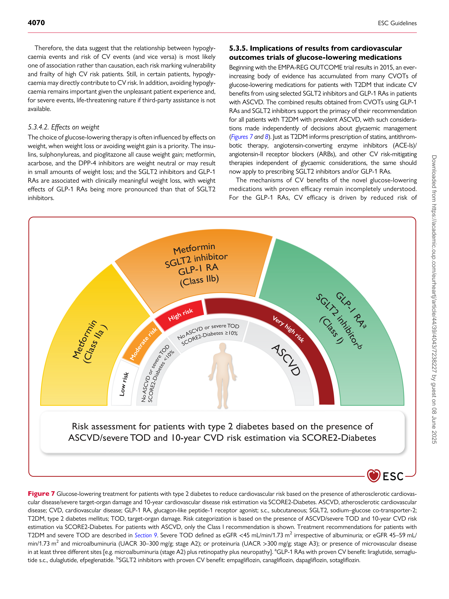

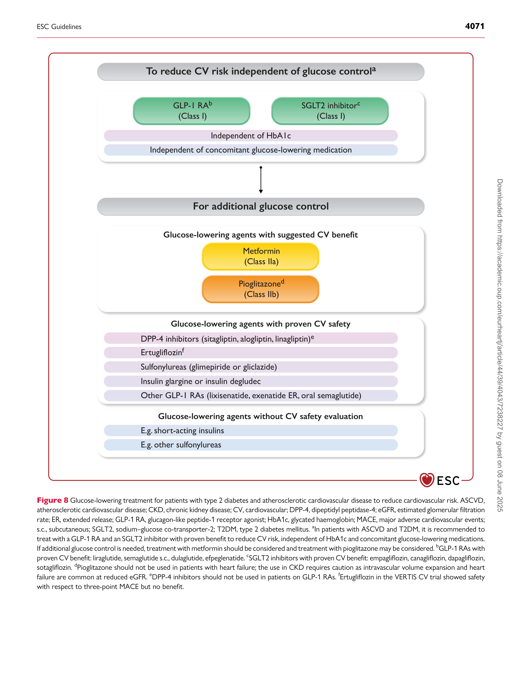

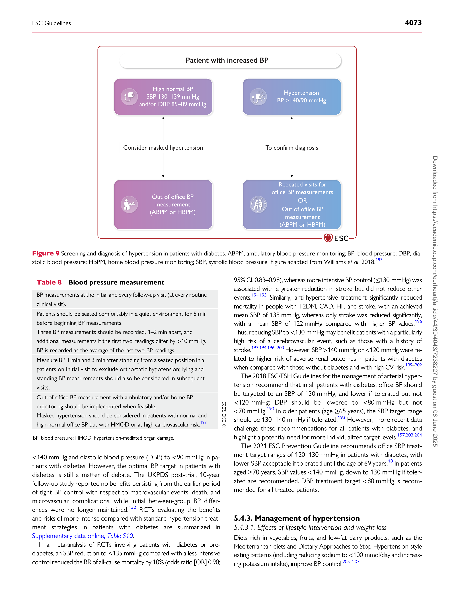

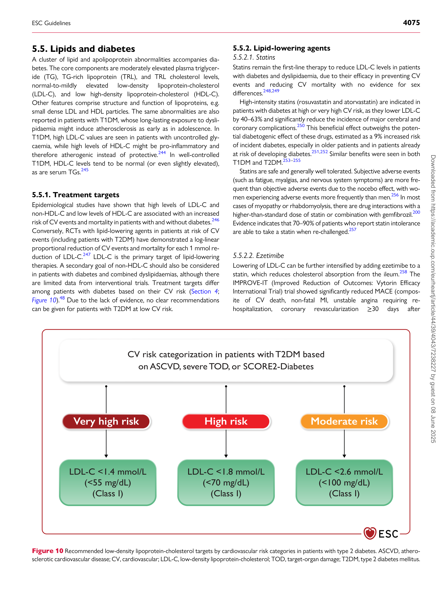

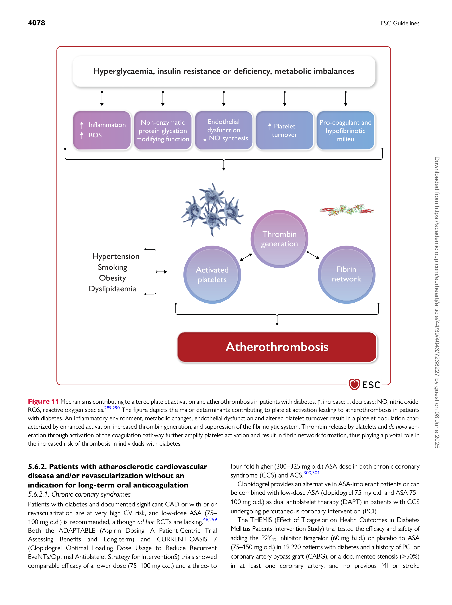

Table 2 **Levels of evidence**

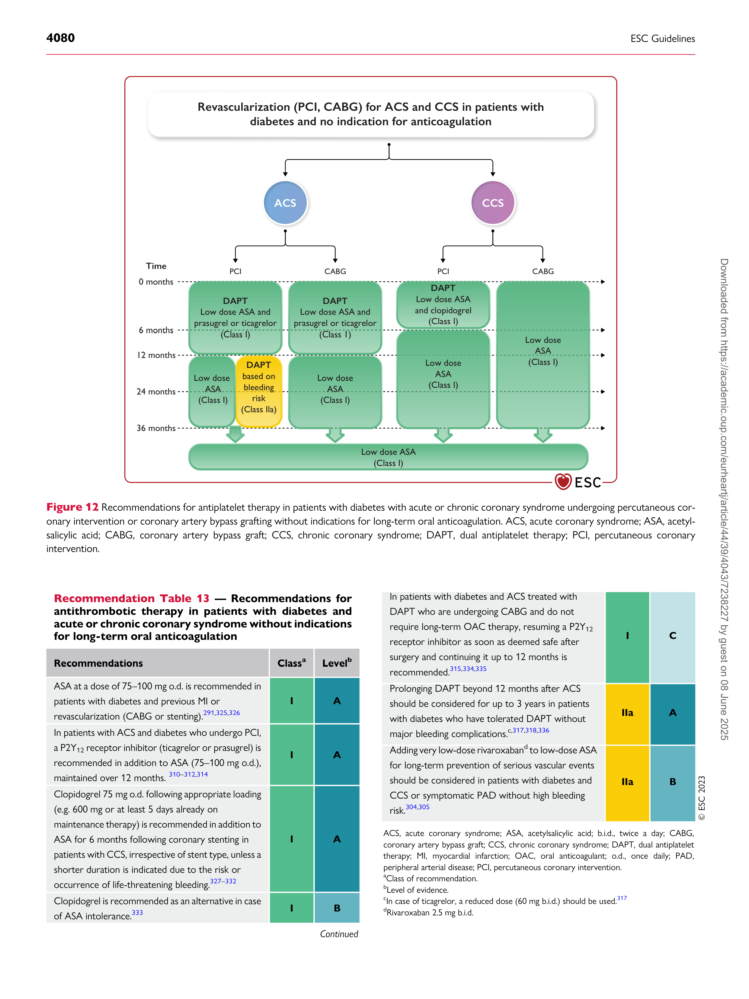

with developing CVD. The combination of diabetes with these
cardio-renal comorbidities enhances the risk not only for cardiovascular
(CV) events but also for CV and all-cause mortality. The current
European Society of Cardiology (ESC) Guidelines on the management
of cardiovascular disease in patients with diabetes are designed to guide
prevention and management of the manifestations of CVD in patients
with diabetes based on data published until end of January 2023. Over
the last decade, the results of various large cardiovascular outcome trials
(CVOTs) in patients with diabetes at high CV risk with novel glucoselowering agents, such as sodium–glucose co-transporter-2 (SGLT2) inhi-­
bitors and glucagon-like peptide-1 (GLP-1) receptor agonists (RAs), but
also novel non-steroidal mineralocorticoid receptor antagonists (MRAs),
such as finerenone have substantially expanded available therapeutic op-­
tions, leading to numerous evidence-based recommendations for the
management of this patient population.

The current Guidelines—in contrast to the previous 2019 ESC
Guidelines on diabetes, pre-diabetes, and cardiovascular diseases—
only focus on CVD and diabetes and, given the lack of clear evidence,
leave aside the aspect of pre-diabetes. In addition, this version of the
Guidelines gives recommendations on stratifying CV risk, as well as
on screening, diagnosis, and treatment of CVD in patients with dia-­
betes. For all other aspects concerning the management of patients
with diabetes, we refer to the recommendations from diabetes associa-­
tions, e.g. the European Association for the Study of Diabetes (EASD)
or the American Diabetes Association (ADA). [1]

These Guidelines offer evidence-based recommendations to manage
CV risk in patients with diabetes and provide guidance for the treatment
of atherosclerotic cardiovascular disease (ASCVD) in patients with dia-­
betes. To individualize treatment strategies, the current Guidelines
introduce a novel, dedicated, type 2 diabetes mellitus (T2DM)-specific,

**4052** ESC Guidelines

10-year CVD risk score (SCORE2-Diabetes) for patients with T2DM
without ASCVD or severe target-organ damage (TOD). This score,
which now extends the established SCORE2 prediction algorithm for
T2DM, provides data on the 10-year risk of fatal and non-fatal CVD
events (myocardial infarction [MI], stroke) based on individual patient
characteristics. SCORE2-Diabetes serves as a guide for clinical decisionmaking in patients with T2DM at low, moderate, high, or very high risk,
but without clinically overt ASCVD or severe TOD.

Given the high prevalence of undetected diabetes in patients with CVD,
as well as the elevated risk and therapeutic consequences if both co-­
morbidities co-exist, these Guidelines recommend systematic screening
for diabetes in all patients with CVD. In addition, all patients with diabetes
need to be evaluated for risk and presence of CVD and CKD. Based on
evidence from large CVOTs, the current Guidelines provide clear recom-­
mendations on how to treat patients with diabetes and clinical manifesta-­
tions of cardiovascular-renal disease. As such, in patients with diabetes and
ASCVD, treatment with GLP-1 RAs and/or SGLT2 inhibitors is

**2.1. Central figure**

recommended to reduce CV risk, independent of glucose control and in
addition to standard of care, e.g. antiplatelet, anti-hypertensive, or
lipid-lowering therapy. A special focus of these Guidelines is on managing
HF in diabetes, a field that has been underestimated for years. Based on
data from large CVOTs, it is recommended to treat patients with diabetes
and chronic HF (independent of left ventricular ejection fraction [LVEF])
with SGLT2 inhibitors to reduce HF hospitalization. Finally, in patients
with diabetes and CKD, it is recommended to treat with an SGLT2 inhibi-­
tor and/or finerenone, since these agents reduce CV and kidney failure risk
on top of standard of care ( *Figure 1* ).

Managing patients with diabetes and CVD requires an interdisciplin-­
ary approach, which should involve healthcare clinicians from different
disciplines and areas of expertise to support shared decision-making
and implement a personalized treatment strategy to reduce each pa-­
tient’s disease burden. Ultimately, our common goal in managing
CVD in patients with diabetes is to improve patients’ prognosis and
health-related quality of life.

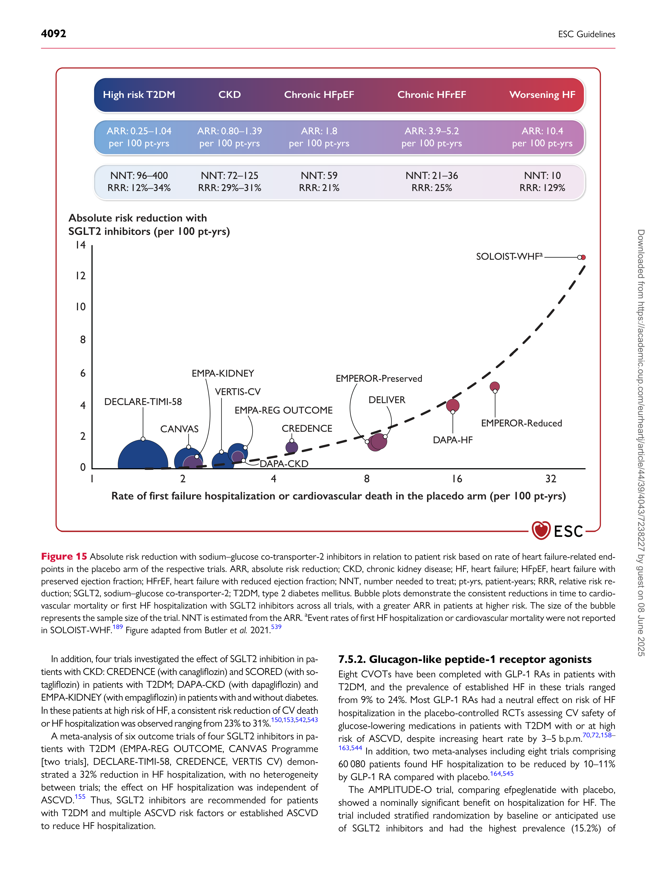

Figure 1 Management of cardiovascular disease in patients with type 2 diabetes: clinical approach and key recommendations. ASCVD, atherosclerotic
cardiovascular disease; CKD, chronic kidney disease; CVD, cardiovascular disease; GLP-1 RA, glucagon-like peptide-1 receptor agonist; HF, heart failure;
HFmrEF, heart failure with mildly reduced ejection fraction; HFpEF, heart failure with preserved ejection fraction; HFrEF, heart failure with reduced ejection
fraction; s.c. subcutaneous; SGLT2, sodium–glucose co-transporter-2; T2DM, type 2 diabetes mellitus. [a] GLP-1 RAs with proven cardiovascular benefit: lir-­
aglutide, semaglutide s.c., dulaglutide, efpeglenatide. [b] SGLT2 inhibitors with proven cardiovascular benefit: empagliflozin, canagliflozin, dapagliflozin, sotagli-­
flozin. [c] Empagliflozin, dapagliflozin, sotagliflozin in HFrEF; empagliflozin, dapagliflozin in HFpEF and HFmrEF. [d] Canagliflozin, empagliflozin, dapagliflozin.

ESC Guidelines **4053**

**2.2. What is new**

Table 3 **New recommendations**

**Recommendations** **Class** **[a]** **Level** **[b]**

**Cardiovascular risk assessment in diabetes—** ***Section 4***

In patients with T2DM without symptomatic ASCVD

**Atherosclerotic cardiovascular disease risk reduction by**

**glucose-lowering medications in diabetes—** ***Section 5.3***

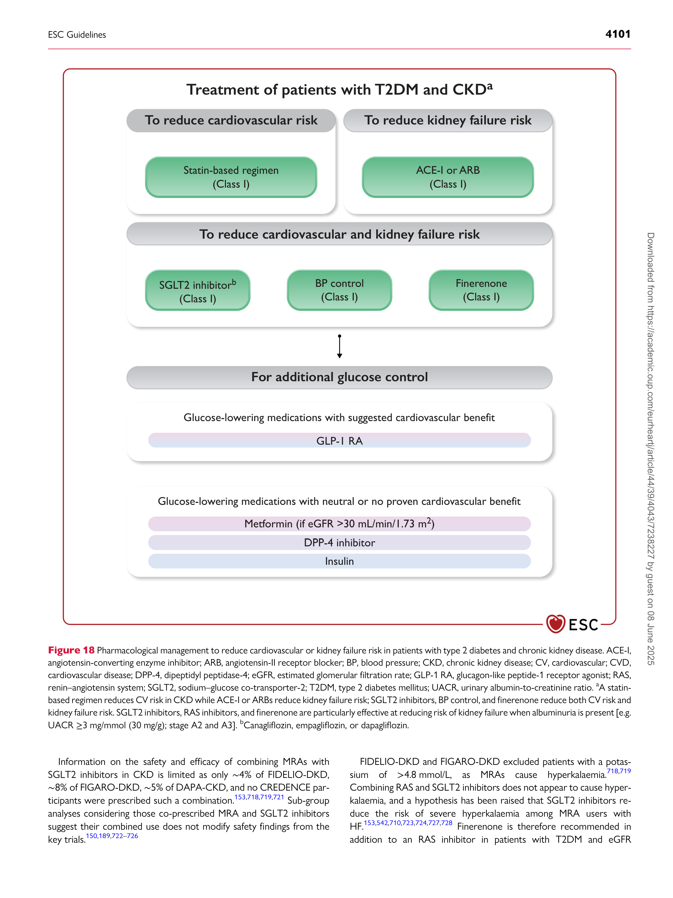

or severe TOD, it is recommended to estimate

10-year CVD risk via SCORE2-Diabetes.

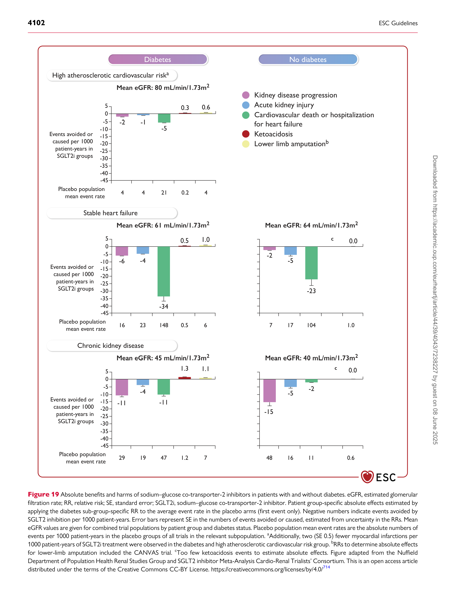

**I** **B**

**Weight reduction in patients with diabetes—** ***Section 5.1.1***

|It is recommended to prioritize the use of glucose-lowering agents with proven CV benefits followed by agents with proven CV safety over agents without proven CV benefit or proven CV safety.|I|C|
|---|---|---|
|If additional glucose control is needed, metformin should be considered in patients with T2DM and ASCVD.|IIa|C|
|If additional glucose control is needed, pioglitazone may be considered in patients with T2DM and ASCVD without HF.|IIb|B|

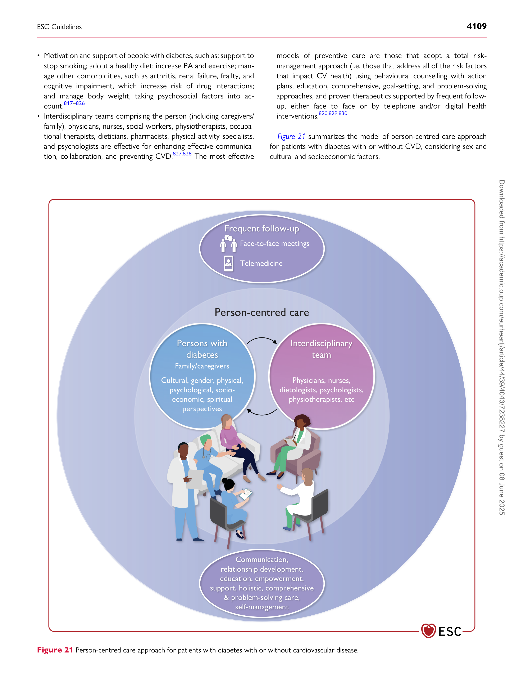

|It is recommended that individuals living with overweight or obesity aim to reduce weight and increase physical exercise to improve metabolic control and overall CVD risk profile.|I|A|
|---|---|---|
|Glucose-lowering medications with effects on weight loss (e.g. GLP-1 RAs) should be considered in patients with overweight or obesity to reduce weight.|IIa|B|
|Bariatric surgery should be considered for high and very high risk patients with BMI ≥35 kg/m2 (≥Class II) when repetitive and structured efforts of lifestyle changes combined with weight-reducing medications do not result in maintained weight loss.|IIa|B|

**Increasing physical activity and exercise in patients with**

**diabetes—** ***Section 5.1.3***

|A PCSK9 inhibitor is recommended in patients at very high CV risk, with persistently high LDL-C levels above target despite treatment with a maximum tolerated statin dose, in combination with ezetimibe, or in patients with statin intolerance.|I|A|
|---|---|---|
|If a statin-based regimen is not tolerated at any dosage (even after re-challenge), a PCSK9 inhibitor added to ezetimibe should be considered.|IIa|B|
|If a statin-based regimen is not tolerated at any dosage (even after re-challenge), ezetimibe should be considered.|IIa|C|
|High-dose icosapent ethyl (2 g b.i.d.) may be considered in combination with a statin in patients with hypertriglyceridaemia.|IIb|B|

**Antithrombotic therapy in patients with diabetes—** ***Section 5.6***

|Clopidogrel 75 mg o.d. following appropriate loading (e.g. 600 mg or at least 5 days already on maintenance therapy) is recommended in addition to ASA for 6 months following coronary stenting in patients with CCS, irrespective of stent type, unless a shorter duration is indicated due to the risk or occurrence of life-threatening bleeding.|I|A|
|---|---|---|
|In patients with diabetes and ACS treated with DAPT who are undergoing CABG and do not require long-term OAC therapy, resuming a P2Y 12 receptor inhibitor as soon as deemed safe after surgery and continuing it up to 12 months is recommended.|I|C|
|Adding very low-dose rivaroxaban to low-dose ASA for long-term prevention of serious vascular events should be considered in patients with diabetes and CCS or symptomatic PAD without high bleeding risk.|IIa|B|

*Continued*

|It is recommended to adapt exercise interventions to T2DM-associated comorbidities, e.g. frailty, neuropathy, or retinopathy.|I|B|
|---|---|---|
|It is recommended to introduce structured exercise training in patients with T2DM and established CVD, e.g. CAD, HFpEF, HFmrEF, HFrEF, or AF to improve metabolic control, exercise capacity, and quality of life, and to reduce CV events.|I|B|
|The use of behavioural theory-based interventions, such as goal-setting, re-evaluation of goals, self-monitoring, and feedback, should be considered to promote physical activity behaviour.|IIa|B|
|It may be considered to use wearable activity trackers to increase physical activity behaviour.|IIb|B|

**Smoking cessation in patients with diabetes—** ***Section 5.1.4***

Nicotine replacement therapy, varenicline, and

bupropion, as well as individual or telephone

counselling, should be considered to improve

smoking cessation success rate.

**Glycaemic targets—** ***Section 5.2***

Tight glycaemic control should be considered for

reducing CAD in the long term, preferably using

agents with proven CV benefit.

**IIa** **B**

**IIa** **B**

*Continued*

**4054** ESC Guidelines

|If HF is suspected, it is recommended to measure BNP/NT-proBNP.|I|B|
|---|---|---|
|Systematic survey for HF symptoms and/or signs of HF is recommended at each clinical encounter in all patients with diabetes.|I|C|

**Diagnostic tests in all patients with suspected heart failure**

|12-lead ECG is recommended.|I|C|
|---|---|---|
|Transthoracic echocardiography is recommended.|I|C|
|Chest radiography (X-ray) is recommended.|I|C|
|Routine blood tests for comorbidities are recommended, including full blood count, urea, creatinine and electrolytes, thyroid function, lipids, and iron status (ferritin and TSAT).|I|C|

|In patients with ACS or CCS and diabetes undergoing coronary stent implantation and having an indication for anticoagulation prolonging triple therapy with low-dose ASA, clopidogrel, and an OAC should be considered up to 1 month if the thrombotic risk outweighs the bleeding risk in the individual patient.|IIa|C|
|---|---|---|
|In patients with ACS or CCS and diabetes undergoing coronary stent implantation and having an indication for anticoagulation prolonging triple therapy with low-dose ASA, clopidogrel, and an OAC up to 3 months may be considered if the thrombotic risk outweighs the bleeding risk in the individual patient.|IIb|C|
|When clopidogrel is used, omeprazole and esomeprazole are not recommended for gastric protection.|III|B|

**Multifactorial approach in patients with diabetes—** ***Section 5.7***

**Pharmacological treatment indicated in patients with HFrEF**

**(NYHA class II–IV) and diabetes**

|Identifying and treating risk factors and comorbidities early is recommended.|I|A|
|---|---|---|
|Multidisciplinary behavioural approaches that combine the knowledge and skills of different caregivers are recommended.|I|C|
|Principles of motivational interviewing should be considered to induce behavioural changes.|IIa|C|
|Telehealth may be considered to improve risk profile.|IIb|B|

**Management of coronary artery disease in patients with**

**diabetes—** ***Section 6***

|SGLT2 inhibitors (dapaglifol zin, empagliflozin, or sotaglifol zin) are recommended in all patients with I A HFrEF and T2DM to reduce the risk of HF hospitalization and CV death.|Col2|Col3|
|---|---|---|
|An intensive strategy of early initiation of evidence-based treatment (SGLT2 inhibitors, ARNI/ ACE-Is, beta-blockers, and MRAs), with rapid up-titration to trial-defni ed target doses starting before discharge and with frequent follow-up visits in the first 6 weeks following a HF hospitalization is recommended to reduce re-admissions or mortality.|I|B|

**Other treatments indicated in selected patients with HFrEF**

|Myocardial revascularization in CCS is recommended when angina persists despite treatment with anti-anginal drugs or in patients with a documented large area of ischaemia (>10% LV).|I|A|
|---|---|---|
|Complete revascularization is recommended in patients with STEMI without cardiogenic shock and with multivessel CAD.|I|A|
|It is recommended to assess glycaemic status at initial evaluation in all patients with ACS.|I|B|
|Complete revascularization should be considered in patients with NSTE-ACS without cardiogenic shock and with multivessel CAD.|IIa|C|
|Glucose-lowering therapy should be considered in patients with ACS with persistent hyperglycaemia, while episodes of hypoglycaemia should be avoided.|IIa|C|
|Routine immediate revascularization of non-culprit lesions in patients with MI and multivessel disease presenting with cardiogenic shock is not recommended.|III|B|

*Continued*

|(NYHA class II–IV) and diabetes|Col2|Col3|
|---|---|---|
|Hydralazine and isosorbide dinitrate should be considered in self-identifei d Black patients with diabetes and LVEF ≤35% or with an LVEF <45% combined with a dilated LV in NYHA class III–IV despite treatment with an ACE-I (or ARNI), a beta-blocker, and an MRA, to reduce the risk of HF hospitalization and death.|IIa|B|
|Digoxin may be considered in patients with symptomatic HFrEF in sinus rhythm despite treatment with sacubitril/valsartan or an ACE-I, a beta-blocker, and an MRA, to reduce the risk of hospitalization.|IIb|B|

Empagliflozin or dapagliflozin are recommended in

patients with T2DM and LVEF >40% (HFmrEF and

HFpEF) to reduce the risk of HF hospitalization or

CV death.

**Heart failure treatments in patients with diabetes and LVEF**

**>40%**

**I** **A**

*Continued*

ESC Guidelines **4055**

**Special considerations for glucose-lowering medications in**

**patients with T2DM with and without HF**

It is recommended to switch glucose-lowering

**Aortic and peripheral arterial diseases and diabetes—** ***Section 10***

**I** **C**

treatment from agents without proven CV benefit or

proven safety to agents with proven CV benefit.

**Atrial fibrillation and diabetes—** ***Section 8.1***

|Opportunistic screening for AF by pulse taking or ECG is recommended in patients with diabetes <65 years of age (particularly when other risk factors are present) because patients with diabetes exhibit a higher AF frequency at a younger age.|I|C|
|---|---|---|
|Systematic ECG screening should be considered to detect AF in patients aged ≥75 years, or those at high risk of stroke.|IIa|B|

**Chronic kidney disease and diabetes—** ***Section 9***

**I** **C**

In patients with diabetes and aortic aneurysm, it is

recommended to implement the same diagnostic

work-up and therapeutic strategies (medical, surgical,

or endovascular) as in patients without diabetes.

**Type 1 diabetes and cardiovascular disease—** ***Section 11***

|In patients with T1DM, it is recommended that adjustment of glucose-lowering medication follows principles of patient self-management under the guidance of the diabetes healthcare multidisciplinary team.|I|C|
|---|---|---|
|Avoiding hypoglycaemic episodes is recommended, particularly in those with established CVD.|I|C|
|Statins should be considered for LDL-C lowering in adults older than 40 years with T1DM without a history of CVD to reduce CV risk.|IIa|B|
|Statins should be considered for use in adults younger than 40 years with T1DM and other risk factors of CVD or microvascular end-organ damage or 10-year CVD risk ≥10% to reduce CVD risk.|IIa|B|
|The use of the Scottish/Swedish risk prediction model may be considered to estimate 10-year CVD risk in patients with T1DM.|IIb|B|

|Intensive LDL-C lowering with statins or a statin/ ezetimibe combination is recommended.|I|A|
|---|---|---|
|A SGLT2 inhibitor (canagliflozin, empaglifol zin, or dapagliflozin) is recommended in patients with T2DM and CKD with an eGFR ≥20 mL/min/1.73 m2 to reduce the risk of CVD and kidney failure.|I|A|
|Finerenone is recommended in addition to an ACE-I or ARB in patients with T2DM and eGFR >60 mL/ min/1.73 m2 with a UACR ≥30 mg/mmol (≥300 mg/ g), or eGFR 25–60 mL/min/1.73 m2 and UACR ≥3 mg/mmol (≥30 mg/g) to reduce CV events and kidney failure.|I|A|
|Low-dose ASA (75–100 mg o.d.) is recommended in patients with CKD and ASCVD.|I|A|
|Treatment with intensive medical or an initial invasive strategy is recommended in people with CKD, diabetes, and stable moderate or severe CAD, due to similar outcomes.|I|B|
|Kidney specialist advice may be considered for managing a raised serum phosphate, other evidence of CKD-MBD, and renal anaemia.|IIb|C|
|Combined use of an ARB with an ACE-I is not recommended.|III|B|

*Continued*

ACE-I, angiotensin-converting enzyme inhibitor; ACS, acute coronary syndrome; AF, atrial
fibrillation; ARB, angiotensin-II receptor blocker; ARNI, angiotensin receptor–neprilysin
inhibitor; ASA, acetylsalicylic acid; ASCVD, atherosclerotic cardiovascular disease; b.i.d.,
twice a day; BMI, body mass index; BNP, B-type natriuretic peptide; BP, blood pressure;
CABG, coronary artery bypass graft; CAD, coronary artery disease; CCS, chronic
coronary syndrome; CKD-MBD, chronic kidney disease–mineral bone disorder; CV,
cardiovascular; CVD, cardiovascular disease; DAPT, dual antiplatelet therapy; ECG,
electrocardiogram; eGFR, estimated glomerular filtration rate; GLP-1 RA, glucagon-like
peptide-1 receptor agonist; HF, heart failure; HFmrEF, heart failure with mildly reduced
ejection fraction; HFpEF, heart failure with preserved ejection fraction; HFrEF, heart
failure with reduced ejection fraction; LDL-C, low-density lipoprotein-cholesterol; LV,
left ventricular/ventricle; LVEF, left ventricular ejection fraction; MI, myocardial infarction;
MRA, mineralocorticoid receptor antagonist; NSTE-ACS, non-ST-elevation acute
coronary syndrome; NT-proBNP, N-terminal pro-B-type natriuretic peptide; NYHA,
New York Heart Association; OAC, oral anticoagulant; o.d., once daily; PAD, peripheral
arterial disease; PCSK9, proprotein convertase subtilisin/kexin type 9; T1DM, type 1
diabetes mellitus; T2DM, type 2 diabetes mellitus; TOD, target-organ damage; TSAT,
transferrin saturation; SCORE2-Diabetes, type 2 diabetes-specific 10-year CVD risk
score; SGLT2, sodium–glucose co-transporter-2; STEMI, ST-elevation myocardial
infarction; UACR, urinary albumin-to-creatinine ratio.
a Class of recommendation.
b Level of evidence.

**4056** ESC Guidelines

Table 4 **Revised recommendations**

**2019** **Class** **[a]** **Level** **[b]** **2023** **Class** **[a]** **Level** **[b]**

**Change in diet and nutrition in patients with diabetes—** ***Section 5.1.2***

A Mediterranean diet, rich in polyunsaturated

and monounsaturated fats, should be

considered to reduce CV events.

**IIa** **B**

It is recommended to adopt a Mediterranean or plant-based diet

with high unsaturated fat content to lower CV risk. **I** **A**

**Atherosclerotic cardiovascular disease risk reduction by glucose-lowering medications in diabetes—** ***Section 5.3***

|Empagliflozin, canagliflozin, or dapagliflozin are recommended in patients with T2DM and CVD, or at very high/high CV risk to reduce CV events.|I|A|SGLT2 inhibitors with proven CV benefti are recommended in patients with T2DM and ASCVD to reduce CV events, independent of baseline or target HbA1c and independent of concomitant glucose-lowering medication.|I|A|
|---|---|---|---|---|---|
|Empagliflozin, canagliflozin, or dapagliflozin are recommended in patients with T2DM and CVD, or at very high/high CV risk to reduce CV events.|I|A|In patients with T2DM without ASCVD or severe TOD but with a calculated 10-year CVD risk ≥10%, treatment with an SGLT2 inhibitor or GLP-1 RA may be considered to reduce CV risk.|IIb|C|
|Liraglutide, semaglutide, or dulaglutide are recommended in patients with T2DM and CVD, or at very high/high CV risk to reduce CV events.|I|A|GLP-1 RAs with proven CV benefti are recommended in patients with T2DM and ASCVD to reduce CV events, independent of baseline or target HbA1c and independent of concomitant glucose-lowering medication.|I|A|
|Liraglutide, semaglutide, or dulaglutide are recommended in patients with T2DM and CVD, or at very high/high CV risk to reduce CV events.|I|A|In patients with T2DM without ASCVD or severe TOD but with a calculated 10-year CVD risk ≥10%, treatment with an SGLT2 inhibitor or GLP-1 RA may be considered to reduce CV risk.|IIb|C|

**Antithrombotic therapy in patients with diabetes—** ***Section 5.6***

|When low-dose aspirin is used, proton pump inhibitors should be considered to prevent gastrointestinal bleeding.|IIa|A|When antithrombotic drugs are used in combination, proton pump inhibitors are recommended to prevent gastrointestinal bleeding.|I|A|
|---|---|---|---|---|---|
|When low-dose aspirin is used, proton pump inhibitors should be considered to prevent gastrointestinal bleeding.|IIa|A|When a single antiplatelet or anticoagulant drug is used, proton pump inhibitors should be considered to prevent gastrointestinal bleeding, considering the bleeding risk of the individual patient.|IIa|A|

**Multifactorial approach to risk-factor management in patients with diabetes—** ***Section 5.7***

A multifactorial approach to diabetes

management with treatment targets should

be considered in patients with diabetes and

CVD.

**IIa** **B**

A multifactorial approach to managing T2DM with treatment

targets is recommended.
**I** **B**

|Heart failure and diabetes—Section 7|Col2|Col3|Col4|Col5|Col6|
|---|---|---|---|---|---|
|GLP-1 RAs (lixisenatide, liraglutide, semaglutide, exenatide, dulaglutide) have a neutral effect on the risk of HF hospitalization, and may be considered for diabetes treatment in patients with HF.|IIb|A|GLP-1 RAs (lixisenatide, liraglutide, semaglutide, exenatide ER, dulaglutide, efpeglenatide) have a neutral effect on the risk of HF hospitalization, and should be considered for glucose-lowering treatment in patients with T2DM at risk of or with HF.|IIa|A|
|Insulin may be considered in patients with advanced, systolic HFrEF.|IIb|C|Basal insulins (glargine and degludec) have a neutral effect on the risk of HF hospitalization, and should be considered for glucose-lowering treatment in patients with T2DM at risk of or with HF.|IIa|B|

Opportunistic screening for AF by pulse taking or ECG is

recommended in patients ≥65 years of age.

**I** **B**

*Continued*

**Atrial fibrillation and diabetes—** ***Section 8.1***

Screening for AF by pulse palpation should be

considered in patients aged >65 years with

diabetes and confirmed by ECG, if any

suspicion of AF, as AF in patients with diabetes

increases morbidity and mortality.

**IIa** **C**

ESC Guidelines **4057**

**Chronic kidney disease and diabetes—** ***Section 9***

Treatment with the GLP-1 RAs liraglutide and

semaglutide is associated with a lower risk of

renal endpoints and should be considered for

diabetes treatment if eGFR is >30 mL/min/

1.73 m [2] .

A GLP-1 RA is recommended at an eGFR >15 mL/min/1.73 m [2 ]

to achieve adequate glycaemic control, due to low risk of

**IIa** **B**

hypoglycaemia and beneficial effects on weight, CV risk, and

albuminuria.

**I** **A**

AF, atrial fibrillation; ASCVD, atherosclerotic cardiovascular disease; CV, cardiovascular; CVD, cardiovascular disease; ECG, electrocardiogram; eGFR, estimated glomerular filtration rate; ER,
extended release; GLP-1 RA, glucagon-like peptide-1 receptor agonist; HbA1c, glycated haemoglobin; HF, heart failure; HFrEF, heart failure with reduced ejection fraction; SGLT2, sodium–
glucose co-transporter-2; T2DM, type 2 diabetes mellitus; TOD, target-organ damage.
a Class of recommendation.
b Level of evidence.

Table 5 **Revised concepts 2023 Guidelines**

AF, atrial fibrillation; ASCVD, atherosclerotic cardiovascular disease; CKD, chronic kidney
disease; CV, cardiovascular; CVD, cardiovascular disease; CVOT, cardiovascular outcomes
trial; ECG, electrocardiogram; eGFR, estimated glomerular filtration rate; GLP-1 RA,
glucagon-like peptide-1 receptor agonist; HF, heart failure; HFmrEF, heart failure with
mildly reduced ejection fraction; HFpEF, heart failure with preserved ejection fraction;
HFrEF, heart failure with reduced ejection fraction; SCORE2-Diabetes, type 2
diabetes-specific 10-year CVD risk score; SGLT2, sodium–glucose co-transporter-2;
T2DM, type 2 diabetes mellitus; UACR, urinary albumin-to-creatinine ratio.

#### **3. Diagnosis of diabetes**

Diabetes mellitus, a common metabolic condition, affected 537 million

individuals worldwide in 2021 (10.5% prevalence), and this is expected
to rise to 783 million cases by 2045 (12.2% prevalence). [2]

Diabetes is suspected in the presence of specific symptoms, includ-­
ing polyuria, polydipsia, fatigue, blurred vision, weight loss, poor
wound healing, and recurrent infections. However, the condition
can be asymptomatic and is therefore undiagnosed in over 40% of
adults worldwide (ranging from 24% to 75% across regions). [3]

Abnormal glucose metabolism has been divided into two clinical cat-­
egories: diabetes and pre-diabetes, which are biochemical definitions
(discussed below).

**3.1. Laboratory criteria for diagnosing**
**diabetes and pre-diabetes**
Several biochemical tests are used to diagnose diabetes, including fast-­
ing glucose, 2 h glucose (during the glucose tolerance test), random glu-­
cose, and glycated haemoglobin (HbA1c). [4][–][7]

**3.1.1. Fasting glucose**
Fasting glucose levels ≥7.0 mmol/L (≥126 mg/dL) is diagnostic of dia-­
betes, although two tests are usually recommended to diagnose in
the absence of hyperglycaemic symptoms. In patients with typical symp-­
toms, a single test is adequate, and it should be noted that fasting is de-­
fined as no caloric intake for at least 8 h.

While international guidelines agree on the cut-off value for diagnos-­
ing diabetes, they are divided on the criteria for diagnosing pre-diabetes.
The World Health Organization (WHO) defines pre-diabetes as fasting
glucose levels 6.1–6.9 mmol/L (110–125 mg/dL) with levels
<6.1 mmol/L (<110 mg/dL) regarded as normal. [5] However, the ADA
has more stringent criteria, with glucose levels 5.6–6.9 mmol/L (100–
125 mg/dL) falling into the pre-diabetes range and only those with glu-­
cose <5.6 mmol/L (<100 mg/dL) classified as having normal glucose
metabolism. [7][,][8]

**3.1.2. Two-hour oral glucose tolerance test and random**
**glucose**

Following an oral glucose load equivalent to 75 g glucose, 2 h glucose
≥11.1 mmol/L (≥200 mg/dL) is diagnostic of diabetes. Two-hour glu-­
cose 7.8–11.0 mmol/L (140–199 mg/dL) indicates impaired glucose tol-­
erance, and the individual is diagnosed with pre-diabetes. However, an
oral glucose tolerance test (OGTT) is not routinely performed, as it is
time-consuming and inconvenient, and is therefore usually reserved for
unclear cases. Of note, OGTT should be performed under resting con-­
ditions, as exercise during the test can invalidate the results.

**4058** ESC Guidelines

Following on, a random glucose ≥11.1 mmol/L (≥200 mg/dL) is also
diagnostic of diabetes in the presence of symptoms. In the absence of
symptoms, two random glucose levels ≥11.1 mmol/L (≥200 mg/dL)
are required to diagnose diabetes. One-hour OGTT ≥8.6 mmol/L
(≥155 mg/dL) has been suggested as a better predictor of diabetes
than 2 h OGTT ≥11.1 mmol/L (≥200 mg/dL), and is associated with
vascular complications and mortality. [9] However, further validation is
required before this new measure is widely adopted.

**3.1.3. Glycated haemoglobin**

Following high-quality epidemiological studies, it was suggested that
HbA1c could be used to diagnose diabetes, and this was subsequently
endorsed by international guidelines. [10] It should be noted that epi-­
demiological studies have relied on the adult population, though
HbA1c is also used in younger individuals as a diagnostic test. [11]

Advantages of HbA1c include ease of measurement, limited
within-individual variability, and the convenience of anytime testing
without the need for fasting or a cumbersome OGTT.

However, HbA1c is not accurate in specific groups where the rela-­
tionship between HbA1c and glucose levels is altered for any reason
[(Supplementary data online,](http://academic.oup.com/eurheartj/article-lookup/doi/10.1093/eurheartj/ehad192#supplementary-data) *Table S1* ). [12][,][13] Moreover, in cases of short-­
er diabetes duration, such as early type 1 diabetes mellitus (T1DM) or

Table 6 **Biochemical diagnostic criteria for diabetes**
**and pre-diabetes according to the World Health**
**Organization and the American Diabetes Association**

|Glycaemic marker|WHO criteria (2011, 2019)5,6|ADA criteria (2021)7|
|---|---|---|
|Glycaemic marker|Diabetes|Diabetes|
|FPG|≥7.0 mmol/L (≥126 mg/dL)|≥7.0 mmol/L (≥126 mg/dL)|
|2hPG (OGTT)|≥11.1 mmol/L (≥200 mg/dL)|≥11.1 mmol/L (≥200 mg/dL)|
|HbA1c|≥6.5% (≥48 mmol/mol)|≥6.5% (≥48 mmol/mol)|
|RPG|≥11.1 mmol/L (≥200 mg/dL)|≥11.1 mmol/L (≥200 mg/dL)|
||Pre-diabetes|Pre-diabetes|
|FPG|6.1–6.9 mmol/L (110–125 mg/dL)|5.6–6.9 mmol/L (100–125 mg/dL)|
|2hPG (OGTT)|7.8–11.0 mmol/L (140–199 mg/dL)|7.8–11.0 mmol/L (140–199 mg/dL)|
|HbA1c|6.0–6.4% (42–47 mmol/mol)|5.7–6.4% (39–47 mmol/mol)|

ADA, American Diabetes Association; 2hPG, 2 h plasma glucose; FPG, fasting plasma
glucose; HbA1c, glycated haemoglobin; RPG, random plasma glucose; OGTT, oral
glucose tolerance test; WHO, World Health Organization.

Figure 2 Diagnosis of diabetes and pre-diabetes. HbA1c, glycated haemoglobin; IGT, impaired glucose tolerance; OGTT, oral glucose tolerance test. [a] Rule
out stress hyperglycaemia (often manifests as elevated glucose and normal HbA1c). [b] In the presence of symptoms, a single test is enough; in the absence of
symptoms, two abnormal tests are required to make the diagnosis. [c] American Diabetes Association criteria are used in this scheme for the diagnosis of
pre-diabetes.

ESC Guidelines **4059**

acute pancreatic damage, HbA1c can lead to false-negative results.
Another practical limitation is the lack of test availability in some parts
of the world due to financial constraints.

Guidelines agree that HbA1c ≥48 mmol/mol (≥6.5%) is diagnostic of
diabetes, while the diagnosis of pre-diabetes uses two different cut-off
values. The WHO criteria define pre-diabetes as HbA1c 42–47 mmol/
mol (6.0–6.4%), while the ADA recommends a wider range of 39–
47 mmol/mol (5.7–6.4%). [5][,][7] Notably, the combination of HbA1c and
fasting glucose in the diabetes range is diagnostic of diabetes and a se-­
cond test is not required, even if the individual is asymptomatic.
However, if the two are discordant, the number in the diabetes range
should be repeated or, preferably, an OGTT performed, which remains
the gold standard for diagnosing diabetes in unclear cases. The criteria
used for diagnosing diabetes and pre-diabetes are summarized in
*Table 6* . It should be noted that data from 73 studies on 294 998 indi-­
viduals without known diabetes suggest that HbA1c is as good as or
better than fasting, random, or post-load glucose levels for predicting
CV risk. [14]

A diagram for the diagnosis of diabetes is shown in *Figure 2* .

**3.2. Classifying diabetes**
After abnormal glucose metabolism is diagnosed, the next step is to as-­
certain the type of diabetes in order to start the appropriate therapies
[(Supplementary data online,](http://academic.oup.com/eurheartj/article-lookup/doi/10.1093/eurheartj/ehad192#supplementary-data) *Table S2* ).

**3.2.1. Type 1 diabetes**

Type 1 diabetes constitutes 5–10% of individuals with diabetes and is
secondary to destruction of pancreatic β-cells by an autoimmune pro-­
cess, with subsequent insulin deficiency. Recent guidance on diagnosing
T1DM has been published. [13]

Briefly, individuals aged <35 years presenting with diabetes should be
suspected of having T1DM, although this condition can occur at any
age. A short history of osmotic symptoms accompanied by weight
loss and raised glucose levels in a younger individual is highly suggestive
of T1DM. Antibody testing helps to confirm the diagnosis, although this
can be negative in 5–10% of individuals with T1DM, while C-peptide
helps to assess endogenous insulin production in unclear cases
[(Supplementary data online,](http://academic.oup.com/eurheartj/article-lookup/doi/10.1093/eurheartj/ehad192#supplementary-data) *Table S2* ).

Pancreatic β-cell function can partially recover after the diagnosis of
T1DM, and this can last several years, often referred to as the ‘honey-­
moon period’. However, if this persists beyond 5 years, an alternative
type of diabetes needs to be considered. [15] Of importance, the combin-­
ation of T1DM with insulin resistance, which can be referred to as dou-­
ble diabetes (DD), increases the risk of vascular complications, although
the exact definition of DD is yet to be determined. [16]

**3.2.2. Type 2 diabetes**
Type 2 diabetes is the most common cause of diabetes (90% of the dia-­
betes population) and is usually caused by insulin resistance coupled
with ‘relative’ insulin deficiency, resulting in raised glucose levels.
Individuals with T2DM can be asymptomatic and can be diagnosed after
[presenting with CV complications (Supplementary data online,](http://academic.oup.com/eurheartj/article-lookup/doi/10.1093/eurheartj/ehad192#supplementary-data)
*[Table S2](http://academic.oup.com/eurheartj/article-lookup/doi/10.1093/eurheartj/ehad192#supplementary-data)* ). Therefore, it is mandatory to screen all patients with CVD
for the presence of diabetes.

**3.2.3. Monogenic diabetes**

This comprises many mutations that cause glucose mishandling. A full
description can be found elsewhere. [17] Briefly, monogenic diabetes

should be suspected in the presence of a strong family history of abnor-­
mal glucose metabolism in an autosomal dominant manner (i.e. succes-­
sive generations with diabetes at a young age). [17]

Patients diagnosed with diabetes before the age of 6 months and
those not fitting the T1DM or T2DM profiles should be suspected of
having monogenic diabetes.

**3.2.4. Secondary diabetes and stress hyperglycaemia**

Diabetes can occur secondary to various conditions and therapies
[(Supplementary data online,](http://academic.oup.com/eurheartj/article-lookup/doi/10.1093/eurheartj/ehad192#supplementary-data) *Table S2* ). Stress hyperglycaemia is not un-­
common in hospitalized patients and can occur in individuals with acute
coronary syndrome (ACS) or HF. [18] Stress hyperglycaemia without dia-­
betes is associated with adverse in-hospital outcomes, and should be
suspected in those with raised glucose levels during admission and nor-­
mal HbA1c. [19] Such individuals are best investigated using OGTT a few
weeks after discharge to rule out diabetes or impaired glucose toler-­
ance. Some studies suggest performing OGTT before hospital dis-­
charge but robust data supporting this approach are lacking. [20][,][21]

**3.2.5. Gestational diabetes**

Gestational diabetes mellitus (GDM) is defined as diabetes diagnosed
in the second or third trimester of pregnancy that was not overt dia-­
betes before gestation. [7] While there is still no worldwide consensus
regarding the best testing strategy, the ‘one-step’ 75 g OGTT, also
recommended by the WHO, is the preferred test in many coun-­
tries. [22] In women with GDM, repeat testing is required in the postpartum period to rule out persistent abnormal glucose metabolism.
Women with GDM will require lifelong annual diabetes screening gi-­
ven the high risk of developing diabetes. [23][–][25] Also, evidence suggests
that women with a history of GDM are at increased CV risk, even
with normal post-partum glucose levels. Given that GDM is an im-­
portant precursor of future cardiometabolic complications, women
with a history of GDM should regularly be screened not only for dia-­
betes, but also for CV health. [26][–][29]

**3.2.6. Further sub-group classification of type 2**
**diabetes**

For information regarding further sub-group classification of T2DM,
[see Supplementary data online](http://academic.oup.com/eurheartj/article-lookup/doi/10.1093/eurheartj/ehad192#supplementary-data) *, Section 1.1.1* .

**3.3. Screening for diabetes**
Criteria for diabetes testing differ widely across regions, and a com-­
prehensive global screening programme is yet to be developed. It is
generally agreed, however, that individuals in high-risk groups (those
living with overweight or obesity, or having markers of insulin resist-­
ance, such as acanthosis nigricans or fatty liver disease) should be
regularly screened, particularly after age 45 years. The ADA devel-­
oped a relatively simple 7-point scoring system based on age, sex,
weight, physical activity (PA), history of GDM, presence of hyperten-­
sion, and family history of diabetes; it is advised that those scoring ≥5
are screened for diabetes. [7]

The prevalence of diabetes is increased among patients with CVD,
with 23–37% of patients with ACS and 10–47% of patients with HF di-­
agnosed with diabetes. This results in worse clinical outcomes com-­
pared with individuals with normal glucose metabolism. [30][–][33]

Therefore, individuals with ASCVD and/or HF and/or AF, particularly
those admitted to hospital with an acute event, should be tested for dia-­
betes; those with suspected stress hyperglycaemia (raised glucose levels

**4060** ESC Guidelines

during admission with normal HbA1c) should undergo post-discharge
glucose testing, preferably with OGTT, to rule out persistent abnormal
glucose metabolism.

Although OGTT has been previously advocated for diabetes screen-­
ing in individuals with CVD, practicalities and low reproducibility of the
test limited widespread use. [34][,][35] Importantly, evidence indicates that
HbA1c, or fasting glucose, are stronger predictors of vascular complica-­
tions than 2 h OGTT and it is therefore best to adopt these simple
measures for general screening, particularly given their high reproduci-­
bility. [35][–][38]

Recommendation Table 1 **— Recommendations for**
**diagnosing diabetes**

**4.1.1. Cardiovascular risk categories in type 2**
**diabetes**

Individuals with T2DM should be categorized into different CV risk
groups based on the following criteria ( *Table 7* ):

Table 7 **Cardiovascular risk categories in type 2**
**diabetes**

|Recommendations|Classa|Levelb|
|---|---|---|
|Screening for diabetes is recommended in all individuals with CVD,c using fasting glucose and/or HbA1c.5–7,36,37,39|I|A|
|It is recommended that the diagnosis of diabetes is based on HbA1c and/or fasting plasma glucose, or on an OGTT if still in doubt.d,5–8,10,11|I|B|

CVD, cardiovascular disease; HbA1c, glycated haemoglobin; OGTT, oral glucose tolerance

test.

a Class of recommendation.
b Level of evidence.

c Cardiovascular disease includes atherosclerotic cardiovascular disease, atrial fibrillation,
and heart failure.
d Stress hyperglycaemia should be suspected in the presence of high glucose levels and
normal HbA1c (see text for details).
#### **4. Cardiovascular risk assessment ** **in patients with type 2 diabetes**

Individuals with T2DM are at a two- to four-fold higher risk of develop-­
ing CVD during their lifetime alongside its manifestations CAD, stroke,
HF, and AF, as well as peripheral artery diseases (PAD). [40][,][41] In addition,
many patients with CVD have undiagnosed T2DM. Given that having
diabetes and CVD, especially at a younger age, has a major impact on
prognosis, it is of utmost importance to screen patients with CVD
for diabetes and to assess CV risk in individuals with diabetes, and evalu-­
ate them for CV and kidney disease. [42]

**4.1. Assessing cardiovascular risk in type 2**
**diabetes**

When assessing CV risk in individuals with T2DM, it is important to
consider medical and family history, symptoms, findings from examin-­
ation, laboratory and other diagnostic test results, and the presence
of ASCVD or severe TOD. There is not enough robust evidence to
suggest that assessment of coronary artery calcium (CAC) or intima
media thickness help reclassify CV risk in people with T2DM. Severe
TOD is defined as:

(i) Estimated glomerular filtration rate (eGFR) <45 mL/min/1.73 m [2 ]

irrespective of albuminuria, or
(ii) eGFR 45–59 mL/min/1.73 m [2 ] and microalbuminuria (urinary
albumin-to-creatinine ratio [UACR] 30–300 mg/g; stage A2), or
(iii) Proteinuria (UACR >300 mg/g; stage A3), or
(iv) Presence of microvascular disease in at least three different sites
(e.g. microalbuminuria (stage A2) plus retinopathy plus neur-­
opathy; see *Section 9.1* for CKD screening). [43][–][45]

|Very high CV risk|Patients with T2DM with: • Clinically established ASCVD or • Severe TOD or • 10-year CVD risk ≥20% using SCORE2-Diabetes|
|---|---|
|High CV risk|Patients with T2DM not fulfilling the very high-risk criteria and a: • 10-year CVD risk 10 to <20% using SCORE2-Diabetes|
|Moderate CV risk|Patients with T2DM not fulfilling the very high-risk criteria and a: • 10-year CVD risk 5 to <10% using SCORE2-Diabetes|
|Low CV risk|Patients with T2DM not fulfilling the very high-risk criteria and a: • 10-year CVD risk <5% using SCORE2-Diabetes|

ASCVD, atherosclerotic cardiovascular disease; CV, cardiovascular; CVD, cardiovascular
disease; eGFR, estimated glomerular filtration rate; SCORE2-Diabetes, type 2
diabetes-specific 10-year CVD risk score; T2DM, type 2 diabetes mellitus; TOD,
target-organ damage; UACR, urinary albumin-to-creatinine ratio.
Severe TOD defined as eGFR <45 mL/min/1.73 m [2 ] irrespective of albuminuria; or eGFR 45–
59 mL/min/1.73 m [2 ] and microalbuminuria (UACR 30–300 mg/g; stage A2); or proteinuria
(UACR >300 mg/g; stage A3); or presence of microvascular disease in at least three
different sites [e.g. microalbuminuria (stage A2) plus retinopathy plus neuropathy]. [43][–][45]

**4.1.2. SCORE2-Diabetes: estimating 10-year**
**cardiovascular disease risk**

In patients aged ≥40 years with T2DM without ASCVD or severe TOD,
it is recommended to estimate 10-year CVD risk using the
SCORE2-Diabetes algorithm ( *Figure 3* ). In these patients, risk factors
for ASCVD should be evaluated on an individual basis. In the 2021

ESC Guidelines on cardiovascular disease prevention in clinical practice,
the ADVANCE (Action in Diabetes and Vascular disease: preterAx and
diamicroN MR Controlled Evaluation) or DIAL (Diabetes lifetimeperspective prediction) models were suggested for estimating CVD
risk among patients with diabetes. [46][–][48] However, these models have
some limitations for use in Europe, as they do not allow for substantial
variations of risk across countries, meaning they may misestimate risk
in these circumstances. Furthermore, these models have been developed
from a narrow set of studies and have not been systematically ‘recali-­
brated’ (i.e. statistically adapted) to contemporary CVD rates, meaning
they are not ideal for use in contemporary European populations. To ad-­
dress these limitations, the current Guidelines recommend use of the
SCORE2-Diabetes model, which extends the regionally recalibrated
European SCORE2 10-year risk model to enable use in individuals with
T2DM aged 40–69 years without ASCVD or severe TOD, and to esti-­
mate an individual’s 10-year risk of fatal and non-fatal CVD events (MI,
stroke). [49]

SCORE2-Diabetes integrates information on conventional CVD risk
factors (i.e. age, smoking status, systolic blood pressure [SBP], and total
and high-density lipoprotein [HDL]-cholesterol) with diabetes-specific
information (e.g. age at diabetes diagnosis, HbA1c, and eGFR). [50] This
model is calibrated to four clusters of countries (low, moderate, high,
and very high CVD risk) using the similar methodology of the

ESC Guidelines **4061**

Figure 3 Cardiovascular risk categories in patients with type 2 diabetes. ASCVD, atherosclerotic cardiovascular disease; CVD, cardiovascular disease risk;
eGFR, estimated glomerular filtration rate; TOD, target-organ damage; UACR, urinary albumin-to-creatinine ratio. [a] Severe TOD defined as eGFR <45 mL/
min/1.73 m [2 ] irrespective of albuminuria; or eGFR 45–59 mL/min/1.73 m [2 ] and microalbuminuria (UACR 30–300 mg/g; stage A2); or proteinuria (UACR
>300 mg/g; stage A3), or presence of microvascular disease in at least three different sites [e.g. microalbuminuria (stage A2) plus retinopathy plus neur-­
opathy]. [43][–][45][ b] The thresholds (10-year CVD risk) suggested are not definitive but rather designed to prompt joint decision-making conversations with pa-­
tients about intensity of treatment, as well as additional interventions. SCORE2-Diabetes refers to patients aged ≥40 years.

SCORE2 and SCORE2-Older Persons (SCORE2-OP) algorithms
[(Supplementary data online,](http://academic.oup.com/eurheartj/article-lookup/doi/10.1093/eurheartj/ehad192#supplementary-data) *Section 2* ; *Table S3* ). [49][,][51]

The ESC CVD Risk Calculation App includes SCORE2-Diabetes to
facilitate risk estimation and communication between health profes-­
[sionals and individuals with T2DM (Supplementary data online,](http://academic.oup.com/eurheartj/article-lookup/doi/10.1093/eurheartj/ehad192#supplementary-data) *Tables*
*[S4–6](http://academic.oup.com/eurheartj/article-lookup/doi/10.1093/eurheartj/ehad192#supplementary-data)* ).

Additional risk scores that attempt to estimate lifetime risk in indivi-­
duals with diabetes (such as the DIAL2 [DIAbetes Lifetime] model,
which is calibrated to different European countries) can also be used
to aid treatment decisions. [52] However, estimation of lifetime risk
should be adapted as new methods become available in the future.

Thresholds for the different risk categories are shown in *Table 7* and
*Figure 3.* In general, no risk threshold is universally applicable, and the
risk thresholds suggested in these Guidelines for use with
SCORE2-Diabetes should be used to help guide clinicians and patients
to prompt joint decision-making conversations for considering the in-­
tensity of treatment and additional interventions to prevent ASCVD
(such as lipid-lowering therapies [ *Section 5.5* ] or SGLT2 inhibitors
and/or GLP-1 RAs [ *Section 5.3* ]). However, 10-year risk thresholds
are for guidance only and other patient characteristics may lead to de-­
cisions to treat or not treat irrespective of such thresholds.

Recommendation Table 2 **— Recommendations for**
**assessing cardiovascular risk in patients with type 2**
**diabetes**

ASCVD, atherosclerotic cardiovascular disease; eGFR, estimated glomerular filtration rate;
SCORE2-Diabetes, type 2 diabetes-specific 10-year ASCVD risk score; T2DM, type 2
diabetes mellitus; TOD, target-organ damage; UACR, urinary albumin-to-creatinine ratio.
a Class of recommendation.
b Level of evidence.
c Severe TOD defined as eGFR <45 mL/min/1.73 m 2 irrespective of albuminuria; or eGFR
45–59 mL/min/1.73 m [2 ] and microalbuminuria (UACR 30–300 mg/g; stage A2); or
proteinuria (UACR >300 mg/g; stage A3); or presence of microvascular disease in at
least three different sites (e.g. microalbuminuria (stage A2) plus retinopathy plus
neuropathy).
d SCORE2-Diabetes refers to patients aged ≥40 years. In patients with T2DM without
ASCVD and/or severe TOD, with age <40 years, risk factors for ASCVD should be

evaluated on an individual basis.
#### **5. Cardiovascular risk reduction in ** **patients with diabetes: targets and ** **treatments**

**5.1. Lifestyle and diabetes**
Lifestyle changes are recommended as the basic measure for preventing
and managing T2DM. [48] Advice should be addressed by a multifactorial
approach with patient-centred communication adapted to the health
status and health literacy of the patient ( *Section 5.7* ). In T2DM, as inves-­
tigated in the Action for Health in Diabetes trial (Look AHEAD; 5145
T2DM patients, 59% female, mean age 58 years, mean body mass index

[BMI] 36 kg/m [2] ), lifestyle intervention by nutritional counselling, meal
replacement, and exercise induced an average of 8.6% weight loss,
which was associated with a significant reduction in HbA1c and BP. [56]

Effects on weight and risk-factor control diminished after 5 years in
those with low adherence to the lifestyle programme. [56] After 10 years,
CV events (i.e. a composite endpoint of CV death, non-fatal MI, nonfatal stroke, and hospitalization for angina) were not different to usual

|Recommendations to assess cardiovascular risk in patients with diabetes|Classa|Levelb|
|---|---|---|
|It is recommended to screen patients with diabetes for the presence of severe TOD.c,43,44|I|A|
|It is recommended to assess medical history and the presence of symptoms suggestive of ASCVD in patients with diabetes.53–55|I|B|

*Continued*

**4062** ESC Guidelines

care. [56] However, microvascular disease complications (i.e. develop-­
ment of CKD) were significantly reduced (hazard ratio [HR] 0.69;
95% confidence interval [CI], 0.55–0.87; *P* = 0.002) by lifestyle interven-­
tion, an effect associated with improvements in CV risk factors. [57]

Additional analyses 16.7 years after the start of the study (9.6 years
of intervention and then observation) revealed that participants who
lost ≥10% of weight at 1 year of intervention had a 21% reduced risk
of mortality (HR 0.79; 95% CI, 0.67–0.94; *P* = 0.007). [58] The decline in
body fat mass was significantly associated with a lower risk of HF
with reduced ejection fraction (HFrEF) and HF with preserved ejection
fraction (HFpEF), while a decline in waist circumference was only signifi-­
cantly associated with a lower risk of HFpEF. [59] In addition, baseline
cardio-pulmonary fitness was associated with reduced risks of mortality
and CV events during follow-up of 9.2 years. [60]

The DiRECT (Diabetes Remission Clinical Trial)—an open-label,
cluster-randomized trial in patients with T2DM—assigned practices
to provide either a weight-management programme including exercise
(intervention group) or best-practice care by guidelines (control
group). At 12 months, almost half of the participants in the intervention
group achieved remission to a non-diabetic state and were off glucoselowering drugs. [61] Home-based exercise intervention in patients with
CAD and T2DM (ARTEMIS study; Finnish randomized controlled trial

[RCT]; *n* = 127; 2-year controlled, home-based exercise training vs.
usual care), however, did not significantly improve CV risk factors des-­
pite significant improvements in exercise capacity ( *P* = 0.030). [62]

**5.1.1. Weight reduction**
In patients with obesity and T2DM, reducing weight is one of the cor-­
nerstones of treatment. [63] Weight loss of >5% improves glycaemic con-­
trol, lipid levels, and BP in overweight and obese adults with T2DM. [64][,][65]

These effects can be achieved by improving energy balance and/or
introducing obesity medications. Orlistat, naltrexone/bupropion, and
phentermine/topiramate are each associated with achieving >5%
weight loss at 52 weeks compared with placebo. [66] However, glucoselowering agents such as GLP-1 RAs, the dual agonist tirzepatide, and
SGLT2 inhibitors also significantly reduce body weight. [67][,][68] Adding ex-­
ercise to a GLP-1 RA (liraglutide) had a greater effect on weight reduc-­
tion and maintenance. [69] Comparing the effects on weight reduction
between GLP-1 RAs and SGLT2 inhibitors, the former seems to be su-­
perior. Given the additional beneficial effects of GLP-1 RAs and SGLT2
inhibitors on CV outcomes in T2DM ( *Section 5.3* ), these agents should
be the preferred glucose-lowering medication in overweight and obese
patients with CVD and T2DM, as obesity medications have, to date, not
shown to reduce CV events. [70][–][72]

If weight is not managed effectively by lifestyle interventions and
medication, bariatric surgery should be considered in patients with
T2DM and a BMI ≥35 kg/m [2 ] (≥Class II; WHO classification) to achieve
long-term weight loss, reduce blood glucose, and improve CV risk fac-­
tors. Data from the Swedish Obesity Subjects (SOS) study revealed
that after 24-year follow-up, bariatric surgery was associated with a
prolonged life expectancy compared with lifestyle and intensive medical
management alone. [73][,][74] The corresponding HR was 0.70 (95% CI,
0.57–0.85) for CV death and 0.77 (95% CI, 0.61–0.96) for death
from cancer. [75][,][76] This evidence has been extended to patients with
CVD and obesity, as a large case-control study ( *n* = 2638) revealed
that bariatric surgery was also associated with a lower incidence of ma-­
jor adverse cardiovascular events (MACE) in those patients. [77] Still, po-­
tential adverse events after bariatric surgery should also be
considered. [78]

|Recommendations|Classa|Levelb|
|---|---|---|
|It is recommended that individuals living with overweight or obesity aim to reduce weight and increase physical exercise to improve metabolic control and overall CVD risk proflie.56,79|I|A|
|Glucose-lowering medications with effects on weight loss (e.g. GLP-1 RAs) should be considered in patients with overweight or obesity to reduce weight.67|IIa|B|
|Bariatric surgery should be considered for high and very high risk patients with BMI ≥35 kg/m2 (≥Class IIc) when repetitive and structured efforts of lifestyle changes combined with weight-reducing medications do not result in maintained weight loss.73–77|IIa|B|

BMI, body mass index; CVD, cardiovascular disease; GLP-1 RA, glucagon-like peptide-1
receptor agonist.
a Class of recommendation.
b Level of evidence.

c World Health Organization classification.

**5.1.2. Change in diet or nutrition**
In general, patients with T2DM should follow nutritional recommenda-­
tions that reduce body weight and improve metabolic control and out-­
comes. [48] A Mediterranean-style eating pattern improves glycaemic
control, lipids, and BP. [80][,][81] If this diet is supplemented with olive oil or
nuts, as in the non-randomized PREvencion con Dieta MEDiterranea

(PREDIMED) study in individuals at high CV risk (49% T2DM), the risk
of ASCVD was reduced by 28–31%. [82] Recent data from the Coronary

Diet Intervention With Olive Oil and Cardiovascular Prevention

(CORDIOPREV) study confirmed the benefit of a Mediterranean diet
by showing that male patients with established CAD benefitted more
from a Mediterranean diet than from a low-fat diet intervention after

7 years of follow-up. A shift from a more animal-based to a plant-based
food pattern may also reduce ASCVD risk. [83][–][85]

Data from studies on supplementation with n–3 fatty acids do not
support recommending n–3 fatty acid supplements for secondary pre-­
vention of CVD in T2DM. [86][,][87] The consumption of sugars,
sugar-sweetened soft drinks, and fruit juices should be avoided. [88][,][89]

Moreover, alcohol intake should generally be moderate, as any amount
of alcohol uniformly increases BP and BMI. [90][–][92] A high-protein diet
(30% protein, 40% carbohydrates, and 30% fat) seems to be superior
to a standard-protein diet (15% protein, 55% carbohydrates, and
30% fat) in overweight and obese (mean weight 107.8 ± 20.8 kg) pa-­
tients with HF; both diets were equal in reducing body weight (3.6 vs.
2.9 kg, respectively) and waist circumference (1.9 vs. 1.3 cm, respective-­
ly), but the high-protein diet resulted in greater reductions in CV risk
factors, e.g. HbA1c, cholesterol, triglycerides, and BP. [93]

People with CVD and T2DM are encouraged to reduce sodium in-­
take, as this may reduce systolic BP by, on average, 5.8 mmHg in hyper-­
tensive patients and 1.9 mmHg in normotensive patients. [94][,][95] In a
meta-analysis, in hypertensive and normotensive people, reducing salt
intake by 2.5 g/day resulted in a 20% relative reduction of ASCVD
events. [95] In addition, salt substitution with reduced sodium levels and

increased potassium levels has been shown to reduce stroke, CVD,
and overall mortality in patients with high CV risk. [96]

Recommendation Table 3 **— Recommendations for**
**reducing weight in patients with type 2 diabetes with**
**or without cardiovascular disease**

ESC Guidelines **4063**

Recommendation Table 4 **— Recommendations for**
**nutrition in patients with type 2 diabetes with or without**
**cardiovascular disease**

include in their daily routines, as such activities are more likely to be

feasible and sustainable.

Recommendation Table 5 **— Recommendations for**
**physical activity/exercise in patients with type 2 diabetes**
**with or without cardiovascular disease**

|Recommendations|Classa|Levelb|
|---|---|---|
|It is recommended to adopt a Mediterranean or plant-based diet with high unsaturated fat content to lower cardiovascular risk.82,85|I|A|

a Class of recommendation.
b Level of evidence.

**5.1.3. Increasing physical activity and exercise**

Regular moderate to vigorous PA has favourable effects on metabolic
control and CV risk factors in T2DM. [97][–][100] Intervention programmes
reduce HbA1c by 0.6% in patients with T2DM, with the combination
of endurance and resistance exercise having the most beneficial ef-­
fects. [101] Moreover, compared with low total PA, high total PA is asso-­
ciated with a lower CV mortality risk, as well as a reduction in all-cause
mortality (all-cause mortality: HR 0.60 [95% CI, 0.49–0.73], comparing
high vs. low total PA). [97]

Structured exercise intervention is also recommended in patients with
T2DM with established CVD (e.g. CAD, AF, HFpEF; heart failure with
mildly reduced ejection fraction [HFmrEF]; HFrEF). [102][–][104] Interval endur-­
ance exercise training of more vigorous intensity (e.g. interval walking, al-­
ternating between moderate to vigorous intensities) has superior effects
compared with moderate-intensity continuous walking regarding body
weight, waist circumference, and glucose control. [105] Before starting a
structured exercise programme in patients with T2DM and established
CVD, performing a maximal exercise stress test to assess CV pathologies
should be considered. Moreover, assessment of aerobic and anaerobic
thresholds by spiroergometry is particularly useful to provide an indivi-­
dualized endurance exercise prescription including exercise inten-­
sity. [106][–][108] Optimal intensity is determined based on an individual’s
maximum (peak) effort during spiroergometry, e.g. percentage of cardio-­
respiratory fitness (% peak oxygen consumption), percentage of
maximum (peak) heart rate (% HR max ), or perceived exertion rate ac-­
cording to the Borg scale. [107][–][109] Exercise prescription is recommended
to be adapted to T2DM-associated comorbidities, e.g. CAD, HF, AF, dia-­
betic peripheral neuropathy, or retinopathy, as well as age and
frailty. [104][,][107][,][108] Resistance exercise is recommended to be performed
at least twice weekly (intensity of 60–80% of the individual’s
one-repetition maximum). For older or deconditioned adults, less vol-­
ume and lower intensities are recommended, particularly during the ini-­
tiation phase of 3–6 weeks. [106]

Interventions are based on encouraging an increase in any PA, as
even small amounts were shown to have beneficial effects; even an ex-­
tra 1000 steps of walking per day is advantageous and may be a good
starting point for many patients. [98][,][100] Moreover, a gradual increase in
activity level is recommended. Structured exercise should be addition-­
ally introduced at the start or after first achievements to increase activ-­
ity. Patients should perform ≥2 sessions per week of endurance
exercise and/or resistance exercise training. PA accumulated in bouts
of even <10 min is associated with favourable outcomes, including re-­
duced mortality. [110][,][111]

Interventions shown to increase PA level or reduce sedentary behav-­
iour include behaviour theory-based interventions, such as goal-setting,
re-evaluation of goals, self-monitoring, and feedback. [112][,][113] Using a
wearable activity tracker (e.g. smartphones) may help increase PA. [114]

Most important is to encourage PA that people enjoy and/or can

|Recommendation|Classa|Levelb|
|---|---|---|
|It is recommended to increase any physical activity (e.g. 10 min daily walking) in all patients with T2DM with and without CVD. Optimal is a weekly activity of 150 min of moderate intensity or 75 min of vigorous endurance intensity.97,98|I|A|
|It is recommended to adapt exercise interventions to T2DM-associated comorbidities, e.g. frailty, neuropathy, or retinopathy.108,115|I|B|
|It is recommended to introduce structured exercise training in patients with T2DM and established CVD, e.g. CAD, HFpEF, HFmrEF, HFrEF, or AF to improve metabolic control, exercise capacity and quality of life, and to reduce CV events. 108,115,116|I|B|
|It is recommended to perform resistance exercise in addition to endurance exercise at least twice a week.115,117|I|B|
|The use of behavioural theory-based interventions, such as goal-setting, re-evaluation of goals, self-monitoring, and feedback, should be considered to promote physical activity behaviour.112,113|IIa|B|
|It should be considered to perform a maximally tolerated exercise stress test in patients with T2DM and established CVD before starting a structured exercise programme.|IIa|C|
|It may be considered to use wearable activity trackers to increase physical activity behaviour.114|IIb|B|

AF, atrial fibrillation; CAD, coronary artery disease; CV, cardiovascular; CVD,
cardiovascular disease; HFpEF, heart failure with preserved ejection fraction; HFmrEF,
heart failure with mildly reduced ejection fraction; HFrEF, heart failure with reduced
ejection fraction; T2DM, type 2 diabetes mellitus.
a Class of recommendation.
b Level of evidence.

**5.1.4. Smoking cessation**

Smoking cessation is a key lifestyle intervention in patients with T2DM
with or without CVD with evidence suggesting a 36% reduction in mor-­
tality in CVD patients. [118][–][120] If advice, encouragement, and motivation
are insufficient, then drug therapies should be considered early, includ-­
ing nicotine replacement therapy (chewing gum, transdermal nicotine
patches, nasal spray, inhaler, sublingual tablets) followed by bupro-­
pion. [121] In patients with ASCVD, varenicline, bupropion, telephone
therapy, and individual counselling all increase success rates. [122]

Electronic cigarettes (e-cigarettes) have been addressed as a potential
smoking cessation aid to bridge transition from smoking to abstention,
but—if used at all—should be limited for a short period of time. A con-­
sensus regarding the efficacy and safety for this approach has yet to be
reached. [123][,][124] Overall, smoking cessation programmes have low effi-­
cacy at 12 months; nonetheless, cessation measures should be repeti-­
tively addressed for smoking abstention to succeed. [125]

**4064** ESC Guidelines

The assessment of lifestyle risk-factor components and stepwise life-­
style recommendations in patients with CVD and diabetes is summar-­
ized in more detail in *Section 5.7* .

Recommendation Table 6 **— Recommendations for**
**smoking cessation in patients with type 2 diabetes with**
**or without cardiovascular disease**

|Recommendations|Classa|Levelb|
|---|---|---|
|It is recommended to stop smoking to reduce cardiovascular risk.118–120|I|A|
|Nicotine replacement therapy, varenicline, and bupropion, as well as individual or telephone counselling, should be considered to improve smoking cessation success rate.121|IIa|B|

a Class of recommendation.
b Level of evidence.

**5.2. Glycaemic targets**
**5.2.1. Role of glycated haemoglobin**

Reducing HbA1c decreases microvascular complications, particularly
when achieving near-normal levels (HbA1c <7%, <53 mmol/mol),
but the effects on macrovascular disease are more complex. [126][–][129]

The DCCT (Diabetes Control and Complications Trial) in T1DM
and the UKPDS (United Kindom Prospective Diabetes Study) in new-­
ly diagnosed T2DM have shown that reducing HbA1c decreases longterm macrovascular events without having a significant effect in the
medium term of 6.5–10.0 years. [130][–][132] Other studies, such as
ADVANCE (Action in Diabetes and Vascular Disease: Preterax and
Diamicron MR Controlled Evaluation), ACCORD (Action to
Control Cardiovascular Risk in Diabetes), and VADT (Veterans
Affairs Diabetes Trial), including higher-risk T2DM cohorts, have simi-­
larly failed to show an effect for intensive glycaemic control on short/
medium-term macrovascular risk (over 3.5–5.6 years). Meta-analyses
of the UKPDS, ADVANCE, ACCORD, and VADT studies, including
27 049 participants, have demonstrated that lowering HbA1c reduces
MACE, driven by a reduction in MI (HF and stroke risk were unaffect-­
ed), and decreases microvascular complications (renal and retinal but
not neuropathy). [133][,][134]

Of interest, the ACCORD trial, with 35% of participants having a
previous CV event, showed increased mortality (HR 1.22; 95% CI,
1.01–1.46; *P* = 0.04) in the intensive glycaemic arm (HbA1c 6.5%,
48 mmol/mol) compared with controls. [129] Also, observational studies
have shown a U-shaped relationship between HbA1c and clinical out-­
come, suggesting that lower HbA1c is not always better. [135][,][136]

**5.2.2. Additional glycaemic targets**

Hypoglycaemia is associated with an increased risk of vascular events,
explaining recent consensus advocating hypoglycaemic exposure at
<1% (i.e. <15 min/day) in individuals at high CV risk. [137][,][138] A causal re-­
lationship between hypoglycaemia and adverse outcomes is not always
clear as low glucose levels can be a marker of ill health. [139][,][140]

In addition to hypoglycaemia, glycaemic variability is emerging as a
potential vascular risk factor, but studies are limited and more research

in this area is warranted.

Post-prandial glucose has been suggested to independently
predict vascular disease, even in individuals without a previous history
of diabetes. [141] However, manipulating prandial glucose levels failed to
impact clinical outcome, and therefore, this remains an unresolved
area. [142][,][143]

**5.2.3. Glycaemic control following vascular events**
Hyperglycaemia following ACS is associated with worse clinical out-­
come. [144] The DIGAMI 1 (Diabetes Mellitus Insulin-Glucose Infusion
in Acute Myocardial Infarction) trial demonstrated reduced mortal-­
ity with intensive glucose control post-ACS, but DIGAMI 2, which
was underpowered, failed to confirm these findings. [145][,][146]

Unexpectedly, DIGAMI 2 showed a numerical increase in mortality
in the intervention arm, particularly in insulin-treated patients, sug-­
gesting an adverse role for hypoglycaemia in this population. [147]

Therefore, large-scale glycaemic studies are required, using continu-­
ous glucose monitoring (CGM) to assess glucose levels, to establish
whether optimizing glycaemia in patients with CVD and diabetes
improves clinical outcome.

In summary, glucose control in individuals with diabetes at high CV
risk is a complex area and current evidence indicates the need to ad-­
dress multiple glycaemic measures, including personalizing HbA1c tar-­
gets, minimizing hypoglycaemic exposure, and limiting glucose
variability. *Figure 4* provides a simple guide to glycaemic control in pa-­
tients with T2DM and CVD.

Recommendation Table 7 **— Recommendations for**
**glycaemic targets in patients with diabetes**

|Recommendations|Classa|Levelb|
|---|---|---|
|It is recommended to apply tight glycaemic control (HbA1c <7%) to reduce microvascular complications.126–128,133|I|A|
|It is recommended to avoid hypoglycaemia, particularly in patients with CVD.134–137,147|I|B|
|It is recommended to individualize HbA1c targets according to comorbidities, diabetes duration, and life expectancy.134,137|I|C|
|Tight glycaemic control should be considered for reducing CAD in the long term, preferably using agents with proven CV benefti.c,129–132|IIa|B|

CAD, coronary artery disease; CVD, cardiovascular disease; GLP-1 RA, glucagon-like
peptide-1 receptor agonist; HbA1c, glycated haemoglobin; s.c. subcutaneous; SGLT2,
sodium–glucose co-transporter-2.
a Class of recommendation.
b Level of evidence.

c SGLT2 inhibitors (empagliflozin, canagliflozin, dapagliflozin, sotagliflozin) or GLP-1 RAs
(liraglutide, semaglutide s.c., dulaglutide, efpeglenatide).

ESC Guidelines **4065**

Figure 4 Simple guide to glycaemic targets in patients with type 2 diabetes and cardiovascular disease. CV, cardiovascular; GLP-1 RA, glucagon-like
peptide-1 receptor agonist; HbA1c, glycated haemoglobin, s.c., subcutaneous; SGLT2, sodium–glucose co-transporter-2. [a] Adjust target in the presence
of hyperglycaemic symptoms (polyuria and polydipsia). [b] Hypoglycaemia is usually a concern only in those on a sulphonylurea and/or insulin. [c] SGLT2 inhibitors
(empagliflozin, canagliflozin, dapagliflozin, sotagliflozin) or GLP-1 RAs (liraglutide, semaglutide s.c., dulaglutide, efpeglenatide).

**5.3. Atherosclerotic cardiovascular disease**

**risk reduction by glucose-lowering**
**medications in diabetes**

T2DM is common among patients with ASCVD or at the highest risk of
CVD. The converse is also true: ASCVD is common in patients with
T2DM. [148] Given these relationships, it is key to consider the presence
of T2DM when deciding strategies to mitigate CV risk. It is imperative
that the first step in this process is to screen all patients with CVD for
T2DM. Many decisions are independent of glucose management, there-­
fore, T2DM status can inform clinical decision-making for mitigating CV
risk, as discussed for several other interventions in the current
Guidelines. [149] Capitalizing on the results of multiple dedicated CVOTs
of glucose-lowering medications in patients with diabetes and ASCVD
or at high CV risk, there is now a wealth of data to inform the preferential
use of selected glucose-lowering medications to reduce CV risk, inde-­
pendent of glucose management considerations. Glucose-lowering med-­
ications can be prescribed with two parallel, mutually exclusive intentions:
(i) to improve CV outcomes and safety; and (ii) to control glucose. On this
basis, in the current Guidelines, we have separated prescribing recom-­
mendations into those intended to improve CV outcomes and those in-­
tended to control glucose. Underpinning these recommendations are
results from the key CVOTs delineating the efficacy and safety of glucoselowering therapies for treating T2DM and their effect on CV outcomes.

**5.3.1. Glucose-lowering medications with**
**cardiovascular efficacy demonstrated in dedicated**
**cardiovascular outcomes trials**

*5.3.1.1. Sodium–glucose co-transporter-2 inhibitors*

The results of six CVOTs with SGLT2 inhibitors and one trial of a dual

SGLT1/2 inhibitor have been published, comprising the EMPA-REG
OUTCOME (Empagliflozin Cardiovascular Outcome Event Trial in
Type 2 Diabetes Mellitus Patients–Removing Excess Glucose) trial,
the CANVAS (Canagliflozin Cardiovascular Assessment Study) pro-­
gramme (two trials combined for analyses), the DECLARE-TIMI 58

−
(Dapagliflozin Effect on Cardiovascular Events Thrombolysis In
Myocardial Infarction 58) trial, the CREDENCE (Canagliflozin and
Renal Events in Diabetes with Established Nephropathy Clinical
Evaluation) trial, the VERTIS CV (eValuation of ERTugliflozin
effIcacy and Safety CardioVascular Outcomes) trial, and the
SCORED (Effect of Sotagliflozin on Cardiovascular and Renal
Events in Patients with Type 2 Diabetes and Moderate Renal
[Impairment Who Are at Cardiovascular Risk) trial (Supplementary](http://academic.oup.com/eurheartj/article-lookup/doi/10.1093/eurheartj/ehad192#supplementary-data)
[data online,](http://academic.oup.com/eurheartj/article-lookup/doi/10.1093/eurheartj/ehad192#supplementary-data) *Table S7* ). [71][,][150][–][154]

A meta-analysis of the six SGLT2 inhibitor trials demonstrated a re-­
duction in the primary ASCVD-based composite of time to first event
of CV death, MI, or stroke (MACE). This was most apparent in patients
with established ASCVD ( *Figure 5* ). [155] Of note, neither dapagliflozin nor

**4066** ESC Guidelines

Figure 5 Meta-analysis of cardiovascular outcomes trial results of sodium–glucose co-transporter-2 inhibitors among patients with type 2 diabetes with or
at high risk for atherosclerotic cardiovascular disease. (A) Overall major adverse cardiovascular events; (B) Major adverse cardiovascular events by athero-­
sclerotic cardiovascular disease status. ASCVD, atherosclerotic cardiovascular disease; CI, confidence interval; Figure adapted from McGuire *et al.* 2021.This
[is an open access article distributed under the terms of the CC-BY-NC-ND License https://creativecommons.org/licenses/by-nc-nd/4.0/](https://creativecommons.org/licenses/by-nc-nd/4.0/) [155]

ertugliflozin reduced the risk of MACE, but both reduced risk of HF
hospitalization, with consistency across the class for HF benefits
( *Section 7* ). Based on these aggregate results, along with the GLP-1
RAs (see below), SGLT2 inhibitors are a preferred glucose-lowering
therapy for patients with T2DM with ASCVD, independent of glucose
control considerations, and independent of background metformin use.

Results from the meta-analysis demonstrated no statistically signifi-­
cant benefit for risk of MACE in the subsets of patients without
ASCVD but with multiple ASCVD risk factors; yet the point estimate
remains favourable in this subset, with no significant interaction by
ASCVD status ( *P* = 0.63; *Figure 5* ). In patients with T2DM without
ASCVD or severe TOD but with a calculated 10-year CVD risk
≥10% in the SCORE2-Diabetes algorithm ( *Section 4.1* ), treatment

with SGLT2 inhibitors and/or GLP-1 RAs may be considered to re-­
duce CV risk, independent of glucose control considerations. This

recommendation is a consensus within the Task Force based on the

assumption that some level of predicted CVD risk appears to be
equivalent to ‘severe TOD risk’, acknowledging it is a Level C recom-­
mendation. Of note, it is in line with recommendations from EASD
and ADA. [1][,][156][,][157]

*5.3.1.2. Glucagon-like peptide-1 receptor agonists*

Eight randomized, placebo-controlled CVOTs have examined the CV
safety and efficacy of GLP-1 RAs in patients with T2DM with or at high
risk of ASCVD. These trials comprise the ELIXA (Evaluation of

ESC Guidelines **4067**

Figure 6 Meta-analysis of cardiovascular outcomes trials with glucagon-like peptide-1 receptor agonists (sensitivity analysis removing ELIXA). Risk of major
adverse cardiovascular events and its components. CI, confidence interval; GLP-1, glucagon-like peptide-1; MACE, major adverse cardiovascular outcomes;
NNT, number needed to treat. Figure adapted from Sattar *et al.* 2021.Reprinted from the Lancet with permission from Elsevier. [164]

Lixisenatide in Acute Coronary Syndrome) trial, the LEADER (Liraglutide

Effect and Action in Diabetes: Evaluation of Cardiovascular Outcome

Results) trial, the SUSTAIN 6 (Trial to Evaluate Cardiovascular and
Other Long-term Outcomes With Semaglutide in Subjects With Type
2 Diabetes) trial, the EXSCEL (Exenatide Study of Cardiovascular Event
Lowering) trial, the HARMONY Outcomes (Effect of Albiglutide,
When Added to Standard Blood Glucose Lowering Therapies, on
Major Cardiovascular Events in Subjects With Type 2 Diabetes

Mellitus) trial, the REWIND (Researching Cardiovascular Events With a
Weekly Incretin in Diabetes) trial, the PIONEER 6 (Trial Investigating
the Cardiovascular Safety of Oral Semaglutide in Subjects With Type 2
Diabetes) trial, and the AMPLITUDE-O (Effect of Efpeglenatide on
Cardiovascular Outcomes) trial (Supplementary data online,
*[Table S8](http://academic.oup.com/eurheartj/article-lookup/doi/10.1093/eurheartj/ehad192#supplementary-data)* ). [70][,][72][,][158][–][163]

Five of the eight GLP-1 RAs tested demonstrated superior CV out-­
comes on the primary composite of time to the first event of CV death,

**4068** ESC Guidelines

MI, and stroke compared with placebo. A meta-analysis of seven of the
eight completed GLP-1 RA trials, excluding the ELIXA trial results (due
to a very short pharmacodynamic half-life [3 h] of once a day [o.d.] lix-­
isenatide, and the very high-risk population post-ACS differentiating it
from all others), showed that a pooled estimate for GLP-1 RA vs. pla-­
cebo for the primary outcome was reduced by 15% (HR 0.85; 95% CI,
0.80–0.90; *Figure 6* ). [164] Results from pooled analyses of the effects of
GLP-1 RA vs. placebo on individual CV outcomes included CV death
(HR 0.85; 95% CI, 0.78–0.93), MI (HR 0.88; 95% CI, 0.81–0.96), stroke
(HR 0.81; 95% CI, 0.74–0.90), and hospitalization for HF (HR 0.88; 95%
CI, 0.79–0.98). Notably, the point estimate in the seven trials was lower
(HR = 0.85) in those with established ASCVD than in those without
(HR = 0.94), with *P* int = 0.068, suggesting but not conclusively proving
that GLP-1 RAs may reduce risks more in those with established
ASCVD. As absolute risks are greater in those with established CV dis-­
ease, the absolute benefits are also expected to be greater.

Based on these aggregate results, along with the SGLT2 inhibitors (see
above) GLP-1 RAs are a preferred glucose-lowering therapy for patients
with T2DM and ASCVD, independent of glucose control considera-­
tions, and independent of background metformin use. In patients with
T2DM without ASCVD or severe TOD, but with a calculated 10-year
CVD risk ≥10% in the SCORE2-Diabetes algorithm ( *Section 4* ), treat-­
ment with GLP-1 RAs and/or SGLT2 inhibitors may be considered to re-­
duce CV risk, independent of glucose control considerations. This
recommendation is a consensus within the Task Force based on the as-­
sumption that some level of predicted CVD risk appears to be equivalent
to ‘severe TOD risk’, acknowledging it is a Level C recommendation. Of
note, it is in line with recommendations from EASD and ADA. [1][,][156][,][157]

*5.3.1.3. Pioglitazone*

The PROactive (Prospective Pioglitazone Clinical Trial in
Macrovascular Events) randomized CVOT assessed the CV effects
of the thiazolidinedione (TZD) pioglitazone vs. placebo, independent
of glucose control, in patients with T2DM and ASCVD. It failed to
achieve statistical significance for its primary composite outcome of
all-cause death, MI, stroke, unstable angina, coronary or peripheral re-­
vascularization, and amputation (HR 0.90; 95% CI, 0.80–1.02). [165]

However, for the principal secondary outcome evaluating the goldstandard, three-point composite outcome of CV death, MI, and
stroke, there was a nominally significant 16% relative risk (RR) reduc-­
tion (HR 0.84; 95% CI, 0.72–0.98). [165]

Results from subsequent meta-analyses and observational studies
have supported the suggested efficacy of pioglitazone in persons with
ASCVD. [166][–][169] Notably, the magnitude of the estimated treatment
benefit with pioglitazone across these studies aligns with contemporary
meta-analyses estimates of the effects of SGLT2 inhibitors and GLP-1
RAs on the same composite MACE outcome. [155][,][164]

TZDs enhance fluid retention and the risk of peripheral oedema, es-­
pecially with concomitant insulin use and in the context of kidney dys-­
function. In addition, TZDs increase the risk of HF, with the incremental
risk of HF with pioglitazone at an estimated 0.4% annualized, absolute
increase. [170] HF associated with TZDs appears to be attributable to ex-­
panded plasma volume, with no evidence of myocardial toxicity. [171]

TZDs induce weight gain due to adipose tissue expansion, but with
weight redistributed predominantly to less metabolically active adipose
tissue; weight gain may be the greatest concern of patients and clinicians
with the TZD class. Based on the data and net benefit-risk assessment,

it is reasonable to consider using pioglitazone to mitigate ASCVD risk in
patients with T2DM and prevalent ASCVD.

**5.3.2. Glucose-lowering medications with**
**cardiovascular safety but not incremental efficacy**
**demonstrated in dedicated cardiovascular outcomes**

**trials**

*5.3.2.1. Dipeptidyl peptidase-4 inhibitors*

Five randomized CV safety trials in populations with T2DM with or at
high risk of ASCVD have assessed the CV effects of dipeptidyl
[peptidase-4 (DPP-4) inhibitors (Supplementary data online,](http://academic.oup.com/eurheartj/article-lookup/doi/10.1093/eurheartj/ehad192#supplementary-data) *Table S9* ):
saxagliptin, alogliptin, sitagliptin, and linagliptin each vs. placebo, and li-­
nagliptin vs. glimepiride. [172][–][175] All four of the placebo-controlled trials
demonstrated statistical non-inferiority but not superiority for the
DPP-4 inhibitors in the primary MACE endpoint. In the SAVOR-TIMI
53 (Saxagliptin Assessment of Vascular Outcomes Recorded in
Patients with Diabetes Mellitus—Thrombolysis in Myocardial
Infarction 53) trial, saxagliptin statistically significantly increased the
risk of hospitalization for HF vs. placebo. [176] Numerically, more HF
events occurred with alogliptin vs. placebo in the EXAMINE
(Cardiovascular Outcomes Study of Alogliptin in Patients With Type
2 Diabetes and Acute Coronary Syndrome) trial, though this difference
was not nominally significant. [177]

These observations led to the development and regulatory filing of
prospective HF analysis plans for the TECOS (Trial Evaluating
Cardiovascular Outcomes with Sitagliptin) and CARMELINA
(Cardiovascular and Renal Microvascular Outcome Study With
Linagliptin in Patients With Type 2 Diabetes Mellitus) trials, each of
which revealed no increased risk of HF with either sitagliptin or linaglip-­
tin compared with placebo. [178][,][179] In the CAROLINA (Cardiovascular
Outcome Study of Linagliptin Versus Glimepiride in Patients With
Type 2 Diabetes) trial, linagliptin was compared with the active com-­
parator glimepiride, demonstrating no difference in any assessed CV
or kidney outcome, though noting a higher risk of hypoglycaemia
with glimepiride. [180]

*5.3.2.2. Lixisenatide and exenatide*

Of the eight GLP-1 RAs evaluated in CVOTs, two have demonstrated
safety but not incremental efficacy. In the ELIXA trial, lixisenatide 10 or
20 μg o.d. was non-inferior to placebo, but did not significantly affect a
four-point MACE (three-point MACE plus hospitalization for unstable
angina) in patients with T2DM post-ACS. [158] In the EXSCEL trial of pa-­
tients with T2DM in whom 73% had experienced a previous CV event,
exenatide extended-release 2 mg once weekly showed non-inferiority
but not superiority to placebo for the primary outcome of CV death,
MI, and stroke. [159]

*5.3.2.3. Insulin*

Two basal insulins have been formally evaluated in dedicated CVOTs. In
the ORIGIN (Outcome Reduction With Initial Glargine Intervention)
trial, 12 537 patients (mean age 63.5 years) at high CVD risk with im-­
paired fasting glucose (IFG), impaired glucose tolerance (IGT), or
T2DM were randomized to insulin glargine titrated to a fasting blood
glucose level of ≤5.3 mmol/L (≤95 mg/dL) or standard care. [86] After a
median follow-up of 6.2 years, the incidence of CV outcomes did not
differ between the two groups.

ESC Guidelines **4069**

The DEVOTE (A Trial Comparing Cardiovascular Safety of Insulin
Degludec Versus Insulin Glargine in Subjects With Type 2 Diabetes
at High Risk of Cardiovascular Events) trial, a randomized, double-blind
comparison of the ultra-long-acting, o.d. insulin degludec vs. insulin glar-­
gine U100, enrolled 7637 patients with T2DM with ASCVD or at high
CV risk. [181] Over a median follow-up of 1.8 years, there was no signifi-­
cant difference in the primary composite of CV death, non-fatal MI, or
non-fatal stroke between groups. A significantly lower frequency of
hypoglycaemia was observed in the degludec arm compared with the
glargine arm. [181]

*5.3.2.4. Glimepiride*
Based on the findings of statistical non-inferiority of linagliptin vs. pla-­
cebo in CARMELINA coupled with the non-inferiority of linagliptin
vs. glimepiride demonstrated in CAROLINA, one might conclude
that glimepiride is most likely not different from placebo with regards
to CV safety. [180] Thus, the long-lasting uncertainty about the CV safety
of sulphonylureas may no longer be clinically relevant for glimeperide, at
least in patients with a shorter duration of diabetes like those enrolled
in the CAROLINA trial (median duration of T2DM ∼6 years). [182]

**5.3.3. Cardiovascular considerations of older**

**glucose-lowering medications not tested in dedicated**
**cardiovascular outcomes trials**

*5.3.3.1. Metformin*

Despite its long history as the recommended first-line treatment of
hyperglycaemia for patients with T2DM, there have been no dedicated
randomized trials to rigorously assess the CV safety or efficacy of met-­
formin. Randomized trials that have reported CV outcomes with met-­
formin are most-commonly limited by small sample sizes and few CV
events for analysis, yielding low statistical power and substantially un-­
certain statistical precision of the estimates.

The largest randomized trial with the most encouraging CV results
for metformin was a nested randomized trial of 753 patients in the
UKPDS who were overweight or obese at trial entry, comparing con-­
ventional glucose targets with a policy of intensive glucose lowering
with metformin. [183] In overweight and obese patients with newly diag-­
nosed T2DM without previous CVD, metformin reduced MI by 39%,
coronary death by 50%, and stroke by 41% over a median period of
10.7 years. However, with only 39 MIs and 16 coronary deaths in the
metformin arm of the UKPDS, the precision of these efficacy estimates
is largely uncertain. Initial randomization to metformin in the UKPDS
was also associated with a lower incidence of MI and longer survival
during an additional 8–10 years of passive follow-up. [132]

In meta-analyses of 13 randomized clinical trials evaluating the CV ef-­
fects of metformin vs. placebo or active control, including the data from
the UKPDS, none of the differences in assessed CV outcomes was stat-­
istically significant. [184] The pooled HRs (95% CIs) were: all-cause mortal-­
ity 0.96 (0.84–1.09); CV death 0.97 (0.80–1.16); MI 0.89 (0.75–1.06);
stroke 1.04 (0.73–1.48); and peripheral vascular disease 0.81 (0.50–
1.31). While failing to demonstrate CV efficacy, the upper confidence
limits of each of the outcomes analysed provide reassurance on the
CV safety of metformin.

Given the inconclusive results regarding the CV effects of metformin
outlined above, metformin should not be a prerequisite for considering
SGLT2 inhibitor or GLP-1 RA treatment for CV benefits. However, most
patients in CVOTs with SGLT2 inhibitors or GLP-1 RAs were treated

with metformin. Therefore, in patients already prescribed metformin,
SGLT2 inhibitors and/or GLP-1 RAs should be added, independent of
the need for additional glucose control. In patients with T2DM and
ASCVD not treated with metformin, an SGLT2 inhibitor and/or GLP-1
RA should be given first line, and metformin should be considered for
those who thereafter warrant additional glucose control. This Class IIa
recommendation for metformin is based on the weight of opinion rather
than the weight of evidence; results from meta-analyses of observational
studies suggest associations with better CV outcome, but this is not sup-­
ported by results from meta-analyses restricted to randomized trials in
patients with T2DM and ASCVD, where no statistically significant effect
of metformin has been observed for any major CV outcome. [184][,][185]

In patients without ASCVD or severe TOD at low or moderate CV
risk, treatment with metformin should be considered based on the
metformin data from the randomized sub-group with overweight or
obesity from the UKPDS. [183] For patients without ASCVD or severe
TOD at high or very CV high risk, treatment with metformin may be
considered based on expert consensus of the Task Force.

*5.3.3.2. Sulphonylureas*
Excepting glimepiride, which was assessed for CV safety and efficacy
head-to-head against linagliptin in the CAROLINA trial, and gliclazidemodified release, which was compared with usual care (that could
have included treatment with a sulphonylurea other than gliclazide) in
the ADVANCE trial, dedicated CV safety assessments have not been
conducted for the other sulphonylureas. [132][,][173][,][174][,][184] In the UKPDS,
which enrolled patients with newly diagnosed T2DM, the sulphonylur-­
eas chlorpropamide and glibenclamide (also known as glyburide) did
not have statistically significant effects on CV outcomes, but important-­
ly, no concerning signal of CV risk was observed. [127] Likewise, in the
ADVANCE trial evaluating more intensive glucose control vs. usual tar-­
gets, patients randomized to the more intensive arm were randomized
to treatment with gliclazide-modified release. [128] While the gliclazidebased more intensive control strategy did not significantly improve
CV outcomes, there were no major CV safety concerns observed.
The relative CV safety of gliclazide and glimepiride is somewhat sup-­
ported by results of contemporary real-world data analyses. [186]

**5.3.4. Special considerations**
*5.3.4.1. Hypoglycaemia and cardiovascular risk*

Results from numerous studies have demonstrated associations between

hypoglycaemia and CV events, with substantial uncertainty about whether
these relationships are causal or simply associations. Results from rando-­
mized trials challenge a causal relationship between hypoglycaemia and ad-­
verse CV outcomes. For example, insulin degludec compared with
glargine in the DEVOTE trial reduced the risk of hypoglycaemia, yet this
did not translate into any difference in CV risk. [181] Likewise, in the
CAROLINA randomized trial, while glimepiride was associated with sig-­
nificantly more hypoglycaemia than the DPP-4 inhibitor linagliptin,
MACE did not differ between the two randomized groups. [180] The results
of these two trials challenge, to some degree, the premise that avoiding
hypoglycaemia may improve CV risk. In analyses of data from the
TECOS randomized trial, which compared sitagliptin with placebo, hypo-­
glycaemia events were independently associated with subsequent CV
events, but importantly, the converse was also true. [139] A non-fatal CV
event was independently associated with subsequent hypoglycaemia.
Similar results were confirmed in other trials. [140][,][187][,][188]

**4070** ESC Guidelines

Therefore, the data suggest that the relationship between hypogly-­
caemia events and risk of CV events (and vice versa) is most likely
one of association rather than causation, each risk marking vulnerability
and frailty of high CV risk patients. Still, in certain patients, hypogly-­
caemia may directly contribute to CV risk. In addition, avoiding hypogly-­
caemia remains important given the unpleasant patient experience and,
for severe events, life-threatening nature if third-party assistance is not

available.

*5.3.4.2. Effects on weight*
The choice of glucose-lowering therapy is often influenced by effects on
weight, when weight loss or avoiding weight gain is a priority. The insu-­
lins, sulphonylureas, and pioglitazone all cause weight gain; metformin,
acarbose, and the DPP-4 inhibitors are weight neutral or may result
in small amounts of weight loss; and the SGLT2 inhibitors and GLP-1
RAs are associated with clinically meaningful weight loss, with weight
effects of GLP-1 RAs being more pronounced than that of SGLT2

inhibitors.

**5.3.5. Implications of results from cardiovascular**
**outcomes trials of glucose-lowering medications**

Beginning with the EMPA-REG OUTCOME trial results in 2015, an everincreasing body of evidence has accumulated from many CVOTs of
glucose-lowering medications for patients with T2DM that indicate CV
benefits from using selected SGLT2 inhibitors and GLP-1 RAs in patients
with ASCVD. The combined results obtained from CVOTs using GLP-1
RAs and SGLT2 inhibitors support the primacy of their recommendation
for all patients with T2DM with prevalent ASCVD, with such considera-­
tions made independently of decisions about glycaemic management
( *Figures 7 and 8* ). Just as T2DM informs prescription of statins, antithrom-­
botic therapy, angiotensin-converting enzyme inhibitors (ACE-Is)/
angiotensin-II receptor blockers (ARBs), and other CV risk-mitigating
therapies independent of glycaemic considerations, the same should
now apply to prescribing SGLT2 inhibitors and/or GLP-1 RAs.

The mechanisms of CV benefits of the novel glucose-lowering
medications with proven efficacy remain incompletely understood.
For the GLP-1 RAs, CV efficacy is driven by reduced risk of

Figure 7 Glucose-lowering treatment for patients with type 2 diabetes to reduce cardiovascular risk based on the presence of atherosclerotic cardiovas-­
cular disease/severe target-organ damage and 10-year cardiovascular disease risk estimation via SCORE2-Diabetes. ASCVD, atherosclerotic cardiovascular
disease; CVD, cardiovascular disease; GLP-1 RA, glucagon-like peptide-1 receptor agonist; s.c., subcutaneous; SGLT2, sodium–glucose co-transporter-2;
T2DM, type 2 diabetes mellitus; TOD, target-organ damage. Risk categorization is based on the presence of ASCVD/severe TOD and 10-year CVD risk
estimation via SCORE2-Diabetes. For patients with ASCVD, only the Class I recommendation is shown. Treatment recommendations for patients with
T2DM and severe TOD are described in *Section 9* . Severe TOD defined as eGFR <45 mL/min/1.73 m [2 ] irrespective of albuminuria; or eGFR 45–59 mL/
min/1.73 m [2 ] and microalbuminuria (UACR 30–300 mg/g; stage A2); or proteinuria (UACR >300 mg/g; stage A3); or presence of microvascular disease
in at least three different sites [e.g. microalbuminuria (stage A2) plus retinopathy plus neuropathy]. [a] GLP-1 RAs with proven CV benefit: liraglutide, semaglu-­
tide s.c., dulaglutide, efpeglenatide. [b] SGLT2 inhibitors with proven CV benefit: empagliflozin, canagliflozin, dapagliflozin, sotagliflozin.

ESC Guidelines **4071**

Figure 8 Glucose-lowering treatment for patients with type 2 diabetes and atherosclerotic cardiovascular disease to reduce cardiovascular risk. ASCVD,
atherosclerotic cardiovascular disease; CKD, chronic kidney disease; CV, cardiovascular; DPP-4, dipeptidyl peptidase-4; eGFR, estimated glomerular filtration
rate; ER, extended release; GLP-1 RA, glucagon-like peptide-1 receptor agonist; HbA1c, glycated haemoglobin; MACE, major adverse cardiovascular events;
s.c., subcutaneous; SGLT2, sodium–glucose co-transporter-2; T2DM, type 2 diabetes mellitus. [a] In patients with ASCVD and T2DM, it is recommended to
treat with a GLP-1 RA and an SGLT2 inhibitor with proven benefit to reduce CV risk, independent of HbA1c and concomitant glucose-lowering medications.
If additional glucose control is needed, treatment with metformin should be considered and treatment with pioglitazone may be considered. [b] GLP-1 RAs with
proven CV benefit: liraglutide, semaglutide s.c., dulaglutide, efpeglenatide. [c] SGLT2 inhibitors with proven CV benefit: empagliflozin, canagliflozin, dapagliflozin,
sotagliflozin. [d] Pioglitazone should not be used in patients with heart failure; the use in CKD requires caution as intravascular volume expansion and heart
failure are common at reduced eGFR. [e] DPP-4 inhibitors should not be used in patients on GLP-1 RAs. [f] Ertugliflozin in the VERTIS CV trial showed safety
with respect to three-point MACE but no benefit.

**4072** ESC Guidelines

Recommendation Table 8 **— Recommendations for**
**glucose-lowering treatment for patients with type 2**
**diabetes and atherosclerotic cardiovascular disease to**

**reduce cardiovascular risk**

|Recommendations|Classa|Levelb|
|---|---|---|
|It is recommended to prioritize the use of glucose-lowering agents with proven CV beneftisc,d followed by agents with proven CV safetye over agents without proven CV benefti or proven CV safety.|I|C|

**Sodium–glucose co-transporter-2 inhibitors**

SGLT2 inhibitors with proven CV benefit [c ] are

recommended in patients with T2DM and ASCVD

to reduce CV events, independent of baseline or

target HbA1c and independent of concomitant

glucose-lowering medication. [71][,][150][–][152][,][155][,][189]

**Glucagon-like peptide-1 receptor agonists**

GLP-1 RAs with proven CV benefit [d ] are

recommended in patients with T2DM and ASCVD

to reduce CV events, independent of baseline or

target HbA1c and independent of concomitant
glucose-lowering medication. [70][,][72][,][161][,][163][,][164]

|In patients with T2DM without ASCVD or severe TODc at high or very high risk, treatment with metformin may be considered to reduce CV risk.|IIb|C|
|---|---|---|
|In patients with T2DM without ASCVD or severe TODc but with a calculated 10-year CVD riskd ≥10%, treatment with a SGLT2 inhibitor or GLP-1 RA may be considered to reduce CV risk.155,164|IIb|C|

**I** **A**

**I** **A**

**Other glucose-lowering medications to reduce cardiovascular**

**risk**

|If additional glucose control is needed, metformin should be considered in patients with T2DM and ASCVD.|IIa|C|
|---|---|---|
|If additional glucose control is needed, pioglitazone may be considered in patients with T2DM and ASCVD without HF.165|IIb|B|

ASCVD, atherosclerotic cardiovascular disease; CV, cardiovascular; CVD, cardiovascular

disease; DPP-4, dipeptidyl peptidase-4; GLP-1 RA, glucagon-like peptide-1 receptor
agonist; HbA1c, glycated haemoglobin; HF, heart failure; s.c., subcutaneous; SGLT2,
sodium–glucose co-transporter-2; T2DM, type 2 diabetes mellitus.
a Class of recommendation.
b Level of evidence.

c Empagliflozin, canagliflozin, dapagliflozin, sotagliflozin.
d Liraglutide, semaglutide s.c., dulaglutide, efpeglenatide.
e Metformin, pioglitazone, DPP-4 inhibitor (sitagliptin, alogliptin, linagliptin), glimepiride,
gliclazide, insulin glargine, insulin degludec, ertugliflozin, lixisenatide, exenatide (extended
release), oral semaglutide.

Recommendation Table 9 **— Recommendation for**
**glucose-lowering treatment for patients with type 2 dia-­**
**betes without atherosclerotic cardiovascular disease or**
**severe target-organ damage to reduce cardiovascular**
**risk**

|Recommendations|Classa|Levelb|
|---|---|---|
|In patients with T2DM without ASCVD or severe TODc at low or moderate risk, treatment with metformin should be considered to reduce CV risk.183|IIa|C|

*Continued*

ASCVD, atherosclerotic cardiovascular disease; CV, cardiovascular; CVD, cardiovascular
disease; eGFR, estimated glomerular filtration rate; GLP-1 RA, glucagon-like peptide-1
receptor agonist; SGLT2, sodium–glucose co-transporter-2; T2DM, type 2 diabetes
mellitus; TOD, target-organ damage; UACR, urinary albumin-to-creatinine ratio.
a Class of recommendation.
b Level of evidence.
c Severe TOD defined as eGFR <45 mL/min/1.73 m 2 irrespective of albuminuria; or eGFR
45–59 mL/min/1.73 m [2 ] and microalbuminuria (UACR 30–300 mg/g; stage A2); or
proteinuria (UACR >300 mg/g; stage A3); or presence of microvascular disease in at
least three different sites [e.g. microalbuminuria (stage A2) plus retinopathy plus
neuropathy].
d Using SCORE2-Diabetes.

ASCVD-related events. [164] While empagliflozin and canagliflozin im-­
proved the composite of CV death, MI, and stroke, all of the
SGLT2 inhibitors reduce HF-related endpoints ( *Section 7* ) and pro-­
gression of kidney disease ( *Section 9* ). [155][,][190] Thus, SGLT2 inhibitors
are recommended to reduce HF hospitalization in patients with
T2DM with or at risk of HF, or who have CKD. In patients with newly
diagnosed T2DM without CVD or other major CV risk factors who
are at low or moderate CV risk, factors other than mitigating CV and
kidney risk may play a greater role in selecting glucose-lowering med-­
ications, such as affordability, accessibility, side effects, weight bene-­
fits, tolerability, and ease of use.

**5.4. Blood pressure and diabetes**
In the most recent ESC/EURObservational Research Programme
(EORP) EUROASPIRE surveys, history of hypertension was present

in 80% of men and 87% of women with known diabetes and in 74%

of men and 81% of women with newly diagnosed diabetes with a his-­
tory of coronary heart disease (CHD). [191]

**5.4.1. Screening and diagnosis**
Regular BP measurements under standardized conditions are manda-­
tory in all patients with diabetes ( *Figure 9;* *Table 8* ). Hypertension
should be confirmed in both arms using multiple readings, including
measurements on separate days. [48][,][157] In patients with CVD and values
>180/110 mmHg, it could be reasonable to diagnose hypertension at a
single visit. [192] Details on BP measurements are comprehensively sum-­
marized in the 2018 ESC/European Society of Hypertension (ESH)
Guidelines for the management of arterial hypertension and in the
[Supplementary data online,](http://academic.oup.com/eurheartj/article-lookup/doi/10.1093/eurheartj/ehad192#supplementary-data) *Section 2.6.1* . [193]

**5.4.2. Treatment targets**
Randomized controlled trials have shown the benefit (reduction of
stroke, coronary events, and kidney disease) of lowering SBP to

ESC Guidelines **4073**

Figure 9 Screening and diagnosis of hypertension in patients with diabetes. ABPM, ambulatory blood pressure monitoring; BP, blood pressure; DBP, dia-­
stolic blood pressure; HBPM, home blood pressure monitoring; SBP, systolic blood pressure. Figure adapted from Williams *et al* . 2018. [193]

Table 8 **Blood pressure measurement**

BP, blood pressure; HMOD, hypertension-mediated organ damage.

<140 mmHg and diastolic blood pressure (DBP) to <90 mmHg in pa-­
tients with diabetes. However, the optimal BP target in patients with
diabetes is still a matter of debate. The UKPDS post-trial, 10-year
follow-up study reported no benefits persisting from the earlier period
of tight BP control with respect to macrovascular events, death, and
microvascular complications, while initial between-group BP differ-­
ences were no longer maintained. [132] RCTs evaluating the benefits
and risks of more intense compared with standard hypertension treat-­
ment strategies in patients with diabetes are summarized in
[Supplementary data online,](http://academic.oup.com/eurheartj/article-lookup/doi/10.1093/eurheartj/ehad192#supplementary-data) *Table S10* .

In a meta-analysis of RCTs involving patients with diabetes or prediabetes, an SBP reduction to ≤135 mmHg compared with a less intensive
control reduced the RR of all-cause mortality by 10% (odds ratio [OR] 0.90;

95% CI, 0.83–0.98), whereas more intensive BP control (≤130 mmHg) was
associated with a greater reduction in stroke but did not reduce other
events. [194][,][195] Similarly, anti-hypertensive treatment significantly reduced
mortality in people with T2DM, CAD, HF, and stroke, with an achieved
mean SBP of 138 mmHg, whereas only stroke was reduced significantly,
with a mean SBP of 122 mmHg compared with higher BP values. [196]

Thus, reducing SBP to <130 mmHg may benefit patients with a particularly
high risk of a cerebrovascular event, such as those with a history of
stroke. [193][,][194][,][196][–][200] However, SBP >140 mmHg or <120 mmHg were re-­
lated to higher risk of adverse renal outcomes in patients with diabetes
when compared with those without diabetes and with high CV risk. [199][–][202]

The 2018 ESC/ESH Guidelines for the management of arterial hyper-­
tension recommend that in all patients with diabetes, office BP should
be targeted to an SBP of 130 mmHg, and lower if tolerated but not
<120 mmHg; DBP should be lowered to <80 mmHg but not
<70 mmHg. [193] In older patients (age ≥65 years), the SBP target range
should be 130–140 mmHg if tolerated. [193] However, more recent data
challenge these recommendations for all patients with diabetes, and
highlight a potential need for more individualized target levels. [157][,][203][,][204]

The 2021 ESC Prevention Guideline recommends office SBP treat-­
ment target ranges of 120–130 mmHg in patients with diabetes, with
lower SBP acceptable if tolerated until the age of 69 years. [48] In patients
aged ≥70 years, SBP values <140 mmHg, down to 130 mmHg if toler-­
ated are recommended. DBP treatment target <80 mmHg is recom-­
mended for all treated patients.

**5.4.3. Management of hypertension**
*5.4.3.1. Effects of lifestyle intervention and weight loss*

Diets rich in vegetables, fruits, and low-fat dairy products, such as the
Mediterranean diets and Dietary Approaches to Stop Hypertension-style
eating patterns (including reducing sodium to <100 mmol/day and increas-­
ing potassium intake), improve BP control. [205][–][207]

**4074** ESC Guidelines

Long-term exercise training intervention modestly but significantly

− −
reduces SBP (by 7 mmHg) and DBP (by 5 mmHg). Ideally, an exer-­
cise prescription aimed at lowering BP in individuals with normal BP
or hypertension would include a mix of predominantly aerobic exercise
training supplemented with dynamic resistance exercise training. [208]

A marked improvement in CV risk factors (hypertension, dyslipidae-­
mia, diabetes), associated with marked weight loss, was observed after
bariatric surgery. [209] In the Look AHEAD trial, those who lost 5 to
<10% of body weight had increased odds of achieving a 5 mmHg de-­
crease in SBP and DBP compared with those who lost >10% or
<5%. [210] The frequency of CV complications appears to be modulated
by ethnicity or racial identity. [193][,][211][,][212]

*5.4.3.2. Pharmacological treatments in patients with diabetes*
If office SBP is ≥140 mmHg and/or DBP is ≥90 mmHg, drug therapy is
necessary in combination with non-pharmacological treatment. It is re-­
commended to start with a combination therapy. [48] All available
BP-lowering drugs can be used, but evidence strongly supports using a
renin–angiotensin system (RAS) inhibitor (ACE-I, ARB), particularly in
patients with evidence of end-organ damage (albuminuria and left ven-­
tricular [LV] hypertrophy). [213][–][216] However, in a recent meta-analysis,
RAS inhibitors were not superior to other classes of anti-hypertensive
drugs for reducing total or CV mortality and renal events. [217]

Controlling BP often requires multiple drug therapy with an RAS inhibi-­
tor and a calcium channel blocker (CCB) or diuretic, while the combination
of an ACE-I with an ARB is not recommended. [218] Consider beta-blockers

at any treatment step when specifically indicated, e.g. HF, angina, post-MI,
AF, or younger women with or planning pregnancy. [193] A combination of
two or more drugs at fixed doses in a single pill should be considered to
improve adherence and to achieve earlier control of BP. [48][,][219]

In apparent resistant (including MRA-resistant) hypertension in pa-­
tients with HFpEF (61% diabetes; *post-hoc* analysis of PARAGON-HF

[Efficacy and Safety of LCZ696 Compared to Valsartan, on Morbidity
and Mortality in Heart Failure Patients With Preserved Ejection
Fraction] trial) sacubitril/valsartan helped to better control BP com-­
pared with valsartan. [220]

*5.4.3.3. Blood pressure changes with glucose-lowering agents*

Trials testing GLP-1 RAs have shown a BP decrease with these drugs,
partly due to weight loss. A sustained decrease in BP was observed
with semaglutide therapy (SBP dose dependent: −1.3 to −2.6 mmHg)
with a slight increase in heart rate (+2 to 2.5 beats per minute

[b.p.m.]). [72] Similar effects were seen in other studies of GLP-1 RAs
and derived from meta-analysis. [161][,][221][,][222]

SGLT2 inhibitors induced a larger BP decrease than did GLP-1 RAs
without changing heart rate. [223][–][225] A recent meta-analysis including seven
RCTs demonstrated that SGLT2 inhibitors were associated with an aver-­
age reduction of 3.6/1.7 mmHg (systolic/diastolic) in 24 h ambulatory BP,
which is comparable with efficacy of low-dose hydrochlorothiazide. [224][–][226]

**5.4.4. Sex-specific aspects**
In general, the diagnosis and treatment of hypertension is comparable
between sexes, except for women of child-bearing potential or during
pregnancy, when some drugs, such as RAS blockers, can have adverse
effects on the foetus, especially in early gestation. [227] The possible effect
of oral contraceptives on BP should also be considered. [48] There is
some evidence from RCTs that BP targets during pregnancy should
range from 110 to 135 mmHg for SBP and 80 to 85 mmHg for
DBP. [228] This is also supported by the recent CHAP (Chronic
Hypertension and Pregnancy) study of mild chronic hypertension in

pregnancy, where 16% of the pregnant women had diabetes. [229] The
strategy targeting a BP of <140/90 mmHg was related with better preg-­
ancy outcomes without an increase in the number of Small for
Gestational Age babies.

Women usually show greater differences in BP and higher propor-­
tions of hypertension than men already at diagnosis of T2DM com-­
pared with women and men without T2DM, and worse BP control
thereafter. [191][,][230] Moreover sex-specific, hypertension-mediated organ
damage was evidenced with a very high risk of HFpEF in women, espe-­
cially in the presence of diabetes. [231]

Recommendation Table 10 **— Recommendations for**
**blood pressure management in patients with diabetes**

**Recommendations** **Class** **[a]** **Level** **[b]**

**Screening for hypertension**

Regular BP measurements [c ] are recommended in all

patients with diabetes to detect and treat
hypertension to reduce CV risk. [193][,][232][,][233]

**Treatment targets**

**I** **A**

|Anti-hypertensive drug treatment is recommended for people with diabetes when offci e BP is ≥140/ 90 mmHg.196,202,234,235|I|A|
|---|---|---|
|It is recommended to treat hypertension in patients with diabetes in an individualized manner. The BP goal is to target SBP to 130 mmHg and <130 mmHg if tolerated, but not <120 mmHg. In older people (age >65 years), it is recommended to target SBP to 130– 139 mmHg.196,236–238|I|A|
|An on-treatment SBP target of <130 mmHg may be considered in patients with diabetes at particularly high risk of a cerebrovascular event to further reduce their risk of stroke.194–198,239,240|IIb|B|

|Treatment and evaluation|Col2|Col3|
|---|---|---|
|Lifestyle changes (weight loss if overweight, physical activity, alcohol restriction, sodium restriction, increased consumption of vegetables, using low-fat dairy products) are recommended in patients with diabetes and hypertension.205–207,210|I|A|
|It is recommended to initiate treatment with a combination of a RAS inhibitor and a CCB or thiazide/thiazide-like diuretic.196,213–216,218,241|I|A|
|Home BP self-monitoring should be considered in patients with diabetes on anti-hypertensive treatments to check that BP is appropriately controlled.242|IIa|B|
|24 h ambulatory blood pressure monitoring should be considered to assess abnormal 24 h BP patterns, including nocturnal hypertension and reduced or reversed nocturnal BP dipping, and to adjust anti-hypertensive treatment.243|IIa|B|

BP, blood pressure; CCB, calcium channel blocker; CKD, chronic kidney disease; CV,
cardiovascular; CVD, cardiovascular disease; RAS, renin–angiotensin system; SBP, systolic
blood pressure.
a Class of recommendation.
b Level of evidence.

c Ideally at every encounter.

ESC Guidelines **4075**

**5.5. Lipids and diabetes**
A cluster of lipid and apolipoprotein abnormalities accompanies dia-­
betes. The core components are moderately elevated plasma triglycer-­
ide (TG), TG-rich lipoprotein (TRL), and TRL cholesterol levels,
normal-to-mildly elevated low-density lipoprotein-cholesterol
(LDL-C), and low high-density lipoprotein-cholesterol (HDL-C).
Other features comprise structure and function of lipoproteins, e.g.
small dense LDL and HDL particles. The same abnormalities are also
reported in patients with T1DM, whose long-lasting exposure to dysli-­
pidaemia might induce atherosclerosis as early as in adolescence. In
T1DM, high LDL-C values are seen in patients with uncontrolled gly-­
caemia, while high levels of HDL-C might be pro-inflammatory and
therefore atherogenic instead of protective. [244] In well-controlled
T1DM, HDL-C levels tend to be normal (or even slightly elevated),
as are serum TGs. [245]

**5.5.1. Treatment targets**

Epidemiological studies have shown that high levels of LDL-C and

non-HDL-C and low levels of HDL-C are associated with an increased
risk of CV events and mortality in patients with and without diabetes. [246]

Conversely, RCTs with lipid-lowering agents in patients at risk of CV
events (including patients with T2DM) have demonstrated a log-linear
proportional reduction of CV events and mortality for each 1 mmol re-­
duction of LDL-C. [247] LDL-C is the primary target of lipid-lowering
therapies. A secondary goal of non-HDL-C should also be considered
in patients with diabetes and combined dyslipidaemias, although there
are limited data from interventional trials. Treatment targets differ
among patients with diabetes based on their CV risk (Section *4* ;
*Figure 10* ). [48] Due to the lack of evidence, no clear recommendations
can be given for patients with T2DM at low CV risk.

**5.5.2. Lipid-lowering agents**
*5.5.2.1. Statins*

Statins remain the first-line therapy to reduce LDL-C levels in patients
with diabetes and dyslipidaemia, due to their efficacy in preventing CV
events and reducing CV mortality with no evidence for sex
differences. [248][,][249]

High-intensity statins (rosuvastatin and atorvastatin) are indicated in
patients with diabetes at high or very high CV risk, as they lower LDL-C
by 40–63% and significantly reduce the incidence of major cerebral and
coronary complications. [250] This beneficial effect outweighs the poten-­
tial diabetogenic effect of these drugs, estimated as a 9% increased risk
of incident diabetes, especially in older patients and in patients already
at risk of developing diabetes. [251][,][252] Similar benefits were seen in both
T1DM and T2DM. [253][–][255]

Statins are safe and generally well tolerated. Subjective adverse events
(such as fatigue, myalgias, and nervous system symptoms) are more fre-­
quent than objective adverse events due to the nocebo effect, with wo-­
men experiencing adverse events more frequently than men. [256] In most
cases of myopathy or rhabdomyolysis, there are drug interactions with a
higher-than-standard dose of statin or combination with gemfibrozil. [200]

Evidence indicates that 70–90% of patients who report statin intolerance
are able to take a statin when re-challenged. [257]

*5.5.2.2. Ezetimibe*

Lowering of LDL-C can be further intensified by adding ezetimibe to a
statin, which reduces cholesterol absorption from the ileum. [258] The
IMPROVE-IT (Improved Reduction of Outcomes: Vytorin Efficacy
International Trial) trial showed significantly reduced MACE (compos-­
ite of CV death, non-fatal MI, unstable angina requiring rehospitalization, coronary revascularization ≥30 days after

Figure 10 Recommended low-density lipoprotein-cholesterol targets by cardiovascular risk categories in patients with type 2 diabetes. ASCVD, athero-­
sclerotic cardiovascular disease; CV, cardiovascular; LDL-C, low-density lipoprotein-cholesterol; TOD, target-organ damage; T2DM, type 2 diabetes mellitus.

**4076** ESC Guidelines

randomization, or non-fatal stroke; HR 0.94; 95% CI, 0.89–0.99) in pa-­
tients post-ACS receiving simvastatin plus ezetimibe, with a stronger
benefit in the sub-group of patients with diabetes (HR 0.85; 95% CI,
0.78–0.94; *P* <0.001). [259][,][260] The combination of ezetimibe with a statin
is therefore recommended in patients with diabetes and a recent ACS,
especially when an LDL-C target <1.4 mmol/L (55 mg/dL) is required
and not achieved with a statin alone. Young adults with T1DM have in-­
creased cholesterol absorption, as shown in a recent study, suggesting
greater efficacy of ezetimibe in this population, which remains to be as-­
sessed with dedicated RCTs. [261]

*5.5.2.3. Proprotein convertase subtilisin/kexin type 9 inhibitors*

The proprotein convertase subtilisin/kexin type 9 (PCSK9) inhibitors
evolocumab and alirocumab are monoclonal antibodies that strongly
reduce plasma LDL-C, targeting the protein involved in regulating the
LDL receptor on the hepatocyte. [262] Administered alongside highintensity statin therapy (with or without ezetimibe), PCSK9 inhibitors
significantly reduced MACE in the sub-groups of patients with diabetes
with ASCVD enrolled in the FOURIER (Further Cardiovascular
Outcomes Research with PCSK9 Inhibition in Subjects with Elevated
Risk) trial and in the ODYSSEY OUTCOMES (Evaluation of
Cardiovascular Outcomes After an Acute Coronary Syndrome
During Treatment With Alirocumab) trial, respectively. [263][,][264] In par-­
ticular, evolocumab showed a 17% RR reduction of a composite pri-­
mary endpoint of CV death, MI, stroke, hospitalization for unstable
angina, or coronary revascularization in patients with diabetes included
in the FOURIER trial (HR 0.83; 95% CI, 0.75–0.93; *P* = 0.0008). [263]

Compared with placebo, evolocumab also significantly reduced other
atherogenic lipids (i.e. TGs, non-HDL-C, apolipoprotein B-containing
particles) in patients with diabetes and mixed dyslipidaemia enrolled
in the BANTING (Evaluation of Evolocumab Efficacy in Diabetic
Adults With Hypercholesterolemia/Mixed Dyslipidemia) and
BERSON (Safety and Efficacy of Evolocumab in Combination With
Statin Therapy in Adults With Diabetes and Hyperlipidemia or Mixed
Dyslipidemia) studies. [265][,][266]

Alirocumab significantly reduced the rate of a composite of CV
death, MI, stroke, or hospitalization for unstable angina in the sub-group
of patients with ACS with T2DM ( *n* = 5444) of the ODYSSEY
OUTCOMES trial. [267] Alirocumab on top of the maximum tolerated
statin dose was also more effective than ezetimibe, fenofibrate, or
non-lipid-lowering therapy in reducing non-HDL-C and other athero-­
genic lipids in patients with diabetes enrolled in the ODYSSEY
DM-DYSLIPIDEMIA (Efficacy and Safety of Alirocumab Versus Usual
Care on Top of Maximally Tolerated Statin Therapy in Patients With
Type 2 Diabetes and Mixed Dyslipidemia) trial. [268]

A meta-analysis by Khan *et al* . did not show a significant association be-­
tween PCSK9 inhibitors and new-onset diabetes (HR 1.00; 95% CI, 0.93–
1.07; *P* = 0.96; *I* [2 ] = 0%), while confirming a modest risk of incident diabetes
with statins only (HR 1.10; 95% CI, 1.05–1.15; *P* < 0.001; *I* [2 ] = 0%). [269]

*5.5.2.4. Fibrates and other TG-lowering drugs*
Potential use of fibrates to reduce TG levels is quite limited, due to the
risk of myopathy if given with statins and the little benefit demonstrated
in RCTs, aside from sub-group analysis including subjects with very high
TG levels. [200][,][270][,][271] Pemafibrate is a new selective peroxisome
proliferator-activated receptor-α modulator with a superior
benefit-risk balance compared with conventional fibrates. [272] A phase
3 trial determining the efficacy of pemafibrate in preventing MACE in
patients with diabetes has been terminated early for futility. [273]

If TGs remain elevated even with a statin-based regimen, icosapent
ethyl, a stable ester of eicosapentaenoic acid, might be preferred
over other omega–3 fatty acids at the dose of 2 g twice a day (b.i.d.),
due to its favourable impact on CV outcomes reported in the
REDUCE-IT (Reduction of Cardiovascular Events with Icosapent
Ethyl—Intervention Trial) trial, where benefit was consistent in patients
with (58%) and without diabetes ( *P* int = 0.29). [274] This benefit remained
significant even considering a slight increase of LDL-C and highsensitivity C-reactive protein due to the effect of mineral oil in the pla-­
cebo arm. [275][,][276]

**5.5.3. Novel cholesterol-lowering drugs**
*5.5.3.1. Inclisiran*
Inclisiran inhibits hepatic synthesis of PCSK9 with a long-lasting effect. [277]

Patients on statins with high LDL-C levels and ASCVD or at least one
ASCVD risk equivalent were included in the two phase 3 trials
ORION-10 and ORION-11 (Inclisiran for Participants With
Atherosclerotic Cardiovascular Disease and Elevated Low-density
Lipoprotein Cholesterol), and obtained a further 50% reduction of
LDL-C with inclisiran. [278] This benefit was consistent in patients with dia-­
betes in both trials, and CV outcome endpoints are currently being tested
in a phase 3 trial enrolling patients with ASCVD (ORION-4 trial). [279]

*5.5.3.2. Bempedoic acid*
Bempedoic acid is a pro-drug that reduces cholesterol synthesis by in-­
hibiting adenosine triphosphate (ATP) citrate lyase, with very limited
musculoskeletal-related side effects. [280] In the CLEAR (Cholesterol
Lowering via Bempedoic Acid, an ACL-Inhibiting Regimen) Harmony
trial, adding bempedoic acid to statins significantly reduced LDL-C le-­
vels (–16.5%) in patients with ASCVD or familial hypercholesterol-­
aemia, with consistent results in the sub-group of patients with
diabetes (–19.1%). [267] Bempedoic acid did not induce new-onset dia-­
betes or worsen diabetes as shown by a subsequent meta-analysis. [281]

High CV risk patients who were unable or unwilling to take statins
have been included in the CLEAR Outcomes study and randomized
to bempedoic acid or placebo. Among the 6992 patients assigned to
the active arm of the study 45% had T2DM. Bempedoic acid was asso-­
ciated with a significantly lower incidence of the four-component com-­
posite primary endpoint of CV death, non-fatal MI, non-fatal stroke, or
coronary revascularization and a higher incidence of some adverse
events (gout and cholelithiasis) at the 40.6 month follow-up. Of note,
the data were only released just before finalising these Guidelines and
could thus not be included. [282]

Recommendation Table 11 **— Recommendations for**
**the management of dyslipidaemia in patients with**
**diabetes**

**Recommendations** **Class** **[a]** **Level** **[b]**

**Lipid targets**

|In patients with T2DM at moderate CV risk, an LDL-C target of <2.6 mmol/L (<100 mg/dL) is recommended.248,249|I|A|
|---|---|---|
|In patients with T2DM at high CV risk, an LDL-C target of <1.8 mmol/L (<70 mg/dL) and LDL-C reduction of at least 50% is recommended.248,249|I|A|

*Continued*

ESC Guidelines **4077**

|In patients with T2DM at very high CV risk, an LDL-C target of <1.4 mmol/L (<55 mg/dL) and LDL-C reduction of at least 50% is recommended.248,249|I|B|
|---|---|---|
|In patients with T2DM, a secondary goal of a non-HDL-C target of <2.2 mmol/L (<85 mg/dL) in very high CV risk patients and <2.6 mmol/L (<100 mg/dL) in high CV risk patients is recommended.283–285|I|B|

|Lipid-lowering treatment|Col2|Col3|
|---|---|---|
|Statins are recommended as the first-choice LDL-C-lowering treatment in patients with diabetes and above-target LDL-C levels. Administration of statins is defined based on the CV risk profile of the patients and the recommended LDL-C (or non-HDL-C) target levels.247–249|I|A|
|A PCSK9 inhibitor is recommended in patients at very high CV risk, with persistently high LDL-C levels above target despite treatment with a maximum tolerated statin dose, in combination with ezetimibe, or in patients with statin intolerance.267,286|I|A|
|If the target LDL-C is not reached with statins, combination therapy with ezetimibe is recommended.259,260|I|B|
|If a statin-based regimen is not tolerated at any dosage (even after re-challenge), a PCSK9 inhibitor added to ezetimibe should be considered.287,288|IIa|B|
|If a statin-based regimen is not tolerated at any dosage (even after re-challenge), ezetimibe should be considered.259,260|IIa|C|
|High-dose icosapent ethyl (2 g b.i.d.) may be considered in combination with a statin in patients with hypertriglyceridaemiac.274|IIb|B|

b.i.d., twice a day; CV, cardiovascular; HDL-C, high-density lipoprotein-cholesterol; LDL-C,
low-density lipoprotein-cholesterol; PCSK9, proprotein convertase subtilisin/kexin type 9;
T2DM, type 2 diabetes mellitus.
a Class of recommendation.
b Level of evidence.

c Hypertriglyceridaemia: triglycerides 150–499 mg/dL, according to the inclusion of the

REDUCE-IT trial.

**5.6. Antithrombotic therapy and diabetes**
Several mechanisms contribute to platelet activation and coagulation in
diabetes ( *Figure 11* ). The pharmacology of different antithrombotic
[agents can be found in the Supplementary data online,](http://academic.oup.com/eurheartj/article-lookup/doi/10.1093/eurheartj/ehad192#supplementary-data) *Section 2.7* and
*[Figures S1–5](http://academic.oup.com/eurheartj/article-lookup/doi/10.1093/eurheartj/ehad192#supplementary-data)* .

**5.6.1. Patients without a history of symptomatic**
**atherosclerotic cardiovascular disease or**

**revascularization**

The largest meta-analysis on 95 000 individual participant data (IPD) of
patients at average CV risk (0.57% MACE/year) from six RCTs, included
3818 (4%) patients with diabetes. In the whole cohort, low-dose acetyl-­
salicylic acid (ASA) significantly reduced MACE vs. control (absolute risk
reduction [ARR] 0.06%/year; *P* = 0.0001), while increasing major extra-­
cranial bleed (0.10% vs. 0.07%/year; absolute risk increase 0.03%/year;
*P* < 0.0001; [Supplementary data online,](http://academic.oup.com/eurheartj/article-lookup/doi/10.1093/eurheartj/ehad192#supplementary-data) *Table S11* ). [291] A similar

proportional benefit-risk profile was also observed in the diabetes sub[group (Supplementary data online,](http://academic.oup.com/eurheartj/article-lookup/doi/10.1093/eurheartj/ehad192#supplementary-data) *Table S11* ).

The ASCEND (A Study of Cardiovascular Events iN Diabetes) trial
was the largest, adequately powered, placebo-controlled RCT testing
low-dose ASA in patients with T1DM or T2DM ( *n* = 15 480) with no
evident CVD. [292] Over 7.4 years, ASA significantly reduced serious vas-­
cular events vs. placebo (8.5% vs. 9.6%, respectively; RR 0.88; 95% CI,
0.79–0.90; *P* = 0.01; number needed to treat [NNT] 91;
[Supplementary data online,](http://academic.oup.com/eurheartj/article-lookup/doi/10.1093/eurheartj/ehad192#supplementary-data) *Table S11* ), with a relative benefit similar
to the previous meta-analysis. [291] Bleeding Academic Research
[Consortium (BARC) type 3–5 bleeding (Supplementary data online,](http://academic.oup.com/eurheartj/article-lookup/doi/10.1093/eurheartj/ehad192#supplementary-data)
*[Figure S6](http://academic.oup.com/eurheartj/article-lookup/doi/10.1093/eurheartj/ehad192#supplementary-data)* ) occurred in 4.1% vs. 3.2% of patients in the ASA and placebo
arms, respectively (RR 1.29; 95% CI, 1.09–1.52; *P* = 0.003; number
needed to harm [NNH] 111). ASA-associated major bleeding excess
was largely gastrointestinal, without differences in fatal, intracranial,
and ocular bleeding. The NNT/NNH ratio was 0.8. The pre-specified
sub-group analysis based on vascular risk score at baseline was consist-­
[ent with the overall population (Supplementary data online,](http://academic.oup.com/eurheartj/article-lookup/doi/10.1093/eurheartj/ehad192#supplementary-data) *Figure S7* ).

The benefit of ASA in the ASCEND trial was observed on top of sta-­
tins (75% of patients) and/or anti-hypertensive (∼60% of patients)
drugs. [292] Consistently, a recent IPD meta-analysis of 18 162 patients
with multiple CV risk factors and no previous ASCVD (risk 1.7%/
year) showed a significant benefit of low-dose ASA, incremental to
lipid- and BP-lowering drugs. This was also observed in a diabetes sub[group (Supplementary data online,](http://academic.oup.com/eurheartj/article-lookup/doi/10.1093/eurheartj/ehad192#supplementary-data) *Table S11* ). [293]

A 9.2-year follow-up analysis of the ASCEND trial excluded harm of
ASA on incident dementia, with a trend towards a reduction (HR 0.89;
95% CI, 0.75–1.06) confirmed by a meta-analysis of three large primary
prevention RCTs (HR 0.92; 95% CI, 0.84–1.01; *P* = 0.09). [294]

Large, observational, prospective data suggest CAC as a non-invasive
biomarker to identify asymptomatic patients at the highest risk of
ASCVD or revascularization, with or without diabetes, who may largely
benefit from ASA. [295] Ongoing trials are testing the relevance of CAC
score and related thresholds in improving primary prevention, including
in asymptomatic patients with diabetes. [296][–][298]

In summary, in patients with diabetes and no history of symptomatic
ASCVD or revascularization, ASA (75–100 mg o.d.) may be considered
to prevent the first severe vascular event. However, in patients with
diabetes with asymptomatic ASCVD (including documented CAD con-­
firmed by imaging) and a higher CV risk, the net benefit of platelet in-­
hibition by ASA may be higher and thus, therapy needs to be

individualized.

Recommendation Table 12 **— Recommendations for**
**patients with diabetes without a history of symptomatic**
**atherosclerotic cardiovascular disease or revascularization**

|Recommendation|Classa|Levelb|
|---|---|---|
|In adults with T2DM without a history of symptomatic ASCVD or revascularization, ASA (75– 100 mg o.d.) may be considered to prevent the frist severe vascular event, in the absence of clear contraindications.c,292,293|IIb|A|

ASA, acetylsalicylic acid; ASCVD, atherosclerotic cardiovascular disease; o.d., once daily;
T2DM, type 2 diabetes mellitus.
a Class of recommendation.
b Level of evidence.

c High risk of bleeding due to gastrointestinal haemorrhage or peptic ulcer within the
previous 6 months, active hepatic disease (such as cirrhosis, active hepatitis), or history
of ASA allergy.

**4078** ESC Guidelines

Figure 11 Mechanisms contributing to altered platelet activation and atherothrombosis in patients with diabetes. ↑, increase; ↓, decrease; NO, nitric oxide;
ROS, reactive oxygen species. [289][,][290] The figure depicts the major determinants contributing to platelet activation leading to atherothrombosis in patients
with diabetes. An inflammatory environment, metabolic changes, endothelial dysfunction and altered platelet turnover result in a platelet population char-­
acterized by enhanced activation, increased thrombin generation, and suppression of the fibrinolytic system. Thrombin release by platelets and *de novo* gen-­
eration through activation of the coagulation pathway further amplify platelet activation and result in fibrin network formation, thus playing a pivotal role in
the increased risk of thrombosis in individuals with diabetes.

**5.6.2. Patients with atherosclerotic cardiovascular**

**disease and/or revascularization without an**

**indication for long-term oral anticoagulation**
*5.6.2.1. Chronic coronary syndromes*
Patients with diabetes and documented significant CAD or with prior
revascularization are at very high CV risk, and low-dose ASA (75–
100 mg o.d.) is recommended, although *ad hoc* RCTs are lacking. [48][,][299]

Both the ADAPTABLE (Aspirin Dosing: A Patient-Centric Trial
Assessing Benefits and Long-term) and CURRENT-OASIS 7
(Clopidogrel Optimal Loading Dose Usage to Reduce Recurrent
EveNTs/Optimal Antiplatelet Strategy for InterventionS) trials showed
comparable efficacy of a lower dose (75–100 mg o.d.) and a three- to

four-fold higher (300–325 mg o.d.) ASA dose in both chronic coronary
syndrome (CCS) and ACS. [300][,][301]

Clopidogrel provides an alternative in ASA-intolerant patients or can
be combined with low-dose ASA (clopidogrel 75 mg o.d. and ASA 75–
100 mg o.d.) as dual antiplatelet therapy (DAPT) in patients with CCS
undergoing percutaneous coronary intervention (PCI).

The THEMIS (Effect of Ticagrelor on Health Outcomes in Diabetes
Mellitus Patients Intervention Study) trial tested the efficacy and safety of
adding the P2Y 12 inhibitor ticagrelor (60 mg b.i.d.) or placebo to ASA
(75–150 mg o.d.) in 19 220 patients with diabetes and a history of PCI or
coronary artery bypass graft (CABG), or a documented stenosis (≥50%)
in at least one coronary artery, and no previous MI or stroke

ESC Guidelines **4079**

[(Supplementary data online,](http://academic.oup.com/eurheartj/article-lookup/doi/10.1093/eurheartj/ehad192#supplementary-data) *Table S11* ). [302] Over a median 3.3 years of
follow-up, the primary efficacy outcome of CV death, MI, or stroke showed
a marginal 10% RR reduction by ticagrelor vs. placebo, while both
Thrombolysis in Myocardial Infarction (TIMI) major and intracranial bleed-­
ing were significantly increased. The pre-specified sub-groups of CABG or
previous PCI showed a benefit-risk profile consistent with the entire
trial. [302][,][303] The NNT/NNH ratio was 1.5. Thus, an unfavourable
benefit-risk profile is associated with adding ticagrelor to ASA in this setting.

The COMPASS (Cardiovascular Outcomes for People Using
Anticoagulation Strategies) trial enrolled 27 395 patients with stable
ASCVD (previous MI, symptomatic CAD, and/or PAD). Low-dose
ASA combined with very low-dose rivaroxaban (2.5 mg b.i.d.) was su-­
perior to ASA and placebo in preventing MACE (4.1% vs. 5.4%, respect-­
ively; HR 0.76; 95% CI, 0.66–0.86; *P* < 0.001; NNT 77). [304] International
Society on Thrombosis and Haemostasis-defined major bleeding, but
not fatal or intracranial bleeding, was increased (1.9% vs. 3.1%, respect-­
ively; HR 1.70; 95% CI, 1.40–2.05; *P* < 0.001; NNH 83), with an NNT/
[NNH ratio of 0.9 (Supplementary data online,](http://academic.oup.com/eurheartj/article-lookup/doi/10.1093/eurheartj/ehad192#supplementary-data) *Figure S7* ). The propor-­
tional benefit-risk profile of the diabetes sub-group (38% of all patients)
was similar to the overall population. Based on these data, adding very
low-dose rivaroxaban to low-dose ASA for long-term prevention of
serious vascular events should be considered in patients with diabetes
and CCS or symptomatic PAD without high bleeding risk. [304][,][305] Data
are available up to 47 months of ASA plus very low-dose rivaroxaban
exposure; beyond this time, continuation should be determined on
an individual basis and with regular evaluation of thrombotic vs. bleeding

risks.

*5.6.2.2. Acute coronary syndrome*
*5.6.2.2.1. Peri-procedural management.* Peri-procedural management
of patients with ACS or undergoing PCI, which may include glycoprotein
IIb/IIIa inhibitors, cangrelor, heparins, or bivalirudin, is detailed in the 2018
ESC/European Association for Cardio-Thoracic Surgery (EACTS)
Guidelines on myocardial revascularization. [299][,][306][–][308]

*5.6.2.2.2. Post-procedural management.* In patients with ACS
undergoing PCI, 12 months’ DAPT with low-dose ASA and prasugrel
or ticagrelor was superior to DAPT with clopidogrel in the diabetes
sub-group of the respective RCTs, with a benefit-risk profile similar
[to the overall trial populations (Supplementary data online,](http://academic.oup.com/eurheartj/article-lookup/doi/10.1093/eurheartj/ehad192#supplementary-data) *Tables*
*[S12–13](http://academic.oup.com/eurheartj/article-lookup/doi/10.1093/eurheartj/ehad192#supplementary-data)* ). [309][–][312] With the limitations of a subgroup analysis, patients
with diabetes on DAPT with low-dose ASA and prasugrel tended to
have a more favourable benefit-risk profile. [312] The open-label
ISAR-REACT 5 (Intracoronary Stenting and Antithrombotic Regimen:
Rapid Early Action for Coronary Treatment) trial randomized 4018 pa-­
tients with ACS to prasugrel or ticagrelor added to ASA. [313] Prasugrel
was superior to ticagrelor in reducing MACE without increasing major
bleeding, with similar effects in the sub-group of patients with diabetes
( *n* [= 892; 22%; Supplementary data online,](http://academic.oup.com/eurheartj/article-lookup/doi/10.1093/eurheartj/ehad192#supplementary-data) *Table S12* ). [313]

Thus, DAPT, i.e. low-dose ASA with prasugrel or ticagrelor are pre-­
ferred to DAPT with clopidogrel in patients with diabetes and ACS
[(Supplementary data online,](http://academic.oup.com/eurheartj/article-lookup/doi/10.1093/eurheartj/ehad192#supplementary-data) *Table S12* ), [309][–][312] unless the patient is
deemed at very high bleeding risk. Of note, patients with T2DM
have a reduced generation of the active metabolite of clopidogrel
[compared with patients without diabetes (Supplementary data](http://academic.oup.com/eurheartj/article-lookup/doi/10.1093/eurheartj/ehad192#supplementary-data)
online, *[Section 2.7](http://academic.oup.com/eurheartj/article-lookup/doi/10.1093/eurheartj/ehad192#supplementary-data)* ). [323][,][324] Notably, previous intracranial bleeding con-­
traindicates patients to both prasugrel and ticagrelor.

In patients with diabetes and ACS who do not undergo cardiac revas-­
cularization, DAPT with ASA (75–100 mg o.d.) and a P2Y 12 receptor

inhibitor, preferably ticagrelor over clopidogrel, is recommended for
12 months. [314][,][315]

*5.6.2.2.3. Prolonging DAPT post-ACS.* The GLOBAL-LEADERS
(A Clinical Study Comparing Two Forms of Antiplatelet Therapy
After Stent Implantation) trial failed to show superior efficacy or safety
of 24 months of ticagrelor monotherapy post-ACS vs. the standard
12-month DAPT followed by 12-month low-dose ASA monotherapy
in the overall and diabetes (25% of all patients) cohorts. [316]

The PEGASUS-TIMI 54 (Prevention of Cardiovascular Events in
Patients With Prior Heart Attack Using Ticagrelor Compared to
Placebo on a Background of Aspirin) trial compared prolonged ticagre-­
lor therapy (60 or 90 mg b.i.d.) with placebo added to low-dose ASA in
patients with an MI 1–3 years before study entry and additional CV risk
factors. [317] Reduced-dose ticagrelor (60 mg) decreased MACE com-­
pared with placebo (7.77% vs. 9.04%, respectively; HR 0.84; 95% CI,
0.74–0.95; *P* = 0.004; NNT 79), with no heterogeneity with respect
to the diabetes sub-group, whereas it significantly increased TIMI major
bleeding (2.3% vs. 1.06%, respectively; HR 2.32; 95% CI, 1.68–3.21;
NNH 81), dyspnoea, serious adverse events, and drug discontinuation
rates. [317] Based on these data, DAPT prolonged beyond 12 months
should be considered up to 3 years in patients with diabetes who
have tolerated DAPT without major bleeding. [63][,][317][,][318] The median
follow-up across all trials on prolonging full-dose DAPT was 18 months
(interquartile range 12–24 months), with a maximum DAPT exposure
no longer than 36 months. [318] No sufficient safety and efficacy data are
available for DAPT with reduced-dose ticagrelor beyond 3 years, espe-­
cially considering the significant TIMI major bleeding increase of the as-­
[sociation (Supplementary data online,](http://academic.oup.com/eurheartj/article-lookup/doi/10.1093/eurheartj/ehad192#supplementary-data) *Figure S6* ). [317][,][319]

*5.6.2.2.4. Shortening or de-escalating DAPT post-ACS in diabetes.*
No evidence supports shortening or de-escalating DAPT post-ACS specif-­
ically in patients with diabetes, since RCTs on shorter DAPT duration fol-­
lowed by ASA or a P2Y 12 inhibitor monotherapy are relatively small, often
with non-inferiority design for efficacy, relatively low power, and wide noninferiority margins. In addition, these RCTs had primary endpoints combin-­
ing minor bleeding with traditional efficacy outcomes, efficacy outcomes
including not only MACE, and diabetes sub-groups that contain few pa-­
tients and events, especially on the major hard endpoints
[(Supplementary data online,](http://academic.oup.com/eurheartj/article-lookup/doi/10.1093/eurheartj/ehad192#supplementary-data) *Table S13* ). [320][,][321] Moreover, large, superiority
RCTs have failed to show a higher efficacy of routine platelet-function test-­
ing in guiding antiplatelet therapy post-PCI. [322][,][322a] Of note, the
TROPICAL-ACS (Testing Responsiveness to Platelet Inhibition on
Chronic Antiplatelet Treatment For Acute Coronary Syndromes) trial ‘deescalating’ P2Y 12 inhibition from prasugrel to clopidogrel after 2 weeks of
DAPT based on platelet function testing showed an upper HR limit for
MACE of 1.93 in the diabetes sub-group (HR 1.17; 95% CI, 0.71–1.93).
Moreover, CV death was significantly increased in sub-groups with dia-­
betes vs. without diabetes in the ‘de-escalating’ arm (HR 2.42; 95% CI,
0.61–9.67; *P* int = 0.04), thus suggesting harm from de-escalation compared
with standard recommended DAPT. [321] In addition, patients with diabetes
form less of the clopidogrel active metabolite resulting in less platelet inhib-­
[ition (Supplementary data online,](http://academic.oup.com/eurheartj/article-lookup/doi/10.1093/eurheartj/ehad192#supplementary-data) *Section 2.7* ). [323][,][324]

Thus, shortening or de-escalating DAPT below 12 months is not recom-­
mended in patients with diabetes in the 12 months post-ACS. Current evi-­
dence does not support platelet function testing to adjust DAPT.

*Figure 12* summarizes recommendations in patients with diabetes
and ACS or CCS undergoing PCI or CABG.

**4080** ESC Guidelines

Figure 12 Recommendations for antiplatelet therapy in patients with diabetes with acute or chronic coronary syndrome undergoing percutaneous cor-­
onary intervention or coronary artery bypass grafting without indications for long-term oral anticoagulation. ACS, acute coronary syndrome; ASA, acetyl-­
salicylic acid; CABG, coronary artery bypass graft; CCS, chronic coronary syndrome; DAPT, dual antiplatelet therapy; PCI, percutaneous coronary

intervention.

Recommendation Table 13 **— Recommendations for**
**antithrombotic therapy in patients with diabetes and**
**acute or chronic coronary syndrome without indications**
**for long-term oral anticoagulation**

|In patients with diabetes and ACS treated with DAPT who are undergoing CABG and do not require long-term OAC therapy, resuming a P2Y 12 receptor inhibitor as soon as deemed safe after surgery and continuing it up to 12 months is recommended.315,334,335|I|C|
|---|---|---|
|Prolonging DAPT beyond 12 months after ACS should be considered for up to 3 years in patients with diabetes who have tolerated DAPT without major bleeding complications.c,317,318,336|IIa|A|
|Adding very low-dose rivaroxaband to low-dose ASA for long-term prevention of serious vascular events should be considered in patients with diabetes and CCS or symptomatic PAD without high bleeding risk.304,305|IIa|B|

|Recommendations|Classa|Levelb|
|---|---|---|
|ASA at a dose of 75–100 mg o.d. is recommended in patients with diabetes and previous MI or revascularization (CABG or stenting).291,325,326|I|A|
|In patients with ACS and diabetes who undergo PCI, a P2Y receptor inhibitor (ticagrelor or prasugrel) is 12 recommended in addition to ASA (75–100 mg o.d.), maintained over 12 months. 310–312,314|I|A|
|Clopidogrel 75 mg o.d. following appropriate loading (e.g. 600 mg or at least 5 days already on maintenance therapy) is recommended in addition to ASA for 6 months following coronary stenting in patients with CCS, irrespective of stent type, unless a shorter duration is indicated due to the risk or occurrence of life-threatening bleeding.327–332|I|A|
|Clopidogrel is recommended as an alternative in case of ASA intolerance.333|I|B|

*Continued*

ACS, acute coronary syndrome; ASA, acetylsalicylic acid; b.i.d., twice a day; CABG,
coronary artery bypass graft; CCS, chronic coronary syndrome; DAPT, dual antiplatelet
therapy; MI, myocardial infarction; OAC, oral anticoagulant; o.d., once daily; PAD,
peripheral arterial disease; PCI, percutaneous coronary intervention.
a Class of recommendation.
b Level of evidence.
c In case of ticagrelor, a reduced dose (60 mg b.i.d.) should be used. 317

d Rivaroxaban 2.5 mg b.i.d.

ESC Guidelines **4081**

**5.6.3. Patients with atherosclerotic cardiovascular**

**disease and/or revascularization requiring long-term**
**oral anticoagulation**

In patients requiring long-term oral anticoagulants (OACs; e.g. those
with AF) undergoing PCI for ACS or CCS, DAPT with clopidogrel is
combined with full-dose OACs (triple antithrombotic therapy

[TAT]). Combined antithrombotic drugs, while effective, increase
major bleeding risk. [337][,][338] RCTs have compared TAT with dual an-­
tithrombotic therapy (DAT) combining an OAC mostly with clopi-­
[dogrel, in patients with AF and ACS or post-PCI (Supplementary](http://academic.oup.com/eurheartj/article-lookup/doi/10.1093/eurheartj/ehad192#supplementary-data)
[data online,](http://academic.oup.com/eurheartj/article-lookup/doi/10.1093/eurheartj/ehad192#supplementary-data) *Table S14* ). These RCTs have some common features:
a primary outcome of safety comprising moderate-to-major, often
[BARC-defined, bleeding (Supplementary data online,](http://academic.oup.com/eurheartj/article-lookup/doi/10.1093/eurheartj/ehad192#supplementary-data) *Figure S7* ); effi-­
cacy (including CV death, MI, stroke, as well as revascularization, and/
or stent thrombosis) as a secondary endpoint, often with a noninferiority comparison; relatively short follow-up (6–14 months);
and limited sample size with few patients with diabetes (28–37%
across RCTs; [Supplementary data online,](http://academic.oup.com/eurheartj/article-lookup/doi/10.1093/eurheartj/ehad192#supplementary-data) *Table S14* ). [339][–][342] Thus,
these RCTs are underpowered to assess both the efficacy of DAT
and the safety of major bleeding of TAT in patients with diabetes.
Moreover, two meta-analyses suggest significantly higher MI and
[stent thrombosis rates with DAT vs. TAT (Supplementary data](http://academic.oup.com/eurheartj/article-lookup/doi/10.1093/eurheartj/ehad192#supplementary-data)
online, *[Table S14](http://academic.oup.com/eurheartj/article-lookup/doi/10.1093/eurheartj/ehad192#supplementary-data)* ). [343][,][344] The lack of high-quality evidence on efficacy,
meta-analyses suggesting some harm, and the underlying high CV and
stent thrombosis risk in patients with diabetes, indicate that TAT
duration should be cautiously and systematically evaluated for
both thrombotic and bleeding risks in the individual patient with

diabetes.

Recommendation Table 14 **— Recommendations for**
**antithrombotic therapy in patients with diabetes and**
**acute or chronic coronary syndrome and/or post-**
**percutaneous coronary intervention requiring long-**
**term oral anticoagulation**

ACS, acute coronary syndrome; AF, atrial fibrillation; CCS, chronic coronary syndrome;
NOAC, non-vitamin K antagonist oral anticoagulant; OAC, oral anticoagulant; PCI,
percutaneous coronary intervention; VKA, vitamin K antagonist.
a Class of recommendation.
b Level of evidence.

c Contraindications to NOACs are prosthetic mechanical heart valve, mitral stenosis, and
creatinine clearance below the approved threshold for the specific NOAC.

**5.6.4. Preventing gastrointestinal bleeding**

Large observational studies or head-to-head RCTs show similar rates
of gastrointestinal and non-gastrointestinal major bleeding for single
antiplatelet therapy (SAPT) with low-dose ASA or a P2Y 12 inhibitor
(clopidogrel or ticagrelor). [337][,][338][,][346][–][350] Thus, gastrointestinal mucosal
bleeding appears to be due to pre-existing mucosal lesions associated
with defective primary haemostasis secondary to platelet inhibition,
rather than with a specific antiplatelet drug. A meta-analysis showed
that gastroprotectant drugs significantly reduce the risk of gastro-­
intestinal bleeding in patients on single or combined antithrombotic
drugs. [351] This benefit was also observed in the pre-specified subgroup of 6732 patients with diabetes in the COMPASS trial, consist-­
ent with large population studies on proton pump inhibitors and
OACs (either vitamin K antagonist [VKA] or non-vitamin K antagonist
oral anticoagulant [NOACs]). [352] Regarding CV safety, the composite
of MI, stroke, CV death, CHD, and acute limb ischaemia was similar
between pantoprazole and placebo, as was the rate of new-onset dia-­
betes. [337][,][351][–][355]

Recommendation Table 15 **— Recommendations for**
**gastric protection in patients with diabetes taking an-­**
**tithrombotic drugs**

|Recommendations|Classa|Levelb|
|---|---|---|
|In patients with AF and receiving antiplatelet therapy, eligible for anticoagulation, and without a contraindication,c NOACs are recommended in preference to a VKA.339,340,343|I|A|
|In patients with ACS or CCS and diabetes undergoing coronary stent implantation and having an indication for anticoagulation, triple therapy with low-dose ASA, clopidogrel, and an OAC is recommended for at least 1 week, followed by dual therapy with an OAC and a single, oral, antiplatelet agent.339–342,344,345|I|A|
|In patients with ACS or CCS and diabetes undergoing coronary stent implantation and having an indication for anticoagulation, prolonging triple therapy with low-dose ASA, clopidogrel, and an OAC should be considered up to 1 month if the thrombotic risk outweighs the bleeding risk in the individual patient.341–344|IIa|C|

*Continued*

|Recommendations|Classa|Levelb|
|---|---|---|
|When antithrombotic drugs are used in combination, proton pump inhibitors are recommended to prevent gastrointestinal bleeding.337,347,348,351–353,355|I|A|
|When a single antiplatelet or anticoagulant drug is used, proton pump inhibitors should be considered to prevent gastrointestinal bleeding, considering the bleeding risk of the individual patient.338,347,348,351,352|IIa|A|
|When clopidogrel is used, omeprazole and esomeprazole are not recommended for gastric protection.356|III|B|

a Class of recommendation.
b Level of evidence.

**4082** ESC Guidelines

**5.7. Multifactorial approach to risk-factor**
**management in diabetes**
Optimal risk factor and lifestyle management, as well as early identification
and treatment of comorbidities, is a cornerstone of treatment for
T2DM. [357][–][359] The Swedish National Diabetes Registry revealed a clear im-­
provement of clinical outcomes by each risk factor within the target range
(HbA1c, LDL-C, albuminuria, smoking, and SBP). [360] In patients with ad-­
vanced disease, e.g. T2DM and established microalbuminuria, an intensive,
target-driven, multifactorial therapy (Steno-2 study; targets: HbA1c <6.5%,
total cholesterol <4.5 mmol/L [175 mg/dL], and BP <130/80 mmHg) re-­
sulted in 50% fewer microvascular and macrovascular events after 7.8
years of follow-up. [361] Long-term follow-up (21 years from baseline)
showed significantly reduced end-stage renal disease combined with death
(HR 0.53; 95% CI, 0.35–0.80), and risk of HF hospitalization reduced by
70%. [362] Overall, this resulted in a 7.9 year gain of life expectancy. [363]

These positive effects were not observed in the clinical intervention trials
of intensified, multifactorial treatment for T2DM in primary care and early
in the disease trajectory. The ADDITION (Anglo-Danish-Dutch Study of
Intensive Treatment in People with Screen Detected Diabetes in
Primary Care) trial showed that microvascular or macrovascular events
were not significantly reduced after 5 or 10 years (17% and 13% reduction,
respectively), while intervention only slightly improved HbA1c. [364][,][365] In ac-­
cordance, the J-DOIT3 (Japan Diabetes Optimal Integrated Treatment
Study for 3 Major Risk Factors of Cardiovascular Diseases) trial in patients
with T2DM aged 45–69 years revealed a non-significant trend towards a
reduced primary composite outcome (non-fatal MI, stroke, revasculariza-­
tion, or all-cause death; HR 0.81; 95% CI, 0.63–1.04; *P* = 0.094) with inten-­
sive vs. conventional therapy. [366] *Post-hoc* analyses showed that only
cerebrovascular events were reduced (HR 0.42; 95% CI, 0.24–0.74; *P* =
0.002), while no differences were seen for all-cause death and coronary
events. In addition, the Look AHEAD trial, introducing lifestyle intervention
in patients with obesity and T2DM with 10 years’ follow-up, did not dem-­
onstrate a reduction in the composite CV outcome. [56]

Key problems in optimally treating patients with T2DM and CVD are
the low rate of detection of T2DM in patients with CVD, the low re-­
ferral rate to diabetes specialists, and the difficulty of prolonged adher-­
ence to medication or lifestyle interventions in this patient group. The
EUROASPIRE V survey reported that many patients with CVD (29.7%)
had known diabetes, while 41.1% of those with unknown T2DM were
dysglycaemic. [367] Of patients with known diabetes, 31% had been ad-­
vised to attend a diabetes clinic, though only 24% attended. Only
58% of dysglycaemic patients were prescribed all cardio-protective
drugs, and use of SGLT2 inhibitors or GLP-1 RAs was limited (3%
and 1%, respectively). [367] A BP target <140/90 mmHg was achieved in
only 61% of patients with newly detected T2DM, and in 54% of patients
with previously known T2DM. [34] An LDL-C target <1.8 mmol/L was
only achieved in 18% and 28% of patients, respectively. This was ex-­
plained by low prescription rates of the combination of all cardioprotective drugs (antiplatelet therapy, beta-blockers, RAS inhibitors,
and statins) in only 55% of patients with newly detected T2DM, and
in 60% of patients with previously known T2DM. [34] The concept of a
polypill, e.g. containing aspirin, ramipril, and atorvastatin, may even im-­
prove clinical events in secondary cardiovascular prevention. [368]

Furthermore, adherence to lifestyle intervention fades over time, with
continuously increasing body weight after 1 year. [56] To overcome adher-­
ence failures, the 2021 ESC Guidelines on cardiovascular disease preven-­
tion in clinical practice outlines a stepwise approach to treating risk factors
and intensifying treatment to help physicians and patients pursue riskfactor targets, taking into account patient profiles and preferences, ensur-­
ing targets are a part of a shared decision-making process involving

healthcare professionals and patients. [48] This stepwise approach starts
with assessing CVD risk in all patients with diabetes, including glycaemic
state and lifestyle risk-factor profile ( *Figure 13* ). CVD risk stratification
should be individually adapted according to comorbidities, e.g. CAD,
HF, AF, or PAD, as well as age, frailty, and sex. This includes discussing in-­
dividual preferences with the patient, particularly regarding lifestyle strat-­
egies and potential treatment benefits. Particularly in the field of T2DM,
studies have shown benefits of a stepwise approach to intensify treat-­
ment, and it appears that attaining treatment goals is similar, side effects
are fewer, and patient satisfaction is significantly higher with such an ap-­
proach. [369][,][370] Supporting evidence comes from the Italian Diabetes and
Exercise Study 2, which showed that a behavioural intervention strategy
compared with standard care resulted in a sustained increase in physical
activity and decrease in sedentary time among patients with T2DM. [371]

To achieve a high adherence and optimization of target goals, clinician–
patient communication is crucial and should include a personalized ap-­
proach explaining background and targets to improve understanding and
encourage lifestyle changes and drug-therapy adherence. Aside from the
disease entity, including symptoms, the patient’s ability to adopt a healthy
lifestyle depends on individual cognitive and emotional factors, educational
level, socioeconomic factors, and mental health. Perceived susceptibility to
illness and the anticipated severity of the consequences are also prominent
components of patients’ motivation. [372] Patients can be motivated by mo-­
tivational interviewing including the Open-ended questions, Affirmation,
Reflective listening, and Summarizing (OARS) and Specific, Measurable,
Achievable, Realistic, Timely (SMART) principles. [372][–][374] Multidisciplinary
behavioural approaches that combine the knowledge and skills of different
caregivers are recommended. [104] Adding exercise intervention combined
with psychological support to diet recommendations is more effective
than diet education alone. [375] Assessing depression and depressive symp-­
toms is important in patients with CVD and T2DM, as adequate treatment
improves adherence. [376][,][377]

Mobile phone applications may improve adherence to both medica-­
tion and behavioural changes, but more evidence, particularly in pa-­
tients with CVD and T2DM, is needed. [378] Regarding the education
method, individual education is more effective than face-to-face or
web and mobile phone education. [375] Whether a tailored and auto-­
mated text message (SMS) support programme may improve glycaemic
control in adults with poorly controlled diabetes is equivocal. [379]

Recommendation Table 16 **— Recommendations for a**
**multifactorial approach in patients with type 2 diabetes**
**with and without cardiovascular disease**

|Recommendations|Classa|Levelb|
|---|---|---|
|Identifying and treating risk factors and comorbidities early is recommended.357,358|I|A|
|A multifactorial approach to managing T2DM with treatment targets is recommended.361|I|B|
|Multidisciplinary behavioural approaches that combine the knowledge and skills of different caregivers are recommended.104,380|I|C|
|Principles of motivational interviewing should be considered to induce behavioural changes.372–374|IIa|C|
|Telehealth may be considered to improve risk profile.378,379|IIb|B|

T2DM, type 2 diabetes mellitus.
a Class of recommendation.
b Level of evidence.

ESC Guidelines **4083**

Figure 13 Assessment of lifestyle risk-factor components and stepwise lifestyle recommendations in patients with diabetes. AF, atrial fibrillation; CAD,
coronary artery disease; CV, cardiovascular; HFpEF, heart failure with preserved ejection fraction; HFrEF, heart failure with reduced ejection fraction;
PAD, peripheral arterial diseases. [a] Nutrition includes components on quality and quantity of nutritional components, as well as alcohol consumption.

#### **6. Management of coronary artery ** **disease and diabetes**

**6.1. Chronic coronary syndromes and**
**diabetes**

**6.1.1. Clinical presentation**

Diabetes is a well-established risk factor for ischaemic heart disease

−
(IHD), and CAD accounts for 40 80% of deaths in patients with
T2DM. [148][,][359][,][381] In patients with CCS, T2DM is also associated
with an increased risk of the combined outcome (CV death, MI,
or stroke) with an adjusted HR of 1.28. [39] Studies show that clinical
symptoms of CAD in patients with diabetes are often less severe
and atypical in presentation. In the BARI 2D (Bypass Angioplasty
Revascularization Investigation 2 Diabetes) trial in patients with
angiographically confirmed CAD and a mean diabetes duration of

10.4 years, typical angina, anginal equivalent, or a combination of
both were observed in 19%, 21%, and 42% of patients, respectively,
whereas 18% remained asymptomatic. [382][,][383] In 510 asymptomatic
patients with diabetes without prior CVD, computed tomography
(CT) revealed calcifications indicating the presence of coronary ath-­
erosclerosis in 46% of patients. [384] An even higher prevalence of
CAD was found in an autopsy study of asymptomatic decedents
with diabetes. [385]

**6.1.2. Screening and diagnosis**
For details about sensitivity, specificity, and pre-test probability of each
procedure in the assessment of CHD, we refer to the 2019 ESC
Guideline on chronic coronary syndromes. [299]

Screening for asymptomatic CAD in diabetes remains controversial.
Various RCTs evaluating the impact of routine screening for CAD in
asymptomatic patients with diabetes and no history of CAD showed

**4084** ESC Guidelines

no differences in CV outcomes at follow-up in those who underwent
routine screening compared with standard recommendations. [386][–][388]

Data from a meta-analysis of five RCTs with 3299 asymptomatic pa-­
tients with diabetes showed non-invasive CAD screening significantly
reduced the rate of any cardiac event by 27% (RR 0.73; 95% CI,
0.55–0.97; *P* = 0.028), driven by a non-significant reduction in non-fatal
MI (RR 0.65; *P* = 0.062) and hospitalization for HF (RR 0.61; *P* = 0.1).
Still, given the limitations of this analysis (e.g. different screening modal-­
ities, heterogenous patient populations), non-invasive, routine screen-­
ing for CAD in asymptomatic patients is not recommended. [389]

Moreover, in a recently published RCT involving men aged 65–74 years,
routine CVD screening did not significantly reduce the incidence of
death from any cause after a median follow-up of 5.6 years, also in a
pre-specified diabetes sub-group. [296]

**6.1.3. Management**
The comprehensive management of patients with diabetes and estab-­
lished CAD should start with a healthy lifestyle and reducing or elimin-­
ating modifiable risk factors such as obesity, hypertension, or
dyslipidaemia. The goal of pharmacotherapy should be to substantially
reduce serious CV events. Targets and pharmacotherapy for glycaemia,
BP, and LDL-C levels are addressed in the respective sections ( *Section*
*5.2, 5.4, and 5.5* ).

*6.1.3.1. Pharmacotherapy*
*6.1.3.1.1. Glucose-lowering medication.* Based on the results of vari-­
ous CVOTs, SGLT2 inhibitors and/or GLP-1 RAs are recommended in
patients with T2DM and CAD to reduce CV events ( *Section 5.3* ).

*6.1.3.1.2. Other medications.* Due to the diffuse nature of CAD,

some patients with diabetes are not amenable to revascularization.
Symptom relief might then be achieved by increasing myocardial oxy-­
gen supply with long-acting nitrates or CCBs, or by decreasing oxygen
demand with the help of beta-blockers, non-dihydropyridine CCBs, ra-­
nolazine, or ivabradine. Note that none of these medications improves
mortality or the rate of ischaemic events. Beta-blockers with a simultan-­
eous vasodilatory effect (e.g. carvedilol, nebivolol, labetalol) may be pre-­
ferred due to their neutral or positive metabolic impact. [390][–][392]

Ranolazine, a drug that reduces myocardial ischaemia at the cellular le-­
vel, also has the unique effect of reducing HbA1c, especially in patients
with poor metabolic control. [393][,][394] In normotensive patients with dia-­
betes and CAD, ACE-Is or ARBs are also recommended to reduce the
risk of CV events, especially in patients with HF or CKD. [395][–][397]

*6.1.3.2. Revascularization*

In patients with diabetes, the indications for myocardial revasculariza-­
tion are the same as those in patients without diabetes, the essential as-­
pects of which are reported in the 2018 ESC/EACTS Guidelines on
myocardial revascularization and 2019 ESC Guideline on chronic cor-­
onary syndromes. [299][,][308] A detailed description of the evidence from
outcome trials on revascularization in patients with diabetes can be
[found in Supplementary data online,](http://academic.oup.com/eurheartj/article-lookup/doi/10.1093/eurheartj/ehad192#supplementary-data) *Section 3.1.1* . In brief, given the cur-­
rent knowledge, in patients with diabetes and multivessel disease,
CABG with arterial grafts is preferred over complex PCI, providing
that patient characteristics (e.g. frailty, cerebrovascular disease) are
considered. [398] PCI with newer-generation drug-eluting stents (DES),
whenever possible, is acceptable for patients with less-extensive dis-­
ease (i.e. single-vessel disease or two-vessel disease not involving the
left anterior descending, and those with SYNTAX Score ≤22). Thus,

the extent of CAD, lesion complexity, and the risk of major surgery
are key points in the decision-making process. Because most of the
trials on revascularization contained patients with T2DM, current
Guidelines cannot easily be applied to patients with T1DM. It has
now been demonstrated that CABG is also superior to PCI in patients
with T1DM and multivessel CAD. [399]

Recommendation Table 17 **— Recommendations for**
**revascularization in patients with diabetes**

|Recommendations|Classa|Levelb|
|---|---|---|
|It is recommended that similar revascularization techniques are implemented (e.g. the use of DES and the radial approach for PCI, and the use of the left internal mammary artery as the graft for CABG) in patients with and without diabetes.400|I|A|
|Myocardial revascularization in CCS is recommended when angina persists despite treatment with anti-anginal drugs or in patients with a documented large area of ischaemia (>10% LV).382,401,402,402a|I|A|
|Complete revascularization is recommended in patients with STEMI without cardiogenic shock and with multivessel CAD.403–405|I|A|
|Complete revascularization should be considered in patients with NSTE-ACS without cardiogenic shock and with multivessel CAD.406,407|IIa|C|
|Routine immediate revascularization of non-culprit lesions in patients with MI and multivessel disease presenting with cardiogenic shock is not recommended.408|III|B|

CABG, coronary artery bypass graft; CAD, coronary artery disease; CCS, chronic coronary
syndrome; DES, drug-eluting stents; LV, left ventricle; MI, myocardial infarction; NSTE-ACS,
non-ST-elevation acute coronary syndrome; PCI, percutaneous coronary intervention;
STEMI, ST-elevation myocardial infarction.
a Class of recommendation.
b Level of evidence.

For recommendations for revascularization according to the extent
of CAD, see the 2018 ESC/EACTS Guidelines on myocardial revascu-­
larization and the 2019 ESC Guideline on chronic coronary
syndromes. [299][,][308]

**6.2. Acute coronary syndromes and**
**diabetes**

**6.2.1. Clinical presentation and diagnosis**

Diabetes is a frequent comorbidity in patients hospitalized for ACS,
with an increasing prevalence over the last decade and a high mortality
rate. [409] Among patients presenting with ST-elevation myocardial in-­
farction (STEMI), ∼25% have a history of diabetes and more than
40% show a previously undiagnosed T2DM or pre-diabetes. [410]

Patients with diabetes more often present with non-typical symptoms
compared with those without diabetes, and this impacts prompt diag-­
nosis and treatment. [411] Moreover, patients with diabetes frequently
have multivessel disease and multiple coronary lesions, with a higher
percentage of highly vulnerable atherosclerotic plaques associated
with impaired microvasculature vasodilation. [412][,][413]

ESC Guidelines **4085**

**6.2.2. Management**
*6.2.2.1. Pharmacotherapy*

Patients with diabetes and ACS, despite the poor prognosis and high
prevalence of comorbidities, are less likely to receive appropriate treat-­
ment such as revascularization, reperfusion, or adequate DAPT. [414][,][415]

One of the reasons may be the lack of typical symptoms. [416] While few
studies have focused exclusively on patients with diabetes, analyses of
studies indicate that guideline-directed pharmacotherapy provides pa-­
tients with diabetes similar or improved absolute benefits compared
with patients without diabetes, yet the incidence of events remains con-­
stantly higher in those with vs. without diabetes. [309][,][312][,][417]

*6.2.2.2. Glucose control in patients with acute coronary syndrome*
Patients with ACS and hyperglycaemia on admission to hospital have a high-­
er risk of death than patients with ACS without hyperglycaemia, irrespect-­
ive of diabetes status. [418] Mortality correlates more strongly to the blood
glucose level than to the presence of diabetes. [419][,][420] Thus, early assessment
of blood glucose level is strongly recommended in all subjects, although
there is insufficient evidence that intensive glycaemic control improves
prognosis. The DIGAMI 1 trial showed that early, tight glycaemic control
with intravenous (i.v.) insulin–glucose infusion followed by subcutaneous in-­
jections significantly reduced 1-year mortality compared with conventional
glucose-lowering treatment. [421] Conversely, the DIGAMI 2 study, and later
pooled analyses of studies on insulin–glucose infusions did not confirm this
observation. [146][,][422] Other studies have shown that adequate glycaemic con-­
trol improves the prognosis of patients with ACS, while also demonstrating
the importance of avoiding hypoglycaemia, which is strongly associated
with worse outcomes. [423][,][424] A criticism of previous studies is the inad-­
equate characterization of glycaemia, with most studies analysing HbA1c
as the glycaemic marker, when both hypoglycaemia and glycaemic variability
potentially have a role in CV pathology.

Considering all evidence, it is best to attempt moderately tight gly-­
caemic control while avoiding hypoglycaemia in the early hours of

ACS. Continuous insulin infusion should be limited to cases where the

optimal glycaemic control cannot be achieved otherwise; blood glucose
level should be maintained <11.1 mmol/L (<200 mg/dL) or
<10.0 mmol/L (<180 mg/dL) according to some recommenda-­
tions. [425][–][427] Frequent blood glucose testing, preferably hourly during
the acute ACS phase, will help to avoid hypoglycaemia. CGM provides
comprehensive glucose data while being more convenient than blood
glucose testing, and the LIBERATES (Improving Glucose Control in
Patients with Diabetes Following Myocardial Infarction: The Role of a
Novel Glycaemia Monitoring Strategy) RCT in 141 insulin- or
sulphonylurea-treated patients with T2DM and ACS showed that
CGM over 3 months significantly reduced hypoglycaemic exposure
compared with traditional capillary glucose testing, while being equally
effective at reducing HbA1c. [428] In the EMMY (Impact of EMpagliflozin
on cardiac function and biomarkers of heart failure in patients with acute
MYocardial infarction) trial, 467 patients were randomized to empagli-­
flozin 10 mg or placebo within 72 h of PCI for acute MI. [429] The study
drug was associated with a significantly greater N-terminal pro-B-type
natriuretic peptide (NT-proBNP) reduction over 26 weeks (primary
outcome) and a significant improvement in echocardiographic LV para-­
meters, without demonstrating any difference in adverse events of spe-­
cial interest including metabolic acidosis and diabetic ketoacidosis. [429]

It should be noted that hyperglycaemia in the acute phase of ACS
might reflect stress hyperglycaemia and is not enough to diagnose dia-­
betes. These patients should be further evaluated after discharge
( *Section 3* ).

Recommendation Table 18 **— Recommendations for**
**glycaemic control in patients with diabetes and acute**
**coronary syndrome**

|Recommendations|Classa|Levelb|
|---|---|---|
|It is recommended to assess glycaemic status at initial evaluation in all patients with ACS.141,367,430|I|B|
|It is recommended to frequently monitor blood glucose levels in patients with known diabetes or hyperglycaemia (defni ed as glucose levels ≥11.1 mmol/L or ≥200 mg/dL).|I|C|
|Glucose-lowering therapy should be considered in patients with ACS with persistent hyperglycaemia, while episodes of hypoglycaemia should be avoided.423,424|IIa|C|

ACS, acute coronary syndrome.
a Class of recommendation.
b Level of evidence.

Antithrombotic medication in patients with ACS is further described

in *Section 5.6* .

*6.2.2.3. Reperfusion strategies in ST-elevation myocardial infarction*

The therapeutic strategy in patients with diabetes presenting with
STEMI should not differ from that for patients without diabetes. As
for the general population, prognosis is determined by early and effect-­
ive reperfusion. Since patients with diabetes are more likely to present
with atypical symptoms, reperfusion is often undertaken late. [431]

Although, patients with diabetes and STEMI, compared with those
without diabetes, are older, more often have multivessel disease and
concomitant conditions, and are less likely to receive reperfusion ther-­
apy. Diabetes is regarded as an independent risk factor of early and late
mortality. [432][–][436] Primary angioplasty, performed in a timely fashion,
also provides the best clinical outcomes in patients with diabetes. [437]

Several recent studies indicate the clinical benefit of early, single-stage,
complete revascularization in patients with non-ST-elevation ACS
(NSTE-ACS) and early complete revascularization in those with
STEMI and multivessel disease. [403][–][407][,][432][–][435] The exception is patients
in cardiogenic shock, where it is recommended to limit the procedure
to the infarct-related artery. [408] Adding proton pump inhibitors, limiting
use of glycoprotein IIb/IIIa inhibitors, and avoiding heparin in patients on
OACs if the international normalized ratio (INR) >2.5 are
recommended. [308]

*6.2.2.4. Optimal timing of invasive strategy in non-ST-elevation acute*
*coronary syndrome*

In patients with diabetes and NSTE-ACS, the indications and timing of
revascularization should not differ from those for patients without dia-­
betes. [438] Multiple studies have indicated that an early invasive strategy is
beneficial in high-risk sub-groups. [439][–][442] Since diabetes is one of the risk
factors of poor prognosis, patients with diabetes may benefit signifi-­
cantly more from the early invasive approach than those without dia-­
betes. [417][,][443] In a meta-analysis of eight RCTs in patients with
NSTE-ACS, which compared an early vs. a delayed invasive strategy,
diabetes, elevated troponin, and a Global Registry of Acute Coronary
Events (GRACE) risk score >140 predicted lower mortality in the early
invasive arm. [444]

**4086** ESC Guidelines

According to current guidelines, an immediate invasive strategy
(within 2 h from admission) should be applied to very high-risk patients,
mostly with electrical or haemodynamic instability. [426] These patients
were excluded from all major randomized ACS trials. In addition, pa-­
tients with severe symptoms, refractory to medical therapy, or those
with electrocardiogram (ECG) signs suggesting the left main stem as
a culprit vessel should be promptly referred for coronary angiography.
An early invasive strategy (within 24 h) should be applied to high-risk
patients, especially those with markedly elevated troponins, dynamic
ST/T-segment changes, transient ST-segment elevation, or a GRACE
risk score >140.

**6.3. Ischaemia with no obstructive**

**coronary artery disease in diabetes**

Details on the role of ischaemia with no obstructive CAD are outlined

[in the Supplementary data online,](http://academic.oup.com/eurheartj/article-lookup/doi/10.1093/eurheartj/ehad192#supplementary-data) *Section 3.2* .
#### **7. Heart failure and diabetes**

**7.1. Definition and pathophysiology**
Heart failure is not a single pathological disease but a clinical syndrome
with current or prior symptoms and/or signs caused by a structural and/
or functional cardiac abnormality. It is corroborated by elevated natri-­
uretic peptides and/or objective evidence of cardiogenic pulmonary or
systemic congestion from diagnostic modalities, such as imaging or in-­
vasive haemodynamic measurements. [445]

Heart failure is one of the most common initial manifestations of

CVD in patients with T2DM, and may present as HFpEF, heart failure
with mildly reduced ejection fraction (HFmrEF), or HFrEF ( *Table 9* ). [446]

Major causes of HF in diabetes are IHD ( *Section 6* ), hypertension
( *Section 5.3* ), direct or indirect effects of hyperglycaemia, and obesity
and related factors on the myocardium. [447][,][448] IHD is often accelerated,
severe, diffuse, and silent, and increases the risk of MI and ischaemic

Table 9 **Heart failure phenotypes according to ejection**
**fraction distribution** [445]

Table 10 **Risk factors for developing heart failure in**
**patients with diabetes**

|HF phenotype|HFpEF|HFmrEF|HFrEF|
|---|---|---|---|
|Criterion 1|Symptoms and/or signsa|Symptoms and/or signsa|Symptoms and/or signsa|
|Criterion 2|LVEF ≥50%|LVEF 41–49%|LVEF ≤40%|
|Criterion 3|Objective evidence of cardiac structural and/or functional abnormalities consistent with the presence of LV diastolic dysfunction or raised filling pressures, including raised natriuretic peptides|None|None|

HF, heart failure; HFmrEF, heart failure with mildly reduced ejection fraction; HFpEF, heart
failure with preserved ejection fraction; HFrEF, heart failure with reduced ejection fraction;
LV, left ventricular; LVEF, left ventricular ejection fraction.
a Symptoms include, for example, breathlessness, ankle swelling, and fatigue. Signs may not
be present at an early stage or in patients receiving diuretics.

myocardial dysfunction. [449][–][452] Observational data have also identified
that lower-extremity artery disease (LEAD), longer diabetes duration,
ageing, increased BMI, and CKD ( *Section 9* ) are associated with HF in
patients with diabetes ( *Table 10* ). [449][–][452] Complex pathophysiological
mechanisms may be responsible for the development of myocardial
dysfunction, even in the absence of IHD or hypertension. [453] For dec-­
ades, the concept of diabetic cardiomyopathy has been discussed,
with mostly experimental and smaller observational studies suggesting
its presence; however, its existence has so far not been con-­
firmed. [447][,][454][–][458]

**7.2. Epidemiology and prognosis**
Diabetes is an important risk factor for HF. [459] Observational studies have
consistently demonstrated a two- to four-fold increased risk of HF in in-­
dividuals with diabetes compared with those without diabetes. [460][–][463]

The prevalence of chronic HF increases steadily with age for patients
with and without diabetes. Patients with T2DM develop chronic HF
more often and earlier in life than those without T2DM, with an incre-­
mental risk inversely associated with age; for example, in one study,
the incident rate ratio was 11.0 (95% CI, 5.6–21.8) for those <45 years,
declining to 1.8 (95% CI, 1.6–2.2) for those aged 75–84 years, reflecting
the higher absolute HF risk in elderly patients without diabetes. [463]

Unrecognized HF is frequent in T2DM: a cross-sectional study in patients
aged ≥60 years with T2DM without known HF using a standardized diag-­
nostic work-up, including medical history, physical examination, ECG,
and echocardiography, indicated that HF was present in 28% of patients
(∼25% HFrEF and ∼75% HFpEF). [460][–][464]

Vice versa, HF is associated with a diabetes incidence of 20–30 per
1000 person-years in the first 5 years following HF hospitalization,
which is substantially higher than for adults in the general population
(10.1 per 1000 person-years). [465][,][466] A large, pan-European registry
found that ∼36% of all outpatients with stable HF had diabetes, while
in patients hospitalized for acute HF for whom i.v. therapy (inotropes,
vasodilators, or diuretics) was needed, diabetes was present in up to
50%. [467][,][468] In addition, available data from observational studies dem-­
onstrate that diabetes prevalence in patients with HF is similar, irre-­
spective of LVEF category. [469][,][470]

A significant association exists between diabetes and a higher risk of
adverse outcomes in patients with HF, with the greatest incremental risk
associated with diabetes observed in patients with HFrEF. [467][,][471][–][475]

However, CV mortality, including death caused by worsening HF, is
also 50–90% higher in patients with HF and diabetes compared

ESC Guidelines **4087**

with HF patients without diabetes, regardless of HF phenotype. [471][,][475][–][477]

In patients with acute HF, for whom i.v. therapy (inotropes, vasodi-­
lators, or diuretics) was needed, diabetes was associated with higher
risk of in-hospital death, 1 year all-cause death, and 1 year HF
re-hospitalization. [468][,][478]

**7.3. Screening and diagnosis**
Patients with diabetes are at risk of HF but not all patients with diabetes
will develop HF. [479] Given that the prognosis of patients with both co-­
morbidities is worse, it is of utmost importance to screen all patients
with diabetes for HF to allow early implementation of life-saving therapies.
To predict the HF risk among outpatients with T2DM, the WATCH-DM
(Weight [BMI], Age, Hypertension, Creatinine, HDL-C, Diabetes control

[fasting plasma glucose], QRS duration, MI, and CABG) risk score has
been developed. [480] Each increment of 1 unit in the risk score is associated
with a 24% higher HF risk within 5 years. In addition, a biomarker-based

pnoea on exertion, orthopnoea, paroxysmal nocturnal dyspnoea,
nocturia, fatigue, tiredness, increased time to recover following exer-­
cise) or signs (weight gain, peripheral oedema, elevated jugular ven-­
ous pulse, rales, hepatojugular reflux, third heart sound, or laterally

risk score including high-sensitivity cardiac troponin T ≥6 ng/L,
NT-proBNP ≥125 pg/mL, high-sensitivity C-reactive protein ≥3 mg/L,
and LV hypertrophy by ECG (with one point for each abnormal param-­
eter) demonstrated good discrimination and calibration for predicting 5and 10-year HF risk among patients with diabetes. The highest 5-year risk
of HF was noted among those with scores ≥3. [481] The Heart Failure

Association of the ESC reviewed the clinical evidence and value of further
biomarker testing and currently recommends no further testing. [482]

To detect transition from being at risk of HF to developing HF, the
following regular evaluation is recommended in patients with diabetes
( *Figure 14* ):

- Regularly, a systematic survey for HF symptoms (breathlessness, dys-­

Figure 14 Diagnostic algorithm for heart failure in patients with diabetes. BNP, B-type natriuretic peptide; ECG, electrocardiogram; HF, heart failure;
HFmrEF, heart failure with mildly reduced ejection fraction; HFpEF, heart failure with preserved ejection fraction; HFrEF, heart failure with reduced ejection
fraction; LVEF, left ventricular ejection fraction; NT-proBNP, N-terminal pro-B-type natriuretic peptide.

**4088** ESC Guidelines

displaced apical impulse) is recommended. For more details, see the
2021 ESC Guidelines for the diagnosis and treatment of acute and
chronic heart failure. [445]

If one or more of the symptoms or signs above is present, HF can be
suspected, and the following diagnostic tests are recommended:

- Measurement of natriuretic peptides is recommended, if available.
Values below the following cut-offs make the diagnosis of HF unlikely
and other diagnoses should be considered: [483][–][485]

 - B-type natriuretic peptide (BNP) <35 pg/mL (threshold in AF:
<105 pg/mL).

 - NT-proBNP <125 pg/mL (threshold in AF: <365 pg/mL).

However, natriuretic peptide concentrations may be disproportion-­
ately low in patients with obesity or in women, and disproportionately
high in patients with advanced CKD, advanced age, or AF. [486][,][487] Still,
elevated concentrations support the diagnosis of HF and may guide fur-­
ther cardiac investigation. [488]

- ECG is recommended to detect abnormalities such as AF, signs of LV
hypertrophy, Q waves, or widened QRS, each of which may be a sign
of HF. [489]

- Echocardiography is recommended to assess cardiac function includ-­

ing LV function, chamber size, LV hypertrophy, regional wall motion
abnormalities (that may suggest CAD), right ventricular function, es-­
timated pulmonary pressure, valvular function, and markers of diastol-­
ic dysfunction. Transthoracic echocardiography may be considered to
detect HF in patients with diabetes if other risk factors arise.

- Chest X-ray is recommended to investigate other causes of dys-­

pnoea (e.g. pulmonary disease). It may provide supportive evidence
of HF (e.g. cardiomegaly, pulmonary congestion, pleural effusion).

- Routine blood tests (including full blood count, urea, creatinine, and
electrolytes, thyroid and liver function, lipids, and iron status (ferritin
and transferrin saturation) are recommended to differentiate HF
from other conditions, to obtain prognostic information, and to
guide potential therapy. Additional diagnostic tests should be consid-­
ered if other specific diagnoses are suspected (e.g. amyloidosis).

- If HF is confirmed, additional diagnostic tests are recommended as
summarized in the 2021 ESC Guidelines for the diagnosis and treat-­
ment of acute and chronic heart failure. [445]

Recommendation Table 19 **— Recommendations for**
**heart failure screening and diagnosis in patients with**
**diabetes**

**Recommendations** **Class** **[a]** **Level** **[b]**

**Evaluating for heart failure**

ECG, electrocardiogram; HF, heart failure; BNP, B-type natriuretic peptide; NT-proBNP,
N-terminal pro-B-type natriuretic peptide; TSAT, transferrin saturation.
a Class of recommendation.
b Level of evidence.

**7.4. Treatment of heart failure in patients**
**with diabetes**

**7.4.1. Treatment of heart failure with reduced**

**ejection fraction**
Treatment of HFrEF encompasses therapeutic lifestyle modifications, as
well as pharmacological and device therapies with benefits confirmed in
RCTs, in which 30–40% of patients had diabetes. Treatment effects of
medications and devices for HFrEF have been consistently demon-­
strated to not differ in patients with vs. without diabetes. Importantly,
while the RR reductions are consistently similar for those with and with-­
out diabetes, given the higher absolute HFrEF clinical risk associated with
diabetes, the ARR in patients with diabetes is typically higher, yielding a
lower NNT for benefit among patients with diabetes.

The cornerstone of treatment for HFrEF is pharmacotherapy along-­
side lifestyle interventions, which should be implemented before con-­
sidering device therapy. The recent 2021 ESC Guidelines for the
diagnosis and treatment of acute and chronic heart failure recommend
starting quadruple therapy (angiotensin receptor–neprilysin inhibitor

[ARNI]/ACE-I, MRA, beta-blocker, SGLT2 inhibitor). [445] These four
foundational treatments should be initiated early, as much of the ben-­
efits are seen within 30 days of starting treatment, and adding new
drugs yields greater benefits than up-titrating existing drug classes. In
the STRONG-HF (Safety, Tolerability and Efficacy of Rapid
Optimization, Helped by NT-proBNP testinG, of Heart Failure
Therapies) trial, 1078 patients with acute HF, 29% of whom had dia-­
betes at baseline, were assigned to either high-intensity care with up
titration of treatments to 100% of recommended doses within 2 weeks
of discharge or to usual care. [490] Safety and tolerability were assessed at
weeks 1, 2, 3, and 6 by full physical examination and laboratory assess-­
ments of NT-proBNP, sodium, potassium, glucose, kidney function, and
haemoglobin measures. The study was stopped early due to a greater
than expected between-group difference. The primary endpoint, con-­
sisting of 180-day re-admission to hospital due to HF or all-cause death,
was significantly reduced in the high-intensity group, with a RR reduc-­
tion of 34% (HR 0.66; 95% CI, 0.50–0.86) with similar incidences of ser-­
ious adverse events. Of note, no sub-group analysis exists on patients
with diabetes. Based on these data, an intensive strategy of early initi-­
ation of evidence-based treatment (SGLT2 inhibitors, ARNI/ACE-Is,
beta-blockers, and MRAs), with rapid up-titration to trial-defined target
doses and frequent follow-up visits in the first 6 weeks following dis-­
charge from a HF hospitalization is recommended to reduce
re-admissions or mortality. The sequence of therapy initiation should
be based on the individual patient phenotype taking into account BP,
heart rhythm, and heart rate, as well as kidney function and risk of hy-­
perkalaemia. While the start dose of SGLT2 inhibitors is the same as the
target dose, ARNI/ACE-Is, beta-blockers, and MRAs should be started
at low dose and up-titrated to the maximum tolerated dose. For more
details on HFrEF therapy, please refer to the 2021 ESC Guidelines for
the diagnosis and treatment of acute and chronic heart failure. [445] The

|If HF is suspected, it is recommended to measure BNP/NT-proBNP.485|I|B|
|---|---|---|
|Systematic survey for HF symptoms and/or signs of HF is recommended at each clinical encounter in all patients with diabetes.|I|C|

**Diagnostic tests in all patients with suspected heart failure**

|12-lead ECG is recommended.|I|C|
|---|---|---|
|Transthoracic echocardiography is recommended.|I|C|
|Chest radiography (X-ray) is recommended.|I|C|

*Continued*

ESC Guidelines **4089**

specific characteristics for patients with diabetes are presented in the
following sections.

*7.4.1.1. Sodium–glucose co-transporter-2 inhibitors*

Two randomized placebo-controlled trials have investigated the effect of
an SGLT2 inhibitor compared with placebo added to optimal medical
therapy (OMT) in patients with HFrEF with and without diabetes. The
DAPA-HF (Dapagliflozin and Prevention of Adverse Outcomes in
Heart Failure) trial included patients if they were in New York Heart
Association (NYHA) class II–IV, had an LVEF ≤40% despite OMT, and
had elevated NT-proBNP (in sinus rhythm ≥600 pg/mL, in AF
≥900 mg/mL, or ≥400 pg/mL if they had been hospitalized for HF within
the previous 12 months). Patients with T1DM or an eGFR <30 mL/min/
1.73 m [2 ] were excluded. Therapy with dapagliflozin 10 mg o.d. vs. placebo
reduced the risk of the primary outcome, a composite of worsening
HF (hospitalization or an urgent visit resulting in i.v. therapy for HF) or
CV death, by 26% (HR 0.74; 95% CI, 0.65–0.85). In addition, dapagliflozin
reduced all-cause mortality (HR 0.83; 95% CI, 0.71–0.97) and improved
symptoms, physical function, and quality of life in patients with
HFrEF. [491][,][492] All of the clinical benefits observed were independent of
baseline diabetes status and background glucose-lowering therapy,
and consistent across the spectrum of HbA1c. [491][,][493] The EMPERORReduced (Empagliflozin Outcome Trial in Patients with Chronic Heart
Failure with Reduced Ejection Fraction) trial evaluated empagliflozin vs.
placebo and included patients with HFrEF with and without diabetes,
with NYHA class II–IV, and LVEF ≤40% despite OMT, an eGFR
≥20 mL/min/1.73 m [2], and an elevated NT-proBNP (EF ≤30% or EF
≤40% and HF hospitalization within 12 months: NT-proBNP ≥600 pg/
mL; EF 31–35%: NT-proBNP ≥1000 pg/mL; EF 36–40%: NT-proBNP
≥2500 pg/mL). Empagliflozin 10 mg o.d. reduced the risk of the primary
outcome, a composite of CV death or HF hospitalization, by 25% vs. pla-­
cebo (HR 0.75; 95% CI, 0.65–0.86). [494] This effect was consistent across
patients with and without diabetes at baseline. [495] Treatment with empa-­
gliflozin improved quality of life. [496] A meta-analysis of the DAPA-HF and
EMPEROR-Reduced trials showed a consistent reduction in HF hospital-­
ization or CV death, CV death, and all-cause mortality by SGLT2-inhibitor
treatment without significant heterogeneity between trials. [497]

The combined SGLT1 and -2 inhibitor sotagliflozin was investigated
in patients with T2DM who were recently hospitalized for worsening
HF, irrespective of their LVEF (SOLOIST-WHF [Effect of Sotagliflozin
on Cardiovascular Events in Patients with Type 2 Diabetes Post
Worsening Heart Failure] trial). Patients with an eGFR <30 mL/min/
1.73 m [2 ] were excluded. Sotagliflozin significantly reduced the RR of the
composite primary outcome (CV death, HF hospitalization, or urgent visit
for HF) by 33% compared with placebo (HR 0.67; 95% CI, 0.52–0.85). The
treatment effect was consistent across the spectrum of LVEF. [189]

Thus, the SGLT inhibitors dapagliflozin, empagliflozin, and sotagliflo-­
zin are recommended, in addition to OMT (with an ARNI/ACE-I, betablocker, and MRA), in patients with HFrEF and diabetes to reduce CV
death and HF hospitalization.

Three studies have investigated whether SGLT2 inhibitors can be safely
started in patients hospitalized for acute HF. The EMPA-RESPONSE-AHF
(Effects of Empagliflozin on Clinical Outcomes in Patients With Acute
Decompensated Heart Failure) trial randomized 80 patients with acute
HF with (approximately one-third) and without diabetes to either empa-­
gliflozin or placebo for 30 days. [498] Treatment with empagliflozin did not
affect visual analogue scale dyspnoea, diuretic response, NT-proBNP le-­
vels, or duration of hospital stay, but was safe, increased urinary output,
and reduced a combined endpoint of worsening HF, re-hospitalization

for HF, or death at 60 days compared with placebo. In the
SOLOIST-WHF trial mentioned above, 1222 patients with T2DM re-­
ceived sotagliflozin or placebo, with a median follow-up of 9 months (trial
stopped prematurely). [189] Sotagliflozin therapy, initiated before or shortly
after discharge, resulted in significantly fewer deaths from CV causes and
hospitalizations and urgent visits for HF than placebo, with no increase in
acute kidney injury. The EMPULSE (A Study to Test the Effect of
Empagliflozin in Patients Who Are in Hospital for Acute Heart Failure) trial
randomized 530 hospitalized patients with and without diabetes with a pri-­
mary diagnosis of acute *de novo* or decompensated HF, regardless of LVEF
when clinically stable, to receive either empagliflozin or placebo. More pa-­
tients treated with empagliflozin had clinical benefit (win ratio 1.36; 95% CI,
1.09–1.68) compared with placebo. This effect was consistent for acute *de*
*novo* and decompensated chronic HF and was observed regardless of LVEF
or the presence of diabetes. [499] In these trials, very few cases of euglycaemic
diabetic ketoacidosis were reported; still, physicians treating patients with
diabetes with SGLT2 inhibitors in this setting should be aware of this rare
but potentially serious complication. Of note, misinterpreting eGFR
changes can lead to inappropriate discontinuation of disease-modifying
agents and should be avoided.

*7.4.1.2. Angiotensin receptor–neprilysin inhibitor and*
*angiotensin-converting enzyme inhibitors*
The ARNI sacubitril/valsartan has shown superior efficacy to enalapril in
reducing CV death and HF hospitalization in patients with HFrEF, with
or without diabetes. [471] Patients were up-titrated to 200 mg b.i.d. sacu-­
bitril/valsartan within 2–4 weeks. [471] The beneficial effect of sacubitril/
valsartan over enalapril was consistent for patients with and without
diabetes and across the spectrum of baseline HbA1c.

ACE-Is were the first class of drugs shown to reduce mortality and
morbidity and improve symptoms in patients with HFrEF. [500] There is
no difference in efficacy in patients with and without diabetes. [501][–][503]

As RAS inhibitors increase the risk of hyperkalaemia and may acutely
compromise kidney function, routine surveillance of serum creatinine
and potassium levels is advised. [504][,][505] However, misinterpreting eGFR
changes often leads to inappropriate discontinuation of diseasemodifying agents and should be avoided. [504][–][506]

*7.4.1.3. Mineralocorticoid receptor antagonists*

The steroidal MRAs spironolactone or eplerenone reduce death and
HF hospitalization in patients with HFrEF, with consistent results in pa-­
tients with or without diabetes. [507][,][508] Eplerenone is more specific for
blocking aldosterone and, therefore, causes less gynaecomastia.
Caution should be exercised when using MRAs in patients with im-­
paired renal function and in those with serum potassium concentration
>5.0 mmol/L. The non-steroidal MRA finerenone has not been investi-­
gated in patients with HFrEF ( *Section 9* ).

*7.4.1.4. Beta-blockers*

Beta-blockers are effective at reducing all-cause death and hospitaliza-­
tion for HF in patients with HFrEF, with or without diabetes. [509][–][512]

Treatment benefits strongly support using beta-blockers in patients
with HFrEF and diabetes.

*7.4.1.5. Angiotensin-II receptor blockers*

The place of ARBs in managing HFrEF has changed over the last few
years. They are now recommended for patients who cannot tolerate
ARNI or ACE-Is because of serious side effects. ARBs have similar treat-­
ment effects in patients with HFrEF with or without diabetes. [513][–][515]

**4090** ESC Guidelines

*7.4.1.6. Ivabradine*

Ivabradine slows heart rate by inhibiting the I f channel in the sinus node
and is therefore only effective in patients in sinus rhythm. Ivabradine re-­
duced the combined endpoint of CV death or HF hospitalization irre-­
spective of diabetes status. [516]

*7.4.1.7. Hydralazine and isosorbide dinitrate*
There is no evidence to support the use of this fixed-dose combination ther-­
apy in all patients with HFrEF, but rather limited to self-identified Black pa-­
tients as per product labelling. An RCT in self-identified Black patients with
HFrEF showed that adding the combination of hydralazine and isosorbide di-­
nitrate to conventional therapy (ACE-I, beta-blocker, MRA) reduced mortal-­
ity and HF hospitalization in patients in NYHA class III–IV. [517] The beneficial
effects were consistent in patients with or without diabetes. [518]

*7.4.1.8. Digoxin*

Digoxin may reduce the risk of HF hospitalization in patients with
HFrEF treated with ACE-Is, irrespective of diabetes status. [519]

*7.4.1.9. Diuretics*

Despite a lack of evidence for the efficacy of either thiazide or loop
diuretics in reducing CV outcomes in patients with HF, diuretics pre-­
vent and treat symptoms and signs of fluid congestion in patients
with HF. [520] Importantly, a judicious use of diuretic therapy including al-­
ternating dosing over time is warranted. [521]

*7.4.1.10. Device therapy and surgery*
Device therapies (implantable cardioverter defibrillator [ICD], cardiac
resynchronization therapy [CRT], and CRT with an implantable defib-­
rillator [CRT-D]) have similar efficacies and risks in patients with HFrEF
with or without diabetes. [522][–][525] These therapies should be considered
according to treatment guidelines in the HFrEF population. Heart trans-­
plantation could be considered in end-stage HF, but a large, prospective
study of transplanted patients indicated a decreased likelihood of
10-year survival in those with diabetes. [526]

Recommendation Table 20 **— Recommendations for**
**heart failure treatments in patients with heart failure**
**with reduced ejection fraction and diabetes**

**Recommendations** **Class** **[a]** **Level** **[b]**

**Recommendations for the pharmacological treatment**

**indicated in patients with HFrEF (NYHA class II–IV) and**

**diabetes**

|MRAse are recommended in patients with HFrEF and diabetes to reduce the risk of HF hospitalization and death.507,529|I|A|
|---|---|---|
|An intensive strategy of early initiation of evidence-based treatment (SGLT2 inhibitors, ARNI/ ACE-Is, beta-blockers, and MRAs), with rapid up-titration to trial-defni ed target doses starting before discharge and with frequent follow-up visits in the frist 6 weeks following a HF hospitalization is recommended to reduce re-admissions or mortality.490|I|B|

|Device therapy with an ICD, CRT-P, or CRT-D is recommended in patients with diabetes, as in the general population with HFrEF.522–525|I|A|
|---|---|---|
|ARBs are recommended in symptomatic patients with HFrEF and diabetes who do not tolerate sacubitril/valsartan or ACE-Is, to reduce the risk of HF hospitalization and CV death.513–515|I|A|
|Diuretics are recommended in patients with HFrEF and diabetes with signs and/or symptoms of fluid congestion to improve symptoms, exercise capacity, and HF hospitalization.520|I|C|
|Ivabradine should be considered to reduce the risk of HF hospitalization and CV death in patients with HFrEF and diabetes in sinus rhythm, with a resting heart rate ≥70 b.p.m., who remain symptomatic despite treatment with beta-blockers (maximum tolerated dose), ACE-Is/ARBs, and MRAs.516|IIa|B|
|Hydralazine and isosorbide dinitrate should be considered in self-identified Black patients with diabetes and LVEF ≤ 35% or with LVEF <45% combined with a dilated left ventricle in NYHA class III–IV despite treatment with an ACE-I (or ARNI), a beta-blocker, and an MRA, to reduce the risk of HF hospitalization and death.517,518|IIa|B|
|Digoxin may be considered in patients with symptomatic HFrEF in sinus rhythm despite treatment with sacubitril/valsartan or an ACE-I, a beta-blocker, and an MRA, to reduce the risk of hospitalization.519|IIb|B|

ACE-I, angiotensin-converting enzyme inhibitor; ARB, angiotensin-II receptor blocker;
ARNI, angiotensin receptor–neprilysin inhibitor; CRT-D, cardiac resynchronization
therapy with defibrillator; CRT-P, cardiac resynchronization therapy-pacemaker; CV,
cardiovascular; HF, heart failure; HFrEF, heart failure with reduced ejection fraction; ICD,
implantable cardioverter defibrillator; LVEF, left ventricular ejection fraction; MRA,
mineralocorticoid receptor antagonist; NYHA, New York Heart Association; SGLT2,
sodium–glucose co-transporter-2; T2DM, type 2 diabetes mellitus.
a Class of recommendation.
b Level of evidence.

c Sotagliflozin is a dual SGLT1/2 inhibitor.
d Sustained-released metoprolol succinate, carvedilol, bisoprolol, and nebivolol.
e Spironolactone or eplerenone.

**7.4.2. Treatment of heart failure with mildly reduced**
**ejection fraction**
As in other forms of HF, diuretics should be used to control conges-­
tion. [520] Results from retrospective analyses of RCTs in patients with

**Recommendations for other treatments indicated in selected**

**patients with HFrEF (NYHA class II–IV) and diabetes**

|SGLT2 inhibitors (dapagliflozin, empagliflozin, or sotagliflozinc) are recommended in all patients with HFrEF and T2DM to reduce the risk of HF hospitalization and CV death.189,491,494,497|I|A|
|---|---|---|
|Sacubitril/valsartan or an ACE-I is recommended in all patients with HFrEF and diabetes to reduce the risk of HF hospitalization and death.471,501,502,527|I|A|
|Beta-blockersd are recommended in patients with HFrEF and diabetes to reduce the risk of HF hospitalization and death.509–512,528|I|A|

*Continued*

ESC Guidelines **4091**

HFrEF or HFpEF indicate that patients with a LVEF between 40–50%
benefitted from similar therapies to those with LVEF ≤40%. [445]

However, to date, no definitive RCT has evaluated therapies exclusively
in patients with HFmrEF. The best evidence so far derives from
SGLT2-inhibitor studies. The EMPEROR-Preserved (Empagliflozin
Outcome Trial in Patients with Chronic Heart Failure With

Preserved Ejection Fraction) trial included patients with NYHA class
II–IV, an LVEF >40%, and an elevated NT-proBNP (>300 pg/mL in si-­
nus rhythm; >900 pg/mL in AF). [530] Patients with an eGFR <20 mL/
min/1.73 m [2 ] were excluded. Compared with placebo, empagliflozin re-­
duced the risk of the primary outcome, a composite of CV death or
hospitalization for HF, by 21%, which was mainly related to a 29% lower
risk of hospitalization for HF. [530] This effect was independent of diabetes
status, and baseline HbA1c did not modify the effects on the primary
outcome. [531] The DELIVER (Dapagliflozin Evaluation to Improve the
Lives of Patients with Preserved Ejection Fraction Heart Failure) trial in-­
cluded 6263 patients with NYHA class II–IV, an LVEF >40%, an elevated
NT-proBNP (>300 pg/mL in sinus rhythm; >600 pg/mL in AF), and an
eGFR ≥25 mL/min/1.73 m [2] . Compared with placebo, dapagliflozin re-­
duced the primary outcome, a composite of worsening HF or CV
death, by 18%, which was mainly driven by a reduction in hospitalization
for HF. This effect was independent of diabetes status. [532] A
meta-analysis including 12 251 participants from DELIVER and
EMPEROR-Preserved showed that SGLT2 inhibitors, compared with
placebo, reduced a composite of CV death and first hospitalization
for HF (HR 0.80; 95% CI, 0.73–0.87), with consistent reductions in
both components: CV death (HR 0.88; 95% CI, 0.77–1.00) and first
hospitalization for HF (HR 0.74; 95% CI, 0.67–0.83). [533]

There is no specific trial evaluating ARNI in patients with HFmrEF.
The PARAGON-HF trial, which included patients with EF ≥45%, al-­
though missing its primary endpoint overall, showed significant
EF-by-treatment interaction. Sacubitril/valsartan, compared with valsar-­
tan, reduced the likelihood of the primary composite outcome of CV
death and total HF hospitalization by 22% in those with an LVEF below
or equal to the median of 57%. [534]

**7.4.3. Treatment of heart failure with preserved**
**ejection fraction**
Over the past decade, several large RCTs failed to achieve statistical sig-­
nificance with regard to effects on the primary outcomes in patients
with HFpEF including: PEP-CHF (perindopril), CHARM-Preserved (can-­
desartan), I-PRESERVE (irbesartan), TOPCAT (spironolactone), DIG
Ancillary Trial (digoxin), and PARAGON-HF (sacubitril/valsar-­
tan). [477][,][534][–][538] As presented above in section 7.4.2, the SGLT2 inhibi-­
tors empagliflozin and dapagliflozin both reduced the RR of the
primary composite outcome, CV death or hospitalization for HF, by
21% and 18%, respectively. [530][,][532] The treatment effect on the incidence
of the primary outcome did not differ between LVEF sub-groups nor
between patients with and without diabetes. [531][–][533] The combined
SGLT1 and -2 inhibitor sotagliflozin was investigated in patients with
T2DM who were recently hospitalized for worsening HF, irrespective
of their LVEF (SOLOIST-WHF trial); 20.9% of the patients had an
LVEF ≥50%. Sotagliflozin reduced the risk of the primary composite
outcome of CV death, HF hospitalization, and urgent visit for HF by
33%, with a consistent effect across the spectrum of baseline LVEF.
However, the number of events in the HFpEF group was too small
to draw any firm conclusion. [189]

Diuretic therapy should be used to reduce symptoms of conges-­
tion. [520] Loop diuretics are preferred, but low-dose thiazide diuretics

might be useful for managing hypertension. For treating comorbidities
alongside HFpEF, refer to the 2021 ESC Guidelines for the diagnosis
and treatment of acute and chronic heart failure. [445]

Recommendation Table 21 **— Recommendations for**
**heart failure treatments in patients with diabetes and**
**left ventricular ejection fraction over 40%**

|Recommendations|Classa|Levelb|
|---|---|---|
|Empaglifol zin or dapagliflozin are recommended in patients with T2DM and LVEF >40% (HFmrEF and HFpEF) to reduce the risk of HF hospitalization or CV death.530–533|I|A|
|Diuretics are recommended in patients with HFpEF or HFmrEF and diabetes with signs and/or symptoms of fluid congestion to improve symptoms, exercise capacity, and HF hospitalization.520|I|C|

CV, cardiovascular disease; HF, heart failure; HFmrEF, heart failure with mildly reduced
ejection fraction; HFpEF, heart failure with preserved ejection fraction; LVEF, left
ventricular ejection fraction; T2DM, type 2 diabetes mellitus.
a Class of recommendation.
b Level of evidence.

**7.5. Safety profile of glucose-lowering**
**agents in patients with heart failure and**
**diabetes**

For glycaemic targets in patients with diabetes, please refer to *Section*

*5.2* .

**7.5.1. Sodium–glucose co-transporter-2 inhibitors**

Sodium–glucose co-transporter-2 inhibitors (see also *Section 7.4.1.1* )
have been investigated in different populations with diabetes, ranging
from patients with ASCVD or multiple ASCVD risk factors to patients
recently hospitalized for worsening HF, with increasing ARR for
HF-related outcomes according to higher patient risk ( *Figure 15;*
[Supplementary data online,](http://academic.oup.com/eurheartj/article-lookup/doi/10.1093/eurheartj/ehad192#supplementary-data) *Table S15* ).

As outlined above, in dedicated HF trials, dapagliflozin and empagli-­
flozin reduced CV death and HF hospitalization in patients with
HFrEF with or without diabetes, and sotagliflozin reduced CV death
and HF hospitalization in patients with T2DM and recent hospitalization
for HF of any aetiology. [189][,][491][,][494] Moreover, empagliflozin and dapagli-­
flozin reduced the risk of CV death or HF hospitalization in patients
with HFmrEF or HFpEF. [530][,][532]

While the EMPA-REG OUTCOME (empagliflozin) and VERTIS CV
(ertugliflozin) trials investigated patients with T2DM and established
ASCVD risk, the CANVAS Programme (canagliflozin) and
DECLARE-TIMI 58 trial (dapagliflozin) included patients with
established ASCVD or multiple ASCVD risk factors. In all of these
placebo-controlled CVOTs of SGLT2 inhibitors, only a small proportion
of patients had a baseline history of HF. Empagliflozin reduced the risk of
HF hospitalization by 35% in patients with and without previous HF. [71]

Canagliflozin also significantly reduced the risk of HF hospitalization
by 33%. [151] Dapagliflozin significantly reduced the combined endpoint
of CV death or HF hospitalization, a result driven mainly by lower rates
of HF hospitalization. [152] This effect was independent of pre-existing
HF. [540] Ertugliflozin did not reduce the combined endpoint of CV death
or HF hospitalization, although there was a significant reduction in HF
hospitalization and repeated hospitalizations. [154][,][541]

**4092** ESC Guidelines

Figure 15 Absolute risk reduction with sodium–glucose co-transporter-2 inhibitors in relation to patient risk based on rate of heart failure-related end-­
points in the placebo arm of the respective trials. ARR, absolute risk reduction; CKD, chronic kidney disease; HF, heart failure; HFpEF, heart failure with
preserved ejection fraction; HFrEF, heart failure with reduced ejection fraction; NNT, number needed to treat; pt-yrs, patient-years; RRR, relative risk re-­
duction; SGLT2, sodium–glucose co-transporter-2; T2DM, type 2 diabetes mellitus. Bubble plots demonstrate the consistent reductions in time to cardio-­
vascular mortality or first HF hospitalization with SGLT2 inhibitors across all trials, with a greater ARR in patients at higher risk. The size of the bubble
represents the sample size of the trial. NNT is estimated from the ARR. [a] Event rates of first HF hospitalization or cardiovascular mortality were not reported
in SOLOIST-WHF. [189] Figure adapted from Butler *et al.* 2021. [539]

In addition, four trials investigated the effect of SGLT2 inhibition in pa-­
tients with CKD: CREDENCE (with canagliflozin) and SCORED (with so-­
tagliflozin) in patients with T2DM; DAPA-CKD (with dapagliflozin) and
EMPA-KIDNEY (with empagliflozin) in patients with and without diabetes.
In these patients at high risk of HF, a consistent risk reduction of CV death
or HF hospitalization was observed ranging from 23% to 31%. [150][,][153][,][542][,][543]

A meta-analysis of six outcome trials of four SGLT2 inhibitors in pa-­
tients with T2DM (EMPA-REG OUTCOME, CANVAS Programme

[two trials], DECLARE-TIMI-58, CREDENCE, VERTIS CV) demon-­
strated a 32% reduction in HF hospitalization, with no heterogeneity
between trials; the effect on HF hospitalization was independent of
ASCVD. [155] Thus, SGLT2 inhibitors are recommended for patients
with T2DM and multiple ASCVD risk factors or established ASCVD
to reduce HF hospitalization.

**7.5.2. Glucagon-like peptide-1 receptor agonists**

Eight CVOTs have been completed with GLP-1 RAs in patients with
T2DM, and the prevalence of established HF in these trials ranged

from 9% to 24%. Most GLP-1 RAs had a neutral effect on risk of HF

hospitalization in the placebo-controlled RCTs assessing CV safety of
glucose-lowering medications in patients with T2DM with or at high
risk of ASCVD, despite increasing heart rate by 3–5 b.p.m. [70][,][72][,][158][– ]

163,544 In addition, two meta-analyses including eight trials comprising
60 080 patients found HF hospitalization to be reduced by 10–11%
by GLP-1 RA compared with placebo. [164][,][545]

The AMPLITUDE-O trial, comparing efpeglenatide with placebo,
showed a nominally significant benefit on hospitalization for HF. The
trial included stratified randomization by baseline or anticipated use
of SGLT2 inhibitors and had the highest prevalence (15.2%) of

ESC Guidelines **4093**

SGLT2 inhibitor use among GLP-1 RA trials. Data from an exploratory
analysis of the AMPLITUDE-O trial suggest that the efficacy and safety
of efpeglenatide was independent of concurrent SGLT2 inhibitor use,
including HF hospitalization. [546]

Only three small RCTs of GLP-1 RAs have been conducted in pa-­
tients with HFrEF. [547] The LIVE trial randomly assigned 241 patients
with chronic, stable HFrEF with or without DM to placebo or liraglu-­
tide. [548] While no changes in LVEF, quality of life, or functional class
were noted after 24 weeks of treatment, more serious adverse cardiac

events (sustained ventricular tachycardia, AF requiring intervention, and
aggravation of IHD; 12 [10%] vs. 3 [3%] for liraglutide and placebo, re-­
spectively; *P* = 0.04) occurred in the liraglutide group. The FIGHT trial
(Functional Impact of GLP1 for HF Treatment) randomly assigned 300
patients with and without DM with HFrEF and a recent hospitalization
for HF to liraglutide or placebo. Following 180 days of treatment, the
primary outcome (time to death, time to re-hospitalization for HF,
and time-averaged proportional change in NT-proBNP level from base-­
line to 180 days) was not different between groups. In addition, there
was a non-significant between-group difference in the number of rehospitalizations for HF (63 [41%] in the liraglutide group vs. 50 [34%]
in the placebo group; HR 1.30, 95% CI, 0.89–1.88; *P* = 0.17). [549] The
third trial was a small ( *n* = 82), randomized study evaluating 12 weeks
of albiglutide vs. placebo in patients with HFrEF. No significant differ-­
ences were seen in LVEF, 6 min walk test, myocardial glucose utilization,
or oxygen use. [550] The study was too small and too short to evaluate

clinical outcomes.

**7.5.3. Dipeptidyl peptidase-4 inhibitors**

Four DPP-4 inhibitors (sitagliptin, saxagliptin, alogliptin, and linagliptin)
have been examined in dedicated placebo-controlled CV safety trials
in patients with T2DM with or at high risk of ASCVD. Saxagliptin signifi-­
cantly increased the risk of HF hospitalization [172] and is not recom-­
mended in patients with DM with or at increased risk of HF.
Alogliptin was associated with a non-significant trend towards an in-­
crease in HF hospitalization. [173] Sitagliptin and linagliptin had a neutral
effect. [174][,][178][–][180] Vildagliptin, not tested in a CVOT, had no significant
effect on LVEF but led to an increase in LV volumes in a small trial. [551]

**7.5.4. Insulin**

In patients with T2DM and advanced HF, insulin use is independently
associated with a significantly worse prognosis. [552] Two basal insulins
have been formally evaluated in dedicated CV outcomes trials. In the
ORIGIN trial, 12 537 patients (mean age 63.5 years) at high CV risk,
with IFG, IGT, or T2DM, were randomized to insulin glargine titrated
to a fasting blood glucose level of ≤5.3 mmol/L (≤95 mg/dL) or stand-­
ard care. After a median follow-up of 6.2 years, insulin glargine was

neutral in its effect on HF hospitalizations. [553] The DEVOTE rando-­
mized trial, a double-blind comparison of the ultra-long-acting, oncedaily insulin degludec vs. insulin glargine U100, enrolled 7637 patients
with T2DM with ASCVD or at high CV risk. [181] Treatment with insulin
degludec vs. insulin glargine did not differ with respect to HF hospital-­
ization; prior HF was independently associated with future HF
hospitalization. [554]

**7.5.5. Metformin**

Metformin is suggested to be safe at all stages of HF with preserved or
stable, moderately reduced kidney function (i.e. eGFR >30 mL/min/
1.73 m [2] ). It is associated with a lower risk of death and HF hospitaliza-­
tion compared with insulin and sulphonylureas in observational studies,
though dedicated randomized, controlled, CVOTs evaluating safety and
efficacy of metformin have not been conducted. [555][–][557] Concerns re-­
garding lactic acidosis have not been substantiated. [558][,][559]

**7.5.6. Sulphonylureas**

Data on the effects of sulphonylureas on HF are inconsistent. Data
from two retrospective cohort studies, including 111 971 patients

∼
with diabetes, suggest an adverse safety profile showing 20–60% high-­
er death rate and ∼20–30% higher risk of HF compared with metfor-­
min. [560][,][561] However, in the UKPDS, NAVIGATOR (Nateglinide And
Valsartan in Impaired Glucose Tolerance Outcomes Research), and
ADOPT trials, there were no increased HF signals. [127][,][562][–][564] In add-­
ition, data from the CAROLINA trial comparing linagliptin (shown to
not increase the risk of HF hospitalization vs. placebo in the
CARMELINA trial) vs. glimepiride did not show an elevated risk of
HF hospitalization by this sulphonylurea. [179]

**7.5.7. Thiazolidinediones**

Thiazolidinediones increased the risk of HF hospitalization in several
trials and are not recommended in patients with diabetes and symp-­
tomatic HF. [165][,][565][–][567]

**7.5.8. Special consideration: hypoglycaemia and risk**
**of heart failure hospitalization**

Although severe hypoglycaemic events were associated with higher HF
hospitalization in some but not all studies, there is no clear evidence for
causality. [139][,][140][,][554][,][568] Recent analyses have demonstrated bi-directional
associations between hypoglycaemia and CV outcomes, including HF,
suggesting that this is not causal, but rather reflects underlying frailty
and risk of adverse outcomes. [139][,][140]

*Figure 16* summarizes glucose-lowering treatment of patients with

HF and T2DM.

**4094** ESC Guidelines

Recommendation Table 22 **— Recommendations for glucose-lowering medications in patients with type 2 diabetes**
**with and without heart failure**

**Recommendations** **Class** **[a]** **Level** **[b]**

**Recommendations for glucose-lowering medications to reduce heart failure hospitalization in patients with type 2 diabetes with or**

**without existing heart failure**

|SGLT2 inhibitors (empagliflozin, canagliflozin, dapagliflozin, ertugliflozin, or sotaglifol zinc) are recommended in patients with T2DM with multiple ASCVD risk factors or established ASCVD to reduce the risk of HF hospitalization.71,150–153,541|I|A|
|---|---|---|
|SGLT2 inhibitors (dapaglifol zin, empaglifol zin, or sotagliflozinc) are recommended in patients with T2DM and HFrEF to reduce the risk of HF hospitalization and CV death.189,491,494,497|I|A|
|Empaglifol zin or dapaglifol zin are recommended in patients with T2DM and LVEF >40% (HFmrEF and HFpEF) to reduce the risk of HF hospitalization or CV death.530,532,533|I|A|

**Recommendations for additional glucose-lowering agents with safety demonstrated for heart failure hospitalization in patients with**

**type 2 diabetes if additional glucose control is needed**

|GLP-1 RAs (lixisenatide, liraglutide, semaglutide, exenatide ER, dulaglutide, efpeglenatide) have a neutral effect on the risk of HF hospitalization, and should be considered for glucose-lowering treatment in patients with T2DM at risk of or with HF.70,158–164,545|IIa|A|
|---|---|---|
|DPP-4 inhibitors (sitagliptin and linagliptin) have a neutral effect on the risk of HF hospitalization, and should be considered for glucose-lowering treatment in patients with T2DM at risk of or with HF.174,179,180|IIa|A|
|Basal insulins (glargine and degludec) have a neutral effect on the risk of HF hospitalization and should be considered for glucose-lowering treatment in patients with T2DM at risk of or with HF.553,554|IIa|B|
|Metformin should be considered for glucose-lowering treatment in patients with T2DM and HF.d,555,556,558|IIa|B|

**Recommendations for glucose-lowering medications with an increased risk of heart failure hospitalization in patients with type 2**

**diabetes**

|Pioglitazone is associated with an increased risk of incident HF in patients with diabetes and is not recommended for glucose-lowering treatment in patients at risk of HF (or with previous HF).165,566|III|A|
|---|---|---|
|The DPP-4 inhibitor saxagliptin is associated with an increased risk of HF hospitalization in patients with diabetes and is not recommended for glucose-lowering treatment in patients at risk of HF (or with previous HF).172|III|B|

**Recommendations for special consideration**

It is recommended to switch glucose-lowering treatment from agents without proven CV benefit or proven safety to agents with proven

**I** **C**
CV benefit. [e]

ASCVD, atherosclerotic cardiovascular disease; CV, cardiovascular; DPP-4, dipeptidyl peptidase-4; ER, extended release; GLP-1 RA, glucagon-like peptide-1 receptor agonist; HF, heart failure;
HFmrEF, heart failure with mildly reduced ejection fraction; HFpEF, heart failure with preserved ejection fraction; HFrEF, heart failure with reduced ejection fraction; LVEF, left ventricular
ejection fraction; MACE, major adverse cardiovascular events; s.c., subcutaneous; SGLT2, sodium–glucose co-transporter-2; T2DM, type 2 diabetes mellitus.
a Class of recommendation.
b Level of evidence.

c Sotagliflozin is a dual SGLT1/2 inhibitor.
d Chronic and stable HF.

e Agents with proven benefit: SGLT2 inhibitors: empagliflozin, canagliflozin, dapagliflozin, sotagliflozin c ; GLP-1 RAs: liraglutide, semaglutide s.c., dulaglutide, efpeglenatide. In the VERTIS CV
trial, ertugliflozin did not reduce the primary endpoint (three-point MACE) nor the key secondary endpoint (CV death or HF hospitalization), but reduced HF hospitalization as a secondary
exploratory endpoint.

ESC Guidelines **4095**

Figure 16 Glucose-lowering treatment of patients with heart failure and type 2 diabetes. CVOT, cardiovascular outcomes trial; DPP-4, dipeptidyl
peptidase-4; GLP-1 RA, glucagon-like peptide-1 receptor agonist; Hb1Ac, glycated haemoglobin; HF, heart failure; HFmrEF, heart failure with mildly reduced
ejection fraction; HFpEF, heart failure with preserved ejection fraction; HFrEF, heart failure with reduced ejection fraction; SGLT2, sodium–glucose
co-transporter-2; T2DM, type 2 diabetes mellitus. [a] This includes HF hospitalization or CV death. [b] Empagliflozin, dapagliflozin, or sotagliflozin in patients
with HFrEF, empagliflozin or dapagliflozin in patients with HFpEF and HFmrEF. [c] Preferred in patients with atherosclerotic cardiovascular disease and if weight
reduction is needed; do not combine with DPP-4 inhibitors.

**4096** ESC Guidelines

#### **8. Arrhythmias: atrial fibrillation, ** **ventricular arrhythmias, and ** **sudden cardiac death and diabetes**

Diabetes may increase the risk of cardiac arrhythmias via several fac-­
tors including: associated CV risk factors (e.g. hypertension), CVD
(i.e. CAD, prior MI, HF, or stroke), and diabetes-associated factors
such as glucose control or diabetic neuropathy. [157][,][569][–][572] The risk
of cardiac arrhythmias or sudden cardiac death (SCD) in patients
with diabetes is most often related to the presence and severity of
underlying CVD, but diabetes-related factors may induce arrhyth-­
mias independently of CV comorbidities. [157][,][573][–][577] The risk of con-­
duction disturbances and need for pacemaker therapy may also be
higher in patients with T2DM than in controls, although the general
management for these issues should not differ from that for other
patients. [578][,][579]

**8.1. Atrial fibrillation and diabetes**
**8.1.1. Epidemiology of atrial fibrillation and its**
**association with diabetes**

Patients with T1DM or T2DM may exhibit atrial electrical and
structural remodelling associated with increased vulnerability for
AF. [580][–][583] Many epidemiological studies have reported an association
of diabetes (mainly T2DM) with incident AF. [584][,][585] Recent, large ana-­
lyses confirmed that T1DM was also independently associated with a
higher incidence of AF. [586][–][588] Diabetes duration has also been asso-­
ciated with AF; each year with diabetes conferred a 3% increase in
the risk of AF. [589] A meta-analysis of 11 studies with 108 703 AF cases
in 1 686 097 patients showed a 40% greater risk of AF in the presence
of diabetes. The effect was attenuated but still significant after adjusting
for other risk factors (RR 1.24; 95% CI, 1.06–1.44). [590] Although men
have higher absolute rates for incidence of AF, the relative rates of in-­
cident AF associated with diabetes are higher in women than in men for
both T1DM and T2DM. [586][–][588]

Diabetes and AF frequently co-exist, and when this occurs, there is a
substantially higher risk of all-cause death, CV death, stroke, kidney dis-­
ease, and HF, regardless of diabetes type. [541][,][577][,][591][–][596] Risk factors
commonly associated with diabetes and AF (and not fully dissociable,
e.g. hypertension and obesity) are also likely to worsen prognosis. In
several observational studies, the age-adjusted association of diabetes
with incident AF was no longer significant after multiple adjustments
for hypertension, CV comorbidity, BMI, or obesity, thus suggesting
that strategies for preventing AF in patients with diabetes should focus

on controlling diabetes-associated comorbidities (especially weight,
sleep apnoea, and BP). [597][–][600]

Intensive glucose lowering (target HbA1c <6.0%) has been asso-­
ciated with similar incident AF rates than a less-stringent approach
(HbA1c <8.0%). [601] The rate of new-onset AF may, however, be af-­
fected by diabetes therapy. [577] The impact of anti-hyperglycaemic
agents on the risk of AF is still debated. It has been suggested that met-­
formin and pioglitazone may reduce the risk of AF. [602] SGLT2 inhibitors,
compared with placebo, were associated with more new-onset AF
cases in EMPA-REG OUTCOME (empagliflozin vs. placebo), but fewer
incident AF cases in CANVAS (canagliflozin vs. placebo) and
DECLARE-TIMI 58 (dapagliflozin vs. placebo). [71][,][151][,][153][,][603] In the
EMPA-REG OUTCOME trial, empagliflozin, compared with placebo,
reduced CV death or HF hospitalization consistently in patients with
diabetes with or without AF ( *P* int = 0.56). [604] It has recently been re-­
ported that finerenone may reduce new-onset AF in patients with
T2DM and CKD. [605] This is consistent with results obtained with other
MRAs in HF. [508][,][606]

In the ADVANCE study, patients with diabetes and AF (∼8%) had
higher risks of all-cause death, CV death, major cerebrovascular events,
and HF compared with patients with diabetes without AF. Lowering BP
resulted in similar RR reduction in all-cause and CV death but, due to
their higher risk of these events, the absolute benefits from BP control
was much greater in patients with AF. [607] In the VALUE (Valsartan
Antihypertensive Long-term Use Evaluation) trial, hypertensive pa-­
tients with new-onset diabetes had higher rates of new-onset AF com-­
pared with patients without diabetes, and were at a higher risk of HF. [608]

Hence, AF in patients with diabetes should be viewed as a marker of
adverse outcome, which should prompt aggressive management of all
concomitant risk factors. [609]

**8.1.2. Screening and managing atrial fibrillation in**
**patients with diabetes**
Detecting AF in patients with diabetes has clinical consequences be-­
cause the risk of stroke is markedly higher in these patients. In the ab-­
sence of other comorbidities, the annual risk of stroke can be
estimated at 2.2% per year in isolated diabetes. [610] Since asymptomatic
(silent) AF is not uncommon, patients with diabetes should be oppor-­
tunistically screened for AF by palpating pulse or by ECG. [611] Patients
with diabetes at high risk of AF would likely benefit from an active
screening for AF, but more data are needed to define optimal AF
screening strategies also including modern equipment, such as wear-­
[able digital devices in patients with diabetes (Supplementary data](http://academic.oup.com/eurheartj/article-lookup/doi/10.1093/eurheartj/ehad192#supplementary-data)
online, *[Table S16](http://academic.oup.com/eurheartj/article-lookup/doi/10.1093/eurheartj/ehad192#supplementary-data)* ). [612][,][613] Before starting treatment, clinical AF should

ESC Guidelines **4097**

Figure 17 Screening for atrial fibrillation in patients with diabetes. AF, atrial fibrillation; CHA 2 DS 2- VASc, Congestive heart failure, Hypertension, Age ≥75
years (2 points), Diabetes mellitus, Stroke or transient ischaemic attack (2 points), Vascular disease, Age 65–74 years, Sex category (female); ECG, electro-­
cardiogram; OAC, oral anticoagulant; NOAC, non-vitamin K antagonist oral anticoagulant; VKA, vitamin K antagonist.

**4098** ESC Guidelines

be well documented using surface-lead ECG (≥30 s showing heart
rhythm with no discernible repeating P waves and irregular R–R inter-­
vals when atrioventricular conduction is not impaired;
*Figure 17* ). [600][,][614]

In patients with diabetes and established AF, controlling the ventricu-­
lar rate is recommended to decrease symptoms and prevent AF-related
complications, while asymptomatic patients mainly need thromboembolic prevention. In those with persistent symptoms despite ad-­
equate rate control, or in those with LV dysfunction attributable to
poorly controlled high ventricular rate, rhythm-control strategies
should be attempted, including cardioversion, antiarrhythmic drug use,
and catheter ablation, which is the general management in this setting
whether diabetes is present or not. [600][,][615][–][617] For details on managing
AF, please refer to the 2020 ESC/EACTS Guidelines for the diagnosis
and management of atrial fibrillation and recent European Heart
Rhythm Association scientific documents. [577][,][600][,][613]

**8.1.3. Preventing stroke in patients with atrial**
**fibrillation and diabetes**
Stratifying AF stroke risk with diabetes should use the established
CHA 2 DS 2 -VASc (Congestive HF, Hypertension, Age ≥75 years [2
points], Diabetes mellitus, Stroke/transient ischaemic attack [2 points],
Vascular disease, Age [65–74 years], Sex category [female]) score; fol-­
lowing stratification, stroke prevention (i.e. OAC) should be started in
patients with >1 risk factor. [600][,][618] The score is likely higher in patients

with diabetes due to the common association with other risk factors

for stroke, such as arterial hypertension, age over 65 or 75 years, asso-­
ciated vascular disease, or HF. Several studies found that diabetes inde-­
pendently predicted stroke in patients with AF. [619] However, diabetes
may not be a significant risk factor for stroke in the elderly. [620] The
Stroke in AF Working Group attributed a RR of 1.7 (95% CI, 1.4–
2.0) for stroke in patients with AF and diabetes, as well as an absolute
stroke risk of 2–3.5% per year for non-anticoagulated patients in the
same population. [621] Diabetes is probably not the most potent inde-­
pendent risk factor for stroke in AF compared with the other items
in the CHA 2 DS 2 -VASc score, but it is included in this risk-stratification
tool, giving a point alongside most other items. [600][,][618][,][622][–][624] The in-­
creased risk of stroke associated with AF and diabetes is similar in

T1DM and T2DM except perhaps a slightly increased risk in T2DM
compared with T1DM in patients <65 years of age. The risk of stroke
in patients with diabetes and AF may increase with longer diabetes dur-­
ation, increasing levels of HbA1c, and more diabetes-related comorbid-­
ities, such as nephropathy and retinopathy. [625][,][626]

As an OAC is being initiated, a clinical bleeding risk score, such as the
HAS-BLED (Hypertension, Abnormal renal/liver function, Stroke,
Bleeding history or predisposition, Labile international normalized ra-­
tio, Elderly [>65 years], Drugs/alcohol concomitantly) score, should
be used to identify patients at risk of bleeding, and importantly, to ad-­
dress the potentially reversible bleeding risk factors (that should be
considered in all patients, irrespective of HAS-BLED score). [600] Due
to the increased risk of several CV adverse events in patients with dia-­
betes, a similar RR reduction with OACs generally translates into great-­
er ARR in the diabetes population. [577] The beneficial efficacy and safety
of NOACs compared with warfarin seem conserved in patients with
AF and diabetes, irrespective of their baseline stroke risk or the pres-­
ence of other CV risk factors. [577][,][627][–][629]

|Opportunistic screening for AF by pulse taking or ECG is recommended in patients ≥65 years of age.577,611,630,631|I|B|
|---|---|---|
|Opportunistic screening for AF by pulse taking or ECG is recommended in patients with diabetes <65 years of age (particularly when other risk factors are present) because patients with diabetes exhibit a higher AF frequency at a younger age.577,611,631,632|I|C|
|Systematic ECG screening should be considered to detect AF in patients aged ≥75 years, or those at high risk of stroke.577,633–635|IIa|B|

|Anticoagulation|Col2|Col3|
|---|---|---|
|Oral anticoagulation is recommended for preventing stroke in patients with AF and diabetes and with at least one additional (CHA DS-VASc) risk factor for 2 2 stroke.636|I|A|
|For preventing stroke in AF, NOACs are recommended in preference to VKAs, with the exception of patients with mechanical valve prostheses or moderate to severe mitral stenosis.637|I|A|
|Oral anticoagulation should be considered for preventing stroke in patients with AF and diabetes but no other CHADS -VASc risk factor for stroke. 2 2 This includes patients with T1DM or T2DM <65 years old.638–640|IIa|B|
|Use of a formal, structured, bleeding risk score (HAS-BLED score) should be considered to identify modifiable and non-modifiable risk factors for bleeding in patients with diabetes and AF, and to identify patients in need of closer follow-up.641–643|IIa|B|

AF, atrial fibrillation; CHA 2 DS 2 -VASc, Congestive heart failure, Hypertension, Age ≥ 75
years (2 points), Diabetes mellitus, Stroke or transient ischaemic attack (2 points),
Vascular disease, Age 65–74 years, Sex category (female); ECG, electrocardiogram;
HAS-BLED, Hypertension, Abnormal renal/liver function, Stroke, Bleeding history or
predisposition, Labile international normalized ratio, Elderly (>65 years), Drugs/alcohol
concomitantly; NOAC, non-vitamin K antagonist oral anticoagulant; T1DM, type 1
diabetes mellitus; T2DM, type 2 diabetes mellitus; VKA, vitamin K antagonist.
a Class of recommendation.
b Level of evidence.

**8.2. Ventricular arrhythmias and risk of**
**sudden cardiac death and diabetes**

Compared with the general population, patients with diabetes have an
increased risk of both SCD and non-SCD. [575][,][615][,][644][–][646] In a

meta-analysis of 14 studies involving 346 356 participants and 5647
SCD cases, the risk of SCD was two-fold higher in patients with dia-­
betes compared with patients without diabetes (adjusted HR 2.25;
95% CI, 1.70–2.97). [647] However, patients with diabetes also exhibited
a nearly three-fold greater risk of non-SCD than patients without

Recommendation Table 23 **— Recommendations for**
**atrial fibrillation in patients with diabetes**

**Recommendations** **Class** **[a]** **Level** **[b]**

**Screening**

ESC Guidelines **4099**

diabetes (adjusted HR 2.90; 95% CI, 1.89–4.46). [646] Men at all ages have
a higher risk of SCD than women, but in the presence of diabetes, the
risk of SCD is higher in both men and women. [575][,][615][,][644][–][646][,][648]

Both hyperglycaemia and hypoglycaemia are independently asso-­
ciated with increased risk of ventricular arrhythmias. [649]

Insulin-induced hypoglycaemia has been associated with nocturnal
death (also called ‘dead-in-bed syndrome’) in T1DM, and arrhythmic
deaths were reported in several T2DM trials. [187][,][576][,][650][–][654] Diabetic kid-­
ney disease might also play a role in the arrhythmia-associated mechan-­
ism of sudden death in this setting. [655]

Hypoglycaemia-associated arrhythmias are difficult to document, but
observational studies using CGM and Holter monitoring in small T2DM
cohorts showed that hypoglycaemic episodes were common, often
asymptomatic, and associated with various arrhythmias. [656][,][657]

Compared with daytime hypoglycaemia, nocturnal episodes were
more common and associated with a greater risk of bradycardia or at-­
rial ectopy, while ventricular arrhythmias were equally common. [656][,][657]

The use of antiarrhythmic drugs should follow the general principles
and precautions related to pharmacological treatment of cardiac ar-­
rhythmias. [600][,][658] In patients with diabetes and an ICD, there is an in-­
creased risk of death in those who have appropriate therapy
compared to those who do not. [659] In contrast, patients with diabetes
may have a lower risk of inappropriate therapy or ICD shock, since
they may be more sedentary with consequently less frequent
exercise-induced sinus tachycardia and also lower incidence of lead
fracture. [600][,][658][,][659]

Observational studies have reported significant corrected QT (QTc)
interval prolongation possibly associated with microvascular complica-­
tions, atypical patterns of microvolt T-wave alternans, altered heart
rate variability, or heart rate turbulence in patients with diabetes, but
none of these tests should routinely be used to stratify the risk of ven-­
tricular arrhythmias or SCD in clinical practice. [658][,][660][–][668] There may
also be a direct effect of both hyper- and hypoglycaemia on QTc inter-­
val. [669][–][671] The mechanisms by which hyperglycaemia may produce ven-­
tricular instability may be increased sympathetic activity, increased
cytosolic calcium content in myocytes, or both. [672] The risk of cardiac
events is usually related to the underlying heart disease rather than ven-­
tricular premature beats. [669][–][671]

There is no diabetes-specific protocol for SCD screening, but all pa-­
tients diagnosed with diabetes should undergo regular evaluation for
CV risk factors or structural heart disease. [48][,][576][,][658] Patients with dia-­
betes and symptoms suggestive of cardiac arrhythmias (e.g. palpitations,
pre-syncope, or syncope) should undergo further detailed diagnostic
assessment. [576] Patients with diabetes and frequent premature ventricu-­
lar beats, episodes of non-sustained ventricular tachycardia, or symp-­
toms suggestive of HF should be examined for the presence of an
underlying structural heart disease and their eligibility for an ICD should
be assessed; this is a general principle in managing patients with HF, ir-­
respective of diabetes status. [658] In case of sustained ventricular arrhyth-­
mias, diagnosing underlying structural heart disease with imaging
techniques and coronary angiography is usually needed if no obvious
trigger factors, such as electrolyte imbalance, can be identified. [48][,][576][,][658]

Although cardiac arrhythmias were not specifically investigated in ei-­
ther the LEADER or the EMPA-REG OUTCOME trials, an antiarrhyth-­
mic effect of these drugs (perhaps mediated by glucagon-release
stimulation or increased blood ketone bodies, which may have
sympathico-suppressive effects) has been hypothesized to contribute
to the reduced risk of CV death. [71][,][72] In the DAPA-HF trial, dapagliflozin
reduced the risk of the composite outcome of serious ventricular ar-­
rhythmia, resuscitated cardiac arrest, or sudden death by 21% in

patients with HFrEF, compared with placebo. [673] The benefit was mainly
observed >9 months post-randomization, suggesting that the beneficial
effects of dapagliflozin require time to develop and may involve cellular
mechanisms that slow the progression of HFrEF. [674] However, a recent
meta-analysis indicated that SGLT2 inhibition was not associated with
an overall lower risk of SCD or ventricular arrhythmias in patients
with T2DM and/or HF and/or CKD, although the point estimates sug-­
gested potential benefits. [675]
#### **9. Chronic kidney disease and ** **diabetes**

**9.1. Chronic kidney disease definitions,**
**staging, and screening**
Chronic kidney disease has a major effect on global morbidity and mor-­
tality. [676] CKD is defined as abnormalities of kidney structure or func-­
tion, present for >3 months, with implications for health. It is staged
primarily by categories of glomerular filtration rate (GFR) and albumin-­
uria. [677] The CKD Epidemiology Collaboration (CKD-EPI) has devel-­
oped accurate eGFR equations based on creatinine ± cystatin C
measurements. [678] An eGFR ≥60 mL/min/1.73 m [2 ] does not constitute

CKD unless there is albuminuria or other evidence of kidney disease
( *Table 11* ). [677] A persistent decrease in eGFR <60 mL/min/1.73 m [2 ]

(i.e. stages G3–5), however, is sufficient to confirm CKD. This level
of eGFR is associated with increased risk of CKD progression and
CVD. [43][,][679][,][680] The most advanced stage of CKD is characterized by
an eGFR <15 mL/min/1.73 m [2], and recently implemented nomencla-­
ture refers to this as ‘kidney failure’. [681] Such low levels of eGFR may

Table 11 **KDIGO staging by glomerular filtration rate**
**and urinary albumin-to-creatinine ratio categories with**
**colour chart for risk of initiation of maintenance kidney**
**replacement therapy**

|Col1|Albuminuria stage|Col3|Col4|
|---|---|---|---|
|eGFR stage (mL/min/ 1.73 m2)|A1 <3 mg/ mmol (<30 mg/g)|A2 3–30 mg/mmol (30– 300 mg/g)|A3 >30 mg/ mmol (>300 mg/g)|
|G1 (≥90)||||
|G2 (60–89)||||
|G3a (45–59)||||
|G3b (30–44)||||
|G4 (15–29)||||
|G5 (<15)||||

CKD, chronic kidney disease; eGFR, estimated glomerular filtration rate; KDIGO, Kidney
Disease: Improving Global Outcomes.
Note that this staging uses a ratio 1:10 to convert the urinary albumin-to-creatinine ratio
from mg/mmol to mg/g, but the precise ratio is 1:8.84.
Green is low risk (and represents no CKD if there is no structural or histological evidence
of kidney disease). Relative to low risk (estimated at 0.04/1000 patient-years), yellow is
moderately increased risk (at least ∼5×), orange is high risk (at least ∼20×), and red is
very high risk (at least ∼150×). Risk of cardiovascular death approximately mirrors the

same pattern.
Table adapted from the KDIGO 2012 Clinical Practice Guideline for the Evaluation and
Management of Chronic Kidney Disease. Reprinted with permission from Elsevier. [677]

**4100** ESC Guidelines

necessitate the need to start maintenance kidney replacement therapy
(KRT). [677]

Albuminuria is an early marker of nephropathy and predicts both risk
of kidney failure and CVD independently of eGFR. [43][,][682] Nephropathy
caused by diabetes is a leading cause of CKD globally, and screening pa-­
tients with diabetes for CKD is recommended at least annually. [676][,][677] A
spot urine sample measuring UACR is an efficient method to identify
and quantify albuminuria. [677][,][683] Changes in UACR or GFR slope are
used as surrogate trial endpoints for nephroprotection, but more de-­
finitive evidence for reducing risk of kidney failure in patients with dia-­
betes generally requires categorical endpoints based on a ≥40%
sustained decline in GFR. [684][,][685]

**9.2. Management of cardiovascular disease**
**risk and kidney failure in patients with**
**chronic kidney disease and diabetes**
Risk of CVD increases progressively with lower levels of eGFR and, in
those with advanced CKD, structural abnormalities of the heart, HF,
and sudden death are particular features. [679][,][680][,][686][–][688] Increased risk
of CAD also accompanies CKD, often with calcification of atheroscler-­
otic plaques. [679][,][689] Accelerated vascular media calcification with in-­
creased vascular stiffness is also a feature of CKD and attributed to

disordered calcium–phosphate metabolism, referred to as
CKD-mineral bone disorder (CKD-MBD). [690][,][691] Managing CVD risk
in patients with CKD and diabetes may, therefore, need to consider mul-­
tiple interventions and both traditional and CKD-specific risk fac-­
tors. [361][,][692][–][694]

All patients with diabetes and CKD should be offered standard ad-­
vice on smoking, nutrition, and exercise. [45] A raised BMI is independent-­
ly associated with risk of CKD, and behavioural interventions to
promote weight loss in people with T2DM reduce the risk of develop-­
ing very high-risk CKD over the long-term. [57][,][695][,][696] Management of
people with diabetes and CKD is then based on sequentially initiating
and titrating doses of pharmacological interventions with proven effi-­
cacy ( *Figure 18* ).

Statin-based therapy reduces the risk of major atherosclerotic events
(i.e. coronary death, non-fatal MI, ischaemic stroke, and coronary revascu-­
larization) in patients with CKD, but does not meaningfully slow progres-­
sion of CKD. [248][,][697][–][699] Trials of statin-based therapy, combined in
collaborative meta-analyses, show a trend towards smaller relative reduc-­
tions per mmol/L reduction in LDL-C on major atherosclerotic events as
eGFR declines, with uncertainty about benefits among patients on dialy-­
sis. [697] This diminution in RR reduction at decreased eGFR implies that
more intensive LDL-C-lowering regimens are required to maximize ben-­
efits. [697] The goal in patients with CKD and diabetes should be to achieve
the largest possible absolute reduction in LDL-C safely. [697][,][700]

Four large trials recruiting different types of patients with CKD have
confirmed the safety of intensive LDL-C lowering with statins alone
(atorvastatin, rosuvastatin, fluvastatin), or combining a moderate dose
of simvastatin with ezetimibe. [698][,][701][–][704] Although there is no dedicated,
large-scale trial of a PCSK9 inhibitor in patients with CKD, sub-group
analyses by CKD stage from the FOURIER trial of the PCSK9 inhibitor
evolocumab found its LDL-C-lowering effect was preserved in patients
with stage G3 CKD, and CV benefits on atherosclerotic events ap-­
peared unmodified by baseline eGFR. [699]

Several drugs developed to manage CVD risk or hyperglycaemia
have been shown to reduce the risk of CKD progression in large trials
that recruited patients with T2DM and CKD ( *Figure 18* ). These in-­
clude RAS inhibitors, SGLT2 inhibitors, and finerenone. There is

increasing evidence that these interventions should be started early
to prevent end-organ damage in at-risk patients.

Blocking RAS with an ACE-I (captopril) or ARBs (irbesartan/losar-­
tan) prevented kidney failure in patients with diabetes and overt ne-­
phropathy in dedicated clinical outcomes trials. [705][–][707] ARBs
(irbesartan/telmisartan) also slowed progression from microalbumi-­
nuria (albuminuria stage A2) to overt nephropathy. [708][,][709] These
RAS inhibitors are therefore recommended in patients with diabetes
as soon as CKD is clinically diagnosed. Combining an ARB with an
ACE-I, however, is not recommended, as large trials have identified
an increased risk of hyperkalaemia and acute kidney injury, without
demonstrable additional benefits of such ‘dual-blockade’ on risk of
kidney failure or CVD. [710]

In contrast, combining an SGLT2 inhibitor with an ACE-I or ARB has
clear beneficial effects on risk of kidney failure and hospitalization for HF
in patients with CKD and T2DM. [153][,][542] The CREDENCE, DAPA-CKD,
and EMPA-KIDNEY placebo-controlled trials were all stopped early for
efficacy while testing canagliflozin, dapagliflozin, and empagliflozin, re-­
spectively. [153][,][543][,][711] All three trials found the RR reductions for kidney
disease progression were unmodified by baseline eGFR, with
EMPA-KIDNEY reporting clear benefits in patients with eGFR 20–
30 mL/min/1.73 m [2] . [153][,][542][,][543][,][712][,][713] EMPA-KIDNEY included 254 pa-­
tients with an eGFR <20 mL/min/1.73 m [2 ] at randomization, and once in-­
itiated, SGLT2 inhibitors could be continued until the need of KRT. As

patients with decreased eGFR are at the highest absolute risk of kidney
disease progression, these trials’ results should encourage the initiation
of SGLT2 inhibitors in patients with CKD down to at least an eGFR of
20 mL/min/1.73 m [2 ] with continued use until the need for KRT (despite
low eGFR substantially attenuating their HbA1c-lowering effect).
Meta-analysis of all the large SGLT2 inhibitor trials shows benefits of
SGLT2 inhibitors on the risk of HF hospitalization or CV death are
also unmodified by eGFR (at a trial level; *Figure 19* ). [714] The combined
SGLT1/2 inhibitor sotagliflozin was analysed vs. placebo in the
SCORED trial in patients with T2DM and CKD (eGFR 25–60 mL/min/
1.73 m [2] ); sotagliflozin reduced the primary composite of the total num-­
ber of CV deaths, hospitalizations for HF, and urgent visits for HF by 26%
vs. placebo (HR 0.74; 95% CI, 0.63–0.88; *P* < 0.001). [150] Initiating an
SGLT2 inhibitor alongside an ACE-I or ARB is therefore recommended
in patients with T2DM following the first clinical evidence of CKD. In pa-­
tients with T1DM and CKD, the absence of large trials with sufficient
follow-up means it is unclear whether the absolute benefits of SGLT2
inhibitors on kidney failure and CVD outcomes are outweighed by the
high absolute risk of ketoacidosis with SGLT2 inhibitors. [715][,][716]

MRAs reduce BP and albuminuria in patients with CKD. [717] The
placebo-controlled FIDELIO-DKD (Efficacy and Safety of Finerenone
in Subjects With Type 2 Diabetes Mellitus and Diabetic Kidney
Disease) and FIGARO-DKD (Efficacy and Safety of Finerenone in
Subjects With Type 2 Diabetes Mellitus and the Clinical Diagnosis of
Diabetic Kidney Disease) trials demonstrated for the non-steroidal
MRA finerenone that these effects translate into reduced risk of kidney
failure and a reduction of the combined CV outcome of CV death, non
fatal MI, non-fatal stroke, or hospitalization for HF in patients with CKD
and T2DM who are already on maximum ACE-I or ARB. [718][–][720]

FIDELIO-DKD demonstrated reduced risk of a categorical kidney out-­
come, a primary composite outcome combining kidney failure, a sus-­
tained decline in eGFR of at least 40%, or death from renal causes, in
patients with eGFR 25–60 mL/min/1.73 m [2 ] and UACR of 34–
567 mg/mmol (30–5000 mg/g), or eGFR 60–75 mL/min/1.73 m [2 ] with
UACR of 34–567 mg/mmol (300–5000 mg/g; mean eGFR 43 ±
13 mL/min/1.73 m [2] ; median UACR 96 mg/mmol [852 mg/g]). [719]

ESC Guidelines **4101**

Figure 18 Pharmacological management to reduce cardiovascular or kidney failure risk in patients with type 2 diabetes and chronic kidney disease. ACE-I,
angiotensin-converting enzyme inhibitor; ARB, angiotensin-II receptor blocker; BP, blood pressure; CKD, chronic kidney disease; CV, cardiovascular; CVD,
cardiovascular disease; DPP-4, dipeptidyl peptidase-4; eGFR, estimated glomerular filtration rate; GLP-1 RA, glucagon-like peptide-1 receptor agonist; RAS,
renin–angiotensin system; SGLT2, sodium–glucose co-transporter-2; T2DM, type 2 diabetes mellitus; UACR, urinary albumin-to-creatinine ratio. [a] A statinbased regimen reduces CV risk in CKD while ACE-I or ARBs reduce kidney failure risk; SGLT2 inhibitors, BP control, and finerenone reduce both CV risk and
kidney failure risk. SGLT2 inhibitors, RAS inhibitors, and finerenone are particularly effective at reducing risk of kidney failure when albuminuria is present [e.g.
UACR ≥3 mg/mmol (30 mg/g); stage A2 and A3]. [b] Canagliflozin, empagliflozin, or dapagliflozin.

Information on the safety and efficacy of combining MRAs with
SGLT2 inhibitors in CKD is limited as only ∼4% of FIDELIO-DKD,
∼8% of FIGARO-DKD, ∼5% of DAPA-CKD, and no CREDENCE par-­
ticipants were prescribed such a combination. [153][,][718][,][719][,][721] Sub-group
analyses considering those co-prescribed MRA and SGLT2 inhibitors
suggest their combined use does not modify safety findings from the
key trials. [150][,][189][,][722][–][726]

FIDELIO-DKD and FIGARO-DKD excluded patients with a potas-­
sium of >4.8 mmol/L, as MRAs cause hyperkalaemia. [718][,][719]

Combining RAS and SGLT2 inhibitors does not appear to cause hyper-­
kalaemia, and a hypothesis has been raised that SGLT2 inhibitors re-­
duce the risk of severe hyperkalaemia among MRA users with
HF. [153][,][542][,][710][,][723][,][724][,][727][,][728] Finerenone is therefore recommended in

addition to an RAS inhibitor in patients with T2DM and eGFR

**4102** ESC Guidelines

Figure 19 Absolute benefits and harms of sodium–glucose co-transporter-2 inhibitors in patients with and without diabetes. eGFR, estimated glomerular
filtration rate; RR, relative risk; SE, standard error; SGLT2i, sodium–glucose co-transporter-2 inhibitor. Patient group-specific absolute effects estimated by
applying the diabetes sub-group-specific RR to the average event rate in the placebo arms (first event only). Negative numbers indicate events avoided by
SGLT2 inhibition per 1000 patient-years. Error bars represent SE in the numbers of events avoided or caused, estimated from uncertainty in the RRs. Mean
eGFR values are given for combined trial populations by patient group and diabetes status. Placebo population mean event rates are the absolute numbers of
events per 1000 patient-years in the placebo groups of all trials in the relevant subpopulation. [a] Additionally, two (SE 0.5) fewer myocardial infarctions per
1000 patient-years of SGLT2i treatment were observed in the diabetes and high atherosclerotic cardiovascular risk group. [b] RRs to determine absolute effects
for lower-limb amputation included the CANVAS trial. [c] Too few ketoacidosis events to estimate absolute effects. Figure adapted from the Nuffield
Department of Population Health Renal Studies Group and SGLT2 inhibitor Meta-Analysis Cardio-Renal Trialists’ Consortium. This is an open access article
[distributed under the terms of the Creative Commons CC-BY License. https://creativecommons.org/licenses/by/4.0/](https://creativecommons.org/licenses/by/4.0/) [714]

ESC Guidelines **4103**

>60 mL/min/1.73 m [2 ] with UACR ≥34 mg/mmol (≥300 mg/g), or
eGFR 25–60 mL/min/1.73 m [2 ] and UACR ≥3 mg/mmol (≥30 mg/g),
with appropriate potassium monitoring. [718][,][719]

**9.3. Blood pressure and glycaemic control**
**in patients with diabetes and chronic**
**kidney disease**
In patients with T2DM, BP lowering reduces CV risk, with relative ben-­
efits similar in people with and without CKD. [196][,][693][,][729] RR reductions
for CVD per 10 mmHg of lower SBP are greater in patients with a start-­
ing SBP of ≥140 mmHg, but a reduced risk of stroke and albuminuria is

evident with a further reduction in SBP in those with an SBP
<140 mmHg. [196] Whether intensively lowering moderately elevated
SBP prevents kidney failure, however, is uncertain.

The effect of tight glycaemic control, as compared with standard con-­
trol, on risk of kidney failure is also uncertain, but such an approach reduces
risk of developing or worsening of diabetic nephropathy based on mea-­
sures of albuminuria. [132][,][133][,][730] Personalized HbA1c targets of 6.5−8.0%

−
(48 64 mmol/mol) are suggested for people with diabetes and CKD,
with a target <7.0% (<53 mmol/mol) still recommended to reduce micro-­
vascular complications, wherever possible. [132][,][133] Above eGFR 30 mL/min/
1.73 m [2], metformin with appropriate dose adjustment can be used, but
below eGFR 30 mL/min/1.73 m [2], metformin should generally be stopped
to avoid risk of lactic acidosis due to its accumulation. [731][,][732]

In CKD, HbA1c monitoring may be less reliable when eGFR is
<30 mL/min/1.73 m [2], and self-monitoring or CGM may help safely
achieve tight glycaemic control in such patients. [45]

Another potential strategy to help achieve glycaemic targets in pa-­
tients with CKD is use of GLP-1 RAs. Extrapolating evidence from
trials in patients with T2DM suggest GLP-1 RAs safely improve gly-­
caemic control and may reduce weight and CV risk in patients with
CKD. [164] Meta-analysis of the GLP-1 RAs trials (lixisenatide, liraglutide,
semaglutide, exenatide, albiglutide, dulaglutide, efpeglenatide) showed
they favourably lower levels of albuminuria in T2DM, with some
GLP-1 RAs reducing MACE in those with prior CVD or at high CV
risk. [164] The size of RR reductions on MACE appears similar in people
with or without reduced eGFR. [164] Dulaglutide has been tested in pa-­
tients with T2DM and CKD stages G3–4. It was as effective at lower-­
ing HbA1c as insulin glargine, but it reduced weight, had lower rates of
symptomatic hypoglycaemia, and slowed eGFR decline compared
with insulin glargine. [733] The benefits of GLP-1 RAs on risk of kidney
failure have yet to be confirmed, and a definitive assessment of sema-­
glutide in the FLOW (Effect of Semaglutide Versus Placebo on the
Progression of Renal Impairment in Subjects With Type 2 Diabetes
and Chronic Kidney Disease) trial of 3535 patients with T2DM and
albuminuric CKD is ongoing. [734]

An alternative to GLP-1 RAs in CKD is a DPP-4 inhibitor. Linagliptin
safely lowers HbA1c in patients with T2DM and CKD but does not re-­
duce risk of CVD or kidney failure. [180]

**9.4. Roles for antithrombotic therapy and**
**invasive strategies in managing**
**atherosclerotic cardiovascular disease in**

**patients with diabetes and chronic kidney**
**disease**

Low-dose ASA (75–100 mg o.d.) is indicated in patients with diabetes and/
or CKD and ASCVD. [325] In primary ASCVD prevention in T2DM and
CKD, the benefits and risks of low-dose ASA may be finely

counterbalanced. [291][,][292][,][325][,][735] CKD is associated with both increased

ASCVD and bleeding risk, and so the net effects of low-dose ASA
(75 mg o.d.) in CKD (stages G3–G4 or G1–2 with albuminuria) without
ASCVD is being tested in the large, open-label, ATTACK (Aspirin to
Target Arterial Events in Chronic Kidney Disease) trial. [679][,][736][,][737] The net
benefit of low-dose rivaroxaban (2.5 mg b.i.d.) on atherothrombotic vs.
bleeding risk is also being tested in the large, placebo-controlled,
TRACK (Treatment of Cardiovascular Disease with Low Dose
Rivaroxaban in Advanced Chronic Kidney Disease) trial in people with
CKD stage G4–5 who are at high CVD risk due to diabetes, age >65 years,
or prior ASCVD. [738]

Invasive vs. medical management strategies for stable moderate or se-­
vere CAD in CKD have been assessed in the ISCHEMIA-CKD

(International Study of Comparative Health Effectiveness with Medical
and Invasive Approaches–Chronic Kidney Disease) trial, in which 57%
(444/777) of participants had diabetes. [739] The trial was conducted in
parallel with the large ISCHEMIA trial. [740] When results from both these
trials are considered alongside one another, ISCHEMIA-CKD suggests
that an initial conservative approach using intensive medical therapies
to manage stable CAD is appropriate for patients with diabetes and
an eGFR <30 mL/min/1.73 m [2] . [739] ISCHEMIA-CKD did not replicate
the anti-anginal benefits of an invasive strategy observed in
ISCHEMIA, but such benefits should not be ruled out due to lower
power. [739][,][740] It should also be noted that patients with acute MI, un-­
stable CAD, or unacceptable levels of angina were excluded from
both trials, meaning optimal management of such conditions in patients
with CKD may still include an intensive strategy ( *Section 6* ).

Serum phosphate may increase in advanced CKD (e.g. eGFR <30 mL/
min/1.73 m [2] ) and is associated with an increased risk of CVD. [694] Lowering
phosphate, controlling parathyroid hormone, and maintaining normal cal-­
cium levels is common practice in nephrology despite a lack of definitive
evidence that it modifies risk of CVD. [691][,][741] Some evidence suggests the
dose of calcium-based phosphate binders should be restricted. [742][,][743] In pa-­
tients with T2DM and CKD, correcting renal anaemia improves quality of
life, but does not reduce the risk of CVD and may increase the risk of
stroke. [744] Renal specialist advice should be sought for managing a raised
serum phosphate (>1.5 mmol/L) or other evidence of CKD-MBD, and re-­
nal anaemia (e.g. haemoglobin <10 g/dL).

Recommendation Table 24 **— Recommendations for**
**patients with chronic kidney disease and diabetes**

|Recommendations|Classa|Levelb|
|---|---|---|
|Intensive LDL-C lowering with statins or a statin/ ezetimibe combination is recommended.c,697,698|I|A|
|A BP target of ≤130/80 mmHg is recommended to reduce risk of CVD and albuminuria.196|I|A|
|Personalized HbA1c targets 6.5–8.0% (48–64 mmol/ mol) are recommended, with a target <7.0% (<53 mmol/mol) to reduce microvascular complications, wherever possible.132,133|I|A|
|The maximum tolerated dose of an ACE-I or ARB is recommended.705–709|I|A|
|A SGLT2 inhibitor (canagliflozin, empagliflozin, or dapagliflozin)d is recommended in patients with T2DM and CKD with an eGFR ≥20 mL/min/1.73 m2 to reduce the risk of CVD and kidney failure.150,153,542,543,711,714,715|I|A|

*Continued*

**4104** ESC Guidelines

|Finerenone is recommended in addition to an ACE-I or ARB in patients with T2DM and eGFR >60 mL/ min/1.73 m2 with a UACR ≥30 mg/mmol (≥300 mg/ g), or eGFR 25–60 mL/min/1.73 m2 and UACR ≥3 mg/mmol (≥30 mg/g) to reduce CV events and kidney failure.718–720|I|A|
|---|---|---|
|A GLP-1 RA is recommended at eGFR >15 mL/min/ 1.73 m2 to achieve adequate glycaemic control, due to low risk of hypoglycaemia and beneficial effects on weight, CV risk, and albuminuria.164|I|A|
|Low-dose ASA (75–100 mg o.d.) is recommended in patients with CKD and ASCVD.325,735|I|A|
|It is recommended that patients with diabetes are routinely screened for kidney disease by assessing eGFR defined by CKD-EPI and UACR.43,678,745|I|B|
|Treatment with intensive medical or an initial invasive strategy is recommended in people with CKD, diabetes, and stable moderate or severe CAD, due to similar outcomes.e,740,746|I|B|
|Kidney specialist advice may be considered for managing a raised serum phosphate, other evidence of CKD-MBD, and renal anaemia.|IIb|C|
|Combined use of an ARB with an ACE-I is not recommended.710|III|B|

ACE-I, angiotensin-converting enzyme inhibitor; ARB, angiotensin-II receptor blocker; ASA,
acetylsalicylic acid; ASCVD, atherosclerotic cardiovascular disease; BP, blood pressure;
CAD, coronary artery disease; CKD, chronic kidney disease; CKD-EPI, chronic kidney
disease epidemiology; CKD-MBD, chronic kidney-mineral bone disorder; CV,
cardiovascular; CVD, cardiovascular disease; eGFR, estimated glomerular filtration rate;
GLP-1 RA, glucagon-like peptide-1 receptor agonist; HbA1c, glycated haemoglobin;
LDL-C, low-density lipoprotein-cholesterol; o.d., once daily; SGLT2, sodium–glucose
co-transporter-2; T2DM, type 2 diabetes mellitus; UACR, urinary albumin-to-creatinine

ratio.

a Class of recommendation.
b Level of evidence.

c Little evidence of benefit in patients on dialysis.
d Sotagliflozin reduces CV risk but has not demonstrated a reduction in the risk of kidney
failure.

e ISCHEMIA-CKD trial primary and key secondary outcomes were a composite of ‘death or
non-fatal myocardial infarction’ and ‘death, non-fatal myocardial infarction, or
hospitalization for unstable angina, heart failure, or resuscitated cardiac arrest’, respectively.
#### **10. Aortic and peripheral arterial ** **diseases and diabetes**

**10.1. The impact of diabetes on peripheral**
**atherosclerosis**

Diabetes is one of the most important risk factors for the develop-­
ment and progression of atherosclerosis. [747][–][751] The number of pa-­
tients with atherosclerosis associated with diabetes is steadily
increasing alongside the increasing number of patients with diabetes
worldwide. Peripheral atherosclerosis summarizes LEAD and carotid

atherosclerosis.

**10.1.1. Diabetes and lower-extremity artery disease**
The impact of diabetes differs between vascular territories. [747] The strong
correlation between LEAD and diabetes is well established. [747][–][749] Up to
30% of all patients with intermittent claudication and ∼50–70% of

patients with chronic limb-threatening ischaemia (CLTI) have dia-­
betes. [750][,][752] Patients with diabetes and LEAD show specific anatomic
and morphologic characteristics, which are important for further man-­
agement. [753] In addition, patients with diabetes have occlusions of arteries
below the knee more often than do patients without diabetes. Moreover,
severe calcification, such as media sclerosis and development of collateral
circulation, is typical for these patients. [753]

Compared with patients without diabetes, those with diabetes de-­
velop LEAD at a younger age and have faster LEAD progression,
with more patients having CLTI. Prolonged diabetes duration, suboptimal glycaemic control, co-existing CV risk factors, and other
end-organ damage (e.g. proteinuria) increase the prevalence of
LEAD. [751] Moreover, patients with microangiopathy are at increased
risk of CLTI and major amputation. [754][,][755] In a cohort study with 125
674 participants, the presence of microvascular disease such as retinop-­
athy, nephropathy, or neuropathy independently increased the risk of
amputation. [754]

For patients with a diabetic foot ulcer (diabetic foot disease), the
risk of death at 5 years is 2.5 times higher than for patients with dia-­
betes but no foot ulcer. [752][,][756] In patients with diabetes, pain is often
masked because of peripheral neuropathy with decreased pain sensi-­
tivity. Therefore, atherosclerosis is often advanced when diagnosed.
CLTI is the clinical presentation of advanced disease, characterized
by ischaemic rest pain; however, pain may be absent in patients
with diabetes. The 2017 ESC Guidelines on the diagnosis and treat-­
ment of peripheral arterial diseases and the 2019 Global Vascular
Guidelines on the management of chronic limb-threatening ischaemia
proposed the Wound, Ischaemia, and foot Infection (WIfI) classifica-­
tion to stratify amputation risk and the potential benefits of revascu-­
[larization (Supplementary data online,](http://academic.oup.com/eurheartj/article-lookup/doi/10.1093/eurheartj/ehad192#supplementary-data) *Table S17* ). [747][,][757][,][758] Patients
with diabetes and critical limb ischaemia are at very high risk of lowerlimb amputation and recurrent wounds. All of these factors increase

the risk of limb infection.

Although 20–30% of patients with diabetes have LEAD, more than
half of these have no clinical symptoms. [760] Therefore, screening and
early diagnosis is important to allow early treatment and prevent major
amputation. Clinical evaluation includes medical history, assessing
symptoms, palpating peripheral pulses, and evaluating skin colour and
temperature. In addition, examination for neuropathy is important;
however, the sensitivity of clinical examination is limited. [761]

Therefore, screening for LEAD is indicated in patients with diabetes
and foot ulceration. [747][,][761] There is a lack of evidence concerning the
frequency of screening for LEAD in patients with diabetes, but it seems
plausible to assess leg perfusion regularly.

An ankle–brachial index (ABI) ≤0.90 is diagnostic for LEAD, with
80% sensitivity and 95% specificity in all populations. [760][,][762] However,
the accuracy of ABI is lower in patients with diabetes. [762][,][763] Beyond
LEAD, an ABI ≤0.90 (or >1.40) is associated with an increased risk
of death and CV events. [762][,][763] Measuring ABI can be difficult due to
medial calcinosis (ABI >1.40), in which case, other tests are useful for
diagnosing LEAD, including Doppler waveform analysis of the ankle ar-­
teries, or the toe–brachial index (TBI), which may be helpful because
medial calcinosis barely affects digital arteries. A TBI <0.70 is diagnostic
for LEAD. [747][,][763]

In patients with intermittent claudication, a treadmill test is useful for
assessing walking distance. [747] Duplex scan is the first-line imaging for
confirming LEAD and should be performed at least when revasculariza-­
tion is indicated. Magnetic resonance angiography or CT angiography
can also help to plan further treatment ( *Figure 20* ).

ESC Guidelines **4105**

Figure 20 Screening for and managing lower-extremity artery disease in patients with diabetes. ABI, ankle–brachial index; CTA, computed tomography
angiography; LEAD, lower-extremity artery disease; MRA, magnet resonance angiography; TBI, toe–brachial index; TcPO 2, transcutaneous oxygen pressure;
WlfI, Wound, Ischaemia, foot Infection. [a] TBI when ABI >1.4. [b] Further information regarding wound management and exercise training can be found in the
2017 ESC Guidelines on the diagnosis and treatment of peripheral arterial diseases. [747][ c] MRA or CTA when duplex sonography is not sufficient for planning
revascularization.

**4106** ESC Guidelines

Due to the high burden of comorbidities in patients with diabetes,
interdisciplinary co-operation is crucial. The medical management of
LEAD in patients with diabetes does not differ from that recommended
for patients with ASCVD in general including SGLT2 inhibitors and
GLP-1 RAs. [747][,][757][,][764][,][765] Still, it should be noted that for the SGLT2 in-­
hibitor canagliflozin, the risk of amputation was increased in the
CANVAS study, a finding that has not been repeated in the
CREDENCE trial comparing canagliflozin with placebo in patients
with T2DM and CKD, nor in CVOTs with other SGLT2 inhibitors. [151]

Still, according to US Food and Drug Administration requirements,
the amputation risk with canagliflozin is described in the Warnings
and Precautions section of the prescribing information. There are
some discussions as to whether the use of GLP-1 RAs could be prefer-­
able in patients with LEAD. Ongoing studies may help to clarify this
question in the future.

Recent data showed that the combination of low-dose ASA and riv-­
aroxaban 2.5 mg b.i.d. reduces MACE and major adverse limb events
including amputation (MALE) compared with ASA and placebo, par-­
ticularly in patients with PAD. [766] A sub-group analysis of patients
with LEAD showed a significantly higher MACE and MALE rate com-­
pared with patients with CAD and a higher benefit of the combination
therapy. [767] Improvement of prognosis was similar in patients with
(44%) and without diabetes. The total number of major bleeding events
was increased but fatal or critical organ bleeding did not.

Patients with intermittent claudication should take part in exercise
training programmes (30–45 min, at least three times per week), as
regular intensive exercise improves walking distance. [747]

In patients with CLTI, revascularization must be attempted when pos-­
sible, and amputation should only be considered when revascularization
options fail. [768] With respect to the revascularization modality of choice,
we refer to dedicated guidelines. There has not been a specific trial on
revascularization strategies in patients with diabetes; however, a review
of 56 studies including patients with diabetes suggested higher limbsalvage rates after revascularization (78–85% at 1 year) compared with
conservative management. [768] Due to disease progression, long-term
follow-up is very important in patients with diabetes and LEAD. [769]

**10.1.2. Diabetes and carotid artery disease**
According to the results of a recent community-based study, the preva-­
lence of diabetes linearly correlated with carotid plaques, and patients
with diabetes had more advanced carotid atherosclerosis than indivi-­
duals without diabetes. [770] Based on a prospective cohort study with
300 patients, which showed a high prevalence of carotid atherosclerosis
especially in men, screening of male patients with diabetes and a history
of CAD or ABI <0.85 has been suggested. [771] Nevertheless, in patients
with diabetes without a history of cerebrovascular disease, there is only
limited evidence that carotid screening improves outcomes, and regular
screening is not recommended. [747][,][772] Asymptomatic carotid artery dis-­
ease is frequently treated conservatively, and the patient is followed up
with duplex ultrasound.

Carotid revascularization should be considered in asymptomatic pa-­
tients with one or more indicators of increased stroke risk (previous
transient ischaemic attack/stroke, ipsilateral silent infarction, stenosis
progression, or high-risk plaques), and if the estimated peri-operative
stroke or death rate is <3% and the patient’s life expectancy is >5 years.
In symptomatic patients, carotid revascularization is indicated if the
stenosis is >70%, and should be considered if the stenosis is >50%, as-­
suming that the estimated peri-operative stroke or death rate is
<6%. [747]

With respect to the impact of diabetes on carotid revascularization, a
meta-analysis of 14 observational studies involving 16 264 patients
showed that patients with diabetes had a higher risk of peri-operative
stroke and death versus those without diabetes. [773] The CREST

(Carotid Revascularization Endarterectomy versus Stenting) trial was
the only trial comparing carotid endarterectomy and carotid artery
stenting to enrol enough patients with diabetes ( *n* = 759) for sub-group
analysis. [774] Although re-stenosis rates were low at 2 years after carotid
stenting (6.0%) and carotid endarterectomy (6.3%), diabetes predicted
re-stenosis with both techniques.

Details on revascularization strategies can be found in the 2017 ESC
Guidelines on the diagnosis and treatment of peripheral arterial diseases. [747]

**10.2. Diabetes and aortic aneurysm**
Current evidence shows a lower risk of developing aortic aneurysm in
patients with diabetes compared with persons without dia-­
betes. [759][,][775][,][776] There are different mechanisms under discussion includ-­
ing effects on extracellular matrix volume, extracellular matrix glycation,
the formation of advanced glycation end-products, inflammation, oxida-­
tive stress, and intraluminal thrombus biology. [777] Moreover, some med-­
ications, such as metformin used to treat diabetes, seem to have
protective effects on the development of abdominal aortic aneurysms.

Nevertheless, aortic aneurysm is associated with atherosclerosis and
general secondary prevention is recommended based on expert

consensus.

Recommendation Table 25 **— Recommendations for**
**peripheral arterial and aortic diseases in patients with**
**diabetes**

**Recommendation** **Class** **[a]** **Level** **[b]**

**Lower-extremity arterial disease**

|In patients with diabetes and symptomatic LEAD, antiplatelet therapy is recommended.325|I|A|
|---|---|---|
|In patients with diabetes and CLTI, it is recommended to assess the risk of amputation; the WIfI score is useful for this purpose.747,758|I|B|
|As patients with diabetes and LEAD are at very high CV risk, a LDL-C target of <1.4 mmol/L (<55 mg/dL) and a LDL-C reduction of at least 50% is recommended.778,779|I|B|
|Screening for LEAD is recommended on a regular basis, with clinical assessment and/or ABI measurement.|I|C|
|Patient education about foot care is recommended in patients with diabetes, and especially those with LEAD, even if asymptomatic. Early recognition of tissue loss and/or infection, and referral to a multidisciplinary team, is mandatory to improve limb salvage.|I|C|
|An ABI ≤0.90 is diagnostic of LEAD, irrespective of symptoms. In symptomatic cases, further assessment including duplex ultrasound is recommended.|I|C|
|When ABI is elevated (>1.40), other non-invasive tests, including TBI or duplex ultrasound, are recommended.|I|C|

*Continued*

ESC Guidelines **4107**

|Duplex ultrasound is recommended as the first-line imaging method to assess the anatomy and haemodynamic status of lower-extremity arteries.|I|C|
|---|---|---|
|In case of CLTI, revascularization is recommended whenever feasible for limb salvage.747,758|I|C|
|In patients with chronic, symptomatic LEAD without high bleeding risk, a combination of low-dose rivaroxaban (2.5 mg b.i.d.) and ASA (100 mg o.d.) should be considered.766|IIa|B|

**Carotid artery disease**

In patients with diabetes and carotid artery disease, it

is recommended to implement the same diagnostic

work-up and therapeutic strategies (medical, surgical,

or endovascular) as in patients without diabetes.

**Aortic aneurysm**

In patients with diabetes and aortic aneurysm, it is

recommended to implement the same diagnostic

work-up and therapeutic strategies (medical, surgical,

**I** **C**

**I** **C**

or endovascular) as in patients without diabetes.

ABI, ankle–brachial index; ASA, acetylsalicylic acid; b.i.d., twice a day; CLTI, chronic
limb-threatening ischaemia; CV, cardiovascular; LDL-C, low-density lipoprotein-cholesterol;
LEAD, lower-extremity artery disease; o.d., once a day; TBI, toe–brachial index; WIfI,
Wound, Ischaemia, foot Infection.

a Class of recommendation.
b Level of evidence.
#### **11. Type 1 diabetes and ** **cardiovascular disease**

This section summarizes evidence-based recommendations to effect-­
ively manage CV risk factors in patients with T1DM; the section does
not address the control of glucose levels, which must follow the prin-­
ciples of patient self-management under the guidance of the diabetes
healthcare multidisciplinary team according to clinical recommenda-­
tions by EASD/ADA. [1]

People with T1DM face a three-fold increase in mortality compared
with the general population, which translates into an 11-year reduction
in life expectancy; CVD mortality accounts for 30–44% of all deaths in
patients with T1DM. [780][–][784]

The DCCT prospectively investigated not only the impact of an in-­
tensified glucose-lowering treatment strategy on microvascular compli-­
cations in patients with T1DM, but also the rate of macrovascular
events at long-term follow-up. This study showed that intensified insu-­
lin therapy lasting over a mean of 6.5 years halved the incidence and
progression of microvascular sequelae, which was associated with a sig-­
nificant decrease in HbA1c, compared with conventional therapy. [126]

After a mean follow-up of 17 years in >90% of the initially enrolled pa-­
tients, CV risk was also significantly reduced by 42% in the intensifiedtreatment group, and the reduction in HbA1c over the first 6.5 years
was significantly associated with a reduction in CV risk. [785] In the
EDIC (Epidemiology of Diabetes Interventions and Complications)
study, patients were followed up for over 30 years and the following
was concluded: (i) hyperglycaemia is the primary modifiable mediator
of late complications in T1DM; (ii) near-normal glucose control reduces
the incidence and progression of microvascular complications, such as
retinopathy, nephropathy, and neuropathy; and (iii) intensive diabetes
therapy reduces CV complications in T1DM. [786]

Recently, a mediation analysis and multi-variable models of the EDIC
trial showed that the quality of adjustment of traditional risk factors ac-­
counts for only ∼50% of the cardio-protective effect of improved
metabolic control. [787] About 40% of the cardio-protective effect re-­
mains for HbA1c or elevated glucose concentrations per se.
Accordingly, recent analyses from the Swedish National Diabetes
Register evaluated the prognostic significance of 17 risk factors for
death, acute MI, or stroke. Of the 32 611 patients with T1DM in this
Swedish registry cohort, 5.5% died over the course of 10.4 years.
The strongest predictors of death and CV endpoints were HbA1c, al-­
buminuria, diabetes duration, systolic BP, and LDL-C concentration. [788]

Thus, reducing CV risk in patients with T1DM relates to both low-­
ering HbA1c and controlling other classical CV risk factors, including
BP and LDL-C. Therefore, glucose control target values are recom-­
mended for most adults with T1DM by the joint consensus report of
the ADA and EASD: HbA1c <53 mmol/mol or <7.0%; pre-prandial glu-­
cose 4.4–7.2 mmol/L or 80–130 mg/dL; and 1–2 h post-prandial glu-­
cose <10.0 mmol/L or <180 mg/dL. [13] Hypoglycaemia should be
avoided, especially in patients with CV complications.

Advances in diabetes technologies have started a new era in clinical
practice, and the use of CGM has now become widespread. CGM can
significantly improve glycaemic control in T1DM, providing more de-­
tailed information and introducing new outcome variables including
time-in-range and glycaemic variability. [138]

Management strategies should adapt new therapies and technologies
as they become available, according to the wishes and desires of the
person with diabetes.

**11.1. Cardiovascular risk assessment in**

**type 1 diabetes**
With respect to treatment targets and thresholds for other CV risk fac-­
tors, a critical question is predicting CV risk in patients with T1DM
without CVD. Determining ASCVD risk in patients with T1DM is
less well studied than in patients with T2DM.

In 2011, an observational study using the data from 3661 patients in the
Swedish National Diabetes Register proposed a 5-year CVD risk model for
use in patients with T1DM. [789] More recently, the Steno Type 1 Risk Engine
was externally validated at 5 years but lacks validation at 10 years. [790] Age at
the onset and duration of diabetes are two risk factors that lead the estima-­
tion of CV risk. Thus, patients diagnosed with T1DM at an early age show an
increased incidence of CVD. In addition, excess mortality in patients diag-­
nosed with T1DM under the age of 10 years, compared with those aged
26–30 years at diagnosis, has been highlighted by a Swedish study. [791]

This concept has been underlined by the Pittsburgh Epidemiology of
Diabetes Complications (EDC) study, which showed duration of diabetes
to be an independent risk factor for MACE. [791][,][792] Several other risk factors
related to diabetes management, including glycaemic control, insulin re-­
quirements, smoking, cardiac autonomic neuropathy, dysfunctional im-­
mune response, and insulin resistance, are to be taken into account. [788]

A recent risk tool, developed based on the Scottish/Swedish
Diabetes Registry and validated in the Swedish National Diabetes
Register can provide individualized risk predictions. [793] This 10-year
[ASCVD risk prediction tool https://diabepi.shinyapps.io/cvdrisk/ could](https://diabepi.shinyapps.io/cvdrisk/)
facilitate risk estimation and discussions with patients with T1DM.

**11.2. Managing cardiovascular risk**
Analogies of recommendations for risk-factor modifications in patients
with T1DM derive from the fact that there is no direct evidence that

CV risk reduction by lowering causal CV risk factors, like LDL-C or

**4108** ESC Guidelines

BP, differs in patients with T1DM or T2DM. However, the recommen-­
dations are given in the awareness that, in most CVOTs for lipids, BP,
antiplatelet agents, and anticoagulation, patients with T1DM were ex-­
cluded or recruited in small groups. In the following, we summarize re-­
commendations of the respective sections with focus on specific
aspects or caveats that should be considered in patients with T1DM. [794]

**11.2.1. Exercise and lifestyle**
Data on the effects of exercise on T1DM are inconclusive. Aerobic fit-­
ness improved HbA1c in patients with T1DM, but did not affect BMI,
BP, and lipids. [795]

**11.2.2. Lipid lowering**

Statins remain the cornerstone of lipid-lowering treatment. In patients
with T1DM at a younger age, starting statins early might be justified
with long duration of disease, two additional risk factors, or microalbu-­
minuria. In the Cholesterol Treatment Trialists’ Collaboration
meta-analysis, 1466 patients with T1DM were also included. [248]

Increased cholesterol absorption in T1DM compared with T2DM
may explain why ezetimibe, a drug that directly decreases cholesterol
absorption, may reduce LDL-C more in T1DM than in T2DM. [796][,][797]

**11.2.3. Blood pressure**
People with T1DM may benefit from stringent BP-lowering strategies.
A recent analysis of the EDC study in patients without known CAD
showed that the optimal BP threshold associated with reduced CVD
risk was 120/80 mmHg in young adults with childhood-onset
T1DM. [798] Routine ambulatory BP monitoring is recommended to iden-­
tify subjects with masked hypertension, as demonstrated in a Finnish
study in which one-quarter of patients with T1DM had underlying
hypertension and increased arterial stiffness. [799]

**11.2.4. Antiplatelet therapy**
Antiplatelet agents may be beneficial in individuals with T1DM without
symptomatic ASCVD who have at least one additional major CV risk
factor. [800]

**11.3. Glucose-lowering agents beyond**
**insulin**

Glucagon-like peptide-1 receptor agonists or SGLT2 inhibitors are cur-­
rently not indicated for T1DM.

Although GLP-1 RAs and SGLT2 inhibitors reduce CV risk in patients
with T2DM in large CVOTs, no such data are available for patients with
T1DM. For GLP-1 RAs, despite showing potential in reducing HbA1c
and weight in patients with T1DM in the ADJUNCT ONE (The Efficacy
and Safety of Liraglutide as Adjunct Therapy to Insulin in the Treatment
of Type 1 Diabetes) Treat-To-Target trial, concerns have been raised
about increased rates of symptomatic hypoglycaemia and hyperglycaemia
with ketosis. [801] Another RCT in patients with T1DM also showed no sig-­
nificant overall reduction in HbA1c by liraglutide compared with pla-­
cebo. [802] Adding SGLT2 inhibitors at a lower than usual dose to insulin
therapy in T1DM may reduce glucose variability and facilitate glucose con-­
trol, thereby reducing insulin doses and hypoglycaemia. [803] However, ke-­
toacidosis at lower glucose levels, so called ‘euglycaemic ketoacidosis’,
has been reported in 2–3% of patients with T1DM taking SGLT2 inhibi-­
tors. [804] This is a potentially lethal complication.

**11.4. Renal protection in type 1 diabetes**
As in patients with T2DM, patients with T1DM should be regularly
screened for kidney disease by assessing eGFR defined by CKD-EPI
and UACR. [677] RAS blockade with an ACE-I prevents kidney failure in
patients with T1DM and overt nephropathy ( *Section 9* ). [705][,][805] RAS in-­
hibitors are therefore recommended in patients with T1DM as soon as
kidney damage is first clinically evident.

Recommendation Table 26 **— Recommendations for**
**patients with type 1 diabetes**

|Recommendation|Classa|Levelb|
|---|---|---|
|In patients with T1DM, it is recommended that adjustment of glucose-lowering medication follows principles of patient self-management under the guidance of the diabetes healthcare multidisciplinary team.|I|C|
|Avoiding hypoglycaemic episodes is recommended, particularly in those with established CVD.780–782|I|C|
|Statins should be considered for LDL-C lowering in adults older than 40 years with T1DM without a history of CVD to reduce CV risk.787|IIa|B|
|Statins should be considered for use in adults younger than 40 years with T1DM and other risk factors of CVD or microvascular end-organ damage or 10-year CVD risk ≥10% to reduce CVD risk.787,788|IIa|B|
|The use of the Scottish/Swedish risk prediction model may be considered to estimate 10-year CVD risk in patients with T1DM.793|IIb|B|

CV, cardiovascular; CVD, cardiovascular disease; LDL-C, low-density lipoprotein-cholesterol;
T1DM, type 1 diabetes mellitus.
a Class of recommendation.
b Level of evidence.
#### **12. Person-centred care**

A person-centred approach that encourages and empowers patients to
actively take part in finding solutions to their problems is suggested. [806]

Person-centred care, including shared decision-making, goes beyond
maintaining active person consent to decisions and the person’s partici-­
pation to the development of the therapeutic plan. It shapes disease
management to advance the life and health-related quality of life of
the person. [806][,][807] It helps people make better healthcare decisions
based on their informed preferences in collaboration with their health-­
care professionals (HCPs). [806] Person-centred care requires:

- Identifying and integrating patient needs, background, and culture
into decisions regarding health practices. [808][–][812]

- Active person participation as a key factor for successful selfmanagement. [808] This encompasses all kinds of preferences, as well
as physical, psychosocial, behavioural, and financial needs in the devel-­
opment of the therapeutic plan. [808][,][813] It also refers to meal planning,
planned physical activity, managing symptoms, blood glucose moni-­
toring, medical treatments, and managing episodes of illness and of
low and high blood glucose, as well as psychosocial, cultural, and spir-­
itual consequences of health conditions. [814][–][816]

ESC Guidelines **4109**

- Motivation and support of people with diabetes, such as: support to
stop smoking; adopt a healthy diet; increase PA and exercise; man-­
age other comorbidities, such as arthritis, renal failure, frailty, and
cognitive impairment, which increase risk of drug interactions;
and manage body weight, taking psychosocial factors into ac-­
count. [817][–][826]

- Interdisciplinary teams comprising the person (including caregivers/
family), physicians, nurses, social workers, physiotherapists, occupa-­
tional therapists, dieticians, pharmacists, physical activity specialists,
and psychologists are effective for enhancing effective communica-­
tion, collaboration, and preventing CVD. [827][,][828] The most effective

models of preventive care are those that adopt a total riskmanagement approach (i.e. those that address all of the risk factors
that impact CV health) using behavioural counselling with action
plans, education, comprehensive, goal-setting, and problem-solving
approaches, and proven therapeutics supported by frequent followup, either face to face or by telephone and/or digital health
interventions. [820][,][829][,][830]

*Figure 21* summarizes the model of person-centred care approach
for patients with diabetes with or without CVD, considering sex and

cultural and socioeconomic factors.

Figure 21 Person-centred care approach for patients with diabetes with or without cardiovascular disease.

**4110** ESC Guidelines

Recommendation Table 27 **— Recommendations for**
**person-centred care in diabetes**

|Recommendations|Classa|Levelb|
|---|---|---|
|Structured education programmes are recommended in patients with diabetes to improve diabetes knowledge, glycaemic control, disease management, and patient empowerment.811,812,821|I|A|
|Person-centred care is recommended to facilitate shared control and decision-making within the context of person priorities and goals.822–824|I|C|
|Providing individual empowerment strategies should be considered to enhance self-effci acy, self-care, and motivation in patients with diabetes.825,826,831–834|IIa|B|

a Class of recommendation.
b Level of evidence.
#### **13. Practical guidance**

New guidelines and clinical recommendations for treating T2DM are pa-­
tient centred and evidence based; the clinical picture and risk of
cardio-renal complications, rather than HbA1c alone, are the forefront
of personalized treatment decisions. The primary therapeutic goals in pa-­
tients with diabetes and ASCVD or increased risk of CV complications is
protecting organs and improving prognosis ( *Figure 1* ). Accordingly, these

ESC Guidelines on CVD and diabetes are based on the extensive data

from large CVOTs of recent years. For patients with T2DM and
ASCVD, a wealth of data exists but CV risk reduction in those without

ASCVD is less clear. Thus, to provide recommendations for treatment
strategies to lower CV risk in patients with T2DM but without
ASCVD or severe TOD, an appropriate tool for stratifying risk in these
patients is of major importance. Therefore, an extension of SCORE2 for
T2DM, named SCORE2-Diabetes, is provided to predict 10-year risk of
fatal and non-fatal CVD events (MI, stroke) across four European risk re-­
gions in patients without ASCVD or severe TOD. [63]

Implementation of the current Guidelines should be fostered not only
by using respective educational tools developed by the ESC including the
ESC Clinical Practice Guideline, but also by integrating it into national elec-­
tronic health-record systems and digital-based healthcare solutions.

The evidence-based concept of the current Guidelines, its key messages,
and gaps of evidence as medical needs for future research must be distrib-­
uted to all healthcare stakeholders, policymakers, politicians, and the gen-­
eral public. Awareness should be raised, respectively, on national and
European levels, including in European Union (EU) parliament and respon-­
sible commissions.

From our point of view, the current Guidelines might provide a blue-­
print for approaching multimorbid patients with common, chronic,
non-communicable diseases such as ASCVD, HF, diabetes, and CKD.
Non-communicable diseases are one of the greatest burdens on health-­
care systems and societies in Europe and many other areas of the
world. Therefore, we hope that the current Guidelines will contribute
to the ultimate goal of managing CVD and CV risk in patients with dia-­
betes: to improve patients’ prognosis and health-related quality of life.
#### **14. Key messages**

**Diagnosis of diabetes**

- Raised fasting or random glucose, elevated HbA1c, or an abnormal
OGTT is diagnostic of diabetes; a single abnormal test is sufficient

with symptoms, while two abnormal tests are usually required with-­

out symptoms.

- Undiagnosed diabetes is common, particularly in individuals with
CVD. Therefore, screening for diabetes in all individuals with CVD,
including HF, is recommended using HbA1c and/or fasting glucose.

**Cardiovascular risk assessment**

- All patients with diabetes should be evaluated for the presence of

ASCVD and severe TOD.

- In patients with T2DM without symptomatic ASCVD or severe
TOD, 10-year CVD risk via SCORE2-Diabetes should be calculated.

**Lifestyle**

- For smokers, smoking cessation is a primary target of lifestyle inter-­

vention in patients with CVD and diabetes.

- Exercise should be introduced in all patients with CVD and T2DM,
following the paradigm ‘every step counts’.

- In patients with obesity and T2DM with or without CVD, reducing
weight combined with increasing daily PA through structured exer-­
cise sessions are key lifestyle components to improve metabolic con-­
trol, improve exercise capacity, and reduce clinical outcomes.

- A Mediterranean diet supplemented with olive oil and/or nuts re-­

duces the incidence of major CV events in patients with CVD.

**Glycaemic targets**

- Tight glycaemic control reduces short- and long-term microvascular

disease.

- Tight glycaemic control reduces long-term macrovascular complica-­

tions (over 20 years).

- Hypoglycaemia is associated with adverse CV outcomes and is best

avoided.

**Glucose-lowering therapy**

- ASCVD complications are common in patients with T2DM.

- Glycaemic status should be systematically evaluated in all patients
with or at high risk of CVD, as diabetes status informs many clinical
decisions in cardiology.

- Independent of baseline HbA1c or additional glucose-lowering
agents, selected SGLT2 inhibitors and GLP-1 RAs reduce CV events
in patients with T2DM with ASCVD and/or severe TOD.

**Blood pressure**

- BP targets should be individualized for hypertensive patients.

- Optimal BP control reduces the risk of micro- and macrovascular
complications.

- Controlling BP often requires multiple drug therapies with an RAS in-­

hibitor, and a CCB or diuretic. Dual therapy is recommended as firstline treatment.

- All hypertensive patients with diabetes, irrespective of their antihypertensive treatments, should monitor their BP at home.

**Lipids**

- Statins remain the first-line and state-of-the-art therapy to decrease
LDL-C levels.

- Ezetimibe and PCSK9 inhibitors in addition to statins (if treatment
targets have not been achieved)—or alone (in case of documented

ESC Guidelines **4111**

intolerance to statins)—significantly reduce LDL-C levels, thus im-­
proving CV outcomes.

**Antithrombotic therapy**

- Based on the presence of ASCVD and individual CV risk, antiplatelet
agents are a cornerstone of preventing CV events in patients with

diabetes.

- Shortening or scaling down DAPT to clopidogrel should be
avoided in patients with diabetes post-ACS, given their high back-­
ground CV risk, the lack of efficacy data, and the poor bio-activation
of clopidogrel.

- Platelet-function testing guided de-escalation should be avoided
based on lack of evidence and poor bio-activation of clopidogrel.

**Multifactorial approach**

- Continuous, multidisciplinary counselling is necessary to achieve
long-term lifestyle changes.

**Management of coronary artery disease**

- In patients with CAD, SGLT2 inhibitors and/or GLP-1 RAs reduce

the risk of CV events.

- In patients with diabetes and multivessel CAD, suitable coronary
anatomy for revascularization, and low predicted surgical mortality,
CABG is superior to PCI.

**Heart failure**

- The prognosis of patients with diabetes and HF is worse compared
with patients with HF without diabetes.

- Beta-blockers, ARNI/ACE-Is, MRAs, and SGLT2 inhibitors are recom-­

mended as cornerstone therapies for patients with HFrEF and diabetes.

- Empagliflozin and dapagliflozin reduce the combined endpoint of CV
death or HF hospitalization in patients with HF and a LVEF >40%.

- Glucose-lowering treatment with SGLT2 inhibitors in patients with
diabetes and HF reduces HF-related endpoints.

- Saxagliptin and pioglitazone increase the risk of HF hospitalization in
patients with diabetes and HF.

**Arrhythmias**

- AF is common in patients with diabetes, and increases mortality, risk
of stroke, and risk of HF.

- Opportunistic screening for AF is recommended for patients with
diabetes aged ≥65 years by palpating pulse (or using wearable de-­
vices) and systematic ECG screening when age is ≥75 years. AF
should always be confirmed by ECG.

- Opportunistic screening for AF by pulse taking or ECG is recom-­

mended in patients with diabetes aged <65 years in view of their
risk of AF and the possibly associated risk of ischaemic stroke.

**Chronic kidney disease**

- CKD in patients with diabetes is associated with high risk of develop-­

ing kidney failure and CVD.

- Patients with diabetes should be regularly screened for CKD, or have
their CKD staged, by assessing eGFR and UACR.

- Certain ACE-I/ARBs, SGLT2 inhibitors, and finerenone reduce the risk
of kidney failure and the risk of CVD in patients with T2DM and CKD.

**Aortic and peripheral arterial diseases**

- LEAD is a common complication in patients with diabetes and asso-­

ciated with poorer prognosis.

- Patients with diabetes are at higher risk of CLTI as the first clinical
manifestation of LEAD, supporting regular screening with ABI meas-­
urement for early diagnosis.

- The management of patients with LEAD and indications for different
treatment strategies are similar in patients with or without diabetes,
although the options for revascularization may be poorer in patients

with diabetes because of diffuse and distal lesions.

**Type 1 diabetes**

- Glucose-lowering therapy in T1DM should follow principles of pa-­

tient self-management under the guidance of the diabetes healthcare
multidisciplinary team.

**Person-centred care**

- A person-centred approach is a key factor in successful selfmanagement, resulting in greater patient satisfaction, adherence to
therapeutic plans, and improved health outcomes.

- Important factors for self-management of diabetes and comorbidities
are education, motivation, empowerment, and continuing supportive

care of individuals.
#### **15. Gaps in evidence**

**Diagnosis of diabetes**

- Global screening programmes for diabetes, adjusted for regional
demographics and ethnic groups, are required to establish the
most accurate and cost-effective screening test.

**Lifestyle**

- RCTs of long-term exercise intervention to reduce CV outcomes are
needed in different patient groups with diabetes and CVD, e.g. CAD,
HFpEF, HFrEF, AF, or PAD.

- Large RCTs assessing the benefit of a multidisciplinary team to in-­

crease adherence to lifestyle interventions and optimal medication
are needed in patients with T2DM and CVD.

- The applicability and best practice of telehealth needs to be evaluated
in elderly and frail patients with T2DM and CVD.

**Glycaemic targets**

- The independent role of hypoglycaemia, glycaemic variability,
time-in-range, and post-prandial hyperglycaemia in CV pathology re-­
quires further research.

- Large-scale studies are required to understand the role of modern
glucose-monitoring strategies (CGM) in improving macrovascular

and HF outcomes.

**Glucose-lowering therapy**

- It remains unclear if the combination therapy of GLP-1 RAs and
SGLT2 inhibitors is complementary in cardio-renal outcomes in pa-­
tients with T2DM.

- It needs to be examined if more intensive glycaemic control, achieved
with novel medications, might prove to have incremental CV efficacy.

**4112** ESC Guidelines

**Blood pressure**

- High-quality data on managing BP in T1DM are lacking.

- Optimal targets for (isolated) DBP in patients with diabetes and
hypertension remain inconclusive.

- More information on optimizing CV protection in diabetes by man-­

aging BP based on out-of-office BP levels should be provided by ran-­
domized intervention trials.

**Lipids**

- Optimal LDL-C target levels for patients with diabetes need to
be established; good scientific evidence is especially missing in
T1DM.

- Novel lipid-lowering drugs, such as inclisiran need efficacy data on CV
endpoints both in the general population and in patients with

diabetes.

**Antithrombotic therapy**

- More data on primary CV prevention are needed for patients with

T1DM.

- Future phase 3 RCTs testing antithrombotic drugs in CV prevention
should share homogeneous classifications of bleeding to make the
benefit-risk profile of mono- or combined therapy comparable
across different studies.

- The benefit-risk profile of ASA in CV prevention in patients with dia-­

betes, documented significant atherosclerotic lesions (peripheral or
coronary), or high CAC score but without history of stroke or MI
should be further investigated in RCTs.

- Since documented kidney and/or eye microvascular disease inde-­

pendently predict future CV events, it needs to be assessed whether
patients with diabetes with microvascular disease and no history of
MACE would benefit from early primary prophylaxis.

- It needs to be demonstrated in adequately powered, superiority,
efficacy-based RCTs whether 12-month DAPT post-ACS can be re-­
duced to a shorter period in patients with diabetes using SAPT with
ASA or with a P2Y 12 inhibitor.

- The optimal duration of TAT post-ACS in patients with diabetes and

AF needs to be established.

**Multifactorial approach**

- An optimal intervention protocol to improve adherence remains to
be established, particularly addressing patients with diabetes and co-­
morbidities, and the elderly population.

- Sex and ethnicity differences regarding efficacy of multifactorial inter-­

ventions need to be evaluated.

- Evaluation of E-health applications to improve adherence to lifestyle
intervention and medication also assessing clinical outcomes is
needed in patients with CVD and diabetes.

**Management of coronary artery disease**

- Optimal glycaemic control and in-hospital anti-glycaemic strategies
for the outcomes of ACS and stable CAD, as well as after coronary
revascularization, remain to be established.

- Although newer-generation DES have improved outcomes in pa-­

tients with diabetes, RCTs are needed to determine whether they
can reduce the gap in outcomes between CABG and PCI.

- No direct comparison RCT has focused on revascularization in pa-­

tients with diabetes and left main disease.

- Robust data on patients with CAD and T1DM are missing.

- The effect of anti-inflammatory strategies in patients with diabetes
should be assessed in dedicated trials.

**Heart failure**

- The effect of finerenone on cardio-renal endpoints in patients with
diabetes and HFrEF or HFpEF needs to be examined.

- More mechanistic studies are warranted to better understand how

SGLT2 inhibitors improve HF outcomes.

- Research is needed to guide OMT in patients with HF and T1DM.

- The prognostic benefit of HF screening with BNP/NT-proBNP in
asymptomatic patients with diabetes needs to be determined.

**Arrhythmias**

- Better evidence is needed regarding the risks of atrial and ventricular
arrhythmias associated with T1DM and how they should be optimally
managed.

- Optimal screening methods and treatment for patients with diabetes
still need to be defined in RCTs.

- The role of AF in diabetes needs to be evaluated in CVOTs.

- Whether SGLT2 inhibitors reduce the risk of CV death by reducing the
risk of ventricular tachyarrhythmias should be more precisely evaluated.

**Chronic kidney disease**

- CV and renal effects of using non-steroidal MRAs in patients with CKD on
a combined ACE-I/ARB + SGLT2-inhibitor regimen need to be explored.

- Net benefits of antiplatelet therapy in patients with diabetes and
CKD with and without ASCVD need to be examined.

**Aortic and peripheral arterial diseases**

- The frequency and mode of vascular screening in patients with dia-­

betes needs to be assessed.

- Specific trials are needed to help clinicians choose different pharma-­

cological strategies according to the presence of PAD.

**Type 1 diabetes**

- Comprehensive cardio-protection management in patients with
early-onset T1DM needs to be evaluated.

- The role of ameliorating insulin resistance and using adjunctive ther-­

apies to reduce CV risk remains to be elucidated.

- Lifestyle intervention trials in patients with T1DM and CVD are lacking.

**Person-centred care**

- Better CVD management of women with diabetes is needed.

- Effective interdisciplinary approaches to better manage glycaemic
control and minimize the risk of complications are required.

- Data are lacking on personalization of mobile Health (mHealth) by
assessing how individual factors, such as health literacy, culture, socio-­
economic status, ageing, behaviours, and treatment plan, impact pa-­
tient engagement with mHealth tools and clinical outcomes.
#### **16. Sex differences**

Epidemiological studies suggest that diabetes is a stronger risk factor for
CVD in women compared with men. Data from large CVOTs do not sug-­
gest sex differences with respect to the benefit of CV risk-reducing

ESC Guidelines **4113**

strategies in T2DM, i.e. treatment with SGLT2 inhibitors or GLP-1 RAs.
Although women are under-represented in clinical trials, there is no evi-­
dence for sex-specific recommendations for managing CVD in patients
with diabetes. However, epidemiological and real-world data suggest that
guideline-directed therapy in women is less likely to be applied compared

with men. [835][–][837] This should be explored in future studies. Therefore,
we recommend implementing sex-balanced recruitment strategies for fu-­
ture CVOTs. In addition, pre-specified analyses addressing sex differences
are needed. Most importantly, every effort should be made to ensure wo-­
men receive equal healthcare opportunities in managing CVD in diabetes.

#### **17. ‘What to do’ and ‘What not to do’ messages from the Guidelines**

Table 12 **‘What to do’ and ‘What not to do’**

**Recommendations** **Class** **[a]** **Level** **[b]**

**Recommendations for diagnosis of diabetes**

|Screening for diabetes is recommended in all individuals with CVD, using fasting glucose and/or HbA1c.|I|A|
|---|---|---|
|It is recommended that the diagnosis of diabetes is based on HbA1c and/or fasting plasma glucose, or on an OGTT if still in doubt.|I|B|

**Recommendations for assessing cardiovascular risk in patients with diabetes**

|It is recommended to screen patients with diabetes for the presence of severe TOD.|I|A|
|---|---|---|
|It is recommended to assess medical history and the presence of symptoms suggestive of ASCVD in patients with diabetes.|I|B|
|In patients with T2DM without symptomatic ASCVD or severe TOD, it is recommended to estimate 10-year CVD risk via SCORE2-Diabetes.|I|B|

**Recommendations for weight reduction in patients with diabetes**

It is recommended that individuals living with overweight or obesity aim to reduce weight and increase physical exercise to improve
**I** **A**
metabolic control and overall CVD risk profile.

**Recommendations for nutrition in patients with diabetes**

It is recommended to adopt a Mediterranean or plant-based diet with high unsaturated fat content to lower cardiovascular risk. **I** **A**

**Recommendation for physical activity/exercise in patients with diabetes**

|It is recommended to increase any physical activity (e.g. 10 min daily walking) in all patients with T2DM with and without CVD. Optimal is a weekly activity of 150 min of moderate intensity or 75 min of vigorous endurance intensity.|I|A|
|---|---|---|
|It is recommended to adapt exercise interventions to T2DM-associated comorbidities, e.g. frailty, neuropathy, or retinopathy.|I|B|
|It is recommended to introduce structured exercise training in patients with T2DM and established CVD, e.g. CAD, HFpEF, HFmrEF, HFrEF, or AF to improve metabolic control, exercise capacity and quality of life, and to reduce CV events.|I|B|
|It is recommended to perform resistance exercise in addition to endurance exercise at least twice a week.|I|B|

**Recommendation for smoking cessation in patients with diabetes**

It is recommended to stop smoking to reduce cardiovascular risk. **I** **A**

**Recommendations for glycaemic targets**

|It is recommended to apply tight glycaemic control (HbA1c <7%) to reduce microvascular complications.|I|A|
|---|---|---|
|It is recommended to avoid hypoglycaemia, particularly in patients with CVD.|I|B|
|It is recommended to individualize HbA1c targets according to comorbidities, diabetes duration, and life expectancy.|I|C|

**Recommendations for glucose-lowering treatment for patients with type 2 diabetes and atherosclerotic cardiovascular disease to**

**reduce cardiovascular risk**

It is recommended to prioritize the use of glucose-lowering agents with proven CV benefits followed by agents with proven CV safety over

**I** **C**
agents without proven CV benefit or proven CV safety.

**Sodium–glucose co-transporter-2 inhibitors**

SGLT2 inhibitors with proven CV benefit are recommended in patients with T2DM and ASCVD to reduce CV events, independent of
**I** **A**
baseline or target HbA1c and independent of concomitant glucose-lowering medication.

**Glucagon-like peptide-1 receptor agonists**

GLP-1 RAs with proven CV benefit are recommended in patients with T2DM and ASCVD to reduce CV events, independent of baseline or
**I** **A**
target HbA1c and independent of concomitant glucose-lowering medication.

*Continued*

**4114** ESC Guidelines

Regular BP measurements are recommended in all patients with diabetes to detect and treat hypertension to reduce CV risk. **I** **A**

**Treatment targets**

|Anti-hypertensive drug treatment is recommended for people with diabetes when office BP is ≥140/90 mmHg.|I|A|
|---|---|---|
|It is recommended to treat hypertension in patients with diabetes in an individualized manner. The BP goal is to target SBP to 130 mmHg and <130 mmHg if tolerated, but not <120 mmHg. In older people (age >65 years), it is recommended to target SBP to 130–139 mmHg.|I|A|

**Treatment and evaluation**

|Lifestyle changes (weight loss if overweight, physical activity, alcohol restriction, sodium restriction, increased consumption of vegetables, using low-fat dairy products) are recommended in patients with diabetes and hypertension.|I|A|
|---|---|---|
|It is recommended to initiate treatment with a combination of an RAS inhibitor and a CCB or thiazide/thiazide-like diuretic.|I|A|

|In patients with T2DM at moderate CV risk, an LDL-C target of <2.6 mmol/L (<100 mg/dL) is recommended.|I|A|
|---|---|---|
|In patients with T2DM at high CV risk, an LDL-C target of <1.8 mmol/L (<70 mg/dL) and LDL-C reduction of at least 50% is recommended.|I|A|
|In patients with T2DM at very high CV risk, an LDL-C target of <1.4 mmol/L (<55 mg/dL) and LDL-C reduction of at least 50% is recommended.|I|B|
|In patients with T2DM, a secondary goal of a non-HDL-C target of <2.2 mmol/L (<85 mg/dL) in very high CV risk patients, and <2.6 mmol/ L (<100 mg/dL) in high CV risk patients, is recommended.|I|B|

**Lipid-lowering treatment in patients with diabetes**

|Statins are recommended as the first-choice LDL-C-lowering treatment in patients with diabetes and above-target LDL-C levels. Administration of statins is defined based on the CV risk profile of the patients and the recommended LDL-C (or non-HDL-C) target levels.|I|A|
|---|---|---|
|A PCSK9 inhibitor is recommended in patients at very high CV risk, with persistently high LDL-C levels above target despite treatment with a maximum tolerated statin dose, in combination with ezetimibe, or in patients with statin intolerance.|I|A|
|If the target LDL-C is not reached with statins, combination therapy with ezetimibe is recommended.|I|B|

**Recommendations for antithrombotic therapy in patients with diabetes and acute or chronic coronary syndrome without indications**

**for long-term oral anticoagulation**

|ASA at a dose of 75–100 mg o.d. is recommended in patients with diabetes and previous MI or revascularization (CABG or stenting).|I|A|
|---|---|---|
|In patients with ACS and diabetes who undergo PCI, a P2Y receptor inhibitor (ticagrelor or prasugrel) is recommended in addition to ASA 12 (75–100 mg o.d.), maintained over 12 months.|I|A|
|Clopidogrel 75 mg o.d. following appropriate loading (e.g. 600 mg or at least 5 days already on maintenance therapy) is recommended in addition to ASA for 6 months following coronary stenting in patients with CCS, irrespective of stent type, unless a shorter duration is indicated due to the risk or occurrence of life-threatening bleeding.|I|A|
|Clopidogrel is recommended as an alternative in case of ASA intolerance.|I|B|
|In patients with diabetes and ACS treated with DAPT who are undergoing CABG and do not require long-term OAC therapy, resuming a P2Y receptor inhibitor as soon as deemed safe after surgery and continuing it up to 12 months is recommended. 12|I|C|

**Recommendations for antithrombotic therapy in patients with diabetes and acute or chronic coronary syndrome and/or**

**post-percutaneous coronary intervention requiring long-term oral anticoagulation**

|In patients with AF and receiving antiplatelet therapy, eligible for anticoagulation, and without a contraindication, NOACs are recommended in preference to a VKA.|I|A|
|---|---|---|
|In patients with ACS or CCS and diabetes undergoing coronary stent implantation and having an indication for anticoagulation, triple therapy with low-dose ASA, clopidogrel, and an OAC is recommended for at least 1 week, followed by dual therapy with an OAC and a single, oral, antiplatelet agent.|I|A|

**Recommendations for gastric protection**

|When antithrombotic drugs are used in combination, proton pump inhibitors are recommended to prevent gastrointestinal bleeding.|I|A|
|---|---|---|
|When clopidogrel is used, omeprazole and esomeprazole are not recommended for gastric protection.|III|B|

**Recommendations for a multifactorial approach in patients with diabetes**

|Identifying and treating risk factors and comorbidities early is recommended.|I|A|
|---|---|---|
|A multifactorial approach to managing T2DM with treatment targets is recommended.|I|B|
|Multidisciplinary behavioural approaches that combine the knowledge and skills of different caregivers are recommended.|I|C|

*Continued*

ESC Guidelines **4115**

**Recommendations for revascularization in patients with diabetes**

|It is recommended that similar revascularization techniques are implemented (e.g. the use of DES and the radial approach for PCI, and the use of the left internal mammary artery as the graft for CABG) in patients with and without diabetes.|I|A|
|---|---|---|
|Myocardial revascularization in CCS is recommended when angina persists despite treatment with anti-anginal drugs or in patients with a documented large area of ischaemia (>10% LV).|I|A|
|Complete revascularization is recommended in patients with STEMI without cardiogenic shock and with multivessel CAD.|I|A|
|Routine immediate revascularization of non-culprit lesions in patients with MI with multivessel disease presenting with cardiogenic shock is not recommended.|III|B|

**Recommendations for glycaemic control in patients with diabetes and acute coronary syndrome**

|It is recommended to assess glycaemic status at initial evaluation in all patients with ACS.|I|B|
|---|---|---|
|It is recommended to frequently monitor blood glucose levels in patients with known diabetes or hyperglycaemia (defni ed as glucose levels ≥11.1 mmol/L or ≥200 mg/dL).|I|C|

|If HF is suspected, it is recommended to measure BNP/NT-proBNP.|I|B|
|---|---|---|
|Systematic survey for HF symptoms and/or signs of HF is recommended at each clinical encounter in all patients with diabetes.|I|C|

**Diagnostic tests in all patients with suspected heart failure**

|12-lead ECG is recommended.|I|C|
|---|---|---|
|Transthoracic echocardiography is recommended.|I|C|
|Chest radiography (X-ray) is recommended.|I|C|
|Routine blood tests for comorbidities are recommended, including full blood count, urea, creatinine and electrolytes, thyroid function, lipids, and iron status (ferritin and TSAT).|I|C|

|SGLT2 inhibitors (dapaglifol zin, empagliflozin, or sotagliflozin) are recommended in all patients with HFrEF and T2DM to reduce the risk of HF hospitalization and death.|I|A|
|---|---|---|
|Sacubitril/valsartan or an ACE-I is recommended in all patients with HFrEF and diabetes to reduce the risk of HF hospitalization and death.|I|A|
|Beta-blockers are recommended in patients with HFrEF and diabetes to reduce the risk of HF hospitalization and death.|I|A|
|MRAs are recommended in patients with HFrEF and diabetes to reduce the risk of HF hospitalization and death.|I|A|
|An intensive strategy of early initiation of evidence-based treatment (SGLT2 inhibitors, ARNI/ACE-Is, beta-blockers, and MRAs), with rapid up-titration to trial-defined target doses starting before discharge and with frequent follow-up visits in the frist 6 weeks following a HF hospitalization is recommended to reduce re-admissions or mortality.|I|B|

**Recommendations for other treatments indicated in selected patients with HFrEF (NYHA class II–IV) and diabetes**

|Device therapy with an ICD, CRT-P, or CRT-D is recommended in patients with diabetes, as in the general population with HFrEF.|I|A|
|---|---|---|
|ARBs are recommended in symptomatic patients with HFrEF and diabetes who do not tolerate sacubitril/valsartan or ACE-Is, to reduce the risk of HF hospitalization and death.|I|A|
|Diuretics are recommended in patients with HFrEF and diabetes with signs and/or symptoms of fluid congestion to improve symptoms, exercise capacity, and HF hospitalization.|I|C|

**Recommendations for the treatment of heart failure patients with left ventricular ejection fraction >40% and diabetes**

|Empagliflozin or dapagliflozin are recommended in patients with T2DM and LVEF >40% (HFmrEF and HFpEF) to reduce the risk of HF hospitalization or CV death.|I|A|
|---|---|---|
|Diuretics are recommended in patients with HFpEF or HFmrEF and diabetes with signs and/or symptoms of ful id congestion to improve symptoms, exercise capacity, and HF hospitalization.|I|C|

|SGLT2 inhibitors (empagliflozin, canagliflozin, dapagliflozin, ertugliflozin, or sotaglifol zin) are recommended in patients with T2DM with multiple ASCVD risk factors or established ASCVD to reduce the risk of HF hospitalization.|I|A|
|---|---|---|
|SGLT2 inhibitors (dapagliflozin, empagliflozin, or sotagliflozin) are recommended in patients with T2DM and HFrEF to reduce the risk of HF hospitalization and death.|I|A|

*Continued*

**4116** ESC Guidelines

Empagliflozin or dapagliflozin are recommended in patients with T2DM and LVEF >40% (HFmrEF and HFpEF) to reduce the risk of HF

**I** **A**
hospitalization or CV death.

**Recommendations for glucose-lowering medications with an increased risk of heart failure hospitalization in patients with type 2**

**diabetes**

|Pioglitazone is associated with an increased risk of incident HF in patients with diabetes and is not recommended for glucose-lowering treatment in patients at risk of HF (or with previous HF).|III|A|
|---|---|---|
|The DPP-4 inhibitor saxagliptin is associated with an increased risk of HF hospitalization in patients with diabetes and is not recommended for glucose-lowering treatment in patients at risk of HF (or with previous HF).|III|B|

**Recommendations for special consideration in patients with heart failure and diabetes**

It is recommended to switch glucose-lowering treatment from agents without proven CV benefit or proven safety to agents with proven

**I** **C**
CV benefit.

|Opportunistic screening for AF by pulse taking or ECG is recommended in patients ≥65 years of age.|I|B|
|---|---|---|
|Opportunistic screening for AF by pulse taking or ECG is recommended in patients with diabetes <65 years of age (particularly when other risk factors are present) because patients with diabetes exhibit a higher AF frequency at a younger age.|I|C|

**Anticoagulation for atrial fibrillation in patients with diabetes**

|Oral anticoagulation is recommended for preventing stroke in patients with AF and diabetes and with at least one additional (CHA DS-VASc) risk factor for stroke. 2 2|I|A|
|---|---|---|
|For preventing stroke in AF, NOACs are recommended in preference to VKAs, with the exception of patients with mechanical valve prostheses or moderate to severe mitral stenosis.|I|A|

**Recommendations for patients with chronic kidney disease and diabetes**

|Intensive LDL-C lowering with statins or a statin/ezetimibe combination is recommended.|I|A|
|---|---|---|
|A BP target of ≤130/80 mmHg is recommended to reduce risk of CVD and albuminuria.|I|A|
|Personalized HbA1c targets 6.5–8.0% (48–64 mmol/mol) are recommended, with a target <7.0% (<53 mmol/mol) to reduce microvascular complications, wherever possible.|I|A|
|The maximum tolerated dose of an ACE-I or ARB is recommended.|I|A|
|A SGLT2 inhibitor (canagliflozin, empaglifol zin, or dapaglifol zin) is recommended in patients with T2DM and CKD with an eGFR ≥20 mL/ min/1.73 m2 to reduce the risk of CVD and kidney failure.|I|A|
|Finerenone is recommended in addition to an ACE-I or ARB in patients with T2DM and eGFR >60 mL/min/1.73 m2 with a UACR ≥30 mg/ mmol (≥300 mg/g), or eGFR 25–60 mL/min/1.73 m2 and UACR ≥3 mg/mmol (≥30 mg/g) to reduce CV events and kidney failure.|I|A|
|A GLP-1 RA is recommended at eGFR >15 mL/min/1.73 m2 to achieve adequate glycaemic control, due to low risk of hypoglycaemia and benefci ial effects on weight, CV risk, and albuminuria.|I|A|
|Low-dose ASA (75–100 mg o.d.) is recommended in patients with CKD and ASCVD.|I|A|
|It is recommended that patients with diabetes are routinely screened for kidney disease by assessing eGFR defined by CKD-EPI and UACR.|I|B|
|Treatment with intensive medical or an initial invasive strategy is recommended in people with CKD, diabetes, and stable moderate or severe CAD, due to similar outcomes.|I|B|
|Combined use of an ARB with an ACE-I is not recommended.|III|B|

|In patients with diabetes and symptomatic LEAD, antiplatelet therapy is recommended.|I|A|
|---|---|---|
|In patients with diabetes and CLTI, it is recommended to assess the risk of amputation; the WIfI score is useful for this purpose.|I|B|
|As patients with diabetes and LEAD are at very high CV risk, an LDL-C target of <1.4 mmol/L (<55 mg/dL) and an LDL-C reduction of at least 50% is recommended.|I|B|
|Screening for LEAD is recommended on a regular basis, with clinical assessment and/or ABI measurement.|I|C|
|Patient education about foot care is recommended in patients with diabetes, and especially those with LEAD, even if asymptomatic. Early recognition of tissue loss and/or infection, and referral to a multidisciplinary team, is mandatory to improve limb salvage.|I|C|
|An ABI ≤0.90 is diagnostic of LEAD, irrespective of symptoms. In symptomatic cases, further assessment including duplex ultrasound is recommended.|I|C|
|When ABI is elevated (>1.40), other non-invasive tests, including TBI or duplex ultrasound, are recommended.|I|C|
|Duplex ultrasound is recommended as the first-line imaging method to assess the anatomy and haemodynamic status of lower-extremity arteries.|I|C|

*Continued*

ESC Guidelines **4117**

In case of CLTI, revascularization is recommended whenever feasible for limb salvage. **I** **C**

**Carotid artery disease in patients with diabetes**

In patients with diabetes and carotid artery disease, it is recommended to implement the same diagnostic work-up and therapeutic

**I** **C**
strategies (medical, surgical, or endovascular) as in patients without diabetes.

**Aortic aneurysm in patients with diabetes**

In patients with diabetes and aortic aneurysm, it is recommended to implement the same diagnostic work-up and therapeutic strategies

**I** **C**
(medical, surgical, or endovascular) as in patients without diabetes.

**Recommendations for type 1 diabetes and cardiovascular disease**

|In patients with T1DM, it is recommended that adjustment of glucose-lowering medication follows principles of patient self-management under the guidance of the diabetes healthcare multidisciplinary team.|I|C|
|---|---|---|
|Avoiding hypoglycaemic episodes is recommended, particularly in those with established CVD.|I|C|

**Recommendations for person-centred care in diabetes**

|Structured education programmes are recommended in patients with diabetes to improve diabetes knowledge, glycaemic control, disease management, and patient empowerment.|I|A|
|---|---|---|
|Person-centred care is recommended to facilitate shared control and decision-making within the context of person priorities and goals.|I|C|

ABI, ankle–brachial index; ACE-I, angiotensin-converting enzyme inhibitor; ACS, acute coronary syndrome; AF, atrial fibrillation; ARB, angiotensin-II receptor blocker; ARNI, angiotensin
receptor–neprilysin inhibitor; ASA, acetylsalicylic acid; ASCVD, atherosclerotic cardiovascular disease; BNP, B-type natriuretic peptide; BP, blood pressure; CABG, coronary artery
bypass graft; CAD, coronary artery disease; CCB, calcium channel blocker; CCS, chronic coronary syndrome; CHA 2 DS 2 -VASc, Congestive heart failure, Hypertension, Age ≥75 years (2
points), Diabetes mellitus, Stroke or transient ischaemic attack (2 points), Vascular disease, Age 65–74 years, Sex category (female); CKD, chronic kidney disease; CKD-EPI, chronic
kidney disease epidemiology; CLTI, chronic limb-threatening ischaemia; CRT-D, cardiac resynchronization therapy with an implantable defibrillator; CRT-P, cardiac resynchronization
therapy-pacemaker; CV, cardiovascular; CVD, cardiovascular disease; DAPT, dual antiplatelet therapy; DES, drug-eluting stents; DPP-4, dipeptidyl peptidase-4; ECG, electrocardiogram;
eGFR, estimated glomerular filtration rate; GLP-1 RA, glucagon-like peptide-1 receptor agonist; HbA1c, glycated haemoglobin; HDL-C, high-density lipoprotein-cholesterol; HF, heart
failure; HFmrEF, heart failure with mildly reduced ejection fraction; HFpEF, heart failure with preserved ejection fraction; HFrEF, heart failure with reduced ejection fraction; ICD,
implantable cardioverter defibrillator; LEAD, lower-extremity artery disease; LDL-C, low-density lipoprotein-cholesterol; LV, left ventricle; LVEF, left ventricular ejection fraction; MI,
myocardial infarction; MRA, mineralocorticoid receptor antagonist; NOAC, non-vitamin K antagonist oral anticoagulant; NT-proBNP, N-terminal pro-B-type natriuretic peptide; NYHA,
New York Heart Association; OAC, oral anticoagulant; o.d., once daily; OGTT, oral glucose tolerance test; PCI, percutaneous coronary intervention; PCSK9, proprotein convertase
subtilisin/kexin type 9; RAS, renin–angiotensin system; SBP, systolic blood pressure; SCORE2-Diabetes, type 2 diabetes-specific 10-year CVD risk score; SGLT2, sodium–glucose
co-transporter-2; STEMI, ST-elevation myocardial infarction; T1DM, type 1 diabetes mellitus; T2DM, type 2 diabetes mellitus; TBI, toe–brachial index; TOD, target-organ damage; TSAT,
transferrin saturation; UACR, urinary albumin-to-creatinine ratio; VKA, vitamin K antagonist; WIfI, Wound, Ischaemia, foot Infection.
a Class of recommendation.
b Level of evidence.

#### **18. Quality indicators**

Quality indicators (QIs) are tools that may be used to evaluate care qual-­
ity, including structural, process, and outcomes of care. [838] They may also
serve as a mechanism for enhancing adherence to Guideline recommen-­
dations, through associated quality-improvement initiatives and bench-­
marking of care clinicians. [839][,][840] As such, the role of QIs in improving
care and outcomes for CVD is increasingly recognized by healthcare au-­
thorities, professional organizations, payers, and the public. [838]

The ESC understands the need for measuring and reporting quality
and outcomes of CV care and has established methods for developing
the ESC QIs for quantifying care and outcomes for CVDs. [838] To date,
the ESC has developed QI suites for a number of CVDs in parallel with
writing the ESC Clinical Practice Guidelines. [841][–][844]

The ESC aims to harmonize its QIs for various CV conditions and in-­
tegrate them with ESC registries, providing real-world data about the
patterns and outcomes of care for CVD across Europe. [845]
#### **19. Supplementary data**

[Supplementary data is available at](http://academic.oup.com/eurheartj/article-lookup/doi/10.1093/eurheartj/ehad192#supplementary-data) *European Heart Journal* online.
#### **20. Data availability statement**

No new data were generated or analysed in support of this research.

#### **21. Author information**

**Author/Task Force Member Affiliations: Katharina Schütt**,
Department of Internal Medicine I Cardiology, RWTH Aachen
University, Aachen, Germany; **Dirk Müller-Wieland**, Department of
Internal Medicine I Cardiology, RWTH Aachen University, Aachen,
Germany; **Ramzi A. Ajjan**, Clinical Population and Sciences
Department, Leeds Institute of Cardiovascular and Metabolic Medicine,
University of Leeds, Leeds, United Kingdom, Department of Diabetes
and Endocrinology, Leeds Teaching Hospitals Trust, Leeds, United
Kingdom; **Manuel J. Antunes**, Faculty of Medicine, University of
Coimbra, Coimbra, Portugal; **Ruxandra M. Christodorescu**,
Department V Internal Medicine, University of Medicine and Pharmacy
V. Babeș, Timișoara, Romania, Research Center Institute of
Cardiovascular Diseases, Timișoara, Romania; **Carolyn Crawford**
(United Kingdom), ESC Patient Forum, Sophia Antipolis, France;
**Emanuele Di Angelantonio**, Department of Public Health and
Primary Care University of Cambridge, Cambridge, United Kingdom,
Health Data Science Centre, Human Technopole, Milan, Italy; **Björn**
**Eliasson**, Institute of Medicine, Sahlgrenska University Hospital,
Gothenburg, Sweden; **Christine Espinola-Klein**, Department of
Angiology, Center of Cardiology, University Medical Center of the
Johannes Gutenberg University Mainz, Mainz, Germany; **Laurent**
**Fauchier**, Cardiology Department Centre Hospitalier Universitaire
Trousseau, Université de Tours, Tours, France; **Martin Halle**,

Preventive Sports Medicine and Sports Cardiology, Technical University

**4118** ESC Guidelines

of Munich, Muenchen, Germany; **William G. Herrington**, Nuffield
Department of Population Health, University of Oxford, Oxford,
United Kingdom; **Alexandra Kautzky-Willer**, Department of
Medicine III, Medical University of Vienna, Vienna, Austria, Institute for
Gender Medicine, La pura women’s health resort Kamptal, Gars am
Kamp, Austria; **Ekaterini Lambrinou**, Department of Nursing,
Cyprus University of Technology, Limassol, Cyprus; **Maciej Lesiak**,
1st Department of Cardiology, Poznan University of Medical Sciences,
Poznan, Poland; **Maddalena Lettino**, Cardiothoracic and Vascular

Department, Fondazione IRCCS San Gerardo dei Tintori, Monza, Italy;
**Darren K. McGuire**, Department of Internal Medicine, Division of
Cardiology, University of Texas Southwestern Medical Center, Dallas,
United States of America, Parkland Health and Hospital System, Dallas,
United States of America; **Wilfried Mullens**, Cardiology, Ziekenhuis
Oost Limburg, Genk, Belgium, Faculty of Medicine and Life Sciences,
University Hasselt, Hasselt, Belgium; **Bianca Rocca**, Section of
Pharmacology, Catholic University School of Medicine, Rome, Italy; and
**Naveed Sattar**, School of Cardiovascular and Metabolic Health,

University of Glasgow, Glasgow, United Kingdom.
#### **22. Appendix**

**ESC Scientific Document Group**

Includes Document Reviewers and ESC National Cardiac Societies.

**Document Reviewers** : Eva Prescott (CPG Review Co-ordinator)
(Denmark), Francesco Cosentino (CPG Review Co-ordinator)
(Sweden), Magdy Abdelhamid (Egypt), Victor Aboyans (France), Sotiris
Antoniou (United Kingdom), Riccardo Asteggiano (Italy), Iris
Baumgartner (Switzerland), Sergio Buccheri (Sweden), Hector Bueno
(Spain), Jelena Čelutkienė (Lithuania), Alaide Chieffo (Italy), Christina
Christersson (Sweden), Andrew Coats (United Kingdom), Bernard
Cosyns (Belgium), Martin Czerny (Germany), Christi Deaton (United
Kingdom), Volkmar Falk (Germany), Brian A. Ference
(United Kingdom), Gerasimos Filippatos (Greece), Miles Fisher (United
Kingdom), Heikki Huikuri (Finland), Borja Ibanez (Spain), Tiny Jaarsma
(Sweden), Stefan James (Sweden), Kamlesh Khunti (United Kingdom),
Lars Køber (Denmark), Konstantinos C. Koskinas (Switzerland), Basil
S. Lewis (Israel), Maja-Lisa Løchen (Norway), John William McEvoy
(Ireland), Borislava Mihaylova (United Kingdom), Richard Mindham
(United Kingdom), Lis Neubeck (United Kingdom), Jens Cosedis
Nielsen (Denmark), Gianfranco Parati (Italy), Agnes A. Pasquet
(Belgium), Carlo Patrono (Italy), Steffen E. Petersen (United Kingdom),
Massimo F. Piepoli (Italy), Amina Rakisheva (Kazakhstan), Xavier
Rossello (Spain), Peter Rossing (Denmark), Lars Ryden (Sweden),
Eberard Standl (Germany), Lale Tokgozoglu (Türkiye), Rhian M. Touyz
(Canada/United Kingdom), Frank Visseren (Netherlands), Massimo
Volpe (Italy), Christiaan Vrints (Belgium), and Adam Witkowski (Poland).

**ESC National Cardiac Societies** actively involved in the review
process of the 2023 ESC Guidelines for the management of cardiovas-­
cular disease in patients with diabetes: **Armenia:** Armenian
Cardiologists Association, Lusine Hazarapetyan; **Austria:** Austrian
Society of Cardiology, Andreas Zirlik; **Azerbaijan:** Azerbaijan
Society of Cardiology, Yasmin Rustamova; **Belgium:** Belgian Society
of Cardiology, Philippe van de Borne; **Bosnia and Herzegovina:**
Association of Cardiologists of Bosnia and Herzegovina, Šekib
Sokolović; **Bulgaria:** Bulgarian Society of Cardiology, Nina
Gotcheva; **Croatia:** Croatian Cardiac Society, Davor Milicic;
**Cyprus:** Cyprus Society of Cardiology, Petros Agathangelou;

**Czechia:** Czech Society of Cardiology, Michal Vrablík; **Denmark:**
Danish Society of Cardiology, Morten Schou; **Egypt:** Egyptian
Society of Cardiology, Hosam Hasan-Ali; **Estonia:** Estonian Society
of Cardiology, Margus Viigimaa; **Finland:** Finnish Cardiac Society,
Riikka Lautamäki; **France:** French Society of Cardiology, Victor
Aboyans; **Georgia:** Georgian Society of Cardiology, Zurab
Klimiashvili; **Germany:** German Cardiac Society, Malte Kelm;
**Greece:** Hellenic Society of Cardiology, Gerasimos Siasos;
**Hungary:** Hungarian Society of Cardiology, Róbert Gábor Kiss;
**Iceland:** Icelandic Society of Cardiology, Berglind Libungan; **Ireland:**
Irish Cardiac Society, Maeve Durkan; **Israel:** Israel Heart Society,
Barak Zafrir; **Italy:** Italian Federation of Cardiology, Furio Colivicchi;
**Kazakhstan:** Association of Cardiologists of Kazakhstan, Meiramgul
Tundybayeva; **Kosovo (Republic of):** Kosovo Society of
Cardiology, Ibadete Bytyçi; **Kyrgyzstan:** Kyrgyz Society of
Cardiology, Erkin Mirrakhimov; **Latvia:** Latvian Society
of Cardiology, Karlis Trusinskis; **Lebanon:** Lebanese Society of
Cardiology, Georges Saadé; **Lithuania:** Lithuanian Society of
Cardiology, Jolita Badarienė; **Luxembourg:** Luxembourg Society
of Cardiology, Cristiana-Astra Banu; **Malta:** Maltese Cardiac Society,
Caroline Jane Magri; **Montenegro:** Montenegro Society of
Cardiology, Aneta Boskovic; **Morocco:** Moroccan Society of
Cardiology, Mustapha El Hattaoui; **Netherlands** : Netherlands
Society of Cardiology, Fabrice Martens; **North Macedonia** : The
National Society of Cardiology of North Macedonia, Marijan
Bosevski; **Norway:** Norwegian Society of Cardiology, Eva Cecilie
Knudsen; **Poland:** Polish Cardiac Society, Paweł Burchardt;
**Portugal:** Portuguese Society of Cardiology, Ricardo
Fontes-Carvalho; **Romania:** Romanian Society of Cardiology,
Dragos Vinereanu; **San Marino:** San Marino Society of Cardiology,
Tatiana Mancini; **Serbia:** Cardiology Society of Serbia, Branko
Beleslin; **Slovakia:** Slovak Society of Cardiology, Emil Martinka;
**Slovenia:** Slovenian Society of Cardiology, Zlatko Fras; **Spain:**
Spanish Society of Cardiology, Almudena Castro Conde; **Sweden:**
Swedish Society of Cardiology, Linda Mellbin; **Switzerland:** Swiss
Society of Cardiology, David Carballo; **Syrian Arab Republic:**
Syrian Cardiovascular Association, Walid Bsata; **Tunisia:** Tunisian
Society of Cardiology and Cardiovascular Surgery, Fathia Mghaieth;
**Türkiye:** Turkish Society of Cardiology, Baris Gungor; **Ukraine:**
Ukrainian Association of Cardiology, Olena Mitchenko; **United**
**Kingdom of Great Britain and Northern Ireland:** British
Cardiovascular Society, Stephen Wheatcroft; and **Uzbekistan:**
Association of Cardiologists of Uzbekistan, Raisa Trigulova.

**ESC Clinical Practice Guidelines (CPG) Committee:** Eva
Prescott (Chairperson) (Denmark), Stefan James (Co-Chairperson)
(Sweden), Elena Arbelo (Spain), Colin Baigent (United Kingdom),
Michael A. Borger (Germany), Sergio Buccheri (Sweden), Borja
Ibanez (Spain), Lars Køber (Denmark), Konstantinos C. Koskinas
(Switzerland), John William McEvoy (Ireland), Borislava Mihaylova
(United Kingdom), Richard Mindham (United Kingdom), Lis Neubeck
(United Kingdom), Jens Cosedis Nielsen (Denmark), Agnes
A. Pasquet (Belgium), Amina Rakisheva (Kazakhstan), Bianca Rocca
(Italy), Xavier Rosselló (Spain), Ilonca Vaartjes (Netherlands),
Christiaan Vrints (Belgium), Adam Witkowski (Poland), and Katja
Zeppenfeld (Netherlands).

**23. Acknowledgements**
The Task Force Chairs thank Marlo Verket for her support in the

co-ordination of this document.

ESC Guidelines **4119**

#### **24. References**

1. Davies MJ, Aroda VR, Collins BS, Gabbay RA, Green J, Maruthur NM, *et al.*
Management of hyperglycaemia in type 2 diabetes, 2022. A consensus report by the
American Diabetes Association (ADA) and the European Association for the Study
of Diabetes (EASD). *Diabetologia* 2022; **65** [:1925–1966. https://doi.org/10.1007/](https://doi.org/10.1007/s00125-022-05787-2)

[s00125-022-05787-2](https://doi.org/10.1007/s00125-022-05787-2)

2. Sun H, Saeedi P, Karuranga S, Pinkepank M, Ogurtsova K, Duncan BB, *et al.* IDF
Diabetes Atlas: global, regional and country-level diabetes prevalence estimates for
2021 and projections for 2045. *Diabetes Res Clin Pract* 2022; **183** [:109119. https://doi.](https://doi.org/10.1016/j.diabres.2021.109119)
[org/10.1016/j.diabres.2021.109119](https://doi.org/10.1016/j.diabres.2021.109119)
3. Beagley J, Guariguata L, Weil C, Motala AA. Global estimates of undiagnosed diabetes
in adults. *Diabetes Res Clin Pract* 2014; **103** [:150–160. https://doi.org/10.1016/j.diabres.](https://doi.org/10.1016/j.diabres.2013.11.001)

[2013.11.001](https://doi.org/10.1016/j.diabres.2013.11.001)

4. International Expert Committee. International Expert Committee report on the role
of the A1C assay in the diagnosis of diabetes. *Diabetes Care* 2009; **32** :1327–1334.
[https://doi.org/10.2337/dc09-9033](https://doi.org/10.2337/dc09-9033)
5. World Health Organization. *Classification of Diabetes Mellitus 2019* . Geneva,
Switzerland, 1–36.

6. WHO Guidelines Approved by the Guidelines Review Committee. *Use of glycated*
*Haemoglobin (HbA1c) in the Diagnosis of Diabetes Mellitus: Abbreviated Report of a*
*WHO Consultation.* Geneva, Switzerland, 2011.
7. American Diabetes Association. Classification and diagnosis of diabetes. *Diabetes Care*
2021; **44** [(Suppl 1):S15–S33. https://doi.org/10.2337/dc21-S002](https://doi.org/10.2337/dc21-S002)
8. Expert Committee on the Diagnosis and Classification of Diabetes Mellitus. Report of
the expert committee on the diagnosis and classification of diabetes mellitus. *Diabetes*
*Care* 2003; **26** [:S5–S20. https://doi.org/10.2337/diacare.26.2007.s5](https://doi.org/10.2337/diacare.26.2007.s5)
9. Pareek M, Bhatt DL, Nielsen ML, Jagannathan R, Eriksson K-F, Nilsson PM, *et al.*
Enhanced predictive capability of a 1-hour oral glucose tolerance test: a prospective
population-based cohort study. *Diabetes Care* 2018; **41** [:171–177. https://doi.org/10.](https://doi.org/10.2337/dc17-1351)

[2337/dc17-1351](https://doi.org/10.2337/dc17-1351)

10. Cowie CC, Rust KF, Byrd-Holt DD, Gregg EW, Ford ES, Geiss LS, *et al.* Prevalence of
diabetes and high risk for diabetes using A1C criteria in the US population in 1988–
2006. *Diabetes Care* 2010; **33** [:562–568. https://doi.org/10.2337/dc09-1524](https://doi.org/10.2337/dc09-1524)
11. Arslanian S, Bacha F, Grey M, Marcus MD, White NH, Zeitler P. Evaluation and man-­

agement of youth-onset type 2 diabetes: a position statement by the American
Diabetes Association. *Diabetes Care* 2018; **41** [:2648–2668. https://doi.org/10.2337/](https://doi.org/10.2337/dci18-0052)

[dci18-0052](https://doi.org/10.2337/dci18-0052)

12. Krhač M, Lovrenčić MV. Update on biomarkers of glycemic control. *World J Diabetes*
2019; **10** [:1–15. https://doi.org/10.4239/wjd.v10.i1.1](https://doi.org/10.4239/wjd.v10.i1.1)
13. Holt RI, DeVries JH, Hess-Fischl A, Hirsch IB, Kirkman MS, Klupa T, *et al.* The manage-­

ment of type 1 diabetes in adults. A consensus report by the American Diabetes
Association (ADA) and the European Association for the Study of Diabetes
(EASD). *Diabetes Care* 2021; **44** [:2589–2625. https://doi.org/10.2337/dci21-0043](https://doi.org/10.2337/dci21-0043)
14. Di Angelantonio E, Gao P, Khan H, Butterworth AS, Wormser D, Kaptoge S, *et al.*
Glycated hemoglobin measurement and prediction of cardiovascular disease. *JAMA*
2014; **311** [:1225–1233. https://doi.org/10.1001/jama.2014.1873](https://doi.org/10.1001/jama.2014.1873)
15. Foteinopoulou E, Clarke CA, Pattenden RJ, Ritchie SA, McMurray EM, Reynolds RM,
*et al.* Impact of routine clinic measurement of serum C-peptide in people with a
clinician-diagnosis of type 1 diabetes. *Diabet Med* 2021; **38** [:e14449. https://doi.org/10.](https://doi.org/10.1111/dme.14449)

[1111/dme.14449](https://doi.org/10.1111/dme.14449)

16. Kietsiriroje N, Pearson S, Campbell M, Ariëns RA, Ajjan RA. Double diabetes: a distinct
high-risk group? *Diabetes Obes Metab* 2019; **21** [:2609–2618. https://doi.org/10.1111/](https://doi.org/10.1111/dom.13848)

[dom.13848](https://doi.org/10.1111/dom.13848)

17. Riddle MC, Philipson LH, Rich SS, Carlsson A, Franks PW, Greeley SAW, *et al.*
Monogenic diabetes: from genetic insights to population-based precision in care.
Reflections from a diabetes care editors’ expert forum. *Diabetes Care* 2020; **43** :
[3117–3128. https://doi.org/10.2337/dci20-0065](https://doi.org/10.2337/dci20-0065)
18. Umpierrez GE, Hellman R, Korytkowski MT, Kosiborod M, Maynard GA, Montori VM,
*et al.* Management of hyperglycemia in hospitalized patients in non-critical care setting:
an endocrine society clinical practice guideline. *J Clin Endocrinol Metab* 2012; **97** :16–38.
[https://doi.org/10.1210/jc.2011-2098](https://doi.org/10.1210/jc.2011-2098)
19. Bellis A, Mauro C, Barbato E, Ceriello A, Cittadini A, Morisco C. Stress-induced hyper-­

glycaemia in non-diabetic patients with acute coronary syndrome: from molecular me-­
chanisms to new therapeutic perspectives. *Int J Mol Sci* 2021; **22** [:775. https://doi.org/10.](https://doi.org/10.3390/ijms22020775)
[3390/ijms22020775](https://doi.org/10.3390/ijms22020775)
20. Norhammar A, Tenerz Å, Nilsson G, Hamsten A, Efendíc S, Rydén L, *et al.* Glucose
metabolism in patients with acute myocardial infarction and no previous diagnosis
of diabetes mellitus: a prospective study. *Lancet* 2002; **359** [:2140–2144. https://doi.](https://doi.org/10.1016/S0140-6736(02)09089-X)
[org/10.1016/S0140-6736(02)09089-X](https://doi.org/10.1016/S0140-6736(02)09089-X)
21. Bartnik M, Ryden L, Ferrari R, Malmberg K, Pyörälä K, Simoons M, *et al.* The prevalence
of abnormal glucose regulation in patients with coronary artery disease across Europe:
the Euro Heart Survey on diabetes and the heart. *Eur Heart J* 2004; **25** :1880–1890.
[https://doi.org/10.1016/j.ehj.2004.07.027](https://doi.org/10.1016/j.ehj.2004.07.027)
22. International Association of Diabetes Pregnancy Study Groups Consensus Panel.
International association of diabetes and pregnancy study groups recommendations

on the diagnosis and classification of hyperglycemia in pregnancy. *Diabetes Care*
2010; **33** [:676–682. https://doi.org/10.2337/dc09-1848](https://doi.org/10.2337/dc09-1848)
23. Harreiter J, Fadl H, Kautzky-Willer A, Simmons D. Do women with diabetes need

more intensive action for cardiovascular reduction than men with diabetes? *Curr*

*Diab Rep* 2020; **20** [:61. https://doi.org/10.1007/s11892-020-01348-2](https://doi.org/10.1007/s11892-020-01348-2)
24. Vounzoulaki E, Khunti K, Abner SC, Tan BK, Davies MJ, Gillies CL. Progression to type
2 diabetes in women with a known history of gestational diabetes: systematic review
and meta-analysis. *BMJ* 2020; **369** [:m1361. https://doi.org/10.1136/bmj.m1361](https://doi.org/10.1136/bmj.m1361)
25. Lowe WL, Scholtens DM, Lowe LP, Kuang A, Nodzenski M, Talbot O, *et al.*
Association of gestational diabetes with maternal disorders of glucose metabolism
and childhood adiposity. *JAMA* 2018; **320** [:1005–1016. https://doi.org/10.1001/jama.](https://doi.org/10.1001/jama.2018.11628)

[2018.11628](https://doi.org/10.1001/jama.2018.11628)

26. Kramer CK, Campbell S, Retnakaran R. Gestational diabetes and the risk of cardiovas-­

cular disease in women: a systematic review and meta-analysis. *Diabetologia* 2019; **62** :
[905–914. https://doi.org/10.1007/s00125-019-4840-2](https://doi.org/10.1007/s00125-019-4840-2)
27. Tobias DK, Stuart JJ, Li S, Chavarro J, Rimm EB, Rich-Edwards J, *et al.* Association of
history of gestational diabetes with long-term cardiovascular disease risk in a large pro-­
spective cohort of US women. *JAMA Intern Med* 2017; **177** [:1735–1742. https://doi.org/](https://doi.org/10.1001/jamainternmed.2017.2790)
[10.1001/jamainternmed.2017.2790](https://doi.org/10.1001/jamainternmed.2017.2790)
28. McIntyre HD, Catalano P, Zhang C, Desoye G, Mathiesen ER, Damm P. Gestational
diabetes mellitus. *Nat Rev Dis Primers* 2019; **5** [:47. https://doi.org/10.1038/s41572-](https://doi.org/10.1038/s41572-019-0098-8)

[019-0098-8](https://doi.org/10.1038/s41572-019-0098-8)

29. Daly B, Toulis KA, Thomas N, Gokhale K, Martin J, Webber J, *et al.* Increased risk of
ischemic heart disease, hypertension, and type 2 diabetes in women with previous ges-­
tational diabetes mellitus, a target group in general practice for preventive interven-­
tions: a population-based cohort study. *PLoS Med* 2018; **15** [:e1002488. https://doi.](https://doi.org/10.1371/journal.pmed.1002488)
[org/10.1371/journal.pmed.1002488](https://doi.org/10.1371/journal.pmed.1002488)
30. O’Gara PT, Kushner FG, Ascheim DD, Casey DE, Chung MK, De Lemos JA, *et al.* 2013
ACCF/AHA guideline for the management of ST-elevation myocardial infarction: a re-­
port of the American College of Cardiology Foundation/American Heart Association
Task Force on Practice Guidelines. *J Am College Cardiol* 2013; **61** [:e78–e140. https://doi.](https://doi.org/10.1016/j.jacc.2012.11.019)
[org/10.1016/j.jacc.2012.11.019](https://doi.org/10.1016/j.jacc.2012.11.019)
31. Roffi M, Patrono C, Collet J-P, Mueller C, Valgimigli M, Andreotti F, *et al.* 2015 ESC
Guidelines for the management of acute coronary syndromes in patients presenting
without persistent ST-segment elevation: Task Force for the management of acute
coronary syndromes in patients presenting without persistent ST-segment elevation
of the European Society of Cardiology (ESC). *Eur Heart J* 2016; **37** [:267–315. https://](https://doi.org/10.1093/eurheartj/ehv320)
[doi.org/10.1093/eurheartj/ehv320](https://doi.org/10.1093/eurheartj/ehv320)
32. Zhou M, Liu J, Hao Y, Liu J, Huo Y, Smith SC, *et al.* Prevalence and in-hospital outcomes
of diabetes among patients with acute coronary syndrome in China: findings from the
Improving Care for Cardiovascular Disease in China-Acute Coronary Syndrome
Project. *Cardiovasc Diabetol* 2018; **17** [:147. https://doi.org/10.1186/s12933-018-0793-x](https://doi.org/10.1186/s12933-018-0793-x)
33. Dunlay SM, Givertz MM, Aguilar D, Allen LA, Chan M, Desai AS, *et al.* Type 2 diabetes
mellitus and heart failure: a scientific statement from the American Heart Association
and the Heart Failure Society of America: this statement does not represent an update
of the 2017 ACC/AHA/HFSA heart failure guideline update. *Circulation* 2019; **140** :
[e294–e324. https://doi.org/10.1161/CIR.0000000000000691](https://doi.org/10.1161/CIR.0000000000000691)
34. Gyberg V, De Bacquer D, De Backer G, Jennings C, Kotseva K, Mellbin L, *et al.* Patients
with coronary artery disease and diabetes need improved management: a report from
the EUROASPIRE IV survey: a registry from the EuroObservational Research
Programme of the European Society of Cardiology. *Cardiovasc Diabetol* 2015; **14** :
[133. https://doi.org/10.1186/s12933-015-0296-y](https://doi.org/10.1186/s12933-015-0296-y)
35. Selvin E, Crainiceanu CM, Brancati FL, Coresh J. Short-term variability in measures of
glycemia and implications for the classification of diabetes. *Arch Intern Med* 2007; **167** :
[1545–1551. https://doi.org/10.1001/archinte.167.14.1545](https://doi.org/10.1001/archinte.167.14.1545)
36. Colagiuri S, Lee CM, Wong TY, Balkau B, Shaw JE, Borch-Johnsen K, *et al.* Glycemic
thresholds for diabetes-specific retinopathy: implications for diagnostic criteria for dia-­
betes. *Diabetes Care* 2011; **34** [:145–150. https://doi.org/10.2337/dc10-1206](https://doi.org/10.2337/dc10-1206)
37. Preiss D, Sattar N. Diabetic microvascular complications as simple indicators of risk for

cardiovascular outcomes and heart failure. *Lancet Diabetes Endocrinol* 2016; **4** :555–556.

[https://doi.org/10.1016/S2213-8587(16)30097-3](https://doi.org/10.1016/S2213-8587(16)30097-3)
38. Tabák AG, Brunner EJ, Lindbohm JV, Singh-Manoux A, Shipley MJ, Sattar N, *et al.* Risk of
macrovascular and microvascular disease in diabetes diagnosed using oral glucose tol-­
erance test with and without confirmation by hemoglobin A1c: the Whitehall II cohort
study. *Circulation* 2022; **146** [:995–1005. https://doi.org/10.1161/CIRCULATIONAHA.](https://doi.org/10.1161/CIRCULATIONAHA.122.059430)

[122.059430](https://doi.org/10.1161/CIRCULATIONAHA.122.059430)

39. Mak K-H, Vidal-Petiot E, Young R, Sorbets E, Greenlaw N, Ford I, *et al.* Prevalence of
diabetes and impact on cardiovascular events and mortality in patients with chronic
coronary syndromes, across multiple geographical regions and ethnicities. *Eur J Prev*
*Cardiol* 2021; **28** [:1795–1806. https://doi.org/10.1093/eurjpc/zwab011](https://doi.org/10.1093/eurjpc/zwab011)
40. Sarwar N, Gao P, Seshasai SR, Gobin R, Kaptoge S, Di Angelantonio E, *et al.* Diabetes
mellitus, fasting blood glucose concentration, and risk of vascular disease: a collabora-­
tive meta-analysis of 102 prospective studies. *Lancet* 2010; **375** [:2215–2222. https://doi.](https://doi.org/10.1016/S0140-6736(10)60484-9)
[org/10.1016/S0140-6736(10)60484-9](https://doi.org/10.1016/S0140-6736(10)60484-9)

**4120** ESC Guidelines

41. Chan JC, Lim L-L, Wareham NJ, Shaw JE, Orchard TJ, Zhang P, *et al.* The Lancet
Commission on diabetes: using data to transform diabetes care and patient lives.
*Lancet* 2020; **396** [:2019–2082. https://doi.org/10.1016/S0140-6736(20)32374-6](https://doi.org/10.1016/S0140-6736(20)32374-6)
42. Di Angelantonio E, Kaptoge S, Wormser D, Willeit P, Butterworth AS, Bansal N, *et al.*
Association of cardiometabolic multimorbidity with mortality. *JAMA* 2015; **314** :52–60.
[https://doi.org/10.1001/jama.2015.7008](https://doi.org/10.1001/jama.2015.7008)
43. Fox CS, Matsushita K, Woodward M, Bilo HJ, Chalmers J, Heerspink HJL, *et al.*
Associations of kidney disease measures with mortality and end-stage renal disease
in individuals with and without diabetes: a meta-analysis. *Lancet* 2012; **380** :
[1662–1673. https://doi.org/10.1016/S0140-6736(12)61350-6](https://doi.org/10.1016/S0140-6736(12)61350-6)
44. Brownrigg JR, Hughes CO, Burleigh D, Karthikesalingam A, Patterson BO, Holt PJ, *et al.*
Microvascular disease and risk of cardiovascular events among individuals with type 2
diabetes: a population-level cohort study. *Lancet Diabetes Endocrinol* 2016; **4** :588–597.
[https://doi.org/10.1016/S2213-8587(16)30057-2](https://doi.org/10.1016/S2213-8587(16)30057-2)
45. Kidney Disease: Improving Global Outcomes (KDIGO) Diabetes Work Group.
KDIGO 2022 clinical practice guideline for diabetes management in chronic kidney dis-­
ease. *Kidney Int* 2022; **102** [(Suppl 5S):S1–S127. https://doi.org/10.1016/j.kint.2022.06.](https://doi.org/10.1016/j.kint.2022.06.008)

[008](https://doi.org/10.1016/j.kint.2022.06.008)

46. Kengne AP, Patel A, Marre M, Travert F, Lievre M, Zoungas S, *et al.* Contemporary mod-­

el for cardiovascular risk prediction in people with type 2 diabetes. *Eur J Cardiovasc*
*Prevent Rehabil* 2011; **18** [:393–398. https://doi.org/10.1177/1741826710394270](https://doi.org/10.1177/1741826710394270)
47. Berkelmans GF, Gudbjörnsdottir S, Visseren FL, Wild SH, Franzen S, Chalmers J, *et al.*
Prediction of individual life-years gained without cardiovascular events from lipid,
blood pressure, glucose, and aspirin treatment based on data of more than 500 000
patients with type 2 diabetes mellitus. *Eur Heart J* 2019; **40** [:2899–2906. https://doi.](https://doi.org/10.1093/eurheartj/ehy839)
[org/10.1093/eurheartj/ehy839](https://doi.org/10.1093/eurheartj/ehy839)
48. Visseren FL, Mach F, Smulders YM, Carballo D, Koskinas KC, Bäck M, *et al.* 2021 ESC

Guidelines on cardiovascular disease prevention in clinical practice: developed by the
Task Force for cardiovascular disease prevention in clinical practice with representa-­
tives of the European Society of Cardiology and 12 medical societies With the special
contribution of the European Association of Preventive Cardiology (EAPC). *Eur Heart*
*J* 2021; **42** [:3227–3337. https://doi.org/10.1093/eurheartj/ehab484](https://doi.org/10.1093/eurheartj/ehab484)
49. SCORE2 working group and ESC Cardiovascular risk collaboration. SCORE2 risk
prediction algorithms: new models to estimate 10-year risk of cardiovascular dis-­
ease in Europe. *Eur Heart J* 2021; **42** [:2439–2454. https://doi.org/10.1093/eurheartj/](https://doi.org/10.1093/eurheartj/ehab309)

[ehab309](https://doi.org/10.1093/eurheartj/ehab309)

50. SCORE2-Diabetes Working Group and the ESC Cardiovascular Risk Collaboration.
SCORE2-Diabetes: 10-year cardiovascular risk estimation in type 2 diabetes in
Europe. *Eur Heart J* 2023; **44** [:2544–2556. https://doi.org/10.1093/eurheartj/ehad260.](https://doi.org/10.1093/eurheartj/ehad260)
51. SCORE2-OP working group and ESC Cardiovascular risk collaboration. SCORE2-OP
risk prediction algorithms: estimating incident cardiovascular event risk in older per-­
sons in four geographical risk regions. *Eur Heart J* 2021; **42** [:2455–2467. https://doi.](https://doi.org/10.1093/eurheartj/ehab312)
[org/10.1093/eurheartj/ehab312](https://doi.org/10.1093/eurheartj/ehab312)
52. Østergaard HB, Hageman SHJ, Read SH, Taylor O, Pennells L, Kaptoge S, *et al.*
Estimating individual lifetime risk of incident cardiovascular events in adults with
type 2 diabetes: an update and geographical calibration of the DIAbetes Lifetime per-­
spective model (DIAL2). *Eur J Prev Cardiol* 2023; **30** [:61–69. https://doi.org/10.1093/](https://doi.org/10.1093/eurjpc/zwac232)
[eurjpc/zwac232](https://doi.org/10.1093/eurjpc/zwac232)
53. Ling J, Koye D, Buizen L, Khunti K, Montvida O, Paul SK. Temporal trends in comorbidities and cardiometabolic risk factors at the time of type 2 diabetes diagnosis
in the UK. *Diabetes Obes Metab* 2021; **23** [:1150–1161. https://doi.org/10.1111/dom.](https://doi.org/10.1111/dom.14323)

[14323](https://doi.org/10.1111/dom.14323)

54. Wannamethee SG, Shaper AG, Whincup PH, Lennon L, Sattar N. Impact of diabetes
on cardiovascular disease risk and all-cause mortality in older men: influence of age at
onset, diabetes duration, and established and novel risk factors. *Arch Intern Med* 2011;

**171** [:404–410. https://doi.org/10.1001/archinternmed.2011.2](https://doi.org/10.1001/archinternmed.2011.2)
55. Nelson AJ, Peterson ED, Pagidipati NJ. Atherosclerotic cardiovascular disease and
heart failure: determinants of risk and outcomes in patients with diabetes. *Progr*
*Cardiovasc Dis* 2019; **62** [:306–314. https://doi.org/10.1016/j.pcad.2019.07.001](https://doi.org/10.1016/j.pcad.2019.07.001)
56. Wing RR, Bolin P, Brancati FL, Bray GA, Clark JM, Coday M, *et al.* Cardiovascular ef-­

fects of intensive lifestyle intervention in type 2 diabetes. *N Engl J Med* 2013; **369** :
[145–154. https://doi.org/10.1056/NEJMoa1212914](https://doi.org/10.1056/NEJMoa1212914)
57. Look AHEAD Research Group. Effect of a long-term behavioural weight loss interven-­

tion on nephropathy in overweight or obese adults with type 2 diabetes: a secondary
analysis of the Look AHEAD randomised clinical trial. *Lancet Diabetes Endocrinol* 2014;
**2** [:801–809. https://doi.org/10.1016/S2213-8587(14)70156-1](https://doi.org/10.1016/S2213-8587(14)70156-1)
58. Look AHEAD Research Group. Effects of intensive lifestyle intervention on all-cause
mortality in older adults with type 2 diabetes and overweight/obesity: results from the
Look AHEAD Study. *Diabetes Care* 2022; **45** [:1252–1259. https://doi.org/10.2337/dc21-](https://doi.org/10.2337/dc21-1805)

[1805](https://doi.org/10.2337/dc21-1805)

59. Patel KV, Bahnson JL, Gaussoin SA, Johnson KC, Pi-Sunyer X, White U, *et al.*
Association of baseline and longitudinal changes in body composition measures with
risk of heart failure and myocardial infarction in type 2 diabetes: findings from the
Look AHEAD Trial. *Circulation* 2020; **142** [:2420–2430. https://doi.org/10.1161/](https://doi.org/10.1161/CIRCULATIONAHA.120.050941)

[CIRCULATIONAHA.120.050941](https://doi.org/10.1161/CIRCULATIONAHA.120.050941)

60. Wills AC, Arreola EV, Olaiya MT, Curtis JM, Hellgren MI, Hanson RL, *et al.*
Cardiorespiratory fitness, BMI, mortality, and cardiovascular disease in adults with
overweight/obesity and type 2 diabetes. *Med Sci Sports Exerc* 2022; **54** :994–1001.
[https://doi.org/10.1249/mss.0000000000002873](https://doi.org/10.1249/mss.0000000000002873)
61. Lean ME, Leslie WS, Barnes AC, Brosnahan N, Thom G, McCombie L, *et al.* Primary
care-led weight management for remission of type 2 diabetes (DiRECT): an openlabel, cluster-randomised trial. *Lancet* 2018; **391** [:541–551. https://doi.org/10.1016/](https://doi.org/10.1016/S0140-6736(17)33102-1)
[S0140-6736(17)33102-1](https://doi.org/10.1016/S0140-6736(17)33102-1)
62. Karjalainen JJ, Kiviniemi AM, Hautala AJ, Piira O-P, Lepojärvi ES, Perkiömäki JS, *et al.*
Effects of physical activity and exercise training on cardiovascular risk in coronary ar-­
tery disease patients with and without type 2 diabetes. *Diabetes Care* 2015; **38** :
[706–715. https://doi.org/10.2337/dc14-2216](https://doi.org/10.2337/dc14-2216)
63. Cosentino F, Grant PJ, Aboyans V, Bailey CJ, Ceriello A, Delgado V, *et al.* 2019 ESC
Guidelines on diabetes, pre-diabetes, and cardiovascular diseases developed in collab-­
oration with the EASD: the Task Force for diabetes, pre-diabetes, and cardiovascular
diseases of the European Society of Cardiology (ESC) and the European Association
for the Study of Diabetes (EASD). *Eur Heart J* 2020; **41** [:255–323. https://doi.org/10.](https://doi.org/10.1093/eurheartj/ehz486)
[1093/eurheartj/ehz486](https://doi.org/10.1093/eurheartj/ehz486)
64. Franz MJ, Boucher JL, Rutten-Ramos S, VanWormer JJ. Lifestyle weight-loss interven-­

tion outcomes in overweight and obese adults with type 2 diabetes: a systematic re-­
view and meta-analysis of randomized clinical trials. *J Acad Nutr Diet* 2015; **115** :
[1447–1463. https://doi.org/10.1016/j.jand.2015.02.031](https://doi.org/10.1016/j.jand.2015.02.031)
65. Galaviz KI, Weber MB, Straus A, Haw JS, Narayan KV, Ali MK. Global diabetes preven-­

tion interventions: a systematic review and network meta-analysis of the real-world
impact on incidence, weight, and glucose. *Diabetes Care* 2018; **41** [:1526–1534. https://](https://doi.org/10.2337/dc17-2222)
[doi.org/10.2337/dc17-2222](https://doi.org/10.2337/dc17-2222)
66. Khera R, Pandey A, Chandar AK, Murad MH, Prokop LJ, Neeland IJ, *et al.* Effects of
weight-loss medications on cardiometabolic risk profiles: a systematic review and net-­
work meta-analysis. *Gastroenterology* 2018; **154** [:1309–1319.e7. https://doi.org/10.](https://doi.org/10.1053/j.gastro.2017.12.024)
[1053/j.gastro.2017.12.024](https://doi.org/10.1053/j.gastro.2017.12.024)
67. Palmer SC, Tendal B, Mustafa RA, Vandvik PO, Li S, Hao Q, *et al.* Sodium-glucose co-­

transporter protein-2 (SGLT-2) inhibitors and glucagon-like peptide-1 (GLP-1) recep-­
tor agonists for type 2 diabetes: systematic review and network meta-analysis of
randomised controlled trials. *BMJ* 2021; **372** [:m4573. https://doi.org/10.1136/bmj.](https://doi.org/10.1136/bmj.m4573)

[m4573](https://doi.org/10.1136/bmj.m4573)

68. Jastreboff AM, Aronne LJ, Ahmad NN, Wharton S, Connery L, Alves B, *et al.*
Tirzepatide once weekly for the treatment of obesity. *N Engl J Med* 2022; **387** :
[205–216. https://doi.org/10.1056/NEJMoa2206038](https://doi.org/10.1056/NEJMoa2206038)
69. Lundgren JR, Janus C, Jensen SB, Juhl CR, Olsen LM, Christensen RM, *et al.* Healthy
weight loss maintenance with exercise, liraglutide, or both combined. *N Engl J Med*
2021; **384** [:1719–1730. https://doi.org/10.1056/NEJMoa2028198](https://doi.org/10.1056/NEJMoa2028198)
70. Marso SP, Daniels GH, Brown-Frandsen K, Kristensen P, Mann JF, Nauck MA, *et al.*
Liraglutide and cardiovascular outcomes in type 2 diabetes. *N Engl J Med* 2016; **375** :
[311–322. https://doi.org/10.1056/NEJMoa1603827](https://doi.org/10.1056/NEJMoa1603827)
71. Zinman B, Wanner C, Lachin JM, Fitchett D, Bluhmki E, Hantel S, *et al.* Empagliflozin,
cardiovascular outcomes, and mortality in type 2 diabetes. *N Engl J Med* 2015; **373** :
[2117–2128. https://doi.org/10.1056/NEJMoa1504720](https://doi.org/10.1056/NEJMoa1504720)
72. Marso SP, Bain SC, Consoli A, Eliaschewitz FG, Jódar E, Leiter LA, *et al.* Semaglutide
and cardiovascular outcomes in patients with type 2 diabetes. *N Engl J Med* 2016;
**375** [:1834–1844. https://doi.org/10.1056/NEJMoa1607141](https://doi.org/10.1056/NEJMoa1607141)
73. Ikramuddin S, Korner J, Lee W-J, Thomas AJ, Connett JE, Bantle JP, *et al.* Lifestyle inter-­

vention and medical management with vs without Roux-en-Y gastric bypass and con-­
trol of hemoglobin A1c, LDL cholesterol, and systolic blood pressure at 5 years in the
diabetes surgery study. *JAMA* 2018; **319** [:266–278. https://doi.org/10.1001/jama.2017.](https://doi.org/10.1001/jama.2017.20813)

[20813](https://doi.org/10.1001/jama.2017.20813)

74. Sjöström L. Review of the key results from the Swedish Obese Subjects (SOS) trial–a
prospective controlled intervention study of bariatric surgery. *J Intern Med* 2013; **273** :
[219–234. https://doi.org/10.1111/joim.12012](https://doi.org/10.1111/joim.12012)
75. Carlsson LM, Sjöholm K, Jacobson P, Andersson-Assarsson JC, Svensson P-A, Taube
M, *et al.* Life expectancy after bariatric surgery in the Swedish obese subjects study.
*N Engl J Med* 2020; **383** [:1535–1543. https://doi.org/10.1056/NEJMoa2002449](https://doi.org/10.1056/NEJMoa2002449)
76. Syn NL, Cummings DE, Wang LZ, Lin DJ, Zhao JJ, Loh M, *et al.* Association of meta-­

bolic–bariatric surgery with long-term survival in adults with and without diabetes: a
one-stage meta-analysis of matched cohort and prospective controlled studies with
174 772 participants. *Lancet* 2021; **397** [:1830–1841. https://doi.org/10.1016/S0140-](https://doi.org/10.1016/S0140-6736(21)00591-2)
[6736(21)00591-2](https://doi.org/10.1016/S0140-6736(21)00591-2)
77. Doumouras AG, Wong JA, Paterson JM, Lee Y, Sivapathasundaram B, Tarride J-E, *et al.*
Bariatric surgery and cardiovascular outcomes in patients with obesity and cardiovas-­
cular disease: a population-based retrospective cohort study. *Circulation* 2021; **143** :
[1468–1480. https://doi.org/10.1161/CIRCULATIONAHA.120.052386](https://doi.org/10.1161/CIRCULATIONAHA.120.052386)
78. Liakopoulos V, Franzén S, Svensson A-M, Miftaraj M, Ottosson J, Näslund I, *et al.* Pros
and cons of gastric bypass surgery in individuals with obesity and type 2 diabetes: na-­
tionwide, matched, observational cohort study. *BMJ Open* 2019; **9** [:e023882. https://doi.](https://doi.org/10.1136/bmjopen-2018-023882)
[org/10.1136/bmjopen-2018-023882](https://doi.org/10.1136/bmjopen-2018-023882)
79. Lean ME, Leslie WS, Barnes AC, Brosnahan N, Thom G, McCombie L, *et al.* Durability
of a primary care-led weight-management intervention for remission of type 2

ESC Guidelines **4121**

diabetes: 2-year results of the DiRECT open-label, cluster-randomised trial. *Lancet*
*Diabetes Endocrinol* 2019; **7** [:344–355. https://doi.org/10.1016/S2213-8587(19)30068-3](https://doi.org/10.1016/S2213-8587(19)30068-3)
80. Bloomfield HE, Koeller E, Greer N, MacDonald R, Kane R, Wilt TJ. Effects on health
outcomes of a Mediterranean diet with no restriction on fat intake: a systematic review
and meta-analysis. *Ann Intern Med* 2016; **165** [:491–500. https://doi.org/10.7326/M16-](https://doi.org/10.7326/M16-0361)

[0361](https://doi.org/10.7326/M16-0361)

81. Sacks FM, Lichtenstein AH, Wu JH, Appel LJ, Creager MA, Kris-Etherton PM, *et al.*
Dietary fats and cardiovascular disease: a presidential advisory from the American
Heart Association. *Circulation* 2017; **136** :e1–e23. [https://doi.org/10.1161/CIR.](https://doi.org/10.1161/CIR.0000000000000510)

[0000000000000510](https://doi.org/10.1161/CIR.0000000000000510)

82. Estruch R, Ros E, Salas-Salvadó J, Covas M-I, Corella D, Arós F, *et al.* Primary preven-­

tion of cardiovascular disease with a Mediterranean diet supplemented with extravirgin olive oil or nuts. *N Engl J Med* 2018; **378** [:e34. https://doi.org/10.1056/](https://doi.org/10.1056/NEJMoa1800389)
[NEJMoa1800389](https://doi.org/10.1056/NEJMoa1800389)
83. Qian F, Liu G, Hu FB, Bhupathiraju SN, Sun Q. Association between plant-based diet-­

ary patterns and risk of type 2 diabetes: a systematic review and meta-analysis. *JAMA*
*Intern Med* 2019; **179** [:1335–1344. https://doi.org/10.1001/jamainternmed.2019.2195](https://doi.org/10.1001/jamainternmed.2019.2195)
84. Willett W, Rockström J, Loken B, Springmann M, Lang T, Vermeulen S, *et al.* Food in
the Anthropocene: the EAT–Lancet Commission on healthy diets from sustainable
food systems. *Lancet* 2019; **393** [:447–492. https://doi.org/10.1016/S0140-6736(18)](https://doi.org/10.1016/S0140-6736(18)31788-4)

[31788-4](https://doi.org/10.1016/S0140-6736(18)31788-4)

85. Delgado-Lista J, Alcala-Diaz JF, Torres-Peña JD, Quintana-Navarro GM, Fuentes F,
Garcia-Rios A, *et al.* Long-term secondary prevention of cardiovascular disease with
a Mediterranean diet and a low-fat diet (CORDIOPREV): a randomised controlled
trial. *Lancet* 2022; **399** [:1876–1885. https://doi.org/10.1016/S0140-6736(22)00122-2](https://doi.org/10.1016/S0140-6736(22)00122-2)
86. Bosch J, Gerstein HC, Dagenais GR, Díaz R, Dyal L, Jung H, *et al.* n–3 Fatty acids and
cardiovascular outcomes in patients with dysglycemia. *N Engl J Med* 2012; **367** :
[309–318. https://doi.org/10.1056/NEJMoa1203859](https://doi.org/10.1056/NEJMoa1203859)
87. ASCEND Study Collaborative Group. Effects of n−3 fatty acid supplements in diabetes
mellitus. *N Engl J Med* 2018; **379** [:1540–1550. https://doi.org/10.1056/NEJMoa1804989](https://doi.org/10.1056/NEJMoa1804989)
88. Malik VS, Li Y, Pan A, De Koning L, Schernhammer E, Willett WC, *et al.* Long-term
consumption of sugar-sweetened and artificially sweetened beverages and risk of mor-­
tality in US adults. *Circulation* 2019; **139** [:2113–2125. https://doi.org/10.1161/](https://doi.org/10.1161/CIRCULATIONAHA.118.037401)

[CIRCULATIONAHA.118.037401](https://doi.org/10.1161/CIRCULATIONAHA.118.037401)

89. Mullee A, Romaguera D, Pearson-Stuttard J, Viallon V, Stepien M, Freisling H, *et al.*
Association between soft drink consumption and mortality in 10 European countries.
*JAMA Intern Med* 2019; **179** [:1479–1490. https://doi.org/10.1001/jamainternmed.2019.](https://doi.org/10.1001/jamainternmed.2019.2478)

[2478](https://doi.org/10.1001/jamainternmed.2019.2478)

90. Wood AM, Kaptoge S, Butterworth AS, Willeit P, Warnakula S, Bolton T, *et al.* Risk
thresholds for alcohol consumption: combined analysis of individual-participant data
for 599 912 current drinkers in 83 prospective studies. *Lancet* 2018; **391** :
[1513–1523. https://doi.org/10.1016/S0140-6736(18)30134-X](https://doi.org/10.1016/S0140-6736(18)30134-X)
91. Millwood IY, Walters RG, Mei XW, Guo Y, Yang L, Bian Z, *et al.* Conventional and gen-­

etic evidence on alcohol and vascular disease aetiology: a prospective study of 500 000
men and women in China. *Lancet* 2019; **393** [:1831–1842. https://doi.org/10.1016/](https://doi.org/10.1016/S0140-6736(18)31772-0)
[S0140-6736(18)31772-0](https://doi.org/10.1016/S0140-6736(18)31772-0)
92. Holmes MV, Dale CE, Zuccolo L, Silverwood RJ, Guo Y, Ye Z, *et al.* Association be-­

tween alcohol and cardiovascular disease: Mendelian randomisation analysis based
on individual participant data. *BMJ* 2014; **349** [:g4164. https://doi.org/10.1136/bmj.g4164](https://doi.org/10.1136/bmj.g4164)
93. Evangelista LS, Jose MM, Sallam H, Serag H, Golovko G, Khanipov K, *et al.* High-protein
vs. standard-protein diets in overweight and obese patients with heart failure and dia-­
betes mellitus: findings of the Pro-HEART trial. *ESC Heart Fail* 2021; **8** :1342–1348.
[https://doi.org/10.1002/ehf2.13213](https://doi.org/10.1002/ehf2.13213)
94. Evert AB, Boucher JL, Cypress M, Dunbar SA, Franz MJ, Mayer-Davis EJ, *et al.* Nutrition
therapy recommendations for the management of adults with diabetes. *Diabetes Care*
2014; **37** [(Suppl 1):S120–S143. https://doi.org/10.2337/dc14-S120](https://doi.org/10.2337/dc14-S120)
95. He FJ, Tan M, Ma Y, MacGregor GA. Salt reduction to prevent hypertension and car-­

diovascular disease: JACC state-of-the-art review. *J Am College Cardiol* 2020; **75** :
[632–647. https://doi.org/10.1016/j.jacc.2019.11.055](https://doi.org/10.1016/j.jacc.2019.11.055)
96. Neal B, Wu Y, Feng X, Zhang R, Zhang Y, Shi J, *et al.* Effect of salt substitution on car-­

diovascular events and death. *N Engl J Med* 2021; **385** [:1067–1077. https://doi.org/10.](https://doi.org/10.1056/NEJMoa2105675)
[1056/NEJMoa2105675](https://doi.org/10.1056/NEJMoa2105675)
97. Sluik D, Buijsse B, Muckelbauer R, Kaaks R, Teucher B, Tj A, *et al.* Physical activity and
mortality in individuals with diabetes mellitus: a prospective study and meta-analysis.
*Arch Intern Med* 2012; **172** [:1285–1295. https://doi.org/10.1001/archinternmed.2012.](https://doi.org/10.1001/archinternmed.2012.3130)

[3130](https://doi.org/10.1001/archinternmed.2012.3130)

98. Wahid A, Manek N, Nichols M, Kelly P, Foster C, Webster P, *et al.* Quantifying the
association between physical activity and cardiovascular disease and diabetes: a sys-­
tematic review and meta-analysis. *J Am Heart Assoc* 2016; **5** [:e002495. https://doi.org/](https://doi.org/10.1161/JAHA.115.002495)
[10.1161/JAHA.115.002495](https://doi.org/10.1161/JAHA.115.002495)
99. Arem H, Moore SC, Patel A, Hartge P, De Gonzalez AB, Visvanathan K, *et al.* Leisure time
physical activity and mortality: a detailed pooled analysis of the dose-response relationship.
*JAMA Intern Med* 2015; **175** [:959–967. https://doi.org/10.1001/jamainternmed.2015.0533](https://doi.org/10.1001/jamainternmed.2015.0533)
100. Hupin D, Roche F, Gremeaux V, Chatard J-C, Oriol M, Gaspoz J-M, *et al.* Even a lowdose of moderate-to-vigorous physical activity reduces mortality by 22% in adults

aged≥ 60 years: a systematic review and meta-analysis. *Br J Sports Med* 2015; **49** :
[1262–1267. https://doi.org/10.1136/bjsports-2014-094306](https://doi.org/10.1136/bjsports-2014-094306)
101. Church TS, Blair SN, Cocreham S, Johannsen N, Johnson W, Kramer K, *et al.* Effects of
aerobic and resistance training on hemoglobin A1c levels in patients with type 2 dia-­
betes: a randomized controlled trial. *JAMA* 2010; **304** [:2253–2262. https://doi.org/10.](https://doi.org/10.1001/jama.2010.1710)
[1001/jama.2010.1710](https://doi.org/10.1001/jama.2010.1710)
102. Pelliccia A, Sharma S, Gati S, Bäck M, Börjesson M, Caselli S, *et al.* 2020 ESC Guidelines
on sports cardiology and exercise in patients with cardiovascular disease: the Task
Force on sports cardiology and exercise in patients with cardiovascular disease of
the European Society of Cardiology (ESC). *Eur Heart J* 2021; **42** [:17–96. https://doi.](https://doi.org/10.1093/eurheartj/ehaa605)
[org/10.1093/eurheartj/ehaa605](https://doi.org/10.1093/eurheartj/ehaa605)
103. Colberg SR, Sigal RJ, Yardley JE, Riddell MC, Dunstan DW, Dempsey PC, *et al.* Physical
activity/exercise and diabetes: a position statement of the American Diabetes
Association. *Diabetes Care* 2016; **39** [:2065–2079. https://doi.org/10.2337/dc16-1728](https://doi.org/10.2337/dc16-1728)
104. Ambrosetti M, Abreu A, Corrà U, Davos CH, Hansen D, Frederix I, *et al.* Secondary
prevention through comprehensive cardiovascular rehabilitation: from knowledge to
implementation. 2020 update. A position paper from the Secondary Prevention and
Rehabilitation Section of the European Association of Preventive Cardiology. *Eur J*
*Prev Cardiol* 2021; **28** [:460–495. https://doi.org/10.1177/2047487320913379](https://doi.org/10.1177/2047487320913379)
105. Karstoft K, Winding K, Knudsen SH, Nielsen JS, Thomsen C, Pedersen BK, *et al.* The
effects of free-living interval-walking training on glycemic control, body composition,
and physical fitness in type 2 diabetic patients: a randomized, controlled trial.
*Diabetes Care* 2013; **36** [:228–236. https://doi.org/10.2337/dc12-0658](https://doi.org/10.2337/dc12-0658)
106. Garber CE, Blissmer B, Deschenes MR, Franklin BA, Lamonte MJ, Lee I-M, *et al.*
American College of Sports Medicine position stand. Quantity and quality of exercise
for developing and maintaining cardiorespiratory, musculoskeletal, and neuromotor
fitness in apparently healthy adults: guidance for prescribing exercise. *Med Sci Sports*
*Exerc* 2011; **43** [:1334–1359. https://doi.org/10.1249/mss.0b013e318213fefb](https://doi.org/10.1249/mss.0b013e318213fefb)
107. Hansen D, Abreu A, Ambrosetti M, Cornelissen V, Gevaert A, Kemps H, *et al.* Exercise
intensity assessment and prescription in cardiovascular rehabilitation and beyond: why
and how: a position statement from the Secondary Prevention and Rehabilitation
Section of the European Association of Preventive Cardiology. *Eur J Prev Cardiol*
2022; **29** [:230–245. https://doi.org/10.1093/eurjpc/zwab007](https://doi.org/10.1093/eurjpc/zwab007)
108. Kemps H, Kränkel N, Dörr M, Moholdt T, Wilhelm M, Paneni F, *et al.* Exercise training
for patients with type 2 diabetes and cardiovascular disease: what to pursue and how to
do it. A Position Paper of the European Association of Preventive Cardiology (EAPC).
*Eur J Prev Cardiol* 2019; **26** [:709–727. https://doi.org/10.1177/2047487318820420](https://doi.org/10.1177/2047487318820420)
109. Scherr J, Wolfarth B, Christle JW, Pressler A, Wagenpfeil S, Halle M. Associations be-­

tween Borg’s rating of perceived exertion and physiological measures of exercise inten-­
sity. *Eur J Appl Physiol* 2013; **113** [:147–155. https://doi.org/10.1007/s00421-012-2421-x](https://doi.org/10.1007/s00421-012-2421-x)
110. Kraus WE, Powell KE, Haskell WL, Janz KF, Campbell WW, Jakicic JM, *et al.* Physical
activity, all-cause and cardiovascular mortality, and cardiovascular disease. *Med Sci*
*Sports Exerc* 2019; **51** [:1270. https://doi.org/10.1249/MSS.0000000000001939](https://doi.org/10.1249/MSS.0000000000001939)
111. Jakicic JM, Kraus WE, Powell KE, Campbell WW, Janz KF, Troiano RP, *et al.* Association
between bout duration of physical activity and health: systematic review. *Med Sci Sports*
*Exerc* 2019; **51** [:1213. https://doi.org/10.1249/MSS.0000000000001933](https://doi.org/10.1249/MSS.0000000000001933)
112. Cradock KA, ÓLaighin G, Finucane FM, Gainforth HL, Quinlan LR, Ginis KAM.
Behaviour change techniques targeting both diet and physical activity in type 2 dia-­
betes: a systematic review and meta-analysis. *Int J Behav Nutr Phys Act* 2017; **14** :18.
[https://doi.org/10.1186/s12966-016-0436-0](https://doi.org/10.1186/s12966-016-0436-0)
113. Howlett N, Trivedi D, Troop NA, Chater AM. Are physical activity interventions for
healthy inactive adults effective in promoting behavior change and maintenance, and
which behavior change techniques are effective? A systematic review and
meta-analysis. *Transl Behav Med* 2019; **9** [:147–157. https://doi.org/10.1093/tbm/iby010](https://doi.org/10.1093/tbm/iby010)
114. Brickwood K-J, Watson G, O’Brien J, Williams AD. Consumer-based wearable activity
trackers increase physical activity participation: systematic review and meta-analysis.
*JMIR mHealth uHealth* 2019; **7** [:e11819. https://doi.org/10.2196/11819](https://doi.org/10.2196/11819)
115. Mannucci E, Bonifazi A, Monami M. Comparison between different types of exercise
training in patients with type 2 diabetes mellitus: a systematic review and network me-­
tanalysis of randomized controlled trials. *Nutr Metab Cardiovasc Dis* 2021; **31** :
[1985–1992. https://doi.org/10.1016/j.numecd.2021.02.030](https://doi.org/10.1016/j.numecd.2021.02.030)
116. Murray EM, Whellan DJ, Chen H, Bertoni AG, Duncan P, Pastva AM, *et al.* Physical re-­

habilitation in older patients hospitalized with acute heart failure and diabetes: insights
from REHAB-HF. *Am J Med* 2022; **135** [:82–90. https://doi.org/10.1016/j.amjmed.2021.](https://doi.org/10.1016/j.amjmed.2021.08.001)

[08.001](https://doi.org/10.1016/j.amjmed.2021.08.001)

117. Yang Z, Scott CA, Mao C, Tang J, Farmer AJ. Resistance exercise versus aerobic exer-­

cise for type 2 diabetes: a systematic review and meta-analysis. *Sports Med* 2014; **44** :
[487–499. https://doi.org/10.1007/s40279-013-0128-8](https://doi.org/10.1007/s40279-013-0128-8)
118. Critchley JA, Capewell S. Mortality risk reduction associated with smoking cessation in
patients with coronary heart disease: a systematic review. *JAMA* 2003; **290** :86–97.
[https://doi.org/10.1001/jama.290.1.86](https://doi.org/10.1001/jama.290.1.86)
119. Choi JW, Han E, Kim TH. Association of smoking cessation after new-onset type 2 dia-­

betes with overall and cause-specific mortality among Korean men: a nationwide
population-based cohort study. *BMJ Open Diabetes Res Care* 2020; **8** :e001249.
[https://doi.org/10.1136/bmjdrc-2020-001249](https://doi.org/10.1136/bmjdrc-2020-001249)

**4122** ESC Guidelines

́

120. Kim MK, Han K, Kim B, Kim J, Kwon H-S. Effects of exercise initiation and smoking ces-­

sation after new-onset type 2 diabetes mellitus on risk of mortality and cardiovascular
outcomes. *Sci Rep* 2022; **12** [:1–9. https://doi.org/10.1038/s41598-022-14603-1](https://doi.org/10.1038/s41598-022-14603-1)
121. Jennings C, Kotseva K, De Bacquer D, Hoes A, de Velasco J, Brusaferro S, *et al.*
Effectiveness of a preventive cardiology programme for high CVD risk persistent smo-­
kers: the EUROACTION PLUS varenicline trial. *Eur Heart J* 2014; **35** :1411–1420.
[https://doi.org/10.1093/eurheartj/ehu051](https://doi.org/10.1093/eurheartj/ehu051)
122. Suissa K, Larivière J, Eisenberg MJ, Eberg M, Gore GC, Grad R, *et al.* Efficacy and safety
of smoking cessation interventions in patients with cardiovascular disease: a network
meta-analysis of randomized controlled trials. *Circ Cardiovasc Qual Outcomes* 2017; **10** :
[e002458. https://doi.org/10.1161/CIRCOUTCOMES.115.002458](https://doi.org/10.1161/CIRCOUTCOMES.115.002458)
123. Gotts JE, Jordt S-E, McConnell R, Tarran R. What are the respiratory effects of
e-cigarettes? *BMJ* 2019; **366** [:l5275. https://doi.org/10.1136/bmj.l5980](https://doi.org/10.1136/bmj.l5980)
124. Skotsimara G, Antonopoulos AS, Oikonomou E, Siasos G, Ioakeimidis N, Tsalamandris
S, *et al.* Cardiovascular effects of electronic cigarettes: a systematic review and
meta-analysis. *Eur J Prev Cardiol* 2019; **26** [:1219–1228. https://doi.org/10.1177/](https://doi.org/10.1177/2047487319832975)

[2047487319832975](https://doi.org/10.1177/2047487319832975)

125. Franck C, Filion KB, Eisenberg MJ. Smoking cessation in patients with acute coronary ́
syndrome. *Am J Cardiol* 2018; **121** [:1105–1111. https://doi.org/10.1016/j.amjcard.2018.](https://doi.org/10.1016/j.amjcard.2018.01.017)

[01.017](https://doi.org/10.1016/j.amjcard.2018.01.017)

126. Nathan DM, Genuth S, Lachin J, Cleary P, Crofford O, Davis M, *et al.* The effect of in-­

tensive treatment of diabetes on the development and progression of long-term com-­
plications in insulin-dependent diabetes mellitus. *N Engl J Med* 1993; **329** :977–986.
[https://doi.org/10.1056/NEJM199309303291401](https://doi.org/10.1056/NEJM199309303291401)
127. UK Prospective Diabetes Study Group. Intensive blood-glucose control with sulpho-­

nylureas or insulin compared with conventional treatment and risk of complications in
patients with type 2 diabetes (UKPDS 33). *Lancet* 1998; **352** [:837–853. https://doi.org/](https://doi.org/10.1016/S0140-6736(98)07019-6)
[10.1016/S0140-6736(98)07019-6](https://doi.org/10.1016/S0140-6736(98)07019-6)
128. Patel A, MacMahon S, Chalmers J, Neal B, Billot L, Woodward M, *et al.* Intensive blood
glucose control and vascular outcomes in patients with type 2 diabetes. *N Engl J Med*
2008; **358** [:2560–2572. https://doi.org/10.1056/NEJMoa0802987](https://doi.org/10.1056/NEJMoa0802987)
129. Ismail-Beigi F, Craven T, Banerji MA, Basile J, Calles J, Cohen RM, *et al.* Effect of inten-­

sive treatment of hyperglycaemia on microvascular outcomes in type 2 diabetes: an
analysis of the ACCORD randomised trial. *Lancet* 2010; **376** [:419–430. https://doi.](https://doi.org/10.1016/S0140-6736(10)60576-4)
[org/10.1016/S0140-6736(10)60576-4](https://doi.org/10.1016/S0140-6736(10)60576-4)
130. Nathan DM, DCCT/EDIC Research Group. The diabetes control and complications
trial/epidemiology of diabetes interventions and complications study at 30 years: over-­
view. *Diabetes Care* 2014; **37** [:9–16. https://doi.org/10.2337/dc13-2112](https://doi.org/10.2337/dc13-2112)
131. Writing Group for the DCCT/EDIC Research Group. Coprogression of cardiovascu-­

lar risk factors in type 1 diabetes during 30 years of follow-up in the DCCT/EDIC
study. *Diabetes Care* 2016; **39** [:1621–1630. https://doi.org/10.2337/dc16-0502](https://doi.org/10.2337/dc16-0502)
132. Holman RR, Paul SK, Bethel MA, Matthews DR, Neil HAW. 10-year follow-up of in-­

tensive glucose control in type 2 diabetes. *N Engl J Med* 2008; **359** :1577–1589.
[https://doi.org/10.1056/NEJMoa0806470](https://doi.org/10.1056/NEJMoa0806470)
133. Zoungas S, Arima H, Gerstein HC, Holman RR, Woodward M, Reaven P, *et al.* Effects
of intensive glucose control on microvascular outcomes in patients with type 2 dia-­
betes: a meta-analysis of individual participant data from randomised controlled trials.
*Lancet Diabetes Endocrinol* 2017; **5** [:431–437. https://doi.org/10.1016/S2213-8587(17)](https://doi.org/10.1016/S2213-8587(17)30104-3)

[30104-3](https://doi.org/10.1016/S2213-8587(17)30104-3)

134. Turnbull F, Abraira C, Anderson R, Byington R, Chalmers J, Duckworth W, *et al.*
Intensive glucose control and macrovascular outcomes in type 2 diabetes.
*Diabetologia* 2009; **52** [:2288–2298. https://doi.org/10.1007/s00125-009-1470-0](https://doi.org/10.1007/s00125-009-1470-0)
135. Currie CJ, Peters JR, Tynan A, Evans M, Heine RJ, Bracco OL, *et al.* Survival as a function
of HbA1c in people with type 2 diabetes: a retrospective cohort study. *Lancet* 2010;
**375** [:481–489. https://doi.org/10.1016/S0140-6736(09)61969-3](https://doi.org/10.1016/S0140-6736(09)61969-3)
136. Zoungas S, Chalmers J, Ninomiya T, Li Q, Cooper M, Colagiuri S, *et al.* Association of
HbA1c levels with vascular complications and death in patients with type 2 diabetes:
evidence of glycaemic thresholds. *Diabetologia* 2012; **55** [:636–643. https://doi.org/10.](https://doi.org/10.1007/s00125-011-2404-1)

[1007/s00125-011-2404-1](https://doi.org/10.1007/s00125-011-2404-1)

137. International Hypoglycaemia Study Group. Hypoglycaemia, cardiovascular disease, and
mortality in diabetes: epidemiology, pathogenesis, and management. *Lancet Diabetes*
*Endocrinol* 2019; **7** [:385–396. https://doi.org/10.1016/S2213-8587(18)30315-2](https://doi.org/10.1016/S2213-8587(18)30315-2)
138. Battelino T, Danne T, Bergenstal RM, Amiel SA, Beck R, Biester T, *et al.* Clinical targets
for continuous glucose monitoring data interpretation: recommendations from the
international consensus on time in range. *Diabetes Care* 2019; **42** [:1593–1603. https://](https://doi.org/10.2337/dci19-0028)
[doi.org/10.2337/dci19-0028](https://doi.org/10.2337/dci19-0028)
139. Standl E, Stevens SR, Armstrong PW, Buse JB, Chan JC, Green JB, *et al.* Increased risk of
severe hypoglycemic events before and after cardiovascular outcomes in TECOS sug-­
gests an at-risk type 2 diabetes frail patient phenotype. *Diabetes Care* 2018; **41** :
[596–603. https://doi.org/10.2337/dc17-1778](https://doi.org/10.2337/dc17-1778)
140. Standl E, Stevens SR, Lokhnygina Y, Bethel MA, Buse JB, Gustavson SM, *et al.*
Confirming the bidirectional nature of the association between severe hypoglycemic
and cardiovascular events in type 2 diabetes: insights from EXSCEL. *Diabetes Care*
2020; **43** [:643–652. https://doi.org/10.2337/dc19-1079](https://doi.org/10.2337/dc19-1079)
141. Shahim B, De Bacquer D, De Backer G, Gyberg V, Kotseva K, Mellbin L, *et al.* The prog-­

nostic value of fasting plasma glucose, two-hour postload glucose, and HbA1c in

patients with coronary artery disease: a report from EUROASPIRE IV: a survey
from the European Society of Cardiology. *Diabetes Care* 2017; **40** :1233–1240.
[https://doi.org/10.2337/dc17-0245](https://doi.org/10.2337/dc17-0245)
142. Hanssen NM, Kraakman MJ, Flynn MC, Nagareddy PR, Schalkwijk CG, Murphy AJ.
Postprandial glucose spikes, an important contributor to cardiovascular disease in dia-­
betes? *Front Cardiovasc Med* 2020; **7** [:570553. https://doi.org/10.3389/fcvm.2020.](https://doi.org/10.3389/fcvm.2020.570553)

[570553](https://doi.org/10.3389/fcvm.2020.570553)

143. Raz I, Wilson PW, Strojek K, Kowalska I, Bozikov V, Gitt AK, *et al.* Effects of prandial
versus fasting glycemia on cardiovascular outcomes in type 2 diabetes: the HEART2D
trial. *Diabetes Care* 2009; **32** [:381–386. https://doi.org/10.2337/dc08-1671](https://doi.org/10.2337/dc08-1671)
144. Kosiborod M. Hyperglycemia in acute coronary syndromes: from mechanisms to
prognostic implications. *Endocrinol Metab Clin North Am* 2018; **47** [:185–202. https://](https://doi.org/10.1016/j.ecl.2017.11.002)
[doi.org/10.1016/j.ecl.2017.11.002](https://doi.org/10.1016/j.ecl.2017.11.002)
145. Malmberg K, Ryden L, Hamstent A, Herlitz J, Waldenström A, Wedel H. Effects of in-­

sulin treatment on cause-specific one-year mortality and morbidity in diabetic patients
with acute myocardial infarction. *Eur Heart J* 1996; **17** [:1337–1344. https://doi.org/10.](https://doi.org/10.1093/oxfordjournals.eurheartj.a015067)
[1093/oxfordjournals.eurheartj.a015067](https://doi.org/10.1093/oxfordjournals.eurheartj.a015067)
146. Malmberg K, Rydé n L, Wedel H, Birkeland K, Bootsma A, Dickstein K, *et al.* Intense
metabolic control by means of insulin in patients with diabetes mellitus and acute myo-­
cardial infarction (DIGAMI 2): effects on mortality and morbidity. *Eur Heart J* 2005; **26** :
[650–661. https://doi.org/10.1093/eurheartj/ehi199](https://doi.org/10.1093/eurheartj/ehi199)
147. Caturano A, Galiero R, Pafundi PC, Cesaro A, Vetrano E, Palmiero G, *et al.* Does a

strict glycemic control during acute coronary syndrome play a cardioprotective effect?
Pathophysiology and clinical evidence. *Diabetes Res Clin Practice* 2021; **178** :108959.
[https://doi.org/10.1016/j.diabres.2021.108959](https://doi.org/10.1016/j.diabres.2021.108959)
148. Rawshani A, Rawshani A, Franzén S, Eliasson B, Svensson A-M, Miftaraj M, *et al.*
Mortality and cardiovascular disease in type 1 and type 2 diabetes. *N Engl J Med*
2017; **376** [:1407–1418. https://doi.org/10.1056/NEJMoa1608664](https://doi.org/10.1056/NEJMoa1608664)
149. Stancoven A, McGuire DK. Preventing macrovascular complications in type 2 diabetes
mellitus: glucose control and beyond. *Am J Cardiol* 2007; **99** [:S5–S11. https://doi.org/10.](https://doi.org/10.1016/j.amjcard.2007.04.005)
[1016/j.amjcard.2007.04.005](https://doi.org/10.1016/j.amjcard.2007.04.005)
150. Bhatt DL, Szarek M, Pitt B, Cannon CP, Leiter LA, McGuire DK, *et al.* Sotagliflozin in
patients with diabetes and chronic kidney disease. *N Engl J Med* 2021; **384** :129–139.
[https://doi.org/10.1056/NEJMoa2030186](https://doi.org/10.1056/NEJMoa2030186)
151. Neal B, Perkovic V, Mahaffey KW, De Zeeuw D, Fulcher G, Erondu N, *et al.*
Canagliflozin and cardiovascular and renal events in type 2 diabetes. *N Engl J Med*
2017; **377** [:644–657. https://doi.org/10.1056/NEJMoa1611925](https://doi.org/10.1056/NEJMoa1611925)
152. Wiviott SD, Raz I, Bonaca MP, Mosenzon O, Kato ET, Cahn A, *et al.* Dapagliflozin and
cardiovascular outcomes in type 2 diabetes. *N Engl J Med* 2019; **380** [:347–357. https://](https://doi.org/10.1056/NEJMoa1812389)
[doi.org/10.1056/NEJMoa1812389](https://doi.org/10.1056/NEJMoa1812389)
153. Perkovic V, Jardine MJ, Neal B, Bompoint S, Heerspink HJ, Charytan DM, *et al.*
Canagliflozin and renal outcomes in type 2 diabetes and nephropathy. *N Engl J Med*
2019; **380** [:2295–2306. https://doi.org/10.1056/NEJMoa1811744](https://doi.org/10.1056/NEJMoa1811744)
154. Cannon CP, Pratley R, Dagogo-Jack S, Mancuso J, Huyck S, Masiukiewicz U, *et al.*
Cardiovascular outcomes with ertugliflozin in type 2 diabetes. *N Engl J Med* 2020;
**383** [:1425–1435. https://doi.org/10.1056/NEJMoa2004967](https://doi.org/10.1056/NEJMoa2004967)
155. McGuire DK, Shih WJ, Cosentino F, Charbonnel B, Cherney DZ, Dagogo-Jack S, *et al.*
Association of SGLT2 inhibitors with cardiovascular and kidney outcomes in patients
with type 2 diabetes: a meta-analysis. *JAMA Cardiol* 2021; **6** [:148–158. https://doi.org/10.](https://doi.org/10.1001/jamacardio.2020.4511)
[1001/jamacardio.2020.4511](https://doi.org/10.1001/jamacardio.2020.4511)
156. Das SR, Everett BM, Birtcher KK, Brown JM, Cefalu WT, Januzzi JL, *et al.* 2018 ACC
expert consensus decision pathway on novel therapies for cardiovascular risk reduc-­
tion in patients with type 2 diabetes and atherosclerotic cardiovascular disease: a re-­
port of the American College of Cardiology Task Force on Expert Consensus Decision
Pathways. *J Am College Cardiol* 2018; **72** [:3200–3223. https://doi.org/10.1016/j.jacc.2018.](https://doi.org/10.1016/j.jacc.2018.09.020)

[09.020](https://doi.org/10.1016/j.jacc.2018.09.020)

157. American Diabetes Association Professional Practice Committee. 10. Cardiovascular

Disease and Risk Management: Standards of Medical Care in Diabetes-2022. *Diabetes*
*Care* 2022; **45** [(Suppl 1):S144–S174. https://doi.org/10.2337/dc22-S010](https://doi.org/10.2337/dc22-S010)
158. Pfeffer MA, Claggett B, Diaz R, Dickstein K, Gerstein HC, Køber LV, *et al.* Lixisenatide
in patients with type 2 diabetes and acute coronary syndrome. *N Engl J Med* 2015; **373** :
[2247–2257. https://doi.org/10.1056/NEJMoa1509225](https://doi.org/10.1056/NEJMoa1509225)
159. Holman RR, Bethel MA, Mentz RJ, Thompson VP, Lokhnygina Y, Buse JB, *et al.* Effects
of once-weekly exenatide on cardiovascular outcomes in type 2 diabetes. *N Engl J Med*
2017; **377** [:1228–1239. https://doi.org/10.1056/NEJMoa1612917](https://doi.org/10.1056/NEJMoa1612917)
160. Hernandez AF, Green JB, Janmohamed S, D’Agostino RB Sr, Granger CB, Jones NP,
*et al.* Albiglutide and cardiovascular outcomes in patients with type 2 diabetes and
cardiovascular disease (Harmony Outcomes): a double-blind, randomised placebocontrolled trial. *Lancet* 2018; **392** :1519–1529. [https://doi.org/10.1016/S0140-](https://doi.org/10.1016/S0140-6736(18)32261-X)
[6736(18)32261-X](https://doi.org/10.1016/S0140-6736(18)32261-X)
161. Gerstein HC, Colhoun HM, Dagenais GR, Diaz R, Lakshmanan M, Pais P, *et al.*
Dulaglutide and cardiovascular outcomes in type 2 diabetes (REWIND): a doubleblind, randomised placebo-controlled trial. *Lancet* 2019; **394** [:121–130. https://doi.](https://doi.org/10.1016/S0140-6736(19)31149-3)
[org/10.1016/S0140-6736(19)31149-3](https://doi.org/10.1016/S0140-6736(19)31149-3)

ESC Guidelines **4123**

162. Husain M, Birkenfeld AL, Donsmark M, Dungan K, Eliaschewitz FG, Franco DR, *et al.*
Oral semaglutide and cardiovascular outcomes in patients with type 2 diabetes. *N Engl J*
*Med* 2019; **381** [:841–851. https://doi.org/10.1056/NEJMoa1901118](https://doi.org/10.1056/NEJMoa1901118)
163. Gerstein HC, Sattar N, Rosenstock J, Ramasundarahettige C, Pratley R, Lopes RD,
*et al.* Cardiovascular and renal outcomes with efpeglenatide in type 2 diabetes. *N*
*Engl J Med* 2021; **385** [:896–907. https://doi.org/10.1056/NEJMoa2108269](https://doi.org/10.1056/NEJMoa2108269)
164. Sattar N, Lee MM, Kristensen SL, Branch KR, Del Prato S, Khurmi NS, *et al.*
Cardiovascular, mortality, and kidney outcomes with GLP-1 receptor agonists in pa-­
tients with type 2 diabetes: a systematic review and meta-analysis of randomised trials.
*Lancet Diabetes Endocrinol* 2021; **9** [:653–662. https://doi.org/10.1016/S2213-8587(21)](https://doi.org/10.1016/S2213-8587(21)00203-5)

[00203-5](https://doi.org/10.1016/S2213-8587(21)00203-5)

165. Dormandy JA, Charbonnel B, Eckland DJ, Erdmann E, Massi-Benedetti M, Moules IK,
*et al.* Secondary prevention of macrovascular events in patients with type 2 diabetes
in the PROactive Study (PROspective pioglitAzone Clinical Trial In macroVascular
Events): a randomised controlled trial. *Lancet* 2005; **366** [:1279–1289. https://doi.org/](https://doi.org/10.1016/S0140-6736(05)67528-9)
[10.1016/S0140-6736(05)67528-9](https://doi.org/10.1016/S0140-6736(05)67528-9)
166. Lincoff AM, Wolski K, Nicholls SJ, Nissen SE. Pioglitazone and risk of cardiovascular
events in patients with type 2 diabetes mellitus: a meta-analysis of randomized trials.
*JAMA* 2007; **298** [:1180–1188. https://doi.org/10.1001/jama.298.10.1180](https://doi.org/10.1001/jama.298.10.1180)
167. Zhou Y, Huang Y, Ji X, Wang X, Shen L, Wang Y. Pioglitazone for the primary and sec-­

ondary prevention of cardiovascular and renal outcomes in patients with or at high risk
of type 2 diabetes mellitus: a meta-analysis. *J Clin Endocrinol Metab* 2020; **105** :
[1670–1681. https://doi.org/10.1210/clinem/dgz252](https://doi.org/10.1210/clinem/dgz252)
168. de Jong M, van der Worp HB, van der Graaf Y, Visseren FL, Westerink J. Pioglitazone
and the secondary prevention of cardiovascular disease. A meta-analysis of
randomized-controlled trials. *Cardiovasc Diabetol* 2017; **16** [:134. https://doi.org/10.](https://doi.org/10.1186/s12933-017-0617-4)

[1186/s12933-017-0617-4](https://doi.org/10.1186/s12933-017-0617-4)

169. Lin M-H, Yang H-Y, Yen C-L, Wu C-Y, Jenq C-C, Kuo G, *et al.* Pioglitazone is associated
with lower major adverse cardiovascular and cerebrovascular events than
DPP4-inhibitors in diabetic patients with end-stage renal disease: a Taiwan
Nationwide Cohort Study, 2006–2016. *J Clin Med* 2020; **9** [:3578. https://doi.org/10.](https://doi.org/10.3390/jcm9113578)
[3390/jcm9113578](https://doi.org/10.3390/jcm9113578)
170. Rydén L, Thráinsdóttir I, Swedberg K. Adjudication of serious heart failure in patients
from PROactive. *Lancet* 2007; **369** [:189–190. https://doi.org/10.1016/S0140-6736(07)](https://doi.org/10.1016/S0140-6736(07)60106-8)

[60106-8](https://doi.org/10.1016/S0140-6736(07)60106-8)

171. McGuire DK, Abdullah SM, See R, Snell PG, McGavock J, Szczepaniak LS, *et al.*
Randomized comparison of the effects of rosiglitazone vs. placebo on peak integrated
cardiovascular performance, cardiac structure, and function. *Eur Heart J* 2010; **31** :
[2262–70. https://doi.org/10.1093/eurheartj/ehq228](https://doi.org/10.1093/eurheartj/ehq228)
172. Scirica BM, Bhatt DL, Braunwald E, Steg PG, Davidson J, Hirshberg B, *et al.* Saxagliptin
and cardiovascular outcomes in patients with type 2 diabetes mellitus. *N Engl J Med*
2013; **369** [:1317–1326. https://doi.org/10.1056/NEJMoa1307684](https://doi.org/10.1056/NEJMoa1307684)
173. White WB, Cannon CP, Heller SR, Nissen SE, Bergenstal RM, Bakris GL, *et al.*
Alogliptin after acute coronary syndrome in patients with type 2 diabetes. *N Engl J*
*Med* 2013; **369** [:1327–1335. https://doi.org/10.1056/NEJMoa1305889](https://doi.org/10.1056/NEJMoa1305889)
174. Green JB, Bethel MA, Armstrong PW, Buse JB, Engel SS, Garg J, *et al.* Effect of sitagliptin
on cardiovascular outcomes in type 2 diabetes. *N Engl J Med* 2015; **373** :232–242.
[https://doi.org/10.1056/NEJMoa1501352](https://doi.org/10.1056/NEJMoa1501352)
175. Rosenstock J, Perkovic V, Johansen OE, Cooper ME, Kahn SE, Marx N, *et al.* Effect of
linagliptin vs placebo on major cardiovascular events in adults with type 2 diabetes and
high cardiovascular and renal risk: the CARMELINA randomized clinical trial. *JAMA*
2019; **321** [:69–79. https://doi.org/10.1001/jama.2018.18269](https://doi.org/10.1001/jama.2018.18269)
176. Scirica BM, Braunwald E, Raz I, Cavender MA, Morrow DA, Jarolim P, *et al.* Heart fail-­

ure, saxagliptin, and diabetes mellitus: observations from the SAVOR-TIMI 53 rando-­
mized trial. *Circulation* 2014; **130** :1579–1588. [https://doi.org/10.1161/](https://doi.org/10.1161/CIRCULATIONAHA.114.010389)

[CIRCULATIONAHA.114.010389](https://doi.org/10.1161/CIRCULATIONAHA.114.010389)

177. Zannad F, Cannon CP, Cushman WC, Bakris GL, Menon V, Perez AT, *et al.* Heart fail-­

ure and mortality outcomes in patients with type 2 diabetes taking alogliptin versus
placebo in EXAMINE: a multicentre, randomised, double-blind trial. *Lancet* 2015;
**385** [:2067–2076. https://doi.org/10.1016/S0140-6736(14)62225-X](https://doi.org/10.1016/S0140-6736(14)62225-X)
178. McGuire DK, Van de Werf F, Armstrong PW, Standl E, Koglin J, Green JB, *et al.*
Association between sitagliptin use and heart failure hospitalization and related out-­
comes in type 2 diabetes mellitus: secondary analysis of a randomized clinical trial.
*JAMA Cardiol* 2016; **1** [:126–135. https://doi.org/10.1001/jamacardio.2016.0103](https://doi.org/10.1001/jamacardio.2016.0103)
179. McGuire DK, Alexander JH, Johansen OE, Perkovic V, Rosenstock J, Cooper ME, *et al.*
Linagliptin effects on heart failure and related outcomes in individuals with type 2 dia-­
betes mellitus at high cardiovascular and renal risk in CARMELINA. *Circulation* 2019;
**139** [:351–361. https://doi.org/10.1161/CIRCULATIONAHA.118.038352](https://doi.org/10.1161/CIRCULATIONAHA.118.038352)
180. Rosenstock J, Kahn SE, Johansen OE, Zinman B, Espeland MA, Woerle HJ, *et al.* Effect
of linagliptin vs glimepiride on major adverse cardiovascular outcomes in patients with
type 2 diabetes: the CAROLINA randomized clinical trial. *JAMA* 2019; **322** :1155–1166.
[https://doi.org/10.1001/jama.2019.13772](https://doi.org/10.1001/jama.2019.13772)
181. Marso SP, McGuire DK, Zinman B, Poulter NR, Emerson SS, Pieber TR, *et al.* Efficacy
and safety of degludec versus glargine in type 2 diabetes. *N Engl J Med* 2017; **377** :
[723–732. https://doi.org/10.1056/NEJMoa1615692](https://doi.org/10.1056/NEJMoa1615692)

182. Gore MO, McGuire DK. Resolving drug effects from class effects among drugs for type
2 diabetes mellitus: more support for cardiovascular outcome assessments. *Eur Heart J*
2011; **32** [:1832–1834. https://doi.org/10.1093/eurheartj/ehr019](https://doi.org/10.1093/eurheartj/ehr019)
183. UK Prospective Diabetes Study Group. Effect of intensive blood-glucose control with
metformin on complications in overweight patients with type 2 diabetes (UKPDS 34).
*Lancet* 1998; **352** [:854–865. https://doi.org/10.1016/S0140-6736(98)07037-8](https://doi.org/10.1016/S0140-6736(98)07037-8)
184. Griffin SJ, Leaver JK, Irving GJ. Impact of metformin on cardiovascular disease: a
meta-analysis of randomised trials among people with type 2 diabetes. *Diabetologia*
2017; **60** [:1620–1629. https://doi.org/10.1007/s00125-017-4337-9](https://doi.org/10.1007/s00125-017-4337-9)
185. Han Y, Xie H, Liu Y, Gao P, Yang X, Shen Z. Effect of metformin on all-cause and car-­

diovascular mortality in patients with coronary artery diseases: a systematic review and
an updated meta-analysis. *Cardiovasc Diabetol* 2019; **18** [:1–16. https://doi.org/10.1186/](https://doi.org/10.1186/s12933-019-0900-7)

[s12933-019-0900-7](https://doi.org/10.1186/s12933-019-0900-7)

186. Schramm TK, Gislason GH, Vaag A, Rasmussen JN, Folke F, Hansen ML, *et al.* Mortality
and cardiovascular risk associated with different insulin secretagogues compared with
metformin in type 2 diabetes, with or without a previous myocardial infarction: a na-­
tionwide study. *Eur Heart J* 2011; **32** [:1900–1908. https://doi.org/10.1093/eurheartj/](https://doi.org/10.1093/eurheartj/ehr077)

[ehr077](https://doi.org/10.1093/eurheartj/ehr077)

187. Mellbin LG, Rydén L, Riddle MC, Probstfield J, Rosenstock J, Díaz R, *et al.* Does hypo-­

glycaemia increase the risk of cardiovascular events? A report from the ORIGIN trial.
*Eur Heart J* 2013; **34** [:3137–3144. https://doi.org/10.1093/eurheartj/eht332](https://doi.org/10.1093/eurheartj/eht332)
188. ORIGIN Trial Investigators. Predictors of nonsevere and severe hypoglycemia during
glucose-lowering treatment with insulin glargine or standard drugs in the ORIGIN trial.
*Diabetes Care* 2015; **38** [:22–28. https://doi.org/10.2337/dc14-1329](https://doi.org/10.2337/dc14-1329)
189. Bhatt DL, Szarek M, Steg PG, Cannon CP, Leiter LA, McGuire DK, *et al.* Sotagliflozin in
patients with diabetes and recent worsening heart failure. *N Engl J Med* 2021; **384** :
[117–128. https://doi.org/10.1056/NEJMoa2030183](https://doi.org/10.1056/NEJMoa2030183)
190. Tuttle KR, Brosius FC III, Cavender MA, Fioretto P, Fowler KJ, Heerspink HJ, *et al.*
SGLT2 inhibition for CKD and cardiovascular disease in type 2 diabetes: report of a
scientific workshop sponsored by the National Kidney Foundation. *Diabetes* 2021;
**70** [:1–16. https://doi.org/10.2337/dbi20-0040](https://doi.org/10.2337/dbi20-0040)
191. Ferrannini G, De Bacquer D, Vynckier P, De Backer G, Gyberg V, Kotseva K, *et al.*
Gender differences in screening for glucose perturbations, cardiovascular risk factor
management and prognosis in patients with dysglycaemia and coronary artery disease:
results from the ESC-EORP EUROASPIRE surveys. *Cardiovasc Diabetol* 2021; **20** :1–12.
[https://doi.org/10.1186/s12933-021-01233-6](https://doi.org/10.1186/s12933-021-01233-6)
192. Unger T, Borghi C, Charchar F, Khan NA, Poulter NR, Prabhakaran D, *et al.* 2020
International Society of Hypertension global hypertension practice guidelines.
*Hypertension* 2020; **75** [:1334–1357. https://doi.org/10.1161/HYPERTENSIONAHA.](https://doi.org/10.1161/HYPERTENSIONAHA.120.15026)

[120.15026](https://doi.org/10.1161/HYPERTENSIONAHA.120.15026)

193. Williams B, Mancia G, Spiering W, Agabiti Rosei E, Azizi M, Burnier M, *et al.* 2018 ESC/
ESH Guidelines for the management of arterial hypertension: the Task Force for the
management of arterial hypertension of the European Society of Cardiology (ESC) and
the European Society of Hypertension (ESH). *Eur Heart J* 2018; **39** [:3021–3104. https://](https://doi.org/10.1093/eurheartj/ehy339)
[doi.org/10.1093/eurheartj/ehy339](https://doi.org/10.1093/eurheartj/ehy339)
194. Bangalore S, Kumar S, Lobach I, Messerli FH. Blood pressure targets in subjects with
type 2 diabetes mellitus/impaired fasting glucose: observations from traditional and
Bayesian random-effects meta-analyses of randomized trials. *Circulation* 2011; **123** :
[2799–2810. https://doi.org/10.1161/CIRCULATIONAHA.110.016337](https://doi.org/10.1161/CIRCULATIONAHA.110.016337)
195. Grenet G, Le H, Bejan-Angoulvant T, Erpeldinger S, Boussageon R, Kassaï B, *et al.*
Association between difference in blood pressure reduction and risk of cardiovascular
events in a type 2 diabetes population: a meta-regression analysis. *Diabetes Metab*
2019; **45** [:550–556. https://doi.org/10.1016/j.diabet.2019.05.003](https://doi.org/10.1016/j.diabet.2019.05.003)
196. Emdin CA, Rahimi K, Neal B, Callender T, Perkovic V, Patel A. Blood pressure lowering
in type 2 diabetes: a systematic review and meta-analysis. *JAMA* 2015; **313** :603–615.
[https://doi.org/10.1001/jama.2014.18574](https://doi.org/10.1001/jama.2014.18574)
197. Arima H, Anderson C, Omae T, Woodward M, MacMahon S, Mancia G, *et al.* Degree
of blood pressure reduction and recurrent stroke: the PROGRESS trial. *J Neurol*
*Neurosurg Psychiatry* 2014; **85** [:1284–1285. https://doi.org/10.1136/jnnp-2014-307856](https://doi.org/10.1136/jnnp-2014-307856)
198. Redon J, Mancia G, Sleight P, Schumacher H, Gao P, Pogue J, *et al.* Safety and efficacy of
low blood pressures among patients with diabetes: subgroup analyses from the
ONTARGET (ONgoing Telmisartan Alone and in combination with Ramipril Global
Endpoint Trial). *J Am College Cardiol* 2012; **59** [:74–83. https://doi.org/10.1016/j.jacc.](https://doi.org/10.1016/j.jacc.2011.09.040)

[2011.09.040](https://doi.org/10.1016/j.jacc.2011.09.040)

199. Margolis KL, O’Connor PJ, Morgan TM, Buse JB, Cohen RM, Cushman WC, *et al.*
Outcomes of combined cardiovascular risk factor management strategies in type 2 dia-­
betes: the ACCORD randomized trial. *Diabetes Care* 2014; **37** [:1721–1728. https://doi.](https://doi.org/10.2337/dc13-2334)
[org/10.2337/dc13-2334](https://doi.org/10.2337/dc13-2334)
200. Ginsberg HN, Elam MB, Lovato LC, Crouse JR III, Leiter LA, Linz P, *et al.* Effects of com-­

bination lipid therapy in type 2 diabetes mellitus. *N Engl J Med* 2010; **362** :1563–1574.
[https://doi.org/10.1056/NEJMoa1001282](https://doi.org/10.1056/NEJMoa1001282)
201. Böhm M, Schumacher H, Teo KK, Lonn EM, Mahfoud F, Emrich I, *et al.* Renal outcomes and

blood pressure patterns in diabetic and nondiabetic individuals at high cardiovascular risk. *J*
*Hypertension* 2021; **39** [:766–774. https://doi.org/10.1097/HJH.0000000000002697](https://doi.org/10.1097/HJH.0000000000002697)
202. Thomopoulos C, Parati G, Zanchetti A. Effects of blood-pressure-lowering treatment
on outcome incidence in hypertension: 10–should blood pressure management differ

**4124** ESC Guidelines

in hypertensive patients with and without diabetes mellitus? Overview and
meta-analyses of randomized trials. *J Hypertension* 2017; **35** [:922–944. https://doi.org/](https://doi.org/10.1097/HJH.0000000000001276)
[10.1097/HJH.0000000000001276](https://doi.org/10.1097/HJH.0000000000001276)
203. Ilkun OL, Greene T, Cheung AK, Whelton PK, Wei G, Boucher RE, *et al.* The influence
of baseline diastolic blood pressure on the effects of intensive blood pressure lowering
on cardiovascular outcomes and all-cause mortality in type 2 diabetes. *Diabetes Care*
2020; **43** [:1878–1884. https://doi.org/10.2337/dc19-2047](https://doi.org/10.2337/dc19-2047)
204. Blood Pressure Lowering Treatment Trialists’ Collaboration. Age-stratified and
blood-pressure-stratified effects of blood-pressure-lowering pharmacotherapy for
the prevention of cardiovascular disease and death: an individual participant-level
data meta-analysis. *Lancet* 2021; **398** [:1053–1064. https://doi.org/10.1016/S0140-](https://doi.org/10.1016/S0140-6736(21)01921-8)
[6736(21)01921-8](https://doi.org/10.1016/S0140-6736(21)01921-8)
205. Sacks FM, Svetkey LP, Vollmer WM, Appel LJ, Bray GA, Harsha D, *et al.* Effects on
blood pressure of reduced dietary sodium and the Dietary Approaches to Stop
Hypertension (DASH) diet. *N Engl J Med* 2001; **344** [:3–10. https://doi.org/10.1056/](https://doi.org/10.1056/NEJM200101043440101)
[NEJM200101043440101](https://doi.org/10.1056/NEJM200101043440101)
206. Kastorini C-M, Milionis HJ, Esposito K, Giugliano D, Goudevenos JA, Panagiotakos DB.
The effect of Mediterranean diet on metabolic syndrome and its components: a
meta-analysis of 50 studies and 534,906 individuals. *J Am College Cardiol* 2011; **57** :
[1299–1313. https://doi.org/10.1016/j.jacc.2010.09.073](https://doi.org/10.1016/j.jacc.2010.09.073)
207. Toledo E, Hu FB, Estruch R, Buil-Cosiales P, Corella D, Salas-Salvadó J, *et al.* Effect of
the Mediterranean diet on blood pressure in the PREDIMED trial: results from a ran-­
domized controlled trial. *BMC Med* 2013; **11** [:207. https://doi.org/10.1186/1741-7015-](https://doi.org/10.1186/1741-7015-11-207)

[11-207](https://doi.org/10.1186/1741-7015-11-207)

208. Hansen D, Niebauer J, Cornelissen V, Barna O, Neunhäuserer D, Stettler C, *et al.*
Exercise prescription in patients with different combinations of cardiovascular disease
risk factors: a consensus statement from the EXPERT Working Group. *Sports Med*
2018; **48** [:1781–1797. https://doi.org/10.1007/s40279-018-0930-4](https://doi.org/10.1007/s40279-018-0930-4)
209. Beamish AJ, Olbers T, Kelly AS, Inge TH. Cardiovascular effects of bariatric surgery.
*Nat Rev Cardiol* 2016; **13** [:730–743. https://doi.org/10.1038/nrcardio.2016.162](https://doi.org/10.1038/nrcardio.2016.162)
210. Wing RR, Lang W, Wadden TA, Safford M, Knowler WC, Bertoni AG, *et al.* Benefits of
modest weight loss in improving cardiovascular risk factors in overweight and obese
individuals with type 2 diabetes. *Diabetes Care* 2011; **34** [:1481–1486. https://doi.org/](https://doi.org/10.2337/dc10-2415)

[10.2337/dc10-2415](https://doi.org/10.2337/dc10-2415)

211. Allhat Officers and Coordinators for the Allhat Collaborative Research Group, The
Antihypertensive Lipid-Lowering Treatment to Prevent Heart Attack Trial. Major out-­
comes in high-risk hypertensive patients randomized to angiotensin-converting en-­
zyme inhibitor or calcium channel blocker vs diuretic: the Antihypertensive and
Lipid-Lowering Treatment to Prevent Heart Attack Trial (ALLHAT). *JAMA* 2002;
**288** [:2981–2997. https://doi.org/10.1001/jama.288.23.2981](https://doi.org/10.1001/jama.288.23.2981)
212. Wright JT, Harris-Haywood S, Pressel S, Barzilay J, Baimbridge C, Bareis CJ, *et al.*
Clinical outcomes by race in hypertensive patients with and without the metabolic syn-­
drome: Antihypertensive and Lipid-Lowering Treatment to Prevent Heart Attack Trial
(ALLHAT). *Arch* *Intern* *Med* 2008; **168** :207–217. [https://doi.org/10.1001/](https://doi.org/10.1001/archinternmed.2007.66)

[archinternmed.2007.66](https://doi.org/10.1001/archinternmed.2007.66)

213. Lindholm LH, Ibsen H, Dahlöf B, Devereux RB, Beevers G, de Faire U, *et al.*

Cardiovascular morbidity and mortality in patients with diabetes in the Losartan
Intervention For Endpoint reduction in hypertension study (LIFE): a randomised trial
against atenolol. *Lancet* 2002; **359** [:1004–1010. https://doi.org/10.1016/S0140-](https://doi.org/10.1016/S0140-6736(02)08090-X)
[6736(02)08090-X](https://doi.org/10.1016/S0140-6736(02)08090-X)
214. Niskanen L, Hedner T, Hansson L, Lanke J, Niklason A; CAPPP Study Group. Reduced
cardiovascular morbidity and mortality in hypertensive diabetic patients on first-line
therapy with an ACE inhibitor compared with a diuretic/β-blocker–based treatment
regimen: a subanalysis of the Captopril Prevention Project. *Diabetes Care* 2001; **24** :
[2091–2096. https://doi.org/10.2337/diacare.24.12.2091](https://doi.org/10.2337/diacare.24.12.2091)
215. Östergren J, Poulter NR, Sever PS, Dahlöf B, Wedel H, Beevers G, *et al.* The
Anglo-Scandinavian Cardiac Outcomes Trial: blood pressure-lowering limb: effects
in patients with type II diabetes. *J Hypertension* 2008; **26** [:2103–2111. https://doi.org/](https://doi.org/10.1097/HJH.0b013e328310e0d9)
[10.1097/HJH.0b013e328310e0d9](https://doi.org/10.1097/HJH.0b013e328310e0d9)
216. Weber MA, Bakris GL, Jamerson K, Weir M, Kjeldsen SE, Devereux RB, *et al.*
Cardiovascular events during differing hypertension therapies in patients with dia-­
betes. *J Am College Cardiol* 2010; **56** [:77–85. https://doi.org/10.1016/j.jacc.2010.02.046](https://doi.org/10.1016/j.jacc.2010.02.046)
217. Kunimura A, Himuro N, Fujiyoshi A, Segawa H, Ohnishi H, Saitoh S. The effects of re-­

nin–angiotensin system inhibitors on mortality, cardiovascular events, and renal events
in hypertensive patients with diabetes: a systematic review and meta-analysis of rando-­
mized controlled trials. *Hypertension Res* 2019; **42** [:669–680. https://doi.org/10.1038/](https://doi.org/10.1038/s41440-019-0234-6)

[s41440-019-0234-6](https://doi.org/10.1038/s41440-019-0234-6)

218. Wald DS, Law M, Morris JK, Bestwick JP, Wald NJ. Combination therapy versus mono-­

therapy in reducing blood pressure: meta-analysis on 11,000 participants from 42
trials. *Am J Med* 2009; **122** [:290–300. https://doi.org/10.1016/j.amjmed.2008.09.038](https://doi.org/10.1016/j.amjmed.2008.09.038)
219. Bahiru E, de Cates AN, Farr MR, Jarvis MC, Palla M, Rees K, *et al.* Fixed-dose combin-­

ation therapy for the prevention of atherosclerotic cardiovascular diseases. *Cochrane*
*Database Syst Rev* 2017; **3** [:CD009868. https://doi.org/10.1002/14651858.CD009868.](https://doi.org/10.1002/14651858.CD009868.pub3)
[pub3](https://doi.org/10.1002/14651858.CD009868.pub3)
220. Jackson AM, Jhund PS, Anand IS, Düngen H-D, Lam CS, Lefkowitz MP, *et al.* Sacubitril–
valsartan as a treatment for apparent resistant hypertension in patients with heart

failure and preserved ejection fraction. *Eur Heart J* 2021; **42** [:3741–3752. https://doi.](https://doi.org/10.1093/eurheartj/ehab499)
[org/10.1093/eurheartj/ehab499](https://doi.org/10.1093/eurheartj/ehab499)
221. Wang B, Zhong J, Lin H, Zhao Z, Yan Z, He H, *et al.* Blood pressure-lowering effects of
GLP-1 receptor agonists exenatide and liraglutide: a meta-analysis of clinical trials.
*Diabetes Obes Metab* 2013; **15** [:737–749. https://doi.org/10.1111/dom.12085](https://doi.org/10.1111/dom.12085)
222. Liakos CI, Papadopoulos DP, Sanidas EA, Markou MI, Hatziagelaki EE, Grassos CA,
*et al.* Blood pressure-lowering effect of newer antihyperglycemic agents (SGLT-2 inhi-­
bitors, GLP-1 receptor agonists, and DPP-4 inhibitors). *Am J Cardiovasc Drugs* 2021; **21** :
[123–137. https://doi.org/10.1007/s40256-020-00423-z](https://doi.org/10.1007/s40256-020-00423-z)
223. Mazidi M, Rezaie P, Gao HK, Kengne AP. Effect of sodium-glucose cotransport-2 inhi-­

bitors on blood pressure in people with type 2 diabetes mellitus: a systematic review
and meta-analysis of 43 randomized control trials with 22 528 patients. *J Am Heart*
*Assoc* 2017; **6** [:e004007. https://doi.org/10.1161/JAHA.116.004007](https://doi.org/10.1161/JAHA.116.004007)
224. Ye N, Jardine MJ, Oshima M, Hockham C, Heerspink HJ, Agarwal R, *et al.* Blood pres-­

sure effects of canagliflozin and clinical outcomes in type 2 diabetes and chronic kidney
disease: insights from the CREDENCE trial. *Circulation* 2021; **143** [:1735–1749. https://](https://doi.org/10.1161/CIRCULATIONAHA.120.048740)
[doi.org/10.1161/CIRCULATIONAHA.120.048740](https://doi.org/10.1161/CIRCULATIONAHA.120.048740)
225. Kario K, Okada K, Kato M, Nishizawa M, Yoshida T, Asano T, *et al.* 24-hour blood
pressure-lowering effect of an SGLT-2 inhibitor in patients with diabetes and uncon-­
trolled nocturnal hypertension: results from the randomized, placebo-controlled
SACRA study. *Circulation* 2019; **139** :2089–2097. [https://doi.org/10.1161/](https://doi.org/10.1161/CIRCULATIONAHA.118.037076)

[CIRCULATIONAHA.118.037076](https://doi.org/10.1161/CIRCULATIONAHA.118.037076)

226. Georgianos PI, Agarwal R. Ambulatory blood pressure reduction with SGLT-2 inhibi-­

tors: dose-response meta-analysis and comparative evaluation with low-dose hydro-­
chlorothiazide. *Diabetes Care* 2019; **42** [:693–700. https://doi.org/10.2337/dc18-2207](https://doi.org/10.2337/dc18-2207)
227. Regitz-Zagrosek V, Roos-Hesselink JW, Bauersachs J, Blomström-Lundqvist C, Cifkova
R, De Bonis M, *et al.* 2018 ESC Guidelines for the management of cardiovascular dis-­
eases during pregnancy: the task force for the management of cardiovascular diseases
during pregnancy of the European Society of Cardiology (ESC). *Eur Heart J* 2018; **39** :
[3165–3241. https://doi.org/10.1093/eurheartj/ehy340](https://doi.org/10.1093/eurheartj/ehy340)
228. Brown MA, Magee LA, Kenny LC, Karumanchi SA, McCarthy FP, Saito S, *et al.*
Hypertensive disorders of pregnancy: ISSHP classification, diagnosis, and management
recommendations for international practice. *Hypertension* 2018; **72** [:24–43. https://doi.](https://doi.org/10.1161/HYPERTENSIONAHA.117.10803)
[org/10.1161/HYPERTENSIONAHA.117.10803](https://doi.org/10.1161/HYPERTENSIONAHA.117.10803)
229. Tita AT, Szychowski JM, Boggess K, Dugoff L, Sibai B, Lawrence K, *et al.* Treatment for
mild chronic hypertension during pregnancy. *N Engl J Med* 2022; **386** :1781–1792.
[https://doi.org/10.1056/NEJMoa2201295](https://doi.org/10.1056/NEJMoa2201295)
230. Wright AK, Welsh P, Gill JM, Kontopantelis E, Emsley R, Buchan I, *et al.* Age-, sex-and
ethnicity-related differences in body weight, blood pressure, HbA1c and lipid levels at
the diagnosis of type 2 diabetes relative to people without diabetes. *Diabetologia* 2020;
**63** [:1542–1553. https://doi.org/10.1007/s00125-020-05169-6](https://doi.org/10.1007/s00125-020-05169-6)
231. Gerdts E, Sudano I, Brouwers S, Borghi C, Bruno RM, Ceconi C, *et al.* Sex differences in
arterial hypertension: a scientific statement from the ESC Council on Hypertension,
the European Association of Preventive Cardiology, Association of Cardiovascular
Nursing and Allied Professions, the ESC Council for Cardiology Practice, and the
ESC Working Group on Cardiovascular Pharmacotherapy. *Eur Heart J* 2022; **43** :
[4777–4788. https://doi.org/10.1093/eurheartj/ehac470](https://doi.org/10.1093/eurheartj/ehac470)
232. Chow CK, Teo KK, Rangarajan S, Islam S, Gupta R, Avezum A, *et al.* Prevalence, aware-­

ness, treatment, and control of hypertension in rural and urban communities in high-,
middle-, and low-income countries. *JAMA* 2013; **310** [:959–968. https://doi.org/10.1001/](https://doi.org/10.1001/jama.2013.184182)
[jama.2013.184182](https://doi.org/10.1001/jama.2013.184182)
233. Lindholt JS, Søgaard R. Population screening and intervention for vascular disease in
Danish men (VIVA): a randomised controlled trial. *Lancet* 2017; **390** :2256–2265.
[https://doi.org/10.1016/S0140-6736(17)32250-X](https://doi.org/10.1016/S0140-6736(17)32250-X)
234. Thomopoulos C, Parati G, Zanchetti A. Effects of blood pressure lowering on out-­

come incidence in hypertension: 7. Effects of more vs. less intensive blood pressure
lowering and different achieved blood pressure levels–updated overview and
meta-analyses of randomized trials. *J Hypertension* 2016; **34** [:613–622. https://doi.org/](https://doi.org/10.1097/HJH.0000000000000881)
[10.1097/HJH.0000000000000881](https://doi.org/10.1097/HJH.0000000000000881)
235. Thomopoulos C, Parati G, Zanchetti A. Effects of blood pressure lowering on out-­

come incidence in hypertension: 1. Overview, meta-analyses, and meta-regression
analyses of randomized trials. *J Hypertension* 2014; **32** [:2285–2295. https://doi.org/10.](https://doi.org/10.1097/HJH.0000000000000378)
[1097/HJH.0000000000000378](https://doi.org/10.1097/HJH.0000000000000378)
236. Zoungas S, Chalmers J, Neal B, Billot L, Li Q, Hirakawa Y, *et al.* Follow-up of bloodpressure lowering and glucose control in type 2 diabetes. *N Engl J Med* 2014; **371** :
[1392–1406. https://doi.org/10.1056/NEJMoa1407963](https://doi.org/10.1056/NEJMoa1407963)
237. McBrien K, Rabi DM, Campbell N, Barnieh L, Clement F, Hemmelgarn BR, *et al.*
Intensive and standard blood pressure targets in patients with type 2 diabetes mellitus:
systematic review and meta-analysis. *Arch Intern Med* 2012; **172** [:1296–1303. https://doi.](https://doi.org/10.1001/archinternmed.2012.3147)
[org/10.1001/archinternmed.2012.3147](https://doi.org/10.1001/archinternmed.2012.3147)
238. Xie X, Atkins E, Lv J, Bennett A, Neal B, Ninomiya T, *et al.* Effects of intensive blood
pressure lowering on cardiovascular and renal outcomes: updated systematic review
and meta-analysis. *Lancet* 2016; **387** [:435–443. https://doi.org/10.1016/S0140-6736(15)](https://doi.org/10.1016/S0140-6736(15)00805-3)

[00805-3](https://doi.org/10.1016/S0140-6736(15)00805-3)

ESC Guidelines **4125**

239. Mancia G, Grassi G. Blood pressure targets in type 2 diabetes. Evidence against or in
favour of an aggressive approach. *Diabetologia* 2018; **61** [:517–525. https://doi.org/10.](https://doi.org/10.1007/s00125-017-4537-3)

[1007/s00125-017-4537-3](https://doi.org/10.1007/s00125-017-4537-3)

240. Cushman WC, Evans GW, Byington RP, Goff DC Jr, Grimm RH Jr, Cutler JA, *et al.*
Effects of intensive blood-pressure control in type 2 diabetes mellitus. *N Engl J Med*
2010; **362** [:1575–1585. https://doi.org/10.1056/NEJMoa1001286](https://doi.org/10.1056/NEJMoa1001286)
241. Bakris GL, Sarafidis PA, Weir MR, Dahlöf B, Pitt B, Jamerson K, *et al.* Renal outcomes
with different fixed-dose combination therapies in patients with hypertension at high
risk for cardiovascular events (ACCOMPLISH): a prespecified secondary analysis of a
randomised controlled trial. *Lancet* 2010; **375** [:1173–1181. https://doi.org/10.1016/](https://doi.org/10.1016/S0140-6736(09)62100-0)
[S0140-6736(09)62100-0](https://doi.org/10.1016/S0140-6736(09)62100-0)
242. McManus RJ, Mant J, Franssen M, Nickless A, Schwartz C, Hodgkinson J, *et al.* Efficacy of
self-monitored blood pressure, with or without telemonitoring, for titration of antihy-­
pertensive medication (TASMINH4): an unmasked randomised controlled trial. *Lancet*
2018; **391** [:949–959. https://doi.org/10.1016/S0140-6736(18)30309-X](https://doi.org/10.1016/S0140-6736(18)30309-X)
243. Mancia G, Facchetti R, Bombelli M, Grassi G, Sega R. Long-term risk of mortality associated
with selective and combined elevation in office, home, and ambulatory blood pressure.
*Hypertension* 2006; **47** [:846–853. https://doi.org/10.1161/01.HYP.0000215363.69793.bb](https://doi.org/10.1161/01.HYP.0000215363.69793.bb)
244. Chiesa ST, Charakida M, McLoughlin E, Nguyen HC, Georgiopoulos G, Motran L, *et al.*
Elevated high-density lipoprotein in adolescents with type 1 diabetes is associated with
endothelial dysfunction in the presence of systemic inflammation. *Eur Heart J* 2019; **40** :
[3559–3566. https://doi.org/10.1093/eurheartj/ehz114](https://doi.org/10.1093/eurheartj/ehz114)
245. Chait A, Goldberg I. Treatment of dyslipidemia in diabetes: recent advances and re-­

maining questions. *Curr Diab Rep* 2017; **17** [:112. https://doi.org/10.1007/s11892-017-](https://doi.org/10.1007/s11892-017-0942-8)

[0942-8](https://doi.org/10.1007/s11892-017-0942-8)

246. Fox CS, Golden SH, Anderson C, Bray GA, Burke LE, De Boer IH, *et al.* Update on
prevention of cardiovascular disease in adults with type 2 diabetes mellitus in light
of recent evidence: a scientific statement from the American Heart Association and
the American Diabetes Association. *Circulation* 2015; **132** [:691–718. https://doi.org/](https://doi.org/10.1161/CIR.0000000000000230)

[10.1161/CIR.0000000000000230](https://doi.org/10.1161/CIR.0000000000000230)

247. Cholesterol Treatment Trialists’ (CTT) Collaboration. The effects of lowering LDL
cholesterol with statin therapy in people at low risk of vascular disease: meta-analysis
of individual data from 27 randomised trials. *Lancet* 2012; **380** [:581–590. https://doi.org/](https://doi.org/10.1016/S0140-6736(12)60367-5)
[10.1016/S0140-6736(12)60367-5](https://doi.org/10.1016/S0140-6736(12)60367-5)
248. Cholesterol Treatment Trialists’ (CTT) Collaboration; Kearney P, Blackwell L, Collins
R, Keech A, Simes J, *et al.* Efficacy of cholesterol-lowering therapy in 18 686 people
with diabetes in 14 randomised trials of statins: a meta-analysis. *Lancet* 2008; **371** :
[117–125. https://doi.org/10.1016/S0140-6736(08)60104-X](https://doi.org/10.1016/S0140-6736(08)60104-X)
249. Cholesterol Treatment Trialists’ (CTT) Collaboration. Efficacy and safety of
LDL-lowering therapy among men and women: meta-analysis of individual data
from 174 000 participants in 27 randomised trials. *Lancet* 2015; **385** :1397–1405.
[https://doi.org/10.1016/S0140-6736(14)61368-4](https://doi.org/10.1016/S0140-6736(14)61368-4)
250. Jones P, Kafonek S, Hunninghake D. Comparative dose efficacy study of atorvastatin
versus simvastatin, pravastatin, lovastatin, and fluvastatin in patients with hypercholes-­
terolemia (the CURVES study). *Am J Cardiol* 1998; **81** [:582–587. https://doi.org/10.1016/](https://doi.org/10.1016/S0002-9149(97)00965-X)
[S0002-9149(97)00965-X](https://doi.org/10.1016/S0002-9149(97)00965-X)
251. Sattar N, Preiss D, Murray HM, Welsh P, Buckley BM, de Craen AJ, *et al.* Statins and risk
of incident diabetes: a collaborative meta-analysis of randomised statin trials. *Lancet*
2010; **375** [:735–742. https://doi.org/10.1016/S0140-6736(09)61965-6](https://doi.org/10.1016/S0140-6736(09)61965-6)
252. Crandall JP, Mather K, Rajpathak SN, Goldberg RB, Watson K, Foo S, *et al.* Statin use
and risk of developing diabetes: results from the Diabetes Prevention Program. *BMJ*
*Open Diabetes Res Care* 2017; **5** [:e000438. https://doi.org/10.1136/bmjdrc-2017-](https://doi.org/10.1136/bmjdrc-2017-000438)

[000438](https://doi.org/10.1136/bmjdrc-2017-000438)

253. Hero C, Rawshani A, Svensson A-M, Franzén S, Eliasson B, Eeg-Olofsson K, *et al.*
Association between use of lipid-lowering therapy and cardiovascular diseases and
death in individuals with type 1 diabetes. *Diabetes Care* 2016; **39** [:996–1003. https://](https://doi.org/10.2337/dc15-2450)
[doi.org/10.2337/dc15-2450](https://doi.org/10.2337/dc15-2450)
254. Collins R, Armitage J, Parish S, Sleigh P, Peto R, Heart Protection Study Collaborative
Group. MRC/BHF Heart Protection Study of cholesterol-lowering with simvastatin in
5963 people with diabetes: a randomised placebo-controlled trial. *Lancet* 2003; **361** :
[2005–2016. https://doi.org/10.1016/S0140-6736(03)13636-7](https://doi.org/10.1016/S0140-6736(03)13636-7)
255. Marcovecchio ML, Chiesa ST, Bond S, Daneman D, Dawson S, Donaghue KC, *et al.*
ACE inhibitors and statins in adolescents with type 1 diabetes. *N Engl J Med* 2017;
**377** [:1733–1745. https://doi.org/10.1056/NEJMoa1703518](https://doi.org/10.1056/NEJMoa1703518)
256. Moon J, Cohen Sedgh R, Jackevicius CA. Examining the nocebo effect of statins
through statin adverse events reported in the food and drug administration adverse
event reporting system. *Circ Cardiovasc Quality Outcomes* 2021; **14** [:e007480. https://](https://doi.org/10.1161/CIRCOUTCOMES.120.007480)
[doi.org/10.1161/CIRCOUTCOMES.120.007480](https://doi.org/10.1161/CIRCOUTCOMES.120.007480)
257. Reston JT, Buelt A, Donahue MP, Neubauer B, Vagichev E, McShea K. Interventions to
improve statin tolerance and adherence in patients at risk for cardiovascular disease: a
systematic review for the 2020 US Department of Veterans Affairs and US
Department of Defense Guidelines for Management of Dyslipidemia. *Ann Intern*
*Med* 2020; **173** [:806–812. https://doi.org/10.7326/M20-4680](https://doi.org/10.7326/M20-4680)
258. Ali AH, Younis N, Abdallah R, Shaer F, Dakroub A, Ayoub MA, *et al.* Lipid-lowering
therapies for atherosclerosis: statins, fibrates, ezetimibe and PCSK9 monoclonal

antibodies. *Curr* *Med* *Chem* 2021; **28** :7427–7445. [https://doi.org/10.2174/](https://doi.org/10.2174/0929867328666210222092628)

[0929867328666210222092628](https://doi.org/10.2174/0929867328666210222092628)

259. Cannon CP, Blazing MA, Giugliano RP, McCagg A, White JA, Theroux P, *et al.*
Ezetimibe added to statin therapy after acute coronary syndromes. *N Engl J Med*
2015; **372** [:2387–2397. https://doi.org/10.1056/NEJMoa1410489](https://doi.org/10.1056/NEJMoa1410489)
260. Giugliano RP, Cannon CP, Blazing MA, Nicolau JC, Corbalán R, Špinar J, *et al.* Benefit of
adding ezetimibe to statin therapy on cardiovascular outcomes and safety in patients
with versus without diabetes mellitus: results from IMPROVE-IT (Improved Reduction
of Outcomes: Vytorin Efficacy International Trial). *Circulation* 2018; **137** :1571–1582.
[https://doi.org/10.1161/CIRCULATIONAHA.117.030950](https://doi.org/10.1161/CIRCULATIONAHA.117.030950)
261. Semova I, Levenson AE, Krawczyk J, Bullock K, Williams KA, Wadwa RP, *et al.* Type 1
diabetes is associated with an increase in cholesterol absorption markers but a de-­
crease in cholesterol synthesis markers in a young adult population. *J Clin Lipidol*
2019; **13** [:940–946. https://doi.org/10.1016/j.jacl.2019.09.008](https://doi.org/10.1016/j.jacl.2019.09.008)
262. Durairaj A, Sabates A, Nieves J, Moraes B, Baum S. Proprotein convertase subtilisin/
kexin type 9 (PCSK9) and its inhibitors: a review of physiology, biology, and clinical
data. *Curr Treat Options Cardiovasc Med* 2017; **19** [:58. https://doi.org/10.1007/s11936-](https://doi.org/10.1007/s11936-017-0556-0)

[017-0556-0](https://doi.org/10.1007/s11936-017-0556-0)

263. Sabatine MS, Giugliano RP, Keech AC, Honarpour N, Wiviott SD, Murphy SA, *et al.*
Evolocumab and clinical outcomes in patients with cardiovascular disease. *N Engl J*
*Med* 2017; **376** [:1713–1722. https://doi.org/10.1056/NEJMoa1615664](https://doi.org/10.1056/NEJMoa1615664)
264. Schwartz GG, Steg PG, Szarek M, Bhatt DL, Bittner VA, Diaz R, *et al.* Alirocumab and
cardiovascular outcomes after acute coronary syndrome. *N Engl J Med* 2018; **379** :
[2097–2107. https://doi.org/10.1056/NEJMoa1801174](https://doi.org/10.1056/NEJMoa1801174)
265. Rosenson RS, Daviglus ML, Handelsman Y, Pozzilli P, Bays H, Monsalvo ML, *et al.*
Efficacy and safety of evolocumab in individuals with type 2 diabetes mellitus: primary
results of the randomised controlled BANTING study. *Diabetologia* 2019; **62** :948–958.
[https://doi.org/10.1007/s00125-019-4856-7](https://doi.org/10.1007/s00125-019-4856-7)
266. Lorenzatti AJ, Monsalvo ML, López JAG, Wang H, Rosenson RS. Effects of evolocumab
in individuals with type 2 diabetes with and without atherogenic dyslipidemia: an ana-­
lysis from BANTING and BERSON. *Cardiovasc Diabetol* 2021; **20** [:94. https://doi.org/10.](https://doi.org/10.1186/s12933-021-01287-6)

[1186/s12933-021-01287-6](https://doi.org/10.1186/s12933-021-01287-6)

267. Ray KK, Bays HE, Catapano AL, Lalwani ND, Bloedon LT, Sterling LR, *et al.* Safety and
efficacy of bempedoic acid to reduce LDL cholesterol. *N Engl J Med* 2019; **380** :
[1022–1032. https://doi.org/10.1056/NEJMoa1803917](https://doi.org/10.1056/NEJMoa1803917)
268. Colhoun HM, Leiter LA, Müller-Wieland D, Cariou B, Ray KK, Tinahones FJ, *et al.*
Effect of alirocumab on individuals with type 2 diabetes, high triglycerides, and low
high-density lipoprotein cholesterol. *Cardiovasc Diabetol* 2020; **19** [:14. https://doi.org/](https://doi.org/10.1186/s12933-020-0991-1)

[10.1186/s12933-020-0991-1](https://doi.org/10.1186/s12933-020-0991-1)

269. Khan SU, Rahman H, Okunrintemi V, Riaz H, Khan MS, Sattur S, *et al.* Association of
lowering low-density lipoprotein cholesterol with contemporary lipid-lowering ther-­
apies and risk of diabetes mellitus: a systematic review and meta-analysis. *J Am Heart*
*Assoc* 2019; **8** [:e011581. https://doi.org/10.1161/JAHA.118.011581](https://doi.org/10.1161/JAHA.118.011581)
270. Scott R, O’Brien R, Fulcher G, Pardy C, d’Emden M, Tse D, *et al.* Effects of fenofibrate
treatment on cardiovascular disease risk in 9,795 individuals with type 2 diabetes and
various components of the metabolic syndrome: the Fenofibrate Intervention and
Event Lowering in Diabetes (FIELD) study. *Diabetes Care* 2009; **32** [:493–498. https://](https://doi.org/10.2337/dc08-1543)
[doi.org/10.2337/dc08-1543](https://doi.org/10.2337/dc08-1543)
271. Bruckert E, Labreuche J, Deplanque D, Touboul P-J, Amarenco P. Fibrates effect on
cardiovascular risk is greater in patients with high triglyceride levels or atherogenic dys-­
lipidemia profile: a systematic review and meta-analysis. *J Cardiovasc Pharmacol* 2011;
**57** [:267–272. https://doi.org/10.1097/FJC.0b013e318202709f](https://doi.org/10.1097/FJC.0b013e318202709f)
272. Yamashita S, Masuda D, Matsuzawa Y. Pemafibrate, a new selective PPARα modulator:
drug concept and its clinical applications for dyslipidemia and metabolic diseases. *Curr*
*Atheroscler Rep* 2020; **22** [:5. https://doi.org/10.1007/s11883-020-0823-5](https://doi.org/10.1007/s11883-020-0823-5)
273. Pradhan AD, Paynter NP, Everett BM, Glynn RJ, Amarenco P, Elam M, *et al.* Rationale
and design of the Pemafibrate to Reduce Cardiovascular Outcomes by Reducing
Triglycerides in Patients with Diabetes (PROMINENT) study. *Am Heart J* 2018; **206** :
[80–93. https://doi.org/10.1016/j.ahj.2018.09.011](https://doi.org/10.1016/j.ahj.2018.09.011)
274. Bhatt DL, Steg PG, Miller M, Brinton EA, Jacobson TA, Ketchum SB, *et al.*
Cardiovascular risk reduction with icosapent ethyl for hypertriglyceridemia. *N Engl J*
*Med* 2019; **380** [:11–22. https://doi.org/10.1056/NEJMoa1812792](https://doi.org/10.1056/NEJMoa1812792)
275. Olshansky B, Chung MK, Budoff MJ, Philip S, Jiao L, Doyle J, *et al.* Mineral oil: safety and
use as placebo in REDUCE-IT and other clinical studies. *Eur Heart J Suppl* 2020; **22-­**
[(Suppl J):J34–J48. https://doi.org/10.1093/eurheartj/suaa117](https://doi.org/10.1093/eurheartj/suaa117)
276. Steg PG, Bhatt DL. The reduction in cardiovascular risk in REDUCE-IT is due to eicosa-­

pentaenoic acid in icosapent ethyl. *Eur Heart J* 2021; **42** [:4865–4866. https://doi.org/10.](https://doi.org/10.1093/eurheartj/ehab760)
[1093/eurheartj/ehab760](https://doi.org/10.1093/eurheartj/ehab760)
277. Warden BA, Duell PB. Inclisiran: a novel agent for lowering apolipoprotein B–contain-­

ing lipoproteins. *J Cardiovasc Pharmacol* 2021; **78** [:e157–e174. https://doi.org/10.1097/](https://doi.org/10.1097/FJC.0000000000001053)
[FJC.0000000000001053](https://doi.org/10.1097/FJC.0000000000001053)
278. Ray KK, Wright RS, Kallend D, Koenig W, Leiter LA, Raal FJ, *et al.* Two phase 3 trials of
inclisiran in patients with elevated LDL cholesterol. *N Engl J Med* 2020; **382** :1507–1519.
[https://doi.org/10.1056/NEJMoa1912387](https://doi.org/10.1056/NEJMoa1912387)

**4126** ESC Guidelines

279. ClinicalTrials.gov. *A Randomized Trial Assessing the Effects of Inclisiran on Clinical*
*Outcomes among People with Cardiovascular Disease (ORION-4)* [. https://clinicaltrials.](https://clinicaltrials.gov/ct2/show/NCT03705234)
[gov/ct2/show/NCT03705234 (19 April 2022)](https://clinicaltrials.gov/ct2/show/NCT03705234)
280. Pinkosky SL, Newton RS, Day EA, Ford RJ, Lhotak S, Austin RC, *et al.* Liver-specific
ATP-citrate lyase inhibition by bempedoic acid decreases LDL-C and attenuates ath-­
erosclerosis. *Nat Commun* 2016; **7** [:13457. https://doi.org/10.1038/ncomms13457](https://doi.org/10.1038/ncomms13457)
281. Masson W, Lobo M, Lavalle-Cobo A, Masson G, Molinero G. Effect of bempedoic acid
on new onset or worsening diabetes: a meta-analysis. *Diabetes Res Clin Practice* 2020;
**168** [:108369. https://doi.org/10.1016/j.diabres.2020.108369](https://doi.org/10.1016/j.diabres.2020.108369)
282. Nissen SE, Lincoff AM, Brennan D, Ray KK, Mason D, Kastelein JJ, *et al.* Bempedoic acid
and cardiovascular outcomes in statin-intolerant patients. *N Engl J Med* 2023; **388** :
[1353–1364. https://doi.org/10.1056/NEJMoa2215024](https://doi.org/10.1056/NEJMoa2215024)
283. Charlton-Menys V, Betteridge DJ, Colhoun H, Fuller J, France M, Hitman GA, *et al.*
Targets of statin therapy: LDL cholesterol, non-HDL cholesterol, and apolipoprotein
B in type 2 diabetes in the Collaborative Atorvastatin Diabetes Study (CARDS). *Clin*
*Chem* 2009; **55** [:473–480. https://doi.org/10.1373/clinchem.2008.111401](https://doi.org/10.1373/clinchem.2008.111401)
284. Thanassoulis G, Williams K, Ye K, Brook R, Couture P, Lawler PR, *et al.* Relations of
change in plasma levels of LDL-C, non-HDL-C and apoB with risk reduction from sta-­
tin therapy: a meta-analysis of randomized trials. *J Am Heart Assoc* 2014; **3** :e000759.
[https://doi.org/10.1161/JAHA.113.000759](https://doi.org/10.1161/JAHA.113.000759)
285. Johannesen CDL, Mortensen MB, Langsted A, Nordestgaard BG. Apolipoprotein B
and non-HDL cholesterol better reflect residual risk than LDL cholesterol in statintreated patients. *J Am College Cardiol* 2021; **77** [:1439–1450. https://doi.org/10.1016/j.](https://doi.org/10.1016/j.jacc.2021.01.027)
[jacc.2021.01.027](https://doi.org/10.1016/j.jacc.2021.01.027)
286. Ray KK, Colhoun HM, Szarek M, Baccara-Dinet M, Bhatt DL, Bittner VA, *et al.* Effects
of alirocumab on cardiovascular and metabolic outcomes after acute coronary syn-­
drome in patients with or without diabetes: a prespecified analysis of the ODYSSEY
OUTCOMES randomised controlled trial. *Lancet Diabetes Endocrinol* 2019; **7** :

[618–628. https://doi.org/10.1016/S2213-8587(19)30158-5](https://doi.org/10.1016/S2213-8587(19)30158-5)
287. Nissen SE, Dent-Acosta RE, Rosenson RS, Stroes E, Sattar N, Preiss D, *et al.*

Comparison of PCSK9 inhibitor evolocumab vs ezetimibe in statin-intolerant patients:
design of the goal achievement after utilizing an anti-PCSK9 antibody in
statin-intolerant subjects 3 (GAUSS-3) trial. *Clin Cardiol* 2016; **39** [:137–144. https://](https://doi.org/10.1002/clc.22518)
[doi.org/10.1002/clc.22518](https://doi.org/10.1002/clc.22518)
288. Moriarty PM, Thompson PD, Cannon CP, Guyton JR, Bergeron J, Zieve FJ, *et al.* Efficacy
and safety of alirocumab vs ezetimibe in statin-intolerant patients, with a statin rechal-­
lenge arm: the ODYSSEY ALTERNATIVE randomized trial. *J Clin Lipidol* 2015; **9** :
[758–769. https://doi.org/10.1016/j.jacl.2015.08.006](https://doi.org/10.1016/j.jacl.2015.08.006)
289. Kearney K, Tomlinson D, Smith K, Ajjan R. Hypofibrinolysis in diabetes: a therapeutic
target for the reduction of cardiovascular risk. *Cardiovasc Diabetol* 2017; **16** :1–17.
[https://doi.org/10.1186/s12933-017-0515-9](https://doi.org/10.1186/s12933-017-0515-9)
290. Rocca B, Patrono C. Aspirin in the primary prevention of cardiovascular disease in dia-­

betes mellitus: a new perspective. *Diabetes Res Clin Practice* 2020; **160** [:108008. https://](https://doi.org/10.1016/j.diabres.2020.108008)
[doi.org/10.1016/j.diabres.2020.108008](https://doi.org/10.1016/j.diabres.2020.108008)
291. Baigent C, Blackwell L, Collins R, Emberson J, Godwin J, Peto R, *et al.* Aspirin in the
primary and secondary prevention of vascular disease: collaborative meta-analysis of
individual participant data from randomised trials. *Lancet* 2009; **373** :1849–1860.
[https://doi.org/10.1016/S0140-6736(09)60503-1](https://doi.org/10.1016/S0140-6736(09)60503-1)
292. ASCEND Study Collaborative Group. Effects of aspirin for primary prevention in per-­

sons with diabetes mellitus. *N Engl J Med* 2018; **379** [:1529–1539. https://doi.org/10.](https://doi.org/10.1056/NEJMoa1804988)
[1056/NEJMoa1804988](https://doi.org/10.1056/NEJMoa1804988)
293. Joseph P, Roshandel G, Gao P, Pais P, Lonn E, Xavier D, *et al.* Fixed-dose combination
therapies with and without aspirin for primary prevention of cardiovascular disease: an
individual participant data meta-analysis. *Lancet* 2021; **398** [:1133–1146. https://doi.org/](https://doi.org/10.1016/S0140-6736(21)01827-4)
[10.1016/S0140-6736(21)01827-4](https://doi.org/10.1016/S0140-6736(21)01827-4)
294. Parish S, Mafham M, Offer A, Barton J, Wallendszus K, Stevens W, *et al.* Effects of as-­

pirin on dementia and cognitive function in diabetic patients: the ASCEND trial. *Eur*
*Heart J* 2022; **43** [:2010–2019. https://doi.org/10.1093/eurheartj/ehac179](https://doi.org/10.1093/eurheartj/ehac179)
295. Cainzos-Achirica M, Miedema MD, McEvoy JW, Al Rifai M, Greenland P, Dardari Z,
*et al.* Coronary artery calcium for personalized allocation of aspirin in primary preven-­
tion of cardiovascular disease in 2019: the MESA Study (Multi-Ethnic Study of
Atherosclerosis). *Circulation* 2020; **141** :1541–1553. [https://doi.org/10.1161/](https://doi.org/10.1161/CIRCULATIONAHA.119.045010)

[CIRCULATIONAHA.119.045010](https://doi.org/10.1161/CIRCULATIONAHA.119.045010)

296. Lindholt JS, Søgaard R, Rasmussen LM, Mejldal A, Lambrechtsen J, Steffensen FH, *et al.*
Five-year outcomes of the Danish Cardiovascular Screening (DANCAVAS) trial. *N*
*Engl J Med* 2022; **387** [:1385–1394. https://doi.org/10.1056/NEJMoa2208681](https://doi.org/10.1056/NEJMoa2208681)
297. Denissen SJ, Van Der Aalst CM, Vonder M, Gratama JWC, Adriaansen HJ, Kuijpers D,
*et al.* Screening for coronary artery calcium in a high-risk population: the ROBINSCA
trial. *Eur J Prev Cardiol* 2021; **28** [:1155–1159. https://doi.org/10.1177/204748732093](https://doi.org/10.1177/2047487320932263)

[2263](https://doi.org/10.1177/2047487320932263)

298. Marwick TH, Whitmore K, Nicholls SJ, Stanton T, Mitchell G, Tonkin A, *et al.* Rationale
and design of a trial to personalize risk assessment in familial coronary artery disease.
*Am Heart J* 2018; **199** [:22–30. https://doi.org/10.1016/j.ahj.2017.09.011](https://doi.org/10.1016/j.ahj.2017.09.011)
299. Knuuti J, Wijns W, Saraste A, Capodanno D, Barbato E, Funck-Brentano C, *et al.* 2019
ESC Guidelines for the diagnosis and management of chronic coronary syndromes: the
Task Force for the diagnosis and management of chronic coronary syndromes of the

European Society of Cardiology (ESC). *Eur Heart J* 2020; **41** [:407–477. https://doi.org/](https://doi.org/10.1093/eurheartj/ehz425)
[10.1093/eurheartj/ehz425](https://doi.org/10.1093/eurheartj/ehz425)
300. Jones WS, Mulder H, Wruck LM, Pencina MJ, Kripalani S, Muñoz D, *et al.* Comparative
effectiveness of aspirin dosing in cardiovascular disease. *N Engl J Med* 2021; **384** :
[1981–1990. https://doi.org/10.1056/NEJMoa2102137](https://doi.org/10.1056/NEJMoa2102137)
301. Current-Oasis 7 Investigators. Dose comparisons of clopidogrel and aspirin in acute
coronary syndromes. *N Engl J Med* 2010; **363** [:930–942. https://doi.org/10.1056/](https://doi.org/10.1056/NEJMoa0909475)
[NEJMoa0909475](https://doi.org/10.1056/NEJMoa0909475)
302. Steg PG, Bhatt DL, Simon T, Fox K, Mehta SR, Harrington RA, *et al.* Ticagrelor in pa-­

tients with stable coronary disease and diabetes. *N Engl J Med* 2019; **381** :1309–1320.
[https://doi.org/10.1056/NEJMoa1908077](https://doi.org/10.1056/NEJMoa1908077)
303. Bhatt DL, Steg PG, Mehta SR, Leiter LA, Simon T, Fox K, *et al.* Ticagrelor in patients
with diabetes and stable coronary artery disease with a history of previous percutan-­
eous coronary intervention (THEMIS-PCI): a phase 3, placebo-controlled, randomised
trial. *Lancet* 2019; **394** [:1169–1180. https://doi.org/10.1016/S0140-6736(19)31887-2](https://doi.org/10.1016/S0140-6736(19)31887-2)
304. Eikelboom JW, Connolly SJ, Bosch J, Dagenais GR, Hart RG, Shestakovska O, *et al.*
Rivaroxaban with or without aspirin in stable cardiovascular disease. *N Engl J Med*
2017; **377** [:1319–1330. https://doi.org/10.1056/NEJMoa1709118](https://doi.org/10.1056/NEJMoa1709118)
305. Bhatt DL, Eikelboom JW, Connolly SJ, Steg PG, Anand SS, Verma S, *et al.* Role of com-­

bination antiplatelet and anticoagulation therapy in diabetes mellitus and cardiovascu-­
lar disease: insights from the COMPASS trial. *Circulation* 2020; **141** [:1841–1854. https://](https://doi.org/10.1161/CIRCULATIONAHA.120.046448)
[doi.org/10.1161/CIRCULATIONAHA.120.046448](https://doi.org/10.1161/CIRCULATIONAHA.120.046448)
306. Lu H, Guan W, Zhou Y, Tang Z, Bao H. Cangrelor or clopidogrel in patients with type
2 diabetes mellitus undergoing percutaneous coronary intervention: a meta-analysis of
randomized controlled trials. *Diabetes Ther* 2019; **10** [:937–950. https://doi.org/10.1007/](https://doi.org/10.1007/s13300-019-0593-7)

[s13300-019-0593-7](https://doi.org/10.1007/s13300-019-0593-7)

307. Abtan J, Steg PG, Stone GW, Mahaffey KW, Gibson CM, Hamm CW, *et al.* Efficacy and
safety of cangrelor in preventing periprocedural complications in patients with stable
angina and acute coronary syndromes undergoing percutaneous coronary interven-­
tion: the CHAMPION PHOENIX trial. *JACC Cardiovasc Interv* 2016; **9** :1905–1913.
[https://doi.org/10.1016/j.jcin.2016.06.046](https://doi.org/10.1016/j.jcin.2016.06.046)
308. Neumann F-J, Sousa-Uva M, Ahlsson A, Alfonso F, Banning AP, Benedetto U, *et al.*
2018 ESC/EACTS guidelines on myocardial revascularization. *Eur Heart J* 2019; **40** :
[87–165. https://doi.org/10.1093/eurheartj/ehy394](https://doi.org/10.1093/eurheartj/ehy394)
309. James S, Angiolillo DJ, Cornel JH, Erlinge D, Husted S, Kontny F, *et al.* Ticagrelor vs.
clopidogrel in patients with acute coronary syndromes and diabetes: a substudy
from the PLATelet inhibition and patient Outcomes (PLATO) trial. *Eur Heart J*
2010; **31** [:3006–3016. https://doi.org/10.1093/eurheartj/ehq325](https://doi.org/10.1093/eurheartj/ehq325)
310. Wiviott SD, Braunwald E, McCabe CH, Montalescot G, Ruzyllo W, Gottlieb S, *et al.*
Prasugrel versus clopidogrel in patients with acute coronary syndromes. *N Engl J*
*Med* 2007; **357** [:2001–2015. https://doi.org/10.1056/NEJMoa0706482](https://doi.org/10.1056/NEJMoa0706482)
311. Wallentin L, Becker RC, Budaj A, Cannon CP, Emanuelsson H, Held C, *et al.* Ticagrelor
versus clopidogrel in patients with acute coronary syndromes. *N Engl J Med* 2009; **361** :
[1045–1057. https://doi.org/10.1056/NEJMoa0904327](https://doi.org/10.1056/NEJMoa0904327)
312. Wiviott SD, Braunwald E, Angiolillo DJ, Meisel S, Dalby AJ, Verheugt FW, *et al.* Greater
clinical benefit of more intensive oral antiplatelet therapy with prasugrel in patients
with diabetes mellitus in the trial to assess improvement in therapeutic outcomes
by optimizing platelet inhibition with prasugrel–Thrombolysis in Myocardial
Infarction 38. *Circulation* 2008; **118** :1626–1636. [https://doi.org/10.1161/](https://doi.org/10.1161/CIRCULATIONAHA.108.791061)

[CIRCULATIONAHA.108.791061](https://doi.org/10.1161/CIRCULATIONAHA.108.791061)

313. Schüpke S, Neumann F-J, Menichelli M, Mayer K, Bernlochner I, Wöhrle J, *et al.*
Ticagrelor or prasugrel in patients with acute coronary syndromes. *N Engl J Med*
2019; **381** [:1524–1534. https://doi.org/10.1056/NEJMoa1908973](https://doi.org/10.1056/NEJMoa1908973)
314. Lindholm D, Varenhorst C, Cannon CP, Harrington RA, Himmelmann A, Maya J, *et al.*
Ticagrelor vs. clopidogrel in patients with non-ST-elevation acute coronary syndrome
with or without revascularization: results from the PLATO trial. *Eur Heart J* 2014; **35** :
[2083–2093. https://doi.org/10.1093/eurheartj/ehu160](https://doi.org/10.1093/eurheartj/ehu160)
315. Fox KA, Mehta SR, Peters R, Zhao F, Lakkis N, Gersh BJ, *et al.* Benefits and risks of the
combination of clopidogrel and aspirin in patients undergoing surgical revascularization
for non–ST-elevation acute coronary syndrome: the Clopidogrel in Unstable angina to
prevent Recurrent ischemic Events (CURE) Trial. *Circulation* 2004; **110** :1202–1208.
[https://doi.org/10.1161/01.CIR.0000140675.85342.1B](https://doi.org/10.1161/01.CIR.0000140675.85342.1B)
316. Vranckx P, Valgimigli M, Jüni P, Hamm C, Steg PG, Heg D, *et al.* Ticagrelor plus aspirin
for 1 month, followed by ticagrelor monotherapy for 23 months vs aspirin plus clopi-­
dogrel or ticagrelor for 12 months, followed by aspirin monotherapy for 12 months
after implantation of a drug-eluting stent: a multicentre, open-label, randomised
superiority trial. *Lancet* 2018; **392** [:940–949. https://doi.org/10.1016/S0140-6736(18)](https://doi.org/10.1016/S0140-6736(18)31858-0)

[31858-0](https://doi.org/10.1016/S0140-6736(18)31858-0)

317. Bonaca MP, Bhatt DL, Cohen M, Steg PG, Storey RF, Jensen EC, *et al.* Long-term use of
ticagrelor in patients with prior myocardial infarction. *N Engl J Med* 2015; **372** :
[1791–1800. https://doi.org/10.1056/NEJMoa1500857](https://doi.org/10.1056/NEJMoa1500857)
318. Khan SU, Singh M, Valavoor S, Khan MU, Lone AN, Khan MZ, *et al.* Dual antiplatelet
therapy after percutaneous coronary intervention and drug-eluting stents: a systemat-­
ic review and network meta-analysis. *Circulation* 2020; **142** [:1425–1436. https://doi.org/](https://doi.org/10.1161/CIRCULATIONAHA.120.046308)

[10.1161/CIRCULATIONAHA.120.046308](https://doi.org/10.1161/CIRCULATIONAHA.120.046308)

ESC Guidelines **4127**

319. Bhatt DL, Bonaca MP, Bansilal S, Angiolillo DJ, Cohen M, Storey RF, *et al.* Reduction in
ischemic events with ticagrelor in diabetic patients with prior myocardial infarction in
PEGASUS–TIMI 54. *J Am College Cardiol* 2016; **67** [:2732–2740. https://doi.org/10.1016/j.](https://doi.org/10.1016/j.jacc.2016.03.529)
[jacc.2016.03.529](https://doi.org/10.1016/j.jacc.2016.03.529)
320. Sibbing D, Aradi D, Jacobshagen C, Gross L, Trenk D, Geisler T, *et al.* Guided deescalation of antiplatelet treatment in patients with acute coronary syndrome under-­
going percutaneous coronary intervention (TROPICAL-ACS): a randomised, openlabel, multicentre trial. *Lancet* 2017; **390** [:1747–1757. https://doi.org/10.1016/S0140-](https://doi.org/10.1016/S0140-6736(17)32155-4)
[6736(17)32155-4](https://doi.org/10.1016/S0140-6736(17)32155-4)
321. Hein R, Gross L, Aradi D, Rieber J, Hadamitzky M, Merkely B, *et al.* Diabetes and out-­

comes following guided de-escalation of antiplatelet treatment in acute coronary syn-­
drome patients undergoing percutaneous coronary intervention: a pre-specified
analysis from the randomised TROPICAL-ACS trial. *EuroIntervention* 2019; **15** :
[e513–e521. https://doi.org/10.4244/EIJ-D-18-01077](https://doi.org/10.4244/EIJ-D-18-01077)
322. Collet J-P, Cuisset T, Rangé G, Cayla G, Elhadad S, Pouillot C, *et al.* Bedside monitoring
to adjust antiplatelet therapy for coronary stenting. *N Engl J Med* 2012; **367** :
[2100–2109. https://doi.org/10.1056/NEJMoa1209979](https://doi.org/10.1056/NEJMoa1209979)
322a. Cayla G, Cuisset T, Silvain J, Leclercq F, Manzo-Silberman S, Saint-Etienne C, *et al.* ;
ANTARCTIC investigators. Platelet function monitoring to adjust antiplatelet ther-­
apy in elderly patients stented for an acute coronary syndrome (ANTARCTIC): an
open-label, blinded-endpoint, randomised controlled superiority trial. *Lancet* 2016;
**388** [:2015–2022. https://doi.10.1016/S0140-6736(16)31323-X](https://doi.org/10.1016/S0140-6736(16)31323-X)
323. Erlinge D, Varenhorst C, Braun OÖ, James S, Winters KJ, Jakubowski JA, *et al.* Patients
with poor responsiveness to thienopyridine treatment or with diabetes have lower le-­
vels of circulating active metabolite, but their platelets respond normally to active me-­
tabolite added ex vivo. *J Am College Cardiol* 2008; **52** [:1968–1977. https://doi.org/10.](https://doi.org/10.1016/j.jacc.2008.07.068)
[1016/j.jacc.2008.07.068](https://doi.org/10.1016/j.jacc.2008.07.068)
324. Wallentin L, Varenhorst C, James S, Erlinge D, Braun OÖ, Jakubowski JA, *et al.*
Prasugrel achieves greater and faster P2Y 12 receptor-mediated platelet inhibition
than clopidogrel due to more efficient generation of its active metabolite in aspirintreated patients with coronary artery disease. *Eur Heart J* 2008; **29** [:21–30. https://](https://doi.org/10.1093/eurheartj/ehm545)
[doi.org/10.1093/eurheartj/ehm545](https://doi.org/10.1093/eurheartj/ehm545)
325. Antithrombotic Trialists’ Collaboration. Collaborative meta-analysis of randomised
trials of antiplatelet therapy for prevention of death, myocardial infarction, and stroke
in high risk patients. *BMJ* 2002; **324** [:71–86. https://doi.org/10.1136/bmj.324.7329.71](https://doi.org/10.1136/bmj.324.7329.71)
326. Antiplatelet Trialists’ Collaboration. Collaborative overview of randomised trials of
antiplatelet therapy – I: prevention of death, myocardial infarction, and stroke by pro-­
longed antiplatelet therapy in various categories of patients. *BMJ* 1994; **308** :81–106.
[https://doi.org/10.1136/bmj.308.6943.1540](https://doi.org/10.1136/bmj.308.6943.1540)
327. Gwon H-C, Hahn J-Y, Park KW, Song YB, Chae I-H, Lim D-S, *et al.* Six-month versus
12-month dual antiplatelet therapy after implantation of drug-eluting stents: the
Efficacy of Xience/Promus Versus Cypher to Reduce Late Loss After Stenting
(EXCELLENT) randomized, multicenter study. *Circulation* 2012; **125** :505–513.
[https://doi.org/10.1161/CIRCULATIONAHA.111.059022](https://doi.org/10.1161/CIRCULATIONAHA.111.059022)
328. Valgimigli M, Campo G, Monti M, Vranckx P, Percoco G, Tumscitz C, *et al.*
Short-versus long-term duration of dual-antiplatelet therapy after coronary stenting:
a randomized multicenter trial. *Circulation* 2012; **125** [:2015–2026. https://doi.org/10.](https://doi.org/10.1161/CIRCULATIONAHA.111.071589)

[1161/CIRCULATIONAHA.111.071589](https://doi.org/10.1161/CIRCULATIONAHA.111.071589)

329. Schulz-Schüpke S, Byrne RA, Ten Berg JM, Neumann F-J, Han Y, Adriaenssens T, *et al.*
ISAR-SAFE: a randomized, double-blind, placebo-controlled trial of 6 vs. 12 months of
clopidogrel therapy after drug-eluting stenting. *Eur Heart J* 2015; **36** [:1252–1263. https://](https://doi.org/10.1093/eurheartj/ehu523)
[doi.org/10.1093/eurheartj/ehu523](https://doi.org/10.1093/eurheartj/ehu523)
330. Han Y, Xu B, Xu K, Guan C, Jing Q, Zheng Q, *et al.* Six versus 12 months of dual anti-­

platelet therapy after implantation of biodegradable polymer sirolimus-eluting stent:
randomized substudy of the I-LOVE-IT 2 trial. *Circ Cardiovasc Interv* 2016; **9** :e003145.
[https://doi.org/10.1161/CIRCINTERVENTIONS.115.003145](https://doi.org/10.1161/CIRCINTERVENTIONS.115.003145)
331. Hong S-J, Shin D-H, Kim J-S, Kim B-K, Ko Y-G, Choi D, *et al.* 6-month versus 12-month
dual-antiplatelet therapy following long everolimus-eluting stent implantation: the
IVUS-XPL randomized clinical trial. *JACC Cardiovasc Interv* 2016; **9** [:1438–1446. https://](https://doi.org/10.1016/j.jcin.2016.04.036)
[doi.org/10.1016/j.jcin.2016.04.036](https://doi.org/10.1016/j.jcin.2016.04.036)
332. Byrne RA, Neumann F-J, Mehilli J, Pinieck S, Wolff B, Tiroch K, *et al.* Paclitaxel-eluting
balloons, paclitaxel-eluting stents, and balloon angioplasty in patients with restenosis
after implantation of a drug-eluting stent (ISAR-DESIRE 3): a randomised, open-label
trial. *Lancet* 2013; **381** [:461–467. https://doi.org/10.1016/S0140-6736(12)61964-3](https://doi.org/10.1016/S0140-6736(12)61964-3)
333. CAPRIE Steering Committee. A randomised, blinded, trial of clopidogrel versus aspirin
in patients at risk of ischaemic events (CAPRIE). *Lancet* 1996; **348** [:1329–1339. https://](https://doi.org/10.1016/S0140-6736(96)09457-3)
[doi.org/10.1016/S0140-6736(96)09457-3](https://doi.org/10.1016/S0140-6736(96)09457-3)
334. Zhao Q, Zhu Y, Xu Z, Cheng Z, Mei J, Chen X, *et al.* Effect of ticagrelor plus aspirin,
ticagrelor alone, or aspirin alone on saphenous vein graft patency 1 year after coronary
artery bypass grafting: a randomized clinical trial. *JAMA* 2018; **319** [:1677–1686. https://](https://doi.org/10.1001/jama.2018.3197)
[doi.org/10.1001/jama.2018.3197](https://doi.org/10.1001/jama.2018.3197)
335. Held C, Åsenblad N, Bassand JP, Becker RC, Cannon CP, Claeys MJ, *et al.* Ticagrelor
versus clopidogrel in patients with acute coronary syndromes undergoing coronary ar-­
tery bypass surgery: results from the PLATO (Platelet Inhibition and Patient
Outcomes) trial. *J Am College Cardiol* 2011; **57** [:672–684. https://doi.org/10.1016/j.jacc.](https://doi.org/10.1016/j.jacc.2010.10.029)

[2010.10.029](https://doi.org/10.1016/j.jacc.2010.10.029)

336. Mauri L, Kereiakes DJ, Yeh RW, Driscoll-Shempp P, Cutlip DE, Steg PG, *et al.* Twelve
or 30 months of dual antiplatelet therapy after drug-eluting stents. *N Engl J Med* 2014;
**371** [:2155–2166. https://doi.org/10.1056/NEJMoa1409312](https://doi.org/10.1056/NEJMoa1409312)
337. Hallas J, Dall M, Andries A, Andersen BS, Aalykke C, Hansen JM, *et al.* Use of single and
combined antithrombotic therapy and risk of serious upper gastrointestinal bleeding:
population based case-control study. *BMJ* 2006; **333** [:726. https://doi.org/10.1136/bmj.](https://doi.org/10.1136/bmj.38947.697558.AE)

[38947.697558.AE](https://doi.org/10.1136/bmj.38947.697558.AE)

338. Han Y, Liao Z, Li Y, Zhao X, Ma S, Bao D, *et al.* Magnetically controlled capsule endos-­

copy for assessment of antiplatelet therapy-induced gastrointestinal injury. *J Am College*
*Cardiol* 2022; **79** [:116–128. https://doi.org/10.1016/j.jacc.2021.10.028](https://doi.org/10.1016/j.jacc.2021.10.028)
339. Lopes RD, Heizer G, Aronson R, Vora AN, Massaro T, Mehran R, *et al.* Antithrombotic
therapy after acute coronary syndrome or PCI in atrial fibrillation. *N Engl J Med* 2019;
**380** [:1509–1524. https://doi.org/10.1056/NEJMoa1817083](https://doi.org/10.1056/NEJMoa1817083)
340. Gibson CM, Mehran R, Bode C, Halperin J, Verheugt FW, Wildgoose P, *et al.*
Prevention of bleeding in patients with atrial fibrillation undergoing PCI. *N Engl J*
*Med* 2016; **375** [:2423–2434. https://doi.org/10.1056/NEJMoa1611594](https://doi.org/10.1056/NEJMoa1611594)
341. Vranckx P, Valgimigli M, Eckardt L, Tijssen J, Lewalter T, Gargiulo G, *et al.*
Edoxaban-based versus vitamin K antagonist-based antithrombotic regimen after suc-­
cessful coronary stenting in patients with atrial fibrillation (ENTRUST-AF PCI): a ran-­
domised, open-label, phase 3b trial. *Lancet* 2019; **394** [:1335–1343. https://doi.org/10.](https://doi.org/10.1016/S0140-6736(19)31872-0)
[1016/S0140-6736(19)31872-0](https://doi.org/10.1016/S0140-6736(19)31872-0)
342. Cannon CP, Bhatt DL, Oldgren J, Lip GY, Ellis SG, Kimura T, *et al.* Dual antithrombotic
therapy with dabigatran after PCI in atrial fibrillation. *N Engl J Med* 2017; **377** :
[1513–1524. https://doi.org/10.1056/NEJMoa1708454](https://doi.org/10.1056/NEJMoa1708454)
343. Potpara TS, Mujovic N, Proietti M, Dagres N, Hindricks G, Collet J-P, *et al.* Revisiting
the effects of omitting aspirin in combined antithrombotic therapies for atrial fibrilla-­
tion and acute coronary syndromes or percutaneous coronary interventions:
meta-analysis of pooled data from the PIONEER AF-PCI, RE-DUAL PCI, and
AUGUSTUS trials. *Europace* 2020; **22** [:33–46. https://doi.org/10.1093/europace/](https://doi.org/10.1093/europace/euz259)

[euz259](https://doi.org/10.1093/europace/euz259)

344. Gargiulo G, Goette A, Tijssen J, Eckardt L, Lewalter T, Vranckx P, *et al.* Safety and ef-­

ficacy outcomes of double vs. triple antithrombotic therapy in patients with atrial fib-­
rillation following percutaneous coronary intervention: a systematic review and
meta-analysis of non-vitamin K antagonist oral anticoagulant-based randomized clinical
trials. *Eur Heart J* 2019; **40** [:3757–3767. https://doi.org/10.1093/eurheartj/ehz732](https://doi.org/10.1093/eurheartj/ehz732)
345. Dewilde WJ, Oirbans T, Verheugt FW, Kelder JC, De Smet BJ, Herrman J-P, *et al.* Use
of clopidogrel with or without aspirin in patients taking oral anticoagulant therapy and
undergoing percutaneous coronary intervention: an open-label, randomised, con-­
trolled trial. *Lancet* 2013; **381** [:1107–1115. https://doi.org/10.1016/S0140-6736(12)](https://doi.org/10.1016/S0140-6736(12)62177-1)

[62177-1](https://doi.org/10.1016/S0140-6736(12)62177-1)

346. Johnston SC, Amarenco P, Albers GW, Denison H, Easton JD, Evans SR, *et al.*
Ticagrelor versus aspirin in acute stroke or transient ischemic attack. *N Engl J Med*
2016; **375** [:35–43. https://doi.org/10.1056/NEJMoa1603060](https://doi.org/10.1056/NEJMoa1603060)
347. Soriano LC, Fowkes FGR, Allum AM, Johansson S, Rodriguez LAG. Predictors of
bleeding in patients with symptomatic peripheral artery disease: a cohort study using
the health improvement network in the United Kingdom. *Thromb Haemost* 2018; **118** :
[1101–1112. https://doi.org/10.1055/s-0038-1646923](https://doi.org/10.1055/s-0038-1646923)
348. Lanas A, García-Rodríguez L-A, Arroyo M-T, Gomollón F, Feu F, González-Pérez A,
*et al.* Risk of upper gastrointestinal ulcer bleeding associated with selective
cyclo-oxygenase-2 inhibitors, traditional non-aspirin non-steroidal anti-inflammatory
drugs, aspirin and combinations. *Gut* 2006; **55** [:1731–1738. https://doi.org/10.1136/](https://doi.org/10.1136/gut.2005.080754)
[gut.2005.080754](https://doi.org/10.1136/gut.2005.080754)
349. Yusuf S, Zhao F, Mehta SR, Chrolavicius S, Tognoni G, Fox KK. Clopidogrel in Unstable
Angina to Prevent Recurrent Events Trial (CURE) Investigators. Effects of clopidogrel
in addition to aspirin in patients with acute coronary syndromes without ST-segment
elevation. *N Engl J Med* 2001; **345** [:494–502. https://doi.org/10.1056/NEJMoa010746](https://doi.org/10.1056/NEJMoa010746)
350. Gaist D, Rodríguez LAG, Hellfritzsch M, Poulsen FR, Halle B, Hallas J, *et al.* Association
of antithrombotic drug use with subdural hematoma risk. *JAMA* 2017; **317** :836–846.
[https://doi.org/10.1001/jama.2017.0639](https://doi.org/10.1001/jama.2017.0639)
351. Scally B, Emberson JR, Spata E, Reith C, Davies K, Halls H, *et al.* Effects of gastropro-­

tectant drugs for the prevention and treatment of peptic ulcer disease and its compli-­
cations: a meta-analysis of randomised trials. *Lancet Gastroenterol Hepatol* 2018; **3** :
[231–241. https://doi.org/10.1016/S2468-1253(18)30037-2](https://doi.org/10.1016/S2468-1253(18)30037-2)
352. Moayyedi P, Eikelboom JW, Bosch J, Connolly SJ, Dyal L, Shestakovska O, *et al.*
Pantoprazole to prevent gastroduodenal events in patients receiving rivaroxaban
and/or aspirin in a randomized, double-blind, placebo-controlled trial.
*Gastroenterology* 2019; **157** [:403–412. https://doi.org/10.1053/j.gastro.2019.04.041](https://doi.org/10.1053/j.gastro.2019.04.041)
353. Ray WA, Chung CP, Murray KT, Smalley WE, Daugherty JR, Dupont WD, *et al.*
Association of proton pump inhibitors with reduced risk of warfarin-related serious
upper gastrointestinal bleeding. *Gastroenterology* 2016; **151** [:1105–1112.e10. https://](https://doi.org/10.1053/j.gastro.2016.08.054)
[doi.org/10.1053/j.gastro.2016.08.054](https://doi.org/10.1053/j.gastro.2016.08.054)
354. Moayyedi P, Eikelboom JW, Bosch J, Connolly SJ, Dyal L, Shestakovska O, *et al.* Safety
of proton pump inhibitors based on a large, multi-year, randomized trial of patients
receiving rivaroxaban or aspirin. *Gastroenterology* 2019; **157** [:682–691.e2. https://doi.](https://doi.org/10.1053/j.gastro.2019.05.056)
[org/10.1053/j.gastro.2019.05.056](https://doi.org/10.1053/j.gastro.2019.05.056)

**4128** ESC Guidelines

355. Ray WA, Chung CP, Murray KT, Smalley WE, Daugherty JR, Dupont WD, *et al.*
Association of oral anticoagulants and proton pump inhibitor cotherapy with hospital-­
ization for upper gastrointestinal tract bleeding. *JAMA* 2018; **320** [:2221–2230. https://](https://doi.org/10.1001/jama.2018.17242)
[doi.org/10.1001/jama.2018.17242](https://doi.org/10.1001/jama.2018.17242)
356. Niu Q, Wang Z, Zhang Y, Wang J, Zhang P, Wang C, *et al.* Combination use of clopi-­

dogrel and proton pump inhibitors increases major adverse cardiovascular events in
patients with coronary artery disease: a meta-analysis. *J Cardiovasc Pharmacol Therap*
2017; **22** [:142–152. https://doi.org/10.1177/1074248416663647](https://doi.org/10.1177/1074248416663647)
357. Yang R, Xu H, Pedersen NL, Li X, Yu J, Bao C, *et al.* A healthy lifestyle mitigates the risk
of heart disease related to type 2 diabetes: a prospective nested case-control study in a
nationwide Swedish twin cohort. *Diabetologia* 2021; **64** [:530–539. https://doi.org/10.](https://doi.org/10.1007/s00125-020-05324-z)

[1007/s00125-020-05324-z](https://doi.org/10.1007/s00125-020-05324-z)

358. Mancini GJ, Maron DJ, Hartigan PM, Spertus JA, Kostuk WJ, Berman DS, *et al.* Lifestyle,
glycosylated hemoglobin A1c, and survival among patients with stable ischemic heart
disease and diabetes. *J Am College Cardiol* 2019; **73** [:2049–2058. https://doi.org/10.1016/](https://doi.org/10.1016/j.jacc.2018.11.067)
[j.jacc.2018.11.067](https://doi.org/10.1016/j.jacc.2018.11.067)
359. Magliano DJ, Chen L, Carstensen B, Gregg EW, Pavkov ME, Salim A, *et al.* Trends in
all-cause mortality among people with diagnosed diabetes in high-income settings: a
multicountry analysis of aggregate data. *Lancet Diabetes Endocrinol* 2022; **10** :
[112–119. https://doi.org/10.1016/S2213-8587(21)00327-2](https://doi.org/10.1016/S2213-8587(21)00327-2)
360. Rawshani A, Rawshani A, Franzén S, Sattar N, Eliasson B, Svensson A-M, *et al.* Risk fac-­

tors, mortality, and cardiovascular outcomes in patients with type 2 diabetes. *N Engl J*
*Med* 2018; **379** [:633–644. https://doi.org/10.1056/NEJMoa1800256](https://doi.org/10.1056/NEJMoa1800256)
361. Gæde P, Lund-Andersen H, Parving H-H, Pedersen O. Effect of a multifactorial inter-­

vention on mortality in type 2 diabetes. *N Engl J Med* 2008; **358** [:580–591. https://doi.](https://doi.org/10.1056/NEJMoa0706245)
[org/10.1056/NEJMoa0706245](https://doi.org/10.1056/NEJMoa0706245)
362. Oellgaard J, Gæde P, Rossing P, Rørth R, Køber L, Parving H-H, *et al.* Reduced risk of
heart failure with intensified multifactorial intervention in individuals with type 2 dia-­
betes and microalbuminuria: 21 years of follow-up in the randomised Steno-2 study.
*Diabetologia* 2018; **61** [:1724–1733. https://doi.org/10.1007/s00125-018-4642-y](https://doi.org/10.1007/s00125-018-4642-y)
363. Gæde P, Oellgaard J, Carstensen B, Rossing P, Lund-Andersen H, Parving H-H, *et al.*
Years of life gained by multifactorial intervention in patients with type 2 diabetes mel-­
litus and microalbuminuria: 21 years follow-up on the Steno-2 randomised trial.
*Diabetologia* 2016; **59** [:2298–2307. https://doi.org/10.1007/s00125-016-4065-6](https://doi.org/10.1007/s00125-016-4065-6)
364. Griffin SJ, Borch-Johnsen K, Davies MJ, Khunti K, Rutten GE, Sandbæk A, *et al.* Effect of
early intensive multifactorial therapy on 5-year cardiovascular outcomes in individuals
with type 2 diabetes detected by screening (ADDITION-Europe): a clusterrandomised trial. *Lancet* 2011; **378** [:156–167. https://doi.org/10.1016/S0140-6736(11)](https://doi.org/10.1016/S0140-6736(11)60698-3)

[60698-3](https://doi.org/10.1016/S0140-6736(11)60698-3)

365. Griffin SJ, Rutten GE, Khunti K, Witte DR, Lauritzen T, Sharp SJ, *et al.* Long-term effects
of intensive multifactorial therapy in individuals with screen-detected type 2 diabetes in
primary care: 10-year follow-up of the ADDITION-Europe cluster-randomised trial.
*Lancet Diabetes Endocrinol* 2019; **7** [:925–937. https://doi.org/10.1016/S2213-8587(19)](https://doi.org/10.1016/S2213-8587(19)30349-3)

[30349-3](https://doi.org/10.1016/S2213-8587(19)30349-3)

366. Ueki K, Sasako T, Okazaki Y, Kato M, Okahata S, Katsuyama H, *et al.* Effect of an in-­

tensified multifactorial intervention on cardiovascular outcomes and mortality in
type 2 diabetes (J-DOIT3): an open-label, randomised controlled trial. *Lancet*
*Diabetes Endocrinol* 2017; **5** [:951–964. https://doi.org/10.1016/S2213-8587(17)30327-3](https://doi.org/10.1016/S2213-8587(17)30327-3)
367. Ferrannini G, De Bacquer D, De Backer G, Kotseva K, Mellbin L, Wood D, *et al.*
Screening for glucose perturbations and risk factor management in dysglycemic pa-­
tients with coronary artery disease—a persistent challenge in need of substantial im-­
provement: a report from ESC EORP EUROASPIRE V. *Diabetes Care* 2020; **43** :
[726–733. https://doi.org/10.2337/dc19-2165](https://doi.org/10.2337/dc19-2165)
368. Castellano JM, Pocock SJ, Bhatt DL, Quesada AJ, Owen R, Fernandez-Ortiz A, *et al.*
Polypill strategy in secondary cardiovascular prevention. *N Engl J Med* 2022; **387** :
[967–977. https://doi.org/10.1056/NEJMoa2208275](https://doi.org/10.1056/NEJMoa2208275)
369. Cersosimo E, Johnson EL, Chovanes C, Skolnik N. Initiating therapy in patients newly
diagnosed with type 2 diabetes: combination therapy vs a stepwise approach. *Diabetes*
*Obes Metab* 2018; **20** [:497–507. https://doi.org/10.1111/dom.13108](https://doi.org/10.1111/dom.13108)
370. Rodbard HW, Visco VE, Andersen H, Hiort LC, Shu DH. Treatment intensification
with stepwise addition of prandial insulin aspart boluses compared with full basal-bolus
therapy (FullSTEP Study): a randomised, treat-to-target clinical trial. *Lancet Diabetes*
*Endocrinol* 2014; **2** [:30–37. https://doi.org/10.1016/S2213-8587(13)70090-1](https://doi.org/10.1016/S2213-8587(13)70090-1)
371. Balducci S, D’Errico V, Haxhi J, Sacchetti M, Orlando G, Cardelli P, *et al.* Effect of a be-­

havioral intervention strategy on sustained change in physical activity and sedentary be-­
havior in patients with type 2 diabetes: the IDES_2 randomized clinical trial. *JAMA* 2019;
**321** [:880–890. https://doi.org/0.1001/jama.2019.0922](https://doi.org/0.1001/jama.2019.0922)
372. Astin F, Lucock M, Jennings CS. Heart and mind: behavioural cardiology demystified for
the clinician. *Heart* 2019; **105** [:881–888. https://doi.org/10.1136/heartjnl-2016-310750](https://doi.org/10.1136/heartjnl-2016-310750)
373. Zulman DM, Haverfield MC, Shaw JG, Brown-Johnson CG, Schwartz R, Tierney AA,
*et al.* Practices to foster physician presence and connection with patients in the clinical
encounter. *JAMA* 2020; **323** [:70–81. https://doi.org/10.1001/jama.2019.19003](https://doi.org/10.1001/jama.2019.19003)
374. Miller WR, Rose GS. Toward a theory of motivational interviewing. *Am Psychol* 2009;
**64** [:527. https://doi.org/10.1037/a0016830](https://doi.org/10.1037/a0016830)

375. Kim J, Hur M-H. The effects of dietary education interventions on individuals with type
2 diabetes: a systematic review and meta-analysis. *Int J Environ Res Public Health* 2021;
**18** [:8439. https://doi.org/10.3390/ijerph18168439](https://doi.org/10.3390/ijerph18168439)
376. Hennein R, Hwang SJ, Au R, Levy D, Muntner P, Fox CS, *et al.* Barriers to medication
adherence and links to cardiovascular disease risk factor control: the Framingham
Heart Study. *Intern Med J* 2018; **48** [:414–421. https://doi.org/10.1111/imj.13687](https://doi.org/10.1111/imj.13687)
377. Goldstein CM, Gathright EC, Garcia S. Relationship between depression and medica-­

tion adherence in cardiovascular disease: the perfect challenge for the integrated care
team. *Patient Prefer Adherence* 2017; **11** [:547–559. https://doi.org/10.2147/PPA.](https://doi.org/10.2147/PPA.S127277)

[S127277](https://doi.org/10.2147/PPA.S127277)

378. Palmer MJ, Machiyama K, Woodd S, Gubijev A, Barnard S, Russell S, *et al.* Mobile
phone-based interventions for improving adherence to medication prescribed for
the primary prevention of cardiovascular disease in adults. *Cochrane Database Syst*
*Rev* 2021; **3** [:CD012675. https://doi.org/10.1002/14651858.CD012675.pub3](https://doi.org/10.1002/14651858.CD012675.pub3)
379. Dobson R, Whittaker R, Jiang Y, Maddison R, Shepherd M, McNamara C, *et al.*
Effectiveness of text message based, diabetes self management support programme
(SMS4BG): two arm, parallel randomised controlled trial. *BMJ* 2018; **361** :k1959.
[https://doi.org/10.1136/bmj.k1959](https://doi.org/10.1136/bmj.k1959)
380. Wändell PE, de Waard A-KM, Holzmann MJ, Gornitzki C, Lionis C, de Wit N, *et al.*
Barriers and facilitators among health professionals in primary care to prevention of
cardiometabolic diseases: a systematic review. *Family Practice* 2018; **35** :383–398.
[https://doi.org/10.1093/fampra/cmx137](https://doi.org/10.1093/fampra/cmx137)
381. Krempf M, Parhofer KG, Steg PG, Bhatt DL, Ohman EM, Röther J, *et al.* Cardiovascular
event rates in diabetic and nondiabetic individuals with and without established ather-­
othrombosis (from the REduction of Atherothrombosis for Continued Health

[REACH] Registry). *Am J Cardiol* 2010; **105** [:667–671. https://doi.org/10.1016/j.](https://doi.org/10.1016/j.amjcard.2009.10.048)
[amjcard.2009.10.048](https://doi.org/10.1016/j.amjcard.2009.10.048)
382. BARI 2D Study Group. A randomized trial of therapies for type 2 diabetes and coron-­

ary artery disease. *N Engl J Med* 2009; **360** [:2503–2515. https://doi.org/10.1056/](https://doi.org/10.1056/NEJMoa0805796)
[NEJMoa0805796](https://doi.org/10.1056/NEJMoa0805796)
383. Krishnaswami A, Hardison R, Nesto RW, Sobel B, BARI 2D Investigators. Presentation
in patients with angiographically documented coronary artery disease and type II dia-­
betes mellitus (from the BARI 2D Clinical Trial). *Am J Cardiol* 2012; **109** [:36–41. https://](https://doi.org/10.1016/j.amjcard.2011.08.004)
[doi.org/10.1016/j.amjcard.2011.08.004](https://doi.org/10.1016/j.amjcard.2011.08.004)
384. Anand DV, Lim E, Hopkins D, Corder R, Shaw LJ, Sharp P, *et al.* Risk stratification in
uncomplicated type 2 diabetes: prospective evaluation of the combined use of coron-­
ary artery calcium imaging and selective myocardial perfusion scintigraphy. *Eur Heart J*
2006; **27** [:713–721. https://doi.org/10.1093/eurheartj/ehi808](https://doi.org/10.1093/eurheartj/ehi808)
385. Goraya TY, Leibson CL, Palumbo PJ, Weston SA, Killian JM, Pfeifer EA, *et al.* Coronary
atherosclerosis in diabetes mellitus: a population-based autopsy study. *J Am College*
*Cardiol* 2002; **40** [:946–953. https://doi.org/10.1016/s0735-1097(02)02065-x](https://doi.org/10.1016/s0735-1097(02)02065-x)
386. Lièvre MM, Moulin P, Thivolet C, Rodier M, Rigalleau V, Penfornis A, *et al.* Detection of
silent myocardial ischemia in asymptomatic patients with diabetes: results of a rando-­
mized trial and meta-analysis assessing the effectiveness of systematic screening. *Trials*
2011; **12** [:23. https://doi.org/10.1186/1745-6215-12-23](https://doi.org/10.1186/1745-6215-12-23)
387. Muhlestein JB, Lappé DL, Lima JA, Rosen BD, May HT, Knight S, *et al.* Effect of screen-­

ing for coronary artery disease using CT angiography on mortality and cardiac events in
high-risk patients with diabetes: the FACTOR-64 randomized clinical trial. *JAMA* 2014;
**312** [:2234–2243. https://doi.org/10.1001/jama.2014.15825](https://doi.org/10.1001/jama.2014.15825)
388. Young LH, Frans JT, Chyun DA, Davey JA, Barrett EJ, Taillefer R, *et al.* Cardiac out-­

comes after screening for asymptomatic coronary artery disease in patients with
type 2 diabetes: the DIAD study: a randomized controlled trial. *JAMA* 2009; **301** :
[1547–1555. https://doi.org/10.1001/jama.2009.476](https://doi.org/10.1001/jama.2009.476)
389. Clerc OF, Fuchs TA, Stehli J, Benz DC, Gräni C, Messerli M, *et al.* Non-invasive screen-­

ing for coronary artery disease in asymptomatic diabetic patients: a systematic review
and meta-analysis of randomised controlled trials. *Eur Heart J Cardiovasc Imaging* 2018;
**19** [:838–846. https://doi.org/10.1093/ehjci/jey014](https://doi.org/10.1093/ehjci/jey014)
390. Bakris GL, Fonseca V, Katholi RE, McGill JB, Messerli FH, Phillips RA, *et al.* Metabolic
effects of carvedilol vs metoprolol in patients with type 2 diabetes mellitus and hyper-­
tension: a randomized controlled trial. *JAMA* 2004; **292** [:2227–2236. https://doi.org/10.](https://doi.org/10.1001/jama.292.18.2227)
[1001/jama.292.18.2227](https://doi.org/10.1001/jama.292.18.2227)
391. Schmidt AC, Graf C, Brixius K, Scholze J. Blood pressure-lowering effect of nebivolol in
hypertensive patients with type 2 diabetes mellitus. *Clin Drug Invest* 2007; **27** :841–849.
[https://doi.org/10.2165/00044011-200727120-00006](https://doi.org/10.2165/00044011-200727120-00006)
392. Bangalore S, Parkar S, Grossman E, Messerli FH. A meta-analysis of 94,492 patients
with hypertension treated with beta blockers to determine the risk of new-onset dia-­
betes mellitus. *Am J Cardiol* 2007; **100** [:1254–1262. https://doi.org/10.1016/j.amjcard.](https://doi.org/10.1016/j.amjcard.2007.05.057)

[2007.05.057](https://doi.org/10.1016/j.amjcard.2007.05.057)

393. Arnold SV, McGuire DK, Spertus JA, Li Y, Yue P, Ben-Yehuda O, *et al.* Effectiveness of
ranolazine in patients with type 2 diabetes mellitus and chronic stable angina according
to baseline hemoglobin A1c. *Am Heart J* 2014; **168** [:457–465.e2. https://doi.org/10.](https://doi.org/10.1016/j.ahj.2014.06.020)
[1016/j.ahj.2014.06.020](https://doi.org/10.1016/j.ahj.2014.06.020)
394. Timmis AD, Chaitman BR, Crager M. Effects of ranolazine on exercise tolerance and
HbA1c in patients with chronic angina and diabetes. *Eur Heart J* 2006; **27** [:42–48. https://](https://doi.org/10.1093/eurheartj/ehi495)
[doi.org/10.1093/eurheartj/ehi495](https://doi.org/10.1093/eurheartj/ehi495)

ESC Guidelines **4129**

395. Telmisartan Randomised AssessmeNt Study in ACE iNtolerant subjects with cardio-­

vascular Disease (TRANSCEND) Investigators. Effects of the angiotensin-receptor
blocker telmisartan on cardiovascular events in high-risk patients intolerant to
angiotensin-converting enzyme inhibitors: a randomised controlled trial. *Lancet*
2008; **372** [:1174–1183. https://doi.org/10.1016/S0140-6736(08)61242-8](https://doi.org/10.1016/S0140-6736(08)61242-8)
396. Bangalore S, Fakheri R, Toklu B, Messerli FH. Diabetes mellitus as a compelling indica-­

tion for use of renin angiotensin system blockers: systematic review and meta-analysis
of randomized trials. *BMJ* 2016; **352** [:i438. https://doi.org/10.1136/bmj.i438](https://doi.org/10.1136/bmj.i438)
397. Arnold SV, Bhatt DL, Barsness GW, Beatty AL, Deedwania PC, Inzucchi SE, *et al.*
Clinical management of stable coronary artery disease in patients with type 2 diabetes
mellitus: a scientific statement from the American Heart Association. *Circulation* 2020;
**141** [:e779–e806. https://doi.org/10.1161/CIR.0000000000000766](https://doi.org/10.1161/CIR.0000000000000766)
398. Taggart DP, Audisio K, Gerry S, Robinson NB, Rahouma M, Soletti G Jr, *et al.* Single
versus multiple arterial grafting in diabetic patients at 10 years: the Arterial
Revascularization Trial. *Eur Heart J* 2022; **43** [:4644–4652. https://doi.org/10.1093/](https://doi.org/10.1093/eurheartj/ehac199)
[eurheartj/ehac199](https://doi.org/10.1093/eurheartj/ehac199)
399. Nyström T, Sartipy U, Franzén S, Eliasson B, Gudbjörnsdottir S, Miftaraj M, *et al.* PCI
Versus CABG in Patients With Type 1 Diabetes and Multivessel Disease. *J Am Coll*
*Cardiol* 2017; **70** :1441–1451.

400. Navarese EP, Lansky AJ, Kereiakes DJ, Kubica J, Gurbel PA, Gorog DA, *et al.* Cardiac
mortality in patients randomised to elective coronary revascularisation plus medical
therapy or medical therapy alone: a systematic review and meta-analysis. *Eur Heart J*
2021; **42** [:4638–4651. https://doi.org/10.1093/eurheartj/ehab246](https://doi.org/10.1093/eurheartj/ehab246)
401. Velazquez EJ, Lee KL, Deja MA, Jain A, Sopko G, Marchenko A, *et al.* Coronary-artery
bypass surgery in patients with left ventricular dysfunction. *N Engl J Med* 2011; **364** :
[1607–1616. https://doi.org/10.1056/NEJMoa1100356](https://doi.org/10.1056/NEJMoa1100356)
402. Pursnani S, Korley F, Gopaul R, Kanade P, Chandra N, Shaw RE, *et al.* Percutaneous
coronary intervention versus optimal medical therapy in stable coronary artery dis-­
ease: a systematic review and meta-analysis of randomized clinical trials. *Circ*
*Cardiovasc Interv* 2012; **5** [:476–490. https://doi.org/10.1161/CIRCINTERVENTIONS.](https://doi.org/10.1161/CIRCINTERVENTIONS.112.970954)

[112.970954](https://doi.org/10.1161/CIRCINTERVENTIONS.112.970954)

402a. Newman JD, Anthopolos R, Mancini GJ, Bangalore S, Reynolds HR, Kunichoff DF,
*et al.* Outcomes of participants with diabetes in the ISCHEMIA trials. *Circulation*
2021; **144** [:1380–1395. https://doi.org/10.1161/CIRCULATIONAHA.121.054439](https://doi.org/10.1161/CIRCULATIONAHA.121.054439)
403. Gershlick AH, Khan JN, Kelly DJ, Greenwood JP, Sasikaran T, Curzen N, *et al.*
Randomized trial of complete versus lesion-only revascularization in patients undergo-­
ing primary percutaneous coronary intervention for STEMI and multivessel disease:
the CvLPRIT trial. *J Am College Cardiol* 2015; **65** [:963–972. https://doi.org/10.1016/j.](https://doi.org/10.1016/j.jacc.2014.12.038)
[jacc.2014.12.038](https://doi.org/10.1016/j.jacc.2014.12.038)
404. Engstrøm T, Kelbæk H, Helqvist S, Høfsten DE, Kløvgaard L, Holmvang L, *et al.*
Complete revascularisation versus treatment of the culprit lesion only in patients
with ST-segment elevation myocardial infarction and multivessel disease
(DANAMI-3—PRIMULTI): an open-label, randomised controlled trial. *Lancet* 2015;
**386** [:665–671. https://doi.org/10.1016/S0140-6736(15)60648-1](https://doi.org/10.1016/S0140-6736(15)60648-1)
405. Smits PC, Abdel-Wahab M, Neumann F-J, Boxma-de Klerk BM, Lunde K, Schotborgh
CE, *et al.* Fractional flow reserve-guided multivessel angioplasty in myocardial infarc-­
tion. *N Engl J Med* 2017; **376** [:1234–1244. https://doi.org/10.1056/NEJMoa1701067](https://doi.org/10.1056/NEJMoa1701067)
406. Rathod KS, Koganti S, Jain AK, Astroulakis Z, Lim P, Rakhit R, *et al.* Complete versus
culprit-only lesion intervention in patients with acute coronary syndromes. *J Am*
*College Cardiol* 2018; **72** [:1989–1999. https://doi.org/10.1016/j.jacc.2018.07.089](https://doi.org/10.1016/j.jacc.2018.07.089)
407. Sardella G, Lucisano L, Garbo R, Pennacchi M, Cavallo E, Stio RE, *et al.* Single-staged
compared with multi-staged PCI in multivessel NSTEMI patients: the SMILE trial. *J*
*Am College Cardiol* 2016; **67** [:264–272. https://doi.org/10.1016/j.jacc.2015.10.082](https://doi.org/10.1016/j.jacc.2015.10.082)
408. Thiele H, Akin I, Sandri M, Fuernau G, de Waha S, Meyer-Saraei R, *et al.* PCI strategies
in patients with acute myocardial infarction and cardiogenic shock. *N Eng J Med* 2017;
**377** [:2419–2432. https://doi.org/10.1056/NEJMoa1710261](https://doi.org/10.1056/NEJMoa1710261)
409. Einarson TR, Acs A, Ludwig C, Panton UH. Prevalence of cardiovascular disease in type
2 diabetes: a systematic literature review of scientific evidence from across the world
in 2007–2017. *Cardiovasc Diabetol* 2018; **17** [:83. https://doi.org/10.1186/s12933-018-](https://doi.org/10.1186/s12933-018-0728-6)

[0728-6](https://doi.org/10.1186/s12933-018-0728-6)

410. Aggarwal B, Shah GK, Randhawa M, Ellis SG, Lincoff AM, Menon V. Utility of glycated
hemoglobin for assessment of glucose metabolism in patients with ST-segment eleva-­
tion myocardial infarction. *Am J Cardiol* 2016; **117** [:749–753. https://doi.org/10.1016/j.](https://doi.org/10.1016/j.amjcard.2015.11.060)
[amjcard.2015.11.060](https://doi.org/10.1016/j.amjcard.2015.11.060)
411. ACE Inhibitor Myocardial Infarction Collaborative Group. Indications for ACE inhibi-­

tors in the early treatment of acute myocardial infarction: systematic overview of in-­
dividual data from 100 000 patients in randomized trials. *Circulation* 1998; **97** :
[2202–2212. https://doi.org/10.1161/01.cir.97.22.2202](https://doi.org/10.1161/01.cir.97.22.2202)
412. Yahagi K, Kolodgie FD, Lutter C, Mori H, Romero ME, Finn AV, *et al.* Pathology of hu-­

man coronary and carotid artery atherosclerosis and vascular calcification in diabetes
mellitus. *Arterioscler Thromb Vasc Biol* 2017; **37** [:191–204. https://doi.org/10.1161/](https://doi.org/10.1161/ATVBAHA.116.306256)

[ATVBAHA.116.306256](https://doi.org/10.1161/ATVBAHA.116.306256)

413. Henriksen EJ. A radical concept on caveolae and endothelial dysfunction in coronary
microvascular disease in diabetes. *Diabetes* 2014; **63** [:1200–1202. https://doi.org/10.](https://doi.org/10.2337/db14-0057)

[2337/db14-0057](https://doi.org/10.2337/db14-0057)

414. Alabas O, Hall M, Dondo T, Rutherford MJ, Timmis A, Batin P, *et al.* Long-term excess
mortality associated with diabetes following acute myocardial infarction: a populationbased cohort study. *J Epidemiol Community Health* 2017; **71** [:25–32. https://doi.org/10.](https://doi.org/10.1136/jech-2016-207402)
[1136/jech-2016-207402](https://doi.org/10.1136/jech-2016-207402)
415. Niedziela JT, Hiczkiewicz J, Kleinrok A, Pączek P, Leszek P, Lelonek M, *et al.* Prevalence,
characteristics, and prognostic implications of type 2 diabetes in patients with myocar-­
dial infarction: the Polish Registry of Acute Coronary Syndromes (PL-ACS) annual
2018 report. *Kardiol Pol* 2020; **78** [:243–246. https://doi.org/10.33963/KP.15189](https://doi.org/10.33963/KP.15189)
416. Canto JG, Fincher C, Kiefe CI, Allison JJ, Li Q, Funkhouser E, *et al.* Atypical presenta-­

tions among Medicare beneficiaries with unstable angina pectoris. *Am J Cardiol* 2002;
**90** [:248–253. https://doi.org/10.1016/S0002-9149(02)02463-3](https://doi.org/10.1016/S0002-9149(02)02463-3)
417. O’Donoghue ML, Vaidya A, Afsal R, Alfredsson J, Boden WE, Braunwald E, *et al.* An
invasive or conservative strategy in patients with diabetes mellitus and
non-ST-segment elevation acute coronary syndromes: a collaborative meta-analysis
of randomized trials. *J Am College Cardiol* 2012; **60** [:106–111. https://doi.org/10.1016/j.](https://doi.org/10.1016/j.jacc.2012.02.059)
[jacc.2012.02.059](https://doi.org/10.1016/j.jacc.2012.02.059)
418. Angeli F, Verdecchia P, Karthikeyan G, Mazzotta G, Pinto MD, Repaci S, *et al.*
New-onset hyperglycemia and acute coronary syndrome: a systematic overview and
meta-analysis. *Curr Diabetes Rev* 2010; **6** [:102–110. https://doi.org/10.2174/1573399](https://doi.org/10.2174/157339910790909413)

[10790909413](https://doi.org/10.2174/157339910790909413)

419. Goyal A, Mehta SR, Gerstein HC, Díaz R, Afzal R, Xavier D, *et al.* Glucose levels com-­

pared with diabetes history in the risk assessment of patients with acute myocardial
infarction. *Am Heart J* 2009; **157** [:763–770. https://doi.org/10.1016/j.ahj.2008.12.007](https://doi.org/10.1016/j.ahj.2008.12.007)
420. Kosiborod M, Inzucchi SE, Krumholz HM, Xiao L, Jones PG, Fiske S, *et al.* Glucometrics
in patients hospitalized with acute myocardial infarction: defining the optimal
outcomes-based measure of risk. *Circulation* 2008; **117** [:1018–1027. https://doi.org/](https://doi.org/10.1161/CIRCULATIONAHA.107.740498)

[10.1161/CIRCULATIONAHA.107.740498](https://doi.org/10.1161/CIRCULATIONAHA.107.740498)

421. Malmberg K, Rydén L, Efendic S, Herlitz J, Nicol P, Waldenstrom A, *et al.* Randomized
trial of insulin-glucose infusion followed by subcutaneous insulin treatment in diabetic
patients with acute myocardial infarction (DIGAMI study): effects on mortality at 1
year. *J Am College Cardiol* 1995; **26** [:57–65. https://doi.org/10.1016/0735-1097(95)](https://doi.org/10.1016/0735-1097(95)00126-K)

[00126-K](https://doi.org/10.1016/0735-1097(95)00126-K)

422. Zhao Y-T, Weng C-L, Chen M-L, Li K-B, Ge Y-G, Lin X-M, *et al.* Comparison of
glucose-insulin-potassium and insulin-glucose as adjunctive therapy in acute myocardial
infarction: a contemporary meta-analysis of randomised controlled trials. *Heart* 2010;
**96** [:1622–1626. https://doi.org/10.1136/hrt.2010.194563](https://doi.org/10.1136/hrt.2010.194563)
423. Pinto DS, Skolnick AH, Kirtane AJ, Murphy SA, Barron HV, Giugliano RP, *et al.*
U-shaped relationship of blood glucose with adverse outcomes among patients with
ST-segment elevation myocardial infarction. *J Am College Cardiol* 2005; **46** :178–180.
[https://doi.org/10.1016/j.jacc.2005.03.052](https://doi.org/10.1016/j.jacc.2005.03.052)
424. Svensson A-M, McGuire DK, Abrahamsson P, Dellborg M. Association between
hyper-and hypoglycaemia and 2 year all-cause mortality risk in diabetic patients with
acute coronary events. *Eur Heart J* 2005; **26** [:1255–1261. https://doi.org/10.1093/](https://doi.org/10.1093/eurheartj/ehi230)
[eurheartj/ehi230](https://doi.org/10.1093/eurheartj/ehi230)
425. The NICE-SUGAR Study Investigators. Intensive versus conventional glucose control
in critically ill patients. *N Engl J Med* 2009; **360** [:1283–1297. https://doi.org/10.1056/](https://doi.org/10.1056/NEJMoa0810625)
[NEJMoa0810625](https://doi.org/10.1056/NEJMoa0810625)
426. Collet J-P, Thiele H, Barbato E, Barthélémy O, Bauersachs J, Bhatt DL, *et al.* 2020 ESC
Guidelines for the management of acute coronary syndromes in patients presenting
without persistent ST-segment elevation: the Task Force for the management of acute
coronary syndromes in patients presenting without persistent ST-segment elevation
of the European Society of Cardiology (ESC). *Eur Heart J* 2021; **42** :1289–1367.
[https://doi.org/10.1093/eurheartj/ehaa575](https://doi.org/10.1093/eurheartj/ehaa575)
427. Malcolm J, Halperin I, Miller DB, Moore S, Nerenberg KA, Woo V, *et al.* In-hospital
management of diabetes. *Can J Diabetes* 2018; **42** [:S115–S123. https://doi.org/10.](https://doi.org/10.1016/j.jcjd.2017.10.014)
[1016/j.jcjd.2017.10.014](https://doi.org/10.1016/j.jcjd.2017.10.014)
428. Ajjan RA, Heller SR, Everett CC, Vargas-Palacios A, Higham R, Sharples L, *et al.*
Multicenter randomized trial of intermittently scanned continuous glucose monitoring
versus self-monitoring of blood glucose in individuals with type 2 diabetes and
recent-onset acute myocardial infarction: results of the LIBERATES trial. *Diabetes*
*Care* 2023; **46** [:441–449. https://doi.org/10.2337/dc22-1219](https://doi.org/10.2337/dc22-1219)
429. von Lewinski D, Kolesnik E, Tripolt NJ, Pferschy PN, Benedikt M, Wallner M, *et al.*
Empagliflozin in acute myocardial infarction: the EMMY trial. *Eur Heart J* 2022; **43** :
[4421–4432. https://doi.org/10.1093/eurheartj/ehac494](https://doi.org/10.1093/eurheartj/ehac494)
430. Ritsinger V, Tanoglidi E, Malmberg K, Näsman P, Rydén L, Tenerz Å, *et al.* Sustained
prognostic implications of newly detected glucose abnormalities in patients with acute
myocardial infarction: long-term follow-up of the Glucose Tolerance in Patients with
Acute Myocardial Infarction cohort. *Diabetes Vasc Dis Res* 2015; **12** [:23–32. https://doi.](https://doi.org/10.1177/1479164114551746)
[org/10.1177/1479164114551746](https://doi.org/10.1177/1479164114551746)
431. Timmer JR, Ottervanger JP, de Boer M-J, Boersma E, Grines CL, Westerhout CM, *et al.*
Primary percutaneous coronary intervention compared with fibrinolysis for myocar-­
dial infarction in diabetes mellitus: results from the primary coronary angioplasty vs
thrombolysis–2 trial. *Arch Intern Med* 2007; **167** [:1353–1359. https://doi.org/10.1001/](https://doi.org/10.1001/archinte.167.13.1353)

[archinte.167.13.1353](https://doi.org/10.1001/archinte.167.13.1353)

**4130** ESC Guidelines

432. Megaly M, Schmidt CW, Dworak MW, Garberich R, Stanberry L, Sharkey S, *et al.*
Diabetic patients who present with ST-elevation myocardial infarction. *Cardiovasc*
*Revasc Med* 2022; **38** [:89–93. https://doi.org/10.1016/j.carrev.2021.08.003](https://doi.org/10.1016/j.carrev.2021.08.003)
433. Burgess S, Juergens CP, Yang W, Shugman IM, Idris H, Nguyen T, *et al.* Cardiac mor-­

tality, diabetes mellitus, and multivessel disease in ST elevation myocardial infarction.
*Int J Cardiol* 2021; **323** [:13–18. https://doi.org/10.1016/j.ijcard.2020.08.021](https://doi.org/10.1016/j.ijcard.2020.08.021)
434. Burgess SN, Juergens CP, Nguyen T, Leung M, Robledo KP, Thomas L, *et al.* Diabetes
and incomplete revascularisation in ST elevation myocardial infarction. *Heart Lung Circ*
2021; **30** [:471–480. https://doi.org/10.1016/j.hlc.2020.09.928](https://doi.org/10.1016/j.hlc.2020.09.928)
435. Ullah W, Saleem S, Zahid S, Sattar Y, Mukhtar M, Younas S, *et al.* Clinical outcomes of

patients with diabetes mellitus and acute ST-elevation myocardial infarction following
fibrinolytic therapy: a nationwide inpatient sample (NIS) database analysis. *Expert Rev*
*Cardiovasc Ther* 2021; **19** [:357–362. https://doi.org/10.1080/14779072.2021.1888716](https://doi.org/10.1080/14779072.2021.1888716)
436. Rakowski T, De Luca G, Siudak Z, Plens K, Dziewierz A, Kleczyński P, *et al.*
Characteristics of patients presenting with myocardial infarction with non-obstructive
coronary arteries (MINOCA) in Poland: data from the ORPKI national registry. *J*
*Thromb Thrombol* 2019; **47** [:462–466. https://doi.org/10.1007/s11239-018-1794-z](https://doi.org/10.1007/s11239-018-1794-z)
437. Ibanez B, James S, Agewall S, Antunes MJ, Bucciarelli-Ducci C, Bueno H, *et al.* 2017 ESC
Guidelines for the management of acute myocardial infarction in patients presenting
with ST-segment elevation: the Task Force for the management of acute myocardial
infarction in patients presenting with ST-segment elevation of the European Society
of Cardiology (ESC). *Eur Heart J* 2018; **39** [:119–177. https://doi.org/10.1093/](https://doi.org/10.1093/eurheartj/ehx393)
[eurheartj/ehx393](https://doi.org/10.1093/eurheartj/ehx393)
438. Tardif J-C, L’Allier PL, Fitchett DH. Management of acute coronary syndromes. *Can J*
*Diabetes* 2018; **42** [:S190–S195. https://doi.org/10.1016/j.jcjd.2017.10.029](https://doi.org/10.1016/j.jcjd.2017.10.029)
439. Mehta SR, Granger CB, Boden WE, Steg PG, Bassand J-P, Faxon DP, *et al.* Early versus
delayed invasive intervention in acute coronary syndromes. *N Engl J Med* 2009; **360** :
[2165–2175. https://doi.org/10.1056/NEJMoa0807986](https://doi.org/10.1056/NEJMoa0807986)
440. Kofoed KF, Kelbæk H, Hansen PR, Torp-Pedersen C, Høfsten D, Kløvgaard L, *et al.*
Early versus standard care invasive examination and treatment of patients with
non-ST-segment elevation acute coronary syndrome: VERDICT randomized con-­
trolled trial. *Circulation* 2018; **138** :2741–2750. [https://doi.org/10.1161/](https://doi.org/10.1161/CIRCULATIONAHA.118.037152)

[CIRCULATIONAHA.118.037152](https://doi.org/10.1161/CIRCULATIONAHA.118.037152)

441. Bonello L, Laine M, Puymirat E, Lemesle G, Thuny F, Paganelli F, *et al.* Timing of cor-­

onary invasive strategy in non-ST-segment elevation acute coronary syndromes and
clinical outcomes: an updated meta-analysis. *JACC Cardiovasc Interv* 2016; **9** :
[2267–2276. https://doi.org/10.1016/j.jcin.2016.09.017](https://doi.org/10.1016/j.jcin.2016.09.017)
442. Martinón-Martínez J, Alvarez Alvarez B, Gonzalez Ferrero T, Garcia-Rodeja Arias F,
Otero Garcia O, Cacho Antonio C, *et al.* Prognostic benefit from an early invasive
strategy in patients with non-ST elevation acute coronary syndrome (NSTEACS):
evaluation of the new risk stratification in the NSTEACS European guidelines. *Clin*
*Res Cardiol* 2021; **110** [:1464–1472. https://doi.org/10.1007/s00392-021-01829-8](https://doi.org/10.1007/s00392-021-01829-8)
443. Jobs A, Mehta SR, Montalescot G, Vicaut E, Van’t Hof AW, Badings EA, *et al.* Optimal
timing of an invasive strategy in patients with non-ST-elevation acute coronary syn-­
drome: a meta-analysis of randomised trials. *Lancet* 2017; **390** [:737–746. https://doi.](https://doi.org/10.1016/S0140-6736(17)31490-3)
[org/10.1016/S0140-6736(17)31490-3](https://doi.org/10.1016/S0140-6736(17)31490-3)
444. Li Y, Wang C, Nan Y, Zhao H, Cao Z, Du X, *et al.* Early invasive strategy for non-ST
elevation acute coronary syndrome: a meta-analysis of randomized, controlled trials. *J*
*Int Med Res* 2020; **48** [:300060520966500. https://doi.org/10.1177/0300060520966500](https://doi.org/10.1177/0300060520966500)
445. McDonagh TA, Metra M, Adamo M, Gardner RS, Baumbach A, Böhm M, *et al.* 2021
ESC Guidelines for the diagnosis and treatment of acute and chronic heart failure: de-­
veloped by the Task Force for the diagnosis and treatment of acute and chronic heart
failure of the European Society of Cardiology (ESC) with the special contribution of
the Heart Failure Association (HFA) of the ESC. *Eur Heart J* 2021; **42** :3599–3726.
[https://doi.org/10.1093/eurheartj/ehab368](https://doi.org/10.1093/eurheartj/ehab368)
446. Shah AD, Langenberg C, Rapsomaniki E, Denaxas S, Pujades-Rodriguez M, Gale CP,
*et al.* Type 2 diabetes and incidence of cardiovascular diseases: a cohort study in 1.9
million people. *Lancet Diabetes Endocrinol* 2015; **3** [:105–113. https://doi.org/10.1016/](https://doi.org/10.1016/S2213-8587(14)70219-0)
[S2213-8587(14)70219-0](https://doi.org/10.1016/S2213-8587(14)70219-0)
447. Seferović PM, Paulus WJ. Clinical diabetic cardiomyopathy: a two-faced disease with
restrictive and dilated phenotypes. *Eur Heart J* 2015; **36** [:1718–1727. https://doi.org/](https://doi.org/10.1093/eurheartj/ehv134)
[10.1093/eurheartj/ehv134](https://doi.org/10.1093/eurheartj/ehv134)
448. Sattar N, McGuire DK. Pathways to cardiorenal complications in type 2 diabetes mel-­

litus: a need to rethink. *Circulation* 2018; **138** [:7–9. https://doi.org/10.1161/](https://doi.org/10.1161/CIRCULATIONAHA.118.035083)

[CIRCULATIONAHA.118.035083](https://doi.org/10.1161/CIRCULATIONAHA.118.035083)

449. Nichols GA, Hillier TA, Erbey JR, Brown JB. Congestive heart failure in type 2 diabetes:
prevalence, incidence, and risk factors. *Diabetes Care* 2001; **24** [:1614–1619. https://doi.](https://doi.org/10.2337/diacare.24.9.1614)
[org/10.2337/diacare.24.9.1614](https://doi.org/10.2337/diacare.24.9.1614)
450. Adler AI, Stratton IM, Neil HAW, Yudkin JS, Matthews DR, Cull CA, *et al.* Association
of systolic blood pressure with macrovascular and microvascular complications of type
2 diabetes (UKPDS 36): prospective observational study. *BMJ* 2000; **321** :412–419.
[https://doi.org/10.1136/bmj.321.7258.412](https://doi.org/10.1136/bmj.321.7258.412)
451. Bertoni AG, Hundley WG, Massing MW, Bonds DE, Burke GL, Goff DC Jr. Heart fail-­

ure prevalence, incidence, and mortality in the elderly with diabetes. *Diabetes Care*
2004; **27** [:699–703. https://doi.org/10.2337/diacare.27.3.699](https://doi.org/10.2337/diacare.27.3.699)

452. Carr AA, Kowey PR, Devereux RB, Brenner BM, Dahlöf B, Ibsen H, *et al.*
Hospitalizations for new heart failure among subjects with diabetes mellitus in the
RENAAL and LIFE studies. *Am J Cardiol* 2005; **96** [:1530–1536. https://doi.org/10.1016/](https://doi.org/10.1016/j.amjcard.2005.07.061)
[j.amjcard.2005.07.061](https://doi.org/10.1016/j.amjcard.2005.07.061)
453. Maack C, Lehrke M, Backs J, Heinzel FR, Hulot J-S, Marx N, *et al.* Heart failure and dia-­

betes: metabolic alterations and therapeutic interventions: a state-of-the-art review

from the Translational Research Committee of the Heart Failure Association–

European Society of Cardiology. *Eur Heart J* 2018; **39** [:4243–4254. https://doi.org/10.](https://doi.org/10.1093/eurheartj/ehy596)
[1093/eurheartj/ehy596](https://doi.org/10.1093/eurheartj/ehy596)
454. Pham I, Cosson E, Nguyen MT, Banu I, Genevois I, Poignard P, *et al.* Evidence for a spe-­

cific diabetic cardiomyopathy: an observational retrospective echocardiographic study
in 656 asymptomatic type 2 diabetic patients. *Int J Endocrinol* 2015; **2015** :743503.
[https://doi.org/10.1155/2015/743503](https://doi.org/10.1155/2015/743503)
455. Berg TJ, Snorgaard O, Faber J, Torjesen PA, Hildebrandt P, Mehlsen J, *et al.* Serum levels
of advanced glycation end products are associated with left ventricular diastolic func-­
tion in patients with type 1 diabetes. *Diabetes Care* 1999; **22** [:1186–1190. https://doi.](https://doi.org/10.2337/diacare.22.7.1186)
[org/10.2337/diacare.22.7.1186](https://doi.org/10.2337/diacare.22.7.1186)
456. Hartog JW, Voors AA, Bakker SJ, Smit AJ, van Veldhuisen DJ. Advanced glycation endproducts (AGEs) and heart failure: pathophysiology and clinical implications. *Eur J Heart*
*Fail* 2007; **9** [:1146–1155. https://doi.org/10.1016/j.ejheart.2007.09.009](https://doi.org/10.1016/j.ejheart.2007.09.009)
457. Rijzewijk LJ, van der Meer RW, Smit JW, Diamant M, Bax JJ, Hammer S, *et al.*
Myocardial steatosis is an independent predictor of diastolic dysfunction in type 2 dia-­
betes mellitus. *J Am College Cardiol* 2008; **52** [:1793–1799. https://doi.org/10.1016/j.jacc.](https://doi.org/10.1016/j.jacc.2008.07.062)

[2008.07.062](https://doi.org/10.1016/j.jacc.2008.07.062)

458. Shenouda SM, Widlansky ME, Chen K, Xu G, Holbrook M, Tabit CE, *et al.* Altered
mitochondrial dynamics contributes to endothelial dysfunction in diabetes mellitus.
*Circulation* 2011; **124** :444–453. [https://doi.org/10.1161/CIRCULATIONAHA.110.](https://doi.org/10.1161/CIRCULATIONAHA.110.014506)

[014506](https://doi.org/10.1161/CIRCULATIONAHA.110.014506)

459. Thrainsdottir IS, Aspelund T, Thorgeirsson G, Gudnason V, Hardarson T, Malmberg K,
*et al.* The association between glucose abnormalities and heart failure in the
population-based Reykjavik study. *Diabetes Care* 2005; **28** [:612–616. https://doi.org/](https://doi.org/10.2337/diacare.28.3.612)

[10.2337/diacare.28.3.612](https://doi.org/10.2337/diacare.28.3.612)

460. Kannel WB, McGee DL. Diabetes and cardiovascular disease: the Framingham study.
*JAMA* 1979; **241** [:2035–2038. https://doi.org/10.1001/jama.1979.03290450033020](https://doi.org/10.1001/jama.1979.03290450033020)
461. Gottdiener JS, Arnold AM, Aurigemma GP, Polak JF, Tracy RP, Kitzman DW, *et al.*
Predictors of congestive heart failure in the elderly: the Cardiovascular Health
Study. *J Am College Cardiol* 2000; **35** [:1628–1637. https://doi.org/10.1016/S0735-](https://doi.org/10.1016/S0735-1097(00)00582-9)
[1097(00)00582-9](https://doi.org/10.1016/S0735-1097(00)00582-9)
462. van Melle JP, Bot M, De Jonge P, De Boer RA, van Veldhuisen DJ, Whooley MA.
Diabetes, glycemic control, and new-onset heart failure in patients with stable coron-­
ary artery disease: data from the heart and soul study. *Diabetes Care* 2010; **33** :
[2084–2089. https://doi.org/10.2337/dc10-0286](https://doi.org/10.2337/dc10-0286)
463. Nichols GA, Gullion CM, Koro CE, Ephross SA, Brown JB. The incidence of congestive
heart failure in type 2 diabetes: an update. *Diabetes Care* 2004; **27** [:1879–1884. https://](https://doi.org/10.2337/diacare.27.8.1879)
[doi.org/10.2337/diacare.27.8.1879](https://doi.org/10.2337/diacare.27.8.1879)
464. Boonman-de Winter L, Rutten F, Cramer M, Landman M, Liem A, Rutten G, *et al.* High
prevalence of previously unknown heart failure and left ventricular dysfunction in pa-­
tients with type 2 diabetes. *Diabetologia* 2012; **55** [:2154–2162. https://doi.org/10.1007/](https://doi.org/10.1007/s00125-012-2579-0)

[s00125-012-2579-0](https://doi.org/10.1007/s00125-012-2579-0)

465. Zareini B, Rørth R, Holt A, Mogensen UM, Selmer C, Gislason G, *et al.* Heart failure and
the prognostic impact and incidence of new-onset of diabetes mellitus: a nationwide
cohort study. *Cardiovasc Diabetol* 2019; **18** [:79. https://doi.org/10.1186/s12933-019-](https://doi.org/10.1186/s12933-019-0883-4)

[0883-4](https://doi.org/10.1186/s12933-019-0883-4)

466. Centers for Disease Control and Prevention. *Incidence of Newly Diagnosed Diabetes* .

[https://www.cdc.gov/diabetes/data/statistics-report/newly-diagnosed-diabetes.html](https://www.cdc.gov/diabetes/data/statistics-report/newly-diagnosed-diabetes.html)
(21 April 2022)
467. Dauriz M, Targher G, Laroche C, Temporelli PL, Ferrari R, Anker S, *et al.* Association
between diabetes and 1-year adverse clinical outcomes in a multinational cohort of
ambulatory patients with chronic heart failure: results from the ESC-HFA heart failure
long-term registry. *Diabetes Care* 2017; **40** [:671–678. https://doi.org/10.2337/dc16-](https://doi.org/10.2337/dc16-2016)

[2016](https://doi.org/10.2337/dc16-2016)

468. Targher G, Dauriz M, Laroche C, Temporelli PL, Hassanein M, Seferovic PM, *et al.*
In-hospital and 1-year mortality associated with diabetes in patients with acute heart
failure: results from the ESC-HFA Heart Failure Long-Term Registry. *Eur J Heart Fail*
2017; **19** [:54–65. https://doi.org/10.1002/ejhf.679](https://doi.org/10.1002/ejhf.679)
469. Chioncel O, Lainscak M, Seferovic PM, Anker SD, Crespo-Leiro MG, Harjola VP, *et al.*
Epidemiology and one-year outcomes in patients with chronic heart failure and pre-­
served, mid-range and reduced ejection fraction: an analysis of the ESC Heart
Failure Long-Term Registry. *Eur J Heart Fail* 2017; **19** [:1574–1585. https://doi.org/10.](https://doi.org/10.1002/ejhf.813)
[1002/ejhf.813](https://doi.org/10.1002/ejhf.813)
470. Johansson I, Dahlström U, Edner M, Näsman P, Ryden L, Norhammar A. Type 2 dia-­

betes and heart failure: characteristics and prognosis in preserved, mid-range and re-­
duced ventricular function. *Diab Vasc Dis Res* 2018; **15** [:494–503. https://doi.org/10.](https://doi.org/10.1177/1479164118794619)

[1177/1479164118794619](https://doi.org/10.1177/1479164118794619)

ESC Guidelines **4131**

471. McMurray JJ, Packer M, Desai AS, Gong J, Lefkowitz MP, Rizkala AR, *et al.* Angiotensin–
neprilysin inhibition versus enalapril in heart failure. *N Engl J Med* 2014; **371** :993–1004.
[https://doi.org/10.1056/NEJMoa1409077](https://doi.org/10.1056/NEJMoa1409077)
472. Cavender MA, Steg PG, Smith SC Jr, Eagle K, Ohman EM, Goto S, *et al.* Impact of dia-­

betes mellitus on hospitalization for heart failure, cardiovascular events, and death:
outcomes at 4 years from the Reduction of Atherothrombosis for Continued
Health (REACH) registry. *Circulation* 2015; **132** [:923–931. https://doi.org/10.1161/](https://doi.org/10.1161/CIRCULATIONAHA.114.014796)

[CIRCULATIONAHA.114.014796](https://doi.org/10.1161/CIRCULATIONAHA.114.014796)

473. Johansson I, Dahlström U, Edner M, Näsman P, Rydén L, Norhammar A. Prognostic
implications of type 2 diabetes mellitus in ischemic and nonischemic heart failure. *J*
*Am College Cardiol* 2016; **68** [:1404–1416. https://doi.org/10.1016/j.jacc.2016.06.061](https://doi.org/10.1016/j.jacc.2016.06.061)
474. Kristensen SL, Jhund PS, Lee MM, Køber L, Solomon SD, Granger CB, *et al.* Prevalence
of prediabetes and undiagnosed diabetes in patients with HFpEF and HFrEF and asso-­
ciated clinical outcomes. *Cardiovasc Drugs Ther* 2017; **31** [:545–549. https://doi.org/10.](https://doi.org/10.1007/s10557-017-6754-x)

[1007/s10557-017-6754-x](https://doi.org/10.1007/s10557-017-6754-x)
475. MacDonald MR, Petrie MC, Varyani F, Östergren J, Michelson EL, Young JB, *et al.*
Impact of diabetes on outcomes in patients with low and preserved ejection fraction
heart failure: an analysis of the Candesartan in Heart failure: Assessment of Reduction
in Mortality and morbidity (CHARM) programme. *Eur Heart J* 2008; **29** :1377–1385.
[https://doi.org/10.1093/eurheartj/ehn153](https://doi.org/10.1093/eurheartj/ehn153)
476. Kristensen SL, Mogensen UM, Jhund PS, Petrie MC, Preiss D, Win S, *et al.* Clinical and
echocardiographic characteristics and cardiovascular outcomes according to diabetes
status in patients with heart failure and preserved ejection fraction: a report from the
I-Preserve Trial (Irbesartan in Heart Failure With Preserved Ejection Fraction).
*Circulation* 2017; **135** :724–735. [https://doi.org/10.1161/CIRCULATIONAHA.116.](https://doi.org/10.1161/CIRCULATIONAHA.116.024593)

[024593](https://doi.org/10.1161/CIRCULATIONAHA.116.024593)

477. Yusuf S, Pfeffer MA, Swedberg K, Granger CB, Held P, McMurray JJ, *et al.* Effects of
candesartan in patients with chronic heart failure and preserved left-ventricular ejec-­
tion fraction: the CHARM-Preserved Trial. *Lancet* 2003; **362** [:777–781. https://doi.org/](https://doi.org/10.1016/S0140-6736(03)14285-7)
[10.1016/S0140-6736(03)14285-7](https://doi.org/10.1016/S0140-6736(03)14285-7)
478. Crespo-Leiro MG, Anker SD, Maggioni AP, Coats AJ, Filippatos G, Ruschitzka F, *et al.*
European Society of Cardiology Heart Failure Long-Term Registry (ESC-HF-LT):
1-year follow-up outcomes and differences across regions. *Eur J Heart Fail* 2016; **18** :
[613–625. https://doi.org/10.1002/ejhf.566](https://doi.org/10.1002/ejhf.566)
479. Bozkurt B, Coats AJ, Tsutsui H, Abdelhamid CM, Adamopoulos S, Albert N, *et al.*
Universal definition and classification of heart failure: a report of the Heart Failure
Society of America, Heart Failure Association of the European Society of
Cardiology, Japanese Heart Failure Society and Writing Committee of the Universal
Definition of Heart Failure: Endorsed by the Canadian Heart Failure Society, Heart
Failure Association of India, Cardiac Society of Australia and New Zealand, and
Chinese Heart Failure Association. *Eur J Heart Fail* 2021; **23** [:352–380. https://doi.org/](https://doi.org/10.1002/ejhf.2115)
[10.1002/ejhf.2115](https://doi.org/10.1002/ejhf.2115)
480. Segar MW, Vaduganathan M, Patel KV, McGuire DK, Butler J, Fonarow GC, *et al.*
Machine learning to predict the risk of incident heart failure hospitalization among pa-­
tients with diabetes: the WATCH-DM risk score. *Diabetes Care* 2019; **42** :2298–2306.

[https://doi.org/10.2337/dc19-0587](https://doi.org/10.2337/dc19-0587)
481. Pandey A, Vaduganathan M, Patel KV, Ayers C, Ballantyne CM, Kosiborod MN, *et al.*
Biomarker-based risk prediction of incident heart failure in pre-diabetes and diabetes.
*Heart Fail* 2021; **9** [:215–223. https://doi.org/10.1016/j.jchf.2020.10.013](https://doi.org/10.1016/j.jchf.2020.10.013)
482. Seferović P, Farmakis D, Bayes-Genis A, Gal TB, Böhm M, Chioncel O, *et al.*
Biomarkers for the prediction of heart failure and cardiovascular events in patients
with type 2 diabetes: a position statement from the Heart Failure Association of the
European Society of Cardiology. *Eur J Heart Fail* 2022; **24** [:1162–1170. https://doi.org/](https://doi.org/10.1002/ejhf.2575)
[10.1002/ejhf.2575](https://doi.org/10.1002/ejhf.2575)
483. Maisel A, Mueller C, Adams K Jr, Anker SD, Aspromonte N, Cleland JG, *et al.* State of
the art: using natriuretic peptide levels in clinical practice. *Eur J Heart Fail* 2008; **10** :
[824–839. https://doi.org/10.1016/j.ejheart.2008.07.014](https://doi.org/10.1016/j.ejheart.2008.07.014)
484. Hildebrandt P, Collinson PO. Amino-terminal pro-B-type natriuretic peptide testing to
assist the diagnostic evaluation of heart failure in symptomatic primary care patients.
*Am J Cardiol* 2008; **101** [:S25–S28. https://doi.org/10.1016/j.amjcard.2007.11.016](https://doi.org/10.1016/j.amjcard.2007.11.016)
485. Zaphiriou A, Robb S, Murray-Thomas T, Mendez G, Fox K, McDonagh T, *et al.* The
diagnostic accuracy of plasma BNP and NTproBNP in patients referred from primary
care with suspected heart failure: results of the UK natriuretic peptide study. *Eur J*
*Heart Fail* 2005; **7** [:537–541. https://doi.org/10.1016/j.ejheart.2005.01.022](https://doi.org/10.1016/j.ejheart.2005.01.022)
486. Madamanchi C, Alhosaini H, Sumida A, Runge MS. Obesity and natriuretic peptides,
BNP and NT-proBNP: mechanisms and diagnostic implications for heart failure. *Int J*
*Cardiol* 2014; **176** [:611–617. https://doi.org/10.1016/j.ijcard.2014.08.007](https://doi.org/10.1016/j.ijcard.2014.08.007)
487. Mueller C, McDonald K, de Boer RA, Maisel A, Cleland JG, Kozhuharov N, *et al.* Heart
Failure Association of the European Society of Cardiology practical guidance on the
use of natriuretic peptide concentrations. *Eur J Heart Fail* 2019; **21** [:715–731. https://](https://doi.org/10.1002/ejhf.1494)
[doi.org/10.1002/ejhf.1494](https://doi.org/10.1002/ejhf.1494)
488. Roberts E, Ludman AJ, Dworzynski K, Al-Mohammad A, Cowie MR, McMurray JJ, *et al.*
The diagnostic accuracy of the natriuretic peptides in heart failure: systematic review
and diagnostic meta-analysis in the acute care setting. *BMJ* 2015; **350** [:h910. https://doi.](https://doi.org/10.1136/bmj.h910)
[org/10.1136/bmj.h910](https://doi.org/10.1136/bmj.h910)

489. Mant J, Doust J, Roalfe A, Barton P, Cowie M, Glasziou P, *et al.* Systematic review and
individual patient data meta-analysis of diagnosis of heart failure, with modelling of im-­
plications of different diagnostic strategies in primary care. *Health Technol Assess* 2009;
**13** [:1–207. https://doi.org/10.3310/hta13320](https://doi.org/10.3310/hta13320)
490. Mebazaa A, Davison B, Chioncel O, Cohen-Solal A, Diaz R, Filippatos G, *et al.* Safety,
tolerability and efficacy of up-titration of guideline-directed medical therapies for acute
heart failure (STRONG-HF): a multinational, open-label, randomised, trial. *Lancet*
2022; **400** [:1938–1952. https://doi.org/10.1016/S0140-6736(22)02076-1](https://doi.org/10.1016/S0140-6736(22)02076-1)
491. McMurray JJ, Solomon SD, Inzucchi SE, Køber L, Kosiborod MN, Martinez FA, *et al.*
Dapagliflozin in patients with heart failure and reduced ejection fraction. *N Engl J*
*Med* 2019; **381** [:1995–2008. https://doi.org/10.1056/NEJMoa1911303](https://doi.org/10.1056/NEJMoa1911303)
492. Kosiborod MN, Jhund PS, Docherty KF, Diez M, Petrie MC, Verma S, *et al.* Effects of
dapagliflozin on symptoms, function, and quality of life in patients with heart failure and
reduced ejection fraction: results from the DAPA-HF trial. *Circulation* 2020; **141** :
[90–99. https://doi.org/10.1161/CIRCULATIONAHA.119.044138](https://doi.org/10.1161/CIRCULATIONAHA.119.044138)
493. Docherty KF, Jhund PS, Bengtsson O, DeMets DL, Inzucchi SE, Køber L, *et al.* Effect of
dapagliflozin in DAPA-HF according to background glucose-lowering therapy. *Diabetes*
*Care* 2020; **43** [:2878–2881. https://doi.org/10.2337/dc20-1402](https://doi.org/10.2337/dc20-1402)
494. Packer M, Anker SD, Butler J, Filippatos G, Pocock SJ, Carson P, *et al.* Cardiovascular
and renal outcomes with empagliflozin in heart failure. *N Engl J Med* 2020; **383** :
[1413–1424. https://doi.org/10.1056/NEJMoa2022190](https://doi.org/10.1056/NEJMoa2022190)
495. Anker SD, Butler J, Filippatos G, Khan MS, Marx N, Lam CS, *et al.* Effect of empagliflozin
on cardiovascular and renal outcomes in patients with heart failure by baseline dia-­
betes status: results from the EMPEROR-reduced trial. *Circulation* 2021; **143** :

[337–349. https://doi.org/10.1161/CIRCULATIONAHA.120.051824](https://doi.org/10.1161/CIRCULATIONAHA.120.051824)
496. Butler J, Anker SD, Filippatos G, Khan MS, Ferreira JP, Pocock SJ, *et al.* Empagliflozin and
health-related quality of life outcomes in patients with heart failure with reduced ejec-­
tion fraction: the EMPEROR-Reduced trial. *Eur Heart J* 2021; **42** [:1203–1212. https://doi.](https://doi.org/10.1093/eurheartj/ehaa1007)
[org/10.1093/eurheartj/ehaa1007](https://doi.org/10.1093/eurheartj/ehaa1007)
497. Zannad F, Ferreira JP, Pocock SJ, Anker SD, Butler J, Filippatos G, *et al.* SGLT2 inhibi-­

tors in patients with heart failure with reduced ejection fraction: a meta-analysis of the
EMPEROR-Reduced and DAPA-HF trials. *Lancet* 2020; **396** [:819–829. https://doi.org/](https://doi.org/10.1016/S0140-6736(20)31824-9)
[10.1016/S0140-6736(20)31824-9](https://doi.org/10.1016/S0140-6736(20)31824-9)
498. Damman K, Beusekamp JC, Boorsma EM, Swart HP, Smilde TD, Elvan A, *et al.*
Randomized, double-blind, placebo-controlled, multicentre pilot study on the effects
of empagliflozin on clinical outcomes in patients with acute decompensated heart fail-­
ure (EMPA-RESPONSE-AHF). *Eur J Heart Fail* 2020; **22** [:713–722. https://doi.org/10.](https://doi.org/10.1002/ejhf.1713)
[1002/ejhf.1713](https://doi.org/10.1002/ejhf.1713)
499. Voors AA, Angermann CE, Teerlink JR, Collins SP, Kosiborod M, Biegus J, *et al.* The
SGLT2 inhibitor empagliflozin in patients hospitalized for acute heart failure: a multi-­
national randomized trial. *Nat Med* 2022; **28** [:568–574. https://doi.org/10.1038/s41591-](https://doi.org/10.1038/s41591-021-01659-1)

[021-01659-1](https://doi.org/10.1038/s41591-021-01659-1)

500. Garg R, Yusuf S, Bussmann W, Sleight P, Uprichard A, Massie B, *et al.* Overview of ran-­

domized trials of angiotensin-converting enzyme inhibitors on mortality and morbidity
in patients with heart failure. *JAMA* 1995; **273** [:1450–1456. https://doi.org/10.1001/](https://doi.org/10.1001/jama.1995.03520420066040)
[jama.1995.03520420066040](https://doi.org/10.1001/jama.1995.03520420066040)
501. Gustafsson I, Torp-Pedersen C, Køber L, Gustafsson F, Hildebrandt P, Group TS.
Effect of the angiotensin-converting enzyme inhibitor trandolapril on mortality and
morbidity in diabetic patients with left ventricular dysfunction after acute myocardial
infarction. *J Am College Cardiol* 1999; **34** [:83–89. https://doi.org/10.1016/S0735-](https://doi.org/10.1016/S0735-1097(99)00146-1)
[1097(99)00146-1](https://doi.org/10.1016/S0735-1097(99)00146-1)
502. Moye L, Pfeffer M, Wun C, Davis B, Geltman E, Hayes D, *et al.* Uniformity of captopril
benefit in the SAVE study: subgroup analysis. *Eur Heart J* 1994; **15** [(Suppl B):2–8. https://](https://doi.org/10.1093/eurheartj/15.suppl_B.2)
[doi.org/10.1093/eurheartj/15.suppl_B.2](https://doi.org/10.1093/eurheartj/15.suppl_B.2)
503. Shekelle PG, Rich MW, Morton SC, Atkinson CSW, Tu W, Maglione M, *et al.* Efficacy
of angiotensin-converting enzyme inhibitors and beta-blockers in the management of
left ventricular systolic dysfunction according to race, gender, and diabetic status: a
meta-analysis of major clinical trials. *J Am College Cardiol* 2003; **41** [:1529–1538. https://](https://doi.org/10.1016/S0735-1097(03)00262-6)
[doi.org/10.1016/S0735-1097(03)00262-6](https://doi.org/10.1016/S0735-1097(03)00262-6)
504. Vijayakumar S, Butler J, Bakris GL. Barriers to guideline mandated renin–angiotensin
inhibitor use: focus on hyperkalaemia. *Eur Heart J Suppl* 2019; **21** (Suppl A):A20–A27.
[https://doi.org/10.1093/eurheartj/suy030](https://doi.org/10.1093/eurheartj/suy030)
505. Beldhuis IE, Streng KW, Ter Maaten JM, Voors AA, van der Meer P, Rossignol P, *et al.*
Renin–angiotensin system inhibition, worsening renal function, and outcome in heart
failure patients with reduced and preserved ejection fraction: a meta-analysis of pub-­
lished study data. *Circ Heart Fail* 2017; **10** [:e003588. https://doi.org/10.1161/](https://doi.org/10.1161/CIRCHEARTFAILURE.116.003588)

[CIRCHEARTFAILURE.116.003588](https://doi.org/10.1161/CIRCHEARTFAILURE.116.003588)

506. Mullens W, Damman K, Testani JM, Martens P, Mueller C, Lassus J, *et al.* Evaluation of
kidney function throughout the heart failure trajectory–a position statement from the
Heart Failure Association of the European Society of Cardiology. *Eur J Heart Fail* 2020;
**22** [:584–603. https://doi.org/10.1002/ejhf.1697](https://doi.org/10.1002/ejhf.1697)
507. Pitt B, Zannad F, Remme WJ, Cody R, Castaigne A, Perez A, *et al.* The effect of spir-­

onolactone on morbidity and mortality in patients with severe heart failure. *N Engl J*
*Med* 1999; **341** [:709–717. https://doi.org/10.1056/NEJM199909023411001](https://doi.org/10.1056/NEJM199909023411001)
508. Swedberg K, Zannad F, McMurray JJ, Krum H, van Veldhuisen DJ, Shi H, *et al.*
Eplerenone and atrial fibrillation in mild systolic heart failure: results from the

**4132** ESC Guidelines

EMPHASIS-HF (Eplerenone in Mild Patients Hospitalization And SurvIval Study in
Heart Failure) study. *J Am College Cardiol* 2012; **59** [:1598–1603. https://doi.org/10.](https://doi.org/10.1016/j.jacc.2011.11.063)
[1016/j.jacc.2011.11.063](https://doi.org/10.1016/j.jacc.2011.11.063)
509. Bobbio M, Ferrua S, Opasich C, Porcu M, Lucci D, Scherillo M, *et al.* Survival and hos-­

pitalization in heart failure patients with or without diabetes treated with β-blockers. *J*
*Cardiac Fail* 2003; **9** [:192–202. https://doi.org/10.1054/jcaf.2003.31](https://doi.org/10.1054/jcaf.2003.31)
510. Deedwania PC, Giles TD, Klibaner M, Ghali JK, Herlitz J, Hildebrandt P, *et al.* Efficacy,
safety and tolerability of metoprolol CR/XL in patients with diabetes and chronic heart
failure: experiences from MERIT-HF. *Am Heart J* 2005; **149** [:159–167. https://doi.org/10.](https://doi.org/10.1016/j.ahj.2004.05.056)
[1016/j.ahj.2004.05.056](https://doi.org/10.1016/j.ahj.2004.05.056)
511. Erdmann E, Philippe L, Patricia V, Hermann W. Results from post-hoc analyses of the
CIBIS II trial: effect of bisoprolol in high-risk patient groups with chronic heart failure.
*Eur J Heart Fail* 2001; **3** [:469–479. https://doi.org/10.1016/S1388-9842(01)00174-X](https://doi.org/10.1016/S1388-9842(01)00174-X)
512. Packer M, Fowler MB, Roecker EB, Coats AJ, Katus HA, Krum H, *et al.* Effect of car-­

vedilol on the morbidity of patients with severe chronic heart failure: results of the car-­
vedilol prospective randomized cumulative survival (COPERNICUS) study. *Circulation*
2002; **106** [:2194–2199. https://doi.org/10.1161/01.CIR.0000035653.72855.BF](https://doi.org/10.1161/01.CIR.0000035653.72855.BF)
513. Granger CB, McMurray JJ, Yusuf S, Held P, Michelson EL, Olofsson B, *et al.* Effects of
candesartan in patients with chronic heart failure and reduced left-ventricular systolic
function intolerant to angiotensin-converting-enzyme inhibitors: the CHARMAlternative trial. *Lancet* 2003; **362** [:772–776. https://doi.org/10.1016/S0140-6736(03)](https://doi.org/10.1016/S0140-6736(03)14284-5)

[14284-5](https://doi.org/10.1016/S0140-6736(03)14284-5)

514. Konstam MA, Neaton JD, Dickstein K, Drexler H, Komajda M, Martinez FA, *et al.*
Effects of high-dose versus low-dose losartan on clinical outcomes in patients with
heart failure (HEAAL study): a randomised, double-blind trial. *Lancet* 2009; **374** :
[1840–1848. https://doi.org/10.1016/S0140-6736(09)61913-9](https://doi.org/10.1016/S0140-6736(09)61913-9)
515. Maggioni AP, Anand I, Gottlieb SO, Latini R, Tognoni G, Cohn JN, *et al.* Effects of val-­

sartan on morbidity and mortality in patients with heart failure not receiving
angiotensin-converting enzyme inhibitors. *J Am College Cardiol* 2002; **40** :1414–1421.
[https://doi.org/10.1016/S0735-1097(02)02304-5](https://doi.org/10.1016/S0735-1097(02)02304-5)
516. Komajda M, Tavazzi L, Francq BG, Böhm M, Borer JS, Ford I, *et al.* Efficacy and safety of
ivabradine in patients with chronic systolic heart failure and diabetes: an analysis from
the SHIFT trial. *Eur J Heart Fail* 2015; **17** [:1294–1301. https://doi.org/10.1002/ejhf.347](https://doi.org/10.1002/ejhf.347)
517. Taylor AL, Ziesche S, Yancy C, Carson P, D’Agostino R Jr, Ferdinand K, *et al.*
African-American Heart Failure Trial Investigators. Combination of isosorbide dini-­
trate and hydralazine in blacks with heart failure. *N Engl J Med* 2004; **351** :
[2049–2057. https://doi.org/10.1056/NEJMoa042934](https://doi.org/10.1056/NEJMoa042934)
518. Taylor AL, Ziesche S, Yancy CW, Carson P, Ferdinand K, Taylor M, *et al.* Early and sus-­

tained benefit on event-free survival and heart failure hospitalization from fixed-dose
combination of isosorbide dinitrate/hydralazine: consistency across subgroups in the
African-American Heart Failure Trial. *Circulation* 2007; **115** [:1747–1753. https://doi.](https://doi.org/10.1161/CIRCULATIONAHA.106.644013)
[org/10.1161/CIRCULATIONAHA.106.644013](https://doi.org/10.1161/CIRCULATIONAHA.106.644013)
519. Abdul-Rahim AH, MacIsaac RL, Jhund PS, Petrie MC, Lees KR, McMurray JJ, *et al.*
Efficacy and safety of digoxin in patients with heart failure and reduced ejection frac-­
tion according to diabetes status: an analysis of the Digitalis Investigation Group (DIG)
trial. *Int J Cardiol* 2016; **209** [:310–316. https://doi.org/10.1016/j.ijcard.2016.02.074](https://doi.org/10.1016/j.ijcard.2016.02.074)
520. Faris R, Flather M, Purcell H, Henein M, Poole-Wilson P, Coats A. Current evidence
supporting the role of diuretics in heart failure: a meta analysis of randomised con-­
trolled trials. *Int J Cardiol* 2002; **82** [:149–158. https://doi.org/10.1016/S0167-5273(01)](https://doi.org/10.1016/S0167-5273(01)00600-3)

[00600-3](https://doi.org/10.1016/S0167-5273(01)00600-3)

521. Mullens W, Damman K, Harjola VP, Mebazaa A, Brunner-La Rocca HP, Martens P, *et al.*
The use of diuretics in heart failure with congestion—a position statement from the
Heart Failure Association of the European Society of Cardiology. *Eur J Heart Fail*
2019; **21** [:137–155. https://doi.org/10.1002/ejhf.1369](https://doi.org/10.1002/ejhf.1369)
522. Bristow MR, Saxon LA, Boehmer J, Krueger S, Kass DA, De Marco T, *et al.*
Cardiac-resynchronization therapy with or without an implantable defibrillator in ad-­
vanced chronic heart failure. *N Engl J Med* 2004; **350** [:2140–2150. https://doi.org/10.](https://doi.org/10.1056/NEJMoa032423)
[1056/NEJMoa032423](https://doi.org/10.1056/NEJMoa032423)
523. Ghali JK, Boehmer J, Feldman AM, Saxon LA, Demarco T, Carson P, *et al.* Influence of
diabetes on cardiac resynchronization therapy with or without defibrillator in patients
with advanced heart failure. *J Cardiac Fail* 2007; **13** [:769–773. https://doi.org/10.1016/j.](https://doi.org/10.1016/j.cardfail.2007.06.723)

[cardfail.2007.06.723](https://doi.org/10.1016/j.cardfail.2007.06.723)

524. Køber L, Thune JJ, Nielsen JC, Haarbo J, Videbæk L, Korup E, *et al.* Defibrillator im-­

plantation in patients with nonischemic systolic heart failure. *N Engl J Med* 2016;
**375** [:1221–1230. https://doi.org/10.1056/NEJMoa1608029](https://doi.org/10.1056/NEJMoa1608029)
525. Rørth R, Thune JJ, Nielsen JC, Haarbo J, Videbæk L, Korup E, *et al.* The effect of implan-­

table cardioverter-defibrillator in patients with diabetes and non-ischaemic systolic
heart failure. *Europace* 2019; **21** [:1203–1210. https://doi.org/10.1093/europace/euz114](https://doi.org/10.1093/europace/euz114)
526. Kilic A, Weiss ES, George TJ, Arnaoutakis GJ, Yuh DD, Shah AS, *et al.* What predicts
long-term survival after heart transplantation? An analysis of 9,400 ten-year survivors.
*Ann Thorac Surg* 2012; **93** [:699–704. https://doi.org/10.1016/j.athoracsur.2011.09.037](https://doi.org/10.1016/j.athoracsur.2011.09.037)
527. Kristensen SL, Preiss D, Jhund PS, Squire I, Cardoso JS, Merkely B, *et al.* Risk related to
pre-diabetes mellitus and diabetes mellitus in heart failure with reduced ejection frac-­
tion: insights from prospective comparison of ARNI with ACEI to determine impact
on global mortality and morbidity in heart failure trial. *Circ Heart Fail* 2016; **9** :
[e002560. https://doi.org/10.1161/CIRCHEARTFAILURE.115.002560](https://doi.org/10.1161/CIRCHEARTFAILURE.115.002560)

528. Domanski M, Krause-Steinrauf H, Deedwania P, Follmann D, Ghali JK, Gilbert E, *et al.*
The effect of diabetes on outcomes of patients with advanced heart failure in the BEST
trial. *J Am College Cardiol* 2003; **42** [:914–922. https://doi.org/10.1016/s0735-1097(03)](https://doi.org/10.1016/s0735-1097(03)00856-8)

[00856-8](https://doi.org/10.1016/s0735-1097(03)00856-8)

529. Zannad F, McMurray JJ, Krum H, van Veldhuisen DJ, Swedberg K, Shi H, *et al.*
Eplerenone in patients with systolic heart failure and mild symptoms. *N Engl J Med*
2011; **364** [:11–21. https://doi.org/10.1056/NEJMoa1009492](https://doi.org/10.1056/NEJMoa1009492)
530. Anker SD, Butler J, Filippatos G, Ferreira JP, Bocchi E, Böhm M, *et al.* Empagliflozin in
heart failure with a preserved ejection fraction. *N Engl J Med* 2021; **385** :1451–1461.
[https://doi.org/10.1056/NEJMoa2107038](https://doi.org/10.1056/NEJMoa2107038)
531. Filippatos G, Butler J, Farmakis D, Zannad F, Pernille Ofstad A, Pedro Ferreira J, *et al.*
Empagliflozin for heart failure with preserved left ventricular ejection fraction with and
without diabetes. *Circulation* 2022; **146** :676–686. [https://doi.org/10.1161/](https://doi.org/10.1161/CIRCULATIONAHA.122.059785)

[CIRCULATIONAHA.122.059785](https://doi.org/10.1161/CIRCULATIONAHA.122.059785)

532. Solomon SD, McMurray JJ, Claggett B, de Boer RA, DeMets D, Hernandez AF, *et al.*
Dapagliflozin in heart failure with mildly reduced or preserved ejection fraction. *N*
*Engl J Med* 2022; **387** [:1089–1098. https://doi.org/10.1056/NEJMoa2206286](https://doi.org/10.1056/NEJMoa2206286)
533. Vaduganathan M, Docherty KF, Claggett BL, Jhund PS, de Boer RA, Hernandez AF,
*et al.* SGLT-2 inhibitors in patients with heart failure: a comprehensive meta-analysis
of five randomised controlled trials. *Lancet* 2022; **400** [:757–767. https://doi.org/10.](https://doi.org/10.1016/S0140-6736(22)01429-5)
[1016/S0140-6736(22)01429-5](https://doi.org/10.1016/S0140-6736(22)01429-5)
534. Solomon SD, McMurray JJ, Anand IS, Ge J, Lam CS, Maggioni AP, *et al.* Angiotensin–
neprilysin inhibition in heart failure with preserved ejection fraction. *N Engl J Med*
2019; **381** [:1609–1620. https://doi.org/10.1056/NEJMoa1908655](https://doi.org/10.1056/NEJMoa1908655)
535. Pitt B, Pfeffer MA, Assmann SF, Boineau R, Anand IS, Claggett B, *et al.* Spironolactone
for heart failure with preserved ejection fraction. *N Engl J Med* 2014; **370** :1383–1392.
[https://doi.org/10.1056/NEJMoa1313731](https://doi.org/10.1056/NEJMoa1313731)
536. Cleland JG, Tendera M, Adamus J, Freemantle N, Gray CS, Lye M, *et al.* Perindopril for
elderly people with chronic heart failure: the PEP-CHF study. *Eur J Heart Fail* 1999; **1** :
[211–217. https://doi.org/10.1016/S1388-9842(99)00039-2](https://doi.org/10.1016/S1388-9842(99)00039-2)
537. Massie BM, Carson PE, McMurray JJ, Komajda M, McKelvie R, Zile MR, *et al.* Irbesartan
in patients with heart failure and preserved ejection fraction. *N Engl J Med* 2008; **359** :
[2456–2467. https://doi.org/10.1056/NEJMoa0805450](https://doi.org/10.1056/NEJMoa0805450)
538. Ahmed A, Rich MW, Fleg JL, Zile MR, Young JB, Kitzman DW, *et al.* Effects of digoxin
on morbidity and mortality in diastolic heart failure: the ancillary digitalis investigation
group trial. *Circulation* 2006; **114** [:397–403. https://doi.org/10.1161/CIRCULATIONAHA.](https://doi.org/10.1161/CIRCULATIONAHA.106.628347)

[106.628347](https://doi.org/10.1161/CIRCULATIONAHA.106.628347)

539. Butler J, Anker SD, Filippatos G, Usman MS, Ferreira JP, Zannad F, *et al.* Sodium glucose
co-transporter inhibitors and heart failure outcomes across different patient popula-­
tions. *Eur Heart J* 2021; **42** [:4887–4890. https://doi.org/10.1093/eurheartj/ehab704](https://doi.org/10.1093/eurheartj/ehab704)
540. Kato ET, Silverman MG, Mosenzon O, Zelniker TA, Cahn A, Furtado RH, *et al.* Effect of
dapagliflozin on heart failure and mortality in type 2 diabetes mellitus. *Circulation* 2019;
**139** [:2528–2536. https://doi.org/10.1161/CIRCULATIONAHA.119.040130](https://doi.org/10.1161/CIRCULATIONAHA.119.040130)
541. Cosentino F, Cannon CP, Cherney DZ, Masiukiewicz U, Pratley R, Dagogo-Jack S, *et al.*
Efficacy of ertugliflozin on heart failure–related events in patients with type 2 diabetes

mellitus and established atherosclerotic cardiovascular disease: results of the VERTIS

CV Trial. *Circulation* 2020; **142** [:2205–2215. https://doi.org/10.1161/CIRCULATIONAHA.](https://doi.org/10.1161/CIRCULATIONAHA.120.050255)

[120.050255](https://doi.org/10.1161/CIRCULATIONAHA.120.050255)

542. Heerspink HJ, Stefánsson BV, Correa-Rotter R, Chertow GM, Greene T, Hou F-F,
*et al.* Dapagliflozin in patients with chronic kidney disease. *N Engl J Med* 2020; **383** :
[1436–1446. https://doi.org/10.1056/NEJMoa2024816](https://doi.org/10.1056/NEJMoa2024816)
543. EMPA-KIDNEY Collaborative Group. Empagliflozin in patients with chronic kidney
disease. *N Engl J Med* 2023; **388** [:117–127. https://doi.org/10.1056/NEJMoa2204233](https://doi.org/10.1056/NEJMoa2204233)
544. Marso SP, Baeres FM, Bain SC, Goldman B, Husain M, Nauck MA, *et al.* Effects of lir-­

aglutide on cardiovascular outcomes in patients with diabetes with or without heart
failure. *J Am College Cardiol* 2020; **75** [:1128–1141. https://doi.org/10.1016/j.jacc.2019.](https://doi.org/10.1016/j.jacc.2019.12.063)

[12.063](https://doi.org/10.1016/j.jacc.2019.12.063)

545. Giugliano D, Scappaticcio L, Longo M, Caruso P, Maiorino MI, Bellastella G, *et al.* GLP-1
receptor agonists and cardiorenal outcomes in type 2 diabetes: an updated
meta-analysis of eight CVOTs. *Cardiovasc Diabetol* 2021; **20** [:189. https://doi.org/10.](https://doi.org/10.1186/s12933-021-01366-8)

[1186/s12933-021-01366-8](https://doi.org/10.1186/s12933-021-01366-8)

546. Lam CS, Ramasundarahettige C, Branch KR, Sattar N, Rosenstock J, Pratley R, *et al.*
Efpeglenatide and clinical outcomes with and without concomitant sodium-glucose
co-transporter-2 inhibition use in type 2 diabetes: exploratory analysis of the
AMPLITUDE-O trial. *Circulation* 2021; **145** :565–574. [https://doi.org/10.1161/](https://doi.org/10.1161/CIRCULATIONAHA.121.057934)

[CIRCULATIONAHA.121.057934](https://doi.org/10.1161/CIRCULATIONAHA.121.057934)

547. Khan MS, Fonarow GC, McGuire DK, Hernandez AF, Vaduganathan M, Rosenstock J,
*et al.* Glucagon-like peptide 1 receptor agonists and heart failure: the need for further
evidence generation and practice guidelines optimization. *Circulation* 2020; **142** :
[1205–1218. https://doi.org/10.1161/CIRCULATIONAHA.120.045888](https://doi.org/10.1161/CIRCULATIONAHA.120.045888)
548. Jorsal A, Kistorp C, Holmager P, Tougaard RS, Nielsen R, Hänselmann A, *et al.* Effect of
liraglutide, a glucagon-like peptide-1 analogue, on left ventricular function in stable
chronic heart failure patients with and without diabetes (LIVE)—a multicentre,
double-blind, randomised, placebo-controlled trial. *Eur J Heart Fail* 2017; **19** :69–77.
[https://doi.org/10.1002/ejhf.657](https://doi.org/10.1002/ejhf.657)

ESC Guidelines **4133**

549. Margulies KB, Hernandez AF, Redfield MM, Givertz MM, Oliveira GH, Cole R, *et al.*
Effects of liraglutide on clinical stability among patients with advanced heart failure
and reduced ejection fraction: a randomized clinical trial. *JAMA* 2016; **316** :500–508.
[https://doi.org/10.1001/jama.2016.10260](https://doi.org/10.1001/jama.2016.10260)
550. Lepore JJ, Olson E, Demopoulos L, Haws T, Fang Z, Barbour AM, *et al.* Effects of the
novel long-acting GLP-1 agonist, albiglutide, on cardiac function, cardiac metabolism,
and exercise capacity in patients with chronic heart failure and reduced ejection frac-­
tion. *JACC Heart Fail* 2016; **4** [:559–566. https://doi.org/10.1016/j.jchf.2016.01.008](https://doi.org/10.1016/j.jchf.2016.01.008)
551. McMurray JJ, Ponikowski P, Bolli GB, Lukashevich V, Kozlovski P, Kothny W, *et al.*
Effects of vildagliptin on ventricular function in patients with type 2 diabetes mellitus
and heart failure: a randomized placebo-controlled trial. *JACC Heart Fail* 2018; **6** :
[8–17. https://doi.org/10.1016/j.jchf.2017.08.004](https://doi.org/10.1016/j.jchf.2017.08.004)
552. Smooke S, Horwich TB, Fonarow GC. Insulin-treated diabetes is associated with a

marked increase in mortality in patients with advanced heart failure. *Am Heart J*
2005; **149** [:168–174. https://doi.org/10.1016/j.ahj.2004.07.005](https://doi.org/10.1016/j.ahj.2004.07.005)
553. Gerstein HC, Bosch J, Dagenais GR, Díaz R, Jung H, Maggioni AP, *et al.* Basal insulin and
cardiovascular and other outcomes in dysglycemia. *N Engl J Med* 2012; **367** :319–328.
[https://doi.org/10.1056/NEJMoa1203858](https://doi.org/10.1056/NEJMoa1203858)
554. Pratley RE, Husain M, Lingvay I, Pieber TR, Mark T, Saevereid HA, *et al.* Heart failure
with insulin degludec versus glargine U100 in patients with type 2 diabetes at high risk
of cardiovascular disease: DEVOTE 14. *Cardiovasc Diabetol* 2019; **18** [:156. https://doi.](https://doi.org/10.1186/s12933-019-0960-8)
[org/10.1186/s12933-019-0960-8](https://doi.org/10.1186/s12933-019-0960-8)
555. Eurich DT, Majumdar SR, McAlister FA, Tsuyuki RT, Johnson JA. Improved clinical out-­

comes associated with metformin in patients with diabetes and heart failure. *Diabetes*
*Care* 2005; **28** [:2345–2351. https://doi.org/10.2337/diacare.28.10.2345](https://doi.org/10.2337/diacare.28.10.2345)
556. Masoudi FA, Inzucchi SE, Wang Y, Havranek EP, Foody JM, Krumholz HM.
Thiazolidinediones, metformin, and outcomes in older patients with diabetes and heart
failure: an observational study. *Circulation* 2005; **111** [:583–590. https://doi.org/10.1161/](https://doi.org/10.1161/01.CIR.0000154542.13412.B1)

[01.CIR.0000154542.13412.B1](https://doi.org/10.1161/01.CIR.0000154542.13412.B1)

557. Ekström N, Schiöler L, Svensson A-M, Eeg-Olofsson K, Jonasson JM, Zethelius B, *et al.*
Effectiveness and safety of metformin in 51 675 patients with type 2 diabetes and dif-­
ferent levels of renal function: a cohort study from the Swedish National Diabetes
Register. *BMJ Open* 2012; **2** [:e001076. https://doi.org/10.1136/bmjopen-2012-001076](https://doi.org/10.1136/bmjopen-2012-001076)
558. Eurich DT, Weir DL, Majumdar SR, Tsuyuki RT, Johnson JA, Tjosvold L, *et al.*
Comparative safety and effectiveness of metformin in patients with diabetes mellitus
and heart failure: systematic review of observational studies involving 34000 patients.
*Circ Heart Fail* 2013; **6** [:395–402. https://doi.org/10.1161/CIRCHEARTFAILURE.112.](https://doi.org/10.1161/CIRCHEARTFAILURE.112.000162)

[000162](https://doi.org/10.1161/CIRCHEARTFAILURE.112.000162)

559. Inzucchi SE, Lipska KJ, Mayo H, Bailey CJ, McGuire DK. Metformin in patients with type
2 diabetes and kidney disease: a systematic review. *JAMA* 2014; **312** [:2668–2675. https://](https://doi.org/10.1001/jama.2014.15298)
[doi.org/10.1001/jama.2014.15298](https://doi.org/10.1001/jama.2014.15298)
560. Pantalone KM, Kattan MW, Yu C, Wells BJ, Arrigain S, Jain A, *et al.* The risk of devel-­

oping coronary artery disease or congestive heart failure, and overall mortality, in type
2 diabetic patients receiving rosiglitazone, pioglitazone, metformin, or sulphonylureas:
a retrospective analysis. *Acta Diabetol* 2009; **46** [:145–154. https://doi.org/10.1007/](https://doi.org/10.1007/s00592-008-0090-3)

[s00592-008-0090-3](https://doi.org/10.1007/s00592-008-0090-3)

561. Tzoulaki I, Molokhia M, Curcin V, Little MP, Millett CJ, Ng A, *et al.* Risk of cardiovascular
disease and all cause mortality among patients with type 2 diabetes prescribed oral
antidiabetes drugs: retrospective cohort study using UK general practice research
database. *BMJ* 2009; **339** [:b4731. https://doi.org/10.1136/bmj.b4731](https://doi.org/10.1136/bmj.b4731)
562. Viberti G, Kahn SE, Greene DA, Herman WH, Zinman B, Holman RR, *et al.* A Diabetes
Outcome Progression Trial (ADOPT). An international multicenter study of the com-­
parative efficacy of rosiglitazone, glyburide, and metformin in recently diagnosed type 2
diabetes. *Diabetes Care* 2002; **25** [:1737–1743. https://doi.org/10.2337/diacare.25.10.](https://doi.org/10.2337/diacare.25.10.1737)

[1737](https://doi.org/10.2337/diacare.25.10.1737)

563. Holman RR, Haffner SM, McMurray JJ, Bethel MA, Holzhauer B, Hua TA, *et al.* Effect of
nateglinide on the incidence of diabetes and cardiovascular events. *N Engl J Med* 2010;
**362** [:1463–1476. https://doi.org/10.1056/NEJMoa1001122](https://doi.org/10.1056/NEJMoa1001122)
564. UK Prospective Diabetes Study Group. Tight blood pressure control and risk of
macrovascular and microvascular complications in type 2 diabetes: UKPDS 38. *BMJ*
1998; **317** [:703–713. https://doi.org/10.1136/bmj.317.7160.703](https://doi.org/10.1136/bmj.317.7160.703)
565. Gerstein HC, Yusuf S, Bosch J, Pogue J, Sheridan P, Dinccag N, *et al.* Effect of rosigli-­

tazone on the frequency of diabetes in patients with impaired glucose tolerance or im-­
paired fasting glucose: a randomised controlled trial. *Lancet* 2006; **368** :1096–1105.
[https://doi.org/10.1016/S0140-6736(06)69420-8](https://doi.org/10.1016/S0140-6736(06)69420-8)
566. Hernandez AV, Usmani A, Rajamanickam A, Moheet A. Thiazolidinediones and risk of
heart failure in patients with or at high risk of type 2 diabetes mellitus. *Am J Cardiovasc*
*Drugs* 2011; **11** [:115–128. https://doi.org/10.2165/11587580-000000000-00000](https://doi.org/10.2165/11587580-000000000-00000)
567. Home PD, Pocock SJ, Beck-Nielsen H, Curtis PS, Gomis R, Hanefeld M, *et al.*
Rosiglitazone evaluated for cardiovascular outcomes in oral agent combination ther-­
apy for type 2 diabetes (RECORD): a multicentre, randomised, open-label trial.
*Lancet* 2009; **373** [:2125–2135. https://doi.org/10.1016/S0140-6736(09)60953-3](https://doi.org/10.1016/S0140-6736(09)60953-3)
568. Fitchett D, Inzucchi SE, Wanner C, Mattheus M, George JT, Vedin O, *et al.* Relationship
between hypoglycaemia, cardiovascular outcomes, and empagliflozin treatment in the
EMPA-REG OUTCOME® trial. *Eur Heart J* 2020; **41** [:209–217. https://doi.org/10.1093/](https://doi.org/10.1093/eurheartj/ehz621)
[eurheartj/ehz621](https://doi.org/10.1093/eurheartj/ehz621)

569. Malmberg K, Yusuf S, Gerstein HC, Brown J, Zhao F, Hunt D, *et al.* Impact of diabetes
on long-term prognosis in patients with unstable angina and non-Q-wave myocardial
infarction: results of the OASIS (Organization to Assess Strategies for Ischemic
Syndromes) Registry. *Circulation* 2000; **102** [:1014–1019. https://doi.org/10.1161/01.](https://doi.org/10.1161/01.CIR.102.9.1014)

[CIR.102.9.1014](https://doi.org/10.1161/01.CIR.102.9.1014)

570. Scirica BM, Bhatt DL, Braunwald E, Raz I, Cavender MA, Im K, *et al.* Prognostic implica-­

tions of biomarker assessments in patients with type 2 diabetes at high cardiovascular
risk: a secondary analysis of a randomized clinical trial. *JAMA Cardiol* 2016; **1** :989–998.
[https://doi.org/10.1001/jamacardio.2016.3030](https://doi.org/10.1001/jamacardio.2016.3030)
571. Tse G, Lai ETH, Tse V, Yeo JM. Molecular and electrophysiological mechanisms under-­

lying cardiac arrhythmogenesis in diabetes mellitus. *J Diabetes Res* 2016; **2016** :
[2848759. https://doi.org/10.1155/2016/2848759](https://doi.org/10.1155/2016/2848759)
572. Koektuerk B, Aksoy M, Horlitz M, Bozdag-Turan I, Turan RG. Role of diabetes in heart
rhythm disorders. *World J Diabetes* 2016; **7** [:45. https://doi.org/10.4239/wjd.v7.i3.45](https://doi.org/10.4239/wjd.v7.i3.45)
573. Fox CS, Coady S, Sorlie PD, Levy D, Meigs JB, D’Agostino RB, *et al.* Trends in cardio-­

vascular complications of diabetes. *JAMA* 2004; **292** [:2495–2499. https://doi.org/10.](https://doi.org/10.1001/jama.292.20.2495)
[1001/jama.292.20.2495](https://doi.org/10.1001/jama.292.20.2495)
574. Cho E, Rimm EB, Stampfer MJ, Willett WC, Hu FB. The impact of diabetes mellitus and
prior myocardial infarction on mortality from all causes and from coronary heart dis-­
ease in men. *J Am College Cardiol* 2002; **40** [:954–960. https://doi.org/10.1016/S0735-](https://doi.org/10.1016/S0735-1097(02)02044-2)
[1097(02)02044-2](https://doi.org/10.1016/S0735-1097(02)02044-2)
575. Balkau B, Jouven X, Ducimetière P, Eschwège E. Diabetes as a risk factor for sudden
death. *Lancet* 1999; **354** [:1968–1969. https://doi.org/10.1016/S0140-6736(99)04383-4](https://doi.org/10.1016/S0140-6736(99)04383-4)
576. Gorenek B, Boriani G, Dan G-A, Fauchier L, Fenelon G, Huang H, *et al.* European Heart
Rhythm Association (EHRA) position paper on arrhythmia management and device
therapies in endocrine disorders, endorsed by Asia Pacific Heart Rhythm Society
(APHRS) and Latin American Heart Rhythm Society (LAHRS). *Europace* 2018; **20** :
[895–896. https://doi.org/10.1093/europace/euy051](https://doi.org/10.1093/europace/euy051)
577. Fauchier L, Boriani G, de Groot JR, Kreutz R, Rossing P, Camm AJ. Medical therapies
for prevention of cardiovascular and renal events in patients with atrial fibrillation and
diabetes mellitus. *Europace* 2021; **23** [:1873–1891. https://doi.org/10.1093/europace/](https://doi.org/10.1093/europace/euab184)

[euab184](https://doi.org/10.1093/europace/euab184)

578. Rautio E, Gadler F, Gudbjörnsdottir S, Franzén S, Rydén L, Svensson A-M, *et al.* Patients
with type 2 diabetes have an increased demand for pacemaker treatment: a compari-­
son with age-and sex-matched control subjects from the general population. *Diabetes*
*Care* 2020; **43** [:2853–2858. https://doi.org/10.2337/dc20-0084](https://doi.org/10.2337/dc20-0084)
579. Glikson M, Nielsen JC, Kronborg MB, Michowitz Y, Auricchio A, Barbash IM, *et al.* 2021
ESC Guidelines on cardiac pacing and cardiac resynchronization therapy: developed by
the Task Force on cardiac pacing and cardiac resynchronization therapy of the
European Society of Cardiology (ESC) with the special contribution of the
European Heart Rhythm Association (EHRA). *Eur Heart J* 2022; **24** [:71–164. https://](https://doi.org/10.1093/eurheartj/ehab364)
[doi.org/10.1093/eurheartj/ehab364](https://doi.org/10.1093/eurheartj/ehab364)
580. Jansen HJ, Bohne LJ, Gillis AM, Rose RA. Atrial remodeling and atrial fibrillation in ac-­

quired forms of cardiovascular disease. *Heart Rhythm O2* 2020; **1** [:147–159. https://doi.](https://doi.org/10.1016/j.hroo.2020.05.002)
[org/10.1016/j.hroo.2020.05.002](https://doi.org/10.1016/j.hroo.2020.05.002)
581. Reuter H, Grönke S, Adam C, Ribati M, Brabender J, Zobel C, *et al.* Sarcoplasmic Ca [2 ]

+ release is prolonged in nonfailing myocardium of diabetic patients. *Mol Cell Biochem*
2008; **308** [:141–149. https://doi.org/10.1007/s11010-007-9622-3](https://doi.org/10.1007/s11010-007-9622-3)
582. Lamberts RR, Lingam SJ, Wang H-Y, Bollen IA, Hughes G, Galvin IF, *et al.* Impaired re-­

laxation despite upregulated calcium-handling protein atrial myocardium from type 2
diabetic patients with preserved ejection fraction. *Cardiovasc Diabetol* 2014; **13** :72.
[https://doi.org/10.1186/1475-2840-13-72](https://doi.org/10.1186/1475-2840-13-72)
583. Sedgwick B, Riches K, Bageghni SA, O’Regan DJ, Porter KE, Turner NA. Investigating
inherent functional differences between human cardiac fibroblasts cultured from non-­
diabetic and type 2 diabetic donors. *Cardiovasc Pathol* 2014; **23** [:204–210. https://doi.](https://doi.org/10.1016/j.carpath.2014.03.004)
[org/10.1016/j.carpath.2014.03.004](https://doi.org/10.1016/j.carpath.2014.03.004)
584. Chamberlain AM, Agarwal SK, Folsom AR, Soliman EZ, Chambless LE, Crow R, *et al.* A
clinical risk score for atrial fibrillation in a biracial prospective cohort (from the
Atherosclerosis Risk in Communities [ARIC] study). *Am J Cardiol* 2011; **107** :85–91.
[https://doi.org/10.1016/j.amjcard.2010.08.049](https://doi.org/10.1016/j.amjcard.2010.08.049)
585. Kannel WB, Wolf PA, Benjamin EJ, Levy D. Prevalence, incidence, prognosis, and pre-­

disposing conditions for atrial fibrillation: population-based estimates. *Am J Cardiol*
1998; **82** [:2N–9N. https://doi.org/10.1016/S0002-9149(98)00583-9](https://doi.org/10.1016/S0002-9149(98)00583-9)
586. Dahlqvist S, Rosengren A, Gudbjörnsdottir S, Pivodic A, Wedel H, Kosiborod M, *et al.*
Risk of atrial fibrillation in people with type 1 diabetes compared with matched con-­
trols from the general population: a prospective case-control study. *Lancet Diabetes*
*Endocrinol* 2017; **5** [:799–807. https://doi.org/10.1016/S2213-8587(17)30262-0](https://doi.org/10.1016/S2213-8587(17)30262-0)
587. Lee Y-B, Han K, Kim B, Lee S-E, Jun JE, Ahn J, *et al.* Risk of early mortality and cardio-­

vascular disease in type 1 diabetes: a comparison with type 2 diabetes, a nationwide
study. *Cardiovasc Diabetol* 2019; **18** [:157. https://doi.org/10.1186/s12933-019-0953-7](https://doi.org/10.1186/s12933-019-0953-7)
588. Bisson A, Bodin A, Fauchier G, Herbert J, Angoulvant D, Ducluzeau PH, *et al.* Sex, age,
type of diabetes and incidence of atrial fibrillation in patients with diabetes mellitus: a
nationwide analysis. *Cardiovasc Diabetol* 2021; **20** [:1–11. https://doi.org/10.1186/](https://doi.org/10.1186/s12933-021-01216-7)

[s12933-021-01216-7](https://doi.org/10.1186/s12933-021-01216-7)

**4134** ESC Guidelines

589. Dublin S, Glazer NL, Smith NL, Psaty BM, Lumley T, Wiggins KL, *et al.* Diabetes melli-­

tus, glycemic control, and risk of atrial fibrillation. *J Gen Intern Med* 2010; **25** :853–858.
[https://doi.org/10.1007/s11606-010-1340-y](https://doi.org/10.1007/s11606-010-1340-y)
590. Huxley RR, Filion KB, Konety S, Alonso A. Meta-analysis of cohort and case–control
studies of type 2 diabetes mellitus and risk of atrial fibrillation. *Am J Cardiol* 2011;
**108** [:56–62. https://doi.org/10.1016/j.amjcard.2011.03.004](https://doi.org/10.1016/j.amjcard.2011.03.004)
591. Wolf PA, Abbott RD, Kannel WB. Atrial fibrillation as an independent risk factor for
stroke: the Framingham Study. *Stroke* 1991; **22** [:983–988. https://doi.org/10.1161/01.](https://doi.org/10.1161/01.str.22.8.983)

[str.22.8.983](https://doi.org/10.1161/01.str.22.8.983)

592. Mahmoodi BK, Yatsuya H, Matsushita K, Sang Y, Gottesman RF, Astor BC, *et al.*
Association of kidney disease measures with ischemic versus hemorrhagic strokes:
pooled analyses of 4 prospective community-based cohorts. *Stroke* 2014; **45** :
[1925–1931. https://doi.org/10.1161/STROKEAHA.114.004900](https://doi.org/10.1161/STROKEAHA.114.004900)
593. Boehme AK, Esenwa C, Elkind MS. Stroke risk factors, genetics, and prevention. *Circ*
*Res* 2017; **120** [:472–495. https://doi.org/10.1161/CIRCRESAHA.116.308398](https://doi.org/10.1161/CIRCRESAHA.116.308398)
594. Patlolla SH, Lee H-C, Noseworthy PA, Wysokinski WE, Hodge DO, Greene EL, *et al.*
Impact of diabetes mellitus on stroke and survival in patients with atrial fibrillation. *Am J*
*Cardiol* 2020; **131** [:33–39. https://doi.org/10.1016/j.amjcard.2020.06.049](https://doi.org/10.1016/j.amjcard.2020.06.049)
595. Melduni RM, Lee H-C, Bailey KR, Miller FA Jr, Hodge DO, Seward JB, *et al.* Real-time
physiologic biomarker for prediction of atrial fibrillation recurrence, stroke, and mor-­
tality after electrical cardioversion: a prospective observational study. *Am Heart J* 2015;
**170** [:914–922. https://doi.org/10.1016/j.ahj.2015.07.027](https://doi.org/10.1016/j.ahj.2015.07.027)
596. Karayiannides S, Norhammar A, Landstedt-Hallin L, Friberg L, Lundman P. Prognostic
impact of type 1 and type 2 diabetes mellitus in atrial fibrillation and the effect of severe
hypoglycaemia: a nationwide cohort study. *Eur J Prev Cardiol* 2022; **29** :1759–1769.
[https://doi.org/10.1093/eurjpc/zwac093](https://doi.org/10.1093/eurjpc/zwac093)
597. Krahn AD, Manfreda J, Tate RB, Mathewson FA, Cuddy TE. The natural history of atrial
fibrillation: incidence, risk factors, and prognosis in the Manitoba Follow-Up Study. *Am J*
*Med* 1995; **98** [:476–484. https://doi.org/10.1016/S0002-9343(99)80348-9](https://doi.org/10.1016/S0002-9343(99)80348-9)
598. Watanabe H, Tanabe N, Watanabe T, Darbar D, Roden DM, Sasaki S, *et al.* Metabolic
syndrome and risk of development of atrial fibrillation: the Niigata preventive medicine
study. *Circulation* 2008; **117** [:1255–1260. https://doi.org/10.1161/CIRCULATIONAHA.](https://doi.org/10.1161/CIRCULATIONAHA.107.744466)

[107.744466](https://doi.org/10.1161/CIRCULATIONAHA.107.744466)

599. Schoen T, Pradhan AD, Albert CM, Conen D. Type 2 diabetes mellitus and risk of in-­

cident atrial fibrillation in women. *J Am College Cardiol* 2012; **60** [:1421–1428. https://doi.](https://doi.org/10.1016/j.jacc.2012.06.030)
[org/10.1016/j.jacc.2012.06.030](https://doi.org/10.1016/j.jacc.2012.06.030)
600. Hindricks G, Potpara T, Dagres N, Arbelo E, Bax JJ, Blomström-Lundqvist C, *et al.* 2020
ESC Guidelines for the diagnosis and management of atrial fibrillation developed in col-­
laboration with the European Association for Cardio-Thoracic Surgery (EACTS): the
Task Force for the diagnosis and management of atrial fibrillation of the European
Society of Cardiology (ESC) developed with the special contribution of the
European Heart Rhythm Association (EHRA) of the ESC. *Eur Heart J* 2021; **42** :
[373–498. https://doi.org/10.1093/eurheartj/ehaa612](https://doi.org/10.1093/eurheartj/ehaa612)
601. Fatemi O, Yuriditsky E, Tsioufis C, Tsachris D, Morgan T, Basile J, *et al.* Impact of in-­

tensive glycemic control on the incidence of atrial fibrillation and associated cardiovas-­
cular outcomes in patients with type 2 diabetes mellitus (from the Action to Control
Cardiovascular Risk in Diabetes Study). *Am J Cardiol* 2014; **114** [:1217–1222. https://doi.](https://doi.org/10.1016/j.amjcard.2014.07.045)
[org/10.1016/j.amjcard.2014.07.045](https://doi.org/10.1016/j.amjcard.2014.07.045)
602. Liou Y-S, Yang F-Y, Chen H-Y, Jong G-P. Antihyperglycemic drugs use and new-onset
atrial fibrillation: a population-based nested case control study. *PLoS One* 2018; **13** :
[e0197245. https://doi.org/10.1371/journal.pone.0197245](https://doi.org/10.1371/journal.pone.0197245)
603. Zelniker TA, Bonaca MP, Furtado RH, Mosenzon O, Kuder JF, Murphy SA, *et al.* Effect
of dapagliflozin on atrial fibrillation in patients with type 2 diabetes mellitus: insights
from the DECLARE-TIMI 58 trial. *Circulation* 2020; **141** [:1227–1234. https://doi.org/](https://doi.org/10.1161/CIRCULATIONAHA.119.044183)

[10.1161/CIRCULATIONAHA.119.044183](https://doi.org/10.1161/CIRCULATIONAHA.119.044183)

604. Böhm M, Slawik J, Brueckmann M, Mattheus M, George JT, Ofstad AP, *et al.* Efficacy of
empagliflozin on heart failure and renal outcomes in patients with atrial fibrillation: data
from the EMPA-REG OUTCOME trial. *Eur J Heart Fail* 2020; **22** [:126–135. https://doi.](https://doi.org/10.1002/ejhf.1663)
[org/10.1002/ejhf.1663](https://doi.org/10.1002/ejhf.1663)
605. Filippatos G, Bakris GL, Pitt B, Agarwal R, Rossing P, Ruilope LM, *et al.* Finerenone re-­

duces new-onset atrial fibrillation in patients with chronic kidney disease and type 2
diabetes. *J Am College Cardiol* 2021; **78** [:142–152. https://doi.org/10.1016/j.jacc.2021.](https://doi.org/10.1016/j.jacc.2021.04.079)

[04.079](https://doi.org/10.1016/j.jacc.2021.04.079)

606. Neefs J, Van den Berg N, Limpens J, Berger W, Boekholdt S, Sanders P, *et al.*
Aldosterone pathway blockade to prevent atrial fibrillation: a systematic review and
meta-analysis. *Int J Cardiol* 2017; **231** [:155–161. https://doi.org/10.1016/j.ijcard.2016.](https://doi.org/10.1016/j.ijcard.2016.12.029)

[12.029](https://doi.org/10.1016/j.ijcard.2016.12.029)

607. Du X, Ninomiya T, De Galan B, Abadir E, Chalmers J, Pillai A, *et al.* Risks of cardiovas-­

cular events and effects of routine blood pressure lowering among patients with type 2
diabetes and atrial fibrillation: results of the ADVANCE study. *Eur Heart J* 2009; **30** :
[1128–1135. https://doi.org/10.1093/eurheartj/ehp055](https://doi.org/10.1093/eurheartj/ehp055)
608. Aksnes TA, Schmieder RE, Kjeldsen SE, Ghani S, Hua TA, Julius S. Impact of new-onset
diabetes mellitus on development of atrial fibrillation and heart failure in high-risk
hypertension (from the VALUE Trial). *Am J Cardiol* 2008; **101** [:634–638. https://doi.](https://doi.org/10.1016/j.amjcard.2007.10.025)
[org/10.1016/j.amjcard.2007.10.025](https://doi.org/10.1016/j.amjcard.2007.10.025)

609. Gallagher C, Hendriks JM, Mahajan R, Middeldorp ME, Elliott AD, Pathak RK, *et al.*
Lifestyle management to prevent and treat atrial fibrillation. *Expert Rev Cardiovas*
*Ther* 2016; **14** [:799–809. https://doi.org/10.1080/14779072.2016.1179581](https://doi.org/10.1080/14779072.2016.1179581)
610. Olesen JB, Lip GY, Hansen ML, Hansen PR, Tolstrup JS, Lindhardsen J, *et al.* Validation
of risk stratification schemes for predicting stroke and thromboembolism in patients
with atrial fibrillation: nationwide cohort study. *BMJ* 2011; **342** [:d124. https://doi.org/10.](https://doi.org/10.1136/bmj.d124)
[1136/bmj.d124](https://doi.org/10.1136/bmj.d124)
611. Nichols GA, Reinier K, Chugh SS. Independent contribution of diabetes to increased
prevalence and incidence of atrial fibrillation. *Diabetes Care* 2009; **32** :1851–1856.
[https://doi.org/10.2337/dc09-0939](https://doi.org/10.2337/dc09-0939)
612. Freedman B, Camm J, Calkins H, Healey JS, Rosenqvist M, Wang J, *et al.* Screening for
atrial fibrillation: a report of the AF-SCREEN International Collaboration. *Circulation*
2017; **135** [:1851–1867. https://doi.org/10.1161/CIRCULATIONAHA.116.026693](https://doi.org/10.1161/CIRCULATIONAHA.116.026693)
613. Svennberg E, Tjong F, Goette A, Akoum N, Di Biase L, Bordachar P, *et al.* How to use
digital devices to detect and manage arrhythmias: an EHRA practical guide. *Europace*
2022; **24** [:979–1005. https://doi.org/10.1093/europace/euac038](https://doi.org/10.1093/europace/euac038)
614. Mairesse GH, Moran P, Van Gelder IC, Elsner C, Rosenqvist M, Mant J, *et al.* Screening
for atrial fibrillation: a European Heart Rhythm Association (EHRA) consensus docu-­
ment endorsed by the Heart Rhythm Society (HRS), Asia Pacific Heart Rhythm Society
(APHRS), and Sociedad Latinoamericana de Estimulacion Cardiaca y Electrofisiologia
(SOLAECE). *Europace* 2017; **19** [:1589–1623. https://doi.org/10.1093/europace/eux177](https://doi.org/10.1093/europace/eux177)
615. Forleo GB, Mantica M, De Luca L, Leo R, Santini L, Panigada S, *et al.* Catheter ablation
of atrial fibrillation in patients with diabetes mellitus type 2: results from a randomized
study comparing pulmonary vein isolation versus antiarrhythmic drug therapy. *J*
*Cardiovasc Electrophysiol* 2009; **20** [:22–28. https://doi.org/10.1111/j.1540-8167.2008.](https://doi.org/10.1111/j.1540-8167.2008.01275.x)

[01275.x](https://doi.org/10.1111/j.1540-8167.2008.01275.x)

616. Anselmino M, Matta M, D’ascenzo F, Pappone C, Santinelli V, Bunch TJ, *et al.* Catheter
ablation of atrial fibrillation in patients with diabetes mellitus: a systematic review and
meta-analysis. *Europace* 2015; **17** :1518–1525. [https://doi.org/10.1093/europace/](https://doi.org/10.1093/europace/euv214)

[euv214](https://doi.org/10.1093/europace/euv214)

617. Bogossian H, Frommeyer G, Brachmann J, Lewalter T, Hoffmann E, Kuck KH, *et al.*
Catheter ablation of atrial fibrillation and atrial flutter in patients with diabetes mellitus:
who benefits and who does not? Data from the German ablation registry. *Int J Cardiol*
2016; **214** [:25–30. https://doi.org/10.1016/j.ijcard.2016.03.069](https://doi.org/10.1016/j.ijcard.2016.03.069)
618. Lip GY, Nieuwlaat R, Pisters R, Lane DA, Crijns HJ. Refining clinical risk stratification
for predicting stroke and thromboembolism in atrial fibrillation using a novel risk
factor-based approach: the Euro heart survey on atrial fibrillation. *Chest* 2010; **137** :
[263–272. https://doi.org/10.1378/chest.09-1584](https://doi.org/10.1378/chest.09-1584)
619. Hughes M, Lip GY. Guideline Development Group for the NICE National Clinical
Guideline for Management of Atrial Fibrillation in Primary Secondary Care. Stroke
and thromboembolism in atrial fibrillation: a systematic review of stroke risk factors,
risk stratification schema and cost effectiveness data. *Thromb Haemost* 2008; **99** :
[295–304. https://doi.org/10.1160/TH07-08-0508](https://doi.org/10.1160/TH07-08-0508)
620. Aronow WS, Ahn C, Kronzon I, Gutstein H. Risk factors for new thromboembolic
stroke in patients ≥62 years of age with chronic atrial fibrillation. *Am J Cardiol* 1998;
**82** [:A9. https://doi.org/10.1016/S0002-9149(98)00247-1](https://doi.org/10.1016/S0002-9149(98)00247-1)
621. Stroke Risk in Atrial Fibrillation Working Group. Independent predictors of stroke in
patients with atrial fibrillation: a systematic review. *Neurology* 2007; **69** :546–554.
[https://doi.org/10.1212/01.wnl.0000267275.68538.8d](https://doi.org/10.1212/01.wnl.0000267275.68538.8d)
622. Wang A, Green JB, Halperin JL, Piccini JP. Atrial fibrillation and diabetes mellitus: JACC
review topic of the week. *J Am College Cardiol* 2019; **74** [:1107–1115. https://doi.org/10.](https://doi.org/10.1016/j.jacc.2019.07.020)
[1016/j.jacc.2019.07.020](https://doi.org/10.1016/j.jacc.2019.07.020)
623. Proietti M, Lane DA, Boriani G, Lip GY. Stroke prevention, evaluation of bleeding risk,
and anticoagulant treatment management in atrial fibrillation contemporary inter-­
national guidelines. *Can J Cardiol* 2019; **35** [:619–633. https://doi.org/10.1016/j.cjca.](https://doi.org/10.1016/j.cjca.2019.02.009)

[2019.02.009](https://doi.org/10.1016/j.cjca.2019.02.009)

624. Fauchier L, Bodin A, Bisson A. Editorial commentary: the CHA2DS2VASc score and its
black and white items. *Trends Cardiovasc Med* 2019; **29** [:392–393. https://doi.org/10.](https://doi.org/10.1016/j.tcm.2018.11.012)
[1016/j.tcm.2018.11.012](https://doi.org/10.1016/j.tcm.2018.11.012)
625. Fangel MV, Nielsen PB, Kristensen JK, Larsen TB, Overvad TF, Lip GY, *et al.* Glycemic
status and thromboembolic risk in patients with atrial fibrillation and type 2 diabetes
mellitus: a Danish cohort study. *Circ Arrhythm Electrophysiol* 2019; **12** [:e007030. https://](https://doi.org/10.1161/CIRCEP.118.007030)
[doi.org/10.1161/CIRCEP.118.007030](https://doi.org/10.1161/CIRCEP.118.007030)
626. Lip GY, Clementy N, Pierre B, Boyer M, Fauchier L. The impact of associated diabetic
retinopathy on stroke and severe bleeding risk in diabetic patients with atrial fibrilla-­
tion: the Loire Valley Atrial Fibrillation Project. *Chest* 2015; **147** [:1103–1110. https://](https://doi.org/10.1378/chest.14-2096)
[doi.org/10.1378/chest.14-2096](https://doi.org/10.1378/chest.14-2096)
627. Itzhaki Ben Zadok O, Eisen A. Use of non-vitamin K oral anticoagulants in people with
atrial fibrillation and diabetes mellitus. *Diabet Med* 2018; **35** [:548–556. https://doi.org/](https://doi.org/10.1111/dme.13600)
[10.1111/dme.13600](https://doi.org/10.1111/dme.13600)

628. Plitt A, McGuire DK, Giugliano RP. Atrial fibrillation, type 2 diabetes, and non–vitamin
K antagonist oral anticoagulants: a review. *JAMA Cardiol* 2017; **2** [:442–448. https://doi.](https://doi.org/10.1001/jamacardio.2016.5224)
[org/10.1001/jamacardio.2016.5224](https://doi.org/10.1001/jamacardio.2016.5224)
629. Plitt A, Zelniker TA, Park J-G, McGuire DK, Ruff CT, Antman EM, *et al.* Patients with
diabetes mellitus and atrial fibrillation treated with non-vitamin K antagonist oral antic-­
oagulants: meta-analysis of eight outcomes in 58634 patients across four randomized

ESC Guidelines **4135**

controlled trials. *Eur Heart J Cardiovasc Pharmacother* 2021; **7** [:f40–f49. https://doi.org/](https://doi.org/10.1093/ehjcvp/pvaa120)
[10.1093/ehjcvp/pvaa120](https://doi.org/10.1093/ehjcvp/pvaa120)
630. Fitzmaurice DA, Hobbs FR, Jowett S, Mant J, Murray ET, Holder R, *et al.* Screening ver-­

sus routine practice in detection of atrial fibrillation in patients aged 65 or over: cluster
randomised controlled trial. *BMJ* 2007; **335** [:383. https://doi.org/10.1136/bmj.39280.](https://doi.org/10.1136/bmj.39280.660567.55)

[660567.55](https://doi.org/10.1136/bmj.39280.660567.55)

631. Pallisgaard JL, Schjerning A-M, Lindhardt TB, Procida K, Hansen ML, Torp-Pedersen C,
*et al.* Risk of atrial fibrillation in diabetes mellitus: a nationwide cohort study. *Eur J Prev*
*Cardiol* 2016; **23** [:621–627. https://doi.org/10.1177/2047487315599892](https://doi.org/10.1177/2047487315599892)
632. Benjamin EJ, Levy D, Vaziri SM, D’Agostino RB, Belanger AJ, Wolf PA. Independent risk
factors for atrial fibrillation in a population-based cohort: the Framingham Heart Study.
*JAMA* 1994; **271** [:840–844. https://doi.org/10.1001/jama.1994.03510350050036](https://doi.org/10.1001/jama.1994.03510350050036)
633. Lowres N, Neubeck L, Redfern J, Freedman SB. Screening to identify unknown atrial
fibrillation. *Thromb Haemost* 2013; **110** [:213–222. https://doi.org/10.1160/TH13-02-](https://doi.org/10.1160/TH13-02-0165)

[0165](https://doi.org/10.1160/TH13-02-0165)

634. Engdahl J, Andersson L, Mirskaya M, Rosenqvist M. Stepwise screening of atrial fibril-­

lation in a 75-year-old population: implications for stroke prevention. *Circulation* 2013;
**127** [:930–937. https://doi.org/10.1161/CIRCULATIONAHA.112.126656](https://doi.org/10.1161/CIRCULATIONAHA.112.126656)
635. Svennberg E, Friberg L, Frykman V, Al-Khalili F, Engdahl J, Rosenqvist M. Clinical out-­

comes in systematic screening for atrial fibrillation (STROKESTOP): a multicentre,
parallel group, unmasked, randomised controlled trial. *Lancet* 2021; **398** :1498–1506.
[https://doi.org/10.1016/S0140-6736(21)01637-8](https://doi.org/10.1016/S0140-6736(21)01637-8)
636. Hart RG, Pearce LA, Aguilar MI. Meta-analysis: antithrombotic therapy to prevent
stroke in patients who have nonvalvular atrial fibrillation. *Ann Intern Med* 2007; **146** :
[857–867. https://doi.org/10.7326/0003-4819-146-12-200706190-00007](https://doi.org/10.7326/0003-4819-146-12-200706190-00007)
637. Ruff CT, Giugliano RP, Braunwald E, Hoffman EB, Deenadayalu N, Ezekowitz MD, *et al.*
Comparison of the efficacy and safety of new oral anticoagulants with warfarin in pa-­
tients with atrial fibrillation: a meta-analysis of randomised trials. *Lancet* 2014; **383** :
[955–962. https://doi.org/10.1016/S0140-6736(13)62343-0](https://doi.org/10.1016/S0140-6736(13)62343-0)
638. Nielsen PB, Larsen TB, Skjøth F, Overvad TF, Lip GY. Stroke and thromboembolic
event rates in atrial fibrillation according to different guideline treatment thresholds:
a nationwide cohort study. *Sci Rep* 2016; **6** [:27410. https://doi.org/10.1038/srep27410](https://doi.org/10.1038/srep27410)
639. Fauchier L, Clementy N, Bisson A, Ivanes F, Angoulvant D, Babuty D, *et al.* Should atrial
fibrillation patients with only 1 nongender-related CHA2DS2-VASc risk factor be an-­
ticoagulated? *Stroke* 2016; **47** [:1831–1836. https://doi.org/10.1161/STROKEAHA.116.](https://doi.org/10.1161/STROKEAHA.116.013253)

[013253](https://doi.org/10.1161/STROKEAHA.116.013253)

640. Shin SY, Han S-J, Kim J-S, Im SI, Shim J, Ahn J, *et al.* Identification of markers associated
with development of stroke in “clinically low-risk” atrial fibrillation patients. *J Am Heart*
*Assoc* 2019; **8** [:e012697. https://doi.org/10.1161/JAHA.119.012697](https://doi.org/10.1161/JAHA.119.012697)
641. Pisters R, Lane DA, Nieuwlaat R, De Vos CB, Crijns HJ, Lip GY. A novel user-friendly
score (HAS-BLED) to assess 1-year risk of major bleeding in patients with atrial fibril-­
lation: the Euro Heart Survey. *Chest* 2010; **138** [:1093–1100. https://doi.org/10.1378/](https://doi.org/10.1378/chest.10-0134)

[chest.10-0134](https://doi.org/10.1378/chest.10-0134)

642. Borre ED, Goode A, Raitz G, Shah B, Lowenstern A, Chatterjee R, *et al.* Predicting
thromboembolic and bleeding event risk in patients with non-valvular atrial fibrillation:
a systematic review. *Thromb Haemost* 2018; **118** [:2171–2187. https://doi.org/10.1055/s-](https://doi.org/10.1055/s-0038-1675400)

[0038-1675400](https://doi.org/10.1055/s-0038-1675400)

643. Chang G, Xie Q, Ma L, Hu K, Zhang Z, Mu G, *et al.* Accuracy of HAS-BLED and other
bleeding risk assessment tools in predicting major bleeding events in atrial fibrillation: a
network meta-analysis. *J Thromb Haemost* 2020; **18** [:791–801. https://doi.org/10.1111/](https://doi.org/10.1111/jth.14692)
[jth.14692](https://doi.org/10.1111/jth.14692)
644. Jouven X, Lemaître RN, Rea TD, Sotoodehnia N, Empana J-P, Siscovick DS. Diabetes,
glucose level, and risk of sudden cardiac death. *Eur Heart J* 2005; **26** [:2142–2147. https://](https://doi.org/10.1093/eurheartj/ehi376)
[doi.org/10.1093/eurheartj/ehi376](https://doi.org/10.1093/eurheartj/ehi376)
645. Kucharska-Newton AM, Couper DJ, Pankow JS, Prineas RJ, Rea TD, Sotoodehnia N,

*et al.* Diabetes and the risk of sudden cardiac death, the Atherosclerosis Risk in

Communities study. *Acta Diabetol* 2010; **47** [:161–168. https://doi.org/10.1007/s00592-](https://doi.org/10.1007/s00592-009-0157-9)

[009-0157-9](https://doi.org/10.1007/s00592-009-0157-9)

646. Eranti A, Kerola T, Aro AL, Tikkanen JT, Rissanen HA, Anttonen O, *et al.* Diabetes,
glucose tolerance, and the risk of sudden cardiac death. *BMC Cardiovasc Disord*
2016; **16** [:51. https://doi.org/10.1186/s12872-016-0231-5](https://doi.org/10.1186/s12872-016-0231-5)
647. Zaccardi F, Khan H, Laukkanen JA. Diabetes mellitus and risk of sudden cardiac death: a
systematic review and meta-analysis. *Int J Cardiol* 2014; **177** [:535–537. https://doi.org/](https://doi.org/10.1016/j.ijcard.2014.08.105)
[10.1016/j.ijcard.2014.08.105](https://doi.org/10.1016/j.ijcard.2014.08.105)
648. Kannel WB, Wilson PW, D’Agostino RB, Cobb J. Sudden coronary death in women.
*Am Heart J* 1998; **136** [:205–212. https://doi.org/10.1053/hj.1998.v136.90226](https://doi.org/10.1053/hj.1998.v136.90226)
649. Chen-Scarabelli C, Scarabelli TM. Suboptimal glycemic control, independently of QT
interval duration, is associated with increased risk of ventricular arrhythmias in a highrisk population. *Pacing Clin Electrophysiol* 2006; **29** [:9–14. https://doi.org/10.1111/j.1540-](https://doi.org/10.1111/j.1540-8159.2006.00298.x)

[8159.2006.00298.x](https://doi.org/10.1111/j.1540-8159.2006.00298.x)

650. Secrest A, Becker D, Kelsey S, Laporte R, Orchard T. Characterizing sudden death and
dead-in-bed syndrome in type 1 diabetes: analysis from two childhood-onset type 1
diabetes registries. *Diabet Med* 2011; **28** [:293–300. https://doi.org/10.1111/j.1464-](https://doi.org/10.1111/j.1464-5491.2010.03154.x)

[5491.2010.03154.x](https://doi.org/10.1111/j.1464-5491.2010.03154.x)

651. Tanenberg RJ, Newton CA, Drake AJ III. Confirmation of hypoglycemia in the
“dead-in-bed” syndrome, as captured by a retrospective continuous glucose monitor-­
ing system. *Endocr Pract* 2010; **16** [:244–248. https://doi.org/10.4158/EP09260.CR](https://doi.org/10.4158/EP09260.CR)
652. NICE-Sugar Study Investigators. Hypoglycemia and risk of death in critically ill patients.
*N Engl J Med* 2012; **367** [:1108–1118. https://doi.org/10.1056/NEJMoa1204942](https://doi.org/10.1056/NEJMoa1204942)
653. Cushman WC, Evans GW, Byington RP, Goff DC Jr, Grimm RH Jr, Cutler JA, *et al.*
Long-term effects of intensive glucose lowering on cardiovascular outcomes. *N Engl*
*J Med* 2011; **364** [:818–828. https://doi.org/10.1056/NEJMoa1006524](https://doi.org/10.1056/NEJMoa1006524)
654. Gerstein HC, Miller ME, Byington RP, Goff DC Jr, Bigger JT, Buse JB, *et al.* Effects of
intensive glucose lowering in type 2 diabetes. *N Engl J Med* 2008; **358** :2545–2559.
[https://doi.org/10.1056/NEJMoa0802743](https://doi.org/10.1056/NEJMoa0802743)
655. Laurita KR, Khan S, McMahon T, Dennis AT, Li V, Gaivin R, *et al.* Ventricular arrhyth-­

mias in mouse models of diabetic kidney disease. *Sci Rep* 2021; **11** [:20570. https://doi.](https://doi.org/10.1038/s41598-021-99891-9)
[org/10.1038/s41598-021-99891-9](https://doi.org/10.1038/s41598-021-99891-9)
656. Chow E, Bernjak A, Williams S, Fawdry RA, Hibbert S, Freeman J, *et al.* Risk of cardiac
arrhythmias during hypoglycemia in patients with type 2 diabetes and cardiovascular
risk. *Diabetes* 2014; **63** [:1738–1747. https://doi.org/10.2337/db13-0468](https://doi.org/10.2337/db13-0468)
657. Hay L, Wilmshurst E, Fulcher G. Unrecognized hypo- and hyperglycemia in wellcontrolled patients with type 2 diabetes mellitus: the results of continuous glucose
monitoring. *Diab Technol Therap* 2003; **5** [:19–26. https://doi.org/10.1089/152091503](https://doi.org/10.1089/152091503763816427)

[763816427](https://doi.org/10.1089/152091503763816427)

658. Priori SG, Blomström-Lundqvist C, Mazzanti A, Blom N, Borggrefe M, Camm J, *et al.*
2015 ESC Guidelines for the management of patients with ventricular arrhythmias and
the prevention of sudden cardiac death: the Task Force for the management of pa-­
tients with ventricular arrhythmias and the prevention of sudden cardiac death of
the European Society of Cardiology (ESC) endorsed by: association for European
Paediatric and Congenital Cardiology (AEPC). *Europace* 2015; **17** [:1601–1687. https://](https://doi.org/10.1093/europace/euv319)
[doi.org/10.1093/europace/euv319](https://doi.org/10.1093/europace/euv319)
659. Ruwald MH, Zareba W, Jons C, Zhang C, Ruwald A-CH, Olshansky B, *et al.* Influence of
diabetes mellitus on inappropriate and appropriate implantable cardioverterdefibrillator therapy and mortality in the Multicenter Automatic Defibrillator
Implantation Trial-Reduce Inappropriate Therapy (MADIT-RIT) Trial. *Circulation*
2013; **128** [:694–701. https://doi.org/10.1161/CIRCULATIONAHA.113.002472](https://doi.org/10.1161/CIRCULATIONAHA.113.002472)
660. Cardoso CR, Salles GF, Deccache W. Prognostic value of QT interval parameters in
type 2 diabetes mellitus: results of a long-term follow-up prospective study. *J*
*Diabetes Complications* 2003; **17** [:169–178. https://doi.org/10.1016/S1056-8727(02)](https://doi.org/10.1016/S1056-8727(02)00206-4)

[00206-4](https://doi.org/10.1016/S1056-8727(02)00206-4)

661. Kobayashi S, Nagao M, Asai A, Fukuda I, Oikawa S, Sugihara H. Severity and multiplicity
of microvascular complications are associated with QT interval prolongation in pa-­
tients with type 2 diabetes. *J Diabetes Invest* 2018; **9** [:946–951. https://doi.org/10.](https://doi.org/10.1111/jdi.12772)
[1111/jdi.12772](https://doi.org/10.1111/jdi.12772)
662. Molon G, Costa A, Bertolini L, Zenari L, Arcaro G, Barbieri E, *et al.* Relationship be-­

tween abnormal microvolt T-wave alternans and poor glycemic control in type 2 dia-­
betic patients. *Pacing Clin Electrophysiol* 2007; **30** [:1267–1272. https://doi.org/10.1111/j.](https://doi.org/10.1111/j.1540-8159.2007.00849.x)

[1540-8159.2007.00849.x](https://doi.org/10.1111/j.1540-8159.2007.00849.x)

663. O’Brien I, O’Hare J, Lewin I, Corrall R. The prevalence of autonomic neuropathy in
insulin-dependent diabetes mellitus: a controlled study based on heart rate variability.
*Q J Med* 1986; **61** [:957–967. https://doi.org/10.1093/oxfordjournals.qjmed.a068054](https://doi.org/10.1093/oxfordjournals.qjmed.a068054)
664. Tsuji H, Venditti Jr FJ, Manders ES, Evans JC, Larson MG, Feldman CL, *et al.* Reduced
heart rate variability and mortality risk in an elderly cohort. The Framingham Heart
Study. *Circulation* 1994; **90** [:878–883. https://doi.org/10.1161/01.cir.90.2.878](https://doi.org/10.1161/01.cir.90.2.878)
665. Vinik AI, Ziegler D. Diabetic cardiovascular autonomic neuropathy. *Circulation* 2007;
**115** [:387–397. https://doi.org/10.1161/CIRCULATIONAHA.106.634949](https://doi.org/10.1161/CIRCULATIONAHA.106.634949)
666. Cherney DZ, Perkins BA, Soleymanlou N, Har R, Fagan N, Johansen OE, *et al.* The ef-­

fect of empagliflozin on arterial stiffness and heart rate variability in subjects with un-­
complicated type 1 diabetes mellitus. *Cardiovasc Diabetol* 2014; **13** [:28. https://doi.org/](https://doi.org/10.1186/1475-2840-13-28)

[10.1186/1475-2840-13-28](https://doi.org/10.1186/1475-2840-13-28)
667. Balcıoğlu S, Arslan U, Türkoğlu S, Özdemir M, Çengel A. Heart rate variability and heart
rate turbulence in patients with type 2 diabetes mellitus with versus without cardiac
autonomic neuropathy. *Am J Cardiol* 2007; **100** [:890–893. https://doi.org/10.1016/j.](https://doi.org/10.1016/j.amjcard.2007.03.106)
[amjcard.2007.03.106](https://doi.org/10.1016/j.amjcard.2007.03.106)
668. Bissinger A, Ruxer J, Ahmed RB, Lubinski A. Heart rate turbulence in patients with
poorly controlled diabetes mellitus type 2. *Arch Med Sci* 2014; **10** [:1073–1077. https://](https://doi.org/10.5114/aoms.2014.47819)
[doi.org/10.5114/aoms.2014.47819](https://doi.org/10.5114/aoms.2014.47819)
669. Kuppermann N, Park J, Glatter K, Marcin JP, Glaser NS. Prolonged QT interval cor-­

rected for heart rate during diabetic ketoacidosis in children. *Arch Pediatr Adolesc*
*Med* 2008; **162** [:544–549. https://doi.org/10.1001/archpedi.162.6.544](https://doi.org/10.1001/archpedi.162.6.544)
670. Murphy N, Ford-Adams M, Ong K, Harris N, Keane S, Davies C, *et al.* Prolonged car-­

diac repolarisation during spontaneous nocturnal hypoglycaemia in children and ado-­
lescents with type 1 diabetes. *Diabetologia* 2004; **47** [:1940–1947. https://doi.org/10.](https://doi.org/10.1007/s00125-004-1552-y)
[1007/s00125-004-1552-y](https://doi.org/10.1007/s00125-004-1552-y)
671. Ninkovic VM, Ninkovic SM, Miloradovic V, Stanojevic D, Babic M, Giga V, *et al.*
Prevalence and risk factors for prolonged QT interval and QT dispersion in patients
with type 2 diabetes. *Acta Diabetol* 2016; **53** [:737–744. https://doi.org/10.1007/](https://doi.org/10.1007/s00592-016-0864-y)
[s00592-016-0864-y](https://doi.org/10.1007/s00592-016-0864-y)

**4136** ESC Guidelines

672. Marfella R, Rossi F, Giugliano D. Hyperglycemia and QT interval: time for re-evaluation.
*Diabetes Nutr Metab* 2001; **14** :63–65.
673. Curtain JP, Docherty KF, Jhund PS, Petrie MC, Inzucchi SE, Køber L, *et al.* Effect of da-­

pagliflozin on ventricular arrhythmias, resuscitated cardiac arrest, or sudden death in
DAPA-HF. *Eur Heart J* 2021; **42** [:3727–3738. https://doi.org/10.1093/eurheartj/](https://doi.org/10.1093/eurheartj/ehab560)

[ehab560](https://doi.org/10.1093/eurheartj/ehab560)

674. Light PE. Decoding the effects of SGLT2 inhibitors on cardiac arrhythmias in heart fail-­

ure. *Eur Heart J* 2021; **42** [:3739–3740. https://doi.org/10.1093/eurheartj/ehab563](https://doi.org/10.1093/eurheartj/ehab563)
675. Sfairopoulos D, Zhang N, Wang Y, Chen Z, Letsas KP, Tse G, *et al.* Association be-­

tween sodium–glucose cotransporter-2 inhibitors and risk of sudden cardiac death
or ventricular arrhythmias: a meta-analysis of randomized controlled trials. *Europace*
2022; **24** [:20–30. https://doi.org/10.1093/europace/euab177](https://doi.org/10.1093/europace/euab177)
676. GBD Chronic Kidney Disease Collaboration. Global, regional, and national burden of
chronic kidney disease, 1990–2017: a systematic analysis for the Global Burden of
Disease Study 2017. *Lancet* 2020; **395** [:709–733. https://doi.org/10.1016/S0140-](https://doi.org/10.1016/S0140-6736(20)30045-3)
[6736(20)30045-3](https://doi.org/10.1016/S0140-6736(20)30045-3)
677. Kidney Disease: Improving Global Outcomes, CKD Work Group. KDIGO 2012 clin-­

ical practice guideline for the evaluation and management of chronic kidney disease.
*Kidney Int* 2013; **3** [:1–150. https://doi.org/10.1038/kisup.2012.73](https://doi.org/10.1038/kisup.2012.73)
678. Inker LA, Eneanya ND, Coresh J, Tighiouart H, Wang D, Sang Y, *et al.* New creatinineand cystatin C-based equations to estimate GFR without race. *N Engl J Med* 2021; **385** :
[1737–1749. https://doi.org/10.1056/NEJMoa2102953](https://doi.org/10.1056/NEJMoa2102953)
679. Tonelli M, Muntner P, Lloyd A, Manns BJ, Klarenbach S, Pannu N, *et al.* Risk of coronary
events in people with chronic kidney disease compared with those with diabetes: a
population-level cohort study. *Lancet* 2012; **380** [:807–814. https://doi.org/10.1016/](https://doi.org/10.1016/S0140-6736(12)60572-8)
[S0140-6736(12)60572-8](https://doi.org/10.1016/S0140-6736(12)60572-8)
680. Go AS, Chertow GM, Fan D, McCulloch CE, Hsu C-Y. Chronic kidney disease and the
risks of death, cardiovascular events, and hospitalization. *N Engl J Med* 2004; **351** :
[1296–1305. https://doi.org/10.1056/NEJMoa041031](https://doi.org/10.1056/NEJMoa041031)
681. Levey AS, Eckardt K-U, Dorman NM, Christiansen SL, Hoorn EJ, Ingelfinger JR, *et al.*
Nomenclature for kidney function and disease: report of a Kidney Disease:
Improving Global Outcomes (KDIGO) consensus conference. *Kidney Int* 2020; **97** :
[1117–1129. https://doi.org/10.1016/j.kint.2020.02.010](https://doi.org/10.1016/j.kint.2020.02.010)
682. Chronic Kidney Disease Prognosis Consortium. Association of estimated glomerular
filtration rate and albuminuria with all-cause and cardiovascular mortality in general
population cohorts: a collaborative meta-analysis. *Lancet* 2010; **375** :2073–2081.
[https://doi.org/10.1016/S0140-6736(10)60674-5](https://doi.org/10.1016/S0140-6736(10)60674-5)
683. Park JI, Baek H, Kim BR, Jung HH. Comparison of urine dipstick and albumin: creatinine
ratio for chronic kidney disease screening: a population-based study. *PLoS One* 2017;
**12** [:e0171106. https://doi.org/10.1371/journal.pone.0171106](https://doi.org/10.1371/journal.pone.0171106)
684. Levey AS, Gansevoort RT, Coresh J, Inker LA, Heerspink HL, Grams ME, *et al.* Change
in albuminuria and GFR as end points for clinical trials in early stages of CKD: a scientific
workshop sponsored by the National Kidney Foundation in collaboration with the US
Food and Drug Administration and European Medicines Agency. *Am J Kidney Dis* 2020;
**75** [:84–104. https://doi.org/10.1053/j.ajkd.2019.06.009](https://doi.org/10.1053/j.ajkd.2019.06.009)
685. Levin A, Agarwal R, Herrington WG, Heerspink HL, Mann JF, Shahinfar S, *et al.*
International consensus definitions of clinical trial outcomes for kidney failure: 2020.
*Kidney Int* 2020; **98** [:849–859. https://doi.org/10.1016/j.kint.2020.07.013](https://doi.org/10.1016/j.kint.2020.07.013)
686. Park M, Hsu C-Y, Li Y, Mishra RK, Keane M, Rosas SE, *et al.* Associations between kid-­

ney function and subclinical cardiac abnormalities in CKD. *J Am Soc Nephrol* 2012; **23** :
[1725–1734. https://doi.org/10.1681/ASN.2012020145](https://doi.org/10.1681/ASN.2012020145)
687. Foley RN, Parfrey PS, Kent GM, Harnett JD, Murray DC, Barre PE. Long-term evolu-­

tion of cardiomyopathy in dialysis patients. *Kidney Int* 1998; **54** [:1720–1725. https://doi.](https://doi.org/10.1046/j.1523-1755.1998.00154.x)
[org/10.1046/j.1523-1755.1998.00154.x](https://doi.org/10.1046/j.1523-1755.1998.00154.x)
688. Suzuki T, Agarwal SK, Deo R, Sotoodehnia N, Grams ME, Selvin E, *et al.* Kidney func-­

tion and sudden cardiac death in the community: the Atherosclerosis Risk in
Communities (ARIC) Study. *Am Heart J* 2016; **180** [:46–53. https://doi.org/10.1016/j.](https://doi.org/10.1016/j.ahj.2016.07.004)
[ahj.2016.07.004](https://doi.org/10.1016/j.ahj.2016.07.004)
689. Kono K, Fujii H, Nakai K, Goto S, Shite J, Hirata K-I, *et al.* Composition and plaque pat-­

terns of coronary culprit lesions and clinical characteristics of patients with chronic kid-­
ney disease. *Kidney Int* 2012; **82** [:344–351. https://doi.org/10.1038/ki.2012.118](https://doi.org/10.1038/ki.2012.118)
690. London GM, Guerin AP, Marchais SJ, Metivier F, Pannier B, Adda H. Arterial media cal-­

cification in end-stage renal disease: impact on all-cause and cardiovascular mortality.
*Nephrol Dial Transplant* 2003; **18** [:1731–1740. https://doi.org/10.1093/ndt/gfg414](https://doi.org/10.1093/ndt/gfg414)
691. Kidney Disease: Improving Global Outcomes (KDIGO) CKD-MBD Update Work
Group. KDIGO 2017 clinical practice guideline update for the diagnosis, evaluation,
prevention, and treatment of chronic kidney disease–Mineral and Bone Disorder
(CKD-MBD). *Kidney Int Suppl* 2017; **7** [:1–59. https://doi.org/10.1016/j.kisu.2017.04.001](https://doi.org/10.1016/j.kisu.2017.04.001)
692. Schiffrin EL, Lipman ML, Mann JF. Chronic kidney disease: effects on the cardiovascular
system. *Circulation* 2007; **116** [:85–97. https://doi.org/10.1161/CIRCULATIONAHA.](https://doi.org/10.1161/CIRCULATIONAHA.106.678342)

[106.678342](https://doi.org/10.1161/CIRCULATIONAHA.106.678342)

693. Ninomiya T, Perkovic V, Turnbull F, Neal B, Barzi F, Cass A, *et al.* Blood pressure low-­

ering and major cardiovascular events in people with and without chronic kidney dis-­
ease: meta-analysis of randomised controlled trials. *BMJ* 2013; **347** [:f5680. https://doi.](https://doi.org/10.1136/bmj.f5680)
[org/10.1136/bmj.f5680](https://doi.org/10.1136/bmj.f5680)

694. Palmer SC, Hayen A, Macaskill P, Pellegrini F, Craig JC, Elder GJ, *et al.* Serum levels of
phosphorus, parathyroid hormone, and calcium and risks of death and cardiovascular
disease in individuals with chronic kidney disease: a systematic review and
meta-analysis. *JAMA* 2011; **305** [:1119–1127. https://doi.org/10.1001/jama.2011.308](https://doi.org/10.1001/jama.2011.308)
695. Zhu P, Herrington WG, Haynes R, Emberson J, Landray MJ, Sudlow CL, *et al.*
Conventional and genetic evidence on the association between adiposity and CKD.
*J Am Soc Nephrol* 2021; **32** [:127–137. https://doi.org/10.1681/ASN.2020050679](https://doi.org/10.1681/ASN.2020050679)
696. Herrington WG, Smith M, Bankhead C, Matsushita K, Stevens S, Holt T, *et al.*
Body-mass index and risk of advanced chronic kidney disease: prospective analyses
from a primary care cohort of 1.4 million adults in England. *PLoS One* 2017; **12** :
[e0173515. https://doi.org/10.1371/journal.pone.0173515](https://doi.org/10.1371/journal.pone.0173515)
697. Cholesterol Treatment Trialists’ (CTT) Collaboration. Impact of renal function on the
effects of LDL cholesterol lowering with statin-based regimens: a meta-analysis of in-­
dividual participant data from 28 randomised trials. *Lancet Diab Endocrinol* 2016; **4** :
[829–839. https://doi.org/10.1016/S2213-8587(16)30156-5](https://doi.org/10.1016/S2213-8587(16)30156-5)
698. Baigent C, Landray MJ, Reith C, Emberson J, Wheeler DC, Tomson C, *et al.* The effects
of lowering LDL cholesterol with simvastatin plus ezetimibe in patients with chronic
kidney disease (Study of Heart and Renal Protection): a randomised placebocontrolled trial. *Lancet* 2011; **377** :2181–2192. [https://doi.org/10.1016/S0140-](https://doi.org/10.1016/S0140-6736(11)60739-3)
[6736(11)60739-3](https://doi.org/10.1016/S0140-6736(11)60739-3)
699. Charytan DM, Sabatine MS, Pedersen TR, Im K, Park J-G, Pineda AL, *et al.* Efficacy and
safety of evolocumab in chronic kidney disease in the FOURIER trial. *J Am College*
*Cardiol* 2019; **73** [:2961–2970. https://doi.org/10.1016/j.jacc.2019.03.513](https://doi.org/10.1016/j.jacc.2019.03.513)
700. Mach F, Baigent C, Catapano AL, Koskinas KC, Casula M, Badimon L, *et al.* 2019 ESC/
EAS guidelines for the management of dyslipidaemias: lipid modification to reduce car-­
diovascular risk. *Atherosclerosis* 2019; **290** :140–205. [https://doi.org/10.1016/j.](https://doi.org/10.1016/j.atherosclerosis.2019.08.014)

[atherosclerosis.2019.08.014](https://doi.org/10.1016/j.atherosclerosis.2019.08.014)

701. Fellström BC, Jardine AG, Schmieder RE, Holdaas H, Bannister K, Beutler J, *et al.*
Rosuvastatin and cardiovascular events in patients undergoing hemodialysis. *N Engl J*
*Med* 2009; **360** [:1395–1407. https://doi.org/10.1056/NEJMoa0810177](https://doi.org/10.1056/NEJMoa0810177)
702. Wanner C, Krane V, März W, Olschewski M, Asmus H-G, Krämer W, *et al.*
Randomized controlled trial on the efficacy and safety of atorvastatin in patients
with type 2 diabetes on hemodialysis (4D study): demographic and baseline character-­
istics. *Kidney Blood Pressure Res* 2004; **27** [:259–266. https://doi.org/10.1159/000080241](https://doi.org/10.1159/000080241)
703. Reith C, Staplin N, Herrington W, Stevens W, Emberson J, Haynes R, *et al.* Effect on
non-vascular outcomes of lowering LDL cholesterol in patients with chronic kidney
disease: results from the Study of Heart and Renal Protection. *BMC Nephrol* 2017;
**18** [:147. https://doi.org/10.1186/s12882-017-0545-2](https://doi.org/10.1186/s12882-017-0545-2)
704. Holdaas H, Fellström B, Jardine AG, Holme I, Nyberg G, Fauchald P, *et al.* Effect of flu-­

vastatin on cardiac outcomes in renal transplant recipients: a multicentre, randomised,
placebo-controlled trial. *Lancet* 2003; **361** [:2024–2031. https://doi.org/10.1016/S0140-](https://doi.org/10.1016/S0140-6736(03)13638-0)
[6736(03)13638-0](https://doi.org/10.1016/S0140-6736(03)13638-0)
705. Lewis EJ, Hunsicker LG, Bain RP, Rohde RD. The effect of angiotensin-convertingenzyme inhibition on diabetic nephropathy. *N Engl J Med* 1993; **329** :1456–1462.
[https://doi.org/10.1056/NEJM199311113292004](https://doi.org/10.1056/NEJM199311113292004)
706. Brenner BM, Cooper ME, De Zeeuw D, Keane WF, Mitch WE, Parving H-H, *et al.*
Effects of losartan on renal and cardiovascular outcomes in patients with type 2 dia-­
betes and nephropathy. *N Engl J Med* 2001; **345** [:861–869. https://doi.org/10.1056/](https://doi.org/10.1056/NEJMoa011161)
[NEJMoa011161](https://doi.org/10.1056/NEJMoa011161)
707. Lewis EJ, Hunsicker LG, Clarke WR, Berl T, Pohl MA, Lewis JB, *et al.* Renoprotective
effect of the angiotensin-receptor antagonist irbesartan in patients with nephropathy
due to type 2 diabetes. *N Engl J Med* 2001; **345** [:851–860. https://doi.org/10.1056/](https://doi.org/10.1056/NEJMoa011303)
[NEJMoa011303](https://doi.org/10.1056/NEJMoa011303)
708. Parving H-H, Lehnert H, Bröchner-Mortensen J, Gomis R, Andersen S, Arner P, *et al.*
The effect of irbesartan on the development of diabetic nephropathy in patients with
type 2 diabetes. *N Engl J Med* 2001; **345** [:870–878. https://doi.org/10.1056/NEJMoa](https://doi.org/10.1056/NEJMoa011489)

[011489](https://doi.org/10.1056/NEJMoa011489)

709. Makino H, Haneda M, Babazono T, Moriya T, Ito S, Iwamoto Y, *et al.* Prevention of
transition from incipient to overt nephropathy with telmisartan in patients with
type 2 diabetes. *Diabetes Care* 2007; **30** [:1577–1578. https://doi.org/10.2337/dc06-1998](https://doi.org/10.2337/dc06-1998)
710. Fried LF, Emanuele N, Zhang JH, Brophy M, Conner TA, Duckworth W, *et al.*
Combined angiotensin inhibition for the treatment of diabetic nephropathy. *N Engl J*
*Med* 2013; **369** [:1892–1903. https://doi.org/10.1056/NEJMoa1303154](https://doi.org/10.1056/NEJMoa1303154)
711. Wheeler DC, Stefánsson BV, Jongs N, Chertow GM, Greene T, Hou FF, *et al.* Effects of
dapagliflozin on major adverse kidney and cardiovascular events in patients with dia-­
betic and non-diabetic chronic kidney disease: a prespecified analysis from the
DAPA-CKD trial. *Lancet Diabetes Endocrinol* 2021; **9** [:22–31. https://doi.org/10.1016/](https://doi.org/10.1016/S2213-8587(20)30369-7)
[S2213-8587(20)30369-7](https://doi.org/10.1016/S2213-8587(20)30369-7)
712. Cherney DZ, Cooper ME, Tikkanen I, Pfarr E, Johansen OE, Woerle HJ, *et al.* Pooled
analysis of Phase III trials indicate contrasting influences of renal function on blood
pressure, body weight, and HbA1c reductions with empagliflozin. *Kidney Int* 2018;
**93** [:231–244. https://doi.org/10.1016/j.kint.2017.06.017](https://doi.org/10.1016/j.kint.2017.06.017)
713. Neuen BL, Ohkuma T, Neal B, Matthews DR, de Zeeuw D, Mahaffey KW, *et al.*
Relative and absolute risk reductions in cardiovascular and kidney outcomes with ca-­
nagliflozin across KDIGO risk categories: findings from the CANVAS program. *Am J*
*Kidney Dis* 2021; **77** [:23–34.e1. https://doi.org/10.1053/j.ajkd.2020.06.018](https://doi.org/10.1053/j.ajkd.2020.06.018)

ESC Guidelines **4137**

714. The Nuffield Department of Population Health Renal Studies Group, SGLT2 Inhibitor
Meta-Analysis Cardio-Renal Trialists’ Consortium. Impact of diabetes on the effects of
sodium glucose co-transporter-2 (SGLT2) inhibitors on kidney outcomes: collabora-­
tive meta-analysis of large placebo-controlled trials. *Lancet* 2022; **400** :1788–1801.
[https://doi.org/10.1016/S0140-6736(22)02074-8](https://doi.org/10.1016/S0140-6736(22)02074-8)
715. Staplin N, Roddick AJ, Emberson J, Reith C, Riding A, Wonnacott A, *et al.* Net effects of
sodium-glucose co-transporter-2 inhibition in different patient groups: a meta-analysis
of large placebo-controlled randomized trials. *EClinicalMedicine* 2021; **41** :101163.
[https://doi.org/10.1016/j.eclinm.2021.101163](https://doi.org/10.1016/j.eclinm.2021.101163)
716. Garg SK, Henry RR, Banks P, Buse JB, Davies MJ, Fulcher GR, *et al.* Effects of sotagli-­

flozin added to insulin in patients with type 1 diabetes. *N Engl J Med* 2017; **377** :
[2337–2348. https://doi.org/10.1056/NEJMoa1708337](https://doi.org/10.1056/NEJMoa1708337)
717. Currie G, Taylor AH, Fujita T, Ohtsu H, Lindhardt M, Rossing P, *et al.* Effect of min-­

eralocorticoid receptor antagonists on proteinuria and progression of chronic kidney
disease: a systematic review and meta-analysis. *BMC Nephrol* 2016; **17** [:127. https://doi.](https://doi.org/10.1186/s12882-016-0337-0)
[org/10.1186/s12882-016-0337-0](https://doi.org/10.1186/s12882-016-0337-0)
718. Bakris GL, Agarwal R, Anker SD, Pitt B, Ruilope LM, Rossing P, *et al.* Effect of finere-­

none on chronic kidney disease outcomes in type 2 diabetes. *N Engl J Med* 2020; **383** :
[2219–2229. https://doi.org/10.1056/NEJMoa2025845](https://doi.org/10.1056/NEJMoa2025845)
719. Pitt B, Filippatos G, Agarwal R, Anker SD, Bakris GL, Rossing P, *et al.* Cardiovascular
events with finerenone in kidney disease and type 2 diabetes. *N Engl J Med* 2021;
**385** [:2252–2263. https://doi.org/10.1056/NEJMoa2110956](https://doi.org/10.1056/NEJMoa2110956)
720. Agarwal R, Filippatos G, Pitt B, Anker SD, Rossing P, Joseph A, *et al.* Cardiovascular and
kidney outcomes with finerenone in patients with type 2 diabetes and chronic kidney
disease: the FIDELITY pooled analysis. *Eur Heart J* 2022; **43** [:474–484. https://doi.org/10.](https://doi.org/10.1093/eurheartj/ehab777)
[1093/eurheartj/ehab777](https://doi.org/10.1093/eurheartj/ehab777)
721. Wheeler DC, Stefansson BV, Batiushin M, Bilchenko O, Cherney DZ, Chertow GM,
*et al.* The dapagliflozin and prevention of adverse outcomes in chronic kidney disease
(DAPA-CKD) trial: baseline characteristics. *Nephrol Dial Transplant* 2020; **35** :
[1700–1711. https://doi.org/10.1093/ndt/gfaa234](https://doi.org/10.1093/ndt/gfaa234)
722. Docherty KF, Jhund PS, Inzucchi SE, Køber L, Kosiborod MN, Martinez FA, *et al.* Effects
of dapagliflozin in DAPA-HF according to background heart failure therapy. *Eur Heart J*
2020; **41** [:2379–2392. https://doi.org/10.1093/eurheartj/ehaa183](https://doi.org/10.1093/eurheartj/ehaa183)
723. Ferreira JP, Zannad F, Pocock SJ, Anker SD, Butler J, Filippatos G, *et al.* Interplay of min-­

eralocorticoid receptor antagonists and empagliflozin in heart failure: EMPERORReduced. *J Am College Cardiol* 2021; **77** [:1397–1407. https://doi.org/10.1016/j.jacc.](https://doi.org/10.1016/j.jacc.2021.01.044)

[2021.01.044](https://doi.org/10.1016/j.jacc.2021.01.044)

724. Shen L, Kristensen SL, Bengtsson O, Böhm M, de Boer RA, Docherty KF, *et al.*
Dapagliflozin in HFrEF patients treated with mineralocorticoid receptor antagonists:
an analysis of DAPA-HF. *Heart Fail* 2021; **9** [:254–264. https://doi.org/10.1016/j.jchf.](https://doi.org/10.1016/j.jchf.2020.11.009)

[2020.11.009](https://doi.org/10.1016/j.jchf.2020.11.009)

725. Rossing P, Filippatos G, Agarwal R, Anker SD, Pitt B, Ruilope LM, *et al.* Finerenone in
predominantly advanced CKD and type 2 diabetes with or without sodium-glucose
cotransporter-2 inhibitor therapy. *Kidney Int Rep* 2022; **7** [:36–45. https://doi.org/10.](https://doi.org/10.1016/j.ekir.2021.10.008)
[1016/j.ekir.2021.10.008](https://doi.org/10.1016/j.ekir.2021.10.008)
726. Rossing P, Anker SD, Filippatos G, Pitt B, Ruilope LM, Birkenfeld AL, *et al.* Finerenone in
patients with chronic kidney disease and type 2 diabetes by sodium–glucose cotran-­
sporter 2 inhibitor treatment: the FIDELITY analysis. *Diabetes Care* 2022; **45** :
[2991–2998. https://doi.org/10.2337/dc22-0294](https://doi.org/10.2337/dc22-0294)
727. Weir MR, Slee A, Sun T, Balis D, Oh R, de Zeeuw D, *et al.* Effects of canagliflozin on
serum potassium in the CANagliflozin cardioVascular Assessment Study (CANVAS)
Program. *Clin Kidney J* 2021; **14** [:1396–1402. https://doi.org/10.1093/ckj/sfaa133](https://doi.org/10.1093/ckj/sfaa133)
728. Seidu S, Kunutsor SK, Topsever P, Khunti K. Benefits and harms of sodium-glucose
co-transporter-2 inhibitors (SGLT2-I) and renin–angiotensin–aldosterone system inhi-­
bitors (RAAS-I) versus SGLT2-Is alone in patients with type 2 diabetes: a systematic
review and meta-analysis of randomized controlled trials. *Endocrinol Diabetes Metab*
2022; **5** [:e00303. https://doi.org/10.1002/edm2.303](https://doi.org/10.1002/edm2.303)
729. Nazarzadeh M, Bidel Z, Canoy D, Copland E, Bennett DA, Dehghan A, *et al.* Blood
pressure-lowering treatment for prevention of major cardiovascular diseases in peo-­
ple with and without type 2 diabetes: an individual participant-level data meta-analysis.
*Lancet Diabetes Endocrinol* 2022; **10** [:645–654. https://doi.org/10.1016/S2213-8587(22)](https://doi.org/10.1016/S2213-8587(22)00172-3)

[00172-3](https://doi.org/10.1016/S2213-8587(22)00172-3)

730. Wong MG, Perkovic V, Chalmers J, Woodward M, Li Q, Cooper ME, *et al.* Long-term
benefits of intensive glucose control for preventing end-stage kidney disease:
ADVANCE-ON. *Diabetes Care* 2016; **39** [:694–700. https://doi.org/10.2337/dc15-2322](https://doi.org/10.2337/dc15-2322)
731. Graham GG, Punt J, Arora M, Day RO, Doogue MP, Duong J, *et al.* Clinical pharmaco-­

kinetics of metformin. *Clin Pharmacokinet* 2011; **50** [:81–98. https://doi.org/10.2165/](https://doi.org/10.2165/11534750-000000000-00000)

[11534750-000000000-00000](https://doi.org/10.2165/11534750-000000000-00000)

732. Duong JK, Kumar SS, Kirkpatrick CM, Greenup LC, Arora M, Lee TC, *et al.* Population
pharmacokinetics of metformin in healthy subjects and patients with type 2 diabetes
mellitus: simulation of doses according to renal function. *Clin Pharmacokinet* 2013;
**52** [:373–384. https://doi.org/10.1007/s40262-013-0046-9](https://doi.org/10.1007/s40262-013-0046-9)
733. Tuttle KR, Lakshmanan MC, Rayner B, Busch RS, Zimmermann AG, Woodward DB,
*et al.* Dulaglutide versus insulin glargine in patients with type 2 diabetes and
moderate-to-severe chronic kidney disease (AWARD-7): a multicentre, open-label,

randomised trial. *Lancet Diabetes Endocrinol* 2018; **6** [:605–617. https://doi.org/10.](https://doi.org/10.1016/S2213-8587(18)30104-9)
[1016/S2213-8587(18)30104-9](https://doi.org/10.1016/S2213-8587(18)30104-9)
734. ClinicalTrials.gov. *FLOW: A Research Study to See How Semaglutide Works Compared to*
*Placebo in People With Type 2 Diabetes and Chronic Kidney Disease (FLOW)* [. https://](https://clinicaltrials.gov/ct2/show/NCT03819153)
[clinicaltrials.gov/ct2/show/NCT03819153 (4 March 2023)](https://clinicaltrials.gov/ct2/show/NCT03819153)
735. Natale P, Palmer SC, Saglimbene VM, Ruospo M, Razavian M, Craig JC, *et al.*
Antiplatelet agents for chronic kidney disease. *Cochrane Database Syst Rev* 2022; **2** :
[CD008834. https://doi.org/10.1002/14651858.CD008834.pub4](https://doi.org/10.1002/14651858.CD008834.pub4)
736. Molnar AO, Bota SE, Garg AX, Harel Z, Lam N, McArthur E, *et al.* The risk of major
hemorrhage with CKD. *J Am Soc Nephrol* 2016; **27** [:2825–2832. https://doi.org/10.1681/](https://doi.org/10.1681/ASN.2015050535)

[ASN.2015050535](https://doi.org/10.1681/ASN.2015050535)

737. ClinicalTrials.gov. *Aspirin to Target Arterial Events in Chronic Kidney Disease (ATTACK)* .

[https://clinicaltrials.gov/ct2/show/NCT03796156 (19 April 2022)](https://clinicaltrials.gov/ct2/show/NCT03796156)
738. ClinicalTrials.gov. *Treatment of Cardiovascular Disease with Low Dose Rivaroxaban in*
*Advanced* *Chronic* *Kidney* *Disease* *(TRACK)* . [https://clinicaltrials.gov/ct2/show/](https://clinicaltrials.gov/ct2/show/NCT03969953)
[NCT03969953 (19 April 2022)](https://clinicaltrials.gov/ct2/show/NCT03969953)
739. Bangalore S, Maron DJ, O’Brien SM, Fleg JL, Kretov EI, Briguori C, *et al.* Management of
coronary disease in patients with advanced kidney disease. *N Engl J Med* 2020; **382** :
[1608–1618. https://doi.org/10.1056/NEJMoa1915925](https://doi.org/10.1056/NEJMoa1915925)
740. Maron DJ, Hochman JS, Reynolds HR, Bangalore S, O’Brien SM, Boden WE, *et al.* Initial
invasive or conservative strategy for stable coronary disease. *N Engl J Med* 2020; **382** :
[1395–1407. https://doi.org/10.1056/NEJMoa1915922](https://doi.org/10.1056/NEJMoa1915922)
741. Chertow GM, Block GA, Correa-Rotter R, Drüeke TB, Floege J, Goodman WG, *et al.*
Effect of cinacalcet on cardiovascular disease in patients undergoing dialysis. *N Engl J*
*Med* 2012; **367** [:2482–2494. https://doi.org/10.1056/NEJMoa1205624](https://doi.org/10.1056/NEJMoa1205624)
742. Jamal SA, Vandermeer B, Raggi P, Mendelssohn DC, Chatterley T, Dorgan M, *et al.*
Effect of calcium-based versus non-calcium-based phosphate binders on mortality in
patients with chronic kidney disease: an updated systematic review and meta-analysis.
*Lancet* 2013; **382** [:1268–1277. https://doi.org/10.1016/S0140-6736(13)60897-1](https://doi.org/10.1016/S0140-6736(13)60897-1)
743. Navaneethan SD, Palmer SC, Craig JC, Elder GJ, Strippoli GF. Benefits and harms of
phosphate binders in CKD: a systematic review of randomized controlled trials. *Am*
*J Kidney Dis* 2009; **54** [:619–637. https://doi.org/10.1053/j.ajkd.2009.06.004](https://doi.org/10.1053/j.ajkd.2009.06.004)
744. Pfeffer MA, Burdmann EA, Chen C-Y, Cooper ME, De Zeeuw D, Eckardt K-U, *et al.* A
trial of darbepoetin alfa in type 2 diabetes and chronic kidney disease. *N Engl J Med*
2009; **361** [:2019–2032. https://doi.org/10.1056/NEJMoa0907845](https://doi.org/10.1056/NEJMoa0907845)
745. George C, Echouffo-Tcheugui JB, Jaar BG, Okpechi IG, Kengne AP. The need for
screening, early diagnosis, and prediction of chronic kidney disease in people with dia-­
betes in low- and middle-income countries—a review of the current literature. *BMC*

*Med* 2022; **20** [:1–12. https://doi.org/10.1186/s12916-022-02438-6](https://doi.org/10.1186/s12916-022-02438-6)
746. Spertus JA, Jones PG, Maron DJ, Mark DB, O’Brien SM, Fleg JL, *et al.* Health status after
invasive or conservative care in coronary and advanced kidney disease. *N Engl J Med*
2020; **382** [:1619–1628. https://doi.org/10.1056/NEJMoa1916374](https://doi.org/10.1056/NEJMoa1916374)
747. Aboyans V, Ricco J-B, Bartelink M-L, Björck M, Brodmann M, Cohner T, *et al.* 2017 ESC
Guidelines on the diagnosis and treatment of peripheral arterial diseases, in collabor-­
ation with the European Society for Vascular Surgery (ESVS). *Eur Heart J* 2017; **39** :
[763–816. https://doi.org/10.1093/eurheartj/ehx095](https://doi.org/10.1093/eurheartj/ehx095)
748. Keller K, Schmitt VH, Vosseler M, Brochhausen C, Münzel T, Hobohm L, *et al.* Diabetes
mellitus and its impact on patient-profile and in-hospital outcomes in peripheral artery
disease. *J Clin Med* 2021; **10** [:5033. https://doi.org/10.3390/jcm10215033](https://doi.org/10.3390/jcm10215033)
749. Fowkes FGR, Rudan D, Rudan I, Aboyans V, Denenberg JO, McDermott MM, *et al.*
Comparison of global estimates of prevalence and risk factors for peripheral artery dis-­
ease in 2000 and 2010: a systematic review and analysis. *Lancet* 2013; **382** :1329–1340.
[https://doi.org/10.1016/S0140-6736(13)61249-0](https://doi.org/10.1016/S0140-6736(13)61249-0)
750. Malyar NM, Freisinger E, Meyborg M, Lüders F, Gebauer K, Reinecke H, *et al.*
Amputations and mortality in in-hospital treated patients with peripheral artery dis-­
ease and diabetic foot syndrome. *J Diabetes Complications* 2016; **30** :1117–1122.
[https://doi.org/10.1016/j.jdiacomp.2016.03.033](https://doi.org/10.1016/j.jdiacomp.2016.03.033)
751. American Diabetes Association. Peripheral arterial disease in people with diabetes.
*Diabetes Care* 2003; **26** [:3333–3341. https://doi.org/10.2337/diacare.26.12.3333](https://doi.org/10.2337/diacare.26.12.3333)
752. Armstrong DG, Boulton AJ, Bus SA. Diabetic foot ulcers and their recurrence. *N Engl J*
*Med* 2017; **376** [:2367–2375. https://doi.org/10.1056/NEJMra1615439](https://doi.org/10.1056/NEJMra1615439)
753. Buso G, Aboyans V, Mazzolai L. Lower extremity artery disease in patients with type 2
diabetes. *Eur J Prev Cardiol* 2019; **26** [(2_suppl):114–124. https://doi.org/10.1177/](https://doi.org/10.1177/2047487319880044)

[2047487319880044](https://doi.org/10.1177/2047487319880044)

754. Beckman JA, Duncan MS, Damrauer SM, Wells QS, Barnett JV, Wasserman DH, *et al.*
Microvascular disease, peripheral artery disease, and amputation. *Circulation* 2019; **140** :
[449–458. https://doi.org/10.1161/CIRCULATIONAHA.119.040672](https://doi.org/10.1161/CIRCULATIONAHA.119.040672)
755. Behroozian A, Beckman JA. Microvascular disease increases amputation in patients
with peripheral artery disease. *Arterioscler Thromb Vasc Biol* 2020; **40** :534–540.
[https://doi.org/10.1161/ATVBAHA.119.312859](https://doi.org/10.1161/ATVBAHA.119.312859)
756. Walsh J, Hoffstad O, Sullivan M, Margolis D. Association of diabetic foot ulcer and
death in a population-based cohort from the United Kingdom. *Diabet Med* 2016; **33** :
[1493–1498. https://doi.org/10.1111/dme.13054](https://doi.org/10.1111/dme.13054)
757. Conte MS, Bradbury AW, Kolh P, White JV, Dick F, Fitridge R, *et al.* Global vascular
guidelines on the management of chronic limb-threatening ischemia. *Eur J Vasc*
*Endovasc Surg* 2019; **58** [:S1–S109.e33. https://doi.org/10.1016/j.ejvs.2019.05.006](https://doi.org/10.1016/j.ejvs.2019.05.006)

**4138** ESC Guidelines

758. Mills JL Sr, Conte MS, Armstrong DG, Pomposelli FB, Schanzer A, Sidawy AN, *et al.*
The society for vascular surgery lower extremity threatened limb classification system:
risk stratification based on wound, ischemia, and foot infection (WIfI). *J Vasc Surg* 2014;
**59** [:220–234. https://doi.org/10.1016/j.jvs.2013.08.003](https://doi.org/10.1016/j.jvs.2013.08.003)
759. Erbel R, Aboyans V, Boileau C, Bossone E, Bartolomeo RD, Eggebrecht H, *et al.* 2014
ESC Guidelines on the diagnosis and treatment of aortic diseases: document covering

acute and chronic aortic diseases of the thoracic and abdominal aorta of the adult. The

Task Force for the Diagnosis and Treatment of Aortic Diseases of the European
Society of Cardiology (ESC). *Eur Heart J* 2014; **35** [:2873–2926. https://doi.org/10.](https://doi.org/10.1093/eurheartj/ehu281)
[1093/eurheartj/ehu281](https://doi.org/10.1093/eurheartj/ehu281)
760. Criqui MH, Aboyans V. Epidemiology of peripheral artery disease. *Circ Res* 2015; **116** :
[1509–1526. https://doi.org/10.1161/CIRCRESAHA.116.303849](https://doi.org/10.1161/CIRCRESAHA.116.303849)
761. Hinchliffe RJ, Forsythe RO, Apelqvist J, Boyko EJ, Fitridge R, Hong JP, *et al.* Guidelines
on diagnosis, prognosis, and management of peripheral artery disease in patients with
foot ulcers and diabetes (IWGDF 2019 update). *Diabetes/Metab Res Rev* 2020; **36** :
[e3276. https://doi.org/10.1002/dmrr.3276](https://doi.org/10.1002/dmrr.3276)
762. Tehan PE, Barwick AL, Sebastian M, Chuter VH. Diagnostic accuracy of the postexer-­

cise ankle–brachial index for detecting peripheral artery disease in suspected claudi-­
cants with and without diabetes. *Vasc Med* 2018; **23** [:116–125. https://doi.org/10.](https://doi.org/10.1177/1358863X17751259)

[1177/1358863X17751259](https://doi.org/10.1177/1358863X17751259)

763. Aboyans V, Criqui MH, Abraham P, Allison MA, Creager MA, Diehm C, *et al.*
Measurement and interpretation of the ankle-brachial index: a scientific statement
from the American Heart Association. *Circulation* 2012; **126** [:2890–2909. https://doi.](https://doi.org/10.1161/CIR.0b013e318276fbcb)
[org/10.1161/CIR.0b013e318276fbcb](https://doi.org/10.1161/CIR.0b013e318276fbcb)
764. Verma S, Al-Omran M, Leiter LA, Mazer CD, Rasmussen S, Saevereid HA, *et al.*
Cardiovascular efficacy of liraglutide and semaglutide in individuals with diabetes and
peripheral artery disease. *Diabetes Obes Metab* 2022; **24** [:1288–1299. https://doi.org/](https://doi.org/10.1111/dom.14700)

[10.1111/dom.14700](https://doi.org/10.1111/dom.14700)

765. Verma S, Mazer CD, Al-Omran M, Inzucchi SE, Fitchett D, Hehnke U, *et al.*
Cardiovascular outcomes and safety of empagliflozin in patients with type 2 diabetes
mellitus and peripheral artery disease: a subanalysis of EMPA-REG OUTCOME.
*Circulation* 2018; **137** :405–407. [https://doi.org/10.1161/CIRCULATIONAHA.117.](https://doi.org/10.1161/CIRCULATIONAHA.117.032031)

[032031](https://doi.org/10.1161/CIRCULATIONAHA.117.032031)

766. Anand SS, Bosch J, Eikelboom JW, Connolly SJ, Diaz R, Widimsky P, *et al.* Rivaroxaban
with or without aspirin in patients with stable peripheral or carotid artery disease: an
international, randomised, double-blind, placebo-controlled trial. *Lancet* 2018; **391** :
[219–229. https://doi.org/10.1016/S0140-6736(17)32409-1](https://doi.org/10.1016/S0140-6736(17)32409-1)
767. Anand SS, Caron F, Eikelboom JW, Bosch J, Dyal L, Aboyans V, *et al.* Major adverse limb
events and mortality in patients with peripheral artery disease: the COMPASS trial. *J*
*Am College Cardiol* 2018; **71** [:2306–2315. https://doi.org/10.1016/j.jacc.2018.03.008](https://doi.org/10.1016/j.jacc.2018.03.008)
768. Hinchliffe RJ, Brownrigg J, Andros G, Apelqvist J, Boyko EJ, Fitridge R, *et al.* Effectiveness
of revascularization of the ulcerated foot in patients with diabetes and peripheral ar-­
tery disease: a systematic review. *Diabetes Metab Res Rev* 2016; **32** [:136–144. https://doi.](https://doi.org/10.1002/dmrr.2705)
[org/10.1002/dmrr.2705](https://doi.org/10.1002/dmrr.2705)
769. Venermo M, Sprynger M, Desormais I, Björck M, Brodmann M, Cohnert T, *et al.*
Follow-up of patients after revascularisation for peripheral arterial diseases: a consen-­
sus document from the European Society of Cardiology Working Group on Aorta and
Peripheral Vascular Diseases and the European Society for Vascular Surgery. *Eur J Prev*
*Cardiol* 2019; **26** [:1971–1984. https://doi.org/10.1177/2047487319846999](https://doi.org/10.1177/2047487319846999)
770. Wu T-W, Chou C-L, Cheng C-F, Lu S-X, Wang L-Y. Prevalences of diabetes mellitus
and carotid atherosclerosis and their relationships in middle-aged adults and elders: a
community-based study. *J Formosan Med Assoc* 2021; **121** [:1133–1140. https://doi.org/](https://doi.org/10.1016/j.jfma.2021.10.005)
[10.1016/j.jfma.2021.10.005](https://doi.org/10.1016/j.jfma.2021.10.005)
771. Lacroix P, Aboyans V, Criqui M, Bertin F, Bouhamed T, Archambeaud F, *et al.* Type-2
diabetes and carotid stenosis: a proposal for a screening strategy in asymptomatic pa-­
tients. *Vasc Med* 2006; **11** [:93–99. https://doi.org/10.1191/1358863(06vm677oa](https://doi.org/10.1191/1358863(06vm677oa)
772. Weyer GW, Davis AM. Screening for asymptomatic carotid artery stenosis. *JAMA*
2015; **313** [:192–194. https://doi.org/10.1001/jama.2014.16804](https://doi.org/10.1001/jama.2014.16804)
773. Hussain MA, Bin-Ayeed SA, Saeed OQ, Verma S, Al-Omran M. Impact of diabetes on
carotid artery revascularization. *J Vasc Surg* 2016; **63** [:1099–1107. https://doi.org/10.](https://doi.org/10.1016/j.jvs.2015.12.041)
[1016/j.jvs.2015.12.041](https://doi.org/10.1016/j.jvs.2015.12.041)
774. Lal BK, Beach KW, Roubin GS, Lutsep HL, Moore WS, Malas MB, *et al.* Restenosis after
carotid artery stenting and endarterectomy: a secondary analysis of CREST, a rando-­
mised controlled trial. *Lancet Neurol* 2012; **11** [:755–763. https://doi.org/10.1016/S1474-](https://doi.org/10.1016/S1474-4422(12)70159-X)
[4422(12)70159-X](https://doi.org/10.1016/S1474-4422(12)70159-X)
775. Pafili K, Gouni-Berthold I, Papanas N, Mikhailidis DP. Abdominal aortic aneurysms and
diabetes mellitus. *J Diabetes Complications* 2015; **29** [:1330–1336. https://doi.org/10.](https://doi.org/10.1016/j.jdiacomp.2015.08.011)
[1016/j.jdiacomp.2015.08.011](https://doi.org/10.1016/j.jdiacomp.2015.08.011)
776. Nikol S, Mathias K, Olinic DM, Blinc A, Espinola-Klein C. Aneurysms and dissections –
what is new in the literature of 2019/2020 – a European Society of Vascular Medicine
annual review. *Vasa* 2020; **49** [:1–36. https://doi.org/10.1024/0301-1526/a000865](https://doi.org/10.1024/0301-1526/a000865)
777. Dattani N, Sayers RD, Bown MJ. Diabetes mellitus and abdominal aortic aneurysms: a
review of the mechanisms underlying the negative relationship. *Diab Vasc Dis Res* 2018;
**15** [:367–374. https://doi.org/10.1177/1479164118780799](https://doi.org/10.1177/1479164118780799)
778. Bonaca MP, Nault P, Giugliano RP, Keech AC, Pineda AL, Kanevsky E, *et al.*
Low-density lipoprotein cholesterol lowering with evolocumab and outcomes in

patients with peripheral artery disease: insights from the FOURIER trial (Further
Cardiovascular Outcomes Research With PCSK9 Inhibition in Subjects With
Elevated Risk). *Circulation* 2018; **137** :338–350. [https://doi.org/10.1161/](https://doi.org/10.1161/CIRCULATIONAHA.117.032235)

[CIRCULATIONAHA.117.032235](https://doi.org/10.1161/CIRCULATIONAHA.117.032235)

779. Jukema JW, Szarek M, Zijlstra LE, de Silva HA, Bhatt DL, Bittner VA, *et al.* Alirocumab in
patients with polyvascular disease and recent acute coronary syndrome: ODYSSEY
OUTCOMES trial. *J Am College Cardiol* 2019; **74** [:1167–1176. https://doi.org/10.1016/](https://doi.org/10.1016/j.jacc.2019.03.013)
[j.jacc.2019.03.013](https://doi.org/10.1016/j.jacc.2019.03.013)
780. Khunti K, Davies M, Majeed A, Thorsted BL, Wolden ML, Paul SK. Hypoglycemia and
risk of cardiovascular disease and all-cause mortality in insulin-treated people with type
1 and type 2 diabetes: a cohort study. *Diabetes Care* 2015; **38** [:316–322. https://doi.org/](https://doi.org/10.2337/dc14-0920)

[10.2337/dc14-0920](https://doi.org/10.2337/dc14-0920)

781. Vergès B. Cardiovascular disease in type 1 diabetes: a review of epidemiological data
and underlying mechanisms. *Diabetes Metab* 2020; **46** [:442–449. https://doi.org/10.](https://doi.org/10.1016/j.diabet.2020.09.001)
[1016/j.diabet.2020.09.001](https://doi.org/10.1016/j.diabet.2020.09.001)
782. Jørgensen ME, Almdal TP, Carstensen B. Time trends in mortality rates in type 1 dia-­

betes from 2002 to 2011. *Diabetologia* 2013; **56** [:2401–2404. https://doi.org/10.1007/](https://doi.org/10.1007/s00125-013-3025-7)

[s00125-013-3025-7](https://doi.org/10.1007/s00125-013-3025-7)

783. Livingstone SJ, Looker HC, Hothersall EJ, Wild SH, Lindsay RS, Chalmers J, *et al.* Risk of
cardiovascular disease and total mortality in adults with type 1 diabetes: Scottish regis-­
try linkage study. *PLoS One* 2012; **9** [:e1001321. https://doi.org/10.1371/journal.pmed.](https://doi.org/10.1371/journal.pmed.1001321)

[1001321](https://doi.org/10.1371/journal.pmed.1001321)

784. Lind M, Svensson A-M, Rosengren A. Glycemic control and excess mortality in type 1
diabetes. *N Engl J Med* 2015; **372** [:880–881. https://doi.org/10.1056/nejmc1415677](https://doi.org/10.1056/nejmc1415677)
785. Nathan DM, Cleary PA, Backlund JY, Genuth SM, Lachin JM, Orchard TJ, *et al.* Intensive
diabetes treatment and cardiovascular disease in patients with type 1 diabetes. *N Engl J*
*Med* 2005; **353** [:2643–2653. https://doi.org/10.1056/NEJMoa052187](https://doi.org/10.1056/NEJMoa052187)
786. Zinman B, Genuth S, Nathan DM. The diabetes control and complications trial/epi-­

demiology of diabetes interventions and complications study: 30th anniversary presen-­
tations. *Diabetes Care* 2014; **37** [:8. https://doi.org/10.2337/dc13-2111](https://doi.org/10.2337/dc13-2111)
787. Bebu I, Braffett BH, Orchard TJ, Lorenzi GM, Lachin JM, DCCT/EDIC Research Group.
Mediation of the effect of glycemia on the risk of CVD outcomes in type 1 diabetes: the
DCCT/EDIC study. *Diabetes Care* 2019; **42** [:1284–1289. https://doi.org/10.2337/dc18-](https://doi.org/10.2337/dc18-1613)

[1613](https://doi.org/10.2337/dc18-1613)

788. Rawshani A, Rawshani A, Sattar N, Franzén S, McGuire DK, Eliasson B, *et al.* Relative
prognostic importance and optimal levels of risk factors for mortality and cardiovas-­
cular outcomes in type 1 diabetes mellitus. *Circulation* 2019; **139** [:1900–1912. https://](https://doi.org/10.1161/CIRCULATIONAHA.118.037454)
[doi.org/10.1161/CIRCULATIONAHA.118.037454](https://doi.org/10.1161/CIRCULATIONAHA.118.037454)
789. Cederholm J, Eeg-Olofsson K, Eliasson B, Zethelius B, Gudbjörnsdottir S; Swedish
National Diabetes Register. A new model for 5-year risk of cardiovascular disease in
Type 1 diabetes; from the Swedish National Diabetes Register (NDR). *Diabet Med*
2011; **28** [:1213–1220. https://doi.org/10.1111/j.1464-5491.2011.03342.x](https://doi.org/10.1111/j.1464-5491.2011.03342.x)
790. Vistisen D, Andersen GS, Hansen CS, Hulman A, Henriksen JE, Bech-Nielsen H, *et al.*
Prediction of first cardiovascular disease event in type 1 diabetes mellitus: the Steno
Type 1 Risk Engine. *Circulation* 2016; **133** [:1058–1066. https://doi.org/10.1161/](https://doi.org/10.1161/CIRCULATIONAHA.115.018844)

[CIRCULATIONAHA.115.018844](https://doi.org/10.1161/CIRCULATIONAHA.115.018844)

791. Rawshani A, Sattar N, Franzén S, Rawshani A, Hattersley AT, Svensson A-M, *et al.*
Excess mortality and cardiovascular disease in young adults with type 1 diabetes in re-­
lation to age at onset: a nationwide, register-based cohort study. *Lancet* 2018; **392** :
[477–486. https://doi.org/10.1016/S0140-6736(18)31506-X](https://doi.org/10.1016/S0140-6736(18)31506-X)
792. Miller RG, Costacou T, Orchard TJ. Risk factor modeling for cardiovascular disease in
type 1 diabetes in the Pittsburgh epidemiology of diabetes complications (EDC) study:
a comparison with the diabetes control and complications trial/epidemiology of dia-­
betes interventions and complications study (DCCT/EDIC). *Diabetes* 2019; **68** :
[409–419. https://doi.org/10.2337/db18-0515](https://doi.org/10.2337/db18-0515)
793. McGurnaghan SJ, McKeigue PM, Read SH, Franzen S, Svensson A-M, Colombo M, *et al.*
Development and validation of a cardiovascular risk prediction model in type 1 dia-­
betes. *Diabetologia* 2021; **64** [:2001–2011. https://doi.org/10.1007/s00125-021-05478-4](https://doi.org/10.1007/s00125-021-05478-4)
794. Teoh I, Elisaus P, Schofield J. Cardiovascular risk management in type 1 diabetes. *Curr*
*Diabetes Rep* 2021; **21** [:29. https://doi.org/10.1007/s11892-021-01400-9](https://doi.org/10.1007/s11892-021-01400-9)
795. Wu N, Bredin SS, Guan Y, Dickinson K, Kim DD, Chua Z, *et al.* Cardiovascular health
benefits of exercise training in persons living with type 1 diabetes: a systematic review
and meta-analysis. *J Clin Med* 2019; **8** [:253. https://doi.org/10.3390/jcm8020253](https://doi.org/10.3390/jcm8020253)
796. Ciriacks K, Coly G, Krishnaswami S, Patel SB, Kidambi S. Effects of simvastatin and eze-­

timibe in lowering low-density lipoprotein cholesterol in subjects with type 1 and type
2 diabetes mellitus. *Metab Syndr Relat Disord* 2015; **13** [:84–90. https://doi.org/10.1089/](https://doi.org/10.1089/met.2014.0114)

[met.2014.0114](https://doi.org/10.1089/met.2014.0114)

797. Tell S, Nadeau KJ, Eckel RH. Lipid management for cardiovascular risk reduction in type
1 diabetes. *Curr Opin Endocrinol Diabetes Obes* 2020; **27** [:207. https://doi.org/10.1097/](https://doi.org/10.1097/MED.0000000000000551)

[MED.0000000000000551](https://doi.org/10.1097/MED.0000000000000551)

798. Guo J, Brooks MM, Muldoon MF, Naimi AI, Orchard TJ, Costacou T. Optimal blood
pressure thresholds for minimal coronary artery disease risk in type 1 diabetes.
*Diabetes Care* 2019; **42** [:1692–1699. https://doi.org/10.2337/dc19-0480](https://doi.org/10.2337/dc19-0480)
799. Lithovius R, Gordin D, Forsblom C, Saraheimo M, Harjutsalo V, Groop P-H; FinnDiane
Study Group. Ambulatory blood pressure and arterial stiffness in individuals with type

ESC Guidelines **4139**

1 diabetes. *Diabetologia* 2018; **61** [:1935–1945. https://doi.org/10.1007/s00125-018-](https://doi.org/10.1007/s00125-018-4648-5)

[4648-5](https://doi.org/10.1007/s00125-018-4648-5)

800. Kalyani RR, Cannon CP, Cherrington AL, Coustan DR, De Boer IH, Feldman H, *et al.*
Professional practice committee: standards of medical care in Diabetes-2018. *Diabetes*
*Care* 2018; **41** [:S3. https://doi.org/10.2337/dc18-SPPC01](https://doi.org/10.2337/dc18-SPPC01)
801. Mathieu C, Zinman B, Hemmingsson JU, Woo V, Colman P, Christiansen E, *et al.*
Efficacy and safety of liraglutide added to insulin treatment in type 1 diabetes: the
ADJUNCT ONE treat-to-target randomized trial. *Diabetes Care* 2016; **39** :
[1702–1710. https://doi.org/10.2337/dc16-0691](https://doi.org/10.2337/dc16-0691)
802. Frandsen CS, Dejgaard TF, Holst JJ, Andersen HU, Thorsteinsson B, Madsbad S.
Twelve-week treatment with liraglutide as add-on to insulin in normal-weight patients
with poorly controlled type 1 diabetes: a randomized, placebo-controlled, doubleblind parallel study. *Diabetes Care* 2015; **38** [:2250–2257. https://doi.org/10.2337/dc15-](https://doi.org/10.2337/dc15-1037)

[1037](https://doi.org/10.2337/dc15-1037)

803. Yamada T, Shojima N, Noma H, Yamauchi T, Kadowaki T. Sodium-glucose
co-transporter-2 inhibitors as add-on therapy to insulin for type 1 diabetes mellitus:
systematic review and meta-analysis of randomized controlled trials. *Diabetes Obes*
*Metab* 2018; **20** [:1755–1761. https://doi.org/10.1111/dom.13260](https://doi.org/10.1111/dom.13260)
804. Fattah H, Vallon V. The potential role of SGLT2 inhibitors in the treatment of type 1
diabetes mellitus. *Drugs* 2018; **78** [:717–726. https://doi.org/10.1007/s40265-018-0901-y](https://doi.org/10.1007/s40265-018-0901-y)
805. ACE Inhibitors in Diabetic Nephropathy Trialist Group. Should all patients with type 1
diabetes mellitus and microalbuminuria receive angiotensin-converting enzyme inhibi-­
tors? A meta-analysis of individual patient data. *Ann Intern Med* 2001; **134** :370–379.
[https://doi.org/10.7326/0003-4819-134-5-200103060-00009](https://doi.org/10.7326/0003-4819-134-5-200103060-00009)
806. Lambrinou E, Hansen TB, Beulens JW. Lifestyle factors, self-management and patient
empowerment in diabetes care. *Eur J Prev Cardiol* 2019; **26** [(2_suppl):55–63. https://doi.](https://doi.org/10.1177/2047487319885455)
[org/10.1177/2047487319885455](https://doi.org/10.1177/2047487319885455)
807. Lambrinou E, Kyriakou M, Lakatamitou I, Angus N, Khatib R, Vellone E, *et al.* An inte-­

grative review on facilitators and barriers in delivering and managing injectable therap-­
ies in chronic conditions: a part of the ACNAP project ‘injectable medicines among
patients with cardiovascular conditions’. *Eur J Cardiovasc Nursing* 2020; **19** :663–680.
[https://doi.org/10.1177/1474515120939007](https://doi.org/10.1177/1474515120939007)
808. Jennings C, Astin F. A multidisciplinary approach to prevention. *Eur J Prev Cardiol* 2017;
**24** [(3_suppl):77–87. https://doi.org/10.1177/2047487317709118](https://doi.org/10.1177/2047487317709118)
809. Chen Y, Tian Y, Sun X, Wang B, Huang X. Effectiveness of empowerment-based inter-­

vention on HbA1c and self-efficacy among cases with type 2 diabetes mellitus: a
meta-analysis of randomized controlled trials. *Medicine (Baltimore)* 2021; **100** :
[e27353. https://doi.org/10.1097/MD.0000000000027353](https://doi.org/10.1097/MD.0000000000027353)
810. Galati G, Sabouret P, Germanova O, Bhatt DL. Women and diabetes: preventing heart
disease in a new era of therapies. *Eur Cardiol* 2021; **16** [:e40. https://doi.org/10.15420/ecr.](https://doi.org/10.15420/ecr.2021.22)

[2021.22](https://doi.org/10.15420/ecr.2021.22)

811. Deakin TA, McShane CE, Cade JE, Williams R. Group based training for selfmanagement strategies in people with type 2 diabetes mellitus. *Cochrane Database*
*Syst Rev* 2005; **2** [:CD003417. https://doi.org/10.1002/14651858.CD003417.pub2](https://doi.org/10.1002/14651858.CD003417.pub2)
812. Steinsbekk A, Rygg L, Lisulo M, Rise MB, Fretheim A. Group based diabetes selfmanagement education compared to routine treatment for people with type 2 dia-­
betes mellitus. A systematic review with meta-analysis. *BMC Health Services Res*
2012; **12** [:213. https://doi.org/10.1186/1472-6963-12-213](https://doi.org/10.1186/1472-6963-12-213)
813. Lo C, Toyama T, Wang Y, Lin J, Hirakawa Y, Jun M, *et al.* Insulin and glucose-lowering
agents for treating people with diabetes and chronic kidney disease. *Cochrane Database*
*Syst Rev* 2018; **9** [:CD011798. https://doi.org/10.1002/14651858.CD011798.pub2](https://doi.org/10.1002/14651858.CD011798.pub2)
814. Tan SM, Han E, Quek RYC, Singh SR, Gea-Sánchez M, Legido-Quigley H. A systematic
review of community nursing interventions focusing on improving outcomes for indi-­
viduals exhibiting risk factors of cardiovascular disease. *J Adv Nursing* 2020; **76** :47–61.
[https://doi.org/10.1111/jan.14218](https://doi.org/10.1111/jan.14218)
815. Snaterse M, Dobber J, Jepma P, Peters RJ, Ter Riet G, Boekholdt SM, *et al.* Effective
components of nurse-coordinated care to prevent recurrent coronary events: a sys-­
tematic review and meta-analysis. *Heart* 2016; **102** [:50–56. https://doi.org/10.1136/](https://doi.org/10.1136/heartjnl-2015-308050)
[heartjnl-2015-308050](https://doi.org/10.1136/heartjnl-2015-308050)
816. Carrington MJ, Zimmet PZ. Nurse co-ordinated health and lifestyle modification for
reducing multiple cardio-metabolic risk factors in regional adults: outcomes from
the MODERN randomized controlled trial. *Eur J Cardiovasc Nursing* 2022; **21** :26–35.
[https://doi.org/10.1093/eurjcn/zvab042](https://doi.org/10.1093/eurjcn/zvab042)
817. Seidu S, Cos X, Brunton S, Harris S, Jansson SP, Mata-Cases M, *et al.* A disease state
approach to the pharmacological management of type 2 diabetes in primary care: a
position statement by Primary Care Diabetes Europe. *Primary Care Diabetes* 2021;
**15** [:31–51. https://doi.org/10.1016/j.pcd.2020.05.004](https://doi.org/10.1016/j.pcd.2020.05.004)
818. Goldwater D, Wenger NK. Patient-centered care in geriatric cardiology. *Trends*
*Cardiovasc Med* 2023; **33** [:13–20. doi:10.1016/j.tcm.2021.11.001](https://doi.org/10.1016/j.tcm.2021.11.001)
819. Ekman I, Wolf A, Olsson L-E, Taft C, Dudas K, Schaufelberger M, *et al.* Effects of
person-centred care in patients with chronic heart failure: the PCC-HF study. *Eur*
*Heart J* 2012; **33** [:1112–1119. https://doi.org/10.1093/eurheartj/ehr306](https://doi.org/10.1093/eurheartj/ehr306)
820. Elissen AM, Hertroijs DF, Schaper NC, Bosma H, Dagnelie PC, Henry RM, *et al.*
Differences in biopsychosocial profiles of diabetes patients by level of glycaemic con-­
trol and health-related quality of life: the Maastricht Study. *PLoS One* 2017; **12** :
[e0182053. https://doi.org/10.1371/journal.pone.0182053](https://doi.org/10.1371/journal.pone.0182053)

821. Odgers-Jewell K, Ball L, Kelly J, Isenring E, Reidlinger D, Thomas R. Effectiveness of
group-based self-management education for individuals with type 2 diabetes: a system-­
atic review with meta-analyses and meta-regression. *Diabet Med* 2017; **34** :1027–1039.
[https://doi.org/10.1111/dme.13340](https://doi.org/10.1111/dme.13340)
822. Coulter A, Entwistle VA, Eccles A, Ryan S, Shepperd S, Perera R. Personalised care
planning for adults with chronic or long-term health conditions. *Cochrane Database*
*Syst Rev* 2015; **2015** [:CD010523. https://doi.org/10.1002/14651858.CD010523.pub2](https://doi.org/10.1002/14651858.CD010523.pub2)
823. Lewin S, Skea Z, Entwistle VA, Zwarenstein M, Dick J. Interventions for providers to
promote a patient-centred approach in clinical consultations. *Cochrane Database Syst*
*Rev* 2001; **4** [:CD003267. https://doi.org/10.1002/14651858.CD003267](https://doi.org/10.1002/14651858.CD003267)
824. Ekman I, Swedberg K, Taft C, Lindseth A, Norberg A, Brink E, *et al.* Person-centered
care—ready for prime time. *Eur J Cardiovasc Nursing* 2011; **10** [:248–251. https://doi.org/](https://doi.org/10.1016/j.ejcnurse.2011.06.008)
[10.1016/j.ejcnurse.2011.06.008](https://doi.org/10.1016/j.ejcnurse.2011.06.008)
825. Aquino JA, Baldoni NR, Flôr CR, Sanches C, Oliveira CDL, Alves GCS, *et al.*
Effectiveness of individual strategies for the empowerment of patients with diabetes
mellitus: a systematic review with meta-analysis. *Primary Care Diabetes* 2018; **12** :
[97–110. https://doi.org/10.1016/j.pcd.2017.10.004](https://doi.org/10.1016/j.pcd.2017.10.004)
826. Cox DJ, Taylor AG, Singh H, Moncrief M, Diamond A, Yancy WS Jr, *et al.* Glycemic
load, exercise, and monitoring blood glucose (GEM): a paradigm shift in the treatment
of type 2 diabetes mellitus. *Diabetes Res Clin Pract* 2016; **111** [:28–35. https://doi.org/10.](https://doi.org/10.1016/j.diabres.2015.10.021)
[1016/j.diabres.2015.10.021](https://doi.org/10.1016/j.diabres.2015.10.021)
827. Schulman-Green D, Jaser SS, Park C, Whittemore R. A metasynthesis of factors affect-­

ing self-management of chronic illness. *J Adv Nursing* 2016; **72** [:1469–1489. https://doi.](https://doi.org/10.1111/jan.12902)
[org/10.1111/jan.12902](https://doi.org/10.1111/jan.12902)
828. Dunn JA, Chokron Garneau H, Filipowicz H, Mahoney M, Seay-Morrison T, Dent K,
*et al.* What are patient preferences for integrated behavioral health in primary care?
*J Primary Care Community Health* 2021; **12** [:21501327211049053. https://doi.org/10.](https://doi.org/10.1177/21501327211049053)

[1177/21501327211049053](https://doi.org/10.1177/21501327211049053)

829. Piepoli MF, Villani GQ. Lifestyle modification in secondary prevention. *Eur J Prev Cardiol*
2017; **24** [(3_suppl):101–107. https://doi.org/10.1177/2047487317703828](https://doi.org/10.1177/2047487317703828)
830. Kyriakou M, Samara A, Philippou K, Lakatamitou I, Lambrinou E. A qualitative metasynthesis of patients with heart failure perceived needs. *Rev Cardiovasc Med* 2021;
**22** [:853–864. https://doi.org/10.31083/j.rcm2203091](https://doi.org/10.31083/j.rcm2203091)
831. Greenwood DA, Blozis SA, Young HM, Nesbitt TS, Quinn CC. Overcoming clinical
inertia: a randomized clinical trial of a telehealth remote monitoring intervention using
paired glucose testing in adults with type 2 diabetes. *J Med Internet Res* 2015; **17** :e4112.
[https://doi.org/10.2196/jmir.4112](https://doi.org/10.2196/jmir.4112)
832. McCarrier KP, Ralston JD, Hirsch IB, Lewis G, Martin DP, Zimmerman FJ, *et al.*
Web-based collaborative care for type 1 diabetes: a pilot randomized trial. *Diabetes*
*Technol Ther* 2009; **11** [:211–217. https://doi.org/10.1089/dia.2008.0063](https://doi.org/10.1089/dia.2008.0063)
833. Sigurdardottir AK, Benediktsson R, Jonsdottir H. Instruments to tailor care of people
with type 2 diabetes. *J Adv Nursing* 2009; **65** [:2118–2130. https://doi.org/10.1111/j.1365-](https://doi.org/10.1111/j.1365-2648.2009.05040.x)

[2648.2009.05040.x](https://doi.org/10.1111/j.1365-2648.2009.05040.x)

834. Wu H-C, Tan S, Yeh C, Wu S. A study on efficacy of empowerment training among
diabetes patients. *Life Sci J* 2011; **8** [:215–219. https://doi.org/10.7537/marslsj080311.39](https://doi.org/10.7537/marslsj080311.39)
835. Clayton JA, Gaugh MD. Sex as a biological variable in cardiovascular diseases: JACC
focus seminar 1/7. *J Am College Cardiol* 2022; **79** [:1388–1397. https://doi.org/10.1016/j.](https://doi.org/10.1016/j.jacc.2021.10.050)
[jacc.2021.10.050](https://doi.org/10.1016/j.jacc.2021.10.050)
836. Nussbaum SS, Henry S, Yong CM, Daugherty SL, Mehran R, Poppas A. Sex-specific
considerations in the presentation, diagnosis, and management of ischemic heart dis-­
ease: JACC focus seminar 2/7. *J Am College Cardiol* 2022; **79** [:1398–1406. https://doi.org/](https://doi.org/10.1016/j.jacc.2021.11.065)
[10.1016/j.jacc.2021.11.065](https://doi.org/10.1016/j.jacc.2021.11.065)
837. Gaudino M, Di Franco A, Cao D, Giustino G, Bairey Merz CN, Fremes SE, *et al.*
Sex-related outcomes of medical, percutaneous, and surgical interventions for coron-­
ary artery disease: JACC focus seminar 3/7. *J Am College Cardiol* 2022; **79** :1407–1425.
[https://doi.org/10.1016/j.jacc.2021.07.066](https://doi.org/10.1016/j.jacc.2021.07.066)
838. Aktaa S, Batra G, Wallentin L, Baigent C, Erlinge D, James S, *et al.* European Society of
Cardiology methodology for the development of quality indicators for the quantifica-­
tion of cardiovascular care and outcomes. *Eur Heart J Qual Care Clin Outcomes* 2022; **8** :
[4–13. https://doi.org/10.1093/ehjqcco/qcaa069](https://doi.org/10.1093/ehjqcco/qcaa069)
839. Minchin M, Roland M, Richardson J, Rowark S, Guthrie B. Quality of care in the United
Kingdom after removal of financial incentives. *N Engl J Med* 2018; **379** [:948–957. https://](https://doi.org/10.1056/NEJMsa1801495)
[doi.org/10.1056/NEJMsa1801495](https://doi.org/10.1056/NEJMsa1801495)
840. Song Z, Ji Y, Safran DG, Chernew ME. Health care spending, utilization, and quality 8
years into global payment. *N Engl J Med* 2019; **381** [:252–263. https://doi.org/10.1056/](https://doi.org/10.1056/NEJMsa1813621)
[NEJMsa1813621](https://doi.org/10.1056/NEJMsa1813621)
841. Arbelo EC, Aktaa S, Bollmann A, D’Avila A, Drossart I, Dwight J, *et al.* Quality indica-­

tors for the care and outcomes of adults with atrial fibrillation: Task Force for the de-­
velopment of quality indicators in atrial fibrillation of the European Heart Rhythm
Association (EHRA) of the European Society of Cardiology (ESC): developed in collab-­
oration with the Heart Rhythm Society (HRS), the Asia Pacific Heart Rhythm Society
(APHRS), and the Latin-American Heart Rhythm Society (LAHRS). *Europace* 2021; **23** :
[494–495. https://doi.org/10.1093/europace/euaa253](https://doi.org/10.1093/europace/euaa253)
842. Schiele F, Aktaa S, Rossello X, Ahrens I, Claeys MJ, Collet J-P, *et al.* 2020 update of the
quality indicators for acute myocardial infarction: a position paper of the Association
for Acute Cardiovascular Care: the study group for quality indicators from the ACVC

**4140** ESC Guidelines

and the NSTE-ACS guideline group. *Eur Heart J Acute Cardiovasc Care* 2021; **10** :
[224–233. https://doi.org/10.1093/ehjacc/zuaa037](https://doi.org/10.1093/ehjacc/zuaa037)
843. Aktaa S, Abdin A, Arbelo E, Burri H, Vernooy K, Blomström-Lundqvist C, *et al.*
European Society of Cardiology Quality Indicators for the care and outcomes of car-­
diac pacing: developed by the Working Group for Cardiac Pacing Quality Indicators in
collaboration with the European Heart Rhythm Association of the European Society
of Cardiology. *Europace* 2022; **24** [:165–172. https://doi.org/10.1093/europace/euab193](https://doi.org/10.1093/europace/euab193)
844. Aktaa S, Gencer B, Arbelo E, Davos CH, Désormais I, Hollander M, *et al.* European
Society of Cardiology Quality Indicators for cardiovascular disease prevention:

developed by the working group for cardiovascular disease prevention quality indica-­

tors in collaboration with the European Association for Preventive Cardiology of the

European Society of Cardiology. *Eur J Prev Cardiol* 2022; **29** [:1060–1071. https://doi.org/](https://doi.org/10.1093/eurjpc/zwab160)

[10.1093/eurjpc/zwab160](https://doi.org/10.1093/eurjpc/zwab160)
845. Aktaa S, Yadegarfar ME, Wu J, Rashid M, de Belder M, Deanfield J, *et al.* Quality of acute

myocardial infarction care in England and Wales during the COVID-19 pandemic:

linked nationwide cohort study. *BMJ Qual Saf* 2022; **31** [:116–122. https://doi.org/10.](https://doi.org/10.1136/bmjqs-2021-013040)

[1136/bmjqs-2021-013040](https://doi.org/10.1136/bmjqs-2021-013040)

