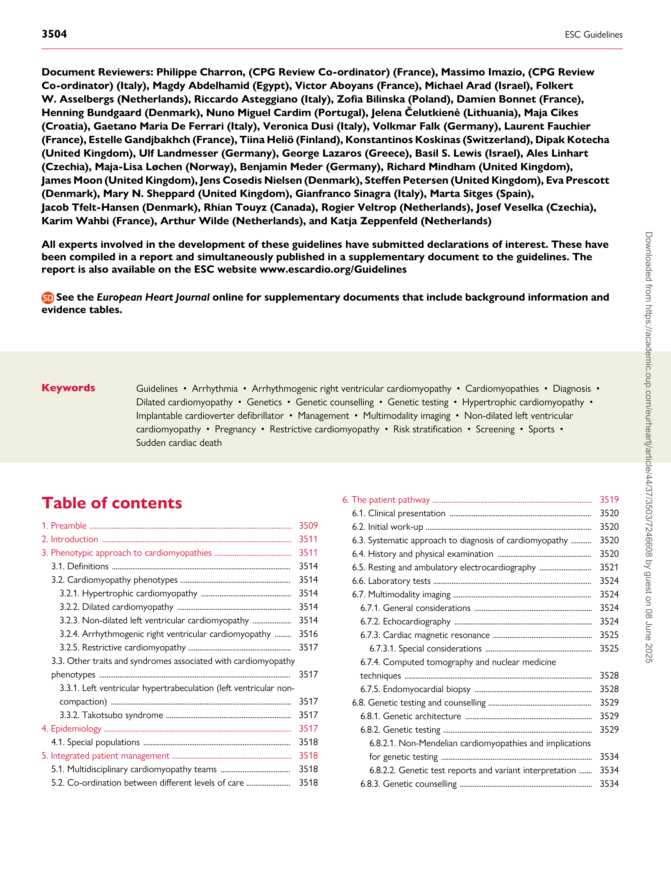
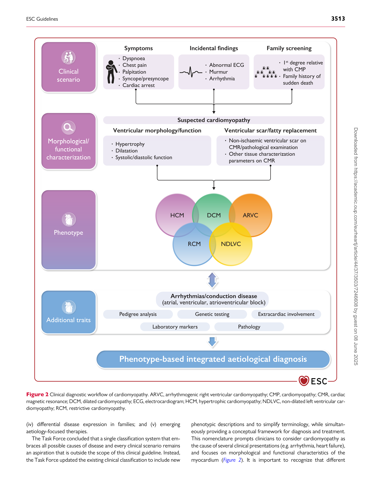
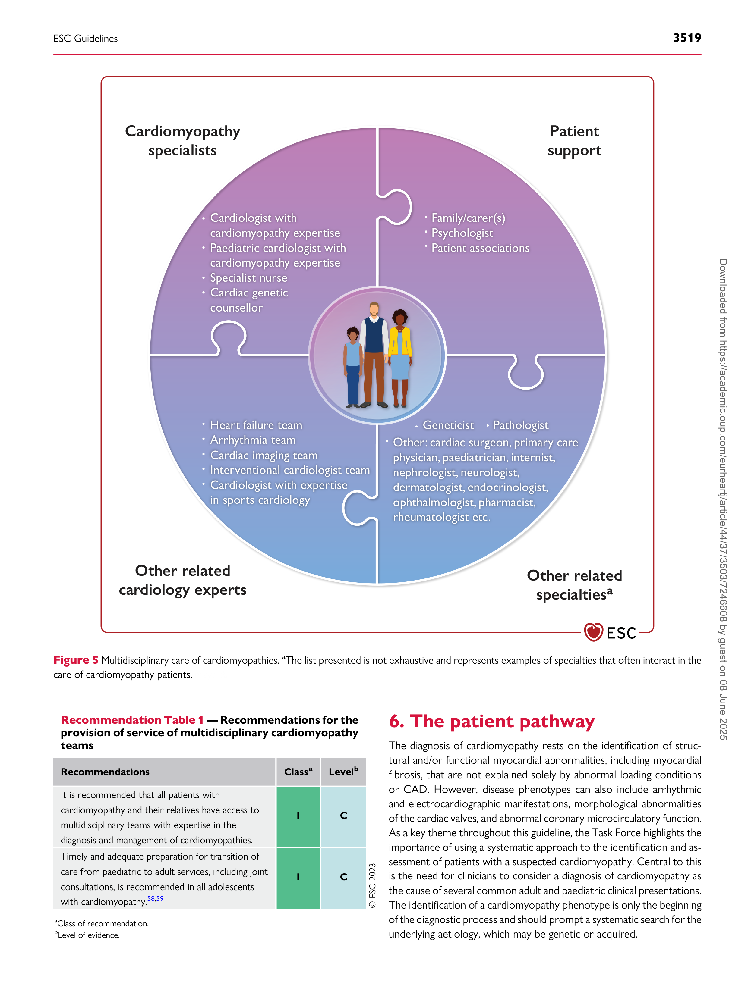
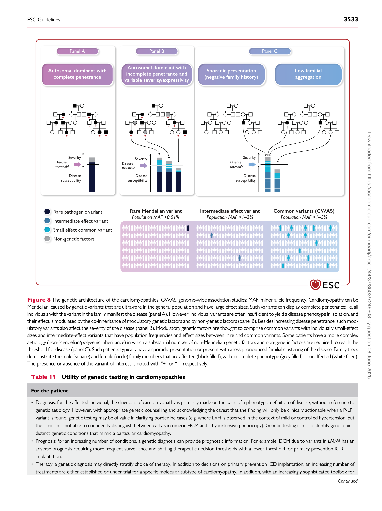
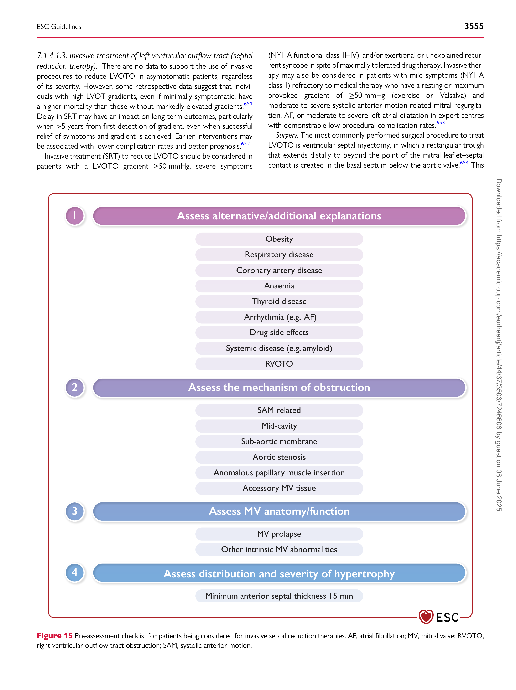
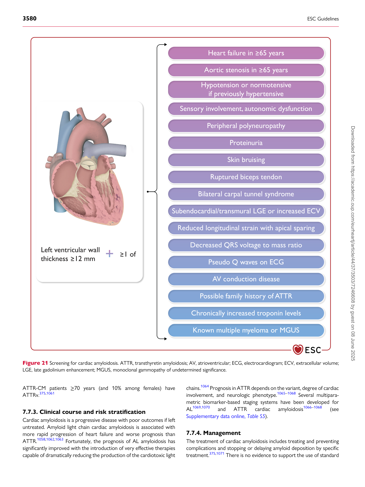
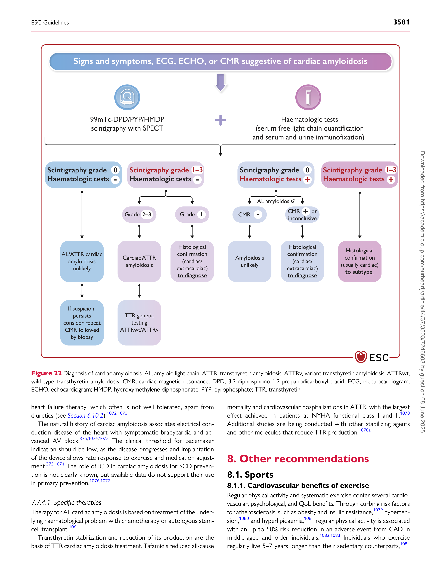

European Heart Journal (2023) **44**, 3503–3626
[https://doi.org/10.1093/eurheartj/ehad194](https://doi.org/10.1093/eurheartj/ehad194)

##### **ESC GUIDELINES**

# **2023 ESC Guidelines for the management ** **of cardiomyopathies**
## **Developed by the task force on the management of ** **cardiomyopathies of the European Society of Cardiology (ESC)**
##### **Authors/Task Force Members: Elena Arbelo * [†], (Chairperson) (Spain), ** **Alexandros Protonotarios  ‡, (Task Force Co-ordinator) (United Kingdom), ** **Juan R. Gimeno  ‡, (Task Force Co-ordinator) (Spain), Eloisa Arbustini  (Italy), ** **Roberto Barriales-Villa  (Spain), Cristina Basso  (Italy), Connie R. Bezzina ** **(Netherlands), Elena Biagini  (Italy), Nico A. Blom [1 ] (Netherlands), ** **Rudolf A. de Boer  (Netherlands), Tim De Winter (Belgium), Perry M. Elliott ** **(United Kingdom), Marcus Flather  (United Kingdom), Pablo Garcia-Pavia ** **(Spain), Kristina H. Haugaa  (Sweden), Jodie Ingles  (Australia), ** **Ruxandra Oana Jurcut  (Romania), Sabine Klaassen  (Germany), ** **Giuseppe Limongelli  (Italy), Bart Loeys  2 (Belgium), Jens Mogensen ** **(Denmark), Iacopo Olivotto  (Italy), Antonis Pantazis  (United Kingdom), ** **Sanjay Sharma  (United Kingdom), J. Peter Van Tintelen  (Netherlands), ** **James S. Ware  (United Kingdom), Juan Pablo Kaski * [†], (Chairperson) ** **(United Kingdom), and ESC Scientific Document Group**

- Corresponding authors: Elena Arbelo, Arrhythmia Section, Cardiology Department, Hospital Clínic, Universitat de Barcelona, Barcelona, Spain, IDIBAPS, Institut d’Investigació August Pi i
Sunyer (IDIBAPS), Barcelona, Spain, Centro de Investigación Biomédica en Red de Enfermedades Cardiovasculares (CIBERCV), Madrid, Spain, and European Reference Network for Rare, Low
[Prevalence and Complex Diseases of the Heart, ERN GUARD-Heart, Barcelona, Spain. Tel: +34 93 22 75 55 11, E-mail: elenaarbelo@secardiologia.es; and Juan Pablo Kaski, Centre for](mailto:elenaarbelo@secardiologia.es)
Paediatric Inherited and Rare Cardiovascular Disease, University College London, Institute of Cardiovascular Science, London, United Kingdom and Centre for Inherited Cardiovascular
[Diseases, Great Ormond Street Hospital, London, United Kingdom. Tel: +44 78 29 88 39, E-mail: j.kaski@ucl.ac.uk](mailto:j.kaski@ucl.ac.uk)

- The two Chairpersons contributed equally to the document and are joint corresponding authors.

- The two Task Force Co-ordinators contributed equally to the document.

**Author/Task Force Member affiliations are listed in author information.**

1 Representing the Association for European Paediatric and Congenital Cardiology (AEPC)

2 Representing the European Society of Human Genetics (ESHG)

**ESC Clinical Practice Guidelines (CPG) Committee: listed in the Appendix.**

**ESC subspecialty communities having participated in the development of this document:**

**Associations:** Association of Cardiovascular Nursing & Allied Professions (ACNAP), European Association of Cardiovascular Imaging (EACVI), European Association of Preventive
Cardiology (EAPC), European Heart Rhythm Association (EHRA), Heart Failure Association (HFA).

**Councils:** Council on Cardiovascular Genomics.

**Working Groups:** Development Anatomy and Pathology, Myocardial and Pericardial Diseases.

**Patient Forum**

The content of these European Society of Cardiology (ESC) Guidelines has been published for personal and educational use only. No commercial use is authorized. No part of the ESC
Guidelines may be translated or reproduced in any form without written permission from the ESC. Permission can be obtained upon submission of a written request to Oxford
University Press, the publisher of the *European Heart Journal* [, and the party authorized to handle such permissions on behalf of the ESC (journals.permissions@oup.com).](mailto:journals.permissions@oup.com)

**Disclaimer.** The ESC Guidelines represent the views of the ESC and were produced after careful consideration of the scientific and medical knowledge and the evidence available at the time
of their publication. The ESC is not responsible in the event of any contradiction, discrepancy, and/or ambiguity between the ESC Guidelines and any other official recommendations or
guidelines issued by the relevant public health authorities, in particular in relation to good use of healthcare or therapeutic strategies. Health professionals are encouraged to take the
ESC Guidelines fully into account when exercising their clinical judgment, as well as in the determination and the implementation of preventive, diagnostic or therapeutic medical strategies;
however, the ESC Guidelines do not override, in any way whatsoever, the individual responsibility of health professionals to make appropriate and accurate decisions in consideration of each
patient’s health condition and in consultation with that patient and, where appropriate and/or necessary, the patient’s caregiver. Nor do the ESC Guidelines exempt health professionals from
taking into full and careful consideration the relevant official updated recommendations or guidelines issued by the competent public health authorities, in order to manage each patient’s case
in light of the scientifically accepted data pursuant to their respective ethical and professional obligations. It is also the health professional’s responsibility to verify the applicable rules and
regulations relating to drugs and medical devices at the time of prescription.
© The European Society of Cardiology 2023. All rights reserved. For permissions please email: journals.permissions@oup.com.

**3504** ESC Guidelines

**Document Reviewers: Philippe Charron, (CPG Review Co-ordinator) (France), Massimo Imazio, (CPG Review**
**Co-ordinator) (Italy), Magdy Abdelhamid (Egypt), Victor Aboyans (France), Michael Arad (Israel), Folkert**
**W. Asselbergs (Netherlands), Riccardo Asteggiano (Italy), Zofia Bilinska (Poland), Damien Bonnet (France),**
**Henning Bundgaard (Denmark), Nuno Miguel Cardim (Portugal), Jelena Čelutkienė (Lithuania), Maja Cikes**
**(Croatia), Gaetano Maria De Ferrari (Italy), Veronica Dusi (Italy), Volkmar Falk (Germany), Laurent Fauchier**
**(France), Estelle Gandjbakhch (France), Tiina Heliö (Finland), Konstantinos Koskinas (Switzerland), Dipak Kotecha**
**(United Kingdom), Ulf Landmesser (Germany), George Lazaros (Greece), Basil S. Lewis (Israel), Ales Linhart**
**(Czechia), Maja-Lisa Løchen (Norway), Benjamin Meder (Germany), Richard Mindham (United Kingdom),**
**James Moon (United Kingdom), Jens Cosedis Nielsen (Denmark), Steffen Petersen (United Kingdom), Eva Prescott**
**(Denmark), Mary N. Sheppard (United Kingdom), Gianfranco Sinagra (Italy), Marta Sitges (Spain),**
**Jacob Tfelt-Hansen (Denmark), Rhian Touyz (Canada), Rogier Veltrop (Netherlands), Josef Veselka (Czechia),**
**Karim Wahbi (France), Arthur Wilde (Netherlands), and Katja Zeppenfeld (Netherlands)**

**All experts involved in the development of these guidelines have submitted declarations of interest. These have**
**been compiled in a report and simultaneously published in a supplementary document to the guidelines. The**
**[report is also available on the ESC website www.escardio.org/Guidelines](https://www.escardio.org/Guidelines)**

**See the** ***European Heart Journal*** **online for supplementary documents that include background information and**
**evidence tables.**

Keywords Guidelines • Arrhythmia • Arrhythmogenic right ventricular cardiomyopathy • Cardiomyopathies • Diagnosis •
Dilated cardiomyopathy • Genetics • Genetic counselling • Genetic testing • Hypertrophic cardiomyopathy •
Implantable cardioverter defibrillator • Management • Multimodality imaging • Non-dilated left ventricular
cardiomyopathy • Pregnancy • Restrictive cardiomyopathy • Risk stratification • Screening • Sports •

Sudden cardiac death

### **Table of contents **

1. Preamble .............................................................................................................. 3509

2. Introduction ....................................................................................................... 3511

3. Phenotypic approach to cardiomyopathies .......................................... 3511

3.1. Definitions ................................................................................................. 3514
3.2. Cardiomyopathy phenotypes ............................................................ 3514

3.2.1. Hypertrophic cardiomyopathy ................................................. 3514

3.2.2. Dilated cardiomyopathy .............................................................. 3514

3.2.3. Non-dilated left ventricular cardiomyopathy ..................... 3514

3.2.4. Arrhythmogenic right ventricular cardiomyopathy ......... 3516

3.2.5. Restrictive cardiomyopathy ........................................................ 3517

3.3. Other traits and syndromes associated with cardiomyopathy

phenotypes ........................................................................................................ 3517

3.3.1. Left ventricular hypertrabeculation (left ventricular non
compaction) .................................................................................................. 3517

3.3.2. Takotsubo syndrome .................................................................... 3517

4. Epidemiology ...................................................................................................... 3517

4.1. Special populations ................................................................................ 3518

5. Integrated patient management ................................................................. 3518

5.1. Multidisciplinary cardiomyopathy teams ...................................... 3518

5.2. Co-ordination between different levels of care ........................ 3518

6. The patient pathway ....................................................................................... 3519

6.1. Clinical presentation ............................................................................. 3520

6.2. Initial work-up .......................................................................................... 3520

6.3. Systematic approach to diagnosis of cardiomyopathy ........... 3520

6.4. History and physical examination ................................................... 3520

6.5. Resting and ambulatory electrocardiography ............................ 3521

6.6. Laboratory tests ...................................................................................... 3524

6.7. Multimodality imaging ........................................................................... 3524

6.7.1. General considerations ................................................................ 3524

6.7.2. Echocardiography ........................................................................... 3524

6.7.3. Cardiac magnetic resonance ...................................................... 3525

6.7.3.1. Special considerations .......................................................... 3525

6.7.4. Computed tomography and nuclear medicine

techniques ...................................................................................................... 3528

6.7.5. Endomyocardial biopsy ................................................................ 3528

6.8. Genetic testing and counselling ........................................................ 3529

6.8.1. Genetic architecture ..................................................................... 3529

6.8.2. Genetic testing ................................................................................. 3529

6.8.2.1. Non-Mendelian cardiomyopathies and implications

for genetic testing .................................................................................. 3534

6.8.2.2. Genetic test reports and variant interpretation ....... 3534

6.8.3. Genetic counselling ........................................................................ 3534

ESC Guidelines **3505**

6.8.3.1. Genetic counselling in children ........................................ 3534

6.8.3.2. Pre- and post-test genetic counselling (proband) .... 3535

6.8.3.3. Genetic counselling for cascade testing ........................ 3535

6.8.3.4. Pre-natal or pre-implantation genetic diagnosis ....... 3536

6.9. Diagnostic approach to paediatric patients ................................ 3537

6.9.1. Infantile and early childhood-onset cardiomyopathy ...... 3538

6.10. General principles in the management of patients with

cardiomyopathy ............................................................................................... 3539

6.10.1. Assessment of symptoms ......................................................... 3539

6.10.2. Heart failure management ........................................................ 3539

6.10.2.1. Preventive heart failure medical therapy of

asymptomatic carriers/early disease expression ....................... 3540

6.10.2.2. Cardiac transplantation ..................................................... 3540

6.10.2.3. Left ventricular assist devices ......................................... 3540

6.10.3. Management of atrial arrhythmias ........................................ 3541

6.10.3.1. Anticoagulation ..................................................................... 3541

6.10.3.2. Rate control ........................................................................... 3541

6.10.3.3. Rhythm control .................................................................... 3543

6.10.3.4. Comorbidities and risk factor management ............ 3543

6.10.4. Management of ventricular arrhythmias ............................ 3544
6.10.5. Device therapy: implantable cardioverter defibrillator 3544
6.10.6. Routine follow-up of patients with cardiomyopathy ... 3546

6.11. Family screening and follow-up evaluation of relatives ....... 3546

6.11.1. Special considerations in family screening ......................... 3547

6.12. Psychological support in cardiomyopathy patients and family

members ............................................................................................................. 3548

6.13. The patient pathway .......................................................................... 3549
7. Specific cardiomyopathy phenotypes ...................................................... 3549

7.1. Hypertrophic cardiomyopathy ......................................................... 3549

7.1.1. Diagnosis ............................................................................................ 3549

7.1.1.1. Diagnostic criteria .................................................................. 3549

7.1.1.2. Diagnostic work-up ............................................................... 3549

7.1.1.3. Echocardiography ................................................................... 3549

7.1.1.4. Cardiac magnetic resonance ............................................. 3550

7.1.1.5. Nuclear imaging ...................................................................... 3551

7.1.2. Genetic testing and family screening ...................................... 3551

7.1.3. Assessment of symptoms ........................................................... 3552

7.1.4. Management of symptoms and complications ................... 3552
7.1.4.1. Management of left ventricular outflow tract

obstruction ............................................................................................... 3553

7.1.4.1.1. General measures .......................................................... 3553

7.1.4.1.2. Drug therapy ................................................................... 3553
7.1.4.1.3. Invasive treatment of left ventricular outflow
tract (septal reduction therapy) ................................................. 3555

7.1.4.2. Management of symptoms in patients without left
ventricular outflow tract obstruction ........................................... 3557
7.1.4.2.1. Heart failure and chest pain ...................................... 3557

7.1.4.2.2. Cardiac resynchronization therapy ........................ 3557

7.1.5. Sudden cardiac death prevention in hypertrophic

cardiomyopathy ........................................................................................... 3558

7.1.5.1. Left ventricular apical aneurysms .................................... 3559

7.1.5.2. Left ventricular systolic dysfunction ............................... 3559

7.1.5.3. Late gadolinium enhancement on cardiac magnetic

resonance imaging ................................................................................. 3559

7.1.5.4. Abnormal exercise blood pressure response ............ 3559

7.1.5.5. Sarcomeric variants ............................................................... 3560

7.1.5.6. Prevention of sudden cardiac death .............................. 3560

7.2. Dilated cardiomyopathy ...................................................................... 3562

7.2.1. Diagnosis ............................................................................................ 3562

7.2.1.1. Index case .................................................................................. 3562

7.2.1.2. Relatives ..................................................................................... 3562

7.2.1.3. Diagnostic work-up ............................................................... 3562

7.2.1.4. Echocardiography ................................................................... 3562

7.2.1.5. Cardiac magnetic resonance ............................................. 3563

7.2.1.6. Nuclear medicine ................................................................... 3563

7.2.2. Genetic testing and family screening ...................................... 3563

7.2.2.1. Genetic testing ........................................................................ 3563

7.2.3. Assessment of symptoms ........................................................... 3564

7.2.4. Management ...................................................................................... 3564

7.2.5. Sudden cardiac death prevention in dilated

cardiomyopathy ........................................................................................... 3564

7.2.5.1. Secondary prevention of sudden cardiac death ....... 3564

7.2.5.2. Primary prevention of sudden cardiac death ............. 3564

7.3. Non-dilated left ventricular cardiomyopathy ............................. 3566

7.3.1. Diagnosis ............................................................................................ 3566

7.3.1.1. Index case .................................................................................. 3566

7.3.1.2. Relatives ..................................................................................... 3566

7.3.1.3. Diagnostic work-up ............................................................... 3566

7.3.1.4. Electrocardiographic features ........................................... 3567

7.3.1.5. Echocardiography ................................................................... 3567

7.3.1.6. Cardiac magnetic resonance ............................................. 3567

7.3.1.7. Nuclear medicine ................................................................... 3567

7.3.1.8. Endomyocardial biopsy ........................................................ 3567

7.3.2. Genetic testing ................................................................................. 3567

7.3.3. Assessment of symptoms ........................................................... 3567

7.3.4. Management ...................................................................................... 3567

7.3.5. Sudden cardiac death prevention in non-dilated left

ventricular cardiomyopathy .................................................................... 3568

7.3.5.1. Secondary prevention of sudden cardiac death ....... 3568

7.3.5.2. Primary prevention of sudden cardiac death ............. 3568

7.4. Arrhythmogenic right ventricular cardiomyopathy ................. 3569

7.4.1. Diagnosis ............................................................................................ 3569

7.4.1.1. Index case .................................................................................. 3569

7.4.1.2. Relatives ..................................................................................... 3569

7.4.1.3. Diagnostic work-up ............................................................... 3569

7.4.1.4. Electrocardiography and Holter monitoring .............. 3569

7.4.1.5. Echocardiography and cardiac magnetic resonance 3569

7.4.1.6. Endomyocardial biopsy ........................................................ 3569

7.4.1.7. Nuclear medicine ................................................................... 3569

7.4.1.8. Arrhythmogenic right ventricular cardiomyopathy

phenocopies ............................................................................................. 3570

7.4.2. Genetic testing and family screening ...................................... 3570

7.4.3. Assessment of symptoms ........................................................... 3570

7.4.4. Management ...................................................................................... 3570

7.4.4.1. Antiarrhythmic therapy ....................................................... 3570

7.4.5. Sudden cardiac death prevention in arrhythmogenic right

ventricular cardiomyopathy .................................................................... 3570

7.4.5.1. Secondary prevention of sudden cardiac death ....... 3571

7.4.5.2. Primary prevention of sudden cardiac death ............. 3571

7.5. Restrictive cardiomyopathy ............................................................... 3572

7.5.1. Diagnosis ............................................................................................ 3572

7.5.2. Genetic testing ................................................................................. 3572

**3506** ESC Guidelines

7.5.3. Assessment of symptoms ........................................................... 3573

7.5.4. Management ...................................................................................... 3573

7.6. Syndromic and metabolic cardiomyopathies ............................. 3574

7.6.1. Anderson–Fabry disease .............................................................. 3574
7.6.1.1. Definition ................................................................................... 3574
7.6.1.2. Diagnosis, clinical work-up, and differential diagnosis 3574
7.6.1.3. Clinical course, outcome, and risk stratification ....... 3574
7.6.1.4. Management ............................................................................. 3577

7.6.2. RASopathies ...................................................................................... 3577
7.6.2.1. Definition ................................................................................... 3577
7.6.2.2. Diagnosis, clinical work-up, and differential diagnosis 3577

7.6.2.3. Clinical course, management, and sudden death risk
stratification .............................................................................................. 3577
7.6.2.4. Management ............................................................................. 3577

7.6.3. Friedreich ataxia .............................................................................. 3578

7.6.3.1. Definition ................................................................................... 3578
7.6.3.2. Diagnosis, clinical work-up, and differential diagnosis 3578
7.6.3.3. Clinical course, management, and risk stratification 3579
7.6.3.4. Management ............................................................................. 3579

7.6.4. Glycogen storage disorders ....................................................... 3579
7.6.4.1. Definition ................................................................................... 3579
7.6.4.2. Diagnosis, clinical work-up, and differential diagnosis 3579
7.6.4.3. Clinical course, management, and risk stratification 3579
7.6.4.4. Management ............................................................................. 3579

7.7. Amyloidosis ............................................................................................... 3579
7.7.1. Definition ........................................................................................... 3579
7.7.2. Diagnosis, clinical work-up, and differential diagnosis ..... 3579
7.7.3. Clinical course and risk stratification ..................................... 3580
7.7.4. Management ...................................................................................... 3580
7.7.4.1. Specific therapies .................................................................... 3581

8. Other recommendations .............................................................................. 3581

8.1. Sports .......................................................................................................... 3581
8.1.1. Cardiovascular benefits of exercise ........................................ 3581

8.1.2. Exercise-related sudden cardiac death and historical

exercise recommendations for patients with cardiomyopathy 3582

8.1.3. Exercise recommendations in hypertrophic

cardiomyopathy ........................................................................................... 3582

8.1.4. Exercise recommendations in arrhythmogenic right

ventricular cardiomyopathy .................................................................... 3582

8.1.5. Exercise recommendations in dilated cardiomyopathy

and non-dilated left ventricular cardiomyopathy .......................... 3582

8.2. Reproductive issues ............................................................................... 3583

8.2.1. Contraception, *in vitro* fertilization, and hormonal

treatment ........................................................................................................ 3583

8.2.2. Pregnancy management ............................................................... 3583

8.2.2.1. Pre-pregnancy .......................................................................... 3583

8.2.2.2. Pregnancy .................................................................................. 3583

8.2.2.3. Timing and mode of delivery ............................................ 3584

8.2.2.4. Post-partum .............................................................................. 3584

8.2.2.5. Pharmacological treatment: general aspects .............. 3584
8.2.2.6. Specific cardiomyopathies .................................................. 3584
8.2.2.7. Peripartum cardiomyopathy ............................................. 3585

8.3. Recommendations for non-cardiac surgery ............................... 3585

9. Requirements for specialized cardiomyopathy units ........................ 3586

10. Living with cardiomyopathy: advice for patients ............................. 3586

11. Sex differences in cardiomyopathies ..................................................... 3587

12. Comorbidities and cardiovascular risk factors in

cardiomyopathies .................................................................................................. 3587

12.1. Cardiovascular risk factors .............................................................. 3587

12.2. Dilated cardiomyopathy ................................................................... 3588

12.3. Hypertrophic cardiomyopathy ...................................................... 3588

12.4. Arrhythmogenic right ventricular cardiomyopathy .............. 3588

13. Coronavirus disease (COVID-19) and cardiomyopathies ........... 3588

14. Key messages .................................................................................................. 3588

15. Gaps in evidence ............................................................................................ 3589

16. ‘What to do’ and ‘What not to do’ messages from the

Guidelines ................................................................................................................. 3591

17. Supplementary data ...................................................................................... 3595

18. Data availability statement ......................................................................... 3595

19. Author information ...................................................................................... 3595

20. Appendix ........................................................................................................... 3596

21. Acknowledgements ...................................................................................... 3597

22. References ........................................................................................................ 3597
### **Tables of Recommendations **

Recommendation Table 1 — Recommendations for the provision of
service of multidisciplinary cardiomyopathy teams ................................ 3519
Recommendation Table 2 — Recommendations for diagnostic
work-up in cardiomyopathies .......................................................................... 3520
Recommendation Table 3 — Recommendations for laboratory
tests in the diagnosis of cardiomyopathies ................................................ 3524

Recommendation Table 4 — Recommendation for

echocardiographic evaluation in patients with cardiomyopathy ...... 3524

Recommendation Table 5 — Recommendations for cardiac

magnetic resonance indication in patients with cardiomyopathy .... 3526
Recommendation Table 6 — Recommendations for computed
tomography and nuclear imaging ................................................................... 3528
Recommendation Table 7 — Recommendation for endomyocardial
biopsy in patients with cardiomyopathy ..................................................... 3528
Recommendation Table 8 — Recommendations for genetic
counselling and testing in cardiomyopathies ............................................. 3537

Recommendation Table 9 — Recommendations for cardiac

transplantation in patients with cardiomyopathy ................................... 3540

Recommendation Table 10 — Recommendation for left ventricular

assist device therapy in patients with cardiomyopathy ........................ 3540
Recommendation Table 11 — Recommendations for management of
atrial fibrillation and atrial flutter in patients with cardiomyopathy .... 3543
Recommendation Table 12 — Recommendations for implantable
cardioverter defibrillator in patients with cardiomyopathy ................ 3545

Recommendation Table 13 — Recommendations for routine

follow-up of patients with cardiomyopathy .............................................. 3546
Recommendation Table 14 — Recommendations for family
screening and follow-up evaluation of relatives ....................................... 3546
Recommendation Table 15 — Recommendations for psychological
support in patients and family members with cardiomyopathies .... 3549

Recommendation Table 16 — Recommendation for evaluation of

left ventricular outflow tract obstruction .................................................. 3549

Recommendation Table 17 — Additional recommendation for

cardiovascular magnetic resonance evaluation in hypertrophic
cardiomyopathy ..................................................................................................... 3550

Recommendation Table 18 — Recommendations for treatment of

left ventricular outflow tract obstruction (general measures) .......... 3553

Recommendation Table 19 — Recommendations for medical

treatment of left ventricular outflow tract obstruction ....................... 3554
Recommendation Table 20 — Recommendations for septal
reduction therapy ................................................................................................. 3556

ESC Guidelines **3507**

Recommendation Table 21 — Recommendations for indications for

cardiac pacing in patients with obstruction ............................................... 3557
Recommendation Table 22 — Recommendations for chest pain on
exertion in patients without left ventricular outflow tract

obstruction .............................................................................................................. 3557

Recommendation Table 23 — Additional recommendations for

prevention of sudden cardiac death in patients with hypertrophic
cardiomyopathy ..................................................................................................... 3561
Recommendation Table 24 — Recommendations for an implantable
cardioverter defibrillator in patients with dilated cardiomyopathy 3566
Recommendation Table 25 — Recommendation for resting and
ambulatory electrocardiogram monitoring in patients with
non-dilated left ventricular cardiomyopathy ............................................. 3567
Recommendation Table 26 — Recommendations for an implantable
cardioverter defibrillator in patients with non-dilated left ventricular
cardiomyopathy ..................................................................................................... 3568
Recommendation Table 27 — Recommendation for resting and
ambulatory electrocardiogram monitoring in patients with
arrhythmogenic right ventricular cardiomyopathy ................................. 3569

Recommendation Table 28 — Recommendations for the

antiarrhythmic management of patients with arrhythmogenic right
ventricular cardiomyopathy .............................................................................. 3570

Recommendation Table 29 — Recommendations for sudden

cardiac death prevention in patients with arrhythmogenic right
ventricular cardiomyopathy .............................................................................. 3571

Recommendation Table 30 — Recommendations for the

management of patients with restrictive cardiomyopathy ................. 3574

Recommendation Table 31 — Exercise recommendations for

patients with cardiomyopathy ......................................................................... 3582
Recommendation Table 32 — Recommendations for reproductive
issues in patients with cardiomyopathy ...................................................... 3585

Recommendation Table 33 — Recommendations for non-cardiac

surgery in patients with cardiomyopathy ................................................... 3585
Recommendation Table 34 — Recommendation for management
of cardiovascular risk factors in patients with cardiomyopathy ....... 3588
### **List of tables **

Table 1 Classes for recommendations ........................................................ 3510

Table 2 Levels of evidence ................................................................................ 3510

Table 3 Morphological and functional traits used to describe
cardiomyopathy phenotypes ............................................................................ 3514
Table 4 Key epidemiological metrics in adults and children for the
different cardiomyopathy phenotypes ......................................................... 3517
Table 5 Examples of inheritance patterns that should raise the
suspicion of specific genetic aetiologies, grouped according to
cardiomyopathy phenotype ............................................................................. 3521
Table 6 Examples of signs and symptoms that should raise the
suspicion of specific aetiologies, grouped according to
cardiomyopathy phenotype ............................................................................. 3522
Table 7 Examples of electrocardiographic features that should raise
the suspicion of specific aetiologies, grouped according to
cardiomyopathy phenotype ............................................................................. 3523
Table 8 First-level (to be performed in each patient) and
second-level (to be performed in selected patients following
specialist evaluation to identify specific aetiologies) laboratory tests,
grouped by cardiomyopathy phenotype .................................................... 3525
Table 9 Frequently encountered actionable results on multimodality
imaging ....................................................................................................................... 3528

Table 10 Overview of genes associated with monogenic,
non-syndromic cardiomyopathies, and their relative contributions
to different cardiomyopathic phenotypes .................................................. 3530
Table 11 Utility of genetic testing in cardiomyopathies ....................... 3533
Table 12 Specific issues to consider when counselling children ....... 3534
Table 13 Key discussion points of pre- and post-test genetic
counselling ................................................................................................................ 3536
Table 14 Pre-natal and pre-implantation options and implications 3536
Table 15 Atrial fibrillation burden and management in
cardiomyopathies .................................................................................................. 3542
Table 16 Psychological considerations ......................................................... 3548
Table 17 Imaging evaluation in hypertrophic cardiomyopathy ......... 3550
Table 18 Echocardiographic features that suggest specific aetiologies
in hypertrophic cardiomyopathy .................................................................... 3551
Table 19 Major clinical features associated with an increased risk of

sudden cardiac death ........................................................................................... 3558

Table 20 Non-genetic causes of dilated cardiomyopathy ....................... 3563
Table 21 High-risk genotypes and associated predictors of sudden

cardiac death ........................................................................................................... 3566

Table 22 Clinical features and management of syndromic and
metabolic cardiomyopathies ............................................................................ 3575
Table 23 Anderson–Fabry disease red flags .............................................. 3577
Table 24 General guidance for daily activity for patients with
cardiomyopathies .................................................................................................. 3586
Table 25 Modulators of the phenotypic expression of
cardiomyopathies .................................................................................................. 3588
### **List of figures **

Figure 1 Central illustration .............................................................................. 3512
Figure 2 Clinical diagnostic workflow of cardiomyopathy .................. 3513
Figure 3 Examples of non-dilated left ventricular cardiomyopathy
phenotypes and their aetiological correlates ............................................ 3515
Figure 4 Worked example of the non-dilated left ventricular
cardiomyopathy phenotype ............................................................................. 3516
Figure 5 Multidisciplinary care of cardiomyopathies .............................. 3519
Figure 6 Multimodality imaging process in cardiomyopathies ........... 3526
Figure 7 Examples of cardiac magnetic resonance imaging tissue
characterization features that should raise the suspicion of specific
aetiologies, grouped according to cardiomyopathy phenotype ....... 3527
Figure 8 The genetic architecture of the cardiomyopathies .............. 3533
Figure 9 A patient-centred approach to cascade genetic testing of

children ...................................................................................................................... 3535

Figure 10 Clinical approach to infantile and childhood
cardiomyopathy ..................................................................................................... 3538
Figure 11 Algorithm for the approach to family screening and
follow-up of family members ........................................................................... 3547
Figure 12 Protocol for the assessment and treatment of left
ventricular outflow tract obstruction .......................................................... 3551
Figure 13 Algorithm for the treatment of heart failure in
hypertrophic cardiomyopathy ......................................................................... 3552
Figure 14 Flow chart on the management of left ventricular outflow

tract obstruction ................................................................................................... 3554

Figure 15 Pre-assessment checklist for patients being considered for
invasive septal reduction therapies ................................................................ 3555
Figure 16 Flow chart for implantation of an implantable cardioverter
defibrillator in patients with hypertrophic cardiomyopathy .............. 3561
Figure 17 Implantation of implantable cardioverter defibrillators in
patients with dilated cardiomyopathy or non-dilated left ventricular
cardiomyopathy flowchart ................................................................................ 3565

**3508** ESC Guidelines

Figure 18 Algorithm to approach implantable cardioverter
defibrillator decision-making in patients with arrhythmogenic right
ventricular cardiomyopathy .............................................................................. 3572
Figure 19 Spectrum of restrictive heart diseases .................................... 3573
Figure 20 Anderson–Fabry disease diagnostic algorithm ..................... 3578
Figure 21 Screening for cardiac amyloidosis ............................................. 3580
Figure 22 Diagnosis of cardiac amyloidosis ............................................... 3581
### **Abbreviations and acronyms**

18F-FDG 18F-fluorodeoxyglucose
2D Two-dimensional

3D Three-dimensional
99m Tc 99m Technetium

AAD Antiarrhythmic drug
ABC Atrial Fibrillation Better Care approach
ACE Angiotensin-converting enzyme
ACE-I Angiotensin-converting enzyme inhibitor
ACM Arrhythmogenic cardiomyopathy

AD Autosomal dominant

AED Automated external defibrillator
AF Atrial fibrillation
AFD Anderson–Fabry disease
AHA/ACC American Heart Association/American College of
Cardiology
AL Monoclonal immunoglobulin light chain amyloidosis
ALCAPA Anomalous left coronary artery from the pulmonary

artery

ALT Alanine aminotransferase

ALVC Arrhythmogenic left ventricular cardiomyopathy
APHRS Asia Pacific Heart Rhythm Society
AR Autosomal recessive

ARB Angiotensin receptor blocker
ARNI Angiotensin receptor neprilysin inhibitor
ARVC Arrhythmogenic right ventricular cardiomyopathy
ASA Alcohol septal ablation
AST Aspartate transaminase
ATPase Adenosine triphosphatase
ATTR Transthyretin amyloidosis
ATTR-CA Transthyretin cardiac amyloidosis
ATTR-CM Transthyretin amyloid cardiomyopathy
ATTRv Hereditary transthyretin amyloidosis
ATTRwt Wild-type OR Acquired transthyretin amyloidosis

AV Atrioventricular

b.p.m. Beats per minute
BAG3 BAG cochaperone-3
BNP Brain natriuretic peptide
CAD Coronary artery disease

CCB Calcium channel blocker

CHA 2 DS 2 -VASc Congestive heart failure or left ventricular
dysfunction, hypertension, age ≥75 (doubled),
diabetes, stroke (doubled)-vascular disease, age 65–
74, sex category (female) (score)
CHD Congenital heart disease

CK Creatinine kinase

CMR Cardiac magnetic resonance
COVID-19 Severe acute respiratory syndrome coronavirus 2
(SARS-CoV-2) infection
CPET Cardio-pulmonary exercise testing

CPR Cardio-pulmonary resuscitation
CRT Cardiac resynchronization therapy

CrCl Creatinine clearance

CT Computed tomography
CTCA Computed tomography coronary angiography
DBS Deep brain stimulation
DCM Dilated cardiomyopathy

DES Desmin

DMD Duchenne muscular dystrophy
DOAC Direct-acting oral anticoagulant
DPD 3,3-diphosphono-1,2-propanodicarboxylic acid
DSP Desmoplakin
EAST-AFNET Early Treatment of Atrial Fibrillation for Stroke

Prevention Trial

ECG Electrocardiogram
ECHO Echocardiogram

ECV Extracellular volume

EF Ejection fraction
EHRA European Heart Rhythm Association
EMB Endomyocardial biopsy
EMF Endomyocardial fibrosis
EORP EURObservational Research Programme
ERN European Reference Network
ERT Enzyme replacement therapy

FLNC Filamin C

FRA Friedreich ataxia

FTX Frataxin

Gb3 Globotriaosylceramide
GDMT Guideline-directed medical therapy
GSD Glycogen storage disorder
GWAS Genome-wide association study
HbA1c Haemoglobin A1C
HBP His-Bundle pacing
HCM Hypertrophic cardiomyopathy
HCMR Hypertrophic Cardiomyopathy Registry

HF Heart failure

HFmrEF Heart failure with mildly reduced ejection fraction
HFpEF Heart failure with preserved ejection fraction
HFrEF Heart failure with reduced ejection fraction
HMDP Hydroxymethylene diphosphonate

HR Hazard ratio

HRS Heart Rhythm Society
hs-cTnT High-sensitivity cardiac troponin T
ICD Implantable cardioverter defibrillator
INR International normalized ratio

ITFC International Task Force Consensus statement

IVF *In vitro* fertilization

LA Left atrium

LAHRS Latin American Heart Rhythm Society

LBBB Left bundle branch block

LGE Late gadolinium enhancement

LMNA Lamin A/C

LMWH Low-molecular-weight heparin
LSD Lysosomal storage disease

LV Left ventricular

LVAD LV assist device

LVEDV Left ventricular end-diastolic volume

LVEF Left ventricular ejection fraction
LVH Left ventricular hypertrophy

ESC Guidelines **3509**

LVNC Left ventricular non-compaction
LVOT Left ventricular outflow tract
LVSD Left ventricular systolic dysfunction
LVOTO Left ventricular outflow tract obstruction
MCS Mechanical circulatory support
MELAS Mitochondrial encephalomyopathy, lactic acidosis,
and stroke-like episodes (syndrome)
MERRF Mitochondrial epilepsy with ragged-red fibres
MGUS Monoclonal gammopathy of undetermined
significance
MICONOS Mitochondrial Protection with Idebenone in Cardiac

or Neurological Outcome (study group)

MLVWT Maximum left ventricular wall thickness

MRA Mineralocorticoid receptor antagonist
MRI Magnetic resonance imaging

MV Mitral valve

mWHO Modified World Health Organization
(classification)
NCS Non-cardiac surgery
NDLVC Non-dilated left ventricular cardiomyopathy
NGS Next-generation sequencing
NSML Noonan syndrome with multiple lentigines
NSVT Non-sustained ventricular tachycardia
NT-proBNP N-terminal pro-brain natriuretic peptide

NYHA New York Heart Association

OMT Optimal medical therapy
P/LP Pathogenic/likely pathogenic
PES Programmed electrical stimulation
PET Positron emission tomography
PKP2 Plakophilin 2
PLN Phospholamban
PPCM Peripartum cardiomyopathy
PRKAG2 Protein kinase AMP-activated non-catalytic subunit
gamma 2
PRS Polygenic risk scores
PTH Parathyroid hormone
PVR Pulmonary vascular resistance
PYP Pyrophosphate
QoL Quality of life
QRS Q, R, and S waves of an ECG
RAS-HCM RASopathy-associated HCM
RBBB Right bundle branch block
RBM20 RNA binding motif protein
RCM Restrictive cardiomyopathy

RCT Randomized controlled trial

RV Right ventricular
RVEF Right ventricular ejection fraction
RVOTO Right ventricular outflow tract obstruction
RWMA Regional wall motion abnormality
SAECG Signal-averaged electrocardiogram
SAM Systolic anterior motion

SCD Sudden cardiac death

SGLT2i Sodium–glucose co-transporter 2 inhibitor
SMVT Sustained monomorphic ventricular tachycardia
SPECT Single-photon emission computed tomography
SRT Septal reduction therapy

TIA Transient ischaemic attack

TMEM43 transmembrane protein 43

TRED-HF Therapy withdrawal in REcovered Dilated
cardiomyopathy **—** Heart Failure
TTE Transthoracic echocardiography

TTN Titin

TTNtv Titin gene truncating variants
TTR Transthyretin

TWI T wave inversion

UFH Unfractionated heparin
VALOR-HCM A Study to Evaluate Mavacamten in Adults With
Symptomatic Obstructive HCM Who Are Eligible
for Septal Reduction Therapy
VE Ventricular extrasystole
VF Ventricular fibrillation
VKA Vitamin K antagonist
VT Ventricular tachycardia
VUS Variant of unknown significance
WHO World Health Organization
### **1. Preamble**

Guidelines evaluate and summarize available evidence with the aim of

assisting health professionals in proposing the best diagnostic or thera-­
peutic approach for an individual patient with a given condition.
Guidelines are intended for use by health professionals and the
European Society of Cardiology (ESC) makes its Guidelines freely

available.

ESC Guidelines do not override the individual responsibility of health
professionals to make appropriate and accurate decisions in consider-­
ation of each patient’s health condition and in consultation with that pa-­
tient or the patient’s caregiver where appropriate and/or necessary. It is
also the health professional’s responsibility to verify the rules and reg-­
ulations applicable in each country to drugs and devices at the time of
prescription, and, where appropriate, to respect the ethical rules of
their profession.

ESC Guidelines represent the official position of the ESC on a given
topic and are regularly updated. ESC Policies and Procedures for for-­
mulating and issuing ESC Guidelines can be found on the ESC website
[(https://www.escardio.org/Guidelines).](https://www.escardio.org/Guidelines)

The Members of this Task Force were selected by the ESC to re-­
present professionals involved with the medical care of patients with
this pathology. The selection procedure aimed to include members
from across the whole of the ESC region and from relevant ESC
Subspecialty Communities. Consideration was given to diversity and in-­
clusion, notably with respect to gender and country of origin. The Task
Force performed a critical evaluation of diagnostic and therapeutic ap-­
proaches, including assessment of the risk-benefit ratio. The strength of
every recommendation and the level of evidence supporting them were
weighed and scored according to predefined scales as outlined below.
The Task Force followed ESC voting procedures, and all approved re-­
commendations were subject to a vote and achieved at least 75%
agreement among voting members.

The experts of the writing and reviewing panels provided declaration
of interest forms for all relationships that might be perceived as real or
potential sources of conflicts of interest. Their declarations of interest
were reviewed according to the ESC declaration of interest rules and
[can be found on the ESC website (http://www.escardio.org/](http://www.escardio.org/Guidelines)
[Guidelines) and have been compiled in a report published in a supple-­](http://www.escardio.org/Guidelines)
mentary document with the guidelines. The Task Force received its

**3510** ESC Guidelines

Table 1 **Classes for recommendations**

Table 2 **Levels of evidence**

ESC Guidelines **3511**

entire financial support from the ESC without any involvement from
the healthcare industry.

The ESC Clinical Practice Guidelines (CPG) Committee supervises
and co-ordinates the preparation of new guidelines and is responsible
for the approval process. ESC Guidelines undergo extensive review
by the CPG Committee and external experts, including members
from across the whole of the ESC region and from relevant ESC
Subspecialty Communities and National Cardiac Societies. After appro-­
priate revisions, the guidelines are signed off by all the experts involved
in the Task Force. The finalized document is signed off by the CPG
Committee for publication in the *European Heart Journal* . The guidelines
were developed after careful consideration of the scientific and medical
knowledge and the evidence available at the time of their writing. Tables
of evidence summarizing the findings of studies informing development
of the guidelines are included. The ESC warns readers that the technical
language may be misinterpreted and declines any responsibility in this

respect.

Off-label use of medication may be presented in this guideline if a suf-­
ficient level of evidence shows that it can be considered medically ap-­
propriate for a given condition.

However, the final decisions concerning an individual patient must be
made by the responsible health professional giving special consideration

to:

- The specific situation of the patient. Unless otherwise provided for
by national regulations, off-label use of medication should be limited
to situations where it is in the patient’s interest, with regard to the
quality, safety, and efficacy of care, and only after the patient has
been informed and has provided consent.

- Country-specific health regulations, indications by governmental
drug regulatory agencies, and the ethical rules to which health profes-­
sionals are subject, where applicable.
### **2. Introduction**

The objective of this European Society of Cardiology (ESC) Guideline is
to help healthcare professionals diagnose and manage patients with car-­
diomyopathies according to the best available evidence. Uniquely for
relatively common cardiovascular diseases, there are very few rando-­
mized controlled clinical trials in patients with cardiomyopathies. For
this reason, the majority of the recommendations in this guideline are
based on observational cohort studies and expert consensus opinion.
The aim is to provide healthcare professionals with a practical diagnos-­
tic and treatment framework for patients of all ages and, as an increasing
number of patients have a known genetic basis for their disease, the
guideline also considers the implications of a diagnosis for families
and provides advice on reproduction and contraception. As cardio-­
myopathies can present at any age and can affect individuals and families
across the entire life course, this guideline follows the principle of con-­
sidering cardiomyopathies in all age groups as single disease entities,
with recommendations applicable to children and adults with cardio-­
myopathy throughout, while accepting that the evidence base for
many of the recommendations is significantly more limited for children.
Age-related differences are specifically highlighted.

This is a new guideline, not an update of existing guidelines, with the
exception of the section on hypertrophic cardiomyopathy (HCM), in
which we have provided a focused update to the *2014 ESC Guidelines*
*on diagnosis and management of hypertrophic cardiomyopathy* . [1] As such,
most of the recommendations in this guideline are new. It is beyond
the scope of this guideline to provide detailed descriptions and

recommendations for each individual cardiomyopathy phenotype; in-­
stead, the aim is to provide a guide to the diagnostic approach to car-­
diomyopathies, highlight general evaluation and management issues,
and signpost the reader to the relevant evidence base for the

recommendations.

Adoption of morphological and functional disease definitions means
that the number of possible aetiologies is considerable, particularly in
young children. As it is impractical to provide an exhaustive compen-­
dium of all possible causes of cardiomyopathy, the guideline focuses
on the most common disease phenotypes, but additional references
for less common disorders are also provided. Similarly, treatment re-­
commendations focus largely on generic management issues but refer
to specific rare diseases when appropriate. The central illustration
( *Figure 1* ) highlights key aspects in the evaluation and management of
cardiomyopathies addressed in this guideline.

This is the first major international guideline to address cardiomyop-­
athies other than HCM. Other major innovations include:

- A new phenotypic description of cardiomyopathies, including up-­

dated descriptions of dilated and non-dilated left ventricular (LV) car-­
diomyopathy phenotypes, and highlighting the key role of ventricular
myocardial scar assessment using cardiac magnetic resonance (CMR)
imaging.

- A focus on the patient pathway, from presentation, through initial as-­

sessment and diagnosis, to management, highlighting the importance
of considering cardiomyopathy as a cause of common clinical presen-­
tations (e.g. heart failure, arrhythmia) and the importance of utilizing a
multiparametric approach following the identification of the present-­
ing phenotype to arrive at an aetiological diagnosis.

- Updated recommendations for clinical and genetic cascade screening
for relatives of individuals with cardiomyopathies.

- A focus on cardiomyopathies across the life course, from paediatric
to adult age (including transition), and considering the different clin-­
ical phases (e.g. concealed, overt, end stage).

- New recommendations on sudden cardiac death (SCD) risk stratifi-­

cation for different cardiomyopathy phenotypes, including in child-­
hood, and highlighting the important role of genotype in the

assessment of sudden death risk.

- Updated recommendations for the management of left ventricular
outflow tract obstruction (LVOTO) in HCM.

- A multidisciplinary approach to cardiomyopathies that has the pa-­

tient and their family at its heart.
### **3. Phenotypic approach to ** **cardiomyopathies**

In medicine, classification systems are used to standardize disease no-­
menclature by grouping disorders according to shared characteristics.
In 2008, the ESC promoted a pragmatic system for the clinical descrip-­
tion of cardiomyopathies in which a historical focus on ventricular
morphology and function was maintained, while signposting aetiological
diversity through subdivision into genetic and non-genetic subtypes. [2]

Since then, knowledge of cardiomyopathies has increased substantially
through the application of new imaging and molecular technologies.

In this guideline, the Task Force took a number of considerations into
account when deciding its approach to disease description. These in-­
cluded: (i) a historical legacy which, while still useful, has led to contra-­
dictory and confusing terminology in many situations; (ii) the evolving
nature of cardiomyopathies over a lifetime; (iii) aetiological complexity
with multiple disease processes contributing to disease phenotypes;

**3512** ESC Guidelines

Figure 1 Central illustration. Key aspects in the evaluation and management of cardiomyopathies. ARVC, arrhythmogenic right ventricular cardiomyop-­
athy; CMR, cardiac magnetic resonance; DCM, dilated cardiomyopathy; GDMT, guideline-directed medical therapy; HCM, hypertrophic cardiomyopathy; HF,
heart failure ICD, implantable cardioverter defibrillator; LVOTO, left ventricular outflow tract obstruction; MCS, mechanical circulatory support; NDLVC,
non-dilated left ventricular cardiomyopathy; PVR, pulmonary vascular resistance; RCM, restrictive cardiomyopathy; SCD, sudden cardiac death.Image %:

ESC Guidelines **3513**

Figure 2 Clinical diagnostic workflow of cardiomyopathy. ARVC, arrhythmogenic right ventricular cardiomyopathy; CMP, cardiomyopathy; CMR, cardiac
magnetic resonance; DCM, dilated cardiomyopathy; ECG, electrocardiogram; HCM, hypertrophic cardiomyopathy; NDLVC, non-dilated left ventricular car-­
diomyopathy; RCM, restrictive cardiomyopathy.

(iv) differential disease expression in families; and (v) emerging
aetiology-focused therapies.

The Task Force concluded that a single classification system that em-­
braces all possible causes of disease and every clinical scenario remains
an aspiration that is outside the scope of this clinical guideline. Instead,
the Task Force updated the existing clinical classification to include new

phenotypic descriptions and to simplify terminology, while simultan-­
eously providing a conceptual framework for diagnosis and treatment.
This nomenclature prompts clinicians to consider cardiomyopathy as
the cause of several clinical presentations (e.g. arrhythmia, heart failure),
and focuses on morphological and functional characteristics of the
myocardium ( *Figure 2* ). It is important to recognize that different

**3514** ESC Guidelines

cardiomyopathy phenotypes may coexist in the same family, and that
disease progression in an individual patient can include evolution
from one cardiomyopathy phenotype to another. Nevertheless, the
Task Force recommends an approach to disease nomenclature and
diagnosis that is based on the predominant cardiac phenotype at
presentation.

While recognizing the fact that genes encoding cardiac ion channels
may be implicated in some patients with dilated cardiomyopathy
(DCM), conduction disorders, and arrhythmias, the Task Force was
not persuaded that there is sufficient evidence to consider cardiac chan-­
nelopathies as cardiomyopathies, in keeping with the approach taken by
other recent ESC Guidelines. [3]

The most important changes in this guideline relate to the group of
conditions variously included under the umbrella term ‘arrhythmogenic
cardiomyopathies’. This term refers to a group of conditions that fea-­
ture structural and functional abnormalities of the myocardium (identi-­
fied by cardiac imaging and/or macroscopic and microscopic
pathological investigation) and ventricular arrhythmia. This nosology
has evolved in response to the recognition of the clinical and genetic
overlap between right ventricular (RV) and LV cardiomyopathies, but
a lack of a generally accepted definition has meant that the term encom-­
passes a broad range of diverse pathologies and has introduced a num-­
ber of inconsistencies and contradictions when applied in a clinical
setting. [4] The term ‘arrhythmogenic right ventricular (dysplasia/) cardio-­
myopathy’ (ARVC) was originally used by physicians who first discov-­
ered the disease, in the pre-genetic and pre-CMR era, to describe a
new heart muscle disease predominantly affecting the right ventricle,
whose cardinal clinical manifestation was the occurrence of malignant
ventricular arrhythmias. Subsequently, autopsy investigations, geno-­
type–phenotype correlation studies and the increasing use of
contrast-enhancement CMR led to the identification of fibro-fatty re-­
placement of the myocardium as a key phenotypic feature of the dis-­
ease that affects the myocardium of both ventricles, with LV
involvement which may even exceed the severity of RV involvement.
This has led to the catch-all term of arrhythmogenic cardiomyopathy
(ACM), which represents the evolution of the original term of
ARVC. [5] Consistent with its general approach, the Task Force agreed
to highlight the vital importance of arrhythmia as a diagnostic red flag
and prognostic marker across a range of clinical phenotypes, but did
not recommend the use of the term ACM as a *distinct* cardiomyopathy
subtype as it lacks a morphological or functional definition consistent
with the existing classification scheme. While acknowledging that
‘ACM’ as an umbrella term that encompasses diverse clinical pheno-­
types has been previously used, this decision will, it is hoped, help to re-­
solve many of the circular arguments that currently bedevil the field.
The fundamental tenet throughout this guideline is that aetiology is vital
to the management of patients with heart muscle disease and that a
careful and consistent description of the morphological and functional
phenotype is a crucial first step in the diagnostic pathway, while the final
diagnosis will ideally describe aetiology alongside the phenotype. [6][,][7]

**3.1. Definitions**
A cardiomyopathy is defined as ‘a myocardial disorder in which the
heart muscle is structurally and functionally abnormal, in the absence
of coronary artery disease (CAD), hypertension, valvular disease, and
congenital heart disease (CHD) sufficient to cause the observed myo-­
cardial abnormality’. [2] This definition applies to both children and
adults and makes no a priori assumptions about aetiology (which
can be familial/genetic or acquired) or myocardial pathology. While

the focus of this guideline is on genetic cardiomyopathies, the system-­
atic approach to diagnosis starting from the phenotype at presenta-­
tion described in this guideline enables clinicians to reach precise
diagnoses that may also include non-genetic (e.g. inflammatory, toxic,
and multisystem diseases) causes. It is important to note that cardio-­
myopathies can coexist with ischaemic, valvular, and hypertensive dis-­
ease and that the presence of one does not exclude the possibility of

the other.

The morphological and functional traits used to describe the cardio-­
myopathy phenotypes are shown in *Table 3* . The major innovation is
the specific inclusion of myocardial tissue characterization traits, includ-­
ing non-ischaemic ventricular scarring or fatty replacement, which can
occur with and without ventricular dilatation, wall motion abnormal-­
ities, or global systolic or diastolic dysfunction. This phenotype is im-­
portant to recognize, as it may be the sole clue to the diagnosis of a
cardiomyopathy and has prognostic significance that varies with the
underlying aetiology.

Atrial dilatation (left and/or right) is an important additional clinical
finding in the phenotypic description of cardiomyopathies. Ultra-rare,
usually autosomal recessive, cases of pure dilated atrial cardiomyopathy
are reported, [8] but these are outside the scope of this guideline.

**3.2. Cardiomyopathy phenotypes**
**3.2.1. Hypertrophic cardiomyopathy**
Hypertrophic cardiomyopathy (HCM) is defined as the presence of in-­
creased LV wall thickness (with or without RV hypertrophy) or mass
that is not solely explained by abnormal loading conditions. [2]

**3.2.2. Dilated cardiomyopathy**
Dilated cardiomyopathy (DCM) is defined as the presence of LV dilata-­
tion and global or regional systolic dysfunction unexplained solely by ab-­
normal loading conditions (e.g. hypertension, valve disease, CHD) or
CAD. [2] Very rarely, LV dilatation can occur with normal ejection frac-­
tion (EF) in the absence of athletic remodelling or other environmental
factors; this is not in itself a cardiomyopathy, but may represent an early
manifestation of DCM. The preferred term for this is *isolated left ven-­*
*tricular dilatation.*

Right ventricular dilatation and dysfunction may be present but are
not necessary for the diagnosis. When dilatation or wall motion abnor-­
malities are confined or predominant to the right ventricle, the possibil-­
ity of ARVC should be considered (see *Section 3.2.4* ).

**3.2.3. Non-dilated left ventricular cardiomyopathy**
Hitherto, the definition of DCM had a number of important limita-­
tions, most notably the exclusion of genetic and acquired disorders

Table 3 **Morphological and functional traits used to de-­**
**scribe cardiomyopathy phenotypes**

ESC Guidelines **3515**

Figure 3 Examples of non-dilated left ventricular cardiomyopathy phenotypes and their aetiological correlates. BAG3, BAG cochaperone-3; DMD,
Duchenne muscular dystrophy; DSP, desmoplakin; FLNC, filamin C; LGE, late gadolinium enhancement; LMNA, lamin A/C; NDLVC, non-dilated left ven-­
tricular cardiomyopathy; PLN, phospholamban; RBM20, RNA binding motif protein 20; TTN, titin. Distribution of LGE (arrowheads) in NDLVC and aetio-­
logical correlates. Desmoplakin ( *DSP* ), filamin C ( *FLNC* ) and phospholamban ( *PLN* ) genotypes show a characteristic subepicardial, ring-like LGE pattern,
whereas titin ( *TTN* ), BAG3 ( *BAG3* ), lamin A/C ( *LMNA* ), *DMD*, *RBM20* genotypes and myocarditis are more heterogeneous, but with overall less scar (some-­
times without) and lower left ventricular ejection fraction.

that manifest as intermediate phenotypes that do not meet standard
disease definitions in spite of the presence of myocardial disease on
cardiac imaging or tissue analysis. In a previous ESC statement, this
phenomenon inspired the creation of a new disease category, hypo-­
kinetic non-dilated cardiomyopathy. [9] In this guideline, we propose
replacement of this term with non-dilated left ventricular cardiomy-­
opathy (NDLVC), which can be further characterized by the pres-­
ence or absence of systolic dysfunction (regional or global).
Isolated LV dysfunction (regional or global) without scarring should
also be considered under this diagnostic category. The NDLVC
phenotype is defined as the presence of non-ischaemic LV scarring

or fatty replacement regardless of the presence of global or regional
wall motion abnormalities (RWMAs), or isolated global LV hypokine-­
sia without scarring.

The NDLVC phenotype will include individuals that up until now may
have variably been described as having DCM (but without LV dilata-­
tion), arrhythmogenic left ventricular cardiomyopathy (ALVC), leftdominant ARVC, or arrhythmogenic DCM (but often without fulfilling
diagnostic criteria for ARVC) ( *Figure 3* ). The simple worked example
( *Figure 4* ) shows how the identification of an NDLVC phenotype should
trigger a multiparametric approach that leads to a specific aetiological
diagnosis, with implications for clinical treatment.

**3516** ESC Guidelines

Figure 4 Worked example of the non-dilated left ventricular cardiomyopathy phenotype. ACM, arrhythmogenic cardiomyopathy; ALVC, arrhythmogenic
left ventricular cardiomyopathy; DCM, dilated cardiomyopathy; *DSP,* desmoplakin; ECG, electrocardiogram; EF, ejection fraction; LV, left ventricular;
NDLVC, non-dilated left ventricular cardiomyopathy; SCD, sudden cardiac death; VE, ventricular extrasystole. Worked example of the NDLVC phenotype
showing how a systematic multiparametric approach to clinical phenotyping, starting from the recognition of a clinical phenotype and integrating extended
phenotypic information and targeted diagnostics, including genetic testing, can be used to arrive at highly specific phenotypic descriptions that can result in
personalized treatment plans. In this worked example, the diagnosis transforms from a simplistic categorization to a complex genetic disorder characterized
by myocardial scar and a propensity to ventricular arrhythmia.

**3.2.4. Arrhythmogenic right ventricular**
**cardiomyopathy**

Arrhythmogenic right ventricular cardiomyopathy (ARVC) is
defined as the presence of predominantly RV dilatation and/or dys-­
function in the presence of histological involvement and/or
electrocardiographic abnormalities in accordance with published
criteria. [10]

For decades, ARVC has been one of the principal cardiomyopathy
subtypes. It has been defined in accordance with published consensus
criteria that comprise RV dysfunction (global or regional), histological
abnormalities in the form of fibro-fatty replacement of cardiomyocytes,
electrocardiographic characteristics, ventricular arrhythmia of RV ori-­
gin, and the presence of familial disease and/or pathogenic variants in
desmosomal protein genes.

Over time, the clinical paradigm of ARVC has moved from a focus on
severe RV disease and malignant ventricular arrhythmia to a broader
concept that includes concealed or subclinical phenotypes and biventri-­
cular or even left-dominant disease. This has led to a plethora of new
terms, including ‘arrhythmogenic left ventricular cardiomyopathy
(ALVC)’, ‘left and right dominant cardiomyopathy’, ‘arrhythmogenic di-­
lated cardiomyopathy’, and most recently, the catch-all term ‘arrhyth-­
mogenic cardiomyopathy’. The term ARVC can be used to describe
the original variant in which ventricular dilatation or wall motion abnor-­
malities are predominantly confined to the right ventricle, with or with-­
out LV involvement, and the 2010 modified Task Force criteria for the
diagnosis of ARVC can be applied. [10] Predominant LV disease can also
occur in the same family; [5] see *Section 7.3* for recommendations on as-­
sessment and management of this phenotype.

ESC Guidelines **3517**

**3.2.5. Restrictive cardiomyopathy**
Restrictive cardiomyopathy (RCM) is defined as restrictive left and/or
RV pathophysiology in the presence of normal or reduced diastolic vo-­
lumes (of one or both ventricles), normal or reduced systolic volumes,
and normal ventricular wall thickness. [2]

Restrictive cardiomyopathy commonly presents as biatrial enlarge-­
ment. Left ventricular systolic function can be preserved, but it is rare
for contractility to be completely normal. Restrictive pathophysiology
may not be present throughout the natural history, but only at an initial
stage (with an evolution towards a hypokinetic-dilated phase). [11]

Restrictive physiology can also occur in patients with end-stage hyper-­
trophic and dilated cardiomyopathy; the preferred terms are ‘hyper-­
trophic’ or ‘dilated cardiomyopathy with restrictive physiology’.
Restrictive ventricular physiology can also be caused by endocardial
pathology (fibrosis, fibroelastosis, and thrombosis) that impairs diastolic
function.

**3.3. Other traits and syndromes associated**
**with cardiomyopathy phenotypes**
**3.3.1. Left ventricular hypertrabeculation (left**
**ventricular non-compaction)**

The term ‘left ventricular non-compaction’ (LVNC) has been used to
describe a ventricular phenotype characterized by prominent LV tra-­
beculae and deep intertrabecular recesses. The myocardial wall is often
thickened with a thin, compacted epicardial layer and a thicker endocar-­
dial layer. In some patients, this abnormal trabecular architecture is as-­
sociated with LV dilatation and systolic dysfunction. Left ventricular
non-compaction is frequently a familial trait and is associated with var-­
iants in a range of genes, including those encoding proteins of the sarco-­
mere, Z-disc, cytoskeleton, and nuclear envelope. [12][–][16]

Left ventricular non-compaction has also been used to describe an
acquired and sometimes transient phenomenon of excessive LV trabe-­
culation (e.g. in athletes, during pregnancy, or following vigorous activ-­
ity) [17][–][19] that must reflect increased prominence of an otherwise
normal myocardial architecture, given that cardiomyocytes are termin-­
ally differentiated and the formation of new cardiac structures is
impossible. [20]

The Task Force does not consider LVNC to be a cardiomyopathy in
the general sense. Instead, it is seen as a phenotypic trait that can occur
either in isolation or in association with other developmental abnormal-­
ities, ventricular hypertrophy, dilatation, and/or systolic dysfunction.
Given the lack of morphometric evidence for ventricular compaction
in humans, [21][,][22] the term ‘hypertrabeculation’, rather than LVNC, is re-­
commended, particularly when the phenomenon is transient or clearly

of adult onset.

**3.3.2. Takotsubo syndrome**

Transient LV apical ballooning syndrome, or takotsubo syndrome, is
characterized, in its most typical variant, by transient regional systolic
dysfunction, dilatation, and oedema involving the LV apex and/or midventricle in the absence of obstructive coronary disease on coronary
angiography. [23] Patients present with an abrupt onset of angina-like
chest pain and have diffuse T wave inversion (TWI), sometimes pre-­
ceded by ST-segment elevation and mild cardiac enzyme elevation.
Most reported cases occur in post-menopausal women. Symptoms
are often preceded by emotional or physical stress. Norepinephrine
concentration is elevated in most patients and a transient, dynamic out-­
flow tract pressure gradient is reported in some cases. Left ventricular

function usually normalizes over a period of days to weeks, and recur-­
rence is rare. The same kind of reversible myocardial dysfunction is oc-­
casionally encountered in patients with intracranial haemorrhage or
other acute cerebral accidents (neurogenic myocardial stunning).

Takotsubo syndrome is sometimes referred to as takotsubo or
stress cardiomyopathy. Given the transient nature of the phenomenon,
the Task Force does not recommend its classification as a
cardiomyopathy.
### **4. Epidemiology**

Cardiomyopathies have a variable expression throughout life. [24]

Geographical distribution of genetic variants influences estimated
prevalence in different populations, ethnicities, regions, and countries.
The complexity of diagnostic criteria for some conditions, such as
ARVC, limits the evaluation of the true prevalence of the disease in
the general population. Moreover, epidemiological data are often not
collected systematically at population level. For example, the preva-­
lence of idiopathic DCM has been recently estimated to be almost
10 times higher based on several population-based estimates and indir-­
ect assumptions of the prevalence of genetic variants associated with
the disease in general populations, [25] and with less stringent diagnostic
criteria. [9]

There are no specific data on the epidemiology of the NDLVC
phenotype, but patients affected by it have previously been included
in DCM or ARVC cohorts, from which extrapolations may be pos-­
sible. Contemporary epidemiological metrics for the main cardiomy-­
opathies are shown in *Table 4* . Further details on the epidemiology of
cardiomyopathies can be found in the [Supplementary data online,](http://academic.oup.com/eurheartj/article-lookup/doi/10.1093/eurheartj/ehad194#supplementary-data)

*[Section 1](http://academic.oup.com/eurheartj/article-lookup/doi/10.1093/eurheartj/ehad194#supplementary-data)* .

Table 4 **Key epidemiological metrics in adults and**
**children for the different cardiomyopathy phenotypes**

|Cardiomyopathy phenotype|Adults|Children|
|---|---|---|
|HCM|Prevalence: 0.2%26–33|Childhood incidence: 0.002–0.005%34–36 Childhood prevalence: 0.029%36|
|DCM|Prevalence: 0.036–0.400%25,37|Childhood incidence: 0.003–0.006% Childhood prevalence: 0.026%36 Infantile incidence: 0.038–0.046%34–36,38|
|NDLVC|To be determined|To be determined|
|ARVC|Prevalence: 0.078%39–41|Very rare in infancy and early childhood; to be determined in older children and adolescents|
|RCM|Rare|Childhood incidence: 0.0003%34|

ARVC, arrhythmogenic right ventricular cardiomyopathy; DCM, dilated cardiomyopathy;
HCM, hypertrophic cardiomyopathy; NDLVC, non-dilated left ventricular
cardiomyopathy; RCM, restrictive cardiomyopathy.

**3518** ESC Guidelines

**4.1. Special populations**
Several forms of cardiomyopathy previously considered secondary to
external factors were recently proved to have genetic contributors,
leading to the ‘second hit theory’, and a genetic aetiology should be
kept in mind for family history taking and genetic testing.

- Titin gene truncating variants ( *TTN* tv) represent a prevalent genetic
predisposition for alcoholic cardiomyopathy (present in 13.5% of pa-­
tients vs. 2.9% in controls), as they are associated with a worse left
ventricular ejection fraction (LVEF) in DCM patients who consume
alcohol above recommended levels. [42]

- Unrecognized rare variants in cardiomyopathy-associated genes, par-­

ticularly *TTN* tv (in 7.5% of cases), appear to be associated with an in-­
creased risk of cancer therapy-induced cardiomyopathy in children
and adults. [43]

- Rare truncating variants in eight genes are found in 15% of women
with peripartum cardiomyopathy (PPCM), and two-thirds are
*TTN* tv (10% of patients vs. 1.4% of the reference population). [44][,][45]

Additionally, other truncating variants are identified in the *DSP*
(1%), *FLNC* (1%), and *BAG3* (0.2%) genes. [45]

- Anderson–Fabry disease is found in 0.94% of males and 0.90% of fe-­

males in cardiac screening programmes for left ventricular hyper-­
trophy (LVH) in selected populations and HCM. [46]

- Screening with bone scintigraphy found a high prevalence of trans-­

thyretin cardiac amyloidosis (ATTR-CA) in specific populations: 8%
in severe aortic stenosis, 12% in heart failure with preserved ejection
fraction (HFpEF) with LVH, 7% in LVH/HCM depending on the age,
and 7% in carpal tunnel syndrome undergoing surgery (a higher
prevalence if it is bilateral), mainly for the wild-type form. [47][,][48]

- Disease-causing variants in genes implicated in DCM, NDLVC, and
ARVC have been identified in 8–22% of adults and children present-­
ing with acute myocarditis. [49][–][51] Individuals with an acute myocarditis
presentation and desmosomal protein gene variants were shown to
have a higher rate of myocarditis recurrence and ventricular arrhyth-­
mia compared with myocarditis patients without a desmosomal vari-­
ant identified. [52]
### **5. Integrated patient management**

The diagnosis, assessment, and management of patients with cardiomy-­
opathy requires a co-ordinated, systematic, and individualized pathway
that delivers optimized care by a multidisciplinary and expert team.
Central to this approach is not only the individual patient, but also
the family as a whole; clinical findings in relatives are essential for under-­
standing what happens to the patient, and vice versa. [53][,][54]

**5.1. Multidisciplinary cardiomyopathy**

**teams**

Healthcare professionals encounter diseases affecting the myocardium
in many and varied clinical settings. Some may manifest for the first time
with an acute event, including sudden unexplained death, whereas
others present with progressive symptoms or are detected incidentally.
Patients with cardiomyopathy can also have extracardiac manifesta-­
tions (e.g. neurological, neuromuscular, ophthalmological, nephrologic-­
al). Patient care requires the collaboration of different specialties. [55] The
composition of the multidisciplinary team will depend on the patient’s
and family’s needs and the local availability of services ( *Figure 5* ). Patients
with complex needs benefit from a multidisciplinary team, including

relevant specialties as well as the general cardiologist, general practi-­
tioner, and the family/carer. In addition, the integration of genetics
into mainstream cardiology services requires expertise from different
specialties:

- Adult and paediatric cardiologists subspecialized in cardiogenetic

conditions.

- Cardiac imaging specialists (technicians, cardiologists, radiologists), in-­

cluding CMR experts.

- Specialist nurses and/or genetic counsellors with skills in family his-­

tory taking, drawing pedigrees, and patient/family management, par-­
ticularly when the number of disciplines or the complexity implicated
in a patient’s/family’s care increases.

- Clinical psychologists to support patients and their relatives.

- Geneticists and bioinformaticians to interpret results of genetic
investigations.

- Expert pathologists to interpret findings by endomyocardial biopsy
(EMB) and autopsy of individuals dying from a suspected inherited
cardiac condition. Specialist cardiovascular pathology centres play a
crucial role in the autopsy diagnosis of cardiomyopathy when local
expertise is not available. [56][,][57]

Finally, patients’ associations should be promoted and integrated into
the healthcare process for rare and very rare cardiac conditions.

One particularly important aspect of the multidisciplinary approach
to patient care in cardiomyopathies is the need for appropriate transi-­
tion of care from paediatric to adult services. Children with a genetic
cardiomyopathy generally need lifelong cardiac follow-up. The transi-­
tion to adulthood, including the transfer of care to adult cardiomyop-­
athy services, can be challenging for both the child and the parents.
The process of transition should include adequate and timely prepar-­
ation and joint consultations, taking into consideration the child’s
wishes, and level of understanding and independence at different life
stages. Evidence from the field of CHD highlights the importance of
specific interventions that can help the process of transition of clinical
care, including adequate and timely preparation for transition and joint
consultations. [58][,][59]

**5.2. Co-ordination between different**

**levels of care**

A shared care approach between cardiomyopathy specialists and gen-­
eral adult and paediatric cardiology centres is strongly recommended.
While referral cardiomyopathy units are essential for complex cases
with diagnostic and/or treatment difficulties that require expertise
that may only be available in high-volume centres, general adult and
paediatric cardiologists have a key role to play in the diagnosis, manage-­
ment, and follow-up of patients with cardiomyopathy (see *Section 9* ). A
shared approach between cardiomyopathy units and between general
cardiologist/paediatric cardiologist is strongly recommended. This ap-­
proach can be facilitated by the implementation of telemedical contact
between units and the use of remote monitoring with patients. [60] The
creation of local/regional/national/international networks, such as the
European Reference Network for Rare and Low Prevalence
[Complex Diseases of the Heart (ERN GUARD-Heart) (https://](https://guardheart.ern-net.eu)
[guardheart.ern-net.eu) allows clinicians and health professionals to](https://guardheart.ern-net.eu)
share information about these pathologies, for the benefit of cardiomy-­
opathy patients. [61]

ESC Guidelines **3519**

Figure 5 Multidisciplinary care of cardiomyopathies. [a] The list presented is not exhaustive and represents examples of specialties that often interact in the
care of cardiomyopathy patients.Image %:

Recommendation Table 1 **— Recommendations for the**
**provision of service of multidisciplinary cardiomyopathy**
**teams**

### **6. The patient pathway**

The diagnosis of cardiomyopathy rests on the identification of struc-­
tural and/or functional myocardial abnormalities, including myocardial
fibrosis, that are not explained solely by abnormal loading conditions
or CAD. However, disease phenotypes can also include arrhythmic
and electrocardiographic manifestations, morphological abnormalities
of the cardiac valves, and abnormal coronary microcirculatory function.
As a key theme throughout this guideline, the Task Force highlights the
importance of using a systematic approach to the identification and as-­
sessment of patients with a suspected cardiomyopathy. Central to this
is the need for clinicians to consider a diagnosis of cardiomyopathy as
the cause of several common adult and paediatric clinical presentations.
The identification of a cardiomyopathy phenotype is only the beginning
of the diagnostic process and should prompt a systematic search for the
underlying aetiology, which may be genetic or acquired.

|Recommendations|Classa|Levelb|
|---|---|---|
|It is recommended that all patients with cardiomyopathy and their relatives have access to multidisciplinary teams with expertise in the diagnosis and management of cardiomyopathies.|I|C|
|Timely and adequate preparation for transition of care from paediatric to adult services, including joint consultations, is recommended in all adolescents with cardiomyopathy.58,59|I|C|

a Class of recommendation.
b Level of evidence.

**3520** ESC Guidelines

**6.1. Clinical presentation**
Patients with cardiomyopathy may access health services through sev-­
eral pathways. Referral from primary care (e.g. general practitioners
and general paediatricians) may be triggered by symptoms (most
commonly dyspnoea, chest pain, palpitation, syncope) or incidental
findings (e.g. an abnormal electrocardiogram [ECG] in the context of
community, school, work-related medical check-ups, or sports preparticipation screening; the incidental detection of a murmur; or, in-­
creasingly, genotype-first identification as a result of secondary findings
during research or clinical sequencing for other indications). In second-­
ary and tertiary care (general cardiology and paediatric cardiology), pa-­
tients with cardiomyopathy may present to the heart failure clinic with
symptoms of heart failure with reduced ejection fraction (HFrEF), mild-­
ly reduced ejection fraction (HFmrEF), or preserved ejection fraction
(HFpEF); to the arrhythmia clinic with early-onset conduction disease,
atrial arrhythmia, or ventricular arrhythmia; or to the emergency de-­
partment with suspected myocarditis. Frequently, patients enter the
cardiomyopathy pathway in primary, secondary, or tertiary care as a re-­
sult of family screening following the diagnosis of cardiomyopathy or a
sudden death in a relative, and may also be identified as part of the
work-up for multiorgan disease known to be associated with cardiovas-­
cular involvement. Clinicians in all these settings therefore need to con-­
sider the possibility of cardiomyopathy as a cause and use a systematic,
cardiomyopathy-oriented approach to clinical evaluation.

**6.2. Initial work-up**
The cardiomyopathy-oriented approach is based on interpreting clinic-­
al and instrumental findings to suspect and ultimately generate a
phenotype-based aetiological diagnosis to guide disease-specific man-­
agement. [62] This approach requires deliberate analysis of multipara-­
metric investigations in the individual and their relatives and an
integrated probabilistic analysis of clinical investigations. Re-analysis of
clinical data is required as new information emerges, and family infor-­
mation can provide important clues to the diagnosis, given the variable
expression and incomplete penetrance of most cardiomyopathies, and
can result in differences in diagnostic criteria between probands and re-­
latives. In this context, relatives of individuals with cardiomyopathy can
have non-diagnostic morphological and electrocardiographic abnor-­
malities that can indicate mild and early phenotypic expression of dis-­
ease and can increase diagnostic accuracy for predicting disease in
genotyped populations. The identification of diagnostic clues, or red
flags, is a crucial aspect of the initial work-up.

**6.3. Systematic approach to diagnosis of**
**cardiomyopathy**
A multiparametric approach to the evaluation of patients with sus-­
pected cardiomyopathy is recommended, with the aims of: (i) establish-­
ing and characterizing the presence of a cardiomyopathy phenotype;
and (ii) identifying the underlying aetiological diagnosis. [62] Clinicians
should approach a patient with suspected cardiomyopathy using a ‘car-­
diomyopathy mindset’ ( *Figure 2* ):

- Use multimodality imaging to characterize the phenotype and iden-­

tify abnormal ventricular morphology (e.g. hypertrophy, dilatation)
and function (systolic/diastolic, global/regional), and detect abnormal-­
ities of tissue characterization (e.g. non-ischaemic myocardial scar
and fatty replacement).

- Use a combination of personal and family history, clinical examin-­

ation, electrocardiography, and laboratory investigations to achieve

an aetiological diagnosis, looking for specific signs and symptoms
and laboratory markers suggestive of a specific diagnosis; the pres-­
ence of ventricular and atrial arrhythmia and conduction disease to
aid diagnosis, suggest specific causes, and monitor disease progres-­
sion and risk stratification; and clues from the pedigree to suggest
specific inheritance patterns and identify at-risk relatives. This ap-­
proach should result in a timely and accurate diagnosis to enable early
treatment of symptoms and prevention of disease-related
complications.

Recommendation Table 2 **— Recommendations for**
**diagnostic work-up in cardiomyopathies**

|Recommendations|Classa|Levelb|
|---|---|---|
|It is recommended that all patients with suspected or established cardiomyopathy undergo systematic evaluation using a multiparametric approach that includes clinical evaluation, pedigree analysis, ECG, Holter monitoring, laboratory tests, and multimodality imaging.63|I|C|
|It is recommended that all patients with suspected cardiomyopathy undergo evaluation of family history and that a three- to four-generation family tree is created to aid in diagnosis, provide clues to underlying aetiology, determine inheritance pattern, and identify at-risk relatives.64–66|I|C|

ECG, electrocardiogram.
a Class of recommendation.
b Level of evidence.

**6.4. History and physical examination**
Age is one of the most important factors to take into account when
considering the possible causes of cardiomyopathy. For example, inher-­
ited metabolic disorders and congenital dysmorphic syndromes are
more common in neonates and infants (see *Section 6.9.1* ) than in older
children or adults, whereas wild-type transthyretin amyloidosis
(ATTRwt) is a disease mostly of adults over the age of 65 years (see
*Section 7.6* ).

Construction of a three- to four-generation family pedigree helps to
identify Mendelian forms of inheritance and identifies other family
members who may be at risk of disease development. [62] Specific fea-­
tures to note in the family history include premature deaths (taking
into account that SCDs may sometimes be reported as accidental
deaths, e.g. drowning, unexplained traffic accident, and, rarely, as still-­
birth or sudden infant death syndromes), unexplained heart failure, car-­
diac transplantation, pacemaker and defibrillator implants, and evidence
for systemic disease (e.g. stroke at a young age, skeletal muscle weak-­
ness, renal dysfunction, diabetes, deafness). Most Mendelian forms of
cardiomyopathy are autosomal dominant and are therefore character-­
ized by the presence of affected individuals across generations, with
transmission from parents of either sex (including male-to-male) and
a 50% risk of allele transmission to offspring (although, due to incom-­
plete penetrance, the proportion of affected individuals in an individual
pedigree will be lower). X-linked inheritance should be suspected if
males are the most severely affected individuals and there is no
male-to-male transmission. Autosomal recessive inheritance, the least

common pattern, is likely when both parents of the proband are

ESC Guidelines **3521**

Table 5 **Examples of inheritance patterns that should raise the suspicion of specific genetic aetiologies, grouped ac-­**
**cording to cardiomyopathy phenotype**

|Cardiomyopathy phenotype|Col2|AD|AR|X-linked|Matrilineal|
|---|---|---|---|---|---|
|HCM|Sarcomeric|X||||
|HCM|Anderson–Fabry|||X||
|HCM|Danon|||X||
|HCM|TTR amyloidosis|X||||
|HCM|RASopathy|X|(X)|||
|HCM|Friedreich ataxia||X|||
|HCM|Mitochondrial|Mitochondrial|Mitochondrial|Mitochondrial|Mitochondrial|
|HCM|Mitochondrial DNA||||X|
|HCM|Nuclear DNA|X|X|X||
|DCM|LMNA|X||||
|DCM|RBM20|X||||
|DCM|Sarcomeric|X||||
|DCM|Dystrophin|||X||
|DCM|Emerin|||X||
|DCM|Barth syndrome|||X||
|DCM|Mitochondrial|Mitochondrial|Mitochondrial|Mitochondrial|Mitochondrial|
|DCM|Mitochondrial DNA||||X|
|DCM|Nuclear DNA|X|X|X||
|NDLVC|LMNA|X||||
|NDLVC|DES|X|X|||
|NDLVC|FLNC|X||||
|NDLVC|PLN|X||||
|NDLVC|TMEM43|X||||
|NDLVC|RBM20|X||||
|ARVC|PLN|X||||
|ARVC|Desmosomal|X|X|||
|ARVC|TMEM43|X||||
|RCM|Sarcomeric|X||||
|RCM|DES|X|X|||
|RCM|FLNC|X||||
|RCM|BAG3|X||||
|RCM|RASopathy|X|(X)|||

AD, autosomal dominant; AR, autosomal recessive; ARVC, arrhythmogenic right ventricular cardiomyopathy; DCM, dilated cardiomyopathy; HCM, hypertrophic cardiomyopathy; NDLVC,
non-dilated left ventricular cardiomyopathy; RCM, restrictive cardiomyopathy; TTR, transthyretin; DNA, deoxyribonucleic acid; RASopathies, Ras/mitogen-activated protein kinase pathway
dysregulation.
(X) indicates the presence of a correlation between a cardiomyopathy and a pattern of inheritance.

unaffected and consanguineous, although severe autosomal recessive
cardiomyopathies can also occur in the absence of familial consanguin-­
ity. [67][,][68] When women—but *not* men—transmit the disease to children

of either sex, mitochondrial DNA variants should be considered

( *Table 5* ). It is important to note that the absence of familial disease
does not exclude a genetic origin (see *Section 6.8* ).

Patients with cardiomyopathy may experience dyspnoea, chest pain,
palpitation, and syncope and/or pre-syncope, although many individuals
complain of few, if any, symptoms (see *Section 6.4* for assessment of
symptoms in specific cardiomyopathy subtypes). A number of noncardiac symptoms act as pointers for specific diagnoses ( *Table 6* ).
Similarly, general physical examination can provide diagnostic clues in
patients with syndromic or metabolic causes of cardiomyopathy. [62]

**6.5. Resting and ambulatory**
**electrocardiography**
The resting 12-lead ECG is often the first test that suggests the possi-­
bility of cardiomyopathy. Although the ECG can be normal in a small
proportion of individuals with cardiomyopathy, standard ECG abnor-­
malities are common in all cardiomyopathy subtypes and can precede
the development of an overt morphological or functional phenotype
by many years; for example, in genotype-positive individuals identified
during family screening. When interpreted in conjunction with findings
on echocardiography and CMR imaging, features that would normally
indicate other conditions, such as myocardial ischaemia or infarction,
can—with age at diagnosis, inheritance pattern, and associated clinical
features—suggest an underlying diagnosis or provide clues to the

**3522** ESC Guidelines

Table 6 **Examples of signs and symptoms that should raise the suspicion of specific aetiologies, grouped according to**
**cardiomyopathy phenotype**

|Finding|Cardiomyopathy phenotype|Col3|Col4|Col5|Col6|
|---|---|---|---|---|---|
||HCM|DCM|NDLVC|ARVC|RCM|
|Learning difficulties, developmental delay|Mitochondrial diseases|Dystrophinopathies|||Noonan syndrome|
|Learning difficulties, developmental delay|Noonan syndrome|Mitochondrial diseases||||
|Learning difficulties, developmental delay|Danon disease|Myotonic dystrophy||||
|Learning difficulties, developmental delay||FKTN variants||||
|Sensorineural deafness|Mitochondrial diseases|Epicardin variants||||
|Sensorineural deafness|NSML|Mitochondrial diseases||||
|Visual impairment|Mitochondrial diseases|CRYAB||||
|Visual impairment|ATTRv or hereditary ATTR|Type 2 myotonic dystrophy||||
|Visual impairment|Danon disease|||||
|Visual impairment|Anderson–Fabry diseasea|||||
|Gait disturbance|Friedreich ataxia|Dystrophinopathies|Myofibrillar myopathies|||
|Gait disturbance||Sarcoglycanopathies||||
|Gait disturbance||Myofibrillar myopathies||||
|Myotonia||Myotonic dystrophy||||
|Paraesthesia/sensory abnormalities/neuropathic pain|Amyloidosis||||Amyloidosis|
|Paraesthesia/sensory abnormalities/neuropathic pain|Anderson–Fabry disease|||||
|Carpal tunnel syndrome|TTR-related amyloidosis|||||
|Muscle weakness|Mitochondrial diseases|Dystrophinopathies|Laminopathies||Desminopathies|
|Muscle weakness|Glycogenoses|Sarcoglycanopathies|Desminopathies|||
|Muscle weakness|FHL1 variants|Laminopathies||||
|Muscle weakness||Myotonic dystrophy||||
|Muscle weakness||Desminopathies||||
|Palpebral ptosis|Mitochondrial diseases|Mitochondrial diseases||||
|Palpebral ptosis||Myotonic dystrophy||||
|Lentigines|NSML|||||
|Angiokeratomata|Anderson–Fabry disease|||||
|Pigmentation of skin and scars||Haemochromatosis||||
|Palmoplantar keratoderma and woolly hair||Carvajal syndrome||Naxos and Carvajal syndromes||
|Palmoplantar keratoderma and woolly hair||DSP variants|DSP variants|DSP variants||

ARVC, arrhythmogenic right ventricular cardiomyopathy; ATTR, transthyretin amyloidosis; ATTRv, hereditary transthyretin amyloidosis; DCM, dilated cardiomyopathy; DSP, desmoplakin;
HCM, hypertrophic cardiomyopathy; NDLVC, non-dilated left ventricular cardiomyopathy; NSML, Noonan syndrome with multiple lentigines; RCM, restrictive cardiomyopathy; TTR,
transthyretin.

a
Cornea verticillata, characteristic of Anderson–Fabry disease, does not cause visual impairment *per se* .

ESC Guidelines **3523**

underlying diagnosis. For this reason, the ECG is recommended at the
first clinic visit in all individuals with known or suspected cardiomyop-­
athy and should be repeated whenever there is a change in symptoms
in patients with an established diagnosis. Although the ECG is often
non-specific, there are particular features that can suggest a certain aeti-­
ology or morphological diagnosis, including atrioventricular (AV) block,
ventricular pre-excitation pattern, distribution of repolarization abnor-­
malities, and high or low QRS voltages ( *Table 7* ).

Patients with cardiomyopathy may seek cardiology evaluation due
to arrhythmia-related symptoms or documented arrhythmia,

including bradyarrhythmias and tachyarrhythmias, ranging from symp-­
tomatic atrial/ventricular premature beats to life-threating ventricular
arrhythmias. The frequency of arrhythmias detected during ambula-­
tory electrocardiographic monitoring is age related and variable
across different cardiomyopathy subtypes. Some arrhythmias are
relatively common in the context of cardiomyopathy (e.g. atrial fibril-­
lation [AF] or ventricular premature beats), while others may suggest
a specific diagnosis. ECG monitoring is therefore useful at the initial
clinical assessment and at regular intervals to assess the risk of SCD

and stroke.

Table 7 **Examples of electrocardiographic features that should raise the suspicion of specific aetiologies, grouped**
**according to cardiomyopathy phenotype**

|Cardiomyopathy phenotype|Finding|Specific diseases to be considered|
|---|---|---|
|HCM|Short PR interval/pre-excitation|Glycogenosis Danon disease PRKAG2 cardiomyopathy Anderson–Fabry disease Mitochondrial disease|
|HCM|AV block|Amyloidosis Anderson–Fabry disease (late stage) Danon disease Sarcoidosis PRKAG2 cardiomyopathy|
|HCM|Extreme LVH|Danon disease Glycogenosis (e.g. Pompe disease) PRKAG2 cardiomyopathy|
|HCM|Low QRS voltagea|Amyloidosis Friedreich ataxia|
|HCM|Superior QRS axis (‘northwest axis’)|Noonan syndrome|
|HCM|Q waves/pseudoinfarction pattern|Amyloidosis|
|DCM|AV block|Laminopathy Emery–Dreifuss 1 Myocarditis (esp. Chagas disease, Lyme disease, diphtheria) Sarcoidosis Desminopathy Myotonic dystrophy|
|DCM|Low P wave amplitude|Emery–Dreifuss 1 and 2|
|DCM|Atrial standstill|Emery–Dreifuss 1 and 2|
|DCM|Posterolateral infarction pattern|Dystrophinopathy Limb-girdle muscular dystrophy Sarcoidosis|
|DCM|Extremely low QRS amplitude|PLN variant|
|NDLVC|AV block|Laminopathy Desminopathy|
|NDLVC|Extremely low QRS amplitude|PLN variant|
|NDLVC|Low QRS voltage + atypical RBBB|Desmosomal variants|
|ARVC|T wave inversion V1-V3 + terminal activation delay +/− low right ventricular voltages +/− atypical RBBB||
|RCM|AV block|Desminopathy Amyloidosis|

ARVC, arrhythmogenic right ventricular cardiomyopathy; AV, atrioventricular; DCM, dilated cardiomyopathy; HCM, hypertrophic cardiomyopathy; LVH, left ventricular hypertrophy;
NDLVC, non-dilated left ventricular cardiomyopathy; *PKP2,* plakophilin 2; *PLN,* phospholamban; *PRKAG2,* protein kinase AMP-activated non-catalytic subunit gamma 2; QRS, Q, R, and S
waves of an ECG; RBBB, right bundle branch block; RCM, restrictive cardiomyopathy.
a In the absence of obesity, pericardial effusion, chronic obstructive pulmonary disease, abnormalities of the chest, or other reasons that may cause low voltage.
Adapted from Rapezzi *et al.* [62]

**3524** ESC Guidelines

**6.6. Laboratory tests**
Routine laboratory testing aids the detection of extracardiac conditions
that cause or exacerbate ventricular dysfunction (e.g. thyroid disease,
renal dysfunction, and diabetes mellitus) and secondary organ dysfunc-­
tion in patients with severe heart failure. High levels of brain natriuretic
peptide (BNP), N-terminal pro-brain natriuretic peptide (NT-proBNP),
and high-sensitivity cardiac troponin T (hs-cTnT) are associated with
cardiovascular events, heart failure, and death, and may have diagnostic,
prognostic, and therapeutic monitoring value. [69] Routine blood tests for
comorbidities, including full blood count, renal and liver function para-­
meters and electrolytes, thyroid function, fasting glucose, and
Haemoglobin A1C (HbA1c) are recommended in all patients with
heart failure symptoms. [69] Persistently elevated serum creatinine kinase
(CK) levels can be suggestive of myopathies or neuromuscular disor-­
ders including dystrophinopathies (e.g. Becker muscular dystrophy or
X-linked DCM), laminopathies, desminopathies, or less often, a myofi-­
brillar myopathy. [62] Elevated C-reactive protein levels may be present in
patients with ARVC and NDLVC, particularly in the context of recur-­
rent myocarditis-like episodes. [70] Elevated serum levels of iron and fer-­
ritin and high transferrin saturation can suggest a diagnosis of
haemochromatosis and should trigger further aetiological refinement
(primary vs. secondary) based on genetic testing. Lactic acidosis, myo-­
globinuria, and leucocytopaenia can be suggestive of mitochondrial dis-­
eases. A list of recommended laboratory tests in adults and children is
shown in *Table 8* . Following specialist evaluation, additional tests to de-­
tect rare metabolic causes are often required in children, including
measurement of lactate, pyruvate, pH, uric acid, ammonia, ketones,
free fatty acids, carnitine profile, urine organic acids, and amino acids
(see *Section 6.9* ).

Recommendation Table 3 **— Recommendations for**
**laboratory tests in the diagnosis of cardiomyopathies**

|Recommendations|Classa|Levelb|
|---|---|---|
|Routine (first-level) laboratory testsc are recommended in all patients with suspected or confrimed cardiomyopathy to evaluate aetiology, assess disease severity, and aid in detection of extracardiac manifestations and assessment of secondary organ dysfunction.|I|C|
|Additional (second-level) testsc should be considered in patients with cardiomyopathy and extracardiac features to aid in detection of metabolic and syndromic causes, following specialist evaluation.|IIa|C|

a Class of recommendation.
b Level of evidence.

c
See *Table 8* .

**6.7. Multimodality imaging**

**6.7.1. General considerations**

Non-invasive imaging modalities represent the backbone of diagnosis
and follow-up in patients with cardiomyopathies, including ultrasoundbased techniques, CMR imaging, computed tomography (CT), and nu-­
clear techniques, such as positron emission tomography (PET) and scin-­
tigraphy ( *Figure 6* ). [1][,][71][,][72] Physicians should always consider the yield of
actionable results vs. the costs, advantages, and limitations of each tech-­
nique, as well as patient safety and patient exposure to ionizing radi-­
ation and contrast media. Standardized algorithms should be in place

to move hierarchically from simpler and cheaper to more complex
and expensive tests. A bi-directional flow of information between the
clinician and the imager is key to maximizing appropriateness: clinicians
should formulate and share clear pre-test hypotheses, based on avail-­
able information, to aid the interpretation of novel findings. The imager
should respond in a similarly focused fashion, assessing the likelihood of
alternative diagnoses and refraining from diagnoses that are not com-­
patible/plausible based on the overall clinical context.

**6.7.2. Echocardiography**

The non-invasive nature and widespread availability of echocardiography
make it the main imaging tool, from initial diagnosis to follow-up.
Transthoracic echocardiography (TTE) provides relevant information
on global and regional RV and LV anatomy and function as well as valve
function and the presence of dynamic obstruction, pulmonary hyperten-­
sion, or pericardial effusions. [71][–][73] Myocardial deformation imaging
(speckle tracking or tissue Doppler) with global longitudinal strain is a
more sensitive marker than EF to detect subtle ventricular dysfunction
(e.g. in genotype-positive HCM, DCM, and ARVC family mem-­
bers [72][,][74][,][75] ), and may help discriminate between different aetiologies of
hypertrophy [76] (e.g. amyloidosis, HCM, and athlete’s heart). Mechanical
dispersion is a marker of contraction inhomogeneity and highlights fine
structural changes that may be missed by other modalities. [77][–][80]

Three-dimensional echocardiography reliably assesses volumes of car-­
diac chambers but needs an adequate acoustic window. Contrast agents
can be considered for better endocardial delineation to depict the pres-­
ence of hypertrabeculation, apical HCM, or apical aneurysms, and to ex-­
clude thrombus. Stress echocardiography can be helpful in selected
patients to evaluate myocardial ischaemia and exercise echocardiography
is useful to identify provocable LVOTO in symptomatic patients with
HCM (see *Section 7.1.1.3* ). Transoesophageal echocardiography is limited
to selected indications, such as the exclusion of atrial thrombi related to
AF, elucidating the mechanism of mitral regurgitation, or in planning inva-­
sive interventions (e.g. septal myectomy in HCM).

When measuring cardiac dimensions and wall thickness in children, it
is important to correct for body size, using z-scores (defined as the
number of standard deviations from the population mean). Of note,
there are inherent limitations with the use of z-scores in the diagnosis
of cardiomyopathies, including the fact that there are many different
normative data published resulting in significant variation in z-scores
for the same patient. [81] In addition, there are no normative data for
wall thickness other than at the basal interventricular septum or poster-­
ior wall. The Task Force recommends using the normative data from
the Paediatric Heart Network consortium. [82]

Recommendation Table 4 **— Recommendation for**
**echocardiographic** **evaluation** **in** **patients** **with**
**cardiomyopathy**

|Recommendation|Classa|Levelb|
|---|---|---|
|A comprehensive evaluation of cardiac dimensions and LV and RV systolic (global and regional) and LV diastolic function is recommended in all patients with cardiomyopathy at initial evaluation, and during follow-up, to monitor disease progression and aid risk stratification and management.78,83–102|I|B|

LV, left ventricular; RV, right ventricular.
a Class of recommendation.
b Level of evidence.

ESC Guidelines **3525**

Table 8 **First-level (to be performed in each patient) and second-level (to be performed in selected patients following**
**specialist evaluation to identify specific aetiologies) laboratory tests, grouped by cardiomyopathy phenotype**

|Level|HCM|DCM|NDLVC|ARVC|RCM|
|---|---|---|---|---|---|
|First|• CK • Liver function • NT-proBNPa • Proteinuria • Renal function • Troponin|• Calcium • CK • Ferritin • Full blood count • Liver function • NT-proBNPa • Phosphate • Proteinuria • Renal function • Serum iron • Thyroid function • Troponin • Vitamin D (children)|• Calcium • CK • C-reactive protein • Full blood count • Liver function • NT-proBNPa • Phosphate • Proteinuria • Renal function • Troponin|• C-reactive protein • Liver function • NT-proBNPa • Renal function • Troponin|• CK • Ferritin • Full blood count • Liver function • NT-proBNPa • Proteinuria • Renal function • Serum angiotensin-converting enzyme • Serum iron • Troponin • Urine and plasma protein immunofixation, free light chains|
|Second|• Alpha-galactosidase A levels (males) and lyso-Gb3 • Carnitine proflie • Free fatty acids • Immunofixation and free light chains • Lactic acid • Myoglobinuria • Pyruvate • PTH • Urine and plasma protein • Urine organic acids and plasma amino acids|• Carnitine profile • Free fatty acids • Lactic acid • Organ- and non– organ-specifci serum autoantibodies • Serum angiotensin-converting enzyme • Thiamine • Viral serology • Urine organic acids and plasma amino acids|• Organ- and non-organ-specifci serum autoantibodies • Viral serology||• Organ- and non– organ-specific autoantibodies • Serum angiotensin-converting enzyme|

ARVC, arrhythmogenic right ventricular cardiomyopathy; BNP, brain natriuretic peptide; CK, creatinine kinase; DCM, dilated cardiomyopathy; Gb3, globotriaosylceramide; HCM,
hypertrophic cardiomyopathy; NDLVC, non-dilated left ventricular cardiomyopathy; NT-proBNP, N-terminal pro-brain natriuretic peptide; PTH, parathyroid hormone; RCM, restrictive
cardiomyopathy.
a Alternatively, BNP can be considered depending on the local availability.

**6.7.3. Cardiac magnetic resonance**

Cardiac magnetic resonance imaging (MRI) combines the advantages of
non-invasiveness and independence of acoustic window with the ability
for tissue characterization. The latter advantage is particularly import-­
ant in the diagnosis of NDLVC, ARVC, myocarditis, amyloidosis, sar-­
coidosis and other forms of inflammatory disease, and iron overload/
haemochromatosis. Cardiac magnetic resonance is particularly useful
if echocardiography provides poor image quality. Initial evaluation
should routinely include cine imaging sequences, T2-weighted se-­
quences, pre- and post-contrast T1 mapping, and late gadolinium en-­
hancement (LGE). When suspecting haemochromatosis, T2*
mapping should be employed. Cardiac magnetic resonance findings
can provide important aetiological clues ( *Figure 7* ), with potential thera-­
peutic implications ( *Table 9* ) and should be assessed collectively with
genetic results and other clinical features by experienced operators
in cardiac imaging and the evaluation of heart muscle disease. Serial
follow-up CMR, every 2–5 years depending on initial severity and clin-­
ical course, can assist in evaluating disease progression as well as the
benefits of therapy (e.g. evaluation of extracellular volume [ECV] in

amyloidosis, or of iron deposition in haemochromatosis), and should
be considered in all patients with cardiomyopathy.

*6.7.3.1. Special considerations*

- Recently developed rapid CMR techniques allow scans to be performed
without general anaesthesia even in very young children. [103] In children
(and adults) unable to undergo CMR without general anaesthesia, the
relative risks and benefits of the procedure should be considered.

- Imaging artefacts caused by cardiac implantable electronic devices
have posed limitations for CMR imaging in the past. [104][–][110] A number
of solutions are available to reduce artefacts, including reducing in-­
homogeneity, technical adjustments, and the use of special sequences,
which reduce the rate of uninterpretable studies to one in five. [111][,][112]

Cardiac magnetic resonance can therefore be considered in patients
with conditional devices and nearly all non-conditional devices pro-­
vided appropriate protocols are put in place. [113]

- Nephrogenic systemic fibrosis is a rare complication reported in pa-­

tients with first-generation linear unstable gadolinium chelates and

**3526** ESC Guidelines

Figure 6 Multimodality imaging process in cardiomyopathies. CMR, cardiac magnetic resonance; CTCA, computed tomography coronary angiography;
LGE, late gadolinium enhancement; LV, left ventricular; PET, positron emission tomography.

severe renal disease. [114] However, gadolinium-based contrast agents
can be safely administered for patients with an estimated glomerular fil-­
tration rate >30 mL/min/1.73 m [2], and nephrogenic systemic fibrosis is
virtually unreported with the use of newer linear or macrocyclic gado-­
linium contrasts. For patients with severe renal impairment, new CMR
modalities and mapping procedures, which are very informative and do
not require the use of contrast, are particularly valuable when assessing
Anderson–Fabry disease and cardiac amyloidosis. [115][–][117]

- The use of gadolinium contrast is generally not advised in pregnancy
due to the potential for adverse outcomes in the foetus and
neonate. [118]

Recommendation Table 5 **— Recommendations for**
**cardiac magnetic resonance indication in patients with**
**cardiomyopathy**

|Recommendations|Classa|Levelb|
|---|---|---|
|Contrast-enhanced CMR is recommended in patients with cardiomyopathy at initial evaluation.10,90,116,119–143|I|B|

*Continued*

|Contrast-enhanced CMR should be considered in patients with cardiomyopathy during follow-up to monitor disease progression and aid risk stratifci ation and management.89,90,120–122,127,129,136–147|IIa|C|
|---|---|---|
|Contrast-enhanced CMR should be considered for the serial follow-up and assessment of therapeutic response in patients with cardiac amyloidosis, Anderson–Fabry disease, sarcoidosis, inflammatory cardiomyopathies, and haemochromatosis with cardiac involvement.148–152|IIa|C|
|In families with cardiomyopathy in which a disease-causing variant has been identified, contrast-enhanced CMR should be considered in genotype-positive/phenotype-negative family members to aid diagnosis and detect early disease.10,122,126,128,129,135–143,145,153–159|IIa|B|
|In cases of familial cardiomyopathy without a genetic diagnosis, contrast-enhanced CMR may be considered in phenotype-negative family members to aid diagnosis and detect early disease.10,128|IIb|C|

CMR, cardiac magnetic resonance.
a Class of recommendation.
b Level of evidence.

ESC Guidelines **3527**

Figure 7 Examples of cardiac magnetic resonance imaging tissue characterization features that should raise the suspicion of specific aetiologies, grouped
according to cardiomyopathy phenotype. ARVC, arrhythmogenic right ventricular cardiomyopathy; CMR, cardiac magnetic resonance; DCM, dilated cardio-­
myopathy; *DES,* desmin; *DSP,* desmoplakin; EMF, endomyocardial fibrosis; *FLNC,* filamin C; HCM, hypertrophic cardiomyopathy; LGE, late gadolinium en-­
hancement; LV, left ventricular; LVH, left ventricular hypertrophy; NDLVC, non-dilated left ventricular cardiomyopathy; RCM, restrictive
cardiomyopathy; RV, right ventricular. Examples of CMR tissue characterization features that should raise the suspicion of specific aetiologies (column
4), grouped according to cardiomyopathy phenotype (column 1). CMR images features (column 3) correspond to the listed findings (column 2).Image %:

**3528** ESC Guidelines

Table 9 **Frequently encountered actionable results on**
**multimodality imaging**

artery from the pulmonary artery [ALCAPA] or anomalous pulmonary
venous return). Standard CT imaging provides additional information
regarding concomitant pulmonary disease (e.g. sarcoidosis), pericardial
disease, and chest wall deformities affecting the heart.

Recommendation Table 6 **— Recommendations for**
**computed tomography and nuclear imaging**

|Recommendations|Classa|Levelb|
|---|---|---|
|DPD/PYP/HMDP bone-tracer scintigraphy is recommended in patients with suspected ATTR-related cardiac amyloidosis to aid diagnosis.166–168|I|B|
|Contrast-enhanced cardiac CT should be considered in patients with suspected cardiomyopathy who have inadequate echocardiographic imaging and contraindications to CMR.169,170|IIa|C|
|In patients with suspected cardiomyopathy, CT-based imaging should be considered to exclude congenital or acquired coronary artery disease as a cause of the observed myocardial abnormality.171|IIa|C|
|18F-FDG-PET scanning should be considered for the diagnostic work-up in patients with cardiomyopathy in whom cardiac sarcoidosis is suspected.164,172,173|IIa|C|

|Parameter/finding|Action|
|---|---|
|RWMAs on echocardiography or CMR|Raise suspicion of concomitant CAD, myocarditis, ARVC, NDLVC, or sarcoidosis|
|Systolic impairment on echocardiography or CMR|Assessment of risk in DCM, NDLVC, and ARVC; evaluation of treatment efficacy|
|Measurement of the wall thickness on echocardiography or CMR|Diagnosis of HCM (when echocardiography is inconclusive); risk stratification in HCM|
|Diastolic dysfunction on echocardiography|Explain symptoms; evaluation of treatment efficacy|
|Left atrial size on echocardiography|SCD risk prediction in HCM; systematic screening for AF in case of left atrial enlargement|
|LVOTO in HCM on resting/ exercise echocardiography|Explain symptoms; guide management|
|Non-invasive evaluation of pulmonary pressures|Explain symptoms; guide management|
|Tissue characterization on CMR|Diagnosis; risk assessment|
|Inflammation on CMR or 18F-FDG-PET|Diagnosis; evaluation of treatment efficacy in inflammatory cardiomyopathies|

18F-FDG-PET, fluorodeoxyglucose positron emission tomography; AF, atrial fibrillation;
ARVC, arrhythmogenic right ventricular cardiomyopathy; AF, atrial fibrillation; CAD,
coronary artery disease; CMR, cardiac magnetic resonance; DCM, dilated
cardiomyopathy; HCM, hypertrophic cardiomyopathy; LVOTO, left ventricular outflow
tract obstruction; NDLVC, non-dilated left ventricular cardiomyopathy; RWMA, regional
wall motion abnormality; SCD, sudden cardiac death.

**6.7.4. Computed tomography and nuclear medicine**
**techniques**

Other imaging modalities, including nuclear medicine-based techniques
and CT, are indicated in selected subsets of patients with cardiomyop-­
athy. [160][,][161] Indications and the risk-benefit ratio should be evaluated on
an individual patient basis, always taking into account radioprotection
issues, which are particularly relevant in the young. Nuclear medicine
is particularly helpful in the aetiological diagnosis of cardiac amyloidosis
(see *Section 7.7* ). 18FDG-PET is useful in the identification of myocardial
inflammation associated with active sarcoidosis and, potentially, in
other atypical forms of myocarditis. [162][–][164] However, a negative scan
does not exclude sarcoidosis in its inactive form. In patients with
HCM, DCM, and Anderson–Fabry disease, H 152 O or 13 NH 3 dipyrid-­
amole or regadenoson PET has been used to evaluate microvascular
dysfunction, an important predictor of adverse outcome. [165]

However, this test does not currently have a role in aetiological diagno-­
sis (e.g. in distinguishing phenocopies) and is largely confined to re-­
search purposes.

Computed tomography-based imaging is primarily used in patients
with a suspicion of cardiomyopathy to rule out CAD, either as an alter-­
native diagnosis (e.g. in individuals with DCM, NDLVC, or ARVC phe-­
notypes) or as a comorbidity affecting clinical manifestations and
course. In children and adolescents, CT angiography can be useful to ex-­
clude congenital vascular malformations (e.g. anomalous left coronary

18F-FDG-PET, 18F-fluorodeoxyglucose positron emission tomography; ATTR,
transthyretin amyloidosis; CMR, cardiac magnetic resonance; CT, computed
tomography; DPD, 3,3-diphosphono-1,2-propanodicarboxylic acid; HMDP,
hydroxymethylene diphosphonate; PYP, pyrophosphate.
a Class of recommendation.
b Level of evidence.

**6.7.5. Endomyocardial biopsy**
Endomyocardial biopsy (EMB) with immunohistochemical quantifica-­
tion of inflammatory cells and identification of viral genomes remains
the gold standard for the identification of cardiac inflammation. It
may confirm the diagnosis of autoimmune disease in patients with un-­
explained heart failure and suspected giant cell myocarditis, eosinophilic
myocarditis, vasculitis, and sarcoidosis. Electron microscopy should be
employed when storage or mitochondrial cardiomyopathies are sus-­
pected. Endomyocardial biopsy should be reserved for specific situa-­
tions where its results may affect treatment after careful evaluation
of the risk-benefit ratio. Importantly, EMB is not completely risk-free
and should be performed by experienced teams. Likewise, the diagnos-­
tic work-up of a biopsy should be performed by pathologists with ex-­
pertise in cardiomyopathies.

Recommendation Table 7 **— Recommendation for**
**endomyocardial biopsy in patients with cardiomyopathy**

|Recommendation|Classa|Levelb|
|---|---|---|
|In patients with suspected cardiomyopathy, EMB should be considered to aid in diagnosis and management when the results of other clinical investigations suggest myocardial infal mmation, inflitration, or storage that cannot be identified by other means.174–177|IIa|C|

EMB, endomyocardial biopsy.
a Class of recommendation.
b Level of evidence.

ESC Guidelines **3529**

**6.8. Genetic testing and counselling**

**6.8.1. Genetic architecture**

Familial forms of cardiomyopathies show diverse modes of inheritance.
Gene identification has, over the last three decades, primarily focused
on the identification of Mendelian (monogenic) disease genes that most
commonly display autosomal dominant inheritance, although other inher-­
itance patterns including autosomal recessive, X-linked, and mitochondrial
(matrilineal) are also observed ( *Table 5* ). Major genes currently associated
with different types of cardiomyopathies are listed in *Table 10* .
Cardiomyopathies are characterized by a marked genetic and allelic het-­
erogeneity, that is, many different variants in many different genes can
cause the same phenotype. Rare pathogenic variants associated with car-­
diomyopathies often exhibit the phenomena of incomplete and
age-related penetrance, and variable expressivity. [178][,][179] That is, not all in-­
dividuals carrying a causative variant manifest the disease and, among those
who do, there is broad variability in age of onset and disease severity. Thus,
while some individuals may have severe disease necessitating cardiac trans-­
plantation at a young age, others may remain unaffected throughout their
lives or are only mildly affected. This variability could be due to heterogen-­
eity among causative variants, the additional contribution of non-genetic
(clinical, environmental) factors (e.g. hypertension in HCM, [180] exercise
in ARVC [181] ), and the co-inheritance of additional genetic factors, which
act to exacerbate or attenuate the effect of the principal Mendelian genetic
variant on the phenotype. This is an active area of research, and recent
genome-wide association studies conducted in patients with HCM have
provided strong evidence for the modulatory role of common genetic var-­
iants of individually small effect that collectively modulate the effects of
Mendelian variants ( *Figure 8* ). [182][,][183]

Across the different cardiomyopathies, the proportion of cases with a
confident genetic diagnosis (that is with identification of a likely causal
Mendelian genetic variant) is relatively low (e.g. as low as ∼40% in
HCM [124] and ∼30% in DCM [184][–][186] ). Genome-wide association studies
of common variants in HCM and DCM have provided empirical evi-­
dence for substantial polygenic inheritance in these cardiomyop-­
athies. [182][,][183][,][187] Contrary to Mendelian inheritance, where a single,
large-effect variant primarily determines susceptibility to the disorder,
complex inheritance rests on the co-inheritance of multiple susceptibil-­
ity variants. Although not yet studied systematically, besides common
variants of small effect, intermediate-effect variants with effect sizes
and frequencies between common and Mendelian variants are also ex-­
pected to contribute to such complex inheritance. [188] It is likely that car-­
diomyopathies span a continuum of genetic complexity, with Mendelian
forms at one end, determined primarily by the inheritance of an ultrarare large-effect genetic variant, and highly polygenic forms at the other
(see *Figure 8* ). Variants that contribute to disease susceptibility in the set-­
ting of complex inheritance likely overlap with those that modulate dis-­
ease penetrance and expressivity in the Mendelian form of the
disease. [182][,][183]

**6.8.2. Genetic testing**

Genetic testing of Mendelian cardiomyopathy genes has become a
standard aspect of clinical management in affected families. [3] First-line
testing should be focused on genes robustly associated with the pre-­
senting phenotype. If initial testing does not reveal a cause, but suspicion
of a monogenic cause remains high, then more extended sequencing or
analysis may be indicated, depending on the family structure and other

factors. Once a genetic cause is established in one family member, then
other family members may undergo testing for only the causative

variant.

Genetic testing in an individual with cardiomyopathy (known as *con-­*
*firmatory testing* or diagnostic testing) is recommended for their direct
benefit: (i) to confirm the diagnosis; (ii) where it may inform prognosis;
(iii) where it may inform treatment selection; or (iv) where it may in-­
form their reproductive management. Genetic testing of an affected in-­
dividual may be indicated, even if it is unlikely to alter their management,
if there are *relatives* who may benefit from testing, particularly if there
are relatives who will be enrolled in longitudinal surveillance if the gen-­
etic aetiology is not established and who may be spared this burden if a
genetic diagnosis is made in the family ( *Table 11* ). Testing may also be
helpful in broader contexts, even when not obviously informative for
immediate management; for example, a genetic diagnosis may provide
psychological benefit in a patient struggling to understand their disease.

Genetic testing in a clinically unaffected relative of an individual with
cardiomyopathy may be indicated irrespective of age, even in very
young children, if a genetic diagnosis has been established with confi-­
dence in the affected individual (known as *cascade testing*, predictive
testing, or pre-symptomatic testing). Once a pathogenic/likely patho-­
genic (P/LP) variant has been identified within an index patient following
investigations of relevant disease genes associated with the specific
phenotype, it is possible to offer cascade genetic testing of first-degree
at-risk relatives, including pre-test genetic counselling (see *Section*
*6.8.3* ). In a scenario where a first-degree relative has died, evaluation
of close relatives of the deceased individual (i.e. second-degree relatives
of the index patient) should also be considered.

Individuals who are found not to harbour the familial variant can usu-­
ally be discharged from clinical follow-up; those who do carry the famil-­
ial variant are recommended to undergo clinical evaluation and usually
ongoing surveillance. Cascade testing is not indicated when a variant of
uncertain significance is identified in the proband.

Sequencing may also be indicated for segregation analysis (rather
than as a diagnostic test) to inform interpretation of a variant of uncer-­
tain significance found in an affected individual. This is usually limited to
individuals who are clearly affected, or to testing of the parents to iden-­
tify a *de novo* variant. Genetic counselling in this circumstance would in-­
volve clear communication to family members that this is not a
diagnostic test, but rather is contributing to clarifying the pathogenicity

of the uncertain variant.

Finally, the evaluation of cardiac genes for secondary findings where data
are generated in the setting of genetic testing for another clinical indication
(also referred to as opportunistic screening) may be reasonable where the
balance of benefits and harm is known, and if the cost is acceptable.
Broader population screening might also prove reasonable if the balance
of benefits and harm proves favourable. At present there is insufficient
data to evaluate the balance of benefits and harm in either context, and
this should currently only be performed in a research context in order
to obtain such data. Careful genetic counselling to fully explain benefits
and risks in this setting is critical. At present, there are very little data to
evaluate this balance and this is an important evidence gap. In the United
States of America, the American College of Medical Genetics and
Genomics has recommended that cardiomyopathy-associated genes be
evaluated for secondary findings whenever broad clinical sequencing is
undertaken, regardless of the initial indication for testing. [192][,][193] There is
currently no international consensus around this recommendation.

**3530** ESC Guidelines

Table 10 **Overview of genes associated with monogenic, non-syndromic cardiomyopathies, and their relative contribu-­**
**tions to different cardiomyopathic phenotypes**

|Gene|Cardiomyopathy phenotype|Col3|Col4|Col5|Col6|Associated phenotype|
|---|---|---|---|---|---|---|
|Gene|HCM|DCM|NDLVC|ARVC|RCM|RCM|
|ABCC9|a|||||a Cantu syndrome|
|ACTA1|||||||
|ACTC1|||||||
|ACTN2b|||||||
|ALPK3|||||||
|ANKRD1|||||||
|BAG3|a|||||a Myofibrillar myopathy|
|CACNA1C|c|||||c Timothy syndrome|
|CACNB2|||||||
|CALR3|||||||
|CASQ2|||||||
|CAV3|a|||||a Caveolinopathy|
|CDH2|||||||
|COX15|a|||||a Leigh syndrome|
|CRYAB|a|||||a Alpha-B crystallinopathy|
|CSRP3|||||||
|CTF1|||||||
|CTNNA3|||||||
|DES|c|||||c Desminopathy|
|DMD||c||||c X-linked progressive MD|
|DMPK|||||||
|DSC2|||||||
|DSG2|||||||
|DSP|||||||
|DTNA|||||||
|EYA4|||||||
|FHL1|c|||||c Emery–Dreifuss MD|
|FLNC|c|||||c Myofibrillar myopathy|
|FHOD3|||||||
|FXN|a|||||a Friedreich ataxia|
|GAA|a|||||a Pompe disease|

*Continued*

ESC Guidelines **3531**

|GATA4|Col2|Col3|Col4|Col5|Col6|Col7|
|---|---|---|---|---|---|---|
|GATAD1|||||||
|GLA|c|||||c Anderson–Fabry disease|
|HCN4|||||||
|ILK|||||||
|JPH2|||||||
|JUP||||a||Naxos disease (cardiocutaneous syndrome)|
|KCNQ1|||||||
|KLF10|||||||
|LAMA4|||||||
|LAMP2|c|||||c Danon disease|
|LDB3|a|||||a Myofibrillar myopathy|
|LMNA|||||||
|LRRC10|||||||
|MIB1|||||||
|MYBPC3|||||||
|MYH6|||||||
|MYH7|||||||
|MYL2|||||||
|MYL3|||||||
|MYLK2|||||||
|MYOM1|||||||
|MYOZ2|||||||
|MYPN|||||||
|NEBL|||||||
|NEXN|||||||
|NKX2–5|||||||
|NNT|||||||
|NONO|||||||
|NPPA|||||||
|OBSCN|||||||
|PDLIM3|||||||
|PKP2|||||||
|PLEKHM2|||||||
|PLN b|||||||

*Continued*

**3532** ESC Guidelines

|PRDM16|Col2|Col3|Col4|Col5|Col6|Col7|
|---|---|---|---|---|---|---|
|PRKAG2|c|||||c PRKAG2 cardiomyopathy|
|PSEN1|||||||
|PSEN2|||||||
|PTPN11|c|||||c Noonan syndrome|
|RAF1|c|||||c Noonan syndrome|
|RBM20|||||||
|RIT1|c|||||c Noonan syndrome|
|RYR2|||||||
|SCN5A|||||||
|SGCD|||||||
|SLC25A4|a|||||a Mitochondrial disease|
|TAZ|||||||
|TBX5|||||||
|TBX20|||||||
|TCAP|||||||
|TGFB3|||||||
|TJP1|||||||
|TMEM43||||a|||
|TMEM70|||||||
|TMPO|||||||
|TNNC1|||||||
|TNNI3|||||||
|TNNI3K|||||||
|TNNT2|||||||
|TPM1|||||||
|TRIM63|||||||
|TTN|||||||
|TTR|c|||||c Transthyretin amyloidosis|
|VCL|||||||

ARVC, arrhythmogenic right ventricular cardiomyopathy; DCM, dilated cardiomyopathy; HCM, hypertrophic cardiomyopathy; LVH, left ventricular hypertrophy; MD, muscular dystrophy;
NDLVC, non-dilated left ventricular cardiomyopathy; RCM, restrictive cardiomyopathy.
Based on ClinGen gene validation efforts; [189][–][191a] ooo: very common (>10% of tested cases); oo: common (1–10% of tested cases); o: less common (<1% of tested cases); blue circle:
definitive/strong evidence; light blue circle: moderate evidence; white circle: limited, no association or refuted/dispute evidence; blank cells: not classified; grey circle: has been described
(generally rare, sporadic cases), yet not classified/evaluated by ClinGen. The yield may be higher in subgroups with more specific phenotypes, e.g. the yield of testing *LMNA* is higher in
groups with DCM and conduction disease. As NDLVC is a new phenotypic description, genes have not been formally curated for associations with this phenotype. Values shown are
based on curations for related cardiomyopathies where the phenotypic spectrum is understood to include NDLVC.
a indicates genes associated with syndromic presentations that can include cardiomyopathy as a feature, but where cardiomyopathy is not expected to occur as the only or presenting feature
of the syndrome.
b *ACTN2* and *PLN* can present a mixed phenotypic picture that may not fit into classical cardiomyopathy descriptions.
c indicates genes associated with syndromic presentations that can include cardiomyopathy as a feature, and where cardiomyopathy may be the only or presenting feature of the syndrome. These
are sometimes referred to as genocopies. E.g. *GLA* is shown as definitive for HCM, because it causes Anderson–Fabry disease which can present with LVH fulfilling diagnostic criteria for HCM.

ESC Guidelines **3533**

Figure 8 The genetic architecture of the cardiomyopathies. GWAS, genome-wide association studies; MAF, minor allele frequency. Cardiomyopathy can be
Mendelian, caused by genetic variants that are ultra-rare in the general population and have large effect sizes. Such variants can display complete penetrance; i.e. all
individuals with the variant in the family manifest the disease (panel A). However, individual variants are often insufficient to yield a disease phenotype in isolation, and
their effect is modulated by the co-inheritance of modulatory genetic factors and by non-genetic factors (panel B). Besides increasing disease penetrance, such mod-­
ulatory variants also affect the severity of the disease (panel B). Modulatory genetic factors are thought to comprise common variants with individually small-effect
sizes and intermediate-effect variants that have population frequencies and effect sizes between rare and common variants. Some patients have a more complex
aetiology (non-Mendelian/polygenic inheritance) in which a substantial number of non-Mendelian genetic factors and non-genetic factors are required to reach the
threshold for disease (panel C). Such patients typically have a sporadic presentation or present with a less pronounced familial clustering of the disease. Family trees
demonstrate the male (square) and female (circle) family members that are affected (black filled), with incomplete phenotype (grey filled) or unaffected (white filled).
The presence or absence of the variant of interest is noted with “+” or “-”, respectively.

Table 11 **Utility of genetic testing in cardiomyopathies**

*Continued*

**3534** ESC Guidelines

DCM, dilated cardiomyopathy; HCM, hypertrophic cardiomyopathy; ICD, implantable cardioverter defibrillator; *LMNA*, lamin A/C; LVH, left ventricular hypertrophy; P/LP, pathogenic/likely pathogenic.

*6.8.2.1. Non-Mendelian cardiomyopathies and implications for*
*genetic testing*

The preceding discussion has focused on genetic testing to identify
monogenic forms of cardiomyopathy. The recognition that an import-­
ant proportion of cardiomyopathies have a more complex genetic
architecture has important implications for the use of genetic tests.

The absence of a monogenic disease-causing variant on conventional
genetic testing (i.e. sequencing for rare variants of large effect) leaves
three possibilities: (i) either there is a monogenic cause that has not
been identified (i.e. not detected or recognized as causative by current
testing); (ii) the cardiomyopathy does not have a genetic aetiology; or
(iii) the cardiomyopathy is attributable to the effects of multiple variants
of individually smaller effect ( *Figure 8* ). Recent data suggest that for many
cardiomyopathies, the absence of a rare causative variant on comprehen-­
sive testing indicates that the disease is unlikely to have a monogenic aeti-­
ology. [182][,][183][,][194] This, in turn, implies a different inheritance pattern, with a
lower risk to first-degree relatives, such that ongoing surveillance may
not be indicated if an initial clinical evaluation is reassuring. The use of gen-­
etic testing to identify families in whom the disease is unlikely to be
monogenic represents a likely new application of conventional testing,
which is gathering evidence but not yet established.

Polygenic risk scores (PRS) (sometimes known as genomic risk
scores) are another form of genetic test that may, in the future, have
relevance in the management of cardiomyopathies. Instead of trying
to identify a single genetic variant that is responsible for disease,
many variants across the genome are evaluated, each associated with
a small effect on disease risk, and a score representing the aggregate
risk is calculated. [182][,][183][,][195][–][197] To date, the value of a PRS in the clinical

management of cardiomyopathies has not yet been demonstrated, and
access to genetic counselling will be even more important in conveying
risks and uncertainties to patients and families.

*6.8.2.2. Genetic test reports and variant interpretation*

Many genetic diagnostic laboratories use a standardized framework to
interpret and report diagnostic genetic test results. [3][,][198][–][200] A negative
genetic test result in a proband indicates that no causative variant has
been found in a known disease-associated gene. This does not necessar-­
ily mean the patient does not have a genetic disease, but reflects our
limited knowledge of the genetic architecture of inherited cardiomyop-­
athies at this point in time. Aspects concerning the genetic testing ap-­
proach, genetic testing methods, and variant interpretation are
[further elaborated in the Supplementary data online,](http://academic.oup.com/eurheartj/article-lookup/doi/10.1093/eurheartj/ehad194#supplementary-data) *Section 2*, and in
the European Heart Rhythm Association (EHRA)/Heart Rhythm
Society (HRS)/Asia Pacific Heart Rhythm Society (APHRS)/Latin

American Heart Rhythm Society (LAHRS) Expert Consensus
Statement on the state of genetic testing for cardiac diseases. [3]

**6.8.3. Genetic counselling**

Genetic counselling is a process that aims to support patients and their
families to understand and adapt to the medical, psychosocial, and familial
impact of genetic diseases. [201][,][202] It should be performed by healthcare
professionals with specific training, such as genetic counsellors, genetic
nurses, or clinical/medical geneticists, regardless of whether genetic testing
is being considered. Genetic counselling can include a discussion of inher-­
itance risks, provide education including the need for clinical evaluation,
perform pre- and post-genetic test counselling, review variant classifica-­
tions, obtain a three-generation family history, and provide psychosocial
support. [203][–][205] For patients with a new diagnosis of cardiomyopathy, there
can be difficulty adjusting to life with an inherited cardiomyopathy, chal-­
lenges living with an implantable cardioverter defibrillator (ICD), and on-­
going trauma and grief for those who have experienced a young SCD in
their family. Attention to the psychological support needs of patients is
therefore critical (see *Section 6.12* ). Indeed, in the general setting, genetic
counselling can improve knowledge, recall, and patient empowerment; in-­
crease satisfaction with decision-making; and reduce anxiety. [206][–][209]

*6.8.3.1. Genetic counselling in children*
There are specific issues to be considered when counselling children
and their families and considering clinical screening and cascade genetic
testing, [75][,][210][,][211] ( *Table 12* ) and a patient-centred approach that takes in

Table 12 **Specific issues to consider when counselling**
**children**

|Issue|Implications|
|---|---|
|Autonomy|Competence of child to decide on testing|
|Informed consent|Appropriate to understanding of child|
|Right to know/not to know the result|Consider wishes of child and family|
|Confdi entiality|Context of family history|
|Incomplete and age-related penetrance|Symptoms/features of disease may not become apparent for many years|
|Lifestyle|School, sports, employment|
|Life stages and transition|Moving from primary to secondary education; transition to adult medical services|

ESC Guidelines **3535**

Figure 9 A patient-centred approach to cascade genetic testing of children. Factors to consider when supporting families to decide whether to pursue
cascade genetic testing in children.

to account the experiences and values of the family is needed ( *Figure 9* ).
The guiding principle remains that any testing, clinical or genetic, should
be in the best interests of the child and have an impact on management,
lifestyle, and/or ongoing clinical testing. [75] With appropriate multidiscip-­
linary support in a paediatric setting, psychosocial outcomes in children
undergoing clinical screening and cascade genetic testing are no differ-­
ent than those of the general population. [212]

*6.8.3.2. Pre- and post-test genetic counselling (proband)*
One critical role for genetic counselling is that it should be done along-­
side genetic testing (see *Section 6.8.2* ). [3] This includes a discussion prior
to a decision to undertake genetic testing (pre-test), and at the time of

the return of the results (post-test). Key discussion points during preand post-test counselling are summarized in *Table 13* .

*6.8.3.3. Genetic counselling for cascade testing*
Once a P/LP variant has been identified within an index patient follow-­
ing investigations of relevant disease genes associated with the specific
phenotype, it is possible to offer cascade genetic testing of first-degree
at-risk relatives, including pre-test genetic counselling (see *Section 6.8* ).
In a scenario where a first-degree relative has died, evaluation of close
relatives of the deceased individual (i.e. second-degree relatives of the
index patient) should also be considered.

**3536** ESC Guidelines

Table 13 **Key discussion points of pre- and post-test**
**genetic counselling**

|Issue|Implications|
|---|---|
|Chorionic villus sampling|• Transcervical or transabdominal sampling of the placenta at 10–14 weeks of gestation. The procedure-related foetal loss rate is ∼0.2%.220 • Performed at early gestational age; short testing turnaround time.|
|Amniocentesis|• Direct sampling of amniotic ful id is performed after 15 weeks of gestation The loss rate is ∼0.1%.220|
|Non-invasive pre-natal testing|• Performed for a single gene disorder. • Cell-free foetal DNA isolated from maternal plasma sample. • Offered in early pregnancy (approximately week 9); miscarriage risk not increased. • Not widely available (method still largely under development and therefore not readily available).|
|Pre-implantation genetic diagnosis|• IVF procedure with a success rate of 25–30% per embryo transfer though dependent on the mother’s age and fertility, followed by biopsy and genetic testing of a single cell of the embryo. • Risks to mother and offspring of IVF, such as multiple birth, premature labour and low birth weight, as well as emotional health effects for those undergoing the procedure. • Availability and methods differ across countries.|

IVF, *in vitro* fertilization.

Table 14 **Pre-natal and pre-implantation options and**
**implications**

|Pre-test genetic counselling|Detailed family history|
|---|---|
|Pre-test genetic counselling|Genetic education|
|Pre-test genetic counselling|Process and logistics of genetic testing and return of the result|
|Pre-test genetic counselling|Explanation of all possible outcomes|
|Pre-test genetic counselling|Implications for clinical care|
|Pre-test genetic counselling|Lifestyle implications including sport, exercise, and employment|
|Pre-test genetic counselling|Implications for the family|
|Pre-test genetic counselling|Risk of reclassification|
|Pre-test genetic counselling|Secondary genetic findings|
|Pre-test genetic counselling|Potential insurance implications (country dependent)|
|Pre-test genetic counselling|Exploration of feelings and understanding|
|Pre-test genetic counselling|Psychosocial support|
|Post-test genetic counselling|Re-cap on key points of pre-test session|
|Post-test genetic counselling|Result disclosure|
|Post-test genetic counselling|Specific implications for clinical care|
|Post-test genetic counselling|Specific implications for the family and how to approach relatives|
|Post-test genetic counselling|Risk of reclassification, plan for resolving uncertain variant status if applicable|
|Post-test genetic counselling|Exploration of feelings and understanding|
|Post-test genetic counselling|Provision of details about how family members can access genetic counselling|
|Post-test genetic counselling|Offer information about reproductive genetic testing options for those with a genetic diagnosis|
|Post-test genetic counselling|Psychosocial support|

Modified from Ingles *et al.* [213]

The right assignment of the level of pathogenicity of a variant is cru-­
cial for cascade genetic testing. Inappropriate use of genetic testing in a
family has the potential to introduce unnecessary worry and fear, as
well as potential harm related to the misinterpretation of genetic var-­
iants. Variants should therefore be classified by a specialized multidiscip-­
linary cardiac genetic team with an appropriate level of expertise.
Systematic reclassification of identified variants and communication
to families is crucial. Conveying information on the importance of clin-­
ical and genetic testing of at-risk relatives is typically reliant on the pro-­
band in the family understanding the information and passing it on to
the appropriate relatives. Common barriers to communication can in-­
clude poor family relationships, guilt regarding passing a causative vari-­
ant on to children, psychosocial factors including distress, and
comprehension of the result. [214][,][215] A patient will often selectively com-­
municate genetic information to relatives, assessing their ability to
understand and cope with the information, their life stage, and their
risk status. [216] Poor health literacy is an important barrier to effectively
communicating genetic risk information to relatives, highlighting the
need for targeted resources and mechanisms for support. [217]

*6.8.3.4. Pre-natal or pre-implantation genetic diagnosis*
Pre-natal or pre-implantation genetic testing can be offered to par-­
ents who have had a previous affected child with an inherited cardio-­
myopathy due to a single or multiple pathogenic variant(s), or to
couples where one or both partners carries a known pathogenic (fa-­
milial) variant. The decision to pursue pre-natal or pre-implantation
genetic testing should consider a spectrum of disease- and
parent-related aspects, including cultural, religious, legal, and avail-­
ability issues. [218] Options for pre-natal or pre-implantation genetic
diagnosis should be discussed as part of the genetic counselling pro-­
cess and in a timely manner. If pre-natal diagnostics are performed, it
should be done early enough in pregnancy to give the patient options
regarding pregnancy continuation, or co-ordination of pregnancy, de-­
livery, and neonatal care. [219]

Options for pre-natal and pre-implantation genetic diagnosis are
summarized in *Table 14* . Most reproductive diagnostic testing op-­
tions are for established pregnancies, except pre-implantation genet-­
ic diagnosis which allows for selective implantation of unaffected
embryos.

ESC Guidelines **3537**

Recommendation Table 8 **— Recommendations for**
**genetic counselling and testing in cardiomyopathies**

**Recommendations** **Class** **[a]** **Level** **[b]**

**Genetic counselling**

|Genetic counselling, provided by an appropriately trained healthcare professional and including genetic education to inform decision-making and psychosocial support, is recommended for families with an inherited or suspected inherited cardiomyopathy, regardless of whether genetic testing is being considered.204,206,208,209,221–224|I|B|
|---|---|---|
|It is recommended that genetic testing for cardiomyopathy is performed with access to a multidisciplinary team, including those with expertise in genetic testing methodology, sequence variant interpretation, and clinical application of genetic testing, typically in a specialized cardiomyopathy service or in a network model with access to equivalent expertise.222,224–226|I|B|
|Pre- and post-test genetic counselling is recommended in all individuals undergoing genetic testing for cardiomyopathy.204,208,227–236|I|B|
|If pre-natal diagnostic testing is to be pursued by the family, it is recommended that this is performed early in pregnancy, to allow decisions regarding continuation or co-ordination of pregnancy to be made.|I|C|
|A discussion about reproductive genetic testing options with an appropriately trained healthcare professional should be considered for all families with a genetic diagnosis.|IIa|C|

|Index patients|Col2|Col3|
|---|---|---|
|Genetic testing is recommended in patients fulfilling diagnostic criteria for cardiomyopathy in cases where it enables diagnosis, prognostication, therapeutic stratification, or reproductive management of the patient, or where it enables cascade genetic evaluation of their relatives who would otherwise be enrolled into long-term surveillance.227–231,237,238|I|B|
|Genetic testing is recommended for a deceased individual identified to have cardiomyopathy at post-mortem if a genetic diagnosis would facilitate management of surviving relatives.239–243|I|C|
|Genetic testing may be considered in patients fulfliling diagnostic criteria for cardiomyopathy when it will have a net benefit to the patient, considering the psychological impact and preference, even if it does not enable diagnosis, prognostication, or therapeutic stratification, or cascade genetic screening of their relatives.|IIb|C|
|Genetic testing in patients with a borderline phenotype not fulfilling diagnostic criteria for a cardiomyopathy may be considered only after detailed assessment by specialist teams.|IIb|C|

*Continued*

|It is recommended that cascade genetic testing, with pre- and post-test counselling, is offered to adult at-risk relatives if a confident genetic diagnosis (i.e. a P/LP variant) has been established in an individual with cardiomyopathy in the family (starting with first-degree relatives if available, and cascading out sequentially).204,227–232|I|B|
|---|---|---|
|Cascade genetic testing with pre- and post-test counselling should be considered in paediatric at-risk relatives if a confdi ent genetic diagnosis (i.e. a P/LP variant) has been established in an individual with cardiomyopathy in the family (starting with first-degree relatives, if available, and cascading out sequentially), considering the underlying cardiomyopathy, expected age of onset, presentation in the family, and clinical/legal consequences.233–236,244|IIa|B|
|Testing for the presence of a familial variant of unknown signifci ance, typically in parents and/or affected relatives, to determine if the variant segregates with the cardiomyopathy phenotype should be considered if this might allow the variant to be interpreted with confdi ence.|IIa|C|
|Diagnostic genetic testing is not recommended in a phenotype-negative relative of a patient with cardiomyopathy in the absence of a confident genetic diagnosis (i.e. a P/LP variant) in the family.|III|C|

**6.9. Diagnostic approach to paediatric**
**patients**
Traditionally, cardiomyopathies in children have been considered to be
distinct entities from adolescent and adult cardiomyopathies, with dif-­
ferent aetiologies, natural history, and management. Although substan-­
tially rarer than in adults, contemporary data have shown that, beyond
the first year of life, in most cases, paediatric cardiomyopathies re-­
present part of the spectrum of the same diseases that are seen in ado-­
lescents and adults. [245] Given their rarity, data on clinical management
and outcomes are more limited than in adults, but large populationbased or international consortium data have provided important
information on clinical presentation, natural history, and outcomes of
cardiomyopathies in children. [245] Paediatric-onset cardiomyopathies of-­
ten represent two opposite ends of the spectrum of heart muscle dis-­
ease: (i) severe, early-onset disease, with rapid disease progression and
poor prognosis, in keeping with the most severe presentations in adults;
or (ii) early phenotypic expression of adult cardiomyopathy
phenotypes, increasingly identified as a result of family screening. For
this reason, the Task Force highlights the principle of considering car-­
diomyopathies in all age groups as single disease entities, with recom-­
mendations applicable to paediatric and adult populations throughout
this guideline, accepting that the evidence base for many of the recom-­
mendations is significantly more limited for children. Where there are
age-related differences, these are specifically highlighted.

**Family members**

P/LP, pathogenic/likely pathogenic.
a Class of recommendation.
b Level of evidence.

**3538** ESC Guidelines

The general approach to paediatric and adult cardiomyopathies is
based on age of onset, clinical presentation, and cardiac and systemic
phenotype. [246] When a syndromic or metabolic disease is suspected,
a step-by-step approach taking into consideration age of onset, consan-­
guinity and family history, cardiac and systemic involvement, ECG and
imaging, and laboratory work-up is recommended to define phenotype,
aetiology, and tailored management. [247] As in adults, clinical presenta-­
tion varies, from an absence of symptoms to SCD as the first and un-­
ique manifestation. [35][,][81][,][248][,][249]

**6.9.1. Infantile and early childhood-onset**
**cardiomyopathy**

In contrast, the aetiology, natural history, and outcomes of
infant-onset (<1 year of age) cardiomyopathies can be substantially
different than those seen in older children, adolescents, and adults.

In infantile and early childhood-onset cardiomyopathies, clinical
presentation, cardiac phenotype, and aetiology are the main determi-­
nants of management. [2] Severe clinical onset of infantile cardiomyop-­
athies is generally managed in intensive or subintensive care units by
neonatologists and paediatric cardiologists, for respiratory distress
and/or metabolic acidosis, and/or hypoglycaemia, and/or hypo-­
tonia. [247][,][250][–][252] A comprehensive clinical approach, taking into con-­
sideration both the cardiac and systemic phenotype (consanguinity;
dysmorphisms or skeletal anomalies; mental retardation; muscle
hypotonia and weakness; hypoglycaemia with or without metabolic
acidosis; increased CK and transaminases; presence of urine ketones,
organic aciduria, acylcarnitine, and free fatty acid profiles; and calcium
and vitamin D metabolism), and involving a multidisciplinary team
(geneticist and experts in metabolic and neurological diseases), is
mandatory to guide management when reversible or specific diseases
are present ( *Figure 10* ).

Figure 10 Clinical approach to infantile and childhood cardiomyopathy. ALT, alanine aminotransferase; ARVC, arrhythmogenic right ventricular cardio-­
myopathy; AST, aspartate transaminase; CHD, congenital heart disease; DCM, dilated cardiomyopathy; ECG, electrocardiogram; GSD, glycogen storage dis-­
order; HCM, hypertrophic cardiomyopathy; LSD, lysosomal storage disease; LVH, left ventricular hypertrophy; MYH7, myosin heavy chain 7; NDLVC,
non-dilated left ventricular cardiomyopathy; NSML, Noonan syndrome with multiple lentigines; RCM, restrictive cardiomyopathy. [a] See *Table 5* . [b] See
*Table 7.* Image %:

ESC Guidelines **3539**

In infants with HCM, after exclusion of reversible causes (maternal dia-­
betes, [253] twin–twin syndrome, corticosteroid use [254][,][255] ), it is important to
define, along with the pattern of hypertrophy (asymmetric, concentric, bi-­
ventricular), the presence of LVOTO, diastolic and/or systolic dysfunc-­
tion, [1][,][256] and RV involvement. Early-onset sarcomeric disease (including
double/compound variants) should be excluded even in the absence of a
family history for HCM and SCD; these infants present with severe heart
failure symptoms, and survival beyond the first year of life is uncommon. [257]

In contrast, clinical presentation with heart failure is rare in infants with het-­
erozygous sarcomeric disease compared with malformation syndromes or
metabolic disorders, in whom survival rates are <90% and <70% at 1 year,
respectively. [248][,][258][,][259] In infants with HCM, in the presence of biventricular
outflow tract obstruction and ≥1 red flag for a neurocardiofaciocutaneous
syndrome (dysmorphisms, cutaneous abnormalities, skeletal anomalies,
etc.), a diagnosis of RASopathies should be strongly suspected. [260][–][263]

Severe LVOTO in RASopathy-related HCM often requires high-dose
beta blockade and, in some cases, consideration of septal myectomy. [264][– ]

267 In infants with HCM, biventricular hypertrophy, often presenting
with signs of heart failure and systolic dysfunction, and ≥1 red flag for meta-­
bolic disease (muscle hypotonia, increased CK, and transaminases, consan-­
guinity or matrilineal pattern of inheritance), it is mandatory to exclude
inborn errors of metabolism, including glycogenosis type II (Pompe dis-­
ease), fatty acid oxidation defects, and mitochondrial disorders. [268][–][272] In
infants with Pompe disease, enzyme replacement therapy (ERT) has
been shown to result in reversal of LVH. [269][,][273][–][275]

In infants with DCM, reversible causes (i.e. hypocalcaemic vitamin
D-dependent rickets) and CHD (aortic coarctation and ALCAPA, re-­
quiring immediate surgical management) should be ruled out. [249][,][276][,][277]

Viral myocarditis should also be excluded by non-invasive (i.e. laboratory)
and invasive (EMB) investigations, in selected cases. [278][,][279] Neuromuscular
(dystrophin- and sarcoglycan-related cardiomyopathies) should be ex-­
cluded in patients presenting with muscle hypotonia and increased CK,
and a multidisciplinary approach involving a neurologist and experts in
metabolic disease is required. [280][–][282] When a DCM phenotype is asso-­
ciated with LV hypertrabeculation, other mitochondrial/metabolic dis-­
eases, including Barth syndrome, should be considered. [283][–][285]

Isolated RCM is rare in infants, but a mixed RCM/HCM phenotype is
more frequently encountered. Familial cases are frequent, particularly
in patients with an RCM/HCM phenotype. [286][–][289] Independently of
the phenotype, it is generally associated with poor prognosis, though
the RCM/HCM phenotype has significantly better transplant-free sur-­
vival than isolated RCM. [286]

Arrhythmogenic RV cardiomyopathy and non-dilated LV cardiomy-­
opathy phenotypes are very rare in infants, and are most commonly

autosomal recessive forms associated with cutaneous manifestations
(e.g. Naxos disease and Carvajal syndrome), [290][–][292] although this may
reflect a lack of systematic clinical screening for these conditions in early
childhood. Recent data suggest that ∼15% of ARVC patients present
with paediatric-onset disease and paediatric ARVC patients more often
present with severe phenotype and higher risk of SCD. [293] Increasingly,
children with ARVC and NDLVC phenotypes presenting with acute
myocarditic presentations are recognized. [294][–][297]

**6.10. General principles in the**
**management of patients with**
**cardiomyopathy**
**6.10.1. Assessment of symptoms**

Some people with subtle structural abnormalities with cardiomyopathy
remain asymptomatic and have a normal lifespan; however, others may

develop symptoms, often many years after the appearance of ECG or
imaging evidence of disease. In infants, symptoms and signs of heart fail-­
ure include tachypnoea, poor feeding, excessive sweating, and failure to
thrive. Older children, adolescents, and adults complain of fatigue and
dyspnoea as well as chest pain, palpitations, and syncope. Because the
New York Heart Association (NYHA) classification to grade heart fail-­
ure is not applicable to children under the age of 5 years, the Ross
Heart Failure classification has been adopted in children <5 years of
age but has not been validated against outcomes. [298] Systematic
two-dimensional (2D) and Doppler echocardiography, resting and am-­
bulatory ECG monitoring, and exercise testing are usually sufficient to
determine the most likely cause of symptoms. Additional investigations
(e.g. coronary CT scanning or coronary angiography, cardio-pulmonary
exercise testing [CPET], electrophysiological study, loop recorder im-­
plantation) should be considered to investigate specific symptoms of
chest pain, syncope, and palpitation, according to established clinical
practice and guidelines. [1][,][4][,][69][,][299][–][301] Cardiac catheterization to evaluate
right and left heart function and pulmonary arterial resistance, and
CPET with simultaneous measurement of respiratory gases, is not a
standard part of the work-up, but remains recommended in severely
symptomatic patients with systolic and/or diastolic LV dysfunction
when uncertainty about filling status exists, or for those being consid-­
ered for heart transplantation or mechanical circulatory support. [69]

**6.10.2. Heart failure management**

The clinical management of heart failure has been described in the *2021 ESC*
*Guidelines for the diagnosis and treatment of acute and chronic heart failure* . [69] In
that document, recommendations are generally independent from the aeti-­
ology of heart failure and include current medical therapy, devices, and LV
assist device (LVAD)/transplantation. As such, the treatment recommenda-­
tions must be regarded as generic and not specific to the different forms of
cardiomyopathy. Medical therapies for HFrEF based on randomized con-­
trolled trials (RCTs) from large cohorts, including angiotensin-converting
enzyme inhibitors (ACE-I)/angiotensin receptor neprilysin inhibitors
(ARNIs), beta-blockers, mineralocorticoid receptor antagonists (MRA),
and sodium–glucose co-transporter 2 inhibitors (SGLT2i), would be mostly
applicable to genetic DCM, NDLVC, and other phenotypes associated with
LV dysfunction (e.g. end-stage HCM, RCM, and ARVC). Indications for a
cardiac resynchronization therapy (CRT) device and heart transplant
would also be generally applicable accordingly. Recommendations for man-­
agement of HFpEF would be mainly applicable to non-obstructive HCM,
RCM, and cardiac amyloidosis. A Focused Update is due to be published
in 2023. [69a]

Individual response to heart failure therapies may not be the same
for different specific genetic causes, as has been demonstrated in sev-­
eral observational studies. [302][,][303] Further management considerations
applicable to specific cardiomyopathy subtypes in adults and children,
and in particular contexts, such as pregnancy and rare metabolic geno-­
copies, are rapidly developing [304] and are discussed in the specific car-­
diomyopathy sections (see *Sections 7.6* and *8.2.2* ).

Cardiac amyloidosis and some forms of RCM deserve special consid-­
eration regarding heart failure management. Fluid control and mainten-­
ance of euvolaemia are central. If heart failure symptoms are present,
loop diuretics should be given, although orthostatic hypotension may
cause intolerance, and excessive fluid loss may worsen symptoms
due to restriction (e.g. in HCM or amyloidosis). The role of betablockers, ACE-Is, angiotensin receptor blockers (ARBs), or ARNIs in
the treatment of these patients has not been determined and they
may not be well tolerated because of hypotension. [305] Moreover,

**3540** ESC Guidelines

withdrawal of these drugs frequently leads to improvement in symp-­
toms and should be considered.

Heart failure with an LVEF >40–50% recovered from HFrEF or
HFmrEF (improved LVEF [306] ) is not separately considered in the *2021*
*ESC Guidelines for the diagnosis and treatment of acute and chronic heart*
*failure*, but is particularly important for genetic DCM, as a substantial
proportion of patients with HFrEF or HFmrEF will improve their
LVEF with guideline-directed medical therapy (GDMT). [69] Patients
and physicians are faced with the dilemma of whether to continue life-­
long pharmacotherapy or wean at some point. The TRED-HF (Therapy

**—**
withdrawal in REcovered Dilated cardiomyopathy Heart Failure) trial
is the only RCT that evaluated if weaning GDMT is safe. The results
showed that a large proportion of the patients had recurrent LV dys-­
function or heart failure, so current recommendations caution against
weaning. [307]

*6.10.2.1. Preventive heart failure medical therapy of asymptomatic*
*carriers/early disease expression*

Heart failure therapy should be guided according to the *2021 ESC*
*Guidelines for the diagnosis and treatment of acute and chronic heart failure*
for HFrEF, HFmrEF, and HFpEF in patients with cardiomyopathy and
heart failure symptoms. [69][,][69a] Evidence for treatment recommendations
in asymptomatic LV dysfunction is scarce, which presents a challenge
for genetic cardiomyopathies, where a sizeable proportion of the pa-­
tients are young with no or only mild symptoms, and where asymptom-­
atic patients are frequently discovered through cascade screening.
Because heart failure medication has proved to affect LV remodelling
in symptomatic patients with LV dysfunction, first-line heart failure
therapy may be considered in patients with early forms of DCM/
NDLVC to prevent progression of LV dilatation and dysfunction (e.g.
ACE-I, ARBs, beta-blockers and MRAs, Class IIb Level C). Biomarkers
may help to identify pre-symptomatic patients who might benefit
from early neuro-hormonal blockade. [308] The effect of heart failure
drugs to prevent progression into overt disease in genetic carriers of
DCM-/NDLVC-causing variants is currently unsettled. A placebocontrolled trial (EARLY-Gene trial) is under way to test the utility of
candesartan to prevent LV dysfunction/dilatation in this scenario
(EudraCT: 2021-004577-30).

Management in other asymptomatic affected patients with diagnoses
of HCM, ARVC, and RCM should be decided individually, as medication
has not been proved to affect disease expression.

There is no evidence to support the use of current pharmacological
agents for the prevention of disease development in non-affected car-­
riers. Randomized controlled trials are warranted in order to address
the value of new pharmacologic agents in this scenario. [309]

Heart failure therapies are given to children with cardiomyopathies,
applying the evidence from adults to children or based on a limited
number of clinical studies. [310] Heart failure therapies routinely used in
children with LV dysfunction are ACE-Is, beta-blockers, diuretics, and
aldosterone antagonists. Angiotensin receptor blockers are an alterna-­
tive for ACE-Is. Early results of the multicentric randomized control
PANORAMA-HF Trial and the subsequent Food and Drug
Administration (FDA) approval for ARNI in children have paved the
way for this newer class of drugs for paediatric patients with symptom-­
atic heart failure with systemic left ventricle systolic dysfunction, 1 year
of age and older. Dosing recommendations in younger children are cur-­
rently pending, [311] but for children <40 kg a starting dose of 1.6 mg/kg
titrated to a maximum of 3.1 mg/kg has been suggested. [312] There are
currently no clinical trial or efficacy data available for SGLT-2 inhibitors
in children.

*6.10.2.2. Cardiac transplantation*

Orthotopic cardiac transplantation should be considered in patients
with moderate-to-severe drug-refractory symptoms (NYHA function-­
al class III–IV) who meet standard eligibility criteria (see the *2021 ESC*
*Guidelines for the diagnosis and treatment of acute and chronic heart fail-­*
*ure* ). [69] This may include patients with RCM and HCM with normal LVEF
but severe drug-refractory symptoms (NYHA functional class III–IV)
caused by diastolic dysfunction. [313][–][316] In patients with refractory ven-­
tricular arrhythmias that cannot be solely attributed to an acute decom-­
pensation in the setting of end-stage heart failure, a comprehensive
evaluation of all potential therapeutic options (e.g. pharmacotherapy;
ventricular tachycardia [VT] ablation including epicardial access if indi-­
cated and feasible; cardiac sympathetic denervation in patients with
electrical storm and/or refractory polymorphic VT or rapid mono-­
morphic VT) should be undertaken before recommending cardiac
transplantation (see *Section 6.10.4* ).

Recommendation Table 9 **— Recommendations for**
**cardiac transplantation in patients with cardiomyopathy**

|Recommendations|Classa|Levelb|
|---|---|---|
|Orthotopic cardiac transplantation is recommended for eligible cardiomyopathy patients with advanced heart failure (NYHA class III–IV) or intractable ventricular arrhythmia refractory to medical/invasive/ device therapy, and who do not have absolute contraindications.317–319|I|C|

NYHA, New York Heart Association.

a Class of recommendation.
b Level of evidence.

*6.10.2.3. Left ventricular assist devices*

As there are increasing numbers of patients with end-stage heart fail-­
ure, and the organ donor pool remains limited, mechanical circulatory
support (MCS) with an LVAD or biventricular assist device is

Recommendation Table 10 **— Recommendation for**
**left ventricular assist device therapy in patients with**
**cardiomyopathy**

|Recommendation|Classa|Levelb|
|---|---|---|
|Mechanical circulatory support therapy should be considered in selected cardiomyopathy patients with advanced heart failure (NYHA class III–IV) despite optimal pharmacological and device treatment, who are otherwise suitable for heart transplantation, to improve symptoms and reduce the risk of heart failure hospitalization from worsening heart failure and premature death while awaiting a transplant.320–324|IIa|B|
|Mechanical circulatory support therapy should be considered in selected cardiomyopathy patients with advanced heart failure (NYHA class III–IV) despite optimal pharmacological and device therapy, who are not eligible for cardiac transplantation or other surgical options, and without severe right ventricular dysfunction, to reduce the risk of death and improve symptoms.321,325–330|IIa|B|

NYHA, New York Heart Association.

a Class of recommendation.
b Level of evidence.

ESC Guidelines **3541**

increasingly used as a bridge to transplant. Long-term MCS should also
be considered as destination therapy for cardiomyopathy patients with
advanced heart failure despite optimal medical therapy who are not eli-­
gible for transplantation. [69]

**6.10.3. Management of atrial arrhythmias**
Atrial fibrillation is the most common arrhythmia in all subtypes of
cardiomyopathies and is associated with an increased risk of
cardio-embolic events, heart failure, and death. [331][–][333] Data from

3208 consecutive adult patients in the EURObservational
Research Programme (EORP) Cardiomyopathy Registry showed
an AF prevalence of 28.2% at baseline and 31.1% during followup, [331][–][333] although it differed among cardiomyopathy types (see
*Table 15* ). Overall, annual incidence in this registry was
3.0%. [332][,][333] In patients with cardiomyopathies, the presence of AF
is associated with more severe symptoms, an increased prevalence
of cardiovascular risk factors and comorbidities, and an increased

incidence of stroke and death (from any cause and from heart
failure). [332][,][334][–][336]

Both the *2020 ESC Guidelines for the diagnosis and management of at-­*
*rial fibrillation* and the *2021 ESC Guidelines for the diagnosis and treatment*
*of acute and chronic heart failure* recommend an integrated and struc-­
tured approach to facilitate guideline-adherent management. The
Atrial Fibrillation Better Care (ABC) approach has been shown to re-­
duce the risk of stroke and systemic embolism, myocardial infarction,
and mortality in the general population. [337][–][361] Although this approach
has not been specifically assessed in patients with cardiomyopathies,
heart failure was present in ∼20% of the individuals of these studies
and, where specified, cardiomyopathy in ∼5.5–6.5%. In particular,
two RCTs support integrated care. [347][,][361] The RACE 3, combining
the components of the ABC pathway into structured care, resulted
in reduced AF burden and better rhythm control among 245 patients
with early persistent AF and stable heart failure (119 randomized to tar-­
geted and 126 to conventional therapy). [347] The mobile Atrial
Fibrillation App Trial (mAFA-II), which included 714 patients with heart
failure (21.5%), 54 with HCM (1.6%), and 105 with DCM (3.2%),
showed the superiority of integrated care supported by mobile tech-­
nology in the composite outcome of ‘ischaemic stroke/systemic
thrombo-embolism, death, and re-hospitalization’ (1.9% vs. 6.0%; haz-­
ard ratio [HR] 0.39; 95% confidence interval [CI], 0.22 to 0.67; *P* <
0.001) and re-hospitalization rates (1.2% vs. 4.5%; HR 0.32; 95% CI,
0.17 to 0.60; *P* < 0.001). [361] Adherence to the mobile health technology
beyond 1 year was good, and was associated with a reduction in ad-­
verse clinical outcomes. [362]

*6.10.3.1. Anticoagulation*

Thrombo-embolic risk varies in different cardiomyopathy phenotypes
(see *Section 7* ). [332][,][363][–][367] Cardiac amyloidosis, HCM, and RCM [368] are
associated with a particularly increased risk of stroke. [332][,][365][,][369][,][370]

The EORP registry indicated a worse prognosis for the population
with cardiomyopathy and concurrent AF with an annual incidence of
stroke/transient ischaemic attack (TIA) about three times higher in
the cardiomyopathy group with AF. [332][,][334] Hence, considering anticoa-­
gulation is key in patients with any type of AF or atrial flutter.

Importantly, patients with cardiomyopathy and AF have more
cardio-embolic risk factors, including greater age, more advanced
NYHA class and more frequent history of stroke/TIA, hypertension,

and diabetes mellitus, among others. [332][,][333] The CHA 2 DS 2 -VASc (con-­
gestive heart failure or left ventricular dysfunction, hypertension, age
≥75 [doubled], diabetes, stroke [doubled]-vascular disease, age 65–
74, sex category [female]) score has not been specifically tested in pa-­
tients with cardiomyopathies, [369] and retrospective evidence suggests
that it may perform suboptimally with respect to stroke prediction in
HCM and ATTR amyloidosis. [334][,][365][,][371][–][374] For this reason, although
there are no RCTs evaluating the role of anticoagulation among pa-­
tients with HCM, given the high incidence of stroke, prophylactic antic-­
oagulation is recommended in all patients with HCM and
AF. [334][,][371][,][372][,][374] A similar recommendation is given in patients with
AF and RCM or cardiac amyloidosis. [375] In patients with DCM,
NDLVC, or ARVC and AF, chronic oral anticoagulation should be con-­
sidered on an individual basis, taking into consideration the
CHA 2 DS 2 -VASc score, as proposed by the *2020 ESC Guidelines for*
*the diagnosis and management of atrial fibrillation* . [336] Atrial fibrillation is
a rare finding in children with genetic cardiomyopathies and no data
are available regarding the performance of CHA 2 DS 2 -VASc or any
other risk stratification score, nor the risk and benefit of prescribing
oral anticoagulation. There are no data on long-term prophylactic antic-­
oagulation in children with DCM in sinus rhythm.

In the general population, direct-acting oral anticoagulants (DOACs)
are preferred for the prevention of thrombo-embolic events in patients

with AF and without severe mitral stenosis and/or mechanical valve

prosthesis, as they have similar efficacy to vitamin K antagonists
(VKAs) but a lower risk of intracranial haemorrhage. [376] There are no
randomized data comparing direct oral anticoagulants with VKAs in pa-­
tients with cardiomyopathy, although data suggest that they may be
used in a similar manner as the general population. [373][,][374][,][377][–][380]

*6.10.3.2. Rate control*

Rate control should be considered in any patient with cardiomyopathy
presenting with AF. [336] A strict rate control (resting heart rate
<80 beats per minute [b.p.m.] and heart rate during moderate exercise
<110 b.p.m.) did not show any benefit over lenient rate control (resting
heart rate <110 b.p.m.) in RACE II [381] and a pooled analysis of RACE II
and AFFIRM. [382] However, only 8–12% of patients had a history of car-­
diomyopathy (type unspecified) in the RACE II trial, and only 10% of the
patients in RACE II and 17% of those in the pooled analysis had a history
of heart failure hospitalization or NYHA class II or III, respectively. [381][,][382]

No data are available for the different cardiomyopathy subtypes, but
observational studies suggest that higher heart rates are associated
with worse outcomes in patients with heart failure. [383][,][384]

Accordingly, the *2021 ESC Guidelines for the diagnosis and treatment*
*of acute and chronic heart failure* consider lenient rate control to be ac-­
ceptable as an initial approach but to target a lower heart rate in case of
persistent symptoms or suspicion of associated tachycardia-induced
cardiac dysfunction. [69]

Very little data are available regarding the choice of pharmacological
treatment for rate control in patients with cardiomyopathies.
Beta-blockers are the preferred choice in patients with cardiomyop-­
athies given their long-established safety in the presence of LV dysfunc-­
tion. [385][,][386] Digoxin is an alternative, particularly in patients with
contraindication or intolerance to beta-blockers and among patients
with AF and heart failure symptoms (RATE-AF trial), having shown
no difference in quality of life (QoL) at 6 months compared with biso-­
prolol. [387] When administering digoxin, close monitoring of plasma drug

**3542** ESC Guidelines

|AF management|Long-term rhythm control|Rhythm control is preferred|Ablation397,412,415,416,418,430– 435|Rhythm control preferred in case of symptoms or/and heart failure or LV dysfunction|Ablation|Rhythm control preferred in case of symptoms or/and heart failure or LV dysfunction|Ablation446|Rhythm control preferred in case of symptoms or/and heart failure or LV dysfunction|Ablation|Rhythm control is preferred|No data|
|---|---|---|---|---|---|---|---|---|---|---|---|
|AF management|Long-term rhythm control|Rhythm control is preferred|Amiodarone, dofetilide disopyramide, sotalol,a dronedaroneb|Amiodarone, dofetilide disopyramide, sotalol,a dronedaroneb|Amiodarone, sotalola|Amiodarone, sotalola|Flecainidee, amiodarone, sotalola|Flecainidee, amiodarone, sotalola|Flecainidee (associated with beta-blockers) Amiodarone, sotalola|Flecainidee (associated with beta-blockers) Amiodarone, sotalola|Amiodarone|
|AF management|Long-term rate control|Beta-blockers (preferred) Verapamil or diltiazem (only if preserved LVEF) Digoxin AV node ablation + CRT or physiological pacing388–390|Beta-blockers (preferred) Verapamil or diltiazem (only if preserved LVEF) Digoxin AV node ablation + CRT or physiological pacing388–390|Beta-blockers (preferred) Digoxin AV node ablation + CRT or physiological pacing388–390|Beta-blockers (preferred) Digoxin AV node ablation + CRT or physiological pacing388–390|Beta-blockers (preferred) Digoxin Verapamil or diltiazem (only if LVEF ≥40%) AV node ablation + CRT or physiological pacing388–390|Beta-blockers (preferred) Digoxin Verapamil or diltiazem (only if LVEF ≥40%) AV node ablation + CRT or physiological pacing388–390|Beta-blockers (preferred) Verapamil or diltiazem (only if LVEF ≥40%) AV node ablation + CRT or physiological pacing388–390|Beta-blockers (preferred) Verapamil or diltiazem (only if LVEF ≥40%) AV node ablation + CRT or physiological pacing388–390|Beta-blockersd (preferred) Digoxinf Verapamil or diltiazem (only if ≥40%) AV node ablation + CRT or physiological pacing388–390|Beta-blockersd (preferred) Digoxinf Verapamil or diltiazem (only if ≥40%) AV node ablation + CRT or physiological pacing388–390|
|AF management|Anticoagulation|Always (if no contraindication)371,429|Always (if no contraindication)371,429|According to cardio-embolic risk (always if HF or reduced LVEF)c|According to cardio-embolic risk (always if HF or reduced LVEF)c|According to cardio-embolic risk (always if HF or reduced LVEF)|According to cardio-embolic risk (always if HF or reduced LVEF)|According to cardio-embolic risk (always if HF or reduced LVEF)|According to cardio-embolic risk (always if HF or reduced LVEF)|Always (if no contraindication)|Always (if no contraindication)|
|AF epidemiology|Annual incidence|2.8– 4.8%332,333,365|2.8– 4.8%332,333,365|3.8–5.5%332,333|3.8–5.5%332,333|4.4–12%d 442,444,445|4.4–12%d 442,444,445|2.1–2.8%332,333|2.1–2.8%332,333|4.5–10.3%332,333|4.5–10.3%332,333|
|AF epidemiology|Prevalence|17–39%331–334,365,413,421–428|17–39%331–334,365,413,421–428|25–49%331–333,426,436,437 LMNA related438–441|25–49%331–333,426,436,437 LMNA related438–441|442–444 39.2–43.1%d|442–444 39.2–43.1%d|9–30%331–333,437,447–451|9–30%331–333,437,447–451|45–51%331–333|45–51%331–333|
|Condition||HCM|HCM|DCM|DCM|NDLVC|NDLVC|ARVC|ARVC|RCM|RCM|

ESC Guidelines **3543**

levels is needed, as observational data suggest higher mortality in pa-­
tients with AF, regardless of heart failure; the risk of death was related
to serum digoxin concentration and was highest in patients with con-­
centrations ≥1.2 ng/mL. On the contrary, a lower mortality with betablocker therapy in AF patients with concomitant heart failure has been
observed. Non-dihydropyridine calcium channel blockers (CCBs) (ver-­
apamil or diltiazem) may only be used in patients with LVEF ≥40%. [336]

Atrioventricular node ablation is also an alternative in patients with
poor ventricular rate control despite medical treatment not eligible
for rhythm control by catheter ablation or in patients with biventricular
pacing. [336] In patients with symptomatic persistent AF (>6 months) un-­
suitable for AF ablation or in which AF ablation had failed, narrow QRS
and at least one admission for heart failure, AV node ablation in asso-­
ciation with CRT has been shown to be superior to rate control with
pharmacological therapy, reducing the composite outcome of death
due to heart failure, or hospitalization due to heart failure, or worsening
heart failure, [388] and all-cause mortality, [389] irrespective of baseline EF
(APAF-CRT Trial). Whether conduction system-pacing is a (better) al-­
ternative to CRT needs to be further explored with only one small
crossover trial (ALTERNATIVE-AF) comparing His-Bundle pacing
(HBP) and biventricular pacing in 50 patients with LVEF ≤40% with per-­
sistent AF undergoing AV node ablation. [390] In this study, both arms sig-­
nificantly improved LVEF at 9 months, with a small, but statistically
significant superiority with HBP. [69][,][336]

*6.10.3.3. Rhythm control*
Atrial fibrillation can result in haemodynamic and clinical decompensa-­
tion due to shortening of the diastolic filling time with rapid heart rates
and dependence on atrial contraction for LV filling. Therefore, mainten-­
ance of sinus rhythm is highly desirable and a rhythm control strategy is
preferred, particularly in the presence of symptoms.

Regarding long-term pharmacological treatment, [336] antiarrhythmic
drugs (AADs) have shown limited success in maintaining sinus rhythm
over time both in the general population and in patients with cardiomy-­
opathies, [391][–][393] show high rates of withdrawal due to intolerance, [394]

and, most importantly, are associated with significant side effects, includ-­
ing proarrhythmia and extracardiac side effects, and, in some cases (so-­
talol and class IA drugs, such as quinidine and disopyramide), increased
mortality. [394] As a consequence, a degree of caution is recommended
when using antiarrhythmic drugs in this population. Data on antiarrhyth-­
mic therapy for the specific management of AF in the context of genetic
cardiomyopathies other than HCM are scarce. It is important to note the
potential for proarrhythmia of class I antiarrhythmics, particularly in the
presence of significant structural heart disease; these should therefore be
used with caution. Antiarrhythmic drug–drug treatment has mostly been
limited to amiodarone or sotalol, as there are no available data regarding
other antiarrhythmics such as dofetilide or dronedarone. Importantly,
sotalol should not be used in patients with HFrEF, significant LVH, pro-­
longed QT, asthma, hypokalaemia, or creatinine clearance (CrCl)
<30 ml/min. Likewise, dronedarone should be avoided in patients with
recent decompensated heart failure or permanent AF as it has been
shown to increase mortality. [395][,][396]

Catheter ablation of AF is a safe and superior alternative to AAD ther-­
apy for maintenance of sinus rhythm, reducing AF-related symptoms, and
improving QoL, and can be considered an alternative to AAD therapy in
practically any type and context of AF. [336][,][397] In patients with AF and nor-­
mal LVEF, catheter ablation has not been shown to reduce total mortality
or stroke. [398] In selected patients with HFrEF, [399][–][401] ablation has shown a

reduction in all-cause mortality and hospitalizations, and should be con-­
sidered as a first-line option. In the general AF population, the Early
Treatment of Atrial Fibrillation for Stroke Prevention Trial

(EAST-AFNET 4) randomized 2789 patients with early AF and associated
cardiovascular comorbidities to an early rhythm control strategy or usual
care (28.6% with heart failure). [402] The trial was stopped early after a me-­
dian follow-up of 5.1 years for a lower occurrence of the primary out-­
come of death, stroke, or hospitalization for worsening heart failure or
acute coronary syndrome in the patients in the early rhythm control
group vs. those assigned to usual care. A pre-specified analysis evaluated
the effects in patients with heart failure, showing the benefit of early
rhythm control in this subgroup of patients, [403] findings which corrobo-­
rated those of the CABANA trial. [400] In patients with AF and heart failure,
several RCTs have demonstrated an improvement in outcomes with
catheter ablation when compared with medical therapy. [399][–][401][,][404][–][409]

Some observational studies in patients with HFpEF have also suggested
better results in terms of freedom from AF and all-cause mortality, [410]

but proper RCTs are warranted.

The role of catheter ablation in patients with cardiomyopathies has
been reported in several registries, mainly in HCM patients. [397][,][411][–][420]

Overall, maintenance is achieved in up to two-thirds of patients, although
repeat procedures or continuation of antiarrhythmic medications are of-­
ten necessary. [397][,][411][,][415][–][419] Patients with cardiomyopathies may have a
higher risk of AF recurrence, particularly in the presence of atrial remod-­
elling/dilatation. [397]

*6.10.3.4. Comorbidities and risk factor management*

Cardiovascular risk factors and comorbidities are also more frequent
in patients with cardiomyopathies and AF. These include smoking,
alcohol consumption, hypertension, diabetes mellitus type 2, hyperlip-­
idaemia, renal impairment, chronic obstructive pulmonary disease,
valvular and ischaemic heart disease, and anaemia. [332][,][334]

Furthermore, these patients have a larger body mass index and report
less physical activity than those without AF. [332][,][334] These risk factors

and comorbidities are associated with the risk of AF and its

complications and should therefore be appropriately identified and
managed to prevent AF progression and the occurrence of adverse
outcomes. [336]

Recommendation Table 11 **— Recommendations for**
**management of atrial fibrillation and atrial flutter in**
**patients with cardiomyopathy**

**Recommendations** **Class** **[a]** **Level** **[b]**

**Anticoagulation**

|Oral anticoagulation in order to reduce the risk of stroke and thrombo-embolic events is recommended in all patients with HCM or cardiac amyloidosis and AF or atrial ful tter (unless contraindicated).332,365,369,371,373,378,413,427,428,456–464|I|B|
|---|---|---|
|Oral anticoagulation to reduce the risk of stroke and thrombo-embolic events is recommended in patients with DCM, NDLVC, or ARVC, and AF or atrial ful tter with a CHADS-VASc score ≥2 in men or 2 2 ≥3 in women.465–469|I|B|

*Continued*

**3544** ESC Guidelines

|Oral anticoagulation to reduce the risk of stroke and thrombo-embolic events should be considered in patients with RCM and AF or atrial flutter (unless contraindicated).|IIa|C|
|---|---|---|
|Oral anticoagulation to reduce the risk of stroke and thrombo-embolic events should be considered in patients with DCM, NDLVC, or ARVC, and AF or atrial flutter with a CHADS -VASc score of 1 in men 2 2 or of 2 in women.470–472|IIa|B|

|Control of symptoms and heart failure|Col2|Col3|
|---|---|---|
|Atrial fibrillation catheter ablation is recommended for rhythm control after one failed or intolerant class I or III AAD to improve symptoms of AF recurrences in patients with paroxysmal or persistent AF and cardiomyopathy.335,397–399,412,415–420,430– 435,447,451,473–498|I|B|
|Atrial fibrillation catheter ablation is recommended to reverse LV dysfunction in AF patients with cardiomyopathy when tachycardia-induced component is highly probable, independent of their symptom status.405,407,408,499–501|I|B|
|Maintenance of sinus rhythm rather than rate control should be considered at an early stage for patients with a cardiomyopathy and AF without major risk factors for recurrence, regardless of symptoms.402|IIa|C|
|Atrial fibrillation catheter ablation should be considered as first-line rhythm control therapy to improve symptoms in selected patients with cardiomyopathy and paroxysmal or persistent AF without major risk factors for recurrences as an alternative to class I or III AADs, considering patient choice, benefit, and risk.392,393,480,502–506|IIa|C|
|Atrial fibrillation catheter ablation should be considered in selected patients with cardiomyopathy, AF, and heart failure and/or reduced LVEF to prevent AF recurrences and improve QoL, LVEF, and survival and reduce heart failure hospitalization.399–401,403– 408,499–501,507|IIa|B|

**Comorbidities and associated risk factors management**

Modification of unhealthy lifestyle and targeted

therapy of intercurrent conditions is recommended

**I** **B**

to reduce AF burden and symptom severity in

patients with cardiomyopathy. [347][,][508][–][513]

AAD, antiarrhythmic drug; AF, atrial fibrillation; ARVC, arrhythmogenic right ventricular
cardiomyopathy; CHA 2 DS 2 -VASc, congestive heart failure or left ventricular dysfunction,
hypertension, age ≥75 (doubled), diabetes, stroke (doubled)-vascular disease, age 65–74,
sex category (female) (score); DCM, dilated cardiomyopathy; HCM, hypertrophic
cardiomyopathy; LV, left ventricular; LVEF, left ventricular ejection fraction; NDLVC,
non-dilated left ventricular cardiomyopathy; QoL, quality of life; RCM, restrictive
cardiomyopathy.
a Class of recommendation.
b Level of evidence.

**6.10.4. Management of ventricular arrhythmias**

Ventricular arrhythmias, particularly in the form of electrical storm and/
or repetitive appropriate ICD interventions, contribute to a significant-­
ly increased risk of morbidity and mortality in patients with
cardiomyopathies. [299]

The *2022 ESC Guidelines for the management of patients with ventricu-­*
*lar arrhythmias and the prevention of sudden cardiac death* provide de-­
tailed recommendations on acute and long-term management of
ventricular arrhythmias in patients with cardiomyopathies. [299] Limited
data exist addressing ventricular arrhythmia management in patients
with specific genetic cardiomyopathies. Nonetheless, some general
concepts can be highlighted:

- Any reversible cause and/or precipitating factor, such as electrolyte
imbalances, ischaemia, hypoxaemia, or drugs, should be identified
and corrected when possible.

- Extensive efforts should be made in the attempt to understand the
aetiology (i.e. underlying mechanism and substrate, and their relation-­
ship with the underlying cardiomyopathy) as this will influence the
choice of treatment.

- Acute termination of sustained ventricular arrhythmias can be
achieved with electrical cardioversion, AADs, or pacing. The initial
choice of treatment will depend on the haemodynamic tolerance,
the underlying aetiology, and the patient profile.

- In patients presenting with electrical storm, mild-to-moderate sed-­

ation is recommended to alleviate psychological distress and reduce
sympathetic tone. If the electrical storm remains intractable despite
antiarrhythmic therapies, deep sedation/intubation should be

considered.

- In case of incessant ventricular arrhythmias and electrical storm not
responding to antiarrhythmic medication, catheter ablation is recom-­
mended. In refractory cases or whenever VT ablation is either not in-­
dicated or not immediately available, autonomic modulation (i.e.
stellate ganglion block or cardiac sympathetic denervation, depending
on the setting) and/or MCS may be considered.

- In patients with cardiomyopathies and scar-related ventricular ar-­

rhythmias, the therapeutic arsenal for long-term prevention of recur-­
rent ventricular arrhythmias includes antiarrhythmic medications
(mostly limited to beta-blockers, sotalol, and amiodarone) and cath-­
eter ablation (particularly in the case of sustained monomorphic VT
or in the case of polymorphic VT triggered by a premature ventricu-­
lar complex of similar morphology). Additional strategies, performed
by experienced centres, may be considered, depending on the char-­
acteristics of the patient and the ventricular arrhythmia, including
acute neuromodulation strategies (stellate ganglion block and thor-­
acic epidural anaesthesia), chronic neuromodulation strategies (car-­
diac sympathetic denervation), and stereotactic non-invasive VT
ablation. [514][–][520] Limited data are available at present concerning the
long-term cardiac and extracardiac safety of stereotactic non-invasive
VT ablation, as well as the dose–response relationship, therefore its
usage should be limited to compassionate cases or within prospective

clinical studies.

- The acute as well as the chronic management of patients with cardio-­

myopathies and refractory ventricular arrhythmias, particularly in
case of concomitant moderate-to-severe ventricular dysfunction,
should involve an integrated evaluation by a heart team including car-­
diomyopathy specialists, electrophysiologists with specific experi-­
ence in catheter ablation of ventricular arrhythmias and
neuromodulation, anaesthesiologists, and cardiac surgeons.

**6.10.5. Device therapy: implantable cardioverter**
**defibrillator**
Implantable cardioverter defibrillators are effective at correcting poten-­
tially lethal ventricular arrhythmias and preventing SCD, but are also as-­
sociated with complications, particularly in young patients who will

ESC Guidelines **3545**

require several replacements during their lifetimes. Implantable cardio-­
verter defibrillators reduce mortality in survivors of cardiac arrest and
in patients who have experienced haemodynamically compromising
sustained ventricular arrhythmias. [521][–][523] An ICD is recommended in
such patients when the intent is to increase survival; the decision to im-­
plant should consider the patient’s view and their QoL, as well as the
absence of other diseases likely to cause death within the following

year.

Arrhythmic risk calculators may be useful tools to predict the risk of
SCD and, where available, they may provide a clinical benefit compared
with a risk factor approach. [524][–][526] The issue of the threshold for ICD
implantation may be a reasonable concern as every cut-off point comes
with a trade-off between unnecessary ICDs with their potential compli-­
cations vs. the potential for unprotected SCD. The relative weight of
these opposing undesirable events varies significantly from one person
to another and should be part of the individualized decision-making
process. Risk stratification strategies in each cardiomyopathy and the
role of ICDs for primary prevention are discussed in *Section 7* .

The *2022 ESC Guidelines for the management of patients with ventricu-­*
*lar arrhythmias and the prevention of sudden cardiac death* provide de-­
tailed recommendations regarding optimal device programming and
prevention/treatment of inappropriate therapy. The implantation of
conditional devices is reasonable taking into account the expected
need for CMR during follow-up. In children, simpler ICD devices (e.g.
single chamber/single coil or subcutaneous) should be considered, bear-­
ing in mind specific issues of body size/shape and growth. The wearable
cardioverter defibrillator has been shown to detect and treat ventricu-­
lar arrhythmias successfully. [527] However, data on its benefit for primary
prevention other than the early phase of myocardial infarction (e.g.
myocarditis, PPCM etc.) are scarce and no recommendation can be
made at present.

Recommendation Table 12 **— Recommendations for**
**implantable cardioverter defibrillator in patients with**
**cardiomyopathy**

**Recommendations** **Class** **[a]** **Level** **[b]**

**General recommendations**

|• in patients with HCM, DCM, and ARVC who have survived a cardiac arrest due to VT or VF, or who have spontaneous sustained ventricular arrhythmia causing syncope or haemodynamic compromise in the absence of reversible causes.528–534|I|B|
|---|---|---|
|• in patients with NDLVC and RCM who have survived a cardiac arrest due to VT or VF, or who have spontaneous sustained ventricular arrhythmia causing syncope or haemodynamic compromise in the absence of reversible causes.|I|C|
|ICD implantation should be considered in patients with cardiomyopathy presenting with haemodynamically tolerated VT, in the absence of reversible causes.|IIa|C|

**Primary prevention**

Comprehensive SCD risk stratification is

recommended in all cardiomyopathy patients who

have not suffered a previous cardiac arrest/sustained

ventricular arrhythmia at initial evaluation and at 1–2

year intervals, or whenever there is a change in

clinical status.

**I** **C**

The use of validated SCD algorithms/scores as aids to the shared

decision-making when offering ICD implantation, where available: [e]

|• is recommended in patients with HCM.81,525,535|I|B|
|---|---|---|
|• should be considered in patients with DCM, NDLVC, and ARVC.185,186,524,526,536–542|IIa|B|
|If a patient with cardiomyopathy requires pacemaker implantation, comprehensive SCD risk stratification to evaluate the need for ICD implantation should be considered.|IIa|C|

|Implantation of a cardioverter defbi rillator is only recommended in patients who have an expectation of good quality survival >1 year.|I|C|
|---|---|---|
|It is recommended that ICD implantation be guided by shared decision-making that: • is evidence-based; • considers a person’s individual preferences, beliefs, circumstances, and values; and • ensures that the person understands the benefits, harms, and possible consequences of different treatment options.c|I|C|
|It is recommended that prior to ICD implantation, patients are counselled on the risk of inappropriate shocks, implant complications, and the social, occupational, and driving implications of the device.|I|C|
|It is not recommended to implant an ICD in patients with incessant ventricular arrhythmias until the ventricular arrhythmia is controlled.|III|C|

*Continued*

|When an ICD is indicated, it is recommended to evaluate whether the patient could benefit from CRT.533|I|A|
|---|---|---|
|Subcutaneous defibrillators should be considered as an alternative to transvenous defbi rillators in patients with an indication for an ICD when pacing therapy for bradycardia, cardiac resynchronization, or antitachycardia pacing is not anticipated.543|IIa|B|
|The wearable cardioverter defibrillator should be considered for adult patients with a secondary prevention ICD indication who are temporarily not candidates for ICD implantation.|IIa|C|

ARVC, arrhythmogenic right ventricular cardiomyopathy; CRT, cardiac resynchronization
therapy; DCM, dilated cardiomyopathy; HCM, hypertrophic cardiomyopathy; ICD,
implantable cardioverter defibrillator; NDLVC, non-dilated left ventricular
cardiomyopathy; RCM, restrictive cardiomyopathy; SCD, sudden cardiac death; VF,
ventricular fibrillation; VT, ventricular tachycardia.
a Class of recommendation.
b Level of evidence.

c Shared decision-making is greatly enhanced by patient decision aids tailored specifically to
receivers of care as well as more traditional decision-support tools for healthcare
practitioners.
d The difference in level of evidence reflects the different levels of evidence available for the
various cardiomyopathy phenotypes.
e The difference in class of recommendation reflects different performance of available
models for different cardiomyopathy phenotypes.

**Choice of ICD**

**3546** ESC Guidelines

**6.10.6. Routine follow-up of patients with**
**cardiomyopathy**

In general, patients with cardiomyopathy require lifelong follow-up to
detect changes in symptoms, risk of adverse events, ventricular func-­
tion, and cardiac rhythm.

The frequency of monitoring is determined by the severity of disease,
age, and symptoms. A clinical examination, including 12-lead ECG and
TTE, should be performed every 1–2 years, or sooner should patients
complain of new symptoms. Ambulatory electrocardiography is re-­
commended every 1–2 years in most patients to detect asymptomatic
atrial and ventricular arrhythmia, and is indicated whenever patients
experience syncope or palpitations. Cardiac magnetic resonance evalu-­
ation should be considered every 2–5 years or more frequently in pa-­
tients with progressive disease (see *Section 6.7.3* ). Cardio-pulmonary
exercise testing can provide objective evidence for worsening disease
but need only be performed every 2–3 years unless there is a change
in symptoms. Ergometry and treadmill exercise testing may also pro-­
vide valuable functional information in patients unable to perform

CPET.

history and other factors. In families where there is only one affected
individual and where no genetic variant has been identified, the fre-­
quency and duration of clinical follow-up may be reduced (see
*Figure 11* ).

Generally, the frequency of the clinical cardiac evaluation in relatives
will be based on the inheritance pattern, the risk of events in the af-­
fected individual(s), and the quality-adjusted life-year. It would also de-­
pend on age, type of cardiomyopathy, and family history (penetrance,
phenotype expression, and risk of complications in affected relatives).

Disease-penetrance studies have demonstrated a similar sigmoid
shape pattern of phenotypic expression throughout life in families
with confirmed genetic cardiomyopathies. The penetrance during child-­
hood is ∼5% during the first decade of life, increasing to 10–20% per
decade from the second to the seventh decades, after which the slope
flattens to 5–10% in the last decades, although up to 25% of diagnoses
can be made in individuals older than 65 years in some populations. [544]

The slope in childhood and early adulthood can be steeper (20% per
decade) and similar to that in middle age for HCM, where male sex, sub-­
tle ECG abnormalities, and particular genes are predictors of disease
expression during follow-up. [178]

Penetrance in most cardiomyopathies is incomplete, reaching
70–90% by the age of 70 years in families with cardiomyopathy. [178]
Recommendation Table 13 **— Recommendations for**
**routine follow-up of patients with cardiomyopathy**

Recommendation Table 14 **— Recommendations for**
**family screening and follow-up evaluation of relatives**

|Recommendations|Classa|Levelb|
|---|---|---|
|It is recommended that all clinically stable patients with cardiomyopathy undergo routine follow-up using a multiparametric approach that includes ECG and echocardiography every 1 to 2 years.|I|C|
|Clinical evaluation with ECG and multimodality imaging is recommended in patients with cardiomyopathy whenever there is a substantial or unexpected change in symptoms.|I|C|

ECG, electrocardiogram.
a Class of recommendation.
b Level of evidence.

**6.11. Family screening and follow-up**
**evaluation of relatives**

All first-degree relatives of patients with cardiomyopathy should be of-­
fered clinical screening with ECG and cardiac imaging (echocardiogram

[ECHO] and/or CMR). In families in whom a disease-causing genetic
variant has been identified, cascade genetic testing should be offered
(see *Section 6.8.3* ). Individuals found not to carry the familial variant
and who do not have a clinical phenotype can usually be discharged,
with advice to seek re-assessment if they develop symptoms or when
new clinically relevant data emerge in the family. Those relatives har-­
bouring the familial genetic variant(s) should undergo regular clinical
evaluation with ECG, multimodality cardiac imaging, and additional in-­
vestigations (e.g. Holter monitoring) guided by age, family phenotype,
and genotype ( *Figure 11* ). Similarly, if a genetic cause of the disease
has not been identified, either because P/LP variants are absent in the
proband or because genetic testing has not been performed, clinical
follow-up of all first-degree relatives is recommended; in families with-­
out a known disease-causing variant, children should be offered ongoing
clinical surveillance, due to age-related penetrance, and ongoing surveil-­
lance should also be offered to adult relatives dependent on family

|Recommendations|Classa|Levelb|
|---|---|---|
|Following cascade genetic testing, clinical evaluation using a multiparametric approach that includes ECG and cardiac imaging and long-term follow-up is recommended in frist-degree relatives who have the same disease-causing variant as the proband.178,544,547|I|B|
|Following cascade genetic testing, it is recommended that frist-degree relatives without a phenotype who do not have the same disease-causing variant as the proband are discharged from further follow-up but advised to seek re-assessment if they develop symptoms or when new clinically relevant data emerge in the family.|I|C|
|It is recommended that when no P/LP variant is identified in the proband or genetic testing is not performed, an initial clinical evaluation using a multiparametric approach that includes ECG and cardiac imaging is performed in frist-degree relatives.|I|C|
|When no P/LP variant is identified in the proband or genetic testing is not performed, regular, long-term clinical evaluation using a multiparametric approach that includes ECG and cardiac imaging should be considered in frist-degree relatives.|IIa|C|
|During cascade screening, where a first-degree relative has died, clinical evaluation of close relatives of the deceased individual (i.e. second-degree relatives of the index patient) should be considered.|IIa|C|

ECG, electrocardiogram, P/LP, pathogenic/likely pathogenic.
a Class of recommendation.
b Level of evidence.

ESC Guidelines **3547**

With some exceptions using the current diagnostic criteria, the pene-­
trance of the disease in women has been shown to be delayed (shifted)
by 10 years compared with men. [178][,][545][–][548]

Cardiac screening in: (i) carriers of genetic P/LP variants associated
with cardiomyopathies; or (ii) in those with demonstration of a familial
disease should be offered from childhood to old age. The proposed fre-­
quency of screening is every 1–3 years with ECG and ECHO (plus add-­
itional tests where this is considered appropriate) before the age of 60
years, and then every 3–5 years thereafter.

These recommendations apply to families affected by cardiomyop-­
athy. The penetrance of similar variants identified outside this context
is likely to be much lower, and the benefits and harm of screening and
surveillance remain under evaluation. [549][–][551]

**6.11.1. Special considerations in family screening**
If the comprehensive study of the index cardiomyopathy patient (includ-­
ing negative genetic testing) and first-degree relatives from informative
families (i.e. with a large enough pedigree) leads to the conclusion that
the cardiomyopathy presents in isolation (i.e. the index patient is the
only individual affected), termination of periodic surveillance could be
considered in first-degree relatives ≥50 years of age with normal cardiac
investigations.

When the pattern of inheritance is likely to be, or is definitively, other
than autosomal dominant, consideration for periodic evaluation of re-­
latives should be individualized, e.g. (i) heterozygous carriers from clear
recessive forms of cardiomyopathy could be discharged; (ii) heterozy-­
gous carriers of X-linked disease may delay cardiac evaluation, as

Figure 11 Algorithm for the approach to family screening and follow-up of family members. P/LP, pathogenic/likely pathogenic, VUS, variant of unknown
significance. [a] If no additional affected relatives and no variant identified on genetic testing, consider earlier termination of clinical screening.

**3548** ESC Guidelines

phenotype may express later in life; and (iii) follow-up in families with
more than one likely or definitively pathogenic variant (oligopolygenicity) should be discussed in the cardiomyopathy team.

**6.12. Psychological support in**
**cardiomyopathy patients and family**
**members**

Adjusting to a diagnosis of an inherited cardiomyopathy can pose a psy-­
chosocial challenge. This includes coming to terms with a new diagnosis,
exclusion from competitive sports, or living with the small risk of
SCD. [205] While studies show patients with inherited cardiomyopathies
adjust well following an ICD, there is an important subgroup who do
require additional support. [552][–][556] The decision to have an ICD, and liv-­
ing with the device, can also pose psychological challenges, especially in

Table 16 **Psychological considerations**

those who are young or who have experienced multiple shocks and/or
have poor baseline psychosocial functioning. [553][,][554][,][557] The SCD of a
young relative not only leads to profound grief, but one in two relatives
report post-traumatic stress or prolonged grief on average 6 years after
the death. [558] Clinical psychological support for patients and their fam-­
ilies affected by inherited cardiomyopathies is an important aspect of
the multidisciplinary team’s care approach and should be available as re-­
quired. [559] Clinicians should be aware of the potential for poor psycho-­
logical outcomes and should have a low threshold for referral.

Psychological challenges for patients and their family members are
summarized in *Table 16* . While many patients and family members
will benefit from psychosocial counselling provided by any number of
healthcare professionals, it is important to highlight that for some,
treatment by a trained professional such as a clinical psychologist is
required.

|Patient group|Psychological considerations|
|---|---|
|New diagnosis|• Stigma associated with cardiovascular disease and misconception that it only affects older people. • Fear of sudden cardiac death can shake confidence and create anxiety around exercise. • Fear of inheritance risk to other relatives, especially children. • Confidence and self-efficacy to manage their disease. • Direct experience with the disease will affect perceptions about prognosis.211|
|ICD|• Most patients will adjust well following ICD insertion, although there might be an initial decline in health-related quality of life and psychological well-being, this often returns to normal.552,560,561 • Up to 30% will develop anxiety and/or symptoms of post-traumatic stress and need additional support.562 • Those who are young, who experience multiple ICD shocks, and/or have poor baseline psychological functioning are at greater risk of poor psychological outcomes.553–555,561,563 • In young people, especially women, body image concerns can be a major consideration.554 • Decision-making for those recommended to have an ICD should be patient-centred and include balanced discussion of benefits and risks and careful attention to questions and concerns.564|
|Exercise restrictions|• Physical inactivity is a major determinant of poor health outcomes. • Can reduce health-related quality of life for those who become fearful of performing even low-intensity exercise. • Athletes who are recommended to reduce their activity levels can experience a profound grief and diffci ulty adjusting to this advice.565 • Patient-centred discussions and careful attention to concerns is critical in helping to support people make drastic lifestyle changes.566–568|
|Family history of young SCD|• Relatives who experience the SCD of a young relative have significant risk of poor psychological functioning, including post-traumatic stress and prolonged grief.558 • Grief is a normal response to a loss. Prolonged grief occurs when the grieving process becomes ‘stuck’.569 • Those who witness the death or discover the decedents body have a greater risk of psychological diffci ulties.558 • Mothers of the decedent have greater anxiety.558 • Psychological support for family members is an important and often unmet need following a young SCD.570,571|
|Children and adolescents|• Diagnosis during childhood can raise anxiety especially among parents. Access to resources to support practical issues like information for schools is important. • Navigating transition from paediatric to adult care can be challenging for children and their families. • Decision-making regarding genetic testing of asymptomatic children can often benefti from the inclusion of a clinical psychologist to support adjustment to the result.|
|Symptomatic disease|• Those managing symptoms will likely perceive a greater impact on their health-related quality of life. Factors influencing self-efficacy will impact on a patient’s ability to manage their disease, including medication adherence.572 • Need for major intervention such as cardiac transplantation can raise significant psychological challenges and clinical psychological support is very important.573|
|Genetic testing|• Despite potential adjustment issues, most patients who undertake genetic testing do not report distress.574 • Genetic counselling should cover any psychosocial concerns or needs.204 • Additional support to patients to convey the genetic risk information to at-risk family members should be provided as necessary.575|

ICD, implantable cardioverter defibrillator; SCD, sudden cardiac death.

ESC Guidelines **3549**

Recommendation Table 15 **— Recommendations for**
**psychological support in patients and family members**
**with cardiomyopathies**

|Recommendations|Classa|Levelb|
|---|---|---|
|It is recommended that psychological support by an appropriately trained health professional be offered to all individuals who have experienced the premature sudden cardiac death of a family member with cardiomyopathy.558,570,571,576,577|I|B|
|It is recommended that psychological support by an appropriately trained health professional be offered to all individuals with an inherited cardiomyopathy who receive an implantable cardioverter defbi rillator.552–556,561,563|I|B|
|Psychological support by an appropriately trained health professional should be considered in all patients and families with an inherited cardiomyopathy and in particular for those issues described in the text.c|IIa|C|

a Class of recommendation.
b Level of evidence.

c
See *Table 16* .

**6.13. The patient pathway**
The systematic, multiparametric approach to diagnosis and evaluation
of patients with suspected cardiomyopathy described in this section al-­
lows clinicians to establish the presence of a cardiomyopathy and iden-­
tify its aetiology and guides the management of symptoms and
prevention of disease-related complications. While many of the aspects
of clinical care and the accompanying recommendations are common
to all cardiomyopathy phenotypes, achieving an aetiological diagnosis
is key to delivering disease-specific management; this is discussed in de-­
tail in the subsequent sections of this guideline (see *Section 7* ).
### **7. Specific cardiomyopathy ** **phenotypes**

**7.1. Hypertrophic cardiomyopathy**
The *2014 ESC Guidelines on diagnosis and management of hypertrophic*
*cardiomyopathy* provide detailed recommendations on the assessment
and management of patients with HCM. [1] The aim in this guideline is
to provide a focused update to the 2014 document, highlighting novel
aspects and signposting the reader to the assessment and management
of HCM in adults and children. Further details to support the recom-­
[mendations are available in Supplementary data online,](http://academic.oup.com/eurheartj/article-lookup/doi/10.1093/eurheartj/ehad194#supplementary-data) *Table S1* .

**7.1.1. Diagnosis**
*7.1.1.1. Diagnostic criteria*
Adults: in an adult, HCM is defined by an LV wall thickness ≥15 mm in
any myocardial segment that is not explained solely by loading condi-­
tions. Lesser degrees of wall thickening (13–14 mm) require evaluation
of other features including family history, genetic findings, and ECG
abnormalities.

Children: the diagnosis of HCM requires an LV wall thickness more than
2 standard deviations greater than the predicted mean (z-score >2). [578]

Relatives: the clinical diagnosis of HCM in adult first-degree relatives
of patients with unequivocal disease is based on the presence of LV wall
thickness ≥13 mm. In child first-degree relatives with LV wall thickness
z-scores of <2, the presence of associated morphological or ECG ab-­
normalities should raise the suspicion but are not on their own diagnos-­
tic for HCM.

*7.1.1.2. Diagnostic work-up*
The initial work-up for HCM includes personal and family history, phys-­
ical examination, electrocardiography, cardiac imaging, and first-line la-­
boratory tests, as described in *Section 6* .

*7.1.1.3. Echocardiography*
As increased ventricular wall thickness can be found at any location (in-­
cluding the right ventricle), the presence, distribution, and severity of
hypertrophy should be documented using a standardized protocol
for cross-sectional imaging from several projections. [579] *Table 17* sum-­
marizes the key imaging features to assess in patients with suspected
or confirmed HCM. Several imaging features can point to a specific diag-­
nosis ( *Table 18* and *Section 6* ). [62]

Identification of LVOTO is important in the management of
symptoms and assessment of SCD risk (see *Section 7.1.5* ).
Two-dimensional and Doppler echocardiography during a Valsalva
manoeuvre in the sitting and semi-supine position **—** and then on

**—**
standing if no gradient is provoked is recommended in all patients
( *Figure 12* ). [587][,][588] Exercise stress echocardiography is recom-­
mended in *symptomatic* patients if bedside manoeuvres fail to in-­
duce LVOTO ≥50 mmHg. Pharmacological provocation with
dobutamine is not advised, as it is not physiological and can be
poorly tolerated.

Recommendation Table 16 **— Recommendation for**
**evaluation of left ventricular outflow tract obstruction**

|Recommendations|Classa|Levelb|
|---|---|---|
|In all patients with HCM, at initial evaluation, transthoracic 2D and Doppler echocardiography are recommended, at rest and during Valsalva manoeuvre in the sitting and semi-supine positions— and then on standing if no gradient is provoked—to detect LVOTO.84,86,365,525,584,587,589–594|I|B|
|In symptomatic patients with HCM and a resting or provokedc peak instantaneous LV outfol w tract gradient <50 mmHg, 2D and Doppler echocardiography during exercise in the standing, sitting (when possible), or semi-supine position are recommended to detect provocable LVOTO and exercise-induced mitral regurgitation.588,595–598|I|B|
|Transoesophageal echocardiography should be considered in patients with HCM and LVOTO if the mechanism of obstruction is unclear or when assessing the mitral valve apparatus before a septal reduction procedure, or when severe mitral regurgitation caused by intrinsic valve abnormalities is suspected.599–602|IIa|C|

*Continued*

**3550** ESC Guidelines

2D, two-dimensional; HCM, hypertrophic cardiomyopathy; LV, left ventricular; LVOTO,
left ventricular outflow tract obstruction.
a Class of recommendation.
b Level of evidence.

c Provocation with Valsalva, standing, or oral nitrate.

*7.1.1.4. Cardiac magnetic resonance*

Cardiac magnetic resonance is recommended in patients with HCM at
their baseline assessment (general recommendations are described in
*Section 6.7.3* and Recommendation Table 5). CMR imaging can be par-­
ticularly helpful in patients with suspected apical or lateral wall hyper-­
trophy or LV apical aneurysm. *Table 17* summarizes the main

features to be assessed.

Late gadolinium enhancement is present in 65% of patients (range
33–84%), typically in a patchy mid-wall pattern in areas of hypertrophy
and at the anterior and posterior RV insertion points. [604] Late gadolin-­
ium enhancement is unusual in non-hypertrophied segments except in
advanced stages of disease, when full-thickness LGE in association with
wall thinning is common. [604] Late gadolinium enhancement may be as-­
sociated with increased myocardial stiffness and adverse LV

remodelling and the extent of LGE is associated with a higher incidence
of RWMAs. Late gadolinium enhancement varies substantially with the
quantification method used but the 2-standard deviation technique is
the only one validated against necropsy. [605]

Although CMR rarely distinguishes the causes of HCM by their
magnetic properties alone, the distribution and severity of intersti-­
tial expansion can, in context, suggest specific diagnoses (see *Section*
*6* ). The absence of fibrosis may be helpful in differentiating HCM
from physiological adaptation in athletes, but LGE may be absent
in people with HCM, particularly young people and those with

mild disease.

Recommendation Table 17 **— Additional recommen-­**
**dation for cardiovascular magnetic resonance evaluation**
**in hypertrophic cardiomyopathy**

|Recommendation|Classa|Levelb|
|---|---|---|
|Contrast-enhanced CMR may be considered before ASA or myectomy to assess the extent and distribution of hypertrophy and myocardial fbi rosis.606,607|IIb|C|

ASA, alcohol septal ablation; CMR, cardiac magnetic resonance.
a Class of recommendation.
b Level of evidence.

Table 17 **Imaging evaluation in hypertrophic cardiomyopathy**

|Item to assess|Primary imaging modality|Comments|
|---|---|---|
|LV wall thickness|ECHO/CMR|• All LV segments from base to apex examined in end-diastole, preferably in the 2D short-axis view, ensuring that the wall thickness is recorded at mitral, mid-LV, and apical levels. • CMR is superior in the detection of LV apical and anterolateral hypertrophy, aneurysms,580 and thrombi,581 and is more sensitive in the detection of subtle markers of disease in patients with sarcomeric protein gene variants (e.g. myocardial crypts, papillary muscle abnormalities).159,582,583|
|Systolic function (global and regional)|ECHO/CMR|• Ejection fraction is a suboptimal measure of LV systolic performance when hypertrophy is present. • Doppler myocardial velocities and deformation parameters (strain and strain rate) are typically reduced at the site of hypertrophy despite a normal EF and may be abnormal before the development of increased wall thickness in genetically affected patients.|
|Diastolic function|ECHO|• Routine examination should include mitral infol w assessment, tissue Doppler imaging, pulmonary vein fol w velocities, pulmonary artery systolic pressure, and LA size/volume.|
|Mitral valve|ECHO|• Assess presence and degree of SAM and mitral regurgitation. The presence of a central- or anteriorly directed jet of mitral regurgitation should raise suspicion of an intrinsic/primary mitral valve abnormality and prompt further assessment.|
|LVOT|ECHO|• See Figure 12.|
|LA dimensions|ECHO/CMR|• Provides important prognostic information.365,525,584 • Most common mechanisms of LA enlargement are SAM-related mitral regurgitation and elevated LV filling pressures.|
|Myocardial fibrosis/LGE|CMR|• The distribution and severity of interstitial expansion can suggest specific diagnoses. Anderson–Fabry disease is characterized by a reduction in non-contrast T1 signal and the presence of posterolateral LGE.134,155 In cardiac amyloidosis, there is often global, subendocardial or segmental LGE and a highly specific pattern of myocardial and blood-pool gadolinium kinetics caused by similar myocardial and blood T1 signals.585,586|

2D, two-dimensional; CMR, cardiac magnetic resonance; ECHO, echocardiogram; EF, ejection fraction; LA, left atrium; LGE, late gadolinium enhancement; LV, left ventricular; LVOT, left
ventricular outflow tract; SAM, systolic anterior motion; SCD, sudden cardiac death.

ESC Guidelines **3551**

Table 18 **Echocardiographic features that suggest specific aetiologies in hypertrophic cardiomyopathy**

|Finding|Specific diseases to be considered|
|---|---|
|Increased interatrial septum thickness|Amyloidosis|
|Increased AV valve thickness|Amyloidosis; Anderson–Fabry disease|
|Increased RV free wall thickness|Amyloidosis, myocarditis, Anderson–Fabry disease, Noonan syndrome, and related disorders|
|Mild-to-moderate pericardial effusion|Amyloidosis, myocarditis/myopericarditis|
|Ground-glass appearance of ventricular myocardium on 2D echocardiography|Amyloidosis|
|Concentric LVH|Glycogen storage disease, Anderson–Fabry disease, PRKAG2 variants, Friedreich ataxia|
|Extreme concentric LVH (wall thickness ≥30 mm)|Danon disease, Pompe disease|
|Global LV hypokinesia (with or without LV dilatation)|Mitochondrial disease, TTR-related amyloidosis, PRKAG2 variants, Danon disease, myocarditis, advanced sarcomeric HCM, Anderson–Fabry disease, Friedreich ataxia|
|RVOTO|Noonan syndrome and associated disorders|
|Apical sparing pattern on longitudinal strain imaging|Amyloidosis|

2D, two-dimensional; AV, atrioventricular; HCM, hypertrophic cardiomyopathy; LV, left ventricular; LVH, left ventricular hypertrophy; *PRKAG2*, protein kinase AMP-activated non-catalytic
subunit gamma 2; RV, right ventricular; RVOTO, right ventricular outflow tract obstruction; TTR, transthyretin.
Modified from Rapezzi *et al.* [62]

Figure 12 Protocol for the assessment and treatment of left ventricular outflow tract obstruction. 2D, two-dimensional; LVOTO, left ventricular outflow
tract obstruction. [a] Exercise echocardiography may be considered in individual patients when the presence of an left ventricular outflow tract gradient is
relevant to lifestyle advice and decisions on medical treatment.

*7.1.1.5. Nuclear imaging*
The major clinical contribution of nuclear imaging in HCM is the detec-­
tion of TTR-related cardiac amyloidosis (see *Section 7.7* ).
Recommendations on the utility of bone scintigraphy and cardiac CT

are described in *Section 6.7.4* .

**7.1.2. Genetic testing and family screening**

In about half of cases, HCM is inherited as a Mendelian genetic trait. In
such cases, the inheritance is primarily autosomal dominant, i.e. with a
50% risk of transmission to offspring. [608] Apparently sporadic cases can
have a monogenic cause, either because of incomplete penetrance of a

**3552** ESC Guidelines

variant inherited from a parent or due to *de novo* variants that were not
carried by the parents or, less commonly, due to autosomal recessive
inheritance. In those who undergo genetic testing, ∼40–60% will have
a single variant identified as the cause of their disease, although this is
influenced by the cohort studied. [124] The likelihood of finding a causal
variant is highest in young patients with familial disease and lowest
in older patients and individuals with non-classical features.
Phenotype-based scores to predict genetic yield in HCM have been de-­
veloped and may be used to prioritize genetic testing where resources
are limited. [609][,][610] Genes with definitive evidence for gene–disease asso-­
ciation with HCM are summarized in *Table 10* . An important subgroup
characterized by no identifiable monogenic variant, no family history of
disease and often being older, more likely to be male and with a history
of hypertension, and less risk of major cardiovascular events is likely to
be underlied by complex aetiology. [238][,][611][,][612]

Less than 5% of adult patients, but up to 25% of children, with HCM,
will have a causative variant in a gene that is known to mimic the HCM
phenotype. Such genocopies can have clinically important differences
such as altered inheritance risks, and management and therapy options.
The aetiology of HCM in childhood is more heterogeneous than that
seen in adult populations, and includes inborn errors of metabolism,
malformation syndromes, and neuromuscular disorders. [613][–][615] Most
cases of HCM in childhood, however, are caused by variants in the car-­
diac sarcomere protein genes, inherited as autosomal dominant
traits. [616][,][617] The relative prevalence of different HCM aetiologies varies
according to age: HCM related to inborn errors of metabolism and mal-­
formation syndromes is most commonly diagnosed in the first 2 years
of life, whereas HCM due to neuromuscular disorders (e.g. Friedreich
ataxia) most commonly presents in adolescence. [613][–][615] Outside of

infancy, sarcomere protein gene variants account for 55–75% of cases
of childhood-onset HCM, [616][–][619] and even in infancy, sarcomeric dis-­
ease is present in up to 40% of cases. [616][,][620] Although rarer, inborn er-­
rors of metabolism and malformation syndromes can also present for
the first time in older children and adolescents (see *Section 7.6* ). [614]

A thorough and comprehensive diagnostic work-up is essential in the
diagnosis of childhood-onset HCM in order to confirm the diagnosis,
identify the underlying aetiology, and guide treatment (see *Section 6* ).

Recommendations for clinical screening, genetic counselling, and
testing are described in *Sections 6.8.3* and *6.11*, respectively.

**7.1.3. Assessment of symptoms**

Most people with HCM are asymptomatic and have a normal lifespan,
but some develop symptoms, often many years after the appearance of
ECG or echocardiographic evidence of LVH. Assessment of symptoms
in patients with cardiomyopathies is described in *Section 6.4* .
Assessment of LVOTO, as outlined in *Figure 12*, should be part of
the routine evaluation of all symptomatic patients.

**7.1.4. Management of symptoms and complications**
In the absence of many randomized trials, [621][–][623] pharmacological ther-­
apy is mostly administered on an empirical basis to improve functional
capacity and reduce symptoms. In symptomatic patients with LVOTO,
the aim is to improve symptoms by using drugs, surgery, or alcohol sep-­
tal ablation. Therapy in symptomatic patients without LVOTO focuses
on management of arrhythmia, reduction of LV filling pressures, and
treatment of angina. Patients with progressive LV systolic or diastolic
dysfunction refractory to medical therapy may be candidates for car-­
diac transplantation ( *Figure 13* ).

Figure 13 Algorithm for the treatment of heart failure in hypertrophic cardiomyopathy. ACEi, angiotensin-converting enzyme inhibitor; ARB, angiotensin
receptor blocker; ARNI, angiotensin receptor neprilysin inhibitor; LVEF, left ventricular ejection fraction; LVOTO, left ventricular outflow tract obstruction;
MCS, mechanical circulatory support; MRA, mineralocorticoid receptor antagonist; NYHA, New York Heart Association; SGLT2i, sodium–glucose cotransporter 2 inhibitor.Image %:

ESC Guidelines **3553**

*7.1.4.1. Management of left ventricular outflow tract obstruction*
By convention, LVOTO is defined as a peak instantaneous Doppler LV
outflow tract gradient of ≥30 mmHg, but the threshold for invasive
treatment is usually considered to be ≥50 mmHg (the threshold at
which theoretical models examining the relationship between the gra-­
dient and stroke volume predict that this becomes haemodynamically
significant). [587][,][624][,][625] Most patients with a maximum resting or pro-­
voked LV outflow tract gradient <50 mmHg should be managed in ac-­
cordance with the recommendations for non-obstructive HCM but, in
a very small number of selected cases with LV outflow tract gradients
between 30 and 50 mmHg and no other obvious cause of symptoms,
invasive gradient reduction may be considered, acknowledging that
data covering this group are lacking. Most asymptomatic patients
with LVOTO do not require treatment but, in a very small number
of selected cases, pharmacological treatment to reduced LV pressures
may be considered. [626][,][627]

*7.1.4.1.1. General measures.* All patients with LVOTO should avoid
dehydration and excess alcohol consumption, and weight loss should
be encouraged. Arterial and venous dilators, including nitrates and
phosphodiesterase type 5 inhibitors, can exacerbate LVOTO and
should be avoided if possible (see *Section 12.2* ). [626] New-onset or
poorly controlled AF can exacerbate symptoms caused by LVOTO
and should be managed by prompt restoration of sinus rhythm or ven-­
tricular rate control. [628]

Recommendation Table 18 **— Recommendations for**
**treatment of left ventricular outflow tract obstruction**
**(general measures)**

|Recommendations|Classa|Levelb|
|---|---|---|
|Avoidance of digoxin and arterial and venous dilators, including nitrates and phosphodiesterase inhibitors, should be considered, if possible, in patients with resting or provocable LVOTO.626,627|IIa|C|
|Restoration of sinus rhythm or appropriate rate control should be considered before invasive management of LVOTO in patients with new-onset or poorly controlled AF.629,630|IIa|C|

AF, atrial fibrillation; LVOTO, left ventricular outflow tract obstruction.
a Class of recommendation.
b Level of evidence.

*7.1.4.1.2. Drug therapy.* *Figure 14* describes the management of
LVOTO in patients with HCM. By consensus, patients with symptom-­
atic LVOTO have been treated initially with non-vasodilating betablockers titrated to the maximum tolerated dose, but there are very
few studies comparing individual beta-blockers. A recent small, rando-­
mized placebo-controlled trial showed reduction of resting and exer-­
tional LVOTO, and improvement in symptoms and QoL with
metoprolol therapy. [631]

If beta-blockers alone are ineffective, disopyramide, titrated up to a
maximum tolerated dose (usually 400–600 mg/day), may be
added. [632][–][634] This class IA AAD can abolish basal LV outflow pressure
gradients and improve exercise tolerance and functional capacity with a
low risk of proarrhythmic effects and without an increased risk of
SCD. [632][,][633] Dose-limiting anticholinergic side effects include dry eyes
and mouth, urinary hesitancy or retention, and constipation. [632][,][633][,][635]

The QTc interval should be monitored during dose up-titration and

the dose reduced if it exceeds 500 ms. Disopyramide should be avoided
in patients with glaucoma, in men with prostatism, and in patients taking
other drugs that prolong the QT interval, such as amiodarone and so-­
talol. Disopyramide may be used in combination with verapamil. [633]

Verapamil (starting dose 40 mg three times daily to maximum
480 mg daily) can be used when beta-blockers are contraindicated or
ineffective but, based on limited data, should be used cautiously in pa-­
tients with severe obstruction (≥100 mmHg) or elevated pulmonary
artery systolic pressures, as it may provoke pulmonary oedema. [636]

Short-term oral administration may increase exercise capacity, improve
symptoms, and normalize or improve LV diastolic filling without altering
systolic function. [637][–][640] Similar findings have been demonstrated for dil-­
tiazem (starting dose 60 mg three times daily to maximum 360 mg dai-­
ly), [641] and it should be considered in patients who are intolerant or
have contraindications to beta-blockers and verapamil.

Low-dose loop or thiazide diuretics may be used cautiously to im-­
prove dyspnoea associated with LVOTO, but it is important to avoid
hypovolaemia.

*Cardiac myosin ATPase inhibitors.* Mavacamten is a first-in-class cardiac
myosin adenosine triphosphatase (ATPase) inhibitor that acts by redu-­
cing actin–myosin cross-bridge formation, thereby reducing contractil-­
ity and improving myocardial energetics. In the recently published
Clinical Study to Evaluate Mavacamten in Adults with Symptomatic
Obstructive Hypertrophic Cardiomyopathy (EXPLORER-HCM) trial,
mavacamten reduced the left ventricular outflow tract (LVOT) gradient
and improved exercise capacity compared with placebo in patients with
HCM and symptomatic LVOTO (NYHA II–III and EF >55%); 27% of
patients on mavacamten had an LVOT gradient reduction to
<30 mmHg and improved to NYHA class I. [622] The drug was well tol-­
erated and has a good safety profile; only a small subset of patients de-­
veloped transient LV systolic dysfunction, which resolved after
temporary discontinuation of the drug. A second study (A Study to
Evaluate Mavacamten in Adults With Symptomatic Obstructive HCM
Who Are Eligible for Septal Reduction Therapy [VALOR-HCM]) in
adult patients with obstructive HCM referred for septal reduction ther-­
apy (SRT) due to intractable symptoms showed that mavacamten sig-­
nificantly reduced the proportion of patients meeting criteria for SRT
at 16 and 32 weeks. [642][,][643] Small CMR and ECHO substudies suggest
that mavacamten may also lead to positive myocardial remodelling,
with reduction in myocardial mass, LV wall thickness, and left atrial vol-­
ume. [644][–][646] Aficamten, a next-in-class cardiac myosin inhibitor, was
also recently shown in a Phase II randomized placebo-controlled study
(Randomized Evaluation of Dosing With CK-3773274 in Obstructive
Outflow Disease in HCM [REDWOOD-HCM]) to significantly reduce
LVOT gradients and NT-proBNP levels in adult patients with symp-­
tomatic obstructive HCM. [647]

In the absence of a direct head-to-head comparison, the Task Force
was unable to recommend the use of cardiac myosin ATPase inhibitors
as first-line medical therapy, but did consider the evidence sufficiently
robust to support the recommendation that their use as second-line
therapy should be considered when optimal medical therapy with betablockers, calcium antagonists, and/or disopyramide is ineffective or
poorly tolerated. In the absence of evidence to the contrary, cardiac
myosin ATPase inhibitors should not be used with disopyramide, but
may be coadministered with beta-blockers or calcium antagonists.
Up-titration of medication to a maximum dose of 15 mg should be
monitored in accordance with licensed recommendations using echo-­
cardiography. In patients with contraindications or known sensitivity
to beta-blockers, calcium antagonists, and disopyramide, cardiac my-­
osin ATPase inhibitors may be considered as monotherapy.

**3554** ESC Guidelines

Figure 14 Flow chart on the management of left ventricular outflow tract obstruction. LVOTO, left ventricular outflow tract obstruction.Image %:

Recommendation Table 19 **— Recommendations for**
**medical treatment of left ventricular outflow tract**
**obstruction**

|Recommendations|Classa|Levelb|
|---|---|---|
|Non-vasodilating beta-blockers, titrated to maximum tolerated dose, are recommended as first-line therapy to improve symptoms in patients with resting or provokedc LVOTO.631–633,648–650|I|B|
|Verapamil or diltiazem, titrated to maximum tolerated dose, are recommended to improve symptoms in symptomatic patients with resting or provokedc LVOTO who are intolerant or have contraindications to beta-blockers.633,637–641|I|B|
|Disopyramide,d titrated to maximum tolerated dose, is recommended in addition to a beta-blocker (or, if this is not possible, with verapamil or diltiazem) to improve symptoms in patients with resting or provokedc LVOTO.632–634|I|B|
|Cardiac myosin ATPase inhibitor (mavacamten), titrated to maximum tolerated dose with echocardiographic surveillance of LVEF, should be considered in addition to a beta-blocker (or, if this is not possible, with verapamil or diltiazem) to improve symptoms in adult patients with resting or provokedc LVOTO.622,642–646|IIa|A|

*Continued*

|Cardiac myosin ATPase inhibitor (mavacamten), titrated to maximum tolerated dose with echocardiographic surveillance of LVEF, should be considered as monotherapy in symptomatic adult patients with resting or provokedc LVOTO (exercise or Valsalva manoeuvre) who are intolerant or have contraindications to beta-blockers, verapamil/ diltiazem, or disopyramide.622,644–646|IIa|B|
|---|---|---|
|Oral or i.v. beta-blockers and vasoconstrictors should be considered in patients with severe provocablec LVOTO presenting with hypotension and acute pulmonary oedema who do not respond to ful id administration.627|IIa|C|
|Disopyramide, titrated to maximum tolerated dose, may be considered as monotherapy in patients who are intolerant to or have contraindications to beta-blockers and verapamil/diltiazem to improve symptoms in patients with resting or provokedc LVOTO.632|IIb|C|
|Beta-blockers or verapamil may be considered in selected cases in asymptomatic patients with resting or provokedc LVOTO to reduce LV pressures.623,639|IIb|C|
|The cautious use of low-dose diuretics may be considered in symptomatic LVOTO to improve exertional dyspnoea.|IIb|C|

ATPase, adenosine triphosphatase; i.v., intravenous; LV, left ventricular; LVEF, left
ventricular ejection fraction; LVOTO, left ventricular outflow tract obstruction.
a Class of recommendation.
b Level of evidence.

c Provocation with Valsalva manoeuvre, upright exercise, or oral nitrates if unable to

exercise.
d QTc interval should be monitored during up-titration of disopyramide and the dose

reduced if it exceeds 500 ms.

ESC Guidelines **3555**

*7.1.4.1.3. Invasive treatment of left ventricular outflow tract (septal*
*reduction therapy).* There are no data to support the use of invasive
procedures to reduce LVOTO in asymptomatic patients, regardless
of its severity. However, some retrospective data suggest that indivi-­
duals with high LVOT gradients, even if minimally symptomatic, have
a higher mortality than those without markedly elevated gradients. [651]

Delay in SRT may have an impact on long-term outcomes, particularly
when >5 years from first detection of gradient, even when successful
relief of symptoms and gradient is achieved. Earlier interventions may
be associated with lower complication rates and better prognosis. [652]

Invasive treatment (SRT) to reduce LVOTO should be considered in
patients with a LVOTO gradient ≥50 mmHg, severe symptoms

(NYHA functional class III–IV), and/or exertional or unexplained recur-­
rent syncope in spite of maximally tolerated drug therapy. Invasive ther-­
apy may also be considered in patients with mild symptoms (NYHA
class II) refractory to medical therapy who have a resting or maximum
provoked gradient of ≥50 mmHg (exercise or Valsalva) and
moderate-to-severe systolic anterior motion-related mitral regurgita-­
tion, AF, or moderate-to-severe left atrial dilatation in expert centres
with demonstrable low procedural complication rates. [653]

*Surgery.* The most commonly performed surgical procedure to treat
LVOTO is ventricular septal myectomy, in which a rectangular trough
that extends distally to beyond the point of the mitral leaflet–septal
contact is created in the basal septum below the aortic valve. [654] This

Figure 15 Pre-assessment checklist for patients being considered for invasive septal reduction therapies. AF, atrial fibrillation; MV, mitral valve; RVOTO,
right ventricular outflow tract obstruction; SAM, systolic anterior motion.

**3556** ESC Guidelines

abolishes or substantially reduces LV outflow tract gradients in over
90% of cases, reduces systolic anterior motion-related mitral regurgita-­
tion, and improves exercise capacity and symptoms. Long-term symp-­
tomatic benefit is achieved in >80% of patients with a long-term survival
comparable to that of the general population. [655][–][665] Pre-operative de-­
terminants of a good long-term outcome are age <50 years, left atrial
size <46 mm, absence of AF, and male sex. [663]

The main surgical complications are AV nodal block, left bundle
branch block (LBBB), ventricular septal defect, and aortic regurgitation,
but these are uncommon (except LBBB) in experienced centres using
intra-operative transoesophageal echocardiography guidance. [662][,][666][,][667]

When there is coexisting mid-cavity obstruction, the standard myect-­
omy can be extended distally into the mid-ventricle around the base
of the papillary muscles; however, data on the efficacy and long-term
outcomes of this approach are limited. [668]

In patients with intrinsic/primary mitral valve disease or marked mi-­
tral leaflet elongation and/or moderate-to-severe mitral regurgitation,
septal myectomy can be combined with mitral valve repair or replace-­
ment. [669][–][675] In patients with AF, concomitant ablation using the Cox–
Maze procedure can also be performed. [676] In infants and very young
children, the modified Konno procedure may be an alternative to
myectomy when the aortic annulus is too small. [677]

*Alcohol septal ablation (ASA).* In experienced centres, selective injection
of alcohol into a septal perforator artery to create a localized septal scar
has outcomes similar to surgery in terms of gradient reduction, symptom
improvement, and exercise capacity, including in younger adults. [678][–][685] In
many centres, ASA has become the primary SRT modality. The main nonfatal complication is AV block in 7–20% of patients, and the procedural
mortality is lower than isolated myectomy. [679][–][683][,][686][,][687]

Due to the variability of the septal blood supply, myocardial contrast
echocardiography is essential prior to alcohol injection. Injection of
large volumes of alcohol in multiple septal branches—with the aim of
gradient reduction—in the catheter laboratory is generally not recom-­
mended, as it can be associated with a high risk of complications and
arrhythmic events. [688]

Alternative methods have been reported in small numbers of pa-­
tients, including non-ASA techniques (coils, [689][,][690] polyvinyl alcohol
foam particles, [691] cyanoacrylate [692] ) and direct endocavitary and intra-­
muscular ablation (radiofrequency, cryotherapy). [693][,][694] These alterna-­
tive methods have not been directly compared with other septal
reduction therapies and long-term outcome/safety data are not avail-­
able. Alcohol septal ablation and alternative methods should not be
used in children with HCM outside experimental settings, due to a
lack of medium- to long-term safety and efficacy data.

*Surgery vs. alcohol septal ablation.* Because of specific anatomic fea-­
tures of the LVOT and the mitral valve, some patients with HCM will
be more suitable candidates for septal myectomy than ASA.
Experienced multidisciplinary teams should assess all patients before
intervention, as morbidity and mortality are highly dependent on the
available level of expertise (see *Section 9* ). [687][,][695][,][696] A summary of the
key points in pre-operative assessment is shown in *Figure 15.*

There are no randomized trials comparing surgery and ASA, but sev-­
eral meta-analyses have shown that both procedures improve functional
status with a similar procedural mortality. [697][–][703] Alcohol septal ablation
is associated with a higher risk of AV block, requiring permanent pace-­
maker implantation, and larger residual LV outflow tract gradients. [697][– ]

702 The risk of AV block following surgery and ASA is highest in patients
with pre-existing conduction disease, and prophylactic permanent pacing
before intervention has been advocated, [704] although recent data suggest

that the long-term outcome of patients after ASA with implanted per-­
manent pacemaker is similar to those without pacemaker. [705] Repeat
ASA or myectomy procedure is reported in 7–20% of patients after
ASA, which is higher than reported following surgical myectomy. [702]

Septal ablation may be less effective in patients with very severe hyper-­
trophy (≥30 mm), but systematic data are limited. [706] In general, the
risk of ventricular septal defect following septal myectomy is very small
and could be higher in patients with mild hypertrophy (≤16 mm) at
the point of the mitral leaflet–septal contact. This risk is exceedingly
rare with ASA, but alternatives such as dual-chamber pacing or mitral
valve repair/replacement may also be considered in such cases. [707]

Recommendation Table 20 **— Recommendations for**
**septal reduction therapy**

|Recommendations|Classa|Levelb|
|---|---|---|
|It is recommended that SRT be performed by experienced operators working as part of a multidisciplinary team expert in the management of HCM.664,665,687,695,696,708–710|I|C|
|SRT to improve symptoms is recommended in patients with a resting or maximum provoked LVOT gradient of ≥50 mmHg who are in NYHA/Ross functional class III–IV, despite maximum tolerated medical therapy.697–702|I|B|
|Septal myectomy, rather than ASA, is recommended in children with an indication for SRT, as well as in adult patients with an indication for SRT and other lesions requiring surgical intervention (e.g. mitral valve abnormalities).673|I|C|
|SRT should be considered in patients with recurrent exertional syncope caused by a resting or maximum provoked LVOTO gradient ≥50 mmHg despite optimal medical therapy.686,711–713|IIa|C|
|Mitral valve repair or replacement should be considered in symptomatic patients with a resting or maximum provoked LVOTO gradient ≥50 mmHg and moderate-to-severe mitral regurgitation that cannot be corrected by SRT alone.661,669–672,714|IIa|C|
|Mitral valve repair should be considered in patients with a resting or maximum provoked LVOTO gradient ≥50 mmHg when there is moderate-to-severe mitral regurgitation following isolated myectomy.|IIa|C|
|SRT may be considered in expert centres with demonstrable low procedural complication rates in patients with mild symptoms (NYHA class II) refractory to medical therapy who have a resting or maximum provoked (exercise or Valsalva) gradient of ≥50 mmHg and: • moderate-to-severe SAM-related mitral regurgitation; or • AF; or • moderate-to-severe left atrial dilatation.653,715|IIb|C|

*Continued*

ESC Guidelines **3557**

|Mitral valve replacement may be considered in patients with a resting or maximum provoked LVOTO gradient ≥50 mmHg when there is moderate-to-severe mitral regurgitation following isolated myectomy.661,674,714,716|IIb|C|
|---|---|---|
|Surgical AF ablation and/or left atrial appendage occlusion procedures during septal myectomy may be considered in patients with HCM and symptomatic AF.717,718|IIb|C|

AF, atrial fibrillation; ASA, alcohol septal ablation; HCM, hypertrophic cardiomyopathy;
LVOT, left ventricular outflow tract; LVOTO, left ventricular outflow tract obstruction;
NYHA, New York Heart Association; SAM, systolic anterior motion; SRT, septal
reduction therapy.
a Class of recommendation.
b Level of evidence.

*Dual-chamber pacing.* Three small, randomized, placebo-controlled
studies of dual-chamber pacing and several long-term observational
studies have reported reductions in LV outflow tract gradients and vari-­
able improvement in symptoms and QoL, including one paediatric
study. [719][–][724] A Cochrane review concluded that the data on the ben-­
efits of pacing are based on physiological measures and lack information
on clinically relevant endpoints. [725]

Recommendation Table 21 **— Recommendations for**
**indications** **for** **cardiac** **pacing** **in** **patients** **with**
**obstruction**

obstruction can be relieved by transaortic myectomy, a transapical ap-­
proach, or combined transaortic and transapical incisions, with good
short-term outcomes but uncertain long-term survival. [731][,][732]

Left ventricular apical aneurysms by themselves rarely need treatment.
A few patients develop monomorphic ventricular tachycardia related to
adjacent apical scarring, which may be amenable to mapping and ablation
(see *Section 7.1.5* ). [730][,][733] Rarely, thrombi are present within the aneur-­
ysm and should be treated with long-term oral anticoagulation. [734][,][735]

Anticoagulation may also be considered in patients with HCM and apical
aneurysms in the absence of documented thrombi. [736][,][737]

*7.1.4.2. Management of symptoms in patients without left*
*ventricular outflow tract obstruction*
*7.1.4.2.1. Heart failure and chest pain.* Management of heart failure
in patients without LVOTO should follow the recommendations of
the *2021 ESC Guidelines for the diagnosis and treatment of acute and*
*chronic heart failure*, summarized in *Section 6.10.2* . The aim of drug
therapy is to reduce LV diastolic pressures and improve LV filling by
slowing the heart rate with beta-blockers, verapamil, or diltiazem
(ideally monitored by ambulatory ECG recording), and cautious use
of loop diuretics. Beta-blockers or calcium antagonists should be con-­
sidered in patients with exertional or prolonged episodes of anginalike pain even in the absence of resting or provocable LVOTO or ob-­
structive CAD. In the absence of LVOTO, cautious use of oral nitrates

may be considered. Ranolazine may also be considered to improve
symptoms in patients with angina-like chest pain and no evidence
for LVOTO. [738][,][739]

Recommendation Table 22 **— Recommendations for**
**chest pain on exertion in patients without left ventricu-­**
**lar outflow tract obstruction**

|Recommendations|Classa|Levelb|
|---|---|---|
|Sequential AV pacing, with optimal AV interval to reduce the LV outflow tract gradient or to facilitate medical treatment with beta-blockers and/or verapamil, may be considered in selected patients with resting or provocable LVOTO ≥50 mmHg, sinus rhythm, and drug-refractory symptoms, who have contraindications for ASA or septal myectomy or are at high risk of developing heart block following ASA or septal myectomy.633,719–724|IIb|C|
|In patients with resting or provocable LVOTO ≥50 mmHg, sinus rhythm, and drug-refractory symptoms, in whom there is an indication for an ICD, a dual-chamber ICD (instead of a single-lead device) may be considered, to reduce the LV outflow tract gradient or to facilitate medical treatment with beta-blockers and/or verapamil.633,719–724,726|IIb|C|

ASA, alcohol septal ablation; AV, atrioventricular; ICD, implantable cardioverter
defibrillator; LV, left ventricular; LVOTO, left ventricular outflow tract obstruction.
a Class of recommendation.
b Level of evidence.

*Left ventricular mid-cavity obstruction and apical aneurysms* . Left ventricu-­
lar mid-cavity obstruction occurs in ∼10% of patients with HCM. [727][,][728]

Patients with mid-cavity obstruction tend to be very symptomatic and,
in a number of studies, have shown an increased risk of progressive heart
failure and SCD. [727][–][729] Approximately 25% of patients also have an LV
apical aneurysm (see *Section 7.1.5* ). [580][,][727][,][728][,][730] Patients with LV midcavity obstruction should be treated with high-dose beta-blockers, ver-­
apamil, or diltiazem, but the response is often suboptimal. Limited experi-­
ence, mostly from single centres, suggests that mid-ventricular

|Recommendations|Classa|Levelb|
|---|---|---|
|Beta-blockers and calcium antagonists (verapamil or diltiazem) should be considered to improve symptoms in patients with angina-like chest pain even in the absence of LVOTO or obstructive CAD.740–744|IIa|C|
|Oral nitrates may be considered to improve symptoms in patients with angina-like chest pain, even in the absence of obstructive CAD, if there is no LVOTO.|IIb|C|
|Ranolazine may be considered to improve symptoms in patients with angina-like chest pain even in the absence of LVOTO or obstructive CAD. 738,739|IIb|C|

CAD, coronary artery disease; LVOTO, left ventricular outflow tract obstruction.
a Class of recommendation.
b Level of evidence.

*7.1.4.2.2. Cardiac resynchronization therapy.* Regional heterogen-­
eity of LV contraction and relaxation can be seen in patients with
HCM, and LV dyssynchrony may be a marker of poor prognosis. [745]

Data on the impact of CRT on symptoms, LV function, and prognosis
in patients with non-obstructive HCM remain limited, but new evi-­
dence has emerged since the *2014 ESC Guidelines on diagnosis and man-­*
*agement of hypertrophic cardiomyopathy* . [746][,][747] There is one small study
using a blinded crossover design of biventricular and sham pacing and a
pre-specified analysis stratified by changes in LV end-diastolic volume
(LVEDV) with exercise at baseline. [748] Biventricular pacing was asso-­
ciated with significant increases in LVEDV and stroke volume in patients

**3558** ESC Guidelines

who had a reduction in exercise LVEDV pre-pacing (consistent with the
relief of diastolic ventricular interaction). This translated into improve-­
ments in peak maximum oxygen consumption (VO 2 ) (1.4 mL/kg/min)
and QoL scores. [748] Together, they suggest that symptomatic responses
to CRT may occur in individual patients, but that these are not asso-­
ciated with consistent changes in LVEF or evidence for a reduction in
progression to end-stage heart failure.

The *2021 ESC Guidelines on cardiac pacing and cardiac resynchroniza-­*
*tion therapy* recommend that standard criteria for CRT are used in pa-­
tients with HCM. [724] The Task Force considered these of limited utility
in HCM, as the unique pathology of this disease means that patients
with contractile impairment rarely have an LVEF ≤35%. While ac-­
knowledging this as an area of unmet research need, the Task Force
suggests a more pragmatic approach in which CRT might be consid-­
ered in individual symptomatic patients with LV impairment (LVEF
<50%) that meet current ESC ECG criteria (LBBB, QRS 130–
149 ms). Cardiac resynchronization therapy might also be considered
in patients with HCM and impaired systolic function who require per-­
manent ventricular pacing. [746] In keeping with the *2021 ESC Guidelines*
*on cardiac pacing and cardiac resynchronization therapy*, the Task Force

did not include these as specific recommendations, given the limited
evidence base.

**7.1.5. Sudden cardiac death prevention in**
**hypertrophic cardiomyopathy**

Most contemporary series of adult patients with HCM report an annual
incidence for cardiovascular death of 1–2%, with SCD, heart failure, and
thrombo-embolism being the main causes of death. [749] The most com-­
monly recorded fatal arrhythmic event is spontaneous ventricular fibril-­
lation (VF), but asystole, AV block, and pulseless electrical activity are
described. [532][,][750][–][754] In children with HCM, although initial studies, usu-­
ally from small, highly selected cohorts, reported SCD rates of up to
10% per year, [755][–][757] more recent, larger, population-based studies
have shown SCD rates in the region of 1.2–1.5% per year. [81][,][535][,][758]

While much lower than previously thought, this is still >50% higher
than reported in adult HCM populations. Sudden cardiac death appears
to be very rare below the age of 6 years. [81][,][759]

Estimation of SCD risk is an integral part of clinical management. Clinical

features that are associated with an increased SCD risk and that have been

used in previous guidelines to estimate risk are shown in *Table 19* .

Table 19 **Major clinical features associated with an increased risk of sudden cardiac death**

|Risk factor|Comment|
|---|---|
|Age|• The effect of age on SCD has been examined in a number of studies86,525,584,760–764 and two have shown a significant association, with an increased risk of SCD in younger patients.525,584 • Some risk factors appear to be more important in younger patients, most notably NSVT,765 severe LVH,766 and unexplained syncope.584 • Sudden cardiac death is very rare below the age of 6 years,535,767 and there are some data to suggest a peak of SCD in childhood HCM between 9 and 15 years;757 however, the association between age at diagnosis and SCD risk in childhood HCM remains unclear.|
|NSVT|• NSVT (defined as ≥3 consecutive ventricular beats at ≥120 b.p.m. lasting <30 s) occurs in 20–30% of patients during ambulatory ECG monitoring and is an independent predictor of SCD.81,525,535,590,764,765,768–773 • There is no evidence that the frequency, duration, or rate of NSVT inful ences the risk of SCD.765,774 • NSVT occurring during or immediately following exercise is very rare, but may be associated with a high risk of SCD.768|
|Maximum LV wall thickness|• The severity and extent of LVH measured by TTE are associated with the risk of SCD.81,535,592,593,763,765,770–772,775–780 • Several studies have shown the greatest risk of SCD in patients with a maximum wall thickness of ≥30 mm; however, there are few data in patients with extreme hypertrophy (≥35 mm).525,592,763,765,769,781–784|
|Family history of sudden cardiac death at a young age|• While definitions vary,525,592,762,782 a family history of SCD is usually considered clinically signifci ant when one or more first-degree relatives have died suddenly aged <40 years with or without a diagnosis of HCM, or when SCD has occurred in a first-degree relative at any age with an established diagnosis of HCM. • Family history of SCD does not appear to be an independent risk factor for SCD in childhood HCM.81,535 This may be due to a higher prevalence of de novo variants in childhood HCM, the inclusion of non-sarcomeric disease, and/or under-reporting of family history in paediatric cohorts.|
|Syncope|• Syncope is common in patients with HCM but is challenging to assess, as it has multiple causes.785 • Non-neurocardiogenic syncope for which there is no explanation after investigation is associated with an increased risk of SCD.81,525,535,584,590,755,761,768,769,781,786–788 • Episodes within 6 months of evaluation may be more predictive of SCD.584|
|Left atrial diameter|• Several studies have reported a positive association between LA size and SCD.81,525,535,584,772,789 There are no data on the association between SCD and LA area or volume. Measurement of LA size is also important in assessing the risk of AF (see Section 6.10.3).|
|LV outflow tract obstruction|• A number of studies have reported a signifci ant association between LVOTO and SCD risk.86,525,590,762,768,790 Several unanswered questions remain, including the prognostic importance of provocable LVOTO and the impact of treatment (medical or invasive) on SCD. • In childhood HCM, there are confilcting data on the association between LVOTO and SCD risk.81,535,772,777|

AF, atrial fibrillation; b.p.m., beats per minute; ECG, electrocardiogram; HCM, hypertrophic cardiomyopathy; LA, left atrium; LV, left ventricular; LVH, left ventricular hypertrophy; LVOTO,
left ventricular outflow tract obstruction; NSVT, non-sustained ventricular tachycardia; SCD, sudden cardiac death; TTE, transthoracic echocardiogram.

ESC Guidelines **3559**

*7.1.5.1. Left ventricular apical aneurysms*
Left ventricular apical aneurysms are defined as a discrete thin-walled
dyskinetic or akinetic segment of the most distal portion of the left
ventricle and are often associated with a mid-cavity gradient. Their
prevalence in unselected patients is uncertain but they were re-­
ported in 3% of individuals in the prospective Hypertrophic
Cardiomyopathy Registry (HCMR). [124] The first descriptions of LV
apical aneurysms in HCM suggested an association with sustained

**—**
monomorphic ventricular tachycardia (SMVT) [730] a relatively rare
occurrence in HCM **—** and a number of studies have suggested that
they are a useful marker of SCD risk. [580][,][728][,][736][,][737][,][791][,][792] Based on
these data, LV aneurysms were included in the recent 2020
American Heart Association/American College of Cardiology
(AHA/ACC) HCM guideline as a major independent SCD risk factor
and were considered a reasonable sole indication for an ICD. [793] In a

review for this guideline, the data from two published studies and a
meta-analysis were evaluated (see [Supplementary data online,](http://academic.oup.com/eurheartj/article-lookup/doi/10.1093/eurheartj/ehad194#supplementary-data)
*[Table S2](http://academic.oup.com/eurheartj/article-lookup/doi/10.1093/eurheartj/ehad194#supplementary-data)* ). All these studies were retrospective and the absolute num-­
ber of events is too small to assess the independent predictive value
of apical aneurysms. In two small series that described a selected sub-­
group of HCM patients with mid-ventricular obstruction, there was
no increase in incidence of SCD events. In the only series that pro-­
vides a detailed analysis of SCD events, the majority were appropri-­
ate ICD interventions for monomorphic VT, suggesting significant
inclusion bias. [737] Finally, a large proportion of individuals with events
had other important risk markers including prior sustained ventricu-­
lar arrhythmia. Based on the current data, the Task Force recom-­
mends that individualized ICD decisions should be based using
well-established risk factors and not solely on the presence of an
LV apical aneurysm.

*7.1.5.2. Left ventricular systolic dysfunction*

A small number of retrospective studies and two larger registries
have examined the relation between prognosis in patients with
HCM and LV systolic dysfunction (most frequently defined by a
[LVEF <50%) (see Supplementary data online,](http://academic.oup.com/eurheartj/article-lookup/doi/10.1093/eurheartj/ehad194#supplementary-data) *Table S3* ). All studies
consistently show an increased rate of SCD events in patients with
left ventricular systolic dysfunction (LVSD) ranging from 7 to 20%
compared with that of patients with normal LV systolic function.
However, the independent and additional value of LVSD compared
with current risk stratification tools has not been investigated.
There is only one multivariable model that investigates the independ-­
ent relation of LVSD to the risk of SCD events but the covariables
examined were limited (age, sex, and follow-up time). [315] As with
other recently proposed risk markers in HCM, the Task Force main-­
tains its recommendation to first estimate SCD risk using the
HCM-SCD Risk and HCM Risk-Kids tools, and then to use the pres-­
ence of an LVEF <50% in shared decision-making about prophylactic
ICD implantation, with full disclosure of the lack of robust data on its
impact on prognosis.

*7.1.5.3. Late gadolinium enhancement on cardiac magnetic*
*resonance imaging*

In the *2014 ESC Guidelines on diagnosis and management of hypertrophic*
*cardiomyopathy*, the extent of LGE on CMR was considered helpful in
predicting cardiovascular mortality, but data at that time were felt insuf-­
ficient to support the use of LGE in prediction of SCD risk. Since then,

more studies have been published (see [Supplementary data online,](http://academic.oup.com/eurheartj/article-lookup/doi/10.1093/eurheartj/ehad194#supplementary-data)
*[Table S1](http://academic.oup.com/eurheartj/article-lookup/doi/10.1093/eurheartj/ehad194#supplementary-data)* ). In aggregate, the data show that LGE is common and, that
when extensive (expressed as a percentage of LV mass), is associated
with an increase in SCD risk and other events, particularly in the pres-­
ence of other markers of disease severity including LV systolic impair-­
ment. A meta-analysis of nearly 3000 patients from several studies
suggests that the presence of LGE is associated with a 2.32-fold in-­
creased risk of SCD/aborted SCD/appropriate ICD discharge, and a
2.1-fold increase in all-cause mortality. [794] It has been suggested that
the addition of LGE to the current AHA/ACC sudden death algorithm
or the HCM-SCD risk model improves stratification of patients who
are otherwise considered low or intermediate risk. [793]

As in 2014, a number of uncertainties persist. These include the in-­
evitable confounders in the retrospective studies that bias towards
high-risk patients or patients referred specifically for septal myectomy.
There also remains some debate about the methods used to quantify
LGE with the 2-standard deviation technique; the only one that is vali-­
dated against necropsy. [605] Retrospective CMR series also report rela-­
tively high event rates suggesting that they are not representative of the
broad spectrum of disease. In HCMR, a prospective CMR study of 2755
patients, LGE was present in 50% of patients based on visual criteria and
in 60% based on >6 SCD signal criteria, but only 2% of patients had LGE
>15% of LV mass. [124] In the most recent report from the registry, there
have been 24 deaths from any cause after a mean follow-up of 33.5 ±
12.4 months (median: 36 months and range 1–64 months); the relation
with LGE is not reported. [795] There are very limited data on the role of
CMR over and above validated risk algorithms in SCD risk prediction in
children with HCM. [796][,][797]

On balance, the Task Force maintains the recommendation to first
estimate SCD risk using the HCM-SCD Risk calculators. For patients
who are in the low to intermediate risk category, the presence of ex-­
tensive LGE (≥15%) may be used in shared decision-making with pa-­
tients about prophylactic ICD implantation, acknowledging the lack of
robust data on the impact of scar quantification on the personalized
risk estimates generated by the HCM-SCD Risk calculators.

*7.1.5.4. Abnormal exercise blood pressure response*

Approximately one-third of adult patients with HCM have an abnormal
systolic blood pressure response to exercise characterized by progres-­
sive hypotension or a failure to augment the systolic blood pressure
that is caused by an inappropriate drop in systemic vascular resistance
and a low cardiac output reserve. [798][,][799] Various definitions for abnor-­
mal blood pressure response in patients with HCM have been re-­
ported; [590][,][765][,][768][,][782] for the purposes of this guideline, an abnormal
blood pressure response is defined as a failure to increase systolic pres-­
sure by at least 20 mmHg from rest to peak exercise or a fall of
>20 mmHg from peak pressure. [590][,][765][,][768][,][782][,][800]

Abnormal exercise blood pressure response may be associated
with a higher risk of SCD in adult patients aged ≤40 years, but it
has a low positive predictive accuracy and its prognostic significance
in patients >40 years of age is unknown, and recent data have sug-­
gested that, although it may be associated with increased overall mor-­
tality largely related to heart failure, it is not consistently associated
with an increased risk of ventricular arrhythmia or SCD. [800][,][801]

There is no evidence to suggest that abnormal blood pressure re-­
sponse to exercise is associated with a higher risk of SCD in children
with HCM. [802] The Task Force, therefore, does not recommend the

use of abnormal blood pressure response to exercise as an indication

**3560** ESC Guidelines

for primary prevention ICD implantation in patients with a low or
intermediate risk category.

*7.1.5.5. Sarcomeric variants*

A small number of studies have explored the prognostic value of sarco-­
meric variants in HCM. Despite initial attempts to classify variants as
‘malignant’ or ‘benign’, [803][–][807] no studies have shown an independent
role for specific sarcomeric variants in SCD risk prediction. Variants ini-­
tially classified as ‘malignant’ or ‘benign’ can have very different pheno-­
typic expression, even in members of the same family, [808][–][810] and, as
variants are often found in individual families, evaluation of their prog-­
nostic implications is problematic. Similarly, while the presence of mul-­
tiple sarcomeric variants in an individual has been suggested to be
associated with a worse prognosis, [608][,][811][–][813] other cohorts have not
consistently reported this association. [807][,][814][–][816] Recent studies have
evaluated the potential prognostic role of the presence of any sarco-­
meric variant. The largest of these, comprising 2763 patients, showed
a statistically significant impact on overall prognosis in those with vs.
without a sarcomeric variant, but did not assess its association specific-­
ally with SCD. [238] A smaller study of 512 probands and 114 relatives, of
whom 327 had a disease-causing sarcomeric variant, suggested that the
presence of a pathogenic variant was independently associated with allcause, cardiovascular, and heart failure mortality as well as SCD/
aborted SCD (HR 2.88; 95% CI, 1.23–6.71). [817] Patients with a sarco-­
meric variant were younger and were more likely to have NSVT, syn-­
cope, and LVOTO and the association with SCD lost statistical
significance (HR 2.44; 95% CI, 0.99–6.01; *P* = 0.052) after adjusting
for ≥2 major clinical risk factors. The role of sarcomeric variants as a
predictor of SCD independent of SCD risk-prediction models (e.g.
HCM Risk-SCD and HCM Risk-Kids) remains to be demonstrated.
Based on the available data, the Task Force does not recommend the

use of the presence of sarcomeric variant(s) to guide decisions around
ICD implantation for primary prevention in individuals with a low or

intermediate SCD risk score.

*7.1.5.6. Prevention of sudden cardiac death*

There are no randomized, controlled data to support the use of AADs
for the prevention of SCD in HCM. Amiodarone was associated with a
lower incidence of SCD in one small observational study of patients
with non-sustained ventricular tachycardia (NSVT) on Holter monitor-­
ing, but observational data suggest that amiodarone often fails to pre-­
vent SCD. [818][,][819] Disopyramide does not appear to have a significant
impact on the risk of SCD. [632] However, beta-blockers and/or amiodar-­
one are recommended in patients with an ICD who continue to have
symptomatic ventricular arrhythmias, paroxysmal AF, or recurrent
shocks despite optimal treatment and device re-programming. [820]

There are no randomized trials or statistically validated prospective
prediction models that can be used to guide ICD implantation in pa-­
tients with HCM. Recommendations are instead based on observation-­
al, retrospective cohort studies that have determined the relationship
between clinical characteristics and prognosis. The *2014 ESC*
*Guidelines on diagnosis and management of hypertrophic cardiomyopathy*
[recommended a risk-prediction model—HCM Risk-SCD (https://](https://qxmd.com/calculate/calculator_303/hcm-risk-scd)
[qxmd.com/calculate/calculator_303/hcm-risk-scd)—that provides indi-­](https://qxmd.com/calculate/calculator_303/hcm-risk-scd)
vidualized, quantitative risk estimates using an enhanced phenotypic ap-­
proach. [525] This approach has since been validated in independent

cohorts and a meta-analysis of available published data, relevant to
the *2014 ESC Guidelines on diagnosis and management of hypertrophic*
*cardiomyopathy* performance, for SCD prevention has shown that
pooled estimates are concordant with the observed SCD risk in pa-­
tients designated as high or low risk. [821][–][824] In children, risk stratification
for SCD has traditionally been based on risk factors extrapolated from
adults with HCM, but this approach does not identify the children most
at risk of SCD. In 2019, the first validated paediatric-specific risk model
[for SCD was developed (HCM Risk-Kids; https://hcmriskkids.org), using](https://hcmriskkids.org)
a similar approach to HCM Risk-SCD, [81][,][825] and has since been inde-­
pendently externally validated. [535][,][797][,][826] A similar paediatric riskprediction model (PRIMaCY Childhood HCM Sudden Cardiac Death
Risk Prediction tool) has also been developed, using similar clinical para-­
[meters and with similar reported accuracy to HCM Risk-Kids (https://](https://primacy.shinyapps.io/calculator/)
[primacy.shinyapps.io/calculator/).](https://primacy.shinyapps.io/calculator/) [535]

In this update, the Task Force maintains the principle of risk esti-­
mation using the validated HCM Risk-SCD tool as the first step in
sudden death prevention in patients aged 16 years or more, and re-­
commends the use of a validated risk score (e.g. HCM Risk-Kids tool)
for children and adolescents <16 years. This is in contrast to the
*2020 AHA/ACC Guideline for the diagnosis and treatment of patients*
*with hypertrophic cardiomyopathy*, [793] in which the tool is considered
an aid to a shared decision-making process for ICD placement in pa-­
tients with clinical risk markers. This approach by the AHA/ACC, in
part, reflected concerns that reliance on a risk tool does not account
for individual patient perception and acceptance of pre-determined
thresholds for medical intervention, as well as the omission of clinical

risk markers such as LV systolic impairment from the HCM Risk-SCD

model.

The Task Force acknowledges the challenges associated with defining
universal thresholds for acceptable risk, but feels that reliance on an un-­
quantified estimate of risk does nothing to resolve this dilemma.
Instead, the Task Force recommends more overt shared decisionmaking based on real-world data as well as individual preferences, be-­
liefs, circumstances, and values. Gaps in evidence are acknowledged
and should be shared with patients. Similarly, competing risks related
to the disease (heart failure, stroke) and to age and comorbidity, as
well as device-related complications, should be discussed. [726][,][827][,][828]

Critically, the Task Force calls for development of enhanced patient de-­
cision aids tailored specifically to receivers of care as well as more trad-­
itional decision-support tools for healthcare practitioners.

*Figure 16* summarizes the recommendations for primary preven-­
tion ICD implantation in HCM in each risk category. These take
into account not only the absolute statistical risk, but also the age
and general health of the patient, socioeconomic factors, and the psy-­
chological impact of therapy. The recommendations are meant to be
sufficiently flexible to account for scenarios that are not encompassed
by the HCM Risk-SCD or HCM Risk-Kids models. These models
should not be used in elite athletes or in individuals with metabolic/in-­
filtrative diseases (e.g. Anderson–Fabry disease) and syndromes (e.g.
Noonan syndrome). The models do not use exercise-induced LV out-­
flow tract gradients and have not been validated before and after
myectomy. The HCM Risk-SCD model has been validated in one
study of adult patients following ASA, [829] and a recent study has
suggested that severe LVH and residual LVOTO are associated with
an increased risk of SCD following ASA, with a modest C-statistic
of 0.68. [830]

ESC Guidelines **3561**

Figure 16 Flow chart for implantation of an implantable cardioverter defibrillator in patients with hypertrophic cardiomyopathy. 2D, two-dimensional;
CMR, cardiac magnetic resonance; ECG, electrocardiogram; HCM, hypertrophic cardiomyopathy; ICD, implantable cardioverter defibrillator; LGE, late gado-­
linium enhancement; LV, left ventricular; LVEF, left ventricular ejection fraction; NSVT, non-sustained ventricular tachycardia; SCD, sudden cardiac death; VF,
ventricular fibrillation; VT, ventricular tachycardia. [a] Clinical risk factors: extensive LGE (>15%) on CMR; LVEF <50%.

Recommendation Table 23 **— Additional recommen-­**
**dations for prevention of sudden cardiac death in**
**patients with hypertrophic cardiomyopathy**

**Recommendations** **Class** **[a]** **Level** **[b]**

**Primary prevention**

|The HCM Risk-SCD calculator is recommended as a method of estimating risk of sudden death at 5 years in patients aged ≥16 years for primary prevention.525,821–824|I|B|
|---|---|---|
|Validated paediatric-specific risk prediction models (e.g. HCM Risk-Kids) are recommended as a method of estimating risk of sudden death at 5 years in patients aged <16 years for primary prevention.81,833|I|B|

*Continued*

*Continued*

**3562** ESC Guidelines

|It is recommended that the 5-year risk of SCD be assessed at first evaluation and re-evaluated at 1–2 year intervals or whenever there is a change in clinical status.525|I|B|
|---|---|---|
|Implantation of an ICD should be considered in patients with an estimated 5-year risk of sudden death of ≥6%, following detailed clinical assessment that considers: (i) the lifelong risk of complications; (ii) competing mortality risk from the disease and comorbidities; AND (iii) the impact of an ICD on lifestyle, socio-economic status, and psychological health.81,521,525,726,832,833|IIa|B|
|In patients with LV apical aneurysms, decisions about primary prevention ICD based on an assessment of risk using the HCM Risk-SCD or a validated paediatric risk-prediction (e.g. HCM Risk-Kids) tool and not solely on the presence of the aneurysm should be considered.580,728,737,791,792|IIa|B|
|Implantation of an ICD may be considered in individual patients with an estimated 5-year risk of SCD of between ≥4% and <6%, following detailed clinical assessment that takes into account the lifelong risk of complications and the impact of an ICD on lifestyle, socio-economic status, and psychological health.81,521,525,726,832,833|IIb|B|
|For patients who are in the low-risk category (<4% estimated 5-year risk of SCD), the presence of extensive LGE (≥15%) on CMR may be considered in shared decision-making with patients about prophylactic ICD implantation, acknowledging the lack of robust data on the impact of scar quantification on the personalized risk estimates generated by HCM Risk-SCD or a validated paediatric model (e.g. HCM Risk-Kids).141,796,797,834– 841|IIb|B|
|For patients who are in the low-risk category (<4% estimated 5-year risk of SCD), the presence of LVEF <50% may be considered in shared decision-making with patients about prophylactic ICD implantation, acknowledging the lack of robust data on the impact of systolic dysfunction on the personalized risk estimates generated by HCM Risk-SCD or a validated paediatric model (e.g. HCM Risk-Kids).89,315,841–844|IIb|B|

CMR, cardiac magnetic resonance; HCM, hypertrophic cardiomyopathy; ICD, implantable
cardioverter defibrillator; LGE, late gadolinium enhancement; LV, left ventricular; LVEF, left
ventricular ejection fraction; SCD, sudden cardiac death; VF, ventricular fibrillation; VT,
ventricular tachycardia.
a Class of recommendation.
b Level of evidence.

**7.2. Dilated cardiomyopathy**
**7.2.1. Diagnosis**
*7.2.1.1. Index case*

Dilated cardiomyopathy is defined by the presence of LV dilatation and
systolic dysfunction unexplained solely by abnormal loading conditions
or CAD. Left ventricular dilatation is defined by LV end-diastolic dimen-­
sions or volumes >2 z-scores above population mean values corrected
for body size, sex, and/or age. For adults this represents an LV enddiastolic diameter >58 mm in males and >52 in females and an
LVEDV index of ≥75 mL/m [2 ] in males and ≥62 mL/m [2 ] in females by
ECHO. [9][,][845][,][846] Left ventricular global systolic dysfunction is defined
by LVEF <50%. [9]

*7.2.1.2. Relatives*

Clinical testing in relatives often reveals mild non-diagnostic abnormal-­
ities that overlap with normal variation or mimic changes seen in other
more common diseases such as hypertension and obesity. In this con-­
text, the presence of isolated LV dilatation with preserved systolic func-­
tion or in the presence of a familial causative variant is sufficient for a
diagnosis of DCM in a relative. Additional electrocardiographic or im-­
aging abnormalities in the context of a family history of DCM are sug-­
gestive of disease and warrant close follow-up. [9][,][75][,][817] In the absence of
conclusive genetic information in a family, DCM is considered familial if:
(i) one or more first- or second-degree relatives have DCM; or (ii)
when an otherwise unexplained SCD has occurred in a first-degree
relative at any age with an established diagnosis of DCM.

*7.2.1.3. Diagnostic work-up*

The key elements of the diagnostic work-up for all patients with DCM
are described in *Section 6* and include clinical and family history, labora-­
tory tests, ECG, Holter monitoring, cardiac imaging, and genetic testing.
Echocardiography is central for the diagnosis and CMR provides more
detailed morphological and prognostic information. Additional labora-­
tory tests, exercise testing, EMB, cardiac CT, and cardiac catheteriza-­
tion should also be considered, as detailed in *Section 6* .

*7.2.1.4. Echocardiography*
Comprehensive TTE is recommended for all DCM patients as it pro-­
vides all the relevant information on the global and regional LV anat-­
omy, function and haemodynamics, valvular heart disease, right heart
function, pulmonary pressure, atrial geometry, and associated fea-­
tures. [71] Advanced echocardiographic techniques (tissue Doppler and
speckle tracking deformation imaging) can allow the early detection
of subclinical myocardial dysfunction in specific situations (e.g. genetic
DCM carriers, recipients of known cardiotoxic chemotherapy). [71][,][74]

Contrast agents may be considered for better endocardial delinea-­
tion, to better depict the presence of hypertrabeculation, or to exclude
intraventricular thrombus. Transoesophageal echocardiography is rare-­
ly necessary except for when atrial thrombi are present in patients with
AF, or for assessing valvular function and guiding transcatheter therapy
in patients with concomitant secondary mitral or tricuspid
regurgitation.

ESC Guidelines **3563**

*7.2.1.5. Cardiac magnetic resonance*

Cardiac magnetic resonance provides additional information on tissue
characterization in patients with DCM, including the presence of myo-­
cardial oedema, which may suggest a myocarditic or inflammatory
cause, and LGE, to determine the presence and extent of fibrosis, as
well as its distribution, which may allow exclusion of myocardial infarc-­
tion and also point towards specific aetiologies (e.g. subepicardial distri-­
bution in post-myocarditis forms, patchy in sarcoidosis, extensive
inferolateral in dystrophinopathies, septal mid-wall in *LMNA* carriers,
and ring-like in *DSP* and *FLNC* -truncating variant carriers) (see *Section*
*7.3* ). [71][,][847] Late gadolinium enhancement distribution and extent hold
prognostic value both for arrhythmia and heart failure severity. [137][,][848]

Dedicated T2* sequences describe myocardial iron deposition, which
is useful for the diagnosis of haemochromatosis. [71]

*7.2.1.6. Nuclear medicine*

There is a limited role for radionuclide imaging in DCM. Measurement
of 18F-fluorodeoxyglucose (18F-FDG) uptake using PET, with focal or
focal-on-diffuse FDG uptake patterns especially if there is concomitant
abnormal 18F-FDG-PET uptake in extracardiac tissues, can be useful in
suspected cardiac sarcoidosis. [849]

**7.2.2. Genetic testing and family screening**

The aetiology of DCM is highly heterogeneous and includes inherited
(genetic/familial) and acquired causes. [9][,][545][,][850][,][851] Direct causes of
DCM include pathogenic gene variants, toxins, auto-immunity, infec-­
tions, storage diseases, and tachyarrhythmias. Monogenic gene variants
causing DCM are highly heterogeneous, implicating many genes and di-­
verse pathways. Moreover, only 30–40% of DCM cases are attributable
to pathogenic rare variants, with a substantial polygenic/common vari-­
ant contribution in this population. Furthermore, disease modifiers can
play a role in the acceleration of the DCM phenotype. [7][,][9][,][850] This in-­
cludes conditions that may aggravate or trigger DCM, including epigen-­
etic factors and acquired modifiers, such as pregnancy, hypertension,
excessive alcohol use, and other toxins. [42][–][44] It is important to consider
the interplay between genetic and acquired causes during the diagnostic
work-up. Identification of an acquired cause does not exclude an under-­
lying causative gene variant, whereas the latter may require an addition-­
al acquired cause and/or disease modifier to manifest. Within the genes
that can cause DCM, there are genes robustly associated with classical
DCM that have been recently curated, [189] and also others classically as-­
sociated with ARVC but that very commonly can present with LV dila-­
tation and predominantly LV dysfunction. Moreover, genes described in
the context of hypertrabeculation/LVNC (e.g. *NKX2.5* and *PRDM16* ),
or that can cause DCM with or without skeletal involvement (such as
*DMD* or *EMD* ), should also be considered DCM-associated genes and
examined, particularly if phenotype is concordant. The most common
genetic and acquired causes of DCM are shown in *Table 10* and
*Table 20* . Detailed lists of causes of DCM have been previously
published. [9][,][852]

*7.2.2.1. Genetic testing*
Causative gene variants occur in up to 40% of DCM patients in contem-­
porary cohorts, [185][,][186][,][853][,][854] and between 10 and 15% in
chemotherapy-induced, alcoholic, or peripartum DCM. [42][–][44] Although
the prevalence of genetic variants is higher in familial DCM, causative
genetic variants are also identified in over 20% of non-familial DCM
cases. [185][,][854][,][855] Finding a causative gene variant in a patient with
DCM allows better prediction of the disease outcome and progression,

Table 20 **Non-genetic causes of dilated cardiomyopathy**

|Drugs|Col2|
|---|---|
|Antineoplastic drugs|Anthracyclines; antimetabolites; alkylating agents; Taxol; hypomethylating agent; monoclonal antibodies; tyrosine kinase inhibitors; immunomodulating agents|
|Psychiatric drugs|Clozapine, olanzapine; chlorpromazine, risperidone, lithium; methylphenidate; tricyclic antidepressants|
|Other drugs|All-trans retinoic acid; antiretroviral agents; phenothiazines|

HIV, human immunodeficiency virus; SARS-CoV-2, severe acute respiratory syndrome
coronavirus 2.

**3564** ESC Guidelines

may contribute to the indications for device implantation, informs gen-­
etic counselling, and allows familial screening for relatives. Moreover,
genetic testing in DCM has long-term implications in terms of costeffectiveness by identifying at-risk family members with positive geno-­
types, and thus reducing the number of family members requiring serial
clinical follow-up. [229] Genetic testing can therefore be beneficial in all
patients with DCM, including children [856][,][857] and those with alcohol-/
chemotherapy-induced and peripartum DCM. Where resources are
limited, scores designed to identify DCM patients with a high probabil-­
ity of a positive genotype (e.g. the Madrid DCM Genotype Score

[[https://madridDCMscore.com]) may be considered to prioritize gen-­](https://madridDCMscore.com)
etic testing. [858] Of note, age should not be a limiting factor when decid-­
ing which DCM patients should undergo genetic testing. [185][,][858][,][859]

Recommendations for clinical screening, genetic counselling, and
testing are described in *Sections 6.8.3* and *6.11* . More detailed evalu-­
ation of conduction defects or arrhythmia, which may be an early pres-­
entation of certain genetic DCM subtypes, should be considered in the
context of certain gene variants (e.g. *LMNA*, *EMD*, *DES* ). Cardiac MRI

should also be considered in relatives with normal cardiac function

who carry causative genetic variants associated with increased risk of
SCD (e.g. *FLNC*, *DES*, *DSP*, *PLN*, *LMNA*, *TMEM43*, *RMB20* ). If there
are no additional family members with DCM, other than the proband,
periodic evaluation of first-degree relatives should follow the same in-­
tervals according to age (see *Section 6.11* ), but termination of periodic
surveillance in families in whom a genetic variant has not been identified
could be considered in first-degree relatives ≥50 years of age with nor-­
mal ECG and normal cardiac imaging tests.

**7.2.3. Assessment of symptoms**

Patients with DCM often develop symptoms of heart failure, although
this can occur many years after the appearance of ECG or echocardio-­
graphic abnormalities. Assessment of symptoms in patients with cardio-­
myopathies is described in *Section 6.10.1* .

**7.2.4. Management**

The clinical management of heart failure and other manifestations of
DCM has been described in the *2021 ESC Guidelines for the diagnosis*
*and treatment of acute and chronic heart failure*, the *2020 ESC*
*Guidelines for the diagnosis and management of atrial fibrillation*, and the
*2021 ESC Guidelines on cardiac pacing and cardiac resynchronization ther-­*
*apy* . [69][,][336][,][724] In these guidelines, recommendations are generally inde-­
pendent of the aetiology of heart failure, AF, and other clinical
presentations. As such, although they summarize large and robust da-­
tasets and trials, the treatment recommendations must be regarded
as generic and not specific to the different forms of genetic DCM.
However, as large cohorts of genetic DCMs with uniform genetic fea-­
tures are relatively rare, adequately powered RCTs in cardiomyop-­
athies are scarce. The Task Force therefore recommends applying
the *2021 ESC Guidelines for the diagnosis and treatment of acute and*
*chronic heart failure*, which contain treatment guidelines for patients
with signs and symptoms of heart failure, for symptom management
of patients with DCM. [69] Treatment recommendations for asymptom-­
atic LV dysfunction or dilatation are scarce, which presents a challenge
for genetic DCM, where a sizeable proportion of the patients are young
with no or mild symptoms, and where asymptomatic patients are fre-­
quently discovered through cascade screening. Recommendations for
the pharmacological management of heart failure symptoms in patients
with cardiomyopathies are described in *Section 6.10.2* .

**7.2.5. Sudden cardiac death prevention in dilated**
**cardiomyopathy**

Predicting SCD is a challenging aspect of the clinical care of patients
with DCM. Implantable cardioverter defibrillators are effective at treat-­
ing potentially lethal ventricular arrhythmias and preventing SCD, but
are also associated with complications, particularly in young patients,
who will require several replacements during their lifetimes (see
*Section 6.10.5* ).

*7.2.5.1. Secondary prevention of sudden cardiac death*
Implantable cardioverter defibrillators reduce mortality in survivors of
cardiac arrest and in patients who have experienced sustained symp-­
tomatic ventricular arrhythmias with haemodynamic compromise. [531]

An ICD is recommended in such patients when the intent is to increase
survival; the decision to implant should consider the patient’s view and
their QoL, as well as the absence of other diseases likely to cause death
within the following year.

*7.2.5.2. Primary prevention of sudden cardiac death*

Available RCTs examining the usefulness of ICDs to prevent SCD and
improve survival have included only patients with LVEF ≤35%, with
conflicting results. While a trial including both ischaemic and nonischaemic symptomatic heart failure patients showed reduction in
mortality, [860] trials including only patients without CAD did not signifi-­
cantly improve the overall risk of mortality despite the fact that there
was an absolute reduction in SCD with ICDs, and subgroup analysis
suggested that there was a survival benefit in patients ≤70 years. [861][,][862]

Nevertheless, in a recent meta-analysis of studies that examined the
effect of ICDs in DCM, a survival benefit was observed, although
the effect was modest compared with LVEF ≤35% patients with
CAD. [863]

Although LVEF ≤35% has been reported as an independent risk
marker of all-cause and cardiac death in DCM, it has also shown only
modest ability in identifying DCM patients with higher risk of SCD, sug-­
gesting that additional factors should be taken into consideration when
deciding on ICD implantation in a disease with significant aetiological
heterogeneity. Recent natural history studies suggest that phenotype
plays a role a role in SCD risk, with patients harbouring disease-causing
variants in *PLN*, *DSP*, *LMNA*, *FLNC*, *TMEM43*, and *RBM20* having a sub-­
stantially higher rate of major arrhythmic events than other causes of
DCM regardless of LVEF. [440][,][542][,][864][–][870] A recent retrospective study
of 1161 individuals with DCM has shown that DCM patients with P/
LP DCM-causing genetic variants have a worse clinical evolution and
higher rate of major arrhythmic events than genotype-negative DCM
patients and particularly in DCM patients with LVEF ≤35%. [185] The
study also observed a higher risk of major arrhythmic events in DCM
patients affected by DCM-causing variants in certain genotypes regard-­
less of LVEF. Genes associated with higher arrhythmic risk included
genes coding for nuclear envelope ( *LMNA*, *EMD*, *TMEM43* ), desmo-­
somal ( *DSP*, *DSG2*, *DSC2*, *PKP2* ), and certain cytoskeletal proteins. [185]

Together, these data suggest that DCM patients harbouring
DCM-causing variants in high-risk genes ( *LMNA*, *EMD*, *TMEM43*, *DSP*,
*RBM20*, *PLN*, *FLNC* -truncating variants) should be considered as pa-­
tients with a high-risk genetic background for SCD and primary preven-­
tion ICD implantation should be considered with LVEF thresholds
higher than 35%, particularly in the presence of additional risk factors
(e.g. NSVT, increased ventricular ectopic beats, male sex, significant
LGE, specific gene variant). For some high-risk genotypes (e.g. *LMNA*

[[https://lmna-risk-vta.fr]](https://lmna-risk-vta.fr) [541] ), gene-specific (or, in the case of the *PLN*

ESC Guidelines **3565**

Figure 17 Implantation of implantable cardioverter defibrillators in patients with dilated cardiomyopathy or non-dilated left ventricular cardiomyopathy
flowchart. CMR, cardiac magnetic resonance; DCM, dilated cardiomyopathy; ICD, implantable cardioverter defibrillator; LGE, late gadolinium enhancement;
LVEF, left ventricular ejection fraction; NDLVC, non-dilated left ventricular cardiomyopathy; VE, ventricular ectopic beats; VT, ventricular fibrillation. [a] See
*Table 21* . [b] Strength of recommendation depends on gene and context. [c] Additional risk factors include syncope, LGE presence on CMR.

[p.Arg14del variant, variant-specific [https://plnriskcalculator.shinyapps.](https://plnriskcalculator.shinyapps.io/final_shiny)
[io/final_shiny])](https://plnriskcalculator.shinyapps.io/final_shiny) [542] risk-prediction scores have been developed that con-­
sider genotype characteristics and additional phenotypic features.
Where such scores are available, they should be used to guide primary
prevention ICD implantation ( *Figure 17* ). As discussed in *Section 7.1.5*,
the Task Force acknowledges the challenges associated with defining
universal thresholds for acceptable risk across different cardiomyop-­
athy phenotypes, but is of the opinion that a similar approach to that
taken in risk stratification for HCM is reasonable. Although the *2022*
*ESC Guidelines for the management of patients with ventricular arrhythmias*
*and the prevention of sudden cardiac death* have suggested a higher
threshold of 10% risk at 5 years to guide primary prevention ICD im-­
plantation in patients with DCM and *LMNA* variants, [3] this Task Force
recommends shared decision-making based on real-world data as
well as individual preferences, beliefs, circumstances, and values. Gaps
in evidence should be shared with patients, and competing risks related
to the disease (heart failure, stroke), and to age and comorbidity, as well
as device-related complications, should be discussed. In support of this,
a recent study validating the LMNA-risk VTA calculator overestimated
arrhythmic risk when using ≥7% predicted 5-year risk as threshold
(specificity 26%, C-statistic 0.85), despite a high sensitivity. [871]

Importantly, there are also data to suggest that other genotypes (e.g.
*TTN* truncating variants) are associated with recovery of LVEF with

standard heart failure criteria from the *2021 ESC Guidelines for the diag-­*
*nosis and treatment of acute and chronic heart failure* . [185][,][867][,][872]

In patients without a high-risk genotype and LVEF >35%, the pres-­
ence and extent of myocardial scarring determined by LGE on CMR im-­
aging can be helpful in risk stratification in patients with DCM. [873][,][874]

Late gadolinium enhancement is observed in 25–35% of patients with
DCM and its presence is a strong risk marker for all-cause mortality
and ventricular arrhythmias, both in retrospective and prospective
studies. A recent prospective study of 1020 DCM patients with a me-­
dian follow-up of 5.2 years showed that myocardial scar had a strong
and incremental prognostic value for predicting SCD, while LVEF
≤35% was not associated with SCD. [138] In another study, a risk calcula-­
tor was developed that among others, incorporated the presence of
LGE on CMR imaging [540], although this has not yet been externally va-­
lidated. There are at least two ongoing trials of ICD therapy according
to the presence of scar on CMR imaging, including DCM patients
(NCT04558723 and NCT03993730), but the Task Force’s opinion is
that the existing level of evidence can support using LGE to guide
ICD implantation in subgroups of patients with DCM ( *Figure 17* ).
Additional risk factors, such as syncope or the presence of NSVT and
burden of ventricular ectopy (VE), may also help guide ICD implant-­
ation. There are no data currently to support a specific threshold for
VE burden, and this will depend on the underlying genotype and other

**3566** ESC Guidelines

clinical factors. [542][,][867][,][872] In patients with unexplained syncope, pro-­
grammed electrical stimulation (PES) may provide additional informa-­
tion on the underlying cause. [875] There are no definitive data
supporting the routine use of PES for primary prevention risk stratifica-­
tion in patients with DCM, but this may be beneficial in patients with
DCM and myotonic dystrophy with an independent indication to elec-­
trophysiological study to assess conduction disturbances, [876] although
the clinical value of this approach has not been consistently
demonstrated. [877]

Recommendation Table 24 **— Recommendations for**
**an implantable cardioverter defibrillator in patients**
**with dilated cardiomyopathy**

**Recommendations** **Class** **[a]** **Level** **[b]**

**Secondary prevention**

An ICD is recommended to reduce the risk of

Table 21 **High-risk genotypes and associated predic-­**
**tors of sudden cardiac death**

sudden death and all-cause mortality in patients with

DCM who have survived a cardiac arrest or have

recovered from a ventricular arrhythmia causing

haemodynamic instability. [530][,][531][,][884]

**I** **B**

|Gene|Annual SCD rate|Predictors of SCD|
|---|---|---|
|LMNA185,186,438,541,865,878,879|5–10%|Estimated 5-year risk of life-threatening arrhythmia using LMNA risk score (https://lmna-risk-vta.fr)|
|FLNC-truncating variants866,867,880|5–10%|LGE on CMR LVEF < 45%|
|TMEM43868,881|5–10%|Male Female and any of the following: LVEF <45%, NSVT, LGE on CMR, >200 VE on 24h Holter ECG|
|PLN542,882,883|3–5%|Estimated 5-year risk of life-threatening arrhythmia using PLN risk score (https://plnriskcalculator. shinyapps.io/final_shiny) LVEF < 45% LGE on CMR NSVT|
|DSP185,186|3–5%|LGE on CMR LVEF < 45%|
|RBM20869|3–5%|LGE on CMR LVEF < 45%|

|Primary prevention|Col2|Col3|
|---|---|---|
|An ICD should be considered to reduce the risk of sudden death and all-cause mortality in patients with DCM, symptomatic heart failure, and LVEF ≤35% despite >3 months of OMT.861,885|IIa|A|
|The patient’s genotype should be considered in the estimation of SCD risk in DCM.185,186,869,886|IIa|B|
|An ICD should be considered in patients with DCM with a genotype associated with high SCD risk and LVEF >35% in the presence of additional risk factors (see Table 21).541,542,867,869,873,878,881,886|IIa|C|
|An ICD may be considered in selected patients with DCM with a genotype associated with high SCD risk and LVEF >35% without additional risk factors (see Table 21).869,873,881,886|IIb|C|
|An ICD may be considered in patients with DCM without a genotype associated with high SCD risk and LVEF >35% in the presence of additional risk factors.c,138,873,874|IIb|C|

CMR, cardiac magnetic resonance; DCM, dilated cardiomyopathy; ICD, implantable
cardioverter defibrillator; LGE, late gadolinium enhancement; LVEF, left ventricular
ejection fraction; OMT, optimal medical therapy; SCD, sudden cardiac death.
a Class of recommendation.
b Level of evidence.

c Additional risk factors include syncope, LGE presence on CMR.

**7.3. Non-dilated left ventricular**

**cardiomyopathy**
**7.3.1. Diagnosis**
*7.3.1.1. Index case*

The non-dilated LV cardiomyopathy phenotype is defined by the pres-­
ence of non-ischaemic LV scarring or fatty replacement in the absence
of LV dilatation, with or without global or regional wall motion abnor-­
malities, or isolated global LV hypokinesia without scarring (as assessed

CMR, cardiac magnetic resonance; DSP, desmoplakin; ECG, electrocardiogram; FLNC,
filamin C; LGE, late gadolinium enhancement; LMNA, lamin A/C; LVEF, left ventricular
ejection fraction; NSVT, non-sustained ventricular tachycardia; PLN, phospholamban;
RMB, RNA binding motif protein; SCD, sudden cardiac death; VE, ventricular ectopic beats.

by the presence of LGE on CMR) that is unexplained solely by abnormal
loading conditions (hypertension, valve disease) or CAD. Global LV sys-­
tolic dysfunction is defined by abnormal LVEF (i.e. <50%). [9]

*7.3.1.2. Relatives*

Clinical testing in relatives may reveal non-diagnostic abnormalities. In
this context, the presence of LV systolic global or regional dysfunction,
or additional electrocardiographic abnormalities (e.g. repolarization ab-­
normalities, low QRS voltages, frequent ventricular extrasystoles

[>500 per 24 h] or NSVT) in a first-degree relative of an individual
with NDLVC (or a first-degree relative with autopsy-proven
NDLVC) is highly suggestive of NDLVC and warrants close follow-up.

In the absence of conclusive genetic information in the family,
NDLVC should be considered familial if one or more first- or seconddegree relatives have NDLVC, or when SCD has occurred in a firstdegree relative at any age with an established diagnosis of NDLVC.
Familial disease should also be suspected if a first-degree relative has
sudden death at <50 years of age and autopsy findings suggestive of
the NDLVC phenotype.

*7.3.1.3. Diagnostic work-up*

The key elements of the diagnostic work-up for all patients with
NDLVC are described in *Section 6* and include clinical history, labora-­
tory tests, Holter monitoring and cardiac imaging, and genetic testing.

ESC Guidelines **3567**

Echocardiography and CMR are both central to the diagnosis.
Additional laboratory tests, exercise testing, EMB, and cardiac catheter-­
ization may also be considered (see *Section 6* ).

*7.3.1.4. Electrocardiographic features*
Recommendations on resting and ambulatory ECG testing are de-­
scribed in *Section 6.5* and are of particular importance in patients
with NDLVC, as specific features can indicate the underlying genetic
cause. Prolonged PR interval or AV block is frequent in neuromuscular
causes of NDLVC and in sarcoidosis. Laminopathies are characterized
by prolonged PR interval, AF, and ventricular ectopics (VEs), and fre-­
quently show low voltage in pre-cordial leads. [887] Depolarization abnor-­
malities such as low QRS voltage are also a common finding in NDLVC
caused by *DSP* and *PLN* variants. [542] Ambulatory ECG monitoring is use-­
ful in NDLVC patients to reveal supraventricular and ventricular ar-­
rhythmias or bradycardias due to AV conduction block and is
recommended at least yearly, or when there is a change in clinical sta-­
tus. In some patients with NDLVC at high risk of developing conduction
disease and/or arrhythmias (including laminopathies, neuromuscular
disease, *PLN*, and *FLNC* -truncating variants), Holter monitoring may
be considered more frequently.

Recommendation Table 25 **— Recommendation for**
**resting and ambulatory electrocardiogram monitoring**
**in** **patients** **with** **non-dilated** **left** **ventricular**
**cardiomyopathy**

|Recommendation|Classa|Levelb|
|---|---|---|
|Ambulatory ECG monitoring is recommended in patients with NDLVC annually or when there is a change in clinical status, to aid in management and risk stratification.|I|C|

ECG, electrocardiogram; NDLVC, non-dilated left ventricular cardiomyopathy.
a Class of recommendation.
b Level of evidence.

*7.3.1.5. Echocardiography*

Comprehensive TTE is recommended for all patients with NDLVC as it
provides all relevant information on the global and regional LV anatomy,
function, and haemodynamics; valvular heart disease; right heart func-­
tion; pulmonary pressure; atrial geometry; and other features. [71][,][73]

Advanced echocardiographic techniques (including deformation im-­
aging using tissue Doppler and speckle tracking) can allow the early de-­
tection of subclinical myocardial dysfunction in specific situations (e.g.
genetic NDLVC carriers). [71][,][74]

*7.3.1.6. Cardiac magnetic resonance*

Cardiac magnetic resonance with LGE is the foremost imaging modality
in NDLVC as it provides confirmation of the presence of non-ischaemic
myocardial fibrosis that is essential for the diagnosis in most cases.
Cardiac magnetic resonance can also be useful to detect the presence
of myocardial oedema, which may suggest an inflammatory or myocar-­
ditic aetiology, and to describe the extent and pattern of fibrosis
distribution. This can provide clues to the underlying aetiology (e.g. sub-­
epicardial distribution in post-myocarditis forms, patchy in sarcoidosis,
extensive inferolateral in dystrophinopathies, septal mid-wall in *LMNA*
carriers, and ring-like in *DSP* and *FLNC* variant carriers), [71] and may pro-­
vide additional prognostic value both for arrhythmia and heart failure
severity. [137][,][848]

*7.3.1.7. Nuclear medicine*

The role of radionuclide imaging in NDLVC is limited. Measurement of
18F-FDG uptake using PET, with focal or focal-on-diffuse FDG uptake
patterns, especially if concomitant abnormal 18F-FDG-PET uptake in
extracardiac tissues, can be useful in suspected cardiac sarcoidosis. [849]

Isolated cardiac uptake has also been described in patients with
NDLVC caused by *DSP* variants. [888]

*7.3.1.8. Endomyocardial biopsy*
Endomyocardial biopsy (EMB) with immunohistochemical quantifi-­
cation of inflammatory cells remains the gold standard investigation
for the identification of cardiac inflammation. It may confirm the
diagnosis of autoimmune disease in patients with unexplained heart
failure and suspected giant cell myocarditis, eosinophilic myocardi-­
tis, vasculitis, and sarcoidosis. In experienced centres, electroanato-­
mical voltage mapping-guided EMB may improve the yield of
diagnosis of NDLVC. [889] The risks and benefits of EMB should be
evaluated and this procedure should be reserved for specific situa-­
tions where its results may affect diagnosis or treatment (see
*Section 6.7.5* ).

**7.3.2. Genetic testing**
The genes most commonly implicated in NDLVC are *DSP*, *FLNC* (trun-­
cating variants), *DES*, *LMNA*, or *PLN*, but there is substantial overlap
with the genetic background of both DCM and ARVC ( *Table 10* ).
Desmoplakin ( *DSP* ) variants, in particular, cause a unique form of car-­
diomyopathy with a high prevalence of LV fibrosis and myocardial in-­
flammatory episodes. [864]

The identification of a P/LP gene variant in a patient with NDLVC al-­
lows better prediction of the disease outcome and progression, may
contribute to the indications for device implantation, informs genetic
counselling, and allows familial screening for relatives (see *Section*
*6.8.3* ). Therefore, genetic testing is recommended in all patients with

NDLVC.

Recommendations for clinical screening, genetic counselling, and
testing are described in *Sections 6.8.3* and *6.11* . Evaluation of conduc-­
tion disease, and atrial and ventricular arrhythmia, is of particular im-­
portance in patients with NDLVC, as these may often be early
phenotypic features. There are very few data on the natural history
of phenotype-negative variant carriers or on the clinical yield of familial
cascade screening in NDLVC, but cross-sectional studies suggest
age-related increases in penetrance. [9] Precautionary long-term evalu-­
ation of first-degree relatives is therefore recommended.

**7.3.3. Assessment of symptoms**

Most patients with NDLVC are asymptomatic, but some develop
symptoms related to arrhythmia or conduction disease (e.g. syncope,
palpitation) or diastolic heart failure (e.g. dyspnoea). Sustained ventricu-­
lar arrhythmia, cardiac arrest, or SCD can be the initial presentation in a
proportion of patients. Assessment of symptoms in patients with car-­
diomyopathies is described in *Section 6.10.1* .

**7.3.4. Management**

The clinical management of heart failure and other manifestations of
NDLVC (atrial tachyarrhythmia, conduction disease) has been de-­
scribed in the *2021 ESC Guidelines for the diagnosis and treatment of*
*acute and chronic heart failure*, the *2020 ESC Guidelines for the diagnosis*
*and management of atrial fibrillation*, the *2021 ESC Guidelines on cardiac*

**3568** ESC Guidelines

*pacing and cardiac resynchronization therapy*, and the *2022 ESC Guidelines*
*for the management of patients with ventricular arrhythmias and the pre-­*
*vention of sudden cardiac death*, [69][,][299][,][336][,][724] and are discussed in

*Section 6.10.2* .

**7.3.5. Sudden cardiac death prevention in non-dilated**
**left ventricular cardiomyopathy**

The prediction and prevention of SCD is the cornerstone of the clinical
care of patients with NDLVC.

*7.3.5.1. Secondary prevention of sudden cardiac death*
As in other cardiomyopathy subtypes, ICD implantation is recom-­
mended in survivors of cardiac arrest and in patients who have experi-­
enced sustained ventricular arrhythmias with haemodynamic
compromise; [531] the decision to implant should consider the patient’s
view and their QoL, as well as the absence of other diseases likely to
cause death within 1 year.

*7.3.5.2. Primary prevention of sudden cardiac death*

There are no available RCTs examining the usefulness of ICDs to
prevent SCD in patients with mild or moderate LV dysfunction.
Recommendations for ICD implantation in DCM individuals with
LVEF <35% are discussed in *Section 6.10.2* and also apply to pa-­
tients with NDLVC and LVEF <35%. Most patients with NDLVC,
however, have either normal or mildly impaired LV systolic func-­
tion. Much of the data on the natural history and risk prediction
in NDLVC are derived from cohorts that include either patients
with DCM or with ARVC (see *Sections 7.2* and *7.4* ), and data on
patients with NDLVC are therefore necessarily very limited.
However, the available data suggest that genotype is a major deter-­
minant of SCD risk, with patients harbouring variants in *PLN*,
*TMEM43*, *DES*, *DSP*, *LMNA*, *FLNC* (truncating variants), and
*RBM20* having a substantially higher rate of major arrhythmic events
than other causes regardless of LVEF. [440][,][542][,][864][–][869] For some
high-risk genotypes (e.g. *LMNA* [[https://lmna-risk-vta.fr]](https://lmna-risk-vta.fr) [541] ),
gene-specific (or, in the case of the *PLN* p.Arg14del variant, variant[specific [https://plnriskcalculator.shinyapps.io/final_shiny])](https://plnriskcalculator.shinyapps.io/final_shiny) [542] riskprediction scores have been developed that consider genotype
characteristics and additional phenotypic features. Where such
scores are available, they should be used to guide primary preven-­
tion ICD implantation ( *Figure 12* ). As discussed in *Sections 7.1.5* and
*7.2.5*, the Task Force acknowledges the challenges associated with
defining universal thresholds for acceptable risk across different car-­
diomyopathy phenotypes, but is of the opinion that a similar ap-­
proach to that taken in risk stratification for HCM is reasonable,
although the *2022 ESC Guidelines for the management of patients*
*with ventricular arrhythmias and the prevention of sudden cardiac death*
have suggested a higher threshold of 10% risk at 5 years to guide
primary prevention ICD implantation in patients with NDLVC
and *LMNA* variants. [3] This Task Force recommends more overt

shared decision-making based on real-world data as well as individ-­
ual preferences, beliefs, circumstances, and values. Gaps in evidence
are acknowledged and should be shared with patients, and compet-­
ing risks related to the disease (heart failure, stroke) and to age and
comorbidity, as well as device-related complications, should be

discussed.

There are very few data to guide risk stratification in patients with
NDLVC without a known causative gene variant, but on the basis of
the existing literature, the Task Force suggests that it may be reasonable

to consider primary prevention ICD implantation in patients with
NSVT, a family history of SCD, or significant LGE. Additional risk fac-­
tors, such as the burden of VE, may also help guide ICD implantation,
but there are no data currently to support a specific threshold for
VE burden, and this will depend on the underlying genotype and other
clinical factors. [542][,][867][,][872] In patients with unexplained syncope, PES may
provide additional information on the underlying cause. [875] There are no
definitive data supporting the regular use of PES for primary prevention
risk stratification in patients with NDLVC, but may be beneficial in pa-­
tients with NDLVC and myotonic dystrophy with an independent indi-­
cation to EP study to assess conduction disturbances, [876] although the
clinical value of this approach has not been consistently demon-­
strated. [877] Given the overlap with DCM and available data, and in keep-­
ing with the *2022 ESC Guidelines for the management of patients with*
*ventricular arrhythmias and the prevention of sudden cardiac death*, the
Task Force agreed that the recommendations for primary prevention
ICD implantation in NDLVC should be the same as those for DCM
( *Figure 17* ), but the level of evidence is necessarily lower.

Recommendation Table 26 **— Recommendations for**
**an implantable cardioverter defibrillator in patients**
**with non-dilated left ventricular cardiomyopathy**

**Recommendations** **Class** **[a]** **Level** **[b]**

**Secondary prevention**

An ICD is recommended to reduce the risk of

sudden death and all-cause mortality in patients with

NDLVC who have survived a cardiac arrest or have

recovered from a ventricular arrhythmia causing

haemodynamic instability.

**I** **C**

|Primary prevention|Col2|Col3|
|---|---|---|
|An ICD should be considered to reduce the risk of sudden death and all-cause mortality in patients with NDLVC, heart failure symptoms, and LVEF ≤35% despite >3 months of OMT.861,885|IIa|A|
|The patient’s genotype should be considered in the estimation of SCD risk in NDLVC.|IIa|C|
|An ICD should be considered in patients with NDLVC with a genotype associated with high SCD risk and LVEF >35% in the presence of additional risk factors (see Table 21).185,186,438,541,542,865–869,878–883|IIa|C|
|An ICD may be considered in selected patients with NDLVC with a genotype associated with high SCD risk and LVEF >35% without additional risk factors (see Table 21).|IIb|C|
|An ICD may be considered in patients with NDLVC without a genotype associated with high SCD risk and LVEF >35% in the presence of additional risk factors.c|IIb|C|

ICD, implantable cardioverter defibrillator; LVEF, left ventricular ejection fraction; NDLVC,
non-dilated left ventricular cardiomyopathy; OMT, optimal medical therapy; SCD, sudden

cardiac death.

a Class of recommendation.
b Level of evidence.

c Additional risk factors include syncope, LGE presence on CMR.

ESC Guidelines **3569**

**7.4. Arrhythmogenic right ventricular**
**cardiomyopathy**
**7.4.1. Diagnosis**
*7.4.1.1. Index case*

Arrhythmogenic right ventricular cardiomyopathy (ARVC) is charac-­
terized structurally by a progressive myocardial atrophy with fibro-fatty
replacement of the RV myocardium. [890] Lesions can also be present in
the LV myocardium; predominant LV disease can coexist in the same
family. Arrhythmogenic right ventricular cardiomyopathy usually mani-­
fests in the second to fourth decade of life. [891] Men are affected more

frequently than women and an age-related penetrance has been de-­
monstrated, with high clinical and genetic variability.

An ARVC diagnosis should be suspected in adolescents or young
adults with palpitations, syncope, or aborted sudden death. Frequent
VEs or VT of LBBB morphology are among the most common clinical
presentation. The presence of right pre-cordial TWI (V1–V3) in routine
ECG testing should also be suspected for ARVC. [10][,][892] Less common
ECG changes include low QRS voltages in the peripheral leads and ter-­
minal activation delay in the right pre-cordial leads. [893] Right ventricular
dilatation on 2D echocardiography is also a frequent reason for patient
referral. Less common presentations are RV or biventricular heart fail-­
ure that can mimic DCM or NDLVC. [894] Patients with multiple variants
are thought to develop a more severe phenotype, and patients with a
*DSP* or *DSG2* variant are more prone to develop heart failure. [895][,][896]

In children and young adults, syncope, palpitations, and ventricular
arrhythmias are also the usual presenting symptoms. [897] However,
chest pain, dynamic ST-T wave changes on basal 12-lead ECG, and myo-­
cardial enzymes release in the setting of normal coronary arteries are
often reported, requiring differential diagnosis with myocarditis or
acute myocardial infarction. [898]

*7.4.1.2. Relatives*

Clinical testing in relatives often reveals non-diagnostic abnormalities. In
this context, the presence of RV systolic global or regional dysfunction,
or additional electrocardiographic abnormalities (e.g. repolarization ab-­
normalities, prolonged terminal activation duration, low QRS voltages,
frequent ventricular extrasystoles [>500 per 24 h], or NSVT) in a firstdegree relative of an individual with ARVC (or a first-degree relative
with autopsy-proven ARVC) is highly suggestive of ARVC and warrants
close follow-up.

*7.4.1.3. Diagnostic work-up*

The key elements of the diagnostic work-up for all patients with ARVC
are defined by the diagnostic criteria used for the identification of af-­
fected individuals. The revised Task Force criteria for the diagnosis of
ARVC published by Marcus *et al.* in 2010 have been used for the diag-­
nosis of ARVC for more than a decade. [10] More recently, the Padua cri-­
teria have offered an updated iteration to include LV involvement but
are yet to be externally validated. [5] Key elements of the diagnostic workup include ECG, Holter monitoring, cardiac imaging, genetic testing,
and, in specific circumstances, EMB. [4][,][10][,][892] Additional laboratory tests,
exercise testing, and cardiac catheterization should also be considered,

as detailed in *Section 6* .

*7.4.1.4. Electrocardiography and Holter monitoring*
Abnormalities of the repolarization and depolarization as well as ar-­
rhythmias are key to the diagnosis of ARVC. [5] The diagnostic utility
of late potentials on signal-averaged electrocardiogram (SAECG)

has been challenged in patients with ARVC for showing poor sensitiv-­
ity and specificity. [5][,][899] It has been noted that epsilon waves are fre-­
quently overdiagnosed and that there is poor agreement even
between experts regarding their presence. [900] Furthermore, it has
been demonstrated that they occur in the presence of severe struc-­
tural disease and thus add little to the diagnosis. [900][,][901] Therefore, ep-­
silon waves and SAECG should be utilized for diagnostic purposes

with caution.

Recommendation Table 27 **— Recommendation for**
**resting and ambulatory electrocardiogram monitoring**
**in patients with arrhythmogenic right ventricular**
**cardiomyopathy**

|Recommendation|Classa|Levelb|
|---|---|---|
|Annual ambulatory ECG monitoring is recommended in patients with ARVC to aid in diagnosis, management, and risk stratifci ation.902|I|C|

ARVC, arrhythmogenic right ventricular cardiomyopathy; ECG, electrocardiogram.
a Class of recommendation.
b Level of evidence.

*7.4.1.5. Echocardiography and cardiac magnetic resonance*

A comprehensive cardiac imaging assessment is recommended for all
ARVC patients. [71][,][73] Structural and functional alterations assessed by
echocardiography and CMR are key to ARVC diagnosis. [10] The key fea-­
ture is the presence of wall motional abnormalities such as RV akinesia,
dyskinesia, or bulging, and the determinant of the diagnostic perform-­
ance is the level of RV dilatation or dysfunction (major and minor cri-­
teria). Cardiac magnetic resonance should be considered the first-line
test for assessment of the RV functional structural abnormalities criter-­
ion as it has demonstrated superior sensitivity. [10] Contrast-enhanced
CMR is the only tool allowing the detection of LV involvement which
remains otherwise underestimated by applying the 2010 Task Force
Criteria. Tissue characterization by CMR or indirectly by electroanato-­
mical voltage mapping may show signs of fibro-fatty replacement that
can be present in either ventricle. [889][,][903][,][904]

*7.4.1.6. Endomyocardial biopsy*
Differential diagnosis in patients with suspected ARVC includes inflam-­
matory processes affecting the right ventricle such as myocarditis and
sarcoidosis. In some instances, especially when dealing with probands
with a sporadic form, EMB may be helpful to rule out myocarditis
and sarcoidosis. [72][,][892][,][905] Endomyocardial biopsy can also be useful in
selected patients in whom non-invasive assessment is inconclusive. [4][,][72]

Electroanatomic voltage mapping-guided EMB may be considered in se-­
lected cases, particularly in case of negative CMR. [906]

*7.4.1.7. Nuclear medicine*

Measurement of 18F-FDG uptake using PET, with focal or
focal-on-diffuse FDG uptake patterns, can be useful in suspected car-­
diac sarcoidosis. [849] However, it has been demonstrated that patients
with ARVC can also show myocardial 18F-FDG-PET uptake. [888][,][907]

Therefore, there is a limited role for radionuclide imaging in ARVC un-­
less there is concomitant abnormal 18F-FDG-PET uptake in extracar-­
diac tissues, or other clinical features suggestive of cardiac
sarcoidosis. [904][,][908]

**3570** ESC Guidelines

*7.4.1.8. Arrhythmogenic right ventricular cardiomyopathy*
*phenocopies*
In suspicion of ARVC, a systematic approach to investigation of pheno-­
copies should be undertaken. Differential diagnosis in patients with sus-­
pected ARVC includes myocarditis, sarcoidosis, RV infarction, DCM,
Chagas disease, pulmonary hypertension, and CHD with volume over-­
load (such as Ebstein anomaly, atrial septal defect, and partial anomal-­
ous venous return, left-to-right shunt, and pericardial agenesis). [909][,][910]

Disease phenocopies also include non-structural diseases. In fact, one
of the main diagnostic dilemmas is to distinguish ARVC from idiopathic
RV outflow tract VT, since the latter is usually benign. [4] The idiopathic
nature of VT is supported by the absence of family history, a normal
basal 12-lead ECG, a normal ventricular structure by cardiac imaging
and electroanatomic mapping, a single VT morphology, and the noninducibility at programmed ventricular stimulation.

In highly trained competitive athletes, differential diagnosis with
physiological adaptation to training needs to be considered. [911] Right
ventricular enlargement, ECG abnormalities, and arrhythmias reflect
the increased haemodynamic load during exercise. While global RV sys-­
tolic dysfunction and/or RWMAs, such as bulgings or aneurysms, are
more in keeping with ARVC, the absence of overt structural changes
of the right ventricle, frequent VEs, or inverted T waves in pre-cordial
leads all support a benign nature (so-called athlete’s heart). [72][,][912][,][913]

**7.4.2. Genetic testing and family screening**

The genes underlying ARVC mainly encode proteins of the cardiac
desmosome: plakophilin-2 ( *PKP2* ), desmoplakin ( *DSP* ), desmoglein-2
( *DSG2* ), desmocollin-2 ( *DSC2* ), and plakoglobin ( *JUP* ). In addition to
desmosomal genes, P/LP variants have also been described in other
genes, including *DES*, [914] *TMEM43*, [915] and *PLN* . [190][,][882] Pathogenic or like-­
ly pathogenic variants can be identified in up to 60% of patients with a
diagnosis of ARVC. [230] Given the diagnostic importance of genetic test-­
ing in ARVC, it is important that genetic variants are frequently reappraised in terms of their pathogenicity. [916] The pattern of inheritance
in the majority of ARVC families is autosomal dominant. The pene-­
trance of the disease in genetic carriers is age, gender, and physical ac-­
tivity dependent. [892][,][917]

Recommendations for clinical screening, genetic counselling, and
testing are described in *Sections 6.8.3* and *6.11* . Cardiac evaluation
should be adapted to the particular risk of complications in the family.
Evaluation every 1–2 years including ECG, ECHO, and Holter/ECG
monitoring is generally recommended for relatives at risk of developing
the disease. Cardiac magnetic resonance should be considered at the

baseline evaluation.

**7.4.3. Assessment of symptoms**
Patients with ARVC commonly experience palpitations and can de-­
velop symptoms of heart failure, although this may occur many years
after the appearance of the initial abnormalities. Assessment of symp-­
toms in patients with cardiomyopathies is described in *Section 6.10.1* .

**7.4.4. Management**
The aim of the clinical management of ARVC relies on the improve-­
ment of symptoms, the reduction of the pace of disease progression,
and the prevention of complications. Recommendations for the
pharmacological management of atrial arrhythmias and heart failure
symptoms in patients with cardiomyopathies are described in *Sections*

*6.10.2* and *6.10.3* .

*7.4.4.1. Antiarrhythmic therapy*
Beta-blockers constitute the first option to reduce arrhythmic burden
via a reduction in adrenergic tone, particularly on exercise. Titration to
the maximal tolerated dose has been associated with an improvement
in survival from major ventricular arrhythmias in retrospective observa-­
tional studies. [918]

Amiodarone is often used when other beta-blockers fail to control
arrhythmias. [917][,][919][,][920] It should, however, be used with caution for
the long-term management of ventricular arrhythmias, especially in
young patients. Sotalol has been used for many years, but evidence re-­
garding its efficacy remain limited and conflicting. [921][,][922] Flecainide
should be considered when single agent treatment has failed to control
arrhythmia-related symptoms in patients with ARVC or when auto-­
nomic side effects limit the use of beta-blockers. [923][,][924] Experience
with other antiarrhythmics (dofetilide, ranolazine) is limited to very
small case series. [919][,][923]

A proportion of patients require invasive arrhythmic procedures
and/or ICD implantation. Complex endocardial and/or epicardial ap-­
proach guided by three-dimensional (3D) electroanatomical mapping
can be recommended but with a high recurrence rate (30–50% in ex-­
perienced centres). [919][,][925][–][927] Sympathetic denervation has also been
used. [928] Such procedures do not confer adequate protection against
SCD, but may be very useful in reducing the VT burden and the risk
of electrical storm. [917] Discontinuation of intense physical exercise
has shown a potential to slow the pace of disease progression and re-­
duce the ventricular arrhythmia burden. [917][,][919]

Recommendation Table 28 **— Recommendations for**
**the antiarrhythmic management of patients with**
**arrhythmogenic right ventricular cardiomyopathy**

|Recommendations|Classa|Levelb|
|---|---|---|
|Beta-blocker therapy is recommended in ARVC patients with VE, NSVT, and VT.920–922|I|C|
|Amiodarone should be considered when regular beta-blocker therapy fails to control arrhythmia-related symptoms in patients with ARVC.921,922|IIa|C|
|Flecainide in addition to beta-blockers should be considered when single agent treatment has failed to control arrhythmia-related symptoms in patients with ARVC.923,924|IIa|C|
|Catheter ablation with availability for epicardial approach guided by 3D electroanatomical mapping of VT should be considered in ARVC patients with incessant VT or frequent appropriate ICD interventions for VT despite pharmacological therapy with beta-blockers.925,929–934|IIa|C|

3D, three-dimensional; ARVC, arrhythmogenic right ventricular cardiomyopathy; ICD,
implantable cardioverter defibrillator; NSVT, non-sustained ventricular tachycardia; VE,
ventricular ectopic beats; VT, ventricular tachycardia.
a Class of recommendation.
b Level of evidence.

**7.4.5. Sudden cardiac death prevention in**
**arrhythmogenic right ventricular cardiomyopathy**

Arrhythmogenic right ventricular cardiomyopathy is characterized by its
high propensity for ventricular arrhythmias and SCD. [919] Although esti-­
mated to be a rare disease, it has been consistently reported as one of

ESC Guidelines **3571**

the most common causes of SCD in registries around the world. [935][–][937]

Sudden cardiac death seems to be more prevalent in young athletic in-­
dividuals affected by the disease. [935][,][938]

*7.4.5.1. Secondary prevention of sudden cardiac death*
Implantable cardioverter defibrillators reduce mortality in survivors of
cardiac arrest and in patients who have experienced sustained symp-­
tomatic ventricular arrhythmias. [531] An ICD is recommended in such
patients when the intent is to increase survival; the decision to implant
should consider the patient’s view and their QoL, as well as the absence
of other diseases likely to cause death within the following year.

*7.4.5.2. Primary prevention of sudden cardiac death*

Most of the current evidence on the outcomes of patients with ARVC
and their predictors is limited to observational retrospective cohort
studies that are typically of small size. [939] Thus, the number of clinical pre-­
dictors that can be studied using multivariate models is very limited, and
most studies cannot be compared with one another. A systematic review
and meta-analysis ( *n* = 18 studies) has shown that the average risk of ven-­
tricular arrhythmia ranges from 3.7 to 10.6% per year and that male sex,
RV dysfunction, and prior non-sustained or sustained VT/VF consistently
predict ventricular arrhythmias in populations with ARVC. [939]

The first comprehensive effort to offer an approach to risk stratifica-­
tion in the context of decision-making for ICD implantation was made
in the 2015 International Task Force consensus statement (ITFC) on
the treatment of ARVC/dysplasia, where recommendations were
made according to the presence of risk factors that would characterize
the risk level of each patient. [919] A follow-up study ( *n* = 365) offered a
modification on the International Task Force approach that resulted in
better discrimination. [940] The *2017 AHA/ACC/HRS guideline for manage-­*
*ment of patients with ventricular arrhythmias and the prevention of sudden*
*cardiac death* [941] and the *2019 HRS expert consensus statement on evalu-­*
*ation, risk stratification, and management of arrhythmogenic cardiomyop-­*
*athy* [4] have also offered alternative approaches to this issue. A
risk-prediction model was developed from a multicentre collaboration
( *n* = 528); it utilizes sex, age, recent syncope, NSVT, VE count, number
of leads with TWI, and right ventricular ejection fraction (RVEF) as pre-­
dictors to provide an individualized estimate of sustained ventricular ar-­
[rhythmias in patients with ARVC (arvcrisk.com).](https://arvcrisk.com) [539]

A study ( *n* = 617) comparing the previous approaches to risk stratify
patients has revealed that the modified ITFC approach provides the
highest net benefit, up to an estimated 5-year risk of 25%, whereas
AHA and HRS perform best in patients with an estimated 5-year risk
>25%. [538] In the same study, an estimated 5-year risk of 12.5% seems
to be the optimal threshold, beyond which the risk-prediction model
has the best performance. An external comparison ( *n* = 140) of the dif-­
ferent ARVC risk levels showed that the highest net benefit was seen
with a 10% cut-off, using the 2019 ARVC risk calculator. [536] In the
same study, the 10% cut-off was superior to the HRS and ITFC ap-­
proaches. [536] Another external validation study ( *n* = 128) of the 2019
ARVC risk model showed that although discriminative ability is excel-­
lent (c-index 0.84), the model seems to significantly overestimate the
risk of patients below the 50% 5-year risk threshold. [537] Recently, a cor-­
rection to the 2019 ARVC risk calculator was issued. [539] Two large ex-­
ternal validation studies of the updated 2019 ARVC risk calculator have
been published, suggesting a good discriminative performance, but the
latter study revealed overestimation of risk. [524][,][526] This raises concerns
regarding the accuracy of the model in offering an individualized predic-­
tion that can help inform patients during decision-making; however, it

can remain informative due to its excellent discriminative performance.
Furthermore, one study suggested that the updated 2019 ARVC risk
calculator performs best in *PKP2* patients, but its performance is
more limited in gene-negative individuals. [524]

Therefore, a combination of these approaches is recommended to
individualize risk quantification that can aid clinicians in balancing the
risks and benefits of ICD implantation. The final decision should be
made together with the patient, considering other competing risks
and the patient’s risk tolerance. As discussed in *Section 7.1.5*, the
Task Force acknowledges the challenges associated with defining uni-­
versal thresholds for acceptable risk across different cardiomyopathy
phenotypes, but is of the opinion that a similar approach to that taken
in risk stratification for HCM, DCM, and NDLVC is reasonable. In this
context, the Task Force recommends shared decision-making based on
real-world data as well as individual preferences, beliefs, circumstances,
and values. Gaps in evidence should be shared with patients, and com-­
peting risks related to the disease (heart failure, stroke) and to age and
comorbidity, as well as device-related complications, should be dis-­
cussed. The suggested approach is summarized in *Figure 18* .

Patients with ARVC are known to suffer from sustained VTs that can

be well tolerated without leading to SCD. Using appropriate ICD inter-­
ventions as surrogate for SCD outcome has been shown to overesti-­
mate SCD. [942] Considering that, in most centres, a high ratio of ARVC
patients will be implanted with an ICD, it is conceivable why this may
hamper risk stratification for SCD in patients with ARVC. Efforts to ad-­
dress this have been made within several studies, [522][,][523][,][943][–][947] where

Recommendation Table 29 **— Recommendations for**
**sudden cardiac death prevention in patients with**
**arrhythmogenic right ventricular cardiomyopathy**

**Recommendations** **Class** **[a]** **Level** **[b]**

**Secondary prevention**

|An ICD is recommended to reduce the risk of sudden death and all-cause mortality in patients with ARVC who have survived a cardiac arrest or have recovered from a ventricular arrhythmia causing haemodynamic instability.939,943,944,948,949|I|A|
|---|---|---|
|An ICD should be considered in ARVC patients who have suffered a haemodynamically tolerated VT.522,939,943–945,948–950|IIa|B|

**Primary prevention**

|High-risk featuresc should be considered to aid individualized decision-making for ICD implantation in patients with ARVC.538,939|IIa|B|
|---|---|---|
|The updated 2019 ARVC risk calculator should be considered to aid individualized decision-making for ICD implantation in patients with ARVC.d,524,526,536– 539|IIa|B|

ARVC, arrhythmogenic right ventricular cardiomyopathy; ICD, implantable cardioverter
defibrillator; LVEF, left ventricular ejection fraction; NSVT, non-sustained ventricular
tachycardia; PES, programmed electrical stimulation; RVEF, right ventricular ejection
fraction; SMVT, sustained monomorphic ventricular tachycardia; VT, ventricular
tachycardia.
a Class of recommendation.
b Level of evidence.

c High-risk features: arrhythmic syncope, NSVT, RVEF <40%, LVEF <45%, SMVT at PES.
d See text for discussion of gene-specific differences in the performance of the updated
2019 ARVC risk calculator.

**3572** ESC Guidelines

the outcome of interest is fast VT (>250 b.p.m.) rather than any sus-­
tained VT. The largest of these studies ( *n* = 864) has led to the develop-­
ment of a separate score for the prediction of unstable VT/VF. [945] Due to
the lack of any external validation studies, there is insufficient informa-­
tion to support the applicability of this risk score outside of its develop-­
ment cohorts. Furthermore, a specific rate cut-off is also not well
evidence-based and its performance to predict SCD remains unclear.
Although it is likely that slower sustained VTs per se are not lifethreatening, it remains unknown how frequently they would degenerate
to faster VTs or VF. It is therefore reasonable to suggest that all patients
at risk of any sustained ventricular arrhythmia should be offered primary
prevention ICDs.

The role of PES in risk stratification of ARVC patients is not well de-­
fined, particularly in those who are asymptomatic. [523][,][939] However, cur-­
rent practice suggests that inducibility of SMVT at PES might add value
in patients with symptoms consistent with sustained ventricular ar-­
rhythmia and this is further supported in this guideline [3]

**7.5. Restrictive cardiomyopathy**
**7.5.1. Diagnosis**

Patients with overt RCM manifest signs and symptoms typical of
HFpEF. [306] The systematic approach to diagnosis should include clinical
examination, ECG, echocardiography, and CMR. [951] Physical examin-­
ation may show a prominent jugular venous pulse. In the advanced
phases, the pulse volume is low, the stroke volume declines, and the
heart rate may increase. Hepatomegaly, ascites, and peripheral oedema
are common in decompensated patients. Echocardiography is the gold
standard diagnostic tool; criteria for diagnosing and grading diastolic
dysfunction have been previously described. [951][,][952] Importantly, the de-­
gree of diastolic dysfunction in patients with RCM is often only truly re-­
strictive in advanced stages and most patients show milder grades of

diastolic impairment at diagnosis. [951] Cardiac catheterization should
be performed in cases where the diagnosis is in doubt and to aid in
the assessment for and timing of cardiac transplantation. [953] Cardiac
MRI distinguishes RCM from constrictive pericarditis, provides informa-­
tion on the presence and extent of myocardial fibrosis, and contributes
to distinguishing metabolic from inflammatory diseases. [951][,][954]

Endomyocardial biopsy is a precision diagnostic tool in restrictive
cardio-desminopathies; [955] iron myocardial overload, both intramyo-­
cyte in haemochromatosis [956] and mitochondrial in Friedreich ataxia
cardiomyopathy; [957] cystinosis; [958] generalized arterial calcification of in-­
fancy; [955][,][959] and lysosomal storage diseases (LSDs). [960][,][961] Deep pheno-­
typing in probands should go beyond cardiac traits and explore
extracardiac manifestations in syndromic diseases and in RCM asso-­
ciated with neuromuscular disorders (see *Section 6* ). [962]

**7.5.2. Genetic testing**

When inherited, RCM most commonly presents as an autosomal
dominant disorder and, less commonly, autosomal recessive or spor-­
adic. Genes associated with RCM encode sarcomeric structural and

regulatory proteins and cytoskeletal intermediate filaments
( *Table 10* ). Although all major sarcomeric genes may cause RCM, [963]

the most common disease gene is *TNNI3*, which encodes the thin fila-­
ment troponin I. [964] Other less commonly involved genes include
*TNNT2*, *ACTC1*, *MYH7*, *MYBPC3*, *TTN*, *TPM1*, *MYPN*, *MYL3*, and

*MYL2* . Restrictive cardiomyopathy can be associated with intramyocyte
accumulation of unfolded defective proteins, a feature that is increas-­
ingly demonstrated in carriers of defects in *DES*, *FLNC*, and *BAG3* .
These diseases have significant implications for prognosis and timely
decision-making, both in children and adults. Restrictive cardiomyop-­
athy may also occur in individuals with a family history of HCM [289] or
DCM. [965] The observation of different cardiomyopathy phenotypes
within families suggests a variable response to the variant, and

Figure 18 Algorithm to approach implantable cardioverter defibrillator decision-making in patients with arrhythmogenic right ventricular cardiomyopathy.
ARVC, arrhythmogenic right ventricular cardiomyopathy; ICD, implantable cardioverter defibrillator; LVEF, left ventricular ejection fraction; NSVT, nonsustained ventricular tachycardia; PES, programmed electrical stimulation; RVEF, right ventricular ejection fraction; SMVT, sustained monomorphic ventricu-­
lar tachycardia; VT, ventricular tachycardia. [a] Clinicians should aim to control ventricular arrhythmia with pharmacological or invasive antiarrhythmic therapies
in addition to offering an ICD. [b] High-risk features are defined as either cardiac syncope, NSVT, RVEF <40%, LVEF <45%, SMVT at PES or as per the updated
2019 ARVC risk calculator. [539]

ESC Guidelines **3573**

Figure 19 Spectrum of restrictive heart diseases. AFD, Anderson–Fabry disease; LVH, left ventricular hypertrophy; PRKAG2, Protein kinase
AMP-activated non-catalytic subunit gamma 2; RCM, restrictive cardiomyopathy. For a more detailed spectrum of restrictive heart disease, please refer
[to Supplementary data online,](http://academic.oup.com/eurheartj/article-lookup/doi/10.1093/eurheartj/ehad194#supplementary-data) *Table S4* .Image %:

implicates factors beyond the specific variant in the determination of
ultimate clinical manifestation of disease. [966] Hereditary infiltrative dis-­
eases can also cause RCM, the most common of which is amyloidosis
caused by pathogenic variants in the *TTR* gene, although this is usually in
the presence of LVH (see *Section 7.7* ).

**7.5.3. Assessment of symptoms**

Patients with RCM often develop symptoms of heart failure, although
this can occur some years after the appearance of the initial abnormal-­
ities. Assessment of symptoms in patients with cardiomyopathies is de-­
scribed in *Section 6.10.1* .

**7.5.4. Management**

The administration of heart failure medications and device implantation,
including ventricular assist device as a bridge-to-candidacy is guided by

symptoms and heart failure phenotype and severity, [967] and is described
in *Section 6.10.2* . Precision diagnosis (phenotype and cause) is key to time-­
ly planning of heart transplantation as it guarantees the exclusion of all
genetic and acquired phenocopies that may be amenable to alternative
treatment. Prevention of heart transplantation in all RCM patients with
alternative treatments is a major goal for all adult and paediatric RCM.

Precise diagnosis is also essential for genetic phenocopies with avail-­
able target treatments: ERT for Anderson–Fabry disease or glycogeno-­
sis such as Pompe disease; therapeutic phlebotomy for
haemochromatosis; immunosuppressive therapeutics for sarcoidosis;
new biological drugs for systemic diseases (e.g. autoimmune diseases
with cardiac involvement that can reverse or stabilize by treating the
disease itself); and removal of the toxic causes (see *Figure 19* and
[Supplementary data online,](http://academic.oup.com/eurheartj/article-lookup/doi/10.1093/eurheartj/ehad194#supplementary-data) *Table S4* ). Precision diagnosis today is es-­
sential due to the increasing availability of disease-specific treatments
and diagnostic tools to exclude geno/phenocopies.

**3574** ESC Guidelines

Restrictive cardiomyopathy is associated with the worst prognosis of
all the cardiomyopathy phenotypes. Survival data are limited to small
windows of observation. The prognosis of RCM largely depends on
the restrictive physiology, regardless of the underlying cause. [968][–][971]

More than 50% of children with RCM are at risk of death (including
SCD) or transplantation shortly after diagnosis; clinical features puta-­
tively associated with increased risk of death or transplantation include:
heart failure symptoms; reduced LV systolic function; increased left at-­
rial size; syncope; ischaemia; and impaired LV diastolic function on
echocardiography. [286][,][969][,][972][,][973] Up to 75% of surviving patients demon-­
strate heart failure, and the outcome is either death or heart transplant-­
ation within a few years of diagnosis. [968][,][969] Elevated pulmonary vascular
resistance (PVR) is present in up to 40% of children with RCM, and can
rise quickly even in the absence of other clinical changes, which has an
impact on suitability for and timing of cardiac transplantation. [953]

Cardiac catheterization with an assessment of PVR is therefore recom-­
mended in all children at diagnosis and every 6 to 12 months. [953] In adult
patients with genetic RCM, the main cause of death is heart failure
(more than 40%), with a 5-year survival rate of ∼50% in cohorts that
include patients with HCM and restrictive physiology. [616]

Recommendation Table 30 **— Recommendations for**
**the** **management** **of** **patients** **with** **restrictive**
**cardiomyopathy**

|Recommendations|Classa|Levelb|
|---|---|---|
|It is recommended that multimodality imaging be used to differentiate RCM from HCM or DCM with restrictive physiology.|I|C|
|It is recommended that baseline cardiac and non-cardiac investigations are performed to assess involvement of the neuromuscular system or other syndromic disorders.|I|C|
|Cardiac catheterization is recommended in all children with RCM to measure pulmonary artery pressures and PVR at diagnosis and at 6–12 monthly intervals to assess change in PVR.953|I|B|
|ICD implantation is recommended to reduce the risk of sudden death and all-cause mortality in patients with RCM who have survived a cardiac arrest or have recovered from a ventricular arrhythmia causing haemodynamic instability.|I|C|
|Endomyocardial biopsy should be considered in patients with RCM to exclude specific diagnoses (including iron overload, storage disorders, mitochondrial cytopathies, amyloidosis, and granulomatous myocardial diseases) and to diagnose restrictive myofibrillar disease caused by desmin variants.|IIa|C|
|ICD implantation may be considered in children with RCM who have evidence of myocardial ischaemia and syncope.969|IIb|C|

DCM, dilated cardiomyopathy; HCM, hypertrophic cardiomyopathy; ICD, implantable
cardioverter defibrillator; PVR, pulmonary vascular resistance; RCM, restrictive
cardiomyopathy.
a Class of recommendation.
b Level of evidence.

**7.6. Syndromic and metabolic**
**cardiomyopathies**
It is beyond the scope of these guidelines to provide a detailed review
and recommendations on specific cardiomyopathy genocopies and
phenocopies. Instead, the Task Force refers the reader to detailed pos-­
ition statements and consensus documents published on behalf of the
ESC Working Group on Myocardial and Pericardial Diseases (e.g. on
Anderson–Fabry Disease and amyloidosis ). [370][,][375][,][974] This section high-­
lights only the key diagnostic and management issues. *Table 22* sum-­
marizes the clinical features and management of syndromic and
metabolic cardiomyopathies.

**7.6.1. Anderson–Fabry disease**
*7.6.1.1. Definition*
Anderson–Fabry disease is an inborn error of metabolism where a de-­
ficient or absent enzyme, alpha-galactosidase A (α-Gal A), due to a
pathogenic genetic variant in the *GLA* gene, causes the storage of
some degradation cell products, mainly globotriaosylceramide (Gb3)
in a patient’s lysosomes. [975] This storage causes cell dysfunction in its
own right and activates cellular hypertrophy pathways, common to
other causes of HCM, as well as inflammation and immune activa-­
tion. [976] It is a multisystem disorder affecting particularly the heart, kid-­
ney, and brain. [975] It is inherited in an X-linked manner; males are
therefore always affected, while females’ organ involvement usually de-­
velops later in life but can become similar to males due to the lyoniza-­
tion phenomena. [977][,][978]

Two Anderson–Fabry phenotypes can be distinguished, depending
on the gender, lyonization phenomena, and pathogenic genetic
variant: [976][,][979]

- A severe clinical phenotype, known as ‘classic’ Anderson–Fabry char-­

acterized by absent or severely reduced (<1% of mean normal) α-Gal
A activity, marked Gb3 accumulation, and childhood or adolescent
onset of symptoms followed by progressive multiorgan failure, is
most often seen in males (but not exclusively) without residual en-­
zyme activity.

- A **‘** non-classical’ Anderson–Fabry phenotype or later-onset pheno-­

type with incomplete systemic involvement, which is seen in both
males and females, with some level of residual enzyme activity, and
in most cases manifesting as isolated cardiac involvement.

*7.6.1.2. Diagnosis, clinical work-up, and differential diagnosis*

Anderson–Fabry disease should be suspected in patients with LVH and
additional cardiac and extracardiac red flags (see *Table 23* ) sought
( *Figure 20* ). The diagnosis is established by assessment of α-GalA activity
and lyso-Gb3 measurement in male patients; in females, genetic testing
is usually required to confirm the diagnosis. Severe LVH (>15 mm) is
unlikely to be seen in patients <20 years of age. [980] In children and ado-­
lescents, diagnosis is made by family history or based on other extracar-­
diac symptoms, but overt LVH is usually not present. [981]

*7.6.1.3. Clinical course, outcome, and risk stratification*
Cardiovascular involvement usually manifests as LVH, myocardial fibro-­
sis, inflammation, heart failure, and arrhythmias, which limit QoL and
are the most common cause of death. Clinical monitoring is essential
to assess disease progression and requires a multidisciplinary
approach. [980]

ESC Guidelines **3575**

Table 22 **Clinical features and management of syndromic and metabolic cardiomyopathies**

|Clinical red flags|Diagnosis|Specific cause|Multidisciplinary team|Management|
|---|---|---|---|---|
|Abnormal facial features Cryptorchidism Pulmonary valve stenosis Congenital heart disease Extreme right-axis deviation at ECG Lymphangectasis Bleeding diathesis Café au lait spots Lentigines Growth retardation Sensorineural deafness|NGS panel testing for RASopathy|Noonan syndrome Costello syndrome Cardiofaciocutaneous syndrome Noonan syndrome with multiple lentigines|Cardiologist Geneticist Endocrinologist Paediatrician Dermatologist Radiologist|Beta-blockers/CCBs Selective management of RVOTO/ pulmonary valvuloplasty SCD risk stratification|
|Short PR interval End-stage, hypokynetic HCM AV block (Kearns–Sayre syndrome) Lactic acidosis Sensorineural deafness Neutropenia (Barth syndrome) Diabetes Stroke-like lesions at brain MRI|NGS panel for mtDNA and nuclear DNA Skeletal muscle biopsy/ endomyocardial biopsy|MELAS syndrome MERRF syndrome Leigh syndrome Other mitochondrial disease Beta-oxidation disorders|Cardiologist Neurologist Endocrinologist Paediatrician Metabolism expert Radiologist|Avoiding drugs or situational stressors Beta-oxidation disorders: nutritional management, avoidance of fasting, aggressive treatment during increased metabolic stress Carnitine supplementation (selected cases)|
|Hepatomegaly Increased aminotransferase enzymes Delayed motor milestones Hypotonia Short PR interval ECG criteria for extreme LVH|Screening: GAA activity in DBS or leucocytes/Glc dosing 4 Diagnostic confirmation: acid alpha-glucosidase assay performed on skin fibroblasts (preferred method) or muscle biopsy|Type II glycogen storage disease (Pompe disease)|Cardiologist General Paediatrician/ neonatologist Gastroenterologist Neuromuscular disease specialist|Enzyme replacement therapy|
|Short PR interval Massive LVH Skeletal myopathy Increased serum CK enzyme Intellectual disability X-linked inheritance|NGS or target testing for LAMP-2 variants|Danon disease|Cardiologist Neuromuscular disease specialist Pneumologist Advanced heart failure specialist|No treatment|
|Short PR interval Early-onset atrial fbi rillation AV block Increased serum CK enzyme Autosomal dominant inheritance pattern|NGS or target testing for PRKAG2|PRKAG2 syndrome|Cardiologist Neuromuscular disease expert|No treatment|

*Continued*

**3576** ESC Guidelines

|Progressive limb ataxia Diabetes mellitus Pes cavus Reduced native T1 at CMR imaging|NGS testing for bi-allelic expansion of GAA repeats in the FXN gene|Friedreich ataxia|Cardiologist Neurologist Endocrinologist Orthopaedic surgeon Neuromuscular disease expert|No specifci treatment|
|---|---|---|---|---|
|Bilateral carpal tunnel syndrome Lumbar spinal stenosis Autonomic dysfunction Peripheral neuropathy Relative apical sparing pattern Ejection fraction/strain ratio >5 Pseudonecrosis Q waves Low ECG voltages OR Positive serum or urine monoclonal chain at immunofixation|DPD/HMDP Tc99 scintigraphy Free light chain/serum and urine immunofixation Endomyocardial biopsy|Cardiac amyloidosis (AL or ATTR) (see Section 7.7)|Cardiologist Neurologist Nephrologist Haematologist (AL amyloidosis) Ophthalmologist|Tafamidis Patisirana Inotersena (ATTR-CA) OR Specifci chemotherapy (AL amyloidosis)|
|Gastrointestinal symptoms Angiokeratoma Cornea verticillata Chronic kidney disease Proteinuria Sensorineural hypoacusia Stroke/TIA Neuropathic pain X-linked inheritance pattern Short PR interval Low native T1 at cardiac CMR|Screening in males: lyso-Gb3 dosing Screening in females/diagnostic confrimation: genetic testing for GLA variants|Anderson–Fabry disease|Cardiologist Nephrologist Neurologist Ophthalmologist Audiologist Gastroenterologist Dermatologist|Enzyme replacement therapy (agalsidase alfa/beta) Migalastat|
|Skeletal myopathy Posterolateral pseudonecrosis pattern Posterolateral or inferolateral akinesia|Genetic testing for dystrophinopathies|DMD|Neurologist Cardiologist Pneumologist Neuromuscular disease expert|Steroids (prednisone or defal zacort)|
|Skeletal myopathy AV block Premature atrial fbi rillation Malignant ventricular arrhythmias|NGS testing|LMNA cardiomyopathy Emery–Dreifuss muscular dystrophy|Cardiologist Neurologist|SCD risk prevention Pacing if indicated|
|Bilateral hilar lymphadenopathy Pulmonary infiltrates Uveitis Gastrointestinal involvement High-degree AV block Frequent VEs Thinned basal interventricular septum Extended LGE at CMR imaging|18F-FDG-PET Endomyocardial biopsy Lung biopsy|Sarcoidosis|Cardiologist Pneumologist Neurologist Gastroenterologist|Steroids Steroid-sparing immunosuppressant drugs|

*Continued*

ESC Guidelines **3577**

18F-FDG-PET, 18F-fluorodeoxyglucose positron emission tomography; AL, amyloid light chain; ATTR, transthyretin amyloidosis; ATTR-CA: transthyretin cardiac amyloidosis; AV,
atrioventricular; CCB, calcium channel blocker; CK, creatinine kinase; CMR, cardiac magnetic resonance; DBS, deep brain stimulation; DMD, Duchenne muscular dystrophy; DPD,
3,3-diphosphono-1,2-propanodicarboxylic acid; ECG, electrocardiogram; Gb3, globotriaosylceramide; HCM, hypertrophic cardiomyopathy; HMDP, hydroxymethylene diphosphonate;
LGE, late gadolinium enhancement; LMNA, lamin A/C; LVH, left ventricular hypertrophy; MELAS, mitochondrial encephalomyopathy, lactic acidosis, and stroke-like episodes
(syndrome); MERRF, mitochondrial epilepsy with ragged-red fibres; MRI, magnetic resonance; mtDNA, mitochondrial DNA; NGS, next-generation sequencing; PRKAG2, protein kinase
AMP-activated non-catalytic subunit gamma 2; RVOTO, right ventricular outflow tract obstruction; SCD, sudden cardiac death; TIA, transient ischaemic attack; VE, ventricular ectopic beats.
a Patisiran and inotersen approved for treatment of familial polyneuropathy with/without cardiomyopathy.

Table 23 **Anderson–Fabry disease red flags**

patients with classical disease, including children, at the earliest signs
of organ involvement. [974] Therapeutic strategies currently in develop-­
ment include second-generation ERTs, substrate-reduction therapies,
and gene and mRNA therapies. [980]

**7.6.2. RASopathies**
*7.6.2.1. Definition*
The RASopathies constitute a group of multisystemic syndromes caused
by variants in the RAS-mitogen-activated kinase (RAS-MAPK) cas-­
cade, [984][–][986] including Noonan syndrome, [987][–][989] Noonan syndrome
with multiple lentigines; [990][,][991] Costello syndrome, [992][,][993] and cardiofa-­
ciocutaneous syndrome. [994][–][996]

|ECG|Short PQ interval in young patients|
|---|---|
|ECG|Atrioventricular blocks in adult patients|
|ECG|Bradycardia|
|ECG|Chronotropic incompetence|
|ECG|LVH|
|Echocardiogram|LVH with normal systolic function|
|Echocardiogram|Hypertrophy of papillary muscles|
|Echocardiogram|Mitral and aortic valve thickening with mild-to-moderate regurgitation|
|Echocardiogram|Reduced global longitudinal strain|
|CMR|Basal-inferolateral late gadolinium enhancement|
|CMR|Low native T1 (caution with ‘pseudonormalization’ in areas affected by fbi rosis)|
|CMR|High focal/global T2|
|Laboratory|Elevated high-sensitivity troponin Elevated NT-proBNP|

CMR, cardiac magnetic resonance; ECG, electrocardiogram; LVH, left ventricular
hypertrophy; NT-proBNP, N-terminal pro-brain natriuretic peptide.

*7.6.2.2. Diagnosis, clinical work-up, and differential diagnosis*

The suspicion of an underlying RASopathy should be raised in infantand childhood-onset HCM with coexisting CHD [262][,][263][,][991][,][997][–][1000] or
extracardiac abnormalities (see *Table 22* ). Gene testing is recom-­
mended for diagnosis when phenotypic features are present.
Compared with sarcomeric HCM, RASopathy-associated HCM
(RAS-HCM) shows earlier age at diagnosis, [261][,][999] increased prevalence
and severity of left or biventricular obstruction, [258][,][262][,][1001] and higher
rates of early hospitalizations for heart failure or need for interventional
procedures or surgery. [258] Pulmonary stenosis is the most
commonly associated CHD, with a prevalence ranging between 25%
and 70%, and unfavourable outcomes for pulmonary valvulo-­
plasty. [256][,][1002][–][1004]

*7.6.2.3. Clinical course, management, and sudden death risk*
*stratification*
Data from the North American Pediatric Cardiomyopathy Registry [1005]

cohort show poorer survival rates among patients with RAS-HCM
compared with non-syndromic HCM, particularly in patients who
have been diagnosed before 1 year of age. Disease-specific risk factors
for SCD are currently an area of debate, and may include the degree of
LV hypertrophy, prolonged QTc interval, ECG risk score for HCM, [771]

*7.6.1.4. Management*
Specific treatment strategies, including enzyme replacement or
pharmacological chaperone, have limited efficacy in advanced cases
with irreversible organ damage, so early initiation appears to be import-­
ant. Enzyme replacement therapy is indicated in all symptomatic

and the HCM Risk-Kids score >6%. [81][,][826]

*7.6.2.4. Management*
Non-vasodilating beta-blockers should be titrated to maximum toler-­
ated dose in patients with RAS-HCM, particularly in cases of severe

**3578** ESC Guidelines

Figure 20 Anderson–Fabry disease diagnostic algorithm. α-Gal A, alpha-galactosidase A; AFD, Anderson–Fabry disease; CMR, cardiac magnetic resonance;
Gb3, globotriaosylceramide; HCM, hypertrophic cardiomyopathy; LVH, left ventricular hypertrophy; lyso Gb3, globotriaosylsphingosine; P/LP, pathogenic/
likely pathogenic; VUS, variant of unknown significance. [a] See *Table 23* . [b] Genetic analysis must include the study of possible large deletions or a copy number
variation not detected by the Sanger method. [c] The finding of increased plasma and/or urinary Gb3, or plasma lyso Gb3 and its analogues in the evaluation of
male or female patients with a VUS and normal (in female patients) or lowered α-Gal A activity provides additional diagnostic information, but the role of
biomarkers in such patients still requires validation. [d] Low native T1 values reinforce or generate suspicion of Fabry disease. Normal native T1 values do not
exclude Fabry disease, as they are rarely observed in untreated patients with mild LVH (mostly females), or in advanced disease due to pseudonormalization.
e An endomyocardial biopsy is recommended, but could be done in other affected organs such as the kidneys and skin. It should be evaluated by expert
pathologists and always include electron microscopy studies to detect lamellar bodies and intracellular inclusions. Of note, some drugs may produce
drug-induced phospholipidosis with an intracellular accumulation of phospholipids in different organs that can mimic zebra bodies on electron
microscopy. [982][,][983]

biventricular obstruction. [248][,][1002][,][1006][–][1008] Calcium channel blockers

may be considered as a second-line option in patients >6 months of
age when beta-blocker therapy is ineffective or not tolerated. [267][,][639]

Surgical myectomy and orthotopic heart transplantation may be con-­
sidered in high-volume centres after multidisciplinary assessment by
the heart team. [265][,][266][,][1009][–][1011] Pulmonary valvuloplasty may be consid-­
ered in children and infants with severe RV outflow tract obstruction
(RVOTO). [1012][–][1015]

**7.6.3. Friedreich ataxia**
*7.6.3.1. Definition*

Friedreich ataxia is an autosomal recessive disorder caused by a
homozygous GAA triplet repeat expansion in the frataxin ( *FTX* )

gene, [1016][–][1019] leading to HCM, progressive neuromuscular symptoms,
and extracardiac manifestations, including diabetes mellitus. [1016][,][1020][,][1021]

*7.6.3.2. Diagnosis, clinical work-up, and differential diagnosis*

Although several diagnostic criteria have been proposed to suspect
Friedreich ataxia, [1022][,][1023] genetic testing with identification of
bi-co-allelic GAA expansion in the first intron of the *FTX* gene or com-­
pound heterozygosis is required for diagnosis. [1024][,][1025]

Cardiovascular involvement usually manifests as hypertrophic nonobstructive cardiomyopathy, with hypokinetic end-stage disease pro-­
gression and impaired perfusion reserve, [1026] leading to advanced heart
failure and death. [248][,][1005][,][1027][–][1029] There appears to be no specific rela-­
tionship between the extent of neurological involvement and cardiac

ESC Guidelines **3579**

phenotype. [248][,][1005][,][1027][–][1029][,][1005][,][1027][–][1030][,][1030] Mitochondrial iron stor-­
age is the pathologic hallmark of the disease. [1031]

*7.6.3.3. Clinical course, management, and risk stratification*
Supraventricular arrhythmias, particularly AF, are commonly de-­
tected. [1027] Despite the lack of long-term follow-up longitudinal studies,
the risk of ventricular arrhythmias and SCD seems low compared with
sarcomeric HCM. [1027][,][1032][,][1033] The Mitochondrial Protection with

Idebenone in Cardiac or Neurological Outcome (MICONOS) study
group [1034] has proposed a staging of cardiac involvement based on
LVEF and end-diastolic wall thickness. The extent of TWI at ECG,
LVEF, LV end-diastolic posterior wall thickness, fibrosis on CMR, and
hs-TnT have been proposed as negative prognostic factors. [1035]

*7.6.3.4. Management*
No specific treatment is currently available for Friedreich ataxia.
Treatment with idebenone, a coenzyme Q 10 analogue, showed the po-­
tential to improve LV mass and cardiac outcomes in open-label stud-­
ies; [1036] nevertheless, four RCTs [1037][–][1040] showed no significant
benefit on cardiac or neurologic outcomes.

**7.6.4. Glycogen storage disorders**
*7.6.4.1. Definition*
Glycogen storage disorders (GSDs) represent a heterogeneous group
of metabolic diseases, including infantile-onset Pompe disease (GSD,
type IIa), Danon disease (GSD, type IIb), and PRKAG2 disease. [272]

*7.6.4.2. Diagnosis, clinical work-up, and differential diagnosis*
Despite wide clinical heterogeneity, a presentation within the first few
months of life, hypotonia, failure to thrive, generalized muscle weak-­
ness, and severe non-obstructive HCM with concentric pattern fol-­
lowed by hypokinetic end-stage cardiomyopathy, usually within the
first year of life, are typical of GSD IIa. [259][,][268][,][1041][,][1042] Short PR interval
and increased ECG voltages may represent useful diagnostic clues for
GSDs. [1042][,][1043] PRKAG2 syndrome should be suspected in the setting

of autosomal dominant transmission and association with conduction

system disease including ventricular pre-excitation, sick sinus syn-­
drome, AF, AV block, intraventricular conduction delays or sinoatrial
blocks. [1043][–][1047] An X-linked pattern of inheritance is typical of
Danon disease (GSD IIb). Skeletal myopathy, in association with learn-­
ing disability, retinal involvement and ventricular pre-excitation, has
been detected in males affected by Danon disease, while the cardiac
phenotype can be isolated in affected females. [1048][–][1052]

*7.6.4.3. Clinical course, management, and risk stratification*
In the absence of therapeutic intervention, Pompe disease has a poor
prognosis, mainly due to end-stage heart failure. [268][,][1041] Recently, data
from a large multicentre European registry have shown that Danon dis-­
ease runs a malignant phenotype, but there are insufficient data to iden-­
tify candidate risk factors for sudden death. [1049] Sudden cardiac death
occurs in almost 10% of patients with PRKAG2 syndrome, mainly as
a consequence of advanced AV block, supraventricular tachycardia de-­
generated to VF, or massive hypertrophy. [1044][,][1053][,][1054]

*7.6.4.4. Management*

Enzyme replacement therapy is recommended in patients with GSD
IIa. [269][,][274][,][275][,][1055][,][1056] To date, there are no approved aetiological ther-­
apies for PRKAG2 syndrome and Danon disease. Heart failure therapy,

antiarrhythmic therapy, and indications for the implantation of devices

are included in *Section 6.10* .

**7.7. Amyloidosis**
It is beyond the scope of this document to provide specific recommen-­
dations for the assessment and management of cardiac amyloidosis.
Instead, the Task Force refers the reader to the 2021 position state-­
ment of the ESC Working Group on Myocardial and Pericardial
Diseases on Diagnosis and Treatment of Cardiac Amyloidosis. [375]

This section highlights only the key diagnostic and management issues.

**7.7.1. Definition**
Cardiac amyloidosis is characterized by the extracellular deposition of
misfolded proteins in the ventricular myocardium with the pathogno-­
monic histological property of green birefringence when viewed under
cross-polarized light after staining with Congo Red. [375]

Although once considered a rare disease, data obtained in the last
decade suggest that cardiac amyloidosis is underappreciated as a cause
of common cardiac diseases or syndromes such as HFpEF, aortic sten-­
osis, or unexplained LVH, particularly in the elderly. [1057][–][1059] Although
nine different types of cardiac amyloidosis have been described, most
cases correspond to monoclonal immunoglobulin light chain amyloid-­
osis (AL) or transthyretin amyloidosis (ATTR), either in its hereditary
(ATTRv) or acquired (ATTRwt) form. [375] The ATTRwt form, which
is associated with ageing, is currently considered the most frequent
form of cardiac amyloidosis worldwide.

**7.7.2. Diagnosis, clinical work-up, and differential**
**diagnosis**

Cardiac amyloidosis should be suspected in patients with increased LV
wall thickness in the presence of cardiac or extracardiac red flags and/or
in specific clinical situations, as detailed in *Figure 21*, particularly in pa-­
tients >65 years of age. [375]

Cardiac amyloidosis can be diagnosed using both invasive and noninvasive diagnostic criteria. [375] Invasive diagnostic criteria apply to all
forms of cardiac amyloidosis, whereas non-invasive criteria are ac-­
cepted only for ATTR. Invasive criteria include demonstration of amyl-­
oid fibrils within cardiac tissue or, alternatively, demonstration of
amyloid deposits in an extracardiac biopsy accompanied either by char-­
acteristic features of cardiac amyloidosis on echocardiography or
CMR. [375] Non-invasive criteria include typical echocardiographic/CMR
findings combined with planar and single-photon emission computed
tomography (SPECT) grade 2 or 3 myocardial radiotracer uptake in
99m technetium-pyrophosphate ( 99m Tc-PYP) or 3,3-diphosphono-1,2propanodicarboxylic acid (DPD) or hydroxymethylene diphosphonate
(HMDP) scintigraphy and exclusion of a clonal dyscrasia by all the fol-­
lowing tests: serum free light chain assay, serum and urine protein elec-­
trophoresis with immunofixation. [168] Tomographic scintigraphy should
be considered in order to reduce the number of misclassifications. [1060]

False negative scans may rarely occur in certain ATTRv genotypes; false
positives may be due to AL, recent myocardial infarction, or long-term
chloroquine use. [370] Therefore, planar and SPECT scintigraphy coupled
with assessment for monoclonal proteins followed by CMR and/or car-­
diac/extracardiac biopsy if necessary allows appropriate diagnosis in pa-­
tients with suggestive signs/symptoms, as described in *Figure 22* . [375]

However, the DPD/PYP/HMDP scan cannot distinguish between wildtype and mutated ATTR, and therefore TTR genetic testing is required.
Of note, TTR genetic testing is recommended in all transthyretin amyl-­
oid cardiomyopathy (ATTR-CM) patients regardless of age, as 5% of

**3580** ESC Guidelines

Figure 21 Screening for cardiac amyloidosis. ATTR, transthyretin amyloidosis; AV, atrioventricular; ECG, electrocardiogram; ECV, extracellular volume;
LGE, late gadolinium enhancement; MGUS, monoclonal gammopathy of undetermined significance.

ATTR-CM patients ≥70 years (and 10% among females) have
ATTRv. [375][,][1061]

**7.7.3. Clinical course and risk stratification**
Cardiac amyloidosis is a progressive disease with poor outcomes if left
untreated. Amyloid light chain cardiac amyloidosis is associated with
more rapid progression of heart failure and worse prognosis than
ATTR. [1058][,][1062][,][1063] Fortunately, the prognosis of AL amyloidosis has
significantly improved with the introduction of very effective therapies
capable of dramatically reducing the production of the cardiotoxic light

chains. [1064] Prognosis in ATTR depends on the variant, degree of cardiac
involvement, and neurologic phenotype. [1065][–][1068] Several multipara-­
metric biomarker-based staging systems have been developed for
AL [1069][,][1070] and ATTR cardiac amyloidosis [1066][–][1068] (see
[Supplementary data online,](http://academic.oup.com/eurheartj/article-lookup/doi/10.1093/eurheartj/ehad194#supplementary-data) *Table S5* ).

**7.7.4. Management**

The treatment of cardiac amyloidosis includes treating and preventing
complications and stopping or delaying amyloid deposition by specific
treatment. [375][,][1071] There is no evidence to support the use of standard

ESC Guidelines **3581**

Figure 22 Diagnosis of cardiac amyloidosis. AL, amyloid light chain; ATTR, transthyretin amyloidosis; ATTRv, variant transthyretin amyloidosis; ATTRwt,
wild-type transthyretin amyloidosis; CMR, cardiac magnetic resonance; DPD, 3,3-diphosphono-1,2-propanodicarboxylic acid; ECG, electrocardiogram;
ECHO, echocardiogram; HMDP, hydroxymethylene diphosphonate; PYP, pyrophosphate; TTR, transthyretin.

heart failure therapy, which often is not well tolerated, apart from
diuretics (see *Section 6.10.2* ). [1072][,][1073]

The natural history of cardiac amyloidosis associates electrical con-­
duction disease of the heart with symptomatic bradycardia and ad-­
vanced AV block. [375][,][1074][,][1075] The clinical threshold for pacemaker
indication should be low, as the disease progresses and implantation
of the device allows rate response to exercise and medication adjust-­
ment. [375][,][1074] The role of ICD in cardiac amyloidosis for SCD preven-­
tion is not clearly known, but available data do not support their use
in primary prevention. [1076][,][1077]

*7.7.4.1. Specific therapies*
Therapy for AL cardiac amyloidosis is based on treatment of the under-­
lying haematological problem with chemotherapy or autologous stemcell transplant. [1064]

Transthyretin stabilization and reduction of its production are the
basis of TTR cardiac amyloidosis treatment. Tafamidis reduced all-cause

mortality and cardiovascular hospitalizations in ATTR, with the largest
effect achieved in patients at NYHA functional class I and II. [1078]

Additional studies are being conducted with other stabilizing agents
and other molecules that reduce TTR production. [1078a]
### **8. Other recommendations**

**8.1. Sports**
**8.1.1. Cardiovascular benefits of exercise**
Regular physical activity and systematic exercise confer several cardio-­
vascular, psychological, and QoL benefits. Through curbing risk factors
for atherosclerosis, such as obesity and insulin resistance, [1079] hyperten-­
sion, [1080] and hyperlipidaemia, [1081] regular physical activity is associated
with an up to 50% risk reduction in an adverse event from CAD in
middle-aged and older individuals. [1082][,][1083] Individuals who exercise
regularly live 5–7 years longer than their sedentary counterparts, [1084]

**3582** ESC Guidelines

and have a lower risk of cerebrovascular accidents [1085] and certain ma-­
lignancies. [1085][–][1087] These benefits that can be derived later in life also
apply to individuals with established cardiovascular disease. For a defin-­
ition of exercise intensity levels, please refer to [Supplementary data](http://academic.oup.com/eurheartj/article-lookup/doi/10.1093/eurheartj/ehad194#supplementary-data)
online, *[Table S6](http://academic.oup.com/eurheartj/article-lookup/doi/10.1093/eurheartj/ehad194#supplementary-data)* .

**8.1.2. Exercise-related sudden cardiac death and**

**historical exercise recommendations for patients**
**with cardiomyopathy**
Rigorous exercise may trigger myocardial infarction and fatal arrhyth-­
mias among individuals with an underlying cardiovascular disease. [1088][– ]

1091 Superimposed on the pathological substrate of the disease entity
itself, exercise may induce sudden cardiac arrest through mechanical
shearing forces within the coronary arteries, effects of high concentra-­
tions of circulating catecholamines, increased cardiac loading condi-­
tions, raised core temperature, electrolyte shifts, and acid-base

disturbance.

Cardiomyopathies are the leading cause of exercise-related SCD in
young people in the Western world. [40][,][1092][–][1095] The established link be-­
tween exercise and SCD from cardiomyopathy, and the finding that, in
some cardiomyopathy phenotypes, exercise may accelerate progres-­
sion of the underlying cardiomyopathic disease process, has historically
resulted in restrictive exercise recommendations in all affected patients
regardless of pathology, disease severity, symptomatic status, general
risk profile, or prior therapeutic interventions, including an ICD. [1096][– ]

1098 As a result, individuals with cardiomyopathy often confine them-­
selves to a relatively sedentary lifestyle through fear of potential SCD
and accrue risk factors for atherosclerotic CAD, which confer a worse
prognosis. [1099][–][1102][,][1096][,][1097]

**8.1.3. Exercise recommendations in hypertrophic**
**cardiomyopathy**
Recent pre-clinical [1103] and clinical data suggest that moderate exercise
may be beneficial and safe in patients with HCM. [1098][–][1102] Information
on a safe dose of vigorous exercise is still limited, but the heteroge-­
neous morphology and pathophysiology of HCM means that some in-­
dividuals are capable of participating in vigorous exercise, including
high-intensity competitive sports. [760] Most athletes capable of exercis-­
ing intensively have mild LV hypertrophy, normal-sized or enlarged
LV, normal diastolic function, and no evidence of LVOTO. [1104][,][1105]

Currently available data indicate that participation in vigorous exercise
and competitive sport may be considered in a select group of predom-­
inantly adult patients who have mild morphology and a low-risk pro-­
file. [1106][–][1108] However, studies examining the effect of vigorous
exercise or moderate-to-high-intensity competitive sport on the nat-­
ural history of HCM were not designed or powered adequately to ad-­
dress the question and there are potential issues of selection bias.
Nevertheless, based on emerging evidence, the Task Force agreed to
adopt a comparatively liberal approach, advocating that, after appropri-­
ate selection, some individuals with a low-risk profile may participate in
high-intensity exercise and competitive sport after comprehensive ex-­
pert evaluation and shared discussion, which highlights the unpredict-­
able nature of exercise-related SCD in HCM. Sporting disciplines in
which syncope may result in fatal accidental injury or danger to others

are not recommended.

Genotype-positive/phenotype-negative patients may engage in all
competitive sport; however, annual assessment is recommended to
check for developing phenotypic features of disease. [1109]

**8.1.4. Exercise recommendations in arrhythmogenic**
**right ventricular cardiomyopathy**

Arrhythmogenic right ventricular cardiomyopathy is a recognized cause of
exercise-related SCD in young asymptomatic individuals, [40][,][890] postulated
to result from ventricular stretch leading to myocyte detachment with
subsequent inflammation and fibro-fatty replacement of the ventricular
myocardium. Fatal arrhythmias may occur during the inflammatory pro-­
cess or because of myocardial scar. In addition, there are data to suggest
that high-intensity exercise is associated with acceleration of disease
phenotype in individuals with ARVC, including those who are genotype
positive/phenotype negative, and particularly those with *PKP2* var-­
iants. [181][,][1110][–][1114] Furthermore, exercise restriction has been shown to
improve clinical outcomes in patients with ARVC. [40][,][1111][,][1115][–][1117] Based
on these data, the Task Force recommends against intensive exercise
or competitive sports in individuals with ARVC as part of a shared
decision-making process. The evidence on the impact of exercise in
genotype-positive/phenotype-negative individuals is more limited. In these
cases, the Task Force recommends a cautious approach in the context of
shared decision-making when discussing competitive sports participation.
Mild-to-moderate physical activity for up to 150 min per week is consid-­
ered safe and is recommended in able phenotype-negative individuals. [1118]

**8.1.5. Exercise recommendations in dilated**

**cardiomyopathy and non-dilated left ventricular**
**cardiomyopathy**

There is evidence that moderate exercise in optimally treated patients
with DCM improves functional capacity, ventricular function, and
QoL; [1119] however, intensive exercise and competitive sports may
also trigger fatal arrhythmias in DCM and NDLVC. [1093][,][1120][–][1122]

In general, symptomatic individuals with DCM and NDLVC should
abstain from most competitive and leisure sports, or recreational exer-­
cise associated with moderate or high exercise intensity. A select group
of asymptomatic individuals with DCM and NDLVC who have mildly
impaired LV function without exercise-induced arrhythmias or signifi-­
cant myocardial fibrosis may participate in most competitive sports.

Although the natural history of most pathogenic variants capable of
causing DCM and NDLVC is unknown, it would be reasonable to permit
intensive exercise and competitive sports in most individuals with patho-­
genic variants in the absence of overt features of DCM or NDLVC.
Special consideration, however, should be given to individuals with
pathogenic variants in genes that are associated with an increased risk
of life-threatening arrhythmias, such as lamin A/C [181][,][1123] or *TMEM43*
variants, for which there is emerging evidence that exercise may have
an adverse effect on cardiac function and risk of potentially fatal arrhyth-­
mias. The impact of vigorous exercise in patients with pathogenic variants
in other high-risk genes, such as filamin C variants [1112] exhibiting DCM or
NDLVC phenotypes, is not fully understood; however, extrapolating our
understanding of the effect of exercise on some ARVC and DCM phe-­
notypes necessitates a cautious approach.

Recommendation Table 31 **— Exercise recommenda-­**
**tions for patients with cardiomyopathy**

**Recommendations** **Class** **[a]** **Level** **[b]**

**All cardiomyopathies**

Regular low- to moderate-intensity exercise is

recommended in all able individuals with

cardiomyopathy.

**I** **C**

*Continued*

ESC Guidelines **3583**

An individualized risk assessment for exercise

prescription is recommended in all patients with

cardiomyopathy.

**I** **C**

|HCM|Col2|Col3|
|---|---|---|
|High-intensity exercise and competitive sport should be considered in genotype-positive/ phenotype-negative individuals who seek to do so.1124|IIa|C|
|High-intensity exercise and competitive sport may be considered in asymptomatic low-riskc individuals with morphologically mild hypertrophic cardiomyopathy in the absence of resting or inducible left ventricular outflow obstruction and exercise-induced complex ventricular arrhythmias.1107,1113,1125,1126|IIb|B|
|High-intensity exercise, including competitive sport, is not recommended in high-risk individuals and in individuals with left ventricular outflow tract obstruction and exercise-induced complex ventricular arrhythmias.|III|C|

|ARVC|Col2|Col3|
|---|---|---|
|Avoidance of high-intensity exercise, including competitive sport, may be considered in genotype-positive/phenotype-negative individuals in families with ARVC.1111,1116,1117|IIb|C|
|Moderate- and/or high-intensity exercise, including competitive sport, is not recommended in individuals with ARVC.181,1111–1114|III|B|

|DCM and NDLVC|Col2|Col3|
|---|---|---|
|Moderate- and high-intensity exercise should be considered in individuals who are gene positive and phenotype negative (with the exception of pathogenic variants in LMNA and TMEM43) who seek to do so.1123|IIa|C|
|High-intensity exercise and competitive sport may be considered in a select group of asymptomatic and optimally treated individuals with a left ventricular ejection fraction ≥50% in the absence of exercise-induced complex arrhythmias.|IIb|C|
|Moderate-intensity exercise may be considered in asymptomatic and optimally treated individuals with a left ventricular ejection fraction of 40–49% in the absence of exercise-induced complex arrhythmias.|IIb|C|
|High-intensity exercise, including competitive sport, is not recommended in symptomatic individuals, those with a left ventricular ejection fraction ≤40%, exercise-induced arrhythmias or pathogenic variants in LMNA or TMEM43.|III|C|

ARVC, arrhythmogenic right ventricular cardiomyopathy; DCM, dilated cardiomyopathy;
HCM, hypertrophic cardiomyopathy; LMNA, lamin A/C; NDLVC, non-dilated left
ventricular cardiomyopathy; TMEM43, transmembrane protein 43.
a Class of recommendation.
b Level of evidence.

c See *Section 7.1.5* for risk assessment in HCM.

**8.2. Reproductive issues**
Pregnancy and the post-partum period constitute periods of increased
risk of cardiovascular complications in women with cardiomyop-­
athy. [1127][–][1130] Cardiomyopathy can also be first diagnosed in pregnancy
or arise during pregnancy as PPCM. [1131]

The risk associated with pregnancy in a patient with a cardiomyop-­
athy is estimated using the modified World Health Organization
(mWHO) classification. [1130] Pregnancy is contraindicated in women
with WHO class IV, including patients with EF <30% or NYHA
class III–IV or previous PPCM with persisting impairment of the LV

function.

**8.2.1. Contraception,** ***in vitro*** **fertilization, and**
**hormonal treatment**

Counselling on safe and effective contraception is indicated in all wo-­
men of fertile age. Ethinyloestradiol-containing contraceptives have
the greatest risk of thrombosis [1132] and are not advised in women
with a high risk of thrombo-embolic disease. Progestin-only contracep-­
tives are an alternative, as they have little or no effect on coagulation
factors, blood pressure, and lipid levels. Levonorgestrel-based longacting reversible contraception implants or intrauterine devices are
the safest and most effective contraceptives and have few side effects
affecting cardiomyopathies.

Medically assisted procreation adds risks beyond those of pregnancy
alone; superovulation is pro-thrombotic and can be complicated by
ovarian hyperstimulation syndrome, with marked fluid shifts and an
even greater risk of thrombosis. Hormonal stimulation should be care-­
fully considered in women who have WHO class III disease (VT or
HCM) or who are anticoagulated.

**8.2.2. Pregnancy management**
*8.2.2.1. Pre-pregnancy*
Patients with a known cardiomyopathy and at risk of developing cardio-­
myopathy should receive pre-pregnancy counselling by a multidisciplin-­
ary team: the pregnancy heart team. The individual risk of the woman
by pregnancy should be discussed using the WHO classification, in add-­
ition to discussing the likelihood of transmission of the disease to the
offspring and how to reduce the transgenerational risk of transmitting

the disorder.

For individual risk estimation, at a minimum, an ECG, echocardiog-­
raphy, and exercise test should be performed. Several aspects must
be discussed with the woman, including long-term prognosis, drug ther-­
apy, estimated maternal risk and outcome, and plans for pregnancy care
and delivery.

*8.2.2.2. Pregnancy*

In women with mWHO class II–III, III, and IV (including women with
HCM, VTs, and EF <35%), management during pregnancy and around
delivery should be conducted in an expert centre by a multidisciplinary
team: the pregnancy heart team, including cardiologists with expertise
in cardiomyopathies and arrhythmias; obstetricians; and anaesthetists.
Depending on the individual case, other specialists may be included
(geneticist, cardio-thoracic surgeon, paediatric cardiologist, foetal medi-­
cine specialist, neonatologist, etc.). A delivery plan should be created
that includes the details of induction; the management of labour and de-­
livery; and post-partum surveillance.

**3584** ESC Guidelines

*8.2.2.3. Timing and mode of delivery*

The timing and mode of delivery should be personalized according to
the type of cardiomyopathy, ventricular function, NYHA class, arrhyth-­
mic risk, and thrombo-embolic risk. Vaginal delivery is associated with
less blood loss and lower risk of infection, venous thrombosis, and em-­
bolism than caesarean section and should be advised for most women.

Caesarean section should be considered for obstetric indications, pa-­
tients with severe outflow tract obstruction, or in cases of severe
acute/intractable heart failure, or in cases at high risk of threatening ar-­
rhythmia and for patients presenting in labour on oral anticoagu-­
lants. [1130] During delivery, patients with cardiomyopathy should be
circulatory and heart rhythm monitored on an individualized basis.

*8.2.2.4. Post-partum*
The post-partum period is associated with significant haemodynamic
changes and fluid shifts, particularly in the first 24–48 h after delivery,
which may precipitate heart failure. Haemodynamic monitoring should
therefore be continued for at least 24–48 h in patients at risk. Most
drugs enter the milk and could thus contraindicate breastfeeding (see
*Section 8.2.2.5* ).

*8.2.2.5. Pharmacological treatment: general aspects*

Pharmacological treatment in pregnant women should be the same as
in non-pregnant patients, with an avoidance of drugs contraindicated in
pregnancy, such as ACE-Is, ARBs, and renin inhibitors. [1130] The first tri-­
mester is associated with the greatest teratogenic risk. Pharmacologic
therapy is advised to begin as late as possible in pregnancy and at the
lowest effective dose. Drug exposure later in pregnancy may confer ad-­
verse effects on foetal growth and development. It is recommended to
check drug and safety data before initiation of a new drug in pregnancy;
see Table 7 in the *2018 ESC Guidelines for the management of cardiovas-­*
*cular diseases during pregnancy* . [1130] From this list, antiarrhythmics can be

summarized as follows:

- Well tolerated: sotalol, oral verapamil.

- While the benefits and risks should be evaluated in each case, the fol-­

lowing drugs can often be continued if there is a clear indication for
use during pregnancy: bisoprolol, carvedilol, digoxin, diltiazem (pos-­
sible teratogenic effects), disopyramide (uterine contractions), flecai-­
nide, lidocaine, metoprolol, nadolol, propranolol, verapamil,
quinidine.

- Insufficient data: ivabradine, mexiletine, propafenone, vernakalant.

- Contraindicated: amiodarone, atenolol, dronedarone, ACE-Is, ARBs,
renin inhibitors, and spironolactone. [1130]

Ongoing beta-blocker treatment in cardiomyopathies should be con-­
tinued during pregnancy, with close monitoring of foetal growth. After
delivery, it is advised to heart rhythm monitor the infant for 48 h. The
use of beta-blockers and anticoagulation during pregnancy is described
in the *2018 ESC Guidelines for the management of cardiovascular diseases*
*during pregnancy* . [1130]

Vitamin K antagonist use in the first trimester results in embryopathy
(limb defects, nasal hypoplasia) in 0.6–10% of cases. [1133][,][1134] In contrast,
unfractionated heparin (UFH) and low-molecular-weight heparin
(LMWH) do not cross the placenta; therefore, substitution of VKA
with UFH or LMWH in weeks 6–12 almost eliminates the risk of em-­
bryopathy. This risk is also dose dependent (0.45–0.9% with low-dose
warfarin). Vaginal delivery while the mother is on VKAs is

contraindicated because of the risk of foetal intracranial bleeding.
Haemorrhagic complications in the mother occur with all regimens,
but the incidence is lower with VKA than with LMWH/UFH through-­
out pregnancy. [1130]

VKA should be continued until pregnancy is achieved. Continuation
of VKAs throughout pregnancy should be considered when the dose is
low (see Table 7 in the *2018 ESC Guidelines for the management of car-­*
*diovascular diseases during pregnancy* [1130] ). The target international nor-­
malized ratio (INR) should be chosen according to current guidelines,
with INR monitoring weekly or every 2 weeks. Self-monitoring of
INR in suitable patients is recommended. Alternatively, depending on
the indication, a switch to LMWH from weeks 6–12 under strict mon-­
itoring may be considered in patients with a low dose requirement.
When a higher dose of VKAs is required, discontinuation of VKAs be-­
tween weeks 6 and 12 and replacement with adjusted-dose i.v. UFH or
LMWH twice daily with dose adjustment according to peak anti-Xa (for
LMWH) levels should be considered.

In case of delivery in anticoagulated women (not including mechan-­
ical valves) with a planned caesarean section, therapeutic LMWH dosing
can be simply omitted for 24 h prior to surgery. If delivery has to be
performed earlier, anti-Xa activity can guide the timing of the
procedure.

*Antiarrhythmic therapy in pregnancy other than medication.*
Implantation of an ICD and catheter ablation should ideally be consid-­
ered prior to pregnancy in patients with a high risk of ventricular ar-­
rhythmias to avoid implantations and interventions during
pregnancy. [1135] If an ICD is indicated in pregnancy, ICD implantation
should be performed beyond 8 weeks of gestation with radiation pro-­
tection [1136] and the indication should be weighed against the limited ex-­
perience available. In pregnant patients with existing ICD, routine ICD
interrogation and advice are recommended prior to delivery.

*8.2.2.6. Specific cardiomyopathies*
Most women with HCM tolerate pregnancy well. [1137] Complications
during pregnancy most often occur in women who have symptoms, ar-­
rhythmias, or impaired LV function before pregnancy. Left ventricular
outflow tract gradients may increase slightly during pregnancy and
high gradients before pregnancy are associated with more complica-­
tions. [1137] Women should be assessed according to WHO risk class, in-­
dicating at trimester for low-risk patients (class II) and monthly or
bi-monthly for higher-risk patients (class III). Therapeutic anticoagula-­
tion with LMWH or VKAs according to the stage of pregnancy is re-­
commended for patients with AF. Cardioversion in pregnancy should
be considered for poorly tolerated persistent AF. Hypovolaemia is
poorly tolerated. Caesarean section should be considered in patients
with severe LVOTO, pre-term labour while on oral anticoagulants,
or severe heart failure. [1130] Epidural and spinal anaesthesia must be ap-­
plied cautiously, especially with severe LVOTO, due to potential hypo-­
volaemia, and single-shot spinal anaesthesia should be avoided.

Pregnancy in ARVC seems to be relatively tolerable, as shown in sev-­
eral studies, with no excess mortality and no clear negative long-term
outcome. [1138][–][1141] Previous VTs represent a WHO risk class III, indicat-­
ing bi-monthly or monthly follow-up at an expert centre.

Women with DCM are at risk of further deterioration of LV function

in pregnancy. Data suggest that pregnancy might not be associated with
long-term adverse disease progression or event-free survival in LMNA
genotype-positive women. [1142] Predictors of maternal mortality are
NYHA class III/IV and EF <40%. Highly adverse risk factors include

ESC Guidelines **3585**

EF <20%, severe mitral regurgitation, RV failure, AF, and/or
hypotension. [1143]

*8.2.2.7. Peripartum cardiomyopathy*

Genetic studies in patients with PPCM have revealed genetic similarity
between PPCM and DCM. Specifically, an overrepresentation of trun-­
cating variants has been demonstrated in *TTN*, *FLNC*, *BAG3*, and *DSP*,
with *TTN* truncating variants most commonly involved (found in
∼10% of patients). [44][,][45] It has been suggested that approaches to genetic
testing in PPCM should mirror those taken in DCM. [45] Medications used
to treat heart failure during pregnancy require special considerations as
discussed above. In the presence of persistant cardiac dysfunction,
medication should be continued. Use of bromocriptine as diseasespecific therapy in patients with PPCM as an addition to standard heart
failure therapy has shown promising results in two clinical trials. [1144][,][1145]

In severe cases of PPCM, temporary MCS has been used successfully
and should be considered in patients with haemodynamic instability
despite inotropic support. [1146] In patients with PPCM, thresholds for
early ICD implantations should be higher than in other conditions be-­
cause of a high rate of spontaneous recovery after delivery. [1147]

Recommendation Table 32 **— Recommendations for**
**reproductive issues in patients with cardiomyopathy**

**8.3. Recommendations for non-cardiac**

**surgery**
Cardiomyopathies, in general, are associated with an increased inci-­
dence of peri-operative heart failure and arrhythmias, although the sig-­
nificant variability in the phenotypic expression of cardiomyopathies
must be considered. Special attention should be given to the clinical sta-­
tus, LVEF, volume overload, and increased levels of natriuretic peptides.
In the period after non-cardiac surgery (NCS), fluids given during the
operation may be mobilized, causing hypervolaemia and pulmonary
congestion. Careful attention to fluid balance is therefore essen-­
tial. [1148][,][1149] Obstructive HCM deserves specific consideration due to
its peculiar pathophysiology, with adequate intra-operative vigilance,
avoiding factors and medication that may increase LVOTO and prompt
pharmacological treatment and intravascular fluid therapy if needed
[(see Supplementary data online,](http://academic.oup.com/eurheartj/article-lookup/doi/10.1093/eurheartj/ehad194#supplementary-data) *Table S7* ). [1150][,][1151]

Natriuretic peptide concentrations are quantitative plasma biomar-­
kers for the presence and severity of haemodynamic cardiac stress
and heart failure, and elevated NT-proBNP concentrations may facili-­
tate detection of heart failure, optimal intra-operative monitoring,
and initiation or optimization of heart failure therapy after surgery. [1152]

Moreover, in cardiomyopathy patients elevated NT-proBNP values are
strong predictors of overall prognosis. [1153][–][1156]

Patients with a first-degree relative with a genetic cardiomyopathy
should be evaluated with an ECG and an echocardiographic examination
to rule out the presence of the disease, irrespective of age (see *Section*
*6.11* ). There are no specific data on risks of NCS in phenotype-negative
family members; however, they are at risk of developing the disease, which
may be subclinical at the time of the NCS. [1157] Data in children with HCM
undergoing general anaesthesia for cardiac and non-cardiac procedures
show that, in a specialist setting with multidisciplinary involvement, perioperative morbidity and mortality are extremely low. [1158]

Recommendation Table 33 **— Recommendations for**
**non-cardiac surgery in patients with cardiomyopathy**

|Recommendations|Classa|Levelb|
|---|---|---|
|Peri-operative ECG monitoring is recommended for all patients with cardiomyopathy undergoing surgery.|I|C|
|In patients with cardiomyopathy and suspected or known HF scheduled for intermediate or high-risk NCS, it is recommended to re-evaluate LV function with echocardiography (assessing LVOTO in HCM patients) and measurement of NT-proBNP/BNP levels, unless this has recently been performed.1151,1153–1156,1158–1165|I|B|
|It is recommended that cardiomyopathy patients with high-risk genotypes or associated factors for arrhythmic or heart failure complications or severe LVOTO be referred for additional specialized investigations to a cardiomyopathy unit before undergoing elective NCS.|I|C|
|In patients aged <65 years with a frist-degree relative with a cardiomyopathy, it is recommended to perform an ECG and TTE before NCS, regardless of symptoms.|I|C|

|Recommendations|Classa|Levelb|
|---|---|---|
|Pre-pregnancy risk assessment and counselling are recommended in all women using the mWHO classification of maternal risk.|I|C|
|Counselling on safe and effective contraception is recommended in all women of fertile age and their partners.|I|C|
|Counselling on the risk of disease inheritance is recommended for all men and women before conception.|I|C|
|Vaginal delivery is recommended in most women with cardiomyopathies, unless there are obstetric indications for caesarean section, severe heart failure (EF <30% or NYHA class III–IV), or severe outflow tract obstructions, or in women presenting in labour on oral anticoagulants.|I|C|
|It is recommended that medication be carefully reviewed for safety in advance of pregnancy and adjusted according to tolerability in pregnancy.|I|C|
|Therapeutic anticoagulation with LMWH or VKAs according to the stage of pregnancy is recommended for patients with AF.|I|C|
|Continuation of beta-blockers should be considered during pregnancy in women with cardiomyopathies, with close follow-up of foetal growth and of the condition of the neonate, and if benefits outweigh risks.|IIa|C|
|Genetic counselling and testing should be considered in patients with peripartum cardiomyopathy.|IIa|C|

AF, atrial fibrillation; EF, ejection fraction; LMWH, low-molecular-weight heparin; mWHO,
modified World Health Organization; NYHA, New York Heart Association; VKA, vitamin
K antagonist.
a Class of recommendation.
b Level of evidence.

ECG, electrocardiogram; HCM, hypertrophic cardiomyopathy; HF, heart failure; LV, left
ventricular; LVOTO, left ventricular outflow tract obstruction; NCS, non-cardiac
surgery; NT-proBNP, N-terminal pro-brain natriuretic peptide; TTE, transthoracic
echocardiography.
a Class of recommendation.
b Level of evidence.

**3586** ESC Guidelines

### **9. Requirements for specialized ** **cardiomyopathy units**

As genomic tests and information are incorporated into strategies for
the routine diagnosis and management of cardiomyopathies and the es-­
timation of disease risk, cardiologists need to familiarize themselves
with the general principles underlying the interpretation of test results
and must be able to convey the implications to patients. They also need
to be able to make informed judgments about which tests are appropri-­
ate for different patients and clinical situations. The risk of SCD and the
possibility that family members could inherit the condition makes multi-­
disciplinary expertise, including genetic counselling, psychological care,
and patient support associations, a critical aspect of care. [1166] As a re-­
sult, there is a growing need for clinicians to develop their understand-­
ing of the basic principles of clinical genetics and the diverse clinical
manifestations of individual genetic disorders. [54][,][964][,][1166][,][1167]

Cardiomyopathies have a highly heterogeneous clinical presentation
and an evolution that sometimes is difficult to predict. Disease phenotype
can be the result of various acquired factors or genetic backgrounds.
Mixed phenotypes or two conditions within the same patient or among
a family can coexist. Genetic diagnosis raises common logistical and eth-­
ical problems in its execution, as well as in the interpretation and com-­
munication of the results. [1166] Diagnostic process, the management of
symptoms, and risk stratification often require comprehensive evaluation
of the patient and their family, with the participation of multidisciplinary
teams. On the other hand, interventional procedures (septal ablation,
myectomies, etc.) require an expertise that only centres that treat
many patients can achieve. Specialization in this area also requires per-­
manent updating to accurately characterize the disease prognosis, ensure
the choice of the best therapeutic option in each case, and guarantee the
implementation of that choice by a team with experience in the field.

These characteristics imply that the adequate management of these
diseases requires specific tools, extensive experience, and a multidiscip-­
linary basic-clinical approach that are difficult to achieve.

The cardiomyopathy unit is usually integrated into a general cardioge-­
netic (or inherited cardiac conditions) unit, where other professionals in-­
volved in hereditary cardiac and vascular conditions, such as
channelopathies, genetic aortopathies, familial dyslipidaemias, and a num-­
ber of genetic metabolic and syndromic diseases with cardiac involve-­
ment, are co-ordinated. They represent an organizational model aimed
at providing comprehensive cardiovascular and genetic assessment and
personalized management in patients with inherited cardiovascular dis-­
eases. Specialized multidisciplinary clinics have long been advocated as
the ideal model for the management of patients and families with inher-­
ited cardiac conditions. [4][,][53][,][559][,][1166] Such a model of care supports the hol-­
istic care of patients and their at-risk family members, taking a
patient-centred approach and valuing clinical, genetic, and psychosocial
outcomes. The benefit of a specialized clinic for management of HCM
has been previously reported, with patients showing better adjustment
and less worry than those who did not attend. [53][,][224] Besides expertise
in the field of inherited cardiac conditions, the presence of a multidiscip-­
linary team, access to good technical resources, participation in dedicated
research projects, availability of genetic counselling, and family screening
are all pre-requisites for organizing a cardiogenetic clinic. The ability to
provide education and training for medical professionals and collabor-­
ation with patients’ associations is of utmost importance.

[Supplementary data online,](http://academic.oup.com/eurheartj/article-lookup/doi/10.1093/eurheartj/ehad194#supplementary-data) *Table S8* synthesizes the requirements
and skills and recommendations for professional education/training
needed for a cardiogenetic clinic as proposed by international expert

associations.

### **10. Living with cardiomyopathy: ** **advice for patients**

Most people with cardiomyopathy lead normal and productive
lives, but a small number experience significant symptoms and are at
risk of disease-related complications. Regardless of the severity of their
disease, it is important that individuals receive support and accurate
advice from cardiomyopathy specialists and other healthcare
professionals, and that they are encouraged to understand and
manage the disease themselves (see the [Supplemental Data online,](http://academic.oup.com/eurheartj/article-lookup/doi/10.1093/eurheartj/ehad194#supplementary-data)
*[Table S9](http://academic.oup.com/eurheartj/article-lookup/doi/10.1093/eurheartj/ehad194#supplementary-data)*, for a description of the patient education process).

Table 24 **General guidance for daily activity for pa-­**
**tients with cardiomyopathies**

|Topic|General guidance|
|---|---|
|Exercise|• See earlier section on exercise recommendations.|
|Diet, alcohol use, and weight|• Patients should be encouraged to maintain a recommended body mass index. • Avoid dehydration, excess alcohol intake, and drugs consumption.|
|Smoking|• There are no data that show an interaction between tobacco smoking and cardiomyopathy, but patients should be provided with general advice on the health risks associated with smoking, including pro-arrhythmic and pro-inflammatory effects and, when available, information on smoking cessation.1168–1171|
|Reproductive issues|• Patients should be given the opportunity to discuss their concerns about reproductive issues. Anxiety and depression following a diagnosis are frequent, and some patients may express guilt or fear about their genetic diagnosis and the risk of transmission to offspring.|
|Sexual activity|• Patients should be counselled on the potential effect of their medication on sexual performance. • Most people with cardiomyopathy will be able to undertake normal sexual activity. Individualized advice should be provided regarding its safety and the possible impact of sexual activity on the risk of disease progression, ventricular arrhythmias, and/or ICD shocks.|
|Medication|• Patients should be provided with information about their medication, including potential side and teratogenic effects and interactions with prescribed medications, over-the-counter remedies, and other complementary therapies.|
|Vaccination|• In the absence of contraindications, patients should be advised to have regular recommended vaccinations (e.g. yearly influenza and SARS-CoV-2 vaccination).|

*Continued*

ESC Guidelines **3587**

|Driving|• Most patients should be eligible for an ordinary driving licence and can continue driving unless they experience distracting or disabling symptoms. • Advice on driving licences for heavy goods or passenger-carrying vehicles should be in line with local legislation. • For further information on driving with ICDs, see local rules.|
|---|---|
|Occupation|• Most people with cardiomyopathy will be able to accomplish their normal jobs. The implications of heavily manual jobs that involve strenuous activity should be discussed with the appropriate specialist. • For some occupations, such as pilots, military personnel, and emergency services personnel, there are strict guidelines or rules on eligibility. • The social and financial implications of a diagnosis of cardiomyopathy should be included in the counselling of relatives before clinical or genetic screening.|
|Holidays and travel insurance|• Most asymptomatic or mildly symptomatic patients can fly safely. For further information on fyl ing with ICD, see ‘Fitness to fly for passengers with cardiovascular disease’.1172 • Insurance companies may charge more for travel insurance. In some countries, patient support organizations can provide advice about obtaining reasonable insurance.|
|Life insurance|• The diagnosis of cardiomyopathy will result in difficulty obtaining life insurance or mortgages. Advice on the rules that apply in different countries should be provided to patients at diagnosis.|
|Pregnancy and childbirth|See Section 8.2|
|Education/schooling|• Teachers and other carers should be provided with advice and written information relevant to the care of children with cardiomyopathy. • In the absence of symptoms and risk factors, children should be allowed to perform low- to moderate-level aerobic physical activity, in accordance with advice from their paediatric cardiologist. Advice on high-intensity exercise in children should be guided by cardiomyopathy phenotype and the presence of symptoms and risk factors within a specialist paediatric cardiomyopathy setting. • Provision should be made for children with learning difficulties and other special needs. • Parents, teachers, and staff at sports facilities should be trained in CPR and in the use of AEDs.|

AED, automated external defibrillator; CPR, cardio-pulmonary resuscitation; ICD,
implantable cardioverter defibrillator; SARS-CoV-2, severe acute respiratory syndrome
coronavirus 2.

*Table 24* summarizes some of the key issues that should be discussed
with patients, relatives, and carers. When appropriate (e.g. when con-­
sidering pregnancy, see *Section 8.2* ), patients should be referred to
other specialist services.
### **11. Sex differences in ** **cardiomyopathies**

Sex differences in phenotypic expression and outcomes are well docu-­
mented across cardiovascular medicine. Differences in clinical presenta-­
tion, progression, and outcome in cardiomyopathies between females
and males can be attributable to genetic and hormonal differences,
but also to variations in management, access to healthcare, or response
to specific therapies. [546][,][1173] Eliminating these variations represents a
major unmet need in the care of cardiomyopathies.

Cardiomyopathies are typically inherited as an autosomal dominant
trait. Therefore, the prevalence would be expected to be equal among
the sexes. Women are consistently less represented than men in clinical
studies across different cardiomyopathies (30–40%). Despite this, the
difference may be explained by bias in interaction with healthcare facil-­
ities or by diagnosis criteria based on unadjusted cardiac imaging mea-­
surements; data from large pedigrees seem to support the hypothesis
that there is a real delay in the age of phenotypic expression in female
carriers (at least for HCM). [178][,][1174][–][1176]

Females with HCM are diagnosed later than males (8–13 years later),
are more severely affected, more often have LVOTO, have more severe
symptoms at baseline, and more commonly develop advanced heart failure
during follow-up. [1177][,][1178] Women with LVOTO and indication for invasive
procedures are often older and more symptomatic than males. [1179][–][1181]

Females and males appear to show similar survival benefit from invasive
SRT. [705][,][1181] Cardiomyopathy-related death has shown to be increased
in middle-aged females with HCM compared with men and the general
population; this is due to a higher rate of death from heart failure. No dif-­
ference in SCD has been demonstrated in HCM regarding sex. [1182][,][1183]

Females with DCM may have a better response to therapy and seem
to have a more favourable clinical course than males. [186][,][1184] Male sex

has been reported to be consistently associated with an increased
SCD rate in DCM (general cohorts and particular genotypes ser-­
ies), [186][,][541][,][872][,][878][,][1185][–][1187] and death from heart failure or transplant
in general DCM cohorts. [1188][,][1189]

Male sex and sports have been traditionally identified as variables as-­
sociated with an earlier phenotypic penetrance and a more severe dis-­
ease expression in genetic carriers, and are independent predictors of
malignant ventricular arrhythmic events in ARVC. [522][,][950][,][1190][–][1195] As in
HCM, females with ARVC may have an increased risk of developing
heart failure. [1193]

Reports on sex differences in familial or genetic RCM are
scarce. [331][,][546] Compared with other types of cardiomyopathies, females
seem to be as equally represented as males in RCM series. [331]
### **12. Comorbidities and ** **cardiovascular risk factors in ** **cardiomyopathies**

**12.1. Cardiovascular risk factors**

The penetrance of the disease in genetic carriers of
cardiomyopathy-associated variants is incomplete. Gene–environment

**3588** ESC Guidelines

interactions can explain part of the heterogeneity of the phenotypic
expression of all cardiomyopathy phenotypes, although published
data focus primarily on HCM, DCM, and ARVC.

**12.2. Dilated cardiomyopathy**
Individual genetic predisposition favours a dilated phenotype in the
presence of trigger factors, such as inflammation, infection, toxic insults
from alcohol or drugs, and tachyarrhythmias.

**12.3. Hypertrophic cardiomyopathy**
Hypertension and obesity have been associated with penetrance and
phenotypic expression of HCM. [1196] Results from the EORP
Cardiomyopathy/Mycarditis Registry showed that patients with HCM
had a high prevalence of cardiovascular risk factors, comparable with
data from the general population. [1196] Hypertension, diabetes, and
obesity were associated with older age at presentation, a lower preva-­
lence of family history of HCM and SCD, more symptoms, frequent AF,
and worse LV diastolic function. [1197] Hypertension and obesity were
also associated with higher provocable LVOT gradients and LVH. [1198]

**12.4. Arrhythmogenic right ventricular**
**cardiomyopathy**
The role of intense exercise in disease expression and outcomes has
been studied in HCM and DCM, but the impact has shown to be par-­
ticularly relevant in ARVC ( *Table 25* ). Despite significant research, the
pathophysiology of ARVC is complex and not well understood. The
search for genetic or environmental triggers, such as viruses and im-­
mune response, has failed to identify actionable factors. The role of in-­
flammation on the pathophysiology is thought to be key. [1199]

Recommendation Table 34 **— Recommendation for**
**management of cardiovascular risk factors in patients**
**with cardiomyopathy**

### **13. Coronavirus disease ** **(COVID-19) and cardiomyopathies**

Severe acute respiratory syndrome coronavirus 2 (SARS-CoV-2) infec-­
tion, known as COVID-19, is characterized by a high variability of clin-­
ical presentation and outcomes with an adverse association between
underlying cardiac disease, including heart failure, and
SARS-CoV-2-related mortality. [1200][–][1202] However, examination of
SARS-CoV-2 infection in underlying causes of heart failure, particularly
cardiomyopathies, has been limited.

Analyses of international registries on cardiomyopathies and
SARS-CoV-2 from the pre-vaccine period have identified several mar-­
kers of adverse outcomes. [1203] Prior history of heart failure and particu-­
lar phenotypes (amyloidosis and DCM) were significantly associated
with intensive care unit admission and death compared with HCM,
ARVC, and the general population. For HCM, age, baseline functional
class, LVOTO, and systolic impairment were independent predictors
of death. [1204]

SARS-CoV-2 vaccination has been demonstrated to be safe in large
population studies and reports on complications related to the vaccin-­
ation in patients with cardiomyopathy are anecdotal. Given this, and the
potential for worse outcomes in cardiomyopathy patients who con-­
tract COVID-19, vaccination is encouraged in all cardiomyopathy pa-­
tients and, in particular, in those with signs or symptoms of heart failure.
### **14. Key messages**

(1) Cardiomyopathies are more common than previously thought
and they typically require nuanced management that may differ
from the conventional approach to patients with arrhythmia or

heart failure.

(2) Aetiology is fundamental to the management of patients with
heart muscle disease and careful and systematic description of
the morphological and functional phenotype is a crucial first
step in the diagnostic pathway.
(3) An approach to nomenclature and diagnosis of cardiomyopathies
that is based on the predominant phenotype at presentation is

recommended.

(4) Patients with cardiomyopathy may seek medical attention due to
symptoms onset (HF or arrhythmia related), incidental abnormal
findings, or as a result of family screening following the diagnosis in
a relative.

|Recommendation|Classa|Levelb|
|---|---|---|
|Identification and management of risk factors and concomitant diseases is recommended as an integral part of the management of cardiomyopathy patients.|I|C|

a Class of recommendation.
b Level of evidence.

Table 25 **Modulators of the phenotypic expression of cardiomyopathies**

|Condition|HCM|DCM|ARVC|Expression|
|---|---|---|---|---|
|Hypertension|+++|++|?|Hypertrophy, dilatation, dysfunction, AF|
|Diabetes|++|+|?|Hypertrophy, dysfunction, AF|
|Obesity|++|+|?|Hypertrophy, LVOTO, AF|
|Toxic|−|+++|?|Dilatation, dysfunction|
|Sports|+|+|+++|Dilatation, dysfunction, ventricular arrhythmia|
|Virus|−|++|+|Dilatation, dysfunction, ventricular arrhythmia|
|Pregnancy|−|++|−|Dilatation, dysfunction|

AF, atrial fibrillation; ARVC, arrhythmogenic right ventricular cardiomyopathy; DCM, dilated cardiomyopathy; HCM, hypertrophic cardiomyopathy; LVOTO, left ventricular outflow tract
obstruction.

+, degree of positive association; −, absence of definitive association; ?, unknown association.

ESC Guidelines **3589**

(5) Multimodality imaging to characterize the cardiac phenotype
(morphology and function)—including tissue characterization
for non-ischaemic myocardial scar detection—is necessary,
in combination with a detailed personal and family history,
clinical examination, electrocardiography, and laboratory
investigations.
(6) Imaging results should always be interpreted in the overall clinical
context, including genetic testing results, rather than in isolation.
(7) Tissue characterization by CMR is of value in diagnosis, monitor-­

ing of disease progression and risk stratification in each of the
main cardiomyopathy phenotypes.
(8) DPD/PYP/HMDP bone-tracer scintigraphy or SPECT represent
the gold standard for the diagnosis of ATTR-related cardiac
amyloidosis.
(9) The presence of non-ischaemic ventricular scar or fatty replace-­

ment on cardiac CMR and/or pathological examination, which
can occur with or without ventricular dilatation and/or systolic
dysfunction, can be the sole clue to the diagnosis of a cardiomy-­
opathy and can have prognostic significance that varies with
aetiology.
(10) The aim of this multiparametric and systemic approach is to gen-­

erate a phenotype-based aetiological diagnosis, interpreting avail-­
able data with a cardiomyopathy-oriented mindset that combines
cardiological assessment with non-cardiac parameters.
(11) A multidisciplinary approach to patient care and appropriate tran-­

sition of care from paediatric to adult cardiomyopathy services is

needed.

(12) Genetic testing should be performed in patients with cardiomy-­

opathy and may influence risk stratification and management.
(13) Genetic counselling, including pre- and post-test counselling, and
psychological support are an essential aspect of the multidisciplin-­
ary care of patients with cardiomyopathy and their relatives.
(14) Paediatric cardiomyopathies largely represent part of the same
clinical spectrum as those seen in older adolescents and adults,
but infant-onset (in the first year of life) cardiomyopathies are of-­
ten associated with severe phenotypes and a high rate of heart
failure-related morbidity and mortality.
(15) Beyond the first year of life, genetic causes of childhood-onset
cardiomyopathies are similar to those in adults.
(16) Symptom management, identification, and prevention of
disease-related complications (including SCD, heart failure, and
stroke) are the cornerstone of management of all
cardiomyopathies.
(17) Cardiac myosin inhibitors (Mavacamten) should be considered in
patients with HCM and LVOTO who remain symptomatic des-­
pite optimal medical therapy.
(18) Validated SCD risk-prediction tools (HCM Risk-SCD and HCM
Risk-Kids) are the first step in sudden death prevention in patients
with HCM.

(19) Additional risk markers may be of use in patients with low or
intermediate risk, but there is a lack of robust data on the impact
of these parameters on the personalized risk estimates generated
by the risk-prediction tools.
(20) Pharmacological treatment of DCM patients does not differ from

those recommended in chronic heart failure.

(21) SCD risk of DCM and NDLVC patients varies depending on the
underlying cause and genetic subtype.
(22) CMR findings play an important role in guiding ICD implantation
for patients with DCM and NDLVC.

(23) In DCM and NDLVC patients, ICD should be considered for cer-­

tain genetic forms even if LVEF is >35%.
(24) It is of importance to define aetiology for a tailored management
in patients with syndromic and metabolic cardiomyopathies (i.e.
ERT/chaperone in lysosomal storage disease; tafamidis in
ATTRwt, etc.).
(25) Pregnancy and the post-partum period are associated with in-­

creased cardiovascular risk in women with known cardiomyopathy.
(26) A multidisciplinary team should evaluate the patient with cardio-­

myopathy to assess the risk associated with pregnancy.
(27) Beta-blocker therapy on arrhythmic indication can safely be con-­

tinued during pregnancy; safety data should be checked before ini-­
tiation of new drugs in pregnancy.
(28) Healthy adults of all ages and individuals with known cardiac dis-­

ease should exercise with moderate intensity, totalling at least
150 min per week.
(29) All patients with cardiomyopathy should have an individualized
risk assessment for exercise prescription. Evaluation should be
guided by three principles: (i) preventing life-threatening arrhyth-­
mias during exercise; (ii) symptom management to allow sports;
and (iii) preventing sports-induced progression of the arrhythmo-­
genic condition.
(30) Individuals who are genotype positive/phenotype negative or have
a mild cardiomyopathy phenotype and absence of symptoms or
any risk factors, may be able to participate in competitive sports.
In some high-risk patients with HCM, ARVC, and NDLVC, highintensity exercise and competitive sports should be discouraged.
(31) Patients with high-risk genotypes or associated factors for ar-­

rhythmic or heart failure complications or severe LVOTO should
be referred for specialized investigations before undergoing elect-­
ive NCS.

(32) Identification and management of risk factors and concomitant
diseases is recommended as an integral part of the management
of cardiomyopathy patients.
### **15. Gaps in evidence**

Although there have been major advances in the genetics, diagnosis, and
treatments of patients with cardiomyopathy over the last few years,
there are a number of areas where robust evidence is still lacking and

deserve to be addressed in future clinical research.

(1) Cardiomyopathy phenotypes.
(2) Epidemiology:

(a) Prevalence of NDLVC phenotype (children and adults).
(b) Systematic assessment of prevalence of cardiomyopathy phe-­

notypes in childhood.
(3) Integrated patient management:

(a) Embedding of telemedicine into cardiomyopathy networks.
(4) Patient pathway:

(a) Laboratory tests:

(i) Studies on novel ‘omic’ biomarkers (proteomics, metabo-­

lomics, and transcriptomics) are needed to assess their
potential value for diagnostic and prognostic purposes in
cardiomyopathies.
(b) Multimodality imaging:

(i) Advanced echocardiographic techniques, including speckle
tracking deformation imaging, are promising but lack ro-­
bust validation in the setting of cardiomyopathies.

**3590** ESC Guidelines

(ii) A universally accepted, standardized method for the
quantification of myocardial fibrosis by CMR is lacking.
(iii) CMR scans may be performed in patients with compat-­

ible implantable devices, but the quality is limited by

artefacts.

(iv) Artificial intelligence enhanced electrocardiography and
imaging for cardiomyopathy evaluation has been proving
a novel tool to dramatically improve diagnosis and prog-­
nosis; further studies are needed for routine introduction

in clinical practice.
(v) Impact of CMR on screening in genotype-positive rela-­

tives of individuals with cardiomyopathy and in
gene-elusive families.
(c) Genetics:

(i) Penetrance is poorly characterized for most pathogenic
variants. This is true both for variants found through cas-­
cade screening of relatives of a patient with cardiomyop-­
athy, and also for variants found in the wider population
who may have clinical sequencing for another indication
or may choose to have genome sequencing as a screening

test.

(ii) The benefits, harm, and costs of screening of
cardiomyopathy-associated genes in individuals without
a personal or family history of cardiomyopathy is not

known.

(d) General principles in management:

(i) Management of RV failure remains largely

non-evidence-based.

(ii) Large-scale studies are required to guide ventricular ar-­

rhythmia management in patients with genetic
cardiomyopathies.
(iii) Optimal rate control and AADs per subtype of
cardiomyopathy.
(iv) The role of ICDs in patients with well tolerated VT.

(v) All risk calculators are developed using baseline data.
Therefore, the utility of their application during followup visits of patients remains unclear and needs to be

studied.

(vi) Risk prediction in childhood cardiomyopathies other
than HCM remains empirical—multicentre approach
required to understand and develop SCD risk models

in childhood.

(vii) Lack of controlled studies on the effect of ablation in pa-­

tients with AF and cardiomyopathy.
(viii) Models to predict AF recurrence have not been vali-­

dated in cardiomyopathy patients.
(ix) Lack of randomized studies assessing the efficacy of car-­

diac sympathetic denervation for the prevention of VT/

VF recurrences.

(e) Approach to paediatric cardiomyopathies:

(i) Lack of randomized studies or large registries addressing
the benefit and optimal dosing of drug therapy in paediat-­
ric population.
(5) Hypertrophic cardiomyopathy:

(a) Epidemiology:

(i) Imaging and genotype studies suggest a population preva-­

lence of up to 1 in 200 of the population. However,
HER-based studies suggest a much lower number of 3–
4/10 000. Further studies into the prevalence of clinically
important diseases are necessary.

(b) Aetiology:

(i) Aetiology of gene-elusive disease.
(ii) The role of polygenic risk.
(iii) Interaction between comorbidity and disease outcomes.
(iv) Genetic and environmental determinants of disease ex-­

pression in variant carriers.
(c) Symptom management:

(i) Optimal timing of LVOTO management and its impact on
disease progression.
(ii) Prevention of AF and heart failure.
(d) Sudden death prevention:

(i) Impact of genetics (Mendelian and complex) on risk of

disease-related outcomes.

(ii) Improved prediction models that reduce residual risk and
prevent unnecessary ICD implantation.
(iii) Refinement of risk-prediction models to include serial
data.

(iv) Role of LVOTO in risk prediction in children (apparent
discrepancy compared with adults).
(e) New therapies:

(i) Clinical utility of myosin inhibitors, other small molecules,
and emerging genetic therapies.
(6) Dilated cardiomyopathy:

(a) Genetic basis of familial DCM is still unknown in a high num-­

ber of cases.

(b) Detailed data about the specific clinical course in diverse gen-­

etic and non-genetic DCM forms are not available.
(c) It is unknown if patients with DCM respond differently to
pharmacological treatment according to underlying aetiology.
(d) Optimized SCD prevention strategy remains unsolved. There
are not data from prospective clinical trials in modern
cohorts with contemporary medical treatment. This gap is
knowledge is particularly relevant for DCM patients with
LVEF > 35%.

(e) Sport recommendations and utility of prophylactic pharma-­

cological therapy to prevent DCM onset in genetic carriers.
(7) Non-dilated left ventricular cardiomyopathy:

(a) Prevalence of disease.
(b) Natural history and response to treatment.

(c) SCD prevention.
(d) Sports recommendations.
(8) Arrhythmogenic right ventricular cardiomyopathy:

(a) RCTs for therapies for the management of arrhythmias and
heart failure are lacking.
(b) Studies on the effect of exercise remain largely retrospective.

(c) Studies on the incidence and prognostication of heart failure

remain limited.

(d) Studies on the frequency and mode of clinical screening for
asymptomatic family members are lacking.
(9) Restrictive cardiomyopathy:

(a) SCD prevention.
(10) Syndromic and metabolic cardiomyopathies:

(a) Lack of randomized trials or large observational cohort stud-­

ies assessing the role of new target therapies addressing the
RAS/MAPK pathway (i.e trametinib).
(b) There are few long-term outcome studies addressing ven-­

tricular remodelling in RAS-HCM.
(c) HCM Risk-Kids has not been validated in paediatric patients
with RAS-HCM. Data regarding SCD risk stratification are
lacking, although candidate risk factors have been identified.

ESC Guidelines **3591**

(d) Lack of studies addressing the optimal timing to start ERT in
adolescents and adults with late-onset Pompe disease.
(e) Lack of standardized protocols to treat cross-reactive im-­

munologic material-negative patients.
(f) Lack of standardization of clinical endpoints in ERT/chaper-­

one therapy trials.
(g) Lack of head-to-head comparisons between agalsidase alpha

and beta.

(h) Optimal time to begin treatment in asymptomatic female pa-­

tients with non-classic disease.

(11) Amyloid:

(a) Further studies are needed to assess the efficacy and safety of
tafamidis in NYHA class III patients.
(b) SCD risk stratification and indications for ICD implantation
should be carefully defined, taking into account the estimated
life expectancy, competitive non-cardiovascular mortality,
and the high rate of pulseless electrical activity.
(c) The need for drug therapy in patients with cardiac amyloid-­

osis and subclinical cardiac involvement (i.e asymptomatic pa-­
tients, positive scintigraphy with negative ECHO) has not
been clearly defined.

(12) Sports:

(a) ‘Return to play’ for patients with low-risk cardiomyopathies
(and how to define low risk in relation to exercise).
(b) SCD risk and exercise recommendations in phenotypenegative gene carriers.
(c) Role of exercise in disease expression and progression.
(d) Large, adequately powered randomized prospective studies are
necessary to provide evidence-based recommendations for op-­
timal exercise prescription without compromising safety.
(13) Reproductive issues:

(a) Several cardiomyopathies lack specific outcome data regard-­

ing pregnancy.
(b) There is a lack of randomized trials on the use of AADs, heart
failure drugs, and interventions during pregnancy.
(14) Non-cardiac interventions:

(a) There is a lack specific outcome data regarding risks of noncardiac interventions.

(15) Management of cardiovascular risk factors in patients with
cardiomyopathies:
(a) There is a lack of data on the impact of comorbidities on
penetrance, severity, and outcome of cardiomyopathies.

### **16. ‘What to do’ and ‘What not to do’ messages from the Guidelines**

**Recommendations** **Class** **[a]** **Level** **[b]**

**Recommendations for the provision of service of multidisciplinary cardiomyopathy teams**

|It is recommended that all patients with cardiomyopathy and their relatives have access to multidisciplinary teams with expertise in the diagnosis and management of cardiomyopathies.|I|C|
|---|---|---|
|Timely and adequate preparation for transition of care from paediatric to adult services, including joint consultations, is recommended in all adolescents with cardiomyopathy.|I|C|

**Recommendations for diagnostic work-up in cardiomyopathies**

|It is recommended that all patients with suspected or established cardiomyopathy undergo systematic evaluation using a multiparametric approach that includes clinical evaluation, pedigree analysis, ECG, Holter monitoring, laboratory tests, and multimodality imaging.|I|C|
|---|---|---|
|It is recommended that all patients with suspected cardiomyopathy undergo evaluation of family history and that a three- to four-generation family tree is created to aid in diagnosis, provide clues to underlying aetiology, determine inheritance pattern, and identify at-risk relatives.|I|C|

**Recommendations for laboratory tests in the diagnosis of cardiomyopathies**

Routine (first-level) laboratory tests are recommended in all patients with suspected or confirmed cardiomyopathy to evaluate aetiology,

assess disease severity, and aid in detection of extracardiac manifestations and assessment of secondary organ dysfunction.

**Recommendation for echocardiographic evaluation in patients with cardiomyopathy**

A comprehensive evaluation of cardiac dimensions and LV and RV systolic (global and regional) and LV diastolic function is recommended in all

patients with cardiomyopathy at initial evaluation, and during follow-up, to monitor disease progression and aid risk stratification and management.

**Recommendations for cardiac magnetic resonance indication in patients with cardiomyopathy**

**I** **C**

**I** **B**

Contrast-enhanced CMR is recommended in patients with cardiomyopathy at initial evaluation. **I** **B**

**Recommendations for computed tomography and nuclear imaging**

DPD/PYP/HMDP bone-tracer scintigraphy is recommended in patients with suspected ATTR-related cardiac amyloidosis to aid diagnosis. **I** **B**

Genetic counselling, provided by an appropriately trained healthcare professional and including genetic education to inform decision-making

and psychosocial support, is recommended for families with an inherited or suspected inherited cardiomyopathy, regardless of whether

genetic testing is being considered.

**I** **B**

*Continued*

**3592** ESC Guidelines

|It is recommended that genetic testing for cardiomyopathy is performed with access to a multidisciplinary team, including those with expertise in genetic testing methodology, sequence variant interpretation, and clinical application of genetic testing, typically in a specialized cardiomyopathy service or in a network model with access to equivalent expertise.|I|B|
|---|---|---|
|Pre- and post-test genetic counselling is recommended in all individuals undergoing genetic testing for cardiomyopathy.|I|B|
|If pre-natal diagnostic testing is to be pursued by the family, it is recommended that this is performed early in pregnancy, to allow decisions regarding continuation or co-ordination of pregnancy to be made.|I|C|

|Index patients|Col2|Col3|
|---|---|---|
|Genetic testing is recommended in patients fulfilling diagnostic criteria for cardiomyopathy in cases where it enables diagnosis, prognostication, therapeutic stratifci ation, or reproductive management of the patient, or where it enables cascade genetic evaluation of their relatives who would otherwise be enrolled into long-term surveillance.|I|B|
|Genetic testing is recommended for a deceased individual identified to have cardiomyopathy at post-mortem if a genetic diagnosis would facilitate management of surviving relatives.|I|C|

|Family members|Col2|Col3|
|---|---|---|
|It is recommended that cascade genetic testing, with pre- and post-test counselling, is offered to adult at-risk relatives if a confdi ent genetic diagnosis (i.e. a P/LP variant) has been established in an individual with cardiomyopathy in the family (starting with frist-degree relatives if available, and cascading out sequentially).|I|B|
|Diagnostic genetic testing is not recommended in a phenotype-negative relative of a patient with cardiomyopathy in the absence of a confdi ent genetic diagnosis (i.e. a P/LP variant) in the family.|III|C|

**Recommendations for cardiac transplantation in patients with cardiomyopathy**

Orthotopic cardiac transplantation is recommended for eligible cardiomyopathy patients with advanced heart failure (NYHA class III–IV) or

intractable ventricular arrhythmia refractory to medical/invasive/device therapy, and who do not have absolute contraindications.

|Oral anticoagulation in order to reduce the risk of stroke and thromboembolic events is recommended in all patients with HCM or cardiac amyloidosis and AF or atrial ful tter (unless contraindicated).|I|B|
|---|---|---|
|Oral anticoagulation to reduce the risk of stroke and thrombo-embolic events is recommended in patients with DCM, NDLVC, or ARVC, and AF or atrial flutter with a CHADS -VASc score ≥2 in men or ≥3 in women. 2 2|I|B|

**Control of symptoms and heart failure**

|Atrial fbi rillation catheter ablation is recommended for rhythm control after one failed or intolerant class I or III AAD to improve symptoms of AF recurrences in patients with paroxysmal or persistent AF and cardiomyopathy.|I|B|
|---|---|---|
|Atrial fibrillation catheter ablation is recommended to reverse LV dysfunction in AF patients with cardiomyopathy when a tachycardia-induced component is highly probable, independent of their symptom status.|I|B|

**Comorbidities and associated risk factor management**

Modification of an unhealthy lifestyle and targeted therapy of intercurrent conditions is recommended to reduce AF burden and symptom

severity in patients with cardiomyopathy.

**I** **C**

**I** **B**

|Implantation of a cardioverter defibrillator is only recommended in patients who have an expectation of good quality survival >1 year.|I|C|
|---|---|---|
|It is recommended that ICD implantation be guided by shared decision-making that: • is evidence-based; • considers a person’s individual preferences, beliefs, circumstances, and values; and • ensures that the person understands the benefits, harm, and possible consequences of different treatment options.|I|C|
|It is recommended that prior to ICD implantation, patients are counselled on the risk of inappropriate shocks, implant complications, and the social, occupational, and driving implications of the device.|I|C|
|It is not recommended to implant an ICD in patients with incessant ventricular arrhythmias until the ventricular arrhythmia is controlled.|III|C|

|• in patients with HCM, DCM, and ARVC who have survived a cardiac arrest due to VT or VF, or who have spontaneous sustained ventricular arrhythmia causing syncope or haemodynamic compromise in the absence of reversible causes.|I|B|
|---|---|---|
|• in patients with NDLVC and RCM who have survived a cardiac arrest due to VT or VF, or who have spontaneous sustained ventricular arrhythmia causing syncope or haemodynamic compromise in the absence of reversible causes.|I|C|

*Continued*

ESC Guidelines **3593**

**Primary prevention**

|Comprehensive SCD risk stratification is recommended in all cardiomyopathy patients who have not suffered a previous cardiac arrest/ sustained ventricular arrhythmia at initial evaluation and at 1–2 year intervals, or whenever there is a change in clinical status.|I|C|
|---|---|---|
|The use of validated SCD algorithms/scores as aids to the shared decision-making when offering ICD implantation, where available is recommended in patients with HCM.|I|B|

**Choice of ICD**

When an ICD is indicated, it is recommended to evaluate whether the patient could benefit from CRT. **I** **A**

**Recommendations for routine follow-up of patients with cardiomyopathy**

|It is recommended that all clinically stable patients with cardiomyopathy undergo routine follow-up using a multiparametric approach that includes ECG and echocardiography every 1–2 years.|I|C|
|---|---|---|
|Clinical evaluation with ECG and multimodality imaging is recommended in patients with cardiomyopathy whenever there is a substantial or unexpected change in symptoms.|I|C|

**Recommendations for family screening and follow-up evaluation of relatives**

|Following cascade genetic testing, clinical evaluation using a multiparametric approach that includes ECG and cardiac imaging and long-term follow-up is recommended in first-degree relatives who have the same disease-causing variant as the proband.|I|B|
|---|---|---|
|Following cascade genetic testing, it is recommended that frist-degree relatives without a phenotype who do not have the same disease-causing variant as the proband are discharged from further follow-up but advised to seek re-assessment if they develop symptoms or when new clinically relevant data emerge in the family.|I|C|
|It is recommended that when no P/LP variant is identified in the proband or genetic testing is not performed, an initial clinical evaluation using a multiparametric approach that includes ECG and cardiac imaging is performed in frist-degree relatives.|I|C|

**Recommendations for psychological support in patients and family members with cardiomyopathies**

|It is recommended that psychological support by an appropriately trained health professional be offered to all individuals who have experienced the premature sudden cardiac death of a family member with cardiomyopathy.|I|B|
|---|---|---|
|It is recommended that psychological support by an appropriately trained health professional be offered to all individuals with an inherited cardiomyopathy who receive an implantable cardioverter defibrillator.|I|B|

**Recommendation for evaluation of left ventricular outflow tract obstruction**

|In all patients with HCM, at initial evaluation, transthoracic 2D and Doppler echocardiography are recommended, at rest and during Valsalva manoeuvre in the sitting and semi-supine positions—and then on standing if no gradient is provoked—to detect LVOTO.|I|B|
|---|---|---|
|In symptomatic patients with HCM and a resting or provoked peak instantaneous LV outfol w tract gradient <50 mmHg, 2D and Doppler echocardiography during exercise in the standing, sitting (when possible), or semi-supine position are recommended to detect provocable LVOTO and exercise-induced mitral regurgitation.|I|B|

**Recommendations for medical treatment of left ventricular outflow tract obstruction**

|Non-vasodilating beta-blockers, titrated to maximum tolerated dose, are recommended as frist-line therapy to improve symptoms in patients with resting or provoked LVOTO.|I|B|
|---|---|---|
|Verapamil or diltiazem, titrated to maximum tolerated dose, are recommended to improve symptoms in symptomatic patients with resting or provoked LVOTO who are intolerant or have contraindications to beta-blockers.|I|B|
|Disopyramide, titrated to maximum tolerated dose, is recommended in addition to a beta-blocker (or, if this is not possible, with verapamil or diltiazem) to improve symptoms in patients with resting or provoked LVOTO.|I|B|

**Recommendations for septal reduction therapy**

|It is recommended that SRT be performed by experienced operators working as part of a multidisciplinary team expert in the management of HCM.|I|C|
|---|---|---|
|SRT to improve symptoms is recommended in patients with a resting or maximum provoked LVOT gradient of ≥50 mmHg who are in NYHA/Ross functional class III–IV, despite maximum tolerated medical therapy.|I|B|
|Septal myectomy, rather than ASA, is recommended in children with an indication for SRT, as well as in adult patients with an indication for SRT and other lesions requiring surgical intervention (e.g. mitral valve abnormalities).|I|C|

**I** **B**

*Continued*

Implantation of an ICD is recommended in patients who have survived a cardiac arrest due to VT or VF, or who have spontaneous sustained

VT with haemodynamic compromise.

**3594** ESC Guidelines

**Primary prevention**

|The HCM Risk-SCD calculator is recommended as a method of estimating risk of sudden death at 5 years in patients aged ≥16 years for primary prevention.|I|B|
|---|---|---|
|Validated paediatric-specific risk-prediction models (e.g. HCM Risk-Kids) are recommended as a method of estimating risk of sudden death at 5 years in patients aged <16 years for primary prevention.|I|B|
|It is recommended that the 5-year risk of SCD be assessed at first evaluation and re-evaluated at 1–2 year intervals or whenever there is a change in clinical status.|I|B|

An ICD is recommended to reduce the risk of sudden death and all-cause mortality in patients with DCM who have survived a cardiac arrest

or have recovered from a ventricular arrhythmia causing haemodynamic instability.

**I** **B**

**Recommendation for resting and ambulatory electrocardiogram monitoring in patients with non-dilated left ventricular**

**cardiomyopathy**

Ambulatory ECG monitoring is recommended in patients with NDLVC annually or when there is a change in clinical status, to aid in

management and risk stratification.

**I** **C**

**Recommendations for an implantable cardioverter defibrillator in patients with non-dilated left ventricular cardiomyopathy**

An ICD is recommended to reduce the risk of sudden death and all-cause mortality in patients with NDLVC who have survived a cardiac

arrest or have recovered from a ventricular arrhythmia causing haemodynamic instability.

**I** **C**

**Recommendation for resting and ambulatory electrocardiogram monitoring in patients with arrhythmogenic right ventricular**

**cardiomyopathy**

Annual ambulatory ECG monitoring is recommended in patients with ARVC to aid in diagnosis, management, and risk stratification. **I** **C**

**Recommendations for the antiarrhythmic management of patients with arrhythmogenic right ventricular cardiomyopathy**

Beta-blocker therapy is recommended in ARVC patients with VE, NSVT, and VT. **I** **C**

An ICD is recommended to reduce the risk of sudden death and all-cause mortality in patients with ARVC who have survived a cardiac

arrest or have recovered from a ventricular arrhythmia causing haemodynamic instability.

**Recommendations for the management of patients with restrictive cardiomyopathy**

**I** **A**

|It is recommended that multimodality imaging be used to differentiate RCM from HCM or DCM with restrictive physiology.|I|C|
|---|---|---|
|It is recommended that baseline cardiac and non-cardiac investigations are performed to assess involvement of the neuromuscular system or other syndromic disorders.|I|C|
|Cardiac catheterization is recommended in all children with RCM to measure pulmonary artery pressures and PVR at diagnosis and at 6–12 monthly intervals to assess change in PVR.|I|B|
|ICD implantation is recommended to reduce the risk of sudden death and all-cause mortality in patients with RCM who have survived a cardiac arrest or have recovered from a ventricular arrhythmia causing haemodynamic instability.|I|C|

|Regular low- to moderate-intensity exercise is recommended in all able individuals with cardiomyopathy.|I|C|
|---|---|---|
|An individualized risk assessment for exercise prescription is recommended in all patients with cardiomyopathy.|I|C|

**HCM**

High-intensity exercise, including competitive sport, is not recommended in high-risk individuals and in individuals with left ventricular

outflow tract obstruction and exercise-induced complex ventricular arrhythmias.

**ARVC**

**III** **C**

Moderate- and/or high-intensity exercise, including competitive sport, is not recommended in individuals with ARVC. **III** **B**

**DCM and NDLVC**

High-intensity exercise, including competitive sport, is not recommended in symptomatic individuals, those with a left ventricular ejection

fraction ≤40%, exercise-induced arrhythmias, or pathogenic variants in *LMNA* or *TMEM43.*

**Recommendations for reproductive issues in patients with cardiomyopathy**

**III** **C**

Pre-pregnancy risk assessment and counselling are recommended in all women using the mWHO classification of maternal risk. **I** **C**

*Continued*

ESC Guidelines **3595**

|Counselling on safe and effective contraception is recommended in all women of fertile age and their partners.|I|C|
|---|---|---|
|Counselling on the risk of disease inheritance is recommended for all men and women before conception.|I|C|
|Vaginal delivery is recommended in most women with cardiomyopathies, unless there are obstetric indications for caesarean section, severe heart failure (EF <30% or NYHA class III–IV), or severe outflow tract obstructions, or in women presenting in labour on oral anticoagulants.|I|C|
|It is recommended that medication be carefully reviewed for safety in advance of pregnancy and adjusted according to tolerability in pregnancy.|I|C|
|Therapeutic anticoagulation with LMWH or VKAs according to the stage of pregnancy is recommended for patients with AF.|I|C|

**Recommendations for non-cardiac surgery in patients with cardiomyopathy**

|Peri-operative ECG monitoring is recommended for all patients with cardiomyopathy undergoing surgery.|I|C|
|---|---|---|
|In patients with cardiomyopathy and suspected or known HF scheduled for intermediate or high-risk NCS, it is recommended to re-evaluate LV function with echocardiography (assessing LVOTO in HCM patients) and measurement of NT-proBNP/BNP levels, unless this has recently been performed.|I|B|
|It is recommended that cardiomyopathy patients with high-risk genotypes or associated factors for arrhythmic or heart failure complications or severe LVOTO be referred for additional specialized investigations to a cardiomyopathy unit before undergoing elective NCS.|I|C|
|In patients aged <65 years with a first-degree relative with a cardiomyopathy, it is recommended to perform an ECG and TTE before NCS, regardless of symptoms.|I|C|

**Recommendation for management of cardiovascular risk factors in patients with cardiomyopathy**

Identification and management of risk factors and concomitant diseases is recommended as an integral part of the management of

**I** **C**

cardiomyopathy patients.

2D, two-dimensional; AAD, antiarrhythmic drug; AF, atrial fibrillation; ARVC, arrhythmogenic right ventricular cardiomyopathy; ASA, alcohol septal ablation; ATTR, transthyretin amyloidosis;
BNP, brain natriuretic peptide; CHA 2 DS 2 -VASc, congestive heart failure or left ventricular dysfunction, hypertension, age ≥75 (doubled), diabetes, stroke (doubled)-vascular disease, age 65–
74, sex category (female) (score); CMR, cardiac magnetic resonance; CRT, cardiac resynchronization therapy; DCM, dilated cardiomyopathy; DPD,
3,3-diphosphono-1,2-propanodicarboxylic acid; ECG, electrocardiogram; EF, ejection fraction; HCM, hypertrophic cardiomyopathy; HMDP, hydroxymethylene diphosphonate; ICD,
implantable cardioverter defibrillator; LMWH, low-molecular-weight heparin; LV, left ventricular; LVOT, left ventricular outflow tract; LVOTO, left ventricular outflow tract obstruction;
mWHO, modified World Health Organization; NCS, non-cardiac surgery; NDLVC, non-dilated left ventricular cardiomyopathy; NSVT, non-sustained ventricular tachycardia;
NT-proBNP, N-terminal pro-brain natriuretic peptide; NYHA, New York Heart Association; P/LP, pathogenic/likely pathogenic; PVR, pulmonary vascular resistance; PYP,
pyrophosphate; RCM, restrictive cardiomyopathy; RV, right ventricular; SCD, sudden cardiac death; SRT, septal reduction therapy; TTE, transthorasic echocardiogram; VE, ventricular
ectopic beats; VF, ventricular fibrillation; VKA, vitamin K antagonist; VT, ventricular tachycardia.
a Class of recommendation.
b Level of evidence.

### **17. Supplementary data**

[Supplementary material is available at](http://academic.oup.com/eurheartj/article-lookup/doi/10.1093/eurheartj/ehad194#supplementary-data) *European Heart Journal* online.
### **18. Data availability statement**

No new data were generated or analysed in support of this research.
### **19. Author information**

**Author/Task Force Member Affiliations: Alexandros**
**Protonotarios**, Centre for Heart Muscle Disease, UCL Institute of

Cardiovascular Science, London, United Kingdom, Inherited
Cardiovascular Disease Unit, St Bartholomew’s Hospital, London,
United Kingdom; **Juan R. Gimeno**, Inherited Heart Diseases Unit
(CSUR /ERN), Hospital Universitario Virgen de la Arrixaca- IMIBUniversidad de Murcia, Murcia, Spain, European Reference Networks
for rare, low prevalence and complex diseases of the heart, ERN
GUARD-Heart, European Commission 6, Amsterdam, Netherlands;
**Eloisa Arbustini**, Centre For Inherited Cardiovascular Diseases,

IRCCS Foundation Policlinico San Matteo, Piazzale Golgi, 27100

Pavia, Italy; **Roberto Barriales-Villa,** Inherited Cardiovascular
Diseases Unit, Cardiology Service, Complexo Hospitalario
Universitario A Coruña (CHUAC), A Coruña, Spain, Instituto de
Investigación Biomédica de A Coruña (INIBIC), Servizo Galego de
Saúde (SERGAS), Universidade da Coruña, A Coruña, Spain, Centro
de Investigación Biomédica en Red de Enfermedades
Cardiovasculares, Instituto de Salud Carlos III, A Coruña, Spain;
**Cristina Basso**, Department of Cardiac, Thoracic, Vascular
Sciences and Public Health-University of Padua, Cardiovascular
Pathology Unit-Azienda Ospedaliera, Padua, Italy; **Connie**
**R. Bezzina**, Amsterdam UMC location University of Amsterdam,
Department of experimental cardiology, Heart centre, Meibergdreef
9, Amsterdam, Netherlands, Amsterdam cardiovascular sciences,

Heart failure and arrhythmias, Amsterdam, Netherlands, European
Reference Networks for rare, low prevalence and complex diseases
of the heart, ERN GUARD-Heart; **Elena Biagini,** Cardiology,
IRCCS, Azienda Ospedaliero-Universitaria di Bologna, Bologna, Italy,
Cardiology, Centro di riferimento europeo delle malattie cardiovasco-­
lari, ERN GUARD-Heart, Bologna, Italy; **Nico A. Blom**, Paediatric
Cardiology, Leiden University Medical Center, Leiden, Netherlands,
Paediatric Cardiology, Amsterdam University Medical Center,
Amsterdam, Netherlands; **Rudolf A. de Boer**, Erasmus Medical

**3596** ESC Guidelines

Center, Department of Cardiology, Rotterdam, Netherlands; **Tim De**
**Winter** (Belgium), ESC Patient Forum, Sophia Antipolis, France;
**Perry M. Elliott**, UCL Institute of Cardiovascular Science
University College London, London, United Kingdom,
St. Bartholomew’s Hospital, London, United Kingdom; **Marcus**
**Flather**, Norwich Medical School, University of East Anglia,
Norwich, United Kingdom, Department of Cardiology, Norfolk and
Norwich University Hospital, Norwich, United Kingdom; **Pablo**
**Garcia-Pavia**, Department of cardiology, Hospital Universitario
Puerta de Hierro Majadahonda, IDIPHISA, CIBERCV, Madrid, Spain,
Centro Nacional de Invstigaciones Cardiovasculares (CNIC), Madrid,
Spain, European Reference Networks for rare, low prevalence and
complex diseases of the heart, ERN GUARD-Heart, Madrid, Spain;
**Kristina H. Haugaa**, Cardiology, Karolinska University Hospital,
Stockholm, Sweden, Cardiology, Oslo University Hospital, Oslo,
Norway; **Jodie Ingles**, Centre for Population Genomics, Garvan
Institute of Medical Research, and UNSW Sydney, Sydney, Australia;
**Ruxandra Oana Jurcut**, Expert Center for Rare Genetic
Cardiovascular Diseases, Department of Cardiology, Emergency
Institute of Cardiovascular Diseases “Prof.dr.C.C.Iliescu”, Bucharest,
Romania, Cardiology, University of Medicine and Pharmacy “Carol
Davila”, Bucharest, Romania; **Sabine Klaassen,** Experimental and
Clinical Research Center, A Cooperation Between the Max Delbrück
Center and Charité - Universitätsmedizin Berlin, Charité 
Universitätsmedizin Berlin, Corporate Member of Freie Universität
Berlin and Humboldt-Universität zu Berlin, Berlin, Germany,
Congenital Heart Disease - Pediatric Cardiology, Deutsches
Herzzentrum der Charité (DHZC), Berlin, Germany, DZHK
(German Centre for Cardiovascular Research) partner site Berlin,
Berlin, Germany; **Giuseppe Limongelli,** Translational Medical
Sciences, University of Campania “Luigi Vanvitelli”, Naples, Italy,
Cardiology, Monaldi Hospital - AORN Colli, Naples, Italy, European
Reference Network for Rare, Low Prevalence, or Complex Diseases
of the Heart (ERN GUARD-Heart); **Bart Loeys**, Center for medical
genetics, Antwerp university hospital/university of Antwerp,
Antwerp, Belgium, Department of human genetics, Radboud university
medical center, Nijmegen, Netherlands; **Jens** **Mogensen,**
Department of Cardiology, Aalborg University Hospital, Aalborg,
Denmark; **Iacopo Olivotto**, Meyer Children’s Hospital IRCCS,
University of Florence, Florence, Italy; **Antonis Pantazis**, Royal
Brompton, and Harefield Hospitals, London, United Kingdom;
**Sanjay Sharma**, St George’s, University of London, London, United
Kingdom, St George’s University Hospital NHS Foundation Trust,
London, United Kingdom; **J. Peter van Tintelen**, Department of
Genetics, University Medical Center Utrecht, Utrecht, Netherlands;
and **James S. Ware**, National Heart & Lung Institute, Imperial
College London, London, United Kingdom, MRC London Institute of
Medical Sciences, Imperial College London, London, United Kingdom,
Royal Brompton & Harefield Hospitals, Guy’s and St. Thomas’ NHS
Foundation Trust, London, United Kingdom.
### **20. Appendix**

**ESC Scientific Document Group**

Includes Document Reviewers and ESC National Cardiac Societies.

**Document Reviewers:** Philippe Charron (CPG Review
Co-ordinator) (France), Massimo Imazio (CPG Review Co-ordinator)
(Italy), Magdy Abdelhamid (Egypt), Victor Aboyans (France), Michael
Arad (Israel), Folkert W. Asselbergs (Netherlands), Riccardo

Asteggiano (Italy), Zofia Bilinska (Poland), Damien Bonnet (France),
Henning Bundgaard (Denmark), Nuno Miguel Cardim (Portugal),
Jelena Čelutkienė (Lithuania), Maja Cikes (Croatia), Gaetano Maria
De Ferrari (Italy), Veronica Dusi (Italy), Volkmar Falk (Germany),
Laurent Fauchier (France), Estelle Gandjbakhch (France), Tiina Heliö
(Finland), Konstantinos Koskinas (Switzerland), Dipak Kotecha
(United Kingdom), Ulf Landmesser (Germany), George Lazaros
(Greece), Basil S. Lewis (Israel), Ales Linhart (Czechia), Maja-Lisa
Løchen (Norway), Benjamin Meder (Germany), Richard Mindham
(United Kingdom), James Moon (United Kingdom), Jens Cosedis
Nielsen (Denmark), Steffen Petersen (United Kingdom), Eva Prescott
(Denmark), Mary N. Sheppard (United Kingdom), Gianfranco Sinagra
(Italy), Marta Sitges (Spain), Jacob Tfelt-Hansen (Denmark), Rhian
Touyz (Canada), Rogier Veltrop (Netherlands), Josef Veselka
(Czechia), Karim Wahbi (France), Arthur Wilde (Netherlands), and
Katja Zeppenfeld (Netherlands).

**ESC National Cardiac Societies** actively involved in the review
process of the 2023 ESC Guidelines for the management of
cardiomyopathies:

**Algeria:** Algerian Society of Cardiology, Brahim Kichou; **Armenia:**
Armenian Cardiologists Association, Hamayak Sisakian; **Austria:**
Austrian Society of Cardiology, Daniel Scherr; **Belgium:** Belgian
Society of Cardiology, Bernhard Gerber; **Bosnia** **and**
**Herzegovina:** Association of Cardiologists of Bosnia and
Herzegovina, Alen Džubur; **Bulgaria:** Bulgarian Society of
Cardiology, Mariana Gospodinova; **Croatia:** Croatian Cardiac
Society, Ivo Planinc; **Cyprus:** Cyprus Society of Cardiology, Hera
Heracleous Moustra; **Czechia:** Czech Society of Cardiology, David
Zemánek; **Denmark:** Danish Society of Cardiology, Morten Steen
Kvistholm Jensen; **Egypt:** Egyptian Society of Cardiology, Ahmad
Samir; **Estonia:** Estonian Society of Cardiology, Kairit Palm;
**Finland:** Finnish Cardiac Society, Tiina Heliö; **France:** French
Society of Cardiology, Karim,Wahbi; **Germany:** German Cardiac
Society, Eric Schulze-Bahr; **Greece:** Hellenic Society of Cardiology,
Vlachopoulos Haralambos; **Hungary:** Hungarian Society of
Cardiology Róbert Sepp; **Iceland:** Icelandic Society of Cardiology,
Berglind Aðalsteinsdóttir; **Ireland:** Irish Cardiac Society, Deirdre
Ward; **Israel:** Israel Heart Society, Miry Blich; **Italy:** Italian
Federation of Cardiology, Gianfranco Sinagra; **Kosovo (Republic**
**of):** Kosovo Society of Cardiology, Afrim Poniku; **Kyrgyzstan:**
Kyrgyz Society of Cardiology, Olga Lunegova, **Latvia:** Latvian Society
of Cardiology, Ainars Rudzitis; **Lebanon:** Lebanese Society
of Cardiology, Roland Kassab; **Lithuania:** Lithuanian Society of
Cardiology, Jūratė Barysienė; **Luxembourg:** Luxembourg Society of
Cardiology, Steve Huijnen; **Malta:** Maltese Cardiac Society, Tiziana
Felice; **Moldova (Republic of):** Moldavian Society of Cardiology,
Eleonora Vataman; **Montenegro:** Montenegro Society of
Cardiology, Nikola Pavlovic; **Morocco:** Moroccan Society
of Cardiology, Nawal Doghmi; **Netherlands:** Netherlands Society
of Cardiology, Folkert W. Asselbergs; **North Macedonia:** The
National Society of Cardiology of North Macedonia, Elizabeta
Srbinovska Kostovska; **Norway:** Norwegian Society of Cardiology,
Vibeke Marie Almaas; **Poland:** Polish Cardiac Society, Elżbieta
Katarzyna Biernacka; **Portugal:** Portuguese Society of Cardiology,
Dulce Brito; **Romania:** Romanian Society of Cardiology, Monica
Rosca; **San Marino:** San Marino Society of Cardiology, Marco
Zavatta; **Serbia:** Cardiology Society of Serbia, Arsen Ristic;
**Slovakia:** Slovak Society of Cardiology, Eva Goncalvesová;
**Slovenia:** Slovenian Society of Cardiology, Matjaž Šinkovec; **Spain:**
Spanish Society of Cardiology, Victoria Cañadas-Godoy; **Sweden:**

ESC Guidelines **3597**

Swedish Society of Cardiology, Pyotr G. Platonov; **Switzerland:** Swiss
Society of Cardiology, Ardan M. Saguner; **Syrian Arab Republic:**
Syrian Cardiovascular Association, Ahmad Rasheed Al Saadi;
**Tunisia:** Tunisian Society of Cardiology and Cardiovascular Surgery,
Ikram Kammoun; **Türkiye:** Turkish Society of Cardiology, Ahmet
Celik; **Ukraine:** Ukrainian Association of Cardiology, Elena Nesukay;
and **Uzbekistan:** Association of Cardiologists of Uzbekistan, Timur

Abdullaev.

**ESC Clinical Practice Guidelines (CPG) Committee:** Eva
Prescott (Chairperson) (Denmark), Stefan James (Co-Chairperson)
(Sweden), Elena Arbelo (Spain), Colin Baigent (United Kingdom),
Michael A. Borger (Germany), Sergio Buccheri (Sweden), Borja
Ibanez (Spain), Lars Køber (Denmark), Konstantinos C. Koskinas
(Switzerland), John William McEvoy (Ireland), Borislava Mihaylova
(United Kingdom), Richard Mindham (United Kingdom), Lis Neubeck
(United Kingdom), Jens Cosedis Nielsen (Denmark), Agnes Pasquet
(Belgium), Amina Rakisheva (Kazakhstan), Bianca Rocca (Italy), Xavier
Rossello (Spain), Ilonca Vaartjes (Netherlands), Christiaan Vrints
(Belgium), Adam Witkowski (Poland), and Katja Zeppenfeld
(Netherlands).

**21. Acknowledgements**
The Task Force Chairs thank Sebastian Onciul for providing cardiac
magnetic resonance images in Figure 7.
### **22. References**

1. Authors/Task Force Members; Elliott PM, Anastasakis A, Borger MA, Borggrefe M,
Cecchi F, *et al.* 2014 ESC Guidelines on diagnosis and management of hypertrophic
cardiomyopathy: the Task Force for the Diagnosis and Management of
Hypertrophic Cardiomyopathy of the European Society of Cardiology (ESC). *Eur*
*Heart J* 2014; **35** [:2733–2779. https://doi.org/10.1093/eurheartj/ehu284](https://doi.org/10.1093/eurheartj/ehu284)
2. Elliott P, Andersson B, Arbustini E, Bilinska Z, Cecchi F, Charron P, *et al.* Classification
of the cardiomyopathies: a position statement from the European Society of
Cardiology Working Group on Myocardial and Pericardial Diseases. *Eur Heart J*
2008; **29** [:270–276. https://doi.org/10.1093/eurheartj/ehm342](https://doi.org/10.1093/eurheartj/ehm342)
3. Wilde AAM, Semsarian C, Marquez MF, Shamloo AS, Ackerman MJ, Ashley EA, *et al.*
European Heart Rhythm Association (EHRA)/Heart Rhythm Society (HRS)/Asia
Pacific Heart Rhythm Society (APHRS)/Latin American Heart Rhythm Society
(LAHRS) Expert Consensus Statement on the state of genetic testing for cardiac dis-­
eases. *Europace* 2022; **24** [:1307–1367. https://doi.org/10.1093/europace/euac030](https://doi.org/10.1093/europace/euac030)
4. Towbin JA, McKenna WJ, Abrams DJ, Ackerman MJ, Calkins H, Darrieux FCC, *et al.*
2019 HRS expert consensus statement on evaluation, risk stratification, and manage-­
ment of arrhythmogenic cardiomyopathy. *Heart Rhythm* 2019; **16** [:e301–e372. https://](https://doi.org/10.1016/j.hrthm.2019.05.007)
[doi.org/10.1016/j.hrthm.2019.05.007](https://doi.org/10.1016/j.hrthm.2019.05.007)
5. Corrado D, Perazzolo Marra M, Zorzi A, Beffagna G, Cipriani A, Lazzari M, *et al.*
Diagnosis of arrhythmogenic cardiomyopathy: the Padua criteria. *Int J Cardiol* 2020;
**319** [:106–114. https://doi.org/10.1016/j.ijcard.2020.06.005](https://doi.org/10.1016/j.ijcard.2020.06.005)
6. Biesecker LG, Adam MP, Alkuraya FS, Amemiya AR, Bamshad MJ, Beck AE, *et al.* A
dyadic approach to the delineation of diagnostic entities in clinical genomics. *Am J*
*Hum Genet* 2021; **108** [:8–15. https://doi.org/10.1016/j.ajhg.2020.11.013](https://doi.org/10.1016/j.ajhg.2020.11.013)
7. Arbustini E, Narula N, Dec GW, Reddy KS, Greenberg B, Kushwaha S, *et al.* The
MOGE(S) classification for a phenotype-genotype nomenclature of cardiomyopathy:
endorsed by the World Heart Federation. *J Am Coll Cardiol* 2013; **62** :2046–2072.
[https://doi.org/10.1016/j.jacc.2013.08.1644](https://doi.org/10.1016/j.jacc.2013.08.1644)
8. Disertori M, Quintarelli S, Grasso M, Pilotto A, Narula N, Favalli V, *et al.* Autosomal
recessive atrial dilated cardiomyopathy with standstill evolution associated with muta-­
tion of Natriuretic Peptide Precursor A. *Circ Cardiovasc Genet* 2013; **6** [:27–36. https://](https://doi.org/10.1161/CIRCGENETICS.112.963520)
[doi.org/10.1161/CIRCGENETICS.112.963520](https://doi.org/10.1161/CIRCGENETICS.112.963520)
9. Pinto YM, Elliott PM, Arbustini E, Adler Y, Anastasakis A, Bohm M, *et al.* Proposal for a
revised definition of dilated cardiomyopathy, hypokinetic non-dilated cardiomyopathy,
and its implications for clinical practice: a position statement of the ESC working group
on myocardial and pericardial diseases. *Eur Heart J* 2016; **37** [:1850–1858. https://doi.org/](https://doi.org/10.1093/eurheartj/ehv727)
[10.1093/eurheartj/ehv727](https://doi.org/10.1093/eurheartj/ehv727)
10. Marcus FI, McKenna WJ, Sherrill D, Basso C, Bauce B, Bluemke DA, *et al.* Diagnosis of
arrhythmogenic right ventricular cardiomyopathy/dysplasia: proposed modification of
the Task Force Criteria. *Eur Heart J* 2010; **31** [:806–14. https://doi.org/10.1093/](https://doi.org/10.1093/eurheartj/ehq025)
[eurheartj/ehq025](https://doi.org/10.1093/eurheartj/ehq025)

11. Rapezzi C, Aimo A, Barison A, Emdin M, Porcari A, Linhart A, *et al.* Restrictive cardio-­

myopathy: definition and diagnosis. *Eur Heart J* 2022; **43** [:4679–4693. https://doi.org/10.](https://doi.org/10.1093/eurheartj/ehac543)
[1093/eurheartj/ehac543](https://doi.org/10.1093/eurheartj/ehac543)
12. van Waning JI, Caliskan K, Michels M, Schinkel AFL, Hirsch A, Dalinghaus M, *et al.*
Cardiac phenotypes, genetics, and risks in familial noncompaction cardiomyopathy. *J*
*Am Coll Cardiol* 2019; **73** [:1601–1611. https://doi.org/10.1016/j.jacc.2018.12.085](https://doi.org/10.1016/j.jacc.2018.12.085)
13. Sedaghat-Hamedani F, Haas J, Zhu F, Geier C, Kayvanpour E, Liss M, *et al.* Clinical gen-­

etics and outcome of left ventricular non-compaction cardiomyopathy. *Eur Heart J*
2017; **38** [:3449–3460. https://doi.org/10.1093/eurheartj/ehx545](https://doi.org/10.1093/eurheartj/ehx545)
14. Klaassen S, Probst S, Oechslin E, Gerull B, Krings G, Schuler P, *et al.* Mutations in sarco-­

mere protein genes in left ventricular noncompaction. *Circulation* 2008; **117** :
[2893–2901. https://doi.org/10.1161/CIRCULATIONAHA.107.746164](https://doi.org/10.1161/CIRCULATIONAHA.107.746164)
15. Probst S, Oechslin E, Schuler P, Greutmann M, Boye P, Knirsch W, *et al.* Sarcomere
gene mutations in isolated left ventricular noncompaction cardiomyopathy do not pre-­
dict clinical phenotype. *Circ Cardiovasc Genet* 2011; **4** [:367–374. https://doi.org/10.1161/](https://doi.org/10.1161/CIRCGENETICS.110.959270)

[CIRCGENETICS.110.959270](https://doi.org/10.1161/CIRCGENETICS.110.959270)

16. Hoedemaekers YM, Caliskan K, Michels M, Frohn-Mulder I, van der Smagt JJ,
Phefferkorn JE. The importance of genetic counseling, DNA diagnostics, and cardiolo-­
gic family screening in left ventricular noncompaction cardiomyopathy. *Circ Cardiovasc*
*Genet* 2010; **3** [:232–239. https://doi.org/10.1161/CIRCGENETICS.109.903898](https://doi.org/10.1161/CIRCGENETICS.109.903898)
17. Gati S, Papadakis M, Papamichael ND, Zaidi A, Sheikh N, Reed M, *et al.* Reversible de
novo left ventricular trabeculations in pregnant women: implications for the diagnosis
of left ventricular noncompaction in low-risk populations. *Circulation* 2014; **130** :
[475–483. https://doi.org/10.1161/CIRCULATIONAHA.114.008554](https://doi.org/10.1161/CIRCULATIONAHA.114.008554)
18. Gati S, Chandra N, Bennett RL, Reed M, Kervio G, Panoulas VF, *et al.* Increased left

ventricular trabeculation in highly trained athletes: do we need more stringent criteria
for the diagnosis of left ventricular non-compaction in athletes? *Heart* 2013; **99** :
[401–408. https://doi.org/10.1136/heartjnl-2012-303418](https://doi.org/10.1136/heartjnl-2012-303418)
19. de la Chica JA, Gomez-Talavera S, Garcia-Ruiz JM, Garcia-Lunar I, Oliva B,
Fernandez-Alvira JM, *et al.* Association between left ventricular noncompaction and
vigorous physical activity. *J Am Coll Cardiol* 2020; **76** [:1723–1733. https://doi.org/10.](https://doi.org/10.1016/j.jacc.2020.08.030)
[1016/j.jacc.2020.08.030](https://doi.org/10.1016/j.jacc.2020.08.030)
20. Jensen B, van der Wal AC, Moorman AFM, Christoffels VM. Excessive trabeculations in
noncompaction do not have the embryonic identity. *Int J Cardiol* 2017; **227** :325–330.
[https://doi.org/10.1016/j.ijcard.2016.11.089](https://doi.org/10.1016/j.ijcard.2016.11.089)
21. Faber JW, D’Silva A, Christoffels VM, Jensen B. Lack of morphometric evidence for
ventricular compaction in humans. *J Cardiol* 2021; **78** [:397–405. https://doi.org/10.](https://doi.org/10.1016/j.jjcc.2021.03.006)
[1016/j.jjcc.2021.03.006](https://doi.org/10.1016/j.jjcc.2021.03.006)
22. Anderson RH, Jensen B, Mohun TJ, Petersen SE, Aung N, Zemrak F, *et al.* Key ques-­

tions relating to left ventricular noncompaction cardiomyopathy: is the emperor still
wearing any clothes? *Can J Cardiol* 2017; **33** [:747–757. https://doi.org/10.1016/j.cjca.](https://doi.org/10.1016/j.cjca.2017.01.017)

[2017.01.017](https://doi.org/10.1016/j.cjca.2017.01.017)

23. Lyon AR, Bossone E, Schneider B, Sechtem U, Citro R, Underwood SR, *et al.* Current
state of knowledge on Takotsubo syndrome: a Position Statement from the Taskforce
on Takotsubo Syndrome of the Heart Failure Association of the European Society of
Cardiology. *Eur J Heart Fail* 2016; **18** [:8–27. https://doi.org/10.1002/ejhf.424](https://doi.org/10.1002/ejhf.424)
24. McKenna WJ, Maron BJ, Thiene G. Classification, epidemiology, and global burden of
cardiomyopathies. *Circ* *Res* 2017; **121** :722–730. [https://doi.org/10.1161/](https://doi.org/10.1161/CIRCRESAHA.117.309711)

[CIRCRESAHA.117.309711](https://doi.org/10.1161/CIRCRESAHA.117.309711)

25. Hershberger RE, Hedges DJ, Morales A. Dilated cardiomyopathy: the complexity of a
diverse genetic architecture. *Nat Rev Cardiol* 2013; **10** [:531–547. https://doi.org/10.](https://doi.org/10.1038/nrcardio.2013.105)

[1038/nrcardio.2013.105](https://doi.org/10.1038/nrcardio.2013.105)

26. Hada Y, Sakamoto T, Amano K, Yamaguchi T, Takenaka K, Takahashi H, *et al.*
Prevalence of hypertrophic cardiomyopathy in a population of adult Japanese workers
as detected by echocardiographic screening. *Am J Cardiol* 1987; **59** [:183–184. https://doi.](https://doi.org/10.1016/S0002-9149(87)80107-8)
[org/10.1016/S0002-9149(87)80107-8](https://doi.org/10.1016/S0002-9149(87)80107-8)
27. Agnarsson UT, Hardarson T, Hallgrimsson J, Sigfusson N. The prevalence of hyper-­

trophic cardiomyopathy in men: an echocardiographic population screening study
with a review of death records. *J Intern Med* 1992; **232** [:499–506. https://doi.org/10.](https://doi.org/10.1111/j.1365-2796.1992.tb00623.x)
[1111/j.1365-2796.1992.tb00623.x](https://doi.org/10.1111/j.1365-2796.1992.tb00623.x)
28. Maron BJ, Gardin JM, Flack JM, Gidding SS, Kurosaki TT, Bild DE. Prevalence of hyper-­

trophic cardiomyopathy in a general population of young adults. Echocardiographic
analysis of 4111 subjects in the CARDIA Study. Coronary Artery Risk Development
in (Young) Adults. *Circulation* 1995; **92** [:785–789. https://doi.org/10.1161/01.CIR.92.4.](https://doi.org/10.1161/01.CIR.92.4.785)

[785](https://doi.org/10.1161/01.CIR.92.4.785)

29. Maron BJ, Mathenge R, Casey SA, Poliac LC, Longe TF. Clinical profile of hypertrophic
cardiomyopathy identified de novo in rural communities. *J Am Coll Cardiol* 1999; **33** :
[1590–1595. https://doi.org/10.1016/S0735-1097(99)00039-X](https://doi.org/10.1016/S0735-1097(99)00039-X)
30. Maron BJ, Spirito P, Roman MJ, Paranicas M, Okin PM, Best LG, *et al.* Prevalence of
hypertrophic cardiomyopathy in a population-based sample of American Indians
aged 51 to 77 years (the Strong Heart Study). *Am J Cardiol* 2004; **93** :1510–1514.
[https://doi.org/10.1016/j.amjcard.2004.03.007](https://doi.org/10.1016/j.amjcard.2004.03.007)
31. Zou Y, Song L, Wang Z, Ma A, Liu T, Gu H, *et al.* Prevalence of idiopathic hypertrophic
cardiomyopathy in China: a population-based echocardiographic analysis of 8080
adults. *Am J Med* 2004; **116** [:14–18. https://doi.org/10.1016/j.amjmed.2003.05.009](https://doi.org/10.1016/j.amjmed.2003.05.009)

**3598** ESC Guidelines

32. Maro EE, Janabi M, Kaushik R. Clinical and echocardiographic study of hypertrophic
cardiomyopathy in Tanzania. *Trop Doct* 2006; **36** [:225–227. https://doi.org/10.1258/](https://doi.org/10.1258/004947506778604904)

[004947506778604904](https://doi.org/10.1258/004947506778604904)

33. Basavarajaiah S, Wilson M, Whyte G, Shah A, McKenna W, Sharma S. Prevalence of
hypertrophic cardiomyopathy in highly trained athletes: relevance to pre-participation
screening. *J Am Coll Cardiol* 2008; **51** [:1033–1039. https://doi.org/10.1016/j.jacc.2007.10.](https://doi.org/10.1016/j.jacc.2007.10.055)

[055](https://doi.org/10.1016/j.jacc.2007.10.055)

34. Nugent AW, Daubeney PE, Chondros P, Carlin JB, Cheung M, Wilkinson LC, *et al.* The
epidemiology of childhood cardiomyopathy in Australia. *N Engl J Med* 2003; **348** :
[1639–1646. https://doi.org/10.1056/NEJMoa021737](https://doi.org/10.1056/NEJMoa021737)
35. Lipshultz SE, Sleeper LA, Towbin JA, Lowe AM, Orav EJ, Cox GF, *et al.* The incidence of
pediatric cardiomyopathy in two regions of the United States. *N Engl J Med* 2003; **348** :
[1647–1655. https://doi.org/10.1056/NEJMoa021715](https://doi.org/10.1056/NEJMoa021715)
36. Arola A, Jokinen E, Ruuskanen O, Saraste M, Pesonen E, Kuusela AL, *et al.*
Epidemiology of idiopathic cardiomyopathies in children and adolescents. A nation-­
wide study in Finland. *Am J Epidemiol* 1997; **146** [:385–393. https://doi.org/10.1093/](https://doi.org/10.1093/oxfordjournals.aje.a009291)
[oxfordjournals.aje.a009291](https://doi.org/10.1093/oxfordjournals.aje.a009291)
37. Codd MB, Sugrue DD, Gersh BJ, Melton LJ III. Epidemiology of idiopathic dilated and hyper-­

trophic cardiomyopathy. A population-based study in Olmsted County, Minnesota, 1975–
1984. *Circulation* 1989; **80** [:564–572. https://doi.org/10.1161/01.CIR.80.3.564](https://doi.org/10.1161/01.CIR.80.3.564)
38. Andrews RE, Fenton MJ, Ridout DA, Burch M. New-onset heart failure due to heart
muscle disease in childhood: a prospective study in the United Kingdom and Ireland.
*Circulation* 2008; **117** [:79–84. https://doi.org/10.1161/CIRCULATIONAHA.106.671735](https://doi.org/10.1161/CIRCULATIONAHA.106.671735)
39. Peters S, Trümmel M, Meyners W. Prevalence of right ventricular dysplasiacardiomyopathy in a non-referral hospital. *Int J Cardiol* 2004; **97** [:499–501. https://doi.](https://doi.org/10.1016/j.ijcard.2003.10.037)
[org/10.1016/j.ijcard.2003.10.037](https://doi.org/10.1016/j.ijcard.2003.10.037)
40. Corrado D, Basso C, Pavei A, Michieli P, Schiavon M, Thiene G. Trends in sudden car-­

diovascular death in young competitive athletes after implementation of a prepartici-­
pation screening program. *JAMA* 2006; **296** [:1593–1601. https://doi.org/10.1001/jama.](https://doi.org/10.1001/jama.296.13.1593)

[296.13.1593](https://doi.org/10.1001/jama.296.13.1593)

41. Migliore F, Zorzi A, Michieli P, Perazzolo Marra M, Siciliano M, Rigato I, *et al.* Prevalence
of cardiomyopathy in Italian asymptomatic children with electrocardiographic T-wave
inversion at preparticipation screening. *Circulation* 2012; **125** [:529–538. https://doi.org/](https://doi.org/10.1161/CIRCULATIONAHA.111.055673)

[10.1161/CIRCULATIONAHA.111.055673](https://doi.org/10.1161/CIRCULATIONAHA.111.055673)

42. Ware JS, Amor-Salamanca A, Tayal U, Govind R, Serrano I, Salazar-Mendiguchia J, *et al.*
Genetic etiology for alcohol-induced cardiac toxicity. *J Am Coll Cardiol* 2018; **71** :
[2293–2302. https://doi.org/10.1016/j.jacc.2018.03.462](https://doi.org/10.1016/j.jacc.2018.03.462)
43. Garcia-Pavia P, Kim Y, Restrepo-Cordoba MA, Lunde IG, Wakimoto H, Smith AM,
*et al.* Genetic variants associated with cancer therapy-induced cardiomyopathy.
*Circulation* 2019; **140** :31–41. [https://doi.org/10.1161/CIRCULATIONAHA.118.](https://doi.org/10.1161/CIRCULATIONAHA.118.037934)

[037934](https://doi.org/10.1161/CIRCULATIONAHA.118.037934)

44. Ware JS, Li J, Mazaika E, Yasso CM, DeSouza T, Cappola TP, *et al.* Shared genetic pre-­

disposition in peripartum and dilated cardiomyopathies. *N Engl J Med* 2016; **374** :
[233–241. https://doi.org/10.1056/NEJMoa1505517](https://doi.org/10.1056/NEJMoa1505517)
45. Goli R, Li J, Brandimarto J, Levine LD, Riis V, McAfee Q, *et al.* Genetic and phenotypic
landscape of peripartum cardiomyopathy. *Circulation* 2021; **143** [:1852–1862. https://](https://doi.org/10.1161/CIRCULATIONAHA.120.052395)
[doi.org/10.1161/CIRCULATIONAHA.120.052395](https://doi.org/10.1161/CIRCULATIONAHA.120.052395)
46. Doheny D, Srinivasan R, Pagant S, Chen B, Yasuda M, Desnick RJ. Fabry disease: preva-­

lence of affected males and heterozygotes with pathogenic GLA mutations identified
by screening renal, cardiac and stroke clinics, 1995–2017. *J Med Genet* 2018; **55** :
[261–268. https://doi.org/10.1136/jmedgenet-2017-105080](https://doi.org/10.1136/jmedgenet-2017-105080)
47. Tini G, Sessarego E, Benenati S, Vianello PF, Musumeci B, Autore C, *et al.* Yield of bone
scintigraphy screening for transthyretin-related cardiac amyloidosis in different condi-­
tions: methodological issues and clinical implications. *Eur J Clin Invest* 2021; **51** :e13665.
[https://doi.org/10.1111/eci.13665](https://doi.org/10.1111/eci.13665)
48. Aimo A, Merlo M, Porcari A, Georgiopoulos G, Pagura L, Vergaro G, *et al.* Redefining
the epidemiology of cardiac amyloidosis. A systematic review and meta-analysis of
screening studies. *Eur J Heart Fail* 2022; **24** [:2342–2351. https://doi.org/10.1002/ejhf.](https://doi.org/10.1002/ejhf.2532)

[2532](https://doi.org/10.1002/ejhf.2532)

49. Lota AS, Hazebroek MR, Theotokis P, Wassall R, Salmi S, Halliday BP, *et al.* Genetic
architecture of acute myocarditis and the overlap with inherited cardiomyopathy.
*Circulation* 2022; **146** [:1123–1134. https://doi.org/10.1161/CIRCULATIONAHA.121.](https://doi.org/10.1161/CIRCULATIONAHA.121.058457)

[058457](https://doi.org/10.1161/CIRCULATIONAHA.121.058457)

50. Tiron C, Campuzano O, Fernandez-Falgueras A, Alcalde M, Loma-Osorio P, Zamora
E, *et al.* Prevalence of pathogenic variants in cardiomyopathy-associated genes in myo-­
carditis. *Circ Genom Precis Med* 2022; **15** [:e003408. https://doi.org/10.1161/CIRCGEN.](https://doi.org/10.1161/CIRCGEN.121.003408)

[121.003408](https://doi.org/10.1161/CIRCGEN.121.003408)

51. Seidel F, Holtgrewe M, Al-Wakeel-Marquard N, Opgen-Rhein B, Dartsch J, Herbst C,
*et al.* Pathogenic variants associated with dilated cardiomyopathy predict outcome in
pediatric myocarditis. *Circ Genom Precis Med* 2021; **14** [:e003250. https://doi.org/10.](https://doi.org/10.1161/CIRCGEN.120.003250)

[1161/CIRCGEN.120.003250](https://doi.org/10.1161/CIRCGEN.120.003250)

52. Ammirati E, Raimondi F, Piriou N, Sardo Infirri L, Mohiddin SA, Mazzanti A, *et al.* Acute
myocarditis associated with desmosomal gene variants. *JACC Heart Fail* 2022; **10** :
[714–727. https://doi.org/10.1016/j.jchf.2022.06.013](https://doi.org/10.1016/j.jchf.2022.06.013)
53. Cardim N, Freitas A, Brito D. From hypertrophic cardiomyopathy centers to inherited
cardiovascular disease centers in Europe. A small or a major step? A position paper

from the Nucleus of the Working Group on Myocardial and Pericardial Diseases of
the Portuguese Society of Cardiology. *Rev Port Cardiol* 2011; **30** [:829–835. https://doi.](https://doi.org/10.1016/j.repc.2011.09.005)
[org/10.1016/j.repc.2011.09.005](https://doi.org/10.1016/j.repc.2011.09.005)
54. Barriales-Villa R, Gimeno-Blanes JR, Zorio-Grima E, Ripoll-Vera T, Evangelista-Masip A,
Moya-Mitjans A, *et al.* Plan of action for inherited cardiovascular diseases: synthesis of
recommendations and action algorithms. *Rev Esp Cardiol* 2016; **69** [:300–309. https://doi.](https://doi.org/10.1016/j.recesp.2015.11.031)
[org/10.1016/j.recesp.2015.11.031](https://doi.org/10.1016/j.recesp.2015.11.031)
55. Vriz O, AlSergani H, Elshaer AN, Shaik A, Mushtaq AH, Lioncino M, *et al.* A complex
unit for a complex disease: the HCM-Family Unit. *Monaldi Arch Chest Dis* 2021; **92** .
[https://doi.org/10.4081/monaldi.2021.2147](https://doi.org/10.4081/monaldi.2021.2147)
56. Basso C, Aguilera B, Banner J, Cohle S, d’Amati G, de Gouveia RH, *et al.* Guidelines for
autopsy investigation of sudden cardiac death: 2017 update from the Association for
European Cardiovascular Pathology. *Virchows Arch* 2017; **471** [:691–705. https://doi.org/](https://doi.org/10.1007/s00428-017-2221-0)

[10.1007/s00428-017-2221-0](https://doi.org/10.1007/s00428-017-2221-0)

57. Fellmann F, van El CG, Charron P, Michaud K, Howard HC, Boers SN, *et al.* European
recommendations integrating genetic testing into multidisciplinary management of
sudden cardiac death. *Eur J Hum Genet* 2019; **27** [:1763–1773. https://doi.org/10.1038/](https://doi.org/10.1038/s41431-019-0445-y)
[s41431-019-0445-y](https://doi.org/10.1038/s41431-019-0445-y)
58. de Hosson M, Goossens PJJ, De Backer J, De Wolf D, Van Hecke A. Needs and experi-­

ences of adolescents with congenital heart disease and parents in the transitional pro-­
cess: a qualitative study. *J Pediatr Nurs* 2021; **61** [:90–95. https://doi.org/10.1016/j.pedn.](https://doi.org/10.1016/j.pedn.2021.03.016)

[2021.03.016](https://doi.org/10.1016/j.pedn.2021.03.016)

59. de Hosson M, De Backer J, De Wolf D, De Groote K, Demulier L, Mels S, *et al.*
Development of a transition program for adolescents with congenital heart disease.
*Eur J Pediatr* 2020; **179** [:339–348. https://doi.org/10.1007/s00431-019-03515-4](https://doi.org/10.1007/s00431-019-03515-4)
60. Tini G, Vianello PF, Rizzola G, La Malfa G, Porto I, Canepa M. Telehealth monitoring for
hypertrophic cardiomyopathy and amyloid cardiomyopathy patients: lessons from the
coronavirus disease 2019 lockdown in Italy. *J Cardiovasc Med* 2020; **21** [:622–623. https://](https://doi.org/10.2459/JCM.0000000000001024)
[doi.org/10.2459/JCM.0000000000001024](https://doi.org/10.2459/JCM.0000000000001024)
61. Directive 2011/24/EU of the European Parliament and of the Council of 9 March 2011.
In: The European Parliament and the Council of the European Union, (ed); 2011.
[https://eur-lex.europa.eu/legal-content/EN/TXT/HTML/?uri=CELEX:52022DC0210](https://eur-lex.europa.eu/legal-content/EN/TXT/HTML/?uri=CELEX:52022DC0210)
(5 April 2023 date last accessed).
62. Rapezzi C, Arbustini E, Caforio AL, Charron P, Gimeno-Blanes J, Helio T, *et al.*
Diagnostic work-up in cardiomyopathies: bridging the gap between clinical phenotypes
and final diagnosis. A position statement from the ESC Working Group on Myocardial
and Pericardial Diseases. *Eur Heart J* 2013; **34** [:1448–1458. https://doi.org/10.1093/](https://doi.org/10.1093/eurheartj/ehs397)
[eurheartj/ehs397](https://doi.org/10.1093/eurheartj/ehs397)
63. Elliott P, Charron P, Blanes JR, Tavazzi L, Tendera M, Konte M, *et al.* European cardio-­

myopathy pilot registry: EURObservational research programme of the European
Society of Cardiology. *Eur Heart J* 2016; **37** [:164–173. https://doi.org/10.1093/](https://doi.org/10.1093/eurheartj/ehv497)
[eurheartj/ehv497](https://doi.org/10.1093/eurheartj/ehv497)
64. van Velzen HG, Schinkel AFL, Baart SJ, Oldenburg RA, Frohn-Mulder IME, van
Slegtenhorst MA, *et al.* Outcomes of contemporary family screening in hypertrophic
cardiomyopathy. *Circ Genom Precis Med* 2018; **11** [:e001896. https://doi.org/10.1161/](https://doi.org/10.1161/CIRCGEN.117.001896)

[CIRCGEN.117.001896](https://doi.org/10.1161/CIRCGEN.117.001896)

65. Ranthe MF, Carstensen L, Oyen N, Jensen MK, Axelsson A, Wohlfahrt J, *et al.* Risk of
cardiomyopathy in younger persons with a family history of death from cardiomyop-­
athy: a nationwide family study in a cohort of 3.9 million persons. *Circulation* 2015; **132** :
[1013–1019. https://doi.org/10.1161/CIRCULATIONAHA.114.013478](https://doi.org/10.1161/CIRCULATIONAHA.114.013478)
66. Gimeno JR, Lacunza J, Garcia-Alberola A, Cerdan MC, Oliva MJ, Garcia-Molina E, *et al.*
Penetrance and risk profile in inherited cardiac diseases studied in a dedicated screen-­
ing clinic. *Am J Cardiol* 2009; **104** [:406–410. https://doi.org/10.1016/j.amjcard.2009.03.](https://doi.org/10.1016/j.amjcard.2009.03.055)

[055](https://doi.org/10.1016/j.amjcard.2009.03.055)

67. Ploski R, Rydzanicz M, Ksiazczyk TM, Franaszczyk M, Pollak A, Kosinska J, *et al.* Evidence
for troponin C (TNNC1) as a gene for autosomal recessive restrictive cardiomyop-­
athy with fatal outcome in infancy. *Am J Med Genet A* 2016; **170** [:3241–3248. https://](https://doi.org/10.1002/ajmg.a.37860)
[doi.org/10.1002/ajmg.a.37860](https://doi.org/10.1002/ajmg.a.37860)
68. Surmacz R, Franaszczyk M, Pyda M, Ploski R, Bilinska ZT, Bobkowski W. Autosomal
recessive transmission of familial nonsyndromic dilated cardiomyopathy due to com-­
pound desmoplakin gene mutations. *Pol Arch Intern Med* 2018; **128** [:785–787. https://](https://doi.org/10.20452/pamw.4365)
[doi.org/10.20452/pamw.4365](https://doi.org/10.20452/pamw.4365)
69. McDonagh TA, Metra M, Adamo M, Gardner RS, Baumbach A, Bohm M, *et al.* 2021
ESC Guidelines for the diagnosis and treatment of acute and chronic heart failure.
*Eur Heart J* 2021; **42** [:3599–3726. https://doi.org/10.1093/eurheartj/ehab368](https://doi.org/10.1093/eurheartj/ehab368)
69a. McDonagh TA, Metra M, Adamo M, Gardner RS, Baumbach A, Böhm M, *et al.* 2023
Focused Update of the 2021 ESC Guidelines for the diagnosis and treatment of acute
and chronic heart failure. *Eur Heart J* 2023; **44** [:3627–3639. https://doi.org/10.1093/](https://doi.org/10.1093/eurheartj/ehad195)
[eurheartj/ehad195. In press.](https://doi.org/10.1093/eurheartj/ehad195)
70. Bonny A, Lellouche N, Ditah I, Hidden-Lucet F, Yitemben MT, Granger B, *et al.*
C-reactive protein in arrhythmogenic right ventricular dysplasia/cardiomyopathy and
relationship with ventricular tachycardia. *Cardiol Res Pract* 2010; **2010** :919783.
[https://doi.org/10.4061/2010/919783](https://doi.org/10.4061/2010/919783)
71. Donal E, Delgado V, Bucciarelli-Ducci C, Galli E, Haugaa KH, Charron P, *et al.*
Multimodality imaging in the diagnosis, risk stratification, and management of patients
with dilated cardiomyopathies: an expert consensus document from the European

ESC Guidelines **3599**

Association of Cardiovascular Imaging. *Eur Heart J Cardiovasc Imaging* 2019; **20** :
[1075–1093. https://doi.org/10.1093/ehjci/jez178](https://doi.org/10.1093/ehjci/jez178)
72. Haugaa KH, Basso C, Badano LP, Bucciarelli-Ducci C, Cardim N, Gaemperli O, *et al.*
Comprehensive multi-modality imaging approach in arrhythmogenic cardiomyop-­
athy–an expert consensus document of the European Association of Cardiovascular
Imaging. *Eur Heart J Cardiovasc Imaging* 2017; **18** [:237–253. https://doi.org/10.1093/](https://doi.org/10.1093/ehjci/jew229)
[ehjci/jew229](https://doi.org/10.1093/ehjci/jew229)
73. Lang RM, Badano LP, Mor-Avi V, Afilalo J, Armstrong A, Ernande L, *et al.*
Recommendations for cardiac chamber quantification by echocardiography in adults:
an update from the American Society of Echocardiography and the European
Association of Cardiovascular Imaging. *Eur Heart J Cardiovasc Imaging* 2015; **16** :
[233–270. https://doi.org/10.1093/ehjci/jev014](https://doi.org/10.1093/ehjci/jev014)
74. Lancellotti P, Nkomo VT, Badano LP, Bergler-Klein J, Bogaert J, Davin L, *et al.* Expert
consensus for multi-modality imaging evaluation of cardiovascular complications of
radiotherapy in adults: a report from the European Association of Cardiovascular
Imaging and the American Society of Echocardiography. *Eur Heart J Cardiovasc*
*Imaging* 2013; **14** [:721–740. https://doi.org/10.1093/ehjci/jet123](https://doi.org/10.1093/ehjci/jet123)
75. Charron P, Arad M, Arbustini E, Basso C, Bilinska Z, Elliott P, *et al.* Genetic counselling
and testing in cardiomyopathies: a position statement of the European Society of
Cardiology Working Group on Myocardial and Pericardial Diseases. *Eur Heart J*
2010; **31** [:2715–2726. https://doi.org/10.1093/eurheartj/ehq271](https://doi.org/10.1093/eurheartj/ehq271)
76. Liu D, Hu K, Nordbeck P, Ertl G, Störk S, Weidemann F. Longitudinal strain bull’s eye
plot patterns in patients with cardiomyopathy and concentric left ventricular hyper-­
trophy. *Eur J Med Res* 2016; **21** [:21. https://doi.org/10.1186/s40001-016-0216-y](https://doi.org/10.1186/s40001-016-0216-y)
77. Haugaa KH, Hasselberg NE, Edvardsen T. Mechanical dispersion by strain echocardi-­

ography: a predictor of ventricular arrhythmias in subjects with lamin A/C mutations.
*JACC Cardiovasc Imaging* 2015; **8** [:104–106. https://doi.org/10.1016/j.jcmg.2014.04.029](https://doi.org/10.1016/j.jcmg.2014.04.029)
78. Haugaa KH, Goebel B, Dahlslett T, Meyer K, Jung C, Lauten A, *et al.* Risk assessment of
ventricular arrhythmias in patients with nonischemic dilated cardiomyopathy by strain
echocardiography. *J Am Soc Echocardiogr* 2012; **25** [:667–673. https://doi.org/10.1016/j.](https://doi.org/10.1016/j.echo.2012.02.004)

[echo.2012.02.004](https://doi.org/10.1016/j.echo.2012.02.004)

79. Leren IS, Saberniak J, Haland TF, Edvardsen T, Haugaa KH. Combination of ECG and
echocardiography for identification of arrhythmic events in early ARVC. *JACC*
*Cardiovasc Imaging* 2017; **10** [:503–513. https://doi.org/10.1016/j.jcmg.2016.06.011](https://doi.org/10.1016/j.jcmg.2016.06.011)
80. Haland TF, Almaas VM, Hasselberg NE, Saberniak J, Leren IS, Hopp E, *et al.* Strain echo-­

cardiography is related to fibrosis and ventricular arrhythmias in hypertrophic cardio-­
myopathy. *Eur Heart J Cardiovasc Imaging* 2016; **17** [:613–621. https://doi.org/10.1093/](https://doi.org/10.1093/ehjci/jew005)
[ehjci/jew005](https://doi.org/10.1093/ehjci/jew005)
81. Norrish G, Ding T, Field E, Ziolkowska L, Olivotto I, Limongelli G, *et al.* Development
of a novel risk prediction model for sudden cardiac death in childhood hypertrophic
cardiomyopathy (HCM Risk-Kids). *JAMA Cardiol* 2019; **4** [:918–927. https://doi.org/10.](https://doi.org/10.1001/jamacardio.2019.2861)
[1001/jamacardio.2019.2861](https://doi.org/10.1001/jamacardio.2019.2861)
82. Lopez L, Frommelt PC, Colan SD, Trachtenberg FL, Gongwer R, Stylianou M, *et al.*
Pediatric heart network echocardiographic Z scores: comparison with other published
models. *J Am Soc Echocardiogr* 2021; **34** [:185–192. https://doi.org/10.1016/j.echo.2020.](https://doi.org/10.1016/j.echo.2020.09.019)

[09.019](https://doi.org/10.1016/j.echo.2020.09.019)

83. Adabag AS, Kuskowski MA, Maron BJ. Determinants for clinical diagnosis of hyper-­

trophic cardiomyopathy. *Am J Cardiol* 2006; **98** [:1507–1511. https://doi.org/10.1016/j.](https://doi.org/10.1016/j.amjcard.2006.07.029)
[amjcard.2006.07.029](https://doi.org/10.1016/j.amjcard.2006.07.029)
84. Klues HG, Schiffers A, Maron BJ. Phenotypic spectrum and patterns of left ventricular
hypertrophy in hypertrophic cardiomyopathy: morphologic observations and signifi-­
cance as assessed by two-dimensional echocardiography in 600 patients. *J Am Coll*
*Cardiol* 1995; **26** [:1699–1708. https://doi.org/10.1016/0735-1097(95)00390-8](https://doi.org/10.1016/0735-1097(95)00390-8)
85. Shapiro LM, McKenna WJ. Distribution of left ventricular hypertrophy in hypertrophic
cardiomyopathy: a two-dimensional echocardiographic study. *J Am Coll Cardiol* 1983; **2** :
[437–444. https://doi.org/10.1016/S0735-1097(83)80269-1](https://doi.org/10.1016/S0735-1097(83)80269-1)
86. Maron MS, Olivotto I, Betocchi S, Casey SA, Lesser JR, Losi MA, *et al.* Effect of left ven-­

tricular outflow tract obstruction on clinical outcome in hypertrophic cardiomyop-­
athy. *N Engl J Med* 2003; **348** [:295–303. https://doi.org/10.1056/NEJMoa021332](https://doi.org/10.1056/NEJMoa021332)
87. Nistri S, Olivotto I, Betocchi S, Losi MA, Valsecchi G, Pinamonti B, *et al.* Prognostic sig-­

nificance of left atrial size in patients with hypertrophic cardiomyopathy (from the
Italian Registry for Hypertrophic Cardiomyopathy). *Am J Cardiol* 2006; **98** :960–965.
[https://doi.org/10.1016/j.amjcard.2006.05.013](https://doi.org/10.1016/j.amjcard.2006.05.013)
88. Debonnaire P, Joyce E, Hiemstra Y, Mertens BJ, Atsma DE, Schalij MJ, *et al.* Left atrial
size and function in hypertrophic cardiomyopathy patients and risk of new-onset atrial
fibrillation. *Circ Arrhythm Electrophysiol* 2017; **10** [:e004052. https://doi.org/10.1161/](https://doi.org/10.1161/CIRCEP.116.004052)
[CIRCEP.116.004052](https://doi.org/10.1161/CIRCEP.116.004052)

89. Harris KM, Spirito P, Maron MS, Zenovich AG, Formisano F, Lesser JR, *et al.*
Prevalence, clinical profile, and significance of left ventricular remodeling in the endstage phase of hypertrophic cardiomyopathy. *Circulation* 2006; **114** [:216–225. https://](https://doi.org/10.1161/CIRCULATIONAHA.105.583500)
[doi.org/10.1161/CIRCULATIONAHA.105.583500](https://doi.org/10.1161/CIRCULATIONAHA.105.583500)
90. Alba AC, Gaztanaga J, Foroutan F, Thavendiranathan P, Merlo M, Alonso-Rodriguez D,
*et al.* Prognostic value of late gadolinium enhancement for the prediction of cardiovas-­
cular outcomes in dilated cardiomyopathy: an international, multi-institutional study of
the MINICOR group. *Circ Cardiovasc Imaging* 2020; **13** [:e010105. https://doi.org/10.](https://doi.org/10.1161/CIRCIMAGING.119.010105)

[1161/CIRCIMAGING.119.010105](https://doi.org/10.1161/CIRCIMAGING.119.010105)

91. Leong DP, Chakrabarty A, Shipp N, Molaee P, Madsen PL, Joerg L, *et al.* Effects of myo-­

cardial fibrosis and ventricular dyssynchrony on response to therapy in newpresentation idiopathic dilated cardiomyopathy: insights from cardiovascular magnetic
resonance and echocardiography. *Eur Heart J* 2012; **33** [:640–648. https://doi.org/10.](https://doi.org/10.1093/eurheartj/ehr391)
[1093/eurheartj/ehr391](https://doi.org/10.1093/eurheartj/ehr391)
92. Yoerger DM, Marcus F, Sherrill D, Calkins H, Towbin JA, Zareba W, *et al.*
Echocardiographic findings in patients meeting task force criteria for arrhythmogenic
right ventricular dysplasia: new insights from the multidisciplinary study of right ven-­
tricular dysplasia. *J Am Coll Cardiol* 2005; **45** [:860–865. https://doi.org/10.1016/j.jacc.](https://doi.org/10.1016/j.jacc.2004.10.070)

[2004.10.070](https://doi.org/10.1016/j.jacc.2004.10.070)

93. Pieles GE, Grosse-Wortmann L, Hader M, Fatah M, Chungsomprasong P, Slorach C,
*et al.* Association of echocardiographic parameters of right ventricular remodeling and
myocardial performance with modified task force criteria in adolescents with arrhyth-­
mogenic right ventricular cardiomyopathy. *Circ Cardiovasc Imaging* 2019; **12** :e007693.
[https://doi.org/10.1161/CIRCIMAGING.118.007693](https://doi.org/10.1161/CIRCIMAGING.118.007693)
94. Mehta D, Lubitz SA, Frankel Z, Wisnivesky JP, Einstein AJ, Goldman M, *et al.* Cardiac
involvement in patients with sarcoidosis: diagnostic and prognostic value of outpatient
testing. *Chest* 2008; **133** [:1426–1435. https://doi.org/10.1378/chest.07-2784](https://doi.org/10.1378/chest.07-2784)
95. Skold CM, Larsen FF, Rasmussen E, Pehrsson SK, Eklund AG. Determination of cardiac
involvement in sarcoidosis by magnetic resonance imaging and Doppler echocardiog-­
raphy. *J Intern Med* 2002; **252** [:465–471. https://doi.org/10.1046/j.1365-2796.2002.](https://doi.org/10.1046/j.1365-2796.2002.01058.x)

[01058.x](https://doi.org/10.1046/j.1365-2796.2002.01058.x)

96. Joyce E, Ninaber MK, Katsanos S, Debonnaire P, Kamperidis V, Bax JJ, *et al.* Subclinical
left ventricular dysfunction by echocardiographic speckle–tracking strain analysis re-­
lates to outcome in sarcoidosis. *Eur J Heart Fail* 2015; **17** [:51–62. https://doi.org/10.](https://doi.org/10.1002/ejhf.205)
[1002/ejhf.205](https://doi.org/10.1002/ejhf.205)
97. Pagourelias ED, Mirea O, Duchenne J, Van Cleemput J, Delforge M, Bogaert J, *et al.*
Echo parameters for differential diagnosis in cardiac amyloidosis: a head-to-head com-­
parison of deformation and nondeformation parameters. *Circ Cardiovasc Imaging* 2017;
**10** [:e005588. https://doi.org/10.1161/CIRCIMAGING.116.005588](https://doi.org/10.1161/CIRCIMAGING.116.005588)
98. Phelan D, Collier P, Thavendiranathan P, Popovic ZB, Hanna M, Plana JC, *et al.* Relative
apical sparing of longitudinal strain using two-dimensional speckle-tracking echocardi-­
ography is both sensitive and specific for the diagnosis of cardiac amyloidosis. *Heart*
2012; **98** [:1442–1448. https://doi.org/10.1136/heartjnl-2012-302353](https://doi.org/10.1136/heartjnl-2012-302353)
99. Linhart A, Kampmann C, Zamorano JL, Sunder-Plassmann G, Beck M, Mehta A, *et al.*
Cardiac manifestations of Anderson–Fabry disease: results from the international
Fabry outcome survey. *Eur Heart J* 2007; **28** [:1228–1235. https://doi.org/10.1093/](https://doi.org/10.1093/eurheartj/ehm153)
[eurheartj/ehm153](https://doi.org/10.1093/eurheartj/ehm153)
100. Boldrini M, Cappelli F, Chacko L, Restrepo-Cordoba MA, Lopez-Sainz A, Giannoni A,
*et al.* Multiparametric echocardiography scores for the diagnosis of cardiac amyloid-­
osis. *JACC Cardiovasc Imaging* 2020; **13** [:909–920. https://doi.org/10.1016/j.jcmg.2019.](https://doi.org/10.1016/j.jcmg.2019.10.011)

[10.011](https://doi.org/10.1016/j.jcmg.2019.10.011)

101. Pieroni M, Chimenti C, De Cobelli F, Morgante E, Del Maschio A, Gaudio C, *et al.*
Fabry’s disease cardiomyopathy: echocardiographic detection of endomyocardial gly-­
cosphingolipid compartmentalization. *J Am Coll Cardiol* 2006; **47** [:1663–1671. https://](https://doi.org/10.1016/j.jacc.2005.11.070)
[doi.org/10.1016/j.jacc.2005.11.070](https://doi.org/10.1016/j.jacc.2005.11.070)
102. Zemrak F, Ahlman MA, Captur G, Mohiddin SA, Kawel-Boehm N, Prince MR, *et al.* The
relationship of left ventricular trabeculation to ventricular function and structure over
a 9.5-year follow-up: the MESA study. *J Am Coll Cardiol* 2014; **64** [:1971–1980. https://doi.](https://doi.org/10.1016/j.jacc.2014.08.035)
[org/10.1016/j.jacc.2014.08.035](https://doi.org/10.1016/j.jacc.2014.08.035)
103. Steeden JA, Quail M, Gotschy A, Mortensen KH, Hauptmann A, Arridge S, *et al.* Rapid
whole-heart CMR with single volume super-resolution. *J Cardiovasc Magn Reson* 2020;
**22** [:56. https://doi.org/10.1186/s12968-020-00651-x](https://doi.org/10.1186/s12968-020-00651-x)
104. Kiblboeck D, Reiter C, Kammler J, Schmit P, Blessberger H, Kellermair J, *et al.* Artefacts
in 1.5 Tesla and 3 Tesla cardiovascular magnetic resonance imaging in patients with
leadless cardiac pacemakers. *J Cardiovasc Magn Reson* 2018; **20** [:47. https://doi.org/10.](https://doi.org/10.1186/s12968-018-0469-4)

[1186/s12968-018-0469-4](https://doi.org/10.1186/s12968-018-0469-4)

105. Rajiah P, Kay F, Bolen M, Patel AR, Landeras L. Cardiac magnetic resonance in patients
with cardiac implantable electronic devices: challenges and solutions. *J Thorac Imaging*
2020; **35** [:W1–W17. https://doi.org/10.1097/RTI.0000000000000462](https://doi.org/10.1097/RTI.0000000000000462)
106. Gandjbakhch E, Dacher JN, Taieb J, Chauvin M, Anselme F, Bartoli A, *et al.* Joint
Position Paper of the Working Group of Pacing and Electrophysiology of the
French Society of Cardiology and the French Society of Diagnostic and
Interventional Cardiac and Vascular Imaging on magnetic resonance imaging in patients
with cardiac electronic implantable devices. *Arch Cardiovasc Dis* 2020; **113** :473–484.
107. Nazarian S, Hansford R, Rahsepar AA, Weltin V, McVeigh D, Gucuk Ipek E, *et al.* Safety
of magnetic resonance imaging in patients with cardiac devices. *N Engl J Med* 2017; **377** :
[2555–2564. https://doi.org/10.1056/NEJMoa1604267](https://doi.org/10.1056/NEJMoa1604267)
108. Russo RJ, Costa HS, Silva PD, Anderson JL, Arshad A, Biederman RW, *et al.* Assessing
the risks associated with MRI in patients with a pacemaker or defibrillator. *N Engl J Med*
2017; **376** [:755–764. https://doi.org/10.1056/NEJMoa1603265](https://doi.org/10.1056/NEJMoa1603265)
109. Gakenheimer-Smith L, Etheridge SP, Niu MC, Ou Z, Presson AP, Whitaker P, *et al.* MRI
in pediatric and congenital heart disease patients with CIEDs and epicardial or aban-­
doned leads. *Pacing Clin Electrophysiol* 2020; **43** [:797–804. https://doi.org/10.1111/](https://doi.org/10.1111/pace.13984)
[pace.13984](https://doi.org/10.1111/pace.13984)

**3600** ESC Guidelines

110. Vigen KK, Reeder SB, Hood MN, Steckner M, Leiner T, Dombroski DA, *et al.*
Recommendations for imaging patients with cardiac implantable electronic devices
(CIEDs). *J Magn Reson Imaging* 2021; **53** [:1311–1317. https://doi.org/10.1002/jmri.](https://doi.org/10.1002/jmri.27320)

[27320](https://doi.org/10.1002/jmri.27320)

111. Bhuva AN, Feuchter P, Hawkins A, Cash L, Boubertakh R, Evanson J, *et al.* MRI for pa-­

tients with cardiac implantable electronic devices: simplifying complexity with a ‘onestop’ service model. *BMJ Qual Saf* 2019; **28** [:853–858. https://doi.org/10.1136/bmjqs-](https://doi.org/10.1136/bmjqs-2018-009079)

[2018-009079](https://doi.org/10.1136/bmjqs-2018-009079)

112. Seewoster T, Lobe S, Hilbert S, Bollmann A, Sommer P, Lindemann F, *et al.*
Cardiovascular magnetic resonance imaging in patients with cardiac implantable elec-­
tronic devices: best practice and real-world experience. *Europace* 2019; **21** :1220–1228.
[https://doi.org/10.1093/europace/euz112](https://doi.org/10.1093/europace/euz112)
113. Stühlinger M, Burri H, Vernooy K, Garcia R, Lenarczyk R, Sultan A, *et al.* EHRA con-­

sensus on prevention and management of interference due to medical procedures
in patients with cardiac implantable electronic devices. *Europace* 2022; **24** :
[1512–1537. https://doi.org/10.1093/europace/euac040](https://doi.org/10.1093/europace/euac040)
114. Primary P, Ian Paterson D, White JA, Butler CR, Connelly KA, Guerra PG, *et al.* 2021
Update on safety of magnetic resonance imaging: joint statement from Canadian
Cardiovascular Society/Canadian Society for Cardiovascular Magnetic Resonance/
Canadian Heart Rhythm Society. *Can J Cardiol* 2021; **37** [:835–847. https://doi.org/10.](https://doi.org/10.1016/j.cjca.2021.02.012)
[1016/j.cjca.2021.02.012](https://doi.org/10.1016/j.cjca.2021.02.012)
115. Messroghli DR, Moon JC, Ferreira VM, Grosse-Wortmann L, He T, Kellman P, *et al.*
Clinical recommendations for cardiovascular magnetic resonance mapping of T1,
T2, T2* and extracellular volume: a consensus statement by the Society for
Cardiovascular Magnetic Resonance (SCMR) endorsed by the European Association
for Cardiovascular Imaging (EACVI). *J Cardiovasc Magn Reson* 2017; **19** [:75. https://doi.](https://doi.org/10.1186/s12968-017-0389-8)
[org/10.1186/s12968-017-0389-8](https://doi.org/10.1186/s12968-017-0389-8)
116. Baggiano A, Boldrini M, Martinez-Naharro A, Kotecha T, Petrie A, Rezk T, *et al.*
Noncontrast magnetic resonance for the diagnosis of cardiac amyloidosis. *JACC*
*Cardiovasc Imaging* 2020; **13** [:69–80. https://doi.org/10.1016/j.jcmg.2019.03.026](https://doi.org/10.1016/j.jcmg.2019.03.026)
117. Nordin S, Kozor R, Vijapurapu R, Augusto JB, Knott KD, Captur G, *et al.* Myocardial
storage, inflammation, and cardiac phenotype in Fabry disease after one year of en-­
zyme replacement therapy. *Circ Cardiovasc Imaging* 2019; **12** [:e009430. https://doi.org/](https://doi.org/10.1161/CIRCIMAGING.119.009430)

[10.1161/CIRCIMAGING.119.009430](https://doi.org/10.1161/CIRCIMAGING.119.009430)

118. Ray JG, Vermeulen MJ, Bharatha A, Montanera WJ, Park AL. Association between MRI
exposure during pregnancy and fetal and childhood outcomes. *JAMA* 2016; **316** :
[952–961. https://doi.org/10.1001/jama.2016.12126](https://doi.org/10.1001/jama.2016.12126)
119. Andreini D, Dello Russo A, Pontone G, Mushtaq S, Conte E, Perchinunno M, *et al.*
CMR for identifying the substrate of ventricular arrhythmia in patients with normal
echocardiography. *JACC Cardiovasc Imaging* 2020; **13** [:410–421. https://doi.org/10.](https://doi.org/10.1016/j.jcmg.2019.04.023)
[1016/j.jcmg.2019.04.023](https://doi.org/10.1016/j.jcmg.2019.04.023)
120. Halliday BP, Baksi AJ, Gulati A, Ali A, Newsome S, Izgi C, *et al.* Outcome in dilated car-­

diomyopathy related to the extent, location, and pattern of late gadolinium enhance-­
ment. *JACC Cardiovasc Imaging* 2019; **12** [:1645–1655. https://doi.org/10.1016/j.jcmg.](https://doi.org/10.1016/j.jcmg.2018.07.015)

[2018.07.015](https://doi.org/10.1016/j.jcmg.2018.07.015)

121. Barison A, Aimo A, Ortalda A, Todiere G, Grigoratos C, Passino C, *et al.* Late gado-­

linium enhancement as a predictor of functional recovery, need for defibrillator im-­
plantation and prognosis in non-ischemic dilated cardiomyopathy. *Int J Cardiol* 2018;
**250** [:195–200. https://doi.org/10.1016/j.ijcard.2017.10.043](https://doi.org/10.1016/j.ijcard.2017.10.043)
122. Holmstrom M, Kivisto S, Helio T, Jurkko R, Kaartinen M, Antila M, *et al.* Late gadolinium
enhanced cardiovascular magnetic resonance of lamin A/C gene mutation related di-­
lated cardiomyopathy. *J Cardiovasc Magn Reson* 2011; **13** [:30. https://doi.org/10.1186/](https://doi.org/10.1186/1532-429X-13-30)

[1532-429X-13-30](https://doi.org/10.1186/1532-429X-13-30)

123. Olivotto I, Maron MS, Autore C, Lesser JR, Rega L, Casolo G, *et al.* Assessment and
significance of left ventricular mass by cardiovascular magnetic resonance in hyper-­
trophic cardiomyopathy. *J Am Coll Cardiol* 2008; **52** [:559–566. https://doi.org/10.1016/](https://doi.org/10.1016/j.jacc.2008.04.047)
[j.jacc.2008.04.047](https://doi.org/10.1016/j.jacc.2008.04.047)
124. Neubauer S, Kolm P, Ho CY, Kwong RY, Desai MY, Dolman SF, *et al.* Distinct sub-­

groups in hypertrophic cardiomyopathy in the NHLBI HCM registry. *J Am Coll*
*Cardiol* 2019; **74** [:2333–2345. https://doi.org/10.1016/j.jacc.2019.08.1057](https://doi.org/10.1016/j.jacc.2019.08.1057)
125. Miller RJH, Heidary S, Pavlovic A, Schlachter A, Dash R, Fleischmann D, *et al.* Defining
genotype-phenotype relationships in patients with hypertrophic cardiomyopathy
using cardiovascular magnetic resonance imaging. *PLoS One* 2019; **14** :e0217612.
[https://doi.org/10.1371/journal.pone.0217612](https://doi.org/10.1371/journal.pone.0217612)
126. Quarta G, Husain SI, Flett AS, Sado DM, Chao CY, Tome Esteban MT, *et al.*
Arrhythmogenic right ventricular cardiomyopathy mimics: role of cardiovascular mag-­
netic resonance. *J Cardiovasc Magn Reson* 2013; **15** [:16. https://doi.org/10.1186/1532-](https://doi.org/10.1186/1532-429X-15-16)

[429X-15-16](https://doi.org/10.1186/1532-429X-15-16)

127. Menghetti L, Basso C, Nava A, Angelini A, Thiene G. Spin-echo nuclear magnetic res-­

onance for tissue characterisation in arrhythmogenic right ventricular cardiomyop-­
athy. *Heart* 1996; **76** [:467–470. https://doi.org/10.1136/hrt.76.6.467](https://doi.org/10.1136/hrt.76.6.467)
128. Sen-Chowdhry S, Syrris P, Ward D, Asimaki A, Sevdalis E, McKenna WJ. Clinical and
genetic characterization of families with arrhythmogenic right ventricular dysplasia/car-­
diomyopathy provides novel insights into patterns of disease expression. *Circulation*
2007; **115** [:1710–1720. https://doi.org/10.1161/CIRCULATIONAHA.106.660241](https://doi.org/10.1161/CIRCULATIONAHA.106.660241)

129. Aquaro GD, Barison A, Todiere G, Grigoratos C, Ait Ali L, Di Bella G, *et al.* Usefulness
of combined functional assessment by cardiac magnetic resonance and tissue charac-­
terization versus task force criteria for diagnosis of arrhythmogenic right ventricular
cardiomyopathy. *Am J Cardiol* 2016; **118** [:1730–1736. https://doi.org/10.1016/j.](https://doi.org/10.1016/j.amjcard.2016.08.056)
[amjcard.2016.08.056](https://doi.org/10.1016/j.amjcard.2016.08.056)
130. Petersen SE, Selvanayagam JB, Wiesmann F, Robson MD, Francis JM, Anderson RH,
*et al.* Left ventricular non-compaction: insights from cardiovascular magnetic reson-­
ance imaging. *J Am Coll Cardiol* 2005; **46** [:101–105. https://doi.org/10.1016/j.jacc.2005.](https://doi.org/10.1016/j.jacc.2005.03.045)

[03.045](https://doi.org/10.1016/j.jacc.2005.03.045)

131. Masso AH, Uribe C, Willerson JT, Cheong BY, Davis BR. Left ventricular noncompac-­

tion detected by cardiac magnetic resonance screening: a reexamination of diagnostic
criteria. *Tex Heart Inst J* 2020; **47** [:183–193. https://doi.org/10.14503/THIJ-19-7157](https://doi.org/10.14503/THIJ-19-7157)
132. Grothoff M, Pachowsky M, Hoffmann J, Posch M, Klaassen S, Lehmkuhl L, *et al.* Value of
cardiovascular MR in diagnosing left ventricular non-compaction cardiomyopathy and
in discriminating between other cardiomyopathies. *Eur Radiol* 2012; **22** :2699–2709.
[https://doi.org/10.1007/s00330-012-2554-7](https://doi.org/10.1007/s00330-012-2554-7)
133. Jacquier A, Thuny F, Jop B, Giorgi R, Cohen F, Gaubert JY, *et al.* Measurement of tra-­

beculated left ventricular mass using cardiac magnetic resonance imaging in the diag-­
nosis of left ventricular non-compaction. *Eur Heart J* 2010; **31** [:1098–1104. https://doi.](https://doi.org/10.1093/eurheartj/ehp595)
[org/10.1093/eurheartj/ehp595](https://doi.org/10.1093/eurheartj/ehp595)
134. Sado DM, White SK, Piechnik SK, Banypersad SM, Treibel T, Captur G, *et al.*
Identification and assessment of Anderson–Fabry disease by cardiovascular magnetic
resonance noncontrast myocardial T1 mapping. *Circ Cardiovasc Imaging* 2013; **6** :
[392–398. https://doi.org/10.1161/CIRCIMAGING.112.000070](https://doi.org/10.1161/CIRCIMAGING.112.000070)
135. Deva DP, Hanneman K, Li Q, Ng MY, Wasim S, Morel C, *et al.* Cardiovascular magnetic
resonance demonstration of the spectrum of morphological phenotypes and patterns
of myocardial scarring in Anderson–Fabry disease. *J Cardiovasc Magn Reson* 2016; **18** :
[14. https://doi.org/10.1186/s12968-016-0233-6](https://doi.org/10.1186/s12968-016-0233-6)
136. Francone M. Role of cardiac magnetic resonance in the evaluation of dilated cardiomy-­

opathy: diagnostic contribution and prognostic significance. *ISRN Radiol* 2014; **2014** :
[365404. https://doi.org/10.1155/2014/365404](https://doi.org/10.1155/2014/365404)
137. Di Marco A, Anguera I, Schmitt M, Klem I, Neilan TG, White JA, *et al.* Late gadolinium
enhancement and the risk for ventricular arrhythmias or sudden death in dilated car-­
diomyopathy: systematic review and meta-analysis. *JACC Heart Fail* 2017; **5** :28–38.
[https://doi.org/10.1016/j.jchf.2016.09.017](https://doi.org/10.1016/j.jchf.2016.09.017)
138. Klem I, Klein M, Khan M, Yang EY, Nabi F, Ivanov A, *et al.* Relationship of LVEF and
myocardial scar to long-term mortality risk and mode of death in patients with non-­
ischemic cardiomyopathy. *Circulation* 2021; **143** [:1343–1358. https://doi.org/10.1161/](https://doi.org/10.1161/CIRCULATIONAHA.120.048477)

[CIRCULATIONAHA.120.048477](https://doi.org/10.1161/CIRCULATIONAHA.120.048477)

139. Rastegar N, Te Riele ASJM, James CA, Bhonsale A, Murray B, Tichnell C, *et al.*
Fibrofatty changes: incidence at cardiac MR imaging in patients with arrhythmogenic
right ventricular dysplasia/cardiomyopathy. *Radiology* 2016; **280** [:405–412. https://doi.](https://doi.org/10.1148/radiol.2016150988)
[org/10.1148/radiol.2016150988](https://doi.org/10.1148/radiol.2016150988)
140. te Riele ASJM, Bhonsale A, James CA, Rastegar N, Murray B, Burt JR, *et al.* Incremental
value of cardiac magnetic resonance imaging in arrhythmic risk stratification of arrhyth-­
mogenic right ventricular dysplasia/cardiomyopathy-associated desmosomal mutation
carriers. *J Am Coll Cardiol* 2013; **62** [:1761–1769. https://doi.org/10.1016/j.jacc.2012.11.](https://doi.org/10.1016/j.jacc.2012.11.087)

[087](https://doi.org/10.1016/j.jacc.2012.11.087)

141. Chan RH, Maron BJ, Olivotto I, Pencina MJ, Assenza GE, Haas T, *et al.* Prognostic value
of quantitative contrast-enhanced cardiovascular magnetic resonance for the evalu-­
ation of sudden death risk in patients with hypertrophic cardiomyopathy. *Circulation*
2014; **130** [:484–495. https://doi.org/10.1161/CIRCULATIONAHA.113.007094](https://doi.org/10.1161/CIRCULATIONAHA.113.007094)
142. He D, Ye M, Zhang L, Jiang B. Prognostic significance of late gadolinium enhancement
on cardiac magnetic resonance in patients with hypertrophic cardiomyopathy. *Heart*
*Lung* 2018; **47** [:122–126. https://doi.org/10.1016/j.hrtlng.2017.10.008](https://doi.org/10.1016/j.hrtlng.2017.10.008)
143. Weissler-Snir A, Dorian P, Rakowski H, Care M, Spears D. Primary prevention implan-­

table cardioverter-defibrillators in hypertrophic cardiomyopathy–are there predictors
of appropriate therapy? *Heart Rhythm* 2021; **18** [:63–70. https://doi.org/10.1016/j.hrthm.](https://doi.org/10.1016/j.hrthm.2020.08.009)

[2020.08.009](https://doi.org/10.1016/j.hrthm.2020.08.009)

144. Raman B, Ariga R, Spartera M, Sivalokanathan S, Chan K, Dass S, *et al.* Progression of
myocardial fibrosis in hypertrophic cardiomyopathy: mechanisms and clinical implica-­
tions. *Eur Heart J Cardiovasc Imaging* 2019; **20** [:157–167. https://doi.org/10.1093/ehjci/](https://doi.org/10.1093/ehjci/jey135)
[jey135](https://doi.org/10.1093/ehjci/jey135)
145. Ho CY, Abbasi SA, Neilan TG, Shah RV, Chen Y, Heydari B, *et al.* T1 measurements
identify extracellular volume expansion in hypertrophic cardiomyopathy sarcomere
mutation carriers with and without left ventricular hypertrophy. *Circ Cardiovasc*
*Imaging* 2013; **6** [:415–422. https://doi.org/10.1161/CIRCIMAGING.112.000333](https://doi.org/10.1161/CIRCIMAGING.112.000333)
146. Moon JC, Fisher NG, McKenna WJ, Pennell DJ. Detection of apical hypertrophic car-­

diomyopathy by cardiovascular magnetic resonance in patients with non-diagnostic
echocardiography. *Heart* 2004; **90** [:645–649. https://doi.org/10.1136/hrt.2003.014969](https://doi.org/10.1136/hrt.2003.014969)
147. Aquaro GD, De Luca A, Cappelletto C, Raimondi F, Bianco F, Botto N, *et al.* Prognostic
value of magnetic resonance phenotype in patients with arrhythmogenic right ven-­
tricular cardiomyopathy. *J Am Coll Cardiol* 2020; **75** [:2753–2765. https://doi.org/10.](https://doi.org/10.1016/j.jacc.2020.04.023)
[1016/j.jacc.2020.04.023](https://doi.org/10.1016/j.jacc.2020.04.023)

ESC Guidelines **3601**

148. Martinez-Naharro A, Abdel-Gadir A, Treibel TA, Zumbo G, Knight DS, Rosmini S,
*et al.* CMR-verified regression of cardiac AL amyloid after chemotherapy. *JACC*
*Cardiovasc Imaging* 2018; **11** [:152–154. https://doi.org/10.1016/j.jcmg.2017.02.012](https://doi.org/10.1016/j.jcmg.2017.02.012)
149. Fontana M, Martinez-Naharro A, Chacko L, Rowczenio D, Gilbertson JA, Whelan CJ,
*et al.* Reduction in CMR derived extracellular volume with patisiran indicates cardiac
amyloid regression. *JACC Cardiovasc Imaging* 2021; **14** [:189–199. https://doi.org/10.](https://doi.org/10.1016/j.jcmg.2020.07.043)
[1016/j.jcmg.2020.07.043](https://doi.org/10.1016/j.jcmg.2020.07.043)
150. Martinez-Naharro A, Kotecha T, Norrington K, Boldrini M, Rezk T, Quarta C, *et al.*
Native T1 and extracellular volume in transthyretin amyloidosis. *JACC Cardiovasc*
*Imaging* 2019; **12** [:810–819. https://doi.org/10.1016/j.jcmg.2018.02.006](https://doi.org/10.1016/j.jcmg.2018.02.006)
151. Puntmann VO, Isted A, Hinojar R, Foote L, Carr-White G, Nagel E. T1 and T2 mapping
in recognition of early cardiac involvement in systemic sarcoidosis. *Radiology* 2017; **285** :
[63–72. https://doi.org/10.1148/radiol.2017162732](https://doi.org/10.1148/radiol.2017162732)
152. Pennell DJ, Porter JB, Cappellini MD, Chan LL, El-Beshlawy A, Aydinok Y, *et al.*
Deferasirox for up to 3 years leads to continued improvement of myocardial T2* in
patients with beta-thalassemia major. *Haematologica* 2012; **97** [:842–848. https://doi.](https://doi.org/10.3324/haematol.2011.049957)
[org/10.3324/haematol.2011.049957](https://doi.org/10.3324/haematol.2011.049957)
153. Dalal D, Tandri H, Judge DP, Amat N, Macedo R, Jain R, *et al.* Morphologic variants of
familial arrhythmogenic right ventricular dysplasia/cardiomyopathy a genetics–magnet-­
ic resonance imaging correlation study. *J Am Coll Cardiol* 2009; **53** [:1289–1299. https://](https://doi.org/10.1016/j.jacc.2008.12.045)
[doi.org/10.1016/j.jacc.2008.12.045](https://doi.org/10.1016/j.jacc.2008.12.045)
154. Stokke MK, Castrini AI, Aneq MA, Jensen HK, Madsen T, Hansen J, *et al.* Absence of
ECG Task Force Criteria does not rule out structural changes in genotype positive
ARVC patients. *Int J Cardiol* 2020; **317** [:152–158. https://doi.org/10.1016/j.ijcard.2020.](https://doi.org/10.1016/j.ijcard.2020.05.095)

[05.095](https://doi.org/10.1016/j.ijcard.2020.05.095)

155. Moon JC, Sachdev B, Elkington AG, McKenna WJ, Mehta A, Pennell DJ, *et al.*
Gadolinium enhanced cardiovascular magnetic resonance in Anderson–Fabry disease.
Evidence for a disease specific abnormality of the myocardial interstitium. *Eur Heart J*
2003; **24** [:2151–2155. https://doi.org/10.1016/j.ehj.2003.09.017](https://doi.org/10.1016/j.ehj.2003.09.017)
156. Huurman R, van der Velde N, Schinkel AFL, Hassing HC, Budde RPJ, van Slegtenhorst
MA, *et al.* Contemporary family screening in hypertrophic cardiomyopathy: the role of
cardiovascular magnetic resonance. *Eur Heart J Cardiovasc Imaging* 2022; **23** :
[1144–1154. https://doi.org/10.1093/ehjci/jeac099](https://doi.org/10.1093/ehjci/jeac099)
157. Valente AM, Lakdawala NK, Powell AJ, Evans SP, Cirino AL, Orav EJ, *et al.* Comparison
of echocardiographic and cardiac magnetic resonance imaging in hypertrophic cardio-­
myopathy sarcomere mutation carriers without left ventricular hypertrophy. *Circ*
*Cardiovasc Genet* 2013; **6** [:230–237. https://doi.org/10.1161/CIRCGENETICS.113.](https://doi.org/10.1161/CIRCGENETICS.113.000037)

[000037](https://doi.org/10.1161/CIRCGENETICS.113.000037)

158. Germans T, Russel IK, Gotte MJ, Spreeuwenberg MD, Doevendans PA, Pinto YM, *et al.*
How do hypertrophic cardiomyopathy mutations affect myocardial function in car-­
riers with normal wall thickness? Assessment with cardiovascular magnetic resonance.
*J Cardiovasc Magn Reson* 2010; **12** [:13. https://doi.org/10.1186/1532-429X-12-13](https://doi.org/10.1186/1532-429X-12-13)
159. Germans T, Wilde AA, Dijkmans PA, Chai W, Kamp O, Pinto YM, *et al.* Structural ab-­

normalities of the inferoseptal left ventricular wall detected by cardiac magnetic res-­
onance imaging in carriers of hypertrophic cardiomyopathy mutations. *J Am Coll*
*Cardiol* 2006; **48** [:2518–2523. https://doi.org/10.1016/j.jacc.2006.08.036](https://doi.org/10.1016/j.jacc.2006.08.036)
160. Aziz W, Claridge S, Ntalas I, Gould J, de Vecchi A, Razeghi O, *et al.* Emerging role of
cardiac computed tomography in heart failure. *ESC Heart Fail* 2019; **6** :909–920.
[https://doi.org/10.1002/ehf2.12479](https://doi.org/10.1002/ehf2.12479)
161. Galand V, Ghoshhajra B, Szymonifka J, Das S, Leclercq C, Martins RP, *et al.* Utility of
computed tomography to predict ventricular arrhythmias in patients with nonischemic
cardiomyopathy receiving cardiac resynchronization therapy. *Am J Cardiol* 2020; **125** :
[607–612. https://doi.org/10.1016/j.amjcard.2019.11.003](https://doi.org/10.1016/j.amjcard.2019.11.003)
162. Palmisano A, Vignale D, Peretto G, Busnardo E, Calcagno C, Campochiaro C, *et al.*
Hybrid FDG-PET/MR or FDG-PET/CT to detect disease activity in patients with per-­
sisting arrhythmias after myocarditis. *JACC Cardiovasc Imaging* 2021; **14** :288–292.
[https://doi.org/10.1016/j.jcmg.2020.03.009](https://doi.org/10.1016/j.jcmg.2020.03.009)
163. Wicks EC, Menezes LJ, Barnes A, Mohiddin SA, Sekhri N, Porter JC, *et al.* Diagnostic
accuracy and prognostic value of simultaneous hybrid 18F-fluorodeoxyglucose posi-­
tron emission tomography/magnetic resonance imaging in cardiac sarcoidosis. *Eur*
*Heart J Cardiovasc Imaging* 2018; **19** [:757–767. https://doi.org/10.1093/ehjci/jex340](https://doi.org/10.1093/ehjci/jex340)
164. Youssef G, Leung E, Mylonas I, Nery P, Williams K, Wisenberg G, *et al.* The use of
18F-FDG PET in the diagnosis of cardiac sarcoidosis: a systematic review and metaa-­
nalysis including the Ontario experience. *J Nucl Med* 2012; **53** [:241–248. https://doi.org/](https://doi.org/10.2967/jnumed.111.090662)
[10.2967/jnumed.111.090662](https://doi.org/10.2967/jnumed.111.090662)
165. Bravo PE, Di Carli MF, Dorbala S. Role of PET to evaluate coronary microvascular dys-­

function in non-ischemic cardiomyopathies. *Heart Fail Rev* 2017; **22** [:455–464. https://](https://doi.org/10.1007/s10741-017-9628-1)
[doi.org/10.1007/s10741-017-9628-1](https://doi.org/10.1007/s10741-017-9628-1)
166. Perugini E, Guidalotti PL, Salvi F, Cooke RM, Pettinato C, Riva L, *et al.* Noninvasive
etiologic diagnosis of cardiac amyloidosis using 99mTc-3,3-diphosphono-1,2propanodicarboxylic acid scintigraphy. *J Am Coll Cardiol* 2005; **46** [:1076–1084. https://](https://doi.org/10.1016/j.jacc.2005.05.073)
[doi.org/10.1016/j.jacc.2005.05.073](https://doi.org/10.1016/j.jacc.2005.05.073)
167. Hutt DF, Fontana M, Burniston M, Quigley AM, Petrie A, Ross JC, *et al.* Prognostic util-­

ity of the Perugini grading of 99mTc-DPD scintigraphy in transthyretin (ATTR) amyl-­
oidosis and its relationship with skeletal muscle and soft tissue amyloid. *Eur Heart J*
*Cardiovasc Imaging* 2017; **18** [:1344–1350. https://doi.org/10.1093/ehjci/jew325](https://doi.org/10.1093/ehjci/jew325)

168. Gillmore JD, Maurer MS, Falk RH, Merlini G, Damy T, Dispenzieri A, *et al.* Nonbiopsy
diagnosis of cardiac transthyretin amyloidosis. *Circulation* 2016; **133** :2404–2412.
[https://doi.org/10.1161/CIRCULATIONAHA.116.021612](https://doi.org/10.1161/CIRCULATIONAHA.116.021612)
169. Langer C, Lutz M, Eden M, Ludde M, Hohnhorst M, Gierloff C, *et al.* Hypertrophic car-­

diomyopathy in cardiac CT: a validation study on the detection of intramyocardial fi-­
brosis in consecutive patients. *Int J Cardiovasc Imaging* 2014; **30** [:659–667. https://doi.](https://doi.org/10.1007/s10554-013-0358-8)
[org/10.1007/s10554-013-0358-8](https://doi.org/10.1007/s10554-013-0358-8)
170. Asferg C, Usinger L, Kristensen TS, Abdulla J. Accuracy of multi-slice computed tom-­

ography for measurement of left ventricular ejection fraction compared with cardiac
magnetic resonance imaging and two-dimensional transthoracic echocardiography: a
systematic review and meta-analysis. *Eur J Radiol* 2012; **81** [:e757–e762. https://doi.org/](https://doi.org/10.1016/j.ejrad.2012.02.002)
[10.1016/j.ejrad.2012.02.002](https://doi.org/10.1016/j.ejrad.2012.02.002)
171. Premaratne M, Shamsaei M, Chow JD, Haddad T, Erthal F, Curran H, *et al.* Using cor-­

onary calcification to exclude an ischemic etiology for cardiomyopathy: a validation
study and systematic review. *Int J Cardiol* 2017; **230** [:518–522. https://doi.org/10.](https://doi.org/10.1016/j.ijcard.2016.12.068)
[1016/j.ijcard.2016.12.068](https://doi.org/10.1016/j.ijcard.2016.12.068)
172. Dweck MR, Abgral R, Trivieri MG, Robson PM, Karakatsanis N, Mani V, *et al.* Hybrid
magnetic resonance imaging and positron emission tomography with fluorodeoxyglu-­
cose to diagnose active cardiac sarcoidosis. *JACC Cardiovasc Imaging* 2018; **11** :94–107.
[https://doi.org/10.1016/j.jcmg.2017.02.021](https://doi.org/10.1016/j.jcmg.2017.02.021)
173. Okumura W, Iwasaki T, Toyama T, Iso T, Arai M, Oriuchi N, *et al.* Usefulness of fasting
18F-FDG PET in identification of cardiac sarcoidosis. *J Nucl Med* 2004; **45** :1989–1998.
174. Besler C, Urban D, Watzka S, Lang D, Rommel KP, Kandolf R, *et al.* Endomyocardial
miR-133a levels correlate with myocardial inflammation, improved left ventricular
function, and clinical outcome in patients with inflammatory cardiomyopathy. *Eur J*
*Heart Fail* 2016; **18** [:1442–1451. https://doi.org/10.1002/ejhf.579](https://doi.org/10.1002/ejhf.579)
175. Ardehali H, Qasim A, Cappola T, Howard D, Hruban R, Hare JM, *et al.* Endomyocardial
biopsy plays a role in diagnosing patients with unexplained cardiomyopathy. *Am Heart J*
2004; **147** [:919–923. https://doi.org/10.1016/j.ahj.2003.09.020](https://doi.org/10.1016/j.ahj.2003.09.020)
176. Ardehali H, Howard DL, Hariri A, Qasim A, Hare JM, Baughman KL, *et al.* A positive
endomyocardial biopsy result for sarcoid is associated with poor prognosis in patients
with initially unexplained cardiomyopathy. *Am Heart J* 2005; **150** [:459–463. https://doi.](https://doi.org/10.1016/j.ahj.2004.10.006)
[org/10.1016/j.ahj.2004.10.006](https://doi.org/10.1016/j.ahj.2004.10.006)
177. Hahn VS, Yanek LR, Vaishnav J, Ying W, Vaidya D, Lee YZJ, *et al.* Endomyocardial bi-­

opsy characterization of heart failure with preserved ejection fraction and prevalence
of cardiac amyloidosis. *JACC Heart Fail* 2020; **8** [:712–724. https://doi.org/10.1016/j.jchf.](https://doi.org/10.1016/j.jchf.2020.04.007)

[2020.04.007](https://doi.org/10.1016/j.jchf.2020.04.007)

178. Lorenzini M, Norrish G, Field E, Ochoa JP, Cicerchia M, Akhtar MM, *et al.* Penetrance
of hypertrophic cardiomyopathy in sarcomere protein mutation carriers. *J Am Coll*
*Cardiol* 2020; **76** [:550–559. https://doi.org/10.1016/j.jacc.2020.06.011](https://doi.org/10.1016/j.jacc.2020.06.011)
179. Dalal D, James C, Devanagondi R, Tichnell C, Tucker A, Prakasa K, *et al.* Penetrance of
mutations in plakophilin-2 among families with arrhythmogenic right ventricular dys-­
plasia/cardiomyopathy. *J Am Coll Cardiol* 2006; **48** [:1416–1424. https://doi.org/10.](https://doi.org/10.1016/j.jacc.2006.06.045)
[1016/j.jacc.2006.06.045](https://doi.org/10.1016/j.jacc.2006.06.045)
180. Claes GR, van Tienen FH, Lindsey P, Krapels IP, Helderman-van den Enden AT, Hoos
MB, *et al.* Hypertrophic remodelling in cardiac regulatory myosin light chain (MYL2)
founder mutation carriers. *Eur Heart J* 2016; **37** [:1815–1822. https://doi.org/10.1093/](https://doi.org/10.1093/eurheartj/ehv522)
[eurheartj/ehv522](https://doi.org/10.1093/eurheartj/ehv522)
181. James CA, Bhonsale A, Tichnell C, Murray B, Russell SD, Tandri H, *et al.* Exercise in-­

creases age-related penetrance and arrhythmic risk in arrhythmogenic right ventricular
dysplasia/cardiomyopathy-associated desmosomal mutation carriers. *J Am Coll Cardiol*
2013; **62** [:1290–1297. https://doi.org/10.1016/j.jacc.2013.06.033](https://doi.org/10.1016/j.jacc.2013.06.033)
182. Tadros R, Francis C, Xu X, Vermeer AMC, Harper AR, Huurman R, *et al.* Shared gen-­

etic pathways contribute to risk of hypertrophic and dilated cardiomyopathies with
opposite directions of effect. *Nat Genet* 2021; **53** [:128–134. https://doi.org/10.1038/](https://doi.org/10.1038/s41588-020-00762-2)

[s41588-020-00762-2](https://doi.org/10.1038/s41588-020-00762-2)

183. Harper AR, Goel A, Grace C, Thomson KL, Petersen SE, Xu X, *et al.* Common genetic
variants and modifiable risk factors underpin hypertrophic cardiomyopathy suscepti-­
bility and expressivity. *Nat Genet* 2021; **53** [:135–142. https://doi.org/10.1038/s41588-](https://doi.org/10.1038/s41588-020-00764-0)

[020-00764-0](https://doi.org/10.1038/s41588-020-00764-0)

184. Pugh TJ, Kelly MA, Gowrisankar S, Hynes E, Seidman MA, Baxter SM, *et al.* The land-­

scape of genetic variation in dilated cardiomyopathy as surveyed by clinical DNA se-­
quencing. *Genet Med* 2014; **16** [:601–608. https://doi.org/10.1038/gim.2013.204](https://doi.org/10.1038/gim.2013.204)
185. Escobar-Lopez L, Ochoa JP, Mirelis JG, Espinosa MA, Navarro M, Gallego-Delgado M,
*et al.* Association of genetic variants with outcomes in patients with nonischemic di-­
lated cardiomyopathy. *J Am Coll Cardiol* 2021; **78** [:1682–1699. https://doi.org/10.1016/](https://doi.org/10.1016/j.jacc.2021.08.039)
[j.jacc.2021.08.039](https://doi.org/10.1016/j.jacc.2021.08.039)
186. Gigli M, Merlo M, Graw SL, Barbati G, Rowland TJ, Slavov DB, *et al.* Genetic risk of ar-­

rhythmic phenotypes in patients with dilated cardiomyopathy. *J Am Coll Cardiol* 2019;
**74** [:1480–1490. https://doi.org/10.1016/j.jacc.2019.06.072](https://doi.org/10.1016/j.jacc.2019.06.072)
187. Garnier S, Harakalova M, Weiss S, Mokry M, Regitz-Zagrosek V, Hengstenberg C, *et al.*
Genome-wide association analysis in dilated cardiomyopathy reveals two new players
in systolic heart failure on chromosomes 3p25.1 and 22q11.23. *Eur Heart J* 2021; **42** :
[2000–2011. https://doi.org/10.1093/eurheartj/ehab030](https://doi.org/10.1093/eurheartj/ehab030)
188. Pua CJ, Tham N, Chin CWL, Walsh R, Khor CC, Toepfer CN, *et al.* Genetic studies of
hypertrophic cardiomyopathy in Singaporeans identify variants in TNNI3 and TNNT2

**3602** ESC Guidelines

that are common in Chinese patients. *Circ Genom Precis Med* 2020; **13** [:424–434. https://](https://doi.org/10.1161/CIRCGEN.119.002823)
[doi.org/10.1161/CIRCGEN.119.002823](https://doi.org/10.1161/CIRCGEN.119.002823)
189. Jordan E, Peterson L, Ai T, Asatryan B, Bronicki L, Brown E, *et al.* Evidence-based as-­

sessment of genes in dilated cardiomyopathy. *Circulation* 2021; **144** [:7–19. https://doi.](https://doi.org/10.1161/CIRCULATIONAHA.120.053033)
[org/10.1161/CIRCULATIONAHA.120.053033](https://doi.org/10.1161/CIRCULATIONAHA.120.053033)
190. James CA, Jongbloed JDH, Hershberger RE, Morales A, Judge DP, Syrris P, *et al.*
International evidence based reappraisal of genes associated with arrhythmogenic right
ventricular cardiomyopathy using the clinical genome resource framework. *Circ Genom*
*Precis Med* 2021; **14** [:e003273. https://doi.org/10.1161/CIRCGEN.120.003273](https://doi.org/10.1161/CIRCGEN.120.003273)
191. Ingles J, Goldstein J, Thaxton C, Caleshu C, Corty EW, Crowley SB, *et al.* Evaluating the
clinical validity of hypertrophic cardiomyopathy genes. *Circ Genom Precis Med* 2019; **12** :
[e002460. https://doi.org/10.1161/CIRCGEN.119.002460](https://doi.org/10.1161/CIRCGEN.119.002460)
[191a. ClinGen Clinical Genome Resource. https://search.clinicalgenome.org/kb/gene-](https://search.clinicalgenome.org/kb/gene-validity)
[validity (12 July 2023 date last accessed).](https://search.clinicalgenome.org/kb/gene-validity)
192. Miller DT, Lee K, Chung WK, Gordon AS, Herman GE, Klein TE, *et al.* ACMG SF v3.0
list for reporting of secondary findings in clinical exome and genome sequencing: a pol-­
icy statement of the American College of Medical Genetics and Genomics (ACMG).
*Genet Med* 2021; **23** [:1381–1390. https://doi.org/10.1038/s41436-021-01172-3](https://doi.org/10.1038/s41436-021-01172-3)
193. Miller DT, Lee K, Gordon AS, Amendola LM, Adelman K, Bale SJ, *et al.*
Recommendations for reporting of secondary findings in clinical exome and genome
sequencing, 2021 update: a policy statement of the American College of Medical
Genetics and Genomics (ACMG). *Genet Med* 2021; **23** [:1391–1398. https://doi.org/](https://doi.org/10.1038/s41436-021-01171-4)

[10.1038/s41436-021-01171-4](https://doi.org/10.1038/s41436-021-01171-4)

194. Watkins H. Time to think differently about sarcomere-negative hypertrophic cardio-­

myopathy. *Circulation* 2021; **143** :2415–2417. [https://doi.org/10.1161/](https://doi.org/10.1161/CIRCULATIONAHA.121.053527)

[CIRCULATIONAHA.121.053527](https://doi.org/10.1161/CIRCULATIONAHA.121.053527)

195. Kumuthini J, Zick B, Balasopoulou A, Chalikiopoulou C, Dandara C, El-Kamah G, *et al.*
The clinical utility of polygenic risk scores in genomic medicine practices: a systematic
review. *Hum Genet* 2022; **141** [:1697–1704. https://doi.org/10.1007/s00439-022-](https://doi.org/10.1007/s00439-022-02452-x)

[02452-x](https://doi.org/10.1007/s00439-022-02452-x)

196. Pirruccello JP, Bick A, Wang M, Chaffin M, Friedman S, Yao J, *et al.* Analysis of cardiac
magnetic resonance imaging in 36,000 individuals yields genetic insights into dilated car-­
diomyopathy. *Nat Commun* 2020; **11** [:2254. https://doi.org/10.1038/s41467-020-](https://doi.org/10.1038/s41467-020-15823-7)

[15823-7](https://doi.org/10.1038/s41467-020-15823-7)

197. Biddinger KJ, Jurgens SJ, Maamari D, Gaziano L, Choi SH, Morrill VN, *et al.* Rare and
common genetic variation underlying the risk of hypertrophic cardiomyopathy in a
National Biobank. *JAMA Cardiol* 2022; **7** [:715–722. https://doi.org/10.1001/jamacardio.](https://doi.org/10.1001/jamacardio.2022.1061)

[2022.1061](https://doi.org/10.1001/jamacardio.2022.1061)

198. Richards S, Aziz N, Bale S, Bick D, Das S, Gastier-Foster J, *et al.* Standards and guidelines
for the interpretation of sequence variants: a joint consensus recommendation of the
American College of Medical Genetics and Genomics and the Association for
Molecular Pathology. *Genet Med* 2015; **17** [:405–424. https://doi.org/10.1038/gim.](https://doi.org/10.1038/gim.2015.30)

[2015.30](https://doi.org/10.1038/gim.2015.30)

199. Kelly MA, Caleshu C, Morales A, Buchan J, Wolf Z, Harrison SM, *et al.* Adaptation and
validation of the ACMG/AMP variant classification framework for MYH7-associated
inherited cardiomyopathies: recommendations by ClinGen’s Inherited
Cardiomyopathy Expert Panel. *Genet Med* 2018; **20** [:351–359. https://doi.org/10.](https://doi.org/10.1038/gim.2017.218)
[1038/gim.2017.218](https://doi.org/10.1038/gim.2017.218)
200. Arbustini E, Behr ER, Carrier L, van Duijn C, Evans P, Favalli V, *et al.* Interpretation and
actionability of genetic variants in cardiomyopathies: a position statement from the
European Society of Cardiology Council on cardiovascular genomics. *Eur Heart J*
2022; **43** [:1901–1916. https://doi.org/10.1093/eurheartj/ehab895](https://doi.org/10.1093/eurheartj/ehab895)
201. National Society of Genetic Counselors Definition Task Force; Resta R, Biesecker BB,
Bennett RL, Blum S, Hahn SE. A new definition of genetic counseling: National Society
of Genetic Counselors’ Task Force report. *J Genet Couns* 2006; **15** [:77–83. https://doi.](https://doi.org/10.1007/s10897-005-9014-3)
[org/10.1007/s10897-005-9014-3](https://doi.org/10.1007/s10897-005-9014-3)
202. Biesecker BB. Goals of genetic counseling. *Clin Genet* 2001; **60** [:323–330. https://doi.org/](https://doi.org/10.1034/j.1399-0004.2001.600501.x)
[10.1034/j.1399-0004.2001.600501.x](https://doi.org/10.1034/j.1399-0004.2001.600501.x)
203. Ingles J, Yeates L, Semsarian C. The emerging role of the cardiac genetic counselor.
*Heart Rhythm* 2011; **8** [:1958–1962. https://doi.org/10.1016/j.hrthm.2011.07.017](https://doi.org/10.1016/j.hrthm.2011.07.017)
204. Bordet C, Brice S, Maupain C, Gandjbakhch E, Isidor B, Palmyre A, *et al.* Psychosocial
impact of predictive genetic testing in hereditary heart diseases: the PREDICT study. *J*
*Clin Med* 2020; **9** [:1365. https://doi.org/10.3390/jcm9051365](https://doi.org/10.3390/jcm9051365)
205. Ingles J. Psychological issues in managing families with inherited cardiovascular diseases.
*Cold Spring Harb Perspect Med* 2020; **10** [:a036558. https://doi.org/10.1101/cshperspect.](https://doi.org/10.1101/cshperspect.a036558)

[a036558](https://doi.org/10.1101/cshperspect.a036558)

206. Edwards A, Gray J, Clarke A, Dundon J, Elwyn G, Gaff C, *et al.* Interventions to improve
risk communication in clinical genetics: systematic review. *Patient Educ Couns* 2008; **71** :
[4–25. https://doi.org/10.1016/j.pec.2007.11.026](https://doi.org/10.1016/j.pec.2007.11.026)
207. Austin J, Semaka A, Hadjipavlou G. Conceptualizing genetic counseling as psychother-­

apy in the era of genomic medicine. *J Genet Couns* 2014; **23** [:903–909. https://doi.org/10.](https://doi.org/10.1007/s10897-014-9728-1)

[1007/s10897-014-9728-1](https://doi.org/10.1007/s10897-014-9728-1)

208. Michie S, Marteau TM, Bobrow M. Genetic counselling: the psychological impact of
meeting patients’ expectations. *J Med Genet* 1997; **34** [:237–241. https://doi.org/10.](https://doi.org/10.1136/jmg.34.3.237)
[1136/jmg.34.3.237](https://doi.org/10.1136/jmg.34.3.237)

209. Ison HE, Ware SM, Schwantes-An TH, Freeze S, Elmore L, Spoonamore KG. The im-­

pact of cardiovascular genetic counseling on patient empowerment. *J Genet Couns*
2019; **28** [:570–577. https://doi.org/10.1002/jgc4.1050](https://doi.org/10.1002/jgc4.1050)
210. Borry P, Evers-Kiebooms G, Cornel MC, Clarke A, Dierickx K. Public Professional
Policy Committee (PPPC) of the European Society of Human Genetics (ESHG).
Genetic testing in asymptomatic minors: background considerations towards ESHG
recommendations. *Eur J Hum Genet* 2009; **17** [:711–719. https://doi.org/10.1038/ejhg.](https://doi.org/10.1038/ejhg.2009.25)

[2009.25](https://doi.org/10.1038/ejhg.2009.25)

211. Ormondroyd E, Oates S, Parker M, Blair E, Watkins H. Pre-symptomatic genetic test-­

ing for inherited cardiac conditions: a qualitative exploration of psychosocial and eth-­
ical implications. *Eur J Hum Genet* 2014; **22** [:88–93. https://doi.org/10.1038/ejhg.2013.81](https://doi.org/10.1038/ejhg.2013.81)
212. Spanaki A, O’Curry S, Winter-Beatty J, Mead-Regan S, Hawkins K, English J, *et al.*
Psychosocial adjustment and quality of life in children undergoing screening in a spe-­
cialist paediatric hypertrophic cardiomyopathy clinic. *Cardiol Young* 2016; **26** :
[961–967. https://doi.org/10.1017/S1047951115001717](https://doi.org/10.1017/S1047951115001717)
213. Ingles J, Semsarian C. Conveying a probabilistic genetic test result to families with an
inherited heart disease. *Heart Rhythm* 2014; **11** [:1073–1078. https://doi.org/10.1016/j.](https://doi.org/10.1016/j.hrthm.2014.03.017)

[hrthm.2014.03.017](https://doi.org/10.1016/j.hrthm.2014.03.017)

214. Whyte S, Green A, McAllister M, Shipman H. Family communication in inherited car-­

diovascular conditions in Ireland. *J Genet Couns* 2016; **25** [:1317–1326. https://doi.org/10.](https://doi.org/10.1007/s10897-016-9974-5)

[1007/s10897-016-9974-5](https://doi.org/10.1007/s10897-016-9974-5)

215. Daly MB, Montgomery S, Bingler R, Ruth K. Communicating genetic test results within
the family: is it lost in translation? A survey of relatives in the randomized six-step study.
*Fam Cancer* 2016; **15** [:697–706. https://doi.org/10.1007/s10689-016-9889-1](https://doi.org/10.1007/s10689-016-9889-1)
216. Burns C, McGaughran J, Davis A, Semsarian C, Ingles J. Factors influencing uptake of
familial long QT syndrome genetic testing. *Am J Med Genet A* 2016; **170A** :418–425.
[https://doi.org/10.1002/ajmg.a.37455](https://doi.org/10.1002/ajmg.a.37455)
217. Kaphingst KA, Blanchard M, Milam L, Pokharel M, Elrick A, Goodman MS. Relationships
between health literacy and genomics-related knowledge, self-efficacy, perceived im-­
portance, and communication in a medically underserved population. *J Health*
*Commun* 2016; **21** [:58–68. https://doi.org/10.1080/10810730.2016.1144661](https://doi.org/10.1080/10810730.2016.1144661)
218. Yeates L, McDonald K, Burns C, Semsarian C, Carter S, Ingles J. Decision-making and
experiences of preimplantation genetic diagnosis in inherited heart diseases: a qualita-­
tive study. *Eur J Hum Genet* 2022; **30** [:187–193. https://doi.org/10.1038/s41431-021-](https://doi.org/10.1038/s41431-021-00963-1)

[00963-1](https://doi.org/10.1038/s41431-021-00963-1)

219. Landstrom AP, Kim JJ, Gelb BD, Helm BM, Kannankeril PJ, Semsarian C, *et al.* Genetic
testing for heritable cardiovascular diseases in pediatric patients: a scientific statement
from the American Heart Association. *Circ Genom Precis Med* 2021; **14** :e000086.

[https://doi.org/10.1161/HCG.0000000000000086](https://doi.org/10.1161/HCG.0000000000000086)
220. Akolekar R, Beta J, Picciarelli G, Ogilvie C, D’Antonio F. Procedure-related risk of mis-­

carriage following amniocentesis and chorionic villus sampling: a systematic review and
meta-analysis. *Ultrasound Obstet Gynecol* 2015; **45** [:16–26. https://doi.org/10.1002/uog.](https://doi.org/10.1002/uog.14636)

[14636](https://doi.org/10.1002/uog.14636)

221. Meiser B, Irle J, Lobb E, Barlow-Stewart K. Assessment of the content and process of
genetic counseling: a critical review of empirical studies. *J Genet Couns* 2008; **17** :
[434–451. https://doi.org/10.1007/s10897-008-9173-0](https://doi.org/10.1007/s10897-008-9173-0)
222. Waddell-Smith KE, Donoghue T, Oates S, Graham A, Crawford J, Stiles MK, *et al.*
Inpatient detection of cardiac-inherited disease: the impact of improving family history
taking. *Open Heart* 2016; **3** [:e000329. https://doi.org/10.1136/openhrt-2015-000329](https://doi.org/10.1136/openhrt-2015-000329)
223. Murray B, Tichnell C, Burch AE, Calkins H, James CA. Strength of the genetic counsel-­

or: patient relationship is associated with extent of increased empowerment in pa-­
tients with arrhythmogenic cardiomyopathy. *J Genet Couns* 2022; **31** :388–397.
[https://doi.org/10.1002/jgc4.1499](https://doi.org/10.1002/jgc4.1499)
224. Ingles J, Lind JM, Phongsavan P, Semsarian C. Psychosocial impact of specialized cardiac
genetic clinics for hypertrophic cardiomyopathy. *Genet Med* 2008; **10** [:117–120. https://](https://doi.org/10.1097/GIM.0b013e3181612cc7)
[doi.org/10.1097/GIM.0b013e3181612cc7](https://doi.org/10.1097/GIM.0b013e3181612cc7)
225. Furqan A, Arscott P, Girolami F, Cirino AL, Michels M, Day SM, *et al.* Care in specialized
centers and data sharing increase agreement in hypertrophic cardiomyopathy genetic
test interpretation. *Circ Cardiovasc Genet* 2017; **10** [:e001700. https://doi.org/10.1161/](https://doi.org/10.1161/CIRCGENETICS.116.001700)

[CIRCGENETICS.116.001700](https://doi.org/10.1161/CIRCGENETICS.116.001700)

226. Reuter C, Grove ME, Orland K, Spoonamore K, Caleshu C. Clinical cardiovascular gen-­

etic counselors take a leading role in team-based variant classification. *J Genet Couns*
2018; **27** [:751–760. https://doi.org/10.1007/s10897-017-0175-7](https://doi.org/10.1007/s10897-017-0175-7)
227. Ingles J, McGaughran J, Scuffham PA, Atherton J, Semsarian C. A cost-effectiveness
model of genetic testing for the evaluation of families with hypertrophic cardiomyop-­
athy. *Heart* 2012; **98** [:625–630. https://doi.org/10.1136/heartjnl-2011-300368](https://doi.org/10.1136/heartjnl-2011-300368)
228. Wordsworth S, Leal J, Blair E, Legood R, Thomson K, Seller A, *et al.* DNA testing for
hypertrophic cardiomyopathy: a cost-effectiveness model. *Eur Heart J* 2010; **31** :
[926–935. https://doi.org/10.1093/eurheartj/ehq067](https://doi.org/10.1093/eurheartj/ehq067)
229. Catchpool M, Ramchand J, Martyn M, Hare DL, James PA, Trainer AH, *et al.* A costeffectiveness model of genetic testing and periodical clinical screening for the evalu-­
ation of families with dilated cardiomyopathy. *Genet Med* 2019; **21** :2815–2822.
[https://doi.org/10.1038/s41436-019-0582-2](https://doi.org/10.1038/s41436-019-0582-2)
230. Groeneweg JA, Bhonsale A, James CA, te Riele AS, Dooijes D, Tichnell C, *et al.* Clinical
presentation, long-term follow-up, and outcomes of 1001 arrhythmogenic right

ESC Guidelines **3603**

ventricular dysplasia/cardiomyopathy patients and family members. *Circ Cardiovasc*
*Genet* 2015; **8** [:437–446. https://doi.org/10.1161/CIRCGENETICS.114.001003](https://doi.org/10.1161/CIRCGENETICS.114.001003)
231. Alfares AA, Kelly MA, McDermott G, Funke BH, Lebo MS, Baxter SB, *et al.* Results of
clinical genetic testing of 2,912 probands with hypertrophic cardiomyopathy: ex-­
panded panels offer limited additional sensitivity. *Genet Med* 2015; **17** :880–888.
[https://doi.org/10.1038/gim.2014.205](https://doi.org/10.1038/gim.2014.205)
232. Ingles J, Yeates L, O’Brien L, McGaughran J, Scuffham PA, Atherton J, *et al.* Genetic test-­

ing for inherited heart diseases: longitudinal impact on health-related quality of life.
*Genet Med* 2012; **14** [:749–752. https://doi.org/10.1038/gim.2012.47](https://doi.org/10.1038/gim.2012.47)
233. Friess MR, Marino BS, Cassedy A, Wilmot I, Jefferies JL, Lorts A. Health-related quality
of life assessment in children followed in a cardiomyopathy clinic. *Pediatr Cardiol* 2015;
**36** [:516–523. https://doi.org/10.1007/s00246-014-1042-z](https://doi.org/10.1007/s00246-014-1042-z)
234. Wakefield CE, Hanlon LV, Tucker KM, Patenaude AF, Signorelli C, McLoone JK, *et al.*
The psychological impact of genetic information on children: a systematic review.
*Genet Med* 2016; **18** [:755–762. https://doi.org/10.1038/gim.2015.181](https://doi.org/10.1038/gim.2015.181)
235. Christian S, Somerville M, Taylor S, Atallah J. When to offer predictive genetic testing
to children at risk of an inherited arrhythmia or cardiomyopathy. *Circ Genom Precis*
*Med* 2018; **11** [:e002300. https://doi.org/10.1161/CIRCGEN.118.002300](https://doi.org/10.1161/CIRCGEN.118.002300)
236. MacLeod R, Beach A, Henriques S, Knopp J, Nelson K, Kerzin-Storrar L. Experiences of
predictive testing in young people at risk of Huntington’s disease, familial cardiomyop-­
athy or hereditary breast and ovarian cancer. *Eur J Hum Genet* 2014; **22** :396–401.
[https://doi.org/10.1038/ejhg.2013.143](https://doi.org/10.1038/ejhg.2013.143)
237. Knight LM, Miller E, Kovach J, Arscott P, von Alvensleben JC, Bradley D, *et al.* Genetic
testing and cascade screening in pediatric long QT syndrome and hypertrophic cardio-­
myopathy. *Heart Rhythm* 2020; **17** [:106–112. https://doi.org/10.1016/j.hrthm.2019.06.](https://doi.org/10.1016/j.hrthm.2019.06.015)

[015](https://doi.org/10.1016/j.hrthm.2019.06.015)

238. Ho CY, Day SM, Ashley EA, Michels M, Pereira AC, Jacoby D, *et al.* Genotype and life-­

time burden of disease in hypertrophic cardiomyopathy: insights from the Sarcomeric
Human Cardiomyopathy Registry (SHaRe). *Circulation* 2018; **138** [:1387–1398. https://](https://doi.org/10.1161/CIRCULATIONAHA.117.033200)
[doi.org/10.1161/CIRCULATIONAHA.117.033200](https://doi.org/10.1161/CIRCULATIONAHA.117.033200)
239. Marey I, Fressart V, Rambaud C, Fornes P, Martin L, Grotto S, *et al.* Clinical impact of
post-mortem genetic testing in cardiac death and cardiomyopathy. *Open Med (Wars)*
2020; **15** [:435–446. https://doi.org/10.1515/med-2020-0150](https://doi.org/10.1515/med-2020-0150)
240. Isbister JC, Nowak N, Butters A, Yeates L, Gray B, Sy RW, *et al.* “Concealed cardio-­

myopathy” as a cause of previously unexplained sudden cardiac arrest. *Int J Cardiol*
2021; **324** [:96–101. https://doi.org/10.1016/j.ijcard.2020.09.031](https://doi.org/10.1016/j.ijcard.2020.09.031)
241. Dellefave-Castillo LM, Cirino AL, Callis TE, Esplin ED, Garcia J, Hatchell KE, *et al.*
Assessment of the diagnostic yield of combined cardiomyopathy and arrhythmia gen-­
etic testing. *JAMA Cardiol* 2022; **7** [:966–974. https://doi.org/10.1001/jamacardio.2022.](https://doi.org/10.1001/jamacardio.2022.2455)

[2455](https://doi.org/10.1001/jamacardio.2022.2455)

242. Williams N, Manderski E, Stewart S, Bao R, Tang Y. Lessons learned from testing car-­

diac channelopathy and cardiomyopathy genes in individuals who died suddenly: a twoyear prospective study in a large medical examiner’s office with an in-house molecular
genetics laboratory and genetic counseling services. *J Genet Couns* 2020; **29** :293–302.
[https://doi.org/10.1002/jgc4.1157](https://doi.org/10.1002/jgc4.1157)
243. Isbister JC, Nowak N, Yeates L, Singer ES, Sy RW, Ingles J, *et al.* Concealed cardiomy-­

opathy in autopsy-inconclusive cases of sudden cardiac death and implications for fam-­
ilies. *J Am Coll Cardiol* 2022; **80** [:2057–2068. https://doi.org/10.1016/j.jacc.2022.09.029](https://doi.org/10.1016/j.jacc.2022.09.029)
244. Michie S, Bobrow M, Marteau TM. Predictive genetic testing in children and adults: a
study of emotional impact. *J Med Genet* 2001; **38** [:519–526. https://doi.org/10.1136/](https://doi.org/10.1136/jmg.38.8.519)
[jmg.38.8.519](https://doi.org/10.1136/jmg.38.8.519)
245. Rath A, Weintraub R. Overview of cardiomyopathies in childhood. *Front Pediatr* 2021;
**9** [:708732. https://doi.org/10.3389/fped.2021.708732](https://doi.org/10.3389/fped.2021.708732)
246. Lipshultz SE, Law YM, Asante-Korang A, Austin ED, Dipchand AI, Everitt MD, *et al.*
Cardiomyopathy in children: classification and diagnosis: a scientific statement from
the American Heart Association. *Circulation* 2019; **140** [:e9–e68. https://doi.org/10.](https://doi.org/10.1161/CIR.0000000000000682)

[1161/CIR.0000000000000682](https://doi.org/10.1161/CIR.0000000000000682)

247. Kindel SJ, Miller EM, Gupta R, Cripe LH, Hinton RB, Spicer RL, *et al.* Pediatric cardio-­

myopathy: importance of genetic and metabolic evaluation. *J Card Fail* 2012; **18** :
[396–403. https://doi.org/10.1016/j.cardfail.2012.01.017](https://doi.org/10.1016/j.cardfail.2012.01.017)
248. Norrish G, Field E, McLeod K, Ilina M, Stuart G, Bhole V, *et al.* Clinical presentation and
survival of childhood hypertrophic cardiomyopathy: a retrospective study in United
Kingdom. *Eur Heart J* 2019; **40** [:986–993. https://doi.org/10.1093/eurheartj/ehy798](https://doi.org/10.1093/eurheartj/ehy798)
249. Towbin JA, Lowe AM, Colan SD, Sleeper LA, Orav EJ, Clunie S, *et al.* Incidence, causes,
and outcomes of dilated cardiomyopathy in children. *JAMA* 2006; **296** :1867–1876.
[https://doi.org/10.1001/jama.296.15.1867](https://doi.org/10.1001/jama.296.15.1867)
250. Shamszad P, Hall M, Rossano JW, Denfield SW, Knudson JD, Penny DJ, *et al.*
Characteristics and outcomes of heart failure-related intensive care unit admissions

in children with cardiomyopathy. *J Card Fail* 2013; **19** [:672–677. https://doi.org/10.](https://doi.org/10.1016/j.cardfail.2013.08.006)
[1016/j.cardfail.2013.08.006](https://doi.org/10.1016/j.cardfail.2013.08.006)
251. Pelliccia F, Alfieri O, Calabro P, Cecchi F, Ferrazzi P, Gragnano F, *et al.* Multidisciplinary
evaluation and management of obstructive hypertrophic cardiomyopathy in 2020: to-­
wards the HCM Heart Team. *Int J Cardiol* 2020; **304** [:86–92. https://doi.org/10.1016/j.](https://doi.org/10.1016/j.ijcard.2020.01.021)
[ijcard.2020.01.021](https://doi.org/10.1016/j.ijcard.2020.01.021)
252. Law SP, Oron AP, Kemna MS, Albers EL, McMullan DM, Chen JM, *et al.* Comparison of
transplant waitlist outcomes for pediatric candidates supported by ventricular assist

devices versus medical therapy. *Pediatr Crit Care Med* 2018; **19** [:442–450. https://doi.](https://doi.org/10.1097/PCC.0000000000001503)
[org/10.1097/PCC.0000000000001503](https://doi.org/10.1097/PCC.0000000000001503)
253. Ullmo S, Vial Y, Di Bernardo S, Roth-Kleiner M, Mivelaz Y, Sekarski N, *et al.* Pathologic
ventricular hypertrophy in the offspring of diabetic mothers: a retrospective study. *Eur*
*Heart J* 2007; **28** [:1319–1325. https://doi.org/10.1093/eurheartj/ehl416](https://doi.org/10.1093/eurheartj/ehl416)
254. Yunis KA, Bitar FF, Hayek P, Mroueh SM, Mikati M. Transient hypertrophic cardiomy-­

opathy in the newborn following multiple doses of antenatal corticosteroids. *Am J*
*Perinatol* 1999; **16** [:17–21. https://doi.org/10.1055/s-2007-993830](https://doi.org/10.1055/s-2007-993830)
255. Brickman WJ, Silverman BL. Cardiovascular effects of growth hormone. *Endocrine*
2000; **12** [:153–161. https://doi.org/10.1385/ENDO:12:2:153](https://doi.org/10.1385/ENDO:12:2:153)
256. Monda E, Rubino M, Lioncino M, Di Fraia F, Pacileo R, Verrillo F, *et al.* Hypertrophic
cardiomyopathy in children: pathophysiology, diagnosis, and treatment of nonsarcomeric causes. *Front Pediatr* 2021; **9** [:632293. https://doi.org/10.3389/fped.2021.](https://doi.org/10.3389/fped.2021.632293)

[632293](https://doi.org/10.3389/fped.2021.632293)

257. Fourey D, Care M, Siminovitch KA, Weissler-Snir A, Hindieh W, Chan RH, *et al.*
Prevalence and clinical implication of double mutations in hypertrophic cardiomyop-­
athy: revisiting the gene-dose effect. *Circ Cardiovasc Genet* 2017; **10** [:e001685. https://](https://doi.org/10.1161/CIRCGENETICS.116.001685)
[doi.org/10.1161/CIRCGENETICS.116.001685](https://doi.org/10.1161/CIRCGENETICS.116.001685)
258. Kaltenecker E, Schleihauf J, Meierhofer C, Shehu N, Mkrtchyan N, Hager A, *et al.*
Long-term outcomes of childhood onset Noonan compared to sarcomere hyper-­
trophic cardiomyopathy. *Cardiovasc Diagn Ther* 2019; **9** [:S299–S309. https://doi.org/10.](https://doi.org/10.21037/cdt.2019.05.01)

[21037/cdt.2019.05.01](https://doi.org/10.21037/cdt.2019.05.01)

259. Kishnani PS, Hwu WL, Mandel H, Nicolino M, Yong F, Corzo D, *et al.* A retrospective,
multinational, multicenter study on the natural history of infantile-onset Pompe dis-­
ease. *J Pediatr* 2006; **148** [:671–676.e2. https://doi.org/10.1016/j.jpeds.2005.11.033](https://doi.org/10.1016/j.jpeds.2005.11.033)
260. Linglart L, Gelb BD. Congenital heart defects in Noonan syndrome: diagnosis, manage-­

ment, and treatment. *Am J Med Genet C Semin Med Genet* 2020; **184** [:73–80. https://doi.](https://doi.org/10.1002/ajmg.c.31765)
[org/10.1002/ajmg.c.31765](https://doi.org/10.1002/ajmg.c.31765)
261. Gelb BD, Roberts AE, Tartaglia M. Cardiomyopathies in Noonan syndrome and the
other RASopathies. *Prog Pediatr Cardiol* 2015; **39** [:13–19. https://doi.org/10.1016/j.](https://doi.org/10.1016/j.ppedcard.2015.01.002)
[ppedcard.2015.01.002](https://doi.org/10.1016/j.ppedcard.2015.01.002)
262. Calcagni G, Limongelli G, D’Ambrosio A, Gesualdo F, Digilio MC, Baban A, *et al.*
Cardiac defects, morbidity and mortality in patients affected by RASopathies.
CARNET study results. *Int J Cardiol* 2017; **245** [:92–98. https://doi.org/10.1016/j.ijcard.](https://doi.org/10.1016/j.ijcard.2017.07.068)

[2017.07.068](https://doi.org/10.1016/j.ijcard.2017.07.068)

263. Lioncino M, Monda E, Verrillo F, Moscarella E, Calcagni G, Drago F, *et al.* Hypertrophic
cardiomyopathy in RASopathies: diagnosis, clinical characteristics, prognostic implica-­
tions, and management. *Heart Fail Clin* 2022; **18** [:19–29. https://doi.org/10.1016/j.hfc.](https://doi.org/10.1016/j.hfc.2021.07.004)

[2021.07.004](https://doi.org/10.1016/j.hfc.2021.07.004)

264. Calcagni G, Adorisio R, Martinelli S, Grutter G, Baban A, Versacci P, *et al.* Clinical pres-­

entation and natural history of hypertrophic cardiomyopathy in RASopathies. *Heart*
*Fail Clin* 2018; **14** [:225–235. https://doi.org/10.1016/j.hfc.2017.12.005](https://doi.org/10.1016/j.hfc.2017.12.005)
265. Poterucha JT, Johnson JN, O’Leary PW, Connolly HM, Niaz T, Maleszewski JJ, *et al.*
Surgical ventricular septal myectomy for patients with Noonan syndrome and symp-­
tomatic left ventricular outflow tract obstruction. *Am J Cardiol* 2015; **116** :1116–1121.
[https://doi.org/10.1016/j.amjcard.2015.06.037](https://doi.org/10.1016/j.amjcard.2015.06.037)
266. Hemmati P, Dearani JA, Daly RC, King KS, Ammash NM, Cetta F, *et al.* Early outcomes
of cardiac surgery in patients with Noonan syndrome. *Semin Thorac Cardiovasc Surg*
2019; **31** [:507–513. https://doi.org/10.1053/j.semtcvs.2018.12.004](https://doi.org/10.1053/j.semtcvs.2018.12.004)
267. Moran AM, Colan SD. Verapamil therapy in infants with hypertrophic cardiomyop-­

athy. *Cardiol Young* 1998; **8** [:310–319. https://doi.org/10.1017/S1047951100006818](https://doi.org/10.1017/S1047951100006818)
268. van der Ploeg AT, Reuser AJ. Pompe’s disease. *Lancet* 2008; **372** [:1342–1353. https://](https://doi.org/10.1016/S0140-6736(08)61555-X)
[doi.org/10.1016/S0140-6736(08)61555-X](https://doi.org/10.1016/S0140-6736(08)61555-X)
269. Kishnani PS, Corzo D, Nicolino M, Byrne B, Mandel H, Hwu WL, *et al.* Recombinant
human acid [alpha]-glucosidase: major clinical benefits in infantile-onset Pompe dis-­
ease. *Neurology* 2007; **68** [:99–109. https://doi.org/10.1212/01.wnl.0000251268.41188.](https://doi.org/10.1212/01.wnl.0000251268.41188.04)

[04](https://doi.org/10.1212/01.wnl.0000251268.41188.04)

270. Tanaka M, Ino H, Ohno K, Hattori K, Sato W, Ozawa T, *et al.* Mitochondrial mutation

in fatal infantile cardiomyopathy. *Lancet* 1990; **336** [:1452. https://doi.org/10.1016/0140-](https://doi.org/10.1016/0140-6736(90)93162-I)
[6736(90)93162-I](https://doi.org/10.1016/0140-6736(90)93162-I)
271. Holmgren D, Wahlander H, Eriksson BO, Oldfors A, Holme E, Tulinius M.
Cardiomyopathy in children with mitochondrial disease; clinical course and cardio-­
logical findings. *Eur Heart J* 2003; **24** [:280–288. https://doi.org/10.1016/S0195-](https://doi.org/10.1016/S0195-668X(02)00387-1)
[668X(02)00387-1](https://doi.org/10.1016/S0195-668X(02)00387-1)
272. Arad M, Maron BJ, Gorham JM, Johnson WH Jr, Saul JP, Perez-Atayde AR, *et al.*
Glycogen storage diseases presenting as hypertrophic cardiomyopathy. *N Engl J Med*
2005; **352** [:362–372. https://doi.org/10.1056/NEJMoa033349](https://doi.org/10.1056/NEJMoa033349)
273. Ansong AK, Li JS, Nozik-Grayck E, Ing R, Kravitz RM, Idriss SF, *et al.*
Electrocardiographic response to enzyme replacement therapy for Pompe disease.
*Genet Med* 2006; **8** [:297–301. https://doi.org/10.1097/01.gim.0000195896.04069.5f](https://doi.org/10.1097/01.gim.0000195896.04069.5f)
274. Schoser B, Attarian S, Borges J, Bouhour F, Chien Y, Choi Y, *et al.* Efficacy and safety
results of the avalglucosidase alfa phase 3 COMET trial in late-onset Pompe disease
patients. *Eur J Neurol* 2021; **28** :68–68.
275. van der Ploeg AT, Clemens PR, Corzo D, Escolar DM, Florence J, Groeneveld GJ, *et al.*
A randomized study of alglucosidase alfa in late-onset Pompe’s disease. *N Engl J Med*
2010; **362** [:1396–1406. https://doi.org/10.1056/NEJMoa0909859](https://doi.org/10.1056/NEJMoa0909859)

**3604** ESC Guidelines

276. Lee TM, Hsu DT, Kantor P, Towbin JA, Ware SM, Colan SD, *et al.* Pediatric cardiomy-­

opathies. *Circ Res* 2017; **121** [:855–873. https://doi.org/10.1161/CIRCRESAHA.116.](https://doi.org/10.1161/CIRCRESAHA.116.309386)

[309386](https://doi.org/10.1161/CIRCRESAHA.116.309386)

277. Chang RR, Allada V. Electrocardiographic and echocardiographic features that distin-­

guish anomalous origin of the left coronary artery from pulmonary artery from idio-­
pathic dilated cardiomyopathy. *Pediatr Cardiol* 2001; **22** [:3–10. https://doi.org/10.1007/](https://doi.org/10.1007/s002460010142)

[s002460010142](https://doi.org/10.1007/s002460010142)

278. Cooper LT, Baughman KL, Feldman AM, Frustaci A, Jessup M, Kuhl U, *et al.* The role of
endomyocardial biopsy in the management of cardiovascular disease: a scientific state-­
ment from the American Heart Association, the American College of Cardiology, and
the European Society of Cardiology. Endorsed by the Heart Failure Society of America
and the Heart Failure Association of the European Society of Cardiology. *J Am Coll*
*Cardiol* 2007; **50** [:1914–1931. https://doi.org/10.1093/eurheartj/ehm456](https://doi.org/10.1093/eurheartj/ehm456)
279. Law YM, Lal AK, Chen S, Cihakova D, Cooper LT Jr, Deshpande S, *et al.* Diagnosis and
management of myocarditis in children: a scientific statement from the American
Heart Association. *Circulation* 2021; **144** [:e123–e135. https://doi.org/10.1161/CIR.](https://doi.org/10.1161/CIR.0000000000001001)

[0000000000001001](https://doi.org/10.1161/CIR.0000000000001001)

280. Fatkin D, MacRae C, Sasaki T, Wolff MR, Porcu M, Frenneaux M, *et al.* Missense muta-­

tions in the rod domain of the lamin A/C gene as causes of dilated cardiomyopathy and
conduction-system disease. *N Engl J Med* 1999; **341** [:1715–1724. https://doi.org/10.](https://doi.org/10.1056/NEJM199912023412302)
[1056/NEJM199912023412302](https://doi.org/10.1056/NEJM199912023412302)
281. Towbin JA, Hejtmancik JF, Brink P, Gelb B, Zhu XM, Chamberlain JS, *et al.* X-linked di-­

lated cardiomyopathy. Molecular genetic evidence of linkage to the Duchenne muscu-­
lar dystrophy (dystrophin) gene at the Xp21 locus. *Circulation* 1993; **87** :1854–1865.
[https://doi.org/10.1161/01.CIR.87.6.1854](https://doi.org/10.1161/01.CIR.87.6.1854)
282. D’Amario D, Amodeo A, Adorisio R, Tiziano FD, Leone AM, Perri G, *et al.* A current

approach to heart failure in Duchenne muscular dystrophy. *Heart* 2017; **103** :
[1770–1779. https://doi.org/10.1136/heartjnl-2017-311269](https://doi.org/10.1136/heartjnl-2017-311269)
283. Towbin JA. Left ventricular noncompaction: a new form of heart failure. *Heart Fail Clin*
2010; **6** [:453–469. https://doi.org/10.1016/j.hfc.2010.06.005](https://doi.org/10.1016/j.hfc.2010.06.005)
284. Towbin JA, Lorts A, Jefferies JL. Left ventricular non-compaction cardiomyopathy.
*Lancet* 2015; **386** [:813–825. https://doi.org/10.1016/S0140-6736(14)61282-4](https://doi.org/10.1016/S0140-6736(14)61282-4)
285. Pignatelli RH, McMahon CJ, Dreyer WJ, Denfield SW, Price J, Belmont JW, *et al.*
Clinical characterization of left ventricular noncompaction in children: a relatively com-­
mon form of cardiomyopathy. *Circulation* 2003; **108** [:2672–2678. https://doi.org/10.](https://doi.org/10.1161/01.CIR.0000100664.10777.B8)

[1161/01.CIR.0000100664.10777.B8](https://doi.org/10.1161/01.CIR.0000100664.10777.B8)

286. Webber SA, Lipshultz SE, Sleeper LA, Lu M, Wilkinson JD, Addonizio LJ, *et al.*
Outcomes of restrictive cardiomyopathy in childhood and the influence of phenotype:
a report from the Pediatric Cardiomyopathy Registry. *Circulation* 2012; **126** :
[1237–1244. https://doi.org/10.1161/CIRCULATIONAHA.112.104638](https://doi.org/10.1161/CIRCULATIONAHA.112.104638)
287. Pinto JR, Parvatiyar MS, Jones MA, Liang J, Potter JD. A troponin T mutation that causes
infantile restrictive cardiomyopathy increases Ca [2+ ] sensitivity of force development
and impairs the inhibitory properties of troponin. *J Biol Chem* 2008; **283** :2156–2166.
[https://doi.org/10.1074/jbc.M707066200](https://doi.org/10.1074/jbc.M707066200)
288. Peled Y, Gramlich M, Yoskovitz G, Feinberg MS, Afek A, Polak-Charcon S, *et al.* Titin
mutation in familial restrictive cardiomyopathy. *Int J Cardiol* 2014; **171** [:24–30. https://](https://doi.org/10.1016/j.ijcard.2013.11.037)
[doi.org/10.1016/j.ijcard.2013.11.037](https://doi.org/10.1016/j.ijcard.2013.11.037)
289. Mogensen J, Kubo T, Duque M, Uribe W, Shaw A, Murphy R, *et al.* Idiopathic restrictive
cardiomyopathy is part of the clinical expression of cardiac troponin I mutations. *J Clin*
*Invest* 2003; **111** [:209–216. https://doi.org/10.1172/JCI200316336](https://doi.org/10.1172/JCI200316336)
290. Protonotarios N, Tsatsopoulou A. Naxos disease and Carvajal syndrome: cardiocuta-­

neous disorders that highlight the pathogenesis and broaden the spectrum of arrhyth-­
mogenic right ventricular cardiomyopathy. *Cardiovasc Pathol* 2004; **13** [:185–194. https://](https://doi.org/10.1016/j.carpath.2004.03.609)
[doi.org/10.1016/j.carpath.2004.03.609](https://doi.org/10.1016/j.carpath.2004.03.609)
291. McKoy G, Protonotarios N, Crosby A, Tsatsopoulou A, Anastasakis A, Coonar A, *et al.*
Identification of a deletion in plakoglobin in arrhythmogenic right ventricular cardiomy-­
opathy with palmoplantar keratoderma and woolly hair (Naxos disease). *Lancet* 2000;
**355** [:2119–2124. https://doi.org/10.1016/S0140-6736(00)02379-5](https://doi.org/10.1016/S0140-6736(00)02379-5)
292. Carvajal-Huerta L. Epidermolytic palmoplantar keratoderma with woolly hair and di-­

lated cardiomyopathy. *J Am Acad Dermatol* 1998; **39** [:418–421. https://doi.org/10.1016/](https://doi.org/10.1016/S0190-9622(98)70317-2)
[S0190-9622(98)70317-2](https://doi.org/10.1016/S0190-9622(98)70317-2)
293. Smedsrud MK, Chivulescu M, Forsa MI, Castrini I, Aabel EW, Rootwelt-Norberg C,
*et al.* Highly malignant disease in childhood-onset arrhythmogenic right ventricular car-­
diomyopathy. *Eur Heart J* 2022; **43** [:4694–4703. https://doi.org/10.1093/eurheartj/](https://doi.org/10.1093/eurheartj/ehac485)

[ehac485](https://doi.org/10.1093/eurheartj/ehac485)

294. Kontorovich AR, Patel N, Moscati A, Richter F, Peter I, Purevjav E, *et al.* Myopathic car-­

diac genotypes increase risk for myocarditis. *JACC Basic Transl Sci* 2021; **6** :584–592.
[https://doi.org/10.1016/j.jacbts.2021.06.001](https://doi.org/10.1016/j.jacbts.2021.06.001)
295. Poller W, Haas J, Klingel K, Kuhnisch J, Gast M, Kaya Z, *et al.* Familial recurrent myo-­

carditis triggered by exercise in patients with a truncating variant of the desmoplakin
gene. *J Am Heart Assoc* 2020; **9** [:e015289. https://doi.org/10.1161/JAHA.119.015289](https://doi.org/10.1161/JAHA.119.015289)
296. Martins D, Ovaert C, Khraiche D, Boddaert N, Bonnet D, Raimondi F. Myocardial in-­

flammation detected by cardiac MRI in arrhythmogenic right ventricular cardiomyop-­
athy: a paediatric case series. *Int J Cardiol* 2018; **271** [:81–86. https://doi.org/10.1016/j.](https://doi.org/10.1016/j.ijcard.2018.05.116)
[ijcard.2018.05.116](https://doi.org/10.1016/j.ijcard.2018.05.116)

297. Bariani R, Cipriani A, Rizzo S, Celeghin R, Bueno Marinas M, Giorgi B, *et al.* ‘Hot phase’
clinical presentation in arrhythmogenic cardiomyopathy. *Europace* 2021; **23** :907–917.
[https://doi.org/10.1093/europace/euaa343](https://doi.org/10.1093/europace/euaa343)
298. Ross RD. The Ross classification for heart failure in children after 25 years: a review
and an age-stratified revision. *Pediatr Cardiol* 2012; **33** [:1295–1300. https://doi.org/10.](https://doi.org/10.1007/s00246-012-0306-8)
[1007/s00246-012-0306-8](https://doi.org/10.1007/s00246-012-0306-8)

299. Zeppenfeld K, Tfelt-Hansen J, de Riva M, Winkel BG, Behr ER, Blom NA, *et al.* 2022
ESC Guidelines for the management of patients with ventricular arrhythmias and
the prevention of sudden cardiac death. *Eur Heart J* 2022; **43** [:3997–4126. https://doi.](https://doi.org/10.1093/eurheartj/ehac262)
[org/10.1093/eurheartj/ehac262](https://doi.org/10.1093/eurheartj/ehac262)
300. Knuuti J, Wijns W, Saraste A, Capodanno D, Barbato E, Funck-Brentano C, *et al.* 2019
ESC Guidelines for the diagnosis and management of chronic coronary syndromes. *Eur*
*Heart J* 2020; **41** [:407–477. https://doi.org/10.1093/eurheartj/ehz425](https://doi.org/10.1093/eurheartj/ehz425)
301. Brignole M, Moya A, de Lange FJ, Deharo JC, Elliott PM, Fanciulli A, *et al.* 2018 ESC
Guidelines for the diagnosis and management of syncope. *Eur Heart J* 2018; **39** :
[1883–1948. https://doi.org/10.1093/eurheartj/ehy037](https://doi.org/10.1093/eurheartj/ehy037)
302. Ahmad F, Seidman JG, Seidman CE. The genetic basis for cardiac remodeling. *Annu Rev*
*Genomics Hum Genet* 2005; **6** [:185–216. https://doi.org/10.1146/annurev.genom.6.](https://doi.org/10.1146/annurev.genom.6.080604.162132)

[080604.162132](https://doi.org/10.1146/annurev.genom.6.080604.162132)

303. Ferro MD, Stolfo D, Altinier A, Gigli M, Perrieri M, Ramani F, *et al.* Association between
mutation status and left ventricular reverse remodelling in dilated cardiomyopathy.
*Heart* 2017; **103** [:1704–1710. https://doi.org/10.1136/heartjnl-2016-311017](https://doi.org/10.1136/heartjnl-2016-311017)
304. de Boer RA, Heymans S, Backs J, Carrier L, Coats AJS, Dimmeler S, *et al.* Targeted ther-­

apies in genetic dilated and hypertrophic cardiomyopathies: from molecular mechan-­
isms to therapeutic targets. A position paper from the Heart Failure Association (HFA)
and the Working Group on Myocardial Function of the European Society of
Cardiology (ESC). *Eur J Heart Fail* 2022; **24** :406–420.
305. Oghina S, Bougouin W, Bezard M, Kharoubi M, Komajda M, Cohen-Solal A, *et al.* The
impact of patients with cardiac amyloidosis in HFpEF trials. *JACC Heart Fail* 2021; **9** :
[169–178. https://doi.org/10.1016/j.jchf.2020.12.005](https://doi.org/10.1016/j.jchf.2020.12.005)
306. Bozkurt B, Coats AJS, Tsutsui H, Abdelhamid M, Adamopoulos S, Albert N, *et al.*
Universal definition and classification of heart failure: a report of the Heart Failure
Society of America, Heart Failure Association of the European Society of
Cardiology, Japanese Heart Failure Society and Writing Committee of the Universal
Definition of Heart Failure. *J Card Fail* 2021; **3** [:S1071-9164(21)00050-6. https://doi.](https://doi.org/10.1016/j.cardfail.2021.01.022)
[org/10.1016/j.cardfail.2021.01.022](https://doi.org/10.1016/j.cardfail.2021.01.022)
307. Halliday BP, Wassall R, Lota AS, Khalique Z, Gregson J, Newsome S, *et al.* Withdrawal
of pharmacological treatment for heart failure in patients with recovered dilated car-­
diomyopathy (TRED-HF): an open-label, pilot, randomised trial. *Lancet* 2019; **393** :
[61–73. https://doi.org/10.1016/S0140-6736(18)32484-X](https://doi.org/10.1016/S0140-6736(18)32484-X)
308. Mureddu GF, Tarantini L, Agabiti N, Faggiano P, Masson S, Latini R, *et al.* Evaluation of
different strategies for identifying asymptomatic left ventricular dysfunction and preclinical (stage B) heart failure in the elderly. Results from ‘PREDICTOR’, a population
based-study in central Italy. *Eur J Heart Fail* 2013; **15** [:1102–1112. https://doi.org/10.](https://doi.org/10.1093/eurjhf/hft098)
[1093/eurjhf/hft098](https://doi.org/10.1093/eurjhf/hft098)
309. Green EM, Wakimoto H, Anderson RL, Evanchik MJ, Gorham JM, Harrison BC, *et al.* A
small-molecule inhibitor of sarcomere contractility suppresses hypertrophic cardio-­
myopathy in mice. *Science* 2016; **351** [:617–621. https://doi.org/10.1126/science.](https://doi.org/10.1126/science.aad3456)

[aad3456](https://doi.org/10.1126/science.aad3456)

310. Masarone D, Valente F, Rubino M, Vastarella R, Gravino R, Rea A, *et al.* Pediatric heart

failure: a practical guide to diagnosis and management. *Pediatr Neonatol* 2017; **58** :
[303–312. https://doi.org/10.1016/j.pedneo.2017.01.001](https://doi.org/10.1016/j.pedneo.2017.01.001)
311. Loss KL, Shaddy RE, Kantor PF. Recent and upcoming drug therapies for pediatric
heart failure. *Front Pediatr* 2021; **9** [:681224. https://doi.org/10.3389/fped.2021.681224](https://doi.org/10.3389/fped.2021.681224)
312. Arya A, Azad S, Sitaraman R. Angiotensin receptor and neprylisin inhibitor: a new drug
in pediatric cardiologist’s armamentarium. *Ann Pediatr Cardiol* 2020; **13** :334–336.
[https://doi.org/10.4103/apc.APC_9_20](https://doi.org/10.4103/apc.APC_9_20)
313. Biagini E, Spirito P, Leone O, Picchio FM, Coccolo F, Ragni L, *et al.* Heart transplant-­

ation in hypertrophic cardiomyopathy. *Am J Cardiol* 2008; **101** [:387–392. https://doi.](https://doi.org/10.1016/j.amjcard.2007.09.085)
[org/10.1016/j.amjcard.2007.09.085](https://doi.org/10.1016/j.amjcard.2007.09.085)
314. Bograd AJ, Mital S, Schwarzenberger JC, Mosca RS, Quaegebeur JM, Addonizio LJ, *et al.*
Twenty-year experience with heart transplantation for infants and children with re-­
strictive cardiomyopathy: 1986–2006. *Am J Transplant* 2008; **8** [:201–207. https://doi.](https://doi.org/10.1111/j.1600-6143.2007.02027.x)
[org/10.1111/j.1600-6143.2007.02027.x](https://doi.org/10.1111/j.1600-6143.2007.02027.x)
315. Marstrand P, Han L, Day SM, Olivotto I, Ashley EA, Michels M, *et al.* Hypertrophic car-­

diomyopathy with left ventricular systolic dysfunction: insights from the SHaRe regis-­
try. *Circulation* 2020; **141** [:1371–1383. https://doi.org/10.1161/CIRCULATIONAHA.](https://doi.org/10.1161/CIRCULATIONAHA.119.044366)

[119.044366](https://doi.org/10.1161/CIRCULATIONAHA.119.044366)

316. DePasquale EC, Nasir K, Jacoby DL. Outcomes of adults with restrictive cardiomyop-­

athy after heart transplantation. *J Heart Lung Transplant* 2012; **31** [:1269–1275. https://](https://doi.org/10.1016/j.healun.2012.09.018)
[doi.org/10.1016/j.healun.2012.09.018](https://doi.org/10.1016/j.healun.2012.09.018)
317. Khush KK, Cherikh WS, Chambers DC, Harhay MO, Hayes D Jr, Hsich E, *et al.* The
international thoracic organ transplant registry of the International Society for
Heart and Lung Transplantation: thirty-sixth adult heart transplantation report –
2019; focus theme: donor and recipient size match. *J Heart Lung Transplant* 2019; **38** :
[1056–1066. https://doi.org/10.1016/j.healun.2019.08.004](https://doi.org/10.1016/j.healun.2019.08.004)

ESC Guidelines **3605**

318. Lund LH, Edwards LB, Kucheryavaya AY, Dipchand AI, Benden C, Christie JD, *et al.*
The Registry of the International Society for Heart and Lung Transplantation:
Thirtieth Official Adult Heart Transplant Report–2013; focus theme: age. *J Heart*
*Lung Transplant* 2013; **32** [:951–964. https://doi.org/10.1016/j.healun.2013.08.006](https://doi.org/10.1016/j.healun.2013.08.006)
319. Mehra MR, Canter CE, Hannan MM, Semigran MJ, Uber PA, Baran DA, *et al.* The 2016
International Society for Heart Lung Transplantation listing criteria for heart trans-­
plantation: a 10-year update. *J Heart Lung Transplant* 2016; **35** [:1–23. https://doi.org/](https://doi.org/10.1016/j.healun.2015.10.023)
[10.1016/j.healun.2015.10.023](https://doi.org/10.1016/j.healun.2015.10.023)
320. Bansal A, Akhtar F, Desai S, Velasco-Gonzalez C, Bansal A, Teagle A, *et al.* Six-month
outcomes in postapproval HeartMate3 patients: a single-center US experience. *J Card*
*Surg* 2022; **37** [:1907–1914. https://doi.org/10.1111/jocs.16452](https://doi.org/10.1111/jocs.16452)
321. Mehra MR, Uriel N, Naka Y, Cleveland JC Jr, Yuzefpolskaya M, Salerno CT, *et al.* A fully
magnetically levitated left ventricular assist device – final report. *N Engl J Med* 2019;
**380** [:1618–1627. https://doi.org/10.1056/NEJMoa1900486](https://doi.org/10.1056/NEJMoa1900486)
322. Mehra MR, Goldstein DJ, Uriel N, Cleveland JC Jr, Yuzefpolskaya M, Salerno C, *et al.*
Two-year outcomes with a magnetically levitated cardiac pump in heart failure. *N*
*Engl J Med* 2018; **378** [:1386–1395. https://doi.org/10.1056/NEJMoa1800866](https://doi.org/10.1056/NEJMoa1800866)
323. Zimpfer D, Gustafsson F, Potapov E, Pya Y, Schmitto J, Berchtold-Herz M, *et al.*
Two-year outcome after implantation of a full magnetically levitated left ventricular as-­
sist device: results from the ELEVATE Registry. *Eur Heart J* 2020; **41** :3801–3809.
[https://doi.org/10.1093/eurheartj/ehaa639](https://doi.org/10.1093/eurheartj/ehaa639)
324. Kirklin JK, Naftel DC, Pagani FD, Kormos RL, Stevenson LW, Blume ED, *et al.* Seventh
INTERMACS annual report: 15,000 patients and counting. *J Heart Lung Transplant*
2015; **34** [:1495–1504. https://doi.org/10.1016/j.healun.2015.10.003](https://doi.org/10.1016/j.healun.2015.10.003)
325. Rose EA, Gelijns AC, Moskowitz AJ, Heitjan DF, Stevenson LW, Dembitsky W, *et al.*
Randomized evaluation of mechanical assistance for the treatment of Congestive
Heart Failure Study Group. Long-term use of a left ventricular assist device for endstage heart failure. *N Engl J Med* 2001; **345** [:1435–1443. https://doi.org/10.1056/](https://doi.org/10.1056/NEJMoa012175)
[NEJMoa012175](https://doi.org/10.1056/NEJMoa012175)
326. Rogers JG, Butler J, Lansman SL, Gass A, Portner PM, Pasque MK, *et al.* Chronic mech-­

anical circulatory support for inotrope-dependent heart failure patients who are not
transplant candidates: results of the INTrEPID Trial. *J Am Coll Cardiol* 2007; **50** :
[741–747. https://doi.org/10.1016/j.jacc.2007.03.063](https://doi.org/10.1016/j.jacc.2007.03.063)
327. Slaughter MS, Rogers JG, Milano CA, Russell SD, Conte JV, Feldman D, *et al.* Advanced
heart failure treated with continuous-flow left ventricular assist device. *N Engl J Med*
2009; **361** [:2241–2251. https://doi.org/10.1056/NEJMoa0909938](https://doi.org/10.1056/NEJMoa0909938)
328. Goldstein DJ, Naka Y, Horstmanshof D, Ravichandran AK, Schroder J, Ransom J, *et al.*
Association of clinical outcomes with left ventricular assist device use by bridge to
transplant or destination therapy intent: the multicenter study of MagLev technology
in patients undergoing mechanical circulatory support therapy with HeartMate 3
(MOMENTUM 3) randomized clinical trial. *JAMA Cardiol* 2020; **5** [:411–419. https://doi.](https://doi.org/10.1001/jamacardio.2019.5323)
[org/10.1001/jamacardio.2019.5323](https://doi.org/10.1001/jamacardio.2019.5323)
329. Theochari CA, Michalopoulos G, Oikonomou EK, Giannopoulos S, Doulamis IP, Villela
MA, *et al.* Heart transplantation versus left ventricular assist devices as destination
therapy or bridge to transplantation for 1-year mortality: a systematic review and
meta-analysis. *Ann Cardiothorac Surg* 2018; **7** [:3–11. https://doi.org/10.21037/acs.2017.](https://doi.org/10.21037/acs.2017.09.18)

[09.18](https://doi.org/10.21037/acs.2017.09.18)

330. Jorde UP, Kushwaha SS, Tatooles AJ, Naka Y, Bhat G, Long JW, *et al.* Results of the
destination therapy post-food and drug administration approval study with a continu-­
ous flow left ventricular assist device: a prospective study using the INTERMACS regis-­
try (Interagency Registry for Mechanically Assisted Circulatory Support). *J Am Coll*
*Cardiol* 2014; **63** [:1751–1757. https://doi.org/10.1016/j.jacc.2014.01.053](https://doi.org/10.1016/j.jacc.2014.01.053)
331. Charron P, Elliott PM, Gimeno JR, Caforio ALP, Kaski JP, Tavazzi L, *et al.* The
Cardiomyopathy registry of the EURObservational Research Programme of the
European Society of Cardiology: baseline data and contemporary management of
adult patients with cardiomyopathies. *Eur Heart J* 2018; **39** [:1784–1793. https://doi.](https://doi.org/10.1093/eurheartj/ehx819)
[org/10.1093/eurheartj/ehx819](https://doi.org/10.1093/eurheartj/ehx819)
332. Mizia-Stec K, Caforio ALP, Charron P, Gimeno JR, Elliott P, Kaski JP, *et al.* Atrial fibril-­

lation, anticoagulation management and risk of stroke in the Cardiomyopathy/
Myocarditis registry of the EURObservational Research Programme of the
European Society of Cardiology. *ESC Heart Fail* 2020; **7** [:3601–3609. https://doi.org/](https://doi.org/10.1002/ehf2.12854)

[10.1002/ehf2.12854](https://doi.org/10.1002/ehf2.12854)

333. Gimeno JR, Elliott PM, Tavazzi L, Tendera M, Kaski JP, Laroche C, *et al.* Prospective
follow-up in various subtypes of cardiomyopathies: insights from the ESC EORP
Cardiomyopathy Registry. *Eur Heart J Qual Care Clin Outcomes* 2021; **7** :134–142.
[https://doi.org/10.1093/ehjqcco/qcaa075](https://doi.org/10.1093/ehjqcco/qcaa075)
334. Fauchier L, Bisson A, Bodin A, Herbert J, Spiesser P, Pierre B, *et al.* Ischemic stroke in
patients with hypertrophic cardiomyopathy according to presence or absence of atrial
fibrillation. *Stroke* 2022; **53** [:497–504. https://doi.org/10.1161/STROKEAHA.121.](https://doi.org/10.1161/STROKEAHA.121.034213)
[034213](https://doi.org/10.1161/STROKEAHA.121.034213)

335. Buckley BJR, Harrison SL, Gupta D, Fazio-Eynullayeva E, Underhill P, Lip GYH. Atrial
fibrillation in patients with cardiomyopathy: prevalence and clinical outcomes from
real-world data. *J Am Heart Assoc* 2021; **10** [:e021970. https://doi.org/10.1161/JAHA.](https://doi.org/10.1161/JAHA.121.021970)

[121.021970](https://doi.org/10.1161/JAHA.121.021970)

336. Hindricks G, Potpara T, Dagres N, Arbelo E, Bax JJ, Blomstrom-Lundqvist C, *et al.* 2020
ESC Guidelines for the diagnosis and management of atrial fibrillation developed in

collaboration with the European Association for Cardio-Thoracic Surgery (EACTS):
the Task Force for the diagnosis and management of atrial fibrillation of the
European Society of Cardiology (ESC) developed with the special contribution of
the European Heart Rhythm Association (EHRA) of the ESC. *Eur Heart J* 2021; **42** :
[373–498. https://doi.org/10.1093/eurheartj/ehaa612](https://doi.org/10.1093/eurheartj/ehaa612)
337. Lip GYH. The ABC pathway: an integrated approach to improve AF management. *Nat*
*Rev Cardiol* 2017; **14** [:627–628. https://doi.org/10.1038/nrcardio.2017.153](https://doi.org/10.1038/nrcardio.2017.153)
338. Proietti M, Romiti GF, Olshansky B, Lane DA, Lip GYH. Improved outcomes by inte-­

grated care of anticoagulated patients with atrial fibrillation using the simple ABC
(Atrial Fibrillation Better Care) pathway. *Am J Med* 2018; **131** [:1359–1366.e6. https://](https://doi.org/10.1016/j.amjmed.2018.06.012)
[doi.org/10.1016/j.amjmed.2018.06.012](https://doi.org/10.1016/j.amjmed.2018.06.012)
339. Yoon M, Yang P-S, Jang E, Yu HT, Kim T-H, Uhm J-S, *et al.* Improved population-based
clinical outcomes of patients with atrial fibrillation by compliance with the simple ABC
(Atrial Fibrillation Better Care) pathway for integrated care management: a nationwide
cohort study. *Thromb Haemost* 2019; **119** [:1695–1703. https://doi.org/10.1055/s-0039-](https://doi.org/10.1055/s-0039-1693516)

[1693516](https://doi.org/10.1055/s-0039-1693516)

340. Pastori D, Farcomeni A, Pignatelli P, Violi F, Lip GYH. ABC (Atrial Fibrillation Better
Care) pathway and healthcare costs in atrial fibrillation: the ATHERO-AF study. *Am*
*J Med* 2019; **132** [:856–861. https://doi.org/10.1016/j.amjmed.2019.01.003](https://doi.org/10.1016/j.amjmed.2019.01.003)
341. Pastori D, Pignatelli P, Menichelli D, Violi F, Lip GYH. Integrated care management of
patients with atrial fibrillation and risk of cardiovascular events: the ABC (Atrial
Fibrillation Better Care) pathway in the ATHERO-AF study cohort. *Mayo Clin Proc*
2019; **94** [:1261–1267. https://doi.org/10.1016/j.mayocp.2018.10.022](https://doi.org/10.1016/j.mayocp.2018.10.022)
342. Proietti M, Lip GYH, Laroche C, Fauchier L, Marin F, Nabauer M, *et al.* Relation of out-­

comes to ABC (Atrial Fibrillation Better Care) pathway adherent care in European pa-­
tients with atrial fibrillation: an analysis from the ESC-EHRA EORP Atrial Fibrillation
General Long-Term (AFGen LT) Registry. *Europace* 2021; **23** [:174–183. https://doi.](https://doi.org/10.1093/europace/euaa274)
[org/10.1093/europace/euaa274](https://doi.org/10.1093/europace/euaa274)
343. Pastori D, Menichelli D, Violi F, Pignatelli P, Lip GYH; ATHERO-AF study group. The
Atrial Fibrillation Better Care (ABC) pathway and cardiac complications in atrial fibril-­
lation: a potential sex-based difference. The ATHERO-AF study. *Eur J Intern Med* 2021;
**85** [:80–85. https://doi.org/10.1016/j.ejim.2020.12.011](https://doi.org/10.1016/j.ejim.2020.12.011)
344. Stevens D, Harrison SL, Kolamunnage-Dona R, Lip GYH, Lane DA. The Atrial
Fibrillation Better Care pathway for managing atrial fibrillation: a review. *Europace*
2021; **23** [:1511–1527. https://doi.org/10.1093/europace/euab092](https://doi.org/10.1093/europace/euab092)
345. Yao Y, Guo Y, Lip GYH; mAF-App II Trial investigators. The effects of implementing a
mobile health-technology supported pathway on atrial fibrillation-related adverse
events among patients with multimorbidity: the mAFA-II randomized clinical trial.
*JAMA Netw Open* 2021; **4** [:e2140071. https://doi.org/10.1001/jamanetworkopen.2021.](https://doi.org/10.1001/jamanetworkopen.2021.40071)

[40071](https://doi.org/10.1001/jamanetworkopen.2021.40071)

346. Romiti GF, Pastori D, Rivera-Caravaca JM, Ding WY, Gue YX, Menichelli D, *et al.*
Adherence to the ‘Atrial Fibrillation Better Care’ Pathway in patients with atrial fibril-­
lation: impact on clinical outcomes–a systematic review and meta-analysis of 285,000
patients. *Thromb Haemost* 2022; **122** [:406–414. https://doi.org/10.1055/a-1515-9630](https://doi.org/10.1055/a-1515-9630)
347. Rienstra M, Hobbelt AH, Alings M, Tijssen JGP, Smit MD, Brugemann J, *et al.* Targeted
therapy of underlying conditions improves sinus rhythm maintenance in patients with
persistent atrial fibrillation: results of the RACE 3 trial. *Eur Heart J* 2018; **39** :2987–2996.
[https://doi.org/10.1093/eurheartj/ehx739](https://doi.org/10.1093/eurheartj/ehx739)
348. Wang YF, Jiang C, He L, Du X, Sang CH, Long DY, *et al.* Integrated care of atrial fib-­

rillation using the ABC (Atrial fibrillation Better Care) pathway improves clinical out-­
comes in Chinese population: an analysis from the Chinese atrial fibrillation registry.
*Front Cardiovasc Med* 2021; **8** [:762245. https://doi.org/10.3389/fcvm.2021.762245](https://doi.org/10.3389/fcvm.2021.762245)
349. Proietti M, Romiti GF, Olshansky B, Lane DA, Lip GYH. Comprehensive management
with the ABC (Atrial fibrillation Better Care) pathway in clinically complex patients
with atrial fibrillation: a post hoc ancillary analysis from the AFFIRM trial. *J Am Heart*
*Assoc* 2020; **9** [:e014932. https://doi.org/10.1161/JAHA.119.014932](https://doi.org/10.1161/JAHA.119.014932)
350. Gumprecht J, Domek M, Proietti M, Li YG, Asaad N, Rashed W, *et al.* Compliance of
atrial fibrillation treatment with the Atrial fibrillation Better Care (ABC) pathway im-­
proves the clinical outcomes in the Middle East population: a report from the Gulf
Survey of Atrial Fibrillation Events (SAFE) registry. *J Clin Med* 2020; **9** [:1286. https://](https://doi.org/10.3390/jcm9051286)
[doi.org/10.3390/jcm9051286](https://doi.org/10.3390/jcm9051286)
351. Proietti M, Vitolo M, Lip GYH. Integrated care and outcomes in patients with atrial fib-­

rillation and comorbidities. *Eur J Clin Invest* 2021; **51** [:e13498. https://doi.org/10.1111/](https://doi.org/10.1111/eci.13498)

[eci.13498](https://doi.org/10.1111/eci.13498)

352. Rivera-Caravaca JM, Roldan V, Martinez-Montesinos L, Vicente V, Lip GYH, Marin F.
The Atrial Fibrillation Better Care (ABC) pathway and clinical outcomes in patients
with atrial fibrillation: the prospective Murcia AF Project Phase II Cohort. *J Gen*
*Intern Med* 2023; **38** [:315–323. https://doi.org/10.1007/s11606-022-07567-5](https://doi.org/10.1007/s11606-022-07567-5)
353. Vitolo M, Proietti M, Malavasi VL, Bonini N, Romiti GF, Imberti JF, *et al.* Adherence to
the “Atrial fibrillation Better Care” (ABC) pathway in patients with atrial fibrillation and
cancer: a report from the ESC-EHRA EURObservational Research Programme in at-­
rial fibrillation (EORP-AF) General Long-Term Registry. *Eur J Intern Med* 2022; **105** :
[54–62. https://doi.org/10.1016/j.ejim.2022.08.004](https://doi.org/10.1016/j.ejim.2022.08.004)
354. Patel SM, Palazzolo MG, Murphy SA, Antman EM, Braunwald E, Lanz HJ, *et al.*
Evaluation of the atrial fibrillation better care pathway in the ENGAGE AF-TIMI 48
trial. *Europace* 2022; **24** [:1730–1738. https://doi.org/10.1093/europace/euac082](https://doi.org/10.1093/europace/euac082)

**3606** ESC Guidelines

355. Yang PS, Sung JH, Jang E, Yu HT, Kim TH, Lip GYH, *et al.* Application of the simple atrial
fibrillation better care pathway for integrated care management in frail patients with
atrial fibrillation: a nationwide cohort study. *J Arrhythm* 2020; **36** [:668–677. https://doi.](https://doi.org/10.1002/joa3.12364)
[org/10.1002/joa3.12364](https://doi.org/10.1002/joa3.12364)
356. Romiti GF, Proietti M, Vitolo M, Bonini N, Fawzy AM, Ding WY, *et al.* Clinical complex-­

ity and impact of the ABC (Atrial fibrillation Better Care) pathway in patients with at-­
rial fibrillation: a report from the ESC-EHRA EURObservational Research Programme
in AF General Long-Term Registry. *BMC Med* 2022; **20** [:326. https://doi.org/10.1186/](https://doi.org/10.1186/s12916-022-02526-7)

[s12916-022-02526-7](https://doi.org/10.1186/s12916-022-02526-7)

357. Yang PS, Sung JH, Jang E, Yu HT, Kim TH, Uhm JS, *et al.* The effect of integrated care
management on dementia in atrial fibrillation. *J Clin Med* 2020; **9** [:1696. https://doi.org/](https://doi.org/10.3390/jcm9061696)
[10.3390/jcm9061696](https://doi.org/10.3390/jcm9061696)
358. Kotalczyk A, Guo Y, Stefil M, Wang Y, Lip GYH, Chi ORI. Effects of the atrial fibrillation
better care pathway on outcomes among clinically complex Chinese patients with at-­
rial fibrillation with multimorbidity and polypharmacy: a report from the ChiOTEAF
registry. *J Am Heart Assoc* 2022; **11** [:e024319. https://doi.org/10.1161/JAHA.121.024319](https://doi.org/10.1161/JAHA.121.024319)
359. Esteve-Pastor MA, Ruiz-Ortiz M, Muniz J, Roldan-Rabadan I, Otero D, Cequier A, *et al.*
Impact of integrated care management on clinical outcomes in atrial fibrillation pa-­
tients: a report from the FANTASIIA registry. *Front Cardiovasc Med* 2022; **9** :856222.
[https://doi.org/10.3389/fcvm.2022.856222](https://doi.org/10.3389/fcvm.2022.856222)
360. Guo Y, Imberti JF, Kotalczyk A, Wang Y, Lip GYH, Chi ORI. 4S-AF scheme and ABC
pathway guided management improves outcomes in atrial fibrillation patients. *Eur J Clin*
*Invest* 2022; **52** [:e13751. https://doi.org/10.1111/eci.13751](https://doi.org/10.1111/eci.13751)
361. Guo Y, Lane DA, Wang L, Zhang H, Wang H, Zhang W, *et al.* Mobile health technology
to improve care for patients with atrial fibrillation. *J Am Coll Cardiol* 2020; **75** :
[1523–1534. https://doi.org/10.1016/j.jacc.2020.01.052](https://doi.org/10.1016/j.jacc.2020.01.052)
362. Guo Y, Guo J, Shi X, Yao Y, Sun Y, Xia Y, *et al.* Mobile health technology-supported
atrial fibrillation screening and integrated care: a report from the mAFA-II trial longterm extension cohort. *Eur J Intern Med* 2020; **82** [:105–111. https://doi.org/10.1016/j.](https://doi.org/10.1016/j.ejim.2020.09.024)
[ejim.2020.09.024](https://doi.org/10.1016/j.ejim.2020.09.024)
363. Koniaris LS, Goldhaber SZ. Anticoagulation in dilated cardiomyopathy. *J Am Coll Cardiol*
1998; **31** [:745–748. https://doi.org/10.1016/S0735-1097(98)00003-5](https://doi.org/10.1016/S0735-1097(98)00003-5)
364. Eapen ZJ, Mi X, Fonarow GC, Setoguchi S, Piccini JP, Mills RM, *et al.* Anticoagulation
and clinical outcomes in heart failure patients with atrial fibrillation: findings from
the ADHERE registry. *J Atr Fibrillation* 2013; **6** :953.
365. Guttmann OP, Rahman MS, O’Mahony C, Anastasakis A, Elliott PM. Atrial fibrillation
and thromboembolism in patients with hypertrophic cardiomyopathy: systematic re-­
view. *Heart* 2014; **100** [:465–472. https://doi.org/10.1136/heartjnl-2013-304276](https://doi.org/10.1136/heartjnl-2013-304276)
366. Camm CF, Camm AJ. Atrial fibrillation and anticoagulation in hypertrophic
cardiomyopathy. *Arrhythm Electrophysiol Rev* 2017; **6** [:63–68. https://doi.org/10.15420/](https://doi.org/10.15420/aer.2017:4:2)

[aer.2017:4:2](https://doi.org/10.15420/aer.2017:4:2)

367. Nasser MF, Gandhi S, Siegel RJ, Rader F. Anticoagulation for stroke prevention in pa-­

tients with hypertrophic cardiomyopathy and atrial fibrillation: a review. *Heart Rhythm*
2021; **18** [:297–302. https://doi.org/10.1016/j.hrthm.2020.09.018](https://doi.org/10.1016/j.hrthm.2020.09.018)
368. van Rijsingen IAW, Bakker A, Azim D, Hermans-van Ast JF, van der Kooi AJ, van
Tintelen JP, *et al.* Lamin A/C mutation is independently associated with an increased
risk of arterial and venous thromboembolic complications. *Int J Cardiol* 2013; **168** :
[472–477. https://doi.org/10.1016/j.ijcard.2012.09.118](https://doi.org/10.1016/j.ijcard.2012.09.118)
369. Guttmann OP, Pavlou M, O’Mahony C, Monserrat L, Anastasakis A, Rapezzi C, *et al.*
Prediction of thrombo-embolic risk in patients with hypertrophic cardiomyopathy
(HCM Risk-CVA). *Eur J Heart Fail* 2015; **17** [:837–845. https://doi.org/10.1002/ejhf.316](https://doi.org/10.1002/ejhf.316)
370. Garcia-Pavia P, Bengel F, Brito D, Damy T, Duca F, Dorbala S, *et al.* Expert consensus
on the monitoring of transthyretin amyloid cardiomyopathy. *Eur J Heart Fail* 2021; **23** :
[895–905. https://doi.org/10.1002/ejhf.2198](https://doi.org/10.1002/ejhf.2198)
371. Jung H, Yang P-S, Sung J-H, Jang E, Yu HT, Kim T-H, *et al.* Hypertrophic cardiomyop-­

athy in patients with atrial fibrillation: prevalence and associated stroke risks in a na-­
tionwide cohort study. *Thromb Haemost* 2019; **119** [:285–293. https://doi.org/10.1055/](https://doi.org/10.1055/s-0038-1676818)

[s-0038-1676818](https://doi.org/10.1055/s-0038-1676818)

372. Jung H, Sung J-H, Yang P-S, Jang E, Yu HT, Kim T-H, *et al.* Stroke risk stratification for
atrial fibrillation patients with hypertrophic cardiomyopathy. *J Am Coll Cardiol* 2018; **72** :
[2409–2411. https://doi.org/10.1016/j.jacc.2018.07.098](https://doi.org/10.1016/j.jacc.2018.07.098)
373. Vilches S, Fontana M, Gonzalez-Lopez E, Mitrani L, Saturi G, Renju M, *et al.* Systemic
embolism in amyloid transthyretin cardiomyopathy. *Eur J Heart Fail* 2022; **24** :
[1387–1396. https://doi.org/10.1002/ejhf.2566](https://doi.org/10.1002/ejhf.2566)
374. Jung H, Yang PS, Jang E, Yu HT, Kim TH, Uhm JS, *et al.* Effectiveness and safety of nonvitamin K antagonist oral anticoagulants in patients with atrial fibrillation with hyper-­
trophic cardiomyopathy: a nationwide cohort study. *Chest* 2019; **155** :354–363.
[https://doi.org/10.1016/j.chest.2018.11.009](https://doi.org/10.1016/j.chest.2018.11.009)
375. Garcia-Pavia P, Rapezzi C, Adler Y, Arad M, Basso C, Brucato A, *et al.* Diagnosis and
treatment of cardiac amyloidosis: a position statement of the ESC Working Group
on Myocardial and Pericardial Diseases. *Eur Heart J* 2021; **42** [:1554–1568. https://doi.](https://doi.org/10.1093/eurheartj/ehab072)
[org/10.1093/eurheartj/ehab072](https://doi.org/10.1093/eurheartj/ehab072)
376. Ruff CT, Giugliano RP, Braunwald E, Hoffman EB, Deenadayalu N, Ezekowitz MD, *et al.*
Comparison of the efficacy and safety of new oral anticoagulants with warfarin in pa-­
tients with atrial fibrillation: a meta-analysis of randomised trials. *Lancet* 2014; **383** :
[955–962. https://doi.org/10.1016/S0140-6736(13)62343-0](https://doi.org/10.1016/S0140-6736(13)62343-0)

377. Xiong Q, Lau YC, Senoo K, Lane DA, Hong K, Lip GYH. Non-vitamin K antagonist oral
anticoagulants (NOACs) in patients with concomitant atrial fibrillation and heart fail-­
ure: a systemic review and meta-analysis of randomized trials. *Eur J Heart Fail* 2015; **17** :
[1192–1200. https://doi.org/10.1002/ejhf.343](https://doi.org/10.1002/ejhf.343)
378. Noseworthy PA, Yao X, Shah ND, Gersh BJ. Stroke and bleeding risks in NOAC- and
warfarin-treated patients with hypertrophic cardiomyopathy and atrial fibrillation. *J Am*
*Coll Cardiol* 2016; **67** [:3020–3021. https://doi.org/10.1016/j.jacc.2016.04.026](https://doi.org/10.1016/j.jacc.2016.04.026)
379. Lee HJ, Kim HK, Jung JH, Han KD, Lee H, Park JB, *et al.* Novel oral anticoagulants for
primary stroke prevention in hypertrophic cardiomyopathy patients with atrial fibril-­
lation. *Stroke* 2019; **50** [:2582–2586. https://doi.org/10.1161/STROKEAHA.119.026048](https://doi.org/10.1161/STROKEAHA.119.026048)
380. Lin Y, Xiong H, Su J, Lin J, Zhou Q, Lin M, *et al.* Effectiveness and safety of non-vitamin K
antagonist oral anticoagulants in patients with hypertrophic cardiomyopathy with nonvalvular atrial fibrillation. *Heart Vessels* 2022; **37** [:1224–1231. https://doi.org/10.1007/](https://doi.org/10.1007/s00380-022-02021-2)

[s00380-022-02021-2](https://doi.org/10.1007/s00380-022-02021-2)

381. Van Gelder IC, Groenveld HF, Crijns HJ, Tuininga YS, Tijssen JG, Alings AM, *et al.*
Lenient versus strict rate control in patients with atrial fibrillation. *N Engl J Med*
2010; **362** [:1363–1373. https://doi.org/10.1056/NEJMoa1001337](https://doi.org/10.1056/NEJMoa1001337)
382. Van Gelder IC, Wyse DG, Chandler ML, Cooper HA, Olshansky B, Hagens VE, *et al.*
Does intensity of rate-control influence outcome in atrial fibrillation? An analysis of
pooled data from the RACE and AFFIRM studies. *Europace* 2006; **8** [:935–942. https://](https://doi.org/10.1093/europace/eul106)
[doi.org/10.1093/europace/eul106](https://doi.org/10.1093/europace/eul106)
383. Sartipy U, Savarese G, Dahlstrom U, Fu M, Lund LH. Association of heart rate with
mortality in sinus rhythm and atrial fibrillation in heart failure with preserved ejection
fraction. *Eur J Heart Fail* 2019; **21** [:471–479. https://doi.org/10.1002/ejhf.1389](https://doi.org/10.1002/ejhf.1389)
384. Hess PL, Sheng S, Matsouaka R, DeVore AD, Heidenreich PA, Yancy CW, *et al.* Strict
versus lenient versus poor rate control among patients with atrial fibrillation and heart
failure (from the Get With The Guidelines – Heart Failure Program). *Am J Cardiol* 2020;
**125** [:894–900. https://doi.org/10.1016/j.amjcard.2019.12.025](https://doi.org/10.1016/j.amjcard.2019.12.025)
385. Van Gelder IC, Rienstra M, Crijns HJ, Olshansky B. Rate control in atrial fibrillation.
*Lancet* 2016; **388** [:818–828. https://doi.org/10.1016/S0140-6736(16)31258-2](https://doi.org/10.1016/S0140-6736(16)31258-2)
386. Kotecha D, Flather MD, Altman DG, Holmes J, Rosano G, Wikstrand J, *et al.* Heart rate
and rhythm and the benefit of beta-blockers in patients with heart failure. *J Am Coll*
*Cardiol* 2017; **69** [:2885–2896. https://doi.org/10.1016/j.jacc.2017.04.001](https://doi.org/10.1016/j.jacc.2017.04.001)
387. Kotecha D, Bunting KV, Gill SK, Mehta S, Stanbury M, Jones JC, *et al.* Effect of digoxin vs
bisoprolol for heart rate control in atrial fibrillation on patient-reported quality of life:
the RATE-AF randomized clinical trial. *JAMA* 2020; **324** [:2497–2508. https://doi.org/10.](https://doi.org/10.1001/jama.2020.23138)
[1001/jama.2020.23138](https://doi.org/10.1001/jama.2020.23138)
388. Brignole M, Pokushalov E, Pentimalli F, Palmisano P, Chieffo E, Occhetta E, *et al.* A ran-­

domized controlled trial of atrioventricular junction ablation and cardiac resynchroni-­
zation therapy in patients with permanent atrial fibrillation and narrow QRS. *Eur Heart*
*J* 2018; **39** [:3999–4008. https://doi.org/10.1093/eurheartj/ehy555](https://doi.org/10.1093/eurheartj/ehy555)
389. Brignole M, Pentimalli F, Palmisano P, Landolina M, Quartieri F, Occhetta E, *et al.* AV
junction ablation and cardiac resynchronization for patients with permanent atrial fib-­
rillation and narrow QRS: the APAF-CRT mortality trial. *Eur Heart J* 2021; **42** :
[4731–4739. https://doi.org/10.1093/eurheartj/ehab569](https://doi.org/10.1093/eurheartj/ehab569)
390. Huang W, Wang S, Su L, Fu G, Su Y, Chen K, *et al.* His-bundle pacing vs biventricular
pacing following atrioventricular nodal ablation in patients with atrial fibrillation and
reduced ejection fraction: a multicenter, randomized, crossover study–The
ALTERNATIVE-AF trial. *Heart Rhythm* 2022; **19** [:1948–1955. https://doi.org/10.1016/](https://doi.org/10.1016/j.hrthm.2022.07.009)
[j.hrthm.2022.07.009](https://doi.org/10.1016/j.hrthm.2022.07.009)
391. Guttmann OP, Pavlou M, O’Mahony C, Monserrat L, Anastasakis A, Rapezzi C, *et al.*
Predictors of atrial fibrillation in hypertrophic cardiomyopathy. *Heart* 2017; **103** :
[672–678. https://doi.org/10.1136/heartjnl-2016-309672](https://doi.org/10.1136/heartjnl-2016-309672)
392. Andrade JG, Wells GA, Deyell MW, Bennett M, Essebag V, Champagne J, *et al.*
Cryoablation or drug therapy for initial treatment of atrial fibrillation. *N Engl J Med*
2021; **384** [:305–315. https://doi.org/10.1056/NEJMoa2029980](https://doi.org/10.1056/NEJMoa2029980)
393. Wazni OM, Dandamudi G, Sood N, Hoyt R, Tyler J, Durrani S, *et al.* Cryoballoon ab-­

lation as initial therapy for atrial fibrillation. *N Engl J Med* 2021; **384** [:316–324. https://](https://doi.org/10.1056/NEJMoa2029554)
[doi.org/10.1056/NEJMoa2029554](https://doi.org/10.1056/NEJMoa2029554)
394. Freemantle N, Lafuente-Lafuente C, Mitchell S, Eckert L, Reynolds M. Mixed treatment
comparison of dronedarone, amiodarone, sotalol, flecainide, and propafenone, for the
management of atrial fibrillation. *Europace* 2011; **13** [:329–345. https://doi.org/10.1093/](https://doi.org/10.1093/europace/euq450)
[europace/euq450](https://doi.org/10.1093/europace/euq450)
395. Kober L, Torp-Pedersen C, McMurray JJ, Gotzsche O, Levy S, Crijns H, *et al.* Increased
mortality after dronedarone therapy for severe heart failure. *N Engl J Med* 2008; **358** :
[2678–2687. https://doi.org/10.1056/NEJMoa0800456](https://doi.org/10.1056/NEJMoa0800456)
396. Connolly SJ, Camm AJ, Halperin JL, Joyner C, Alings M, Amerena J, *et al.* Dronedarone
in high-risk permanent atrial fibrillation. *N Engl J Med* 2011; **365** [:2268–2276. https://doi.](https://doi.org/10.1056/NEJMoa1109867)
[org/10.1056/NEJMoa1109867](https://doi.org/10.1056/NEJMoa1109867)
397. Providencia R, Elliott P, Patel K, McCready J, Babu G, Srinivasan N, *et al.* Catheter ab-­

lation for atrial fibrillation in hypertrophic cardiomyopathy: a systematic review and
meta-analysis. *Heart* 2016; **102** [:1533–1543. https://doi.org/10.1136/heartjnl-2016-](https://doi.org/10.1136/heartjnl-2016-309406)

[309406](https://doi.org/10.1136/heartjnl-2016-309406)

398. Packer DL, Mark DB, Robb RA, Monahan KH, Bahnson TD, Poole JE, *et al.* Effect of
catheter ablation vs antiarrhythmic drug therapy on mortality, stroke, bleeding, and

ESC Guidelines **3607**

cardiac arrest among patients with atrial fibrillation: the CABANA randomized clinical
trial. *JAMA* 2019; **321** [:1261–1274. https://doi.org/10.1001/jama.2019.0693](https://doi.org/10.1001/jama.2019.0693)
399. Di Biase L, Mohanty P, Mohanty S, Santangeli P, Trivedi C, Lakkireddy D, *et al.* Ablation
versus amiodarone for treatment of persistent atrial fibrillation in patients with con-­
gestive heart failure and an implanted device. Results from the AATAC multicenter
randomized trial. *Circulation* 2016; **133** :1637–1644. [https://doi.org/10.1161/](https://doi.org/10.1161/CIRCULATIONAHA.115.019406)

[CIRCULATIONAHA.115.019406](https://doi.org/10.1161/CIRCULATIONAHA.115.019406)

400. Packer DL, Piccini JP, Monahan KH, Al-Khalidi HR, Silverstein AP, Noseworthy PA,
*et al.* Ablation versus drug therapy for atrial fibrillation in heart failure: results from
the CABANA trial. *Circulation* 2021; **143** [:1377–1390. https://doi.org/10.1161/](https://doi.org/10.1161/CIRCULATIONAHA.120.050991)

[CIRCULATIONAHA.120.050991](https://doi.org/10.1161/CIRCULATIONAHA.120.050991)

401. Marrouche NF, Brachmann J, Andresen D, Siebels J, Boersma L, Jordaens L, *et al.*
Catheter ablation for atrial fibrillation with heart failure. *N Engl J Med* 2018; **378** :
[417–427. https://doi.org/10.1056/NEJMoa1707855](https://doi.org/10.1056/NEJMoa1707855)
402. Kirchhof P, Camm AJ, Goette A, Brandes A, Eckardt L, Elvan A, *et al.* Early rhythmcontrol therapy in patients with atrial fibrillation. *N Engl J Med* 2020; **383** :
[1305–1316. https://doi.org/10.1056/NEJMoa2019422](https://doi.org/10.1056/NEJMoa2019422)
403. Rillig A, Magnussen C, Ozga AK, Suling A, Brandes A, Breithardt G, *et al.* Early rhythm
control therapy in patients with atrial fibrillation and heart failure. *Circulation* 2021;
**144** [:845–858. https://doi.org/10.1161/CIRCULATIONAHA.121.056323](https://doi.org/10.1161/CIRCULATIONAHA.121.056323)
404. Khan MN, Jais P, Cummings J, Di Biase L, Sanders P, Martin DO, *et al.* Pulmonary-vein
isolation for atrial fibrillation in patients with heart failure. *N Engl J Med* 2008; **359** :
[1778–1785. https://doi.org/10.1056/NEJMoa0708234](https://doi.org/10.1056/NEJMoa0708234)
405. MacDonald MR, Connelly DT, Hawkins NM, Steedman T, Payne J, Shaw M, *et al.*
Radiofrequency ablation for persistent atrial fibrillation in patients with advanced heart
failure and severe left ventricular systolic dysfunction: a randomised controlled trial.
*Heart* 2011; **97** [:740–747. https://doi.org/10.1136/hrt.2010.207340](https://doi.org/10.1136/hrt.2010.207340)
406. Jones DG, Haldar SK, Hussain W, Sharma R, Francis DP, Rahman-Haley SL, *et al.* A ran-­

domized trial to assess catheter ablation versus rate control in the management of per-­
sistent atrial fibrillation in heart failure. *J Am Coll Cardiol* 2013; **61** [:1894–1903. https://](https://doi.org/10.1016/j.jacc.2013.01.069)
[doi.org/10.1016/j.jacc.2013.01.069](https://doi.org/10.1016/j.jacc.2013.01.069)
407. Hunter RJ, Berriman TJ, Diab I, Kamdar R, Richmond L, Baker V, *et al.* A randomized
controlled trial of catheter ablation versus medical treatment of atrial fibrillation in
heart failure (the CAMTAF trial). *Circ Arrhythm Electrophysiol* 2014; **7** [:31–38. https://](https://doi.org/10.1161/CIRCEP.113.000806)
[doi.org/10.1161/CIRCEP.113.000806](https://doi.org/10.1161/CIRCEP.113.000806)
408. Prabhu S, Taylor AJ, Costello BT, Kaye DM, McLellan AJA, Voskoboinik A, *et al.*
Catheter ablation versus medical rate control in atrial fibrillation and systolic dysfunc-­
tion: the CAMERA-MRI study. *J Am Coll Cardiol* 2017; **70** [:1949–1961. https://doi.org/10.](https://doi.org/10.1016/j.jacc.2017.08.041)
[1016/j.jacc.2017.08.041](https://doi.org/10.1016/j.jacc.2017.08.041)
409. Romero J, Gabr M, Alviz I, Briceno D, Diaz JC, Rodriguez D, *et al.* Improved survival in
patients with atrial fibrillation and heart failure undergoing catheter ablation compared
to medical treatment: a systematic review and meta-analysis of randomized controlled
trials. *J Cardiovasc Electrophysiol* 2022; **33** [:2356–2366. https://doi.org/10.1111/jce.15622](https://doi.org/10.1111/jce.15622)
410. Androulakis E, Sohrabi C, Briasoulis A, Bakogiannis C, Saberwal B, Siasos G, *et al.*
Catheter ablation for atrial fibrillation in patients with heart failure with preserved
ejection fraction: a systematic review and meta-analysis. *J Clin Med* 2022; **11** :288.
[https://doi.org/10.3390/jcm11020288](https://doi.org/10.3390/jcm11020288)
411. Bunch TJ, Munger TM, Friedman PA, Asirvatham SJ, Brady PA, Cha YM, *et al.* Substrate
and procedural predictors of outcomes after catheter ablation for atrial fibrillation in
patients with hypertrophic cardiomyopathy. *J Cardiovasc Electrophysiol* 2008; **19** :
[1009–1014. https://doi.org/10.1111/j.1540-8167.2008.01192.x](https://doi.org/10.1111/j.1540-8167.2008.01192.x)
412. Bassiouny M, Lindsay BD, Lever H, Saliba W, Klein A, Banna M, *et al.* Outcomes of non-­

pharmacologic treatment of atrial fibrillation in patients with hypertrophic cardiomy-­
opathy. *Heart Rhythm* 2015; **12** [:1438–1447. https://doi.org/10.1016/j.hrthm.2015.03.](https://doi.org/10.1016/j.hrthm.2015.03.042)

[042](https://doi.org/10.1016/j.hrthm.2015.03.042)

413. Rowin EJ, Hausvater A, Link MS, Abt P, Gionfriddo W, Wang W, *et al.* Clinical profile
and consequences of atrial fibrillation in hypertrophic cardiomyopathy. *Circulation*
2017; **136** [:2420–2436. https://doi.org/10.1161/CIRCULATIONAHA.117.029267](https://doi.org/10.1161/CIRCULATIONAHA.117.029267)
414. Chen X, Dong JZ, Du X, Wu JH, Yu RH, Long DY, *et al.* Long-term outcome of cath-­

eter ablation for atrial fibrillation in patients with apical hypertrophic cardiomyopathy. *J*
*Cardiovasc Electrophysiol* 2018; **29** [:951–957. https://doi.org/10.1111/jce.13645](https://doi.org/10.1111/jce.13645)
415. Di Donna P, Olivotto I, Delcre SDL, Caponi D, Scaglione M, Nault I, *et al.* Efficacy of
catheter ablation for atrial fibrillation in hypertrophic cardiomyopathy: impact of age,
atrial remodelling, and disease progression. *Europace* 2010; **12** [:347–355. https://doi.](https://doi.org/10.1093/europace/euq013)
[org/10.1093/europace/euq013](https://doi.org/10.1093/europace/euq013)
416. Santangeli P, Di Biase L, Themistoclakis S, Raviele A, Schweikert RA, Lakkireddy D, *et al.*
Catheter ablation of atrial fibrillation in hypertrophic cardiomyopathy: long-term out-­
comes and mechanisms of arrhythmia recurrence. *Circ Arrhythm Electrophysiol* 2013; **6** :
[1089–1094. https://doi.org/10.1161/CIRCEP.113.000339](https://doi.org/10.1161/CIRCEP.113.000339)
417. Ha HS, Wang N, Wong S, Phan S, Liao J, Kumar N, *et al.* Catheter ablation for atrial
fibrillation in hypertrophic cardiomyopathy patients: a systematic review. *J Interv*
*Card Electrophysiol* 2015; **44** [:161–170. https://doi.org/10.1007/s10840-015-0047-8](https://doi.org/10.1007/s10840-015-0047-8)
418. Zhao DS, Shen Y, Zhang Q, Lin G, Lu YH, Chen BT, *et al.* Outcomes of catheter ab-­

lation of atrial fibrillation in patients with hypertrophic cardiomyopathy: a systematic
review and meta-analysis. *Europace* 2016; **18** [:508–520. https://doi.org/10.1093/](https://doi.org/10.1093/europace/euv339)
[europace/euv339](https://doi.org/10.1093/europace/euv339)

419. Lapenna E, Pozzoli A, De Bonis M, La Canna G, Nisi T, Nascimbene S, *et al.* Mid-term
outcomes of concomitant surgical ablation of atrial fibrillation in patients undergoing
cardiac surgery for hypertrophic cardiomyopathy. *Eur J Cardiothorac Surg* 2017; **51** :
[1112–1118. https://doi.org/10.1093/ejcts/ezx017](https://doi.org/10.1093/ejcts/ezx017)
420. Gasperetti A, James CA, Chen L, Schenker N, Casella M, Kany S, *et al.* Efficacy of cath-­

eter ablation for atrial arrhythmias in patients with arrhythmogenic right ventricular
cardiomyopathy–a multicenter study. *J Clin Med* 2021; **10** [:4962. https://doi.org/10.](https://doi.org/10.3390/jcm10214962)
[3390/jcm10214962](https://doi.org/10.3390/jcm10214962)
421. Maron BJ, Olivotto I, Bellone P, Conte MR, Cecchi F, Flygenring BP, *et al.* Clinical profile
of stroke in 900 patients with hypertrophic cardiomyopathy. *J Am Coll Cardiol* 2002; **39** :
[301–307. https://doi.org/10.1016/S0735-1097(01)01727-2](https://doi.org/10.1016/S0735-1097(01)01727-2)
422. Losi M-A, Betocchi S, Aversa M, Lombardi R, Miranda M, D’Alessandro G, *et al.*
Determinants of atrial fibrillation development in patients with hypertrophic cardio-­
myopathy. *Am J Cardiol* 2004; **94** [:895–900. https://doi.org/10.1016/j.amjcard.2004.06.](https://doi.org/10.1016/j.amjcard.2004.06.024)

[024](https://doi.org/10.1016/j.amjcard.2004.06.024)

423. Siontis KC, Geske JB, Ong K, Nishimura RA, Ommen SR, Gersh BJ. Atrial fibrillation in
hypertrophic cardiomyopathy: prevalence, clinical correlations, and mortality in a large
high-risk population. *J Am Heart Assoc* 2014; **3** [:e001002. https://doi.org/10.1161/JAHA.](https://doi.org/10.1161/JAHA.114.001002)

[114.001002](https://doi.org/10.1161/JAHA.114.001002)

424. Klopotowski M, Kwapiszewska A, Kukula K, Jamiolkowski J, Dabrowski M, Derejko P,
*et al.* Clinical and echocardiographic parameters as risk factors for atrial fibrillation in
patients with hypertrophic cardiomyopathy. *Clin Cardiol* 2018; **41** [:1336–1340. https://](https://doi.org/10.1002/clc.23050)
[doi.org/10.1002/clc.23050](https://doi.org/10.1002/clc.23050)
425. Choi Y-J, Choi E-K, Han K-D, Jung J-H, Park J, Lee E, *et al.* Temporal trends of the
prevalence and incidence of atrial fibrillation and stroke among Asian patients with
hypertrophic cardiomyopathy: a nationwide population-based study. *Int J Cardiol*
2018; **273** [:130–135. https://doi.org/10.1016/j.ijcard.2018.08.038](https://doi.org/10.1016/j.ijcard.2018.08.038)
426. Yeung C, Enriquez A, Suarez-Fuster L, Baranchuk A. Atrial fibrillation in patients with
inherited cardiomyopathies. *Europace* 2019; **21** [:22–32. https://doi.org/10.1093/](https://doi.org/10.1093/europace/euy064)
[europace/euy064](https://doi.org/10.1093/europace/euy064)
427. Rowin EJ, Orfanos A, Estes NAM, Wang W, Link MS, Maron MS, *et al.* Occurrence and
natural history of clinically silent episodes of atrial fibrillation in hypertrophic cardiomy-­
opathy. *Am J Cardiol* 2017; **119** [:1862–1865. https://doi.org/10.1016/j.amjcard.2017.02.](https://doi.org/10.1016/j.amjcard.2017.02.040)

[040](https://doi.org/10.1016/j.amjcard.2017.02.040)

428. van Velzen HG, Theuns DA, Yap SC, Michels M, Schinkel AF. Incidence of devicedetected atrial fibrillation and long-term outcomes in patients with hypertrophic car-­
diomyopathy. *Am J Cardiol* 2017; **119** [:100–105. https://doi.org/10.1016/j.amjcard.2016.](https://doi.org/10.1016/j.amjcard.2016.08.092)

[08.092](https://doi.org/10.1016/j.amjcard.2016.08.092)

429. Robinson K, Frenneaux MP, Stockins B, Karatasakis G, Poloniecki JD, McKenna WJ.
Atrial fibrillation in hypertrophie cardiomyopathy: a longitudinal study. *J Am Coll*
*Cardiol* 1990; **15** [:1279–1285. https://doi.org/10.1016/S0735-1097(10)80014-2](https://doi.org/10.1016/S0735-1097(10)80014-2)
430. Gaita F, Di Donna P, Olivotto I, Scaglione M, Ferrero I, Montefusco A, *et al.* Usefulness
and safety of transcatheter ablation of atrial fibrillation in patients with hypertrophic
cardiomyopathy. *Am J Cardiol* 2007; **99** [:1575–1581. https://doi.org/10.1016/j.amjcard.](https://doi.org/10.1016/j.amjcard.2006.12.087)

[2006.12.087](https://doi.org/10.1016/j.amjcard.2006.12.087)

431. Zheng S, Jiang W, Dai J, Li K, Shi H, Wu W, *et al.* Five-year outcomes after catheter
ablation for atrial fibrillation in patients with hypertrophic cardiomyopathy. *J*
*Cardiovasc Electrophysiol* 2020; **31** [:621–628. https://doi.org/10.1111/jce.14349](https://doi.org/10.1111/jce.14349)
432. Cao ZJ, Guo XG, Sun Q, Yang JD, Wei HQ, Zhang S, *et al.* Pulmonary vein isolation
implemented by second-generation cryoballoon for treating hypertrophic cardiomy-­
opathy patients with symptomatic atrial fibrillation: a case-control study. *J Geriatr*
*Cardiol* 2020; **17** :476–485.

433. Castagno D, Di Donna P, Olivotto I, Frontera A, Calo L, Scaglione M, *et al.*
Transcatheter ablation for atrial fibrillation in patients with hypertrophic cardiomyop-­
athy: long-term results and clinical outcomes. *J Cardiovasc Electrophysiol* 2021; **32** :
[657–666. https://doi.org/10.1111/jce.14880](https://doi.org/10.1111/jce.14880)
434. Dinshaw L, Munkler P, Schaffer B, Klatt N, Jungen C, Dickow J, *et al.* Ablation of atrial
fibrillation in patients with hypertrophic cardiomyopathy: treatment strategy, charac-­
teristics of consecutive atrial tachycardia and long-term outcome. *J Am Heart Assoc*
2021; **10** [:e017451. https://doi.org/10.1161/JAHA.120.017451](https://doi.org/10.1161/JAHA.120.017451)
435. Creta A, Elliott P, Earley MJ, Dhinoja M, Finlay M, Sporton S, *et al.* Catheter ablation of
atrial fibrillation in patients with hypertrophic cardiomyopathy: a European observa-­
tional multicentre study. *Europace* 2021; **23** [:1409–1417. https://doi.org/10.1093/](https://doi.org/10.1093/europace/euab022)
[europace/euab022](https://doi.org/10.1093/europace/euab022)
436. Grünig E, Tasman JA, Kücherer H, Franz W, Kübler W, Katus HA. Frequency and phe-­

notypes of familial dilated cardiomyopathy. *J Am Coll Cardiol* 1998; **31** [:186–194. https://](https://doi.org/10.1016/S0735-1097(97)00434-8)
[doi.org/10.1016/S0735-1097(97)00434-8](https://doi.org/10.1016/S0735-1097(97)00434-8)
437. Bourfiss M, Riele ASJMT, Mast TP, Cramer MJ, Heijden JF, Veen TABV, *et al.* Influence
of genotype on structural atrial abnormalities and atrial fibrillation or flutter in arrhyth-­
mogenic right ventricular dysplasia/cardiomyopathy. *J Cardiovasc Electrophysiol* 2016;
**27** [:1420–1428. https://doi.org/10.1111/jce.13094](https://doi.org/10.1111/jce.13094)
438. Pasotti M, Klersy C, Pilotto A, Marziliano N, Rapezzi C, Serio A, *et al.* Long-term out-­

come and risk stratification in dilated cardiolaminopathies. *J Am Coll Cardiol* 2008; **52** :
[1250–1260. https://doi.org/10.1016/j.jacc.2008.06.044](https://doi.org/10.1016/j.jacc.2008.06.044)
439. Van Rijsingen IAW, Nannenberg EA, Arbustini E, Elliott PM, Mogensen J, Hermans-van
Ast JF, *et al.* Gender-specific differences in major cardiac events and mortality in lamin

**3608** ESC Guidelines

A/C mutation carriers. *Eur J Heart Fail* 2013; **15** [:376–384. https://doi.org/10.1093/](https://doi.org/10.1093/eurjhf/hfs191)
[eurjhf/hfs191](https://doi.org/10.1093/eurjhf/hfs191)
440. Kumar S, Baldinger SH, Gandjbakhch E, Maury P, Sellal JM, Androulakis AF, *et al.*
Long-term arrhythmic and nonarrhythmic outcomes of lamin A/C mutation carriers.
*J Am Coll Cardiol* 2016; **68** [:2299–2307. https://doi.org/10.1016/j.jacc.2016.08.058](https://doi.org/10.1016/j.jacc.2016.08.058)
441. Hasselberg NE, Haland TF, Saberniak J, Brekke PH, Berge KE, Leren TP, *et al.* Lamin A/
C cardiomyopathy: young onset, high penetrance, and frequent need for heart trans-­
plantation. *Eur Heart J* 2017; **39** [:853–860. https://doi.org/10.1093/eurheartj/ehx596](https://doi.org/10.1093/eurheartj/ehx596)
442. Cikes M, Claggett B, Shah AM, Desai AS, Lewis EF, Shah SJ, *et al.* Atrial fibrillation in
heart failure with preserved ejection fraction: the TOPCAT trial. *JACC Heart Fail*
2018; **6** [:689–697. https://doi.org/10.1016/j.jchf.2018.05.005](https://doi.org/10.1016/j.jchf.2018.05.005)
443. Zafrir B, Lund LH, Laroche C, Ruschitzka F, Crespo-Leiro MG, Coats AJS, *et al.*
Prognostic implications of atrial fibrillation in heart failure with reduced, mid-range,
and preserved ejection fraction: a report from 14 964 patients in the European
Society of Cardiology Heart Failure Long-Term Registry. *Eur Heart J* 2018; **39** :
[4277–4284. https://doi.org/10.1093/eurheartj/ehy626](https://doi.org/10.1093/eurheartj/ehy626)
444. Cikes M, Planinc I, Claggett B, Cunningham J, Milicic D, Sweitzer N, *et al.* Atrial fibril-­

lation in heart failure with preserved ejection fraction: the PARAGON-HF trial. *JACC*
*Heart Fail* 2022; **10** [:336–346. https://doi.org/10.1016/j.jchf.2022.01.018](https://doi.org/10.1016/j.jchf.2022.01.018)
445. Ducharme A, Swedberg K, Pfeffer MA, Cohen-Solal A, Granger CB, Maggioni AP, *et al.*
Prevention of atrial fibrillation in patients with symptomatic chronic heart failure by

candesartan in the Candesartan in Heart failure: Assessment of Reduction in

Mortality and morbidity (CHARM) program. *Am Heart J* 2006; **152** [:86–92. https://](https://doi.org/10.1016/j.ahj.2005.06.036)
[doi.org/10.1016/j.ahj.2005.06.036](https://doi.org/10.1016/j.ahj.2005.06.036)
446. Aldaas OM, Lupercio F, Darden D, Mylavarapu PS, Malladi CL, Han FT, *et al.*
Meta-analysis of the usefulness of catheter ablation of atrial fibrillation in patients
with heart failure with preserved ejection fraction. *Am J Cardiol* 2021; **142** :66–73.
[https://doi.org/10.1016/j.amjcard.2020.11.039](https://doi.org/10.1016/j.amjcard.2020.11.039)
447. Chu AF, Zado E, Marchlinski FE. Atrial arrhythmias in patients with arrhythmogenic
right ventricular cardiomyopathy/dysplasia and ventricular tachycardia. *Am J Cardiol*
2010; **106** [:720–722. https://doi.org/10.1016/j.amjcard.2010.04.031](https://doi.org/10.1016/j.amjcard.2010.04.031)
448. Camm CF, James CA, Tichnell C, Murray B, Bhonsale A, Te Riele ASJM, *et al.*
Prevalence of atrial arrhythmias in arrhythmogenic right ventricular dysplasia/cardio-­
myopathy. *Heart Rhythm* 2013; **10** [:1661–1668. https://doi.org/10.1016/j.hrthm.2013.](https://doi.org/10.1016/j.hrthm.2013.08.032)

[08.032](https://doi.org/10.1016/j.hrthm.2013.08.032)

449. Saguner AM, Brunckhorst C, Duru F. Atrial arrhythmias in arrhythmogenic cardiomy-­

opathy: at the beginning or at the end of the disease story? Reply. *Circ J* 2015; **79** :447.
[https://doi.org/10.1253/circj.CJ-14-1234](https://doi.org/10.1253/circj.CJ-14-1234)
450. Müssigbrodt A, Knopp H, Efimova E, Weber A, Bertagnolli L, Hilbert S, *et al.*
Supraventricular arrhythmias in patients with arrhythmogenic right ventricular dyspla-­
sia/cardiomyopathy associate with long-term outcome after catheter ablation of ven-­
tricular tachycardias. *Europace* 2018; **20** [:1182–1187. https://doi.org/10.1093/europace/](https://doi.org/10.1093/europace/eux179)

[eux179](https://doi.org/10.1093/europace/eux179)

451. Saguner AM, Ganahl S, Kraus A, Baldinger SH, Medeiros-Domingo A, Saguner AR, *et al.*
Clinical role of atrial arrhythmias in patients with arrhythmogenic right ventricular dys-­
plasia. *Circ J* 2014; **78** [:2854–2861. https://doi.org/10.1253/circj.CJ-14-0474](https://doi.org/10.1253/circj.CJ-14-0474)
452. Valembois L, Audureau E, Takeda A, Jarzebowski W, Belmin J, Lafuente-Lafuente C.
Antiarrhythmics for maintaining sinus rhythm after cardioversion of atrial fibrillation.
*Cochrane Database Syst Rev* 2019; **9** [:CD005049. https://doi.org/10.1002/14651858.](https://doi.org/10.1002/14651858.CD005049.pub4)
[CD005049.pub4](https://doi.org/10.1002/14651858.CD005049.pub4)
453. Muchtar E, Gertz MA, Kumar SK, Lin G, Boilson B, Clavell A, *et al.* Digoxin use in sys-­

temic light-chain (AL) amyloidosis: contra-indicated or cautious use? *Amyloid* 2018; **25** :
[86–92. https://doi.org/10.1080/13506129.2018.1449744](https://doi.org/10.1080/13506129.2018.1449744)
454. Donnelly JP, Sperry BW, Gabrovsek A, Ikram A, Tang WHW, Estep J, *et al.* Digoxin use
in cardiac amyloidosis. *Am J Cardiol* 2020; **133** [:134–138. https://doi.org/10.1016/j.](https://doi.org/10.1016/j.amjcard.2020.07.034)
[amjcard.2020.07.034](https://doi.org/10.1016/j.amjcard.2020.07.034)
455. Pollak A, Falk RH. Left ventricular systolic dysfunction precipitated by verapamil in car-­

diac amyloidosis. *Chest* 1993; **104** [:618–620. https://doi.org/10.1378/chest.104.2.618](https://doi.org/10.1378/chest.104.2.618)
456. Yang YJ, Yuan JQ, Fan CM, Pu JL, Fang PH, Ma J, *et al.* Incidence of ischemic stroke and
systemic embolism in patients with hypertrophic cardiomyopathy, nonvalvular atrial
fibrillation, CHA2DS2-VASc score of 1 and without anticoagulant therapy. *Heart*
*Vessels* 2016; **31** [:1148–1153. https://doi.org/10.1007/s00380-015-0718-5](https://doi.org/10.1007/s00380-015-0718-5)
457. Lee SE, Park JK, Uhm JS, Kim JY, Pak HN, Lee MH, *et al.* Impact of atrial fibrillation on
the clinical course of apical hypertrophic cardiomyopathy. *Heart* 2017; **103** :
[1496–1501. https://doi.org/10.1136/heartjnl-2016-310720](https://doi.org/10.1136/heartjnl-2016-310720)
458. Hirota T, Kubo T, Baba Y, Ochi Y, Takahashi A, Yamasaki N, *et al.* Clinical profile of
thromboembolic events in patients with hypertrophic cardiomyopathy in a regional
Japanese cohort – results from Kochi RYOMA study. *Circ J* 2019; **83** :1747–1754.
[https://doi.org/10.1253/circj.CJ-19-0186](https://doi.org/10.1253/circj.CJ-19-0186)
459. Tsuda T, Hayashi K, Fujino N, Konno T, Tada H, Nomura A, *et al.* Effect of hypertroph-­

ic cardiomyopathy on the prediction of thromboembolism in patients with nonvalvular
atrial fibrillation. *Heart Rhythm* 2019; **16** [:829–837. https://doi.org/10.1016/j.hrthm.](https://doi.org/10.1016/j.hrthm.2018.11.029)

[2018.11.029](https://doi.org/10.1016/j.hrthm.2018.11.029)

460. Lozier MR, Sanchez AM, Lee JJ, Donath EM, Font VE, Escolar E. Thromboembolic out-­

comes of different anticoagulation strategies for patients with atrial fibrillation in the

setting of hypertrophic cardiomyopathy: a systematic review. *J Atr Fibrillation* 2019;
**12** [:2207. https://doi.org/10.4022/jafib.2207](https://doi.org/10.4022/jafib.2207)
461. Hsu JC, Huang YT, Lin LY. Stroke risk in hypertrophic cardiomyopathy patients with
atrial fibrillation: a nationwide database study. *Aging (Albany NY)* 2020; **12** :24219–-­
[24227. https://doi.org/10.18632/aging.104133](https://doi.org/10.18632/aging.104133)
462. Komatsu J, Imai RI, Nakaoka Y, Nishida K, Seki SI, Kubo T, *et al.* Importance of parox-­

ysmal atrial fibrillation and sex differences in the prevention of embolic stroke in hyper-­
trophic cardiomyopathy. *Circ Rep* 2021; **3** [:273–278. https://doi.org/10.1253/circrep.](https://doi.org/10.1253/circrep.CR-20-0101)

[CR-20-0101](https://doi.org/10.1253/circrep.CR-20-0101)

463. Donnellan E, Elshazly MB, Vakamudi S, Wazni OM, Cohen JA, Kanj M, *et al.* No asso-­

ciation between CHADS-VASc score and left atrial appendage thrombus in patients
with transthyretin amyloidosis. *JACC Clin Electrophysiol* 2019; **5** [:1473–1474. https://](https://doi.org/10.1016/j.jacep.2019.10.013)
[doi.org/10.1016/j.jacep.2019.10.013](https://doi.org/10.1016/j.jacep.2019.10.013)
464. El-Am EA, Dispenzieri A, Melduni RM, Ammash NM, White RD, Hodge DO, *et al.*
Direct current cardioversion of atrial arrhythmias in adults with cardiac amyloidosis.
*J Am Coll Cardiol* 2019; **73** [:589–597. https://doi.org/10.1016/j.jacc.2018.10.079](https://doi.org/10.1016/j.jacc.2018.10.079)
465. Aguilar MI, Hart R. Oral anticoagulants for preventing stroke in patients with nonvalvular atrial fibrillation and no previous history of stroke or transient ischemic at-­
tacks. *Cochrane Database Syst Rev* 2005; **3** [:CD001927. https://doi.org/10.1002/](https://doi.org/10.1002/14651858.CD001927)

[14651858.CD001927](https://doi.org/10.1002/14651858.CD001927)

466. Hart RG, Pearce LA, Aguilar MI. Meta-analysis: antithrombotic therapy to prevent
stroke in patients who have nonvalvular atrial fibrillation. *Ann Intern Med* 2007; **146** :
[857–867. https://doi.org/10.7326/0003-4819-146-12-200706190-00007](https://doi.org/10.7326/0003-4819-146-12-200706190-00007)
467. Aguilar MI, Hart R, Pearce LA. Oral anticoagulants versus antiplatelet therapy for pre-­

venting stroke in patients with non-valvular atrial fibrillation and no history of stroke or
transient ischemic attacks. *Cochrane Database Syst Rev* 2007; **3** [:CD006186. https://doi.](https://doi.org/10.1002/14651858.CD006186.pub2)
[org/10.1002/14651858.CD006186.pub2](https://doi.org/10.1002/14651858.CD006186.pub2)
468. Andersen LV, Vestergaard P, Deichgraeber P, Lindholt JS, Mortensen LS, Frost L.
Warfarin for the prevention of systemic embolism in patients with non-valvular atrial
fibrillation: a meta-analysis. *Heart* 2008; **94** [:1607–1613. https://doi.org/10.1136/hrt.](https://doi.org/10.1136/hrt.2007.135657)
[2007.135657](https://doi.org/10.1136/hrt.2007.135657)

469. Dogliotti A, Paolasso E, Giugliano RP. Current and new oral antithrombotics in nonvalvular atrial fibrillation: a network meta-analysis of 79 808 patients. *Heart* 2014; **100** :
[396–405. https://doi.org/10.1136/heartjnl-2013-304347](https://doi.org/10.1136/heartjnl-2013-304347)
470. Joundi RA, Cipriano LE, Sposato LA, Saposnik G; Stroke Outcomes Research Working
Group. Ischemic stroke risk in patients with atrial fibrillation and CHA2DS2-VASc
score of 1: systematic review and meta-analysis. *Stroke* 2016; **47** [:1364–1367. https://](https://doi.org/10.1161/STROKEAHA.115.012609)
[doi.org/10.1161/STROKEAHA.115.012609](https://doi.org/10.1161/STROKEAHA.115.012609)
471. Nielsen PB, Larsen TB, Skjoth F, Overvad TF, Lip GY. Stroke and thromboembolic
event rates in atrial fibrillation according to different guideline treatment thresholds:
a nationwide cohort study. *Sci Rep* 2016; **6** [:27410. https://doi.org/10.1038/srep27410](https://doi.org/10.1038/srep27410)
472. Shin SY, Han SJ, Kim JS, Im SI, Shim J, Ahn J, *et al.* Identification of markers associated
with development of stroke in “clinically low-risk” atrial fibrillation patients. *J Am Heart*
*Assoc* 2019; **8** [:e012697. https://doi.org/10.1161/JAHA.119.012697](https://doi.org/10.1161/JAHA.119.012697)
473. Krittayaphong R, Raungrattanaamporn O, Bhuripanyo K, Sriratanasathavorn C,
Pooranawattanakul S, Punlee K, *et al.* A randomized clinical trial of the efficacy of radio-­
frequency catheter ablation and amiodarone in the treatment of symptomatic atrial
fibrillation. *J Med Assoc Thai* 2003; **86** :S8–16.
474. Stabile G, Bertaglia E, Senatore G, De Simone A, Zoppo F, Donnici G, *et al.* Catheter
ablation treatment in patients with drug-refractory atrial fibrillation: a prospective,
multi-centre, randomized, controlled study (Catheter Ablation For The Cure Of
Atrial Fibrillation Study). *Eur Heart J* 2006; **27** [:216–221. https://doi.org/10.1093/](https://doi.org/10.1093/eurheartj/ehi583)
[eurheartj/ehi583](https://doi.org/10.1093/eurheartj/ehi583)
475. Pappone C, Augello G, Sala S, Gugliotta F, Vicedomini G, Gulletta S, *et al.* A randomized
trial of circumferential pulmonary vein ablation versus antiarrhythmic drug therapy in
paroxysmal atrial fibrillation: the APAF Study. *J Am Coll Cardiol* 2006; **48** :2340–2347.
[https://doi.org/10.1016/j.jacc.2006.08.037](https://doi.org/10.1016/j.jacc.2006.08.037)
476. Oral H, Pappone C, Chugh A, Good E, Bogun F, Pelosi F Jr, *et al.* Circumferential
pulmonary-vein ablation for chronic atrial fibrillation. *N Engl J Med* 2006; **354** :
[934–941. https://doi.org/10.1056/NEJMoa050955](https://doi.org/10.1056/NEJMoa050955)
477. Jais P, Cauchemez B, Macle L, Daoud E, Khairy P, Subbiah R, *et al.* Catheter ablation
versus antiarrhythmic drugs for atrial fibrillation: the A4 study. *Circulation* 2008; **118** :
[2498–2505. https://doi.org/10.1161/CIRCULATIONAHA.108.772582](https://doi.org/10.1161/CIRCULATIONAHA.108.772582)
478. Forleo GB, Mantica M, De Luca L, Leo R, Santini L, Panigada S, *et al.* Catheter ablation
of atrial fibrillation in patients with diabetes mellitus type 2: results from a randomized
study comparing pulmonary vein isolation versus antiarrhythmic drug therapy. *J*
*Cardiovasc Electrophysiol* 2009; **20** [:22–28. https://doi.org/10.1111/j.1540-8167.2008.](https://doi.org/10.1111/j.1540-8167.2008.01275.x)

[01275.x](https://doi.org/10.1111/j.1540-8167.2008.01275.x)

479. Wilber DJ, Pappone C, Neuzil P, De Paola A, Marchlinski F, Natale A, *et al.* Comparison
of antiarrhythmic drug therapy and radiofrequency catheter ablation in patients with
paroxysmal atrial fibrillation: a randomized controlled trial. *JAMA* 2010; **303** :333–340.
[https://doi.org/10.1001/jama.2009.2029](https://doi.org/10.1001/jama.2009.2029)
480. Pappone C, Vicedomini G, Augello G, Manguso F, Saviano M, Baldi M, *et al.*
Radiofrequency catheter ablation and antiarrhythmic drug therapy: a prospective, ran-­
domized, 4-year follow-up trial: the APAF study. *Circ Arrhythm Electrophysiol* 2011; **4** :
[808–814. https://doi.org/10.1161/CIRCEP.111.966408](https://doi.org/10.1161/CIRCEP.111.966408)

ESC Guidelines **3609**

481. Packer DL, Kowal RC, Wheelan KR, Irwin JM, Champagne J, Guerra PG, *et al.*
Cryoballoon ablation of pulmonary veins for paroxysmal atrial fibrillation: first results
of the North American Arctic Front (STOP AF) pivotal trial. *J Am Coll Cardiol* 2013; **61** :
[1713–1723. https://doi.org/10.1016/j.jacc.2012.11.064](https://doi.org/10.1016/j.jacc.2012.11.064)
482. Blandino A, Toso E, Scaglione M, Anselmino M, Ferraris F, Sardi D, *et al.* Long-term
efficacy and safety of two different rhythm control strategies in elderly patients with
symptomatic persistent atrial fibrillation. *J Cardiovasc Electrophysiol* 2013; **24** :
[731–738. https://doi.org/10.1111/jce.12126](https://doi.org/10.1111/jce.12126)
483. Mont L, Bisbal F, Hernandez-Madrid A, Perez-Castellano N, Vinolas X, Arenal A, *et al.*
Catheter ablation vs. antiarrhythmic drug treatment of persistent atrial fibrillation: a
multicentre, randomized, controlled trial (SARA study). *Eur Heart J* 2014; **35** :
[501–507. https://doi.org/10.1093/eurheartj/eht457](https://doi.org/10.1093/eurheartj/eht457)
484. Hummel J, Michaud G, Hoyt R, DeLurgio D, Rasekh A, Kusumoto F, *et al.* Phased RF
ablation in persistent atrial fibrillation. *Heart Rhythm* 2014; **11** [:202–209. https://doi.org/](https://doi.org/10.1016/j.hrthm.2013.11.009)
[10.1016/j.hrthm.2013.11.009](https://doi.org/10.1016/j.hrthm.2013.11.009)
485. Verma A, Jiang CY, Betts TR, Chen J, Deisenhofer I, Mantovan R, *et al.* Approaches to
catheter ablation for persistent atrial fibrillation. *N Engl J Med* 2015; **372** :1812–1822.
[https://doi.org/10.1056/NEJMoa1408288](https://doi.org/10.1056/NEJMoa1408288)
486. Reddy VY, Dukkipati SR, Neuzil P, Natale A, Albenque JP, Kautzner J, *et al.*
Randomized, controlled trial of the safety and effectiveness of a contact force-sensing
irrigated catheter for ablation of paroxysmal atrial fibrillation: results of the TactiCath
Contact Force Ablation Catheter Study for Atrial Fibrillation (TOCCASTAR) study.
*Circulation* 2015; **132** :907–915. [https://doi.org/10.1161/CIRCULATIONAHA.114.](https://doi.org/10.1161/CIRCULATIONAHA.114.014092)

[014092](https://doi.org/10.1161/CIRCULATIONAHA.114.014092)

487. Dukkipati SR, Cuoco F, Kutinsky I, Aryana A, Bahnson TD, Lakkireddy D, *et al.*
Pulmonary vein isolation using the visually guided laser balloon: a prospective, multi-­
center, and randomized comparison to standard radiofrequency ablation. *J Am Coll*
*Cardiol* 2015; **66** [:1350–1360. https://doi.org/10.1016/j.jacc.2015.07.036](https://doi.org/10.1016/j.jacc.2015.07.036)
488. Sohara H, Ohe T, Okumura K, Naito S, Hirao K, Shoda M, *et al.* Hot balloon ablation of

the pulmonary veins for paroxysmal AF: a multicenter randomized trial in Japan. *J Am*
*Coll Cardiol* 2016; **68** [:2747–2757. https://doi.org/10.1016/j.jacc.2016.10.037](https://doi.org/10.1016/j.jacc.2016.10.037)
489. Bertaglia E, Senatore G, De Michieli L, De Simone A, Amellone C, Ferretto S, *et al.*
Twelve-year follow-up of catheter ablation for atrial fibrillation: a prospective, multi-­
center, randomized study. *Heart Rhythm* 2017; **14** [:486–492. https://doi.org/10.1016/j.](https://doi.org/10.1016/j.hrthm.2016.12.023)

[hrthm.2016.12.023](https://doi.org/10.1016/j.hrthm.2016.12.023)

490. Mark DB, Anstrom KJ, Sheng S, Piccini JP, Baloch KN, Monahan KH, *et al.* Effect of cath-­

eter ablation vs medical therapy on quality of life among patients with atrial fibrillation:
the CABANA randomized clinical trial. *JAMA* 2019; **321** [:1275–1285. https://doi.org/10.](https://doi.org/10.1001/jama.2019.0692)
[1001/jama.2019.0692](https://doi.org/10.1001/jama.2019.0692)
491. Contreras-Valdes FM, Buxton AE, Josephson ME, Anter E. Atrial fibrillation ablation in
patients with hypertrophic cardiomyopathy: long-term outcomes and clinical predic-­
tors. *J Am Coll Cardiol* 2015; **65** [:1485–1487. https://doi.org/10.1016/j.jacc.2014.12.063](https://doi.org/10.1016/j.jacc.2014.12.063)
492. Rozen G, Elbaz-Greener G, Marai I, Andria N, Hosseini SM, Biton Y, *et al.* Utilization
and complications of catheter ablation for atrial fibrillation in patients with hyper-­
trophic cardiomyopathy. *J Am Heart Assoc* 2020; **9** [:e015721. https://doi.org/10.1161/](https://doi.org/10.1161/JAHA.119.015721)
[JAHA.119.015721](https://doi.org/10.1161/JAHA.119.015721)
493. Hodges K, Tang A, Rivas CG, Umana-Pizano J, Chemtob R, Desai MY, *et al.* Surgical
ablation of atrial fibrillation in hypertrophic obstructive cardiomyopathy: outcomes
of a tailored surgical approach. *J Card Surg* 2020; **35** [:2957–2964. https://doi.org/10.](https://doi.org/10.1111/jocs.14946)
[1111/jocs.14946](https://doi.org/10.1111/jocs.14946)
494. Meng Y, Zhang Y, Liu P, Zhu C, Lu T, Hu E, *et al.* Clinical efficacy and safety of
Cox-Maze IV procedure for atrial fibrillation in patients with hypertrophic obstructive
cardiomyopathy. *Front Cardiovasc Med* 2021; **8** [:720950. https://doi.org/10.3389/fcvm.](https://doi.org/10.3389/fcvm.2021.720950)

[2021.720950](https://doi.org/10.3389/fcvm.2021.720950)

495. Zhang HD, Ding L, Weng SX, Zhou B, Ding XT, Hu LX, *et al.* Characteristics and longterm ablation outcomes of supraventricular arrhythmias in hypertrophic cardiomyop-­
athy: a 10-year, single-center experience. *Front Cardiovasc Med* 2021; **8** [:766571. https://](https://doi.org/10.3389/fcvm.2021.766571)
[doi.org/10.3389/fcvm.2021.766571](https://doi.org/10.3389/fcvm.2021.766571)
496. Cardona-Guarache R, Astrom-Aneq M, Oesterle A, Asirvatham R, Svetlichnaya J,
Marcus GM, *et al.* Atrial arrhythmias in patients with arrhythmogenic right ventricular
cardiomyopathy: prevalence, echocardiographic predictors, and treatment. *J*
*Cardiovasc Electrophysiol* 2019; **30** [:1801–1810. https://doi.org/10.1111/jce.14069](https://doi.org/10.1111/jce.14069)
497. Zhao L, Xu K, Jiang W, Zhou L, Wang Y, Zhang X, *et al.* Long-term outcomes of cath-­

eter ablation of atrial fibrillation in dilated cardiomyopathy. *Int J Cardiol* 2015; **190** :
[227–232. https://doi.org/10.1016/j.ijcard.2015.04.186](https://doi.org/10.1016/j.ijcard.2015.04.186)
498. Stollberger C, Gatterer E, Finsterer J, Kuck KH, Tilz RR. Repeated radiofrequency ab-­

lation of atrial tachycardia in restrictive cardiomyopathy secondary to myofibrillar my-­
opathy. *J Cardiovasc Electrophysiol* 2014; **25** [:905–907. https://doi.org/10.1111/jce.12436](https://doi.org/10.1111/jce.12436)
499. Briceno DF, Markman TM, Lupercio F, Romero J, Liang JJ, Villablanca PA, *et al.* Catheter
ablation versus conventional treatment of atrial fibrillation in patients with heart failure
with reduced ejection fraction: a systematic review and meta-analysis of randomized
controlled trials. *J Interv Card Electrophysiol* 2018; **53** [:19–29. https://doi.org/10.1007/](https://doi.org/10.1007/s10840-018-0425-0)

[s10840-018-0425-0](https://doi.org/10.1007/s10840-018-0425-0)

500. Prabhu S, Costello BT, Taylor AJ, Gutman SJ, Voskoboinik A, McLellan AJA, *et al.*
Regression of diffuse ventricular fibrosis following restoration of sinus rhythm with
catheter ablation in patients with atrial fibrillation and systolic dysfunction: a substudy

of the CAMERA MRI trial. *JACC Clin Electrophysiol* 2018; **4** [:999–1007. https://doi.org/10.](https://doi.org/10.1016/j.jacep.2018.04.013)
[1016/j.jacep.2018.04.013](https://doi.org/10.1016/j.jacep.2018.04.013)
501. Kuck KH, Merkely B, Zahn R, Arentz T, Seidl K, Schluter M, *et al.* Catheter ablation
versus best medical therapy in patients with persistent atrial fibrillation and congestive
heart failure: the randomized AMICA trial. *Circ Arrhythm Electrophysiol* 2019; **12** :
[e007731. https://doi.org/10.1161/CIRCEP.119.007731](https://doi.org/10.1161/CIRCEP.119.007731)
502. Wazni OM, Marrouche NF, Martin DO, Verma A, Bhargava M, Saliba W, *et al.*
Radiofrequency ablation vs antiarrhythmic drugs as first-line treatment of symptomat-­
ic atrial fibrillation: a randomized trial. *JAMA* 2005; **293** [:2634–2640. https://doi.org/10.](https://doi.org/10.1001/jama.293.21.2634)
[1001/jama.293.21.2634](https://doi.org/10.1001/jama.293.21.2634)
503. Cosedis Nielsen J, Johannessen A, Raatikainen P, Hindricks G, Walfridsson H, Kongstad
O, *et al.* Radiofrequency ablation as initial therapy in paroxysmal atrial fibrillation. *N*
*Engl J Med* 2012; **367** [:1587–1595. https://doi.org/10.1056/NEJMoa1113566](https://doi.org/10.1056/NEJMoa1113566)
504. Morillo CA, Verma A, Connolly SJ, Kuck KH, Nair GM, Champagne J, *et al.*
Radiofrequency ablation vs antiarrhythmic drugs as first-line treatment of paroxysmal
atrial fibrillation (RAAFT-2): a randomized trial. *JAMA* 2014; **311** [:692–700. https://doi.](https://doi.org/10.1001/jama.2014.467)
[org/10.1001/jama.2014.467](https://doi.org/10.1001/jama.2014.467)
505. Nielsen JC, Johannessen A, Raatikainen P, Hindricks G, Walfridsson H, Pehrson SM,
*et al.* Long-term efficacy of catheter ablation as first-line therapy for paroxysmal atrial
fibrillation: 5-year outcome in a randomised clinical trial. *Heart* 2017; **103** :368–376.
[https://doi.org/10.1136/heartjnl-2016-309781](https://doi.org/10.1136/heartjnl-2016-309781)
506. Kuniss M, Pavlovic N, Velagic V, Hermida JS, Healey S, Arena G, *et al.* Cryoballoon ab-­

lation vs. antiarrhythmic drugs: first-line therapy for patients with paroxysmal atrial fib-­
rillation. *Europace* 2021; **23** [:1033–1041. https://doi.org/10.1093/europace/euab029](https://doi.org/10.1093/europace/euab029)
507. Parkash R, Wells GA, Rouleau J, Talajic M, Essebag V, Skanes A, *et al.* Randomized
ablation-based rhythm-control versus rate-control trial in patients with heart failure
and atrial fibrillation: results from the RAFT-AF trial. *Circulation* 2022; **145** :
[1693–1704. https://doi.org/10.1161/CIRCULATIONAHA.121.057095](https://doi.org/10.1161/CIRCULATIONAHA.121.057095)
508. Pathak RK, Middeldorp ME, Lau DH, Mehta AB, Mahajan R, Twomey D, *et al.*
Aggressive risk factor reduction study for atrial fibrillation and implications for the out-­
come of ablation: the ARREST-AF cohort study. *J Am Coll Cardiol* 2014; **64** :2222–2231.
[https://doi.org/10.1016/j.jacc.2014.09.028](https://doi.org/10.1016/j.jacc.2014.09.028)
509. Pathak RK, Middeldorp ME, Meredith M, Mehta AB, Mahajan R, Wong CX, *et al.*
Long-term effect of goal-directed weight management in an atrial fibrillation cohort:
a long-term follow-up study (LEGACY). *J Am Coll Cardiol* 2015; **65** :2159–2169.
[https://doi.org/10.1016/j.jacc.2015.03.002](https://doi.org/10.1016/j.jacc.2015.03.002)
510. Pathak RK, Elliott A, Middeldorp ME, Meredith M, Mehta AB, Mahajan R, *et al.* Impact of
CARDIOrespiratory FITness on arrhythmia recurrence in obese individuals with atrial
fibrillation: the CARDIO-FIT study. *J Am Coll Cardiol* 2015; **66** [:985–996. https://doi.org/](https://doi.org/10.1016/j.jacc.2015.06.488)
[10.1016/j.jacc.2015.06.488](https://doi.org/10.1016/j.jacc.2015.06.488)
511. Wong CX, Sullivan T, Sun MT, Mahajan R, Pathak RK, Middeldorp M, *et al.* Obesity and
the risk of incident, post-operative, and post-ablation atrial fibrillation: a meta-analysis
of 626,603 individuals in 51 studies. *JACC Clin Electrophysiol* 2015; **1** [:139–152. https://](https://doi.org/10.1016/j.jacep.2015.04.004)
[doi.org/10.1016/j.jacep.2015.04.004](https://doi.org/10.1016/j.jacep.2015.04.004)
512. Trines SA, Stabile G, Arbelo E, Dagres N, Brugada J, Kautzner J, *et al.* Influence of risk
factors in the ESC-EHRA EORP atrial fibrillation ablation long-term registry. *Pacing Clin*
*Electrophysiol* 2019; **42** [:1365–1373. https://doi.org/10.1111/pace.13763](https://doi.org/10.1111/pace.13763)
513. Voskoboinik A, Kalman JM, De Silva A, Nicholls T, Costello B, Nanayakkara S, *et al.*
Alcohol abstinence in drinkers with atrial fibrillation. *N Engl J Med* 2020; **382** :20–28.
[https://doi.org/10.1056/NEJMoa1817591](https://doi.org/10.1056/NEJMoa1817591)
514. Meng L, Tseng CH, Shivkumar K, Ajijola O. Efficacy of stellate ganglion blockade in
managing electrical storm: a systematic review. *JACC Clin Electrophysiol* 2017; **3** :
[942–949. https://doi.org/10.1016/j.jacep.2017.06.006](https://doi.org/10.1016/j.jacep.2017.06.006)
515. Do DH, Bradfield J, Ajijola OA, Vaseghi M, Le J, Rahman S, *et al.* Thoracic epidural an-­

esthesia can be effective for the short-term management of ventricular tachycardia
storm. *J Am Heart Assoc* 2017; **6** [:e007080. https://doi.org/10.1161/JAHA.117.007080](https://doi.org/10.1161/JAHA.117.007080)
516. Richardson T, Lugo R, Saavedra P, Crossley G, Clair W, Shen S, *et al.* Cardiac sympath-­

ectomy for the management of ventricular arrhythmias refractory to catheter ablation.
*Heart Rhythm* 2018; **15** [:56–62. https://doi.org/10.1016/j.hrthm.2017.09.006](https://doi.org/10.1016/j.hrthm.2017.09.006)
517. Price J, Mah DY, Fynn-Thompson FL, Tsirka AE. Successful bilateral thoracoscopic
sympathectomy for recurrent ventricular arrhythmia in a pediatric patient with hyper-­
trophic cardiomyopathy. *HeartRhythm Case Rep* 2020; **6** [:23–26. https://doi.org/10.](https://doi.org/10.1016/j.hrcr.2019.10.003)
[1016/j.hrcr.2019.10.003](https://doi.org/10.1016/j.hrcr.2019.10.003)
518. Vaseghi M, Barwad P, Malavassi Corrales FJ, Tandri H, Mathuria N, Shah R, *et al.*
Cardiac sympathetic denervation for refractory ventricular arrhythmias. *J Am Coll*
*Cardiol* 2017; **69** [:3070–3080. https://doi.org/10.1016/j.jacc.2017.04.035](https://doi.org/10.1016/j.jacc.2017.04.035)
519. Dusi V, Gornbein J, Do DH, Sorg JM, Khakpour H, Krokhaleva Y, *et al.* Arrhythmic risk
profile and outcomes of patients undergoing cardiac sympathetic denervation for re-­
current monomorphic ventricular tachycardia after ablation. *J Am Heart Assoc* 2021; **10** :
[e018371. https://doi.org/10.1161/JAHA.120.018371](https://doi.org/10.1161/JAHA.120.018371)
520. Krug D, Blanck O, Andratschke N, Guckenberger M, Jumeau R, Mehrhof F, *et al.*
Recommendations regarding cardiac stereotactic body radiotherapy for treatment re-­
fractory ventricular tachycardia. *Heart Rhythm* 2021; **18** [:2137–2145. https://doi.org/10.](https://doi.org/10.1016/j.hrthm.2021.08.004)
[1016/j.hrthm.2021.08.004](https://doi.org/10.1016/j.hrthm.2021.08.004)
521. Lin G, Nishimura RA, Gersh BJ, Phil D, Ommen SR, Ackerman MJ, *et al.* Device com-­

plications and inappropriate implantable cardioverter defibrillator shocks in patients

**3610** ESC Guidelines

with hypertrophic cardiomyopathy. *Heart* 2009; **95** [:709–714. https://doi.org/10.1136/](https://doi.org/10.1136/hrt.2008.150656)

[hrt.2008.150656](https://doi.org/10.1136/hrt.2008.150656)

522. Orgeron GM, James CA, Te Riele A, Tichnell C, Murray B, Bhonsale A, *et al.*
Implantable cardioverter-defibrillator therapy in arrhythmogenic right ventricular dys-­
plasia/cardiomyopathy: predictors of appropriate therapy, outcomes, and complica-­
tions. *J Am Heart Assoc* 2017; **6** [:e006242. https://doi.org/10.1161/JAHA.117.006242](https://doi.org/10.1161/JAHA.117.006242)
523. Corrado D, Calkins H, Link MS, Leoni L, Favale S, Bevilacqua M, *et al.* Prophylactic im-­

plantable defibrillator in patients with arrhythmogenic right ventricular cardiomyop-­
athy/dysplasia and no prior ventricular fibrillation or sustained ventricular
tachycardia. *Circulation* 2010; **122** :1144–1152. [https://doi.org/10.1161/](https://doi.org/10.1161/CIRCULATIONAHA.109.913871)

[CIRCULATIONAHA.109.913871](https://doi.org/10.1161/CIRCULATIONAHA.109.913871)

524. Protonotarios A, Bariani R, Cappelletto C, Pavlou M, Garcia-Garcia A, Cipriani A, *et al.*
Importance of genotype for risk stratification in arrhythmogenic right ventricular car-­
diomyopathy using the 2019 ARVC risk calculator. *Eur Heart J* 2022; **43** :3053–3067.
[https://doi.org/10.1093/eurheartj/ehac235](https://doi.org/10.1093/eurheartj/ehac235)
525. O’Mahony C, Jichi F, Pavlou M, Monserrat L, Anastasakis A, Rapezzi C, *et al.*
Hypertrophic cardiomyopathy outcomes I. A novel clinical risk prediction model for
sudden cardiac death in hypertrophic cardiomyopathy (HCM risk-SCD). *Eur Heart J*
2014; **35** [:2010–2020. https://doi.org/10.1093/eurheartj/eht439](https://doi.org/10.1093/eurheartj/eht439)
526. Jorda P, Bosman LP, Gasperetti A, Mazzanti A, Gourraud JB, Davies B, *et al.* Arrhythmic
risk prediction in arrhythmogenic right ventricular cardiomyopathy: external validation
of the arrhythmogenic right ventricular cardiomyopathy risk calculator. *Eur Heart J*
2022; **43** [:3041–3052. https://doi.org/10.1093/eurheartj/ehac289](https://doi.org/10.1093/eurheartj/ehac289)
527. Masri A, Altibi AM, Erqou S, Zmaili MA, Saleh A, Al-Adham R, *et al.* Wearable
cardioverter-defibrillator therapy for the prevention of sudden cardiac death: a sys-­
tematic review and meta-analysis. *JACC Clin Electrophysiol* 2019; **5** [:152–161. https://](https://doi.org/10.1016/j.jacep.2018.11.011)
[doi.org/10.1016/j.jacep.2018.11.011](https://doi.org/10.1016/j.jacep.2018.11.011)
528. Connolly SJ, Gent M, Roberts RS, Dorian P, Roy D, Sheldon RS, *et al.* Canadian implan-­

table defibrillator study (CIDS): a randomized trial of the implantable cardioverter de-­
fibrillator against amiodarone. *Circulation* 2000; **101** [:1297–1302. https://doi.org/10.](https://doi.org/10.1161/01.CIR.101.11.1297)

[1161/01.CIR.101.11.1297](https://doi.org/10.1161/01.CIR.101.11.1297)

529. Antiarrhythmics versus Implantable Defibrillators Investigators. A comparison of
antiarrhythmic-drug therapy with implantable defibrillators in patients resuscitated
from near-fatal ventricular arrhythmias. *N Engl J Med* 1997; **337** [:1576–1583. https://](https://doi.org/10.1056/NEJM199711273372202)
[doi.org/10.1056/NEJM199711273372202](https://doi.org/10.1056/NEJM199711273372202)
530. Kuck KH, Cappato R, Siebels J, Ruppel R. Randomized comparison of antiarrhythmic
drug therapy with implantable defibrillators in patients resuscitated from cardiac ar-­
rest: the Cardiac Arrest Study Hamburg (CASH). *Circulation* 2000; **102** :748–754.
[https://doi.org/10.1161/01.CIR.102.7.748](https://doi.org/10.1161/01.CIR.102.7.748)
531. Connolly SJ, Hallstrom AP, Cappato R, Schron EB, Kuck KH, Zipes DP, *et al.*
Meta-analysis of the implantable cardioverter defibrillator secondary prevention trials.
*Eur Heart J* 2000; **21** [:2071–2078. https://doi.org/10.1053/euhj.2000.2476](https://doi.org/10.1053/euhj.2000.2476)
532. Elliott PM, Sharma S, Varnava A, Poloniecki J, Rowland E, McKenna WJ. Survival after
cardiac arrest or sustained ventricular tachycardia in patients with hypertrophic car-­
diomyopathy. *J Am Coll Cardiol* 1999; **33** [:1596–1601. https://doi.org/10.1016/S0735-](https://doi.org/10.1016/S0735-1097(99)00056-X)
[1097(99)00056-X](https://doi.org/10.1016/S0735-1097(99)00056-X)
533. Cleland JG, Daubert JC, Erdmann E, Freemantle N, Gras D, Kappenberger L, *et al.* The
effect of cardiac resynchronization on morbidity and mortality in heart failure. *N Engl J*
*Med* 2005; **352** [:1539–1549. https://doi.org/10.1056/NEJMoa050496](https://doi.org/10.1056/NEJMoa050496)
534. Cecchi F, Maron BJ, Epstein SE. Long-term outcome of patients with hypertrophic car-­

diomyopathy successfully resuscitated after cardiac arrest. *J Am Coll Cardiol* 1989; **13** :
[1283–1288. https://doi.org/10.1016/0735-1097(89)90302-1](https://doi.org/10.1016/0735-1097(89)90302-1)
535. Miron A, Lafreniere-Roula M, Steve Fan CP, Armstrong KR, Dragulescu A, Papaz T,
*et al.* A validated model for sudden cardiac death risk prediction in pediatric hyper-­
trophic cardiomyopathy. *Circulation* 2020; **142** [:217–229. https://doi.org/10.1161/](https://doi.org/10.1161/CIRCULATIONAHA.120.047235)

[CIRCULATIONAHA.120.047235](https://doi.org/10.1161/CIRCULATIONAHA.120.047235)

536. Aquaro GD, De Luca A, Cappelletto C, Raimondi F, Bianco F, Botto N, *et al.*
Comparison of different prediction models for the indication of implanted cardiover-­
ter defibrillator in patients with arrhythmogenic right ventricular cardiomyopathy. *ESC*
*Heart Fail* 2020; **7** [:4080–4088. https://doi.org/10.1002/ehf2.13019](https://doi.org/10.1002/ehf2.13019)
537. Baudinaud P, Laredo M, Badenco N, Rouanet S, Waintraub X, Duthoit G, *et al.*
External validation of a risk prediction model for ventricular arrhythmias in arrhythmo-­
genic right ventricular cardiomyopathy. *Can J Cardiol* 2021; **37** [:1263–1266. https://doi.](https://doi.org/10.1016/j.cjca.2021.02.018)
[org/10.1016/j.cjca.2021.02.018](https://doi.org/10.1016/j.cjca.2021.02.018)
538. Bosman LP, Nielsen Gerlach CL, Cadrin-Tourigny J, Orgeron G, Tichnell C, Murray B,
*et al.* Comparing clinical performance of current implantable cardioverter-defibrillator
implantation recommendations in arrhythmogenic right ventricular cardiomyopathy.
*Europace* 2022; **24** [:296–305. https://doi.org/10.1093/europace/euab162](https://doi.org/10.1093/europace/euab162)
539. Cadrin-Tourigny J, Bosman LP, Nozza A, Wang W, Tadros R, Bhonsale A, *et al.* A new
prediction model for ventricular arrhythmias in arrhythmogenic right ventricular car-­
diomyopathy. *Eur Heart J* 2022; **43** [:e1–e9. https://doi.org/10.1093/eurheartj/ehac180](https://doi.org/10.1093/eurheartj/ehac180)
540. Kayvanpour E, Sammani A, Sedaghat-Hamedani F, Lehmann DH, Broezel A,
Koelemenoglu J, *et al.* A novel risk model for predicting potentially life-threatening ar-­
rhythmias in non-ischemic dilated cardiomyopathy (DCM-SVA risk). *Int J Cardiol* 2021;
**339** [:75–82. https://doi.org/10.1016/j.ijcard.2021.07.002](https://doi.org/10.1016/j.ijcard.2021.07.002)

541. Wahbi K, Ben Yaou R, Gandjbakhch E, Anselme F, Gossios T, Lakdawala NK, *et al.*
Development and validation of a new risk prediction score for life-threatening ven-­
tricular tachyarrhythmias in laminopathies. *Circulation* 2019; **140** [:293–302. https://doi.](https://doi.org/10.1161/CIRCULATIONAHA.118.039410)
[org/10.1161/CIRCULATIONAHA.118.039410](https://doi.org/10.1161/CIRCULATIONAHA.118.039410)
542. Verstraelen TE, van Lint FHM, Bosman LP, de Brouwer R, Proost VM, Abeln BGS, *et al.*

Prediction of ventricular arrhythmia in phospholamban p.Arg14del mutation carriersreaching the frontiers of individual risk prediction. *Eur Heart J* 2021; **42** :2842–2850.
[https://doi.org/10.1093/eurheartj/ehab294](https://doi.org/10.1093/eurheartj/ehab294)
543. Knops RE, Olde Nordkamp LRA, Delnoy PHM, Boersma LVA, Kuschyk J, El-Chami MF,
*et al.* Subcutaneous or transvenous defibrillator therapy. *N Engl J Med* 2020; **383** :
[526–536. https://doi.org/10.1056/NEJMoa1915932](https://doi.org/10.1056/NEJMoa1915932)
544. Cardim N, Brito D, Rocha Lopes L, Freitas A, Araujo C, Belo A, *et al.* The Portuguese
registry of hypertrophic cardiomyopathy: overall results. *Rev Port Cardiol (Engl Ed)*
2018; **37** [:1–10. https://doi.org/10.1016/j.repc.2017.08.005](https://doi.org/10.1016/j.repc.2017.08.005)
545. McKenna WJ, Judge DP. Epidemiology of the inherited cardiomyopathies. *Nat Rev*
*Cardiol* 2021; **18** [:22–36. https://doi.org/10.1038/s41569-020-0428-2](https://doi.org/10.1038/s41569-020-0428-2)
546. Pelliccia F, Limongelli G, Autore C, Gimeno-Blanes JR, Basso C, Elliott P. Sex-related
differences in cardiomyopathies. *Int J Cardiol* 2019; **286** [:239–243. https://doi.org/10.](https://doi.org/10.1016/j.ijcard.2018.10.091)
[1016/j.ijcard.2018.10.091](https://doi.org/10.1016/j.ijcard.2018.10.091)
547. Perez-Sanchez I, Romero-Puche AJ, Garcia-Molina Saez E, Sabater-Molina M,
Lopez-Ayala JM, Munoz-Esparza C, *et al.* Factors influencing the phenotypic expression
of hypertrophic cardiomyopathy in genetic carriers. *Rev Esp Cardiol (Engl Ed)* 2018; **71** :
[146–154. https://doi.org/10.1016/j.rec.2017.06.002](https://doi.org/10.1016/j.rec.2017.06.002)
548. Argiro A, Ho C, Day SM, van der Velden J, Cerbai E, Saberi S, *et al.* Sex-related differ-­

ences in genetic cardiomyopathies. *J Am Heart Assoc* 2022; **11** [:e024947. https://doi.org/](https://doi.org/10.1161/JAHA.121.024947)
[10.1161/JAHA.121.024947](https://doi.org/10.1161/JAHA.121.024947)
549. Shah RA, Asatryan B, Sharaf Dabbagh G, Aung N, Khanji MY, Lopes LR, *et al.*
Genotype-first approach I. Frequency, penetrance, and variable expressivity of dilated
cardiomyopathy-associated putative pathogenic gene variants in UK Biobank partici-­
pants. *Circulation* 2022; **146** [:110–124. https://doi.org/10.1161/CIRCULATIONAHA.](https://doi.org/10.1161/CIRCULATIONAHA.121.058143)

[121.058143](https://doi.org/10.1161/CIRCULATIONAHA.121.058143)

550. de Marvao A, McGurk KA, Zheng SL, Thanaj M, Bai W, Duan J, *et al.* Phenotypic ex-­

pression and outcomes in individuals with rare genetic variants of hypertrophic cardio-­
myopathy. *J Am Coll Cardiol* 2021; **78** [:1097–1110. https://doi.org/10.1016/j.jacc.2021.](https://doi.org/10.1016/j.jacc.2021.07.017)

[07.017](https://doi.org/10.1016/j.jacc.2021.07.017)

551. McGurk KA, Zheng SL, Henry A, Josephs K, Edwards M, de Marvao A, *et al.*
Correspondence on “ACMG SF v3.0 list for reporting of secondary findings in clinical
exome and genome sequencing: a policy statement of the American College of Medical
Genetics and Genomics (ACMG)” by Miller et al. *Genet Med* 2022; **24** [:744–746. https://](https://doi.org/10.1016/j.gim.2021.10.020)
[doi.org/10.1016/j.gim.2021.10.020](https://doi.org/10.1016/j.gim.2021.10.020)
552. Maron BJ, Casey SA, Olivotto I, Sherrid MV, Semsarian C, Autore C, *et al.* Clinical
course and quality of life in high-risk patients with hypertrophic cardiomyopathy
and implantable cardioverter-defibrillators. *Circ Arrhythm Electrophysiol* 2018; **11** :
[e005820. https://doi.org/10.1161/CIRCEP.117.005820](https://doi.org/10.1161/CIRCEP.117.005820)
553. Ingles J, Sarina T, Kasparian N, Semsarian C. Psychological wellbeing and posttraumatic
stress associated with implantable cardioverter defibrillator therapy in young adults
with genetic heart disease. *Int J Cardiol* 2013; **168** [:3779–3784. https://doi.org/10.](https://doi.org/10.1016/j.ijcard.2013.06.006)
[1016/j.ijcard.2013.06.006](https://doi.org/10.1016/j.ijcard.2013.06.006)
554. James CA, Tichnell C, Murray B, Daly A, Sears SF, Calkins H. General and diseasespecific psychosocial adjustment in patients with arrhythmogenic right ventricular dys-­
plasia/cardiomyopathy with implantable cardioverter defibrillators: a large cohort
study. *Circ Cardiovasc Genet* 2012; **5** [:18–24. https://doi.org/10.1161/CIRCGENETICS.](https://doi.org/10.1161/CIRCGENETICS.111.960898)

[111.960898](https://doi.org/10.1161/CIRCGENETICS.111.960898)

555. Rhodes AC, Murray B, Tichnell C, James CA, Calkins H, Sears SF. Quality of life metrics
in arrhythmogenic right ventricular cardiomyopathy patients: the impact of age, shock
and sex. *Int J Cardiol* 2017; **248** [:216–220. https://doi.org/10.1016/j.ijcard.2017.08.026](https://doi.org/10.1016/j.ijcard.2017.08.026)
556. Sweeting J, Ball K, McGaughran J, Atherton J, Semsarian C, Ingles J. Impact of the im-­

plantable cardioverter defibrillator on confidence to undertake physical activity in in-­
herited heart disease: a cross-sectional study. *Eur J Cardiovasc Nurs* 2017; **16** :742–752.
[https://doi.org/10.1177/1474515117715760](https://doi.org/10.1177/1474515117715760)
557. Sears SF Jr, Conti JB. Quality of life and psychological functioning of icd patients. *Heart*
2002; **87** [:488–493. https://doi.org/10.1136/heart.87.5.488](https://doi.org/10.1136/heart.87.5.488)
558. Ingles J, Spinks C, Yeates L, McGeechan K, Kasparian N, Semsarian C. Posttraumatic
stress and prolonged grief after the sudden cardiac death of a young relative. *JAMA*
*Intern Med* 2016; **176** [:402–405. https://doi.org/10.1001/jamainternmed.2015.7808](https://doi.org/10.1001/jamainternmed.2015.7808)
559. Stiles MK, Wilde AAM, Abrams DJ, Ackerman MJ, Albert CM, Behr ER, *et al.* 2020
APHRS/HRS expert consensus statement on the investigation of decedents with sud-­
den unexplained death and patients with sudden cardiac arrest, and of their families.
*Heart Rhythm* 2021; **18** [:e1–e50. https://doi.org/10.1016/j.hrthm.2020.10.010](https://doi.org/10.1016/j.hrthm.2020.10.010)
560. van den Heuvel LM, Sarina T, Sweeting J, Yeates L, Bates K, Spinks C, *et al.* A prospect-­

ive longitudinal study of health-related quality of life and psychological wellbeing after
an implantable cardioverter-defibrillator in patients with genetic heart diseases. *Heart*
*Rhythm O2* 2022; **3** [:143–151. https://doi.org/10.1016/j.hroo.2022.02.003](https://doi.org/10.1016/j.hroo.2022.02.003)
561. Passman R, Subacius H, Ruo B, Schaechter A, Howard A, Sears SF, *et al.* Implantable
cardioverter defibrillators and quality of life: results from the defibrillators in

ESC Guidelines **3611**

nonischemic cardiomyopathy treatment evaluation study. *Arch Intern Med* 2007; **167** :
[2226–2232. https://doi.org/10.1001/archinte.167.20.2226](https://doi.org/10.1001/archinte.167.20.2226)
562. Ni SQ, Ni J, Yang N, Wang J. Effect of magnetic nanoparticles on the performance of
activated sludge treatment system. *Bioresour Technol* 2013; **143** [:555–561. https://doi.](https://doi.org/10.1016/j.biortech.2013.06.041)
[org/10.1016/j.biortech.2013.06.041](https://doi.org/10.1016/j.biortech.2013.06.041)
563. von Kanel R, Baumert J, Kolb C, Cho E-Y, Ladwig K-H. Chronic posttraumatic stress
and its predictors in patients living with an implantable cardioverter defibrillator. *J*
*Affect Disord* 2011; **131** [:344–352. https://doi.org/10.1016/j.jad.2010.12.002](https://doi.org/10.1016/j.jad.2010.12.002)
564. Lewis KB, Carroll SL, Birnie D, Stacey D, Matlock DD. Incorporating patients’ prefer-­

ence diagnosis in implantable cardioverter defibrillator decision-making: a review of re-­
cent literature. *Curr Opin Cardiol* 2018; **33** [:42–49. https://doi.org/10.1097/HCO.](https://doi.org/10.1097/HCO.0000000000000464)

[0000000000000464](https://doi.org/10.1097/HCO.0000000000000464)

565. Luiten RC, Ormond K, Post L, Asif IM, Wheeler MT, Caleshu C. Exercise restrictions
trigger psychological difficulty in active and athletic adults with hypertrophic cardiomy-­
opathy. *Open Heart* 2016; **3** [:e000488. https://doi.org/10.1136/openhrt-2016-000488](https://doi.org/10.1136/openhrt-2016-000488)
566. Subas T, Luiten R, Hanson-Kahn A, Wheeler M, Caleshu C. Evolving decisions: per-­

spectives of active and athletic individuals with inherited heart disease who exercise
against recommendations. *J Genet Couns* 2019; **28** [:119–129. https://doi.org/10.1007/](https://doi.org/10.1007/s10897-018-0297-6)

[s10897-018-0297-6](https://doi.org/10.1007/s10897-018-0297-6)

567. Alpert C, Day SM, Saberi S. Sports and exercise in athletes with hypertrophic cardio-­

myopathy. *Clin Sports Med* 2015; **34** [:489–505. https://doi.org/10.1016/j.csm.2015.03.](https://doi.org/10.1016/j.csm.2015.03.005)

[005](https://doi.org/10.1016/j.csm.2015.03.005)

568. Day SM. Exercise in hypertrophic cardiomyopathy. *J Cardiovasc Transl Res* 2009; **2** :
[407–414. https://doi.org/10.1007/s12265-009-9134-5](https://doi.org/10.1007/s12265-009-9134-5)
569. Simon NM. Treating complicated grief. *JAMA* 2013; **310** [:416–423. https://doi.org/10.](https://doi.org/10.1001/jama.2013.8614)
[1001/jama.2013.8614](https://doi.org/10.1001/jama.2013.8614)
570. McDonald K, Sharpe L, Yeates L, Semsarian C, Ingles J. Needs analysis of parents fol-­

lowing sudden cardiac death in the young. *Open Heart* 2020; **7** [:e001120. https://doi.org/](https://doi.org/10.1136/openhrt-2019-001120)
[10.1136/openhrt-2019-001120](https://doi.org/10.1136/openhrt-2019-001120)
571. Wisten A, Zingmark K. Supportive needs of parents confronted with sudden cardiac
death–a qualitative study. *Resuscitation* 2007; **74** [:68–74. https://doi.org/10.1016/j.](https://doi.org/10.1016/j.resuscitation.2006.11.014)

[resuscitation.2006.11.014](https://doi.org/10.1016/j.resuscitation.2006.11.014)

572. O’Donovan CE, Waddell-Smith KE, Skinner JR, Broadbent E. Predictors of β-blocker
adherence in cardiac inherited disease. *Open Heart* 2018; **5** [:e000877. https://doi.org/10.](https://doi.org/10.1136/openhrt-2018-000877)
[1136/openhrt-2018-000877](https://doi.org/10.1136/openhrt-2018-000877)
573. Cupples S, Dew MA, Grady KL, De Geest S, Dobbels F, Lanuza D, *et al.* Report of the
Psychosocial Outcomes Workgroup of the Nursing and Social Sciences Council of the
International Society for Heart and Lung Transplantation: present status of research
on psychosocial outcomes in cardiothoracic transplantation: review and recommenda-­
tions for the field. *J Heart Lung Transplant* 2006; **25** [:716–725. https://doi.org/10.1016/j.](https://doi.org/10.1016/j.healun.2006.02.005)

[healun.2006.02.005](https://doi.org/10.1016/j.healun.2006.02.005)

574. Aatre RD, Day SM. Psychological issues in genetic testing for inherited cardiovascular
diseases. *Circ* *Cardiovasc* *Genet* 2011; **4** :81–90. [https://doi.org/10.1161/](https://doi.org/10.1161/CIRCGENETICS.110.957365)

[CIRCGENETICS.110.957365](https://doi.org/10.1161/CIRCGENETICS.110.957365)

575. Burns C, James C, Ingles J. Communication of genetic information to families with in-­

herited rhythm disorders. *Heart Rhythm* 2018; **15** [:780–786. https://doi.org/10.1016/j.](https://doi.org/10.1016/j.hrthm.2017.11.024)

[hrthm.2017.11.024](https://doi.org/10.1016/j.hrthm.2017.11.024)

576. Yeates L, Hunt L, Saleh M, Semsarian C, Ingles J. Poor psychological wellbeing particu-­

larly in mothers following sudden cardiac death in the young. *Eur J Cardiovasc Nurs*
2013; **12** [:484–491. https://doi.org/10.1177/1474515113485510](https://doi.org/10.1177/1474515113485510)
577. Karam N, Jabre P, Narayanan K, Sharifzadehgan A, Perier MC, Tennenbaum J, *et al.*
Psychological support and medical screening of first-degree relatives of sudden cardiac
arrest victims. *JACC Clin Electrophysiol* 2020; **6** [:586–587. https://doi.org/10.1016/j.jacep.](https://doi.org/10.1016/j.jacep.2020.02.002)

[2020.02.002](https://doi.org/10.1016/j.jacep.2020.02.002)

578. Kampmann C, Wiethoff CM, Wenzel A, Stolz G, Betancor M, Wippermann CF, *et al.*
Normal values of M mode echocardiographic measurements of more than 2000
healthy infants and children in central Europe. *Heart* 2000; **83** [:667–672. https://doi.](https://doi.org/10.1136/heart.83.6.667)
[org/10.1136/heart.83.6.667](https://doi.org/10.1136/heart.83.6.667)
579. Cardim N, Galderisi M, Edvardsen T, Plein S, Popescu BA, D’Andrea A, *et al.* Role of
multimodality cardiac imaging in the management of patients with hypertrophic car-­
diomyopathy: an expert consensus of the European Association of Cardiovascular
Imaging Endorsed by the Saudi Heart Association. *Eur Heart J Cardiovasc Imaging*
2015; **16** [:280. https://doi.org/10.1093/ehjci/jeu291](https://doi.org/10.1093/ehjci/jeu291)
580. Maron MS, Finley JJ, Bos JM, Hauser TH, Manning WJ, Haas TS, *et al.* Prevalence, clinical
significance, and natural history of left ventricular apical aneurysms in hypertrophic car-­
diomyopathy. *Circulation* 2008; **118** :1541–1549. [https://doi.org/10.1161/](https://doi.org/10.1161/CIRCULATIONAHA.108.781401)

[CIRCULATIONAHA.108.781401](https://doi.org/10.1161/CIRCULATIONAHA.108.781401)

581. Weinsaft JW, Kim HW, Crowley AL, Klem I, Shenoy C, Van Assche L, *et al.* LV throm-­

bus detection by routine echocardiography: insights into performance characteristics
using delayed enhancement CMR. *JACC Cardiovasc Imaging* 2011; **4** [:702–712. https://doi.](https://doi.org/10.1016/j.jcmg.2011.03.017)
[org/10.1016/j.jcmg.2011.03.017](https://doi.org/10.1016/j.jcmg.2011.03.017)
582. Brouwer WP, Germans T, Head MC, van der Velden J, Heymans MW, Christiaans I,
*et al.* Multiple myocardial crypts on modified long-axis view are a specific finding in prehypertrophic HCM mutation carriers. *Eur Heart J Cardiovasc Imaging* 2012; **13** :
[292–297. https://doi.org/10.1093/ehjci/jes005](https://doi.org/10.1093/ehjci/jes005)

583. Maron MS, Rowin EJ, Lin D, Appelbaum E, Chan RH, Gibson CM, *et al.* Prevalence and
clinical profile of myocardial crypts in hypertrophic cardiomyopathy. *Circ Cardiovasc*
*Imaging* 2012; **5** [:441–447. https://doi.org/10.1161/CIRCIMAGING.112.972760](https://doi.org/10.1161/CIRCIMAGING.112.972760)
584. Spirito P, Autore C, Rapezzi C, Bernabo P, Badagliacca R, Maron MS, *et al.* Syncope and
risk of sudden death in hypertrophic cardiomyopathy. *Circulation* 2009; **119** :
[1703–1710. https://doi.org/10.1161/CIRCULATIONAHA.108.798314](https://doi.org/10.1161/CIRCULATIONAHA.108.798314)
585. Vogelsberg H, Mahrholdt H, Deluigi CC, Yilmaz A, Kispert EM, Greulich S, *et al.*
Cardiovascular magnetic resonance in clinically suspected cardiac amyloidosis: non-­
invasive imaging compared to endomyocardial biopsy. *J Am Coll Cardiol* 2008; **51** :
[1022–1030. https://doi.org/10.1016/j.jacc.2007.10.049](https://doi.org/10.1016/j.jacc.2007.10.049)
586. Syed IS, Glockner JF, Feng D, Araoz PA, Martinez MW, Edwards WD, *et al.* Role of
cardiac magnetic resonance imaging in the detection of cardiac amyloidosis. *JACC*
*Cardiovasc Imaging* 2010; **3** [:155–164. https://doi.org/10.1016/j.jcmg.2009.09.023](https://doi.org/10.1016/j.jcmg.2009.09.023)
587. Wigle ED, Sasson Z, Henderson MA, Ruddy TD, Fulop J, Rakowski H, *et al.*
Hypertrophic cardiomyopathy. The importance of the site and the extent of hyper-­
trophy. A review. *Prog Cardiovasc Dis* 1985; **28** [:1–83. https://doi.org/10.1016/0033-](https://doi.org/10.1016/0033-0620(85)90024-6)
[0620(85)90024-6](https://doi.org/10.1016/0033-0620(85)90024-6)
588. Dimitrow PP, Bober M, Michalowska J, Sorysz D. Left ventricular outflow tract gradi-­

ent provoked by upright position or exercise in treated patients with hypertrophic
cardiomyopathy without obstruction at rest. *Echocardiography* 2009; **26** :513–520.
[https://doi.org/10.1111/j.1540-8175.2008.00851.x](https://doi.org/10.1111/j.1540-8175.2008.00851.x)
589. Maron BJ, Gottdiener JS, Bonow RO, Epstein SE. Hypertrophic cardiomyopathy with
unusual locations of left ventricular hypertrophy undetectable by M-mode echocardi-­
ography. Identification by wide-angle two-dimensional echocardiography. *Circulation*
1981; **63** [:409–418. https://doi.org/10.1161/01.CIR.63.2.409](https://doi.org/10.1161/01.CIR.63.2.409)
590. Elliott P, Gimeno J, Tome M, McKenna W. Left ventricular outflow tract obstruction
and sudden death in hypertrophic cardiomyopathy. *Eur Heart J* 2006; **27** :3073; author
[reply 3073-4. https://doi.org/10.1093/eurheartj/ehl383](https://doi.org/10.1093/eurheartj/ehl383)
591. Wigle ED, Rakowski H, Kimball BP, Williams WG. Hypertrophic cardiomyopathy.
Clinical spectrum and treatment. *Circulation* 1995; **92** [:1680–1692. https://doi.org/10.](https://doi.org/10.1161/01.CIR.92.7.1680)

[1161/01.CIR.92.7.1680](https://doi.org/10.1161/01.CIR.92.7.1680)

592. Spirito P, Bellone P, Harris KM, Bernabo P, Bruzzi P, Maron BJ. Magnitude of left ven-­

tricular hypertrophy and risk of sudden death in hypertrophic cardiomyopathy. *N Engl*
*J Med* 2000; **342** [:1778–1785. https://doi.org/10.1056/NEJM200006153422403](https://doi.org/10.1056/NEJM200006153422403)
593. Elliott PM, Gimeno Blanes JR, Mahon NG, Poloniecki JD, McKenna WJ. Relation be-­

tween severity of left-ventricular hypertrophy and prognosis in patients with hyper-­
trophic cardiomyopathy. *Lancet* 2001; **357** [:420–424. https://doi.org/10.1016/S0140-](https://doi.org/10.1016/S0140-6736(00)04005-8)
[6736(00)04005-8](https://doi.org/10.1016/S0140-6736(00)04005-8)
594. Kumar S, Van Ness G, Bender A, Yadava M, Minnier J, Ravi S, *et al.* Standardized goaldirected valsalva maneuver for assessment of inducible left ventricular outflow tract
obstruction in hypertrophic cardiomyopathy. *J Am Soc Echocardiogr* 2018; **31** :
[791–798. https://doi.org/10.1016/j.echo.2018.01.022](https://doi.org/10.1016/j.echo.2018.01.022)
595. Maron MS, Olivotto I, Zenovich AG, Link MS, Pandian NG, Kuvin JT, *et al.*
Hypertrophic cardiomyopathy is predominantly a disease of left ventricular outflow
tract obstruction. *Circulation* 2006; **114** :2232–2239. [https://doi.org/10.1161/](https://doi.org/10.1161/CIRCULATIONAHA.106.644682)

[CIRCULATIONAHA.106.644682](https://doi.org/10.1161/CIRCULATIONAHA.106.644682)

596. Shah JS, Esteban MT, Thaman R, Sharma R, Mist B, Pantazis A, *et al.* Prevalence of
exercise-induced left ventricular outflow tract obstruction in symptomatic patients
with non-obstructive hypertrophic cardiomyopathy. *Heart* 2008; **94** :1288–1294.
[https://doi.org/10.1136/hrt.2007.126003](https://doi.org/10.1136/hrt.2007.126003)
597. Marwick TH, Nakatani S, Haluska B, Thomas JD, Lever HM. Provocation of latent left
ventricular outflow tract gradients with amyl nitrite and exercise in hypertrophic car-­
diomyopathy. *Am J Cardiol* 1995; **75** [:805–809. https://doi.org/10.1016/S0002-9149(99)](https://doi.org/10.1016/S0002-9149(99)80416-0)

[80416-0](https://doi.org/10.1016/S0002-9149(99)80416-0)

598. Reant P, Dufour M, Peyrou J, Reynaud A, Rooryck C, Dijos M, *et al.* Upright treadmill
vs. semi-supine bicycle exercise echocardiography to provoke obstruction in symp-­
tomatic hypertrophic cardiomyopathy: a pilot study. *Eur Heart J Cardiovasc Imaging*
2018; **19** [:31–38. https://doi.org/10.1093/ehjci/jew313](https://doi.org/10.1093/ehjci/jew313)
599. Yu EH, Omran AS, Wigle ED, Williams WG, Siu SC, Rakowski H. Mitral regurgitation
in hypertrophic obstructive cardiomyopathy: relationship to obstruction and relief
with myectomy. *J Am Coll Cardiol* 2000; **36** [:2219–2225. https://doi.org/10.1016/](https://doi.org/10.1016/S0735-1097(00)01019-6)
[S0735-1097(00)01019-6](https://doi.org/10.1016/S0735-1097(00)01019-6)
600. Oki T, Fukuda N, Iuchi A, Tabata T, Tanimoto M, Manabe K, *et al.* Transesophageal
echocardiographic evaluation of mitral regurgitation in hypertrophic cardiomyopathy:
contributions of eccentric left ventricular hypertrophy and related abnormalities of the
mitral complex. *J Am Soc Echocardiogr* 1995; **8** [:503–510. https://doi.org/10.1016/S0894-](https://doi.org/10.1016/S0894-7317(05)80338-4)
[7317(05)80338-4](https://doi.org/10.1016/S0894-7317(05)80338-4)
601. Grigg LE, Wigle ED, Williams WG, Daniel LB, Rakowski H. Transesophageal Doppler
echocardiography in obstructive hypertrophic cardiomyopathy: clarification of patho-­
physiology and importance in intraoperative decision making. *J Am Coll Cardiol* 1992; **20** :
[42–52. https://doi.org/10.1016/0735-1097(92)90135-A](https://doi.org/10.1016/0735-1097(92)90135-A)
602. Marwick TH, Stewart WJ, Lever HM, Lytle BW, Rosenkranz ER, Duffy CI, *et al.* Benefits
of intraoperative echocardiography in the surgical management of hypertrophic car-­
diomyopathy. *J Am Coll Cardiol* 1992; **20** [:1066–1072. https://doi.org/10.1016/0735-](https://doi.org/10.1016/0735-1097(92)90359-U)
[1097(92)90359-U](https://doi.org/10.1016/0735-1097(92)90359-U)

**3612** ESC Guidelines

603. Geske JB, Cullen MW, Sorajja P, Ommen SR, Nishimura RA. Assessment of left ven-­

tricular outflow gradient: hypertrophic cardiomyopathy versus aortic valvular stenosis.
*JACC Cardiovasc Interv* 2012; **5** [:675–681. https://doi.org/10.1016/j.jcin.2012.01.026](https://doi.org/10.1016/j.jcin.2012.01.026)
604. Rudolph A, Abdel-Aty H, Bohl S, Boye P, Zagrosek A, Dietz R, *et al.* Noninvasive de-­

tection of fibrosis applying contrast-enhanced cardiac magnetic resonance in different
forms of left ventricular hypertrophy relation to remodeling. *J Am Coll Cardiol* 2009; **53** :
[284–291. https://doi.org/10.1016/j.jacc.2008.08.064](https://doi.org/10.1016/j.jacc.2008.08.064)
605. Moon JCC, Reed E, Sheppard MN, Elkington AG, Ho SY, Burke M, *et al.* The histologic
basis of late gadolinium enhancement cardiovascular magnetic resonance in hyper-­
trophic cardiomyopathy. *J Am Coll Cardiol* 2004; **43** [:2260–2264. https://doi.org/10.](https://doi.org/10.1016/j.jacc.2004.03.035)
[1016/j.jacc.2004.03.035](https://doi.org/10.1016/j.jacc.2004.03.035)
606. Kwon DH, Smedira NG, Rodriguez ER, Tan C, Setser R, Thamilarasan M, *et al.* Cardiac
magnetic resonance detection of myocardial scarring in hypertrophic cardiomyopathy:
correlation with histopathology and prevalence of ventricular tachycardia. *J Am Coll*
*Cardiol* 2009; **54** [:242–249. https://doi.org/10.1016/j.jacc.2009.04.026](https://doi.org/10.1016/j.jacc.2009.04.026)
607. White RD, Obuchowski NA, Gunawardena S, Lipchik EO, Lever HM, Van Dyke CW,
*et al.* Left ventricular outflow tract obstruction in hypertrophic cardiomyopathy: pre-­
surgical and postsurgical evaluation by computed tomography magnetic resonance im-­
aging. *Am J Card Imaging* 1996; **10** :1–13.
608. Richard P, Charron P, Carrier L, Ledeuil C, Cheav T, Pichereau C, *et al.* Hypertrophic
cardiomyopathy: distribution of disease genes, spectrum of mutations, and implica-­
tions for a molecular diagnosis strategy. *Circulation* 2003; **107** [:2227–2232. https://doi.](https://doi.org/10.1161/01.CIR.0000066323.15244.54)
[org/10.1161/01.CIR.0000066323.15244.54](https://doi.org/10.1161/01.CIR.0000066323.15244.54)
609. Murphy SL, Anderson JH, Kapplinger JD, Kruisselbrink TM, Gersh BJ, Ommen SR, *et al.*
Evaluation of the Mayo Clinic phenotype-based genotype predictor score in patients
with clinically diagnosed hypertrophic cardiomyopathy. *J Cardiovasc Transl Res* 2016; **9** :
[153–161. https://doi.org/10.1007/s12265-016-9681-5](https://doi.org/10.1007/s12265-016-9681-5)
610. Gruner C, Ivanov J, Care M, Williams L, Moravsky G, Yang H, *et al.* Toronto hyper-­

trophic cardiomyopathy genotype score for prediction of a positive genotype in
hypertrophic cardiomyopathy. *Circ Cardiovasc Genet* 2013; **6** [:19–26. https://doi.org/](https://doi.org/10.1161/CIRCGENETICS.112.963363)

[10.1161/CIRCGENETICS.112.963363](https://doi.org/10.1161/CIRCGENETICS.112.963363)

611. Ingles J, Burns C, Bagnall RD, Lam L, Yeates L, Sarina T, *et al.* Nonfamilial hypertrophic
cardiomyopathy: prevalence, natural history, and clinical implications. *Circ Cardiovasc*
*Genet* 2017; **10** [:e001620. https://doi.org/10.1161/CIRCGENETICS.116.001620](https://doi.org/10.1161/CIRCGENETICS.116.001620)
612. Ko C, Arscott P, Concannon M, Saberi S, Day SM, Yashar BM, *et al.* Genetic testing
impacts the utility of prospective familial screening in hypertrophic cardiomyopathy
through identification of a nonfamilial subgroup. *Genet Med* 2018; **20** [:69–75. https://](https://doi.org/10.1038/gim.2017.79)
[doi.org/10.1038/gim.2017.79](https://doi.org/10.1038/gim.2017.79)
613. Anan R, Shono H, Kisanuki A, Arima S, Nakao S, Tanaka H. Patients with familial hyper-­

trophic cardiomyopathy caused by a Phe110Ile missense mutation in the cardiac
troponin T gene have variable cardiac morphologies and a favorable prognosis.
*Circulation* 1998; **98** [:391–397. https://doi.org/10.1161/01.CIR.98.5.391](https://doi.org/10.1161/01.CIR.98.5.391)
614. Elliott P, Baker R, Pasquale F, Quarta G, Ebrahim H, Mehta AB, *et al.* Prevalence of
Anderson–Fabry disease in patients with hypertrophic cardiomyopathy: the
European Anderson–Fabry Disease survey. *Heart* 2011; **97** [:1957–1960. https://doi.](https://doi.org/10.1136/heartjnl-2011-300364)
[org/10.1136/heartjnl-2011-300364](https://doi.org/10.1136/heartjnl-2011-300364)
615. Nagueh SF, Appleton CP, Gillebert TC, Marino PN, Oh JK, Smiseth OA, *et al.*
Recommendations for the evaluation of left ventricular diastolic function by echocar-­
diography. *Eur J Echocardiogr* 2009; **10** [:165–193. https://doi.org/10.1093/ejechocard/](https://doi.org/10.1093/ejechocard/jep007)
[jep007](https://doi.org/10.1093/ejechocard/jep007)
616. Kubo T, Gimeno JR, Bahl A, Steffensen U, Steffensen M, Osman E, *et al.* Prevalence,
clinical significance, and genetic basis of hypertrophic cardiomyopathy with restrictive
phenotype. *J Am Coll Cardiol* 2007; **49** [:2419–2426. https://doi.org/10.1016/j.jacc.2007.](https://doi.org/10.1016/j.jacc.2007.02.061)

[02.061](https://doi.org/10.1016/j.jacc.2007.02.061)

617. Biagini E, Spirito P, Rocchi G, Ferlito M, Rosmini S, Lai F, *et al.* Prognostic implications of
the Doppler restrictive filling pattern in hypertrophic cardiomyopathy. *Am J Cardiol*
2009; **104** [:1727–1731. https://doi.org/10.1016/j.amjcard.2009.07.057](https://doi.org/10.1016/j.amjcard.2009.07.057)
618. Geske JB, Sorajja P, Nishimura RA, Ommen SR. Evaluation of left ventricular filling
pressures by Doppler echocardiography in patients with hypertrophic cardiomyop-­
athy: correlation with direct left atrial pressure measurement at cardiac catheteriza-­
tion. *Circulation* 2007; **116** [:2702–2708. https://doi.org/10.1161/CIRCULATIONAHA.](https://doi.org/10.1161/CIRCULATIONAHA.107.698985)

[107.698985](https://doi.org/10.1161/CIRCULATIONAHA.107.698985)

619. Kitaoka H, Kubo T, Okawa M, Takenaka N, Sakamoto C, Baba Y, *et al.* Tissue doppler
imaging and plasma BNP levels to assess the prognosis in patients with hypertrophic
cardiomyopathy. *J Am Soc Echocardiogr* 2011; **24** [:1020–1025. https://doi.org/10.1016/](https://doi.org/10.1016/j.echo.2011.05.009)
[j.echo.2011.05.009](https://doi.org/10.1016/j.echo.2011.05.009)
620. Ha J-W, Cho J-R, Kim J-M, Ahn J-A, Choi E-Y, Kang S-M, *et al.* Tissue Doppler-derived
indices predict exercise capacity in patients with apical hypertrophic cardiomyopathy.
*Chest* 2005; **128** [:3428–3433. https://doi.org/10.1378/chest.128.5.3428](https://doi.org/10.1378/chest.128.5.3428)
621. Spoladore R, Maron MS, D’Amato R, Camici PG, Olivotto I. Pharmacological treat-­

ment options for hypertrophic cardiomyopathy: high time for evidence. *Eur Heart J*
2012; **33** [:1724–1733. https://doi.org/10.1093/eurheartj/ehs150](https://doi.org/10.1093/eurheartj/ehs150)
622. Olivotto I, Oreziak A, Barriales-Villa R, Abraham TP, Masri A, Garcia-Pavia P, *et al.*

Mavacamten for treatment of symptomatic obstructive hypertrophic cardiomyopathy
(EXPLORER-HCM): a randomised, double-blind, placebo-controlled, phase 3 trial.
*Lancet* 2020; **396** [:759–769. https://doi.org/10.1016/S0140-6736(20)31792-X](https://doi.org/10.1016/S0140-6736(20)31792-X)

623. Dybro AM, Rasmussen TB, Nielsen RR, Ladefoged BT, Andersen MJ, Jensen MK, *et al.*
Effects of metoprolol on exercise hemodynamics in patients with obstructive hyper-­
trophic cardiomyopathy. *J Am Coll Cardiol* 2022; **79** [:1565–1575. https://doi.org/10.](https://doi.org/10.1016/j.jacc.2022.02.024)
[1016/j.jacc.2022.02.024](https://doi.org/10.1016/j.jacc.2022.02.024)
624. Wigle ED, Auger P, Marquis Y. Muscular subaortic stenosis. The direct relation be-­

tween the intraventricular pressure difference and the left ventricular ejection time.
*Circulation* 1967; **36** [:36–44. https://doi.org/10.1161/01.CIR.36.1.36](https://doi.org/10.1161/01.CIR.36.1.36)
625. Wigle ED, Henderson M, Rakowski H, Wilansky S. Muscular (hypertrophic) subaortic
stenosis (hypertrophic obstructive cardiomyopathy): the evidence for true obstruc-­
tion to left ventricular outflow. *Postgrad Med J* 1986; **62** [:531–536. https://doi.org/10.](https://doi.org/10.1136/pgmj.62.728.531)
[1136/pgmj.62.728.531](https://doi.org/10.1136/pgmj.62.728.531)
626. Stauffer JC, Ruiz V, Morard JD. Subaortic obstruction after sildenafil in a patient with
hypertrophic cardiomyopathy. *N Engl J Med* 1999; **341** [:700–701. https://doi.org/10.](https://doi.org/10.1056/NEJM199908263410916)
[1056/NEJM199908263410916](https://doi.org/10.1056/NEJM199908263410916)
627. Braunwald E, Lambrew CT, Rockoff SD, Ross J Jr, Morrow AG. Idiopathic hypertroph-­

ic subaortic stenosis. I. A description of the disease based upon an analysis of 64 pa-­
tients. *Circulation* 1964; **30** [(Suppl 4):3–119. https://doi.org/10.1161/01.cir.29.5s4.iv-3](https://doi.org/10.1161/01.cir.29.5s4.iv-3)
628. Olivotto I, Cecchi F, Casey SA, Dolara A, Traverse JH, Maron BJ. Impact of atrial fib-­

rillation on the clinical course of hypertrophic cardiomyopathy. *Circulation* 2001; **104** :
[2517–2524. https://doi.org/10.1161/hc4601.097997](https://doi.org/10.1161/hc4601.097997)
629. Camm AJ, Lip GY, De Caterina R, Savelieva I, Atar D, Hohnloser SH, *et al.* 2012 fo-­

cused update of the ESC Guidelines for the management of atrial fibrillation: an update
of the 2010 ESC Guidelines for the management of atrial fibrillation. Developed with
the special contribution of the European Heart Rhythm Association. *Eur Heart J* 2012;
**33** [:2719–2747. https://doi.org/10.1093/eurheartj/ehs253](https://doi.org/10.1093/eurheartj/ehs253)
630. European Heart Rhythm Association, European Association for Cardio-Thoracic
Surgery; Camm AJ, Kirchhof P, Lip GYH, Schotten U, Savelieva I, *et al.* Guidelines
for the management of atrial fibrillation: the Task Force for the management of atrial
fibrillation of the European Society of Cardiology (ESC). *Eur Heart J* 2010; **31** :
[2369–2429. https://doi.org/10.1093/eurheartj/ehq278](https://doi.org/10.1093/eurheartj/ehq278)
631. Dybro AM, Rasmussen TB, Nielsen RR, Andersen MJ, Jensen MK, Poulsen SH.
Randomized trial of metoprolol in patients with obstructive hypertrophic cardiomy-­
opathy. *J Am Coll Cardiol* 2021; **78** [:2505–2517. https://doi.org/10.1016/j.jacc.2021.07.](https://doi.org/10.1016/j.jacc.2021.07.065)

[065](https://doi.org/10.1016/j.jacc.2021.07.065)

632. Sherrid MV, Barac I, McKenna WJ, Elliott PM, Dickie S, Chojnowska L, *et al.* Multicenter
study of the efficacy and safety of disopyramide in obstructive hypertrophic cardiomy-­
opathy. *J Am Coll Cardiol* 2005; **45** [:1251–1258. https://doi.org/10.1016/j.jacc.2005.01.](https://doi.org/10.1016/j.jacc.2005.01.012)

[012](https://doi.org/10.1016/j.jacc.2005.01.012)

633. Sherrid MV, Shetty A, Winson G, Kim B, Musat D, Alviar CL, *et al.* Treatment of ob-­

structive hypertrophic cardiomyopathy symptoms and gradient resistant to first-line
therapy with beta-blockade or verapamil. *Circ Heart Fail* 2013; **6** [:694–702. https://doi.](https://doi.org/10.1161/CIRCHEARTFAILURE.112.000122)
[org/10.1161/CIRCHEARTFAILURE.112.000122](https://doi.org/10.1161/CIRCHEARTFAILURE.112.000122)
634. O’Connor MJ, Miller K, Shaddy RE, Lin KY, Hanna BD, Ravishankar C, *et al.*
Disopyramide use in infants and children with hypertrophic cardiomyopathy. *Cardiol*
*Young* 2018; **28** [:530–535. https://doi.org/10.1017/S1047951117002384](https://doi.org/10.1017/S1047951117002384)
635. Adler A, Fourey D, Weissler-Snir A, Hindieh W, Chan RH, Gollob MH, *et al.* Safety of
outpatient initiation of disopyramide for obstructive hypertrophic cardiomyopathy pa-­
tients. *J Am Heart Assoc* 2017; **6** [:e005152. https://doi.org/10.1161/JAHA.116.005152](https://doi.org/10.1161/JAHA.116.005152)
636. Epstein SE, Rosing DR. Verapamil: its potential for causing serious complications in pa-­

tients with hypertrophic cardiomyopathy. *Circulation* 1981; **64** [:437–441. https://doi.](https://doi.org/10.1161/01.CIR.64.3.437)
[org/10.1161/01.CIR.64.3.437](https://doi.org/10.1161/01.CIR.64.3.437)
637. Rosing DR, Kent KM, Maron BJ, Epstein SE. Verapamil therapy: a new approach to the
pharmacologic treatment of hypertrophic cardiomyopathy. II. Effects on exercise cap-­
acity and symptomatic status. *Circulation* 1979; **60** [:1208–1213. https://doi.org/10.1161/](https://doi.org/10.1161/01.CIR.60.6.1208)

[01.CIR.60.6.1208](https://doi.org/10.1161/01.CIR.60.6.1208)

638. Bonow RO, Rosing DR, Epstein SE. The acute and chronic effects of verapamil on left
ventricular function in patients with hypertrophic cardiomyopathy. *Eur Heart J* 1983;
**4** [(Suppl F):57–65. https://doi.org/10.1093/eurheartj/4.suppl_F.57](https://doi.org/10.1093/eurheartj/4.suppl_F.57)
639. Spicer RL, Rocchini AP, Crowley DC, Vasiliades J, Rosenthal A. Hemodynamic effects
of verapamil in children and adolescents with hypertrophic cardiomyopathy.
*Circulation* 1983; **67** [:413–420. https://doi.org/10.1161/01.CIR.67.2.413](https://doi.org/10.1161/01.CIR.67.2.413)
640. Rosing DR, Idanpaan-Heikkila U, Maron BJ, Bonow RO, Epstein SE. Use of calciumchannel blocking drugs in hypertrophic cardiomyopathy. *Am J Cardiol* 1985; **55** :
[185B–195B. https://doi.org/10.1016/0002-9149(85)90630-7](https://doi.org/10.1016/0002-9149(85)90630-7)
641. Toshima H, Koga Y, Nagata H, Toyomasu K, Itaya K, Matoba T. Comparable effects of
oral diltiazem and verapamil in the treatment of hypertrophic cardiomyopathy.
Double-blind crossover study. *Jpn Heart J* 1986; **27** [:701–715. https://doi.org/10.1536/](https://doi.org/10.1536/ihj.27.701)
[ihj.27.701](https://doi.org/10.1536/ihj.27.701)
642. Desai MY, Owens A, Geske JB, Wolski K, Naidu SS, Smedira NG, *et al.* Myosin inhib-­

ition in patients with obstructive hypertrophic cardiomyopathy referred for septal re-­
duction therapy. *J Am Coll Cardiol* 2022; **80** [:95–108. https://doi.org/10.1016/j.jacc.2022.](https://doi.org/10.1016/j.jacc.2022.04.048)

[04.048](https://doi.org/10.1016/j.jacc.2022.04.048)

643. Desai MY, Owens A, Geske JB, Wolski K, Saberi S, Wang A, *et al.* Dose-blinded myosin
inhibition in patients with obstructive hypertrophic cardiomyopathy referred for sep-­
tal reduction therapy: outcomes through 32 weeks. *Circulation* 2023; **147** :850–863.
[https://doi.org/10.1161/CIRCULATIONAHA.122.062534](https://doi.org/10.1161/CIRCULATIONAHA.122.062534)

ESC Guidelines **3613**

644. Spertus JA, Fine JT, Elliott P, Ho CY, Olivotto I, Saberi S, *et al.* Mavacamten for treat-­

ment of symptomatic obstructive hypertrophic cardiomyopathy (EXPLORER-HCM):
health status analysis of a randomised, double-blind, placebo-controlled, phase 3 trial.
*Lancet* 2021; **397** [:2467–2475. https://doi.org/10.1016/S0140-6736(21)00763-7](https://doi.org/10.1016/S0140-6736(21)00763-7)
645. Saberi S, Cardim N, Yamani M, Schulz-Menger J, Li W, Florea V, *et al.* Mavacamten fa-­

vorably impacts cardiac structure in obstructive hypertrophic cardiomyopathy:
EXPLORER-HCM cardiac magnetic resonance substudy analysis. *Circulation* 2021;
**143** [:606–608. https://doi.org/10.1161/CIRCULATIONAHA.120.052359](https://doi.org/10.1161/CIRCULATIONAHA.120.052359)
646. Chuang C, Collibee S, Ashcraft L, Wang W, Vander Wal M, Wang X, *et al.* Discovery of
Aficamten (CK-274), a next-generation cardiac myosin inhibitor for the treatment of
hypertrophic cardiomyopathy. *J Med Chem* 2021; **64** [:14142–14152. https://doi.org/10.](https://doi.org/10.1021/acs.jmedchem.1c01290)
[1021/acs.jmedchem.1c01290](https://doi.org/10.1021/acs.jmedchem.1c01290)
647. Maron MS, Masri A, Choudhury L, Olivotto I, Saberi S, Wang A, *et al.* Phase 2 study of
aficamten in patients with obstructive hypertrophic cardiomyopathy. *J Am Coll Cardiol*
2023; **81** [:34–45. https://doi.org/10.1016/j.jacc.2022.10.020](https://doi.org/10.1016/j.jacc.2022.10.020)
648. Adelman AG, Shah PM, Gramiak R, Wigle ED. Long-term propranolol therapy in mus-­

cular subaortic stenosis. *Br Heart J* 1970; **32** [:804–811. https://doi.org/10.1136/hrt.32.6.](https://doi.org/10.1136/hrt.32.6.804)

[804](https://doi.org/10.1136/hrt.32.6.804)

649. Flamm MD, Harrison DC, Hancock EW. Muscular subaortic stenosis. Prevention of
outflow obstruction with propranolol. *Circulation* 1968; **38** [:846–858. https://doi.org/](https://doi.org/10.1161/01.CIR.38.5.846)
[10.1161/01.CIR.38.5.846](https://doi.org/10.1161/01.CIR.38.5.846)

650. Monda E, Lioncino M, Palmiero G, Franco F, Rubino M, Cirillo A, *et al.* Bisoprolol for
treatment of symptomatic patients with obstructive hypertrophic cardiomyopathy.
The BASIC (bisoprolol AS therapy in hypertrophic cardiomyopathy) study. *Int J*
*Cardiol* 2022; **354** [:22–28. https://doi.org/10.1016/j.ijcard.2022.03.013](https://doi.org/10.1016/j.ijcard.2022.03.013)
651. Sorajja P, Nishimura RA, Gersh BJ, Dearani JA, Hodge DO, Wiste HJ, *et al.* Outcome of
mildly symptomatic or asymptomatic obstructive hypertrophic cardiomyopathy: a
long-term follow-up study. *J Am Coll Cardiol* 2009; **54** [:234–241. https://doi.org/10.](https://doi.org/10.1016/j.jacc.2009.01.079)
[1016/j.jacc.2009.01.079](https://doi.org/10.1016/j.jacc.2009.01.079)
652. Cavigli L, Fumagalli C, Maurizi N, Rossi A, Arretini A, Targetti M, *et al.* Timing of invasive
septal reduction therapies and outcome of patients with obstructive hypertrophic car-­
diomyopathy. *Int J Cardiol* 2018; **273** [:155–161. https://doi.org/10.1016/j.ijcard.2018.09.](https://doi.org/10.1016/j.ijcard.2018.09.004)

[004](https://doi.org/10.1016/j.ijcard.2018.09.004)

653. Menon SC, Ackerman MJ, Ommen SR, Cabalka AK, Hagler DJ, O’Leary PW, *et al.*
Impact of septal myectomy on left atrial volume and left ventricular diastolic filling pat-­
terns: an echocardiographic study of young patients with obstructive hypertrophic car-­
diomyopathy. *J Am Soc Echocardiogr* 2008; **21** [:684–688. https://doi.org/10.1016/j.echo.](https://doi.org/10.1016/j.echo.2007.11.006)

[2007.11.006](https://doi.org/10.1016/j.echo.2007.11.006)

654. Morrow AG, Reitz BA, Epstein SE, Henry WL, Conkle DM, Itscoitz SB, *et al.* Operative
treatment in hypertrophic subaortic stenosis. Techniques, and the results of pre and
postoperative assessments in 83 patients. *Circulation* 1975; **52** [:88–102. https://doi.](https://doi.org/10.1161/01.CIR.52.1.88)
[org/10.1161/01.CIR.52.1.88](https://doi.org/10.1161/01.CIR.52.1.88)
655. Krajcer Z, Leachman RD, Cooley DA, Coronado R. Septal myotomy-myomectomy
versus mitral valve replacement in hypertrophic cardiomyopathy. Ten-year follow-up
in 185 patients. *Circulation* 1989; **80** :I57–I64.
656. Heric B, Lytle BW, Miller DP, Rosenkranz ER, Lever HM, Cosgrove DM. Surgical man-­

agement of hypertrophic obstructive cardiomyopathy. Early and late results. *J Thorac*
*Cardiovasc Surg* 1995; **110** [:195–206;discussion 206-8. https://doi.org/10.1016/S0022-](https://doi.org/10.1016/S0022-5223(05)80026-1)
[5223(05)80026-1](https://doi.org/10.1016/S0022-5223(05)80026-1)
657. Robbins RC, Stinson EB. Long-term results of left ventricular myotomy and myectomy
for obstructive hypertrophic cardiomyopathy. *J Thorac Cardiovasc Surg* 1996; **111** :
[586–594. https://doi.org/10.1016/S0022-5223(96)70310-0](https://doi.org/10.1016/S0022-5223(96)70310-0)
658. Schonbeck MH, Brunner-La Rocca HP, Vogt PR, Lachat ML, Jenni R, Hess OM, *et al.*
Long-term follow-up in hypertrophic obstructive cardiomyopathy after septal myect-­
omy. *Ann Thorac Surg* 1998; **65** [:1207–1214. https://doi.org/10.1016/S0003-4975(98)](https://doi.org/10.1016/S0003-4975(98)00187-8)

[00187-8](https://doi.org/10.1016/S0003-4975(98)00187-8)

659. Schulte HD, Borisov K, Gams E, Gramsch-Zabel H, Losse B, Schwartzkopff B.
Management of symptomatic hypertrophic obstructive cardiomyopathy–long-term
results after surgical therapy. *Thorac Cardiovasc Surg* 1999; **47** [:213–218. https://doi.](https://doi.org/10.1055/s-2007-1013146)
[org/10.1055/s-2007-1013146](https://doi.org/10.1055/s-2007-1013146)
660. Ommen SR, Maron BJ, Olivotto I, Maron MS, Cecchi F, Betocchi S, *et al.* Long-term
effects of surgical septal myectomy on survival in patients with obstructive hyper-­
trophic cardiomyopathy. *J Am Coll Cardiol* 2005; **46** [:470–476. https://doi.org/10.1016/](https://doi.org/10.1016/j.jacc.2005.02.090)
[j.jacc.2005.02.090](https://doi.org/10.1016/j.jacc.2005.02.090)
661. Woo A, Williams WG, Choi R, Wigle ED, Rozenblyum E, Fedwick K, *et al.* Clinical and
echocardiographic determinants of long-term survival after surgical myectomy in ob-­
structive hypertrophic cardiomyopathy. *Circulation* 2005; **111** [:2033–2041. https://doi.](https://doi.org/10.1161/01.CIR.0000162460.36735.71)
[org/10.1161/01.CIR.0000162460.36735.71](https://doi.org/10.1161/01.CIR.0000162460.36735.71)
662. Smedira NG, Lytle BW, Lever HM, Rajeswaran J, Krishnaswamy G, Kaple RK, *et al.*
Current effectiveness and risks of isolated septal myectomy for hypertrophic ob-­
structive cardiomyopathy. *Ann Thorac Surg* 2008; **85** [:127–133. https://doi.org/10.](https://doi.org/10.1016/j.athoracsur.2007.07.063)
[1016/j.athoracsur.2007.07.063](https://doi.org/10.1016/j.athoracsur.2007.07.063)
663. Desai MY, Bhonsale A, Smedira NG, Naji P, Thamilarasan M, Lytle BW, *et al.* Predictors
of long-term outcomes in symptomatic hypertrophic obstructive cardiomyopathy pa-­
tients undergoing surgical relief of left ventricular outflow tract obstruction. *Circulation*
2013; **128** [:209–216. https://doi.org/10.1161/CIRCULATIONAHA.112.000849](https://doi.org/10.1161/CIRCULATIONAHA.112.000849)

664. Hodges K, Rivas CG, Aguilera J, Borden R, Alashi A, Blackstone EH, *et al.* Surgical man-­

agement of left ventricular outflow tract obstruction in a specialized hypertrophic ob-­
structive cardiomyopathy center. *J Thorac Cardiovasc Surg* 2019; **157** :2289–2299.
[https://doi.org/10.1016/j.jtcvs.2018.11.148](https://doi.org/10.1016/j.jtcvs.2018.11.148)
665. Nguyen A, Schaff HV, Nishimura RA, Dearani JA, Geske JB, Lahr BD, *et al.* Does septal
thickness influence outcome of myectomy for hypertrophic obstructive cardiomyop-­
athy? *Eur J Cardiothorac Surg* 2018; **53** [:582–589. https://doi.org/10.1093/ejcts/ezx398](https://doi.org/10.1093/ejcts/ezx398)
666. Altarabsheh SE, Dearani JA, Burkhart HM, Schaff HV, Deo SV, Eidem BW, *et al.*
Outcome of septal myectomy for obstructive hypertrophic cardiomyopathy in chil-­
dren and young adults. *Ann Thorac Surg* 2013; **95** [:663–669;discussion 669. https://doi.](https://doi.org/10.1016/j.athoracsur.2012.08.011)
[org/10.1016/j.athoracsur.2012.08.011](https://doi.org/10.1016/j.athoracsur.2012.08.011)
667. Iacovoni A, Spirito P, Simon C, Iascone M, Di Dedda G, De Filippo P, *et al.* A contem-­

porary European experience with surgical septal myectomy in hypertrophic cardiomy-­
opathy. *Eur Heart J* 2012; **33** [:2080–2087. https://doi.org/10.1093/eurheartj/ehs064](https://doi.org/10.1093/eurheartj/ehs064)
668. Dearani JA, Ommen SR, Gersh BJ, Schaff HV, Danielson GK. Surgery insight: septal
myectomy for obstructive hypertrophic cardiomyopathy–the Mayo Clinic experience.
*Nat Clin Pract Cardiovasc Med* 2007; **4** [:503–512. https://doi.org/10.1038/ncpcardio0965](https://doi.org/10.1038/ncpcardio0965)
669. Kofflard MJ, van Herwerden LA, Waldstein DJ, Ruygrok P, Boersma E, Taams MA, *et al.*
Initial results of combined anterior mitral leaflet extension and myectomy in patients
with obstructive hypertrophic cardiomyopathy. *J Am Coll Cardiol* 1996; **28** :197–202.
[https://doi.org/10.1016/0735-1097(96)00103-9](https://doi.org/10.1016/0735-1097(96)00103-9)
670. McIntosh CL, Maron BJ, Cannon RO III, Klues HG. Initial results of combined anterior
mitral leaflet plication and ventricular septal myotomy-myectomy for relief of left ven-­
tricular outflow tract obstruction in patients with hypertrophic cardiomyopathy.
*Circulation* 1992; **86** (5 Suppl):II60–II7.
671. Reis RL, Bolton MR, King JF, Pugh DM, Dunn MI, Mason DT. Anterion-superior dis-­

placement of papillary muscles producing obstruction and mitral regurgitation in idio-­
pathic hypertrophic subaortic stenosis. Operative relief by posterior-superior
realignment of papillary muscles following ventricular septal myectomy. *Circulation*
1974; **50** (2 Suppl):II181–II188.
672. Schoendube FA, Klues HG, Reith S, Flachskampf FA, Hanrath P, Messmer BJ.
Long-term clinical and echocardiographic follow-up after surgical correction of hyper-­
trophic obstructive cardiomyopathy with extended myectomy and reconstruction of
the subvalvular mitral apparatus. *Circulation* 1995; **92** [(9 Suppl):II122–II127. https://doi.](https://doi.org/10.1161/01.CIR.92.9.122)
[org/10.1161/01.CIR.92.9.122](https://doi.org/10.1161/01.CIR.92.9.122)
673. Kaple RK, Murphy RT, DiPaola LM, Houghtaling PL, Lever HM, Lytle BW, *et al.* Mitral
valve abnormalities in hypertrophic cardiomyopathy: echocardiographic features and
surgical outcomes. *Ann Thorac Surg* 2008; **85** [:1527–1535,1535.e1-2. https://doi.org/](https://doi.org/10.1016/j.athoracsur.2008.01.061)
[10.1016/j.athoracsur.2008.01.061](https://doi.org/10.1016/j.athoracsur.2008.01.061)
674. Stassano P, Di Tommaso L, Triggiani D, Contaldo A, Gagliardi C, Spampinato N. Mitral
valve replacement and limited myectomy for hypertrophic obstructive cardiomyop-­
athy: a 25-year follow-up. *Tex Heart Inst J* 2004; **31** :137–142.
675. Minakata K, Dearani JA, Nishimura RA, Maron BJ, Danielson GK. Extended septal
myectomy for hypertrophic obstructive cardiomyopathy with anomalous mitral pap-­
illary muscles or chordae. *J Thorac Cardiovasc Surg* 2004; **127** [:481–489. https://doi.org/](https://doi.org/10.1016/j.jtcvs.2003.09.040)
[10.1016/j.jtcvs.2003.09.040](https://doi.org/10.1016/j.jtcvs.2003.09.040)
676. Boll G, Rowin EJ, Maron BJ, Wang W, Rastegar H, Maron MS. Efficacy of combined
Cox-Maze IV and ventricular septal myectomy for treatment of atrial fibrillation in pa-­
tients with obstructive hypertrophic cardiomyopathy. *Am J Cardiol* 2020; **125** :120–126.
[https://doi.org/10.1016/j.amjcard.2019.09.029](https://doi.org/10.1016/j.amjcard.2019.09.029)
677. Laredo M, Khraiche D, Raisky O, Gaudin R, Bajolle F, Maltret A, *et al.* Long-term results
of the modified Konno procedure in high-risk children with obstructive hypertrophic
cardiomyopathy. *J Thorac Cardiovasc Surg* 2018; **156** [:2285–2294.e2. https://doi.org/10.](https://doi.org/10.1016/j.jtcvs.2018.06.040)
[1016/j.jtcvs.2018.06.040](https://doi.org/10.1016/j.jtcvs.2018.06.040)
678. Sigwart U. Non-surgical myocardial reduction for hypertrophic obstructive cardiomy-­

opathy. *Lancet* 1995; **346** [:211–214. https://doi.org/10.1016/S0140-6736(95)91267-3](https://doi.org/10.1016/S0140-6736(95)91267-3)
679. Faber L, Welge D, Fassbender D, Schmidt HK, Horstkotte D, Seggewiss H. One-year
follow-up of percutaneous septal ablation for symptomatic hypertrophic obstructive
cardiomyopathy in 312 patients: predictors of hemodynamic and clinical response. *Clin*
*Res Cardiol* 2007; **96** [:864–873. https://doi.org/10.1007/s00392-007-0578-9](https://doi.org/10.1007/s00392-007-0578-9)
680. Fernandes VL, Nielsen C, Nagueh SF, Herrin AE, Slifka C, Franklin J, *et al.* Follow-up of
alcohol septal ablation for symptomatic hypertrophic obstructive cardiomyopathy the
Baylor and Medical University of South Carolina experience 1996 to 2007. *JACC*
*Cardiovasc Interv* 2008; **1** [:561–570. https://doi.org/10.1016/j.jcin.2008.07.005](https://doi.org/10.1016/j.jcin.2008.07.005)
681. Kuhn H, Lawrenz T, Lieder F, Leuner C, Strunk-Mueller C, Obergassel L, *et al.* Survival
after transcoronary ablation of septal hypertrophy in hypertrophic obstructive cardio-­
myopathy (TASH): a 10 year experience. *Clin Res Cardiol* 2008; **97** [:234–243. https://doi.](https://doi.org/10.1007/s00392-007-0616-7)
[org/10.1007/s00392-007-0616-7](https://doi.org/10.1007/s00392-007-0616-7)
682. Sorajja P, Valeti U, Nishimura RA, Ommen SR, Rihal CS, Gersh BJ, *et al.* Outcome of
alcohol septal ablation for obstructive hypertrophic cardiomyopathy. *Circulation* 2008;
**118** [:131–139. https://doi.org/10.1161/CIRCULATIONAHA.107.738740](https://doi.org/10.1161/CIRCULATIONAHA.107.738740)
683. Sorajja P, Ommen SR, Holmes DR Jr, Dearani JA, Rihal CS, Gersh BJ, *et al.* Survival after
alcohol septal ablation for obstructive hypertrophic cardiomyopathy. *Circulation* 2012;
**126** [:2374–2380. https://doi.org/10.1161/CIRCULATIONAHA.111.076257](https://doi.org/10.1161/CIRCULATIONAHA.111.076257)

**3614** ESC Guidelines

684. Veselka J, Krejci J, Tomasov P, Zemanek D. Long-term survival after alcohol septal ab-­

lation for hypertrophic obstructive cardiomyopathy: a comparison with general popu-­
lation. *Eur Heart J* 2014; **35** [:2040–2045. https://doi.org/10.1093/eurheartj/eht495](https://doi.org/10.1093/eurheartj/eht495)
685. Liebregts M, Faber L, Jensen MK, Vriesendorp PA, Januska J, Krejci J, *et al.* Outcomes of
alcohol septal ablation in younger patients with obstructive hypertrophic cardiomyop-­
athy. *JACC Cardiovasc Interv* 2017; **10** [:1134–1143. https://doi.org/10.1016/j.jcin.2017.03.](https://doi.org/10.1016/j.jcin.2017.03.030)

[030](https://doi.org/10.1016/j.jcin.2017.03.030)

686. Veselka J, Jensen MK, Liebregts M, Januska J, Krejci J, Bartel T, *et al.* Long-term clinical
outcome after alcohol septal ablation for obstructive hypertrophic cardiomyopathy:
results from the Euro-ASA registry. *Eur Heart J* 2016; **37** [:1517–1523. https://doi.org/](https://doi.org/10.1093/eurheartj/ehv693)
[10.1093/eurheartj/ehv693](https://doi.org/10.1093/eurheartj/ehv693)
687. Kim LK, Swaminathan RV, Looser P, Minutello RM, Wong SC, Bergman G, *et al.*
Hospital volume outcomes after septal myectomy and alcohol septal ablation for
treatment of obstructive hypertrophic cardiomyopathy: US Nationwide Inpatient
Database, 2003–2011. *JAMA Cardiol* 2016; **1** [:324–332. https://doi.org/10.1001/](https://doi.org/10.1001/jamacardio.2016.0252)
[jamacardio.2016.0252](https://doi.org/10.1001/jamacardio.2016.0252)
688. ten Cate FJ, Soliman OI, Michels M, Theuns DA, de Jong PL, Geleijnse ML, *et al.*
Long-term outcome of alcohol septal ablation in patients with obstructive hypertroph-­
ic cardiomyopathy: a word of caution. *Circ Heart Fail* 2010; **3** [:362–369. https://doi.org/](https://doi.org/10.1161/CIRCHEARTFAILURE.109.862359)

[10.1161/CIRCHEARTFAILURE.109.862359](https://doi.org/10.1161/CIRCHEARTFAILURE.109.862359)

689. Durand E, Mousseaux E, Coste P, Pilliere R, Dubourg O, Trinquart L, *et al.*
Non-surgical septal myocardial reduction by coil embolization for hypertrophic ob-­
structive cardiomyopathy: early and 6 months follow-up. *Eur Heart J* 2008; **29** :
[348–355. https://doi.org/10.1093/eurheartj/ehm632](https://doi.org/10.1093/eurheartj/ehm632)
690. Iacob M, Pinte F, Tintoiu I, Cotuna L, Caroescu M, Popa A, *et al.* Microcoil embolisation
for ablation of septal hypertrophy in hypertrophic obstructive cardiomyopathy. *Kardiol*
*Pol* 2004; **61** :350–355.

691. Gross CM, Schulz-Menger J, Kramer J, Siegel I, Pilz B, Waigand J, *et al.* Percutaneous
transluminal septal artery ablation using polyvinyl alcohol foam particles for septal
hypertrophy in patients with hypertrophic obstructive cardiomyopathy: acute and
3-year outcomes. *J Endovasc Ther* 2004; **11** [:705–711. https://doi.org/10.1583/03-](https://doi.org/10.1583/03-1171MR.1)

[1171MR.1](https://doi.org/10.1583/03-1171MR.1)

692. Oto A, Aytemir K, Okutucu S, Kaya EB, Deniz A, Cil B, *et al.* Cyanoacrylate for septal
ablation in hypertrophic cardiomyopathy. *J Interv Cardiol* 2011; **24** [:77–84. https://doi.](https://doi.org/10.1111/j.1540-8183.2010.00605.x)
[org/10.1111/j.1540-8183.2010.00605.x](https://doi.org/10.1111/j.1540-8183.2010.00605.x)
693. Lawrenz T, Borchert B, Leuner C, Bartelsmeier M, Reinhardt J, Strunk-Mueller C.
Endocardial radiofrequency ablation for hypertrophic obstructive cardiomyopathy:
acute results and 6 months’ follow-up in 19 patients. *J Am Coll Cardiol* 2011; **57** :
[572–576. https://doi.org/10.1016/j.jacc.2010.07.055](https://doi.org/10.1016/j.jacc.2010.07.055)
694. Keane D, Hynes B, King G, Shiels P, Brown A. Feasibility study of percutaneous trans-­

valvular endomyocardial cryoablation for the treatment of hypertrophic obstructive
cardiomyopathy. *J Invasive Cardiol* 2007; **19** :247–251.
695. Panaich SS, Badheka AO, Chothani A, Mehta K, Patel NJ, Deshmukh A, *et al.* Results of
ventricular septal myectomy and hypertrophic cardiomyopathy (from Nationwide
Inpatient Sample [1998–2010]). *Am J Cardiol* 2014; **114** [:1390–1395. https://doi.org/](https://doi.org/10.1016/j.amjcard.2014.07.075)
[10.1016/j.amjcard.2014.07.075](https://doi.org/10.1016/j.amjcard.2014.07.075)
696. Bourque C, Reant P, Bernard A, Leroux L, Bonnet G, Pernot M, *et al.* Comparison of
surgical ventricular septal reduction to alcohol septal ablation therapy in patients with
hypertrophic cardiomyopathy. *Am J Cardiol* 2022; **172** [:109–114. https://doi.org/10.](https://doi.org/10.1016/j.amjcard.2022.02.033)
[1016/j.amjcard.2022.02.033](https://doi.org/10.1016/j.amjcard.2022.02.033)
697. Agarwal S, Tuzcu EM, Desai MY, Smedira N, Lever HM, Lytle BW, *et al.* Updated
meta-analysis of septal alcohol ablation versus myectomy for hypertrophic cardiomy-­
opathy. *J Am Coll Cardiol* 2010; **55** [:823–834. https://doi.org/10.1016/j.jacc.2009.09.047](https://doi.org/10.1016/j.jacc.2009.09.047)
698. Alam M, Dokainish H, Lakkis NM. Hypertrophic obstructive cardiomyopathy–alcohol
septal ablation vs. myectomy: a meta-analysis. *Eur Heart J* 2009; **30** [:1080–1087. https://](https://doi.org/10.1093/eurheartj/ehp016)
[doi.org/10.1093/eurheartj/ehp016](https://doi.org/10.1093/eurheartj/ehp016)
699. Zeng Z, Wang F, Dou X, Zhang S, Pu J. Comparison of percutaneous transluminal sep-­

tal myocardial ablation versus septal myectomy for the treatment of patients with
hypertrophic obstructive cardiomyopathy–a meta analysis. *Int J Cardiol* 2006; **112** :
[80–84. https://doi.org/10.1016/j.ijcard.2005.10.009](https://doi.org/10.1016/j.ijcard.2005.10.009)
700. Leonardi RA, Kransdorf EP, Simel DL, Wang A. Meta-analyses of septal reduction ther-­

apies for obstructive hypertrophic cardiomyopathy: comparative rates of overall mor-­
tality and sudden cardiac death after treatment. *Circ Cardiovasc Interv* 2010; **3** :97–104.
[https://doi.org/10.1161/CIRCINTERVENTIONS.109.916676](https://doi.org/10.1161/CIRCINTERVENTIONS.109.916676)
701. Batzner A, Pfeiffer B, Neugebauer A, Aicha D, Blank C, Seggewiss H. Survival after al-­

cohol septal ablation in patients with hypertrophic obstructive cardiomyopathy. *J Am*
*Coll Cardiol* 2018; **72** [:3087–3094. https://doi.org/10.1016/j.jacc.2018.09.064](https://doi.org/10.1016/j.jacc.2018.09.064)
702. Nguyen A, Schaff HV, Hang D, Nishimura RA, Geske JB, Dearani JA, *et al.* Surgical
myectomy versus alcohol septal ablation for obstructive hypertrophic cardiomyop-­
athy: a propensity score-matched cohort. *J Thorac Cardiovasc Surg* 2019; **157** :306–-­
[315.e3. https://doi.org/10.1016/j.jtcvs.2018.08.062](https://doi.org/10.1016/j.jtcvs.2018.08.062)
703. Bytyci I, Nistri S, Morner S, Henein MY. Alcohol septal ablation versus septal myect-­

omy treatment of obstructive hypertrophic cardiomyopathy: a systematic review
and meta-analysis. *J Clin Med* 2020; **9** [:3062. https://doi.org/10.3390/jcm9103062](https://doi.org/10.3390/jcm9103062)
704. Faber L, Welge D, Fassbender D, Schmidt HK, Horstkotte D, Seggewiss H.
Percutaneous septal ablation for symptomatic hypertrophic obstructive

cardiomyopathy: managing the risk of procedure-related AV conduction disturbances.
*Int J Cardiol* 2007; **119** [:163–167. https://doi.org/10.1016/j.ijcard.2006.07.179](https://doi.org/10.1016/j.ijcard.2006.07.179)
705. Veselka J, Liebregts M, Cooper R, Faber L, Januska J, Kashtanov M, *et al.* Outcomes of
patients with hypertrophic obstructive cardiomyopathy and pacemaker implanted
after alcohol septal ablation. *JACC Cardiovasc Interv* 2022; **15** [:1910–1917. https://doi.](https://doi.org/10.1016/j.jcin.2022.06.034)
[org/10.1016/j.jcin.2022.06.034](https://doi.org/10.1016/j.jcin.2022.06.034)
706. Veselka J, Jensen M, Liebregts M, Cooper RM, Januska J, Kashtanov M, *et al.* Alcohol
septal ablation in patients with severe septal hypertrophy. *Heart* 2020; **106** :462–466.
[https://doi.org/10.1136/heartjnl-2019-315422](https://doi.org/10.1136/heartjnl-2019-315422)
707. Veselka J, Faber L, Liebregts M, Cooper R, Januska J, Kashtanov M, *et al.* Short- and
long-term outcomes of alcohol septal ablation for hypertrophic obstructive cardiomy-­
opathy in patients with mild left ventricular hypertrophy: a propensity score matching
analysis. *Eur Heart J* 2019; **40** [:1681–1687. https://doi.org/10.1093/eurheartj/ehz110](https://doi.org/10.1093/eurheartj/ehz110)
708. Tumiene B, Graessner H, Mathijssen IM, Pereira AM, Schaefer F, Scarpa M, *et al.*
European reference networks: challenges and opportunities. *J Community Genet*
2021; **12** [:217–229. https://doi.org/10.1007/s12687-021-00521-8](https://doi.org/10.1007/s12687-021-00521-8)
709. Veselka J, Faber L, Jensen MK, Cooper R, Januska J, Krejci J, *et al.* Effect of institutional
experience on outcomes of alcohol septal ablation for hypertrophic obstructive car-­
diomyopathy. *Can J Cardiol* 2018; **34** [:16–22. https://doi.org/10.1016/j.cjca.2017.10.020](https://doi.org/10.1016/j.cjca.2017.10.020)
710. Cui H, Schaff HV, Wang S, Lahr BD, Rowin EJ, Rastegar H, *et al.* Survival following al-­

cohol septal ablation or septal myectomy for patients with obstructive hypertrophic
cardiomyopathy. *J Am Coll Cardiol* 2022; **79** [:1647–1655. https://doi.org/10.1016/j.jacc.](https://doi.org/10.1016/j.jacc.2022.02.032)

[2022.02.032](https://doi.org/10.1016/j.jacc.2022.02.032)

711. McCully RB, Nishimura RA, Tajik AJ, Schaff HV, Danielson GK. Extent of clinical im-­

provement after surgical treatment of hypertrophic obstructive cardiomyopathy.
*Circulation* 1996; **94** [:467–471. https://doi.org/10.1161/01.CIR.94.3.467](https://doi.org/10.1161/01.CIR.94.3.467)
712. Orme NM, Sorajja P, Dearani JA, Schaff HV, Gersh BJ, Ommen SR. Comparison of sur-­

gical septal myectomy to medical therapy alone in patients with hypertrophic cardio-­
myopathy and syncope. *Am J Cardiol* 2013; **111** [:388–392. https://doi.org/10.1016/j.](https://doi.org/10.1016/j.amjcard.2012.10.014)
[amjcard.2012.10.014](https://doi.org/10.1016/j.amjcard.2012.10.014)
713. Geske JB, Driver CN, Yogeswaran V, Ommen SR, Schaff HV. Comparison of expected
and observed outcomes for septal myectomy in hypertrophic obstructive cardiomy-­
opathy. *Am Heart J* 2020; **221** [:159–164. https://doi.org/10.1016/j.ahj.2019.11.020](https://doi.org/10.1016/j.ahj.2019.11.020)
714. Ferrazzi P, Spirito P, Iacovoni A, Calabrese A, Migliorati K, Simon C, *et al.* Transaortic
chordal cutting: mitral valve repair for obstructive hypertrophic cardiomyopathy with
mild septal hypertrophy. *J Am Coll Cardiol* 2015; **66** [:1687–1696. https://doi.org/10.1016/](https://doi.org/10.1016/j.jacc.2015.07.069)
[j.jacc.2015.07.069](https://doi.org/10.1016/j.jacc.2015.07.069)
715. Veselka J, Faber L, Liebregts M, Cooper R, Januska J, Krejci J, *et al.* Outcome of alcohol
septal ablation in mildly symptomatic patients with hypertrophic obstructive cardio-­
myopathy: a long-term follow-up study based on the Euro-alcohol septal ablation
registry. *J Am Heart Assoc* 2017; **6** [:e005735. https://doi.org/10.1161/JAHA.117.005735](https://doi.org/10.1161/JAHA.117.005735)
716. Cooley DA, Wukasch DC, Leachman RD. Mitral valve replacement for idiopathic
hypertrophic subaortic stenosis. Results in 27 patients. *J Cardiovasc Surg (Torino)*
1976; **17** :380–387.
717. Chen MS, McCarthy PM, Lever HM, Smedira NG, Lytle BL. Effectiveness of atrial fib-­

rillation surgery in patients with hypertrophic cardiomyopathy. *Am J Cardiol* 2004; **93** :
[373–375. https://doi.org/10.1016/j.amjcard.2003.10.025](https://doi.org/10.1016/j.amjcard.2003.10.025)
718. Whitlock RP, Belley-Cote EP, Paparella D, Healey JS, Brady K, Sharma M, *et al.* Left at-­

rial appendage occlusion during cardiac surgery to prevent stroke. *N Engl J Med* 2021;
**384** [:2081–2091. https://doi.org/10.1056/NEJMoa2101897](https://doi.org/10.1056/NEJMoa2101897)
719. Slade AK, Sadoul N, Shapiro L, Chojnowska L, Simon JP, Saumarez RC, *et al.* DDD pa-­

cing in hypertrophic cardiomyopathy: a multicentre clinical experience. *Heart* 1996; **75** :
[44–49. https://doi.org/10.1136/hrt.75.1.44](https://doi.org/10.1136/hrt.75.1.44)
720. Nishimura RA, Trusty JM, Hayes DL, Ilstrup DM, Larson DR, Hayes SN, *et al.*
Dual-chamber pacing for hypertrophic cardiomyopathy: a randomized, double-blind,
crossover trial. *J Am Coll Cardiol* 1997; **29** [:435–441. https://doi.org/10.1016/S0735-](https://doi.org/10.1016/S0735-1097(96)00473-1)
[1097(96)00473-1](https://doi.org/10.1016/S0735-1097(96)00473-1)
721. Kappenberger L, Linde C, Daubert C, McKenna W, Meisel E, Sadoul N, *et al.* Pacing in
hypertrophic obstructive cardiomyopathy. A randomized crossover study. *Eur Heart J*
1997; **18** [:1249–1256. https://doi.org/10.1093/oxfordjournals.eurheartj.a015435](https://doi.org/10.1093/oxfordjournals.eurheartj.a015435)
722. Maron BJ, Nishimura RA, McKenna WJ, Rakowski H, Josephson ME, Kieval RS.
Assessment of permanent dual-chamber pacing as a treatment for drug-refractory
symptomatic patients with obstructive hypertrophic cardiomyopathy. A randomized,
double-blind, crossover study (M-PATHY). *Circulation* 1999; **99** [:2927–2933. https://doi.](https://doi.org/10.1161/01.CIR.99.22.2927)
[org/10.1161/01.CIR.99.22.2927](https://doi.org/10.1161/01.CIR.99.22.2927)
723. Mickelsen S, Bathina M, Hsu P, Holmes J, Kusumoto FM. Doppler evaluation of the des-­

cending aorta in patients with hypertrophic cardiomyopathy: potential for assessing
the functional significance of outflow tract gradients and for optimizing pacemaker
function. *J Interv Card Electrophysiol* 2004; **11** [:47–53. https://doi.org/10.1023/B:JICE.](https://doi.org/10.1023/B:JICE.0000035929.84238.2f)

[0000035929.84238.2f](https://doi.org/10.1023/B:JICE.0000035929.84238.2f)

724. Glikson M, Nielsen JC, Kronborg MB, Michowitz Y, Auricchio A, Barbash IM, *et al.* 2021
ESC Guidelines on cardiac pacing and cardiac resynchronization therapy. *Eur Heart J*
2021; **42** [:3427–3520. https://doi.org/10.1093/eurheartj/ehab364](https://doi.org/10.1093/eurheartj/ehab364)
725. Qintar M, Morad A, Alhawasli H, Shorbaji K, Firwana B, Essali A, *et al.* Pacing for
drug-refractory or drug-intolerant hypertrophic cardiomyopathy. *Cochrane Database*
*Syst Rev* 2012; **2012** [:CD008523. https://doi.org/10.1002/14651858.CD008523.pub2](https://doi.org/10.1002/14651858.CD008523.pub2)

ESC Guidelines **3615**

726. O’Mahony C, Lambiase PD, Quarta G, Cardona M, Calcagnino M, Tsovolas K, *et al.*
The long-term survival and the risks and benefits of implantable cardioverter defibril-­
lators in patients with hypertrophic cardiomyopathy. *Heart* 2012; **98** [:116–125. https://](https://doi.org/10.1136/hrt.2010.217182)
[doi.org/10.1136/hrt.2010.217182](https://doi.org/10.1136/hrt.2010.217182)
727. Minami Y, Kajimoto K, Terajima Y, Yashiro B, Okayama D, Haruki S, *et al.* Clinical im-­

plications of midventricular obstruction in patients with hypertrophic cardiomyopathy.
*J Am Coll Cardiol* 2011; **57** [:2346–2355. https://doi.org/10.1016/j.jacc.2011.02.033](https://doi.org/10.1016/j.jacc.2011.02.033)
728. Efthimiadis GK, Pagourelias ED, Parcharidou D, Gossios T, Kamperidis V,
Theofilogiannakos EK, *et al.* Clinical characteristics and natural history of hypertrophic
cardiomyopathy with midventricular obstruction. *Circ J* 2013; **77** [:2366–2374. https://](https://doi.org/10.1253/circj.CJ-12-1561)
[doi.org/10.1253/circj.CJ-12-1561](https://doi.org/10.1253/circj.CJ-12-1561)
729. Shah A, Duncan K, Winson G, Chaudhry FA, Sherrid MV. Severe symptoms in mid and
apical hypertrophic cardiomyopathy. *Echocardiography* 2009; **26** [:922–933. https://doi.](https://doi.org/10.1111/j.1540-8175.2009.00905.x)
[org/10.1111/j.1540-8175.2009.00905.x](https://doi.org/10.1111/j.1540-8175.2009.00905.x)
730. Alfonso F, Frenneaux MP, McKenna WJ. Clinical sustained uniform ventricular tachy-­

cardia in hypertrophic cardiomyopathy: association with left ventricular apical aneur-­
ysm. *Br Heart J* 1989; **61** [:178–181. https://doi.org/10.1136/hrt.61.2.178](https://doi.org/10.1136/hrt.61.2.178)
731. Said SM, Schaff HV, Abel MD, Dearani JA. Transapical approach for apical myectomy
and relief of midventricular obstruction in hypertrophic cardiomyopathy. *J Card Surg*
2012; **27** [:443–448. https://doi.org/10.1111/j.1540-8191.2012.01475.x](https://doi.org/10.1111/j.1540-8191.2012.01475.x)
732. Kunkala MR, Schaff HV, Nishimura RA, Abel MD, Sorajja P, Dearani JA, *et al.*
Transapical approach to myectomy for midventricular obstruction in hypertrophic
cardiomyopathy. *Ann Thorac Surg* 2013; **96** [:564–570. https://doi.org/10.1016/j.](https://doi.org/10.1016/j.athoracsur.2013.04.073)

[athoracsur.2013.04.073](https://doi.org/10.1016/j.athoracsur.2013.04.073)

733. Gao X-J, Kang L-M, Zhang J, Dou K-F, Yuan J-S, Yang Y-J. Mid-ventricular obstructive
hypertrophic cardiomyopathy with apical aneurysm and sustained ventricular tachy-­
cardia: a case report and literature review. *Chin Med J (Engl)* 2011; **124** :1754–1757.
734. Takeda I, Sekine M, Matsushima H, Hosomi N, Nakamura T, Ohtsuki T, *et al.* Two
cases of cerebral embolism caused by apical thrombi in midventricular obstructive car-­
diomyopathy. *Intern* *Med* 2011; **50** :1059–1060. [https://doi.org/10.2169/](https://doi.org/10.2169/internalmedicine.50.5079)

[internalmedicine.50.5079](https://doi.org/10.2169/internalmedicine.50.5079)

735. Sato Y, Matsumoto N, Matsuo S, Yoda S, Tani S, Kasamaki Y, *et al.* Mid-ventricular ob-­

structive hypertrophic cardiomyopathy associated with an apical aneurysm: evaluation
of possible causes of aneurysm formation. *Yonsei Med J* 2007; **48** [:879–882. https://doi.](https://doi.org/10.3349/ymj.2007.48.5.879)
[org/10.3349/ymj.2007.48.5.879](https://doi.org/10.3349/ymj.2007.48.5.879)
736. Papanastasiou CA, Zegkos T, Kokkinidis DG, Parcharidou D, Karamitsos TD,
Efthimiadis GK. Prognostic role of left ventricular apical aneurysm in hypertrophic car-­
diomyopathy: a systematic review and meta-analysis. *Int J Cardiol* 2021; **339** [:108. https://](https://doi.org/10.1016/j.ijcard.2021.07.025)
[doi.org/10.1016/j.ijcard.2021.07.025](https://doi.org/10.1016/j.ijcard.2021.07.025)
737. Rowin EJ, Maron BJ, Haas TS, Garberich RF, Wang W, Link MS, *et al.* Hypertrophic
cardiomyopathy with left ventricular apical aneurysm: implications for risk stratifica-­
tion and management. *J Am Coll Cardiol* 2017; **69** [:761–773. https://doi.org/10.1016/j.](https://doi.org/10.1016/j.jacc.2016.11.063)
[jacc.2016.11.063](https://doi.org/10.1016/j.jacc.2016.11.063)
738. Ammirati E, Contri R, Coppini R, Cecchi F, Frigerio M, Olivotto I. Pharmacological
treatment of hypertrophic cardiomyopathy: current practice and novel perspectives.
*Eur J Heart Fail* 2016; **18** [:1106–1118. https://doi.org/10.1002/ejhf.541](https://doi.org/10.1002/ejhf.541)
739. Olivotto I, Camici PG, Merlini PA, Rapezzi C, Patten M, Climent V, *et al.* Efficacy of ra-­

nolazine in patients with symptomatic hypertrophic cardiomyopathy: the
RESTYLE-HCM randomized, double-blind, placebo-controlled study. *Circ Heart Fail*
2018; **11** [:e004124. https://doi.org/10.1161/CIRCHEARTFAILURE.117.004124](https://doi.org/10.1161/CIRCHEARTFAILURE.117.004124)
740. Bourmayan C, Razavi A, Fournier C, Dussaule JC, Baragan J, Gerbaux A, *et al.* Effect of
propranolol on left ventricular relaxation in hypertrophic cardiomyopathy: an echo-­
graphic study. *Am Heart J* 1985; **109** [:1311–1316. https://doi.org/10.1016/0002-](https://doi.org/10.1016/0002-8703(85)90357-6)
[8703(85)90357-6](https://doi.org/10.1016/0002-8703(85)90357-6)
741. Alvares RF, Goodwin JF. Non-invasive assessment of diastolic function in hypertrophic
cardiomyopathy on and off beta adrenergic blocking drugs. *Br Heart J* 1982; **48** :
[204–212. https://doi.org/10.1136/hrt.48.3.204](https://doi.org/10.1136/hrt.48.3.204)
742. Wilmshurst PT, Thompson DS, Juul SM, Jenkins BS, Webb-Peploe MM. Effects of ver-­

apamil on haemodynamic function and myocardial metabolism in patients with hyper-­
trophic cardiomyopathy. *Br Heart J* 1986; **56** [:544–553. https://doi.org/10.1136/hrt.56.6.](https://doi.org/10.1136/hrt.56.6.544)

[544](https://doi.org/10.1136/hrt.56.6.544)

743. Udelson JE, Bonow RO, O’Gara PT, Maron BJ, Van Lingen A, Bacharach SL, *et al.*
Verapamil prevents silent myocardial perfusion abnormalities during exercise in
asymptomatic patients with hypertrophic cardiomyopathy. *Circulation* 1989; **79** :
[1052–1060. https://doi.org/10.1161/01.CIR.79.5.1052](https://doi.org/10.1161/01.CIR.79.5.1052)
744. Pacileo G, De Cristofaro M, Russo MG, Sarubbi B, Pisacane C, Calabro R.

Hypertrophic cardiomyopathy in pediatric patients: effect of verapamil on regional
and global left ventricular diastolic function. *Can J Cardiol* 2000; **16** :146–152.
745. Cappelli F, Morini S, Pieragnoli P, Targetti M, Stefano P, Marchionni N, *et al.* Cardiac
resynchronization therapy for end-stage hypertrophic cardiomyopathy: the need for
disease-specific criteria. *J Am Coll Cardiol* 2018; **71** [:464–466. https://doi.org/10.1016/j.](https://doi.org/10.1016/j.jacc.2017.11.040)
[jacc.2017.11.040](https://doi.org/10.1016/j.jacc.2017.11.040)
746. Killu AM, Park J-Y, Sara JD, Hodge DO, Gersh BJ, Nishimura RA, *et al.* Cardiac resyn-­

chronization therapy in patients with end-stage hypertrophic cardiomyopathy.
*Europace* 2018; **20** [:82–88. https://doi.org/10.1093/europace/euw327](https://doi.org/10.1093/europace/euw327)

747. Gu M, Jin H, Hua W, Fan X-H, Niu H-X, Tian T, *et al.* Clinical outcome of cardiac re-­

synchronization therapy in dilated-phase hypertrophic cardiomyopathy. *J Geriatr*
*Cardiol* 2017; **14** [:238–244. https://doi.org/10.11909/j.issn.1671-5411.2017.04.002](https://doi.org/10.11909/j.issn.1671-5411.2017.04.002)
748. Ahmed I, Loudon BL, Abozguia K, Cameron D, Shivu GN, Phan TT, *et al.* Biventricular
pacemaker therapy improves exercise capacity in patients with non-obstructive hyper-­
trophic cardiomyopathy via augmented diastolic filling on exercise. *Eur J Heart Fail*
2020; **22** [:1263–1272. https://doi.org/10.1002/ejhf.1722](https://doi.org/10.1002/ejhf.1722)
749. Elliott PM, Gimeno JR, Thaman R, Shah J, Ward D, Dickie S, *et al.* Historical trends in
reported survival rates in patients with hypertrophic cardiomyopathy. *Heart* 2006; **92** :
[785–791. https://doi.org/10.1136/hrt.2005.068577](https://doi.org/10.1136/hrt.2005.068577)
750. Barriales-Villa R, Centurion-Inda R, Fernandez-Fernandez X, Ortiz MF, Perez-Alvarez
L, Rodriguez Garcia I, *et al.* Severe cardiac conduction disturbances and pacemaker im-­
plantation in patients with hypertrophic cardiomyopathy. *Rev Esp Cardiol* 2010; **63** :
[985–988. https://doi.org/10.1016/S0300-8932(10)70210-4](https://doi.org/10.1016/S0300-8932(10)70210-4)
751. Nicod P, Polikar R, Peterson KL. Hypertrophic cardiomyopathy and sudden death. *N*
*Engl J Med* 1988; **318** [:1255–1257. https://doi.org/10.1056/NEJM198805123181907](https://doi.org/10.1056/NEJM198805123181907)
752. Stafford WJ, Trohman RG, Bilsker M, Zaman L, Castellanos A, Myerburg RJ. Cardiac
arrest in an adolescent with atrial fibrillation and hypertrophic cardiomyopathy. *J*
*Am Coll Cardiol* 1986; **7** [:701–704. https://doi.org/10.1016/S0735-1097(86)80484-3](https://doi.org/10.1016/S0735-1097(86)80484-3)
753. Krikler DM, Davies MJ, Rowland E, Goodwin JF, Evans RC, Shaw DB. Sudden death in
hypertrophic cardiomyopathy: associated accessory atrioventricular pathways. *Br*
*Heart J* 1980; **43** [:245–251. https://doi.org/10.1136/hrt.43.3.245](https://doi.org/10.1136/hrt.43.3.245)
754. Joseph S, Balcon R, McDonald L. Syncope in hypertrophic obstructive cardiomyopathy
due to asystole. *Br Heart J* 1972; **34** [:974–976. https://doi.org/10.1136/hrt.34.9.974](https://doi.org/10.1136/hrt.34.9.974)
755. McKenna WJ, Deanfield JE. Hypertrophic cardiomyopathy: an important cause of sud-­

den death. *Arch Dis Child* 1984; **59** [:971–975. https://doi.org/10.1136/adc.59.10.971](https://doi.org/10.1136/adc.59.10.971)
756. McKenna WJ, Franklin RC, Nihoyannopoulos P, Robinson KC, Deanfield JE.
Arrhythmia and prognosis in infants, children and adolescents with hypertrophic car-­
diomyopathy. *J Am Coll Cardiol* 1988; **11** [:147–153. https://doi.org/10.1016/0735-](https://doi.org/10.1016/0735-1097(88)90181-7)
[1097(88)90181-7](https://doi.org/10.1016/0735-1097(88)90181-7)
757. Ostman-Smith I, Wettrell G, Keeton B, Holmgren D, Ergander U, Gould S, *et al.* Ageand gender-specific mortality rates in childhood hypertrophic cardiomyopathy. *Eur*
*Heart J* 2008; **29** [:1160–1167. https://doi.org/10.1093/eurheartj/ehn122](https://doi.org/10.1093/eurheartj/ehn122)
758. Lipshultz SE, Orav EJ, Wilkinson JD, Towbin JA, Messere JE, Lowe AM, *et al.* Risk strati-­

fication at diagnosis for children with hypertrophic cardiomyopathy: an analysis of data
from the Pediatric Cardiomyopathy Registry. *Lancet* 2013; **382** [:1889–1897. https://doi.](https://doi.org/10.1016/S0140-6736(13)61685-2)
[org/10.1016/S0140-6736(13)61685-2](https://doi.org/10.1016/S0140-6736(13)61685-2)
759. Marston NA, Han L, Olivotto I, Day SM, Ashley EA, Michels M, *et al.* Clinical charac-­

teristics and outcomes in childhood-onset hypertrophic cardiomyopathy. *Eur Heart J*
2021; **42** [:1988–1996. https://doi.org/10.1093/eurheartj/ehab148](https://doi.org/10.1093/eurheartj/ehab148)
760. Sorajja P, Ommen SR, Nishimura RA, Gersh BJ, Berger PB, Tajik AJ. Adverse prognosis
of patients with hypertrophic cardiomyopathy who have epicardial coronary artery
disease. *Circulation* 2003; **108** :2342–2348. [https://doi.org/10.1161/01.CIR.](https://doi.org/10.1161/01.CIR.0000097110.55312.BF)

[0000097110.55312.BF](https://doi.org/10.1161/01.CIR.0000097110.55312.BF)

761. Kofflard MJ, Ten Cate FJ, van der Lee C, van Domburg RT. Hypertrophic cardiomyop-­

athy in a large community-based population: clinical outcome and identification of risk
factors for sudden cardiac death and clinical deterioration. *J Am Coll Cardiol* 2003; **41** :
[987–993. https://doi.org/10.1016/S0735-1097(02)03004-8](https://doi.org/10.1016/S0735-1097(02)03004-8)
762. Maki S, Ikeda H, Muro A, Yoshida N, Shibata A, Koga Y, *et al.* Predictors of sudden car-­

diac death in hypertrophic cardiomyopathy. *Am J Cardiol* 1998; **82** [:774–778. https://doi.](https://doi.org/10.1016/S0002-9149(98)00455-X)
[org/10.1016/S0002-9149(98)00455-X](https://doi.org/10.1016/S0002-9149(98)00455-X)
763. Autore C, Bernabo P, Barilla CS, Bruzzi P, Spirito P. The prognostic importance of left
ventricular outflow obstruction in hypertrophic cardiomyopathy varies in relation to
the severity of symptoms. *J Am Coll Cardiol* 2005; **45** [:1076–1080. https://doi.org/10.](https://doi.org/10.1016/j.jacc.2004.12.067)
[1016/j.jacc.2004.12.067](https://doi.org/10.1016/j.jacc.2004.12.067)
764. D’Andrea A, Caso P, Severino S, Cuomo S, Capozzi G, Calabro P, *et al.* Prognostic va-­

lue of intra-left ventricular electromechanical asynchrony in patients with hypertrophic
cardiomyopathy. *Eur Heart J* 2006; **27** [:1311–1318. https://doi.org/10.1093/eurheartj/](https://doi.org/10.1093/eurheartj/ehi688)

[ehi688](https://doi.org/10.1093/eurheartj/ehi688)

765. Monserrat L, Elliott PM, Gimeno JR, Sharma S, Penas-Lado M, McKenna WJ.
Non-sustained ventricular tachycardia in hypertrophic cardiomyopathy: an independ-­
ent marker of sudden death risk in young patients. *J Am Coll Cardiol* 2003; **42** :873–879.
[https://doi.org/10.1016/S0735-1097(03)00827-1](https://doi.org/10.1016/S0735-1097(03)00827-1)
766. Maron BJ, Casey SA, Hurrell DG, Aeppli DM. Relation of left ventricular thickness to
age and gender in hypertrophic cardiomyopathy. *Am J Cardiol* 2003; **91** :1195–1198.
[https://doi.org/10.1016/S0002-9149(03)00266-2](https://doi.org/10.1016/S0002-9149(03)00266-2)
767. Norrish G, Cleary A, Field E, Cervi E, Boleti O, Ziolkowska L, *et al.* Clinical features and
natural history of preadolescent nonsyndromic hypertrophic cardiomyopathy. *J Am*
*Coll Cardiol* 2022; **79** [:1986–1997. https://doi.org/10.1016/j.jacc.2022.03.347](https://doi.org/10.1016/j.jacc.2022.03.347)
768. Gimeno JR, Tome-Esteban M, Lofiego C, Hurtado J, Pantazis A, Mist B, *et al.*
Exercise-induced ventricular arrhythmias and risk of sudden cardiac death in patients
with hypertrophic cardiomyopathy. *Eur Heart J* 2009; **30** [:2599–2605. https://doi.org/](https://doi.org/10.1093/eurheartj/ehp327)
[10.1093/eurheartj/ehp327](https://doi.org/10.1093/eurheartj/ehp327)
769. Dimitrow PP, Chojnowska L, Rudzinski T, Piotrowski W, Ziolkowska L, Wojtarowicz
A, *et al.* Sudden death in hypertrophic cardiomyopathy: old risk factors re-assessed in a

**3616** ESC Guidelines

new model of maximalized follow-up. *Eur Heart J* 2010; **31** [:3084–3093. https://doi.org/](https://doi.org/10.1093/eurheartj/ehq308)
[10.1093/eurheartj/ehq308](https://doi.org/10.1093/eurheartj/ehq308)
770. Maron BJ, Spirito P, Ackerman MJ, Casey SA, Semsarian C, Estes NA III, *et al.*
Prevention of sudden cardiac death with implantable cardioverter-defibrillators in chil-­
dren and adolescents with hypertrophic cardiomyopathy. *J Am Coll Cardiol* 2013; **61** :
[1527–1535. https://doi.org/10.1016/j.jacc.2013.01.037](https://doi.org/10.1016/j.jacc.2013.01.037)
771. Ostman-Smith I, Sjoberg G, Rydberg A, Larsson P, Fernlund E. Predictors of risk for
sudden death in childhood hypertrophic cardiomyopathy: the importance of the
ECG risk score. *Open Heart* 2017; **4** [:e000658. https://doi.org/10.1136/openhrt-2017-](https://doi.org/10.1136/openhrt-2017-000658)

[000658](https://doi.org/10.1136/openhrt-2017-000658)

772. Ziolkowska L, Turska-Kmiec A, Petryka J, Kawalec W. Predictors of long-term out-­

come in children with hypertrophic cardiomyopathy. *Pediatr Cardiol* 2016; **37** :
[448–458. https://doi.org/10.1007/s00246-015-1298-y](https://doi.org/10.1007/s00246-015-1298-y)
773. Yetman AT, Hamilton RM, Benson LN, McCrindle BW. Long-term outcome and prog-­

nostic determinants in children with hypertrophic cardiomyopathy. *J Am Coll Cardiol*
1998; **32** [:1943–1950. https://doi.org/10.1016/S0735-1097(98)00493-8](https://doi.org/10.1016/S0735-1097(98)00493-8)
774. Cecchi F, Olivotto I, Montereggi A, Squillatini G, Dolara A, Maron BJ. Prognostic value
of non-sustained ventricular tachycardia and the potential role of amiodarone treat-­
ment in hypertrophic cardiomyopathy: assessment in an unselected non-referral based
patient population. *Heart* 1998; **79** [:331–336. https://doi.org/10.1136/hrt.79.4.331](https://doi.org/10.1136/hrt.79.4.331)
775. Jensen MK, Jacobsson L, Almaas V, van Buuren F, Hansen PR, Hansen TF, *et al.* Influence
of septal thickness on the clinical outcome after alcohol septal alation in hypertrophic
cardiomyopathy. *Circ Cardiovasc Interv* 2016; **9** [:e003214. https://doi.org/10.1161/](https://doi.org/10.1161/CIRCINTERVENTIONS.115.003214)

[CIRCINTERVENTIONS.115.003214](https://doi.org/10.1161/CIRCINTERVENTIONS.115.003214)

776. Nakajima S, Morioka S. [Effects of plasminogen activator on epidermal cell migration].
*Nihon Hifuka Gakkai Zasshi* 1990; **100** :1199–1201.
777. Balaji S, DiLorenzo MP, Fish FA, Etheridge SP, Aziz PF, Russell MW, *et al.* Risk factors
for lethal arrhythmic events in children and adolescents with hypertrophic cardiomy-­
opathy and an implantable defibrillator: an international multicenter study. *Heart*
*Rhythm* 2019; **16** [:1462–1467. https://doi.org/10.1016/j.hrthm.2019.04.040](https://doi.org/10.1016/j.hrthm.2019.04.040)
778. Bharucha T, Lee KJ, Daubeney PE, Nugent AW, Turner C, Sholler GF, *et al.* Sudden
death in childhood cardiomyopathy: results from a long-term national populationbased study. *J Am Coll Cardiol* 2015; **65** [:2302–2310. https://doi.org/10.1016/j.jacc.](https://doi.org/10.1016/j.jacc.2015.03.552)

[2015.03.552](https://doi.org/10.1016/j.jacc.2015.03.552)

779. McMahon CJ, Nagueh SF, Pignatelli RH, Denfield SW, Dreyer WJ, Price JF, *et al.*
Characterization of left ventricular diastolic function by tissue Doppler imaging and
clinical status in children with hypertrophic cardiomyopathy. *Circulation* 2004; **109** :
[1756–1762. https://doi.org/10.1161/01.CIR.0000124723.16433.31](https://doi.org/10.1161/01.CIR.0000124723.16433.31)
780. Ostman-Smith I, Wettrell G, Keeton B, Riesenfeld T, Holmgren D, Ergander U.
Echocardiographic and electrocardiographic identification of those children with
hypertrophic cardiomyopathy who should be considered at high-risk of dying sudden-­
ly. *Cardiol Young* 2005; **15** [:632–642. https://doi.org/10.1017/S1047951105001824](https://doi.org/10.1017/S1047951105001824)
781. Efthimiadis GK, Parcharidou DG, Giannakoulas G, Pagourelias ED, Charalampidis P,
Savvopoulos G, *et al.* Left ventricular outflow tract obstruction as a risk factor for sud-­
den cardiac death in hypertrophic cardiomyopathy. *Am J Cardiol* 2009; **104** :695–699.
[https://doi.org/10.1016/j.amjcard.2009.04.039](https://doi.org/10.1016/j.amjcard.2009.04.039)
782. Elliott PM, Poloniecki J, Dickie S, Sharma S, Monserrat L, Varnava A, *et al.* Sudden death
in hypertrophic cardiomyopathy: identification of high risk patients. *J Am Coll Cardiol*
2000; **36** [:2212–2218. https://doi.org/10.1016/S0735-1097(00)01003-2](https://doi.org/10.1016/S0735-1097(00)01003-2)
783. Louie EK, Maron BJ. Hypertrophic cardiomyopathy with extreme increase in left ven-­

tricular wall thickness: functional and morphologic features and clinical significance. *J*
*Am Coll Cardiol* 1986; **8** [:57–65. https://doi.org/10.1016/S0735-1097(86)80092-4](https://doi.org/10.1016/S0735-1097(86)80092-4)
784. Norrish G, Ding T, Field E, Cervi E, Ziolkowska L, Olivotto I, *et al.* Relationship be-­

tween maximal left ventricular wall thickness and sudden cardiac death in childhood

onset hypertrophic cardiomyopathy. *Circ Arrhythm Electrophysiol* 2022; **15** :e010075.
[https://doi.org/10.1161/CIRCEP.121.010075](https://doi.org/10.1161/CIRCEP.121.010075)
785. Williams L, Frenneaux M. Syncope in hypertrophic cardiomyopathy: mechanisms and
consequences for treatment. *Europace* 2007; **9** [:817–822. https://doi.org/10.1093/](https://doi.org/10.1093/europace/eum093)
[europace/eum093](https://doi.org/10.1093/europace/eum093)
786. Sediva H, Hnat T, Bonaventura J, Slesarenko J, Veselka J. Head-up tilt test in risk strati-­

fication of patients with hypertrophic cardiomyopathy. *Int J Angiol* 2019; **28** :245–248.
[https://doi.org/10.1055/s-0039-1688983](https://doi.org/10.1055/s-0039-1688983)
787. Moak JP, Leifer ES, Tripodi D, Mohiddin SA, Fananapazir L. Long-term follow-up of
children and adolescents diagnosed with hypertrophic cardiomyopathy: risk factors
for adverse arrhythmic events. *Pediatr Cardiol* 2011; **32** [:1096–1105. https://doi.org/](https://doi.org/10.1007/s00246-011-9967-y)
[10.1007/s00246-011-9967-y](https://doi.org/10.1007/s00246-011-9967-y)
788. Romeo F, Cianfrocca C, Pelliccia F, Colloridi V, Cristofani R, Reale A. Long-term prog-­

nosis in children with hypertrophic cardiomyopathy: an analysis of 37 patients aged less
than or equal to 14 years at diagnosis. *Clin Cardiol* 1990; **13** [:101–107. https://doi.org/10.](https://doi.org/10.1002/clc.4960130208)

[1002/clc.4960130208](https://doi.org/10.1002/clc.4960130208)

789. Maskatia SA, Decker JA, Spinner JA, Kim JJ, Price JF, Jefferies JL, *et al.* Restrictive physi-­

ology is associated with poor outcomes in children with hypertrophic cardiomyop-­
athy. *Pediatr Cardiol* 2012; **33** [:141–149. https://doi.org/10.1007/s00246-011-0106-6](https://doi.org/10.1007/s00246-011-0106-6)
790. Olivotto I, Maron MS, Adabag AS, Casey SA, Vargiu D, Link MS, *et al.* Gender-related
differences in the clinical presentation and outcome of hypertrophic cardiomyopathy. *J*
*Am Coll Cardiol* 2005; **46** [:480–487. https://doi.org/10.1016/j.jacc.2005.04.043](https://doi.org/10.1016/j.jacc.2005.04.043)

791. Yan L-R, Zhao S-H, Wang H-Y, Duan F-J, Wang Z-M, Yang Y-J, *et al.* Clinical charac-­

teristics and prognosis of 60 patients with midventricular obstructive hypertrophic
cardiomyopathy. *J Cardiovasc Med (Hagerstown)* 2015; **16** [:751–760. https://doi.org/10.](https://doi.org/10.2459/JCM.0000000000000163)
[2459/JCM.0000000000000163](https://doi.org/10.2459/JCM.0000000000000163)
792. Minami Y, Haruki S, Hagiwara N. Phenotypic overlap in hypertrophic cardiomyopathy:
apical hypertrophy, midventricular obstruction, and apical aneurysm. *J Cardiol* 2014; **64** :
[463–469. https://doi.org/10.1016/j.jjcc.2014.03.003](https://doi.org/10.1016/j.jjcc.2014.03.003)
793. Ommen SR, Mital S, Burke MA, Day SM, Deswal A, Elliott P, *et al.* 2020 AHA/ACC
Guideline for the diagnosis and treatment of patients with hypertrophic cardiomyop-­
athy: a report of the American College of Cardiology/American Heart Association
Joint Committee on Clinical Practice Guidelines. *Circulation* 2020; **142** :e558–e631.
[https://doi.org/10.1161/CIR.0000000000000937](https://doi.org/10.1161/CIR.0000000000000937)
794. Kamp NJ, Chery G, Kosinski AS, Desai MY, Wazni O, Schmidler GS, *et al.* Risk strati-­

fication using late gadolinium enhancement on cardiac magnetic resonance imaging in
patients with hypertrophic cardiomyopathy: a systematic review and meta-analysis.
*Prog Cardiovasc Dis* 2021; **66** [:10–16. https://doi.org/10.1016/j.pcad.2020.11.001](https://doi.org/10.1016/j.pcad.2020.11.001)
795. Kramer CM, DiMarco JP, Kolm P, Ho CY, Desai MY, Kwong RY, *et al.* Predictors of
major atrial fibrillation endpoints in the National Heart, Lung, and Blood Institute
HCMR. *JACC Clin Electrophysiol* 2021; **7** [:1376–1386. https://doi.org/10.1016/j.jacep.](https://doi.org/10.1016/j.jacep.2021.04.004)

[2021.04.004](https://doi.org/10.1016/j.jacep.2021.04.004)

796. Raja AA, Farhad H, Valente AM, Couce JP, Jefferies JL, Bundgaard H, *et al.* Prevalence
and progression of late gadolinium enhancement in children and adolescents with
hypertrophic cardiomyopathy. *Circulation* 2018; **138** [:782–792. https://doi.org/10.](https://doi.org/10.1161/CIRCULATIONAHA.117.032966)

[1161/CIRCULATIONAHA.117.032966](https://doi.org/10.1161/CIRCULATIONAHA.117.032966)

797. Petryka-Mazurkiewicz J, Ziolkowska L, Kowalczyk-Domagala M, Mazurkiewicz L,
Boruc A, Spiewak M, *et al.* LGE for risk stratification in primary prevention in children
with HCM. *JACC Cardiovasc Imaging* 2020; **13** [:2684–2686. https://doi.org/10.1016/j.](https://doi.org/10.1016/j.jcmg.2020.06.009)
[jcmg.2020.06.009](https://doi.org/10.1016/j.jcmg.2020.06.009)
798. Frenneaux MP, Counihan PJ, Caforio AL, Chikamori T, McKenna WJ. Abnormal blood
pressure response during exercise in hypertrophic cardiomyopathy. *Circulation* 1990;
**82** [:1995–2002. https://doi.org/10.1161/01.CIR.82.6.1995](https://doi.org/10.1161/01.CIR.82.6.1995)
799. Counihan PJ, Frenneaux MP, Webb DJ, McKenna WJ. Abnormal vascular responses to
supine exercise in hypertrophic cardiomyopathy. *Circulation* 1991; **84** [:686–696. https://](https://doi.org/10.1161/01.CIR.84.2.686)
[doi.org/10.1161/01.CIR.84.2.686](https://doi.org/10.1161/01.CIR.84.2.686)
800. Sadoul N, Prasad K, Elliott PM, Bannerjee S, Frenneaux MP, McKenna WJ. Prospective
prognostic assessment of blood pressure response during exercise in patients with
hypertrophic cardiomyopathy. *Circulation* 1997; **96** [:2987–2991. https://doi.org/10.](https://doi.org/10.1161/01.CIR.96.9.2987)

[1161/01.CIR.96.9.2987](https://doi.org/10.1161/01.CIR.96.9.2987)

801. Smith ED, Tome J, McGrath R, Kumar S, Concannon M, Day SM, *et al.* Exercise hemo-­

dynamics in hypertrophic cardiomyopathy identify risk of incident heart failure but not
ventricular arrhythmias or sudden cardiac death. *Int J Cardiol* 2019; **274** :226–231.
[https://doi.org/10.1016/j.ijcard.2018.07.110](https://doi.org/10.1016/j.ijcard.2018.07.110)
802. Norrish G, Cantarutti N, Pissaridou E, Ridout DA, Limongelli G, Elliott PM, *et al.* Risk
factors for sudden cardiac death in childhood hypertrophic cardiomyopathy: a system-­
atic review and meta-analysis. *Eur J Prev Cardiol* 2017; **24** [:1220–1230. https://doi.org/10.](https://doi.org/10.1177/2047487317702519)

[1177/2047487317702519](https://doi.org/10.1177/2047487317702519)

803. Watkins H, Rosenzweig A, Hwang DS, Levi T, McKenna W, Seidman CE, *et al.*
Characteristics and prognostic implications of myosin missense mutations in familial
hypertrophic cardiomyopathy. *N Engl J Med* 1992; **326** [:1108–1114. https://doi.org/](https://doi.org/10.1056/NEJM199204233261703)
[10.1056/NEJM199204233261703](https://doi.org/10.1056/NEJM199204233261703)
804. Anan R, Greve G, Thierfelder L, Watkins H, McKenna WJ, Solomon S, *et al.* Prognostic
implications of novel beta cardiac myosin heavy chain gene mutations that cause famil-­
ial hypertrophic cardiomyopathy. *J Clin Invest* 1994; **93** [:280–285. https://doi.org/10.](https://doi.org/10.1172/JCI116957)
[1172/JCI116957](https://doi.org/10.1172/JCI116957)
805. Moolman JC, Corfield VA, Posen B, Ngumbela K, Seidman C, Brink PA, *et al.* Sudden
death due to troponin T mutations. *J Am Coll Cardiol* 1997; **29** [:549–555. https://doi.org/](https://doi.org/10.1016/S0735-1097(96)00530-X)
[10.1016/S0735-1097(96)00530-X](https://doi.org/10.1016/S0735-1097(96)00530-X)
806. Ackerman MJ, VanDriest SL, Ommen SR, Will ML, Nishimura RA, Tajik AJ, *et al.*
Prevalence and age-dependence of malignant mutations in the beta-myosin heavy
chain and troponin T genes in hypertrophic cardiomyopathy: a comprehensive out-­
patient perspective. *J Am Coll Cardiol* 2002; **39** [:2042–2048. https://doi.org/10.1016/](https://doi.org/10.1016/S0735-1097(02)01900-9)
[S0735-1097(02)01900-9](https://doi.org/10.1016/S0735-1097(02)01900-9)
807. Garcia-Giustiniani D, Arad M, Ortiz-Genga M, Barriales-Villa R, Fernandez X,
Rodriguez-Garcia I, *et al.* Phenotype and prognostic correlations of the converter re-­
gion mutations affecting the beta myosin heavy chain. *Heart* 2015; **101** :1047–1053.
[https://doi.org/10.1136/heartjnl-2014-307205](https://doi.org/10.1136/heartjnl-2014-307205)
808. Van Driest SL, Maron BJ, Ackerman MJ. From malignant mutations to malignant do-­

mains: the continuing search for prognostic significance in the mutant genes causing
hypertrophic cardiomyopathy. *Heart* 2004; **90** [:7–8. https://doi.org/10.1136/heart.90.](https://doi.org/10.1136/heart.90.1.7)

[1.7](https://doi.org/10.1136/heart.90.1.7)

809. Fananapazir L, Epstein ND. Genotype-phenotype correlations in hypertrophic cardio-­

myopathy. Insights provided by comparisons of kindreds with distinct and identical
beta-myosin heavy chain gene mutations. *Circulation* 1994; **89** [:22–32. https://doi.org/](https://doi.org/10.1161/01.CIR.89.1.22)

[10.1161/01.CIR.89.1.22](https://doi.org/10.1161/01.CIR.89.1.22)

ESC Guidelines **3617**

810. Landstrom AP, Ackerman MJ. Mutation type is not clinically useful in predicting prog-­

nosis in hypertrophic cardiomyopathy. *Circulation* 2010; **122** :2441–2449;discussion
[2450. https://doi.org/10.1161/CIRCULATIONAHA.110.954446](https://doi.org/10.1161/CIRCULATIONAHA.110.954446)
811. Richard P, Charron P, Leclercq C, Ledeuil C, Carrier L, Dubourg O, *et al.*
Homozygotes for a R869G mutation in the beta-myosin heavy chain gene have a se-­
vere form of familial hypertrophic cardiomyopathy. *J Mol Cell Cardiol* 2000; **32** :
[1575–1583. https://doi.org/10.1006/jmcc.2000.1193](https://doi.org/10.1006/jmcc.2000.1193)
812. Richard P, Isnard R, Carrier L, Dubourg O, Donatien Y, Mathieu B, *et al.* Double het-­

erozygosity for mutations in the beta-myosin heavy chain and in the cardiac myosin
binding protein C genes in a family with hypertrophic cardiomyopathy. *J Med Genet*
1999; **36** [:542–545. https://doi.org/10.1136/jmg.36.7.542](https://doi.org/10.1136/jmg.36.7.542)
813. Jeschke B, Uhl K, Weist B, Schroder D, Meitinger T, Dohlemann C, *et al.* A high risk
phenotype of hypertrophic cardiomyopathy associated with a compound genotype
of two mutated beta-myosin heavy chain genes. *Hum Genet* 1998; **102** :299–304.
[https://doi.org/10.1007/s004390050695](https://doi.org/10.1007/s004390050695)
814. Kaski JP, Syrris P, Esteban MT, Jenkins S, Pantazis A, Deanfield JE, *et al.* Prevalence of
sarcomere protein gene mutations in preadolescent children with hypertrophic car-­
diomyopathy. *Circ Cardiovasc Genet* 2009; **2** [:436–441. https://doi.org/10.1161/](https://doi.org/10.1161/CIRCGENETICS.108.821314)

[CIRCGENETICS.108.821314](https://doi.org/10.1161/CIRCGENETICS.108.821314)

815. Morita H, Rehm HL, Menesses A, McDonough B, Roberts AE, Kucherlapati R, *et al.*
Shared genetic causes of cardiac hypertrophy in children and adults. *N Engl J Med*
2008; **358** [:1899–1908. https://doi.org/10.1056/NEJMoa075463](https://doi.org/10.1056/NEJMoa075463)
816. Lopes LR, Syrris P, Guttmann OP, O’Mahony C, Tang HC, Dalageorgou C, *et al.* Novel
genotype-phenotype associations demonstrated by high-throughput sequencing in pa-­
tients with hypertrophic cardiomyopathy. *Heart* 2015; **101** [:294–301. https://doi.org/](https://doi.org/10.1136/heartjnl-2014-306387)
[10.1136/heartjnl-2014-306387](https://doi.org/10.1136/heartjnl-2014-306387)
817. van Velzen HG, Vriesendorp PA, Oldenburg RA, van Slegtenhorst MA, van der Velden
J, Schinkel AFL, *et al.* Value of genetic testing for the prediction of long-term outcome
in patients with hypertrophic cardiomyopathy. *Am J Cardiol* 2016; **118** [:881–887. https://](https://doi.org/10.1016/j.amjcard.2016.06.038)
[doi.org/10.1016/j.amjcard.2016.06.038](https://doi.org/10.1016/j.amjcard.2016.06.038)
818. McKenna WJ, Oakley CM, Krikler DM, Goodwin JF. Improved survival with amiodar-­

one in patients with hypertrophic cardiomyopathy and ventricular tachycardia. *Br*
*Heart J* 1985; **53** [:412–416. https://doi.org/10.1136/hrt.53.4.412](https://doi.org/10.1136/hrt.53.4.412)
819. Melacini P, Maron BJ, Bobbo F, Basso C, Tokajuk B, Zucchetto M, *et al.* Evidence that
pharmacological strategies lack efficacy for the prevention of sudden death in hyper-­
trophic cardiomyopathy. *Heart* 2007; **93** [:708–710. https://doi.org/10.1136/hrt.2006.](https://doi.org/10.1136/hrt.2006.099416)

[099416](https://doi.org/10.1136/hrt.2006.099416)

820. Zipes DP, Camm AJ, Borggrefe M, Buxton AE, Chaitman B, Fromer M, *et al.* ACC/
AHA/ESC 2006 guidelines for management of patients with ventricular arrhythmias
and the prevention of sudden cardiac death: a report of the American College of
Cardiology/American Heart Association Task Force and the European Society of
Cardiology Committee for Practice Guidelines (Writing Committee to Develop
guidelines for management of patients with ventricular arrhythmias and the prevention
of sudden cardiac death) developed in collaboration with the European Heart Rhythm
Association and the Heart Rhythm Society. *Europace* 2006; **8** [:746–837. https://doi.org/](https://doi.org/10.1093/europace/eul108)
[10.1093/europace/eul108](https://doi.org/10.1093/europace/eul108)
821. Vriesendorp PA, Schinkel AF, Liebregts M, Theuns DA, van Cleemput J, Ten Cate FJ,
*et al.* Validation of the 2014 European Society of Cardiology guidelines risk prediction
model for the primary prevention of sudden cardiac death in hypertrophic cardiomy-­
opathy. *Circ Arrhythm Electrophysiol* 2015; **8** [:829–835. https://doi.org/10.1161/CIRCEP.](https://doi.org/10.1161/CIRCEP.114.002553)

[114.002553](https://doi.org/10.1161/CIRCEP.114.002553)

822. Choi Y-J, Kim H-K, Lee SC, Park J-B, Moon I, Park J, *et al.* Validation of the hypertrophic
cardiomyopathy risk-sudden cardiac death calculator in Asians. *Heart* 2019; **105** :
[1892–1897. https://doi.org/10.1136/heartjnl-2019-315160](https://doi.org/10.1136/heartjnl-2019-315160)
823. O’Mahony C, Jichi F, Ommen SR, Christiaans I, Arbustini E, Garcia-Pavia P, *et al.*
International external validation study of the 2014 European Society of Cardiology
Guidelines on sudden cardiac death prevention in hypertrophic cardiomyopathy
(EVIDENCE-HCM). *Circulation* 2018; **137** :1015–1023. [https://doi.org/10.1161/](https://doi.org/10.1161/CIRCULATIONAHA.117.030437)

[CIRCULATIONAHA.117.030437](https://doi.org/10.1161/CIRCULATIONAHA.117.030437)

824. Fernandez A, Quiroga A, Ochoa JP, Mysuta M, Casabe JH, Biagetti M, *et al.* Validation of
the 2014 European Society of Cardiology sudden cardiac death risk prediction model
in hypertrophic cardiomyopathy in a reference center in South America. *Am J Cardiol*
2016; **118** [:121–126. https://doi.org/10.1016/j.amjcard.2016.04.021](https://doi.org/10.1016/j.amjcard.2016.04.021)
825. Norrish G, Ding T, Field E, McLeod K, Ilina M, Stuart G, *et al.* A validation study of the
European Society of Cardiology guidelines for risk stratification of sudden cardiac
death in childhood hypertrophic cardiomyopathy. *Europace* 2019; **21** :1559–1565.
[https://doi.org/10.1093/europace/euz118](https://doi.org/10.1093/europace/euz118)
826. Ostman-Smith I, Sjoberg G, Alenius Dahlqvist J, Larsson P, Fernlund E. Sudden cardiac
death in childhood hypertrophic cardiomyopathy is best predicted by a combination of
electrocardiogram risk-score and HCMRisk-Kids score. *Acta Paediatr* 2021; **110** :
[3105–3115. https://doi.org/10.1111/apa.16045](https://doi.org/10.1111/apa.16045)
827. Magnusson P, Gadler F, Liv P, Morner S. Hypertrophic cardiomyopathy and implanta-­

ble defibrillators in Sweden: inappropriate shocks and complications requiring surgery.
*J Cardiovasc Electrophysiol* 2015; **26** [:1088–1094. https://doi.org/10.1111/jce.12750](https://doi.org/10.1111/jce.12750)
828. Norrish G, Chubb H, Field E, McLeod K, Ilina M, Spentzou G, *et al.* Clinical outcomes
and programming strategies of implantable cardioverter-defibrillator devices in

paediatric hypertrophic cardiomyopathy: a UK National Cohort Study. *Europace*
2021; **23** [:400–408. https://doi.org/10.1093/europace/euaa307](https://doi.org/10.1093/europace/euaa307)
829. Liebregts M, Faber L, Jensen MK, Vriesendorp PA, Hansen PR, Seggewiss H, *et al.*
Validation of the HCM Risk-SCD model in patients with hypertrophic cardiomyopathy
following alcohol septal ablation. *Europace* 2018; **20** [:f198–f203. https://doi.org/10.1093/](https://doi.org/10.1093/europace/eux251)
[europace/eux251](https://doi.org/10.1093/europace/eux251)
830. Veselka J, Liebregts M, Cooper R, Faber L, Januska J, Kashtanov M, *et al.* Prediction of
sudden cardiac arrest after alcohol septal ablation for hypertrophic obstructive cardio-­
myopathy: ASA-SCARRE risk score. *Am J Cardiol* 2022; **184** [:120–126. https://doi.org/](https://doi.org/10.1016/j.amjcard.2022.08.028)
[10.1016/j.amjcard.2022.08.028](https://doi.org/10.1016/j.amjcard.2022.08.028)
831. Maron BJ, Spirito P, Shen WK, Haas TS, Formisano F, Link MS, *et al.* Implantable
cardioverter-defibrillators and prevention of sudden cardiac death in hypertrophic
cardiomyopathy. *JAMA* 2007; **298** [:405–412. https://doi.org/10.1001/jama.298.4.405](https://doi.org/10.1001/jama.298.4.405)
832. Syska P, Przybylski A, Chojnowska L, Lewandowski M, Sterlinski M, Maciag A, *et al.*
Implantable cardioverter-defibrillator in patients with hypertrophic cardiomyopathy:
efficacy and complications of the therapy in long-term follow-up. *J Cardiovasc*
*Electrophysiol* 2010; **21** [:883–889. https://doi.org/10.1111/j.1540-8167.2009.01716.x](https://doi.org/10.1111/j.1540-8167.2009.01716.x)
833. Norrish G, Qu C, Field E, Cervi E, Khraiche D, Klaassen S, *et al.* External validation of
the HCM Risk-Kids model for predicting sudden cardiac death in childhood hyper-­
trophic cardiomyopathy. *Eur J Prev Cardiol* 2022; **29** [:678–686. https://doi.org/10.1093/](https://doi.org/10.1093/eurjpc/zwab181)
[eurjpc/zwab181](https://doi.org/10.1093/eurjpc/zwab181)
834. Maron MS, Appelbaum E, Harrigan CJ, Buros J, Gibson CM, Hanna C, *et al.* Clinical pro-­

file and significance of delayed enhancement in hypertrophic cardiomyopathy. *Circ*
*Heart* *Fail* 2008; **1** :184–191. [https://doi.org/10.1161/CIRCHEARTFAILURE.108.](https://doi.org/10.1161/CIRCHEARTFAILURE.108.768119)

[768119](https://doi.org/10.1161/CIRCHEARTFAILURE.108.768119)

835. Bruder O, Wagner A, Jensen CJ, Schneider S, Ong P, Kispert EM, *et al.* Myocardial scar
visualized by cardiovascular magnetic resonance imaging predicts major adverse events
in patients with hypertrophic cardiomyopathy. *J Am Coll Cardiol* 2010; **56** :875–887.
[https://doi.org/10.1016/j.jacc.2010.05.007](https://doi.org/10.1016/j.jacc.2010.05.007)
836. O’Hanlon R, Grasso A, Roughton M, Moon JC, Clark S, Wage R, *et al.* Prognostic sig-­

nificance of myocardial fibrosis in hypertrophic cardiomyopathy. *J Am Coll Cardiol* 2010;
**56** [:867–874. https://doi.org/10.1016/j.jacc.2010.05.010](https://doi.org/10.1016/j.jacc.2010.05.010)
837. Green JJ, Berger JS, Kramer CM, Salerno M. Prognostic value of late gadolinium en-­

hancement in clinical outcomes for hypertrophic cardiomyopathy. *JACC Cardiovasc*
*Imaging* 2012; **5** [:370–377. https://doi.org/10.1016/j.jcmg.2011.11.021](https://doi.org/10.1016/j.jcmg.2011.11.021)
838. Ismail TF, Jabbour A, Gulati A, Mallorie A, Raza S, Cowling TE, *et al.* Role of late gado-­

linium enhancement cardiovascular magnetic resonance in the risk stratification of
hypertrophic cardiomyopathy. *Heart* 2014; **100** [:1851–1858. https://doi.org/10.1136/](https://doi.org/10.1136/heartjnl-2013-305471)
[heartjnl-2013-305471](https://doi.org/10.1136/heartjnl-2013-305471)
839. Briasoulis A, Mallikethi-Reddy S, Palla M, Alesh I, Afonso L. Myocardial fibrosis on car-­

diac magnetic resonance and cardiac outcomes in hypertrophic cardiomyopathy: a
meta-analysis. *Heart* 2015; **101** [:1406–1411. https://doi.org/10.1136/heartjnl-2015-](https://doi.org/10.1136/heartjnl-2015-307682)

[307682](https://doi.org/10.1136/heartjnl-2015-307682)

840. Mentias A, Raeisi-Giglou P, Smedira NG, Feng K, Sato K, Wazni O, *et al.* Late gadolin-­

ium enhancement in patients with hypertrophic cardiomyopathy and preserved systol-­
ic function. *J Am Coll Cardiol* 2018; **72** [:857–870. https://doi.org/10.1016/j.jacc.2018.05.](https://doi.org/10.1016/j.jacc.2018.05.060)

[060](https://doi.org/10.1016/j.jacc.2018.05.060)

841. Rowin EJ, Maron MS, Adler A, Albano AJ, Varnava AM, Spears D, *et al.* Importance of
newer cardiac magnetic resonance-based risk markers for sudden death prevention in
hypertrophic cardiomyopathy: an international multicenter study. *Heart Rhythm* 2022;
**19** [:782–789. https://doi.org/10.1016/j.hrthm.2021.12.017](https://doi.org/10.1016/j.hrthm.2021.12.017)
842. Rowin EJ, Maron BJ, Carrick RT, Patel PP, Koethe B, Wells S, *et al.* Outcomes in pa-­

tients with hypertrophic cardiomyopathy and left ventricular systolic dysfunction. *J*
*Am Coll Cardiol* 2020; **75** [:3033–3043. https://doi.org/10.1016/j.jacc.2020.04.045](https://doi.org/10.1016/j.jacc.2020.04.045)
843. Thaman R, Gimeno JR, Murphy RT, Kubo T, Sachdev B, Mogensen J, *et al.* Prevalence
and clinical significance of systolic impairment in hypertrophic cardiomyopathy. *Heart*
2005; **91** [:920–925. https://doi.org/10.1136/hrt.2003.031161](https://doi.org/10.1136/hrt.2003.031161)
844. Kawarai H, Kajimoto K, Minami Y, Hagiwara N, Kasanuki H. Risk of sudden death in
end-stage hypertrophic cardiomyopathy. *J Card Fail* 2011; **17** [:459–464. https://doi.](https://doi.org/10.1016/j.cardfail.2011.01.015)
[org/10.1016/j.cardfail.2011.01.015](https://doi.org/10.1016/j.cardfail.2011.01.015)
845. Pettersen MD, Du W, Skeens ME, Humes RA. Regression equations for calculation of z
scores of cardiac structures in a large cohort of healthy infants, children, and adoles-­
cents: an echocardiographic study. *J Am Soc Echocardiogr* 2008; **21** [:922–934. https://](https://doi.org/10.1016/j.echo.2008.02.006)
[doi.org/10.1016/j.echo.2008.02.006](https://doi.org/10.1016/j.echo.2008.02.006)
846. Chubb H, Simpson JM. The use of Z-scores in paediatric cardiology. *Ann Pediatr Cardiol*
2012; **5** [:179–184. https://doi.org/10.4103/0974-2069.99622](https://doi.org/10.4103/0974-2069.99622)
847. Sepehrkhouy S, Gho J, van Es R, Harakalova M, de Jonge N, Dooijes D, *et al.* Distinct
fibrosis pattern in desmosomal and phospholamban mutation carriers in hereditary
cardiomyopathies. *Heart Rhythm* 2017; **14** [:1024–1032. https://doi.org/10.1016/j.](https://doi.org/10.1016/j.hrthm.2017.03.034)

[hrthm.2017.03.034](https://doi.org/10.1016/j.hrthm.2017.03.034)

848. Chen W, Qian W, Zhang X, Li D, Qian Z, Xu H, *et al.* Ring-like late gadolinium en-­

hancement for predicting ventricular tachyarrhythmias in non-ischaemic dilated car-­
diomyopathy. *Eur Heart J Cardiovasc Imaging* 2021; **22** [:1130–1138. https://doi.org/10.](https://doi.org/10.1093/ehjci/jeab117)
[1093/ehjci/jeab117](https://doi.org/10.1093/ehjci/jeab117)
849. Writing Group, Document Reading Group, EACVI Reviewers: this document was re-­

viewed by members of the EACVI Scientific Documents Committee for 2014–2016

**3618** ESC Guidelines

and 2016–2018. A joint procedural position statement on imaging in cardiac sarcoid-­
osis: from the Cardiovascular and Inflammation & Infection Committees of the
European Association of Nuclear Medicine, the European Association of
Cardiovascular Imaging, and the American Society of Nuclear Cardiology. *Eur Heart*
*J Cardiovasc Imaging* 2017; **18** [:1073–1089. https://doi.org/10.1093/ehjci/jex146](https://doi.org/10.1093/ehjci/jex146)
850. Fatkin D, Huttner IG, Kovacic JC, Seidman JG, Seidman CE. Precision medicine in the
management of dilated cardiomyopathy: JACC state-of-the-art review. *J Am Coll*
*Cardiol* 2019; **74** [:2921–2938. https://doi.org/10.1016/j.jacc.2019.10.011](https://doi.org/10.1016/j.jacc.2019.10.011)
851. Merlo M, Cannata A, Sinagra G. Dilated cardiomyopathy: a paradigm of revolution in
medicine. *J Clin Med* 2020; **9** [:3385. https://doi.org/10.3390/jcm9113385](https://doi.org/10.3390/jcm9113385)
852. Seferovic PM, Polovina M, Bauersachs J, Arad M, Gal TB, Lund LH, *et al.* Heart failure in
cardiomyopathies: a position paper from the Heart Failure Association of the
European Society of Cardiology. *Eur J Heart Fail* 2019; **21** [:553–576. https://doi.org/](https://doi.org/10.1002/ejhf.1461)
[10.1002/ejhf.1461](https://doi.org/10.1002/ejhf.1461)
853. Verdonschot JAJ, Hazebroek MR, Krapels IPC, Henkens M, Raafs A, Wang P, *et al.*
Implications of genetic testing in dilated cardiomyopathy. *Circ Genom Precis Med*
2020; **13** [:476–487. https://doi.org/10.1161/CIRCGEN.120.003031](https://doi.org/10.1161/CIRCGEN.120.003031)
854. Hey TM, Rasmussen TB, Madsen T, Aagaard MM, Harbo M, Molgaard H, *et al.* Clinical
and genetic investigations of 109 index patients with dilated cardiomyopathy and 445
of their relatives. *Circ Heart Fail* 2020; **13** [:e006701. https://doi.org/10.1161/](https://doi.org/10.1161/CIRCHEARTFAILURE.119.006701)

[CIRCHEARTFAILURE.119.006701](https://doi.org/10.1161/CIRCHEARTFAILURE.119.006701)

855. Cuenca S, Ruiz-Cano MJ, Gimeno-Blanes JR, Jurado A, Salas C, Gomez-Diaz I, *et al.*
Genetic basis of familial dilated cardiomyopathy patients undergoing heart transplant-­
ation. *J Heart Lung Transplant* 2016; **35** [:625–635. https://doi.org/10.1016/j.healun.2015.](https://doi.org/10.1016/j.healun.2015.12.014)

[12.014](https://doi.org/10.1016/j.healun.2015.12.014)

856. van der Meulen MH, Herkert JC, den Boer SL, du Marchie Sarvaas GJ, Blom N, Ten
Harkel ADJ, *et al.* Genetic evaluation of a nation-wide Dutch pediatric DCM cohort:
the use of genetic testing in risk stratification. *Circ Genom Precis Med* 2022; **15** :
[e002981. https://doi.org/10.1161/CIRCGEN.120.002981](https://doi.org/10.1161/CIRCGEN.120.002981)
857. Ware SM, Wilkinson JD, Tariq M, Schubert JA, Sridhar A, Colan SD, *et al.* Genetic
causes of cardiomyopathy in children: first results from the pediatric cardiomyopathy
genes study. *J Am Heart Assoc* 2021; **10** [:e017731. https://doi.org/10.1161/JAHA.120.](https://doi.org/10.1161/JAHA.120.017731)

[017731](https://doi.org/10.1161/JAHA.120.017731)

858. Escobar-Lopez L, Ochoa JP, Royuela A, Verdonschot JAJ, Dal Ferro M, Espinosa MA,
*et al.* Clinical risk score to predict pathogenic genotypes in patients with dilated cardio-­
myopathy. *J Am Coll Cardiol* 2022; **80** [:1115–1126. https://doi.org/10.1016/j.jacc.2022.](https://doi.org/10.1016/j.jacc.2022.06.040)

[06.040](https://doi.org/10.1016/j.jacc.2022.06.040)

859. Cannata A, Merlo M, Dal Ferro M, Barbati G, Manca P, Paldino A, *et al.* Association of

titin variations with late-onset dilated cardiomyopathy. *JAMA Cardiol* 2022; **7** :371–377.
[https://doi.org/10.1001/jamacardio.2021.5890](https://doi.org/10.1001/jamacardio.2021.5890)
860. Bardy GH, Lee KL, Mark DB, Poole JE, Packer DL, Boineau R, *et al.* Amiodarone or an
implantable cardioverter-defibrillator for congestive heart failure. *N Engl J Med* 2005;
**352** [:225–237. https://doi.org/10.1056/NEJMoa043399](https://doi.org/10.1056/NEJMoa043399)
861. Kober L, Thune JJ, Nielsen JC, Haarbo J, Videbaek L, Korup E, *et al.* Defibrillator im-­

plantation in patients with nonischemic systolic heart failure. *N Engl J Med* 2016;
**375** [:1221–1230. https://doi.org/10.1056/NEJMoa1608029](https://doi.org/10.1056/NEJMoa1608029)
862. Elming MB, Nielsen JC, Haarbo J, Videbaek L, Korup E, Signorovitch J, *et al.* Age and
outcomes of primary prevention implantable cardioverter-defibrillators in patients
with nonischemic systolic heart failure. *Circulation* 2017; **136** [:1772–1780. https://doi.](https://doi.org/10.1161/CIRCULATIONAHA.117.028829)
[org/10.1161/CIRCULATIONAHA.117.028829](https://doi.org/10.1161/CIRCULATIONAHA.117.028829)
863. Alba AC, Foroutan F, Duero Posada J, Battioni L, Schofield T, Alhussein M, *et al.*
Implantable cardiac defibrillator and mortality in non-ischaemic cardiomyopathy: an
updated meta-analysis. *Heart* 2018; **104** [:230–236. https://doi.org/10.1136/heartjnl-](https://doi.org/10.1136/heartjnl-2017-311430)

[2017-311430](https://doi.org/10.1136/heartjnl-2017-311430)

864. Smith ED, Lakdawala NK, Papoutsidakis N, Aubert G, Mazzanti A, McCanta AC, *et al.*
Desmoplakin cardiomyopathy, a fibrotic and inflammatory form of cardiomyopathy
distinct from typical dilated or arrhythmogenic right ventricular cardiomyopathy.
*Circulation* 2020; **141** [:1872–1884. https://doi.org/10.1161/CIRCULATIONAHA.119.](https://doi.org/10.1161/CIRCULATIONAHA.119.044934)

[044934](https://doi.org/10.1161/CIRCULATIONAHA.119.044934)

865. Barriales-Villa R, Ochoa JP, Larranaga-Moreira JM, Salazar-Mendiguchia J, Diez-Lopez
C, Restrepo-Cordoba MA, *et al.* Risk predictors in a Spanish cohort with cardiac lami-­
nopathies. The REDLAMINA registry. *Rev Esp Cardiol (Engl Ed)* 2021; **74** :216–224.
[https://doi.org/10.1016/j.recesp.2020.03.002](https://doi.org/10.1016/j.recesp.2020.03.002)
866. Gigli M, Stolfo D, Graw SL, Merlo M, Gregorio C, Nee Chen S, *et al.* Phenotypic ex-­

pression, natural history, and risk stratification of cardiomyopathy caused by filamin
C truncating variants. *Circulation* 2021; **144** [:1600–1611. https://doi.org/10.1161/](https://doi.org/10.1161/CIRCULATIONAHA.121.053521)

[CIRCULATIONAHA.121.053521](https://doi.org/10.1161/CIRCULATIONAHA.121.053521)

867. Akhtar MM, Lorenzini M, Pavlou M, Ochoa JP, O’Mahony C, Restrepo-Cordoba MA,
*et al.* Association of left ventricular systolic dysfunction among carriers of truncating
variants in filamin C with frequent ventricular arrhythmia and end-stage heart failure.
*JAMA Cardiol* 2021; **6** [:891–901. https://doi.org/10.1001/jamacardio.2021.1106](https://doi.org/10.1001/jamacardio.2021.1106)
868. Hodgkinson KA, Howes AJ, Boland P, Shen XS, Stuckless S, Young T-L, *et al.* Long-term
clinical outcome of arrhythmogenic right ventricular cardiomyopathy in individuals
with a p.S358L mutation in TMEM43 following implantable cardioverter defibrillator
therapy. *Circ Arrhythm Electrophysiol* 2016; **9** [:e003589. https://doi.org/10.1161/](https://doi.org/10.1161/CIRCEP.115.003589)

[CIRCEP.115.003589](https://doi.org/10.1161/CIRCEP.115.003589)

869. Hey TM, Rasmussen TB, Madsen T, Aagaard MM, Harbo M, Molgaard H, *et al.*
Pathogenic RBM20-variants are associated with a severe disease expression in male
patients with dilated cardiomyopathy. *Circ Heart Fail* 2019; **12** [:e005700. https://doi.](https://doi.org/10.1161/CIRCHEARTFAILURE.118.005700)
[org/10.1161/CIRCHEARTFAILURE.118.005700](https://doi.org/10.1161/CIRCHEARTFAILURE.118.005700)
870. Ebert M, Wijnmaalen AP, de Riva M, Trines SA, Androulakis AFA, Glashan CA, *et al.*
Prevalence and prognostic impact of pathogenic variants in patients with dilated car-­
diomyopathy referred for ventricular tachycardia ablation. *JACC Clin Electrophysiol*
2020; **6** [:1103–1114. https://doi.org/10.1016/j.jacep.2020.04.025](https://doi.org/10.1016/j.jacep.2020.04.025)
871. Rootwelt-Norberg C, Christensen AH, Skjolsvik ET, Chivulescu M, Vissing CR,
Bundgaard H, *et al.* Timing of cardioverter-defibrillator implantation in patients with
cardiac laminopathies–external validation of the LMNA-risk ventricular tachyarrhyth-­
mia calculator. *Heart Rhythm* 2023; **20** [:423–429. https://doi.org/10.1016/j.hrthm.2022.](https://doi.org/10.1016/j.hrthm.2022.11.024)

[11.024](https://doi.org/10.1016/j.hrthm.2022.11.024)

872. Akhtar MM, Lorenzini M, Cicerchia M, Ochoa JP, Hey TM, Sabater Molina M, *et al.*
Clinical phenotypes and prognosis of dilated cardiomyopathy caused by truncating var-­
iants in the TTN gene. *Circ Heart Fail* 2020; **13** [:e006832. https://doi.org/10.1161/](https://doi.org/10.1161/CIRCHEARTFAILURE.119.006832)

[CIRCHEARTFAILURE.119.006832](https://doi.org/10.1161/CIRCHEARTFAILURE.119.006832)

873. Mirelis JG, Escobar-Lopez L, Ochoa JP, Espinosa MA, Villacorta E, Navarro M, *et al.*
Combination of late gadolinium enhancement and genotype improves prediction of
prognosis in non-ischaemic dilated cardiomyopathy. *Eur J Heart Fail* 2022; **24** :
[1183–1196. https://doi.org/10.1002/ejhf.2514](https://doi.org/10.1002/ejhf.2514)
874. Di Marco A, Brown PF, Bradley J, Nucifora G, Claver E, de Frutos F, *et al.* Improved risk
stratification for ventricular arrhythmias and sudden death in patients with nonis-­
chemic dilated cardiomyopathy. *J Am Coll Cardiol* 2021; **77** [:2890–2905. https://doi.](https://doi.org/10.1016/j.jacc.2021.04.030)
[org/10.1016/j.jacc.2021.04.030](https://doi.org/10.1016/j.jacc.2021.04.030)
875. Brilakis ES, Shen WK, Hammill SC, Hodge DO, Rea RF, Lexvold NY, *et al.* Role of pro-­

grammed ventricular stimulation and implantable cardioverter defibrillators in patients
with idiopathic dilated cardiomyopathy and syncope. *Pacing Clin Electrophysiol* 2001; **24** :
[1623–1630. https://doi.org/10.1046/j.1460-9592.2001.01623.x](https://doi.org/10.1046/j.1460-9592.2001.01623.x)
876. Merino JL, Carmona JR, Fernandez-Lozano I, Peinado R, Basterra N, Sobrino JA.
Mechanisms of sustained ventricular tachycardia in myotonic dystrophy: implications
for catheter ablation. *Circulation* 1998; **98** [:541–546. https://doi.org/10.1161/01.CIR.](https://doi.org/10.1161/01.CIR.98.6.541)

[98.6.541](https://doi.org/10.1161/01.CIR.98.6.541)

877. Russo V, Papa AA, Rago A, Ciardiello C, Martino AM, Stazi A, *et al.* Arrhythmic
CArdiac DEath in MYotonic dystrophy type 1 patients (ACADEMY 1) study: the pre-­
dictive role of programmed ventricular stimulation. *Europace* 2022; **24** :1148–1155.
[https://doi.org/10.1093/europace/euab282](https://doi.org/10.1093/europace/euab282)
878. van Rijsingen IA, Arbustini E, Elliott PM, Mogensen J, Hermans-van Ast JF, van der Kooi
AJ, *et al.* Risk factors for malignant ventricular arrhythmias in lamin a/c mutation car-­
riers a European cohort study. *J Am Coll Cardiol* 2012; **59** [:493–500. https://doi.org/10.](https://doi.org/10.1016/j.jacc.2011.08.078)
[1016/j.jacc.2011.08.078](https://doi.org/10.1016/j.jacc.2011.08.078)
879. Thuillot M, Maupain C, Gandjbakhch E, Waintraub X, Hidden-Lucet F, Isnard R, *et al.*
External validation of risk factors for malignant ventricular arrhythmias in lamin A/C
mutation carriers. *Eur J Heart Fail* 2019; **21** [:253–254. https://doi.org/10.1002/ejhf.1384](https://doi.org/10.1002/ejhf.1384)
880. Ader F, De Groote P, Reant P, Rooryck-Thambo C, Dupin-Deguine D, Rambaud C,
*et al.* FLNC pathogenic variants in patients with cardiomyopathies: prevalence and
genotype-phenotype correlations. *Clin Genet* 2019; **96** [:317–329. https://doi.org/10.](https://doi.org/10.1111/cge.13594)
[1111/cge.13594](https://doi.org/10.1111/cge.13594)
881. Hodgkinson KA, Connors SP, Merner N, Haywood A, Young T-L, McKenna WJ, *et al.*
The natural history of a genetic subtype of arrhythmogenic right ventricular cardiomy-­
opathy caused by a p.S358L mutation in TMEM43. *Clin Genet* 2013; **83** :321–331.
[https://doi.org/10.1111/j.1399-0004.2012.01919.x](https://doi.org/10.1111/j.1399-0004.2012.01919.x)
882. van der Zwaag PA, van Rijsingen IA, Asimaki A, Jongbloed JD, van Veldhuisen DJ,
Wiesfeld AC, *et al.* Phospholamban R14del mutation in patients diagnosed with dilated
cardiomyopathy or arrhythmogenic right ventricular cardiomyopathy: evidence sup-­
porting the concept of arrhythmogenic cardiomyopathy. *Eur J Heart Fail* 2012; **14** :
[1199–1207. https://doi.org/10.1093/eurjhf/hfs119](https://doi.org/10.1093/eurjhf/hfs119)
883. van Rijsingen IA, van der Zwaag PA, Groeneweg JA, Nannenberg EA, Jongbloed JD,
Zwinderman AH, *et al.* Outcome in phospholamban R14del carriers: results of a large
multicentre cohort study. *Circ Cardiovasc Genet* 2014; **7** [:455–465. https://doi.org/10.](https://doi.org/10.1161/CIRCGENETICS.113.000374)

[1161/CIRCGENETICS.113.000374](https://doi.org/10.1161/CIRCGENETICS.113.000374)

884. Hallstrom AP, Greene HL, Wyse DG, Zipes D, Epstein AE, Domanski MJ, *et al.*
Antiarrhythmics Versus Implantable Defibrillators (AVID)–rationale, design, and
methods. *Am J Cardiol* 1995; **75** [:470–475. https://doi.org/10.1016/S0002-9149(99)](https://doi.org/10.1016/S0002-9149(99)80583-9)

[80583-9](https://doi.org/10.1016/S0002-9149(99)80583-9)

885. Beggs SAS, Jhund PS, Jackson CE, McMurray JJV, Gardner RS. Non-ischaemic cardio-­

myopathy, sudden death and implantable defibrillators: a review and meta-analysis.
*Heart* 2018; **104** [:144–150. https://doi.org/10.1136/heartjnl-2016-310850](https://doi.org/10.1136/heartjnl-2016-310850)
886. Jorda P, Toro R, Diez C, Salazar-Mendiguchia J, Fernandez-Falgueras A, Perez-Serra A,
*et al.* Malignant arrhythmogenic role associated with RBM20: a comprehensive inter-­
pretation focused on a personalized approach. *J Pers Med* 2021; **11** [:130. https://doi.](https://doi.org/10.3390/jpm11020130)
[org/10.3390/jpm11020130](https://doi.org/10.3390/jpm11020130)
887. Hasselberg NE, Edvardsen T, Petri H, Berge KE, Leren TP, Bundgaard H, *et al.* Risk pre-­

diction of ventricular arrhythmias and myocardial function in Lamin A/C mutation
positive subjects. *Europace* 2014; **16** [:563–571. https://doi.org/10.1093/europace/](https://doi.org/10.1093/europace/eut291)

[eut291](https://doi.org/10.1093/europace/eut291)

ESC Guidelines **3619**

888. Protonotarios A, Wicks E, Ashworth M, Stephenson E, Guttmann O, Savvatis K, *et al.*
Prevalence of (18)F-fluorodeoxyglucose positron emission tomography abnormalities
in patients with arrhythmogenic right ventricular cardiomyopathy. *Int J Cardiol* 2019;
**284** [:99–104. https://doi.org/10.1016/j.ijcard.2018.10.083](https://doi.org/10.1016/j.ijcard.2018.10.083)
889. Casella M, Gasperetti A, Sicuso R, Conte E, Catto V, Sommariva E, *et al.* Characteristics
of patients with arrhythmogenic left ventricular cardiomyopathy: combining genetic
and histopathologic findings. *Circ Arrhythm Electrophysiol* 2020; **13** [:e009005. https://](https://doi.org/10.1161/CIRCEP.120.009005)
[doi.org/10.1161/CIRCEP.120.009005](https://doi.org/10.1161/CIRCEP.120.009005)
890. Thiene G, Nava A, Corrado D, Rossi L, Pennelli N. Right ventricular cardiomyopathy
and sudden death in young people. *N Engl J Med* 1988; **318** [:129–133. https://doi.org/10.](https://doi.org/10.1056/NEJM198801213180301)
[1056/NEJM198801213180301](https://doi.org/10.1056/NEJM198801213180301)
891. Protonotarios A, Anastasakis A, Panagiotakos DB, Antoniades L, Syrris P, Vouliotis A,
*et al.* Arrhythmic risk assessment in genotyped families with arrhythmogenic right ven-­
tricular cardiomyopathy. *Europace* 2016; **18** [:610–616. https://doi.org/10.1093/](https://doi.org/10.1093/europace/euv061)
[europace/euv061](https://doi.org/10.1093/europace/euv061)
892. Corrado D, van Tintelen PJ, McKenna WJ, Hauer RNW, Anastastakis A, Asimaki A,
*et al.* Arrhythmogenic right ventricular cardiomyopathy: evaluation of the current diag-­
nostic criteria and differential diagnosis. *Eur Heart J* 2020; **41** [:1414–1429. https://doi.](https://doi.org/10.1093/eurheartj/ehz669)
[org/10.1093/eurheartj/ehz669](https://doi.org/10.1093/eurheartj/ehz669)
893. Cipriani A, Bauce B, De Lazzari M, Rigato I, Bariani R, Meneghin S, *et al.*
Arrhythmogenic right ventricular cardiomyopathy: characterization of left ventricular
phenotype and differential diagnosis with dilated cardiomyopathy. *J Am Heart Assoc*
2020; **9** [:e014628. https://doi.org/10.1161/JAHA.119.014628](https://doi.org/10.1161/JAHA.119.014628)
894. Sen-Chowdhry S, Syrris P, Prasad SK, Hughes SE, Merrifield R, Ward D, *et al.*
Left-dominant arrhythmogenic cardiomyopathy: an under-recognized clinical entity.
*J Am Coll Cardiol* 2008; **52** [:2175–2187. https://doi.org/10.1016/j.jacc.2008.09.019](https://doi.org/10.1016/j.jacc.2008.09.019)
895. Bhonsale A, Groeneweg JA, James CA, Dooijes D, Tichnell C, Jongbloed JD, *et al.*
Impact of genotype on clinical course in arrhythmogenic right ventricular dysplasia/
cardiomyopathy-associated mutation carriers. *Eur Heart J* 2015; **36** [:847–855. https://](https://doi.org/10.1093/eurheartj/ehu509)
[doi.org/10.1093/eurheartj/ehu509](https://doi.org/10.1093/eurheartj/ehu509)
896. Hermida A, Fressart V, Hidden-Lucet F, Donal E, Probst V, Deharo JC, *et al.* High risk of
heart failure associated with desmoglein-2 mutations compared to plakophilin-2 mu-­
tations in arrhythmogenic right ventricular cardiomyopathy/dysplasia. *Eur J Heart Fail*
2019; **21** [:792–800. https://doi.org/10.1002/ejhf.1423](https://doi.org/10.1002/ejhf.1423)
897. DeWitt ES, Chandler SF, Hylind RJ, Beausejour Ladouceur V, Blume ED, VanderPluym
C, *et al.* Phenotypic manifestations of arrhythmogenic cardiomyopathy in children and
adolescents. *J Am Coll Cardiol* 2019; **74** [:346–358. https://doi.org/10.1016/j.jacc.2019.05.](https://doi.org/10.1016/j.jacc.2019.05.022)

[022](https://doi.org/10.1016/j.jacc.2019.05.022)

898. Protonotarios A, Elliott PM. Arrhythmogenic right ventricular cardiomyopathy as a
hidden cause of paediatric myocarditis presentation. *Int J Cardiol* 2018; **271** :113–114.
[https://doi.org/10.1016/j.ijcard.2018.06.117](https://doi.org/10.1016/j.ijcard.2018.06.117)
899. Bosman LP, Cadrin-Tourigny J, Bourfiss M, Aliyari Ghasabeh M, Sharma A, Tichnell C,
*et al.* Diagnosing arrhythmogenic right ventricular cardiomyopathy by 2010 Task Force
Criteria: clinical performance and simplified practical implementation. *Europace* 2020;
**22** [:787–796. https://doi.org/10.1093/europace/euaa039](https://doi.org/10.1093/europace/euaa039)
900. Platonov PG, Calkins H, Hauer RN, Corrado D, Svendsen JH, Wichter T, *et al.* High
interobserver variability in the assessment of epsilon waves: implications for diagnosis
of arrhythmogenic right ventricular cardiomyopathy/dysplasia. *Heart Rhythm* 2016; **13** :
[208–216. https://doi.org/10.1016/j.hrthm.2015.08.031](https://doi.org/10.1016/j.hrthm.2015.08.031)
901. Protonotarios A, Anastasakis A, Tsatsopoulou A, Antoniades L, Prappa E, Syrris P, *et al.*
Clinical significance of epsilon waves in arrhythmogenic cardiomyopathy. *J Cardiovasc*
*Electrophysiol* 2015; **26** [:1204–1210. https://doi.org/10.1111/jce.12755](https://doi.org/10.1111/jce.12755)
902. Gasperetti A, Cappelletto C, Carrick R, Targetti M, Tichnell C, Martino A, *et al.*
Association of premature ventricular contraction burden on serial Holter monitoring
with arrhythmic risk in patients with arrhythmogenic right ventricular cardiomyopathy.
*JAMA Cardiol* 2022; **7** [:378–385. https://doi.org/10.1001/jamacardio.2021.6016](https://doi.org/10.1001/jamacardio.2021.6016)
903. Corrado D, Basso C, Leoni L, Tokajuk B, Bauce B, Frigo G, *et al.* Three-dimensional
electroanatomic voltage mapping increases accuracy of diagnosing arrhythmogenic
right ventricular cardiomyopathy/dysplasia. *Circulation* 2005; **111** [:3042–3050. https://](https://doi.org/10.1161/CIRCULATIONAHA.104.486977)
[doi.org/10.1161/CIRCULATIONAHA.104.486977](https://doi.org/10.1161/CIRCULATIONAHA.104.486977)
904. Hoogendoorn JC, Sramko M, Venlet J, Siontis KC, Kumar S, Singh R, *et al.*
Electroanatomical voltage mapping to distinguish right-sided cardiac sarcoidosis
from arrhythmogenic right ventricular cardiomyopathy. *JACC Clin Electrophysiol*
2020; **6** [:696–707. https://doi.org/10.1016/j.jacep.2020.02.008](https://doi.org/10.1016/j.jacep.2020.02.008)
905. Avella A, d’Amati G, Pappalardo A, Re F, Silenzi PF, Laurenzi F, *et al.* Diagnostic value of
endomyocardial biopsy guided by electroanatomic voltage mapping in arrhythmogenic
right ventricular cardiomyopathy/dysplasia. *J Cardiovasc Electrophysiol* 2008; **19** :
[1127–1134. https://doi.org/10.1111/j.1540-8167.2008.01228.x](https://doi.org/10.1111/j.1540-8167.2008.01228.x)
906. Casella M, Dello Russo A, Bergonti M, Catto V, Conte E, Sommariva E, *et al.* Diagnostic
yield of electroanatomic voltage mapping in guiding endomyocardial biopsies.
*Circulation* 2020; **142** [:1249–1260. https://doi.org/10.1161/CIRCULATIONAHA.120.](https://doi.org/10.1161/CIRCULATIONAHA.120.046900)

[046900](https://doi.org/10.1161/CIRCULATIONAHA.120.046900)

907. Tessier R, Marteau L, Vivien M, Guyomarch B, Thollet A, Fellah I, *et al.*
18F-Fluorodeoxyglucose positron emission tomography for the detection of myocar-­
dial inflammation in arrhythmogenic left ventricular cardiomyopathy. *Circ Cardiovasc*
*Imaging* 2022; **15** [:e014065. https://doi.org/10.1161/CIRCIMAGING.122.014065](https://doi.org/10.1161/CIRCIMAGING.122.014065)

908. Gasperetti A, Rossi VA, Chiodini A, Casella M, Costa S, Akdis D, *et al.* Differentiating
hereditary arrhythmogenic right ventricular cardiomyopathy from cardiac sarcoidosis
fulfilling 2010 ARVC Task Force Criteria. *Heart Rhythm* 2021; **18** [:231–238. https://doi.](https://doi.org/10.1016/j.hrthm.2020.09.015)
[org/10.1016/j.hrthm.2020.09.015](https://doi.org/10.1016/j.hrthm.2020.09.015)
909. Laredo M, Duthoit G, Gandjbakhch E, Redheuil A, Hebert J-L. Total pericardium agen-­

esis mistaken for arrhythmogenic right ventricular cardiomyopathy. *Eur Heart J*
*Cardiovasc Imaging* 2018; **19** [:120. https://doi.org/10.1093/ehjci/jex251](https://doi.org/10.1093/ehjci/jex251)
910. Castelletti S, Crotti L, Dagradi F, Rella V, Salerno S, Parati G, *et al.* Partial pericardial
agenesis mimicking arrhythmogenic right ventricular cardiomyopathy. *Clin J Sport*
*Med* 2020; **30** [:e159–e162. https://doi.org/10.1097/JSM.0000000000000733](https://doi.org/10.1097/JSM.0000000000000733)
911. Brosnan MJ, Te Riele A, Bosman LP, Hoorntje ET, van den Berg MP, Hauer RNW, *et al.*
Electrocardiographic features differentiating arrhythmogenic right ventricular cardio-­
myopathy from an athlete’s heart. *JACC Clin Electrophysiol* 2018; **4** :1613–1625.
[https://doi.org/10.1016/j.jacep.2018.09.008](https://doi.org/10.1016/j.jacep.2018.09.008)
912. D’Ascenzi F, Solari M, Corrado D, Zorzi A, Mondillo S. Diagnostic differentiation be-­

tween arrhythmogenic cardiomyopathy and athlete’s heart by using imaging. *JACC*
*Cardiovasc Imaging* 2018; **11** [:1327–1339. https://doi.org/10.1016/j.jcmg.2018.04.031](https://doi.org/10.1016/j.jcmg.2018.04.031)
913. Rossi VA, Niederseer D, Sokolska JM, Kovacs B, Costa S, Gasperetti A, *et al.* A novel
diagnostic score integrating atrial dimensions to differentiate between the athlete’s
heart and arrhythmogenic right ventricular cardiomyopathy. *J Clin Med* 2021; **10** :
[4094. https://doi.org/10.3390/jcm10184094](https://doi.org/10.3390/jcm10184094)
914. van Tintelen JP, Van Gelder IC, Asimaki A, Suurmeijer AJH, Wiesfeld ACP, Jongbloed
JDH, *et al.* Severe cardiac phenotype with right ventricular predominance in a large co-­
hort of patients with a single missense mutation in the DES gene. *Heart Rhythm* 2009; **6** :
[1574–1583. https://doi.org/10.1016/j.hrthm.2009.07.041](https://doi.org/10.1016/j.hrthm.2009.07.041)
915. Merner ND, Hodgkinson KA, Haywood AFM, Connors S, French VM, Drenckhahn JD,
*et al.* Arrhythmogenic right ventricular cardiomyopathy type 5 is a fully penetrant, le-­
thal arrhythmic disorder caused by a missense mutation in the TMEM43 gene. *Am J*
*Hum Genet* 2008; **82** [:809–821. https://doi.org/10.1016/j.ajhg.2008.01.010](https://doi.org/10.1016/j.ajhg.2008.01.010)
916. Costa S, Medeiros-Domingo A, Gasperetti A, Akdis D, Berger W, James CA, *et al.*
Impact of genetic variant reassessment on the diagnosis of arrhythmogenic right ven-­
tricular cardiomyopathy based on the 2010 Task Force Criteria. *Circ Genom Precis Med*
2021; **14** [:e003047. https://doi.org/10.1161/CIRCGEN.120.003047](https://doi.org/10.1161/CIRCGEN.120.003047)
917. Elliott PM, Anastasakis A, Asimaki A, Basso C, Bauce B, Brooke MA, *et al.* Definition and
treatment of arrhythmogenic cardiomyopathy: an updated expert panel report. *Eur J*
*Heart Fail* 2019; **21** [:955–964. https://doi.org/10.1002/ejhf.1534](https://doi.org/10.1002/ejhf.1534)
918. Gasperetti A, Targetti M, Olivotto I. Anti-arrhythmic drugs in arrhythmogenic right
ventricular cardiomyopathy: the importance of optimal beta-blocker dose titration.
*Int J Cardiol* 2021; **338** [:150–151. https://doi.org/10.1016/j.ijcard.2021.06.009](https://doi.org/10.1016/j.ijcard.2021.06.009)
919. Corrado D, Wichter T, Link MS, Hauer R, Marchlinski F, Anastasakis A, *et al.*
Treatment of arrhythmogenic right ventricular cardiomyopathy/dysplasia: an inter-­
national task force consensus statement. *Eur Heart J* 2015; **36** [:3227–3237. https://doi.](https://doi.org/10.1093/eurheartj/ehv162)
[org/10.1093/eurheartj/ehv162](https://doi.org/10.1093/eurheartj/ehv162)
920. Cappelletto C, Gregorio C, Barbati G, Romani S, De Luca A, Merlo M, *et al.*
Antiarrhythmic therapy and risk of cumulative ventricular arrhythmias in arrhythmo-­
genic right ventricle cardiomyopathy. *Int J Cardiol* 2021; **334** [:58–64. https://doi.org/](https://doi.org/10.1016/j.ijcard.2021.04.069)
[10.1016/j.ijcard.2021.04.069](https://doi.org/10.1016/j.ijcard.2021.04.069)
921. Marcus GM, Glidden DV, Polonsky B, Zareba W, Smith LM, Cannom DS, *et al.* Efficacy
of antiarrhythmic drugs in arrhythmogenic right ventricular cardiomyopathy: a report
from the North American ARVC Registry. *J Am Coll Cardiol* 2009; **54** [:609–615. https://](https://doi.org/10.1016/j.jacc.2009.04.052)
[doi.org/10.1016/j.jacc.2009.04.052](https://doi.org/10.1016/j.jacc.2009.04.052)
922. Wichter T, Borggrefe M, Haverkamp W, Chen X, Breithardt G. Efficacy of antiarrhyth-­

mic drugs in patients with arrhythmogenic right ventricular disease. Results in patients
with inducible and noninducible ventricular tachycardia. *Circulation* 1992; **86** :29–37.
[https://doi.org/10.1161/01.CIR.86.1.29](https://doi.org/10.1161/01.CIR.86.1.29)
923. Ermakov S, Gerstenfeld EP, Svetlichnaya Y, Scheinman MM. Use of flecainide in com-­

bination antiarrhythmic therapy in patients with arrhythmogenic right ventricular car-­
diomyopathy. *Heart Rhythm* 2017; **14** [:564–569. https://doi.org/10.1016/j.hrthm.2016.](https://doi.org/10.1016/j.hrthm.2016.12.010)

[12.010](https://doi.org/10.1016/j.hrthm.2016.12.010)

924. Rolland T, Badenco N, Maupain C, Duthoit G, Waintraub X, Laredo M, *et al.* Safety and
efficacy of flecainide associated with beta-blockers in arrhythmogenic right ventricular
cardiomyopathy. *Europace* 2022; **24** [:278–284. https://doi.org/10.1093/europace/](https://doi.org/10.1093/europace/euab182)

[euab182](https://doi.org/10.1093/europace/euab182)

925. Daimee UA, Assis FR, Murray B, Tichnell C, James CA, Calkins H, *et al.* Clinical out-­

comes of catheter ablation of ventricular tachycardia in patients with arrhythmogenic
right ventricular cardiomyopathy: insights from the Johns Hopkins ARVC Program.
*Heart Rhythm* 2021; **18** [:1369–1376. https://doi.org/10.1016/j.hrthm.2021.04.028](https://doi.org/10.1016/j.hrthm.2021.04.028)
926. Mathew S, Saguner AM, Schenker N, Kaiser L, Zhang P, Yashuiro Y, *et al.* Catheter ab-­

lation of ventricular tachycardia in patients with arrhythmogenic right ventricular car-­
diomyopathy/dysplasia: a sequential approach. *J Am Heart Assoc* 2019; **8** :e010365.
[https://doi.org/10.1161/JAHA.118.010365](https://doi.org/10.1161/JAHA.118.010365)
927. Gandjbakhch E, Laredo M, Berruezo A, Gourraud JB, Sellal JM, Martins R, *et al.*
Outcomes after catheter ablation of ventricular tachycardia without implantable
cardioverter-defibrillator in selected patients with arrhythmogenic right ventricular
cardiomyopathy. *Europace* 2021; **23** [:1428–1436. https://doi.org/10.1093/europace/](https://doi.org/10.1093/europace/euab172)

[euab172](https://doi.org/10.1093/europace/euab172)

**3620** ESC Guidelines

928. Assis FR, Krishnan A, Zhou X, James CA, Murray B, Tichnell C, *et al.* Cardiac sympath-­

ectomy for refractory ventricular tachycardia in arrhythmogenic right ventricular car-­
diomyopathy. *Heart Rhythm* 2019; **16** [:1003–1010. https://doi.org/10.1016/j.hrthm.](https://doi.org/10.1016/j.hrthm.2019.01.019)

[2019.01.019](https://doi.org/10.1016/j.hrthm.2019.01.019)

929. Shen L-S, Liu L-M, Zheng L-H, Hu F, Hu Z-C, Liu S-Y, *et al.* Ablation strategies for ar-­

rhythmogenic right ventricular cardiomyopathy: a systematic review and
meta-analysis. *J Geriatr Cardiol* 2020; **17** [:694–703. https://doi.org/10.11909/j.issn.1671-](https://doi.org/10.11909/j.issn.1671-5411.2020.11.001)

[5411.2020.11.001](https://doi.org/10.11909/j.issn.1671-5411.2020.11.001)

930. Romero J, Patel K, Briceno D, Alviz I, Gabr M, Diaz JC, *et al.* Endo-epicardial ablation vs
endocardial ablation for the management of ventricular tachycardia in arrhythmogenic
right ventricular cardiomyopathy: a systematic review and meta-analysis. *J Cardiovasc*
*Electrophysiol* 2020; **31** [:2022–2031. https://doi.org/10.1111/jce.14593](https://doi.org/10.1111/jce.14593)
931. Christiansen MK, Haugaa KH, Svensson A, Gilljam T, Madsen T, Hansen J, *et al.*
Incidence, predictors, and success of ventricular tachycardia catheter ablation in ar-­
rhythmogenic right ventricular cardiomyopathy (from the Nordic ARVC Registry).
*Am J Cardiol* 2020; **125** [:803–811. https://doi.org/10.1016/j.amjcard.2019.11.026](https://doi.org/10.1016/j.amjcard.2019.11.026)
932. Briceno DF, Liang JJ, Shirai Y, Markman TM, Chahal A, Tschabrunn C, *et al.*
Characterization of structural changes in arrhythmogenic right ventricular cardiomy-­
opathy with recurrent ventricular tachycardia after ablation: insights from repeat elec-­
troanatomic voltage mapping. *Circ Arrhythm Electrophysiol* 2020; **13** [:e007611. https://](https://doi.org/10.1161/CIRCEP.119.007611)
[doi.org/10.1161/CIRCEP.119.007611](https://doi.org/10.1161/CIRCEP.119.007611)
933. Laredo M, Da Silva L, Extramiana F, Lellouche N, Varlet E, Amet D, *et al.* Catheter ab-­

lation of electrical storm in patients with arrhythmogenic right ventricular cardiomy-­
opathy. *Heart Rhythm* 2020; **17** [:41–48. https://doi.org/10.1016/j.hrthm.2019.06.022](https://doi.org/10.1016/j.hrthm.2019.06.022)
934. Berruezo A, Acosta J, Fernandez-Armenta J, Pedrote A, Barrera A, Arana-Rueda E,
*et al.* Safety, long-term outcomes and predictors of recurrence after first-line com-­
bined endoepicardial ventricular tachycardia substrate ablation in arrhythmogenic car-­
diomyopathy. Impact of arrhythmic substrate distribution pattern. A prospective
multicentre study. *Europace* 2017; **19** [:607–616. https://doi.org/10.1093/europace/](https://doi.org/10.1093/europace/euw212)

[euw212](https://doi.org/10.1093/europace/euw212)

935. Finocchiaro G, Papadakis M, Robertus JL, Dhutia H, Steriotis AK, Tome M, *et al.*
Etiology of sudden death in sports: insights from a United Kingdom regional registry.
*J Am Coll Cardiol* 2016; **67** [:2108–2115. https://doi.org/10.1016/j.jacc.2016.02.062](https://doi.org/10.1016/j.jacc.2016.02.062)
936. de Noronha SV, Sharma S, Papadakis M, Desai S, Whyte G, Sheppard MN. Aetiology of
sudden cardiac death in athletes in the United Kingdom: a pathological study. *Heart*
2009; **95** [:1409–1414. https://doi.org/10.1136/hrt.2009.168369](https://doi.org/10.1136/hrt.2009.168369)
937. D’Silva A, Papadakis M. Sudden cardiac death in athletes. *Eur Cardiol* 2015; **10** :48–53.

[https://doi.org/10.15420/ecr.2015.10.01.48](https://doi.org/10.15420/ecr.2015.10.01.48)
938. Corrado D, Basso C, Rizzoli G, Schiavon M, Thiene G. Does sports activity enhance the
risk of sudden death in adolescents and young adults? *J Am Coll Cardiol* 2003; **42** :
[1959–63. https://doi.org/10.1016/j.jacc.2003.03.002](https://doi.org/10.1016/j.jacc.2003.03.002)
939. Bosman LP, Sammani A, James CA, Cadrin-Tourigny J, Calkins H, van Tintelen JP, *et al.*
Predicting arrhythmic risk in arrhythmogenic right ventricular cardiomyopathy: a sys-­
tematic review and meta-analysis. *Heart Rhythm* 2018; **15** [:1097–1107. https://doi.org/](https://doi.org/10.1016/j.hrthm.2018.01.031)
[10.1016/j.hrthm.2018.01.031](https://doi.org/10.1016/j.hrthm.2018.01.031)
940. Orgeron GM, Te Riele A, Tichnell C, Wang W, Murray B, Bhonsale A, *et al.*
Performance of the 2015 International Task Force Consensus Statement risk stratifi-­
cation algorithm for implantable cardioverter-defibrillator placement in arrhythmo-­
genic right ventricular dysplasia/cardiomyopathy. *Circ Arrhythm Electrophysiol* 2018;
**11** [:e005593. https://doi.org/10.1161/CIRCEP.117.005593](https://doi.org/10.1161/CIRCEP.117.005593)
941. Al-Khatib SM, Stevenson WG, Ackerman MJ, Bryant WJ, Callans DJ, Curtis AB, *et al.*
2017 AHA/ACC/HRS Guideline for management of patients with ventricular arrhyth-­
mias and the prevention of sudden cardiac death: a report of the American College of
Cardiology/American Heart Association Task Force on Clinical Practice Guidelines
and the Heart Rhythm Society. *J Am Coll Cardiol* 2018; **72** [:e91–e220. https://doi.org/](https://doi.org/10.1016/j.jacc.2017.10.054)
[10.1016/j.jacc.2017.10.054](https://doi.org/10.1016/j.jacc.2017.10.054)
942. Ellenbogen KA, Levine JH, Berger RD, Daubert JP, Winters SL, Greenstein E, *et al.* Are
implantable cardioverter defibrillator shocks a surrogate for sudden cardiac death in
patients with nonischemic cardiomyopathy? *Circulation* 2006; **113** [:776–782. https://](https://doi.org/10.1161/CIRCULATIONAHA.105.561571)
[doi.org/10.1161/CIRCULATIONAHA.105.561571](https://doi.org/10.1161/CIRCULATIONAHA.105.561571)
943. Corrado D, Leoni L, Link MS, Della Bella P, Gaita F, Curnis A, *et al.* Implantable
cardioverter-defibrillator therapy for prevention of sudden death in patients with ar-­
rhythmogenic right ventricular cardiomyopathy/dysplasia. *Circulation* 2003; **108** :
[3084–3091. https://doi.org/10.1161/01.CIR.0000103130.33451.D2](https://doi.org/10.1161/01.CIR.0000103130.33451.D2)
944. Link MS, Laidlaw D, Polonsky B, Zareba W, McNitt S, Gear K, *et al.* Ventricular arrhyth-­

mias in the North American multidisciplinary study of ARVC: predictors, characteris-­
tics, and treatment. *J Am Coll Cardiol* 2014; **64** [:119–125. https://doi.org/10.1016/j.jacc.](https://doi.org/10.1016/j.jacc.2014.04.035)

[2014.04.035](https://doi.org/10.1016/j.jacc.2014.04.035)

945. Cadrin-Tourigny J, Bosman LP, Wang W, Tadros R, Bhonsale A, Bourfiss M, *et al.*
Sudden cardiac death prediction in arrhythmogenic right ventricular cardiomyopathy:
a multinational collaboration. *Circ Arrhythm Electrophysiol* 2021; **14** [:e008509. https://doi.](https://doi.org/10.1161/CIRCEP.120.008509)
[org/10.1161/CIRCEP.120.008509](https://doi.org/10.1161/CIRCEP.120.008509)
946. Platonov PG, Haugaa KH, Bundgaard H, Svensson A, Gilljam T, Hansen J, *et al.* Primary
prevention of sudden cardiac death with implantable cardioverter-defibrillator therapy
in patients with arrhythmogenic right ventricular cardiomyopathy. *Am J Cardiol* 2019;
**123** [:1156–1162. https://doi.org/10.1016/j.amjcard.2018.12.049](https://doi.org/10.1016/j.amjcard.2018.12.049)

947. Bhonsale A, James CA, Tichnell C, Murray B, Gagarin D, Philips B, *et al.* Incidence and
predictors of implantable cardioverter-defibrillator therapy in patients with arrhyth-­
mogenic right ventricular dysplasia/cardiomyopathy undergoing implantable
cardioverter-defibrillator implantation for primary prevention. *J Am Coll Cardiol*
2011; **58** [:1485–1496. https://doi.org/10.1016/j.jacc.2011.06.043](https://doi.org/10.1016/j.jacc.2011.06.043)
948. Watkins DA, Hendricks N, Shaboodien G, Mbele M, Parker M, Vezi BZ, *et al.* Clinical
features, survival experience, and profile of plakophylin-2 gene mutations in partici-­
pants of the arrhythmogenic right ventricular cardiomyopathy registry of South
Africa. *Heart Rhythm* 2009; **6** [(11 Suppl):S10–S17. https://doi.org/10.1016/j.hrthm.](https://doi.org/10.1016/j.hrthm.2009.08.018)

[2009.08.018](https://doi.org/10.1016/j.hrthm.2009.08.018)

949. Hulot J-S, Jouven X, Empana J-P, Frank R, Fontaine G. Natural history and risk strati-­

fication of arrhythmogenic right ventricular dysplasia/cardiomyopathy. *Circulation*
2004; **110** [:1879–1884. https://doi.org/10.1161/01.CIR.0000143375.93288.82](https://doi.org/10.1161/01.CIR.0000143375.93288.82)
950. Mazzanti A, Ng K, Faragli A, Maragna R, Chiodaroli E, Orphanou N, *et al.*
Arrhythmogenic right ventricular cardiomyopathy: clinical course and predictors of ar-­
rhythmic risk. *J Am Coll Cardiol* 2016; **68** [:2540–2550. https://doi.org/10.1016/j.jacc.2016.](https://doi.org/10.1016/j.jacc.2016.09.951)

[09.951](https://doi.org/10.1016/j.jacc.2016.09.951)

951. Habib G, Bucciarelli-Ducci C, Caforio ALP, Cardim N, Charron P, Cosyns B, *et al.*
Multimodality imaging in restrictive cardiomyopathies: an EACVI expert consensus
document in collaboration with the “Working Group on myocardial and pericardial
diseases” of the European Society of Cardiology Endorsed by The Indian Academy
of Echocardiography. *Eur Heart J Cardiovasc Imaging* 2017; **18** [:1090–1121. https://doi.](https://doi.org/10.1093/ehjci/jex034)
[org/10.1093/ehjci/jex034](https://doi.org/10.1093/ehjci/jex034)
952. Nagueh SF, Smiseth OA, Appleton CP, Byrd BF III, Dokainish H, Edvardsen T, *et al.*
Recommendations for the evaluation of left ventricular diastolic function by echocar-­
diography: an update from the American Society of Echocardiography and the
European Association of Cardiovascular Imaging. *J Am Soc Echocardiogr* 2016; **29** :
[277–314. https://doi.org/10.1016/j.echo.2016.01.011](https://doi.org/10.1016/j.echo.2016.01.011)
953. Fenton MJ, Chubb H, McMahon AM, Rees P, Elliott MJ, Burch M. Heart and heart-lung
transplantation for idiopathic restrictive cardiomyopathy in children. *Heart* 2006; **92** :
[85–89. https://doi.org/10.1136/hrt.2004.049502](https://doi.org/10.1136/hrt.2004.049502)
954. Saeed M, Liu H, Liang C-H, Wilson MW. Magnetic resonance imaging for characteriz-­

ing myocardial diseases. *Int J Cardiovasc Imaging* 2017; **33** [:1395–1414. https://doi.org/10.](https://doi.org/10.1007/s10554-017-1127-x)

[1007/s10554-017-1127-x](https://doi.org/10.1007/s10554-017-1127-x)

955. Arbustini E, Morbini P, Grasso M, Fasani R, Verga L, Bellini O, *et al.* Restrictive cardio-­

myopathy, atrioventricular block and mild to subclinical myopathy in patients with
desmin-immunoreactive material deposits. *J Am Coll Cardiol* 1998; **31** :645–653.
[https://doi.org/10.1016/S0735-1097(98)00026-6](https://doi.org/10.1016/S0735-1097(98)00026-6)
956. Arbustini E, Grasso M, Rindi G, Arosio P, Gavazzi A, Diegoli M, *et al.* H and L ferritins in
myocardium in iron overload. *Am J Cardiol* 1991; **68** [:1233–1236. https://doi.org/10.](https://doi.org/10.1016/0002-9149(91)90202-V)
[1016/0002-9149(91)90202-V](https://doi.org/10.1016/0002-9149(91)90202-V)
957. Koeppen AH, Ramirez RL, Becker AB, Bjork ST, Levi S, Santambrogio P, *et al.* The
pathogenesis of cardiomyopathy in Friedreich ataxia. *PLoS One* 2015; **10** :e0116396.
[https://doi.org/10.1371/journal.pone.0116396](https://doi.org/10.1371/journal.pone.0116396)
958. Dixit MP, Greifer I. Nephropathic cystinosis associated with cardiomyopathy: a
27-year clinical follow-up. *BMC Nephrol* 2002; **3** [:8. https://doi.org/10.1186/1471-](https://doi.org/10.1186/1471-2369-3-8)

[2369-3-8](https://doi.org/10.1186/1471-2369-3-8)

959. Giovannoni I, Callea F, Travaglini L, Amodeo A, Cogo P, Secinaro A, *et al.* Heart trans-­

plant and 2-year follow up in a child with generalized arterial calcification of infancy. *Eur*
*J Pediatr* 2014; **173** [:1735–1740. https://doi.org/10.1007/s00431-014-2447-7](https://doi.org/10.1007/s00431-014-2447-7)
960. Gambarin FI, Disabella E, Narula J, Diegoli M, Grasso M, Serio A, *et al.* When should
cardiologists suspect Anderson–Fabry disease? *Am J Cardiol* 2010; **106** :1492–1499.
[https://doi.org/10.1016/j.amjcard.2010.07.016](https://doi.org/10.1016/j.amjcard.2010.07.016)
961. Ben-Ami R, Puglisi J, Haider T, Mehta D. The Mount Sinai Hospital clinicalpathological
conference: a 45-year-old man with Pompe’s disease and dilated cardiomyopathy. *Mt*
*Sinai J Med* 2001; **68** :205–212.
962. Kawano H, Kawamura K, Kanda M, Ishijima M, Abe K, Hayashi T, *et al.*
Histopathological changes of myocytes in restrictive cardiomyopathy. *Med Mol*
*Morphol* 2021; **54** [:289–295. https://doi.org/10.1007/s00795-021-00293-7](https://doi.org/10.1007/s00795-021-00293-7)
963. Kaski JP, Syrris P, Burch M, Tome-Esteban MT, Fenton M, Christiansen M, *et al.*
Idiopathic restrictive cardiomyopathy in children is caused by mutations in cardiac
sarcomere protein genes. *Heart* 2008; **94** [:1478–1484. https://doi.org/10.1136/hrt.](https://doi.org/10.1136/hrt.2007.134684)

[2007.134684](https://doi.org/10.1136/hrt.2007.134684)

964. Mogensen J, van Tintelen JP, Fokstuen S, Elliott P, van Langen IM, Meder B, *et al.* The
current role of next-generation DNA sequencing in routine care of patients with her-­
editary cardiovascular conditions: a viewpoint paper of the European Society of
Cardiology working group on myocardial and pericardial diseases and members of
the European Society of Human Genetics. *Eur Heart J* 2015; **36** [:1367–1370. https://](https://doi.org/10.1093/eurheartj/ehv122)
[doi.org/10.1093/eurheartj/ehv122](https://doi.org/10.1093/eurheartj/ehv122)
965. Menon SC, Michels VV, Pellikka PA, Ballew JD, Karst ML, Herron KJ, *et al.* Cardiac
troponin T mutation in familial cardiomyopathy with variable remodeling and restrict-­
ive physiology. *Clin Genet* 2008; **74** [:445–454. https://doi.org/10.1111/j.1399-0004.2008.](https://doi.org/10.1111/j.1399-0004.2008.01062.x)

[01062.x](https://doi.org/10.1111/j.1399-0004.2008.01062.x)

966. Burke MA, Cook SA, Seidman JG, Seidman CE. Clinical and mechanistic insights into
the genetics of cardiomyopathy. *J Am Coll Cardiol* 2016; **68** [:2871–2886. https://doi.](https://doi.org/10.1016/j.jacc.2016.08.079)
[org/10.1016/j.jacc.2016.08.079](https://doi.org/10.1016/j.jacc.2016.08.079)

ESC Guidelines **3621**

967. Muchtar E, Blauwet LA, Gertz MA. Restrictive cardiomyopathy: genetics, pathogenesis,
clinical manifestations, diagnosis, and therapy. *Circ Res* 2017; **121** [:819–837. https://doi.](https://doi.org/10.1161/CIRCRESAHA.117.310982)
[org/10.1161/CIRCRESAHA.117.310982](https://doi.org/10.1161/CIRCRESAHA.117.310982)
968. Mori H, Kogaki S, Ishida H, Yoshikawa T, Shindo T, Inuzuka R, *et al.* Outcomes of re-­

strictive cardiomyopathy in Japanese children–a retrospective cohort study. *Circ J*
2022; **86** [:1943–1949. https://doi.org/10.1253/circj.CJ-21-0706](https://doi.org/10.1253/circj.CJ-21-0706)
969. Rivenes SM, Kearney DL, Smith EO, Towbin JA, Denfield SW. Sudden death and car-­

diovascular collapse in children with restrictive cardiomyopathy. *Circulation* 2000; **102** :
[876–882. https://doi.org/10.1161/01.CIR.102.8.876](https://doi.org/10.1161/01.CIR.102.8.876)
970. Mogensen J, Arbustini E. Restrictive cardiomyopathy. *Curr Opin Cardiol* 2009; **24** :
[214–220. https://doi.org/10.1097/HCO.0b013e32832a1d2e](https://doi.org/10.1097/HCO.0b013e32832a1d2e)
971. Ammash NM, Seward JB, Bailey KR, Edwards WD, Tajik AJ. Clinical profile and out-­

come of idiopathic restrictive cardiomyopathy. *Circulation* 2000; **101** :2490–2496.
[https://doi.org/10.1161/01.CIR.101.21.2490](https://doi.org/10.1161/01.CIR.101.21.2490)
972. Anderson HN, Cetta F, Driscoll DJ, Olson TM, Ackerman MJ, Johnson JN. Idiopathic
restrictive cardiomyopathy in children and young adults. *Am J Cardiol* 2018; **121** :
[1266–1270. https://doi.org/10.1016/j.amjcard.2018.01.045](https://doi.org/10.1016/j.amjcard.2018.01.045)
973. Walsh MA, Grenier MA, Jefferies JL, Towbin JA, Lorts A, Czosek RJ. Conduction ab-­

normalities in pediatric patients with restrictive cardiomyopathy. *Circ Heart Fail*
2012; **5** [:267–273. https://doi.org/10.1161/CIRCHEARTFAILURE.111.964395](https://doi.org/10.1161/CIRCHEARTFAILURE.111.964395)
974. Linhart A, Germain DP, Olivotto I, Akhtar MM, Anastasakis A, Hughes D, *et al.* An ex-­

pert consensus document on the management of cardiovascular manifestations of
Fabry disease. *Eur J Heart Fail* 2020; **22** [:1076–1096. https://doi.org/10.1002/ejhf.1960](https://doi.org/10.1002/ejhf.1960)
975. Aerts JM, Groener JE, Kuiper S, Donker-Koopman WE, Strijland A, Ottenhoff R, *et al.*
Elevated globotriaosylsphingosine is a hallmark of Fabry disease. *Proc Natl Acad Sci USA*
2008; **105** [:2812–2817. https://doi.org/10.1073/pnas.0712309105](https://doi.org/10.1073/pnas.0712309105)
976. Germain DP. Fabry disease. *Orphanet J Rare Dis* 2010; **5** [:30. https://doi.org/10.1186/](https://doi.org/10.1186/1750-1172-5-30)

[1750-1172-5-30](https://doi.org/10.1186/1750-1172-5-30)

977. Ortiz A, Germain DP, Desnick RJ, Politei J, Mauer M, Burlina A, *et al.* Fabry disease re-­

visited: management and treatment recommendations for adult patients. *Mol Genet*
*Metab* 2018; **123** [:416–427. https://doi.org/10.1016/j.ymgme.2018.02.014](https://doi.org/10.1016/j.ymgme.2018.02.014)
978. Echevarria L, Benistan K, Toussaint A, Dubourg O, Hagege AA, Eladari D, *et al.*
X-chromosome inactivation in female patients with Fabry disease. *Clin Genet* 2016;
**89** [:44–54. https://doi.org/10.1111/cge.12613](https://doi.org/10.1111/cge.12613)
979. Schiffmann R, Hughes DA, Linthorst GE, Ortiz A, Svarstad E, Warnock DG, *et al.*
Screening, diagnosis, and management of patients with Fabry disease: conclusions
from a “Kidney Disease: Improving Global Outcomes” (KDIGO) Controversies
Conference. *Kidney Int* 2017; **91** [:284–293. https://doi.org/10.1016/j.kint.2016.10.004](https://doi.org/10.1016/j.kint.2016.10.004)
980. Pieroni M, Moon JC, Arbustini E, Barriales-Villa R, Camporeale A, Vujkovac AC, *et al.*
Cardiac involvement in Fabry disease: JACC review topic of the week. *J Am Coll Cardiol*
2021; **77** [:922–936. https://doi.org/10.1016/j.jacc.2020.12.024](https://doi.org/10.1016/j.jacc.2020.12.024)
981. Germain DP, Fouilhoux A, Decramer S, Tardieu M, Pillet P, Fila M, *et al.* Consensus
recommendations for diagnosis, management and treatment of Fabry disease in paedi-­
atric patients. *Clin Genet* 2019; **96** [:107–117. https://doi.org/10.1111/cge.13546](https://doi.org/10.1111/cge.13546)
982. Bracamonte ER, Kowalewska J, Starr J, Gitomer J, Alpers CE. Iatrogenic phospholipi-­

dosis mimicking Fabry disease. *Am J Kidney Dis* 2006; **48** [:844–850. https://doi.org/10.](https://doi.org/10.1053/j.ajkd.2006.05.034)
[1053/j.ajkd.2006.05.034](https://doi.org/10.1053/j.ajkd.2006.05.034)
983. Politei J, Frabasil J, Durand C, Di Pietrantonio S, Fernandez A, Alberton V, *et al.*
Incidental finding of cornea verticillata or lamellar inclusions in kidney biopsy: measure-­
ment of lyso-Gb3 in plasma defines between Fabry disease and drug-induced phospho-­
lipidosis. *Biochim Biophys Acta Mol Basis Dis* 2021; **1867** [:165985. https://doi.org/10.](https://doi.org/10.1016/j.bbadis.2020.165985)
[1016/j.bbadis.2020.165985](https://doi.org/10.1016/j.bbadis.2020.165985)
984. Mendez HM, Opitz JM. Noonan syndrome: a review. *Am J Med Genet* 1985; **21** :
[493–506. https://doi.org/10.1002/ajmg.1320210312](https://doi.org/10.1002/ajmg.1320210312)
985. Tartaglia M, Gelb BD, Zenker M. Noonan syndrome and clinically related disorders.
*Best Pract Res Clin Endocrinol Metab* 2011; **25** [:161–179. https://doi.org/10.1016/j.](https://doi.org/10.1016/j.beem.2010.09.002)

[beem.2010.09.002](https://doi.org/10.1016/j.beem.2010.09.002)

986. Roberts AE, Allanson JE, Tartaglia M, Gelb BD. Noonan syndrome. *Lancet* 2013; **381** :
[333–342. https://doi.org/10.1016/S0140-6736(12)61023-X](https://doi.org/10.1016/S0140-6736(12)61023-X)
987. Tartaglia M, Gelb BD. Disorders of dysregulated signal traffic through the RAS-MAPK
pathway: phenotypic spectrum and molecular mechanisms. *Ann NY Acad Sci* 2010;
**1214** [:99–121. https://doi.org/10.1111/j.1749-6632.2010.05790.x](https://doi.org/10.1111/j.1749-6632.2010.05790.x)
988. Romano AA, Allanson JE, Dahlgren J, Gelb BD, Hall B, Pierpont ME, *et al.* Noonan syn-­

drome: clinical features, diagnosis, and management guidelines. *Pediatrics* 2010; **126** :
[746–759. https://doi.org/10.1542/peds.2009-3207](https://doi.org/10.1542/peds.2009-3207)
989. Tartaglia M, Mehler EL, Goldberg R, Zampino G, Brunner HG, Kremer H, *et al.*
Mutations in PTPN11, encoding the protein tyrosine phosphatase SHP-2, cause
Noonan syndrome. *Nat Genet* 2001; **29** [:465–468. https://doi.org/10.1038/ng772](https://doi.org/10.1038/ng772)
990. Limongelli G, Pacileo G, Marino B, Digilio MC, Sarkozy A, Elliott P, *et al.* Prevalence and
clinical significance of cardiovascular abnormalities in patients with the LEOPARD syn-­
drome. *Am J Cardiol* 2007; **100** [:736–741. https://doi.org/10.1016/j.amjcard.2007.03.093](https://doi.org/10.1016/j.amjcard.2007.03.093)
991. Limongelli G, Sarkozy A, Pacileo G, Calabro P, Digilio MC, Maddaloni V, *et al.*
Genotype-phenotype analysis and natural history of left ventricular hypertrophy in
LEOPARD syndrome. *Am J Med Genet A* 2008; **146A** [:620–628. https://doi.org/10.](https://doi.org/10.1002/ajmg.a.32206)
[1002/ajmg.a.32206](https://doi.org/10.1002/ajmg.a.32206)

992. Gripp KW, Morse LA, Axelrad M, Chatfield KC, Chidekel A, Dobyns W, *et al.* Costello
syndrome: clinical phenotype, genotype, and management guidelines. *Am J Med Genet A*
2019; **179** [:1725–1744. https://doi.org/10.1002/ajmg.a.61270](https://doi.org/10.1002/ajmg.a.61270)
993. Gripp KW, Hopkins E, Sol-Church K, Stabley DL, Axelrad ME, Doyle D, *et al.*
Phenotypic analysis of individuals with Costello syndrome due to HRAS p.G13C.
*Am J Med Genet A* 2011; **155A** [:706–716. https://doi.org/10.1002/ajmg.a.33884](https://doi.org/10.1002/ajmg.a.33884)
994. Pierpont ME, Magoulas PL, Adi S, Kavamura MI, Neri G, Noonan J, *et al.*
Cardio-facio-cutaneous syndrome: clinical features, diagnosis, and management guide-­
lines. *Pediatrics* 2014; **134** [:e1149–e1162. https://doi.org/10.1542/peds.2013-3189](https://doi.org/10.1542/peds.2013-3189)
995. Allanson JE, Anneren G, Aoki Y, Armour CM, Bondeson ML, Cave H, *et al.*
Cardio-facio-cutaneous syndrome: does genotype predict phenotype? *Am J Med*
*Genet C Semin Med Genet* 2011; **157C** [:129–135. https://doi.org/10.1002/ajmg.c.30295](https://doi.org/10.1002/ajmg.c.30295)
996. Niihori T, Aoki Y, Narumi Y, Neri G, Cave H, Verloes A, *et al.* Germline KRAS and

BRAF mutations in cardio-facio-cutaneous syndrome. *Nat Genet* 2006; **38** :294–296.
[https://doi.org/10.1038/ng1749](https://doi.org/10.1038/ng1749)
997. Calcagni G, Gagliostro G, Limongelli G, Unolt M, De Luca E, Digilio MC, *et al.* Atypical
cardiac defects in patients with RASopathies: updated data on CARNET study. *Birth*
*Defects Res* 2020; **112** [:725–731. https://doi.org/10.1002/bdr2.1670](https://doi.org/10.1002/bdr2.1670)
998. Hickey EJ, Mehta R, Elmi M, Asoh K, McCrindle BW, Williams WG, *et al.* Survival im-­

plications: hypertrophic cardiomyopathy in Noonan syndrome. *Congenit Heart Dis*
2011; **6** [:41–47. https://doi.org/10.1111/j.1747-0803.2010.00465.x](https://doi.org/10.1111/j.1747-0803.2010.00465.x)
999. Wilkinson JD, Lowe AM, Salbert BA, Sleeper LA, Colan SD, Cox GF, *et al.* Outcomes in
children with Noonan syndrome and hypertrophic cardiomyopathy: a study from the
Pediatric Cardiomyopathy Registry. *Am Heart J* 2012; **164** [:442–448. https://doi.org/10.](https://doi.org/10.1016/j.ahj.2012.04.018)
[1016/j.ahj.2012.04.018](https://doi.org/10.1016/j.ahj.2012.04.018)
1000. Prendiville TW, Gauvreau K, Tworog-Dube E, Patkin L, Kucherlapati RS, Roberts AE,
*et al.* Cardiovascular disease in Noonan syndrome. *Arch Dis Child* 2014; **99** :629–634.
[https://doi.org/10.1136/archdischild-2013-305047](https://doi.org/10.1136/archdischild-2013-305047)
1001. Cerrato F, Pacileo G, Limongelli G, Gagliardi MG, Santoro G, Digilio MC, *et al.* A
standard echocardiographic and tissue Doppler study of morphological and function-­
al findings in children with hypertrophic cardiomyopathy compared to those with left
ventricular hypertrophy in the setting of Noonan and LEOPARD syndromes. *Cardiol*
*Young* 2008; **18** [:575–580. https://doi.org/10.1017/S104795110800320X](https://doi.org/10.1017/S104795110800320X)
1002. Colquitt JL, Noonan JA. Cardiac findings in Noonan syndrome on long-term followup. *Congenit Heart Dis* 2014; **9** [:144–150. https://doi.org/10.1111/chd.12102](https://doi.org/10.1111/chd.12102)
1003. Ishizawa A, Oho S, Dodo H, Katori T, Homma SI. Cardiovascular abnormalities in
Noonan syndrome: the clinical findings and treatments. *Acta Paediatr Jpn* 1996; **38** :
[84–90. https://doi.org/10.1111/j.1442-200X.1996.tb03444.x](https://doi.org/10.1111/j.1442-200X.1996.tb03444.x)
1004. Bertola DR, Castro MAA, Yamamoto GL, Honjo RS, Ceroni JR, Buscarilli MM, *et al.*
Phenotype-genotype analysis of 242 individuals with RASopathies: 18-year experi-­
ence of a tertiary center in Brazil. *Am J Med Genet C Semin Med Genet* 2020; **184** :
[896–911. https://doi.org/10.1002/ajmg.c.31851](https://doi.org/10.1002/ajmg.c.31851)
1005. Colan SD, Lipshultz SE, Lowe AM, Sleeper LA, Messere J, Cox GF, *et al.* Epidemiology
and cause-specific outcome of hypertrophic cardiomyopathy in children: findings
from the Pediatric Cardiomyopathy Registry. *Circulation* 2007; **115** :773–781.
[https://doi.org/10.1161/CIRCULATIONAHA.106.621185](https://doi.org/10.1161/CIRCULATIONAHA.106.621185)
1006. Ostman-Smith I, Wettrell G, Riesenfeld T. A cohort study of childhood hypertrophic
cardiomyopathy: improved survival following high-dose beta-adrenoceptor antagon-­
ist treatment. *J Am Coll Cardiol* 1999; **34** [:1813–1822. https://doi.org/10.1016/S0735-](https://doi.org/10.1016/S0735-1097(99)00421-0)
[1097(99)00421-0](https://doi.org/10.1016/S0735-1097(99)00421-0)
1007. Jackson G, Anand IS, Oram S. Asymmetric septal hypertrophy and propranolol treat-­

ment in a case of Ullrich–Noonan syndrome. *Br Heart J* 1979; **42** [:611–614. https://doi.](https://doi.org/10.1136/hrt.42.5.611)
[org/10.1136/hrt.42.5.611](https://doi.org/10.1136/hrt.42.5.611)
1008. Chen H, Li X, Liu X, Wang J, Zhang Z, Wu J, *et al.* Clinical and mutation profile of
pediatric patients with RASopathy-associated hypertrophic cardiomyopathy: results
from a Chinese cohort. *Orphanet J Rare Dis* 2019; **14** [:29. https://doi.org/10.1186/](https://doi.org/10.1186/s13023-019-1010-z)

[s13023-019-1010-z](https://doi.org/10.1186/s13023-019-1010-z)

1009. McCallen LM, Ameduri RK, Denfield SW, Dodd DA, Everitt MD, Johnson JN, *et al.*
Cardiac transplantation in children with Noonan syndrome. *Pediatr Transplant*
2019; **23** [:e13535. https://doi.org/10.1111/petr.13535](https://doi.org/10.1111/petr.13535)
1010. Chen S, Chen L, Jiang Y, Xu H, Sun Y, Shi H, *et al.* Early outcomes of septal myectomy
for obstructive hypertrophic cardiomyopathy in children with Noonan syndrome.
*Semin Thorac Cardiovasc Surg* 2022; **34** [:655–665. https://doi.org/10.1053/j.semtcvs.](https://doi.org/10.1053/j.semtcvs.2021.07.027)

[2021.07.027](https://doi.org/10.1053/j.semtcvs.2021.07.027)

1011. Schleihauf J, Cleuziou J, Pabst von Ohain J, Meierhofer C, Stern H, Shehu N, *et al.*
Clinical long-term outcome of septal myectomy for obstructive hypertrophic cardio-­
myopathy in infants. *Eur J Cardiothorac Surg* 2018; **53** [:538–544. https://doi.org/10.](https://doi.org/10.1093/ejcts/ezx369)
[1093/ejcts/ezx369](https://doi.org/10.1093/ejcts/ezx369)
1012. Holzmann J, Tibby SM, Rosenthal E, Qureshi S, Morgan G, Krasemann T. Results of
balloon pulmonary valvoplasty in children with Noonan’s syndrome. *Cardiol Young*
2018; **28** [:647–652. https://doi.org/10.1017/S1047951117002827](https://doi.org/10.1017/S1047951117002827)
1013. Shaw AC, Kalidas K, Crosby AH, Jeffery S, Patton MA. The natural history of Noonan
syndrome: a long-term follow-up study. *Arch Dis Child* 2007; **92** [:128–132. https://doi.](https://doi.org/10.1136/adc.2006.104547)
[org/10.1136/adc.2006.104547](https://doi.org/10.1136/adc.2006.104547)

**3622** ESC Guidelines

1014. Anderson K, Cnota J, James J, Miller EM, Parrott A, Pilipenko V, *et al.* Prevalence of
Noonan spectrum disorders in a pediatric population with valvar pulmonary stenosis.
*Congenit Heart Dis* 2019; **14** [:264–273. https://doi.org/10.1111/chd.12721](https://doi.org/10.1111/chd.12721)
1015. Ko S, Komuro J, Katsumata Y, Shiraishi Y, Kawakami T, Yamada Y, *et al.* Peripheral
pulmonary stenosis with Noonan syndrome treated by balloon pulmonary angio-­
plasty. *Pulm Circ* 2020; **10** [:2045894020954310. https://doi.org/10.1177/2045894020](https://doi.org/10.1177/2045894020954310)

[954310](https://doi.org/10.1177/2045894020954310)

1016. Durr A, Cossee M, Agid Y, Campuzano V, Mignard C, Penet C, *et al.* Clinical and gen-­

etic abnormalities in patients with Friedreich’s ataxia. *N Engl J Med* 1996; **335** :
[1169–1175. https://doi.org/10.1056/NEJM199610173351601](https://doi.org/10.1056/NEJM199610173351601)
1017. Campuzano V, Montermini L, Molto MD, Pianese L, Cossee M, Cavalcanti F, *et al.*
Friedreich’s ataxia: autosomal recessive disease caused by an intronic GAA triplet re-­
peat expansion. *Science* 1996; **271** [:1423–1427. https://doi.org/10.1126/science.271.](https://doi.org/10.1126/science.271.5254.1423)

[5254.1423](https://doi.org/10.1126/science.271.5254.1423)

1018. Cai K, Frederick RO, Tonelli M, Markley JL. Interactions of iron-bound frataxin with
ISCU and ferredoxin on the cysteine desulfurase complex leading to Fe-S cluster as-­
sembly. *J Inorg Biochem* 2018; **183** [:107–116. https://doi.org/10.1016/j.jinorgbio.2018.](https://doi.org/10.1016/j.jinorgbio.2018.03.007)

[03.007](https://doi.org/10.1016/j.jinorgbio.2018.03.007)

1019. Filla A, De Michele G, Cavalcanti F, Pianese L, Monticelli A, Campanella G, *et al.* The
relationship between trinucleotide (GAA) repeat length and clinical features in
Friedreich ataxia. *Am J Hum Genet* 1996; **59** :554–560.
1020. Delatycki MB, Paris DB, Gardner RJ, Nicholson GA, Nassif N, Storey E, *et al.* Clinical
and genetic study of Friedreich ataxia in an Australian population. *Am J Med Genet*
1999; **87** [:168–174.https://doi.org/10.1002/(sici)1096-8628(19991119)87:2<168::](https://doi.org/10.1002/(sici)1096-8628(19991119)87:2&lt;168::AID-AJMG8&gt;3.0.CO;2-2)
[AID-AJMG8>3.0.CO;2-2](https://doi.org/10.1002/(sici)1096-8628(19991119)87:2&lt;168::AID-AJMG8&gt;3.0.CO;2-2)
1021. Ackroyd RS, Finnegan JA, Green SH. Friedreich’s ataxia. A clinical review with neuro-­

physiological and echocardiographic findings. *Arch Dis Child* 1984; **59** [:217–221. https://](https://doi.org/10.1136/adc.59.3.217)
[doi.org/10.1136/adc.59.3.217](https://doi.org/10.1136/adc.59.3.217)
1022. Harding AE. Friedreich’s ataxia: a clinical and genetic study of 90 families with an ana-­

lysis of early diagnostic criteria and intrafamilial clustering of clinical features. *Brain*
1981; **104** [:589–620. https://doi.org/10.1093/brain/104.3.589](https://doi.org/10.1093/brain/104.3.589)
1023. Geoffroy G, Barbeau A, Breton G, Lemieux B, Aube M, Leger C, *et al.* Clinical descrip-­

tion and roentgenologic evaluation of patients with Friedreich’s ataxia. *Can J Neurol Sci*
1976; **3** [:279–286. https://doi.org/10.1017/S0317167100025464](https://doi.org/10.1017/S0317167100025464)
1024. Hoffman-Zacharska D, Mazurczak T, Zajkowski T, Tataj R, Gorka-Skoczylas P,
Polatynska K, *et al.* Friedreich ataxia is not only a GAA repeats expansion disorder:
implications for molecular testing and counselling. *J Appl Genet* 2016; **57** :349–355.
[https://doi.org/10.1007/s13353-015-0331-4](https://doi.org/10.1007/s13353-015-0331-4)
1025. de Silva R, Greenfield J, Cook A, Bonney H, Vallortigara J, Hunt B, *et al.* Guidelines on
the diagnosis and management of the progressive ataxias. *Orphanet J Rare Dis* 2019;
**14** [:51. https://doi.org/10.1186/s13023-019-1013-9](https://doi.org/10.1186/s13023-019-1013-9)
1026. Raman SV, Phatak K, Hoyle JC, Pennell ML, McCarthy B, Tran T, *et al.* Impaired myo-­

cardial perfusion reserve and fibrosis in Friedreich ataxia: a mitochondrial cardiomy-­
opathy with metabolic syndrome. *Eur Heart J* 2011; **32** [:561–567. https://doi.org/10.](https://doi.org/10.1093/eurheartj/ehq443)
[1093/eurheartj/ehq443](https://doi.org/10.1093/eurheartj/ehq443)
1027. Pousset F, Legrand L, Monin ML, Ewenczyk C, Charles P, Komajda M, *et al.* A 22-year
follow-up study of long-term cardiac outcome and predictors of survival in Friedreich
ataxia. *JAMA Neurol* 2015; **72** [:1334–1341. https://doi.org/10.1001/jamaneurol.2015.](https://doi.org/10.1001/jamaneurol.2015.1855)

[1855](https://doi.org/10.1001/jamaneurol.2015.1855)

1028. Meyer C, Schmid G, Gorlitz S, Ernst M, Wilkens C, Wilhelms I, *et al.* Cardiomyopathy
in Friedreich’s ataxia–assessment by cardiac MRI. *Mov Disord* 2007; **22** :1615–1622.
[https://doi.org/10.1002/mds.21590](https://doi.org/10.1002/mds.21590)
1029. Casazza F, Morpurgo M. The varying evolution of Friedreich’s ataxia cardiomyopathy.
*Am J Cardiol* 1996; **77** [:895–898. https://doi.org/10.1016/S0002-9149(97)89194-1](https://doi.org/10.1016/S0002-9149(97)89194-1)
1030. Child JS, Perloff JK, Bach PM, Wolfe AD, Perlman S, Kark RA. Cardiac involvement in
Friedreich’s ataxia: a clinical study of 75 patients. *J Am Coll Cardiol* 1986; **7** :1370–1378.
[https://doi.org/10.1016/S0735-1097(86)80159-0](https://doi.org/10.1016/S0735-1097(86)80159-0)
1031. Koeppen AH. Friedreich’s ataxia: pathology, pathogenesis, and molecular genetics. *J*
*Neurol Sci* 2011; **303** [:1–12. https://doi.org/10.1016/j.jns.2011.01.010](https://doi.org/10.1016/j.jns.2011.01.010)
1032. Payne RM, Peverill RE. Cardiomyopathy of Friedreich’s ataxia (FRDA). *Ir J Med Sci*
2012; **181** [:569–570. https://doi.org/10.1007/s11845-012-0808-7](https://doi.org/10.1007/s11845-012-0808-7)
1033. Payne RM, Wagner GR. Cardiomyopathy in Friedreich ataxia: clinical findings and re-­

search. *J Child Neurol* 2012; **27** [:1179–1186. https://doi.org/10.1177/088307381244](https://doi.org/10.1177/0883073812448535)

[8535](https://doi.org/10.1177/0883073812448535)

1034. Weidemann F, Rummey C, Bijnens B, Stork S, Jasaityte R, Dhooge J, *et al.* The heart in
Friedreich ataxia: definition of cardiomyopathy, disease severity, and correlation with
neurological symptoms. *Circulation* 2012; **125** [:1626–1634. https://doi.org/10.1161/](https://doi.org/10.1161/CIRCULATIONAHA.111.059477)

[CIRCULATIONAHA.111.059477](https://doi.org/10.1161/CIRCULATIONAHA.111.059477)

1035. Weidemann F, Liu D, Hu K, Florescu C, Niemann M, Herrmann S, *et al.* The cardio-­

myopathy in Friedreich’s ataxia – new biomarker for staging cardiac involvement. *Int J*
*Cardiol* 2015; **194** [:50–57. https://doi.org/10.1016/j.ijcard.2015.05.074](https://doi.org/10.1016/j.ijcard.2015.05.074)
1036. Rustin P, von Kleist-Retzow JC, Chantrel-Groussard K, Sidi D, Munnich A, Rotig A.
Effect of idebenone on cardiomyopathy in Friedreich’s ataxia: a preliminary study.
*Lancet* 1999; **354** [:477–479. https://doi.org/10.1016/S0140-6736(99)01341-0](https://doi.org/10.1016/S0140-6736(99)01341-0)

1037. Di Prospero NA, Baker A, Jeffries N, Fischbeck KH. Neurological effects of high-dose
idebenone in patients with Friedreich’s ataxia: a randomised, placebo-controlled trial.
*Lancet Neurol* 2007; **6** [:878–886. https://doi.org/10.1016/S1474-4422(07)70220-X](https://doi.org/10.1016/S1474-4422(07)70220-X)
1038. Lynch DR, Perlman SL, Meier T. A phase 3, double-blind, placebo-controlled trial of
idebenone in Friedreich ataxia. *Arch Neurol* 2010; **67** [:941–947. https://doi.org/10.](https://doi.org/10.1001/archneurol.2010.168)

[1001/archneurol.2010.168](https://doi.org/10.1001/archneurol.2010.168)

1039. Lagedrost SJ, Sutton MS, Cohen MS, Satou GM, Kaufman BD, Perlman SL, *et al.*
Idebenone in Friedreich ataxia cardiomyopathy–results from a 6-month phase III
study (IONIA). *Am Heart J* 2011; **161** [:639–645.e1. https://doi.org/10.1016/j.ahj.](https://doi.org/10.1016/j.ahj.2010.10.038)

[2010.10.038](https://doi.org/10.1016/j.ahj.2010.10.038)

1040. Cook A, Boesch S, Heck S, Brunt E, Klockgether T, Schols L, *et al.* Patient-reported

outcomes in Friedreich’s ataxia after withdrawal from idebenone. *Acta Neurol Scand*

2019; **139** [:533–539. https://doi.org/10.1111/ane.13088](https://doi.org/10.1111/ane.13088)
1041. van den Hout HM, Hop W, van Diggelen OP, Smeitink JA, Smit GP, Poll-The BT, *et al.*
The natural course of infantile Pompe’s disease: 20 original cases compared with 133
cases from the literature. *Pediatrics* 2003; **112** [:332–340. https://doi.org/10.1542/peds.](https://doi.org/10.1542/peds.112.2.332)

[112.2.332](https://doi.org/10.1542/peds.112.2.332)

1042. Gillette PC, Nihill MR, Singer DB. Electrophysiological mechanism of the short PR
interval in Pompe disease. *Am J Dis Child* 1974; **128** [:622–6. https://doi.org/10.1001/](https://doi.org/10.1001/archpedi.1974.02110300032005)
[archpedi.1974.02110300032005](https://doi.org/10.1001/archpedi.1974.02110300032005)
1043. Gollob MH, Green MS, Tang AS, Gollob T, Karibe A, Ali Hassan A-S, *et al.*
Identification of a gene responsible for familial Wolff-Parkinson-White syndrome.
*N Engl J Med* 2001; **344** [:1823–1831. https://doi.org/10.1056/NEJM200106143442403](https://doi.org/10.1056/NEJM200106143442403)
1044. Sternick EB, Oliva A, Magalhaes LP, Gerken LM, Hong K, Santana O, *et al.* Familial
pseudo-Wolff-Parkinson-White syndrome. *J Cardiovasc Electrophysiol* 2006; **17** :
[724–732. https://doi.org/10.1111/j.1540-8167.2006.00485.x](https://doi.org/10.1111/j.1540-8167.2006.00485.x)
1045. Arad M, Benson DW, Perez-Atayde AR, McKenna WJ, Sparks EA, Kanter RJ, *et al.*
Constitutively active AMP kinase mutations cause glycogen storage disease mimicking
hypertrophic cardiomyopathy. *J Clin Invest* 2002; **109** [:357–362. https://doi.org/10.](https://doi.org/10.1172/JCI0214571)
[1172/JCI0214571](https://doi.org/10.1172/JCI0214571)
1046. Porto AG, Brun F, Severini GM, Losurdo P, Fabris E, Taylor MRG, *et al.* Clinical spec-­

trum of PRKAG2 syndrome. *Circ Arrhythm Electrophysiol* 2016; **9** [:e003121. https://doi.](https://doi.org/10.1161/CIRCEP.115.003121)
[org/10.1161/CIRCEP.115.003121](https://doi.org/10.1161/CIRCEP.115.003121)
1047. Lopez-Sainz A, Dominguez F, Lopes LR, Ochoa JP, Barriales-Villa R, Climent V, *et al.*
Clinical features and natural history of PRKAG2 variant cardiac glycogenosis. *J Am Coll*
*Cardiol* 2020; **76** [:186–197. https://doi.org/10.1016/j.jacc.2020.05.029](https://doi.org/10.1016/j.jacc.2020.05.029)
1048. Maron BJ, Roberts WC, Arad M, Haas TS, Spirito P, Wright GB, *et al.* Clinical out-­

come and phenotypic expression in LAMP2 cardiomyopathy. *JAMA* 2009; **301** :
[1253–1259. https://doi.org/10.1001/jama.2009.371](https://doi.org/10.1001/jama.2009.371)
1049. Lotan D, Salazar-Mendiguchia J, Mogensen J, Rathore F, Anastasakis A, Kaski J, *et al.*
Clinical profile of cardiac involvement in Danon disease: a multicenter European
registry. *Circ Genom Precis Med* 2020; **13** [:e003117. https://doi.org/10.1161/](https://doi.org/10.1161/CIRCGEN.120.003117)

[CIRCGEN.120.003117](https://doi.org/10.1161/CIRCGEN.120.003117)

1050. Stevens-Lapsley JE, Kramer LR, Balter JE, Jirikowic J, Boucek D, Taylor M. Functional
performance and muscle strength phenotypes in men and women with Danon dis-­
ease. *Muscle Nerve* 2010; **42** [:908–914. https://doi.org/10.1002/mus.21811](https://doi.org/10.1002/mus.21811)
1051. D’Souza RS, Levandowski C, Slavov D, Graw SL, Allen LA, Adler E, *et al.* Danon dis-­

ease: clinical features, evaluation, and management. *Circ Heart Fail* 2014; **7** :843–849.
[https://doi.org/10.1161/CIRCHEARTFAILURE.114.001105](https://doi.org/10.1161/CIRCHEARTFAILURE.114.001105)
1052. Nishino I, Fu J, Tanji K, Yamada T, Shimojo S, Koori T, *et al.* Primary LAMP-2 defi-­

ciency causes X-linked vacuolar cardiomyopathy and myopathy (Danon disease).
*Nature* 2000; **406** [:906–910. https://doi.org/10.1038/35022604](https://doi.org/10.1038/35022604)
1053. Sternick EB, Oliva A, Gerken LM, Magalhaes L, Scarpelli R, Correia FS, *et al.* Clinical,
electrocardiographic, and electrophysiologic characteristics of patients with a fascicu-­
loventricular pathway: the role of PRKAG2 mutation. *Heart Rhythm* 2011; **8** :58–64.
[https://doi.org/10.1016/j.hrthm.2010.09.081](https://doi.org/10.1016/j.hrthm.2010.09.081)
1054. Murphy RT, Mogensen J, McGarry K, Bahl A, Evans A, Osman E, *et al.* Adenosine
monophosphate-activated protein kinase disease mimicks hypertrophic cardiomyop-­
athy and Wolff-Parkinson-White syndrome: natural history. *J Am Coll Cardiol* 2005;
**45** [:922–930. https://doi.org/10.1016/j.jacc.2004.11.053](https://doi.org/10.1016/j.jacc.2004.11.053)
1055. Hahn SH, Kronn D, Leslie ND, Pena LDM, Tanpaiboon P, Gambello MJ, *et al.* Efficacy,
safety profile, and immunogenicity of alglucosidase alfa produced at the 4,000-liter
scale in US children and adolescents with Pompe disease: ADVANCE, a phase IV,
open-label, prospective study. *Genet Med* 2018; **20** [:1284–1294. https://doi.org/10.](https://doi.org/10.1038/gim.2018.2)
[1038/gim.2018.2](https://doi.org/10.1038/gim.2018.2)
1056. Nicolino M, Byrne B, Wraith JE, Leslie N, Mandel H, Freyer DR, *et al.* Clinical out-­

comes after long-term treatment with alglucosidase alfa in infants and children
with advanced Pompe disease. *Genet Med* 2009; **11** [:210–219. https://doi.org/10.](https://doi.org/10.1097/GIM.0b013e31819d0996)

[1097/GIM.0b013e31819d0996](https://doi.org/10.1097/GIM.0b013e31819d0996)

1057. Gonzalez-Lopez E, Gallego-Delgado M, Guzzo-Merello G, de Haro-Del Moral FJ,
Cobo-Marcos M, Robles C, *et al.* Wild-type transthyretin amyloidosis as a cause of
heart failure with preserved ejection fraction. *Eur Heart J* 2015; **36** :2585–2594.
[https://doi.org/10.1093/eurheartj/ehv338](https://doi.org/10.1093/eurheartj/ehv338)
1058. Damy T, Costes B, Hagege AA, Donal E, Eicher J-C, Slama M, *et al.* Prevalence and
clinical phenotype of hereditary transthyretin amyloid cardiomyopathy in patients

ESC Guidelines **3623**

with increased left ventricular wall thickness. *Eur Heart J* 2016; **37** [:1826–1834. https://](https://doi.org/10.1093/eurheartj/ehv583)
[doi.org/10.1093/eurheartj/ehv583](https://doi.org/10.1093/eurheartj/ehv583)
1059. Castano A, Narotsky DL, Hamid N, Khalique OK, Morgenstern R, DeLuca A, *et al.*
Unveiling transthyretin cardiac amyloidosis and its predictors among elderly patients
with severe aortic stenosis undergoing transcatheter aortic valve replacement. *Eur*
*Heart J* 2017; **38** [:2879–2887. https://doi.org/10.1093/eurheartj/ehx350](https://doi.org/10.1093/eurheartj/ehx350)
1060. Asif T, Gomez J, Singh V, Doukky R, Nedeltcheva A, Malhotra S. Comparison of pla-­

nar with tomographic pyrophosphate scintigraphy for transthyretin cardiac amyloid-­
osis: perils and pitfalls. *J Nucl Cardiol* 2021; **28** [:104–111. https://doi.org/10.1007/](https://doi.org/10.1007/s12350-020-02328-5)

[s12350-020-02328-5](https://doi.org/10.1007/s12350-020-02328-5)

1061. Maestro-Benedicto A, Vela P, de Frutos F, Mora N, Pomares A, Gonzalez-Vioque E,
*et al.* Frequency of hereditary transthyretin amyloidosis among elderly patients with
transthyretin cardiomyopathy. *Eur J Heart Fail* 2022; **24** [:2367–2373. https://doi.org/](https://doi.org/10.1002/ejhf.2658)
[10.1002/ejhf.2658](https://doi.org/10.1002/ejhf.2658)
1062. Rapezzi C, Merlini G, Quarta CC, Riva L, Longhi S, Leone O, *et al.* Systemic cardiac
amyloidoses: disease profiles and clinical courses of the 3 main types. *Circulation* 2009;
**120** [:1203–1212. https://doi.org/10.1161/CIRCULATIONAHA.108.843334](https://doi.org/10.1161/CIRCULATIONAHA.108.843334)
1063. Lopez-Sainz A, Hernandez-Hernandez A, Gonzalez-Lopez E, Dominguez F,
Restrepo-Cordoba MA, Cobo-Marcos M, *et al.* Clinical profile and outcome of car-­
diac amyloidosis in a Spanish referral center. *Rev Esp Cardiol (Engl Ed)* 2021; **74** :
[149–158. https://doi.org/10.1016/j.rec.2019.12.020](https://doi.org/10.1016/j.rec.2019.12.020)
1064. Bianchi G, Zhang Y, Comenzo RL. AL amyloidosis: current chemotherapy and im-­

mune therapy treatment strategies: JACC: CardioOncology State-of-the-Art
Review. *JACC CardioOncol* 2021; **3** [:467–487. https://doi.org/10.1016/j.jaccao.2021.09.](https://doi.org/10.1016/j.jaccao.2021.09.003)

[003](https://doi.org/10.1016/j.jaccao.2021.09.003)

1065. Ruberg FL, Maurer MS, Judge DP, Zeldenrust S, Skinner M, Kim AY, *et al.* Prospective
evaluation of the morbidity and mortality of wild-type and V122I mutant transthyr-­
etin amyloid cardiomyopathy: the Transthyretin Amyloidosis Cardiac Study
(TRACS). *Am Heart J* 2012; **164** [:222–228.e1. https://doi.org/10.1016/j.ahj.2012.04.](https://doi.org/10.1016/j.ahj.2012.04.015)

[015](https://doi.org/10.1016/j.ahj.2012.04.015)

1066. Grogan M, Scott CG, Kyle RA, Zeldenrust SR, Gertz MA, Lin G, *et al.* Natural history
of wild-type transthyretin cardiac amyloidosis and risk stratification using a novel sta-­
ging system. *J Am Coll Cardiol* 2016; **68** [:1014–1020. https://doi.org/10.1016/j.jacc.2016.](https://doi.org/10.1016/j.jacc.2016.06.033)

[06.033](https://doi.org/10.1016/j.jacc.2016.06.033)

1067. Gillmore JD, Damy T, Fontana M, Hutchinson M, Lachmann HJ, Martinez-Naharro A,
*et al.* A new staging system for cardiac transthyretin amyloidosis. *Eur Heart J* 2018; **39** :
[2799–2806. https://doi.org/10.1093/eurheartj/ehx589](https://doi.org/10.1093/eurheartj/ehx589)
1068. Cheng RK, Levy WC, Vasbinder A, Teruya S, De Los Santos J, Leedy D, *et al.* Diuretic
dose and NYHA functional class are independent predictors of mortality in patients
with transthyretin cardiac amyloidosis. *JACC CardioOncol* 2020; **2** [:414–424. https://doi.](https://doi.org/10.1016/j.jaccao.2020.06.007)
[org/10.1016/j.jaccao.2020.06.007](https://doi.org/10.1016/j.jaccao.2020.06.007)
1069. Kumar S, Dispenzieri A, Lacy MQ, Hayman SR, Buadi FK, Colby C, *et al.* Revised prog-­

nostic staging system for light chain amyloidosis incorporating cardiac biomarkers and
serum free light chain measurements. *J Clin Oncol* 2012; **30** [:989–995. https://doi.org/](https://doi.org/10.1200/JCO.2011.38.5724)
[10.1200/JCO.2011.38.5724](https://doi.org/10.1200/JCO.2011.38.5724)
1070. Lilleness B, Ruberg FL, Mussinelli R, Doros G, Sanchorawala V. Development and val-­

idation of a survival staging system incorporating BNP in patients with light chain
amyloidosis. *Blood* 2019; **133** [:215–223. https://doi.org/10.1182/blood-2018-06-](https://doi.org/10.1182/blood-2018-06-858951)

[858951](https://doi.org/10.1182/blood-2018-06-858951)

1071. Griffin JM, Rosenthal JL, Grodin JL, Maurer MS, Grogan M, Cheng RK. ATTR amyloid-­

osis: current and emerging management strategies: JACC: CardioOncology
State-of-the-Art Review. *JACC CardioOncol* 2021; **3** [:488–505. https://doi.org/10.](https://doi.org/10.1016/j.jaccao.2021.06.006)
[1016/j.jaccao.2021.06.006](https://doi.org/10.1016/j.jaccao.2021.06.006)
1072. Aimo A, Vergaro G, Castiglione V, Rapezzi C, Emdin M. Safety and tolerability of neu-­

rohormonal antagonism in cardiac amyloidosis. *Eur J Intern Med* 2020; **80** :66–72.
[https://doi.org/10.1016/j.ejim.2020.05.015](https://doi.org/10.1016/j.ejim.2020.05.015)
1073. Mitrani LR, De Los Santos J, Driggin E, Kogan R, Helmke S, Goldsmith J, *et al.*
Anticoagulation with warfarin compared to novel oral anticoagulants for atrial fibril-­
lation in adults with transthyretin cardiac amyloidosis: comparison of thrombo-­
embolic events and major bleeding. *Amyloid* 2021; **28** [:30–34. https://doi.org/10.](https://doi.org/10.1080/13506129.2020.1810010)

[1080/13506129.2020.1810010](https://doi.org/10.1080/13506129.2020.1810010)

1074. Rehorn MR, Loungani RS, Black-Maier E, Coniglio AC, Karra R, Pokorney SD, *et al.*
Cardiac implantable electronic devices: a window into the evolution of conduction
disease in cardiac amyloidosis. *JACC Clin Electrophysiol* 2020; **6** [:1144–1154. https://](https://doi.org/10.1016/j.jacep.2020.04.020)
[doi.org/10.1016/j.jacep.2020.04.020](https://doi.org/10.1016/j.jacep.2020.04.020)
1075. Rapezzi C, Lorenzini M, Longhi S, Milandri A, Gagliardi C, Bartolomei I, *et al.* Cardiac
amyloidosis: the great pretender. *Heart Fail Rev* 2015; **20** [:117–124. https://doi.org/10.](https://doi.org/10.1007/s10741-015-9480-0)

[1007/s10741-015-9480-0](https://doi.org/10.1007/s10741-015-9480-0)

1076. Higgins AY, Annapureddy AR, Wang Y, Minges KE, Lampert R, Rosenfeld LE, *et al.*
Survival following implantable cardioverter-defibrillator implantation in patients
with amyloid cardiomyopathy. *J Am Heart Assoc* 2020; **9** [:e016038. https://doi.org/10.](https://doi.org/10.1161/JAHA.120.016038)
[1161/JAHA.120.016038](https://doi.org/10.1161/JAHA.120.016038)
1077. Kim EJ, Holmes BB, Huang S, Lugo R, Al Aboud A, Goodman S, *et al.* Outcomes in
patients with cardiac amyloidosis and implantable cardioverter-defibrillator.
*Europace* 2020; **22** [:1216–1223. https://doi.org/10.1093/europace/euaa094](https://doi.org/10.1093/europace/euaa094)

1078. Maurer MS, Schwartz JH, Gundapaneni B, Elliott PM, Merlini G, Waddington-Cruz M,
*et al.* Tafamidis treatment for patients with transthyretin amyloid cardiomyopathy. *N*
*Engl J Med* 2018; **379** [:1007–1016. https://doi.org/10.1056/NEJMoa1805689](https://doi.org/10.1056/NEJMoa1805689)
1078a. Garcia-Pavia P, Aus dem Siepen F, Donal E, Lairez O, van der Meer P, Kristen AV,
*et al.* Phase 1 Trial of Antibody NI006 for Depletion of Cardiac Transthyretin
Amyloid. *N Engl J Med* [2023. https://doi.org/10.1056/NEJMoa2303765. Online ahead](https://doi.org/10.1056/NEJMoa2303765)
of print.
1079. Boule NG, Haddad E, Kenny GP, Wells GA, Sigal RJ. Effects of exercise on glycemic
control and body mass in type 2 diabetes mellitus: a meta-analysis of controlled clin-­
ical trials. *JAMA* 2001; **286** [:1218–1227. https://doi.org/10.1001/jama.286.10.1218](https://doi.org/10.1001/jama.286.10.1218)
1080. Pescatello LS, Franklin BA, Fagard R, Farquhar WB, Kelley GA, Ray CA, *et al.* Exercise
and hypertension. *Med Sci Sports Exerc* 2004; **36** [:533–553. https://doi.org/10.1249/01.](https://doi.org/10.1249/01.MSS.0000115224.88514.3A)

[MSS.0000115224.88514.3A](https://doi.org/10.1249/01.MSS.0000115224.88514.3A)

1081. Kelley GA, Kelley KS, Tran ZV. Walking, lipids, and lipoproteins: a meta-analysis of
randomized controlled trials. *Prev Med* 2004; **38** [:651–661. https://doi.org/10.1016/j.](https://doi.org/10.1016/j.ypmed.2003.12.012)
[ypmed.2003.12.012](https://doi.org/10.1016/j.ypmed.2003.12.012)
1082. Morris JN, Heady JA, Raffle PA, Roberts CG, Parks JW. Coronary heart-disease and
physical activity of work. *Lancet* 1953; **262** [:1053–1057. https://doi.org/10.1016/](https://doi.org/10.1016/S0140-6736(53)90665-5)
[S0140-6736(53)90665-5](https://doi.org/10.1016/S0140-6736(53)90665-5)
1083. Tanasescu M, Leitzmann MF, Rimm EB, Willett WC, Stampfer MJ, Hu FB. Exercise
type and intensity in relation to coronary heart disease in men. *JAMA* 2002; **288** :
[1994–2000. https://doi.org/10.1001/jama.288.16.1994](https://doi.org/10.1001/jama.288.16.1994)
1084. Clausen JSR, Marott JL, Holtermann A, Gyntelberg F, Jensen MT. Midlife cardio-­

respiratory fitness and the long-term risk of mortality: 46 years of follow-up. *J Am*
*Coll Cardiol* 2018; **72** [:987–995. https://doi.org/10.1016/j.jacc.2018.06.045](https://doi.org/10.1016/j.jacc.2018.06.045)
1085. Kyu HH, Bachman VF, Alexander LT, Mumford JE, Afshin A, Estep K, *et al.* Physical
activity and risk of breast cancer, colon cancer, diabetes, ischemic heart disease,
and ischemic stroke events: systematic review and dose-response meta-analysis for
the Global Burden of Disease Study 2013. *BMJ* 2016; **354** [:i3857. https://doi.org/10.](https://doi.org/10.1136/bmj.i3857)
[1136/bmj.i3857](https://doi.org/10.1136/bmj.i3857)
1086. Kim K, Choi S, Hwang SE, Son JS, Lee J-K, Oh J, *et al.* Changes in exercise frequency
and cardiovascular outcomes in older adults. *Eur Heart J* 2020; **41** [:1490–1499. https://](https://doi.org/10.1093/eurheartj/ehz768)
[doi.org/10.1093/eurheartj/ehz768](https://doi.org/10.1093/eurheartj/ehz768)
1087. Lee IM. Physical activity and cancer prevention–data from epidemiologic studies. *Med*
*Sci Sports Exerc* 2003; **35** [:1823–1827. https://doi.org/10.1249/01.MSS.0000093620.](https://doi.org/10.1249/01.MSS.0000093620.27893.23)

[27893.23](https://doi.org/10.1249/01.MSS.0000093620.27893.23)

1088. Siscovick DS, Weiss NS, Fletcher RH, Lasky T. The incidence of primary cardiac arrest
during vigorous exercise. *N Engl J Med* 1984; **311** [:874–877. https://doi.org/10.1056/](https://doi.org/10.1056/NEJM198410043111402)
[NEJM198410043111402](https://doi.org/10.1056/NEJM198410043111402)
1089. Mittleman MA, Maclure M, Tofler GH, Sherwood JB, Goldberg RJ, Muller JE.
Triggering of acute myocardial infarction by heavy physical exertion. Protection
against triggering by regular exertion. Determinants of Myocardial Infarction Onset
Study Investigators. *N Engl J Med* 1993; **329** [:1677–1683. https://doi.org/10.1056/](https://doi.org/10.1056/NEJM199312023292301)
[NEJM199312023292301](https://doi.org/10.1056/NEJM199312023292301)
1090. Marijon E, Tafflet M, Celermajer DS, Dumas F, Perier M-C, Mustafic H, *et al.*
Sports-related sudden death in the general population. *Circulation* 2011; **124** :
[672–681. https://doi.org/10.1161/CIRCULATIONAHA.110.008979](https://doi.org/10.1161/CIRCULATIONAHA.110.008979)
1091. Kim JH, Malhotra R, Chiampas G, d’Hemecourt P, Troyanos C, Cianca J, *et al.* Cardiac
arrest during long-distance running races. *N Engl J Med* 2012; **366** [:130–140. https://](https://doi.org/10.1056/NEJMoa1106468)
[doi.org/10.1056/NEJMoa1106468](https://doi.org/10.1056/NEJMoa1106468)
1092. Maron BJ, Rowin EJ, Maron MS. Letter by Maron *et al* . regarding article, “Genotype
and lifetime burden of disease in hypertrophic cardiomyopathy: insights from the
Sarcomeric Human Cardiomyopathy Registry (SHaRe)”. *Circulation* 2019; **139** :
[1557–1558. https://doi.org/10.1161/CIRCULATIONAHA.118.038189](https://doi.org/10.1161/CIRCULATIONAHA.118.038189)
1093. Peterson DF, Siebert DM, Kucera KL, Thomas LC, Maleszewski JJ, Lopez-Anderson
M, *et al.* Etiology of sudden cardiac arrest and death in US competitive athletes: a
2-year prospective surveillance study. *Clin J Sport Med* 2020; **30** [:305–314. https://](https://doi.org/10.1097/JSM.0000000000000598)
[doi.org/10.1097/JSM.0000000000000598](https://doi.org/10.1097/JSM.0000000000000598)
1094. Corrado D, Basso C, Schiavon M, Thiene G. Screening for hypertrophic cardiomyop-­

athy in young athletes. *N Engl J Med* 1998; **339** [:364–369. https://doi.org/10.1056/](https://doi.org/10.1056/NEJM199808063390602)
[NEJM199808063390602](https://doi.org/10.1056/NEJM199808063390602)
1095. Holst AG, Winkel BG, Theilade J, Kristensen IB, Thomsen JL, Ottesen GL, *et al.*
Incidence and etiology of sports-related sudden cardiac death in Denmark–implica-­
tions for preparticipation screening. *Heart Rhythm* 2010; **7** [:1365–1371. https://doi.](https://doi.org/10.1016/j.hrthm.2010.05.021)
[org/10.1016/j.hrthm.2010.05.021](https://doi.org/10.1016/j.hrthm.2010.05.021)
1096. Maron BJ, Isner JM, McKenna WJ. 26th Bethesda conference: recommendations for
determining eligibility for competition in athletes with cardiovascular abnormalities.
Task Force 3: hypertrophic cardiomyopathy, myocarditis and other myopericardial
diseases and mitral valve prolapse. *J Am Coll Cardiol* 1994; **24** [:880–885. https://doi.](https://doi.org/10.1016/0735-1097(94)90844-3)
[org/10.1016/0735-1097(94)90844-3](https://doi.org/10.1016/0735-1097(94)90844-3)
1097. Maron BJ, Zipes DP. Introduction: eligibility recommendations for competitive ath-­

letes with cardiovascular abnormalities–general considerations. *J Am Coll Cardiol*
2005; **45** [:1318–1321. https://doi.org/10.1016/j.jacc.2005.02.006](https://doi.org/10.1016/j.jacc.2005.02.006)
1098. Maron BJ, Harris KM, Thompson PD, Eichner ER, Steinberg MH. Eligibility and dis-­

qualification recommendations for competitive athletes with cardiovascular abnor-­
malities: Task Force 14: Sickle Cell Trait: A Scientific Statement From the

**3624** ESC Guidelines

American Heart Association and American College of Cardiology. *J Am Coll Cardiol*
2015; **66** [:2444–2446. https://doi.org/10.1016/j.jacc.2015.09.046](https://doi.org/10.1016/j.jacc.2015.09.046)
1099. Reineck E, Rolston B, Bragg-Gresham JL, Salberg L, Baty L, Kumar S, *et al.* Physical ac-­

tivity and other health behaviors in adults with hypertrophic cardiomyopathy. *Am J*
*Cardiol* 2013; **111** [:1034–1039. https://doi.org/10.1016/j.amjcard.2012.12.018](https://doi.org/10.1016/j.amjcard.2012.12.018)
1100. Sweeting J, Ingles J, Timperio A, Patterson J, Ball K, Semsarian C. Physical activity in
hypertrophic cardiomyopathy: prevalence of inactivity and perceived barriers.
*Open Heart* 2016; **3** [:e000484. https://doi.org/10.1136/openhrt-2016-000484](https://doi.org/10.1136/openhrt-2016-000484)
1101. Olivotto I, Maron BJ, Tomberli B, Appelbaum E, Salton C, Haas TS, *et al.* Obesity and
its association to phenotype and clinical course in hypertrophic cardiomyopathy. *J Am*
*Coll Cardiol* 2013; **62** [:449–457. https://doi.org/10.1016/j.jacc.2013.03.062](https://doi.org/10.1016/j.jacc.2013.03.062)
1102. Fumagalli C, Maurizi N, Day SM, Ashley EA, Michels M, Colan SD, *et al.* Association of
obesity with adverse long-term outcomes in hypertrophic cardiomyopathy. *JAMA*
*Cardiol* 2020; **5** [:65–72. https://doi.org/10.1001/jamacardio.2019.4268](https://doi.org/10.1001/jamacardio.2019.4268)
1103. Pelliccia A, Fagard R, Bjornstad HH, Anastassakis A, Arbustini E, Assanelli D, *et al.*
Recommendations for competitive sports participation in athletes with cardiovascu-­
lar disease: a consensus document from the Study Group of Sports Cardiology of the
Working Group of Cardiac Rehabilitation and Exercise Physiology and the Working
Group of Myocardial and Pericardial Diseases of the European Society of Cardiology.
*Eur Heart J* 2005; **26** [:1422–1445. https://doi.org/10.1093/eurheartj/ehi325](https://doi.org/10.1093/eurheartj/ehi325)
1104. Sorajja P, Allison T, Hayes C, Nishimura RA, Lam CS, Ommen SR. Prognostic utility of
metabolic exercise testing in minimally symptomatic patients with obstructive hyper-­
trophic cardiomyopathy. *Am J Cardiol* 2012; **109** [:1494–1498. https://doi.org/10.1016/j.](https://doi.org/10.1016/j.amjcard.2012.01.363)
[amjcard.2012.01.363](https://doi.org/10.1016/j.amjcard.2012.01.363)
1105. Desai MY, Bhonsale A, Patel P, Naji P, Smedira NG, Thamilarasan M, *et al.* Exercise
echocardiography in asymptomatic HCM: exercise capacity, and not LV outflow tract
gradient predicts long-term outcomes. *JACC Cardiovasc Imaging* 2014; **7** [:26–36. https://](https://doi.org/10.1016/j.jcmg.2013.08.010)
[doi.org/10.1016/j.jcmg.2013.08.010](https://doi.org/10.1016/j.jcmg.2013.08.010)
1106. Konhilas JP, Watson PA, Maass A, Boucek DM, Horn T, Stauffer BL, *et al.* Exercise can
prevent and reverse the severity of hypertrophic cardiomyopathy. *Circ Res* 2006; **98** :
[540–548. https://doi.org/10.1161/01.RES.0000205766.97556.00](https://doi.org/10.1161/01.RES.0000205766.97556.00)
1107. Pelliccia A, Borrazzo C, Caselli S, Lemme E, Musumeci MB, Maestrini V, *et al.* Neither

athletic training nor detraining affects LV hypertrophy in adult, low-risk patients with
HCM. *JACC Cardiovasc Imaging* 2022; **15** [:170–171. https://doi.org/10.1016/j.jcmg.](https://doi.org/10.1016/j.jcmg.2021.08.012)

[2021.08.012](https://doi.org/10.1016/j.jcmg.2021.08.012)

1108. Klempfner R, Kamerman T, Schwammenthal E, Nahshon A, Hay I, Goldenberg I, *et al.*
Efficacy of exercise training in symptomatic patients with hypertrophic cardiomyop-­
athy: results of a structured exercise training program in a cardiac rehabilitation cen-­
ter. *Eur J Prev Cardiol* 2015; **22** [:13–19. https://doi.org/10.1177/2047487313501277](https://doi.org/10.1177/2047487313501277)
1109. Kwon S, Lee H-J, Han K-D, Kim DH, Lee S-P, Hwang I-C, *et al.* Association of physical
activity with all-cause and cardiovascular mortality in 7666 adults with hypertrophic
cardiomyopathy (HCM): more physical activity is better. *Br J Sports Med* 2021; **55** :
[1034–1040. https://doi.org/10.1136/bjsports-2020-101987](https://doi.org/10.1136/bjsports-2020-101987)
1110. Benito B, Gay-Jordi G, Serrano-Mollar A, Guasch E, Shi Y, Tardif J-C, *et al.* Cardiac
arrhythmogenic remodeling in a rat model of long-term intensive exercise training.
*Circulation* 2011; **123** :13–22. [https://doi.org/10.1161/CIRCULATIONAHA.110.](https://doi.org/10.1161/CIRCULATIONAHA.110.938282)

[938282](https://doi.org/10.1161/CIRCULATIONAHA.110.938282)

1111. Saberniak J, Hasselberg NE, Borgquist R, Platonov PG, Sarvari SI, Smith H-J, *et al.*
Vigorous physical activity impairs myocardial function in patients with arrhythmo-­
genic right ventricular cardiomyopathy and in mutation positive family members.
*Eur J Heart Fail* 2014; **16** [:1337–1344. https://doi.org/10.1002/ejhf.181](https://doi.org/10.1002/ejhf.181)
1112. Ruwald AC, Marcus F, Estes NA, Link M, McNitt S, Polonsky B, *et al.* Association of
competitive and recreational sport participation with cardiac events in patients with
arrhythmogenic right ventricular cardiomyopathy: results from the North American
multidisciplinary study of arrhythmogenic right ventricular cardiomyopathy. *Eur Heart*
*J* 2015; **36** [:1735–1743. https://doi.org/10.1093/eurheartj/ehv110](https://doi.org/10.1093/eurheartj/ehv110)
1113. Lampert R, Olshansky B, Heidbuchel H, Lawless C, Saarel E, Ackerman M, *et al.* Safety
of sports for athletes with implantable cardioverter-defibrillators: long-term results
of a prospective multinational registry. *Circulation* 2017; **135** [:2310–2312. https://doi.](https://doi.org/10.1161/CIRCULATIONAHA.117.027828)
[org/10.1161/CIRCULATIONAHA.117.027828](https://doi.org/10.1161/CIRCULATIONAHA.117.027828)
1114. Lie OH, Rootwelt-Norberg C, Dejgaard LA, Leren IS, Stokke MK, Edvardsen T, *et al.*
Prediction of life-threatening ventricular arrhythmia in patients with arrhythmogenic
cardiomyopathy: a primary prevention cohort study. *JACC Cardiovasc Imaging* 2018;
**11** [:1377–1386. https://doi.org/10.1016/j.jcmg.2018.05.017](https://doi.org/10.1016/j.jcmg.2018.05.017)
1115. Costa S, Koch K, Gasperetti A, Akdis D, Brunckhorst C, Fu G, *et al.* Changes in ex-­

ercise capacity and ventricular function in arrhythmogenic right ventricular cardiomy-­
opathy: the impact of sports restriction during follow-up. *J Clin Med* 2022; **11** :1150.
[https://doi.org/10.3390/jcm11051150](https://doi.org/10.3390/jcm11051150)
1116. Sawant AC, Te Riele AS, Tichnell C, Murray B, Bhonsale A, Tandri H, *et al.* Safety of
American Heart Association-recommended minimum exercise for desmosomal mu-­
tation carriers. *Heart Rhythm* 2016; **13** [:199–207. https://doi.org/10.1016/j.hrthm.](https://doi.org/10.1016/j.hrthm.2015.08.035)

[2015.08.035](https://doi.org/10.1016/j.hrthm.2015.08.035)

1117. Lie OH, Dejgaard LA, Saberniak J, Rootwelt C, Stokke MK, Edvardsen T, *et al.*
Harmful effects of exercise intensity and exercise duration in patients with arrhyth-­
mogenic cardiomyopathy. *JACC Clin Electrophysiol* 2018; **4** [:744–753. https://doi.org/10.](https://doi.org/10.1016/j.jacep.2018.01.010)
[1016/j.jacep.2018.01.010](https://doi.org/10.1016/j.jacep.2018.01.010)

1118. Pelliccia A, Sharma S, Gati S, Back M, Borjesson M, Caselli S, *et al.* 2020 ESC Guidelines
on sports cardiology and exercise in patients with cardiovascular disease. *Eur Heart J*
2021; **42** [:17–96. https://doi.org/10.1093/eurheartj/ehaa605](https://doi.org/10.1093/eurheartj/ehaa605)
1119. Cruz FM, Sanz-Rosa D, Roche-Molina M, Garcia-Prieto J, Garcia-Ruiz JM, Pizarro G,
*et al.* Exercise triggers ARVC phenotype in mice expressing a disease-causing mutated
version of human plakophilin-2. *J Am Coll Cardiol* 2015; **65** [:1438–1450. https://doi.org/](https://doi.org/10.1016/j.jacc.2015.01.045)
[10.1016/j.jacc.2015.01.045](https://doi.org/10.1016/j.jacc.2015.01.045)
1120. Maron BJ, Haas TS, Murphy CJ, Ahluwalia A, Rutten-Ramos S. Incidence and causes of
sudden death in U.S. college athletes. *J Am Coll Cardiol* 2014; **63** [:1636–1643. https://](https://doi.org/10.1016/j.jacc.2014.01.041)
[doi.org/10.1016/j.jacc.2014.01.041](https://doi.org/10.1016/j.jacc.2014.01.041)
1121. Malhotra A, Dhutia H, Finocchiaro G, Gati S, Beasley I, Clift P, *et al.* Outcomes of car-­

diac screening in adolescent soccer players. *N Engl J Med* 2018; **379** [:524–534. https://](https://doi.org/10.1056/NEJMoa1714719)
[doi.org/10.1056/NEJMoa1714719](https://doi.org/10.1056/NEJMoa1714719)
1122. Harmon KG, Drezner JA, Maleszewski JJ, Lopez-Anderson M, Owens D, Prutkin JM,
*et al.* Pathogeneses of sudden cardiac death in national collegiate athletic association
athletes. *Circ Arrhythm Electrophysiol* 2014; **7** [:198–204. https://doi.org/10.1161/](https://doi.org/10.1161/CIRCEP.113.001376)

[CIRCEP.113.001376](https://doi.org/10.1161/CIRCEP.113.001376)

1123. Skjolsvik ET, Hasselberg NE, Dejgaard LA, Lie OH, Andersen K, Holm T, *et al.*
Exercise is associated with impaired left ventricular systolic function in patients
with lamin A/C genotype. *J Am Heart Assoc* 2020; **9** [:e012937. https://doi.org/10.](https://doi.org/10.1161/JAHA.119.012937)
[1161/JAHA.119.012937](https://doi.org/10.1161/JAHA.119.012937)
1124. Dejgaard LA, Haland TF, Lie OH, Ribe M, Bjune T, Leren IS, *et al.* Vigorous exercise in
patients with hypertrophic cardiomyopathy. *Int J Cardiol* 2018; **250** [:157–163. https://](https://doi.org/10.1016/j.ijcard.2017.07.015)
[doi.org/10.1016/j.ijcard.2017.07.015](https://doi.org/10.1016/j.ijcard.2017.07.015)
1125. Pelliccia A, Caselli S, Pelliccia M, Musumeci MB, Lemme E, Di Paolo FM, *et al.* Clinical

outcomes in adult athletes with hypertrophic cardiomyopathy: a 7-year follow-up
study. *Br J Sports Med* 2020; **54** [:1008–1012. https://doi.org/10.1136/bjsports-2019-](https://doi.org/10.1136/bjsports-2019-100890)

[100890](https://doi.org/10.1136/bjsports-2019-100890)

1126. Saarel EV, Law I, Berul CI, Ackerman MJ, Kanter RJ, Sanatani S, *et al.* Safety of sports
for young patients with implantable cardioverter-defibrillators: long-term results of
the multinational ICD sports registry. *Circ Arrhythm Electrophysiol* 2018; **11** :
[e006305. https://doi.org/10.1161/CIRCEP.118.006305](https://doi.org/10.1161/CIRCEP.118.006305)
1127. Siu SC, Sermer M, Colman JM, Alvarez AN, Mercier LA, Morton BC, *et al.* Prospective
multicenter study of pregnancy outcomes in women with heart disease. *Circulation*
2001; **104** [:515–521. https://doi.org/10.1161/hc3001.093437](https://doi.org/10.1161/hc3001.093437)
1128. Roos-Hesselink JW, Ruys TP, Stein JI, Thilén U, Webb GD, Niwa K, *et al.* Outcome of
pregnancy in patients with structural or ischaemic heart disease: results of a registry
of the European Society of Cardiology. *Eur Heart J* 2013; **34** [:657–665. https://doi.org/](https://doi.org/10.1093/eurheartj/ehs270)
[10.1093/eurheartj/ehs270](https://doi.org/10.1093/eurheartj/ehs270)
1129. Linde C, Bongiorni MG, Birgersdotter-Green U, Curtis AB, Deisenhofer I, Furokawa
T, *et al.* Sex differences in cardiac arrhythmia: a consensus document of the European
Heart Rhythm Association, endorsed by the Heart Rhythm Society and Asia Pacific
Heart Rhythm Society. *Europace* 2018; **20** [:1565–1565ao. https://doi.org/10.1093/](https://doi.org/10.1093/europace/euy067)
[europace/euy067](https://doi.org/10.1093/europace/euy067)
1130. Regitz-Zagrosek V, Roos-Hesselink JW, Bauersachs J, Blomström-Lundqvist C,
Cífková R, De Bonis M, *et al.* 2018 ESC Guidelines for the management of cardiovas-­
cular diseases during pregnancy. *Eur Heart J* 2018; **39** [:3165–3241. https://doi.org/10.](https://doi.org/10.1093/eurheartj/ehy340)
[1093/eurheartj/ehy340](https://doi.org/10.1093/eurheartj/ehy340)
1131. Sliwa K, Mebazaa A, Hilfiker-Kleiner D, Petrie MC, Maggioni AP, Laroche C, *et al.*
Clinical characteristics of patients from the worldwide registry on peripartum cardio-­
myopathy (PPCM): EURObservational Research Programme in conjunction with the
Heart Failure Association of the European Society of Cardiology Study Group on
PPCM. *Eur J Heart Fail* 2017; **19** [:1131–1141. https://doi.org/10.1002/ejhf.780](https://doi.org/10.1002/ejhf.780)
1132. Lidegaard Ø, Løkkegaard E, Jensen A, Skovlund CW, Keiding N. Thrombotic stroke
and myocardial infarction with hormonal contraception. *N Engl J Med* 2012; **366** :
[2257–2266. https://doi.org/10.1056/NEJMoa1111840](https://doi.org/10.1056/NEJMoa1111840)
1133. D’Souza R, Ostro J, Shah PS, Silversides CK, Malinowski A, Murphy KE, *et al.*
Anticoagulation for pregnant women with mechanical heart valves: a systematic re-­
view and meta-analysis. *Eur Heart J* 2017; **38** [:1509–1516. https://doi.org/10.1093/](https://doi.org/10.1093/eurheartj/ehx032)
[eurheartj/ehx032](https://doi.org/10.1093/eurheartj/ehx032)
1134. Chan WS, Anand S, Ginsberg JS. Anticoagulation of pregnant women with mechanical
heart valves: a systematic review of the literature. *Arch Intern Med* 2000; **160** :
[191–196. https://doi.org/10.1001/archinte.160.2.191](https://doi.org/10.1001/archinte.160.2.191)
1135. Priori SG, Blomstrom-Lundqvist C, Mazzanti A, Blom N, Borggrefe M, Camm J, *et al.*
2015 ESC Guidelines for the management of patients with ventricular arrhythmias
and the prevention of sudden cardiac death: The Task Force for the Management
of Patients with Ventricular Arrhythmias and the Prevention of Sudden Cardiac
Death of the European Society of Cardiology (ESC). Endorsed by: Association for
European Paediatric and Congenital Cardiology (AEPC). *Eur Heart J* 2015; **36** :
[2793–2867. https://doi.org/10.1093/eurheartj/ehv316](https://doi.org/10.1093/eurheartj/ehv316)
1136. Miyoshi T, Kamiya CA, Katsuragi S, Ueda H, Kobayashi Y, Horiuchi C, *et al.* Safety and
efficacy of implantable cardioverter-defibrillator during pregnancy and after delivery.
*Circ J* 2013; **77** [:1166–1170. https://doi.org/10.1253/circj.CJ-12-1275](https://doi.org/10.1253/circj.CJ-12-1275)
1137. Krul SP, van der Smagt JJ, van den Berg MP, Sollie KM, Pieper PG, van
Spaendonck-Zwarts KY. Systematic review of pregnancy in women with inherited

ESC Guidelines **3625**

cardiomyopathies. *Eur J Heart Fail* 2011; **13** [:584–594. https://doi.org/10.1093/eurjhf/](https://doi.org/10.1093/eurjhf/hfr040)

[hfr040](https://doi.org/10.1093/eurjhf/hfr040)

1138. Castrini AI, Lie OH, Leren IS, Estensen ME, Stokke MK, Klaeboe LG, *et al.* Number of

pregnancies and subsequent phenotype in a cross-sectional cohort of women with
arrhythmogenic cardiomyopathy. *Eur Heart J Cardiovasc Imaging* 2019; **20** :192–198.
[https://doi.org/10.1093/ehjci/jey061](https://doi.org/10.1093/ehjci/jey061)
1139. Platonov PG, Castrini AI, Svensson A, Christiansen MK, Gilljam T, Bundgaard H, *et al.*
Pregnancies, ventricular arrhythmias, and substrate progression in women with ar-­
rhythmogenic right ventricular cardiomyopathy in the Nordic ARVC Registry.
*Europace* 2020; **22** [:1873–1879. https://doi.org/10.1093/europace/euaa136](https://doi.org/10.1093/europace/euaa136)
1140. Gandjbakhch E, Varlet E, Duthoit G, Fressart V, Charron P, Himbert C, *et al.*
Pregnancy and newborn outcomes in arrhythmogenic right ventricular cardiomyop-­
athy/dysplasia. *Int J Cardiol* 2018; **258** [:172–178. https://doi.org/10.1016/j.ijcard.2017.](https://doi.org/10.1016/j.ijcard.2017.11.067)

[11.067](https://doi.org/10.1016/j.ijcard.2017.11.067)

1141. Wu L, Liang E, Fan S, Zheng L, Hu F, Liu S, *et al.* Effect of pregnancy in arrhythmogenic
right ventricular cardiomyopathy. *Am J Cardiol* 2020; **125** [:613–617. https://doi.org/10.](https://doi.org/10.1016/j.amjcard.2019.11.008)
[1016/j.amjcard.2019.11.008](https://doi.org/10.1016/j.amjcard.2019.11.008)
1142. Castrini AI, Skjolsvik E, Estensen ME, Almaas VM, Skulstad H, Lyseggen E, *et al.*
Pregnancy and progression of cardiomyopathy in women with LMNA genotypepo-­
sitive. *J Am Heart Assoc* 2022; **11** [:e024960. https://doi.org/10.1161/JAHA.121.024960](https://doi.org/10.1161/JAHA.121.024960)
1143. Grewal J, Siu SC, Ross HJ, Mason J, Balint OH, Sermer M, *et al.* Pregnancy outcomes in
women with dilated cardiomyopathy. *J Am Coll Cardiol* 2009; **55** [:45–52. https://doi.org/](https://doi.org/10.1016/j.jacc.2009.08.036)
[10.1016/j.jacc.2009.08.036](https://doi.org/10.1016/j.jacc.2009.08.036)
1144. Sliwa K, Blauwet L, Tibazarwa K, Libhaber E, Smedema JP, Becker A, *et al.* Evaluation
of bromocriptine in the treatment of acute severe peripartum cardiomyopathy: a
proof-of-concept pilot study. *Circulation* 2010; **121** [:1465–1473. https://doi.org/10.](https://doi.org/10.1161/CIRCULATIONAHA.109.901496)

[1161/CIRCULATIONAHA.109.901496](https://doi.org/10.1161/CIRCULATIONAHA.109.901496)

1145. Hilfiker-Kleiner D, Haghikia A, Berliner D, Vogel-Claussen J, Schwab J, Franke A, *et al.*
Bromocriptine for the treatment of peripartum cardiomyopathy: a multicentre ran-­
domized study. *Eur Heart J* 2017; **38** [:2671–2679. https://doi.org/10.1093/eurheartj/](https://doi.org/10.1093/eurheartj/ehx355)

[ehx355](https://doi.org/10.1093/eurheartj/ehx355)

1146. Davis MB, Arany Z, McNamara DM, Goland S, Elkayam U. Peripartum cardiomyop-­

athy: JACC state-of-the-art review. *J Am Coll Cardiol* 2020; **75** [:207–221. https://doi.](https://doi.org/10.1016/j.jacc.2019.11.014)
[org/10.1016/j.jacc.2019.11.014](https://doi.org/10.1016/j.jacc.2019.11.014)
1147. Bauersachs J, König T, van der Meer P, Petrie MC, Hilfiker-Kleiner D, Mbakwem A,
*et al.* Pathophysiology, diagnosis and management of peripartum cardiomyopathy:
a position statement from the Heart Failure Association of the European Society
of Cardiology Study Group on peripartum cardiomyopathy. *Eur J Heart Fail* 2019;
**21** [:827–843. https://doi.org/10.1002/ejhf.1493](https://doi.org/10.1002/ejhf.1493)
1148. Eagle KA, Berger PB, Calkins H, Chaitman BR, Ewy GA, Fleischmann KE, *et al.* ACC/
AHA guideline update for perioperative cardiovascular evaluation for noncardiac sur-­
gery—executive summary a report of the American College of Cardiology/American
Heart Association Task Force on Practice Guidelines (Committee to Update the
1996 Guidelines on Perioperative Cardiovascular Evaluation for Noncardiac
Surgery). *Circulation* 2002; **105** [:1257–1267. https://doi.org/10.1161/circ.105.10.1257](https://doi.org/10.1161/circ.105.10.1257)
1149. Kristensen SD, Knuuti J, Saraste A, Anker S, Botker HE, Hert SD, *et al.* 2014 ESC/ESA
Guidelines on non-cardiac surgery: cardiovascular assessment and management: the
Joint Task Force on non-cardiac surgery: cardiovascular assessment and management
of the European Society of Cardiology (ESC) and the European Society of
Anaesthesiology (ESA). *Eur Heart J* 2014; **35** [:2383–2431. https://doi.org/10.1093/](https://doi.org/10.1093/eurheartj/ehu282)
[eurheartj/ehu282](https://doi.org/10.1093/eurheartj/ehu282)
1150. Sahoo RK, Dash SK, Raut PS, Badole UR, Upasani CB. Perioperative anesthetic man-­

agement of patients with hypertrophic cardiomyopathy for noncardiac surgery: a
case series. *Ann Card Anaesth* 2010; **13** [:253–256. https://doi.org/10.4103/0971-9784.](https://doi.org/10.4103/0971-9784.69049)

[69049](https://doi.org/10.4103/0971-9784.69049)

1151. Dhillon A, Khanna A, Randhawa MS, Cywinski J, Saager L, Thamilarasan M, *et al.*
Perioperative outcomes of patients with hypertrophic cardiomyopathy undergoing
non-cardiac surgery. *Heart* 2016; **102** [:1627–1632. https://doi.org/10.1136/heartjnl-](https://doi.org/10.1136/heartjnl-2016-309442)

[2016-309442](https://doi.org/10.1136/heartjnl-2016-309442)

1152. Mueller C, McDonald K, de Boer RA, Maisel A, Cleland JGF, Kozhuharov N, *et al.*
Heart Failure Association of the European Society of Cardiology practical guidance
on the use of natriuretic peptide concentrations. *Eur J Heart Fail* 2019; **21** :715–731.
[https://doi.org/10.1002/ejhf.1494](https://doi.org/10.1002/ejhf.1494)
1153. Coats CJ, Gallagher MJ, Foley M, O’Mahony C, Critoph C, Gimeno J, *et al.* Relation
between serum N-terminal pro-brain natriuretic peptide and prognosis in patients
with hypertrophic cardiomyopathy. *Eur Heart J* 2013; **34** [:2529–2537. https://doi.](https://doi.org/10.1093/eurheartj/eht070)
[org/10.1093/eurheartj/eht070](https://doi.org/10.1093/eurheartj/eht070)
1154. D’Amato R, Tomberli B, Castelli G, Spoladore R, Girolami F, Fornaro A, *et al.*
Prognostic value of N-terminal pro-brain natriuretic peptide in outpatients with
hypertrophic cardiomyopathy. *Am J Cardiol* 2013; **112** [:1190–1196. https://doi.org/](https://doi.org/10.1016/j.amjcard.2013.06.018)
[10.1016/j.amjcard.2013.06.018](https://doi.org/10.1016/j.amjcard.2013.06.018)
1155. van der Meulen M, den Boer S, du Marchie Sarvaas GJ, Blom N, Ten Harkel ADJ, Breur
H, *et al.* Predicting outcome in children with dilated cardiomyopathy: the use of re-­
peated measurements of risk factors for outcome. *ESC Heart Fail* 2021; **8** :1472–1481.
[https://doi.org/10.1002/ehf2.13233](https://doi.org/10.1002/ehf2.13233)

1156. Cheng H, Lu M, Hou C, Chen X, Wang J, Yin G, *et al.* Relation between N-terminal
pro-brain natriuretic peptide and cardiac remodeling and function assessed by cardio-­
vascular magnetic resonance imaging in patients with arrhythmogenic right ventricu-­
lar cardiomyopathy. *Am J Cardiol* 2015; **115** [:341–347. https://doi.org/10.1016/j.](https://doi.org/10.1016/j.amjcard.2014.10.040)
[amjcard.2014.10.040](https://doi.org/10.1016/j.amjcard.2014.10.040)
1157. Chivulescu M, Lie OH, Popescu BA, Skulstad H, Edvardsen T, Jurcut RO, *et al.* High
penetrance and similar disease progression in probands and in family members with
arrhythmogenic cardiomyopathy. *Eur Heart J* 2020; **41** [:1401–1410. https://doi.org/10.](https://doi.org/10.1093/eurheartj/ehz570)
[1093/eurheartj/ehz570](https://doi.org/10.1093/eurheartj/ehz570)
1158. Norrish G, Forshaw N, Woo C, Avanis MC, Field E, Cervi E, *et al.* Outcomes follow-­

ing general anaesthesia in children with hypertrophic cardiomyopathy. *Arch Dis Child*
2019; **104** [:471–475. https://doi.org/10.1136/archdischild-2018-315366](https://doi.org/10.1136/archdischild-2018-315366)
1159. Kazmers A, Cerqueira MD, Zierler RE. Perioperative and late outcome in patients
with left ventricular ejection fraction of 35% or less who require major vascular sur-­
gery. *J Vasc Surg* 1988; **8** [:307–315. https://doi.org/10.1016/0741-5214(88)90283-2](https://doi.org/10.1016/0741-5214(88)90283-2)
1160. Healy KO, Waksmonski CA, Altman RK, Stetson PD, Reyentovich A, Maurer MS.
Perioperative outcome and long-term mortality for heart failure patients undergoing
intermediate- and high-risk noncardiac surgery: impact of left ventricular ejection
fraction. *Congest Heart Fail* 2010; **16** [:45–49. https://doi.org/10.1111/j.1751-7133.](https://doi.org/10.1111/j.1751-7133.2009.00130.x)

[2009.00130.x](https://doi.org/10.1111/j.1751-7133.2009.00130.x)

1161. Barbara DW, Hyder JA, Behrend TL, Abel MD, Schaff HV, Mauermann WJ. Safety of
noncardiac surgery in patients with hypertrophic obstructive cardiomyopathy at a
tertiary care center. *J Cardiothorac Vasc Anesth* 2016; **30** [:659–664. https://doi.org/10.](https://doi.org/10.1053/j.jvca.2015.08.017)
[1053/j.jvca.2015.08.017](https://doi.org/10.1053/j.jvca.2015.08.017)
1162. Huelsmann M, Neuhold S, Resl M, Strunk G, Brath H, Francesconi C, *et al.* PONTIAC
(NT-proBNP selected prevention of cardiac events in a population of diabetic pa-­
tients without a history of cardiac disease): a prospective randomized controlled trial.
*J Am Coll Cardiol* . 2013; **62** [:1365–1372. https://doi.org/10.1016/j.jacc.2013.05.069](https://doi.org/10.1016/j.jacc.2013.05.069)
1163. Ledwidge M, Gallagher J, Conlon C, Tallon E, O’Connell E, Dawkins I, *et al.* Natriuretic
peptide-based screening and collaborative care for heart failure: the STOP-HF rando-­
mized trial. *JAMA* 2013; **310** [:66–74. https://doi.org/10.1001/jama.2013.7588](https://doi.org/10.1001/jama.2013.7588)
1164. Rodseth RN, Biccard BM, Le Manach Y, Sessler DI, Lurati Buse GA, Thabane L, *et al.*

The prognostic value of pre-operative and post-operative B-type natriuretic peptides
in patients undergoing noncardiac surgery: B-type natriuretic peptide and N-terminal
fragment of pro-B-type natriuretic peptide: a systematic review and individual patient
data meta-analysis. *J Am Coll Cardiol* 2014; **63** [:170–180. https://doi.org/10.1016/j.jacc.](https://doi.org/10.1016/j.jacc.2013.08.1630)

[2013.08.1630](https://doi.org/10.1016/j.jacc.2013.08.1630)

1165. Karthikeyan G, Moncur RA, Levine O, Heels-Ansdell D, Chan MT, Alonso-Coello P,
*et al.* Is a pre-operative brain natriuretic peptide or N-terminal pro-B-type natriuretic
peptide measurement an independent predictor of adverse cardiovascular outcomes
within 30 days of noncardiac surgery? A systematic review and meta-analysis of ob-­
servational studies. *J Am Coll Cardiol* 2009; **54** [:1599–1606. https://doi.org/10.1016/j.](https://doi.org/10.1016/j.jacc.2009.06.028)
[jacc.2009.06.028](https://doi.org/10.1016/j.jacc.2009.06.028)
1166. Ahmad F, McNally EM, Ackerman MJ, Baty LC, Day SM, Kullo IJ, *et al.* Establishment of
specialized clinical cardiovascular genetics programs: recognizing the need and meet-­
ing standards: a scientific statement from the American Heart Association. *Circ*
*Genom Precis Med* 2019; **12** [:e000054. https://doi.org/10.1161/HCG.000000000000](https://doi.org/10.1161/HCG.0000000000000054)

[0054](https://doi.org/10.1161/HCG.0000000000000054)

1167. Burton H, Alberg C, Stewart A. *Heart to Heart: Inherited Cardiovascular Conditions*
*Services* . Cambridge, UK: PHG Foundation, 2009.
1168. Chamberlain AM, Agarwal SK, Folsom AR, Duval S, Soliman EZ, Ambrose M, *et al.*
Smoking and incidence of atrial fibrillation: results from the Atherosclerosis Risk in
Communities (ARIC) study. *Heart Rhythm* 2011; **8** [:1160–1166. https://doi.org/10.](https://doi.org/10.1016/j.hrthm.2011.03.038)
[1016/j.hrthm.2011.03.038](https://doi.org/10.1016/j.hrthm.2011.03.038)
1169. Kamimura D, Cain LR, Mentz RJ, White WB, Blaha MJ, DeFilippis AP, *et al.* Cigarette
smoking and incident heart failure: insights from the Jackson Heart Study. *Circulation*
2018; **137** [:2572–2582. https://doi.org/10.1161/CIRCULATIONAHA.117.031912](https://doi.org/10.1161/CIRCULATIONAHA.117.031912)
1170. Gottdiener JS, Buzkova P, Kahn PA, DeFilippi C, Shah S, Barasch E, *et al.* Relation of
cigarette smoking and heart failure in adults >/=65 years of age (from the
Cardiovascular Health Study). *Am J Cardiol* 2022; **168** [:90–98. https://doi.org/10.](https://doi.org/10.1016/j.amjcard.2021.12.021)
[1016/j.amjcard.2021.12.021](https://doi.org/10.1016/j.amjcard.2021.12.021)
1171. Park J, Lee H-J, Kim SK, Yi J-E, Shin DG, Lee JM, *et al.* Smoking aggravates ventricular
arrhythmic events in non-ischemic dilated cardiomyopathy associated with a late
gadolinium enhancement in cardiac MRI. *Sci Rep* 2018; **8** [:15609. https://doi.org/10.](https://doi.org/10.1038/s41598-018-34145-9)

[1038/s41598-018-34145-9](https://doi.org/10.1038/s41598-018-34145-9)

1172. Smith D, Toff W, Joy M, Dowdall N, Johnston R, Clark L, *et al.* Fitness to fly for pas-­

sengers with cardiovascular disease. *Heart* 2010; **96** [(Suppl 2):ii1–ii16. https://doi.org/](https://doi.org/10.1136/hrt.2010.203091)

[10.1136/hrt.2010.203091](https://doi.org/10.1136/hrt.2010.203091)

1173. Fumagalli C, Olivotto I. The importance of sex differences in patients with hyper-­

trophic cardiomyopathy – tailoring management and future perspectives. *Am J Med*
*Sci* 2020; **360** [:433–434. https://doi.org/10.1016/j.amjms.2020.07.004](https://doi.org/10.1016/j.amjms.2020.07.004)
1174. Terauchi Y, Kubo T, Baba Y, Hirota T, Tanioka K, Yamasaki N, *et al.* Gender differ-­

ences in the clinical features of hypertrophic cardiomyopathy caused by cardiac
myosin-binding protein C gene mutations. *J Cardiol* 2015; **65** [:423–428. https://doi.](https://doi.org/10.1016/j.jjcc.2014.07.010)
[org/10.1016/j.jjcc.2014.07.010](https://doi.org/10.1016/j.jjcc.2014.07.010)

**3626** ESC Guidelines

1175. Sabater-Molina M, Saura D, Garcia-Molina Saez E, Gonzalez-Carrillo J, Polo L,
Perez-Sanchez I, *et al.* A novel founder mutation in MYBPC3: phenotypic comparison
with the most prevalent MYBPC3 mutation in Spain. *Rev Esp Cardiol (Engl Ed)* 2017;
**70** [:105–114. https://doi.org/10.1016/j.recesp.2016.06.025](https://doi.org/10.1016/j.recesp.2016.06.025)
1176. Adalsteinsdottir B, Burke M, Maron BJ, Danielsen R, Lopez B, Diez J, *et al.*
Hypertrophic cardiomyopathy in myosin-binding protein C (MYBPC3) Icelandic
founder mutation carriers. *Open Heart* 2020; **7** [:e001220. https://doi.org/10.1136/](https://doi.org/10.1136/openhrt-2019-001220)
[openhrt-2019-001220](https://doi.org/10.1136/openhrt-2019-001220)
1177. Lakdawala NK, Olivotto I, Day SM, Han L, Ashley EA, Michels M, *et al.* Associations
between female sex, sarcomere variants, and clinical outcomes in hypertrophic car-­
diomyopathy. *Circ Genom Precis Med* 2021; **14** [:e003062. https://doi.org/10.1161/](https://doi.org/10.1161/CIRCGEN.120.003062)

[CIRCGEN.120.003062](https://doi.org/10.1161/CIRCGEN.120.003062)

1178. Lorenzini M, Anastasiou Z, O’Mahony C, Guttman OP, Gimeno JR, Monserrat L, *et al.*
Mortality among referral patients with hypertrophic cardiomyopathy vs the general
European population. *JAMA Cardiol* 2020; **5** [:73–80. https://doi.org/10.1001/](https://doi.org/10.1001/jamacardio.2019.4534)
[jamacardio.2019.4534](https://doi.org/10.1001/jamacardio.2019.4534)
1179. Batzner A, Aicha D, Pfeiffer B, Neugebauer A, Seggewiss H. Sex-related differences in
symptomatic patients with hypertrophic obstructive cardiomyopathy – time for a
new definition? *Int J Cardiol* 2021; **328** [:117–121. https://doi.org/10.1016/j.ijcard.](https://doi.org/10.1016/j.ijcard.2020.12.039)
[2020.12.039](https://doi.org/10.1016/j.ijcard.2020.12.039)

1180. Sreenivasan J, Khan MS, Kaul R, Bandyopadhyay D, Hooda U, Aronow WS, *et al.* Sex
differences in the outcomes of septal reduction therapies for obstructive hyper-­
trophic cardiomyopathy. *JACC Cardiovasc Interv* 2021; **14** [:930–932. https://doi.org/](https://doi.org/10.1016/j.jcin.2020.10.002)
[10.1016/j.jcin.2020.10.002](https://doi.org/10.1016/j.jcin.2020.10.002)
1181. Meghji Z, Nguyen A, Fatima B, Geske JB, Nishimura RA, Ommen SR, *et al.* Survival
differences in women and men after septal myectomy for obstructive hypertrophic
cardiomyopathy. *JAMA Cardiol* 2019; **4** [:237–245. https://doi.org/10.1001/jamacardio.](https://doi.org/10.1001/jamacardio.2019.0084)

[2019.0084](https://doi.org/10.1001/jamacardio.2019.0084)

1182. Butters A, Lakdawala NK, Ingles J. Sex differences in hypertrophic cardiomyopathy:
interaction with genetics and environment. *Curr Heart Fail Rep* 2021; **18** :264–273.
[https://doi.org/10.1007/s11897-021-00526-x](https://doi.org/10.1007/s11897-021-00526-x)
1183. Rowin EJ, Maron MS, Wells S, Patel PP, Koethe BC, Maron BJ. Impact of sex on clinical
course and survival in the contemporary treatment era for hypertrophic cardiomy-­
opathy. *J Am Heart Assoc* 2019; **8** [:e012041. https://doi.org/10.1161/JAHA.119.012041](https://doi.org/10.1161/JAHA.119.012041)
1184. D’Amario D, Camilli M, Migliaro S, Canonico F, Galli M, Arcudi A, *et al.* Sex-related
differences in dilated cardiomyopathy with a focus on cardiac dysfunction in oncol-­
ogy. *Curr Cardiol Rep* 2020; **22** [:102. https://doi.org/10.1007/s11886-020-01377-z](https://doi.org/10.1007/s11886-020-01377-z)
1185. Vissing CR, Rasmussen TB, Dybro AM, Olesen MS, Pedersen LN, Jensen M, *et al.*
Dilated cardiomyopathy caused by truncating titin variants: long-term outcomes, ar-­
rhythmias, response to treatment and sex differences. *J Med Genet* 2021; **58** :832–841.
[https://doi.org/10.1136/jmedgenet-2020-107178](https://doi.org/10.1136/jmedgenet-2020-107178)
1186. Dominguez F, Cuenca S, Bilinska Z, Toro R, Villard E, Barriales-Villa R, *et al.* Dilated
cardiomyopathy due to BLC2-associated athanogene 3 (BAG3) mutations. *J Am Coll*
*Cardiol* 2018; **72** [:2471–2481. https://doi.org/10.1016/j.jacc.2018.08.2181](https://doi.org/10.1016/j.jacc.2018.08.2181)
1187. Kadish A, Dyer A, Daubert JP, Quigg R, Estes NA, Anderson KP, *et al.* Prophylactic
defibrillator implantation in patients with nonischemic dilated cardiomyopathy. *N*
*Engl J Med* 2004; **350** [:2151–2158. https://doi.org/10.1056/NEJMoa033088](https://doi.org/10.1056/NEJMoa033088)
1188. Halliday BP, Gulati A, Ali A, Newsome S, Lota A, Tayal U, *et al.* Sex- and age-based
differences in the natural history and outcome of dilated cardiomyopathy. *Eur J*
*Heart Fail* 2018; **20** [:1392–1400. https://doi.org/10.1002/ejhf.1216](https://doi.org/10.1002/ejhf.1216)
1189. Herman DS, Lam L, Taylor MR, Wang L, Teekakirikul P, Christodoulou D, *et al.*
Truncations of titin causing dilated cardiomyopathy. *N Engl J Med* 2012; **366** :
[619–628. https://doi.org/10.1056/NEJMoa1110186](https://doi.org/10.1056/NEJMoa1110186)
1190. Calkins H, Corrado D, Marcus F. Risk stratification in arrhythmogenic right ventricu-­

lar cardiomyopathy. *Circulation* 2017; **136** [:2068–2082. https://doi.org/10.1161/](https://doi.org/10.1161/CIRCULATIONAHA.117.030792)

[CIRCULATIONAHA.117.030792](https://doi.org/10.1161/CIRCULATIONAHA.117.030792)

1191. Choudhary N, Tompkins C, Polonsky B, McNitt S, Calkins H, Mark Estes NA, *et al.*
Clinical presentation and outcomes by sex in arrhythmogenic right ventricular cardio-­
myopathy: findings from the North American ARVC registry. *J Cardiovasc*
*Electrophysiol* 2016; **27** [:555–562. https://doi.org/10.1111/jce.12947](https://doi.org/10.1111/jce.12947)
1192. Akdis D, Saguner AM, Shah K, Wei C, Medeiros-Domingo A, von Eckardstein A, *et al.*
Sex hormones affect outcome in arrhythmogenic right ventricular cardiomyopathy/
dysplasia: from a stem cell derived cardiomyocyte-based model to clinical biomarkers
of disease outcome. *Eur Heart J* 2017; **38** [:1498–1508. https://doi.org/10.1093/](https://doi.org/10.1093/eurheartj/ehx011)
[eurheartj/ehx011](https://doi.org/10.1093/eurheartj/ehx011)
1193. Kimura Y, Noda T, Otsuka Y, Wada M, Nakajima I, Ishibashi K, *et al.* Potentially lethal
ventricular arrhythmias and heart failure in arrhythmogenic right ventricular cardio-­
myopathy: what are the differences between men and women? *JACC Clin*
*Electrophysiol* 2016; **2** [:546–555. https://doi.org/10.1016/j.jacep.2016.02.019](https://doi.org/10.1016/j.jacep.2016.02.019)
1194. Hoorntje ET, Te Rijdt WP, James CA, Pilichou K, Basso C, Judge DP, *et al.*
Arrhythmogenic cardiomyopathy: pathology, genetics, and concepts in pathogenesis.
*Cardiovasc Res* 2017; **113** [:1521–1531. https://doi.org/10.1093/cvr/cvx150](https://doi.org/10.1093/cvr/cvx150)
1195. Rootwelt-Norberg C, Lie OH, Chivulescu M, Castrini AI, Sarvari SI, Lyseggen E, *et al.*
Sex differences in disease progression and arrhythmic risk in patients with arrhyth-­
mogenic cardiomyopathy. *Europace* 2021; **23** [:1084–1091. https://doi.org/10.1093/](https://doi.org/10.1093/europace/euab077)
[europace/euab077](https://doi.org/10.1093/europace/euab077)
1196. Lopes LR, Losi MA, Sheikh N, Laroche C, Charron P, Gimeno J, *et al.* Association be-­

tween common cardiovascular risk factors and clinical phenotype in patients with
hypertrophic cardiomyopathy from the European Society of Cardiology (ESC)
EurObservational Research Programme (EORP) Cardiomyopathy/Myocarditis regis-­
try. *Eur Heart J Qual Care Clin Outcomes* 2022; **9** [:42–53. https://doi.org/10.1093/](https://doi.org/10.1093/ehjqcco/qcac006)
[ehjqcco/qcac006](https://doi.org/10.1093/ehjqcco/qcac006)
1197. Wasserstrum Y, Barriales-Villa R, Fernandez-Fernandez X, Adler Y, Lotan D, Peled Y,
*et al.* The impact of diabetes mellitus on the clinical phenotype of hypertrophic car-­
diomyopathy. *Eur Heart J* 2019; **40** [:1671–1677. https://doi.org/10.1093/eurheartj/](https://doi.org/10.1093/eurheartj/ehy625)
[ehy625](https://doi.org/10.1093/eurheartj/ehy625)
1198. Limongelli G, Monda E, D’Aponte A, Caiazza M, Rubino M, Esposito A, *et al.*
Combined effect of Mediterranean diet and aerobic exercise on weight loss and clin-­
ical status in obese symptomatic patients with hypertrophic cardiomyopathy. *Heart*
*Fail Clin* 2021; **17** [:303–313. https://doi.org/10.1016/j.hfc.2021.01.003](https://doi.org/10.1016/j.hfc.2021.01.003)
1199. Asatryan B, Asimaki A, Landstrom AP, Khanji MY, Odening KE, Cooper LT, *et al.*
Inflammation and immune response in arrhythmogenic cardiomyopathy:
state-of-the-art review. *Circulation* 2021; **144** [:1646–1655. https://doi.org/10.1161/](https://doi.org/10.1161/CIRCULATIONAHA.121.055890)

[CIRCULATIONAHA.121.055890](https://doi.org/10.1161/CIRCULATIONAHA.121.055890)

1200. Guan W-J, Liang W-H, Zhao Y, Liang H-R, Chen Z-S, Li Y-M, *et al.* Comorbidity and
its impact on 1590 patients with COVID-19 in China: a nationwide analysis. *Eur Respir*
*J* 2020; **55** [:2000547. https://doi.org/10.1183/13993003.00547-2020](https://doi.org/10.1183/13993003.00547-2020)
1201. Guan W-J, Ni Z-Y, Hu Y, Liang W-H, Ou C-Q, He J-X, *et al.* Clinical characteristics of
coronavirus disease 2019 in China. *N Engl J Med* 2020; **382** [:1708–1720. https://doi.](https://doi.org/10.1056/NEJMoa2002032)
[org/10.1056/NEJMoa2002032](https://doi.org/10.1056/NEJMoa2002032)
1202. Capacity-Covid Collaborative Consortium, Leoss Study Group. Clinical presentation,
disease course, and outcome of COVID-19 in hospitalized patients with and without
pre-existing cardiac disease: a cohort study across 18 countries. *Eur Heart J* 2022; **43** :
[1104–1120. https://doi.org/10.1093/eurheartj/ehab656](https://doi.org/10.1093/eurheartj/ehab656)
1203. Omidi F, Hajikhani B, Kazemi SN, Tajbakhsh A, Riazi S, Mirsaeidi M, *et al.* COVID-19
and cardiomyopathy: a systematic review. *Front Cardiovasc Med* 2021; **8** :695206.
[https://doi.org/10.3389/fcvm.2021.695206](https://doi.org/10.3389/fcvm.2021.695206)
1204. Gimeno JR, Olivotto I, Rodriguez AI, Ho CY, Fernandez A, Quiroga A, *et al.* Impact of
SARS-Cov-2 infection in patients with hypertrophic cardiomyopathy: results of an
international multicentre registry. *ESC Heart Fail* 2022; **9** [:2189–2198. https://doi.org/](https://doi.org/10.1002/ehf2.13964)

[10.1002/ehf2.13964](https://doi.org/10.1002/ehf2.13964)

