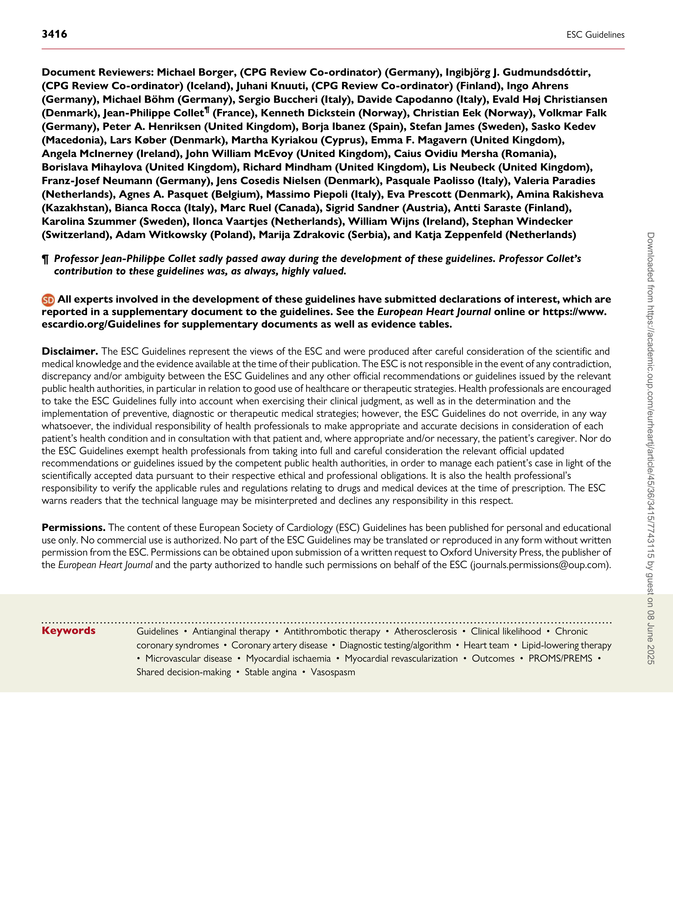
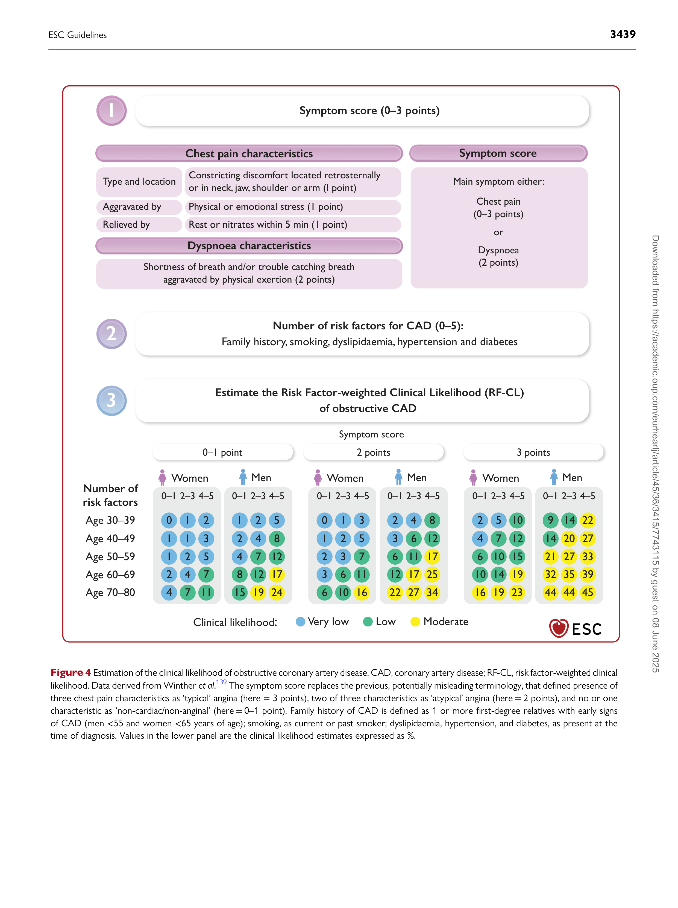
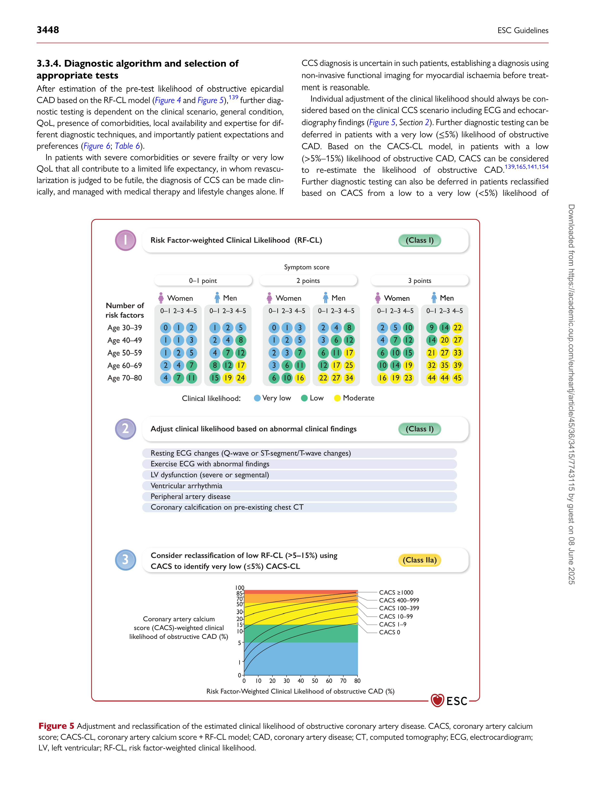
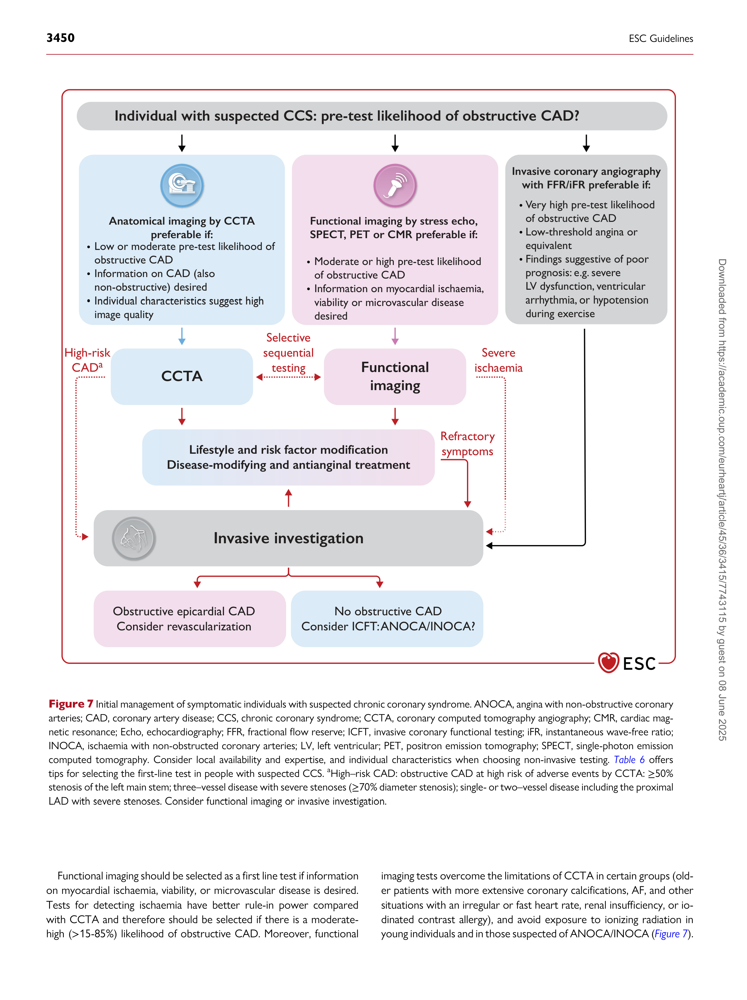
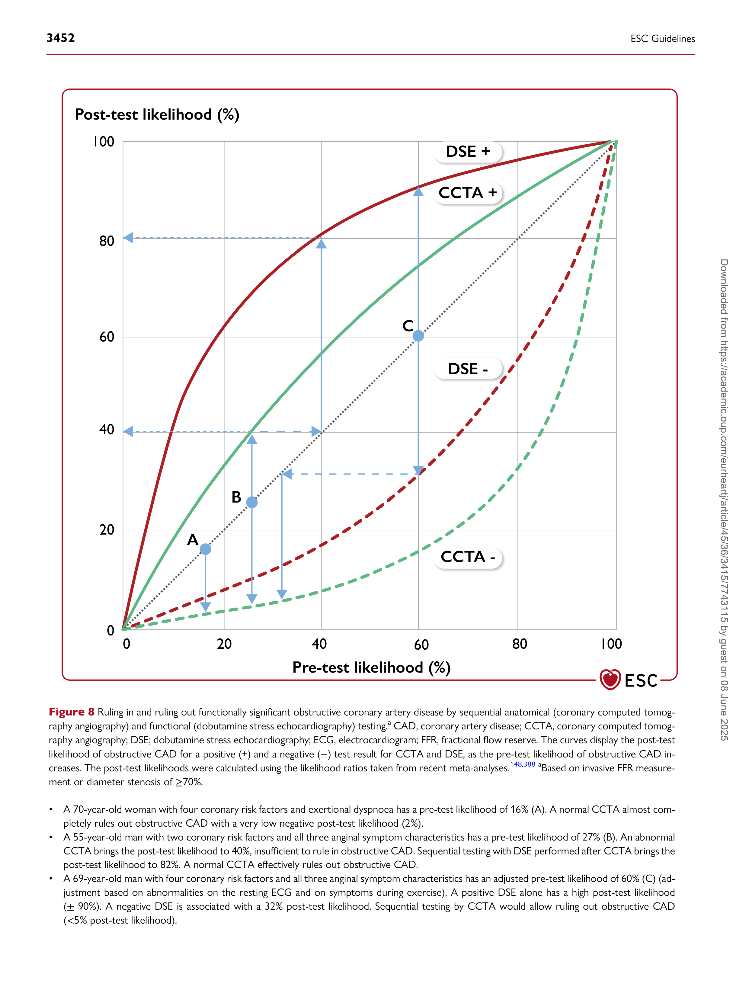
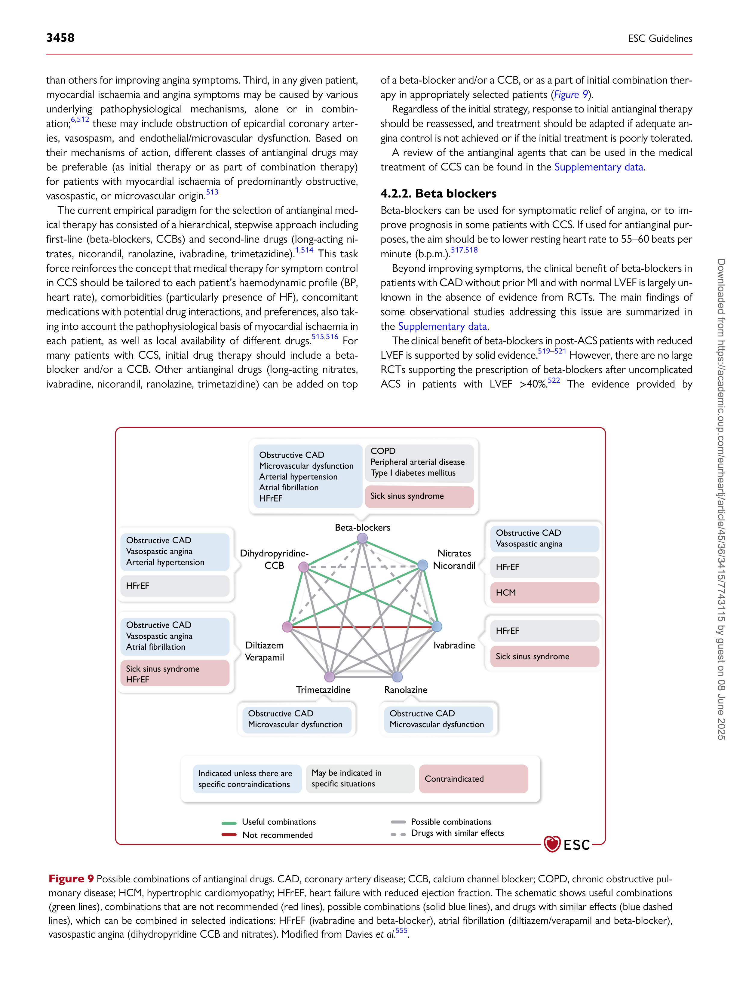
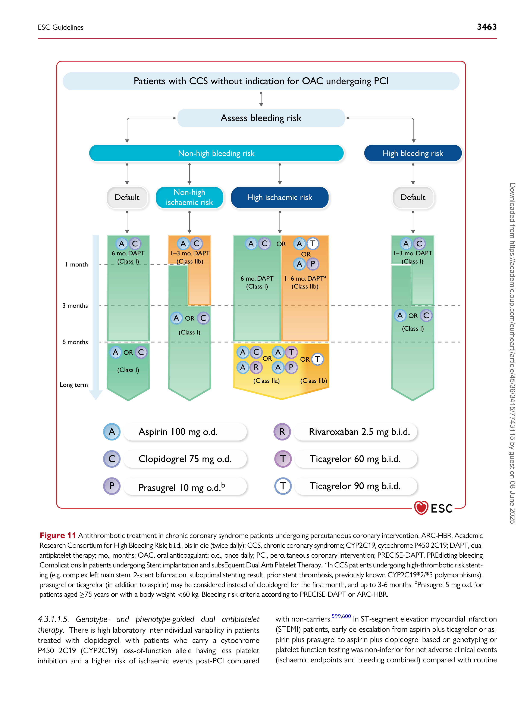
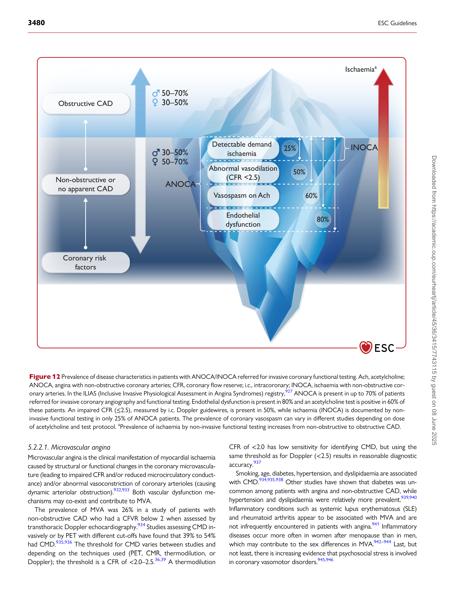
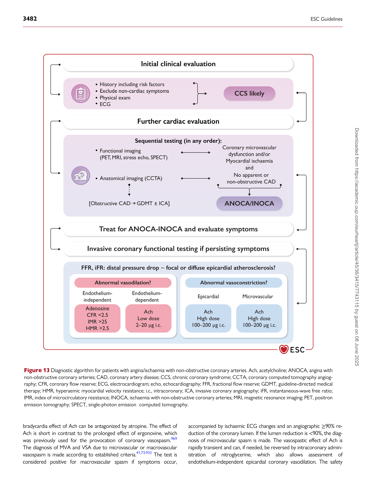
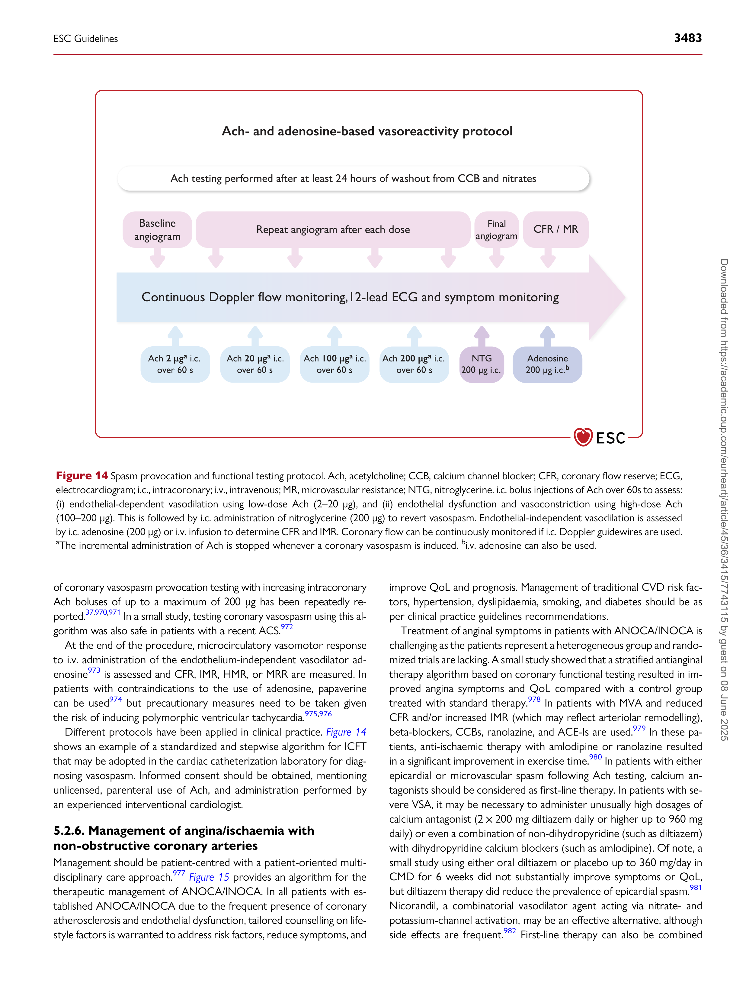

European Heart Journal (2024) **45**, 3415–3537
https://doi.org/10.1093/eurheartj/ehae177

**ESC GUIDELINES**

## **2024 ESC Guidelines for the management ** **of chronic coronary syndromes**
#### **Developed by the task force for the management of chronic ** **coronary syndromes of the European Society of Cardiology (ESC)** ***Endorsed by the European Association for Cardio-Thoracic Surgery (EACTS)***

**[Authors/Task Force Members: Christiaan Vrints *](https://orcid.org/0000-0002-9263-5702)** **[†]** **, (Chairperson) (Belgium),**
**[Felicita Andreotti *](https://orcid.org/0000-0002-1456-6430)** **[†]** **, (Chairperson) (Italy), Konstantinos C. Koskinas** **[‡]** **,**
**(Task Force Co-ordinator) (Switzerland), Xavier Rossello** **‡** **, (Task Force**
**Co-ordinator) (Spain), Marianna Adamo** **(Italy), James Ainslie (United Kingdom),**
**Adrian Paul Banning** **(United Kingdom), Andrzej Budaj** **(Poland),**
**Ronny R. Buechel** **(Switzerland), Giovanni Alfonso Chiariello** **(Italy),**
**Alaide Chieffo** **(Italy), Ruxandra Maria Christodorescu** **(Romania),**
**Christi Deaton** **(United Kingdom), Torsten Doenst** **1** **(Germany),**
**Hywel W. Jones (United Kingdom), Vijay Kunadian** **(United Kingdom),**
**Julinda Mehilli** **(Germany), Milan Milojevic** **1** **(Serbia), Jan J. Piek**
**(Netherlands), Francesca Pugliese** **(United Kingdom), Andrea Rubboli** **(Italy),**
**Anne Grete Semb** **(Norway), Roxy Senior** **(United Kingdom),**
**Jurrien M. ten Berg** **(Netherlands), Eric Van Belle** **(France),**
**Emeline M. Van Craenenbroeck** **(Belgium), Rafael Vidal-Perez** **(Spain),**
**Simon Winther** **(Denmark), and ESC Scientific Document Group**

- Corresponding authors: Christiaan Vrints, Department of Cardiology, Antwerp University Hospital, Edegem, Belgium, and Research Group Cardiovascular Diseases, GENCOR, University
[of Antwerp, Antwerp, Belgium. Tel: +32 3 8213571, E-mail: christiaan.vrints@uantwerpen.be; and Felicita Andreotti, Cardiovascular Science Department, Fondazione Policlinico Universitario](mailto:christiaan.vrints@uantwerpen.be)
[Gemelli IRCCS, Rome, Italy, and Cardio-Thoracic Department, Catholic University Medical School, Rome, Italy. Tel: +39-06-30154187, E-mail: felicita.andreotti@unicatt.it.](mailto:felicita.andreotti@unicatt.it)

- The two Chairpersons contributed equally to the document and are joint first authors.

- The two Task Force Co-ordinators contributed equally to the document.

**Author/Task Force Member affiliations are listed in author information.**

1 Representing the Association European Association for Cardio-Thoracic Surgery (EACTS).

**ESC Clinical Practice Guidelines (CPG) Committee: listed in the Appendix.**

**ESC subspecialty communities having participated in the development of this document:**

**Associations:** Association of Cardiovascular Nursing & Allied Professions (ACNAP), Association for Acute CardioVascular Care (ACVC), European Association of Cardiovascular Imaging
(EACVI), European Association of Preventive Cardiology (EAPC), European Association of Percutaneous Cardiovascular Interventions (EAPCI), Heart Failure Association (HFA).

**Councils:** Council for Cardiology Practice.

**Working Groups:** Cardiovascular Pharmacotherapy, Cardiovascular Surgery, Coronary Pathophysiology and Microcirculation, Thrombosis.

**Patient Forum**

© The European Society of Cardiology 2024. All rights reserved. For permissions, please email: journals.permissions@oup.com.

**3416** ESC Guidelines

**Document Reviewers: Michael Borger, (CPG Review Co-ordinator) (Germany), Ingibjörg J. Gudmundsdóttir,**
**(CPG Review Co-ordinator) (Iceland), Juhani Knuuti, (CPG Review Co-ordinator) (Finland), Ingo Ahrens**
**(Germany), Michael Böhm (Germany), Sergio Buccheri (Italy), Davide Capodanno (Italy), Evald Høj Christiansen**
**(Denmark), Jean-Philippe Collet** **[¶ ]** **(France), Kenneth Dickstein (Norway), Christian Eek (Norway), Volkmar Falk**
**(Germany), Peter A. Henriksen (United Kingdom), Borja Ibanez (Spain), Stefan James (Sweden), Sasko Kedev**
**(Macedonia), Lars Køber (Denmark), Martha Kyriakou (Cyprus), Emma F. Magavern (United Kingdom),**
**Angela McInerney (Ireland), John William McEvoy (United Kingdom), Caius Ovidiu Mersha (Romania),**
**Borislava Mihaylova (United Kingdom), Richard Mindham (United Kingdom), Lis Neubeck (United Kingdom),**
**Franz-Josef Neumann (Germany), Jens Cosedis Nielsen (Denmark), Pasquale Paolisso (Italy), Valeria Paradies**
**(Netherlands), Agnes A. Pasquet (Belgium), Massimo Piepoli (Italy), Eva Prescott (Denmark), Amina Rakisheva**
**(Kazakhstan), Bianca Rocca (Italy), Marc Ruel (Canada), Sigrid Sandner (Austria), Antti Saraste (Finland),**
**Karolina Szummer (Sweden), Ilonca Vaartjes (Netherlands), William Wijns (Ireland), Stephan Windecker**
**(Switzerland), Adam Witkowsky (Poland), Marija Zdrakovic (Serbia), and Katja Zeppenfeld (Netherlands)**

**¶** ***Professor Jean-Philippe Collet sadly passed away during the development of these guidelines. Professor Collet’s***
***contribution to these guidelines was, as always, highly valued.***

**All experts involved in the development of these guidelines have submitted declarations of interest, which are**
**reported in a supplementary document to the guidelines. See the** ***European Heart Journal*** **[online or https://www.](https://www.escardio.org/Guidelines)**
**[escardio.org/Guidelines for supplementary documents as well as evidence tables.](https://www.escardio.org/Guidelines)**

**Disclaimer.** The ESC Guidelines represent the views of the ESC and were produced after careful consideration of the scientific and
medical knowledge and the evidence available at the time of their publication. The ESC is not responsible in the event of any contradiction,
discrepancy and/or ambiguity between the ESC Guidelines and any other official recommendations or guidelines issued by the relevant
public health authorities, in particular in relation to good use of healthcare or therapeutic strategies. Health professionals are encouraged
to take the ESC Guidelines fully into account when exercising their clinical judgment, as well as in the determination and the
implementation of preventive, diagnostic or therapeutic medical strategies; however, the ESC Guidelines do not override, in any way
whatsoever, the individual responsibility of health professionals to make appropriate and accurate decisions in consideration of each
patient’s health condition and in consultation with that patient and, where appropriate and/or necessary, the patient’s caregiver. Nor do
the ESC Guidelines exempt health professionals from taking into full and careful consideration the relevant official updated
recommendations or guidelines issued by the competent public health authorities, in order to manage each patient’s case in light of the
scientifically accepted data pursuant to their respective ethical and professional obligations. It is also the health professional’s
responsibility to verify the applicable rules and regulations relating to drugs and medical devices at the time of prescription. The ESC
warns readers that the technical language may be misinterpreted and declines any responsibility in this respect.

**Permissions.** The content of these European Society of Cardiology (ESC) Guidelines has been published for personal and educational
use only. No commercial use is authorized. No part of the ESC Guidelines may be translated or reproduced in any form without written
permission from the ESC. Permissions can be obtained upon submission of a written request to Oxford University Press, the publisher of
the *European Heart Journal* [and the party authorized to handle such permissions on behalf of the ESC (journals.permissions@oup.com).](mailto:journals.permissions@oup.com)

- - - - - - - - - - - - - - - - - - - - - - - - - - - - - - - - - - - - - - - - - - - - - - - - - - - - - - - - - - - - - - - - - - - - - - - - - - - - - - - - - - - - - - - - - - - - - - - - - - - - - - - - - - - - - - - - - - - - - - - - - - - - - - - - - - - - - - - - - - - - - - - - - - - - - - - - - - - Keywords Guidelines • Antianginal therapy • Antithrombotic therapy • Atherosclerosis • Clinical likelihood • Chronic
coronary syndromes • Coronary artery disease • Diagnostic testing/algorithm • Heart team • Lipid-lowering therapy

           - Microvascular disease • Myocardial ischaemia • Myocardial revascularization • Outcomes • PROMS/PREMS •
Shared decision-making • Stable angina • Vasospasm

ESC Guidelines **3417**

##### **Table of contents**

1. Preamble .............................................................................................................. 3422

2. Introduction ....................................................................................................... 3423

2.1. Evolving pathophysiological concepts of chronic coronary

syndromes .......................................................................................................... 3423

2.2. Chronic coronary syndromes: clinical presentations

( *Figure 1* ) ............................................................................................................. 3424

2.3. Changing epidemiology and management strategies .............. 3424

2.4. What is new ............................................................................................. 3426

3. Stepwise approach to the initial management of individuals with

suspected chronic coronary syndrome ....................................................... 3433

3.1. STEP 1: General clinical examination ............................................. 3433

3.1.1. History, differential diagnosis, and physical examination 3433

3.1.2. Basic testing: 12-lead electrocardiogram and

biochemistry .................................................................................................. 3436

3.1.2.1. Electrocardiogram ................................................................. 3436

3.1.2.2. Biochemical tests .................................................................... 3437

3.2. STEP 2: Further evaluation ................................................................. 3437

3.2.1. Pre-test clinical likelihood of obstructive atherosclerotic

coronary artery disease ............................................................................ 3437

3.2.2. Transthoracic echocardiography and cardiac magnetic

resonance at rest ........................................................................................ 3440

3.2.3. Exercise electrocardiogram testing ......................................... 3440

3.2.4. Chest X-ray ....................................................................................... 3441

3.2.5. Ambulatory electrocardiogram monitoring ........................ 3441
3.3. STEP 3: Confirming the diagnosis ................................................... 3441
3.3.1. Anatomical imaging: coronary computed tomography

angiography .................................................................................................... 3441

3.3.1.1. Computed tomography perfusion imaging ................. 3441

3.3.1.2. Prognosis, plaque features, and opportunity to

improve outcomes ................................................................................ 3442

3.3.1.3. Recognized pre-requisites for coronary computed

tomography angiography .................................................................... 3442

3.3.2. Functional imaging .......................................................................... 3442

3.3.2.1. Stress echocardiography ..................................................... 3442

3.3.2.2. Myocardial perfusion scintigraphy—single-photon

emission computed tomography .................................................... 3443

3.3.2.3. Positron emission tomography-computed

tomography .............................................................................................. 3444

3.3.2.4. Cardiac magnetic resonance imaging ............................. 3444

3.3.2.5. Non-invasive testing for microvascular dysfunction 3445

3.3.3. Invasive tests ..................................................................................... 3445

3.3.3.1. Invasive coronary angiography ......................................... 3445

3.3.3.2. Functional assessment of epicardial stenosis severity

to guide coronary revascularization ............................................... 3446

3.3.3.3. Assessment of microvascular dysfunction ................... 3447

3.3.3.4. Testing for coronary vasospasm ..................................... 3447

3.3.4. Diagnostic algorithm and selection of appropriate tests 3448

3.3.5. Adverse-event risk assessment ................................................. 3453

3.4. STEP 4: Initial therapy .......................................................................... 3454

4. Guideline-directed therapy .......................................................................... 3455

4.1. Patient education, lifestyle optimization for risk-factor

control, and exercise therapy .................................................................... 3455

4.1.1. Patient education ............................................................................ 3455

4.1.2. Key lifestyle interventions for risk-factor control ............ 3455

4.1.2.1. Smoking and substance abuse .......................................... 3456

4.1.2.2. Weight management ............................................................ 3456

4.1.2.3. Diet and alcohol ..................................................................... 3456

4.1.2.4. Mental health ........................................................................... 3456

4.1.2.5. Physical activity and sedentary behaviour .................... 3456

4.1.3. Exercise therapy .............................................................................. 3457

4.2. Antianginal/anti-ischaemic medication ........................................... 3457

4.2.1. General strategy .............................................................................. 3457

4.2.2. Beta blockers .................................................................................... 3458

4.2.3. Combination therapy .................................................................... 3459

4.3. Medical therapy for event prevention ........................................... 3460

4.3.1. Antithrombotic drugs ................................................................... 3460

4.3.1.1. Antiplatelet drugs ................................................................... 3460

4.3.1.1.1. Aspirin monotherapy ................................................... 3460

4.3.1.1.2. Oral P2Y 12 inhibitor monotherapy ....................... 3460

4.3.1.1.2.1. Clopidogrel monotherapy ................................. 3460

4.3.1.1.2.2. Ticagrelor monotherapy .................................... 3460

4.3.1.1.3. Dual antiplatelet therapy post-percutaneous

coronary intervention ..................................................................... 3462
4.3.1.1.4. Extended intensified antithrombotic therapy ... 3462
4.3.1.1.5. Genotype- and phenotype-guided dual

antiplatelet therapy .......................................................................... 3463

4.3.1.2. Anticoagulant therapy .......................................................... 3464

4.3.1.2.1. Monotherapy with oral anticoagulant .................. 3464

4.3.1.2.2. Combination of anticoagulant and antiplatelet

therapy after percutaneous coronary intervention in

chronic coronary syndrome patients with AF or other

indication for oral anticoagulant ................................................. 3464

4.3.1.3. Coronary artery bypass grafting and antithrombotic

therapy ........................................................................................................ 3465

4.3.1.4. Proton pump inhibitors ....................................................... 3465

4.3.2. Lipid-lowering drugs ...................................................................... 3467

4.3.3. Renin–angiotensin–aldosterone blockers/angiotensin

receptor neprilysin inhibitor .................................................................. 3467

4.3.4. Sodium–glucose cotransporter 2 inhibitors and glucagon
like peptide-1 receptor agonists ........................................................... 3468
4.3.5. Anti-inflammatory agents for event prevention ................ 3468
4.4. Revascularization for chronic coronary syndromes ................ 3469

4.4.1. Appropriate indication for myocardial revascularization 3469

4.4.2. Additional considerations on reduced systolic left

ventricular function: myocardial viability, revascularization, and

its modality .................................................................................................... 3470

4.4.3. Additional considerations—complete vs. partial

revascularization .......................................................................................... 3471

4.4.4. Assessment of clinical risk and anatomical complexity .. 3471

4.4.5. Choice of myocardial revascularization modality ............. 3472

4.4.5.1. Patients with single- or two-vessel coronary artery

disease ......................................................................................................... 3472

4.4.5.2. Patients with unprotected left main coronary artery

disease ......................................................................................................... 3472

4.4.5.3. Patients with multivessel coronary artery disease ... 3474

4.4.5.4. Impact of coronary pressure guidance on multivessel

coronary artery disease patients undergoing percutaneous

coronary intervention .......................................................................... 3474

4.4.5.5. Virtual percutaneous coronary intervention:

combination of coronary pressure mapping with coronary

anatomy for percutaneous coronary intervention planning 3474

4.4.5.6. Impact of intracoronary imaging guidance on

multivessel coronary artery disease patients undergoing

percutaneous coronary intervention ............................................. 3474

4.4.5.7. Hybrid revascularization in multivessel coronary

artery disease patients ......................................................................... 3475

**3418** ESC Guidelines

4.4.6. Patient–physician shared decision-making to perform and

select revascularization modality .......................................................... 3475

4.4.7. Institutional protocols, clinical pathways, and quality of

care .................................................................................................................... 3475

5. Optimal assessment and treatment of specific groups ................... 3478

5.1. Coronary artery disease and heart failure .................................. 3478

5.2. Angina/ischaemia with non-obstructive coronary arteries ... 3479
5.2.1. Definition ........................................................................................... 3479
5.2.2. Angina/ischaemia with non-obstructive coronary arteries

endotypes ....................................................................................................... 3479

5.2.2.1. Microvascular angina ............................................................. 3480

5.2.2.2. Epicardial vasospastic angina ............................................. 3481

5.2.3. Clinical presentations .................................................................... 3481

5.2.4. Short- and long-term prognosis ............................................... 3481

5.2.5. Diagnosis ............................................................................................ 3481

5.2.5.1. Non-invasive diagnosis ......................................................... 3481

5.2.5.2. Invasive coronary functional testing ............................... 3481

5.2.5.2.1. Basic coronary functional testing ............................ 3481

5.2.5.2.2. Coronary vasomotor testing .................................... 3481

5.2.6. Management of angina/ischaemia with non-obstructive

coronary arteries ........................................................................................ 3483
5.3. Other specific patient groups ........................................................... 3485

5.3.1. Older adults ...................................................................................... 3485

5.3.2. Sex differences in chronic coronary syndromes ............... 3485

5.3.3. High bleeding-risk patients ......................................................... 3486
5.3.4. Inflammatory rheumatic diseases ............................................. 3486
5.3.5. Hypertension .................................................................................... 3486
5.3.6. Atrial fibrillation ............................................................................... 3486

5.3.7. Valvular heart disease ................................................................... 3486

5.3.8. Chronic kidney disease ................................................................. 3487

5.3.9. Cancer ................................................................................................. 3487

5.3.10. Optimal treatment of patients with human
immunodeficiency virus ............................................................................ 3487
5.3.11. Socially and geographically diverse groups ........................ 3487

5.4. Screening for coronary artery disease in asymptomatic

individuals ........................................................................................................... 3488

6. Long-term follow-up and care ................................................................... 3489

6.1. Voice of the patient .............................................................................. 3489

6.1.1. Communication ............................................................................... 3489

6.1.2. Depression and anxiety ............................................................... 3489

6.2. Adherence and persistence ............................................................... 3489

6.2.1. Adherence to healthy lifestyle behaviours ........................... 3489

6.2.1.1. Why behavioural changes are difficult .......................... 3489
6.2.1.2. How to change behaviour and support healthy

lifestyles ...................................................................................................... 3490

6.2.1.3. Digital and mHealth .............................................................. 3491

6.2.1.4. How to assess adherence .................................................. 3492

6.2.2. Adherence to medical therapy ................................................. 3492

6.2.2.1. Strategies to improve medication adherence ............ 3492

6.2.2.2. mHealth strategies for medication adherence .......... 3492

6.3. Diagnosis of disease progression ..................................................... 3492

6.3.1. Risk factors for recurrent coronary artery disease

events ............................................................................................................... 3493

6.3.2. Organization of long-term follow-up ..................................... 3493

6.3.3. Non-invasive diagnostic testing ................................................. 3494

6.4. Treatment of myocardial revascularization failure ................... 3495

6.4.1. Percutaneous coronary intervention failure ....................... 3495

6.4.2. Managing graft failure after coronary artery bypass

grafting ............................................................................................................. 3495

6.5. Recurrent or refractory angina/ischaemia ................................... 3496

6.6. Treatment of disease complications .............................................. 3497

7. Key messages ..................................................................................................... 3497

8. Gaps in evidence .............................................................................................. 3498

9. ‘What to do’ and ‘What not to do’ messages from the guidelines 3499

10. Evidence tables ............................................................................................... 3505

11. Data availability statement ......................................................................... 3505

12. Author information ...................................................................................... 3505

13. Appendix ........................................................................................................... 3506

14. References ........................................................................................................ 3507
##### **Tables of Recommendations**

Recommendation Table 1 — Recommendations for history taking,
risk factor assessment, and resting electrocardiogram in individuals
with suspected chronic coronary syndrome (see also Evidence
Table 1) ............................................................................................................................... 3436

Recommendation Table 2 — Recommendations for basic

biochemistry in the initial diagnostic management of individuals
with suspected chronic coronary syndrome (see also Evidence
Table 2) ............................................................................................................................... 3437
Recommendation Table 3 — Recommendations for estimating,
adjusting and reclassifying the likelihood of obstructive
atherosclerotic coronary artery disease in the initial diagnostic
management of individuals with suspected chronic coronary
syndrome (see also Evidence Table 3) ......................................................... 3438
Recommendation Table 4 — Recommendations for resting
transthoracic ultrasound and cardiac magnetic resonance imaging in
the initial diagnostic management of individuals with suspected
chronic coronary syndrome (see also Evidence Table 4) ................... 3440

Recommendation Table 5 — Recommendations for exercise ECG

in the initial diagnostic management of individuals with suspected
chronic coronary syndrome (see also Evidence Table 5) ................... 3441
Recommendation Table 6 — Recommendations for chest X-ray in
the initial diagnostic management of individuals with suspected
chronic coronary syndrome (see also Evidence Table 6) ................... 3441
Recommendation Table 7 — Recommendations for ambulatory ECG
monitoring in the initial diagnostic management of individuals with
suspected chronic coronary syndrome (see also Evidence Table 7) . 3441

Recommendation Table 8 — Recommendations for non-invasive

anatomical imaging tests in the initial diagnostic management of
individuals with suspected chronic coronary syndrome—coronary
computed tomography angiography, if available, and supported by
local expertise (see also Evidence Table 8) ............................................... 3442

Recommendation Table 9 — Recommendations for non-invasive

tests in the initial diagnostic management of individuals with suspected
chronic coronary syndrome—stress echocardiography, if available,
and supported by local expertise (see also Evidence Table 9) .............. 3443

Recommendation Table 10 — Recommendations for non-invasive

functional myocardial imaging tests in the initial diagnostic
management of individuals with suspected chronic coronary
syndrome—resting and stress single-photon emission computed
tomography/positron emission tomography—cardiac magnetic
resonance imaging, if available, and supported by local expertise (see
also Evidence Table 10) ...................................................................................... 3444

Recommendation Table 11 — Recommendations for invasive

coronary angiography in the diagnostic management of individuals
with suspected chronic coronary syndrome (see also Evidence
Table 11) ................................................................................................................... 3446

Recommendation Table 12 — Recommendations for functional

assessment of epicardial artery stenosis severity during invasive

ESC Guidelines **3419**

coronary angiography to guide revascularization (see also Evidence
Table 12) ................................................................................................................... 3447

Recommendation Table 13 — Recommendations for selection of

initial diagnostic tests in individuals with suspected chronic coronary
syndrome (see also Evidence Table 13) ...................................................... 3453
Recommendation Table 14 — Recommendations for definition of
high risk of adverse events (see also Evidence Table 14) .................... 3454

Recommendation Table 15 — Recommendations for cardiovascular

risk reduction, lifestyle changes, and exercise interventions in
patients with established chronic coronary syndrome (see also
Evidence Table 15) ............................................................................................... 3457
Recommendation Table 16 — Recommendations for antianginal
drugs in patients with chronic coronary syndrome (see also Evidence
Table 16) ................................................................................................................... 3459

Recommendation Table 17 — Recommendations for

antithrombotic therapy in patients with chronic coronary syndrome
(see also Evidence Table 17) ............................................................................ 3465
Recommendation Table 18 — Recommendations for lipid-lowering
drugs in patients with chronic coronary syndrome (see also Evidence
Table 18) ................................................................................................................... 3467

Recommendation Table 19 — Recommendations for sodium–

glucose cotransporter 2 inhibitors and/or glucagon-like peptide-1
receptor agonists in patients with chronic coronary syndrome (see
also Evidence Table 19) ...................................................................................... 3468

Recommendation Table 20 — Recommendations for

anti-inflammatory drugs in patients with chronic coronary syndrome
(see also Evidence Table 20) ............................................................................ 3469

Recommendation Table 21 — Recommendations for

angiotensin-converting enzyme inhibitors in patients with chronic
coronary syndrome (see also Evidence Table 21) ................................. 3469

Recommendation Table 22 — Recommendations for

revascularization in patients with chronic coronary syndrome (see
also Evidence Table 22) ...................................................................................... 3476

Recommendation Table 23 — Recommendations for mode of

revascularization in patients with chronic coronary syndrome (see
also Evidence Table 23) ...................................................................................... 3477
Recommendation Table 24 — Recommendations for management
of chronic coronary syndrome patients with chronic heart failure
(see also Evidence Table 24) ............................................................................ 3478
Recommendation Table 25 — Recommendations for diagnosis and
management of patients with angina/ischaemia with non-obstructive
coronary arteries (see also Evidence Table 25) ........................................ 3485

Recommendation Table 26 — Recommendations for older, female,

high bleeding risk, comorbid, and socially/geographically diverse
patients (see also Evidence Table 26) ........................................................... 3488
Recommendation Table 27 — Recommendations for screening for
coronary artery disease in asymptomatic individuals (see also
Evidence Table 27) ............................................................................................... 3488

Recommendation Table 28 — Recommendations for adherence to

medical therapy and lifestyle changes (see also Evidence Table 28) 3492
Recommendation Table 29 — Recommendations for diagnosis of
disease progression in patients with established chronic coronary
syndrome (see also Evidence Table 29) ...................................................... 3495

Recommendation Table 30 — Recommendations for treatment of

revascularization failure (see also Evidence Table 30) .......................... 3496

Recommendation Table 31 — Recommendations for recurrent or

refractory angina/ischaemia (see also Evidence Table 31) .................. 3496
##### **List of tables**

Table 1 Classes of recommendations .......................................................... 3422

Table 2 Levels of evidence ................................................................................ 3423

Table 3 New major recommendations in 2024 ...................................... 3426

Table 4 Revised recommendations ............................................................... 3430

Table 5 Grading of effort angina severity according to the Canadian
Cardiovascular Society ........................................................................................ 3436
Table 6 Overview of non-invasive tests used for first-line testing in
individuals with suspected chronic coronary syndrome ...................... 3451
Table 7 Practical advice on lifestyle counselling and interventions . 3455
Table 8 Options for extended intensified antithrombotic therapy 3464
Table 9 Summary of trial-based evidence for the comparison of
percutaneous coronary intervention and coronary artery bypass
grafting in patients with left main coronary artery disease ................ 3473

Table 10 ‘What to do’ and ‘What not to do’ .......................................... 3499
##### **List of figures**

Figure 1 (Central Illustration) Clinical presentations of chronic
coronary syndrome and mechanisms of myocardial ischaemia ........ 3425
Figure 2 Stepwise approach to the initial management of individuals
with suspected chronic coronary syndrome ............................................ 3434
Figure 3 Main CCS symptoms: angina and exertional dyspnoea ..... 3435
Figure 4 Estimation of the clinical likelihood of obstructive coronary
artery disease .......................................................................................................... 3439
Figure 5 Adjustment and reclassification of the estimated clinical
likelihood of obstructive coronary artery disease .................................. 3448
Figure 6 Appropriate first-line testing in symptomatic individuals
with suspected chronic coronary syndrome ............................................ 3449
Figure 7 Initial management of symptomatic individuals with
suspected chronic coronary syndrome ....................................................... 3450
Figure 8 Ruling in and ruling out functionally significant obstructive
coronary artery disease by sequential anatomical (coronary
computed tomography angiography) and functional (dobutamine
stress echocardiography) testing. [a] ................................................................. 3452
Figure 9 Possible combinations of antianginal drugs .............................. 3458
Figure 10 Antithrombotic drugs for chronic coronary syndromes:
pharmacological targets ...................................................................................... 3461
Figure 11 Antithrombotic treatment in chronic coronary syndrome
patients undergoing percutaneous coronary intervention ................. 3463
Figure 12 Prevalence of disease characteristics in patients with
ANOCA/INOCA referred for invasive coronary functional testing 3480
Figure 13 Diagnostic algorithm for patients with angina/ischaemia
with non-obstructive coronary arteries ...................................................... 3482
Figure 14 Spasm provocation and functional testing protocol ......... 3483
Figure 15 Treatment of angina/ischaemia with non-obstructive
coronary arteries .................................................................................................. 3484
Figure 16 Actions on the five dimensions of adherence to therapy 3490
Figure 17 Strategies for long-term adherence to a healthy lifestyle 3491
Figure 18 Approach for the follow-up of patients with established
chronic coronary syndrome ............................................................................. 3494
##### **Abbreviations and acronyms**

99mTc Technetium-99m

ACE-I Angiotensin-converting enzyme inhibitor
Ach Acetylcholine
ACS Acute coronary syndrome(s)
AF Atrial fibrillation
AKI Acute kidney injury
ALPHEUS Assessment of Loading with the P2Y 12 Inhibitor
Ticagrelor or Clopidogrel to Halt Ischemic
Events in Patients Undergoing Elective Coronary
Stenting
ANOCA Angina with non-obstructive coronary arteries
ARB Angiotensin receptor blocker

**3420** ESC Guidelines

ARC-HBR Academic Research Consortium for High
Bleeding Risk
ARNI Angiotensin receptor neprilysin inhibitor
ART Antiretroviral therapy

ASCVD Atherosclerotic cardiovascular disease

ASE American Society of Echocardiography
AUGUSTUS Open-Label, 2 × 2 Factorial, Randomized
Controlled, Clinical Trial to Evaluate the Safety of
Apixaban versus Vitamin K Antagonist and
Aspirin versus Aspirin Placebo in Patients with
Atrial Fibrillation and Acute Coronary Syndrome
or Percutaneous Coronary Intervention
BARC Bleeding Academic Research Consortium
b.i.d. bis in die (twice daily)
BMI Body mass index
BP Blood pressure
b.p.m. Beats per minute
CABG Coronary artery bypass grafting
CAC Coronary artery calcification
CACS Coronary artery calcium score
CACS-CL CACS + risk-factor-weighted clinical likelihood
(RF-CL) model
CAD Coronary artery disease
CANTOS Canakinumab Antiinflammatory Thrombosis
Outcome Study
CAPRIE Clopidogrel versus Aspirin in Patients at Risk of

Ischaemic Events

CCB Calcium channel blocker

CCS Chronic coronary syndrome(s)
CCTA Coronary computed tomography angiography
CFC Coronary flow capacity
CFR Coronary flow reserve
CFVR Coronary flow velocity reserve
CHA 2 DS 2 -VASc Congestive heart failure or left ventricular
dysfunction, hypertension, age ≥75 (doubled),
diabetes, stroke (doubled), vascular disease, age
65–74, sex category (female)
CI Confidence interval
CKD Chronic kidney disease
CMD Coronary microvascular dysfunction
CMR Cardiac magnetic resonance

COLCOT Colchicine Cardiovascular Outcomes Trial

COMPASS Cardiovascular Outcomes for People Using
Anticoagulation Strategies
COURAGE Clinical Outcomes Utilizing Revascularization
and Aggressive Drug Evaluation
CRT Cardiac resynchronization therapy
CT Computed tomography

CVD Cardiovascular disease

CYP2C19 Cytochrome P450 2C19
CYP3A4 Cytochrome P450 3A4

CZT Cadmium–zinc–telluride

DAPT Dual antiplatelet therapy

DEFINE GPS Distal Evaluation of Functional Performance with

Intravascular Sensors to Assess the Narrowing
Effect: Guided Physiologic Stenting
DES Drug-eluting stent

DEFINE-FLAIR Functional Lesion Assessment of Intermediate

Stenosis to Guide Revascularisation

DHP Dihydropyridine

DM Diabetes mellitus

DOAC Direct oral anticoagulant

iFR- Instantaneous Wave-free Ratio versus Fractional

SWEDEHEART Flow Reserve in Patients with Stable Angina

Pectoris or Acute Coronary Syndrome
ILIAS Inclusive Invasive Physiological Assessment in
Angina Syndromes
IMR Index of microcirculatory resistance
INOCA Ischaemia with non-obstructive coronary arteries

INR International normalized ratio

IQR Interquartile range

dPR Diastolic pressure ratio
DSE Dobutamine stress echocardiography
EACTS European Association for Cardio-Thoracic Surgery
EACVI European Association of Cardiovascular Imaging
ECG Electrocardiogram
EF Ejection fraction
eGFR Estimated glomerular filtration rate
EMA European Medicines Agency
ESC European Society of Cardiology
EXCEL Evaluation of XIENCE versus Coronary Artery
Bypass Surgery for Effectiveness of Left Main

Revascularization

FAME Fractional Flow Reserve versus Angiography for

Multivessel Evaluation

FFR Fractional flow reserve
FFR-CT Coronary computed tomography
angiography-derived fractional flow reserve
FREEDOM Strategies for Multivessel Revascularization in

Patients with Diabetes

GDMT Guideline-directed medical therapy

GI Gastrointestinal

GIP Glucose-dependent insulinotropic polypeptide
GLOBAL Ticagrelor plus aspirin for 1 month, followed by

LEADERS

GLOBAL Ticagrelor plus aspirin for 1 month, followed by
LEADERS ticagrelor monotherapy for 23 months vs. aspirin

plus clopidogrel or ticagrelor for 12 months,
followed by aspirin monotherapy for 12 months
after implantation of a drug-eluting stent (DES):
a multicentre, open-label, randomized
superiority trial
GLP-1 Glucagon-like peptide-1
GUSTO Global Utilization of Streptokinase and Tissue
Plasminogen Activator for Occluded Arteries
HbA1c Glycated haemoglobin
HBR High bleeding risk
HDL-C High-density lipoprotein cholesterol

HF Heart failure

HFmrEF Heart failure with mildly reduced ejection fraction
HFpEF Heart failure with preserved ejection fraction
HFrEF Heart failure with reduced ejection fraction
HIV Human immunodeficiency virus
HMR Hyperaemic myocardial velocity resistance
HOST-EXAM Harmonizing Optimal Strategy for Treatment of
Coronary Artery Stenosis-EXtended
Antiplatelet Monotherapy

HR Hazard ratio

hs-CRP High-sensitivity C-reactive protein
HSR Hyperaemic stenosis resistance
i.c. Intracoronary

i.v. Intravenous

ICA Invasive coronary angiography
ICD Implantable cardioverter defibrillator
ICFT Invasive coronary functional testing

iFR Instantaneous wave-free ratio

iFR- Instantaneous Wave-free Ratio versus Fractional

SWEDEHEART

ESC Guidelines **3421**

ISCHEMIA Initial Invasive or Conservative Strategy for
Stable Coronary Disease (trial)

ISR In-stent restenosis

ISTH International Society on Thrombosis and

Haemostasis

IVUS Intravascular ultrasound

LAD Left anterior descending

LBBB Left bundle branch block

LDL-C Low-density lipoprotein cholesterol
LGE Late gadolinium enhancement
LIMA Left internal mammary artery
LITA Left internal thoracic artery
LMCA Left main coronary artery
LMCAD Left main coronary artery disease

LODOCO2 LOw-DOse COlchicine 2

LOE Level of evidence

LV Left ventricular

LVEF Left ventricular ejection fraction
MACCE Major adverse cardiac or cerebrovascular events
MACE Major adverse cardiovascular events
MASTER-DAPT Management of High Bleeding Risk Patients Post
Bioresorbable Polymer Coated Stent Implantation
with an Abbreviated versus Standard DAPT Regimen
MBF Myocardial blood flow
MCE Myocardial contrast echocardiography
MCS Mechanical circulatory support
MFR Myocardial flow reserve
mHealth Mobile device-based healthcare

MI Myocardial infarction
MIDCAB Minimally invasive direct coronary artery bypass
MRA Mineralocorticoid receptor antagonist
MRI Magnetic resonance imaging

MRR Microvascular resistance reserve

MVA Microvascular angina

MVD Multivessel disease

NNH Number needed to harm

NNT Number needed to treat to prevent an adverse event

NOBLE Nordic–Baltic–British Left Main

Revascularisation Study
NSTEMI Non-ST-segment elevation myocardial infarction
NTG Nitroglycerine

NYHA New York Heart Association

OAC Oral anticoagulant
OCT Optical coherence tomography

OR Odds ratio

ORBITA Objective Randomised Blinded Investigation with
optimal medical Therapy of Angioplasty in stable
angina
ORBITA-COSMIC Coronary Sinus Reducer Objective Impact on
Symptoms, MRI Ischaemia and Microvascular

Resistance

PAD Peripheral artery disease
PAR Protease-activated receptor
PARR-2 F-18-Fluorodeoxyglucose Positron Emission
Tomography Imaging-Assisted Management of

Patients with Severe Left Ventricular

Dysfunction and Suspected Coronary Disease: a
Randomized, Controlled Trial
PCI Percutaneous coronary intervention
PCSK9 Proprotein convertase subtilisin/kexin type 9
Pd/Pa Distal coronary pressure to aortic pressure ratio

PDE-5 Phosphodiesterase-5

PEGASUS-TIMI Prevention of Cardiovascular Events in Patients

54 with Prior Heart Attack Using Ticagrelor

Compared to Placebo on a Background of
Aspirin Thrombolysis In Myocardial Infarction
PESA Progression of Early Subclinical Atherosclerosis
PET Positron emission tomography
PRECISE-DAPT PREdicting bleeding Complications In
patients undergoing Stent implantation
and subsEquent Dual AntiPlatelet Therapy
PRECOMBAT Randomized Trial of Stents versus Bypass
Surgery for Left Main Coronary Artery Disease
(trial)

PRIZE Precision Medicine with Zibotentan in

Microvascular Angina
PROM Patient-reported outcome measure
PROMISE Prospective Multicenter Imaging Study for

Evaluation of Chest Pain

PTP Pre-test probability
QFR Quantitative flow ratio
QoL Quality of life
R3F French FFR Registry
RAAS Renin–angiotensin–aldosterone system

RCT Randomized controlled trial

REVIVED-BCIS2 Percutaneous Revascularization for Ischemic Left

Ventricular Dysfunction
RF-CL Risk-factor-weighted clinical likelihood
RFR Relative flow reserve
RIPCORD Routine Pressure Wire Assessment Influence
Management Strategy at Coronary Angiography
for Diagnosis of Chest Pain trial

RR Relative risk

RWTA Regional systolic wall-thickening abnormalities
SAPT Single antiplatelet therapy
SCORE2 Systematic Coronary Risk Estimation 2
SCORE2-OP Systematic Coronary Risk Estimation 2–Older

Persons

SCOT-HEART Scottish Computed Tomography of the Heart
SELECT Semaglutide Effects on Cardiovascular
Outcomes in People With Overweight or
Obesity
SGLT2 Sodium–glucose cotransporter 2
SLE Systemic lupus erythematosus
SPECT Single-photon emission computed
tomography
STEMI ST-segment elevation myocardial infarction
STICH Surgical Treatment for Ischemic Heart Failure
STS-PROM Society of Thoracic Surgeons Predicted Risk of
Mortality
SURMOUNT Efficacy and Safety of Tirzepatide Once Weekly
in Participants Without Type 2 Diabetes Who
Have Obesity or Are Overweight With WeightRelated Comorbidities: A Randomized, Double
Blind, Placebo-Controlled Trial

SYNTAX SYNergy between PCI with TAXUS and Cardiac
Surgery
THEMIS The Effect of Ticagrelor on Health Outcomes
in diabEtes Mellitus patients Intervention Study

TID Transient ischaemic dilatation

TIMI Thrombolysis In Myocardial Infarction

Tx Thromboxane

**3422** ESC Guidelines

TWILIGHT Ticagrelor with Aspirin or Alone in High-Risk
Patients after Coronary Intervention
vFFR Vessel fractional flow reserve
VKA Vitamin K antagonist
VSA Vasospastic angina

VTE Venous thrombo-embolism

WARRIOR Women’s IschemiA Trial to Reduce Events

in Non-ObstRuctIve CORonary Artery Disease
WOMEN What is the Optimal Method for Ischemia

Evaluation of Women

X-ECG Exercise ECG testing
##### **1. Preamble**

Guidelines evaluate and summarize available evidence with the aim of as-­
sisting health professionals in proposing the best diagnostic or therapeut-­
ic approach for an individual patient with a given condition. Guidelines are
intended for use by health professionals, and the European Society of
Cardiology (ESC) makes its guidelines freely available.

ESC Guidelines do not override the individual responsibility of health
professionals to make appropriate and accurate decisions in consider-­
ation of each patient’s health condition and in consultation with that pa-­
tient or the patient’s caregiver where appropriate and/or necessary. It is
also the health professional’s responsibility to verify the rules and reg-­
ulations applicable in each country to drugs and devices at the time of
prescription and to respect the ethical rules of their profession.

ESC Guidelines represent the official position of the ESC on a given
topic and are regularly updated when warranted by new evidence. ESC
Policies and Procedures for formulating and issuing ESC Guidelines can
[be found on the ESC website (https://www.escardio.org/Guidelines/](https://www.escardio.org/Guidelines/Clinical-Practice-Guidelines/Guidelines-development/Writing-ESC-Guidelines)
[Clinical-Practice-Guidelines/Guidelines-development/Writing-ESC-Gui](https://www.escardio.org/Guidelines/Clinical-Practice-Guidelines/Guidelines-development/Writing-ESC-Guidelines)
[delines). These guidelines update and replace the previous version from](https://www.escardio.org/Guidelines/Clinical-Practice-Guidelines/Guidelines-development/Writing-ESC-Guidelines)

Table 1 **Classes of recommendations**

2019 and partly replace the myocardial revascularization guidelines

from 2018.

The Members of this task force were selected by the ESC to include
professionals involved in the medical care of patients with this path-­
ology, as well as patient representatives and methodologists. The selec-­
tion procedure included an open call for authors and aimed to include
members from across the whole of the ESC region and from relevant
ESC Subspecialty Communities. Consideration was given to diversity
and inclusion, notably with respect to gender and country of origin.
The task force performed a critical review and evaluation of the pub-­
lished literature on diagnostic and therapeutic approaches including as-­
sessment of the risk–benefit ratio. The strength of every
recommendation and the level of evidence supporting them were
weighed and scored according to predefined scales as outlined in
*Tables 1* and *2* below. Patient-reported outcome measures (PROMs)
and patient-reported experience measures (PREMs) were also evalu-­
ated as the basis for recommendations and/or discussion in these guide-­
lines. The task force followed ESC voting procedures and all approved
recommendations were subject to a vote and achieved at least 75%
agreement among voting members. Members of the task force with de-­
clared interests on specific topics were asked to abstain from voting on
related recommendations.

The experts of the writing and reviewing panels provided declaration
of interest forms for all relationships that might be perceived as real or
potential sources of conflicts of interest. Their declarations of interest
were reviewed according to the ESC declaration of interest rules,
[which can be found on the ESC website (http://www.escardio.org/](http://www.escardio.org/guidelines)
[guidelines) and have been compiled in a report published in a supple-­](http://www.escardio.org/guidelines)
mentary document with the guidelines. Funding for the development
of ESC Guidelines is derived entirely from the ESC with no involvement
of the healthcare industry.

The ESC Clinical Practice Guidelines (CPG) Committee supervises
and co-ordinates the preparation of new guidelines and is responsible

ESC Guidelines **3423**

Table 2 **Levels of evidence**

for the approval process. In addition to review by the CPG Committee,
ESC Guidelines undergo multiple rounds of double-blind peer review
by external experts, including members from across the whole of the
ESC region, all National Cardiac Societies of the ESC and from relevant
ESC Subspecialty Communities. After appropriate revisions, the
guidelines are signed off by all the experts in the task force. The finalized
document is signed off by the CPG Committee for publication in the
*European Heart Journal* .

ESC Guidelines are based on analyses of published evidence, chiefly
on clinical trials and meta-analyses of trials, but potentially including
other types of studies. Evidence tables summarizing key information
from relevant studies are generated early in the guideline development
process to facilitate the formulation of recommendations, to enhance
comprehension of recommendations after publication, and reinforce
transparency in the guideline development process. The tables are pub-­
lished in their own section of the ESC Guidelines and are specifically
related to the recommendation tables.

Off-label use of medication may be presented in these guidelines if a
sufficient level of evidence shows that it can be considered medically ap-­
propriate for a given condition. However, the final decisions concerning
an individual patient must be made by the responsible health profes-­
sional giving special consideration to:

- The specific situation of the patient. Unless otherwise provided for
by national regulations, off-label use of medication should be limited
to situations where it is in the patient’s interest with regard to the
quality, safety, and efficacy of care, and only after the patient has
been informed and has provided consent.

- Country-specific health regulations, indications by governmental
drug regulatory agencies and the ethical rules to which health profes-­
sionals are subject, where applicable.

##### **2. Introduction**

The 2019 ESC (European Society of Cardiology) Guidelines for the
diagnosis and management of chronic coronary syndromes introduced
the term chronic coronary syndromes (CCS) [1] to describe the clinical
presentations of coronary artery disease (CAD) during stable periods,
particularly those preceding or following an acute coronary syndrome
(ACS). CAD was defined as the pathological process characterized by
atherosclerotic plaque accumulation in the epicardial arteries, whether
obstructive or non-obstructive. Based on expanded pathophysiological
concepts, a new, more comprehensive definition of CCS is introduced:

‘CCS are a range of clinical presentations or syndromes that

arise due to structural and/or functional alterations related to

chronic diseases of the coronary arteries and/or microcircula-­
tion. These alterations can lead to transient, reversible, myocar-­
dial demand vs. blood supply mismatch resulting in
hypoperfusion (ischaemia), usually (but not always) provoked
by exertion, emotion or other stress, and may manifest as angina,
other chest discomfort, or dyspnoea, or be asymptomatic.
Although stable for long periods, chronic coronary diseases
are frequently progressive and may destabilize at any moment
with the development of an ACS.’

Of note, ‘disease’ refers to the underlying coronary pathology, and ‘syn-­
drome’ refers to the clinical presentation.

**2.1. Evolving pathophysiological concepts**
**of chronic coronary syndromes**
Our understanding of the pathophysiology of CCS is transitioning from
a simple to a more complex and dynamic model. Older concepts

**3424** ESC Guidelines

considered a fixed, focal, flow-limiting atherosclerotic stenosis of a large
or medium coronary artery as a *sine qua non* for inducible myocardial
ischaemia and ischaemic chest pain (angina pectoris). Current concepts

have broadened to embrace structural and functional abnormalities in

both the macro- and microvascular compartments of the coronary tree
that may lead to transient myocardial ischaemia. At the macrovascular
level, not only fixed, flow-limiting stenoses but also diffuse atheroscler-­
otic lesions without identifiable luminal narrowing may cause ischaemia
under stress; [2][,][3] structural abnormalities such as myocardial bridging [4]

and congenital arterial anomalies [5] or dynamic epicardial vasospasm
may be responsible for transient ischaemia. At the microvascular level,
coronary microvascular dysfunction (CMD) is increasingly acknowl-­
edged as a prevalent factor characterizing the entire spectrum of
CCS; [6] functional and structural microcirculatory abnormalities may
cause angina and ischaemia even in patients with non-obstructive
disease of the large or medium coronary arteries [angina with
non-obstructive coronary arteries (ANOCA); ischaemia with nonobstructive coronary arteries (INOCA)]. [6] Finally, systemic or extracor-­
onary conditions, such as anaemia, tachycardia, blood pressure (BP)
changes, myocardial hypertrophy, and fibrosis, may contribute to the
complex pathophysiology of non-acute myocardial ischaemia. [7]

The risk factors that predispose to the development of epicardial
coronary atherosclerosis also promote endothelial dysfunction and ab-­
normal vasomotion in the entire coronary tree, including the arterioles
that regulate coronary flow and resistance, [8][–][10] and adversely affect
myocardial capillaries, [6][,][11][–][14] leading to their rarefaction. Potential con-­
sequences include a lack of flow-mediated vasodilation in the epicardial
conductive arteries [9] and macro- and microcirculatory vasoconstric-­
tion. [15] Of note, different mechanisms of ischaemia may act
concomitantly.

**2.2. Chronic coronary syndromes: clinical**
**presentations (** ***Figure 1*** **)**
In clinical practice, the following, not entirely exclusive, CCS patients
seek outpatient medical attention: (i) the symptomatic patient with re-­
producible stress-induced angina or ischaemia with epicardial obstruct-­
ive CAD; (ii) the patient with angina or ischaemia caused by epicardial
vasomotor abnormalities or functional/structural microvascular altera-­
tions in the absence of epicardial obstructive CAD (ANOCA/INOCA);
(iii) the non-acute patient post-ACS or after a revascularization;
(iv) the non-acute patient with heart failure (HF) of ischaemic or
cardiometabolic origin. A further growing category (v) are the
asymptomatic individuals in whom epicardial CAD is detected during
an imaging test for refining cardiovascular risk assessment, [16] screening
for personal or professional purposes, or as an incidental finding for an-­
other indication. [17] Patients may experience a variable and unpredict-­
able course, transitioning between different types of CCS and ACS
presentations throughout their lifetime.

The clinical presentations of CCS are not always specific for the
mechanism causing myocardial ischaemia; thus, symptoms of

dysfunctional microvascular angina (MVA) may overlap with those of
vasospastic or even obstructive large–medium artery angina.
Furthermore, it is important to note that CCS doesn’t always present
as classical angina pectoris and symptoms may vary depending on age
and sex. Sex-stratified analyses indicate that women with suspected
angina are usually older and have a heavier cardiovascular risk
factor burden, more frequent comorbidities, non-anginal symptoms
such as dyspnoea and fatigue, and greater prevalence of MVA than
men. [18][–][21]

**2.3. Changing epidemiology and**
**management strategies**
Contemporary primary prevention, [16] including lifestyle changes and
guideline-directed medical therapy (GDMT), has led to a decline of
the age-standardized prevalence [22][,][23] of obstructive epicardial coronary
atherosclerosis in patients with suspected CCS. [24][–][28] As a consequence,
the diagnostic and prognostic risk prediction models applied in the past
to identify obstructive epicardial CAD in patients with suspected angina
pectoris have required updating and refinement. [27][,][29][,][30] Initial use of
coronary computed tomography angiography (CCTA) [31][,][32] for detect-­
ing and assessing epicardial coronary atherosclerosis is increasingly
being adopted since it has shown similar performance to non-invasive
stress testing for detecting segmental myocardial ischaemia. [33][–][35]

Invasive coronary angiography (ICA), classically used to detect anatom-­
ically significant stenoses, has expanded to become a functional test [36]

that includes refined haemodynamic assessment of epicardial stenoses,
provocative testing for the detection of epicardial or microvascular
spasm, [37][–][40] and a functional assessment of CMD. [41][–][43] Moreover, there
is a growing interest in non-invasive imaging methods such as stress
positron emission tomography (PET) [44][,][45] or stress magnetic resonance
imaging (MRI), [46] which allow accurate assessment of the coronary
microcirculation in a quantitative manner.

Medical therapy for CCS patients, including antithrombotic strat-­
egies, anti-inflammatory drugs, statins and new lipid-lowering, meta-­
bolic, and anti-obesity agents, has significantly improved survival
after conservative treatment, making it harder to demonstrate the
benefits of early invasive therapy. [47] However, revascularization can
still benefit patients with obstructive CAD at high risk of adverse
events, not only for symptom relief [48][–][52] but also to prevent spontan-­
eous myocardial infarction (MI) and cardiac death and, in some
groups, to improve overall survival [53][–][56] during long-term follow-up.
Recently, revascularization through percutaneous coronary interven-­
tion (PCI) was shown to provide more angina relief than a placebo
procedure in patients with stable angina and evidence of ischaemia,
on minimal or no antianginal therapy, confirming the beneficial effects
of revascularization. [52]

The present guidelines deal with the assessment and diagnostic algo-­
rithm in patients with symptoms suspected of CCS ( *Section 3* ) and their
treatment ( *Section 4* ), special subgroups of CCS patients ( *Section 5* ) and
finally, long-term follow-up and care ( *Section 6* ).

ESC Guidelines **3425**

Figure 1 (Central Illustration) Clinical presentations of chronic coronary syndrome and mechanisms of myocardial ischaemia. ACS, acute coronary
syndrome; ANOCA, angina with non-obstructive coronary arteries; CABG, coronary artery bypass grafting; CAD, coronary artery disease; CCS,
chronic coronary syndrome; INOCA, ischaemia with non-obstructive coronary arteries; LV, left ventricular; LVEDP, left ventricular end-diastolic pres-­
sure; PCI, percutaneous coronary intervention; VSMC, vascular smooth muscle cell.

**3426** ESC Guidelines

**2.4. What is new**

The 2024 Guidelines contain a number of new and revised recommendations, which are summarized in *Tables 3* and *4*, respectively.

Table 3 **New major recommendations in 2024**

**Recommendations** **Class** **[a]** **Level** **[b]**

**History taking and risk factor assessment and resting electrocardiogram in individuals with suspected chronic coronary syndrome—**

***Section 3***

|In individuals reporting symptoms of suspected myocardial ischaemic origin, a detailed assessment of cardiovascular risk factors, medical history, and symptom characteristics (including onset, duration, type, location, triggers, relieving factors, time of day) is recommended.|I|C|
|---|---|---|
|Symptoms like chest pain triggered by emotional stress; dyspnoea or dizziness on exertion; pain in the arms, jaw, neck, or upper back; or fatigue should be considered as potential angina equivalents.|IIa|B|

**Basic biochemistry in the initial diagnostic management of individuals with suspected chronic coronary syndrome—** ***Section 3***

- Additionally, high-sensitivity C-reactive protein and/or fibrinogen plasma levels should be considered. **IIa** **B**

**Likelihood of obstructive atherosclerotic coronary artery disease in the initial diagnostic management of individuals with suspected**

**chronic coronary syndrome—** ***Section 3***

|It is recommended to estimate the pre-test likelihood of obstructive epicardial CAD using the Risk Factor-weighted Clinical Likelihood model.|I|B|
|---|---|---|
|It is recommended to use additional clinical data (e.g. examination of peripheral arteries, resting ECG, resting echocardiography, presence of vascular calcifications on previously performed imaging tests) to adjust the estimate yielded by the Risk Factor-weighted Clinical Likelihood model.|I|C|
|In individuals with a very low (≤5%) pre-test likelihood of obstructive CAD, deferral of further diagnostic tests should be considered.|IIa|B|
|In individuals with a low (>5%–15%) pre-test likelihood of obstructive CAD, CACS should be considered to reclassify subjects and to identify more individuals with very low (≤5%) CACS-weighted clinical likelihood.|IIa|B|
|In individuals with an initially low (>5%–15%) likelihood of obstructive CAD, exercise ECG and detection of atherosclerotic disease in non-coronary arteries may be considered to adjust the pre-test likelihood estimate.|IIb|C|

**Ambulatory electrocardiogram in the initial diagnostic management of individuals with suspected chronic coronary syndrome—** ***Section 3***

Ambulatory ECG monitoring should be considered in subjects with suspected vasospastic angina. **IIa** **B**

**Non-invasive anatomical imaging tests in the initial diagnostic management of individuals with suspected obstructive coronary artery**

**disease** — **coronary computed tomography angiography, if available and supported by local expertise—** ***Section 3***

In individuals with suspected CCS and low or moderate (>5%–50%) pre-test likelihood of obstructive CAD, CCTA is recommended to

**I** **A**
diagnose obstructive CAD and to estimate the risk of MACE.

**Non-invasive tests in the initial diagnostic management of individuals with suspected chronic coronary syndrome** — **stress**

**echocardiography, if available and supported by local expertise—** ***Section 3***

|In individuals with suspected CCS and moderate or high (>15%–85%) pre-test likelihood of obstructive CAD, stress echocardiography is recommended to diagnose myocardial ischaemia and to estimate the risk of MACE.|I|B|
|---|---|---|
|During stress echocardiography, when two or more contiguous myocardial segments are not visualized, it is recommended to use commercially available intravenous ultrasound contrast agents (microbubbles) to improve diagnostic accuracy.|I|B|
|During stress echocardiography, myocardial perfusion using commercially available intravenous ultrasound contrast agents (microbubbles) is recommended to improve diagnostic accuracy and to refine risk stratifci ation beyond wall motion.|I|B|
|During stress echocardiography, Doppler left anterior descending coronary artery flow reserve may be considered to improve risk stratification beyond wall motion and to assess microvascular function.|IIb|B|

**Non-invasive functional myocardial imaging tests in the initial diagnostic management of individuals with suspected chronic coronary**

— —
**syndrome** **resting and stress single-photon emission computed tomography/positron emission tomography** **cardiac magnetic**

**resonance imaging, if available and supported by local expertise—** ***Section 3***

|In individuals with suspected CCS and moderate or high (>15%–85%) pre-test likelihood of obstructive CAD, SPECT or, preferably, PET myocardial perfusion imaging is recommended to: • diagnose and quantify myocardial ischaemia and/or scar; • estimate the risk of MACE; • quantify myocardial blood flow (PET).|I|B|
|---|---|---|
|In patients selected for PET or SPECT myocardial perfusion imaging, it is recommended to measure CACS from unenhanced chest CT imaging (used for attenuation correction) to improve detection of both non-obstructive and obstructive CAD.|I|B|
|In individuals with suspected CCS and moderate or high (>15%–85%) pre-test likelihood of obstructive CAD, CMR perfusion imaging is recommended to diagnose and quantify myocardial ischaemia and/or scar and estimate the risk of MACE.|I|B|

*Continued*

ESC Guidelines **3427**

**Indications for invasive coronary angiography in individuals with suspected obstructive coronary artery disease—** ***Section 3***

|When ICA is indicated, radial artery access is recommended as the preferred access site.|I|A|
|---|---|---|
|When ICA is indicated, it is recommended to have coronary pressure assessment available and to use it to evaluate the functional severity of intermediate non-left main stem stenoses prior to revascularization.|I|A|
|In individuals with de novo symptoms highly suggestive of obstructive CAD that occur at a low level of exercise, ICA with a view towards revascularization is recommended as first diagnostic test after clinical assessment by a cardiologist.|I|C|

|• FFR/iFR (significant ≤0.8 or ≤0.89, respectively);|I|A|
|---|---|---|
|• QFR (significant ≤0.8).|I|B|

In addition:

|• CFR/HSR/CFC should be considered as a complementary investigation;|IIa|B|
|---|---|---|
|• resting invasive measurement of Pd/Pa, dPR, RFR, or angiography-derived vessel FFR may be considered as alternative parameters.|IIb|C|
|Systematic and routine wire-based coronary pressure assessment of all coronary vessels is not recommended.|III|A|

**Selection of individual diagnostic tests in individuals with suspected chronic coronary syndrome—** ***Section 3***

|To rule out obstructive CAD in individuals with low or moderate (>5%–50%) pre-test likelihood, CCTA is recommended as the preferred diagnostic modality.|I|B|
|---|---|---|
|CCTA is recommended in individuals with low or moderate (>5%–50%) pre-test likelihood of obstructive CAD if functional imaging for myocardial ischaemia is not diagnostic.|I|B|
|Invasive coronary angiography with the availability of invasive functional assessments is recommended to confrim or exclude the diagnosis of obstructive CAD or ANOCA/INOCA in individuals with an uncertain diagnosis on non-invasive testing.|I|B|
|In patients with a known intermediate coronary artery stenosis in a proximal or mid coronary segment on CCTA, CT-based FFR may be considered.|IIb|B|

**Definition of high risk of adverse events**

|An initial stratification of risk of adverse events is recommended based on basic clinical assessment (e.g. age, ECG, anginal threshold, diabetes, CKD, LVEF).|I|B|
|---|---|---|
|The use of one or more of the following test results is recommended to identify individuals at high risk of adverse events: • exercise ECG: ⚬ Duke Treadmill Score < −10; • stress SPECT or PET perfusion imaging: ⚬ area of ischaemia ≥10% of the LV myocardium; • stress echocardiography: ⚬ ≥3 of 16 segments with stress-induced hypokinesia or akinesia; • stress CMR: ⚬ ≥2 of 16 segments with stress perfusion defects or ⚬ ≥3 dobutamine-induced dysfunctional segments; • CCTA: ⚬ left main disease with ≥50% stenosis, ⚬ three-vessel disease with ≥70 stenosis, or ⚬ two-vessel disease with ≥70% stenosis, including the proximal LAD or ⚬ one-vessel disease of the proximal LAD with ≥70% stenosis and FFR-CT ≤0.8|I|B|

**Cardiovascular risk, lifestyle changes, and exercise interventions in patients with established chronic coronary syndrome—** ***Section 4***

|An informed discussion on CVD risk and treatment benefits tailored to individual patient needs is recommended.|I|C|
|---|---|---|
|Multidisciplinary behavioural approaches to help patients achieve healthy lifestyles, in addition to appropriate pharmacological management, are recommended.|I|A|
|Aerobic physical activity of at least 150–300 min per week of moderate intensity or 75–150 min per week of vigorous intensity and reduction in sedentary time are recommended.|I|B|
|Home-based cardiac rehabilitation and mobile health interventions should be considered to increase patients’ long-term adherence to healthy behaviours, and to reduce hospitalizations or cardiac events.|IIa|B|

**Antianginal drugs in patients with chronic coronary syndrome—** ***Section 4***

|It is recommended to tailor the selection of antianginal drugs to the patient’s characteristics, comorbidities, concomitant medications, treatment tolerability, and underlying pathophysiology of angina, also considering local drug availability and cost.|I|C|
|---|---|---|
|Ivabradine should be considered as add-on antianginal therapy in patients with left ventricular systolic dysfunction (LVEF <40%) and inadequate control of symptoms, or as part of initial treatment in properly selected patients.|IIa|B|

*Continued*

**3428** ESC Guidelines

|Ivabradine is not recommended as add-on therapy in patients with CCS, LVEF >40%, and no clinical heart failure.|III|B|
|---|---|---|
|Combination of ivabradine with non-DHP-CCB or other strong CYP3A4 inhibitors is not recommended.|III|B|

|In CCS patients with a prior MI or PCI, clopidogrel 75 mg daily is recommended as a safe and effective alternative to aspirin monotherapy.|I|A|
|---|---|---|
|After CABG, aspirin 75–100 mg daily is recommended lifelong.|I|A|
|In CCS patients without prior MI or revascularization but with evidence of significant obstructive CAD, aspirin 75–100 mg daily is recommended lifelong.|I|B|

**Lipid-lowering drugs in patients with chronic coronary syndrome—** ***Section 4***

|Lipid-lowering treatment with an LDL-C goal of <1.4 mmol/L (55 mg/dL) and a ≥50% reduction in LDL-C vs. baseline is recommended.|I|A|
|---|---|---|
|For patients who are statin intolerant and do not achieve their goal on ezetimibe, combination with bempedoic acid is recommended.|I|B|
|For patients who do not achieve their goal on a maximum tolerated dose of statin and ezetimibe, combination with bempedoic acid should be considered.|IIa|C|

**Sodium–glucose cotransporter 2 inhibitors and/or glucagon-like peptide-1 receptor agonists in patients with chronic coronary**

**syndrome—** ***Section 4***

|SGLT2 inhibitors with proven CV benefit are recommended in patients with T2DM and CCS to reduce CV events, independent of baseline or target HbA1c and independent of concomitant glucose-lowering medication.|I|A|
|---|---|---|
|The GLP-1 receptor agonist semaglutide should be considered in CCS patients without diabetes, but with overweight or obesity (BMI ≥27 kg/m2), to reduce CV mortality, MI, or stroke.|IIa|B|

**Anti-inflammatory drugs in patients with chronic coronary syndrome—** ***Section 4***

In CCS patients with atherosclerotic CAD, low-dose colchicine (0.5 mg daily) should be considered to reduce myocardial infarction, stroke,

**IIa** **A**
and need for revascularization.

**Revascularization in patients with chronic coronary syndrome—** ***Section 4***

|Informed and shared decisions|Col2|Col3|
|---|---|---|
|For complex clinical cases, to define the optimal treatment strategy, in particular when CABG and PCI hold the same level of recommendation, a Heart Team discussion is recommended, including representatives from interventional cardiology, cardiac surgery, non-interventional cardiology, and other specialties if indicated, aimed at selecting the most appropriate treatment to improve patient outcomes and quality of life.|I|C|
|It is recommended that the decision for revascularization and its modality be patient-centred, considering when possible patient preferences, health literacy, cultural circumstances, and social support.|I|C|

**Revascularization to improve outcomes**

In CCS patients with LVEF ≤35%, it is recommended to choose between revascularization or medical therapy alone, after careful evaluation,

preferably by the Heart Team, of coronary anatomy, correlation between coronary artery disease and LV dysfunction, comorbidities, life

expectancy, individual risk-to-benefit ratio, and patient perspectives.

**Assessment of procedural risks and post-procedural outcomes**

**I** **C**

Intracoronary imaging guidance by IVUS or OCT is recommended for performing PCI on anatomically complex lesions, in particular left

**I** **A**
main stem, true bifurcations and long lesions.

Intracoronary pressure measurement (FFR or iFR) or computation (QFR):

|• is recommended to guide lesion selection for intervention in patients with multivessel disease;|I|A|
|---|---|---|
|• should be considered at the end of the procedure to identify patients at high risk of persistent angina and subsequent clinical events;|IIa|B|
|• may be considered at the end of the procedure to identify lesions potentially amenable to treatment with additional PCI.|IIb|B|

**Choice of revascularization modality**

It is recommended that physicians select the most appropriate revascularization modality based on patient profile, coronary anatomy,
**I** **C**
procedural factors, LVEF, patient preferences and outcome expectations.

|• is recommended over medical therapy alone to improve survival;|I|A|
|---|---|---|
|• is recommended as the overall preferred revascularization mode over PCI, given the lower risk of spontaneous myocardial infarction and repeat revascularization.|I|A|
|In CCS patients with significant left main coronary stenosis of low complexity (SYNTAX score ≤22), in whom PCI can provide equivalent completeness of revascularization to that of CABG, PCI is recommended as an alternative to CABG, given its lower invasiveness and non- inferior survival.|I|A|

*Continued*

ESC Guidelines **3429**

**Management of chronic coronary syndrome patients with chronic heart failure—** ***Section 5***

|In HF patients with LVEF ≤35% in whom obstructive CAD is suspected, ICA is recommended with a view towards improving prognosis by CABG, taking into account the risk-to-benefit ratio of the procedures.|I|B|
|---|---|---|
|In HF patients with LVEF >35% and suspected CCS with low or moderate (>5%–50%) pre-test likelihood of obstructive CAD, CCTA or functional imaging is recommended.|I|C|
|In patients with HFpEF with angina or equivalent symptoms and normal or non-obstructive epicardial coronary arteries, PET or CMR perfusion or invasive functional coronary testing should be considered to detect or rule out coronary microvascular dysfunction.|IIa|B|
|In selected patients with HFrEF undergoing high-risk PCI for complex CAD, the use of a microaxial fol w pump may be considered in experienced centres.|IIb|C|
|It is recommended that CCS patients with heart failure be enrolled in a multidisciplinary heart failure management programme to reduce the risk of heart failure hospitalization and to improve survival.|I|A|
|Sacubitril/valsartan is recommended as a replacement for an ACE-I or ARB in CCS patients with HFrEF to reduce the risk of heart failure hospitalization and death.|I|B|

**Diagnosis and management of patients with angina/ischaemia with non-obstructive coronary arteries—** ***Section 5***

|Management of ANOCA/INOCA|Col2|Col3|
|---|---|---|
|In symptomatic patients with ANOCA/INOCA, medical therapy based on coronary functional test results should be considered to improve symptoms and quality of life.|IIa|A|
|For the management of endothelial dysfunction, ACE-I should be considered for symptom control.|IIa|B|
|For the management of microvascular angina associated with reduced coronary/myocardial blood flow reserve, beta-blockers should be considered for symptom control.|IIa|B|
|For the treatment of isolated vasospastic angina: • calcium channel blockers are recommended to control symptoms and to prevent ischaemia and potentially fatal complications;|I|A|
|• nitrates should be considered to prevent recurrent episodes.|IIa|B|
|In patients with evidence of overlapping endotypes, combination therapy with nitrates, calcium channel blockers, and other vasodilators may be considered.|IIb|B|

**Older, female, high bleeding risk, comorbid, and socially/geographically diverse patients—** ***Section 5***

|Similar guideline-directed cardiovascular preventive therapy is recommended in women and men.|I|C|
|---|---|---|
|Bleeding risk assessment is recommended using the PRECISE-DAPT score, the qualitative ARC-HBR tool or other, validated methods.|I|B|
|Attention to interaction between antiretroviral treatment and statins is recommended in patients with HIV.|I|B|

**Socioeconomic, geographical, and under-investigated groups**

Continued targeted efforts are recommended:

- to increase delivery of safe and effective cardiac care to all CCS patients, especially those of lower socioeconomic classes, and

- to enhance inclusion in future clinical trials of geographical, social, or other groups that are currently underrepresented.

**Screening for coronary artery disease in asymptomatic individuals—** ***Section 5***

**I** **C**

|When coronary artery calcification findings are available from previous chest CT scans, using these fni dings to enhance risk stratifci ation and guide treatment of modifai ble risk factors should be considered.|IIa|C|
|---|---|---|
|Coronary artery calcium scoring (CACS) may be considered to improve risk classifci ation around treatment decision thresholds.|IIb|C|

**Adherence to medical therapy and lifestyle changes—** ***Section 6***

|Mobile health interventions (e.g. using text messages, apps, wearable devices) are recommended to improve patient adherence to healthy lifestyles and medical therapy.|I|A|
|---|---|---|
|Behavioural interventions are recommended to improve adherence.|I|B|
|Simplifying medication regimens (e.g. using fixed-dose drug combinations) is recommended to increase patient adherence to medications.|I|B|
|Multiprofessional and family involvement is recommended to promote adherence, in addition to patient education and involvement.|I|C|

**Recurrent or refractory angina/ischaemia**

In patients with refractory angina leading to poor quality of life and with documented or suspected ANOCA/INOCA, invasive coronary functional

**I** **B**
testing is recommended to define ANOCA/INOCA endotypes and appropriate treatment, considering patient choices and preferences.

ACE-I, angiotensin-converting enzyme inhibitor; ANOCA, angina with non-obstructive coronary arteries; ARB, angiotensin receptor blocker; ARC-HBR, Academic Research Consortium for High
Bleeding Risk; BMI, body mass index; CABG, coronary artery bypass grafting; CACS, coronary artery calcium score; CAD, coronary artery disease; CCB, calcium channel blocker; CCS, chronic
coronary syndrome; CCTA, coronary computed tomography angiography; CFC, coronary flow capacity; CFR, coronary flow reserve; CKD, chronic kidney disease; CMR, cardiac magnetic
resonance; CT, computed tomography; CV, cardiovascular; CVD, cardiovascular disease; CYP3A4, cytochrome P450 3A4; DHP, dihydropyridine; dPR, diastolic pressure ratio; ECG,
electrocardiogram; FFR, fractional flow reserve; FFR-CT, coronary computed tomography angiography-derived fractional flow reserve; GLP-1, glucagon-like peptide-1; HbA1c, glycated
haemoglobin; HF, heart failure; HFpEF, heart failure with preserved ejection fraction; HFrEF, heart failure with reduced ejection fraction; HIV, human immunodeficiency virus; HSR, hyperaemic
stenosis resistance; ICA, invasive coronary angiography; iFR, instantaneous wave-free ratio; INOCA, ischaemia with non-obstructive coronary arteries; IVUS, intravascular ultrasound; LAD, left
anterior descending; LDL-C, low-density lipoprotein cholesterol; LV, left ventricular; LVEF, left ventricular ejection fraction; MACE, major adverse cardiovascular events; MCS, mechanical
circulatory support; MI, myocardial infarction; OCT, optical coherence tomography; PCI, percutaneous coronary intervention; Pd/Pa, distal coronary pressure to aortic pressure ratio; PET,
positron emission tomography; PRECISE-DAPT, PREdicting bleeding Complications In patients undergoing Stent implantation and subsEquent Dual AntiPlatelet Therapy; QFR, quantitative
flow ratio; RFR, relative flow reserve; SGLT2, sodium–glucose cotransporter 2; SPECT, single-photon emission computed tomography; T2DM, type 2 diabetes mellitus.
a Class of recommendation.
b Level of evidence.

**3430** ESC Guidelines

Table 4 **Revised recommendations**

**Recommendations in 2019 version** **Class** **[a]** **Level** **[b]** **Recommendations in 2024 version** **Class** **[a]** **Level** **[b]**

**Recommendations for antianginal drugs in patients with chronic coronary syndrome—** ***Section 4***

|Nicorandil, ranolazine, ivabradine, or trimetazidine should be considered as a second-line treatment to reduce angina frequency and improve exercise tolerance in subjects who cannot tolerate, have contraindications to, or whose symptoms are not adequately controlled by beta-blockers, CCBs, and long-acting nitrates.|IIa|B|Long-acting nitrates or ranolazine should be considered as add-on therapy in patients with inadequate control of symptoms while on treatment with beta-blockers and/ or CCBs, or as part of initial treatment in properly selected patients.|IIa|B|
|---|---|---|---|---|---|
|In selected patients, the combination of a beta-blocker or a CCB with second-line drugs (ranolazine, nicorandil, ivabradine, and trimetazidine) may be considered for first-line treatment according to heart rate, blood pressure, and tolerance.|IIb|B|Nicorandil or trimetazidine may be considered as add-on therapy in patients with inadequate control of symptoms while on treatment with beta-blockers and/ or CCBs, or as part of initial treatment in properly selected patients.|IIb|B|

**Antithrombotic therapy in patients with chronic coronary syndrome—** ***Section 4***

|Aspirin 75–100 mg daily is recommended in patients with a previous MI or revascularization.|I|A|In CCS patients with a prior MI or remote PCI, aspirin 75–100 mg daily is recommended lifelong after an initial period of DAPT.|I|A|
|---|---|---|---|---|---|
|Clopidogrel 75 mg daily is recommended as an alternative to aspirin in patients with aspirin intolerance.|I|B|In CCS patients with a prior MI or remote PCI, clopidogrel 75 mg daily is recommended as a safe and effective alternative to aspirin monotherapy.|I|A|
|Clopidogrel 75 mg daily may be considered in preference to aspirin in symptomatic and asymptomatic patients with either PAD or a history of ischaemic stroke or transient ischaemic attack.|IIb|B|B|B|B|
|Aspirin 75–100 mg daily may be considered in patients without a history of MI or revascularization, but with definitive evidence of CAD on imaging.|IIb|C|In patients without prior MI or revascularization but with evidence of significant obstructive CAD, aspirin 75–100 mg daily is recommended lifelong.|I|B|

**Antithrombotic therapy post-percutaneous coronary intervention in patients with chronic coronary syndrome and no indication for**

|oral anticoagulation—Section 4|Col2|Col3|Col4|Col5|Col6|
|---|---|---|---|---|---|
|Aspirin 75–100 mg daily is recommended following stenting.|I|A|In CCS patients with no indication for oral anticoagulation, DAPT consisting of aspirin 75–100 mg and clopidogrel 75 mg daily for up to 6 months is recommended as the default antithrombotic strategy after PCI-stenting.|I|A|
|Clopidogrel 75 mg daily following appropriate loading (e.g. 600 mg or >5 days of maintenance therapy) is recommended, in addition to aspirin, for 6 months following coronary stenting, irrespective of stent type, unless a shorter durations (1–3 months) is indicated due to risk of occurrence of life-threatening bleeding.|I|A|A|A|A|
|Clopidogrel 75 mg daily following appropriate loading (e.g. 600 mg or >5 days of maintenance therapy) may be considered for 1 month in patients with very high risk of life-threatening bleeding.|IIb|C|In patients at high bleeding risk but not at high ischaemic risk, it is recommended to discontinue DAPT 1–3 months after PCI and continue single antiplatelet therapy.|I|A|
|Clopidogrel 75 mg daily following appropriate loading (e.g. 600 mg or >5 days of maintenance therapy) should be considered for 3 months in patients with a higher risk of life-threatening bleeding.|IIa|A|Stopping DAPT after 1–3 months from PCI-stenting may be considered in patients who are not at high bleeding risk nor at high risk of ischaemic events.|IIb|B|

*Continued*

ESC Guidelines **3431**

**Long-term antithrombotic therapy in patients with chronic coronary syndrome and an indication for oral anticoagulation—** ***Section 4***

|When oral anticoagulation is initiated in a patient with AF who is eligible for a NOAC, a NOAC is recommended in preference to a VKA.|I|A|In CCS patients with a long-term indication for OAC, an AF-therapeutic-dose of VKA alone or, preferably, of DOAC alone (unless contraindicated) is recommended lifelong.|I|B|
|---|---|---|---|---|---|
|Long-term OAC therapy (NOAC or VKA with time in therapeutic range >70%) is recommended in patients with AF and a CHADS -VASc score ≥2 in males and 2 2 ≥3 in females.|I|A|A|A|A|
|Long-term OAC therapy (NOAC or VKA with time in therapeutic range >70%) should be considered in patients with AF and a CHADS-VASc score of 1 in 2 2 males and 2 in females.|IIa|B|B|B|B|
|Aspirin 75–100 mg daily (or clopidogrel 75 mg daily) may be considered in addition to long-term OAC therapy in patients with AF, history of MI, and at high risk of recurrent ischaemic events who do not have a high bleeding risk.|IIb|B|B|B|B|

**Antithrombotic therapy post-percutaneous coronary intervention in chronic coronary syndrome patients and an indication for oral**

|anticoagulation—Section 4|Col2|Col3|Col4|Col5|Col6|
|---|---|---|---|---|---|
|After uncomplicated PCI, early cessation (≤1 week) of aspirin and continuation of dual therapy with an OAC and clopidogrel should be considered if the risk of stent thrombosis is low, or if concerns about bleeding risk prevail over concerns about the risk of stent thrombosis, irrespective of the type of stent used.|IIa|B|After uncomplicated PCI in CCS patients with concomitant indication for OAC: • early cessation of aspirin (≤1 week); • followed by continuation of OAC and clopidogrel: ⚬ up to 6 months in patients not at high ischaemic risk or ⚬ up to 12 months in patients at high ischaemic risk; • followed by OAC alone; is recommended.|I|A|
|Triple therapy with aspirin, clopidogrel, and an OAC for ≥1 month should be considered when the risk of stent thrombosis outweighs the bleeding risk, with the total duration (≤6 months) decided according to assessment of these risks and clearly specified at hospital discharge.|IIa|C|Continuation of aspirin up to 1 month after PCI, in addition to OAC and clopidogrel, should be considered in patients at high thrombotic risk or with anatomical/ procedural characteristics judged to outweigh the bleeding risk.|IIa|B|

**Recommendations for lipid-lowering drugs in patients with chronic coronary syndrome—** ***Section 4***

Statins are recommended in all patients with CCS.

**I** **A**

**I** **A**

A high-intensity statin up to the highest tolerated dose

to reach the LDL-C goals is recommended for all

patients with CCS.

**Diagnosis and management of patients with angina/ischaemia with non-obstructive coronary arteries—** ***Section 5***

|Guidewire-based CFR and/or microcirculatory resistance measurements should be considered in patients with persistent symptoms, but coronary arteries that are either angiographically normal or have moderate stenoses with preserved iwFR/FFR.|IIa|B|In persistently symptomatic patients despite medical treatment with suspected ANOCA/INOCA (i.e. anginal symptoms with normal coronary arteries or non-obstructive lesions at non-invasive imaging, or intermediate stenoses with normal FFR/iFR at coronary arteriography) and poor quality of life, invasive coronary functional testing is recommended to identify potentially treatable endotypes and to improve symptoms and quality of life, considering patient choices and preferences.|I|B|
|---|---|---|---|---|---|
|Intracoronary acetylcholine with ECG monitoring may be considered during angiography, if coronary arteries are either angiographically normal or have moderate stenoses with preserved iwFR/FFR, to assess microvascular vasospasm.|IIb|B|B|B|B|

**Diagnostic tests for vasospastic angina—** ***Section 5***

Ambulatory ST-segment monitoring should be

**IIa** **B**

*Continued*

considered to identify ST-segment deviation in the
**IIa** **C**
absence of increased heart rate.

In individuals with suspected vasospastic angina and

frequent symptoms, ambulatory ST-segment

monitoring should be considered to identify

ST-segment deviation during angina.

**3432** ESC Guidelines

**Screening for coronary artery disease in asymptomatic individuals—** ***Section 5***

Total risk estimation using a risk-estimation system such

as SCORE is recommended for asymptomatic adults

>40 years of age without evidence of CVD, diabetes,

CKD, or familial hypercholesterolaemia.

**I** **C**

Opportunistic screening of healthy individuals for

cardiovascular risk factors and to estimate risk of future

cardiovascular events using scoring systems, e.g.

SCORE2 and SCORE2-OP, is recommended to detect

individuals at high risk and guide treatment decisions.

**Diagnosis of disease progression in patients with established chronic coronary syndrome—** ***Section 6***

**I** **C**

|Risk stratification is recommended in patients with new or worsening symptom levels, preferably using stress imaging or, alternatively, exercise stress ECG.|I|B|Risk stratification is recommended in patients with new or worsening symptoms, preferably using stress imaging.|I|C|
|---|---|---|---|---|---|
|2018 ESC/EACTS Guidelines on myocardial revascularization|Classa|Levelb|Recommendations in 2024 version|Classa|Levelb|

|In patients with one- or two-vessel disease, PCI should be considered as an alternative to CABG when complete revascularization can be achieved.|IIa|C|In selected CCS patients with functionally significant MVD and LVEF ≤35% who are at high surgical risk or not operable, PCI may be considered as an alternative to CABG.|IIb|B|
|---|---|---|---|---|---|
|In patients with three-vessel disease, PCI should be considered based on the evaluation by the Heart Team of the patient’s coronary anatomy, the expected completeness of revascularization, diabetes status, and comorbidities.|IIa|C|C|C|C|

**Anatomically and clinically based recommendations for revascularization in chronic coronary syndrome—** ***Section 4***

|Left main disease|Col2|Col3|Col4|Col5|Col6|
|---|---|---|---|---|---|
|Left main disease with low SYNTAX score (0–22), PCI.|I|A|In CCS patients with significant left main coronary stenosis of low complexity (SYNTAX score ≤22), in whom PCI can provide equivalent completeness of revascularization to that of CABG, PCI is recommended as an alternative to CABG, given its lower invasiveness and non-inferior survival.|I|A|
|Left main disease with intermediate SYNTAX score (23–32), PCI.|IIa|A|In CCS patients with significant left main coronary stenosis of intermediate complexity (SYNTAX score 23–32), in whom PCI can provide equivalent completeness of revascularization to that of CABG, PCI should be considered, given its lower invasiveness and non-inferior survival.|IIa|A|

**Left main with multivessel disease**

For left main disease with high SYNTAX score (≥33), In CCS patients at high surgical risk, PCI may be
**III** **B** **IIb** **B**
PCI. considered over medical therapy alone.

|Multivessel disease and diabetes|Col2|Col3|Col4|Col5|Col6|
|---|---|---|---|---|---|
|For CCS patients with diabetes and three-vessel disease with low SYNTAX score 0–22, PCI.|IIb|A|In CCS patients at very high surgical risk, PCI should be considered over medical therapy alone to reduce symptoms and adverse outcomes.|IIa|B|
|For CCS patients with diabetes and three-vessel disease with intermediate or high SYNTAX score (>22), PCI.|III|A|A|A|A|
|Single- or double-vessel disease involving the proximal LAD|Single- or double-vessel disease involving the proximal LAD|Single- or double-vessel disease involving the proximal LAD||||
|For one or two-vessel disease with proximal LAD stenosis, CABG, or PCI are recommended.|I|A|In CCS patients with signifci ant single- or double-vessel disease involving the proximal LAD and insuffci ient response to guideline-directed medical therapy, CABG or PCI is recommended over medical therapy alone to improve symptoms and outcomes.|I|A|
|For one or two-vessel disease with proximal LAD stenosis, CABG, or PCI are recommended.|I|A|In CCS patients with complex significant single- or double-vessel disease involving the proximal LAD, less amenable to PCI, and insufficient response to guideline-directed medical therapy, CABG is recommended over PCI to improve symptoms and reduce revascularization rates.|I|B|

*Continued*

ESC Guidelines **3433**

**Single- or double-vessel disease not involving the proximal LAD**

|For one or two-vessel disease without proximal LAD stenosis PCI is recommended.|I|C|In symptomatic CCS patients with single- or double-vessel disease not involving the proximal LAD and with insuffci ient response to guideline-directed medical therapy, PCI is recommended to improve symptoms.|I|B|
|---|---|---|---|---|---|
|For one or two-vessel disease without proximal LAD stenosis, CABG may be considered.|IIb|C|In symptomatic CCS patients with single- or double-vessel disease not involving the proximal LAD and with insuffci ient response to guideline-directed medical therapy, not amenable to revascularization by PCI, CABG may be considered to improve symptoms.|IIb|C|

AF, atrial fibrillation; ANOCA, angina with non-obstructive coronary arteries; CABG, coronary artery bypass grafting; CAD, coronary artery disease; CCB, calcium channel blocker; CCS,
chronic coronary syndrome; CFR, coronary flow reserve; CHA 2 DS 2 -VASc, congestive heart failure or left ventricular dysfunction, hypertension, age ≥75 (doubled), diabetes, stroke
(doubled), vascular disease, age 65–74, sex category (female); CKD, chronic kidney disease; CVD, cardiovascular disease; DAPT, dual antiplatelet therapy; DOAC, direct oral
anticoagulant; EACTS, European Association for Cardio-Thoracic Surgery; ECG, electrocardiogram; ESC, European Society of Cardiology; FFR, fractional flow reserve; iFR(iwFR),
instantaneous wave-free ratio; INOCA, ischaemia with non-obstructive coronary arteries; LAD, left anterior descending; LDL-C, low-density lipoprotein cholesterol; LV, left ventricular;
LVEF, left ventricular ejection fraction; MI, myocardial infarction; MVD, multivessel disease; NOAC, non-vitamin K antagonist oral anticoagulant; OAC, oral anticoagulant; PAD,
peripheral artery disease; PCI, percutaneous coronary intervention; SCORE2, Systematic Coronary Risk Estimation 2; SCORE-OP, Systematic Coronary Risk Estimation 2–Older
Persons; SYNTAX, SYNergy Between PCI with TAXUS and Cardiac Surgery; VKA, vitamin K antagonist.
a Class of recommendation.
b Level of evidence.

##### **3. Stepwise approach to the initial ** **management of individuals with ** **suspected chronic coronary ** **syndrome**

Managing individuals with suspected CCS involves four steps ( *Figure 2* ):

STEP 1. The first step is a general clinical evaluation that focuses on as-­

sessing symptoms and signs of CCS, differentiating non-cardiac
causes of chest pain and ruling out ACS. This initial clinical evaluation
requires recording a 12-lead resting electrocardiogram (ECG), basic
blood tests, and in selected individuals, chest X-ray imaging and pul-­
monary function testing. This evaluation can be done by the general
practitioner.
STEP 2. The second step is a further cardiac examination, including
echocardiography at rest to rule out left ventricular (LV) dysfunc-­
tion and valvular heart disease. After that, it is recommended to es-­
timate the clinical likelihood of obstructive CAD to guide deferral or
referral to further non-invasive and invasive testing.
STEP 3. The third step involves diagnostic testing to establish the diag-­

nosis of CCS and determine the patient’s risk of future events.
STEP 4. The final step includes lifestyle and risk-factor modification
combined with disease-modifying medications. A combination of
antianginal medications is frequently needed, and coronary revascu-­
larization is considered if symptoms are refractory to medical treat-­
ment or if high-risk CAD is present. If symptoms persist after
obstructive CAD is ruled out, coronary microvascular disease and
vasospasm should be considered.

**3.1. STEP 1: General clinical examination**

**3.1.1. History, differential diagnosis, and physical**
**examination**

Careful and detailed history taking is the initial step in diagnostic man-­
agement for all clinical scenarios within the spectrum of CCS. Although

chest pain or discomfort ( *Figure 3* ) is the most cardinal symptom of
CCS, it must be emphasized that many patients do not present with
characteristic anginal symptoms and that the symptomatology may
vary with age, sex, race, socioeconomic class, and geographical location.
In contemporary studies, only 10% to 25% of patients with suspected
CCS present with angina with classic aggravating and relieving factors,
while 57% to 78% have symptoms less characteristic of angina and
10% to 15% have dyspnoea on exertion. [33][,][57]

While older studies suggested that women were more likely to ex-­
perience less characteristic chest pain symptoms, [58] recent data show
that anginal chest pain is equally prevalent in both men and women, al-­
beit with slightly different characteristics. [59] Symptoms were classified as
non-characteristic angina in over two-thirds of the patients of both
sexes. [21][,][60] Of note, the absence of anginal symptoms does not preclude
CCS, as it may be absent in patients with diabetes with autonomic neur-­
opathy or in elderly patients with a very sedentary lifestyle despite very
severe obstructive CAD. Of course, chest pain is not always angina (i.e.
of ischaemic origin), since it can be related to non-coronary (e.g. peri-­
carditis) or non-cardiovascular conditions. [61][,][62]

Anginal pain symptoms have been traditionally classified as “typical,
atypical, or non-anginal/non-cardiac” based on the location of the
pain, as well as precipitating and relieving factors. Although angina
that meets all three characteristics, with retrosternal chest discomfort
provoked by exertion or emotional stress and relieved by rest or nitro-­
glycerine, is highly suggestive of ischaemia caused by obstructive CAD,
these characteristics are rarely all present when ischaemia is caused by
microvascular dysfunction and vasospasm. Furthermore, patients with
“typical” vs. “atypical” angina included in the PRECISE study had similar
1-year outcomes, [57] highlighting the limited prognostic value of symp-­
tom classification on typicality of angina used in obstructive CAD pre-­
diction models. Because this terminology to describe anginal symptoms
no longer aligns with current concepts of CCS, it should be replaced
by a detailed description of symptoms (Figure 3). It is important to
thoroughly evaluate chest pain, including an objective exclusion of myo-­
cardial ischaemia caused by obstructive CAD, microvascular disease,
and/or coronary vasospasm, before classifying it as non-cardiac.

**3434** ESC Guidelines

Figure 2 Stepwise approach to the initial management of individuals with suspected chronic coronary syndrome. ANOCA, angina with nonobstructive coronary arteries; CAD, coronary artery disease; CCS, chronic coronary syndrome; CCTA, coronary computed tomography angiography;
ECG, electrocardiogram; ED, emergency department; GDMT, guideline-directed medical therapy; INOCA, ischaemia with non-obstructive coronary
arteries. [a] In selected patients. [b] Consider also coronary spasm or microvascular dysfunction.

ESC Guidelines **3435**

Figure 3 Main CCS symptoms: angina and exertional dyspnoea. CCS, chronic coronary syndrome.

The Canadian Cardiovascular Society classification is still widely used
as a grading system for effort-induced angina to quantify the threshold
at which symptoms occur with physical activities ( *Table 5* ). Importantly,
the severity of symptoms is not well associated with the severity of ob-­
structive CAD and appears to differ by sex. Women have more fre-­
quent angina, independent of less extensive epicardial CAD, and less
severe myocardial ischaemia than men. [63] Angina at rest is not always
indicative of severe, fixed obstructive CAD, as it may also occur in pa-­
tients with transient epicardial or microvascular coronary vasospasm.

It is essential to document coronary risk factors during history taking,
as they may be modifiable and will be used for the pre-test likelihood

estimation of obstructive CAD. Smoking cessation counselling starts
with a quantitative assessment of prior and current tobacco use to
make the risk factor more evident to the patient. In addition, detailed
family history looking for premature cardiovascular disease (CVD) or
sudden cardiac death should always be obtained. If available, cholesterol
levels help define familial hypercholesterolaemia. [64] It is also essential
to assess the presence of comorbidities that affect the likelihood of
CAD and overall survival. Because of their high prevalence in CCS
patients, diabetes, chronic obstructive pulmonary disease, kidney dis-­
ease, and peripheral and cerebral vascular disease are particularly

relevant.

**3436** ESC Guidelines

Table 5 **Grading of effort angina severity according to**
**the Canadian Cardiovascular Society**

|Grade|Description of angina severity66|Col3|
|---|---|---|
|I|Angina only with strenuous exertion|Presence of angina during strenuous, rapid, or prolonged ordinary activity (walking or climbing the stairs)|
|II|Angina with moderate exertion|Slight limitation of ordinary activities when they are performed rapidly, after meals, in the cold, in the wind, under emotional stress, or during the first few hours after waking up, but also walking uphill, climbing more than one flight of ordinary stairs at a normal pace, and in normal conditions|
|III|Angina with mild exertion|Having difficulties walking one or two blocks or climbing one flight of stairs at a normal pace and conditions|
|IV|Angina at rest|No exertion is needed to trigger angina|

Recent-onset anginal symptoms with changing frequency or intensity
should raise the suspicion that a coronary atherosclerotic plaque may
be destabilizing. In these patients, the diagnostic algorithm recom-­
mended by the 2023 ESC Guidelines for the management of patients
with acute coronary syndromes should be used to rule out an acute
event. [65]

When investigating suspected CCS, it is important to perform a
thorough physical examination that includes BP measurement and
body mass index (BMI) calculation, to assess the presence of anaemia,
hypertension, valvular heart disease, LV hypertrophy, or arrhythmias. It
is also recommended to search for evidence of non-coronary vascular
disease, which may be asymptomatic (palpation of peripheral pulses;
auscultation of carotid and femoral arteries), and signs of other co-­
morbid conditions, such as thyroid disease, renal disease, or diabetes.
This should be used in the context of other clinical information, such

as the presence of cough or stinging pain, making CCS less likely.
One should also try to reproduce the symptoms by palpation and
test the effect of sublingual nitroglycerine to classify the symptoms.

**3.1.2. Basic testing: 12-lead electrocardiogram and**
**biochemistry**

Basic testing in individuals with suspected CCS includes a 12-lead ECG,
standard laboratory tests, resting echocardiography, and, in selected
patients, a chest X-ray, and a pulmonary function test if dyspnoea is
the main symptom. Such tests can be done on an outpatient basis.

*3.1.2.1. Electrocardiogram*
The paradigm of diagnosing myocardial ischaemia has, for almost a cen-­
tury, been based on detecting repolarization abnormalities, mainly in
the form of ST-segment depressions or T wave abnormalities. Thus,
the resting 12-lead ECG remains an indispensable component of the ini-­
tial evaluation of a patient with chest pain. [67]

A normal resting ECG is frequently recorded after an anginal attack.
However, even in the absence of repolarization abnormalities, the ECG
at rest may suggest CCS indirectly, through signs of previous MI (patho-­
logical Q or R waves) or conduction abnormalities [mainly left bundle

branch block (LBBB) and impaired atrioventricular conduction]. Atrial
fibrillation (AF) is not rarely associated with CCS. [68] ST-segment de-­
pression during supraventricular tachyarrhythmias, however, is not a
strong predictor of obstructive CAD. [69][–][72]

The ECG can be crucial for diagnosing transient myocardial ischae-­
mia by recording dynamic ST-segment changes during ongoing angina.
Vasospastic angina (VSA) should be suspected when observing typical
transient ST-segment elevations or depressions with U-wave changes
during an angina attack at rest. [73]

Long-term ambulatory ECG monitoring can be considered in se-­
lected patients to detect ischaemia during anginal episodes unrelated
to physical activities. ECG changes suggesting ischaemia on ambulatory
ECG monitoring are frequent in women but do not correlate with find-­
ings during stress testing. [74] Ambulatory ECG monitoring may also re-­
veal ‘silent’ ischaemia in patients with CCS, but therapeutic strategies
targeting it have not demonstrated clear survival benefits. [75][,][76]

Recommendation Table 1 **— Recommendations for his-­**
**tory taking, risk factor assessment, and resting electro-­**
**cardiogram in individuals with suspected chronic**
**coronary syndrome (see also Evidence Table 1)**

**Recommendations** **Class** **[a]** **Level** **[b]**

**History taking and risk factor assessment**

|In individuals reporting symptoms of suspected myocardial ischaemic origin, a detailed assessment of cardiovascular risk factors, medical history, and symptom characteristics (including onset, duration, type, location, triggers, relieving factors, time of day) is recommended.|I|C|
|---|---|---|
|Symptoms like chest pain triggered by emotional stress; dyspnoea or dizziness on exertion; pain in the arms, jaw, neck, or upper back; or fatigue should be considered as potential angina equivalents.18,33,57,59,77|IIa|B|

|Resting ECG|Col2|Col3|
|---|---|---|
|If clinical or ECG assessment suggests ACS rather than CCS, immediate referral to the emergency department and/or repeated measurement of blood troponin, preferably using high-sensitivity or ultrasensitive assays, to rule out acute myocardial injury, is recommended.78,79|I|B|
|A resting 12-lead ECG is recommended in all individuals reporting chest pain (unless an obvious non-cardiac cause is identifei d), particularly during, or immediately after, an episode suggestive of myocardial ischaemia.|I|C|
|Using ST-segment deviations during supraventricular tachyarrhythmias, particularly during re-entrant atrioventricular tachycardias, per se, as reliable evidence of obstructive CAD, is not recommended.80–84|III|B|

ACS, acute coronary syndrome; CAD, coronary artery disease; CCS, chronic coronary
syndrome; ECG, electrocardiogram.
a Class of recommendation.
b Level of evidence.

ESC Guidelines **3437**

*3.1.2.2. Biochemical tests*

Laboratory blood tests identify potential causes of ischaemia (e.g. se-­
vere anaemia, hyperthyroidism), cardiovascular risk factors (e.g. lipids,
fasting glucose), and yield prognostic information (e.g. renal disease, in-­
flammation). When fasting plasma glucose and glycated haemoglobin
(HbA1c) are both inconclusive, an additional oral glucose tolerance
test is useful. [85][,][86]

A lipid profile, including total cholesterol, high-density lipoprotein
cholesterol (HDL-C), and triglycerides, allowing calculation of lowdensity lipoprotein cholesterol (LDL-C), is necessary in every person
with suspected CCS to refine his/her risk profile and guide treat-­
ment. [16][,][64] Fasting values are needed to characterize severe dyslipidae-­
mia or follow-up hypertriglyceridaemia, [64] but not in other
situations. [87] Elevated lipoprotein(a) is a marker of cardiovascular risk,
particularly early-onset atherosclerotic disease; [88] lipoprotein(a)lowering strategies are currently being investigated in phase 3 cardiovas-­
cular outcomes trials. [89][–][91] Given that circulating lipoprotein(a) levels are
genetically determined and do not fluctuate substantially over a life-­
time, [89][,][91] a single measure is sufficient in persons with suspected CCS. [92]

Renal dysfunction increases the likelihood of CAD and has a negative
impact on prognosis. [93][–][95] Glomerular filtration rate (GFR) also impacts
renally cleared drugs. It is reasonable to also measure uric acid levels, as
hyperuricaemia is frequent, and may affect renal function.

If there is a clinical suspicion of CAD instability, biochemical markers
of myocardial injury—such as troponin T or troponin I—should be
measured, preferably using high-sensitivity assays, and management
should follow the 2023 ESC Guidelines for the management of patients
with acute coronary syndromes. [65] If high-sensitivity assays are em-­
ployed, low troponin levels can be detected in many patients with stable
angina. Increased troponin levels are associated with adverse out-­
comes, [96][–][100] and small studies have indicated a possible incremental va-­
lue in diagnosing obstructive CAD, [101][–][104] but larger trials are needed to
verify the utility of systematic assessment in individuals suspected of
CCS. While multiple biomarkers may be useful for prognostication,
they do not yet have a role in diagnosing obstructive CAD, but some
promising results have been published. [105][–][108] Measuring NT-proBNP
helps confirm or exclude suspected HF.

Markers of inflammation such as C-reactive protein [109][–][113] and
fibrinogen [114][–][118] are predictors of an individual’s risk of CAD and can
predict cardiovascular event risk in CCS patients, [99][,][111] but their value
is limited beyond traditional risk factors. [111] However, in patients taking
contemporary statins, high-sensitivity C-reactive protein (hs-CRP) was
a stronger predictor for future cardiovascular events and death than
LDL-C. [119][,][120] These patients may benefit from additional LDL-C reduc-­
tion through adjunctive lipid-lowering therapies, such as ezetimibe,
proprotein convertase subtilisin/kexin type 9 (PCSK9) inhibition, [121]

inclisiran, and bempedoic acid. [122][–][124] Elevated hs-CRP levels in patients
taking statins and PCSK9 inhibitors may indicate residual inflammatory
risk that could be further reduced through inflammation modula-­
tion. [119][,][125][,][126] Experimental inhibition of interleukin-6, a pivotal factor
in atherothrombosis, resulted in a marked parallel reduction of
C-reactive protein and fibrinogen in patients with chronic kidney dis-­
ease (CKD) and high cardiovascular risk. [127]

Recommendation Table 2 **— Recommendations for ba-­**
**sic biochemistry in the initial diagnostic management of in-­**
**dividuals with suspected chronic coronary syndrome (see**
**also Evidence Table 2)**

|Recommendations|Classa|Levelb|
|---|---|---|
|The following blood tests are recommended in all individuals to refine risk stratification, diagnose comorbidities, and guide treatment:|||
|• lipid proflie including LDL-C;64,128|I|A|
|• full blood count (including haemoglobin);129–133|I|B|
|• creatinine with estimation of renal function;134|I|B|
|• glycaemic status with HbA1c and/or fasting plasma glucose.16,86,135,136|I|B|
|In patients with suspected CCS, it is recommended to assess thyroid function at least once.137,138|I|B|
|Additionally, hs-CRP and/or fibrinogen plasma levels should be considered.109–118,121,125|IIa|B|

CCS, chronic coronary syndrome; HbA1c, glycated haemoglobin; hs-CRP, high-sensitivity
C-reactive protein; LDL-C, low-density lipoprotein cholesterol.
a Class of recommendation.
b Level of evidence.

**3.2. STEP 2: Further evaluation**

**3.2.1. Pre-test clinical likelihood of obstructive**

**atherosclerotic coronary artery disease**
The diagnosis of CCS is based on interpreting the individual’s symp-­
toms, balancing the impact of age, sex, risk factors, and comorbidities
on the likelihood that CCS is present, and choosing the most appropri-­
ate diagnostic test to confirm the clinically suspected diagnosis. To aid
diagnosis, prediction tables for obstructive CAD can be used that inte-­
grate these clinical factors and provide guidance on selecting diagnostic
tests based on their capacities to rule in and rule out obstructive
atherosclerotic CAD. Importantly, these models do not include the prob-­
ability of ANOCA/INOCA, which always needs to be considered if
symptoms persist after deferral of further testing or diagnostic testing

that excludes obstructive CAD.

The tables used to estimate the likelihood of obstructive CAD as

confirmed by ICA were initially based on the Diamond–Forrester ap-­
proach, which considered sex, age, and angina symptoms. [25]

However, these tables have had to be updated several times owing
to the declining prevalence of obstructive CAD at invasive angiography
in contemporary Western cohorts. [26][,][29] The overestimation of ob-­
structive CAD prevalence has limited the utility of these tables in clinical
routine and in accurately estimating the post-test likelihood of ob-­
structive CAD by diagnostic imaging methods. [1][,][29][,][30]

The 2019 ESC Guidelines for the diagnosis and management of CCS
introduced the concept of clinical likelihood as a more comprehensive
and individualized assessment of the probability of obstructive CAD. [1]

Compared with a basic pre-test probability model, incorporation of
risk factors in the basic pre-test likelihood model (based on age, sex, and

**3438** ESC Guidelines

symptoms) leads to improved prediction of obstructive CAD, downclassifies more individuals to very low and low likelihood of disease,
and maintains high calibration. [30][,][139][,][140] The Risk-Factor-weighted
Clinical Likelihood (RF-CL) model includes sex, age, angina symptoms,
and number of risk factors without losing diagnostic accuracy com-­
pared with more advanced models requiring computed calculation
( *Figure 4* ). [139][,][141][,][142] The RF-CL model increases three-fold the number
of subjects categorized as at very low (≤5%) likelihood of obstructive
CAD compared with the ESC pretest probability (ESC-PTP) model
(38% vs. 12%), [139] while predicting annualized event rates of MI and
death of 0.5%, 1.1%, and 2.1% for individuals having very low, low,
and moderate likelihood of obstructive CAD, respectively. [143]

Individual adjustment of the likelihood may be necessary for indivi-­
duals with severe single risk factors or comorbidities associated with
an increased prevalence of obstructive CAD, which are not reflected
in the RF-CL model, e.g. familial hypercholesterolaemia, severe kidney
dysfunction, rheumatic/inflammatory diseases, and peripheral artery
disease (PAD).

Exercise ECG testing may modify the likelihood of obstructive CAD
and can be used in patients with low (>5%–15%) clinical likelihood, in
whom a negative test allows reclassification to the very low (≤5%) clin-­
ical likelihood group with a favourable prognosis. [144] However, CCTA
as a first-line diagnostic test can give more accurate information and
has been associated with fewer angina symptoms during follow-up
than a strategy with exercise ECG as the first investigation. [145][–][148] In
addition, more adverse events were observed in randomized trials
with an exercise ECG than with a CCTA-based diagnostic strat-­
egy. [34][,][146] However, exercise ECG remains clinically useful for reprodu-­
cing anginal symptoms, which have a prognostic value. [149][,][150]

In contrast to exercise ECG, visualization of calcified atherosclerotic
plaque in the coronary artery significantly impacts the clinical likelihood
of atherosclerotic obstructive CAD. Coronary artery calcification
(CAC) can be measured using the coronary artery calcium score
(CACS), which is derived from an ECG-gated non-contrast-enhanced
computed tomography (CT) scan. Alternatively, the presence of
CAC can be evaluated qualitatively by visually inspecting the coronary
arteries on a previous non-cardiac chest CT scan, if available. The ab-­
sence of CAC (CACS = 0) has a very high negative predictive value
(>95%) for obstructive CAD. [151] Of note, in younger patients, obstruct-­
ive CAD is rare, but when present, a higher percentage (58% of those
younger than 40 years) have a CACS of 0 compared with older patients
with obstructive CAD (9% among those aged 60 to 69 years). [152]

Small, randomized studies have shown that further testing can safely
be deferred in patients without CAC, without increased event rates
during follow-up. [146][,][153] Finally, in a larger prospective observational
study, absence of CAC alone was sufficient to define a low-risk
group with no need for further testing with improved accuracy com-­
pared with basic clinical prediction models. [154] The combination of
CACS with the RF-CL model [CACS + RF-CL (the Coronary Artery
Calcium Score-Weighted Clinical Likelihood—CACS-CL)] showed
the strongest potential to effectively defer cardiac testing compared
with other clinical prediction models or CACS alone (adjustment of
the estimation of the clinical likelihood of obstructive CAD). [139][,][154]

With the CACS-CL model, substantially more individuals (54%) com-­
pared with the RF-CL model (38%) were categorized as having a very
low clinical likelihood of obstructive CAD in the external validation co-­
horts. [139] Finally, the CACS-CL model was superior to other clinical
prediction models in predicting MI and death during follow-up. [143]

Detection of atherosclerotic disease in non-coronary arteries with
ultrasound or CT scans of, e.g. the aorta, and the carotid or femoral ar-­
teries, may increase the clinical likelihood of obstructive CAD, [155][–][158]

and the risk for future CVD events. [159][,][160] However, how accurately
the detection of non-coronary atherosclerotic disease impacts the like-­
lihood estimation of obstructive CAD needs further investigation.

In general, individuals with a very low (≤5%) likelihood of obstructive
CAD do not require further diagnostic testing unless symptoms persist
and non-cardiac causes have been excluded. In patients with a low
(>5%–15%) likelihood of obstructive CAD, the benefit of diagnostic
testing is uncertain but may be performed if symptoms are limiting
and require clarification. Patients with moderate (>15%–50%), high
(>50%–85%), and very high (>85%) likelihood of obstructive CAD
are encouraged to undergo further diagnostic testing.

By using pre-test likelihood estimates and diagnostic imaging-test
positive and negative likelihood ratios, it is possible to calculate the
post-test probability of obstructive CAD. Hence, pre-test likelihood es-­
timation is useful to guide non-invasive diagnostic test strategies for de-­
tecting obstructive CAD ( *Section* 3.3.4).

Recommendation Table 3 **— Recommendations for**
**estimating, adjusting and reclassifying the likelihood of**
**obstructive atherosclerotic coronary artery disease in**
**the initial diagnostic management of individuals with sus-­**
**pected chronic coronary syndrome (see also Evidence**
**Table 3)**

|Recommendations|Classa|Levelb|
|---|---|---|
|It is recommended to estimate the pre-test likelihood of obstructive epicardial CAD using the Risk Factor-weighted Clinical Likelihood model.139,140,142,143,161,162|I|B|
|It is recommended to use additional clinical data (e.g. examination of peripheral arteries, resting ECG, resting echocardiography, presence of vascular calcifications on previously performed imaging tests) to adjust the estimate yielded by the Risk Factor-weighted Clinical Likelihood model.163|I|C|
|In individuals with a very low (≤5%) pre-test likelihood of obstructive CAD, deferral of further diagnostic tests should be considered.139,164|IIa|B|
|In individuals with a low (>5%–15%) pre-test likelihood of obstructive CAD, CACS should be considered to reclassify subjects and to identify more individuals with very low (≤5%) CACS-weighted clinical likelihood.139,143,165|IIa|B|
|In individuals with an initially low (>5%–15%) likelihood of obstructive CAD, exercise ECG and detection of atherosclerotic disease in non-coronary arteries may be considered to adjust the pre-test likelihood estimate.144,166|IIb|C|

CACS, coronary artery calcium score; CAD, coronary artery disease; ECG,
electrocardiogram.
a Class of recommendation.
b Level of evidence.

ESC Guidelines **3439**

Figure 4 Estimation of the clinical likelihood of obstructive coronary artery disease. CAD, coronary artery disease; RF-CL, risk factor-weighted clinical
likelihood. Data derived from Winther *et al* . [139] The symptom score replaces the previous, potentially misleading terminology, that defined presence of
three chest pain characteristics as ‘typical’ angina (here = 3 points), two of three characteristics as ‘atypical’ angina (here = 2 points), and no or one
characteristic as ‘non-cardiac/non-anginal’ (here = 0–1 point). Family history of CAD is defined as 1 or more first-degree relatives with early signs
of CAD (men <55 and women <65 years of age); smoking, as current or past smoker; dyslipidaemia, hypertension, and diabetes, as present at the
time of diagnosis. Values in the lower panel are the clinical likelihood estimates expressed as %.

**3440** ESC Guidelines

**3.2.2. Transthoracic echocardiography and cardiac**
**magnetic resonance at rest**
An echocardiographic study will provide important information about car-­
diac function and anatomy. Patients with CCS have often preserved left
ventricular ejection fraction (LVEF). [167] A decreased LV function and/or
regional wall motion abnormalities may increase the suspicion of ischaemic
myocardial damage, [167] and a pattern of LV dysfunction following the
anatomical perfusion territory of the coronary arteries is typical in patients
who have already had an MI. [168][,][169] The detection of regional wall motion
abnormalities can be challenging by visual assessment, and detection of
early systolic lengthening, decreased systolic shortening, or post-systolic
shortening by strain imaging techniques, [170][–][172] or new parameters such
as global myocardial work, [173] may be helpful in individuals with apparently
normal LV function but with clinical suspicion of CCS. Diastolic LV dysfunc-­
tion has been reported to be an early sign of ischaemic myocardial dysfunc-­
tion and may also be indicative of microvascular dysfunction. [174][,][175]

Echocardiography can help in detecting alternative causes of chest
pain (e.g. pericarditis) and in diagnosing valvular heart diseases, ischae-­
mic HF, and most cardiomyopathies, [176] though these diseases may coexist with obstructive CAD. The use of an echocardiographic contrast
agent can be helpful in patients with poor acoustic windows. [177]

Cardiac magnetic resonance (CMR) is an alternative in patients with
suspected CAD when the echocardiogram (having used ultrasound
contrast agent) is inconclusive. [178] Cardiac magnetic resonance can as-­
sess global and regional function, [179] and the use of late gadolinium en-­
hancement (LGE) CMR can reveal a typical pattern of scarred
myocardium in patients who have already experienced an MI. [180]

Moreover, CMR provides information on myocardial ischaemia
through the evaluation of stress-induced perfusion defects. [181]

The strongest predictor of long-term survival is systolic LV function.
Hence, risk stratification through the assessment of systolic LV function
is useful in all symptomatic individuals with suspected CCS. Mortality
increases as LVEF declines. [182] Management of patients with either an-­
gina or HF symptoms, with reduced LVEF ≤40% or mildly reduced
LVEF 41%–49%, is described in *Section 4* .

Recommendation Table 4 **— Recommendations for**
**resting transthoracic ultrasound and cardiac magnetic**
**resonance imaging in the initial diagnostic management**
**of individuals with suspected chronic coronary syn-­**
**drome (see also Evidence Table 4)**

**3.2.3. Exercise electrocardiogram testing**

Exercise ECG testing is low cost, does not use ionizing radiation, is
widely accessible, and remains an alternative for diagnostic testing de-­
pending on local resources and individual characteristics.

The classical exercise ECG, involving graded exercise until the occur-­
rence of fatigue, limiting chest pain or discomfort, significant ischaemic
ECG changes, arrhythmias, excessive hypertension, a BP drop or after
reaching 85% of the maximal predicted heart rate, has been the main-­
stay of the examination techniques used in clinical cardiology for asses-­
sing individuals with suspected CCS. Exercise ECG testing has a lower
diagnostic performance of obstructive CAD compared with modern
functional imaging and CCTA, [148] which, therefore, should be preferred
as a first-line test in subjects with suspected CCS. Several clinical trials
have confirmed that a strategy based on anatomical [34][,][146][,][187][,][188] or func-­
tional imaging [189] simplifies the diagnosis, enables the targeting of pre-­
ventive therapies and interventions, and potentially reduces the risk
of MI compared with usual care based on exercise ECG. In addition,
two randomized trials showed that patients reported fewer anginal
complaints during follow-up when randomized to CCTA as an index
investigation for stable chest pain compared with exercise ECG. [145][,][146]

Although the Scottish Computed Tomography of the Heart
(SCOT-HEART) trial favoured CCTA as first-line test in CCS, a *post*
*hoc* analysis suggested that abnormal results of exercise ECG remain
a specific indicator of obstructive CAD, and are associated with future
coronary revascularization and risk of MI. [188] Exercise ECG testing with
clearly abnormal results was most predictive for these outcomes; how-­
ever, in a large proportion of individuals who underwent exercise ECG,
particularly those with normal or inconclusive results, there was still a
significant amount of unrecognized non-obstructive and obstructive
CAD, which can be detected by additional CCTA imaging. [188] In the
WOMEN trial (What is the Optimal Method for Ischemia Evaluation
of Women), including low-risk symptomatic women, exercise ECG
was equally effective compared with exercise myocardial perfusion
scintigraphy, with a similar 2-year incidence of major adverse cardiovas-­
cular events (MACE), defined as CAD death, or hospitalization for an
ACS or HF, while providing significant diagnostic cost savings. [190]

Individuals exercising >10 metabolic equivalents with a negative exer-­
cise ECG and a low-risk Duke Treadmill Score have a good prognosis
with limited need for downstream testing and revascularization. [166][,][191]

Patients with marked ischaemia at a low workload and a high-risk
Duke Treadmill Score may benefit from further anatomical or function-­
al testing. In regions with limited access to functional imaging or CCTA,
or in individuals with a low (>5%–15%) pre-test likelihood of obstruct-­
ive CAD, [144] exercise ECG remains, therefore, useful for risk stratifica-­
tion and prognostication. [144] Particularly, in subjects with a low (>5%–
15%) likelihood of obstructive CAD, a negative exercise ECG may help
to down-classify patients into the very low likelihood (<5%) class, in
whom further testing can be deferred. [144]

An exercise ECG is of no diagnostic value in patients with ECG ab-­
normalities at rest that prevent interpretation of the ST-segment
changes during stress (i.e. LBBB, paced rhythm, Wolff−Parkinson
−White syndrome, ≥0.1 mV ST-segment depression on resting ECG,
or treatment with digitalis). In patients with known CAD, exercise
ECG may be considered in selected patients to complement their clin-­
ical evaluation for assessing symptoms, ST-segment changes, exercise
tolerance, arrhythmias, BP response, and event risk.

In summary, due to its low sensitivity (58%) and specificity (62%), ex-­
ercise ECG testing has low diagnostic performance for the diagnosis of
obstructive CAD [148] and should mainly be used for risk stratification.

|Recommendations|Classa|Levelb|
|---|---|---|
|A resting transthoracic echocardiogram is recommended: to measure LVEF, volumes and diastolic function; • identify regional wall motion abnormalities; • identify non-coronary cardiac disease (e.g. hypertrophy, cardiomyopathy, valve disease, pericardial effusion); • assess right ventricular function and estimate systolic pulmonary artery pressure; to refni e risk stratification and guide treatment.167,183,184|I|B|
|CMR, if available, may be considered as an alternative imaging test in individuals with inconclusive echocardiographic evaluation.185,186|IIb|C|

CMR, cardiac magnetic resonance; LVEF, left ventricular ejection fraction.
a Class of recommendation.
b Level of evidence.

ESC Guidelines **3441**

Recommendation Table 5 **— Recommendations for**
**exercise ECG in the initial diagnostic management of in-­**
**dividuals with suspected chronic coronary syndrome**
**(see also Evidence Table 5)**

Recommendation Table 7 **— Recommendations for am-­**
**bulatory ECG monitoring in the initial diagnostic manage-­**
**ment of individuals with suspected chronic coronary**
**syndrome (see also Evidence Table 7)**

|Recommendations|Classa|Levelb|
|---|---|---|
|Ambulatory ECG monitoring is recommended in subjects with chest pain and suspected arrhythmias.|I|C|
|Ambulatory ECG monitoring should be considered in subjects with suspected vasospastic angina.192–194|IIa|B|

|Recommendations|Classa|Levelb|
|---|---|---|
|Exercise ECG is recommended in selected patientsc for the assessment of exercise tolerance, symptoms, arrhythmias, BP response, and event risk.|I|C|
|Exercise ECG may be considered as an alternative test to rule in and rule out CAD when non-invasive imaging tests are unavailable.148,166,188,190,191|IIb|B|
|An exercise ECG may be considered to refine risk stratification and treatment.188|IIb|B|
|In individuals with a low (>5%–15%) pre-test likelihood of obstructive CAD, an exercise ECG may be considered to identify patients in whom further testing can be deferred.144|IIb|C|
|Exercise ECG is not recommended for diagnostic purposes in patients with ≥0.1 mV ST-segment depression on resting ECG, left bundle branch block or who are being treated with digitalis.|III|C|
|In individuals with a low or moderate (>5%–50%) pre-test likelihood of obstructive CAD, an exercise ECG is not recommended to rule out CAD if CCTA or functional imaging tests are available.148|III|C|

BP, blood pressure; CAD, coronary artery disease; CCTA, coronary computed
tomography angiography; ECG, electrocardiogram.
a Class of recommendation.
b Level of evidence.

c When this information will have an impact on diagnostic strategy or management.

**3.2.4. Chest X-ray**
Chest X-ray is commonly utilized in the evaluation of patients experi-­
encing chest pain. However, in the context of CCS, it does not yield
specific information for accurate diagnosis or risk stratification. The
test may provide assistance in assessing patients with suspected HF.
Additionally, chest X-ray may prove beneficial in diagnosing pulmonary
conditions that often co-exist with CAD, or in ruling out other poten-­
tial causes of chest pain.

**3.2.5. Ambulatory electrocardiogram monitoring**

Ambulatory ECG monitoring can assist in evaluating patients with chest
pain and palpitations. It can also help in detecting and evaluating silent
myocardial ischaemia, as well as suspected VSA. [192][–][194]

Recommendation Table 6 **— Recommendations for**
**chest X-ray in the initial diagnostic management of indi-­**
**viduals with suspected chronic coronary syndrome (see**
**also Evidence Table 6)**

ECG, electrocardiogram.
a Class of recommendation.
b Level of evidence.

**3.3. STEP 3: Confirming the diagnosis**
**3.3.1. Anatomical imaging: coronary computed**
**tomography angiography**

Through the intravenous (i.v.) injection of contrast agent, CCTA allows
direct anatomical visualization of the coronary artery lumen and wall.
CCTA offers a practical, non-invasive test, with proven diagnostic per-­
formance in detecting obstructive coronary artery stenoses when com-­
pared with ICA. [32][,][148]

Obstructive coronary stenoses have typically been defined using
visual thresholds of either 50% or 70% diameter reduction. It is

accepted that not all anatomical stenoses above such thresholds, es-­
pecially those of moderate (50%–69%) stenosis severity, are haemo-­
dynamically or functionally significant [195] or induce myocardial
ischaemia. [196] Depending on the clinical context, it may be necessary
to complement CCTA with functional data either from non-invasive
imaging techniques or from invasive angiography with fractional
flow reserve (FFR) (see *Section 3.3.3.2* ), when the haemodynamic con-­
sequence of a stenosis is deemed questionable for management
options.

While several earlier trials (publication date during or before 2016)
reported a higher rate of *downstream ICA* in patients receiving CCTA
compared with functional imaging, [197] this was no longer observed in
more recent trials (publication date after 2016). Moreover, increased
downstream use of invasive procedures was linked to non-adherence
to guideline recommendations as these procedures were used signifi-­
cantly less when the guidelines were adopted. [198]

Coronary computed tomography angiography-derived fractional
flow reserve (FFR-CT) can complement CCTA by providing values
of model-based computational FFR along the coronary tree.
FFR-CT has shown good agreement with invasive FFR, [199] and has clin-­
ical utility by reducing the number of unnecessary ICA procedures. [200]

However, in patients with severe disease at CCTA, FFR-CT has less
impact on patient management. [201] FFR-CT does not require pharma-­
cological stress, additional contrast agent injection, or radiation ex-­
posure. FFR-CT, however, is not ubiquitous and depends on image
quality. Nevertheless, the rejection rate is reported to be quite low
in real-world data with newest-generation scanners. [202][–][204]

*3.3.1.1. Computed tomography perfusion imaging*
Computed tomography perfusion imaging, performed under pharma-­
cological stress, has been validated against several reference stan-­
dards, including single-photon computed tomography (SPECT) and

|Recommendations|Classa|Levelb|
|---|---|---|
|A chest X-ray should be considered for individuals with: • signs and symptoms suggestive of heart failure; • suspected acute pulmonary disease; • suspected aortic, non-coronary cardiac, or other thoracic causes of chest pain.|IIa|C|

a Class of recommendation.
b Level of evidence.

**3442** ESC Guidelines

invasive FFR. It has shown adequate diagnostic performance in se-­
lected cohorts, [205][,][206] and a potential to reduce the number of un-­
necessary downstream invasive angiography procedures, when
compared with functional tests (mostly symptom-limited exercise
ECG). [153] While CT perfusion imaging could complement CCTA dur-­
ing the same visit, this technique requires the administration of a
pharmacological stressor, contrast agent, and further patient irradi-­
ation. Imaging techniques and analysis methods are not yet widely
standardized (e.g. static and dynamic imaging techniques, visual and
quantitative assessment). [207][–][209]

*3.3.1.2. Prognosis, plaque features, and opportunity to improve*

*outcomes*

The SCOT-HEART trial demonstrated a small but significant decrease
of the combined endpoint of cardiovascular death or non-fatal MI
(from 3.9% to 2.3% during 5-year follow-up) in patients in whom
CCTA was performed in addition to routine testing (exercise
ECG). [34] In a *post hoc* analysis of this trial, CCTA features (lowattenuation plaque, positive remodelling, spotty calcifications, and
napkin-ring sign) conferred an increased risk of death or non-fatal
MI, although these plaque features were not independent of
CACS. [210] Systematically evaluating adverse plaque features by
CCTA can be challenging due to technical limitations (spatial reso-­
lution) and patient characteristics (calcifications).

A network meta-analysis of randomized trials suggested that diag-­
nostic testing with CCTA was associated with clinical outcomes similar
to those with functional imaging in patients with suspected stable
CAD. [197] In another pairwise meta-analysis, CCTA showed a lower
rate of MI compared with functional testing, but the absolute per
cent risk difference was small (0.4%). [211]

In the available randomized trials comparing CCTA and functional
testing (all testing a diagnostic strategy), [33][,][210][,][212] test reporting and pa-­
tient management variability could in part help explain the improved
outcomes observed in the CCTA arm of SCOT-HEART. In this trial,
CCTA findings, including non-obstructive atherosclerosis, emphasized
the need to trigger the start or intensification of medical treatment.
Increased standardization in reporting CCTA to encompass key plaque
features (accepting inherent limitations) will be warranted to systemat-­
ically harvest prognostic information and help fine-tune risk manage-­
ment strategies. [213]

*3.3.1.3. Recognized pre-requisites for coronary computed*
*tomography angiography*

Generally, a slow and regular heart rate, and compliance with breathholding instructions are necessary to achieve good image quality.
This includes suitability to receive pre-medication (typically oral or
i.v. beta-blockers) when needed. Kidney function and allergy to con-­
trast agents should be assessed prior to referral. Temporal and spatial
resolution remain technical limitations and can hinder precision in
adjudicating coronary stenosis severity. This is most problematic in
older patients with heavily calcified coronary arteries, in whom func-­
tional testing may be more appropriate than CCTA. Contemporary
CT technology (64-slice technology or above) and a well-trained
imaging team can help mitigate these limitations and must be consid-­
ered a pre-requisite for CCTA.

|Recommendations|Classa|Levelb|
|---|---|---|
|In individuals with suspected CCS and low or moderate (>5%–50%) pre-test likelihood of obstructive CAD, CCTA is recommended to diagnose obstructive CAD and to estimate the risk of MACE.33,34,145,212,214–221|I|A|
|CCTA is recommended in individuals with low or moderate (>5%–50%) pre-test likelihood of obstructive CAD to refni e diagnosis if another non-invasive test is non-diagnostic.222|I|B|
|CCTA is not recommended in patients with severe renal failure (eGFR <30 mL/min/1.73 m2), decompensated heart failure, extensive coronary calcification, fast irregular heart rate, severe obesity, inability to cooperate with breath-hold commands, or any other conditions that can make obtaining good imaging quality unlikely.|III|C|

CAD, coronary artery disease; CCS, chronic coronary syndrome; CCTA, coronary
computed tomography angiography; eGFR, estimated glomerular filtration rate; MACE,
major adverse cardiovascular events.
a Class of recommendation.
b Level of evidence.

**3.3.2. Functional imaging**
*3.3.2.1. Stress echocardiography*

Stress echocardiography is used to detect myocardial ischaemia by
assessing regional systolic wall-thickening abnormalities (RWTA)
during stress. It relies on inducing myocardial ischaemia by increasing
myocardial oxygen demand beyond the myocardial blood supply.
Because ischaemia starts in the subendocardium, which contributes

to more than 50% of systolic myocardial wall thickening, stress testing
will precipitate wall-thickening abnormalities in the perfusion territory
of narrowed coronary arteries. Stress modalities used to increase myo-­
cardial oxygen demand are exercise (treadmill or bicycle), or i.v. admin-­
istration of dobutamine, or vasodilators (adenosine, dipyridamole,
regadenoson) combined with atropine (to increase heart rate ad-­
equately—a major determinant of oxygen demand). Stress echocardi-­
ography using demand stress has provided diagnostic accuracy and
risk-stratification capabilities similar to those obtained with other con-­
temporary functional imaging testing modalities. [148][,][223] The advantages
of stress echocardiography are that it is widely available, low-cost, can
be performed and interpreted at the bedside, rapid, free of ionizing ra-­
diation, and can be repeated without safety concerns. [224][–][227] Although
stress echocardiography is operator-dependent, which may comprom-­
ise reproducibility, the technique is within reach of every cardiology
department or office. Compromised image quality, especially in obese
and chronic obstructive pulmonary disease subjects, is a significant

Recommendation Table 8 **— Recommendations for**
**non-invasive anatomical imaging tests in the initial**
**diagnostic management of individuals with suspected**
**chronic coronary syndrome—coronary computed tom-­**
**ography angiography, if available, and supported by local**
**expertise (see also Evidence Table 8)**

ESC Guidelines **3443**

limitation. RWTA may not occur if the myocardial oxygen demand in-­
crease is inadequate or if the induced perfusion abnormalities are not
large enough (<10% of the myocardium), such as in mild atherosclerot-­
ic CAD or single-vessel obstructive CAD. [228] As stress echocardiog-­
raphy relies on RWTA as a marker of ischaemia, it may
under-estimate ischaemia in patients with microvascular disease not af-­
fecting the subendocardium as in ANOCA/INOCA. [36]

Ultrasound contrast agents considerably enhance the quality of diag-­
nostic images obtained during stress echocardiography. These micro-­
bubbles, consisting of stable gas and shells about the size and
rheology of red blood cells, can pass through the pulmonary microcir-­
culation and induce a dense opacification of the left heart chambers.
The enhanced image quality and endocardial border definition by using
ultrasound contrast agents markedly improve the accuracy of stress
echocardiography. [229][,][230] Ultrasound contrast agents may be required
in individuals with obesity and chronic obstructive pulmonary disease
and must be used in all cases if it is evident at baseline that all segments
may not be visible during stress. Passage of ultrasound contrast agents
through the myocardium allows assessment of myocardial perfusion
simultaneously with regional wall motion, improving the sensitivity of
stress echocardiography (better detection of single-vessel and micro-­
vascular disease) and risk stratification beyond RWTA. [231][–][235] The
use of ultrasound contrast agents during stress echocardiography for
assessing regional and global LV function is strongly recommended by
the European Association of Cardiovascular Imaging (EACVI) and the
American Society of Echocardiography (ASE) guidelines—both class I
indications. Similarly, myocardial perfusion assessment has received a
class I recommendation by the EACVI and a class IIa recommendation
by the ASE. [177][,][236] Ultrasound contrast agents are generally safe, but
rare cases of anaphylactic reactions have been reported. [237]

Measurement of the coronary flow velocity reserve (CFVR) based
on Doppler flow velocity recordings at rest and during stress in the
left anterior descending (LAD) artery, and assessment of lung conges-­
tion through the visualization of B-lines on lung ultrasound, can easily be
added to routine stress echocardiography procedures. In a prospective
observational multicentre study, a reduced CFVR was often accompan-­
ied by RWTA, abnormal LV contractile reserve, and pulmonary conges-­
tion during stress, and showed independent value over RWTA in
predicting an adverse outcome. [238] The inclusion of these additional
parameters in routine stress echocardiography procedures provides in-­
sights on coronary microcirculatory dysfunction.

Finally, carotid ultrasound may be performed in the same session with
stress echocardiography to assess extracoronary atherosclerosis; while
this does not add value for confirming a CCS diagnosis per se, it provides
incremental prognostic value beyond myocardial ischaemia. [239][,][240]

Recommendation Table 9 **— Recommendations for**
**non-invasive tests in the initial diagnostic management**
**of individuals with suspected chronic coronary syndrome**
**—stress echocardiography, if available, and supported by**
**local expertise (see also Evidence Table 9)**

|During stress echocardiography, when two or more contiguous myocardial segments are not visualized, it is recommended to use commercially available intravenous ultrasound contrast agents (microbubbles) to improve diagnostic accuracy.177,229,236,247,248|I|B|
|---|---|---|
|During stress echocardiography, myocardial perfusion using commercially available intravenous ultrasound contrast agents (microbubbles) is recommended to improve diagnostic accuracy and to refni e risk stratifci ation beyond wall motion.177,230,232,236,249–254|I|B|
|During stress echocardiography, Doppler left anterior descending coronary artery fol w reserve may be considered to improve risk stratifci ation beyond wall motion and to assess microvascular function.177,238,255|IIb|B|

|Recommendations|Classa|Levelb|
|---|---|---|
|In individuals with suspected CCS and moderate or high (>15%–85%) pre-test likelihood of obstructive CAD, stress echocardiography is recommended to diagnose myocardial ischaemia and to estimate the risk of MACE.33,241–246|I|B|

*Continued*

CAD, coronary artery disease; CCS, chronic coronary syndrome; MACE, major adverse

cardiovascular events.

a Class of recommendation.
b Level of evidence.

*3.3.2.2. Myocardial perfusion scintigraphy—single-photon emission*
*computed tomography*

Myocardial perfusion SPECT imaging relies on the myocardial uptake and
retention of a radiopharmaceutical. Technetium-99m (99mTc)-based
tracers are the most commonly used radiopharmaceuticals, whereas
Thallium 201 (201Tl) should be avoided as it is associated with higher ra-­
diation exposure. Myocardial perfusion SPECT produces images of re-­
gional myocardial tracer retention, which reflects relative regional
myocardial blood flow (MBF). Myocardial hypoperfusion is characterized
by relative reduced radionuclide tracer uptake and retention during vaso-­
dilatation or stress, compared with the uptake and retention at rest. The
inherent need for a normally perfused myocardial reference territory al-­
lowing for visualization of the myocardium with relative hypoperfusion
constitutes the main limitation of SPECT (and stress CMR), particularly
in multivessel CAD. Coronary calcium scoring from non-contrastenhanced CT, acquired for attenuation correction, as well as transient
ischaemic dilatation (TID) and reduced post-stress ejection fraction
(EF) are important non-perfusion predictors of severe obstructive CAD.

Ischaemia can be demonstrated by physical exercise or through the
administration of pharmacological stressors (e.g. dobutamine) or
vasodilators (e.g. dipyridamole, adenosine, or regadenoson).
Pharmacological agents are indicated in patients who cannot exercise ad-­
equately or may be used as an alternative or an adjunct to exercise stress.
The possibility to use physical exercise and/or different pharmacological
stressors in combination with the wide-spread availability of the technique
and the lack of absolute contraindications contributes to the high versa-­
tility and applicability of myocardial perfusion SPECT in clinical routine.

SPECT myocardial perfusion imaging is associated with good accur-­
acy for the detection of flow-limiting coronary lesions, [148][,][256][–][258] and
has been shown to provide prognostic information [223][,][259] and to im-­
prove patient management in a randomized controlled trial (RCT). [178]

Newer-generation SPECT cameras based on cadmium–zinc–telluride
(CZT) semiconductor detector technology enable a substantial reduction
in radiation dose exposure and acquisition time, as well as an increased
diagnostic accuracy [260] and absolute quantification of MBF. Hence, its diag-­
nostic performance for multivessel CAD has improved substantially. [261]

**3444** ESC Guidelines

However, non-obstructive coronary atherosclerosis not linked with is-­
chaemia remains undetected by functional testing in general.

If available, assessment of myocardial perfusion using SPECT is recom-­
mended in patients with suspected CCS with moderate or high pre-test
likelihood of obstructive CAD (15%–85%) or known CCS. Importantly, if
non-contrast-enhanced CT for attenuation correction is acquired, this al-­
lows for additional CAC scoring, providing important information for risk
stratification even in the absence of flow-limiting coronary lesions.

*3.3.2.3. Positron emission tomography-computed tomography*

Similarly to myocardial perfusion SPECT imaging, PET also relies on
radiopharmaceuticals. Contrary to SPECT, however, the radionuclides
commonly used (i.e. [13] N-ammonia, [15] O-water, and [82] Rubidium) are
short-lived, with half-lives in the range of minutes, requiring production
of these radionuclides *ad hoc* for every investigation. As attenuation
correction is mandatory, PET is routinely performed in combination
with non-contrast-enhanced CT. Scans are performed during both
rest and infusion of pharmacological stressors (e.g. dobutamine) or va-­
sodilators (e.g. dipyridamole, adenosine, or regadenoson).

While myocardial perfusion PET-CT produces retention images de-­
picting relative differences in regional MBF similar to those from SPECT
—albeit with superior image quality and at much lower radiation dose
exposure—the unique strength of PET-CT imaging is its ability to pro-­
vide robust absolute quantitative measures of MBF. Measuring MBF
with cardiac PET does not increase radiation or imaging time. Several
measurements of MBF can be routinely obtained, including MBF during
hyperaemia, MBF at rest, the MBF reserve, and the relative MBF reserve,
and confer added diagnostic and prognostic value beyond relative per-­
fusion assessment. [262][,][263]

Quantitative measures of MBF offer the ability to assess individuals
with known or suspected diffusely impaired MBF, e.g. with multivessel
CAD, or microvascular dysfunction. [45][,][264] In general, PET-CT myocar-­
dial perfusion imaging is associated with high accuracy for detecting
flow-limiting coronary lesions, [148][,][258][,][265] and has been shown to provide
prognostic information. [223][,][262][,][263] In several head-to-head comparisons,
PET-CT myocardial perfusion imaging outperformed other functional
imaging modalities. [257][,][266][–][269] However, whether the superiority in diag-­
nostic accuracy leads to improved clinical effectiveness and post-test
management remains to be elucidated. [270] In a large retrospective study,
a low MBF reserve measured by PET independently predicted mortality
and helped identify patients with a survival benefit from early revascu-­
larization with PCI or coronary artery bypass grafting (CABG) beyond
the extent of myocardial ischaemia. [271]

Limitations of PET-CT arise from its limited availability compared with
other imaging modalities. Furthermore, methodological heterogeneity
exists, particularly regarding thresholds for abnormality of quantitative
measurements. Finally, physical exercise is challenging to perform.

If available, assessment of myocardial perfusion using PET-CT is par-­
ticularly recommended in obese patients (due to the high photon en-­
ergy), in young patients (due to the low radiation dose exposure),
and in those with known or suspected diffusely impaired MBF, e.g. those
with multivessel CAD or microvascular dysfunction. [264] Notably, the
mandatory non-contrast-enhanced CT for attenuation correction al-­
lows for additional CAC scoring, providing essential information for
risk stratification even in the absence of flow-limiting coronary lesions.

*3.3.2.4. Cardiac magnetic resonance imaging*

Aside from providing highly accurate and reproducible assessments of
overall cardiac anatomy, cardiac volumes, function, and tissue charac-­
terization, CMR also offers the ability to assess myocardial perfusion,

which relies on the first-pass myocardial perfusion of gadolinium-based

contrast agents.

Recently, CMR methods using various parameters for quantitative MBF
assessment have been introduced. However, the diagnostic performance
of these parameters varies extensively among studies, and standardized
protocols and software are lacking. [272] Therefore, visual assessment of
perfusion defects is currently used in clinical practice. Myocardial
perfusion imaging by stress CMR combines high spatial resolution with
the absence of ionizing radiation. This has been shown to provide high
diagnostic accuracy in detecting flow-limiting coronary lesions, [148][,][257][,][258]

prognostic value, [223][,][273][–][275] and improving patient management. [178][,][276]

Pharmacological vasodilators (e.g. adenosine or regadenoson) or stres-­
sors (e.g. dobutamine) are commonly applied, as physical exercise is chal-­
lenging to perform. In conjunction with a dobutamine infusion, wall
motion abnormalities induced by ischaemia can also be detected. [277] Of
note, and as for all non-invasive imaging modalities used for assessing myo-­
cardial perfusion, incorporating all available imaging and non-imaging in-­
formation as part of an integrative approach is mandatory. For CMR, a
multiparametric protocol, including LV function and assessment of LGE
along with myocardial perfusion, increases the ability to rule in or rule
out obstructive CAD in suspected CCS. [278]

Coronary magnetic resonance angiography allows non-invasive visu-­
alization of the coronary arteries. [279] However, CMR angiography re-­
mains primarily a research tool due to limitations arising from long
imaging times, low spatial resolution, and operator dependency.
General limitations of CMR for myocardial perfusion arise from its lim-­
ited availability, the claustrophobia experienced by patients, duration of
image acquisition, [280] and possible contraindications to CMR [e.g. nonconditional pacemakers and implantable cardioverter defibrillators
(ICDs)] or to gadolinium-based contrast agents (e.g. renal failure due
to the potential risk of nephrogenic systemic fibrosis). Finally, and con-­
trary to SPECT/CT or PET-CT, stress CMR does not currently provide
information on presence or absence of coronary calcifications.

If available, and if no contraindications are met, stress CMR is recom-­
mended as an option in patients with suspected CCS with moderate or
high (>15%–85%) pre-test likelihood of obstructive CAD or known
CCS, particularly if additional information on cardiac function and tissue

characterization is warranted.

Recommendation Table 10 **— Recommendations for**
**non-invasive functional myocardial imaging tests in the**
**initial diagnostic management of individuals with**
**suspected chronic coronary syndrome—resting and**
**stress single-photon emission computed tomography/**
**positron** **emission** **tomography—cardiac** **magnetic**
**resonance imaging, if available, and supported by local**
**expertise (see also Evidence Table 10)**

|Recommendations|Classa|Levelb|
|---|---|---|
|In individuals with suspected CCS and moderate or high (>15%–85%) pre-test likelihood of obstructive CAD, stress SPECT or, preferably, PET myocardial perfusion imaging is recommended to: • diagnose and quantify myocardial ischaemia and/or scar; • estimate the risk of MACE; • quantify myocardial blood fol w (PET).33,44,223,257,263,268,270,271,281–288|I|B|

*Continued*

ESC Guidelines **3445**

|In patients selected for PET or SPECT myocardial perfusion imaging, it is recommended to measure CACS from unenhanced chest CT imaging (used for attenuation correction) to improve detection of both non-obstructive and obstructive CAD.289–293|I|B|
|---|---|---|
|In individuals with suspected CCS and moderate or high (>15%–85%) pre-test likelihood of obstructive CAD, stress CMR perfusion imaging is recommended to diagnose and quantify myocardial ischaemia and/or scar and estimate the risk of MACE.148,273,276,278,294–297|I|B|

CACS, coronary artery calcium score; CAD, coronary artery disease; CCS, chronic
coronary syndrome; CMR, cardiac magnetic resonance; CT, computed tomography;
MACE, major adverse cardiovascular events; PET, positron emission tomography;
SPECT, single-photon emission computed tomography.
a Class of recommendation.
b Level of evidence.

*3.3.2.5. Non-invasive testing for microvascular dysfunction*

Angina/ischaemia with non-obstructive coronary arteries (ANOCA/
INOCA) may be caused by transient and/or sustained impairments in
the supply–demand of myocardial perfusion. Functional disorders leading
to ANOCA/INOCA (e.g. MVA and VSA) are more common in women
than in men. [298][,][299] A recent meta-analysis reported an overall prevalence
of MVA of 41% and VSA of 40% in selected patients without obstructive
CAD. [299] However, the true prevalence in unselected patient populations
with suspected CCS remains unclear. Patients with ANOCA/INOCA
have increased morbility/mortality, [300][,][301] impaired quality of life (QoL),
and weigh on health resource utilization. Early, accurate, and preferably
non-invasive diagnosis is, therefore, of importance.

The possibility of a microcirculatory origin of angina should be con-­
sidered in individuals with symptoms suggestive of myocardial ischaemia
and coronary arteries that are either normal or with non-obstructive
lesions on CCTA or ICA. Several measurements that rely on quantify-­
ing blood flow through the coronary circulation are used to describe
the function of the microvasculature to identify cases of MVA.
Among the non-invasive imaging modalities, transthoracic Doppler
echocardiography has been used as a non-invasive means to measure
coronary blood flow but is limited to the assessment of the LAD artery
and is affected by high inter- and intra-operator variability. [302][,][303]

Furthermore, this modality cannot distinguish between impairment of
coronary flow caused by epicardial CAD or coronary microcirculatory
dysfunction.

A more direct and accurate microvascular function assessment is

based on MBF measurement. This is commonly achieved by PET-CT
myocardial perfusion imaging. [299] PET allows for the quantification of
MBF (expressed as millilitres per minute per gram of myocardium)
and myocardial flow reserve (MFR). The latter reflects the magnitude
of the increase in MBF that can be achieved by maximal coronary vaso-­
dilation conferred by vasodilators, such as adenosine or regadenoson.
Since the microvasculature primarily determines vascular resistance,
MFR measures the ability of the microvasculature to respond to a
stimulus and therefore represents small vessel function. An MFR of
less than 2.0 (2.5 for non-obstructive CAD) is often considered abnor-­
mal for PET. [304] Of note, however, no definitive references are available
across imaging modalities due to the moderate correlation among dif-­
ferent MBF estimates. [264]

Recently, quantitative CMR has been proposed as an emerging tech-­
nique for the assessment of microvascular dysfunction through MBF
quantification but is currently limited to experienced centres. [275]

Quantitative myocardial perfusion can also be achieved by myocardial
contrast echocardiography (MCE) through destruction–reperfusion
imaging and analysis of the time–intensity curves from different regions
of interest in the myocardium. [231][,][233][–][235] Of note, MCE assesses capil-­
lary blood flow, and capillaries comprise 90% of the microvasculature.
Measuring MBF at rest and during hyperaemia allows calculation of MBF
reserve, which is associated with severity of coronary stenoses in pa-­
tients with stable angina. In a meta-analysis, MBF reserve had high accur-­
acy for predicting flow-limiting CAD. [231] However, in the absence of
obstructive CAD, reduced MBF reserve by MCE depicts microcircula-­
tory abnormalities. Transthoracic Doppler evaluation of the LAD ar-­
tery is also used to assess coronary flow reserve (CFR) during stress
hyperaemia and has prognostic value. [238][,][255][,][305][,][306]

In contrast, the diagnosis of VSA ideally relies on the results of provo-­
cation tests in the catheterization laboratory through selective intracor-­
onary acetylcholine (Ach) infusion (see *Section 5.2.5.2* ).

It is important to note that there is only a modest correlation be-­
tween the values of MBF reserve measured by different techniques
and modalities. [269][,][305][,][307]

**3.3.3. Invasive tests**

Invasive coronary angiography has undergone significant advancements
over time. It is no longer just an angiographic technique that provides *ana-­*
*tomical* information about the presence of coronary atherosclerosis and
luminal obstructions of the epicardial coronary arteries. It can also deter-­
mine the *functional* consequences of these obstructions on coronary
blood flow [FFR and instantaneous wave-free ratio (iFR)] by direct meas-­
urement of the coronary BP [49][,][308][–][311] or by calculating the coronary
pressure drop across a stenosis based on two or more angiographic
projections. [312] Furthermore, new technologies allow measurement of
CFR and microvascular resistance, and protocols have been introduced
for testing the presence of coronary vasospasm. [36][,][39]

*3.3.3.1. Invasive coronary angiography*

Invasive coronary angiography with available coronary pressure
assessment [49][,][308][–][311][,][313] is indicated in patients with a very high
(>85%) clinical likelihood of obstructive CAD, [1] in particular those
with severe symptoms refractory to antianginal treatment, or charac-­
teristic angina or dyspnoea at a low level of exercise [1][,][47] or left ventricle
dysfunction suggesting extensive obstructive CAD. [47][,][182][,][314][,][315]

Invasive coronary angiography/coronary pressure assessment is also
indicated if non-invasive assessment suggests high event risk—e.g.
CCTA shows ≥50% left main stenosis, or ≥70% proximal LAD stenosis
with single or two-vessel CAD, or ≥70% proximal three-vessel
CAD [56][,][182][,][316][,][317] —or when any stress test shows moderate to severe
inducible ischaemia [316] or when symptoms are highly suggestive for ob-­
structive CAD. In all the above situations, ICA/coronary pressure as-­
sessment is performed for additional risk stratification [318][–][320] and to
determine a potential revascularization approach (see *Section*
*4.4* ). [49][,][308][,][309][,][313]

Invasive coronary angiography/coronary pressure assessment may
also be indicated to confirm or exclude the diagnosis of obstructive
CAD in patients with uncertain results on non-invasive testing. [316]

Given the frequent mismatch between the angiographic and haemo-­
dynamic severities of coronary stenoses, coronary pressure assessment
should be readily available to complement ICA investigation for clinical
decision-making. [321][–][326]

**3446** ESC Guidelines

In patients with suspected ANOCA/INOCA and an ICA/coronary
pressure assessment disclosing no significant epicardial CAD, additional
invasive investigations including index of microcirculatory resistance
(IMR), CFR and, if necessary, invasive vasoreactivity testing using Ach
(or ergonovine) [36] as part of a complete ‘invasive coronary functional
testing’ (ICFT) can be performed.

Performing ICA is not exempt from potential complications. Given
that femoral diagnostic catheterization has been associated with a
0.5%–2.0% composite rate of major complications, mainly bleeding re-­
quiring blood transfusions, [327] radial access is now the standard access
when possible. Radial access has been associated with reduced mortal-­
ity and reduced major bleeding while allowing rapid ambulation. [327] Still,
the composite ICA rate of death, MI, or stroke through radial access is
of the order of 0.1%–0.2%. [327] The decision to perform ICA should bal-­
ance benefits and risks, as well as potential therapeutic consequences,
of the investigation that should be part of the process of shared clinical
decision-making. Patients should be adequately informed of these as-­
pects ahead of the procedure.

Recommendation Table 11 **— Recommendations for**
**invasive coronary angiography in the diagnostic manage-­**
**ment of individuals with suspected chronic coronary**
**syndrome (see also Evidence Table 11)**

|Recommendations|Classa|Levelb|
|---|---|---|
|When ICA is indicated, radial artery access is recommended as the preferred access site.327–330|I|A|
|When ICA is indicated, it is recommended to have coronary pressure assessment available and to use it to evaluate the functional severity of intermediate non-left main stem stenosesc prior to revascularization.49,195,308,313,321,322,325,331–333|I|A|
|Invasive coronary angiography is recommended to diagnose obstructive CAD in individuals with a very high (>85%) clinical likelihood of disease, severe symptoms refractory to guideline-directed medical therapy, angina at a low level of exercise, and/or high event risk.|I|C|
|In individuals with de novo symptoms highly suggestive of obstructive CAD that occur at a low level of exercise, ICA with a view towards revascularization is recommended as first diagnostic test after clinical assessment by a cardiologist.|I|C|
|When ICA is indicated, measurement of FFR/iFR should be considered to evaluate the functional severity of intermediate left main stem stenosesc prior to revascularization.331,334,335|IIa|A|
|When ICA is indicated, IVUS should be considered to evaluate the severity of intermediate stenoses of left main stemc prior to revascularization.336,337|IIa|B|

CAD, coronary artery disease; FFR, fractional flow reserve; ICA, invasive coronary
angiography; iFR, instantaneous wave-free ratio; IVUS, intravascular ultrasound.
a Class of recommendation.
b Level of evidence.

c Typically 40%–90% for non–left main stem stenoses and 40%–70% for left main stem
stenoses by visual estimate. For ICA in the diagnostic management of individuals with
suspected ANOCA/INOCA, see *Section 5.3.* (Specific groups).

*3.3.3.2. Functional assessment of epicardial stenosis severity to*
*guide coronary revascularization*
When non-invasive stress tests are inconclusive or not performed, identi-­
fying the artery responsible for ischaemia during ICA can be challenging,
especially in cases with multivessel CAD or coronary stenoses of inter-­
mediate severity (typically around 40%–90% for non-left main stem sten-­
oses or 40%–70% for left main stem stenoses by visual estimate). In such
cases, recording wire-based intracoronary pressure during maximal hyper-­
aemia to calculate FFR or at rest to measure iFR is recommended to im-­
prove risk assessment and clinical decision-making and to reduce clinical
events. [318][–][320] This has been confirmed by large clinical outcome studies
such as FAME 1, [308] FAME 2, [49] DEFINE-FLAIR (Functional Lesion
Assessment of Intermediate Stenosis to Guide Revascularisation), [310]

iFR-SWEDEHEART (Instantaneous Wave-free Ratio versus Fractional
Flow Reserve in Patients with Stable Angina Pectoris or Acute Coronary
Syndrome), [311] R3F (French FFR Registry), [313] and RIPCORD (Routine
Pressure Wire Assessment Influence Management Strategy at Coronary
Angiography for Diagnosis of Chest Pain trial). [309] Haemodynamic rele-­
vance, as defined by FFR of ≤0.80, or iFR of ≤0.89, correlates poorly
with diameter stenosis by visual assessment. In the PRIME-FFR [Insights
From the POST-IT (Portuguese Study on the Evaluation of FFR-Guided
Treatment of Coronary Disease) and R3F Integrated Multicenter
Registries—Implementation of FFR (Fractional Flow Reserve) in Routine
Practice] [322] and FAME (Fractional Flow Reserve versus Angiography for
Multivessel Evaluation) study, [195] 31% of the 40%–49% stenoses were
haemodynamically significant while only 35% of the 50%–70% stenoses
were haemodynamically relevant, and of the 71%–90% stenoses, 20%
were not. Only an estimated diameter stenosis of >90% predicted haemo-­
dynamic relevance with high accuracy (96% correct classification). The
discordance between angiographical and functional assessment of cor-­
onary stenosis severity varies with age, presence of CMD and lesionspecific factors. [338][,][339] Lesions in the left main or proximal LAD are
more likely to result in a significant FFR, as they supply a larger myocar-­
dial mass than those in smaller arteries. As a result, the optimal angio-­
graphic cut-off value for functionally non-significant stenosis is 43% for
the left main and 55% for small vessels. [339] This implies that the thresh-­
old for functional assessment for larger arteries should be set at 40%

diameter stenosis.

Large management studies showed that integration of FFR to ICA is
associated with treatment reclassification in 30%–50% of cases in the
R3F, POST-IT, RIPCORD, and DEFINE-REAL studies. [309][,][313][,][340][,][341]

Subsequently, many other non-hyperaemic pressure parameters
were introduced [distal coronary pressure to aortic pressure ratio
(Pd/Pa), diastolic pressure ratio (dPR), relative flow reserve (RFR)],
with good correlation with FFR or iFR, but without available clinical out-­
come data. It is interesting to note that both separate and pooled ana-­
lyses of the patients included in those studies reveal that ‘FFR/iFR-based
reclassification’ does not have any significant effect on the number of
patients recommended for revascularization. [342]

Meta-analyses of the 5-year outcome of patients managed with iFR
and FFR as part of the randomized DEFINE-FLAIR and DEFINESWEDEHEART studies have reported a 2% absolute increase in all-cause
mortality in those managed with iFR. [343][,][344] This was not associated with
any unplanned revascularization or non-fatal MI rate increase. [343][,][344]

Although it was initially hypothesized that this mortality excess could be
related to a higher proportion of ‘inappropriate’ revascularization deferral
with iFR compared with FFR (50% vs. 45%), [343] it is reassuring that
iFR-based deferral is as safe as FFR-based deferral up to 5 years. [345]

In patients with multivessel CAD, systematic FFR measurement of all
epicardial vessels has been proposed to select appropriate therapy, but

ESC Guidelines **3447**

recent studies (RIPCORD2 and FUTURE) did not demonstrate any clinical
outcome improvement compared with angiography alone. [346][,][347]

Therefore, intracoronary pressure measurement in patients with multi-­
vessel CAD should only be performed on intermediate lesions.

Several recent studies using either FFR or iFR suggest that the pattern
of pressure drop along the coronary artery (focal vs. progressive) re-­
corded during a pullback is important to select patients who will benefit
more from PCI. [2][,][348][–][352] Longitudinal functional vessel interrogation can
therefore be helpful in patients with serial lesions or diffuse CAD.

New 3D angiographically derived wireless coronary pressure para-­
meters, such as quantitative flow ratio (QFR) or vessel fractional flow
reserve (vFFR), are at different stages of clinical investigation [325][,][353][,][354]

(NCT03729739) and have important features that may help to increase
the use of coronary pressure measurement during ICA significantly.
These technologies have indeed the unique advantage of providing
both distal coronary pressure measures and a coronary pressure
map along the coronary vessel without requiring the use of any pres-­
sure wire. The lack of benefits shown in some recent FFR trials demon-­
strates that it is not sufficient to validate such new coronary pressure
indexes against FFR alone to demonstrate their clinical value, and it is
important to also show benefit in a direct comparative trial vs. angiog-­
raphy. In that context, the results of the FAVOR III China study [355] are
important, demonstrating an improved clinical outcome in the
QFR-guided group compared with the angiography-guided group,
driven by fewer MIs and ischaemia-driven revascularizations.

The combined measurements of pressure and flow (measured by
Doppler or thermodilution) may further reduce the number of inter-­
ventions. Patients with lesions and concordant normal FFR and CFR

have an excellent prognosis. Patients with lesions and discordant results
between FFR and CFR have a similar prognosis to that of patients with
lesions and concordant abnormal FFR and CFR, treated with PCI.

Lesions with an abnormal FFR but normal CFR pertain to a good clinical
outcome up to 5 years of follow-up if left untreated. [356][–][358] Moreover,
hyperaemic stenosis resistance (HSR), by measuring the pressure gra-­
dient across a lesion divided by flow, is an excellent index for both
diagnostic and prognostic purposes. [359][,][360] The recently introduced
continuous thermodilution technique for measuring absolute coronary
flow presents an alternative method for determining CFR. Additionally,
this method allows for evaluation of the microvascular resistance

reserve (MRR), a novel index for assessing coronary microvascular
function. [361][–][364]

Coronary flow capacity (CFC) integrates hyperaemic flow and CFR
and is useful for both diagnostic purposes as well as the evaluation of
the result after PCI. [365][–][368]

Intravascular imaging techniques [e.g. intravascular ultrasound (IVUS)
or optical coherence tomography (OCT)] have demonstrated good
diagnostic accuracy in predicting FFR, especially in stenoses located in
the left main stem. [369][,][370] They are reasonable options to assess left
main stenosis severity and prognosis; increasing left main plaque burden
was associated with long-term all-cause and cardiac mortality in pa-­
tients not undergoing revascularization. [371]

While coronary pressure thresholds, specifically 0.80 for FFR and
0.89 for iFR, are crucial in aiding clinical decision-making, particularly
in the case of deferring revascularization when FFR/iFR exceeds the is-­
chaemic threshold, [310][,][372] they must be considered alongside other
parameters. These include a careful assessment of the patient’s symp-­
toms and the results of non-invasive stress testing to determine the

need for revascularization.

|• FFR/iFR (signifci ant ≤0.8 or ≤0.89, respectively);49,308,310,311,313,321–323,332,373|I|A|
|---|---|---|
|• QFR (signifci ant ≤0.8).325,355,374,375|I|B|

|• CFR/HSR/CFC should be considered as a complementary investigation;359,360,366–368,376|IIa|B|
|---|---|---|
|• resting invasive measurement of Pd/Pa, dPR, RFR, or angiography-derived vessel FFR may be considered as alternative parameters.353,377|IIb|C|
|Systematic and routine wire-based coronary pressure assessment of all coronary vessels is not recommended.346,347|III|A|

CFC, coronary flow capacity; CFR, coronary flow reserve; dPR, diastolic pressure ratio;
FFR, fractional flow reserve; HSR, hyperaemic stenosis resistance; ICA, invasive coronary
angiography; iFR, instantaneous wave-free ratio; Pd/Pa, distal coronary pressure to aortic
pressure ratio; QFR, quantitative flow ratio; RFR, relative flow reserve.
a Class of recommendation.
b Level of evidence.

c Typically around 40%–90% for non-left main stem or 40%–70% for left main stem by visual

estimate.

*3.3.3.3. Assessment of microvascular dysfunction*

Detailed discussion of microvascular dysfunction by invasive coronary
functional testing is provided in *Section 5.2.5.2* . After nitroglycerine, ad-­
enosine is administered to assess endothelium-independent vasodila-­
tion [CFR, IMR, and hyperaemic myocardial velocity resistance
(HMR)]. Coronary flow reserve can be calculated using bolus thermo-­
dilution (as baseline transit time divided by hyperaemic transit time) or
continuous thermodilution (as the ratio of hyperaemic and resting abso-­
lute coronary flow), or Doppler flow velocity (hyperaemic flow velocity
divided by baseline flow velocity). [307][,][378][,][379] The IMR is calculated as the
product of distal coronary pressure at maximal hyperaemia multiplied
by the hyperaemic mean transit time. Increased IMR (≥25 U) indicates
microvascular dysfunction. [380][,][381] It is important to note that continuous
thermodilution-derived measurements have shown higher reproducibil-­
ity than similar measurements derived from bolus thermodilution. [382]

Angiography-derived index of coronary microcirculatory resistance
(angio-IMR) allows microcirculation assessment without using intracor-­
onary wires. [383]

*3.3.3.4. Testing for coronary vasospasm*

Vasoreactivity testing explores endothelium-dependent mechanisms of
CMD and epicardial and microvascular vasomotor tone disorders. [36][,][73][,][384]

The most established approach for coronary vasoreactivity testing
is by intracoronary infusion of Ach, although other substances like
ergonovine have been proposed. [384][,][385] The methodology is described

in detail in *Section 5.2.5.2.2* .

Recommendation Table 12 **— Recommendations for**
**functional assessment of epicardial artery stenosis**
**severity during invasive coronary angiography to guide**
**revascularization (see also Evidence Table 12)**

**Recommendations** **Class** **[a]** **Level** **[b]**

During ICA, selective assessment of functional severity of intermediate [c ]

diameter stenoses is recommended to guide the decision to revascularize,

using the following techniques:

In addition:

**3448** ESC Guidelines

**3.3.4. Diagnostic algorithm and selection of**
**appropriate tests**

After estimation of the pre-test likelihood of obstructive epicardial
CAD based on the RF-CL model ( *Figure 4* and *Figure 5* ), [139] further diag-­
nostic testing is dependent on the clinical scenario, general condition,
QoL, presence of comorbidities, local availability and expertise for dif-­
ferent diagnostic techniques, and importantly patient expectations and
preferences ( *Figure 6* ; *Table 6* ).

In patients with severe comorbidities or severe frailty or very low
QoL that all contribute to a limited life expectancy, in whom revascu-­
larization is judged to be futile, the diagnosis of CCS can be made clin-­
ically, and managed with medical therapy and lifestyle changes alone. If

CCS diagnosis is uncertain in such patients, establishing a diagnosis using
non-invasive functional imaging for myocardial ischaemia before treat-­

ment is reasonable.

Individual adjustment of the clinical likelihood should always be con-­
sidered based on the clinical CCS scenario including ECG and echocar-­
diography findings ( *Figure 5*, *Section 2* ). Further diagnostic testing can be
deferred in patients with a very low (≤5%) likelihood of obstructive
CAD. Based on the CACS-CL model, in patients with a low
(>5%–15%) likelihood of obstructive CAD, CACS can be considered
to re-estimate the likelihood of obstructive CAD. [139][,][165][,][141][,][154]

Further diagnostic testing can also be deferred in patients reclassified
based on CACS from a low to a very low (<5%) likelihood of

Figure 5 Adjustment and reclassification of the estimated clinical likelihood of obstructive coronary artery disease. CACS, coronary artery calcium
score; CACS-CL, coronary artery calcium score + RF-CL model; CAD, coronary artery disease; CT, computed tomography; ECG, electrocardiogram;
LV, left ventricular; RF-CL, risk factor-weighted clinical likelihood.

ESC Guidelines **3449**

Figure 6 Appropriate first-line testing in symptomatic individuals with suspected chronic coronary syndrome. CAD, coronary artery disease; CACSCL, coronary artery calcium score + RF-CL model; CCS, chronic coronary syndrome; CCTA, coronary computed tomography angiography; CMR, cardiac
magnetic resonance; ECHO, echocardiography; PET, positron emission tomography; RF-CL, risk factor-weighted clinical likelihood; SPECT, single-photon
emission computed tomography. [a] The clinical likelihood of obstructive CAD should be estimated based on the RF-CL model ( *Figure 4* ). Individual adjust-­
ment of the RF-CL values is in some cases needed based on abnormal clinical finding ( *Figure 5* ) or highly suspicious symptoms. Beyond the CACS-CL no
methods are validated to give accurate adjusted values to the RF-CL and the adjusted values is therefore based on clinical judgment.

obstructive CAD ( *Figure 5* ). [143] Conversely, if CACS is high and there
are clinical findings indicating that the RF-CL model may be underestimating the likelihood of obstructive CAD, further diagnostic testing
should be selected based on the adjusted clinical likelihood and coron-­
ary calcium burden. It is important to note that patients with a very low
and low (≤15%) likelihood of obstructive CAD constitute approxi-­
mately 85% of individuals with *de novo* symptoms suspected of
CCS. [27][,][30][,][139] Most can be treated conservatively without the need
for further testing as they have no stenoses or non-obstructive CAD
with a very low incidence of events during long-term follow-up. [27][,][139][,][143]

Individuals with a moderate or high (>15%–85%) likelihood of

obstructive CAD should be referred for non-invasive anatomical or

functional imaging to establish the diagnosis and assess the risk for
future cardiac events. There is growing support for using CCTA as a
first-line test in the group with a low or moderate (15%–50%) likeli-­
hood. [27][,][31][,][32][,][139][,][386] Given the low prevalence of CAD in this group of

patients and its high negative predictive value, CCTA is the most effect-­
ive diagnostic method to rule out obstructive CAD. Moreover, besides
its strength in ruling out CAD, CCTA offers direct visualization of
non-obstructive CAD, which may trigger intensification of preventive
measures. The use of CCTA as a first-line test is supported by large,
randomized trials showing equivalence in health outcomes with func-­
tional testing [33] and even superiority compared with usual care using ex-­
ercise ECG. [34]

In patients with a very high (≥85%) clinical likelihood of obstructive
CAD, symptoms unresponsive to medical therapy, or angina at a low
level of exercise, and an initial clinical evaluation (including echocardio-­
gram and, in selected patients, exercise ECG) that indicates a high event
risk, proceeding directly to ICA without further diagnostic testing is a
reasonable option. Under such circumstances, the indication for revas-­
cularization of stenoses with a diameter reduction of <90% should be

guided by coronary pressure assessment ( *Figure 6* ; *Table 6* ).

**3450** ESC Guidelines

Figure 7 Initial management of symptomatic individuals with suspected chronic coronary syndrome. ANOCA, angina with non-obstructive coronary
arteries; CAD, coronary artery disease; CCS, chronic coronary syndrome; CCTA, coronary computed tomography angiography; CMR, cardiac mag-­
netic resonance; Echo, echocardiography; FFR, fractional flow reserve; ICFT, invasive coronary functional testing; iFR, instantaneous wave-free ratio;
INOCA, ischaemia with non-obstructed coronary arteries; LV, left ventricular; PET, positron emission tomography; SPECT, single-photon emission
computed tomography. Consider local availability and expertise, and individual characteristics when choosing non-invasive testing. *Table 6* offers
tips for selecting the first-line test in people with suspected CCS. [a] High–risk CAD: obstructive CAD at high risk of adverse events by CCTA: ≥50%
stenosis of the left main stem; three–vessel disease with severe stenoses (≥70% diameter stenosis); single- or two–vessel disease including the proximal
LAD with severe stenoses. Consider functional imaging or invasive investigation.

Functional imaging should be selected as a first line test if information
on myocardial ischaemia, viability, or microvascular disease is desired.
Tests for detecting ischaemia have better rule-in power compared

with CCTA and therefore should be selected if there is a moderate
high (>15-85%) likelihood of obstructive CAD. Moreover, functional

imaging tests overcome the limitations of CCTA in certain groups (old-­
er patients with more extensive coronary calcifications, AF, and other
situations with an irregular or fast heart rate, renal insufficiency, or io-­
dinated contrast allergy), and avoid exposure to ionizing radiation in
young individuals and in those suspected of ANOCA/INOCA ( *Figure 7* ).

ESC Guidelines **3451**

Table 6 **Overview of non-invasive tests used for first-line testing in individuals with suspected chronic coronary**
**syndrome**

**Main imaging target(s) in**

**CCS**

**Anatomical imaging**

**Requirements** **Limitations**

|CCTA|Atherosclerosis (obstructive and non-obstructive) in epicardial coronary arteries|Iodinated contrast Radiation Premedication: • Beta-blockers or ivabradine for heart rate control • Nitroglycerine for adequate vasodilation|Severely impaired kidney functiona Documented allergy to iodinated contrast Tachyarrhythmia refractory to beta-blockade Irradiation (especially young women)|
|---|---|---|---|
|SPECT/CT PET/CT|Atherosclerosis coronary artery calcium score|Radiation|Irradiation (especially young women)|

**Functional imaging**

|Stress Echo|LVEF and volumes|Col3|Poor Echo windows|
|---|---|---|---|
||Wall motion abnormalities Myocardial perfusion Coronary velocity fol w reserve|Performed with exercise, dobutamine and vasodilators Echo contrast to improve image quality and assess perfusion|Poor Echo windows Contraindications to stressor|
|CMR|LVEF and volumes||Non-CMR-compatible metal devices Severe claustrophobia|
||MI (scar)|Paramagnetic contrast|Non-CMR-compatible metal devices Severe claustrophobia Haemodialysis|
||Ischaemia/blood flow|Vasodilator stress + paramagnetic contrast|Non-CMR-compatible metal devices Severe claustrophobia Contraindications to stressor Haemodialysis|
||Wall motion abnormalities|Inotropic stress (dobutamine)|Non-CMR-compatible metal devices Severe claustrophobia Contraindication to stressor|
|SPECT|LVEF and volumes Ischaemia/viability|Vasodilator or exercise stress Radioactive tracer|Contraindication to stressor Irradiation (especially young women)|
|PET|LVEF Ischaemia/blood flow Viability|Vasodilator stress Radioactive tracer (13N-ammonia, 15O-water, 82Rb)|Contraindication to stressor Irradiation (especially young women)|

CCS, chronic coronary syndrome; CCTA, coronary computed tomography angiography; CMR, cardiac magnetic resonance; CT, computed tomography; Echo, echocardiography; LVEF, left
ventricular ejection fraction; MI, myocardial infarction; PET, positron emission tomography; SPECT, single-photon emission computed tomography.
a 2 389
Preventive measures are recommended for patients with eGFR <30 mL/min/1.73 m .

The discussion about which modality to use as a first-line test has
been heavily focused on the detection of obstructive epicardial sten-­
oses, neglecting the relatively high prevalence of non-obstructive cor-­
onary disease and ANOCA/INOCA, especially in female patients.
The current rationale behind choosing a first-line test should be to as-­
sess the anatomical severity and functional consequences of coronary
disease, whether obstructive or not. In this regard, PET-CT should
be more frequently considered and its availability increased as it
combines calcium scoring with accurate operator-independent
detection of myocardial ischaemia and CMD with a low irradiation
dose. [45]

Individuals in the moderate likelihood group, except older men with all
three CCS symptom characteristics, will have a likelihood of obstructive
CAD around 20%. In these, anatomical and functional testing will each re-­
sult in an intermediate positive predictive value with eventually many false
positives, especially with CCTA easily overestimating stenosis severity.
Sequential testing (i.e. functional testing after CCTA, or vice versa) will
therefore be needed in many individuals to establish an accurate diagnosis
of obstructive, ischaemia-inducing CAD ( *Figure 8* ). Sequential or combined
anatomical and functional testing is also useful for the non-invasive diagnosis
of ANOCA/INOCA. [41] Moreover, combined testing, e.g. combining CCTA
and PET, may result in improved prognostication of CCS patients. [387]

**3452** ESC Guidelines

**Post-test likelihood (%)**

100

80

60

40

20

0

|Col1|Col2|Col3|DSE + CCTA +|Col5|
|---|---|---|---|---|
|||C|||
||||DSE -||
||B||||
||B||||
|A|||CCTA -||

0 20 40 60 80 100

**Pre-test likelihood (%)**

Figure 8 Ruling in and ruling out functionally significant obstructive coronary artery disease by sequential anatomical (coronary computed tomog-­
raphy angiography) and functional (dobutamine stress echocardiography) testing. [a ] CAD, coronary artery disease; CCTA, coronary computed tomog-­
raphy angiography; DSE; dobutamine stress echocardiography; ECG, electrocardiogram; FFR, fractional flow reserve. The curves display the post-test

−
likelihood of obstructive CAD for a positive (+) and a negative ( ) test result for CCTA and DSE, as the pre-test likelihood of obstructive CAD in-­
creases. The post-test likelihoods were calculated using the likelihood ratios taken from recent meta-analyses. [148][,][388][ a] Based on invasive FFR measure-­
ment or diameter stenosis of ≥70%.

 - A 70-year-old woman with four coronary risk factors and exertional dyspnoea has a pre-test likelihood of 16% (A). A normal CCTA almost com-­

pletely rules out obstructive CAD with a very low negative post-test likelihood (2%).

 - A 55-year-old man with two coronary risk factors and all three anginal symptom characteristics has a pre-test likelihood of 27% (B). An abnormal
CCTA brings the post-test likelihood to 40%, insufficient to rule in obstructive CAD. Sequential testing with DSE performed after CCTA brings the
post-test likelihood to 82%. A normal CCTA effectively rules out obstructive CAD.

 - A 69-year-old man with four coronary risk factors and all three anginal symptom characteristics has an adjusted pre-test likelihood of 60% (C) (ad-­

justment based on abnormalities on the resting ECG and on symptoms during exercise). A positive DSE alone has a high post-test likelihood
(± 90%). A negative DSE is associated with a 32% post-test likelihood. Sequential testing by CCTA would allow ruling out obstructive CAD
(<5% post-test likelihood).

ESC Guidelines **3453**

Recommendation Table 13 **— Recommendations for**
**selection of initial diagnostic tests in individuals with sus-­**
**pected chronic coronary syndrome (see also Evidence**
**Table 13)**

**Recommendations** **Class** **[a]** **Level** **[b]**

**Selection of non-invasive testing**

|It is recommended to select the initial non-invasive diagnostic test based on pre-test likelihood of obstructive CAD, other patient characteristics that influence the performance of non-invasive tests,c and local expertise and availability.29,148|I|C|
|---|---|---|
|In symptomatic patients in whom the pre-test likelihood of obstructive CAD by clinical assessment is >5%, CCTA or non-invasive functional imaging for myocardial ischaemia is recommended as the initial diagnostic test.33,148,178,187,189,211,212,219,222,390|I|B|
|To rule out obstructive CAD in individuals with low or moderate (>5%–50%) pre-test likelihood, CCTA is recommended as the preferred diagnostic modality.29,148|I|B|
|CCTA is recommended in individuals with low or moderate (>5%–50%) pre-test likelihood of obstructive CAD if functional imaging for myocardial ischaemia is not diagnostic.391|I|B|
|Functional imaging for myocardial ischaemia is recommended if CCTA has shown CAD of uncertain functional signifci ance or is not diagnostic.392–394|I|B|
|In patients with a known intermediate coronary artery stenosisd in a proximal or mid coronary segment on CCTA, CT-based FFR may be considered.395–401|IIb|B|

**Subsequent invasive testing**

Invasive coronary angiography with the availability of

invasive functional assessments is recommended to

confirm or exclude the diagnosis of obstructive CAD

or ANOCA/INOCA in individuals with an uncertain

**I** **B**

diagnosis on non-invasive testing. [36][,][49][,][308][,][384]

ANOCA, angina with non-obstructive coronary arteries; CAD, coronary artery disease;
CCTA, coronary computed tomography angiography; CT, computed tomography; FFR,
fractional flow reserve; INOCA, ischaemia with non-obstructive coronary arteries.
a Class of recommendation.
b Level of evidence.

c Characteristics determining ability to exercise, likelihood of good image quality, expected
radiation exposure, and risks or contraindications.
d Typically around 40%–90% by visual estimate.

After confirmation of diagnosis with the first line of testing, all patients
should receive lifestyle and risk-factor modification recommendations,
and disease-modifying and antianginal therapy should be prescribed.
The ISCHEMIA trial (Initial Invasive or Conservative Strategy for Stable
Coronary Disease) [47] showed that an early revascularization strategy
did not yield a short-term survival benefit in patients without left main
disease nor reduced LVEF and with moderate-severe ischaemia at

non-invasive testing, suggesting that most such patients should initially
be treated conservatively with optimized GDMT. Patients can be re-­
ferred for ICA if CCTA detects a ≥50% stenosis of the left main stem,

three-vessel or two-vessel disease including the proximal LAD artery
with ≥70% stenosis, or if functional imaging shows moderate or severe
ischaemia encompassing an extensive perfusion territory.

For patients with obstructive CAD and refractory symptoms despite
optimized GDMT, a referral for ICA may be considered to improve
symptoms through revascularization. Optimization of medical therapy
by combining two or more antianginal drugs can safely be obtained over
6 weeks in almost all patients and should be awaited before referral to
ICA. [402][,][403] It is worth noting that in the Objective Randomised Blinded
Investigation with optimal medical Therapy of Angioplasty in stable an-­
gina (ORBITA) trial, PCI did not provide short-term advantages com-­
pared with GDMT in terms of reducing anginal frequency or physical
limitations. [402] In the CLARIFY registry, anginal symptoms resolved in
many CCS patients over time without requiring revascularization or
changes in antianginal therapy. [404]

Combined anatomical and functional imaging before ICA facilitates
its planning by orientating the invasive cardiologist to perform, in the
same session, haemodynamic assessment of coronary stenoses and
ICFT to detect microvascular disease or vasospasm in individuals sus-­
pected of ANOCA/INOCA, performing these tests in a single session
rather than in staged procedures.

**3.3.5. Adverse-event risk assessment**

Chronic coronary syndromes can be complicated by cardiovascular
death, ischaemic and haemorrhagic events, HF, arrhythmic events, the
development of valvular heart disease, and other comorbidities, which
[are further discussed in the Supplementary data, available at](http://academic.oup.com/eurheartj/article-lookup/doi/10.1093/eurheartj/ehae177#supplementary-data) *European*
*Heart Journal* online. It is recommended that all patients with newly diag-­
nosed obstructive CAD or myocardial ischaemia undergo an adverserisk event assessment to identify those at high risk of adverse outcomes
who could benefit from revascularization beyond symptom relief. Based
on large registries and historical RCTs, a high event risk has been defined
as a cardiac mortality rate of >3% per year, intermediate event risk as
between ≥1% and ≤3% per year, and low event risk as <1% per year. [405]

Adverse-event risk stratification is usually based on the same clinical,
non-invasive and invasive investigations used to diagnose obstructive
CAD (see *[Table 14](http://academic.oup.com/eurheartj/article-lookup/doi/10.1093/eurheartj/ehae177#supplementary-data)* ).

Clinical history, physical examination, 12-lead ECG and laboratory
tests can provide important prognostic information. Assessment of
risk factors such as advanced age, diabetes mellitus (DM), or renal fail-­
ure allows the identification of patients at high risk of events. [406][–][408] Left
ventricular function is the strongest predictor of long-term survival; a
patient with an LVEF of <50% is already at high risk for all-cause and
cardiovascular death. [409][,][410]

Although the diagnostic value of an exercise ECG is limited, the oc-­
currence of ST-segment depression at a low workload combined with
exertional symptoms (angina or dyspnoea), low exercise capacity, com-­
plex ventricular ectopy, or other arrhythmias and abnormal BP re-­
sponse are markers of a high risk of cardiac mortality. [411][–][414]

High plaque burden and coronary stenoses are well-known prognostic
markers. The ISCHEMIA trial using a cut-off of 70% stenosis on CCTA [317]

confirms the very old observations of the Coronary Artery Surgery
Study [182] that the prognosis of obstructive CAD-related CCS is mainly
determined by the number of >70% obstructed coronary arteries or
by the presence of a left main stenosis (using for the latter a cut-off of
>50% diameter stenosis on coronary angiography). [317] More recently,
the classical paradigm that the severity of stenoses and the number of dis-­
eased vessels are the main determinants of prognosis has been challenged
by *post hoc* analyses of the SCOT-HEART trial and other CCTA-based

**3454** ESC Guidelines

registries showing that plaque burden and presence of adverse plaque
characteristics, especially low-attenuation plaque, are the strongest pre-­
dictors of fatal and non-fatal MI above the classical risk factors, including
stenosis severity. [210][,][415][–][417] These findings emphasize a major advantage
of anatomical imaging by CCTA as an initial test in selected patients, al-­
lowing the assessment of severity and extent of obstructive CAD as
well as coronary plaque characteristics.

Regarding the prognostic impact of inducible myocardial ischaemia
by functional stress imaging, the evidence remains conflicting. While
there are extensive data from large observational studies [315][,][418][–][425]

consistently demonstrating a robust prognostic value conferred by
the extent of inducible ischaemia as detected by functional imaging
(e.g. ≥3/16 abnormal segments at stress echocardiography, ≥10% LV
ischaemia at nuclear or magnetic resonance perfusion imaging, or de-­
creased hyperaemic flow or flow reserve at quantitative PET imaging),
*post hoc* analyses of the randomized COURAGE [426][,][427] and
ISCHEMIA [317] trials showed that only CAD severity, but not ischaemia
severity, was independently predictive of long-term mortality and MI
risk. These discrepancies may be explained by selection and entry biases
between registries and RCTs. [428] Registries typically report on allcomer populations with suspected CCS referred for diagnostic testing
and/or revascularization, representing the real-life scenario. RCTs usu-­
ally include only a very selected group of patients, and the external ap-­
plicability of their findings is always open for debate. As COURAGE and
ISCHEMIA selectively included only patients with functionally moderate
or severe myocardial ischaemia but without any information on CAD
anatomical severity, it becomes harder to demonstrate a prognostic ef-­
fect of myocardial ischaemia, and the anatomical burden becomes the
prominent prognostic factor. The PROMISE (Prospective Multicenter
Imaging Study for Evaluation of Chest Pain) trial, which included pa-­
tients more representative of an all-comer population, demonstrated
that CCTA, mainly by detecting non-obstructive CAD, outperformed
functional testing in predicting outcomes, emphasizing the prognostic
significance of imaging coronary atherosclerosis beyond myocardial is-­
chaemia. [208] However, adding the Framingham Risk Score to the func-­
tional test result improved its prognostic value, making the difference
with anatomical testing insignificant. Both modalities are thus equivalent
for detecting CCS symptoms and predicting outcomes when consider-­
ing risk factors.

Besides imaging coronary atherosclerosis, the additional benefit of ICA
is the ability to perform intracoronary pressure measurements. While
FFR of ≤0.8 and iFR of ≤0.89 have been associated with a higher risk of
vessel-related cardiovascular events, it is important to remember that a
lower FFR/iFR reflects more profound ischaemia in the vessel territory
and is associated with a progressive and proportional increase in
risk. [318][,][319] A similar observation has been made with FFR-CT. [401] It has

also been shown that for any given FFR value, a more proximal lesion is

associated with more extensive ischaemia and an increased risk of a clinical
event. [429] In addition, global FFR, summing the coronary pressure collected
in each of the three main coronary vessel territories as a single patientrelated index (normal value of global FFR = 1 + 1 + 1 = 3), can appreciate
overall cardiovascular risk; patients with a borderline FFR but with a global
FFR of <2.72 showed a significantly increased risk compared with higher
global-FFR patients. [430][,][431] One of the main limitations of such a global in-­
tegrative approach based on invasive coronary pressure is that it requires
advancing a pressure wire in each of the three coronary arteries, which is
not often performed [341] and is not recommended as a routine, based on
the RIPCORD2 [347] and FUTURE results. [346] Recent methods using 3-di-­
mensional image reconstruction and computational fluid dynamics enable
FFR estimation with CCTA [432] or with ’wire-less’ invasive coronary

angiography. [433][,][434] This allows a less invasive, easier and more accurate
global FFR calculation, provided imaging is of sufficiently good
quality. [369][–][371]

In summary, when assessing event risk, clinicians should choose an
integrative approach, considering risk factors, comorbidities, LV dys-­
function, the severity of myocardial ischaemia, the number of function-­
ally significantly stenotic coronary arteries, and the coronary plaque
burden and characteristics, as all of these are likely interrelated factors
that affect overall prognosis.

Recommendation Table 14 **— Recommendations for**
**definition of high risk of adverse events (see also**
**Evidence Table 14)**

|Recommendations|Classa|Levelb|
|---|---|---|
|An initial stratifci ation of risk of adverse events is recommended based on basic clinical assessment (e.g. age, ECG, anginal threshold, diabetes, CKD, LVEF).406–408|I|B|
|The use of one or more of the following test results is recommended to identify individuals at high risk of adverse events:405 • exercise ECG: ⚬ Duke Treadmill Score < −10;191 • stress SPECT or PET perfusion imaging: ⚬ area of ischaemia ≥10% of the LV myocardium;287,315,422,423,435 • stress echocardiography: ⚬ ≥3 of 16 segments with stress-induced hypokinesia or akinesia;435 • stress CMR: ⚬ ≥2 of 16 segments with stress perfusion defects or ≥3 dobutamine-induced dysfunctional segments;435 • CCTA: ⚬ left main disease with ≥50% stenosis, three-vessel disease with ≥70 stenosis, or two-vessel disease with ≥70% stenosis, including the proximal LAD or317one-vessel disease of the proximal LAD with ≥70% stenosis and FFR-CT ≤0.8.|I|B|
|In individuals at high risk of adverse events (regardless of symptoms), ICA—complemented by invasive coronary pressure (FFR/iFR) when appropriate—is recommended, with the aim of refni ing risk stratifci ation and improving symptoms and cardiovascular outcomes by revascularization.318,319|I|A|

CCTA, coronary computed tomography angiography; CKD, chronic kidney disease; CMR,
cardiac magnetic resonance; CT, computed tomography; ECG, electrocardiogram; FFR,
fractional flow reserve; FFR-CT, CCTA-derived FFR; ICA, invasive coronary angiography;
iFR, instantaneous wave-free ratio; LAD, left anterior descending; LV, left ventricular;
LVEF, left ventricular ejection fraction; PET, positron emission tomography; SPECT,
single-photon emission computed tomography.
a Class of recommendation.
b Level of evidence.

**3.4. STEP 4: Initial therapy**
Initial therapy frequently starts during the diagnostic process. In indivi-­
duals with a high suspicion of CCS, sublingual nitroglycerine is frequent-­
ly prescribed to treat anginal pain symptoms. Rapid relief within 1 or 2

ESC Guidelines **3455**

min of chest discomfort after sublingual nitroglycerine increases the
likelihood of CCS. Patients may be advised to refrain from strenuous
physical activities before the diagnostic process is completed and
should be instructed what to do if prolonged anginal chest pain indica-­
tive of acute MI arises.

Guideline-directed management and therapy are started during or
after the diagnostic process is concluded. The main goals of treating
CCS are to improve both QoL and life expectancy. This involves vari-­
ous interventions to reduce the risk of (i) cardiac mortality, (ii) non-fatal
ischaemic events, (iii) progression of epicardial and/or microvascular
chronic coronary disease, and (iv) symptoms and limitations caused
by CCS. When deciding on treatment options, it is important to con-­
sider patient preferences, possible complications of procedures or
medications, and healthcare costs. In shared decision-making with pa-­
tients, clinicians should clearly explain that certain treatments can alle-­
viate symptoms, while others can reduce the likelihood of ischaemic

events.
##### **4. Guideline-directed therapy**

**4.1. Patient education, lifestyle**
**optimization for risk-factor control,**
**and exercise therapy**

**4.1.1. Patient education**

In CCS patients, education on risk factors and symptom management is
associated with improvements in knowledge, self-care, and patient
empowerment, and may improve health-related QoL. [436] In addition,
education can facilitate long-term adherence to lifestyle interven-­
tions. [437][,][438] Educational programmes—either alone or as a core compo-­
nent of multidisciplinary care management programmes—promote
patients’ awareness of their condition and the rationale for lifestyle inter-­
ventions. However, awareness of CVD risk factors through education
alone might be insufficient for adoption of healthy behaviour. [439]

Therefore, self-care programmes are needed to enable patients to have
a major role in coping with their condition and accepting their prescribed
treatment. [440][,][441] Elements in patient education include (modifiable) risk
factors in relation to individual cardiovascular risk, since risk perception
is an integral part of many major health behaviour theories, ultimately
leading to modification of human habits. [441][,][442]

Information on benefits of risk-factor control on recurrence risk, dis-­
ease progression, complications, and overall survival should be dis-­
cussed. The format, time horizon, and outcome used for risk
estimation influence patient perceptions and should be considered
when designing risk communication tools. [443][–][445]

Lifelong education for patient-centred information and problembased learning is superior to home-sent information in improving riskfactor control in the long term. [438][,][444] Refer to *Section 6.2.1* for further
guidance on patient education.

**4.1.2. Key lifestyle interventions for risk-factor**
**control**

Reducing CVD risk at the individual level begins with effective informa-­
tion on risk and anticipated risk reduction by treatment. Risk algorithms
are available for use in clinical practice by means of interactive tools on-­
[line. The use of the Smart risk score (U-prevent.com) is suggested by](https://U-prevent.com)
the European Association of Preventive Cardiology for risk estimation
in patients with previous CVD. [446] Ideally, patients are made aware of

their individual risks and the potential benefit of prevention treatments
and then actively engaged in managing their disease. Treatment goals
are communicated using a patient-centred approach ( *Table 7* ).

Table 7 **Practical advice on lifestyle counselling and**
**interventions**

**Topic** **Recommendation and treatment goals in**

**patients with established CCS**

Lifestyle counselling

|Immunization|• Vaccination against inful enza, pneumococcal disease and other widespread infections, e.g. COVID-19|
|---|---|
|Sleep quality|• Treat sleep-related breathing disorders|
|Sexual activity|• Males and females: low risk for stable patients who are not symptomatic at low-to-moderate activity levels • Males: PDE-5 inhibitors are generally safe, not to be taken in combination with nitrate medications because of risk of severe hypotension|
|Psychosocial aspects|• Avoid psychosocial stress • Treat depression and anxiety by psychological or pharmacological interventions|
|Environment/pollution|• Avoid passive smoking • Reduce environmental noise • Avoid exposure to air pollution|

Lifestyle interventions for risk-factor control

|Smoking and substance abuse|• Use pharmacological and behavioural strategies to assist in smoking cessation • Avoid e-cigarettes • Abstain from substance abuse|
|---|---|
|Obesity and being overweight|• Obtain and maintain a healthy weight (BMI 18.5–25 kg/m2) • Reduce weight through recommended energy intake and increased physical activity and through pharmacological/surgical interventions in selected patients|
|Hyperlipidaemia|• Ultimate LDL-C goal of <1.4 mmol/L (55 mg/ dL) and a ≥50% reduction in LDL-C vs. baseline is recommended|
|Diabetes|• HbA1c < 7.0% (53 mmol/mol)|
|Arterial hypertension|• SBP 120–129 mmHg, provided the antihypertensive treatment is well tolerated|
|Diet and alcohol consumption|• Limit alcohol consumption to <100 g/week • Diet high in vegetables, fruit, and wholegrains (Mediterranean diet) • Limit saturated fat to <10% of total calorie intake|
|Physical activity and exercise|• 30–60 min moderate activity, >5 days/week • Reduce sedentary time and engage in at least light activity throughout the day|

BMI, body mass index; CCS, chronic coronary syndrome; COVID-19, coronavirus disease
2019; HbA1c, glycated haemoglobin; LDL-C, low-density lipoprotein cholesterol; PDE-5,
phosphodiesterase-5; SBP, systolic blood pressure.

**3456** ESC Guidelines

*4.1.2.1. Smoking and substance abuse*

Smoking cessation in CCS patients improves prognosis, with a reported
36% risk reduction of premature death in those who quit compared
with those who continue to smoke. [447] Measures to promote smoking ces-­
sation include brief advice, counselling and behavioural interventions, and
pharmacological therapy. [448][,][449] Patients should also avoid passive smoking.

Drug support to assist in smoking cessation should be considered in
all smokers who are ready to undertake this action. Nicotinereplacement therapy, bupropion, or varenicline are effective, [450][,][451]

and are not linked to an increase in MACE. [452]

The use of electronic cigarettes (e-cigarettes), as an alternative to con-­
ventional cigarettes, should be discouraged because they are not harmfree. [453] Newer devices deliver higher nicotine contents, and e-cigarettes
emit other constituents, such as carbonyls, and fine and ultrafine particu-­
lates. [454] Evidence from several studies indicates that acute inhalation of

e-cigarettes leads to negative changes in vascular endothelial func-­
tion. [453][,][454] E-cigarettes should only be considered to aid tobacco cessa-­
tion alongside a formal tobacco cessation programme. [453][,][455][,][456]

Various substances, including cocaine, opioids, and marihuana can
have adverse effects on the cardiovascular system and have a potential
for drug–drug interactions with cardiovascular medication. [457][–][459]

Single-question screening for unhealthy drug use has been validated
in primary care and can identify individuals requiring counselling on ad-­
verse cardiovascular effects. [460]

*4.1.2.2. Weight management*
In a population-based study, lifetime risk of incident CVD, and cardiovas-­
cular morbidity and mortality, were higher in those who were overweight
or obese compared with those with a normal BMI (18.5–24.9 kg/m [2] ). [461]

Compared with normal BMI, among middle-aged men and women,
competing hazard ratios (HR) for incident CVD were 1.21 [95%
confidence interval (CI), 1.14–1.28] and 1.32 (95% CI, 1.24–1.40), respect-­
ively, for overweight (BMI of 25.0–29.9 kg/m [2] ), 1.67 (95% CI, 1.55–1.79)
and 1.85 (95% CI, 1.72–1.99) for obesity (BMI of 30.0–39.9 kg/m [2] ),
and 3.14 (95% CI, 2.48–3.97) and 2.53 (95% CI, 2.20–2.91) for mor-­
bid obesity (BMI of ≥40.0 kg/m [2] ). Obesity was associated with a
shorter overall lifespan, and being overweight was associated with
developing CVD at an earlier age. [461] In subjects with CAD, intention-­
al weight loss is associated with a significantly lower risk of adverse
clinical outcomes, [462] and has beneficial effects on risk-factor control
and QoL. [463] Healthy diets with energy intake limited to the amount
needed to obtain and maintain a healthy weight (BMI of 18.5–25 kg/m [2] ),
and combined with increasing physical activity, are recommended for
weight management. [16] If weight targets are not reached, pharmaco-­
logical treatment with glucagon-like peptide-1 (GLP-1) receptor ago-­
nists may be considered for further weight reduction ( *Section 4.3.4* ).
In patients without diabetes, the STEP8 trial showed a significant reduc-­
tion in weight after 68 weeks with either semaglutide (mean weight
change of −15.8%; 95% CI, −17.6% to −13.9%) or liraglutide (mean
weight change of −6.4%; 95% CI, −8.2% to −4.6%) compared with pla-­

− −
cebo ( 1.9%; 95% CI, 4.0% to 0.2%). [464] The double-blind, placebocontrolled Semaglutide Effects on Cardiovascular Outcomes in
People with Overweight or Obesity (SELECT) trial showed a significant
reduction in the incidence of cardiovascular death, MI, or stroke (HR
0.80; 95% CI, 0.72–0.90) in patients with pre-existing CVD who
were overweight or obese, but without diabetes, treated with weekly
subcutaneous semaglutide. [465]

The SURMOUNT-1 (Efficacy and Safety of Tirzepatide Once Weekly
in Participants Without Type 2 Diabetes Who Have Obesity or Are
Overweight With Weight- Related Comorbidities: A Randomized,

Double-Blind, Placebo-Controlled Trial) trial showed a dose-dependent

−
weight-loss benefit (mean weight change of up to 20.9%; 95% CI,
−21.8% to −19.9%) with tirzepatide, a combined glucose-dependent in-­
sulinotropic polypeptide (GIP) and GLP-1 receptor agonist, compared
with placebo in obese adults without diabetes over 72 weeks, [466] a dose
effect that was confirmed in the SURMOUNT-2 trial. [467] Bariatric surgery
in severe obesity appears to be a safe and effective intervention for further
weight loss in CCS patients. [468]

Cardiac rehabilitation programmes should include weight-loss inter-­
ventions to reach a healthy weight as a specific component. The incre-­
mental value of telehealth interventions and pharmacological
interventions need full consideration in secondary prevention. [469]

*4.1.2.3. Diet and alcohol*

Dietary habits influence cardiovascular risk, mainly through risk factors
such as lipids, BP, body weight, and DM. It is recommended to adopt a
Mediterranean or similar diet to lower the risk of CVD, as described in

the 2021 ESC Guidelines on cardiovascular disease prevention in clinical
practice. [16] If alcohol is consumed, it should be limited to <100 g/week
or 15 g/day, since alcohol intake of >100 g/week is associated with higher
all-cause and other CVD mortality in large individual-data meta-analyses. [470]

A recent genetic analysis showed that the causal association between
light-to-moderate levels of alcohol intake and lower cardiovascular risk is
possibly mediated by confounding lifestyle factors, therefore questioning
the previously observed cardioprotective role of light alcohol use. [471]

*4.1.2.4. Mental health*

Psychosocial stress, depression, and anxiety are associated with worse
cardiovascular outcomes, and make it difficult for patients to make posi-­
tive changes to their lifestyles or adhere to a therapeutic regimen.
Therefore, assessment for psychosocial risk factors is recommended
in secondary prevention. [16] Clinical trials have shown that psychological
(e.g. counselling and/or cognitive behavioural therapy) and pharmaco-­
logical interventions have a beneficial effect on depression, anxiety,
and stress, with some evidence of a reduction in cardiac mortality
and events compared with placebo (see *Section 6.1.2* ). [472]

*4.1.2.5. Physical activity and sedentary behaviour*

Physical activity reduces the risk of many adverse health outcomes and risk
factors in all ages and both sexes. There is an inverse relationship between
moderate-to-vigorous physical activity and all-cause mortality, cardiovascu-­
lar mortality, and atherosclerotic cardiovascular disease (ASCVD). [473] The
reduction in risk continues across the full range of physical activity volumes,
and the slope of risk decline is steepest for the least active individuals. [474]

Adults are recommended to perform at least 150–300 min per week of
moderate-intensity physical activity, or 75–150 min of vigorous-intensity
physical activity, or an equivalent combination of both, spread throughout
the week. [473] Additional benefits are gained with even more physical activ-­
ity. [475] Practising physical activity should still be encouraged in individuals un-­
able to meet the minimum. In sedentary individuals, a gradual increase in
activity level is recommended. [476] Physical activity can be incorporated flex-­
ibly, either daily or limited to specific days. Activity patterns limited to 1–2
sessions per week but meeting recommended levels of physical activity
have been shown to reduce all-cause mortality (HR 0.66; 95% CI, 0.62–
0.72), CVD mortality (HR 0.60; 95% CI, 0.52–0.69), and cancer mortality
(HR 0.83; 95% CI, 0.73–0.94) when compared with inactive partici-­
pants. [477] Physical activity accumulated in bouts of even <10 min is asso-­
ciated with favourable outcomes, including mortality. [478]

High levels of time spent sedentary is associated with an increased
risk for several major chronic diseases and mortality. [479] For physically

ESC Guidelines **3457**

inactive adults, light-intensity physical activity, even as little as 15 min a
day, is likely to produce benefits. [479]

**4.1.3. Exercise therapy**

Exercise training, either alone or in the context of multidisciplinary,
exercise-based cardiac rehabilitation, leads to reduction in hospitaliza-­
tions, adverse cardiovascular events, mortality rates, and improved
CVD risk profile in patients with ASCVD. [480][–][483] Therefore, exercise
is a therapy that should be offered to every CCS patient in the setting
of secondary disease prevention. [16]

Exercise training should be individually prescribed according to the
FITT (frequency, intensity, time, type) model for aerobic and resistance
training. [484]

For aerobic training (walking, jogging, cycling, swimming, etc.), an ex-­
ercise frequency of at least 3 days/week, preferably 6–7 days/week, at
moderate or moderate-to-high intensity is recommended. Relative in-­
tensity is determined based on an individual’s maximum (peak) effort,
e.g. percentage of cardiorespiratory fitness (%VO 2 max), percentage
of maximum (peak) heart rate (%HRmax) or ventilatory thresholds
(VT1 and VT2). [485] To date, there is insufficient evidence to promote
high-intensity interval training over moderate-intensity continuous
training; nevertheless, optimizing total energy expenditure (either by
increasing intensity or total exercise volume) is related to greater
favourable changes in cardiovascular risk and physical fitness. [486]

Moderate-intensity continuous training is the most feasible and costeffective aerobic training modality for patients with CCS.
High-intensity interval training can be prescribed in selected patients
for specific targets of intervention (e.g. to increase VO 2 peak). [485]

Resistance exercise in addition to aerobic training is associated with
lower risks of total cardiovascular events and all-cause mortality. [16] The
suggested prescription is one to three sets of 8–12 repetitions, at the
intensity of 6%–80% of the individual’s one-repetition maximum, at a
frequency of at least 2 days per week, using a variety of 8–10 different
exercises involving each major muscle group. [16][,][484]

Exercise is contraindicated in patients with refractory/unstable angina
and other high-risk cardiovascular conditions (e.g. high-grade arrhyth-­
mias, decompensated HF, severe aortic dilatation, active thromboembolic disease). In non-cardiac unstable conditions (e.g. active infection,
uncontrolled diabetes, end-stage cancer, chronic obstructive pulmonary
disease exacerbation), exercise is contraindicated. Maintenance of the
prescribed exercise regimen is crucial. According to a meta-regression
analysis, no single exercise component predicts mortality outcomes,
whereas the largest reductions in total and cardiovascular mortality
were seen in post-cardiac rehabilitation patients with the highest adher-­
ence rate. [487] In addition, continuation of the exercise therapy (Phase III
cardiac rehabilitation) is recommended as it will result in increased/main-­
tained functional capacity, QoL, and physical activity levels. [488]

Sharing decision-making and offering a personalized prescription,
based on the patient’s preferences (self-selected training) and abilities
(age, concomitant diseases, leisure and working habits, logistical re-­
straints), is recommended to increase long-term adherence. [489] In add-­
ition, smartphone applications [490] and wearable activity trackers [491] may
assist in long-term adherence to physical activity goals and exercise
therapy (see *Section 6.2.1.3* ). [492]

Home-based cardiac rehabilitation with or without telemonitoring
may increase participation and be as effective as centre-based cardiac
rehabilitation. [493] Telehealth interventions are more effective than no

intervention and may also complement conventional cardiac rehabilita-­
tion. [494][,][495] Also, mobile device-based healthcare (mHealth) delivery

through smartphones may be as effective as traditional centre-based
cardiac rehabilitation, showing significant improvements in
health-related QoL. [496]

Small, single-centre studies on exercise training in patients with
INOCA show that it is feasible and improves cardiorespiratory function
and QoL. [497] Larger trials are needed to determine the optimal rehabili-­
tation protocols and define its long-term benefits.

Recommendation Table 15 **— Recommendations for**
**cardiovascular risk reduction, lifestyle changes, and ex-­**
**ercise interventions in patients with established chronic**
**coronary syndrome (see also Evidence Table 15)**

|Recommendations|Classa|Levelb|
|---|---|---|
|An informed discussion on CVD risk and treatment benefits tailored to individual patient needs is recommended.16|I|C|
|Multidisciplinary behavioural approaches to help patients achieve healthy lifestyles, in addition to appropriate pharmacological management, are recommended.484,498–503|I|A|
|A multidisciplinary exercise-based programme to improve cardiovascular risk profile and reduce cardiovascular mortality is recommended.480–482|I|A|
|Aerobic physical activity of at least 150–300 min per week of moderate intensity or 75–150 min per week of vigorous intensity and reduction in sedentary time are recommended.16,473,478,479|I|B|
|Home-based cardiac rehabilitation and mobile health interventions should be considered to increase patients’ long-term adherence to healthy behaviours, and to reduce hospitalizations or cardiac events.480,493,494|IIa|B|

CVD, cardiovascular disease.

a Class of recommendation.
b Level of evidence.

**4.2. Antianginal/anti-ischaemic medication**
**4.2.1. General strategy**
In patients with CCS, antianginal medical therapy aims to control symp-­
toms while ensuring acceptable tolerability and patient adherence.
Several factors should be considered for the selection of antianginal
medical therapy. First, there is no robust evidence from direct compar-­
isons that some antianginal drugs are more effective than others for im-­
proving symptoms. [504][,][505] There have been no large randomized trials
comparing head-to-head the historically first approved antianginal
medications [i.e. beta-blockers or calcium channel blockers (CCBs)]
vs. newer anti-ischaemic drugs (ivabradine, nicorandil, ranolazine,
trimetazidine); [504][,][506] the latter have been tested in smaller trials assessing
non-inferiority compared with beta-blockers [507] or CCBs, [508] or in a lar-­
ger trial as add-on therapy with a background of beta-blockers and/or
CCBs. [508][,][509] Moreover, there is no evidence that any antianginal medi-­
cation may improve long-term cardiovascular outcomes, except betablockers if administered within 1 year after an acute MI. [510] Second,
many patients require a combination of anti-ischaemic drugs to ad-­
equately control symptoms. [511] It remains unclear whether upfront
combination therapy with two antianginal drugs is preferable to mono-­
therapy, or which combinations of antianginal classes may be better

**3458** ESC Guidelines

than others for improving angina symptoms. Third, in any given patient,
myocardial ischaemia and angina symptoms may be caused by various
underlying pathophysiological mechanisms, alone or in combin-­
ation; [6][,][512] these may include obstruction of epicardial coronary arter-­
ies, vasospasm, and endothelial/microvascular dysfunction. Based on
their mechanisms of action, different classes of antianginal drugs may
be preferable (as initial therapy or as part of combination therapy)
for patients with myocardial ischaemia of predominantly obstructive,
vasospastic, or microvascular origin. [513]

The current empirical paradigm for the selection of antianginal med-­
ical therapy has consisted of a hierarchical, stepwise approach including
first-line (beta-blockers, CCBs) and second-line drugs (long-acting ni-­
trates, nicorandil, ranolazine, ivabradine, trimetazidine). [1][,][514] This task
force reinforces the concept that medical therapy for symptom control
in CCS should be tailored to each patient’s haemodynamic profile (BP,
heart rate), comorbidities (particularly presence of HF), concomitant
medications with potential drug interactions, and preferences, also tak-­
ing into account the pathophysiological basis of myocardial ischaemia in
each patient, as well as local availability of different drugs. [515][,][516] For
many patients with CCS, initial drug therapy should include a betablocker and/or a CCB. Other antianginal drugs (long-acting nitrates,
ivabradine, nicorandil, ranolazine, trimetazidine) can be added on top

of a beta-blocker and/or a CCB, or as a part of initial combination ther-­
apy in appropriately selected patients ( *Figure 9* ).

Regardless of the initial strategy, response to initial antianginal therapy
should be reassessed, and treatment should be adapted if adequate an-­
gina control is not achieved or if the initial treatment is poorly tolerated.

A review of the antianginal agents that can be used in the medical
[treatment of CCS can be found in the Supplementary data.](http://academic.oup.com/eurheartj/article-lookup/doi/10.1093/eurheartj/ehae177#supplementary-data)

**4.2.2. Beta blockers**

Beta-blockers can be used for symptomatic relief of angina, or to im-­
prove prognosis in some patients with CCS. If used for antianginal pur-­
poses, the aim should be to lower resting heart rate to 55–60 beats per
minute (b.p.m.). [517][,][518]

Beyond improving symptoms, the clinical benefit of beta-blockers in
patients with CAD without prior MI and with normal LVEF is largely un-­
known in the absence of evidence from RCTs. The main findings of
some observational studies addressing this issue are summarized in
[the Supplementary data.](http://academic.oup.com/eurheartj/article-lookup/doi/10.1093/eurheartj/ehae177#supplementary-data)

The clinical benefit of beta-blockers in post-ACS patients with reduced
LVEF is supported by solid evidence. [519][–][521] However, there are no large
RCTs supporting the prescription of beta-blockers after uncomplicated
ACS in patients with LVEF >40%. [522] The evidence provided by

Figure 9 Possible combinations of antianginal drugs. CAD, coronary artery disease; CCB, calcium channel blocker; COPD, chronic obstructive pul-­
monary disease; HCM, hypertrophic cardiomyopathy; HFrEF, heart failure with reduced ejection fraction. The schematic shows useful combinations
(green lines), combinations that are not recommended (red lines), possible combinations (solid blue lines), and drugs with similar effects (blue dashed
lines), which can be combined in selected indications: HFrEF (ivabradine and beta-blocker), atrial fibrillation (diltiazem/verapamil and beta-blocker),
vasospastic angina (dihydropyridine CCB and nitrates). Modified from Davies *et al.* [555] .

ESC Guidelines **3459**

observational studies and meta-analyses is conflicting (some suggest an as-­
sociation between beta-blockers and better clinical outcomes, whereas
others show a lack of association). [521][,][523][–][526] There have been only two
open-label trials testing the efficacy of beta blockers in post-MI patients
(NCT03278509 and NCT01155635), though both trials were under-­
powered to yield solid conclusions. [527] To further elucidate the benefit
of beta-blockers in this clinical scenario, three European pragmatic, pro-­
spective, large-scale RCTs recruiting post-ACS patients with preserved
LVEF to receive beta-blockers or control treatment are currently under-­
way. [522][,][528][–][530]

The duration of beta-blocker therapy, in the long run, is a matter of
debate, particularly in patients with prior MI and preserved LVEF. [531]

Evidence from RCTs assessing beta-blockers rarely goes beyond a
few years of follow-up, but patients are often given continuous treat-­
ment up to old age. [531] Observational data are also conflicting in this re-­
gard. One study has suggested that the clinical benefit of beta-blockers
might be restricted to the first year after the index event, showing that
their discontinuation at 1 year was not associated with higher 5-year
mortality. [532] In contrast, a Swedish study starting the follow-up 1
year after the ACS episode has shown a lack of association between
the use of beta-blockers and a composite of all-cause mortality, MI, un-­
scheduled revascularization, or hospitalization for HF. [533] Another study
has shown that the discontinuation of beta-blockers beyond 1 year
after acute MI was associated with an increased risk of a composite
of death or readmission for ACS, but not of all-cause mortality. [534]

The impact of beta-blocker withdrawal 6–12 months after uncompli-­
cated ACS in patients with LVEF ≥40% is being tested in two large-scale
RCTs (NCT03498066, NCT04769362. [535]

Recommendation Table 16 **— Recommendations for**
**antianginal drugs in patients with chronic coronary syn-­**
**drome (see also Evidence Table 16)**

**Recommendations** **Class** **[a]** **Level** **[b]**

**General strategy**

It is recommended to tailor the selection of

antianginal drugs to the patient’s characteristics,

|When long-acting nitrates are prescribed, a nitrate-free or low-nitrate interval should be considered to reduce tolerance.540|IIa|B|
|---|---|---|
|Ivabradine should be considered as add-on antianginal therapy in patients with left ventricular systolic dysfunction (LVEF <40%) and inadequate control of symptoms, or as part of initial treatment in properly selected patients.541,542|IIa|B|
|Nicorandil or trimetazidine may be considered as add-on therapy in patients with inadequate control of symptoms while on treatment with beta-blockers and/or CCBs, or as part of initial treatment in properly selected patients.543–550|IIb|B|
|Ivabradine is not recommended as add-on therapy in patients with CCS, LVEF >40%, and no clinical heart failure.509|III|B|
|Combination of ivabradine with non-DHP-CCB or other strong CYP3A4 inhibitors is not recommended.551|III|B|
|Nitrates are not recommended in patients with hypertrophic cardiomyopathy or in co-administration with phosphodiesterase inhibitors.552,553|III|B|

comorbidities, concomitant medications, treatment

tolerability, and underlying pathophysiology of angina,

also considering local drug availability and cost.

**Selection of antianginal medication**

**I** **C**

|Short-acting nitrates are recommended for immediate relief of angina.536,537|I|B|
|---|---|---|
|Initial treatment with beta-blockers and/or CCBs to control heart rate and symptoms is recommended for most patients with CCS.c 518,538|I|B|
|If anginal symptoms are not successfully controlled by initial treatment with a beta-blocker or a CCB alone, the combination of a beta-blocker and a DHP-CCB should be considered, unless contraindicated.505,538,539|IIa|B|
|Long-acting nitrates or ranolazine should be considered as add-on therapy in patients with inadequate control of symptoms while on treatment with beta-blockers and/or CCBs, or as part of initial treatment in properly selected patients.d 513,540|IIa|B|

*Continued*

CCB, calcium channel blocker; CCS, chronic coronary syndrome; CYP3A4, cytochrome
P450 3A4; DHP, dihydropyridine; DM, diabetes mellitus; LVEF, left ventricular ejection

fraction.

a Class of recommendation.
b Level of evidence.

c These drugs may require caution or may be contraindicated in certain patients with low BP
(beta-blockers and DHP-CCB), DM (beta-blockers), atrioventricular conduction disorders
(beta-blockers and non-DHP-CCB), chronic obstructive pulmonary disease
(non-cardioselective beta-blockers).
d Consideration for initial therapy: ivabradine, nicorandil, long-acting nitrates, ranolazine, or
trimetazidine for patients with intolerance or contraindications to beta-blockers and/or
CCBs; ranolazine and trimetazidine for patients with microvascular angina; nicorandil or
nitrates for patients with coronary artery spasm. The drugs are listed in alphabetical order.

**4.2.3. Combination therapy**

The aim of antianginal medications is to ensure adequate relief of angina
symptoms in patients with CCS, in part independently of their effect or
lack of effect on MACE. Initiation of monotherapy, with subsequent es-­
calation to a combination of antianginal drugs in the case of inadequate
relief of symptoms, is a reasonable approach. In this context, the empir-­
ical approach of starting with a beta-blocker can be recommended in
many patients with CCS, unless there are contraindications or other
drugs are more suitable instead of beta-blockers (e.g. patients with
low heart rate and/or BP). If a combination of antianginal drugs is re-­
quired, the selection of the most appropriate drugs should be individua-­
lized and determined by the haemodynamic profile, comorbidities, and
tolerability. The combination of a beta-blocker with a dihydropyridine
CCB is appropriate for most patients, whereas the addition of other
antianginal drugs (long-acting nitrates, ranolazine, nicorandil, trimetazi-­
dine, or ivabradine in patients with LV systolic dysfunction) can be con-­
sidered when treatment with a beta-blocker and/or CCB is

contraindicated or poorly tolerated, or when angina symptoms are in-­
adequately controlled.

The following points should additionally be kept in mind: (i) betablockers are not indicated in the presence of sick sinus syndrome or

**3460** ESC Guidelines

atrioventricular conduction disorders, [554] and should be used with
caution in patients with PAD and chronic obstructive pulmonary dis-­
ease; (ii) CCBs require caution in patients with heart failure with re-­
duced ejection fraction (HFrEF); [526] (iii) ivabradine should not be
combined with non-dihydropyridine CCBs (verapamil or diltiazem);
and (iv) ranolazine and trimetazidine are reasonable options as part
of antianginal combination therapy in patients with low heart rate

and/or BP.

**4.3. Medical therapy for event prevention**
Prevention of coronary ischaemic events is based on lowering the risk
of coronary artery occlusion and consequent ACS. Medical eventpreventing therapies include antithrombotic, lipid-lowering,
anti-RAAS (renin–angiotensin–aldosterone system), anti-inflammatory,
and metabolic-acting agents.

**4.3.1. Antithrombotic drugs**
The standard antithrombotic treatment of patients with epicardial ath-­
erosclerotic CAD is single antiplatelet therapy (SAPT), typically with as-­
pirin. In patients with ACS or post-PCI, standard treatment is dual
antiplatelet therapy (DAPT) with aspirin and an oral P2Y 12 inhibitor,
for a duration of 12 months after ACS (with or without PCI) [65] or
6 months after CCS-PCI. [1][,][556] Thus, in ACS or CCS-PCI patients,
DAPT is usually replaced by SAPT at some point. Several recent trials
have investigated shortened DAPT durations and P2Y 12 inhibitor
monotherapy post-PCI to reduce the risk of bleeding. On the other
hand, in CCS patients with persistently high ischaemic risk and low
bleeding risk, extended intensified antithrombotic therapy should be
considered. Ultimately, the choice and duration of antithrombotic regi-­
mens largely depend on the delicate balance between each individual’s
ischaemic and bleeding risks.

The mechanisms of action of the most commonly used antithrombo-­
tic drugs in CCS patients are depicted in *Figure 10* .

*4.3.1.1. Antiplatelet drugs*

For details on antiplatelet drugs, please see [Supplementary data,](http://academic.oup.com/eurheartj/article-lookup/doi/10.1093/eurheartj/ehae177#supplementary-data)

*[Table S1](http://academic.oup.com/eurheartj/article-lookup/doi/10.1093/eurheartj/ehae177#supplementary-data)* .

*4.3.1.1.1. Aspirin monotherapy.* Low-dose aspirin (75–100 mg once
daily) is the traditional drug of choice in patients with CCS, with or
without prior MI. [557][,][558] In an individual-patient data meta-analysis of
secondary prevention trials (43 000 patient-years), aspirin vs. no aspirin
significantly reduced the combined risk of non-fatal MI, non-fatal ischae-­
mic stroke, or death from vascular causes [from 8.2% to 6.7% per year
( *P* < .0001), with relative risk (RR) reductions of 31%, 22%, and 9%, re-­
spectively], translating into 15 fewer fatal and non-fatal serious vascular
events for every 1000 patients treated for 1 year. [558] Aspirin allocation
increased major gastrointestinal (GI) and extracranial bleeds, from
0.07% to 0.10% per year ( *P* < .0001), with a non-significant increase
in haemorrhagic stroke but reductions of about a fifth in total stroke
(from 2.54% to 2.08% per year, *P* = .002) and in coronary events
(from 5.3% to 4.3% per year, *P* < .0001).

Thus, for secondary prevention, the reduction of ischaemic events
with aspirin outweighs serious bleeding events. [557][,][558] There is no evi-­
dence of different aspirin effects in women and men. [558][,][559] Daily aspirin
doses of 75–100 mg seem to be as effective as higher doses for longterm treatments. [558][–][561]

*4.3.1.1.2. Oral P2Y* *12* *inhibitor monotherapy.*
*4.3.1.1.2.1.* *Clopidogrel* *monotherapy.* In addition to the
cyclooxygenase-I pathway inhibited by aspirin, the platelet P2Y 12 recep-­
tor also plays a pivotal role in arterial thrombus formation and is the
target for three oral platelet inhibitors: clopidogrel, prasugrel, and
ticagrelor. The relative efficacy and safety of clopidogrel compared
with aspirin for secondary prevention in CCS patients has been tested
in multiple randomized trials that, taken together, have involved over
29 000 patient-years. [562][,][563]

In an overall population of 19 185 patients with either previous MI
(within 35 days), stroke (within 6 months), or PAD, followed for a
mean of 1.9 years, the CAPRIE trial (Clopidogrel versus Aspirin in
Patients at Risk of Ischaemic Events) demonstrated a small benefit in is-­
chaemic events (RR reduction of 8.7%) with clopidogrel 75 mg/day vs.
aspirin 325 mg/day. [564]

In the recent, open-label, South Korean, non-inferiority HOST-EXAM
(Harmonizing Optimal Strategy for Treatment of Coronary Artery
Stenosis-EXtended Antiplatelet Monotherapy) trial, clopidogrel was
compared with low-dose aspirin in 5530 patients after 6–18 months of
uneventful DAPT post-PCI (72% initial ACS, 28% initial CCS). [565]

Relative to aspirin, clopidogrel reduced the composite of all-cause death,
non-fatal MI, readmission attributable to ACS, stroke, and BARC

(Bleeding Academic Research Consortium) ≥3 bleeding from 7.7% to
5.7% at the end of the 2-year follow-up; the results were maintained
at 5.8 years, in a *post hoc*, per-protocol, post-trial analysis. [566]

A very recent individual patient-level meta-analysis examined seven
trials involving 24 325 patients (including recent ACS, post-CABG, or
initial CCS patients) randomized to either aspirin monotherapy
(12 147 patients) or P2Y 12 inhibitor monotherapy [clopidogrel in 7545
(62.0%), ticagrelor in 4633 (38.0%)] and followed for 6–36 months. [562]

P2Y 12 inhibitors reduced the combined ischaemic outcome of cardio-­
vascular death, MI, and stroke compared with aspirin (in doses of 100
or 325 mg daily), mainly through reduction of infarction. The risk of ma-­
jor bleeding was similar, whereas GI bleeding and haemorrhagic stroke
occurred less frequently with a P2Y 12 inhibitor. The treatment effect
was consistent across pre-specified subgroups (ACS or CCS) and
type of P2Y 12 inhibitor. [562]

The above overall evidence supports clopidogrel monotherapy as an
effective and safe alternative to aspirin monotherapy for long-term sec-­
ondary prevention in patients with CCS.

*4.3.1.1.2.2. Ticagrelor monotherapy.* Since ticagrelor compared with
clopidogrel is more effective and displays less variable platelet inhib-­
ition, [567][,][568] although with greater bleeding potential, [569] ticagrelor
monotherapy has been compared with aspirin monotherapy for sec-­
ondary prevention in CCS patients treated with PCI.

The RCT GLOBAL LEADERS trial [Ticagrelor plus aspirin for
1 month, followed by ticagrelor monotherapy for 23 months vs. as-­
pirin plus clopidogrel or ticagrelor for 12 months, followed by aspirin
monotherapy for 12 months after implantation of a drug-eluting stent
(DES): a multicentre, open-label, randomized superiority trial] [570] of
15 968 patients (53% with initial CCS) did not show superiority of
ticagrelor monotherapy vs. standard of care in terms of survival or
new Q-wave MI. [570] A pre-specified GLOBAL LEADERS ancillary ana-­
lysis of independently adjudicated outcomes in 7585 patients reported
non-inferiority for ischaemic events and no difference in BARC major
bleeding between the two strategies. [571] A *post hoc* landmark analysis
of the GLOBAL LEADERS trial, conducted in 11 121 uneventful patients
at 1 year (53% CCS from trial onset, 47% transitioning to CCS from

ESC Guidelines **3461**

Figure 10 Antithrombotic drugs for chronic coronary syndromes: pharmacological targets. ADP, adenosine diphosphate; FVIIa, activated factor VII;
FXa, activated factor X; GP, glycoprotein; PAR, protease-activated receptor; TF, tissue factor; TxA 2, thromboxane A2; UFH, unfractionated heparin;
VKA, vitamin K antagonist. Orally administered drugs are shown on a blue background, parenterally administered ones on red. Aspirin prevents TxA2
formation by acetylating platelet cyclooxygenase-1.

ACS), showed reduced ischaemic events, but increased BARC 3 and 5
major bleeding, during ticagrelor monotherapy compared with aspirin
monotherapy from 1 to 2 years after PCI. [572]

The double-blind, non-inferiority TWILIGHT trial, conducted in 7119
patients [35% CCS, 65% NSTE (non-ST-segment elevation)-ACS]
undergoing high-risk PCI (defined as multivessel, stenting of >30 mm,
thrombotic, two-stent bifurcation, left main, proximal LAD, or

atherectomy-treated calcified lesions) and uneventfully receiving
3 months of ticagrelor-based DAPT after PCI, showed that ticagrelor
monotherapy 90 mg b.i.d. (twice daily) compared with ticagrelorbased DAPT for an additional 12 months significantly reduced the
primary endpoint of clinically relevant bleeds (BARC 2, 3, and 5, or
BARC 3 and 5), with no significant increase in the composite of any
death, MI, or stroke (3.9% in both groups). [573]

**3462** ESC Guidelines

The above trial data [570][–][573] and meta-analytical data [562][,][563][,][574] suggest
that ticagrelor monotherapy may be an option for selected CCS or sta-­
bilized post-ACS patients treated with PCI. However, the overall evi-­
dence is weaker than for other recommended antithrombotic

strategies. Moreover, the optimal timing and duration (longest tested
duration 23 months) are unclear. Only the 90 mg b.i.d. regimen has
been tested as monotherapy. [573][,][575] Data on prasugrel monotherapy
for CCS patients are limited to a single-armed, open-label study with
3 months of follow-up. [576]

In summary, for long-term secondary prevention in CCS patients
without an indication for oral anticoagulant (OAC), aspirin or, as an al-­
ternative, clopidogrel monotherapy are generally recommended. In se-­
lected patients at high ischaemic risk without high bleeding risk (HBR),
ticagrelor monotherapy may be considered [at the time of writing
[not contemplated by the European Medicines Agency (EMA) (https://](https://www.ema.europa.eu/en/medicines/human/EPAR/brilique)
[www.ema.europa.eu/en/medicines/human/EPAR/brilique)] with a low-­](https://www.ema.europa.eu/en/medicines/human/EPAR/brilique)
er level of evidence than for aspirin or clopidogrel ( *Figure 11* ). Details
on the pharmacology of antiplatelet drugs [567][,][577][–][582] and on the rando-­
mized evidence (including trial limitations) can be found in the
[Supplementary data,](http://academic.oup.com/eurheartj/article-lookup/doi/10.1093/eurheartj/ehae177#supplementary-data) *[Table S1](http://academic.oup.com/eurheartj/article-lookup/doi/10.1093/eurheartj/ehae177#supplementary-data)* and in the evidence tables.

*4.3.1.1.3. Dual antiplatelet therapy post-percutaneous coronary*
*intervention.* After PCI for CCS, DAPT consisting of aspirin and clopido-­
grel is recommended to reduce the risk of stent thrombosis and MI com-­
pared with aspirin alone. [556] With few exceptions, there is no reason to
replace clopidogrel with ticagrelor, based on the ALPHEUS
(Assessment of Loading with the P2Y 12 Inhibitor Ticagrelor or
Clopidogrel to Halt Ischemic Events in Patients Undergoing Elective
Coronary Stenting) trial results demonstrating, in 1883 patients followed
for 30 days, that ticagrelor did not significantly reduce PCI-related MI or
major myocardial injury, while minor bleeding was significantly increased
compared with clopidogrel. [583]

In the THEMIS trial (The Effect of Ticagrelor on Health Outcomes in
diabEtes Mellitus patients Intervention Study) of 19 220 CCS patients aged
≥50 years, with type 2 DM and no previous MI or stroke (58% with prior
PCI), ticagrelor plus low-dose aspirin marginally reduced ischaemic events
compared with placebo plus aspirin at a median follow-up of 40 months,
but increased major bleeding, including intracranial haemorrhage. [584]

A default DAPT duration of 6 months is recommended for CCS pa-­
tients undergoing PCI. [556] However, multiple RCTs have investigated
shorter DAPT durations (1 or 3 months) to decrease the risk of
bleeding. [570][,][573][,][585][–][588] The combined evidence indeed shows a decrease
in—mostly minor—bleeding, without an increase in ischaemic events, in-­
dicating that a shorter duration of DAPT of 1–3 months post-PCI may
benefit CCS patients who are not at high ischaemic risk or who are at HBR.

This concept was tested in the MASTER-DAPT trial (Management of
High Bleeding Risk Patients Post Bioresorbable Polymer Coated Stent
Implantation with an Abbreviated versus Standard DAPT Regimen),
randomizing 4579 PCI patients (∼50% CCS) with HBR, after 1-month
uneventful DAPT, to immediate DAPT discontinuation or to DAPT
continuation for at least 2 additional months. [587] After 335 days, the trial

demonstrated that discontinuation was non-inferior for ischaemic

events compared with standard duration of DAPT, but major and clin-­
ically relevant non-major bleeding was reduced. [587]

A meta-analysis, including 11 RCTs and 9006 patients (42% CCS) at
HBR [defined by a PREdicting bleeding Complications In patients
undergoing Stent implantation and subsEquent Dual AntiPlatelet
Therapy (PRECISE-DAPT) score of >25 or by Academic Research
Consortium for High Bleeding Risk (ARC-HBR) criteria, listed in
[Supplementary data,](http://academic.oup.com/eurheartj/article-lookup/doi/10.1093/eurheartj/ehae177#supplementary-data) *[Table S2](http://academic.oup.com/eurheartj/article-lookup/doi/10.1093/eurheartj/ehae177#supplementary-data)* ] [589][–][591] showed at 12 months of follow-up

that an abbreviated DAPT of 1–3 months reduced both major bleeding
and ischaemic events, as well as cardiovascular mortality, compared with
standard DAPT, irrespective of CCS or ACS presentation. [591]

The overall data indicate that, in CCS patients with HBR, DAPT dis-­
continuation 1–3 months after PCI is recommended, while in patients
without HBR, DAPT duration may be reduced only in the absence of
high ischaemic risk ( *Figure 11* ). For patients at high ischaemic risk with-­
out HBR, see below.

*4.3.1.1.4. Extended intensified antithrombotic therapy.* In patients at
high ischaemic risk without HBR, there are three options for intensifying
antithrombotic therapy to prevent ischaemic events, albeit at the cost of
increased bleeding: (i) continue DAPT, consisting of aspirin and clopido-­
grel or of aspirin and prasugrel after PCI, based on the results of the
DAPT Study; [592] (ii) add ticagrelor to aspirin in post-MI patients, based
on the PEGASUS-TIMI (Prevention of Cardiovascular Events in
Patients with Prior Heart Attack Using Ticagrelor Compared to
Placebo on a Background of Aspirin - Thrombolysis In Myocardial
Infarction) 54 trial; [593] or (iii) add very low-dose rivaroxaban to aspirin
in CCS patients, based on the COMPASS trial (Cardiovascular
Outcomes for People Using Anticoagulant Strategies). [594]

The randomized DAPT Study demonstrated, in patients at 1-year
post-PCI, that an additional 18 months of DAPT reduced ischaemic
events compared with aspirin alone, but moderate and severe GUSTO
(Global Utilization of Streptokinase and Tissue Plasminogen Activator
for Occluded Arteries) or BARC bleeding rates were higher, and allcause death tended to be increased. [592] Of note, in the DAPT Study, firstgeneration DES were used with an increased risk of stent thrombosis.

The PEGASUS-TIMI 54 trial showed that in aspirin-treated patients
with a history of MI 1–3 years previously and at least one high-risk char-­
acteristic (i.e. aged >65 years, DM, second MI, multivessel CAD, or
CKD), ticagrelor (90 or 60 mg b.i.d.) vs. placebo reduced ischaemic
events at 3 years, while it increased TIMI (Thrombolysis In Myocardial
Infarction) major, but not fatal, bleeding. [593] The 60 mg dose was safer
and better tolerated than the 90 mg dose [584][,][593] and therefore approved.
The subgroups of patients with (compared with those without) DM,
multivessel CAD, and PAD benefited more from ticagrelor. [595][–][597]

The COMPASS trial demonstrated that the combination of aspirin
plus rivaroxaban 2.5 mg b.i.d., but not rivaroxaban 5.0 mg b.i.d. mono-­
therapy, reduced ischaemic events, but increased modified-ISTH
(International Society on Thrombosis and Haemostasis) major bleeding,
compared with aspirin alone in patients with stable atherosclerotic
disease (mostly CAD, with additional risk conditions if younger than
65 years). [594] There was no significant difference in intracranial or fatal
bleeding between the two treatment arms, and death rates were lower
in the aspirin plus rivaroxaban 2.5 mg b.i.d. group. Subgroups of patients
with (compared with those without) DM, PAD, mild CKD, and active
smoking habit benefited more from aspirin plus rivaroxaban. [594][,][598]

Patient eligibility for extended intensified antithrombotic therapy
must be defined taking into account individual patient characteristics
[(see Supplementary data,](http://academic.oup.com/eurheartj/article-lookup/doi/10.1093/eurheartj/ehae177#supplementary-data) *[Table S2](http://academic.oup.com/eurheartj/article-lookup/doi/10.1093/eurheartj/ehae177#supplementary-data)* ), as well as study inclusion and exclu-­
sion criteria. The different options are described in *Table 8* .

In summary, in high ischaemic risk CCS patients without HBR, either
aspirin plus ticagrelor 60 mg b.i.d. or aspirin plus rivaroxaban 2.5 mg
b.i.d. should be considered, based on patient characteristics
( *Figure 11* ). DAPT prolongation with clopidogrel or prasugrel may
also be an option, although the evidence for this choice suffers limita-­
tions. In patients with extended intensified antithrombotic therapy, reevaluation of bleeding and ischaemic risk at regular intervals is essential.
Randomized evidence beyond study follow-up times is unavailable.

ESC Guidelines **3463**

Figure 11 Antithrombotic treatment in chronic coronary syndrome patients undergoing percutaneous coronary intervention. ARC-HBR, Academic
Research Consortium for High Bleeding Risk; b.i.d., bis in die (twice daily); CCS, chronic coronary syndrome; CYP2C19, cytochrome P450 2C19; DAPT, dual
antiplatelet therapy; mo., months; OAC, oral anticoagulant; o.d., once daily; PCI, percutaneous coronary intervention; PRECISE-DAPT, PREdicting bleeding
Complications In patients undergoing Stent implantation and subsEquent Dual Anti Platelet Therapy. [a] In CCS patients undergoing high-thrombotic risk stent-­
ing (e.g. complex left main stem, 2-stent bifurcation, suboptimal stenting result, prior stent thrombosis, previously known CYP2C19*2/*3 polymorphisms),
prasugrel or ticagrelor (in addition to aspirin) may be considered instead of clopidogrel for the first month, and up to 3-6 months. [b] Prasugrel 5 mg o.d. for
patients aged ≥75 years or with a body weight <60 kg. Bleeding risk criteria according to PRECISE-DAPT or ARC-HBR.

*4.3.1.1.5. Genotype- and phenotype-guided dual antiplatelet*
*therapy.* There is high laboratory interindividual variability in patients
treated with clopidogrel, with patients who carry a cytochrome
P450 2C19 (CYP2C19) loss-of-function allele having less platelet
inhibition and a higher risk of ischaemic events post-PCI compared

with non-carriers. [599][,][600] In ST-segment elevation myocardial infarction
(STEMI) patients, early de-escalation from aspirin plus ticagrelor or as-­
pirin plus prasugrel to aspirin plus clopidogrel based on genotyping or
platelet function testing was non-inferior for net adverse clinical events
(ischaemic endpoints and bleeding combined) compared with routine

**3464** ESC Guidelines

Table 8 **Options for extended intensified antithrombotic therapy**

**Drug** **Dose** **Clinical setting** **NNT (ischaemic**

**outcomes)**

*Co-administered with aspirin 100 mg o.d.*

**NNH (bleeding outcomes)**

Rivaroxaban (COMPASS

trial; vs. placebo)

2.5 mg b.i.d. Patients with CAD or symptomatic

PAD at high risk of ischaemic events

*Co-administered with low-dose aspirin 75–162 mg o.d.*

77 84

(modified-ISTH major bleeding)

|Clopidogrel, (6505/9961 of DAPT trial; vs. placebo)|75 mg/day|Post MI in patients who have tolerated DAPT for 1 year (25% ACS, 22% previous MI)|63|105 (moderate and severe GUSTO bleeds, or BARC 2, 3, and 5 bleeds)|
|---|---|---|---|---|
|Prasugrel, (3456/9961 of DAPT trial; vs. placebo)|10 mg/day (5 mg/day if body weight <60 kg or age ≥75 years)|Post PCI for MI in patients who have tolerated DAPT for 1 year|63|105 (as above)|
|Ticagrelor (PEGASUS-TIMI 54; vs. placebo)|60/90 mg b.i.d.|Post-MI in patients who have tolerated DAPT for 1 year|84|81 (TIMI major bleeds)|

ACS, acute coronary syndrome; BARC, Bleeding Academic Research Consortium; b.i.d., bis in die (twice daily); CAD, coronary artery disease; DAPT, dual antiplatelet therapy; GUSTO,
Global Utilization of Streptokinase and Tissue Plasminogen Activator for Occluded Arteries; ISTH, International Society on Thrombosis and Haemostasis; MI, myocardial infarction;
NNH, number needed to cause a harmful event; NNT, number needed to treat to prevent an adverse event; o.d., once daily; PAD, peripheral artery disease; PCI, percutaneous
coronary intervention; TIMI, Thrombolysis In Myocardial Infarction. Drugs (in addition to aspirin 75–100 mg/day) for extended DAPT options are listed in alphabetical order. For
[definitions of highly/moderately increased ischaemic and bleeding risk see Supplementary data,](http://academic.oup.com/eurheartj/article-lookup/doi/10.1093/eurheartj/ehae177#supplementary-data) *[Tables S2](http://academic.oup.com/eurheartj/article-lookup/doi/10.1093/eurheartj/ehae177#supplementary-data)* and *S3* . NNT refers to the primary ischaemic endpoints and NNH refers to the
key safety endpoints of the respective trials. NNT and NNH from the DAPT trial are pooled numbers for clopidogrel and prasugrel.

treatment with ticagrelor or prasugrel. [601][,][602] In patients with CCS,
current evidence does not support the routine use of genotype or plate-­
let function testing. [602][–][607] However, in patients undergoing high-risk PCI
who are known carriers of a CYP2C19 loss-of-function allele, replacing
aspirin plus clopidogrel with aspirin plus ticagrelor or prasugrel is a rea-­
sonable option. [600][,][607][,][608]

*4.3.1.2. Anticoagulant therapy*
*4.3.1.2.1. Monotherapy with oral anticoagulant.* Historical rando-­
mized data from patients with recent MI not undergoing PCI, followed
for up to 4 years, showed that OAC monotherapy with a vitamin K
antagonist (VKA) targeted to an international normalized ratio (INR)
of about 3.0–4.0 was at least as effective as low-dose aspirin in prevent-­
ing MACE, but with a significant increase in major bleeding. [609][,][610]

Moreover, given the obsoletely high INR target and the cumbersome
management, VKA has not gained popularity for secondary prevention
in patients with CCS. Successful introduction of the direct oral
anticoagulants (DOACs) for stroke prevention in AF and for preven-­
tion and treatment of venous thrombo-embolism (VTE) has renewed
the interest in OAC for patients with CAD. The COMPASS trial in
CCS and/or PAD patients at high ischaemic risk, however, reported
no significant ischaemic benefit of rivaroxaban monotherapy 5 mg twice
daily over aspirin alone, with a significantly higher incidence of
modified-ISTH major bleeding, although not of fatal bleeding. [594]

Thus, in CCS patients without a concomitant long-term indication
for OAC, OAC monotherapy with either VKA or rivaroxaban (the
only DOAC currently tested in this context) is not recommended.
OAC may be considered, however, when antiplatelet agents are not
tolerated, if the risk of bleeding is not high, [594][,][611] or in CCS patients
with a concomitant long-term indication for OAC (see below).

*4.3.1.2.2. Combination of anticoagulant and antiplatelet therapy*
*after percutaneous coronary intervention in chronic coronary*
*syndrome patients with AF or other indication for oral anticoagu-­*
*lant.* Approximately one in five patients with AF need to undergo

PCI, with a theoretical indication for both OAC for stroke prevention
(for which DOACs are preferred to VKA) and DAPT for stent throm-­
bosis and MI prevention, leading to triple antithrombotic therapy. [612][,][613]

The combination of an OAC plus DAPT, however, leads to an in-­
creased bleeding risk, and major bleeding is associated with earlier mor-­
tality and should therefore be avoided when possible. [614] In this setting,
the results of five RCTs have shown that double compared with triple
antithrombotic therapy reduced major or clinically relevant non-major
bleeding, without a significant increase of ischaemic events, leading to
the recommended use of double antithrombotic therapy (OAC plus
P2Y 12 receptor inhibitor, mostly clopidogrel) after a 1–4 week
period of triple antithrombotic therapy in CCS patients with AF under-­
going PCI. [615][–][620]

The AUGUSTUS trial (Open-Label, 2 × 2 Factorial, Randomized
Controlled, Clinical Trial to Evaluate the Safety of Apixaban versus
Vitamin K Antagonist and Aspirin versus Aspirin Placebo in Patients
with AF and Acute Coronary Syndrome or Percutaneous Coronary
Intervention) additionally demonstrated that the DOAC apixaban re-­
duced major or clinically relevant non-major bleeding compared with
VKA, independently of a double or triple antithrombotic regimen. [619]

The AUGUSTUS trial and several meta-analyses demonstrated that as-­
pirin compared with placebo reduced stent thrombosis events, which
occurred mainly during the first 30 days after PCI and not thereafter,
while increasing bleeding risk. [620][–][622]

Thus, based on the combined evidence, double antithrombotic ther-­
apy with a DOAC and clopidogrel for up to 12 months should be stand-­
ard care for CCS patients with AF undergoing PCI, with additional
aspirin only for a limited initial period (from during PCI up to a max-­
imum of 30 days in patients at high ischaemic risk). In patients with
the highest bleeding risk, clopidogrel discontinuation at 6 (or even 3)
months post-PCI and continuation of OAC alone may be considered
when ischaemic risk is not high [Class IIb/level of evidence (LOE) C].
Ticagrelor or prasugrel should generally not be used as part of triple an-­
tithrombotic therapy, while ticagrelor, and possibly prasugrel (although
specific data are not available), may be considered as part of double

ESC Guidelines **3465**

antithrombotic therapy when there is a very high risk of stent throm-­
bosis and a low bleeding risk. [619][,][623][,][624]

After a 6- to 12-month period of double antithrombotic therapy, in
most AF-PCI CCS patients, OAC alone is preferred over continuation
of double antithrombotic therapy. [625][,][626] An open-label randomized trial,
conducted in 2236 Japanese AF patients who had undergone PCI (71% of
patients) or CABG (11% of patients) >1 year before or had known CAD
not requiring revascularization, compared rivaroxaban monotherapy (15
or 10 mg once daily based on creatinine clearance) with rivaroxaban plus
SAPT (mostly aspirin). [627] At a median follow-up of 23 months, the occur-­
rence of ISTH major bleeding and of all-cause deaths were each signifi-­
cantly lower with rivaroxaban monotherapy, whereas MACE
occurrence did not differ significantly in the two treatment arms. [627]

Whether the above considerations remain valid when the indication

for OAC is other than AF, e.g. mechanical heart valves (where
DOACs are not indicated) or VTE, is uncertain given limited available evi-­
dence. In the absence of data regarding the efficacy for MACE prevention
of rivaroxaban 10 mg once daily and apixaban 2.5 mg twice daily, which
should be used for extended OAC after the first 6 months of therapeutic
anticoagulation in patients with VTE, [628] it is recommended to resume full
doses of these anticoagulants in case of concomitant CCS.

*4.3.1.3. Coronary artery bypass grafting and antithrombotic therapy*

Low-dose aspirin is recommended lifelong in patients undergoing
CABG. [629][,][630] Aspirin should be continued until the day of CABG and
restarted as soon as there is no concern over bleeding, possibly within
24 h of CABG. [631][,][632] In general, other antithrombotic drugs should be
stopped at intervals related to their duration of action (prasugrel
stopped ≥7 days before; clopidogrel ≥5 days before; ticagrelor
≥3 days before; and rivaroxaban, apixaban, edoxaban, and dabigatran
1–2 days before, depending on drug and renal function). [633][,][634]

Although not consistent, there is evidence that DAPT with a P2Y 12 re-­
ceptor inhibitor compared with aspirin monotherapy provides higher
graft patency rates after CABG. [635][,][636][,][637] A meta-analysis of four
RCTs, involving 1316 patients (with 3079 grafts) followed for 3 to 12
months after CABG, reported superior vein graft patency with
ticagrelor-based DAPT vs. aspirin alone, but with increased rates of
BARC 2–5 (but not BARC 3–5) bleeds, and no significant differences
in cardiovascular death, or the composite of cardiovascular death,
MI, and stroke, or the composite of all-cause death, MI, stroke, and

revascularization. [635] Therefore, in patients undergoing CABG for CCS,
DAPT is not routinely indicated; however, it may be considered in se-­
lected cases at increased risk of graft occlusion who are not at high bleed-­
[ing risk (defined in Supplementary data,](http://academic.oup.com/eurheartj/article-lookup/doi/10.1093/eurheartj/ehae177#supplementary-data) *[Tables S2](http://academic.oup.com/eurheartj/article-lookup/doi/10.1093/eurheartj/ehae177#supplementary-data)* and *S3* ).

Transient new-onset AF is common 2 to 3 days after CABG, occur-­
ring in approximately one-third of patients. [638] AF after CABG is asso-­
ciated with a higher stroke risk, [639] which is, however, lower than that
with AF unrelated to surgery. [640] The impact of early OAC initiation
on patient outcomes remains unclear. [641][,][642] In a Danish cohort study,
early OAC initiation was associated with a lower risk of thromboembolic events, [641] while in a Swedish cohort study, OAC was asso-­
ciated with no reduction of thrombo-embolic complications but an
increased risk of major bleeding. [642]

Decisions on OAC should consider thrombo-embolic and bleeding
risks, timing, and duration of post-operative AF. Longer AF durations
and delayed-onset post-CABG have higher risks. We refer to the
2024 ESC Guidelines for the management of AF regarding recommen-­
dations for OAC in this context. It is unknown whether, in such pa-­
tients, the combination of aspirin and OAC may be more effective
compared with OAC alone in preventing ischaemic events post-CABG.

*4.3.1.4. Proton pump inhibitors*

Antithrombotic therapy may provoke GI bleeding, especially in patients at
increased risk, such as the elderly, those with a history of GI bleeding or
peptic disease, high alcohol consumption, chronic use of steroids or nonsteroidal anti-inflammatory drugs (NSAIDs), or receiving a combination of
antithrombotic drugs. [643][–][645] In patients on various types of antithrombo-­
tic therapy, proton pump inhibitors may be effective in reducing the risk of
GI bleeding, in particular from gastroduodenal lesions. [646][–][648] In general,
gastric protection with proton pump inhibitors is recommended in pa-­
tients at increased risk of GI bleeding for as long as any antithrombotic
therapy is administered. [65][,][86] Because the proton pump inhibitors omepra-­
zole and esomeprazole inhibit CYP2C19, when administered with clopi-­
dogrel, they reduce exposure to clopidogrel’s active metabolite; while
their use is discouraged in combination with clopidogrel, univocal effects

of these combinations on the risk of ischaemic events or stent thrombosis

[have not been demonstrated (https://www.ema.europa.eu/en/medicines/](https://www.ema.europa.eu/en/medicines/human/EPAR/plavix)
[human/EPAR/plavix).](https://www.ema.europa.eu/en/medicines/human/EPAR/plavix) [643][,][646] Of note, proton pump inhibitors do not in-­
crease MACE vs. placebo in patients with CVD. [646]

Recommendation Table 17 **— Recommendations for antithrombotic therapy in patients with chronic coronary syn-­**
**drome (see also Evidence Table 17)**

**Recommendations** **Class** **[a]** **Level** **[b]**

**Long-term antithrombotic therapy in patients with chronic coronary syndrome and no clear indication for oral anticoagulation**

|In CCS patients with a prior MI or remote PCI, aspirin 75–100 mg daily is recommended lifelong after an initial period of DAPT.558,559|I|A|
|---|---|---|
|In CCS patients with a prior MI or remote PCI, clopidogrel 75 mg daily is recommended as a safe and effective alternative to aspirin monotherapy.562,564–566,649|I|A|
|After CABG, aspirin 75–100 mg daily is recommended lifelong.558,559,629|I|A|
|In patients without prior MI or revascularization but with evidence of significant obstructive CAD, aspirin 75–100 mg daily is recommended lifelong.557–559|I|B|
|Adding a second antithrombotic agent to aspirin for extended long-term secondary prevention should be considered in patients at enhanced ischaemic riskc and without high bleeding riskd (options and defni itions in Table 8 and in the Supplementary data online, Tables S2 and S3).592–594|IIa|A|
|In CCS or stabilized post-ACS patients who underwent PCI and were initially treated with ticagrelor-based DAPT, who remain at high ischaemic risk and are not at high bleeding risk, ticagrelor monotherapy 90 mg b.i.d. may be considered as an alternative to dual or other single antiplatelet therapy.563,570–573|IIb|C|

*Continued*

**3466** ESC Guidelines

**Antithrombotic therapy post-percutaneous coronary intervention in patients with chronic coronary syndrome and no indication for**

**oral anticoagulation**

|In CCS patients with no indication for oral anticoagulation, DAPT consisting of aspirin 75–100 mg and clopidogrel 75 mg daily for up to 6 months is recommended as the default antithrombotic strategy after PCI-stenting.650–654|I|A|
|---|---|---|
|In patients at high bleeding riskd but not at high ischaemic risk,c it is recommended to discontinue DAPT 1–3 months after PCI and to continue with single antiplatelet therapy.587,591|I|A|
|Stopping DAPT after 1–3 months from PCI-stenting may be considered in patients who are not at high bleeding risk nor at high risk of ischaemic events.588,655–657,c,d|IIb|B|
|In CCS patients undergoing high-thrombotic risk stenting (e.g. complex left main stem, 2-stent bifurcation, suboptimal stenting result, prior stent thrombosis, previously known CYP2C19 *2/*3 polymorphisms), prasugrel or ticagrelor (in addition to aspirin) may be considered instead of clopidogrel, for the frist month, and up to 3–6 months.|IIb|C|

**Long-term antithrombotic therapy in patients with chronic coronary syndrome and an indication for oral anticoagulation**

In CCS patients with a long-term indication for OAC, an AF therapeutic dose of VKA alone or, preferably, of DOAC alone (unless

**I** **B**
contraindicated) is recommended lifelong. [609][,][627]

**Antithrombotic therapy post-percutaneous coronary intervention in chronic coronary syndrome patients with an indication for oral**

**anticoagulation**

|In patients with an indication for OAC who undergo PCI, initial low-dose aspirin once daily is recommended (loading dose when not on maintenance dose) in addition to OAC and clopidogrel.|I|C|
|---|---|---|
|In patients who are eligible for OAC, DOAC (unless contraindicated) is recommended in preference to VKA.619,658|I|A|
|After uncomplicated PCI in CCS patients with concomitant indication for OAC: • early cessation of aspirin (≤1 week); • followed by continuation of OAC and clopidogrel: ⚬ up to 6 months in patients not at high ischaemic risk;c or ⚬ up to 12 months in patients at high ischaemic risk;c • followed by OAC alone; is recommended.616–619,622,627,659|I|A|
|Continuation of aspirin up to 1 month after PCI, in addition to OAC and clopidogrel, should be considered in patients at high ischaemic riskc or with anatomical/procedural characteristics judged to outweigh the bleeding risk.620–622,e|IIa|B|
|When concerns about high bleeding risk prevail over concerns about stent thrombosis or ischaemic stroke: rivaroxaban 15 mg daily should be considered in preference to rivaroxaban 20 mg daily for the duration of concomitant antiplatelet therapy;616|IIa|B|
|dabigatran 110 mg twice daily should be considered in preference to dabigatran 150 mg twice daily for the duration of concomitant antiplatelet therapy.617|IIa|B|
|In patients with an indication for VKA in combination with single or dual antiplatelet therapy, targeting VKA intensity to an INR in the lower part of the recommended range and to a time in therapeutic range >70% should be considered.615,660–663|IIa|B|
|The use of ticagrelor or prasugrel is generally not recommended as part of triple antithrombotic therapy with aspirin and an OAC.|III|C|

**Antithrombotic therapy post-coronary artery bypass grafting**

|It is recommended to initiate aspirin post-operatively as soon as there is no concern over bleeding.629,630|I|B|
|---|---|---|
|DAPT may be considered after CABG in selected patients at greater risk of graft occlusionf and at low risk of bleeding.635|IIb|B|

**Use of proton pump inhibitors**

|A proton pump inhibitor is recommended in patients at increased risk of gastrointestinal bleeding for the duration of combined antithrombotic therapy (antiplatelet therapy and/or OAC).646–648,664|I|A|
|---|---|---|
|A proton pump inhibitor should be considered when a single antithrombotic (antiplatelet or anticoagulant) drug is used, considering the gastrointestinal bleeding risk of the individual patient.646,665–668|IIa|A|

ACS, acute coronary syndrome; AF, atrial fibrillation; ARC-HBR, Academic Research Consortium for High Bleeding Risk; b.i.d., bis in die (twice daily); CABG, coronary artery bypass grafting;
CAD, coronary artery disease; CCS, chronic coronary syndrome; CKD, chronic kidney disease; CYP2C19, cytochrome P450 2C19; DAPT, dual antiplatelet therapy; DOAC, direct oral
anticoagulant; INR, international normalized ratio; LAD, left anterior descending; MI, myocardial infarction; OAC, oral anticoagulant; PCI, percutaneous coronary intervention;
PRECISE-DAPT, PREdicting bleeding Complications In patients undergoing Stent implantation and subsEquent Dual AntiPlatelet Therapy; VKA, vitamin K antagonist.
a Class of recommendation.
b Level of evidence.

c [Enhanced thrombotic/ischaemic risk criteria for extended treatment with a second antithrombotic agent (Supplementary data,](http://academic.oup.com/eurheartj/article-lookup/doi/10.1093/eurheartj/ehae177#supplementary-data) *[Table S3](http://academic.oup.com/eurheartj/article-lookup/doi/10.1093/eurheartj/ehae177#supplementary-data)* ). Thrombotic risk encompasses (i) the risk of
thrombosis occurring, and (ii) the risk of death should a thrombotic event occur, both of which relate to anatomical, procedural, and clinical characteristics. Thrombotic/ischaemic risk
factors for CCS (that may also apply to CABG) patients include stenting of left main stem, proximal LAD, or last remaining patent artery; suboptimal stent deployment; stent length of
>60 mm; diabetes mellitus; CKD; bifurcation with two stents implanted; treatment of chronic total occlusion; and previous stent thrombosis on adequate antithrombotic therapy.
d [Bleeding-risk criteria according to PRECISE-DAPT or ARC-HBR (Supplementary data,](http://academic.oup.com/eurheartj/article-lookup/doi/10.1093/eurheartj/ehae177#supplementary-data) *[Table S2](http://academic.oup.com/eurheartj/article-lookup/doi/10.1093/eurheartj/ehae177#supplementary-data)* ).
e Anatomical/procedural thrombotic risk characteristics: stenting of left main, proximal LAD, or last remaining patent artery; suboptimal stent deployment; stent length of >60 mm; bifurcation
with two stents implanted; treatment of chronic total occlusions.
f For example, stentectomy, endarterectomy, poor venous graft quality.

ESC Guidelines **3467**

**4.3.2. Lipid-lowering drugs**

Evidence from genetic, epidemiological, and randomized clinical
studies has established the key causal role of LDL-C and other
apo-B-containing lipoproteins in the development of atherosclerotic
disease. [669] In patients with established ASCVD, lowering of LDL-C le-­
vels reduces the risk of recurrent MACE. [128][,][670][,][671] Elevated lipid levels
should be managed according to the 2019 ESC/EAS Guidelines for the
management of dyslipidaemias [64] and the 2021 ESC Guidelines on car-­
diovascular disease prevention in clinical practice. [16]

Because patients with CCS are considered at very high cardiovascular
risk, the treatment goal is to lower LDL-C levels to <1.4 mmol/L
(<55 mg/dL) and achieve a reduction by at least 50% from baseline.
For patients who experience a second vascular event within 2 years
while taking maximum tolerated statin-based therapy, an even lower
LDL-C goal of <1.0 mmol/L (40 mg/dL) may be considered.

In addition to exercise, diet, and weight control, which favourably af-­
fect blood lipid levels and are recommended for all patients with CCS
(see *Section 5.1* ), pharmacological treatment with a maximally tolerated
dose of a potent statin is the first-line therapy recommended for all
CCS patients. [128][,][670][,][671] In a landmark meta-analysis involving patients
with and without ASCVD, statin treatment was shown to reduce the

risk of major vascular events by 22%, all-cause mortality by 10%, and
mortality due to coronary heart disease by 20% per 1.0 mmol/L of
achieved reduction in LDL-C levels. [670] High-intensity statin treatment
(i.e. atorvastatin ≥40 mg or rosuvastatin ≥20 mg daily) reduces
LDL-C levels by 45%–50% on average, although interindividual variabil-­
ity exists. [672] Statins should not be given when pregnancy is planned,
during pregnancy, or during the breastfeeding period. [64]

In many patients with CCS, statin therapy alone will not suffice to
achieve the recommended LDL-C goals; [673] hence, a combination of
lipid-lowering drug therapy is required. In a trial of patients with recent
ACS, the combination of statin with ezetimibe resulted in additional re-­
duction of LDL-C levels by 20%–25% compared with simvastatin
monotherapy. This LDL-C reduction translated into a modest reduc-­
tion of a composite endpoint involving fatal and non-fatal events
(6.4% RR reduction, 2.0% absolute risk reduction). [674] Ezetimibe should
be used as second-line therapy when the treatment goal is not achieved
with maximally tolerated statin therapy, or as first-line therapy in the
case of intolerance to any statin regimen. Proprotein convertase subti-­
lisin/kexin type 9 inhibitors (alirocumab or evolocumab), administered
subcutaneously every 2 or 4 weeks, lower LDL-C levels by 60% when
added to statin therapy. [675] In cardiovascular outcomes trials, these
monoclonal antibodies resulted in significant reduction of non-fatal car-­
diovascular events, with no impact on cardiovascular mortality. [675][,][676]

Their favourable safety profile was recently confirmed for longer
follow-up (median 5 years) in open-label extension studies of the out-­
comes trials. [677] The high cost of PCSK9 inhibitors is still a limitation for
broader implementation.

Bempedoic acid is an oral cholesterol synthesis inhibitor that lowers
LDL-C by approximately 18% in monotherapy and 38% when com-­
bined with ezetimibe. [678][,][679] In a recent cardiovascular outcomes trial

including statin-intolerant patients, bempedoic acid significantly re-­
duced MACE. [680] Inclisiran, a small interfering ribonucleic acid molecule,
is administered subcutaneously every 3–6 months and reduces LDL-C
by approximately 50% either in combination with statin or without sta-­
tin therapy. [681] A cardiovascular outcomes trials for inclisiran is current-­
[ly underway (ClinicalTrials.gov identifier: NCT03705234).](https://ClinicalTrials.gov)

In patients scheduled to undergo elective PCI, pre-treatment with a
high-dose statin in statin-naïve patients or loading with high-dose statin
in statin-treated patients has been shown to reduce the risk of

periprocedural events. [682] Routine pre-treatment or loading (in the
context of pre-existing statin treatment) with a high-dose statin can
be considered in patients with CCS undergoing PCI.

Recommendation Table 18 **— Recommendations for**
**lipid-lowering drugs in patients with chronic coronary**
**syndrome (see also Evidence Table 18)**

|Recommendations|Classa|Levelb|
|---|---|---|
|Lipid-lowering treatment with an LDL-C goal of <1.4 mmol/L (55 mg/dL) and a ≥50% reduction in LDL-C vs. baseline is recommended.64,670,671|I|A|
|A high-intensity statin up to the highest tolerated dose to reach the LDL-C goals is recommended for all patients with CCS.670,671|I|A|
|If a patient’s goal is not achieved with the maximum tolerated dose of statin, combination with ezetimibe is recommended.674|I|B|
|For patients who are statin intolerant and do not achieve their goal on ezetimibe, combination with bempedoic acid is recommended.680|I|B|
|For patients who do not achieve their goal on a maximum tolerated dose of statin and ezetimibe, combination with a PCSK9 inhibitor is recommended.675,676|I|A|
|For patients who do not achieve their goal on a maximum tolerated dose of statin and ezetimibe, combination with bempedoic acid should be considered.|IIa|C|
|For patients with a recurrent atherothrombotic event (not necessarily of the same type as the first event) while taking maximally tolerated statin therapy, an LDL-C goal of <1.0 mmol/L (<40 mg/dL) may be considered.675,676|IIb|B|

CCS, chronic coronary syndrome; LDL-C, low-density lipoprotein cholesterol; PCSK9,
proprotein convertase subtilisin/kexin type 9.
a Class of recommendation.
b Level of evidence.

**4.3.3. Renin–angiotensin–aldosterone blockers/**
**angiotensin receptor neprilysin inhibitor**
Modulation of the RAAS and the neprilysin inhibitor sacubitril in com-­
bination with a RAS blocker has proved beneficial in patients with HF
post-MI and in patients with hypertension. In these clinical syndromes,
RAAS inhibition has greatly improved morbidity and mortality.
Angiotensin-converting enzyme inhibitors (ACE-Is) can reduce mortal-­
ity, MI, stroke, and HF among patients with LV dysfunction, [683][–][685] pre-­
vious vascular disease, [686][–][688] and high-risk DM. [689] These data bring
strong evidence to recommend ACE-Is [or angiotensin receptor block-­
ers (ARBs) in cases of intolerance] for the treatment of patients with
CCS with co-existing hypertension, LVEF ≤40%, DM, or CKD, unless
contraindicated (e.g. severe renal impairment, hyperkalaemia, etc.). In
trials that include patients with mildly reduced and preserved LV func-­
tion >40%, the effect of ACE-Is to reduce all-cause death, cardiovascu-­
lar death, non-fatal MI, stroke, or HF in patients with atherosclerosis is
not uniform. [686][,][687][,][690] A meta-analysis, including 24 trials and 61 961
patients, documented that, in CCS patients without HF, RAAS inhibi-­
tors reduced cardiovascular events and death only when compared

**3468** ESC Guidelines

with placebo, but not when compared with active control treat-­
ment. [691] For this reason ACE-I therapy in CCS patients without HF
or high cardiovascular risk is not generally recommended, unless re-­
quired to meet BP targets. However, a new observational study
showed that ACE-I/ARB therapy was associated with significant longterm survival benefit in patients post-PCI for STEMI/non-ST-segment
elevation myocardial infarction (NSTEMI). This survival benefit is appar-­
ent in patients with both preserved and reduced LV function. These
findings provide contemporary evidence to support the use of these
agents in coronary patients who underwent PCI for STEMI/NSTEMI, ir-­
respective of their baseline LV function. [692]

Sacubitril/valsartan contains an ARB and a prodrug of neprilysin
inhibitor, which inhibits the degradation of endogenous natriuretic pep-­
tides. In patients with LVEF ≤35% (of ischaemic aetiology in 60%),
sacubitril/valsartan proved to reduce HF hospitalization and cardiovas-­
cular death compared with ACE-I. [693] Moreover, sacubitril/valsartan
may decrease myocardial ischaemia because of its effect in reducing
LV wall stress and improving coronary circulation. The risk of coronary
events using sacubitril/valsartan compared with ACE-I was also signifi-­
cantly reduced on post-hoc analyses. [694]

**4.3.4. Sodium–glucose cotransporter 2 inhibitors and**
**glucagon-like peptide-1 receptor agonists**
Sodium–glucose cotransporter 2 (SGLT2) inhibitors and GLP-1 recep-­
tor agonists were initially intended as glucose-lowering medications for
patients with type 2 DM; however, a growing body of evidence has es-­
tablished that these drugs lower ASCVD risk and confer cardiovascular
benefits beyond their glucose-lowering potential. [688][,][695][–][697] Among pa-­
tients with DM, SGLT2 inhibitor use was associated with a reduced risk
of MACE, especially in patients with established ASCVD. [698] The exact
mechanism(s) by which SGLT2 inhibitors improve CVD outcomes re-­
main largely unknown, but several hypotheses have been pro-­
posed. [695][,][696][,][699][–][702] The benefits of SGLT2 inhibitors may relate
more to cardiorenal haemodynamic effects than to atherosclerosis [16]

The cardiovascular benefits of GLP-1 receptor agonists is driven by re-­
duced risk of ASCVD-related events. [703] Overall, the results of cardio-­
vascular outcome trials of SGLT2 inhibitors and GLP-1 receptor
agonists support their recommendation as first-line treatment for all
patients with type 2 DM and ASCVD including CCS, independently
of decisions about glycaemic management ( *Recommendation Table 19* ).

In patients with HF with reduced (HFrEF) or preserved EF (HFpEF),
dapagliflozin and empagliflozin lowered the risk of worsening HF or car-­
diovascular death in the presence or absence of type 2 DM. [704][–][707]

Recent results indicate benefits of SGLT2 inhibitors on hospitalization
for HF and cardiovascular death in patients at high cardiovascular risk, ir-­
respective of HF history. [708] Recommendations for the use of SGLT2 in-­
hibitors in patients with diabetes and patients with HF are detailed in the
2023 ESC Guidelines for the management of cardiovascular disease in pa-­
tients with diabetes [86] and the 2021 ESC Guidelines for the diagnosis and
treatment of acute and chronic heart failure [526] and its 2023 Focused
Update. [709] Recommendations on the use of these medications in pa-­
tients with HF are given in *Section 4.3.4* and *Recommendation Table 24* .

In patients with pre-existing CVD, the SELECT trial assessed the ef-­
fect of weekly subcutaneous administration of the GLP-1 receptor
agonist semaglutide at a dose of 2.4 mg on MACE reduction in over-­
weight or obese adults without type 2 DM. The trial involved 17 604
patients with established CVD and a BMI ≥27 kg/m [2] . Patients lost a
mean of 9.4% of body weight over the first 2 years with semaglutide
vs. 0.88% with placebo. The primary cardiovascular endpoint—a

composite of death from cardiovascular causes, non-fatal MI, or nonfatal stroke—was reduced significantly, with an HR of 0.80 (95% CI,
0.72–0.90; *P* < .001). [465]

Recommendation Table 19 **— Recommendations for**
**sodium–glucose cotransporter 2 inhibitors and/or**
**glucagon-like peptide-1 receptor agonists in patients**
**with chronic coronary syndrome (see also Evidence**
**Table 19)**

**Recommendations** **Class** **[a]** **Level** **[b]**

**CCS patients with type 2 diabetes**

|SGLT2 inhibitors with proven CV beneftic are recommended in patients with T2DM and CCS to reduce CV events, independent of baseline or target HbA1c and independent of concomitant glucose-lowering medication.86,688,695,697,700|I|A|
|---|---|---|
|GLP-1 receptor agonists with proven CV beneftid are recommended in patients with T2DM and CCS to reduce CV events, independent of baseline or target HbA1c and independent of concomitant glucose-lowering medication.710,711|I|A|

**CCS patients without type 2 diabetes**

The GLP-1 receptor agonist semaglutide should be

considered in overweight (BMI ≥27 kg/m [2] ) or obese

**IIa** **B**

CCS patients without diabetes to reduce CV
mortality, MI, or stroke. [465]

BMI, body mass index; CCS, chronic coronary syndrome; CV, cardiovascular; GLP-1,
glucagon-like peptide-1; HbA1c, glycated haemoglobin; MI, myocardial infarction; SGLT2,
sodium–glucose cotransporter 2; T2DM, type 2 diabetes mellitus.
a Class of recommendation.
b Level of evidence.

c Canaglifozin, dapagliflozin, empagliflozin, sotagliflozin (listed in alphabetical order).
d Dulaglutide, efpeglenatide, liraglutide, semaglutide (listed in alphabetical order).

**4.3.5. Anti-inflammatory agents for event prevention**
Four large double-blind trials have compared the effects of antiinflammatory agents vs. placebo in patients with atherothrombotic
CAD. The Canakinumab Antiinflammatory Thrombosis Outcome
Study (CANTOS) tested three doses of the anti-interleukin-1-beta
monoclonal antibody canakinumab against placebo in over 10 000 pa-­
tients with previous MI and plasma C-reactive protein ≥2 mg/L. [712]

The highest dose (300 mg every 3 months) reduced plasma
interleukin-6 and C-reactive protein and the combined endpoint of car-­
diovascular death, non-fatal MI, and non-fatal stroke over a mean of

3.7 years: 3.90 vs. 4.50 events per 100 person-years (HR 0.86; 95%
CI, 0.75–0.99; *P* = .031). The other doses did not provide favourable re-­
sults. Despite efficacy, the drug was not developed further for this indi-­
cation because of the risk of fatal infections and high costs.

Low-dose methotrexate (target dose 15–20 mg once weekly) did not
reduce the composite of cardiovascular death, non-fatal MI, non-fatal
stroke, or unstable angina-driven revascularization in 4786 patients
with previous MI or multivessel coronary atherosclerosis and additional
DM or metabolic syndrome. [713] The trial was stopped early (median
2.3 year follow-up) for futility.

The COLCOT (Colchicine Cardiovascular Outcomes Trial) tested
low-dose colchicine (0.5 mg daily) vs. placebo in 4745 patients with re-­
cent MI (<30 days) regardless of C-reactive protein values. [714] During a
median of 2.3 years, the composite of cardiovascular death, resuscitated

ESC Guidelines **3469**

cardiac arrest, non-fatal MI, non-fatal stroke, or unstable angina-driven
revascularization occurred in 5.5% on colchicine vs. 7.1% on placebo
(HR 0.77; 95% CI, 0.61–0.96; *P* = .02). Colchicine had favourable effects
on each outcome component. All-cause mortality did not differ (43 vs. 44
events). Diarrhoea was reported in 9.7% vs. 8.9% (statistically nonsignificant); pneumonia, although not frequent, was recorded more often
with colchicine than placebo (0.9% vs. 0.4%; *P* = .03).

The LODOCO2 trial (Low-Dose Colchicine 2) randomized 5500
patients with atherosclerotic CAD who had been stable for at least
6 months to low-dose colchicine (0.5 mg daily) or placebo for a median
of 2.4 years. [715] The primary endpoint (cardiovascular death, spontan-­
eous MI, ischaemic stroke, or ischaemia-driven revascularization) oc-­
curred in 6.8% on colchicine vs. 9.6% on placebo (HR 0.69; 95% CI,
0.57–0.83; *P* < .001). The main secondary endpoint (cardiovascular
death, non-fatal MI, or non-fatal stroke) was reduced by 28% (4.2%
on colchicine vs. 5.7% on placebo; HR 0.72; 95% CI, 0.57–0.92;
*P* = .007). There were no significant differences in rates of pneumonia
or GI disorders. The incidence of non-cardiovascular death was nomin-­
ally higher, but not statistically significant (0.7 vs. 0.5 events per 100
person-years; HR 1.51; 95% CI, 0.99–2.31).

A recent meta-analysis including over 12 000 patients with athero-­
thrombotic CAD [716] has estimated the treatment effects of colchicine

vs. placebo for individual outcome components. Significantly lower risks
were found for MI (RR, 0.76; 95% CI, 0.61–0.96), stroke (RR, 0.48; 95%
CI, 0.30–0.77) and unstable angina-driven revascularization (RR, 0.61;
95% CI, 0.42–0.89), with no significant difference for cardiovascular
death (RR, 0.73; 95% CI, 0.45–1.21), all-cause death (RR, 1.01; 95%
CI, 0.71–1.43), or GI events (provided colchicine daily dose did not ex-­
ceed 0.5 mg; RR, 1.02; 95% CI, 0.92–1.14).

Recommendation Table 20 **— Recommendations for**
**anti-inflammatory drugs in patients with chronic coron-­**
**ary syndrome (see also Evidence Table 20)**

|Recommendation|Classa|Levelb|
|---|---|---|
|In CCS patients with atherosclerotic CAD, low-dose colchicine (0.5 mg daily) should be considered to reduce myocardial infarction, stroke, and need for revascularization.714–716|IIa|A|

CAD, coronary artery disease; CCS, chronic coronary syndrome.
a Class of recommendation.
b Level of evidence.

Recommendation Table 21 **— Recommendations for**
**angiotensin-converting enzyme inhibitors in patients**
**with chronic coronary syndrome (see also Evidence**
**Table 21)**

|Recommendations|Classa|Levelb|
|---|---|---|
|In CCS patients, ACE-Is (or ARBs) are recommended in the presence of specific comorbidities, such as hypertension, diabetes, or heart failure.683–685|I|A|
|ACE-Is should be considered in CCS patients at very high risk of cardiovascular events.686,687,690,691|IIa|A|

ACE-I, angiotensin-converting enzyme inhibitor; ARB, angiotensin receptor blocker; CCS,
chronic coronary syndrome.
a Class of recommendation.
b Level of evidence.

**4.4. Revascularization for chronic coronary**
**syndromes**
Invasive treatment of CAD with either CABG or PCI is historically de-­
scribed under the term revascularization. Although both procedures in-­
crease CFC [365][,][366] and prevent myocardial ischaemia during exercise or
emotional stress, they do not heal coronary atherosclerosis.
Revascularization by both modalities improves angina-related health
status. [50][,][52][,][717] Randomized and meta-analytical evidence supports a
survival benefit above medical therapy for CABG in patients with left
main disease, [718][–][721] as well as three-vessel disease, [722] particularly in pa-­
tients with LV dysfunction. [719][,][723][,][724] Most of this evidence was obtained
prior to the introduction of disease-modifying therapies such as ACE-Is/
ARBs and statins. Meta-analytical evidence suggests a potential benefit
of PCI on cardiovascular survival, [55][,][725][,][726] which, similarly to CABG, ap-­
pears to be related to the prevention of MI. [55][,][727] In general, among sur-­
gically eligible patients with multivessel disease, CABG is superior to
PCI and to medical therapy, particularly in those with diabetes and high-­
er coronary complexity. [727][,][728] Recent evidence has generated contro-­
versy on (i) the value of routine early revascularization compared with
optimal medical therapy alone, [47][,][56][,][314][,][729] (ii) the value of PCI vs. CABG
for complex CAD, [326][,][730] and (iii) the value of ischaemia testing for
decision-making in revascularization. [315][,][317][,][726] At the same time, ad-­
vances in interventional technologies and medications have expanded
the application of PCI to more complex forms of CAD. [731]

**4.4.1. Appropriate indication for myocardial**
**revascularization**

In CAD patients with moderate or severe inducible ischaemia but no
left main disease nor LVEF of <35%, the largest-to-date ISCHEMIA trial,
up to 5 years, did not show significant benefit of an initial invasive strat-­
egy over an initial conservative strategy for the primary endpoint of is-­
chaemic cardiovascular events or death from any cause, [47] triggering
discussion about the role of initial angiography followed by revascular-­
ization when feasible, in this type of CCS patients, once optimal medical
therapy has been established. The CLARIFY registry found that many
CCS patients with angina experience a resolution of symptoms over
time, often without changes in treatment or revascularization, and ex-­
perience good outcomes. [404] While these findings suggest that this type
of CCS patients should initially receive conservative medical manage-­
ment, it is worth noting that patients who were randomly assigned
to the invasive strategy in the ISCHEMIA trial experienced significantly
lower rates of spontaneous MI and greater improvement in
angina-related health status compared with those assigned to the con-­
servative strategy. [47][,][50] Furthermore, the ORBITA 2 trial demonstrated
that patients with stable angina, who were receiving minimal or no anti-­
anginal medication and had objective evidence of ischaemia, experi-­
enced a lower angina symptom score following PCI treatment
compared with a placebo procedure, indicating a better health status
with respect to angina. [52] Although initial conservative medical manage-­
ment of CCS patients is generally preferred, symptom improvement by
revascularization should therefore not be neglected if patients remain
symptomatic despite antianginal treatment.

After publication of the ISCHEMIA trial results, several metaanalyses have reported similar overall survival and inevitably higher
rates of procedural MI with routine revascularization, while confirming
consistently greater freedom from spontaneous MI, unstable angina,
and anginal symptoms after revascularization compared with GDMT
alone. [732][–][734] Of note, these meta-analyses showed some differences
in methodology, in selected trials, and follow-up duration.

**3470** ESC Guidelines

Furthermore, the importance of ‘any myocardial infarction’ as an end-­
point is complicated by a debate over the prognostic importance of
procedural infarctions as well as how various MI definitions affect the
prediction of long-term outcomes [735][,][736] A more recent meta-analysis
of RCTs that included the longest available follow-up showed that add-­
ing revascularization to GDMT reduced cardiac mortality compared
with GDMT alone. The cardiac survival benefit improved with the dur-­
ation of follow-up and was linearly related to a lower rate of spontan-­
eous MI. [55]

In ISCHEMIA, patients randomized to initial medical therapy alone had
significantly more spontaneous MIs during the 5-year follow-up, which
were associated with subsequent cardiovascular death. [737] An early inva-­
sive strategy was associated with lower long-term risks of cardiovascular
events, mainly spontaneous MIs, compared with a conservative strategy,
at the cost of a higher risk of procedural MIs. [738]

Extended follow-up of the ISCHEMIA trial population up to 7 years
(ISCHEMIA-EXTEND) revealed a significant 2.2% absolute decrease in
cardiovascular mortality (adjusted HR 0.78; 95% CI, 0.63–0.96) favour-­
ing the initial invasive strategy. [56] The benefit was most marked in pa-­
tients with multivessel CAD (≥70% diameter stenosis on CCTA;
adjusted HR 0.68; 95% CI, 0.48–0.97) but was offset by a significant
1.2% absolute increase in non-cardiac mortality, without a significant

−
difference (absolute decrease of 0.7%) in all-cause mortality. [56] In a re-­
cent meta-analysis of 18 trials, on the other hand, non-cardiac mortality
did not differ significantly by initial invasive or conservative strategy in
CCS patients with preserved or slightly impaired LVEF. [739] In a *post*
*hoc* analysis of the ISCHEMIA trial, CAD severity was associated with
a higher risk of all-cause death, MI, and the primary endpoint of the
trial. [317] This effect appeared to be most noticeable in patients with mul-­
tivessel disease and/or proximal LAD stenosis (≥70% diameter stenosis
on CCTA).

**4.4.2. Additional considerations on reduced systolic**
**left ventricular function: myocardial viability,**
**revascularization, and its modality**
Ischaemic cardiomyopathy is the leading cause of HFrEF, and new ischae-­
mic events are the main drivers of worsening LV function, strongly im-­
pacting long-term survival. [740] Ischaemic HFrEF is characterized by
irreversibly damaged and scarred myocardium alternating with ‘viable’
myocardium that may be dysfunctional owing to repetitive ischaemic epi-­
sodes (stunning) or chronic hypoperfusion (hibernation). [741] According
to classical concepts, revascularization combined with GDMT synergis-­
tically improves systolic LV function and overall prognosis in patients
with ischaemic HFrEF by restoring sufficient perfusion to dysfunctional
yet viable myocardial segments and preventing new ischaemic events. [742]

However, it carries increased periprocedural risk, especially in patients
with severe LV dysfunction (LVEF ≤ 35%). A meta-analysis of 26 obser-­
vational studies, including 4119 patients, showed that CABG can be per-­
formed with acceptable operative mortality (5.4%; 95% CI, 4.5%–6.4%)
and 5-year actuarial survival (75%) in patients with severe LV dysfunction
(mean pre-operative EF of 24.7%). [743]

In the 1990s, observational studies reported improved survival after
revascularization in patients with severe CAD, significant LV dysfunc-­
tion, and evidence of myocardial viability on imaging tests. [744] The
PARR-2 trial (PET and Recovery Following Revascularization) rando-­
mized 430 patients with suspected ischaemic cardiomyopathy to an
F-18-fluorodeoxyglucose PET-assisted strategy or standard care.
While there was a non-significant trend towards lower risk of cardiac
events at 1 year with PET assistance, [745] the 5-year follow-up showed

no overall reduction in cardiac events. [746] However, significant benefits
were observed when adhering to PET recommendations (after exclud-­
ing 25% protocol violations). [746] *Post hoc* analyses and substudies con-­
firmed the positive outcomes of a PET-guided strategy. [747][,][748]

The Surgical Treatment for Ischemic Heart Failure (STICH) trial ran-­
domized 1212 patients with CAD without left main diseases eligible
for CABG and LVEF ≤35% to receive either CABG and GDMT, or
GDMT alone. The trial failed to achieve its primary endpoint of all-cause
mortality at a median follow-up of 4 years (HR with CABG, 0.86; 95% CI,
0.72–1.04; *P* = .12). [53] However, at a median follow-up of 9.8 years, both
all-cause and cardiovascular mortality were significantly reduced with
CABG compared with GDMT alone (from 66.1% to 58.9%; HR 0.84;
95% CI, 0.73–0.97; *P* = .02; and from 49.3% to 40.5%; HR 0.79; 95%
CI, 0.66–0.93; *P* = .006, respectively). [54] The reduction of cardiovascular
mortality by CABG was greater in patients with three-vessel disease [54]

and the reduction of all-cause mortality was greater in younger patients,
in whom cardiovascular deaths accounted for a larger proportion of
deaths vs. older patients ( *P* = .004 for interaction). [749] Viability was as-­
sessed by SPECT, dobutamine echocardiography, or both in 50% of
STICH patients (298 randomized to CABG and 303 randomized to
GDMT alone). [750] There were no significant interactions between pres-­
ence or absence of myocardial viability and improved LV function or
long-term survival benefit for CABG above GDMT. [747][,][748][,][750]

There have been no RCTs directly comparing CABG and PCI in pa-­
tients with ischaemic HF. A meta-analysis of 21 studies, mostly obser-­
vational except three including STICH, published between 1983 and
2016, supported CABG and PCI on a background of GDMT in appro-­
priate patients with multivessel disease and LV systolic dysfunction; re-­
vascularization with either CABG or PCI improved long-term survival
compared with GDMT, but compared with PCI, CABG provided a sur-­
vival benefit and a lower risk of MI or repeat revascularization, with a
slightly higher incidence of stroke. [751]

PCI is increasingly used over CABG for treating patients with ischaemic
HF and multivessel disease, as shown by two large registries. [752][,][753] While
these registries suggest that CABG is associated with a lower risk of longterm all-cause and cardiovascular mortality and lower MACE compared
with PCI in patients with CAD and LVEF ≤35%, [752][,][753] it is important to
interpret these observational studies with great caution, given significant
differences in baseline characteristics, including age, history of previous MI,
severity of CAD, and completeness of revascularization. [754] For the com-­
parison of CABG with PCI in managing ischaemic HF with severely im-­
paired LV dysfunction and multivessel CAD, the results of ongoing trials
(NCT05427370 and NCT05329285) are awaited.

The Percutaneous Revascularization for Ischemic Left Ventricular

Dysfunction (REVIVED-BCIS2) trial randomized 700 patients with im-­
paired LV function (EF ≤ 35%), extensive CAD amenable to PCI, and
evidence of myocardial viability in at least four dysfunctional myocardial
segments to a strategy of PCI plus GDMT or GDMT alone. [729] After a
3.4-year follow-up, PCI showed no significant reduction in the compos-­
ite primary endpoint of all-cause death or HF rehospitalization (HR
0.99; 95% CI, 0.78–1.27; *P* = .96). Patients treated by PCI showed slight
and temporary improvements in their symptoms and no incremental
improvement of overall LV function compared with GDMT.

A pre-specified secondary analysis of REVIVED-BCIS2, conducted in
87% of patients, failed to establish significant correlations between via-­
bility extent (assessed by CMR or dobutamine stress echocardiog-­
raphy) and outcomes, thereby challenging the traditional concept of
myocardial hibernation, which can be reversed by revascularization. [755]

However, the analysis did find that larger amounts of non-viable myo-­
cardium were linked to an increased risk of the primary outcome,

ESC Guidelines **3471**

regardless of whether PCI was performed, suggesting that viability as-­
sessment may be useful for risk stratification.

The two main RCTs, STICH and REVIVED-BCIS2, differ in various

aspects. The REVIVED-BCIS2 trial patients were, on average, 10 years
older than those in the STICH trial, had a less frequent history of MI
(50% vs. 78%) and were more likely to be angina-free at baseline
(67% vs. 36%). REVIVED-BCIS2 included fewer patients with threevessel disease (38% vs. 60%). Additionally, patients in REVIVEDBCIS2 received more modern HF therapy and were more commonly
treated with an ICD/CRT (cardiac resynchronization therapy)
(21%/53% vs. 2%/19%). Finally, the duration of follow-up was shorter
compared with the STICH trials. All these factors may have contributed
to the absence of any PCI effect on survival.

In conclusion, the heterogeneous designs of the above studies, the
statistical underpower of subgroup analyses, the heterogeneous meth-­
ods of viability assessments (e.g. based on metabolism, contractile re-­
serve, or scar extent) and variable quantification (dichotomous vs.
continuous) leave many open questions on how viability should be de-­
fined, [756] and when and why it should be assessed in ischaemic HFrEF
patients. For instance, the classical binary definition of myocardial viabil-­
ity may benefit from more contemporary paradigms and from greater
focus on anatomic alignment between viable myocardial regions and
feasible revascularization of corresponding perfusing arteries. [741]

Moreover, therapeutic aims should go beyond enhancing local and
overall LV function to include safeguarding against new ischaemic
events [727] and their ensuing possibly lethal arrhythmias. Therefore, an
integrative approach, including highly specialized imaging, HF, arrhyth-­
mia, and revascularization specialists, is needed for optimal patient man-­
agement and improved outcomes.

**4.4.3. Additional considerations—complete vs. partial**
**revascularization**

Complete revascularization treating all vessels and lesions causing is-­
chaemia is preferable to incomplete revascularization. [757] However,
various factors may influence the implementation of complete revascu-­
larization, including clinical setting, comorbidities, anatomical and pro-­
cedural features, advanced age, or frailty. [758][,][759] Furthermore,
whether the focus of complete revascularization should be anatomical
or functional is still unclear. In the PCI group of the SYNTAX (SYNergy
Between PCI with TAXUS and Cardiac Surgery) trial, a higher residual
SYNTAX score, indicating incomplete anatomical revascularization,
was associated with a higher mortality rate. [760] However, the outcomes
of anatomically incomplete but functionally complete revascularization
by PCI were superior to those of anatomically complete revasculariza-­
tion. [49][,][308][,][761] Of note, recent studies suggest that significant levels of re-­
sidual ischaemia can persist despite good angiographic results after
complex coronary stenting.

Individual reports suggest that incomplete revascularization is asso-­
ciated with increased mortality compared with complete revasculariza-­
tion. [762] In addition, unintended incomplete revascularization appears to
be a surrogate marker of anatomic complexity and comorbidities, pre-­
disposing to more rapid native CAD progression. [760][,][763] An important
predictor of anatomical incomplete revascularization by PCI is the pres-­
ence of chronic total occlusion. Randomized trials have shown im-­
provements of angina and QoL with PCI for chronic total occlusion
lesions, [764][,][765] but failed to show any reduction of mortality risk and
MI rates. [764][–][767]

Among patients with high-risk multivessel CAD, incomplete anatom-­
ical revascularization is reported more frequently among those treated

with PCI compared with those treated with CABG. The rate ranges
from 32% to 56% for PCI and 30% to 37% for CABG. [759][,][762][,][768]

However, interpreting these data is challenging due to several factors.
Firstly, there is no uniform definition of complete revascularization. [769][,][770]

Secondly, although completeness of revascularization with PCI can be
evaluated immediately after the procedure, many patients require staged
procedures to achieve complete revascularization. Thirdly, within the
first year after CABG, 20% to 40% of patients may experience asymp-­
tomatic graft failure as determined by CCTA. [771][–][773] Therefore, selecting
a revascularization modality cannot be based solely on completeness of
revascularization but rather should be determined through shared
decision-making and a risk–benefit assessment.

**4.4.4. Assessment of clinical risk and anatomical**

**complexity**
While both CABG and PCI have shown continuous technical improve-­
ments and better clinical outcomes over time, [774][,][775] the potential benefit
of revascularization must be carefully evaluated against the procedural
risk. The Society of Thoracic Surgeons Predicted Risk of Mortality
(STS-PROM) risk model has proved to be more effective than the
EuroSCORE II risk model in predicting peri-operative mortality and com-­
plications in CABG patients due to its continuous calibration. [776] It has
also shown satisfactory discrimination for all-cause death at 30 days in pa-­
tients undergoing CABG, allowing differentiation of high (>8%) and inter-­
mediate (4% to 8%) from low (<4%) surgical mortality risk. Although
primarily designed for surgical risk assessment, the STS-PROM score
can also be used to evaluate the risk of revascularization through PCI
in patients with multivessel disease, as recent studies [326] have shown simi-­
lar mortality rates between PCI and CABG. However, in patients with
left main coronary artery disease (LMCAD) participating in the EXCEL
trial (Evaluation of XIENCE versus Coronary Artery Bypass Surgery
for Effectiveness of Left Main Revascularization), the STS risk models
were effective in predicting outcomes for CABG but not for PCI regard-­
ing peri-operative mortality and renal failure. [777] Interestingly, the STS
stroke risk model was more successful in predicting outcomes for PCI
compared with CABG. More accurate risk prediction tools are needed
to precisely estimate adverse events following LMCAD revascularization
through both CABG and PCI. Other clinical factors, such as frailty or liver
cirrhosis, [778][,][779] have been found to increase post-operative mortality and
should be taken into consideration during the decision-making
process. [780]

The SYNTAX score was prospectively developed as an angiographic
stratification tool to quantify the complexity of coronary lesions in pa-­
tients with left main coronary artery (LMCA) or multivessel CAD and
aid clinicians in deciding the most appropriate revascularization proced-­
ure during Heart Team discussions. [781] However, there are limitations
to the SYNTAX score. Firstly, it is a time-consuming score requiring
a detailed angiographic evaluation of each lesion. Secondly, there is con-­
siderable inter-observer variability in its calculation, with a poor correl-­
ation between core lab and operator-calculated SYNTAX score being
reported. [779] Thirdly, it is an anatomical score that quantifies obstruc-­
tion but not plaque burden. Fourthly, it does not take physiological
and clinical variables into account. [782] Machine learning may streamline
this process, generating prognostic information that is superior to clin-­
ical risk scores [783] and relevant to clinical decision-making.

The SYNTAX II score was developed by combining clinical and ana-­
tomic features to better guide decision-making between CABG and PCI
than the anatomical SYNTAX score. [784][,][785] Although the usefulness of
the SYNTAX II score was demonstrated in several studies, [785][–][787] it

**3472** ESC Guidelines

overestimated 4-year all-cause mortality in the EXCEL trial. [788] The up-­
dated version, SYNTAX score II 2020, using the SYNTAX Extended
Survival (SYNTAXES) data and external validation in the population
of the FREEDOM, BEST, and PRECOMBAT trials, [789] showed modest

discrimination for predicting 5-year MACE (c-index for PCI and
CABG of 0.62 and 0.67, respectively) and acceptable discrimination
for predicting 10-year mortality. Another validation study indicated
that the score displayed acceptable discrimination for all-cause mortal-­
ity at 5 years in a Japanese cohort with LMCAD and/or multivessel
CAD, [787] but external validation in a prospective setting is lacking. [783]

The British Cardiovascular Intervention Society myocardial jeopardy
score (BCIS-JS) is an alternative to the SYNTAX score, enabling the as-­
sessment of the severity and extent of CAD. It has been proven effect-­
ive in predicting mortality after PCI and assessing the completeness of
revascularization, [790] but it is not as commonly used as the SYNTAX

score.

**4.4.5. Choice of myocardial revascularization**
**modality**

Both myocardial revascularization modalities—PCI and CABG—can
achieve excellent outcomes, although through different mechanisms,
in appropriately selected patients when GDMT alone fails.

*4.4.5.1. Patients with single- or two-vessel coronary artery disease*
Randomized evidence and subgroup analyses of trials enrolling a broad-­
er spectrum of CAD patients showed similar performance of PCI and
CABG in patients with one- or two-vessel CAD, with or without the
involvement of the proximal LAD in terms of death, stroke, or
MI. [791][–][797] In patients with complex LAD lesions, the need for late re-­
peat revascularization is higher after PCI than CABG, [797] but CABG is
a more invasive procedure with inherent risks, longer hospital stay
and healing. [758]

*4.4.5.2. Patients with unprotected left main coronary artery disease*

Over the past two decades, several trials have compared PCI and
CABG in patients with multivessel CAD, with or without unprotected
LMCAD [326][,][728][,][730][,][798][–][801] ( *Table 9* ). The patients who were included in
these trials had to meet the eligibility criteria for both CABG or PCI at
an acceptable risk level, and their coronary anatomy had to allow com-­
plete revascularization through both procedures. However, due to the
strict inclusion criteria, only a small percentage of eligible patients (ran-­
ging from 6% to 40%) were enrolled in these trials. [798][,][801] The strict in-­
clusion criteria resulted in enrolling a relatively young population with a
lower burden of comorbidities (mean age <66 years). [728][,][730][,][798][,][801]

Meta-analyses of RCTs have shown that the risk of death is similar for
both CABG and PCI for LMCAD, even for patients with a high
SYNTAX score, up to 5–10 years after the intervention. However,
the risk of stroke is higher with CABG, while the risk of spontaneous
MI is higher with PCI. [728][,][730][,][800][,][802][–][804] In the individual-patient data
meta-analysis of four randomized trials, [730] mortality over 5 years was
not statistically different between patients treated with PCI or with
CABG [11.2% vs. 10.2%; HR 1.10 (95% CI, 0.91–1.32); *P* = .33; absolute
risk difference of 0.9%]. A similar treatment effect was observed for
10-year mortality [22.4% vs. 20.4%; HR 1.10 (95% CI, 0.93–1.29);
*P* = .25; absolute risk difference 2.0%]. Spontaneous MI was lower in
the CABG arm [6.2% vs. 2.6%; HR 2.35 (95% CI, 1.71–3.23);
*P* < .0001; absolute risk difference 3.5%], while the results of periproce-­
dural MI differed according to whether the analysis used the protocol
definition or the universal definition of MI (available for only two

studies). Stroke was not statistically different overall [2.7% vs. 3.1%;
HR 0.84 (95% CI, 0.59–1.21); *P* = .36; absolute risk difference of

−
0.4%]. However, in a pre-specified analysis of the first 12 months of
follow-up, stroke was lower after PCI than after CABG [0.6% vs.
1.6%; HR 0.37 (95% CI, 0.19–0.69); *P* = .002; absolute risk difference
of −1.0%]. [782] Subgroup analysis based on the SYNTAX score and
the number of additionally involved coronary vessels revealed no differ-­
ence in all-cause mortality between CABG and PCI for SYNTAX score
≤32 or LMCA stenosis with 0/1 vessel disease. However, a trend for

higher all-cause mortality was noted with PCI for SYNTAX score
>32 (HR 1.30; 95% CI, 0.92–1.84) and/or LMCA stenosis with 2/3 ves-­
sel disease (HR 1.25; 95% CI, 0.97–1.60). [782] Of note, the LMCA sten-­
osis involved distal bifurcation in 75% of the patients, and the absence of
a bifurcation lesion had no impact on mortality. [730] True bifurcation left
main lesions (defined as Medina type 1,1,1 or 0,1,1 both main vessel and
side vessel >50% narrowed with reference diameters ≥2.75 mm), [805]

which frequently require 2-stent techniques, have worse clinical out-­
comes than non-bifurcation lesions. [806][–][808] Despite excellent results
after LMCA bifurcation stenting on angiography, 13% of patients still
experience residual ischaemia in turn associated with higher longterm cardiovascular mortality. [809] Using intracoronary imaging guidance
to optimize stent expansion and prevent side-branch jailing may im-­
prove outcomes after PCI of bifurcation LMCA lesions. [810]

Operator experience may significantly affect the outcomes after
interventional procedures. A single-centre study from China found
that operators with a higher volume of procedures performed
(>15 per year) had better outcomes for unprotected LMCA PCI. [811]

An analysis of the outcome data from the British Cardiovascular
Intervention Society’s national PCI database on 6724 patients who under-­
went PCI for unprotected LMCA between 2012 and 2014 revealed that
the volume of procedures performed by the operator plays a significant
role in determining the outcome after PCI of unprotected LMCA. [812]

Although high-volume operators undertook PCIs on patients with greater
comorbid burden and CAD complexity compared with low-volume op-­
erators, 12-month survival was lower in high-volume operators [odds
ratio (OR) 0.54; 95% CI, 0.39–0.73]. A close association between oper-­
ator volume and superior 12-month survival was observed ( *P* < .001).

A 2022 Joint ESC/EACTS (European Association for CardioThoracic Surgery) task force recently reviewed the 2018 guideline
recommendations on the revascularization of LMCAD in low-risk
surgical patients with suitable anatomy for PCI or CABG. [782] The
review was mainly based on the recent individual-patient data
meta-analysis [730] of the long-term outcomes after CABG or PCI for
LMCAD from four randomized clinical trials that included 4394 pa-­
tients between March 2005 and January 2015. The review confirmed
that for stable CCS patients with left main stem disease requiring re-­
vascularization, both treatment options are clinically reasonable based
on patient preference, expertise availability, and local operator vo-­
lumes. It was proposed that revascularization with CABG be the re-­
commended option, with suggested class I and LOE A, while PCI be
overall recommended with a suggested class IIa and LOE A. The pre-­
sent guidelines confirm that, among patients suitable for both revascu-­
larization modalities, CABG is recommended as the overall preferred
revascularization mode over PCI, given the lower risk of spontaneous
MI and repeat revascularization. [730][,][782] The present guidelines also ac-­
knowledge that in patients with significant LMCA stenosis of low com-­
plexity (SYNTAX score ≤22), in whom PCI can provide equivalent
completeness of revascularization to that of CABG, PCI is recom-­
mended as an alternative to CABG, given its lower invasiveness and
non-inferior survival. [718][,][728][,][730][,][802][,][813]

ESC Guidelines **3473**

|Findings|1-year follow-up: 8.7% and 6.7% primary endpoints for PCI and CABG, respectively, = absolute risk difference 2% (95% CI, –1.6% to 5.6%), P .01 for non-inferiority 2-year follow-up: 12.2% and 8.1% primary endpoints for PCI and CABG, respectively, = HR 1.50 (95% CI, 0.90–2.52), P .12|17.5% and 14.3% primary endpoints for PCI and CABG, respectively, = HR 1.27 (95% CI, 0.84–1.90), P .26|29.8% and 24.7% primary endpoints for PCI and CABG, respectively, HR 1.25 (95% CI, 0.93–1.69)|For the LMCAD group: 15.8% and 13.7% primary endpoints for PCI = and CABG, respectively; P .44|For the LMCAD group: 26.8% and 22.3%, primary endpoints for PCI = and CABG, respectively; P .20|For the LMCAD group: 36.9% and 31.0% primary endpoints for PCI = and CABG, respectively, HR 1.25 (95% CI, 0.93–1.69), P .12|For the LMCAD group: 27% and 28% primary endpoints for PCI and CABG, respectively, HR 0.92 (95% CI, 0.69–1.22)|28% and 18% primary endpoints for PCI and CABG, HR 1.51 (95% = CI, 1.13–2.00), P .004 for superiority|28% and 19% primary endpoints for PCI and CABG, HR 1.58 (95% < CI, 1.24–2.01), P .001 for superiority|15.4% and 14.7% primary endpoints for PCI and CABG, absolute risk = difference 0.7% (upper 97.5% con i fdence limit: 4%), P .02 for = non-inferiority; HR 1.00 (95% CI, 0.79–1.26), P .98 for superiority|22.0% and 19.2% primary endpoints for PCI and CABG, absolute risk = difference 2.8% (95% CI, −0.9 to 6.5), P .13; OR 1.19 (95% CI, 0.95–1.50)|
|---|---|---|---|---|---|---|---|---|---|---|---|
|Follow-up|2 years|5 years|11.3 years (median)|1 year|3 years|5 years|10 years|3.1 years (mean)|4.9 years (median)|3 years (median)|5 years|
|Primary endpoint|All-cause death, MI, stroke, or ischaemia-driven target vessel revascularization|||All-cause death, stroke, MI, and repeat revascularization|||All-cause death|All-cause death, non-procedural MI, any repeat coronary revascularization, or stroke||All-cause death, stroke, or MI||
|Study population|600 patients with newly diagnosed LMCAD who had stable angina, unstable angina, silent ischaemia, or non-ST-segment elevation MI|||= 1800 patients with de novo three-vessel (n 1095) = and LMCAD (n 795)||||1201 patients with LMCAD who had stable angina pectoris, unstable angina pectoris, or non-ST-segment elevation myocardial infarction||1905 patients with LMCAD of low or intermediate ≤ anatomical complexity (SYNTAX score 32)||
|Study|PRECOMBAT (non-inferiority)814|PRECOMBAT (extended follow-up)815|PRECOMBAT (extended follow-up)816|SYNTAX817|SYNTAX818|SYNTAX813|SYNTAX (extended follow-up)795|NOBLE (non-inferiority hypothesis)819|NOBLE (extended follow-up)820|EXCEL (non-inferiority hypothesis)821|EXCEL (extended follow-up)822|

**3474** ESC Guidelines

*4.4.5.3. Patients with multivessel coronary artery disease*

The SYNTAX and SYNTAXES randomized trials, comparing PCI and
CABG for multivessel CAD with or without unprotected LMCAD, re-­
ported differences in terms of survival and freedom from cardiovascular
events dependent on SYNTAX score. [795][,][798][,][823] The recently published
10-year follow-up results of the SYNTAX trial (SYNTAXES trial) re-­
ported similar all-cause death rates with both revascularization modal-­
ities, [795] while there was significantly higher mortality in patients with
SYNTAX scores ≥33 who were randomized for PCI (HR 1.41; 95%
CI, 1.05–1.89). [795] A significant 5-year mortality gap between PCI and
CABG has been reported among patients with complex multivessel
CAD in the presence of DM (15.7% after PCI vs. 10.7% after CABG;
HR 1.44; 95% CI, 1.20–1.77; *P* = .0001). [728]

In the FREEDOM trial (Strategies for Multivessel Revascularization in
Patients with Diabetes), 1900 patients with diabetes and multivessel
disease without LMCAD were randomized to CABG vs. PCI (using
first-generation DES). Long-term results at a median follow-up dur-­
ation of 3.8 years [interquartile range (IQR) 2.5–4.9 years] showed
higher all-cause mortality in the PCI group vs. CABG group (24.3%
vs. 18.3%; *P* = .01). [801] Out of all the centres that participated in the
study, only 25 agreed to participate in the FREEDOM extended followup, and therefore, only 49.6% of patients in the study were followed up
for up to 8 years thus limiting statistical power. The all-cause mortality
rate among the FREEDOM follow-up patients was not significantly dif-­
ferent between those who underwent PCI and CABG procedures
(23.7% vs. 18.7%; HR 1.32; 95% CI, 0.97–1.79; *P* = .076). In multivariable
analysis, a significant interaction emerged between patient age and longterm survival benefit of CABG surgery. Patients younger than the
median age at study entry (63.3 years) preferentially derived benefit
from CABG; mortality among patients ≤63.3 years old was 20.7%
(PCI) vs. 10.2% (CABG); mortality among patients >63.3 years old
was 26.3% vs. 27.6% ( *P* = .01 for interaction). [824]

*4.4.5.4. Impact of coronary pressure guidance on multivessel coronary*
*artery disease patients undergoing percutaneous coronary intervention*

Consistently higher rates of repeat revascularizations following PCI
compared with CABG have been shown in clinical trials involving multi-­
vessel CAD patients, with significant impacts on outcomes. [825] With the
use of modern DESs, the rate of repeat revascularization after PCI has
declined. [725][,][795][,][802][,][820] FFR guidance during PCI leads to lower revascu-­
larization rates compared with angiography-guided PCI, with fewer
stents placed in the FFR group. [826]

In the FAME 3 trial, 1500 patients with three-vessel CAD not involv-­
ing the LMCA were randomly assigned to PCI with second-generation
DESs (durable polymer zotarolimus-eluting stents) guided by FFR, or to
CABG. [326] At 1-year follow-up, the incidence of the composite primary
endpoint, MACCE [major adverse cardiac (death from any cause, MI,
stroke, or repeat revascularization) or cerebrovascular events], was
10.6% among patients assigned to FFR-guided PCI and 6.9% among
patients assigned to CABG surgery (HR 1.5; 95% CI, 1.1–2.2), findings
that were not consistent with non-inferiority ( *P* = .35 for noninferiority). [326] At 3-year follow-up, there still was a significantly higher
rate of MACCE for PCI than for CABG (18.6% vs. 12.5%; HR 1.5; 95%
CI, 1.2–2.0; *P* = .002), consistent with the 1-year follow-up results.
However, there was no difference in the incidence of the composite
of death, MI, or stroke after FFR-guided PCI compared with CABG
(12.0% vs. 9.2%; HR 1.3; 95% CI, 0.98–1.83; *P* = .07). The rates of death
(4.1% vs. 3.9%; HR 1.0; 95% CI, 0.6–1.7; *P* = .88) and stroke (1.6% vs.

2.0%; HR 0.8; 95% CI, 0.4–1.7; *P* = .56) were not different, while MI
again occurred more frequently after PCI (7.0% vs. 4.2%; HR 1.7;
95% CI, 1.1–2.7; *P* = .02). [827] Repeat revascularization was also more
frequent after PCI (11.1% vs. 5.9%; HR 1.9; 95% CI, 1.3–2.7;
*P* = .001). Of note, after both PCI and CABG, event rates were lower
(about half for mortality) than in the SYNTAX cohort of patients with
three-vessel CAD. There was a narrower difference for MI rates be-­
tween the two modalities, probably owing to procedural advances
with PCI and CABG and improvements in GDMT. In patients with
less complex CAD (SYNTAX score ≤22), outcomes were as favour-­
able as after CABG.

*4.4.5.5. Virtual percutaneous coronary intervention: combination of*
*coronary pressure mapping with coronary anatomy for percutaneous*
*coronary intervention planning*

There is increasing evidence on the impact of post-PCI FFR/iFR/QFR on
outcomes after PCI. [828][–][833] A quarter of these patients have residual is-­
chaemia (FFR < 0.80 or iFR ≤ 0.89) after angiographically successful
PCI, with circa 80% of cases attributable to focal lesions not identified
by angiography alone. [830] One randomized trial reported that post-PCI
iFR/FFR can be improved by additional intracoronary intervention, in-­
cluding post-dilatation or additional stent implantation, but remains
≤0.80 in 18% of cases. [829] Preliminary results demonstrate that the
combination of invasive coronary pressure mapping by iFR pullback
or QFR mapping superimposed on the anatomical information of
ICA accurately predict the post-PCI coronary pressure for any combin-­
ation of stent location and stent length, as part of a ‘virtual PCI’ ap-­
proach, [348][,][834] and allows modification of the procedural planning in
about 30% of cases. [835] The AQVA (Angio-based Quantitative Flow
Ratio Virtual PCI Versus Conventional Angio-guided PCI in the
Achievement of an Optimal Post-PCI QFR) trial ( *n* = 300) demonstrated
that a strategy of QFR/ICA-based virtual PCI was associated with a higher
rate of post-PCI QFR ≥0.90 compared with angiography-based PCI
(93.4% vs. 84.9%, *P* = .009). [836] The DEFINE GPS trial (NCT04451044)
is currently investigating the clinical benefit of pre-procedural coronary
pressure mapping with iFR pullback and ‘virtual PCI’ to clarify this issue
further and improve post-PCI clinical outcomes.

Virtual PCI can be conducted by combining anatomical information

from CCTA with that of FFR-CT. FFR-CT/CCTA-based virtual PCI has

two theoretical advantages over ICA-based virtual PCI: (i) it does not re-­
quire invasive investigation, and (ii) it provides information on vessel wall/
plaque composition. [837] FFR-CT/CCTA-based virtual PCI has been
shown to accurately predict post-PCI FFR [838] and to modify PCI proced-­
ural planning in 31% of lesions and 45% of patients. [839] The Precise
Procedural and PCI Plan (P4) trial (NCT05253677) is currently investi-­
gating the clinical benefit of iFR-based virtual PCI to clarify this issue fur-­
ther and improve post-PCI clinical outcomes.

*4.4.5.6. Impact of intracoronary imaging guidance on multivessel*
*coronary artery disease patients undergoing percutaneous coronary*

*intervention*

Three large randomized trials have recently investigated the clinical
benefit of intracoronary imaging during ‘complex’ PCI. One trial,
RENOVATE-COMPLEX PCI, [840] mainly investigated the benefit of
IVUS (74% IVUS, 26% OCT), while the two others, OCTOBER [810]

and ILUMIEN IV, [841] investigated the benefit of OCT. Importantly,
while OCTOBER (true bifurcation lesions) and RENOVATECOMPLEX PCI (including true bifurcation lesions, long lesions,

ESC Guidelines **3475**

chronic total occlusion lesions) focused on ‘anatomically’ complex le-­
sions, ILUMIEN IV made the choice to define ‘complexity’ by the clin-­
ical context (DM and STEMI/NSTEMI) and/or by the anatomical

characteristics of the lesions.

In RENOVATE-COMPLEX PCI, intravascular imaging-guided PCI led
to a lower risk of a composite of death from a cardiac cause, target
vessel-related MI, or clinically driven target-vessel revascularization
than angiography-guided PCI by 2 years (7.7% vs. 12.3%; HR 0.64;
95% CI, 0.45–0.89; *P* = .008). [840]

In OCTOBER, OCT-guided PCI led to a lower risk of a composite of
death from a cardiac cause, target-lesion MI, or ischaemia-driven
target-lesion revascularization than angiography-guided PCI by 2 years
(10.1% vs. 14.1%; HR 0.70; 95% CI, 0.50–0.98; *P* = .035). [810] In ILUMIEN
IV, OCT-guided PCI failed to decrease the rate of the primary efficacy
endpoint of target-vessel failure, defined as death from cardiac causes,
target-vessel MI, or ischaemia-driven target-vessel revascularization
(7.4% vs. 8.2%; HR 0.90; 95% CI, 0.67–1.19; *P* = .45), while the incidence
of definite/probable stent thrombosis was significantly reduced by OCT
guidance vs. angiography guidance (0.5% vs. 1.4%; HR 0.36; 95% CI,
0.14–0.91; *P* = .02). [841]

*4.4.5.7. Hybrid revascularization in multivessel coronary artery*
*disease patients*

Arterial grafting with left internal mammary artery (LIMA) to the LAD
system and multiple arterial grafting reduces the risk of graft occlusion,
thus increasing the longevity of revascularization efficacy after
CABG. [842][,][843] Hybrid revascularization of multivessel CAD with minim-­
ally invasive direct coronary artery bypass (MIDCAB)-LAD plus PCI of
the remaining arteries may represent an alternative option. Hybrid offpump revascularization seems a suitable option for patients at moder-­
ate-to-high risk for surgery by avoiding the use of cardiopulmonary by-­
pass. Despite this attractive concept, the frequency of hybrid
revascularizations remains extremely modest, with about 0.1% of sur-­
gical revascularizations. [844] Few data are available comparing hybrid re-­
vascularization vs. conventional CABG or PCI. Large registry data
report higher rates of bleeding, renal failure, MI, and HF with hybrid re-­
vascularization compared with PCI alone, [844] while a very small rando-­
mized trial reported similar clinical outcomes at long-term
follow-up. [845] It seems challenging to perform larger RCTs to investigate
this question. The recent National Heart, Lung, and Blood
Institute-funded Hybrid Trial (Hybrid Coronary Revascularization
Trial; NCT03089398) was prematurely discontinued due to slow en-­
rolment, with only 200 patients in 5 years.

**4.4.6. Patient–physician shared decision-making to**
**perform and select revascularization modality**

Shared decision-making between patients and healthcare professionals,
based on patient-centred care, is considered a paramount process in
defining the appropriate therapeutic pathway. Essential aspects of
shared decision-making are: a complete and accurate explanation of
the disease; presentation and description of therapeutic options; dis-­
cussion of potential risks, benefits, and impact on QoL for each proced-­
ure; considering patient preferences and goals; and carefully explaining
each step of the post-procedural course and follow-up. Poor shared
decision-making is associated with worse physical and mental out-­
comes, lower adherence to therapy, and an increased number of emer-­
gency department visits. [846][–][848] Shared decision-making and family

meetings involving relatives increase patient trust in the physicians,
with greater adherence to therapeutic decisions. Shared decisionmaking and patient medical education, considering the patient’s charac-­
teristics, mental status, cultural beliefs, and educational level, are there-­
fore associated with increased patient knowledge and better QoL and
with lower levels of anxiety and depression. [849][–][851]

Using lay language and discussion with patients and relatives of shortterm procedure-related and long-term risks and benefits—such as sur-­
vival, relief of angina, QoL, the potential need for late reintervention,
the need for prevention measures, and uncertainties associated with
different treatment strategies—are of great importance. Although cur-­
rent recommendations are primarily based on the ability of treatments
to reduce adverse events, including improved survival, there is growing
interest in PROMs. [852] Patients are not only interested in knowing how
recommended treatment impacts prognosis but also their QoL in the
way they perceive it. [853] The patient’s right to decline the treatment op-­
tion recommended by the Heart Team must be respected. Patient re-­
fusal of a recommended treatment should be acknowledged in a
written document after the patient has received the necessary informa-­
tion. In this case, the Heart Team may offer the patient an alternative
treatment option.

The multidisciplinary Heart Team, on site or with partner institutions
(Hub-Spoke institutions)—comprising clinical or non-invasive cardiolo-­
gists, cardiac surgeons and interventional cardiologists, as well as anaes-­
thetists or other specialists and healthcare professionals, if deemed
necessary—should provide a balanced multidisciplinary decisionmaking process.

Transparency in informed consent is critical, particularly when treat-­
ment options are debated. Complex cases, such as patients with CAD
of high anatomic complexity and significant non-cardiac comorbidities,
should be discussed in the Heart Team, taking into consideration other
characteristics not always included in traditional databases, such as
frailty. Heart Team/guideline discordance is common in complex
CAD patients undergoing revascularization, especially in elderly pa-­
tients, those with complex coronary disease, and those treated at cen-­
tres without cardiac surgery service. These patients have a higher risk of
mid-term mortality. [854]

In all cases, it is necessary to allow sufficient time to assess all available
information and clearly explain and discuss the findings with each patient.
The rationale for a decision and consensus on the optimal revasculariza-­
tion treatment should be documented on the patient’s chart. While the
Heart Team decision is mainly driven by long-term survival benefits with
a certain modality of revascularization, patient’s preferences must be
respected. [853][,][855][,][856]

**4.4.7. Institutional protocols, clinical pathways, and**
**quality of care**

Institutional protocols, developed by the Heart Team and aligned with
the current guidelines, should delineate specific anatomical and func-­
tional criteria of disease complexity and specific clinical subsets of pa-­
tient’ risk for cardiac surgery or intervention that may or may not be
treated *ad hoc* . These protocols should be incorporated into clinical
pathways, with regular meetings to assess the applied indications for
myocardial revascularization and monitor the safety and effectiveness
of the procedures, ensuring the quality of delivered patient care.
Collaborative protocols are necessary when cardiac surgery isn’t avail-­
able on site, and remote Heart Team meetings should be established.

**3476** ESC Guidelines

Recommendation Table 22 **— Recommendations for revascularization in patients with chronic coronary syndrome (see**
**also Evidence Table 22)**

**Recommendations** **Class** **[a]** **Level** **[b]**

**Informed and shared decisions**

|It is recommended that patients scheduled for percutaneous or surgical revascularization receive complete information about the benefits, risks, therapeutic consequences, and alternatives to revascularization, as part of shared clinical decision-making.847,848,857|I|C|
|---|---|---|
|For complex clinical cases, to define the optimal treatment strategy, in particular when CABG and PCI hold the same level of recommendation, a Heart Team discussion is recommended, including representatives from interventional cardiology, cardiac surgery, non-interventional cardiology, and other specialties if indicated, aimed at selecting the most appropriate treatment to improve patient outcomes and quality of life.|I|C|
|It is recommended to communicate the proposal of the Heart Team in a balanced way using language that the patient can understand.|I|C|
|It is recommended that the decision for revascularization and its modality be patient-centred, considering patient preferences, health literacy, cultural circumstances, and social support.849–851|I|C|
|It is recommended that the Heart Team (on site or with a partner institution) develop institutional protocols to implement the appropriate revascularization strategy in accordance with current guidelines.855,856,858|I|C|

|In CCS patients with LVEF >35%, myocardial revascularization is recommended, in addition to guideline-directed medical therapy, for patients with functionally signifci ant left main stem stenosis to improve survival.718,719,859,860|I|A|
|---|---|---|
|In CCS patients with LVEF >35%, myocardial revascularization is recommended, in addition to guideline-directed medical therapy, for patients with functionally signifci ant three-vessel disease to improve long-term survival and to reduce long-term cardiovascular mortality and the risk of spontaneous myocardial infarction.55,56,317,732–734|I|A|
|In CCS patients with LVEF >35%, myocardial revascularization is recommended, in addition to guideline-directed medical therapy, for patients with functionally significant single- or two-vessel disease involving the proximal LAD, to reduce long-term cardiovascular mortality and the risk of spontaneous myocardial infarction.55,56,317,719,732–734|I|B|

In chronic coronary syndrome patients with left ventricular ejection fraction ≤35%

|In CCS patients with LVEF ≤35%, it is recommended to choose between revascularization or medical therapy alone, after careful evaluation, preferably by the Heart Team, of coronary anatomy, correlation between coronary artery disease and LV dysfunction, comorbidities, life expectancy, individual risk-to-benefti ratio, and patient perspectives.|I|C|
|---|---|---|
|In surgically eligible CCS patients with multivessel CAD and LVEF ≤35%, myocardial revascularization with CABG is recommended over medical therapy alone to improve long-term survival.53,54,749,861|I|B|
|In selected CCS patients with functionally signifci ant MVD and LVEF ≤35% who are at high surgical risk or not operable, PCI may be considered as an alternative to CABG.526,729|IIb|B|

**Revascularization to improve symptoms**

In CCS patients with persistent angina or anginal equivalent, despite guideline-directed medical treatment, myocardial revascularization of
**I** **A**
functionally significant obstructive CAD is recommended to improve symptoms. [50][,][321][,][402][,][732][,][734][,][757]

**Assessment of procedural risks and post-procedural outcomes**

|In patients with complex CAD in whom revascularization is being considered, it is recommended to assess procedural risks and post-procedural outcomes to guide shared clinical decision-making.|I|C|
|---|---|---|
|Calculation of the STS score is recommended to estimate in-hospital morbidity and 30-day mortality after CABG.777,862–864|I|B|
|In patients with multivessel obstructive CAD, calculation of the SYNTAX score is recommended to assess the anatomical complexity of disease.786,865|I|B|
|Intracoronary imaging guidance by IVUS or OCT is recommended when performing PCI on anatomically complex lesions, in particular left main stem, true bifurcations, and long lesions.866,337,810,840,841|I|A|

Intracoronary pressure measurement (FFR or iFR) or computation (QFR) :

|• is recommended to guide lesion selection for intervention in patients with multivessel disease; 308,826,866,867|I|A|
|---|---|---|
|• should be considered at the end of the procedure to identify patients at high risk of persistent angina and subsequent clinical events;828,830,831,868|IIa|B|
|• may be considered at the end of the procedure to identify lesions potentially amenable to treatment with additional PCI.350,829,831|IIb|B|

*Continued*

ESC Guidelines **3477**

**Choice of revascularization modality**

It is recommended that physicians select the most appropriate revascularization modality based on patient profile, [c ] coronary anatomy, [d ]

**I** **C**
procedural factors, [e ] LVEF, preferences, and outcome expectations. [719][,][725][,][728][,][792][–][795][,][801][,][816][,][820][,][822][,][859][,][869]

CABG, coronary artery bypass grafting; CAD, coronary artery disease; CCS, chronic coronary syndrome; FFR, fractional flow reserve; iFR, instantaneous wave-free ratio; IVUS, intravascular
ultrasound; LAD, left anterior descending; LV, left ventricular; LVEF, left ventricular ejection fraction; MVD, multivessel disease; OCT, optical coherence tomography; PCI, percutaneous
coronary intervention; QFR, quantitative flow ratio; STS, Society of Thoracic Surgeons; SYNTAX, SYNergy Between PCI with TAXUS and Cardiac Surgery.
a Class of recommendation.
b Level of evidence.

c Age, frailty, cognitive status, diabetes, and any other comorbidities.
d Multivessel disease with/out left main stem involvement, high anatomical complexity, and likelihood of revascularization completeness.
e Local expertise and outcomes, surgical and interventional risk.

Recommendation Table 23 **— Recommendations for mode of revascularization in patients with chronic coronary syn-­**
**drome (see also Evidence Table 23)**

**Anatomically and clinically based recommendations for revascularization in CCS** **Class** **[a]** **Level** **[b]**

|• is recommended over medical therapy alone to improve survival;719|I|A|
|---|---|---|
|• is recommended as the overall preferred revascularization mode over PCI, given the lower risk of spontaneous myocardial infarction and repeat revascularization.728,730,782|I|A|
|In CCS patients with signifci ant left main coronary stenosis of low complexity (SYNTAX score ≤22), in whom PCI can provide equivalent completeness of revascularization to that of CABG, PCI is recommended as an alternative to CABG, given its lower invasiveness and non-inferior survival. 718,728,730,802,813|I|A|
|In CCS patients with signifci ant left main coronary stenosis of intermediate complexity (SYNTAX score 23–32), in whom PCI can provide equivalent completeness of revascularization to that of CABG, PCI should be considered, given its lower invasiveness and non-inferior survival.718,728,730,802,805,809,813,820,822|IIa|A|

**Left main with multivessel disease** [d]

|In CCS patients at low surgical risk with suitable anatomy, CABG is recommended over medical therapy alone to improve survival.718,719,870|I|A|
|---|---|---|
|In CCS patients at high surgical risk, PCI may be considered over medical therapy alone.728,813|IIb|B|

**Multivessel disease** [d ] **and diabetes**

|In CCS patients with significant multivessel disease and diabetes, with insuffci ient response to guideline-directed medical therapy, CABG is recommended over medical therapy alone and over PCI to improve symptoms and outcomes.801,824,871–874|I|A|
|---|---|---|
|In CCS patients at very high surgical risk, PCI should be considered over medical therapy alone to reduce symptoms and adverse outcomes.55,874|IIa|B|

**Three-vessel disease, without diabetes**

|In CCS patients with signifci ant three-vessel disease, preserved LVEF, no diabetes, and insuffci ient response to guideline-directed medical therapy, CABG is recommended over medical therapy alone to improve symptoms, survival, and other outcomes.719,722,875|I|A|
|---|---|---|
|In CCS patients with preserved LVEF, no diabetes, insuffci ient response to guideline-directed medical therapy, and significant three-vessel disease of low-to-intermediate anatomic complexity in whom PCI can provide similar completeness of revascularization to that of CABG, PCI is recommended, given its lower invasiveness, and generally non-inferior survival.326,728,795,798,876|I|A|

**Single- or double-vessel disease involving the proximal LAD**

|In CCS patients with signifci ant single- or double-vessel disease involving the proximal LAD and insufficient response to guideline-directed medical therapy, CABG or PCI is recommended over medical therapy alone to improve symptoms and outcomes.52,321,719,791,792|I|A|
|---|---|---|
|In CCS patients with complex signifci ant single- or double-vessel disease involving the proximal LAD, less amenable to PCI, and insufficient response to guideline-directed medical therapy, CABG is recommended to improve symptoms and reduce revascularization rates.877–879|I|B|

**Single- or double-vessel disease not involving the proximal LAD**

|In symptomatic CCS patients with signifci ant single- or double-vessel disease not involving the proximal LAD and with insufficient response to guideline-directed medical therapy, PCI is recommended to improve symptoms.50,321,732|I|B|
|---|---|---|
|In symptomatic CCS patients with signifci ant single- or double-vessel disease not involving the proximal LAD and with insufficient response to guideline-directed medical therapy, not amenable to revascularization by PCI, CABG may be considered to improve symptoms.|IIb|C|

CABG, coronary artery bypass grafting; CCS, chronic coronary syndrome; LAD, left anterior descending; LVEF, left ventricular ejection fraction; PCI, percutaneous coronary intervention;
SYNTAX, SYNergy Between PCI with TAXUS and Cardiac Surgery.
a Class of recommendation.
b Level of evidence.

c For example: absence of previous cardiac surgery, or severe morbidities, or frailty, or immobility precluding CABG.
d Multivessel disease is defined as the involvement of at least two main coronary arteries.

**3478** ESC Guidelines

##### **5. Optimal assessment and ** **treatment of specific groups**

**5.1. Coronary artery disease and heart**
**failure**

About half of acute and chronic HF patients have an ischaemic aeti-­
ology. [880][,][881] Over the last decades, the proportion of ischaemic
HFrEF has decreased while that of HFpEF, defined according to the
2021 ESC Guidelines for the diagnosis and treatment of acute and
chronic heart failure, [526] has increased. [882] The evaluation of inducible is-­
chaemia is important in patients with HF, given the high prevalence of
CAD. [883][–][885] Moreover, patients with HFpEF may present MVA due to
CMD. [886] Indeed, CMD was observed in up to 75% of patients with
HFpEF and was associated with worse diastolic relaxation velocities,
as well as higher filling pressures, and an increased risk of adverse
events. [883][–][885][,][887][–][890] Clinical assessment alone may under-estimate
the proportion of patients with obstructive or non-obstructive CAD,
which can be found in up to 81% of HFpEF patients. [887]

Under-estimation of obstructive CAD leads to failure in identifying
those patients who may benefit from revascularization. Conversely,
in ANOCA patients with preserved LV function, a CFR of <2 was in-­
dependently associated with diastolic dysfunction and future MACE, es-­
pecially HFpEF events. [891] This suggests that CMD and myocardial
stiffness may contribute to HFpEF pathophysiology. [892] In HFpEF pa-­
tients, functional imaging should, therefore, be considered to detect
CMD and epicardial CAD.

Exercise or pharmacological stress echocardiography can be used
for the assessment of inducible ischaemia and can also help in the dif-­
ferential diagnosis of HFpEF. [893][,][894] Stress SPECT or PET can also be

used for the detection of inducible ischaemia. Non-invasive stress

testing can be difficult in patients with HF because of possible exer-­
cise intolerance. CCTA is recommended in patients with HF with a
low-to-intermediate pre-test likelihood of obstructive CAD and
those with equivocal non-invasive stress tests, provided there is no
contraindication to contrast administration. [894][–][898] In HFpEF pa-­
tients, perfusion PET should be considered for the detection of
CMD. [891] In patients with HFrEF and moderate-to-severe inducible
myocardial ischaemia, surgical revascularization improved long-term
survival. [54][,][315] The results of the REVIVED-BCIS2 trial seem to

contradict these findings, as PCI did not reduce mortality or HF hos-­
pitalization in patients with severe LV systolic dysfunction (LVEF ≤
35%) receiving optimal medical therapy. [729] The same trial also re-­
vealed that viability testing did not offer any prognostic benefit. [755]

The role of myocardial revascularization and viability testing is further
addressed in *Section 4.4.2* .

In HF patients with anginal (or equivalent) symptoms, despite opti-­
mized GDMT, CCTA or ICA is recommended to confirm the diagnosis
of obstructive CAD and its severity.

Over the past three decades, several landmark clinical trials have pro-­
vided robust evidence on the prognostic benefit of pharmacological
therapies in patients with HFrEF. In these patients, four drug classes

[ACE-Is or angiotensin receptor neprilysin inhibitors (ARNIs), [891] betablockers, mineralocorticoid receptor antagonists (MRAs), and SGLT2
inhibitors] are recommended for outcome improvement regardless
of HF aetiology and comorbidities, including CAD. [526]

In patients with HFrEF, an ARB is recommended in patients who do
not tolerate ACE-Is or ARNIs. Also, ivabradine should be considered in
addition to the four pillars. It can be used as an alternative to betablockers, when contraindicated or not tolerated, or as additional

antianginal therapy in patients with sinus rhythm and heart rate of
>70 b.p.m. [899] Other antianginal drugs (e.g. amlodipine, felodipine, ni-­
corandil, trimetazidine, ranolazine, and nitrates) are effective for im-­
proving symptoms in patients with HFrEF. [546][,][900][–][902] Diltiazem and
verapamil increase HF-related events in patients with HFrEF and are
contraindicated. [526] In patients with LVEF ≤35% of ischaemic aetiology,
an ICD is strongly recommended for primary prevention; in those with
LVEF ≤35% and QRS >130 ms, CRT needs to be considered. [526]

Further details regarding the management of patients with HFrEF are
reported in the 2021 ESC Guidelines for the diagnosis and treatment
of acute and chronic heart failure. [526]

In patients with HFpEF, in addition to diuretics for treating conges-­
tion, SGLT2 inhibitors are now recommended for outcome improve-­
ment. [709] Additionally, beta-blockers, long-acting nitrates, CCBs,
ivabradine, ranolazine, trimetazidine, nicorandil, and their combinations

should be considered in patients with HFpEF and CAD for angina relief,
but without foreseen benefits on HF and coronary endpoints.
Low-dose rivaroxaban may be considered in patients with CAD and
HF, LVEF of >40%, and sinus rhythm when at high risk of stroke and
with low haemorrhagic risk. [526][,][903][,][904]

Evidence and recommendations for myocardial revascularization in
patients with HF are reported in *Section 4.4.2* . Notably, patients with
advanced HF may be candidates for LV assistance devices and/or heart
transplantation. [526]

During of high-risk PCI for complex CAD [905] in patients with HFrEF,
mechanical cardiac support, such as the microaxial flow pump, may min-­
imize the risk of severe complications and provide haemodynamic stabil-­
ity, facilitating the achievement of complete revascularization. [906][,][907]

Recommendation Table 24 **— Recommendations for management of chronic coronary syndrome patients with chronic**
**heart failure (see also Evidence Table 24)**

**Recommendations** **Class** **[a]** **Level** **[b]**

**Managing CCS in heart failure patients**

|In HF patients with LVEF ≤35% in whom obstructive CAD is suspected, ICA is recommended with a view towards improving prognosis by CABG, taking into account the risk-to-benefit ratio of the procedures.54,729,749,908|I|B|
|---|---|---|
|In HF patients with LVEF >35% and suspected CCS with low or moderate (>5%–50%) pre-test likelihood of obstructive CAD, CCTA or functional imaging is recommended.887|I|C|
|In HF patients with LVEF >35% and suspected CCS with very high (>85%) pre-test likelihood of obstructive CAD, ICA (with FFR, iFR, or QFR when needed) is recommended.887|I|C|

*Continued*

ESC Guidelines **3479**

|In patients with HFpEF with persistent angina or equivalent symptoms and normal or non-obstructive epicardial coronary arteries, PET or CMR perfusion or invasive coronary functional testing should be considered to detect or rule out coronary microvascular dysfunction.883–885,887–889|IIa|B|
|---|---|---|
|In selected patients with HFrEF undergoing high-risk PCI for complex CAD, the use of a microaxial fol w pump may be considered in experienced centres.905–907|IIb|C|

**Managing heart failure in CCS patients**

|It is recommended that CCS patients with HF be enrolled in a multidisciplinary HF management programme to reduce the risk of HF hospitalization and to improve survival.526,909–911|I|A|
|---|---|---|
|An ACE-I, an MRA, an SGLT2 inhibitor (dapagliflozin or empagliflozin), and, in stable conditions, a beta-blocker are recommended for CCS patients with HFrEF to reduce the risk of HF hospitalization and death.526,704,705,912,913|I|A|
|An SGLT2 inhibitor (dapagliflozin or empaglifol zin) is recommended in patients with Heart Failure with mildly reduced Ejection Fraction (HFmrEF) or HFpEF to reduce the risk of HF hospitalization or cardiovascular death.706,707|I|A|
|An ARB is recommended in symptomatic patients with CCS and HFrEF unable to tolerate an ACE-I or ARNI to reduce the risk of HF hospitalization and cardiovascular death.914|I|B|
|Sacubitril/valsartan is recommended as a replacement for an ACE-I or ARB in CCS patients with HFrEF to reduce the risk of HF hospitalization and of cardiovascular and all-cause death.693|I|B|
|Diuretics are recommended in CCS patients with HF and signs and/or symptoms of congestion to alleviate symptoms, improve exercise capacity, and reduce HF hospitalizations.915|I|B|
|An ICD is recommended to reduce the risk of sudden death and all-cause mortality in patients with symptomatic HF (NYHA class II–III) of ischaemic aetiology (unless they have had an MI in the prior 40 days), and an LVEF ≤35% despite ≥3 months of optimized medical treatment, provided they are expected to survive substantially longer than 1 year with good functional status.526,916|I|A|
|An ICD is recommended to reduce the risk of sudden death and all-cause mortality in patients who have recovered from a ventricular arrhythmia causing haemodynamic instability, and who are expected to survive for >1 year with good functional status, in the absence of reversible causes or unless the ventricular arrhythmia has occurred <48 h after an MI. 917–920|I|A|
|CRT is recommended for CCS patients with symptomatic HF, sinus rhythm, LVEF ≤35% despite GDMT, and a QRS duration ≥150 ms with an LBBB QRS morphology to improve symptoms and survival and to reduce morbidity.526,921,922|I|A|
|CRT rather than right ventricular pacing is recommended for patients with HFrEF regardless of NYHA class or QRS width who have an indication for ventricular pacing for high-degree AV block in order to reduce morbidity. This includes patients with AF. 923–925|I|A|

ACE-I, angiotensin-converting enzyme inhibitor; AF, atrial fibrillation; ARB, angiotensin receptor blocker; ARNI, angiotensin receptor neprilysin inhibitor; AV, atrioventricular; CABG,
coronary artery bypass grafting; CAD, coronary artery disease; CCS, chronic coronary syndrome; CCTA, coronary computed tomography angiography; CMR, cardiac magnetic
resonance; CRT, cardiac resynchronization therapy; FFR, fractional flow reserve; GDMT, guideline-directed medical therapy; HF, heart failure; HFpEF, heart failure with preserved
ejection fraction; HFrEF, heart failure with reduced ejection fraction; ICA, invasive coronary angiography; ICD, implantable cardioverter defibrillator; iFR, instantaneous wave-free ratio;
LBBB, left bundle branch block; LVEF, left ventricular ejection fraction; MI, myocardial infarction; MRA, mineralocorticoid receptor antagonist; NYHA, New York Heart Association; PCI,
percutaneous coronary intervention; PET, positron emission tomography; SGLT2, sodium–glucose cotransporter 2.
a Class of recommendation.
b Level of evidence.

**5.2. Angina/ischaemia with**
**non-obstructive coronary arteries**
**5.2.1. Definition**
A large proportion of patients undergoing coronary angiography be-­
cause of angina do not have obstructive epicardial coronary arteries
(ANOCA). In these patients, the prevalence of demonstrable ischaemia
(INOCA) varies, depending on the stress test performed, between 10%
and 30% ( *Figure 12* ). [926][–][928] Angina/ischaemia with non-obstructive cor-­
onary arteries is more frequent among women (approximately 50% to
70%) than in men (30% to 50%) referred for ICA. [7][,][929] The mismatch
between blood supply and myocardial oxygen demands leading to an-­
gina and ischaemia in ANOCA/INOCA may be caused by CMD and/
or epicardial coronary artery spasm. [36] However, these conditions are
rarely correctly diagnosed, and, therefore, no tailored therapy is pre-­
scribed for these patients. As a consequence, these patients continue
to experience recurrent angina with poor QoL, leading to repeated
hospitalizations, unnecessary repeat coronary angiography, and adverse
cardiovascular outcomes in the short and long term. [36]

**5.2.2. Angina/ischaemia with non-obstructive**
**coronary arteries endotypes**
Invasive functional coronary testing using Ach and adenosine in indivi-­
duals suspected of CCS and with non-obstructive coronary arteries en-­
ables the differentiation of the following endotypes: (i) endothelial
dysfunction; (ii) impaired vasodilation (low coronary flow reserve and/
or high microvascular resistance); (iii) epicardial vasospastic angina;
(iv) microvascular vasospastic angina; (v) endotype combinations; (vi)
equivocal response, i.e. angina without fulfilling any endotype criteria. [37][,][38]

The prevalence of ANOCA and INOCA in relation to the presence of
the endotypes is shown in *Figure 12* . Angina with non-obstructive cor-­
onary arteries occurs in up to 70% of the patients undergoing ICA, of
whom 25% have documented ischaemia (INOCA). Among the patients
who are tested with Ach, 80% show endothelial dysfunction, 60% have
MVA/VSA, and 50% have an impaired CFR and/or high microvascular
resistance. [38][,][927][,][930][,][931] This emphasizes the importance of testing not
only patients with INOCA but also all patients with ANOCA to deter-­
mine the final endotype so that appropriate treatment can be initiated.

**3480** ESC Guidelines

Figure 12 Prevalence of disease characteristics in patients with ANOCA/INOCA referred for invasive coronary functional testing. Ach, acetylcholine;
ANOCA, angina with non-obstructive coronary arteries; CFR, coronary flow reserve; i.c., intracoronary; INOCA, ischaemia with non-obstructive cor-­
onary arteries. In the ILIAS (Inclusive Invasive Physiological Assessment in Angina Syndromes) registry, [927] ANOCA is present in up to 70% of patients
referred for invasive coronary angiography and functional testing. Endothelial dysfunction is present in 80% and an acetylcholine test is positive in 60% of
these patients. An impaired CFR (≤2.5), measured by i.c. Doppler guidewires, is present in 50%, while ischaemia (INOCA) is documented by noninvasive functional testing in only 25% of ANOCA patients. The prevalence of coronary vasospasm can vary in different studies depending on dose
of acetylcholine and test protocol. [a] Prevalence of ischaemia by non-invasive functional testing increases from non-obstructive to obstructive CAD.

*5.2.2.1. Microvascular angina*

Microvascular angina is the clinical manifestation of myocardial ischaemia
caused by structural or functional changes in the coronary microvascula-­
ture (leading to impaired CFR and/or reduced microcirculatory conduct-­
ance) and/or abnormal vasoconstriction of coronary arterioles (causing
dynamic arteriolar obstruction). [932][,][933] Both vascular dysfunction me-­
chanisms may co-exist and contribute to MVA.

The prevalence of MVA was 26% in a study of patients with
non-obstructive CAD who had a CFVR below 2 when assessed by
transthoracic Doppler echocardiography. [934] Studies assessing CMD in-­
vasively or by PET with different cut-offs have found that 39% to 54%
had CMD. [935][,][936] The threshold for CMD varies between studies and

depending on the techniques used (PET, CMR, thermodilution, or
Doppler); the threshold is a CFR of <2.0–2.5. [36][,][39] A thermodilution

CFR of <2.0 has low sensitivity for identifying CMD, but using the
same threshold as for Doppler (<2.5) results in reasonable diagnostic
accuracy. [937]

Smoking, age, diabetes, hypertension, and dyslipidaemia are associated
with CMD. [934][,][935][,][938] Other studies have shown that diabetes was un-­
common among patients with angina and non-obstructive CAD, while
hypertension and dyslipidaemia were relatively more prevalent. [939][,][940]

Inflammatory conditions such as systemic lupus erythematosus (SLE)
and rheumatoid arthritis appear to be associated with MVA and are
not infrequently encountered in patients with angina. [941] Inflammatory
diseases occur more often in women after menopause than in men,
which may contribute to the sex differences in MVA. [942][–][944] Last, but
not least, there is increasing evidence that psychosocial stress is involved
in coronary vasomotor disorders. [945][,][946]

ESC Guidelines **3481**

*5.2.2.2. Epicardial vasospastic angina*

Vasospastic angina is the clinical manifestation of myocardial ischaemia
caused by abnormal vasoconstriction of one or more epicardial coron-­
ary arteries leading to a dynamic coronary obstruction. Standardized
diagnostic criteria for VSA have been defined. [73] Microvascular angina
and epicardial VSA can co-exist, which is associated with a worse prog-­
nosis. [947] Concomitant endothelial dysfunction is prevalent in most pa-­
tients with INOCA with inducible coronary artery spasm and/or
impaired adenosine-mediated vasodilation. [38][,][948]

The Japanese population has a higher prevalence of coronary vaso-­
spasm than Western populations. In addition, the frequencies of mul-­
tiple coronary spasms (≥2 spastic arteries) by provocative testing in
Japanese (24.3%) and Taiwanese populations (19.3%) are markedly
higher than those in Caucasians (7.5%). [949][–][951]

**5.2.3. Clinical presentations**

Angina/ischaemia with non-obstructive coronary arteries is associated
with a wide variation in its clinical presentation, and symptom burden
may vary over time. Failure to diagnose epicardial obstructive CAD in
a patient with documented ischaemia should stimulate a subsequent
search pathway to elucidate ANOCA/INOCA endotypes.

**5.2.4. Short- and long-term prognosis**

Symptoms of angina/ischaemia with non-obstructive coronary arteries
are associated with adverse physical, mental, and social health. [952]

Angina/ischaemia with non-obstructive coronary arteries is associated
with poor QoL, higher risk of disability, and a higher incidence of ad-­
verse events, including mortality, morbidity, healthcare costs, recurrent
hospital readmissions and repeat coronary angiograms. [300][,][953][–][958] The
incidence of all-cause death and non-fatal MI in patients with nonobstructive atherosclerosis was higher than in those with angiographi-­
cally normal epicardial vessels. [298][,][959][–][961] Proven myocardial ischaemia
by stress echocardiography or nuclear imaging was associated with a
higher incidence of events compared with ischaemia detected by exer-­
cise electrocardiographic stress testing. [958] There is a two- to four-fold
higher risk of adverse cardiovascular outcomes in patients with MVA
diagnosed by PET or transthoracic echocardiography and a two-fold
higher risk in patients with epicardial endothelial-dependent dysfunc-­
tion. [300][,][962] Microvascular angina due to impaired CFR was associated
with increased major adverse cardiac events and target-vessel failure
rates over a 5-year follow-up period. [931] Vasospastic angina is associated
with major adverse events, including sudden cardiac death, acute MI,
and syncope. [963] In a group of ANOCA/INOCA patients, abnormal
non-invasive testing did not allow the identification of patients with a
higher risk of long-term cardiovascular events. However, adding intra-­
coronary physiological assessment to non-invasive information allowed
the identification of patient subgroups with up to a four-fold difference
in long-term cardiovascular events. [357]

**5.2.5. Diagnosis**

The presence of myocardial ischaemia on functional imaging without
obstructive CAD on CCTA or ICA should always raise the clinical sus-­
picion of ANOCA/INOCA. The diagnosis of ANOCA/INOCA is exclu-­
sively based on invasive functional evaluation of the coronary
microcirculation, given that no technique allows direct visualization of
the coronary microcirculation *in vivo* in humans. Several non-invasive
and invasive tests have been established to assess the coronary micro-­
vascular function ( *Figure 13* ). [6][,][41][,][964][,][965]

*5.2.5.1. Non-invasive diagnosis*

Non-invasive tests (stress echocardiography, PET, perfusion CCTA, and
CMR) allow diagnosing ANOCA/INOCA by measuring the CFR. [41]

These techniques have an excellent negative predictive value, but the
positive predictive value is an issue for most, as obstructive CAD needs
to be ruled out before the diagnosis of CMD can be made. Only hybrid
techniques such as CCTA with perfusion and PET-CT offer combined
imaging of the epicardial coronary arteries and functional testing of the
coronary microcirculation in a single test. [6][,][964]

*5.2.5.2. Invasive coronary functional testing*

Invasive coronary functional testing consists of a comprehensive
evaluation of the coronary circulation in a single procedure by combin-­
ing angiography, direct invasive assessment of the coronary haemo-­
dynamics by intracoronary pressure and flow measurement either by
thermodilution (bolus/continuous) or Doppler techniques, and
pharmacological vasomotor testing. Recently, a standardized protocol
has been proposed. [36]

*5.2.5.2.1. Basic coronary functional testing.* Intracoronary pressure
and flow measurements allow assessment of the haemodynamic signifi-­
cance of focal or diffuse coronary lesions by measuring FFR or iFR (see
*Section 3.3.3.2* ) and of microcirculatory function by measuring CFR and
IMR, HMR, or MRR [361][,][961] (see *Section 3.3.3.3* ). Coronary microvascular
dysfunction is characterized by decreased CFR and increased microvascu-­
lar vascular resistance (IMR, HMR, MRR). Decreased CFR can be due to
structural or functional microvascular dysfunction. [926][,][966] Functional CMD
is characterized by increased resting flow linked to enhanced nitric oxide
synthase (NOS) activity, whereas patients with structural CMD have
endothelial dysfunction, leading to a reduced increase of coronary blood
flow during exercise. [926][,][966]

A Doppler-derived CFR of <2.5 in non-obstructive CAD indicates
an abnormal microcirculatory response corresponding to a
thermodilution-derived CFR of <2.5. [361][,][926][,][937][,][961] Of note, in assessing
coronary microvascular function, continuous thermodilution showed
significantly less variability than bolus thermodilution on repeated mea-­
surements. [382] An increased IMR (≥25) indicates microvascular dysfunc-­
tion. [380][,][381] For the Doppler-derived HMR, a value of >2.5 mmHg/cm/s
indicates augmented microvascular resistance. [42] Recently, MRR has
been considered abnormal for values <2.7. [364][,][967] Doppler flow analysis
allows assessment of the flow-recovery time after Ach administration
as a sign of myocardial ischaemia, which is helpful in the diagnosis of pa-­
tients with equivocal test results. [968]

*5.2.5.2.2. Coronary vasomotor testing.* Epicardial and microvascular
endothelium-dependent vasodilation and vasospasm are tested by in-­
tracoronary bolus administration or graded infusion of Ach, first at a
low dose/grade to assess endothelial dysfunction at the microvascular
or epicardial level, and after that at a higher dose/grade to eventually in-­
duce microvascular or/and epicardial coronary vasospasm. The LAD ar-­
tery is usually preferred as the pre-specified target vessel reflecting its
subtended myocardial mass and coronary dominance. The left circum-­
flex coronary artery is also tested if Ach is administered in the LMCA.
Additional studies in the right coronary artery may be appropriate if the
initial tests are negative and clinical suspicion is high. As Ach exerts a
cholinergic effect on the atrioventricular node, significant bradycardia
may ensue if infused especially in the right coronary artery or a domin-­
ant left circumflex coronary artery. Bradycardia can be prevented by se-­
lective infusion in the LAD, prophylactic ventricular pacing, or reduction
of the concentration infused or of the injected dose. If necessary, the

**3482** ESC Guidelines

Figure 13 Diagnostic algorithm for patients with angina/ischaemia with non-obstructive coronary arteries. Ach, acetylcholine; ANOCA, angina with
non-obstructive coronary arteries; CAD, coronary artery disease; CCS, chronic coronary syndrome; CCTA, coronary computed tomography angiog-­
raphy; CFR, coronary flow reserve; ECG, electrocardiogram; echo, echocardiography; FFR, fractional flow reserve; GDMT, guideline-directed medical
therapy; HMR, hyperaemic myocardial velocity resistance; i.c., intracoronary; ICA, invasive coronary angiography; iFR, instantaneous-wave free ratio;
IMR, index of microcirculatory resistance; INOCA, ischaemia with non-obstructive coronary arteries; MRI, magnetic resonance imaging; PET, positron
emission tomography; SPECT, single-photon emission computed tomography.

bradycardia effect of Ach can be antagonized by atropine. The effect of
Ach is short in contrast to the prolonged effect of ergonovine, which
was previously used for the provocation of coronary vasospasm. [969]

The diagnosis of MVA and VSA due to microvascular or macrovascular
vasospasm is made according to established criteria. [41][,][73][,][932] The test is
considered positive for macrovascular spasm if symptoms occur,

accompanied by ischaemic ECG changes and an angiographic ≥90% re-­
duction of the coronary lumen. If the lumen reduction is <90%, the diag-­
nosis of microvascular spasm is made. The vasospastic effect of Ach is
rapidly transient and can, if needed, be reversed by intracoronary admin-­
istration of nitroglycerine, which also allows assessment of
endothelium-independent epicardial coronary vasodilation. The safety

ESC Guidelines **3483**

Figure 14 Spasm provocation and functional testing protocol. Ach, acetylcholine; CCB, calcium channel blocker; CFR, coronary flow reserve; ECG,
electrocardiogram; i.c., intracoronary; i.v., intravenous; MR, microvascular resistance; NTG, nitroglycerine. i.c. bolus injections of Ach over 60s to assess:
(i) endothelial-dependent vasodilation using low-dose Ach (2–20 µg), and (ii) endothelial dysfunction and vasoconstriction using high-dose Ach
(100–200 µg). This is followed by i.c. administration of nitroglycerine (200 µg) to revert vasospasm. Endothelial-independent vasodilation is assessed
by i.c. adenosine (200 µg) or i.v. infusion to determine CFR and IMR. Coronary flow can be continuously monitored if i.c. Doppler guidewires are used.
a The incremental administration of Ach is stopped whenever a coronary vasospasm is induced. b i.v. adenosine can also be used.

of coronary vasospasm provocation testing with increasing intracoronary
Ach boluses of up to a maximum of 200 μg has been repeatedly re-­
ported. [37][,][970][,][971] In a small study, testing coronary vasospasm using this al-­
gorithm was also safe in patients with a recent ACS. [972]

At the end of the procedure, microcirculatory vasomotor response
to i.v. administration of the endothelium-independent vasodilator ad-­
enosine [973] is assessed and CFR, IMR, HMR, or MRR are measured. In
patients with contraindications to the use of adenosine, papaverine
can be used [974] but precautionary measures need to be taken given
the risk of inducing polymorphic ventricular tachycardia. [975][,][976]

Different protocols have been applied in clinical practice. *Figure 14*
shows an example of a standardized and stepwise algorithm for ICFT
that may be adopted in the cardiac catheterization laboratory for diag-­
nosing vasospasm. Informed consent should be obtained, mentioning
unlicensed, parenteral use of Ach, and administration performed by
an experienced interventional cardiologist.

**5.2.6. Management of angina/ischaemia with**
**non-obstructive coronary arteries**
Management should be patient-centred with a patient-oriented multi-­
disciplinary care approach. [977] *Figure 15* provides an algorithm for the
therapeutic management of ANOCA/INOCA. In all patients with es-­
tablished ANOCA/INOCA due to the frequent presence of coronary
atherosclerosis and endothelial dysfunction, tailored counselling on life-­
style factors is warranted to address risk factors, reduce symptoms, and

improve QoL and prognosis. Management of traditional CVD risk fac-­
tors, hypertension, dyslipidaemia, smoking, and diabetes should be as
per clinical practice guidelines recommendations.

Treatment of anginal symptoms in patients with ANOCA/INOCA is
challenging as the patients represent a heterogeneous group and rando-­
mized trials are lacking. A small study showed that a stratified antianginal
therapy algorithm based on coronary functional testing resulted in im-­
proved angina symptoms and QoL compared with a control group
treated with standard therapy. [978] In patients with MVA and reduced
CFR and/or increased IMR (which may reflect arteriolar remodelling),
beta-blockers, CCBs, ranolazine, and ACE-Is are used. [979] In these pa-­
tients, anti-ischaemic therapy with amlodipine or ranolazine resulted
in a significant improvement in exercise time. [980] In patients with either
epicardial or microvascular spasm following Ach testing, calcium an-­
tagonists should be considered as first-line therapy. In patients with se-­
vere VSA, it may be necessary to administer unusually high dosages of
calcium antagonist (2 × 200 mg diltiazem daily or higher up to 960 mg
daily) or even a combination of non-dihydropyridine (such as diltiazem)
with dihydropyridine calcium blockers (such as amlodipine). Of note, a
small study using either oral diltiazem or placebo up to 360 mg/day in
CMD for 6 weeks did not substantially improve symptoms or QoL,
but diltiazem therapy did reduce the prevalence of epicardial spasm. [981]

Nicorandil, a combinatorial vasodilator agent acting via nitrate- and
potassium-channel activation, may be an effective alternative, although
side effects are frequent. [982] First-line therapy can also be combined

**3484** ESC Guidelines

Figure 15 Treatment of angina/ischaemia with non-obstructive coronary arteries. ACE-I, angiotensin-converting enzyme inhibitor; ANOCA, angina
with non-obstructive coronary arteries; ARB, angiotensin receptor blocker; CCB, calcium channel blocker; INOCA, ischaemia with non-obstructive
coronary arteries. Treatment of ANOCA/INOCA patients includes lifestyle modification, management of cardiovascular risk factors, and antianginal
treatment according to underlying endotypes. Note: endotypes frequently overlap, requiring combined medical therapy.

with ranolazine, an antianginal agent that improves myocyte relaxation
and ventricular compliance by decreasing sodium and calcium over-­
load. [983] Spinal cord stimulation is an option for patients who remain re-­
fractory after medical therapy. [984]

There are currently several studies evaluating therapies specific to
ANOCA/INOCA. The Women’s IschemiA Trial to Reduce Events in

Non-ObstRuctIve CORonary Artery Disease (WARRIOR,
NCT03417388) is currently enrolling subjects in a multicentre,

prospective, randomized, blinded outcome evaluation to assess inten-­
sive statin and ACE-I/ARB therapy (ischaemia-intensive medical ther-­
apy) vs. usual care on MACE in symptomatic women with ANOCA.
The Precision Medicine with Zibotentan in Microvascular Angina
(PRIZE) trial holds future promise (NCT04097314). Zibotentan is an
oral, endothelin A receptor antagonist that may provide benefit by
opposing the reported vasoconstrictor response of coronary micro-­
vessels to endothelin.

ESC Guidelines **3485**

Recommendation Table 25 **— Recommendations for**
**diagnosis and management of patients with angina/**
**ischaemia with non-obstructive coronary arteries (see**
**also Evidence Table 25)**

**Recommendations** **Class** **[a]** **Level** **[b]**

**Diagnosis of ANOCA/INOCA endotypes**

**For the treatment of isolated vasospastic angina**

|Calcium channel blockers are recommended to control symptoms and to prevent ischaemia and potentially fatal complications.991–996|I|A|
|---|---|---|
|Nitrates should be considered to prevent recurrent episodes.993,997,998|IIa|B|

**For the treatment of overlapping endotypes**

In patients with evidence of overlapping endotypes,

combination therapy with nitrates, calcium channel

**IIb** **B**

|In persistently symptomatic patients despite medical treatment with suspected ANOCA/ INOCA (i.e. anginal symptoms with normal coronary arteries or non-obstructive lesions at non-invasive imaging, or intermediate stenoses with normal FFR/iFR at coronary arteriography) and I B poor quality of life, invasive coronary functional testing is recommended to identify potentially treatable endotypes and to improve symptoms and quality of life, considering patient choices and preferences.36,37,298,930,939,985|Col2|Col3|
|---|---|---|
|In persistently symptomatic patients with documented or suspected ANOCA/INOCA, transthoracic Doppler of the LAD, stress echocardiography, CMR, and PET may be considered for the non-invasive assessment of coronary/myocardial flow reserve.44,231,233– 235,300,986,987|IIb|B|

|Diagnostic tests for vasospastic angina|Col2|Col3|
|---|---|---|
|In individuals with suspected vasospastic angina, a resting 12-lead ECG recording during angina is recommended.|I|C|
|In patients with suspected vasospastic angina and repetitive episodes of rest angina associated with ST-segment changes that resolve with nitrates and/or calcium antagonists, invasive coronary functional testing is recommended to confrim the diagnosis and to determine the severity of underlying atherosclerotic disease.|I|C|
|In individuals with suspected vasospastic angina and frequent symptoms, ambulatory ST-segment monitoring should be considered to identify ST-segment deviation during angina.192–194|IIa|B|

|Management of ANOCA/INOCA|Col2|Col3|
|---|---|---|
|In symptomatic patients with ANOCA/INOCA, medical therapy based on coronary functional test results should be considered to improve symptoms and quality of life.298,977|IIa|A|
|For the management of endothelial dysfunction, ACE-I should be considered for symptom control.988|IIa|B|
|For the management of microvascular angina associated with reduced coronary/myocardial blood flow reserve, antianginal medications aiming at preventing demand myocardial ischaemia should be considered for symptom control.989,990|IIa|B|

*Continued*

blockers, and other vasodilators may be
considered. [999][,][1000]

ACE-I, angiotensin-converting enzyme inhibitor; ANOCA, angina with non-obstructive
coronary arteries; CMR, cardiac magnetic resonance; ECG, electrocardiogram; FFR,
fractional flow reserve; iFR, instantaneous wave-free ratio; INOCA, ischaemia with
non-obstructive coronary arteries; LAD, left anterior descending; PET, positron emission
tomography.
a Class of recommendation.
b Level of evidence.

**5.3. Other specific patient groups**
**5.3.1. Older adults**

Between 2015 and 2050, the proportion of the world’s population
aged >60 years is set to nearly double to 22%. Ageing predisposes
patients to a high incidence and prevalence of CAD, in both men
and women. Typically, in the context of CVD, older patients are de-­
fined as those ≥75 years of age; [1] it should be noted, however, that
such age cut-offs are relatively arbitrary, and biological age influences
this threshold in clinical practice. Clinical characteristics of the older
adult population are heterogeneous, with frailty, comorbidity, cogni-­
tive function, and health-related QoL playing important roles in guid-­
ing clinical care and as predictors of adverse outcomes. [1001][–][1005]

Older patients often present with symptoms other than angina,
which may delay the diagnosis of CCS. [1004]

Ageing is often accompanied by both comorbidities and frailty, and
consequently leads to potentially excessive polypharmacy. [531] In mak-­
ing treatment decisions, clinicians should take into account the lim-­
ited external validity of RCTs for older adults. [36] Older people are
often underrepresented in RCTs as a consequence of exclusion cri-­
teria and under-recruitment, [531][,][1006][,][1007] though they have been
shown to have a higher underlying risk for cardiovascular out-­
comes. [1008] The treatment of CCS in older adults is complicated by
a higher vulnerability to complications for both conservative and in-­
vasive strategies, such as bleeding, renal failure, and neurological im-­
pairments, all of which require special attention. The use of DES,
compared with bare-metal stents, in combination with a short dur-­
ation of DAPT, is associated with significant safety and efficacy ben-­
efits in older adults. [1009] Frailty is of utmost importance in the clinical
decision-making. [1010]

**5.3.2. Sex differences in chronic coronary syndromes**

Ischaemic heart disease is the leading cause of mortality for women, yet
they have been historically underrepresented in RCTs. [1011][–][1013]

Differences in symptom presentation, in the accuracy of diagnostic tests
for obstructive CAD, and other factors that lead to differential triage,
evaluation, or early treatment of women with myocardial ischaemia

**3486** ESC Guidelines

compared with men could contribute to unfavourable outcomes. There
are also risk factors that are unique to women. [1014][,][1015] Not only prema-­
ture menopause, [1016] but also hypertensive disorders of pregnancy,
pre-term delivery, gestational diabetes, small-for-gestational-age delivery,
placental abruption, and pregnancy loss are predictors of subsequent
CVD. [1017] Also, the association between low socioeconomic status and
increased cardiovascular risk seems stronger in women. [1018] In addition,
higher levels of residential segregation are associated with incident
CVD and obesity among black women. [1019]

Women are less likely to be referred for diagnostic testing and are
under-treated for essential secondary prevention therapies. [1020]

Compared with men, women have a shorter survival after PCI [1021]

and CABG. [1022] In a large-scale, individual-patient data pooled analysis
of contemporary PCI trials with early and new-generation DES, women
had a higher risk of MACE and ischaemia-driven target-lesion revascu-­
larization compared with men at 5 years following PCI. [1021] However,
the excess risk after PCI among women can be primarily explained
by a greater burden of cardiovascular risk factors and comorbid condi-­
tions. [1023] Nevertheless, in a population undergoing contemporary PCI,
women and men had similar risks of death or new Q-wave MI at 2 years,
but women faced a higher risk of bleeding and haemorrhagic stroke
compared with men. [1024]

Women with signs and symptoms suggestive of cardiac ischaemia
should be investigated carefully. The same guideline-recommended car-­
diovascular preventive therapy should be provided to women and
men. [1025] Hormone replacement therapy in post-menopausal women
does not reduce the risk of ischaemic myocardial disease [1015] and it
may come at the cost of other health risks, [1026] which should be dis-­
cussed with the patient.

**5.3.3. High bleeding-risk patients**
An HBR is increasingly present in many CCS patients referred for cor-­
onary revascularization. The ARC-HBR consortium provided a consist-­
ent definition of HBR for patients undergoing PCI. Patients are
considered at HBR if at least one major or two minor criteria are
met. [590] In the context of PCI in HBR patients, short duration of
DAPT (1–3 months) and PCI with a DES was beneficial in many recent
studies. [1009][,][1027][–][1032]

**5.3.4. Inflammatory rheumatic diseases**
Patients with inflammatory rheumatic diseases have an increased risk of
CVD compared with the general population. [1033][,][1034] Accumulating evi-­
dence has shown elevated cardiovascular morbidity and mortality in
other rheumatic and musculoskeletal diseases, including gout, vasculitis,
systemic sclerosis, myositis, mixed connective tissue disease, Sjögren
syndrome, SLE, and the antiphospholipid syndrome. [1035][–][1044]

Some of these patient categories have two- to three-fold higher pre-­
valences of asymptomatic ASCVD compared with the general popula-­
tion, [1045][–][1051] which is linked to ASCVD outcomes. [1049][,][1052][–][1054] Thus,
identification of ASCVD such as carotid artery plaque(s) may be consid-­
ered in ASCVD and CAD risk evaluation. [1050][,][1055][–][1057]

In patients with inflammatory rheumatic diseases and CCS, CVD
preventive medications such as lipid-lowering medications and antihy-­
pertensive treatment should be used as in the general popula-­
tion. [1058][–][1062]

**5.3.5. Hypertension**
Blood pressure lowering has been associated with favourable cardio-­
vascular outcomes in patients regardless of the presence of CAD. [1063]

Due to concerns of a possible J-curve relationship between achieved
BP and cardiovascular outcomes in patients with CAD, previous guide-­
lines did not recommend a target BP of <120/70 mmHg. In line with the
2024 ESC Hypertension Guidelines [1064], the present guidelines recom-­
mend that treated systolic BP values in most CCS patients be targeted
to 120–129 mmHg, provided the treatment is well tolerated. In cases
where on-treatment systolic BP is at or below target (120–129
mmHg) but diastolic BP is not at target (≥80 mmHg), intensifying
BP-lowering treatment to achieve an on-treatment diastolic BP of
70–79 mmHg may be considered to reduce CVD risk. [1065] More leni-­
ent targets (e.g. 140/90 mmHg) can be considered in older patients
(≥85 years of age) or patients with pre-treatment symptomatic
orthostatic hypotension. In hypertensive patients with a history of
MI, beta-blockers and RAS blockers are first-line treatments. In
patients with symptomatic angina, beta-blockers and/or CCBs can
be useful. [1065]

**5.3.6. Atrial fibrillation**
Diagnostic assessment of CAD (CCTA and non-invasive tests) may be
difficult in AF with a high ventricular rate. In patients with CAD and AF,
rhythm or rate control strategies may help improve symptoms of myo-­
cardial ischaemia. Amiodarone or dronedarone are drugs of choice for
rhythm control, as an alternative to catheter ablation, in patients with
CAD and AF. Sotalol may also be considered. Beta-blockers, diltiazem,
verapamil, or digoxin can be used for rate control depending on the
LVEF. [613] After PCI, combined anticoagulant and antiplatelet therapies
are needed. Recommendations on post-PCI antithrombotic therapy
in patients with AF and indication for OAC are detailed in *Section*
*4.3.1.2.2* and *Recommendation Table 17* . [613][,][621][,][659] Surgical ablation of
AF during isolated CABG seems to be safe and effective in improving
long-term outcomes. [1066] Concomitant surgical closure of the left atrial
appendage is recommended as an adjunct to oral anticoagulation in
patients with AF undergoing cardiac surgery (e.g. CABG) to prevent is-­
chaemic stroke and thrombo-embolism (see the ESC 2024 Guidelines
for the management of Atrial Fibrillation). [1067]

**5.3.7. Valvular heart disease**

In patients with valvular heart disease with a risk for associated CAD
who require surgery or in whom a decision of a percutaneous or sur-­
gical approach is still pending, ICA or CCTA is recommended to deter-­
mine the need for coronary revascularization. [1068] Evidence of CAD in
patients with valvular heart disease can drive to a surgical instead of a
percutaneous treatment of valvular heart disease. Invasive coronary
angiography is recommended in patients with secondary mitral regur-­
gitation as this condition is frequently due to ischaemic LV dysfunc-­
tion. [1068] Routine stress testing to detect CAD associated with severe
symptomatic valvular heart disease is not recommended because of
low diagnostic value and potential risk. The usefulness of FFR or iFR
in patients with valvular heart disease is not well established, and cau-­
tion is warranted in interpreting these measurements, especially in
the presence of aortic stenosis. [1068] Beta-blockers need to be used
with caution in patients with aortic valve disease. Coronary artery by-­
pass grafting is recommended in patients with a primary indication for
aortic/mitral/tricuspid valve surgery and significant coronary stenosis.
Percutaneous coronary intervention should be considered in patients
with a primary indication of transcatheter aortic valve implantation
or transcatheter mitral valve intervention and coronary artery diameter
stenosis of >70% in proximal segments. [1068]

ESC Guidelines **3487**

**5.3.8. Chronic kidney disease**
Chronic kidney disease increases the risk of CAD progression and is as-­
sociated with high mortality rates due to cardiovascular causes. [1069][,][1070]

Patients with CKD have a higher burden of atherosclerosis and more
advanced plaque features. [1070] Despite the higher prevalence of disease,
non-invasive diagnostic testing is often less accurate, and guidance re-­
lated to the use of pharmacological and interventional therapy is limited
due to inconsistent definitions of CKD and underrepresentation of
CKD patients in clinical trials. [1070][–][1072]

Careful assessment of the risk-to-benefit ratio is needed in patients
with CKD before considering ICA, CCTA, or non-invasive tests requir-­
ing nephrotoxic agents. [1073] Pre-existing CKD is the primary patientrelated risk factor for the development of acute kidney injury (AKI),
whereas DM increases the susceptibility to develop AKI. The most im-­
portant measures to prevent AKI are using the lowest necessary total
dose of low-osmolality or iso-osmolality contrast medium and suffi-­
cient pre- and post-hydration. [1073]

CKD raises the risks associated with both CABG and PCI. [316] The

ISCHEMIA-CKD trial included patients with advanced CKD [estimated
glomerular filtration rate (eGFR) of <30 mL/min/1.73 m [2 ] or dialysis]
and CCS with moderate or severe myocardial ischaemia detected by
stress test. An invasive strategy of ICA and PCI was not superior to con-­
servative management in reducing the primary endpoint of death or
non-fatal MI. [1074]

In a propensity score-matched analysis involving 5920 CKD patients
(2960 pairs), PCI utilizing second-generation DES displayed a reduced
risk of death, stroke, and repeat revascularization at 30 days when com-­
pared with CABG. [1075] However, PCI was associated with a higher risk
of repeat revascularization over the long term. Conversely, among pa-­
tients on dialysis, the findings favoured CABG over PCI. Additionally, a
meta-analysis of 11 registries revealed lower rates of death, MI, and re-­
peat revascularization with CABG in contrast to PCI among patients
with eGFR of <60 mL/min/1.73 m². [1076] Nevertheless, there is a notable

absence of large RCTs comparing revascularization modalities among
CKD patients.

**5.3.9. Cancer**

Several cancer treatments are associated with an increased risk of CCS.

Spontaneous bleeding in ACS and CCS patients has been associated
with subsequent cancer diagnosis. [1077] A prompt evaluation of bleeding
may be useful to enable an early detection of cancer. The management
of CCS is similar in patients with and without cancer. However, deci-­
sions regarding coronary revascularization should be undertaken by a
multidisciplinary team. The approach should be individualized and based
on life expectancy, additional comorbidities such as thrombocyto-­
paenia, increased thrombosis, or bleeding risk, and potential interac-­
tions between drugs used in CCS management and anticancer
therapy. [1078][,][1079]

**5.3.10. Optimal treatment of patients with human**
**immunodeficiency virus**
Patients with human immunodeficiency virus (HIV) have longer life expect-­
ancy than before due to effective antiretroviral therapy (ART), but are
twice as likely to develop CVD compared with the general population. [1080]

The long-term CVD outcomes in patients with HIV may change, given the

relatively recent epidemiological transition of HIV to a chronic disease.
Dyslipidaemia is a common condition in patients with HIV, whether trea-­
ted or untreated with ART. [1081] The treatment of dyslipidaemia in patients
with HIV includes both non-pharmacological and pharmacological options.
Special attention to the impact of polypharmacy, drug interactions be-­
tween ART and lipid-lowering medications, and close monitoring for ad-­
verse events is critical to successfully managing dyslipidaemia and risk of
CVD in patients with HIV. Hepatic cytochrome P450 3A4 (CYP3A4) me-­
tabolizes many statins; many ARTs are also metabolized by CYP3A4 and,
thus, may have interactions with statins. Simvastatin and lovastatin are con-­
traindicated with protease inhibitors; atorvastatin has less of a CYP3A4
interaction; pravastatin, fluvastatin, pitavastatin and rosuvastatin are not
or minimally metabolized through CYP3A4. [1082][,][1083] Ezetimibe has no in-­
teractions with CYP3A4 or ART. [1081]

A clinical trial investigating the impact of PCSK9 inhibitor therapy on
lipids, inflammatory markers, and subclinical ASCVD (including noncalcified plaque and arterial inflammation) in HIV is currently being con-­
ducted [EPIC-HIV study (Effect of PCSK9 Inhibition on Cardiovascular
Risk in Treated HIV Infection), NCT03207945]. Future studies are
needed to evaluate the impact of PCSK9 inhibition on clinical events

in HIV.

**5.3.11. Socially and geographically diverse groups**
A lower socioeconomic status has implications of increased CVD mor-­
tality [1084] and poorer CVD risk factor profiles. [1085] A multicohort study
of 1.7 million adults followed up for any cause of death for an average of
13 years found that low socioeconomic status was associated with a
2.1-year reduction in life expectancy between the ages 40 and 85
years. [1086] Education level, occupation, household income, health, dis-­
ability, and living conditions also contribute to socioeconomic status.
There were different rates of decline in mortality from CVD in
Europe between the most and the least deprived. [1087] It has been pro-­
posed that on this basis, CVD could become a disease prevalently of the
lower socioeconomic groups by the mid-2020s. [1088]

Black patients with diabetes have a higher hospitalization burden
with a concomitant disparity in comorbid presentation and outcome
compared with other patients with diabetes. [1089] South Asian ethnicity,
even after adjustment for traditional risk factors, is associated with an
increased risk of coronary heart disease outcomes. This risk was great-­
er than other studied racial/ethnic groups and second only to diabetes
in coronary heart disease risk prediction. [1090]

Within a large prospective study, South Asian individuals had a
substantially higher risk of ASCVD than individuals of European
ancestry. [1091] South Asians have a more diffuse pattern with multives-­
sel involvement. However, less is known about other morphological
characteristics, such as atherosclerotic plaque composition and
coronary diameter in South Asian populations. Despite a similar cor-­
onary calcification burden, higher non-calcified plaque contribution,
elevated thrombosis, and inflammatory markers likely contribute to
the disease pattern. Although the current evidence on the role of cor-­
onary vessel size remains inconsistent, smaller diameters in South
Asians could play a potential role in the higher disease prevalence. [1092]

Individuals of South Asian descent have a high prevalence of CYP2C19
loss-of-function alleles (poor metabolizers: 13% vs. 2.4% in European
populations), [1093] which are associated with reduced efficacy of
clopidogrel.

**3488** ESC Guidelines

Recommendation Table 26 **— Recommendations for**
**older, female, high bleeding risk, comorbid, and socially/**
**geographically diverse patients (see also Evidence**
**Table 26)**

**Recommendations** **Class** **[a]** **Level** **[b]**

**Older adults**

Subclinical Atherosclerosis), 63% of asymptomatic middle-aged partici-­
pants had subclinical atherosclerosis, [157] although most of them were
categorized as low-risk individuals by several risk scores. [142]

The risk of adverse events in asymptomatic subjects can be estimated
using the European risk-estimation system [Systematic Coronary Risk
Estimation 2 (SCORE2)], described in the 2021 ESC Guidelines on car-­
diovascular disease prevention in clinical practice. [16][,][1101] Systematic
screening of risk factors cannot be strongly recommended in the general
population as it did not affect CVD outcomes. [1102] However, when pa-­
tients are seen for other reasons, opportunistic screening is effective at
increasing detection rates of CVD risk factors, such as high BP or lipids.
Hence, opportunistic screening is recommended, although its beneficial
effect on clinical outcomes remains uncertain. [1103]

Information on CAC can be used to guide risk-factor management, and
initiate lipid-lowering and antithrombotic treatment in patients with esti-­
mated future risk around treatment decision thresholds. [1104] To date, two

randomized screening studies have indicated that statin therapy impacts
outcomes when guided by CACS in younger patients with high
CACS. [1105][,][1106] Coronary artery calcium score could potentially guide
not only risk-factor management but also primary prophylaxis with as-­
pirin, but randomized studies are lacking. [1107] Importantly, opportunistic
screening of the burden of calcified atherosclerotic CAD can be accurate-­
ly accessed with non-ECG-gated chest CT performed for other rea-­
sons. [17][,][1108] Reporting the visual interpretation of the coronary plaque
burden according to a simple score with four categories (none, mild,
moderate, severe) is recommended. [1108][–][1110] However, there is no
current evidence to support further diagnostic imaging in asymptomatic
individuals on the basis of presence of calcified plaque alone.

Carotid ultrasound, [1111] aortic pulse wave velocity, arterial augmen-­
tation index, and ankle–brachial index are other modalities to improve
the prediction of future CVD events. However, evidence is less exten-­
sive for these modalities compared with CACS.

Recommendation Table 27 **— Recommendations for**
**screening for coronary artery disease in asymptomatic**
**individuals (see also Evidence Table 27)**

|In older adults (≥75 years), particular attention to drug side effects, intolerance, drug–drug interactions, overdosing, and procedural complications is recommended.|I|C|
|---|---|---|
|In older, as in younger, individuals, diagnostic and revascularization decisions based on symptoms, extent of ischaemia, frailty, life expectancy, comorbidities, and patient preferences are recommended.|I|C|

**Sex**

|Similar guideline-directed cardiovascular preventive therapy is recommended in women and men.|I|C|
|---|---|---|
|Systemic post-menopausal hormone therapy is not recommended in women with CCS, given the lack of cardiovascular benefit and an increased risk of thrombo-embolic complications.1026,1094,1095|III|A|

**High bleeding risk**

Bleeding risk assessment is recommended using the

PRECISE-DAPT score, the qualitative ARC-HBR tool
or other, validated methods. [589][,][590]

**HIV**

Attention to interaction between antiretroviral

treatment and statins is recommended in patients
with HIV. [1096]

**I** **B**

**I** **B**

**Socioeconomic, geographical, and under-investigated groups**

Continued targeted efforts are recommended:

- to increase delivery of safe and effective cardiac

care to all CCS patients, especially those of lower

socioeconomic classes; and

- to enhance inclusion in future clinical trials of

**I** **C**

geographical, social, or other groups that are

currently underrepresented.

ARC-HBR, Academic Research Consortium for High Bleeding Risk; CCS, chronic coronary
syndrome; HIV, human immunodeficiency virus; PRECISE-DAPT, PREdicting bleeding
Complications In patients undergoing Stent implantation and subsEquent Dual
AntiPlatelet Therapy.
a Class of recommendation.
b Level of evidence.

**5.4. Screening for coronary artery disease**
**in asymptomatic individuals**
Presence of asymptomatic atherosclerotic CAD is common in the gen-­
eral population. [1097][–][1100] In the Swedish Cardiopulmonary Bioimage
Study, CCTA was performed in randomly selected individuals from
the general population. [1097] In the 25 182 individuals without known
CAD, atherosclerotic plaque was present in 42% of participants.
Plaque was more common in older individuals and in males (males
50–54 vs. 60–64 years old: 41% vs. 69%, and females 50–54 vs.
60–64 years old: 19% vs. 40%). Obstructive coronary stenosis was pre-­
sent in 5% of participants. In the PESA study (Progression of Early

|Opportunistic screening of healthy individuals for cardiovascular risk factors and to estimate the risk of future cardiovascular events using scoring systems, e.g. SCORE2 and SCORE-OP, is recommended to detect individuals at high risk and guide treatment decisions.16,1101,1112|I|C|
|---|---|---|
|When coronary artery calcifci ation findings are available from previous chest CT scans, using these findings to enhance risk stratifci ation and guide treatment of modifai ble risk factors should be considered.17,1108–1110|IIa|C|
|CACS may be considered to improve risk classifci ation around treatment decision thresholds.1104–1106|IIb|C|
|An ultrasound of the carotid arteries may be considered as an alternative when CACS is unavailable or not feasible to detect atherosclerotic disease and to improve risk classifci ation around treatment decision thresholds.1111|IIb|B|

CACS, coronary artery calcium scoring; CT, computed tomography; SCORE2, Systematic
Coronary Risk Estimation 2; SCORE-OP, Systematic Coronary Risk Estimation 2–Older

Persons.

a Class of recommendation.
b Level of evidence.

ESC Guidelines **3489**

##### **6. Long-term follow-up and care**

**6.1. Voice of the patient**
A diagnosis of CCS can have an impact on self-identity, lifestyle, employ-­
ment, and cause anxiety, depression, and burdensome treatment.
Patients are experts in their own conditions, and their voices and pre-­
ferences are integral to decisions about treatment. Health outcomes
improve with better patient involvement, and *shared decision-making*
is central to future patient care. [1113]

**6.1.1. Communication**

Communication is essential to support patients’ understanding, adher-­
ence, and engagement in decision-making. [1114] Good communication
requires providing information at an appropriate level, active listening,
assessing patient understanding, and determining patient perspectives
and priorities. A meta-analysis summarizing a total of 127 studies of
communication training concluded that patients were 19% more likely
to be non-adherent when physicians had poor communication, and
12% more likely to be non-adherent when their physicians had not
received communication training. [1115] Communication and shared
decision-making can be particularly challenging when patients have co-­
morbidities, low health literacy, language differences, cognitive impair-­
ment, depression, or anxiety, and when evidence for treatment is less

robust.

Patient reported outcome measures can be useful to improve as-­
sessment and communication of symptoms, function, and QoL, and
can highlight problems that may not have been previously discussed.
Under- and overestimation of symptoms can lead to a lack of or in-­
appropriate treatment. [1116][,][1117] The routine use of PROMs in clinical
practice is hampered by the challenge of interpretation of scores and
their integration into routine clinical processes. [1116]

Although quality of communication can be improved through train-­
ing, meta-analyses have not found evidence of significant impact on out-­
comes such as physical or mental health, satisfaction, QoL, or specific
risk factors in patients with cancer, diabetes, and hyperten-­
sion. [1115][,][1118][,][1119] Structured tools and a flexible range of resources (in-­
cluding videos, workbooks, and health-literacy materials) that provide
individualized information and decision aids can be adjuncts to better
communication and shared decision-making. [443] A systematic review
of 17 RCTs of tools to support decision-making in severe illness con-­
cluded that they improved patient knowledge and readiness to make
decisions. [1120]

Communicating the risk of future CVD events and how risk can be
lowered through lifestyle and medications is best presented using visual
or imaging approaches, natural frequencies rather than percentages,
and positive framing (focusing on risk-reduction benefits). [1121][–][1125]

Relative risk reduction is more persuasive than either absolute risk re-­
duction or the number needed to treat. [1122] The use of risk prediction
estimates may have an impact on individuals’ health when their informa-­
tion (i.e. predicted risk stratification) changes individuals’ behaviour,
self-management decisions, and even treatment decisions. [446] This en-­
ables patients to gain insights into their cardiovascular prognosis and
to empower them to take part in the decision-making process. [1126]

This approach may increase self-motivation for therapy adherence
and lifestyle changes, including changes in nutrition, physical activity,
relaxation training, weight management, and participation in smoking
cessation programmes for resistant smokers. [446] Previous unsuccessful
attempts to change to a healthy lifestyle or take guidelinerecommended treatment can be addressed to set realistic goals. [446]

Communication should be clear regarding symptoms, even if not car-­
diac. Patients with CCS experiencing non-cardiac chest pain experience
uncertainty about the cause and actions to take. A multidisciplinary ap-­
proach and evaluation of non-cardiac aetiology with an appropriate re-­
ferral are advocated to ensure that appropriate treatment is
initiated. [1127][,][1128]

**6.1.2. Depression and anxiety**

Depression is common (15%–20% prevalence) in CVD, and associated
with poor adherence and worse outcomes, including MACE and pre-­
mature death. [1129] Coronary microvascular dysfunction (prevalent in
INOCA) is linked with psychological stress and depression. [946]

Unfortunately, depression and psychological stress are often unrecog-­
nized due to a lack of systematic screening using validated tools. [1129] For
anxiety, a recent meta-analysis involving 16 studies reported a preva-­
lence in post-MI between 5.5% and 58%, and a 27% greater risk of
poor clinical outcomes in anxious patients compared with those with-­
out anxiety. [1130] In contrast, in a 15-year follow-up of 1109 patients with
CCS moderate anxiety did not increase the risk of cardiovascular
events compared with low anxiety levels. Patients on a high but de-­
creasing anxiety trajectory had an HR of 1.72 (95% CI, 1.11–2.68) for
cardiovascular events. [1131] Treatment of psychosocial factors, depres-­
sion, and anxiety with pharmacotherapy, psychotherapy, and/or exer-­
cise can improve symptoms and QoL in some patients, and there is
some evidence for improvement in cardiac outcomes. [472][,][1132][–][1134]

Stepped care (initial therapy based on patient preferences) and a com-­
bination of therapies may be more efficacious. [1129][,][1135] First-line treat-­
ment with selective serotonin reuptake inhibitors (recommended in
CCS) or non-pharmacological interventions and a multidisciplinary col-­
laborative approach are recommended. [1129]

**6.2. Adherence and persistence**
Earlier analyses reported that adherence to long-term therapies in
chronic conditions in Western countries averaged 50% and was lower
in developing countries. [1136] Pooled prevalence of non-adherence from
a recent meta-analysis of eight studies ( *n* = 3904 patients with multimor-­
bidity) was 42.63% (95% CI, 34%–51%). [1137] Data from the ESC-EORP
EUROASPIRE V registry indicate that many CCS patients still have un-­
healthy lifestyles in terms of smoking, diet, and sedentary behaviour. [1138]

Poor adherence and persistence (duration of time in which medications
and healthy behaviours are continued) have a profound effect on effect-­
ive management, patient safety, and outcomes. The World Health
Organization (WHO) advocates training in adherence for healthcare
professionals, a multidisciplinary approach, support rather than blame,
tailored interventions based on illness-related demands for each patient,
and viewing adherence as a dynamic process. [1136]

The five dimensions of adherence are patient, disease, provider, ther-­
apy, and healthcare system ( *Figure 16* ). [1139] Therefore, identifying pa-­
tients at risk of non-adherence, addressing all five dimensions,
developing a multidisciplinary pathway to support *sustained* adherence,
and a follow-up strategy are essential steps. [1139]

**6.2.1. Adherence to healthy lifestyle behaviours**

Different strategies may help improve long-term adherence to a
healthy lifestyle ( *Figure 17* ).

*6.2.1.1. Why behavioural changes are difficult*
Making changes to unhealthy lifestyles and controlling risk factors can
be a daunting task as these are usually longstanding habits and patterns

**3490** ESC Guidelines

Figure 16 Actions on the five dimensions of adherence to therapy. e-Health, healthcare services provided electronically; mHealth, mobile devicebased healthcare; PROMs, patient-reported outcome measures. Adapted from Pedretti *et al.* [1139] .

of behaviour. Habits and environmental cues primarily govern beha-­
viours, so education and information alone are seldom enough. [1140]

Factors such as psychological state and low health literacy (associated
with depression and worse behavioural risk factors) also impact the
ability to make changes. [1141][,][1142]

*6.2.1.2. How to change behaviour and support healthy lifestyles*

A multidisciplinary approach and behavioural counselling can improve
adherence. A systematic review and meta-analysis of 12 RCTs of

nurse-led patient-centred interventions for secondary prevention
found greater adherence to smoking cessation and physical activity,
and better control of total cholesterol (with medication titration),
but no improvements in dietary habits, BP, blood glucose, or sur-­
vival. [1143] A systematic review of behavioural counselling found that
medium- to high-contact counselling resulted in 20% lower risk of
CVD events, lower BP, and decreased LDL-C and adiposity in adults
with CVD risk factors. [1144] Incorporating cardiovascular visual images
into risk-factor discussions is effective in reducing subsequent 10-year
risk assessment and individual risk factors. [445]

ESC Guidelines **3491**

Figure 17 Strategies for long-term adherence to a healthy lifestyle. mHealth, mobile device-based healthcare; PROMs, patient-reported outcome

measures.

Lifestyle changes also impact relatives, partners, and friends, so they
should be involved in patient support. [1139] Physical activity can be incor-­
porated flexibly, either daily, or limited to specific days. Activity pat-­
terns limited to 1–2 sessions per week but meeting recommended
levels of physical activity have been shown to reduce or postpone
all-cause, CVD, and cancer mortality risk. [477] Importantly, maintaining
changed behaviour over time is a challenge. Some trials have shown
an impact of lifestyle intervention on cardiovascular health and behav-­
ioural metrics, which became attenuated in the long term as the inten-­
sity of the intervention declined. [1145]

*6.2.1.3. Digital and mHealth*
Behavioural change and habit formation can be facilitated through tech-­
nology such as wearable devices, the internet, and smartphones. In 27

studies including 5165 patients with CAD or cerebrovascular disease,
text messaging and smartphone apps resulted in a greater ability to
reach BP targets and exercise goals, less anxiety, and increased aware-­
ness of diet and exercise compared with control. [1146] Nevertheless,
there was no significant difference in smoking cessation, LDL-C, and
hospital readmissions. [1146] Digital interventions mainly stimulate healthy
behavioural factors but are less effective in reducing unhealthy behav-­
ioural factors (smoking, alcohol intake, sedentary behaviour, and un-­
healthy diet) and clinical outcomes. [1146][,][1147]

The use of wearable devices has significantly increased physical activ-­
ity and decreased waist circumference, systolic BP, and LDL-C among
individuals with chronic conditions including CVD. [491] Younger age
has been associated with a higher increase in physical activity, and
CVD has been associated with a lower increase. Wearable activity
trackers have shown effectiveness, but the effect was greater when

**3492** ESC Guidelines

combined with other behaviour-change strategies. [491] A systematic re-­
view of CCS patients that used activity trackers combined with feed-­
back by healthcare professionals (most also giving lifestyle education)
showed a significant increase in peak VO 2 in studies using an acceler-­
ometer (but not a pedometer) compared with non-users. The overall
effect across studies reduced MACE and improved QoL. [1148] Similarly,
smartphone and tablet computer apps have been shown to increase
physical activity (minutes per week or steps per day) among people
with CVD (1543 participants, most of them with CCS). This effect
was largest in small studies focused on physical activity only, partici-­
pants ≥60 years old, and duration of up to 3 months. [1149]

Adherence to the apps was 20% to 85% and tended to wane over
time. Of note, the implementation of digital and mHealth should
not be at odds with a less digital-oriented care for those unfamiliar
with new technologies (e.g. elderly people).

*6.2.1.4. How to assess adherence*

Addressing lifestyle behaviour and medication adherence in a nonjudgemental way at clinical encounters is important to identify barriers
and offer tailored solutions to promote healthier actions. The encoun-­
ter can be useful to review patient self-monitoring records (digital or
written), accelerometer data, and diaries, or validated questionnaires
on physical activity.

**6.2.2. Adherence to medical therapy**

Guideline-directed medications are key to the effective management of
CCS and prevention of subsequent cardiovascular events, but depend-­
ent on patient adherence and persistence with treatment. Despite ro-­
bust evidence of benefits in terms of mortality and morbidity, [1150]

adherence remains suboptimal. [1151] Although adherence is usually high-­
er in RCTs, approximately 28% of CCS patients in the ISCHEMIA trial
were non-adherent to prescribed medications at baseline. [1152]

Non-adherence was associated with significantly worse health status
regardless of randomization to the conservative or invasive strat-­
egy. [1152] Medication adherence can be intentional or unintentional,
and can be adversely affected by polypharmacy, complex drug regi-­
mens, high cost, and side effects.

*6.2.2.1. Strategies to improve medication adherence*
Improving adherence to medications has proved challenging. [1153] One
systematic review and meta-analysis (771 studies to 2015) found that
interventions that were behaviourally focused, e.g. linking medicationtaking to existing habits, were more effective than those that were
cognitively focused. [1154] A systematic review of 17 trials of adherence
for secondary CVD prevention found that a short message service, a
fixed-dose combination pill, and a community health worker-based
intervention (one trial each) increased adherence compared with
usual care. [1155] Behavioural and mixed behavioural/educational inter-­
ventions improved adherence in older adults with multiple medica-­
tions (low-quality evidence), with little evidence for educational-only
interventions. [1156] Drug reminder packaging—i.e. incorporating the
date and time for the medication to be taken in a package (pre-filled
containers)—can act as a prompt, with some evidence that it in-­
creases pills taken and improves diastolic BP and HbA1c levels. [1157]

Treating depression is important, as depression was associated with
reduced adequate and optimal adherence to recommended medica-­
tions 12 months post-PCI in an analysis of 124 443 patients. [1158]

Simplifying medication regimens using fixed-dose polypills has been
shown to increase adherence. [1159][–][1162] The SECURE trial demon-­
strated that patients 6 months post-MI randomized to a polypill con-­
taining aspirin, ramipril, and atorvastatin had significantly lower MACE
and were more likely to have high adherence at 6 and 24 months com-­
pared with the usual care group. [1163]

*6.2.2.2. mHealth strategies for medication adherence*

A review of mobile phone text messaging found promising, if limited,
evidence that such messaging could improve medication adherence
up to 12 months after acute coronary events. [1164] Similarly, another re-­
view of 24 studies of text messages and/or apps found robust evidence
for adherence to pharmacological therapy. [1146] A pilot trial of 135
non-adherent patients with hypertension and/or diabetes randomized
patients to a highly tailored digital intervention (text messages and
interactive voice response) or usual care for 12 weeks. Medication
adherence was significantly improved in the intervention group, along
with improvements in systolic BP and HbA1c, compared with the con-­
trol group. [1165]

Recommendation Table 28 **— Recommendations for**
**adherence to medical therapy and lifestyle changes**
**(see also Evidence Table 28)**

|Recommendations|Classa|Levelb|
|---|---|---|
|Mobile health interventions (e.g. using text messages, apps, wearable devices) are recommended to improve patient adherence to healthy lifestyles and medical therapy.491,1148,1149,1154,1156,1164|I|A|
|Behavioural interventions are recommended to improve adherence.491,1140,1144|I|B|
|Simplifying medication regimens (e.g. using fixed-dose drug combinations) is recommended to increase patient adherence to medications.1139,1163,1166|I|B|
|Multiprofessional and family involvement is recommended to promote adherence, in addition to patient education and involvement.1139|I|C|

a Class of recommendation.
b Level of evidence.

**6.3. Diagnosis of disease progression**
Long-term follow-up of patients with CCS who have either established
CAD (prior acute MI, revascularization, known CAD) or nonobstructive CAD includes surveillance for disease progression.
However, current literature is sparse regarding mode, frequency, and
duration. Follow-up of patients is based on their clinical condition,
which includes cardiovascular risk factors, residual symptoms, cardiac
complications [such as post-infarction LV remodelling and dysfunction,
associated mitral regurgitation (mostly functional), known HF, signifi-­
cant arrhythmias], and non-cardiac comorbidities like PAD, stroke,
and renal dysfunction.

The main goal of follow-up is to determine the patient’s risk of
developing new cardiac events through risk stratification and to
identify symptoms suggestive of CAD progression. A second goal is

ESC Guidelines **3493**

to promptly diagnose and manage extracoronary complications, such as
the onset of HF, arrhythmias, and valvular dysfunction. Additionally,
during long-term follow-up, antianginal and disease-modifying medica-­
tion should be optimized and adjusted based on the development of co-­
morbidities. The potential benefits vs. bleeding risks of antithrombotic
drugs should be considered and evaluated over time.

Although assessing the anginal status is traditionally considered the
cornerstone of clinical follow-up, it is worth noting that angina resolves
in 40% of CCS patients at 1 year with further annual decreases, most
often without revascularization or adaptation of antianginal therapy. [404]

In contrast to patients with resolving symptoms, those with persistent
or recurrent angina are at higher risk of cardiovascular death or MI. [404]

The worse prognosis of persisting angina, however, was only observed
in patients with a previous MI. [408]

**6.3.1. Risk factors for recurrent coronary artery**
**disease events**

Patients with established ASCVD are at high risk of recurrent events
and different risk factors have been identified. The REACH registry de-­
monstrated that, in addition to the traditional risk factors, the burden of

disease, lack of treatment, and geographical location are all related to an
increased risk of cardiovascular morbidity and mortality in CCS patients

and validated a risk score that allows estimation of the risk for
MACE. [1167] Using data from stabilized CCS patients from 27
European countries included in the EUROASPIRE IV and V surveys, a
new risk model with an online risk calculator to predict recurrent
CVD events in patients under the age of 75 years was developed and
externally validated in the SWEDEHEART registry. [1168][,][1169] This model
indicated that the risk of recurrent MACE is mainly driven by comorbid-­
ities including diabetes, renal insufficiency, and dyslipidaemia, but also
symptoms of depression and anxiety. A study of patients with estab-­
lished CAD from the UK Biobank confirmed the value of classical risk
factors, lifestyle, and sociodemographic factors in predicting recurrent
MACE. [1170] In addition, it was found that high genetic predisposition to
CAD, low HDL-C, and younger age at first ACS event most strongly
predicted the recurrence risk. A polygenic risk score, when added to
the Framingham score, improved predictions of events in a large popu-­
lation in the USA. [1171] Although the prediction of recurrent MACE has
been refined, it must be emphasized that the predictive power of the
different risk factors is weak and that a significant part of recurrent
MACE in CCS patients remains unexplained. Furthermore, the models
do not incorporate information on LV function, HF, concomitant valvu-­
lar disease, atherosclerotic disease burden in other vascular beds, or the
severity of existing CAD. [1172] While risk factors for recurrent cardiac
events have been established, no clinical studies have tested predefined
clinical pathways for long-term follow-up of various types of CCS pa-­
tients. As a result, the long-term clinical follow-up of CCS patients is
primarily empirical, based on good clinical judgement, and on the
same criteria used in the initial diagnostic process to define high risk
of adverse events ( *Section 3.3.5* and *Figure 18* ).

**6.3.2. Organization of long-term follow-up**

When scheduling long-term follow-up for CCS patients with recurring
or worsening angina, it is important to consider factors such as patient
type, the presence of risk factors, availability of diagnostic techniques,
and cost-effectiveness following regional or national healthcare policies.
Different CCS phenotypes may develop or recur during long-term
follow-up, altering the follow-up needed over time. The intervals and

examination methods during long-term follow-up may vary based on
the CCS phenotype, coronary atherosclerotic burden, presence of
CMD, and severity of ischaemic LV dysfunction.

A stepwise approach based on risk assessment can be followed, like
that applied for diagnosing and treating individuals with suspected CCS.

*Step 1* : This involves an annual clinical evaluation, by a general prac-­
titioner or a cardiologist, encompassing symptom evaluation, medica-­
tion review, physical examination, a resting 12-lead ECG, and blood
tests for lipid profile, renal function, glycaemic status, and full blood
count. The ECG should be scrutinized for heart rate, rhythm, evidence
of silent ischaemia/infarction, and evaluation of PR, QRS, and QT inter-­
vals. Any new symptoms suggestive of ACS, especially with ECG
changes, warrant adherence to the 2023 ESC Guidelines for the man-­
agement of patients with acute coronary syndromes. [65] Current med-­
ical therapy and lifestyle measures for risk-factor control can be
maintained or optimized for asymptomatic patients.

*Step 2* : If CCS patients develop new or worsening angina or HF
symptoms, arrhythmias or ECG changes, further cardiac evaluation is
crucial, especially if symptoms persist despite optimized GDMT.
Recurrent CAD event risk should be assessed based on symptoms,
progression of risk factors, and resting ECG changes.
Echocardiography may be performed to assess LV function, cardiac di-­
mensions, and valvular abnormalities. Exercise ECG testing may be con-­
sidered to confirm symptoms and evaluate functional capacity if it alters
patient management. However, routine functional testing is not recom-­
mended for asymptomatic post-PCI patients, as it has not been shown
to improve outcomes compared with standard care after 2 years. [1173]

*Step 3* : CCS patients with persistent symptoms at low exercise levels
despite optimized GDMT or unexpectedly reduced LV function, espe-­
cially with regional contraction abnormalities, need further cardiac test-­
ing to detect the progression of CAD and assess the event risk.

For patients with known non-obstructive CAD, CCTA can help
detect new obstructive stenoses, evaluate atherosclerotic disease pro-­
gression, and identify high-risk plaque features, while functional imaging
is reasonable for detecting myocardial ischaemia and guiding further
management. In patients with ANOCA/INOCA and stratified medical
therapy, CCTA can be useful to detect new or progressing CAD.

For patients with obstructive CAD or previous cardiac events, noninvasive functional imaging is the preferred method to detect and quan-­
tify myocardial ischaemia and/or scar. However, in patients with severe-­
ly limiting angina and known severe ischaemia on functional testing or
high-risk CAD on CCTA, direct referral to ICA for revascularization
is preferred due to the very high risk of recurrent CAD events.
Although CCTA can detect CABG graft patency and exclude in-stent
restenosis (ISR) in broad lumen arteries, functional imaging is preferred
for assessing patients with prior revascularization because of the high
frequency of extensive CAD in these patients. [1174][–][1176]

*Step 4* : In all patients with recurrent or worsening anginal symptoms,
lifestyle modifications, risk-factor management, and GDMT should be
intensified before considering further interventions. For patients with
significant inducible myocardial ischaemia or high-risk CAD, and persist-­
ent anginal symptoms despite lifestyle modifications and intensified
GDMT, repeat coronary revascularization may be necessary to alleviate
symptoms and improve prognosis. For patients with prior CABG ex-­
periencing stable symptoms, it’s important to optimize GDMT when-­
ever possible. If frequent angina persists despite GDMT optimization,
ICA or CCTA can assist in guiding treatment decisions. [1177][–][1179]

When symptoms are uncertain, functional testing may help clarify the
presence and extent of myocardial ischaemia.

**3494** ESC Guidelines

Figure 18 Approach for the follow-up of patients with established chronic coronary syndrome. ACS, acute coronary syndrome; AF, atrial fibrillation;
CABG, coronary aortic bypass grafting; CAD, coronary artery disease; CCS, chronic coronary syndrome; CKD, chronic kidney disease; ECG, electro-­
cardiogram; LV, left ventricle; PAD, peripheral artery disease; PCI, percutaneous coronary intervention; RV, right ventricle.

**6.3.3. Non-invasive diagnostic testing**

All non-invasive diagnostic testing, including CCTA, stress SPECT,
or PET myocardial perfusion imaging, stress echocardiography,
and stress CMR have been shown to provide prognostic informa-­
tion in patients with established CAD. [296][,][1180][,][1181] Anatomical im-­
aging with CCTA has the advantage of providing information on
left main disease and graft patency. Stress imaging provides informa-­
tion on the degree of ischaemia, which helps guide an appropriate

management plan. For example, symptomatic patients with
moderate-to-severe myocardial ischaemia despite GDMT will usu-­
ally undergo additional revascularization. In patients with known
ANOCA/INOCA, non-invasive imaging with stress SPECT or PET
myocardial perfusion imaging, stress CMR, or stress echocardiog-­
raphy remain first-line investigations, although the diagnostic yield
may be low; [927] however, the current standard remains invasive cor-­
onary functional testing.

ESC Guidelines **3495**

Recommendation Table 29 **— Recommendations for**
**diagnosis of disease progression in patients with estab-­**
**lished chronic coronary syndrome (see also Evidence**
**Table 29)**

**Recommendations** **Class** **[a]** **Level** **[b]**

**Asymptomatic patients with established chronic coronary**

**syndromes**

Regardless of symptoms, periodic visits (e.g. annual)

to a general practitioner or cardiovascular healthcare

professional are recommended to evaluate

cardiovascular risk factor control and to assess

changes in risk status, disease status, and

comorbidities that may require lifestyle, medical, or

procedural interventions.

**I** **C**

**Symptomatic patients with established chronic coronary**

**syndromes**

|Reassessment of CAD status is recommended in patients with deteriorating LV systolic function that cannot be attributed to a reversible cause (e.g. longstanding tachycardia or myocarditis).|I|C|
|---|---|---|
|Risk stratification is recommended in patients with new or worsening symptoms, preferably using stress imaging.|I|C|
|In patients with symptoms refractory to medical treatment or at high risk of adverse events, invasive coronary angiography (with FFR/iFR when necessary) is recommended for risk stratification and for possible revascularization aimed at improving symptoms and prognosis.|I|C|
|In CCS patients with symptoms refractory to medical treatment, and who have had previous coronary revascularization, CCTA should be considered to evaluate bypass graft or stent patency (for stents ≥3 mm).1174–1176|IIa|B|

CAD, coronary artery disease; CCS, chronic coronary syndrome; CCTA, coronary
computed tomography angiography; FFR, fractional flow reserve; iFR, instantaneous
wave-free ratio; LV, left ventricular; QFR, quantitative flow ratio.
a Class of recommendation.
b Level of evidence.

**6.4. Treatment of myocardial**
**revascularization failure**

One in five revascularized patients needs a repeat revascularization
within the first 5 years after myocardial revascularization, with higher
risk after PCI compared with CABG. [1182] Revascularization failure can
manifest either shortly after the initial procedure (within 30 days) or la-­
ter on, and recurring symptoms may result from either restenosis of
the treated coronary segment or the failure of bypass grafts, [772] along-­
side the progression of underlying native CAD. [1183][,][1184] Published evi-­
dence regarding diagnosis and management of myocardial
revascularization failure has been summarized in the 2020 EAPCI

(European Association of Percutaneous Cardiovascular Interventions)
Expert Consensus Paper. [1182]

**6.4.1. Percutaneous coronary intervention failure**

Stent thrombosis and ISR are the most frequent reasons for PCI failure.
Stent thrombosis occurs infrequently and is multifactorial. Anatomical
and mechanical factors, as well as lack of adherence or hyporesponsive-­
ness to antiplatelet treatment, are frequently the reasons behind
this. [1182][,][1185] The majority of patients with stent thrombosis present
with ACS and should be treated according to the 2023 ESC
Guidelines for the management of patients with acute coronary syn-­
dromes. [65] Urgent ICA to confirm diagnosis and treatment is indicated.
After restoration of coronary flow, intracoronary imaging to identify
mechanical failure should be performed. Repeated DES implantation
is indicated in case of stent fracture or collapse and residual edge dissec-­
tions, while high-pressure non-compliant balloon dilation is indicated in
case of stent under-expansion or malapposition.

In-stent restenosis results as a response to vessel wall injury
(neointimal hyperplasia) or neoatherosclerosis in the stented segment
of the coronary artery. Although significantly less frequent than after
bare-metal stent implantation, the incidence of clinical in-DES restenosis
is up to 10% within the first 10 years after DES implantation [1182] and re-­
mains the most frequent cause of PCI failure. The clinical presentation
of ISR is mostly CCS, with 20% ACS, and the remaining asymptomatic.
The indication to treat ISR is like that for native CAD. Radiological stent
enhancement and intracoronary imaging are encouraged to determine

the ISR mechanism. PCI treatment of ISR should be focused on the

stenotic segment. Lesion preparation (ultra-high pressure balloon dila-­
tion, intravascular lithotripsy, rotation atherectomy) and correction of
mechanical issues are required. [1182] Thereafter, drug-coated balloon
angioplasty or DES implantation is necessary. [1186][,][1187] Drug-eluting bal-­
loon angioplasty and repeat stenting with DES were equally effective
and safe in treating bare-metal ISR, but drug-coated balloon angioplasty
was less effective than repeat paclitaxel DES implantation in treating
DES ISR. [1186] However, at 10-year follow-up there was no difference
in clinical endpoints between drug-coated balloon angioplasty and
DES implantation, whereas both were more effective than balloon
angioplasty in preventing target-lesion revascularization. [1187]

Everolimus DES was associated with better long-term outcomes than
drug-coated balloons. [1188]

**6.4.2. Managing graft failure after coronary artery**
**bypass grafting**

A variety of reasons have the potential to adversely affect bypass graft
patency. [1189] These include technical (quality of graft material, surgical
precision) and pathophysiological aspects (competitive flow, activity
of the coagulation system, disease progression, etc.). Technical aspects
and competitive flow are thought to influence early graft failure, while
disease progression and graft degeneration affect long-term
patency. [1182][,][1189]

The majority of graft occlusions are clinically silent. [1189] If symptoms
occur, prompt diagnostic workup (including ECG, assessment of bio-­
markers, and possibly repeat coronary angiography) is warranted to
limit or prevent potential damage from graft occlusion. [316] Acute
CABG graft failure (<1 month after surgery) is observed in approxi-­
mately 12% of grafts mostly due to technical problems. [1190] Late failure
of saphenous vein grafts occurs in up to 50% at 10 years, with vein graft
occlusion rates in up to 27% within 1 year after surgery. [771][,][1191]

The decision for optimal treatment (conservative, CABG revision/
redo CABG or PCI of the native vessel or of the failed graft) should
be made individually considering haemodynamic stability, technical

**3496** ESC Guidelines

reasons for graft failure, and ability to treat native CAD. PCI is the first
choice over redo CABG for late graft failure, with PCI of the native ves-­
sel rather than PCI of the graft. [772][,][1182][,][1192][,][1193]

If re-operation is required, the surgical risk is generally in-­
creased. [1182][,][1192] If acute re-operation is required, acute ischaemia is
generally present, and adhesions and the presence of patent grafts in-­
crease the complexity of the procedure. It is, therefore, important to
weigh this risk against the expected benefit. Since a patent left internal
thoracic artery (LITA) to the LAD confers the largest part of CABG
prognostic potential, [1189][,][1194] redo CABG is primarily recommended
in patients with indications for CABG and occluded LITA or if the
LITA was not used during the first operation. [772]

Recommendation Table 30 **— Recommendations for**
**treatment** **of** **revascularization** **failure** **(see** **also**
**Evidence Table 30)**

|Recommendations|Classa|Levelb|
|---|---|---|
|DES is recommended over drug-coated balloons for treatment of in-DES restenosis.1186–1188|I|A|
|LIMA is indicated as the conduit of choice for redo CABG in patients in whom the LIMA was not used previously.1195|I|B|
|Redo CABG should be considered for patients without a patent LIMA graft to the LAD. 842,1192,1196|IIa|B|
|PCI of the bypassed native artery should be considered over PCI of the bypass graft.1197|IIa|B|

CABG, coronary artery bypass grafting; DES, drug-eluting stent; LAD, left anterior
descending; LIMA, left internal mammary artery; PCI, percutaneous coronary intervention.
a Class of recommendation.
b Level of evidence.

**6.5. Recurrent or refractory**
**angina/ischaemia**
An ageing population and an increased survival rate in patients with
CAD due to improvements in anti-ischaemic medical therapy and cor-­
onary revascularization have led to a growing number of patients with
severe and diffuse CAD not amenable to further revascularization pro-­
cedures. Despite the use of antianginal drugs and/or PCI or CABG, the
proportion of patients with CAD who have daily or weekly angina
ranges from 2% to 24%. [555]

Refractory angina is defined as long-lasting symptoms (for >3 months)
due to established reversible ischaemia: (i) in the presence of ob-­
structive CAD, which cannot be controlled by escalating medical ther-­
apy with additional antianginal drugs, bypass grafting, or PCI including
recanalization of chronic total coronary occlusion; or (ii) due to
ANOCA/INOCA. In the case of ANOCA/INOCA, further investiga-­
tions are required to define the different endotypes ( *Section 4.4.2* ) and
appropriate treatment ( *Section* *6.3* ) before diagnosing refractory
angina. [36]

The QoL of patients with refractory angina is poor, with frequent
hospitalization and a high level of resource utilization. [555] Once conven-­
tional anti-ischaemic targets have been exhausted, novel therapies can
be ranked by mechanism of action, promotion of collateral growth,
transmural redistribution of blood flow, and neuromodulation of the
cardiac pain syndrome.

Considering the chronic nature of the disease and according to risk–
benefit assessments, among the currently available options, the most

promising and easily implementable in everyday clinical practice are en-­
hanced external counterpulsation and the coronary sinus reducer de-­
vice, [555] after all medical therapy and mechanical revascularization
options have been exhausted (see *Sections 4.2* and *4.4* ). Enhanced ex-­
ternal counterpulsation has been shown to ameliorate refractory an-­
gina in several trials. [1198]

The coronary sinus reducer consists of controlled coronary sinus
narrowing with the implantation of a large stainless-steel device to in-­
crease coronary sinus pressure and improve perfusion in the LAD ter-­
ritory. [1199] In a recent meta-analysis including eight registries and one
RCT, in a total of 846 patients with refractory angina, use of a coronary
sinus reducer led to improvement of ≥1 CCS class in 76% (95% CI,
73%–80%) of patients and an improvement of ≥2 CCS class in 40%
(95% CI, 35%–46%) of patients. [1200] The Coronary Sinus Reducer
Objective Impact on Symptoms, MRI Ischaemia and Microvascular
Resistance (ORBITA-COSMIC) trial, a small proof-of-concept RCT,
found no evidence that implantation of a coronary sinus reducer im-­
proved transmural myocardial perfusion, but it was associated with im-­
proved angina symptoms compared with placebo. [1201]

There are several ongoing RCTs evaluating the use of coronary
sinus reducer in ANOCA/INOCA, such as COronary SInus Reducer
for the Treatment of Refractory Microvascular Angina (COSIMA;
NCT04606459), and the Efficacy of the COronary SInus Reducer in
Patients with Refractory Angina II (COSIRA-II; NCT05102019).

A variety of new pharmacological approaches is becoming available
and includes angiogenetic therapies with vascular endothelial growth
factors and fibroblast growth factors, as well as stem cell therapy
with intramyocardial delivery of CD34 [+ ] cells. [1202][,][1203] However, further
RCTs are needed to validate the feasibility of such therapeutic
strategies.

To date, the main limitations of reported experiences with all novel
therapeutic options regard the small number of treated patients and
the duration of follow-up. Larger sham-controlled RCTs are required
to define the role of each treatment modality for specific subgroups,
and ultimately to aim at the best possible personalized treatment algo-­
rithm, based on aetiology stratification, and escalation of available thera-­
peutic modalities.

Recommendation Table 31 **— Recommendations for**
**recurrent or refractory angina/ischaemia (see also**
**Evidence Table 31)**

|Recommendations|Classa|Levelb|
|---|---|---|
|In patients with refractory angina leading to poor quality of life and with documented or suspected ANOCA/INOCA, invasive coronary functional testing is recommended to defni e ANOCA/INOCA endotypes and appropriate treatment, considering patient choices and preferences.36,37,298,930,939,985|I|B|
|In patients with debilitating angina and obstructive CAD refractory to optimal medical and revascularization strategies, a reducer device for coronary sinus constriction may be considered to improve symptoms, in experienced centres.1199– 1201,1204|IIb|B|

ANOCA, angina with non-obstructive coronary arteries; CAD, coronary artery disease;
INOCA, ischaemia with non-obstructive coronary arteries.
a Class of recommendation.
b Level of evidence.

ESC Guidelines **3497**

**6.6. Treatment of disease complications**
Patients with CCS who develop LV dysfunction may experience ad-­
vanced HF, malignant arrhythmias and secondary valvular heart disease
(i.e. mitral and tricuspid regurgitation).

Prior MI and ischaemic aetiology are negative prognostic markers in
patients with advanced HF, [1205] as well as in those with secondary mitral
regurgitation. [1206] Specific treatments need to be considered in these
patients regardless of HF aetiology (i.e. ischaemic). [526] Advanced HF
treatments include: high diuretic doses; a combination of diuretics
and renal replacement therapy to treat congestion; inotropic and vaso-­
pressor agents to reduce hypoperfusion; and mechanical circulatory
support in selected patients with severe symptoms or exercise intoler-­
ance, despite optimal medical therapies, and without right ventricular
dysfunction. Heart transplantation is recommended for patients with
advanced HF, refractory to medical/device therapy, and who do not
have absolute contraindications. Early evaluation for mechanical circu-­
latory supports or heart transplantation is currently suggested also in
patients with mild symptoms [i.e. New York Heart Association
(NYHA) class II] and high-risk profile (i.e. LVEF of <20%, recurrent
HF events, hypotension, intolerance to medical therapy, worsening or-­
gan failure, ventricular arrhythmias/ICD shock). [526]

An ICD is recommended in patients with ischaemic cardiomyopathy
and LVEF of <35% or who have recovered from ventricular arrhyth-­
mias. [526] Frequent, symptomatic ventricular arrhythmias in ICD recipi-­
ents should be treated medically with either beta-blockers or
amiodarone. In patients with CCS who develop ventricular fibrillation
or polymorphic ventricular tachycardia, assessment for myocardial is-­
chaemia should be performed without delay. In patients with CAD in
whom sustained monomorphic ventricular tachycardia recurs while
on amiodarone treatment, catheter ablation is recommended over
the escalation of antiarrhythmic drugs. [1207] Percutaneous treatment
of secondary mitral regurgitation in patients with advanced HF may
be considered to improve symptoms. [526] Treatment of secondary tri-­
cuspid regurgitation in advanced stages of disease was, until recently,
supported by limited evidence. [1208] Percutaneous tricuspid transcath-­
eter edge-to-edge repair was found to reduce significantly severe tri-­
cuspid regurgitation and was associated with improvements in QoL
at 1 year. [1209]
##### **7. Key messages**

- Symptoms of myocardial ischaemia due to obstructive atherosclerot-­

ic CAD overlap with those of CMD or vasospasm.

- Similar guideline-directed cardiovascular preventive therapy is re-­

commended in women and men in spite of the sex differences in
the clinical presentation.

- Inclusion of risk factors to classic pre-test likelihood models of ob-­

structive atherosclerotic CAD improves the identification of patients
with very low (≤5%) pre-test likelihood of obstructive CAD in whom
deferral of diagnostic testing should be considered.

- CACS is a reliable ‘simple’ test to modify the pre-test likelihood of

atherosclerotic obstructive CAD.

- First-line diagnostic testing of suspected CCS should be done by noninvasive anatomic or functional imaging.

- Selection of the initial non-invasive diagnostic test should be based on
the pre-test likelihood of obstructive CAD, other patient character-­
istics that influence the performance of non-invasive tests, and local
expertise and availability.

- CCTA is preferred to rule out obstructive CAD and detect non
obstructive CAD.

- Functional imaging is preferred to correlate symptoms to myocardial
ischaemia, estimate myocardial viability, and guide decisions on cor-­
onary revascularization.

- PET is preferred for absolute MBF measurements, but CMR perfu-­

sion studies may offer an alternative.

- Selective second-line cardiac imaging with functional testing in pa-­

tients with abnormal CCTA and CCTA after abnormal functional

testing may improve patient selection for ICA.

- ICA is recommended to diagnose obstructive CAD in individuals
with a very high pre- or post-test likelihood of disease, severe symp-­
toms refractory to GDMT, angina at a low level of exercise, and/or
high event risk.

- When ICA is indicated, it is recommended to evaluate the functional

severity of ‘intermediate’ stenoses by invasive functional testing (FFR,
iFR) before revascularization.

- Computed FFR based on the 3D reconstruction of ICA is emerging as
a valuable alternative to wire-based coronary pressure to evaluate
the functional severity of ‘intermediate’ stenoses.

- The use of imaging guidance is now recommended when performing
complex PCI.

- A single antiplatelet agent, aspirin or clopidogrel, is generally recom-­

mended long term in CCS patients with obstructive atherosclerotic

CAD.

- For high thrombotic-risk CCS patients, long-term therapy with two
antithrombotic agents is reasonable, as long as bleeding risk is not
high.

- For CCS patients with sinus rhythm, DAPT is recommended at the
time of PCI and for 1 to 6 month(s), according to high or low bleeding
risk, respectively.

- For CCS patients requiring OAC and undergoing PCI, OAC and
DAPT (aspirin and clopidogrel) for 1 to 4 weeks, followed by
OAC and clopidogrel for up to 6 months in patients not at high is-­
chaemic risk and up to 12 months in patients at high ischaemic risk,
followed by OAC alone should be considered.

- In CCS patients with functionally significant multivessel CAD, current
evidence indicates benefit of myocardial revascularization over
GDMT alone for symptom improvement, prevention of spontaneous
MI, and reduction of cardiovascular mortality at long follow-up.

- Among CCS patients with normal LV function and no significant left
main or proximal LAD lesions, current evidence indicates that myo-­
cardial revascularization over GDMT alone does not prolong overall

survival.

- Among CCS patients with reduced LV function and ischaemic cardio-­

myopathy, current evidence indicates that surgical revascularization
compared with GDMT alone prolongs overall survival at very long
follow-up.

- Among patients with complex multivessel CAD without LMCAD,
particularly in the presence of diabetes, who are clinically and ana-­
tomically suitable for both revascularization modalities, current evi-­
dence indicates longer overall survival after CABG than PCI.

- Among patients who are clinically and anatomically suitable for both
revascularization modalities, a greater need for repeat revasculariza-­
tion after PCI than surgery, independently of multivessel CAD ana-­
tomical severity, has been consistently reported with current
surgical and stent technology.

- Lifestyle and risk-factor modification combined with diseasemodifying and antianginal medications are cornerstones in the man-­
agement of CCS.

**3498** ESC Guidelines

- Shared decision-making between patients and healthcare profes-­

sionals, based on patient-centred care, is paramount in defining the
appropriate therapeutic pathway for CCS patients. Patient education
is key to improve risk-factor control in the long term.

- The relatively high prevalence of ANOCA/INOCA and its associated
MACE rate warrants improvement in the diagnosis and treatment of
affected patients.

- Persistently symptomatic patients with suspected ANOCA/INOCA
who do not respond to GDMT should undergo invasive coronary
functional testing to determine underlying endotypes.

- Characterization of endotypes is important to guide appropriate
medical therapy for ANOCA/INOCA patients.

- Research on effective methods to support specific healthy lifestyle
behaviours, and sustain medication and healthy lifestyle adherence
over time, is needed.

- More research is needed on improving the implementation of healthpromoting policies and practices in the workplace setting.
##### **8. Gaps in evidence**

- It remains unclear if screening for subclinical obstructive CAD in the
general population is useful. [1106][,][1210] Further large-scale studies are
needed to investigate the prognostic benefit of screening and treating
asymptomatic CCS in the general population, preferably involving dif-­
ferent geographical regions. Optimal screening options remain to be
determined for specific groups at high risk (e.g. asymptomatic indivi-­
duals with diagnosed diabetes for longer than 10 years).

- Most studies assessing diagnostic strategies in individuals with symp-­

toms suspected of CCS were performed in populations with a mod-­
erate (>15%–50%) pre-test clinical likelihood of obstructive CAD.
Further studies are needed to determine the optimal and most costeffective diagnostic strategy in individuals with a low (>5%–15%) pre
test clinical likelihood of obstructive CAD.

- The current diagnosis of ANOCA/INOCA and its different endo-­

types is mainly determined by invasive coronary functional testing. [36]

Further research is needed to refine and assess non-invasive diagnos-­
tic imaging modalities for CMD. Currently available and new
non-invasive imaging modalities should be calibrated against invasive
testing, allowing the use of their measurements interchangeably.

- The role of antithrombotic therapy in CCS patients with ANOCA/

INOCA remains to be established.

- Because of how evidence has accrued over time, there is no clear evi-­

dence about the existence of first- and second-line antianginal ther-­
apy. It is unclear whether long-acting nitrates, ranolazine, nicorandil,
ivabradine, trimetazidine, or any of their combinations improve an-­
ginal symptoms more than beta-blockers or CCBs.

- The optimal type and duration of DAPT is still uncertain in some sub-­

sets of patients (e.g. patients with prior revascularization who might
benefit from shorter or longer DAPT strategies).

- The long-term benefit of beta-blocker therapy in post-MI patients
without reduced EF remains to be elucidated.

- In view of the reported positive impact of low-dose colchicine in pa-­

tients with CCS in reducing MI, stroke, and revascularization, future
studies should identify whether certain patient subgroups (e.g. those
with elevated biomarker levels) might derive even greater clinical
benefit from this treatment.

- A *post hoc* analysis of ISCHEMIA detected a graded association
between the severity of obstructive CAD assessed by CCTA
and all-cause mortality and acute MI during follow-up. [317] There
is a need for randomized data comparing contemporary medical
treatment against early revascularization plus medical therapy in
subsets of patients with an increased risk for death or MI as de-­
termined by the *post hoc* analysis. Moreover, because the benefit
of an invasive strategy with respect to cardiac mortality was
shown in a meta-analysis of chronologically heterogeneous trials,
including several conducted more than two decades ago, the im-­
pact of early revascularization plus GDMT vs. contemporary
GDMT on all-cause and cardiac mortality in patients with CCS
should ideally be tested in a well-designed, adequately powered

randomized trial.

- Some meta-analyses have reported a reduction in cardiac mortality
without a reduction in all-cause mortality. There is a need to clarify
the impact of revascularization in CCS patients on cardiovascular
and non-cardiovascular mortality.

- Complete revascularization of multivessel CAD by PCI can be
achieved as a single procedure (index PCI) or as staged PCI. In the
setting of CCS, the value of staged PCI and the optimal interval be-­
tween interventions needs to be evaluated.

- Whether CABG surgery and PCI are comparable among patients
with ischaemic cardiomyopathy and HFrEF in the modern era of

HF treatment needs to be evaluated.

- Various imaging techniques, such as low-dose DSE, CMR, and PET/
CT, can identify hibernating myocardium with the potential for func-­
tional recovery after revascularization. [1211] Further randomized trials
with contemporary, well-defined modalities and strict adherence to
protocol are needed to clarify the clinical benefits (if any) of viability
testing.

- Residual ischaemia post-PCI, as determined by FFR/iFR, reflects re-­

maining atherosclerotic lesions and/or suboptimal PCI results, but
also persistent or worsening microvascular dysfunction. Whether
post-PCI FFR/iFR is a ‘modifiable’ risk factor remains to be proved.

- Among patients suitable for off-pump CABG with complex multives-­

sel CAD but no LMCAD, the impact of hybrid revascularization on
outcomes, including peri-operative complications other than
MACE, needs more extensive investigation. Data on the optimal
time interval between MIDCAB-LIMA and PCI are lacking.

- Whether the decision process based on a multidisciplinary Heart
Team leads to better outcomes than standard institutional practice
remains to be investigated.

- The medical therapy of ANOCA/INOCA is largely empirical.
Therefore, prospective randomized clinical trials are needed to de-­
termine the efficacy of antianginal treatments in improving symptoms
and outcomes for the different endotypes.

- Research on effective methods to support healthy lifestyle beha-­

viours, and sustain medication and healthy lifestyle adherence over
time, is needed. In addition, more research is needed on improving
the implementation of health-promoting policies and practices in
the workplace setting.

- There is a need for further evidence on the effectiveness of neuro-­

modulation, spinal cord stimulation, therapeutic angiogenesis, and
coronary sinus occlusion in patients who suffer from refractory
angina, despite guideline-directed medical treatment and

revascularization.

ESC Guidelines **3499**
##### **9. ‘What to do’ and ‘What not to do’ messages from the guidelines**

*Table 10* lists all Class I and Class III recommendations from the text alongside their level of evidence.

Table 10 **‘What to do’ and ‘What not to do’**

**Recommendations** **Class** **[a]** **Level** **[b]**

**Recommendations for history taking, risk factor assessment, and resting electrocardiogram in individuals with suspected chronic**

**coronary syndrome**

|In individuals reporting symptoms of suspected myocardial ischaemic origin, a detailed assessment of cardiovascular risk factors, medical history, and symptom characteristics (including onset, duration, type, location, triggers, relieving factors, time of day) is recommended.|I|C|
|---|---|---|
|If clinical or ECG assessment suggests ACS rather than CCS, immediate referral to the emergency department and/or repeated measurement of blood troponin, preferably using high-sensitivity or ultrasensitive assays, to rule out acute myocardial injury is recommended.|I|B|
|A resting 12-lead ECG is recommended in all individuals reporting chest pain (unless an obvious non-cardiac cause is identifei d), particularly during, or immediately after, an episode suggestive of myocardial ischaemia.|I|C|
|Using ST-segment deviations during supraventricular tachyarrhythmias, particularly during re-entrant atrioventricular tachycardias, per se, as reliable evidence of obstructive CAD, is not recommended.|III|B|

|• lipid profile including LDL-C;|I|A|
|---|---|---|
|• full blood count (including haemoglobin);|I|B|
|• creatinine with estimation of renal function;|I|B|
|• glycaemic status with HbA1c and/or fasting plasma glucose.|I|B|
|In patients with suspected CCS, it is recommended to assess thyroid function at least once.|I|B|

**Recommendations for estimating, adjusting and reclassifying the likelihood of obstructive atherosclerotic coronary artery disease in the**

**initial diagnostic management of individuals with suspected chronic coronary syndrome**

|It is recommended to estimate the pre-test likelihood of obstructive epicardial CAD using the Risk Factor-weighted Clinical Likelihood model.|I|B|
|---|---|---|
|It is recommended to use additional clinical data (e.g. examination of peripheral arteries, resting ECG, resting echocardiography, presence of vascular calcifications on previously performed imaging tests) to adjust the estimate yielded by the Risk Factor-weighted Clinical Likelihood model.|I|C|

**Recommendations for resting transthoracic ultrasound and cardiac magnetic resonance imaging in the initial diagnostic management of**

**individuals with suspected chronic coronary syndrome**

A resting transthoracic echocardiogram is recommended:

- to measure LVEF, volumes and diastolic function;

- identify regional wall motion abnormalities;

- identify non-coronary cardiac disease (e.g. hypertrophy, cardiomyopathy, valve disease, pericardial effusion);

- assess right ventricular function and estimate systolic pulmonary artery pressure;

to refine risk stratification and guide treatment.

**I** **B**

**Recommendations for the use of exercise ECG in the initial diagnostic management of individuals with suspected chronic coronary**

**syndrome**

|Exercise ECG is recommended in selected patients for the assessment of exercise tolerance, symptoms, arrhythmias, BP response, and event risk.|I|C|
|---|---|---|
|Exercise ECG is not recommended for diagnostic purposes in patients with ≥0.1 mV ST-segment depression on resting ECG, left bundle branch block or who are being treated with digitalis.|III|C|
|In individuals with a low or moderate (>5–50%) pre-test likelihood of obstructive CAD, an exercise ECG is not recommended to rule out CAD if CCTA or functional imaging tests are available.|III|C|

**Recommendations for ambulatory ECG monitoring in the initial diagnostic management of individuals with suspected chronic coronary**

**syndrome**

Ambulatory ECG monitoring is recommended in subjects with chest pain and suspected arrhythmias. **I** **C**

*Continued*

**3500** ESC Guidelines

**Recommendations for non-invasive anatomical imaging tests in the initial diagnostic management of individuals with suspected chronic**

—
**coronary syndrome** **coronary computed tomography angiography, if available, and supported by local expertise**

|In individuals with suspected CCS and low or moderate (>5%–50%) pre-test likelihood of obstructive CAD, CCTA is recommended to diagnose obstructive CAD and to estimate the risk of MACE.|I|A|
|---|---|---|
|CCTA is recommended in individuals with low or moderate (>5%–50%) pre-test likelihood to refine diagnosis if another non-invasive test is non-diagnostic.|I|B|
|CCTA is not recommended in patients with severe renal failure (eGFR <30 mL/min/1.73 m2), decompensated heart failure, extensive coronary calcification, fast irregular heart rate, severe obesity, inability to cooperate with breath-hold commands, or any other conditions that can make obtaining good imaging quality unlikely.|III|C|

**Recommendations for non-invasive tests in the initial diagnostic management of individuals with suspected chronic coronary syndrome**

—
**stress echocardiography, if available, and supported by local expertise**

|In individuals with suspected CCS and moderate or high (>15%–85%) pre-test likelihood of obstructive CAD, stress echocardiography is recommended to diagnose myocardial ischaemia and to estimate the risk of MACE.|I|B|
|---|---|---|
|During stress echocardiography, when two or more contiguous myocardial segments are not visualized, it is recommended to use commercially available intravenous ultrasound contrast agents (microbubbles) to improve diagnostic accuracy.|I|B|
|During stress echocardiography, myocardial perfusion using commercially available intravenous ultrasound contrast agents (microbubbles) is recommended to improve diagnostic accuracy and to refine risk stratification beyond wall motion.|I|B|

**Recommendations for non-invasive functional myocardial imaging tests in the initial diagnostic management of individuals with**

—
**suspected chronic coronary syndrome** **resting and stress single-photon emission computed tomography/positron emission**

—
**tomography** **cardiac magnetic resonance imaging, if available, and supported by local expertise**

|In individuals with suspected CCS and moderate or high (>15%–85%) pre-test likelihood of obstructive CAD, stress SPECT or, preferably, PET myocardial perfusion imaging is recommended to: • diagnose and quantify myocardial ischaemia and/or scar; • estimate the risk of MACE; • quantify myocardial blood flow (PET).|I|B|
|---|---|---|
|In patients selected for PET or SPECT myocardial perfusion imaging, it is recommended to measure CACS from unenhanced chest CT imaging (used for attenuation correction) to improve detection of both non-obstructive and obstructive CAD.|I|B|
|In individuals with suspected CCS and moderate or high (>15%–85%) pre-test likelihood of obstructive CAD, CMR perfusion imaging is recommended to diagnose and quantify myocardial ischaemia and/or scar and estimate the risk of MACE.|I|B|

**Recommendations for invasive coronary angiography in individuals with suspected obstructive coronary artery disease**

|When ICA is indicated, radial artery access is recommended as the preferred access site.|I|A|
|---|---|---|
|When ICA is indicated, it is recommended to have coronary pressure assessment available and to use it to evaluate the functional severity of intermediate non-left main stem stenoses prior to revascularization.|I|A|
|Invasive coronary angiography is recommended to diagnose CAD in individuals with a very high (>85%) clinical likelihood of disease, severe symptoms refractory to guideline-directed medical therapy, angina at a low level of exercise, and/or high event risk.|I|C|
|In individuals with de novo symptoms highly suggestive of obstructive CAD that occur at a low level of exercise, ICA with a view towards revascularization is recommended as first diagnostic test after clinical assessment by a cardiologist.|I|C|

**Recommendations for functional assessment of epicardial artery stenosis severity during invasive coronary angiography to guide**

**revascularization**

|During ICA, selective assessment of functional severity of intermediate diameter stenoses is recommended to guide the decision to revascularize, using the following tools:|Col2|Col3|
|---|---|---|
|• FFR/iFR (significant ≤0.8 or ≤0.89, respectively);|I|A|
|• QFR (signifci ant ≤0.8).|I|B|
|Systematic and routine wire-based coronary pressure assessment of all coronary vessels is not recommended.|III|A|

**Recommendations for selection of initial diagnostic tests in individuals with suspected chronic coronary syndrome**

|It is recommended to select the initial non-invasive diagnostic test based on pre-test likelihood of obstructive CAD, other patient characteristics that influence the performance of non-invasive tests, and local expertise and availability.|I|C|
|---|---|---|
|In symptomatic patients in whom the pre-test likelihood of obstructive CAD by clinical assessment is >5%, CCTA or non-invasive functional imaging for myocardial ischaemia is recommended as the initial diagnostic test.|I|B|
|To rule out obstructive CAD in individuals with low or moderate (>5%–50%) pre-test likelihood, CCTA is recommended as the preferred diagnostic modality.|I|B|
|CCTA is recommended in individuals with low or moderate (>5%–50%) pre-test likelihood if functional imaging for myocardial ischaemia is not diagnostic.|I|B|

*Continued*

ESC Guidelines **3501**

|Functional imaging for myocardial ischaemia is recommended if CCTA has shown CAD of uncertain functional signifci ance or is not diagnostic.|I|B|
|---|---|---|
|Invasive coronary angiography with the availability of invasive functional assessments is recommended to confrim or exclude the diagnosis of obstructive CAD or ANOCA/INOCA in individuals with an uncertain diagnosis on non-invasive testing.|I|B|

**Recommendations for definition of high risk of adverse events**

|An initial stratification of risk of adverse events is recommended based on basic clinical assessment (e.g. age, ECG, anginal threshold, diabetes, CKD, LVEF).|I|B|
|---|---|---|
|The use of one or more of the following test results is recommended to identify individuals at high risk of adverse events: • Exercise ECG: ⚬ Duke Treadmill Score < −10; • stress SPECT or PET perfusion imaging: ⚬ Area of ischaemia ≥10% of the LV myocardium; • Stress echocardiography: ⚬ ≥3 of 16 segments with stress-induced hypokinesia or akinesia; • stress CMR: ⚬ ≥2 of 16 segments with stress perfusion defects or ≥3 dobutamine-induced dysfunctional segments; • CCTA: ⚬ left main disease with ≥50% stenosis, three-vessel disease with ≥70 stenosis, or two-vessel disease with ≥70% stenosis, including the proximal LAD or one-vessel disease of the proximal LAD with ≥70% stenosis and FFR-CT ≤0.8.|I|B|
|In individuals at high risk of adverse events (regardless of symptoms), ICA—complemented by invasive functional measures (FFR/iFR) when appropriate—is recommended, with the aim of refining risk stratifci ation and improving symptoms and cardiovascular outcomes by revascularization.|I|A|

**Recommendations for cardiovascular risk reduction, lifestyle changes, and exercise interventions in patients with established chronic**

**coronary syndrome**

|An informed discussion on CVD risk and treatment benefits tailored to individual patient needs is recommended.|I|C|
|---|---|---|
|Multidisciplinary behavioural approaches to help patients achieve healthy lifestyles, in addition to appropriate pharmacological management, are recommended.|I|A|
|A multidisciplinary exercise-based programme to improve cardiovascular risk proflie and reduce cardiovascular mortality is recommended.|I|A|
|Aerobic physical activity of at least 150–300 min per week of moderate intensity or 75–150 min per week of vigorous intensity and reduction in sedentary time are recommended.|I|B|

**Recommendations for antianginal drugs in patients with chronic coronary syndrome**

|It is recommended to tailor the selection of antianginal drugs to the patient’s characteristics, comorbidities, concomitant medications, treatment tolerability, and underlying pathophysiology of angina, also considering local drug availability and cost.|I|C|
|---|---|---|
|Short-acting nitrates are recommended for immediate relief of angina.|I|B|
|Initial treatment with beta-blockers and/or CCBs to control heart rate and symptoms is recommended for most patients with CCS.|I|B|
|Ivabradine is not recommended as add-on therapy in patients with CCS, LVEF >40%, and no clinical heart failure.|III|B|
|Combination of ivabradine with non-DHP-CCB or other strong CYP3A4 inhibitors is not recommended.|III|B|
|Nitrates are not recommended in patients with hypertrophic cardiomyopathy or in co-administration with phosphodiesterase inhibitors.|III|B|

**Recommendations for antithrombotic therapy in patients with chronic coronary syndrome**

|In CCS patients with a prior MI or remote PCI, aspirin 75–100 mg daily is recommended lifelong after an initial period of DAPT.|I|A|
|---|---|---|
|In CCS patients with a prior MI or remote PCI, clopidogrel 75 mg daily is recommended as a safe and effective alternative to aspirin monotherapy.|I|A|
|After CABG, aspirin 75–100 mg daily is recommended lifelong.|I|A|
|In patients without prior MI or revascularization but with evidence of signifci ant obstructive CAD, aspirin 75–100 mg daily is recommended lifelong.|I|B|
|In CCS patients with no indication for oral anticoagulation, DAPT consisting of aspirin 75–100 mg and clopidogrel 75 mg daily for up to 6 months is recommended as the default antithrombotic strategy after PCI-stenting.|I|A|
|In patients at high bleeding risk, but not at high ischaemic risk, it is recommended to discontinue DAPT 1–3 months after PCI and to continue with single antiplatelet therapy.|I|A|
|In CCS patients with a long-term indication for OAC, an AF therapeutic dose of VKA alone or, preferably, of DOAC alone (unless contraindicated) is recommended lifelong.|I|B|
|In patients with an indication for OAC who undergo PCI, initial low-dose aspirin once daily is recommended (loading dose when not on maintenance dose) in addition to OAC and clopidogrel.|I|C|

*Continued*

**3502** ESC Guidelines

|In patients who are eligible for OAC, DOAC (unless contraindicated) is recommended in preference to VKA.|I|A|
|---|---|---|
|After uncomplicated PCI in CCS patients with concomitant indication for OAC: • early cessation of aspirin (≤1 week); • followed by continuation of OAC and clopidogrel: ⚬ up to 6 months in patients not at high ischaemic risk; or ⚬ up to 12 months in patients at high ischaemic risk; • followed by OAC alone; is recommended.|I|A|
|The use of ticagrelor or prasugrel is generally not recommended as part of triple antithrombotic therapy with aspirin and an OAC.|III|C|
|It is recommended to initiate aspirin post-operatively as soon as there is no concern over bleeding.|I|B|
|A proton pump inhibitor is recommended in patients at increased risk of gastrointestinal bleeding for the duration of combined antithrombotic therapy (antiplatelet therapy and/or OAC).|I|A|

**Recommendations for lipid-lowering drugs in patients with chronic coronary syndrome**

|Lipid-lowering treatment with an LDL-C goal of <1.4 mmol/L (55 mg/dL) and a ≥50% reduction in LDL-C vs. baseline is recommended.|I|A|
|---|---|---|
|A high-intensity statin up to the highest tolerated dose to reach the LDL-C goals is recommended for all patients with CCS.|I|A|
|If a patient’s goal is not achieved with the maximum tolerated dose of statin, combination with ezetimibe is recommended.|I|B|
|For patients who are statin intolerant and do not achieve their goal on ezetimibe, combination with bempedoic acid is recommended.|I|B|
|For patients who do not achieve their goal on a maximum tolerated dose of statin and ezetimibe, combination with a PCSK9 inhibitor is recommended.|I|A|

|SGLT2 inhibitors with proven CV benefit are recommended in patients with T2DM and CCS to reduce CV events, independent of baseline or target HbA1c and independent of concomitant glucose-lowering medication.|I|A|
|---|---|---|
|GLP-1 receptor agonists with proven CV benefit are recommended in patients with T2DM and CCS to reduce CV events, independent of baseline or target HbA1c and independent of concomitant glucose-lowering medication.|I|A|

**Recommendations for angiotensin-converting enzyme inhibitors in patients with chronic coronary syndrome**

In CCS patients, ACE-Is (or ARBs) are recommended in the presence of specific comorbidities, such as hypertension, diabetes, or heart

**I** **A**
failure.

**Recommendations for revascularization in patients with chronic coronary syndrome**

|It is recommended that patients scheduled for percutaneous or surgical revascularization receive complete information about the benefits, risks, therapeutic consequences, and alternatives to revascularization, as part of shared clinical decision-making.|I|C|
|---|---|---|
|For complex clinical cases, to define the optimal treatment strategy, in particular when CABG and PCI hold the same level of recommendation, a Heart Team discussion is recommended, including representatives from interventional cardiology, cardiac surgery, non-interventional cardiology, and other specialties if indicated, aimed at selecting the most appropriate treatment to improve patient outcomes and quality of life.|I|C|
|It is recommended to communicate the proposal of the Heart Team in a very balanced way and in a language that the patient can understand.|I|C|
|It is recommended that the decision for revascularization and its modality be patient-centred, considering patient preferences, health literacy, cultural circumstances, and social support.|I|C|
|It is recommended that the Heart Team (on site or with a partner institution) develop institutional protocols to implement the appropriate revascularization strategy in accordance with current guidelines.|I|C|
|In CCS patients with LVEF >35%, myocardial revascularization is recommended, in addition to guideline-directed medical therapy, for patients with functionally significant left main stem stenosis to improve survival.|I|A|
|In CCS patients with LVEF >35%, myocardial revascularization is recommended, in addition to guideline-directed medical therapy, for patients with functionally significant three-vessel disease to improve long-term survival and to reduce long-term cardiovascular mortality and the risk of spontaneous myocardial infarction.|I|A|
|In CCS patients with LVEF >35%, myocardial revascularization is recommended, in addition to guideline-directed medical therapy, for patients with functionally significant single- or two-vessel disease involving the proximal LAD, to reduce long-term cardiovascular mortality and the risk of spontaneous myocardial infarction.|I|B|
|In CCS patients with LVEF ≤35%, it is recommended to choose between revascularization or medical therapy alone, after careful evaluation, preferably by the Heart Team, of coronary anatomy, correlation between coronary artery disease and LV dysfunction, comorbidities, life expectancy, individual risk-to-benefti ratio, and patient perspectives.|I|C|

*Continued*

ESC Guidelines **3503**

|In surgically eligible CCS patients with multivessel CAD and LVEF ≤35%, myocardial revascularization with CABG is recommended over medical therapy alone to improve long-term survival.|I|B|
|---|---|---|
|In CCS patients with persistent angina or anginal equivalent, despite guideline-directed medical treatment, myocardial revascularization of functionally significant obstructive CAD is recommended to improve symptoms.|I|A|
|In patients with complex CAD in whom revascularization is being considered, it is recommended to assess procedural risks and post-procedural outcomes to guide shared clinical decision-making.|I|C|
|Calculation of the STS score is recommended to estimate in-hospital morbidity and 30-day mortality after CABG.|I|B|
|In patients with multivessel obstructive CAD, calculation of the SYNTAX score is recommended to assess the anatomical complexity of disease.|I|B|
|Intracoronary imaging guidance by IVUS or OCT is recommended when performing PCI on anatomically complex lesions, in particular left main stem, true bifurcations, and long lesions.|I|A|
|Intracoronary pressure measurement (FFR or iFR) or computation (QFR) is recommended to guide lesion selection for intervention in patients with multivessel disease.|I|A|
|It is recommended that physicians select the most appropriate revascularization modality based on patient proflie, coronary anatomy, procedural factors, LVEF, preferences, and outcome expectations.|I|C|

**Recommendations for mode of revascularization in patients with chronic coronary syndrome**

|Left main disease|Col2|Col3|
|---|---|---|
|In CCS patients at low surgical risk with significant left main coronary stenosis, CABG: • is recommended over medical therapy alone to improve survival|I|A|
|• is recommended as the overall preferred revascularization mode over PCI, given the lower risk of spontaneous myocardial infarction and repeat revascularization|I|A|
|In CCS patients with significant left main coronary stenosis of low complexity (SYNTAX score ≤22), in whom PCI can provide equivalent completeness of revascularization to that of CABG, PCI is recommended as an alternative to CABG, given its lower invasiveness and non-inferior survival.|I|A|

Left main with multivessel disease

In CCS patients at low surgical risk with suitable anatomy, CABG is recommended over medical therapy alone to improve survival. **I** **A**

Multivessel disease and diabetes

In CCS patients with significant multivessel disease and diabetes, with insufficient response to guideline-directed medical therapy, CABG is
**I** **A**
recommended over medical therapy alone and over PCI to improve symptoms and outcomes.

Three-vessel disease, without diabetes

|In CCS patients with significant three-vessel disease, preserved LVEF, no diabetes, and insuffci ient response to guideline-directed medical therapy, CABG is recommended over medical therapy alone to improve symptoms, survival, and other outcomes.|I|A|
|---|---|---|
|In CCS patients with preserved LVEF, no diabetes, insufficient response to guideline-directed medical therapy, and signifci ant three-vessel disease of low-to-intermediate anatomic complexity in whom PCI can provide similar completeness of revascularization to that of CABG, PCI is recommended, given its lower invasiveness, and generally non-inferior survival.|I|A|

Single- or double-vessel disease involving the proximal LAD

|In CCS patients with significant single- or double-vessel disease involving the proximal LAD and insuffci ient response to guideline-directed medical therapy, CABG or PCI is recommended over medical therapy alone to improve symptoms and outcomes.|I|A|
|---|---|---|
|In CCS patients with complex significant single- or double-vessel disease involving the proximal LAD, less amenable to PCI, and insuffci ient response to guideline-directed medical therapy, CABG is recommended over PCI to improve symptoms and reduce revascularization rates.|I|B|

Single- or double-vessel disease not involving the proximal LAD

In symptomatic CCS patients with single- or double-vessel disease not involving the proximal LAD and with insufficient response to

**I** **B**
guideline-directed medical therapy, PCI is recommended to improve symptoms.

|In HF patients with LVEF ≤35% in whom obstructive CAD is suspected, ICA is recommended with a view towards improving prognosis by CABG, taking into account the risk-to-benefit ratio of the procedures.|I|B|
|---|---|---|
|In HF patients with LVEF >35% and suspected CCS with low or moderate (>5%–50%) pre-test likelihood of obstructive CAD, CCTA or functional imaging is recommended.|I|C|
|In HF patients with LVEF >35% and suspected CCS with very high (>85%) pre-test likelihood of obstructive CAD, ICA (with FFR, iFR, or QFR when needed) is recommended.|I|C|

*Continued*

**3504** ESC Guidelines

Managing heart failure in CCS patients

|It is recommended that CCS patients with HF be enrolled in a multidisciplinary HF management programme to reduce the risk of HF hospitalization and to improve survival.|I|A|
|---|---|---|
|An ACE-I, an MRA, an SGLT2 inhibitor (dapagliflozin or empagliflozin), and, in stable conditions, a beta-blocker are recommended for CCS patients with HFrEF to reduce the risk of HF hospitalization and death.|I|A|
|An SGLT2 inhibitor (dapagliflozin or empagliflozin) is recommended in patients with HF with mildly reduced ejection fraction (HFmrEF) or HFpEF to reduce the risk of HF hospitalization or cardiovascular death.|I|A|
|An ARB is recommended in symptomatic patients with CCS and HFrEF unable to tolerate an ACE-I or ARNI to reduce the risk of HF hospitalization and cardiovascular death.|I|B|
|Sacubitril/valsartan is recommended as a replacement for an ACE-I or ARB in CCS patients with HFrEF to reduce the risk of HF hospitalization and death.|I|B|
|Diuretics are recommended in CCS patients with HF and signs and/or symptoms of congestion to alleviate symptoms, improve exercise capacity, and reduce HF hospitalizations.|I|B|
|An ICD is recommended to reduce the risk of sudden death and all-cause mortality in patients with symptomatic HF (NYHA class II–III) of ischaemic aetiology (unless they have had an MI in the prior 40 days), and an LVEF ≤35% despite ≥3 months of optimized GDMT, provided they are expected to survive substantially longer than 1 year with good functional status.|I|A|
|An ICD is recommended to reduce the risk of sudden death and all-cause mortality in patients who have recovered from a ventricular arrhythmia causing haemodynamic instability, and who are expected to survive for >1 year with good functional status, in the absence of reversible causes or unless the ventricular arrhythmia has occurred <48 h after an MI.|I|A|
|CRT is recommended for CCS patients with symptomatic HF, sinus rhythm, LVEF ≤35% despite GDMT, and a QRS duration ≥150 ms with an LBBB QRS morphology to improve symptoms and survival and to reduce morbidity.|I|A|
|CRT rather than right ventricular pacing is recommended for patients with HFrEF regardless of NYHA class or QRS width who have an indication for ventricular pacing for high-degree AV block in order to reduce morbidity. This includes patients with AF.|I|A|

**Recommendations for diagnosis and management of patients with angina with non-obstructive coronary arteries/ischaemia with**

**non-obstructive coronary arteries**

|In persistently symptomatic patients despite medical treatment with suspected ANOCA/INOCA (i.e. anginal symptoms with normal coronary arteries or non-obstructive lesions at non-invasive imaging, or intermediate stenoses with normal FFR/iFR at coronary arteriography) and poor quality of life, invasive coronary functional testing is recommended to identify potentially treatable endotypes and to improve symptoms and quality of life, considering patient choices and preferences.|I|B|
|---|---|---|
|In individuals with suspected vasospastic angina, a resting 12-lead ECG recording during angina is recommended.|I|C|
|In patients with suspected vasospastic angina and repetitive episodes of rest angina associated with ST-segment changes that resolve with nitrates and/or calcium antagonists, invasive functional angiography is recommended to confrim the diagnosis and to determine the severity of underlying atherosclerotic disease.|I|C|
|For the treatment of isolated vasospastic angina: • calcium channel blockers are recommended to control symptoms and to prevent ischaemia and potentially fatal complications.|I|A|

**Recommendations for older, female, high bleeding risk, comorbid, and socially/geographically diverse patients**

|In older adults (≥75 years), particular attention to drug side effects, intolerance, drug–drug interactions, overdosing, and procedural complications is recommended.|I|C|
|---|---|---|
|In older, as in younger, individuals, diagnostic and revascularization decisions based on symptoms, extent of ischaemia, frailty, life expectancy, comorbidities, and patient preferences are recommended.|I|C|
|Similar guideline-directed cardiovascular preventive therapy is recommended in women and men.|I|C|
|Systemic post-menopausal hormone therapy is not recommended in women with CCS, given the lack of cardiovascular benefti and an increased risk of thrombo-embolic complications.|III|A|
|Bleeding risk assessment is recommended using the PRECISE-DAPT score, the qualitative ARC-HBR tool or other, validated method.|I|B|
|Attention to interaction between antiretroviral treatment and statins is recommended in patients with HIV.|I|B|
|Continued targeted efforts are recommended: • to increase delivery of safe and effective cardiac care to all CCS patients, especially those of lower socioeconomic classes; and • to enhance inclusion in future clinical trials of geographical, social, or other groups that are currently underrepresented.|I|C|

**Recommendations for screening for coronary artery disease in asymptomatic individuals**

Opportunistic screening of healthy individuals for cardiovascular risk factors and to estimate the risk of future cardiovascular events using
**I** **C**
scoring systems, e.g. SCORE2 and SCORE-OP, is recommended to detect individuals at high risk and guide treatment decisions.

*Continued*

ESC Guidelines **3505**

**Recommendations for adherence to medical therapy and lifestyle changes**

|Mobile health interventions (e.g. using text messages, apps, wearable devices) are recommended to improve patient adherence to healthy lifestyles and medical therapy.|I|A|
|---|---|---|
|Behavioural interventions are recommended to improve adherence.|I|B|
|Simplifying medication regimens (e.g. using fixed-dose drug combinations) is recommended to increase patient adherence to medications.|I|B|
|Multiprofessional and family involvement is recommended to promote adherence, in addition to patient education and involvement.|I|C|

|Recommendations for diagnosis of disease progression in patients with established chronic coronary syndrome|Col2|Col3|
|---|---|---|
|Regardless of symptoms, periodic visits (e.g. annual) to a general practitioner or cardiovascular healthcare professional are recommended to evaluate cardiovascular risk factor control and to assess changes in risk status, disease status, and comorbidities that may require lifestyle, medical, or procedural interventions.|I|C|
|Reassessment of CAD status is recommended in patients with deteriorating LV systolic function that cannot be attributed to a reversible cause (e.g. longstanding tachycardia or myocarditis).|I|C|
|Risk stratification is recommended in patients with new or worsening symptoms, preferably using stress imaging.|I|C|
|In patients with symptoms refractory to medical treatment or at high risk of adverse events, invasive coronary angiography (with FFR/iFR when necessary) is recommended for risk stratification and for possible revascularization aimed at improving symptoms and prognosis.|I|C|

**Recommendations for treatment of revascularization failure**

|DES is recommended over drug-coated balloons for treatment of in-DES restenosis.|I|A|
|---|---|---|
|LIMA is indicated as the conduit of choice for redo CABG in patients in whom the LIMA was not used previously.|I|B|

**Recommendations for recurrent or refractory angina/ischaemia**

In patients with refractory angina leading to poor quality of life and with documented or suspected ANOCA/INOCA, invasive coronary

function testing is recommended to define ANOCA/INOCA endotypes and appropriate treatment, considering patient choices and

**I** **B**

preferences.

ACE-I, angiotensin-converting enzyme inhibitor; ACS, acute coronary syndrome; AF, atrial fibrillation; ANOCA, angina with non-obstructive coronary arteries; ARB, angiotensin receptor
blocker; ARC-HBR, Academic Research Consortium for High Bleeding; ARNI, angiotensin receptor neprilysin inhibitor; AV, atrioventricular; BP, blood pressure; CABG, coronary artery
bypass grafting; CACS, coronary artery calcium score; CAD, coronary artery disease; CCB, calcium channel blocker; CCS, chronic coronary syndrome; CCTA, coronary computed
tomography angiography; CKD, chronic kidney disease; CMR, cardiac magnetic resonance; CRT, cardiac resynchronization therapy; CT, computed tomography; CV, cardiovascular;
CVD, cardiovascular disease; CYP3A4, cytochrome P450 3A4; DAPT, dual antiplatelet therapy; DES, drug-eluting stent; DHP, dihydropyridine; DOAC, direct oral anticoagulant; ECG,
electrocardiogram; eGFR, estimated glomerular filtration rate; FFR, fractional flow reserve; FFR-CT, coronary computed tomography angiography-derived fractional flow reserve;
GDMT, guideline-directed medical therapy; GLP-1, glucagon-like peptide-1; HbA1c, glycated haemoglobin; HF, heart failure; HFpEF, heart failure with preserved ejection fraction; HFrEF,
heart failure with reduced ejection fraction; HIV, human immunodeficiency virus; ICA, invasive coronary angiography; ICD, implantable cardioverter defibrillator; iFR, instantaneous
wave-free ratio; INOCA, ischaemia with non-obstructive coronary arteries; IVUS, intravascular ultrasound; LAD, left anterior descending; LBBB, left bundle branch block; LDL-C,
low-density lipoprotein cholesterol; LIMA, left internal mammary artery; LV, left ventricular; LVEF, left ventricular ejection fraction; MACE, major adverse cardiovascular events; MI,
myocardial infarction; MRA, mineralocorticoid receptor antagonist; NYHA, New York Heart Association; OAC, oral anticoagulant; OCT, optical coherence tomography; PCI,
percutaneous coronary intervention; PCSK9, proprotein convertase subtilisin/kexin type 9; PET, positron emission tomography; PRECISE-DAPT, PREdicting bleeding Complications In
patients undergoing Stent implantation and subsEquent Dual AntiPlatelet Therapy; QFR, quantitative flow ratio; SCORE2, Systematic Coronary Risk Estimation 2; SCORE-OP,
Systematic Coronary Risk Estimation 2–Older Persons; SGLT2, sodium–glucose cotransporter 2; SPECT, single-photon emission computed tomography; STS, Society of Thoracic
Surgeons; SYNTAX, SYNergy Between PCI with TAXUS and Cardiac Surgery; T2DM, type 2 diabetes mellitus; VKA, vitamin K antagonist.
a Class of recommendation.
b Level of evidence.

##### **10. Evidence tables**

[Evidence tables are available at](http://academic.oup.com/eurheartj/article-lookup/doi/10.1093/eurheartj/ehae177#supplementary-data) *European Heart Journal* online.
##### **11. Data availability statement**

No new data were generated or analysed in support of this research.
##### **12. Author information**

**Author/task force Member Affiliations: Konstantinos**
**C. Koskinas**, Department of Cardiology, Bern University Hospital—
INSELSPITAL, University of Bern, Bern, Switzerland; **Xavier**
**Rossello**, Cardiology Department Hospital Universitari Son Espases,
Palma de Mallorca, Spain, Health Research Institute of the Balearic
Islands (IdISBa), Universitat de les Illes Balears (UIB), Palma de
Mallorca, Spain, and Clinical Research Department, Centro Nacional

de Investigaciones Cardiovasculares (CNIC), Madrid, Spain;
**Marianna Adamo**, Department of Medical and Surgical Specialties,
Radiological Sciences and Public Health, Institute of Cardiology, ASST
Spedali Civili di Brescia and University of Brescia, Brescia, Italy;
**James Ainslie**, ESC Patient Forum, Sophia Antipolis, France;
**Adrian Paul Banning**, Oxford Heart Centre, Oxford University
Hospitals, Oxford, United Kingdom; **Andrzej Budaj**, Department
of Cardiology, Centre of Postgraduate Medical Education, Warsaw,
Poland; **Ronny R. Buechel**, Department of Nuclear Medicine,
Cardiac Imaging, University and University Hospital Zurich, Zurich,
Switzerland; **Giovanni Alfonso Chiariello**, Department of
Cardiovascular Sciences, Fondazione Policlinico Universitario

Agostino Gemelli IRCCS, Rome, Italy, and Università Cattolica del
Sacro Cuore, Rome, Italy; **Alaide Chieffo**, Vita Salute San Raffaele
University, Milan, Italy, and Interventional Cardiology Unit, IRCCS San
Raffaele Scientific Institute, Milan, Italy; **Ruxandra Maria**
**Christodorescu**, Department V Internal Medicine, University of
Medicine and Pharmacy V Babes, Timisoara, Romania, and Research

**3506** ESC Guidelines

Center, Institute of Cardiovascular Diseases, Timisoara, Romania;
**Christi Deaton**, Public Health and Primary Care, Cambridge
University School of Clinical Medicine, Cambridge, United Kingdom;
**Torsten** **Doenst**, Department of cardiothoracic surgery,
Friedrich-Schiller-University Jena, university hospital, Jena, Germany;
Hywel W. Jones, ESC Patient Forum, Sophia Antipolis, France; **Vijay**
**Kunadian**, Translational and Clinical Research Institute, Faculty of
Medical Sciences, Newcastle University and Cardiothoracic Centre,
Freeman Hospital, Newcastle upon Tyne Hospitals NHS Foundation
Trust, Newcastle upon Tyne, United Kingdom; **Julinda Mehilli**,
Medizinische Klinik I, Landshut-Achdorf Hospital, Landshut, Germany,
and Klinikum der Universität München Ludwig-Maximilians
University, Munich, Germany; **Milan Milojevic**, Department of
Cardiac Surgery and Cardiovascular Research, Dedinje
Cardiovascular Institute, Belgrade, Serbia; **Jan J. Piek**, Heart Center,
Department of Clinical and Experimental Cardiology, Amsterdam
Cardiovascular Sciences, Amsterdam UMC, University of
Amsterdam, Amsterdam, Netherlands; **Francesca Pugliese**,
Centre for Advanced Cardiovascular Imaging, The William Harvey
Research Institute, Queen Mary University of London, London,
United Kingdom, Barts Health NHS Trust, London, United Kingdom,
and Heart Vascular and Thoracic Institute, Cleveland Clinic London,

London, United Kingdom; **Andrea Rubboli**, Department of
Emergency, Internal Medicine, and Cardiology, Division of Cardiology,
S. Maria delle Croci Hospital, Ravenna, Italy; **Anne Grete Semb**,
Preventive cardio-rheuma clinic, Diakonhjemmet Hospital, Oslo,
Norway, and REMEDY Centre Diakonhjemmet Hospital, Oslo,
Norway; **Roxy Senior**, Cardiology Royal Brompton Hospital and
Imperial College London, London, United Kingdom, and Cardiology,
Northwick Park Hospital, Harrow, United Kingdom; **Jurrien M. ten**
**Berg**, Cardiology, St Antonius Hospital, Nieuwegein, Netherlands,
and Cardiology, Maastricht University Medical Centre, Maastricht,
Netherlands; **Eric van Belle**, Cardiology, Institut Cour Poumon—
CHU de Lille, Lille, France, and Equipe 2, INSERM U 1011, Lille,
France; **Emeline M. Van Craenenbroeck,** Cardiology department,
Antwerp University Hospital, Edegem, Belgium, and GENCOR,
University of Antwerp, Antwerp, Belgium; **Rafael Vidal-Perez**,
Cardiology, Cardiac Imaging Unit, Complexo Hospitalario
Universitario de A Coruña (CHUAC), A Coruña, Spain, and Centro
de Investigación Biomédica en Red de Enfermedades
Cardiovasculares (CIBERCV), Madrid, Spain; and **Simon Winther**,
Department of cardiology, Gødstrup hospital, Herning, Denmark,
and Institute of clinical medicine, Aarhus university, Aarhus, Denmark.
##### **13. Appendix**

**ESC Scientific Document Group**

Includes Document Reviewers and ESC National Cardiac Societies.

**Document** **Reviewers:** Michael Borger (CPG Review
Co-ordinator) (Germany); Ingibjörg J. Gudmundsdóttir (CPG Review
Co-ordinator) (Iceland); Juhani Knuuti (CPG Review Co-ordinator)
(Finland); Ingo Ahrens (Germany); Michael Böhm (Germany); Davide
Capodanno (Italy); Evald Høj Christiansen (Denmark); Jean-Philippe
Collet [¶ ] (France); Kenneth Dickstein (Norway); Christian Eek
(Norway); Volkmar Falk (Germany); Peter A. Henriksen (United
Kingdom); Borja Ibanez (Spain); Stefan James (Sweden); Sasko Kedev
(Macedonia); Lars Køber (Denmark); Martha Kyriakou (Cyprus);
Emma F. Magavern (United Kingdom); Angela McInerney (Ireland);
John William McEvoy (United Kingdom); Caius Ovidiu Mersha

(Romania); Borislava Mihaylova (United Kingdom); Richard Mindham
(United Kingdom); Lis Neubeck (United Kingdom); Franz-Josef
Neumann (Germany); Jens Cosedis Nielsen (Denmark); Pasquale
Paolisso (Italy); Valeria Paradies (Netherlands); Agnes A. Pasquet
(Belgium); Massimo Piepoli (Italy); Eva Prescott (Denmark); Amina
Rakisheva (Kazakhstan); Bianca Rocca (Italy); Marc Ruel (Canada);
Sigrid Sandner (Austria); Antti Saraste (Finland); Karolina Szummer
(Sweden); Ilonca Vaartjes (Netherlands); William Wijns (Ireland);
Stephan Windecker (Switzerland); Adam Witkowsky (Poland); Marija
Zdrakovic (Serbia); and Katja Zeppenfeld (Netherlands).

 - *Professor Jean-Philippe Collet sadly passed away during the development*
*of these guidelines. Professor Collet’s contribution to these guidelines was, as*
*always, highly valued.*

**ESC National Cardiac Societies** actively involved in the review
process of the 2024 ESC Guidelines on the management of chronic
coronary syndromes:

**Albania:** Albanian Society of Cardiology, Naltin Shuka; **Algeria:**
Algerian Society of Cardiology, Mohamed Abed Bouraghda;
**Armenia:** Armenian Cardiologists Association, Hamlet
G. Hayrapetyan; **Austria:** Austrian Society of Cardiology, Sebastian
J. Reinstadler; **Azerbaijan:** Azerbaijan Society of Cardiology, Ogtay
Musayev; **Belgium:** Belgian Society of Cardiology, Michel De Pauw;
**Bosnia and Herzegovina:** Association of Cardiologists of Bosnia
and Herzegovina, Zumreta Kušljugić; **Bulgaria:** Bulgarian Society of
Cardiology, Valeri Gelev; **Croatia:** Croatian Cardiac Society, Bosko
Skoric; **Cyprus:** Cyprus Society of Cardiology, Maria Karakyriou;
**Czechia:** Czech Society of Cardiology, Tomas Kovarnik; **Denmark:**
Danish Society of Cardiology, Lene H. Nielsen; **Egypt:** Egyptian
Society of Cardiology, Islam Sh. Abdel-Aziz; **Estonia:** Estonian
Society of Cardiology, Tiia Ainla; **Finland:** Finnish Cardiac Society,
Pekka Porela; **France:** French Society of Cardiology, Hakim
Benamer; **Georgia:** Georgian Society of Cardiology, Kakha Nadaraia;
**Germany:** German Cardiac Society, Gert Richardt; **Greece:**
Hellenic Society of Cardiology, Michail I. Papafaklis; **Hungary:**
Hungarian Society of Cardiology, Dávid Becker; **Iceland:** Icelandic
Society of Cardiology, Ingibjörg J. Gudmundsdóttir; **Israel:** Israel
Heart Society, Arik Wolak; **Italy:** Italian Federation of Cardiology,
Carmine Riccio; **Kazakhstan:** Association of Cardiologists of
Kazakhstan, Bekbolat Kulzhanovich Zholdin; **Kosovo (Republic**
**of):** Kosovo Society of Cardiology, Shpend Elezi; **Kyrgyzstan:**
Kyrgyz Society of Cardiology, Saamay Abilova; **Latvia:** Latvian
Society of Cardiology, Iveta Mintale; **Lebanon:** Lebanese Society of
Cardiology, Bachir Allam; **Lithuania:** Lithuanian Society of
Cardiology, Jolita Badarienė; **Luxembourg:** Luxembourg Society
of Cardiology, Bruno Pereira; **Malta:** Maltese Cardiac Society, Philip
Dingli; **Moldova (Republic of):** Moldavian Society of Cardiology,
Valeriu Revenco; **Montenegro:** Montenegro Society of Cardiology,
Nebojsa Bulatovic; **Morocco:** Moroccan Society of Cardiology, El
Ghali Mohamed Benouna; **Netherlands:** Netherlands Society of
Cardiology, Admir Dedic; **North Macedonia:** National Society of
Cardiology of North Macedonia, Irena Mitevska; **Norway:**
Norwegian Society of Cardiology, Kristin Angel; **Poland:** Polish
Cardiac Society, Krzysztof Bryniarski; **Portugal:** Portuguese Society
of Cardiology, André Miguel Coimbra Luz; **Romania:** Romanian
Society of Cardiology, Bogdan Alexandru Popescu; **San Marino:** San
Marino Society of Cardiology, Luca Bertelli; **Serbia:** Cardiology
Society of Serbia, Branko Dušan Beleslin; **Slovakia:** Slovak Society of
Cardiology, Martin Hudec; **Slovenia:** Slovenian Society of
Cardiology, Zlatko Fras; **Spain:** Spanish Society of Cardiology,
Román Freixa-Pamias; **Sweden:** Swedish Society of Cardiology,

ESC Guidelines **3507**

Anna Holm; **Switzerland:** Swiss Society of Cardiology, Raban Jeger;
**Syrian Arab Republic:** Syrian Cardiovascular Association, Mhd
Yassin Bani Marjeh; **Tunisia:** Tunisian Society of Cardiology and
Cardiovascular Surgery, Rania Hammami; **Türkiye:** Turkish Society
of Cardiology, Vedat Aytekin; **Ukraine:** Ukrainian Association of
Cardiology, Elena G. Nesukay; **United Kingdom:** British
Cardiovascular Society, Neil Swanson; and **Uzbekistan:** Association
of Cardiologists of Uzbekistan, Aleksandr Borisovich Shek.

**ESC Clinical Practice Guidelines (CPG) Committee:** Eva
Prescott (Chairperson) (Denmark), Stefan James (Co-Chairperson)
(Sweden), Elena Arbelo (Spain), Colin Baigent (United Kingdom),
Michael A. Borger (Germany), Sergio Buccheri (Sweden), Borja
Ibanez (Spain), Lars Køber (Denmark), Konstantinos C. Koskinas
(Switzerland), John William McEvoy (Ireland), Borislava Mihaylova
(United Kingdom), Richard Mindham (United Kingdom), Lis Neubeck
(United Kingdom), Jens Cosedis Nielsen (Denmark), Agnes
A. Pasquet (Belgium), Amina Rakisheva (Kazakhstan), Bianca Rocca
(Italy), Xavier Rossello (Spain), Ilonca Vaartjes (Netherlands),
Christiaan Vrints (Belgium), Adam Witkowski (Poland), Katja
Zeppenfeld (Netherlands), and Alexia Rossi [§ ] (Italy).

§ *Contributor either stepped down or was engaged in only a part of the*
*review process.*
##### **14. References**

1. Knuuti J, Wijns W, Saraste A, Capodanno D, Barbato E, Funck-Brentano C, *et al.* 2019
ESC Guidelines for the diagnosis and management of chronic coronary syndromes. *Eur*
*Heart J* 2020; **41** [:407–77. https://doi.org/10.1093/eurheartj/ehz425](https://doi.org/10.1093/eurheartj/ehz425)
2. Collet C, Sonck J, Vandeloo B, Mizukami T, Roosens B, Lochy S, *et al.* Measurement of
hyperemic pullback pressure gradients to characterize patterns of coronary athero-­
sclerosis. *J Am Coll Cardiol* 2019; **74** [:1772–84. https://doi.org/10.1016/j.jacc.2019.07.072](https://doi.org/10.1016/j.jacc.2019.07.072)
3. Scarsini R, Fezzi S, Leone AM, De Maria GL, Pighi M, Marcoli M, *et al.* Functional pat-­

terns of coronary disease: diffuse, focal, and serial lesions. *JACC Cardiovasc Interv* 2022;
**15** [:2174–91. https://doi.org/10.1016/j.jcin.2022.07.015](https://doi.org/10.1016/j.jcin.2022.07.015)
4. Sternheim D, Power DA, Samtani R, Kini A, Fuster V, Sharma S. Myocardial bridging:
diagnosis, functional assessment, and management: *JACC* state-of-the-art review. *J Am*
*Coll Cardiol* 2021; **78** [:2196–212. https://doi.org/10.1016/j.jacc.2021.09.859](https://doi.org/10.1016/j.jacc.2021.09.859)
5. Gentile F, Castiglione V, De Caterina R. Coronary artery anomalies. *Circulation* 2021;
**144** [:983–96. https://doi.org/10.1161/CIRCULATIONAHA.121.055347](https://doi.org/10.1161/CIRCULATIONAHA.121.055347)
6. Del Buono MG, Montone RA, Camilli M, Carbone S, Narula J, Lavie CJ, *et al.* Coronary
microvascular dysfunction across the spectrum of cardiovascular diseases: *JACC*
state-of-the-art review. *J Am Coll Cardiol* 2021; **78** [:1352–71. https://doi.org/10.1016/j.](https://doi.org/10.1016/j.jacc.2021.07.042)
[jacc.2021.07.042](https://doi.org/10.1016/j.jacc.2021.07.042)
7. Marzilli M, Crea F, Morrone D, Bonow RO, Brown DL, Camici PG, *et al.* Myocardial
ischemia: from disease to syndrome. *Int J Cardiol* 2020; **314** [:32–5. https://doi.org/10.](https://doi.org/10.1016/j.ijcard.2020.04.074)
[1016/j.ijcard.2020.04.074](https://doi.org/10.1016/j.ijcard.2020.04.074)
8. Gutierrez E, Flammer AJ, Lerman LO, Elizaga J, Lerman A, Fernandez-Aviles F.
Endothelial dysfunction over the course of coronary artery disease. *Eur Heart J*
2013; **34** [:3175–81. https://doi.org/10.1093/eurheartj/eht351](https://doi.org/10.1093/eurheartj/eht351)
9. Allaqaband H, Gutterman DD, Kadlec AO. Physiological consequences of coronary
arteriolar dysfunction and its influence on cardiovascular disease. *Physiology*
*(Bethesda)* 2018; **33** [:338–47. https://doi.org/10.1152/physiol.00019.2018](https://doi.org/10.1152/physiol.00019.2018)
10. Alexander Y, Osto E, Schmidt-Trucksäss A, Shechter M, Trifunovic D, Duncker DJ,
*et al.* Endothelial function in cardiovascular medicine: a consensus paper of the
European Society of Cardiology Working Groups on Atherosclerosis and Vascular
Biology, Aorta and Peripheral Vascular Diseases, Coronary Pathophysiology and
Microcirculation, and Thrombosis. *Cardiovasc Res* 2021; **117** [:29–42. https://doi.org/](https://doi.org/10.1093/cvr/cvaa085)

[10.1093/cvr/cvaa085](https://doi.org/10.1093/cvr/cvaa085)

11. Trask AJ, Katz PS, Kelly AP, Galantowicz ML, Cismowski MJ, West TA, *et al.* Dynamic
micro- and macrovascular remodeling in coronary circulation of obese Ossabaw pigs
with metabolic syndrome. *J Appl Physiol* 2012; **113** [:1128–40. https://doi.org/10.1152/](https://doi.org/10.1152/japplphysiol.00604.2012)
[japplphysiol.00604.2012](https://doi.org/10.1152/japplphysiol.00604.2012)
12. Campbell DJ, Somaratne JB, Prior DL, Yii M, Kenny JF, Newcomb AE, *et al.* Obesity is
associated with lower coronary microvascular density. *PLoS One* 2013; **8** :e81798.
[https://doi.org/10.1371/journal.pone.0081798](https://doi.org/10.1371/journal.pone.0081798)
13. Hinkel R, Howe A, Renner S, Ng J, Lee S, Klett K, *et al.* Diabetes mellitus-induced
microvascular destabilization in the myocardium. *J Am Coll Cardiol* 2017; **69** :131–43.
[https://doi.org/10.1016/j.jacc.2016.10.058](https://doi.org/10.1016/j.jacc.2016.10.058)

14. Bajaj Navkaranbir S, Osborne MT, Gupta A, Tavakkoli A, Bravo PE, Vita T, *et al.*
Coronary microvascular dysfunction and cardiovascular risk in obese patients. *J Am*
*Coll Cardiol* 2018; **72** [:707–17. https://doi.org/10.1016/j.jacc.2018.05.049](https://doi.org/10.1016/j.jacc.2018.05.049)
15. Seitz A, Martínez Pereyra V, Sechtem U, Ong P. Update on coronary artery spasm
2022—a narrative review. *Int J Cardiol* 2022; **359** [:1–6. https://doi.org/10.1016/j.ijcard.](https://doi.org/10.1016/j.ijcard.2022.04.011)

[2022.04.011](https://doi.org/10.1016/j.ijcard.2022.04.011)

16. Visseren FLJ, Mach F, Smulders YM, Carballo D, Koskinas KC, Bäck M, *et al.* 2021 ESC
Guidelines on cardiovascular disease prevention in clinical practice. *Eur Heart J* 2021;
**42** [:3227–337. https://doi.org/10.1093/eurheartj/ehab484](https://doi.org/10.1093/eurheartj/ehab484)
17. Sandhu AT, Rodriguez F, Ngo S, Patel BN, Mastrodicasa D, Eng D, *et al.* Incidental cor-­

onary artery calcium: opportunistic screening of previous nongated chest computed
tomography scans to improve statin rates (NOTIFY-1 project). *Circulation* 2023;
**147** [:703–14. https://doi.org/10.1161/CIRCULATIONAHA.122.062746](https://doi.org/10.1161/CIRCULATIONAHA.122.062746)
18. Bairey Merz CN, Shaw LJ, Reis SE, Bittner V, Kelsey SF, Olson M, *et al.* Insights from the
NHLBI-Sponsored Women’s Ischemia Syndrome Evaluation (WISE) Study: Part II:
gender differences in presentation, diagnosis, and outcome with regard to genderbased pathophysiology of atherosclerosis and macrovascular and microvascular cor-­
onary disease. *J Am Coll Cardiol* 2006; **47** [:S21–9. https://doi.org/10.1016/j.jacc.2004.](https://doi.org/10.1016/j.jacc.2004.12.084)

[12.084](https://doi.org/10.1016/j.jacc.2004.12.084)

19. Andreotti F, Marchese N. Women and coronary disease. *Heart* 2008; **94** :108–16.

[https://doi.org/10.1136/hrt.2005.072769](https://doi.org/10.1136/hrt.2005.072769)
20. Ferrari R, Abergel H, Ford I, Fox KM, Greenlaw N, Steg PG, *et al.* Gender- and
age-related differences in clinical presentation and management of outpatients with
stable coronary artery disease. *Int J Cardiol* 2013; **167** [:2938–43. https://doi.org/10.](https://doi.org/10.1016/j.ijcard.2012.08.013)
[1016/j.ijcard.2012.08.013](https://doi.org/10.1016/j.ijcard.2012.08.013)
21. Mehta PK, Bess C, Elias-Smale S, Vaccarino V, Quyyumi A, Pepine CJ, *et al.* Gender in
cardiovascular medicine: chest pain and coronary artery disease. *Eur Heart J* 2019; **40** :
[3819–26. https://doi.org/10.1093/eurheartj/ehz784](https://doi.org/10.1093/eurheartj/ehz784)
22. Ford ES, Capewell S. Proportion of the decline in cardiovascular mortality disease due
to prevention versus treatment: public health versus clinical care. *Annu Rev Public*
*Health* 2011; **32** [:5–22. https://doi.org/10.1146/annurev-publhealth-031210-101211](https://doi.org/10.1146/annurev-publhealth-031210-101211)
23. Safiri S, Karamzad N, Singh K, Carson-Chahhoud K, Adams C, Nejadghaderi SA, *et al.*

Burden of ischemic heart disease and its attributable risk factors in 204 countries and

territories, 1990–2019. *Eur J Prev Cardiol* 2022; **29** [:420–31. https://doi.org/10.1093/](https://doi.org/10.1093/eurjpc/zwab213)
[eurjpc/zwab213](https://doi.org/10.1093/eurjpc/zwab213)
24. Andreotti F, Crea F, Sechtem U. Diagnoses and outcomes in patients with suspected
angina: what are they trying to tell us? *Eur Heart J* 2019; **40** [:1436–9. https://doi.org/10.](https://doi.org/10.1093/eurheartj/ehz032)
[1093/eurheartj/ehz032](https://doi.org/10.1093/eurheartj/ehz032)
25. Diamond GA, Forrester JS. Analysis of probability as an aid in the clinical diagnosis of
coronary-artery disease. *N Engl J Med* 1979; **300** [:1350–8. https://doi.org/10.1056/](https://doi.org/10.1056/NEJM197906143002402)
[NEJM197906143002402](https://doi.org/10.1056/NEJM197906143002402)
26. Genders TS, Steyerberg EW, Alkadhi H, Leschka S, Desbiolles L, Nieman K, *et al.* A
clinical prediction rule for the diagnosis of coronary artery disease: validation, updating,
and extension. *Eur Heart J* 2011; **32** [:1316–30. https://doi.org/10.1093/eurheartj/ehr014](https://doi.org/10.1093/eurheartj/ehr014)
27. Reeh J, Therming CB, Heitmann M, Højberg S, Sørum C, Bech J, *et al.* Prediction of ob-­

structive coronary artery disease and prognosis in patients with suspected stable an-­
gina. *Eur Heart J* 2019; **40** [:1426–35. https://doi.org/10.1093/eurheartj/ehy806](https://doi.org/10.1093/eurheartj/ehy806)
28. Gerber Y, Gibbons RJ, Weston SA, Fabbri M, Herrmann J, Manemann SM, *et al.*
Coronary disease surveillance in the community: angiography and revascularization.
*J Am Heart Assoc* 2020; **9** [:e015231. https://doi.org/10.1161/jaha.119.015231](https://doi.org/10.1161/jaha.119.015231)
29. Juarez-Orozco LE, Saraste A, Capodanno D, Prescott E, Ballo H, Bax JJ, *et al.* Impact of
a decreasing pre-test probability on the performance of diagnostic tests for coronary
artery disease. *Eur Heart J Cardiovasc Imaging* 2019; **20** [:1198–207. https://doi.org/10.](https://doi.org/10.1093/ehjci/jez054)
[1093/ehjci/jez054](https://doi.org/10.1093/ehjci/jez054)
30. Winther S, Schmidt SE, Rasmussen LD, Juárez Orozco LE, Steffensen FH, Bøtker HE,
*et al.* Validation of the European Society of Cardiology pre-test probability model for
obstructive coronary artery disease. *Eur Heart J* 2021; **42** [:1401–11. https://doi.org/10.](https://doi.org/10.1093/eurheartj/ehaa755)
[1093/eurheartj/ehaa755](https://doi.org/10.1093/eurheartj/ehaa755)
31. Serruys PW, Hara H, Garg S, Kawashima H, Nørgaard BL, Dweck MR, *et al.* Coronary
computed tomographic angiography for complete assessment of coronary artery dis-­
ease: *JACC* state-of-the-art review. *J Am Coll Cardiol* 2021; **78** [:713–36. https://doi.org/10.](https://doi.org/10.1016/j.jacc.2021.06.019)
[1016/j.jacc.2021.06.019](https://doi.org/10.1016/j.jacc.2021.06.019)
32. Serruys WP, Kotoku N, Nørgaard LB, Garg S, Nieman K, Dweck MR, *et al.* Computed
tomographic angiography in coronary artery disease. *EuroIntervention* 2023; **18** :
[e1307–27. https://doi.org/10.4244/EIJ-D-22-00776](https://doi.org/10.4244/EIJ-D-22-00776)
33. Douglas PS, Hoffmann U, Patel MR, Mark DB, Al-Khalidi HR, Cavanaugh B, *et al.*
Outcomes of anatomical versus functional testing for coronary artery disease.
*N Engl J Med* 2015; **372** [:1291–300. https://doi.org/10.1056/NEJMoa1415516](https://doi.org/10.1056/NEJMoa1415516)
34. SCOT-HEART Investigators; Newby DE, Adamson PD, Berry C, Boon NA, Dweck
MR, *et al.* Coronary CT angiography and 5-year risk of myocardial infarction. *N Engl*
*J Med* 2018; **379** [:924–33. https://doi.org/10.1056/NEJMoa1805971](https://doi.org/10.1056/NEJMoa1805971)
35. Mezquita AJV, Biavati F, Falk V, Alkadhi H, Hajhosseiny R, Maurovich-Horvat P, *et al.*
Clinical quantitative coronary artery stenosis and coronary atherosclerosis imaging:
a consensus statement from the Quantitative Cardiovascular Imaging Study Group.
*Nat Rev Cardiol* 2023; **20** [:696–714. https://doi.org/10.1038/s41569-023-00880-4](https://doi.org/10.1038/s41569-023-00880-4)

**3508** ESC Guidelines

36. Kunadian V, Chieffo A, Camici PG, Berry C, Escaned J, Maas AHEM, *et al.* An EAPCI
expert consensus document on ischaemia with non-obstructive coronary arteries in
collaboration with European Society of Cardiology Working Group on Coronary
Pathophysiology & Microcirculation Endorsed by Coronary Vasomotor Disorders
International Study Group. *Eur Heart J* 2020; **41** [:3504–20. https://doi.org/10.1093/](https://doi.org/10.1093/eurheartj/ehaa503)
[eurheartj/ehaa503](https://doi.org/10.1093/eurheartj/ehaa503)
37. Ong P, Athanasiadis A, Borgulya G, Vokshi I, Bastiaenen R, Kubik S, *et al.* Clinical use-­

fulness, angiographic characteristics, and safety evaluation of intracoronary acetylcho-­
line provocation testing among 921 consecutive white patients with unobstructed
coronary arteries. *Circulation* 2014; **129** :1723–30. [https://doi.org/10.1161/](https://doi.org/10.1161/CIRCULATIONAHA.113.004096)

[CIRCULATIONAHA.113.004096](https://doi.org/10.1161/CIRCULATIONAHA.113.004096)

38. Feenstra RGT, Boerhout CKM, Woudstra J, Vink CEM, Wittekoek ME, de Waard GA,
*et al.* Presence of coronary endothelial dysfunction, coronary vasospasm, and
adenosine-mediated vasodilatory disorders in patients with ischemia and nonobstruc-­
tive coronary arteries. *Circ Cardiovasc Interv* 2022; **15** [:e012017. https://doi.org/10.1161/](https://doi.org/10.1161/circinterventions.122.012017)

[circinterventions.122.012017](https://doi.org/10.1161/circinterventions.122.012017)

39. Samuels BA, Shah SM, Widmer RJ, Kobayashi Y, Miner SES, Taqueti VR, *et al.*
Comprehensive management of ANOCA, Part 1—definition, patient population,
and diagnosis: *JACC* state-of-the-art review. *J Am Coll Cardiol* 2023; **82** :1245–63.
[https://doi.org/10.1016/j.jacc.2023.06.043](https://doi.org/10.1016/j.jacc.2023.06.043)
40. Smilowitz NR, Prasad M, Widmer RJ, Toleva O, Quesada O, Sutton NR, *et al.*
Comprehensive management of ANOCA, Part 2—program development, treatment,
and research initiatives: *JACC* state-of-the-art review. *J Am Coll Cardiol* 2023; **82** :
[1264–79. https://doi.org/10.1016/j.jacc.2023.06.044](https://doi.org/10.1016/j.jacc.2023.06.044)
41. Ong P, Safdar B, Seitz A, Hubert A, Beltrame JF, Prescott E. Diagnosis of coronary
microvascular dysfunction in the clinic. *Cardiovasc Res* 2020; **116** [:841–55. https://doi.](https://doi.org/10.1093/cvr/cvz339)
[org/10.1093/cvr/cvz339](https://doi.org/10.1093/cvr/cvz339)
42. Feenstra RGT, Seitz A, Boerhout CKM, de Winter RJ, Ong P, Beijk MAM, *et al.*
Reference values for intracoronary Doppler flow velocity-derived hyperaemic micro-­
vascular resistance index. *Int J Cardiol* 2023; **371** [:16–20. https://doi.org/10.1016/j.ijcard.](https://doi.org/10.1016/j.ijcard.2022.09.054)

[2022.09.054](https://doi.org/10.1016/j.ijcard.2022.09.054)

43. Jansen TPJ, Konst RE, Elias-Smale SE, van den Oord SC, Ong P, de Vos AMJ, *et al.*
Assessing microvascular dysfunction in angina with unobstructed coronary arteries:
*JACC* review topic of the week. *J Am Coll Cardiol* 2021; **78** [:1471–9. https://doi.org/10.](https://doi.org/10.1016/j.jacc.2021.08.028)
[1016/j.jacc.2021.08.028](https://doi.org/10.1016/j.jacc.2021.08.028)
44. Taqueti VR, Hachamovitch R, Murthy VL, Naya M, Foster CR, Hainer J, *et al.* Global
coronary flow reserve is associated with adverse cardiovascular events independently
of luminal angiographic severity and modifies the effect of early revascularization.
*Circulation* 2015; **131** :19–27. [https://doi.org/10.1161/CIRCULATIONAHA.114.](https://doi.org/10.1161/CIRCULATIONAHA.114.011939)

[011939](https://doi.org/10.1161/CIRCULATIONAHA.114.011939)

45. Schindler TH, Fearon WF, Pelletier-Galarneau M, Ambrosio G, Sechtem U, Ruddy TD,
*et al.* PET for detection and reporting coronary microvascular dysfunction. *JACC*
*Cardiovasc Imaging* 2023; **16** [:536–48. https://doi.org/10.1016/j.jcmg.2022.12.015](https://doi.org/10.1016/j.jcmg.2022.12.015)
46. Ong P, Seitz A. Advances in risk stratification of patients with coronary microvascular
dysfunction: usefulness of stress perfusion CMR. *JACC Cardiovasc Imaging* 2021; **14** :
[612–4. https://doi.org/10.1016/j.jcmg.2020.09.036](https://doi.org/10.1016/j.jcmg.2020.09.036)
47. Maron DJ, Hochman JS, Reynolds HR, Bangalore S, O’Brien SM, Boden WE, *et al.* Initial
invasive or conservative strategy for stable coronary disease. *New Engl J Med* 2020;
**382** [:1395–407. https://doi.org/10.1056/NEJMoa1915922](https://doi.org/10.1056/NEJMoa1915922)
48. Boden WE, O’Rourke RA, Teo KK, Hartigan PM, Maron DJ, Kostuk WJ, *et al.* Optimal
medical therapy with or without PCI for stable coronary disease. *N Engl J Med* 2007;
**356** [:1503–16. https://doi.org/10.1056/NEJMoa070829](https://doi.org/10.1056/NEJMoa070829)
49. De Bruyne B, Pijls NH, Kalesan B, Barbato E, Tonino PAL, Piroth Z, *et al.* Fractional
flow reserve-guided PCI versus medical therapy in stable coronary disease. *N Engl J*
*Med* 2012; **367** [:991–1001. https://doi.org/10.1056/NEJMoa1205361](https://doi.org/10.1056/NEJMoa1205361)
50. Spertus JA, Jones PG, Maron DJ, O’Brien SM, Reynolds HR, Rosenberg Y, *et al.*
Health-status outcomes with invasive or conservative care in coronary disease.
*N Engl J Med* 2020; **382** [:1408–19. https://doi.org/10.1056/NEJMoa1916370](https://doi.org/10.1056/NEJMoa1916370)
51. Creber RM, Dimagli A, Spadaccio C, Myers A, Moscarelli M, Demetres M, *et al.* Effect
of coronary artery bypass grafting on quality of life: a meta-analysis of randomized
trials. *Eur Heart J Qual Care Clin Outcomes* 2022; **8** [:259–68. https://doi.org/10.1093/](https://doi.org/10.1093/ehjqcco/qcab075)
[ehjqcco/qcab075](https://doi.org/10.1093/ehjqcco/qcab075)
52. Rajkumar CA, Foley MJ, Ahmed-Jushuf F, Nowbar AN, Simader FA, Davies JR, *et al.* A
placebo-controlled trial of percutaneous coronary intervention for stable angina. *New*
*Engl J Med* 2023; **389** [:2319–30. https://doi.org/10.1056/NEJMoa2310610](https://doi.org/10.1056/NEJMoa2310610)
53. Velazquez EJ, Lee KL, Deja MA, Jain A, Sopko G, Marchenko A, *et al.* Coronary-artery
bypass surgery in patients with left ventricular dysfunction. *N Engl J Med* 2011; **364** :
[1607–16. https://doi.org/10.1056/NEJMoa1100356](https://doi.org/10.1056/NEJMoa1100356)
54. Velazquez EJ, Lee KL, Jones RH, Al-Khalidi HR, Hill JA, Panza JA, *et al.* Coronary-artery
bypass surgery in patients with ischemic cardiomyopathy. *N Engl J Med* 2016; **374** :
[1511–20. https://doi.org/10.1056/NEJMoa1602001](https://doi.org/10.1056/NEJMoa1602001)
55. Navarese EP, Lansky AJ, Kereiakes DJ, Kubica J, Gurbel PA, Gorog DA, *et al.* Cardiac
mortality in patients randomised to elective coronary revascularisation plus medical
therapy or medical therapy alone: a systematic review and meta-analysis. *Eur Heart J*
2021; **42** [:4638–51. https://doi.org/10.1093/eurheartj/ehab246](https://doi.org/10.1093/eurheartj/ehab246)

56. Hochman JS, Anthopolos R, Reynolds HR, Bangalore S, Xu Y, O’Brien SM, *et al.* Survival
after invasive or conservative management of stable coronary disease. *Circulation* 2023;
**147** [:8–19. https://doi.org/10.1161/CIRCULATIONAHA.122.062714](https://doi.org/10.1161/CIRCULATIONAHA.122.062714)
57. Douglas PS, Nanna MG, Kelsey MD, Yow E, Mark DB, Patel MR, *et al.* Comparison of
an initial risk-based testing strategy vs usual testing in stable symptomatic patients with
suspected coronary artery disease: the PRECISE randomized clinical trial. *JAMA*
*Cardiology* 2023; **8** [:904–14. https://doi.org/10.1001/jamacardio.2023.2595](https://doi.org/10.1001/jamacardio.2023.2595)
58. Douglas PS, Ginsburg GS. The evaluation of chest pain in women. *New Engl J Med* 1996;
**334** [:1311–5. https://doi.org/10.1056/nejm199605163342007](https://doi.org/10.1056/nejm199605163342007)
59. Hemal K, Pagidipati NJ, Coles A, Dolor RJ, Mark DB, Pellikka PA, *et al.* Sex differences in
demographics, risk factors, presentation, and noninvasive testing in stable outpatients
with suspected coronary artery disease: insights from the PROMISE trial. *JACC*
*Cardiovasc Imaging* 2016; **9** [:337–46. https://doi.org/10.1016/j.jcmg.2016.02.001](https://doi.org/10.1016/j.jcmg.2016.02.001)
60. Garcia M, Mulvagh SL, Bairey Merz CN, Buring JE, Manson JE. Cardiovascular disease in
women: clinical perspectives. *Circ Res* 2016; **118** [:1273–93. https://doi.org/10.1161/](https://doi.org/10.1161/CIRCRESAHA.116.307547)

[CIRCRESAHA.116.307547](https://doi.org/10.1161/CIRCRESAHA.116.307547)

61. Stepinska J, Lettino M, Ahrens I, Bueno H, Garcia-Castrillo L, Khoury A, *et al.* Diagnosis
and risk stratification of chest pain patients in the emergency department: focus on
acute coronary syndromes. A position paper of the Acute Cardiovascular Care
Association. *Eur Heart J Acute Cardiovasc Care* 2020; **9** [:76–89. https://doi.org/10.1177/](https://doi.org/10.1177/2048872619885346)

[2048872619885346](https://doi.org/10.1177/2048872619885346)

62. Hoorweg BB, Willemsen RT, Cleef LE, Boogaerts T, Buntinx F, Glatz JFC, *et al.*
Frequency of chest pain in primary care, diagnostic tests performed and final diagnoses.
*Heart* 2017; **103** [:1727–32. https://doi.org/10.1136/heartjnl-2016-310905](https://doi.org/10.1136/heartjnl-2016-310905)
63. Reynolds HR, Shaw LJ, Min JK, Spertus JA, Chaitman BR, Berman DS, *et al.* Association
of sex with severity of coronary artery disease, ischemia, and symptom burden in pa-­
tients with moderate or severe ischemia: secondary analysis of the ISCHEMIA rando-­
mized clinical trial. *JAMA Cardiol* 2020; **5** [:773–86. https://doi.org/10.1001/jamacardio.](https://doi.org/10.1001/jamacardio.2020.0822)

[2020.0822](https://doi.org/10.1001/jamacardio.2020.0822)

64. Mach F, Baigent C, Catapano AL, Koskinas KC, Casula M, Badimon L, *et al.* 2019 ESC/
EAS Guidelines for the management of dyslipidaemias: lipid modification to reduce
cardiovascular risk. *Eur Heart J* 2020; **41** [:111–88. https://doi.org/10.1093/eurheartj/](https://doi.org/10.1093/eurheartj/ehz455)

[ehz455](https://doi.org/10.1093/eurheartj/ehz455)

65. Byrne RA, Rossello X, Coughlan JJ, Barbato E, Berry C, Chieffo A, *et al.* 2023 ESC
Guidelines for the management of patients with acute coronary syndromes. *Eur*
*Heart J* 2023; **44** [:3720–826. https://doi.org/10.1093/eurheartj/ehad191](https://doi.org/10.1093/eurheartj/ehad191)
66. Campeau L. Letter: grading of angina pectoris. *Circulation* 1976; **54** [:522–3. https://doi.](https://doi.org/10.1161/circ.54.3.947585)
[org/10.1161/circ.54.3.947585](https://doi.org/10.1161/circ.54.3.947585)
67. Fiol-Sala M, Birnbaum J, Nikus K, Bayés de Luna A. *Electrocardiography in Ischemic Heart*
*Disease* . Hoboken, NJ: Wiley Blackwell, 2019.
68. Kannel WB, Abbott RD, Savage DD, McNamara PM. Coronary heart disease and atrial
fibrillation: the Framingham study. *Am Heart J* 1983; **106** [:389–96. https://doi.org/10.](https://doi.org/10.1016/0002-8703(83)90208-9)
[1016/0002-8703(83)90208-9](https://doi.org/10.1016/0002-8703(83)90208-9)
69. Cohn PF, Fox KM, Daly C. Silent myocardial ischemia. *Circulation* 2003; **108** :1263–77.

[https://doi.org/10.1161/01.CIR.0000088001.59265.EE](https://doi.org/10.1161/01.CIR.0000088001.59265.EE)
70. Androulakis A, Aznaouridis KA, Aggeli CJ, Roussakis GN, Michaelides AP, Kartalis AN,
*et al.* Transient ST-segment depression during paroxysms of atrial fibrillation in other-­
wise normal individuals: relation with underlying coronary artery disease. *J Am Coll*
*Cardiol* 2007; **50** [:1909–11. https://doi.org/10.1016/j.jacc.2007.08.005](https://doi.org/10.1016/j.jacc.2007.08.005)
71. Guo Y, Zhang L, Wang C, Zhao Y, Chen W, Gao M, *et al.* Medical treatment and longterm outcome of chronic atrial fibrillation in the aged with chest distress: a retrospect-­
ive analysis versus sinus rhythm. *Clin Interv Aging* 2011; **6** [:193–8. https://doi.org/10.2147/](https://doi.org/10.2147/CIA.S21775)

[CIA.S21775](https://doi.org/10.2147/CIA.S21775)

72. Nucifora G, Schuijf JD, van Werkhoven JM, Trines SA, Kajander S, Tops LF, *et al.*
Relationship between obstructive coronary artery disease and abnormal stress testing
in patients with paroxysmal or persistent atrial fibrillation. *Int J Cardiovasc Imaging* 2011;
**27** [:777–85. https://doi.org/10.1007/s10554-010-9725-x](https://doi.org/10.1007/s10554-010-9725-x)
73. Beltrame JF, Crea F, Kaski JC, Ogawa H, Ong P, Sechtem U, *et al.* International stand-­

ardization of diagnostic criteria for vasospastic angina. *Eur Heart J* 2017; **38** :2565–8.
[https://doi.org/10.1093/eurheartj/ehv351](https://doi.org/10.1093/eurheartj/ehv351)
74. Forslund L, Hjemdahl P, Held C, Björkander I, Eriksson SV, Rehnqvist N. Ischaemia dur-­

ing exercise and ambulatory monitoring in patients with stable angina pectoris and
healthy controls. Gender differences and relationships to catecholamines. *Eur Heart*
*J* 1998; **19** [:578–87. https://doi.org/10.1053/euhj.1997.0819](https://doi.org/10.1053/euhj.1997.0819)
75. Davies RF, Goldberg AD, Forman S, Pepine CJ, Knatterud GL, Geller N, *et al.*
Asymptomatic Cardiac Ischemia Pilot (ACIP) study two-year follow-up: outcomes
of patients randomized to initial strategies of medical therapy versus revascularization.
*Circulation* 1997; **95** [:2037–43. https://doi.org/10.1161/01.cir.95.8.2037](https://doi.org/10.1161/01.cir.95.8.2037)
76. Stone PH, Chaitman BR, Forman S, Andrews TC, Bittner V, Bourassa MG, *et al.*
Prognostic significance of myocardial ischemia detected by ambulatory electrocardiog-­
raphy, exercise treadmill testing, and electrocardiogram at rest to predict cardiac
events by one year (the Asymptomatic Cardiac Ischemia Pilot [ACIP] study). *Am J*
*Cardiol* 1997; **80** [:1395–401. https://doi.org/10.1016/s0002-9149(97)00706-6](https://doi.org/10.1016/s0002-9149(97)00706-6)
77. Shaw LJ, Bairey Merz CN, Pepine CJ, Reis SE, Bittner V, Kelsey SF, *et al.* Insights from
the NHLBI-Sponsored Women’s Ischemia Syndrome Evaluation (WISE) Study: Part I:
gender differences in traditional and novel risk factors, symptom evaluation, and

ESC Guidelines **3509**

gender-optimized diagnostic strategies. *J Am Coll Cardiol* 2006; **47** [:S4–20. https://doi.](https://doi.org/10.1016/j.jacc.2005.01.072)
[org/10.1016/j.jacc.2005.01.072](https://doi.org/10.1016/j.jacc.2005.01.072)
78. Reichlin T, Hochholzer W, Bassetti S, Steuer S, Stelzig C, Hartwiger S, *et al.* Early diag-­

nosis of myocardial infarction with sensitive cardiac troponin assays. *N Engl J Med* 2009;
**361** [:858–67. https://doi.org/10.1056/NEJMoa0900428](https://doi.org/10.1056/NEJMoa0900428)
79. Keller T, Zeller T, Peetz D, Tzikas S, Roth A, Czyz E, *et al.* Sensitive troponin I assay in
early diagnosis of acute myocardial infarction. *N Engl J Med* 2009; **361** [:868–77. https://](https://doi.org/10.1056/NEJMoa0903515)
[doi.org/10.1056/NEJMoa0903515](https://doi.org/10.1056/NEJMoa0903515)
80. Nelson SD, Kou WH, Annesley T, de Buitleir M, Morady F. Significance of ST segment
depression during paroxysmal supraventricular tachycardia. *J Am Coll Cardiol* 1988; **12** :
[383–7. https://doi.org/10.1016/0735-1097(88)90410-x](https://doi.org/10.1016/0735-1097(88)90410-x)
81. Imrie JR, Yee R, Klein GJ, Sharma AD. Incidence and clinical significance of ST segment
depression in supraventricular tachycardia. *Can J Cardiol* 1990; **6** [:323–6. https://doi.org/](https://doi.org/10.1016/j.amjmed.2017.01.002)
[10.1016/j.amjmed.2017.01.002](https://doi.org/10.1016/j.amjmed.2017.01.002)
82. Riva SI, Della Bella P, Fassini G, Carbucicchio C, Tondo C. Value of analysis of ST seg-­

ment changes during tachycardia in determining type of narrow QRS complex tachy-­
cardia. *J Am Coll Cardiol* 1996; **27** [:1480–5. https://doi.org/10.1016/0735-1097(96)](https://doi.org/10.1016/0735-1097(96)00013-7)

[00013-7](https://doi.org/10.1016/0735-1097(96)00013-7)

83. Rivera S, De La Paz Ricapito M, Conde D, Verdu M, Roux J, Paredes F. The retrograde
P-wave theory: explaining ST segment depression in supraventricular tachycardia by
retrograde AV node conduction. *Pacing Clin Electrophysiol* 2014; **37** [:1100–5. https://](https://doi.org/10.1111/pace.12394)
[doi.org/10.1111/pace.12394](https://doi.org/10.1111/pace.12394)
84. Mercik J, Radziejewska J, Pach K, Zawadzki G, Zyśko D, Gajek J, *et al.* ST-segment de-­

pression in atrioventricular nodal reentrant tachycardia: important finding or just an
artifact? *Medicine* *(Baltimore)* 2022; **101** :e31806. [https://doi.org/10.1097/md.](https://doi.org/10.1097/md.0000000000031806)

[0000000000031806](https://doi.org/10.1097/md.0000000000031806)

85. Cosentino F, Grant PJ, Aboyans V, Bailey CJ, Ceriello A, Delgado V, *et al.* 2019 ESC
Guidelines on diabetes, pre-diabetes, and cardiovascular diseases developed in collab-­
oration with the EASD: the Task Force for diabetes, pre-diabetes, and cardiovascular
diseases of the European Society of Cardiology (ESC) and the European Association
for the Study of Diabetes (EASD). *Eur Heart J* 2019; **41** [:255–323. https://doi.org/10.](https://doi.org/10.1093/eurheartj/ehz486)
[1093/eurheartj/ehz486](https://doi.org/10.1093/eurheartj/ehz486)
86. Marx N, Federici M, Schütt K, Müller-Wieland D, Ajjan RA, Antunes MJ, *et al.* 2023 ESC
Guidelines for the management of cardiovascular disease in patients with diabetes: de-­
veloped by the task force on the management of cardiovascular disease in patients with
diabetes of the European Society of Cardiology (ESC). *Eur Heart J* 2023; **44** :4043–140.
[https://doi.org/10.1093/eurheartj/ehad192](https://doi.org/10.1093/eurheartj/ehad192)
87. Nordestgaard BG, Langsted A, Mora S, Kolovou G, Baum H, Bruckert E, *et al.* Fasting is
not routinely required for determination of a lipid profile: clinical and laboratory im-­
plications including flagging at desirable concentration cut-points—a joint consensus
statement from the European Atherosclerosis Society and European Federation of
Clinical Chemistry and Laboratory Medicine. *Eur Heart J* 2016; **37** [:1944–58. https://](https://doi.org/10.1093/eurheartj/ehw152)
[doi.org/10.1093/eurheartj/ehw152](https://doi.org/10.1093/eurheartj/ehw152)
88. Kamstrup PR, Tybjærg-Hansen A, Nordestgaard BG. Extreme lipoprotein(a) levels and
improved cardiovascular risk prediction. *J Am Coll Cardiol* 2013; **61** [:1146–56. https://doi.](https://doi.org/10.1016/j.jacc.2012.12.023)
[org/10.1016/j.jacc.2012.12.023](https://doi.org/10.1016/j.jacc.2012.12.023)

89. Rossello X. Lifetime risk estimation in atherosclerotic cardiovascular disease: where

inflammation meets lipoprotein(a). *J Am Coll Cardiol* 2021; **78** [:1095–6. https://doi.org/](https://doi.org/10.1016/j.jacc.2021.07.035)
[10.1016/j.jacc.2021.07.035](https://doi.org/10.1016/j.jacc.2021.07.035)
90. Boffa MB, Stranges S, Klar N, Moriarty PM, Watts GF, Koschinsky ML. Lipoprotein(a)
and secondary prevention of atherothrombotic events: a critical appraisal. *J Clin Lipidol*
2018; **12** [:1358–66. https://doi.org/10.1016/j.jacl.2018.08.012](https://doi.org/10.1016/j.jacl.2018.08.012)
91. Malick WA, Goonewardena SN, Koenig W, Rosenson RS. Clinical trial design for
lipoprotein(a)-lowering therapies: *JACC* focus seminar 2/3. *J Am Coll Cardiol* 2023; **81** :
[1633–45. https://doi.org/10.1016/j.jacc.2023.02.033](https://doi.org/10.1016/j.jacc.2023.02.033)
92. Kronenberg F, Mora S, Stroes ESG, Ference BA, Arsenault BJ, Berglund L, *et al.*
Lipoprotein(a) in atherosclerotic cardiovascular disease and aortic stenosis: a
European Atherosclerosis Society consensus statement. *Eur Heart J* 2022; **43** :
[3925–46. https://doi.org/10.1093/eurheartj/ehac361](https://doi.org/10.1093/eurheartj/ehac361)
93. Lopes NH, da Silva Paulitsch F, Pereira A, Garzillo CL, Ferreira JF, Stolf N, *et al.* Mild
chronic kidney dysfunction and treatment strategies for stable coronary artery disease.
*J Thorac Cardiovasc Surg* 2009; **137** [:1443–9. https://doi.org/10.1016/j.jtcvs.2008.11.028](https://doi.org/10.1016/j.jtcvs.2008.11.028)
94. Di Angelantonio E, Chowdhury R, Sarwar N, Aspelund T, Danesh J, Gudnason V.
Chronic kidney disease and risk of major cardiovascular disease and non-vascular mor-­
tality: prospective population based cohort study. *BMJ* 2010; **341** [:c4986. https://doi.](https://doi.org/10.1136/bmj.c4986)
[org/10.1136/bmj.c4986](https://doi.org/10.1136/bmj.c4986)
95. Nitsch D, Grams M, Sang Y, Black C, Cirillo M, Djurdjev O, *et al.* Associations of esti-­

mated glomerular filtration rate and albuminuria with mortality and renal failure by sex:
a meta-analysis. *BMJ* 2013; **346** [:f324. https://doi.org/10.1136/bmj.f324](https://doi.org/10.1136/bmj.f324)
96. Omland T, de Lemos JA, Sabatine MS, Christophi CA, Rice MM, Jablonski KA, *et al.* A
sensitive cardiac troponin T assay in stable coronary artery disease. *N Engl J Med* 2009;
**361** [:2538–47. https://doi.org/10.1056/NEJMoa0805299](https://doi.org/10.1056/NEJMoa0805299)
97. de Lemos JA, Drazner MH, Omland T, Ayers CR, Khera A, Rohatgi A, *et al.* Association
of troponin T detected with a highly sensitive assay and cardiac structure and mortality
risk in the general population. *JAMA* 2010; **304** [:2503–12. https://doi.org/10.1001/jama.](https://doi.org/10.1001/jama.2010.1768)

[2010.1768](https://doi.org/10.1001/jama.2010.1768)

98. Omland T, Pfeffer MA, Solomon SD, de Lemos JA, Røsjø H, Šaltytė Benth J, *et al.*
Prognostic value of cardiac troponin I measured with a highly sensitive assay in patients
with stable coronary artery disease. *J Am Coll Cardiol* 2013; **61** [:1240–9. https://doi.org/](https://doi.org/10.1016/j.jacc.2012.12.026)
[10.1016/j.jacc.2012.12.026](https://doi.org/10.1016/j.jacc.2012.12.026)
99. van Holten TC, Waanders LF, de Groot PG, Vissers J, Hoefer IE, Pasterkamp G, *et al.*
Circulating biomarkers for predicting cardiovascular disease risk; a systematic review
and comprehensive overview of meta-analyses. *PLoS One* 2013; **8** [:e62080. https://doi.](https://doi.org/10.1371/journal.pone.0062080)
[org/10.1371/journal.pone.0062080](https://doi.org/10.1371/journal.pone.0062080)
100. Everett BM, Brooks MM, Vlachos HE, Chaitman BR, Frye RL, Bhatt DL, *et al.* Troponin
and cardiac events in stable ischemic heart disease and diabetes. *N Engl J Med* 2015;
**373** [:610–20. https://doi.org/10.1056/NEJMoa1415921](https://doi.org/10.1056/NEJMoa1415921)
101. Laufer EM, Mingels AM, Winkens MH, Joosen IAPG, Schellings MWM, Leiner T, *et al.*
The extent of coronary atherosclerosis is associated with increasing circulating levels
of high sensitive cardiac troponin T. *Arterioscler Thromb Vasc Biol* 2010; **30** :1269–75.
[https://doi.org/10.1161/ATVBAHA.109.200394](https://doi.org/10.1161/ATVBAHA.109.200394)
102. Madsen DM, Diederichsen ACP, Hosbond SE, Gerke O, Mickley H. Diagnostic and
prognostic value of a careful symptom evaluation and high sensitive troponin in pa-­
tients with suspected stable angina pectoris without prior cardiovascular disease.
*Atherosclerosis* 2017; **258** [:131–7. https://doi.org/10.1016/j.atherosclerosis.2016.11.030](https://doi.org/10.1016/j.atherosclerosis.2016.11.030)
103. Adamson PD, Hunter A, Madsen DM, Shah ASV, McAllister DA, Pawade TA, *et al.*
High-sensitivity cardiac troponin I and the diagnosis of coronary artery disease in pa-­
tients with suspected angina pectoris. *Circ Cardiovasc Qual Outcomes* 2018; **11** :e004227.
[https://doi.org/10.1161/circoutcomes.117.004227](https://doi.org/10.1161/circoutcomes.117.004227)
104. Januzzi JL Jr, Suchindran S, Coles A, Ferencik M, Patel MR, Hoffmann U, *et al.*
High-sensitivity troponin I and coronary computed tomography in symptomatic out-­
patients with suspected cad: insights from the PROMISE trial. *JACC Cardiovasc Imaging*
2019; **12** [:1047–55. https://doi.org/10.1016/j.jcmg.2018.01.021](https://doi.org/10.1016/j.jcmg.2018.01.021)
105. Vavassori C, Cipriani E, Colombo GI. Circulating microRNAs as novel biomarkers in
risk assessment and prognosis of coronary artery disease. *Eur Cardiol* 2022; **17** :e06.
[https://doi.org/10.15420/ecr.2021.47](https://doi.org/10.15420/ecr.2021.47)
106. Hoogeveen RM, Pereira JPB, Nurmohamed NS, Zampoleri V, Bom MJ, Baragetti A,
*et al.* Improved cardiovascular risk prediction using targeted plasma proteomics in pri-­
mary prevention. *Eur Heart J* 2020; **41** [:3998–4007. https://doi.org/10.1093/eurheartj/](https://doi.org/10.1093/eurheartj/ehaa648)

[ehaa648](https://doi.org/10.1093/eurheartj/ehaa648)

107. Ibrahim NE, Januzzi JL Jr, Magaret CA, Gaggin HK, Rhyne RF, Gandhi PU, *et al.* A clinical
and biomarker scoring system to predict the presence of obstructive coronary artery
disease. *J Am Coll Cardiol* 2017; **69** [:1147–56. https://doi.org/10.1016/j.jacc.2016.12.021](https://doi.org/10.1016/j.jacc.2016.12.021)
108. Hilvo M, Meikle PJ, Pedersen ER, Tell GS, Dhar I, Brenner H, *et al.* Development and
validation of a ceramide- and phospholipid-based cardiovascular risk estimation score
for coronary artery disease patients. *Eur Heart J* 2020; **41** [:371–80. https://doi.org/10.](https://doi.org/10.1093/eurheartj/ehz387)
[1093/eurheartj/ehz387](https://doi.org/10.1093/eurheartj/ehz387)
109. Ridker PM, Hennekens CH, Buring JE, Rifai N. C-reactive protein and other markers of
inflammation in the prediction of cardiovascular disease in women. *N Engl J Med* 2000;
**342** [:836–43. https://doi.org/10.1056/nejm200003233421202](https://doi.org/10.1056/nejm200003233421202)
110. Danesh J, Wheeler JG, Hirschfield GM, Eda S, Eiriksdottir G, Rumley A, *et al.* C-reactive
protein and other circulating markers of inflammation in the prediction of coronary
heart disease. *N Engl J Med* 2004; **350** [:1387–97. https://doi.org/10.1056/](https://doi.org/10.1056/NEJMoa032804)
[NEJMoa032804](https://doi.org/10.1056/NEJMoa032804)
111. Sinning JM, Bickel C, Messow CM, Schnabel R, Lubos E, Rupprecht HJ, *et al.* Impact of
C-reactive protein and fibrinogen on cardiovascular prognosis in patients with stable
angina pectoris: the AtheroGene study. *Eur Heart J* 2006; **27** [:2962–8. https://doi.org/10.](https://doi.org/10.1093/eurheartj/ehl362)
[1093/eurheartj/ehl362](https://doi.org/10.1093/eurheartj/ehl362)
112. Jia RF, Li L, Li H, Cao X-J, Ruan Y, Meng S, *et al.* Meta-analysis of C-reactive protein and
risk of angina pectoris. *Am J Cardiol* 2020; **125** [:1039–45. https://doi.org/10.1016/j.](https://doi.org/10.1016/j.amjcard.2020.01.005)
[amjcard.2020.01.005](https://doi.org/10.1016/j.amjcard.2020.01.005)
113. Ridker PM, Cushman M, Stampfer MJ, Tracy RP, Hennekens CH. Inflammation, aspirin,
and the risk of cardiovascular disease in apparently healthy men. *N Engl J Med* 1997;
**336** [:973–9. https://doi.org/10.1056/nejm199704033361401](https://doi.org/10.1056/nejm199704033361401)
114. Thompson SG, Kienast J, Pyke SD, Haverkate F, van de Loo JC. Hemostatic factors and
the risk of myocardial infarction or sudden death in patients with angina pectoris.
European Concerted Action on Thrombosis and Disabilities Angina Pectoris Study
Group. *N Engl J Med* 1995; **332** [:635–41. https://doi.org/10.1056/nejm1995030933](https://doi.org/10.1056/nejm199503093321003)

[21003](https://doi.org/10.1056/nejm199503093321003)

115. De Luca G, Verdoia M, Cassetti E, Schaffer A, Cavallino C, Bolzani V, *et al.* High fibrino-­

gen level is an independent predictor of presence and extent of coronary artery dis-­
ease among Italian population. *J Thromb Thrombolysis* 2011; **31** [:458–63. https://doi.](https://doi.org/10.1007/s11239-010-0531-z)
[org/10.1007/s11239-010-0531-z](https://doi.org/10.1007/s11239-010-0531-z)
116. Ndrepepa G, Braun S, King L, Fusaro M, Keta D, Cassese S, *et al.* Relation of fibrinogen
level with cardiovascular events in patients with coronary artery disease. *Am J Cardiol*
2013; **111** [:804–10. https://doi.org/10.1016/j.amjcard.2012.11.060](https://doi.org/10.1016/j.amjcard.2012.11.060)
117. Kannel WB, Wolf PA, Castelli WP, D’Agostino RB. Fibrinogen and risk of cardiovas-­

cular disease: the Framingham study. *JAMA* 1987; **258** [:1183–6. https://doi.org/10.](https://doi.org/10.1001/jama.1987.03400090067035)
[1001/jama.1987.03400090067035](https://doi.org/10.1001/jama.1987.03400090067035)
118. Appiah D, Schreiner PJ, MacLehose RF, Folsom AR. Association of plasma γ′ fibrinogen
with incident cardiovascular disease: the Atherosclerosis Risk in Communities (ARIC)

**3510** ESC Guidelines

study. *Arterioscler Thromb Vasc Biol* 2015; **35** [:2700–6. https://doi.org/10.1161/atvbaha.](https://doi.org/10.1161/atvbaha.115.306284)

[115.306284](https://doi.org/10.1161/atvbaha.115.306284)

119. Ridker PM, Bhatt DL, Pradhan AD, Glynn RJ, MacFadyen JG, Nissen SE, *et al.*
Inflammation and cholesterol as predictors of cardiovascular events among patients
receiving statin therapy: a collaborative analysis of three randomised trials. *Lancet*
2023; **401** [:1293–301. https://doi.org/10.1016/S0140-6736(23)00215-5](https://doi.org/10.1016/S0140-6736(23)00215-5)
120. Ridker PM, Lei L, Louie MJ, Haddad T, Nicholls SJ, Lincoff AM, *et al.* Inflammation and
cholesterol as predictors of cardiovascular events among 13 970 contemporary highrisk patients with statin intolerance. *Circulation* 2024; **149** [:28–35. https://doi.org/10.](https://doi.org/10.1161/CIRCULATIONAHA.123.066213)

[1161/CIRCULATIONAHA.123.066213](https://doi.org/10.1161/CIRCULATIONAHA.123.066213)

121. Bohula EA, Giugliano RP, Leiter LA, Verma S, Park J-G, Sever PS, *et al.* Inflammatory
and cholesterol risk in the FOURIER trial. *Circulation* 2018; **138** [:131–40. https://doi.](https://doi.org/10.1161/circulationaha.118.034032)
[org/10.1161/circulationaha.118.034032](https://doi.org/10.1161/circulationaha.118.034032)
122. Tokgözoğlu L, Libby P. The dawn of a new era of targeted lipid-lowering therapies. *Eur*
*Heart J* 2022; **43** [:3198–208. https://doi.org/10.1093/eurheartj/ehab841](https://doi.org/10.1093/eurheartj/ehab841)
123. Byrne P, Demasi M, Jones M, Smith SM, O’Brien KK, DuBroff R. Evaluating the associ-­

ation between low-density lipoprotein cholesterol reduction and relative and absolute
effects of statin treatment: a systematic review and meta-analysis. *JAMA Intern Med*
2022; **182** [:474–81. https://doi.org/10.1001/jamainternmed.2022.0134](https://doi.org/10.1001/jamainternmed.2022.0134)
124. Nurmohamed NS, Navar AM, Kastelein JJP. New and emerging therapies for reduction
of LDL-cholesterol and apolipoprotein B: *JACC* focus seminar 1/4. *J Am Coll Cardiol*
2021; **77** [:1564–75. https://doi.org/10.1016/j.jacc.2020.11.079](https://doi.org/10.1016/j.jacc.2020.11.079)
125. Pradhan AD, Aday AW, Rose LM, Ridker PM. Residual inflammatory risk on treatment
with PCSK9 inhibition and statin therapy. *Circulation* 2018; **138** [:141–9. https://doi.org/](https://doi.org/10.1161/CIRCULATIONAHA.118.034645)

[10.1161/CIRCULATIONAHA.118.034645](https://doi.org/10.1161/CIRCULATIONAHA.118.034645)

126. Waksman R, Merdler I, Case BC, Waksman O, Porto I. Targeting inflammation in ath-­

erosclerosis: overview, strategy and directions. *EuroIntervention* 2024; **20** :32–44.
[https://doi.org/10.4244/EIJ-D-23-00606](https://doi.org/10.4244/EIJ-D-23-00606)
127. Ridker PM, Devalaraja M, Baeres FMM, Engelmann MDM, Hovingh GK, Ivkovic M, *et al.*
IL-6 inhibition with ziltivekimab in patients at high atherosclerotic risk (RESCUE): a
double-blind, randomised, placebo-controlled, phase 2 trial. *Lancet* 2021; **397** :
[2060–9. https://doi.org/10.1016/S0140-6736(21)00520-1](https://doi.org/10.1016/S0140-6736(21)00520-1)
128. Silverman MG, Ference BA, Im K, Wiviott SD, Giugliano RP, Grundy SM, *et al.*
Association between lowering LDL-C and cardiovascular risk reduction among differ-­
ent therapeutic interventions: a systematic review and meta-analysis. *JAMA* 2016; **316** :
[1289–97. https://doi.org/10.1001/jama.2016.13985](https://doi.org/10.1001/jama.2016.13985)
129. Arant CB, Wessel TR, Olson MB, Bairey Merz CN, Sopko G, Rogers WJ, *et al.*
Hemoglobin level is an independent predictor for adverse cardiovascular outcomes
in women undergoing evaluation for chest pain: results from the National Heart,
Lung, and Blood Institute Women’s Ischemia Syndrome Evaluation Study. *J Am Coll*
*Cardiol* 2004; **43** [:2009–14. https://doi.org/10.1016/j.jacc.2004.01.038](https://doi.org/10.1016/j.jacc.2004.01.038)
130. da Silveira AD, Ribeiro RA, Rossini AP, Stella SF, Ritta HAR, Stein R, *et al.* Association of

anemia with clinical outcomes in stable coronary artery disease. *Coron Artery Dis* 2008;
**19** [:21–6. https://doi.org/10.1097/MCA.0b013e3282f27c0a](https://doi.org/10.1097/MCA.0b013e3282f27c0a)
131. Muzzarelli S, Pfisterer M; Time Investigators. Anemia as independent predictor of ma-­

jor events in elderly patients with chronic angina. *Am Heart J* 2006; **152** [:991–6. https://](https://doi.org/10.1016/j.ahj.2006.06.014)
[doi.org/10.1016/j.ahj.2006.06.014](https://doi.org/10.1016/j.ahj.2006.06.014)
132. Kalra PR, Greenlaw N, Ferrari R, Ford I, Tardif J-C, Tendera M, *et al.* Hemoglobin and
change in hemoglobin status predict mortality, cardiovascular events, and bleeding in
stable coronary artery disease. *Am J Med* 2017; **130** [:720–30. https://doi.org/10.1016/](https://doi.org/10.1016/j.amjmed.2017.01.002)
[j.amjmed.2017.01.002](https://doi.org/10.1016/j.amjmed.2017.01.002)
133. Asif A, Wei J, Lauzon M, Sopko G, Reis SE, Handberg E, *et al.* Anemia and long-term
cardiovascular outcomes in women with suspected ischemia—the Women’s Ischemia
Syndrome Evaluation (WISE). *Am Heart J Plus Cardiol Res Pract* 2021; **10** [:100059. https://](https://doi.org/10.1016/j.ahjo.2021.100059)
[doi.org/10.1016/j.ahjo.2021.100059](https://doi.org/10.1016/j.ahjo.2021.100059)
134. Di Angelantonio E, Danesh J, Eiriksdottir G, Gudnason V. Renal function and risk of
coronary heart disease in general populations: new prospective study and systematic
review. *PLoS Med* 2007; **4** [:e270. https://doi.org/10.1371/journal.pmed.0040270](https://doi.org/10.1371/journal.pmed.0040270)
135. Bartnik M, Ryden L, Malmberg K, Ohrvik J, Pyorala K, Standl E, *et al.* Oral glucose tol-­

erance test is needed for appropriate classification of glucose regulation in patients
with coronary artery disease: a report from the Euro Heart Survey on Diabetes and
the Heart. *Heart* 2007; **93** [:72–7. https://doi.org/10.1136/hrt.2005.086975](https://doi.org/10.1136/hrt.2005.086975)
136. Gyberg V, De Bacquer D, Kotseva K, De Backer G, Schnell O, Sundvall J, *et al.* Screening
for dysglycaemia in patients with coronary artery disease as reflected by fasting glu-­
cose, oral glucose tolerance test, and HbA1c: a report from EUROASPIRE IV—a sur-­
vey from the European Society of Cardiology. *Eur Heart J* 2015; **36** [:1171–7. https://doi.](https://doi.org/10.1093/eurheartj/ehv008)
[org/10.1093/eurheartj/ehv008](https://doi.org/10.1093/eurheartj/ehv008)
137. Corona G, Croce L, Sparano C, Petrone L, Sforza A, Maggi M, *et al.* Thyroid and heart,
a clinically relevant relationship. *J Endocrinol Invest* 2021; **44** [:2535–44. https://doi.org/10.](https://doi.org/10.1007/s40618-021-01590-9)

[1007/s40618-021-01590-9](https://doi.org/10.1007/s40618-021-01590-9)

138. Sohn SY, Lee E, Lee MK, Lee JH. The association of overt and subclinical hyperthyroid-­

ism with the risk of cardiovascular events and cardiovascular mortality: meta-analysis
and systematic review of cohort studies. *Endocrinol Metab (Seoul)* 2020; **35** :786–800.
[https://doi.org/10.3803/EnM.2020.728](https://doi.org/10.3803/EnM.2020.728)
139. Winther S, Schmidt SE, Mayrhofer T, Bøtker HE, Hoffmann U, Douglas PS, *et al.*
Incorporating coronary calcification into pre-test assessment of the likelihood of

coronary artery disease. *J Am Coll Cardiol* 2020; **76** [:2421–32. https://doi.org/10.1016/j.](https://doi.org/10.1016/j.jacc.2020.09.585)
[jacc.2020.09.585](https://doi.org/10.1016/j.jacc.2020.09.585)
140. Genders TS, Steyerberg EW, Hunink MG, Nieman K, Galema TW, Mollet NR, *et al.*
Prediction model to estimate presence of coronary artery disease: retrospective
pooled analysis of existing cohorts. *BMJ* 2012; **344** [:e3485. https://doi.org/10.1136/](https://doi.org/10.1136/bmj.e3485)
[bmj.e3485](https://doi.org/10.1136/bmj.e3485)
141. Zhou J, Zhao J, Li Z, Cong H, Wang C, Zhang H, *et al.* Coronary calcification improves
the estimation for clinical likelihood of obstructive coronary artery disease and avoids
unnecessary testing in patients with borderline pretest probability. *Eur J Prev Cardiol*
2022; **29** [:e105–7. https://doi.org/10.1093/eurjpc/zwab036](https://doi.org/10.1093/eurjpc/zwab036)
142. Winther S, Murphy T, Schmidt SE, Bax JJ, Wijns W, Knuuti J, *et al.* Performance of the
American Heart Association/American College of Cardiology guidelinerecommended pretest probability model for the diagnosis of obstructive coronary
artery disease. *J Am Heart Assoc* [2022:e027260. https://doi.org/10.1161/JAHA.122.](https://doi.org/10.1161/JAHA.122.027260)

[027260](https://doi.org/10.1161/JAHA.122.027260)

143. Winther S, Schmidt SE, Foldyna B, Mayrhofer T, Rasmussen LD, Dahl JN, *et al.*
Coronary calcium scoring improves risk prediction in patients with suspected ob-­
structive coronary artery disease. *J Am Coll Cardiol* 2022; **80** [:1965–77. https://doi.org/](https://doi.org/10.1016/j.jacc.2022.08.805)
[10.1016/j.jacc.2022.08.805](https://doi.org/10.1016/j.jacc.2022.08.805)
144. Rasmussen LD, Schmidt SE, Knuuti J, Newby DE, Singh T, Nieman K, *et al.* Exercise
electrocardiography for pre-test assessment of the likelihood of coronary artery dis-­
ease. *Heart* 2023; **110** [:263–70. https://doi.org/10.1136/heartjnl-2023-322970](https://doi.org/10.1136/heartjnl-2023-322970)
145. McKavanagh P, Lusk L, Ball PA, Verghis RM, Agus AM, Trinick TR, *et al.* A comparison
of cardiac computerized tomography and exercise stress electrocardiogram test for
the investigation of stable chest pain: the clinical results of the CAPP randomized pro-­
spective trial. *Eur Heart J Cardiovasc Imaging* 2015; **16** [:441–8. https://doi.org/10.1093/](https://doi.org/10.1093/ehjci/jeu284)
[ehjci/jeu284](https://doi.org/10.1093/ehjci/jeu284)
146. Lubbers M, Dedic A, Coenen A, Galema T, Akkerhuis J, Bruning T, *et al.* Calcium im-­

aging and selective computed tomography angiography in comparison to functional
testing for suspected coronary artery disease: the multicentre, randomized
CRESCENT trial. *Eur Heart J* 2016; **37** [:1232–43. https://doi.org/10.1093/eurheartj/](https://doi.org/10.1093/eurheartj/ehv700)

[ehv700](https://doi.org/10.1093/eurheartj/ehv700)

147. Banerjee A, Newman DR, Van den Bruel A, Heneghan C. Diagnostic accuracy of ex-­

ercise stress testing for coronary artery disease: a systematic review and meta-analysis
of prospective studies. *Int J Clin Pract* 2012; **66** [:477–92. https://doi.org/10.1111/j.1742-](https://doi.org/10.1111/j.1742-1241.2012.02900.x)

[1241.2012.02900.x](https://doi.org/10.1111/j.1742-1241.2012.02900.x)

148. Knuuti J, Ballo H, Juarez-Orozco LE, Saraste A, Kolh P, Rutjes AWS, *et al.* The perform-­

ance of non-invasive tests to rule-in and rule-out significant coronary artery stenosis in
patients with stable angina: a meta-analysis focused on post-test disease probability.
*Eur Heart J* 2018; **39** [:3322–30. https://doi.org/10.1093/eurheartj/ehy267](https://doi.org/10.1093/eurheartj/ehy267)
149. Cole JP, Ellestad MH. Significance of chest pain during treadmill exercise: correlation
with coronary events. *Am J Cardiol* 1978; **41** [:227–32. https://doi.org/10.1016/0002-](https://doi.org/10.1016/0002-9149(78)90161-3)
[9149(78)90161-3](https://doi.org/10.1016/0002-9149(78)90161-3)
150. Lindow T, Ekström M, Brudin L, Carlén A, Elmberg V, Hedman K. Typical angina during
exercise stress testing improves the prediction of future acute coronary syndrome.
*Clin Physiol Funct Imaging* 2021; **41** [:281–91. https://doi.org/10.1111/cpf.12695](https://doi.org/10.1111/cpf.12695)
151. Agha AM, Pacor J, Grandhi GR, Mszar R, Khan SU, Parikh R, *et al.* The prognostic value
of CAC zero among individuals presenting with chest pain. *JACC Cardiovasc Imaging*
2022; **15** [:1745–57. https://doi.org/10.1016/j.jcmg.2022.03.031](https://doi.org/10.1016/j.jcmg.2022.03.031)
152. Mortensen MB, Gaur S, Frimmer A, Bøtker HE, Sørensen HT, Kragholm KH, *et al.*
Association of age with the diagnostic value of coronary artery calcium score for ruling
out coronary stenosis in symptomatic patients. *JAMA Cardiol* 2022; **7** [:36–44. https://doi.](https://doi.org/10.1001/jamacardio.2021.4406)
[org/10.1001/jamacardio.2021.4406](https://doi.org/10.1001/jamacardio.2021.4406)
153. Lubbers M, Coenen A, Kofflard M, Bruning T, Kietselaer B, Galema T, *et al.*
Comprehensive cardiac CT with myocardial perfusion imaging versus functional test-­
ing in suspected coronary artery disease: the multicenter, randomized CRESCENT-II
trial. *JACC Cardiovasc Imaging* 2018; **11** [:1625–36. https://doi.org/10.1016/j.jcmg.2017.](https://doi.org/10.1016/j.jcmg.2017.10.010)

[10.010](https://doi.org/10.1016/j.jcmg.2017.10.010)

154. Zhou J, Li C, Cong H, Duan L, Wang H, Wang C, *et al.* Comparison of different inves-­

tigation strategies to defer cardiac testing in patients with stable chest pain. *JACC*
*Cardiovasc Imaging* 2022; **15** [:91–104. https://doi.org/10.1016/j.jcmg.2021.08.022](https://doi.org/10.1016/j.jcmg.2021.08.022)
155. Heald CL, Fowkes FG, Murray GD, Price JF. Risk of mortality and cardiovascular dis-­

ease associated with the ankle-brachial index: systematic review. *Atherosclerosis*
2006; **189** [:61–9. https://doi.org/10.1016/j.atherosclerosis.2006.03.011](https://doi.org/10.1016/j.atherosclerosis.2006.03.011)
156. Molnár S, Kerényi L, Ritter MA, Magyar MT, Ida Y, Szöllősi Z, *et al.* Correlations be-­

tween the atherosclerotic changes of femoral, carotid and coronary arteries: a post
mortem study. *J Neurol Sci* 2009; **287** [:241–5. https://doi.org/10.1016/j.jns.2009.06.001](https://doi.org/10.1016/j.jns.2009.06.001)
157. Fernandez-Friera L, Penalvo JL, Fernandez-Ortiz A, Ibañez B, López-Melgar B,
Laclaustra M, *et al.* Prevalence, vascular distribution, and multiterritorial extent of sub-­
clinical atherosclerosis in a middle-aged cohort: the PESA (Progression of Early
Subclinical Atherosclerosis) study. *Circulation* 2015; **131** [:2104–13. https://doi.org/10.](https://doi.org/10.1161/CIRCULATIONAHA.114.014310)

[1161/CIRCULATIONAHA.114.014310](https://doi.org/10.1161/CIRCULATIONAHA.114.014310)

158. Laclaustra M, Casasnovas JA, Fernández-Ortiz A, Fuster V, León-Latre M,
Jiménez-Borreguero LJ, *et al.* Femoral and carotid subclinical atherosclerosis associ-­
ation with risk factors and coronary calcium: the AWHS study. *J Am Coll Cardiol*
2016; **67** [:1263–74. https://doi.org/10.1016/j.jacc.2015.12.056](https://doi.org/10.1016/j.jacc.2015.12.056)

ESC Guidelines **3511**

159. Gepner AD, Young R, Delaney JA, Budoff MJ, Polak JF, Blaha MJ, *et al.* Comparison of
carotid plaque score and coronary artery calcium score for predicting cardiovascular
disease events: the multi-ethnic study of atherosclerosis. *J Am Heart Assoc* 2017; **6** :
[e005179. https://doi.org/10.1161/jaha.116.005179](https://doi.org/10.1161/jaha.116.005179)
160. Colledanchise KN, Mantella LE, Hétu MF, Liblik K, Abunassar JG, Johri AM. Femoral
plaque burden by ultrasound is a better indicator of significant coronary artery disease
over ankle brachial index. *Int J Cardiovasc Imaging* 2021; **37** [:2965–73. https://doi.org/10.](https://doi.org/10.1007/s10554-021-02334-9)

[1007/s10554-021-02334-9](https://doi.org/10.1007/s10554-021-02334-9)

161. Bjerking LH, Winther S, Hansen KW, Galatius S, Böttcher M, Prescott E. Prediction
models as gatekeepers for diagnostic testing in angina patients with suspected chronic
coronary syndrome. *Eur Heart J Qual Care Clin Outcomes* 2022; **8** [:630–9. https://doi.org/](https://doi.org/10.1093/ehjqcco/qcac025)
[10.1093/ehjqcco/qcac025](https://doi.org/10.1093/ehjqcco/qcac025)
162. Rasmussen LD, Karim SR, Westra J, *et al.* Clinical likelihood prediction of
hemodynamically obstructive coronary artery disease in patients with stable chest
pain. *JACC Cardiovasc Imaging* [2024; In press. https://doi.org/10.1016/j.jcmg.2024.04.](https://doi.org/10.1016/j.jcmg.2024.04.015)

[015](https://doi.org/10.1016/j.jcmg.2024.04.015)

163. Winther S, Nissen L, Westra J, Schmidt SE, Bouteldja N, Knudsen LL, *et al.* Pre-test
probability prediction in patients with a low to intermediate probability of coronary
artery disease: a prospective study with a fractional flow reserve endpoint. *Eur*
*Heart J Cardiovasc Imaging* 2019; **20** [:1208–18. https://doi.org/10.1093/ehjci/jez058](https://doi.org/10.1093/ehjci/jez058)
164. Winther S, Schmidt Samuel E, Knuuti J, Bøttcher M. Comparison of pretest probability
models of obstructive coronary artery disease. *JACC Cardiovasc Imaging* 2022; **15** :
[173–5. https://doi.org/10.1016/j.jcmg.2021.11.019](https://doi.org/10.1016/j.jcmg.2021.11.019)
165. Brix GS, Rasmussen LD, Rohde PD, Schmidt SE, Nyegaard M, Douglas PS, *et al.*
Calcium scoring improves clinical management in patients with low clinical likelihood
of coronary artery disease. *JACC Cardiovasc Imaging* 2024; **17** [:625–39. https://doi.org/](https://doi.org/10.1016/j.jcmg.2023.11.008)
[10.1016/j.jcmg.2023.11.008](https://doi.org/10.1016/j.jcmg.2023.11.008)
166. Christman MP, Bittencourt MS, Hulten E, Saksena E, Hainer J, Skali H, *et al.* Yield of
downstream tests after exercise treadmill testing: a prospective cohort study. *J Am*
*Coll Cardiol* 2014; **63** [:1264–74. https://doi.org/10.1016/j.jacc.2013.11.052](https://doi.org/10.1016/j.jacc.2013.11.052)
167. Daly CA, De Stavola B, Sendon JL, Tavazzi L, Boersma E, Clemens F, *et al.* Predicting
prognosis in stable angina—results from the Euro heart survey of stable angina: pro-­
spective observational study. *BMJ* 2006; **332** [:262–7. https://doi.org/10.1136/bmj.](https://doi.org/10.1136/bmj.38695.605440.AE)

[38695.605440.AE](https://doi.org/10.1136/bmj.38695.605440.AE)

168. Cerqueira MD, Weissman NJ, Dilsizian V, Jacobs AK, Kaul S, Laskey WK, *et al.*
Standardized myocardial segmentation and nomenclature for tomographic imaging
of the heart. A statement for healthcare professionals from the Cardiac Imaging
Committee of the Council on Clinical Cardiology of the American Heart
Association. *Circulation* 2002; **105** [:539–42. https://doi.org/10.1161/hc0402.102975](https://doi.org/10.1161/hc0402.102975)
169. Eek C, Grenne B, Brunvand H, Aakhus S, Endresen K, Hol PK, *et al.* Strain echocardi-­

ography and wall motion score index predicts final infarct size in patients with
non-ST-segment-elevation myocardial infarction. *Circ Cardiovasc Imaging* 2010; **3** :
[187–94. https://doi.org/10.1161/CIRCIMAGING.109.910521](https://doi.org/10.1161/CIRCIMAGING.109.910521)
170. Smedsrud MK, Sarvari S, Haugaa KH, Gjesdal O, Ørn S, Aaberge L, *et al.* Duration of
myocardial early systolic lengthening predicts the presence of significant coronary ar-­
tery disease. *J Am Coll Cardiol* 2012; **60** [:1086–93. https://doi.org/10.1016/j.jacc.2012.06.](https://doi.org/10.1016/j.jacc.2012.06.022)

[022](https://doi.org/10.1016/j.jacc.2012.06.022)

171. Biering-Sorensen T, Hoffmann S, Mogelvang R, Zeeberg Iversen A, Galatius S,
Fritz-Hansen T, *et al.* Myocardial strain analysis by 2-dimensional speckle tracking echo-­
cardiography improves diagnostics of coronary artery stenosis in stable angina pec-­
toris. *Circ Cardiovasc Imaging* 2014; **7** [:58–65. https://doi.org/10.1161/CIRCIMAGING.](https://doi.org/10.1161/CIRCIMAGING.113.000989)

[113.000989](https://doi.org/10.1161/CIRCIMAGING.113.000989)

172. Smedsrud MK, Gravning J, Omland T, Eek C, Mørkrid L, Skulstad H, *et al.* Sensitive car-­

diac troponins and N-terminal pro-B-type natriuretic peptide in stable coronary artery
disease: correlation with left ventricular function as assessed by myocardial strain. *Int J*
*Cardiovasc Imaging* 2015; **31** [:967–73. https://doi.org/10.1007/s10554-015-0646-6](https://doi.org/10.1007/s10554-015-0646-6)
173. Edwards NFA, Scalia GM, Shiino K, Sabapathy S, Anderson B, Chamberlain R, *et al.*
Global myocardial work is superior to global longitudinal strain to predict significant
coronary artery disease in patients with normal left ventricular function and wall mo-­
tion. *J Am Soc Echocardiogr* 2019; **32** [:947–57. https://doi.org/10.1016/j.echo.2019.02.](https://doi.org/10.1016/j.echo.2019.02.014)

[014](https://doi.org/10.1016/j.echo.2019.02.014)

174. Shaw LJ, Bugiardini R, Merz CN. Women and ischemic heart disease: evolving knowl-­

edge. *J Am Coll Cardiol* 2009; **54** [:1561–75. https://doi.org/10.1016/j.jacc.2009.04.098](https://doi.org/10.1016/j.jacc.2009.04.098)
175. Galderisi M, Cosyns B, Edvardsen T, Cardim N, Delgado V, Di Salvo G, *et al.*
Standardization of adult transthoracic echocardiography reporting in agreement
with recent chamber quantification, diastolic function, and heart valve disease recom-­
mendations: an expert consensus document of the European Association of
Cardiovascular Imaging. *Eur Heart J Cardiovasc Imaging* 2017; **18** [:1301–10. https://doi.](https://doi.org/10.1093/ehjci/jex244)
[org/10.1093/ehjci/jex244](https://doi.org/10.1093/ehjci/jex244)
176. Steeds RP, Garbi M, Cardim N, Kasprzak JD, Sade E, Nihoyannopoulos P, *et al.* EACVI
appropriateness criteria for the use of transthoracic echocardiography in adults: a re-­
port of literature and current practice review. *Eur Heart J Cardiovasc Imaging* 2017; **18** :
[1191–204. https://doi.org/10.1093/ehjci/jew333](https://doi.org/10.1093/ehjci/jew333)
177. Senior R, Becher H, Monaghan M, Agati L, Zamorano J, Vanoverschelde JL, *et al.* Clinical
practice of contrast echocardiography: recommendation by the European Association

of Cardiovascular Imaging (EACVI) 2017. *Eur Heart J Cardiovasc Imaging* 2017; **18** :
[1205–1205af. https://doi.org/10.1093/ehjci/jex182](https://doi.org/10.1093/ehjci/jex182)
178. Greenwood JP, Ripley DP, Berry C, McCann GP, Plein S, Bucciarelli-Ducci C, *et al.*
Effect of care guided by cardiovascular magnetic resonance, myocardial perfusion scin-­
tigraphy, or NICE guidelines on subsequent unnecessary angiography rates: the
CE-MARC 2 randomized clinical trial. *JAMA* 2016; **316** [:1051–60. https://doi.org/10.](https://doi.org/10.1001/jama.2016.12680)
[1001/jama.2016.12680](https://doi.org/10.1001/jama.2016.12680)
179. Motwani M, Swoboda PP, Plein S, Greenwood JP. Role of cardiovascular magnetic res-­

onance in the management of patients with stable coronary artery disease. *Heart* 2018;
**104** [:888–94. https://doi.org/10.1136/heartjnl-2017-311658](https://doi.org/10.1136/heartjnl-2017-311658)
180. Kim RJ, Wu E, Rafael A, Chen E-L, Parker MA, Simonetti O, *et al.* The use of
contrast-enhanced magnetic resonance imaging to identify reversible myocardial dys-­
function. *N Engl J Med* 2000; **343** [:1445–53. https://doi.org/10.1056/NEJM2000111](https://doi.org/10.1056/NEJM200011163432003)

[63432003](https://doi.org/10.1056/NEJM200011163432003)

181. Gómez-Revelles S, Rossello X, Díaz-Villanueva J, López-Lima I, Sciarresi E, Estofán M,
*et al.* Prognostic value of a new semiquantitative score system for adenosine stress
myocardial perfusion by CMR. *Eur Radiol* 2019; **29** [:2263–71. https://doi.org/10.1007/](https://doi.org/10.1007/s00330-018-5774-7)

[s00330-018-5774-7](https://doi.org/10.1007/s00330-018-5774-7)

182. Emond M, Mock MB, Davis KB, Fisher LD, Holmes DR, Chaitman BR, *et al.* Long-term
survival of medically treated patients in the Coronary Artery Surgery Study (CASS)
registry. *Circulation* 1994; **90** [:2645–57. https://doi.org/10.1161/01.cir.90.6.2645](https://doi.org/10.1161/01.cir.90.6.2645)
183. Daly C, Norrie J, Murdoch DL, Ford I, Dargie HJ, Fox K, *et al.* The value of routine noninvasive tests to predict clinical outcome in stable angina. *Eur Heart J* 2003; **24** :532–40.
[https://doi.org/10.1016/s0195-668x(02)00820-5](https://doi.org/10.1016/s0195-668x(02)00820-5)
184. Vitarelli A, Tiukinhoy S, Di Luzio S, Zampino M, Gheorghiade M. The role of echocar-­

diography in the diagnosis and management of heart failure. *Heart Fail Rev* 2003; **8** :
[181–9. https://doi.org/10.1023/a:1023001104207](https://doi.org/10.1023/a:1023001104207)
185. Petersen SE, Khanji MY, Plein S, Lancellotti P, Bucciarelli-Ducci C. European
Association of Cardiovascular Imaging expert consensus paper: a comprehensive re-­
view of cardiovascular magnetic resonance normal values of cardiac chamber size
and aortic root in adults and recommendations for grading severity. *Eur Heart J*
*Cardiovasc Imaging* 2019; **20** [:1321–31. https://doi.org/10.1093/ehjci/jez232](https://doi.org/10.1093/ehjci/jez232)
186. Hoffmann R, von Bardeleben S, Kasprzak JD, Borges AC, ten Cate F, Firschke C, *et al.*
Analysis of regional left ventricular function by cineventriculography, cardiac magnetic
resonance imaging, and unenhanced and contrast-enhanced echocardiography: a mul-­
ticenter comparison of methods. *J Am Coll Cardiol* 2006; **47** [:121–8. https://doi.org/10.](https://doi.org/10.1016/j.jacc.2005.10.012)
[1016/j.jacc.2005.10.012](https://doi.org/10.1016/j.jacc.2005.10.012)
187. Williams MC, Hunter A, Shah ASV, Assi V, Lewis S, Smith J, *et al.* Use of coronary com-­

puted tomographic angiography to guide management of patients with coronary dis-­
ease. *J Am Coll Cardiol* 2016; **67** [:1759–68. https://doi.org/10.1016/j.jacc.2016.02.026](https://doi.org/10.1016/j.jacc.2016.02.026)
188. Singh T, Bing R, Dweck MR, van Beek EJR, Mills NL, Williams MC, *et al.* Exercise elec-­

trocardiography and computed tomography coronary angiography for patients with
suspected stable angina pectoris: a post hoc analysis of the randomized
SCOT-HEART trial. *JAMA Cardiol* 2020; **5** [:920–8. https://doi.org/10.1001/jamacardio.](https://doi.org/10.1001/jamacardio.2020.1567)

[2020.1567](https://doi.org/10.1001/jamacardio.2020.1567)

189. Zacharias K, Ahmed A, Shah BN, Gurunathan S, Young G, Acosta D, *et al.* Relative clin-­

ical and economic impact of exercise echocardiography vs. exercise electrocardiog-­
raphy, as first line investigation in patients without known coronary artery disease
and new stable angina: a randomized prospective study. *Eur Heart J Cardiovasc*
*Imaging* 2017; **18** [:195–202. https://doi.org/10.1093/ehjci/jew049](https://doi.org/10.1093/ehjci/jew049)
190. Shaw LJ, Mieres JH, Hendel RH, Boden WE, Gulati M, Veledar E, *et al.* Comparative
effectiveness of exercise electrocardiography with or without myocardial perfusion
single photon emission computed tomography in women with suspected coronary ar-­
tery disease: results from the What Is the Optimal Method for Ischemia Evaluation in
Women (WOMEN) trial. *Circulation* 2011; **124** [:1239–49. https://doi.org/10.1161/](https://doi.org/10.1161/CIRCULATIONAHA.111.029660)

[CIRCULATIONAHA.111.029660](https://doi.org/10.1161/CIRCULATIONAHA.111.029660)

191. Mark DB, Shaw L, Harrell FE Jr, Hlatky MA, Lee KL, Bengtson JR, *et al.* Prognostic value
of a treadmill exercise score in outpatients with suspected coronary artery disease.
*N Engl J Med* 1991; **325** [:849–53. https://doi.org/10.1056/NEJM199109193251204](https://doi.org/10.1056/NEJM199109193251204)
192. Araki H, Koiwaya Y, Nakagaki O, Nakamura M. Diurnal distribution of ST-segment ele-­

vation and related arrhythmias in patients with variant angina: a study by ambulatory
ECG monitoring. *Circulation* 1983; **67** [:995–1000. https://doi.org/10.1161/01.cir.67.5.](https://doi.org/10.1161/01.cir.67.5.995)

[995](https://doi.org/10.1161/01.cir.67.5.995)

193. Onaka H, Hirota Y, Shimada S, Kita Y, Sakai Y, Kawakami Y, *et al.* Clinical observation of
spontaneous anginal attacks and multivessel spasm in variant angina pectoris with nor-­
mal coronary arteries: evaluation by 24-hour 12-lead electrocardiography with com-­
puter analysis. *J Am Coll Cardiol* 1996; **27** [:38–44. https://doi.org/10.1016/0735-1097(95)](https://doi.org/10.1016/0735-1097(95)00423-8)

[00423-8](https://doi.org/10.1016/0735-1097(95)00423-8)

194. Beijk MA, Vlastra WV, Delewi R, van de Hoef TP, Boekholdt SM, Sjauw KD, *et al.*
Myocardial infarction with non-obstructive coronary arteries: a focus on vasospastic
angina. *Neth Heart J* 2019; **27** [:237–45. https://doi.org/10.1007/s12471-019-1232-7](https://doi.org/10.1007/s12471-019-1232-7)
195. Tonino PA, Fearon WF, De Bruyne B, Oldroyd KG, Leesar MA, Ver Lee PN, *et al.*
Angiographic versus functional severity of coronary artery stenoses in the FAME study
fractional flow reserve versus angiography in multivessel evaluation. *J Am Coll Cardiol*
2010; **55** [:2816–21. https://doi.org/10.1016/j.jacc.2009.11.096](https://doi.org/10.1016/j.jacc.2009.11.096)

**3512** ESC Guidelines

196. Schuijf JD, Wijns W, Jukema JW, Atsma DE, de Roos A, Lamb HJ, *et al.* Relationship
between noninvasive coronary angiography with multi-slice computed tomography
and myocardial perfusion imaging. *J Am Coll Cardiol* 2006; **48** [:2508–14. https://doi.org/](https://doi.org/10.1016/j.jacc.2006.05.080)
[10.1016/j.jacc.2006.05.080](https://doi.org/10.1016/j.jacc.2006.05.080)
197. Siontis GC, Mavridis D, Greenwood JP, Coles B, Nikolakopoulou A, Jüni P, *et al.*
Outcomes of non-invasive diagnostic modalities for the detection of coronary artery
disease: network meta-analysis of diagnostic randomised controlled trials. *BMJ* 2018;
**360** [:k504. https://doi.org/10.1136/bmj.k504](https://doi.org/10.1136/bmj.k504)
198. Neglia D, Liga R, Gimelli A, Podlesnikar T, Cvijić M, Pontone G, *et al.* Use of cardiac
imaging in chronic coronary syndromes: the EURECA Imaging registry. *Eur Heart J*
2023; **44** [:142–58. https://doi.org/10.1093/eurheartj/ehac640](https://doi.org/10.1093/eurheartj/ehac640)
199. Celeng C, Leiner T, Maurovich-Horvat P, Merkely B, de Jong P, Dankbaar JW, *et al.*
Anatomical and functional computed tomography for diagnosing hemodynamically sig-­
nificant coronary artery disease: a meta-analysis. *JACC Cardiovasc Imaging* 2019; **12** :
[1316–25. https://doi.org/10.1016/j.jcmg.2018.07.022](https://doi.org/10.1016/j.jcmg.2018.07.022)
200. Curzen N, Nicholas Z, Stuart B, Wilding S, Hill K, Shambrook J, *et al.* Fractional flow
reserve derived from computed tomography coronary angiography in the assessment
and management of stable chest pain: the FORECAST randomized trial. *Eur Heart J*
2021; **42** [:3844–52. https://doi.org/10.1093/eurheartj/ehab444](https://doi.org/10.1093/eurheartj/ehab444)
201. Mickley H, Veien KT, Gerke O, Lambrechtsen J, Rohold A, Steffensen FH, *et al.*
Diagnostic and clinical value of FFR(CT) in stable chest pain patients with extensive
coronary calcification: the FACC study. *JACC Cardiovasc Imaging* 2022; **15** :1046–58.
[https://doi.org/10.1016/j.jcmg.2021.12.010](https://doi.org/10.1016/j.jcmg.2021.12.010)
202. Nørgaard BL, Terkelsen CJ, Mathiassen ON, Grove EL, Bøtker HE, Parner E, *et al.*
Coronary CT angiographic and flow reserve-guided management of patients with
stable ischemic heart disease. *J Am Coll Cardiol* 2018; **72** [:2123–34. https://doi.org/10.](https://doi.org/10.1016/j.jacc.2018.07.043)
[1016/j.jacc.2018.07.043](https://doi.org/10.1016/j.jacc.2018.07.043)
203. Pontone G, Weir-McCall JR, Baggiano A, Del Torto A, Fusini L, Guglielmo M, *et al.*
Determinants of rejection rate for coronary CT angiography fractional flow reserve
analysis. *Radiology* 2019; **292** [:597–605. https://doi.org/10.1148/radiol.2019182673](https://doi.org/10.1148/radiol.2019182673)
204. Andreini D, Belmonte M, Penicka M, Van Hoe L, Mileva N, Paolisso P, *et al.* Impact of
coronary CT image quality on the accuracy of the FFR(CT) planner. *Eur Radiol* 2023;
**34** [:2677–88. https://doi.org/10.1007/s00330-023-10228-8](https://doi.org/10.1007/s00330-023-10228-8)
205. Rochitte CE, George RT, Chen MY, Arbab-Zadeh A, Dewey M, Miller JM, *et al.*
Computed tomography angiography and perfusion to assess coronary artery stenosis
causing perfusion defects by single photon emission computed tomography: the
CORE320 study. *Eur Heart J* 2014; **35** [:1120–30. https://doi.org/10.1093/eurheartj/](https://doi.org/10.1093/eurheartj/eht488)

[eht488](https://doi.org/10.1093/eurheartj/eht488)

206. Nous FMA, Geisler T, Kruk MBP, Alkadhi H, Kitagawa K, Vliegenthart R, *et al.* Dynamic
myocardial perfusion CT for the detection of hemodynamically significant coronary ar-­
tery disease. *JACC Cardiovasc Imaging* 2022; **15** [:75–87. https://doi.org/10.1016/j.jcmg.](https://doi.org/10.1016/j.jcmg.2021.07.021)

[2021.07.021](https://doi.org/10.1016/j.jcmg.2021.07.021)

207. Rossi A, Merkus D, Klotz E, Mollet N, de Feyter PJ, Krestin GP. Stress myocardial per-­

fusion: imaging with multidetector CT. *Radiology* 2014; **270** [:25–46. https://doi.org/10.](https://doi.org/10.1148/radiol.13112739)

[1148/radiol.13112739](https://doi.org/10.1148/radiol.13112739)

208. Hoffmann U, Ferencik M, Udelson JE, Picard MH, Truong QA, Patel MR, *et al.*
Prognostic value of noninvasive cardiovascular testing in patients with stable chest
pain: insights from the PROMISE trial (Prospective Multicenter Imaging Study for
Evaluation of Chest Pain). *Circulation* 2017; **135** [:2320–32. https://doi.org/10.1161/](https://doi.org/10.1161/CIRCULATIONAHA.116.024360)

[CIRCULATIONAHA.116.024360](https://doi.org/10.1161/CIRCULATIONAHA.116.024360)

209. Adamson PD, Williams MC, Dweck MR, Mills NL, Boon NA, Daghem M, *et al.* Guiding
therapy by coronary CT angiography improves outcomes in patients with stable chest
pain. *J Am Coll Cardiol* 2019; **74** [:2058–70. https://doi.org/10.1016/j.jacc.2019.07.085](https://doi.org/10.1016/j.jacc.2019.07.085)
210. Williams MC, Moss AJ, Dweck M, Adamson PD, Alam S, Hunter A, *et al.* Coronary
artery plaque characteristics associated with adverse outcomes in the
SCOT-HEART study. *J Am Coll Cardiol* 2019; **73** [:291–301. https://doi.org/10.1016/j.](https://doi.org/10.1016/j.jacc.2018.10.066)
[jacc.2018.10.066](https://doi.org/10.1016/j.jacc.2018.10.066)
211. Foy AJ, Dhruva SS, Peterson B, Mandrola JM, Morgan DJ, Redberg RF. Coronary com-­

puted tomography angiography vs functional stress testing for patients with suspected
coronary artery disease: a systematic review and meta-analysis. *JAMA Intern Med* 2017;
**177** [:1623–31. https://doi.org/10.1001/jamainternmed.2017.4772](https://doi.org/10.1001/jamainternmed.2017.4772)
212. SCOT-HEART Investigators. CT coronary angiography in patients with suspected an-­

gina due to coronary heart disease (SCOT-HEART): an open-label, parallel-group,
multicentre trial. *Lancet* 2015; **385** [:2383–91. https://doi.org/10.1016/S0140-6736(15)](https://doi.org/10.1016/S0140-6736(15)60291-4)

[60291-4](https://doi.org/10.1016/S0140-6736(15)60291-4)

213. Cury RC, Leipsic J, Abbara S, Achenbach S, Berman D, Bittencourt M, *et al.*
CAD-RADS 2.0—2022 Coronary Artery Disease—Reporting and Data System an ex-­
pert consensus document of the Society of Cardiovascular Computed Tomography
(SCCT), the American College of Cardiology (ACC), the American College of
Radiology (ACR) and the North America Society of Cardiovascular Imaging
(NASCI). *J Cardiovasc Comput Tomogr* 2022; **16** [:536–57. https://doi.org/10.1016/j.jcct.](https://doi.org/10.1016/j.jcct.2022.07.002)

[2022.07.002](https://doi.org/10.1016/j.jcct.2022.07.002)

214. Meijboom WB, Meijs MF, Schuijf JD, Cramer MJ, Mollet NR, van Mieghem CAG, *et al.*
Diagnostic accuracy of 64-slice computed tomography coronary angiography: a pro-­
spective, multicenter, multivendor study. *J Am Coll Cardiol* 2008; **52** [:2135–44. https://](https://doi.org/10.1016/j.jacc.2008.08.058)
[doi.org/10.1016/j.jacc.2008.08.058](https://doi.org/10.1016/j.jacc.2008.08.058)

215. Miller JM, Rochitte CE, Dewey M, Arbab-Zadeh A, Niinuma H, Gottlieb I, *et al.*
Diagnostic performance of coronary angiography by 64-row CT. *N Engl J Med*
2008; **359** [:2324–36. https://doi.org/10.1056/NEJMoa0806576](https://doi.org/10.1056/NEJMoa0806576)
216. Budoff MJ, Dowe D, Jollis JG, Gitter M, Sutherland J, Halamert E, *et al.* Diagnostic per-­

formance of 64-multidetector row coronary computed tomographic angiography for
evaluation of coronary artery stenosis in individuals without known coronary artery
disease: results from the prospective multicenter ACCURACY (Assessment by
Coronary Computed Tomographic Angiography of Individuals Undergoing Invasive
Coronary Angiography) trial. *J Am Coll Cardiol* 2008; **52** [:1724–32. https://doi.org/10.](https://doi.org/10.1016/j.jacc.2008.07.031)
[1016/j.jacc.2008.07.031](https://doi.org/10.1016/j.jacc.2008.07.031)
217. Min JK, Koduru S, Dunning AM, Cole JH, Hines JL, Greenwell D, *et al.* Coronary CT
angiography versus myocardial perfusion imaging for near-term quality of life, cost
and radiation exposure: a prospective multicenter randomized pilot trial.
*J Cardiovasc Comput Tomogr* 2012; **6** [:274–83. https://doi.org/10.1016/j.jcct.2012.06.002](https://doi.org/10.1016/j.jcct.2012.06.002)
218. Douglas PS, Pontone G, Hlatky MA, Patel MR, Norgaard BL, Byrne RA, *et al.* Clinical
outcomes of fractional flow reserve by computed tomographic angiography-guided
diagnostic strategies vs. usual care in patients with suspected coronary artery disease:
the prospective longitudinal trial of FFRCT: outcome and resource impacts study. *Eur*
*Heart J* 2015; **36** [:3359–67. https://doi.org/10.1093/eurheartj/ehv444](https://doi.org/10.1093/eurheartj/ehv444)
219. Dewey M, Rief M, Martus P, Kendziora B, Feger S, Dreger H, *et al.* Evaluation of com-­

puted tomography in patients with atypical angina or chest pain clinically referred for
invasive coronary angiography: randomised controlled trial. *BMJ* 2016; **355** :i5441.
[https://doi.org/10.1136/bmj.i5441](https://doi.org/10.1136/bmj.i5441)
220. Chang HJ, Lin FY, Gebow D, An HY, Andreini D, Bathina R, *et al.* Selective referral using
CCTA versus direct referral for individuals referred to invasive coronary angiography
for suspected CAD: a randomized, controlled, open-label trial. *JACC Cardiovasc Imaging*
2019; **12** [:1303–12. https://doi.org/10.1016/j.jcmg.2018.09.018](https://doi.org/10.1016/j.jcmg.2018.09.018)
221. Sharma A, Coles A, Sekaran NK, Pagidipati NJ, Lu MT, Mark DB, *et al.* Stress testing
versus CT angiography in patients with diabetes and suspected coronary artery dis-­
ease. *J Am Coll Cardiol* 2019; **73** [:893–902. https://doi.org/10.1016/j.jacc.2018.11.056](https://doi.org/10.1016/j.jacc.2018.11.056)
222. The Discharge Trial Group; Maurovich-Horvat P, Bosserdt M, Kofoed KF, Rieckmann
N, Benedek T, *et al.* CT or invasive coronary angiography in stable chest pain. *N Engl J*
*Med* 2022; **386** [:1591–602. https://doi.org/10.1056/NEJMoa2200963](https://doi.org/10.1056/NEJMoa2200963)
223. Smulders MW, Jaarsma C, Nelemans PJ, Bekkers SCAM, Bucerius J, Leiner T, *et al.*
Comparison of the prognostic value of negative non-invasive cardiac investigations
in patients with suspected or known coronary artery disease-a meta-analysis. *Eur*
*Heart J Cardiovasc Imaging* 2017; **18** [:980–7. https://doi.org/10.1093/ehjci/jex014](https://doi.org/10.1093/ehjci/jex014)
224. Picano E, Mathias W Jr, Pingitore A, Bigi R, Previtali M. Safety and tolerability of
dobutamine-atropine stress echocardiography: a prospective, multicentre study.
Echo Dobutamine International Cooperative Study Group. *Lancet* 1994; **344** :
[1190–2. https://doi.org/10.1016/s0140-6736(94)90508-8](https://doi.org/10.1016/s0140-6736(94)90508-8)
225. Varga A, Garcia MA, Picano E. Safety of stress echocardiography (from the
International Stress Echo Complication Registry). *Am J Cardiol* 2006; **98** :541–3.
[https://doi.org/10.1016/j.amjcard.2006.02.064](https://doi.org/10.1016/j.amjcard.2006.02.064)
226. Lorenzoni V, Bellelli S, Caselli C, Knuuti J, Underwood SR, Neglia D, *et al.*
Cost-effectiveness analysis of stand-alone or combined non-invasive imaging tests
for the diagnosis of stable coronary artery disease: results from the EVINCI study.
*Eur J Health Econ* 2019; **20** [:1437–49. https://doi.org/10.1007/s10198-019-01096-5](https://doi.org/10.1007/s10198-019-01096-5)
227. Pellikka PA, Arruda-Olson A, Chaudhry FA, Chen MH, Marshall JE, Porter TR, *et al.*
Guidelines for performance, interpretation, and application of stress echocardiog-­
raphy in ischemic heart disease: from the American Society of Echocardiography.
*J Am Soc Echocardiogr* 2020; **33** [:1–41.e8. https://doi.org/10.1016/j.echo.2019.07.001](https://doi.org/10.1016/j.echo.2019.07.001)
228. Marwick TH. Stress echocardiography. *Heart* 2003; **89** [:113–8. https://doi.org/10.1136/](https://doi.org/10.1136/heart.89.1.113)

[heart.89.1.113](https://doi.org/10.1136/heart.89.1.113)

229. Plana JC, Mikati IA, Dokainish H, Lakkis N, Abukhalil J, Davis R, *et al.* A randomized
cross-over study for evaluation of the effect of image optimization with contrast on
the diagnostic accuracy of dobutamine echocardiography in coronary artery disease
The OPTIMIZE Trial. *JACC Cardiovasc Imaging* 2008; **1** [:145–52. https://doi.org/10.](https://doi.org/10.1016/j.jcmg.2007.10.014)
[1016/j.jcmg.2007.10.014](https://doi.org/10.1016/j.jcmg.2007.10.014)
230. Qian L, Xie F, Xu D, Porter TR. Long-term prognostic value of stress myocardial per-­

fusion echocardiography in patients with coronary artery disease: a meta-analysis. *Eur*
*Heart J Cardiovasc Imaging* 2021; **22** [:553–62. https://doi.org/10.1093/ehjci/jeaa026](https://doi.org/10.1093/ehjci/jeaa026)
231. Abdelmoneim SS, Dhoble A, Bernier M, Erwin PJ, Korosoglou G, Senior R, *et al.*
Quantitative myocardial contrast echocardiography during pharmacological stress
for diagnosis of coronary artery disease: a systematic review and meta-analysis of diag-­
nostic accuracy studies. *Eur J Echocardiogr* 2009; **10** [:813–25. https://doi.org/10.1093/](https://doi.org/10.1093/ejechocard/jep084)
[ejechocard/jep084](https://doi.org/10.1093/ejechocard/jep084)
232. Porter TR, Smith LM, Wu J, Thomas D, Haas JT, Mathers DH, *et al.* Patient outcome
following 2 different stress imaging approaches: a prospective randomized compari-­
son. *J Am Coll Cardiol* 2013; **61** [:2446–55. https://doi.org/10.1016/j.jacc.2013.04.019](https://doi.org/10.1016/j.jacc.2013.04.019)
233. Rinkevich D, Belcik T, Gupta NC, Cannard E, Alkayed NJ, Kaul S. Coronary autoregu-­

lation is abnormal in syndrome X: insights using myocardial contrast echocardiography.
*J Am Soc Echocardiogr* 2013; **26** [:290–6. https://doi.org/10.1016/j.echo.2012.12.008](https://doi.org/10.1016/j.echo.2012.12.008)
234. Kutty S, Bisselou Moukagna KS, Craft M, Shostrom V, Xie F, Porter TR. Clinical out-­

come of patients with inducible capillary blood flow abnormalities during demand

ESC Guidelines **3513**

stress in the presence or absence of angiographic coronary disease. *Circ Cardiovasc*
*Imaging* 2018; **11** [:e007483. https://doi.org/10.1161/CIRCIMAGING.117.007483](https://doi.org/10.1161/CIRCIMAGING.117.007483)
235. Taqui S, Ferencik M, Davidson BP, Belcik JT, Moccetti F, Layoun M, *et al.* Coronary
microvascular dysfunction by myocardial contrast echocardiography in nonelderly pa-­
tients referred for computed tomographic coronary angiography. *J Am Soc*
*Echocardiogr* 2019; **32** [:817–25. https://doi.org/10.1016/j.echo.2019.03.001](https://doi.org/10.1016/j.echo.2019.03.001)
236. Porter TR, Mulvagh SL, Abdelmoneim SS, Becher H, Belcik JT, Bierig M, *et al.* Clinical
applications of ultrasonic enhancing agents in echocardiography: 2018 American
Society of Echocardiography Guidelines update. *J Am Soc Echocardiogr* 2018; **31** :
[241–74. https://doi.org/10.1016/j.echo.2017.11.013](https://doi.org/10.1016/j.echo.2017.11.013)
237. Hu C, Feng Y, Huang P, Jin J. Adverse reactions after the use of SonoVue contrast
agent: characteristics and nursing care experience. *Medicine* 2019; **98** [:e17745. https://](https://doi.org/10.1097/md.0000000000017745)
[doi.org/10.1097/md.0000000000017745](https://doi.org/10.1097/md.0000000000017745)
238. Ciampi Q, Zagatina A, Cortigiani L, Gaibazzi N, Borguezan Daros C, Zhuravskaya N,
*et al.* Functional, anatomical, and prognostic correlates of coronary flow velocity re-­
serve during stress echocardiography. *J Am Coll Cardiol* 2019; **74** [:2278–91. https://doi.](https://doi.org/10.1016/j.jacc.2019.08.1046)
[org/10.1016/j.jacc.2019.08.1046](https://doi.org/10.1016/j.jacc.2019.08.1046)
239. Ahmadvazir S, Shah BN, Zacharias K, Senior R. Incremental prognostic value of stress
echocardiography with carotid ultrasound for suspected CAD. *JACC Cardiovasc*
*Imaging* 2018; **11** [:173–80. https://doi.org/10.1016/j.jcmg.2016.12.020](https://doi.org/10.1016/j.jcmg.2016.12.020)
240. Ahmadvazir S, Pradhan J, Khattar RS, Senior R. Long-term prognostic value of simul-­

taneous assessment of atherosclerosis and ischemia in patients with suspected angina:
implications for routine use of carotid ultrasound during stress echocardiography. *J Am*
*Soc Echocardiogr* 2020; **33** [:559–69. https://doi.org/10.1016/j.echo.2019.11.019](https://doi.org/10.1016/j.echo.2019.11.019)
241. Fleischmann KE, Hunink MG, Kuntz KM, Douglas PS. Exercise echocardiography or ex-­

ercise SPECT imaging? A meta-analysis of diagnostic test performance. *JAMA* 1998;
**280** [:913–20. https://doi.org/10.1001/jama.280.10.913](https://doi.org/10.1001/jama.280.10.913)
242. Marwick TH, Case C, Vasey C, Allen S, Short L, Thomas JD. Prediction of mortality by
exercise echocardiography: a strategy for combination with the Duke treadmill score.
*Circulation* 2001; **103** [:2566–71. https://doi.org/10.1161/01.cir.103.21.2566](https://doi.org/10.1161/01.cir.103.21.2566)
243. Shaw LJ, Vasey C, Sawada S, Rimmerman C, Marwick TH. Impact of gender on risk
stratification by exercise and dobutamine stress echocardiography: long-term mortal-­
ity in 4234 women and 6898 men. *Eur Heart J* 2005; **26** [:447–56. https://doi.org/10.](https://doi.org/10.1093/eurheartj/ehi102)
[1093/eurheartj/ehi102](https://doi.org/10.1093/eurheartj/ehi102)
244. Gurunathan S, Zacharias K, Akhtar M, Ahmed A, Mehta V, Karogiannis N, *et al.*
Cost-effectiveness of a management strategy based on exercise echocardiography ver-­
sus exercise electrocardiography in patients presenting with suspected angina during
long term follow up: a randomized study. *Int J Cardiol* 2018; **259** [:1–7. https://doi.org/](https://doi.org/10.1016/j.ijcard.2018.01.112)
[10.1016/j.ijcard.2018.01.112](https://doi.org/10.1016/j.ijcard.2018.01.112)
245. Vamvakidou A, Danylenko O, Pradhan J, Kelshiker M, Jones T, Whiteside D, *et al.*
Relative clinical value of coronary computed tomography and stress
echocardiography-guided management of stable chest pain patients: a propensitymatched analysis. *Eur Heart J Cardiovasc Imaging* 2020; **22** [:1473–81. https://doi.org/10.](https://doi.org/10.1093/ehjci/jeaa303)
[1093/ehjci/jeaa303](https://doi.org/10.1093/ehjci/jeaa303)
246. Woodward W, Dockerill C, McCourt A, Upton R, O’Driscoll J, Balkhausen K, *et al.*
Real-world performance and accuracy of stress echocardiography: the EVAREST ob-­
servational multi-centre study. *Eur Heart J Cardiovasc Imaging* 2022; **23** [:689–98. https://](https://doi.org/10.1093/ehjci/jeab092)
[doi.org/10.1093/ehjci/jeab092](https://doi.org/10.1093/ehjci/jeab092)
247. Senior R, Andersson O, Caidahl K, Carlens P, Herregods MC, Jenni R, *et al.* Enhanced
left ventricular endocardial border delineation with an intravenous injection of
SonoVue, a new echocardiographic contrast agent: a European multicenter study.
*Echocardiography* 2000; **17** :705–11. [https://doi.org/10.1111/j.1540-8175.2000.](https://doi.org/10.1111/j.1540-8175.2000.tb01223.x)

[tb01223.x](https://doi.org/10.1111/j.1540-8175.2000.tb01223.x)

248. Edvardsen T, Asch FM, Davidson B, Delgado V, DeMaria A, Dilsizian V, *et al.*
Non-invasive imaging in coronary syndromes: recommendations of the European
Association of Cardiovascular Imaging and the American Society of
Echocardiography, in collaboration with the American Society of Nuclear
Cardiology, Society of Cardiovascular Computed Tomography, and Society for
Cardiovascular Magnetic Resonance. *Eur Heart J Cardiovasc Imaging* 2022; **23** :e6–33.
[https://doi.org/10.1093/ehjci/jeab244](https://doi.org/10.1093/ehjci/jeab244)
249. Tsutsui JM, Elhendy A, Anderson JR, Xie F, McGrain AC, Porter TR. Prognostic value of
dobutamine stress myocardial contrast perfusion echocardiography. *Circulation* 2005;
**112** [:1444–50. https://doi.org/10.1161/circulationaha.105.537134](https://doi.org/10.1161/circulationaha.105.537134)
250. Jeetley P, Hickman M, Kamp O, Lang RM, Thomas JD, Vannan MA, *et al.* Myocardial
contrast echocardiography for the detection of coronary artery stenosis: a prospect-­
ive multicenter study in comparison with single-photon emission computed tomog-­
raphy. *J Am Coll Cardiol* 2006; **47** [:141–5. https://doi.org/10.1016/j.jacc.2005.08.054](https://doi.org/10.1016/j.jacc.2005.08.054)
251. Dolan MS, Gala SS, Dodla S, Abdelmoneim SS, Xie F, Cloutier D, *et al.* Safety and ef-­

ficacy of commercially available ultrasound contrast agents for rest and stress echocar-­
diography a multicenter experience. *J Am Coll Cardiol* 2009; **53** [:32–8. https://doi.org/10.](https://doi.org/10.1016/j.jacc.2008.08.066)
[1016/j.jacc.2008.08.066](https://doi.org/10.1016/j.jacc.2008.08.066)
252. Gaibazzi N, Reverberi C, Lorenzoni V, Molinaro S, Porter TR. Prognostic value of highdose dipyridamole stress myocardial contrast perfusion echocardiography. *Circulation*
2012; **126** [:1217–24. https://doi.org/10.1161/circulationaha.112.110031](https://doi.org/10.1161/circulationaha.112.110031)
253. Gaibazzi N, Rigo F, Lorenzoni V, Molinaro S, Bartolomucci F, Reverberi C, *et al.*
Comparative prediction of cardiac events by wall motion, wall motion plus coronary

flow reserve, or myocardial perfusion analysis: a multicenter study of contrast stress
echocardiography. *JACC Cardiovasc Imaging* 2013; **6** [:1–12. https://doi.org/10.1016/j.](https://doi.org/10.1016/j.jcmg.2012.08.009)
[jcmg.2012.08.009](https://doi.org/10.1016/j.jcmg.2012.08.009)
254. Senior R, Moreo A, Gaibazzi N, Agati L, Tiemann K, Shivalkar B, *et al.* Comparison of
sulfur hexafluoride microbubble (SonoVue)-enhanced myocardial contrast echocardi-­
ography with gated single-photon emission computed tomography for detection of
significant coronary artery disease: a large European multicenter study. *J Am Coll*
*Cardiol* 2013; **62** [:1353–61. https://doi.org/10.1016/j.jacc.2013.04.082](https://doi.org/10.1016/j.jacc.2013.04.082)
255. Schroder J, Prescott E. Doppler echocardiography assessment of coronary micro-­

vascular function in patients with angina and no obstructive coronary artery disease.
*Front Cardiovasc Med* 2021; **8** [:723542. https://doi.org/10.3389/fcvm.2021.723542](https://doi.org/10.3389/fcvm.2021.723542)
256. Yang Z, Zheng H, Zhou T, Yang L-F, Hu X-F, Peng Z-H, *et al.* Diagnostic performance
of myocardial perfusion imaging with SPECT, CT and MR compared to fractional flow
reserve as reference standard. *Int J Cardiol* 2015; **190** [:103–5. https://doi.org/10.1016/j.](https://doi.org/10.1016/j.ijcard.2015.04.091)
[ijcard.2015.04.091](https://doi.org/10.1016/j.ijcard.2015.04.091)
257. Takx RA, Blomberg BA, El Aidi H, Habets J, de Jong PA, Nagel E, *et al.* Diagnostic ac-­

curacy of stress myocardial perfusion imaging compared to invasive coronary angiog-­
raphy with fractional flow reserve meta-analysis. *Circ Cardiovasc Imaging* 2015; **8** :
[e002666. https://doi.org/10.1161/circimaging.114.002666](https://doi.org/10.1161/circimaging.114.002666)
258. Dai N, Zhang X, Zhang Y, Hou L, Li W, Fan B, *et al.* Enhanced diagnostic utility achieved
by myocardial blood analysis: a meta-analysis of noninvasive cardiac imaging in the de-­
tection of functional coronary artery disease. *Int J Cardiol* 2016; **221** [:665–73. https://doi.](https://doi.org/10.1016/j.ijcard.2016.07.031)
[org/10.1016/j.ijcard.2016.07.031](https://doi.org/10.1016/j.ijcard.2016.07.031)
259. Mowatt G, Brazzelli M, Gemmell H, Hillis GS, Metcalfe M, Vale L, *et al.* Systematic re-­

view of the prognostic effectiveness of SPECT myocardial perfusion scintigraphy in pa-­
tients with suspected or known coronary artery disease and following myocardial
infarction. *Nucl Med Commun* 2005; **26** [:217–29. https://doi.org/10.1097/00006231-](https://doi.org/10.1097/00006231-200503000-00006)

[200503000-00006](https://doi.org/10.1097/00006231-200503000-00006)

260. Cantoni V, Green R, Acampa W, Zampella E, Assante R, Nappi C, *et al.* Diagnostic per-­

formance of myocardial perfusion imaging with conventional and CZT single-photon
emission computed tomography in detecting coronary artery disease: a meta-analysis.
*J Nucl Cardiol* 2021; **28** [:698–715. https://doi.org/10.1007/s12350-019-01747-3](https://doi.org/10.1007/s12350-019-01747-3)
261. Panjer M, Dobrolinska M, Wagenaar NRL, Slart R. Diagnostic accuracy of dynamic
CZT-SPECT in coronary artery disease. A systematic review and meta-analysis.
*J Nucl Cardiol* 2022; **29** [:1686–97. https://doi.org/10.1007/s12350-021-02721-8](https://doi.org/10.1007/s12350-021-02721-8)
262. Juárez-Orozco LE, Tio RA, Alexanderson E, Dweck M, Vliegenthart R, El Moumni M,
*et al.* Quantitative myocardial perfusion evaluation with positron emission tomography
and the risk of cardiovascular events in patients with coronary artery disease: a system-­
atic review of prognostic studies. *Eur Heart J Cardiovasc Imaging* 2018; **19** :1179–87.
[https://doi.org/10.1093/ehjci/jex331](https://doi.org/10.1093/ehjci/jex331)
263. Green R, Cantoni V, Acampa W, Assante R, Zampella E, Nappi C, *et al.* Prognostic va-­

lue of coronary flow reserve in patients with suspected or known coronary artery dis-­
ease referred to PET myocardial perfusion imaging: a meta-analysis. *J Nucl Cardiol* 2021;
**28** [:904–18. https://doi.org/10.1007/s12350-019-02000-7](https://doi.org/10.1007/s12350-019-02000-7)
264. Groepenhoff F, Klaassen RGM, Valstar GB, Bots SH, Onland-Moret NC, Den Ruijter
HM, *et al.* Evaluation of non-invasive imaging parameters in coronary microvascular
disease: a systematic review. *BMC Med Imaging* 2021; **21** [:5. https://doi.org/10.1186/](https://doi.org/10.1186/s12880-020-00535-7)

[s12880-020-00535-7](https://doi.org/10.1186/s12880-020-00535-7)

265. Yang K, Yu SQ, Lu MJ, Zhao SH. Comparison of diagnostic accuracy of stress myocar-­

dial perfusion imaging for detecting hemodynamically significant coronary artery dis-­
ease between cardiac magnetic resonance and nuclear medical imaging: a
meta-analysis. *Int J Cardiol* 2019; **293** [:278–85. https://doi.org/10.1016/j.ijcard.2019.06.](https://doi.org/10.1016/j.ijcard.2019.06.054)

[054](https://doi.org/10.1016/j.ijcard.2019.06.054)

266. Mc Ardle BA, Dowsley TF, deKemp RA, Wells GA, Beanlands RS. Does rubidium-82
PET have superior accuracy to SPECT perfusion imaging for the diagnosis of obstruct-­
ive coronary disease?: a systematic review and meta-analysis. *J Am Coll Cardiol* 2012; **60** :
[1828–37. https://doi.org/10.1016/j.jacc.2012.07.038](https://doi.org/10.1016/j.jacc.2012.07.038)
267. Parker MW, Iskandar A, Limone B, Perugini A, Kim H, Jones C, *et al.* Diagnostic accur-­

acy of cardiac positron emission tomography versus single photon emission computed
tomography for coronary artery disease: a bivariate meta-analysis. *Circ Cardiovasc*
*Imaging* 2012; **5** [:700–7. https://doi.org/10.1161/circimaging.112.978270](https://doi.org/10.1161/circimaging.112.978270)
268. Danad I, Raijmakers PG, Driessen RS, Leipsic J, Raju R, Naoum C, *et al.* Comparison of
coronary CT angiography, SPECT, PET, and hybrid imaging for diagnosis of ischemic
heart disease determined by fractional flow reserve. *JAMA Cardiol* 2017; **2** :1100–7.
[https://doi.org/10.1001/jamacardio.2017.2471](https://doi.org/10.1001/jamacardio.2017.2471)
269. Rasmussen LD, Winther S, Eftekhari A, Karim SR, Westra J, Isaksen C, *et al.*
Second-line myocardial perfusion imaging to detect obstructive stenosis: head-to-head
comparison of CMR and PET. *JACC Cardiovasc Imaging* 2023; **16** [:642–55. https://doi.](https://doi.org/10.1016/j.jcmg.2022.11.015)
[org/10.1016/j.jcmg.2022.11.015](https://doi.org/10.1016/j.jcmg.2022.11.015)
270. Patel KK, Al Badarin F, Chan PS, Spertus JA, Courter S, Kennedy KF, *et al.* Randomized
comparison of clinical effectiveness of pharmacologic SPECT and PET MPI in symp-­
tomatic CAD patients. *JACC Cardiovasc Imaging* 2019; **12** [:1821–31. https://doi.org/10.](https://doi.org/10.1016/j.jcmg.2019.04.020)
[1016/j.jcmg.2019.04.020](https://doi.org/10.1016/j.jcmg.2019.04.020)
271. Patel KK, Spertus JA, Chan PS, Sperry BW, Al Badarin F, Kennedy KF, *et al.* Myocardial
blood flow reserve assessed by positron emission tomography myocardial perfusion

**3514** ESC Guidelines

imaging identifies patients with a survival benefit from early revascularization. *Eur Heart*
*J* 2020; **41** [:759–68. https://doi.org/10.1093/eurheartj/ehz389](https://doi.org/10.1093/eurheartj/ehz389)
272. van Dijk R, van Assen M, Vliegenthart R, de Bock GH, van der Harst P, Oudkerk M.
Diagnostic performance of semi-quantitative and quantitative stress CMR perfusion
analysis: a meta-analysis. *J Cardiovasc Magn Reson* 2017; **19** [:92. https://doi.org/10.](https://doi.org/10.1186/s12968-017-0393-z)

[1186/s12968-017-0393-z](https://doi.org/10.1186/s12968-017-0393-z)

273. Gargiulo P, Dellegrottaglie S, Bruzzese D, Savarese G, Scala O, Ruggiero D, *et al.* The
prognostic value of normal stress cardiac magnetic resonance in patients with known
or suspected coronary artery disease: a meta-analysis. *Circ Cardiovasc Imaging* 2013; **6** :
[574–82. https://doi.org/10.1161/circimaging.113.000035](https://doi.org/10.1161/circimaging.113.000035)
274. Iwata K, Nakagawa S, Ogasawara K. The prognostic value of normal stress cardiovas-­

cular magnetic resonance imaging. *J Comput Assist Tomogr* 2014; **38** [:36–43. https://doi.](https://doi.org/10.1097/RCT.0b013e3182a474a0)
[org/10.1097/RCT.0b013e3182a474a0](https://doi.org/10.1097/RCT.0b013e3182a474a0)
275. Ricci F, Khanji MY, Bisaccia G, Cipriani A, Di Cesare A, Ceriello L, *et al.* Diagnostic and
prognostic value of stress cardiovascular magnetic resonance imaging in patients with
known or suspected coronary artery disease: a systematic review and meta-analysis.
*JAMA Cardiol* 2023; **8** [:662–73. https://doi.org/10.1001/jamacardio.2023.1290](https://doi.org/10.1001/jamacardio.2023.1290)
276. Nagel E, Greenwood JP, McCann GP, Bettencourt N, Shah AM, Hussain ST, *et al.*
Magnetic resonance perfusion or fractional flow reserve in coronary disease. *N Engl*
*J Med* 2019; **380** [:2418–28. https://doi.org/10.1056/NEJMoa1716734](https://doi.org/10.1056/NEJMoa1716734)
277. Nagel E, Lehmkuhl HB, Bocksch W, Klein C, Vogel U, Frantz E, *et al.* Noninvasive diag-­

nosis of ischemia-induced wall motion abnormalities with the use of high-dose dobu-­
tamine stress MRI: comparison with dobutamine stress echocardiography. *Circulation*
1999; **99** [:763–70. https://doi.org/10.1161/01.cir.99.6.763](https://doi.org/10.1161/01.cir.99.6.763)
278. Ripley DP, Motwani M, Brown JM, Nixon J, Everett CC, Bijsterveld P, *et al.* Individual
component analysis of the multi-parametric cardiovascular magnetic resonance proto-­
col in the CE-MARC trial. *J Cardiovasc Magn Reson* 2015; **17** [:59. https://doi.org/10.1186/](https://doi.org/10.1186/s12968-015-0169-2)

[s12968-015-0169-2](https://doi.org/10.1186/s12968-015-0169-2)

279. Di Leo G, Fisci E, Secchi F, Alì M, Ambrogi F, Sconfienza LM, *et al.* Diagnostic accuracy
of magnetic resonance angiography for detection of coronary artery disease: a system-­
atic review and meta-analysis. *Eur Radiol* 2016; **26** [:3706–18. https://doi.org/10.1007/](https://doi.org/10.1007/s00330-015-4134-0)

[s00330-015-4134-0](https://doi.org/10.1007/s00330-015-4134-0)

280. Feger S, Rief M, Zimmermann E, Richter F, Roehle R, Dewey M, *et al.* Patient satisfac-­

tion with coronary CT angiography, myocardial CT perfusion, myocardial perfusion
MRI, SPECT myocardial perfusion imaging and conventional coronary angiography.
*Eur Radiol* 2015; **25** [:2115–24. https://doi.org/10.1007/s00330-015-3604-8](https://doi.org/10.1007/s00330-015-3604-8)
281. Shaw LJ, Weintraub WS, Maron DJ, Hartigan PM, Hachamovitch R, Min JK, *et al.*
Baseline stress myocardial perfusion imaging results and outcomes in patients with
stable ischemic heart disease randomized to optimal medical therapy with or without
percutaneous coronary intervention. *Am Heart J* 2012; **164** [:243–50. https://doi.org/10.](https://doi.org/10.1016/j.ahj.2012.05.018)
[1016/j.ahj.2012.05.018](https://doi.org/10.1016/j.ahj.2012.05.018)
282. Dorbala S, Di Carli MF, Beanlands RS, Merhige ME, Williams BA, Veledar E, *et al.*
Prognostic value of stress myocardial perfusion positron emission tomography: results
from a multicenter observational registry. *J Am Coll Cardiol* 2013; **61** [:176–84. https://doi.](https://doi.org/10.1016/j.jacc.2012.09.043)
[org/10.1016/j.jacc.2012.09.043](https://doi.org/10.1016/j.jacc.2012.09.043)
283. Kay J, Dorbala S, Goyal A, Fazel R, Di Carli MF, Einstein AJ, *et al.* Influence of sex on risk
stratification with stress myocardial perfusion Rb-82 positron emission tomography:
results from the PET (Positron Emission Tomography) Prognosis Multicenter
Registry. *J Am Coll Cardiol* 2013; **62** [:1866–76. https://doi.org/10.1016/j.jacc.2013.06.017](https://doi.org/10.1016/j.jacc.2013.06.017)
284. Uretsky S, Rozanski A. Long-term outcomes following a normal stress myocardial per-­

fusion scan. *J Nucl Cardiol* 2013; **20** [:715–8. https://doi.org/10.1007/s12350-013-9769-0](https://doi.org/10.1007/s12350-013-9769-0)
285. Rozanski A, Gransar H, Min JK, Hayes SW, Friedman JD, Thomson LEJ, *et al.* Long-term
mortality following normal exercise myocardial perfusion SPECT according to coron-­
ary disease risk factors. *J Nucl Cardiol* 2014; **21** [:341–50. https://doi.org/10.1007/s12350-](https://doi.org/10.1007/s12350-013-9830-z)

[013-9830-z](https://doi.org/10.1007/s12350-013-9830-z)

286. Zellweger MJ, Fahrni G, Ritter M, Jeger RV, Wild D, Buser P, *et al.* Prognostic value of
“routine” cardiac stress imaging 5 years after percutaneous coronary intervention: the
prospective long-term observational BASKET (Basel Stent Kosteneffektivitats Trial)
LATE IMAGING study. *JACC Cardiovasc Interv* 2014; **7** [:615–21. https://doi.org/10.](https://doi.org/10.1016/j.jcin.2014.01.161)
[1016/j.jcin.2014.01.161](https://doi.org/10.1016/j.jcin.2014.01.161)
287. Patel KK, Spertus JA, Arnold SV, Chan PS, Kennedy KF, Jones PG, *et al.* Ischemia on PET
MPI may identify patients with improvement in angina and health status postrevascularization. *J Am Coll Cardiol* 2019; **74** [:1734–6. https://doi.org/10.1016/j.jacc.](https://doi.org/10.1016/j.jacc.2019.06.074)

[2019.06.074](https://doi.org/10.1016/j.jacc.2019.06.074)

288. Bom MJ, van Diemen PA, Driessen RS, Everaars H, Schumacher SP, Wijmenga J-T, *et al.*
Prognostic value of [ [15] O]H 2 O positron emission tomography-derived global and re-­
gional myocardial perfusion. *Eur Heart J Cardiovasc Imaging* 2020; **21** [:777–86. https://](https://doi.org/10.1093/ehjci/jez258)
[doi.org/10.1093/ehjci/jez258](https://doi.org/10.1093/ehjci/jez258)
289. Schepis T, Gaemperli O, Koepfli P, Namdar M, Valenta I, Scheffel H, *et al.* Added value
of coronary artery calcium score as an adjunct to gated SPECT for the evaluation of
coronary artery disease in an intermediate-risk population. *J Nucl Med* 2007; **48** :
[1424–30. https://doi.org/10.2967/jnumed.107.040758](https://doi.org/10.2967/jnumed.107.040758)
290. Schenker MP, Dorbala S, Hong EC, Rybicki FJ, Hachamovitch R, Kwong RY, *et al.*
Interrelation of coronary calcification, myocardial ischemia, and outcomes in patients
with intermediate likelihood of coronary artery disease: a combined positron emission

tomography/computed tomography study. *Circulation* 2008; **117** [:1693–700. https://](https://doi.org/10.1161/CIRCULATIONAHA.107.717512)
[doi.org/10.1161/CIRCULATIONAHA.107.717512](https://doi.org/10.1161/CIRCULATIONAHA.107.717512)
291. Chang SM, Nabi F, Xu J, Peterson LE, Achari A, Pratt CM, *et al.* The coronary artery
calcium score and stress myocardial perfusion imaging provide independent and com-­
plementary prediction of cardiac risk. *J Am Coll Cardiol* 2009; **54** [:1872–82. https://doi.](https://doi.org/10.1016/j.jacc.2009.05.071)
[org/10.1016/j.jacc.2009.05.071](https://doi.org/10.1016/j.jacc.2009.05.071)
292. Ghadri JR, Pazhenkottil AP, Nkoulou RN, Goetti R, Buechel RR, Husmann L, *et al.* Very
high coronary calcium score unmasks obstructive coronary artery disease in patients
with normal SPECT MPI. *Heart* 2011; **97** [:998–1003. https://doi.org/10.1136/hrt.2010.](https://doi.org/10.1136/hrt.2010.217281)

[217281](https://doi.org/10.1136/hrt.2010.217281)

293. Brodov Y, Gransar H, Dey D, Shalev A, Germano G, Friedman JD, *et al.* Combined
quantitative assessment of myocardial perfusion and coronary artery calcium score
by hybrid 82Rb PET/CT improves detection of coronary artery disease. *J Nucl Med*
2015; **56** [:1345–50. https://doi.org/10.2967/jnumed.114.153429](https://doi.org/10.2967/jnumed.114.153429)
294. Hamon M, Fau G, Nee G, Ehtisham J, Morello R, Hamon M. Meta-analysis of the diag-­

nostic performance of stress perfusion cardiovascular magnetic resonance for detec-­
tion of coronary artery disease. *J Cardiovasc Magn Reson* 2010; **12** [:29. https://doi.org/10.](https://doi.org/10.1186/1532-429X-12-29)

[1186/1532-429X-12-29](https://doi.org/10.1186/1532-429X-12-29)

295. Jiang B, Cai W, Lv X, Liu H. Diagnostic performance and clinical utility of myocardial
perfusion MRI for coronary artery disease with fractional flow reserve as the standard
reference: a meta-analysis. *Heart Lung Circ* 2016; **25** [:1031–8. https://doi.org/10.1016/j.](https://doi.org/10.1016/j.hlc.2016.02.018)

[hlc.2016.02.018](https://doi.org/10.1016/j.hlc.2016.02.018)

296. Heitner JF, Kim RJ, Kim HW, Klem I, Shah DJ, Debs D, *et al.* Prognostic value of vaso-­

dilator stress cardiac magnetic resonance imaging: a multicenter study with 48 000
patient-years of follow-up. *JAMA Cardiol* 2019; **4** [:256–64. https://doi.org/10.1001/](https://doi.org/10.1001/jamacardio.2019.0035)
[jamacardio.2019.0035](https://doi.org/10.1001/jamacardio.2019.0035)
297. Arai AE, Schulz-Menger J, Shah DJ, Han Y, Bandettini WP, Abraham A, *et al.* Stress per-­

fusion cardiac magnetic resonance vs SPECT imaging for detection of coronary artery
disease. *J Am Coll Cardiol* 2023; **82** [:1828–38. https://doi.org/10.1016/j.jacc.2023.08.046](https://doi.org/10.1016/j.jacc.2023.08.046)
298. Ford TJ, Stanley B, Good R, Rocchiccioli P, McEntegart M, Watkins S, *et al.* Stratified
medical therapy using invasive coronary function testing in angina: the CorMicA trial.
*J Am Coll Cardiol* 2018; **72** [:2841–55. https://doi.org/10.1016/j.jacc.2018.09.006](https://doi.org/10.1016/j.jacc.2018.09.006)
299. Mileva N, Nagumo S, Mizukami T, Sonck J, Berry C, Gallinoro E, *et al.* Prevalence of
coronary microvascular disease and coronary vasospasm in patients with nonobstruc-­
tive coronary artery disease: systematic review and meta-analysis. *J Am Heart Assoc*
2022; **11** [:e023207. https://doi.org/10.1161/JAHA.121.023207](https://doi.org/10.1161/JAHA.121.023207)
300. Brainin P, Frestad D, Prescott E. The prognostic value of coronary endothelial and
microvascular dysfunction in subjects with normal or non-obstructive coronary artery
disease: a systematic review and meta-analysis. *Int J Cardiol* 2018; **254** [:1–9. https://doi.](https://doi.org/10.1016/j.ijcard.2017.10.052)
[org/10.1016/j.ijcard.2017.10.052](https://doi.org/10.1016/j.ijcard.2017.10.052)
301. Gdowski MA, Murthy VL, Doering M, Monroy-Gonzalez AG, Slart R, Brown DL.
Association of isolated coronary microvascular dysfunction with mortality and major
adverse cardiac events: a systematic review and meta-analysis of aggregate data. *J Am*
*Heart Assoc* 2020; **9** [:e014954. https://doi.org/10.1161/JAHA.119.014954](https://doi.org/10.1161/JAHA.119.014954)
302. Hozumi T, Yoshida K, Ogata Y, Akasaka T, Asami Y, Takagi T, *et al.* Noninvasive assess-­

ment of significant left anterior descending coronary artery stenosis by coronary flow
velocity reserve with transthoracic color Doppler echocardiography. *Circulation* 1998;
**97** [:1557–62. https://doi.org/10.1161/01.CIR.97.16.1557](https://doi.org/10.1161/01.CIR.97.16.1557)
303. Sicari R, Rigo F, Cortigiani L, Gherardi S, Galderisi M, Picano E. Additive prognostic va-­

lue of coronary flow reserve in patients with chest pain syndrome and normal or nearnormal coronary arteries. *Am J Cardiol* 2009; **103** [:626–31. https://doi.org/10.1016/j.](https://doi.org/10.1016/j.amjcard.2008.10.033)
[amjcard.2008.10.033](https://doi.org/10.1016/j.amjcard.2008.10.033)
304. Taqueti VR, Everett BM, Murthy VL, Gaber M, Foster CR, Hainer J, *et al.* Interaction of
impaired coronary flow reserve and cardiomyocyte injury on adverse cardiovascular
outcomes in patients without overt coronary artery disease. *Circulation* 2015; **131** :
[528–35. https://doi.org/10.1161/CIRCULATIONAHA.114.009716](https://doi.org/10.1161/CIRCULATIONAHA.114.009716)
305. Michelsen MM, Mygind ND, Pena A, Olsen RH, Christensen TE, Ghotbi AA, *et al.*
Transthoracic Doppler echocardiography compared with positron emission tomog-­
raphy for assessment of coronary microvascular dysfunction: the iPOWER study. *Int*
*J Cardiol* 2017; **228** [:435–43. https://doi.org/10.1016/j.ijcard.2016.11.004](https://doi.org/10.1016/j.ijcard.2016.11.004)
306. Cortigiani L, Ciampi Q, Lombardo A, Rigo F, Bovenzi F, Picano E, *et al.* Age- and
gender-specific prognostic cutoff values of coronary flow velocity reserve in vasodila-­
tor stress echocardiography. *J Am Soc Echocardiogr* 2019; **32** [:1307–17. https://doi.org/](https://doi.org/10.1016/j.echo.2019.05.020)
[10.1016/j.echo.2019.05.020](https://doi.org/10.1016/j.echo.2019.05.020)
307. Everaars H, de Waard GA, Driessen RS, Danad I, van de Ven PM, Raijmakers PG, *et al.*
Doppler flow velocity and thermodilution to assess coronary flow reserve: a
head-to-head comparison with [ [15] O]H 2 O PET. *JACC Cardiovasc Interv* 2018; **11** :
[2044–54. https://doi.org/10.1016/j.jcin.2018.07.011](https://doi.org/10.1016/j.jcin.2018.07.011)
308. Tonino PA, De Bruyne B, Pijls NH, Siebert U, Ikeno F, van ’t Veer M, *et al.* Fractional
flow reserve versus angiography for guiding percutaneous coronary intervention.
*N Engl J Med* 2009; **360** [:213–24. https://doi.org/10.1056/NEJMoa0807611](https://doi.org/10.1056/NEJMoa0807611)
309. Curzen N, Rana O, Nicholas Z, Golledge P, Zaman A, Oldroyd K, *et al.* Does routine
pressure wire assessment influence management strategy at coronary angiography for
diagnosis of chest pain? The RIPCORD study. *Circ Cardiovasc Interv* 2014; **7** :248–55.
[https://doi.org/10.1161/CIRCINTERVENTIONS.113.000978](https://doi.org/10.1161/CIRCINTERVENTIONS.113.000978)

ESC Guidelines **3515**

310. Davies JE, Sen S, Dehbi HM, Al-Lamee R, Petraco R, Nijjer SS, *et al.* Use of the instant-­

aneous wave-free ratio or fractional flow reserve in PCI. *N Engl J Med* 2017; **376** :
[1824–34. https://doi.org/10.1056/NEJMoa1700445](https://doi.org/10.1056/NEJMoa1700445)
311. Gotberg M, Christiansen EH, Gudmundsdottir IJ, Sandhall L, Danielewicz M, Jakobsen
L, *et al.* Instantaneous wave-free ratio versus fractional flow reserve to guide PCI.
*N Engl J Med* 2017; **376** [:1813–23. https://doi.org/10.1056/NEJMoa1616540](https://doi.org/10.1056/NEJMoa1616540)
312. Faria D, Hennessey B, Shabbir A, Mejía-Rentería H, Wang L, Lee JM, *et al.* Functional
coronary angiography for the assessment of the epicardial vessels and the microcircu-­
lation. *EuroIntervention* 2023; **19** [:203–21. https://doi.org/10.4244/EIJ-D-22-00969](https://doi.org/10.4244/EIJ-D-22-00969)
313. Van Belle E, Rioufol G, Pouillot C, Cuisset T, Bougrini K, Teiger E, *et al.* Outcome im-­

pact of coronary revascularization strategy reclassification with fractional flow reserve
at time of diagnostic angiography: insights from a large French multicenter fractional
flow reserve registry. *Circulation* 2014; **129** [:173–85. https://doi.org/10.1161/](https://doi.org/10.1161/CIRCULATIONAHA.113.006646)

[CIRCULATIONAHA.113.006646](https://doi.org/10.1161/CIRCULATIONAHA.113.006646)

314. Lopes RD, Alexander KP, Stevens SR, Reynolds HR, Stone GW, Piña IL, *et al.* Initial
invasive versus conservative management of stable ischemic heart disease in patients
with a history of heart failure or left ventricular dysfunction. *Circulation* 2020; **142** :
[1725–35. https://doi.org/10.1161/CIRCULATIONAHA.120.050304](https://doi.org/10.1161/CIRCULATIONAHA.120.050304)
315. Rozanski A, Miller RJH, Gransar H, Han D, Slomka P, Dey D, *et al.* Benefit of early re-­

vascularization based on inducible ischemia and left ventricular ejection fraction. *J Am*
*Coll Cardiol* 2022; **80** [:202–15. https://doi.org/10.1016/j.jacc.2022.04.052](https://doi.org/10.1016/j.jacc.2022.04.052)
316. Neumann FJ, Sousa-Uva M, Ahlsson A, Alfonso F, Banning AP, Benedetto U, *et al.* 2018
ESC/EACTS Guidelines on myocardial revascularization. *Eur Heart J* 2019; **40** :87–165.
[https://doi.org/10.1093/eurheartj/ehy394](https://doi.org/10.1093/eurheartj/ehy394)
317. Reynolds HR, Shaw LJ, Min JK, Page CB, Berman DS, Chaitman BR, *et al.* Outcomes in
the ISCHEMIA trial based on coronary artery disease and ischemia severity. *Circulation*
2021; **144** [:1024–38. https://doi.org/10.1161/CIRCULATIONAHA.120.049755](https://doi.org/10.1161/CIRCULATIONAHA.120.049755)
318. Johnson NP, Toth GG, Lai D, Zhu H, Açar G, Agostoni P, *et al.* Prognostic value of
fractional flow reserve: linking physiologic severity to clinical outcomes. *J Am Coll*
*Cardiol* 2014; **64** [:1641–54. https://doi.org/10.1016/j.jacc.2014.07.973](https://doi.org/10.1016/j.jacc.2014.07.973)
319. Barbato E, Toth GG, Johnson NP, Pijls NHJ, Fearon WF, Tonino PAL, *et al.* A prospect-­

ive natural history study of coronary atherosclerosis using fractional flow reserve. *J Am*
*Coll Cardiol* 2016; **68** [:2247–55. https://doi.org/10.1016/j.jacc.2016.08.055](https://doi.org/10.1016/j.jacc.2016.08.055)
320. Ciccarelli G, Barbato E, Toth GG, Gahl B, Xaplanteris P, Fournier S, *et al.* Angiography
versus hemodynamics to predict the natural history of coronary stenoses. *Circulation*
2018; **137** [:1475–85. https://doi.org/10.1161/CIRCULATIONAHA.117.028782](https://doi.org/10.1161/CIRCULATIONAHA.117.028782)
321. De Bruyne B, Fearon WF, Pijls NH, Barbato E, Tonino P, Piroth Z, *et al.* Fractional flow
reserve-guided PCI for stable coronary artery disease. *N Engl J Med* 2014; **371** :
[1208–17. https://doi.org/10.1056/NEJMoa1408758](https://doi.org/10.1056/NEJMoa1408758)
322. Van Belle E, Baptista SB, Raposo L, Henderson J, Rioufol G, Santos L, *et al.* Impact of
routine fractional flow reserve on management decision and 1-year clinical outcome of
patients with acute coronary syndromes: PRIME-FFR (Insights from the POST-IT

[Portuguese Study on the Evaluation of FFR-Guided Treatment of Coronary
Disease] and R3F [French FFR Registry] integrated multicenter registries—implemen-­
tation of FFR [Fractional Flow Reserve] in routine practice). *Circ Cardiovasc Interv* 2017;
**10** [:e004296. https://doi.org/10.1161/circinterventions.116.004296](https://doi.org/10.1161/circinterventions.116.004296)
323. Escaned J, Ryan N, Mejía-Rentería H, Cook CM, Dehbi H-M, Alegria-Barrero E, *et al.*
Safety of the deferral of coronary revascularization on the basis of instantaneous wavefree ratio and fractional flow reserve measurements in stable coronary artery disease
and acute coronary syndromes. *JACC Cardiovasc Interv* 2018; **11** [:1437–49. https://doi.](https://doi.org/10.1016/j.jcin.2018.05.029)
[org/10.1016/j.jcin.2018.05.029](https://doi.org/10.1016/j.jcin.2018.05.029)
324. Elguindy M, Stables R, Nicholas Z, Kemp I, Curzen N. Design and rationale of the
RIPCORD 2 Trial (does routine pressure wire assessment influence management
strategy at coronary angiography for diagnosis of chest pain?): a randomized controlled
trial to compare routine pressure wire assessment with conventional angiography in
the management of patients with coronary artery disease. *Circ Cardiovasc Qual*
*Outcomes* 2018; **11** [:e004191. https://doi.org/10.1161/circoutcomes.117.004191](https://doi.org/10.1161/circoutcomes.117.004191)
325. Xu B, Tu S, Song L, Jin Z, Yu B, Fu G, *et al.* Angiographic quantitative flow ratio-guided
coronary intervention (FAVOR III China): a multicentre, randomised, sham-controlled
trial. *Lancet* 2021; **398** [:2149–59. https://doi.org/10.1016/s0140-6736(21)02248-0](https://doi.org/10.1016/s0140-6736(21)02248-0)
326. Fearon WF, Zimmermann FM, De Bruyne B, Piroth Z, van Straten AHM, Szekely L,
*et al.* Fractional flow reserve-guided PCI as compared with coronary bypass surgery.
*N Engl J Med* 2022; **386** [:128–37. https://doi.org/10.1056/NEJMoa2112299](https://doi.org/10.1056/NEJMoa2112299)
327. Gargiulo G, Giacoppo D, Jolly SS, Cairns J, Le May M, Bernat I, *et al.* Effects on mortality
and major bleeding of radial versus femoral artery access for coronary angiography or
percutaneous coronary intervention: meta-analysis of individual patient data from 7
multicenter randomized clinical trials. *Circulation* 2022; **146** [:1329–43. https://doi.org/](https://doi.org/10.1161/CIRCULATIONAHA.122.061527)

[10.1161/CIRCULATIONAHA.122.061527](https://doi.org/10.1161/CIRCULATIONAHA.122.061527)

328. Ferrante G, Rao SV, Juni P, Da Costa BR, Reimers B, Condorelli G, *et al.* Radial versus
femoral access for coronary interventions across the entire spectrum of patients with
coronary artery disease: a meta-analysis of randomized trials. *JACC Cardiovasc Interv*
2016; **9** [:1419–34. https://doi.org/10.1016/j.jcin.2016.04.014](https://doi.org/10.1016/j.jcin.2016.04.014)
329. Kolkailah AA, Alreshq RS, Muhammed AM, Zahran ME, Anas El-Wegoud M, Nabhan
AF. Transradial versus transfemoral approach for diagnostic coronary angiography and
percutaneous coronary intervention in people with coronary artery disease. *Cochrane*

*Database Syst Rev* 2018; **4** [:CD012318. https://doi.org/10.1002/14651858.CD012318.](https://doi.org/10.1002/14651858.CD012318.pub2)
[pub2](https://doi.org/10.1002/14651858.CD012318.pub2)
330. Chiarito M, Cao D, Nicolas J, Roumeliotis A, Power D, Chandiramani R, *et al.* Radial
versus femoral access for coronary interventions: an updated systematic review and
meta-analysis of randomized trials. *Catheter Cardiovasc Interv* 2021; **97** :1387–96.
[https://doi.org/10.1002/ccd.29486](https://doi.org/10.1002/ccd.29486)
331. Hamilos M, Muller O, Cuisset T, Ntalianis A, Chlouverakis G, Sarno G, *et al.* Long-term
clinical outcome after fractional flow reserve-guided treatment in patients with angio-­
graphically equivocal left main coronary artery stenosis. *Circulation* 2009; **120** :1505–12.
[https://doi.org/10.1161/CIRCULATIONAHA.109.850073](https://doi.org/10.1161/CIRCULATIONAHA.109.850073)
332. Zimmermann FM, Ferrara A, Johnson NP, van Nunen LX, Escaned J, Albertsson P, *et al.*
Deferral vs. performance of percutaneous coronary intervention of functionally nonsignificant coronary stenosis: 15-year follow-up of the DEFER trial. *Eur Heart J* 2015;
**36** [:3182–8. https://doi.org/10.1093/eurheartj/ehv452](https://doi.org/10.1093/eurheartj/ehv452)
333. Warisawa T, Cook CM, Rajkumar C, Howard JP, Seligman H, Ahmad Y, *et al.* Safety of

revascularization deferral of left main stenosis based on instantaneous wave-free ratio

evaluation. *JACC Cardiovasc Interv* 2020; **13** [:1655–64. https://doi.org/10.1016/j.jcin.2020.](https://doi.org/10.1016/j.jcin.2020.02.035)

[02.035](https://doi.org/10.1016/j.jcin.2020.02.035)

334. Mallidi J, Atreya AR, Cook J, Garb J, Jeremias A, Klein LW, *et al.* Long-term outcomes
following fractional flow reserve-guided treatment of angiographically ambiguous left
main coronary artery disease: a meta-analysis of prospective cohort studies. *Catheter*
*Cardiovasc Interv* 2015; **86** [:12–8. https://doi.org/10.1002/ccd.25894](https://doi.org/10.1002/ccd.25894)
335. Modi BN, van de Hoef TP, Piek JJ, Perera D. Physiological assessment of left main cor-­

onary artery disease. *EuroIntervention* 2017; **13** [:820–7. https://doi.org/10.4244/eij-d-17-](https://doi.org/10.4244/eij-d-17-00135)

[00135](https://doi.org/10.4244/eij-d-17-00135)

336. Cerrato E, Echavarria-Pinto M, D’Ascenzo F, Gonzalo N, Quadri G, Quirós A, *et al.*

Safety of intermediate left main stenosis revascularization deferral based on fractional
flow reserve and intravascular ultrasound: a systematic review and meta-regression in-­
cluding 908 deferred left main stenosis from 12 studies. *Int J Cardiol* 2018; **271** :42–8.
[https://doi.org/10.1016/j.ijcard.2018.04.032](https://doi.org/10.1016/j.ijcard.2018.04.032)
337. Stone GW, Christiansen EH, Ali ZA, Andreasen LN, Maehara A, Ahmad Y, *et al.*
Intravascular imaging-guided coronary drug-eluting stent implantation: an updated net-­
work meta-analysis. *Lancet* 2024; **403** [:824–37. https://doi.org/10.1016/S0140-](https://doi.org/10.1016/S0140-6736(23)02454-6)
[6736(23)02454-6](https://doi.org/10.1016/S0140-6736(23)02454-6)
338. Park S-J, Kang S-J, Ahn J-M, Shim EB, Kim Y-T, Yun S-C, *et al.* Visual-functional mis-­

match between coronary angiography and fractional flow reserve. *JACC Cardiovasc*
*Interv* 2012; **5** [:1029–36. https://doi.org/10.1016/j.jcin.2012.07.007](https://doi.org/10.1016/j.jcin.2012.07.007)
339. Toth G, Hamilos M, Pyxaras S, Mangiacapra F, Nelis O, De Vroey F, *et al.* Evolving con-­

cepts of angiogram: fractional flow reserve discordances in 4000 coronary stenoses.
*Eur Heart J* 2014; **35** [:2831–8. https://doi.org/10.1093/eurheartj/ehu094](https://doi.org/10.1093/eurheartj/ehu094)
340. Baptista SB, Raposo L, Santos L, Ramos R, Calé R, Jorge E, *et al.* Impact of routine frac-­

tional flow reserve evaluation during coronary angiography on management strategy
and clinical outcome: one-year results of the POST-IT. *Circ Cardiovasc Interv* 2016; **9** :
[e003288. https://doi.org/10.1161/CIRCINTERVENTIONS.115.003288](https://doi.org/10.1161/CIRCINTERVENTIONS.115.003288)
341. Van Belle E, Gil R, Klauss V, Balghith M, Meuwissen M, Clerc J, *et al.* Impact of routine
invasive physiology at time of angiography in patients with multivessel coronary artery
disease on reclassification of revascularization strategy: results from the DEFINE REAL
study. *JACC Cardiovasc Interv* 2018; **11** [:354–65. https://doi.org/10.1016/j.jcin.2017.11.](https://doi.org/10.1016/j.jcin.2017.11.030)

[030](https://doi.org/10.1016/j.jcin.2017.11.030)

342. Van Belle E, Dupouy P, Rioufol G. Routine fractional flow reserve combined to diag-­

nostic coronary angiography as a one-stop procedure: episode 3. *Circ Cardiovasc Interv*
2016; **9** [:e004137. https://doi.org/10.1161/CIRCINTERVENTIONS.116.004137](https://doi.org/10.1161/CIRCINTERVENTIONS.116.004137)
343. Eftekhari A, Holck EN, Westra J, Olsen NT, Bruun NH, Jensen LO, *et al.* Instantaneous
wave free ratio vs. fractional flow reserve and 5-year mortality: iFR SWEDEHEART
and DEFINE FLAIR. *Eur Heart J* 2023; **44** [:4376–84. https://doi.org/10.1093/eurheartj/](https://doi.org/10.1093/eurheartj/ehad582)

[ehad582](https://doi.org/10.1093/eurheartj/ehad582)

344. Berry C, McClure JD, Oldroyd KG. Coronary revascularization guided by instantan-­

eous wave-free ratio compared to fractional flow reserve: pooled 5-year mortality
in the DEFINE-FLAIR and iFR-SWEDEHEART trials. *Eur Heart J* 2023; **44** :4388–90.
[https://doi.org/10.1093/eurheartj/ehad552](https://doi.org/10.1093/eurheartj/ehad552)
345. Berntorp K, Rylance R, Yndigegn T, Koul S, Fröbert O, Christiansen EH, *et al.* Clinical
outcome of revascularization deferral with instantaneous wave-free ratio and fraction-­
al flow reserve: a 5-year follow-up substudy from the iFR-SWEDEHEART Trial. *J Am*
*Heart Assoc* 2023; **12** [:e028423. https://doi.org/10.1161/jaha.122.028423](https://doi.org/10.1161/jaha.122.028423)
346. Rioufol G, Derimay F, Roubille F, Perret T, Motreff P, Angoulvant D, *et al.* Fractional
flow reserve to guide treatment of patients with multivessel coronary artery disease.
*J Am Coll Cardiol* 2021; **78** [:1875–85. https://doi.org/10.1016/j.jacc.2021.08.061](https://doi.org/10.1016/j.jacc.2021.08.061)
347. Stables RH, Mullen LJ, Elguindy M, Nicholas Z, Aboul-Enien YH, Kemp I, *et al.* Routine
pressure wire assessment versus conventional angiography in the management of pa-­
tients with coronary artery disease: the RIPCORD 2 trial. *Circulation* 2022; **146** :
[687–98. https://doi.org/10.1161/circulationaha.121.057793](https://doi.org/10.1161/circulationaha.121.057793)
348. Nijjer SS, Sen S, Petraco R, Escaned J, Echavarria-Pinto M, Broyd C, *et al.*
Pre-angioplasty instantaneous wave-free ratio pullback provides virtual intervention
and predicts hemodynamic outcome for serial lesions and diffuse coronary artery dis-­
ease. *JACC Cardiovasc Interv* 2014; **7** [:1386–96. https://doi.org/10.1016/j.jcin.2014.06.015](https://doi.org/10.1016/j.jcin.2014.06.015)

**3516** ESC Guidelines

349. Kikuta Y, Cook CM, Sharp ASP, Salinas P, Kawase Y, Shiono Y, *et al.* Pre-angioplasty
instantaneous wave-free ratio pullback predicts hemodynamic outcome in humans
with coronary artery disease. *JACC Cardiovasc Interv* 2018; **11** [:757–67. https://doi.org/](https://doi.org/10.1016/j.jcin.2018.03.005)
[10.1016/j.jcin.2018.03.005](https://doi.org/10.1016/j.jcin.2018.03.005)
350. Jeremias A, Davies JE, Maehara A, Matsumura M, Schneider J, Tang K, *et al.* Blinded
physiological assessment of residual ischemia after successful angiographic percutan-­
eous coronary intervention: the DEFINE PCI study. *JACC Cardiovasc Interv* 2019; **12** :
[1991–2001. https://doi.org/10.1016/j.jcin.2019.05.054](https://doi.org/10.1016/j.jcin.2019.05.054)
351. Lee SH, Shin D, Lee JM, Lefieux A, Molony D, Choi KH, *et al.* Automated algorithm
using pre-intervention fractional flow reserve pullback curve to predict postintervention physiological results. *JACC Cardiovasc Interv* 2020; **13** [:2670–84. https://](https://doi.org/10.1016/j.jcin.2020.06.062)
[doi.org/10.1016/j.jcin.2020.06.062](https://doi.org/10.1016/j.jcin.2020.06.062)
352. Omori H, Kawase Y, Mizukami T, Tanigaki T, Hirata T, Kikuchi J, *et al.* Comparisons of
nonhyperemic pressure ratios: predicting functional results of coronary revasculariza-­
tion using longitudinal vessel interrogation. *JACC Cardiovasc Interv* 2020; **13** :2688–98.
[https://doi.org/10.1016/j.jcin.2020.06.060](https://doi.org/10.1016/j.jcin.2020.06.060)
353. Masdjedi K, Tanaka N, Van Belle E, Porouchani S, Linke A, Woitek FW, *et al.* Vessel
fractional flow reserve (vFFR) for the assessment of stenosis severity: the FAST II
study. *EuroIntervention* 2022; **17** [:1498–505. https://doi.org/10.4244/eij-d-21-00471](https://doi.org/10.4244/eij-d-21-00471)
354. Scoccia A, Byrne RA, Banning AP, Landmesser U, Van Belle E, Amat-Santos IJ, *et al.*
Fractional flow reserve or 3D-quantitative-coronary-angiography based vessel-FFR
guided revascularization. Rationale and study design of the prospective randomized
fast III trial. *Am Heart J* 2023; **260** [:1–8. https://doi.org/10.1016/j.ahj.2023.02.003](https://doi.org/10.1016/j.ahj.2023.02.003)
355. Song L, Xu B, Tu S, Guan C, Jin Z, Yu B, *et al.* 2-Year outcomes of angiographic quan-­

titative flow ratio-guided coronary interventions. *J Am Coll Cardiol* 2022; **80** :2089–101.
[https://doi.org/10.1016/j.jacc.2022.09.007](https://doi.org/10.1016/j.jacc.2022.09.007)
356. Johnson NP, Matsuo H, Nakayama M, Eftekhari A, Kakuta T, Tanaka N, *et al.* Combined
pressure and flow measurements to guide treatment of coronary stenoses. *JACC*
*Cardiovasc Interv* 2021; **14** [:1904–13. https://doi.org/10.1016/j.jcin.2021.07.041](https://doi.org/10.1016/j.jcin.2021.07.041)
357. van de Hoef TP, Lee JM, Boerhout CKM, de Waard GA, Jung J-H, Lee SH, *et al.*
Combined assessment of FFR and CFR for decision making in coronary revasculariza-­
tion: from the multicenter international ILIAS registry. *JACC Cardiovasc Interv* 2022; **15** :
[1047–56. https://doi.org/10.1016/j.jcin.2022.03.016](https://doi.org/10.1016/j.jcin.2022.03.016)
358. van de Hoef TP, Stegehuis VE, Madera-Cambero MI, van Royen N, van der Hoeven
NW, de Waard GA, *et al.* Impact of core laboratory assessment on treatment deci-­
sions and clinical outcomes using combined fractional flow reserve and coronary
flow reserve measurements—DEFINE-FLOW core laboratory sub-study. *Int J*
*Cardiol* 2023; **377** [:9–16. https://doi.org/10.1016/j.ijcard.2023.01.009](https://doi.org/10.1016/j.ijcard.2023.01.009)
359. Meuwissen M, Siebes M, Chamuleau SA, van Eck-Smit BLF, Koch KT, de Winter RJ,
*et al.* Hyperemic stenosis resistance index for evaluation of functional coronary lesion
severity. *Circulation* 2002; **106** [:441–6. https://doi.org/10.1161/01.cir.0000023041.](https://doi.org/10.1161/01.cir.0000023041.26199.29)

[26199.29](https://doi.org/10.1161/01.cir.0000023041.26199.29)

360. Boerhout CKM, Echavarria-Pinto M, de Waard GA, *et al.* Impact of hyperemic stenosis
resistance (HSR) on long-term outcomes of stable angina. *Eurointervention* 2024; **20** :
[e699–706. https://doi.org/10.4244/EIJ-D-23-00713](https://doi.org/10.4244/EIJ-D-23-00713)
361. De Bruyne B, Pijls NHJ, Gallinoro E, Candreva A, Fournier S, Keulards DCJ, *et al.*
Microvascular resistance reserve for assessment of coronary microvascular function:
*JACC* technology corner. *J Am Coll Cardiol* 2021; **78** [:1541–9. https://doi.org/10.1016/j.](https://doi.org/10.1016/j.jacc.2021.08.017)
[jacc.2021.08.017](https://doi.org/10.1016/j.jacc.2021.08.017)
362. Candreva A, Gallinoro E, Fernandez Peregrina E, Sonck J, Keulards DCJ, van‘t Veer M,
*et al.* Automation of intracoronary continuous thermodilution for absolute coronary
flow and microvascular resistance measurements. *Catheter Cardiovasc Interv* 2022; **100** :
[199–206. https://doi.org/10.1002/ccd.30244](https://doi.org/10.1002/ccd.30244)
363. De Bruyne B, Belmonte M, Jabbour JR, Curzen N. Invasive functional testing in the cath
lab as a routine investigation in INOCA: pros and cons. *EuroIntervention* 2023; **19** :23–5.
[https://doi.org/10.4244/EIJ-E-23-00008](https://doi.org/10.4244/EIJ-E-23-00008)
364. de Vos A, Jansen TPJ, van ’t Veer M, Dimitriu-Leen A, Konst RE, Elias-Smale S, *et al.*
Microvascular resistance reserve to assess microvascular dysfunction in ANOCA pa-­
tients. *JACC Cardiovasc Interv* 2023; **16** [:470–81. https://doi.org/10.1016/j.jcin.2022.12.](https://doi.org/10.1016/j.jcin.2022.12.012)

[012](https://doi.org/10.1016/j.jcin.2022.12.012)

365. Johnson NP, Gould KL. Integrating noninvasive absolute flow, coronary flow reserve,
and ischemic thresholds into a comprehensive map of physiological severity. *JACC*
*Cardiovasc Imaging* 2012; **5** [:430–40. https://doi.org/10.1016/j.jcmg.2011.12.014](https://doi.org/10.1016/j.jcmg.2011.12.014)
366. van de Hoef TP, Echavarria-Pinto M, van Lavieren MA, Meuwissen M, Serruys PWJC,
Tijssen JGP, *et al.* Diagnostic and prognostic implications of coronary flow capacity: a
comprehensive cross-modality physiological concept in ischemic heart disease. *JACC*
*Cardiovasc Interv* 2015; **8** [:1670–80. https://doi.org/10.1016/j.jcin.2015.05.032](https://doi.org/10.1016/j.jcin.2015.05.032)
367. Murai T, Stegehuis VE, van de Hoef TP, Wijntjens GWM, Hoshino M, Kanaji Y, *et al.*
Coronary flow capacity to identify stenosis associated with coronary flow improve-­
ment after revascularization: a combined analysis from DEFINE FLOW and IDEAL.
*J Am Heart Assoc* 2020; **9** [:e016130. https://doi.org/10.1161/JAHA.120.016130](https://doi.org/10.1161/JAHA.120.016130)
368. de Winter RW, Jukema RA, van Diemen PA, Schumacher SP, Driessen RS, Stuijfzand
WJ, *et al.* The impact of coronary revascularization on vessel-specific coronary flow
capacity and long-term outcomes: a serial [ [15] O]H 2 O positron emission tomography
perfusion imaging study. *Eur Heart J Cardiovasc Imaging* 2022; **23** [:743–52. https://doi.](https://doi.org/10.1093/ehjci/jeab263)
[org/10.1093/ehjci/jeab263](https://doi.org/10.1093/ehjci/jeab263)

369. Park SJ, Ahn JM, Kang SJ, Yoon S-H, Koo B-K, Lee J-Y, *et al.* Intravascular ultrasoundderived minimal lumen area criteria for functionally significant left main coronary ar-­
tery stenosis. *JACC Cardiovasc Interv* 2014; **7** [:868–74. https://doi.org/10.1016/j.jcin.](https://doi.org/10.1016/j.jcin.2014.02.015)

[2014.02.015](https://doi.org/10.1016/j.jcin.2014.02.015)

370. Ziedses des Plantes AC, Scoccia A, Gijsen F, van Soest G, Daemen J. Intravascular
imaging-derived physiology-basic principles and clinical application. *Interv Cardiol Clin*
2023; **12** [:83–94. https://doi.org/10.1016/j.iccl.2022.09.008](https://doi.org/10.1016/j.iccl.2022.09.008)
371. Noguchi M, Gkargkoulas F, Matsumura M, Kotinkaduwa LN, Hu X, Usui E, *et al.* Impact
of nonobstructive left main coronary artery atherosclerosis on long-term mortality.
*JACC Cardiovasc Interv* 2022; **15** [:2206–17. https://doi.org/10.1016/j.jcin.2022.08.024](https://doi.org/10.1016/j.jcin.2022.08.024)
372. Pijls NH, van Schaardenburgh P, Manoharan G, Boersma E, Bech J-W, van’t Veer M,
*et al.* Percutaneous coronary intervention of functionally nonsignificant stenosis:
5-year follow-up of the DEFER Study. *J Am Coll Cardiol* 2007; **49** [:2105–11. https://doi.](https://doi.org/10.1016/j.jacc.2007.01.087)
[org/10.1016/j.jacc.2007.01.087](https://doi.org/10.1016/j.jacc.2007.01.087)
373. Van Belle E, Cosenza A, Baptista SB, Vincent F, Henderson J, Santos L, *et al.* Usefulness
of routine fractional flow reserve for clinical management of coronary artery disease in
patients with diabetes. *JAMA Cardiol* 2020; **5** [:272–81. https://doi.org/10.1001/](https://doi.org/10.1001/jamacardio.2019.5097)
[jamacardio.2019.5097](https://doi.org/10.1001/jamacardio.2019.5097)
374. Xu B, Tu S, Qiao S, Qu X, Chen Y, Yang J, *et al.* Diagnostic accuracy of angiographybased quantitative flow ratio measurements for online assessment of coronary sten-­
osis. *J Am Coll Cardiol* 2017; **70** [:3077–87. https://doi.org/10.1016/j.jacc.2017.10.035](https://doi.org/10.1016/j.jacc.2017.10.035)
375. Westra J, Andersen BK, Campo G, Matsuo H, Koltowski L, Eftekhari A, *et al.*
Diagnostic performance of in-procedure angiography-derived quantitative flow re-­
serve compared to pressure-derived fractional flow reserve: the FAVOR II
Europe-Japan study. *J Am Heart Assoc* 2018; **7** [:e009603. https://doi.org/10.1161/](https://doi.org/10.1161/JAHA.118.009603)
[JAHA.118.009603](https://doi.org/10.1161/JAHA.118.009603)
376. Johnson NP, Gould KL, De Bruyne B. Autoregulation of coronary blood supply in re-­

sponse to demand: *JACC* review topic of the week. *J Am Coll Cardiol* 2021; **77** :2335–45.
[https://doi.org/10.1016/j.jacc.2021.03.293](https://doi.org/10.1016/j.jacc.2021.03.293)
377. Masdjedi K, van Zandvoort LJC, Balbi MM, Gijsen FJH, Ligthart JMR, Rutten MCM, *et al.*
Validation of a three-dimensional quantitative coronary angiography-based software
to calculate fractional flow reserve: the FAST study. *EuroIntervention* 2020; **16** :591–9.
[https://doi.org/10.4244/eij-d-19-00466](https://doi.org/10.4244/eij-d-19-00466)
378. Pijls NH, De Bruyne B, Smith L, Aarnoudse W, Barbato E, Bartunek J, *et al.* Coronary
thermodilution to assess flow reserve: validation in humans. *Circulation* 2002; **105** :
[2482–6. https://doi.org/10.1161/01.cir.0000017199.09457.3d](https://doi.org/10.1161/01.cir.0000017199.09457.3d)
379. Barbato E, Aarnoudse W, Aengevaeren WR, Werner G, Klauss V, Bojara W, *et al.*
Validation of coronary flow reserve measurements by thermodilution in clinical prac-­
tice. *Eur Heart J* 2004; **25** [:219–23. https://doi.org/10.1016/j.ehj.2003.11.009](https://doi.org/10.1016/j.ehj.2003.11.009)
380. Fearon WF, Balsam LB, Farouque HM, Robbins RC, Fitzgerald PJ, Yock PG, *et al.* Novel
index for invasively assessing the coronary microcirculation. *Circulation* 2003; **107** :
[3129–32. https://doi.org/10.1161/01.Cir.0000080700.98607.D1](https://doi.org/10.1161/01.Cir.0000080700.98607.D1)
381. Fearon WF, Kobayashi Y. Invasive assessment of the coronary microvasculature: the
index of microcirculatory resistance. *Circ Cardiovasc Interv* 2017; **10** [:e005361. https://](https://doi.org/10.1161/circinterventions.117.005361)
[doi.org/10.1161/circinterventions.117.005361](https://doi.org/10.1161/circinterventions.117.005361)
382. Gallinoro E, Bertolone DT, Fernandez-Peregrina E, Paolisso P, Bermpeis K, Esposito G,
*et al.* Reproducibility of bolus versus continuous thermodilution for assessment of cor-­
onary microvascular function in patients with ANOCA. *EuroIntervention* 2023; **19** :
[e155–66. https://doi.org/10.4244/eij-d-22-00772](https://doi.org/10.4244/eij-d-22-00772)
383. Mejía-Rentería H, Wang L, Chipayo-Gonzales D, van de Hoef TP, Travieso A, Espejo
C, *et al.* Angiography-derived assessment of coronary microcirculatory resistance in
patients with suspected myocardial ischaemia and non-obstructive coronary arteries.
*EuroIntervention* 2023; **18** [:e1348–56. https://doi.org/10.4244/EIJ-D-22-00579](https://doi.org/10.4244/EIJ-D-22-00579)
384. Ford TJ, Ong P, Sechtem U, Beltrame J, Camici PG, Crea F, *et al.* Assessment of vascular
dysfunction in patients without obstructive coronary artery disease: why, how, and
when. *JACC Cardiovasc Interv* 2020; **13** [:1847–64. https://doi.org/10.1016/j.jcin.2020.05.](https://doi.org/10.1016/j.jcin.2020.05.052)

[052](https://doi.org/10.1016/j.jcin.2020.05.052)

385. Radico F, Cicchitti V, Zimarino M, De Caterina R. Angina pectoris and myocardial is-­

chemia in the absence of obstructive coronary artery disease: practical considerations
for diagnostic tests. *JACC Cardiovasc Interv* 2014; **7** [:453–63. https://doi.org/10.1016/j.](https://doi.org/10.1016/j.jcin.2014.01.157)
[jcin.2014.01.157](https://doi.org/10.1016/j.jcin.2014.01.157)
386. Boerhout CKM, Feenstra RGT, Somsen GA, Appelman Y, Ong P, Beijk MAM, *et al.*
Coronary computed tomographic angiography as gatekeeper for new-onset stable an-­
gina. *Neth Heart J* 2021; **29** [:551–6. https://doi.org/10.1007/s12471-021-01639-7](https://doi.org/10.1007/s12471-021-01639-7)
387. Jukema R, Maaniitty T, van Diemen P, Berkhof H, Raijmakers PG, Sprengers R, *et al.*
Warranty period of coronary computed tomography angiography and [ [15] O]H 2 O
positron emission tomography in symptomatic patients. *Eur Heart J Cardiovasc*
*Imaging* 2022; **24** [:304–11. https://doi.org/10.1093/ehjci/jeac258](https://doi.org/10.1093/ehjci/jeac258)
388. Haberkorn SM, Haberkorn SI, Bonner F, Kelm M, Hopkin G, Petersen SE. Vasodilator
myocardial perfusion cardiac magnetic resonance imaging is superior to dobutamine
stress echocardiography in the detection of relevant coronary artery stenosis: a sys-­
tematic review and meta-analysis on their diagnostic accuracy. *Front Cardiovasc Med*
2021; **8** [:630846. https://doi.org/10.3389/fcvm.2021.630846](https://doi.org/10.3389/fcvm.2021.630846)
389. van der Molen AJ, Reimer P, Dekkers IA, Bongartz G, Bellin M-F, Bertolotto M, *et al.*
Post-contrast acute kidney injury—Part 1: definition, clinical features, incidence, role
of contrast medium and risk factors : recommendations for updated ESUR Contrast

ESC Guidelines **3517**

Medium Safety Committee guidelines. *Eur Radiol* 2018; **28** [:2845–55. https://doi.org/10.](https://doi.org/10.1007/s00330-017-5246-5)

[1007/s00330-017-5246-5](https://doi.org/10.1007/s00330-017-5246-5)

390. Bittencourt MS, Hulten EA, Murthy VL, Cheezum M, Rochitte CE, Carli MFD, *et al.*
Clinical outcomes after evaluation of stable chest pain by coronary computed tomo-­
graphic angiography versus usual care: a meta-analysis. *Circ Cardiovasc Imaging* 2016; **9** :
[e004419. https://doi.org/10.1161/CIRCIMAGING.115.004419](https://doi.org/10.1161/CIRCIMAGING.115.004419)
391. Reis JF, Ramos RB, Marques H, Daniel PM, Aguiar SR, Morais LA, *et al.* Cardiac com-­

puted tomographic angiography after abnormal ischemia test as a gatekeeper to inva-­
sive coronary angiography. *Int J Cardiovasc Imaging* 2022; **38** [:883–93. https://doi.org/10.](https://doi.org/10.1007/s10554-021-02426-6)

[1007/s10554-021-02426-6](https://doi.org/10.1007/s10554-021-02426-6)

392. Maaniitty T, Stenstrom I, Bax JJ, Uusitalo V, Ukkonen H, Kajander S, *et al.* Prognostic
value of coronary CT angiography with selective PET perfusion imaging in coronary
artery disease. *JACC Cardiovasc Imaging* 2017; **10** [:1361–70. https://doi.org/10.1016/j.](https://doi.org/10.1016/j.jcmg.2016.10.025)
[jcmg.2016.10.025](https://doi.org/10.1016/j.jcmg.2016.10.025)
393. Pezel T, Hovasse T, Lefevre T, Sanguineti F, Unterseeh T, Champagne S, *et al.*
Prognostic value of stress CMR in symptomatic patients with coronary stenosis on
CCTA. *JACC Cardiovasc Imaging* 2022; **15** [:1408–22. https://doi.org/10.1016/j.jcmg.](https://doi.org/10.1016/j.jcmg.2022.03.008)

[2022.03.008](https://doi.org/10.1016/j.jcmg.2022.03.008)

394. Winther S, Andersen IT, Gormsen LC, Steffensen FH, Nielsen LH, Grove EL, *et al.*
Prognostic value of myocardial perfusion imaging after first-line coronary computed
tomography angiography: a multi-center cohort study. *J Cardiovasc Comput Tomogr*
2022; **16** [:34–40. https://doi.org/10.1016/j.jcct.2021.08.001](https://doi.org/10.1016/j.jcct.2021.08.001)
395. Min JK, Leipsic J, Pencina MJ, Berman DS, Koo B-K, van Mieghem C, *et al.* Diagnostic
accuracy of fractional flow reserve from anatomic CT angiography. *JAMA* 2012; **308** :
[1237–45. https://doi.org/10.1001/2012.jama.11274](https://doi.org/10.1001/2012.jama.11274)
396. Douglas PS, De Bruyne B, Pontone G, Patel MR, Norgaard BL, Byrne RA, *et al.* 1-Year
outcomes of FFRCT-guided care in patients with suspected coronary disease: the
PLATFORM study. *J Am Coll Cardiol* 2016; **68** [:435–45. https://doi.org/10.1016/j.jacc.](https://doi.org/10.1016/j.jacc.2016.05.057)

[2016.05.057](https://doi.org/10.1016/j.jacc.2016.05.057)

397. Fairbairn TA, Nieman K, Akasaka T, Nørgaard BL, Berman DS, Raff G, *et al.* Real-world
clinical utility and impact on clinical decision-making of coronary computed tomog-­
raphy angiography-derived fractional flow reserve: lessons from the ADVANCE regis-­
try. *Eur Heart J* 2018; **39** [:3701–11. https://doi.org/10.1093/eurheartj/ehy530](https://doi.org/10.1093/eurheartj/ehy530)
398. Andreini D, Modolo R, Katagiri Y, Mushtaq S, Sonck J, Collet C, *et al.* Impact of frac-­

tional flow reserve derived from coronary computed tomography angiography on
heart team treatment decision-making in patients with multivessel coronary artery dis-­
ease: insights from the SYNTAX III REVOLUTION trial. *Circ Cardiovasc Interv* 2019; **12** :
[e007607. https://doi.org/10.1161/CIRCINTERVENTIONS.118.007607](https://doi.org/10.1161/CIRCINTERVENTIONS.118.007607)
399. Patel MR, Norgaard BL, Fairbairn TA, Nieman K, Akasaka T, Berman DS, *et al.* 1-year
impact on medical practice and clinical outcomes of FFR(CT): the ADVANCE registry.
*JACC Cardiovasc Imaging* 2020; **13** [:97–105. https://doi.org/10.1016/j.jcmg.2019.03.003](https://doi.org/10.1016/j.jcmg.2019.03.003)
400. Riedl KA, Jensen JM, Ko BS, Leipsic J, Grove EL, Mathiassen ON, *et al.* Coronary CT
angiography derived FFR in patients with left main disease. *Int J Cardiovasc Imaging*
2021; **37** [:3299–308. https://doi.org/10.1007/s10554-021-02371-4](https://doi.org/10.1007/s10554-021-02371-4)
401. Nørgaard BL, Gaur S, Fairbairn TA, Douglas PS, Jensen JM, Patel MR, *et al.* Prognostic
value of coronary computed tomography angiographic derived fractional flow reserve:
a systematic review and meta-analysis. *Heart* 2022; **108** [:194–202. https://doi.org/10.](https://doi.org/10.1136/heartjnl-2021-319773)
[1136/heartjnl-2021-319773](https://doi.org/10.1136/heartjnl-2021-319773)
402. Al-Lamee R, Thompson D, Dehbi HM, Sen S, Tang K, Davies J, *et al.* Percutaneous cor-­

onary intervention in stable angina (ORBITA): a double-blind, randomised controlled
trial. *Lancet* 2018; **391** [:31–40. https://doi.org/10.1016/S0140-6736(17)32714-9](https://doi.org/10.1016/S0140-6736(17)32714-9)
403. Foley M, Rajkumar CA, Shun-Shin M, Ganesananthan S, Seligman H, Howard J, *et al.*
Achieving optimal medical therapy: insights from the ORBITA trial. *J Am Heart Assoc*
2021; **10** [:e017381. https://doi.org/10.1161/JAHA.120.017381](https://doi.org/10.1161/JAHA.120.017381)
404. Mesnier J, Ducrocq G, Danchin N, Ferrari R, Ford I, Tardif J-C, *et al.* International ob-­

servational analysis of evolution and outcomes of chronic stable angina: the multi-­
national CLARIFY study. *Circulation* 2021; **144** [:512–23. https://doi.org/10.1161/](https://doi.org/10.1161/CIRCULATIONAHA.121.054567)

[CIRCULATIONAHA.121.054567](https://doi.org/10.1161/CIRCULATIONAHA.121.054567)

405. Task Force Members; Montalescot G, Sechtem U, Achenbach S, Andreotti F, Arden C,

*et al.* 2013 ESC Guidelines on the management of stable coronary artery disease: the
Task Force on the management of stable coronary artery disease of the European
Society of Cardiology. *Eur Heart J* 2013; **34** [:2949–3003. https://doi.org/10.1093/](https://doi.org/10.1093/eurheartj/eht296)
[eurheartj/eht296](https://doi.org/10.1093/eurheartj/eht296)
406. Rapsomaniki E, Shah A, Perel P, Denaxas S, George J, Nicholas O, *et al.* Prognostic
models for stable coronary artery disease based on electronic health record cohort
of 102 023 patients. *Eur Heart J* 2014; **35** [:844–52. https://doi.org/10.1093/eurheartj/](https://doi.org/10.1093/eurheartj/eht533)

[eht533](https://doi.org/10.1093/eurheartj/eht533)

407. Barbero U, D’Ascenzo F, Nijhoff F, Moretti C, Biondi-Zoccai G, Mennuni M, *et al.*
Assessing risk in patients with stable coronary disease: when should we intensify
care and follow-up? Results from a meta-analysis of observational studies of the
COURAGE and FAME era. *Scientifica (Cairo)* 2016; **2016** [:3769152. https://doi.org/10.](https://doi.org/10.1155/2016/3769152)

[1155/2016/3769152](https://doi.org/10.1155/2016/3769152)

408. Sorbets E, Fox KM, Elbez Y, Danchin N, Dorian P, Ferrari R, *et al.* Long-term outcomes
of chronic coronary syndrome worldwide: insights from the international CLARIFY
registry. *Eur Heart J* 2020; **41** [:347–56. https://doi.org/10.1093/eurheartj/ehz660](https://doi.org/10.1093/eurheartj/ehz660)

409. Liu Y, Song J, Wang W, Zhang K, Qi Y, Yang J, *et al.* Association of ejection fraction with
mortality and cardiovascular events in patients with coronary artery disease. *ESC Heart*
*Fail* 2022; **9** [:3461–8. https://doi.org/10.1002/ehf2.14063](https://doi.org/10.1002/ehf2.14063)
410. Thuijs D, Milojevic M, Stone GW, Puskas JD, Serruys PW, Sabik JF, *et al.* Impact of left
ventricular ejection fraction on clinical outcomes after left main coronary artery revas-­
cularization: results from the randomized EXCEL trial. *Eur J Heart Fail* 2020; **22** :871–9.
[https://doi.org/10.1002/ejhf.1681](https://doi.org/10.1002/ejhf.1681)
411. Abidov A, Rozanski A, Hachamovitch R, Hayes SW, Aboul-Enein F, Cohen I, *et al.*
Prognostic significance of dyspnea in patients referred for cardiac stress testing.
*N Engl J Med* 2005; **353** [:1889–98. https://doi.org/10.1056/NEJMoa042741](https://doi.org/10.1056/NEJMoa042741)
412. Myers J, Prakash M, Froelicher V, Do D, Partington S, Atwood JE. Exercise capacity and
mortality among men referred for exercise testing. *N Engl J Med* 2002; **346** :793–801.
[https://doi.org/10.1056/NEJMoa011858](https://doi.org/10.1056/NEJMoa011858)
413. Sipilä K, Tikkakoski A, Alanko S, Haarala A, Hernesniemi J, Lyytikäinen L-P, *et al.*
Combination of low blood pressure response, low exercise capacity and slow heart
rate recovery during an exercise test significantly increases mortality risk. *Ann Med*
2019; **51** [:390–6. https://doi.org/10.1080/07853890.2019.1684550](https://doi.org/10.1080/07853890.2019.1684550)
414. Salokari E, Laukkanen JA, Lehtimaki T, Kurl S, Kunutsor S, Zaccardi F, *et al.* The Duke
treadmill score with bicycle ergometer: exercise capacity is the most important pre-­
dictor of cardiovascular mortality. *Eur J Prev Cardiol* 2019; **26** [:199–207. https://doi.](https://doi.org/10.1177/2047487318804618)
[org/10.1177/2047487318804618](https://doi.org/10.1177/2047487318804618)
415. Williams MC, Kwiecinski J, Doris M, McElhinney P, D’Souza MS, Cadet S, *et al.*
Low-attenuation noncalcified plaque on coronary computed tomography angiography
predicts myocardial infarction: results from the multicenter SCOT-HEART trial
(Scottish Computed Tomography of the HEART). *Circulation* 2020; **141** :1452–62.
[https://doi.org/10.1161/CIRCULATIONAHA.119.044720](https://doi.org/10.1161/CIRCULATIONAHA.119.044720)
416. Mortensen MB, Dzaye O, Steffensen FH, Bøtker HE, Jensen JM, Rønnow Sand NP, *et al.*
Impact of plaque burden versus stenosis on ischemic events in patients with coronary
atherosclerosis. *J Am Coll Cardiol* 2020; **76** [:2803–13. https://doi.org/10.1016/j.jacc.2020.](https://doi.org/10.1016/j.jacc.2020.10.021)

[10.021](https://doi.org/10.1016/j.jacc.2020.10.021)

417. van Rosendael AR, Bax AM, Smit JM, van den Hoogen IJ, Ma X, Al’Aref S, *et al.* Clinical
risk factors and atherosclerotic plaque extent to define risk for major events in pa-­
tients without obstructive coronary artery disease: the long-term coronary computed
tomography angiography CONFIRM registry. *Eur Heart J Cardiovasc Imaging* 2020; **21** :
[479–88. https://doi.org/10.1093/ehjci/jez322](https://doi.org/10.1093/ehjci/jez322)
418. Sharir T, Germano G, Kang X, Lewin HC, Miranda R, Cohen I, *et al.* Prediction of myo-­

cardial infarction versus cardiac death by gated myocardial perfusion SPECT: risk
stratification by the amount of stress-induced ischemia and the poststress ejection
fraction. *J Nucl Med* 2001; **42** :831–7.
419. Hachamovitch R, Rozanski A, Shaw LJ, Stone GW, Thomson LEJ, Friedman JD, *et al.*
Impact of ischaemia and scar on the therapeutic benefit derived from myocardial re-­
vascularization vs. medical therapy among patients undergoing stress-rest myocardial
perfusion scintigraphy. *Eur Heart J* 2011; **32** [:1012–24. https://doi.org/10.1093/](https://doi.org/10.1093/eurheartj/ehq500)
[eurheartj/ehq500](https://doi.org/10.1093/eurheartj/ehq500)
420. Lipinski MJ, McVey CM, Berger JS, Kramer CM, Salerno M. Prognostic value of stress
cardiac magnetic resonance imaging in patients with known or suspected coronary ar-­
tery disease: a systematic review and meta-analysis. *J Am Coll Cardiol* 2013; **62** :826–38.
[https://doi.org/10.1016/j.jacc.2013.03.080](https://doi.org/10.1016/j.jacc.2013.03.080)
421. Patel KK, Spertus JA, Chan PS, Sperry BW, Thompson RC, Al Badarin F, *et al.* Extent of
myocardial ischemia on positron emission tomography and survival benefit with early
revascularization. *J Am Coll Cardiol* 2019; **74** [:1645–54. https://doi.org/10.1016/j.jacc.](https://doi.org/10.1016/j.jacc.2019.07.055)

[2019.07.055](https://doi.org/10.1016/j.jacc.2019.07.055)

422. Azadani PN, Miller RJH, Sharir T, Diniz MA, Hu L-H, Otaki Y, *et al.* Impact of early re-­

vascularization on major adverse cardiovascular events in relation to automatically
quantified ischemia. *JACC Cardiovasc Imaging* 2021; **14** [:644–53. https://doi.org/10.](https://doi.org/10.1016/j.jcmg.2020.05.039)
[1016/j.jcmg.2020.05.039](https://doi.org/10.1016/j.jcmg.2020.05.039)
423. Sharir T, Hollander I, Hemo B, Tsamir J, Yefremov N, Bojko A, *et al.* Survival benefit of
coronary revascularization after myocardial perfusion SPECT: the role of ischemia.
*J Nucl Cardiol* 2021; **28** [:1676–87. https://doi.org/10.1007/s12350-019-01932-4](https://doi.org/10.1007/s12350-019-01932-4)
424. Ciampi Q, Zagatina A, Cortigiani L, Wierzbowska-Drabik K, Kasprzak JD, Haberka M,
*et al.* Prognostic value of stress echocardiography assessed by the ABCDE protocol.
*Eur Heart J* 2021; **42** [:3869–78. https://doi.org/10.1093/eurheartj/ehab493](https://doi.org/10.1093/eurheartj/ehab493)
425. Picano E, Pierard L, Peteiro J, Djordjevic-Dikic A, Sade LE, Cortigiani L, *et al.* The clinical
use of stress echocardiography in chronic coronary syndromes and beyond coronary
artery disease: a clinical consensus statement from the European Association of
Cardiovascular Imaging of the ESC. *Eur Heart J Cardiovasc Imaging* 2023; **25** :e65–90.
[https://doi.org/10.1093/ehjci/jead250](https://doi.org/10.1093/ehjci/jead250)
426. Mancini GBJ, Hartigan PM, Shaw LJ, Berman DS, Hayes SW, Bates ER, *et al.* Predicting
outcome in the COURAGE trial (Clinical Outcomes Utilizing Revascularization and
Aggressive Drug Evaluation): coronary anatomy versus ischemia. *JACC Cardiovasc*
*Interv* 2014; **7** [:195–201. https://doi.org/10.1016/j.jcin.2013.10.017](https://doi.org/10.1016/j.jcin.2013.10.017)
427. Weintraub WS, Hartigan PM, Mancini GBJ, Teo KK, Maron DJ, Spertus JA, *et al.* Effect
of coronary anatomy and myocardial ischemia on long-term survival in patients with
stable ischemic heart disease. *Circ Cardiovasc Qual Outcomes* 2019; **12** :e005079.
[https://doi.org/10.1161/circoutcomes.118.005079](https://doi.org/10.1161/circoutcomes.118.005079)

**3518** ESC Guidelines

428. Al-Mallah MH, Dilsizian V. The impact of revascularization on mortality: a debate on
patient selection bias vs entry bias. *J Am Coll Cardiol* 2022; **80** [:216–8. https://doi.org/](https://doi.org/10.1016/j.jacc.2022.04.051)
[10.1016/j.jacc.2022.04.051](https://doi.org/10.1016/j.jacc.2022.04.051)
429. Adjedj J, De Bruyne B, Floré V, Di Gioia G, Ferrara A, Pellicano M, *et al.* Significance of
intermediate values of fractional flow reserve in patients with coronary artery disease.
*Circulation* 2016; **133** [:502–8. https://doi.org/10.1161/circulationaha.115.018747](https://doi.org/10.1161/circulationaha.115.018747)
430. Fournier S, Collet C, Xaplanteris P, Zimmermann FM, Toth GG, Tonino PAL, *et al.*
Global fractional flow reserve value predicts 5-year outcomes in patients with coron-­
ary atherosclerosis but without ischemia. *J Am Heart Assoc* 2020; **9** [:e017729. https://doi.](https://doi.org/10.1161/jaha.120.017729)
[org/10.1161/jaha.120.017729](https://doi.org/10.1161/jaha.120.017729)
431. Lee JM, Koo BK, Shin ES, Nam C-W, Doh J-H, Hwang D, *et al.* Clinical implications of
three-vessel fractional flow reserve measurement in patients with coronary artery dis-­
ease. *Eur Heart J* 2018; **39** [:945–51. https://doi.org/10.1093/eurheartj/ehx458](https://doi.org/10.1093/eurheartj/ehx458)
432. Collet C, Miyazaki Y, Ryan N, Asano T, Tenekecioglu E, Sonck J, *et al.* Fractional flow
reserve derived from computed tomographic angiography in patients with multivessel
CAD. *J Am Coll Cardiol* 2018; **71** [:2756–69. https://doi.org/10.1016/j.jacc.2018.02.053](https://doi.org/10.1016/j.jacc.2018.02.053)
433. Asano T, Katagiri Y, Chang CC, Kogame N, Chichareon P, Takahashi K, *et al.*
Angiography-derived fractional flow reserve in the SYNTAX II trial: feasibility, diagnos-­
tic performance of quantitative flow ratio, and clinical prognostic value of functional
SYNTAX score derived from quantitative flow ratio in patients with 3-vessel disease.
*JACC Cardiovasc Interv* 2019; **12** [:259–70. https://doi.org/10.1016/j.jcin.2018.09.023](https://doi.org/10.1016/j.jcin.2018.09.023)
434. Zhang R, Song C, Guan C, Liu Q, Wang C, Xie L, *et al.* Prognostic value of quantitative
flow ratio based functional SYNTAX score in patients with left main or multivessel
coronary artery disease. *Circ Cardiovasc Interv* 2020; **13** [:e009155. https://doi.org/10.](https://doi.org/10.1161/circinterventions.120.009155)

[1161/circinterventions.120.009155](https://doi.org/10.1161/circinterventions.120.009155)

435. Shaw LJ, Berman DS, Picard MH, Friedrich MG, Kwong RY, Stone GW, *et al.*
Comparative definitions for moderate-severe ischemia in stress nuclear, echocardiog-­
raphy, and magnetic resonance imaging. *JACC Cardiovasc Imaging* 2014; **7** :593–604.
[https://doi.org/10.1016/j.jcmg.2013.10.021](https://doi.org/10.1016/j.jcmg.2013.10.021)
436. Anderson L, Brown JP, Clark AM, Dalal H, Rossau HKK, Bridges C, *et al.* Patient edu-­

cation in the management of coronary heart disease. *Cochrane Database Syst Rev* 2017;
**6** [:CD008895. https://doi.org/10.1002/14651858.CD008895.pub3](https://doi.org/10.1002/14651858.CD008895.pub3)
437. Collado-Mateo D, Lavin-Perez AM, Penacoba C, Del Coso J, Leyton-Román M,
Luque-Casado A, *et al.* Key factors associated with adherence to physical exercise
in patients with chronic diseases and older adults: an umbrella review. *Int J Environ*
*Res Public Health* 2021; **18** [:2023. https://doi.org/10.3390/ijerph18042023](https://doi.org/10.3390/ijerph18042023)
438. Kohler AK, Jaarsma T, Tingstrom P, Nilsson S. The effect of problem-based learning
after coronary heart disease—a randomised study in primary health care
(COR-PRIM). *BMC Cardiovasc Disord* 2020; **20** [:370. https://doi.org/10.1186/s12872-](https://doi.org/10.1186/s12872-020-01647-2)

[020-01647-2](https://doi.org/10.1186/s12872-020-01647-2)

439. Alzaman N, Wartak SA, Friderici J, Rothberg MB. Effect of patients’ awareness of CVD
risk factors on health-related behaviors. *South Med J* 2013; **106** [:606–9. https://doi.org/](https://doi.org/10.1097/SMJ.0000000000000013)
[10.1097/SMJ.0000000000000013](https://doi.org/10.1097/SMJ.0000000000000013)
440. Riegel B, Jaarsma T, Stromberg A. A middle-range theory of self-care of chronic illness.
*ANS Adv Nurs Sci* 2012; **35** [:194–204. https://doi.org/10.1097/ANS.0b013e318261b1ba](https://doi.org/10.1097/ANS.0b013e318261b1ba)
441. Astin F, Lucock M, Jennings CS. Heart and mind: behavioural cardiology demystified for
the clinician. *Heart* 2019; **105** [:881–8. https://doi.org/10.1136/heartjnl-2016-310750](https://doi.org/10.1136/heartjnl-2016-310750)
442. Sheeran P, Harris PR, Epton T. Does heightening risk appraisals change people’s inten-­

tions and behavior? A meta-analysis of experimental studies. *Psychol Bull* 2014; **140** :
[511–43. https://doi.org/10.1037/a0033065](https://doi.org/10.1037/a0033065)
443. Zwack CC, Smith C, Poulsen V, Raffoul N, Redfern J. Information needs and commu-­

nication strategies for people with coronary heart disease: a scoping review. *Int J*
*Environ Res Public Health* 2023; **20** [:1723. https://doi.org/10.3390/ijerph20031723](https://doi.org/10.3390/ijerph20031723)
444. Navar AM, Wang TY, Mi X, Robinson JG, Virani SS, Roger VL, *et al.* Influence of car-­

diovascular risk communication tools and presentation formats on patient perceptions
and preferences. *JAMA Cardiol* 2018; **3** [:1192–9. https://doi.org/10.1001/jamacardio.](https://doi.org/10.1001/jamacardio.2018.3680)

[2018.3680](https://doi.org/10.1001/jamacardio.2018.3680)

445. Whitmore K, Zhou Z, Chapman N, Huynh Q, Magnussen CG, Sharman JE, *et al.* Impact
of patient visualization of cardiovascular images on modification of cardiovascular risk
factors: systematic review and meta-analysis. *JACC Cardiovasc Imaging* 2023; **16** :
[1069–81. https://doi.org/10.1016/j.jcmg.2023.03.007](https://doi.org/10.1016/j.jcmg.2023.03.007)
446. Rossello X, Dorresteijn JA, Janssen A, Lambrinou E, Scherrenberg M,
Bonnefoy-Cudraz E, *et al.* Risk prediction tools in cardiovascular disease prevention:
a report from the ESC Prevention of CVD Programme led by the European
Association of Preventive Cardiology (EAPC) in collaboration with the Acute
Cardiovascular Care Association (ACCA) and the Association of Cardiovascular
Nursing and Allied Professions (ACNAP). *Eur J Prev Cardiol* 2019; **26** :1534–44.
[https://doi.org/10.1177/2047487319846715](https://doi.org/10.1177/2047487319846715)
447. Critchley J, Capewell S. Smoking cessation for the secondary prevention of coronary
heart disease. *Cochrane Database Syst Rev* [2004:CD003041. https://doi.org/10.1002/](https://doi.org/10.1002/14651858.CD003041.pub2)
[14651858.CD003041.pub2](https://doi.org/10.1002/14651858.CD003041.pub2)
448. Barth J, Jacob T, Daha I, Critchley JA. Psychosocial interventions for smoking cessation
in patients with coronary heart disease. *Cochrane Database Syst Rev* 2015; **7** :
[CD006886. https://doi.org/10.1002/14651858.CD006886.pub2](https://doi.org/10.1002/14651858.CD006886.pub2)
449. Prochaska JJ, Benowitz NL. The past, present, and future of nicotine addiction therapy.
*Annu Rev Med* 2016; **67** [:467–86. https://doi.org/10.1146/annurev-med-111314-033712](https://doi.org/10.1146/annurev-med-111314-033712)

450. Suissa K, Lariviere J, Eisenberg MJ, Eberg M, Gore GC, Grad R, *et al.* Efficacy and safety
of smoking cessation interventions in patients with cardiovascular disease: a network
meta-analysis of randomized controlled trials. *Circ Cardiovasc Qual Outcomes* 2017; **10** :
[e002458. https://doi.org/10.1161/CIRCOUTCOMES.115.002458](https://doi.org/10.1161/CIRCOUTCOMES.115.002458)
451. Lindson N, Chepkin SC, Ye W, Fanshawe TR, Bullen C, Hartmann-Boyce J. Different
doses, durations and modes of delivery of nicotine replacement therapy for smoking
cessation. *Cochrane Database Syst Rev* 2019; **4** [:CD013308. https://doi.org/10.1002/](https://doi.org/10.1002/14651858.CD013308)

[14651858.CD013308](https://doi.org/10.1002/14651858.CD013308)

452. Mills EJ, Thorlund K, Eapen S, Wu P, Prochaska JJ. Cardiovascular events associated
with smoking cessation pharmacotherapies: a network meta-analysis. *Circulation*
2014; **129** [:28–41. https://doi.org/10.1161/CIRCULATIONAHA.113.003961](https://doi.org/10.1161/CIRCULATIONAHA.113.003961)
453. Kavousi M, Pisinger C, Barthelemy JC, De Smedt D, Koskinas K, Marques-Vidal P, *et al.*
Electronic cigarettes and health with special focus on cardiovascular effects: position
paper of the European Association of Preventive Cardiology (EAPC). *Eur J Prev*
*Cardiol* 2020; **28** [:1552–66. https://doi.org/10.1177/2047487320941993](https://doi.org/10.1177/2047487320941993)
454. Qasim H, Karim ZA, Rivera JO, Khasawneh FT, Alshbool FZ. Impact of electronic ci-­

garettes on the cardiovascular system. *J Am Heart Assoc* 2017; **6** [:e006353. https://doi.](https://doi.org/10.1161/JAHA.117.006353)
[org/10.1161/JAHA.117.006353](https://doi.org/10.1161/JAHA.117.006353)
455. Hartmann-Boyce J, McRobbie H, Lindson N, Bullen C, Begh R, Theodoulou A, *et al.*
Electronic cigarettes for smoking cessation. *Cochrane Database Syst Rev* 2020; **10** :
[CD010216. https://doi.org/10.1002/14651858.CD010216.pub4](https://doi.org/10.1002/14651858.CD010216.pub4)
456. Abu Jad AA, Ravanavena A, Ravindra C, Igweonu-Nwakile EO, Ali S, Paul S, *et al.*
Adverse effects of cannabinoids and tobacco consumption on the cardiovascular sys-­
tem: a systematic review. *Cureus* 2022; **14** [:e29208. https://doi.org/10.7759/cureus.](https://doi.org/10.7759/cureus.29208)

[29208](https://doi.org/10.7759/cureus.29208)

457. Schwartz BG, Rezkalla S, Kloner RA. Cardiovascular effects of cocaine. *Circulation*

2010; **122** [:2558–69. https://doi.org/10.1161/CIRCULATIONAHA.110.940569](https://doi.org/10.1161/CIRCULATIONAHA.110.940569)
458. Singleton JH, Abner EL, Akpunonu PD, Kucharska-Newton AM. Association of nona-­

cute opioid use and cardiovascular diseases: a scoping review of the literature. *J Am*
*Heart Assoc* 2021; **10** [:e021260. https://doi.org/10.1161/JAHA.121.021260](https://doi.org/10.1161/JAHA.121.021260)
459. DeFilippis EM, Bajaj NS, Singh A, Malloy R, Givertz MM, Blankstein R, *et al.* Marijuana
use in patients with cardiovascular disease: *JACC* review topic of the week. *J Am Coll*
*Cardiol* 2020; **75** [:320–32. https://doi.org/10.1016/j.jacc.2019.11.025](https://doi.org/10.1016/j.jacc.2019.11.025)
460. McNeely J, Cleland CM, Strauss SM, Palamar JJ, Rotrosen J, Saitz R. Validation of selfadministered single-item screening questions (SISQS) for unhealthy alcohol and drug
use in primary care patients. *J Gen Intern Med* 2015; **30** [:1757–64. https://doi.org/10.](https://doi.org/10.1007/s11606-015-3391-6)

[1007/s11606-015-3391-6](https://doi.org/10.1007/s11606-015-3391-6)

461. Khan SS, Ning H, Wilkins JT, Allen N, Carnethon M, Berry JD, *et al.* Association of body
mass index with lifetime risk of cardiovascular disease and compression of morbidity.
*JAMA Cardiol* 2018; **3** [:280–7. https://doi.org/10.1001/jamacardio.2018.0022](https://doi.org/10.1001/jamacardio.2018.0022)
462. Pack QR, Rodriguez-Escudero JP, Thomas RJ, Ades PA, West CP, Somers VK, *et al.*
The prognostic importance of weight loss in coronary artery disease: a systematic re-­
view and meta-analysis. *Mayo Clin Proc* 2014; **89** [:1368–77. https://doi.org/10.1016/j.](https://doi.org/10.1016/j.mayocp.2014.04.033)
[mayocp.2014.04.033](https://doi.org/10.1016/j.mayocp.2014.04.033)
463. Strelitz J, Lawlor ER, Wu Y, Estlin A, Nandakumar G, Ahern AL, *et al.* Association be-­

tween weight change and incidence of cardiovascular disease events and mortality
among adults with type 2 diabetes: a systematic review of observational studies and
behavioural intervention trials. *Diabetologia* 2022; **65** [:424–39. https://doi.org/10.1007/](https://doi.org/10.1007/s00125-021-05605-1)

[s00125-021-05605-1](https://doi.org/10.1007/s00125-021-05605-1)

464. Rubino DM, Greenway FL, Khalid U, O’Neil PM, Rosenstock J, Sørrig R, *et al.* Effect of
weekly subcutaneous semaglutide vs daily liraglutide on body weight in adults with
overweight or obesity without diabetes: the STEP 8 randomized clinical trial. *JAMA*
2022; **327** [:138–50. https://doi.org/10.1001/jama.2021.23619](https://doi.org/10.1001/jama.2021.23619)
465. Lincoff AM, Brown-Frandsen K, Colhoun HM, Deanfield J, Emerson SS, Esbjerg S, *et al.*
Semaglutide and cardiovascular outcomes in obesity without diabetes. *N Engl J Med*
2023; **389** [:2221–32. https://doi.org/10.1056/NEJMoa2307563](https://doi.org/10.1056/NEJMoa2307563)
466. Jastreboff AM, Aronne LJ, Ahmad NN, Wharton S, Connery L, Alves B, *et al.*
Tirzepatide once weekly for the treatment of obesity. *N Engl J Med* 2022; **387** :
[205–16. https://doi.org/10.1056/NEJMoa2206038](https://doi.org/10.1056/NEJMoa2206038)
467. Garvey WT, Frias JP, Jastreboff AM, le Roux CW, Sattar N, Aizenberg D, *et al.*
Tirzepatide once weekly for the treatment of obesity in people with type 2 diabetes
(SURMOUNT-2): a double-blind, randomised, multicentre, placebo-controlled, phase
3 trial. *Lancet* 2023; **402** [:613–26. https://doi.org/10.1016/S0140-6736(23)01200-X](https://doi.org/10.1016/S0140-6736(23)01200-X)
468. Lopez-Jimenez F, Bhatia S, Collazo-Clavell ML, Sarr MG, Somers VK. Safety and efficacy
of bariatric surgery in patients with coronary artery disease. *Mayo Clin Proc* 2005; **80** :
[1157–62. https://doi.org/10.4065/80.9.1157](https://doi.org/10.4065/80.9.1157)
469. De Bacquer D, Jennings CS, Mirrakhimov E, Lovic D, Bruthans J, De Smedt D, *et al.*
Potential for optimizing management of obesity in the secondary prevention of coron-­
ary heart disease. *Eur Heart J Qual Care Clin Outcomes* 2022; **8** [:568–76. https://doi.org/](https://doi.org/10.1093/ehjqcco/qcab043)
[10.1093/ehjqcco/qcab043](https://doi.org/10.1093/ehjqcco/qcab043)
470. Wood AM, Kaptoge S, Butterworth AS, Willeit P, Warnakula S, Bolton T, *et al.* Risk
thresholds for alcohol consumption: combined analysis of individual-participant data
for 599 912 current drinkers in 83 prospective studies. *Lancet* 2018; **391** :1513–23.
[https://doi.org/10.1016/S0140-6736(18)30134-X](https://doi.org/10.1016/S0140-6736(18)30134-X)

ESC Guidelines **3519**

471. Biddinger KJ, Emdin CA, Haas ME, Wang M, Hindy G, Ellinor PT, *et al.* Association of
habitual alcohol intake with risk of cardiovascular disease. *JAMA Netw Open* 2022; **5** :
[e223849. https://doi.org/10.1001/jamanetworkopen.2022.3849](https://doi.org/10.1001/jamanetworkopen.2022.3849)
472. Tully PJ, Ang SY, Lee EJ, Bendig E, Bauereiß N, Bengel J, *et al.* Psychological and pharma-­

cological interventions for depression in patients with coronary artery disease.
*Cochrane Database Syst Rev* 2021; **12** [:CD008012. https://doi.org/10.1002/14651858.](https://doi.org/10.1002/14651858.CD008012.pub4)
[CD008012.pub4](https://doi.org/10.1002/14651858.CD008012.pub4)
473. Kraus WE, Powell KE, Haskell WL, Janz KF, Campbell WW, Jakicic JM, *et al.* Physical
activity, all-cause and cardiovascular mortality, and cardiovascular disease. *Med Sci*
*Sports Exerc* 2019; **51** [:1270–81. https://doi.org/10.1249/MSS.0000000000001939](https://doi.org/10.1249/MSS.0000000000001939)
474. Hupin D, Roche F, Gremeaux V, Chatard J-C, Oriol M, Gaspoz J-M, *et al.* Even a lowdose of moderate-to-vigorous physical activity reduces mortality by 22% in adults aged
≥60 years: a systematic review and meta-analysis. *Br J Sports Med* 2015; **49** :1262–7.
[https://doi.org/10.1136/bjsports-2014-094306](https://doi.org/10.1136/bjsports-2014-094306)
475. Arem H, Moore SC, Patel A, Hartge P, Berrington de Gonzalez A, Visvanathan K, *et al.*
Leisure time physical activity and mortality: a detailed pooled analysis of the
dose-response relationship. *JAMA Intern Med* 2015; **175** [:959–67. https://doi.org/10.](https://doi.org/10.1001/jamainternmed.2015.0533)
[1001/jamainternmed.2015.0533](https://doi.org/10.1001/jamainternmed.2015.0533)
476. Bull FC, Al-Ansari SS, Biddle S, Borodulin K, Buman MP, Cardon G, *et al.* World Health

Organization 2020 guidelines on physical activity and sedentary behaviour. *Br J Sports*
*Med* 2020; **54** [:1451–62. https://doi.org/10.1136/bjsports-2020-102955](https://doi.org/10.1136/bjsports-2020-102955)
477. O’Donovan G, Lee IM, Hamer M, Stamatakis E. Association of “weekend warrior” and
other leisure time physical activity patterns with risks for all-cause, cardiovascular dis-­
ease, and cancer mortality. *JAMA Intern Med* 2017; **177** [:335–42. https://doi.org/10.](https://doi.org/10.1001/jamainternmed.2016.8014)
[1001/jamainternmed.2016.8014](https://doi.org/10.1001/jamainternmed.2016.8014)
478. Jakicic JM, Kraus WE, Powell KE, Campbell WW, Janz KF, Troiano RP, *et al.* Association
between bout duration of physical activity and health: systematic review. *Med Sci Sports*
*Exerc* 2019; **51** [:1213–9. https://doi.org/10.1249/MSS.0000000000001933](https://doi.org/10.1249/MSS.0000000000001933)
479. Ekelund U, Tarp J, Steene-Johannessen J, Hansen BH, Jefferis B, Fagerland MW, *et al.*
Dose-response associations between accelerometry measured physical activity and
sedentary time and all cause mortality: systematic review and harmonised
meta-analysis. *BMJ* 2019; **366** [:l4570. https://doi.org/10.1136/bmj.l4570](https://doi.org/10.1136/bmj.l4570)
480. Anderson L, Thompson DR, Oldridge N, Zwisler A-D, Rees K, Martin N, *et al.*
Exercise-based cardiac rehabilitation for coronary heart disease. *Cochrane Database*
*Syst Rev* 2016; **1** [:CD001800. https://doi.org/10.1002/14651858.CD001800.pub3](https://doi.org/10.1002/14651858.CD001800.pub3)
481. Santiago de Araujo Pio C, Marzolini S, Pakosh M, Grace SL. Effect of cardiac rehabili-­

tation dose on mortality and morbidity: a systematic review and meta-regression ana-­
lysis. *Mayo Clin Proc* 2017; **92** [:1644–59. https://doi.org/10.1016/j.mayocp.2017.07.019](https://doi.org/10.1016/j.mayocp.2017.07.019)
482. Salzwedel A, Jensen K, Rauch B, Doherty P, Metzendorf M-I, Hackbusch M, *et al.*
Effectiveness of comprehensive cardiac rehabilitation in coronary artery disease pa-­
tients treated according to contemporary evidence based medicine: update of the
Cardiac Rehabilitation Outcome Study (CROS-II). *Eur J Prev Cardiol* 2020; **27** :
[1756–74. https://doi.org/10.1177/2047487320905719](https://doi.org/10.1177/2047487320905719)
483. Dibben G, Faulkner J, Oldridge N, Rees K, Thompson DR, Zwisler A-D, *et al.*
Exercise-based cardiac rehabilitation for coronary heart disease. *Cochrane Database*
*Syst Rev* 2021; **11** [:CD001800. https://doi.org/10.1002/14651858.CD001800.pub4](https://doi.org/10.1002/14651858.CD001800.pub4)
484. Ambrosetti M, Abreu A, Corra U, Davos CH, Hansen D, Frederix I, *et al.* Secondary
prevention through comprehensive cardiovascular rehabilitation: from knowledge to
implementation. 2020 update. A position paper from the Secondary Prevention and
Rehabilitation Section of the European Association of Preventive Cardiology. *Eur J*
*Prev Cardiol* 2020; **28** [:460–95. https://doi.org/10.1177/2047487320913379](https://doi.org/10.1177/2047487320913379)
485. Hansen D, Abreu A, Ambrosetti M, Cornelissen V, Gevaert A, Kemps H, *et al.* Exercise
intensity assessment and prescription in cardiovascular rehabilitation and beyond: why
and how: a position statement from the Secondary Prevention and Rehabilitation
Section of the European Association of Preventive Cardiology. *Eur J Prev Cardiol*
2022; **29** [:230–45. https://doi.org/10.1093/eurjpc/zwab007](https://doi.org/10.1093/eurjpc/zwab007)
486. Hansen D, Niebauer J, Cornelissen V, Barna O, Neunhäuserer D, Stettler C, *et al.*
Exercise prescription in patients with different combinations of cardiovascular disease
risk factors: a consensus statement from the EXPERT working group. *Sports Med* 2018;
**48** [:1781–97. https://doi.org/10.1007/s40279-018-0930-4](https://doi.org/10.1007/s40279-018-0930-4)
487. Abell B, Glasziou P, Hoffmann T. The contribution of individual exercise training com-­

ponents to clinical outcomes in randomised controlled trials of cardiac rehabilitation: a
systematic review and meta-regression. *Sports Med Open* 2017; **3** [:19. https://doi.org/10.](https://doi.org/10.1186/s40798-017-0086-z)

[1186/s40798-017-0086-z](https://doi.org/10.1186/s40798-017-0086-z)

488. Sanchez-Delgado JC, Camargo Sepulveda DC, Cardona Zapata A, Franco Pico MY,
Santos Blanco LM, Jácome Hortúa AM, *et al.* The effects of maintenance cardiac re-­
habilitation: a systematic review. *J Cardiopulm Rehabil Prev* 2020; **40** [:224–44. https://](https://doi.org/10.1097/HCR.0000000000000520)
[doi.org/10.1097/HCR.0000000000000520](https://doi.org/10.1097/HCR.0000000000000520)
489. Piepoli MF, Corra U, Dendale P, Frederix I, Prescott E, Schmid JP, *et al.* Challenges in
secondary prevention after acute myocardial infarction: a call for action. *Eur J Prev*
*Cardiol* 2016; **23** [:1994–2006. https://doi.org/10.1177/2047487316663873](https://doi.org/10.1177/2047487316663873)
490. Gomes-Neto M, Duraes AR, Reis H, Neves VR, Martinez BP, Carvalho VO.
High-intensity interval training versus moderate-intensity continuous training on exer-­
cise capacity and quality of life in patients with coronary artery disease: a systematic
review and meta-analysis. *Eur J Prev Cardiol* 2017; **24** [:1696–707. https://doi.org/10.](https://doi.org/10.1177/2047487317728370)

[1177/2047487317728370](https://doi.org/10.1177/2047487317728370)

491. Franssen WMA, Franssen G, Spaas J, Solmi F, Eijnde BO. Can consumer wearable ac-­

tivity tracker-based interventions improve physical activity and cardiometabolic health
in patients with chronic diseases? A systematic review and meta-analysis of randomised
controlled trials. *Int J Behav Nutr Phys Act* 2020; **17** [:57. https://doi.org/10.1186/s12966-](https://doi.org/10.1186/s12966-020-00955-2)

[020-00955-2](https://doi.org/10.1186/s12966-020-00955-2)

492. Santiago de Araujo Pio C, Chaves GS, Davies P, Taylor RS, Grace SL. Interventions to
promote patient utilisation of cardiac rehabilitation. *Cochrane Database Syst Rev* 2019;
**2** [:CD007131. https://doi.org/10.1002/14651858.CD007131.pub4](https://doi.org/10.1002/14651858.CD007131.pub4)
493. Anderson L, Sharp GA, Norton RJ, Dalal H, Dean SG, Jolly K, *et al.* Home-based versus
centre-based cardiac rehabilitation. *Cochrane Database Syst Rev* 2017; **6** :CD007130.
[https://doi.org/10.1002/14651858.CD007130.pub4](https://doi.org/10.1002/14651858.CD007130.pub4)
494. Jin K, Khonsari S, Gallagher R, Gallagher P, Clark AM, Freedman B, *et al.* Telehealth in-­

terventions for the secondary prevention of coronary heart disease: a systematic re-­
view and meta-analysis. *Eur J Cardiovasc Nurs* 2019; **18** [:260–71. https://doi.org/10.1177/](https://doi.org/10.1177/1474515119826510)

[1474515119826510](https://doi.org/10.1177/1474515119826510)

495. Cruz-Cobo C, Bernal-Jimenez MA, Vazquez-Garcia R, Santi-Cano MJ. Effectiveness of
mHealth interventions in the control of lifestyle and cardiovascular risk factors in pa-­
tients after a coronary event: systematic review and meta-analysis. *JMIR Mhealth*
*Uhealth* 2022; **10** [:e39593. https://doi.org/10.2196/39593](https://doi.org/10.2196/39593)
496. Hamilton SJ, Mills B, Birch EM, Thompson SC. Smartphones in the secondary preven-­

tion of cardiovascular disease: a systematic review. *BMC Cardiovasc Disord* 2018; **1** :25.
[https://doi.org/10.1186/s12872-018-0764-x](https://doi.org/10.1186/s12872-018-0764-x)
497. Kissel CK, Nikoletou D. Cardiac rehabilitation and exercise prescription in symptom-­

atic patients with non-obstructive coronary artery disease—a systematic review. *Curr*
*Treat Options Cardiovasc Med* 2018; **20** [:78. https://doi.org/10.1007/s11936-018-0667-2](https://doi.org/10.1007/s11936-018-0667-2)
498. Keteyian SJ, Brawner CA, Savage PD, Ehrman JK, Schairer J, Divine G, *et al.* Peak aer-­

obic capacity predicts prognosis in patients with coronary heart disease. *Am Heart J*
2008; **156** [:292–300. https://doi.org/10.1016/j.ahj.2008.03.017](https://doi.org/10.1016/j.ahj.2008.03.017)
499. Critchley JA, Capewell S. Mortality risk reduction associated with smoking cessation in
patients with coronary heart disease: a systematic review. *JAMA* 2003; **290** :86–97.
[https://doi.org/10.1001/jama.290.1.86](https://doi.org/10.1001/jama.290.1.86)
500. Held C, Hadziosmanovic N, Aylward PE, Hagström E, Hochman JS, Stewart RAH, *et al.*
Body mass index and association with cardiovascular outcomes in patients with stable
coronary heart disease—a STABILITY substudy. *J Am Heart Assoc* 2022; **11** :e023667.
[https://doi.org/10.1161/JAHA.121.023667](https://doi.org/10.1161/JAHA.121.023667)
501. Stewart RA, Wallentin L, Benatar J, Danchin N, Hagström E, Held C, *et al.* Dietary pat-­

terns and the risk of major adverse cardiovascular events in a global study of high-risk
patients with stable coronary heart disease. *Eur Heart J* 2016; **37** [:1993–2001. https://](https://doi.org/10.1093/eurheartj/ehw125)
[doi.org/10.1093/eurheartj/ehw125](https://doi.org/10.1093/eurheartj/ehw125)
502. Stewart RAH, Held C, Hadziosmanovic N, Armstrong PW, Cannon CP, Granger CB,
*et al.* Physical activity and mortality in patients with stable coronary heart disease. *J Am*
*Coll Cardiol* 2017; **70** [:1689–700. https://doi.org/10.1016/j.jacc.2017.08.017](https://doi.org/10.1016/j.jacc.2017.08.017)
503. Artinian NT, Fletcher GF, Mozaffarian D, Kris-Etherton P, Van Horn L, Lichtenstein

AH, *et al.* Interventions to promote physical activity and dietary lifestyle changes for
cardiovascular risk factor reduction in adults: a scientific statement from the
American Heart Association. *Circulation* 2010; **122** [:406–41. https://doi.org/10.1161/](https://doi.org/10.1161/CIR.0b013e3181e8edf1)

[CIR.0b013e3181e8edf1](https://doi.org/10.1161/CIR.0b013e3181e8edf1)

504. Ferrari R, Pavasini R, Camici PG, Crea F, Danchin N, Pinto F, *et al.* Anti-anginal drugsbeliefs and evidence: systematic review covering 50 years of medical treatment. *Eur*
*Heart J* 2019; **40** [:190–4. https://doi.org/10.1093/eurheartj/ehy504](https://doi.org/10.1093/eurheartj/ehy504)
505. Belsey J, Savelieva I, Mugelli A, Camm AJ. Relative efficacy of antianginal drugs used as
add-on therapy in patients with stable angina: a systematic review and meta-analysis.
*Eur J Prev Cardiol* 2015; **22** [:837–48. https://doi.org/10.1177/2047487314533217](https://doi.org/10.1177/2047487314533217)
506. Pavasini R, Camici PG, Crea F, Danchin N, Fox K, Manolis AJ, *et al.* Anti-anginal drugs:
systematic review and clinical implications. *Int J Cardiol* 2019; **283** [:55–63. https://doi.](https://doi.org/10.1016/j.ijcard.2018.12.008)
[org/10.1016/j.ijcard.2018.12.008](https://doi.org/10.1016/j.ijcard.2018.12.008)
507. Tardif JC, Ford I, Tendera M, Bourassa MG, Fox K; INITIATIVE Investigators. Efficacy of
ivabradine, a new selective *I* f inhibitor, compared with atenolol in patients with chronic
stable angina. *Eur Heart J* 2005; **26** [:2529–36. https://doi.org/10.1093/eurheartj/ehi586](https://doi.org/10.1093/eurheartj/ehi586)
508. Ruzyllo W, Tendera M, Ford I, Fox KM. Antianginal efficacy and safety of ivabradine
compared with amlodipine in patients with stable effort angina pectoris: a 3-month
randomised, double-blind, multicentre, noninferiority trial. *Drugs* 2007; **67** :393–405.
[https://doi.org/10.2165/00003495-200767030-00005](https://doi.org/10.2165/00003495-200767030-00005)
509. Fox K, Ford I, Steg PG, Tardif J-C, Tendera M, Ferrari R, *et al.* Ivabradine in stable cor-­

onary artery disease without clinical heart failure. *N Engl J Med* 2014; **371** :1091–9.
[https://doi.org/10.1056/NEJMoa1406430](https://doi.org/10.1056/NEJMoa1406430)
510. Sorbets E, Steg PG, Young R, Danchin N, Greenlaw N, Ford I, *et al.* Beta-blockers, cal-­

cium antagonists, and mortality in stable coronary artery disease: an international co-­
hort study. *Eur Heart J* 2019; **40** [:1399–407. https://doi.org/10.1093/eurheartj/ehy811](https://doi.org/10.1093/eurheartj/ehy811)
511. Steg PG, Greenlaw N, Tendera M, Tardif J-C, Ferrari R, Al-Zaibag M, *et al.* Prevalence
of anginal symptoms and myocardial ischemia and their effect on clinical outcomes in
outpatients with stable coronary artery disease: data from the International
Observational CLARIFY Registry. *JAMA Intern Med* 2014; **174** [:1651–9. https://doi.](https://doi.org/10.1001/jamainternmed.2014.3773)
[org/10.1001/jamainternmed.2014.3773](https://doi.org/10.1001/jamainternmed.2014.3773)
512. Ford TJ, Berry C. Angina: contemporary diagnosis and management. *Heart* 2020; **106** :
[387–98. https://doi.org/10.1136/heartjnl-2018-314661](https://doi.org/10.1136/heartjnl-2018-314661)

**3520** ESC Guidelines

513. Ferrari R, Camici PG, Crea F, Danchin N, Fox K, Maggioni AP, *et al.* Expert consensus
document: a ‘diamond’ approach to personalized treatment of angina. *Nat Rev Cardiol*
2018; **15** [:120–32. https://doi.org/10.1038/nrcardio.2017.131](https://doi.org/10.1038/nrcardio.2017.131)
514. Fihn SD, Gardin JM, Abrams J, Berra K, Blankenship JC, Dallas AP, *et al.* 2012 ACCF/
AHA/ACP/AATS/PCNA/SCAI/STS Guideline for the diagnosis and management of
patients with stable ischemic heart disease: a report of the American College of
Cardiology Foundation/American Heart Association Task Force on Practice
Guidelines, and the American College of Physicians, American Association for
Thoracic Surgery, Preventive Cardiovascular Nurses Association, Society for
Cardiovascular Angiography and Interventions, and Society of Thoracic Surgeons.
*J Am Coll Cardiol* 2012; **60** [:e44–164. https://doi.org/10.1016/j.jacc.2012.07.013](https://doi.org/10.1016/j.jacc.2012.07.013)
515. Manolis AJ, Boden WE, Collins P, Dechend R, Kallistratos MS, Lopez Sendon J, *et al.*
State of the art approach to managing angina and ischemia: tailoring treatment to
the evidence. *Eur J Intern Med* 2021; **92** [:40–7. https://doi.org/10.1016/j.ejim.2021.08.](https://doi.org/10.1016/j.ejim.2021.08.003)

[003](https://doi.org/10.1016/j.ejim.2021.08.003)

516. Bertero E, Heusch G, Munzel T, Maack C. A pathophysiological compass to personal-­

ize antianginal drug treatment. *Nat Rev Cardiol* 2021; **18** [:838–52. https://doi.org/10.](https://doi.org/10.1038/s41569-021-00573-w)

[1038/s41569-021-00573-w](https://doi.org/10.1038/s41569-021-00573-w)

517. Jouven X, Empana JP, Schwartz PJ, Desnos M, Courbon D, Ducimetière P. Heart-rate
profile during exercise as a predictor of sudden death. *N Engl J Med* 2005; **352** :1951–8.
[https://doi.org/10.1056/NEJMoa043012](https://doi.org/10.1056/NEJMoa043012)
518. Shu DF, Dong BR, Lin XF, Wu TX, Liu GJ. Long-term beta blockers for stable angina:
systematic review and meta-analysis. *Eur J Prev Cardiol* 2012; **19** [:330–41. https://doi.org/](https://doi.org/10.1177/1741826711409325)

[10.1177/1741826711409325](https://doi.org/10.1177/1741826711409325)

519. Freemantle N, Cleland J, Young P, Mason J, Harrison J. β Blockade after myocardial in-­

farction: systematic review and meta regression analysis. *BMJ* 1999; **318** :1730–7.
[https://doi.org/10.1136/bmj.318.7200.1730](https://doi.org/10.1136/bmj.318.7200.1730)
520. Martínez-Milla J, Raposeiras-Roubín S, Pascual-Figal DA, Ibáñez B. Role of betablockers in cardiovascular disease in 2019. *Rev Esp Cardiol (Engl Ed)* 2019; **72** :
[844–52. https://doi.org/10.1016/j.rec.2019.04.014](https://doi.org/10.1016/j.rec.2019.04.014)
521. Dahl Aarvik M, Sandven I, Dondo TB, Gale CP, Ruddox V, Munkhaugen J, *et al.* Effect of
oral beta-blocker treatment on mortality in contemporary post-myocardial infarction
patients: a systematic review and meta-analysis. *Eur Heart J Cardiovasc Pharmacother*
2019; **5** [:12–20. https://doi.org/10.1093/ehjcvp/pvy034](https://doi.org/10.1093/ehjcvp/pvy034)
522. Rossello X, Raposeiras-Roubin S, Latini R, Dominguez-Rodriguez A, Barrabés JA,
Sánchez PL, *et al.* Rationale and design of the pragmatic clinical trial tREatment with
Beta-blockers after myOcardial infarction withOut reduced ejection fracTion
(REBOOT). *Eur Heart J Cardiovasc Pharmacother* 2022; **8** [:291–301. https://doi.org/10.](https://doi.org/10.1093/ehjcvp/pvab060)
[1093/ehjcvp/pvab060](https://doi.org/10.1093/ehjcvp/pvab060)
523. Raposeiras-Roubín S, Abu-Assi E, Redondo-Diéguez A, González-Ferreiro R,
López-López A, Bouzas-Cruz N, *et al.* Prognostic benefit of beta-blockers after acute
coronary syndrome with preserved systolic function. Still relevant today? *Rev Esp*
*Cardiol (Engl Ed)* 2015; **68** [:585–91. https://doi.org/10.1016/j.rec.2014.07.028](https://doi.org/10.1016/j.rec.2014.07.028)
524. Dondo TB, Hall M, West RM, Jernberg T, Lindahl B, Bueno H, *et al.* β-Blockers and
mortality after acute myocardial infarction in patients without heart failure or ventricu-­
lar dysfunction. *J Am Coll Cardiol* 2017; **69** [:2710–20. https://doi.org/10.1016/j.jacc.2017.](https://doi.org/10.1016/j.jacc.2017.03.578)

[03.578](https://doi.org/10.1016/j.jacc.2017.03.578)

525. Kim J, Kang D, Park H, Kang M, Park TK, Lee JM, *et al.* Long-term β-blocker therapy and
clinical outcomes after acute myocardial infarction in patients without heart failure: na-­
tionwide cohort study. *Eur Heart J* 2020; **41** [:3521–9. https://doi.org/10.1093/eurheartj/](https://doi.org/10.1093/eurheartj/ehaa376)

[ehaa376](https://doi.org/10.1093/eurheartj/ehaa376)

526. McDonagh TA, Metra M, Adamo M, Gardner RS, Baumbach A, Böhm M, *et al.* 2021
ESC Guidelines for the diagnosis and treatment of acute and chronic heart failure: de-­
veloped by the Task Force for the diagnosis and treatment of acute and chronic heart
failure of the European Society of Cardiology (ESC) With the special contribution of
the Heart Failure Association (HFA) of the ESC. *Eur Heart J* 2021; **42** [:3599–726. https://](https://doi.org/10.1093/eurheartj/ehab368)
[doi.org/10.1093/eurheartj/ehab368](https://doi.org/10.1093/eurheartj/ehab368)
527. Watanabe H, Ozasa N, Morimoto T, Shiomi H, Bingyuan B, Suwa S, *et al.* Long-term
use of carvedilol in patients with ST-segment elevation myocardial infarction treated
with primary percutaneous coronary intervention. *PLoS One* 2018; **13** :e0199347.
[https://doi.org/10.1371/journal.pone.0199347](https://doi.org/10.1371/journal.pone.0199347)
528. Munkhaugen J, Ruddox V, Halvorsen S, Dammen T, Fagerland MW, Hernæs KH, *et al.*
BEtablocker Treatment After acute Myocardial Infarction in revascularized patients
without reduced left ventricular ejection fraction (BETAMI): rationale and design of
a prospective, randomized, open, blinded end point study. *Am Heart J* 2019; **208** :
[37–46. https://doi.org/10.1016/j.ahj.2018.10.005](https://doi.org/10.1016/j.ahj.2018.10.005)
529. Kristensen AMD, Bovin A, Zwisler AD, Cerquira C, Torp-Pedersen C, Bøtker HE, *et al.*
Design and rationale of the Danish trial of beta-blocker treatment after myocardial in-­
farction without reduced ejection fraction: study protocol for a randomized con-­
trolled trial. *Trials* 2020; **21** [:415. https://doi.org/10.1186/s13063-020-4214-6](https://doi.org/10.1186/s13063-020-4214-6)
530. Yndigegn T, Lindahl B, Alfredsson J, Benatar J, Brandin L, Erlinge D, *et al.* Design and
rationale of randomized evaluation of decreased usage of beta-blockers after acute
myocardial infarction (REDUCE-AMI). *Eur Heart J Cardiovasc Pharmacother* 2023; **9** :
[192–7. https://doi.org/10.1093/ehjcvp/pvac070](https://doi.org/10.1093/ehjcvp/pvac070)

531. Rossello X, Pocock SJ, Julian DG. Long-term use of cardiovascular drugs: challenges for
research and for patient care. *J Am Coll Cardiol* 2015; **66** [:1273–85. https://doi.org/10.](https://doi.org/10.1016/j.jacc.2015.07.018)
[1016/j.jacc.2015.07.018](https://doi.org/10.1016/j.jacc.2015.07.018)
532. Puymirat E, Riant E, Aissaoui N, Soria A, Ducrocq G, Coste P, *et al.* β Blockers and
mortality after myocardial infarction in patients without heart failure: multicentre pro-­
spective cohort study. *BMJ* 2016; **354** [:i4801. https://doi.org/10.1136/bmj.i4801](https://doi.org/10.1136/bmj.i4801)
533. Ishak D, Aktaa S, Lindhagen L, Alfredsson J, Dondo TB, Held C, *et al.* Association of
beta-blockers beyond 1 year after myocardial infarction and cardiovascular outcomes.
*Heart* 2023; **109** [:1159–65. https://doi.org/10.1136/heartjnl-2022-322115](https://doi.org/10.1136/heartjnl-2022-322115)
534. Neumann A, Maura G, Weill A, Alla F, Danchin N. Clinical events after discontinuation
of beta-blockers in patients without heart failure optimally treated after acute myocar-­
dial infarction: a cohort study on the French healthcare databases. *Circ Cardiovasc Qual*
*Outcomes* 2018; **11** [:e004356. https://doi.org/10.1161/CIRCOUTCOMES.117.004356](https://doi.org/10.1161/CIRCOUTCOMES.117.004356)
535. Zeitouni M, Kerneis M, Lattuca B, Guedeney P, Cayla G, Collet J-P, *et al.* Do patients
need lifelong β-blockers after an uncomplicated myocardial infarction? *Am J Cardiovasc*
*Drugs* 2019; **19** [:431–8. https://doi.org/10.1007/s40256-019-00338-4](https://doi.org/10.1007/s40256-019-00338-4)
536. van de Ven LL, Vermeulen A, Tans JG, Tans AC, Liem KL, Lageweg NC, *et al.* Which
drug to choose for stable angina pectoris: a comparative study between bisoprolol and
nitrates. *Int J Cardiol* 1995; **47** [:217–23. https://doi.org/10.1016/0167-5273(94)02194-n](https://doi.org/10.1016/0167-5273(94)02194-n)
537. Ueberbacher HJ, Patyna WD, Krepp P, Puespoek J, Neuhaus R, Hilbich K, *et al.*

[Randomized, double-blind comparison of isosorbide-5-mononitrate and
delayed-action nifedipine in patients with stable exertional angina. Multicenter Study
Group]. *Schweiz Med Wochenschr* 1991; **121** :1836–40.
538. Davies RF, Habibi H, Klinke WP, Dessain P, Nadeau C, Phaneuf DC, *et al.* Effect of am-­

lodipine, atenolol and their combination on myocardial ischemia during treadmill ex-­
ercise and ambulatory monitoring. Canadian Amlodipine/Atenolol in Silent Ischemia
Study (CASIS) Investigators. *J Am Coll Cardiol* 1995; **25** [:619–25. https://doi.org/10.](https://doi.org/10.1016/0735-1097(94)00436-t)
[1016/0735-1097(94)00436-t](https://doi.org/10.1016/0735-1097(94)00436-t)
539. Klein WW, Jackson G, Tavazzi L. Efficacy of monotherapy compared with combined
antianginal drugs in the treatment of chronic stable angina pectoris: a meta-analysis.
*Coron Artery Dis* 2002; **13** [:427–36. https://doi.org/10.1097/00019501-200212000-](https://doi.org/10.1097/00019501-200212000-00008)

[00008](https://doi.org/10.1097/00019501-200212000-00008)

540. Wei J, Wu T, Yang Q, Chen M, Ni J, Huang D. Nitrates for stable angina: a systematic
review and meta-analysis of randomized clinical trials. *Int J Cardiol* 2011; **146** :4–12.
[https://doi.org/10.1016/j.ijcard.2010.05.019](https://doi.org/10.1016/j.ijcard.2010.05.019)
541. Fox K, Ford I, Steg PG, Tendera M, Robertson M, Ferrari R, *et al.* Heart rate as a prog-­

nostic risk factor in patients with coronary artery disease and left-ventricular systolic
dysfunction (BEAUTIFUL): a subgroup analysis of a randomised controlled trial. *Lancet*
2008; **372** [:817–21. https://doi.org/10.1016/s0140-6736(08)61171-x](https://doi.org/10.1016/s0140-6736(08)61171-x)
542. Fox K, Ford I, Steg PG, Tendera M, Robertson M, Ferrari R, *et al.* Relationship between
ivabradine treatment and cardiovascular outcomes in patients with stable coronary ar-­
tery disease and left ventricular systolic dysfunction with limiting angina: a subgroup
analysis of the randomized, controlled BEAUTIFUL trial. *Eur Heart J* 2009; **30** :
[2337–45. https://doi.org/10.1093/eurheartj/ehp358](https://doi.org/10.1093/eurheartj/ehp358)
543. Jiang J, Li Y, Zhou Y, Li X, Li H, Tang B, *et al.* Oral nicorandil reduces ischemic attacks in
patients with stable angina: a prospective, multicenter, open-label, randomized, con-­
trolled study. *Int J Cardiol* 2016; **224** [:183–7. https://doi.org/10.1016/j.ijcard.2016.08.305](https://doi.org/10.1016/j.ijcard.2016.08.305)
544. Horinaka S, Yabe A, Yagi H, Ishimitsu T, Yamazaki T, Suzuki S, *et al.* Effects of nicorandil
on cardiovascular events in patients with coronary artery disease in the Japanese
Coronary Artery Disease (JCAD) study. *Circ J* 2010; **74** [:503–9. https://doi.org/10.](https://doi.org/10.1253/circj.cj-09-0649)
[1253/circj.cj-09-0649](https://doi.org/10.1253/circj.cj-09-0649)
545. Zhu WL, Shan YD, Guo JX, Wei J-P, Yang X-C, Li T-D, *et al.* Double-blind, multicenter,
active-controlled, randomized clinical trial to assess the safety and efficacy of orally ad-­
ministered nicorandil in patients with stable angina pectoris in China. *Circ J* 2007; **71** :
[826–33. https://doi.org/10.1253/circj.71.826](https://doi.org/10.1253/circj.71.826)
546. IONA study group. Effect of nicorandil on coronary events in patients with stable an-­

gina: the Impact Of Nicorandil in Angina (IONA) randomised trial. *Lancet* 2002; **359** :
[1269–75. https://doi.org/10.1016/s0140-6736(02)08265-x](https://doi.org/10.1016/s0140-6736(02)08265-x)
547. Di Somma S, Liguori V, Petitto M, Carotenuto A, Bokor D, de Divitiis O, *et al.* A
double-blind comparison of nicorandil and metoprolol in stable effort angina pectoris.
*Cardiovasc Drugs Ther* 1993; **7** [:119–23. https://doi.org/10.1007/BF00878320](https://doi.org/10.1007/BF00878320)
548. Döring G. Antianginal and anti-ischemic efficacy of nicorandil in comparison with
isosorbide-5-mononitrate and isosorbide dinitrate: results from two multicenter,

double-blind, randomized studies with stable coronary heart disease patients.
*J Cardiovasc Pharmacol* 1992; **20 Suppl 3** [:S74–81. https://doi.org/10.1097/00005344-](https://doi.org/10.1097/00005344-199206203-00013)

[199206203-00013](https://doi.org/10.1097/00005344-199206203-00013)

549. Zhao Y, Peng L, Luo Y, Li S, Zheng Z, Dong R, *et al.* Trimetazidine improves exercise
tolerance in patients with ischemic heart disease: a meta-analysis. *Herz* 2016; **41** :
[514–22. https://doi.org/10.1007/s00059-015-4392-2](https://doi.org/10.1007/s00059-015-4392-2)
550. Peng S, Zhao M, Wan J, Fang Q, Fang D, Li K. The efficacy of trimetazidine on stable
angina pectoris: a meta-analysis of randomized clinical trials. *Int J Cardiol* 2014; **177** :
[780–5. https://doi.org/10.1016/j.ijcard.2014.10.149](https://doi.org/10.1016/j.ijcard.2014.10.149)
551. Beltrame JF. Ivabradine and the SIGNIFY conundrum. *Eur Heart J* 2015; **36** :3297–9.

[https://doi.org/10.1093/eurheartj/ehv368](https://doi.org/10.1093/eurheartj/ehv368)
552. Dittrich H, Henneke KH, Pohlmann M, Pongratz G, Bachmann K. Provocation of left
ventricular outflow tract obstruction in patients with hypertrophic cardiomyopathy.

ESC Guidelines **3521**

Comparison of orthostasis testing and nitrate application. *Int J Card Imaging* 1996; **12** :
[249–55. https://doi.org/10.1007/BF01797738](https://doi.org/10.1007/BF01797738)
553. Stauffer JC, Ruiz V, Morard JD. Subaortic obstruction after sildenafil in a patient with
hypertrophic cardiomyopathy. *N Engl J Med* 1999; **341** [:700–1. https://doi.org/10.1056/](https://doi.org/10.1056/NEJM199908263410916)
[NEJM199908263410916](https://doi.org/10.1056/NEJM199908263410916)
554. Glikson M, Nielsen JC, Kronborg MB, Michowitz Y, Auricchio A, Barbash IM, *et al.* 2021
ESC Guidelines on cardiac pacing and cardiac resynchronization therapy. *Eur Heart J*
2021; **42** [:3427–520. https://doi.org/10.1093/eurheartj/ehab364](https://doi.org/10.1093/eurheartj/ehab364)
555. Davies A, Fox K, Galassi AR, Banai S, Ylä-Herttuala S, Lüscher TF. Management of re-­

fractory angina: an update. *Eur Heart J* 2021; **42** [:269–83. https://doi.org/10.1093/](https://doi.org/10.1093/eurheartj/ehaa820)
[eurheartj/ehaa820](https://doi.org/10.1093/eurheartj/ehaa820)
556. Valgimigli M, Bueno H, Byrne RA, Collet J-P, Costa F, Jeppsson A, *et al.* 2017 ESC fo-­

cused update on dual antiplatelet therapy in coronary artery disease developed in col-­
laboration with EACTS: the Task Force for dual antiplatelet therapy in coronary artery
disease of the European Society of Cardiology (ESC) and of the European Association
for Cardio-Thoracic Surgery (EACTS). *Eur Heart J* 2018; **39** [:213–60. https://doi.org/10.](https://doi.org/10.1093/eurheartj/ehx419)
[1093/eurheartj/ehx419](https://doi.org/10.1093/eurheartj/ehx419)
557. Juul-Moller S, Edvardsson N, Jahnmatz B, Rosén A, Sørensen S, Omblus R.
Double-blind trial of aspirin in primary prevention of myocardial infarction in patients
with stable chronic angina pectoris. The Swedish Angina Pectoris Aspirin Trial
(SAPAT) Group. *Lancet* 1992; **340** [:1421–5. https://doi.org/10.1016/0140-6736(92)](https://doi.org/10.1016/0140-6736(92)92619-q)
[92619-q](https://doi.org/10.1016/0140-6736(92)92619-q)
558. Antithrombotic Trialists’ (ATT) Collaboration; Baigent C, Blackwell L, Collins R,
Emberson J, Godwin J, *et al.* Aspirin in the primary and secondary prevention of vas-­
cular disease: collaborative meta-analysis of individual participant data from rando-­
mised trials. *Lancet* 2009; **373** [:1849–60. https://doi.org/10.1016/s0140-6736(09)](https://doi.org/10.1016/s0140-6736(09)60503-1)

[60503-1](https://doi.org/10.1016/s0140-6736(09)60503-1)

559. Antithrombotic Trialists’ Collaboration. Collaborative meta-analysis of randomised
trials of antiplatelet therapy for prevention of death, myocardial infarction, and stroke
in high risk patients. *BMJ* 2002; **324** [:71–86. https://doi.org/10.1136/bmj.324.7329.71](https://doi.org/10.1136/bmj.324.7329.71)
560. Patrono C, Garcia Rodriguez LA, Landolfi R, Baigent C. Low-dose aspirin for the pre-­

vention of atherothrombosis. *N Engl J Med* 2005; **353** [:2373–83. https://doi.org/10.](https://doi.org/10.1056/NEJMra052717)
[1056/NEJMra052717](https://doi.org/10.1056/NEJMra052717)
561. Jones WS, Mulder H, Wruck LM, Pencina MJ, Kripalani S, Muñoz D, *et al.* Comparative
effectiveness of aspirin dosing in cardiovascular disease. *N Engl J Med* 2021; **384** :
[1981–90. https://doi.org/10.1056/NEJMoa2102137](https://doi.org/10.1056/NEJMoa2102137)
562. Gragnano F, Cao D, Pirondini L, Franzone A, Kim H-S, von Scheidt M, *et al.* P2Y 12 in-­

hibitor or aspirin monotherapy for secondary prevention of coronary events. *J Am Coll*
*Cardiol* 2023; **82** [:89–105. https://doi.org/10.1016/j.jacc.2023.04.051](https://doi.org/10.1016/j.jacc.2023.04.051)
563. Chiarito M, Sanz-Sanchez J, Cannata F, Cao D, Sturla M, Panico C, *et al.* Monotherapy
with a P2Y 12 inhibitor or aspirin for secondary prevention in patients with established
atherosclerosis: a systematic review and meta-analysis. *Lancet* 2020; **395** :1487–95.
[https://doi.org/10.1016/S0140-6736(20)30315-9](https://doi.org/10.1016/S0140-6736(20)30315-9)
564. CAPRIE Steering Committee. A randomised, blinded, trial of clopidogrel versus aspirin
in patients at risk of ischaemic events (CAPRIE). *Lancet* 1996; **348** [:1329–39. https://doi.](https://doi.org/10.1016/s0140-6736(96)09457-3)
[org/10.1016/s0140-6736(96)09457-3](https://doi.org/10.1016/s0140-6736(96)09457-3)
565. Koo BK, Kang J, Park KW, Rhee T-M, Yang H-M, Won K-B, *et al.* Aspirin versus clo-­

pidogrel for chronic maintenance monotherapy after percutaneous coronary inter-­
vention (HOST-EXAM): an investigator-initiated, prospective, randomised,
open-label, multicentre trial. *Lancet* 2021; **397** [:2487–96. https://doi.org/10.1016/](https://doi.org/10.1016/S0140-6736(21)01063-1)
[S0140-6736(21)01063-1](https://doi.org/10.1016/S0140-6736(21)01063-1)
566. Kang J, Park KW, Lee H, Hwang D, Yang H-M, Rha S-W, *et al.* Aspirin versus clopido-­

grel for long-term maintenance monotherapy after percutaneous coronary interven-­
tion: the HOST-EXAM Extended study. *Circulation* 2023; **147** [:108–17. https://doi.org/](https://doi.org/10.1161/circulationaha.122.062770)

[10.1161/circulationaha.122.062770](https://doi.org/10.1161/circulationaha.122.062770)

567. Gurbel PA, Bliden KP, Butler K, Tantry US, Gesheff T, Wei C, *et al.* Randomized
double-blind assessment of the ONSET and OFFSET of the antiplatelet effects of tica-­
grelor versus clopidogrel in patients with stable coronary artery disease: the ONSET/
OFFSET study. *Circulation* 2009; **120** :2577–85. [https://doi.org/10.1161/](https://doi.org/10.1161/CIRCULATIONAHA.109.912550)

[CIRCULATIONAHA.109.912550](https://doi.org/10.1161/CIRCULATIONAHA.109.912550)

568. Storey RF, Angiolillo DJ, Patil SB, Desai B, Ecob R, Husted S, *et al.* Inhibitory effects of
ticagrelor compared with clopidogrel on platelet function in patients with acute cor-­
onary syndromes: the PLATO (PLATelet inhibition and patient Outcomes) PLATELET
substudy. *J Am Coll Cardiol* 2010; **56** [:1456–62. https://doi.org/10.1016/j.jacc.2010.03.](https://doi.org/10.1016/j.jacc.2010.03.100)

[100](https://doi.org/10.1016/j.jacc.2010.03.100)

569. Wallentin L, Becker RC, Budaj A, Cannon CP, Emanuelsson H, Held C, *et al.* Ticagrelor
versus clopidogrel in patients with acute coronary syndromes. *N Engl J Med* 2009; **361** :
[1045–57. https://doi.org/10.1056/NEJMoa0904327](https://doi.org/10.1056/NEJMoa0904327)
570. Vranckx P, Valgimigli M, Juni P, Hamm C, Steg PG, Heg D, *et al.* Ticagrelor plus aspirin
for 1 month, followed by ticagrelor monotherapy for 23 months vs aspirin plus clopi-­
dogrel or ticagrelor for 12 months, followed by aspirin monotherapy for 12 months
after implantation of a drug-eluting stent: a multicentre, open-label, randomised super-­
iority trial. *Lancet* 2018; **392** [:940–9. https://doi.org/10.1016/S0140-6736(18)31858-0](https://doi.org/10.1016/S0140-6736(18)31858-0)
571. Franzone A, McFadden E, Leonardi S, Piccolo R, Vranckx P, Serruys PW, *et al.* ticagre-­

lor alone versus dual antiplatelet therapy from 1 month after drug-eluting coronary

stenting. *J Am Coll Cardiol* 2019; **74** [:2223–34. https://doi.org/10.1016/j.jacc.2019.08.](https://doi.org/10.1016/j.jacc.2019.08.1038)

[1038](https://doi.org/10.1016/j.jacc.2019.08.1038)

572. Ono M, Hara H, Kawashima H, Gao C, Wang R, Wykrzykowska JJ, *et al.* Ticagrelor
monotherapy versus aspirin monotherapy at 12 months after percutaneous coronary
intervention: a landmark analysis of the GLOBAL LEADERS trial. *EuroIntervention*
2022; **18** [:e377–88. https://doi.org/10.4244/EIJ-D-21-00870](https://doi.org/10.4244/EIJ-D-21-00870)
573. Mehran R, Baber U, Sharma SK, Cohen DJ, Angiolillo DJ, Briguori C, *et al.* Ticagrelor
with or without aspirin in high-risk patients after PCI. *N Engl J Med* 2019; **381** :
[2032–42. https://doi.org/10.1056/NEJMoa1908419](https://doi.org/10.1056/NEJMoa1908419)
574. O’Donoghue ML, Murphy SA, Sabatine MS. The safety and efficacy of aspirin discon-­

tinuation on a background of a P2Y 12 inhibitor in patients after percutaneous coronary
intervention: a systematic review and meta-analysis. *Circulation* 2020; **142** :538–45.
[https://doi.org/10.1161/CIRCULATIONAHA.120.046251](https://doi.org/10.1161/CIRCULATIONAHA.120.046251)
575. Vranckx P, Valgimigli M, Windecker S, Steg P, Hamm C, Jüni P, *et al.* Long-term tica-­

grelor monotherapy versus standard dual antiplatelet therapy followed by aspirin
monotherapy in patients undergoing biolimus-eluting stent implantation: rationale
and design of the GLOBAL LEADERS trial. *EuroIntervention* 2016; **12** :1239–45.
[https://doi.org/10.4244/EIJY15M11_07](https://doi.org/10.4244/EIJY15M11_07)
576. Kogame N, Guimaraes PO, Modolo R, De Martino F, Tinoco J, Ribeiro EE, *et al.*
Aspirin-free prasugrel monotherapy following coronary artery stenting in patients
with stable CAD: the ASET Pilot study. *JACC Cardiovasc Interv* 2020; **13** :2251–62.
[https://doi.org/10.1016/j.jcin.2020.06.023](https://doi.org/10.1016/j.jcin.2020.06.023)
577. Mega JL, Close SL, Wiviott SD, Shen L, Hockett RD, Brandt JT, *et al.* Cytochrome P450
genetic polymorphisms and the response to prasugrel: relationship to pharmacoki-­
netic, pharmacodynamic, and clinical outcomes. *Circulation* 2009; **119** :2553–60.
[https://doi.org/10.1161/circulationaha.109.851949](https://doi.org/10.1161/circulationaha.109.851949)
578. O’Donoghue ML, Braunwald E, Antman EM, Murphy SA, Bates ER, Rozenman Y, *et al.*
Pharmacodynamic effect and clinical efficacy of clopidogrel and prasugrel with or with-­
out a proton-pump inhibitor: an analysis of two randomised trials. *Lancet* 2009; **374** :
[989–97. https://doi.org/10.1016/S0140-6736(09)61525-7](https://doi.org/10.1016/S0140-6736(09)61525-7)
579. Teng R, Oliver S, Hayes MA, Butler K. Absorption, distribution, metabolism, and ex-­

cretion of ticagrelor in healthy subjects. *Drug Metab Dispos* 2010; **38** :1514–21.
[https://doi.org/10.1124/dmd.110.032250](https://doi.org/10.1124/dmd.110.032250)
580. Giorgi MA, Cohen Arazi H, Gonzalez CD, Di Girolamo G. Beyond efficacy: pharma-­

cokinetic differences between clopidogrel, prasugrel and ticagrelor. *Expert Opin*
*Pharmacother* 2011; **12** [:1285–95. https://doi.org/10.1517/14656566.2011.550573](https://doi.org/10.1517/14656566.2011.550573)
581. Tantry US, Bonello L, Aradi D, Price MJ, Jeong Y-H, Angiolillo DJ, *et al.* Consensus and
update on the definition of on-treatment platelet reactivity to adenosine diphosphate
associated with ischemia and bleeding. *J Am Coll Cardiol* 2013; **62** [:2261–73. https://doi.](https://doi.org/10.1016/j.jacc.2013.07.101)
[org/10.1016/j.jacc.2013.07.101](https://doi.org/10.1016/j.jacc.2013.07.101)
582. Parker WA, Storey RF. Antithrombotic therapy for patients with chronic coronary
syndromes. *Heart* 2021; **107** [:925–33. https://doi.org/10.1136/heartjnl-2020-316914](https://doi.org/10.1136/heartjnl-2020-316914)
583. Silvain J, Lattuca B, Beygui F, Rangé G, Motovska Z, Dillinger J-G, *et al.* Ticagrelor versus
clopidogrel in elective percutaneous coronary intervention (ALPHEUS): a randomised,
open-label, phase 3b trial. *Lancet* 2020; **396** [:1737–44. https://doi.org/10.1016/S0140-](https://doi.org/10.1016/S0140-6736(20)32236-4)
[6736(20)32236-4](https://doi.org/10.1016/S0140-6736(20)32236-4)
584. Steg PG, Bhatt DL, Simon T, Fox K, Mehta SR, Harrington RA, *et al.* Ticagrelor in pa-­

tients with stable coronary disease and diabetes. *N Engl J Med* 2019; **381** :1309–20.
[https://doi.org/10.1056/NEJMoa1908077](https://doi.org/10.1056/NEJMoa1908077)
585. Hahn JY, Song YB, Oh JH, Chun WJ, Park YH, Jang WJ, *et al.* Effect of P2Y12 inhibitor
monotherapy vs dual antiplatelet therapy on cardiovascular events in patients under-­
going percutaneous coronary intervention: the SMART-CHOICE randomized clinical
trial. *JAMA* 2019; **321** [:2428–37. https://doi.org/10.1001/jama.2019.8146](https://doi.org/10.1001/jama.2019.8146)
586. Watanabe H, Domei T, Morimoto T, Natsuaki M, Shiomi H, Toyota T, *et al.* Effect of
1-month dual antiplatelet therapy followed by clopidogrel vs 12-month dual antiplate-­
let therapy on cardiovascular and bleeding events in patients receiving PCI: the
STOPDAPT-2 randomized clinical trial. *JAMA* 2019; **321** [:2414–27. https://doi.org/10.](https://doi.org/10.1001/jama.2019.8145)
[1001/jama.2019.8145](https://doi.org/10.1001/jama.2019.8145)
587. Valgimigli M, Frigoli E, Heg D, Tijssen J, Jüni P, Vranckx P, *et al.* Dual antiplatelet therapy
after PCI in patients at high bleeding risk. *N Engl J Med* 2021; **385** [:1643–55. https://doi.](https://doi.org/10.1056/NEJMoa2108749)
[org/10.1056/NEJMoa2108749](https://doi.org/10.1056/NEJMoa2108749)
588. Hong SJ, Kim JS, Hong SJ, Lim D-S, Lee S-Y, Yun KH, *et al.* 1-Month dual-antiplatelet
therapy followed by aspirin monotherapy after polymer-free drug-coated stent im-­
plantation: one-month DAPT trial. *JACC Cardiovasc Interv* 2021; **14** [:1801–11. https://](https://doi.org/10.1016/j.jcin.2021.06.003)
[doi.org/10.1016/j.jcin.2021.06.003](https://doi.org/10.1016/j.jcin.2021.06.003)
589. Costa F, van Klaveren D, James S, Heg D, Räber L, Feres F, *et al.* Derivation and valid-­

ation of the predicting bleeding complications in patients undergoing stent implant-­
ation and subsequent dual antiplatelet therapy (PRECISE-DAPT) score: a pooled
analysis of individual-patient datasets from clinical trials. *Lancet* 2017; **389** :1025–34.
[https://doi.org/10.1016/S0140-6736(17)30397-5](https://doi.org/10.1016/S0140-6736(17)30397-5)
590. Urban P, Mehran R, Colleran R, Angiolillo DJ, Byrne RA, Capodanno D, *et al.* Defining
high bleeding risk in patients undergoing percutaneous coronary intervention: a con-­
sensus document from the Academic Research Consortium for High Bleeding Risk. *Eur*
*Heart J* 2019; **40** [:2632–53. https://doi.org/10.1093/eurheartj/ehz372](https://doi.org/10.1093/eurheartj/ehz372)
591. Costa F, Montalto C, Branca M, Hong S-J, Watanabe H, Franzone A, *et al.* Dual anti-­

platelet therapy duration after percutaneous coronary intervention in high bleeding

**3522** ESC Guidelines

risk: a meta-analysis of randomized trials. *Eur Heart J* 2023; **44** [:954–68. https://doi.org/](https://doi.org/10.1093/eurheartj/ehac706)
[10.1093/eurheartj/ehac706](https://doi.org/10.1093/eurheartj/ehac706)
592. Mauri L, Kereiakes DJ, Yeh RW, Driscoll-Shempp P, Cutlip DE, Steg PG, *et al.* Twelve
or 30 months of dual antiplatelet therapy after drug-eluting stents. *N Engl J Med* 2014;
**371** [:2155–66. https://doi.org/10.1056/NEJMoa1409312](https://doi.org/10.1056/NEJMoa1409312)
593. Bonaca MP, Bhatt DL, Cohen M, Steg PG, Storey RF, Jensen EC, *et al.* Long-term use of
ticagrelor in patients with prior myocardial infarction. *N Engl J Med* 2015; **372** :
[1791–800. https://doi.org/10.1056/NEJMoa1500857](https://doi.org/10.1056/NEJMoa1500857)
594. Eikelboom JW, Connolly SJ, Bosch J, Dagenais GR, Hart RG, Shestakovska O, *et al.*
Rivaroxaban with or without aspirin in stable cardiovascular disease. *N Engl J Med*
2017; **377** [:1319–30. https://doi.org/10.1056/NEJMoa1709118](https://doi.org/10.1056/NEJMoa1709118)
595. Bhatt DL, Bonaca MP, Bansilal S, Angiolillo DJ, Cohen M, Storey RF, *et al.* Reduction in
ischemic events with ticagrelor in diabetic patients with prior myocardial infarction in
PEGASUS-TIMI 54. *J Am Coll Cardiol* 2016; **67** [:2732–40. https://doi.org/10.1016/j.jacc.](https://doi.org/10.1016/j.jacc.2016.03.529)

[2016.03.529](https://doi.org/10.1016/j.jacc.2016.03.529)

596. Bonaca MP, Bhatt DL, Storey RF, Steg PG, Cohen M, Kuder J, *et al.* Ticagrelor for pre-­

vention of ischemic events after myocardial infarction in patients with peripheral artery
disease. *J Am Coll Cardiol* 2016; **67** [:2719–28. https://doi.org/10.1016/j.jacc.2016.03.524](https://doi.org/10.1016/j.jacc.2016.03.524)
597. Bansilal S, Bonaca MP, Cornel JH, Storey RF, Bhatt DL, Steg PG, *et al.* Ticagrelor for
secondary prevention of atherothrombotic events in patients with multivessel coron-­
ary disease. *J Am Coll Cardiol* 2018; **71** [:489–96. https://doi.org/10.1016/j.jacc.2017.11.](https://doi.org/10.1016/j.jacc.2017.11.050)

[050](https://doi.org/10.1016/j.jacc.2017.11.050)

598. Anand SS, Bosch J, Eikelboom JW, Connolly SJ, Diaz R, Widimsky P, *et al.* Rivaroxaban
with or without aspirin in patients with stable peripheral or carotid artery disease: an
international, randomised, double-blind, placebo-controlled trial. *Lancet* 2018; **391** :
[219–29. https://doi.org/10.1016/S0140-6736(17)32409-1](https://doi.org/10.1016/S0140-6736(17)32409-1)
599. Mega JL, Simon T, Collet JP, Anderson JL, Antman EM, Bliden K, *et al.* Reduced-function
CYP2C19 genotype and risk of adverse clinical outcomes among patients treated with
clopidogrel predominantly for PCI: a meta-analysis. *JAMA* 2010; **304** [:1821–30. https://](https://doi.org/10.1001/jama.2010.1543)
[doi.org/10.1001/jama.2010.1543](https://doi.org/10.1001/jama.2010.1543)
600. Pereira NL, Rihal C, Lennon R, Marcus G, Shrivastava S, Bell MR, *et al.* Effect of

CYP2C19 genotype on ischemic outcomes during oral P2Y 12 inhibitor therapy: a
meta-analysis. *JACC Cardiovasc Interv* 2021; **14** [:739–50. https://doi.org/10.1016/j.jcin.](https://doi.org/10.1016/j.jcin.2021.01.024)

[2021.01.024](https://doi.org/10.1016/j.jcin.2021.01.024)

601. Sibbing D, Aradi D, Jacobshagen C, Gross L, Trenk D, Geisler T, *et al.* Guided
de-escalation of antiplatelet treatment in patients with acute coronary syndrome
undergoing percutaneous coronary intervention (TROPICAL-ACS): a randomised,
open-label, multicentre trial. *Lancet* 2017; **390** [:1747–57. https://doi.org/10.1016/](https://doi.org/10.1016/S0140-6736(17)32155-4)
[S0140-6736(17)32155-4](https://doi.org/10.1016/S0140-6736(17)32155-4)
602. Claassens DMF, Vos GJA, Bergmeijer TO, Hermanides RS, van ’t Hof AWJ, van der
Harst P, *et al.* A genotype-guided strategy for oral P2Y 12 inhibitors in primary PCI.
*N Engl J Med* 2019; **381** [:1621–31. https://doi.org/10.1056/NEJMoa1907096](https://doi.org/10.1056/NEJMoa1907096)
603. Price MJ, Angiolillo DJ, Teirstein PS, Lillie E, Manoukian SV, Berger PB, *et al.* Platelet
reactivity and cardiovascular outcomes after percutaneous coronary intervention: a
time-dependent analysis of the Gauging Responsiveness with A VerifyNow P2Y12 as-­
say: Impact on Thrombosis and Safety (GRAVITAS) trial. *Circulation* 2011; **124** :1132–7.
[https://doi.org/10.1161/circulationaha.111.029165](https://doi.org/10.1161/circulationaha.111.029165)
604. Collet JP, Silvain J, Barthélémy O, Rangé G, Cayla G, Van Belle E, *et al.* Dual-antiplatelet
treatment beyond 1 year after drug-eluting stent implantation (ARCTIC-Interruption):
a randomised trial. *Lancet* 2014; **384** [:1577–85. https://doi.org/10.1016/s0140-6736(14)](https://doi.org/10.1016/s0140-6736(14)60612-7)

[60612-7](https://doi.org/10.1016/s0140-6736(14)60612-7)

605. Cayla G, Cuisset T, Silvain J, Leclercq F, Manzo-Silberman S, Saint-Etienne C, *et al.*
Platelet function monitoring to adjust antiplatelet therapy in elderly patients stented
for an acute coronary syndrome (ANTARCTIC): an open-label, blinded-endpoint, ran-­
domised controlled superiority trial. *Lancet* 2016; **388** [:2015–22. https://doi.org/10.](https://doi.org/10.1016/s0140-6736(16)31323-x)
[1016/s0140-6736(16)31323-x](https://doi.org/10.1016/s0140-6736(16)31323-x)
606. Sibbing D, Aradi D, Jacobshagen C, Gross L, Trenk D, Geisler T, *et al.* A randomised
trial on platelet function-guided de-escalation of antiplatelet treatment in ACS patients
undergoing PCI. Rationale and design of the Testing Responsiveness to Platelet
Inhibition on Chronic Antiplatelet Treatment for Acute Coronary Syndromes
(TROPICAL-ACS) Trial. *Thromb Haemost* 2017; **117** [:188–95. https://doi.org/10.1160/](https://doi.org/10.1160/th16-07-0557)

[th16-07-0557](https://doi.org/10.1160/th16-07-0557)

607. Pereira NL, Farkouh ME, So D, Lennon R, Geller N, Mathew V, *et al.* Effect of

genotype-guided oral P2Y12 inhibitor selection vs conventional clopidogrel therapy
on ischemic outcomes after percutaneous coronary intervention: the TAILOR-PCI
randomized clinical trial. *JAMA* 2020; **324** [:761–71. https://doi.org/10.1001/jama.2020.](https://doi.org/10.1001/jama.2020.12443)

[12443](https://doi.org/10.1001/jama.2020.12443)

608. Ingraham BS, Farkouh ME, Lennon RJ, So D, Goodman SG, Geller N, *et al.*
Genetic-guided oral P2Y 12 inhibitor selection and cumulative ischemic events after
percutaneous coronary intervention. *JACC Cardiovasc Interv* 2023; **16** [:816–25. https://](https://doi.org/10.1016/j.jcin.2023.01.356)
[doi.org/10.1016/j.jcin.2023.01.356](https://doi.org/10.1016/j.jcin.2023.01.356)
609. Hurlen M, Abdelnoor M, Smith P, Erikssen J, Arnesen H. Warfarin, aspirin, or both
after myocardial infarction. *N Engl J Med* 2002; **347** [:969–74. https://doi.org/10.1056/](https://doi.org/10.1056/NEJMoa020496)
[NEJMoa020496](https://doi.org/10.1056/NEJMoa020496)
610. van Es RF, Jonker JJ, Verheugt FW, Deckers JW, Grobbee DE; Antithrombotics in the
Secondary Preventionof Events in Coronary Thrombosis-2 (ASPECT-2) Research

Group. Aspirin and coumadin after acute coronary syndromes (the ASPECT-2 study):
a randomised controlled trial. *Lancet* 2002; **360** [:109–13. https://doi.org/10.1016/](https://doi.org/10.1016/S0140-6736(02)09409-6)
[S0140-6736(02)09409-6](https://doi.org/10.1016/S0140-6736(02)09409-6)
611. Sixty Plus Reinfarction Study Research Group. A double-blind trial to assess long-term
oral anticoagulant therapy in elderly patients after myocardial infarction. Report of the
Sixty Plus Reinfarction Study Research Group. *Lancet* 1980; **2** [:989–94. https://doi.org/](https://doi.org/10.1016/S0140-6736(80)92154-6)
[10.1016/S0140-6736(80)92154-6](https://doi.org/10.1016/S0140-6736(80)92154-6)
612. Sorensen R, Hansen ML, Abildstrom SZ, Hvelplund A, Andersson C, Jørgensen C, *et al.*
Risk of bleeding in patients with acute myocardial infarction treated with different
combinations of aspirin, clopidogrel, and vitamin K antagonists in Denmark: a retro-­
spective analysis of nationwide registry data. *Lancet* 2009; **374** [:1967–74. https://doi.](https://doi.org/10.1016/S0140-6736(09)61751-7)
[org/10.1016/S0140-6736(09)61751-7](https://doi.org/10.1016/S0140-6736(09)61751-7)
613. Hindricks G, Potpara T, Dagres N, Arbelo E, Bax JJ, Blomström-Lundqvist C, *et al.* 2020
ESC Guidelines for the diagnosis and management of atrial fibrillation developed in col-­
laboration with the European Association for Cardio-Thoracic Surgery (EACTS): the
Task Force for the diagnosis and management of atrial fibrillation of the European
Society of Cardiology (ESC) Developed with the special contribution of the
European Heart Rhythm Association (EHRA) of the ESC. *Eur Heart J* 2021; **42** :
[373–498. https://doi.org/10.1093/eurheartj/ehaa612](https://doi.org/10.1093/eurheartj/ehaa612)
614. Valgimigli M, Costa F, Lokhnygina Y, Clare RM, Wallentin L, Moliterno DJ, *et al.*
Trade-off of myocardial infarction vs. bleeding types on mortality after acute coronary
syndrome: lessons from the Thrombin Receptor Antagonist for Clinical Event
Reduction in Acute Coronary Syndrome (TRACER) randomized trial. *Eur Heart J*
2017; **38** [:804–10. https://doi.org/10.1093/eurheartj/ehw525](https://doi.org/10.1093/eurheartj/ehw525)
615. Dewilde WJ, Oirbans T, Verheugt FW, Kelder JC, De Smet BJGL, Herrman J-P, *et al.*
Use of clopidogrel with or without aspirin in patients taking oral anticoagulant therapy
and undergoing percutaneous coronary intervention: an open-label, randomised, con-­
trolled trial. *Lancet* 2013; **381** [:1107–15. https://doi.org/10.1016/S0140-6736(12)](https://doi.org/10.1016/S0140-6736(12)62177-1)

[62177-1](https://doi.org/10.1016/S0140-6736(12)62177-1)

616. Gibson CM, Mehran R, Bode C, Halperin J, Verheugt FW, Wildgoose P, *et al.*
Prevention of bleeding in patients with atrial fibrillation undergoing PCI. *N Engl J*
*Med* 2016; **375** [:2423–34. https://doi.org/10.1056/NEJMoa1611594](https://doi.org/10.1056/NEJMoa1611594)
617. Cannon CP, Bhatt DL, Oldgren J, Lip GYH, Ellis SG, Kimura T, *et al.* Dual antithrom-­

botic therapy with dabigatran after PCI in atrial fibrillation. *N Engl J Med* 2017; **377** :
[1513–24. https://doi.org/10.1056/NEJMoa1708454](https://doi.org/10.1056/NEJMoa1708454)
618. Vranckx P, Valgimigli M, Eckardt L, Tijssen J, Lewalter T, Gargiulo G, *et al.*
Edoxaban-based versus vitamin K antagonist-based antithrombotic regimen after suc-­
cessful coronary stenting in patients with atrial fibrillation (ENTRUST-AF PCI): a ran-­
domised, open-label, phase 3b trial. *Lancet* 2019; **394** [:1335–43. https://doi.org/10.](https://doi.org/10.1016/S0140-6736(19)31872-0)
[1016/S0140-6736(19)31872-0](https://doi.org/10.1016/S0140-6736(19)31872-0)
619. Lopes RD, Heizer G, Aronson R, Vora AN, Massaro T, Mehran R, *et al.* Antithrombotic
therapy after acute coronary syndrome or PCI in atrial fibrillation. *N Engl J Med* 2019;
**380** [:1509–24. https://doi.org/10.1056/NEJMoa1817083](https://doi.org/10.1056/NEJMoa1817083)
620. Galli M, Andreotti F, Porto I, Crea F. Intracranial haemorrhages vs. stent thromboses
with direct oral anticoagulant plus single antiplatelet agent or triple antithrombotic
therapy: a meta-analysis of randomized trials in atrial fibrillation and percutaneous cor-­
onary intervention/acute coronary syndrome patients. *Europace* 2020; **22** :538–46.
[https://doi.org/10.1093/europace/euz345](https://doi.org/10.1093/europace/euz345)
621. Gargiulo G, Goette A, Tijssen J, Eckardt L, Lewalter T, Vranckx P, *et al.* Safety and ef-­

ficacy outcomes of double vs. triple antithrombotic therapy in patients with atrial fib-­
rillation following percutaneous coronary intervention: a systematic review and
meta-analysis of non-vitamin K antagonist oral anticoagulant-based randomized clinical
trials. *Eur Heart J* 2019; **40** [:3757–67. https://doi.org/10.1093/eurheartj/ehz732](https://doi.org/10.1093/eurheartj/ehz732)
622. Alexander JH, Wojdyla D, Vora AN, Thomas L, Granger CB, Goodman SG, *et al.* Risk/
benefit tradeoff of antithrombotic therapy in patients with atrial fibrillation early and
late after an acute coronary syndrome or percutaneous coronary intervention: insights
from AUGUSTUS. *Circulation* 2020; **141** :1618–27. [https://doi.org/10.1161/](https://doi.org/10.1161/CIRCULATIONAHA.120.046534)

[CIRCULATIONAHA.120.046534](https://doi.org/10.1161/CIRCULATIONAHA.120.046534)

623. Lip GYH, Collet JP, Haude M, Byrne R, Chung EH, Fauchier L, *et al.* 2018 Joint
European consensus document on the management of antithrombotic therapy in atrial
fibrillation patients presenting with acute coronary syndrome and/or undergoing per-­
cutaneous cardiovascular interventions: a joint consensus document of the European
Heart Rhythm Association (EHRA), European Society of Cardiology Working Group
on Thrombosis, European Association of Percutaneous Cardiovascular Interventions
(EAPCI), and European Association of Acute Cardiac Care (ACCA) endorsed by the
Heart Rhythm Society (HRS), Asia-Pacific Heart Rhythm Society (APHRS), Latin
America Heart Rhythm Society (LAHRS), and Cardiac Arrhythmia Society of
Southern Africa (CASSA). *Europace* 2019; **21** [:192–3. https://doi.org/10.1093/](https://doi.org/10.1093/europace/euy174)
[europace/euy174](https://doi.org/10.1093/europace/euy174)
624. Oldgren J, Steg PG, Hohnloser SH, Lip GYH, Kimura T, Nordaby M, *et al.* Dabigatran
dual therapy with ticagrelor or clopidogrel after percutaneous coronary intervention
in atrial fibrillation patients with or without acute coronary syndrome: a subgroup ana-­
lysis from the RE-DUAL PCI trial. *Eur Heart J* 2019; **40** [:1553–62. https://doi.org/10.](https://doi.org/10.1093/eurheartj/ehz059)
[1093/eurheartj/ehz059](https://doi.org/10.1093/eurheartj/ehz059)

ESC Guidelines **3523**

625. Rubboli A. Oral anticoagulation alone for concomitant stable coronary artery disease
and atrial fibrillation: a definitive strategy? *Int J Cardiol* 2018; **264** [:95–6. https://doi.org/](https://doi.org/10.1016/j.ijcard.2018.04.023)
[10.1016/j.ijcard.2018.04.023](https://doi.org/10.1016/j.ijcard.2018.04.023)
626. Patti G, Pecen L, Lucerna M, Huber K, Rohla M, Renda G, *et al.* Outcomes of anticoa-­

gulated patients with atrial fibrillation treated with or without antiplatelet therapy—a
pooled analysis from the PREFER in AF and PREFER in AF PROLONGATON regis-­
tries. *Int J Cardiol* 2018; **270** [:160–6. https://doi.org/10.1016/j.ijcard.2018.06.098](https://doi.org/10.1016/j.ijcard.2018.06.098)
627. Yasuda S, Kaikita K, Akao M, Ako J, Matoba T, Nakamura M, *et al.* Antithrombotic ther-­

apy for atrial fibrillation with stable coronary disease. *N Engl J Med* 2019; **381** :1103–13.
[https://doi.org/10.1056/NEJMoa1904143](https://doi.org/10.1056/NEJMoa1904143)
628. Konstantinides SV, Meyer G, Becattini C, Bueno H, Geersing G-J, Harjola V-P, *et al.*
2019 ESC Guidelines for the diagnosis and management of acute pulmonary embolism
developed in collaboration with the European Respiratory Society (ERS). *Eur Heart J*
2020; **41** [:543–603. https://doi.org/10.1093/eurheartj/ehz405](https://doi.org/10.1093/eurheartj/ehz405)
629. Bjorklund E, Nielsen SJ, Hansson EC, Karlsson M, Wallinder A, Martinsson A, *et al.*
Secondary prevention medications after coronary artery bypass grafting and long-term
survival: a population-based longitudinal study from the SWEDEHEART registry. *Eur*
*Heart J* 2020; **41** [:1653–61. https://doi.org/10.1093/eurheartj/ehz714](https://doi.org/10.1093/eurheartj/ehz714)
630. Mangano DT. Multicenter Study of Perioperative Ischemia Research Group. Aspirin
and mortality from coronary bypass surgery. *N Engl J Med* 2002; **347** :1309–17.
[https://doi.org/10.1056/NEJMoa020798](https://doi.org/10.1056/NEJMoa020798)
631. Sousa-Uva M, Storey R, Huber K, Falk V, Leite-Moreira AF, Amour J, *et al.* Expert pos-­

ition paper on the management of antiplatelet therapy in patients undergoing coronary
artery bypass graft surgery. *Eur Heart J* 2014; **35** [:1510–4. https://doi.org/10.1093/](https://doi.org/10.1093/eurheartj/ehu158)
[eurheartj/ehu158](https://doi.org/10.1093/eurheartj/ehu158)
632. Sousa-Uva M, Head SJ, Milojevic M, Collet J-P, Landoni G, Castella M, *et al.* 2017
EACTS Guidelines on perioperative medication in adult cardiac surgery. *Eur J*
*Cardiothorac Surg* 2018; **53** [:5–33. https://doi.org/10.1093/ejcts/ezx314](https://doi.org/10.1093/ejcts/ezx314)
633. Shaw JR, Li N, Vanassche T, Coppens M, Spyropoulos AC, Syed S, *et al.* Predictors of
preprocedural direct oral anticoagulant levels in patients having an elective surgery or
procedure. *Blood* *Adv* 2020; **4** :3520–7. [https://doi.org/10.1182/bloodadvances.](https://doi.org/10.1182/bloodadvances.2020002335)

[2020002335](https://doi.org/10.1182/bloodadvances.2020002335)

634. Steffel J, Collins R, Antz M, Cornu P, Desteghe L, Haeusler KG, *et al.* 2021 European
Heart Rhythm Association practical guide on the use of non-vitamin K antagonist oral
anticoagulants in patients with atrial fibrillation. *Europace* 2021; **23** [:1612–76. https://doi.](https://doi.org/10.1093/europace/euab065)
[org/10.1093/europace/euab065](https://doi.org/10.1093/europace/euab065)
635. Sandner S, Redfors B, Angiolillo DJ, Audisio K, Fremes SE, Janssen PWA, *et al.*
Association of dual antiplatelet therapy with ticagrelor with vein graft failure after cor-­
onary artery bypass graft surgery: a systematic review and meta-analysis. *JAMA* 2022;
**328** [:554–62. https://doi.org/10.1001/jama.2022.11966](https://doi.org/10.1001/jama.2022.11966)
636. Kulik A, Le May MR, Voisine P, Tardif J-C, DeLarochelliere R, Naidoo S, *et al.* Aspirin
plus clopidogrel versus aspirin alone after coronary artery bypass grafting: the clopido-­
grel after surgery for coronary artery disease (CASCADE) trial. *Circulation* 2010; **122** :
[2680–7. https://doi.org/10.1161/CIRCULATIONAHA.110.978007](https://doi.org/10.1161/CIRCULATIONAHA.110.978007)
637. Zhao Q, Zhu Y, Xu Z, Cheng Z, Mei J, Chen X, *et al.* Effect of ticagrelor plus aspirin,
ticagrelor alone, or aspirin alone on saphenous vein graft patency 1 year after coronary
artery bypass grafting: a randomized clinical trial. *JAMA* 2018; **319** [:1677–86. https://doi.](https://doi.org/10.1001/jama.2018.3197)
[org/10.1001/jama.2018.3197](https://doi.org/10.1001/jama.2018.3197)
638. Filardo G, Damiano RJ Jr, Ailawadi G, Thourani VH, Pollock BD, Sass DM, *et al.*
Epidemiology of new-onset atrial fibrillation following coronary artery bypass graft
surgery. *Heart* 2018; **104** [:985–92. https://doi.org/10.1136/heartjnl-2017-312150](https://doi.org/10.1136/heartjnl-2017-312150)
639. Benedetto U, Gaudino MF, Dimagli A, Gerry S, Gray A, Lees B, *et al.* Postoperative
atrial fibrillation and long-term risk of stroke after isolated coronary artery bypass graft
surgery. *Circulation* 2020; **142** [:1320–9. https://doi.org/10.1161/CIRCULATIONAHA.](https://doi.org/10.1161/CIRCULATIONAHA.120.046940)

[120.046940](https://doi.org/10.1161/CIRCULATIONAHA.120.046940)

640. Taha A, Nielsen SJ, Franzen S, Rezk M, Ahlsson A, Friberg L, *et al.* Stroke risk stratifi-­

cation in patients with postoperative atrial fibrillation after coronary artery bypass
grafting. *J Am Heart Assoc* 2022; **11** [:e024703. https://doi.org/10.1161/JAHA.121.024703](https://doi.org/10.1161/JAHA.121.024703)
641. Butt JH, Xian Y, Peterson ED, Olsen PS, Rørth R, Gundlund A, *et al.* Long-term
thromboembolic risk in patients with postoperative atrial fibrillation after coronary ar-­
tery bypass graft surgery and patients with nonvalvular atrial fibrillation. *JAMA Cardiol*
2018; **3** [:417–24. https://doi.org/10.1001/jamacardio.2018.0405](https://doi.org/10.1001/jamacardio.2018.0405)
642. Taha A, Nielsen SJ, Bergfeldt L, Ahlsson A, Friberg L, Björck S, *et al.* New-onset atrial
fibrillation after coronary artery bypass grafting and long-term outcome: a populationbased nationwide study from the SWEDEHEART registry. *J Am Heart Assoc* 2021; **10** :
[e017966. https://doi.org/10.1161/JAHA.120.017966](https://doi.org/10.1161/JAHA.120.017966)
643. Abraham NS, Hlatky MA, Antman EM, Bhatt DL, Bjorkman DJ, Clark CB, *et al.* ACCF/
ACG/AHA 2010 Expert Consensus Document on the concomitant use of proton
pump inhibitors and thienopyridines: a focused update of the ACCF/ACG/AHA
2008 expert consensus document on reducing the gastrointestinal risks of antiplatelet
therapy and NSAID use: a report of the American College of Cardiology Foundation
Task Force on Expert Consensus Documents. *Circulation* 2010; **122** [:2619–33. https://](https://doi.org/10.1161/CIR.0b013e318202f701)
[doi.org/10.1161/CIR.0b013e318202f701](https://doi.org/10.1161/CIR.0b013e318202f701)
644. Abraham NS, Noseworthy PA, Inselman J, Herrin J, Yao X, Sangaralingham LR, *et al.*
Risk of gastrointestinal bleeding increases with combinations of antithrombotic agents

and patient age. *Clin Gastroenterol Hepatol* 2020; **18** [:337–46.e19. https://doi.org/10.](https://doi.org/10.1016/j.cgh.2019.05.017)
[1016/j.cgh.2019.05.017](https://doi.org/10.1016/j.cgh.2019.05.017)
645. Li L, Geraghty OC, Mehta Z, Rothwell PM, on behalf of the Oxford Vascular Study.
Age-specific risks, severity, time course, and outcome of bleeding on long-term anti-­
platelet treatment after vascular events: a population-based cohort study. *Lancet*
2017; **390** [:490–9. https://doi.org/10.1016/S0140-6736(17)30770-5](https://doi.org/10.1016/S0140-6736(17)30770-5)
646. Moayyedi P, Eikelboom JW, Bosch J, Connolly SJ, Dyal L, Shestakovska O, *et al.* Safety
of proton pump inhibitors based on a large, multi-year, randomized trial of patients
receiving rivaroxaban or aspirin. *Gastroenterology* 2019; **157** [:682–91.e2. https://doi.](https://doi.org/10.1053/j.gastro.2019.05.056)
[org/10.1053/j.gastro.2019.05.056](https://doi.org/10.1053/j.gastro.2019.05.056)
647. Ahn HJ, Lee SR, Choi EK, Rhee TM, Kwon S, Oh S, *et al.* Protective effect of
proton-pump inhibitor against gastrointestinal bleeding in patients receiving oral antic-­
oagulants: a systematic review and meta-analysis. *Br J Clin Pharmacol* 2022; **88** :4676–87.
[https://doi.org/10.1111/bcp.15478](https://doi.org/10.1111/bcp.15478)
648. Shang YS, Zhong PY, Ma Y, Bai N, Niu Y, Wang Z-L. Efficacy and safety of proton pump
inhibitors in patients with coronary artery diseases receiving oral antiplatelet agents
and/or anticoagulants: a systematic review and meta-analysis. *J Cardiovasc Pharmacol*
2022; **80** [:1–12. https://doi.org/10.1097/fjc.0000000000001284](https://doi.org/10.1097/fjc.0000000000001284)
649. Lin Y, Cai Z, Dong S, Liu H, Pang X, Chen Q, *et al.* Comparative efficacy and safety of
antiplatelet or anticoagulant therapy in patients with chronic coronary syndromes
after percutaneous coronary intervention: a network meta-analysis of randomized
controlled trials. *Front Pharmacol* 2022; **13** [:992376. https://doi.org/10.3389/fphar.](https://doi.org/10.3389/fphar.2022.992376)

[2022.992376](https://doi.org/10.3389/fphar.2022.992376)

650. Valgimigli M, Campo G, Monti M, Vranckx P, Percoco G, Tumscitz C, *et al.* Short- ver-­

sus long-term duration of dual-antiplatelet therapy after coronary stenting: a rando-­
mized multicenter trial. *Circulation* 2012; **125** [:2015–26. https://doi.org/10.1161/](https://doi.org/10.1161/CIRCULATIONAHA.111.071589)

[CIRCULATIONAHA.111.071589](https://doi.org/10.1161/CIRCULATIONAHA.111.071589)

651. Gwon HC, Hahn JY, Park KW, Song YB, Chae IH, Lim DS, *et al.* Six-month versus
12-month dual antiplatelet therapy after implantation of drug-eluting stents: the
Efficacy of Xience/Promus Versus Cypher to Reduce Late Loss After Stenting
(EXCELLENT) randomized, multicenter study. *Circulation* 2012; **125** [:505–13. https://](https://doi.org/10.1161/CIRCULATIONAHA.111.059022)
[doi.org/10.1161/CIRCULATIONAHA.111.059022](https://doi.org/10.1161/CIRCULATIONAHA.111.059022)
652. Schulz-Schupke S, Byrne RA, Ten Berg JM, Neumann FJ, Han Y, Adriaenssens T, *et al.*
ISAR-SAFE: a randomized, double-blind, placebo-controlled trial of 6 vs. 12 months of
clopidogrel therapy after drug-eluting stenting. *Eur Heart J* 2015; **36** [:1252–63. https://](https://doi.org/10.1093/eurheartj/ehu523)
[doi.org/10.1093/eurheartj/ehu523](https://doi.org/10.1093/eurheartj/ehu523)
653. Han Y, Xu B, Xu K, Guan C, Jing Q, Zheng Q, *et al.* Six versus 12 months of dual anti-­

platelet therapy after implantation of biodegradable polymer sirolimus-eluting stent:
randomized substudy of the I-LOVE-IT 2 trial. *Circ Cardiovasc Interv* 2016; **9** :e003145.
[https://doi.org/10.1161/CIRCINTERVENTIONS.115.003145](https://doi.org/10.1161/CIRCINTERVENTIONS.115.003145)
654. Hong SJ, Shin DH, Kim JS, Kim BK, Ko YG, Choi D, *et al.* 6-Month versus 12-month
dual-antiplatelet therapy following long everolimus-eluting stent implantation: the
IVUS-XPL randomized clinical trial. *JACC Cardiovasc Interv* 2016; **9** [:1438–46. https://](https://doi.org/10.1016/j.jcin.2016.04.036)
[doi.org/10.1016/j.jcin.2016.04.036](https://doi.org/10.1016/j.jcin.2016.04.036)
655. Kim BK, Hong MK, Shin DH, Nam CM, Kim JS, Ko YG, *et al.* A new strategy for dis-­

continuation of dual antiplatelet therapy: the RESET Trial (REal Safety and Efficacy
of 3-month dual antiplatelet Therapy following Endeavor zotarolimus-eluting stent im-­
plantation). *J Am Coll Cardiol* 2012; **60** [:1340–8. https://doi.org/10.1016/j.jacc.2012.06.](https://doi.org/10.1016/j.jacc.2012.06.043)

[043](https://doi.org/10.1016/j.jacc.2012.06.043)

656. Feres F, Costa RA, Abizaid A, Leon MB, Marin-Neto JA, Botelho RV, *et al.* Three vs
twelve months of dual antiplatelet therapy after zotarolimus-eluting stents: the
OPTIMIZE randomized trial. *JAMA* 2013; **310** [:2510–22. https://doi.org/10.1001/jama.](https://doi.org/10.1001/jama.2013.282183)

[2013.282183](https://doi.org/10.1001/jama.2013.282183)

657. Valgimigli M, Gragnano F, Branca M, Franzone A, Baber U, Jang Y, *et al.* P2Y12 inhibitor
monotherapy or dual antiplatelet therapy after coronary revascularisation: individual
patient level meta-analysis of randomised controlled trials. *BMJ* 2021; **373** :n1332.
[https://doi.org/10.1136/bmj.n1332](https://doi.org/10.1136/bmj.n1332)
658. Ruff CT, Giugliano RP, Braunwald E, Hoffman EB, Deenadayalu N, Ezekowitz MD, *et al.*
Comparison of the efficacy and safety of new oral anticoagulants with warfarin in pa-­
tients with atrial fibrillation: a meta-analysis of randomised trials. *Lancet* 2014; **383** :
[955–62. https://doi.org/10.1016/S0140-6736(13)62343-0](https://doi.org/10.1016/S0140-6736(13)62343-0)
659. Potpara TS, Mujovic N, Proietti M, Dagres N, Hindricks G, Collet JP, *et al.* Revisiting the
effects of omitting aspirin in combined antithrombotic therapies for atrial fibrillation
and acute coronary syndromes or percutaneous coronary interventions: meta-analysis
of pooled data from the PIONEER AF-PCI, RE-DUAL PCI, and AUGUSTUS trials.
*Europace* 2020; **22** [:33–46. https://doi.org/10.1093/europace/euz259](https://doi.org/10.1093/europace/euz259)
660. Wallentin L, Yusuf S, Ezekowitz MD, Alings M, Flather M, Franzosi MG, *et al.* Efficacy
and safety of dabigatran compared with warfarin at different levels of international
normalised ratio control for stroke prevention in atrial fibrillation: an analysis of the
RE-LY trial. *Lancet* 2010; **376** [:975–83. https://doi.org/10.1016/S0140-6736(10)](https://doi.org/10.1016/S0140-6736(10)61194-4)

[61194-4](https://doi.org/10.1016/S0140-6736(10)61194-4)

661. Fiedler KA, Maeng M, Mehilli J, Schulz-Schüpke S, Byrne RA, Sibbing D, *et al.* Duration
of triple therapy in patients requiring oral anticoagulation after drug-eluting stent im-­
plantation: the ISAR-TRIPLE trial. *J Am Coll Cardiol* 2015; **65** [:1619–29. https://doi.org/](https://doi.org/10.1016/j.jacc.2015.02.050)
[10.1016/j.jacc.2015.02.050](https://doi.org/10.1016/j.jacc.2015.02.050)

**3524** ESC Guidelines

662. Proietti M, Airaksinen KEJ, Rubboli A, Schlitt A, Kiviniemi T, Karjalainen PP, *et al.* Time
in therapeutic range and major adverse outcomes in atrial fibrillation patients under-­
going percutaneous coronary intervention: the Atrial Fibrillation Undergoing
Coronary Artery Stenting (AFCAS) registry. *Am Heart J* 2017; **190** [:86–93. https://doi.](https://doi.org/10.1016/j.ahj.2017.05.016)
[org/10.1016/j.ahj.2017.05.016](https://doi.org/10.1016/j.ahj.2017.05.016)
663. McDowell TY, Lawrence J, Florian J, Southworth MR, Grant S, Stockbridge N.
Relationship between international normalized ratio and outcomes in modern trials
with warfarin controls. *Pharmacotherapy* 2018; **38** [:899–906. https://doi.org/10.1002/](https://doi.org/10.1002/phar.2161)
[phar.2161](https://doi.org/10.1002/phar.2161)
664. Bhatt DL, Cryer BL, Contant CF, Cohen M, Lanas A, Schnitzer TJ, *et al.* Clopidogrel
with or without omeprazole in coronary artery disease. *N Engl J Med* 2010; **363** :
[1909–17. https://doi.org/10.1056/NEJMoa1007964](https://doi.org/10.1056/NEJMoa1007964)
665. Lanas A, Garcia-Rodriguez LA, Arroyo MT, Gomollon F, Feu F, Gonzalez-Perez A, *et al.*
Risk of upper gastrointestinal ulcer bleeding associated with selective
cyclo-oxygenase-2 inhibitors, traditional non-aspirin non-steroidal anti-inflammatory
drugs, aspirin and combinations. *Gut* 2006; **55** [:1731–8. https://doi.org/10.1136/gut.](https://doi.org/10.1136/gut.2005.080754)

[2005.080754](https://doi.org/10.1136/gut.2005.080754)

666. Scally B, Emberson JR, Spata E, Reith C, Davies K, Halls H, *et al.* Effects of gastropro-­

tectant drugs for the prevention and treatment of peptic ulcer disease and its compli-­
cations: a meta-analysis of randomised trials. *Lancet Gastroenterol Hepatol* 2018; **3** :
[231–41. https://doi.org/10.1016/S2468-1253(18)30037-2](https://doi.org/10.1016/S2468-1253(18)30037-2)
667. Cea Soriano L, Fowkes FGR, Allum AM, Johansson S, Garcia Rodriguez LA. Predictors
of bleeding in patients with symptomatic peripheral artery disease: a cohort study
using the health improvement network in the United Kingdom. *Thromb Haemost*
2018; **118** [:1101–12. https://doi.org/10.1055/s-0038-1646923](https://doi.org/10.1055/s-0038-1646923)
668. Han Y, Liao Z, Li Y, Zhao X, Ma S, Bao D, *et al.* Magnetically controlled capsule endos-­

copy for assessment of antiplatelet therapy-induced gastrointestinal injury. *J Am Coll*
*Cardiol* 2022; **79** [:116–28. https://doi.org/10.1016/j.jacc.2021.10.028](https://doi.org/10.1016/j.jacc.2021.10.028)
669. Ference BA, Ginsberg HN, Graham I, Ray KK, Packard CJ, Bruckert E, *et al.*
Low-density lipoproteins cause atherosclerotic cardiovascular disease. 1. Evidence
from genetic, epidemiologic, and clinical studies. A consensus statement from the
European Atherosclerosis Society Consensus Panel. *Eur Heart J* 2017; **38** :2459–72.
[https://doi.org/10.1093/eurheartj/ehx144](https://doi.org/10.1093/eurheartj/ehx144)
670. Cholesterol Treatment Trialists’ (CTT) Collaboration; Baigent C, Blackwell L,
Emberson J, Holland LE, Reith C, *et al.* Efficacy and safety of more intensive lowering
of LDL cholesterol: a meta-analysis of data from 170 000 participants in 26 randomised
trials. *Lancet* 2010; **376** [:1670–81. https://doi.org/10.1016/s0140-6736(10)61350-5](https://doi.org/10.1016/s0140-6736(10)61350-5)
671. Cholesterol Treatment Trialists’ (CTT) Collaboration; Fulcher J, O’Connell R, Voysey
M, Emberson J, Blackwell L, *et al.* Efficacy and safety of LDL-lowering therapy among
men and women: meta-analysis of individual data from 174 000 participants in 27 ran-­
domised trials. *Lancet* 2015; **385** [:1397–405. https://doi.org/10.1016/s0140-6736(14)](https://doi.org/10.1016/s0140-6736(14)61368-4)

[61368-4](https://doi.org/10.1016/s0140-6736(14)61368-4)

672. Ridker PM, Mora S, Rose L; Jupiter Trial Study Group. Percent reduction in LDL chol-­

esterol following high-intensity statin therapy: potential implications for guidelines and
for the prescription of emerging lipid-lowering agents. *Eur Heart J* 2016; **37** :1373–9.
[https://doi.org/10.1093/eurheartj/ehw046](https://doi.org/10.1093/eurheartj/ehw046)
673. Ray KK, Molemans B, Schoonen WM, Giovas P, Bray S, Kiru G, *et al.* EU-wide crosssectional observational study of lipid-modifying therapy use in secondary and primary
care: the DA VINCI study. *Eur J Prev Cardiol* 2021; **28** [:1279–89. https://doi.org/10.1093/](https://doi.org/10.1093/eurjpc/zwaa047)
[eurjpc/zwaa047](https://doi.org/10.1093/eurjpc/zwaa047)
674. Cannon CP, Blazing MA, Giugliano RP, McCagg A, White JA, Theroux P, *et al.*
Ezetimibe added to statin therapy after acute coronary syndromes. *N Engl J Med*
2015; **372** [:2387–97. https://doi.org/10.1056/NEJMoa1410489](https://doi.org/10.1056/NEJMoa1410489)
675. Sabatine MS, Giugliano RP, Keech AC, Honarpour N, Wiviott SD, Murphy SA, *et al.*
Evolocumab and clinical outcomes in patients with cardiovascular disease. *N Engl J*
*Med* 2017; **376** [:1713–22. https://doi.org/10.1056/NEJMoa1615664](https://doi.org/10.1056/NEJMoa1615664)
676. Schwartz GG, Steg PG, Szarek M, Bhatt DL, Bittner VA, Diaz R, *et al.* Alirocumab and
cardiovascular outcomes after acute coronary syndrome. *N Engl J Med* 2018; **379** :
[2097–107. https://doi.org/10.1056/NEJMoa1801174](https://doi.org/10.1056/NEJMoa1801174)
677. O’Donoghue ML, Giugliano RP, Wiviott SD, Atar D, Keech A, Kuder JF, *et al.*
Long-term evolocumab in patients with established atherosclerotic cardiovascular dis-­
ease. *Circulation* 2022; **146** [:1109–19. https://doi.org/10.1161/CIRCULATIONAHA.](https://doi.org/10.1161/CIRCULATIONAHA.122.061620)

[122.061620](https://doi.org/10.1161/CIRCULATIONAHA.122.061620)

678. Ballantyne CM, Laufs U, Ray KK, Leiter LA, Bays HE, Goldberg AC, *et al.* Bempedoic
acid plus ezetimibe fixed-dose combination in patients with hypercholesterolemia
and high CVD risk treated with maximally tolerated statin therapy. *Eur J Prev Cardiol*
2020; **27** [:593–603. https://doi.org/10.1177/2047487319864671](https://doi.org/10.1177/2047487319864671)
679. Ray KK, Bays HE, Catapano AL, Lalwani ND, Bloedon LT, Sterling LR, *et al.* Safety and
efficacy of bempedoic acid to reduce LDL cholesterol. *N Engl J Med* 2019; **380** :
[1022–32. https://doi.org/10.1056/NEJMoa1803917](https://doi.org/10.1056/NEJMoa1803917)
680. Nissen SE, Lincoff AM, Brennan D, Ray KK, Mason D, Kastelein JJP, *et al.* Bempedoic
acid and cardiovascular outcomes in statin-intolerant patients. *New Engl J Med* 2023;
**388** [:1353–64. https://doi.org/10.1056/NEJMoa2215024](https://doi.org/10.1056/NEJMoa2215024)
681. Ray KK, Wright RS, Kallend D, Koenig W, Leiter LA, Raal FJ, *et al.* Two phase 3 trials of
inclisiran in patients with elevated LDL cholesterol. *N Engl J Med* 2020; **382** :1507–19.
[https://doi.org/10.1056/NEJMoa1912387](https://doi.org/10.1056/NEJMoa1912387)

682. Patti G, Cannon CP, Murphy SA, Mega S, Pasceri V, Briguori C, *et al.* Clinical benefit of
statin pretreatment in patients undergoing percutaneous coronary intervention: a col-­
laborative patient-level meta-analysis of 13 randomized studies. *Circulation* 2011; **123** :
[1622–32. https://doi.org/10.1161/CIRCULATIONAHA.110.002451](https://doi.org/10.1161/CIRCULATIONAHA.110.002451)
683. SOLVD Investigators; Yusuf S, Pitt B, Davis CE, Hood WB, Cohn JN. Effect of enalapril
on survival in patients with reduced left ventricular ejection fractions and congestive
heart failure. *N* *Engl* *J* *Med* 1991; **325** :293–302. [https://doi.org/10.1056/](https://doi.org/10.1056/NEJM199108013250501)
[NEJM199108013250501](https://doi.org/10.1056/NEJM199108013250501)
684. Pfeffer MA, Braunwald E, Moye LA, Basta L, Brown EJ, Cuddy TE, *et al.* Effect of cap-­

topril on mortality and morbidity in patients with left ventricular dysfunction after
myocardial infarction — results of the survival and ventricular enlargement trial.
The SAVE Investigators. *N Engl J Med* 1992; **327** [:669–77. https://doi.org/10.1056/](https://doi.org/10.1056/NEJM199209033271001)
[NEJM199209033271001](https://doi.org/10.1056/NEJM199209033271001)
685. Flather MD, Yusuf S, Kober L, Pfeffer M, Hall A, Murray G, *et al.* Long-term
ACE-inhibitor therapy in patients with heart failure or left-ventricular dysfunction: a
systematic overview of data from individual patients. ACE-Inhibitor Myocardial
Infarction Collaborative Group. *Lancet* 2000; **355** [:1575–81. https://doi.org/10.1016/](https://doi.org/10.1016/s0140-6736(00)02212-1)
[s0140-6736(00)02212-1](https://doi.org/10.1016/s0140-6736(00)02212-1)
686. Heart Outcomes Prevention Evaluation Study Investigators; Yusuf S, Sleight P, Pogue J,
Bosch J, Davies R, *et al.* Effects of an angiotensin-converting-enzyme inhibitor, ramipril,
on cardiovascular events in high-risk patients. *N Engl J Med* 2000; **342** [:145–53. https://](https://doi.org/10.1056/NEJM200001203420301)
[doi.org/10.1056/NEJM200001203420301](https://doi.org/10.1056/NEJM200001203420301)
687. Fox KM; EURopean trial On reduction of cardiac events with Perindopril in stable cor-­

onary Artery disease Investigators. Efficacy of perindopril in reduction of cardiovascu-­
lar events among patients with stable coronary artery disease: randomised,
double-blind, placebo-controlled, multicentre trial (the EUROPA study). *Lancet*
2003; **362** [:782–8. https://doi.org/10.1016/s0140-6736(03)14286-9](https://doi.org/10.1016/s0140-6736(03)14286-9)
688. Wiviott SD, Raz I, Bonaca MP, Mosenzon O, Kato ET, Cahn A, *et al.* Dapagliflozin and
cardiovascular outcomes in type 2 diabetes. *N Engl J Med* 2019; **380** [:347–57. https://doi.](https://doi.org/10.1056/NEJMoa1812389)
[org/10.1056/NEJMoa1812389](https://doi.org/10.1056/NEJMoa1812389)
689. Patel A; ADVANCE Collaborative Group; MacMahon S, Chalmers J, Neal B,
Woodward M, *et al.* Effects of a fixed combination of perindopril and indapamide
on macrovascular and microvascular outcomes in patients with type 2 diabetes melli-­
tus (the ADVANCE trial): a randomised controlled trial. *Lancet* 2007; **370** :829–40.
[https://doi.org/10.1016/S0140-6736(07)61303-8](https://doi.org/10.1016/S0140-6736(07)61303-8)
690. Braunwald E, Domanski MJ, Fowler SE, Geller NL, Gersh BJ, Hsia J, *et al.*
Angiotensin-converting-enzyme inhibition in stable coronary artery disease. *N Engl J*
*Med* 2004; **351** [:2058–68. https://doi.org/10.1056/NEJMoa042739](https://doi.org/10.1056/NEJMoa042739)
691. Bangalore S, Fakheri R, Wandel S, Toklu B, Wandel J, Messerli FH. Renin angiotensin
system inhibitors for patients with stable coronary artery disease without heart failure:
systematic review and meta-analysis of randomized trials. *BMJ* 2017; **356** [:j4. https://doi.](https://doi.org/10.1136/bmj.j4)
[org/10.1136/bmj.j4](https://doi.org/10.1136/bmj.j4)
692. Prosser HC, Peck KY, Dinh D, Roberts L, Chandrasekhar J, Brennan A, *et al.* Role of
renin-angiotensin system antagonists on long-term mortality post-percutaneous cor-­
onary intervention in reduced and preserved ejection fraction. *Clin Res Cardiol* 2022;
**111** [:776–86. https://doi.org/10.1007/s00392-021-01985-x](https://doi.org/10.1007/s00392-021-01985-x)
693. McMurray JJ, Packer M, Desai AS, Gong J, Lefkowitz MP, Rizkala AR, *et al.*
Angiotensin-neprilysin inhibition versus enalapril in heart failure. *N Engl J Med* 2014;
**371** [:993–1004. https://doi.org/10.1056/NEJMoa1409077](https://doi.org/10.1056/NEJMoa1409077)
694. Mogensen UM, Kober L, Kristensen SL, Jhund PS, Gong J, Lefkowitz MP, *et al.* The ef-­

fects of sacubitril/valsartan on coronary outcomes in PARADIGM-HF. *Am Heart J*
2017; **188** [:35–41. https://doi.org/10.1016/j.ahj.2017.02.034](https://doi.org/10.1016/j.ahj.2017.02.034)
695. Zinman B, Wanner C, Lachin JM, Fitchett D, Bluhmki E, Hantel S, *et al.* Empagliflozin,
cardiovascular outcomes, and mortality in type 2 diabetes. *N Engl J Med* 2015; **373** :
[2117–28. https://doi.org/10.1056/NEJMoa1504720](https://doi.org/10.1056/NEJMoa1504720)
696. Neal B, Perkovic V, Matthews DR, Mahaffey KW, Fulcher G, Meininger G, *et al.*
Rationale, design and baseline characteristics of the CANagliflozin cardioVascular
Assessment Study–Renal (CANVAS-R): a randomized, placebo-controlled trial.
*Diabetes Obes Metab* 2017; **19** [:387–93. https://doi.org/10.1111/dom.12829](https://doi.org/10.1111/dom.12829)
697. Cannon CP, Pratley R, Dagogo-Jack S, Mancuso J, Huyck S, Masiukiewicz U, *et al.*
Cardiovascular outcomes with ertugliflozin in type 2 diabetes. *N Engl J Med* 2020;
**383** [:1425–35. https://doi.org/10.1056/NEJMoa2004967](https://doi.org/10.1056/NEJMoa2004967)
698. McGuire DK, Shih WJ, Cosentino F, Charbonnel B, Cherney DZI, Dagogo-Jack S, *et al.*
Association of SGLT2 inhibitors with cardiovascular and kidney outcomes in patients
with type 2 diabetes: a meta-analysis. *JAMA Cardiol* 2021; **6** [:148–58. https://doi.org/10.](https://doi.org/10.1001/jamacardio.2020.4511)
[1001/jamacardio.2020.4511](https://doi.org/10.1001/jamacardio.2020.4511)
699. Mudaliar S, Alloju S, Henry RR. Can a shift in fuel energetics explain the beneficial car-­

diorenal outcomes in the EMPA-REG OUTCOME study? A unifying hypothesis.
*Diabetes Care* 2016; **39** [:1115–22. https://doi.org/10.2337/dc16-0542](https://doi.org/10.2337/dc16-0542)
700. Neal B, Perkovic V, Mahaffey KW, de Zeeuw D, Fulcher G, Erondu N, *et al.*
Canagliflozin and cardiovascular and renal events in type 2 diabetes. *N Engl J Med*
2017; **377** [:644–57. https://doi.org/10.1056/NEJMoa1611925](https://doi.org/10.1056/NEJMoa1611925)
701. Uthman L, Baartscheer A, Bleijlevens B, Schumacher CA, Fiolet JWT, Koeman A, *et al.*
Class effects of SGLT2 inhibitors in mouse cardiomyocytes and hearts: inhibition of
Na [+] /H [+ ] exchanger, lowering of cytosolic Na [+ ] and vasodilation. *Diabetologia* 2018; **61** :
[722–6. https://doi.org/10.1007/s00125-017-4509-7](https://doi.org/10.1007/s00125-017-4509-7)

ESC Guidelines **3525**

702. Lopaschuk GD, Verma S. Mechanisms of cardiovascular benefits of sodium glucose cotransporter 2 (SGLT2) inhibitors: a state-of-the-art review. *JACC Basic Transl Sci* 2020;
**5** [:632–44. https://doi.org/10.1016/j.jacbts.2020.02.004](https://doi.org/10.1016/j.jacbts.2020.02.004)
703. Kristensen SL, Rorth R, Jhund PS, Docherty KF, Sattar N, Preiss D, *et al.*
Cardiovascular, mortality, and kidney outcomes with GLP-1 receptor agonists in pa-­
tients with type 2 diabetes: a systematic review and meta-analysis of cardiovascular
outcome trials. *Lancet Diabetes Endocrinol* 2019; **7** [:776–85. https://doi.org/10.1016/](https://doi.org/10.1016/S2213-8587(19)30249-9)
[S2213-8587(19)30249-9](https://doi.org/10.1016/S2213-8587(19)30249-9)
704. McMurray JJV, Solomon SD, Inzucchi SE, Køber L, Kosiborod MN, Martinez FA, *et al.*
Dapagliflozin in patients with heart failure and reduced ejection fraction. *N Engl J Med*
2019; **381** [:1995–2008. https://doi.org/10.1056/NEJMoa1911303](https://doi.org/10.1056/NEJMoa1911303)
705. Packer M, Anker SD, Butler J, Filippatos G, Pocock SJ, Carson P, *et al.* Cardiovascular
and renal outcomes with empagliflozin in heart failure. *N Engl J Med* 2020; **383** :
[1413–24. https://doi.org/10.1056/NEJMoa2022190](https://doi.org/10.1056/NEJMoa2022190)
706. Anker SD, Butler J, Filippatos G, Ferreira JP, Bocchi E, Böhm M, *et al.* Empagliflozin in
heart failure with a preserved ejection fraction. *N Engl J Med* 2021; **385** :1451–61.
[https://doi.org/10.1056/NEJMoa2107038](https://doi.org/10.1056/NEJMoa2107038)
707. Solomon SD, McMurray JJV, Claggett B, de Boer RA, DeMets D, Hernandez AF, *et al.*
Dapagliflozin in heart failure with mildly reduced or preserved ejection fraction. *N Engl*
*J Med* 2022; **387** [:1089–98. https://doi.org/10.1056/NEJMoa2206286](https://doi.org/10.1056/NEJMoa2206286)
708. Razuk V, Chiarito M, Cao D, Nicolas J, Pivato CA, Camaj A, *et al.* SGLT-2 inhibitors and
cardiovascular outcomes in patients with and without a history of heart failure: a sys-­
tematic review and meta-analysis. *Eur Heart J Cardiovasc Pharmacother* 2022; **8** :557–67.
[https://doi.org/10.1093/ehjcvp/pvac001](https://doi.org/10.1093/ehjcvp/pvac001)
709. McDonagh TA, Metra M, Adamo M, Gardner RS, Baumbach A, Böhm M, *et al.* 2023
Focused update of the 2021 ESC Guidelines for the diagnosis and treatment of acute
and chronic heart failure: developed by the task force for the diagnosis and treatment
of acute and chronic heart failure of the European Society of Cardiology (ESC) wth the
special contribution of the Heart Failure Association (HFA) of the ESC. *Eur Heart J*
2023; **44** [:3627–39. https://doi.org/10.1093/eurheartj/ehad195](https://doi.org/10.1093/eurheartj/ehad195)
710. Gerstein HC, Sattar N, Rosenstock J, Ramasundarahettige C, Pratley R, Lopes RD,
*et al.* Cardiovascular and renal outcomes with efpeglenatide in type 2 diabetes.
*N Engl J Med* 2021; **385** [:896–907. https://doi.org/10.1056/NEJMoa2108269](https://doi.org/10.1056/NEJMoa2108269)
711. Sattar N, Lee MMY, Kristensen SL, Branch KRH, Del Prato S, Khurmi NS, *et al.*
Cardiovascular, mortality, and kidney outcomes with GLP-1 receptor agonists in pa-­
tients with type 2 diabetes: a systematic review and meta-analysis of randomised trials.
*Lancet Diabetes Endocrinol* 2021; **9** [:653–62. https://doi.org/10.1016/S2213-8587(21)](https://doi.org/10.1016/S2213-8587(21)00203-5)

[00203-5](https://doi.org/10.1016/S2213-8587(21)00203-5)

712. Ridker PM, Everett BM, Thuren T, MacFadyen JG, Chang WH, Ballantyne C, *et al.*
Antiinflammatory therapy with canakinumab for atherosclerotic disease. *N Engl J*
*Med* 2017; **377** [:1119–31. https://doi.org/10.1056/NEJMoa1707914](https://doi.org/10.1056/NEJMoa1707914)
713. Ridker PM, Everett BM, Pradhan A, MacFadyen JG, Solomon DH, Zaharris E, *et al.*
Low-dose methotrexate for the prevention of atherosclerotic events. *N Engl J Med*
2019; **380** [:752–62. https://doi.org/10.1056/NEJMoa1809798](https://doi.org/10.1056/NEJMoa1809798)
714. Tardif JC, Kouz S, Waters DD, Bertrand OF, Diaz R, Maggioni AP, *et al.* Efficacy and
safety of low-dose colchicine after myocardial infarction. *N Engl J Med* 2019; **381** :
[2497–505. https://doi.org/10.1056/NEJMoa1912388](https://doi.org/10.1056/NEJMoa1912388)
715. Nidorf SM, Fiolet ATL, Mosterd A, Eikelboom JW, Schut A, Opstal TSJ, *et al.* Colchicine
in patients with chronic coronary disease. *N Engl J Med* 2020; **383** [:1838–47. https://doi.](https://doi.org/10.1056/NEJMoa2021372)
[org/10.1056/NEJMoa2021372](https://doi.org/10.1056/NEJMoa2021372)
716. Andreis A, Imazio M, Piroli F, Avondo S, Casula M, Paneva E, *et al.* Efficacy and safety of
colchicine for the prevention of major cardiovascular and cerebrovascular events in
patients with coronary artery disease: a systematic review and meta-analysis on 12
869 patients. *Eur J Prev Cardiol* 2022; **28** [:1916–25. https://doi.org/10.1093/eurjpc/](https://doi.org/10.1093/eurjpc/zwab045)

[zwab045](https://doi.org/10.1093/eurjpc/zwab045)

717. Abdallah MS, Wang K, Magnuson EA, Osnabrugge RL, Kappetein AP, Morice MC, *et al.*
Quality of life after surgery or DES in patients with 3-vessel or left main disease. *J Am*
*Coll Cardiol* 2017; **69** [:2039–50. https://doi.org/10.1016/j.jacc.2017.02.031](https://doi.org/10.1016/j.jacc.2017.02.031)
718. Bittl JA, He Y, Jacobs AK, Yancy CW, Normand SLT; American College of Cardiology
Foundation/American Heart Association Task Force on Practice Guidelines. Bayesian
methods affirm the use of percutaneous coronary intervention to improve survival in
patients with unprotected left main coronary artery disease. *Circulation* 2013; **127** :
[2177–85. https://doi.org/10.1161/CIRCULATIONAHA.112.000646](https://doi.org/10.1161/CIRCULATIONAHA.112.000646)
719. Yusuf S, Zucker D, Passamani E, Peduzzi P, Takaro T, Fisher LD, *et al.* Effect of coron-­

ary artery bypass graft surgery on survival: overview of 10-year results from rando-­
mised trials by the Coronary Artery Bypass Graft Surgery Trialists Collaboration.
*Lancet* 1994; **344** [:563–70. https://doi.org/10.1016/s0140-6736(94)91963-1](https://doi.org/10.1016/s0140-6736(94)91963-1)
720. Takaro T, Peduzzi P, Detre KM, Hultgren HN, Murphy ML, van der Bel-Kahn J, *et al.*
Survival in subgroups of patients with left main coronary artery disease. Veterans
Administration Cooperative Study of surgery for coronary arterial occlusive disease.
*Circulation* 1982; **66** [:14–22. https://doi.org/10.1161/01.cir.66.1.14](https://doi.org/10.1161/01.cir.66.1.14)
721. Talano JV, Scanlon PJ, Meadows WR, Kahn M, Pifarre R, Gunnar RM. Influence of sur-­

gery on survival in 145 patients with left main coronary artery disease. *Circulation* 1975;

**52** :I105–111.

722. European Coronary Surgery Study Group. Long-term results of prospective rando-­

mised study of coronary artery bypass surgery in stable angina pectoris. European

Coronary Surgery Study Group. *Lancet* 1982; **320** [:1173–80. https://doi.org/10.1016/](https://doi.org/10.1016/S0140-6736(82)91200-4)
[S0140-6736(82)91200-4](https://doi.org/10.1016/S0140-6736(82)91200-4)
723. Coronary artery surgery study (CASS). A randomized trial of coronary artery bypass
surgery. Survival data. *Circulation* 1983; **68** [:939–50. https://doi.org/10.1161/01.CIR.68.](https://doi.org/10.1161/01.CIR.68.5.939)

[5.939](https://doi.org/10.1161/01.CIR.68.5.939)

724. Veterans Administration Coronary Artery Bypass Surgery Cooperative Study Group.
Eleven-year survival in the Veterans Administration randomized trial of coronary by-­
pass surgery for stable angina. *New Engl J Med* 1984; **311** [:1333–9. https://doi.org/10.](https://doi.org/10.1056/nejm198411223112102)
[1056/nejm198411223112102](https://doi.org/10.1056/nejm198411223112102)
725. Windecker S, Stortecky S, Stefanini GG, daCosta BR, Rutjes AW, Di Nisio M, *et al.*
Revascularisation versus medical treatment in patients with stable coronary artery dis-­
ease: network meta-analysis. *BMJ* 2014; **348** [:g3859. https://doi.org/10.1136/bmj.g3859](https://doi.org/10.1136/bmj.g3859)
726. Miller RJH, Bonow RO, Gransar H, Park R, Slomka PJ, Friedman JD, *et al.* Percutaneous
or surgical revascularization is associated with survival benefit in stable coronary artery
disease. *Eur Heart J Cardiovasc Imaging* 2020; **21** [:961–70. https://doi.org/10.1093/ehjci/](https://doi.org/10.1093/ehjci/jeaa083)
[jeaa083](https://doi.org/10.1093/ehjci/jeaa083)
727. Doenst T, Bonow RO, Bhatt DL, Falk V, Gaudino M. Improving terminology to de-­

scribe coronary artery procedures: *JACC* review topic of the week. *J Am Coll Cardiol*
2021; **78** [:180–8. https://doi.org/10.1016/j.jacc.2021.05.010](https://doi.org/10.1016/j.jacc.2021.05.010)
728. Head SJ, Milojevic M, Daemen J, Ahn JM, Boersma E, Christiansen EH, *et al.* Mortality
after coronary artery bypass grafting versus percutaneous coronary intervention with
stenting for coronary artery disease: a pooled analysis of individual patient data. *Lancet*
2018; **391** [:939–48. https://doi.org/10.1016/s0140-6736(18)30423-9](https://doi.org/10.1016/s0140-6736(18)30423-9)
729. Perera D, Clayton T, O’Kane PD, Greenwood JP, Weerackody R, Ryan M, *et al.*
Percutaneous revascularization for ischemic left ventricular dysfunction. *N Engl J*
*Med* 2022; **387** [:1351–60. https://doi.org/10.1056/NEJMoa2206606](https://doi.org/10.1056/NEJMoa2206606)
730. Sabatine MS, Bergmark BA, Murphy SA, O’Gara PT, Smith PK, Serruys PW, *et al.*
Percutaneous coronary intervention with drug-eluting stents versus coronary artery
bypass grafting in left main coronary artery disease: an individual patient data
meta-analysis. *Lancet* 2021; **398** [:2247–57. https://doi.org/10.1016/s0140-6736(21)](https://doi.org/10.1016/s0140-6736(21)02334-5)

[02334-5](https://doi.org/10.1016/s0140-6736(21)02334-5)

731. Serruys PW, Ono M, Garg S, Hara H, Kawashima H, Pompilio G, *et al.* Percutaneous
coronary revascularization: *JACC* historical breakthroughs in perspective. *J Am Coll*
*Cardiol* 2021; **78** [:384–407. https://doi.org/10.1016/j.jacc.2021.05.024](https://doi.org/10.1016/j.jacc.2021.05.024)
732. Bangalore S, Maron David J, Stone Gregg W, Hochman Judith S. Routine revasculariza-­

tion versus initial medical therapy for stable ischemic heart disease. *Circulation* 2020;
**142** [:841–57. https://doi.org/10.1161/CIRCULATIONAHA.120.048194](https://doi.org/10.1161/CIRCULATIONAHA.120.048194)
733. Soares A, Boden WE, Hueb W, Brooks MM, Vlachos HEA, O’Fee K, *et al.* Death and

myocardial infarction following initial revascularization versus optimal medical therapy
in chronic coronary syndromes with myocardial ischemia: a systematic review and
meta-analysis of contemporary randomized controlled trials. *J Am Heart Assoc* 2021;
**10** [:e019114. https://doi.org/10.1161/JAHA.120.019114](https://doi.org/10.1161/JAHA.120.019114)
734. Kumar A, Doshi R, Khan SU, Shariff M, Baby J, Majmundar M, *et al.* Revascularization or
optimal medical therapy for stable ischemic heart disease: a Bayesian meta-analysis of
contemporary trials. *Cardiovasc Revasc Med* 2022; **40** [:42–7. https://doi.org/10.1016/j.](https://doi.org/10.1016/j.carrev.2021.12.005)

[carrev.2021.12.005](https://doi.org/10.1016/j.carrev.2021.12.005)

735. Wang HY, Xu B, Dou K, Guan C, Song L, Huang Y, *et al.* Implications of periprocedural
myocardial biomarker elevations and commonly used MI definitions after left main PCI.
*JACC Cardiovasc Interv* 2021; **14** [:1623–34. https://doi.org/10.1016/j.jcin.2021.05.006](https://doi.org/10.1016/j.jcin.2021.05.006)
736. Bulluck H, Paradies V, Barbato E, Baumbach A, Bøtker HE, Capodanno D, *et al.*
Prognostically relevant periprocedural myocardial injury and infarction associated
with percutaneous coronary interventions: a Consensus Document of the ESC
Working Group on Cellular Biology of the Heart and European Association of
Percutaneous Cardiovascular Interventions (EAPCI). *Eur Heart J* 2021; **42** :2630–42.
[https://doi.org/10.1093/eurheartj/ehab271](https://doi.org/10.1093/eurheartj/ehab271)
737. Chaitman BR, Alexander KP, Cyr DD, Berger JS, Reynolds HR, Bangalore S, *et al.*
Myocardial infarction in the ISCHEMIA Trial: impact of different definitions on inci-­
dence, prognosis, and treatment comparisons. *Circulation* 2021; **143** :790–804.
[https://doi.org/10.1161/circulationaha.120.047987](https://doi.org/10.1161/circulationaha.120.047987)
738. Redfors B, Stone GW, Alexander JH, Bates ER, Bhatt DL, Biondi-Zoccai G, *et al.*
Outcomes according to coronary revascularization modality in the ISCHEMIA trial.
*J Am Coll Cardiol* 2024; **83** [:549–58. https://doi.org/10.1016/j.jacc.2023.11.002](https://doi.org/10.1016/j.jacc.2023.11.002)
739. Navarese EP, Lansky AJ, Farkouh ME, Grzelakowska K, Bonaca MP, Gorog DA, *et al.*
Effects of elective coronary revascularization vs medical therapy alone on noncardiac
mortality: a meta-analysis. *JACC Cardiovasc Interv* 2023; **16** [:1144–56. https://doi.org/10.](https://doi.org/10.1016/j.jcin.2023.02.030)
[1016/j.jcin.2023.02.030](https://doi.org/10.1016/j.jcin.2023.02.030)
740. Vedin O, Lam CSP, Koh AS, Benson L, Teng THK, Tay WT, *et al.* Significance of ische-­

mic heart disease in patients with heart failure and preserved, midrange, and reduced
ejection fraction: a nationwide cohort study. *Circ Heart Fail* 2017; **10** [:e003875. https://](https://doi.org/10.1161/circheartfailure.117.003875)
[doi.org/10.1161/circheartfailure.117.003875](https://doi.org/10.1161/circheartfailure.117.003875)
741. Panza JA, Chrzanowski L, Bonow RO. Myocardial viability assessment before surgical
revascularization in ischemic cardiomyopathy: *JACC* review topic of the week. *J Am Coll*
*Cardiol* 2021; **78** [:1068–77. https://doi.org/10.1016/j.jacc.2021.07.004](https://doi.org/10.1016/j.jacc.2021.07.004)
742. Rahimtoola SH, Dilsizian V, Kramer CM, Marwick TH, Vanoverschelde JL. Chronic is-­

chemic left ventricular dysfunction: from pathophysiology to imaging and its

**3526** ESC Guidelines

integration into clinical practice. *JACC Cardiovasc Imaging* 2008; **1** [:536–55. https://doi.](https://doi.org/10.1016/j.jcmg.2008.05.009)
[org/10.1016/j.jcmg.2008.05.009](https://doi.org/10.1016/j.jcmg.2008.05.009)
743. Kunadian V, Zaman A, Qiu W. Revascularization among patients with severe left ven-­

tricular dysfunction: a meta-analysis of observational studies. *Eur J Heart Fail* 2011; **13** :
[773–84. https://doi.org/10.1093/eurjhf/hfr037](https://doi.org/10.1093/eurjhf/hfr037)
744. Allman KC, Shaw LJ, Hachamovitch R, Udelson JE. Myocardial viability testing and im-­

pact of revascularization on prognosis in patients with coronary artery disease and left
ventricular dysfunction: a meta-analysis. *J Am Coll Cardiol* 2002; **39** [:1151–8. https://doi.](https://doi.org/10.1016/s0735-1097(02)01726-6)
[org/10.1016/s0735-1097(02)01726-6](https://doi.org/10.1016/s0735-1097(02)01726-6)
745. Beanlands RS, Nichol G, Huszti E, Humen D, Racine N, Freeman M, *et al.*
F-18-fluorodeoxyglucose positron emission tomography imaging-assisted manage-­
ment of patients with severe left ventricular dysfunction and suspected coronary dis-­
ease: a randomized, controlled trial (PARR-2). *J Am Coll Cardiol* 2007; **50** :2002–12.
[https://doi.org/10.1016/j.jacc.2007.09.006](https://doi.org/10.1016/j.jacc.2007.09.006)
746. Mc Ardle B, Shukla T, Nichol G, deKemp RA, Bernick J, Guo A, *et al.* Long-term followup of outcomes with F-18-fluorodeoxyglucose positron emission tomography
imaging-assisted management of patients with severe left ventricular dysfunction sec-­
ondary to coronary disease. *Circ Cardiovasc Imaging* 2016; **9** [:e004331. https://doi.org/](https://doi.org/10.1161/circimaging.115.004331)
[10.1161/circimaging.115.004331](https://doi.org/10.1161/circimaging.115.004331)
747. D’Egidio G, Nichol G, Williams KA, Guo A, Garrard L, deKemp R, *et al.* Increasing
benefit from revascularization is associated with increasing amounts of myocardial hi-­
bernation: a substudy of the PARR-2 trial. *JACC Cardiovasc Imaging* 2009; **2** :1060–8.
[https://doi.org/10.1016/j.jcmg.2009.02.017](https://doi.org/10.1016/j.jcmg.2009.02.017)
748. Ling LF, Marwick TH, Flores DR, Jaber WA, Brunken RC, Cerqueira MD, *et al.*
Identification of therapeutic benefit from revascularization in patients with left ven-­
tricular systolic dysfunction: inducible ischemia versus hibernating myocardium. *Circ*
*Cardiovasc Imaging* 2013; **6** [:363–72. https://doi.org/10.1161/circimaging.112.000138](https://doi.org/10.1161/circimaging.112.000138)
749. Petrie MC, Jhund PS, She L, Adlbrecht C, Doenst T, Panza JA, *et al.* Ten-year outcomes
after coronary artery bypass grafting according to age in patients with heart failure and
left ventricular systolic dysfunction: an analysis of the extended follow-up of the STICH
Trial (Surgical Treatment for Ischemic Heart Failure). *Circulation* 2016; **134** :1314–24.
[https://doi.org/10.1161/CIRCULATIONAHA.116.024800](https://doi.org/10.1161/CIRCULATIONAHA.116.024800)
750. Panza JA, Ellis AM, Al-Khalidi HR, Holly TA, Berman DS, Oh JK, *et al.* Myocardial via-­

bility and long-term outcomes in ischemic cardiomyopathy. *N Engl J Med* 2019; **381** :
[739–48. https://doi.org/10.1056/NEJMoa1807365](https://doi.org/10.1056/NEJMoa1807365)
751. Wolff G, Dimitroulis D, Andreotti F, Kołodziejczak M, Jung C, Scicchitano P, *et al.*
Survival benefits of invasive versus conservative strategies in heart failure in patients
with reduced ejection fraction and coronary artery disease: a meta-analysis. *Circ*
*Heart Fail* 2017; **10** [:e003255. https://doi.org/10.1161/circheartfailure.116.003255](https://doi.org/10.1161/circheartfailure.116.003255)
752. Sun LY, Gaudino M, Chen RJ, Bader Eddeen A, Ruel M. Long-term outcomes in pa-­

tients with severely reduced left ventricular ejection fraction undergoing percutaneous
coronary intervention vs coronary artery bypass grafting. *JAMA Cardiol* 2020; **5** :631–41.
[https://doi.org/10.1001/jamacardio.2020.0239](https://doi.org/10.1001/jamacardio.2020.0239)
753. Völz S, Redfors B, Angerås O, Ioanes D, Odenstedt J, Koul S, *et al.* Long-term mortality
in patients with ischaemic heart failure revascularized with coronary artery bypass
grafting or percutaneous coronary intervention: insights from the Swedish
Coronary Angiography and Angioplasty Registry (SCAAR). *Eur Heart J* 2021; **42** :
[2657–64. https://doi.org/10.1093/eurheartj/ehab273](https://doi.org/10.1093/eurheartj/ehab273)
754. Ono M, Garg S, Onuma Y, Serruys PW. Coronary artery bypass grafting versus per-­

cutaneous coronary intervention in ischaemic heart failure. Can reliable treatment de-­
cisions in high-risk patients be based on non-randomized data? *Eur Heart J* 2021; **42** :
[2665–9. https://doi.org/10.1093/eurheartj/ehab349](https://doi.org/10.1093/eurheartj/ehab349)
755. Perera D, Ryan M, Morgan HP, Greenwood JP, Petrie MC, Dodd M, *et al.* Viability and
outcomes with revascularization or medical therapy in ischemic ventricular dysfunc-­
tion: a prespecified secondary analysis of the REVIVED-BCIS2 trial. *JAMA Cardiol*
2023; **8** [:1154–61. https://doi.org/10.1001/jamacardio.2023.3803](https://doi.org/10.1001/jamacardio.2023.3803)
756. Ryan M, Morgan H, Chiribiri A, Nagel E, Cleland J, Perera D. Myocardial viability testing:
all STICHed up, or about to be REVIVED? *Eur Heart J* 2022; **43** [:118–26. https://doi.org/](https://doi.org/10.1093/eurheartj/ehab729)
[10.1093/eurheartj/ehab729](https://doi.org/10.1093/eurheartj/ehab729)
757. Shaw LJ, Berman DS, Maron DJ, Mancini GBJ, Hayes SW, Hartigan PM, *et al.* Optimal
medical therapy with or without percutaneous coronary intervention to reduce ische-­
mic burden: results from the Clinical Outcomes Utilizing Revascularization and
Aggressive Drug Evaluation (COURAGE) trial nuclear substudy. *Circulation* 2008;
**117** [:1283–91. https://doi.org/10.1161/circulationaha.107.743963](https://doi.org/10.1161/circulationaha.107.743963)
758. Gaudino M, Andreotti F, Kimura T. Current concepts in coronary artery revascularisa-­

tion. *Lancet* 2023; **401** [:1611–28. https://doi.org/10.1016/S0140-6736(23)00459-2](https://doi.org/10.1016/S0140-6736(23)00459-2)
759. Kim T, Kang DY, Kim S, Lee JH, Kim AR, Lee YJ, *et al.* Impact of complete or incomplete
revascularization for left main coronary disease: the extended PRECOMBAT study.
*JACC Asia* 2023; **3** [:65–74. https://doi.org/10.1016/j.jacasi.2022.10.007](https://doi.org/10.1016/j.jacasi.2022.10.007)
760. Farooq V, Serruys PW, Bourantas CV, Zhang Y, Muramatsu T, Feldman T, *et al.*
Quantification of incomplete revascularization and its association with five-year mor-­
tality in the synergy between percutaneous coronary intervention with taxus and car-­
diac surgery (SYNTAX) trial validation of the residual SYNTAX score. *Circulation*
2013; **128** [:141–51. https://doi.org/10.1161/CIRCULATIONAHA.113.001803](https://doi.org/10.1161/CIRCULATIONAHA.113.001803)
761. Gallinoro E, Paolisso P, Di Gioia G, Bermpeis K, Fernandez-Peregrina E, Candreva A,
*et al.* Deferral of coronary revascularization in patients with reduced ejection fraction

based on physiological assessment: impact on long-term survival. *J Am Heart Assoc*
2022; **11** [:e026656. https://doi.org/10.1161/JAHA.122.026656](https://doi.org/10.1161/JAHA.122.026656)
762. Ahn JM, Park DW, Lee CW, Chang M, Cavalcante R, Sotomi Y, *et al.* Comparison of
stenting versus bypass surgery according to the completeness of revascularization in
severe coronary artery disease: patient-level pooled analysis of the SYNTAX,
PRECOMBAT, and BEST trials. *JACC Cardiovasc Interv* 2017; **10** [:1415–24. https://doi.](https://doi.org/10.1016/j.jcin.2017.04.037)
[org/10.1016/j.jcin.2017.04.037](https://doi.org/10.1016/j.jcin.2017.04.037)
763. Girerd N, Magne J, Rabilloud M, Charbonneau E, Mohamadi S, Pibarot P, *et al.* The im-­

pact of complete revascularization on long-term survival is strongly dependent on age.
*Ann Thorac Surg* 2012; **94** [:1166–72. https://doi.org/10.1016/j.athoracsur.2012.05.023](https://doi.org/10.1016/j.athoracsur.2012.05.023)
764. Werner GS, Martin-Yuste V, Hildick-Smith D, Boudou N, Sianos G, Gelev V, *et al.* A
randomized multicentre trial to compare revascularization with optimal medical ther-­
apy for the treatment of chronic total coronary occlusions. *Eur Heart J* 2018; **39** :
[2484–93. https://doi.org/10.1093/eurheartj/ehy220](https://doi.org/10.1093/eurheartj/ehy220)
765. Lee SW, Lee PH, Ahn JM, Park DW, Yun SC, Han S, *et al.* Randomized trial evaluating
percutaneous coronary intervention for the treatment of chronic total occlusion.
*Circulation* 2019; **139** :1674–83. [https://doi.org/10.1161/CIRCULATIONAHA.118.](https://doi.org/10.1161/CIRCULATIONAHA.118.031313)

[031313](https://doi.org/10.1161/CIRCULATIONAHA.118.031313)

766. Simsek B, Kostantinis S, Karacsonyi J, Alaswad K, Megaly M, Karmpaliotis D, *et al.* A
systematic review and meta-analysis of clinical outcomes of patients undergoing
chronic total occlusion percutaneous coronary intervention. *J Invasive Cardiol* 2022;

**34** :E763–75.

767. Werner GS, Hildick-Smith D, Martin Yuste V, Boudou N, Sianos G, Gelev V, *et al.*

Three-year outcomes of a randomized multicentre trial comparing revascularization
and optimal medical therapy for chronic total coronary occlusions (EuroCTO).
*EuroIntervention* 2023; **19** [:571–9. https://doi.org/10.4244/eij-d-23-00312](https://doi.org/10.4244/eij-d-23-00312)
768. Takahashi K, Serruys PW, Gao C, Ono M, Wang R, Thuijs DJFM, *et al.* Ten-year allcause death according to completeness of revascularization in patients with threevessel disease or left main coronary artery disease: insights from the SYNTAX
Extended survival study. *Circulation* 2021; **144** [:96–109. https://doi.org/10.1161/](https://doi.org/10.1161/CIRCULATIONAHA.120.046289)

[CIRCULATIONAHA.120.046289](https://doi.org/10.1161/CIRCULATIONAHA.120.046289)

769. Leviner DB, Torregrossa G, Puskas JD. Incomplete revascularization: what the surgeon
needs to know. *Ann Cardiothorac Surg* 2018; **7** [:463–9. https://doi.org/10.21037/acs.](https://doi.org/10.21037/acs.2018.06.07)

[2018.06.07](https://doi.org/10.21037/acs.2018.06.07)

770. Gaba P, Gersh BJ, Ali ZA, Moses JW, Stone GW. Complete versus incomplete coron-­

ary revascularization: definitions, assessment and outcomes. *Nat Rev Cardiol* 2021; **18** :
[155–68. https://doi.org/10.1038/s41569-020-00457-5](https://doi.org/10.1038/s41569-020-00457-5)
771. Lamy A, Eikelboom J, Sheth T, Connolly S, Bosch J, Fox KAA, *et al.* Rivaroxaban, aspirin,
or both to prevent early coronary bypass graft occlusion: the COMPASS-CABG study.
*J Am Coll Cardiol* 2019; **73** [:121–30. https://doi.org/10.1016/j.jacc.2018.10.048](https://doi.org/10.1016/j.jacc.2018.10.048)
772. Xenogiannis I, Zenati M, Bhatt DL, Rao SV, Rodés-Cabau J, Goldman S, *et al.*
Saphenous vein graft failure: from pathophysiology to prevention and treatment strat-­
egies. *Circulation* 2021; **144** [:728–45. https://doi.org/10.1161/CIRCULATIONAHA.120.](https://doi.org/10.1161/CIRCULATIONAHA.120.052163)

[052163](https://doi.org/10.1161/CIRCULATIONAHA.120.052163)

773. Han Z, Zhang G, Chen Y. Early asymptomatic graft failure in coronary artery bypass
grafting: a study based on computed tomography angiography analysis. *J Cardiothorac*
*Surg* 2023; **18** [:98. https://doi.org/10.1186/s13019-023-02199-0](https://doi.org/10.1186/s13019-023-02199-0)
774. Head SJ, Borgermann J, Osnabrugge RL, Kieser TM, Falk V, Taggart DP, *et al.* Coronary
artery bypass grafting: Part 2—optimizing outcomes and future prospects. *Eur Heart J*
2013; **34** [:2873–86. https://doi.org/10.1093/eurheartj/eht284](https://doi.org/10.1093/eurheartj/eht284)
775. Stone GW. Multivessel PCI on its 40th anniversary: finally a match for CABG? *Eur*
*Heart J* 2017; **38** [:3135–8. https://doi.org/10.1093/eurheartj/ehx528](https://doi.org/10.1093/eurheartj/ehx528)
776. Osnabrugge RL, Speir AM, Head SJ, Fonner CE, Fonner E, Kappetein AP, *et al.*
Performance of EuroSCORE II in a large US database: implications for transcatheter
aortic valve implantation. *Eur J Cardiothorac Surg* 2014; **46** :400–8; discussion 408.
[https://doi.org/10.1093/ejcts/ezu033](https://doi.org/10.1093/ejcts/ezu033)
777. Thuijs D, Habib RH, Head SJ, Puskas JD, Taggart DP, Stone GW, *et al.* Prognostic per-­

formance of the Society of Thoracic Surgeons risk score in patients with left main cor-­
onary artery disease undergoing revascularisation: a post hoc analysis of the EXCEL
trial. *EuroIntervention* 2020; **16** [:36–43. https://doi.org/10.4244/EIJ-D-19-00417](https://doi.org/10.4244/EIJ-D-19-00417)
778. Reichart D, Rosato S, Nammas W, Onorati F, Dalén M, Castro L, *et al.* Clinical frailty
scale and outcome after coronary artery bypass grafting. *Eur J Cardiothorac Surg* 2018;
**54** [:1102–9. https://doi.org/10.1093/ejcts/ezy222](https://doi.org/10.1093/ejcts/ezy222)
779. Zhang YJ, Iqbal J, Campos CM, Klaveren DV, Bourantas CV, Dawkins KD, *et al.*
Prognostic value of site SYNTAX score and rationale for combining anatomic and clin-­
ical factors in decision making: insights from the SYNTAX trial. *J Am Coll Cardiol* 2014;
**64** [:423–32. https://doi.org/10.1016/j.jacc.2014.05.022](https://doi.org/10.1016/j.jacc.2014.05.022)
780. Bonaros N, Van Craenenbroeck E. A good operation is not enough, when it comes to
frail patients. *Eur J Cardiothorac Surg* 2023; **64** [:ezad205. https://doi.org/10.1093/ejcts/](https://doi.org/10.1093/ejcts/ezad205)

[ezad205](https://doi.org/10.1093/ejcts/ezad205)

781. Sianos G, Morel MA, Kappetein AP, Morice MC, Colombo A, Dawkins K, *et al.* The
SYNTAX score: an angiographic tool grading the complexity of coronary artery dis-­
ease. *EuroIntervention* 2005; **1** :219–27.

782. Byrne RA, Fremes S, Capodanno D, Czerny M, Doenst T, Emberson JR, *et al.* 2022
Joint ESC/EACTS review of the 2018 guideline recommendations on the revasculari-­
zation of left main coronary artery disease in patients at low surgical risk and anatomy

ESC Guidelines **3527**

̊

suitable for PCI or CABG. *Eur Heart J* 2023; **44** [:4310–20. https://doi.org/10.1093/](https://doi.org/10.1093/eurheartj/ehad476)
[eurheartj/ehad476](https://doi.org/10.1093/eurheartj/ehad476)
783. Calburean PA, Grebenisan P, Nistor IA, Pal K, Vacariu V, Drincal RK, *et al.* Prediction of
3-year all-cause and cardiovascular cause mortality in a prospective percutaneous cor-­
onary intervention registry: machine learning model outperforms conventional clinical
risk scores. *Atherosclerosis* 2022; **350** [:33–40. https://doi.org/10.1016/j.atherosclerosis.](https://doi.org/10.1016/j.atherosclerosis.2022.03.028)

[2022.03.028](https://doi.org/10.1016/j.atherosclerosis.2022.03.028)

784. Farooq V, van Klaveren D, Steyerberg EW, Meliga E, Vergouwe Y, Chieffo A, *et al.*
Anatomical and clinical characteristics to guide decision making between coronary ar-­
tery bypass surgery and percutaneous coronary intervention for individual patients:
development and validation of SYNTAX score II. *Lancet* 2013; **381** [:639–50. https://](https://doi.org/10.1016/s0140-6736(13)60108-7)
[doi.org/10.1016/s0140-6736(13)60108-7](https://doi.org/10.1016/s0140-6736(13)60108-7)
785. Escaned J, Collet C, Ryan N, Luigi De Maria G, Walsh S, Sabate M, *et al.* Clinical out-­

comes of state-of-the-art percutaneous coronary revascularization in patients with de
novo three vessel disease: 1-year results of the SYNTAX II study. *Eur Heart J* 2017; **38** :
[3124–34. https://doi.org/10.1093/eurheartj/ehx512](https://doi.org/10.1093/eurheartj/ehx512)
786. Cavalcante R, Sotomi Y, Mancone M, Whan Lee C, Ahn JM, Onuma Y, *et al.* Impact of
the SYNTAX scores I and II in patients with diabetes and multivessel coronary disease:
a pooled analysis of patient level data from the SYNTAX, PRECOMBAT, and BEST
trials. *Eur Heart J* 2017; **38** [:1969–77. https://doi.org/10.1093/eurheartj/ehx138](https://doi.org/10.1093/eurheartj/ehx138)
787. Hara H, Shiomi H, van Klaveren D, Kent DM, Steyerberg EW, Garg S, *et al.* External
validation of the SYNTAX score II 2020. *J Am Coll Cardiol* 2021; **78** [:1227–38. https://](https://doi.org/10.1016/j.jacc.2021.07.027)
[doi.org/10.1016/j.jacc.2021.07.027](https://doi.org/10.1016/j.jacc.2021.07.027)
788. Modolo R, Chichareon P, van Klaveren D, Dressler O, Zhang Y, Sabik JF, *et al.* Impact of
non-respect of SYNTAX score II recommendation for surgery in patients with left
main coronary artery disease treated by percutaneous coronary intervention: an
EXCEL substudy. *Eur J Cardiothorac Surg* 2020; **57** [:676–83. https://doi.org/10.1093/](https://doi.org/10.1093/ejcts/ezz274)
[ejcts/ezz274](https://doi.org/10.1093/ejcts/ezz274)
789. Takahashi K, Serruys PW, Fuster V, Farkouh ME, Spertus JA, Cohen DJ, *et al.*
Redevelopment and validation of the SYNTAX score II to individualise decision making
between percutaneous and surgical revascularisation in patients with complex coron-­
ary artery disease: secondary analysis of the multicentre randomised controlled
SYNTAXES trial with external cohort validation. *Lancet* 2020; **396** :1399–412.

[https://doi.org/10.1016/S0140-6736(20)32114-0](https://doi.org/10.1016/S0140-6736(20)32114-0)
790. De Silva K, Morton G, Sicard P, Chong E, Indermuehle A, Clapp B, *et al.* Prognostic
utility of BCIS myocardial jeopardy score for classification of coronary disease burden
and completeness of revascularization. *Am J Cardiol* 2013; **111** [:172–7. https://doi.org/](https://doi.org/10.1016/j.amjcard.2012.09.012)
[10.1016/j.amjcard.2012.09.012](https://doi.org/10.1016/j.amjcard.2012.09.012)
791. Kapoor JR, Gienger AL, Ardehali R, Varghese R, Perez MV, Sundaram V, *et al.* Isolated
disease of the proximal left anterior descending artery comparing the effectiveness of
percutaneous coronary interventions and coronary artery bypass surgery. *JACC*
*Cardiovasc Interv* 2008; **1** [:483–91. https://doi.org/10.1016/j.jcin.2008.07.001](https://doi.org/10.1016/j.jcin.2008.07.001)
792. Thiele H, Neumann-Schniedewind P, Jacobs S, Boudriot E, Walther T, Mohr FW, *et al.*
Randomized comparison of minimally invasive direct coronary artery bypass surgery
versus sirolimus-eluting stenting in isolated proximal left anterior descending coronary
artery stenosis. *J Am Coll Cardiol* 2009; **53** [:2324–31. https://doi.org/10.1016/j.jacc.2009.](https://doi.org/10.1016/j.jacc.2009.03.032)

[03.032](https://doi.org/10.1016/j.jacc.2009.03.032)

793. Blazek S, Holzhey D, Jungert C, Borger MA, Fuernau G, Desch S, *et al.* Comparison of
bare-metal stenting with minimally invasive bypass surgery for stenosis of the left an-­
terior descending coronary artery: 10-year follow-up of a randomized trial. *JACC*
*Cardiovasc Interv* 2013; **6** [:20–6. https://doi.org/10.1016/j.jcin.2012.09.008](https://doi.org/10.1016/j.jcin.2012.09.008)
794. Blazek S, Rossbach C, Borger MA, Fuernau G, Desch S, Eitel I, *et al.* Comparison of
sirolimus-eluting stenting with minimally invasive bypass surgery for stenosis of the
left anterior descending coronary artery: 7-year follow-up of a randomized trial.
*JACC Cardiovasc Interv* 2015; **8** [:30–8. https://doi.org/10.1016/j.jcin.2014.08.006](https://doi.org/10.1016/j.jcin.2014.08.006)
795. Thuijs D, Kappetein AP, Serruys PW, Mohr FW, Morice MC, Mack MJ, *et al.*
Percutaneous coronary intervention versus coronary artery bypass grafting in patients
with three-vessel or left main coronary artery disease: 10-year follow-up of the multi-­
centre randomised controlled SYNTAX trial. *Lancet* 2019; **394** [:1325–34. https://doi.](https://doi.org/10.1016/s0140-6736(19)31997-x)
[org/10.1016/s0140-6736(19)31997-x](https://doi.org/10.1016/s0140-6736(19)31997-x)
796. Gianoli M, de Jong AR, Jacob KA, Namba HF, van der Kaaij NP, van der Harst P, *et al.*
Minimally invasive surgery or stenting for left anterior descending artery disease—
meta-analysis. *Int J Cardiol Heart Vasc* 2022; **40** [:101046. https://doi.org/10.1016/j.ijcha.](https://doi.org/10.1016/j.ijcha.2022.101046)

[2022.101046](https://doi.org/10.1016/j.ijcha.2022.101046)

797. Patel NC, Hemli JM, Seetharam K, Singh VP, Scheinerman SJ, Pirelli L, *et al.* Minimally
invasive coronary bypass versus percutaneous coronary intervention for isolated com-­
plex stenosis of the left anterior descending coronary artery. *J Thorac Cardiovasc Surg*
2022; **163** [:1839–46.e1. https://doi.org/10.1016/j.jtcvs.2020.04.171](https://doi.org/10.1016/j.jtcvs.2020.04.171)
798. Serruys PW, Morice MC, Kappetein AP, Colombo A, Holmes DR, Mack MJ, *et al.* ̊
Percutaneous coronary intervention versus coronary-artery bypass grafting for severe
coronary artery disease. *N Engl J Med* 2009; **360** [:961–72. https://doi.org/10.1056/](https://doi.org/10.1056/NEJMoa0804626)
[NEJMoa0804626](https://doi.org/10.1056/NEJMoa0804626)
799. Giacoppo D, Colleran R, Cassese S, Frangieh AH, Wiebe J, Joner M, *et al.* Percutaneous
coronary intervention vs coronary artery bypass grafting in patients with left main cor-­
onary artery stenosis: a systematic review and meta-analysis. *JAMA Cardiol* 2017; **2** :
[1079–88. https://doi.org/10.1001/jamacardio.2017.2895](https://doi.org/10.1001/jamacardio.2017.2895)

800. Palmerini T, Serruys P, Kappetein AP, Genereux P, Riva DD, Reggiani LB, *et al.* Clinical
outcomes with percutaneous coronary revascularization vs coronary artery bypass
grafting surgery in patients with unprotected left main coronary artery disease: a
meta-analysis of 6 randomized trials and 4,686 patients. *Am Heart J* 2017; **190** :
[54–63. https://doi.org/10.1016/j.ahj.2017.05.005](https://doi.org/10.1016/j.ahj.2017.05.005)
801. Farkouh ME, Domanski M, Sleeper LA, Siami FS, Dangas G, Mack M, *et al.* Strategies for
multivessel revascularization in patients with diabetes. *N Engl J Med* 2012; **367** :
[2375–84. https://doi.org/10.1056/NEJMoa1211585](https://doi.org/10.1056/NEJMoa1211585)
802. Ahmad Y, Howard JP, Arnold AD, Cook CM, Prasad M, Ali ZA, *et al.* Mortality after
drug-eluting stents vs. coronary artery bypass grafting for left main coronary artery dis-­
ease: a meta-analysis of randomized controlled trials. *Eur Heart J* 2020; **41** :3228–35.
[https://doi.org/10.1093/eurheartj/ehaa135](https://doi.org/10.1093/eurheartj/ehaa135)
803. Kuno T, Ueyama H, Rao SV, Cohen MG, Tamis-Holland JE, Thompson C, *et al.*
Percutaneous coronary intervention or coronary artery bypass graft surgery for left
main coronary artery disease: a meta-analysis of randomized trials. *Am Heart J* 2020;
**227** [:9–10. https://doi.org/10.1016/j.ahj.2020.06.001](https://doi.org/10.1016/j.ahj.2020.06.001)
804. D’Ascenzo F, De Filippo O, Elia E, Doronzo MP, Omedè P, Montefusco A, *et al.*
Percutaneous vs. surgical revascularization for patients with unprotected left main
stenosis: a meta-analysis of 5-year follow-up randomized controlled trials. *Eur Heart*
*J Qual Care Clin Outcomes* 2021; **7** [:476–85. https://doi.org/10.1093/ehjqcco/qcaa041](https://doi.org/10.1093/ehjqcco/qcaa041)
805. Hildick-Smith D, Egred M, Banning A, Brunel P, Ferenc M, Hovasse T, *et al.* The
European bifurcation club Left Main Coronary Stent study: a randomized comparison
of stepwise provisional vs. systematic dual stenting strategies (EBC MAIN). *Eur Heart J*
2021; **42** [:3829–39. https://doi.org/10.1093/eurheartj/ehab283](https://doi.org/10.1093/eurheartj/ehab283)
806. Kandzari DE, Gershlick AH, Serruys PW, Leon MB, Morice MC, Simonton CA, *et al.*
Outcomes among patients undergoing distal left main percutaneous coronary inter-­
vention. *Circ* *Cardiovasc* *Interv* 2018; **11** :e007007. [https://doi.org/10.1161/](https://doi.org/10.1161/CIRCINTERVENTIONS.118.007007)

[CIRCINTERVENTIONS.118.007007](https://doi.org/10.1161/CIRCINTERVENTIONS.118.007007)

807. Choi KH, Song YB, Lee JM, Park TK, Yang JH, Hahn JY, *et al.* Prognostic effects of treat-­

ment strategies for left main versus non-left main bifurcation percutaneous coronary
intervention with current-generation drug-eluting stent. *Circ Cardiovasc Interv* 2020; **13** :
[e008543. https://doi.org/10.1161/CIRCINTERVENTIONS.119.008543](https://doi.org/10.1161/CIRCINTERVENTIONS.119.008543)
808. Ninomiya K, Serruys PW, Garg S, Gao C, Masuda S, Lunardi M, *et al.* Predicted and
observed mortality at 10 years in patients with bifurcation lesions in the SYNTAX trial.
*JACC Cardiovasc Interv* 2022; **15** [:1231–42. https://doi.org/10.1016/j.jcin.2022.04.025](https://doi.org/10.1016/j.jcin.2022.04.025)
809. Wang HY, Zhang R, Dou K, Huang Y, Xie L, Qiao Z, *et al.* Left main bifurcation stent-­

ing: impact of residual ischaemia on cardiovascular mortality. *Eur Heart J* 2023; **44** :
[4324–36. https://doi.org/10.1093/eurheartj/ehad318](https://doi.org/10.1093/eurheartj/ehad318)
810. Holm NR, Andreasen LN, Neghabat O, Laanmets P, Kumsars I, Bennett J, *et al.* OCT or
angiography guidance for PCI in complex bifurcation lesions. *N Engl J Med* 2023; **389** :
[1477–87. https://doi.org/10.1056/NEJMoa2307770](https://doi.org/10.1056/NEJMoa2307770)
811. Xu B, Redfors B, Yang Y, Qiao S, Wu Y, Chen J, *et al.* Impact of operator experience
and volume on outcomes after left main coronary artery percutaneous coronary inter-­
vention. *JACC Cardiovasc Interv* 2016; **9** [:2086–93. https://doi.org/10.1016/j.jcin.2016.08.](https://doi.org/10.1016/j.jcin.2016.08.011)

[011](https://doi.org/10.1016/j.jcin.2016.08.011)

812. Kinnaird T, Gallagher S, Anderson R, Sharp A, Farooq V, Ludman P, *et al.* Are higher
operator volumes for unprotected left main stem percutaneous coronary intervention
associated with improved patient outcomes? A survival analysis of 6724 procedures
from the British Cardiovascular Intervention Society National Database. *Circ*
*Cardiovasc Interv* 2020; **13** [:e008782. https://doi.org/10.1161/CIRCINTERVENTIONS.](https://doi.org/10.1161/CIRCINTERVENTIONS.119.008782)

[119.008782](https://doi.org/10.1161/CIRCINTERVENTIONS.119.008782)

813. Morice MC, Serruys PW, Kappetein AP, Feldman TE, Ståhle E, Colombo A, *et al.*
Five-year outcomes in patients with left main disease treated with either percutaneous
coronary intervention or coronary artery bypass grafting in the Synergy Between
Percutaneous Coronary Intervention with Taxus and Cardiac Surgery Trial.
*Circulation* 2014; **129** :2388–94. [https://doi.org/10.1161/CIRCULATIONAHA.113.](https://doi.org/10.1161/CIRCULATIONAHA.113.006689)

[006689](https://doi.org/10.1161/CIRCULATIONAHA.113.006689)

814. Park SJ, Kim YH, Park DW, Yun SC, Ahn JM, Song HG, *et al.* Randomized trial of stents
versus bypass surgery for left main coronary artery disease. *N Engl J Med* 2011; **364** :
[1718–27. https://doi.org/10.1056/NEJMoa1100452](https://doi.org/10.1056/NEJMoa1100452)
815. Ahn JM, Roh JH, Kim YH, Park DW, Yun SC, Lee PH, *et al.* Randomized trial of stents
versus bypass surgery for left main coronary artery disease: 5-year outcomes of the
PRECOMBAT study. *J Am Coll Cardiol* 2015; **65** [:2198–206. https://doi.org/10.1016/j.](https://doi.org/10.1016/j.jacc.2015.03.033)
[jacc.2015.03.033](https://doi.org/10.1016/j.jacc.2015.03.033)
816. Park DW, Ahn JM, Park H, Yun SC, Kang DY, Lee PH, *et al.* Ten-year outcomes after
drug-eluting stents versus coronary artery bypass grafting for left main coronary dis-­
ease: extended follow-up of the PRECOMBAT trial. *Circulation* 2020; **141** :1437–46.
[https://doi.org/10.1161/CIRCULATIONAHA.120.046039](https://doi.org/10.1161/CIRCULATIONAHA.120.046039)
817. Morice MC, Serruys PW, Kappetein AP, Feldman TE, Stå hle E, Colombo A, *et al.*
Outcomes in patients with de novo left main disease treated with either percutaneous
coronary intervention using paclitaxel-eluting stents or coronary artery bypass graft
treatment in the Synergy Between Percutaneous Coronary Intervention with
TAXUS and Cardiac Surgery (SYNTAX) trial. *Circulation* 2010; **121** [:2645–53. https://](https://doi.org/10.1161/circulationaha.109.899211)
[doi.org/10.1161/circulationaha.109.899211](https://doi.org/10.1161/circulationaha.109.899211)
818. Kappetein AP, Feldman TE, Mack MJ, Morice MC, Holmes DR, Ståhle E, *et al.*
Comparison of coronary bypass surgery with drug-eluting stenting for the treatment

**3528** ESC Guidelines

of left main and/or three-vessel disease: 3-year follow-up of the SYNTAX trial. *Eur*
*Heart J* 2011; **32** [:2125–34. https://doi.org/10.1093/eurheartj/ehr213](https://doi.org/10.1093/eurheartj/ehr213)
819. Makikallio T, Holm NR, Lindsay M, Spence MS, Erglis A, Menown IBA, *et al.*
Percutaneous coronary angioplasty versus coronary artery bypass grafting in treat-­
ment of unprotected left main stenosis (NOBLE): a prospective, randomised, openlabel, non-inferiority trial. *Lancet* 2016; **388** [:2743–52. https://doi.org/10.1016/S0140-](https://doi.org/10.1016/S0140-6736(16)32052-9)
[6736(16)32052-9](https://doi.org/10.1016/S0140-6736(16)32052-9)
820. Holm NR, Makikallio T, Lindsay MM, Spence MS, Erglis A, Menown IBA, *et al.*
Percutaneous coronary angioplasty versus coronary artery bypass grafting in the treat-­
ment of unprotected left main stenosis: updated 5-year outcomes from the rando-­
mised, non-inferiority NOBLE trial. *Lancet* 2020; **395** [:191–9. https://doi.org/10.1016/](https://doi.org/10.1016/S0140-6736(19)32972-1)
[S0140-6736(19)32972-1](https://doi.org/10.1016/S0140-6736(19)32972-1)
821. Stone GW, Sabik JF, Serruys PW, Simonton CA, Généreux P, Puskas J, *et al.*
Everolimus-eluting stents or bypass surgery for left main coronary artery disease.
*N Engl J Med* 2016; **375** [:2223–35. https://doi.org/10.1056/NEJMoa1610227](https://doi.org/10.1056/NEJMoa1610227)
822. Stone GW, Kappetein AP, Sabik JF, Pocock SJ, Morice MC, Puskas J, *et al.* Five-year out-­

comes after PCI or CABG for left main coronary disease. *N Engl J Med* 2019; **381** :
[1820–30. https://doi.org/10.1056/NEJMoa1909406](https://doi.org/10.1056/NEJMoa1909406)
823. Mohr FW, Morice MC, Kappetein AP, Feldman TE, Ståhle E, Colombo A, *et al.*
Coronary artery bypass graft surgery versus percutaneous coronary intervention in
patients with three-vessel disease and left main coronary disease: 5-year follow-up
of the randomised, clinical SYNTAX trial. *Lancet* 2013; **381** [:629–38. https://doi.org/](https://doi.org/10.1016/S0140-6736(13)60141-5)
[10.1016/S0140-6736(13)60141-5](https://doi.org/10.1016/S0140-6736(13)60141-5)
824. Farkouh ME, Domanski M, Dangas GD, Godoy LC, Mack MJ, Siami FS, *et al.* Long-term
survival following multivessel revascularization in patients with diabetes: the
FREEDOM follow-on study. *J Am Coll Cardiol* 2019; **73** [:629–38. https://doi.org/10.](https://doi.org/10.1016/j.jacc.2018.11.001)
[1016/j.jacc.2018.11.001](https://doi.org/10.1016/j.jacc.2018.11.001)
825. Parasca CA, Head SJ, Milojevic M, Mack MJ, Serruys PW, Morice MC, *et al.* Incidence,
characteristics, predictors, and outcomes of repeat revascularization after percutan-­
eous coronary intervention and coronary artery bypass grafting: the SYNTAX trial
at 5 years. *JACC Cardiovasc Interv* 2016; **9** [:2493–507. https://doi.org/10.1016/j.jcin.](https://doi.org/10.1016/j.jcin.2016.09.044)

[2016.09.044](https://doi.org/10.1016/j.jcin.2016.09.044)

826. van Nunen LX, Zimmermann FM, Tonino PA, Barbato E, Baumbach A, Engstrøm T,
*et al.* Fractional flow reserve versus angiography for guidance of PCI in patients with
multivessel coronary artery disease (FAME): 5-year follow-up of a randomised con-­
trolled trial. *Lancet* 2015; **386** [:1853–60. https://doi.org/10.1016/S0140-6736(15)](https://doi.org/10.1016/S0140-6736(15)00057-4)

[00057-4](https://doi.org/10.1016/S0140-6736(15)00057-4)

827. Zimmermann FM, Ding VY, Pijls NHJ, Piroth Z, van Straten AHM, Szekely L, *et al.*
Fractional flow reserve-guided pci or coronary bypass surgery for 3-vessel coronary
artery disease: 3-year follow-up of the FAME 3 trial. *Circulation* 2023; **148** :950–8.
[https://doi.org/10.1161/CIRCULATIONAHA.123.065770](https://doi.org/10.1161/CIRCULATIONAHA.123.065770)
828. Piroth Z, Otsuki H, Zimmermann FM, Ferenci T, Keulards DCJ, Yeung AC, *et al.*
Prognostic value of measuring fractional flow reserve after percutaneous coronary
intervention in patients with complex coronary artery disease: insights from the
FAME 3 trial. *Circ Cardiovasc Interv* 2022; **15** [:884–91. https://doi.org/10.1161/](https://doi.org/10.1161/CIRCINTERVENTIONS.122.012542)

[CIRCINTERVENTIONS.122.012542](https://doi.org/10.1161/CIRCINTERVENTIONS.122.012542)

829. Collison D, Didagelos M, Aetesam-Ur-Rahman M, Copt S, McDade R, McCartney P,
*et al.* Post-stenting fractional flow reserve vs coronary angiography for optimization
of percutaneous coronary intervention (TARGET-FFR). *Eur Heart J* 2021; **42** :
[4656–68. https://doi.org/10.1093/eurheartj/ehab449](https://doi.org/10.1093/eurheartj/ehab449)
830. Patel MR, Jeremias A, Maehara A, Matsumura M, Zhang Z, Schneider J, *et al.* 1-Year
outcomes of blinded physiological assessment of residual ischemia after successful
PCI: DEFINE PCI trial. *JACC Cardiovasc Interv* 2022; **15** [:52–61. https://doi.org/10.](https://doi.org/10.1016/j.jcin.2021.09.042)
[1016/j.jcin.2021.09.042](https://doi.org/10.1016/j.jcin.2021.09.042)
831. Hwang D, Koo BK, Zhang J, Park J, Yang S, Kim M, *et al.* Prognostic implications of frac-­

tional flow reserve after coronary stenting: a systematic review and meta-analysis.
*JAMA Netw Open* 2022; **5** [:e2232842. https://doi.org/10.1001/jamanetworkopen.2022.](https://doi.org/10.1001/jamanetworkopen.2022.32842)

[32842](https://doi.org/10.1001/jamanetworkopen.2022.32842)

832. Collet C, Johnson Nils P, Mizukami T, Fearon WF, Berry C, Sonck J, *et al.* Impact of
post-PCI FFR stratified by coronary artery. *JACC Cardiovasc Interv* 2023; **16** :
[2396–408. https://doi.org/10.1016/j.jcin.2023.08.018](https://doi.org/10.1016/j.jcin.2023.08.018)
833. Dai N, Yuan S, Dou K, Zhang R, Hu N, He J, *et al.* Prognostic implications of prestent
pullback pressure gradient and poststent quantitative flow ratio in patients undergoing
percutaneous coronary intervention. *J Am Heart Assoc* 2022; **11** [:e024903. https://doi.](https://doi.org/10.1161/JAHA.121.024903)
[org/10.1161/JAHA.121.024903](https://doi.org/10.1161/JAHA.121.024903)
834. Dai N, Tang X, Chen Z, Huang D, Duan S, Qian J, *et al.* Pre-stenting angiography-FFR
based physiological map provides virtual intervention and predicts physiological and
clinical outcomes. *Catheter Cardiovasc Interv* 2023; **101** [:1053–61. https://doi.org/10.](https://doi.org/10.1002/ccd.30635)

[1002/ccd.30635](https://doi.org/10.1002/ccd.30635)

835. Kikuta Y, Cook CM, Sharp ASP, Salinas P, Kawase Y, Shiono Y, *et al.* Pre-angioplasty
instantaneous wave-free ratio pullback predicts hemodynamic outcome in humans
with coronary artery disease: primary results of the international multicenter iFR
GRADIENT registry. *JACC Cardiovasc Interv* 2018; **11** [:757–67. https://doi.org/10.1016/](https://doi.org/10.1016/j.jcin.2018.03.005)
[j.jcin.2018.03.005](https://doi.org/10.1016/j.jcin.2018.03.005)

836. Biscaglia S, Verardi FM, Tebaldi M, Guiducci V, Caglioni S, Campana R, *et al.* QFR-based
virtual PCI or conventional angiography to guide PCI: the AQVA trial. *JACC Cardiovasc*
*Interv* 2023; **16** [:783–94. https://doi.org/10.1016/j.jcin.2022.10.054](https://doi.org/10.1016/j.jcin.2022.10.054)
837. Bouisset F, Ohashi H, Andreini D, Collet C. (September 19, 2023) Role of coronary
computed tomography angiography to optimise percutaneous coronary intervention
outcomes. *Heart* 2024; **110** :1056–1062

838. Sonck J, Nagumo S, Norgaard BL, Otake H, Ko B, Zhang J, *et al.* Clinical validation of a
virtual planner for coronary interventions based on coronary CT angiography. *JACC*
*Cardiovasc Imaging* 2022; **15** [:1242–55. doi: doi:10.1016/j.jcmg.2022.02.003](https://doi.org/10.1016/j.jcmg.2022.02.003)
839. Van Belle E, Raposo L, Bravo Baptista S, Vincent F, Porouchani S, Cosenza A, *et al.*
Impact of an interactive CT/FFR(CT) interventional planner on coronary artery dis-­
ease management decision making. *JACC Cardiovasc Imaging* 2021; **14** :1068–70.
[https://doi.org/10.1016/j.jcmg.2020.09.040](https://doi.org/10.1016/j.jcmg.2020.09.040)
840. Lee JM, Choi KH, Song YB, Lee JY, Lee SJ, Lee SY, *et al.* Intravascular imaging-guided or
angiography-guided complex PCI. *N Engl J Med* 2023; **388** [:1668–79. https://doi.org/10.](https://doi.org/10.1056/NEJMoa2216607)
[1056/NEJMoa2216607](https://doi.org/10.1056/NEJMoa2216607)
841. Ali ZA, Landmesser U, Maehara A, Matsumura M, Shlofmitz RA, Guagliumi G, *et al.*
Optical coherence tomography-guided versus angiography-guided PCI. *N Engl J Med*
2023; **389** [:1466–76. https://doi.org/10.1056/NEJMoa2305861](https://doi.org/10.1056/NEJMoa2305861)
842. Sabik JF III, Blackstone EH, Gillinov AM, Banbury MK, Smedira NG, Lytle BW. Influence
of patient characteristics and arterial grafts on freedom from coronary reoperation.
*J Thorac Cardiovasc Surg* 2006; **131** [:90–8. https://doi.org/10.1016/j.jtcvs.2005.05.024](https://doi.org/10.1016/j.jtcvs.2005.05.024)
843. Locker C, Schaff HV, Dearani JA, Joyce LD, Park SJ, Burkhart HM, *et al.* Multiple arterial
grafts improve late survival of patients undergoing coronary artery bypass graft sur-­
gery: analysis of 8622 patients with multivessel disease. *Circulation* 2012; **126** :
[1023–30. https://doi.org/10.1161/CIRCULATIONAHA.111.084624](https://doi.org/10.1161/CIRCULATIONAHA.111.084624)
844. Lowenstern A, Wu J, Bradley SM, Fanaroff AC, Tcheng JE, Wang TY. Current land-­

scape of hybrid revascularization: a report from the NCDR CathPCI Registry. *Am*
*Heart J* 2019; **215** [:167–77. https://doi.org/10.1016/j.ahj.2019.06.014](https://doi.org/10.1016/j.ahj.2019.06.014)
845. Ganyukov VI, Kochergin NA, Shilov AA, Tarasov RS, Skupien J, Kozyrin KA, *et al.*
Randomized clinical trial of surgical versus percutaneous versus hybrid multivessel cor-­
onary revascularization: 3 years’ follow-up. *JACC Cardiovasc Interv* 2021; **14** :1163–5.
[https://doi.org/10.1016/j.jcin.2021.02.037](https://doi.org/10.1016/j.jcin.2021.02.037)
846. Makoul G, Clayman ML. An integrative model of shared decision making in medical en-­

counters. *Patient Educ Couns* 2006; **60** [:301–12. https://doi.org/10.1016/j.pec.2005.06.](https://doi.org/10.1016/j.pec.2005.06.010)

[010](https://doi.org/10.1016/j.pec.2005.06.010)

847. Mulley AG, Trimble C, Elwyn G. Stop the silent misdiagnosis: patients’ preferences
matter. *BMJ* 2012; **345** [:e6572. https://doi.org/10.1136/bmj.e6572](https://doi.org/10.1136/bmj.e6572)
848. Hughes TM, Merath K, Chen Q, Sun S, Palmer E, Idrees JJ, *et al.* Association of shared
decision-making on patient-reported health outcomes and healthcare utilization. *Am J*
*Surg* 2018; **216** [:7–12. https://doi.org/10.1016/j.amjsurg.2018.01.011](https://doi.org/10.1016/j.amjsurg.2018.01.011)
849. Nuis RJ, Jadoon A, van Dalen BM, Dulfer K, Snelder SM, Yazdi MT, *et al.* Patient per-­

spectives on left main stem revascularization strategies, the OPINION-2 study.
*J Cardiol* 2021; **77** [:271–8. https://doi.org/10.1016/j.jjcc.2020.09.009](https://doi.org/10.1016/j.jjcc.2020.09.009)
850. Oudkerk Pool MD, Hooglugt JQ, Schijven MP, Mulder BJM, Bouma BJ, de Winter RJ,
*et al.* Review of digitalized patient education in cardiology: a future ahead? *Cardiology*
2021; **146** [:263–71. https://doi.org/10.1159/000512778](https://doi.org/10.1159/000512778)
851. Lincoln TE, Buddadhumaruk P, Arnold RM, Scheunemann LP, Ernecoff NC, Chang
CCH, *et al.* Association between shared decision-making during family meetings and
surrogates’ trust in their ICU physician. *Chest* 2023; **163** [:1214–24. https://doi.org/10.](https://doi.org/10.1016/j.chest.2022.10.028)
[1016/j.chest.2022.10.028](https://doi.org/10.1016/j.chest.2022.10.028)
852. Ayton DR, Barker AL, Peeters G, Berkovic DE, Lefkovits J, Brennan A, *et al.* Exploring
patient-reported outcomes following percutaneous coronary intervention: a qualita-­
tive study. *Health Expect* 2018; **21** [:457–65. https://doi.org/10.1111/hex.12636](https://doi.org/10.1111/hex.12636)
853. Kipp R, Lehman J, Israel J, Edwards N, Becker T, Raval AN. Patient preferences for cor-­

onary artery bypass graft surgery or percutaneous intervention in multivessel coronary
artery disease. *Catheter Cardiovasc Interv* 2013; **82** [:212–8. https://doi.org/10.1002/ccd.](https://doi.org/10.1002/ccd.24399)

[24399](https://doi.org/10.1002/ccd.24399)

854. Witberg G, Segev A, Barac YD, Raanani E, Assali A, Finkelstein A, *et al.* Heart team/
guidelines discordance is associated with increased mortality: data from a national sur-­
vey of revascularization in patients with complex coronary artery disease. *Circ*
*Cardiovasc Interv* 2021; **14** [:e009686. https://doi.org/10.1161/circinterventions.120.](https://doi.org/10.1161/circinterventions.120.009686)

[009686](https://doi.org/10.1161/circinterventions.120.009686)

855. Patterson T, McConkey HZR, Ahmed-Jushuf F, Moschonas K, Nguyen H, Karamasis
GV, *et al.* Long-term outcomes following heart team revascularization recommenda-­
tions in complex coronary artery disease. *J Am Heart Assoc* 2019; **8** [:e011279. https://doi.](https://doi.org/10.1161/jaha.118.011279)
[org/10.1161/jaha.118.011279](https://doi.org/10.1161/jaha.118.011279)
856. Jonik S, Marchel M, Huczek Z, Kochman J, Wilimski R, Kuśmierczyk M, *et al.* An indi-­

vidualized approach of multidisciplinary heart team for myocardial revascularization
and valvular heart disease—state of art. *J Pers Med* 2022; **12** [:705. https://doi.org/10.](https://doi.org/10.3390/jpm12050705)
[3390/jpm12050705](https://doi.org/10.3390/jpm12050705)
857. McKeown L, Hong YA, Kreps GL, Xue H. Trends and differences in perceptions of
patient-centered communication among adults in the US. *Patient Educ Couns* 2023;
**106** [:128–34. https://doi.org/10.1016/j.pec.2022.10.010](https://doi.org/10.1016/j.pec.2022.10.010)
858. Tsang MB, Schwalm JD, Gandhi S, Sibbald MG, Gafni A, Mercuri M, *et al.* Comparison of
heart team vs interventional cardiologist recommendations for the treatment of

ESC Guidelines **3529**

patients with multivessel coronary artery disease. *JAMA Netw Open* 2020; **3** :e2012749.
[https://doi.org/10.1001/jamanetworkopen.2020.12749](https://doi.org/10.1001/jamanetworkopen.2020.12749)
859. Dzavik V, Ghali WA, Norris C, Mitchell LB, Koshal A, Saunders LD, *et al.* Long-term
survival in 11,661 patients with multivessel coronary artery disease in the era of stent-­
ing: a report from the Alberta Provincial Project for Outcome Assessment in
Coronary Heart Disease (APPROACH) investigators. *Am Heart J* 2001; **142** :119–26.
[https://doi.org/10.1067/mhj.2001.116072](https://doi.org/10.1067/mhj.2001.116072)
860. Lee PH, Ahn JM, Chang M, Baek S, Yoon SH, Kang SJ, *et al.* Left main coronary artery
disease: secular trends in patient characteristics, treatments, and outcomes. *J Am Coll*
*Cardiol* 2016; **68** [:1233–46. https://doi.org/10.1016/j.jacc.2016.05.089](https://doi.org/10.1016/j.jacc.2016.05.089)
861. Panza JA, Velazquez EJ, She L, Smith PK, Nicolau JC, Favaloro RR, *et al.* Extent of cor-­

onary and myocardial disease and benefit from surgical revascularization in ischemic LV
dysfunction [Corrected]. *J Am Coll Cardiol* 2014; **64** [:553–61. https://doi.org/10.1016/j.](https://doi.org/10.1016/j.jacc.2014.04.064)
[jacc.2014.04.064](https://doi.org/10.1016/j.jacc.2014.04.064)
862. Sullivan PG, Wallach JD, Ioannidis JP. Meta-analysis comparing established risk predic-­

tion models (EuroSCORE II, STS Score, and ACEF Score) for perioperative mortality
during cardiac surgery. *Am J Cardiol* 2016; **118** [:1574–82. https://doi.org/10.1016/j.](https://doi.org/10.1016/j.amjcard.2016.08.024)
[amjcard.2016.08.024](https://doi.org/10.1016/j.amjcard.2016.08.024)
863. Ad N, Holmes SD, Patel J, Pritchard G, Shuman DJ, Halpin L. Comparison of
EuroSCORE II, original EuroSCORE, and the Society of Thoracic Surgeons Risk
Score in cardiac surgery patients. *Ann Thorac Surg* 2016; **102** [:573–9. https://doi.org/](https://doi.org/10.1016/j.athoracsur.2016.01.105)
[10.1016/j.athoracsur.2016.01.105](https://doi.org/10.1016/j.athoracsur.2016.01.105)
864. Sinha S, Dimagli A, Dixon L, Gaudino M, Caputo M, Vohra HA, *et al.* Systematic review
and meta-analysis of mortality risk prediction models in adult cardiac surgery. *Interact*
*Cardiovasc Thorac Surg* 2021; **33** [:673–86. https://doi.org/10.1093/icvts/ivab151](https://doi.org/10.1093/icvts/ivab151)
865. Scudeler TL, Farkouh ME, Hueb W, Rezende PC, Campolina AG, Martins EB, *et al.*
Coronary atherosclerotic burden assessed by SYNTAX scores and outcomes in sur-­
gical, percutaneous or medical strategies: a retrospective cohort study. *BMJ Open*
2022; **12** [:e062378. https://doi.org/10.1136/bmjopen-2022-062378](https://doi.org/10.1136/bmjopen-2022-062378)
866. Kuno T, Kiyohara Y, Maehara A, Ueyama HA, Kampaktsis PN, Takagi H, *et al.*
Comparison of intravascular imaging, functional, or angiographically guided coronary
intervention. *J Am Coll Cardiol* 2023; **82** [:2167–76. https://doi.org/10.1016/j.jacc.2023.](https://doi.org/10.1016/j.jacc.2023.09.823)

[09.823](https://doi.org/10.1016/j.jacc.2023.09.823)

867. Chen H, Hong L, Xi G, Wang H, Hu J, Liu Q, *et al.* Prognostic value of quantitative flow
ratio in patients with coronary heart disease after percutaneous coronary intervention
therapy: a meta-analysis. *Front Cardiovasc Med* 2023; **10** [:1164290. https://doi.org/10.](https://doi.org/10.3389/fcvm.2023.1164290)

[3389/fcvm.2023.1164290](https://doi.org/10.3389/fcvm.2023.1164290)

868. Agarwal SK, Kasula S, Hacioglu Y, Ahmed Z, Uretsky BF, Hakeem A. Utilizing postintervention fractional flow reserve to optimize acute results and the relationship to
long-term outcomes. *JACC Cardiovasc Interv* 2016; **9** [:1022–31. https://doi.org/10.1016/](https://doi.org/10.1016/j.jcin.2016.01.046)
[j.jcin.2016.01.046](https://doi.org/10.1016/j.jcin.2016.01.046)
869. Milojevic M, Serruys PW, Sabik JF, Kandzari DE, Schampaert E, van Boven AJ, *et al.*
Bypass surgery or stenting for left main coronary artery disease in patients with dia-­
betes. *J Am Coll Cardiol* 2019; **73** [:1616–28. https://doi.org/10.1016/j.jacc.2019.01.037](https://doi.org/10.1016/j.jacc.2019.01.037)
870. Gaudino M, Audisio K, Hueb WA, Stone GW, Farkouh ME, Di Franco A, *et al.*
Coronary artery bypass grafting versus medical therapy in patients with stable coron-­
ary artery disease: an individual patient data pooled meta-analysis of randomized trials.
*J Thorac Cardiovasc Surg* 2024; **167** [:1022–32.e14. https://doi.org/10.1016/j.jtcvs.2022.](https://doi.org/10.1016/j.jtcvs.2022.06.003)

[06.003](https://doi.org/10.1016/j.jtcvs.2022.06.003)

871. Bari 2D Study Group; Frye RL, August P, Brooks MM, Hardison RM, Kelsey SF, *et al.* A
randomized trial of therapies for type 2 diabetes and coronary artery disease. *N Engl J*
*Med* 2009; **360** [:2503–15. https://doi.org/10.1056/NEJMoa0805796](https://doi.org/10.1056/NEJMoa0805796)
872. Park DW, Kim YH, Song HG, Ahn JM, Kim WJ, Lee JY, *et al.* Long-term outcome of
stents versus bypass surgery in diabetic and nondiabetic patients with multivessel or
left main coronary artery disease: a pooled analysis of 5775 individual patient data.
*Circ Cardiovasc Interv* 2012; **5** [:467–75. https://doi.org/10.1161/circinterventions.112.](https://doi.org/10.1161/circinterventions.112.969915)

[969915](https://doi.org/10.1161/circinterventions.112.969915)

873. Kamalesh M, Sharp TG, Tang XC, Shunk K, Ward HB, Walsh J, *et al.* Percutaneous cor-­

onary intervention versus coronary bypass surgery in United States veterans with dia-­
betes. *J Am Coll Cardiol* 2013; **61** [:808–16. https://doi.org/10.1016/j.jacc.2012.11.044](https://doi.org/10.1016/j.jacc.2012.11.044)
874. Kappetein AP, Head SJ, Morice MC, Banning AP, Serruys PW, Mohr FW, *et al.*
Treatment of complex coronary artery disease in patients with diabetes: 5-year results
comparing outcomes of bypass surgery and percutaneous coronary intervention in the
SYNTAX trial. *Eur J Cardiothorac Surg* 2013; **43** [:1006–13. https://doi.org/10.1093/ejcts/](https://doi.org/10.1093/ejcts/ezt017)

[ezt017](https://doi.org/10.1093/ejcts/ezt017)

875. Booth J, Clayton T, Pepper J, Nugara F, Flather M, Sigwart U, *et al.* Randomized, con-­

trolled trial of coronary artery bypass surgery versus percutaneous coronary interven-­
tion in patients with multivessel coronary artery disease: six-year follow-up from the
Stent or Surgery Trial (SoS). *Circulation* 2008; **118** [:381–8. https://doi.org/10.1161/](https://doi.org/10.1161/circulationaha.107.739144)

[circulationaha.107.739144](https://doi.org/10.1161/circulationaha.107.739144)

876. Park SJ, Ahn JM, Kim YH, Park DW, Yun SC, Lee JY, *et al.* Trial of everolimus-eluting
stents or bypass surgery for coronary disease. *N Engl J Med* 2015; **372** [:1204–12. https://](https://doi.org/10.1056/NEJMoa1415447)
[doi.org/10.1056/NEJMoa1415447](https://doi.org/10.1056/NEJMoa1415447)
877. Hueb WA, Bellotti G, de Oliveira SA, Arie S, de Albuquerque CP, Jatene AD, *et al.* The
Medicine, Angioplasty or Surgery Study (MASS): a prospective, randomized trial of
medical therapy, balloon angioplasty or bypass surgery for single proximal left anterior

descending artery stenoses. *J Am Coll Cardiol* 1995; **26** [:1600–5. https://doi.org/10.1016/](https://doi.org/10.1016/0735-1097(95)00384-3)
[0735-1097(95)00384-3](https://doi.org/10.1016/0735-1097(95)00384-3)
878. Aziz O, Rao C, Panesar SS, Jones C, Morris S, Darzi A, *et al.* Meta-analysis of minimally
invasive internal thoracic artery bypass versus percutaneous revascularisation for iso-­
lated lesions of the left anterior descending artery. *BMJ* 2007; **334** [:617. https://doi.org/](https://doi.org/10.1136/bmj.39106.476215.BE)
[10.1136/bmj.39106.476215.BE](https://doi.org/10.1136/bmj.39106.476215.BE)
879. Deppe A-C, Liakopoulos OJ, Kuhn EW, Slottosch I, Scherner M, Choi YH, *et al.*
Minimally invasive direct coronary bypass grafting versus percutaneous coronary inter-­
vention for single-vessel disease: a meta-analysis of 2885 patients. *Eur J Cardiothorac*
*Surg* 2015; **47** [:397–406. https://doi.org/10.1093/ejcts/ezu285](https://doi.org/10.1093/ejcts/ezu285)
880. Crespo-Leiro MG, Anker SD, Maggioni AP, Coats AJ, Filippatos G, Ruschitzka F, *et al.*
European Society of Cardiology Heart Failure Long-Term Registry (ESC-HF-LT):
1-year follow-up outcomes and differences across regions. *Eur J Heart Fail* 2016; **18** :
[613–25. https://doi.org/10.1002/ejhf.566](https://doi.org/10.1002/ejhf.566)
881. Fox KF, Cowie MR, Wood DA, Coats AJ, Gibbs JS, Underwood SR, *et al.* Coronary
artery disease as the cause of incident heart failure in the population. *Eur Heart J*
2001; **22** [:228–36. https://doi.org/10.1053/euhj.2000.2289](https://doi.org/10.1053/euhj.2000.2289)
882. Groenewegen A, Rutten FH, Mosterd A, Hoes AW. Epidemiology of heart failure. *Eur J*
*Heart Fail* 2020; **22** [:1342–56. https://doi.org/10.1002/ejhf.1858](https://doi.org/10.1002/ejhf.1858)
883. Shah SJ, Lam CSP, Svedlund S, Saraste A, Hage C, Tan RS, *et al.* Prevalence and corre-­

lates of coronary microvascular dysfunction in heart failure with preserved ejection
fraction: PROMIS-HFpEF. *Eur Heart J* 2018; **39** [:3439–50. https://doi.org/10.1093/](https://doi.org/10.1093/eurheartj/ehy531)
[eurheartj/ehy531](https://doi.org/10.1093/eurheartj/ehy531)
884. Yang JH, Obokata M, Reddy YNV, Redfield MM, Lerman A, Borlaug BA.
Endothelium-dependent and independent coronary microvascular dysfunction in pa-­
tients with heart failure with preserved ejection fraction. *Eur J Heart Fail* 2020; **22** :
[432–41. https://doi.org/10.1002/ejhf.1671](https://doi.org/10.1002/ejhf.1671)
885. Sinha A, Rahman H, Webb A, Shah AM, Perera D. Untangling the pathophysiologic link
between coronary microvascular dysfunction and heart failure with preserved ejection
fraction. *Eur Heart J* 2021; **42** [:4431–41. https://doi.org/10.1093/eurheartj/ehab653](https://doi.org/10.1093/eurheartj/ehab653)
886. Crea F, Bairey Merz CN, Beltrame JF, Kaski JC, Ogawa H, Ong P, *et al.* The parallel tales
of microvascular angina and heart failure with preserved ejection fraction: a paradigm
shift. *Eur Heart J* 2017; **38** [:473–7. https://doi.org/10.1093/eurheartj/ehw461](https://doi.org/10.1093/eurheartj/ehw461)
887. Rush CJ, Berry C, Oldroyd KG, Rocchiccioli JP, Lindsay MM, Touyz RM, *et al.*
Prevalence of coronary artery disease and coronary microvascular dysfunction in pa-­
tients with heart failure with preserved ejection fraction. *JAMA Cardiol* 2021; **6** :
[1130–43. https://doi.org/10.1001/jamacardio.2021.1825](https://doi.org/10.1001/jamacardio.2021.1825)
888. Arnold JR, Kanagala P, Budgeon CA, Jerosch-Herold M, Gulsin G, Singh A, *et al.*
Prevalence and prognostic significance of microvascular dysfunction in heart failure
with preserved ejection fraction. *JACC Cardiovasc Imaging* 2022; **15** [:1001–11. https://](https://doi.org/10.1016/j.jcmg.2021.11.022)
[doi.org/10.1016/j.jcmg.2021.11.022](https://doi.org/10.1016/j.jcmg.2021.11.022)
889. Lin X, Wu G, Wang S, Huang J. The prevalence of coronary microvascular dysfunction
(CMD) in heart failure with preserved ejection fraction (HFpEF): a systematic review
and meta-analysis. *Heart Fail Rev* 2024; **29** [:405–16. https://doi.org/10.1007/s10741-](https://doi.org/10.1007/s10741-023-10362-x)

[023-10362-x](https://doi.org/10.1007/s10741-023-10362-x)

890. Paolisso P, Gallinoro E, Belmonte M, Bertolone DT, Bermpeis K, De Colle C, *et al.*
Coronary microvascular dysfunction in patients with heart failure: characterization
of patterns in HFrEF versus HFpEF. *Circ Heart Fail* 2023; **17** [:e010805. https://doi.org/](https://doi.org/10.1161/circheartfailure.123.010805)

[10.1161/circheartfailure.123.010805](https://doi.org/10.1161/circheartfailure.123.010805)

891. Taqueti VR, Solomon SD, Shah AM, Desai AS, Groarke JD, Osborne MT, *et al.*
Coronary microvascular dysfunction and future risk of heart failure with preserved
ejection fraction. *Eur Heart J* 2018; **39** [:840–9. https://doi.org/10.1093/eurheartj/ehx721](https://doi.org/10.1093/eurheartj/ehx721)
892. Paulus WJ, Tschöpe C. A novel paradigm for heart failure with preserved ejection frac-­

tion: comorbidities drive myocardial dysfunction and remodeling through coronary
microvascular endothelial inflammation. *J Am Coll Cardiol* 2013; **62** [:263–71. https://](https://doi.org/10.1016/j.jacc.2013.02.092)
[doi.org/10.1016/j.jacc.2013.02.092](https://doi.org/10.1016/j.jacc.2013.02.092)
893. Sicari R, Nihoyannopoulos P, Evangelista A, Kasprzak J, Lancellotti P, Poldermans D,
*et al.* Stress echocardiography expert consensus statement—executive summary:
European Association of Echocardiography (EAE) (a registered branch of the ESC).
*Eur Heart J* 2009; **30** [:278–89. https://doi.org/10.1093/eurheartj/ehn492](https://doi.org/10.1093/eurheartj/ehn492)
894. Garbi M, McDonagh T, Cosyns B, Bucciarelli-Ducci C, Edvardsen T, Kitsiou A, *et al.*
Appropriateness criteria for cardiovascular imaging use in heart failure: report of litera-­
ture review. *Eur Heart J Cardiovasc Imaging* 2015; **16** [:147–53. https://doi.org/10.1093/](https://doi.org/10.1093/ehjci/jeu299)
[ehjci/jeu299](https://doi.org/10.1093/ehjci/jeu299)
895. Ghostine S, Caussin C, Habis M, Habib Y, Clement C, Sigal-Cinqualbre A, *et al.*
Non-invasive diagnosis of ischaemic heart failure using 64-slice computed tomography.
*Eur Heart J* 2008; **29** [:2133–40. https://doi.org/10.1093/eurheartj/ehn072](https://doi.org/10.1093/eurheartj/ehn072)
896. Andreini D, Pontone G, Bartorelli AL, Agostoni P, Mushtaq S, Bertella E, *et al.*
Sixty-four-slice multidetector computed tomography: an accurate imaging modality
for the evaluation of coronary arteries in dilated cardiomyopathy of unknown etiology.
*Circ Cardiovasc Imaging* 2009; **2** [:199–205. https://doi.org/10.1161/circimaging.108.](https://doi.org/10.1161/circimaging.108.822809)

[822809](https://doi.org/10.1161/circimaging.108.822809)

897. van den Boogert TPW, Claessen B, van Randen A, van Schuppen J, Boekholdt SM, Beijk
MAM, *et al.* Implementation of CT coronary angiography as an alternative to invasive
coronary angiography in the diagnostic work-up of non-coronary cardiac surgery,

**3530** ESC Guidelines

cardiomyopathy, heart failure and ventricular arrhythmias. *J Clin Med* 2021; **10** :2374.
[https://doi.org/10.3390/jcm10112374](https://doi.org/10.3390/jcm10112374)
898. Chow BJW, Coyle D, Hossain A, Laine M, Hanninen H, Ukkonen H, *et al.* Computed
tomography coronary angiography for patients with heart failure (CTA-HF): a rando-­
mized controlled trial (IMAGE-HF 1C). *Eur Heart J Cardiovasc Imaging* 2021; **22** :
[1083–90. https://doi.org/10.1093/ehjci/jeaa109](https://doi.org/10.1093/ehjci/jeaa109)
899. Fox K, Ford I, Steg PG, Tendera M, Ferrari R; BEAUTIFUL Investigators. Ivabradine for
patients with stable coronary artery disease and left-ventricular systolic dysfunction
(BEAUTIFUL): a randomised, double-blind, placebo-controlled trial. *Lancet* 2008;
**372** [:807–16. https://doi.org/10.1016/S0140-6736(08)61170-8](https://doi.org/10.1016/S0140-6736(08)61170-8)
900. Vitale C, Wajngaten M, Sposato B, Gebara O, Rossini P, Fini M, *et al.* Trimetazidine im-­

proves left ventricular function and quality of life in elderly patients with coronary ar-­
tery disease. *Eur Heart J* 2004; **25** [:1814–21. https://doi.org/10.1016/j.ehj.2004.06.034](https://doi.org/10.1016/j.ehj.2004.06.034)
901. Wilson SR, Scirica BM, Braunwald E, Murphy SA, Karwatowska-Prokopczuk E, Buros
JL, *et al.* Efficacy of ranolazine in patients with chronic angina observations from the
randomized, double-blind, placebo-controlled MERLIN-TIMI (metabolic efficiency
with ranolazine for less ischemia in non-ST-segment elevation acute coronary syn-­
dromes) 36 trial. *J Am Coll Cardiol* 2009; **53** [:1510–6. https://doi.org/10.1016/j.jacc.](https://doi.org/10.1016/j.jacc.2009.01.037)

[2009.01.037](https://doi.org/10.1016/j.jacc.2009.01.037)

902. Cohn JN, Ziesche S, Smith R, Anand I, Dunkman WB, Loeb H, *et al.* Effect of the cal-­

cium antagonist felodipine as supplementary vasodilator therapy in patients with
chronic heart failure treated with enalapril. *Circulation* 1997; **96** [:856–63. https://doi.](https://doi.org/10.1161/01.CIR.96.3.856)
[org/10.1161/01.CIR.96.3.856](https://doi.org/10.1161/01.CIR.96.3.856)
903. Branch KR, Probstfield JL, Eikelboom JW, Bosch J, Maggioni AP, Cheng RK, *et al.*
Rivaroxaban with or without aspirin in patients with heart failure and chronic coronary
or peripheral artery disease. *Circulation* 2019; **140** [:529–37. https://doi.org/10.1161/](https://doi.org/10.1161/circulationaha.119.039609)

[circulationaha.119.039609](https://doi.org/10.1161/circulationaha.119.039609)

904. Mehra MR, Vaduganathan M, Fu M, Ferreira JP, Anker SD, Cleland JGF, *et al.* A com-­

prehensive analysis of the effects of rivaroxaban on stroke or transient ischaemic at-­
tack in patients with heart failure, coronary artery disease, and sinus rhythm: the
COMMANDER HF trial. *Eur Heart J* 2019; **40** [:3593–602. https://doi.org/10.1093/](https://doi.org/10.1093/eurheartj/ehz427)
[eurheartj/ehz427](https://doi.org/10.1093/eurheartj/ehz427)
905. Chieffo A, Dudek D, Hassager C, Combes A, Gramegna M, Halvorsen S, *et al.* Joint
EAPCI/ACVC expert consensus document on percutaneous ventricular assist devices.
*Eur Heart J Acute Cardiovasc Care* 2021; **10** [:570–83. https://doi.org/10.1093/ehjacc/](https://doi.org/10.1093/ehjacc/zuab015)

[zuab015](https://doi.org/10.1093/ehjacc/zuab015)

906. O’Neill WW, Kleiman NS, Moses J, Henriques JPS, Dixon S, Massaro J, *et al.* A pro-­

spective, randomized clinical trial of hemodynamic support with Impella 2.5 versus
intra-aortic balloon pump in patients undergoing high-risk percutaneous coronary
intervention: the PROTECT II study. *Circulation* 2012; **126** [:1717–27. https://doi.org/](https://doi.org/10.1161/CIRCULATIONAHA.112.098194)

[10.1161/CIRCULATIONAHA.112.098194](https://doi.org/10.1161/CIRCULATIONAHA.112.098194)

907. O’Neill WW, Anderson M, Burkhoff D, Grines CL, Kapur NK, Lansky AJ, *et al.*
Improved outcomes in patients with severely depressed LVEF undergoing percutan-­
eous coronary intervention with contemporary practices. *Am Heart J* 2022; **248** :
[139–49. https://doi.org/10.1016/j.ahj.2022.02.006](https://doi.org/10.1016/j.ahj.2022.02.006)
908. Morgan H, Ryan M, Briceno N, Modi B, Rahman H, Arnold S, *et al.* Coronary jeopardy
score predicts ischemic etiology in patients with left ventricular systolic dysfunction.
*J Invasive Cardiol* 2022; **34** :E683–5.
909. Taylor RS, Walker S, Smart NA, Piepoli MF, Warren FC, Ciani O, *et al.* Impact of ex-­

ercise rehabilitation on exercise capacity and quality-of-life in heart failure: individual
participant meta-analysis. *J Am Coll Cardiol* 2019; **73** [:1430–43. https://doi.org/10.1016/](https://doi.org/10.1016/j.jacc.2018.12.072)
[j.jacc.2018.12.072](https://doi.org/10.1016/j.jacc.2018.12.072)
910. Kitzman DW, Brubaker PH, Herrington DM, Morgan TM, Stewart KP, Hundley WG,
*et al.* Effect of endurance exercise training on endothelial function and arterial stiffness
in older patients with heart failure and preserved ejection fraction: a randomized, con-­
trolled, single-blind trial. *J Am Coll Cardiol* 2013; **62** [:584–92. https://doi.org/10.1016/j.](https://doi.org/10.1016/j.jacc.2013.04.033)
[jacc.2013.04.033](https://doi.org/10.1016/j.jacc.2013.04.033)
911. Kitzman DW, Brubaker P, Morgan T, Haykowsky M, Hundley G, Kraus WE, *et al.* Effect
of caloric restriction or aerobic exercise training on peak oxygen consumption and
quality of life in obese older patients with heart failure with preserved ejection fraction:
a randomized clinical trial. *JAMA* 2016; **315** [:36–46. https://doi.org/10.1001/jama.2015.](https://doi.org/10.1001/jama.2015.17346)

[17346](https://doi.org/10.1001/jama.2015.17346)

912. Pfeffer MA, Swedberg K, Granger CB, Held P, McMurray JJV, Michelson EL, *et al.* Effects
of candesartan on mortality and morbidity in patients with chronic heart failure: the
CHARM-Overall programme. *Lancet* 2003; **362** [:759–66. https://doi.org/10.1016/](https://doi.org/10.1016/s0140-6736(03)14282-1)
[s0140-6736(03)14282-1](https://doi.org/10.1016/s0140-6736(03)14282-1)
913. Pfeffer MA, McMurray JJ, Velazquez EJ, Rouleau JL, Køber L, Maggioni AP, *et al.*
Valsartan, captopril, or both in myocardial infarction complicated by heart failure,
left ventricular dysfunction, or both. *N Engl J Med* 2003; **349** [:1893–906. https://doi.](https://doi.org/10.1056/NEJMoa032292)
[org/10.1056/NEJMoa032292](https://doi.org/10.1056/NEJMoa032292)
914. Granger CB, McMurray JJ, Yusuf S, Held P, Michelson EL, Olofsson B, *et al.* Effects of
candesartan in patients with chronic heart failure and reduced left-ventricular systolic
function intolerant to angiotensin-converting-enzyme inhibitors: the
CHARM-Alternative trial. *Lancet* 2003; **362** [:772–6. https://doi.org/10.1016/S0140-](https://doi.org/10.1016/S0140-6736(03)14284-5)
[6736(03)14284-5](https://doi.org/10.1016/S0140-6736(03)14284-5)

915. Faris R, Flather M, Purcell H, Henein M, Poole-Wilson P, Coats A. Current evidence
supporting the role of diuretics in heart failure: a meta analysis of randomised con-­
trolled trials. *Int J Cardiol* 2002; **82** [:149–58. https://doi.org/10.1016/s0167-5273(01)](https://doi.org/10.1016/s0167-5273(01)00600-3)

[00600-3](https://doi.org/10.1016/s0167-5273(01)00600-3)

916. Moss AJ, Zareba W, Hall WJ, Klein H, Wilber DJ, Cannom DS, *et al.* Prophylactic im-­

plantation of a defibrillator in patients with myocardial infarction and reduced ejection
fraction. *N Engl J Med* 2002; **346** [:877–83. https://doi.org/10.1056/NEJMoa013474](https://doi.org/10.1056/NEJMoa013474)
917. Antiarrhythmics versus Implantable Defibrillators (AVID) Investigators. A comparison
of antiarrhythmic-drug therapy with implantable defibrillators in patients resuscitated
from near-fatal ventricular arrhythmias. *N Engl J Med* 1997; **337** [:1576–84. https://doi.](https://doi.org/10.1056/NEJM199711273372202)
[org/10.1056/NEJM199711273372202](https://doi.org/10.1056/NEJM199711273372202)
918. Connolly SJ, Hallstrom AP, Cappato R, Schron EB, Kuck KH, Zipes DP, *et al.*
Meta-analysis of the implantable cardioverter defibrillator secondary prevention trials.
AVID, CASH and CIDS studies. Antiarrhythmics vs Implantable Defibrillator study.
Cardiac Arrest Study Hamburg. Canadian Implantable Defibrillator Study. *Eur Heart*
*J* 2000; **21** [:2071–8. https://doi.org/10.1053/euhj.2000.2476](https://doi.org/10.1053/euhj.2000.2476)
919. Kuck KH, Cappato R, Siebels J, Ruppel R. Randomized comparison of antiarrhythmic
drug therapy with implantable defibrillators in patients resuscitated from cardiac ar-­
rest: the Cardiac Arrest Study Hamburg (CASH). *Circulation* 2000; **102** :748–54.
[https://doi.org/10.1161/01.cir.102.7.748](https://doi.org/10.1161/01.cir.102.7.748)
920. Bardy GH, Lee KL, Mark DB, Poole JE, Packer DL, Boineau R, *et al.* Amiodarone or an
implantable cardioverter-defibrillator for congestive heart failure. *N Engl J Med* 2005;
**352** [:225–37. https://doi.org/10.1056/NEJMoa043399](https://doi.org/10.1056/NEJMoa043399)
921. Moss AJ, Hall WJ, Cannom DS, Klein H, Brown MW, Daubert JP, *et al.*
Cardiac-resynchronization therapy for the prevention of heart-failure events. *N Engl*
*J Med* 2009; **361** [:1329–38. https://doi.org/10.1056/NEJMoa0906431](https://doi.org/10.1056/NEJMoa0906431)
922. Cleland JG, Abraham WT, Linde C, Gold MR, Young JB, Claude Daubert J, *et al.* An
individual patient meta-analysis of five randomized trials assessing the effects of cardiac
resynchronization therapy on morbidity and mortality in patients with symptomatic
heart failure. *Eur Heart J* 2013; **34** [:3547–56. https://doi.org/10.1093/eurheartj/eht290](https://doi.org/10.1093/eurheartj/eht290)
923. Brignole M, Botto G, Mont L, Iacopino S, De Marchi G, Oddone D, *et al.* Cardiac re-­

synchronization therapy in patients undergoing atrioventricular junction ablation for
permanent atrial fibrillation: a randomized trial. *Eur Heart J* 2011; **32** [:2420–9. https://](https://doi.org/10.1093/eurheartj/ehr162)
[doi.org/10.1093/eurheartj/ehr162](https://doi.org/10.1093/eurheartj/ehr162)
924. Stavrakis S, Garabelli P, Reynolds DW. Cardiac resynchronization therapy after atrio-­

ventricular junction ablation for symptomatic atrial fibrillation: a meta-analysis.
*Europace* 2012; **14** [:1490–7. https://doi.org/10.1093/europace/eus193](https://doi.org/10.1093/europace/eus193)
925. Curtis AB, Worley SJ, Adamson PB, Chung ES, Niazi I, Sherfesee L, *et al.* Biventricular
pacing for atrioventricular block and systolic dysfunction. *N Engl J Med* 2013; **368** :
[1585–93. https://doi.org/10.1056/NEJMoa1210356](https://doi.org/10.1056/NEJMoa1210356)
926. Rahman H, Ryan M, Lumley M, Modi B, McConkey H, Ellis H, *et al.* Coronary micro-­

vascular dysfunction is associated with myocardial ischemia and abnormal coronary
perfusion during exercise. *Circulation* 2019; **140** [:1805–16. https://doi.org/10.1161/](https://doi.org/10.1161/circulationaha.119.041595)

[circulationaha.119.041595](https://doi.org/10.1161/circulationaha.119.041595)

927. Lee SH, Shin D, Lee JM, van de Hoef TP, Hong D, Choi KH, *et al.* Clinical relevance of
ischemia with nonobstructive coronary arteries according to coronary microvascular
dysfunction. *J Am Heart Assoc* 2022; **11** [:e025171. https://doi.org/10.1161/JAHA.121.](https://doi.org/10.1161/JAHA.121.025171)

[025171](https://doi.org/10.1161/JAHA.121.025171)

928. Reynolds HR, Diaz A, Cyr DD, Shaw LJ, Mancini GBJ, Leipsic J, *et al.* Ischemia with non-­

obstructive coronary arteries: insights from the ISCHEMIA trial. *JACC Cardiovasc*
*Imaging* 2023; **16** [:63–74. https://doi.org/10.1016/j.jcmg.2022.06.015](https://doi.org/10.1016/j.jcmg.2022.06.015)
929. Jespersen L, Hvelplund A, Abildstrom SZ, Pedersen F, Galatius S, Madsen JK, *et al.*
Stable angina pectoris with no obstructive coronary artery disease is associated
with increased risks of major adverse cardiovascular events. *Eur Heart J* 2012; **33** :
[734–44. https://doi.org/10.1093/eurheartj/ehr331](https://doi.org/10.1093/eurheartj/ehr331)
930. Aziz A, Hansen HS, Sechtem U, Prescott E, Ong P. Sex-related differences in vaso-­

motor function in patients with angina and unobstructed coronary arteries. *J Am*
*Coll Cardiol* 2017; **70** [:2349–58. https://doi.org/10.1016/j.jacc.2017.09.016](https://doi.org/10.1016/j.jacc.2017.09.016)
931. Boerhout CKM, de Waard GA, Lee JM, Mejia-Renteria H, Lee SH, Jung JH, *et al.*
Prognostic value of structural and functional coronary microvascular dysfunction in pa-­
tients with non-obstructive coronary artery disease; from the multicentre internation-­
al ILIAS registry. *EuroIntervention* 2022; **18** [:719–28. https://doi.org/10.4244/eij-d-22-](https://doi.org/10.4244/eij-d-22-00043)

[00043](https://doi.org/10.4244/eij-d-22-00043)

932. Ong P, Camici PG, Beltrame JF, Crea F, Shimokawa H, Sechtem U, *et al.* International
standardization of diagnostic criteria for microvascular angina. *Int J Cardiol* 2018; **250** :
[16–20. https://doi.org/10.1016/j.ijcard.2017.08.068](https://doi.org/10.1016/j.ijcard.2017.08.068)
933. Mejia-Renteria H, van der Hoeven N, van de Hoef TP, Heemelaar J, Ryan N, Lerman A,
*et al.* Targeting the dominant mechanism of coronary microvascular dysfunction with
intracoronary physiology tests. *Int J Cardiovasc Imaging* 2017; **33** [:1041–59. https://doi.](https://doi.org/10.1007/s10554-017-1136-9)
[org/10.1007/s10554-017-1136-9](https://doi.org/10.1007/s10554-017-1136-9)
934. Mygind ND, Michelsen MM, Pena A, Frestad D, Dose N, Aziz A, *et al.* Coronary micro-­

vascular function and cardiovascular risk factors in women with angina pectoris and no
obstructive coronary artery disease: the iPOWER study. *J Am Heart Assoc* 2016; **5** :
[e003064. https://doi.org/10.1161/JAHA.115.003064](https://doi.org/10.1161/JAHA.115.003064)
935. Pepine CJ, Anderson RD, Sharaf BL, Reis SE, Smith KM, Handberg EM, *et al.* Coronary
microvascular reactivity to adenosine predicts adverse outcome in women evaluated

ESC Guidelines **3531**

for suspected ischemia results from the National Heart, Lung and Blood Institute WISE
(Women’s Ischemia Syndrome Evaluation) study. *J Am Coll Cardiol* 2010; **55** :2825–32.
[https://doi.org/10.1016/j.jacc.2010.01.054](https://doi.org/10.1016/j.jacc.2010.01.054)
936. Murthy VL, Naya M, Taqueti VR, Foster CR, Gaber M, Hainer J, *et al.* Effects of sex on
coronary microvascular dysfunction and cardiac outcomes. *Circulation* 2014; **129** :
[2518–27. https://doi.org/10.1161/CIRCULATIONAHA.113.008507](https://doi.org/10.1161/CIRCULATIONAHA.113.008507)
937. Demir OM, Boerhout CKM, de Waard GA, van de Hoef TP, Patel N, Beijk MAM, *et al.*
Comparison of doppler flow velocity and thermodilution derived indexes of coronary
physiology. *JACC Cardiovasc Interv* 2022; **15** [:1060–70. https://doi.org/10.1016/j.jcin.](https://doi.org/10.1016/j.jcin.2022.03.015)

[2022.03.015](https://doi.org/10.1016/j.jcin.2022.03.015)

938. Zeiher AM, Schächinger V, Minners J. Long-term cigarette smoking impairs
endothelium-dependent coronary arterial vasodilator function. *Circulation* 1995; **92** :
[1094–100. https://doi.org/10.1161/01.CIR.92.5.1094](https://doi.org/10.1161/01.CIR.92.5.1094)
939. Sara JD, Widmer RJ, Matsuzawa Y, Lennon RJ, Lerman LO, Lerman A. Prevalence of
coronary microvascular dysfunction among patients with chest pain and nonobstruc-­
tive coronary artery disease. *JACC Cardiovasc Interv* 2015; **8** [:1445–53. https://doi.org/10.](https://doi.org/10.1016/j.jcin.2015.06.017)
[1016/j.jcin.2015.06.017](https://doi.org/10.1016/j.jcin.2015.06.017)
940. Chhabra L, Kowlgi NG. Low incidence of diabetes mellitus in coronary microvascular
dysfunction: an intriguing association. *JACC Cardiovasc Interv* 2016; **9** [:395–6. https://doi.](https://doi.org/10.1016/j.jcin.2015.11.017)
[org/10.1016/j.jcin.2015.11.017](https://doi.org/10.1016/j.jcin.2015.11.017)
941. Ishimori ML, Martin R, Berman DS, Goykhman P, Shaw LJ, Shufelt C, *et al.* Myocardial
ischemia in the absence of obstructive coronary artery disease in systemic lupus ery-­
thematosus. *JACC Cardiovasc Imaging* 2011; **4** [:27–33. https://doi.org/10.1016/j.jcmg.](https://doi.org/10.1016/j.jcmg.2010.09.019)

[2010.09.019](https://doi.org/10.1016/j.jcmg.2010.09.019)

942. Recio-Mayoral A, Rimoldi OE, Camici PG, Kaski JC. Inflammation and microvascular
dysfunction in cardiac syndrome X patients without conventional risk factors for cor-­
onary artery disease. *JACC Cardiovasc Imaging* 2013; **6** [:660–7. https://doi.org/10.1016/j.](https://doi.org/10.1016/j.jcmg.2012.12.011)
[jcmg.2012.12.011](https://doi.org/10.1016/j.jcmg.2012.12.011)
943. Fairweather D. Sex differences in inflammation during atherosclerosis. *Clin Med*
*Insights Cardiol* 2014; **8** [:49–59. https://doi.org/10.4137/CMC.S17068](https://doi.org/10.4137/CMC.S17068)
944. Recio-Mayoral A, Mason JC, Kaski JC, Rubens MB, Harari OA, Camici PG. Chronic in-­

flammation and coronary microvascular dysfunction in patients without risk factors for
coronary artery disease. *Eur Heart J* 2009; **30** [:1837–43. https://doi.org/10.1093/](https://doi.org/10.1093/eurheartj/ehp205)
[eurheartj/ehp205](https://doi.org/10.1093/eurheartj/ehp205)
945. Konst RE, Elias-Smale SE, Lier A, Bode C, Maas AH. Different cardiovascular risk fac-­

tors and psychosocial burden in symptomatic women with and without obstructive
coronary artery disease. *Eur J Prev Cardiol* 2019; **26** [:657–9. https://doi.org/10.1177/](https://doi.org/10.1177/2047487318814298)

[2047487318814298](https://doi.org/10.1177/2047487318814298)

946. van der Meer RE, Maas AH. The role of mental stress in ischaemia with no obstructive

coronary artery disease and coronary vasomotor disorders. *Eur Cardiol* 2021; **16** :e37.
[https://doi.org/10.15420/ecr.2021.20](https://doi.org/10.15420/ecr.2021.20)
947. Suda A, Takahashi J, Hao K, Kikuchi Y, Shindo T, Ikeda S, *et al.* Coronary functional ab-­

normalities in patients with angina and nonobstructive coronary artery disease. *J Am*
*Coll Cardiol* 2019; **74** [:2350–60. https://doi.org/10.1016/j.jacc.2019.08.1056](https://doi.org/10.1016/j.jacc.2019.08.1056)
948. Vrints CJ, Bult H, Hitter E, Herman AG, Snoeck JP. Impaired endothelium-dependent
cholinergic coronary vasodilation in patients with angina and normal coronary arterio-­
grams. *J Am Coll Cardiol* 1992; **19** [:21–31. https://doi.org/10.1016/0735-1097(92)90046-](https://doi.org/10.1016/0735-1097(92)90046-p)

[p](https://doi.org/10.1016/0735-1097(92)90046-p)
949. Beltrame JF, Sasayama S, Maseri A. Racial heterogeneity in coronary artery vasomotor
reactivity: differences between Japanese and Caucasian patients. *J Am Coll Cardiol* 1999;
**33** [:1442–52. https://doi.org/10.1016/s0735-1097(99)00073-x](https://doi.org/10.1016/s0735-1097(99)00073-x)
950. Sueda S, Kohno H, Fukuda H, Ochi N, Kawada H, Hayashi Y, *et al.* Frequency of pro-­

voked coronary spasms in patients undergoing coronary arteriography using a spasm
provocation test via intracoronary administration of ergonovine. *Angiology* 2004; **55** :
[403–11. https://doi.org/10.1177/000331970405500407](https://doi.org/10.1177/000331970405500407)
951. Hung MY, Hsu KH, Hung MJ, Cheng CW, Cherng WJ. Interactions among gender, age,
hypertension and C-reactive protein in coronary vasospasm. *Eur J Clin Invest* 2010; **40** :
[1094–103. https://doi.org/10.1111/j.1365-2362.2010.02360.x](https://doi.org/10.1111/j.1365-2362.2010.02360.x)
952. Gulati M, Khan N, George M, Berry C, Chieffo A, Camici PG, *et al.* Ischemia with no
obstructive coronary artery disease (INOCA): a patient self-report quality of life sur-­
vey from INOCA international. *Int J Cardiol* 2023; **371** [:28–39. https://doi.org/10.1016/j.](https://doi.org/10.1016/j.ijcard.2022.09.047)
[ijcard.2022.09.047](https://doi.org/10.1016/j.ijcard.2022.09.047)
953. Shaw LJ, Merz CN, Pepine CJ, Reis SE, Bittner V, Kip KE, *et al.* The economic burden of
angina in women with suspected ischemic heart disease: results from the National
Institutes of Health–National Heart, Lung, and Blood Institute–sponsored Women’s
Ischemia Syndrome Evaluation. *Circulation* 2006; **114** [:894–904. https://doi.org/10.](https://doi.org/10.1161/circulationaha.105.609990)

[1161/circulationaha.105.609990](https://doi.org/10.1161/circulationaha.105.609990)

954. Shaw LJ, Shaw RE, Merz CN, Brindis RG, Klein LW, Nallamothu B, *et al.* Impact of eth-­

nicity and gender differences on angiographic coronary artery disease prevalence and
in-hospital mortality in the American College of Cardiology–National Cardiovascular
Data Registry. *Circulation* 2008; **117** :1787–801. [https://doi.org/10.1161/](https://doi.org/10.1161/CIRCULATIONAHA.107.726562)

[CIRCULATIONAHA.107.726562](https://doi.org/10.1161/CIRCULATIONAHA.107.726562)

955. Gulati M, Cooper-DeHoff RM, McClure C, Johnson BD, Shaw LJ, Handberg EM, *et al.*
Adverse cardiovascular outcomes in women with nonobstructive coronary artery dis-­
ease: a report from the Women’s Ischemia Syndrome Evaluation Study and the St

James Women Take Heart Project. *Arch Intern Med* 2009; **169** [:843–50. https://doi.](https://doi.org/10.1001/archinternmed.2009.50)
[org/10.1001/archinternmed.2009.50](https://doi.org/10.1001/archinternmed.2009.50)
956. Min JK, Dunning A, Lin FY, Achenbach S, Al-Mallah M, Budoff MJ, *et al.* Age- and sexrelated differences in all-cause mortality risk based on coronary computed tomog-­
raphy angiography findings results from the International Multicenter CONFIRM (cor-­
onary CT angiography evaluation for clinical outcomes: an international multicenter
registry) of 23,854 patients without known coronary artery disease. *J Am Coll*
*Cardiol* 2011; **58** [:849–60. https://doi.org/10.1016/j.jacc.2011.02.074](https://doi.org/10.1016/j.jacc.2011.02.074)
957. Jespersen L, Abildstrom SZ, Hvelplund A, Madsen JK, Galatius S, Pedersen F, *et al.*
Burden of hospital admission and repeat angiography in angina pectoris patients
with and without coronary artery disease: a registry-based cohort study. *PLoS One*
2014; **9** [:e93170. https://doi.org/10.1371/journal.pone.0093170](https://doi.org/10.1371/journal.pone.0093170)
958. Radico F, Zimarino M, Fulgenzi F, Ricci F, Di Nicola M, Jespersen L, *et al.* Determinants
of long-term clinical outcomes in patients with angina but without obstructive coron-­
ary artery disease: a systematic review and meta-analysis. *Eur Heart J* 2018; **39** :
[2135–46. https://doi.org/10.1093/eurheartj/ehy185](https://doi.org/10.1093/eurheartj/ehy185)
959. Maddox TM, Stanislawski MA, Grunwald GK, Bradley SM, Ho PM, Tsai TT, *et al.*
Nonobstructive coronary artery disease and risk of myocardial infarction. *JAMA*
2014; **312** [:1754–63. https://doi.org/10.1001/jama.2014.14681](https://doi.org/10.1001/jama.2014.14681)
960. Kelshiker MA, Seligman H, Howard JP, Rahman H, Foley M, Nowbar AN, *et al.*
Coronary flow reserve and cardiovascular outcomes: a systematic review and
meta-analysis. *Eur Heart J* 2022; **43** [:1582–93. https://doi.org/10.1093/eurheartj/](https://doi.org/10.1093/eurheartj/ehab775)

[ehab775](https://doi.org/10.1093/eurheartj/ehab775)

961. Boerhout CKM, Lee JM, de Waard GA, Mejia-Renteria H, Lee SH, Jung JH, *et al.*
Microvascular resistance reserve: diagnostic and prognostic performance in the
ILIAS registry. *Eur Heart J* 2023; **44** [:2862–9. https://doi.org/10.1093/eurheartj/ehad378](https://doi.org/10.1093/eurheartj/ehad378)
962. Zhou W, Lee Jonan Chun Y, Leung Siu T, Lai A, Lee TF, Chiang JB, *et al.* Long-term
prognosis of patients with coronary microvascular disease using stress perfusion car-­
diac magnetic resonance. *JACC Cardiovasc Imaging* 2021; **14** [:602–11. https://doi.org/10.](https://doi.org/10.1016/j.jcmg.2020.09.034)
[1016/j.jcmg.2020.09.034](https://doi.org/10.1016/j.jcmg.2020.09.034)
963. Lanza GA, Sestito A, Sgueglia GA, Infusino F, Manolfi M, Crea F, *et al.* Current clinical
features, diagnostic assessment and prognostic determinants of patients with variant
angina. *Int J Cardiol* 2007; **118** [:41–7. https://doi.org/10.1016/j.ijcard.2006.06.016](https://doi.org/10.1016/j.ijcard.2006.06.016)
964. Taqueti VR, Di Carli MF. Coronary microvascular disease pathogenic mechanisms and
therapeutic options: *JACC* state-of-the-art review. *J Am Coll Cardiol* 2018; **72** :2625–41.
[https://doi.org/10.1016/j.jacc.2018.09.042](https://doi.org/10.1016/j.jacc.2018.09.042)
965. Sidik NP, Stanley B, Sykes R, Morrow AJ, Bradley CP, McDermott M, *et al.* Invasive en-­

dotyping in patients with angina and no obstructive coronary artery disease: a rando-­
mized controlled trial. *Circulation* 2024; **149** :7–23. [https://doi.org/10.1161/](https://doi.org/10.1161/CIRCULATIONAHA.123.064751)

[CIRCULATIONAHA.123.064751](https://doi.org/10.1161/CIRCULATIONAHA.123.064751)

966. Rahman H, Demir OM, Khan F, Ryan M, Ellis H, Mills MT, *et al.* Physiological stratifica-­

tion of patients with angina due to coronary microvascular dysfunction. *J Am Coll*
*Cardiol* 2020; **75** [:2538–49. https://doi.org/10.1016/j.jacc.2020.03.051](https://doi.org/10.1016/j.jacc.2020.03.051)
967. Belmonte M, Pijls NHJ, Bertolone DT, Bertolone DT, Keulards DCJ, Viscusi MM, *et al.*
Measuring absolute coronary flow and microvascular resistance by thermodilution.
*J Am Coll Cardiol* 2024; **83** [:699–709. https://doi.org/10.1016/j.jacc.2023.12.014](https://doi.org/10.1016/j.jacc.2023.12.014)
968. Feenstra RGT, Woudstra J, Bijloo I, Vink CEM, Boerhout CKM, de Waard GA, *et al.*
Post-spastic flow recovery time to document vasospasm induced ischemia during
acetylcholine provocation testing. *Int J Cardiol Heart Vasc* 2023; **47** [:101220. https://](https://doi.org/10.1016/j.ijcha.2023.101220)
[doi.org/10.1016/j.ijcha.2023.101220](https://doi.org/10.1016/j.ijcha.2023.101220)
969. Sueda S, Kohno H, Fukuda H, Ochi N, Kawada H, Hayashi Y, *et al.* Induction of coron-­

ary artery spasm by two pharmacological agents: comparison between intracoronary
injection of acetylcholine and ergonovine. *Coron Artery Dis* 2003; **14** [:451–7. https://doi.](https://doi.org/10.1097/00019501-200309000-00006)
[org/10.1097/00019501-200309000-00006](https://doi.org/10.1097/00019501-200309000-00006)
970. Montone RA, Rinaldi R, Del Buono MG, Gurgoglione F, La Vecchia G, Russo M, *et al.*
Safety and prognostic relevance of acetylcholine testing in patients with stable myocar-­
dial ischaemia or myocardial infarction and non-obstructive coronary arteries.
*EuroIntervention* 2022; **18** [:e666–76. https://doi.org/10.4244/eij-d-21-00971](https://doi.org/10.4244/eij-d-21-00971)
971. Takahashi T, Samuels BA, Li W, Parikh MA, Wei J, Moses JW, *et al.* Safety of provoca-­

tive testing with intracoronary acetylcholine and implications for standard protocols.
*J Am Coll Cardiol* 2022; **79** [:2367–78. https://doi.org/10.1016/j.jacc.2022.03.385](https://doi.org/10.1016/j.jacc.2022.03.385)
972. Montone RA, Niccoli G, Fracassi F, Russo M, Gurgoglione F, Cammà G, *et al.* Patients
with acute myocardial infarction and non-obstructive coronary arteries: safety and
prognostic relevance of invasive coronary provocative tests. *Eur Heart J* 2018; **39** :
[91–8. https://doi.org/10.1093/eurheartj/ehx667](https://doi.org/10.1093/eurheartj/ehx667)
973. Layland J, Carrick D, Lee M, Oldroyd K, Berry C. Adenosine: physiology, pharmacol-­

ogy, and clinical applications. *JACC Cardiovasc Interv* 2014; **7** [:581–91. https://doi.org/](https://doi.org/10.1016/j.jcin.2014.02.009)
[10.1016/j.jcin.2014.02.009](https://doi.org/10.1016/j.jcin.2014.02.009)
974. Mizukami T, Sonck J, Gallinoro E, Kodeboina M, Canvedra A, Nagumo S, *et al.* Duration
of hyperemia with intracoronary administration of papaverine. *J Am Heart Assoc* 2021;
**10** [:e018562. https://doi.org/10.1161/JAHA.120.018562](https://doi.org/10.1161/JAHA.120.018562)
975. Kern MJ, Deligonul U, Serota H, Gudipati C, Buckingham T. Ventricular arrhythmia due
to intracoronary papaverine: analysis of QT intervals and coronary vasodilatory re-­
serve. *Cathet Cardiovasc Diagn* 1990; **19** [:229–36. https://doi.org/10.1002/ccd.](https://doi.org/10.1002/ccd.1810190402)

[1810190402](https://doi.org/10.1002/ccd.1810190402)

**3532** ESC Guidelines

976. Nakayama M, Tanaka N, Sakoda K, Hokama Y, Hoshino K, Kimura Y, *et al.*
Papaverine-induced polymorphic ventricular tachycardia during coronary flow reserve
study of patients with moderate coronary artery disease—analysis of ECG data. *Circ J*
2015; **79** [:530–6. https://doi.org/10.1253/circj.CJ-14-1118](https://doi.org/10.1253/circj.CJ-14-1118)
977. Beltrame JF, Tavella R, Jones D, Zeitz C. Management of ischaemia with nonobstructive coronary arteries (INOCA). *BMJ* 2021; **375** [:e060602. https://doi.org/10.](https://doi.org/10.1136/bmj-2021-060602)
[1136/bmj-2021-060602](https://doi.org/10.1136/bmj-2021-060602)
978. Ford TJ, Stanley B, Sidik N, Good R, Rocchiccioli P, McEntegart M, *et al.* 1-Year out-­

comes of angina management guided by invasive coronary function testing
(CorMicA). *JACC Cardiovasc Interv* 2020; **13** [:33–45. https://doi.org/10.1016/j.jcin.2019.](https://doi.org/10.1016/j.jcin.2019.11.001)

[11.001](https://doi.org/10.1016/j.jcin.2019.11.001)

979. Kaski JC, Crea F, Gersh BJ, Camici PG. Reappraisal of ischemic heart disease. *Circulation*
2018; **138** [:1463–80. https://doi.org/10.1161/CIRCULATIONAHA.118.031373](https://doi.org/10.1161/CIRCULATIONAHA.118.031373)
980. Sinha A, Rahman H, Douiri A, Demir OM, De Silva K, Clapp B, *et al.* ChaMP-CMD: a
phenotype-blinded, randomized controlled, cross-over trial. *Circulation* 2024; **149** :
[36–47. https://doi.org/10.1161/CIRCULATIONAHA.123.066680](https://doi.org/10.1161/CIRCULATIONAHA.123.066680)
981. Jansen TPJ, Konst RE, de Vos A, Paradies V, Teerenstra S, van den Oord SCH, *et al.*
Efficacy of diltiazem to improve coronary vasomotor dysfunction in ANOCA: the
EDIT-CMD randomized clinical trial. *JACC Cardiovasc Imaging* 2022; **15** :1473–84.
[https://doi.org/10.1016/j.jcmg.2022.03.012](https://doi.org/10.1016/j.jcmg.2022.03.012)
982. Guarini G, Huqi A, Morrone D, Capozza P, Todiere G, Marzilli M. Pharmacological ap-­

proaches to coronary microvascular dysfunction. *Pharmacol Ther* 2014; **144** :283–302.
[https://doi.org/10.1016/j.pharmthera.2014.06.008](https://doi.org/10.1016/j.pharmthera.2014.06.008)
983. Cattaneo M, Porretta AP, Gallino A. Ranolazine: drug overview and possible role in
primary microvascular angina management. *Int J Cardiol* 2015; **181** [:376–81. https://](https://doi.org/10.1016/j.ijcard.2014.12.055)
[doi.org/10.1016/j.ijcard.2014.12.055](https://doi.org/10.1016/j.ijcard.2014.12.055)
984. Imran TF, Malapero R, Qavi AH, Hasan Z, de la Torre B, Patel YR, *et al.* Efficacy of spinal
cord stimulation as an adjunct therapy for chronic refractory angina pectoris. *Int J*
*Cardiol* 2017; **227** [:535–42. https://doi.org/10.1016/j.ijcard.2016.10.105](https://doi.org/10.1016/j.ijcard.2016.10.105)
985. Lee BK, Lim HS, Fearon WF, Yong AS, Yamada R, Tanaka S, *et al.* Invasive evaluation of
patients with angina in the absence of obstructive coronary artery disease. *Circulation*
2015; **131** [:1054–60. https://doi.org/10.1161/CIRCULATIONAHA.114.012636](https://doi.org/10.1161/CIRCULATIONAHA.114.012636)
986. Shufelt CL, Thomson LE, Goykhman P, Agarwal M, Mehta PK, Sedlak T, *et al.* Cardiac
magnetic resonance imaging myocardial perfusion reserve index assessment in women
with microvascular coronary dysfunction and reference controls. *Cardiovasc Diagn Ther*
2013; **3** [:153–60. https://doi.org/10.3978/j.issn.2223-3652.2013.08.02](https://doi.org/10.3978/j.issn.2223-3652.2013.08.02)
987. Echavarria-Pinto M, Escaned J, Macias E, Medina M, Gonzalo N, Petraco R, *et al.*
Disturbed coronary hemodynamics in vessels with intermediate stenoses evaluated
with fractional flow reserve: a combined analysis of epicardial and microcirculatory in-­
volvement in ischemic heart disease. *Circulation* 2013; **128** [:2557–66. https://doi.org/10.](https://doi.org/10.1161/CIRCULATIONAHA.112.001345)

[1161/CIRCULATIONAHA.112.001345](https://doi.org/10.1161/CIRCULATIONAHA.112.001345)

988. Kaski JC, Rosano G, Gavrielides S, Chen L. Effects of angiotensin-converting enzyme
inhibition on exercise-induced angina and ST segment depression in patients with
microvascular angina. *J Am Coll Cardiol* 1994; **23** [:652–7. https://doi.org/10.1016/0735-](https://doi.org/10.1016/0735-1097(94)90750-1)
[1097(94)90750-1](https://doi.org/10.1016/0735-1097(94)90750-1)
989. Erdamar H, Sen N, Tavil Y, Yazc HU, Turfan M, Poyraz F, *et al.* The effect of nebivolol
treatment on oxidative stress and antioxidant status in patients with cardiac
syndrome-X. *Coron Artery Dis* 2009; **20** [:238–44. https://doi.org/10.1097/mca.](https://doi.org/10.1097/mca.0b013e32830936bb)

[0b013e32830936bb](https://doi.org/10.1097/mca.0b013e32830936bb)

990. Kayaalti F, Kalay N, Basar E, Mavili E, Duran M, Ozdogru I, *et al.* Effects of nebivolol
therapy on endothelial functions in cardiac syndrome X. *Heart Vessels* 2010; **25** :
[92–6. https://doi.org/10.1007/s00380-009-1170-1](https://doi.org/10.1007/s00380-009-1170-1)
991. Antman E, Muller J, Goldberg S, MacAlpin R, Rubenfire M, Tabatznik B, *et al.* Nifedipine
therapy for coronary-artery spasm. Experience in 127 patients. *N Engl J Med* 1980;
**302** [:1269–73. https://doi.org/10.1056/nejm198006053022301](https://doi.org/10.1056/nejm198006053022301)
992. Johnson SM, Mauritson DR, Willerson JT, Hillis LD. A controlled trial of verapamil for
Prinzmetal’s variant angina. *N Engl J Med* 1981; **304** [:862–6. https://doi.org/10.1056/](https://doi.org/10.1056/nejm198104093041502)
[nejm198104093041502](https://doi.org/10.1056/nejm198104093041502)
993. Ginsburg R, Lamb IH, Schroeder JS, Hu M, Harrison DC. Randomized double-blind
comparison of nifedipine and isosorbide dinitrate therapy in variant angina pectoris
due to coronary artery spasm. *Am Heart J* 1982; **103** [:44–8. https://doi.org/10.1016/](https://doi.org/10.1016/0002-8703(82)90527-0)
[0002-8703(82)90527-0](https://doi.org/10.1016/0002-8703(82)90527-0)
994. Pesola A, Lauro A, Gallo R, Madeo A, Cosentino G. Efficacy of diltiazem in variant an-­

gina. Results of a double-blind crossover study in CCU by Holter monitoring. The pos-­
sible occurrence of a withdrawal syndrome. *G Ital Cardiol* 1987; **17** :329–39.
995. Chahine RA, Feldman RL, Giles TD, Nicod P, Raizner AE, Weiss RJ, *et al.* Randomized
placebo-controlled trial of amlodipine in vasospastic angina. Amlodipine Study 160
Group. *J Am Coll Cardiol* 1993; **21** [:1365–70. https://doi.org/10.1016/0735–1097(93)](https://doi.org/10.1016/0735&ndash;1097(93)90310-w)

[90310-w](https://doi.org/10.1016/0735&ndash;1097(93)90310-w)

996. Oikawa Y, Matsuno S, Yajima J, Nakamura M, Ono T, Ishiwata S, *et al.* Effects of treat-­

ment with once-daily nifedipine CR and twice-daily benidipine on prevention of symp-­
tomatic attacks in patients with coronary spastic angina pectoris—Adalat Trial vs
Coniel in Tokyo against Coronary Spastic Angina (ATTACK CSA). *J Cardiol* 2010;
**55** [:238–47. https://doi.org/10.1016/j.jjcc.2009.11.005](https://doi.org/10.1016/j.jjcc.2009.11.005)

997. Aschermann M, Bultas J, Karetová D, Kölbel F, Kozáková M, Simper D. Randomized
double-blind comparison of isosorbide dinitrate and nifedipine in variant angina pec-­
toris. *Am J Cardiol* 1990; **65** [:J46–9. https://doi.org/10.1016/0002-9149(90)91312-t](https://doi.org/10.1016/0002-9149(90)91312-t)
998. Seitz A, Feenstra R, Konst RE, Martínez Pereyra V, Beck S, Beijk MAM, *et al.*
Acetylcholine rechallenge: a first step toward tailored treatment in patients with cor-­
onary artery spasm. *JACC Cardiovasc Interv* 2022; **15** [:65–75. https://doi.org/10.1016/j.](https://doi.org/10.1016/j.jcin.2021.10.003)
[jcin.2021.10.003](https://doi.org/10.1016/j.jcin.2021.10.003)
999. Nishigaki K, Inoue Y, Yamanouchi Y, Fukumoto Y, Yasuda S, Sueda S, *et al.* Prognostic
effects of calcium channel blockers in patients with vasospastic angina—a
meta-analysis. *Circ J* 2010; **74** [:1943–50. https://doi.org/10.1253/circj.cj-10-0292](https://doi.org/10.1253/circj.cj-10-0292)
1000. Winniford MD, Gabliani G, Johnson SM, Mauritson DR, Fulton KL, Hillis LD.
Concomitant calcium antagonist plus isosorbide dinitrate therapy for markedly active
variant angina. *Am Heart J* 1984; **108** [:1269–73. https://doi.org/10.1016/0002-8703(84)](https://doi.org/10.1016/0002-8703(84)90752-x)

[90752-x](https://doi.org/10.1016/0002-8703(84)90752-x)

1001. Gu SZ, Beska B, Chan D, Neely D, Batty JA, Adams-Hall J, *et al.* Cognitive decline in
older patients with non-ST elevation acute coronary syndrome. *J Am Heart Assoc*
2019; **8** [:e011218. https://doi.org/10.1161/jaha.118.011218](https://doi.org/10.1161/jaha.118.011218)
1002. Beska B, Coakley D, MacGowan G, Adams-Hall J, Wilkinson C, Kunadian V. Frailty
and quality of life after invasive management for non-ST elevation acute coronary
syndrome. *Heart* 2022; **108** [:203–11. https://doi.org/10.1136/heartjnl-2021-319064](https://doi.org/10.1136/heartjnl-2021-319064)
1003. Beska B, Mills GB, Ratcovich H, Wilkinson C, Damluji AA, Kunadian V. Impact of mul-­

timorbidity on long-term outcomes in older adults with non-ST elevation acute cor-­
onary syndrome in the North East of England: a multi-centre cohort study of patients
undergoing invasive care. *BMJ Open* 2022; **12** [:e061830. https://doi.org/10.1136/](https://doi.org/10.1136/bmjopen-2022-061830)
[bmjopen-2022-061830](https://doi.org/10.1136/bmjopen-2022-061830)
1004. Mills GB, Ratcovich H, Adams-Hall J, Beska B, Kirkup E, Raharjo DE, *et al.* Is the con-­

temporary care of the older persons with acute coronary syndrome evidence-based?
*Eur Heart J Open* 2022; **2** [:oeab044. https://doi.org/10.1093/ehjopen/oeab044](https://doi.org/10.1093/ehjopen/oeab044)
1005. Ratcovich H, Beska B, Mills G, Holmvang L, Adams-Hall J, Stevenson H, *et al.* Five-year
clinical outcomes in patients with frailty aged ≥75 years with non-ST elevation acute
coronary syndrome undergoing invasive management. *Eur Heart J Open* 2022; **2** :
[oeac035. https://doi.org/10.1093/ehjopen/oeac035](https://doi.org/10.1093/ehjopen/oeac035)
1006. Sinclair H, Batty JA, Qiu W, Kunadian V. Engaging older patients in cardiovascular re-­

search: observational analysis of the ICON-1 study. *Open Heart* 2016; **3** :e000436.
[https://doi.org/10.1136/openhrt-2016-000436](https://doi.org/10.1136/openhrt-2016-000436)
1007. Mas-Llado C, Gonzalez-Del-Hoyo M, Siquier-Padilla J, Blaya-Peña L, Coughlan JJ,
García de la Villa B, *et al.* Representativeness in randomised clinical trials supporting
acute coronary syndrome guidelines. *Eur Heart J Qual Care Clin Outcomes* 2023; **9** :
[796–805. https://doi.org/10.1093/ehjqcco/qcad007](https://doi.org/10.1093/ehjqcco/qcad007)
1008. Rossello X, Ferreira JP, Caimari F, Lamiral Z, Sharma A, Mehta C, *et al.* Influence of
sex, age and race on coronary and heart failure events in patients with diabetes
and post-acute coronary syndrome. *Clin Res Cardiol* 2021; **110** [:1612–24. https://doi.](https://doi.org/10.1007/s00392-021-01859-2)
[org/10.1007/s00392-021-01859-2](https://doi.org/10.1007/s00392-021-01859-2)
1009. Varenne O, Cook S, Sideris G, Kedev S, Cuisset T, Carrié D, *et al.* Drug-eluting stents
in elderly patients with coronary artery disease (SENIOR): a randomised single-blind
trial. *Lancet* 2018; **391** [:41–50. https://doi.org/10.1016/S0140-6736(17)32713-7](https://doi.org/10.1016/S0140-6736(17)32713-7)
1010. Chung K, Wilkinson C, Veerasamy M, Kunadian V. Frailty scores and their utility in
older patients with cardiovascular disease. *Interv Cardiol* 2021; **16** [:e05. https://doi.](https://doi.org/10.15420/icr.2020.18)
[org/10.15420/icr.2020.18](https://doi.org/10.15420/icr.2020.18)
1011. Vogel B, Acevedo M, Appelman Y, Bairey Merz CN, Chieffo A, Figtree GA, *et al.* The
*Lancet* women and cardiovascular disease Commission: reducing the global burden by
2030. *Lancet* 2021; **397** [:2385–438. https://doi.org/10.1016/s0140-6736(21)00684-x](https://doi.org/10.1016/s0140-6736(21)00684-x)
1012. Gaudino M, Di Franco A, Cao D, Giustino G, Bairey Merz CN, Fremes SE, *et al.*
Sex-related outcomes of medical, percutaneous, and surgical interventions for cor-­
onary artery disease: *JACC* focus seminar 3/7. *J Am Coll Cardiol* 2022; **79** :1407–25.
[https://doi.org/10.1016/j.jacc.2021.07.066](https://doi.org/10.1016/j.jacc.2021.07.066)
1013. Jackson J, Alkhalil M, Ratcovich H, Wilkinson C, Mehran R, Kunadian V. Evidence base
for the management of women with non-ST elevation acute coronary syndrome.
*Heart* 2022; **108** [:1682–9. https://doi.org/10.1136/heartjnl-2021-320533](https://doi.org/10.1136/heartjnl-2021-320533)
1014. Ahmed R, Dunford J, Mehran R, Robson S, Kunadian V. Pre-eclampsia and future car-­

diovascular risk among women: a review. *J Am Coll Cardiol* 2014; **63** [:1815–22. https://](https://doi.org/10.1016/j.jacc.2014.02.529)
[doi.org/10.1016/j.jacc.2014.02.529](https://doi.org/10.1016/j.jacc.2014.02.529)
1015. Maas A, Rosano G, Cifkova R, Chieffo A, van Dijken D, Hamoda H, *et al.*
Cardiovascular health after menopause transition, pregnancy disorders, and other gy-­
naecologic conditions: a consensus document from European cardiologists, gynaecol-­
ogists, and endocrinologists. *Eur Heart J* 2021; **42** [:967–84. https://doi.org/10.1093/](https://doi.org/10.1093/eurheartj/ehaa1044)
[eurheartj/ehaa1044](https://doi.org/10.1093/eurheartj/ehaa1044)
1016. Zhu D, Chung HF, Dobson AJ, Pandeya N, Giles GG, Bruinsma F, *et al.* Age at natural
menopause and risk of incident cardiovascular disease: a pooled analysis of individual
patient data. *Lancet Public Health* 2019; **4** [:e553–64. https://doi.org/10.1016/s2468-](https://doi.org/10.1016/s2468-2667(19)30155-0)
[2667(19)30155-0](https://doi.org/10.1016/s2468-2667(19)30155-0)
1017. Parikh NI, Gonzalez JM, Anderson CAM, Judd SE, Rexrode KM, Hlatky MA, *et al.*
Adverse pregnancy outcomes and cardiovascular disease risk: unique opportunities
for cardiovascular disease prevention in women: a scientific statement from the
American Heart Association. *Circulation* 2021; **143** [:e902–16. https://doi.org/10.](https://doi.org/10.1161/cir.0000000000000961)

[1161/cir.0000000000000961](https://doi.org/10.1161/cir.0000000000000961)

ESC Guidelines **3533**

1018. Rossello X, Mas-Lladó C, Pocock S, Vicent L, van de Werf F, Chin CT, *et al.* Sex dif-­

ferences in mortality after an acute coronary syndrome increase with lower country
wealth and higher income inequality. *Rev Esp Cardiol (Engl Ed)* 2022; **75** :392–400.
[https://doi.org/10.1016/j.rec.2021.05.006](https://doi.org/10.1016/j.rec.2021.05.006)
1019. Sims M, Kershaw KN, Breathett K, Jackson EA, Lewis LM, Mujahid MS, *et al.*
Importance of housing and cardiovascular health and well-being: a scientific state-­
ment from the American Heart Association. *Circ Cardiovasc Qual Outcomes* 2020;
**13** [:e000089. https://doi.org/10.1161/hcq.0000000000000089](https://doi.org/10.1161/hcq.0000000000000089)
1020. Wilkinson C, Bebb O, Dondo TB, Munyombwe T, Casadei B, Clarke S, *et al.* Sex dif-­

ferences in quality indicator attainment for myocardial infarction: a nationwide co-­
hort study. *Heart* 2019; **105** [:516–23. https://doi.org/10.1136/heartjnl-2018-313959](https://doi.org/10.1136/heartjnl-2018-313959)
1021. Kosmidou I, Leon MB, Zhang Y, Serruys PW, von Birgelen C, Smits PC, *et al.*
Long-term outcomes in women and men following percutaneous coronary interven-­
tion. *J Am Coll Cardiol* 2020; **75** [:1631–40. https://doi.org/10.1016/j.jacc.2020.01.056](https://doi.org/10.1016/j.jacc.2020.01.056)
1022. Angraal S, Khera R, Wang Y, Lu Y, Jean R, Dreyer RP, *et al.* Sex and race differences in
the utilization and outcomes of coronary artery bypass grafting among medicare
beneficiaries, 1999–2014. *J Am Heart Assoc* 2018; **7** [:e009014. https://doi.org/10.](https://doi.org/10.1161/JAHA.118.009014)
[1161/JAHA.118.009014](https://doi.org/10.1161/JAHA.118.009014)
1023. Sarma AA, Braunwald E, Cannon CP, Guo J, Im KA, Antman EM, *et al.* Outcomes of
women compared with men after non-ST-segment elevation acute coronary syn-­
dromes. *J Am Coll Cardiol* 2019; **74** [:3013–22. https://doi.org/10.1016/j.jacc.2019.09.](https://doi.org/10.1016/j.jacc.2019.09.065)

[065](https://doi.org/10.1016/j.jacc.2019.09.065)

1024. Chichareon P, Modolo R, Kerkmeijer L, Tomaniak M, Kogame N, Takahashi K, *et al.*
Association of sex with outcomes in patients undergoing percutaneous coronary
intervention: a subgroup analysis of the GLOBAL LEADERS randomized clinical trial.
*JAMA Cardiol* 2020; **5** [:21–9. https://doi.org/10.1001/jamacardio.2019.4296](https://doi.org/10.1001/jamacardio.2019.4296)
1025. Ratcovich H, Alkhalil M, Beska B, Holmvang L, Lawless M, Gede Dennis Sukadana I,
*et al.* Sex differences in long-term outcomes in older adults undergoing invasive treat-­
ment for non-ST elevation acute coronary syndrome: an ICON-1 sub-study. *Int J*
*Cardiol Heart Vasc* 2022; **42** [:101118. https://doi.org/10.1016/j.ijcha.2022.101118](https://doi.org/10.1016/j.ijcha.2022.101118)
1026. Rossouw JE, Anderson GL, Prentice RL, LaCroix AZ, Kooperberg C, Stefanick ML,
*et al.* Risks and benefits of estrogen plus progestin in healthy postmenopausal women:
principal results from the Women’s Health Initiative randomized controlled trial.
*JAMA* 2002; **288** [:321–33. https://doi.org/10.1001/jama.288.3.321](https://doi.org/10.1001/jama.288.3.321)
1027. Urban P, Meredith IT, Abizaid A, Pocock SJ, Carrié D, Naber C, *et al.* Polymer-free
drug-coated coronary stents in patients at high bleeding risk. *N Engl J Med* 2015;
**373** [:2038–47. https://doi.org/10.1056/NEJMoa1503943](https://doi.org/10.1056/NEJMoa1503943)
1028. Windecker S, Latib A, Kedhi E, Kirtane AJ, Kandzari DE, Mehran R, *et al.*
Polymer-based or polymer-free stents in patients at high bleeding risk. *N Engl J*
*Med* 2020; **382** [:1208–18. https://doi.org/10.1056/NEJMoa1910021](https://doi.org/10.1056/NEJMoa1910021)
1029. Angiolillo DJ, Cao D, Baber U, Sartori S, Zhang Z, Dangas G, *et al.* Impact of age on
the safety and efficacy of ticagrelor monotherapy in patients undergoing PCI. *JACC*
*Cardiovasc Interv* 2021; **14** [:1434–46. https://doi.org/10.1016/j.jcin.2021.04.043](https://doi.org/10.1016/j.jcin.2021.04.043)
1030. Escaned J, Cao D, Baber U, Nicolas J, Sartori S, Zhang Z, *et al.* Ticagrelor monother-­

apy in patients at high bleeding risk undergoing percutaneous coronary intervention:
TWILIGHT-HBR. *Eur Heart J* 2021; **42** [:4624–34. https://doi.org/10.1093/eurheartj/](https://doi.org/10.1093/eurheartj/ehab702)

[ehab702](https://doi.org/10.1093/eurheartj/ehab702)

1031. Mehran R, Cao D, Angiolillo DJ, Bangalore S, Bhatt DL, Ge J, *et al.* 3- or 1-Month
DAPT in patients at high bleeding risk undergoing everolimus-eluting stent implant-­
ation. *JACC Cardiovasc Interv* 2021; **14** [:1870–83. https://doi.org/10.1016/j.jcin.2021.07.](https://doi.org/10.1016/j.jcin.2021.07.016)

[016](https://doi.org/10.1016/j.jcin.2021.07.016)

1032. Valgimigli M, Cao D, Angiolillo DJ, Bangalore S, Bhatt DL, Ge J, *et al.* Duration of dual
antiplatelet therapy for patients at high bleeding risk undergoing PCI. *J Am Coll Cardiol*
2021; **78** [:2060–72. https://doi.org/10.1016/j.jacc.2021.08.074](https://doi.org/10.1016/j.jacc.2021.08.074)
1033. Restivo V, Candiloro S, Daidone M, Norrito R, Cataldi M, Minutolo G, *et al.*

Systematic review and meta-analysis of cardiovascular risk in rheumatological disease:
symptomatic and non-symptomatic events in rheumatoid arthritis and systemic lupus
erythematosus. *Autoimmun Rev* 2022; **21** [:102925. https://doi.org/10.1016/j.autrev.](https://doi.org/10.1016/j.autrev.2021.102925)

[2021.102925](https://doi.org/10.1016/j.autrev.2021.102925)

1034. Kerola AM, Kazemi A, Rollefstad S, Lillegraven S, Sexton J, Wibetoe G, *et al.* All-cause
and cause-specific mortality in rheumatoid arthritis, psoriatic arthritis and axial spon-­
dyloarthritis: a nationwide registry study. *Rheumatology (Oxford)* 2022; **61** :4656–66.
[https://doi.org/10.1093/rheumatology/keac210](https://doi.org/10.1093/rheumatology/keac210)
1035. Zöller B, Li X, Sundquist J, Sundquist K. Risk of subsequent ischemic and hemorrhagic
stroke in patients hospitalized for immune-mediated diseases: a nationwide follow-up
study from Sweden. *BMC Neurol* 2012; **12** [:41. https://doi.org/10.1186/1471–2377-12-](https://doi.org/10.1186/1471&ndash;2377-12-41)

[41](https://doi.org/10.1186/1471&ndash;2377-12-41)

1036. Zöller B, Li X, Sundquist J, Sundquist K. Risk of subsequent coronary heart disease in
patients hospitalized for immune-mediated diseases: a nationwide follow-up study
from Sweden. *PLoS One* 2012; **7** [:e33442. https://doi.org/10.1371/journal.pone.](https://doi.org/10.1371/journal.pone.0033442)

[0033442](https://doi.org/10.1371/journal.pone.0033442)

1037. Kuo CF, Yu KH, See LC, Chou IJ, Ko YS, Chang HC, *et al.* Risk of myocardial infarction
among patients with gout: a nationwide population-based study. *Rheumatology*
*(Oxford)* 2013; **52** [:111–7. https://doi.org/10.1093/rheumatology/kes169](https://doi.org/10.1093/rheumatology/kes169)
1038. Cervera R, Serrano R, Pons-Estel GJ, Ceberio-Hualde L, Shoenfeld Y, de Ramón E,
*et al.* Morbidity and mortality in the antiphospholipid syndrome during a 10-year

period: a multicentre prospective study of 1000 patients. *Ann Rheum Dis* 2015; **74** :
[1011–8. https://doi.org/10.1136/annrheumdis-2013-204838](https://doi.org/10.1136/annrheumdis-2013-204838)
1039. Alenghat FJ. The prevalence of atherosclerosis in those with inflammatory connective
tissue disease by race, age, and traditional risk factors. *Sci Rep* 2016; **6** [:20303. https://](https://doi.org/10.1038/srep20303)
[doi.org/10.1038/srep20303](https://doi.org/10.1038/srep20303)
1040. Tektonidou MG, Lewandowski LB, Hu J, Dasgupta A, Ward MM. Survival in adults and
children with systemic lupus erythematosus: a systematic review and Bayesian
meta-analysis of studies from 1950 to 2016. *Ann Rheum Dis* 2017; **76** :2009–16.
[https://doi.org/10.1136/annrheumdis-2017-211663](https://doi.org/10.1136/annrheumdis-2017-211663)
1041. Aouba A, Gonzalez Chiappe S, Eb M, Delmas C, de Boysson H, Bienvenu B, *et al.*
Mortality causes and trends associated with giant cell arteritis: analysis of the
French national death certificate database (1980–2011). *Rheumatology (Oxford)*
2018; **57** [:1047–55. https://doi.org/10.1093/rheumatology/key028](https://doi.org/10.1093/rheumatology/key028)
1042. Houben E, Penne EL, Voskuyl AE, van der Heijden JW, Otten RHJ, Boers M, *et al.*
Cardiovascular events in anti-neutrophil cytoplasmic antibody-associated vasculitis:
a meta-analysis of observational studies. *Rheumatology (Oxford)* 2018; **57** :555–62.
[https://doi.org/10.1093/rheumatology/kex338](https://doi.org/10.1093/rheumatology/kex338)
1043. Houben E, Mendel A, van der Heijden JW, Simsek S, Bax WA, Carette S, *et al.*
Prevalence and management of cardiovascular risk factors in ANCA-associated vas-­
culitis. *Rheumatology* *(Oxford)* 2019; **58** :2333–5. [https://doi.org/10.1093/](https://doi.org/10.1093/rheumatology/kez229)
[rheumatology/kez229](https://doi.org/10.1093/rheumatology/kez229)
1044. Cen X, Feng S, Wei S, Yan L, Sun L. Systemic sclerosis and risk of cardiovascular dis-­

ease: a PRISMA-compliant systemic review and meta-analysis of cohort studies.
*Medicine (Baltimore)* 2020; **99** [:e23009. https://doi.org/10.1097/md.000000000002](https://doi.org/10.1097/md.0000000000023009)

[3009](https://doi.org/10.1097/md.0000000000023009)

1045. Chung CP, Oeser A, Raggi P, Gebretsadik T, Shintani AK, Sokka T, *et al.* Increased
coronary-artery atherosclerosis in rheumatoid arthritis: relationship to disease dur-­
ation and cardiovascular risk factors. *Arthritis Rheum* 2005; **52** [:3045–53. https://doi.](https://doi.org/10.1002/art.21288)
[org/10.1002/art.21288](https://doi.org/10.1002/art.21288)
1046. Roman MJ, Moeller E, Davis A, Paget SA, Crow MK, Lockshin MD, *et al.* Preclinical
carotid atherosclerosis in patients with rheumatoid arthritis. *Ann Intern Med* 2006;
**144** [:249–56. https://doi.org/10.7326/0003-4819-144-4-200602210-00006](https://doi.org/10.7326/0003-4819-144-4-200602210-00006)
1047. Kobayashi H, Giles JT, Polak JF, Blumenthal RS, Leffell MS, Szklo M, *et al.* Increased
prevalence of carotid artery atherosclerosis in rheumatoid arthritis is artery-specific.
*J Rheumatol* 2010; **37** [:730–9. https://doi.org/10.3899/jrheum.090670](https://doi.org/10.3899/jrheum.090670)
1048. Giles JT, Post WS, Blumenthal RS, Polak J, Petri M, Gelber AC, *et al.* Longitudinal pre-­

dictors of progression of carotid atherosclerosis in rheumatoid arthritis. *Arthritis*
*Rheum* 2011; **63** [:3216–25. https://doi.org/10.1002/art.30542](https://doi.org/10.1002/art.30542)
1049. Ajeganova S, de Faire U, Jogestrand T, Frostegård J, Hafström I. Carotid atheroscler-­

osis, disease measures, oxidized low-density lipoproteins, and atheroprotective nat-­
ural antibodies for cardiovascular disease in early rheumatoid arthritis—an inception
cohort study. *J Rheumatol* 2012; **39** [:1146–54. https://doi.org/10.3899/jrheum.111334](https://doi.org/10.3899/jrheum.111334)
1050. Lucke M, Messner W, Kim ES, Husni ME. The impact of identifying carotid plaque on
addressing cardiovascular risk in psoriatic arthritis. *Arthritis Res Ther* 2016; **18** :178.
[https://doi.org/10.1186/s13075-016-1074-2](https://doi.org/10.1186/s13075-016-1074-2)
1051. Fischer K, Przepiera-Będzak H, Brzosko I, Sawicki M, Walecka A, Brzosko M.
Anti-phosphatidylethanolamine and anti-phosphatidylserine antibodies—association
with renal involvement, atherosclerosis, cardiovascular manifestations, Raynaud phe-­
nomenon and disease activity in Polish patients with systemic lupus erythematosus.
*Biomolecules* 2022; **12** [:1328. https://doi.org/10.3390/biom12101328](https://doi.org/10.3390/biom12101328)
1052. Gonzalez-Juanatey C, Llorca J, Martin J, Gonzalez-Gay MA. Carotid intima-media
thickness predicts the development of cardiovascular events in patients with rheuma-­
toid arthritis. *Semin Arthritis Rheum* 2009; **38** [:366–71. https://doi.org/10.1016/j.](https://doi.org/10.1016/j.semarthrit.2008.01.012)

[semarthrit.2008.01.012](https://doi.org/10.1016/j.semarthrit.2008.01.012)

1053. Evans MR, Escalante A, Battafarano DF, Freeman GL, O’Leary DH, del Rincón I.
Carotid atherosclerosis predicts incident acute coronary syndromes in rheumatoid
arthritis. *Arthritis Rheum* 2011; **63** [:1211–20. https://doi.org/10.1002/art.30265](https://doi.org/10.1002/art.30265)
1054. Lam SHM, Cheng IT, Li EK, Wong P, Lee J, Yip RML, *et al.* DAPSA, carotid plaque and
cardiovascular events in psoriatic arthritis: a longitudinal study. *Ann Rheum Dis* 2020;
**79** [:1320–6. https://doi.org/10.1136/annrheumdis-2020-217595](https://doi.org/10.1136/annrheumdis-2020-217595)
1055. Gupta A, Kesavabhotla K, Baradaran H, Kamel H, Pandya A, Giambrone AE, *et al.*
Plaque echolucency and stroke risk in asymptomatic carotid stenosis: a systematic re-­
view and meta-analysis. *Stroke* 2015; **46** [:91–7. https://doi.org/10.1161/strokeaha.114.](https://doi.org/10.1161/strokeaha.114.006091)

[006091](https://doi.org/10.1161/strokeaha.114.006091)

1056. Semb AG, Ikdahl E, Hisdal J, Olsen IC, Rollefstad S. Exploring cardiovascular disease
risk evaluation in patients with inflammatory joint diseases. *Int J Cardiol* 2016; **223** :
[331–6. https://doi.org/10.1016/j.ijcard.2016.08.129](https://doi.org/10.1016/j.ijcard.2016.08.129)
1057. Galarza-Delgado DA, Azpiri-Lopez JR, Colunga-Pedraza IJ, Guajardo-Jauregui N,
Rodriguez-Romero AB, Lugo-Perez S, *et al.* Cardiovascular risk reclassification ac-­
cording to six cardiovascular risk algorithms and carotid ultrasound in psoriatic arth-­
ritis patients. *Clin Rheumatol* 2022; **41** [:1413–20. https://doi.org/10.1007/s10067-021-](https://doi.org/10.1007/s10067-021-06002-0)

[06002-0](https://doi.org/10.1007/s10067-021-06002-0)

1058. Semb AG, Kvien TK, DeMicco DA, Fayyad R, Wun CC, LaRosa JC, *et al.* Effect of in-­

tensive lipid-lowering therapy on cardiovascular outcome in patients with and those
without inflammatory joint disease. *Arthritis Rheum* 2012; **64** [:2836–46. https://doi.org/](https://doi.org/10.1002/art.34524)
[10.1002/art.34524](https://doi.org/10.1002/art.34524)

**3534** ESC Guidelines

1059. Agca R, Heslinga SC, Rollefstad S, Heslinga M, McInnes IB, Peters MJL, *et al.* EULAR
recommendations for cardiovascular disease risk management in patients with
rheumatoid arthritis and other forms of inflammatory joint disorders: 2015/2016 up-­
date. *Ann Rheum Dis* 2017; **76** [:17–28. https://doi.org/10.1136/annrheumdis-2016-](https://doi.org/10.1136/annrheumdis-2016-209775)

[209775](https://doi.org/10.1136/annrheumdis-2016-209775)

1060. Xie W, Huang H, Xiao S, Yang X, Zhang Z. Effect of statin use on cardiovascular
events and all-cause mortality in immune-mediated inflammatory diseases: a system-­
atic review and meta-analysis involving 148,722 participants. *Pharmacol Res* 2020; **160** :
[105057. https://doi.org/10.1016/j.phrs.2020.105057](https://doi.org/10.1016/j.phrs.2020.105057)
1061. Drosos GC, Vedder D, Houben E, Boekel L, Atzeni F, Badreh S, *et al.* EULAR recom-­

mendations for cardiovascular risk management in rheumatic and musculoskeletal
diseases, including systemic lupus erythematosus and antiphospholipid syndrome.
*Ann Rheum Dis* 2022; **81** [:768–79. https://doi.org/10.1136/annrheumdis-2021-221733](https://doi.org/10.1136/annrheumdis-2021-221733)
1062. Rahmadi AR, Pranata R, Raffaello WM, Yonas E, Ramadhian MP, Natadikarta MRR,
*et al.* The effect of statin on major adverse cardiovascular events and mortality in pa-­
tients with rheumatoid arthritis—a systematic review and meta-analysis. *Eur Rev Med*
*Pharmacol Sci* 2022; **26** [:3171–8. https://doi.org/10.26355/eurrev_202205_28734](https://doi.org/10.26355/eurrev_202205_28734)
1063. Ettehad D, Emdin CA, Kiran A, Anderson SG, Callender T, Emberson J, *et al.* Blood
pressure lowering for prevention of cardiovascular disease and death: a systematic
review and meta-analysis. *Lancet* 2016; **387** [:957–67. https://doi.org/10.1016/S0140-](https://doi.org/10.1016/S0140-6736(15)01225-8)
[6736(15)01225-8](https://doi.org/10.1016/S0140-6736(15)01225-8)
1064. McEvoy JW, Touyz RM, McCarthy CP, Bruno RM, Brouwers S, Canavan MD, *et al* .
ESC Guidelines for the management of elevated blood pressure and hypertension.
*Eur Heart J* [2024. https://doi.org/10.1093/eurheartj/ehae178](https://doi.org/10.1093/eurheartj/ehae178)
1065. Williams B, Mancia G, Spiering W, Agabiti Rosei E, Azizi M, Burnier M, *et al.* 2018 ESC/
ESH Guidelines for the management of arterial hypertension. *Eur Heart J* 2018; **39** :
[3021–104. https://doi.org/10.1093/eurheartj/ehy339](https://doi.org/10.1093/eurheartj/ehy339)
1066. Suwalski P, Kowalewski M, Jasiński M, Staromłyński J, Zembala M, Widenka K, *et al.*
Surgical ablation for atrial fibrillation during isolated coronary artery bypass surgery.
*Eur J Cardiothorac Surg* 2020; **57** [:691–700. https://doi.org/10.1093/ejcts/ezz298](https://doi.org/10.1093/ejcts/ezz298)
1067. Van Gelder IC, Kotecha D, Rienstra M, Bunting KV, Casado-Arroyo R, Caso V, *et al* .
2024 ESC Guidelines for the management of atrial fibrillation. *Eur Heart J* 2024.
[https://doi.org/10.1093/eurheartj/ehae176](https://doi.org/10.1093/eurheartj/ehae176)
1068. Vahanian A, Beyersdorf F, Praz F, Milojevic M, Baldus S, Bauersachs J, *et al.* 2021 ESC/
EACTS Guidelines for the management of valvular heart disease. *Eur Heart J* 2022; **43** :
[561–632. https://doi.org/10.1093/eurheartj/ehab395](https://doi.org/10.1093/eurheartj/ehab395)
1069. Thompson S, James M, Wiebe N, Hemmelgarn B, Manns B, Klarenbach S, *et al.* Cause
of death in patients with reduced kidney function. *J Am Soc Nephrol* 2015; **26** :2504–11.
[https://doi.org/10.1681/asn.2014070714](https://doi.org/10.1681/asn.2014070714)
1070. Sarnak MJ, Amann K, Bangalore S, Cavalcante JL, Charytan DM, Craig JC, *et al.*
Chronic kidney disease and coronary artery disease: *JACC* state-of-the-art review.
*J Am Coll Cardiol* 2019; **74** [:1823–38. https://doi.org/10.1016/j.jacc.2019.08.1017](https://doi.org/10.1016/j.jacc.2019.08.1017)
1071. Konstantinidis I, Nadkarni GN, Yacoub R, Saha A, Simoes P, Parikh CR, *et al.*
Representation of patients with kidney disease in trials of cardiovascular interven-­
tions: an updated systematic review. *JAMA Intern Med* 2016; **176** [:121–4. https://doi.](https://doi.org/10.1001/jamainternmed.2015.6102)
[org/10.1001/jamainternmed.2015.6102](https://doi.org/10.1001/jamainternmed.2015.6102)
1072. Morales J, Handelsman Y. Cardiovascular outcomes in patients with diabetes and kid-­

ney disease: *JACC* review topic of the week. *J Am Coll Cardiol* 2023; **82** [:161–70. https://](https://doi.org/10.1016/j.jacc.2023.04.052)
[doi.org/10.1016/j.jacc.2023.04.052](https://doi.org/10.1016/j.jacc.2023.04.052)
1073. Mehran R, Dangas GD, Weisbord SD. Contrast-associated acute kidney injury. *N Engl*
*J Med* 2019; **380** [:2146–55. https://doi.org/10.1056/NEJMra1805256](https://doi.org/10.1056/NEJMra1805256)
1074. Bangalore S, Maron DJ, O’Brien SM, Fleg JL, Kretov EI, Briguori C, *et al.* Management
of coronary disease in patients with advanced kidney disease. *N Engl J Med* 2020; **382** :
[1608–18. https://doi.org/10.1056/NEJMoa1915925](https://doi.org/10.1056/NEJMoa1915925)
1075. Bangalore S, Guo Y, Samadashvili Z, Blecker S, Xu J, Hannan EL. Revascularization in
patients with multivessel coronary artery disease and chronic kidney disease:
everolimus-eluting stents versus coronary artery bypass graft surgery. *J Am Coll*
*Cardiol* 2015; **66** [:1209–20. https://doi.org/10.1016/j.jacc.2015.06.1334](https://doi.org/10.1016/j.jacc.2015.06.1334)
1076. Wang Y, Zhu S, Gao P, Zhang Q. Comparison of coronary artery bypass grafting and
drug-eluting stents in patients with chronic kidney disease and multivessel disease: a
meta-analysis. *Eur J Intern Med* 2017; **43** [:28–35. https://doi.org/10.1016/j.ejim.2017.04.](https://doi.org/10.1016/j.ejim.2017.04.002)

[002](https://doi.org/10.1016/j.ejim.2017.04.002)

1077. Raposeiras-Roubin S, Abu-Assi E, Munoz-Pousa I, Rossello X, Cespón-Fernández M,
Melendo Viu M, *et al.* Usefulness of bleeding after acute coronary syndromes for un-­
masking silent cancer. *Am J Cardiol* 2020; **125** [:1801–8. https://doi.org/10.1016/j.](https://doi.org/10.1016/j.amjcard.2020.03.023)
[amjcard.2020.03.023](https://doi.org/10.1016/j.amjcard.2020.03.023)
1078. Lyon AR, López-Fernández T, Couch LS, Asteggiano R, Aznar MC, Bergler-Klein J,
*et al.* 2022 ESC Guidelines on cardio-oncology developed in collaboration with the
European Hematology Association (EHA), the European Society for Therapeutic
Radiology and Oncology (ESTRO) and the International Cardio-Oncology Society
(IC-OS). *Eur Heart J* 2022; **43** [:4229–361. https://doi.org/10.1093/eurheartj/ehac244](https://doi.org/10.1093/eurheartj/ehac244)
1079. Falanga A, Leader A, Ambaglio C, Bagoly Z, Castaman G, Elalamy I, *et al.* EHA guide-­

lines on management of antithrombotic treatments in thrombocytopenic patients
with cancer. *Hemasphere* 2022; **6** [:e750. https://doi.org/10.1097/hs9.000000000000](https://doi.org/10.1097/hs9.0000000000000750)

[0750](https://doi.org/10.1097/hs9.0000000000000750)

1080. Shah ASV, Stelzle D, Lee KK, Beck EJ, Alam S, Clifford S, *et al.* Global burden of ath-­

erosclerotic cardiovascular disease in people living with HIV: systematic review and
meta-analysis. *Circulation* 2018; **138** [:1100–12. https://doi.org/10.1161/circulationaha.](https://doi.org/10.1161/circulationaha.117.033369)

[117.033369](https://doi.org/10.1161/circulationaha.117.033369)

1081. Lee D. HIV: how to manage dyslipidaemia in HIV. *Drugs Context* 2022; **11** :2021-8-7.

[https://doi.org/10.7573/dic.2021-8-7](https://doi.org/10.7573/dic.2021-8-7)
1082. Dekkers CC, Westerink J, Hoepelman AIM, Arends JE. Overcoming obstacles in
lipid-lowering therapy in patients with HIV—a systematic review of current evidence.
*AIDS Rev* 2018; **20** [:205–19. https://doi.org/10.24875/AIDSRev.18000016](https://doi.org/10.24875/AIDSRev.18000016)
1083. Feinstein MJ, Hsue PY, Benjamin LA, Bloomfield GS, Currier JS, Freiberg MS, *et al.*
Characteristics, prevention, and management of cardiovascular disease in people liv-­
ing with HIV: a scientific statement from the American Heart Association. *Circulation*
2019; **140** [:e98–124. https://doi.org/10.1161/cir.0000000000000695](https://doi.org/10.1161/cir.0000000000000695)
1084. Foster HME, Celis-Morales CA, Nicholl BI, Petermann-Rocha F, Pell JP, Gill JMR, *et al.*
The effect of socioeconomic deprivation on the association between an extended
measurement of unhealthy lifestyle factors and health outcomes: a prospective ana-­
lysis of the UK Biobank cohort. *Lancet Public Health* 2018; **3** [:e576–85. https://doi.org/](https://doi.org/10.1016/s2468-2667(18)30200-7)
[10.1016/s2468-2667(18)30200-7](https://doi.org/10.1016/s2468-2667(18)30200-7)
1085. Floud S, Balkwill A, Moser K, Reeves GK, Green J, Beral V, *et al.* The role of
health-related behavioural factors in accounting for inequalities in coronary heart dis-­
ease risk by education and area deprivation: prospective study of 1.2 million UK wo-­
men. *BMC Med* 2016; **14** [:145. https://doi.org/10.1186/s12916-016-0687-2](https://doi.org/10.1186/s12916-016-0687-2)
1086. Stringhini S, Carmeli C, Jokela M, Avendaño M, Muennig P, Guida F, *et al.*
Socioeconomic status and the 25 × 25 risk factors as determinants of premature
mortality: a multicohort study and meta-analysis of 1·7 million men and women.
*Lancet* 2017; **389** [:1229–37. https://doi.org/10.1016/s0140-6736(16)32380-7](https://doi.org/10.1016/s0140-6736(16)32380-7)
1087. Di Girolamo C, Nusselder WJ, Bopp M, Brønnum-Hansen H, Costa G, Kovács K,
*et al.* Progress in reducing inequalities in cardiovascular disease mortality in Europe.
*Heart* 2020; **106** [:40–9. https://doi.org/10.1136/heartjnl-2019-315129](https://doi.org/10.1136/heartjnl-2019-315129)
1088. Leyland AH, Dundas R. Declining cardiovascular mortality masks unpalatable inequal-­

ities. *Heart* 2020; **106** [:6–7. https://doi.org/10.1136/heartjnl-2019-315708](https://doi.org/10.1136/heartjnl-2019-315708)
1089. Sidhu GS, Ward C, Ferdinand KC. Racial disparity in atherosclerotic cardiovascular
disease in hospitalized patients with diabetes 2005–2015: potential warning signs
for future U.S. public health. *Am J Prev Cardiol* 2020; **4** [:100095. https://doi.org/10.](https://doi.org/10.1016/j.ajpc.2020.100095)
[1016/j.ajpc.2020.100095](https://doi.org/10.1016/j.ajpc.2020.100095)
1090. Pursnani S, Merchant M. South Asian ethnicity as a risk factor for coronary heart dis-­

ease. *Atherosclerosis* 2020; **315** [:126–30. https://doi.org/10.1016/j.atherosclerosis.](https://doi.org/10.1016/j.atherosclerosis.2020.10.007)

[2020.10.007](https://doi.org/10.1016/j.atherosclerosis.2020.10.007)

1091. Patel AP, Wang M, Kartoun U, Ng K, Khera AV. Quantifying and understanding the
higher risk of atherosclerotic cardiovascular disease among South Asian individuals:
results from the UK Biobank Prospective Cohort Study. *Circulation* 2021; **144** :
[410–22. https://doi.org/10.1161/circulationaha.120.052430](https://doi.org/10.1161/circulationaha.120.052430)
1092. Hosseini F, Malhi N, Sellers SL, Khan N, Li CK, Taylor CM, *et al.* The morphology of
coronary artery disease in South Asians vs white Caucasians and its implications. *Can J*
*Cardiol* 2022; **38** [:1570–9. https://doi.org/10.1016/j.cjca.2022.05.005](https://doi.org/10.1016/j.cjca.2022.05.005)
1093. Magavern EF, Jacobs B, Warren H, Finocchiaro G, Finer S, van Heel DA, *et al.*
CYP2C19 genotype prevalence and association with recurrent myocardial infarction
in British-South Asians treated with clopidogrel. *JACC Adv* 2023; **2** [:100573. https://doi.](https://doi.org/10.1016/j.jacadv.2023.100573)
[org/10.1016/j.jacadv.2023.100573](https://doi.org/10.1016/j.jacadv.2023.100573)
1094. Beral V, Banks E, Reeves G. Evidence from randomised trials on the long-term effects
of hormone replacement therapy. *Lancet* 2002; **360** [:942–4. https://doi.org/10.1016/](https://doi.org/10.1016/s0140-6736(02)11032-4)
[s0140-6736(02)11032-4](https://doi.org/10.1016/s0140-6736(02)11032-4)
1095. Boardman HM, Hartley L, Eisinga A, Main C, Roqué i Figuls M, Bonfill Cosp X, *et al.*
Hormone therapy for preventing cardiovascular disease in post-menopausal women.
*Cochrane Database Syst Rev* 2015; **3** [:CD002229. https://doi.org/10.1002/14651858.](https://doi.org/10.1002/14651858.CD002229.pub4)
[CD002229.pub4](https://doi.org/10.1002/14651858.CD002229.pub4)
1096. Gili S, Grosso Marra W, D’Ascenzo F, Lonni E, Calcagno A, Cannillo M, *et al.*
Comparative safety and efficacy of statins for primary prevention in human immuno-­
deficiency virus-positive patients: a systematic review and meta-analysis. *Eur Heart J*
2016; **37** [:3600–9. https://doi.org/10.1093/eurheartj/ehv734](https://doi.org/10.1093/eurheartj/ehv734)
1097. Bergström G, Persson M, Adiels M, Björnson E, Bonander C, Ahlström H, *et al.*
Prevalence of subclinical coronary artery atherosclerosis in the general population.
*Circulation* 2021; **144** [:916–29. https://doi.org/10.1161/circulationaha.121.055340](https://doi.org/10.1161/circulationaha.121.055340)
1098. Nasir K, Cainzos-Achirica M, Valero-Elizondo J, Ali SS, Havistin R, Lakshman S, *et al.*
Coronary atherosclerosis in an asymptomatic U.S. population: Miami Heart Study at
Baptist Health South Florida. *JACC Cardiovasc Imaging* 2022; **15** [:1604–18. https://doi.](https://doi.org/10.1016/j.jcmg.2022.03.010)
[org/10.1016/j.jcmg.2022.03.010](https://doi.org/10.1016/j.jcmg.2022.03.010)
1099. Baber U, Mehran R, Sartori S, Schoos MM, Sillesen H, Muntendam P, *et al.* Prevalence,
impact, and predictive value of detecting subclinical coronary and carotid atheroscler-­
osis in asymptomatic adults: the BioImage study. *J Am Coll Cardiol* 2015; **65** :1065–74.
[https://doi.org/10.1016/j.jacc.2015.01.017](https://doi.org/10.1016/j.jacc.2015.01.017)
1100. McClelland RL, Chung H, Detrano R, Post W, Kronmal RA. Distribution of coronary
artery calcium by race, gender, and age: results from the Multi-Ethnic Study of
Atherosclerosis (MESA). *Circulation* 2006; **113** [:30–7. https://doi.org/10.1161/](https://doi.org/10.1161/circulationaha.105.580696)

[circulationaha.105.580696](https://doi.org/10.1161/circulationaha.105.580696)

ESC Guidelines **3535**

1101. SCORE2 working group, ESC Cardiovascular risk collaboration. SCORE2 risk predic-­

tion algorithms: new models to estimate 10-year risk of cardiovascular disease in
Europe. *Eur Heart J* 2021; **42** [:2439–54. https://doi.org/10.1093/eurheartj/ehab309](https://doi.org/10.1093/eurheartj/ehab309)
1102. Krogsbøll LT, Jørgensen KJ, Gøtzsche PC. General health checks in adults for reducing
morbidity and mortality from disease. *Cochrane Database Syst Rev* 2019; **1** :CD009009.
[https://doi.org/10.1002/14651858.CD009009.pub3](https://doi.org/10.1002/14651858.CD009009.pub3)
1103. Si S, Moss JR, Sullivan TR, Newton SS, Stocks NP. Effectiveness of general practicebased health checks: a systematic review and meta-analysis. *Br J Gen Pract* 2014; **64** :
[e47–53. https://doi.org/10.3399/bjgp14X676456](https://doi.org/10.3399/bjgp14X676456)
1104. Peters SA, den Ruijter HM, Bots ML, Moons KG. Improvements in risk stratification
for the occurrence of cardiovascular disease by imaging subclinical atherosclerosis: a
systematic review. *Heart* 2012; **98** [:177–184. https://doi.org/10.1136/heartjnl-2011-](https://doi.org/10.1136/heartjnl-2011-300747)

[300747](https://doi.org/10.1136/heartjnl-2011-300747)

1105. Arad Y, Spadaro LA, Roth M, Newstein D, Guerci AD. Treatment of asymptomatic
adults with elevated coronary calcium scores with atorvastatin, vitamin C, and vitamin
E: the St. Francis Heart Study randomized clinical trial. *J Am Coll Cardiol* 2005; **46** :
[166–72. https://doi.org/10.1016/j.jacc.2005.02.089](https://doi.org/10.1016/j.jacc.2005.02.089)
1106. Lindholt JS, Sogaard R, Rasmussen LM, Mejldal A, Lambrechtsen J, Steffensen FH, *et al.*
Five-year outcomes of the Danish cardiovascular screening (DANCAVAS) trial.
*N Engl J Med* 2022; **387** [:1385–94. https://doi.org/10.1056/NEJMoa2208681](https://doi.org/10.1056/NEJMoa2208681)
1107. Ajufo E, Ayers CR, Vigen R, Joshi PH, Rohatgi A, de Lemos JA, *et al.* Value of coronary
artery calcium scanning in association with the net benefit of aspirin in primary pre-­
vention of atherosclerotic cardiovascular disease. *JAMA Cardiol* 2021; **6** :179–87.
[https://doi.org/10.1001/jamacardio.2020.4939](https://doi.org/10.1001/jamacardio.2020.4939)
1108. Chiles C, Duan F, Gladish GW, Ravenel JG, Baginski SG, Snyder BS, *et al.* Association
of coronary artery calcification and mortality in the National Lung Screening Trial: a
comparison of three scoring methods. *Radiology* 2015; **276** [:82–90. https://doi.org/10.](https://doi.org/10.1148/radiol.15142062)

[1148/radiol.15142062](https://doi.org/10.1148/radiol.15142062)

1109. Hecht HS, Cronin P, Blaha MJ, Budoff MJ, Kazerooni EA, Narula J, *et al.* 2016 SCCT/
STR guidelines for coronary artery calcium scoring of noncontrast noncardiac chest
CT scans: a report of the Society of Cardiovascular Computed Tomography and
Society of Thoracic Radiology. *J Cardiovasc Comput Tomogr* 2017; **11** [:74–84. https://](https://doi.org/10.1016/j.jcct.2016.11.003)
[doi.org/10.1016/j.jcct.2016.11.003](https://doi.org/10.1016/j.jcct.2016.11.003)
1110. Williams MC, Abbas A, Tirr E, Alam S, Nicol E, Shambrook J, *et al.* Reporting inciden-­

tal coronary, aortic valve and cardiac calcification on non-gated thoracic computed
tomography, a consensus statement from the BSCI/BSCCT and BSTI. *Br J Radiol*
2021; **94** [:20200894. https://doi.org/10.1259/bjr.20200894](https://doi.org/10.1259/bjr.20200894)
1111. Sillesen H, Sartori S, Sandholt B, Baber U, Mehran R, Fuster V. Carotid plaque thick-­

ness and carotid plaque burden predict future cardiovascular events in asymptomatic
adult Americans. *Eur Heart J Cardiovasc Imaging* 2018; **19** [:1042–50. https://doi.org/10.](https://doi.org/10.1093/ehjci/jex239)
[1093/ehjci/jex239](https://doi.org/10.1093/ehjci/jex239)
1112. SCORE2-OP working group, ESC Cardiovascular risk collaboration. SCORE2-OP
risk prediction algorithms: estimating incident cardiovascular event risk in older per-­
sons in four geographical risk regions. *Eur Heart J* 2021; **42** [:2455–67. https://doi.org/](https://doi.org/10.1093/eurheartj/ehab312)
[10.1093/eurheartj/ehab312](https://doi.org/10.1093/eurheartj/ehab312)
1113. Backman WD, Levine SA, Wenger NK, Harold JG. Shared decision-making for older
adults with cardiovascular disease. *Clin Cardiol* 2020; **43** [:196–204. https://doi.org/10.](https://doi.org/10.1002/clc.23267)

[1002/clc.23267](https://doi.org/10.1002/clc.23267)

1114. Street RL Jr, Makoul G, Arora NK, Epstein RM. How does communication heal?
Pathways linking clinician–patient communication to health outcomes. *Patient Educ*
*Couns* 2009; **74** [:295–301. https://doi.org/10.1016/j.pec.2008.11.015](https://doi.org/10.1016/j.pec.2008.11.015)
1115. Zolnierek KB, Dimatteo MR. Physician communication and patient adherence to
treatment: a meta-analysis. *Med Care* 2009; **47** [:826–34. https://doi.org/10.1097/](https://doi.org/10.1097/MLR.0b013e31819a5acc)

[MLR.0b013e31819a5acc](https://doi.org/10.1097/MLR.0b013e31819a5acc)

1116. Thomas M, Jones PG, Arnold SV, Spertus JA. Interpretation of the Seattle angina
questionnaire as an outcome measure in clinical trials and clinical care: a review.
*JAMA Cardiol* 2021; **6** [:593–9. https://doi.org/10.1001/jamacardio.2020.7478](https://doi.org/10.1001/jamacardio.2020.7478)
1117. Saxon JT, Chan PS, Tran AT, Angraal S, Jones PG, Grantham JA, *et al.* Comparison of
patient-reported vs physician-estimated angina in patients undergoing elective and
urgent percutaneous coronary intervention. *JAMA Netw Open* 2020; **3** :e207406.
[https://doi.org/10.1001/jamanetworkopen.2020.7406](https://doi.org/10.1001/jamanetworkopen.2020.7406)
1118. Moore PM, Rivera Mercado S, Grez Artigues M, Lawrie TA. Communication skills
training for healthcare professionals working with people who have cancer.
*Cochrane Database Syst Rev* 2013; **3** [:CD003751. https://doi.org/10.1002/14651858.](https://doi.org/10.1002/14651858.CD003751.pub3)
[CD003751.pub3](https://doi.org/10.1002/14651858.CD003751.pub3)
1119. Yao M, Zhou XY, Xu ZJ, Lehman R, Haroon S, Jackson D, *et al.* The impact of training
healthcare professionals’ communication skills on the clinical care of diabetes and
hypertension: a systematic review and meta-analysis. *BMC Fam Pract* 2021; **22** :152.
[https://doi.org/10.1186/s12875-021-01504-x](https://doi.org/10.1186/s12875-021-01504-x)
1120. Austin CA, Mohottige D, Sudore RL, Smith AK, Hanson LC. Tools to promote shared
decision making in serious illness: a systematic review. *JAMA Intern Med* 2015; **175** :
[1213–21. https://doi.org/10.1001/jamainternmed.2015.1679](https://doi.org/10.1001/jamainternmed.2015.1679)
1121. Hoffrage U, Lindsey S, Hertwig R, Gigerenzer G. Communicating statistical informa-­

tion. *Science* 2000; **290** [:2261–2. https://doi.org/10.1126/science.290.5500.2261](https://doi.org/10.1126/science.290.5500.2261)

1122. Akl EA, Oxman AD, Herrin J, Vist GE, Terrenato I, Sperati F, *et al.* Using alternative
statistical formats for presenting risks and risk reductions. *Cochrane Database Syst Rev*
2011; **3** [:CD006776. https://doi.org/10.1002/14651858.CD006776.pub2](https://doi.org/10.1002/14651858.CD006776.pub2)
1123. Navar AM, Stone NJ, Martin SS. What to say and how to say it: effective communi-­

cation for cardiovascular disease prevention. *Curr Opin Cardiol* 2016; **31** :537–44.
[https://doi.org/10.1097/hco.0000000000000322](https://doi.org/10.1097/hco.0000000000000322)
1124. French DP, Cameron E, Benton JS, Deaton C, Harvie M. Can communicating perso-­

nalised disease risk promote healthy behaviour change? A systematic review of sys-­
tematic reviews. *Ann Behav Med* 2017; **51** [:718–29. https://doi.org/10.1007/s12160-](https://doi.org/10.1007/s12160-017-9895-z)

[017-9895-z](https://doi.org/10.1007/s12160-017-9895-z)

1125. Schulberg SD, Ferry AV, Jin K, Marshall L, Neubeck L, Strachan FE, *et al.*
Cardiovascular risk communication strategies in primary prevention. A systematic re-­
view with narrative synthesis. *J Adv Nurs* 2022; **78** [:3116–40. https://doi.org/10.1111/](https://doi.org/10.1111/jan.15327)
[jan.15327](https://doi.org/10.1111/jan.15327)
1126. Hedberg B, Malm D, Karlsson JE, Arestedt K, Brostrom A. Factors associated with
confidence in decision making and satisfaction with risk communication among pa-­
tients with atrial fibrillation. *Eur J Cardiovasc Nurs* 2018; **17** [:446–55. https://doi.org/](https://doi.org/10.1177/1474515117741891)
[10.1177/1474515117741891](https://doi.org/10.1177/1474515117741891)

1127. Frieling T. Non-cardiac chest pain. *Visc Med* 2018; **34** [:92–6. https://doi.org/10.1159/](https://doi.org/10.1159/000486440)

[000486440](https://doi.org/10.1159/000486440)

1128. Gulati M, Levy PD, Mukherjee D, Amsterdam E, Bhatt DL, Birtcher KK, *et al.* 2021
AHA/ACC/ASE/CHEST/SAEM/SCCT/SCMR Guideline for the evaluation and diag-­
nosis of chest pain: a report of the American College of Cardiology/American
Heart Association Joint Committee on Clinical Practice Guidelines. *J Am Coll*
*Cardiol* 2021; **78** [:e187–285. https://doi.org/10.1016/j.jacc.2021.07.053](https://doi.org/10.1016/j.jacc.2021.07.053)
1129. Jha MK, Qamar A, Vaduganathan M, Charney DS, Murrough JW. Screening and man-­

agement of depression in patients with cardiovascular disease: *JACC* state-of-the-art
review. *J Am Coll Cardiol* 2019; **73** [:1827–45. https://doi.org/10.1016/j.jacc.2019.01.041](https://doi.org/10.1016/j.jacc.2019.01.041)
1130. Wen Y, Yang Y, Shen J, Luo S. Anxiety and prognosis of patients with myocardial in-­

farction: a meta-analysis. *Clin Cardiol* 2021; **44** [:761–70. https://doi.org/10.1002/clc.](https://doi.org/10.1002/clc.23605)

[23605](https://doi.org/10.1002/clc.23605)

1131. Peter RS, Meyer ML, Mons U, Schöttker B, Keller F, Schmucker R, *et al.* Long-term
trajectories of anxiety and depression in patients with stable coronary heart disease
and risk of subsequent cardiovascular events. *Depress Anxiety* 2020; **37** :784–92.
[https://doi.org/10.1002/da.23011](https://doi.org/10.1002/da.23011)
1132. Fernandes N, Prada L, Rosa MM, Ferreira JJ, Costa J, Pinto FJ, *et al.* The impact of SSRIs
on mortality and cardiovascular events in patients with coronary artery disease and
depression: systematic review and meta-analysis. *Clin Res Cardiol* 2021; **110** :183–93.
[https://doi.org/10.1007/s00392-020-01697-8](https://doi.org/10.1007/s00392-020-01697-8)
1133. Parker EL, Banfield M, Fassnacht DB, Hatfield T, Kyrios M. Contemporary treatment
of anxiety in primary care: a systematic review and meta-analysis of outcomes in
countries with universal healthcare. *BMC Fam Pract* 2021; **22** [:92. https://doi.org/10.](https://doi.org/10.1186/s12875-021-01445-5)

[1186/s12875-021-01445-5](https://doi.org/10.1186/s12875-021-01445-5)

1134. Gulliksson M, Burell G, Vessby B, Lundin L, Toss H, Svärdsudd K. Randomized con-­

trolled trial of cognitive behavioral therapy vs standard treatment to prevent recur-­
rent cardiovascular events in patients with coronary heart disease: Secondary
Prevention in Uppsala Primary Health Care project (SUPRIM). *Arch Intern Med*
2011; **171** [:134–40. https://doi.org/10.1001/archinternmed.2010.510](https://doi.org/10.1001/archinternmed.2010.510)
1135. Doyle F, Freedland KE, Carney RM, de Jonge P, Dickens C, Pedersen SS, *et al.* Hybrid
systematic review and network meta-analysis of randomized controlled trials of in-­
terventions for depressive symptoms in patients with coronary artery disease.
*Psychosom Med* 2021; **83** [:423–31. https://doi.org/10.1097/psy.0000000000000944](https://doi.org/10.1097/psy.0000000000000944)
1136. World Health Organization. Adherence to Long-Term Therapies: Evidence for
[Action. 2003. https://iris.who.int/handle/10665/42682](https://iris.who.int/handle/10665/42682)
1137. Foley L, Larkin J, Lombard-Vance R, Murphy AW, Hynes L, Galvin E, *et al.* Prevalence
and predictors of medication non-adherence among people living with multimorbid-­
ity: a systematic review and meta-analysis. *BMJ Open* 2021; **11** [:e044987. https://doi.](https://doi.org/10.1136/bmjopen-2020-044987)
[org/10.1136/bmjopen-2020-044987](https://doi.org/10.1136/bmjopen-2020-044987)
1138. Kotseva K, De Backer G, De Bacquer D, Rydén L, Hoes A, Grobbee D, *et al.* Lifestyle
and impact on cardiovascular risk factor control in coronary patients across 27 coun-­
tries: results from the European Society of Cardiology ESC-EORP EUROASPIRE V
registry. *Eur J Prev Cardiol* 2019; **26** [:824–35. https://doi.org/10.1177/2047487318](https://doi.org/10.1177/2047487318825350)

[825350](https://doi.org/10.1177/2047487318825350)

1139. Pedretti RFE, Hansen D, Ambrosetti M, Back M, Berger T, Ferreira MC, *et al.* How to
optimize the adherence to a guideline-directed medical therapy in the secondary pre-­
vention of cardiovascular diseases: a clinical consensus statement from the European
Association of Preventive Cardiology (EAPC). *Eur J Prev Cardiol* 2023; **30** :149–66.
[https://doi.org/10.1093/eurjpc/zwac204](https://doi.org/10.1093/eurjpc/zwac204)
1140. Gardner B, Lally P, Wardle J. Making health habitual: the psychology of ‘habitformation’ and general practice. *Br J Gen Pract* 2012; **62** [:664–6. https://doi.org/10.](https://doi.org/10.3399/bjgp12X659466)
[3399/bjgp12X659466](https://doi.org/10.3399/bjgp12X659466)
1141. Brørs G, Dalen H, Allore H, Deaton C, Fridlund B, Osborne RH, *et al.* Health literacy
and risk factors for coronary artery disease (from the CONCARD [PCI ] study). *Am J*
*Cardiol* 2022; **179** [:22–30. https://doi.org/10.1016/j.amjcard.2022.06.016](https://doi.org/10.1016/j.amjcard.2022.06.016)
1142. Jennings CS, Astin F, Prescott E, Hansen T, Gale Chris P, De Bacquer D. Illness per-­

ceptions and health literacy are strongly associated with health-related quality of life,

**3536** ESC Guidelines

anxiety and depression in patients with coronary heart disease: results from the
EUROASPIRE V cross-sectional survey. *Eur J Cardiovasc Nurs* 2023; **22** :719–29.
[https://doi.org/10.1093/eurjcn/zvac105](https://doi.org/10.1093/eurjcn/zvac105)
1143. Chiang CY, Choi KC, Ho KM, Yu SF. Effectiveness of nurse-led patient-centered care
behavioral risk modification on secondary prevention of coronary heart disease: a
systematic review. *Int J Nurs Stud* 2018; **84** [:28–39. https://doi.org/10.1016/j.ijnurstu.](https://doi.org/10.1016/j.ijnurstu.2018.04.012)

[2018.04.012](https://doi.org/10.1016/j.ijnurstu.2018.04.012)

1144. O’Connor EA, Evans CV, Rushkin MC, Redmond N, Lin JS. Behavioral counseling to
promote a healthy diet and physical activity for cardiovascular disease prevention in
adults with cardiovascular risk factors: updated evidence report and systematic re-­
view for the US Preventive Services Task Force. *JAMA* 2020; **324** [:2076–94. https://](https://doi.org/10.1001/jama.2020.17108)
[doi.org/10.1001/jama.2020.17108](https://doi.org/10.1001/jama.2020.17108)
1145. Garcia-Lunar I, van der Ploeg HP, Fernandez Alvira JM, van Nassau F, Castellano
Vázquez JM, van der Beek AJ, *et al.* Effects of a comprehensive lifestyle intervention
on cardiovascular health: the TANSNIP-PESA trial. *Eur Heart J* 2022; **43** :3732–45.
[https://doi.org/10.1093/eurheartj/ehac378](https://doi.org/10.1093/eurheartj/ehac378)
1146. Gandhi S, Chen S, Hong L, Sun K, Gong E, Li C, *et al.* Effect of mobile health interven-­

tions on the secondary prevention of cardiovascular disease: systematic review and
meta-analysis. *Can J Cardiol* 2017; **33** [:219–31. https://doi.org/10.1016/j.cjca.2016.08.](https://doi.org/10.1016/j.cjca.2016.08.017)

[017](https://doi.org/10.1016/j.cjca.2016.08.017)

1147. Akinosun AS, Polson R, Diaz-Skeete Y, De Kock JH, Carragher L, Leslie S, *et al.* Digital
technology interventions for risk factor modification in patients with cardiovascular
disease: systematic review and meta-analysis. *JMIR Mhealth Uhealth* 2021; **9** :e21061.
[https://doi.org/10.2196/21061](https://doi.org/10.2196/21061)
1148. Kaihara T, Intan-Goey V, Scherrenberg M, Falter M, Frederix I, Dendale P. Impact of
activity trackers on secondary prevention in patients with coronary artery disease: a
systematic review and meta-analysis. *Eur J Prev Cardiol* 2022; **29** [:1047–56. https://doi.](https://doi.org/10.1093/eurjpc/zwab146)
[org/10.1093/eurjpc/zwab146](https://doi.org/10.1093/eurjpc/zwab146)
1149. Patterson K, Davey R, Keegan R, Freene N. Smartphone applications for physical ac-­

tivity and sedentary behaviour change in people with cardiovascular disease: a sys-­
tematic review and meta-analysis. *PLoS One* 2021; **16** [:e0258460. https://doi.org/10.](https://doi.org/10.1371/journal.pone.0258460)
[1371/journal.pone.0258460](https://doi.org/10.1371/journal.pone.0258460)
1150. Du L, Cheng Z, Zhang Y, Li Y, Mei D. The impact of medication adherence on clinical
outcomes of coronary artery disease: a meta-analysis. *Eur J Prev Cardiol* 2017; **24** :
[962–70. https://doi.org/10.1177/2047487317695628](https://doi.org/10.1177/2047487317695628)
1151. Sanfélix-Gimeno G, Peiró S, Ferreros I, Pérez-Vicente R, Librero J, Catalá-López F,
*et al.* Adherence to evidence-based therapies after acute coronary syndrome: a
retrospective population-based cohort study linking hospital, outpatient, and phar-­
macy health information systems in Valencia, Spain. *J Manag Care Pharm* 2013; **19** :
[247–57. https://doi.org/10.18553/jmcp.2013.19.3.247](https://doi.org/10.18553/jmcp.2013.19.3.247)
1152. Garcia RA, Spertus JA, Benton MC, Jones PG, Mark DB, Newman JD, *et al.*

Association of medication adherence with health outcomes in the ISCHEMIA trial.

*J Am Coll Cardiol* 2022; **80** [:755–65. https://doi.org/10.1016/j.jacc.2022.05.045](https://doi.org/10.1016/j.jacc.2022.05.045)
1153. Nieuwlaat R, Wilczynski N, Navarro T, Hobson N, Jeffery R, Keepanasseril A, *et al.*
Interventions for enhancing medication adherence. *Cochrane Database Syst Rev*
2014; **2014** [:CD000011. https://doi.org/10.1002/14651858.CD000011.pub4](https://doi.org/10.1002/14651858.CD000011.pub4)
1154. Conn VS, Ruppar TM. Medication adherence outcomes of 771 intervention trials:
systematic review and meta-analysis. *Prev Med* 2017; **99** [:269–76. https://doi.org/10.](https://doi.org/10.1016/j.ypmed.2017.03.008)
[1016/j.ypmed.2017.03.008](https://doi.org/10.1016/j.ypmed.2017.03.008)
1155. Fuller RH, Perel P, Navarro-Ruan T, Nieuwlaat R, Haynes RB, Huffman MD.
Improving medication adherence in patients with cardiovascular disease: a systematic
review. *Heart* 2018; **104** [:1238–43. https://doi.org/10.1136/heartjnl-2017-312571](https://doi.org/10.1136/heartjnl-2017-312571)
1156. Cross AJ, Elliott RA, Petrie K, Kuruvilla L, George J. Interventions for improving
medication-taking ability and adherence in older adults prescribed multiple medica-­
tions. *Cochrane Database Syst Rev* 2020; **5** [:CD012419. https://doi.org/10.1002/](https://doi.org/10.1002/14651858.CD012419.pub2)
[14651858.CD012419.pub2](https://doi.org/10.1002/14651858.CD012419.pub2)
1157. Mahtani KR, Heneghan CJ, Glasziou PP, Perera R. Reminder packaging for improving
adherence to self-administered long-term medications. *Cochrane Database Syst Rev*
2011; **9** [:CD005025. https://doi.org/10.1002/14651858.CD005025.pub3](https://doi.org/10.1002/14651858.CD005025.pub3)
1158. Lapa ME, Swabe GM, Rollman BL, Muldoon MF, Thurston RC, Magnani JW.
Assessment of depression and adherence to guideline-directed medical therapies fol-­
lowing percutaneous coronary intervention. *JAMA Netw Open* 2022; **5** :e2246317.
[https://doi.org/10.1001/jamanetworkopen.2022.46317](https://doi.org/10.1001/jamanetworkopen.2022.46317)
1159. Schmieder RE, Wassmann S, Predel HG, Weisser B, Blettenberg J, Gillessen A, *et al.*
Improved persistence to medication, decreased cardiovascular events and reduced
all-cause mortality in hypertensive patients with use of single-pill combinations: re-­
sults from the START-study. *Hypertension* 2023; **80** [:1127–35. https://doi.org/10.](https://doi.org/10.1161/HYPERTENSIONAHA.122.20810)

[1161/HYPERTENSIONAHA.122.20810](https://doi.org/10.1161/HYPERTENSIONAHA.122.20810)

1160. Simon ST, Kini V, Levy AE, Ho PM. Medication adherence in cardiovascular medicine.
*BMJ* 2021; **374** [:n1493. https://doi.org/10.1136/bmj.n1493](https://doi.org/10.1136/bmj.n1493)
1161. Thom S, Poulter N, Field J, Patel A, Prabhakaran D, Stanton A, *et al.* Effects of a fixeddose combination strategy on adherence and risk factors in patients with or at high
risk of CVD: the UMPIRE randomized clinical trial. *JAMA* 2013; **310** [:918–29. https://](https://doi.org/10.1001/jama.2013.277064)
[doi.org/10.1001/jama.2013.277064](https://doi.org/10.1001/jama.2013.277064)
1162. Jeong SM, Kim S, Wook Shin D, Han K, Hyun Park S, Hyuk Kim S, *et al.* Persistence
and adherence to antihypertensive drugs in newly treated hypertensive patients

according to initial prescription. *Eur J Prev Cardiol* 2021; **28** [:e1–4. https://doi.org/10.](https://doi.org/10.1177/2047487319900326)

[1177/2047487319900326](https://doi.org/10.1177/2047487319900326)

1163. Castellano JM, Pocock SJ, Bhatt DL, Quesada AJ, Owen R, Fernandez-Ortiz A, *et al.*
Polypill strategy in secondary cardiovascular prevention. *N Engl J Med* 2022; **387** :
[967–77. https://doi.org/10.1056/NEJMoa2208275](https://doi.org/10.1056/NEJMoa2208275)
1164. Adler AJ, Martin N, Mariani J, Tajer CD, Owolabi OO, Free C, *et al.* Mobile phone text
messaging to improve medication adherence in secondary prevention of cardiovas-­
cular disease. *Cochrane Database Syst Rev* 2017; **4** [:CD011851. https://doi.org/10.](https://doi.org/10.1002/14651858.CD011851.pub2)
[1002/14651858.CD011851.pub2](https://doi.org/10.1002/14651858.CD011851.pub2)
1165. Kassavou A, Mirzaei V, Brimicombe J, Edwards S, Massou E, Prevost AT, *et al.* A highly
tailored text and voice messaging intervention to improve medication adherence in
patients with either or both hypertension and type 2 diabetes in a UK primary care
setting: feasibility randomized controlled trial of clinical effectiveness. *J Med Internet*
*Res* 2020; **22** [:e16629. https://doi.org/10.2196/16629](https://doi.org/10.2196/16629)
1166. Castellano JM, Sanz G, Penalvo JL, Bansilal S, Fernández-Ortiz A, Alvarez L, *et al.* A
polypill strategy to improve adherence: results from the FOCUS project. *J Am Coll*
*Cardiol* 2014; **64** [:2071–82. https://doi.org/10.1016/j.jacc.2014.08.021](https://doi.org/10.1016/j.jacc.2014.08.021)
1167. Wilson PW, D’Agostino R Sr, Bhatt DL, Eagle K, Pencina MJ, Smith SC, *et al.* An inter-­

national model to predict recurrent cardiovascular disease. *Am J Med* 2012; **125** :
[695–703.e1. https://doi.org/10.1016/j.amjmed.2012.01.014](https://doi.org/10.1016/j.amjmed.2012.01.014)
1168. De Bacquer D, Ueda P, Reiner Z, De Sutter J, De Smedt D, Lovic D, *et al.* Prediction
of recurrent event in patients with coronary heart disease: the EUROASPIRE risk
model. *Eur J Prev Cardiol* 2022; **29** [:328–39. https://doi.org/10.1093/eurjpc/zwaa128](https://doi.org/10.1093/eurjpc/zwaa128)
1169. De Bacquer D, Ueda P, Reiner Z, De Sutter J, De Smedt D, Lovic D, *et al. EUROASPIRE*
*Risk Calculator* [. https://www.calconic.com/calculator-widgets/euroaspire-risk-factor-%](https://www.calconic.com/calculator-widgets/euroaspire-risk-factor-%20calculator/5f6223fab75b14001e1f3c67?layouts=true)
[20calculator/5f6223fab75b14001e1f3c67?layouts=true](https://www.calconic.com/calculator-widgets/euroaspire-risk-factor-%20calculator/5f6223fab75b14001e1f3c67?layouts=true)
1170. Cho SMJ, Koyama S, Honigberg MC, Surakka I, Haidermota S, Ganesh S, *et al.* Genetic,
sociodemographic, lifestyle, and clinical risk factors of recurrent coronary artery dis-­
ease events: a population-based cohort study. *Eur Heart J* 2023; **44** [:3456–65. https://](https://doi.org/10.1093/eurheartj/ehad380)
[doi.org/10.1093/eurheartj/ehad380](https://doi.org/10.1093/eurheartj/ehad380)
1171. Iribarren C, Lu M, Jorgenson E, Martínez M, Lluis-Ganella C, Subirana I, *et al.* Clinical
utility of multimarker genetic risk scores for prediction of incident coronary heart
disease: a cohort study among over 51 000 individuals of European ancestry. *Circ*
*Cardiovasc Genet* 2016; **9** [:531–40. https://doi.org/10.1161/CIRCGENETICS.116.](https://doi.org/10.1161/CIRCGENETICS.116.001522)

[001522](https://doi.org/10.1161/CIRCGENETICS.116.001522)

1172. Weintraub WS, Boden WE. Can we measurably improve the prediction of recurrent
coronary artery disease events? *Eur Heart J* 2023; **44** [:3466–8. https://doi.org/10.1093/](https://doi.org/10.1093/eurheartj/ehad464)
[eurheartj/ehad464](https://doi.org/10.1093/eurheartj/ehad464)
1173. Park D-W, Kang D-Y, Ahn J-M, Yun S-C, Yoon Y-H, Hur S-H, *et al.* Routine functional
testing or standard care in high-risk patients after PCI. *New Engl J Med* 2022; **387** :
[905–15. https://doi.org/10.1056/NEJMoa2208335](https://doi.org/10.1056/NEJMoa2208335)
1174. Chan M, Ridley L, Dunn DJ, Tian DH, Liou K, Ozdirik J, *et al.* A systematic review and
meta-analysis of multidetector computed tomography in the assessment of coronary
artery bypass grafts. *Int J Cardiol* 2016; **221** [:898–905. https://doi.org/10.1016/j.ijcard.](https://doi.org/10.1016/j.ijcard.2016.06.264)

[2016.06.264](https://doi.org/10.1016/j.ijcard.2016.06.264)

1175. Li Y, Yu M, Li W, Lu Z, Wei M, Zhang J. Third generation dual-source CT enables
accurate diagnosis of coronary restenosis in all size stents with low radiation dose
and preserved image quality. *Eur Radiol* 2018; **28** [:2647–54. https://doi.org/10.1007/](https://doi.org/10.1007/s00330-017-5256-3)

[s00330-017-5256-3](https://doi.org/10.1007/s00330-017-5256-3)

1176. Mansour HH, Alajerami YS, Abushab KM, Quffa KM. The diagnostic accuracy of cor-­

onary computed tomography angiography in patients with and without previous cor-­
onary interventions. *J Med Imaging Radiat Sci* 2022; **53** [:81–6. https://doi.org/10.1016/j.](https://doi.org/10.1016/j.jmir.2021.10.005)
[jmir.2021.10.005](https://doi.org/10.1016/j.jmir.2021.10.005)
1177. Fitzgibbon GM, Kafka HP, Leach AJ, Keon WJ, Hooper GD, Burton JR. Coronary by-­

pass graft fate and patient outcome: angiographic follow-up of 5,065 grafts related to
survival and reoperation in 1,388 patients during 25 years. *J Am Coll Cardiol* 1996; **28** :
[616–26. https://doi.org/10.1016/0735-1097(96)00206-9](https://doi.org/10.1016/0735-1097(96)00206-9)
1178. Barbero U, Iannaccone M, d’Ascenzo F, Barbero C, Mohamed A, Annone U, *et al.* 64
Slice-coronary computed tomography sensitivity and specificity in the evaluation of
coronary artery bypass graft stenosis: a meta-analysis. *Int J Cardiol* 2016; **216** :52–7.
[https://doi.org/10.1016/j.ijcard.2016.04.156](https://doi.org/10.1016/j.ijcard.2016.04.156)
1179. de Winter RW, Rahman MS, van Diemen PA, Schumacher SP, Jukema RA, Somsen
YBO, *et al.* Diagnostic and management strategies in patients with late recurrent an-­
gina after coronary artery bypass grafting. *Curr Cardiol Rep* 2022; **24** [:1309–25. https://](https://doi.org/10.1007/s11886-022-01746-w)
[doi.org/10.1007/s11886-022-01746-w](https://doi.org/10.1007/s11886-022-01746-w)
1180. Zellweger MJ, Hachamovitch R, Kang X, Hayes SW, Friedman JD, Germano G, *et al.*
Threshold, incidence, and predictors of prognostically high-risk silent ischemia in
asymptomatic patients without prior diagnosis of coronary artery disease. *J Nucl*
*Cardiol* 2009; **16** [:193–200. https://doi.org/10.1007/s12350-008-9016-2](https://doi.org/10.1007/s12350-008-9016-2)
1181. Al-Lamee RK, Shun-Shin MJ, Howard JP, Nowbar AN, Rajkumar C, Thompson D,
*et al.* Dobutamine stress echocardiography ischemia as a predictor of the placebocontrolled efficacy of percutaneous coronary intervention in stable coronary artery
disease: the stress echocardiography-stratified analysis of ORBITA. *Circulation* 2019;
**140** [:1971–80. https://doi.org/10.1161/CIRCULATIONAHA.119.042918](https://doi.org/10.1161/CIRCULATIONAHA.119.042918)
1182. Stefanini GG, Alfonso F, Barbato E, Byrne R, Capodanno D, Colleran R, *et al.*
Management of myocardial revascularisation failure: an expert consensus document

ESC Guidelines **3537**

of the EAPCI. *EuroIntervention* 2020; **16** [:e875–90. https://doi.org/10.4244/eij-d-20-](https://doi.org/10.4244/eij-d-20-00487)

[00487](https://doi.org/10.4244/eij-d-20-00487)

1183. Taniwaki M, Windecker S, Zaugg S, Stefanini GG, Baumgartner S, Zanchin T, *et al.* The
association between in-stent neoatherosclerosis and native coronary artery disease
progression: a long-term angiographic and optical coherence tomography cohort
study. *Eur Heart J* 2015; **36** [:2167–76. https://doi.org/10.1093/eurheartj/ehv227](https://doi.org/10.1093/eurheartj/ehv227)
1184. Pereg D, Fefer P, Samuel M, Wolff R, Czarnecki A, Deb S, *et al.* Native coronary ar-­

tery patency after coronary artery bypass surgery. *JACC Cardiovasc Interv* 2014; **7** :
[761–7. https://doi.org/10.1016/j.jcin.2014.01.164](https://doi.org/10.1016/j.jcin.2014.01.164)
1185. Adriaenssens T, Joner M, Godschalk TC, Malik N, Alfonso F, Xhepa E, *et al.* Optical
coherence tomography findings in patients with coronary stent thrombosis: a report
of the PRESTIGE consortium (prevention of late stent thrombosis by an interdiscip-­
linary global European effort). *Circulation* 2017; **136** [:1007–21. https://doi.org/10.1161/](https://doi.org/10.1161/circulationaha.117.026788)

[circulationaha.117.026788](https://doi.org/10.1161/circulationaha.117.026788)

1186. Giacoppo D, Alfonso F, Xu B, Claessen BEPM, Adriaenssens T, Jensen C, *et al.*
Drug-coated balloon angioplasty versus drug-eluting stent implantation in patients
with coronary stent restenosis. *J Am Coll Cardiol* 2020; **75** [:2664–78. https://doi.org/](https://doi.org/10.1016/j.jacc.2020.04.006)
[10.1016/j.jacc.2020.04.006](https://doi.org/10.1016/j.jacc.2020.04.006)
1187. Giacoppo D, Alvarez-Covarrubias HA, Koch T, Cassese S, Xhepa E, Kessler T, *et al.*
Coronary artery restenosis treatment with plain balloon, drug-coated balloon, or
drug-eluting stent: 10-year outcomes of the ISAR-DESIRE 3 trial. *Eur Heart J* 2023;
**44** [:1343–57. https://doi.org/10.1093/eurheartj/ehad026](https://doi.org/10.1093/eurheartj/ehad026)
1188. Elgendy IY, Mahmoud AN, Elgendy AY, Mojadidi MK, Elbadawi A, Eshtehardi P, *et al.*
Drug-eluting balloons versus everolimus-eluting stents for in-stent restenosis: a
meta-analysis of randomized trials. *Cardiovasc Revasc Med* 2019; **20** [:612–8. https://](https://doi.org/10.1016/j.carrev.2018.08.010)
[doi.org/10.1016/j.carrev.2018.08.010](https://doi.org/10.1016/j.carrev.2018.08.010)
1189. Doenst T, Sousa-Uva M. How to deal with nonsevere stenoses in coronary artery
bypass grafting—a critical perspective on competitive flow and surgical precision.
*Curr Opin Cardiol* 2022; **37** [:468–73. https://doi.org/10.1097/hco.0000000000000993](https://doi.org/10.1097/hco.0000000000000993)
1190. Zhao DX, Leacche M, Balaguer JM, Boudoulas KD, Damp JA, Greelish JP, *et al.*
Routine intraoperative completion angiography after coronary artery bypass grafting
and 1-stop hybrid revascularization results from a fully integrated hybrid catheteriza-­
tion laboratory/operating room. *J Am Coll Cardiol* 2009; **53** [:232–41. https://doi.org/10.](https://doi.org/10.1016/j.jacc.2008.10.011)
[1016/j.jacc.2008.10.011](https://doi.org/10.1016/j.jacc.2008.10.011)
1191. Mehta RH, Ferguson TB, Lopes RD, Hafley GE, Mack MJ, Kouchoukos NT, *et al.*
Saphenous vein grafts with multiple versus single distal targets in patients undergoing
coronary artery bypass surgery: one-year graft failure and five-year outcomes from
the Project of Ex-Vivo Vein Graft Engineering via Transfection (PREVENT) IV trial.
*Circulation* 2011; **124** [:280–8. https://doi.org/10.1161/circulationaha.110.991299](https://doi.org/10.1161/circulationaha.110.991299)
1192. Morrison DA, Sethi G, Sacks J, Henderson WG, Grover F, Sedlis S, *et al.* Percutaneous
coronary intervention versus repeat bypass surgery for patients with medically re-­
fractory myocardial ischemia: AWESOME randomized trial and registry experience
with post-CABG patients. *J Am Coll Cardiol* 2002; **40** [:1951–4. https://doi.org/10.](https://doi.org/10.1016/s0735-1097(02)02560-3)
[1016/s0735-1097(02)02560-3](https://doi.org/10.1016/s0735-1097(02)02560-3)
1193. Xenogiannis I, Tajti P, Hall AB, Alaswad K, Rinfret S, Nicholson W, *et al.* Update on
cardiac catheterization in patients with prior coronary artery bypass graft surgery.
*JACC Cardiovasc Interv* 2019; **12** [:1635–49. https://doi.org/10.1016/j.jcin.2019.04.051](https://doi.org/10.1016/j.jcin.2019.04.051)
1194. Doenst T, Haverich A, Serruys P, Bonow RO, Kappetein P, Falk V, *et al.* PCI and
CABG for treating stable coronary artery disease: *JACC* review topic of the week.
*J Am Coll Cardiol* 2019; **73** [:964–76. https://doi.org/10.1016/j.jacc.2018.11.053](https://doi.org/10.1016/j.jacc.2018.11.053)
1195. Sabik JF 3rd, Raza S, Blackstone EH, Houghtaling PL, Lytle BW. Value of internal thor-­

acic artery grafting to the left anterior descending coronary artery at coronary reo-­
peration. *J Am Coll Cardiol* 2013; **61** [:302–10. https://doi.org/10.1016/j.jacc.2012.09.045](https://doi.org/10.1016/j.jacc.2012.09.045)
1196. Brener SJ, Lytle BW, Casserly IP, Ellis SG, Topol EJ, Lauer MS. Predictors of revascu-­

larization method and long-term outcome of percutaneous coronary intervention or
repeat coronary bypass surgery in patients with multivessel coronary disease and

previous coronary bypass surgery. *Eur Heart J* 2006; **27** [:413–8. https://doi.org/10.](https://doi.org/10.1093/eurheartj/ehi646)
[1093/eurheartj/ehi646](https://doi.org/10.1093/eurheartj/ehi646)
1197. Brilakis ES, O’Donnell CI, Penny W, Armstrong EJ, Tsai T, Maddox TM, *et al.*
Percutaneous coronary intervention in native coronary arteries versus bypass grafts
in patients with prior coronary artery bypass graft surgery: insights from the Veterans
Affairs clinical assessment, reporting, and tracking program. *JACC Cardiovasc Interv*
2016; **9** [:884–93. https://doi.org/10.1016/j.jcin.2016.01.034](https://doi.org/10.1016/j.jcin.2016.01.034)
1198. Caceres J, Atal P, Arora R, Yee D. Enhanced external counterpulsation: a unique
treatment for the “No-Option” refractory angina patient. *J Clin Pharm Ther* 2021;
**46** [:295–303. https://doi.org/10.1111/jcpt.13330](https://doi.org/10.1111/jcpt.13330)
1199. Verheye S, Jolicoeur EM, Behan MW, Pettersson T, Sainsbury P, Hill J, *et al.* Efficacy of
a device to narrow the coronary sinus in refractory angina. *N Engl J Med* 2015; **372** :
[519–27. https://doi.org/10.1056/NEJMoa1402556](https://doi.org/10.1056/NEJMoa1402556)
1200. Hochstadt A, Itach T, Merdler I, Ghantous E, Ziv-Baran T, Leshno M, *et al.*

Effectiveness of coronary sinus reducer for treatment of refractory angina: a
meta-analysis. *Can J Cardiol* 2022; **38** [:376–83. https://doi.org/10.1016/j.cjca.2021.12.](https://doi.org/10.1016/j.cjca.2021.12.009)

[009](https://doi.org/10.1016/j.cjca.2021.12.009)

1201. Foley MJ, Rajkumar CA, Ahmed-Jushuf F, Simader FA, Chotai S, Pathimagaraj RH,
*et al.* Coronary sinus reducer for the treatment of refractory angina
(ORBITA-COSMIC): a randomised, placebo-controlled trial. *Lancet* 2024; **403** :
[1543–53. https://doi.org/10.1016/s0140-6736(24)00256-3](https://doi.org/10.1016/s0140-6736(24)00256-3)
1202. Velagapudi P, Turagam M, Kolte D, Khera S, Hyder O, Gordon P, *et al.*
Intramyocardial autologous CD34+ cell therapy for refractory angina: a meta-analysis
of randomized controlled trials. *Cardiovasc Revasc Med* 2019; **20** [:215–9. https://doi.](https://doi.org/10.1016/j.carrev.2018.05.018)
[org/10.1016/j.carrev.2018.05.018](https://doi.org/10.1016/j.carrev.2018.05.018)
1203. Jones DA, Weeraman D, Colicchia M, Hussain MA, Veerapen D, Andiapen M, *et al.*
The impact of cell therapy on cardiovascular outcomes in patients with refractory
angina. *Circ Res* 2019; **124** [:1786–95. https://doi.org/10.1161/circresaha.118.314118](https://doi.org/10.1161/circresaha.118.314118)
1204. Giannini F, Baldetti L, Konigstein M, Rosseel L, Ruparelia N, Gallone G, *et al.* Safety
and efficacy of the reducer: a multi-center clinical registry—REDUCE study. *Int J*
*Cardiol* 2018; **269** [:40–4. https://doi.org/10.1016/j.ijcard.2018.06.116](https://doi.org/10.1016/j.ijcard.2018.06.116)
1205. Crespo-Leiro MG, Metra M, Lund LH, Milicic D, Costanzo MR, Filippatos G, *et al.*
Advanced heart failure: a position statement of the Heart Failure Association of
the European Society of Cardiology. *Eur J Heart Fail* 2018; **20** [:1505–35. https://doi.](https://doi.org/10.1002/ejhf.1236)
[org/10.1002/ejhf.1236](https://doi.org/10.1002/ejhf.1236)
1206. Adamo M, Grasso C, Capodanno D, Rubbio AP, Scandura S, Giannini C, *et al.*
Five-year clinical outcomes after percutaneous edge-to-edge mitral valve repair: in-­
sights from the multicenter GRASP-IT registry. *Am Heart J* 2019; **217** :32–41.
[https://doi.org/10.1016/j.ahj.2019.06.015](https://doi.org/10.1016/j.ahj.2019.06.015)
1207. Zeppenfeld K, Tfelt-Hansen J, de Riva M, Winkel BG, Behr ER, Blom NA, *et al.* 2022
ESC Guidelines for the management of patients with ventricular arrhythmias and the
prevention of sudden cardiac death. *Eur Heart J* 2022; **43** [:3997–4126. https://doi.org/](https://doi.org/10.1093/eurheartj/ehac262)
[10.1093/eurheartj/ehac262](https://doi.org/10.1093/eurheartj/ehac262)
1208. Praz F, Muraru D, Kreidel F, Lurz P, Hahn RT, Delgado V, *et al.* Transcatheter treat-­

ment for tricuspid valve disease. *EuroIntervention* 2021; **17** [:791–808. https://doi.org/](https://doi.org/10.4244/eij-d-21-00695)
[10.4244/eij-d-21-00695](https://doi.org/10.4244/eij-d-21-00695)
1209. Sorajja P, Whisenant B, Hamid N, Naik H, Makkar R, Tadros P, *et al.* Transcatheter
repair for patients with tricuspid regurgitation. *New Engl J Med* 2023; **388** :1833–42.
[https://doi.org/10.1056/NEJMoa2300525](https://doi.org/10.1056/NEJMoa2300525)
1210. Sogaard R, Diederichsen ACP, Rasmussen LM, Lambrechtsen J, Steffensen FH, Frost
L, *et al.* Cost effectiveness of population screening vs. no screening for cardiovascular
disease: the Danish Cardiovascular Screening trial (DANCAVAS). *Eur Heart J* 2022;
**43** [:4392–402. https://doi.org/10.1093/eurheartj/ehac488](https://doi.org/10.1093/eurheartj/ehac488)
1211. Schinkel AF, Bax JJ, Poldermans D, Elhendy A, Ferrari R, Rahimtoola SH. Hibernating
myocardium: diagnosis and patient outcomes. *Curr Probl Cardiol* 2007; **32** :375–410.
[https://doi.org/10.1016/j.cpcardiol.2007.04.001](https://doi.org/10.1016/j.cpcardiol.2007.04.001)

