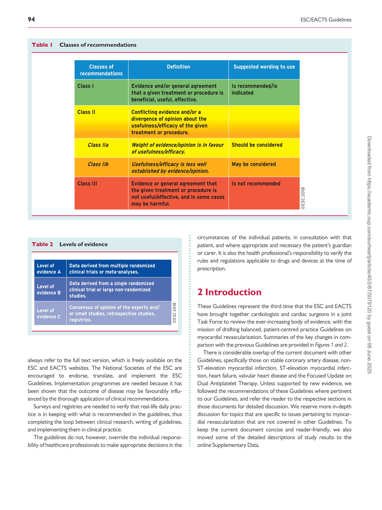
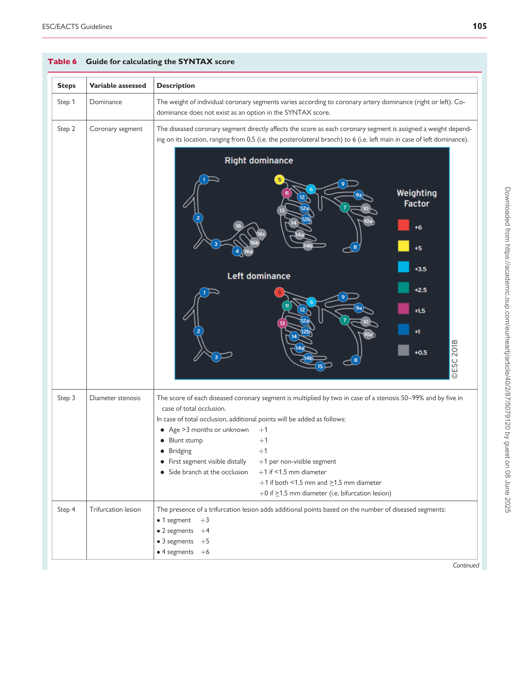
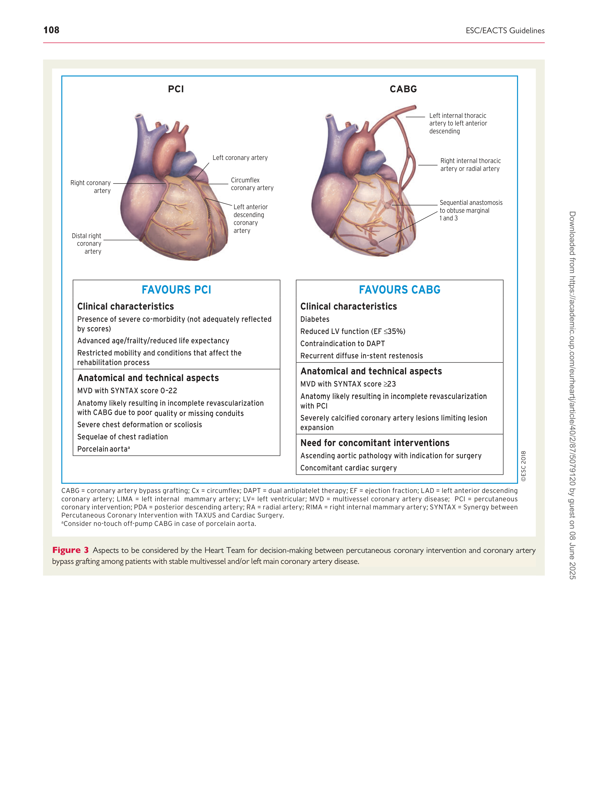
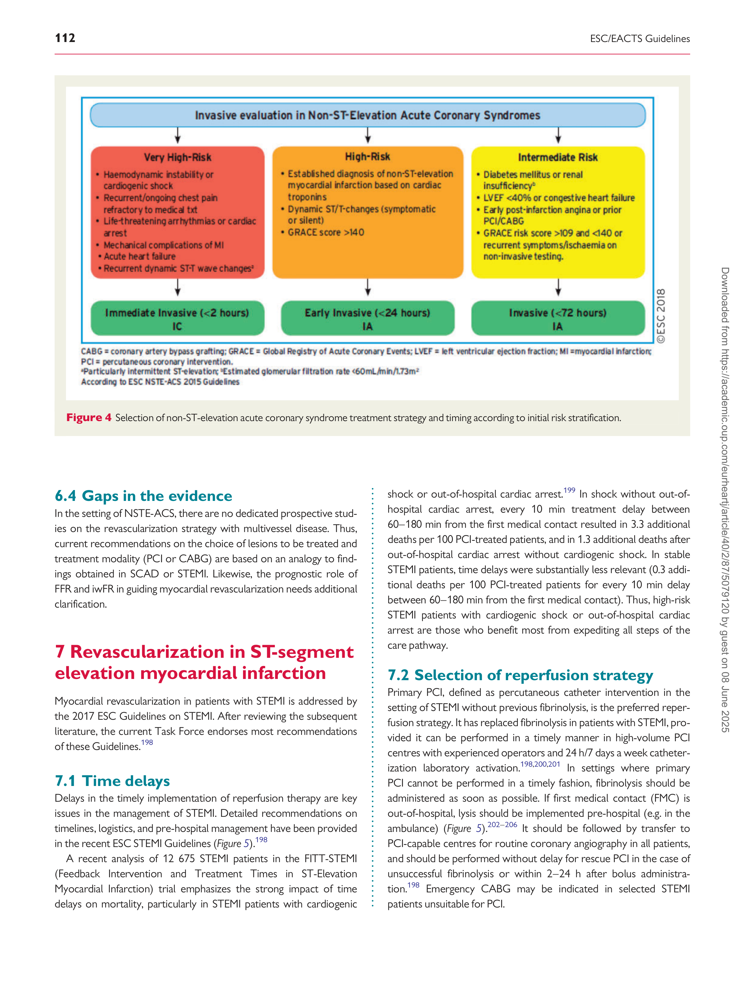
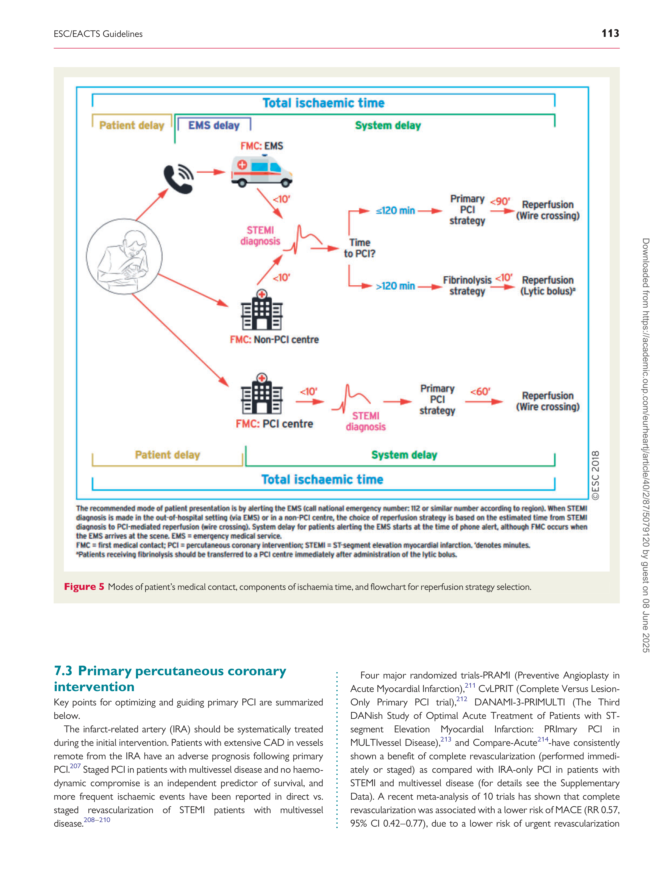
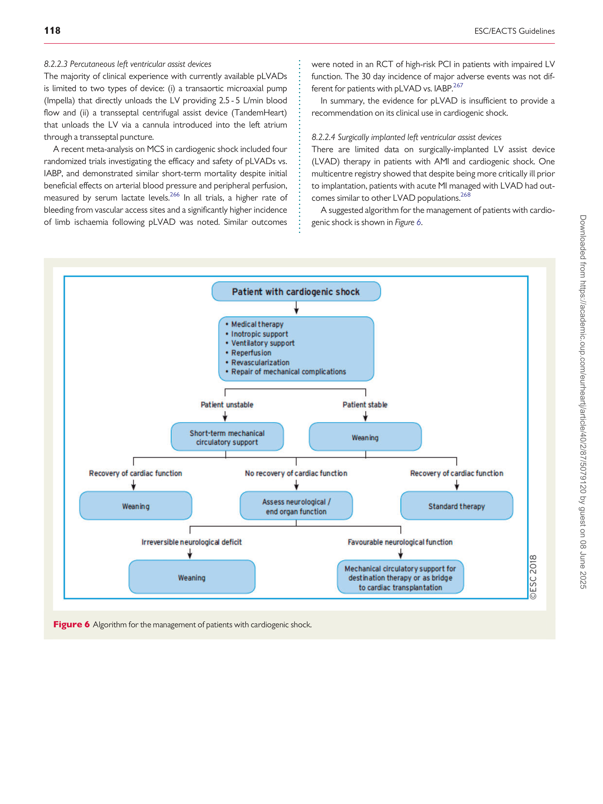
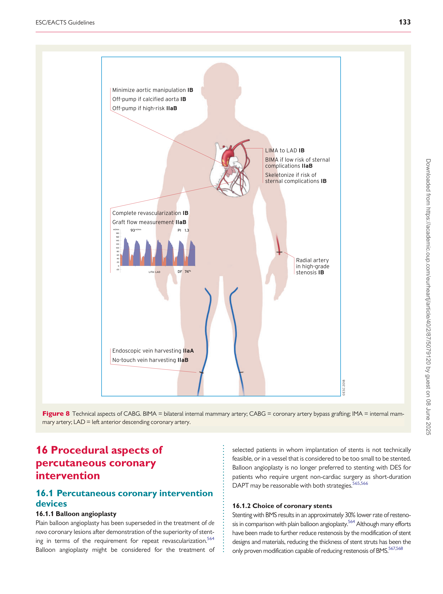
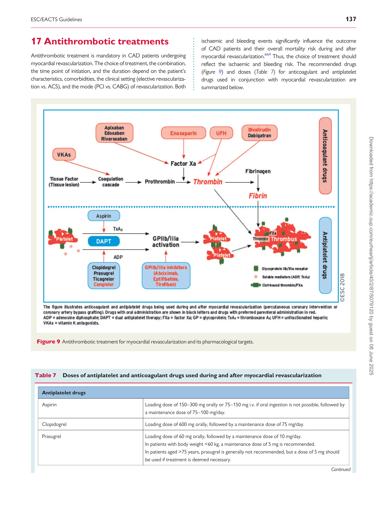
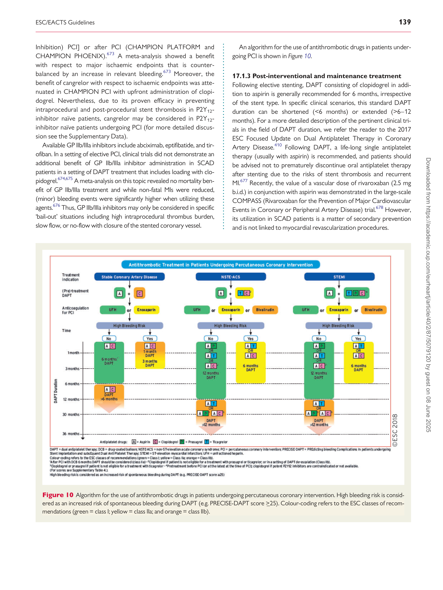

#### European Heart Journal (2019) 40, 87–165 ESC/EACTS GUIDELINES

doi:10.1093/eurheartj/ehy394
# 2018 ESC/EACTS Guidelines on myocardial revascularization
## The Task Force on myocardial revascularization of the European Society of Cardiology (ESC) and European Association for Cardio-Thoracic Surgery (EACTS) Developed with the special contribution of the European Association for Percutaneous Cardiovascular Interventions (EAPCI)
#### Authors/Task Force Members: Franz-Josef Neumann* (ESC Chairperson) (Germany), Miguel Sousa-Uva* [1] (EACTS Chairperson) (Portugal), Anders Ahlsson [1] (Sweden), Fernando Alfonso (Spain), Adrian P. Banning (UK), Umberto Benedetto [1] (UK), Robert A. Byrne (Germany), Jean-Philippe Collet (France), Volkmar Falk [1] (Germany), Stuart J. Head [1] (The Netherlands), Peter Ju¨ni (Canada), Adnan Kastrati (Germany), Akos Koller (Hungary), Steen D. Kristensen (Denmark), Josef Niebauer (Austria), Dimitrios J. Richter (Greece), Petar M. Seferovi�c (Serbia), Dirk Sibbing (Germany), Giulio G. Stefanini (Italy), Stephan Windecker (Switzerland), Rashmi Yadav [1] (UK), Michael O. Zembala [1] (Poland)

Document Reviewers: William Wijns (ESC Review Co-ordinator) (Ireland), David Glineur [1] (EACTS Review
Co-ordinator) (Canada), Victor Aboyans (France), Stephan Achenbach (Germany), Stefan Agewall
(Norway), Felicita Andreotti (Italy), Emanuele Barbato (Italy), Andreas Baumbach (UK), James Brophy
(Canada), He´ctor Bueno (Spain), Patrick A. Calvert (UK), Davide Capodanno (Italy), Piroze M. Davierwala [1]

- Corresponding authors. Franz-Josef Neumann, Department of Cardiology and Angiology II, University Heart Centre Freiburg-Bad Krozingen, Suedring 15, 79189 Bad Krozingen,
Germany. Tel: þ49 7633 402 2000, Fax: þ49 7633 402 2009, Email: franz-josef.neumann@universitaets-herzzentrum.de. Miguel Sousa-Uva, Cardiac Surgery Department, Hospital
Santa Cruz, Avenue Prof Reynaldo dos Santos, 2790-134 Carnaxide, Portugal. Tel: þ 351 210 433 163, Fax: þ 351 21 424 13 88, Cardiovascular Research Centre, Department of
[Surgery and Physiology, Faculty of Medicine-University of Porto, Alameda Prof Hernani Monteiro, 4200-319 Porto, Portugal Email: migueluva@gmail.com.](mailto:)

ESC Committee for Practice Guidelines (CPG), EACTS Clinical Guidelines Committee, and National Cardiac Societies document reviewers: listed in the Appendix.

1 Representing the European Association for Cardio-Thoracic Surgery (EACTS).

ESC entities having participated in the development of this document:

Associations: Acute Cardiovascular Care Association (ACCA), European Association of Preventive Cardiology (EAPC), European Association of Cardiovascular Imaging
(EACVI), European Association of Percutaneous Cardiovascular Interventions (EAPCI), European Heart Rhythm Association (EHRA), Heart Failure Association (HFA).

Councils: Council on Cardiovascular Nursing and Allied Professions, Council for Cardiology Practice, Council on Cardiovascular Primary Care, Council on Stroke, Council on

Valvular Heart Disease

Working Groups: Aorta and Peripheral Vascular Diseases, Cardiovascular Pharmacotherapy, Coronary Pathophysiology and Microcirculation, Thrombosis.

Disclaimer. The ESC Guidelines represent the views of the ESC and were produced after careful consideration of the scientific and medical knowledge and the evidence available at the time of their dating. The ESC is not responsible in the event of any contradiction, discrepancy and/or ambiguity between the ESC Guidelines and any other official recommendations or guidelines issued by the relevant public health authorities, in particular in relation to good use of health care or therapeutic strategies. Health professionals are
encouraged to take the ESC Guidelines fully into account when exercising their clinical judgment as well as in the determination and the implementation of preventive, diagnostic
or therapeutic medical strategies. However, the ESC Guidelines do not override in any way whatsoever the individual responsibility of health professionals to make appropriate
and accurate decisions in consideration of each patient’s health condition and in consultation with that patient and the patient’s caregiver where appropriate and/or necessary.
Nor do the ESC Guidelines exempt health professionals from taking careful and full consideration of the relevant official updated recommendations or guidelines issued by the
competent public health authorities in order to manage each patient’s case in light of the scientifically accepted data pursuant to their respective ethical and professional obligations. It is also the health professional’s responsibility to verify the applicable rules and regulations relating to drugs and medical devices at the time of prescription.

This article has been co-published with permission in the European Heart Journal and European Journal of Cardio-Thoracic Surgery. All rights reserved. V C 2018 European Society of
Cardiology. The articles are identical except for minor stylistic and spelling differences in keeping with each journal’s style. Either citation can be used when citing this article.

88 ESC/EACTS Guidelines

(Germany), Victoria Delgado (The Netherlands), Dariusz Dudek (Poland), Nick Freemantle [1] (UK),
Christian Funck-Brentano (France), Oliver Gaemperli (Switzerland), Stephan Gielen (Germany), Martine
Gilard (France), Bulent Gorenek (Turkey), Joerg Haasenritter (Germany), Michael Haude (Germany),
Borja Ibanez (Spain), Bernard Iung (France), Anders Jeppsson [1] (Sweden), Demosthenes Katritsis (Greece),
Juhani Knuuti (Finland), Philippe Kolh [1] (Belgium), Adelino Leite-Moreira [1] (Portugal), Lars H. Lund
(Sweden), Francesco Maisano (Switzerland), Julinda Mehilli (Germany), Bernhard Metzler (Austria), Gilles
Montalescot (France), Domenico Pagano [1] (UK), Anna Sonia Petronio (Italy), Massimo Francesco Piepoli
(Italy), Bogdan A. Popescu (Romania), Rafael Sadaba� [1] (Spain), Evgeny Shlyakhto (Russia), Sigmund Silber
(Germany), Iain A. Simpson (UK), David Sparv (Sweden), Giuseppe Tavilla [1] (The Netherlands), Holger
Thiele (Germany), Petr Tousek (Czech Republic), Eric Van Belle (France), Pascal Vranckx (Belgium), Adam
Witkowski (Poland), Jose Luis Zamorano (Spain), Marco Roffi (ESC CPG Supervisor) (Switzerland)

The disclosure forms of all experts involved in the development of these Guidelines are available on the
[ESC website www.escardio.org/guidelines](http://www.escardio.org/guidelines)

Online publish-ahead-of-print 25 August 2018

...................................................................................................................................................................................................

Keywords Acute coronary syndromes - Antithrombotic therapy - Bare-metal stents - Coronary artery bypass
grafting             - Coronary artery disease             - Drug-eluting stents             - Guidelines             - Heart Team             - Myocardial
infarction             - Myocardial ischaemia             - Myocardial revascularization             - Medical therapy             - Percutaneous coronary
intervention            - Recommendation            - Revascularization            - Risk stratification            - Stents            - Stable angina            - Stable
coronary artery disease            - ST-segment elevation myocardial infarction            - SYNTAX score

### Table of contents

Abbreviations and acronyms . . . . . . . . . . . . . . . . . . . . . . . . . . . . . . . . . . . . . . . .90

1 Preamble . . . . . . . . . . . . . . . . . . . . . . . . . . . . . . . . . . . . . . . . . . . . . . . . . . . . . . . . .93

2 Introduction . . . . . . . . . . . . . . . . . . . . . . . . . . . . . . . . . . . . . . . . . . . . . . . . . . . . . .94

2.1 What is new in the 2018 Guidelines? . . . . . . . . . . . . . . . . . . . . . . . . . . .95

3 Diagnostic tools to guide myocardial revascularization . . . . . . . . . . . . . .96

3.1 Non-invasive diagnostic tools . . . . . . . . . . . . . . . . . . . . . . . . . . . . . . . . .96

3.1.1 Assessment of myocardial ischaemia . . . . . . . . . . . . . . . . . . . . . . .96

3.1.2 Assessment of myocardial viability in patients with heart

failure and coronary artery disease . . . . . . . . . . . . . . . . . . . . . . . . . . . . .96

3.2 Invasive diagnostic tools . . . . . . . . . . . . . . . . . . . . . . . . . . . . . . . . . . . . . . .96

3.2.1 Pressure-derived fractional flow reserve . . . . . . . . . . . . . . . . . . .96

3.2.1.1 Use of fractional flow reserve in patients with

intermediate-grade coronary stenosis including left main

stenosis . . . . . . . . . . . . . . . . . . . . . . . . . . . . . . . . . . . . . . . . . . . . . . . . . . .96

3.2.1.2 Use of fractional flow reserve to identify lesions

requiring revascularization in patients with multivessel

coronary artery disease undergoing percutaneous coronary

intervention . . . . . . . . . . . . . . . . . . . . . . . . . . . . . . . . . . . . . . . . . . . . . . . .97

3.2.1.3 Fractional flow reserve-guided management vs. medical

therapy in patients with coronary artery disease . . . . . . . . . . . . . . . .97

3.2.2 Other pressure-derived indices . . . . . . . . . . . . . . . . . . . . . . . . . . .97

3.2.3 Use of fractional flow reserve and pressure-derived

indices in patients with severe aortic stenosis . . . . . . . . . . . . . . . . . . .98

3.2.4 Use of intravascular imaging for diagnostic assessment

of stenosis . . . . . . . . . . . . . . . . . . . . . . . . . . . . . . . . . . . . . . . . . . . . . . . . . . . . .98

3.3 Gaps in the evidence . . . . . . . . . . . . . . . . . . . . . . . . . . . . . . . . . . . . . . . . . .98

4 Process for decision-making and patient information . . . . . . . . . . . . . . . .98

4.1 Patient information and informed consent . . . . . . . . . . . . . . . . . . . . .98

4.2 Multidisciplinary decision-making (Heart Team) . . . . . . . . . . . . . . . .99

4.3 Timing of revascularization . . . . . . . . . . . . . . . . . . . . . . . . . . . . . . . . . . . .99

5 Revascularization for stable coronary artery disease . . . . . . . . . . . . . . .101

5.1 Rationale for revascularization . . . . . . . . . . . . . . . . . . . . . . . . . . . . . . . .101

5.2 Evidence basis for revascularization . . . . . . . . . . . . . . . . . . . . . . . . . . .101

5.2.1 Revascularization with the use of percutaneous coronary

intervention . . . . . . . . . . . . . . . . . . . . . . . . . . . . . . . . . . . . . . . . . . . . . . . . . .102

5.2.2 Revascularization with the use of coronary artery bypass

grafting . . . . . . . . . . . . . . . . . . . . . . . . . . . . . . . . . . . . . . . . . . . . . . . . . . . . . . .102

5.3 Percutaneous coronary intervention vs. coronary artery

bypass grafting . . . . . . . . . . . . . . . . . . . . . . . . . . . . . . . . . . . . . . . . . . . . . . . . . .102

5.3.1 Criteria for decision making . . . . . . . . . . . . . . . . . . . . . . . . . . . . . .102

5.3.1.1 Predicted surgical mortality . . . . . . . . . . . . . . . . . . . . . . . . . .104

5.3.1.2 Anatomical complexity of coronary artery disease . . . . . .104

5.3.1.3 Completeness of revascularization . . . . . . . . . . . . . . . . . . . .106

5.3.2 Isolated proximal left anterior descending coronary

artery disease . . . . . . . . . . . . . . . . . . . . . . . . . . . . . . . . . . . . . . . . . . . . . . . . .109

5.3.3 Left main coronary artery disease . . . . . . . . . . . . . . . . . . . . . . . .109

5.3.4 Multivessel coronary artery disease . . . . . . . . . . . . . . . . . . . . . . .109

5.4 Gaps in the evidence . . . . . . . . . . . . . . . . . . . . . . . . . . . . . . . . . . . . . . . . .110

6 Revascularization in non-ST-elevation acute coronary syndrome . . .110

6.1 Early invasive vs. conservative strategy . . . . . . . . . . . . . . . . . . . . . . . .110

6.2 Timing of angiography and intervention . . . . . . . . . . . . . . . . . . . . . . .110

6.3 Type of revascularization . . . . . . . . . . . . . . . . . . . . . . . . . . . . . . . . . . . . .110

6.3.1 Percutaneous coronary intervention . . . . . . . . . . . . . . . . . . . . .110

6.3.1.1 Technical aspects . . . . . . . . . . . . . . . . . . . . . . . . . . . . . . . . . .110

6.3.1.2 Revascularization strategies and outcomes . . . . . . . . . . . .111

6.3.2 Coronary artery bypass grafting . . . . . . . . . . . . . . . . . . . . . . . . . .111

ESC/EACTS Guidelines 89

6.3.3 Percutaneous coronary intervention vs. coronary artery

bypass grafting . . . . . . . . . . . . . . . . . . . . . . . . . . . . . . . . . . . . . . . . . . . . . . . .111

6.4 Gaps in the evidence . . . . . . . . . . . . . . . . . . . . . . . . . . . . . . . . . . . . . . . . .112

7 Revascularization in ST-segment elevation myocardial infarction . . .112

7.1 Time delays . . . . . . . . . . . . . . . . . . . . . . . . . . . . . . . . . . . . . . . . . . . . . . . . .112

7.2 Selection of reperfusion strategy . . . . . . . . . . . . . . . . . . . . . . . . . . . . .112

7.3 Primary percutaneous coronary intervention . . . . . . . . . . . . . . . . .113

7.4 Percutaneous coronary intervention after thrombolysis

and in patients with late diagnosis . . . . . . . . . . . . . . . . . . . . . . . . . . . . . . . .114

7.5 Gaps in the evidence . . . . . . . . . . . . . . . . . . . . . . . . . . . . . . . . . . . . . . . . .114

8 Myocardial revascularization in patients with heart failure . . . . . . . . . .116

8.1 Chronic heart failure . . . . . . . . . . . . . . . . . . . . . . . . . . . . . . . . . . . . . . . . .116

8.1.1 Recommendations for myocardial revascularization in

patients with chronic heart failure . . . . . . . . . . . . . . . . . . . . . . . . . . . . .116

8.1.2 Ventricular reconstruction and aneurysm resection . . . . . . .116

8.2 Acute heart failure and cardiogenic shock . . . . . . . . . . . . . . . . . . . . .117

8.2.1 Revascularization . . . . . . . . . . . . . . . . . . . . . . . . . . . . . . . . . . . . . . . .117

8.2.2 Mechanical circulatory support . . . . . . . . . . . . . . . . . . . . . . . . . . .117

8.2.2.1 Intra-aortic balloon pump . . . . . . . . . . . . . . . . . . . . . . . . . . .117

8.2.2.2 Extracorporeal membrane oxygenation . . . . . . . . . . . . . . .117

8.2.2.3 Percutaneous left ventricular assist devices . . . . . . . . . . . .118

8.2.2.4 Surgically implanted left ventricular assist devices . . . . . . .118

8.3 Gaps in the evidence . . . . . . . . . . . . . . . . . . . . . . . . . . . . . . . . . . . . . . . . .119

9 Revascularization in patients with diabetes . . . . . . . . . . . . . . . . . . . . . . . .119

9.1 Evidence for myocardial revascularization . . . . . . . . . . . . . . . . . . . . .119

9.2 Type of myocardial revascularization . . . . . . . . . . . . . . . . . . . . . . . . .119

9.2.1. Randomized clinical trials . . . . . . . . . . . . . . . . . . . . . . . . . . . . . . . .119

9.2.2 Meta-analysis of coronary artery bypass grafting vs.

percutaneous coronary intervention in patients with diabetes . . .120

9.3 Revascularization with the use of percutaneous coronary

intervention . . . . . . . . . . . . . . . . . . . . . . . . . . . . . . . . . . . . . . . . . . . . . . . . . . . . .120

9.4 Antithrombotic pharmacotherapy . . . . . . . . . . . . . . . . . . . . . . . . . . . .120

9.5 Metformin . . . . . . . . . . . . . . . . . . . . . . . . . . . . . . . . . . . . . . . . . . . . . . . . . . .120

9.6 Gaps in the evidence . . . . . . . . . . . . . . . . . . . . . . . . . . . . . . . . . . . . . . . . .121

10 Revascularization in patients with chronic kidney disease . . . . . . . . .121

10.1 Evidence base for revascularization and recommendations . . .121

10.2 Prevention of contrast-induced nephropathy . . . . . . . . . . . . . . . .121

10.3 Gaps in the evidence . . . . . . . . . . . . . . . . . . . . . . . . . . . . . . . . . . . . . . . .121

11 Revascularization in patients requiring valve interventions . . . . . . . .122

11.1 Primary indication for valve interventions . . . . . . . . . . . . . . . . . . . .122

11.2 Primary indication for myocardial revascularization . . . . . . . . . . .122

11.2.1 Aortic valve disease . . . . . . . . . . . . . . . . . . . . . . . . . . . . . . . . . .122

11.2.2 Mitral valve disease . . . . . . . . . . . . . . . . . . . . . . . . . . . . . . . . . .122

11.3 Gaps in the evidence . . . . . . . . . . . . . . . . . . . . . . . . . . . . . . . . . . . . . . . .122

12 Associated peripheral artery diseases . . . . . . . . . . . . . . . . . . . . . . . . . . . .123

12.1 Prevention of stroke associated with carotid artery

disease and myocardial revascularization . . . . . . . . . . . . . . . . . . . . . . . . .123

12.2 Associated coronary and peripheral artery diseases . . . . . . . . . .123

13 Repeat revascularization . . . . . . . . . . . . . . . . . . . . . . . . . . . . . . . . . . . . . . . .124

13.1 Early graft failure . . . . . . . . . . . . . . . . . . . . . . . . . . . . . . . . . . . . . . . . . . . .124

13.2 Acute percutaneous coronary intervention failure . . . . . . . . . . .125

13.3 Disease progression and late graft failure . . . . . . . . . . . . . . . . . . . .125

13.3.1 Redo coronary artery bypass grafting or percutaneous

coronary intervention . . . . . . . . . . . . . . . . . . . . . . . . . . . . . . . . . . . . . .125

13.3.2 Percutaneous coronary intervention for saphenous vein

graft lesions . . . . . . . . . . . . . . . . . . . . . . . . . . . . . . . . . . . . . . . . . . . . . . . .125

13.4.1 Restenosis . . . . . . . . . . . . . . . . . . . . . . . . . . . . . . . . . . . . . . . . . . .125

13.4.2 Disease progression . . . . . . . . . . . . . . . . . . . . . . . . . . . . . . . . .126

13.4.3 Stent thrombosis . . . . . . . . . . . . . . . . . . . . . . . . . . . . . . . . . . . .126

14 Arrhythmias . . . . . . . . . . . . . . . . . . . . . . . . . . . . . . . . . . . . . . . . . . . . . . . . . . . .127

14.1 Ventricular arrhythmias . . . . . . . . . . . . . . . . . . . . . . . . . . . . . . . . . . . . .127

14.1.1 Revascularization for the prevention of sudden cardiac

death in patients with stable coronary artery disease and

reduced left ventricular function . . . . . . . . . . . . . . . . . . . . . . . . . . . .127

14.1.2 Revascularization for the treatment of electrical storm 128

14.1.3 Revascularization after out-of-hospital cardiac arrest . .128

14.2 Atrial arrhythmias . . . . . . . . . . . . . . . . . . . . . . . . . . . . . . . . . . . . . . . . . .128

14.2.1 Atrial fibrillation complicating percutaneous coronary

intervention . . . . . . . . . . . . . . . . . . . . . . . . . . . . . . . . . . . . . . . . . . . . . . . .128

14.2.2 Atrial fibrillation complicating coronary artery bypass

grafting . . . . . . . . . . . . . . . . . . . . . . . . . . . . . . . . . . . . . . . . . . . . . . . . . . . .128

14.2.3 Postoperative atrial fibrillation and stroke risk . . . . . . . . .128

14.3 Gaps in the evidence . . . . . . . . . . . . . . . . . . . . . . . . . . . . . . . . . . . . . . . .129

15 Procedural aspects of coronary artery bypass grafting . . . . . . . . . . . .129

15.1 Surgical techniques . . . . . . . . . . . . . . . . . . . . . . . . . . . . . . . . . . . . . . . . .129

15.1.1 Completeness of revascularization . . . . . . . . . . . . . . . . . . . .129

15.1.2 Conduit selection . . . . . . . . . . . . . . . . . . . . . . . . . . . . . . . . . . . .130

15.1.3 Mammary artery harvesting . . . . . . . . . . . . . . . . . . . . . . . . . .130

15.1.4 Radial artery harvesting . . . . . . . . . . . . . . . . . . . . . . . . . . . . . .130

15.1.5 Saphenous vein harvesting . . . . . . . . . . . . . . . . . . . . . . . . . . .130

15.1.6 Construction of central anastomosis . . . . . . . . . . . . . . . . . .131

15.1.7 Intraoperative quality control . . . . . . . . . . . . . . . . . . . . . . . . .131

15.1.8 On-pump and off-pump procedures . . . . . . . . . . . . . . . . . .131

15.1.9 Minimally invasive and hybrid procedures . . . . . . . . . . . . .131

15.2 Reporting perioperative outcomes . . . . . . . . . . . . . . . . . . . . . . . . . .131

15.3 Gaps in the evidence . . . . . . . . . . . . . . . . . . . . . . . . . . . . . . . . . . . . . . . .131

16 Procedural aspects of percutaneous coronary intervention . . . . . . .133

16.1 Percutaneous coronary intervention devices . . . . . . . . . . . . . . . . .133

16.1.1 Balloon angioplasty . . . . . . . . . . . . . . . . . . . . . . . . . . . . . . . . . .133

16.1.2 Choice of coronary stents . . . . . . . . . . . . . . . . . . . . . . . . . . . .133

16.1.3 Bioresorbable scaffolds . . . . . . . . . . . . . . . . . . . . . . . . . . . . . .134

16.1.4 Drug-coated balloons . . . . . . . . . . . . . . . . . . . . . . . . . . . . . . . .134

16.1.5 Devices for lesion preparation . . . . . . . . . . . . . . . . . . . . . . . .134

16.2 Invasive imaging tools for procedural guidance . . . . . . . . . . . . . . .134

16.2.1 Intravascular ultrasound . . . . . . . . . . . . . . . . . . . . . . . . . . . . . .134

16.2.2 Optical coherence tomography . . . . . . . . . . . . . . . . . . . . . .135

16.3 Specific lesion subsets . . . . . . . . . . . . . . . . . . . . . . . . . . . . . . . . . . . . . .135

16.3.1 Bifurcation stenosis . . . . . . . . . . . . . . . . . . . . . . . . . . . . . . . . . .135

16.3.2 Chronic total coronary occlusion . . . . . . . . . . . . . . . . . . . . .135

16.3.3 Ostial lesions . . . . . . . . . . . . . . . . . . . . . . . . . . . . . . . . . . . . . . . .136

16.4 Vascular access . . . . . . . . . . . . . . . . . . . . . . . . . . . . . . . . . . . . . . . . . . . . .136

17 Antithrombotic treatments . . . . . . . . . . . . . . . . . . . . . . . . . . . . . . . . . . . . .137

17.1 Percutaneous coronary intervention in stable coronary

artery disease . . . . . . . . . . . . . . . . . . . . . . . . . . . . . . . . . . . . . . . . . . . . . . . . . . .138

17.1.1 Choice of treatment and pre-treatment . . . . . . . . . . . . . . .138

17.1.2 Peri-interventional treatment . . . . . . . . . . . . . . . . . . . . . . . . .138

17.1.3 Post-interventional and maintenance treatment . . . . . . .139

17.2 Non-ST-segment elevation acute coronary syndrome . . . . . . . .141

17.2.1 Choice of treatment and pre-treatment . . . . . . . . . . . . . . .141

17.2.2 Peri-interventional treatment . . . . . . . . . . . . . . . . . . . . . . . . .141

17.2.3 Post-interventional and maintenance treatment . . . . . . .141

17.3 ST-segment elevation myocardial infarction . . . . . . . . . . . . . . . . . .144

17.3.1 Choice of treatment and pre-treatment . . . . . . . . . . . . . . .144

7.1 Time delays . . . . . . . . . . . . . . . . . . . . . . . . . . . . . . . . . . . . . . . . . . . . . . . . .112

7.2 Selection of reperfusion strategy . . . . . . . . . . . . . . . . . . . . . . . . . . . . .112

7.3 Primary percutaneous coronary intervention . . . . . . . . . . . . . . . . .113

7.4 Percutaneous coronary intervention after thrombolysis

and in patients with late diagnosis . . . . . . . . . . . . . . . . . . . . . . . . . . . . . . . .114

7.5 Gaps in the evidence . . . . . . . . . . . . . . . . . . . . . . . . . . . . . . . . . . . . . . . . .114

8 Myocardial revascularization in patients with heart failure . . . . . . . . . .116

8.1 Chronic heart failure . . . . . . . . . . . . . . . . . . . . . . . . . . . . . . . . . . . . . . . . .116

8.1.1 Recommendations for myocardial revascularization in

patients with chronic heart failure . . . . . . . . . . . . . . . . . . . . . . . . . . . . .116

8.1.2 Ventricular reconstruction and aneurysm resection . . . . . . .116

8.2 Acute heart failure and cardiogenic shock . . . . . . . . . . . . . . . . . . . . .117

8.2.1 Revascularization . . . . . . . . . . . . . . . . . . . . . . . . . . . . . . . . . . . . . . . .117

8.2.2 Mechanical circulatory support . . . . . . . . . . . . . . . . . . . . . . . . . . .117

8.2.2.1 Intra-aortic balloon pump . . . . . . . . . . . . . . . . . . . . . . . . . . .117

8.2.2.2 Extracorporeal membrane oxygenation . . . . . . . . . . . . . . .117

8.2.2.3 Percutaneous left ventricular assist devices . . . . . . . . . . . .118

8.2.2.4 Surgically implanted left ventricular assist devices . . . . . . .118

8.3 Gaps in the evidence . . . . . . . . . . . . . . . . . . . . . . . . . . . . . . . . . . . . . . . . .119

9 Revascularization in patients with diabetes . . . . . . . . . . . . . . . . . . . . . . . .119

9.1 Evidence for myocardial revascularization . . . . . . . . . . . . . . . . . . . . .119

9.2 Type of myocardial revascularization . . . . . . . . . . . . . . . . . . . . . . . . .119

9.2.1. Randomized clinical trials . . . . . . . . . . . . . . . . . . . . . . . . . . . . . . . .119

9.2.2 Meta-analysis of coronary artery bypass grafting vs.

percutaneous coronary intervention in patients with diabetes . . .120

9.3 Revascularization with the use of percutaneous coronary

intervention . . . . . . . . . . . . . . . . . . . . . . . . . . . . . . . . . . . . . . . . . . . . . . . . . . . . .120

9.4 Antithrombotic pharmacotherapy . . . . . . . . . . . . . . . . . . . . . . . . . . . .120

9.5 Metformin . . . . . . . . . . . . . . . . . . . . . . . . . . . . . . . . . . . . . . . . . . . . . . . . . . .120

9.6 Gaps in the evidence . . . . . . . . . . . . . . . . . . . . . . . . . . . . . . . . . . . . . . . . .121

10 Revascularization in patients with chronic kidney disease . . . . . . . . .121

10.1 Evidence base for revascularization and recommendations . . .121

10.2 Prevention of contrast-induced nephropathy . . . . . . . . . . . . . . . .121

10.3 Gaps in the evidence . . . . . . . . . . . . . . . . . . . . . . . . . . . . . . . . . . . . . . . .121

11 Revascularization in patients requiring valve interventions . . . . . . . .122

11.1 Primary indication for valve interventions . . . . . . . . . . . . . . . . . . . .122

11.2 Primary indication for myocardial revascularization . . . . . . . . . . .122

11.2.1 Aortic valve disease . . . . . . . . . . . . . . . . . . . . . . . . . . . . . . . . . .122

11.2.2 Mitral valve disease . . . . . . . . . . . . . . . . . . . . . . . . . . . . . . . . . .122

11.3 Gaps in the evidence . . . . . . . . . . . . . . . . . . . . . . . . . . . . . . . . . . . . . . . .122

12 Associated peripheral artery diseases . . . . . . . . . . . . . . . . . . . . . . . . . . . .123

12.1 Prevention of stroke associated with carotid artery

disease and myocardial revascularization . . . . . . . . . . . . . . . . . . . . . . . . .123

12.2 Associated coronary and peripheral artery diseases . . . . . . . . . .123

13 Repeat revascularization . . . . . . . . . . . . . . . . . . . . . . . . . . . . . . . . . . . . . . . .124

13.1 Early graft failure . . . . . . . . . . . . . . . . . . . . . . . . . . . . . . . . . . . . . . . . . . . .124

13.2 Acute percutaneous coronary intervention failure . . . . . . . . . . .125

13.3 Disease progression and late graft failure . . . . . . . . . . . . . . . . . . . .125

13.3.1 Redo coronary artery bypass grafting or percutaneous

coronary intervention . . . . . . . . . . . . . . . . . . . . . . . . . . . . . . . . . . . . . .125

13.3.2 Percutaneous coronary intervention for saphenous vein

graft lesions . . . . . . . . . . . . . . . . . . . . . . . . . . . . . . . . . . . . . . . . . . . . . . . .125

13.4 Repeat percutaneous coronary intervention . . . . . . . . . . . . . . . . .125

90 ESC/EACTS Guidelines

17.3.2 Peri-interventional treatment . . . . . . . . . . . . . . . . . . . . . . . . .144

17.3.3 Post-interventional and maintenance treatment . . . . . . .144

17.4 Coronary artery bypass grafting . . . . . . . . . . . . . . . . . . . . . . . . . . . . .145

17.5 Special conditions . . . . . . . . . . . . . . . . . . . . . . . . . . . . . . . . . . . . . . . . . .145

17.5.1 Antithrombotic therapy after percutaneous

coronary intervention in patients requiring oral

anticoagulation . . . . . . . . . . . . . . . . . . . . . . . . . . . . . . . . . . . . . . . . . . . . .145

17.5.2 Revascularization in patients with renal failure . . . . . . . . .148

17.5.3 Monitoring of antiplatelet drugs (platelet function

testing and genotyping) . . . . . . . . . . . . . . . . . . . . . . . . . . . . . . . . . . . . .148

17.5.4 Surgery in patients on dual antiplatelet therapy . . . . . . . .148

17.6 Gaps in the evidence . . . . . . . . . . . . . . . . . . . . . . . . . . . . . . . . . . . . . . . .148

18 Volume–outcome relationship for revascularization

procedures . . . . . . . . . . . . . . . . . . . . . . . . . . . . . . . . . . . . . . . . . . . . . . . . . . . . . . . .149

18.1 Coronary artery bypass grafting . . . . . . . . . . . . . . . . . . . . . . . . . . . . .149

18.2 Percutaneous coronary intervention . . . . . . . . . . . . . . . . . . . . . . . .149

18.3 Training in cardiac surgery and interventional cardiology

for myocardial revascularization . . . . . . . . . . . . . . . . . . . . . . . . . . . . . . . . .149

19 Medical therapy, secondary prevention, and strategies for

follow-up . . . . . . . . . . . . . . . . . . . . . . . . . . . . . . . . . . . . . . . . . . . . . . . . . . . . . . . . . .151

19.1 Gaps in the evidence . . . . . . . . . . . . . . . . . . . . . . . . . . . . . . . . . . . . . . . .152

20 Key messages . . . . . . . . . . . . . . . . . . . . . . . . . . . . . . . . . . . . . . . . . . . . . . . . . . .152
21 Evidence-based [0] to do [0] and [0] not to do [0] messages from the

Guidelines . . . . . . . . . . . . . . . . . . . . . . . . . . . . . . . . . . . . . . . . . . . . . . . . . . . . . . . . .152

22 Appendix . . . . . . . . . . . . . . . . . . . . . . . . . . . . . . . . . . . . . . . . . . . . . . . . . . . . . .156

23 References . . . . . . . . . . . . . . . . . . . . . . . . . . . . . . . . . . . . . . . . . . . . . . . . . . . . .157
### Abbreviations and acronyms

Age, Biomarkers, Clinical History
A Bioresorbable Everolimus-Eluting Scaffold
Versus a Metallic Everolimus-Eluting Stent II
Amsterdam Investigator-Initiated Absorb
Strategy All-Comers
Comparison of Prasugrel at the Time of
Percutaneous Coronary Intervention or as
Pretreatment at the Time of Diagnosis in
Patients with Non-ST Elevation Myocardial

Infarction

Acute coronary syndrome
Acute Catheterization and Urgent
Intervention Triage strategy
ADAPT-DES Assessment of Dual Antiplatelet Therapy
With Drug-Eluting Stents
Atrial fibrillation
Assessment of Loading With the P2Y 12          Inhibitor Ticagrelor or Clopidogrel to Halt
Ischemic Events in Patients Undergoing
Elective Coronary Stenting
Acute myocardial infarction

A Maastricht Contrast-Induced

Nephropathy Guideline
ANTARCTIC Platelet function monitoring to adjust
antiplatelet therapy in elderly patients

ARCTIC Assessment by a Double Randomization of a
Conventional Antiplatelet Strategy versus a
Monitoring-guided Strategy for Drug-Eluting
Stent Implantation and of Treatment
Interruption versus Continuation One Year
after Stenting

ART Arterial Revascularization Trial

AS Aortic stenosis

ASE American Society of Echocardiography
ATLANTIC Administration of Ticagrelor in the Cath Lab

or in the Ambulance for New ST-Elevation

Myocardial Infarction to Open the Coronary
Artery
ATLAS-ACS Anti-Xa Therapy to Lower cardiovascular
2–TIMI 51 events in Addition to Standard therapy in
subjects with Acute Coronary

–
Syndrome Thrombolysis In Myocardial

Infarction 51

ATOLL Acute STEMI Treated with primary PCI and
intravenous enoxaparin Or UFH to Lower
ischaemic and bleeding events at short- and
Long-term follow-up
AWESOME Angina With Extremely Serious Operative
Mortality Evaluation
BARC Bleeding Academic Research Consortium
BARI-2D Bypass Angioplasty Revascularization
Investigation 2 Diabetes
BES Biolimus-eluting stent
BEST Randomised Comparison of Coronary
Artery Bypass Surgery and Everolimus-Eluting
Stent Implantation in the Treatment of
Patients with Multivessel Coronary Artery

Disease

b.i.d. Bis in die (twice daily)
BIMA Bilateral internal mammary artery

BMS Bare-metal stent

BRAVE Bavarian Reperfusion Alternatives Evaluation

BRS Bioresorbable scaffolds

BVS Bioresorbable vascular scaffold

CABG Coronary artery bypass grafting
CAD Coronary artery disease
CARDia Coronary Artery Revascularization in

Diabetes

CCS Canadian Cardiovascular Society
CEA Carotid endarterectomy
CHA 2 DS 2 -VASc Cardiac Congestive heart failure,
Hypertension, Age >_75 [Doubled], Diabetes
mellitus, prior Stroke or transient ischaemic
attack or thromboembolism [Doubled] –
Vascular disease, Age 65–74 and Sex
category [Female]
CHAMPION Cangrelor versus Standard Therapy to
Achieve Optimal Management of Platelet

Inhibition

CI Confidence interval
CIN Contrast-induced nephropathy

17.5.1 Antithrombotic therapy after percutaneous

coronary intervention in patients requiring oral

anticoagulation . . . . . . . . . . . . . . . . . . . . . . . . . . . . . . . . . . . . . . . . . . . . .145

17.5.2 Revascularization in patients with renal failure . . . . . . . . .148

17.5.3 Monitoring of antiplatelet drugs (platelet function

testing and genotyping) . . . . . . . . . . . . . . . . . . . . . . . . . . . . . . . . . . . . .148

17.5.4 Surgery in patients on dual antiplatelet therapy . . . . . . . .148

17.6 Gaps in the evidence . . . . . . . . . . . . . . . . . . . . . . . . . . . . . . . . . . . . . . . .148

18 Volume–outcome relationship for revascularization

procedures . . . . . . . . . . . . . . . . . . . . . . . . . . . . . . . . . . . . . . . . . . . . . . . . . . . . . . . .149

18.1 Coronary artery bypass grafting . . . . . . . . . . . . . . . . . . . . . . . . . . . . .149

18.2 Percutaneous coronary intervention . . . . . . . . . . . . . . . . . . . . . . . .149

18.3 Training in cardiac surgery and interventional cardiology

for myocardial revascularization . . . . . . . . . . . . . . . . . . . . . . . . . . . . . . . . .149

19 Medical therapy, secondary prevention, and strategies for

follow-up . . . . . . . . . . . . . . . . . . . . . . . . . . . . . . . . . . . . . . . . . . . . . . . . . . . . . . . . . .151

19.1 Gaps in the evidence . . . . . . . . . . . . . . . . . . . . . . . . . . . . . . . . . . . . . . . .152

20 Key messages . . . . . . . . . . . . . . . . . . . . . . . . . . . . . . . . . . . . . . . . . . . . . . . . . . .152
21 Evidence-based [0] to do [0] and [0] not to do [0] messages from the

Guidelines . . . . . . . . . . . . . . . . . . . . . . . . . . . . . . . . . . . . . . . . . . . . . . . . . . . . . . . . .152

22 Appendix . . . . . . . . . . . . . . . . . . . . . . . . . . . . . . . . . . . . . . . . . . . . . . . . . . . . . .156

23 References . . . . . . . . . . . . . . . . . . . . . . . . . . . . . . . . . . . . . . . . . . . . . . . . . . . . .157

### Abbreviations and acronyms

ABC Age, Biomarkers, Clinical History
ABSORB II A Bioresorbable Everolimus-Eluting Scaffold
Versus a Metallic Everolimus-Eluting Stent II
AIDA Amsterdam Investigator-Initiated Absorb
Strategy All-Comers
ACCOAST Comparison of Prasugrel at the Time of
Percutaneous Coronary Intervention or as
Pretreatment at the Time of Diagnosis in
Patients with Non-ST Elevation Myocardial

Infarction

ACS Acute coronary syndrome
ACUITY Acute Catheterization and Urgent
Intervention Triage strategy
ADAPT-DES Assessment of Dual Antiplatelet Therapy
With Drug-Eluting Stents
AF Atrial fibrillation
ALPHEUS Assessment of Loading With the P2Y 12 Inhibitor Ticagrelor or Clopidogrel to Halt
Ischemic Events in Patients Undergoing
Elective Coronary Stenting
AMI Acute myocardial infarction

AMACING A Maastricht Contrast-Induced

Nephropathy Guideline
ANTARCTIC Platelet function monitoring to adjust
antiplatelet therapy in elderly patients
stented for an acute coronary syndrome

ESC/EACTS Guidelines 91

CKD Chronic kidney disease
CMR Cardiac magnetic resonance
COMPASS Rivaroxaban for the Prevention of Major
Cardiovascular Events in Coronary or
Peripheral Artery Disease
COURAGE Clinical Outcomes Utilizing Revascularization
and Aggressive Drug Evaluation

CPG ESC Committee for Practice Guidelines

CT Computed tomography
CT-FFR CT-derived fractional flow reserve

CTO Chronic total occlusion

CTSN Cardiothoracic Surgical Trial Network
CULPRIT-SHOCK Culprit Lesion Only PCI versus Multivessel
PCI in Cardiogenic Shock

CVA Cerebrovascular accident

CvLPRIT Complete Versus Lesion-Only Primary PCI Trial
DANAMI 3-DEFER The Third DANish Study of Optimal Acute
Treatment of Patients with ST-segment
Elevation Myocardial Infarction: DEFERred
stent implantation in connection with
primary PCI
DANAMI-3- The Third DANish Study of Optimal Acute
PRIMULTI Treatment of Patients with ST-segment
Elevation Myocardial Infarction: PRImary PCI

in MULTIvessel Disease

DAPT Dual antiplatelet therapy
DCB Drug-coated balloon
DEFINE-FLAIR Define Functional Lesion Assessment of

Intermediate Stenosis to Guide

Revascularization

DES Drug-eluting stents
DUS Duplex ultrasound
EACTS European Association for Cardio-Thoracic
Surgery
EAPCI European Association for Percutaneous

Cardiovascular Interventions

EBC TWO European Bifurcation Coronary TWO
ECG Electrocardiogram
ECLS Extracorporeal life support
ECMO Extracorporeal membrane oxygenation
EES Everolimus-eluting stent
EF Ejection fraction
EMS Emergency medical service
EROA Effective regurgitant orifice area
ENTRUST-AF-PCI Evaluation of the safety and efficacy of an
edoxaban-based antithrombotic regimen in
patients with atrial fibrillation following
successful percutaneous coronary intervention
ESC European Society of Cardiology
EUROCTO Randomized Multicentre Trial to Compare
Revascularization With Optimal Medical
Therapy for the Treatment of Chronic Total

Occlusions

EuroSCORE European System for Cardiac Operative Risk

EUROMAX European Ambulance Acute Coronary
Syndrome Angiography
EXCEL Evaluation of XIENCE Versus Coronary
Artery Bypass Surgery for Effectiveness of

Left Main Revascularization

FAME Fractional Flow Reserve versus Angiography

for Multivessel Evaluation

FDG-PET Fluorodeoxyglucose positron emission
tomography
FFR Fractional flow reserve

FITT-STEMI Feedback Intervention and Treatment

Times in ST-Elevation Myocardial

Infarction

FMC First medical contact

FREEDOM Future Revascularization Evaluation in

Patients with Diabetes Mellitus

GLOBAL Long-term ticagrelor monotherapy versus
LEADERS standard dual antiplatelet therapy followed by
aspirin monotherapy in patients undergoing
biolimus-eluting stent implantation
GP IIb/IIIa Glycoprotein IIb/IIIa
GRAVITAS Gauging Responsiveness with A
VerifyNow assay-Impact on Thrombosis
And Safety
HAS-BLED Hypertension, Abnormal renal/liver function,
Stroke, Bleeding history or predisposition,
Labile INR, Elderly, Drugs/alcohol
HEAT-PPCI How Effective are Antithrombotic Therapies
in primary PCI

HF Heart failure

HFrEF Heart failure with reduced ejection fraction
HORIZONS Harmonizing Outcomes with

Revascularization and Stents in Acute

Myocardial Infarction
HPR High platelet reactivity

HR Hazard ratio

i.v. Intravenous

IABP Intra-aortic balloon pump
IABP-SHOCK II Intraaortic Balloon Pump in Cardiogenic

Shock II Trial

ICD Implantable cardioverter defibrillator

iwFR Instantaneous wave-free ratio

IMA Internal mammary artery
IMR Ischaemic mitral regurgitation

INR International normalized ratio

IRA Infarct-related artery
ISAR-CABG Is Drug-Eluting-Stenting Associated with
Improved Results in Coronary Artery Bypass

Grafts

ISAR-REACT Intracoronary Stenting and Antithrombotic
Regimen Rapid Early Action for Coronary

Treatment

ISCHEMIA International Study of Comparative Health

Effectiveness With Medical and Invasive

Approaches

92 ESC/EACTS Guidelines

IVUS Intravascular ultrasound imaging
LAA Left atrial appendage
LAD Left anterior descending
LEAD Lower extremity artery disease
LGE-CMR Late gadolinium enhancement cardiac

magnetic resonance
LIMA Left internal mammary artery

LM/LMS Left main/left main stem

LMWH Low-molecular-weight heparin
LPR Low platelet reactivity

LV Left ventricle/left ventricular

LVAD Left ventricular assist device,

LVEF Left ventricular ejection fraction
MACCE Major adverse cardiac and cerebrovascular

events

MACE Major adverse cardiac events
MADIT II Multicenter Automatic Defibrillator
Implantation Trial II
MATRIX Minimizing Adverse Haemorrhagic Events by
Transradial Access Site and Systemic
Implementation of AngioX
MCS Mechanical circulatory support
MI Myocardial infarction
MINOCA Myocardial infarction with non-obstructive

coronary arteries

MLA Minimal luminal area

MR Mitral regurgitation
MSCT Multi-slice computed tomography
MT Medical therapy
MVD Multivessel coronary artery disease

MVO Microvascular obstruction

NAC N-acetylcysteine

NNT Number needed to treat

NOAC Non-vitamin K antagonist oral anticoagulant

NOBLE Nordic-Baltic-British Left Main

Revascularization Study
NSTE-ACS Non-ST-segment elevation acute coronary
syndrome
NSTEMI Non-ST-segment elevation myocardial

infarction

NYHA New York Heart Association

OAC Oral anticoagulation
OASIS-5 Optimal Antiplatelet Strategy for

Interventions-5

OCT Optical coherence tomography

OR Odds ratio

ORBITA Objective Randomised Blinded Investigation
with optimal medical Therapy of Angioplasty
in stable angina
PARR-2 PET and Recovery following

Revascularization

PCI Percutaneous coronary intervention
Pd/Pa Distal coronary to aortic pressure
PES Paclitaxel-eluting stent
PET Positron emission tomography

PIONEER Prevention of bleeding in patients with AF
undergoing PCI
PLATFORM Prospective LongitudinAl Trial of FFRct:
Outcome and Resource Impacts,
PLATO Study of Platelet Inhibition and Patient

Outcomes

pLVAD Percutaneous left ventricular assist device
p.o. Per os (orally)
POSEIDON Prevention of Contrast Renal Injury with
Different Hydration Strategies
PPI Proton pump inhibitor
PRAGUE-18 Comparison of Prasugrel and Ticagrelor in
the Treatment of Acute Myocardial Infarction
PRAMI Preventive Angioplasty in Acute Myocardial

Infarction

PRECISE-DAPT PREdicting bleeding Complications In
patients undergoing Stent implantation and
subsEquent Dual Anti Platelet Therapy
PRECOMBAT Premier of Randomised Comparison of
Bypass Surgery versus Angioplasty Using
Sirolimus-Eluting Stent in Patients with Left
Main Coronary Artery Disease

PRESERVE Prevention of Serious Adverse Events

Following Angiography
q.d. Quaque die (once daily)

RCT Randomized controlled trial

RE-DUAL Randomised Evaluation of Dual

Antithrombotic Therapy with Dabigatran
versus Triple Therapy with Warfarin in

Patients with Nonvalvular Atrial Fibrillation

Undergoing Percutaneous Coronary

Intervention

REMEDIAL II Renal Insufficiency After Contrast Media

Administration II

REPLACE-2 The Randomised Evaluation in PCI Linking
Angiomax to Reduced Clinical Events 2
RIVAL Radial versus femoral access for coronary
angiography and intervention in patients
with acute coronary syndromes
ROMA Randomization of Single vs. Multiple Arterial

Grafts

RR Relative risk

SASSICAIA Comparison of Loading Strategies With
Antiplatelet Drugs in Patients Undergoing
Elective Coronary Intervention
SAVR Surgical aortic valve replacement

s.c. Subcutaneous

SCAD Stable coronary artery disease

SCD-HEFT Sudden Cardiac Death in Heart Failure Trial

SES Sirolimus-eluting stent
SHOCK Should We Emergently Revascularize
Occluded Coronaries for Cardiogenic Shock
SIMA Single internal mammary artery
SMART-DATE Smart Angioplasty Research Team-safety of
6-month duration of Dual Antiplatelet
Therapy after percutaneous coronary

ESC/EACTS Guidelines 93

intervention in patients with acute coronary
syndromes
SPECT Single-photon emission computed tomography
SR Sinus rhythm
STEEPLE Safety and Efficacy of Intravenous
Enoxaparin in Elective Percutaneous
Coronary Intervention Randomised

Evaluation

STEMI ST-segment elevation myocardial infarction
STICH Surgical Treatment for Ischemic Heart Failure
STICHES STICH Extension Study
STS Society of Thoracic Surgeons
SVG Saphenous vein graft
SVR Surgical ventricular reconstruction
SWEDEHEART Swedish Web-system for Enhancement and
Development of Evidence-based care in
Heart disease Evaluated According to
Recommended Therapies
SYNTAX Synergy between Percutaneous Coronary
Intervention with TAXUS and Cardiac Surgery
TAP T and protrusion
TAVI Transcatheter aortic valve implantation

TIA Transient ischaemic attack

TIMI Thrombolysis in Myocardial Infarction
TLR Target lesion revascularization
TOTAL Trial of Routine Aspiration Thrombectomy with

PCI versus PCI Alone in Patients with STEMI

TRIGGER-PCI Testing platelet Reactivity In patients
underGoing elective stent placement on
clopidogrel to Guide alternative thErapy
with pRasugrel
TRITON-TIMI 38 TRial to Assess Improvement in Therapeutic
Outcomes by Optimizing Platelet InhibitioN

–
with Prasugrel Thrombolysis In Myocardial

Infarction

TROPICAL-ACS Testing responsiveness to platelet inhibition
on chronic antiplatelet treatment for acute
coronary syndromes
TVR Target vessel revascularization
TWILIGHT Ticagrelor With Aspirin or Alone in HighRisk Patients After Coronary Intervention
UFH Unfractionated heparin

VA Veno-arterial

VACARDS Veterans Affairs Coronary Artery
Revascularization in Diabetes Study
VALIDATE Bivalirudin versus Heparin in ST-Segment
and Non–ST-Segment Elevation Myocardial
Infarction in Patients on Modern Antiplatelet
Therapy
VKA Vitamin K antagonist
### 1 Preamble

Clinical practice guidelines summarize and evaluate all available evidence at the time of the writing process on a particular issue with the

for an individual patient with a given condition, taking into account
the impact on outcome as well as the risk–benefit ratio of particular
diagnostic or therapeutic means. Clinical practice guidelines are no
substitutes for textbooks, but complement them, and cover the
European Society of Cardiology (ESC) Core Curriculum topics. As
such they should help physicians to make decisions in their daily practice. However, final decisions should be individualized by responsible
physicians and the patient.
A great number of clinical practice guidelines have been issued in
recent years both by the ESC as well as by other societies and organizations. Because of the impact on clinical practice, quality criteria for
the development of guidelines have been established in order to
make all decisions transparent to the user. The recommendations for
formulating and issuing ESC and joint society guidelines can be found
[on the ESC website (https://www.escardio.org/Guidelines/Clinical-](https://www.escardio.org/Guidelines/Clinical-Practice-Guidelines/Guidelines-development/Writing-ESC-Guidelines)
[Practice-Guidelines/Guidelines-development/Writing-ESC-Guidelines).](https://www.escardio.org/Guidelines/Clinical-Practice-Guidelines/Guidelines-development/Writing-ESC-Guidelines)
These Guidelines represent the official position of the ESC and the
European Association for Cardio-Thoracic Surgery (EACTS) on this
given topic and will be regularly updated.
Members of this Task Force were selected by the ESC and EACTS
to represent professionals involved with the medical care of patients
with this pathology. Selected experts in the field undertook a comprehensive review of the published evidence for diagnosis, management (including treatment) and/or prevention of a given condition
according to the ESC Committee for Practice Guidelines (CPG) and
EACTS policy. A critical evaluation of diagnostic and therapeutic procedures was performed including assessment of the risk–benefit
ratio. Estimates of expected health outcomes for larger populations

were included, where data exist. The level of evidence and the

strength of recommendation of particular treatment options were
weighed and graded according to predefined scales, as outlined in

Tables 1 and 2.

The experts of the writing and reviewing panels completed declarations of interest forms on what might be perceived as real or
potential sources of conflicts of interest. These forms were compiled

into one file and can be found on the ESC and EACTS websites

[http://www.escardio.org/guidelines and http://www.eacts.org). Any](http://www.escardio.org/guidelines)
changes in declarations of interest that arise during the writing period
must be notified to the ESC and EACTS and updated. The Task
Force received its entire financial support from the ESC and EACTS
without any involvement from the healthcare industry.
The CPG-ESC and EACTS supervised and coordinated the preparation of these new Guidelines produced by the joint Task Force.
These entities are also responsible for the endorsement process of

these Guidelines. The ESC/EACTS Guidelines underwent extensive

review by a wide panel of relevant external experts. After appropriate revisions it was approved by all the experts involved in the Task
Force. The finalized document was approved by the ESC CPG and
EACTS for joint publication in the European Heart Journal and the
European Journal of Cardio-Thoracic Surgery.
The task of developing clinical practice guidelines covers not only
the integration of the most recent research, but also the creation of
educational tools and implementation programmes for the recommendations. To implement the guidelines, condensed pocket guidelines, summary slides, booklets with essential messages, and an
electronic version for digital applications (smartphones, etc.) are produced. These versions are abridged and, thus, if needed, one should

### 1 Preamble

Clinical practice guidelines summarize and evaluate all available evidence at the time of the writing process on a particular issue with the
aim of assisting physicians in selecting the best management strategies

94 ESC/EACTS Guidelines

circumstances of the individual patients, in consultation with that
patient, and where appropriate and necessary the patient’s guardian
or carer. It is also the health professional’s responsibility to verify the
rules and regulations applicable to drugs and devices at the time of

prescription.
### 2 Introduction

These Guidelines represent the third time that the ESC and EACTS
have brought together cardiologists and cardiac surgeons in a joint
Task Force to review the ever-increasing body of evidence, with the
mission of drafting balanced, patient-centred practice Guidelines on
myocardial revascularization. Summaries of the key changes in comparison with the previous Guidelines are provided in Figures 1 and 2.
There is considerable overlap of the current document with other
Guidelines, specifically those on stable coronary artery disease, nonST-elevation myocardial infarction, ST-elevation myocardial infarction, heart failure, valvular heart disease and the Focused Update on
Dual Antiplatelet Therapy. Unless supported by new evidence, we
followed the recommendations of these Guidelines where pertinent
to our Guidelines, and refer the reader to the respective sections in
those documents for detailed discussion. We reserve more in-depth
discussion for topics that are specific to issues pertaining to myocar
dial revascularization that are not covered in other Guidelines. To

keep the current document concise and reader-friendly, we also
moved some of the detailed descriptions of study results to the
[online Supplementary Data.](https://academic.oup.com/eurheartj/article-lookup/doi/10.1093/eurheartj/ehy394#supplementary-data)

always refer to the full text version, which is freely available on the

ESC and EACTS websites. The National Societies of the ESC are

encouraged to endorse, translate, and implement the ESC
Guidelines. Implementation programmes are needed because it has
been shown that the outcome of disease may be favourably influenced by the thorough application of clinical recommendations.
Surveys and registries are needed to verify that real-life daily practice is in keeping with what is recommended in the guidelines, thus
completing the loop between clinical research, writing of guidelines,
and implementing them in clinical practice.
The guidelines do not, however, override the individual responsibility of healthcare professionals to make appropriate decisions in the

ESC/EACTS Guidelines 95

2.1 What is new in the 2018 Guidelines?

|Col1|Class I|Col3|Class IIa|
|---|---|---|---|
||Class IIb||Class III|

|Col1|Class I|Col3|Class IIa|
|---|---|---|---|
||Class IIb||Class III|

96 ESC/EACTS Guidelines

### 3 Diagnostic tools to guide myocardial revascularization

The use of diagnostic imaging and functional testing modalities to
detect patients with coronary artery disease (CAD) is discussed in
detail in the clinical practice Guidelines for patients with SCAD. [1]

Further diagnostic assessment of patients with obstructive CAD is
critical in order to identify patients and select specific lesions that are
likely to benefit from myocardial revascularization, in addition to optimal medical therapy.

3.1 Non-invasive diagnostic tools
3.1.1 Assessment of myocardial ischaemia
Non-invasive diagnostic assessment of patients with CAD being considered for myocardial revascularization comprises the assessment of
ischaemia and the evaluation of viability in patients with regional wall
motion abnormalities or reduced ejection fraction (EF).
Functional testing to assess ischaemia is critical for the assessment
of stable patients with CAD. Documentation of ischaemia using functional testing before elective invasive procedures for CAD is the preferred approach. It may also have a role in the assessment of some
patients presenting with acute coronary syndrome (ACS). Because of
the low sensitivity of exercise electrocardiogram (ECG) testing in the
assessment of patients with symptoms of angina, non-invasive imaging

[1]

contractile reserve. [1][,][5] Assessment of ischaemia provides incremental
benefit over viability in mild to moderate CAD, but with extensive
CAD viability assessment may be sufficient. [6] Patients with advanced
HF and viable myocardium should first undergo revascularization
with coronary artery bypass grafting (CABG) or percutaneous coronary intervention (PCI) before being considered for mechanical circulatory support (MCS) or heart transplantation. [7][,][8]

The PARR-2 (PET and Recovery following Revascularization) trial
included patients with severe left ventricular (LV) dysfunction being
considered for revascularization or HF/transplantation workups, and
randomized them to management assisted by fluorodeoxyglucose
PET (FDG-PET) or standard care. [6] The primary outcome of cardiac
death, myocardial infarction (MI), or recurrent hospital stay for cardiac cause at 1 year was not improved in the group managed by
FDG-PET [relative risk (RR) 0.82, 95% confidence interval (CI)
0.59–1.14, P = 0.16], though the rate of compliance with the treatment recommended by FDG-PET was variable.
The viability substudy of the STICH (Surgical Treatment for
Ischemic Heart Failure) trial found viable myocardium in 487/601
patients (81%) and none in 114 (19%). [9] There was a significant association between myocardial viability and outcome by univariate analysis, but not on multivariable analysis. The lack of correlation between
myocardial viability and benefit from revascularization indicates that
this strategy should not be the only test when selecting the optimal
therapy.

The use of diagnostic imaging and functional testing modalities to
detect patients with coronary artery disease (CAD) is discussed in
detail in the clinical practice Guidelines for patients with SCAD. [1]

Further diagnostic assessment of patients with obstructive CAD is
critical in order to identify patients and select specific lesions that are
likely to benefit from myocardial revascularization, in addition to optimal medical therapy.

3.1 Non-invasive diagnostic tools
3.1.1 Assessment of myocardial ischaemia
Non-invasive diagnostic assessment of patients with CAD being considered for myocardial revascularization comprises the assessment of
ischaemia and the evaluation of viability in patients with regional wall
motion abnormalities or reduced ejection fraction (EF).
Functional testing to assess ischaemia is critical for the assessment
of stable patients with CAD. Documentation of ischaemia using functional testing before elective invasive procedures for CAD is the preferred approach. It may also have a role in the assessment of some
patients presenting with acute coronary syndrome (ACS). Because of
the low sensitivity of exercise electrocardiogram (ECG) testing in the
assessment of patients with symptoms of angina, non-invasive imaging
is recommended as the first-line test. [1] Detection of a large area of
myocardial ischaemia by functional imaging is associated with
impaired prognosis of patients and identifies patients who should
undergo revascularization (see section 5).
In patients undergoing coronary computed tomography (CT),
both CT-derived fractional flow reserve (CT-FFR) and CT perfusion
represent possible approaches to evaluate lesion-specific ischaemia.
Although the evidence for both is limited at present, there are considerably more data from clinical investigations of CT-FFR. A number

of trials have shown that correlation between CT-derived FFR
and invasive FFR is high. [2][,][3] The non-randomized PLATFORM
(Prospective LongitudinAl Trial of FFRct: Outcome and Resource
Impacts) study showed that in patients referred for invasive angiography due to chest pain (predominantly atypical angina) and intermediate pre-test probability of CAD, assessment with CT and CT-FFR
reduced the number of patients with subsequently normal invasive
coronary angiograms compared with standard care. [4] Currently, clini
cal trial data with CT-FFR are insufficient to make a recommendation

for its use in clinical practice.

|Recommendations|Classa|Levelb|
|---|---|---|
|Non-invasive stress imaging (CMR, stress echocardiography, SPECT, or PET) may be considered for the assessment of myocar- dial ischaemia and viability in patients with HF and CAD (considered suitable for coro- nary revascularization) before the decision on revascularization.9–11|IIb|B|

3.1.2 Assessment of myocardial viability in patients with
heart failure and coronary artery disease
In patients with regional wall motion abnormalities or ventricular dysfunction, heart failure (HF) can be caused by stunned or hibernating
myocardium and may be reversed by revascularization. Assessment
of myocardial viability may be done in order to select patients that
are more likely to benefit from myocardial revascularization and can
be achieved with several imaging modalities: myocardial contrast
echocardiography, single-photon emission CT (SPECT), and late
gadolinium enhancement cardiac magnetic resonance (LGE-CMR) all
assess cellular integrity; positron emission tomography (PET)
assesses cellular metabolism; and dobutamine techniques assess

3.2 Invasive diagnostic tools

3.2.1 Pressure-derived fractional flow reserve

3.2.1.1 Use of fractional flow reserve in patients with intermediate-grade
coronary stenosis including left main stenosis
Coronary pressure-derived FFR is the current standard of care for
the functional assessment of lesion severity in patients with
intermediate-grade stenosis (typically around 40 – 90% stenosis)
without evidence of ischaemia in non-invasive testing, or in those

with multivessel disease.

ESC/EACTS Guidelines 97

Multiple studies have shown that PCI can be safely deferred if FFR
is >0.75. [12][–][15] The DEFER trial enrolled 325 patients scheduled for
PCI of an intermediate stenosis. [15] If FFR was >_0.75, patients were
randomly assigned to deferral (defer group; n = 91) or performance
(perform group; n = 90) of PCI. The composite rate of cardiac death
and acute MI (AMI) in the defer and perform groups was 3.3 vs. 7.9%
(P = 0.21).
However, most contemporary studies use an FFR cut-off of 0.80.
A recent large-scale observational study supports the use of FFR
>0.80 rather than 0.75 as a cut-off. [16] Indeed, the two largest studies
in this field, DEFINE-FLAIR (Define Functional Lesion Assessment of
Intermediate Stenosis to Guide Revascularization DES drug-eluting
stent) [17] and iFR-SWEDEHEART (Swedish Web-system for
Enhancement and Development of Evidence-based care in Heart disease Evaluated According to Recommended Therapies), [18] used the
0.80 cut-off for lesion selection by FFR, with favourable event rates at
1 year. Thus, 0.80 is the accepted FFR threshold for defining haemodynamically relevant lesions.
Haemodynamic relevance, as defined by FFR <_0.80, correlates
poorly with diameter stenosis by visual assessment. In the FAME
(Fractional Flow Reserve versus Angiography for Multivessel
Evaluation) trial, only 35% of the 50–70% stenoses were haemodynamically relevant and, of the 71–90% stenoses, 20% were not. Only
an estimated diameter stenosis >90% predicted haemodynamic relevance with high accuracy (96% correct classification). A number of

studies have shown that utilization of an FFR-based assessment strat
egy at the time of angiography results in reclassification of the revascularization strategy (PCI, bypass surgery, or medical therapy) in a
high proportion of patients with intermediate-grade lesions (>40% of
patients are reclassified). [19][–][22] In addition, separate and pooled analyses of the patients included in those studies have shown that the end
results of ‘FFR-based reclassification’ in patients investigated at the
time of diagnostic angiography is neutral overall for the number of
patients indicated for revascularization. [23]

A patient-level and study-level meta-analysis of 9173 lesions dem
onstrated that with lesions with FFR <0.75, revascularization reduced

the 1 year risk of major adverse cardiac events (MACE), including a
reduction in the composite risk of death and MI. [24] Thus, the FFR

threshold of 0.75 is used to define more severe ischaemia that is of

prognostic relevance.
The presence of intermediate grade left main stem (LMS) disease is
not infrequent and angiographic evaluation may be challenging.
Assessment using pressure-derived FFR is more challenging in comparison with non-LMS stenosis due to the requirement for disengagement
of the guiding catheter and an inability to administer intracoronary
adenosine. Some observational data exist to support the use of FFR in
order to decide if revascularization should be deferred or performed. [25]

In the largest study, which included 230 patients with intermediategrade LMS stenosis, only 23% showed an FFR <0.80. Treatment was
deferred in patients with an FFR >_0.80 and bypass surgery was done in
patients with an FFR <0.80. [26] Clinical outcomes at 5 years were similar
in both groups. However, it is important to consider the potential influence of any untreated downstream disease in the left anterior
descending (LAD) or left circumflex arteries, which may be associated
with an increased risk of a false negative FFR. [27]

been shown in an observational study. [28] Of the 627 patients with
intermediate stenosis that were evaluated, 429 had bypass without
FFR and 198 had bypass with FFR; in the latter group, the proportion
of patients with three-vessel disease was reclassified from 94 to 86%.
Outcomes were similar in both groups at 3 years [hazard ratio (HR)
for death/MI/target vessel revascularization (TVR) = 1.03, 95% CI
0.67–1.69], though the group with FFR guidance was associated with
a lower number of graft anastomoses and a lower rate of on-pump
surgery compared with angiography-guided CABG surgery.

3.2.1.2 Use of fractional flow reserve to identify lesions requiring revascularization in patients with multivessel coronary artery disease undergoing

percutaneous coronary intervention
FFR may also be useful for the selection of lesions requiring revascularization in patients with multivessel CAD. The FAME trial showed that
in patients with multivessel disease randomized to an FFR-guided PCI
strategy (using a cut-off <_0.80 to indicate requirement for PCI), outcomes at 12 months in terms of death, non-fatal MI, and repeat revascularization were superior compared with angiography-guided PCI
and utilized fewer resources. [29] In addition, the 2 year composite risk
of death or MI was significantly lower with the FFR-guided PCI strategy. [30] Long-term follow-up at 5 years showed broadly consistent findings, although differences between groups in relation to the primary
endpoint were no longer significant. [31] This suggests that FFR-guided
PCI should be the preferred management strategy in these patients.

3.2.1.3 Fractional flow reserve-guided management vs. medical therapy
in patients with coronary artery disease
In patients with SCAD and at least one stenosis with FFR <_0.80, the
FAME 2 trial showed that PCI using drug-eluting stent (DES) implantation improved the primary endpoint of death, non-fatal MI, or
urgent revascularization within 2 years compared with medical treatment alone, which was driven by a lower need for urgent revascularization. [32] The advantage of FFR-guided PCI over medical therapy
alone was maintained at 3 years. [33]

3.2.2 Other pressure-derived indices
FFR evaluation requires maximal and stable hyperaemia, which is usually obtained by the administration of intravenous (i.v.) adenosine.
Recently, there has been renewed interest in resting indices derived
from resting gradients alone [distal coronary to aortic pressure (Pd/
Pa) or instantaneous wave-free ratio (iwFR)]. Two recent large-scale
randomized trials showed broadly comparable results between FFRguided and iwFR-guided revascularization strategies in patients with
intermediate-grade stenosis. [17][,][18] Revascularization was indicated in

both trials if FFR was <_0.80 or if iwFR was <_0.89. In the DEFINE
FLAIR trial, the primary endpoint of MACE at 1 year occurred in
6.8% in patients randomized to iwFR-guided revascularization vs.
7.0% in patients randomized to FFR-guided revascularization (P
<0.001 for non-inferiority; HR 0.95, 95% CI 0.68–1.33, P = 0.78). [17] In
the iFR-SWEDEHEART trial, the primary endpoint of death from any
cause, non-fatal MI, or unplanned revascularization was 6.7% in the
iwFR group and 6.1% in the FFR group (P = 0.007 for non-inferiority;
HR 1.12, 95% CI 0.79–1.58, P = 0.53). [18] In this trial, 17.5% of patients
had ACS at the time of presentation. There was no interaction with
outcomes. Both trials are limited by having a follow-up duration of
only 1 year.

98 ESC/EACTS Guidelines

The SYNTAX II study (Synergy between Percutaneous Coronary
Intervention with TAXUS and Cardiac Surgery), a single-arm, prospective study in patients with multivessel disease incorporating a
management strategy including combined iwFR/FFR assessment of
stenosis severity in addition to intravascular ultrasound (IVUS)guided stent implantation and guideline-directed medical therapy,
showed encouraging outcomes compared with a historical cohort
enrolled in the SYNTAX trial. [34]

Randomized trials comparing iwFR-guided revascularization with
angiography-guided revascularization or medical therapy are not
available. iwFR has not been extensively validated for patients with

There is no adequate randomized controlled trial (RCT) data to
support the use of whole-cardiac cycle Pd/Pa for the guidance of

revascularization decisions.

3.2.3 Use of fractional flow reserve and pressure-derived
indices in patients with severe aortic stenosis
In patients with intermediate coronary stenosis and concomitant
severe aortic stenosis, although some observational studies exist (see
section 11), there are no adequate RCT data to support the use of
FFR or iwFR for the guidance of revascularization decisions.

3.2.4 Use of intravascular imaging for the diagnostic

assessment of stenosis

IVUS is an ultrasound-based modality of intravascular imaging with an
axial resolution of about 150 mm. IVUS imaging allows real-time
tomographic assessment of vessel size, lumen area, and plaque composition and volume. In comparison with optical coherence tomography (OCT), it has more limited spatial resolution, but better
penetration depth and potential advantages in terms of vessel sizing.
OCT is a light-based modality of intravascular imaging with higher
axial resolution compared with IVUS (15 vs. 150 mm). The disadvantages of OCT imaging are that it requires complete blood clearance
from the lumen for imaging and that it has more limited penetration,
which can limit the assessment of complete plaque burden and may
impair accurate vessel sizing.
Potential clinical uses of intravascular imaging for diagnostic assessment in patients being considered for myocardial revascularization
are the evaluation of stenosis severity in lesions with intermediategrade stenosis, evaluation of lesion morphology in lesions ambiguous
with angiographic assessment, and the characterization of plaque
composition. The majority of the existing data from clinical trials
relate to the use of intravascular imaging guidance during PCI and are
discussed in section 16. The use of intravascular imaging to evaluate
patients with stent failure is discussed in section 13.
Regarding the assessment of intermediate-grade stenosis, a number of studies have evaluated the optimal cut-off of minimal lumen
area for the identification of haemodynamically relevant lesions. One
prospective registry showed overall moderate correlation of minimal
lumen area with FFR values, with cut-off values for detecting haemodynamically relevant stenosis (<2.4, <2.7, and <3.6 mm2) dependent
on vessel size (reference vessel diameters <3.0, 3.0–3.5, and >3.5
mm, respectively). [34a] Generally, haemodynamic assessment with FFR
should be preferred for this indication.
The presence of intermediate-grade LMS disease is not infrequent
and angiographic assessment may be challenging. Assessment using

|Recommendations|Classa|Levelb|
|---|---|---|
|When evidence of ischaemia is not avail- able, FFR or iwFR are recommended to assess the haemodynamic relevance of intermediate-grade stenosis.15,17,18,39|I|A|
|FFR-guided PCI should be considered in patients with multivessel disease under- going PCI.29,31|IIa|B|
|IVUS should be considered to assess the severity of unprotected left main lesions.35–37|IIa|B|

3.3 Gaps in the evidence
Further studies investigating the role of novel, combined, non-invasive anatomical and functional imaging are needed, such as randomized clinical trials with CT-FFR in patients with suspected and known
CAD, as well as further clinical investigation of perfusion CT.
Randomized trials comparing iwFR-based management of patients
with intermediate-grade stenosis compared with medical therapy are
missing. Further study of whole-cardiac cycle Pd/Pa for the guidance of
revascularization in the setting of randomized clinical trials is also
required.
Further studies including randomized trials are needed to assess
the value of functional vs. anatomical guidance for CABG.
### 4 Process for decision-making and patient information

4.1 Patient information and informed

consent

Informed consent requires transparency, especially if there is debate
over various treatment options. Active patient participation in the

IVUS evaluation of intermediate-grade LMS disease in patients being
considered for bypass surgery or PCI is supported by data from a
number of observational studies. [35][–][38] In a multicentre, prospective
study, revascularization was mainly deferred if the minimal luminal
area (MLA) was >_6 mm [2] and performed in cases of an MLA <6
mm [2] . [37] After a 2 year follow-up, cardiac death-free survival was similar in both groups (98 and 95%, respectively). Another study suggested that deferral of intervention in 131 patients with an MLA >_7.5
mm [2] showed favourable clinical outcomes. [36] In Asian patients with
generally smaller heart sizes, studies have suggested that an IVUS
MLA of 4.5–4.8 mm [2] may be the most appropriate. [38]

ESC/EACTS Guidelines 99

decision-making process should be encouraged. Patient information
needs to be unbiased, evidence-based, up-to-date, reliable, accessible,
relevant, and consistent with legal requirements. Use of terminology
that the patient understands is essential. Short-term procedurerelated and long-term risks and benefits—such as survival, relief of
angina, quality of life, the potential need for late reintervention, the
need for prevention measures, and uncertainties associated with different treatment strategies—should be thoroughly discussed.
Although current recommendations are mostly based on the ability
of treatments to reduce adverse events including mortality, there is
growing interest in patient-reported outcome measures. [40][,][41] Patients
are not only interested to know how recommended treatment
impacts on prognosis but also on their quality of life in the way they
perceive it. A written evidence-based patient information document
should be provided, potentially with decision aids.
Patients must have the time to reflect on the trade-offs imposed
by the outcome estimates. In order to seek a second opinion or to
discuss the findings and consequences with referring physicians,
enough time should be allowed—up to several days, as required—
between diagnostic catheterization and intervention. These recommendations pertain to patients in a stable condition, for whom various treatment options exist and who can make a decision without
the constraints of an urgent or emergent situation (Table 3). The
patient’s right to decline the treatment option recommended by the
Heart Team has to be respected. Patient refusal of a recommended
treatment should be acknowledged in a written document after the
patient has received the necessary information by the Heart Team
members. In this case, the patient may be offered an alternative treatment option by the Heart Team.
The patient has the right to obtain information on the level of
expertise of the operator, the workload of the centre, whether all
treatment options—including surgery—are available on-site, and
local results in the performance of percutaneous and surgical myocardial revascularization procedures. Patients considered for revascularization should also be clearly informed of the continuing need for
medical therapy, as well as lifestyle modification and other secondary
prevention strategies (see section 19). [42]

4.2 Multidisciplinary decision-making
(Heart Team)
The Heart Team—comprising clinical or non-invasive cardiologists,
cardiac surgeons, and interventional cardiologists, as well as anaesthetists and other specialists if deemed necessary—should provide a
balanced, multidisciplinary decision-making process. [43] Additional
input may be needed from other specialties involved in the care of
the patient. The Heart Team should meet on a regular basis to analyse and interpret the available diagnostic evidence, determine the
need for myocardial revascularization, and assess the relative shortand long-term safety and effectiveness of the percutaneous and surgical options. Ad hoc meetings of the Heart Team should facilitate and
support efficient clinical workflows.
The need for an interdisciplinary approach is underlined by reports

patients with CAD [44] and (ii) inappropriate use of revascularization
strategies with a lack of case discussions. [45] The marked variability in
PCI-to-CABG ratios between European countries (ranging from
2.4–7.6 in 2013, for example) has raised concerns regarding the
appropriate selection of revascularization strategies. [46] Rates for the
inappropriate use of PCI (10–15%) [43][,][47][,][48] and CABG (1–2%) are
reported. Multidisciplinary decision-making in a Heart Team can minimize specialty bias and prevent self-referral from interfering with
optimal patient care. [49]

Several reports from different centres have established that the
treatment recommendations made in multidisciplinary Heart Team
discussions are reproducible and implemented in the vast majority of
cases (93–95%). [50][,][51]

Interdisciplinary institutional protocols should be developed
for common case scenarios to avoid the need for systematic caseby-case review of all diagnostic angiograms. However, complex
cases—defined by the protocols—should be discussed individually. In these cases, revascularization should not be performed at
the time of diagnostic angiography, to allow sufficient time to
assess all available information and clearly explain and discuss the
findings with the patient. The rationale for a decision and consensus on the optimal revascularization treatment should be documented on the patient’s chart. In institutions without an on-site
cardiac surgery unit, collaboration with an external cardiac surgery unit is required to design protocols that define when Heart

Team discussion is needed.

4.3 Timing of revascularization
Patients requiring myocardial revascularization may be at increased
risk of adverse events during the waiting period. [52] A recent metaanalysis of observational studies calculated that a waiting period of 3
months for surgical myocardial revascularization may be associated
with the risk of 1 death among 80 patients. [53] Table 3 shows the preferred timing of revascularization depending on the clinical presentation and the extent and localization of CAD. [54] Sections 7 and 8 show

additional and more specific information in this regard for patients

with ACS.

Ad hoc PCI is defined as a therapeutic intervention performed
within the same procedure as the diagnostic coronary angiography.

Ad hoc PCI is convenient, often cost-effective and safe, and is associ
ated with fewer access site complications and lower radiation exposure. [55][,][56] However, in the USA, up to 30% of patients undergoing ad
hoc PCI are potential candidates for CABG. [56] This number may be
lower in Europe. [45] Although it is not advisable for ad hoc PCI to represent the default approach for complex SCAD, it may be justified if a
full diagnostic work-up, including functional testing, is available and
the patient is adequately informed on both percutaneous and surgical
myocardial revascularization options (see section 4.1). Institutional
protocols developed by the Heart Team in accordance with current
Guidelines should define specific anatomical criteria and clinical subsets that may be—or should not be—treated ad hoc. Stable patients
with complex CAD, as reflected by a high SYNTAX score, should in
general be discussed by the Heart Team and not be treated ad hoc.

100 ESC/EACTS Guidelines

|Col1|SCAD with ad hoc PCI indication according to Heart Team protocol|Not required|Written informed consenta|Ad hoc|Proceed with intervention according to institutional protocol defined by Heart Team.|
|---|---|---|---|---|---|
||SCAD without ad hoc PCI indication according to Heart Team protocol|Required|Written informed consenta|Within 2 weeks for high-risk and within 6 weeks for all patientsb other patients|Allow for enough time from diag- nostic catheterization to decide on the appropriate intervention.|
|ACS|NSTE-ACS|Not mandatory during the acute phase; after stabilization, recom- mended as in SCAD|in Written informed consenta; emergency cases witnessed verbal informed consent may be sufficient|Urgency: within 2 h to within 72 h depending on the risk criteria|Proceed with intervention based on best evidence/availability. Non- culprit lesions treated according to institutional protocol or Heart Team decision.|
|ACS|STEMI|Not mandatory during the acute phase|Witnessed verbal informed con- sent may be sufficient unless writ- ten consent is legally required|Emergency: no delay|Proceed with intervention based on best evidence/availability. Non- culprit lesions treated according to institutional protocol or Heart Team decision.|
|ACS|Shock|Not mandatory during the acute phase; mechanical circulatory sup- port according to Heart Team protocol|Witnessed verbal informed con- sent or family consent if possible without delay|Emergency: no delay|Proceed with intervention based on best evidence/availability. Ad hoc treatment of culprit lesion, staged treatment of non-culprit lesions according to institutional protocol or Heart Team decision.|
|||Multidisciplinary decision-making|Informed consent|Time to revascularization|Procedure|

ESC/EACTS Guidelines 101

|Recommendations|Classa|Levelb|
|---|---|---|
|It is recommended that patients undergoing coronary angiography are informed about benefits and risks, as well as potential therapeutic consequences, ahead of the procedure.|I|C|
|It is recommended that patients are adequately informed about short- and long-term benefits and risks of the revascularization procedure with information about local experience, and allowed enough time for informed decision-making.|I|C|
|It is recommended that institutional protocols are developed by the Heart Team to implement the appropriate revasculariza- tion strategy in accordance with current Guidelines.|I|C|
|In PCI centres without on-site surgery, it is recommended that institutional protocols are established with partner institutions providing cardiac surgery.|I|C|

### 5 Revascularization for stable coronary artery disease

5.1 Rationale for revascularization

The indications for revascularization in patients with SCAD who
receive guideline-recommended medical treatment are the persistence of symptoms despite medical treatment and/or the improvement of prognosis. [1]

Several studies have shown that myocardial revascularization by
PCI or CABG more effectively relieves angina, reduces the use of
anti-anginal drugs, and improves exercise capacity and quality of life
compared with a strategy of medical therapy alone during short- and
[long-term follow-up (Supplementary Table 1).](https://academic.oup.com/eurheartj/article-lookup/doi/10.1093/eurheartj/ehy394#supplementary-data) [32][,][33][,][57][–][62] Recently, the
ORBITA (Objective Randomised Blinded Investigation with optimal
medical Therapy of Angioplasty in stable angina) trial randomly compared PCI with placebo (sham procedure) in patients with SCAD
due to single-vessel CAD (diameter stenosis >70%) and preserved
LV function in the presence of moderate symptoms of angina

[Canadian Cardiovascular Society (CCS) class II in 59% of patients,
duration 9 months] for the first time. [63] After 6 weeks of medication
optimization (mean number of anti-anginal drugs: 3) and baseline cardiopulmonary exercise testing, 200 patients were randomized (105
PCI and 95 placebo). Following a 6-week post-randomization period,
the primary endpoint of increment in exercise time was not significantly different, but estimates were imprecise (PCI minus placebo

(-0.09, 95% CI -0.15 to -0.04, P = 0.001). ORBITA raises the issue of
whether the symptom relief of PCI in the specific setting of stable
single-vessel CAD may be related at least in part to a placebo effect.
Limitations of the study, as acknowledged by the investigators and
outlined elsewhere, include the short observation period (6 weeks),
the inclusion of patients with mild symptoms pre-randomization
(CCS class 0-I in 25% of patients), the group imbalance in ostial and
proximal lesions (37 vs. 57%, P = 0.005), loss to follow-up after randomization, and the insufficient power to detect a true difference. [64]

This precludes definite conclusions at this stage. Nevertheless, the
ORBITA study underlines the value of optimal medical therapy in the
management of SCAD.
Three year follow-up of the FAME 2 study indicated yearly and
sustained improvement of angina (10.2 vs. 28.5% at 1 month and 5.2
vs. 9.7% at 3 years) in favour of FFR-guided PCI, despite considerable
crossover in the medical therapy arm. [33] Among patients with multivessel disease, the assessment of frequency of angina and quality of
life measures in the SYNTAX, FREEDOM (Future Revascularization
Evaluation in Patients with Diabetes Mellitus), and EXCEL (Evaluation
of XIENCE Versus Coronary Artery Bypass Surgery for Effectiveness
of Left Main Revascularization) trials consistently showed early and
sustained improvement for both PCI and CABG during long-term follow-up. [65][–][67]

5.2 Evidence basis for revascularization

The indications for revascularization in patients with stable angina or

silent ischaemia are summarized in the recommendation table.

102 ESC/EACTS Guidelines

|Extent of CAD (anatomical and/or functional)|Col2|Classa|Levelb|
|---|---|---|---|
|For prognosis|Left main disease with stenosis >50%.c 68–71|I|A|
|For prognosis|Proximal LAD stenosis >50%.c 62,68,70,72|I|A|
|For prognosis|Two- or three-vessel disease with stenosis >50% with impaired LV function (LVEF <_35%).c 61,62,68,70,73–83|I|A|
|For prognosis|Large area of ischaemia detected by functional testing (>10% LV) or abnormal invasive FFR.d 24,59,84–90|I|B|
|For prognosis|Single remaining patent coronary artery with stenosis >50%.c|I|C|
|For symptoms|Haemodynamically significant coronary stenosisc in the presence of limiting angina or angina equivalent, with insufficient response to optimized medical therapy.e 24,63,91–97|I|A|

5.2.1 Revascularization with the use of percutaneous
coronary intervention
Several meta-analyses comparing a strategy of PCI with initial medical
therapy among patients with SCAD found no or only modest benefits in terms of survival or MI for an invasive strategy, taking into
account the fact that up to 40% of patients crossed over after to
revascularization during longer-term follow-up. [91][,][98][,][99] A network
meta-analysis of 100 trials with 93 553 patients and 262 090 patientyears of follow-up comparing a strategy of initial medical therapy
with revascularization reported improved survival using PCI with
new-generation DES (everolimus: rate ratio 0.75, 95% CI 0.59–0.96;
zotarolimus: rate ratio 0.65, 95% CI 0.42–1.00) compared with initial
medical treatment. [100]

In the FAME 2 trial, [32] patients with SCAD and at least one functionally significant stenosis (invasive FFR <_0.80) were randomly
assigned to medical therapy or medical therapy plus FFR-guided PCI
using new-generation DES. The 3 year report of the FAME 2 trial
reported a lower incidence of the primary composite endpoints of
death, MI, and urgent revascularization (10.1 vs. 22.0%; P <0.001),
driven by a lower incidence of urgent revascularization in the PCI
group (4.3 vs. 17.2%; P <0.001) and without significant differences in
the rates of death and MI. [33] At 2 years of follow-up, the rate of death
or MI was lower in the PCI than the medical therapy group (4.6 vs.
8.0%; HR 0.56, 95% CI 0.32–0.97, P = 0.04) in a landmark analysis
between 8 days and 2 years of follow-up, whereas event rates were
higher during days 0 - 7 due to periprocedural MI (for overview of
[studies see Supplementary Table 2).](https://academic.oup.com/eurheartj/article-lookup/doi/10.1093/eurheartj/ehy394#supplementary-data) [97]

5.2.2 Revascularization with the use of coronary artery
bypass grafting
The superiority of CABG over a strategy of initial medical therapy
was established in a meta-analysis of seven RCTs [68] more than two

with SCAD and left main (LM) or three-vessel disease, particularly
when the proximal LAD coronary artery was involved, and has been
corroborated in more recent studies. [100][,][101] A network meta-analysis
of 100 trials with 93 553 patients comparing a strategy of initial medical therapy with revascularization reported improved survival (RR
0.80, 95% CI 0.63–0.99) and a reduced risk of MI (RR 0.79, 95% CI
0.83–0.99) among patients undergoing CABG compared with initial
medical treatment. [100]

In the STICH trial, 1212 patients with CAD and an LV ejection
fraction (LVEF) <_35% were randomized to initial medical therapy or
CABG. The extended 10 year follow-up of the STICH trial reported
a significant reduction in all-cause (59 vs. 66%; HR 0.84, 95% CI
0.73–0.97; P ¼ 0.02) and cardiovascular mortality (41 vs. 49%; HR
0.79, 95% CI 0.66–0.93; P ¼ 0.006). [81] For an overview of studies, see
[Supplementary Table 2.](https://academic.oup.com/eurheartj/article-lookup/doi/10.1093/eurheartj/ehy394#supplementary-data)

5.3 Percutaneous coronary intervention
vs. coronary artery bypass grafting
The recommendations for the type of revascularization (CABG or
PCI) in patients with SCAD with suitable coronary anatomy for both
procedures and low predicted surgical mortality are summarized

below. The Heart Team should take into consideration the individual

cardiac and extracardiac characteristics, in addition to patient preference, in the overall decision-making process (Figure 3). A summary of
trials comparing the outcomes of patients treated with angioplasty vs.
CABG and bare-metal stent (BMS) vs. CABG is shown in
[Supplementary Table 3, and of studies comparing DES and CABG in](https://academic.oup.com/eurheartj/article-lookup/doi/10.1093/eurheartj/ehy394#supplementary-data)

Table 4.

5.3.1 Criteria for decision-making
Predicted surgical mortality, the anatomical complexity of CAD, and
the anticipated completeness of revascularization are important criteria for decision-making with respect to the type of revascularization

In the FAME 2 trial, [32] patients with SCAD and at least one functionally significant stenosis (invasive FFR <_0.80) were randomly
assigned to medical therapy or medical therapy plus FFR-guided PCI
using new-generation DES. The 3 year report of the FAME 2 trial
reported a lower incidence of the primary composite endpoints of
death, MI, and urgent revascularization (10.1 vs. 22.0%; P <0.001),
driven by a lower incidence of urgent revascularization in the PCI
group (4.3 vs. 17.2%; P <0.001) and without significant differences in
the rates of death and MI. [33] At 2 years of follow-up, the rate of death
or MI was lower in the PCI than the medical therapy group (4.6 vs.
8.0%; HR 0.56, 95% CI 0.32–0.97, P = 0.04) in a landmark analysis
between 8 days and 2 years of follow-up, whereas event rates were
higher during days 0 - 7 due to periprocedural MI (for overview of
[studies see Supplementary Table 2).](https://academic.oup.com/eurheartj/article-lookup/doi/10.1093/eurheartj/ehy394#supplementary-data) [97]

5.2.2 Revascularization with the use of coronary artery
bypass grafting
The superiority of CABG over a strategy of initial medical therapy
was established in a meta-analysis of seven RCTs [68] more than two
decades ago, demonstrating a survival benefit of CABG in patients

ESC/EACTS Guidelines 103

|Secondary endpointsa|Stroke|DES|2.4 vs. 3.7%|-|0.4 vs. 0.7%|2.9 vs. 3.3%|4.9 vs. 1.7%|2.3 vs. 2.9%|
|---|---|---|---|---|---|---|---|---|
|Secondary endpointsa|Revasc|Revasc|25.9 vs. 13.7%*|14 vs. 5.9%|9.0 vs. 4.2%*|13.4 vs. 6.6%|16.2 vs. 10.4%*|13.4 vs. 6.6%*|
|Secondary endpointsa|MI|MI|9.7 vs. 3.8%*|3 vs. 3%|1.7 vs. 1.0%|4.8 vs 2.7%|6.9 vs. 1.9%*c|8.0 vs. 8.3%|
|Secondary endpointsa|Death|Death|13.9 vs. 11.4%|2 vs. 5%|2.4 vs. 3.4%|6.6 vs. 5.0%|11.6 vs. 9.5%|8.2 vs. 5.9%|
|Secondary endpointsa|Y|Y|5|1|2|5|5|3|
|Primary endpointa|Results|Results|17.8 vs. 12.4%|13.9 vs. 19%|8.7 vs. 6.7%b|11.0 vs. 7.9%|15.4 vs. 7.2%|15.4 vs. 14.7%b|
|Primary endpointa|Y|Y|1|1|1|2|5|3|
|Primary endpointa|Definition|Definition|Death, MI, stroke, or repeat revasc|Death, MI, or repeat revasc|Death, MI, stroke, or TVR|Death, MI, or TVR|Death, MI, or TVR|Death, MI, or stroke|
|Baseline characteristics|EF (%)|EF (%)|-|65|61|60|60|57|
|Baseline characteristics|MV disease (%)|MV disease (%)|MV 61 LM 39|LM 100|LM 100|MV 100|LM 100|LM 100|
|Baseline characteristics|Diabetes (%)|Diabetes (%)|25|36|32|41|15|30|
|Baseline characteristics|Women (%)|Women (%)|22|25|24|29|22|24|
|Baseline characteristics|Age (y)|Age (y)|65|68|62|64|66|66|
|N|N|N|1800|201|600|880|1201|1905|
|Study|Study|Study|SYNTAX102|Boudriot103|PRECOMBAT104|BEST105|NOBLE106|EXCEL107|
|Stent type and year of publication|Stent type and year of publication|Stent type and year of publication|PES 2009|SES 2011|SES 2011|EES 2015|BES 2016|EES 2016|

104 ESC/EACTS Guidelines

(CABG or PCI). Whether conservative therapy, PCI, or CABG is
preferred should depend on the risk-benefit ratios of these treatment
strategies, weighing up the risks of periprocedural complications (e.g.

cerebrovascular events, blood transfusions, renal failure, new onset

arrhythmias, or wound infections) against improvements in healthrelated quality of life, as well as long-term freedom from death, MI, or
repeat revascularization.

5.3.1.1 Predicted surgical mortality
To assess the predicted surgical mortality, the European System for
[Cardiac Operative Risk Evaluation (EuroSCORE II) (www.euroscore.](http://www.euroscore.org/calc.html)
[org/calc.html) and the Society of Thoracic Surgeons (STS) score](http://www.euroscore.org/calc.html)
[(http://riskcalc.sts.org) were both developed based on clinical varia-](http://riskcalc.sts.org)
bles to estimate the operative in-hospital or 30 day mortality
risk [108][–][110] [(Supplementary Table 4). Both scores have demonstrated](https://academic.oup.com/eurheartj/article-lookup/doi/10.1093/eurheartj/ehy394#supplementary-data)
their value in specific cohorts of patients undergoing CABG. [111]

Calibration of the STS score is updated on a regular basis. It has been
suggested that the STS score outperforms the EuroSCORE II when
compared directly in a cohort of CABG patients, [112] although other
studies have found comparable performance of both models. [113][,][114]

There are no established cut-offs for low predicted surgical mortality based on the EuroSCORE II or STS score. Thus, individualized
treatment decisions are needed. These decisions should respect the
range of predicted surgical risks in the major RCTs that inform the
choice of revascularization modality (Table 5). In these studies,
the predicted surgical risk was assessed by the logistic EuroSCORE.
Compared with the more recent EuroSCORE II, the logistic
EuroSCORE has similar discrimination but poorer calibration and,
thus, overestimates surgical mortality by roughly two-fold. [115]

Despite the usefulness of these scores, there is not a single risk
model that provides perfect risk assessment because the scores are
limited by (i) the specific definitions used or the methodology applied,
(ii) the absence of important variables such as frailty, (iii) the practicability of calculation, (iv) a failure to reflect all relevant mortality and
morbidity endpoints, and (v) limited external validation. Decisionmaking should not be solely dependent on risk scores. These scores
should be used as a guide within the multidisciplinary Heart Team

discussion.

To combine clinical and anatomical risk estimation, the SYNTAX II
score was retrospectively derived from the SYNTAX cohort [127] and
subsequently externally validated. [120][,][128][,][129] Nevertheless, compared
with the SYNTAX score, its value in assigning patients to PCI or
CABG is less well investigated. The fact that the SYNTAX II score
failed to predict the outcome of the EXCEL trial raises additional
concern. [130]

5.3.1.2 Anatomical complexity of coronary artery disease
[The SYNTAX score (http://www.syntaxscore.com) was prospec-](http://www.syntaxscore.com)
tively developed for the SYNTAX trial to grade the anatomical

|Trial|EuroSCORE PCI|EuroSCORE CABG|
|---|---|---|
|SYNTAX|3.8 ± 2.6|3.8 ± 2.7|
|BEST|2.9 ± 2.0|3.0 ± 2.1|
|FREEDOM|2.7 ± 2.4|2.8 ± 2.5|
|PRECOMBAT|2.7 ± 1.8|2.8 ± 1.9|
|EXCEL|Not reported|Not reported|
|NOBLE|2 (2–4)|2 (2–4)|

complexity of coronary lesions in patients with LM or three-vessel
[disease (Table 6 and Supplementary Table 4).](https://academic.oup.com/eurheartj/article-lookup/doi/10.1093/eurheartj/ehy394#supplementary-data) [116] In the cohort of
the SYNTAX trial, and subsequently in external validation cohorts,
the SYNTAX score was found to be an independent predictor of
long-term major adverse cardiac and cerebrovascular events
(MACCE) and of death in patients treated with PCI but not
CABG. [117][–][120]

In the SYNTAX trial, tertiles of SYNTAX score with low, inter
mediate, and high anatomical complexity stratified patients into those

who had similar outcomes with both PCI and CABG and those who
derived significant benefit from CABG. [121][–][123] In subsequent RCTs,

the interaction of the strata of SYNTAX score with the effect of the

randomized treatment was less pronounced and did not reach statistical significance. [105][–][107] However, in a recent collaborative individual
patient pooled analysis of randomized trials including 11518
patients, [124] the test for trend across the ordered tertiles of the
SYNTAX score of the SYNTAX study was positive at P = 0.0011
(unpublished analysis), confirming the strata of the SYNTAX score as

an effect modifier to be considered. There is concern about bias and
inter-individual variability in calculating the SYNTAX score. [125] This
should be minimized by adequate training.

ESC/EACTS Guidelines 105

|Steps|Variable assessed|Description|
|---|---|---|
|Step 1|Dominance|The weight of individual coronary segments varies according to coronary artery dominance (right or left). Co- dominance does not exist as an option in the SYNTAX score.|
|Step 2|Coronary segment|The diseased coronary segment directly affects the score as each coronary segment is assigned a weight depend- ing on its location, ranging from 0.5 (i.e. the posterolateral branch) to 6 (i.e. left main in case of left dominance).|
|Step 3|Diameter stenosis|The score of each diseased coronary segment is multiplied by two in case of a stenosis 50–99% and by five in case of total occlusion. In case of total occlusion, additional points will be added as follows: • Age >3 months or unknown þ1 • Blunt stump þ1 • Bridging þ1 • First segment visible distally þ1 per non-visible segment • Side branch at the occlusion þ1 if <1.5 mm diameter þ1 if both <1.5 mm and >_1.5 mm diameter þ0 if >_1.5 mm diameter (i.e. bifurcation lesion)|
|Step 4|Trifurcation lesion|The presence of a trifurcation lesion adds additional points based on the number of diseased segments:  1 segment þ3  2 segments þ4  3 segments þ5  4 segments þ6|

106 ESC/EACTS Guidelines

|Step 5|Bifurcation lesion|The presence of a bifurcation lesion adds additional points based on the type of bifurcation according to the Medina classification:126 • Medina 1,0,0–0,1,0–1,1,0 þ1 • Medina 1,1,1–0,0,1–1,0,1–0,1,1 þ2 Moreover, the presence of a bifurcation angle <70 adds one additional point|
|---|---|---|
|Step 6|Aorto-ostial lesion|The presence of aorto-ostial lesion segments adds one additional point|
|Step 7|Severe tortuosity|The presence of severe tortuosity proximal of the diseased segment adds two additional points|
|Step 8|Lesion length|Lesion length >20 mm adds one additional point|
|Step 9|Calcification|The presence of heavy calcification adds two additional points|
|Step 10|Thrombus|The presence of thrombus adds one additional point|
|Step 11|Diffuse disease/ small vessels|The presence of diffusely diseased and narrowed segments distal to the lesion (i.e. when at least 75% of the length of the segment distal to the lesion has a vessel diameter <2 mm) adds one point per segment number|

5.3.1.3 Completeness of revascularization
The aim of myocardial revascularization is to minimize residual
ischaemia. In support of this concept, the nuclear substudy of the
COURAGE (Clinical Outcomes Utilizing Revascularization and
Aggressive Drug Evaluation) trial demonstrated an incremental benefit in reducing the risk of death and MI by reducing residual stressinduced ischaemia from >10% of the myocardium to <_5%. [86]

In the SYNTAX trial, anatomical complete revascularization was
defined as PCI or bypass of all epicardial vessels with a diameter
exceeding >_1.5 mm and a luminal reduction of >_50% in at least one
angiographic view. [131] A meta-analysis of 89 883 patients enrolled in
RCTs and observational studies revealed a lower long-term mortality
(RR 0.71, 95% CI 0.65–0.77, P <0.001), MI (RR 0.78, 95% CI
0.68–0.90; P = 0.001), and repeat myocardial revascularization (RR
0.74, 95% CI 0.65–0.83; P <0.001) by complete revascularization
(based on anatomical definition in 87% of the patients) as compared
with incomplete revascularization. [132] The benefit of complete revascularization was independent of the treatment modality. A more
recent meta-analysis suggested enhanced benefit when complete
revascularization is performed with state-of-the-art techniques in
high-risk patients. [133] Likewise, in a post hoc analysis of the SYNTAX
trial, anatomical incomplete revascularization was associated with
inferior long-term outcomes after both CABG and PCI. [131] A residual
SYNTAX score >8 after PCI was associated with significant increases
in the 5-year risk of death and of the composite of death, MI, and
stroke, and any residual SYNTAX score >0 was associated with the
risk of repeat intervention. [134] In an observational study from the
New York State registry that compared CABG with PCI using newgeneration DES [everolimus-eluting stent (EES)] in 9223 pairs of
propensity-matched patients with multivessel CAD, the significantly
higher risk of MI associated with PCI as compared with CABG was
not seen among matched pairs of patients in which the PCI group had
complete revascularization (P interaction = 0.02). [135] Consistent findings
were obtained in a pooled analysis of 3212 patients of the SYNTAX,

BEST (Randomised Comparison of Coronary Artery Bypass Surgery
and Everolimus-Eluting Stent Implantation in the Treatment of
Patients with Multivessel Coronary Artery Disease), and
PRECOMBAT (Premier of Randomised Comparison of Bypass
Surgery versus Angioplasty Using Sirolimus-Eluting Stent in Patients
with Left Main Coronary Artery Disease) trials. [136] A mean SYNTAX
score of 27 and an LVEF of 59% were obtained. In a propensitymatched analysis, mortality and the composite risk of death, MI, and
stroke were significantly lower after PCI with complete vs. incomplete revascularization. After PCI with complete revascularization,
the risk of death or of the composite of death, MI, or stroke was not
significantly different from that after CABG with complete revascularization (adjusted HR 1.16, 95% CI 0.83–1.63, P = 0.39, and 1.14, 95%
CI 0.87–1.48, P = 0.35, respectively), whereas these risks were significantly elevated after PCI with incomplete revascularization.
Functional complete revascularization is achieved when all lesions
causing resting or stress-induced ischaemia are bypassed or treated
by PCI. Given the limitations of non-invasive imaging techniques (see
section 3), these lesions are identified by FFR or iwFR during diagnostic angiography. For PCI, the FAME study demonstrated that the
more restrictive selection of target lesions by functional guidance
conferred superior long-term outcomes compared with anatomically
guided lesion selection (see section 3). [31] In contrast, leaving functionally relevant lesions untreated resulted in a high rate of reinterventions in the FAME 2 study. [33] Based on the data of the FAME and
FAME 2 studies, complete revascularization based on the functional
definition is the preferred strategy for PCI.
The role of functional guidance for CABG is less clear. [28][,][137] One
of the potential benefits of CABG is protection against disease progression in proximal segments, which may be diminished by restricting the bypass targets to functionally relevant lesions. This has to be
weighed against the risk of bypass closure when native vessel flow is
high. Thus, for ambiguous lesions, functional testing may also help
guide the surgical revascularization strategy.

|Recommendations|Classa|Levelb|
|---|---|---|
|Assessment of surgical riskc|Assessment of surgical riskc|Assessment of surgical riskc|
|It is recommended that the STS score is calculated to assess in-hospital or 30 day mortality, and in-hospital morbidity after CABG.112,114,138|I|B|
|Calculation of the EuroSCORE II score may be considered to assess in-hospital mortality after CABG.112|IIb|B|
|Assessment of CAD complexity|Assessment of CAD complexity|Assessment of CAD complexity|
|In patients with LM or multivessel disease, it is recommended that the SYNTAX score is calculated to assess the ana- tomical complexity of CAD and the long-term risk of mortality and morbidity after PCI.117–124|I|B|
|When considering the decision between CABG and PCI, completeness of revascularization should be prioritized.131,132,134–136|IIa|B|

|Recommendations according to extent of CAD|CABG|Col3|PCI|Col5|
|---|---|---|---|---|
|Recommendations according to extent of CAD|Classa|Levelb|Classa|Levelb|
|One-vessel CAD|One-vessel CAD|One-vessel CAD|One-vessel CAD|One-vessel CAD|
|Without proximal LAD stenosis.|IIb|C|I|C|
|With proximal LAD stenosis.68,101,139–144|I|A|I|A|
|Two-vessel CAD|Two-vessel CAD|Two-vessel CAD|Two-vessel CAD|Two-vessel CAD|
|Without proximal LAD stenosis.|IIb|C|I|C|
|With proximal LAD stenosis.68,70,73|I|B|I|C|
|Left main CAD|Left main CAD|Left main CAD|Left main CAD|Left main CAD|
|Left main disease with low SYNTAX score (0 - 22).69,121,122,124,145–148|I|A|I|A|
|Left main disease with intermediate SYNTAX score (23 - 32).69,121,122,124,145–148|I|A|IIa|A|
|Left main disease with high SYNTAX score (>_33).c 69,121,122,124,146–148|I|A|III|B|
|Three-vessel CAD without diabetes mellitus|Three-vessel CAD without diabetes mellitus|Three-vessel CAD without diabetes mellitus|Three-vessel CAD without diabetes mellitus|Three-vessel CAD without diabetes mellitus|
|Three-vessel disease with low SYNTAX score (0 - 22).102,105,121,123,124,135,149|I|A|I|A|
|Three-vessel disease with intermediate or high SYNTAX score (>22).c 102,105,121,123,124,135,149|I|A|III|A|
|Three-vessel CAD with diabetes mellitus|Three-vessel CAD with diabetes mellitus|Three-vessel CAD with diabetes mellitus|Three-vessel CAD with diabetes mellitus|Three-vessel CAD with diabetes mellitus|
|Three-vessel disease with low SYNTAX score 0–22.102,105,121,123,124,135,150–157|I|A|IIb|A|
|Three-vessel disease with intermediate or high SYNTAX score (>22).c 102,105,121,123,124,135,150–157|I|A|III|A|

108 ESC/EACTS Guidelines

ESC/EACTS Guidelines 109

5.3.2 Isolated proximal left anterior descending coronary
artery disease
Comparing CABG and PCI among patients with isolated proximal
LAD disease, the available evidence suggests similar outcomes in
terms of death, MI, and stroke, but a higher risk of repeat revascularization with PCI. [68][,][70][,][73][,][101][,][139][–][144]

5.3.3 Left main coronary artery disease
The available evidence from RCTs and meta-analyses comparing
CABG with PCI using DES among patients with LM disease suggests
equivalent results for the safety composite of death, MI, and stroke
up to 5 years of follow-up. [148] A significant interaction with time is
notable, providing early benefit for PCI in terms of MI and periinterventional stroke, which is subsequently offset by a higher risk of
spontaneous MI during long-term follow-up. The need for repeat
revascularization is higher with PCI than with CABG.
The EXCEL trial compared CABG with PCI using new-generation
DES (EES) among 1905 patients with significant LM disease. [107] At 3
years of follow-up, the primary endpoint of death, stroke, or MI
occurred with similar frequency in the CABG and PCI group (14.7 vs.
15.4%; HR 1.00, 95% CI 0.79–1.26, P = 0.98). The pre-planned landmark analysis from 30 days to 3 years showed a significant difference
for the primary endpoint in favour of CABG (7.9 vs. 11.5%, P = 0.02).
The NOBLE (Nordic-Baltic-British Left Main Revascularization
Study) trial compared CABG with PCI using new-generation DES

[biolimus-eluting stents (BES)] among 1201 patients with significant
LM disease (mean SYNTAX score of 23). [106] At a median follow-up
of 3.1 years, the primary endpoint of death, non-procedural MI,
stroke, and repeat revascularization occurred more frequently in the
PCI than the CABG group (29 vs. 19%; HR 1.48, 95% CI 1.11–1.96,
P = 0.007).
A recent collaborative individual patient pooled analysis of
randomized trials including 11 518 patients reviewed the currently
available evidence from randomized trials comparing CABG with PCI
for LM or multivessel disease. [124] The primary outcome was all-cause
mortality. In the overall cohort, CABG was associated with a significant survival benefit during a mean follow-up of 3.8 ± 1.4 years (5
year all-cause mortality 11.2% after PCI vs. 9.2% after CABG; HR
1.20, 95% CI 1.06–1.37, P = 0.0038). There was a linear trend for
HRs of death increasing with increasing SYNTAX tertiles [P = 0.0011
for trend (unpublished analysis)]. However, among 4478 patients
with LM disease, those randomly assigned to CABG or PCI with a
mean follow-up of 3.4 ± 1.4 years reported similar risks for the primary outcome all-cause mortality (PCI 10.7 vs. CABG 10.5%; HR
1.07, 95% CI 0.87–1.33, P = 0.52) at 5 years. There were no significant differences in mortality between PCI and CABG in subgroup
analyses according to SYNTAX scores. Nevertheless, in patients
with a high SYNTAX score, a trend towards better survival was
noted with CABG. The proportion of patients with a high SYNTAX
score was limited in view of the inclusion criteria of the respective

studies.

Current evidence indicates that PCI is an appropriate alternative

to CABG in LM disease and low-to-intermediate anatomical com
plexity. Among patients with LM disease and low anatomical complexity, there is evidence that the outcomes with respect to major
clinical endpoints are similar for PCI and CABG, resulting in a class I

anatomical complexity, the number of patients studied in RCTs is
low due to exclusion criteria; the risk estimates and CIs are imprecise, but suggest a trend towards better survival with CABG.
Therefore, PCI in this setting cannot be endorsed as reflected by a

class III recommendation. For PCI in LM with intermediate anatomical

complexity, the previous class IIa recommendation was maintained in
view of the incomplete 5 year follow-up of the two largest RCTs in
this setting.

5.3.4 Multivessel coronary artery disease
The observation of a survival advantage of CABG over PCI has been
consistent among patients with severe three-vessel CAD (intermediate to high SYNTAX score), and has been attributed at least in part
to the placement of bypass grafts to the mid coronary vessels providing prophylaxis against the development of new proximal disease.
The BEST trial, comparing CABG with PCI using new-generation
DES (EES) among patients with multivessel CAD (77% three-vessel
CAD and 23% two-vessel disease, mean SYNTAX score 24), prematurely stopped enrolment after the inclusion of 880 patients due to
slow recruitment. [105] At a median follow-up of 4.6 years, PCI was
associated with a higher incidence of the primary endpoint (death,
MI, and TVR) (15.3 vs. 10.6%; HR 1.47, 95% CI 1.01–2.13, P = 0.04)
than CABG. The risk of death, MI, and stroke was not statistically different between the two treatment groups (11.9 vs. 9.5%; HR 1.26,
95% CI 0.84–1.89, P = 0.26), whereas repeat revascularization of any
vessel (11.0 vs. 5.4%; HR 2.1, 95% CI 1.28–3.41, P = 0.003) but not
target lesion revascularization (5.7 vs. 3.8%; HR 1.51, 95% CI
0.82–2.80, P = 0.19) was more frequent in the PCI group. CABG
resulted in more complete revascularization (71.5 vs. 50.9%;
P <0.001) and a lower incidence of revascularization for new lesions
(5.5 vs. 2.3%; HR 2.47, 95% CI 1.18–5.17, P = 0.01).
Consistent with findings in the overall cohort (see section 5.3.3),
the collaborative individual patient pooled analysis found that in 7040
patients with multivessel disease, those assigned to CABG had significantly lower 5 year all-cause mortality than those assigned to PCI
(PCI 11.5 vs. CABG 8.9%; HR 1.28, 95% CI 1.09–1.49, P = 0.0019). [124]

Outcomes for the endpoint all-cause mortality were modified by two
variables, diabetes and disease complexity, as assessed by the
SYNTAX score. Compared with patients without diabetes (8.7 vs.
8.0%; HR 1.08, 95% CI 0.86–1.36, P = 0.49), mortality was higher after
PCI than CABG in patients with diabetes (15.5 vs. 10.0%; HR 1.48,
95% CI 1.19–1.84, P = 0.0004, P interaction = 0.045). There was a gradient of risk with a stepwise increase in mortality for PCI according
to SYNTAX score tertile (SYNTAX score 0 - 22: 10.5 vs. 8.4%; HR

1.11, 95% CI 0.77–1.62, P = 0.57; SYNTAX score 23- 32: 14.0 vs.

9.5%; HR 1.50, 95% CI 1.09–2.08, P =0.0129; SYNTAX score >32:

19.2 vs. 11.2%; HR 1.70, 95% CI 1.13–2.55, P = 0.0094).
An individual patient data pooled analysis of SYNTAX and BEST,
comparing CABG with PCI using DES among 1275 patients with multivessel disease in the absence of diabetes (89% three-vessel CAD,
mean SYNTAX score 26), reported a lower risk of death (6.0 vs.
9.3%; HR 0.65, 95% CI 0.43–0.98, P = 0.04) and MI (3.3 vs. 8.3%; HR
0.40, 95% CI 0.24–0.65, P <0.001) in the CABG group at a median
follow-up of 61 months. [149] The risk of death was not significantly different among patients with a low (0- 22) SYNTAX score (6.0 vs.
7.5%, P = 0.66), whereas the benefit of CABG over PCI was greater
in patients with an intermediate-to-high (>22) SYNTAX score (7.1

110 ESC/EACTS Guidelines

vs. 11.6%, P = 0.02). Another individual patient data pooled analysis
of SYNTAX and BEST, comparing CABG with PCI using DES among
1166 patients with multivessel disease involving the proximal LAD
(88% three-vessel CAD, mean SYNTAX score 28), reported a higher
risk of the composite of death, MI, and stroke (16.3 vs. 11.5%; HR
1.43, 95% CI 1.05–1.96, P = 0.02), cardiac death, MI, and repeat revascularization in the PCI group at 5 years of follow-up. [147] Of note, outcomes were not significantly different for CABG and PCI for any
endpoint except for MI among the subgroup of patients with low
SYNTAX score (0- 22).
The available evidence suggests that in multivessel CAD without
diabetes and low anatomical complexity, PCI and CABG achieve similar long-term outcomes with respect to survival and the composite
of death, MI, and stroke, justifying a class I recommendation for PCI.
In patients with multivessel CAD and intermediate-to-high anatomical complexity, the two large trials using DES, SYNTAX and BEST,
found a significantly higher mortality and a higher incidence of death,

MI, and stroke with PCI in the absence of diabetes. Consistent results

were also obtained for patients with multivessel CAD in the recent
individual patient-level meta-analysis. [124] Thus, the previous class III

recommendation for PCI in multivessel CAD and intermediate-to
high complexity was maintained.

5.4 Gaps in the evidence
It remains to be determined whether revascularization by PCI
improves prognosis in patients with SCAD. The ISCHEMIA
(International Study of Comparative Health Effectiveness With
Medical and Invasive Approaches) study (NCT01471522) is currently
recruiting 5000 patients with SCAD and evidence of moderate-tosevere ischaemia detected by non-invasive imaging, who are randomized before coronary angiography to medical therapy or an invasive
strategy to detect differences in the primary endpoint of death or MI.
Current techniques rely on coronary angiography and the detection
of ischaemia-producing lesions. However, future adverse events are
related at least in part to non-flow limiting, vulnerable plaques. Better
identification of vulnerable plaques and the development of appropriate treatment strategies is needed. Along the same lines, the completeness and timing of revascularization are not well defined, and

neither are the roles of residual ischaemia and lesions. Moreover, we

need more research on the use of the SYNTAX and other scores for

informing treatment allocation, as well as dedicated trials in specific
subsets. Very long-term, extended follow-up (10 years) of trials comparing PCI and CABG, particularly in the setting of LM disease, will
provide further insights into the relative merits of both revascularization techniques.
### 6 Revascularization in non-ST-elevation acute coronary syndrome

Myocardial revascularization in patients with non-ST-segment elevation ACS (NSTE-ACS) is addressed by prior Guidelines that are
endorsed by the current Task Force. [158] In the present Guidelines, we
discuss new evidence where previous recommendations require an

6.1 Early invasive vs. conservative
strategy
An invasive strategy has become the standard of care for high-risk
patients. [158] This approach allows prompt diagnosis of the underlying
CAD, identification of the culprit lesion, guidance for antithrombotic
management, and the assessment of the suitability of coronary anatomy for PCI or CABG. Numerous factors interplay in the decisionmaking process, including clinical presentation, comorbidities, risk
stratification (Figure 4), and high-risk features specific for a revascularization modality such as frailty, cognitive status, estimated life expectancy, and the functional and anatomical severity of CAD.
Up to 40% of NSTE-ACS patients with obstructive CAD present
with multiple complex plaques [159][–][162] and 25% with an acute
occluded coronary artery, [163] so that identification of the culprit
lesion may be challenging. Correlation with ECG or echo changes
and the use of OCT in the 25% of NSTE-ACS patients with angiographically normal epicardial coronary arteries [164][–][166] may be helpful
for identifying the culprit lesion, or rule out other mechanisms such
as dissection or haematomas [MI with non-obstructive coronary
arteries (MINOCA)]. [167][–][169]

A routine invasive strategy in NSTE-ACS has been shown to
improve clinical outcomes, [170] and benefit was mainly confined to
biomarker-positive patients [171] and patients with other high-risk features as defined in Figure 4. Of importance, the use of a radial
approach, new-generation DES, and more effective P2Y 12 -inhibitors
were not available or broadly implemented in these trials, and led to
a magnified benefit in frail ACS populations. [172][,][173]

6.2 Timing of angiography and
intervention

The current recommendations on the timing of angiography and intervention, as defined in Figure 4, are based on evidence discussed in detail
by the prior Guidelines on NSTE-ACS. [158] Specifically, a reduction in
recurrent or refractory ischaemia and length of hospital stay was
found with early intervention. [174][,][175] More recently, an updated collaborative meta-analysis on individual published and unpublished data
(n = 5324 patients with a median follow-up of 180 days) suggested
that early intervention might also be associated with decreased mortality. [176] This meta-analysis showed a statistical trend towards
decreased mortality with an early invasive strategy compared with a
delayed invasive strategy in unselected patients with NSTE-ACS (HR
0.81, 95% CI 0.64–1.03, P = 0.088). The survival benefit of the early
invasive strategy appeared more pronounced in high-risk subsets,
including elevated cardiac biomarkers at baseline (HR 0.76, 95% CI
0.58–0.996), diabetes (HR 0.67, 95% CI 0.45–0.99), a Global Registry
of Acute Coronary Events risk score >140 (HR 0.70, 95% CI
0.52–0.95), and age 75 years or older (HR 0.65, 95% CI 0.46–0.93),
although tests for interaction were inconclusive.

6.3 Type of revascularization
6.3.1 Percutaneous coronary intervention
6.3.1.1 Technical aspects
Implantation of new-generation DES is the standard treatment strategy even when dual antiplatelet therapy (DAPT) cannot be sustained
beyond 1 month post-intervention [173][,][177][–][179] (see section 17),
and the radial approach has also become the standard of care. [172]

5.4 Gaps in the evidence
It remains to be determined whether revascularization by PCI
improves prognosis in patients with SCAD. The ISCHEMIA
(International Study of Comparative Health Effectiveness With
Medical and Invasive Approaches) study (NCT01471522) is currently
recruiting 5000 patients with SCAD and evidence of moderate-tosevere ischaemia detected by non-invasive imaging, who are randomized before coronary angiography to medical therapy or an invasive
strategy to detect differences in the primary endpoint of death or MI.
Current techniques rely on coronary angiography and the detection
of ischaemia-producing lesions. However, future adverse events are
related at least in part to non-flow limiting, vulnerable plaques. Better
identification of vulnerable plaques and the development of appropriate treatment strategies is needed. Along the same lines, the completeness and timing of revascularization are not well defined, and

neither are the roles of residual ischaemia and lesions. Moreover, we

need more research on the use of the SYNTAX and other scores for

informing treatment allocation, as well as dedicated trials in specific
subsets. Very long-term, extended follow-up (10 years) of trials comparing PCI and CABG, particularly in the setting of LM disease, will
provide further insights into the relative merits of both revascularization techniques.

### 6 Revascularization in non-ST-elevation acute coronary syndrome

Myocardial revascularization in patients with non-ST-segment elevation ACS (NSTE-ACS) is addressed by prior Guidelines that are
endorsed by the current Task Force. [158] In the present Guidelines, we
discuss new evidence where previous recommendations require an
update.

ESC/EACTS Guidelines 111

DAPT is recommended for 12 months irrespective of stent type,
while in patients at high ischaemic risk not experiencing bleeding
events, DAPT may be extended (see section 17). There is no evidence for any additional benefit of thrombectomy in patients undergoing PCI in the setting of NSTE-ACS. [180] While FFR is considered
the invasive gold standard for the functional assessment of lesion
severity in SCAD, it has been shown to be feasible, reliable, safe, and
effective in NSTE-ACS patients with multivessel disease, although its
prognostic value is unclear. [22][,][137][,][181]

6.3.1.2 Revascularization strategies and outcomes
Complete revascularization of significant lesions should be attempted
in multivessel disease NSTE-ACS patients, given that it was mandated
in trials testing early vs. late intervention [171][,][182][,][183] and that the prog

nosis of patients with incomplete revascularization is known to be
worse. [131][,][184] In addition, it seems that complete one-stage revascularization is associated with better clinical outcome than multistage
PCI. [185] The risk of periprocedural complications of PCI defined as MI
or myocardial injury, as well as that of long-term ischaemia, remains
higher in NSTE-ACS than in stable patients. [186][,][187] For ACS patients
who have undergone PCI, revascularization procedures represent
the most frequent, most costly, and earliest causes for rehospitalization. [188][,][189] As in ST-elevation myocardial infarction (STEMI), routine
treatment of non-culprit lesions during the primary intervention by
PCI is harmful in NSTE-ACS patients with cardiogenic shock, as
shown by the recently published CULPRIT-SHOCK (Culprit Lesion
Only PCI versus Multivessel PCI in Cardiogenic Shock) trial (see section 7.3). [190]

6.3.2 Coronary artery bypass grafting
Approximately 5–10% of NSTE-ACS patients require CABG, [191] and
they represent a challenging subgroup given their high-risk characteristics compared with patients undergoing elective CABG. [192] In the
absence of randomized data, optimal timing for non-emergent CABG
in NSTE-ACS patients should be determined individually. The risk of
ischaemic events possibly related to suboptimal antiplatelet therapy
while awaiting surgery is <0.1%, while that of perioperative bleeding
complications associated with platelet inhibitors is >10%. [193] In
patients with ongoing ischaemia or haemodynamic instability with an
indication for CABG, emergency surgery should be performed and
not postponed as a consequence of antiplatelet treatment exposure.

6.3.3 Percutaneous coronary intervention vs. coronary
artery bypass grafting
There is no randomized comparison of PCI vs. CABG in the specific
setting of NSTE-ACS. The currently available evidence indirectly suggests that the criteria applied to patients with SCAD to guide the
choice of revascularization modality should be applied to stabilized
patients with NSTE-ACS. [100][,][121][,][150][,][194] Recent individual-patients data
analysis from the BEST, PRECOMBAT, and SYNTAX studies compared the outcome of CABG with that of PCI in 1246 patients with
stabilized NSTE-ACS and multivessel or LM disease. [194] The 5 year

incidence of the primary outcome—the composite of death, MI, or
stroke—was significantly lower with CABG than with PCI (13.4 vs.
18%, P = 0.036). The findings of this meta-analysis were consistent
with the main findings of the studies included, thus supporting the
concept that the principles of SCAD should apply to stabilized
patients with NSTE-ACS as well.
For complex cases, Heart Team discussion and use of the
SYNTAX score are recommended, [195] given its ability to predict
death, MI, and revascularization in patients with NSTE-ACS and multivessel disease undergoing PCI. In patients with multivessel disease
and diabetes in particular, recent evidence suggests a greater benefit
of CABG vs. PCI. [196]

|Recommendations|Classa|Levelb|
|---|---|---|
|Urgent coronary angiography (<2 h) is rec- ommended in patients at very high ischae- mic risk (Figure 4).197|I|C|
|An early invasive strategy (<24 h) is recom- mended in patients with at least one high- risk criterion (Figure 4).164,174,176|I|A|
|An invasive strategy (<72 h after first presentation) is indicated in patients with at least one intermediate-risk crite- rion (Figure 4) or recurrent symptoms.170,171|I|A|
|It is recommended to base the revasculari- zation strategy (ad hoc culprit lesion PCI/ multivessel PCI/CABG) on the clinical status and comorbidities, as well as the disease severity [i.e. the distribution and angio- graphic lesion characteristics (e.g. SYNTAX score)], according to the principles for SCAD.c 194|I|B|
|In cardiogenic shock, routine revasculariza- tion of non-IRA lesions is not recommended during primary PCI.190|III|B|

112 ESC/EACTS Guidelines

6.4 Gaps in the evidence
In the setting of NSTE-ACS, there are no dedicated prospective studies on the revascularization strategy with multivessel disease. Thus,

current recommendations on the choice of lesions to be treated and

treatment modality (PCI or CABG) are based on an analogy to findings obtained in SCAD or STEMI. Likewise, the prognostic role of
FFR and iwFR in guiding myocardial revascularization needs additional

clarification.
### 7 Revascularization in ST-segment elevation myocardial infarction

Myocardial revascularization in patients with STEMI is addressed by
the 2017 ESC Guidelines on STEMI. After reviewing the subsequent

literature, the current Task Force endorses most recommendations
of these Guidelines. [198]

7.1 Time delays
Delays in the timely implementation of reperfusion therapy are key
issues in the management of STEMI. Detailed recommendations on
timelines, logistics, and pre-hospital management have been provided
in the recent ESC STEMI Guidelines (Figure 5). [198]

A recent analysis of 12 675 STEMI patients in the FITT-STEMI
(Feedback Intervention and Treatment Times in ST-Elevation
Myocardial Infarction) trial emphasizes the strong impact of time

shock or out-of-hospital cardiac arrest. [199] In shock without out-ofhospital cardiac arrest, every 10 min treatment delay between

60–180 min from the first medical contact resulted in 3.3 additional

deaths per 100 PCI-treated patients, and in 1.3 additional deaths after
out-of-hospital cardiac arrest without cardiogenic shock. In stable
STEMI patients, time delays were substantially less relevant (0.3 additional deaths per 100 PCI-treated patients for every 10 min delay
between 60–180 min from the first medical contact). Thus, high-risk
STEMI patients with cardiogenic shock or out-of-hospital cardiac
arrest are those who benefit most from expediting all steps of the
care pathway.

7.2 Selection of reperfusion strategy
Primary PCI, defined as percutaneous catheter intervention in the
setting of STEMI without previous fibrinolysis, is the preferred reperfusion strategy. It has replaced fibrinolysis in patients with STEMI, provided it can be performed in a timely manner in high-volume PCI
centres with experienced operators and 24 h/7 days a week catheterization laboratory activation. [198][,][200][,][201] In settings where primary
PCI cannot be performed in a timely fashion, fibrinolysis should be
administered as soon as possible. If first medical contact (FMC) is
out-of-hospital, lysis should be implemented pre-hospital (e.g. in the
ambulance) (Figure 5). [202][–][206] It should be followed by transfer to
PCI-capable centres for routine coronary angiography in all patients,
and should be performed without delay for rescue PCI in the case of
unsuccessful fibrinolysis or within 2–24 h after bolus administration. [198] Emergency CABG may be indicated in selected STEMI
patients unsuitable for PCI.

### 7 Revascularization in ST-segment elevation myocardial infarction

Myocardial revascularization in patients with STEMI is addressed by
the 2017 ESC Guidelines on STEMI. After reviewing the subsequent

literature, the current Task Force endorses most recommendations
of these Guidelines. [198]

7.1 Time delays
Delays in the timely implementation of reperfusion therapy are key
issues in the management of STEMI. Detailed recommendations on
timelines, logistics, and pre-hospital management have been provided
in the recent ESC STEMI Guidelines (Figure 5). [198]

A recent analysis of 12 675 STEMI patients in the FITT-STEMI
(Feedback Intervention and Treatment Times in ST-Elevation
Myocardial Infarction) trial emphasizes the strong impact of time
delays on mortality, particularly in STEMI patients with cardiogenic

ESC/EACTS Guidelines 113

7.3 Primary percutaneous coronary
intervention

Key points for optimizing and guiding primary PCI are summarized

below.

The infarct-related artery (IRA) should be systematically treated
during the initial intervention. Patients with extensive CAD in vessels
remote from the IRA have an adverse prognosis following primary
PCI. [207] Staged PCI in patients with multivessel disease and no haemodynamic compromise is an independent predictor of survival, and
more frequent ischaemic events have been reported in direct vs.
staged revascularization of STEMI patients with multivessel

Four major randomized trials-PRAMI (Preventive Angioplasty in
Acute Myocardial Infarction), [211] CvLPRIT (Complete Versus LesionOnly Primary PCI trial), [212] DANAMI-3-PRIMULTI (The Third
DANish Study of Optimal Acute Treatment of Patients with STsegment Elevation Myocardial Infarction: PRImary PCI in
MULTIvessel Disease), [213] and Compare-Acute [214] -have consistently
shown a benefit of complete revascularization (performed immediately or staged) as compared with IRA-only PCI in patients with
[STEMI and multivessel disease (for details see the Supplementary](https://academic.oup.com/eurheartj/article-lookup/doi/10.1093/eurheartj/ehy394#supplementary-data)
[Data). A recent meta-analysis of 10 trials has shown that complete](https://academic.oup.com/eurheartj/article-lookup/doi/10.1093/eurheartj/ehy394#supplementary-data)
revascularization was associated with a lower risk of MACE (RR 0.57,
95% CI 0.42–0.77), due to a lower risk of urgent revascularization

114 ESC/EACTS Guidelines

(RR 0.44, 95% CI 0.30–0.66), with no significant difference in mortality (RR 0.76, 95% CI 0.52–1.12) or MI (RR 0.54, 95% CI
0.23–1.27). [215] This meta-analysis did not include Compare-Acute.
Yet, similar to earlier studies, the benefit of complete revascularization over culprit-only revascularization seen in Compare-Acute was
driven by a lower need for unplanned reintervention, whereas the

incidences of death and recurrent MI were similar between the two
strategies. [214]

Most of the studies support the concept of full revascularization
either during the initial hospital stay for STEMI or a staged admission, [215] but it remains to be determined how clinicians can identify
lesions that should be revascularized beyond the culprit lesion and
whether complete revascularization should be performed in singleor multi-stage procedures. Moreover, there is a lack of evidence on
the optimal timing of staged procedures. In most of the studies,
staged procedures were performed during the initial hospital stay. At
present, one-stage multivessel PCI during STEMI without cardiogenic
shock should be considered in patients in the presence of multiple,
critical stenoses or highly unstable lesions (angiographic signs of possible thrombus or lesion disruption), and if there is persistent ischaemia after PCI on the supposed culprit lesion.
In patients with multivessel disease and AMI with cardiogenic
shock, the recently published CULPRIT-SHOCK trial showed that a
strategy with PCI of the culprit lesion only with possible staged revascularization determined a lower 30 day risk of the composite of allcause mortality or severe renal failure compared with immediate
multivessel PCI. [190] This was driven by a significant risk reduction in
30 day all-cause mortality by the culprit lesion-only strategy compared with immediate multivessel PCI (43.3 vs. 51.6%; HR 0.84, 95%
CI 0.72–0.98, P = 0.03). These findings need to be interpreted in light
of a low 12.5% (43 out of 344 patients) crossover rate from culprit
lesion-only to immediate multivessel PCI based on physicians’ judgment. Based on these findings, culprit lesion-only PCI is recommended as the default strategy in patients with AMI with cardiogenic
shock. A more detailed discussion of the revascularization strategy in
[MI patients with cardiogenic shock is found in the Supplementary](https://academic.oup.com/eurheartj/article-lookup/doi/10.1093/eurheartj/ehy394#supplementary-data)

[Data.](https://academic.oup.com/eurheartj/article-lookup/doi/10.1093/eurheartj/ehy394#supplementary-data)

In patients with STEMI, DES (in particular new-generation DES)
have demonstrated better efficacy as compared with BMS and should
be used as the default strategy in STEMI patients, even when DAPT
cannot be sustained beyond 1 month. [177][,][178][,][216][–][218] (see section
16.1.2). As discussed in section 16.4, radial access is preferred over

femoral access.

Delaying stenting in primary PCI has been investigated as an option
to reduce microvascular obstruction (MVO) and preserve microcirculatory function in two small trials with conflicting results. [219][,][220]

More recently, in the larger deferred vs. conventional stent implantation in patients with STEMI [The Third DANish Study of Optimal
Acute Treatment of Patients with ST-segment Elevation Myocardial
Infarction: DEFERred stent implantation in connection with primary
PCI (DANAMI 3-DEFER)] trial in 1215 STEMI patients, there was no
effect on the primary clinical outcome (composite of death, non-fatal

median follow-up of 42 months. [221] Routine deferred stenting was
associated with a higher risk of TVR.
Thrombus aspiration has been proposed as an adjunct during primary PCI to further improve epicardial and myocardial reperfusion
by the prevention of distal embolization of thrombotic material and
plaque debris. [222] Two landmark RCTs, which were adequately powered to detect the superiority of routine manual thrombus aspiration

vs. conventional PCI, showed no benefit on clinical outcomes of the

routine aspiration strategy overall or in any subgroup of patients indicating high thrombotic risk. [223][–][226] A safety concern emerged in
TOTAL (Trial of Routine Aspiration Thrombectomy with PCI versus
PCI Alone in Patients with STEMI) trial with an increase in the risk of
stroke. [225][,][227] Taken together, these results suggest that the routine
use of thrombus aspiration is not indicated. In the high-thrombus burden subgroup, the trend towards reduced cardiovascular death and
increased stroke/transient ischaemic attack (TIA) provides a rationale
for future trials of improved thrombus aspiration technologies in this
high-risk subgroup (although statistical tests did not support significant subgroup interaction). [228]

7.4 Percutaneous coronary intervention
after thrombolysis and in patients with
late diagnosis
The benefits of early, routine PCI after thrombolysis were seen in the
absence of an increased risk of adverse events (stroke or major
bleeding). Based on data from the four most recent trials, all of which
had a median delay between the start of thrombolysis and angiography of 2–6 h, a time frame of 2–24 h after successful lysis is recommended. [206][,][229][–][231] In cases of failed fibrinolysis, or if there is evidence
of re-occlusion or reinfarction with recurrence of ST-segment elevation, the patient should undergo immediate coronary angiography
and rescue PCI. [232] Patients presenting between 12 and 48 h after the
onset of symptoms, even if pain free and with stable haemodynamics,
may still benefit from early coronary angiography and possibly
PCI. [233][,][234] In patients presenting days after the acute event with a
completed MI, only those with recurrent angina or documented
residual ischaemia—and proven viability on non-invasive imaging in a
large myocardial territory—may be considered for revascularization
when the infarct artery is occluded. Routine late PCI of an occluded
IRA after MI in stable patients has no incremental benefit over medical therapy. [235]

7.5 Gaps in the evidence
Patients undergoing primary PCI benefit from full revascularization,
but the optimal timing of treatment of the non-culprit lesion is not
known. More studies evaluating the assessment of non-culprit lesions
by FFR or iwFR at the time of acute PCI, and studies investigating
whether intravascular imaging guidance of primary PCI can improve
the outcomes of STEMI patients, are needed. Future trials of
improved thrombus aspiration technologies may address the role of
this strategy in patients with high-risk features, such as large thrombus
burden. [228]

ESC/EACTS Guidelines 115

|Recommendations|Classa|Levelb|
|---|---|---|
|Indication|Indication|Indication|
|Reperfusion therapy is indicated in all patients with time from symptom onset <12 h duration and persistent ST-seg- ment elevation.200,201,236|I|A|
|In the absence of ST-segment elevation, a primary PCI strategy is indicated in patients with suspected ongoing ischaemic symptoms suggestive of MI and at least one of the following criteria present: • haemodynamic instability or cardiogenic shock • recurrent or ongoing chest pain refractory to medical treatment • life-threatening arrhythmias or cardiac arrest • mechanical complications of MI • acute heart failure • recurrent dynamic ST-segment or T-wave changes, particularly with intermittent ST-segment elevation.|I|C|
|A primary PCI strategy is recommended over fibrinolysis within the indicated time frames.200,201,237,238|I|A|
|In patients with time from symptom onset >12 h, a primary PCI strategy is indicated in the presence of ongoing symptoms or signs suggestive of ischaemia, haemodynamic instability, or life-threatening arrhythmias.|I|C|
|A routine primary PCI strategy should be considered in patients presenting late (12–48 h) after symptom onset.233,234,239|IIa|B|
|Logistics|Logistics|Logistics|
|It is recommended that the pre-hospital management of STEMI patients should be based on regional networks that are designed to deliver reperfusion therapy effectively in a timely fashion, and to offer primary PCI to as many patients as possible.240,241|I|B|
|It is recommended that all EMS, emergency departments, coronary care units, and catheterization laboratories have a written updated STEMI management protocol, preferably shared within geographical networks.|I|C|
|It is recommended that primary PCI-capable centres deliver a 24 h/7 day service and ensure that primary PCI is per- formed as fast as possible.242–244|I|B|
|It is recommended that patients transferred to a PCI-capable centre for primary PCI bypass the emergency depart- ment and CCU/ICCU, and are transferred directly to the catheterization laboratory.245–247|I|B|

116 ESC/EACTS Guidelines

|Recommendations|Classa|Levelb|
|---|---|---|
|Strategy|||
|Routine revascularization of non-IRA lesions should be considered in patients with multivessel disease before hospital discharge.211–214|IIa|A|
|CABG should be considered in patients with ongoing ischaemia and large areas of jeopardized myocardium if PCI of the IRA cannot be performed.|IIa|C|
|In cardiogenic shock, routine revascularization of non-IRA lesions is not recommended during primary PCI.190|III|B|
|Technique|||
|Routine use of thrombus aspiration is not recommended.223–226,228|III|A|

### 8 Myocardial revascularization in patients with heart failure

8.1 Chronic heart failure

8.1.1 Recommendations for myocardial revascularization
in patients with chronic heart failure
When compared with medical therapy alone, coronary revascularization is superior in improving survival in patients with HF of ischaemic
origin and is recommended in clinical practice. [81][,][248] However, the
optimal revascularization strategy is not defined. The choice between
CABG and PCI should be made by the Heart Team after careful evaluation of the patient’s clinical status and coronary anatomy, expected
completeness of revascularization (see section 5.3.1.3), myocardial
viability, coexisting valvular disease, and comorbidities.
Considerations relating to the need for viability testing prior to revas
cularization are discussed in section 3.

Randomized clinical trial data comparing revascularization with
medical therapy exists only for CABG in the setting of the STICH
trial. [81] One analysis from this trial showed that CABG can be performed with acceptable 30 day mortality rates (5.1%) in patients with
LV dysfunction (LVEF <_35%). [249] Extended follow-up in the STICH
Extension Study (STICHES) supports a significant survival benefit of
CABG combined with medical therapy vs. medical therapy alone in a
10 year observation period. [81]

There are currently no dedicated randomized clinical trials comparing PCI vs. medical therapy in patients with HF with reduced EF
(HFrEF). In addition, CABG vs. PCI randomized trials have excluded
patients with severe HF. In one prospective registry including 4616
patients with multivessel disease and severe HFrEF, propensity
score-matched comparison revealed similar survival (mean follow-up
2.9 years) with PCI (using EES) vs. CABG. [250] PCI was associated with
a higher risk of MI, particularly in patients with incomplete revascularization, and repeat revascularization. CABG was associated with a
higher risk of stroke. The conclusion of the study was that multivessel

revascularization with medical therapy in patients with an EF <_40%
showed that there was a significant mortality reduction with CABG
(HR 0.66, 95% CI 0.61–0.72, P <0.001) and PCI (HR 0.73, 95% CI
0.62–0.85, P <0.001) vs. medical therapy, though these finding are
limited by the predominantly observational nature of the included
studies and missing information on the completeness of
revascularization. [248]

A recent observational study investigated outcomes with PCI or
CABG for multivessel CAD and LV dysfunction in 1738 propensitymatched patients with diabetes mellitus. [251] Similar to the findings in
the absence of LV dysfunction, when CABG was compared with PCI
it was associated with a significantly lower risk of MACE, which
included a significant reduction in mortality. Event curves separated
early during the first year and continued to separate out to 12 years.
PCI should be considered in older patients without diabetes in
whom complete revascularization can be achieved, whereas CABG is
preferred in younger patients with more extensive CAD or those
with diabetes. In patients with diabetes and LV moderate or severe
dysfunction (EF <50%), CABG is associated with better long-term
survival and reduced incidence of MACCE. [250][,][251]

8.1.2 Ventricular reconstruction and aneurysm resection
The aim of surgical ventricular reconstruction (SVR) is to restore
physiological volume, and achieve an elliptical shape of the LV, by scar
resection and LV wall reconstruction on a mannequin of predefined
size. The aim of ventricular aneurysmectomy is to remove fibrous

scars in cases of severe dilatation, thrombus formation, or as a source

of life-threatening ventricular arrhythmias.
The STICH trial revealed no difference in the primary outcome
(total mortality or cardiac hospitalization) between patients randomly allocated to CABG vs. combined CABG and SVR. [252]

Subgroup analyses of patients with a less dilated LV and better LVEF
showed benefit from SVR. [253] In the STICH trial, a post-operative LV
end-systolic volume index <_70 mL/m [2], after CABG plus SVR,
resulted in improved survival compared with CABG alone. [252][,][254] In
experienced centres, SVR may be done at the time of CABG if HF

ESC/EACTS Guidelines 117

symptoms are more predominant than angina, and if myocardial scar
and moderate LV remodelling are present.

|Recommendations|Classa|Levelb|
|---|---|---|
|In patients with severe LV systolic dysfunc- tion and coronary artery disease suitable for intervention, myocardial revascularization is recommended.81,250|I|B|
|CABG is recommended as the first revas- cularization strategy choice in patients with multivessel disease and acceptable surgical risk.68,81,248,255|I|B|
|In patients with one- or two-vessel dis- ease, PCI should be considered as an alternative to CABG when complete revascularization can be achieved.|IIa|C|
|In patients with three-vessel disease, PCI should be considered based on the evalu- ation by the Heart Team of the patient’s coronary anatomy, the expected com- pleteness of revascularization, diabetes status, and comorbidities.|IIa|C|
|LV aneurysmectomy during CABG should be considered in patients with NYHA class III/IV, large LV aneurysm, large thrombus formation, or if the aneurysm is the origin of arrhythmias.|IIa|C|
|Surgical ventricular restoration during CABG may be considered in selected patients treated in centres with expertise.252–254,256,257|IIb|B|

8.2 Acute heart failure and cardiogenic
shock

Acute myocardial ischaemia in the setting of AMI is the antecedent
event for the majority of patients with cardiogenic shock undergoing
percutaneous revascularization. Mechanical complications—such as
papillary muscle rupture with severe mitral valve regurgitation, ventricular septal defect, or free wall rupture—are additional precipitat
ing causes.

8.2.1 Revascularization

The SHOCK (Should We Emergently Revascularize Occluded

patients with cardiogenic shock complicating AMI, emergency revascularization with PCI or CABG improved long-term survival when
compared with initial intensive medical therapy. All-cause mortality
at 6 months was lower in the group assigned to revascularization
than in the medically treated patients (50.3 vs. 63.1%, respectively;
RR 0.80, 95% CI 0.65–0.98, P = 0.03). [258]

The revascularization strategy for patients with cardiogenic shock

and multivessel disease is addressed in section 7.

A subanalysis of the SHOCK trial comparing patients treated with

CABG or PCI showed similar survival rates between the two subgroups. [259] There were more patients with diabetes (48.9 vs. 26.9%;
P = 0.02), three-vessel disease (80.4 vs. 60.3%; P = 0.03), and LM coronary disease (41.3 vs. 13.0%; P = 0.001) in the CABG group. The
findings of this non-randomized comparison suggest that CABG
should be considered in patients with cardiogenic shock who have
suitable anatomy, particularly if successful PCI is not feasible.

8.2.2 Mechanical circulatory support
Short-term MCS devices that are currently available are the intraaortic balloon pump (IABP), veno-arterial extracorporeal membrane
oxygenation (ECMO), and percutaneous left ventricular assist devices (pLVADs). Short-term MCS may be considered in refractory cardiogenic shock depending on patient age, comorbidities, neurological
function, and the prospects for long-term survival and quality of life.

8.2.2.1 Intra-aortic balloon pump
IABPs are low-cost devices that are easy to insert and remove. They
moderately increase cardiac output and coronary and cerebral perfusion, while decreasing ventricular workload. In patients with cardiogenic shock complicating acute MI, the IABP-SHOCK II (Intraaortic
Balloon Pump in Cardiogenic Shock II) randomized trial (600 patients)
showed that the use of IABPs did not reduce 30 day mortality and that
there was no evidence of long-term benefit. [260][,][261] A recent Cochrane
review of seven trials (790 patients) showed that IABPs may have a
beneficial effect on some haemodynamic parameters but did not result
in survival benefits. [262] Thus, the routine use of IABPs in patients with
cardiogenic shock complicating acute MI is not recommended.

8.2.2.2 Extracorporeal membrane oxygenation
Veno-arterial ECMO (VA-ECMO), also known as extracorporeal life
support (ECLS), in its current form is a modified form of cardiopulmonary bypass. It decompresses the venous system; increases coronary, cerebral, and peripheral perfusion; and also provides
supplementary blood oxygenation. When performed percutaneously, it does not allow for LV decompression and leads to increasing

LV afterload.

In patients with cardiac arrest, evidence from observational trials
supports better survival in patients treated with VA-ECMO compared with those without. [263] When compared with IABP, VAECMO provides superior circulatory support. [264][,][265] Moreover, a
meta-analysis of observational studies suggested that in patients with
cardiogenic shock post-ACS, VA-ECMO showed a 33% higher 30
day survival compared with IABP [95% CI 14–52%, P <0.001; number
needed to treat (NNT) 13]. [263] However, the low number of patients
included in the analysed studies and the non-random treatment allocation are important limitations.

8.2 Acute heart failure and cardiogenic
shock

Acute myocardial ischaemia in the setting of AMI is the antecedent
event for the majority of patients with cardiogenic shock undergoing
percutaneous revascularization. Mechanical complications—such as
papillary muscle rupture with severe mitral valve regurgitation, ventricular septal defect, or free wall rupture—are additional precipitat
ing causes.

8.2.1 Revascularization

The SHOCK (Should We Emergently Revascularize Occluded
Coronaries for Cardiogenic Shock) trial demonstrated that in

118 ESC/EACTS Guidelines

8.2.2.3 Percutaneous left ventricular assist devices
The majority of clinical experience with currently available pLVADs
is limited to two types of device: (i) a transaortic microaxial pump
(Impella) that directly unloads the LV providing 2.5 - 5 L/min blood
flow and (ii) a transseptal centrifugal assist device (TandemHeart)

that unloads the LV via a cannula introduced into the left atrium

through a transseptal puncture.
A recent meta-analysis on MCS in cardiogenic shock included four
randomized trials investigating the efficacy and safety of pLVADs vs.
IABP, and demonstrated similar short-term mortality despite initial
beneficial effects on arterial blood pressure and peripheral perfusion,
measured by serum lactate levels. [266] In all trials, a higher rate of
bleeding from vascular access sites and a significantly higher incidence
of limb ischaemia following pLVAD was noted. Similar outcomes

were noted in an RCT of high-risk PCI in patients with impaired LV
function. The 30 day incidence of major adverse events was not different for patients with pLVAD vs. IABP. [267]

In summary, the evidence for pLVAD is insufficient to provide a
recommendation on its clinical use in cardiogenic shock.

8.2.2.4 Surgically implanted left ventricular assist devices
There are limited data on surgically-implanted LV assist device
(LVAD) therapy in patients with AMI and cardiogenic shock. One
multicentre registry showed that despite being more critically ill prior
to implantation, patients with acute MI managed with LVAD had outcomes similar to other LVAD populations. [268]

A suggested algorithm for the management of patients with cardiogenic shock is shown in Figure 6.

ESC/EACTS Guidelines 119

8.3 Gaps in the evidence
There is no RCT comparing revascularization with PCI vs. CABG in
patients with HF.
There is limited evidence on the role of active MCS in patients
with cardiogenic shock compared with standard therapy.

|Recommendations|Classa|Levelb|
|---|---|---|
|Emergency coronary angiography is indi- cated in patients with acute heart failure or cardiogenic shock complicating ACS.258,269|I|B|
|Emergency PCI of the culprit lesion is indi- cated for patients with cardiogenic shock due to STEMI or NSTE-ACS, independent of time delay of symptom onset, if coronary anatomy is amenable to PCI.258|I|B|
|Emergency CABG is recommended for patients with cardiogenic shock if the coro- nary anatomy is not amenable to PCI.258|I|B|
|In cases of haemodynamic instability, emer- gency surgical or catheter-based repair of mechanical complications of ACS is indi- cated, as decided by the Heart Team.|I|C|
|In selected patients with ACS and cardio- genic shock, short-term mechanical circula- tory support may be considered, depending on patient age, comorbidities, neurological function, and the prospects for long-term survival and predicted quality of life.|IIb|C|
|Routine use of IABPs in patients with car- diogenic shock due to ACS is not recommended.260–262|III|B|

### 9 Revascularization in patients with diabetes

Patients with diabetes mellitus have a higher prevalence of CAD,
which often manifests earlier in life and confers a substantially worse
prognosis than for patients without diabetes. [270] Patients with diabetes who have suffered an MI have a worse prognosis, particularly
those requiring treatment with insulin, and the presence of diabetes
amplifies the risk of any cardiovascular event. [271] Diabetes mellitus is
present in 25–30% of patients admitted with ACS and in up to 40%

The anatomical pattern of CAD in patients with diabetes clearly
influences their prognosis and response to revascularization.
Angiographic studies have demonstrated that patients with diabetes
are more likely to have LM disease and multivessel CAD, with more
diffuse disease involving smaller vessels. [273] In addition, patients with
diabetes have a greater atherosclerotic burden and an increased
number of lipid-rich plaques, which are prone to rupture, [274][,][275] and
those with unstable angina have more fissured plaques and intracoronary thrombi. [276] Patients with diabetes undergoing revascularization,
either with CABG or PCI, are at greater risk of kidney injury than
patients without diabetes.

9.1 Evidence for myocardial
revascularization

In patients with diabetes, the indications for myocardial revascularization are the same as those in patients without diabetes (see sections
5, 6, and 7). A meta-analysis of nine RCTs with 9904 ACS patients did

not show an interaction between diabetic status and the benefit from
invasive management and revascularization. [277] Yet, absolute risk
reductions were larger in the diabetic subsets compared with nondiabetic subsets. Consistent with the findings in the absence of diabetes, the adverse impact of incomplete revascularization in patients
with diabetes was also demonstrated in the BARI-2D (Bypass
Angioplasty Revascularization Investigation 2 Diabetes) trial. [278]

Data from randomized trials on revascularization in patients with
[diabetes are summarized in Supplementary Table 5.](https://academic.oup.com/eurheartj/article-lookup/doi/10.1093/eurheartj/ehy394#supplementary-data)

9.2 Type of myocardial revascularization
The selection of the optimal myocardial revascularization strategy for
patients with diabetes and multivessel CAD requires particular consideration. The recommendations are provided in section 5.

9.2.1. Randomized clinical trials

The FREEDOM trial compared elective revascularization with CABG
or PCI with first-generation DES (94%) in 1900 patients with diabetes
(6% of the screened population) with multivessel disease but without
LM stenosis. [150] The primary endpoint of any-cause death, non-fatal
MI, or stroke at 5 years occurred in 26.6% in the PCI group, compared with 18.7% in the CABG group (absolute difference 7.9%, 95%
CI 3.3–12.5%, P = 0.005). The incidences of death (16.3% in the PCI
group vs. 10.9% in the CABG group; absolute difference 5.4%, 95%
CI 1.5–9.2%, P = 0.049) and MI (13.9% in the PCI group vs. 6.0% in
the CABG group, P <0.001) were higher in the PCI group, but the
incidence of stroke was lower (2.4 vs. 5.2%; P =0.03). Within the
FREEDOM trial at 5 years, patients with diabetes treated with insulin
had higher event rates, but there was no significant interaction of
treatment and insulin requirement for the primary endpoint
(P interaction = 0.40), even after adjusting for SYNTAX score: the NNT
with CABG vs. PCI to prevent one event was 12.7 for insulin-treated
patients and 13.2 in those not requiring insulin. [279]

VACARDS (Veterans Affairs Coronary Artery Revascularization
in Diabetes Study) compared CABG with PCI in patients with diabetes and extensive CAD in the USA. [154] Only 198 patients with diabetes were randomized due to early termination of the study. The

combined risk of death or non-fatal MI was 18.4% for the CABG arm
and 25.3% for the PCI arm (HR 0.89, 95% CI 0.47–1.71, P <0.05). [154]

### 9 Revascularization in patients with diabetes

Patients with diabetes mellitus have a higher prevalence of CAD,
which often manifests earlier in life and confers a substantially worse
prognosis than for patients without diabetes. [270] Patients with diabetes who have suffered an MI have a worse prognosis, particularly
those requiring treatment with insulin, and the presence of diabetes
amplifies the risk of any cardiovascular event. [271] Diabetes mellitus is
present in 25–30% of patients admitted with ACS and in up to 40%
of patients undergoing CABG. [272]

120 ESC/EACTS Guidelines

In the CARDia (Coronary Artery Revascularization in Diabetes)
trial, 510 patients with diabetes and multivessel or complex singlevessel CAD were randomly assigned to either CABG or PCI, with
the use of either BMS or DES and routine use of abciximab. [156] There

were no differences between CABG and PCI for the primary endpoint of 1 year composite of death, MI, or stroke, but the trial was
underpowered to detect these differences. However, repeat revascularization was more likely to occur in patients treated with PCI
(P <0.001). [156]

In the subset of 452 patients with diabetes and multivessel CAD

who were enrolled in the SYNTAX trial, there were no differences

in the composite safety endpoint of all-cause death, stroke, and MI at
5 year follow-up. [155] However, the need for repeat revascularization
(HR 2.01, 95% CI 1.04–3.88, P <0.001) was significantly more frequent in patients with diabetes treated with PCI than in those who
underwent CABG. [155][,][275] Patients with diabetes had a higher rate of
repeat revascularization after PCI when compared with CABG in the
low (<_22) (38.5 vs. 18.5%, respectively, P = 0.014) and intermediate
(23 - 33) (27 vs. 13.4%, respectively, P = 0.049) SYNTAX score tertiles. Further analyses according to treatment with either oral hypoglycaemic agents or insulin showed that the MACCE rate was
significantly greater after PCI in both the oral hypoglycaemic agent
group (PCI 40.4 vs. CABG 26.4%, P = 0.022) and the insulindependent group (PCI 56.2 vs. CABG 32.6%, P = 0.002). A higher
incidence of cardiac death was noted in the insulin-dependent
patients treated with PCI (PCI 18.8 vs. CABG 7.1%, P = 0.023).
In the SYNTAX trial, diabetes was not an independent predictor

of outcomes once the SYNTAX score was entered into the multivariable model. [127] Consequently, the SYNTAX 2 score does not
include diabetes as one of the eight variables that impacts on the preferential selection of revascularization modality. [127] Conflicting data
were seen in a patient-level pooled analysis of 6081 patients treated
with stents (75% newer generation DES), stratified according to diabetes status and SYNTAX score. [157] After Cox regression adjust
ment, SYNTAX score and diabetes were both associated with

MACE (P <0.001 and P = 0.0028, respectively). At 2 years, patients
with diabetes had higher MACE (HR 1.25, 95% CI 1.03–1.53, P =
0.026) and TVR, and similar death and MI rates. [157]

In the BEST trial, patients with diabetes treated with PCI had a
higher rate of the primary endpoint of death, MI, or TVR compared
with CABG (EES: n=177; CABG: n=186) (19.2 vs. 9.1%, P = 0.007)
(see section 5). [105]

9.2.2 Meta-analysis of coronary artery bypass grafting vs.
percutaneous coronary intervention in patients with

diabetes

A meta-analysis—restricted to four RCTs covering 3052 patientscompared PCI with the use of early-generation DES vs. CABG in
patients with diabetes and multivessel CAD. It suggested a higher risk
of death and MI with revascularization by early-generation DES (RR
1.51, 95% CI 1.09–2.10; P <0.01), but a lower risk of stroke (2.3 vs.
3.8%; RR 0.59, 95% CI 0.39– 0.90; P <0.01). [152] A sensitivity analysis
revealed that this superiority of CABG over early-generation DES for

high SYNTAX score. A network meta-analysis had suggested that the
survival benefit of CABG over PCI in patients with diabetes might be
lost when using EES, [151] though this was not confirmed in a subsequent meta-analysis that also included the direct comparison
between EES and CABG in the subset of BEST. [153]

In a collaborative, individual patient data pooled analysis of 11 518
patients with multivessel or LM disease randomized to CABG or PCI
with stents, all-cause death was significantly different after CABG
(9.2%) and PCI (11.2%) (P = 0.0038), which was evident in patients
with diabetes (10.7 vs. 15.7%, respectively; P = 0.0001) but not in
patients without diabetes (8.4 vs. 8.7%, respectively; P = 0.81)
(P interaction = 0.0077). [124] Similar results were found in the subgroup of
7040 patients with multivessel disease (P interaction = 0.0453), while the
interaction with diabetes was not significant in the 4478 patients with
LM disease (P interaction = 0.13).
A recent population-based analysis has confirmed the benefit of
CABG compared with PCI in patients with diabetes when patients
present with an ACS. [196] Consequently, overall current evidence continues to favour CABG as the revascularization modality of choice
for patients with diabetes and multivessel disease. When patients
present with a comorbidity that increases surgical risk, the choice of
revascularization method is best decided by multidisciplinary individu
alized risk assessment.

9.3 Revascularization with the use of
percutaneous coronary intervention
For the reasons discussed above, PCI in patients with diabetes is
often more complex than PCI in the absence of diabetes.
Nevertheless, irrespective of diabetic status, the same principles
apply as discussed in section 16. Placement of a new-generation DES
is the default strategy.

9.4 Antithrombotic pharmacotherapy
In the current context of the use of oral P2Y 12 -inhibitors, there is no

indication that antithrombotic pharmacotherapy should differ
between diabetics and patients without diabetes who are undergoing

revascularization. For detailed discussion refer to section 17.

9.5 Metformin

There is a theoretical risk of lactic acidosis and deteriorating renal
function in patients treated with metformin who are exposed to iodinated contrast media. [280] Consequently, it is generally recommended
that in elective cases, metformin should be withheld before angiography or PCI for 48 h, as the plasma half-life of metformin is 6.2 h, [280]

and reintroduced 48 h later. However, clinical experience suggests
that the actual risk of lactate acidosis is very small, and that checking
renal function after angiography in patients on metformin and withholding the drug when renal function deteriorates appears to be an
acceptable alternative. [280] In patients with renal failure, metformin
should be stopped before the procedure. Accurate recognition of
metformin-associated lactic acidosis based on arterial pH <7.35,
blood lactate >5 mmol/L (45 mg/dL), and detectable plasma metformin concentration should prompt the initiation of haemodialysis.

In the subset of 452 patients with diabetes and multivessel CAD

who were enrolled in the SYNTAX trial, there were no differences

in the composite safety endpoint of all-cause death, stroke, and MI at
5 year follow-up. [155] However, the need for repeat revascularization
(HR 2.01, 95% CI 1.04–3.88, P <0.001) was significantly more frequent in patients with diabetes treated with PCI than in those who
underwent CABG. [155][,][275] Patients with diabetes had a higher rate of
repeat revascularization after PCI when compared with CABG in the
low (<_22) (38.5 vs. 18.5%, respectively, P = 0.014) and intermediate
(23 - 33) (27 vs. 13.4%, respectively, P = 0.049) SYNTAX score tertiles. Further analyses according to treatment with either oral hypoglycaemic agents or insulin showed that the MACCE rate was
significantly greater after PCI in both the oral hypoglycaemic agent
group (PCI 40.4 vs. CABG 26.4%, P = 0.022) and the insulindependent group (PCI 56.2 vs. CABG 32.6%, P = 0.002). A higher
incidence of cardiac death was noted in the insulin-dependent
patients treated with PCI (PCI 18.8 vs. CABG 7.1%, P = 0.023).
In the SYNTAX trial, diabetes was not an independent predictor

of outcomes once the SYNTAX score was entered into the multivariable model. [127] Consequently, the SYNTAX 2 score does not
include diabetes as one of the eight variables that impacts on the preferential selection of revascularization modality. [127] Conflicting data
were seen in a patient-level pooled analysis of 6081 patients treated
with stents (75% newer generation DES), stratified according to diabetes status and SYNTAX score. [157] After Cox regression adjust
ment, SYNTAX score and diabetes were both associated with

MACE (P <0.001 and P = 0.0028, respectively). At 2 years, patients
with diabetes had higher MACE (HR 1.25, 95% CI 1.03–1.53, P =
0.026) and TVR, and similar death and MI rates. [157]

In the BEST trial, patients with diabetes treated with PCI had a
higher rate of the primary endpoint of death, MI, or TVR compared
with CABG (EES: n=177; CABG: n=186) (19.2 vs. 9.1%, P = 0.007)
(see section 5). [105]

9.2.2 Meta-analysis of coronary artery bypass grafting vs.
percutaneous coronary intervention in patients with

diabetes

A meta-analysis—restricted to four RCTs covering 3052 patientscompared PCI with the use of early-generation DES vs. CABG in
patients with diabetes and multivessel CAD. It suggested a higher risk
of death and MI with revascularization by early-generation DES (RR
1.51, 95% CI 1.09–2.10; P <0.01), but a lower risk of stroke (2.3 vs.
3.8%; RR 0.59, 95% CI 0.39– 0.90; P <0.01). [152] A sensitivity analysis
revealed that this superiority of CABG over early-generation DES for
the endpoint MACCE was most pronounced among patients with a

ESC/EACTS Guidelines 121

10.3 Gaps in the evidence
Thus far, patients with CKD have been excluded from randomized
trials on myocardial revascularization, hence current data are based
on observational studies only. A randomized trial on optimal longterm revascularization strategies in patients with moderate-to-severe
stress-induced ischaemia and severe CKD is currently ongoing
[(ISCHEMIA-CKD, https://clinicaltrials.gov/ct2/show/NCT01985360).](https://clinicaltrials.gov/ct2/show/)
Moreover, additional randomized evidence on optimal strategies for
CIN prevention is needed.

|Recommendation|Classa|Levelb|
|---|---|---|
|It is recommended to check renal function if patients have taken metformin immediately before angiography and withhold metformin if renal function deteriorates.|I|C|

b Level of evidence. Recommendations for the prevention of contrast

9.6 Gaps in the evidence
Following successful revascularization, the rate of events during
follow-up remains high in patients with diabetes, independent of the

mode of revascularization. Future research should be focused on

identifying new disease-modifying therapies to influence the progression of vascular disease in this high-risk cohort.
### 10 Revascularization in patients with chronic kidney disease

10.1 Evidence base for revascularization

and recommendations

Myocardial revascularization in patients with chronic kidney disease
(CKD), specifically National Kidney Foundation stage 3 or higher, is
addressed by the 2014 ESC/EACTS Guidelines on myocardial revascularization. After reviewing the subsequent literature, the current
Task Force has not found any evidence to support a major update. A
recent post hoc analysis of the SYNTAX trial on patients with CKD
confirms the principles for allocating patients to PCI or CABG, [281] as

discussed in section 5 of this document.

10.2 Prevention of contrast-induced
nephropathy
The risk of contrast-induced nephropathy (CIN) depends on patientrelated factors, such as CKD, diabetes mellitus, congestive HF, haemodynamic instability, reduced plasma volume, female sex, advanced
age, anaemia, and periprocedural bleeding, as well as on the type and
volume of contrast administered. [282][–][288] When the ratio of total con
trast volume (in mL) to glomerular filtration rate (in mL/min) exceeds
3.7, the risk of CIN increases significantly. [287][,][288]

Adequate hydration remains the mainstay of CIN prevention. [289][–][294] High-dose statins, as indicated for secondary prevention irrespective of the risk of CIN are also beneficial. [293] All other
strategies for the prevention of CIN do not have sufficient evidence
to justify a recommendation in favour or against. [293][,][294] For more
[detailed discussion refer to the Supplementary Data.](https://academic.oup.com/eurheartj/article-lookup/doi/10.1093/eurheartj/ehy394#supplementary-data)

|Recommendations|Dose|Classa|Levelb|
|---|---|---|---|
|Patients undergoing coronary angiography or MSCT|Patients undergoing coronary angiography or MSCT|Patients undergoing coronary angiography or MSCT|Patients undergoing coronary angiography or MSCT|
|It is recommended that all patients are assessed for the risk of contrast- induced nephropathy.||I|C|
|Adequate hydration is recommended.||I|C|
|Patients with moderate or severe CKD (National Kidney Foundation stages 3b and 4)|Patients with moderate or severe CKD (National Kidney Foundation stages 3b and 4)|Patients with moderate or severe CKD (National Kidney Foundation stages 3b and 4)|Patients with moderate or severe CKD (National Kidney Foundation stages 3b and 4)|
|Use of low-osmolar or iso-osmolar contrast media is recommended.284–286||I|A|
|It is recommended that the volume of contrast media be minimized.287,288|Total contrast volume/GFR <3.7.c|I|B|
|In statin-na¨ıve patients, pre-treatment with high- dose statins should be considered.293|Rosuvastatin 40/20 mg or atorvastatin 80 mg.|IIa|A|
|Pre- and post-hydration with isotonic saline should be considered if the expected contrast volume is >100 mL.|1 mL/kg/h 12 h before and con- tinued for 24 h after the proce- dure (0.5 mL/ kg/h if LVEF <_35% or NYHA >2).|IIa|C|
|As an alternative to the pre- and post- hydration regimen, tailored hydra- tion regimensd may be considered.295–297||IIb|B|

122 ESC/EACTS Guidelines

11.2 Primary indication for myocardial
revascularization

11.2.1 Aortic valve disease

The recommendations for patients undergoing CABG for the clinically leading problem of CAD, who also have coexisting severe aortic
stenosis or regurgitation, remain unchanged from those of the 2014
Guidelines and support replacement of the aortic valve. [305] However,
in the current era of rapid developments in transcatheter valve
implantation technologies, a decision regarding replacement of the
aortic valve for moderate stenosis/regurgitation should be carefully
considered on a case-by-case basis in discussion with the Heart
Team. The patient’s age, type of prosthesis, pathogenesis of aortic
stenosis/regurgitation, aortic annular size, predicted size of implanted
valve, transcatheter aortic valve implantation (TAVI) access routes,
and technical feasibility of a TAVI procedure in the future in case of
disease progression should all be taken into account. [306]

11.2.2 Mitral valve disease

Patients with concomitant severe primary mitral regurgitation (MR)
should undergo mitral valve repair at the time of CABG in keeping
with guidance for the surgical repair of primary MR. [305] There is also
consensus based on expert opinion on the surgical repair of severe
secondary MR at the time of CABG. [305][,][307] However, considerable
controversy exists about the treatment of moderate secondary or
ischaemic MR in patients undergoing CABG. Until the publication of
2 year outcomes of the CTSN (Cardiothoracic Surgical Trials
Network) randomized trial on treatment of ‘moderate’ ischaemic
MR, the literature in this field was limited to small single-centre

randomized trials, observational studies, and case series, and failed to

provide clear direction. The CTSN trial showed that addition of surgical mitral valve repair to CABG made no significant difference to

survival, overall reduction of adverse events, or LV reverse remodelling at 2 years. [308][,][309] Increased length of intensive care and hospital
stay and perioperative morbidity, including neurological complications and supraventricular arrhythmias, were reported in the CTSN
and other randomized trials in this group of patients. [308][–][310] Because
the CTSN trial used a very broad definition of moderate MR, including an effective regurgitant orifice area (EROA) <_0.2 cm [2] plus additional criteria, no firm conclusions can be drawn concerning patients
with an EROA >0.2 cm [2] . Observational data suggest that in secondary MR, an EROA >0.2 cm [2] and regurgitant volume >30 mL indicates greater risk of cardiovascular events. [311][,][312] In the absence of
dedicated trials in this setting, the decision to combine mitral valve
surgery with CABG in patients with an EROA >0.2 cm [2] and regurgitant volume >30 mL needs to be made on a case-by-case basis by the
Heart Team. For a more detailed discussion of this issue, please refer
[to the Supplementary Data.](https://academic.oup.com/eurheartj/article-lookup/doi/10.1093/eurheartj/ehy394#supplementary-data)

11.3 Gaps in the evidence
In patients with concomitant valvular and coronary disease, the possibility of future transcatheter therapy for the aortic and mitral valves
has made a significant impact on decision-making for patients with
predominantly coronary disease with moderate valve lesions.
However, there is currently little evidence on this topic. The need

|Patients with severe CKD (National Kidney Foundation stage 4)|Col2|Col3|Col4|
|---|---|---|---|
|Prophylactic haemofiltra- tion 6 h before complex PCI may be considered.298–300|Fluid replace- ment rate 1000 mL/h without negative loss and saline hydration con- tinued for 24 h after the procedure.|IIb|B|
|Haemodialysis is not rec- ommended as a preven- tive measure.300,301||III|B|

### 11 Revascularization in patients requiring valve interventions

11.1 Primary indication for valve
interventions

Myocardial revascularization in patients undergoing primary valve
interventions, either by surgery or transcatheter routes, is addressed
by the 2014 ESC/EACTS Guidelines on myocardial revascularization.
After reviewing the subsequent literature, the current Task Force

endorses the recommendations of the 2014 Guidelines and has not

found any evidence to support a major update. These recommenda
tions are included below for ease of reference. Of note, the available

evidence on invasive functional assessment of CAD (with FFR or
iwFR) in patients with severe aortic stenosis (AS) is limited to a few
small-scale observational studies. These studies support the feasibility
of FFR and iwFR in this setting. [302][–][304] Notwithstanding, the available
evidence is insufficient to support the use of invasive functional
assessment of coronary lesions in patients with AS, particularly in
consideration of the altered haemodynamic condition related to the
presence of AS. Therefore, the Task Force is in consensus that indications for myocardial revascularization based on angiographic assess
ment of CAD should be maintained, consistent with the 2014 ESC/

EACTS Guidelines on myocardial revascularization and the 2017
ESC/EACTS Guidelines for the management of valvular heart
disease. [305]

ESC/EACTS Guidelines 123

for and timing of PCI in patients undergoing TAVI is also an area with
limited evidence. The long-term outcomes of patients with concomitant surgical repair of ischaemic MR are also awaited.

### 12 Associated peripheral artery diseases

12.1 Prevention of stroke associated with
carotid artery disease and myocardial
revascularization

The early risk of stroke after myocardial revascularization is higher
after CABG than after PCI. [313] After 30 days, stroke rates between
revascularization techniques were similar in a recent individual
patient data meta-analysis of 11 randomized trials. [313]

Ischaemic stroke after CABG is multifactorial: thrombo-embolism

from the aorta, its branches, or the heart; atrial arrhythmias; inflammatory pro-thrombogenic milieu; lower levels of antiplatelet therapy
perioperatively; and haemodynamic instability. However, the most
consistent predictor of perioperative stroke is previous stroke or
TIA. There is no strong evidence that carotid artery stenosis is a significant cause of perioperative stroke except for bilateral severe carotid bifurcation stenosis. [314] Therefore, indications for preoperative
carotid bifurcation screening by duplex ultrasound are limited. [315]

Also, there is no evidence that prophylactic revascularization of unilateral asymptomatic carotid stenoses in CABG candidates reduces
the risk of perioperative stroke. It may be reasonable to restrict prophylactic carotid revascularization to patients at highest risk of postoperative stroke, i.e. patients with severe bilateral lesions or a history
of prior stroke/TIA. [316] Hence, the indication for revascularization,
and the choice between carotid endarterectomy or carotid artery
stenting in these patients, should be made by a multidisciplinary team
including a neurologist.
The 2017 Guidelines on the diagnosis and treatment of peripheral
arterial diseases in collaboration with the European Society of
Vascular Surgery cover the screening for and management of carotid
artery disease in patients scheduled for CABG, including screening,
indications, and the timing and type of carotid revascularization. [317] Its
recommendations are reproduced here.
Particularly for patients at high risk for perioperative stroke after
CABG, such as elderly patients or patients with previous TIA/stroke,
specific preventive measures have been suggested. CT scan screening
of the ascending aorta/arch atheroma has been proposed to better
assess risk stratification and guide the surgical strategy in elderly
patients. [318] It is recommended that acetylsalicylic acid is restarted 6
h, or at the latest 24 h, after surgery, and that clopidogrel or ticagrelor
are added in patients with ACS. New-onset atrial fibrillation (AF) is

associated with a risk of stroke that increased two-to-three times

after CABG. Its management is discussed in section 14.

12.2 Associated coronary and peripheral
artery diseases
Of all patients with CAD, 7–16% have lower extremity artery disease
(LEAD), which is associated with a worse prognosis, even if it remains
frequently asymptomatic, masked by cardiac symptoms. On the
other hand, in patients with LEAD, CAD is present in up to 70% of
patients. [317] The choice between CABG and PCI is controversial and,
in the absence of solid data, it should follow a multidisciplinary

|Recommendations|Classa|Levelb|
|---|---|---|
|Primary valve intervention and coro- nary revascularization|||
|CABG is recommended in patients with a primary indication for aortic/mitral valve surgery and coronary artery diameter stenosis >70%.|I|C|
|CABG should be considered in patients with a primary indication for aortic/mitral valve surgery and coronary artery diameter stenosis of 50–70%.|IIa|C|
|PCI should be considered in patients with a primary indication to undergo TAVI and coronary artery diameter stenosis >70% in proximal segments.|IIa|C|
|PCI should be considered in patients with a primary indication to undergo transcatheter mitral valve interventions and coronary artery diameter stenosis >70% in proximal segments.|IIa|C|
|Primary myocardial revascularization and valve intervention|||
|SAVR is indicated in patients with severe AS undergoing CABG, or surgery of the ascending aorta or another valve.|I|C|
|Mitral valve surgery is indicated in patients with severe secondary MR undergoing CABG and LVEF >30%.|I|C|
|Mitral valve surgery should be considered in symptomatic patients with severe secondary MR and LVEF <30%, but with evidence of myocardial viability and an option for surgi- cal revascularization.|IIa|C|

124 ESC/EACTS Guidelines

approach. [127] In patients undergoing CABG, the saphenous vein
should be preserved or harvested guided by the results of clinical
examination including the ankle-brachial index. In addition, inter-arm
blood pressure asymmetry should lead to the investigation of subclavian artery stenosis. Further details are provided in the 2017 peripheral arterial diseases Guidelines. [317]

|Recommendations|Classa|Levelb|
|---|---|---|
|In patients undergoing CABG, carotid DUS is recommended in patients with recent (<6 months) history of stroke/TIA.321,322|I|B|
|In patients with no recent (<6 months) his- tory of TIA/stroke, carotid DUS may be considered before CABG in the following cases: age >_70 years, multivessel coronary artery disease, concomitant LEAD, or caro- tid bruit.321,322|IIb|B|
|Screening for carotid stenosis is not indi- cated in patients requiring urgent CABG with no recent stroke/TIA.|III|C|

|Recommendations|Classa|Levelb|
|---|---|---|
|In patients scheduled for CABG, it is recom- mended that the indication (and if so the method and timing) for carotid revasculari- zation be individualized after discussion within a multidisciplinary team, including a neurologist.|I|C|
|In patients scheduled for CABG, with recent (<6 months) history of TIA/stroke: • Carotid revascularization should be con- sidered in patients with 50 - 99% carotid stenosis.319,320 • Carotid revascularization with CEA should be considered as first choice in patients with 50 - 99% carotid stenosis.319,320 • Carotid revascularization is not recom- mended in patients with carotid stenosis <50%.|||
|In patients scheduled for CABG, with recent (<6 months) history of TIA/stroke: • Carotid revascularization should be con- sidered in patients with 50 - 99% carotid stenosis.319,320 • Carotid revascularization with CEA should be considered as first choice in patients with 50 - 99% carotid stenosis.319,320 • Carotid revascularization is not recom- mended in patients with carotid stenosis <50%.|IIa|B|
|In patients scheduled for CABG, with recent (<6 months) history of TIA/stroke: • Carotid revascularization should be con- sidered in patients with 50 - 99% carotid stenosis.319,320 • Carotid revascularization with CEA should be considered as first choice in patients with 50 - 99% carotid stenosis.319,320 • Carotid revascularization is not recom- mended in patients with carotid stenosis <50%.|IIa|B|
|In patients scheduled for CABG, with recent (<6 months) history of TIA/stroke: • Carotid revascularization should be con- sidered in patients with 50 - 99% carotid stenosis.319,320 • Carotid revascularization with CEA should be considered as first choice in patients with 50 - 99% carotid stenosis.319,320 • Carotid revascularization is not recom- mended in patients with carotid stenosis <50%.|III|C|
|In neurologically asymptomatic patients scheduled for CABG: • Carotid revascularization may be consid- ered in patients with bilateral 70 - 99% carotid stenosis or 70 - 99% carotid stenosis and contralateral occlusion. • Carotid revascularization may be consid- ered in patients with a 70 - 99% carotid stenosis, in the presence of one or more characteristics that may be associated with an increased risk of ipsilateral stro- ke,c in order to reduce stroke risk beyond the perioperative period. • Routine prophylactic carotid revasculari- zation in patients with a 70 - 99% carotid stenosis is not recommended.|||
|In neurologically asymptomatic patients scheduled for CABG: • Carotid revascularization may be consid- ered in patients with bilateral 70 - 99% carotid stenosis or 70 - 99% carotid stenosis and contralateral occlusion. • Carotid revascularization may be consid- ered in patients with a 70 - 99% carotid stenosis, in the presence of one or more characteristics that may be associated with an increased risk of ipsilateral stro- ke,c in order to reduce stroke risk beyond the perioperative period. • Routine prophylactic carotid revasculari- zation in patients with a 70 - 99% carotid stenosis is not recommended.|IIb|C|
|In neurologically asymptomatic patients scheduled for CABG: • Carotid revascularization may be consid- ered in patients with bilateral 70 - 99% carotid stenosis or 70 - 99% carotid stenosis and contralateral occlusion. • Carotid revascularization may be consid- ered in patients with a 70 - 99% carotid stenosis, in the presence of one or more characteristics that may be associated with an increased risk of ipsilateral stro- ke,c in order to reduce stroke risk beyond the perioperative period. • Routine prophylactic carotid revasculari- zation in patients with a 70 - 99% carotid stenosis is not recommended.|IIb|C|
|In neurologically asymptomatic patients scheduled for CABG: • Carotid revascularization may be consid- ered in patients with bilateral 70 - 99% carotid stenosis or 70 - 99% carotid stenosis and contralateral occlusion. • Carotid revascularization may be consid- ered in patients with a 70 - 99% carotid stenosis, in the presence of one or more characteristics that may be associated with an increased risk of ipsilateral stro- ke,c in order to reduce stroke risk beyond the perioperative period. • Routine prophylactic carotid revasculari- zation in patients with a 70 - 99% carotid stenosis is not recommended.|III|C|

### 13 Repeat revascularization

13.1 Early graft failure
Early graft failure after CABG is reported in up to 12% of grafts, as
evaluated by intraoperative angiography. [323] However, only a minority
(around 3%) are clinically apparent. Graft failure can be due to conduit defects, anastomotic technical errors, poor native vessel run-off,
or competitive flow with the native vessel. When clinically relevant,
acute graft failure may result in MI with consequently increased mortality and major cardiac events. The suspicion of early graft failure
should arise in the presence of ECG signs of ischaemia, ventricular
arrhythmias, biomarker changes, new wall motion abnormalities, or
haemodynamic instability. [324][,][325] Owing to the low specificity of ECG
changes and echocardiographic wall motion abnormalities during the
post-operative course, and the delay in the appearance of biomarker
changes, a careful assessment of all variables will influence decisionmaking for angiographic evaluation.
Perioperative angiography is recommended in cases of suspected
severe myocardial ischaemia to detect its cause and aid decisionmaking on the most appropriate treatment. [323][,][325][,][326] In symptomatic
patients, early post-operative graft failure can be identified as the
cause of ischaemia in 40 - 80% of cases. [324][,][326][–][328] The optimal treatment strategy in patients with acute graft failure should be decided by
ad hoc consultation between the cardiovascular surgeon and the
interventional cardiologist, on the basis of the patient’s clinical condition and the extent of myocardium at risk. In the case of early postoperative graft failure, emergency ad hoc PCI may limit the extent of
infarction, if technically feasible. The target for PCI is the native vessel
or the internal mammary artery (IMA) graft, while the acutely

ESC/EACTS Guidelines 125

occluded saphenous vein graft (SVG) and any anastomotic site should
be avoided, if possible, due to concerns regarding embolization or
perforation. Redo surgery should be favoured if the anatomy is
unsuitable for PCI, if several important grafts are occluded, or in the
case of clear anastomotic errors. In asymptomatic patients, repeat
revascularization should be considered if the artery is of an appropriate size and supplies a large territory of myocardium.
Further details on the diagnosis and management of perioperative
MI are provided in a recent ESC position paper. [329]

13.2 Acute percutaneous coronary
intervention failure

The need for urgent surgery to manage PCI-related complications is
uncommon (<1%) and only required in patients with major complications that cannot be adequately resolved by percutaneous techniques. [330][,][331] The need for emergency CABG is mainly confined to
patients with a large, evolving MI due to iatrogenic vessel occlusion
that cannot be salvaged percutaneously, or in patients with recurrent
cardiac tamponade after pericardiocentesis following PCI-related
vessel rupture. [330][,][332][,][333]

13.3 Disease progression and late graft
failure

Ischaemia after CABG may be due to the progression of disease in
native vessels or de novo disease of bypass grafts. [334] Repeat revascularization in these patients is indicated in the presence of significant
symptoms despite medical treatment, and in asymptomatic patients
with objective evidence of large myocardial ischaemia (>10% of the
LV). [32][,][87]

13.3.1 Redo coronary artery bypass grafting or
percutaneous coronary intervention
PCI in patients with prior CABG has worse acute and long-term outcomes than in patients without prior CABG. [335][,][336] Likewise, redo
CABG has a two- to four-fold increased mortality compared with
first-time CABG, and repeat CABG is generally performed
infrequently. [334][,][337][–][339] There are limited data comparing the efficacy
of PCI vs. redo CABG in patients with previous CABG. The proportion of patients undergoing PCI, redo CABG, or conservative treatment differs significantly between studies; in one study, PCI was
favoured in �50% of patients with only 22% undergoing redo CABG,
while another study favoured CABG in 67% of patients. [340][,][341] In the
AWESOME (Angina With Extremely Serious Operative Mortality
Evaluation) RCT and registry, overall 3 year mortality was comparable between redo CABG and PCI. [341][,][342] A more recent study also
found comparable rates of death and MI between redo CABG and
PCI, although there were significantly more repeat revascularizations
with PCI. [341][,][343]

In view of the higher risk of procedural mortality with redo CABG
and the similar long-term outcome, PCI is the preferred revascularization strategy in patients with amenable anatomy. [340] PCI via the
bypassed native artery should be the preferred approach. If PCI in
the native vessel fails or is not an option, PCI in the diseased SVG
should be considered. CABG should be considered for patients with
extensively diseased or occluded bypass grafts and diffuse native ves

The IMA is the conduit of choice for revascularization during redo
CABG if not previously used, or can be salvaged and reused in specific cases. [344][,][345]

13.3.2 Percutaneous coronary intervention for saphenous
vein graft lesions
PCI in SVGs is associated with an increased risk of distal coronary
embolization, frequently resulting in periprocedural MI. [346] PCI of de
novo SVG stenosis is considered a high-risk intervention because SVG
atheroma is friable and more prone to distal embolization. Several
different approaches have been evaluated to prevent the distal embolization of particulate debris, including distal occlusion/aspiration,
proximal occlusion, suction, filter devices, or covered stents. Distal
protection devices using filters have shown the most encouraging
results. However, although a single randomized trial supports the use
of distal embolic protection during SVG PCI, observational studies
including data from large-scale registries are conflicting. [347][–][349]

Outcomes from studies with other devices used for SVG PCI are not
sufficient to recommend its use. [350][–][353]

Based on data from a small number of randomized trials, implantation of DES in SVG lesions is associated with a lower risk of repeat
revascularization than with BMS at 1 year follow-up. [354][–][356] In the
only trial powered for a clinical endpoint—the ISAR-CABG (Is DrugEluting-Stenting Associated with Improved Results in Coronary
Artery Bypass Grafts) trial [354] —the primary endpoint of death, MI,
and target lesion revascularization was significantly reduced with DES
vs. BMS. However, at 5 year follow-up, the advantage of DES over
BMS was lost due to a higher incidence of target lesion revascularization between years 1 and 5 in patients treated with DES. [357] Longerterm follow-up of the two smaller trials is available; one suggested
sustained superiority of DES over BMS, while the other suggested
loss of the efficacy advantage of the DES. [358][,][359]

13.4 Repeat percutaneous coronary
intervention

Recurrence of symptoms or ischaemia after PCI is the result of restenosis, incomplete initial revascularization, or disease progression. [334]

Patients may require repeat PCI due to late and very late stent

thrombosis.

13.4.1 Restenosis

Restenosis associated with angina or ischaemia should be treated by
repeat revascularization, and repeat PCI remains the strategy of
choice for most of these patients. In this setting, the results from DES
are superior to those obtained with balloon angioplasty, BMS implantation, or brachytherapy. [360][–][364]

For restenosis within BMS, drug-coated balloon (DCB) proved
superior to plain balloon angioplasty [365][–][367] and comparable to firstgeneration DES. [365][,][366][,][368][–][372] One trial showed inferior angiographic
outcomes in comparison to new-generation DES, [373] while a second
trial showed comparable outcomes. [374] For restenosis within DES,
DCBs also proved superior to plain balloon angioplasty [367][,][369][,][371] and
comparable to first-generation DES. [371] In one study, DCBs were inferior to new-generation DES in terms of the primary angiographic outcome measure. [375] In a more recent study, including patients with any
type of in-stent restenosis, outcomes between DCB and repeat

13.2 Acute percutaneous coronary
intervention failure

The need for urgent surgery to manage PCI-related complications is
uncommon (<1%) and only required in patients with major complications that cannot be adequately resolved by percutaneous techniques. [330][,][331] The need for emergency CABG is mainly confined to
patients with a large, evolving MI due to iatrogenic vessel occlusion
that cannot be salvaged percutaneously, or in patients with recurrent
cardiac tamponade after pericardiocentesis following PCI-related
vessel rupture. [330][,][332][,][333]

13.3 Disease progression and late graft
failure

Ischaemia after CABG may be due to the progression of disease in
native vessels or de novo disease of bypass grafts. [334] Repeat revascularization in these patients is indicated in the presence of significant
symptoms despite medical treatment, and in asymptomatic patients
with objective evidence of large myocardial ischaemia (>10% of the
LV). [32][,][87]

13.3.1 Redo coronary artery bypass grafting or
percutaneous coronary intervention
PCI in patients with prior CABG has worse acute and long-term outcomes than in patients without prior CABG. [335][,][336] Likewise, redo
CABG has a two- to four-fold increased mortality compared with
first-time CABG, and repeat CABG is generally performed
infrequently. [334][,][337][–][339] There are limited data comparing the efficacy
of PCI vs. redo CABG in patients with previous CABG. The proportion of patients undergoing PCI, redo CABG, or conservative treatment differs significantly between studies; in one study, PCI was
favoured in �50% of patients with only 22% undergoing redo CABG,
while another study favoured CABG in 67% of patients. [340][,][341] In the
AWESOME (Angina With Extremely Serious Operative Mortality
Evaluation) RCT and registry, overall 3 year mortality was comparable between redo CABG and PCI. [341][,][342] A more recent study also
found comparable rates of death and MI between redo CABG and
PCI, although there were significantly more repeat revascularizations
with PCI. [341][,][343]

In view of the higher risk of procedural mortality with redo CABG
and the similar long-term outcome, PCI is the preferred revascularization strategy in patients with amenable anatomy. [340] PCI via the
bypassed native artery should be the preferred approach. If PCI in
the native vessel fails or is not an option, PCI in the diseased SVG
should be considered. CABG should be considered for patients with
extensively diseased or occluded bypass grafts and diffuse native vessel disease, especially in the absence of patent arterial grafts. [340]

126 ESC/EACTS Guidelines

stenting with new-generation DES were comparable. [376] A single
randomized trial of patients undergoing DCB for restenosis within
DES showed superior angiographic outcomes in patients who underwent lesion preparation with scoring balloons vs. standard angioplasty balloons. [377]

Network meta-analysis suggests that repeat stenting with newgeneration DES (with EES) and DCB are ranked first and second as
the highest efficacy treatments. [378][,][379] The superior angiographic antirestenotic efficacy of new-generation DES should be weighed against
a possible excess of long-term adverse events with repeat stenting
during longer-term follow-up of these trials. [380][,][381] However, observations in relation to clinical events must be interpreted with caution,
as none of the trials was powered for clinical endpoints and the comparator stent in studies with long-term follow-up was an earlygeneration DES.
The use of intracoronary imaging provides unique insights into the
underlying mechanisms of in-stent restenosis (see section 16.2).
OCT is able to detect the presence of neoatherosclerosis in a significant number of these patients. Underexpanded stents should be
aggressively tackled with high-pressure dilatations using noncompliant balloons. The optimization of the final results remains crucial during reinterventions for in-stent restenosis and, in this regard,
the use of intracoronary imaging may be particularly helpful.
Outcomes of patients with in-stent restenosis after DES are poorer
than those in patients with BMS in-stent restenosis, independently of
the therapeutic modality. [382] In patients with recurrent episodes of

associated multivessel disease, especially in the presence of other
complex lesions such as chronic total occlusions—CABG should be
considered before a new PCI attempt.

13.4.2 Disease progression
Patients with symptomatic disease progression after PCI account for
up to 50% of reinterventions. [383][,][384] They should be managed using
criteria similar to those applied to patients without previous

revascularization.

13.4.3 Stent thrombosis

Although stent thrombosis is very rare, particularly since the advent of
new-generation DES, it may have devastating clinical consequences.
Stent thrombosis usually presents as a large MI and patients should be
treated according to the principles outlined in section 8. [385] Aggressive,
high-pressure balloon dilation should be used to correct underlying,
stent-related, predisposing mechanical problems. [386][,][387] Liberal use of
intracoronary imaging in order to detect and modify underlying
mechanical factors is recommended (Figure 7) (see section 16.2).
Although repeat stenting in patients with stent thrombosis may be
avoided when satisfactory results are obtained with balloon dilation,
a new stent may be required to overcome edge-related dissections
and adjacent lesions, or to optimize final results. [388]

There is no evidence that the post-interventional management of
patients with stent thrombosis should differ from that of patients
with thrombosis of a de novo lesion resulting in STEMI.

ESC/EACTS Guidelines 127

|Recommendations|Classa|Levelb|
|---|---|---|
|Early post-operative ischaemia and graft failure|||
|Coronary angiography post-CABG is recommended for patients with: • symptoms of ischaemia and/or abnormal biomarkers suggestive of perioperative MI • ischaemic ECG changes indicating large area of risk • new significant wall motion abnormalities • haemodynamic instability.|I|C|
|It is recommended that either emergency reoperation or PCI is decided upon by ad hoc consultation in the Heart Team, based on the feasibility of revascularization, area at risk, comorbidities, and clinical status.|I|C|
|Disease progression and late graft failure|||
|Repeat revascularization is indicated in patients with a large area of ischaemia or severe symptoms despite medical therapy.84,334|I|B|
|If considered safe, PCI should be considered as first choice over CABG.|IIa|C|
|Procedural aspects of the revascularization modalities|||
|CABG|||
|IMA is the conduit of choice for redo CABG in patients in whom the IMA was not used previously.344|I|B|
|Redo CABG should be considered for patients without a patent IMA graft to the LAD.340,341,344|IIa|B|
|PCI|||
|Distal protection devices should be considered for PCI of SVG lesions.348,350,351|IIa|B|
|PCI of the bypassed native artery should be considered over PCI of the bypass graft.|IIa|C|
|Restenosis|||
|DES are recommended for the treatment of in-stent restenosis of BMS or DES.373,375,378,379|I|A|
|Drug-coated balloons are recommended for the treatment of in-stent restenosis of BMS or DES.373,375,378,379|I|A|
|In patients with recurrent episodes of diffuse in-stent restenosis, CABG should be considered by the Heart Team over a new PCI attempt.|IIa|C|
|IVUS and/or OCT should be considered to detect stent-related mechanical problems leading to restenosis.|IIa|C|

### 14 Arrhythmias

14.1 Ventricular arrhythmias
14.1.1 Revascularization for the prevention of sudden
cardiac death in patients with stable coronary artery

disease and reduced left ventricular function

Revascularization plays an important role in reducing the frequency
of ventricular arrhythmias in patients with normal or mildly reduced
LV function, [389][,][390] as well as the risk of sudden cardiac death in

patients with CAD and LVEF <_35%. [391] Indirect evidence for a pro
tective effect of revascularization was demonstrated in the MADIT II

(Multicenter Automatic Defibrillator Implantation Trial II) and SCDHEFT studies (Sudden Cardiac Death in Heart Failure Trial), where
the efficacy of implantation cardioverter defibrillators (ICDs) was
reduced if revascularization was performed prior to implantation. [392][,][393] CABG in patients with reduced EF reduces cardiac and
overall mortality for a follow-up of 10 years. [78][,][81] In view of the protective effect of revascularization on ventricular arrhythmias, patients

128 ESC/EACTS Guidelines

with ischaemic LV dysfunction (LVEF <_35%) who are considered for
primary preventive ICD implantation should be evaluated for ischaemia and/or for potential revascularization targets.

14.1.2 Revascularization for the treatment of electrical

storm

Electrical storm is a life-threatening syndrome related to incessant
ventricular arrhythmias, which is most frequently observed in
patients with ischaemic heart disease, advanced systolic HF, valve disease, corrected congenital heart disease, and genetic disorders such
as Brugada syndrome, early repolarization, and long QT syndrome. [394] Urgent coronary angiography and revascularization should
be part of the management of patients with electrical storm, as well
as antiarrhythmic drug therapy and/or ablation of ventricular
tachycardia.

14.1.3 Revascularization after out-of-hospital cardiac

arrest

Approximately 70% of survivors of out-of-hospital cardiac arrest
have CAD, with acute vessel occlusion observed in 50%. [395] Multiple
non-randomized studies suggest that emergency coronary angiography and, if appropriate, PCI after out-of-hospital cardiac arrest yield a
favourable survival rate of <_60% at 1 year, which is considerably
higher than the 25% overall survival rate in patients with aborted cardiac arrest. [396][,][397] More recent data suggest that almost one-quarter
of patients, resuscitated from cardiac arrest but without ST-segment
elevation, show a culprit lesion (either vessel occlusion or irregular
lesion). [398][–][401] Recent large-scale observational studies have shown
an impact on mortality of early angiography after out-of-hospital cardiac arrest. [402][,][403] Thus, in survivors of out-of-hospital cardiac arrest,
early coronary angiography and PCI, if appropriate, should be performed irrespective of the ECG pattern if no obvious non-cardiac
cause of the arrhythmia is present. [404]

14.2 Atrial arrhythmias
The management of AF in patients with ischaemic heart disease is
addressed by the 2016 ESC Guidelines for the management of AF
developed in collaboration with EACTS. [405] After reviewing the subsequent literature, the current Task Force endorses the recommendations of the 2016 Guidelines and has not identified a need for any
major update. Accordingly, the recommendation tables are taken

from the 2016 Guidelines. For a detailed discussion, we refer to the
previous Guidelines. [405]

14.2.1 Atrial fibrillation complicating percutaneous
coronary intervention
New-onset AF in patients undergoing PCI occurs in 2–6% of procedures and increases with age, pre-existing HF, AMI, and arterial
hypertension. [406][–][409] Notably, new-onset AF [defined as change from
sinus rhythm (SR) at admission to AF during/after PCI] typically

impaired prognosis and a more than doubling of the risk of death,
congestive HF, and stroke. [403]

The use of oral anticoagulation (OAC) for stroke prevention in
patients with AF occurring during or after PCI should follow the ESC

Guidelines on Atrial Fibrillation for antithrombotic treatment of AF
that occurs outside the setting of PCI, [405] although prospective studies are scarce. The combination and duration of anticoagulation and
antiplatelet therapy should be assessed according to the clinical situa
tion, as outlined in section 17 as well as in the ESC Guidelines on
Atrial Fibrillation [405] and the ESC Focused Update on Dual
Antiplatelet Therapy. [410]

14.2.2 Atrial fibrillation complicating coronary artery
bypass grafting
Post-operative AF affects one-third of patients undergoing cardiac
surgery. [411][–][414] The main risk factor for post-operative AF is age, and

it is associated with an increased immediate risk of stroke, increased
morbidity, and 30 day mortality. [415][–][417] In the long-term, patients
with an episode of post-operative AF have a two-fold increase in cardiovascular mortality, and a substantially increased risk of future AF
and ischaemic stroke compared with patients who remain in SR after
surgery. [416][,][418][–][422]

Post-operative AF is a common complication, in which prophylactic treatment has a moderate effect. Pre-operative anti-arrhythmic
drug treatment may be initiated but will have to be weighed against
side effects. Beta-blockers decrease the incidence of post-operative
AF after CABG. [412][,][423][–][429]

14.2.3 Post-operative atrial fibrillation and stroke risk
Patients with post-operative AF have an increased stroke risk postoperatively as well as during follow-up, [419][,][430] and warfarin medication
at discharge has been associated with a reduced long-term mortality. [431] To date, there are no studies indicating that post-operative AF
is less harmful than any other form of AF, and good quality data are
needed. Anticoagulation treatment with warfarin or non-vitamin K
antagonist oral anticoagulants (NOACs) for stroke prevention in
patients with post-operative AF should therefore follow the guidelines for the antithrombotic treatment of AF occurring outside the
setting of CABG using the CHA 2 DS 2 -VASc [Cardiac failure,
Hypertension, Age >_75 (Doubled), Diabetes, Stroke (Doubled) –
Vascular disease, Age 65–74 and Sex category (Female)] score. The
duration and timing of OAC in post-operative AF patients should be
assessed individually.
Whether or not surgical left atrial appendage (LAA) obliteration
reduces stroke risk has been studied in smaller trials and registry
studies with conflicting results, [432][–][434] and is currently under investigation in a large randomized trial. [435] Removal or closure of the LAA
should be considered as an adjunct to anticoagulation and not as an

alternative until more data are available.

14.1.2 Revascularization for the treatment of electrical

storm

Electrical storm is a life-threatening syndrome related to incessant
ventricular arrhythmias, which is most frequently observed in
patients with ischaemic heart disease, advanced systolic HF, valve disease, corrected congenital heart disease, and genetic disorders such
as Brugada syndrome, early repolarization, and long QT syndrome. [394] Urgent coronary angiography and revascularization should
be part of the management of patients with electrical storm, as well
as antiarrhythmic drug therapy and/or ablation of ventricular
tachycardia.

14.1.3 Revascularization after out-of-hospital cardiac

arrest

Approximately 70% of survivors of out-of-hospital cardiac arrest
have CAD, with acute vessel occlusion observed in 50%. [395] Multiple
non-randomized studies suggest that emergency coronary angiography and, if appropriate, PCI after out-of-hospital cardiac arrest yield a
favourable survival rate of <_60% at 1 year, which is considerably
higher than the 25% overall survival rate in patients with aborted cardiac arrest. [396][,][397] More recent data suggest that almost one-quarter
of patients, resuscitated from cardiac arrest but without ST-segment
elevation, show a culprit lesion (either vessel occlusion or irregular
lesion). [398][–][401] Recent large-scale observational studies have shown
an impact on mortality of early angiography after out-of-hospital cardiac arrest. [402][,][403] Thus, in survivors of out-of-hospital cardiac arrest,
early coronary angiography and PCI, if appropriate, should be performed irrespective of the ECG pattern if no obvious non-cardiac
cause of the arrhythmia is present. [404]

14.2 Atrial arrhythmias
The management of AF in patients with ischaemic heart disease is
addressed by the 2016 ESC Guidelines for the management of AF
developed in collaboration with EACTS. [405] After reviewing the subsequent literature, the current Task Force endorses the recommendations of the 2016 Guidelines and has not identified a need for any
major update. Accordingly, the recommendation tables are taken

from the 2016 Guidelines. For a detailed discussion, we refer to the
previous Guidelines. [405]

14.2.1 Atrial fibrillation complicating percutaneous
coronary intervention
New-onset AF in patients undergoing PCI occurs in 2–6% of procedures and increases with age, pre-existing HF, AMI, and arterial
hypertension. [406][–][409] Notably, new-onset AF [defined as change from
sinus rhythm (SR) at admission to AF during/after PCI] typically
occurs during the first 4 days after AMI, and is associated with

ESC/EACTS Guidelines 129

|Recommendations|Classa|Levelb|
|---|---|---|
|A primary PCI strategy is recommended in patients with resuscitated cardiac arrest and an ECG consistent with STEMI.395,397,436,437|I|B|
|Urgent angiography (and PCI if indicated) should be considered in patients with resuscitated cardiac arrest without diagnostic ST-segment elevation but with a high suspicion of ongoing myocardial ischaemia.|IIa|C|
|In patients with electrical storm, urgent coronary angiography and revascularization (as required) should be considered.|IIa|C|

|Recommendations|Classa|Levelb|
|---|---|---|
|Perioperative oral beta-blocker therapy is recommended for the prevention of post-operative AF after CABG surgery.412,438|I|B|
|Restoration of sinus rhythm by electrical cardioversion or antiarrhythmic drugs is recommended in post-operative AF with hae- modynamic instability.|I|C|
|Perioperative amiodarone should be considered as prophylactic therapy to prevent AF after CABG surgery.412,439|IIa|A|
|Long-term anticoagulation should be considered in patients with AF after CABG or PCI who are at risk of stroke, considering the individual stroke and bleeding risk.440,441|IIa|B|
|Rate control and anticoagulation should be considered as the initial management of asymptomatic post-operative AF.442|IIa|B|
|Antiarrhythmic drugs should be considered for symptomatic post-operative AF after CABG or PCI in an attempt to restore sinus rhythm.|IIa|C|
|Surgical occlusion or exclusion of the LAA may be considered for stroke prevention in patients with AF undergoing CABG surgery.432–434|IIb|B|

14.3 Gaps in the evidence
The duration of anticoagulation and their combination with antiplatelet therapy in patients with new-onset AF after PCI or CABG has not
been studied sufficiently. Likewise, the role of routine left atrial exclusion at surgery for the prevention of stroke is currently unclear.
### 15 Procedural aspects of coronary artery bypass grafting

CABG remains the most common cardiac surgical procedure, and

Perioperative medication and blood management are covered in separate Guidelines. [410][,][444]

15.1 Surgical techniques
15.1.1 Completeness of revascularization
Current surgical practice is largely based on an anatomical definition
of complete revascularization, and aims to bypass all epicardial vessels
with a diameter exceeding >_1.5 mm and a luminal reduction of >_50%
in at least one angiographic view. [131] Depending on the definition of
completeness of revascularization, the outcome after CABG in
patients with incomplete revascularization was either similar [445][–][449]

or inferior [131][,][132][,][449][–][451] to that of patients with complete

### 15 Procedural aspects of coronary artery bypass grafting

CABG remains the most common cardiac surgical procedure, and
the techniques have been refined during 50 years of evolution. [443]

130 ESC/EACTS Guidelines

revascularization. Certainly, in some patients with a stenosis in small
vessels with little myocardium at risk, complete revascularization may
not be necessary.
FFR-guided surgical revascularization has been associated with
improved graft patency, but more studies are needed to investigate
whether it improves clinical outcomes. [28][,][452] Further discussion of
FFR-guided revascularization is provided in sections 3.2.1.1 and

5.3.1.3.

15.1.2 Conduit selection

In addition to patient-related factors, the outcome following CABG
is related to the long-term patency of grafts and therefore is maximized with the use of arterial grafts, specifically the IMA. [453][,][454]

Except in rare circumstances, all patients should receive at least one
arterial graft—the left IMA (LIMA)— preferentially to the LAD. [453][,][455]

SVG patency rates for non-LAD targets have been reported to be
suboptimal. [456] Bilateral IMA (BIMA) and radial artery for non-LAD
targets have been shown to provide better patency rates than SVG,
particularly for the left coronary artery system. [457] Therefore, a second arterial graft should be considered depending on the patient’s life
expectancy, risk factors for sternal wound complications, coronary
anatomy, degree of target vessel stenosis, graft quality, and surgical

expertise.
Whether or not the use of additional arterial grafts can translate
into prolonged survival remains debatable. Data from nonrandomized studies suggest that the use of BIMA over single IMA
(SIMA) use is associated with improved long-term survival, as well as
fewer non-fatal events such as MI, recurrent angina, and the need for
re-operation. [458][–][465] However, observational studies are subject to
selection bias, despite propensity matching, and the effect of prolonged survival with additional arterial grafts has not been confirmed
in randomized trials. [466]

The ART trial (Arterial Revascularization Trial) has been designed
to answer the question of whether BIMA can improve 10 year survival when compared with SIMA. Interim analysis showed no difference at 5 years in the rate of death or the composite of death, MI, or
stroke, and 10 year results are warranted to draw final conclusions. [467] Limitations of the ART trial include a high crossover rate
from the BIMA arm to the SIMA arm and a high rate of radial artery
use in the SIMA arm that may have diluted the benefit of
BIMA. [468][–][470] The use of BIMA grafting is associated with an increase

in sternal dehiscence, and an increased rate of mediastinitis in obese
patients and patients with diabetes. [458][,][464][,][471][–][475] In the ART trial, the

use of BIMA was associated with a 1.0 - 1.5% absolute risk increase in

grafting should be considered in patients with a reasonable life
expectancy and a low risk of sternal wound complications.
The radial artery constitutes an alternative as the second arterial
graft in patients in whom BIMA grafting is not feasible, patients with a
high risk of sternal wound complications, or as a third arterial graft.
There is a strong, adverse influence on radial artery patency when
the native coronary artery stenosis is <70%, and therefore its use
should be limited to coronary artery stenosis >70% and ideally
>90%. [477] Use of the radial artery as the second conduit of choice has
been linked to improved survival in registry studies. [478][–][480] Available
RCTs testing the radial artery vs. saphenous vein graft used angiographic patency as the primary endpoint, and none was powered to
detect differences in clinical outcomes. [481] A recently published
patient-level meta-analysis pooling six RCTs comparing radial artery
vs. saphenous vein graft showed that the use of the radial artery was
associated with a lower rate of the primary endpoint (composite of
death, myocardial infarction, and repeat revascularization) at mean
follow-up of 50 months, mainly driven by a significantly strong reduc
tion of need for reintervention and a more modest reduction in subsequent MI. [482] Despite a significantly lower risk of occlusion at
follow-up angiography, no difference in all-cause mortality was found.

15.1.3 Mammary artery harvesting
While the skeletonized technique of harvesting the IMA has a higher
theoretical potential for injury, the potential benefits include a longer
conduit, more versatility (sequential anastomosis), higher blood flow,
and fewer wound-healing problems. [471][,][483][–][488] Therefore, in patients
at higher risk of sternal wound complications, skeletonization is

recommended.

15.1.4 Radial artery harvesting
Radial artery harvesting is associated with negligible morbidity if preceded by assessment of the hand’s collateral circulation. Endoscopic
radial harvesting is possible, but robust evidence concerning its safety
and efficacy is scarce. [489][,][490] Use of the radial artery after recent coronary angiography with radial access should be discouraged due to
potential endothelial damage. [491] Harvesting of the whole radial artery
pedicle, together with the intraluminal and subadventitial injection of
vasodilators, are useful steps to prevent spasm.

15.1.5 Saphenous vein harvesting
Saphenous vein harvesting can be accomplished using open and minimally invasive techniques, which include interrupted incisions and
partial or full endoscopic procedures. Endoscopic vein graft harvesting leads to a reduced rate of leg wound complications, [492][–][495] but
the short- and long-term patency of endoscopically harvested vein
grafts, compared with openly harvested grafts, has been
challenged. [456][,][496][–][498] Although there is no unequivocal evidence

ESC/EACTS Guidelines 131

concerning patency rates, most data from meta-analyses and

randomized and non-randomized trials do not demonstrate inferior
clinical outcomes with endoscopic vein harvest. [492][,][493][,][499][,][500] If an
endoscopic vein graft harvest is performed, it should be undertaken
by experienced surgeons or physician assistants with appropriate
training and reasonable caseloads. [501][–][503] If an open technique is used,
the ‘no-touch’ technique has shown superior patency rates in multiple randomized trials, [504][–][507] with a patency rate >80% after 16
years. [507]

15.1.6 Cross-Clamping
A single cross-clamp technique may be preferred to multiple manipulations of the aorta, with the aim of reducing atheroembolic events,
but a strict no-touch technique most effectively reduces embolization
of atherosclerotic material. [508][–][510] In cases of off-pump surgery, devices that allow a clampless procedure may help reduce the incidence
of cerebral vascular complications. [511][,][512]

15.1.7 Intraoperative quality control
Besides continuous ECG monitoring and transoesophageal echocardiography immediately after revascularization, intraoperative quality
control may also include graft flow measurement to confirm or
exclude a technical graft problem. [513] Transit-time flow measurement
is the most frequently used technique for graft assessment and has
been able to detect 2 - 4% of grafts that require revision. [513][,][514]

In observational studies, the use of intraoperative graft assessment
has been shown to reduce the rate of adverse events and graft failure,
although interpretation can be challenging in sequential and T-graft
configurations. [513][,][515][–][517]

15.1.8 On-pump and off-pump procedures
Two large, international randomized trials have shown no difference
in 30 day or 1 year clinical outcomes between on- and off-pump surgery when performed by experienced surgeons. [518][–][520] There is also
evidence to conclude that, for most patients and surgeons, on-pump
surgery provides excellent short- and long-term outcomes. [518][,][520][–][523]

For some surgeons, off-pump surgery is associated with inferior early
and late graft patency rates, and possibly compromised long-term
survival; however, aortic no-touch/clampless off-pump procedures in
the hands of highly trained teams appear to be associated with a
reduced risk of early morbidity, such as stroke, and fewer transfusions. [508][–][510][,][524][–][528] In the subgroup of patients with end-stage
CKD, there is some evidence that off-pump surgery is associated
with lower in-hospital mortality and less need for new renal replacement therapy. [529]

15.1.9 Minimally invasive and hybrid procedures
Minimally invasive coronary surgery with LIMA, harvested either
directly or under video-assisted vision, may represent an attractive
alternative to a sternotomy. [530] It has a similar safety and efficacy profile to conventional on-pump and off-pump procedures, with a markedly reduced post-operative length of stay and an early quality of life
benefit, although spreading of the ribs is associated with increased
post-operative pain. [531][–][533] It has been shown to be safe and effective
in the treatment of proximal LAD stenosis or chronically occluded
LAD arteries. [144] Moreover, when compared with PCI in a setting of
single-vessel proximal LAD disease, minimally invasive coronary surgery was associated with less need for coronary reintervention. [143][,][534][,][535] When combined with PCI to non-LAD vessels, it

provides the opportunity for hybrid coronary revascularization to be
performed in selected patients with multivessel disease. [536]

Hybrid revascularization can be performed consecutively in a
hybrid operating room, or sequentially on separate occasions in the
conventional surgical and PCI environments. [537][–][540] In a small
randomized trial of 200 patients, 1 year and 5 year rates of death, MI,
stroke, and major bleeding or repeat revascularization were not significantly different between hybrid revascularization and
CABG. [536][,][541] Heart Team discussion and the prospective planning of
a joint strategy are critical for the success of a hybrid revascularization
strategy. [542]

15.2 Reporting perioperative outcomes
Perioperative reporting of outcomes after CABG procedures should
be done on a risk-adjusted basis. The early risk period after CABG
extends up to 3 months, is multifactorial, and depends on the interface between technical variability and patient comorbidity. [543]

15.3 Gaps in the evidence
The role of FFR and iwFR in guiding surgical revascularization needs
further investigation into whether it improves clinical outcomes.
Likewise, there are insufficient data on the impact of intraoperative
assessment of graft flow on outcomes.
In view of the limitations of observational studies comparing BIMA

with SIMA and the limitations of the ART trial, the ROMA

(Randomization of Single vs. Multiple Arterial Grafts) trial is recruiting
to answer the question of whether the use of additional arterial conduits (either BIMA or radial artery) translates into superior clinical
outcomes when compared with SIMA supplemented by SVG only.
Hybrid procedures, which combine minimally invasive arterial
grafting with PCI, proved feasible and safe. However, multicentre
studies are required to prove the efficacy and superiority of this
approach in stable, multivessel coronary disease.

15.1.6 Cross-Clamping
A single cross-clamp technique may be preferred to multiple manipulations of the aorta, with the aim of reducing atheroembolic events,
but a strict no-touch technique most effectively reduces embolization
of atherosclerotic material. [508][–][510] In cases of off-pump surgery, devices that allow a clampless procedure may help reduce the incidence
of cerebral vascular complications. [511][,][512]

15.1.7 Intraoperative quality control
Besides continuous ECG monitoring and transoesophageal echocardiography immediately after revascularization, intraoperative quality
control may also include graft flow measurement to confirm or
exclude a technical graft problem. [513] Transit-time flow measurement
is the most frequently used technique for graft assessment and has
been able to detect 2 - 4% of grafts that require revision. [513][,][514]

In observational studies, the use of intraoperative graft assessment
has been shown to reduce the rate of adverse events and graft failure,
although interpretation can be challenging in sequential and T-graft
configurations. [513][,][515][–][517]

15.1.8 On-pump and off-pump procedures
Two large, international randomized trials have shown no difference
in 30 day or 1 year clinical outcomes between on- and off-pump surgery when performed by experienced surgeons. [518][–][520] There is also
evidence to conclude that, for most patients and surgeons, on-pump
surgery provides excellent short- and long-term outcomes. [518][,][520][–][523]

For some surgeons, off-pump surgery is associated with inferior early
and late graft patency rates, and possibly compromised long-term
survival; however, aortic no-touch/clampless off-pump procedures in
the hands of highly trained teams appear to be associated with a
reduced risk of early morbidity, such as stroke, and fewer transfusions. [508][–][510][,][524][–][528] In the subgroup of patients with end-stage
CKD, there is some evidence that off-pump surgery is associated
with lower in-hospital mortality and less need for new renal replacement therapy. [529]

A summary of these technical aspects can be found in Figure 8.

132 ESC/EACTS Guidelines

|Recommendations|Classa|Levelb|
|---|---|---|
|General considerations|General considerations|General considerations|
|Complete myocardial revascularization is recommended.c 131,132|I|B|
|Minimization of aortic manipulation is recommended.508,509,544,545|I|B|
|Routine intraoperative graft flow measurement should be considered.516,517|IIa|B|
|CT scans of the ascending aorta should be considered in patients over 70 years of age and/or with signs of extensive generalized atherosclerosis.|IIa|C|
|Prior to aortic manipulation, epiaortic ultrasound should be considered to identify atheromatous plaques and select the optimal surgical strategy.|IIa|C|
|Conduit selection|Conduit selection|Conduit selection|
|Arterial grafting with IMA to the LAD system is recommended.453,454,546|I|B|
|An additional arterial graft should be considered in appropriate patients.467,482,547–551|IIa|B|
|The use of the radial artery is recommended over the saphenous vein in patients with high-grade coronary artery stenosis.d 482,549,550,552,553|I|B|
|BIMA grafting should be considered in patients who do not have a high risk of sternal wound infection.e 467,547,548,551|IIa|B|
|Vessel harvesting|Vessel harvesting|Vessel harvesting|
|Skeletonized IMA dissection is recommended in patients with a high risk of sternal wound infection.471,484,485|I|B|
|Endoscopic vein harvesting, if performed by experienced surgeons, should be considered to reduce the incidence of wound complications.490,493,494,500,554|IIa|A|
|No-touch vein harvesting should be considered when an open technique is used.506,507,555,556|IIa|B|
|Minimally invasive techniques|Minimally invasive techniques|Minimally invasive techniques|
|Off-pump CABG and preferably no-touch techniques on the ascending aorta, by experienced operators, are recom- mended in patients with significant atherosclerotic aortic disease.508,509,544,557–559|I|B|
|Off-pump CABG should be considered for subgroups of high-risk patients by experienced off-pump teams.525,557–560|IIa|B|
|Where expertise exists, minimally invasive CABG through limited thoracic access should be considered in patients with isolated LAD lesions or in the context of hybrid revascularization.143,534,535,561|IIa|B|
|Hybrid procedures, defined as consecutive or combined surgical and percutaneous revascularization, may be consid- ered in specific patient subsets at experienced centres.536,561–563|IIb|B|

ESC/EACTS Guidelines 133

### 16 Procedural aspects of percutaneous coronary intervention

16.1 Percutaneous coronary intervention
devices

16.1.1 Balloon angioplasty
Plain balloon angioplasty has been superseded in the treatment of de
novo coronary lesions after demonstration of the superiority of stenting in terms of the requirement for repeat revascularization. [564]

selected patients in whom implantation of stents is not technically

feasible, or in a vessel that is considered to be too small to be stented.

Balloon angioplasty is no longer preferred to stenting with DES for
patients who require urgent non-cardiac surgery as short-duration
DAPT may be reasonable with both strategies. [565][,][566]

16.1.2 Choice of coronary stents
Stenting with BMS results in an approximately 30% lower rate of restenosis in comparison with plain balloon angioplasty. [564] Although many efforts
have been made to further reduce restenosis by the modification of stent
designs and materials, reducing the thickness of stent struts has been the
only proven modification capable of reducing restenosis of BMS. [567][,][568]

134 ESC/EACTS Guidelines

A major reduction in the risk of restenosis has been achieved with
DES technology. Early-generation DES released sirolimus [569] or paclitaxel [570] from a permanent polymer matrix coating on a relatively
thick-strut (120–140 mm) stainless steel backbone. These devices
reduced angiographic and clinical restenosis by approximately
50–70%, but increased the risk of very late stent thrombosis compared with BMS. [336][,][571]

Early-generation DES have now been supplanted by new-generation
DES. These stents represented an iterative development of early generation technology, including polymers with enhanced biocompatibility
(permanent or biodegradable), exclusively sirolimus-analogue active
drugs, and stent backbones with thin struts (50–100 mm) composed of
stainless steel, cobalt chromium, or platinum chromium. [572][–][577] Newgeneration DES have higher efficacy and safety in comparison with both
early-generation DES and BMS. [336][,][571][,][578] Although stenting with newgeneration DES confers a similar risk of death or MI at mid- to longterm follow-up in comparison with BMS, [579] the risk of subacute and late
stent thrombosis is significantly lower. [579][,][580] Moreover, the risk of very
late stent thrombosis is at least comparable to that of BMS and lower
than that of early-generation DES. [336][,][571][,][579][,][580] These observations
were confirmed in a recent trial enrolling patients aged 75 years or older
and demonstrating superior outcomes (composite of all-cause mortality, MI, stroke, or ischaemia-driven target lesion revascularization) with
DES as compared with BMS with similar duration of intended DAPT (1
month or 6 months) in both treatment arms. [581] Similarly, there is no

clear evidence of a difference between DES and BMS on the risk of stent
thrombosis following unplanned disruption of DAPT. [565] Accordingly,
new-generation DES should be preferred to BMS for routine use.
A large number of new-generation DES have received approval
for use and CE mark in Europe. [578] [Supplementary Table 6 displays a](https://academic.oup.com/eurheartj/article-lookup/doi/10.1093/eurheartj/ehy394#supplementary-data)
list of new-generation DES with the CE mark and evidence from
large-scale clinical trials powered for clinical primary endpoints.
Biodegradable polymer and polymer-free DES offer the potential to
reduce late adverse events after PCI by eliminating inflammatory reactions to permanent polymer coatings. A number of large-scale trials
showed comparable efficacy and safety compared with permanent polymer stents. [575][,][576][,][582][–][590] However, at the moment, there is no evidence

of differential efficacy with new-generation biodegradable polymer DES
in comparison with new-generation permanent polymer DES in largescale randomized trials with follow-up out to 5 years. [591][–][594]

Regarding polymer-free DES, two large-scale trials with different
devices showed comparable results with new-generation DES and
superior results to BMS. [173][,][577] Long-term follow-up from randomized
trials vs. new-generation permanent polymer DES is only available for a
single device and shows comparable outcomes between the devices. [591]

The high clinical efficacy and safety of new-generation DES support
their preferred use in patients with an indication for PCI, including
patients with diabetes, CKD, multivessel and LMS disease, AMI, vein
grafts, restenotic lesions, and chronic total occlusions. Newgeneration DES should therefore be considered as the default stent
type for PCI regardless of clinical presentation, lesion subtype, concomitant therapies, or comorbidities.

16.1.3 Bioresorbable scaffolds

Completely bioresorbable scaffolds (BRS), which degrade to predominantly inert end products after fulfilling their scaffold function in the

of reducing or eliminating stent-related adverse events at long-term
follow-up. Current scaffold platforms to have reached clinical testing
are based on two different technologies: bioresorbable, polymerbased scaffolds (resorption up to 3–4 years) and resorbable, metallic
(magnesium) scaffolds (resorption up to 1 year). [595] Although a number of devices have received approval for use in Europe (see
[Supplementary Table 7), randomized trial data are available only with](https://academic.oup.com/eurheartj/article-lookup/doi/10.1093/eurheartj/ehy394#supplementary-data)
the Absorb bioresorbable vascular scaffold (BVS) (Abbott Vascular).
The safety and efficacy profile of the Absorb BVS has been compared with contemporary DES in several trials. Findings of these trials
as well as meta-analyses consistently indicate the inferior efficacy and
safety of Absorb BVS compared with contemporary DES during
long-term follow-up. Specifically, the Absorb BVS is associated with a
significantly increased risk of target lesion revascularization and
device thrombosis, with numbers needed to harm of 40–60. [596][,][597]

Of note, commercial use of the Absorb BVS was stopped in 2017
[(for additional details see the Supplementary Data).](https://academic.oup.com/eurheartj/article-lookup/doi/10.1093/eurheartj/ehy394#supplementary-data)
Available evidence on the magnesium scaffold is limited to small
observational studies. Initial results appear encouraging, but further

evaluation is needed. Therefore, the Task Force endorses the recom
mendation of the recent ESC/European Association for Percutaneous
Cardiovascular Interventions (EAPCI) document on bioresorbable
scaffolds that any BRS should not be used outside well-controlled clinical studies. In patients who have been treated with BRS, prolongedduration DAPT for 3 years or longer may be considered.

16.1.4 Drug-coated balloons
The rationale for using DCBs is based on the concept that with highly
lipophilic drugs, even short contact times between the balloon surface
and the vessel wall are sufficient for effective drug delivery. There are
various types of DCB that are approved for use in Europe and their
[main characteristics are listed in Supplementary Table 8. Although spe-](https://academic.oup.com/eurheartj/article-lookup/doi/10.1093/eurheartj/ehy394#supplementary-data)
cifically designed comparative randomized trials are lacking, a class effect
for all DCBs cannot be assumed. [598] Randomized trial data supporting
the use of DCB angioplasty are limited to the treatment of in-stent
restenosis (see section 13.4). In terms of the use of DCB angioplasty for
de novo disease, a number of small randomized trials have been reported
with somewhat conflicting results. [599][–][601] At present, there are no convincing data to support the use of DCB angioplasty for this indication.

16.1.5 Devices for lesion preparation
Lesion preparation is critical for successful PCI. In addition to plain
balloon angioplasty (with standard or non-compliant balloons), cutting or scoring balloon angioplasty or rotational atherectomy may be
required in selected lesions—particularly those with heavy
calcification—in order to adequately dilate lesions prior to stent
implantation. However, studies investigating the systematic use of
these adjunctive technologies, such as rotational atherectomy, have
failed to show clear clinical benefit. [602]

16.2 Invasive imaging tools for
procedural guidance

16.2.1 Intravascular ultrasound

The majority of the existing clinical trial data relate to the use of IVUS
guidance during PCI. In the BMS era, several RCTs addressed the
potential of IVUS in reducing restenosis and adverse events after

Early-generation DES have now been supplanted by new-generation
DES. These stents represented an iterative development of early generation technology, including polymers with enhanced biocompatibility
(permanent or biodegradable), exclusively sirolimus-analogue active
drugs, and stent backbones with thin struts (50–100 mm) composed of
stainless steel, cobalt chromium, or platinum chromium. [572][–][577] Newgeneration DES have higher efficacy and safety in comparison with both
early-generation DES and BMS. [336][,][571][,][578] Although stenting with newgeneration DES confers a similar risk of death or MI at mid- to longterm follow-up in comparison with BMS, [579] the risk of subacute and late
stent thrombosis is significantly lower. [579][,][580] Moreover, the risk of very
late stent thrombosis is at least comparable to that of BMS and lower
than that of early-generation DES. [336][,][571][,][579][,][580] These observations
were confirmed in a recent trial enrolling patients aged 75 years or older
and demonstrating superior outcomes (composite of all-cause mortality, MI, stroke, or ischaemia-driven target lesion revascularization) with
DES as compared with BMS with similar duration of intended DAPT (1
month or 6 months) in both treatment arms. [581] Similarly, there is no

clear evidence of a difference between DES and BMS on the risk of stent
thrombosis following unplanned disruption of DAPT. [565] Accordingly,
new-generation DES should be preferred to BMS for routine use.
A large number of new-generation DES have received approval
for use and CE mark in Europe. [578] [Supplementary Table 6 displays a](https://academic.oup.com/eurheartj/article-lookup/doi/10.1093/eurheartj/ehy394#supplementary-data)
list of new-generation DES with the CE mark and evidence from
large-scale clinical trials powered for clinical primary endpoints.
Biodegradable polymer and polymer-free DES offer the potential to
reduce late adverse events after PCI by eliminating inflammatory reactions to permanent polymer coatings. A number of large-scale trials
showed comparable efficacy and safety compared with permanent polymer stents. [575][,][576][,][582][–][590] However, at the moment, there is no evidence

of differential efficacy with new-generation biodegradable polymer DES
in comparison with new-generation permanent polymer DES in largescale randomized trials with follow-up out to 5 years. [591][–][594]

Regarding polymer-free DES, two large-scale trials with different
devices showed comparable results with new-generation DES and
superior results to BMS. [173][,][577] Long-term follow-up from randomized
trials vs. new-generation permanent polymer DES is only available for a
single device and shows comparable outcomes between the devices. [591]

The high clinical efficacy and safety of new-generation DES support
their preferred use in patients with an indication for PCI, including
patients with diabetes, CKD, multivessel and LMS disease, AMI, vein
grafts, restenotic lesions, and chronic total occlusions. Newgeneration DES should therefore be considered as the default stent
type for PCI regardless of clinical presentation, lesion subtype, concomitant therapies, or comorbidities.

16.1.3 Bioresorbable scaffolds

Completely bioresorbable scaffolds (BRS), which degrade to predominantly inert end products after fulfilling their scaffold function in the
lesion site of the coronary vessel, have been developed with the goal

ESC/EACTS Guidelines 135

stenting, with somewhat conflicting results. Findings from one metaanalysis of randomized trials suggested better outcomes with IVUS
guidance in terms of acute procedural results and reduced angiographic
restenosis, repeat revascularization, and MACE, with no effect on
death and MI. [603][,][604] In the DES era, meta-analysis of randomized and
observational studies also suggests better clinical outcomes with IVUSguided vs. angiography-guided PCI. [605][,][606] However, the contribution of
findings from observational studies must be weighed against the likelihood of considerable residual confounding due to treatment selection
bias. Similarly, findings of improved outcome in patients undergoing LM
stem PCI with IVUS-guided PCI vs. angiography-guided PCI from a propensity score matched analysis must be interpreted with caution. [35]

In cases of stent failure, including restenosis and stent thrombosis,
the use of IVUS should be considered in order to identify and correct
underlying mechanical factors (see section 13). [386]

16.2.2 Optical coherence tomography
A number of studies have assessed OCT imaging for PCI guidance. Two
observational studies show that while OCT imaging changes operator
behaviour, its impact on clinical outcomes is unclear. [607][,][608] Indeed, OCT
is more accurate than angiography or IVUS in detecting subtle morphological details including malapposition, residual thrombus, plaque prolapse,
and residual dissections, although many of these additional findings may
have a benign course. [609][,][610] A single randomized trial compared OCT
with IVUS and coronary angiography, and showed that OCT-guided PCI

was safe and resulted in a similar minimum stent area to that of IVUSguided PCI. [611] However, OCT guidance was not superior to either IVUS
or angiography alone. An additional randomized trial that enrolled
patients with NSTE-ACS compared OCT-guided PCI with angiographyguided PCI and found no signal of impact on clinical outcomes. [612]

A number of observational studies have shown that OCT is feasi
ble and safe in the assessment of stent failure due to thrombosis, and
may yield information that may be clinically useful. [386][,][387][,][613][,][614]

Likewise, in cases of in-stent restenosis, intrastent neointimal tissue

may be characterized by OCT, enabling for example the detection of
neoatherosclerosis. [386][,][615][,][616] In cases of stent failure, the use of OCT

should be considered in order to identify and correct underlying
mechanical factors (see section 13).

16.3 Specific lesion subsets

16.3.1 Bifurcation stenosis

A number of RCTs have investigated the optimal intervention strategy in
patients with bifurcation lesions and showed no benefit for the systematic
two-stent approach vs. main branch-only stenting with provisional stenting of the side branch in terms of clinical outcomes. [617] A recent pooled
analysis of two RCTs showed lower 5 year survival in patients randomized to a systematic two-stent approach. [618] In addition, procedure time,
contrast volume, radiation exposure, and cost are higher with a twostent approach. [618] The EBC TWO (European Bifurcation Coronary
TWO) trial found no difference between a provisional T-stent strategy
and a systematic two-stent strategy (culotte technique) in terms of the
composite endpoint of death, MI, and TVR at 12 months among 200
patients with large-calibre true bifurcation lesions (side branch diameter
>_2.5 mm) and significant ostial disease length (>_5 mm). [619] Thus, main
branch-only stenting with provisional stenting of the side branch should

this rule, where upfront side branch stenting may be preferable, include
the presence of a large side branch (>_2.75 mm) with a long ostial side
branch lesion (>5 mm) or anticipated difficulty in accessing an important
side branch after main branch stenting, and true distal LM bifurcations.
Recently, a multicentre trial conducted in China directly compared a
double-kissing crush two-stent strategy with provisional stenting of the
main branch in 482 patients with distal LM bifurcation disease. Doublekissing crush resulted in a lower risk of the primary endpoint target lesion
failure at 1 year compared with provisional stenting. [620]

When a two-stent strategy is necessary, which two-stent technique
should be preferred is debated. The three most widely used contemporary two-stent techniques are culotte, crush (classic or doublekissing crush), and T and protrusion (TAP). [621][,][622] Several RCTs have
compared these techniques. In non-LM bifurcation lesions, there is no
compelling evidence that one technique is superior to the others in
terms of major clinical endpoints. [621][,][622] In LM true bifurcation lesions,
double-kissing crush has the most favourable outcome data. [623]

Final ‘kissing’ balloon dilation is generally recommended when two
stents are eventually required, with no advantage from final kissing
with the one-stent technique. [624][,][625] Several stents, designed specifically for the treatment of bifurcation lesions, have undergone extensive evaluation with promising angiographic and clinical results,
though RCTs against current recommended therapy are limited. [626]

Further technical details relating to bifurcation PCI are described in
the consensus document of the European Bifurcation Club. [627]

16.3.2 Chronic total coronary occlusion
Dedicated RCTs examining the outcomes of patients with chronic
total occlusion (CTO) allocated to revascularization or conservative
therapy are scarce. One trial randomized patients with STEMI and
CTO in a non-culprit vessel to CTO-PCI vs. conservative therapy, and
found no difference in the primary endpoint of LVEF and LV enddiastolic volume at 4 months. [628] More recently, the prospective
randomized EUROCTO (Randomized Multicentre Trial to Compare
Revascularization With Optimal Medical Therapy for the Treatment
of Chronic Total Occlusions) trial showed symptomatic improvement
by PCI of CTO. [629] This trial included 396 patients who were randomly assigned to PCI of CTO with optimal medical therapy, or optimal medical therapy alone. During the 12 month follow-up, the
primary endpoint-the change in health status assessed by the Seattle
angina questionnaire-showed significantly greater improvement of
angina frequency and quality of life with CTO PCI as compared with
optimal medical therapy alone. Yet, MACE were comparable between
the two groups. A systematic review of 25 observational studies
showed that at median follow-up of 3 years, successful CTO-PCI was
associated with improved clinical outcomes in comparison with failed
revascularization, including overall survival, angina burden, and the
requirement for bypass surgery. [630] Broadly speaking, the treatment of
CTOs may be considered analogous to the treatment of non-CTO
lesions (see recommendations in section 5). In cases of regional wall
motion abnormalities in the territory of the CTO, objective evidence
of viability should be sought. The decision to attempt CTO-PCI
should be considered against the risk of greater contrast volume, longer fluoroscopy time, and higher MACE rates in comparison with
non-CTO PCI patients. [631] Ad hoc PCI is generally not recommended
for CTOs, although it may be necessary in selected cases (e.g. acute
bypass graft failure not amenable to recanalization of the bypass graft).

In cases of stent failure, including restenosis and stent thrombosis,
the use of IVUS should be considered in order to identify and correct
underlying mechanical factors (see section 13). [386]

16.2.2 Optical coherence tomography
A number of studies have assessed OCT imaging for PCI guidance. Two
observational studies show that while OCT imaging changes operator
behaviour, its impact on clinical outcomes is unclear. [607][,][608] Indeed, OCT
is more accurate than angiography or IVUS in detecting subtle morphological details including malapposition, residual thrombus, plaque prolapse,
and residual dissections, although many of these additional findings may
have a benign course. [609][,][610] A single randomized trial compared OCT
with IVUS and coronary angiography, and showed that OCT-guided PCI

was safe and resulted in a similar minimum stent area to that of IVUSguided PCI. [611] However, OCT guidance was not superior to either IVUS
or angiography alone. An additional randomized trial that enrolled
patients with NSTE-ACS compared OCT-guided PCI with angiographyguided PCI and found no signal of impact on clinical outcomes. [612]

A number of observational studies have shown that OCT is feasi
ble and safe in the assessment of stent failure due to thrombosis, and
may yield information that may be clinically useful. [386][,][387][,][613][,][614]

Likewise, in cases of in-stent restenosis, intrastent neointimal tissue

may be characterized by OCT, enabling for example the detection of
neoatherosclerosis. [386][,][615][,][616] In cases of stent failure, the use of OCT

should be considered in order to identify and correct underlying
mechanical factors (see section 13).

16.3 Specific lesion subsets

16.3.1 Bifurcation stenosis

A number of RCTs have investigated the optimal intervention strategy in
patients with bifurcation lesions and showed no benefit for the systematic
two-stent approach vs. main branch-only stenting with provisional stenting of the side branch in terms of clinical outcomes. [617] A recent pooled
analysis of two RCTs showed lower 5 year survival in patients randomized to a systematic two-stent approach. [618] In addition, procedure time,
contrast volume, radiation exposure, and cost are higher with a twostent approach. [618] The EBC TWO (European Bifurcation Coronary
TWO) trial found no difference between a provisional T-stent strategy
and a systematic two-stent strategy (culotte technique) in terms of the
composite endpoint of death, MI, and TVR at 12 months among 200
patients with large-calibre true bifurcation lesions (side branch diameter
>_2.5 mm) and significant ostial disease length (>_5 mm). [619] Thus, main
branch-only stenting with provisional stenting of the side branch should
be the preferred approach for most bifurcation lesions. Exceptions to

136 ESC/EACTS Guidelines

Recent developments in catheter and wire technology, and
increasing operator expertise with both antegrade and retrograde
approaches as well as wire escalation and dissection/re-entry techniques, have translated into increasing success rates of CTO-PCI with
low rates of MACE. [631][–][633] Success rates are strongly dependent on
operator skills, depending on experience with specific procedural
techniques, and the availability of dedicated equipment, and vary
from 60–70% to >90%. [631][–][633]

16.3.3 Ostial lesions

In ostial coronary lesions, additional judgement and caution is essential before proceeding to PCI. In particular, a catheter-induced coronary spasm must be rigorously excluded. Lesion assessment with
IVUS may be helpful, particularly in LM ostial stenosis. FFR measurement may also be valuable in the assessment of ostial lesions of borderline significance, [634] taking special care to avoid a wedge position
of the guiding catheter and using i.v., rather than intracoronary,
between the guide catheter and the proximal stent edge, the risk of
longitudinal stent deformation must be considered [635] and avoided
with careful catheter manipulation. The accurate positioning of the
stent, precisely in the coronary ostium, may be technically challenging
and some specialized techniques that may help to achieve optimal
stent placement have been described. [636][,][637]

16.4 Vascular access

A number of RCTs have compared radial access with femoral access
for diagnostic angiography and PCI. The two largest were RIVAL
(Radial versus femoral access for coronary angiography and intervention in patients with acute coronary syndromes) and MATRIX
(Minimizing Adverse Haemorrhagic Events by Transradial access Site
and Systemic Implementation of AngioX). [172][,][638] In the RIVAL trial,
which enrolled 7021 patients, the primary outcome of death, MI,

stroke, or non-CABG-related major bleeding at 30 days occurred at a
similar rate in radial vs. femoral access (HR 0.92, 95% CI 0.72–1.17, P =
0.50). [638] In the MATRIX trial, 8404 ACS patients were randomly allocated to radial or femoral access. [172] In terms of the first co-primary
endpoint of 30 day MACE, there was no significant difference between
radial access and femoral access (RR 0.85, 95% CI 0.74–0.99, twosided P = 0.031; non-significant at a pre-specified a of 0.025). The second co-primary outcome of 30 day net adverse clinical events [MACE
or non-CABG BARC (Bleeding Academic Research Consortium
(major bleeding] was significantly lower with radial access (RR 0.83,
95% CI 0.73–0.96; P = 0.009). Major BARC 3 or 5 bleeding was significantly reduced in the radial group (1.6 vs. 2.3%; RR 0.67, 95% CI
0.49–0.92; P = 0.013), and radial access was associated with a lower
risk of all-cause mortality (1.6 vs. 2.2%; RR 0.72, 95% CI 0.53–0.99,
P = 0.045). However, the benefit of radial over femoral access depends
upon the operator’s expertise in the radial technique. [639]

Treatment of restenotic and saphenous vein graft lesions are dis
cussed in section 13.3.

|Recommendations|Classa|Levelb|
|---|---|---|
|IVUS or OCT should be considered in selected patients to optimize stent implantation.603,612,651–653|IIa|B|
|IVUS should be considered to optimize treatment of unprotected left main lesions.35|IIa|B|

|Recommendations|Classa|Levelb|
|---|---|---|
|DES are recommended over BMS for any PCI irrespective of: • clinical presentation • lesion type • planned non-cardiac surgery • anticipated duration of DAPT • concomitant anticoagulant therapy.100,578,579,640|I|A|
|Radial access is recommended as the stand- ard approach, unless there are overriding procedural considerations.172,638,641|I|A|
|BRS are currently not recommended for clinical use outside of clinical studies.642–650|III|C|

|Recommendations|Classa|Levelb|
|---|---|---|
|Stent implantation in the main vessel only, followed by provisional balloon angioplasty with or without stenting of the side branch, is recommended for PCI of bifurcation lesions.654–658|I|A|
|Percutaneous revascularization of CTOs should be considered in patients with angina resistant to medical therapy or with a large area of documented ischaemia in the terri- tory of the occluded vessel.629,659–663|IIa|B|
|In true bifurcation lesions of the left main, the double-kissing crush technique may be preferred over provisional T-stenting.620|IIb|B|

ESC/EACTS Guidelines 137

### 17 Antithrombotic treatments

Antithrombotic treatment is mandatory in CAD patients undergoing
myocardial revascularization. The choice of treatment, the combination,
the time point of initiation, and the duration depend on the patient’s

ischaemic and bleeding events significantly influence the outcome
of CAD patients and their overall mortality risk during and after
myocardial revascularization. [664] Thus, the choice of treatment should
reflect the ischaemic and bleeding risk. The recommended drugs
(Figure 9) and doses (Table 7) for anticoagulant and antiplatelet
drugs used in conjunction with myocardial revascularization are

summarized below.

|Antiplatelet drugs|Col2|
|---|---|
|Aspirin|Loading dose of 150–300 mg orally or 75–150 mg i.v. if oral ingestion is not possible, followed by a maintenance dose of 75–100 mg/day.|
|Clopidogrel|Loading dose of 600 mg orally, followed by a maintenance dose of 75 mg/day.|
|Prasugrel|Loading dose of 60 mg orally, followed by a maintenance dose of 10 mg/day. In patients with body weight <60 kg, a maintenance dose of 5 mg is recommended. In patients aged >75 years, prasugrel is generally not recommended, but a dose of 5 mg should be used if treatment is deemed necessary.|

138 ESC/EACTS Guidelines

|Ticagrelor|Loading dose of 180 mg orally, followed by a maintenance dose of 90 mg b.i.d.|
|---|---|
|Abciximab|Bolus of 0.25 mg/kg i.v. and 0.125 lg/kg/min infusion (maximum 10 lg/min) for 12 h.|
|Eptifibatide|Double bolus of 180 lg/kg i.v. (given at a 10 min interval) followed by an infusion of 2.0 lg/kg/min for up to18 h.|
|Tirofiban|Bolus of 25 lg/kg over 3 min i.v., followed by an infusion of 0.15 lg/kg/min for up to 18 h.|
|Cangrelor|Bolus of 30 mg/kg i.v. followed by 4 mg/kg/min infusion for at least 2 h or duration of procedure, whichever is longer.|
|Anticoagulant drugs for PCI|Anticoagulant drugs for PCI|
|Unfractionated heparin|• 70–100 U/kg i.v. bolus when no GP IIb/IIIa inhibitor is planned. • 50–70 U/kg i.v. bolus with GP IIb/IIIa inhibitors.|
|Enoxaparin|0.5 mg/kg i.v. bolus.|
|Bivalirudin|0.75 mg/kg i.v. bolus followed by i.v. infusion of 1.75 mg/kg/h for up to 4 h after the procedure as clinically warranted.|
|Oral anticoagulant drugs (concomitant treatment after PCI)|Oral anticoagulant drugs (concomitant treatment after PCI)|
|Vitamin K antagonists (e.g. warfarin, phenprocoumon)|Dosing is based on INR value and the respective clinical indication.|
|Apixaban|Maintenance doses of 5 and 2.5a mg b.i.d.|
|Dabigatran|Maintenance doses of 150 and 110 mg b.i.d.|
|Edoxaban|Maintenance doses of 60 and 30a mg/day|
|Rivaroxaban|Maintenance doses of 20 and 15a mg/day, and 2.5 mg b.i.d. (vascular dose).|

17.1 Percutaneous coronary intervention
in stable coronary artery disease
17.1.1 Choice of treatment and pre-treatment
DAPT consisting of aspirin and a P2Y 12 receptor inhibitor represents
the cornerstone of treatment in patients undergoing elective PCI. [665]

The P2Y 12 receptor inhibitor clopidogrel is recommended for elective stenting procedures. For routine clopidogrel pre-treatment
(administration of the drug when the coronary anatomy is unknown),
there is no compelling evidence for a significant clinical benefit in
SCAD patients. [666][–][668] Thus, pre-treatment may only be an option in
selected patients with high probability of PCI or before staged PCI
procedures. Figures 9 and 10 summarize the commonly used antiplatelet and anticoagulant drugs in SCAD patients undergoing PCI.

17.1.2 Peri-interventional treatment

While aspirin and clopidogrel are indicated for elective stenting procedures, prasugrel or ticagrelor may only be considered in selected
patients for specific high-risk situations of elective stenting (e.g. complex PCI procedures such as LM stenting and CTO procedures) or in
patients with a history of stent thrombosis on clopidogrel treatment.
In parallel with antiplatelet treatment, the use of anticoagulants is
standard of care during elective PCI to inhibit thrombin generation

and bivalirudin, have been evaluated for their use in clinical practice.
The REPLACE-2 (Randomised Evaluation in PCI Linking Angiomax to
Reduced Clinical Events 2) trial demonstrated that the outcome with
bivalirudin and provisional glycoprotein (GP) IIb/IIIa blockade is similar to that of UFH plus planned GP IIb/IIIa inhibition during elective
PCI. [669] The ISAR-REACT (Intracoronary Stenting and
Antithrombotic Regimen Rapid Early Action for Coronary
Treatment) 3 trial also showed a similar outcome for bivalirudin vs.
UFH treatment. [670] In ISAR REACT 3A, [671] evaluating a lower dose of
100 U/kg UFH, this lower dose showed net clinical benefit compared
with the historical control cohort and this benefit was mostly driven
by a reduction in bleeding events. In view of the primary endpoint

results of the RCTs and in view of a trend towards a lower risk of MI,

UFH remains the standard anticoagulant for elective PCI. Based on
the results of the STEEPLE (Safety and Efficacy of Intravenous
Enoxaparin in Elective Percutaneous Coronary Intervention
Randomised Evaluation) trial, enoxaparin should be considered as an
alternative anticoagulant drug. [672]

Drugs for parenteral antiplatelet treatment include cangrelor
and GP IIb/IIIa inhibitors. Cangrelor is a direct reversible, shortacting P2Y 12 -inhibitor that has been evaluated during PCI for
SCAD and ACS in clinical trials comparing cangrelor with clopidogrel, administered before PCI [CHAMPION (Cangrelor versus
Standard Therapy to Achieve Optimal Management of Platelet

The P2Y 12 receptor inhibitor clopidogrel is recommended for elective stenting procedures. For routine clopidogrel pre-treatment
(administration of the drug when the coronary anatomy is unknown),
there is no compelling evidence for a significant clinical benefit in
SCAD patients. [666][–][668] Thus, pre-treatment may only be an option in
selected patients with high probability of PCI or before staged PCI
procedures. Figures 9 and 10 summarize the commonly used antiplatelet and anticoagulant drugs in SCAD patients undergoing PCI.

17.1.2 Peri-interventional treatment

While aspirin and clopidogrel are indicated for elective stenting procedures, prasugrel or ticagrelor may only be considered in selected
patients for specific high-risk situations of elective stenting (e.g. complex PCI procedures such as LM stenting and CTO procedures) or in
patients with a history of stent thrombosis on clopidogrel treatment.
In parallel with antiplatelet treatment, the use of anticoagulants is
standard of care during elective PCI to inhibit thrombin generation
and activity. Different agents, including unfractionated heparin (UFH)

ESC/EACTS Guidelines 139

Inhibition) PCI] or after PCI (CHAMPION PLATFORM and
CHAMPION PHOENIX). [673] A meta-analysis showed a benefit
with respect to major ischaemic endpoints that is counterbalanced by an increase in relevant bleeding. [673] Moreover, the
benefit of cangrelor with respect to ischaemic endpoints was attenuated in CHAMPION PCI with upfront administration of clopidogrel. Nevertheless, due to its proven efficacy in preventing
intraprocedural and post-procedural stent thrombosis in P2Y 12 inhibitor naı¨ve patients, cangrelor may be considered in P2Y 12 inhibitor naı¨ve patients undergoing PCI (for more detailed discus[sion see the Supplementary Data).](https://academic.oup.com/eurheartj/article-lookup/doi/10.1093/eurheartj/ehy394#supplementary-data)
Available GP IIb/IIIa inhibitors include abciximab, eptifibatide, and tirofiban. In a setting of elective PCI, clinical trials did not demonstrate an

additional benefit of GP IIb/IIIa inhibitor administration in SCAD

patients in a setting of DAPT treatment that includes loading with clopidogrel. [674][,][675] A meta-analysis on this topic revealed no mortality ben
efit of GP IIb/IIIa treatment and while non-fatal MIs were reduced,

(minor) bleeding events were significantly higher when utilizing these
agents. [676] Thus, GP IIb/IIIa inhibitors may only be considered in specific
‘bail-out’ situations including high intraprocedural thrombus burden,

An algorithm for the use of antithrombotic drugs in patients undergoing PCI is shown in Figure 10.

17.1.3 Post-interventional and maintenance treatment

Following elective stenting, DAPT consisting of clopidogrel in addition to aspirin is generally recommended for 6 months, irrespective
of the stent type. In specific clinical scenarios, this standard DAPT
duration can be shortened (<6 months) or extended (>6–12
months). For a more detailed description of the pertinent clinical tri
als in the field of DAPT duration, we refer the reader to the 2017

ESC Focused Update on Dual Antiplatelet Therapy in Coronary
Artery Disease. [410] Following DAPT, a life-long single antiplatelet
therapy (usually with aspirin) is recommended, and patients should
be advised not to prematurely discontinue oral antiplatelet therapy
after stenting due to the risks of stent thrombosis and recurrent
MI. [677] Recently, the value of a vascular dose of rivaroxaban (2.5 mg
b.i.d.) in conjunction with aspirin was demonstrated in the large-scale
COMPASS (Rivaroxaban for the Prevention of Major Cardiovascular
Events in Coronary or Peripheral Artery Disease) trial. [678] However,
its utilization in SCAD patients is a matter of secondary prevention
and is not linked to myocardial revascularization procedures.

140 ESC/EACTS Guidelines

|Recommendations|Classa|Levelb|
|---|---|---|
|Pre-treatment and antiplatelet therapy|Pre-treatment and antiplatelet therapy|Pre-treatment and antiplatelet therapy|
|Treatment with 600 mg clopidogrel is recommended in elective PCI patients once the coronary anatomy is known and a decision is made to proceed with PCI.667,679,680|I|A|
|Pre-treatment with clopidogrel may be considered if the probability of PCI is high.|IIb|C|
|In patients on a maintenance dose of 75 mg clopidogrel, a new loading dose of 600 mg may be considered once the indi- cation for PCI is confirmed.|IIb|C|
|Peri-interventional treatment|Peri-interventional treatment|Peri-interventional treatment|
|Aspirin is indicated before elective stenting.681–683|I|A|
|An oral loading dose of aspirin (150–300 mg p.o. or 75–250 mg i.v.) is recommended if the patient is not pre-treated.|I|C|
|Clopidogrel (600 mg loading dose, 75 mg daily maintenance dose) is recommended for elective stenting.684–688|I|A|
|Glycoprotein IIb/IIIa antagonists should be considered only for bail-out.|IIa|C|
|Prasugrel or ticagrelor may be considered in specific high-risk situations of elective stenting (e.g. history of stent throm- bosis or left main stenting).|IIb|C|
|Unfractionated heparin is indicated as the standard anticoagulant (70–100 U/kg).670,671|I|B|
|Bivalirudin (0.75 mg/kg bolus, followed by 1.75 mg/kg/h for up to 4 h after the procedure) is indicated in the case of hep- arin-induced thrombocytopenia.|I|C|
|Enoxaparin (i.v. 0.5 mg/kg) should be considered as an alternative agent.672,689|IIa|B|
|Cangrelor may be considered in P2Y -inhibitor na¨ıve patients undergoing PCI.673 12|IIb|A|
|Post-interventional and maintenance treatment|Post-interventional and maintenance treatment|Post-interventional and maintenance treatment|
|Life-long single antiplatelet therapy, usually aspirin, is recommended.681,683|I|A|
|Instruction of patients about the importance of complying with antiplatelet therapy is recommended.|I|C|
|In patients with SCAD treated with coronary stent implantation, DAPT consisting of clopidogrel in addition to aspirin is generally recommended for 6 months, irrespective of the stent type.c 690–694|I|A|
|In patients with SCAD treated with BRS, DAPT should be considered for at least 12 months and up to the presumed full absorption of the BRS, based on an individual assessment of bleeding and ischaemic risk.|IIa|C|
|In patients with SCAD treated with DCB, DAPT should be considered for 6 months.369,371|IIa|B|
|In patients with SCAD considered at high bleeding risk (e.g. PRECISE-DAPT >_25), DAPT should be considered for 3 months.d 695,696|IIa|A|
|In patients with SCAD who have tolerated DAPT without a bleeding complication and who are at low bleeding risk but high thrombotic risk, continuation of DAPT with clopidogrel for >6 months and up to 30 months may be considered.697–700|IIb|A|
|In patients with SCAD in whom 3 month DAPT poses safety concerns, DAPT may be considered for 1 month.|IIb|C|

ESC/EACTS Guidelines 141

17.2 Non-ST-segment elevation acute
coronary syndrome
The activation of blood platelets and the coagulation cascade plays a
key role in the initial phase and evolution of an ACS. Hence, sufficient
platelet inhibition and anticoagulation is essential during ACS, and
especially in ACS patients undergoing PCI.

17.2.1 Choice of treatment and pre-treatment
For NSTE-ACS patients, DAPT including aspirin and a potent P2Y 12
receptor inhibitor (prasugrel or ticagrelor) is recommended (see the
[Supplementary Data).](https://academic.oup.com/eurheartj/article-lookup/doi/10.1093/eurheartj/ehy394#supplementary-data) [701][,][702] Clopidogrel should only be used when
prasugrel or ticagrelor are not available or are contraindicated. Based
on the results of the ACCOAST (Comparison of Prasugrel at the
Time of Percutaneous Coronary Intervention or as Pretreatment at
the Time of Diagnosis in Patients with Non-ST Elevation Myocardial
Infarction) trial, [165] it is not recommended that prasugrel is administered in patients in whom coronary anatomy is not known.
Nevertheless, pre-treatment with ticagrelor was part of the PLATO
trial (Study of Platelet Inhibition and Patient Outcomes) and was
associated with an early benefit over clopidogrel. [702] For these reasons, pre-treatment with ticagrelor can be used, although there is no
direct evidence from head-to-head comparisons between pre
treatment strategies.

17.2.2 Peri-interventional treatment

Anticoagulation is recommended for all patients in addition to antiplatelet therapy during PCI for NSTE-ACS. [703] In general, a crossover
between anticoagulants should be avoided [especially between UFH
and low-molecular-weight heparin (LMWH)], with the exception of
adding UFH to fondaparinux when a patient proceeds to PCI. [704][,][705]

The respective agents should be discontinued after PCI except for
specific clinical settings, such as the presence of an LV aneurysm with
thrombus or AF requiring anticoagulation.
A number of trials have compared bivalirudin with UFH in ACS
[patients undergoing PCI (see the Supplementary Data). Some of](https://academic.oup.com/eurheartj/article-lookup/doi/10.1093/eurheartj/ehy394#supplementary-data)
these trials pursued a balanced use of adjunctive GP IIb/IIIa inhibitors
with both bivalirudin and heparin, whereas others, predominantly the
older ones, had selective use of GP IIb/IIIa inhibitors in the heparin
arm. These trials have been reviewed extensively in a number of
meta-analyses. [706][–][708] A meta-analysis that included the MATRIX trial
but not VALIDATE-SWEDEHEART (Bivalirudin versus Heparin in
ST-Segment and Non-ST-Segment Elevation Myocardial Infarction in
Patients on Modern Antiplatelet Therapy on the Swedish Websystem for Enhancement and Development of Evidence-based care
in Heart disease Evaluated According to Recommended Therapies)
showed no significant benefit of bivalirudin compared with UFH with
respect to death, MACE, and MI. [708] Nevertheless, bivalirudin was
associated with a significant increase in the risk of stent thrombosis
and a significant decrease in the risk of bleeding. However, the reduction of bleeding risk was linked to unbalanced use of GP IIb/IIa inhibitors predominantly with UFH. Recently, the VALIDATESWEDEHEART study [709] compared UFH vs. bivalirudin in a background of radial access and limited use of GP IIb/IIIa inhibitors. The
study demonstrated similar risk patterns for both ischaemia and
bleeding when comparing the two drugs. Of note, while prior studies

not confirmed in VALIDATE-SWEDEHEART and in a contemporary
setting of preferred radial access and selective use of GP IIb/IIIa inhibitors. More recently, a meta-analysis updated for the results of
VALIDATE-SWEDEHEART confirmed that bivalirudin compared
with heparin was associated with a similar incidence of all-cause death
and ischaemic events after PCI for ACS. [710] A significant association of
bivalirudin with decreased risk of bleeding was only found with unbalanced use of GP IIb/IIIa inhibitors in conjunction with heparin. In summary and based on the above-mentioned trials, UFH is primarily
recommended as an anticoagulant for PCI. Due to its short half-life
and favourable results in some of the studies, bivalirudin may be con
sidered as an alternative to UFH in selected cases.

Patients may undergo cardiac catheterization after a conservative
treatment phase and these patients are commonly treated with fondaparinux during the conservative treatment phase. This regimen is
based on the OASIS-5 (Optimal Antiplatelet Strategy for
Interventions 5) trial. [711] Of note, catheter thrombus formation was
an issue with fondaparinux and therefore full-dose UFH must be
added to prevent thrombus formation when the patient proceeds to
PCI. Enoxaparin should be considered as anticoagulant for PCI in
patients pre-treated with subcutaneous enoxaparin. A benefit of
enoxaparin over UFH in reducing mortality and bleeding complications was recently reported in a meta-analysis including NSTE-ACS
patients. [689] Yet, this meta-analysis did not include a dedicated
randomized study in NSTE-ACS and was largely based on nonrandomized comparisons.
Most of the trials evaluating GP IIb/IIIa inhibitors in PCI-treated
patients pre-date the era of routine oral DAPT treatment. These
early trials demonstrated a reduction in the incidence of ischaemic

events in favour of GP IIb/IIIa treatment in combination with UFH
compared with UFH alone, primarily through a reduction in MI. [712]

However, coronary angiography and PCI were delayed compared
with what is recommended now, and a consistent major bleeding risk
was observed. Overall, there is no compelling evidence for an additional benefit of routine upstream use of GP IIb/IIIa inhibitors in
NSTE-ACS patients scheduled for coronary angiography and receiving DAPT treatment. [713][,][714] In a setting of potent platelet inhibition
with ticagrelor or prasugrel, where randomized data on GP IIb/IIIa
inhibitor use is limited, routine use of these agents cannot be recom
mended. Nevertheless, it should be considered for bail-out situations

or thrombotic complications, and may be used for high-risk PCI in
patients without pre-treatment with P2Y 12 -inhibitors. The available
evidence on cangrelor suggests that the potential benefit is independent of the clinical presentation. Thus, similar to SCAD patients, cangrelor may be considered in specific settings in P2Y 12 -naı¨ve patients
undergoing PCI.

17.2.3 Post-interventional and maintenance treatment

Following PCI for NSTE-ACS, DAPT consisting of a P2Y 12 receptor
inhibitor in addition to aspirin is generally recommended for 12
months, irrespective of the stent type. Recently, the SMART-DATE
(Smart Angioplasty Research Team-safety of 6-month duration of
Dual Antiplatelet Therapy after percutaneous coronary intervention
in patients with acute coronary syndromes) prospective multicentre
randomized trial supported this notion in the setting of contemporary interventional practice. The study randomly assigned 2712

17.2.1 Choice of treatment and pre-treatment
For NSTE-ACS patients, DAPT including aspirin and a potent P2Y 12
receptor inhibitor (prasugrel or ticagrelor) is recommended (see the
[Supplementary Data).](https://academic.oup.com/eurheartj/article-lookup/doi/10.1093/eurheartj/ehy394#supplementary-data) [701][,][702] Clopidogrel should only be used when
prasugrel or ticagrelor are not available or are contraindicated. Based
on the results of the ACCOAST (Comparison of Prasugrel at the
Time of Percutaneous Coronary Intervention or as Pretreatment at
the Time of Diagnosis in Patients with Non-ST Elevation Myocardial
Infarction) trial, [165] it is not recommended that prasugrel is administered in patients in whom coronary anatomy is not known.
Nevertheless, pre-treatment with ticagrelor was part of the PLATO
trial (Study of Platelet Inhibition and Patient Outcomes) and was
associated with an early benefit over clopidogrel. [702] For these reasons, pre-treatment with ticagrelor can be used, although there is no
direct evidence from head-to-head comparisons between pre
treatment strategies.

17.2.2 Peri-interventional treatment

Anticoagulation is recommended for all patients in addition to antiplatelet therapy during PCI for NSTE-ACS. [703] In general, a crossover
between anticoagulants should be avoided [especially between UFH
and low-molecular-weight heparin (LMWH)], with the exception of
adding UFH to fondaparinux when a patient proceeds to PCI. [704][,][705]

The respective agents should be discontinued after PCI except for
specific clinical settings, such as the presence of an LV aneurysm with
thrombus or AF requiring anticoagulation.
A number of trials have compared bivalirudin with UFH in ACS
[patients undergoing PCI (see the Supplementary Data). Some of](https://academic.oup.com/eurheartj/article-lookup/doi/10.1093/eurheartj/ehy394#supplementary-data)
these trials pursued a balanced use of adjunctive GP IIb/IIIa inhibitors
with both bivalirudin and heparin, whereas others, predominantly the
older ones, had selective use of GP IIb/IIIa inhibitors in the heparin
arm. These trials have been reviewed extensively in a number of
meta-analyses. [706][–][708] A meta-analysis that included the MATRIX trial
but not VALIDATE-SWEDEHEART (Bivalirudin versus Heparin in
ST-Segment and Non-ST-Segment Elevation Myocardial Infarction in
Patients on Modern Antiplatelet Therapy on the Swedish Websystem for Enhancement and Development of Evidence-based care
in Heart disease Evaluated According to Recommended Therapies)
showed no significant benefit of bivalirudin compared with UFH with
respect to death, MACE, and MI. [708] Nevertheless, bivalirudin was
associated with a significant increase in the risk of stent thrombosis
and a significant decrease in the risk of bleeding. However, the reduction of bleeding risk was linked to unbalanced use of GP IIb/IIa inhibitors predominantly with UFH. Recently, the VALIDATESWEDEHEART study [709] compared UFH vs. bivalirudin in a background of radial access and limited use of GP IIb/IIIa inhibitors. The
study demonstrated similar risk patterns for both ischaemia and
bleeding when comparing the two drugs. Of note, while prior studies
reported a reduced bleeding risk with bivalirudin vs. UFH, this was

142 ESC/EACTS Guidelines

patients undergoing PCI for NSTE-ACS or STEMI to either 6 month
DAPT or 12 month or longer DAPT. Although the primary
endpoint—a composite of all-cause death, MI, or stroke—did not
confirm the benefit of prolonged DAPT over 6 month DAPT (cumulative event rate 4.7 vs. 4.2%; absolute risk difference 0.5%; upper limit
of one-sided 95% CI 1.8%; P non-inferiority = 0.03 with a predefined noninferiority margin of 2.0%), MI occurred more frequently in the 6
month DAPT group than in the prolonged DAPT group (1.8 vs. 0.8%;
P = 0.02). The rate of BARC type 2 - 5 bleeding was not significantly
affected by prolonged DAPT (HR 0.69, 95% CI 0.45–1.05, P = 0.09).

The authors stated that the increased risk of MI with 6 month DAPT

and the wide non-inferiority margin prevented them from concluding
that short-term DAPT was safe in this setting, and suggested that prolonged DAPT should remain the standard of care in patients with
ACS without excessive risk of bleeding. [715]

In specific clinical scenarios, this standard DAPT duration can be
shortened (<12 months) or extended (>12 months). Further on,
switching and especially a de-escalation of DAPT (switching from
potent P2Y 12 -inhibitors to clopidogrel) was subject to a number of
randomized clinical trials. [716][,][717] Triggers for DAPT de-escalation
include clinical (bleeding events or presumed high bleeding risk) and
socio-economic factors. [716] Based on recent results from the

inhibition on chronic antiplatelet treatment for acute coronary syndromes) trial [717], an approach of DAPT de-escalation guided by platelet function testing may be considered in ACS patients (NSTE-ACS
and STEMI) as an alternative to 12 months potent platelet inhibition,
especially for patients deemed unsuitable for maintained potent platelet inhibition. For a more detailed description of the pertinent clinical trials in the field of DAPT duration and switching antiplatelet
drugs, we refer the reader to the International Expert Consensus
document on Switching Platelet P2Y12 Receptor-Inhibiting
Therapies [718] and the 2017 ESC Focused Update on Dual Antiplatelet
Therapy in Coronary Artery Disease. [410] Following DAPT, lifelong
single antiplatelet therapy (usually with aspirin) is recommended and
patients should be advised not to prematurely discontinue oral antiplatelet therapy after stenting. [677][,][719]

Based on the results of the ATLAS-ACS 2–TIMI 51 (Anti-Xa
Therapy to Lower cardiovascular events in Addition to Standard
therapy in subjects with Acute Coronary Syndrome–Thrombolysis
In Myocardial Infarction 51) trial in NSTE-ACS and STEMI patients, [720]

low-dose rivaroxaban may be considered after discontinuation of
parenteral anticoagulation for patients with no prior stroke/TIA, and
at high ischaemic risk as well as low bleeding risk, receiving aspirin
and clopidogrel. Of note, rivaroxaban has not been investigated in a
background of potent P2Y 12 -inhibitors.

|Recommendations|Classa|Levelb|
|---|---|---|
|Pre-treatment and antiplatelet therapy|Pre-treatment and antiplatelet therapy|Pre-treatment and antiplatelet therapy|
|Aspirin is recommended for all patients without contraindications at an initial oral loading dose of 150–300 mg (or 75–250 mg i.v.), and at a maintenance dose of 75–100 mg daily long-term.681,683,721|I|A|
|A P2Y inhibitor is recommended in addition to aspirin, maintained over 12 months unless there are contraindica- 12 tions such as an excessive risk of bleeding.701,702,722,723 Options are:|I|A|
| Prasugrel in P2Y -inhibitor na¨ıve patients who proceed to PCI (60 mg loading dose, 10 mg daily dose).701 12  Ticagrelor irrespective of the preceding P2Y inhibitor regimen (180 mg loading dose, 90 mg b.i.d.).702 12  Clopidogrel (600 mg loading dose, 75 mg daily dose) only when prasugrel or ticagrelor are not available or are contraindicated.722–724|I|B|
| Prasugrel in P2Y -inhibitor na¨ıve patients who proceed to PCI (60 mg loading dose, 10 mg daily dose).701 12  Ticagrelor irrespective of the preceding P2Y inhibitor regimen (180 mg loading dose, 90 mg b.i.d.).702 12  Clopidogrel (600 mg loading dose, 75 mg daily dose) only when prasugrel or ticagrelor are not available or are contraindicated.722–724|I|B|
| Prasugrel in P2Y -inhibitor na¨ıve patients who proceed to PCI (60 mg loading dose, 10 mg daily dose).701 12  Ticagrelor irrespective of the preceding P2Y inhibitor regimen (180 mg loading dose, 90 mg b.i.d.).702 12  Clopidogrel (600 mg loading dose, 75 mg daily dose) only when prasugrel or ticagrelor are not available or are contraindicated.722–724|I|B|
|GP IIb/IIIa antagonists should be considered for bail-out if there is evidence of no-reflow or a thrombotic complication.|IIa|C|
|For pre-treatment in patients with NSTE-ACS undergoing invasive management, ticagrelor administration (180 mg loading dose, 90 mg b.i.d.), or clopidogrel (600 mg loading dose, 75 mg daily dose) if ticagrelor is not an option, should be considered as soon as the diagnosis is established.|IIa|C|
|Cangrelor may be considered in P2Y -inhibitor na¨ıve patients undergoing PCI.673 12|IIb|A|
|GP IIb/IIIa antagonists may be considered in P2Y -inhibitor na¨ıve patients undergoing PCI. 12|IIb|C|
|Pre-treatment with GP IIb/IIIa antagonists in patients in whom coronary anatomy is not known is not recommended.713,714,725|III|A|
|Administration of prasugrel in patients in whom coronary anatomy is not known is not recommended.165|III|B|

ESC/EACTS Guidelines 143

|Peri-interventional therapy|Col2|Col3|
|---|---|---|
|Anticoagulation is recommended for all patients in addition to antiplatelet therapy.703,726|I|A|
|It is recommended that anticoagulation is selected according to both ischaemic and bleeding risks, and according to the efficacy–safety profile of the chosen agent.|I|C|
|UFH is recommended.|I|C|
|In patients on fondaparinux, a single bolus UFH (85 IU/kg, or 60 IU in the case of concomitant use of GP IIb/IIIa receptor inhibitors) is indicated.727|I|B|
|Enoxaparin should be considered in patients pre-treated with subcutaneous enoxaparin.689|IIa|B|
|Discontinuation of parenteral anticoagulation should be considered immediately after an invasive procedure.|IIa|C|
|Bivalirudin (0.75 mg/kg bolus, followed by 1.75 mg/kg/h for up to 4 h after the procedure) may be considered as an alternative to UFH.163,708,710,714,728|IIb|A|
|Crossover of UFH and LMWH is not recommended.705|III|B|

|Recommendations|Classa|Levelb|
|---|---|---|
|In patients with ACS treated with coronary stent implantation, DAPT with a P2Y inhibitor on top of aspirin is rec- 12 ommended for 12 months unless there are contraindications such as an excessive risk of bleeding (e.g. PRECISE- DAPT >_25).701,702,722,723|I|A|
|In patients with ACS and stent implantation who are at high risk of bleeding (e.g. PRECISE-DAPT >_25), discontinua- tion of P2Y inhibitor therapy after 6 months should be considered.729,730 12|IIa|B|
|In patients with ACS treated with BRS, DAPT should be considered for at least 12 months and up to the presumed full absorption of the BRS, based on an individual assessment of bleeding and ischaemic risk.|IIa|C|
|De-escalation of P2Y inhibitor treatment (e.g. with a switch from prasugrel or ticagrelor to clopidogrel) guided by 12 platelet function testing may be considered as an alternative DAPT strategy, especially for ACS patients deemed unsuitable for 12-month potent platelet inhibition.717|IIb|B|
|In patients with ACS who have tolerated DAPT without a bleeding complication, continuation of DAPT for longer than 12 months may be considered.700,731|IIb|A|
|In patients with MI and high ischaemic riskc who have tolerated DAPT without a bleeding complication, ticagrelor 60 mg b.i.d. for longer than 12 months on top of aspirin may be preferred over clopidogrel or prasugrel.732–734|IIb|B|
|In ACS patients with no prior stroke/TIA, and at high ischaemic risk as well as low bleeding risk, receiving aspirin and clopidogrel, low-dose rivaroxaban (2.5 mg b.i.d. for approximately 1 year) may be considered after discontinua- tion of parenteral anticoagulation.720|IIb|B|

144 ESC/EACTS Guidelines

17.3 ST-segment elevation myocardial
infarction

17.3.1 Choice of treatment and pre-treatment
STEMI patients undergoing primary PCI should receive aspirin and a
P2Y 12 receptor inhibitor as soon as the diagnosis of STEMI is estab
lished. In line with the treatment recommendations for NSTE-ACS

patients, DAPT is the cornerstone of treatment for STEMI patients
and includes aspirin and a potent P2Y 12 receptor inhibitor (prasugrel
or ticagrelor). [701][,][702] For both antiplatelet drugs, published subgroup
[analyses on STEMI patients are available (see the Supplementary](https://academic.oup.com/eurheartj/article-lookup/doi/10.1093/eurheartj/ehy394#supplementary-data)
[Data). Randomized data on a comparison of ticagrelor vs. prasugrel](https://academic.oup.com/eurheartj/article-lookup/doi/10.1093/eurheartj/ehy394#supplementary-data)
in STEMI patients are limited, but the recently published randomized
PRAGUE-18 (Comparison of Prasugrel and Ticagrelor in the
Treatment of Acute Myocardial Infarction) trial [735] with limited statistical power found similar safety and efficacy profiles of ticagrelor and
prasugrel in a setting of primary PCI. When potent P2Y 12 receptor
inhibitors are contraindicated or are not available, clopidogrel should
be given for primary PCI instead. [724] The value of pre-treatment with
ticagrelor was addressed in the ATLANTIC (Administration of
Ticagrelor in the Cath Lab or in the Ambulance for New STElevation Myocardial Infarction to Open the Coronary Artery)
trial. [736] No significant differences were observed in the levels of the
two co-primary surrogate endpoints measured before PCI (thrombolysis in Myocardial Infarction flow and ST-segment resolution).
Likewise, the incidence of a combined ischaemic endpoint (death, MI,
stroke, stent thrombosis, and urgent revascularization) did not differ

between the two treatment arms. Nevertheless, in both the

TRITON (TRial to Assess Improvement in Therapeutic Outcomes
by Optimizing Platelet InhibitioN with Prasugrel–Thrombolysis In
Myocardial Infarction) and PLATO trials, pre-treatment was part of
the therapeutic regimen in STEMI.

17.3.2 Peri-interventional treatment

Immediate and sufficient anticoagulation is mandatory in the setting
of primary PCI for STEMI and available options include UFH, bivalirudin, and enoxaparin. A number of RCTs compared bivalirudin vs.
UFH in different settings and with different utilization of GP IIb/IIIa
[inhibitors (see the Supplementary Data). The primary recommenda-](https://academic.oup.com/eurheartj/article-lookup/doi/10.1093/eurheartj/ehy394#supplementary-data)
tion of UFH, reserving bivalirudin for selected cases, is essentially the
same for primary PCI as for PCI in NSTE-ACS, and is mostly based
on the same clinical trials [706][,][709] (see section 17.2.2).
Enoxaparin was compared with UFH in the randomized openlabel ATOLL (Acute STEMI Treated with primary PCI and intravenous enoxaparin Or UFH to Lower ischaemic and bleeding events at
short- and Long-term follow-up) trial, [737] and based on the trial
results, enoxaparin should be considered as an alternative to UFH
treatment in STEMI patients.
A number of clinical trials, performed at a time when pretreatment and potent platelet inhibition was not part of routine clinical practice, have documented clinical benefits of GP IIb/IIIa inhibitors
as an adjunct to primary PCI performed with UFH. [738][,][739] A metaanalysis showed a significant survival benefit, especially in high-risk
STEMI patients, but also a higher risk of bleeding with GP IIb/IIIa
administration. [740] Dedicated trials have investigated the value of
upstream treatment in the past. [741][,][742] Based upon the available evidence, the routine use of i.v. or intracoronary GP IIb/IIIa inhibitor

administration—regardless of whether treatment starts upstream or
in the catheterization laboratory—cannot be recommended.
Especially in a setting where potent P2Y 12 -inhibitors like prasugrel or
ticagrelor are used, the value of GP IIb/IIIa inhibitors remains uncertain as these agents exhibit a fast onset of action (usually <1 h). GP
IIb/IIIa inhibitors remain an option as bail-out therapy or in high-risk
PCI without pre-treatment with P2Y 12 -inhibitors. Of note, the bail
out scenarios have never been addressed in randomized controlled

trials. For reasons discussed above (see sections 17.1 and 17.2), cangrelor may be considered in specific settings in P2Y 12 -naı¨ve patients
undergoing PCI.

17.3.3 Post-interventional and maintenance treatment

Following PCI for STEMI, DAPT consisting of a P2Y 12 receptor inhibitor in addition to aspirin is generally recommended for 12 months.
Recommendations for maintenance DAPT treatment are generally
consistent with those for NSTE-ACS patients and are detailed in sec
tion 17.2.3.

|Recommendations|Classa|Levelb|
|---|---|---|
|Pre-treatment and antiplatelet therapy|Pre-treatment and antiplatelet therapy|Pre-treatment and antiplatelet therapy|
|Aspirin is recommended for all patients without contraindications at an initial oral loading dose of 150–300 mg (or 75–250 mg i.v.), and at a maintenance dose of 75–100 mg daily long-term regardless of treatment strategy.681,683,721|I|A|
|A potent P2Y inhibitor (prasugrel or 12 ticagrelor), or clopidogrel if these are not available or are contraindicated, is recommended before (or at latest at the time of) PCI and maintained over 12 months, unless there are contraindica- tions such as excessive risk of bleeding.701,702,724,743|I|A|
|GP IIb/IIIa inhibitors should be consid- ered for bail-out if there is evidence of no-reflow or a thrombotic complication.|IIa|C|
|Cangrelor may be considered in P2Y - 12 inhibitor na¨ıve patients undergoing PCI.673|IIb|A|
|GP IIb/IIIa antagonists may be consid- ered in P2Y -inhibitor na¨ıve patients 12 undergoing PCI.|IIb|C|

ESC/EACTS Guidelines 145

|Peri-interventional therapy|Col2|Col3|
|---|---|---|
|Anticoagulation is recommended for all patients in addition to antiplatelet ther- apy during PCI.703,726|I|A|
|Routine use of UFH is recommended.|I|C|
|Routine use of enoxaparin should be considered.737|IIa|B|
|Routine use of bivalirudin may be considered.708,710,728,744–746|IIb|A|

17.4 Coronary artery bypass grafting

Antithrombotic treatment before and after CABG is addressed in

the 2017 ESC Focused Update on Dual Antiplatelet Therapy in
Coronary Artery Disease. [410] After reviewing the subsequent litera
ture, the current Task Force endorses the recommendations of the

update on DAPT and does not identify a need for any major update.
Accordingly, the recommendation tables in this section are taken
from the Focused Update. For a detailed discussion, we refer the
reader to the Focused Update.

|In patients with ACS (NSTE-ACS or STEMI) treated with DAPT who are undergoing CABG and do not require long-term OAC therapy, resumption of P2Y inhibitor therapy as soon as 12 deemed safe after surgery and its contin- uation up to 12 months is recommended.|I|C|
|---|---|---|
|In patients on P2Y inhibitors who 12 need to undergo non-emergent cardiac surgery, postponing surgery for at least 3 days after discontinuation of ticagre- lor, at least 5 days after clopidogrel, and at least 7 days after prasugrel should be considered.747–749|IIa|B|
|In CABG patients with prior MI who are at high risk of severe bleeding (e.g. PRECISE-DAPT >_25), discontinuation of P2Y inhibitor therapy after 6 months 12 should be considered.|IIa|C|
|Platelet function testing may be consid- ered to guide the decision on the timing of cardiac surgery in patients who have recently received P2Y 12 inhibitors.193,750–752|IIb|B|
|In patients perceived to be at high ischaemic risk with prior MI and CABG, who have tolerated DAPT without a bleeding complication, treatment with DAPT for longer than 12 months and up to 36 months may be considered.|IIb|C|

17.5 Special conditions
17.5.1 Antithrombotic therapy after percutaneous
coronary intervention in patients requiring oral
anticoagulation
Compared with OAC therapy alone, the addition of DAPT to OAC
therapy results in a two- to three-fold increase in bleeding complications, suggesting that every effort should be undertaken to avoid
bleeding (Table 8). [753] Assessing the balance of ischaemic and bleeding
risks of relatively short (i.e. <_6 months) triple therapy duration compared with double therapy consisting of clopidogrel and an OAC

|Recommendations|Classa|Levelb|
|---|---|---|
|It is recommended that the Heart Team estimates the individual bleeding and ischaemic risks, and guides the timing of CABG as well as the anti-thrombotic management.|I|C|
|In patients on aspirin who need to undergo non-emergent cardiac surgery, it is recommended to continue aspirin at a low daily regimen throughout the peri- operative period.|I|C|
|In patients treated with DAPT after cor- onary stent implantation who subse- quently undergo cardiac surgery, it is recommended to resume P2Y inhibi- 12 tor therapy post-operatively as soon as it is deemed safe, so that DAPT contin- ues until the recommended duration of therapy is completed.|I|C|

146 ESC/EACTS Guidelines

requires patient-by-patient decisions. Of note, previous randomized
studies evaluating the duration of triple therapy or the benefit of
NOACs vs. vitamin K antagonists (VKAs) were not adequately powered to assess ischaemic events, and data are lacking on the efficacy
of dual therapy in patients at high risk of stroke or recurrent
ACS. [754][–][757] In the major trials, there was no interaction between the
duration of triple therapy and clinical presentation (ACS vs. no ACS).
The rate of bleeding events peaked within the first 30 days of initiation of triple therapy, and was twice as high when compared with the
rate of acute coronary events including recurrent MI and stent
thrombosis. For these reasons, the duration of triple therapy should
be minimized depending on bleeding and ischaemic risks (see Tables 8
to 10 for guidance in decision-making). In stabilized event-free
patients, discontinuation of any antiplatelet agent at 1 year after stenting is encouraged, while dual therapy may be continued beyond 1
year according to the stent-driven risk shown in Table 9.
Based on the favourable bleeding risk in the large phase 3 studies, a
NOAC should be preferred over a VKA. The PIONEER [756]

(Prevention of bleeding in patients with AF undergoing PCI) trial and
the more recent RE-DUAL (Randomised Evaluation of Dual
Antithrombotic Therapy with Dabigatran versus Triple Therapy with
Warfarin in Patients with Nonvalvular Atrial Fibrillation Undergoing
Percutaneous Coronary Intervention) [757] trial compared a NOAC
plus single antiplatelet therapy with triple therapy with a VKA plus
DAPT and consistently showed significantly lower bleeding risks with
the dual antithrombotic regimen. In RE-DUAL, both dosing regimens
for dabigatran (150 mg and 110 mg b.i.d.) vs. warfarin triple therapy
were associated with a significant reduction of major or clinically

relevant bleeding events. However, as compared with triple therapy,
an increase in both MI (4.5 vs. 3.0%, P = 0.09) and stent thrombosis
risk (1.5 vs. 0.8%, P = 0.15) was reported for the lower dabigatran
dose (110 mg b.i.d.), but not for the higher dabigatran dose (150 mg
b.i.d.). Although statistical significance was missed, these findings raise
concern about the efficacy of the lower dabigatran dose in combination with single antiplatelet therapy in preventing coronary events.
Thus, the 150 mg b.i.d. dose of dabigatran is preferred. At present,
evidence for a dual treatment approach is available for VKA, [755] rivaroxaban, [756] and dabigatran, [757] but none of these studies were powered to assess the efficacy of preventing stent thrombosis or
thrombo-embolic events and only RE-DUAL used a NOAC dose
that was previously shown to be effective in the prevention of
thrombo-embolic events. The ongoing AUGUSTUS trial
(ClinicalTrials.gov Identifier: NCT02415400) will address the value of
apixaban in a similar setting, and with and without aspirin. Edoxaban
is currently being investigated in a setting of triple treatment in the
ENTRUST-AF-PCI (Evaluation of the safety and efficacy of an edoxaban-based antithrombotic regimen in patients with atrial fibrillation
following successful percutaneous coronary intervention) trial
(ClinicalTrials.gov Identifier: NCT02866175).
Figure 11 illustrates applicable DAPT algorithms in patients with an
indication for OAC undergoing PCI with the respective classes of
recommendations for the different treatment regimens. For more
details on the pertinent studies in the field of triple treatment (DAPT
plus OAC) and the associated issues, we refer the reader to the 2017
ESC Focused Update on Dual Antiplatelet Therapy in Coronary
Artery Disease. [410]

ESC/EACTS Guidelines 147

|Recommendations|Classa|Levelb|
|---|---|---|
|It is recommended that periprocedural aspirin and clopidogrel are administered to patients undergoing coronary stent implantation.|I|C|
|In patients treated with coronary stent implan- tation, triple therapy with aspirin, clopidogrel, and an OAC should be considered for 1 month, irrespective of the type of stent used.755|IIa|B|
|Triple therapy with aspirin, clopidogrel, and an OAC for longer than 1 month and up to 6 months should be considered in patients with high ischaemic risk due to ACS or other anatomical/procedural characteristics, which outweigh the bleeding risk.755|IIa|B|
|Dual therapy with clopidogrel 75 mg/day and an OAC should be considered as an alterna- tive to 1-month triple antithrombotic ther- apy in patients in whom the bleeding risk outweighs the ischaemic risk.754,756,757|IIa|A|
|In patients with non-valvular AF requiring anti- coagulation and antiplatelet treatment, a NOAC should be preferred over VKAs.758–760|IIa|A|
|In patients with an indication for a VKA in com- bination with aspirin and/or clopidogrel, the dose intensity of the VKA should be carefully regulated with a target INR in the lower part of the recommended target range and time in the therapeutic range >65%.754,755|IIa|B|
|Discontinuation of antiplatelet treatment in patients treated with OAC should be consid- ered at 12 months.753|IIa|B|
|When a NOAC is used in combination with aspirin and/or clopidogrel, the lowest approved dose effective for stroke prevention tested in AF trials should be considered.c|IIa|C|
|When rivaroxaban is used in combination with aspirin and/or clopidogrel, rivaroxaban 15 mg q.d. may be used instead of rivaroxaban 20 mg q.d.756|IIb|B|
|When dabigatran is used in combination with aspirin or clopidogrel, a dose of 150 mg b.i.d. may be preferred over a dose of 110 mg b.i.d.757|IIb|B|
|The use of ticagrelor or prasugrel is not rec- ommended as part of triple antithrombotic therapy with aspirin and an OAC.|III|C|

148 ESC/EACTS Guidelines

|A|C|O|
|---|---|---|
||||

|C|O|
|---|---|
|||

|A|O|
|---|---|
|||

|Col1|A C O 1 month Triple Therapy Class IIa B|A C O 1 month Triple Therapy Class IIa B|C O Dual Therapy up to 12 months|
|---|---|---|---|
||A C O|C O OR A O|Class IIa A|
||Triple Therapy up to 6 months Class IIa B|Dual Therapy up to 12 months Class IIa A||
||C O A O Dual Therapy up to 12 months Class IIa A|||
||O OAC monotherapy Class IIa B|O OAC monotherapy Class IIa B|O OAC monotherapy Class IIa B|

17.5.2 Revascularization in patients with renal

failure

[See the Supplementary Data.](https://academic.oup.com/eurheartj/article-lookup/doi/10.1093/eurheartj/ehy394#supplementary-data)

17.5.3 Monitoring of antiplatelet drugs (platelet function
testing and genotyping)

17.5.4 Surgery in patients on dual antiplatelet therapy
See 2017 ESC Focused Update on Dual Antiplatelet Therapy in
Coronary Artery Disease. [410]

17.6 Gaps in the evidence
The value of pre-hospital pre-treatment with prasugrel in STEMI
patients, as well as the safety and efficacy of ticagrelor given at

ESC/EACTS Guidelines 149

hospital admission in NSTE-ACS patients, has not been addressed in

dedicated randomized studies.

The safety and efficacy of short-term potent antiplatelet treatment
with either prasugrel or ticagrelor in SCAD patients is unknown, and
is subject to ongoing clinical trials [the ALPHEUS (Assessment of
Loading With the P2Y 12 Inhibitor Ticagrelor or Clopidogrel to Halt
Ischemic Events in Patients Undergoing Elective Coronary Stenting)
trial: NCT02617290 and the SASSICAIA (Comparison of Loading
Strategies With Antiplatelet Drugs in Patients Undergoing Elective
Coronary Intervention) trial: NCT02548611].
The clinical benefit of a short-term DAPT duration followed by
long-term ticagrelor monotherapy (and stopping aspirin) remains
unknown. The ongoing GLOBAL LEADERS (Long-term ticagrelor
monotherapy versus standard dual antiplatelet therapy followed
by aspirin monotherapy in patients undergoing biolimus-eluting
stent implantation) and TWILIGHT (Ticagrelor With Aspirin or
Alone in High-Risk Patients After Coronary Intervention) trials aim
to close this gap in our current knowledge (NCT01813435 and
NCT02270242, respectively).
### 18 Volume outcome relationship for revascularization procedures

Operator experience influences outcomes, particularly in critical,
complex situations. Greater total experience of an entire hospital
team—consisting of the supporting members in the operating room
or catheterization laboratory and those responsible for postopera
tive care—results in more favourable outcomes.

18.1 Coronary artery bypass grafting
Studies have suggested that the volume of CABG surgery in a hospital significantly impacts in-hospital mortality, although no consistent cut-offs for volume were used in these studies. [761][–][762] This

increase in mortality observed in lower volume centres seems to
be attributable to so-called ‘failure to rescue’: although patients
operated on at low-volume centres are not at particularly higher
risk of suffering a major complication, they are more likely to die
from such a complication should it occur. [763] Therefore, consideration should be given to the performance of CABG in centres
with an annual volume of at least 200 CABG cases. Apart from
hospital volume, higher surgeon volume also appears to be inversely related to operative mortality. Birkmeyer et al. provided evidence suggesting that both hospitals and surgeons have some
impact on outcomes. [764]

Several studies suggest that quality measures are more

hospitals strongly predicted mortality, irrespective of surgeon or hospital case volumes. [767] Therefore, it is recommended that such quality
[measures (as an example see Supplementary Table 9) are](https://academic.oup.com/eurheartj/article-lookup/doi/10.1093/eurheartj/ehy394#supplementary-data)
adopted and reported to facilitate focused quality improvement. [768]

18.2 Percutaneous coronary
intervention

Numerous studies have investigated the relationship between the
volume of procedures and outcomes of PCI, suggesting a
volume–outcome relationship at the operator level, as well as at the
institutional level. [761][,][769][–][773] A population-based study from the PCI
reporting system of New York indicated that hospital case volumes
<400 PCIs per year and operator case volumes <75 PCIs per year
were associated with impaired outcomes. [769]

Among patients with ACS, particularly STEMI, operator and hospital volumes play important roles. A large study in the USA reported
that, in a cohort of 36 535 patients undergoing primary PCI, inhospital mortality was significantly lower in institutions with higher
primary PCI volumes (5.7% in hospitals performing >33 primary
PCIs/year vs. 7.7% in hospitals performing <12 primary PCIs/year). [774]

Operator volume has also been shown to impact outcomes in LM
PCI. A single-centre study of 1948 patients who underwent unprotected LM PCI, performed by 25 operators over a 7 year period,
showed reduced 30 day and 3 year mortality for patients who had
their PCI performed by a high-volume operator (defined as >_15 LM
PCI/year; mean 25/year) vs. a low-volume operator (<15 LM PCI/
year). [775]

An example of quality measures for PCI is provided in
[Supplementary Table 10.](https://academic.oup.com/eurheartj/article-lookup/doi/10.1093/eurheartj/ehy394#supplementary-data)

18.3 Training in cardiac surgery and
interventional cardiology for myocardial
revascularization

A European training programme in interventional cardiology has
been proposed by the EAPCI in order to ensure the high quality of
patient care and clinical excellence. [776] The programme should last
1–2 years at high-volume institutions that handle >_800 PCIs per year
and that have an established 24 h/7 day service for the treatment of
patients with ACS.
For CABG, no standardized European programme exists at
this time. However, the pace at which proficiency reaches certain
acceptable standards differs from trainee to trainee. Therefore,
although it is recommended that trainees perform >_200 CABG procedures under supervision before becoming completely independent, a competency-driven residency programme with regular
evaluation of progress is recommended over a volume-driven

programme.

### 18 Volume outcome relationship for revascularization procedures

Operator experience influences outcomes, particularly in critical,
complex situations. Greater total experience of an entire hospital
team—consisting of the supporting members in the operating room
or catheterization laboratory and those responsible for postopera
tive care—results in more favourable outcomes.

18.1 Coronary artery bypass grafting
Studies have suggested that the volume of CABG surgery in a hospital significantly impacts in-hospital mortality, although no consistent cut-offs for volume were used in these studies. [761][–][762] This

increase in mortality observed in lower volume centres seems to
be attributable to so-called ‘failure to rescue’: although patients
operated on at low-volume centres are not at particularly higher
risk of suffering a major complication, they are more likely to die
from such a complication should it occur. [763] Therefore, consideration should be given to the performance of CABG in centres
with an annual volume of at least 200 CABG cases. Apart from
hospital volume, higher surgeon volume also appears to be inversely related to operative mortality. Birkmeyer et al. provided evidence suggesting that both hospitals and surgeons have some
impact on outcomes. [764]

Several studies suggest that quality measures are more
important than volume per se. [765][,][766] Missing quality indicators in

150 ESC/EACTS Guidelines

|Recommendations|Classa|Levelb|
|---|---|---|
|CABG|||
|It should be considered that CABG be performed at institutions with annual institutional volumes of >_200 CABG cases.|IIa|C|
|PCI|||
|It should be considered that PCI for ACS be performed by trained operators with annual volumes of >_75 procedures at institutions performing >_400 PCIs per year with an established 24 h/7 day service for the treatment of patients with ACS.|IIa|C|
|It should be considered that PCI for SCAD be performed by trained operators with annual volumes of >_75 procedures at institutions performing >_200 PCIs per year.|IIa|C|
|It should be considered that institutions with annual volumes of <400 PCIs collaborate in networks with higher-volume institutions (>400 PCIs per year), with shared written protocols and exchange of operators and support staff.|IIa|C|
|It should be considered that PCI for LM be performed by trained operators with an annual volume of >_25 LM PCI cases per year.|IIa|C|
|It should be considered that non-emergency high-risk PCI procedures—such as for LM disease, single remaining patent coronary artery, and complex chronic total occlusions—are only performed by adequately experienced operators at centres that have access to circulatory support and intensive care treatment.|IIa|C|

|Recommendations|Classa|Levelb|
|---|---|---|
|Training in CABG|||
|It is recommended that trainees in cardiac surgery and interventional cardiology follow a competency-driven residency programme with regular evaluation of progression.|I|C|
|It should be considered that trainees in cardiac surgery perform >_200 CABG procedures under supervision before being independent.|IIa|C|
|Training in PCI|||
|It should be considered that trainees in interventional cardiology perform >_200 PCI procedures as first operator, with one-third of PCI procedures in emergency or ACS patients under supervision, before being independent.|IIa|C|
|It should be considered that trainees in interventional cardiology complete formal training according to a 1–2 year cur- riculum at institutions with >_800 PCIs per year and an established 24 h/7 day service for the treatment of patients with ACS.|IIa|C|

ESC/EACTS Guidelines 151

|Recommendations|Classa|Levelb|
|---|---|---|
|It is recommended that specific quality per- formance measures for CABG are adopted at a national level to allow outcome moni- toring and benchmarking.|I|C|
|It is recommended that national societies establish national databases on CABG prac- tice and outcomes.|I|C|
|It is recommended that CABG outcome data are reported by hospitals to national databases.|I|C|

### 19 Medical therapy, secondary prevention, and strategies for follow-up

Myocardial revascularization must be accompanied by medical therapy and other secondary prevention strategies for risk factor modification and permanent lifestyle changes. [42] Secondary prevention and
cardiac rehabilitation are an integral part of management after revascularization because such measures reduce future morbidity and
mortality in a cost-effective way, and can further improve symptoms.
These measures are discussed in detail in the European Guidelines
on Cardiovascular Disease Prevention that were published in 2016. [42]

The need to detect restenosis has reduced in the DES era.

Likewise, the durability of CABG results have increased with the use
of arterial grafts, and ischaemia stems mainly from SVG attrition and/
or progression of CAD in native vessels. Nevertheless, the recurrence of symptoms or ischaemia due to disease progression or reste
nosis deserves attention.

|Recommendations|Classa|Levelb|
|---|---|---|
|After CABG or PCI for AMI, participation in a cardiac rehabilitation programme is rec- ommended to improve patient outcomes.777|I|A|
|It is recommended that secondary preven- tion measures, including medical therapy and lifestyle changes, are started and rein- forced after myocardial revascularization.683,778–785|I|A|
|It is recommended that patients are re-eval- uated after myocardial revascularization (e.g. at 3 months and thereafter, at least on an annual basis) in order to reassess symp- toms and adherence to secondary preven- tion measures, and reinforce medical therapy and lifestyle changes when appropriate.|I|C|
|Symptomatic patients|||
|Coronary angiography is recommended in patients with intermediate- to high-risk fin- dingsc at stress testing.|I|C|
|An imaging stress test should be considered in patients with prior revascularization over stress ECG.786|IIa|B|
|Asymptomatic patients|||
|Surveillance by non-invasive imaging-based stress testing may be considered in high-risk patient subsets 6 months after revascularization.|IIb|C|
|After high-risk PCI (e.g. unprotected LM stenosis), late (3–12 months) surveillance angiography may be considered, irrespective of symptoms.|IIb|C|
|Routine non-invasive imaging-based stress testing may be considered 1 year after PCI and >5 years after CABG.|IIb|C|

152 ESC/EACTS Guidelines

19.1 Gaps in the evidence
In all studies to date on the optimal follow-up after PCI, the gain from
discovering patients with restenosis is obscured by the high rate
of false positive exercise ECG tests indicating ischaemia. Therefore,
simple exercise ECG testing is not recommended for follow-up and
a non-invasive imaging approach is preferred. Specific studies to
clarify which subset of patients benefits more from a specific followup approach are missing. More studies are needed to assess the role
of CT angiography in patient surveillance after myocardial

revascularization.
### 20 Key messages

(1) Myocardial revascularization is performed for the relief of symp
toms of myocardial ischaemia and the improvement of prognosis.

In SCAD, the prognostic benefit is dependent on the extent of

myocardium subject to ischaemia.

(2) The prognostic and symptomatic benefits of myocardial revascula
rization critically depend on the completeness of revascularization.

Therefore, the ability to achieve complete revascularization is a

key issue when choosing the appropriate treatment strategy.

(3) Apart from issues of individual operative risk and technical feasibil
ity, diabetes mellitus and the anatomical complexity of CAD deter
mine the relative benefits of PCI and CABG.

(4) The SYNTAX score is the recommended tool to gauge the ana
tomical complexity of coronary disease.

### 20 Key messages

(1) Myocardial revascularization is performed for the relief of symp
toms of myocardial ischaemia and the improvement of prognosis.

In SCAD, the prognostic benefit is dependent on the extent of

myocardium subject to ischaemia.

(2) The prognostic and symptomatic benefits of myocardial revascula
rization critically depend on the completeness of revascularization.

Therefore, the ability to achieve complete revascularization is a

key issue when choosing the appropriate treatment strategy.

(3) Apart from issues of individual operative risk and technical feasibil
ity, diabetes mellitus and the anatomical complexity of CAD deter
mine the relative benefits of PCI and CABG.

(4) The SYNTAX score is the recommended tool to gauge the ana
tomical complexity of coronary disease.

(5) In some instances, both PCI and CABG are equally reasonable, or

sometimes even equally problematic, options. This calls for the

Heart Team to be consulted to develop individualized treatment

concepts, with respect for the preferences of the patient who has

been informed about early and late outcomes.

(6) Timely PCI of the culprit lesion remains the mainstay of treatment

of ACS.

(7) After PCI of the culprit lesion in ACS, the choice of further revas
cularization modality should follow the criteria applied to patients

with SCAD.

(8) Radial access is preferred for any PCI irrespective of clinical pre
sentation, unless there are overriding procedural considerations.

(9) DES are recommended for any PCI irrespective of clinical presen
tation, lesion type, anticipated duration of DAPT, or concomitant

anticoagulant therapy.

(10) Even though 6 months of DAPT is generally recommended after

PCI in SCAD and 12 months of DAPT after ACS, the type and

duration of DAPT should be individualized according to the ischae
mic and bleeding risks, and appropriately adapted during follow
up. Based on this judgement, treatment durations for DAPT after

DES that are as short as 1 month or even as long as lifelong may be

reasonable.

(11) Off-pump surgery with no-touch aorta for high-risk patients

should be considered when expertise exists.

(12) Multiple arterial grafting should be considered using the radial

artery for high-grade stenosis and/or BIMA grafting for patients

who do not have an increased risk of sternal wound infection.

### 21 Evidence-based ‘to do’ and ‘not to do’ messages from the Guidelines

|Risk models to assess short- and long-term outcomes after myocardial revascularization|Col2|Classa|Levelb|
|---|---|---|---|
|When evidence of ischaemia is not available, FFR or iwFR are recommended to assess the haemodynamic relevance of intermediate-grade stenosis.|When evidence of ischaemia is not available, FFR or iwFR are recommended to assess the haemodynamic relevance of intermediate-grade stenosis.|I|A|
|It is recommended that the STS score is calculated to assess in-hospital or 30 day mortality, and in-hospital morbidity, after CABG.|It is recommended that the STS score is calculated to assess in-hospital or 30 day mortality, and in-hospital morbidity, after CABG.|I|B|
|In patients with LM or multivessel disease, it is recommended that the SYNTAX score is calculated to assess the anatomical complexity of CAD and the long-term risk of mortality and morbidity after PCI.|In patients with LM or multivessel disease, it is recommended that the SYNTAX score is calculated to assess the anatomical complexity of CAD and the long-term risk of mortality and morbidity after PCI.|I|B|
|Indications for revascularization in patients with stable angina or silent ischaemia|Indications for revascularization in patients with stable angina or silent ischaemia|Indications for revascularization in patients with stable angina or silent ischaemia|Indications for revascularization in patients with stable angina or silent ischaemia|
|For prognosis|LM disease with stenosis >50%.c|I|A|
|For prognosis|Any proximal LAD stenosis >50%.c|I|A|
|For prognosis|Two- or three-vessel disease with stenosis >50%c with impaired LV function (LVEF <_35%).c|I|A|
|For prognosis|Large area of ischaemia detected by functional testing (>10% LV) or abnormal invasive FFR.d|I|B|
|For symptoms|Any haemodynamically significant coronary stenosis in the presence of limiting angina or angina equivalent, with an insufficient response to optimized medical therapy.|I|A|

Continued

ESC/EACTS Guidelines 153

|Type of revascularization (CABG or PCI) in patients with SCAD with suitable coronary anatomy for both procedures and low predicted surgical mortality|Col2|Col3|Col4|Col5|
|---|---|---|---|---|
|Recommendations according to the extent of CAD|CABG|CABG|PCI|PCI|
|Recommendations according to the extent of CAD|Classa|Levelb|Classa|Levelb|
|One-vessel CAD|||||
|With proximal LAD stenosis|I|A|I|A|
|Two-vessel CAD|||||
|With proximal LAD stenosis|I|B|||
|LM CAD|||||
|LM with low SYNTAX score 0 - 22|I|A|I|A|
|LM with intermediate SYNTAX score >22 and <_32|I|A|||
|LM with high SYNTAX score >32.e|I|A|III|B|
|Three-vessel CAD without diabetes mellitus|||||
|Three-vessel disease with low SYNTAX score 0 - 22|I|A|I|A|
|Three-vessel disease with intermediate or high SYNTAX score >22e|I|A|III|A|
|Three-vessel CAD with diabetes mellitus|||||
|Three-vessel disease with low SYNTAX score 0 - 22|I|A|||
|Three-vessel disease with intermediate or high SYNTAX score >22e|I|A|III|A|
|Invasive evaluation and revascularization in NSTE-ACS|Invasive evaluation and revascularization in NSTE-ACS|Invasive evaluation and revascularization in NSTE-ACS|Invasive evaluation and revascularization in NSTE-ACS|Invasive evaluation and revascularization in NSTE-ACS|
|An early invasive strategy (<24 h) is recommended in patients with at least one high-risk criterion (Figure 4).|An early invasive strategy (<24 h) is recommended in patients with at least one high-risk criterion (Figure 4).|An early invasive strategy (<24 h) is recommended in patients with at least one high-risk criterion (Figure 4).|I|A|
|An invasive strategy (<72 h after first presentation) is indicated in patients with at least one intermediate-risk criterion (Figure 4) or recurrent symptoms.|An invasive strategy (<72 h after first presentation) is indicated in patients with at least one intermediate-risk criterion (Figure 4) or recurrent symptoms.|An invasive strategy (<72 h after first presentation) is indicated in patients with at least one intermediate-risk criterion (Figure 4) or recurrent symptoms.|I|A|
|It is recommended that the revascularization strategy (ad hoc culprit-lesion PCI/multivessel PCI/CABG) is based on the patient’s clinical status and comorbidities, as well as the disease severity, i.e. distribution and angiographic lesion characteristics (e.g. SYNTAX score), according to the principles for SCAD.|It is recommended that the revascularization strategy (ad hoc culprit-lesion PCI/multivessel PCI/CABG) is based on the patient’s clinical status and comorbidities, as well as the disease severity, i.e. distribution and angiographic lesion characteristics (e.g. SYNTAX score), according to the principles for SCAD.|It is recommended that the revascularization strategy (ad hoc culprit-lesion PCI/multivessel PCI/CABG) is based on the patient’s clinical status and comorbidities, as well as the disease severity, i.e. distribution and angiographic lesion characteristics (e.g. SYNTAX score), according to the principles for SCAD.|I|B|
|In cardiogenic shock, routine revascularization of non-IRA lesions is not recommended during primary PCI.|In cardiogenic shock, routine revascularization of non-IRA lesions is not recommended during primary PCI.|In cardiogenic shock, routine revascularization of non-IRA lesions is not recommended during primary PCI.|III|B|

Continued

154 ESC/EACTS Guidelines

|Primary PCI for myocardial reperfusion in STEMI|Col2|Col3|
|---|---|---|
|Indication|Indication|Indication|
|Reperfusion therapy is indicated in all patients with time from symptom onset <12 h duration and persistent ST-seg- ment elevation.|I|A|
|A primary PCI strategy is recommended over fibrinolysis within indicated timeframes.|I|A|
|Logistics|Logistics|Logistics|
|It is recommended that the pre-hospital management of STEMI patients be based on regional networks that are designed to timely and effectively deliver reperfusion therapy, and to offer primary PCI to as many patients as possible.|I|B|
|It is recommended that primary PCI-capable centres deliver a 24 h/7 day service and ensure that primary PCI is per- formed as fast as possible.|I|B|
|Patients transferred to a PCI-capable centre for primary PCI should bypass the emergency department and be trans- ferred directly to the catheterization laboratory.|I|B|
|Strategy/technique|Strategy/technique|Strategy/technique|
|In cardiogenic shock, routine revascularization of non-IRA lesions is not recommended during primary PCI.|III|B|
|Routine use of thrombus aspiration is not recommended.|III|A|
|Recommendations on revascularizations in patients with chronic heart failure and systolic LV dysfunction (EF 35%)|Recommendations on revascularizations in patients with chronic heart failure and systolic LV dysfunction (EF 35%)|Recommendations on revascularizations in patients with chronic heart failure and systolic LV dysfunction (EF 35%)|
|In patients with severe LV systolic dysfunction and coronary artery disease suitable for intervention, myocardial revas- cularization is recommended.|I|B|
|CABG is recommended as the first revascularization strategy choice in patients with multivessel disease and acceptable surgical risk.|I|B|
|Revascularizations in patients with cardiogenic shock|Revascularizations in patients with cardiogenic shock|Revascularizations in patients with cardiogenic shock|
|Emergency invasive evaluation is indicated in patients with acute heart failure or cardiogenic shock complicating ACS.|I|B|
|Emergency PCI is indicated for patients with cardiogenic shock due to STEMI or NSTE-ACS, independent of time delay of symptom onset, if coronary anatomy is amenable.|I|B|
|Emergency CABG is recommended for patients with cardiogenic shock if the coronary anatomy is not amenable to PCI.|I|B|
|Routine use of IABP in patients with cardiogenic shock due to ACS is not recommended.|III|B|
|Prevention of contrast-induced nephropathy|Prevention of contrast-induced nephropathy|Prevention of contrast-induced nephropathy|
|Patients with moderate-to-severe CKD|Patients with moderate-to-severe CKD|Patients with moderate-to-severe CKD|
|Use of low- or iso-osmolar contrast media is recommended.|I|A|
|It is recommended that the volume of contrast media is minimized.|I|B|
|Severe CKD|Severe CKD|Severe CKD|
|Haemodialysis therapy is not recommended as a preventative measure.|III|B|
|Pre-operative strategies to reduce the incidence of stroke in patients undergoing CABG|Pre-operative strategies to reduce the incidence of stroke in patients undergoing CABG|Pre-operative strategies to reduce the incidence of stroke in patients undergoing CABG|
|In patients undergoing CABG, carotid DUS is recommended in patients with recent (<6 months) history of stroke/TIA.|I|B|

ESC/EACTS Guidelines 155

|Disease progression and late graft failure|Col2|Col3|
|---|---|---|
|Repeat revascularization is indicated in patients with extensive ischaemia or severe symptoms despite medical therapy.|I|B|
|IMA is the conduit of choice for redo CABG in patients in whom the IMA was not used previously.|I|B|
|DES are recommended for the treatment of in-stent restenosis within BMS or DES.|I|A|
|Drug-coated balloons are recommended for the treatment of in-stent restenosis within BMS or DES.|I|A|
|Prevention of ventricular arrhythmias by revascularization|Prevention of ventricular arrhythmias by revascularization|Prevention of ventricular arrhythmias by revascularization|
|A primary PCI strategy is recommended in patients with resuscitated cardiac arrest and an ECG consistent with STEMI.|I|B|
|Perioperative oral b-blocker therapy is recommended for the prevention of post-operative AF after CABG surgery.|I|B|
|Procedural aspects of CABG|Procedural aspects of CABG|Procedural aspects of CABG|
|Arterial grafting with an IMA to the LAD system is recommended.|I|B|
|Use of the radial artery is recommended over the saphenous vein in patients with high-degree stenosis.|I|A|
|Skeletonized IMA dissection is recommended in patients with high risk of sternal wound infection.|I|B|
|Minimization of aortic manipulation is recommended.|I|B|
|Procedural aspects of PCI|Procedural aspects of PCI|Procedural aspects of PCI|
|DESf are recommended over BMS for any PCI irrespective of: • clinical presentation • lesion type • planned non-cardiac surgery • anticipated duration of DAPT • concomitant anticoagulant therapy.|I|A|
|Radial access is recommended as the standard approach, unless there are overriding procedural considerations.|I|A|
|Stent implantation in the main vessel only, followed by provisional balloon angioplasty with or without stenting of the side branch, is recommended for PCI of bifurcation lesions.|I|A|
|Antithrombotic treatment in SCAD patients undergoing PCI|Antithrombotic treatment in SCAD patients undergoing PCI|Antithrombotic treatment in SCAD patients undergoing PCI|
|Treatment with 600 mg clopidogrel is recommended in elective PCI patients once anatomy is known and the decision has been made to proceed with PCI.|I|A|
|Aspirin is indicated before elective stenting.|I|A|
|Clopidogrel (600 mg loading dose and 75 mg daily maintenance dose) is recommended for elective stenting.|I|A|
|UFH is indicated as a standard anticoagulant (70–100 U/kg).|I|B|
|Life-long single antiplatelet therapy, usually aspirin, is recommended.|I|A|
|In patients with SCAD treated with coronary stent implantation, DAPT consisting of clopidogrel in addition to aspirin is generally recommended for 6 months, irrespective of the stent type.|I|A|
|Antithrombotic treatment in NSTE-ACS patients undergoing PCI|Antithrombotic treatment in NSTE-ACS patients undergoing PCI|Antithrombotic treatment in NSTE-ACS patients undergoing PCI|
|Aspirin is recommended for all patients without contraindications at an initial oral loading dose of 150–300 mg (or 75–250 mg i.v.) and at a maintenance dose of 75–100 mg daily long-term, regardless of treatment strategy.|I|A|

Continued

156 ESC/EACTS Guidelines

|A P2Y inhibitor is recommended in addition to aspirin, maintained over 12 months unless there are contraindications 12 such as an excessive risk of bleeding. Options are:|I|A|
|---|---|---|
| Prasugrel in P2Y -na¨ıve patients who proceed to PCI (60 mg loading dose and 10 mg daily dose) 12|I|B|
| Ticagrelor irrespective of the pre-treatment and revascularization strategy (180 mg loading dose, 90 mg twice daily)|I|B|
| Clopidogrel (600 mg loading dose and 75 mg daily dose), only when prasugrel or ticagrelor are not available or are contraindicated.|I|B|
|Pre-treatment with GP IIb/IIIa antagonists in patients in whom coronary anatomy is not known is not recommended.|III|A|
|Administration of prasugrel to patients in whom coronary anatomy is not known is not recommended.|III|B|
|Peri-interventional anticoagulation is recommended for all patients in addition to antiplatelet therapy.|I|A|
|In patients on fondaparinux (2.5 mg daily s.c.), a single bolus UFH (85 IU/kg, or 60 IU in the case of concomitant use of GP IIb/IIIa receptor inhibitors) is indicated.|I|B|
|Crossover of UFH and LMWH is not recommended.|III|B|
|In patients with ACS treated with coronary stent implantation, DAPT with a P2Y inhibitor on top of aspirin is recom- 12 mended for 12 months unless there are contraindications such as an excessive risk of bleeding (e.g. PRECISE-DAPT >_25).|I|A|
|Antithrombotic treatment in STEMI patients undergoing PCI|Antithrombotic treatment in STEMI patients undergoing PCI|Antithrombotic treatment in STEMI patients undergoing PCI|
|Aspirin is recommended for all patients without contraindications at an initial oral loading dose of 150–300 mg (or 75–250 mg i.v.), and at a maintenance dose of 75–100 mg daily long-term regardless of treatment strategy.|I|A|
|A potent P2Y inhibitor (prasugrel or ticagrelor), or clopidogrel if these are not available or are contraindicated, is rec- 12 ommended before (or at the time of PCI at the latest) PCI and should be maintained over 12 months, unless there are contraindications such as an excessive risk of bleeding.|I|A|
|Strategies for follow-up and management|Strategies for follow-up and management|Strategies for follow-up and management|
|After CABG or PCI for AMI, participation in a cardiac rehabilitation programme is recommended to improve patient outcomes.|I|A|
|It is recommended that secondary prevention measures, including medical therapy and lifestyle changes, are started and reinforced after myocardial revascularization.|I|A|

### 22 Appendix

ESC Committee for Practice Guidelines (CPG):
Stephan Windecker (Chairperson) (Switzerland), Victor Aboyans
(France), Stefan Agewall (Norway), Emanuele Barbato (Italy), He´ctor
Bueno (Spain), Antonio Coca (Spain), Jean-Philippe Collet (France),
Ioan Mircea Coman (Romania), Veronica Dean (France), Victoria

Gaemperli (Switzerland), Gerhard Hindricks (Germany), Bernard
Iung (France), Peter Ju¨ni (Canada), Hugo A. Katus (Germany),
Juhani Knuuti (Finland), Patrizio Lancellotti (Belgium), Christophe
Leclercq (France), Theresa A. McDonagh (UK), Massimo Francesco
Piepoli (Italy), Piotr Ponikowski (Poland), Dimitrios J. Richter
(Greece), Marco Roffi (Switzerland), Evgeny Shlyakhto (Russia),
Miguel Sousa-Uva (Portugal), Iain A. Simpson (UK), Jose Luis
Zamorano (Spain).

ESC/EACTS Guidelines 157

EACTS Council: (On behalf of the EACTS Council): Domenico
Pagano (Secretary General) (UK), Nick Freemantle (UK), Miguel
Sousa-Uva (Portugal).
ESC National Cardiac Societies actively involved in the
review process of the 2018 ESC/EACTS Guidelines on myocardial
revascularization: Algeria: Algerian Society of Cardiology,
Mohamed Chettibi; Armenia: Armenian Cardiologists Association,
Hamayak Sisakian; Austria: Austrian Society of Cardiology,
Bernhard Metzler; Azerbaijan: Azerbaijan Society of Cardiology,
Firdovsi [_] Ibrahimov; Belarus: Belorussian Scientific Society of
Cardiologists, Valeriy I. Stelmashok; Bulgaria: Bulgarian Society of
Cardiology, Arman Postadzhiyan; Croatia: Croatian Cardiac
Society, Bosko Skoric; Cyprus: Cyprus Society of Cardiology,
Christos Eftychiou; Czech Republic: Czech Society of Cardiology,
Petr Kala; Denmark: Danish Society of Cardiology, Christian Juhl
Terkelsen; Egypt: Egyptian Society of Cardiology, Ahmed Magdy;
Estonia: Estonian Society of Cardiology, Jaan Eha; Finland: Finnish
Cardiac Society, Matti Niemel€a; The Former Yugoslav Republic
of Macedonia: Macedonian FYR Society of Cardiology, Sasko
Kedev; France: French Society of Cardiology, Pascal Motreff;
Georgia: Georgian Society of Cardiology, Alexander Aladashvili;
Germany: German Cardiac Society, Julinda Mehilli; Greece:
Hellenic Society of Cardiology, Ioannis-Georgios Kanakakis;
Hungary: Hungarian Society of Cardiology, David Becker; Iceland:
Icelandic Society of Cardiology, Thorarinn Gudnason; Ireland: Irish
Cardiac Society, Aaron Peace; Italy: Italian Federation of Cardiology,
Francesco Romeo; Kosovo: Kosovo Society of Cardiology, Gani
Bajraktari; Kyrgyzstan: Kyrgyz Society of Cardiology, Alina
Kerimkulova; Latvia: Latvian Society of Cardiology, Ain�ars Rudzıtis;
Lebanon: Lebanese Society of Cardiology, Ziad Ghazzal;
Lithuania: Lithuanian Society of Cardiology, Aleksandras Kibarskis;
Luxembourg: Luxembourg Society of Cardiology, Bruno Pereira;
Malta: Maltese Cardiac Society, Robert G. Xuereb; The
Netherlands: Netherlands Society of Cardiology, Sjoerd H. Hofma;
Norway: Norwegian Society of Cardiology, Terje K. Steigen;
Poland: Polish Cardiac Society, Adam Witkowski; Portugal:
Portuguese Society of Cardiology, Eduardo Infante de Oliveira;
Romania: Romanian Society of Cardiology, Stefan Mot; Russian
Federation: Russian Society of Cardiology, Dmitry Duplyakov; San
Marino: San Marino Society of Cardiology, Marco Zavatta; Serbia:
Cardiology Society of Serbia, Branko Beleslin; Slovakia: Slovak
Society of Cardiology, Frantisek Kovar; Slovenia: Slovenian Society
of Cardiology, Matja�z Bunc; Spain: Spanish Society of Cardiology,
Soledad Ojeda; Sweden: Swedish Society of Cardiology, Nils Witt;
Switzerland: Swiss Society of Cardiology, Raban Jeger; Tunisia:
Tunisian Society of Cardiology and Cardio-Vascular Surgery, Faouzi
Addad; Turkey: Turkish Society of Cardiology, Ramazan Akdemir;
Ukraine: Ukrainian Association of Cardiology, Alexander
Parkhomenko; United Kingdom: British Cardiovascular Society,

Robert Henderson.

23. References

1. Montalescot G, Sechtem U, Achenbach S, Andreotti F, Arden C, Budaj A,
Bugiardini R, Crea F, Cuisset T, Di Mario C, Ferreira JR, Gersh BJ, Gitt AK,
Hulot JS, Marx N, Opie LH, Pfisterer M, Prescott E, Ruschitzka F, Sabate M,
Senior R, Taggart DP, van der Wall EE, Vrints CJ. 2013 ESC guidelines on the

2. Min JK, Leipsic J, Pencina MJ, Berman DS, Koo BK, van Mieghem C, Erglis A, Lin
FY, Dunning AM, Apruzzese P, Budoff MJ, Cole JH, Jaffer FA, Leon MB,
Malpeso J, Mancini GB, Park SJ, Schwartz RS, Shaw LJ, Mauri L. Diagnostic
accuracy of fractional flow reserve from anatomic CT angiography. JAMA
2012;308:1237–1245.

3. Norgaard BL, Leipsic J, Gaur S, Seneviratne S, Ko BS, Ito H, Jensen JM, Mauri L,
De Bruyne B, Bezerra H, Osawa K, Marwan M, Naber C, Erglis A, Park SJ,
Christiansen EH, Kaltoft A, Lassen JF, Botker HE, Achenbach S, Group NXTTS.
Diagnostic performance of noninvasive fractional flow reserve derived from coronary computed tomography angiography in suspected coronary artery disease:
The NXT trial (Analysis of Coronary Blood Flow Using CT Angiography: Next
Steps). J Am Coll Cardiol 2014;63:1145–1155.
4. Douglas PS, Pontone G, Hlatky MA, Patel MR, Norgaard BL, Byrne RA, Curzen N,
Purcell I, Gutberlet M, Rioufol G, Hink U, Schuchlenz HW, Feuchtner G, Gilard

M, Andreini D, Jensen JM, Hadamitzky M, Chiswell K, Cyr D, Wilk A, Wang F,
Rogers C, De Bruyne B, PLATFORM Investigators. Clinical outcomes of fractional
flow reserve by computed tomographic angiography-guided diagnostic strategies
vs. usual care in patients with suspected coronary artery disease: The prospective
longitudinal trial of FFR(CT): Outcome and resource impacts study. Eur Heart J
2015;36:3359–3367.

5. Ponikowski P, Voors AA, Anker SD, Bueno H, Cleland JGF, Coats AJS, Falk V,
Gonzalez-Juanatey JR, Harjola VP, Jankowska EA, Jessup M, Linde C,
Nihoyannopoulos P, Parissis JT, Pieske B, Riley JP, Rosano GMC, Ruilope LM,
Ruschitzka F, Rutten FH, van der Meer P; ESC Scientific Document Group. 2016
ESC Guidelines for the diagnosis and treatment of acute and chronic heart
failure: The Task Force for the diagnosis and treatment of acute and chronic heart
failure of the European Society of Cardiology (ESC)Developed with the special contribution of the Heart Failure Association (HFA) of the ESC. Eur Heart J
2016;37:2129–2200.

6. Beanlands RS, Nichol G, Huszti E, Humen D, Racine N, Freeman M, Gulenchyn
KY, Garrard L, deKemp R, Guo A, Ruddy TD, Benard F, Lamy A, Iwanochko RM;
PARR-2 Investigators. F-18-fluorodeoxyglucose positron emission tomography
imaging-assisted management of patients with severe left ventricular dysfunction
and suspected coronary disease: A randomized, controlled trial (PARR-2). J Am
Coll Cardiol 2007;50:2002–2012.

7. Mehra MR, Canter CE, Hannan MM, Semigran MJ, Uber PA, Baran DA, DanzigerIsakov L, Kirklin JK, Kirk R, Kushwaha SS, Lund LH, Potena L, Ross HJ, Taylor DO,
Verschuuren EA, Zuckermann A, International Society for Heart Lung
Transplantation Infectious Diseases Council, International Society for Heart Lung
Transplantation Pediatric Transplantation Council, International Society for Heart
Lung Transplantation Heart Failure, Transplantation Council. The 2016
International Society for Heart Lung Transplantation listing criteria for heart transplantation: A 10-year update. J Heart Lung Transplant 2016;35:1–23.
8. Feldman D, Pamboukian SV, Teuteberg JJ, Birks E, Lietz K, Moore SA, Morgan JA,
Arabia F, Bauman ME, Buchholz HW, Deng M, Dickstein ML, El-Banayosy A, Elliot
T, Goldstein DJ, Grady KL, Jones K, Hryniewicz K, John R, Kaan A, Kusne S, Loebe
M, Massicotte MP, Moazami N, Mohacsi P, Mooney M, Nelson T, Pagani F, Perry
W, Potapov EV, Eduardo Rame J, Russell SD, Sorensen EN, Sun B, Strueber M,
Mangi AA, Petty MG, Rogers J; International Society for Heart and
Lung Transplantation. The 2013 International Society for Heart and Lung
Transplantation Guidelines for mechanical circulatory support: Executive summary. J Heart Lung Transplant 2013;32:157–187.
9. Bonow RO, Maurer G, Lee KL, Holly TA, Binkley PF, Desvigne-Nickens P,
Drozdz J, Farsky PS, Feldman AM, Doenst T, Michler RE, Berman DS, Nicolau
JC, Pellikka PA, Wrobel K, Alotti N, Asch FM, Favaloro LE, She L, Velazquez
EJ, Jones RH, Panza JA; STICH Trial Investigators. Myocardial viability and survival in ischemic left ventricular dysfunction. N Engl J Med 2011;364:

1617–1625.

10. Allman KC, Shaw LJ, Hachamovitch R, Udelson JE. Myocardial viability testing
and impact of revascularization on prognosis in patients with coronary artery disease and left ventricular dysfunction: A meta-analysis. J Am Coll Cardiol
2002;39:1151–1158.

11. Ling LF, Marwick TH, Flores DR, Jaber WA, Brunken RC, Cerqueira MD,
Hachamovitch R. Identification of therapeutic benefit from revascularization in
patients with left ventricular systolic dysfunction: Inducible ischemia versus hibernating myocardium. Circ Cardiovasc Imaging 2013;6:363–372.
12. Ahn JM, Park DW, Shin ES, Koo BK, Nam CW, Doh JH, Kim JH, Chae IH, Yoon
JH, Her SH, Seung KB, Chung WY, Yoo SY, Lee JB, Choi SW, Park K, Hong TJ,
Lee SY, Han M, Lee PH, Kang SJ, Lee SW, Kim YH, Lee CW, Park SW, Park SJ;
IRIS-FFR Investigators. Fractional flow reserve and cardiac events in coronary
artery disease: Data from a prospective IRIS-FFR Registry (Interventional Cardiology
Research Incooperation Society Fractional Flow Reserve). Circulation 2017;135:

2241–2251.

13. Bech GJ, De Bruyne B, Bonnier HJ, Bartunek J, Wijns W, Peels K, Heyndrickx
GR, Koolen JJ, Pijls NH. Long-term follow-up after deferral of percutaneous

158 ESC/EACTS Guidelines

transluminal coronary angioplasty of intermediate stenosis on the basis of
coronary pressure measurement. J Am Coll Cardiol 1998;31:841–847.
14. Bech GJ, De Bruyne B, Pijls NH, de Muinck ED, Hoorntje JC, Escaned J, Stella
PR, Boersma E, Bartunek J, Koolen JJ, Wijns W. Fractional flow reserve to determine the appropriateness of angioplasty in moderate coronary stenosis: A
randomized trial. Circulation 2001;103:2928–2934.

15. Pijls NH, van Schaardenburgh P, Manoharan G, Boersma E, Bech JW, van’t Veer
M, Bar F, Hoorntje J, Koolen J, Wijns W, de Bruyne B. Percutaneous coronary
intervention of functionally nonsignificant stenosis: 5-year follow-up of the
DEFER Study. J Am Coll Cardiol 2007;49:2105–2111.
16. Adjedj J, De Bruyne B, Flore V, Di Gioia G, Ferrara A, Pellicano M, Toth GG,
Bartunek J, Vanderheyden M, Heyndrickx GR, Wijns W, Barbato E. Significance
of intermediate values of fractional flow reserve in patients with coronary artery
disease. Circulation 2016;133:502–508.

17. Davies JE, Sen S, Dehbi HM, Al-Lamee R, Petraco R, Nijjer SS, Bhindi R, Lehman
SJ, Walters D, Sapontis J, Janssens L, Vrints CJ, Khashaba A, Laine M, Van Belle E,
Krackhardt F, Bojara W, Going O, Harle T, Indolfi C, Niccoli G, Ribichini F,
Tanaka N, Yokoi H, Takashima H, Kikuta Y, Erglis A, Vinhas H, Canas Silva P,
Baptista SB, Alghamdi A, Hellig F, Koo BK, Nam CW, Shin ES, Doh JH, Brugaletta
S, Alegria-Barrero E, Meuwissen M, Piek JJ, van Royen N, Sezer M, Di Mario C,
Gerber RT, Malik IS, Sharp ASP, Talwar S, Tang K, Samady H, Altman J, Seto AH,
Singh J, Jeremias A, Matsuo H, Kharbanda RK, Patel MR, Serruys P, Escaned J.

Use of the instantaneous wave-free ratio or fractional flow reserve in PCI. N

Engl J Med 2017;376:1824–1834.
18. Gotberg M, Christiansen EH, Gudmundsdottir IJ, Sandhall L, Danielewicz M,
Jakobsen L, Olsson SE, Ohagen P, Olsson H, Omerovic E, Calais F, Lindroos P,
Maeng M, Todt T, Venetsanos D, James SK, Karegren A, Nilsson M, Carlsson J,
Hauer D, Jensen J, Karlsson AC, Panayi G, Erlinge D, Frobert O, iFRSWEDEHEART Investigators. Instantaneous wave-free ratio versus fractional
flow reserve to guide PCI. N Engl J Med 2017;376:1813–1823.
19. Van Belle E, Rioufol G, Pouillot C, Cuisset T, Bougrini K, Teiger E, Champagne S,
Belle L, Barreau D, Hanssen M, Besnard C, Dauphin R, Dallongeville J, El Hahi Y,
Sideris G, Bretelle C, Lhoest N, Barnay P, Leborgne L, Dupouy P, Investigators of
the Registre Francais de la FFR–R3F. Outcome impact of coronary revascularization strategy reclassification with fractional flow reserve at time of diagnostic
angiography: Insights from a large French multicenter fractional flow reserve
registry. Circulation 2014;129:173–185.
20. Curzen N, Rana O, Nicholas Z, Golledge P, Zaman A, Oldroyd K, Hanratty C,
Banning A, Wheatcroft S, Hobson A, Chitkara K, Hildick-Smith D, McKenzie D,
Calver A, Dimitrov BD, Corbett S. Does routine pressure wire assessment influence management strategy at coronary angiography for diagnosis of chest pain?:
the RIPCORD study. Circ Cardiovasc Interv 2014;7:248–255.
21. Baptista SB, Raposo L, Santos L, Ramos R, Cale R, Jorge E, Machado C, Costa M,
Infante de Oliveira E, Costa J, Pipa J, Fonseca N, Guardado J, Silva B, Sousa MJ,
Silva JC, Rodrigues A, Seca L, Fernandes R. Impact of routine fractional flow
reserve evaluation during coronary angiography on management strategy and
clinical outcome: One-year results of the POST-IT. Circ Cardiovasc Interv
2016;9:e003288.

22. Van Belle E, Baptista SB, Raposo L, Henderson J, Rioufol G, Santos L, Pouillot C,
Ramos R, Cuisset T, Cale R, Teiger E, Jorge E, Belle L, Machado C, Barreau D, Costa
M, Hanssen M, Oliveira E, Besnard C, Costa J, Dallongeville J, Pipa J, Sideris G,
Fonseca N, Bretelle C, Guardado J, Lhoest N, Silva B, Barnay P, Sousa MJ, Leborgne
L, Silva JC, Vincent F, Rodrigues A, Seca L, Fernandes R, Dupouy P, PRIMER-FFR
Study Group. Impact of Routine Fractional Flow Reserve on Management Decision
and 1-Year Clinical Outcome of Patients With Acute Coronary Syndromes: PRIMEFFR (Insights From the POST-IT [Portuguese Study on the Evaluation of FFR-Guided
Treatment of Coronary Disease] and R3F [French FFR Registry] Integrated
Multicenter Registries - Implementation of FFR [Fractional Flow Reserve] in Routine
Practice). Circ Cardiovasc Interv 2017;10:e004296.
23. Van Belle E, Dupouy P, Rioufol G. Routine fractional flow reserve combined to
diagnostic coronary angiography as a one-stop procedure: Episode 3. Circ
Cardiovasc Interv 2016;9:e004137.

24. Johnson NP, Toth GG, Lai D, Zhu H, Acar G, Agostoni P, Appelman Y, Arslan
F, Barbato E, Chen SL, Di Serafino L, Dominguez-Franco AJ, Dupouy P, Esen
AM, Esen OB, Hamilos M, Iwasaki K, Jensen LO, Jimenez-Navarro MF, Katritsis
DG, Kocaman SA, Koo BK, Lopez-Palop R, Lorin JD, Miller LH, Muller O, Nam
CW, Oud N, Puymirat E, Rieber J, Rioufol G, Rodes-Cabau J, Sedlis SP,
Takeishi Y, Tonino PA, Van Belle E, Verna E, Werner GS, Fearon WF, Pijls
NH, De Bruyne B, Gould KL. Prognostic value of fractional flow reserve:
Linking physiologic severity to clinical outcomes. J Am Coll Cardiol 2014;

64:1641–1654.

25. Mallidi J, Atreya AR, Cook J, Garb J, Jeremias A, Klein LW, Lotfi A. Long-term
outcomes following fractional flow reserve-guided treatment of angiographically
ambiguous left main coronary artery disease: A meta-analysis of prospective

26. Hamilos M, Muller O, Cuisset T, Ntalianis A, Chlouverakis G, Sarno G, Nelis O,

Bartunek J, Vanderheyden M, Wyffels E, Barbato E, Heyndrickx GR, Wijns W,
De Bruyne B. Long-term clinical outcome after fractional flow reserve-guided
treatment in patients with angiographically equivocal left main coronary artery
stenosis. Circulation 2009;120:1505–1512.

27. Yong AS, Daniels D, De Bruyne B, Kim HS, Ikeno F, Lyons J, Pijls NH,

Fearon WF. Fractional flow reserve assessment of left main stenosis in the

presence of downstream coronary stenoses. Circ Cardiovasc Interv 2013;6:

161–165.

28. Toth G, De Bruyne B, Casselman F, De Vroey F, Pyxaras S, Di Serafino L, Van
Praet F, Van Mieghem C, Stockman B, Wijns W, Degrieck I, Barbato E. Fractional
flow reserve-guided versus angiography-guided coronary artery bypass graft surgery. Circulation 2013;128:1405–1411.
29. Tonino PA, De Bruyne B, Pijls NH, Siebert U, Ikeno F, van’ t Veer M, Klauss
V, Manoharan G, Engstrom T, Oldroyd KG, Ver Lee PN, MacCarthy PA,
Fearon WF; FAME Study Investigators. Fractional flow reserve versus angiography for guiding percutaneous coronary intervention. N Engl J Med 2009;

360:213–224.

30. Pijls NH, Fearon WF, Tonino PA, Siebert U, Ikeno F, Bornschein B, van’t Veer M,
Klauss V, Manoharan G, Engstrom T, Oldroyd KG, Ver Lee PN, MacCarthy PA,
De Bruyne B; FAME Study Investigators. Fractional flow reserve versus angiography for guiding percutaneous coronary intervention in patients with multivessel
coronary artery disease: 2-year follow-up of the FAME (Fractional Flow Reserve
Versus Angiography for Multivessel Evaluation) study. J Am Coll Cardiol
2010;56:177–184.

31. van Nunen LX, Zimmermann FM, Tonino PA, Barbato E, Baumbach A, Engstrom
T, Klauss V, MacCarthy PA, Manoharan G, Oldroyd KG, Ver Lee PN, Van’t Veer
M, Fearon WF, De Bruyne B, Pijls NH; FAME study Investigators. Fractional flow
reserve versus angiography for guidance of PCI in patients with multivessel coronary artery disease (FAME): 5-year follow-up of a randomised controlled trial.
Lancet 2015;386:1853–1860.

32. De Bruyne B, Pijls NH, Kalesan B, Barbato E, Tonino PA, Piroth Z, Jagic N,
Mobius-Winkler S, Rioufol G, Witt N, Kala P, MacCarthy P, Engstrom T,
Oldroyd KG, Mavromatis K, Manoharan G, Verlee P, Frobert O, Curzen N,
Johnson JB, Juni P, Fearon WF; FAME 2 Trial Investigators. Fractional flow
reserve-guided PCI versus medical therapy in stable coronary disease. N Engl J
Med 2012;367:991–1001.

33. Fearon WF, Nishi T, De Bruyne B, Boothroyd DB, Barbato E, Tonino P, Juni P,
Pijls NHJ, Hlatky MA; FAME 2 Trial Investigators. Clinical outcomes and costeffectiveness of fractional flow reserve-guided percutaneous coronary intervention in patients with stable coronary artery disease: Three-year follow-up of the
FAME 2 trial (Fractional Flow Reserve Versus Angiography for Multivessel
Evaluation). Circulation 2018;137:480–487.
34. Escaned J, Collet C, Ryan N, De Maria GL, Walsh S, Sabate M, Davies J, Lesiak
M, Moreno R, Cruz-Gonzalez I, Hoole SP, Ej West N, Piek JJ, Zaman A,
Fath-Ordoubadi F, Stables RH, Appleby C, van Mieghem N, van Geuns RJ, Uren
N, Zueco J, Buszman P, Iniguez A, Goicolea J, Hildick-Smith D, Ochala A, Dudek
D, Hanratty C, Cavalcante R, Kappetein AP, Taggart DP, van Es GA, Morel MA,
de Vries T, Onuma Y, Farooq V, Serruys PW, Banning AP. Clinical outcomes of
state-of-the-art percutaneous coronary revascularization in patients with de
novo three vessel disease: 1-year results of the SYNTAX II study. Eur Heart J
2017;38:3124–3134.

34a. Waksman R, Legutko J, Singh J, Orlando Q, Marso S, Schloss T, Tugaoen J,
DeVries J, Palmer N, Haude M, Swymelar S, Torguson R. FIRST: Fractional Flow
Reserve and Intravascular Ultrasound Relationship Study. J Am Coll Cardiol
2013;61:917–923.

35. Park SJ, Kim YH, Park DW, Lee SW, Kim WJ, Suh J, Yun SC, Lee CW, Hong MK,
Lee JH, Park SW; MAIN-COMPARE Investigators. Impact of intravascular ultrasound guidance on long-term mortality in stenting for unprotected left main coronary artery stenosis. Circ Cardiovasc Interv 2009;2:167–177.
36. Fassa AA, Wagatsuma K, Higano ST, Mathew V, Barsness GW, Lennon RJ,
Holmes DR Jr, Lerman A. Intravascular ultrasound-guided treatment for angiographically indeterminate left main coronary artery disease: A long-term followup study. J Am Coll Cardiol 2005;45:204–211.
37. de la Torre Hernandez JM, Hernandez Hernandez F, Alfonso F, Rumoroso
JR, Lopez-Palop R, Sadaba M, Carrillo P, Rondan J, Lozano I, Ruiz Nodar JM,
Baz JA, Fernandez Nofrerias E, Pajin F, Garcia Camarero T, Gutierrez H,
LITRO Study Group. Prospective application of pre-defined intravascular
ultrasound criteria for assessment of intermediate left main coronary artery
lesions results from the multicenter LITRO study. J Am Coll Cardiol 2011;

58:351–358.

38. Park SJ, Ahn JM, Kang SJ, Yoon SH, Koo BK, Lee JY, Kim WJ, Park DW, Lee SW,
Kim YH, Lee CW, Park SW. Intravascular ultrasound-derived minimal lumen

area criteria for functionally significant left main coronary artery stenosis. JACC
Cardiovasc Interv 2014;7:868–874.

ESC/EACTS Guidelines 159

39. Pijls NH, De Bruyne B, Peels K, Van Der Voort PH, Bonnier HJ, Bartunek JKJJ,
Koolen JJ. Measurement of fractional flow reserve to assess the functional
severity of coronary-artery stenoses. N Engl J Med 1996;334:1703–1708.
40. Ayton DR, Barker AL, Peeters G, Berkovic DE, Lefkovits J, Brennan A, Evans S,
Zalcberg J, Reid C, Stoelwinder JJ, McNeil J. Exploring patient-reported outcomes
following percutaneous coronary intervention: A qualitative study. Health Expect
2018;21:457–465.

41. Myles PS. Meaningful outcome measures in cardiac surgery. J Extra Corpor Technol
2014;46:23–27.

42. Piepoli MF, Hoes AW, Agewall S, Albus C, Brotons C, Catapano AL, Cooney
MT, Corra U, Cosyns B, Deaton C, Graham I, Hall MS, Hobbs FDR, Lochen ML,
Lollgen H, Marques-Vidal P, Perk J, Prescott E, Redon J, Richter DJ, Sattar N,
Smulders Y, Tiberi M, van der Worp HB, van Dis I, Verschuren WMM, Binno S;
Scientific Document ESC Group. 2016 European Guidelines on cardiovascular
disease prevention in clinical practice: The Sixth Joint Task Force of the
European Society of Cardiology and Other Societies on Cardiovascular Disease
Prevention in Clinical Practice (constituted by representatives of 10 societies and
by invited experts)Developed with the special contribution of the European
Association for Cardiovascular Prevention & Rehabilitation (EACPR). Eur Heart J
2016;37:2315–2381.

43. Head SJ, Kaul S, Mack MJ, Serruys PW, Taggart DP, Holmes DR Jr, Leon MB,
Marco J, Bogers AJ, Kappetein AP. The rationale for Heart Team decision-making
for patients with stable, complex coronary artery disease. Eur Heart J
2013;34:2510–2518.

44. Filardo G, Maggioni AP, Mura G, Valagussa F, Valagussa L, Schweiger C, Ballard
DJ, Liberati A. The consequences of under-use of coronary revascularization;
Results of a cohort study in Northern Italy. Eur Heart J 2001;22:654–662.
45. Yates MT, Soppa GK, Valencia O, Jones S, Firoozi S, Jahangiri M. Impact of
European Society of Cardiology and European Association for
Cardiothoracic Surgery Guidelines on Myocardial Revascularization on the
activity of percutaneous coronary intervention and coronary artery bypass
graft surgery for stable coronary artery disease. J Thorac Cardiovasc Surg
2014;147:606–610.

46. Organisation for Economic Co-operation and Development. Health at a glance.
[http://www.oecd.org/health/health-systems/health-at-a-glance-19991312.htm](http://www.oecd.org/health/health-systems/health-at-a-glance-19991312.htm)
accessed July 21, 2018.
47. Bradley SM, Bohn CM, Malenka DJ, Graham MM, Bryson CL, McCabe JM, Curtis
JP, Lambert-Kerzner A, Maynard C. Temporal trends in percutaneous coronary
intervention appropriateness: Insights from the clinical outcomes assessment
program. Circulation 2015;132:20–26.
48. Hannan EL, Samadashvili Z, Cozzens K, Gesten F, Osinaga A, Fish DG, Donahue
CL, Bass RJ, Walford G, Jacobs AK, Venditti FJ, Stamato NJ, Berger PB, Sharma S,
King SB III. Changes in percutaneous coronary interventions deemed "inappropriate" by appropriate use criteria. J Am Coll Cardiol 2017;69:1234–1242.
49. Denvir MA, Pell JP, Lee AJ, Rysdale J, Prescott RJ, Eteiba H, Walker A, Mankad P,
Starkey IR. Variations in clinical decision-making between cardiologists and cardiac surgeons; A case for management by multidisciplinary teams? J Cardiothorac
Surg 2006;1:2.
50. Pavlidis AN, Perera D, Karamasis GV, Bapat V, Young C, Clapp BR, Blauth C,
Roxburgh J, Thomas MR, Redwood SR. Implementation and consistency of
Heart Team decision-making in complex coronary revascularisation. Int J Cardiol
2016;206:37–41.

51. Sanchez CE, Dota A, Badhwar V, Kliner D, Smith AJ, Chu D, Toma C, Wei L,
Marroquin OC, Schindler J, Lee JS, Mulukutla SR. Revascularization heart team
recommendations as an adjunct to appropriate use criteria for coronary revascularization in patients with complex coronary artery disease. Catheter Cardiovasc
Interv 2016;88:E103–E112.

52. Sobolev BG, Fradet G, Kuramoto L, Rogula B. The occurrence of adverse events
in relation to time after registration for coronary artery bypass surgery: A
population-based observational study. J Cardiothorac Surg 2013;8:74.
53. Head SJ, da Costa BR, Beumer B, Stefanini GG, Alfonso F, Clemmensen PM,
Collet JP, Cremer J, Falk V, Filippatos G, Hamm C, Kappetein AP, Kastrati A,
Knuuti J, Kolh P, Landmesser U, Laufer G, Neumann FJ, Richter DJ, Schauerte P,
Taggart DP, Torracca L, Valgimigli M, Wijns W, Witkowski A, Windecker S,
Juni P, Sousa-Uva M. Adverse events while awaiting myocardial revascularization: A systematic review and meta-analysis. Eur J Cardiothorac Surg 2017;52:

206–217.

54. Graham MM, Knudtson ML, O’Neill BJ, Ross DB, Canadian Cardiovascular
Society Access to Care Working Group. Treating the right patient at the right
time: Access to cardiac catheterization, percutaneous coronary intervention and
cardiac surgery. Can J Cardiol 2006;22:679–683.
55. Truffa MA, Alves GM, Bernardi F, Esteves Filho A, Ribeiro E, Galon MZ, Spadaro
A, Kajita LJ, Arrieta R, Lemos PA. Does ad hoc coronary intervention reduce
radiation exposure?   - Analysis of 568 patients. Arq Bras Cardiol 2015;

56. Hannan EL, Samadashvili Z, Walford G, Holmes DR, Jacobs A, Sharma S, Katz S,
King SB III. Predictors and outcomes of ad hoc versus non-ad hoc percutaneous
coronary interventions. JACC Cardiovasc Interv 2009;2:350–356.
57. RITA-2 Trial Participants Coronary angioplasty versus medical therapy for angina:
The second Randomised Intervention Treatment of Angina (RITA-2) trial. RITA2 trial participants. Lancet 1997;350:461–468.
58. TIME Investigators. Trial of invasive versus medical therapy in elderly patients
with chronic symptomatic coronary-artery disease (TIME): A randomised trial.
Lancet 2001;358:951–957.

59. Boden WE, O’Rourke RA, Teo KK, Hartigan PM, Maron DJ, Kostuk WJ,
Knudtson M, Dada M, Casperson P, Harris CL, Chaitman BR, Shaw L, Gosselin
G, Nawaz S, Title LM, Gau G, Blaustein AS, Booth DC, Bates ER, Spertus JA,
Berman DS, Mancini GB, Weintraub WS; COURAGE Trial Research Group.
Optimal medical therapy with or without PCI for stable coronary disease. N Engl
J Med 2007;356:1503–1516.
60. Erne P, Schoenenberger AW, Burckhardt D, Zuber M, Kiowski W, Buser PT,
Dubach P, Resink TJ, Pfisterer M. Effects of percutaneous coronary interventions
in silent ischemia after myocardial infarction: The SWISSI II randomized controlled trial. JAMA 2007;297:1985–1991.
61. BARI Study Group 2D, Frye RL, August P, Brooks MM, Hardison RM, Kelsey SF,
MacGregor JM, Orchard TJ, Chaitman BR, Genuth SM, Goldberg SH, Hlatky MA,
Jones TL, Molitch ME, Nesto RW, Sako EY, Sobel BE. A randomized trial of
therapies for type 2 diabetes and coronary artery disease. N Engl J Med
2009;360:2503–2515.

62. Hueb W, Lopes N, Gersh BJ, Soares PR, Ribeiro EE, Pereira AC, Favarato D,
Rocha AS, Hueb AC, Ramires JA. Ten-year follow-up survival of the Medicine,
Angioplasty, or Surgery Study (MASS II): A randomized controlled clinical trial of
3 therapeutic strategies for multivessel coronary artery disease. Circulation
2010;122:949–957.

63. Al-Lamee R, Thompson D, Dehbi HM, Sen S, Tang K, Davies J, Keeble T,
Mielewczik M, Kaprielian R, Malik IS, Nijjer SS, Petraco R, Cook C, Ahmad Y,
Howard J, Baker C, Sharp A, Gerber R, Talwar S, Assomull R, Mayet J, Wensel
R, Collier D, Shun-Shin M, Thom SA, Davies JE, Francis DP, ORBITA
Investigators. Percutaneous coronary intervention in stable angina (ORBITA): A
double-blind, randomised controlled trial. Lancet 2018;391:31–40.

64. Chaitman BR, Mori Brooks M, Fox K, Luscher TF. ORBITA revisited: what it

really means and what it does not? Eur Heart J 2018;39:963–965.
65. Baron SJ, Chinnakondepalli K, Magnuson EA, Kandzari DE, Puskas JD, BenYehuda O, van Es GA, Taggart DP, Morice MC, Lembo NJ, Brown WM III,
Banning A, Simonton CA, Kappetein AP, Sabik JF, Serruys PW, Stone GW,
Cohen DJ, EXCEL Investigators. Quality-of-life after everolimus-eluting stents or
bypass surgery for left-main disease: Results from the EXCEL trial. J Am Coll
Cardiol 2017;70:3113–3122.

66. Abdallah MS, Wang K, Magnuson EA, Osnabrugge RL, Kappetein AP, Morice
MC, Mohr FA, Serruys PW, Cohen DJ, SYNTAX Trial Investigators. Quality of
life after surgery or DES in patients with 3-vessel or left main disease. J Am Coll
Cardiol 2017;69:2039–2050.

67. Abdallah MS, Wang K, Magnuson EA, Spertus JA, Farkouh ME, Fuster V, Cohen
DJ; FREEDOM Trial Investigators. Quality of life after PCI vs CABG among
patients with diabetes and multivessel coronary artery disease: A randomized
clinical trial. JAMA 2013;310:1581–1590.
68. Yusuf S, Zucker D, Peduzzi P, Fisher LD, Takaro T, Kennedy JW, Davis K,
Killip T, Passamani E, Norris R, et al. Effect of coronary artery bypass graft
surgery on survival: Overview of 10-year results from randomised trials by
the Coronary Artery Bypass Graft Surgery Trialists Collaboration. Lancet
1994;344:563–570.

69. Bittl JA, He Y, Jacobs AK, Yancy CW, Normand SL, American College of
Cardiology Foundation/American Heart Association Task Force on Practice
Guidelines. Bayesian methods affirm the use of percutaneous coronary intervention to improve survival in patients with unprotected left main coronary artery
disease. Circulation 2013;127:2177–2185.

70. Dzavik V, Ghali WA, Norris C, Mitchell LB, Koshal A, Saunders LD, Galbraith

PD, Hui W, Faris P, Knudtson ML, Alberta for Provincial Project in Outcome
Assessment Coronary Heart Disease Investigators. Long-term survival in 11,661
patients with multivessel coronary artery disease in the era of stenting: A report
from the Alberta Provincial Project for Outcome Assessment in Coronary Heart
Disease (APPROACH) Investigators. Am Heart J 2001;142:119–126.
71. Lee PH, Ahn JM, Chang M, Baek S, Yoon SH, Kang SJ, Lee SW, Kim YH, Lee
CW, Park SW, Park DW, Park SJ. Left main coronary artery disease: Secular
trends in patient characteristics, treatments, and outcomes. J Am Coll Cardiol
2016;68:1233–1246.

72. Smith PK, Califf RM, Tuttle RH, Shaw LK, Lee KL, Delong ER, Lilly RE, Sketch
MH Jr, Peterson ED, Jones RH. Selection of surgical or percutaneous coronary
intervention provides differential longevity benefit. Ann Thorac Surg 2006;82:
1420–1428; discussion 1428–1429.

160 ESC/EACTS Guidelines

73. Hannan EL, Wu C, Walford G, Culliford AT, Gold JP, Smith CR, Higgins RS,
Carlson RE, Jones RH. Drug-eluting stents vs. coronary-artery bypass grafting in
multivessel coronary disease. N Engl J Med 2008;358:331–341.
74. Hannan EL, Samadashvili Z, Cozzens K, Walford G, Jacobs AK, Holmes DR Jr,
Stamato NJ, Gold JP, Sharma S, Venditti FJ, Powell T, King SB III. Comparative
outcomes for patients who do and do not undergo percutaneous coronary
intervention for stable coronary artery disease in New York. Circulation
2012;125:1870–1879.

75. Caracciolo EA, Davis KB, Sopko G, Kaiser GC, Corley SD, Schaff H, Taylor HA,
Chaitman BR. Comparison of surgical and medical group survival in patients with
left main equivalent coronary artery disease. Long-term CASS experience.
Circulation 1995;91:2335–2344.

76. Chaitman BR, Hardison RM, Adler D, Gebhart S, Grogan M, Ocampo S, Sopko
G, Ramires JA, Schneider D, Frye RL; Bypass Angioplasty Revascularization
Investigation 2 Diabetes Study G. The Bypass Angioplasty Revascularization
Investigation 2 Diabetes randomized trial of different treatment strategies in type
2 diabetes mellitus with stable ischemic heart disease: Impact of treatment strategy on cardiac mortality and myocardial infarction. Circulation
2009;120:2529–2540.

77. Passamani E, Davis KB, Gillespie MJ, Killip T. A randomized trial of coronary
artery bypass surgery. Survival of patients with a low ejection fraction. N Engl J
Med 1985;312:1665–1671.

78. Velazquez EJ, Lee KL, Deja MA, Jain A, Sopko G, Marchenko A, Ali IS, Pohost G,
Gradinac S, Abraham WT, Yii M, Prabhakaran D, Szwed H, Ferrazzi P, Petrie

MC, O’Connor CM, Panchavinnin P, She L, Bonow RO, Rankin GR, Jones RH,
Rouleau JL; STICH Investigators. Coronary-artery bypass surgery in patients with
left ventricular dysfunction. N Engl J Med 2011;364:1607–1616.
79. Jones RH, Kesler K, Phillips HR III, Mark DB, Smith PK, Nelson CL, Newman MF,
Reves JG, Anderson RW, Califf RM. Long-term survival benefits of coronary
artery bypass grafting and percutaneous transluminal angioplasty in patients with
coronary artery disease. J Thorac Cardiovasc Surg 1996;111:1013–1025.
80. Baker DW, Jones R, Hodges J, Massie BM, Konstam MA, Rose EA. Management
of heart failure. III. The role of revascularization in the treatment of patients with
moderate or severe left ventricular systolic dysfunction. JAMA
1994;272:1528–1534.

81. Velazquez EJ, Lee KL, Jones RH, Al-Khalidi HR, Hill JA, Panza JA, Michler RE,
Bonow RO, Doenst T, Petrie MC, Oh JK, She L, Moore VL, Desvigne-Nickens P,
Sopko G, Rouleau JL; STICHES Investigators. Coronary-artery bypass surgery in
patients with ischemic cardiomyopathy. N Engl J Med 2016;374:1511–1520.
82. Panza JA, Velazquez EJ, She L, Smith PK, Nicolau JC, Favaloro RR, Gradinac S,
Chrzanowski L, Prabhakaran D, Howlett JG, Jasinski M, Hill JA, Szwed H,
Larbalestier R, Desvigne-Nickens P, Jones RH, Lee KL, Rouleau JL. Extent of coronary and myocardial disease and benefit from surgical revascularization in ischemic LV dysfunction [Corrected]. J Am Coll Cardiol 2014;64:553–561.
83. Petrie MC, Jhund PS, She L, Adlbrecht C, Doenst T, Panza JA, Hill JA, Lee KL,
Rouleau JL, Prior DL, Ali IS, Maddury J, Golba KS, White HD, Carson P,
Chrzanowski L, Romanov A, Miller AB, Velazquez EJ, STICH Trial Investigators.
Ten-year outcomes after coronary artery bypass grafting according to age in
patients with heart failure and left ventricular systolic dysfunction: An analysis of
the extended follow-up of the STICH trial (Surgical Treatment for Ischemic
Heart Failure). Circulation 2016;134:1314–1324.
84. Hachamovitch R, Rozanski A, Shaw LJ, Stone GW, Thomson LE, Friedman JD,
Hayes SW, Cohen I, Germano G, Berman DS. Impact of ischaemia and scar on
the therapeutic benefit derived from myocardial revascularization vs. medical
therapy among patients undergoing stress-rest myocardial perfusion scintigraphy.
Eur Heart J 2011;32:1012–1024.
85. Davies RF, Goldberg AD, Forman S, Pepine CJ, Knatterud GL, Geller N, Sopko
G, Pratt C, Deanfield J, Conti CR. Asymptomatic Cardiac Ischemia Pilot (ACIP)
study two-year follow-up: Outcomes of patients randomized to initial strategies
of medical therapy versus revascularization. Circulation 1997;95:2037–2043.
86. Shaw LJ, Berman DS, Maron DJ, Mancini GB, Hayes SW, Hartigan PM,
Weintraub WS, O’Rourke RA, Dada M, Spertus JA, Chaitman BR, Friedman J,
Slomka P, Heller GV, Germano G, Gosselin G, Berger P, Kostuk WJ, Schwartz
RG, Knudtson M, Veledar E, Bates ER, McCallister B, Teo KK, Boden WE;

COURAGE Investigators. Optimal medical therapy with or without percutaneous coronary intervention to reduce ischemic burden: Results from the Clinical
Outcomes Utilizing Revascularization and Aggressive Drug Evaluation
(COURAGE) trial nuclear substudy. Circulation 2008;117(10):1283–1291.
87. Hachamovitch R, Hayes SW, Friedman JD, Cohen I, Berman DS. Comparison of
the short-term survival benefit associated with revascularization compared with
medical therapy in patients with no prior coronary artery disease undergoing
stress myocardial perfusion single photon emission computed tomography.
Circulation 2003;107:2900–2907.

88. Gada H, Kirtane AJ, Kereiakes DJ, Bangalore S, Moses JW, Genereux P, Mehran
R, Dangas GD, Leon MB, Stone GW. Meta-analysis of trials on mortality after

with stable coronary heart disease and objective evidence of myocardial ischemia. Am J Cardiol 2015;115:1194–1199.
89. Stergiopoulos K, Boden WE, Hartigan P, Mobius-Winkler S, Hambrecht R, Hueb
W, Hardison RM, Abbott JD, Brown DL. Percutaneous coronary intervention
outcomes in patients with stable obstructive coronary artery disease and myocardial ischemia: A collaborative meta-analysis of contemporary randomized clinical trials. JAMA Intern Med 2014;174:232–240.
90. Nishigaki K, Yamazaki T, Kitabatake A, Yamaguchi T, Kanmatsuse K, Kodama I,
Takekoshi N, Tomoike H, Hori M, Matsuzaki M, Takeshita A, Shimbo T, Fujiwara
H; Japanese Stable Angina Pectoris Study Investigators. Percutaneous coronary
intervention plus medical therapy reduces the incidence of acute coronary syndrome more effectively than initial medical therapy only among patients with
low-risk coronary artery disease a randomized, comparative, multicenter study.
JACC Cardiovasc Interv 2008;1:469–479.
91. Katritsis DG, Ioannidis JP. Percutaneous coronary intervention versus conservative therapy in nonacute coronary artery disease: A meta-analysis. Circulation
2005;111:2906–2912.

92. Schomig A, Mehilli J, de Waha A, Seyfarth M, Pache J, Kastrati A. A meta-analysis of
17 randomized trials of a percutaneous coronary intervention-based strategy in
patients with stable coronary artery disease. J Am Coll Cardiol 2008;52:894–904.
93. Trikalinos TA, Alsheikh-Ali AA, Tatsioni A, Nallamothu BK, Kent DM.

Percutaneous coronary interventions for non-acute coronary artery disease: A
quantitative 20-year synopsis and a network meta-analysis. Lancet
2009;373:911–918.

94. Bangalore S, Pursnani S, Kumar S, Bagos PG. Percutaneous coronary intervention
versus optimal medical therapy for prevention of spontaneous myocardial infarction in subjects with stable ischemic heart disease. Circulation 2013;127:769–781.
95. Pursnani S, Korley F, Gopaul R, Kanade P, Chandra N, Shaw RE, Bangalore S.
Percutaneous coronary intervention versus optimal medical therapy in stable
coronary artery disease: A systematic review and meta-analysis of randomized
clinical trials. Circ Cardiovasc Interv 2012;5:476–490.

96. Thomas S, Gokhale R, Boden WE, Devereaux PJ. A meta-analysis of randomized
controlled trials comparing percutaneous coronary intervention with medical
therapy in stable angina pectoris. Can J Cardiol 2013;29:472–482.
97. De Bruyne B, Fearon WF, Pijls NH, Barbato E, Tonino P, Piroth Z, Jagic N,
Mobius-Winckler S, Rioufol G, Witt N, Kala P, MacCarthy P, Engstrom T,
Oldroyd K, Mavromatis K, Manoharan G, Verlee P, Frobert O, Curzen N,
Johnson JB, Limacher A, Nuesch E, Juni P; FAME-2 Trial Investigators. Fractional
flow reserve-guided PCI for stable coronary artery disease. N Engl J Med
2014;371:1208–1217.

98. Bucher HC, Hengstler P, Schindler C, Guyatt GH. Percutaneous transluminal
coronary angioplasty versus medical treatment for non-acute coronary heart disease: Meta-analysis of randomised controlled trials. BMJ 2000;321:73–77.
99. Stergiopoulos K, Brown DL. Initial coronary stent implantation with medical
therapy vs medical therapy alone for stable coronary artery disease: Meta-analysis of randomized controlled trials. Arch Intern Med 2012;172:312–319.
100. Windecker S, Stortecky S, Stefanini GG, da Costa BR, Rutjes AW, Di Nisio M,
Silletta MG, Maione A, Alfonso F, Clemmensen PM, Collet JP, Cremer J, Falk V,
Filippatos G, Hamm C, Head S, Kappetein AP, Kastrati A, Knuuti J, Landmesser
U, Laufer G, Neumann FJ, Richter D, Schauerte P, Sousa Uva M, Taggart DP,
Torracca L, Valgimigli M, Wijns W, Witkowski A, Kolh P, Juni P.
Revascularisation versus medical treatment in patients with stable coronary
artery disease: Network meta-analysis. BMJ 2014;348:g3859.
101. Jeremias A, Kaul S, Rosengart TK, Gruberg L, Brown DL. The impact of revascularization on mortality in patients with nonacute coronary artery disease. Am
J Med 2009;122:152–161.
102. Serruys PW, Morice MC, Kappetein AP, Colombo A, Holmes DR, Mack MJ,
Stahle E, Feldman TE, van den Brand M, Bass EJ, Van Dyck N, Leadley K,
Dawkins KD, Mohr FW; SYNTAX Investigators S. Percutaneous coronary intervention versus coronary-artery bypass grafting for severe coronary artery disease. N Engl J Med 2009;360:961–972.
103. Boudriot E, Thiele H, Walther T, Liebetrau C, Boeckstegers P, Pohl T, Reichart
B, Mudra H, Beier F, Gansera B, Neumann FJ, Gick M, Zietak T, Desch S,
Schuler G, Mohr FW. Randomized comparison of percutaneous coronary intervention with sirolimus-eluting stents versus coronary artery bypass grafting in
unprotected left main stem stenosis. J Am Coll Cardiol 2011;57:538–545.
104. Park SJ, Kim YH, Park DW, Yun SC, Ahn JM, Song HG, Lee JY, Kim WJ, Kang SJ,
Lee SW, Lee CW, Park SW, Chung CH, Lee JW, Lim DS, Rha SW, Lee SG,
Gwon HC, Kim HS, Chae IH, Jang Y, Jeong MH, Tahk SJ, Seung KB. Randomized
trial of stents versus bypass surgery for left main coronary artery disease. N
Engl J Med 2011;364:1718–1727.
105. Park SJ, Ahn JM, Kim YH, Park DW, Yun SC, Lee JY, Kang SJ, Lee SW, Lee CW,
Park SW, Choo SJ, Chung CH, Lee JW, Cohen DJ, Yeung AC, Hur SH, Seung
KB, Ahn TH, Kwon HM, Lim DS, Rha SW, Jeong MH, Lee BK, Tresukosol D, Fu
GS, Ong TK; BEST Trial Investigators. Trial of everolimus-eluting stents or
bypass surgery for coronary disease. N Engl J Med 2015;372:1204–1212.

ESC/EACTS Guidelines 161

106. Makikallio T, Holm NR, Lindsay M, Spence MS, Erglis A, Menown IB, Trovik T,
Eskola M, Romppanen H, Kellerth T, Ravkilde J, Jensen LO, Kalinauskas G,
Linder RB, Pentikainen M, Hervold A, Banning A, Zaman A, Cotton J, Eriksen E,
Margus S, Sorensen HT, Nielsen PH, Niemela M, Kervinen K, Lassen JF, Maeng
M, Oldroyd K, Berg G, Walsh SJ, Hanratty CG, Kumsars I, Stradins P, Steigen
TK, Frobert O, Graham AN, Endresen PC, Corbascio M, Kajander O, Trivedi
U, Hartikainen J, Anttila V, Hildick-Smith D, Thuesen L, Christiansen EH;
NOBLE Study Investigators. Percutaneous coronary angioplasty versus coronary artery bypass grafting in treatment of unprotected left main stenosis
(NOBLE): a prospective, randomised, open-label, non-inferiority trial. Lancet
2016;388:2743–2752.

107. Stone GW, Sabik JF, Serruys PW, Simonton CA, Genereux P, Puskas J, Kandzari
DE, Morice MC, Lembo N, Brown WM III, Taggart DP, Banning A, Merkely B,
Horkay F, Boonstra PW, van Boven AJ, Ungi I, Bogats G, Mansour S, Noiseux
N, Sabate M, Pomar J, Hickey M, Gershlick A, Buszman P, Bochenek A,
Schampaert E, Page P, Dressler O, Kosmidou I, Mehran R, Pocock SJ, Kappetein
AP; EXCEL Trial Investigators. Everolimus-eluting stents or bypass surgery for
left main coronary artery disease. N Engl J Med 2016;375:2223–2235.
108. Nashef SA, Roques F, Sharples LD, Nilsson J, Smith C, Goldstone AR,
Lockowandt U. EuroSCORE II. Eur J Cardiothorac Surg 2012;41:734–744; discus
sion 744–745.

109. Shahian DM, O’Brien SM, Filardo G, Ferraris VA, Haan CK, Rich JB, Normand
SL, DeLong ER, Shewan CM, Dokholyan RS, Peterson ED, Edwards FH,
Anderson RP, Society of Thoracic Surgeons Quality Measurement Task Force.
The Society of Thoracic Surgeons 2008 cardiac surgery risk models: Part
1–coronary artery bypass grafting surgery. Ann Thorac Surg 2009;88:S2–S22.
110. Shahian DM, O’Brien SM, Filardo G, Ferraris VA, Haan CK, Rich JB, Normand
SL, DeLong ER, Shewan CM, Dokholyan RS, Peterson ED, Edwards FH,
Anderson RP; Society of Thoracic Surgeons Quality Measurement Task Force.
The Society of Thoracic Surgeons 2008 cardiac surgery risk models: Part
3–valve plus coronary artery bypass grafting surgery. Ann Thorac Surg
2009;88:S43–S62.

111. Biancari F, Vasques F, Mikkola R, Martin M, Lahtinen J, Heikkinen J. Validation of
EuroSCORE II in patients undergoing coronary artery bypass surgery. Ann
Thorac Surg 2012;93:1930–1935.
112. Osnabrugge RL, Speir AM, Head SJ, Fonner CE, Fonner E, Kappetein AP, Rich
JB. Performance of EuroSCORE II in a large US database: Implications for transcatheter aortic valve implantation. Eur J Cardiothorac Surg 2014;46:400–408.
113. Sullivan PG, Wallach JD, Ioannidis JP. Meta-analysis comparing established risk
prediction models (EuroSCORE II, STS Score, and ACEF Score) for perioperative mortality during cardiac surgery. Am J Cardiol 2016;118:1574–1582.
114. Kirmani BH, Mazhar K, Fabri BM, Pullan DM. Comparison of the EuroSCORE II
and Society of Thoracic Surgeons 2008 risk tools. Eur J Cardiothorac Surg
2013;44:999–1005.

115. Velicki L, Cemerlic-Adjic N, Pavlovic K, Mihajlovic BB, Bankovic D, Mihajlovic B,
Fabri M. Clinical performance of the EuroSCORE II compared with the previous
EuroSCORE iterations. Thorac Cardiovasc Surg 2014;62:288–297.
116. Sianos G, Morel MA, Kappetein AP, Morice MC, Colombo A, Dawkins K, van
den Brand M, Van Dyck N, Russell ME, Mohr FW, Serruys PW. The SYNTAX
Score: An angiographic tool grading the complexity of coronary artery disease.
EuroIntervention 2005;1:219–227.

117. Wykrzykowska JJ, Garg S, Girasis C, de Vries T, Morel MA, van Es GA,
Buszman P, Linke A, Ischinger T, Klauss V, Corti R, Eberli F, Wijns W, Morice
MC, di Mario C, van Geuns RJ, Juni P, Windecker S, Serruys PW. Value of the
SYNTAX score for risk assessment in the all-comers population of the randomized multicenter LEADERS (Limus Eluted from A Durable versus ERodable
Stent coating) trial. J Am Coll Cardiol 2010;56:272–277.
118. Garg S, Serruys PW, Silber S, Wykrzykowska J, van Geuns RJ, Richardt G,
Buszman PE, Kelbaek H, van Boven AJ, Hofma SH, Linke A, Klauss V, Wijns W,
Macaya C, Garot P, DiMario C, Manoharan G, Kornowski R, Ischinger T,
Bartorelli A, Van Remortel E, Ronden J, Windecker S. The prognostic utility of
the SYNTAX score on 1-year outcomes after revascularization with zotarolimus- and everolimus-eluting stents: a substudy of the RESOLUTE All Comers
Trial. JACC Cardiovasc Interv 2011;4:432–441.
119. Zhao M, Stampf S, Valina C, Kienzle RP, Ferenc M, Gick M, Essang E,
Nuhrenberg T, Buttner HJ, Schumacher M, Neumann FJ. Role of euroSCORE II
in predicting long-term outcome after percutaneous catheter intervention for
coronary triple vessel disease or left main stenosis. Int J Cardiol
2013;168:3273–3279.

120. Cavalcante R, Sotomi Y, Mancone M, Whan Lee C, Ahn JM, Onuma Y, Lemos
PA, van Geuns RJ, Park SJ, Serruys PW. Impact of the SYNTAX scores I and II
in patients with diabetes and multivessel coronary disease: A pooled analysis of
patient level data from the SYNTAX, PRECOMBAT, and BEST trials. Eur Heart
J 2017;38:1969–1977.
121. Mohr FW, Morice MC, Kappetein AP, Feldman TE, Stahle E, Colombo A, Mack

PW. Coronary artery bypass graft surgery versus percutaneous coronary intervention in patients with three-vessel disease and left main coronary disease: 5year follow-up of the randomised, clinical SYNTAX trial. Lancet
2013;381:629–638.

122. Morice MC, Serruys PW, Kappetein AP, Feldman TE, Stahle E, Colombo A,
Mack MJ, Holmes DR, Choi JW, Ruzyllo W, Religa G, Huang J, Roy K, Dawkins
KD, Mohr F. Five-year outcomes in patients with left main disease treated with
either percutaneous coronary intervention or coronary artery bypass grafting
in the synergy between percutaneous coronary intervention with taxus and cardiac surgery trial. Circulation 2014;129:2388–2394.
123. Head SJ, Davierwala PM, Serruys PW, Redwood SR, Colombo A, Mack MJ,
Morice MC, Holmes DR Jr, Feldman TE, Stahle E, Underwood P, Dawkins KD,
Kappetein AP, Mohr FW. Coronary artery bypass grafting vs. percutaneous coronary intervention for patients with three-vessel disease: Final five-year followup of the SYNTAX trial. Eur Heart J 2014;35:2821–2830.
124. Head SJ, Milojevic M, Daemen J, Ahn JM, Boersma E, Christiansen EH,
Domanski MJ, Farkouh ME, Flather M, Fuster V, Hlatky MA, Holm NR, Hueb
WA, Kamalesh M, Kim YH, Makikallio T, Mohr FW, Papageorgiou G, Park SJ,
Rodriguez AE, Sabik JF III, Stables RH, Stone GW, Serruys PW, Kappetein AP.
Mortality after coronary artery bypass grafting versus percutaneous coronary
intervention with stenting for coronary artery disease: A pooled analysis of individual patient data. Lancet 2018;391:939–948.
125. Zhang YJ, Iqbal J, Campos CM, Klaveren DV, Bourantas CV, Dawkins KD,
Banning AP, Escaned J, de Vries T, Morel MA, Farooq V, Onuma Y, GarciaGarcia HM, Stone GW, Steyerberg EW, Mohr FW, Serruys PW. Prognostic
value of site SYNTAX score and rationale for combining anatomic and clinical
factors in decision making: Insights from the SYNTAX trial. J Am Coll Cardiol
2014;64:423–432.

126. Medina A, Suarez de Lezo J, Pan M. [A new classification of coronary bifurcation
lesions]. Rev Esp Cardiol 2006;59:183.
127. Farooq V, van Klaveren D, Steyerberg EW, Meliga E, Vergouwe Y, Chieffo A,
Kappetein AP, Colombo A, Holmes DR Jr, Mack M, Feldman T, Morice MC,
Stahle E, Onuma Y, Morel MA, Garcia-Garcia HM, van Es GA, Dawkins KD,

Mohr FW, Serruys PW. Anatomical and clinical characteristics to guide decision
making between coronary artery bypass surgery and percutaneous coronary
intervention for individual patients: Development and validation of SYNTAX
score II. Lancet 2013;381:639–650.

128. Campos CM, Garcia-Garcia HM, van Klaveren D, Ishibashi Y, Cho YK,
Valgimigli M, Raber L, Jonker H, Onuma Y, Farooq V, Garg S, Windecker S,
Morel MA, Steyerberg EW, Serruys PW. Validity of SYNTAX score II for risk
stratification of percutaneous coronary interventions: A patient-level pooled
analysis of 5,433 patients enrolled in contemporary coronary stent trials. Int J
Cardiol 2015;187:111–115.

129. Sotomi Y, Cavalcante R, van Klaveren D, Ahn JM, Lee CW, de Winter RJ,
Wykrzykowska JJ, Onuma Y, Steyerberg EW, Park SJ, Serruys PW. Individual
long-term mortality prediction following either coronary stenting or bypass surgery in patients with multivessel and/or unprotected left main disease: An
external validation of the SYNTAX Score II model in the 1,480 patients of the
BEST and PRECOMBAT randomized controlled trials. JACC Cardiovasc Interv
2016;9:1564–1572.

130. Campos CM, van Klaveren D, Farooq V, Simonton CA, Kappetein AP, Sabik JF
III, Steyerberg EW, Stone GW, Serruys PW, Investigators ET. Long-term forecasting and comparison of mortality in the Evaluation of the Xience Everolimus
Eluting Stent vs. Coronary Artery Bypass Surgery for Effectiveness of Left Main
Revascularization (EXCEL) trial: Prospective validation of the SYNTAX Score II.
Eur Heart J 2015;36:1231–1241.
131. Farooq V, Serruys PW, Garcia-Garcia HM, Zhang Y, Bourantas CV, Holmes
DR, Mack M, Feldman T, Morice MC, Stahle E, James S, Colombo A, Diletti R,
Papafaklis MI, de Vries T, Morel MA, van Es GA, Mohr FW, Dawkins KD,
Kappetein AP, Sianos G, Boersma E. The negative impact of incomplete angiographic revascularization on clinical outcomes and its association with total
occlusions: The SYNTAX (Synergy Between Percutaneous Coronary
Intervention with Taxus and Cardiac Surgery) trial. J Am Coll Cardiol
2013;61:282–294.

132. Garcia S, Sandoval Y, Roukoz H, Adabag S, Canoniero M, Yannopoulos D,
Brilakis ES. Outcomes after complete versus incomplete revascularization of
patients with multivessel coronary artery disease: A meta-analysis of 89,883
patients enrolled in randomized clinical trials and observational studies. J Am
Coll Cardiol 2013;62:1421–1431.

133. Zimarino M, Ricci F, Romanello M, Di Nicola M, Corazzini A, De Caterina R.

Complete myocardial revascularization confers a larger clinical benefit when
performed with state-of-the-art techniques in high-risk patients with multivessel
coronary artery disease: A meta-analysis of randomized and observational studies. Catheter Cardiovasc Interv 2016;87:3–12.

134. Farooq V, Serruys PW, Bourantas CV, Zhang Y, Muramatsu T, Feldman T,
Holmes DR, Mack M, Morice MC, Stahle E, Colombo A, de Vries T, Morel MA,

162 ESC/EACTS Guidelines

Dawkins KD, Kappetein AP, Mohr FW. Quantification of incomplete revascularization and its association with five-year mortality in the synergy between percutaneous coronary intervention with taxus and cardiac surgery (SYNTAX)
trial validation of the residual SYNTAX score. Circulation 2013;128:141–151.

135. Bangalore S, Guo Y, Samadashvili Z, Blecker S, Xu J, Hannan EL. Everolimuseluting stents or bypass surgery for multivessel coronary disease. N Engl J Med
2015;372:1213–1222.

136. Ahn JM, Park DW, Lee CW, Chang M, Cavalcante R, Sotomi Y, Onuma Y,
Tenekecioglu E, Han M, Lee PH, Kang SJ, Lee SW, Kim YH, Park SW, Serruys
PW, Park SJ. Comparison of stenting versus bypass surgery according to the
completeness of revascularization in severe coronary artery disease: Patientlevel pooled analysis of the SYNTAX, PRECOMBAT, and BEST Trials. JACC
Cardiovasc Interv 2017;10:1415–1424.

137. Layland J, Oldroyd KG, Curzen N, Sood A, Balachandran K, Das R, Junejo S,
Ahmed N, Lee MM, Shaukat A, O’Donnell A, Nam J, Briggs A, Henderson R,
McConnachie A, Berry C, FAMOUS-NSTEMI Investigators. Fractional flow
reserve vs. angiography in guiding management to optimize outcomes in nonST-segment elevation myocardial infarction: The British Heart Foundation
FAMOUS-NSTEMI randomized trial. Eur Heart J 2015;36:100–111.
138. Ad N, Holmes SD, Patel J, Pritchard G, Shuman DJ, Halpin L. Comparison of
EuroSCORE II, original EuroSCORE, and The Society of Thoracic Surgeons
Risk Score in cardiac surgery patients. Ann Thorac Surg 2016;102:573–579.
139. Aziz O, Rao C, Panesar SS, Jones C, Morris S, Darzi A, Athanasiou T. Meta-analysis of minimally invasive internal thoracic artery bypass versus percutaneous
revascularisation for isolated lesions of the left anterior descending artery. BMJ
2007;334:617.

140. Kapoor JR, Gienger AL, Ardehali R, Varghese R, Perez MV, Sundaram V,
McDonald KM, Owens DK, Hlatky MA, Bravata DM. Isolated disease of the
proximal left anterior descending artery comparing the effectiveness of percutaneous coronary interventions and coronary artery bypass surgery. JACC
Cardiovasc Interv 2008;1:483–491.

141. Blazek S, Holzhey D, Jungert C, Borger MA, Fuernau G, Desch S, Eitel I, de
Waha S, Lurz P, Schuler G, Mohr FW, Thiele H. Comparison of bare-metal
stenting with minimally invasive bypass surgery for stenosis of the left anterior
descending coronary artery: 10-year follow-up of a randomized trial. JACC
Cardiovasc Interv 2013;6:20–26.

142. Hannan EL, Zhong Y, Walford G, Holmes DR Jr, Venditti FJ, Berger PB, Jacobs
AK, Stamato NJ, Curtis JP, Sharma S, King SB III. Coronary artery bypass graft
surgery versus drug-eluting stents for patients with isolated proximal left anterior descending disease. J Am Coll Cardiol 2014;64:2717–2126.
143. Blazek S, Rossbach C, Borger MA, Fuernau G, Desch S, Eitel I, Stiermaier T,
Lurz P, Holzhey D, Schuler G, Mohr FW, Thiele H. Comparison of sirolimuseluting stenting with minimally invasive bypass surgery for stenosis of the left
anterior descending coronary artery: 7-year follow-up of a randomized trial.
JACC Cardiovasc Interv 2015;8:30–38.
144. Thiele H, Neumann-Schniedewind P, Jacobs S, Boudriot E, Walther T, Mohr
FW, Schuler G, Falk V. Randomized comparison of minimally invasive direct
coronary artery bypass surgery versus sirolimus-eluting stenting in isolated
proximal left anterior descending coronary artery stenosis. J Am Coll Cardiol
2009;53:2324–2331.

145. Capodanno D, Stone GW, Morice MC, Bass TA, Tamburino C. Percutaneous
coronary intervention versus coronary artery bypass graft surgery in left main
coronary artery disease: A meta-analysis of randomized clinical data. J Am Coll
Cardiol 2011;58:1426–1432.

146. Ahn JM, Roh JH, Kim YH, Park DW, Yun SC, Lee PH, Chang M, Park HW, Lee
SW, Lee CW, Park SW, Choo SJ, Chung C, Lee J, Lim DS, Rha SW, Lee SG,
Gwon HC, Kim HS, Chae IH, Jang Y, Jeong MH, Tahk SJ, Seung KB, Park SJ.
Randomized trial of stents versus bypass surgery for left main coronary artery
disease: 5-Year outcomes of the PRECOMBAT study. J Am Coll Cardiol
2015;65:2198–2206.

147. Cavalcante R, Sotomi Y, Lee CW, Ahn JM, Farooq V, Tateishi H, Tenekecioglu
E, Zeng Y, Suwannasom P, Collet C, Albuquerque FN, Onuma Y, Park SJ,
Serruys PW. Outcomes after percutaneous coronary intervention or bypass
surgery in patients with unprotected left main disease. J Am Coll Cardiol
2016;68:999–1009.

148. Giacoppo D, Colleran R, Cassese S, Frangieh AH, Wiebe J, Joner M, Schunkert
H, Kastrati A, Byrne RA. Percutaneous coronary intervention vs coronary
artery bypass grafting in patients with left main coronary artery stenosis: A systematic review and meta-analysis. JAMA Cardiol 2017;2:1079–1088.
149. Chang M, Ahn JM, Lee CW, Cavalcante R, Sotomi Y, Onuma Y, Tenekecioglu E,
Han M, Park DW, Kang SJ, Lee SW, Kim YH, Park SW, Serruys PW, Park SJ.
Long-term mortality after coronary revascularization in nondiabetic patients
with multivessel disease. J Am Coll Cardiol 2016;68:29–36.
150. Farkouh ME, Domanski M, Sleeper LA, Siami FS, Dangas G, Mack M, Yang M,
Cohen DJ, Rosenberg Y, Solomon SD, Desai AS, Gersh BJ, Magnuson EA,

B, Buse J, Hueb W, Smith CR, Muratov V, Bansilal S, King S III, Bertrand M,
Fuster V; FREEDOM Trial Investigators. Strategies for multivessel revascularization in patients with diabetes. N Engl J Med 2012;367:2375–2384.
151. Bangalore S, Guo Y, Samadashvili Z, Blecker S, Xu J, Hannan EL. Everolimus
eluting stents versus coronary artery bypass graft surgery for patients with diabetes mellitus and multivessel disease. Circ Cardiovasc Interv 2015;8:e002626.

152. Hakeem A, Garg N, Bhatti S, Rajpurohit N, Ahmed Z, Uretsky BF. Effectiveness
of percutaneous coronary intervention with drug-eluting stents compared with
bypass surgery in diabetics with multivessel coronary disease: Comprehensive
systematic review and meta-analysis of randomized clinical data. J Am Heart
Assoc 2013;2:e000354.

153. Herbison P, Wong CK. Has the difference in mortality between percutaneous
coronary intervention and coronary artery bypass grafting in people with heart
disease and diabetes changed over the years? A systematic review and metaregression. BMJ Open 2015;5:e010055.
154. Kamalesh M, Sharp TG, Tang XC, Shunk K, Ward HB, Walsh J, King S III,
Colling C, Moritz T, Stroupe K, Reda D; CARDS Investigators VA.
Percutaneous coronary intervention versus coronary bypass surgery in United
States veterans with diabetes. J Am Coll Cardiol 2013;61:808–816.
155. Kappetein AP, Head SJ, Morice MC, Banning AP, Serruys PW, Mohr FW,
Dawkins KD, Mack MJ, Investigators S. Treatment of complex coronary artery
disease in patients with diabetes: 5-year results comparing outcomes of bypass
surgery and percutaneous coronary intervention in the SYNTAX trial. Eur J
Cardiothorac Surg 2013;43:1006–1013.
156. Kapur A, Hall RJ, Malik IS, Qureshi AC, Butts J, de Belder M, Baumbach A,
Angelini G, de Belder A, Oldroyd KG, Flather M, Roughton M,
Nihoyannopoulos P, Bagger JP, Morgan K, Beatt KJ. Randomized comparison of
percutaneous coronary intervention with coronary artery bypass grafting in diabetic patients. 1-year results of the CARDia (Coronary Artery
Revascularization in Diabetes) trial. J Am Coll Cardiol 2010;55:432–440.
157. Koskinas KC, Siontis GC, Piccolo R, Franzone A, Haynes A, Rat-Wirtzler J,
Silber S, Serruys PW, Pilgrim T, Raber L, Heg D, Juni P, Windecker S. Impact of
diabetic status on outcomes after revascularization with drug-eluting stents in
relation to coronary artery disease complexity: Patient-level pooled analysis of
6081 patients. Circ Cardiovasc Interv 2016;9:e003255.
158. Roffi M, Patrono C, Collet JP, Mueller C, Valgimigli M, Andreotti F, Bax JJ,
Borger MA, Brotons C, Chew DP, Gencer B, Hasenfuss G, Kjeldsen K,
Lancellotti P, Landmesser U, Mehilli J, Mukherjee D, Storey RF, Windecker S;
Scientific Document ESC Group. 2015 ESC Guidelines for the management of
acute coronary syndromes in patients presenting without persistent STsegment elevation: Task Force for the Management of Acute Coronary
Syndromes in Patients Presenting without Persistent ST-Segment Elevation of
the European Society of Cardiology (ESC). Eur Heart J 2016;37:267–315.
159. Goldstein JA, Demetriou D, Grines CL, Pica M, Shoukfeh M, O’Neill WW.
Multiple complex coronary plaques in patients with acute myocardial infarction.
N Engl J Med 2000;343:915–922.
160. Shishehbor MH, Venkatachalam S, Sun Z, Rajeswaran J, Kapadia SR, Bajzer C,
Gornik HL, Gray BH, Bartholomew JR, Clair DG, Sabik JF III, Blackstone EH. A
direct comparison of early and late outcomes with three approaches to
carotid revascularization and open heart surgery. J Am Coll Cardiol
2013;62:1948–1956.

161. Cheruvu PK, Finn AV, Gardner C, Caplan J, Goldstein J, Stone GW, Virmani R,
Muller JE. Frequency and distribution of thin-cap fibroatheroma and ruptured
plaques in human coronary arteries: A pathologic study. J Am Coll Cardiol
2007;50:940–949.

162. Kerensky RA, Wade M, Deedwania P, Boden WE, Pepine CJ, Veterans Affairs
Non-Q-Wave Infarction Strategies in-Hospital (VANQWISH) Trial
Investigators. Revisiting the culprit lesion in non-Q-wave myocardial infarction.
Results from the VANQWISH trial angiographic core laboratory. J Am Coll
Cardiol 2002;39:1456–1463.

163. Kastrati A, Neumann FJ, Schulz S, Massberg S, Byrne RA, Ferenc M, Laugwitz
KL, Pache J, Ott I, Hausleiter J, Seyfarth M, Gick M, Antoniucci D, Schomig A,
Berger PB, Mehilli J; ISAR-REACT 4 Trial Investigators. Abciximab and heparin
versus bivalirudin for non-ST-elevation myocardial infarction. N Engl J Med
2011;365:1980–1989.

164. Mehta SR, Granger CB, Boden WE, Steg PG, Bassand JP, Faxon DP, Afzal R,
Chrolavicius S, Jolly SS, Widimsky P, Avezum A, Rupprecht HJ, Zhu J, Col J,
Natarajan MK, Horsman C, Fox KA, Yusuf S; TIMACS Investigators. Early versus
delayed invasive intervention in acute coronary syndromes. N Engl J Med
2009;360:2165–2175.

165. Montalescot G, Bolognese L, Dudek D, Goldstein P, Hamm C, Tanguay JF, ten
Berg JM, Miller DL, Costigan TM, Goedicke J, Silvain J, Angioli P, Legutko J,
Niethammer M, Motovska Z, Jakubowski JA, Cayla G, Visconti LO, Vicaut E,
Widimsky P; ACCOAST Investigators. Pretreatment with prasugrel in non-STsegment elevation acute coronary syndromes. N Engl J Med
2013;369:999–1010.

ESC/EACTS Guidelines 163

166. Thiele H, Rach J, Klein N, Pfeiffer D, Hartmann A, Hambrecht R, Sick P, Eitel I,
Desch S, Schuler G; LIPSIA-NSTEMI Trial Group. Optimal timing of invasive
angiography in stable non-ST-elevation myocardial infarction: The Leipzig
Immediate versus early and late PercutaneouS coronary Intervention triAl in
NSTEMI (LIPSIA-NSTEMI Trial). Eur Heart J 2012;33:2035–2043.
167. Tanaka A, Shimada K, Tearney GJ, Kitabata H, Taguchi H, Fukuda S, Kashiwagi
M, Kubo T, Takarada S, Hirata K, Mizukoshi M, Yoshikawa J, Bouma BE, Akasaka
T. Conformational change in coronary artery structure assessed by optical
coherence tomography in patients with vasospastic angina. J Am Coll Cardiol
2011;58:1608–1613.

168. Kato M, Dote K, Sasaki S, Kagawa E, Nakano Y, Watanabe Y, Higashi A, Itakura
K, Ochiumi Y, Takiguchi Y. Presentations of acute coronary syndrome related
to coronary lesion morphologies as assessed by intravascular ultrasound and
optical coherence tomography. Int J Cardiol 2013;165:506–511.
169. Motreff P, Malcles G, Combaret N, Barber-Chamoux N, Bouajila S, Pereira B,
Amonchot A, Citron B, Lusson JR, Eschalier R, Souteyrand G. How and when
to suspect spontaneous coronary artery dissection: Novel insights from a
single-centre series on prevalence and angiographic appearance. EuroIntervention
2017;12:e2236–e2243.

170. Bavry AA, Kumbhani DJ, Rassi AN, Bhatt DL, Askari AT. Benefit of early invasive therapy in acute coronary syndromes: A meta-analysis of contemporary
randomized clinical trials. J Am Coll Cardiol 2006;48:1319–1325.
171. Fox KA, Clayton TC, Damman P, Pocock SJ, de Winter RJ, Tijssen JG,
Lagerqvist B, Wallentin L, FIR Collaboration. Long-term outcome of a routine
versus selective invasive strategy in patients with non-ST-segment elevation
acute coronary syndrome a meta-analysis of individual patient data. J Am Coll
Cardiol 2010;55:2435–2445.

172. Valgimigli M, Gagnor A, Calabro P, Frigoli E, Leonardi S, Zaro T, Rubartelli P,
Briguori C, Ando G, Repetto A, Limbruno U, Cortese B, Sganzerla P, Lupi A,
Galli M, Colangelo S, Ierna S, Ausiello A, Presbitero P, Sardella G, Varbella F,
Esposito G, Santarelli A, Tresoldi S, Nazzaro M, Zingarelli A, de Cesare N,
Rigattieri S, Tosi P, Palmieri C, Brugaletta S, Rao SV, Heg D, Rothenbuhler M,
Vranckx P, Juni P; MATRIX Investigators. Radial versus femoral access in
patients with acute coronary syndromes undergoing invasive management: A
randomised multicentre trial. Lancet 2015;385:2465–2476.

173. Urban P, Meredith IT, Abizaid A, Pocock SJ, Carrie D, Naber C, Lipiecki J,
Richardt G, Iniguez A, Brunel P, Valdes-Chavarri M, Garot P, Talwar S, Berland
J, Abdellaoui M, Eberli F, Oldroyd K, Zambahari R, Gregson J, Greene S, Stoll
HP, Morice MC; LEADERS FREE Investigators. Polymer-free drug-coated coronary stents in patients at high bleeding risk. N Engl J Med 2015;373:2038–2047.
174. Katritsis DG, Siontis GC, Kastrati A, van’t Hof AW, Neumann FJ, Siontis KC,
Ioannidis JP. Optimal timing of coronary angiography and potential intervention
in non-ST-elevation acute coronary syndromes. Eur Heart J 2011;32:32–40.
175. Navarese EP, Gurbel PA, Andreotti F, Tantry U, Jeong YH, Kozinski M,
Engstrom T, Di Pasquale G, Kochman W, Ardissino D, Kedhi E, Stone GW,
Kubica J. Optimal timing of coronary invasive strategy in non-ST-segment elevation acute coronary syndromes: A systematic review and meta-analysis. Ann
Intern Med 2013;158:261–270.

176. Jobs A, Mehta SR, Montalescot G, Vicaut E, Van’t Hof AWJ, Badings EA,
Neumann FJ, Kastrati A, Sciahbasi A, Reuter PG, Lapostolle F, Milosevic A,
Stankovic G, Milasinovic D, Vonthein R, Desch S, Thiele H. Optimal timing of
an invasive strategy in patients with non-ST-elevation acute coronary syndrome:
A meta-analysis of randomised trials. Lancet 2017;390:737–746.
177. Raber L, Kelbaek H, Ostojic M, Baumbach A, Heg D, Tuller D, von Birgelen C,
Roffi M, Moschovitis A, Khattab AA, Wenaweser P, Bonvini R, Pedrazzini G,

Kornowski R, Weber K, Trelle S, Luscher TF, Taniwaki M, Matter CM, Meier B,

Juni P, Windecker S; COMFORTABLE AMI Trial Investigators. Effect of
biolimus-eluting stents with biodegradable polymer vs bare-metal stents on cardiovascular events among patients with acute myocardial infarction: The
COMFORTABLE AMI randomized trial. JAMA 2012;308:777–787.
178. Sabate M, Raber L, Heg D, Brugaletta S, Kelbaek H, Cequier A, Ostojic M,
Iniguez A, Tuller D, Serra A, Baumbach A, von Birgelen C, Hernandez-Antolin
R, Roffi M, Mainar V, Valgimigli M, Serruys PW, Juni P, Windecker S.
Comparison of newer-generation drug-eluting with bare-metal stents in
patients with acute ST-segment elevation myocardial infarction: A pooled analysis of the EXAMINATION (clinical Evaluation of the Xience-V stent in Acute
Myocardial INfArcTION) and COMFORTABLE-AMI (Comparison of Biolimus
Eluted From an Erodible Stent Coating With Bare Metal Stents in Acute STElevation Myocardial Infarction) trials. JACC Cardiovasc Interv 2014;7:55–63.
179. Valgimigli M, Tebaldi M, Borghesi M, Vranckx P, Campo G, Tumscitz C,
Cangiano E, Minarelli M, Scalone A, Cavazza C, Marchesini J, Parrinello G;
PRODIGY Investigators. Two-year outcomes after first- or second-generation
drug-eluting or bare-metal stent implantation in all-comer patients undergoing
percutaneous coronary intervention: A pre-specified analysis from the
PRODIGY study (PROlonging Dual Antiplatelet Treatment After Grading

180. Thiele H, de Waha S, Zeymer U, Desch S, Scheller B, Lauer B, Geisler T,
Gawaz M, Gunkel O, Bruch L, Klein N, Pfeiffer D, Schuler G, Eitel I. Effect of

aspiration thrombectomy on microvascular obstruction in NSTEMI patients:
The TATORT-NSTEMI trial. J Am Coll Cardiol 2014;64:1117–1124.
181. Hakeem A, Edupuganti MM, Almomani A, Pothineni NV, Payne J, Abualsuod
AM, Bhatti S, Ahmed Z, Uretsky BF. Long-term prognosis of deferred acute
coronary syndrome lesions based on nonischemic fractional flow reserve. J Am
Coll Cardiol 2016;68:1181–1191.

182. Wallentin L, Lagerqvist B, Husted S, Kontny F, Stahle E, Swahn E. Outcome at 1
year after an invasive compared with a non-invasive strategy in unstable
coronary-artery disease: The FRISC II invasive randomised trial. FRISC II
Investigators. Fast Revascularisation during Instability in Coronary artery disease. Lancet 2000;3:9–16.

183. Cannon CP, Weintraub WS, Demopoulos LA, Vicari R, Frey MJ, Lakkis N,
Neumann FJ, Robertson DH, DeLucca PT, DiBattiste PM, Gibson CM,
Braunwald E, TACTICS (Treat Angina with Aggrastat and Determine Cost of
Therapy with an Invasive or Conservative Strategy)–Thrombolysis in
Myocardial Infarction 18 Investigators. Comparison of early invasive and conservative strategies in patients with unstable coronary syndromes treated with the
glycoprotein IIb/IIIa inhibitor tirofiban. N Engl J Med 2001;344:1879–1887.
184. Genereux P, Palmerini T, Caixeta A, Cristea E, Mehran R, Sanchez R, Lazar D,

Jankovic I, Corral MD, Dressler O, Fahy MP, Parise H, Lansky AJ, Stone GW.
SYNTAX score reproducibility and variability between interventional cardiologists, core laboratory technicians, and quantitative coronary measurements. Circ
Cardiovasc Interv 2011;4:553–561.

185. Sardella G, Lucisano L, Garbo R, Pennacchi M, Cavallo E, Stio RE, Calcagno S,
Ugo F, Boccuzzi G, Fedele F, Mancone M. Single-staged compared with multistaged PCI in multivessel NSTEMI patients: The SMILE Trial. J Am Coll Cardiol
2016;67:264–272.

186. Tricoci P, Huang Z, Held C, Moliterno DJ, Armstrong PW, Van de Werf F,
White HD, Aylward PE, Wallentin L, Chen E, Lokhnygina Y, Pei J, Leonardi S,
Rorick TL, Kilian AM, Jennings LH, Ambrosio G, Bode C, Cequier A, Cornel JH,
Diaz R, Erkan A, Huber K, Hudson MP, Jiang L, Jukema JW, Lewis BS, Lincoff
AM, Montalescot G, Nicolau JC, Ogawa H, Pfisterer M, Prieto JC, Ruzyllo W,
Sinnaeve PR, Storey RF, Valgimigli M, Whellan DJ, Widimsky P, Strony J,
Harrington RA, Mahaffey KW; TRACER Investigators. Thrombin-receptor
antagonist vorapaxar in acute coronary syndromes. N Engl J Med
2012;366:20–33.

187. Lindholm D, Varenhorst C, Cannon CP, Harrington RA, Himmelmann A, Maya
J, Husted S, Steg PG, Cornel JH, Storey RF, Stevens SR, Wallentin L, James SK.
Ticagrelor vs. clopidogrel in patients with non-ST-elevation acute coronary syn
drome with or without revascularization: Results from the PLATO trial. Eur

Heart J 2014;35:2083–2093.
188. Curtis JP, Schreiner G, Wang Y, Chen J, Spertus JA, Rumsfeld JS, Brindis RG,
Krumholz HM. All-cause readmission and repeat revascularization after percutaneous coronary intervention in a cohort of medicare patients. J Am Coll
Cardiol 2009;54:903–907.

189. Meadows ES, Bae JP, Zagar A, Sugihara T, Ramaswamy K, McCracken R,
Heiselman D. Rehospitalization following percutaneous coronary intervention
for commercially insured patients with acute coronary syndrome: A retrospective analysis. BMC Res Notes 2012;5:342.
190. Thiele H, Akin I, Sandri M, Fuernau G, de Waha S, Meyer-Saraei R, Nordbeck
P, Geisler T, Landmesser U, Skurk C, Fach A, Lapp H, Piek JJ, Noc M, Goslar T,
Felix SB, Maier LS, Stepinska J, Oldroyd K, Serpytis P, Montalescot G,
Barthelemy O, Huber K, Windecker S, Savonitto S, Torremante P, Vrints C,
Schneider S, Desch S, Zeymer U; CULPRIT-SHOCK Investigators. PCI strategies in patients with acute myocardial infarction and cardiogenic shock. N Engl
J Med 2017;377:2419–2432.
191. Ranasinghe I, Alprandi-Costa B, Chow V, Elliott JM, Waites J, Counsell JT,
Lopez-Sendon J, Avezum A, Goodman SG, Granger CB, Brieger D. Risk stratification in the setting of non-ST elevation acute coronary syndromes 1999-2007.
Am J Cardiol 2011;108:617–624.
192. Fukui T, Tabata M, Morita S, Takanashi S. Early and long-term outcomes of coronary artery bypass grafting in patients with acute coronary syndrome versus
stable angina pectoris. J Thorac Cardiovasc Surg 2013;145:1577–1583.
193. Malm CJ, Hansson EC, Akesson J, Andersson M, Hesse C, Shams Hakimi C,
Jeppsson A. Preoperative platelet function predicts perioperative bleeding complications in ticagrelor-treated cardiac surgery patients: A prospective observational study. Br J Anaesth 2016;117:309–315.
194. Chang M, Lee CW, Ahn JM, Cavalcante R, Sotomi Y, Onuma Y, Han M, Park
DW, Kang SJ, Lee SW, Kim YH, Park SW, Serruys PW, Park SJ. Comparison of
outcome of coronary artery bypass grafting versus drug-eluting stent implantation for non-ST-elevation acute coronary syndrome. Am J Cardiol
2017;120:380–386.

195. Palmerini T, Genereux P, Caixeta A, Cristea E, Lansky A, Mehran R, Dangas G,
Lazar D, Sanchez R, Fahy M, Xu K, Stone GW. Prognostic value of the

164 ESC/EACTS Guidelines

SYNTAX score in patients with acute coronary syndromes undergoing percutaneous coronary intervention: Analysis from the ACUITY (Acute
Catheterization and Urgent Intervention Triage StrategY) trial. J Am Coll Cardiol
2011;57:2389–2397.

196. Ramanathan K, Abel JG, Park JE, Fung A, Mathew V, Taylor CM, Mancini GBJ,
Gao M, Ding L, Verma S, Humphries KH, Farkouh ME. Surgical versus percutaneous coronary revascularization in patients with diabetes and acute coronary
syndromes. J Am Coll Cardiol 2017;70:2995–3006.
197. Kolte D, Khera S, Dabhadkar KC, Agarwal S, Aronow WS, Timmermans R, Jain
D, Cooper HA, Frishman WH, Menon V, Bhatt DL, Abbott JD, Fonarow GC,
Panza JA. Trends in coronary angiography, revascularization, and outcomes of
cardiogenic shock complicating non-ST-elevation myocardial infarction. Am J
Cardiol 2016;117:1–9.

198. Ibanez B, James S, Agewall S, Antunes MJ, Bucciarelli-Ducci C, Bueno H,
Caforio ALP, Crea F, Goudevenos JA, Halvorsen S, Hindricks G, Kastrati A,
Lenzen MJ, Prescott E, Roffi M, Valgimigli M, Varenhorst C, Vranckx P,
Widimsky P, ESC Scientific Document Group. 2017 ESC Guidelines for the
management of acute myocardial infarction in patients presenting with STsegment elevation: The Task Force for the management of acute myocardial
infarction in patients presenting with ST-segment elevation of the European
Society of Cardiology (ESC). Eur Heart J 2018;39:119–177.
199. Scholz KH, Maier SKG, Maier LS, Lengenfelder B, Jacobshagen C, Jung J,
Fleischmann C, Werner GS, Olbrich HG, Ott R, Mudra H, Seidl K, Schulze PC,

Weiss C, Haimerl J, Friede T, Meyer T. Impact of treatment delay on mortality
in ST-segment elevation myocardial infarction (STEMI) patients presenting with
and without haemodynamic instability: Results from the German prospective,
multicentre FITT-STEMI trial. Eur Heart J 2018;39:1065–1074.
200. Keeley EC, Boura JA, Grines CL. Comparison of primary and facilitated percutaneous coronary interventions for ST-elevation myocardial infarction:
Quantitative review of randomised trials. Lancet 2006;367:579–588.
201. Boersma E, Primary Coronary Angioplasty vs. Thrombolysis Group. Does time
matter? A pooled analysis of randomized clinical trials comparing primary percutaneous coronary intervention and in-hospital fibrinolysis in acute myocardial
infarction patients. Eur Heart J 2006;27:779–788.
202. Morrison LJ, Verbeek PR, McDonald AC, Sawadsky BV, Cook DJ. Mortality and
prehospital thrombolysis for acute myocardial infarction: A meta-analysis. JAMA
2000;283:2686–2692.

203. Bonnefoy E, Lapostolle F, Leizorovicz A, Steg G, McFadden EP, Dubien PY,
Cattan S, Boullenger E, Machecourt J, Lacroute JM, Cassagnes J, Dissait F,
Touboul P, Comparison of Angioplasty and Prehospital Thromboysis in Acute
Myocardial Infarction study group. Primary angioplasty versus prehospital fibrinolysis in acute myocardial infarction: A randomised study. Lancet
2002;360:825–829.

204. Bonnefoy E, Steg PG, Boutitie F, Dubien PY, Lapostolle F, Roncalli J, Dissait F,
Vanzetto G, Leizorowicz A, Kirkorian G, CAPTIM Investigators, Mercier C,
McFadden EP, Touboul P. Comparison of primary angioplasty and pre-hospital
fibrinolysis in acute myocardial infarction (CAPTIM) trial: a 5-year follow-up.
Eur Heart J 2009;30:1598–1606.
205. Pinto DS, Frederick PD, Chakrabarti AK, Kirtane AJ, Ullman E, Dejam A, Miller
DP, Henry TD, Gibson CM; National Registry of Investigators Myocardial
Infarction. Benefit of transferring ST-segment-elevation myocardial infarction
patients for percutaneous coronary intervention compared with administration
of onsite fibrinolytic declines as delays increase. Circulation
2011;124:2512–2251.

206. Armstrong PW, Gershlick AH, Goldstein P, Wilcox R, Danays T, Lambert Y,
Sulimov V, Rosell Ortiz F, Ostojic M, Welsh RC, Carvalho AC, Nanas J, Arntz
HR, Halvorsen S, Huber K, Grajek S, Fresco C, Bluhmki E, Regelin A,
Vandenberghe K, Bogaerts K, Van de Werf F; STZREAM Investigative Team.
Fibrinolysis or primary PCI in ST-segment elevation myocardial infarction. N
Engl J Med 2013;368:1379–1387.
207. Park DW, Clare RM, Schulte PJ, Pieper KS, Shaw LK, Califf RM, Ohman EM,
Van de Werf F, Hirji S, Harrington RA, Armstrong PW, Granger CB, Jeong MH,
Patel MR. Extent, location, and clinical significance of non-infarct-related coronary artery disease among patients with ST-elevation myocardial infarction.
JAMA 2014;312:2019–2027.
208. Kornowski R, Mehran R, Dangas G, Nikolsky E, Assali A, Claessen BE, Gersh BJ,
Wong SC, Witzenbichler B, Guagliumi G, Dudek D, Fahy M, Lansky AJ, Stone
GW, HORIZONS-AMI Trial Investigators. Prognostic impact of staged versus
"one-time" multivessel percutaneous intervention in acute myocardial infarction:
Analysis from the HORIZONS-AMI (harmonizing outcomes with revascularization and stents in acute myocardial infarction) trial. J Am Coll Cardiol
2011;58:704–711.

209. Politi L, Sgura F, Rossi R, Monopoli D, Guerri E, Leuzzi C, Bursi F, Sangiorgi
GM, Modena MG. A randomised trial of target-vessel versus multi-vessel revascularisation in ST-elevation myocardial infarction: Major adverse cardiac events

210. Di Mario, C Mara, S Flavio, A Imad, S Antonio, M Anna, P Emanuela, P Stefano,

DS Angelo, R Stefania, C Anna, F Carmelo, C Antonio, C Monzini, N, Bonardi,
MA. Single vs multivessel treatment during primary angioplasty: Results of the
multicentre randomised HEpacoat for cuLPrit or multivessel stenting for Acute
Myocardial Infarction (HELP AMI) Study. Int J Cardiovasc Intervent
2004;6:128–133.

211. Wald DS, Morris JK, Wald NJ, Chase AJ, Edwards RJ, Hughes LO, Berry C,
Oldroyd KG; PRAMI Investigators. Randomized trial of preventive angioplasty
in myocardial infarction. N Engl J Med 2013;369:1115–1123.
212. Gershlick AH, Khan JN, Kelly DJ, Greenwood JP, Sasikaran T, Curzen N,
Blackman DJ, Dalby M, Fairbrother KL, Banya W, Wang D, Flather M,
Hetherington SL, Kelion AD, Talwar S, Gunning M, Hall R, Swanton H, McCann
GP. Randomized trial of complete versus lesion-only revascularization in
patients undergoing primary percutaneous coronary intervention for STEMI
and multivessel disease: The CvLPRIT trial. J Am Coll Cardiol 2015;65:963–972.
213. Engstrom T, Kelbaek H, Helqvist S, Hofsten DE, Klovgaard L, Holmvang L,
Jorgensen E, Pedersen F, Saunamaki K, Clemmensen P, De Backer O, Ravkilde J,
Tilsted HH, Villadsen AB, Aaroe J, Jensen SE, Raungaard B, Kober L, DANAMIPRIMULTI Investigators. Complete revascularisation versus treatment of the
culprit lesion only in patients with ST-segment elevation myocardial infarction
and multivessel disease (DANAMI-3-PRIMULTI): An open-label, randomised
controlled trial. Lancet 2015;386:665–671.

214. Smits PC, Abdel-Wahab M, Neumann FJ, Boxma-de Klerk BM, Lunde K,
Schotborgh CE, Piroth Z, Horak D, Wlodarczak A, Ong PJ, Hambrecht R,
Angeras O, Richardt G, Omerovic E, Compare-Acute Investigators. Fractional
flow reserve-guided multivessel angioplasty in myocardial infarction. N Engl J
Med 2017;376:1234–1244.

215. Elgendy IY, Mahmoud AN, Kumbhani DJ, Bhatt DL, Bavry AA. Complete or
culprit-only revascularization for patients with multivessel coronary artery disease undergoing percutaneous coronary intervention: A pairwise and network
meta-analysis of randomized trials. JACC Cardiovasc Interv 2017;10:315–324.
216. Kastrati A, Dibra A, Spaulding C, Laarman GJ, Menichelli M, Valgimigli M, Di
Lorenzo E, Kaiser C, Tierala I, Mehilli J, Seyfarth M, Varenne O, Dirksen MT,
Percoco G, Varricchio A, Pittl U, Syvanne M, Suttorp MJ, Violini R, Schomig A.
Meta-analysis of randomized trials on drug-eluting stents vs. bare-metal stents
in patients with acute myocardial infarction. Eur Heart J 2007;28:2706–2713.
217. Sabate M, Cequier A, Iniguez A, Serra A, Hernandez-Antolin R, Mainar V,
Valgimigli M, Tespili M, den Heijer P, Bethencourt A, Vazquez N, GomezHospital JA, Baz JA, Martin-Yuste V, van Geuns RJ, Alfonso F, Bordes P, Tebaldi
M, Masotti M, Silvestro A, Backx B, Brugaletta S, van Es GA, Serruys PW.
Everolimus-eluting stent versus bare-metal stent in ST-segment elevation myocardial infarction (EXAMINATION): 1 year results of a randomised controlled
trial. Lancet 2012;380:1482–1490.

218. Sabate M, Brugaletta S, Cequier A, Iniguez A, Serra A, Jimenez-Quevedo P,
Mainar V, Campo G, Tespili M, den Heijer P, Bethencourt A, Vazquez N, van Es
GA, Backx B, Valgimigli M, Serruys PW. Clinical outcomes in patients with STsegment elevation myocardial infarction treated with everolimus-eluting stents
versus bare-metal stents (EXAMINATION): 5-year results of a randomised
trial. Lancet 2016;387:357–366.

219. Belle L, Motreff P, Mangin L, Range G, Marcaggi X, Marie A, Ferrier N, Dubreuil
O, Zemour G, Souteyrand G, Caussin C, Amabile N, Isaaz K, Dauphin R,
Koning R, Robin C, Faurie B, Bonello L, Champin S, Delhaye C, Cuilleret F,
Mewton N, Genty C, Viallon M, Bosson JL, Croisille P, MIMI Investigators.
Comparison of immediate with delayed stenting using the Minimalist Immediate
Mechanical Intervention approach in acute ST-segment-elevation myocardial
infarction: The MIMI study. Circ Cardiovasc Interv 2016;9:e003388.
220. Carrick D, Oldroyd KG, McEntegart M, Haig C, Petrie MC, Eteiba H, Hood S,
Owens C, Watkins S, Layland J, Lindsay M, Peat E, Rae A, Behan M, Sood A,
Hillis WS, Mordi I, Mahrous A, Ahmed N, Wilson R, Lasalle L, Genereux P,

Ford I, Berry C. A randomized trial of deferred stenting versus immediate stenting to prevent no- or slow-reflow in acute ST-segment elevation myocardial
infarction (DEFER-STEMI). J Am Coll Cardiol 2014;63:2088–2098.
221. Kelbaek H, Hofsten DE, Kober L, Helqvist S, Klovgaard L, Holmvang L,
Jorgensen E, Pedersen F, Saunamaki K, De Backer O, Bang LE, Kofoed KF,
Lonborg J, Ahtarovski K, Vejlstrup N, Botker HE, Terkelsen CJ, Christiansen
EH, Ravkilde J, Tilsted HH, Villadsen AB, Aaroe J, Jensen SE, Raungaard B,
Jensen LO, Clemmensen P, Grande P, Madsen JK, Torp-Pedersen C, Engstrom
T. Deferred versus conventional stent implantation in patients with ST-segment
elevation myocardial infarction (DANAMI 3-DEFER): An open-label, randomised controlled trial. Lancet 2016;387:2199–2206.

222. De Luca G, Navarese EP, Suryapranata H. A meta-analytic overview of thrombectomy during primary angioplasty. Int J Cardiol 2013;166:606–612.
223. Frobert O, Lagerqvist B, Olivecrona GK, Omerovic E, Gudnason T, Maeng M,
Aasa M, Angeras O, Calais F, Danielewicz M, Erlinge D, Hellsten L, Jensen U,
Johansson AC, Karegren A, Nilsson J, Robertson L, Sandhall L, Sjogren I,
Ostlund O, Harnek J, James SK; TASTE Trial Investigators. Thrombus aspiration

ESC/EACTS Guidelines 165

during ST-segment elevation myocardial infarction. N Engl J Med
2013;369:1587–1597.

224. Lagerqvist B, Frobert O, Olivecrona GK, Gudnason T, Maeng M, Alstrom P,
Andersson J, Calais F, Carlsson J, Collste O, Gotberg M, Hardhammar P, Ioanes
D, Kallryd A, Linder R, Lundin A, Odenstedt J, Omerovic E, Puskar V, Todt T,
Zelleroth E, Ostlund O, James SK. Outcomes 1 year after thrombus aspiration
for myocardial infarction. N Engl J Med 2014;371:1111–1120.
225. Jolly SS, Cairns JA, Yusuf S, Meeks B, Pogue J, Rokoss MJ, Kedev S, Thabane L,
Stankovic G, Moreno R, Gershlick A, Chowdhary S, Lavi S, Niemela K, Steg PG,
Bernat I, Xu Y, Cantor WJ, Overgaard CB, Naber CK, Cheema AN, Welsh RC,
Bertrand OF, Avezum A, Bhindi R, Pancholy S, Rao SV, Natarajan MK, ten Berg
JM, Shestakovska O, Gao P, Widimsky P, Dzavik V, TOTAL Investigators.
Randomized trial of primary PCI with or without routine manual thrombectomy. N Engl J Med 2015;372(15):1389–1398.
226. Jolly SS, Cairns JA, Yusuf S, Rokoss MJ, Gao P, Meeks B, Kedev S, Stankovic G,
Moreno R, Gershlick A, Chowdhary S, Lavi S, Niemela K, Bernat I, Cantor WJ,
Cheema AN, Steg PG, Welsh RC, Sheth T, Bertrand OF, Avezum A, Bhindi R,
Natarajan MK, Horak D, Leung RC, Kassam S, Rao SV, El-Omar M, Mehta SR,
Velianou JL, Pancholy S, Dzavik V; TOTAL Investigators. Outcomes after
thrombus aspiration for ST elevation myocardial infarction: 1-year follow-up of
the prospective randomised TOTAL trial. Lancet 2016;387:127–135.
227. Jolly SS, Cairns JA, Yusuf S, Meeks B, Gao P, Hart RG, Kedev S, Stankovic G,
Moreno R, Horak D, Kassam S, Rokoss MJ, Leung RC, El-Omar M, Romppanen
HO, Alazzoni A, Alak A, Fung A, Alexopoulos D, Schwalm JD, Valettas N,
Dzavik V, TOTAL Investigators. Stroke in the TOTAL trial: A randomized trial
of routine thrombectomy vs. percutaneous coronary intervention alone in ST
elevation myocardial infarction. Eur Heart J 2015;36:2364–2372.
228. Jolly SS, James S, Dzavik V, Cairns JA, Mahmoud KD, Zijlstra F, Yusuf S,
Olivecrona GK, Renlund H, Gao P, Lagerqvist B, Alazzoni A, Kedev S, Stankovic
G, Meeks B, Frobert O. Thrombus aspiration in ST-segment-elevation myocardial infarction: An individual patient meta-analysis: Thrombectomy Trialists
Collaboration. Circulation 2017;135(2):143–152.
229. Bohmer E, Hoffmann P, Abdelnoor M, Arnesen H, Halvorsen S. Efficacy and
safety of immediate angioplasty versus ischemia-guided management after
thrombolysis in acute myocardial infarction in areas with very long transfer distances results of the NORDISTEMI (NORwegian study on DIstrict treatment
of ST-elevation myocardial infarction). J Am Coll Cardiol 2010;55:102–110.
230. Cantor WJ, Fitchett D, Borgundvaag B, Ducas J, Heffernan M, Cohen EA,
Morrison LJ, Langer A, Dzavik V, Mehta SR, Lazzam C, Schwartz B, Casanova A,
Goodman SG; TRANSFER-AMI Investigators. Routine early angioplasty after
fibrinolysis for acute myocardial infarction. N Engl J Med 2009;360:2705–2718.
231. Di Mario C, Dudek D, Piscione F, Mielecki W, Savonitto S, Murena E,

Dimopoulos K, Manari A, Gaspardone A, Ochala A, Zmudka K, Bolognese L,
Steg PG, Flather M; CARES-in-AMI Investigators. Immediate angioplasty versus
standard therapy with rescue angioplasty after thrombolysis in the Combined
Abciximab REteplase Stent Study in Acute Myocardial Infarction (CARESS-inAMI): An open, prospective, randomised, multicentre trial. Lancet
2008;371:559–568.

232. Gershlick AH, Stephens-Lloyd A, Hughes S, Abrams KR, Stevens SE, Uren NG,
de Belder A, Davis J, Pitt M, Banning A, Baumbach A, Shiu MF, Schofield P,
Dawkins KD, Henderson RA, Oldroyd KG, Wilcox R; REACT Trial
Investigators. Rescue angioplasty after failed thrombolytic therapy for acute
myocardial infarction. N Engl J Med 2005;353:2758–2768.
233. Schomig A, Mehilli J, Antoniucci D, Ndrepepa G, Markwardt C, Di Pede F,
Nekolla SG, Schlotterbeck K, Schuhlen H, Pache J, Seyfarth M, Martinoff S,
Benzer W, Schmitt C, Dirschinger J, Schwaiger M, Kastrati A; Beyond 12 hours
Reperfusion AlternatiVe Evaluation Trial Investigators. Mechanical reperfusion
in patients with acute myocardial infarction presenting more than 12 hours
from symptom onset: A randomized controlled trial. JAMA
2005;293:2865–2872.

234. Busk M, Kaltoft A, Nielsen SS, Bottcher M, Rehling M, Thuesen L, Botker HE,
Lassen JF, Christiansen EH, Krusell LR, Andersen HR, Nielsen TT, Kristensen
SD. Infarct size and myocardial salvage after primary angioplasty in patients presenting with symptoms for <12 h vs. 12-72 h. Eur Heart J 2009;30:1322–1330.
235. Hochman JS, Lamas GA, Buller CE, Dzavik V, Reynolds HR, Abramsky SJ,
Forman S, Ruzyllo W, Maggioni AP, White H, Sadowski Z, Carvalho AC, Rankin
JM, Renkin JP, Steg PG, Mascette AM, Sopko G, Pfisterer ME, Leor J, Fridrich V,
Mark DB, Knatterud GL; Occluded Artery Trial Investigators. Coronary intervention for persistent occlusion after myocardial infarction. N Engl J Med
2006;355:2395–2407.

236. Boersma E, Maas AC, Deckers JW, Simoons ML. Early thrombolytic treatment
in acute myocardial infarction: Reappraisal of the golden hour. Lancet
1996;348:771–775.

237. Andersen HR, Nielsen TT, Rasmussen K, Thuesen L, Kelbaek H, Thayssen P,
Abildgaard U, Pedersen F, Madsen JK, Grande P, Villadsen AB, Krusell LR,

DANAMI-2 Investigators. A comparison of coronary angioplasty with fibrinolytic therapy in acute myocardial infarction. N Engl J Med 2003;349:733–742.
238. Dalby M, Bouzamondo A, Lechat P, Montalescot G. Transfer for primary angioplasty versus immediate thrombolysis in acute myocardial infarction: A metaanalysis. Circulation 2003;108:1809–1814.
239. Mehilli J, Kastrati A, Schulz S, Frungel S, Nekolla SG, Moshage W, Dotzer F,
Huber K, Pache J, Dirschinger J, Seyfarth M, Martinoff S, Schwaiger M, Schomig
A, Bavarian Reperfusion Alternatives Evaluation-Study 3 I. Abciximab in patients
with acute ST-segment-elevation myocardial infarction undergoing primary percutaneous coronary intervention after clopidogrel loading: A randomized
double-blind trial. Circulation 2009;119:1933–1940.

240. Kalla K, Christ G, Karnik R, Malzer R, Norman G, Prachar H, Schreiber W,

Unger G, Glogar HD, Kaff A, Laggner AN, Maurer G, Mlczoch J, Slany J, Weber
HS, Huber K, Vienna SRG. Implementation of guidelines improves the
standard of care: The Viennese registry on reperfusion strategies in STelevation myocardial infarction (Vienna STEMI registry). Circulation 2006;113:

2398–2405.

241. Henry TD, Sharkey SW, Burke MN, Chavez IJ, Graham KJ, Henry CR, Lips DL,
Madison JD, Menssen KM, Mooney MR, Newell MC, Pedersen WR, Poulose
AK, Traverse JH, Unger BT, Wang YL, Larson DM. A regional system to provide timely access to percutaneous coronary intervention for ST-elevation
myocardial infarction. Circulation 2007;116:721–728.
242. Nallamothu BK, Krumholz HM, Ko DT, LaBresh KA, Rathore S, Roe MT,

Schwamm L. Development of systems of care for ST-elevation myocardial
infarction patients: Gaps, barriers, and implications. Circulation
2007;116:e68–e72.

243. Widimsky P, Wijns W, Fajadet J, de Belder M, Knot J, Aaberge L,
Andrikopoulos G, Baz JA, Betriu A, Claeys M, Danchin N, Djambazov S, Erne P,
Hartikainen J, Huber K, Kala P, Klinceva M, Kristensen SD, Ludman P, Ferre JM,
Merkely B, Milicic D, Morais J, Noc M, Opolski G, Ostojic M, Radovanovic D,
De Servi S, Stenestrand U, Studencan M, Tubaro M, Vasiljevic Z, Weidinger F,
Witkowski A, Zeymer U, European Association for Percutaneous
Cardiovascular Interventions. Reperfusion therapy for ST elevation acute myocardial infarction in Europe: Description of the current situation in 30 countries.
Eur Heart J 2010;31:943–957.
244. Knot J, Widimsky P, Wijns W, Stenestrand U, Kristensen SD, Van THA,
Weidinger F, Janzon M, Norgaard BL, Soerensen JT, van de Wetering H,
Thygesen K, Bergsten PA, Digerfeldt C, Potgieter A, Tomer N, Fajadet J. How
to set up an effective national primary angioplasty network: Lessons learned
from five European countries. EuroIntervention 2009;5:299, 301–309.
245. Bradley EH, Herrin J, Wang Y, Barton BA, Webster TR, Mattera JA, Roumanis
SA, Curtis JP, Nallamothu BK, Magid DJ, McNamara RL, Parkosewich J, Loeb JM,
Krumholz HM. Strategies for reducing the door-to-balloon time in acute myocardial infarction. N Engl J Med 2006;355:2308–2320.
246. Pinto DS, Kirtane AJ, Nallamothu BK, Murphy SA, Cohen DJ, Laham RJ, Cutlip
DE, Bates ER, Frederick PD, Miller DP, Carrozza JP Jr, Antman EM, Cannon CP,
Gibson CM. Hospital delays in reperfusion for ST-elevation myocardial infarction: Implications when selecting a reperfusion strategy. Circulation
2006;114:2019–2025.

247. Steg PG, Cambou JP, Goldstein P, Durand E, Sauval P, Kadri Z, Blanchard D,
Lablanche JM, Gueret P, Cottin Y, Juliard JM, Hanania G, Vaur L, Danchin N;
USIC 2000 Investigators. Bypassing the emergency room reduces delays and
mortality in ST elevation myocardial infarction: The USIC 2000 registry. Heart
2006;92:1378–1383.

248. Wolff G, Dimitroulis D, Andreotti F, Kolodziejczak M, Jung C, Scicchitano P,
Devito F, Zito A, Occhipinti M, Castiglioni B, Calveri G, Maisano F, Ciccone
MM, De Servi S, Navarese EP. Survival benefits of invasive versus conservative

strategies in heart failure in patients with reduced ejection fraction and coronary artery disease: A meta-analysis. Circ Heart Fail 2017;10:e003255.
249. Wrobel K, Stevens SR, Jones RH, Selzman CH, Lamy A, Beaver TM, Djokovic
LT, Wang N, Velazquez EJ, Sopko G, Kron IL, DiMaio JM, Michler RE, Lee KL,
Yii M, Leng CY, Zembala M, Rouleau JL, Daly RC, Al-Khalidi HR. Influence of
baseline characteristics, operative conduct, and postoperative course on 30-day
outcomes of coronary artery bypass grafting among patients with left ventricular dysfunction: Results from the Surgical Treatment for Ischemic Heart Failure
(STICH) Trial. Circulation 2015;132:720–730.
250. Bangalore S, Guo Y, Samadashvili Z, Blecker S, Hannan EL. Revascularization in
patients with multivessel coronary artery disease and severe left ventricular systolic dysfunction: Everolimus-eluting stents versus coronary artery bypass graft
surgery. Circulation 2016;133:2132–2140.
251. Nagendran J, Bozso SJ, Norris CM, McAlister FA, Appoo JJ, Moon MC, Freed
DH, Nagendran J. Coronary artery bypass surgery improves outcomes in
patients with diabetes and left ventricular dysfunction. J Am Coll Cardiol
2018;71:819–827.

252. Jones RH, Velazquez EJ, Michler RE, Sopko G, Oh JK, O’Connor CM, Hill JA,
Menicanti L, Sadowski Z, Desvigne-Nickens P, Rouleau JL, Lee KL, STICH

165a ESC/EACTS Guidelines

Hypothesis 2 Investigators. Coronary bypass surgery with or without surgical
ventricular reconstruction. N Engl J Med 2009;360:1705–1717.
253. Oh JK, Velazquez EJ, Menicanti L, Pohost GM, Bonow RO, Lin G, Hellkamp AS,
Ferrazzi P, Wos S, Rao V, Berman D, Bochenek A, Cherniavsky A, Rogowski J,
Rouleau JL, Lee KL, STICH Investigators. Influence of baseline left ventricular
function on the clinical outcome of surgical ventricular reconstruction in
patients with ischaemic cardiomyopathy. Eur Heart J 2013;34:39–47.
254. Dor V, Civaia F, Alexandrescu C, Sabatier M, Montiglio F. Favorable effects of
left ventricular reconstruction in patients excluded from the Surgical
Treatments for Ischemic Heart Failure (STICH) trial. J Thorac Cardiovasc Surg
2011;141:905–916, 916 e1–e4.

255. Killip T, Passamani E, Davis K. Coronary artery surgery study (CASS): A
randomized trial of coronary bypass surgery. Eight years follow-up and survival
in patients with reduced ejection fraction. Circulation 1985;72:V102–V109.
256. Di Donato M, Castelvecchio S, Menicanti L. End-systolic volume following surgical ventricular reconstruction impacts survival in patients with ischaemic dilated
cardiomyopathy. Eur J Heart Fail 2010;12:375–381.
257. Michler RE, Rouleau JL, Al-Khalidi HR, Bonow RO, Pellikka PA, Pohost GM,
Holly TA, Oh JK, Dagenais F, Milano C, Wrobel K, Pirk J, Ali IS, Jones RH,
Velazquez EJ, Lee KL, Di Donato M, STICH Trial Investigators. Insights from the
STICH trial: Change in left ventricular size after coronary artery bypass grafting
with and without surgical ventricular reconstruction. J Thorac Cardiovasc Surg
2013;146:1139–1145.e6.

258. Hochman JS, Sleeper LA, Webb JG, Sanborn TA, White HD, Talley JD, Buller
CE, Jacobs AK, Slater JN, Col J, McKinlay SM, LeJemtel TH. Early revascularization in acute myocardial infarction complicated by cardiogenic shock. SHOCK
Investigators. Should We Emergently Revascularize Occluded Coronaries for
Cardiogenic Shock. N Engl J Med 1999;341:625–634.
259. White HD, Assmann SF, Sanborn TA, Jacobs AK, Webb JG, Sleeper LA, Wong
CK, Stewart JT, Aylward PE, Wong SC, Hochman JS. Comparison of percutaneous coronary intervention and coronary artery bypass grafting after acute myocardial infarction complicated by cardiogenic shock: Results from the Should
We Emergently Revascularize Occluded Coronaries for Cardiogenic Shock
(SHOCK) trial. Circulation 2005;112:1992–2001.
260. Thiele H, Zeymer U, Neumann FJ, Ferenc M, Olbrich HG, Hausleiter J, de
Waha A, Richardt G, Hennersdorf M, Empen K, Fuernau G, Desch S, Eitel I,
Hambrecht R, Lauer B, Bohm M, Ebelt H, Schneider S, Werdan K, Schuler G;

Intraaortic Balloon Pump in cardiogenic shock II (IABP-SHOCK II) Trial
Investigators. Intra-aortic balloon counterpulsation in acute myocardial infarction complicated by cardiogenic shock (IABP-SHOCK II): Final 12 month results
of a randomised, open-label trial. Lancet 2013;382:1638–1645.
261. Thiele H, Zeymer U, Neumann FJ, Ferenc M, Olbrich HG, Hausleiter J, Richardt
G, Hennersdorf M, Empen K, Fuernau G, Desch S, Eitel I, Hambrecht R,
Fuhrmann J, Bohm M, Ebelt H, Schneider S, Schuler G, Werdan K; IABPSHOCK II Trial Investigators I-SIT. Intraaortic balloon support for myocardial
infarction with cardiogenic shock. N Engl J Med 2012;367:1287–1296.
262. Unverzagt S, Buerke M, de Waha A, Haerting J, Pietzner D, Seyfarth M, Thiele
H, Werdan K, Zeymer U, Prondzinsky R. Intra-aortic balloon pump counterpulsation (IABP) for myocardial infarction complicated by cardiogenic shock.
Cochrane Database Syst Rev 2015;3:CD007398.
263. Ouweneel DM, Schotborgh JV, Limpens J, Sjauw KD, Engstrom AE, Lagrand
WK, Cherpanath TGV, Driessen AHG, de Mol B, Henriques JPS.
Extracorporeal life support during cardiac arrest and cardiogenic shock: a systematic review and meta-analysis. Intensive Care Med 2016;42:1922–1934.
264. Burkhoff D, Cohen H, Brunckhorst C, O’Neill WW; TandemHeart

Investigators Group. A randomized multicenter clinical study to evaluate the
safety and efficacy of the TandemHeart percutaneous ventricular assist device
versus conventional therapy with intraaortic balloon pumping for treatment of
cardiogenic shock. Am Heart J 2006;152:469.e1–469.e8.
265. Seyfarth M, Sibbing D, Bauer I, Frohlich G, Bott-Flugel L, Byrne R, Dirschinger J,
Kastrati A, Schomig A. A randomized clinical trial to evaluate the safety and efficacy of a percutaneous left ventricular assist device versus intra-aortic balloon
pumping for treatment of cardiogenic shock caused by myocardial infarction. J
Am Coll Cardiol 2008;52:1584–1588.

266. Thiele H, Jobs A, Ouweneel DM, Henriques JPS, Seyfarth M, Desch S, Eitel I,
Poss J, Fuernau G, de Waha S. Percutaneous short-term active mechanical support devices in cardiogenic shock: A systematic review and collaborative metaanalysis of randomized trials. Eur Heart J 2017;38:3523–3531.
267. O’Neill WW, Kleiman NS, Moses J, Henriques JP, Dixon S, Massaro J, Palacios I,
Maini B, Mulukutla S, Dzavik V, Popma J, Douglas PS, Ohman M. A prospective,
randomized clinical trial of hemodynamic support with Impella 2.5 versus intraaortic balloon pump in patients undergoing high-risk percutaneous coronary
intervention: The PROTECT II study. Circulation 2012;126:1717–1727.
268. Acharya D, Loyaga-Rendon RY, Pamboukian SV, Tallaj JA, Holman WL, Cantor

269. Hochman JS, Sleeper LA, Webb JG, Dzavik V, Buller CE, Aylward P, Col J,
White HD; SHOCK Investigators. Early revascularization and long-term survival
in cardiogenic shock complicating acute myocardial infarction. JAMA
2006;295:2511–2515.

270. Hammoud T, Tanguay JF, Bourassa MG. Management of coronary artery disease: Therapeutic options in patients with diabetes. J Am Coll Cardiol
2000;36:355–365.

271. Haffner SM, Lehto S, Ronnemaa T, Pyorala K, Laakso M. Mortality from coronary heart disease in subjects with type 2 diabetes and in non-diabetic subjects
with and without prior myocardial infarction. N Engl J Med 1998;339:229–234.
272. Luscher TF, Creager MA, Beckman JA, Cosentino F. Diabetes and vascular disease: Pathophysiology, clinical consequences, and medical therapy: Part II.
Circulation 2003;108:1655–1661.

273. Ledru F, Ducimetiere P, Battaglia S, Courbon D, Beverelli F, Guize L,
Guermonprez JL, Diebold B. New diagnostic criteria for diabetes and coronary
artery disease: Insights from an angiographic study. J Am Coll Cardiol
2001;37:1543–1550.

274. Moreno PR, Murcia AM, Palacios IF, Leon MN, Bernardi VH, Fuster V, Fallon JT.
Coronary composition and macrophage infiltration in atherectomy specimens
from patients with diabetes mellitus. Circulation 2000;102:2180–2184.
275. Marso SP, Mercado N, Maehara A, Weisz G, Mintz GS, McPherson J, Schiele F,
Dudek D, Fahy M, Xu K, Lansky A, Templin B, Zhang Z, de Bruyne B, Serruys
PW, Stone GW. Plaque composition and clinical outcomes in acute coronary
syndrome patients with metabolic syndrome or diabetes. JACC Cardiovasc
Imaging 2012;5:S42–S52.
276. Silva JA, Escobar A, Collins TJ, Ramee SR, White CJ. Unstable angina. A comparison of angioscopic findings between diabetic and nondiabetic patients.
Circulation 1995;92:1731–1736

277. O’Donoghue ML, Vaidya A, Afsal R, Alfredsson J, Boden WE, Braunwald E,
Cannon CP, Clayton TC, de Winter RJ, Fox KA, Lagerqvist B, McCullough PA,
Murphy SA, Spacek R, Swahn E, Windhausen F, Sabatine MS. An invasive or
conservative strategy in patients with diabetes mellitus and non-ST-segment
elevation acute coronary syndromes: A collaborative meta-analysis of randomized
trials. J Am Coll Cardiol 2012;60:106–111.
278. Schwartz L, Bertolet M, Feit F, Fuentes F, Sako EY, Toosi MS, Davidson CJ,
Ikeno F, King SB III. Impact of completeness of revascularization on long-term
cardiovascular outcomes in patients with type 2 diabetes mellitus: Results from
the Bypass Angioplasty Revascularization Investigation 2 Diabetes (BARI 2D).
Circ Cardiovasc Interv 2012;5:166–173.

279. Dangas GD, Farkouh ME, Sleeper LA, Yang M, Schoos MM, Macaya C, Abizaid
A, Buller CE, Devlin G, Rodriguez AE, Lansky AJ, Siami FS, Domanski M, Fuster
V; FREEDOM Investigators. Long-term outcome of PCI versus CABG in insulin
and non-insulin-treated diabetic patients: Results from the FREEDOM trial. J Am
Coll Cardiol 2014;64:1189–1197.

280. Goergen SK, Rumbold G, Compton G, Harris C. Systematic review of current
guidelines, and their evidence base, on risk of lactic acidosis after administration
of contrast medium for patients receiving metformin. Radiology
2010;254:261–269.

281. Milojevic M, Head SJ, Mack MJ, Mohr FW, Morice MC, Dawkins KD, Holmes
DR Jr, Serruys PW, Kappetein AP. The impact of chronic kidney disease on outcomes following percutaneous coronary intervention versus coronary artery
bypass grafting in patients with complex coronary artery disease: Five-year follow-up of the SYNTAX trial. EuroIntervention 2018;14:102–111.
282. Mehran R, Aymong ED, Nikolsky E, Lasic Z, Iakovou I, Fahy M, Mintz GS,
Lansky AJ, Moses JW, Stone GW, Leon MB, Dangas G. A simple risk score for
prediction of contrast-induced nephropathy after percutaneous coronary intervention: Development and initial validation. J Am Coll Cardiol
2004;44:1393–1399.

283. Ohno Y, Maekawa Y, Miyata H, Inoue S, Ishikawa S, Sueyoshi K, Noma S,
Kawamura A, Kohsaka S, Fukuda K. Impact of periprocedural bleeding on incidence of contrast-induced acute kidney injury in patients treated with percutaneous coronary intervention. J Am Coll Cardiol 2013;62:1260–1266.
284. Aspelin P, Aubry P, Fransson SG, Strasser R, Willenbrock R, Berg KJ,
Nephrotoxicity in High-Risk Patients Study of I-O, Low-Osmolar Non-Ionic
Contrast Media Study Investigators. Nephrotoxic effects in high-risk patients
undergoing angiography. N Engl J Med 2003;348:491–499.
285. Jo SH, Youn TJ, Koo BK, Park JS, Kang HJ, Cho YS, Chung WY, Joo GW, Chae
IH, Choi DJ, Oh BH, Lee MM, Park YB, Kim HS. Renal toxicity evaluation and
comparison between visipaque (iodixanol) and hexabrix (ioxaglate) in patients
with renal insufficiency undergoing coronary angiography: The RECOVER study:
A randomized controlled trial. J Am Coll Cardiol 2006;48:924–930.
286. Solomon RJ, Natarajan MK, Doucet S, Sharma SK, Staniloae CS, Katholi RE,
Gelormini JL, Labinaz M, Moreyra AE; Investigators of the CARE Study. Cardiac
Angiography in Renally Impaired Patients (CARE) study: A randomized doubleblind trial of contrast-induced nephropathy in patients with chronic kidney disease. Circulation 2007;115:3189–3196.

ESC/EACTS Guidelines 165b

287. Marenzi G, Assanelli E, Campodonico J, Lauri G, Marana I, De Metrio M,
Moltrasio M, Grazi M, Rubino M, Veglia F, Fabbiocchi F, Bartorelli AL. Contrast
volume during primary percutaneous coronary intervention and subsequent
contrast-induced nephropathy and mortality. Ann Intern Med
2009;150:170–177.

288. Laskey WK, Jenkins C, Selzer F, Marroquin OC, Wilensky RL, Glaser R, Cohen
HA, Holmes DR Jr, Investigators NDR. Volume-to-creatinine clearance ratio: A
pharmacokinetically based risk factor for prediction of early creatinine increase
after percutaneous coronary intervention. J Am Coll Cardiol 2007;50:584–590.
289. Mueller C, Buerkle G, Buettner HJ, Petersen J, Perruchoud AP, Eriksson U,
Marsch S, Roskamm H. Prevention of contrast media-associated nephropathy:
Randomized comparison of 2 hydration regimens in 1620 patients undergoing
coronary angioplasty. Arch Intern Med 2002;162:329–336.
290. Merten GJ, Burgess WP, Gray LV, Holleman JH, Roush TS, Kowalchuk GJ,
Bersin RM, Van Moore A, Simonton CA III, Rittase RA, Norton HJ, Kennedy
TP. Prevention of contrast-induced nephropathy with sodium bicarbonate: A
randomized controlled trial. JAMA 2004;291:2328–2334.
291. Brar SS, Shen AY, Jorgensen MB, Kotlewski A, Aharonian VJ, Desai N, Ree M,
Shah AI, Burchette RJ. Sodium bicarbonate vs sodium chloride for the prevention of contrast medium-induced nephropathy in patients undergoing coronary
angiography: A randomized trial. JAMA 2008;300:1038–1046.
292. Nijssen EC, Rennenberg RJ, Nelemans PJ, Essers BA, Janssen MM, Vermeeren
MA, Ommen VV, Wildberger JE. Prophylactic hydration to protect renal function from intravascular iodinated contrast material in patients at high risk of
contrast-induced nephropathy (AMACING): A prospective, randomised, phase
3, controlled, open-label, non-inferiority trial. Lancet 2017;389:1312–1322.
293. Giacoppo D, Gargiulo G, Buccheri S, Aruta P, Byrne RA, Cassese S, Dangas G,
Kastrati A, Mehran R, Tamburino C, Capodanno D. Preventive strategies for
contrast-induced acute kidney injury in patients undergoing percutaneous coronary procedures: Evidence from a hierarchical Bayesian network meta-analysis
of 124 trials and 28 240 patients. Circ Cardiovasc Interv 2017;10:e004383.
294. Weisbord SD, Gallagher M, Jneid H, Garcia S, Cass A, Thwin SS, Conner TA,
Chertow GM, Bhatt DL, Shunk K, Parikh CR, McFalls EO, Brophy M, Ferguson
R, Wu H, Androsenko M, Myles J, Kaufman J, Palevsky PM; PRESERVE Trial
Group. Outcomes after angiography with sodium bicarbonate and acetylcysteine. N Engl J Med 2018;378:603–614.
295. Qian G, Fu Z, Guo J, Cao F, Chen Y. Prevention of contrast-induced nephropathy by central venous pressure-guided fluid administration in chronic kidney
disease and congestive heart failure patients. JACC Cardiovasc Interv
2016;9:89–96.

296. Briguori C, Visconti G, Focaccio A, Airoldi F, Valgimigli M, Sangiorgi GM, Golia
B, Ricciardelli B, Condorelli G; REMEDIAL II Investigators. Renal Insufficiency
After Contrast Media Administration Trial II (REMEDIAL II): RenalGuard
System in high-risk patients for contrast-induced acute kidney injury. Circulation
2011;124:1260–1269.

297. Putzu A, Boscolo Berto M, Belletti A, Pasotti E, Cassina T, Moccetti T,

Pedrazzini G. Prevention of contrast-induced acute kidney injury by furosemide
with matched hydration in patients undergoing interventional procedures: A
systematic review and meta-analysis of randomized trials. JACC Cardiovasc Interv
2017;10:355–363.

298. Marenzi G, Marana I, Lauri G, Assanelli E, Grazi M, Campodonico J, Trabattoni
D, Fabbiocchi F, Montorsi P, Bartorelli AL. The prevention of radiocontrastagent-induced nephropathy by hemofiltration. N Engl J Med
2003;349:1333–1340.

299. Marenzi G, Lauri G, Campodonico J, Marana I, Assanelli E, De Metrio M, Grazi
M, Veglia F, Fabbiocchi F, Montorsi P, Bartorelli AL. Comparison of two hemofiltration protocols for prevention of contrast-induced nephropathy in high-risk
patients. Am J Med 2006;119:155–162.
300. Cruz DN, Goh CY, Marenzi G, Corradi V, Ronco C, Perazella MA. Renal

replacement therapies for prevention of radiocontrast-induced nephropathy: A
systematic review. Am J Med 2012;125:66–78 e3.
301. Vogt B, Ferrari P, Schonholzer C, Marti HP, Mohaupt M, Wiederkehr M,
Cereghetti C, Serra A, Huynh-Do U, Uehlinger D, Frey FJ. Prophylactic hemodialysis after radiocontrast media in patients with renal insufficiency is potentially harmful. Am J Med 2001;111:692–698.
302. Scarsini R, Pesarini G, Zivelonghi C, Piccoli A, Ferrero V, Lunardi M, Barbierato
M, Caprioglio F, Vassanelli C, Ribichini F. Coronary physiology in patients with
severe aortic stenosis: Comparison between fractional flow reserve and instantaneous wave-free ratio. Int J Cardiol 2017;243:40–46.
303. Scarsini R, Pesarini G, Zivelonghi C, Piccoli A, Ferrero V, Lunardi M, Gottin L,
Zanetti C, Faggian G, Ribichini F. Physiologic evaluation of coronary lesions
using instantaneous wave-free ratio (iFR) in patients with severe aortic stenosis
undergoing transcatheter aortic valve implantation. EuroIntervention
2018;13:1512–1519.

304. Di Gioia G, Scarsini R, Strisciuglio T, De Biase C, Zivelonghi C, Franco D, De

physiologic evaluation of coronary artery narrowings in patients with aortic
valve stenosis. Am J Cardiol 2017;120:106–110.
305. Baumgartner H, Falk V, Bax JJ, De Bonis M, Hamm C, Holm PJ, Iung B,
Lancellotti P, Lansac E, Rodriguez Munoz D, Rosenhek R, Sjogren J, Tornos Mas
P, Vahanian A, Walther T, Wendler O, Windecker S, Zamorano JL, ESC
Scientific Document Group. 2017 ESC/EACTS Guidelines for the management
of valvular heart disease. Eur Heart J 2017;38:2739–2791.
306. Yamashita K, Fujita T, Hata H, Shimahara Y, Kume Y, Matsumoto Y, Kobayashi J.
Long-term outcome of isolated off-pump coronary artery bypass grafting in
patients with coronary artery disease and mild to moderate aortic stenosis. J
Cardiol 2017;70:48–54.

307. Goldstein D, Moskowitz AJ, Gelijns AC, Ailawadi G, Parides MK, Perrault LP,
Hung JW, Voisine P, Dagenais F, Gillinov AM, Thourani V, Argenziano M,
Gammie JS, Mack M, Demers P, Atluri P, Rose EA, O’Sullivan K, Williams DL,
Bagiella E, Michler RE, Weisel RD, Miller MA, Geller NL, Taddei-Peters WC,
Smith PK, Moquete E, Overbey JR, Kron IL, O’Gara PT, Acker MA, Ctsn. Twoyear outcomes of surgical treatment of severe ischemic mitral regurgitation. N
Engl J Med 2016;374:344–353.
308. Smith PK, Puskas JD, Ascheim DD, Voisine P, Gelijns AC, Moskowitz AJ, Hung
JW, Parides MK, Ailawadi G, Perrault LP, Acker MA, Argenziano M, Thourani V,
Gammie JS, Miller MA, Page P, Overbey JR, Bagiella E, Dagenais F, Blackstone
EH, Kron IL, Goldstein DJ, Rose EA, Moquete EG, Jeffries N, Gardner TJ,
O’Gara PT, Alexander JH, Michler RE; Cardiothoracic Surgical Trials Network
Investigators. Surgical treatment of moderate ischemic mitral regurgitation. N
Engl J Med 2014;371:2178–2188.
309. Michler RE, Smith PK, Parides MK, Ailawadi G, Thourani V, Moskowitz AJ,
Acker MA, Hung JW, Chang HL, Perrault LP, Gillinov AM, Argenziano M,
Bagiella E, Overbey JR, Moquete EG, Gupta LN, Miller MA, Taddei-Peters WC,
Jeffries N, Weisel RD, Rose EA, Gammie JS, DeRose JJ Jr, Puskas JD, Dagenais F,
Burks SG, El-Hamamsy I, Milano CA, Atluri P, Voisine P, O’Gara PT, Gelijns
AC, Ctsn. Two-year outcomes of surgical treatment of moderate ischemic
mitral regurgitation. N Engl J Med 2016;374:1932–1941.
310. Chan KM, Punjabi PP, Flather M, Wage R, Symmonds K, Roussin I, RahmanHaley S, Pennell DJ, Kilner PJ, Dreyfus GD, Pepper JR, Investigators R.
Coronary artery bypass surgery with or without mitral valve annuloplasty in
moderate functional ischemic mitral regurgitation: final results of the
Randomized Ischemic Mitral Evaluation (RIME) trial. Circulation
2012;126(21):2502–2510.
311. Lancellotti P, Tribouilloy C, Hagendorff A, Popescu BA, Edvardsen T, Pierard
LA, Badano L, Zamorano JL, Scientific Document Committee of the European
Association of Cardiovascular Imaging. Recommendations for the echocardiographic assessment of native valvular regurgitation: An executive summary from
the European Association of Cardiovascular Imaging. Eur Heart J Cardiovasc
Imaging 2013;14:611–644.
312. Zoghbi WA, Adams D, Bonow RO, Enriquez-Sarano M, Foster E, Grayburn PA,
Hahn RT, Han Y, Hung J, Lang RM, Little SH, Shah DJ, Shernan S,
Thavendiranathan P, Thomas JD, Weissman NJ. Recommendations for
Noninvasive Evaluation of Native Valvular Regurgitation: A report from the
American Society of Echocardiography developed in collaboration with the
society for cardiovascular magnetic resonance. J Am Soc Echocardiogr
2017;30:303–371.

313. Head SJ, Milojevic M, Daemen J, Ahn JM, Boersma E, Christiansen EH,
Domanski MJ, Farkouh ME, Flather M, Fuster V, Hlatky MA, Holm NR, Hueb
WA, Kamalesh M, Kim YH, M€akikallio T, Mohr FW, Papageorgiou W, Park SJ,
Rodriguez AE, Sabik III JF, Stables RH, Stone GW, Serruys PW, Kappetein AP.
Stroke rates following surgical versus percutaneous coronary revascularization.
J Am Coll Cardiol 2018;72:386–398.
314. Naylor AR, Bown MJ. Stroke after cardiac surgery and its association with
asymptomatic carotid disease: An updated systematic review and meta-analysis.
Eur J Vasc Endovasc Surg 2011;41:607–624.
315. Masabni K, Raza S, Blackstone EH, Gornik HL, Sabik JF III. Does preoperative
carotid stenosis screening reduce perioperative stroke in patients undergoing
coronary artery bypass grafting? J Thorac Cardiovasc Surg 2015;149:1253–1260.
316. Naylor AR. Does the risk of post-CABG stroke merit staged or synchronous
reconstruction in patients with symptomatic or asymptomatic carotid disease? J
Cardiovasc Surg (Torino) 2009;50:71–81.
317. Aboyans V, Ricco JB, Bartelink MEL, Bjorck M, Brodmann M, Cohnert T, Collet
JP, Czerny M, De Carlo M, Debus S, Espinola-Klein C, Kahan T, Kownator S,
Mazzolai L, Naylor AR, Roffi M, Rother J, Sprynger M, Tendera M, Tepe G,
Venermo M, Vlachopoulos C, Desormais I, ESC Scientific Document Group.
2017 ESC Guidelines on the Diagnosis and Treatment of Peripheral Arterial
Diseases, in collaboration with the European Society for Vascular Surgery
(ESVS): Document covering atherosclerotic disease of extracranial carotid and
vertebral, mesenteric, renal, upper and lower extremity arteriesEndorsed by:
The European Stroke Organization (ESO)The Task Force for the Diagnosis and
Treatment of Peripheral Arterial Diseases of the European Society of

165c ESC/EACTS Guidelines

Cardiology (ESC) and of the European Society for Vascular Surgery (ESVS). Eur
Heart J 2018;39:763–816.
318. Lee R, Matsutani N, Polimenakos AC, Levers LC, Lee M, Johnson RG.
Preoperative noncontrast chest computed tomography identifies potential
aortic emboli. Ann Thorac Surg 2007;84:38–41.
319. Naylor AR, Cuffe RL, Rothwell PM, Bell PR. A systematic review of outcomes
following staged and synchronous carotid endarterectomy and coronary artery
bypass. Eur J Vasc Endovasc Surg 2003;25:380–389.
320. Paraskevas KI, Nduwayo S, Saratzis AN, Naylor AR. Carotid stenting prior to
coronary bypass surgery: An updated systematic review and meta-analysis. Eur J
Vasc Endovasc Surg 2017;53:309–319.
321. Lin JC, Kabbani LS, Peterson EL, Masabni K, Morgan JA, Brooks S, Wertella KP,
Paone G. Clinical utility of carotid duplex ultrasound prior to cardiac surgery. J
Vasc Surg 2016;63:710–714.
322. Aboyans V, Lacroix P. Indications for carotid screening in patients with coronary artery disease. Presse Med 2009;38:977–986.
323. Zhao DX, Leacche M, Balaguer JM, Boudoulas KD, Damp JA, Greelish JP, Byrne
JG; Writing Group of the Cardiac Surgery, Cardiac Anesthesiology, and
Interventional Cardiology Groups at the Vanderbilt Heart and Vascular
Institute, Ahmad RM, Ball SK, Cleator JH, Deegan RJ, Eagle SS, Fong PP, Fredi JL,
Hoff SJ, Jennings HS III, McPherson JA, Piana RN, Pretorius M, Robbins MA,
Slosky DA, Thompson A. Routine intraoperative completion angiography after
coronary artery bypass grafting and 1-stop hybrid revascularization results from
a fully integrated hybrid catheterization laboratory/operating room. J Am Coll
Cardiol 2009;53:232–241.

324. Thielmann M, Massoudy P, Jaeger BR, Neuhauser M, Marggraf G, Sack S, Erbel
R, Jakob H. Emergency re-revascularization with percutaneous coronary intervention, reoperation, or conservative treatment in patients with acute perioperative graft failure following coronary artery bypass surgery. Eur J Cardiothorac
Surg 2006;30:117–125.
325. Thygesen K, Alpert JS, Jaffe AS, Simoons ML, Chaitman BR, White HD; Writing
Group on the Joint/ACCF/AHA/Task Force for the Universal Definition of
Myocardial Infaction WHF, Thygesen K, Alpert JS, White HD, Jaffe AS, Katus
HA, Apple FS, Lindahl B, Morrow DA, Chaitman BA, Clemmensen PM,
Johanson P, Hod H, Underwood R, Bax JJ, Bonow RO, Pinto F, Gibbons RJ, Fox
KA, Atar D, Newby LK, Galvani M, Hamm CW, Uretsky BF, Steg PG, Wijns W,
Bassand JP, Menasche P, Ravkilde J, Ohman EM, Antman EM, Wallentin LC,
Armstrong PW, Simoons ML, Januzzi JL, Nieminen MS, Gheorghiade M,
Filippatos G, Luepker RV, Fortmann SP, Rosamond WD, Levy D, Wood D,
Smith SC, Hu D, Lopez-Sendon JL, Robertson RM, Weaver D, Tendera M,
Bove AA, Parkhomenko AN, Vasilieva EJ, Mendis S, ESC Committee for
Practice Guidelines. Third universal definition of myocardial infarction. Eur
Heart J 2012;33:2551–2567.
326. Davierwala PM, Verevkin A, Leontyev S, Misfeld M, Borger MA, Mohr FW.
Impact of expeditious management of perioperative myocardial ischemia in
patients undergoing isolated coronary artery bypass surgery. Circulation
2013;128:S226–S234.

327. Laflamme M, DeMey N, Bouchard D, Carrier M, Demers P, Pellerin M, Couture
P, Perrault LP. Management of early postoperative coronary artery bypass graft
failure. Interact Cardiovasc Thorac Surg 2012;14:452–456.
328. Gaudino M, Nesta M, Burzotta F, Trani C, Coluccia V, Crea F, Massetti M.

Results of emergency postoperative re-angiography after cardiac surgery procedures. Ann Thorac Surg 2015;99:1576–1582.
329. Thielmann M, Sharma V, Al-Attar N, Bulluck H, Bisleri G, Bunge JJH, Czerny M,
Ferdinandy P, Frey UH, Heusch G, Holfeld J, Kleinbongard P, Kunst G, Lang I,
Lentini S, Madonna R, Meybohm P, Muneretto C, Obadia JF, Perrino C, Prunier
F, Sluijter JPG, Van Laake LW, Sousa-Uva M, Hausenloy DJ. ESC Joint Working
Groups on Cardiovascular Surgery and the Cellular Biology of the Heart
Position Paper: Perioperative myocardial injury and infarction in patients undergoing coronary artery bypass graft surgery. Eur Heart J 2017;38:2392–2407.
330. Seshadri N, Whitlow PL, Acharya N, Houghtaling P, Blackstone EH, Ellis SG.
Emergency coronary artery bypass surgery in the contemporary percutaneous
coronary intervention era. Circulation 2002;106:2346–2350.
331. Mattichak SJ, Dixon SR, Shannon F, Boura JA, Safian RD. Failed percutaneous
coronary intervention: A decade of experience in 21,000 patients. Catheter
Cardiovasc Interv 2008;71:131–137.

332. Davierwala PM, Leontyev S, Verevkin A, Rastan AJ, Mohr M, Bakhtiary F,
Misfeld M, Mohr FW. Temporal trends in predictors of early and late mortality
after emergency coronary artery bypass grafting for cardiogenic shock complicating acute myocardial infarction. Circulation 2016;134:1224–1237.
333. Axelsson TA, Mennander A, Malmberg M, Gunn J, Jeppsson A, Gudbjartsson T.
Is emergency and salvage coronary artery bypass grafting justified? The Nordic
Emergency/Salvage coronary artery bypass grafting study. Eur J Cardiothorac Surg
2016;49:1451–1456.

334. Parasca CA, Head SJ, Milojevic M, Mack MJ, Serruys PW, Morice MC, Mohr

SYNTAX Investigators. Incidence, characteristics, predictors, and outcomes of
repeat revascularization after percutaneous coronary intervention and coronary
artery bypass grafting: The SYNTAX trial at 5 years. JACC Cardiovasc Interv
2016;9:2493–2507.

335. Cassese S, Byrne RA, Tada T, Pinieck S, Joner M, Ibrahim T, King LA, Fusaro M,
Laugwitz KL, Kastrati A. Incidence and predictors of restenosis after coronary
stenting in 10 004 patients with surveillance angiography. Heart
2014;100:153–159.

336. Tada T, Byrne RA, Simunovic I, King LA, Cassese S, Joner M, Fusaro M,
Schneider S, Schulz S, Ibrahim T, Ott I, Massberg S, Laugwitz KL, Kastrati A.
Risk of stent thrombosis among bare-metal stents, first-generation drug-eluting
stents, and second-generation drug-eluting stents: Results from a registry of
18,334 patients. JACC Cardiovasc Interv 2013;6:1267–1274.
337. Sabik JF III, Blackstone EH, Houghtaling PL, Walts PA, Lytle BW. Is reoperation
still a risk factor in coronary artery bypass surgery? Ann Thorac Surg
2005;80:1719–1727.

338. Yap CH, Sposato L, Akowuah E, Theodore S, Dinh DT, Shardey GC, Skillington
PD, Tatoulis J, Yii M, Smith JA, Mohajeri M, Pick A, Seevanayagam S, Reid CM.
Contemporary results show repeat coronary artery bypass grafting remains a
risk factor for operative mortality. Ann Thorac Surg 2009;87:1386–1391.
339. Fosbol EL, Zhao Y, Shahian DM, Grover FL, Edwards FH, Peterson ED. Repeat
coronary revascularization after coronary artery bypass surgery in older adults:
The Society of Thoracic Surgeons’ national experience, 1991-2007. Circulation
2013;127:1656–1663.

340. Brener SJ, Lytle BW, Casserly IP, Ellis SG, Topol EJ, Lauer MS. Predictors of
revascularization method and long-term outcome of percutaneous coronary
intervention or repeat coronary bypass surgery in patients with multivessel coronary disease and previous coronary bypass surgery. Eur Heart J
2006;27:413–418.

341. Morrison DA, Sethi G, Sacks J, Henderson WG, Grover F, Sedlis S, Esposito R;
Investigators of the Department of Veterans Affairs Cooperative Study #385.
Angina With Extremely Serious Operative Mortality Evaluation. Percutaneous
coronary intervention versus repeat bypass surgery for patients with medically
refractory myocardial ischemia: AWESOME randomized trial and registry experience with post-CABG patients. J Am Coll Cardiol 2002;40:1951–1954.
342. Morrison DA, Sethi G, Sacks J, Henderson W, Grover F, Sedlis S, Esposito R,
Ramanathan K, Weiman D, Saucedo J, Antakli T, Paramesh V, Pett S, Vernon S,
Birjiniuk V, Welt F, Krucoff M, Wolfe W, Lucke JC, Mediratta S, Booth D,
Barbiere C, Lewis D; Angina With Extremely Serious Operative Mortality
Evaluation (AWESOME). Percutaneous coronary intervention versus coronary
artery bypass graft surgery for patients with medically refractory myocardial
ischemia and risk factors for adverse outcomes with bypass: A multicenter,
randomized trial. Investigators of the Department of Veterans Affairs
Cooperative Study #385, the Angina With Extremely Serious Operative
Mortality Evaluation (AWESOME). J Am Coll Cardiol 2001;38:143–149.
343. Harskamp RE, Beijk MA, Damman P, Kuijt WJ, Woudstra P, Grundeken MJ,
Kloek JJ, Tijssen JG, de Mol BA, de Winter RJ. Clinical outcome after surgical or
percutaneous revascularization in coronary bypass graft failure. J Cardiovasc Med
(Hagerstown) 2013;14:438–445.
344. Sabik JF III, Raza S, Blackstone EH, Houghtaling PL, Lytle BW. Value of internal
thoracic artery grafting to the left anterior descending coronary artery at coronary reoperation. J Am Coll Cardiol 2013;61:302–310.
345. Nwaejike N, Tennyson C, Mosca R, Venkateswaran R. Reusing the patent internal mammary artery as a conduit in redo coronary artery bypass surgery.
Interact Cardiovasc Thorac Surg 2016;22:346–350.
346. Coolong A, Baim DS, Kuntz RE, O’Malley AJ, Marulkar S, Cutlip DE, Popma JJ,
Mauri L. Saphenous vein graft stenting and major adverse cardiac events: A predictive model derived from a pooled analysis of 3958 patients. Circulation
2008;117:790–797.

347. Baim DS, Wahr D, George B, Leon MB, Greenberg J, Cutlip DE, Kaya U,
Popma JJ, Ho KK, Kuntz RE; Saphenous vein graft Angioplasty Free of Emboli
Randomized (SAFER) Trial Investigators. Randomized trial of a distal embolic
protection device during percutaneous intervention of saphenous vein aortocoronary bypass grafts. Circulation 2002;105:1285–1290.
348. Paul TK, Bhatheja S, Panchal HB, Zheng S, Banerjee S, Rao SV, Guzman L,
Beohar N, Zhao D, Mehran R, Mukherjee D. Outcomes of saphenous vein graft
intervention with and without embolic protection device: A comprehensive
review and meta-analysis. Circ Cardiovasc Interv 2017;10:e005538.
349. Brennan JM, Al-Hejily W, Dai D, Shaw RE, Trilesskaya M, Rao SV, Brilakis ES,
Anstrom KJ, Messenger JC, Peterson ED, Douglas PS, Sketch MH Jr. Three-year
outcomes associated with embolic protection in saphenous vein graft intervention: Results in 49 325 senior patients in the Medicare-linked National
Cardiovascular Data Registry CathPCI Registry. Circ Cardiovasc Interv
2015;8:e001403.

350. Stone GW, Rogers C, Hermiller J, Feldman R, Hall P, Haber R, Masud A,
Cambier P, Caputo RP, Turco M, Kovach R, Brodie B, Herrmann HC, Kuntz RE,

ESC/EACTS Guidelines 165d

Popma JJ, Ramee S, Cox DA; FilterWire EX Randomized Evaluation
Investigators. Randomized comparison of distal protection with a filter-based
catheter and a balloon occlusion and aspiration system during percutaneous
intervention of diseased saphenous vein aorto-coronary bypass grafts.
Circulation 2003;108:548–553.

351. Mauri L, Cox D, Hermiller J, Massaro J, Wahr J, Tay SW, Jonas M, Popma JJ,
Pavliska J, Wahr D, Rogers C. The PROXIMAL trial: Proximal protection during
saphenous vein graft intervention using the Proxis Embolic Protection System:
A randomized, prospective, multicenter clinical trial. J Am Coll Cardiol
2007;50:1442–1449.

352. Sch€achinger V, Hamm CW, Munzel T, Haude M, Baldus S, Grube E, Bonzel T,
Konorza T, Koster R, Arnold R, Haase J, Probst P, vom Dahl J, Neumann FJ,
Mudra H, Hennen B, Thiele L, Zeiher AM; STENTS (STents IN Grafts)
Investigators. A randomized trial of polytetrafluoroethylene-membranecovered stents compared with conventional stents in aortocoronary saphenous
vein grafts. J Am Coll Cardiol 2003;42:1360–1369.
353. Stankovic G, Colombo A, Presbitero P, van den Branden F, Inglese L,
Cernigliaro C, Niccoli L, Bartorelli AL, Rubartelli P, Reifart N, Heyndrickx GR,
Saunamaki K, Morice MC, Sgura FA, Di Mario C; Randomized Evaluation of polytetrafluoroethylene COVERed stent in Saphenous vein grafts Investigators.
Randomized evaluation of polytetrafluoroethylene-covered stent in saphenous
vein grafts: The Randomized Evaluation of polytetrafluoroethylene COVERed
stent in Saphenous vein grafts (RECOVERS) Trial. Circulation 2003;108:37–42.
354. Mehilli J, Pache J, Abdel-Wahab M, Schulz S, Byrne RA, Tiroch K, Hausleiter J,
Seyfarth M, Ott I, Ibrahim T, Fusaro M, Laugwitz KL, Massberg S, Neumann FJ,
Richardt G, Schomig A, Kastrati A, Is Drug-Eluting-Stenting Associated with
Improved Results in Coronary Artery Bypass Grafts? (ISAR CABG)
Investigators. Drug-eluting versus bare-metal stents in saphenous vein graft
lesions (ISAR-CABG): A randomised controlled superiority trial. Lancet
2011;378:1071–1078.

355. Brilakis ES, Lichtenwalter C, de Lemos JA, Roesle M, Obel O, Haagen D, Saeed
B, Gadiparthi C, Bissett JK, Sachdeva R, Voudris VV, Karyofillis P, Kar B, Rossen
J, Fasseas P, Berger P, Banerjee S. A randomized controlled trial of a paclitaxeleluting stent versus a similar bare-metal stent in saphenous vein graft lesions
the SOS (Stenting of Saphenous Vein Grafts) trial. J Am Coll Cardiol
2009;53:919–928.

356. Vermeersch P, Agostoni P, Verheye S, Van den Heuvel P, Convens C, Bruining
N, Van den Branden F, Van Langenhove G; DELAYED RRISC Investigators.
Randomized double-blind comparison of sirolimus-eluting stent versus baremetal stent implantation in diseased saphenous vein grafts: Six-month angiographic, intravascular ultrasound, and clinical follow-up of the RRISC Trial. J Am
Coll Cardiol 2006;48:2423–2431.

357. Colleran R, Kufner S, Mehilli J, Rosenbeiger C, Schupke S, Hoppmann P, Joner
M, Mankerious N, Fusaro M, Cassese S, Abdel-Wahab M, Neumann FJ, Richardt
G, Ibrahim T, Schunkert H, Laugwitz KL, Kastrati A, Byrne RA; ISAR-CABG
Investigators. Efficacy over time with drug-eluting stents in saphenous vein graft
lesions. J Am Coll Cardiol 2018;71:1973–1982.
358. Brilakis ES, Lichtenwalter C, Abdel-karim AR, de Lemos JA, Obel O, Addo T,
Roesle M, Haagen D, Rangan BV, Saeed B, Bissett JK, Sachdeva R, Voudris VV,
Karyofillis P, Kar B, Rossen J, Fasseas P, Berger P, Banerjee S. Continued benefit
from paclitaxel-eluting compared with bare-metal stent implantation in saphenous vein graft lesions during long-term follow-up of the SOS (Stenting of
Saphenous Vein Grafts) trial. JACC Cardiovasc Interv 2011;4:176–182.
359. Vermeersch P, Agostoni P, Verheye S, Van den Heuvel P, Convens C, Van den
Branden F, Van Langenhove G; DELAYED RRISC (Death and Events at Longterm follow-up AnalYsis: Extended Duration of the Reduction of Restenosis in
Saphenous vein grafts with Cypher stent) Investigators. Increased late mortality
after sirolimus-eluting stents versus bare-metal stents in diseased saphenous
vein grafts: Results from the randomized DELAYED RRISC Trial. J Am Coll
Cardiol 2007;50:261–267.

360. Mehilli J, Byrne RA, Tiroch K, Pinieck S, Schulz S, Kufner S, Massberg S,
Laugwitz KL, Schomig A, Kastrati A; ISAR-DESIRE 2 Investigators. Randomized
trial of paclitaxel- versus sirolimus-eluting stents for treatment of coronary
restenosis in sirolimus-eluting stents: The ISAR-DESIRE 2 (Intracoronary
Stenting and Angiographic Results: Drug Eluting Stents for In-Stent Restenosis
2) study. J Am Coll Cardiol 2010;55:2710–2716.
361. Kastrati A, Mehilli J, von Beckerath N, Dibra A, Hausleiter J, Pache J, Schuhlen
H, Schmitt C, Dirschinger J, Schomig A; ISAR-DESIRE Investigators. Sirolimuseluting stent or paclitaxel-eluting stent vs balloon angioplasty for prevention of
recurrences in patients with coronary in-stent restenosis: A randomized controlled trial. JAMA 2005;293:165–171.
362. Alfonso F, Perez-Vizcayno MJ, Hernandez R, Bethencourt A, Marti V, LopezMinguez JR, Angel J, Mantilla R, Moris C, Cequier A, Sabate M, Escaned J,
Moreno R, Banuelos C, Suarez A, Macaya C; RIBS-II Investigators. A randomized
comparison of sirolimus-eluting stent with balloon angioplasty in patients with

Versus Elective Sirolimus-Eluting Stenting (RIBS-II) trial. J Am Coll Cardiol
2006;47:2152–2160.

363. Alfonso F, Zueco J, Cequier A, Mantilla R, Bethencourt A, Lopez-Minguez JR,
Angel J, Auge JM, Gomez-Recio M, Moris C, Seabra-Gomes R, Perez-Vizcayno
MJ, Macaya C, Restenosis Intra-stent: Balloon Angioplasty Versus Elective
Stenting (RIBS) Investigators. A randomized comparison of repeat stenting with
balloon angioplasty in patients with in-stent restenosis. J Am Coll Cardiol
2003;42:796–805.

364. Dibra A, Kastrati A, Alfonso F, Seyfarth M, Perez-Vizcayno MJ, Mehilli J,
Schomig A. Effectiveness of drug-eluting stents in patients with bare-metal instent restenosis: Meta-analysis of randomized trials. J Am Coll Cardiol
2007;49:616–623.

365. Scheller B, Clever YP, Kelsch B, Hehrlein C, Bocksch W, Rutsch W, Haghi D,
Dietz U, Speck U, Bohm M, Cremers B. Long-term follow-up after treatment of
coronary in-stent restenosis with a paclitaxel-coated balloon catheter. JACC
Cardiovasc Interv 2012;5:323–330.

366. Scheller B, Hehrlein C, Bocksch W, Rutsch W, Haghi D, Dietz U, Bohm M,
Speck U. Treatment of coronary in-stent restenosis with a paclitaxel-coated
balloon catheter. N Engl J Med 2006;355:2113–2124.
367. Habara S, Iwabuchi M, Inoue N, Nakamura S, Asano R, Nanto S, Hayashi Y,
Shiode N, Saito S, Ikari Y, Kimura T, Hosokawa J, Nakamura M, Kotani J,
Kozuma K, Mitsudo K. A multicenter randomized comparison of paclitaxelcoated balloon catheter with conventional balloon angioplasty in patients with
bare-metal stent restenosis and drug-eluting stent restenosis. Am Heart J
2013;166:527–533.

368. Unverdorben M, Vallbracht C, Cremers B, Heuer H, Hengstenberg C,
Maikowski C, Werner GS, Antoni D, Kleber FX, Bocksch W, Leschke M,

Ackermann H, Boxberger M, Speck U, Degenhardt R, Scheller B. Paclitaxelcoated balloon catheter versus paclitaxel-coated stent for the treatment of coronary in-stent restenosis. Circulation 2009;119:2986–2994.
369. Rittger H, Brachmann J, Sinha AM, Waliszewski M, Ohlow M, Brugger A, Thiele
H, Birkemeyer R, Kurowski V, Breithardt OA, Schmidt M, Zimmermann S,
Lonke S, von Cranach M, Nguyen TV, Daniel WG, Wohrle J. A randomized,
multicenter, single-blinded trial comparing paclitaxel-coated balloon angioplasty
with plain balloon angioplasty in drug-eluting stent restenosis: The PEPCADDES study. J Am Coll Cardiol 2012;59:1377–1382.
370. Habara S, Mitsudo K, Kadota K, Goto T, Fujii S, Yamamoto H, Katoh H, Oka N,
Fuku Y, Hosogi S, Hirono A, Maruo T, Tanaka H, Shigemoto Y, Hasegawa D,
Tasaka H, Kusunose M, Otsuru S, Okamoto Y, Saito N, Tsujimoto Y, Eguchi H,
Miyake K, Yoshino M. Effectiveness of paclitaxel-eluting balloon catheter in
patients with sirolimus-eluting stent restenosis. JACC Cardiovasc Interv
2011;4:149–154.

371. Byrne RA, Neumann FJ, Mehilli J, Pinieck S, Wolff B, Tiroch K, Schulz S, Fusaro
M, Ott I, Ibrahim T, Hausleiter J, Valina C, Pache J, Laugwitz KL, Massberg S,
Kastrati A; ISAR-DESIRE 3 Investigators. Paclitaxel-eluting balloons, paclitaxeleluting stents, and balloon angioplasty in patients with restenosis after implantation of a drug-eluting stent (ISAR-DESIRE 3): A randomised, open-label trial.
Lancet 2013;381:461–467.

372. Indermuehle A, Bahl R, Lansky AJ, Froehlich GM, Knapp G, Timmis A, Meier P.
Drug-eluting balloon angioplasty for in-stent restenosis: A systematic
review and meta-analysis of randomised controlled trials. Heart 2013;99:

327–333.

373. Alfonso F, Perez-Vizcayno MJ, Cardenas A, Garcia Del Blanco B, Seidelberger
B, Iniguez A, Gomez-Recio M, Masotti M, Velazquez MT, Sanchis J, GarciaTouchard A, Zueco J, Bethencourt A, Melgares R, Cequier A, Dominguez A,
Mainar V, Lopez-Minguez JR, Moreu J, Marti V, Moreno R, Jimenez-Quevedo P,
Gonzalo N, Fernandez C, Macaya C; RIBS V Study Investigators, under the auspices of the Working Group on Interventional Cardiology of the Spanish
Society of Cardiology. A randomized comparison of drug-eluting balloon versus
everolimus-eluting stent in patients with bare-metal stent-in-stent restenosis:
The RIBS V Clinical Trial (Restenosis Intra-stent of Bare Metal Stents:
Paclitaxel-eluting balloon vs. everolimus-eluting stent). J Am Coll Cardiol
2014;63:1378–1386.

374. Pleva L, Kukla P, Kusnierova P, Zapletalova J, Hlinomaz O. Comparison of the
efficacy of paclitaxel-eluting balloon catheters and everolimus-eluting stents in
the treatment of coronary in-stent restenosis: The treatment of in-stent restenosis study. Circ Cardiovasc Interv 2016;9:e003316.
375. Alfonso F, Perez-Vizcayno MJ, Cardenas A, Garcia del Blanco B, GarciaTouchard A, Lopez-Minguez JR, Benedicto A, Masotti M, Zueco J, Iniguez A,
Velazquez M, Moreno R, Mainar V, Dominguez A, Pomar F, Melgares R, Rivero
F, Jimenez-Quevedo P, Gonzalo N, Fernandez C, Macaya C, RIBS IV
Investigators. A prospective randomized trial of drug-eluting balloons versus
everolimus-eluting stents in patients with in-stent restenosis of drug-eluting
stents: The RIBS IV randomized clinical trial. J Am Coll Cardiol 2015;66:23–33.
376. Baan J Jr, Claessen BE, Dijk KB, Vendrik J, van der Schaaf RJ, Meuwissen M, van
Royen N, Gosselink ATM, van Wely MH, Dirkali A, Arkenbout EK, de Winter

165e ESC/EACTS Guidelines

RJ, Koch KT, Sjauw KD, Beijk MA, Vis MM, Wykrzykowska JJ, Piek JJ, Tijssen
JGP, Henriques JPS. A randomized comparison of paclitaxel-eluting balloon versus everolimus-eluting stent for the treatment of any in-stent restenosis: The
DARE trial. JACC Cardiovasc Interv 2018;11:275–283.
377. Kufner S, Joner M, Schneider S, Tolg R, Zrenner B, Repp J, Starkmann A, Xhepa
E, Ibrahim T, Cassese S, Fusaro M, Ott I, Hengstenberg C, Schunkert H, AbdelWahab M, Laugwitz KL, Kastrati A, Byrne RA; ISAR-DESIRE 4 Investigators.
Neointimal modification with scoring balloon and efficacy of drug-coated balloon therapy in patients with restenosis in drug-eluting coronary stents: A
randomized controlled trial. JACC Cardiovasc Interv 2017;10:1332–1340.
378. Siontis GC, Stefanini GG, Mavridis D, Siontis KC, Alfonso F, Perez-Vizcayno MJ,
Byrne RA, Kastrati A, Meier B, Salanti G, Juni P, Windecker S. Percutaneous
coronary interventional strategies for treatment of in-stent restenosis: A network meta-analysis. Lancet 2015;386:655–664.
379. Giacoppo D, Gargiulo G, Aruta P, Capranzano P, Tamburino C, Capodanno D.
Treatment strategies for coronary in-stent restenosis: Systematic review and
hierarchical Bayesian network meta-analysis of 24 randomised trials and 4880
patients. BMJ 2015;351:h5392.
380. Kufner S, Cassese S, Valeskini M, Neumann FJ, Schulz-Schupke S, Hoppmann P,
Fusaro M, Schunkert H, Laugwitz KL, Kastrati A, Byrne RA; ISAR-DESIRE 3
Investigators. Long-term efficacy and safety of paclitaxel-eluting balloon for the
treatment of drug-eluting stent restenosis: 3-year results of a randomized controlled trial. JACC Cardiovasc Interv 2015;8:877–884.
381. Xu B, Qian J, Ge J, Wang J, Chen F, Chen J, Wei M, Chen Y, Yang Y, Gao R;
PEPCAD China ISR Investigators. Two-year results and subgroup analyses of
the PEPCAD China in-stent restenosis trial: A prospective, multicenter,
randomized trial for the treatment of drug-eluting stent in-stent restenosis.
Catheter Cardiovasc Interv 2016;87:624–629.

382. Byrne RA, Cassese S, Windisch T, King LA, Joner M, Tada T, Mehilli J, Pache J,
Kastrati A. Differential relative efficacy between drug-eluting stents in patients
with bare metal and drug-eluting stent restenosis; Evidence in support of drug
resistance: Insights from the ISAR-DESIRE and ISAR-DESIRE 2 trials.
EuroIntervention 2013;9:797–802.

383. Zellweger MJ, Kaiser C, Jeger R, Brunner-La Rocca HP, Buser P, Bader F,
Mueller-Brand J, Pfisterer M. Coronary artery disease progression late after successful stent implantation. J Am Coll Cardiol 2012;59:793–799.
384. Stone GW, Maehara A, Lansky AJ, de Bruyne B, Cristea E, Mintz GS, Mehran R,
McPherson J, Farhat N, Marso SP, Parise H, Templin B, White R, Zhang Z,
Serruys PW; PROSPECT Investigators. A prospective natural-history study of
coronary atherosclerosis. N Engl J Med 2011;364:226–235.
385. Chechi T, Vecchio S, Vittori G, Giuliani G, Lilli A, Spaziani G, Consoli L,
Baldereschi G, Biondi-Zoccai GG, Sheiban I, Margheri M. ST-segment elevation
myocardial infarction due to early and late stent thrombosis a new group of
high-risk patients. J Am Coll Cardiol 2008;51:2396–23402.
386. Alfonso F, Dutary J, Paulo M, Gonzalo N, Perez-Vizcayno MJ, Jimenez-Quevedo
P, Escaned J, Banuelos C, Hernandez R, Macaya C. Combined use of
optical coherence tomography and intravascular ultrasound imaging in patients
undergoing coronary interventions for stent thrombosis. Heart 2012;98:

1213–1220.

387. Adriaenssens T, Joner M, Godschalk TC, Malik N, Alfonso F, Xhepa E, De Cock
D, Komukai K, Tada T, Cuesta J, Sirbu V, Feldman LJ, Neumann FJ, Goodall AH,
Heestermans T, Buysschaert I, Hlinomaz O, Belmans A, Desmet W, Ten Berg
JM, Gershlick AH, Massberg S, Kastrati A, Guagliumi G, Byrne RA; Prevention
of Late Stent Thrombosis by an Interdisciplinary Global European Effort
(PRESTIGE) Investigators. Optical coherence tomography findings in patients
with coronary stent thrombosis: A report of the PRESTIGE Consortium
(Prevention of Late Stent Thrombosis by an Interdisciplinary Global European
Effort). Circulation 2017;136:1007–1021.
388. Armstrong EJ, Feldman DN, Wang TY, Kaltenbach LA, Yeo KK, Wong SC,
Spertus J, Shaw RE, Minutello RM, Moussa I, Ho KK, Rogers JH, Shunk KA.
Clinical presentation, management, and outcomes of angiographically documented early, late, and very late stent thrombosis. JACC Cardiovasc Interv
2012;5:131–140.

389. Holmes DR Jr, Davis KB, Mock MB, Fisher LD, Gersh BJ, Killip T III, Pettinger M.
The effect of medical and surgical treatment on subsequent sudden cardiac
death in patients with coronary artery disease: A report from the Coronary
Artery Surgery Study. Circulation 1986;73:1254–1263.
390. Long-term results of prospective randomised study of coronary artery bypass
surgery in stable angina pectoris. European Coronary Surgery Study Group.
Lancet 1982;2:1173–80.

391. Veenhuyzen GD, Singh SN, McAreavey D, Shelton BJ, Exner DV. Prior coronary artery bypass surgery and risk of death among patients with ischemic left
ventricular dysfunction. Circulation 2001;104:1489–1493.
392. Moss AJ, Zareba W, Hall WJ, Klein H, Wilber DJ, Cannom DS, Daubert JP,
Higgins SL, Brown MW, Andrews ML; Multicenter Automatic Defibrillator

patients with myocardial infarction and reduced ejection fraction. N Engl J Med
2002;346:877–883.

393. Al-Khatib SM, Hellkamp AS, Lee KL, Anderson J, Poole JE, Mark DB, Bardy GH;
SCD-HeFT Investigators. Implantable cardioverter defibrillator therapy in
patients with prior coronary revascularization in the Sudden Cardiac Death in
Heart Failure Trial (SCD-HeFT). J Cardiovasc Electrophysiol 2008;19:1059–1065.
394. Sesselberg HW, Moss AJ, McNitt S, Zareba W, Daubert JP, Andrews ML, Hall
WJ, McClinitic B, Huang DT; MADIT II Research Group. Ventricular arrhythmia
storms in postinfarction patients with implantable defibrillators for primary prevention indications: A MADIT-II substudy. Heart Rhythm 2007;4:1395–1402.
395. Spaulding CM, Joly LM, Rosenberg A, Monchi M, Weber SN, Dhainaut JF, Carli
P. Immediate coronary angiography in survivors of out-of-hospital cardiac
arrest. N Engl J Med 1997;336:1629–1633.
396. Kern KB. Optimal treatment of patients surviving out-of-hospital cardiac arrest.
JACC Cardiovasc Interv 2012;5:597–605.
397. Garot P, Lefevre T, Eltchaninoff H, Morice MC, Tamion F, Abry B, Lesault PF,
Le Tarnec JY, Pouges C, Margenet A, Monchi M, Laurent I, Dumas P, Garot J,
Louvard Y. Six-month outcome of emergency percutaneous coronary intervention in resuscitated patients after cardiac arrest complicating ST-elevation myocardial infarction. Circulation 2007;115:1354–1362.

398. Radsel P, Knafelj R, Kocjancic S, Noc M. Angiographic characteristics of coronary disease and postresuscitation electrocardiograms in patients with aborted
cardiac arrest outside a hospital. Am J Cardiol 2011;108:634–638.
399. Anyfantakis ZA, Baron G, Aubry P, Himbert D, Feldman LJ, Juliard JM, RicardHibon A, Burnod A, Cokkinos DV, Steg PG. Acute coronary angiographic findings in survivors of out-of-hospital cardiac arrest. Am Heart J
2009;157:312–318.

400. Dumas F, Cariou A, Manzo-Silberman S, Grimaldi D, Vivien B, Rosencher J,
Empana JP, Carli P, Mira JP, Jouven X, Spaulding C. Immediate percutaneous
coronary intervention is associated with better survival after out-of-hospital
cardiac arrest: Insights from the PROCAT (Parisian Region Out of hospital
Cardiac ArresT) registry. Circ Cardiovasc Interv 2010;3:200–207.
401. Cronier P, Vignon P, Bouferrache K, Aegerter P, Charron C, Templier F,
Castro S, El Mahmoud R, Lory C, Pichon N, Dubourg O, Vieillard-Baron A.
Impact of routine percutaneous coronary intervention after out-of-hospital cardiac arrest due to ventricular fibrillation. Crit Care 2011;15:R122.

402. Geri G, Dumas F, Bougouin W, Varenne O, Daviaud F, Pene F, Lamhaut L,
Chiche JD, Spaulding C, Mira JP, Empana JP, Cariou A. Immediate percutaneous
coronary intervention is associated with improved short- and long-term survival
after out-of-hospital cardiac arrest. Circ Cardiovasc Interv 2015;8:e002303.
403. Vyas A, Chan PS, Cram P, Nallamothu BK, McNally B, Girotra S. Early coronary
angiography and survival after out-of-hospital cardiac arrest. Circ Cardiovasc
Interv 2015;8:e002321.

404. Noc M, Fajadet J, Lassen JF, Kala P, MacCarthy P, Olivecrona GK, Windecker S,
Spaulding C. Invasive coronary treatment strategies for out-of-hospital cardiac
arrest: A consensus statement from the European Association for
Percutaneous Cardiovascular Interventions (EAPCI)/Stent for Life (SFL) groups.
EuroIntervention 2014;10:31–37.

405. Kirchhof P, Benussi S, Kotecha D, Ahlsson A, Atar D, Casadei B, Castella M,

Diener HC, Heidbuchel H, Hendriks J, Hindricks G, Manolis AS, Oldgren J,
Popescu BA, Schotten U, Van Putte B, Vardas P; ESC Scientific Document
Group. 2016 ESC Guidelines for the management of atrial fibrillation developed
in collaboration with EACTS. Eur Heart J 2016;37:2893–2962.
406. Chan W, Ajani AE, Clark DJ, Stub D, Andrianopoulos N, Brennan AL, New G,
Sebastian M, Johnston R, Walton A, Reid CM, Dart AM, Duffy SJ, Melbourne
Interventional Group Investigators. Impact of periprocedural atrial fibrillation
on short-term clinical outcomes following percutaneous coronary intervention.
Am J Cardiol 2012;109:471–477.
407. Lopes RD, Elliott LE, White HD, Hochman JS, Van de Werf F, Ardissino D,
Nielsen TT, Weaver WD, Widimsky P, Armstrong PW, Granger CB.
Antithrombotic therapy and outcomes of patients with atrial fibrillation following primary percutaneous coronary intervention: Results from the APEX-AMI
trial. Eur Heart J 2009;30:2019–2028.
408. Mrdovic I, Savic L, Krljanac G, Perunicic J, Asanin M, Lasica R, Antonijevic N,
Kocev N, Marinkovic J, Vasiljevic Z, Ostojic M. Incidence, predictors, and 30day outcomes of new-onset atrial fibrillation after primary percutaneous coronary intervention: Insight into the RISK-PCI trial. Coron Artery Dis 2012;23:1–8.
409. Pilgrim T, Kalesan B, Zanchin T, Pulver C, Jung S, Mattle H, Carrel T,
Moschovitis A, Stortecky S, Wenaweser P, Stefanini GG, Raber L, Meier B, Juni
P, Windecker S. Impact of atrial fibrillation on clinical outcomes among patients
with coronary artery disease undergoing revascularisation with drug-eluting
stents. EuroIntervention 2013;8:1061–1071.

410. Valgimigli M, Bueno H, Byrne RA, Collet JP, Costa F, Jeppsson A, Juni P, Kastrati
A, Kolh P, Mauri L, Montalescot G, Neumann FJ, Petricevic M, Roffi M, Steg PG,
Windecker S, Zamorano JL, Levine GN; ESC Scientific Document Group; ESC
Committee for Practice Guidelines (CPG); ESC National Cardiac Societies.

ESC/EACTS Guidelines 165f

2017 ESC focused update on dual antiplatelet therapy in coronary artery disease developed in collaboration with EACTS: The Task Force for dual antiplatelet therapy in coronary artery disease of the European Society of Cardiology (ESC)
and of the European Association for Cardio-Thoracic Surgery (EACTS). Eur Heart J
2018;39:213–260.

411. Ahlsson AJ, Bodin L, Lundblad OH, Englund AG. Postoperative atrial fibrillation is not correlated to C-reactive protein. Ann Thorac Surg 2007;83:

1332–1337.

412. Arsenault KA, Yusuf AM, Crystal E, Healey JS, Morillo CA, Nair GM, Whitlock
RP. Interventions for preventing post-operative atrial fibrillation in patients
undergoing heart surgery. Cochrane Database Syst Rev 2013;1:CD003611.
413. Mathew JP, Fontes ML, Tudor IC, Ramsay J, Duke P, Mazer CD, Barash PG, Hsu
PH, Mangano DT; Investigators of the Ischemia Research and Education
Foundation; Multicenter Study of Perioperative Ischemia Research Group. A
multicenter risk index for atrial fibrillation after cardiac surgery. JAMA
2004;291:1720–1729.

414. Shen J, Lall S, Zheng V, Buckley P, Damiano RJ Jr, Schuessler RB. The persistent
problem of new-onset postoperative atrial fibrillation: A single-institution experience over two decades. J Thorac Cardiovasc Surg 2011;141:559–570.
415. LaPar DJ, Speir AM, Crosby IK, Fonner E Jr, Brown M, Rich JB, Quader M, Kern
JA, Kron IL, Ailawadi G, Investigators for the Virginia Cardiac Surgery Quality
Initiative. Postoperative atrial fibrillation significantly increases mortality, hospital
readmission, and hospital costs. Ann Thorac Surg 2014;98:527–533.
416. Saxena A, Dinh DT, Smith JA, Shardey GC, Reid CM, Newcomb AE. Usefulness
of postoperative atrial fibrillation as an independent predictor for worse early
and late outcomes after isolated coronary artery bypass grafting (multicenter
Australian study of 19,497 patients). Am J Cardiol 2012;109:219–225.
417. Steinberg BA, Zhao Y, He X, Hernandez AF, Fullerton DA, Thomas KL, Mills R,
Klaskala W, Peterson ED, Piccini JP. Management of postoperative atrial fibrillation and subsequent outcomes in contemporary patients undergoing cardiac
surgery: Insights from the Society of Thoracic Surgeons CAPS-Care Atrial
Fibrillation Registry. Clin Cardiol 2014;37:7–13.
418. Ahlsson A, Bodin L, Fengsrud E, Englund A. Patients with postoperative atrial
fibrillation have a doubled cardiovascular mortality. Scand Cardiovasc J
2009;43:330–336.

419. Ahlsson A, Fengsrud E, Bodin L, Englund A. Postoperative atrial fibrillation in
patients undergoing aortocoronary bypass surgery carries an eightfold risk of
future atrial fibrillation and a doubled cardiovascular mortality. Eur J Cardiothorac
Surg 2010;37:1353–1359.
420. Gialdini G, Nearing K, Bhave PD, Bonuccelli U, Iadecola C, Healey JS, Kamel H.
Perioperative atrial fibrillation and the long-term risk of ischemic stroke. JAMA
2014;312:616–622.

421. Mariscalco G, Klersy C, Zanobini M, Banach M, Ferrarese S, Borsani P, Cantore
C, Biglioli P, Sala A. Atrial fibrillation after isolated coronary surgery affects late
survival. Circulation 2008;118:1612–1618.

422. Villareal RP, Hariharan R, Liu BC, Kar B, Lee VV, Elayda M, Lopez JA, Rasekh A,
Wilson JM, Massumi A. Postoperative atrial fibrillation and mortality after coronary artery bypass surgery. J Am Coll Cardiol 2004;43:742–748.
423. Burgess DC, Kilborn MJ, Keech AC. Interventions for prevention of postoperative atrial fibrillation and its complications after cardiac surgery: A metaanalysis. Eur Heart J 2006;27:2846–2857.
424. Connolly SJ, Cybulsky I, Lamy A, Roberts RS, O’Brien B, Carroll S, Crystal E,
Thorpe KE, Gent M, Beta-Blocker Length Of Stay (BLOS) study. Double-blind,
placebo-controlled, randomized trial of prophylactic metoprolol for reduction
of hospital length of stay after heart surgery: the beta-Blocker Length Of Stay
(BLOS) study. Am Heart J 2003;145:226–232.
425. Crystal E, Connolly SJ, Sleik K, Ginger TJ, Yusuf S. Interventions on prevention
of postoperative atrial fibrillation in patients undergoing heart surgery: A metaanalysis. Circulation 2002;106:75–80.
426. Dunning J, Treasure T, Versteegh M, Nashef SA; EACTS Audit and Guidelines
Committee. Guidelines on the prevention and management of de novo atrial
fibrillation after cardiac and thoracic surgery. Eur J Cardiothorac Surg
2006;30:852–872.

427. Koniari I, Apostolakis E, Rogkakou C, Baikoussis NG, Dougenis D.
Pharmacologic prophylaxis for atrial fibrillation following cardiac surgery: A systematic review. J Cardiothorac Surg 2010;5:121.
428. Lucio Ede A, Flores A, Blacher C, Leaes PE, Lucchese FA, Ribeiro JP.
Effectiveness of metoprolol in preventing atrial fibrillation and flutter in the
postoperative period of coronary artery bypass graft surgery. Arq Bras Cardiol
2004;82:42–46, 37–41.

429. Tsuboi J, Kawazoe K, Izumoto H, Okabayashi H. Postoperative treatment with
carvedilol, a beta-adrenergic blocker, prevents paroxysmal atrial fibrillation after
coronary artery bypass grafting. Circ J 2008;72:588–591.
430. Anderson E, Dyke C, Levy JH. Anticoagulation strategies for the management
of postoperative atrial fibrillation. Clin Lab Med 2014;34:537–561.

431. El-Chami MF, Kilgo P, Thourani V, Lattouf OM, Delurgio DB, Guyton RA, Leon
AR, Puskas JD. New-onset atrial fibrillation predicts long-term mortality after
coronary artery bypass graft. J Am Coll Cardiol 2010;55:1370–1376.
432. Melduni RM, Schaff HV, Lee HC, Gersh BJ, Noseworthy PA, Bailey KR,
Ammash NM, Cha SS, Fatema K, Wysokinski WE, Seward JB, Packer DL, Rihal
CS, Asirvatham SJ. Impact of left atrial appendage closure during cardiac surgery
on the occurrence of early postoperative atrial fibrillation, stroke, and mortality:
A propensity score-matched analysis of 10 633 patients. Circulation
2017;135:366–378.

433. Tsai YC, Phan K, Munkholm-Larsen S, Tian DH, La Meir M, Yan TD. Surgical
left atrial appendage occlusion during cardiac surgery for patients with atrial
fibrillation: A meta-analysis. Eur J Cardiothorac Surg 2015;47:847–854.
434. Friedman DJ, Piccini JP, Wang T, Zheng J, Malaisrie SC, Holmes DR, Suri RM,
Mack MJ, Badhwar V, Jacobs JP, Gaca JG, Chow SC, Peterson ED, Brennan JM.
Association between left atrial appendage occlusion and readmission for thromboembolism among patients with atrial fibrillation undergoing concomitant cardiac surgery. JAMA 2018;319:365–374.
435. Whitlock R, Healey J, Vincent J, Brady K, Teoh K, Royse A, Shah P, Guo Y,
Alings M, Folkeringa RJ, Paparella D, Colli A, Meyer SR, Legare JF, Lamontagne
F, Reents W, Boning A, Connolly S. Rationale and design of the Left Atrial
Appendage Occlusion Study (LAAOS) III. Ann Cardiothorac Surg 2014;3:45–54.
436. Kern KB, Rahman O. Emergent percutaneous coronary intervention for resuscitated victims of out-of-hospital cardiac arrest. Catheter Cardiovasc Interv
2010;75:616–624.

437. Garcia-Tejada J, Jurado-Roman A, Rodriguez J, Velazquez M, Hernandez F,
Albarran A, Martin-Asenjo R, Granda-Nistal C, Coma R, Tascon J. Postresuscitation electrocardiograms, acute coronary findings and in-hospital prognosis of survivors of out-of-hospital cardiac arrest. Resuscitation 2014;85:

1245–1250.

438. Khan MF, Wendel CS, Movahed MR. Prevention of post-coronary artery bypass
grafting (CABG) atrial fibrillation: Efficacy of prophylactic beta-blockers in the
modern era: A meta-analysis of latest randomized controlled trials. Ann
Noninvasive Electrocardiol 2013;18:58–68.

439. Chatterjee S, Sardar P, Mukherjee D, Lichstein E, Aikat S. Timing and route of
amiodarone for prevention of postoperative atrial fibrillation after cardiac surgery: A network regression meta-analysis. Pacing Clin Electrophysiol
2013;36:1017–1023.

440. Friberg L, Rosenqvist M, Lip GY. Evaluation of risk stratification schemes for
ischaemic stroke and bleeding in 182 678 patients with atrial fibrillation: The
Swedish Atrial Fibrillation cohort study. Eur Heart J 2012;33:1500–1510.
441. Lip GY, Nieuwlaat R, Pisters R, Lane DA, Crijns HJ. Refining clinical risk stratification for predicting stroke and thromboembolism in atrial fibrillation using a
novel risk factor-based approach: The euro heart survey on atrial fibrillation.
Chest 2010;137:263–272.

442. Gillinov AM, Bagiella E, Moskowitz AJ, Raiten JM, Groh MA, Bowdish ME,
Ailawadi G, Kirkwood KA, Perrault LP, Parides MK, Smith RL II, Kern JA,
Dussault G, Hackmann AE, Jeffries NO, Miller MA, Taddei-Peters WC, Rose
EA, Weisel RD, Williams DL, Mangusan RF, Argenziano M, Moquete EG,
O’Sullivan KL, Pellerin M, Shah KJ, Gammie JS, Mayer ML, Voisine P, Gelijns AC,
O’Gara PT, Mack MJ, CTSN. Rate control versus rhythm control for atrial
fibrillation after cardiac surgery. N Engl J Med 2016;374:1911–1921.
443. Head SJ, Milojevic M, Taggart DP, Puskas JD. Current practice of state-of-theart surgical coronary revascularization. Circulation 2017;136:1331–1345.
444. Task Force on Patient Blood Management for Adult Cardiac Surgery of the
European Association for Cardio-Thoracic Surgery (EACTS) and the European
Association of Cardiothoracic Anaesthesiology (EACTA), Boer C, Meesters MI,
Milojevic M, Benedetto U, Bolliger D, von Heymann C, Jeppsson A, Koster A,
Osnabrugge RL, Ranucci M, Ravn HB, Vonk ABA, Wahba A, Pagano D. 2017
EACTS/EACTA Guidelines on patient blood management for adult cardiac surgery. J Cardiothorac Vasc Anesth 2018;32:88–120.
445. Head SJ, Mack MJ, Holmes DR Jr, Mohr FW, Morice MC, Serruys PW,
Kappetein AP. Incidence, predictors and outcomes of incomplete revascularization after percutaneous coronary intervention and coronary artery bypass grafting: A subgroup analysis of 3-year SYNTAX data. Eur J Cardiothorac Surg
2012;41:535–541.

446. Kim YH, Park DW, Lee JY, Kim WJ, Yun SC, Ahn JM, Song HG, Oh JH, Park JS,
Kang SJ, Lee SW, Lee CW, Park SW, Park SJ. Impact of angiographic complete revascularization after drug-eluting stent implantation or coronary artery bypass graft surgery for multivessel coronary artery disease. Circulation 2011;123:2373–2381.
447. Mohammadi S, Kalavrouziotis D, Dagenais F, Voisine P, Charbonneau E.
Completeness of revascularization and survival among octogenarians with
triple-vessel disease. Ann Thorac Surg 2012;93:1432–1437.
448. Rastan AJ, Walther T, Falk V, Kempfert J, Merk D, Lehmann S, Holzhey D,
Mohr FW. Does reasonable incomplete surgical revascularization affect early or
long-term survival in patients with multivessel coronary artery disease receiving

165g ESC/EACTS Guidelines

left internal mammary artery bypass to left anterior descending artery?
Circulation 2009;120:S70–S77.

449. Yi G, Youn YN, Joo HC, Hong S, Yoo KJ. Association of incomplete revascularization with long-term survival after off-pump coronary artery bypass grafting. J
Surg Res 2013;185:166–173.
450. Scott R, Blackstone EH, McCarthy PM, Lytle BW, Loop FD, White JA,
Cosgrove DM. Isolated bypass grafting of the left internal thoracic artery to the
left anterior descending coronary artery: Late consequences of incomplete
revascularization. J Thorac Cardiovasc Surg 2000;120:173–184.
451. Melby SJ, Saint LL, Balsara K, Itoh A, Lawton JS, Maniar H, Pasque MK, Damiano
RJ Jr, Moon MR. Complete coronary revascularization improves survival in
octogenarians. Ann Thorac Surg 2016;102:505–511.
452. Botman CJ, Schonberger J, Koolen S, Penn O, Botman H, Dib N, Eeckhout E,
Pijls N. Does stenosis severity of native vessels influence bypass graft patency?
A prospective fractional flow reserve-guided study. Ann Thorac Surg
2007;83:2093–2097.

453. Boylan MJ, Lytle BW, Loop FD, Taylor PC, Borsh JA, Goormastic M, Cosgrove
DM. Surgical treatment of isolated left anterior descending coronary stenosis.
Comparison of left internal mammary artery and venous autograft at 18 to 20
years of follow-up. J Thorac Cardiovasc Surg 1994;107:657–662.
454. Sabik JF III, Blackstone EH, Gillinov AM, Banbury MK, Smedira NG, Lytle BW.
Influence of patient characteristics and arterial grafts on freedom from coronary
reoperation. J Thorac Cardiovasc Surg 2006;131:90–98.
455. Schmitto JD, Rajab TK, Cohn LH. Prevalence and variability of internal mammary graft use in contemporary multivessel coronary artery bypass graft. Curr
Opin Cardiol 2010;25:609–612.
456. Hess CN, Lopes RD, Gibson CM, Hager R, Wojdyla DM, Englum BR, Mack MJ,
Califf RM, Kouchoukos NT, Peterson ED, Alexander JH. Saphenous vein graft
failure after coronary artery bypass surgery: Insights from PREVENT IV.
Circulation 2014;130:1445–1451.

457. Benedetto U, Raja SG, Albanese A, Amrani M, Biondi-Zoccai G, Frati G.
Searching for the second best graft for coronary artery bypass surgery: A network meta-analysis of randomized controlled trials†. Eur J Cardiothorac Surg
2015;47:59–65.

458. Dorman MJ, Kurlansky PA, Traad EA, Galbut DL, Zucker M, Ebra G. Bilateral
internal mammary artery grafting enhances survival in diabetic patients: A 30year follow-up of propensity score-matched cohorts. Circulation
2012;126:2935–2942.

459. Galbut DL, Kurlansky PA, Traad EA, Dorman MJ, Zucker M, Ebra G. Bilateral
internal thoracic artery grafting improves long-term survival in patients with
reduced ejection fraction: A propensity-matched study with 30-year follow-up.
J Thorac Cardiovasc Surg 2012;143:844–853.e4.
460. Grau JB, Ferrari G, Mak AW, Shaw RE, Brizzio ME, Mindich BP, Strobeck J,
Zapolanski A. Propensity matched analysis of bilateral internal mammary artery versus single left internal mammary artery grafting at 17-year follow-up: Validation of a
contemporary surgical experience. Eur J Cardiothorac Surg 2012;41:770–775.
461. Kurlansky PA, Traad EA, Dorman MJ, Galbut DL, Zucker M, Ebra G. Thirtyyear follow-up defines survival benefit for second internal mammary artery in
propensity-matched groups. Ann Thorac Surg 2010;90:101–108.
462. Lytle BW. Bilateral internal thoracic artery grafting. Ann Cardiothorac Surg
2013;2:485–492.

463. Ruttmann E, Fischler N, Sakic A, Chevtchik O, Alber H, Schistek R, Ulmer H,

Grimm M. Second internal thoracic artery versus radial artery in coronary
artery bypass grafting: A long-term, propensity score-matched follow-up study.
Circulation 2011;124:1321–1329.

464. Taggart DP, D’Amico R, Altman DG. Effect of arterial revascularisation on survival: A systematic review of studies comparing bilateral and single internal
mammary arteries. Lancet 2001;358:870–875.
465. Weiss AJ, Zhao S, Tian DH, Taggart DP, Yan TD. A meta-analysis comparing
bilateral internal mammary artery with left internal mammary artery for coronary artery bypass grafting. Ann Cardiothorac Surg 2013;2:390–400.
466. Gaudino M, Di Franco A, Rahouma M, Tam DY, Iannaccone M, Deb S,

D’Ascenzo F, Abouarab AA, Girardi LN, Taggart DP, Fremes SE. Unmeasured
confounders in observational studies comparing bilateral versus single internal
thoracic artery for coronary artery bypass grafting: A meta-analysis. J Am Heart
Assoc 2018;7:e008010.

467. Taggart DP, Altman DG, Gray AM, Lees B, Gerry S, Benedetto U, Flather M;
Arterial Revascularization Trial Investigators. Randomized trial of bilateral versus single internal-thoracic-artery grafts. N Engl J Med 2016;375:2540–2549.
468. Gaudino M, Tranbaugh R, Fremes S. Bilateral versus single internal-thoracicartery grafts. N Engl J Med 2017;376:e37.
469. Raza S, Blackstone EH, Sabik JF, III. Bilateral versus single internal-thoracicartery grafts. N Engl J Med 2017;376:e37.
470. Royse A, Eccleston D, Royse C; iGRAFT Collaborators. Bilateral versus single
internal-thoracic-artery grafts. N Engl J Med 2017;376:e37.

471. Deo SV, Shah IK, Dunlay SM, Erwin PJ, Locker C, Altarabsheh SE, Boilson BA,
Park SJ, Joyce LD. Bilateral internal thoracic artery harvest and deep sternal
wound infection in diabetic patients. Ann Thorac Surg 2013;95:862–869.
472. Elmistekawy EM, Gawad N, Bourke M, Mesana T, Boodhwani M, Rubens FD. Is
bilateral internal thoracic artery use safe in the elderly? J Card Surg 2012;27:1–5.
473. Hemo E, Mohr R, Uretzky G, Katz G, Popovits N, Pevni D, Medalion B. Longterm outcomes of patients with diabetes receiving bilateral internal thoracic
artery grafts. J Thorac Cardiovasc Surg 2013;146:586–592.
474. Taggart DP, Lees B, Gray A, Altman DG, Flather M, Channon K; ART
Investigators. Protocol for the Arterial Revascularisation Trial (ART). A randomised trial to compare survival following bilateral versus single internal mammary grafting in coronary revascularisation [ISRCTN46552265]. Trials 2006;7:7.
475. Toumpoulis IK, Theakos N, Dunning J. Does bilateral internal thoracic artery
harvest increase the risk of mediastinitis? Interact Cardiovasc Thorac Surg
2007;6:787–791.

476. Benedetto U, Altman DG, Gerry S, Gray A, Lees B, Pawlaczyk R, Flather M,
Taggart DP; Arterial Revascularization Trial Investigators. Pedicled and skeletonized single and bilateral internal thoracic artery grafts and the incidence of
sternal wound complications: Insights from the Arterial Revascularization Trial. J
Thorac Cardiovasc Surg 2016;152:270–276.
477. Hayward PA, Gordon IR, Hare DL, Matalanis G, Horrigan ML, Rosalion A,
Buxton BF. Comparable patencies of the radial artery and right internal thoracic
artery or saphenous vein beyond 5 years: Results from the Radial Artery
Patency and Clinical Outcomes trial. J Thorac Cardiovasc Surg 2010;139:60–5;

discussion 65–67.

478. Schwann TA, Engoren M, Bonnell M, Clancy C, Habib RH. Comparison of late
coronary artery bypass graft survival effects of radial artery versus saphenous
vein grafting in male and female patients. Ann Thorac Surg 2012;94:1485–1491.
479. Tranbaugh RF, Dimitrova KR, Friedmann P, Geller CM, Harris LJ, Stelzer P,
Cohen B, Hoffman DM. Radial artery conduits improve long-term survival after
coronary artery bypass grafting. Ann Thorac Surg 2010;90:1165–1172.
480. Tranbaugh RF, Dimitrova KR, Friedmann P, Geller CM, Harris LJ, Stelzer P,
Cohen BM, Ko W, DeCastro H, Lucido D, Hoffman DM. Coronary artery
bypass grafting using the radial artery: Clinical outcomes, patency, and need for
reintervention. Circulation 2012;126:S170–S175.

481. Cao C, Manganas C, Horton M, Bannon P, Munkholm-Larsen S, Ang SC, Yan
TD. Angiographic outcomes of radial artery versus saphenous vein in coronary
artery bypass graft surgery: A meta-analysis of randomized controlled trials. J
Thorac Cardiovasc Surg 2013;146:255–261.
482. Gaudino M, Benedetto U, Fremes S, Biondi-Zoccai G, Sedrakyan A, Puskas JD,
Angelini GD, Buxton B, Frati G, Hare DL, Hayward P, Nasso G, Moat N, Peric
M, Yoo KJ, Speziale G, Girardi LN, Taggart DP; RADIAL Investigators. Radialartery or saphenous-vein grafts in coronary-artery bypass surgery. N Engl J Med
2018; 378:2069–2077.

483. Lytle BW. Skeletonized internal thoracic artery grafts and wound complications.
J Thorac Cardiovasc Surg 2001;121:625–627.
484. Sa MP, Ferraz PE, Escobar RR, Vasconcelos FP, Ferraz AA, Braile DM, Lima RC.

Skeletonized versus pedicled internal thoracic artery and risk of sternal wound
infection after coronary bypass surgery: Meta-analysis and meta-regression of
4817 patients. Interact Cardiovasc Thorac Surg 2013;16:849–857.
485. Sakic A, Chevtchik O, Kilo J, Schistek R, Mueller LC, Ulmer H, Grimm M,
Ruttmann E. Simple adaptations of surgical technique to critically reduce the
risk of postoperative sternal complications in patients receiving bilateral internal
thoracic arteries. Interact Cardiovasc Thorac Surg 2013;17:378–382.
486. Wendler O, Hennen B, Markwirth T, Konig J, Tscholl D, Huang Q, Shahangi E,
Schafers HJ. T grafts with the right internal thoracic artery to left internal thoracic
artery versus the left internal thoracic artery and radial artery: Flow dynamics in
the internal thoracic artery main stem. J Thorac Cardiovasc Surg 1999;118:841–848.
487. Kajimoto K, Yamamoto T, Amano A. Coronary artery bypass revascularization
using bilateral internal thoracic arteries in diabetic patients: A systematic review
and meta-analysis. Ann Thorac Surg 2015;99:1097–1104.
488. Sa MP, Cavalcanti PE, Santos HJ, Soares AF, Miranda RG, Araujo ML, Lima RC.
Flow capacity of skeletonized versus pedicled internal thoracic artery in coronary artery bypass graft surgery: Systematic review, meta-analysis and metaregression. Eur J Cardiothorac Surg 2015;48:25–31.
489. Navia JL, Olivares G, Ehasz P, Gillinov AM, Svensson LG, Brozzi N, Lytle B.
Endoscopic radial artery harvesting procedure for coronary artery bypass grafting. Ann Cardiothorac Surg 2013;2:557–564.
490. Cao C, Tian DH, Ang SC, Peeceeyen S, Allan J, Fu B, Yan TD. A meta-analysis
of endoscopic versus conventional open radial artery harvesting for coronary
artery bypass graft surgery. Innovations (Phila) 2014;9:269–275.
491. Gaudino M, Leone A, Lupascu A, Toesca A, Mazza A, Ponziani FR, Flore R,
Tondi P, Massetti M. Morphological and functional consequences of transradial
coronary angiography on the radial artery: Implications for its use as a bypass
conduit. Eur J Cardiothorac Surg 2015;48:370–374.

ESC/EACTS Guidelines 165h

492. Ouzounian M, Hassan A, Buth KJ, MacPherson C, Ali IM, Hirsch GM, Ali IS.
Impact of endoscopic versus open saphenous vein harvest techniques on outcomes after coronary artery bypass grafting. Ann Thorac Surg 2010;89:403–408.
493. Yun KL, Wu Y, Aharonian V, Mansukhani P, Pfeffer TA, Sintek CF, Kochamba

GS, Grunkemeier G, Khonsari S. Randomized trial of endoscopic versus open
vein harvest for coronary artery bypass grafting: Six-month patency rates. J
Thorac Cardiovasc Surg 2005;129:496–503.
494. Chernyavskiy A, Volkov A, Lavrenyuk O, Terekhov I, Kareva Y. Comparative
results of endoscopic and open methods of vein harvesting for coronary artery
bypass grafting: A prospective randomized parallel-group trial. J Cardiothorac
Surg 2015;10:163.
495. Krishnamoorthy B, Critchley WR, Glover AT, Nair J, Jones MT, Waterworth
PD, Fildes JE, Yonan N. A randomized study comparing three groups of vein
harvesting methods for coronary artery bypass grafting: endoscopic harvest versus standard bridging and open techniques. Interact Cardiovasc Thorac Surg
2012;15:224–228.

496. Lopes RD, Hafley GE, Allen KB, Ferguson TB, Peterson ED, Harrington RA,
Mehta RH, Gibson CM, Mack MJ, Kouchoukos NT, Califf RM, Alexander JH.
Endoscopic versus open vein-graft harvesting in coronary-artery bypass surgery.
N Engl J Med 2009;361:235–244.
497. Zenati MA, Shroyer AL, Collins JF, Hattler B, Ota T, Almassi GH, Amidi M,
Novitzky D, Grover FL, Sonel AF. Impact of endoscopic versus open saphenous
vein harvest technique on late coronary artery bypass grafting patient outcomes
in the ROOBY (Randomized On/Off Bypass) Trial. J Thorac Cardiovasc Surg
2011;141:338–434.

498. Andreasen JJ, Vadmann H, Oddershede L, Tilsted HH, Frokjaer JB, Jensen SE.
Decreased patency rates following endoscopic vein harvest in coronary artery
bypass surgery. Scand Cardiovasc J 2015;49:286–292.
499. Deppe AC, Liakopoulos OJ, Choi YH, Slottosch I, Kuhn EW, Scherner M,
Stange S, Wahlers T. Endoscopic vein harvesting for coronary artery bypass
grafting: A systematic review with meta-analysis of 27,789 patients. J Surg Res
2013;180:114–124.

500. Williams JB, Peterson ED, Brennan JM, Sedrakyan A, Tavris D, Alexander JH,
Lopes RD, Dokholyan RS, Zhao Y, O’Brien SM, Michler RE, Thourani VH,
Edwards FH, Duggirala H, Gross T, Marinac-Dabic D, Smith PK. Association
between endoscopic vs open vein-graft harvesting and mortality, wound complications, and cardiovascular events in patients undergoing CABG surgery.
JAMA 2012;308:475–484.
501. Brown EN, Kon ZN, Tran R, Burris NS, Gu J, Laird P, Brazio PS, Kallam S,
Schwartz K, Bechtel L, Joshi A, Zhang S, Poston RS. Strategies to reduce intraluminal clot formation in endoscopically harvested saphenous veins. J Thorac
Cardiovasc Surg 2007;134:1259–1265.
502. Khaleel MS, Dorheim TA, Duryee MJ, Durbin HE Jr, Bussey WD, Garvin RP,
Klassen LW, Thiele GM, Anderson DR. High-pressure distention of the
saphenous vein during preparation results in increased markers of
inflammation: A potential mechanism for graft failure. Ann Thorac Surg
2012;93:552–558.

503. Rousou LJ, Taylor KB, Lu XG, Healey N, Crittenden MD, Khuri SF, Thatte HS.
Saphenous vein conduits harvested by endoscopic technique exhibit structural
and functional damage. Ann Thorac Surg 2009;87:62–70.
504. Johansson BL, Souza DS, Bodin L, Filbey D, Loesch A, Geijer H, Bojo L. Slower
progression of atherosclerosis in vein grafts harvested with [0] touch [0] technique
compared with conventional harvesting technique in coronary artery bypass
grafting: An angiographic and intravascular ultrasound study. Eur J Cardiothorac
Surg 2010;38:414–419.
505. Souza DS, Dashwood MR, Tsui JC, Filbey D, Bodin L, Johansson B, Borowiec J.
Improved patency in vein grafts harvested with surrounding tissue: Results of a
randomized study using three harvesting techniques. Ann Thorac Surg
2002;73:1189–1195.

506. Dreifaldt M, Mannion JD, Bodin L, Olsson H, Zagozdzon L, Souza D. The notouch saphenous vein as the preferred second conduit for coronary artery
bypass grafting. Ann Thorac Surg 2013;96:105–111.
507. Samano N, Geijer H, Liden M, Fremes S, Bodin L, Souza D. The no-touch
saphenous vein for coronary artery bypass grafting maintains a patency, after 16
years, comparable to the left internal thoracic artery: A randomized trial. J
Thorac Cardiovasc Surg 2015;150:880–888.
508. Emmert MY, Seifert B, Wilhelm M, Grunenfelder J, Falk V, Salzberg SP. Aortic
no-touch technique makes the difference in off-pump coronary artery bypass
grafting. J Thorac Cardiovasc Surg 2011;142:1499–1506.
509. Borgermann J, Hakim K, Renner A, Parsa A, Aboud A, Becker T, Masshoff M,
Zittermann A, Gummert JF, Kuss O. Clampless off-pump versus conventional
coronary artery revascularization: A propensity score analysis of 788 patients.
Circulation 2012;126:S176–S182.

510. Misfeld M, Brereton RJ, Sweetman EA, Doig GS. Neurologic complications after
off-pump coronary artery bypass grafting with and without aortic manipulation:

Meta-analysis of 11,398 cases from 8 studies. J Thorac Cardiovasc Surg
2011;142:e11–e17.

511. Guerrieri Wolf L, Abu-Omar Y, Choudhary BP, Pigott D, Taggart DP. Gaseous
and solid cerebral microembolization during proximal aortic anastomoses in
off-pump coronary surgery: The effect of an aortic side-biting clamp and two
clampless devices. J Thorac Cardiovasc Surg 2007;133:485–493.
512. El Zayat H, Puskas JD, Hwang S, Thourani VH, Lattouf OM, Kilgo P, Halkos ME.
Avoiding the clamp during off-pump coronary artery bypass reduces cerebral
embolic events: Results of a prospective randomized trial. Interact Cardiovasc
Thorac Surg 2012;14:12–16.
513. Kieser TM, Rose S, Kowalewski R, Belenkie I. Transit-time flow predicts outcomes in coronary artery bypass graft patients: A series of 1000 consecutive
arterial grafts. Eur J Cardiothorac Surg 2010;38:155–162.
514. Mujanovic E, Kabil E, Bergsland J. Transit time flowmetry in coronary
surgery–an important tool in graft verification. Bosn J Basic Med Sci
2007;7:275–8.

515. Jokinen JJ, Werkkala K, Vainikka T, Perakyla T, Simpanen J, Ihlberg L. Clinical
value of intra-operative transit-time flow measurement for coronary artery
bypass grafting: A prospective angiography-controlled study. Eur J Cardiothorac
Surg 2011;39:918–923.
516. Lehnert P, Moller CH, Damgaard S, Gerds TA, Steinbruchel DA. Transit-time
flow measurement as a predictor of coronary bypass graft failure at one year
angiographic follow-up. J Card Surg 2015;30:47–52.
517. Niclauss L. Techniques and standards in intraoperative graft verification by
transit time flow measurement after coronary artery bypass graft surgery: A
critical review. Eur J Cardiothorac Surg 2017;51:26–33.
518. Diegeler A, Borgermann J, Kappert U, Breuer M, Boning A, Ursulescu A, Rastan
A, Holzhey D, Treede H, Riess FC, Veeckmann P, Asfoor A, Reents W, Zacher
M, Hilker M, Group GS. Off-pump versus on-pump coronary-artery bypass
grafting in elderly patients. N Engl J Med 2013;368:1189–1198.
519. Lamy A, Devereaux PJ, Prabhakaran D, Taggart DP, Hu S, Paolasso E, Straka Z,
Piegas LS, Akar AR, Jain AR, Noiseux N, Padmanabhan C, Bahamondes JC,
Novick RJ, Vaijyanath P, Reddy S, Tao L, Olavegogeascoechea PA, Airan B,
Sulling TA, Whitlock RP, Ou Y, Ng J, Chrolavicius S, Yusuf S, CORONARY
Investigators. Off-pump or on-pump coronary-artery bypass grafting at 30 days.
N Engl J Med 2012;366:1489–1497.
520. Lamy A, Devereaux PJ, Prabhakaran D, Taggart DP, Hu S, Paolasso E, Straka Z,
Piegas LS, Akar AR, Jain AR, Noiseux N, Padmanabhan C, Bahamondes JC,
Novick RJ, Vaijyanath P, Reddy SK, Tao L, Olavegogeascoechea PA, Airan B,
Sulling TA, Whitlock RP, Ou Y, Pogue J, Chrolavicius S, Yusuf S, CORONARY
Investigators. Effects of off-pump and on-pump coronary-artery bypass grafting
at 1 year. N Engl J Med 2013;368:1179–1188.
521. Hattler B, Messenger JC, Shroyer AL, Collins JF, Haugen SJ, Garcia JA, Baltz JH,
Cleveland JC Jr, Novitzky D, Grover FL, Veterans Affairs Randomized On/Off
Bypass (ROOBY) Study Group. Off-pump coronary artery bypass surgery is
associated with worse arterial and saphenous vein graft patency and less effec
tive revascularization: Results from the Veterans Affairs Randomized On/Off

Bypass (ROOBY) trial. Circulation 2012;125:2827–2835.
522. Houlind K, Kjeldsen BJ, Madsen SN, Rasmussen BS, Holme SJ, Nielsen PH,
Mortensen PE; DOORS Group. On-pump versus off-pump coronary artery
bypass surgery in elderly patients: Results from the Danish on-pump versus offpump randomization study. Circulation 2012;125:2431–2439.
523. Shroyer AL, Grover FL, Hattler B, Collins JF, McDonald GO, Kozora E, Lucke
JC, Baltz JH, Novitzky D; Veterans Affairs Randomized On/Off Bypass
(ROOBY) Study Group. On-pump versus off-pump coronary-artery bypass surgery. N Engl J Med 2009;361:1827–1837.
524. Keeling WB, Kilgo PD, Puskas JD, Halkos ME, Lattouf OM, Guyton RA,
Thourani VH. Off-pump coronary artery bypass grafting attenuates morbidity
and mortality for patients with low and high body mass index. J Thorac
Cardiovasc Surg 2013;146:1442–1448.
525. Puskas JD, Thourani VH, Kilgo P, Cooper W, Vassiliades T, Vega JD, Morris C,
Chen E, Schmotzer BJ, Guyton RA, Lattouf OM. Off-pump coronary artery
bypass disproportionately benefits high-risk patients. Ann Thorac Surg
2009;88:1142–1147.

526. Puskas JD, Williams WH, O’Donnell R, Patterson RE, Sigman SR, Smith AS,
Baio KT, Kilgo PD, Guyton RA. Off-pump and on-pump coronary artery bypass
grafting are associated with similar graft patency, myocardial ischemia, and freedom from reintervention: Long-term follow-up of a randomized trial. Ann
Thorac Surg 2011;91:1836–1842; discussion 1842–1843.
527. Sedrakyan A, Wu AW, Parashar A, Bass EB, Treasure T. Off-pump surgery is
associated with reduced occurrence of stroke and other morbidity as compared with traditional coronary artery bypass grafting: A meta-analysis of systematically reviewed trials. Stroke 2006;37:2759–2769.
528. Altarabsheh SE, Deo SV, Rababa’h AM, Lim JY, Cho YH, Sharma V, Jung SH,
Shin E, Markowitz AH, Park SJ. Off-pump coronary artery bypass reduces early

165i ESC/EACTS Guidelines

stroke in octogenarians: A meta-analysis of 18,000 patients. Ann Thorac Surg
2015;99:1568–1575.

529. Chawla LS, Zhao Y, Lough FC, Schroeder E, Seneff MG, Brennan JM. Off-pump
versus on-pump coronary artery bypass grafting outcomes stratified by preoperative renal function. J Am Soc Nephrol 2012;23:1389–1397.
530. Head SJ, Borgermann J, Osnabrugge RL, Kieser TM, Falk V, Taggart DP, Puskas
JD, Gummert JF, Kappetein AP. Coronary artery bypass grafting: Part
2–optimizing outcomes and future prospects. Eur Heart J 2013;34:2873–2886.
531. Diegeler A, Walther T, Metz S, Falk V, Krakor R, Autschbach R, Mohr FW.
Comparison of MIDCAP versus conventional CABG surgery regarding pain and
quality of life. Heart Surg Forum 1999;2:290–5; discussion 295–296.
532. Groh MA, Sutherland SE, Burton HG III, Johnson AM, Ely SW. Port-access coronary artery bypass grafting: Technique and comparative results. Ann Thorac
Surg 1999;68:1506–1508.
533. Lapierre H, Chan V, Sohmer B, Mesana TG, Ruel M. Minimally invasive coronary
artery bypass grafting via a small thoracotomy versus off-pump: A case-matched
study. Eur J Cardiothorac Surg 2011;40:804–810.
534. Deppe AC, Liakopoulos OJ, Kuhn EW, Slottosch I, Scherner M, Choi YH,
Rahmanian PB, Wahlers T. Minimally invasive direct coronary bypass grafting
versus percutaneous coronary intervention for single-vessel disease: A metaanalysis of 2885 patients. Eur J Cardiothorac Surg 2015;47:397–406.
535. Wang XW, Qu C, Huang C, Xiang XY, Lu ZQ. Minimally invasive direct coronary bypass compared with percutaneous coronary intervention for left anterior descending artery disease: A meta-analysis. J Cardiothorac Surg 2016;11:125.
536. Gasior M, Zembala MO, Tajstra M, Filipiak K, Gierlotka M, Hrapkowicz T,
Hawranek M, Polonski L, Zembala M; POL-MIDES (HYBRID) Investigators.
Hybrid revascularization for multivessel coronary artery disease. JACC
Cardiovasc Interv 2014;7:1277–1283.

537. Bonatti JO, Zimrin D, Lehr EJ, Vesely M, Kon ZN, Wehman B, de Biasi AR,
Hofauer B, Weidinger F, Schachner T, Bonaros N, Friedrich G. Hybrid coronary
revascularization using robotic totally endoscopic surgery: Perioperative outcomes and 5-year results. Ann Thorac Surg 2012;94:1920–1926.
538. Shen L, Hu S, Wang H, Xiong H, Zheng Z, Li L, Xu B, Yan H, Gao R. One-stop
hybrid coronary revascularization versus coronary artery bypass grafting and
percutaneous coronary intervention for the treatment of multivessel coronary
artery disease: 3-year follow-up results from a single institution. J Am Coll Cardiol
2013;61:2525–2533.

539. Harskamp RE, Bonatti JO, Zhao DX, Puskas JD, de Winter RJ, Alexander JH,
Halkos ME. Standardizing definitions for hybrid coronary revascularization. J
Thorac Cardiovasc Surg 2014;147:556–560.
540. Zembala M, Tajstra M, Zembala M, Filipiak K, Knapik P, Hrapkowicz T,
Gierlotka M, Hawranek M, Polonski L, Gasior M. Prospective randomised pilOt
study evaLuating the safety and efficacy of hybrid revascularisation in MultIvessel coronary artery DisEaSe (POLMIDES) - study design. Kardiol Pol
2011;69:460–466.

541. Tajstra M, Hrapkowicz T, Hawranek M, Filipiak K, Gierlotka M, Zembala M, Ga˛sior
M, Zembala MO; POL-MIDES Study Investigators. Hybrid coronary revascularization
in selected patients with multivessel disease: 5-year clinical outcomes of the prospective randomized pilot study. JACC Cardiovasc Interv 2018; 11:847–852
542. Panoulas VF, Colombo A, Margonato A, Maisano F. Hybrid coronary revascularization: Promising, but yet to take off. J Am Coll Cardiol 2015;65:85–97.
543. Siregar S, Groenwold RH, de Mol BA, Speekenbrink RG, Versteegh MI,
Brandon Bravo Bruinsma GJ, Bots ML, van der Graaf Y, van Herwerden LA.
Evaluation of cardiac surgery mortality rates: 30-day mortality or longer followup? Eur J Cardiothorac Surg 2013;44:875–883.
544. Zhao DF, Edelman JJ, Seco M, Bannon PG, Wilson MK, Byrom MJ, Thourani V,
Lamy A, Taggart DP, Puskas JD, Vallely MP. Coronary artery bypass grafting
with and without manipulation of the ascending aorta: A network meta-analysis.
J Am Coll Cardiol 2017;69:924–936.
545. Moss E, Puskas JD, Thourani VH, Kilgo P, Chen EP, Leshnower BG, Lattouf
OM, Guyton RA, Glas KE, Halkos ME. Avoiding aortic clamping during coronary
artery bypass grafting reduces postoperative stroke. J Thorac Cardiovasc Surg
2015;149:175–180.

546. Hlatky MA, Boothroyd DB, Reitz BA, Shilane DA, Baker LC, Go AS. Adoption
and effectiveness of internal mammary artery grafting in coronary artery bypass
surgery among Medicare beneficiaries. J Am Coll Cardiol 2014;63:33–39.
547. Kieser TM, Lewin AM, Graham MM, Martin BJ, Galbraith PD, Rabi DM, Norris
CM, Faris PD, Knudtson ML, Ghali WA; APPROACH Investigators. Outcomes
associated with bilateral internal thoracic artery grafting: The importance of
age. Ann Thorac Surg 2011;92:1269–1275; discussion 1275–1276.
548. Yi G, Shine B, Rehman SM, Altman DG, Taggart DP. Effect of bilateral internal
mammary artery grafts on long-term survival: A meta-analysis approach.
Circulation 2014;130:539–545.

549. Taggart DP, Altman DG, Flather M, Gerry S, Gray A, Lees B, Benedetto U,
ART (Arterial Revascularization Trial) Investigators. Associations between

adding a radial artery graft to single and bilateral internal thoracic artery grafts
and outcomes: Insights from the Arterial Revascularization Trial. Circulation
2017;136:454–463.

550. Yamasaki M, Deb S, Tsubota H, Moussa F, Kiss A, Cohen EA, Radhakrishnan S,

Dubbin J, Ko D, Schwartz L, Fremes SE, Radial Artery Patency Study
Investigators. Comparison of radial artery and saphenous vein graft stenosis
more than 5 years after coronary artery bypass grafting. Ann Thorac Surg
2016;102:712–719.

551. Benedetto U, Amrani M, Raja SG, Harefield Cardiac Outcomes Research Group.
Guidance for the use of bilateral internal thoracic arteries according to survival benefit across age groups. J Thorac Cardiovasc Surg 2014;148:2706–2711.
552. Desai ND, Cohen EA, Naylor CD, Fremes SE, Radial Artery Patency Study
Investigators. A randomized comparison of radial-artery and saphenous-vein
coronary bypass grafts. N Engl J Med 2004;351:2302–2309.
553. Gaudino M, Tondi P, Benedetto U, Milazzo V, Flore R, Glieca F, Ponziani FR,

Luciani N, Girardi LN, Crea F, Massetti M. Radial artery as a coronary artery
bypass conduit: 20-year results. J Am Coll Cardiol 2016;68:603–610.
554. Dacey LJ, Braxton JH Jr, Kramer RS, Schmoker JD, Charlesworth DC, Helm RE,
Frumiento C, Sardella GL, Clough RA, Jones SR, Malenka DJ, Olmstead EM,
Ross CS, O’Connor GT, Likosky DS; Northern New England Cardiovascular
Disease Study Group. Long-term outcomes of endoscopic vein harvesting after
coronary artery bypass grafting. Circulation 2011;123:147–153.
555. Sen O, Gonca S, Solakoglu S, Dalcik H, Dalcik C, Ozkara A. Comparison of
conventional and no-touch techniques in harvesting saphenous vein for coronary artery bypass grafting in view of endothelial damage. Heart Surg Forum
2013;16:E177–E183.

556. Kim YH, Oh HC, Choi JW, Hwang HY, Kim KB. No-touch saphenous vein harvesting may improve further the patency of saphenous vein composite grafts:
Early outcomes and 1-year angiographic results. Ann Thorac Surg
2017;103:1489–1497.

557. Benedetto U, Lau C, Caputo M, Kim L, Feldman DN, Ohmes LB, Di Franco A,
Soletti G, Angelini GD, Girardi LN, Gaudino M. Comparison of outcomes for
off-pump versus on-pump coronary artery bypass grafting in low-volume and
high-volume centers and by low-volume and high-volume surgeons. Am J Cardiol
2018;121:552–557.

558. Lapar DJ, Mery CM, Kozower BD, Kern JA, Kron IL, Stukenborg GJ, Ailawadi G.
The effect of surgeon volume on mortality for off-pump coronary artery bypass
grafting. J Thorac Cardiovasc Surg 2012;143:854–863.
559. Afilalo J, Rasti M, Ohayon SM, Shimony A, Eisenberg MJ. Off-pump vs. on-pump
coronary artery bypass surgery: An updated meta-analysis and meta-regression
of randomized trials. Eur Heart J 2012;33:1257–1267.
560. Lemma MG, Coscioni E, Tritto FP, Centofanti P, Fondacone C, Salica A, Rossi

A, De Santo T, Di Benedetto G, Piazza L, Rinaldi M, Schinosa AL, De Paulis R,

Contino M, Genoni M. On-pump versus off-pump coronary artery bypass surgery in high-risk patients: Operative results of a prospective randomized trial
(on-off study). J Thorac Cardiovasc Surg 2012;143:625–631.
561. Rosenblum JM, Harskamp RE, Hoedemaker N, Walker P, Liberman HA, de
Winter RJ, Vassiliades TA, Puskas JD, Halkos ME. Hybrid coronary revascularization versus coronary artery bypass surgery with bilateral or single internal
mammary artery grafts. J Thorac Cardiovasc Surg 2016;151:1081–1099.
562. Harskamp RE, Brennan JM, Xian Y, Halkos ME, Puskas JD, Thourani VH,
Gammie JS, Taylor BS, de Winter RJ, Kim S, O’Brien S, Peterson ED, Gaca JG.
Practice patterns and clinical outcomes after hybrid coronary revascularization
in the United States: An analysis from the society of thoracic surgeons adult
cardiac database. Circulation 2014;130:872–879.

563. Puskas JD, Halkos ME, DeRose JJ, Bagiella E, Miller MA, Overbey J, Bonatti J,
Srinivas VS, Vesely M, Sutter F, Lynch J, Kirkwood K, Shapiro TA, Boudoulas
KD, Crestanello J, Gehrig T, Smith P, Ragosta M, Hoff SJ, Zhao D, Gelijns AC,
Szeto WY, Weisz G, Argenziano M, Vassiliades T, Liberman H, Matthai W,
Ascheim DD. Hybrid coronary revascularization for the treatment of multivessel coronary artery disease: A multicenter observational study. J Am Coll Cardiol
2016;68:356–365.

564. Brophy JM, Belisle P, Joseph L. Evidence for use of coronary stents. A hierarchical bayesian meta-analysis. Ann Intern Med 2003;138:7777–7786.
565. Mehran R, Baber U, Steg PG, Ariti C, Weisz G, Witzenbichler B, Henry TD,
Kini AS, Stuckey T, Cohen DJ, Berger PB, Iakovou I, Dangas G, Waksman R,
Antoniucci D, Sartori S, Krucoff MW, Hermiller JB, Shawl F, Gibson CM,
Chieffo A, Alu M, Moliterno DJ, Colombo A, Pocock S. Cessation of dual antiplatelet treatment and cardiac events after percutaneous coronary intervention
(PARIS): 2 year results from a prospective observational study. Lancet
2013;382:1714–1722.

566. Silber S, Kirtane AJ, Belardi JA, Liu M, Brar S, Rothman M, Windecker S. Lack of
association between dual antiplatelet therapy use and stent thrombosis
between 1 and 12 months following resolute zotarolimus-eluting stent implantation. Eur Heart J 2014;35:1949–1956.

ESC/EACTS Guidelines 165j

567. Kastrati A, Mehilli J, Dirschinger J, Dotzer F, Schuhlen H, Neumann FJ,
Fleckenstein M, Pfafferott C, Seyfarth M, Schomig A. Intracoronary stenting and
angiographic results: Strut thickness effect on restenosis outcome (ISARSTEREO) trial. Circulation 2001;103:2816–2821.
568. Pache J, Kastrati A, Mehilli J, Schuhlen H, Dotzer F, Hausleiter J, Fleckenstein M,
Neumann FJ, Sattelberger U, Schmitt C, Muller M, Dirschinger J, Schomig A.
Intracoronary stenting and angiographic results: Strut thickness effect on
restenosis outcome (ISAR-STEREO-2) trial. J Am Coll Cardiol 2003;41:

1283–1288.

569. Kastrati A, Mehilli J, Pache J, Kaiser C, Valgimigli M, Kelbaek H, Menichelli M,
Sabate M, Suttorp MJ, Baumgart D, Seyfarth M, Pfisterer ME, Schomig A.
Analysis of 14 trials comparing sirolimus-eluting stents with bare-metal stents.
N Engl J Med 2007;356:1030–1039.
570. Stone GW, Moses JW, Ellis SG, Schofer J, Dawkins KD, Morice MC, Colombo
A, Schampaert E, Grube E, Kirtane AJ, Cutlip DE, Fahy M, Pocock SJ, Mehran R,
Leon MB. Safety and efficacy of sirolimus- and paclitaxel-eluting coronary stents.
N Engl J Med 2007;356:998–1008.
571. Raber L, Magro M, Stefanini GG, Kalesan B, van Domburg RT, Onuma Y,
Wenaweser P, Daemen J, Meier B, Juni P, Serruys PW, Windecker S. Very late
coronary stent thrombosis of a newer-generation everolimus-eluting stent
compared with early-generation drug-eluting stents: A prospective cohort
study. Circulation 2012;125:1110–1121.
572. Stone GW, Rizvi A, Newman W, Mastali K, Wang JC, Caputo R, Doostzadeh J,
Cao S, Simonton CA, Sudhir K, Lansky AJ, Cutlip DE, Kereiakes DJ; SPIRIT IV
Investigators. Everolimus-eluting versus paclitaxel-eluting stents in coronary
artery disease. N Engl J Med 2010;362:1663–1674.
573. Serruys PW, Silber S, Garg S, van Geuns RJ, Richardt G, Buszman PE, Kelbaek
H, van Boven AJ, Hofma SH, Linke A, Klauss V, Wijns W, Macaya C, Garot P,
DiMario C, Manoharan G, Kornowski R, Ischinger T, Bartorelli A, Ronden J,
Bressers M, Gobbens P, Negoita M, van Leeuwen F, Windecker S. Comparison
of zotarolimus-eluting and everolimus-eluting coronary stents. N Engl J Med
2010;363:136–146.

574. Christiansen EH, Jensen LO, Thayssen P, Tilsted HH, Krusell LR, Hansen KN,
Kaltoft A, Maeng M, Kristensen SD, Botker HE, Terkelsen CJ, Villadsen AB,
Ravkilde J, Aaroe J, Madsen M, Thuesen L, Lassen JF; Scandinavian Organization
for Randomized Trials with Clinical Outcome (SORT OUT) V Investigators.
Biolimus-eluting biodegradable polymer-coated stent versus durable polymercoated sirolimus-eluting stent in unselected patients receiving percutaneous
coronary intervention (SORT OUT V): A randomised non-inferiority trial.
Lancet 2013;381:661–669.

575. Byrne RA, Kastrati A, Kufner S, Massberg S, Birkmeier KA, Laugwitz KL, Schulz
S, Pache J, Fusaro M, Seyfarth M, Schomig A, Mehilli J, Intracoronary S,
Angiographic Results: Test Efficacy of 3 Limus-Eluting Stents (ISAR-TEST-4)
Investigators. Randomized, non-inferiority trial of three limus agent-eluting
stents with different polymer coatings: The Intracoronary Stenting and
Angiographic Results: Test Efficacy of 3 Limus-Eluting Stents (ISAR-TEST-4)
Trial. Eur Heart J 2009;30:2441–2449.
576. Smits PC, Hofma S, Togni M, Vazquez N, Valdes M, Voudris V, Slagboom T,
Goy JJ, Vuillomenet A, Serra A, Nouche RT, den Heijer P, van der Ent M.
Abluminal biodegradable polymer biolimus-eluting stent versus durable polymer
everolimus-eluting stent (COMPARE II): A randomised, controlled, noninferiority trial. Lancet 2013;381:651–660.
577. Massberg S, Byrne RA, Kastrati A, Schulz S, Pache J, Hausleiter J, Ibrahim T,
Fusaro M, Ott I, Schomig A, Laugwitz KL, Mehilli J; Intracoronary Stenting and
Angiographic Results: Test Efficacy of Sirolimus- and Probucol-Eluting Versus
Zotarolimus- Eluting Stents (ISAR-TEST 5) Investigators. Polymer-free sirolimus- and probucol-eluting versus new generation zotarolimus-eluting stents in
coronary artery disease: the Intracoronary Stenting and Angiographic Results:
Test Efficacy of Sirolimus- and Probucol-Eluting versus Zotarolimus-eluting
Stents (ISAR-TEST 5) trial. Circulation 2011;124:624–632.
578. Byrne RA, Serruys PW, Baumbach A, Escaned J, Fajadet J, James S, Joner M,
Oktay S, Juni P, Kastrati A, Sianos G, Stefanini GG, Wijns W, Windecker S.
Report of a European Society of Cardiology-European Association of

Percutaneous Cardiovascular Interventions task force on the evaluation of cor
onary stents in Europe: Executive summary. Eur Heart J 2015;36:2608–2620.
579. Bonaa KH, Mannsverk J, Wiseth R, Aaberge L, Myreng Y, Nygard O, Nilsen
DW, Klow NE, Uchto M, Trovik T, Bendz B, Stavnes S, Bjornerheim R, Larsen
AI, Slette M, Steigen T, Jakobsen OJ, Bleie O, Fossum E, Hanssen TA, DahlEriksen O, Njolstad I, Rasmussen K, Wilsgaard T, Nordrehaug JE; NORSTENT
Investigators. Drug-eluting or bare-metal stents for coronary artery disease. N
Engl J Med 2016;375:1242–1252.
580. Palmerini T, Benedetto U, Biondi-Zoccai G, Della Riva D, Bacchi-Reggiani L,
Smits PC, Vlachojannis GJ, Jensen LO, Christiansen EH, Berencsi K, Valgimigli M,
Orlandi C, Petrou M, Rapezzi C, Stone GW. Long-term safety of drug-eluting
and bare-metal stents: Evidence from a comprehensive network meta-analysis. J

581. Varenne O, Cook S, Sideris G, Kedev S, Cuisset T, Carrie D, Hovasse T, Garot

P, El Mahmoud R, Spaulding C, Helft G, Diaz Fernandez JF, Brugaletta S, PinarBermudez E, Mauri Ferre J, Commeau P, Teiger E, Bogaerts K, Sabate M,
Morice MC, Sinnaeve PR; SENIOR Investigators. Drug-eluting stents in elderly
patients with coronary artery disease (SENIOR): A randomised single-blind trial.
Lancet 2018;391:41–50.

582. Kang SH, Park KW, Kang DY, Lim WH, Park KT, Han JK, Kang HJ, Koo BK, Oh
BH, Park YB, Kandzari DE, Cohen DJ, Hwang SS, Kim HS. Biodegradable-polymer drug-eluting stents vs. bare metal stents vs. durable-polymer drug-eluting
stents: A systematic review and Bayesian approach network meta-analysis. Eur
Heart J 2014;35:1147–1158.
583. Pilgrim T, Heg D, Roffi M, Tuller D, Muller O, Vuilliomenet A, Cook S,
Weilenmann D, Kaiser C, Jamshidi P, Fahrni T, Moschovitis A, Noble S, Eberli
FR, Wenaweser P, Juni P, Windecker S. Ultrathin strut biodegradable polymer
sirolimus-eluting stent versus durable polymer everolimus-eluting stent for percutaneous coronary revascularisation (BIOSCIENCE): A randomised, singleblind, non-inferiority trial. Lancet 2014;384:2111–2122.
584. Kaiser C, Galatius S, Jeger R, Gilgen N, Skov Jensen J, Naber C, Alber H,
Wanitschek M, Eberli F, Kurz DJ, Pedrazzini G, Moccetti T, Rickli H,
Weilenmann D, Vuillomenet A, Steiner M, Von Felten S, Vogt DR, Wadt
Hansen K, Rickenbacher P, Conen D, Muller C, Buser P, Hoffmann A, Pfisterer

M BASKET-PROVE II Study Group. Long-term efficacy and safety of
biodegradable-polymer biolimus-eluting stents: Main results of the Basel Stent
Kosten-Effektivitats Trial-PROspective Validation Examination II (BASKETPROVE II), a randomized, controlled noninferiority 2-year outcome trial.
Circulation 2015;131:74–81.

585. Raungaard B, Jensen LO, Tilsted HH, Christiansen EH, Maeng M, Terkelsen CJ,
Krusell LR, Kaltoft A, Kristensen SD, Botker HE, Thuesen L, Aaroe J, Jensen SE,
Villadsen AB, Thayssen P, Veien KT, Hansen KN, Junker A, Madsen M, Ravkilde
J, Lassen JF, Scandinavian Organization for Randomized Trials with Clinical
Outcome (SORT OUT). Zotarolimus-eluting durable-polymer-coated stent
versus a biolimus-eluting biodegradable-polymer-coated stent in unselected
patients undergoing percutaneous coronary intervention (SORT OUT VI): A
randomised non-inferiority trial. Lancet 2015;385:1527–1535.
586. von Birgelen C, Kok MM, van der Heijden LC, Danse PW, Schotborgh CE,
Scholte M, Gin R, Somi S, van Houwelingen KG, Stoel MG, de Man F,
Louwerenburg JHW, Hartmann M, Zocca P, Linssen GCM, van der Palen J,
Doggen CJM, Lowik MM. Very thin strut biodegradable polymer everolimuseluting and sirolimus-eluting stents versus durable polymer zotarolimus-eluting
stents in allcomers with coronary artery disease (BIO-RESORT): A three-arm,
randomised, non-inferiority trial. Lancet 2016;388:2607–2617.
587. Kereiakes DJ, Meredith IT, Windecker S, Lee Jobe R, Mehta SR, Sarembock IJ,
Feldman RL, Stein B, Dubois C, Grady T, Saito S, Kimura T, Christen T, Allocco
DJ, Dawkins KD. Efficacy and safety of a novel bioabsorbable polymer-coated,
everolimus-eluting coronary stent: The EVOLVE II Randomized Trial. Circ
Cardiovasc Interv 2015;8:e002372.

588. Natsuaki M, Kozuma K, Morimoto T, Kadota K, Muramatsu T, Nakagawa Y,
Akasaka T, Igarashi K, Tanabe K, Morino Y, Ishikawa T, Nishikawa H, Awata M,
Abe M, Okada H, Takatsu Y, Ogata N, Kimura K, Urasawa K, Tarutani Y,
Shiode N, Kimura T; NEXT Investigators. Biodegradable polymer biolimuseluting stent versus durable polymer everolimus-eluting stent: A randomized,
controlled, noninferiority trial. J Am Coll Cardiol 2013;62:181–190.
589. Saito S, Valdes-Chavarri M, Richardt G, Moreno R, Iniguez Romo A, Barbato E,
Carrie D, Ando K, Merkely B, Kornowski R, Eltchaninoff H, James S, Wijns W;
CENTURY II Investigators. A randomized, prospective, intercontinental evaluation of a bioresorbable polymer sirolimus-eluting coronary stent system: The
CENTURY II (Clinical Evaluation of New Terumo Drug-Eluting Coronary Stent
System in the Treatment of Patients with Coronary Artery Disease) trial. Eur
Heart J 2014;35:2021–2031.
590. Kandzari DE, Mauri L, Koolen JJ, Massaro JM, Doros G, Garcia-Garcia HM,
Bennett J, Roguin A, Gharib EG, Cutlip DE, Waksman R; BIOFLOW
Investigators V. Ultrathin, bioresorbable polymer sirolimus-eluting stents versus
thin, durable polymer everolimus-eluting stents in patients undergoing coronary
revascularisation (BIOFLOW V): A randomised trial. Lancet
2017;390:1843–1852.

591. Kufner S, Sorges J, Mehilli J, Cassese S, Repp J, Wiebe J, Lohaus R, Lahmann A,
Rheude T, Ibrahim T, Massberg S, Laugwitz KL, Kastrati A, Byrne RA; ISARTEST-5 Investigators. Randomized trial of polymer-free sirolimus- and
probucol-eluting stents versus durable polymer zotarolimus-eluting stents: 5year results of the ISAR-TEST-5 trial. JACC Cardiovasc Interv 2016;9:784–792.
592. Kufner S, Byrne RA, Valeskini M, Schulz S, Ibrahim T, Hoppmann P, Schneider S,
Laugwitz KL, Schunkert H, Kastrati A; Intracoronary Stenting and Angiographic
Results: Test Efficacy of 3 Limus-Eluting Stents (ISAR-TEST 4) Investigators.
Five-year outcomes from a trial of three limus-eluting stents with different polymer coatings in patients with coronary artery disease: Final results from the
ISAR-TEST 4 randomised trial. EuroIntervention 2016;11:1372–1379.

165k ESC/EACTS Guidelines

593. Vlachojannis GJ, Smits PC, Hofma SH, Togni M, Vazquez N, Valdes M, Voudris
V, Slagboom T, Goy JJ, den Heijer P, van der Ent M. Biodegradable polymer
biolimus-eluting stents versus durable polymer everolimus-eluting stents in
patients with coronary artery disease: Final 5-year report from the COMPARE
II Trial (abluminal biodegradable polymer biolimus-eluting stent versus durable
polymer everolimus-eluting stent). JACC Cardiovasc Interv 2017;10:1215–1221.
594. Vlachojannis GJ, Puricel S, Natsuaki M, Morimoto T, Smits PC, Kimura T.
Biolimus-eluting versus everolimus-eluting stents in coronary artery disease: a
pooled analysis from the NEXT (NOBORI biolimus-eluting versus XIENCE/
PROMUS everolimus-eluting stent) and COMPARE II (Abluminal biodegradable
polymer biolimus-eluting stent versus durable polymer everolimus-eluting
stent) randomised trials. EuroIntervention 2017;12:1970–1977.
595. Wiebe J, Nef HM, Hamm CW. Current status of bioresorbable scaffolds in the
treatment of coronary artery disease. J Am Coll Cardiol 2014;64:2541–2551.
596. Sorrentino S, Giustino G, Mehran R, Kini AS, Sharma SK, Faggioni M, Farhan S,
Vogel B, Indolfi C, Dangas GD. Everolimus-eluting bioresorbable scaffolds versus everolimus-eluting metallic stents. J Am Coll Cardiol 2017;69:3055–3066.
597. Montone RA, Niccoli G, De Marco F, Minelli S, D’Ascenzo F, Testa L, Bedogni
F, Crea F. Temporal trends in adverse events after everolimus-eluting bioresorbable vascular scaffold versus everolimus-eluting metallic stent implantation:
A meta-analysis of randomized controlled trials. Circulation 2017;135:

2145–2154.

598. Bondesson P, Lagerqvist B, James SK, Olivecrona GK, Venetsanos D, Harnek J.
Comparison of two drug-eluting balloons: A report from the SCAAR registry.
EuroIntervention 2012;8:444–449.

599. Latib A, Colombo A, Castriota F, Micari A, Cremonesi A, De Felice F,

Marchese A, Tespili M, Presbitero P, Sgueglia GA, Buffoli F, Tamburino C,
Varbella F, Menozzi A. A randomized multicenter study comparing a paclitaxel
drug-eluting balloon with a paclitaxel-eluting stent in small coronary vessels:
The BELLO (Balloon Elution and Late Loss Optimization) study. J Am Coll
Cardiol 2012;60:2473–2480.

600. Cortese B, Micheli A, Picchi A, Coppolaro A, Bandinelli L, Severi S, Limbruno
U. Paclitaxel-coated balloon versus drug-eluting stent during PCI of small coronary vessels, a prospective randomised clinical trial. The PICCOLETO study.
Heart 2010;96:1291–1296.

601. Stella PR, Belkacemi A, Dubois C, Nathoe H, Dens J, Naber C, Adriaenssens T,
van Belle E, Doevendans P, Agostoni P. A multicenter randomized comparison
of drug-eluting balloon plus bare-metal stent versus bare-metal stent versus
drug-eluting stent in bifurcation lesions treated with a single-stenting technique:
Six-month angiographic and 12-month clinical results of the drug-eluting balloon in bifurcations trial. Catheter Cardiovasc Interv 2012;80:1138–1146.

602. Abdel-Wahab M, Richardt G, Joachim Buttner H Toelg, R Geist, V Meinertz, T
Schofer, J King, L Neumann, FJ Khattab, AA. High-speed rotational atherectomy
before paclitaxel-eluting stent implantation in complex calcified coronary
lesions: The randomized ROTAXUS (Rotational Atherectomy Prior to Taxus
Stent Treatment for Complex Native Coronary Artery Disease) trial. JACC
Cardiovasc Interv 2013;6:10–19.

603. Parise H, Maehara A, Stone GW, Leon MB, Mintz GS. Meta-analysis of randomized studies comparing intravascular ultrasound versus angiographic guidance of
percutaneous coronary intervention in pre-drug-eluting stent era. Am J Cardiol
2011;107:374–382.

604. Lodi-Junqueira L, de Sousa MR, da Paixao LC, Kelles SM, Amaral CF, Ribeiro
AL. Does intravascular ultrasound provide clinical benefits for percutaneous
coronary intervention with bare-metal stent implantation? A meta-analysis of
randomized controlled trials. Syst Rev 2012;1:42.
605. Nerlekar N, Cheshire CJ, Verma KP, Ihdayhid AR, McCormick LM, Cameron
JD, Bennett MR, Malaiapan Y, Meredith IT, Brown AJ. Intravascular ultrasound
guidance improves clinical outcomes during implantation of both first- and
second-generation drug-eluting stents: A meta-analysis. EuroIntervention
2017;12:1632–1642.

606. Buccheri S, Franchina G, Romano S, Puglisi S, Venuti G, D’Arrigo P, Francaviglia
B, Scalia M, Condorelli A, Barbanti M, Capranzano P, Tamburino C, Capodanno
D. Clinical outcomes following intravascular imaging-guided versus coronary
angiography-guided percutaneous coronary intervention with stent implantation: A systematic review and Bayesian network meta-analysis of 31 studies and
17,882 patients. JACC Cardiovasc Interv 2017;10:2488–2498.
607. Prati F, Di Vito L, Biondi-Zoccai G, Occhipinti M, La Manna A, Tamburino C,
Burzotta F, Trani C, Porto I, Ramazzotti V, Imola F, Manzoli A, Materia L,

Cremonesi A, Albertucci M. Angiography alone versus angiography plus optical
coherence tomography to guide decision-making during percutaneous coronary
intervention: The Centro per la Lotta contro l’Infarto-Optimisation of
Percutaneous Coronary Intervention (CLI-OPCI) study. EuroIntervention
2012;8:823–829.

608. Wijns W, Shite J, Jones MR, Lee SW, Price MJ, Fabbiocchi F, Barbato E, Akasaka
T, Bezerra H, Holmes D. Optical coherence tomography imaging during

percutaneous coronary intervention impacts physician decision-making:
ILUMIEN I study. Eur Heart J 2015;36:3346–3355.
609. Prati F, Guagliumi G, Mintz GS, Costa M, Regar E, Akasaka T, Barlis P, Tearney
GJ, Jang IK, Arbustini E, Bezerra HG, Ozaki Y, Bruining N, Dudek D, Radu M,
Erglis A, Motreff P, Alfonso F, Toutouzas K, Gonzalo N, Tamburino C,
Adriaenssens T, Pinto F, Serruys PW, Di Mario C; Expert’s OCT Review
Document. Expert review document part 2: Methodology, terminology and
clinical applications of optical coherence tomography for the assessment of
interventional procedures. Eur Heart J 2012;33:2513–2520.
610. Radu MD, Raber L, Heo J, Gogas BD, Jorgensen E, Kelbaek H, Muramatsu T,
Farooq V, Helqvist S, Garcia-Garcia HM, Windecker S, Saunamaki K, Serruys
PW. Natural history of optical coherence tomography-detected non-flow-limiting edge dissections following drug-eluting stent implantation. EuroIntervention
2014;9:1085–1094.

611. Ali ZA, Maehara A, Genereux P, Shlofmitz RA, Fabbiocchi F, Nazif TM,

Guagliumi G, Meraj PM, Alfonso F, Samady H, Akasaka T, Carlson EB, Leesar
MA, Matsumura M, Ozan MO, Mintz GS, Ben-Yehuda O, Stone GW; ILUMIEN

III: OPTIMIZE PCI Investigators. Optical coherence tomography compared with
intravascular ultrasound and with angiography to guide coronary stent implantation (ILUMIEN III: OPTIMIZE PCI): A randomised controlled trial. Lancet
2016;388:2618–2628.

612. Meneveau N, Souteyrand G, Motreff P, Caussin C, Amabile N, Ohlmann P,
Morel O, Lefrancois Y, Descotes-Genon V, Silvain J, Braik N, Chopard R,
Chatot M, Ecarnot F, Tauzin H, Van Belle E, Belle L, Schiele F. Optical coherence tomography to optimize results of percutaneous coronary intervention in
patients with non-ST-elevation acute coronary syndrome: Results of the multicenter, randomized DOCTORS study (Does Optical Coherence Tomography
Optimize Results of Stenting). Circulation 2016;134:906–917.
613. Taniwaki M, Radu MD, Zaugg S, Amabile N, Garcia-Garcia HM, Yamaji K,
Jorgensen E, Kelbaek H, Pilgrim T, Caussin C, Zanchin T, Veugeois A,
Abildgaard U, Juni P, Cook S, Koskinas KC, Windecker S, Raber L. Mechanisms
of very late drug-eluting stent thrombosis assessed by optical coherence
tomography. Circulation 2016;133:650–660.
614. Souteyrand G, Amabile N, Mangin L, Chabin X, Meneveau N, Cayla G,
Vanzetto G, Barnay P, Trouillet C, Rioufol G, Range G, Teiger E, Delaunay R,
Dubreuil O, Lhermusier T, Mulliez A, Levesque S, Belle L, Caussin C, Motreff P;
PESTO Investigators. Mechanisms of stent thrombosis analysed by optical
coherence tomography: Insights from the national PESTO French registry. Eur
Heart J 2016;37:1208–1216.
615. Kang SJ, Mintz GS, Akasaka T, Park DW, Lee JY, Kim WJ, Lee SW, Kim YH,
Whan Lee C, Park SW, Park SJ. Optical coherence tomographic analysis of instent neoatherosclerosis after drug-eluting stent implantation. Circulation
2011;123:2954–2963.

616. Malle C, Tada T, Steigerwald K, Ughi GJ, Schuster T, Nakano M, Massberg S,
Jehle J, Guagliumi G, Kastrati A, Virmani R, Byrne RA, Joner M. Tissue characterization after drug-eluting stent implantation using optical coherence tomography. Arterioscler Thromb Vasc Biol 2013;33:1376–1383.
617. Gao XF, Zhang YJ, Tian NL, Wu W, Li MH, Bourantas CV, Jiang XM, Wang
ZM, Li B, Mao WX, Zhang JJ, Chen SL. Stenting strategy for coronary artery
bifurcation with drug-eluting stents: A meta-analysis of nine randomised trials
and systematic review. EuroIntervention 2014;10:561–569.
618. Behan MW, Holm NR, de Belder AJ, Cockburn J, Erglis A, Curzen NP, Niemela
M, Oldroyd KG, Kervinen K, Kumsars I, Gunnes P, Stables RH, Maeng M,
Ravkilde J, Jensen JS, Christiansen EH, Cooter N, Steigen TK, Vikman S,
Thuesen L, Lassen JF, Hildick-Smith D. Coronary bifurcation lesions treated
with simple or complex stenting: 5-year survival from patient-level pooled analysis of the Nordic Bifurcation Study and the British Bifurcation Coronary Study.
Eur Heart J 2016;37:1923–1928.
619. Hildick-Smith D, Behan MW, Lassen JF, Chieffo A, Lefevre T, Stankovic G,
Burzotta F, Pan M, Ferenc M, Bennett L, Hovasse T, Spence MJ, Oldroyd K,
Brunel P, Carrie D, Baumbach A, Maeng M, Skipper N, Louvard Y. The EBC
TWO Study (European Bifurcation Coronary TWO): A randomized comparison of provisional T-stenting versus a systematic 2 stent culotte strategy in
large caliber true bifurcations. Circ Cardiovasc Interv 2016;9:e003643.
620. Chen SL, Zhang JJ, Han Y, Kan J, Chen L, Qiu C, Jiang T, Tao L, Zeng H, Li L,
Xia Y, Gao C, Santoso T, Paiboon C, Wang Y, Kwan TW, Ye F, Tian N, Liu Z,
Lin S, Lu C, Wen S, Hong L, Zhang Q, Sheiban I, Xu Y, Wang L, Rab TS, Li Z,
Cheng G, Cui L, Leon MB, Stone GW. Double kissing crush versus provisional
stenting for left main distal bifurcation lesions: DKCRUSH-V randomized trial. J
Am Coll Cardiol 2017;70:2605–2617.

621. Erglis A, Kumsars I, Niemela M, Kervinen K, Maeng M, Lassen JF, Gunnes P,
Stavnes S, Jensen JS, Galloe A, Narbute I, Sondore D, Makikallio T, Ylitalo K,
Christiansen EH, Ravkilde J, Steigen TK, Mannsverk J, Thayssen P, Hansen KN,
Syvanne M, Helqvist S, Kjell N, Wiseth R, Aaroe J, Puhakka M, Thuesen L;
Nordic PCI Study Group. Randomized comparison of coronary bifurcation

ESC/EACTS Guidelines 165l

stenting with the crush versus the culotte technique using sirolimus eluting
stents: The Nordic stent technique study. Circ Cardiovasc Interv 2009;2:27–34.
622. Zheng XW, Zhao DH, Peng HY, Fan Q, Ma Q, Xu ZY, Fan C, Liu LY, Liu JH.
Randomized comparison of the crush versus the culotte stenting for coronary
artery bifurcation lesions. Chin Med J (Engl) 2016;129:505–510.
623. Chen SL, Xu B, Han YL, Sheiban I, Zhang JJ, Ye F, Kwan TW, Paiboon C, Zhou
YJ, Lv SZ, Dangas GD, Xu YW, Wen SY, Hong L, Zhang RY, Wang HC, Jiang
TM, Wang Y, Chen F, Yuan ZY, Li WM, Leon MB. Comparison of double kissing crush versus Culotte stenting for unprotected distal left main bifurcation
lesions: Results from a multicenter, randomized, prospective DKCRUSH-III
study. J Am Coll Cardiol 2013;61:1482–1488.
624. Niemela M, Kervinen K, Erglis A, Holm NR, Maeng M, Christiansen EH,
Kumsars I, Jegere S, Dombrovskis A, Gunnes P, Stavnes S, Steigen TK, Trovik T,
Eskola M, Vikman S, Romppanen H, Makikallio T, Hansen KN, Thayssen P,
Aberge L, Jensen LO, Hervold A, Airaksinen J, Pietila M, Frobert O, Kellerth T,
Ravkilde J, Aaroe J, Jensen JS, Helqvist S, Sjogren I, James S, Miettinen H, Lassen
JF, Thuesen L; Nordic-Baltic PCI Study Group. Randomized comparison of final
kissing balloon dilatation versus no final kissing balloon dilatation in patients
with coronary bifurcation lesions treated with main vessel stenting: The
Nordic-Baltic Bifurcation Study III. Circulation 2011;123:79–86.
625. Gwon HC, Hahn JY, Koo BK, Song YB, Choi SH, Choi JH, Lee SH, Jeong MH,
Kim HS, Seong IW, Yang JY, Rha SW, Jang Y, Yoon JH, Tahk SJ, Seung KB, Park
SJ. Final kissing ballooning and long-term clinical outcomes in coronary bifurcation lesions treated with 1-stent technique: Results from the COBIS registry.
Heart 2012;98:225–231.

626. Genereux P, Kumsars I, Lesiak M, Kini A, Fontos G, Slagboom T, Ungi I,
Metzger DC, Wykrzykowska JJ, Stella PR, Bartorelli AL, Fearon WF, Lefevre T,
Feldman RL, LaSalle L, Francese DP, Onuma Y, Grundeken MJ, Garcia-Garcia
HM, Laak LL, Cutlip DE, Kaplan AV, Serruys PW, Leon MB. A randomized trial
of a dedicated bifurcation stent versus provisional stenting in the treatment of
coronary bifurcation lesions. J Am Coll Cardiol 2015;65:533–543.
627. Lassen JF, Holm NR, Banning A, Burzotta F, Lefevre T, Chieffo A, Hildick-Smith
D, Louvard Y, Stankovic G. Percutaneous coronary intervention for coronary
bifurcation disease: 11th consensus document from the European Bifurcation
Club. EuroIntervention 2016;12:38–46.

628. Henriques JP, Hoebers LP, Ramunddal T, Laanmets P, Eriksen E, Bax M, Ioanes
D, Suttorp MJ, Strauss BH, Barbato E, Nijveldt R, van Rossum AC, Marques KM,
Elias J, van Dongen IM, Claessen BE, Tijssen JG, van der Schaaf RJ; EXPLORE
Investigators Trial. Percutaneous intervention for concurrent chronic total
occlusions in patients with STEMI: The EXPLORE trial. J Am Coll Cardiol
2016;68:1622–1632.

629. Werner GS, Martin-Yuste V, Hildick-Smith D, Boudou N, Sianos G, Gelev V,

Rumoroso JR, Erglis A, Christiansen EH, Escaned J, di Mario C, Hovasse T,
Teruel L, Bufe A, Lauer B, Bogaerts K, Goicolea J, Spratt JC, Gershlick AH,
Galassi AR, Louvard Y; EUROCTO trial investigators. A randomized multicentre trial to compare revascularization with optimal medical therapy for the
treatment of chronic total coronary occlusions. Eur Heart J;doi:10.1093/
eurheartj/ehy220. Published online ahead of print 2 May 2018.
630. Christakopoulos GE, Christopoulos G, Carlino M, Jeroudi OM, Roesle M,
Rangan BV, Abdullah S, Grodin J, Kumbhani DJ, Vo M, Luna M, Alaswad K,
Karmpaliotis D, Rinfret S, Garcia S, Banerjee S, Brilakis ES. Meta-analysis of clinical outcomes of patients who underwent percutaneous coronary interventions
for chronic total occlusions. Am J Cardiol 2015;115:1367–1375.
631. Brilakis ES, Banerjee S, Karmpaliotis D, Lombardi WL, Tsai TT, Shunk KA,
Kennedy KF, Spertus JA, Holmes DR Jr, Grantham JA. Procedural outcomes of
chronic total occlusion percutaneous coronary intervention: A report from the
NCDR (National Cardiovascular Data Registry). JACC Cardiovasc Interv
2015;8:245–253.

632. Maeremans J, Walsh S, Knaapen P, Spratt JC, Avran A, Hanratty CG, Faurie B,
Agostoni P, Bressollette E, Kayaert P, Bagnall AJ, Egred M, Smith D, Chase A,
McEntegart MB, Smith WH, Harcombe A, Kelly P, Irving J, Smith EJ, Strange JW,
Dens J. The hybrid algorithm for treating chronic total occlusions in Europe:
The RECHARGE registry. J Am Coll Cardiol 2016;68:1958–1970.
633. Galassi AR, Sianos G, Werner GS, Escaned J, Tomasello SD, Boukhris M,
Castaing M, Buttner JH, Bufe A, Kalnins A, Spratt JC, Garbo R, Hildick-Smith D,
Elhadad S, Gagnor A, Lauer B, Bryniarski L, Christiansen EH, Thuesen L, MeyerGessner M, Goktekin O, Carlino M, Louvard Y, Lefevre T, Lismanis A, Gelev

VL, Serra A, Marza F, Di Mario C, Reifart N; Euro CTO Club. Retrograde
recanalization of chronic total occlusions in Europe: Procedural, in-hospital, and
long-term outcomes from the multicenter ERCTO registry. J Am Coll Cardiol
2015;65:2388–400.

634. Koh JS, Koo BK, Kim JH, Yang HM, Park KW, Kang HJ, Kim HS, Oh BH, Park
YB. Relationship between fractional flow reserve and angiographic and intravascular ultrasound parameters in ostial lesions: Major epicardial vessel versus side
branch ostial lesions. JACC Cardiovasc Interv 2012;5:409–415.

635. Arnous S, Shakhshir N, Wiper A, Ordoubadi FF, Williams P, Clarke B,
Mahadavan V, El-Omar M, Mamas M, Fraser D. Incidence and mechanisms of

longitudinal stent deformation associated with Biomatrix, Resolute, Element,
and Xience stents: Angiographic and case-by-case review of 1,800 PCIs.
Catheter Cardiovasc Interv 2015;86:1002–1011.

636. Szabo S, Abramowitz B, Vaitkus P. New technique of aorto-ostial stent placement. Am J Cardiol 2005;96:212H.
637. Gutierrez-Chico JL, Villanueva-Benito I, Villanueva-Montoto L, VazquezFernandez S, Kleinecke C, Gielen S, Iniguez-Romo A. Szabo technique versus
conventional angiographic placement in bifurcations 010-001 of Medina and in
aorto-ostial stenting: Angiographic and procedural results. EuroIntervention
2010;5:801–808.

638. Jolly SS, Yusuf S, Cairns J, Niemela K, Xavier D, Widimsky P, Budaj A, Niemela
M, Valentin V, Lewis BS, Avezum A, Steg PG, Rao SV, Gao P, Afzal R, Joyner
CD, Chrolavicius S, Mehta SR; RIVAL trial group. Radial versus femoral access
for coronary angiography and intervention in patients with acute coronary syndromes (RIVAL): A randomised, parallel group, multicentre trial. Lancet
2011;377:1409–1420.

639. Hamon M, Pristipino C, Di Mario C, Nolan J, Ludwig J, Tubaro M, Sabate M,
Mauri-Ferre J, Huber K, Niemela K, Haude M, Wijns W, Dudek D, Fajadet J,
Kiemeneij F; European Association of Percutaneous Cardiovascular
Interventions; Working Group on Acute Cardiac Care of the European Society
of Cardiology; Working Group on Thrombosis on the European Society of
Cardiology. Consensus document on the radial approach in percutaneous cardiovascular interventions: Position paper by the European Association of
Percutaneous Cardiovascular Interventions and Working Groups on Acute
Cardiac Care** and Thrombosis of the European Society of Cardiology.
EuroIntervention 2013;8:1242–1251.

640. Palmerini T, Biondi-Zoccai G, Della Riva D, Stettler C, Sangiorgi D, D’Ascenzo
F, Kimura T, Briguori C, Sabate M, Kim HS, De Waha A, Kedhi E, Smits PC,
Kaiser C, Sardella G, Marullo A, Kirtane AJ, Leon MB, Stone GW. Stent thrombosis with drug-eluting and bare-metal stents: Evidence from a comprehensive
network meta-analysis. Lancet 2012;379:1393–1402.
641. Ferrante G, Rao SV, Juni P, Da Costa BR, Reimers B, Condorelli G, Anzuini A,
Jolly SS, Bertrand OF, Krucoff MW, Windecker S, Valgimigli M. Radial versus
femoral access for coronary interventions across the entire spectrum of
patients with coronary artery disease: A meta-analysis of randomized trials.
JACC Cardiovasc Interv 2016;9:1419–1434.
642. Sabate M, Windecker S, Iniguez A, Okkels-Jensen L, Cequier A, Brugaletta S,
Hofma SH, Raber L, Christiansen EH, Suttorp M, Pilgrim T, Anne van Es G,
Sotomi Y, Garcia-Garcia HM, Onuma Y, Serruys PW. Everolimus-eluting bioresorbable stent vs. durable polymer everolimus-eluting metallic stent in patients
with ST-segment elevation myocardial infarction: Results of the randomized
ABSORB ST-segment elevation myocardial infarction-TROFI II trial. Eur Heart J
2016;37:229–240.

643. Cassese S, Byrne RA, Ndrepepa G, Kufner S, Wiebe J, Repp J, Schunkert H,
Fusaro M, Kimura T, Kastrati A. Everolimus-eluting bioresorbable vascular scaffolds versus everolimus-eluting metallic stents: A meta-analysis of randomised
controlled trials. Lancet 2016;387:537–544.

644. Serruys PW, Chevalier B, Dudek D, Cequier A, Carrie D, Iniguez A, Dominici
M, van der Schaaf RJ, Haude M, Wasungu L, Veldhof S, Peng L, Staehr P,
Grundeken MJ, Ishibashi Y, Garcia-Garcia HM, Onuma Y. A bioresorbable
everolimus-eluting scaffold versus a metallic everolimus-eluting stent for ischaemic heart disease caused by de-novo native coronary artery lesions (ABSORB
II): An interim 1-year analysis of clinical and procedural secondary outcomes
from a randomised controlled trial. Lancet 2015;385:43–54.

645. Puricel S, Arroyo D, Corpataux N, Baeriswyl G, Lehmann S, Kallinikou Z,
Muller O, Allard L, Stauffer JC, Togni M, Goy JJ, Cook S. Comparison of everolimus- and biolimus-eluting coronary stents with everolimus-eluting bioresorbable vascular scaffolds. J Am Coll Cardiol 2015;65:791–801.
646. Kimura T, Kozuma K, Tanabe K, Nakamura S, Yamane M, Muramatsu T, Saito S,

Yajima J, Hagiwara N, Mitsudo K, Popma JJ, Serruys PW, Onuma Y, Ying S, Cao
S, Staehr P, Cheong WF, Kusano H, Stone GW; ABSORB Japan Investigators. A
randomized trial evaluating everolimus-eluting Absorb bioresorbable scaffolds
vs. everolimus-eluting metallic stents in patients with coronary artery disease:
ABSORB Japan. Eur Heart J 2015;36:3332–3342.
647. Gao R, Yang Y, Han Y, Huo Y, Chen J, Yu B, Su X, Li L, Kuo HC, Ying SW,
Cheong WF, Zhang Y, Su X, Xu B, Popma JJ, Stone GW, Investigators
AC. Bioresorbable vascular scaffolds versus metallic stents in patients with
coronary artery disease: ABSORB China trial. J Am Coll Cardiol
2015;66:2298–2309.

648. Ellis SG, Kereiakes DJ, Metzger DC, Caputo RP, Rizik DG, Teirstein PS, Litt MR,
Kini A, Kabour A, Marx SO, Popma JJ, McGreevy R, Zhang Z, Simonton C,
Stone GW; ABSORB III Investigators. Everolimus-eluting bioresorbable scaffolds
for coronary artery disease. N Engl J Med 2015;373:1905–1915.

165m ESC/EACTS Guidelines

649. Wykrzykowska JJ, Kraak RP, Hofma SH, van der Schaaf RJ, Arkenbout EK, AJ IJ,
Elias, J, van Dongen, IM, Tijssen, RYG, Koch, KT, Baan, J Jr, Vis MM, de Winter
RJ, Piek JJ, Tijssen JGP, Henriques JPS; AIDA Investigators. Bioresorbable scaffolds versus metallic stents in routine PCI. N Engl J Med 2017;376:2319–2328.
650. Cassese S, Byrne RA, Juni P, Wykrzykowska JJ, Puricel S, Ndrepepa G,
Schunkert H, Fusaro M, Cook S, Kimura T, Henriques JPS, Serruys PW,
Windecker S, Kastrati A. Midterm clinical outcomes with everolimus-eluting
bioresorbable scaffolds versus everolimus-eluting metallic stents for percutaneous coronary interventions: A meta-analysis of randomised trials.
EuroIntervention 2018;13:1565–1573.

651. Casella G, Klauss V, Ottani F, Siebert U, Sangiorgio P, Bracchetti D. Impact of
intravascular ultrasound-guided stenting on long-term clinical outcome: A metaanalysis of available studies comparing intravascular ultrasound-guided and
angiographically guided stenting. Catheter Cardiovasc Interv 2003;59:314–321.
652. Witzenbichler B, Maehara A, Weisz G, Neumann FJ, Rinaldi MJ, Metzger DC,
Henry TD, Cox DA, Duffy PL, Brodie BR, Stuckey TD, Mazzaferri EL Jr, Xu K,
Parise H, Mehran R, Mintz GS, Stone GW. Relationship between intravascular
ultrasound guidance and clinical outcomes after drug-eluting stents: The assessment of dual antiplatelet therapy with drug-eluting stents (ADAPT-DES) study.
Circulation 2014;129:463–470.

653. Maehara A, Ben-Yehuda O, Ali Z, Wijns W, Bezerra HG, Shite J, Genereux P,
Nichols M, Jenkins P, Witzenbichler B, Mintz GS, Stone GW. Comparison of
stent expansion guided by optical coherence tomography versus intravascular
ultrasound: The ILUMIEN II study (observational study of optical coherence
tomography [OCT] in patients undergoing fractional flow reserve [FFR] and
percutaneous coronary intervention). JACC Cardiovasc Interv 2015;8:1704–1714.
654. Maeng M, Holm NR, Erglis A, Kumsars I, Niemela M, Kervinen K, Jensen JS,
Galloe A, Steigen TK, Wiseth R, Narbute I, Gunnes P, Mannsverk J,
Meyerdierks O, Rotevatn S, Nikus K, Vikman S, Ravkilde J, James S, Aaroe J,
Ylitalo A, Helqvist S, Sjogren I, Thayssen P, Virtanen K, Puhakka M, Airaksinen J,
Christiansen EH, Lassen JF, Thuesen L; Nordic-Baltic Percutaneous Coronary
Intervention Study Group. Long-term results after simple versus complex stenting of coronary artery bifurcation lesions: Nordic Bifurcation Study 5-year
follow-up results. J Am Coll Cardiol 2013;62:30–34.
655. Hildick-Smith D, de Belder AJ, Cooter N, Curzen NP, Clayton TC, Oldroyd
KG, Bennett L, Holmberg S, Cotton JM, Glennon PE, Thomas MR, Maccarthy
PA, Baumbach A, Mulvihill NT, Henderson RA, Redwood SR, Starkey IR,
Stables RH. Randomized trial of simple versus complex drug-eluting stenting for
bifurcation lesions: The British Bifurcation Coronary Study: Old, new, and
evolving strategies. Circulation 2010;121:1235–1243.
656. Behan MW, Holm NR, Curzen NP, Erglis A, Stables RH, de Belder AJ, Niemela
M, Cooter N, Chew DP, Steigen TK, Oldroyd KG, Jensen JS, Lassen JF, Thuesen
L, Hildick-Smith D. Simple or complex stenting for bifurcation coronary lesions:
A patient-level pooled-analysis of the Nordic Bifurcation Study and the British
Bifurcation Coronary Study. Circ Cardiovasc Interv 2011;4:57–64.
657. Chen SL, Santoso T, Zhang JJ, Ye F, Xu YW, Fu Q, Kan J, Paiboon C, Zhou Y,
Ding SQ, Kwan TW. A randomized clinical study comparing double kissing
crush with provisional stenting for treatment of coronary bifurcation lesions:
Results from the DKCRUSH-II (Double Kissing Crush versus Provisional
Stenting Technique for Treatment of Coronary Bifurcation Lesions) trial. J Am
Coll Cardiol 2011;57:914–920.

658. Katritsis DG, Siontis GC, Ioannidis JP. Double versus single stenting for coronary bifurcation lesions: A meta-analysis. Circ Cardiovasc Interv 2009;2:409–415.
659. Mehran R, Claessen BE, Godino C, Dangas GD, Obunai K, Kanwal S, Carlino M,
Henriques JP, Di Mario C, Kim YH, Park SJ, Stone GW, Leon MB, Moses JW,
Colombo A, Multinational Chronic Total Occlusion Registry. Long-term outcome of percutaneous coronary intervention for chronic total occlusions. JACC
Cardiovasc Interv 2011;4:952–961.

660. Claessen BE, Dangas GD, Godino C, Lee SW, Obunai K, Carlino M, Suh JW,
Leon MB, Di Mario C, Park SJ, Stone GW, Moses JW, Colombo A, Mehran R,
Multinational Cto Registry. Long-term clinical outcomes of percutaneous coronary intervention for chronic total occlusions in patients with versus without
diabetes mellitus. Am J Cardiol 2011;108:924–931.
661. Jones DA, Weerackody R, Rathod K, Behar J, Gallagher S, Knight CJ, Kapur A,
Jain AK, Rothman MT, Thompson CA, Mathur A, Wragg A, Smith EJ. Successful
recanalization of chronic total occlusions is associated with improved long-term
survival. JACC Cardiovasc Interv 2012;5:380–388.
662. Grantham JA, Jones PG, Cannon L, Spertus JA. Quantifying the early health sta
tus benefits of successful chronic total occlusion recanalization: Results from

the FlowCardia’s Approach to Chronic Total Occlusion Recanalization
(FACTOR) Trial. Circ Cardiovasc Qual Outcomes 2010;3:284–290.
663. Joyal D, Afilalo J, Rinfret S. Effectiveness of recanalization of chronic total occlusions: A systematic review and meta-analysis. Am Heart J 2010;160:179–187.
664. Ndrepepa G, Berger PB, Mehilli J, Seyfarth M, Neumann FJ, Schomig A, Kastrati
A. Periprocedural bleeding and 1-year outcome after percutaneous coronary

interventions: Appropriateness of including bleeding as a component of a quadruple end point. J Am Coll Cardiol 2008;51:690–697.
665. Schomig A, Neumann FJ, Kastrati A, Schuhlen H, Blasini R, Hadamitzky M,
Walter H, Zitzmann-Roth EM, Richardt G, Alt E, Schmitt C, Ulm K. A random
ized comparison of antiplatelet and anticoagulant therapy after the placement
of coronary-artery stents. N Engl J Med 1996;334:1084–1089.
666. Sibbing D, Kastrati A, Berger PB. Pre-treatment with P2Y12 inhibitors in ACS
patients: Who, when, why, and which agent? Eur Heart J 2016;37:1284–1295.
667. Steinhubl SR, Berger PB, Mann JT III, Fry ET, DeLago A, Wilmer C, Topol EJ;
CREDO Investigators. Clopidogrel fro the Reduction of Events During
Observation. Early and sustained dual oral antiplatelet therapy following percutaneous coronary intervention: A randomized controlled trial. JAMA
2002;288:2411–2420.

668. Bellemain-Appaix A, O’Connor SA, Silvain J, Cucherat M, Beygui F, Barthelemy
O, Collet JP, Jacq L, Bernasconi F, Montalescot G; ACTION Group. Association
of clopidogrel pretreatment with mortality, cardiovascular events, and major
bleeding among patients undergoing percutaneous coronary intervention: A
systematic review and meta-analysis. JAMA 2012;308:2507–2516.
669. Lincoff AM, Kleiman NS, Kereiakes DJ, Feit F, Bittl JA, Jackman JD, Sarembock IJ,
Cohen DJ, Spriggs D, Ebrahimi R, Keren G, Carr J, Cohen EA, Betriu A, Desmet
W, Rutsch W, Wilcox RG, de Feyter PJ, Vahanian A, Topol EJ; REPLACE-2
Investigators. Long-term efficacy of bivalirudin and provisional glycoprotein IIb/
IIIa blockade vs heparin and planned glycoprotein IIb/IIIa blockade during percutaneous coronary revascularization: REPLACE-2 randomized trial. JAMA
2004;292:696–703.

670. Kastrati A, Neumann FJ, Mehilli J, Byrne RA, Iijima R, Buttner HJ, Khattab AA,
Schulz S, Blankenship JC, Pache J, Minners J, Seyfarth M, Graf I, Skelding KA,
Dirschinger J, Richardt G, Berger PB, Schomig A; ISAR-REACT 3 Trial
Investigators. Bivalirudin versus unfractionated heparin during percutaneous
coronary intervention. N Engl J Med 2008;359:688–696.
671. Schulz S, Mehilli J, Neumann FJ, Schuster T, Massberg S, Valina C, Seyfarth M,
Pache J, Laugwitz KL, Buttner HJ, Ndrepepa G, Schomig A, Kastrati A,
Intracoronary Stenting and Antithrombotic Regimen: Rapid Early Action for
Coronary Treatment (ISAR-REACT) 3A Trial Investigators. ISAR-REACT 3A: A
study of reduced dose of unfractionated heparin in biomarker negative patients
undergoing percutaneous coronary intervention. Eur Heart J
2010;31:2482–2491.

672. Montalescot G, White HD, Gallo R, Cohen M, Steg PG, Aylward PE, Bode C,
Chiariello M, King SB III, Harrington RA, Desmet WJ, Macaya C, Steinhubl SR;
STEEPLE Investigators. Enoxaparin versus unfractionated heparin in elective
percutaneous coronary intervention. N Engl J Med 2006;355:1006–1017.
673. Steg PG, Bhatt DL, Hamm CW, Stone GW, Gibson CM, Mahaffey KW,
Leonardi S, Liu T, Skerjanec S, Day JR, Iwaoka RS, Stuckey TD, Gogia HS,
Gruberg L, French WJ, White HD, Harrington RA; CHAMPION Investigators.
Effect of cangrelor on periprocedural outcomes in percutaneous coronary
interventions: A pooled analysis of patient-level data. Lancet
2013;382:1981–1992.

674. Valgimigli M, Percoco G, Barbieri D, Ferrari F, Guardigli G, Parrinello G,
Soukhomovskaia O, Ferrari R. The additive value of tirofiban administered with

the high-dose bolus in the prevention of ischemic complications during highrisk coronary angioplasty: The ADVANCE Trial. J Am Coll Cardiol
2004;44:14–19.

675. Kastrati A, Mehilli J, Schuhlen H, Dirschinger J, Dotzer F, ten Berg JM, Neumann
FJ, Bollwein H, Volmer C, Gawaz M, Berger PB, Schomig A; Intracoronary
Stenting and Antithrombotic Regimen-Rapid Early Action for Coronary
Treatment Study Investigators. A clinical trial of abciximab in elective percutaneous coronary intervention after pretreatment with clopidogrel. N Engl J Med
2004;350:232–238.

676. Winchester DE, Wen X, Brearley WD, Park KE, Anderson RD, Bavry AA.
Efficacy and safety of glycoprotein IIb/IIIa inhibitors during elective coronary
revascularization: A meta-analysis of randomized trials performed in the era of
stents and thienopyridines. J Am Coll Cardiol 2011;57:1190–1199.
677. Iakovou I, Schmidt T, Bonizzoni E, Ge L, Sangiorgi GM, Stankovic G, Airoldi F,
Chieffo A, Montorfano M, Carlino M, Michev I, Corvaja N, Briguori C,
Gerckens U, Grube E, Colombo A. Incidence, predictors, and outcome of
thrombosis after successful implantation of drug-eluting stents. JAMA
2005;293:2126–2130.

678. Eikelboom JW, Connolly SJ, Bosch J, Dagenais GR, Hart RG, Shestakovska O,
Diaz R, Alings M, Lonn EM, Anand SS, Widimsky P, Hori M, Avezum A, Piegas
LS, Branch KRH, Probstfield J, Bhatt DL, Zhu J, Liang Y, Maggioni AP, LopezJaramillo P, O’Donnell M, Kakkar AK, Fox KAA, Parkhomenko AN, Ertl G,
Stork S, Keltai M, Ryden L, Pogosova N, Dans AL, Lanas F, Commerford PJ,
Torp-Pedersen C, Guzik TJ, Verhamme PB, Vinereanu D, Kim JH, Tonkin AM,
Lewis BS, Felix C, Yusoff K, Steg PG, Metsarinne KP, Cook Bruns N, Misselwitz
F, Chen E, Leong D, Yusuf S; COMPASS Investigators. Rivaroxaban with or

ESC/EACTS Guidelines 165n

without aspirin in stable cardiovascular disease. N Engl J Med
2017;377:1319–1330.

679. Di Sciascio G, Patti G, Pasceri V, Gatto L, Colonna G, Montinaro A; ARMYDA
5 PRELOAD Investigators. Effectiveness of in-laboratory high-dose clopidogrel
loading versus routine pre-load in patients undergoing percutaneous coronary
intervention: Results of the ARMYDA-5 PRELOAD (Antiplatelet therapy for
Reduction of MYocardial Damage during Angioplasty) randomized trial. J Am Coll
Cardiol 2010;56:550–557.

680. Widimsky P, Motovska Z, Simek S, Kala P, Pudil R, Holm F, Petr R, Bilkova D,
Skalicka H, Kuchynka P, Poloczek M, Miklik R, Maly M, Aschermann M;
PRAGUE-8 Trial Investigators. Clopidogrel pre-treatment in stable angina: For
all patients >6 h before elective coronary angiography or only for angiographically selected patients a few minutes before PCI? A randomized multicentre
trial PRAGUE-8. Eur Heart J 2008;29:1495–1503.
681. Antithrombotic Trialists’ Collaboration. Collaborative meta-analysis of randomised trials of antiplatelet therapy for prevention of death, myocardial infarction, and stroke in high risk patients. BMJ 2002;324:71–86.
682. Antiplatelet Trialists’ Collaboration. Collaborative overview of randomised trials of antiplatelet therapy–I: Prevention of death, myocardial infarction, and
stroke by prolonged antiplatelet therapy in various categories of patients. BMJ
1994;308:81–106.

683. Antithrombotic Trialists C, Baigent C, Blackwell L, Collins R, Emberson J,
Godwin J, Peto R, Buring J, Hennekens C, Kearney P, Meade T, Patrono C,
Roncaglioni MC, Zanchetti A. Aspirin in the primary and secondary prevention
of vascular disease: Collaborative meta-analysis of individual participant data
from randomised trials. Lancet 2009;373:1849–1860.

684. Bertrand ME, Rupprecht HJ, Urban P, Gershlick AH; CLASSICS Investigators.
Double-blind study of the safety of clopidogrel with and without a loading dose
in combination with aspirin compared with ticlopidine in combination with
aspirin after coronary stenting: the clopidogrel aspirin stent international cooperative study (CLASSICS). Circulation 2000;102:624–629.
685. Taniuchi M, Kurz HI, Lasala JM. Randomized comparison of ticlopidine and clopidogrel after intracoronary stent implantation in a broad patient population.
Circulation 2001;104:539–543.

686. Muller C, Buttner HJ, Petersen J, Roskamm H. A randomized comparison of
clopidogrel and aspirin versus ticlopidine and aspirin after the placement of
coronary-artery stents. Circulation 2000;101:590–593.
687. von Beckerath N, Taubert D, Pogatsa-Murray G, Scho¨mig E, Kastrati A,
Scho¨mig A. Absorption, metabolization, and antiplatelet effects of 300-, 600-,
and 900-mg loading doses of clopidogrel: Results of the ISAR-CHOICE
(Intracoronary Stenting and Antithrombotic Regimen: Choose Between 3 High
Oral Doses for Immediate Clopidogrel Effect) Trial. Circulation
2005;112:2946–2950.

688. Montalescot G, Sideris G, Meuleman C, Bal-dit-Sollier C, Lellouche N, Steg PG,
Slama M, Milleron O, Collet JP, Henry P, Beygui F, Drouet L, Investigators AT.
A randomized comparison of high clopidogrel loading doses in patients with
non-ST-segment elevation acute coronary syndromes: The ALBION
(Assessment of the Best Loading Dose of Clopidogrel to Blunt Platelet
Activation, Inflammation and Ongoing Necrosis) trial. J Am Coll Cardiol
2006;48:931–938.

689. Silvain J, Beygui F, Barthelemy O, Pollack C Jr, Cohen M, Zeymer U, Huber K,
Goldstein P, Cayla G, Collet JP, Vicaut E, Montalescot G. Efficacy and safety of
enoxaparin versus unfractionated heparin during percutaneous coronary intervention: Systematic review and meta-analysis. BMJ 2012;344:e553.
690. Valgimigli M, Campo G, Monti M, Vranckx P, Percoco G, Tumscitz C, Castriota
F, Colombo F, Tebaldi M, Fuca G, Kubbajeh M, Cangiano E, Minarelli M, Scalone
A, Cavazza C, Frangione A, Borghesi M, Marchesini J, Parrinello G, Ferrari R;
Prolonging Dual Antiplatelet Treatment After Grading Stent-Induced Intimal
Hyperplasia Study (PRODIGY) Investigators. Short- versus long-term duration
of dual-antiplatelet therapy after coronary stenting: A randomized multicenter
trial. Circulation 2012;125:2015–2026.

691. Schulz-Schupke S, Byrne RA, Ten Berg JM, Neumann FJ, Han Y, Adriaenssens T,
Tolg R, Seyfarth M, Maeng M, Zrenner B, Jacobshagen C, Mudra H, von
Hodenberg E, Wohrle J, Angiolillo DJ, von Merzljak B, Rifatov N, Kufner S,
Morath T, Feuchtenberger A, Ibrahim T, Janssen PW, Valina C, Li Y, Desmet
W, Abdel-Wahab M, Tiroch K, Hengstenberg C, Bernlochner I, Fischer M,
Schunkert H, Laugwitz KL, Schomig A, Mehilli J, Kastrati A; Intracoronary
Stenting and Antithrombotic Regimen: Safety And EFficacy of 6 Months Dual
Antiplatelet Therapy After Drug-Eluting Stenting (ISAR-SAFE) Trial
Investigators. ISAR-SAFE: a randomized, double-blind, placebo-controlled trial
of 6 vs. 12 months of clopidogrel therapy after drug-eluting stenting. Eur Heart J
2015;36:1252–1263.

692. Han Y, Xu B, Xu K, Guan C, Jing Q, Zheng Q, Li X, Zhao X, Wang H, Zhao X,
Li X, Yu P, Zang H, Wang Z, Cao X, Zhang J, Pang W, Li J, Yang Y, Dangas GD.
Six versus 12 months of dual antiplatelet therapy after implantation of

biodegradable polymer sirolimus-eluting stent: Randomized substudy of the ILOVE-IT 2 trial. Circ Cardiovasc Interv 2016;9:e003145.

693. Hong SJ, Shin DH, Kim JS, Kim BK, Ko YG, Choi D, Her AY, Kim YH, Jang Y,
Hong MK, IVUS-Investigators XPL. 6-month versus 12-month dual-antiplatelet
therapy following long everolimus-eluting stent implantation: The IVUS-XPL
randomized clinical trial. JACC Cardiovasc Interv 2016;9:1438–1446.
694. Kereiakes DJ, Yeh RW, Massaro JM, Driscoll-Shempp P, Cutlip DE, Steg PG,
Gershlick AH, Darius H, Meredith IT, Ormiston J, Tanguay JF, Windecker S,
Garratt KN, Kandzari DE, Lee DP, Simon DI, Iancu AC, Trebacz J, Mauri L;
Dual Antiplatelet Therapy (DAPT) Study Investigators. Antiplatelet
therapy duration following bare metal or drug-eluting coronary stents: The
dual antiplatelet therapy randomized clinical trial. JAMA 2015;313:1113–

1121.

695. Kim BK, Hong MK, Shin DH, Nam CM, Kim JS, Ko YG, Choi D, Kang TS, Park
BE, Kang WC, Lee SH, Yoon JH, Hong BK, Kwon HM, Jang Y; RESET
Investigators. A new strategy for discontinuation of dual antiplatelet therapy:
The RESET Trial (REal Safety and Efficacy of 3-month dual antiplatelet Therapy
following Endeavor zotarolimus-eluting stent implantation). J Am Coll Cardiol
2012;60:1340–1348.

696. Feres F, Costa RA, Abizaid A, Leon MB, Marin-Neto JA, Botelho RV, King SB III,
Negoita M, Liu M, de Paula JE, Mangione JA, Meireles GX, Castello HJ Jr,
Nicolela EL Jr, Perin MA, Devito FS, Labrunie A, Salvadori D Jr, Gusmao M,
Staico R, Costa JR Jr, de Castro JP, Abizaid AS, Bhatt DL; OPTIMIZE Trial
Investigators. Three vs twelve months of dual antiplatelet therapy after
zotarolimus-eluting stents: The OPTIMIZE randomized trial. JAMA
2013;310:2510–2522.

697. Palmerini T, Benedetto U, Bacchi-Reggiani L, Della Riva D, Biondi-Zoccai G,
Feres F, Abizaid A, Hong MK, Kim BK, Jang Y, Kim HS, Park KW, Genereux P,
Bhatt DL, Orlandi C, De Servi S, Petrou M, Rapezzi C, Stone GW. Mortality in
patients treated with extended duration dual antiplatelet therapy after drugeluting stent implantation: A pairwise and Bayesian network meta-analysis of
randomised trials. Lancet 2015;385:2371–2382.

698. Giustino G, Baber U, Sartori S, Mehran R, Mastoris I, Kini AS, Sharma SK,

Pocock SJ, Dangas GD. Duration of dual antiplatelet therapy after drug-eluting
stent implantation: A systematic review and meta-analysis of randomized controlled trials. J Am Coll Cardiol 2015;65:1298–1310.
699. Navarese EP, Andreotti F, Schulze V, Kolodziejczak M, Buffon A, Brouwer M,
Costa F, Kowalewski M, Parati G, Lip GY, Kelm M, Valgimigli M. Optimal duration of dual antiplatelet therapy after percutaneous coronary intervention with
drug eluting stents: Meta-analysis of randomised controlled trials. BMJ
2015;350:h1618.

700. Mauri L, Kereiakes DJ, Yeh RW, Driscoll-Shempp P, Cutlip DE, Steg PG,
Normand SL, Braunwald E, Wiviott SD, Cohen DJ, Holmes DR Jr, Krucoff MW,
Hermiller J, Dauerman HL, Simon DI, Kandzari DE, Garratt KN, Lee DP, Pow
TK, Ver Lee P, Rinaldi MJ, Massaro JM; DAPT Study Investigators. Twelve or 30
months of dual antiplatelet therapy after drug-eluting stents. N Engl J Med
2014;371:2155–2266.

701. Wiviott SD, Braunwald E, McCabe CH, Montalescot G, Ruzyllo W, Gottlieb S,
Neumann FJ, Ardissino D, De Servi S, Murphy SA, Riesmeyer J, Weerakkody G,
Gibson CM, Antman EM; TRITON TIMI 38 Investigators. Prasugrel versus clopidogrel in patients with acute coronary syndromes. N Engl J Med
2007;357:2001–2015.

702. Wallentin L, Becker RC, Budaj A, Cannon CP, Emanuelsson H, Held C, Horrow
J, Husted S, James S, Katus H, Mahaffey KW, Scirica BM, Skene A, Steg PG,
Storey RF, Harrington RA; PLATO Investigators, Freij A, Thorsen M. Ticagrelor
versus clopidogrel in patients with acute coronary syndromes. N Engl J Med
2009;361:1045–1057.

703. Eikelboom JW, Anand SS, Malmberg K, Weitz JI, Ginsberg JS, Yusuf S.
Unfractionated heparin and low-molecular-weight heparin in acute coronary
syndrome without ST elevation: A meta-analysis. Lancet 2000;355:1936–1942.
704. Cohen M, Mahaffey KW, Pieper K, Pollack CV Jr, Antman EM, Hoekstra J,
Goodman SG, Langer A, Col JJ, White HD, Califf RM, Ferguson JJ; SYNERGY
Trial Investigators. A subgroup analysis of the impact of prerandomization
antithrombin therapy on outcomes in the SYNERGY trial: Enoxaparin versus
unfractionated heparin in non-ST-segment elevation acute coronary syndromes.
J Am Coll Cardiol 2006;48:1346–1354.
705. Ferguson JJ, Califf RM, Antman EM, Cohen M, Grines CL, Goodman S,
Kereiakes DJ, Langer A, Mahaffey KW, Nessel CC, Armstrong PW, Avezum A,
Aylward P, Becker RC, Biasucci L, Borzak S, Col J, Frey MJ, Fry E, Gulba DC,
Guneri S, Gurfinkel E, Harrington R, Hochman JS, Kleiman NS, Leon MB,
Lopez-Sendon JL, Pepine CJ, Ruzyllo W, Steinhubl SR, Teirstein PS, ToroFigueroa L, White H; SYNERGY Trial Investigators. Enoxaparin vs unfractionated heparin in high-risk patients with non-ST-segment elevation acute coronary syndromes managed with an intended early invasive strategy: Primary
results of the SYNERGY randomized trial. JAMA 2004;292:45–54.

165o ESC/EACTS Guidelines

706. Cavender MA, Sabatine MS. Bivalirudin versus heparin in patients planned for
percutaneous coronary intervention: A meta-analysis of randomised controlled
trials. Lancet 2014;384:599–606.

707. Cassese S, Byrne RA, Laugwitz KL, Schunkert H, Berger PB, Kastrati A.
Bivalirudin versus heparin in patients treated with percutaneous coronary intervention: A meta-analysis of randomised trials. EuroIntervention 2015;11:196–203.
708. Zhang S, Gao W, Li H, Zou M, Sun S, Ba Y, Liu Y, Cheng G. Efficacy and safety
of bivalirudin versus heparin in patients undergoing percutaneous coronary
intervention: A meta-analysis of randomized controlled trials. Int J Cardiol
2016;209:87–95.

709. Erlinge D, Omerovic E, Frobert O, Linder R, Danielewicz M, Hamid M, Swahn E,
Henareh L, Wagner H, Hardhammar P, Sjogren I, Stewart J, Grimfjard P, Jensen J,
Aasa M, Robertsson L, Lindroos P, Haupt J, Wikstrom H, Ulvenstam A, Bhiladvala
P, Lindvall B, Lundin A, Todt T, Ioanes D, Ramunddal T, Kellerth T, Zagozdzon L,
Gotberg M, Andersson J, Angeras O, Ostlund O, Lagerqvist B, Held C, Wallentin
L, Schersten F, Eriksson P, Koul S, James S. Bivalirudin versus heparin monotherapy in myocardial infarction. N Engl J Med 2017;377:1132–1142.
710. Nu¨hrenberg TG, Hochholzer W, Mashayekhi K, Ferenc M, Neumann FJ.
Efficacy and safety of bivalirudin for percutaneous coronary intervention in
acute coronary syndromes: A meta-analysis of randomized-controlled trials.
Clin Res Cardiol;doi:10.1007/s00392-018-1251-1. Published online ahead of print
13 April 2018.
711. Fifth Organization to Assess Strategies in Acute Ischemic Syndromes I, Yusuf S,
Mehta SR, Chrolavicius S, Afzal R, Pogue J, Granger CB, Budaj A, Peters RJ,
Bassand JP, Wallentin L, Joyner C, Fox KA. Comparison of fondaparinux and
enoxaparin in acute coronary syndromes. N Engl J Med 2006;354:1464–1476.
712. Boersma E, Harrington RA, Moliterno DJ, White H, Theroux P, Van de Werf F,
de Torbal A, Armstrong PW, Wallentin LC, Wilcox RG, Simes J, Califf RM,
Topol EJ, Simoons ML. Platelet glycoprotein IIb/IIIa inhibitors in acute coronary
syndromes: A meta-analysis of all major randomised clinical trials. Lancet
2002;359:189–198.

713. Giugliano RP, White JA, Bode C, Armstrong PW, Montalescot G, Lewis BS, van
’t Hof A, Berdan LG, Lee KL, Strony JT, Hildemann S, Veltri E, Van de Werf F,
Braunwald E, Harrington RA, Califf RM, Newby LK; EARLY Investigators ACS.
Early versus delayed, provisional eptifibatide in acute coronary syndromes. N
Engl J Med 2009;360:2176–2190.
714. Stone GW, McLaurin BT, Cox DA, Bertrand ME, Lincoff AM, Moses JW, White
HD, Pocock SJ, Ware JH, Feit F, Colombo A, Aylward PE, Cequier AR, Darius
H, Desmet W, Ebrahimi R, Hamon M, Rasmussen LH, Rupprecht HJ, Hoekstra
J, Mehran R, Ohman EM; ACUITY Investigators. Bivalirudin for patients with
acute coronary syndromes. N Engl J Med 2006;355:2203–2216.
715. Hahn JY, Song YB, Oh JH, Cho DK, Lee JB, Doh JH, Kim SH, Jeong JO, Bae JH,
Kim BO, Cho JH, Suh IW, Kim DI, Park HK, Park JS, Choi WG, Lee WS, Kim J,
Choi KH, Park TK, Lee JM, Yang JH, Choi JH, Choi SH, Gwon HC, SMARTDATE Investigators. 6-month versus 12-month or longer dual antiplatelet therapy after percutaneous coronary intervention in patients with acute coronary
syndrome (SMART-DATE): A randomised, open-label, non-inferiority trial.
Lancet 2018;391:1274–1284.

716. Cuisset T, Deharo P, Quilici J, Johnson TW, Deffarges S, Bassez C, Bonnet G,
Fourcade L, Mouret JP, Lambert M, Verdier V, Morange PE, Alessi MC, Bonnet
JL. Benefit of switching dual antiplatelet therapy after acute coronary syndrome:
The TOPIC (timing of platelet inhibition after acute coronary syndrome)
randomized study. Eur Heart J 2017;38:3070–3078.
717. Sibbing D, Aradi D, Jacobshagen C, Gross L, Trenk D, Geisler T, Orban M,
Hadamitzky M, Merkely B, Kiss RG, Komocsi A, Dezsi CA, Holdt L, Felix SB,
Parma R, Klopotowski M, Schwinger RHG, Rieber J, Huber K, Neumann FJ,
Koltowski L, Mehilli J, Huczek Z, Massberg S; TROPICAL-ACS Investigators.
Guided de-escalation of antiplatelet treatment in patients with acute coronary
syndrome undergoing percutaneous coronary intervention (TROPICAL-ACS):
A randomised, open-label, multicentre trial. Lancet 2017;390:1747–1757.
718. Angiolillo DJ, Rollini F, Storey RF, Bhatt DL, James S, Schneider DJ, Sibbing D,
So DYF, Trenk D, Alexopoulos D, Gurbel PA, Hochholzer W, De Luca L,
Bonello L, Aradi D, Cuisset T, Tantry US, Wang TY, Valgimigli M, Waksman R,
Mehran R, Montalescot G, Franchi F, Price MJ. International expert consensus
on switching platelet P2Y12 receptor-inhibiting therapies. Circulation
2017;136:1955–1975.

719. Grines CL, Bonow RO, Casey DE Jr, Gardner TJ, Lockhart PB, Moliterno DJ,
O’Gara P, Whitlow P; American Heart Association; American College of
Cardiology; Society for Cardiovascular Angiography and Interventions;
American College of Surgeons; American Dental Association; American
College of Physicians. Prevention of premature discontinuation of dual antiplatelet therapy in patients with coronary artery stents: A science advisory from
the American Heart Association, American College of Cardiology, Society for
Cardiovascular Angiography and Interventions, American College of Surgeons,
and American Dental Association, with representation from the American

720. Mega JL, Braunwald E, Wiviott SD, Bassand JP, Bhatt DL, Bode C, Burton P,
Cohen M, Cook-Bruns N, Fox KA, Goto S, Murphy SA, Plotnikov AN,
Schneider D, Sun X, Verheugt FW, Gibson CM, ATLAS ACS 2–TIMI 51
Investigators. Rivaroxaban in patients with a recent acute coronary syndrome.
N Engl J Med 2012;366:9–19.
721. Patrono C, Andreotti F, Arnesen H, Badimon L, Baigent C, Collet JP, De
Caterina R, Gulba D, Huber K, Husted S, Kristensen SD, Morais J, Neumann FJ,
Rasmussen LH, Siegbahn A, Steg PG, Storey RF, Van de Werf F, Verheugt F.
Antiplatelet agents for the treatment and prevention of atherothrombosis. Eur
Heart J 2011;32:2922–2932.
722. Mehta SR, Yusuf S, Peters RJ, Bertrand ME, Lewis BS, Natarajan MK, Malmberg
K, Rupprecht H, Zhao F, Chrolavicius S, Copland I, Fox KA, Clopidogrel in
Unstable angina to prevent Recurrent Events trial Investigators. Effects of pretreatment with clopidogrel and aspirin followed by long-term therapy in
patients undergoing percutaneous coronary intervention: The PCI-CURE study.
Lancet 2001;358:527–533.

723. Yusuf S, Zhao F, Mehta SR, Chrolavicius S, Tognoni G, Fox KK, Clopidogrel in
Unstable Angina to Prevent Recurrent Events Trial Investigators. Effects of clopidogrel in addition to aspirin in patients with acute coronary syndromes without ST-segment elevation. N Engl J Med 2001;345:494–502.
724. Mehta SR, Tanguay JF, Eikelboom JW, Jolly SS, Joyner CD, Granger CB, Faxon
DP, Rupprecht HJ, Budaj A, Avezum A, Widimsky P, Steg PG, Bassand JP,
Montalescot G, Macaya C, Di Pasquale G, Niemela K, Ajani AE, White HD,
Chrolavicius S, Gao P, Fox KA, Yusuf S; CURRENT-OASIS 7 Investigators.
Double-dose versus standard-dose clopidogrel and high-dose versus low-dose
aspirin in individuals undergoing percutaneous coronary intervention for acute
coronary syndromes (CURRENT-OASIS 7): A randomised factorial trial. Lancet
2010;376(9748):1233–1243.
725. Stone GW, Bertrand ME, Moses JW, Ohman EM, Lincoff AM, Ware JH, Pocock
SJ, McLaurin BT, Cox DA, Jafar MZ, Chandna H, Hartmann F, Leisch F, Strasser
RH, Desaga M, Stuckey TD, Zelman RB, Lieber IH, Cohen DJ, Mehran R, White
HD; ACUITY Investigators. Routine upstream initiation vs deferred selective
use of glycoprotein IIb/IIIa inhibitors in acute coronary syndromes: The
ACUITY Timing trial. JAMA 2007;297:591–602.
726. Oler A, Whooley MA, Oler J, Grady D. Adding heparin to aspirin reduces the
incidence of myocardial infarction and death in patients with unstable angina. A
meta-analysis. JAMA 1996;276:811–815.
727. FUTURA/OASIS-Trial Group 8, Steg PG, Jolly SS, Mehta SR, Afzal R, Xavier D,
Rupprecht HJ, Lopez-Sendon JL, Budaj A, Diaz R, Avezum A, Widimsky P, Rao
SV, Chrolavicius S, Meeks B, Joyner C, Pogue J, Yusuf S. Low-dose vs standarddose unfractionated heparin for percutaneous coronary intervention in acute
coronary syndromes treated with fondaparinux: The FUTURA/OASIS-8
randomized trial. JAMA 2010;304:1339–1349.
728. Valgimigli M, Frigoli E, Leonardi S, Rothenbuhler M, Gagnor A, Calabro P,
Garducci S, Rubartelli P, Briguori C, Ando G, Repetto A, Limbruno U, Garbo R,
Sganzerla P, Russo F, Lupi A, Cortese B, Ausiello A, Ierna S, Esposito G,
Presbitero P, Santarelli A, Sardella G, Varbella F, Tresoldi S, de Cesare N,

Rigattieri S, Zingarelli A, Tosi P, van ’t Hof A, Boccuzzi G, Omerovic E, Sabate
M, Heg D, Juni P, Vranckx P; MATRIX Investigators. Bivalirudin or unfractionated heparin in acute coronary syndromes. N Engl J Med 2015;373:997–1009.
729. Palmerini T, Della Riva D, Benedetto U, Reggiani LB, Feres F, Abizaid A, Gilard
M, Morice M, Valgimigli M, Hong M, Kim B, Jang Y, Kim H, Park KW, Colombo
A, Chieffo A, Sangiorgi D, Biondi-Zoccai G, Genereux P, Angelini GD, White,
Bhatt DL, Stone GW. Three, six or twelve months of dual antiplatelet therapy
after drug-eluting stent implantation in patients with or without acute coronary
syndromes: An individual patient data pairwise and network meta-analysis of six
randomized trials and 11,473 patients. Eur Heart J 2017;38:1034–1043.
730. Costa F, van Klaveren D, James S, Heg D, Raber L, Feres F, Pilgrim T, Hong MK,
Kim HS, Colombo A, Steg PG, Zanchin T, Palmerini T, Wallentin L, Bhatt DL,
Stone GW, Windecker S, Steyerberg EW, Valgimigli M; PRECISE-DAPT Study
Investigators. Derivation and validation of the predicting bleeding complications
in patients undergoing stent implantation and subsequent dual antiplatelet therapy (PRECISE-DAPT) score: A pooled analysis of individual-patient datasets
from clinical trials. Lancet 2017;389:1025–1034.

731. Bonaca MP, Bhatt DL, Steg PG, Storey RF, Cohen M, Im K, Oude Ophuis T,
Budaj A, Goto S, Lopez-Sendon J, Diaz R, Dalby A, Van de Werf F, Ardissino
D, Montalescot G, Aylward P, Magnani G, Jensen EC, Held P, Braunwald E,
Sabatine MS. Ischaemic risk and efficacy of ticagrelor in relation to time from
P2Y12 inhibitor withdrawal in patients with prior myocardial infarction: Insights
from PEGASUS-TIMI 54. Eur Heart J 2016;37:1133–1142.
732. Bonaca MP, Bhatt DL, Cohen M, Steg PG, Storey RF, Jensen EC, Magnani G,
Bansilal S, Fish MP, Im K, Bengtsson O, Oude Ophuis T, Budaj A, Theroux P,
Ruda M, Hamm C, Goto S, Spinar J, Nicolau JC, Kiss RG, Murphy SA, Wiviott
SD, Held P, Braunwald E, Sabatine MS, PEGASUS-TIMI 54 Steering Committee
and Investigators. Long-term use of ticagrelor in patients with prior myocardial
infarction. N Engl J Med 2015;372:1791–1800.

ESC/EACTS Guidelines 165p

733. Costa F, Adamo M, Ariotti S, Navarese EP, Biondi-Zoccai G, Valgimigli M. Impact of
greater than 12-month dual antiplatelet therapy duration on mortality: Drug-specific
or a class-effect? A meta-analysis. Int J Cardiol 2015;201:179–181.
734. Hermiller JB, Krucoff MW, Kereiakes DJ, Windecker S, Steg PG, Yeh RW,
Cohen DJ, Cutlip DE, Massaro JM, Hsieh WH, Mauri L; DAPT Study
Investigators. Benefits and risks of extended dual antiplatelet therapy after
everolimus-eluting stents. JACC Cardiovasc Interv 2016;9:138–147.
735. Motovska Z, Hlinomaz O, Miklik R, Hromadka M, Varvarovsky I, Dusek J, Knot
J, Jarkovsky J, Kala P, Rokyta R, Tousek F, Kramarikova P, Majtan B, Simek S,
Branny M, Mrozek J, Cervinka P, Ostransky J, Widimsky P; PRAGUE-18 Study
Group. Prasugrel versus ticagrelor in patients with acute myocardial infarction
treated with primary percutaneous coronary intervention: Multicenter randomized PRAGUE-18 study. Circulation 2016;134:1603–1612.
736. Montalescot G, van ’t Hof AW, Lapostolle F, Silvain J, Lassen JF, Bolognese L,
Cantor WJ, Cequier A, Chettibi M, Goodman SG, Hammett CJ, Huber K,
Janzon M, Merkely B, Storey RF, Zeymer U, Stibbe O, Ecollan P, Heutz WM,
Swahn E, Collet JP, Willems FF, Baradat C, Licour M, Tsatsaris A, Vicaut E,
Hamm CW; ATLANTIC Investigators. Prehospital ticagrelor in ST-segment elevation myocardial infarction. N Engl J Med 2014;371:1016–1027.
737. Montalescot G, Zeymer U, Silvain J, Boulanger B, Cohen M, Goldstein P,
Ecollan P, Combes X, Huber K, Pollack C Jr, Benezet JF, Stibbe O, Filippi E,
Teiger E, Cayla G, Elhadad S, Adnet F, Chouihed T, Gallula S, Greffet A, Aout
M, Collet JP, Vicaut E; ATOLL Investigators. Intravenous enoxaparin or unfractionated heparin in primary percutaneous coronary intervention for STelevation myocardial infarction: The international randomised open-label
ATOLL trial. Lancet 2011;378:693–703.

738. Montalescot G, Barragan P, Wittenberg O, Ecollan P, Elhadad S, Villain P,
Boulenc JM, Morice MC, Maillard L, Pansieri M, Choussat R, Pinton P;
ADMIRAL Investigators. Platelet glycoprotein IIb/IIIa inhibition with coronary
stenting for acute myocardial infarction. N Engl J Med 2001;344:1895–1903.
739. Stone GW, Grines CL, Cox DA, Garcia E, Tcheng JE, Griffin JJ, Guagliumi G,
Stuckey T, Turco M, Carroll JD, Rutherford BD, Lansky AJ; Controlled
Abciximab and Device Investigation to Lower Late Angioplasty Complications
(CADILLAC) Investigators. Comparison of angioplasty with stenting, with or
without abciximab, in acute myocardial infarction. N Engl J Med
2002;346:957–966.

740. De Luca G, Navarese E, Marino P. Risk profile and benefits from Gp IIb-IIIa
inhibitors among patients with ST-segment elevation myocardial infarction
treated with primary angioplasty: A meta-regression analysis of randomized trials. Eur Heart J 2009;30:2705–2713.
741. Ellis SG, Tendera M, de Belder MA, van Boven AJ, Widimsky P, Janssens L,
Andersen HR, Betriu A, Savonitto S, Adamus J, Peruga JZ, Kosmider M, Katz O,
Neunteufl T, Jorgova J, Dorobantu M, Grinfeld L, Armstrong P, Brodie BR,
Herrmann HC, Montalescot G, Neumann FJ, Effron MB, Barnathan ES, Topol EJ;
FINESSE Investigators. Facilitated PCI in patients with ST-elevation myocardial
infarction. N Engl J Med 2008;358:2205–2217.
742. Van’t Hof AW, Ten Berg J, Heestermans T, Dill T, Funck RC, van Werkum W,
Dambrink JH, Suryapranata H, van Houwelingen G, Ottervanger JP, Stella P,
Giannitsis E, Hamm C; Ongoing Tirofiban In Myocardial infarction Evaluation 2
Study Group. Prehospital initiation of tirofiban in patients with ST-elevation
myocardial infarction undergoing primary angioplasty (On-TIME 2): A multicentre, double-blind, randomised controlled trial. Lancet 2008;372:537–546.

743. Steg PG, James S, Harrington RA, Ardissino D, Becker RC, Cannon CP,
Emanuelsson H, Finkelstein A, Husted S, Katus H, Kilhamn J, Olofsson S, Storey
RF, Weaver WD, Wallentin L; PLATO Study Group. Ticagrelor versus clopidogrel in patients with ST-elevation acute coronary syndromes intended for
reperfusion with primary percutaneous coronary intervention: A Platelet
Inhibition and Patient Outcomes (PLATO) trial subgroup analysis. Circulation
2010;122:2131–2141.

744. Steg PG, van ’t Hof A, Hamm CW, Clemmensen P, Lapostolle F, Coste P, Ten
Berg J, Van Grunsven P, Eggink GJ, Nibbe L, Zeymer U, Campo dell’ Orto M,
Nef H, Steinmetz J, Soulat L, Huber K, Deliargyris EN, Bernstein D, Schuette D,
Prats J, Clayton T, Pocock S, Hamon M, Goldstein P; EUROMAX Investigators.
Bivalirudin started during emergency transport for primary PCI. N Engl J Med
2013;369:2207–2217.

745. Stone GW, Witzenbichler B, Guagliumi G, Peruga JZ, Brodie BR, Dudek D,
Kornowski R, Hartmann F, Gersh BJ, Pocock SJ, Dangas G, Wong SC, Kirtane
AJ, Parise H, Mehran R; HORIZONS-AMI Trial Investigators. Bivalirudin
during primary PCI in acute myocardial infarction. N Engl J Med 2008;358:

2218–2230.

746. Shahzad A, Kemp I, Mars C, Wilson K, Roome C, Cooper R, Andron M,
Appleby C, Fisher M, Khand A, Kunadian B, Mills JD, Morris JL, Morrison WL,
Munir S, Palmer ND, Perry RA, Ramsdale DR, Velavan P, Stables RH; HEATPPCI Trial Investigators. Unfractionated heparin versus bivalirudin in primary
percutaneous coronary intervention (HEAT-PPCI): An open-label, single centre,

747. Hansson EC, Jideus L, Aberg B, Bjursten H, Dreifaldt M, Holmgren A, Ivert T,
Nozohoor S, Barbu M, Svedjeholm R, Jeppsson A. Coronary artery bypass
grafting-related bleeding complications in patients treated with ticagrelor or
clopidogrel: A nationwide study. Eur Heart J 2016;37:189–197.
748. Tomsic A, Schotborgh MA, Manshanden JS, Li WW, de Mol BA. Coronary
artery bypass grafting-related bleeding complications in patients treated with
dual antiplatelet treatment. Eur J Cardiothorac Surg 2016;50:849–856.
749. Gherli R, Mariscalco G, Dalen M, Onorati F, Perrotti A, Chocron S, Verhoye JP,
Gulbins H, Reichart D, Svenarud P, Faggian G, Santarpino G, Fischlein T, Maselli D,
Dominici C, Musumeci F, Rubino AS, Mignosa C, De Feo M, Bancone C, Gatti G,
Maschietto L, Santini F, Nicolini F, Gherli T, Zanobini M, Kinnunen EM, Ruggieri
VG, Rosato S, Biancari F. Safety of preoperative use of ticagrelor with or without
aspirin compared with aspirin alone in patients with acute coronary syndromes
undergoing coronary artery bypass grafting. JAMA Cardiol 2016;1:921–928.
750. Kwak YL, Kim JC, Choi YS, Yoo KJ, Song Y, Shim JK. Clopidogrel responsiveness
regardless of the discontinuation date predicts increased blood loss and transfusion requirement after off-pump coronary artery bypass graft surgery. J Am Coll
Cardiol 2010;56:1994–2002.

751. Ranucci M, Baryshnikova E, Soro G, Ballotta A, De Benedetti D, Conti D;
Surgical and Clinical Outcome Research (SCORE) Group. Multiple electrode
whole-blood aggregometry and bleeding in cardiac surgery patients receiving
thienopyridines. Ann Thorac Surg 2011;91:123–129.
752. Ranucci M, Colella D, Baryshnikova E, Di Dedda U; Surgical and Clinical
Outcome Research (SCORE) Group. Effect of preoperative P2Y12 and thrombin platelet receptor inhibition on bleeding after cardiac surgery. Br J Anaesth
2014;113:970–976.

753. Lamberts M, Gislason GH, Olesen JB, Kristensen SL, Schjerning Olsen AM,
Mikkelsen A, Christensen CB, Lip GY, Kober L, Torp-Pedersen C, Hansen ML.
Oral anticoagulation and antiplatelets in atrial fibrillation patients after myocardial infarction and coronary intervention. J Am Coll Cardiol 2013;62:981–989.
754. Dewilde WJ, Oirbans T, Verheugt FW, Kelder JC, De Smet BJ, Herrman JP,
Adriaenssens T, Vrolix M, Heestermans AA, Vis MM, Tijsen JG, van ’t Hof AW,
ten Berg JM: WOEST Study Investigators. Use of clopidogrel with or without
aspirin in patients taking oral anticoagulant therapy and undergoing percutaneous coronary intervention: An open-label, randomised, controlled trial. Lancet
2013;381:1107–1115.

755. Fiedler KA, Maeng M, Mehilli J, Schulz-Schupke S, Byrne RA, Sibbing D,
Hoppmann P, Schneider S, Fusaro M, Ott I, Kristensen SD, Ibrahim T, Massberg
S, Schunkert H, Laugwitz KL, Kastrati A, Sarafoff N. Duration of triple therapy
in patients requiring oral anticoagulation after drug-eluting stent implantation:
The ISAR-TRIPLE trial. J Am Coll Cardiol 2015;65:1619–1629.
756. Gibson CM, Mehran R, Bode C, Halperin J, Verheugt FW, Wildgoose P,
Birmingham M, Ianus J, Burton P, van Eickels M, Korjian S, Daaboul Y, Lip GY,
Cohen M, Husted S, Peterson ED, Fox KA. Prevention of bleeding in patients
with atrial fibrillation undergoing PCI. N Engl J Med 2016;375:2423–2434.
757. Cannon CP, Bhatt DL, Oldgren J, Lip GYH, Ellis SG, Kimura T, Maeng M,
Merkely B, Zeymer U, Gropper S, Nordaby M, Kleine E, Harper R, Manassie J,
Januzzi JL, Ten Berg JM, Steg PG, Hohnloser SH; DUAL RE-Steering Committee
PCI and Investigators. Dual antithrombotic therapy with dabigatran after PCI in
atrial fibrillation. N Engl J Med 2017;377:1513–1524.
758. Dans AL, Connolly SJ, Wallentin L, Yang S, Nakamya J, Brueckmann M, Ezekowitz
M, Oldgren J, Eikelboom JW, Reilly PA, Yusuf S. Concomitant use of antiplatelet
therapy with dabigatran or warfarin in the Randomized Evaluation of Long-Term
Anticoagulation Therapy (RE-LY) trial. Circulation 2013;127:634–640.
759. Kopin D, Jones WS, Sherwood MW, Wojdyla DM, Wallentin L, Lewis BS,
Verheugt FWA, Vinereanu D, Bahit MC, Halvorsen S, Huber K, Parkhomenko
A, Granger CB, Lopes RD, Alexander JH. Percutaneous coronary intervention
and antiplatelet therapy in patients with atrial fibrillation receiving apixaban or
warfarin: Insights from the ARISTOTLE trial. Am Heart J 2018;197:133–141.
760. Ruff CT, Giugliano RP, Braunwald E, Hoffman EB, Deenadayalu N, Ezekowitz
MD, Camm AJ, Weitz JI, Lewis BS, Parkhomenko A, Yamashita T, Antman EM.
Comparison of the efficacy and safety of new oral anticoagulants with warfarin
in patients with atrial fibrillation: A meta-analysis of randomised trials. Lancet
2014;383:955–962.

761. Post PN, Kuijpers M, Ebels T, Zijlstra F. The relation between volume and outcome of coronary interventions: a systematic review and meta-analysis. Eur
Heart J 2010;31:1985–1992.
762. Kim LK, Looser P, Feldman DN. Peri- and postoperative care after coronary
artery bypass grafting in low versus high volume centers. J Thorac Cardiovasc
Surg 2016;152:1205.
763. Gonzalez AA, Dimick JB, Birkmeyer JD, Ghaferi AA. Understanding the
volume-outcome effect in cardiovascular surgery: The role of failure to rescue.
JAMA Surg 2014;149:119–123.
764. Birkmeyer JD, Stukel TA, Siewers AE, Goodney PP, Wennberg DE, Lucas FL.
Surgeon volume and operative mortality in the United States. N Engl J Med
2003;349:2117–2127.

165q ESC/EACTS Guidelines

765. Zacharias A, Schwann TA, Riordan CJ, Durham SJ, Shah A, Papadimos TJ,
Engoren M, Habib RH. Is hospital procedure volume a reliable marker of quality
for coronary artery bypass surgery? A comparison of risk and propensity
adjusted operative and midterm outcomes. Ann Thorac Surg 2005;79:1961–199.
766. Kurlansky PA, Argenziano M, Dunton R, Lancey R, Nast E, Stewart A, Williams
T, Zapolanski A, Chang H, Tingley J, Smith CR. Quality, not volume, determines
outcome of coronary artery bypass surgery in a university-based community
hospital network. J Thorac Cardiovasc Surg 2012;143:287–293.
767. Auerbach AD, Hilton JF, Maselli J, Pekow PS, Rothberg MB, Lindenauer PK.
Shop for quality or volume? Volume, quality, and outcomes of coronary artery
bypass surgery. Ann Intern Med 2009;150:696–704.
768. Pagano D, Kappetein AP, Sousa-Uva M, Beyersdorf F, Klautz R, Mohr F, Falk V;
European Association for Cardio-Thoracic Surgery (EACTS) and the EACTS
Quality Improvement Programme. EACTS clinical statement: Guidance for the
provision of adult cardiac surgery. Eur J Cardiothorac Surg 2016;50:1006–1009.
769. Hannan EL, Wu C, Walford G, King SB, III, Holmes DR, Jr, Ambrose JA, Sharma
S, Katz S, Clark LT, Jones RH. Volume-outcome relationships for percutaneous
coronary interventions in the stent era. Circulation 2005;112:1171–1179.
770. McGrath PD, Wennberg DE, Dickens JD Jr, Siewers AE, Lucas FL, Malenka DJ,
Kellett MA Jr, Ryan TJ Jr. Relation between operator and hospital volume and
outcomes following percutaneous coronary interventions in the era of the coronary stent. JAMA 2000;284:3139–3144.
771. Nallamothu BK, Wang Y, Magid DJ, McNamara RL, Herrin J, Bradley EH, Bates
ER, Pollack CV Jr, Krumholz HM; National Registry of Myocardial Infarction
Investigators. Relation between hospital specialization with primary percutaneous coronary intervention and clinical outcomes in ST-segment elevation myocardial infarction: National Registry of Myocardial Infarction-4 analysis.
Circulation 2006;113:222–229.

772. Spaulding C, Morice MC, Lancelin B, El Haddad S, Lepage E, Bataille S, Tresca
JP, Mouranche X, Fosse S, Monchi M, de Vernejoul N; CARDIO-ARIF registry
Investigators. Is the volume-outcome relation still an issue in the era of PCI
with systematic stenting? Results of the greater Paris area PCI registry. Eur
Heart J 2006;27:1054–1060.
773. Vakili BA, Kaplan R, Brown DL. Volume-outcome relation for physicians and
hospitals performing angioplasty for acute myocardial infarction in New York
state. Circulation 2001;104:2171–2176.

774. Canto JG, Every NR, Magid DJ, Rogers WJ, Malmgren JA, Frederick PD, French WJ,
Tiefenbrunn AJ, Misra VK, Kiefe CI, Barron HV. The volume of primary angioplasty
procedures and survival after acute myocardial infarction. National Registry of
Myocardial Infarction 2 Investigators. N Engl J Med 2000;342:1573–1580.
775. Xu B, Redfors B, Yang Y, Qiao S, Wu Y, Chen J, Liu H, Chen J, Xu L, Zhao Y,

outcomes after left main coronary artery percutaneous coronary intervention.
JACC Cardiovasc Interv 2016;9:2086–2093.
776. Di Mario C, Di Sciascio G, Dubois-Rande JL, Michels R, Mills P. Curriculum and
syllabus for Interventional Cardiology subspecialty training in Europe.
EuroIntervention 2006;2:31–6.

777. Anderson L, Oldridge N, Thompson DR, Zwisler AD, Rees K, Martin N,
Taylor RS. Exercise-based cardiac rehabilitation for coronary heart disease:
Cochrane systematic review and meta-analysis. J Am Coll Cardiol
2016;67:1–12.

778. Clark AM, Hartling L, Vandermeer B, McAlister FA. Meta-analysis: Secondary
prevention programs for patients with coronary artery disease. Ann Intern Med
2005;143:659–72.

779. Critchley JA, Capewell S. Mortality risk reduction associated with smoking cessation in patients with coronary heart disease: A systematic review. JAMA
2003;290:86–97.

780. Estruch R, Ros E, Salas-Salvado J, Covas MI, Corella D, Aros F, Gomez-Gracia
E, Ruiz-Gutierrez V, Fiol M, Lapetra J, Lamuela-Raventos RM, Serra-Majem L,
Pinto X, Basora J, Munoz MA, Sorli JV, Martinez JA, Martinez-Gonzalez MA,
PREDIMED Study Investigators. Primary prevention of cardiovascular disease
with a Mediterranean diet. N Engl J Med 2013;368:1279–1290.
781. Cholesterol Treatment Trialists Collaboration, Baigent C, Blackwell L,
Emberson J, Holland LE, Reith C, Bhala N, Peto R, Barnes EH, Keech A, Simes J,
Collins R. Efficacy and safety of more intensive lowering of LDL cholesterol: A
meta-analysis of data from 170,000 participants in 26 randomised trials. Lancet
2010;376:1670–1681.

782. Patrono C, Morais J, Baigent C, Collet JP, Fitzgerald D, Halvorsen S, Rocca B,
Siegbahn A, Storey RF, Vilahur G. Antiplatelet agents for the treatment and
prevention of coronary atherothrombosis. J Am Coll Cardiol 2017;70:

1760–1776.

783. Ettehad D, Emdin CA, Kiran A, Anderson SG, Callender T, Emberson J,
Chalmers J, Rodgers A, Rahimi K. Blood pressure lowering for prevention of
cardiovascular disease and death: A systematic review and meta-analysis. Lancet
2016;387:957–967.

784. Selvin E, Marinopoulos S, Berkenblit G, Rami T, Brancati FL, Powe NR, Golden
SH. Meta-analysis: Glycosylated hemoglobin and cardiovascular disease in diabetes mellitus. Ann Intern Med 2004;141:421–431.

785. Effect of intensive blood-glucose control with metformin on complications in
overweight patients with type 2 diabetes (UKPDS 34). UK Prospective
Diabetes Study (UKPDS) Group. Lancet 1998;352:854–865.
786. Harb SC, Marwick TH. Prognostic value of stress imaging after revascularization: A systematic review of stress echocardiography and stress nuclear imaging.
Am Heart J 2014;167:77–85.

