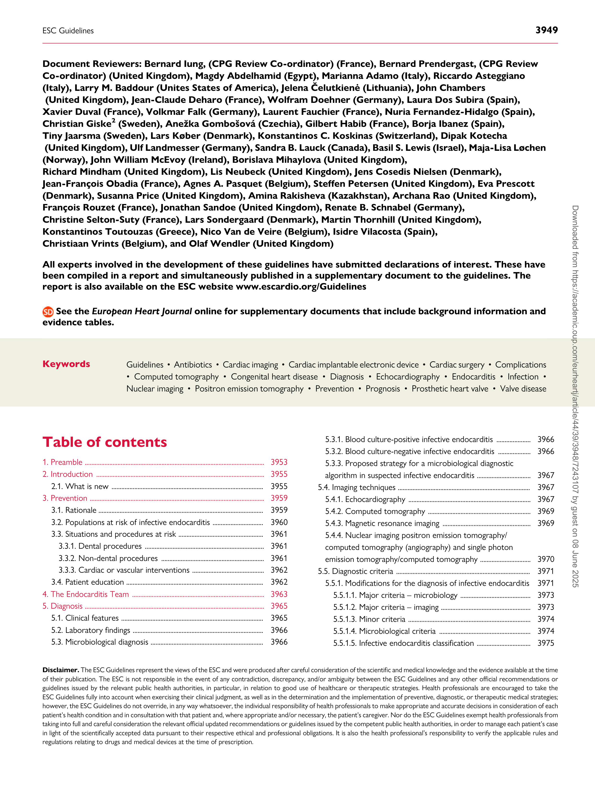
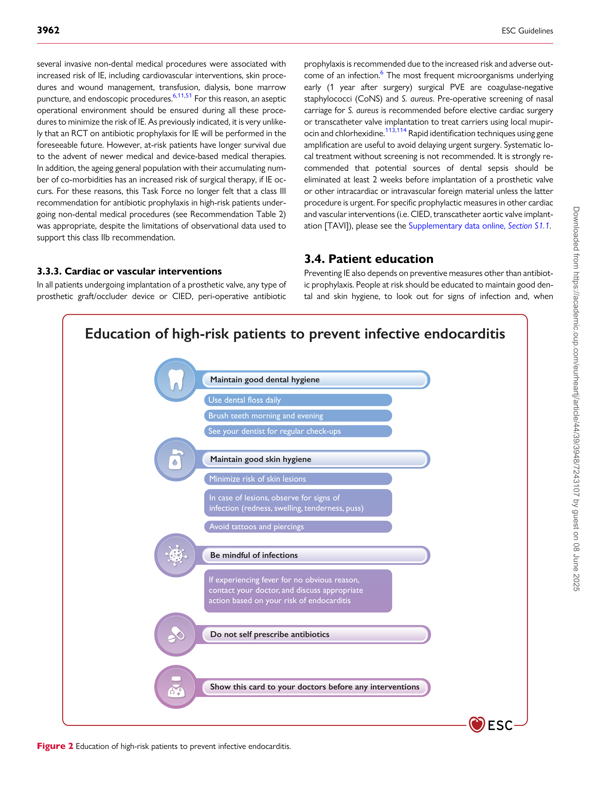
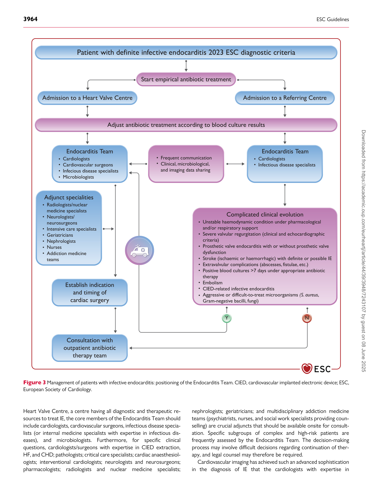

European Heart Journal (2023) **44**, 3948–4042
[https://doi.org/10.1093/eurheartj/ehad193](https://doi.org/10.1093/eurheartj/ehad193)

###### **ESC GUIDELINES**

## **2023 ESC Guidelines for the management ** **of endocarditis**
### **Developed by the task force on the management of endocarditis ** **of the European Society of Cardiology (ESC)** ***Endorsed by the European Association for Cardio-Thoracic Surgery *** ***(EACTS) and the European Association of Nuclear Medicine (EANM)***
###### **Authors/Task Force Members: Victoria Delgado * [†], (Chairperson) (Spain), ** **Nina Ajmone Marsan  ‡, (Task Force Co-ordinator) (Netherlands), ** **Suzanne de Waha [‡], (Task Force Co-ordinator) (Germany), Nikolaos Bonaros ** **(Austria), Margarita Brida  (Croatia), Haran Burri  (Switzerland), ** **Stefano Caselli  (Switzerland), Torsten Doenst  (Germany), ** **Stephane Ederhy  (France), Paola Anna Erba  1 (Italy), Dan Foldager (Denmark), ** **Emil L. Fosbøl  (Denmark), Jan Kovac (United Kingdom), Carlos A. Mestres ** **(South Africa), Owen I. Miller  (United Kingdom), Jose M. Miro  2 (Spain), ** **Michal Pazdernik  (Czech Republic), Maria Nazarena Pizzi  (Spain), ** **Eduard Quintana  3 (Spain), Trine Bernholdt Rasmussen  (Denmark), ** **Arsen D. Ristić  (Serbia), Josep Rodés-Cabau (Canada), Alessandro Sionis ** **(Spain), Liesl Joanna Zühlke  (South Africa), Michael A. Borger * [†], ** **(Chairperson) (Germany), and ESC Scientific Document Group**

- Corresponding authors: Victoria Delgado, Cardiology, Hospital University Germans Trias i Pujol, Badalona, Spain, and Institute for Health Science Research Germans Trias i Pujol (IGTP),
[Badalona, Spain. Tel: +34 934 65 12 00, E-mail: videlga@gmail.com; and Michael A. Borger, University Department of Cardiac Surgery, Leipzig Heart Center, Leipzig, Germany. Tel: +49-341-](mailto:videlga@gmail.com)
[865-0, E-mail: Michael.Borger@helios-gesundheit.de](mailto:Michael.Borger@helios-gesundheit.de)

- The two Chairpersons contributed equally to the document and are joint corresponding authors.

- The two Task Force Co-ordinators contributed equally to the document.

**Author/Task Force Member affiliations are listed in author information.**

1 Representing the European Association of Nuclear Medicine (EANM)

2 Representing the European Society of Clinical Microbiology and Infectious Diseases (ESCMID)

3 Representing the European Association for Cardio-Thoracic Surgery (EACTS)

**ESC Clinical Practice Guidelines (CPG) Committee: listed in the Appendix.**

**ESC subspecialty communities having participated in the development of this document:**

**Associations:** Association of Cardiovascular Nursing & Allied Professions (ACNAP), Association for Acute CardioVascular Care (ACVC), European Association of Cardiovascular Imaging
(EACVI), European Association of Preventive Cardiology (EAPC), European Association of Percutaneous Cardiovascular Interventions (EAPCI), European Heart Rhythm Association (EHRA),
and Heart Failure Association (HFA).

**Councils:** Council for Cardiology Practice, Council on Stroke.

**Working Groups:** Adult Congenital Heart Disease, Cardiovascular Surgery.

**Patient Forum**

The content of these European Society of Cardiology (ESC) Guidelines has been published for personal and educational use only. No commercial use is authorized. No part of the ESC
Guidelines may be translated or reproduced in any form without written permission from the ESC. Permission can be obtained upon submission of a written request to Oxford
University Press, the publisher of the *European Heart Journal* and the party authorized to handle such permissions on behalf of the ESC (journals.permissions@oup.com).

© The European Society of Cardiology 2023. All rights reserved. For permissions please e-mail: journals.permissions@oup.com.

ESC Guidelines **3949**

**Document Reviewers: Bernard Iung, (CPG Review Co-ordinator) (France), Bernard Prendergast, (CPG Review**
**Co-ordinator) (United Kingdom), Magdy Abdelhamid (Egypt), Marianna Adamo (Italy), Riccardo Asteggiano**
**(Italy), Larry M. Baddour (Unites States of America), Jelena Čelutkienė (Lithuania), John Chambers**
**(United Kingdom), Jean-Claude Deharo (France), Wolfram Doehner (Germany), Laura Dos Subira (Spain),**
**Xavier Duval (France), Volkmar Falk (Germany), Laurent Fauchier (France), Nuria Fernandez-Hidalgo (Spain),**
**Christian Giske** **[2 ]** **(Sweden), Anežka Gombošová (Czechia), Gilbert Habib (France), Borja Ibanez (Spain),**
**Tiny Jaarsma (Sweden), Lars Køber (Denmark), Konstantinos C. Koskinas (Switzerland), Dipak Kotecha**
**(United Kingdom), Ulf Landmesser (Germany), Sandra B. Lauck (Canada), Basil S. Lewis (Israel), Maja-Lisa Løchen**
**(Norway), John William McEvoy (Ireland), Borislava Mihaylova (United Kingdom),**
**Richard Mindham (United Kingdom), Lis Neubeck (United Kingdom), Jens Cosedis Nielsen (Denmark),**
**Jean-François Obadia (France), Agnes A. Pasquet (Belgium), Steffen Petersen (United Kingdom), Eva Prescott**
**(Denmark), Susanna Price (United Kingdom), Amina Rakisheva (Kazakhstan), Archana Rao (United Kingdom),**
**François Rouzet (France), Jonathan Sandoe (United Kingdom), Renate B. Schnabel (Germany),**
**Christine Selton-Suty (France), Lars Sondergaard (Denmark), Martin Thornhill (United Kingdom),**
**Konstantinos Toutouzas (Greece), Nico Van de Veire (Belgium), Isidre Vilacosta (Spain),**
**Christiaan Vrints (Belgium), and Olaf Wendler (United Kingdom)**

**All experts involved in the development of these guidelines have submitted declarations of interest. These have**
**been compiled in a report and simultaneously published in a supplementary document to the guidelines. The**
**report is also available on the ESC website www.escardio.org/Guidelines**

**See the** ***European Heart Journal*** **online for supplementary documents that include background information and**
**evidence tables.**

Keywords Guidelines • Antibiotics • Cardiac imaging • Cardiac implantable electronic device • Cardiac surgery • Complications

           - Computed tomography • Congenital heart disease • Diagnosis • Echocardiography • Endocarditis • Infection •
Nuclear imaging • Positron emission tomography • Prevention • Prognosis • Prosthetic heart valve • Valve disease

#### **Table of contents**

1. Preamble .............................................................................................................. 3953

2. Introduction ....................................................................................................... 3955

2.1. What is new ............................................................................................. 3955

3. Prevention ........................................................................................................... 3959

3.1. Rationale ..................................................................................................... 3959

3.2. Populations at risk of infective endocarditis ............................... 3960

3.3. Situations and procedures at risk .................................................... 3961

3.3.1. Dental procedures ......................................................................... 3961

3.3.2. Non-dental procedures ............................................................... 3961

3.3.3. Cardiac or vascular interventions ............................................ 3962

3.4. Patient education .................................................................................... 3962

4. The Endocarditis Team ................................................................................. 3963

5. Diagnosis .............................................................................................................. 3965

5.1. Clinical features ....................................................................................... 3965

5.2. Laboratory findings ................................................................................ 3966
5.3. Microbiological diagnosis ..................................................................... 3966

5.3.1. Blood culture-positive infective endocarditis ..................... 3966

5.3.2. Blood culture-negative infective endocarditis .................... 3966

5.3.3. Proposed strategy for a microbiological diagnostic

algorithm in suspected infective endocarditis ................................. 3967

5.4. Imaging techniques ................................................................................. 3967

5.4.1. Echocardiography ........................................................................... 3967

5.4.2. Computed tomography ............................................................... 3969

5.4.3. Magnetic resonance imaging ...................................................... 3969

5.4.4. Nuclear imaging positron emission tomography/

computed tomography (angiography) and single photon

emission tomography/computed tomography ............................... 3970

5.5. Diagnostic criteria .................................................................................. 3971
5.5.1. Modifications for the diagnosis of infective endocarditis 3971
5.5.1.1. Major criteria – microbiology ........................................... 3973

5.5.1.2. Major criteria – imaging ....................................................... 3973

5.5.1.3. Minor criteria ........................................................................... 3974

5.5.1.4. Microbiological criteria ........................................................ 3974
5.5.1.5. Infective endocarditis classification ................................. 3975

**Disclaimer.** The ESC Guidelines represent the views of the ESC and were produced after careful consideration of the scientific and medical knowledge and the evidence available at the time
of their publication. The ESC is not responsible in the event of any contradiction, discrepancy, and/or ambiguity between the ESC Guidelines and any other official recommendations or
guidelines issued by the relevant public health authorities, in particular, in relation to good use of healthcare or therapeutic strategies. Health professionals are encouraged to take the
ESC Guidelines fully into account when exercising their clinical judgment, as well as in the determination and the implementation of preventive, diagnostic, or therapeutic medical strategies;
however, the ESC Guidelines do not override, in any way whatsoever, the individual responsibility of health professionals to make appropriate and accurate decisions in consideration of each
patient’s health condition and in consultation with that patient and, where appropriate and/or necessary, the patient’s caregiver. Nor do the ESC Guidelines exempt health professionals from
taking into full and careful consideration the relevant official updated recommendations or guidelines issued by the competent public health authorities, in order to manage each patient’s case
in light of the scientifically accepted data pursuant to their respective ethical and professional obligations. It is also the health professional’s responsibility to verify the applicable rules and
regulations relating to drugs and medical devices at the time of prescription.

**3950** ESC Guidelines

5.5.2. The new 2023 European Society of Cardiology diagnostic

algorithms ....................................................................................................... 3975

6. Prognostic assessment at admission ........................................................ 3975

7. Antimicrobial therapy: principles and methods .................................. 3975

7.1. General principles .................................................................................. 3975

7.2. Penicillin-susceptible oral streptococci and

*Streptococcus gallolyticus* group .................................................................. 3977

7.3. Oral streptococci and *Streptococcus gallolyticus* group

susceptible, increased exposure or resistant to penicillin ............. 3977

7.4. *Streptococcus pneumoniae*, β-haemolytic streptococci

(groups A, B, C, and G) ................................................................................ 3979

7.5. *Granulicatella* and *Abiotrophia* (formerly nutritionally variant

streptococci) ..................................................................................................... 3979

7.6. *Staphylococcus aureus* and coagulase-negative staphylococci 3979

7.7. Methicillin-resistant staphylococci ................................................... 3979

7.8. *Enterococcus* spp. ..................................................................................... 3982

7.9. Gram-negative bacteria ........................................................................ 3983

7.9.1. *Haemophilus, Aggregatibacter, Cardiobacterium, Eikenella,*

*and Kingella* -related species .................................................................... 3983

7.9.2. *Non-Haemophilus, Aggregatibacter, Cardiobacterium,*

*Eikenella, and Kingella* species ................................................................. 3984

7.10. Blood culture-negative infective endocarditis ......................... 3984

7.11. Fungi .......................................................................................................... 3984

7.12. Empirical therapy ................................................................................. 3984

7.13. Outpatient parenteral or oral antibiotic therapy for infective

endocarditis ....................................................................................................... 3985

7.13.1. Parenteral and oral step-down antibiotic treatment .... 3986

7.13.2. Other considerations for outpatient oral or parenteral

antimicrobial therapy ................................................................................. 3986

8. Indications for surgery and management of main infective

endocarditis complications ............................................................................... 3987

8.1. Pre-operative risk assessment .......................................................... 3987

8.2. Heart failure .............................................................................................. 3987

8.2.1. Heart failure in infective endocarditis .................................... 3987

8.2.2. Indications and timing of surgery in the presence of heart

failure in infective endocarditis .............................................................. 3989

8.3. Uncontrolled infection ......................................................................... 3989

8.3.1. Septic shock and persistent infection .................................... 3989

8.3.2. Locally uncontrolled infection ................................................... 3989

8.3.3 Indications and timing of surgery in the presence of

uncontrolled infection ............................................................................... 3990

8.3.3.1. Persistent infection ................................................................ 3990

8.3.3.2. Locally uncontrolled infection .......................................... 3990

8.3.3.3. Infection with resistant or virulent organisms ........... 3990

8.4. Prevention of systemic embolism ................................................... 3990

8.4.1. Incidence of embolic events in infective endocarditis ..... 3990

8.4.2. Predicting the risk of embolism ................................................ 3990

8.4.3. Indications and timing of surgery to prevent embolism in

infective endocarditis ................................................................................. 3990

9. Other complications of infective endocarditis .................................... 3991

9.1. Neurological complications ................................................................ 3991

9.1.1. The role of cerebral imaging in infective endocarditis .... 3992

9.2. Infective aneurysms ............................................................................... 3992

9.3. Splenic complications ............................................................................ 3992

9.4. Myocarditis and pericarditis ............................................................... 3993

9.5. Heart rhythm and conduction disturbances .............................. 3993

9.6. Musculoskeletal manifestations ........................................................ 3993

9.6.1. Osteoarticular infective endocarditis-related infections 3993

9.6.2. Rheumatological manifestations ............................................... 3994

9.7. Acute renal failure .................................................................................. 3994

10. Surgical therapy: principles and methods ........................................... 3994

10.1. Pre-operative and peri-operative management ...................... 3994

10.1.1. Coronary angiography ............................................................... 3994

10.1.2. Extracardiac infection ................................................................. 3995

10.1.3. Intra-operative echocardiography ......................................... 3995

10.2. Other intra-operative considerations ......................................... 3995

10.3. Surgical approach and techniques ................................................ 3995

10.3.1. Choice of valve prosthesis ....................................................... 3996

10.4. Timing of surgery after ischaemic and haemorrhagic stroke 3997

10.5. Post-operative complications ......................................................... 3997

10.6. Management of antithrombotic therapy after surgery ........ 3998

11. Outcome after discharge: follow-up and long-term prognosis . 3998

11.1. Recurrences: relapses and reinfections ...................................... 3998

11.2. First year follow-up ............................................................................. 3999

11.3. Long-term prognosis .......................................................................... 3999
12. Management of specific situations ......................................................... 3999

12.1. Prosthetic valve endocarditis .......................................................... 3999

12.1.1. Definition and pathophysiology ............................................. 4000
12.1.2. Diagnosis .......................................................................................... 4000

12.1.3. Prognosis and treatment .......................................................... 4000

12.2. Endocarditis in the elderly ............................................................... 4000

12.3. Transcatheter prosthetic valve endocarditis ............................ 4001

12.3.1. Endocarditis following transcatheter aortic valve

implantation ................................................................................................... 4001

12.3.1.1. Diagnosis ................................................................................. 4001

12.3.1.2. Prognosis and treatment .................................................. 4001

12.3.2. Endocarditis following transcatheter pulmonary valve

implantation ................................................................................................... 4001

12.3.2.1. Diagnosis ................................................................................. 4002

12.3.2.2. Prognosis and treatment .................................................. 4002

12.4. Infective endocarditis affecting cardiac implantable

electronic devices ............................................................................................ 4002

12.4.1. Definitions of cardiac device infections .............................. 4002
12.4.2. Pathophysiology and microbiology ....................................... 4002

12.4.3. Risk factors ..................................................................................... 4002

12.4.4. Prophylaxis ...................................................................................... 4002

12.4.5. Diagnosis .......................................................................................... 4002

12.4.6. Antimicrobial therapy ................................................................. 4004

12.4.7. Device extraction ......................................................................... 4004

12.4.8. Device reimplantation ................................................................ 4004

12.5. Infective endocarditis in patients admitted to intensive care

units ...................................................................................................................... 4005

12.5.1. Causative microorganisms ....................................................... 4005

12.5.2. Diagnosis .......................................................................................... 4005

12.5.3. Management ................................................................................... 4005

12.6. Right-sided infective endocarditis ................................................. 4005

12.6.1. Diagnosis and complications ................................................... 4006

12.6.2. Endocarditis in people who inject drugs ............................ 4006

12.6.3. Prognosis and treatment .......................................................... 4006

12.6.3.1. Antimicrobial therapy ........................................................ 4006

ESC Guidelines **3951**

12.6.3.2. Surgery ..................................................................................... 4006

12.7. Infective endocarditis in congenital heart disease .................. 4007

12.8. Infective endocarditis in rheumatic heart disease .................. 4008

12.9. Infective endocarditis during pregnancy .................................... 4008

12.10. Infective endocarditis in immunocompromised patients . 4008

12.10.1. Solid organ transplant recipients ........................................ 4008
12.10.2. Patients with human immunodeficiency virus ............... 4008
12.10.3. Patients with neutropaenia ................................................... 4009

12.11. Antithrombotic and anticoagulant therapy in infective

endocarditis ....................................................................................................... 4009

12.12. Non-bacterial thrombotic endocarditis .................................. 4009

12.13. Infective endocarditis and malignancy ...................................... 4010

13. Patient-centred care and shared decision-making in infective

endocarditis ............................................................................................................. 4010

13.1. What is patient-centred care and shared decision-making

and why is it important? ............................................................................... 4010

13.2. Patient-centred care and shared decision-making in infective

endocarditis ....................................................................................................... 4010

14. Sex differences ............................................................................................... 4011

15. Key messages .................................................................................................. 4012

16. Gaps in evidence ............................................................................................ 4013

17. ‘What to do’ and ‘What not to do’ messages from the

Guidelines ................................................................................................................. 4014

18. Supplementary data ...................................................................................... 4020

19. Data availability ............................................................................................... 4020

20. Author information ...................................................................................... 4020

21. Appendix ........................................................................................................... 4021

22. References ........................................................................................................ 4021
#### **Tables of Recommendations**

Recommendation Table 1 — Recommendations for antibiotic

prophylaxis in patients with cardiovascular diseases undergoing
oro-dental procedures at increased risk for infective endocarditis 3961

Recommendation Table 2 — Recommendations for infective

endocarditis prevention in high-risk patients ............................................ 3963

Recommendation Table 3 — Recommendations for infective

endocarditis prevention in cardiac procedures ....................................... 3963

Recommendation Table 4 — Recommendations for the

Endocarditis Team ................................................................................................ 3965

Recommendation Table 5 — Recommendations for the role of

echocardiography in infective endocarditis ................................................ 3969

Recommendation Table 6 — Recommendations for the role of

computed tomography, nuclear imaging, and magnetic resonance in

infective endocarditis ........................................................................................... 3970

Recommendation Table 7 — Recommendations for antibiotic

treatment of infective endocarditis due to oral streptococci and
*Streptococcus gallolyticus* group ........................................................................ 3977

Recommendation Table 8 — Recommendations for antibiotic

treatment of infective endocarditis due to *Staphylococcus* spp. ........ 3980

Recommendation Table 9 — Recommendations for antibiotic

treatment of infective endocarditis due to *Enterococcus* spp. .................. 3982

Recommendation Table 10 — Recommendations for antibiotic

regimens for initial empirical treatment of infective endocarditis
(before pathogen identification) ..................................................................... 3985
Recommendation Table 11 — Recommendations for outpatient

antibiotic treatment of infective endocarditis ........................................... 3987

Recommendation Table 12 — Recommendations for the main

indications of surgery in infective endocarditis (native valve
endocarditis and prosthetic valve endocarditis) ....................................... 3991

Recommendation Table 13 — Recommendations for the treatment

of neurological complications of infective endocarditis ....................... 3992
Recommendation Table 14 — Recommendations for pacemaker
implantation in patients with complete atrioventricular block and

infective endocarditis ........................................................................................... 3993

Recommendation Table 15 — Recommendations for patients with

musculoskeletal manifestations of infective endocarditis .................... 3994

Recommendation Table 16 — Recommendations for pre-operative
coronary anatomy assessment in patients requiring surgery for

infective endocarditis ........................................................................................... 3995

Recommendation Table 17 — Indications and timing of cardiac
surgery after neurological complications in active infective

endocarditis ............................................................................................................. 3997

Recommendation Table 18 — Recommendations for

post-discharge follow-up ................................................................................... 3999
Recommendation Table 19 — Recommendations for prosthetic

valve endocarditis .................................................................................................. 4000

Recommendation Table 20 — Recommendations for cardiovascular

implanted electronic device-related infective endocarditis ................. 4004
Recommendation Table 21 — Recommendations for the surgical
treatment of right-sided infective endocarditis ........................................ 4007

Recommendation Table 22 — Recommendations for the use of

antithrombotic therapy in infective endocarditis .................................... 4009
#### **List of tables**

Table 1 Classes of recommendations .......................................................... 3953

Table 2 Levels of evidence ................................................................................ 3953

Table 3 New recommendations .................................................................... 3955

Table 4 Revised recommendations ............................................................... 3957

Table 5 General prevention measures to be followed in patients at
high and intermediate risk of infective endocarditis .............................. 3960
Table 6 Prophylactic antibiotic regime for high-risk dental
procedures ............................................................................................................... 3961

Table 7 Members of the Endocarditis Team ............................................ 3963

Table 8 Cardiac and non-cardiac risk factors ........................................... 3965

Table 9 Investigation of rare causes of blood culture-negative

infective endocarditis ........................................................................................... 3967

Table 10 Definitions of the 2023 European Society of Cardiology
modified diagnostic criteria of infective endocarditis ............................. 3971
Table 11 Antibiotic treatment of blood culture-negative infective

endocarditis ............................................................................................................. 3984

Table 12 Features favouring a non-mechanical valve substitute in the
setting of surgery for acute infective endocarditis ................................. 3997
Table 13 Factors associated with an increased rate of relapse of

infective endocarditis ........................................................................................... 3999

Table 14 ‘What to do’ and ‘What not to do’ .......................................... 4014
#### **List of figures**

Figure 1 Management of patients with infective endocarditis ........... 3954
Figure 2 Education of high-risk patients to prevent infective

endocarditis ............................................................................................................. 3962

Figure 3 Management of patients with infective endocarditis:
positioning of the Endocarditis Team .......................................................... 3964

**3952** ESC Guidelines

Figure 4 Microbiological diagnostic algorithm in culture-positive and
culture-negative infective endocarditis ........................................................ 3968
Figure 5 European Society of Cardiology 2023 algorithm for
diagnosis of native valve infective endocarditis ........................................ 3972
Figure 6 European Society of Cardiology 2023 algorithm for diagnosis
of prosthetic valve infective endocarditis ........................................................... 3973
Figure 7 European Society of Cardiology 2023 algorithm for
diagnosis of cardiac device-related infective endocarditis ................... 3974
Figure 8 Phases of antibiotic treatment for infective endocarditis in
relation to outpatient parenteral antibiotic therapy and partial oral

endocarditis treatment ....................................................................................... 3976

Figure 9 Flowchart to assess clinical stability based on the Partial Oral

Treatment of Endocarditis trial ...................................................................... 3986

Figure 10 Proposed surgical timing for infective endocarditis ........... 3988
Figure 11 Surgery for infective endocarditis following stroke ........... 3996
Figure 12 Algorithm differentiating relapse from reinfection ............ 3998
Figure 13 Management of cardiovascular implanted electronic

device-related infective endocarditis ............................................................ 4003

Figure 14 Concept of patient-centred care in infective endocarditis 4011
#### **Abbreviations and acronyms**

[18F]FDG 18 F-fluorodeoxyglucose
99mTc-HMPAO 99m Technetium-hexamethylpropyleneamine

oxime

AIDS Acquired immune deficiency syndrome
AEPEI Association for the Study and Prevention of
Infective Endocarditis Study
ANCLA Anaemia, NYHA class IV, critical state, large
intracardiac destruction, surgery of thoracic aorta
APLs Antiphospholipid syndrome

AUC Area under the curve

AVB Atrioventricular block

AVN Atrioventricular node

BCNIE Blood culture-negative infective endocarditis
BMI Body mass index
CAD Coronary artery disease
CHD Congenital heart disease
CI Confidence interval
CIED Cardiovascular implanted electronic device
CNS Central nervous system
CoNS Coagulase-negative staphylococci
CPB Cardio-pulmonary bypass
CRT Cardiac resynchronization therapy
CT Computed tomography
CTA Computed tomography angiography
DIC Disseminated intravascular coagulation
DNA Deoxyribonucleic acid
DSA Digital subtraction angiography
ECG Electrocardiogram
EHRA European Heart Rhythm Association
ESC European Society of Cardiology
EUCAST European Committee on Antimicrobial
Susceptibility Testing
EURO-ENDO European Infective Endocarditis Registry

HACEK *Haemophilus*, *Aggregatibacter*, *Cardiobacterium*,
*Eikenella*, and *Kingella*

HF Heart failure

HIV Human immunodeficiency virus
HLAR High-level aminoglycoside resistance

i.m. Intramuscular

i.v. Intravenous

ICD Implantable cardioverter defibrillator
ICE-PCS International Collaboration on

Endocarditis-Prospective Cohort Study

ICU Intensive care unit

IE Infective endocarditis

Ig Immunoglobulin
MALDI-TOF MS Matrix-assisted laser desorption ionization
time-of-flight mass spectrometry
MIC Minimum inhibitory concentration
MRA Magnetic resonance angiography
MRI Magnetic resonance imaging
MRSA Methicillin-resistant *Staphylococcus aureus*
MSSA Methicillin-susceptible *Staphylococcus aureus*

NBTE Non-bacterial thrombotic endocarditis

NIHSS National Institutes of Health Stroke Scale Score

NVE Native valve endocarditis

NYHA New York Heart Association

OPAT Outpatient parenteral antibiotic therapy
PADIT Previous procedure on same pocket; Age;
Depressed renal function; Immunocompromised;
Type of procedure
PALSUSE Prosthetic valve, age ≥70, large intracardiac
destruction, *Staphylococcus* spp., urgent surgery,
sex (female), EuroSCORE ≥10
PBP Penicillin-binding protein
PCR Polymerase chain reaction
PET/CT Positron emission tomography/computed
tomography
POET Partial Oral Treatment of Endocarditis (trial)
PPV Positive predictive value

PVE Prosthetic valve endocarditis

PWID People who inject drugs

RCT Randomized clinical trial

RHD Rheumatic heart disease

rRNA Ribosomal ribonucleic acid

SAPS Simplified Acute Physiology Score
SLE Systemic lupus erythematous
SOT Solid organ transplantation
SPECT/CT Single photon emission tomography/computed
tomography
STS Society of Thoracic Surgeons
TAVI Transcatheter aortic valve implantation
TOE Transoesophageal echocardiography
TPVI Transcatheter pulmonary valve implantation
TTE Transthoracic echocardiography

WBC White blood cell

WRAP-IT Worldwide Randomized Antibiotic Envelope

Infection Prevention Trial

ESC Guidelines **3953**

#### **1. Preamble**

Guidelines evaluate and summarize available evidence, with the aim of as-­
sisting health professionals in proposing the best diagnostic or therapeutic
approach for an individual patient with a given condition. Guidelines are in-­
tended for use by health professionals and the European Society of
Cardiology (ESC) makes its Guidelines freely available.

ESC Guidelines do not override the individual responsibility of health
professionals to make appropriate and accurate decisions in consideration
of each patient’s health condition and in consultation with that patient or

Table 1 **Classes of recommendations**

the patient’s caregiver where appropriate and/or necessary. It is also the
health professional’s responsibility to verify the rules and regulations ap-­
plicable in each country to drugs and devices at the time of prescription,
and, where appropriate, to respect the ethical rules of their profession.

ESC Guidelines represent the official position of the ESC on a given
topic and are regularly updated. ESC Policies and Procedures for for-­
mulating and issuing ESC Guidelines can be found on the ESC website
[(https://www.escardio.org/Guidelines).](https://www.escardio.org/Guidelines)

The Members of this Task Force were selected by the ESC to represent
professionals involved with the medical care of patients with this

Table 2 **Levels of evidence**

**3954** ESC Guidelines

Figure 1 Management of patients with infective endocarditis. i.v., intravenous; OPAT, outpatient parenteral antibiotic therapy.

ESC Guidelines **3955**

pathology. The selection procedure aimed to include members from
across the whole of the ESC region and from relevant ESC Subspecialty
Communities. Consideration was given to diversity and inclusion, notably
with respect to gender and country of origin. The Task Force performed a
critical evaluation of diagnostic and therapeutic approaches, including as-­
sessment of the risk-benefit ratio. The strength of every recommendation
and the level of evidence supporting them were weighed and scored ac-­
cording to predefined scales as outlined below. The Task Force followed
ESC voting procedures, and all approved recommendations were subject
to a vote and achieved at least 75% agreement among voting members.

The experts of the writing and reviewing panels provided declaration of
interest forms for all relationships that might be perceived as real or po-­
tential sources of conflicts of interest. Their declarations of interest were
reviewed according to the ESC declaration of interest rules and can be
[found on the ESC website (http://www.escardio.org/Guidelines) and](http://www.escardio.org/Guidelines)
have been compiled in a report published in a supplementary document
with the guidelines. The Task Force received its entire financial support
from the ESC without any involvement from the healthcare industry.

The ESC Clinical Practice Guidelines (CPG) Committee supervises and
co-ordinates the preparation of new guidelines and is responsible for the
approval process. ESC Guidelines undergo extensive review by the CPG
Committee and external experts, including members from across the
whole of the ESC region and from relevant ESC Subspecialty
Communities and National Cardiac Societies. After appropriate revisions,
the guidelines are signed off by all the experts involved in the Task Force.
The finalized document is signed off by the CPG Committee for publica-­
tion in the *European Heart Journal* . The guidelines were developed after
careful consideration of the scientific and medical knowledge and the evi-­
dence available at the time of their writing. Tables of evidence summariz-­
ing the findings of studies informing development of the guidelines are
included. The ESC warns readers that the technical language may be mis-­
interpreted and declines any responsibility in this respect.

Off-label use of medication may be presented in this guideline if a suf-­
ficient level of evidence shows that it can be considered medically ap-­
propriate for a given condition. However, the final decisions
concerning an individual patient must be made by the responsible health
professional giving special consideration to:

- The specific situation of the patient. Unless otherwise provided for
by national regulations, off-label use of medication should be limited
to situations where it is in the patient’s interest with regard to the
quality, safety, and efficacy of care, and only after the patient has
been informed and has provided consent.

- Country-specific health regulations, indications by governmental
drug regulatory agencies, and the ethical rules to which health profes-­
sionals are subject, where applicable.
#### **2. Introduction**

Infective endocarditis (IE) is a major public health challenge. [1] In 2019, the
estimated incidence of IE was 13.8 cases per 100 000 subjects per year,
and IE accounted for 66 300 deaths worldwide. [2] Due to the associated

high morbidity and mortality (1723.59 disability-adjusted life years and
0.87 death cases per 100 000 population, respectively), identification of
the best preventive strategies has been the focus of research. [2][,][3] Since the
publication of the *2015 ESC Guidelines for the management of infective endo-­*
*carditis*, [4] important new data have been published mandating an update of
recommendations. First, the population at risk of IE has increased and new
data on IE in different clinical scenarios have arisen. [5][–][11] Furthermore, the

emerging and increasing antibiotic resistance among oral streptococci is

of concern. The rate of resistance to azythromycin and clarithromycin is
higher than that to penicillin. [12] Whether changes in national guidelines on
the use of antibiotic prophylaxis have resulted in an increase in the incidence
of IE remains unclear. [13][–][18] It is likely that the increased use of diagnostic
tools to diagnose IE is an important contributor to the increase in the inci-­
dence of IE. The use of echocardiography has probably increased in patients
with positive blood cultures for *Enteroccus faecalis*, *Staphylococcus aureus*, or
streptococci due to the associated increased risk of IE. [19] In addition, com-­
puted tomography (CT) and nuclear imaging techniques have increased the
number of definite IE cases particularly among patients with prosthetic
valves and implantable cardiac devices. [20][–][22]

Data on the contemporary characterization of patients with IE have
been taken into consideration to update the recommendations on the
diagnosis and management of patients with IE. [5][,][19][,][23][–][41] Furthermore,
the recommendations on antibiotic therapy have been updated based
on the susceptibility of various microorganisms defined by the
European Committee on Antimicrobial Susceptibility Testing
(EUCAST) clinical breakpoints. [42] Recommendations on outpatient par-­
enteral antibiotic therapy (OPAT) or oral antibiotic treatment have

been included based on the results of the Partial Oral Treatment of
Endocarditis (POET) randomized trial and other trials. [43][–][46]

The main objective of the current Task Force was to provide clear
and simple recommendations, assisting healthcare providers in their
clinical decision-making. These recommendations were obtained by ex-­
pert consensus after thorough review of the available literature (see
[Supplementary data, evidence tables online). An evidence-based scor-­](http://academic.oup.com/eurheartj/article-lookup/doi/10.1093/eurheartj/ehad193#supplementary-data)
ing system was used, based on a classification of the strength of recom-­
mendations and the levels of evidence.

**2.1. What is new**

Table 3 **New recommendations**

**Recommendation** **Class** **Level**

**Section 3. Recommendation Table 1 — Recommendations for**

**antibiotic prophylaxis in patients with cardiovascular diseases**

**undergoing oro-dental procedures at increased risk of infective**

**endocarditis**

|General prevention measures are recommended in individuals at high and intermediate risk of IE.|I|C|
|---|---|---|
|Antibiotic prophylaxis is recommended in patients with ventricular assist devices.|I|C|
|Antibiotic prophylaxis may be considered in recipients of heart transplant.|IIb|C|

**Section 3. Recommendation Table 2 — Recommendations for**

**infective endocarditis prevention in high-risk patients**

Systemic antibiotic prophylaxis may be considered for

high-risk patients undergoing an invasive diagnostic or

therapeutic procedure of the respiratory,

gastrointestinal, genitourinary tract, skin, or

musculoskeletal systems.

**IIb** **C**

**Section 3. Recommendation Table 3 — Recommendations for**

**infective endocarditis prevention in cardiac procedures**

Optimal pre-procedural aseptic measures of the site of

implantation is recommended to prevent CIED

infections.

**I** **B**

*Continued*

**3956** ESC Guidelines

**Section 9. Recommendation Table 13 — Recommendations for**

**the treatment of neurological complications of infective**

**endocarditis**

|Surgical standard aseptic measures are recommended during the insertion and manipulation of catheters in the catheterization laboratory environment.|I|C|
|---|---|---|
|Antibiotic prophylaxis covering for common skin flora including Enterococcus spp. and S. aureus should be considered before TAVI and other transcatheter valvular procedures.|IIa|C|

|In embolic stroke, mechanical thrombectomy may be considered if the expertise is available in a timely manner.|IIb|C|
|---|---|---|
|Thrombolytic therapy is not recommended in embolic stroke due to IE.|III|C|

**Section 5. Recommendation Table 5 — Recommendations for**

**the role of echocardiography in infective endocarditis**

**Section 9. Recommendation Table 14 — Recommendations for**

**pacemaker implantation in patients with complete**

**atrioventricular block and infective endocarditis**

TOE is recommended when the patient is stable before

switching from intravenous to oral antibiotic therapy.

**I** **B**

**Section 5. Recommendation Table 6 — Recommendations for**

**the role of computed tomography, nuclear imaging, and**

**magnetic resonance in infective endocarditis**

Immediate epicardial pacemaker implantation should be

considered in patients undergoing surgery for valvular IE

and complete AVB if one of the following predictors of

persistent AVB is present: pre-operative conduction

abnormality, *S. aureus* infection, aortic root abscess,

tricuspid valve involvement, or previous valvular surgery.

**IIa** **C**

**Section 9. Recommendation Table 15 — Recommendations for**

**patients with musculoskeletal manifestations of infective**

**endocarditis**

|MRI or PET/CT is recommended in patients with suspected spondylodiscitis and vertebral osteomyelitis complicating IE.|I|C|
|---|---|---|
|TTE/TOE is recommended to rule out IE in patients with spondylodiscitis and/or septic arthritis with positive blood cultures for typical IE microorganisms.|I|C|
|More than 6-week antibiotic therapy should be considered in patients with osteoarticular IE-related lesions caused by difficult-to-treat microorganisms, such as S. aureus or Candida spp., and/or complicated with severe vertebral destruction or abscesses.|IIa|C|

**Section 10. Recommendation Table 16 — Recommendations for**

**pre-operative coronary anatomy assessment in patients**

**requiring surgery for infective endocarditis**

|Cardiac CTA is recommended in patients with possible NVE to detect valvular lesions and confirm the diagnosis of IE.|I|B|
|---|---|---|
|[18F]FDG-PET/CT(A) and cardiac CTA are recommended in possible PVE to detect valvular lesions and confirm the diagnosis of IE.|I|B|
|[18F]FDG-PET/CT(A) may be considered in possible CIED-related IE to confirm the diagnosis of IE.|IIb|B|
|Cardiac CTA is recommended in NVE and PVE to diagnose paravalvular or periprosthetic complications if echocardiography is inconclusive.|I|B|
|Brain and whole-body imaging (CT, [18F]FDG-PET/ CT, and/or MRI) are recommended in symptomatic patients with NVE and PVE to detect peripheral lesions or add minor diagnostic criteria.|I|B|
|WBC SPECT/CT should be considered in patients with high clinical suspicion of PVE when echocardiography is negative or inconclusive and when PET/CT is unavailable.|IIa|C|
|Brain and whole-body imaging (CT, [18F]FDG-PET/ CT, and MRI) in NVE and PVE may be considered for screening of peripheral lesions in asymptomatic patients.|IIb|B|

**Section 7. Recommendation Table 11 — Recommendations for**

**outpatient antibiotic treatment of infective endocarditis**

|Outpatient parenteral antibiotic treatment should be considered in patients with left-sided IE caused by Streptococcus spp., E. faecalis, S. aureus, or CoNS who were receiving appropriate i.v. antibiotic treatment for at least 10 days (or at least 7 days after cardiac surgery), are clinically stable, and who do not show signs of abscess formation or valve abnormalities requiring surgery on TOE.|IIa|A|
|---|---|---|
|Outpatient parenteral antibiotic treatment is not recommended in patients with IE caused by highly diffci ult-to-treat microorganisms, liver cirrhosis (Child– Pugh B or C), severe cerebral nervous system emboli, untreated large extracardiac abscesses, heart valve complications, or other severe conditions requiring surgery, severe post-surgical complications, and in PWID-related IE.|III|C|

*Continued*

|In haemodynamically stable patients with aortic valve vegetations who require cardiac surgery and are high I B risk of CAD, a high-resolution multislice coronary CTA is recommended.|Col2|Col3|
|---|---|---|
|Invasive coronary angiography is recommended in patients requiring heart surgery who are high risk of CAD, in the absence of aortic valve vegetations.|I|C|
|In emergency situations, valvular surgery without pre-operative coronary anatomy assessment regardless of CAD risk should be considered.|IIa|C|
|Invasive coronary angiography may be considered despite the presence of aortic valve vegetations in selected patients with known CAD or at high risk of signifci ant obstructive CAD.|IIb|C|

clinical status due to HF, uncontrolled infection, or

persistent high embolic risk, urgent or emergency

surgery should be considered weighing the likelihood of

a meaningful neurological outcome.

**Section 10. Recommendation Table 17 — Indications and timing**

**of cardiac surgery after neurological complications in active**

**infective endocarditis**

In patients with intracranial haemorrhage and unstable

**IIa** **C**

*Continued*

ESC Guidelines **3957**

**Section 11. Recommendation Table 18 — Recommendations for**

**post-discharge follow-up**

|In non-S. aureus CIED-related endocarditis without valve involvement or lead vegetations, and if follow-up blood cultures are negative without septic emboli, 2 weeks of antibiotic treatment may be considered following device extraction.|IIb|C|
|---|---|---|
|Removal of CIED after a single positive blood culture, with no other clinical evidence of infection, is not recommended.|III|C|

**Section 12. Recommendation Table 21 — Recommendations for**

**the surgical treatment of right-sided infective endocarditis**

|Patient education on the risk of recurrence and preventive measures, with emphasis on dental health, and based on the individual risk profile, is recommended during follow-up.|I|C|
|---|---|---|
|Addiction treatment for patients following PWID-related IE is recommended.|I|C|
|Cardiac rehabilitation including physical exercise training should be considered in clinically stable patients based on an individual assessment.|IIa|C|
|Psychosocial support may be considered to be integrated in follow-up care, including screening for anxiety and depression, and referral to relevant psychological treatment.|IIb|C|

**Section 12. Recommendation Table 19 — Recommendations for**

**prosthetic valve endocarditis**

Surgery is recommended for early PVE (within 6

months of valve surgery) with new valve replacement

and complete debridement.

**I** **C**

**Section 12. Recommendation Table 20 — Recommendations for**

**cardiovascular implanted electronic device-related infective**

**endocarditis**

|Tricuspid valve repair should be considered instead of valve replacement, when possible.|IIa|B|
|---|---|---|
|Surgery should be considered in patients with right-sided IE who are receiving appropriate antibiotic therapy and present persistent bacteraemia/sepsis after at least 1 week of appropriate antibiotic therapy.|IIa|C|
|Prophylactic placement of an epicardial pacing lead should be considered at the time of tricuspid valve surgical procedures.|IIa|C|
|Debulking of right intra-atrial septic masses by aspiration may be considered in select patients who are high risk of surgery.|IIb|C|

|Complete system extraction without delay is recommended in patients with definite CIED-related IE under initial empirical antibiotic therapy.|I|B|
|---|---|---|
|Extension of antibiotic treatment of CIED-related endocarditis to (4–)6 weeks following device extraction should be considered in the presence of septic emboli or prosthetic valves.|IIa|C|
|Use of an antibiotic envelope may be considered in select high-risk patients undergoing CIED reimplantation to reduce risk of infection.|IIb|B|

Table 4 **Revised recommendations**

*Continued*

[18F]FDG-PET, 18 F-fluorodeoxyglucose positron emission tomography; AVB,
atrioventricular block; CAD, coronary artery disease; CIED, cardiovascular implanted
electronic device; CoNS, coagulase-negative staphylococci; CT, computed tomography;
CTA, computed tomography angiography; HF, heart failure; IE, infective endocarditis; i.v.,
intravenous; MRI, magnetic resonance imaging; NVE, native valve endocarditis; PET,
positron emission tomography; PVE, prosthetic valve endocarditis; PWID, people who
inject drugs; TAVI, transcatheter aortic valve implantation; TOE, transoesophageal
echocardiography; TTE, transthoracic echocardiography; WBC SPECT/CT, white blood
cell single photon emission tomography/computed tomography.

**Recommendations in 2015 version** **Class** **Level** **Recommendations in 2023 version** **Class** **Level**

**Section 3. Recommendation Table 1 — Recommendations for antibiotic prophylaxis in patients with cardiovascular diseases undergoing**

**oro-dental procedures at increased risk of infective endocarditis**

|Antibiotic prophylaxis should be considered for patients at highest risk of IE: (1) Patients with any prosthetic valve, including a transcatheter valve, or those in whom any prosthetic material was used for cardiac valve repair. (2) Patients with a previous episode of IE. (3) Patients with CHD: (a) Any type of cyanotic CHD. (b) Any type of CHD repaired with a prosthetic material, whether placed surgically or by percutaneous techniques, up to 6 months after the procedure or lifelong if residual shunt.|IIa|C|Antibiotic prophylaxis is recommended in patients with previous IE.|I|B|
|---|---|---|---|---|---|
|Antibiotic prophylaxis should be considered for patients at highest risk of IE: (1) Patients with any prosthetic valve, including a transcatheter valve, or those in whom any prosthetic material was used for cardiac valve repair. (2) Patients with a previous episode of IE. (3) Patients with CHD: (a) Any type of cyanotic CHD. (b) Any type of CHD repaired with a prosthetic material, whether placed surgically or by percutaneous techniques, up to 6 months after the procedure or lifelong if residual shunt.|IIa|C|Antibiotic prophylaxis is recommended in patients with surgically implanted prosthetic valves and with any material used for surgical cardiac valve repair.|I|C|
|Antibiotic prophylaxis should be considered for patients at highest risk of IE: (1) Patients with any prosthetic valve, including a transcatheter valve, or those in whom any prosthetic material was used for cardiac valve repair. (2) Patients with a previous episode of IE. (3) Patients with CHD: (a) Any type of cyanotic CHD. (b) Any type of CHD repaired with a prosthetic material, whether placed surgically or by percutaneous techniques, up to 6 months after the procedure or lifelong if residual shunt.|IIa|C|Antibiotic prophylaxis is recommended in patients with transcatheter implanted aortic and pulmonary valvular prostheses.|I|C|
|Antibiotic prophylaxis should be considered for patients at highest risk of IE: (1) Patients with any prosthetic valve, including a transcatheter valve, or those in whom any prosthetic material was used for cardiac valve repair. (2) Patients with a previous episode of IE. (3) Patients with CHD: (a) Any type of cyanotic CHD. (b) Any type of CHD repaired with a prosthetic material, whether placed surgically or by percutaneous techniques, up to 6 months after the procedure or lifelong if residual shunt.|IIa|C|Antibiotic prophylaxis should be considered in patients with transcatheter mitral and tricuspid valve repair.|IIa|C|

*Continued*

**3958** ESC Guidelines

Antibiotic prophylaxis is recommended in patients with

untreated cyanotic CHD, and patients treated with

surgery or transcatheter procedures with post-operative

palliative shunts, conduits, or other prostheses. After

surgical repair, in the absence of residual defects or valve

prostheses, antibiotic prophylaxis is recommended only

for the first 6 months after the procedure.

**Section 4. Recommendation Table 4 — Recommendations for the Endocarditis Team**

**I** **C**

|Patients with complicated IE should be evaluated and managed at an early stage in a reference centre, with immediate surgical facilities and the presence of a multidisciplinary ‘Endocarditis Team’, including an infectious disease specialist, a microbiologist, a cardiologist, imaging specialists, a cardiac surgeon and, if needed, a specialist in CHD.|IIa|B|Diagnosis and management of patients with complicated IE are recommended to be performed at an early stage in a Heart Valve Centre, with immediate surgical facilities and an ‘Endocarditis Team’ to improve the outcomes.|I|B|
|---|---|---|---|---|---|
|For patients with uncomplicated IE managed in a non-reference centre, early and regular communication with the reference centre and, when needed, visits to the reference centre should be made.|IIa|B|For patients with uncomplicated IE managed in a Referring Centre, early and regular communication between the local and the Heart Valve Centre Endocarditis Teams is recommended to improve the outcomes of the patients.|I|B|

**Section 5. Recommendation Table 5 — Recommendations for the role of echocardiography in infective endocarditis**

TOE should be considered in patients with suspected IE,

even in cases with positive TTE, except in isolated

right-sided native valve IE with good quality TTE

examination and unequivocal echocardiographic finding.

**I** **C**

**IIa** **C**

TOE is recommended in patients with suspected IE, even

in cases with positive TTE, except in isolated right-sided

native valve IE with good quality TTE examination and

unequivocal echocardiographic findings.

**Section 8. Recommendation Table 12 — Recommendations for the main indications of surgery in infective endocarditis (native valve**

**endocarditis and prosthetic valve endocarditis)**

|Aortic or mitral NVE with vegetations >10 mm, associated with severe valve stenosis or regurgitation, and low operative risk (urgent surgery should be considered).|IIa|B|Urgent surgery is recommended in IE with vegetation ≥10 mm and other indications for surgery.|I|C|
|---|---|---|---|---|---|
|Aortic or mitral NVE or PVE with isolated large vegetations (>15 mm) and no other indication for surgery (urgent surgery may be considered).|IIb|C|Urgent surgery may be considered in aortic or mitral IE with vegetation ≥10 mm and without severe valve dysfunction or without clinical evidence of embolism and low surgical risk.|IIb|B|

**Section 9. Recommendation Table 13 — Recommendations for the treatment of neurological complications of infective endocarditis**

|Intracranial infectious aneurysms should be looked for in patients with IE and neurological symptoms. CT or MRA should be considered for diagnosis. If non-invasive techniques are negative and the suspicion of intracranial aneurysm remains, conventional angiography should be considered.|IIa|B|Brain CT or MRA is recommended in patients with IE and suspected infective cerebral aneurysms.|I|B|
|---|---|---|---|---|---|
|Intracranial infectious aneurysms should be looked for in patients with IE and neurological symptoms. CT or MRA should be considered for diagnosis. If non-invasive techniques are negative and the suspicion of intracranial aneurysm remains, conventional angiography should be considered.|IIa|B|If non-invasive techniques are negative and the suspicion of infective aneurysm remains, invasive angiography should be considered.|IIa|B|

**Section 12. Recommendation Table 20 — Recommendations for cardiovascular implanted electronic device-related infective**

**endocarditis**

|Routine antibiotic prophylaxis is recommended before device implantation.|I|B|Antibiotic prophylaxis covering S. aureus is recommended for CIED implantation.|I|A|
|---|---|---|---|---|---|
|TOE is recommended in patients with suspected cardiac device-related infective endocarditis with positive or negative blood cultures, independent of the results of TTE, to evaluate lead-related endocarditis and heart valve infection.|I|C|TTE and TOE are both recommended in case of suspected CIED-related IE to identify vegetations.|I|B|
|In patients with NVE or PVE and an intracardiac device with no evidence of associated device infection, complete hardware extraction may be considered.|IIb|C|Complete CIED extraction should be considered in case of valvular IE, even without defni ite lead involvement, taking into account the identifei d pathogen and requirement for valve surgery.|IIa|C|

*Continued*

ESC Guidelines **3959**

|Complete hardware removal should be considered on the basis of occult infection without another apparent source of infection.|IIa|C|In cases of possible CIED-related IE or occult Gram-positive bacteraemia or fungaemia, complete system removal should be considered in case bacteraemia/fungaemia persists after a course of antimicrobial therapy.|IIa|C|
|---|---|---|---|---|---|
|Complete hardware removal should be considered on the basis of occult infection without another apparent source of infection.|IIa|C|In cases of possible CIED-related IE with occult Gram-negative bacteraemia, complete system removal may be considered in case of persistent/relapsing bacteraemia after a course of antimicrobial therapy.|IIb|C|
|When indicated, definite reimplantation should be postponed if possible, to allow a few days or weeks of antibiotic therapy.|IIa|C|If CIED reimplantation is indicated after extraction for CIED-related IE, it is recommended to be performed at a site distant from the previous generator, as late as possible, once signs and symptoms of infection have abated and until blood cultures are negative for at least 72 h in the absence of vegetations, and negative for at least 2 weeks if vegetations were visualized.|I|C|

**Section 12. Recommendation Table 21 — Recommendations for the surgical treatment of right-sided infective endocarditis**

|Surgical treatment should be considered in the following scenarios:|Col2|Col3|Surgery is recommended in patients with right-sided IE who are receiving appropriate antibiotic therapy for the following scenarios:|Col5|Col6|
|---|---|---|---|---|---|
|• Microorganisms difficult to eradicate (e.g. persistent fungi) or bacteraemia for >7 days (e.g. S. aureus, P. aeruginosa) despite adequate antimicrobial therapy; or • Persistent tricuspid valve vegetations >20 mm after recurrent pulmonary emboli with or without concomitant right HF; or • Right HF secondary to severe tricuspid regurgitation with poor response to diuretic therapy.|IIa|C|Right ventricular dysfunction secondary to acute severe tricuspid regurgitation non-responsive to diuretics.|I|B|
|• Microorganisms difficult to eradicate (e.g. persistent fungi) or bacteraemia for >7 days (e.g. S. aureus, P. aeruginosa) despite adequate antimicrobial therapy; or • Persistent tricuspid valve vegetations >20 mm after recurrent pulmonary emboli with or without concomitant right HF; or • Right HF secondary to severe tricuspid regurgitation with poor response to diuretic therapy.|IIa|C|Persistent vegetation with respiratory insuffci iency requiring ventilatory support after recurrent pulmonary emboli.|I|B|
|• Microorganisms difficult to eradicate (e.g. persistent fungi) or bacteraemia for >7 days (e.g. S. aureus, P. aeruginosa) despite adequate antimicrobial therapy; or • Persistent tricuspid valve vegetations >20 mm after recurrent pulmonary emboli with or without concomitant right HF; or • Right HF secondary to severe tricuspid regurgitation with poor response to diuretic therapy.|IIa|C|Large residual tricuspid vegetations (>20 mm) after recurrent septic pulmonary emboli.|I|C|
|• Microorganisms difficult to eradicate (e.g. persistent fungi) or bacteraemia for >7 days (e.g. S. aureus, P. aeruginosa) despite adequate antimicrobial therapy; or • Persistent tricuspid valve vegetations >20 mm after recurrent pulmonary emboli with or without concomitant right HF; or • Right HF secondary to severe tricuspid regurgitation with poor response to diuretic therapy.|IIa|C|Patients with simultaneous involvement of left-heart structures.|I|C|

**Section 12. Recommendation Table 22 — Recommendations for the use of antithrombotic therapy in infective endocarditis**

Interruption of antiplatelet therapy is recommended in

the presence of major bleeding. **I** **B**

Interruption of antiplatelet or anticoagulant therapy is

recommended in the presence of major bleeding

(including intracranial haemorrhage).

**I** **C**

CHD, congenital heart disease; CIED, cardiovascular implanted electronic device; CT, computed tomography; HF, heart failure; IE, infective endocarditis; MRA, magnetic resonance
angiography; NVE, native valve endocarditis; PVE, prosthetic valve endocarditis; TOE, transoesophageal echocardiography; TTE, transthoracic echocardiography.

#### **3. Prevention**

**3.1. Rationale**

The development of IE usually requires several conditions, including the
presence of predisposing risk factors (i.e. a surface/structure that could
be colonized by bacteria), pathogens entering the bloodstream, and the
competence of the host’s immune response. The role of predisposing
risk factors has been recently underscored by Thornhill *et al.* [47]

Predisposing risk factors conveying a moderate and high risk of IE
had an incidence of 280 and 497 cases per 100 000 subjects per year,
respectively. [47]

The portals of entry of bacteria/fungi are variable and include: (i) in-­
fections of the skin, oral cavity, gastrointestinal, or genitourinary system;
(ii) direct inoculation in people who inject drugs (PWID), or by any un-­
safe or unprotected vascular puncture; (iii) healthcare exposure (in-­
cluding a variety of invasive diagnostic or therapeutic procedures,
such as transcatheter or surgical techniques). [6][,][11][,][48][–][50]

The oral cavity is colonized by relevant commensal flora, including
oral group streptococci, and represents an important entry port.
Oral surgery procedures (including all extractions, periodontal surgery,

implant surgery, and oral biopsies) and dental procedures that involve
manipulation of the gingival or periapical region of the teeth are consid-­
ered at high risk of causing bacteraemia. [11][,][48][,][49][,][51]

Successful antibiotic prophylaxis assumes that reducing the bacter-­
aemia associated with medical procedures will lead to a reduced risk
of IE. This concept was supported by a few animal models and obser-­
vational studies that led to the recommendation for antibiotic prophy-­
laxis in a large number of patients with predisposing cardiac conditions
undergoing a wide range of procedures. [4][,][14][,][52][–][60]

However, systematic use of antibiotic prophylaxis has been ques-­
tioned based on several considerations, the most important being the
lack of randomized clinical trials (RCTs) demonstrating the efficacy of
antibiotic prophylaxis prior to medical procedures in preventing IE.
Such trials would entail enrolment of a very large number of individuals
and prolonged follow-up, making the feasibility of such studies improb-­
able. Furthermore, since the standard of care for high-risk individuals is
antibiotic prophylaxis (to date, mostly before invasive oro-dental pro-­
cedures), there may not be sufficient equipoise to perform such RCTs.
Finally, the costs of performing such trials have been considered un-­
acceptable. [61] To overcome these limitations, population-based studies

**3960** ESC Guidelines

have evaluated the efficacy of antibiotic prophylaxis using bacteraemia
as a surrogate of IE. [16][–][18][,][52][,][62] However, the relationship between bac-­
teraemia and IE is not straightforward. Bacteraemia may be caused by
daily activities such as tooth brushing, flossing, and chewing, and al-­
though these constitute low-level bacteraemia, they occur repetitively
and may therefore outweigh the risk of bacteraemia associated with
dental procedures. [48][,][49] A meta-analysis of 36 studies, including 21 trials
that investigated the effect of antibiotic prophylaxis on the incidence of
bacteraemia following dental procedures, demonstrated that antibiotic
prophylaxis is effective in reducing the incidence of bacteraemia, but did
not lead to a statistically significant protective effect against IE in casecontrol studies. [52] Additionally, the potential risk of anaphylaxis, [63] or
other adverse side effects in a small minority of patients, and the fact
that a widespread use of antibiotics may be associated with antibiotic
resistance, are areas of concern. [57][,][58][,][64][–][67] While some studies did not
demonstrate significant increases in IE-related hospitalizations and
death rates after scaling down antibiotic prophylaxis indications, [68][–][77]

others showed an increase in the incidence of IE among individuals at
moderate and high risk of IE. [13][,][26][,][59][,][78][–][81] A meta-analysis including 16
studies reporting over 1.3 million cases of IE has shown that restricting
antibiotic prophylaxis to only high-risk individuals has not resulted in an
increase in the incidence of streptococcal IE in a North American popu-­
lation (despite the fact that it was unable to draw that conclusion for
other populations). [18] In contrast, a systematic review including multiple
nationwide population-based studies in Europe has shown a 4% per
year rise in the incidence of IE. [82] These contrasting results may be ex-­
plained by differences in the methodology of the studies (retrospective,
population- or health-system-based studies that relied on claims data or
epidemiological observations to estimate the incidence of IE), greater
disease diagnosis with the use of newer imaging technologies, lack of
microbiological data, and the lack of specific International
Classification of Diseases codes for oral streptococci. [83] Recently, it
has been shown that antibiotic prophylaxis in high-risk individuals was
associated with a significant reduction of IE after invasive dental proce-­
dures (particularly extractions and oral surgical procedures). [11][,][51] After
careful consideration of all the new studies published after 2015, the
present Task Force decided to revise and update the risk categories
for IE, strengthening the recommendation of antibiotic prophylaxis,
clarifying the definition of the population at risk, and considering the ad-­
vances in transcatheter valve interventions.

**3.2. Populations at risk of infective**
**endocarditis**

The groups of individuals at high risk of IE in whom antibiotic prophy-­
laxis is recommended or should be considered include the following:

(i) Patients with previous IE: the highest risk of IE is observed in pa-­

tients with previous history of IE who have an ominous prognosis
during IE-related hospitalization. Patients with recurrent IE more
frequently have prosthetic valves or prosthetic material, are
more commonly PWID, or have staphylococcal IE. [47][,][84][–][86]

(ii) Patients with surgically implanted prosthetic valves, with transcath-­

eter implanted prosthetic valves, and with any material used for
cardiac valve repair: the increased risk of IE in these patients, com-­
bined with the ominous outcomes as compared with patients with
native IE (NVE), make antibiotic prophylaxis advisable in this pa-­
tient group. Patients with prosthetic valve endocarditis (PVE)
have an in-hospital mortality rate that is twice as high with more
complications (e.g. heart failure [HF], conduction disturbances)
as compared with patients with NVE, regardless of the

pathogen. [87][,][88] Furthermore, mitral and aortic bioprostheses may
be associated with increased risk of IE as compared with mechan-­
ical prostheses, [89][,][90] and bioprostheses are being implanted in an
ever-increasing proportion of patients requiring valve replacement
therapy. The indication for prophylaxis also expands to transcath-­
eter aortic and pulmonic prosthetic valves, since IE is also asso-­
ciated with a high risk of morbidity and mortality in these
patients. [91][–][94] In terms of transcatheter mitral and tricuspid valve
interventions, the data on the risk of IE are limited. [95] Patients
with septal defect closure devices, left atrial appendage closure de-­
vices, vascular grafts, vena cava filters, and central venous system
ventriculo-atrial shunts are considered within this risk category in
the first 6 months after implantation. [96]

(iii) Patients with congenital heart disease (CHD) (not including iso-­

lated congenital valve abnormalities) are at increased risk of
IE. [8][,][47][,][97][–][99] The cumulative incidence over time is influenced
strongly by the improved long-term survival of children with
CHD into adulthood. [98] Indeed, there are now more adults living
with CHD than children with CHD. [100] The overall incidence

rate of IE among adult patients with CHD is 27–44 times that re-­
ported for contemporary adults of the general population (1.33
cases per 1000 persons per year) [8] while in children with CHD
the incidence of IE is 0.41 cases per 1000 persons per year. [101]

CHD groups at increased risk include those with untreated cyan-­
otic CHD, and those whose surgery includes prosthetic material,
including valved conduits or systemic to pulmonary shunts. [8][,][47][,][97]

The risk of post-operative IE for CHD patients undergoing trans-­
catheter atrial or ventricular septal defect closure with devices or
surgery with non-valve-related prosthetic material is also in-­
creased, but predominantly for the first 6 months after surgery. [8]

(iv) Patients with ventricular assist devices as destination therapy are
also considered at high risk because of associated morbidity and
mortality, and prophylaxis is also recommended in such patients. [102]

Patients at intermediate risk of IE include those with: (i) rheumatic
heart disease (RHD); (ii) non-rheumatic degenerative valve disease;
(iii) congenital valve abnormalities including bicuspid aortic valve dis-­
ease; (iv) cardiovascular implanted electronic devices (CIEDs); and (v)
hypertrophic cardiomyopathy. [47][,][103][,][104] Some epidemiological data sug-­
gest that certain conditions stratified as intermediate risk are associated

Table 5 **General prevention measures to be followed in**
**patients at high and intermediate risk of infective**
**endocarditis**

ESC Guidelines **3961**

with a higher risk of IE compared with the background popula-­
tion, [47][,][90][,][103] but further studies are required. In patients at intermediate
risk of IE, antibiotic prophylaxis is not routinely recommended and may
be considered on an individual basis. However, prevention measures
( *Table 5* ) are strongly encouraged in these patients. [7]

Most of the IE in recipients of solid organ transplant is nosocomial. A
recent systematic review of patient-level data including 57 heart trans-­
plant patients has shown that IE occurs frequently during the first year
post-transplant, and the most common pathogen is *S. aureus* followed
by *Aspergillus fumigatus* . [105] Oral streptococci are a very infrequent
cause of IE, making the value of antibiotic prophylaxis after invasive orodental procedures questionable. However, IE in this group of patients is
associated with very high mortality, particularly in patients with fungal
IE. In contrast, other series that include a larger proportion of noncardiac solid organ transplant patients have shown that the pathogens
are more frequently from the *Staphylococcus* spp. and the mortality
seems to be similar to that of patients without solid organ
transplant. [106][,][107]

Recommendation Table 1 **— Recommendations for**
**antibiotic prophylaxis in patients with cardiovascular**
**diseases undergoing oro-dental procedures at increased**
**risk for infective endocarditis**

**3.3. Situations and procedures at risk**
**3.3.1. Dental procedures**
Antibiotic prophylaxis is recommended in patients at high risk of IE under-­
going at-risk dental procedures and is not currently recommended in other
situations. At-risk dental procedures include dental extractions, oral sur-­
gery procedures (including periodontal surgery, implant surgery, and oral
biopsies), and dental procedures involving manipulation of the gingival or
periapical region of the teeth (including scaling and root canal proce-­
dures). [49][,][108] The use of dental implants raises concerns about potential
risk due to foreign material at the interface between the buccal cavity
and blood, but available data remain very limited. [109] So far there is no evi-­
dence to contraindicate implants in all patients at risk and the indication
should be discussed on an individual basis. Implant placement procedures,
and invasive dental procedures on established implants, however, should
be covered by antibiotic prophylaxis in those at high risk of IE. Once dental
implants are placed in high-risk patients, professional dental hygiene and
follow-up should be performed at least twice yearly under antibiotic cover,

when indicated.

The main target for antibiotic prophylaxis is oral streptococci.
*Table 6* summarizes the main regimens of antibiotic prophylaxis recom-­
mended before dental procedures. The risk of adverse fatal/non-fatal
events appear to be extremely low for amoxicillin but high for clinda-­
mycin (mainly related to *Clostridioides difficile* infections). [63][,][110][–][112]

Accordingly, this Task Force does not recommend the use of clindamy-­
cin for antibiotic prophylaxis.

Table 6 **Prophylactic antibiotic regime for high-risk**
**dental procedures**

|Situation|Antibiotic|Single-dose 30–60 min before procedure|Col4|
|---|---|---|---|
|Situation|Antibiotic|Adults|Children|
|No allergy to penicillin or ampicillin|Amoxicillin|2 g orally|50 mg/kg orally up to maximum of 2 g|
|No allergy to penicillin or ampicillin|Ampicillin|2 g i.m. or i.v.|50 mg/kg i.m. or i.v. up to maximum of 2 g|
|No allergy to penicillin or ampicillin|Cefazolin or ceftriaxone|1 g i.m. or i.v.|50 mg/kg i.v. or i.m. up to maximum of 1 g|
|Allergy to penicillin or ampicillin|Cephalexina,b|2 g orally|50 mg/kg orally up to maximum of 2 g|
|Allergy to penicillin or ampicillin|Azithromycin or clarithromycin|500 mg orally|15 mg/kg orally up to maximum of 500 mg|
|Allergy to penicillin or ampicillin|Doxycycline|100 mg orally|<45 kg, 2.2 mg/kg orally >45 kg, 100 mg orally|
|Allergy to penicillin or ampicillin|Cefazolin or ceftriaxoneb|1 g i.m. or i.v.|50 mg/kg i.v. or i.m. up to maximum of 1 g|

i.m., intramuscular; i.v., intravenous.
a Or other first- or second-generation oral cephalosporin in equivalent adult or paediatric
dosing.
b Cephalosporins should not be used in an individual with a history of anaphylaxis,
angioedema, or urticarial with penicillin or ampicillin.

**3.3.2. Non-dental procedures**

No convincing evidence has been brought forward on the relationship
between bacteraemia resulting from a non-dental procedure and risk of
subsequent IE. However, observational studies reported that, com-­
pared with patients with IE not undergoing an invasive procedure,

|Recommendations|Classa|Levelb|
|---|---|---|
|General prevention measures are recommended in individuals at high and intermediate risk for IE.|I|C|
|Antibiotic prophylaxis is recommended in patients with previous IE.47,84,86|I|B|
|Antibiotic prophylaxis is recommended in patients with surgically implanted prosthetic valves and with any material used for surgical cardiac valve repair.47,87–89|I|C|
|Antibiotic prophylaxis is recommended in patients with transcatheter implanted aortic and pulmonary valvular prostheses.91–94|I|C|
|Antibiotic prophylaxis is recommended in patients with untreated cyanotic CHD, and patients treated with surgery or transcatheter procedures with post-operative palliative shunts, conduits, or other prostheses. After surgical repair, in the absence of residual defects or valve prostheses, antibiotic prophylaxis is recommended only for the first 6 months after the procedure.8,47,97,101|I|C|
|Antibiotic prophylaxis is recommended in patients with ventricular assist devices.102|I|C|
|Antibiotic prophylaxis should be considered in patients with transcatheter mitral and tricuspid valve repair.95|IIa|C|
|Antibiotic prophylaxis may be considered in recipients of heart transplant.105–107|IIb|C|
|Antibiotic prophylaxis is not recommended in other patients at low risk for IE.11,51|III|C|

CHD, congenital heart disease; IE, infective endocarditis.
a Class of recommendation.
b Level of evidence.

**3962** ESC Guidelines

several invasive non-dental medical procedures were associated with
increased risk of IE, including cardiovascular interventions, skin proce-­
dures and wound management, transfusion, dialysis, bone marrow
puncture, and endoscopic procedures. [6][,][11][,][51] For this reason, an aseptic
operational environment should be ensured during all these proce-­
dures to minimize the risk of IE. As previously indicated, it is very unlike-­
ly that an RCT on antibiotic prophylaxis for IE will be performed in the
foreseeable future. However, at-risk patients have longer survival due
to the advent of newer medical and device-based medical therapies.
In addition, the ageing general population with their accumulating num-­
ber of co-morbidities has an increased risk of surgical therapy, if IE oc-­
curs. For these reasons, this Task Force no longer felt that a class III
recommendation for antibiotic prophylaxis in high-risk patients under-­
going non-dental medical procedures (see Recommendation Table 2)
was appropriate, despite the limitations of observational data used to
support this class IIb recommendation.

**3.3.3. Cardiac or vascular interventions**

In all patients undergoing implantation of a prosthetic valve, any type of
prosthetic graft/occluder device or CIED, peri-operative antibiotic

prophylaxis is recommended due to the increased risk and adverse out-­
come of an infection. [6] The most frequent microorganisms underlying
early (1 year after surgery) surgical PVE are coagulase-negative
staphylococci (CoNS) and *S. aureus* . Pre-operative screening of nasal
carriage for *S. aureus* is recommended before elective cardiac surgery
or transcatheter valve implantation to treat carriers using local mupir-­
ocin and chlorhexidine. [113][,][114] Rapid identification techniques using gene
amplification are useful to avoid delaying urgent surgery. Systematic lo-­
cal treatment without screening is not recommended. It is strongly re-­
commended that potential sources of dental sepsis should be
eliminated at least 2 weeks before implantation of a prosthetic valve
or other intracardiac or intravascular foreign material unless the latter
procedure is urgent. For specific prophylactic measures in other cardiac
and vascular interventions (i.e. CIED, transcatheter aortic valve implant-­
[ation [TAVI]), please see the Supplementary data online,](http://academic.oup.com/eurheartj/article-lookup/doi/10.1093/eurheartj/ehad193#supplementary-data) *Section S1.1* .

**3.4. Patient education**

Preventing IE also depends on preventive measures other than antibiot-­
ic prophylaxis. People at risk should be educated to maintain good den-­
tal and skin hygiene, to look out for signs of infection and, when

Figure 2 Education of high-risk patients to prevent infective endocarditis.

ESC Guidelines **3963**

experiencing fever of unknown origin, report to their physician that
they are at risk, in which case clinicians should consider screening for
IE before initiating antibiotics.

Use of non-medical language, visual aids, digital tools, repetition, and
teach back methods all aid the patients’ comprehension and is encour-­
aged. [115] National cardiology societies should be encouraged to develop
specific IE cards for patient awareness ( *Figure 2* ).

Recommendation Table 2 **— Recommendations for**
**infective endocarditis prevention in high-risk patients**

|Antibiotic prophylaxis covering for common skin flora including Enterococcus spp. and S. aureus should be considered before TAVI and other transcatheter valvular procedures.121|IIa|C|
|---|---|---|
|Systematic skin or nasal decolonization without screening for S. aureus is not recommended.|III|C|

|Recommendations|Classa|Levelb|
|---|---|---|
|Antibiotic prophylaxis is recommended in dental extractions, oral surgery procedures, and procedures requiring manipulation of the gingival or periapical region of the teeth.11,49,51,108|I|B|
|Systemic antibiotic prophylaxis may be considered for high-riskc patients undergoing an invasive diagnostic or therapeutic procedure of the respiratory, gastrointestinal, genitourinary tract, skin, or musculoskeletal systems.6,11|IIb|C|

a Class of recommendation.
b Level of evidence.

c This recommendation does not apply to patients with intermediate risk for IE or to the
general population.

Recommendation Table 3 **— Recommendations for**
**infective endocarditis prevention in cardiac procedures**

CIED, cardiac implantable electronic device; TAVI, transcatheter aortic valve implantation.
a Class of recommendation.
b Level of evidence.
#### **4. The Endocarditis Team**

The importance of an Endocarditis Team in the diagnosis, management,
and clinical outcomes of patients with IE has been demonstrated in sev-­
eral observational studies. [36][–][41][,][122][–][126] Establishing multidisciplinary
endocarditis teams according to the European Society of Cardiology
(ESC) and the American College of Cardiology/American Heart
Association Guidelines [4][,][127][,][128] has resulted in earlier and more accurate
diagnosis of the primary disease and its complications, [5][,][22][,][31][,][40][,][129] uni-­
form antibiotic treatment, [36][,][40][,][123] and optimized timing for surgical
intervention. [36][,][37][,][40][,][123] A variety of scenarios of patients presenting
with IE justifies a multidisciplinary approach. [5][,][25][,][27][,][28][,][130][–][135]

Furthermore, the clinical presentation may vary significantly depending
on the characteristics of the host and virulence of the microorganism.
Accordingly, the concept of the Endocarditis Team needs to embrace a
multidisciplinary approach that must adapt according to the patient’s
clinical needs and the local epidemiology to ensure prompt diagnosis

and treatment.

The members of the Endocarditis Team should include the specialists
with direct involvement in the diagnostic and therapeutic processes
( *Table 7* ), and may vary depending on the type of centre. In the

Table 7 **Members of the Endocarditis Team**

|Recommendations|Classa|Levelb|
|---|---|---|
|Pre-operative screening for nasal carriage of S. aureus is recommended before elective cardiac surgery or transcatheter valve implantation to treat carriers.113,114|I|A|
|Peri-operative antibiotic prophylaxis is recommended before placement of a CIED.116–118|I|A|
|Optimal pre-procedural aseptic measures of the site of implantation is recommended to prevent CIED infections.119|I|B|
|Periprocedural antibiotic prophylaxis is recommended in patients undergoing surgical or transcatheter implantation of a prosthetic valve, intravascular prosthetic, or other foreign material.120|I|B|
|Surgical standard aseptic measures are recommended during the insertion and manipulation of catheters in the catheterization laboratory environment.|I|C|
|Elimination of potential sources of sepsis (including of dental origin) should be considered ≥2 weeks before implantation of a prosthetic valve or other intracardiac or intravascular foreign material, except in urgent procedures.|IIa|C|

*Continued*

|Col1|Heart Valve Centre|
|---|---|
|Core members|• Cardiologists. • Cardiac imaging experts. • Cardiovascular surgeons. • Infectious disease specialist (or internal medicine specialist with expertise in infectious diseases). • Microbiologist. • Specialist in outpatient parenteral antibiotic treatment.|
|Adjunct specialities|• Radiologist and nuclear medicine specialist. • Pharmacologist. • Neurologist and neurosurgeon. • Nephrologist. • Anaesthesiologists. • Critical care. • Multidisciplinary addiction medicine teams. • Geriatricians. • Social worker. • Nurses. • Pathologist.|

**3964** ESC Guidelines

Figure 3 Management of patients with infective endocarditis: positioning of the Endocarditis Team. CIED, cardiovascular implanted electronic device; ESC,
European Society of Cardiology.

Heart Valve Centre, a centre having all diagnostic and therapeutic re-­
sources to treat IE, the core members of the Endocarditis Team should
include cardiologists, cardiovascular surgeons, infectious disease specia-­
lists (or internal medicine specialists with expertise in infectious dis-­
eases), and microbiologists. Furthermore, for specific clinical
questions, cardiologists/surgeons with expertise in CIED extraction,
HF, and CHD; pathologists; critical care specialists; cardiac anaesthesiol-­
ogists; interventional cardiologists; neurologists and neurosurgeons;
pharmacologists; radiologists and nuclear medicine specialists;

nephrologists; geriatricians; and multidisciplinary addiction medicine
teams (psychiatrists, nurses, and social work specialists providing coun-­
selling) are crucial adjuncts that should be available onsite for consult-­
ation. Specific subgroups of complex and high-risk patients are
frequently assessed by the Endocarditis Team. The decision-making
process may involve difficult decisions regarding continuation of ther-­
apy, and legal counsel may therefore be required.

Cardiovascular imaging has achieved such an advanced sophistication
in the diagnosis of IE that the cardiologists with expertise in

ESC Guidelines **3965**

multimodality imaging are key in the Endocarditis Team. In addition,
radiology and nuclear medicine specialists with expertise on clinical car-­
diovascular imaging should be available whenever indicated. [22][,][31][,][129] The
Endocarditis Team must meet on a frequent basis and work with stand-­
ard operating procedures and the clinical governance arrangements de-­
fined locally. [128][,][136] Although the decision of timing is left to the
discretion of the local team, a weekly meeting is to be considered.

In Referring Centres, i.e. those without a cardiovascular surgical
team, the treating physician diagnosing IE should consult with a special-­
ist in infectious diseases (or an internal medicine specialist with expert-­
ise in infectious diseases) and the microbiologist. [136] In addition, a
cardiologist with expertise in valvular heart disease and cardiac imaging
should be present to provide the initial and subsequent evaluations with
echocardiography. Information of the strains of the isolated microor-­
ganisms, usually kept for 7–15 days, should be provided to the Heart
Valve Centre if requested.

Communication between Referring Centres and the Heart Valve
Centres should be facilitated with digital solutions that enable reliable
data sharing. Early referral to the Heart Valve Centre for further diag-­
nostic testing and clinical management should be available when
deemed necessary ( *Figure 3* ). When there is evidence of failure to re-­
spond to the antibiotic therapy or there are complications related to
valvular tissue destruction, the Referring Centre should consult the

Heart Valve Centre. The Endocarditis Team of the Heart Valve

Centre should share protocols with the physicians from the referring
hospitals and should facilitate their continuing education. [136]

A critical aspect of the Endocarditis Team decision-making process is
defining when a patient must be transferred to a Heart Valve Centre to
expedite advanced diagnostics and therapy. The indications for transfer
are comprehensive, to facilitate interhospital communication and avoid
delaying therapy to improve prognosis.

Recommendation Table 4 **— Recommendations for the**

**Endocarditis Team**

imaging technique. Other imaging modalities such as CT, nuclear im-­
aging, and magnetic resonance imaging (MRI) are currently part of the
diagnostic strategy of suspected IE, given their ability to provide key in-­
formation to confirm IE diagnosis, to assess local IE complications as
well as IE-related distant lesions, and to identify the original source of
bacteraemia in patients who develop secondary IE. [137] Beyond diagnosis
of IE, imaging findings also have prognostic implications.

**5.1. Clinical features**

Infective endocarditis remains a diagnostic challenge due to its variable
clinical presentation. In general, a diagnosis of IE should be considered in
all patients with sepsis or fever of unknown origin in the presence of risk
factors. Infective endocarditis may present as an acute, rapidly progres-­
sive infection, but also as a subacute or chronic disease with low-grade,
or even no fever, and non-specific symptoms that may mislead or con-­
fuse initial assessment. Infective endocarditis can also present with a
complication mimicking a wide range of medical conditions that may
prompt evaluation of other diseases, such as rheumatological, neuro-­
logical, and autoimmune disorders, or even malignancy, before reaching
a diagnosis of IE. Therefore, high suspicion for IE is generally driven by
fever and positive blood cultures in the absence of an alternative focus
of infection, especially in patients with one or more risk factors. Early
involvement of the Endocarditis Team to guide management is highly

recommended.

The initial clinical assessment should include evaluation of cardiac and

non-cardiac risk factors ( *Table 8* ), supportive clinical context, and phys-­
ical examination findings including potential portals of entry. Physical
examination may reveal a variety of clinical signs. However, the absence
of clinical signs alone should not exclude IE since the overall sensitivity
and specificity of the clinical signs are low.

In the European Infective Endocarditis Registry (EURO-ENDO), fe-­
ver (77.7%), cardiac murmur (64.5%), and congestive HF (27.2%) were
the most frequent clinical presentations. [5] Embolic complications were
detected in 25.3% of patients and cardiac conduction abnormalities
were found in 11.5%. Some classical signs, such as peripheral stigmata,
are less frequently observed, but may still be observed in severe infec-­
tions caused by *S. aureus* and in cases of subacute endocarditis (mainly
caused by *Streptococcis* spp.). However, vascular and immunological
phenomena, such as splinter haemorrhages, [138] Roth spots, and

Table 8 **Cardiac and non-cardiac risk factors**

|Recommendations|Classa|Levelb|
|---|---|---|
|Diagnosis and management of patients with complicated IE are recommended to be performed at an early stage in a Heart Valve Centre, with immediate surgical facilities and an ‘Endocarditis Team’ to improve the outcomes.36–41,122,123,125,126|I|B|
|For patients with uncomplicated IE managed in a Referring Centre, early and regular communication between the local and the Heart Valve Centre endocarditis teams is recommended to improve the outcomes of the patients.36–41,122,123,125,126|I|B|

IE, infective endocarditis.

a Class of recommendation.
b Level of evidence.
#### **5. Diagnosis**

The diagnosis of IE is based on a clinical suspicion supported by consist-­
ent microbiological data and the documentation of IE-related cardiac
lesions by imaging techniques. Evidence of involvement of cardiac valves
(native or prosthetic) or prosthetic intracardiac material is a major diag-­
nostic criterion of IE. Echocardiography is the first-line diagnostic

**3966** ESC Guidelines

glomerulonephritis, remain common. The main symptoms and signs
observed in the EURO-ENDO registry are shown in the
[Supplementary data online,](http://academic.oup.com/eurheartj/article-lookup/doi/10.1093/eurheartj/ehad193#supplementary-data) *Table S1* . Atypical presentation is common
in elderly or immunocompromised patients. [139][–][141] A high index of sus-­
picion and low threshold for investigation are therefore essential to ex-­
clude IE or avoid delays in diagnosis in these and other high-risk groups,
such as those with CHD or prosthetic valves. [142] It is important to in-­
form those patients about the risk of IE who should be aware of com-­
patible symptoms to ask for advice in referral centres.

**5.2. Laboratory findings**
Laboratory investigations and biomarkers typically yield non-specific re-­
sults. A large number of potential biomarkers have been proposed, re-­
flecting the complex pathophysiology of the pro- and anti-inflammatory
processes, humoral and cellular reactions, and both circulatory and
end-organ abnormalities involved in IE. [143] The degree of anaemia,
leucocytosis/leucopaenia, the number of immature white cell forms,
concentrations of C-reactive protein and procalcitonin, erythrocyte
sedimentation rate, and markers of end-organ dysfunction (serum lac-­
tate, serum creatinine, bilirubin, thrombocytopaenia, cardiac troponin,
and natriuretic brain peptides) can be used to estimate the severity of
sepsis, but none is diagnostic of IE. C-reactive protein and procalcitonin
are the most widely evaluated biomarkers in RCTs of antibiotic stew-­
ardship. Furthermore, several of these biomarkers are included in
scores used for risk stratification in critically ill patients.
Unfortunately, no biomarker has sufficient accuracy for the diagnosis
of sepsis or specificity for IE. [144] Therefore, the main role of biomarkers
is to facilitate initial risk stratification and monitor the response to anti-­
biotic therapy.

**5.3. Microbiological diagnosis**
The aetiology of IE is described in the EURO-ENDO registry [5] and the
International Collaboration on Endocarditis-Prospective Cohort Study
(ICE-PCS). [145] In 2009, the ICE-PCS showed that the most frequent mi-­
croorganisms causing IE were *S. aureus* (31%), followed by oral strepto-­
cocci (17%), and CoNS (11%). [145] Similar results were reported in the
EURO-ENDO registry. [5][,][145] Other registries have highlighted the
increasing incidence of IE caused by *E. faecalis* and CoNS, particularly
in the elderly. [146][–][149] However, the results of these registries
should be carefully interpreted due to inherent biases (type of partici-­
pating centres, geographical differences, lack of complete granular data,
etc.).

**5.3.1. Blood culture-positive infective endocarditis**
Positive blood cultures remain the cornerstone of IE diagnosis and pro-­
vide live bacteria for both identification and susceptibility testing. At
least three sets of blood cultures should be obtained at 30-minute in-­
tervals prior to antibiotic therapy, each containing 10 mL of blood,
and should be incubated in both aerobic and anaerobic atmo-­
spheres. [150][,][151] Sampling should be obtained from a peripheral vein ra-­
ther than from a central venous catheter (because of the risk of
contamination and misleading interpretation), using a meticulous sterile
technique. In the absence of previous antimicrobial therapy, this is vir-­
tually always sufficient to identify the usual causative microorganisms.
The need for culture before antibiotic administration is self-evident.

In IE, bacteraemia is almost constant and has two implications: (i) there
is no rationale for delaying blood sampling to coincide with peaks of

fever; and (ii) nearly all blood cultures are positive during bacteraemia.
As a result, a single positive blood culture should be regarded cautiously
for establishing IE diagnosis. The microbiology laboratory should be
aware of the clinical suspicion of IE. Automated machines perform con-­
tinuous monitoring of bacterial growth, which ensures quick provision
of reports to physicians. When a positive blood culture is identified,
presumptive identification is based on Gram staining. This information
is immediately given to clinicians in order to adapt empirical antibiotic
therapy. Complete identification is routinely achieved the same day
or the following day with current methodology (e.g. matrix-assisted la-­
ser desorption ionization time-of-flight mass spectrometry

[MALDI-TOF MS]), but may require a longer time for fastidious or
atypical organisms. Since there is a long delay between blood culture
sampling and definitive identification of the organism responsible for
the bacteraemia and antibiotic susceptibility testing, many improve-­
ments have been proposed to speed up the process of detection and
identification. One of the most recent procedures for rapid bacterial
identification is based on peptide spectra obtained by MALDI-TOF
MS. [152] However, despite technical developments and the progress to-­
ward rapid susceptibility testing using MALDI-TOF MS, the gold stand-­
ard for susceptibility testing is still the determination of the minimal
inhibitory concentrations (MICs) to select appropriate antibiotic ther-­
apy, which needs to be performed following validated, standardized
methodology. [153]

**5.3.2. Blood culture-negative infective endocarditis**

Blood culture-negative infective endocarditis (BCNIE) refers to IE in
which no causative microorganism can be grown using the usual blood
culture methods. The frequency of BCNIE as the cause of IE is highly
variable and often poses considerable diagnostic and therapeutic dilem-­
mas. [154][,][155] Blood culture-negative IE most commonly arises as a conse-­
quence of previous antibiotic administration, underlying the importance
of performing blood cultures prior to antibiotic therapy, particularly in
patients with known risk factors for IE. Withdrawal of antibiotics and
repeating blood cultures may be required in stable patients with sub-­
acute symptoms, no evidence of local or distant complications, and re-­
ceiving a very short course of antibiotics. Blood culture-negative IE can
also be caused by fungi or fastidious bacteria, notably obligatory intra-­
cellular bacteria. Isolation of these microorganisms requires culturing
on specialized media, and their growth is relatively slow. Depending
on local epidemiology, [156] systematic serological testing for *Coxiella bur-­*
*netii*, *Bartonella* spp., *Aspergillus* spp., *Mycoplasma pneumoniae*, *Brucella*
spp., and *Legionella pneumophila* should be proposed, [157] followed by
specific polymerase chain reaction (PCR) assays for *Tropheryma whip-­*
*plei*, *Bartonella* spp., and fungi ( *Candida* spp., *Aspergillus* spp.) from blood
and the tissue ( *Table 9* ). [158]

In addition, 16S and 18S ribosomal ribonucleic acid (rRNA) sequen-­
cing from tissue is routinely performed in most laboratories and may
provide a microorganism diagnosis in BCNIE. For patients with pros-­
thetic valve BCNIE, molecular imaging technique fluorescence *in situ* hy-­
bridization combined with 16S rRNA-gene PCR and sequencing
improved the conventional cultural diagnostic methods in 30% of
cases. [159] Next-generation sequencing of plasma microbial cell-free de-­
oxyribonucleic acid (DNA) may facilitate a rapid diagnosis of IE in the
future. [160]

When all microbiological assays are negative, the diagnosis of nonbacterial endocarditis should systematically be considered and assays

ESC Guidelines **3967**

Table 9 **Investigation of rare causes of blood culture-**
**negative infective endocarditis**

|Pathogen|Diagnostic procedures|
|---|---|
|Brucella spp.|Serology, blood cultures, tissue culture, immunohistology, and 16S rRNA sequencing of tissue|
|C. burnetii|Serology (IgG phase l >1:800), tissue culture, immunohistology, and 16S rRNA sequencing of tissue|
|Bartonella spp.|Serology (IgG phase I >1:800), blood cultures, tissue culture, immunohistology, and 16S rRNA sequencing of tissue|
|T. whipplei|Histology and 16S rRNA sequencing of tissue|
|Mycoplasma spp.|Serology, tissue culture, immunohistology, and 16S rRNA sequencing of tissue|
|Legionella spp.|Serology, blood cultures, tissue culture, immunohistology, and 16S rRNA sequencing of tissue|
|Fungi|Serology, blood cultures, 18S rRNA sequencing of tissue|
|Mycobacteria (including Mycobacterium chimaera)|Specifci blood cultures, 16S rRNA sequencing of tissue|

Ig, immunoglobulin; rRNA, ribosomal ribonucleic acid.

for antinuclear antibodies as well as antiphospholipid syndrome (APLs)
(anticardiolipin antibodies [immunoglobulin (Ig)G] and
anti-β 2 -glycoprotein 1 antibodies [IgG and IgM]) should be performed
(although these antibodies may also be present in patients with proven
IE). [161][,][162] Pathological examination of resected tissue or embolic frag-­
ments remains the gold standard for IE diagnosis. All tissue samples
that are excised during surgical valve debridement/resection must be
collected in a sterile container without fixative or culture medium.
Samples should be sent to the pathology department and the micro-­
biology laboratory for the identification of microorganisms. On histo-­
logical examination of excised valve tissue, patterns, and degrees of
inflammation will vary depending on the infecting organism. Stains for
bacteria, mycobacteria, and fungi may identify the microorganisms,
and organism-specific immunohistochemical stains can be very useful
for the final diagnosis. Importantly, histopathological analysis may facili-­
tate the diagnosis of non-infectious causes of endocarditis, such as neo-­
plastic and autoimmune causes. [160]

**5.3.3. Proposed strategy for a microbiological**
**diagnostic algorithm in suspected infective**
**endocarditis**

A proposed diagnostic scheme is provided in *Figure 4* . When there is
clinical suspicion of IE and blood cultures remain negative at 48 h, con-­
sultation with the microbiologist is necessary. [156][,][160] A suggested strat-­
egy is the use of a diagnostic kit including blood cultures for the
suspected microorganism and when negative, systematic serological

testing for *C. burnetii*, *Bartonella* spp., *Aspergillus* spp., *L. pneumophila*,
*Brucella* spp., and *M. pneumoniae*, as well as rheumatoid factor, sero-­
logical tests for APLs (anticardiolipin [IgG] and anti-β 2 -glycoprotein 1

[IgG and IgM]), antinuclear antibodies, and anti-pork antibodies.
Serological testing should be performed taking into consideration the
clinical characteristics of the patients (i.e. *Aspergillus* spp. in severe im-­
munocompromised patients), the local epidemiology, and being aware
of the specificity of the tests. In addition, tissue or prosthetic material
obtained at surgery must be subjected to systematic culture, histologic-­
al examination, and 16S or 18S rRNA sequencing aimed at document-­
ing the presence of organisms.

**5.4. Imaging techniques**
Evidence of lesions characteristic of IE are major diagnostic criterion.
Echocardiography is the first-line imaging technique to diagnose IE
and to assess the structural and functional damage of cardiac struc-­
tures. Echocardiographic findings have prognostic implications, and
help to guide decision-making and patient follow-up while receiving
antibiotic therapy and during the peri-operative and post-operative
periods. [163] In some clinical scenarios, other imaging modalities, such
as CT, nuclear imaging, and MRI, are needed to confirm or exclude
the diagnosis of IE, to characterize the extent of the cardiac lesions,
and to diagnose extracardiac complications. They can also provide
additional useful information for patient management. [137] Each of
these techniques has its diagnostic strengths and weaknesses (see
[Supplementary data online,](http://academic.oup.com/eurheartj/article-lookup/doi/10.1093/eurheartj/ehad193#supplementary-data) *Table S2* ). The use of an optimal imaging
strategy depends on the availability of, and expertise in, each tech-­
nique, but when indicated a multimodality imaging approach is essen-­
tial for patients with suspected IE and should be strongly encouraged
by the Endocarditis Team. [21]

**5.4.1. Echocardiography**
Transthoracic echocardiography (TTE) and transoesophageal echocar-­
diography (TOE) are the first and key imaging techniques used to diag-­
nose IE. Although echocardiography is widely accessible, significant
variation in the use of TOE still exists. [164] Three-dimensional TOE

and intracardiac echocardiography have also been shown to be useful
for the diagnosis of IE and its complications. [165] However, the availability
of intracardiac echocardiography is limited. Vegetation characteristics
and size, perivalvular complications (abscess, pseudoaneurysm, new
partial dehiscence of prosthetic valve), intracardiac fistula, and leaflet
perforation are the main echocardiographic findings for the diagnosis
and evaluation of local complications of IE (see [Supplementary data](http://academic.oup.com/eurheartj/article-lookup/doi/10.1093/eurheartj/ehad193#supplementary-data)
online, *[Table S3](http://academic.oup.com/eurheartj/article-lookup/doi/10.1093/eurheartj/ehad193#supplementary-data)* ). Importantly, vegetation size is a key metric that guides
surgical indication, and vegetation size is defined as the maximal length
of the vegetation. [166] When evaluating IE on native or prosthetic valves,
TTE had low sensitivity but good specificity as compared with TOE. [166]

TOE is helpful in a wide range of clinical scenarios, due to limitations of
TTE to diagnose perivalvular complications, small vegetations, PVE, and
vegetations associated with CIED. TOE is strongly recommended in pa-­
tients with an inconclusive TTE, in patients with a negative TTE and a
high suspicion of IE, as well as in patients with a positive TTE, in order
to document local complications. Repeating TTE and/or TOE should be
considered during follow-up of uncomplicated IE, in order to detect
new silent complications and monitor vegetation size. The timing and
mode (TTE or TOE) of repeated examination depend on the initial
findings, type of microorganism, and initial response to therapy.

**3968** ESC Guidelines

Figure 4 Microbiological diagnostic algorithm in culture-positive and culture-negative infective endocarditis. BCNIE, blood cultures negative endocarditis;
IE, infective endocarditis; MALDI-TOF MS, matrix-assisted laser desorption ionization time-of-flight mass spectrometry; PCR, polymerase chain reaction.
a Qualified microbiological laboratory. b Immunological laboratory.

Echocardiographic imaging should be performed as soon as the IE
diagnosis is suspected. The degree of valvular damage, the rate of
peripheral embolic events, and the need for valve surgery increase
with increasing time to initial echocardiographic assessment. [167]

Echocardiography should be repeated 5–7 days after an initial
normal or inconclusive echocardiography, if the suspicion of IE re-­
mains high, and in patients with diagnosed IE at high risk of compli-­
cations (e.g. aggressive microorganisms, prosthetic
valves). [22][,][165][,][168][,][169]

There is uncertainty regarding whether echocardiography should be
systematically performed in patients with bloodstream infections due
to different bacterial species, or if there are strategies (microbiological
or imaging) that allow the identification of patients at higher risk of IE.

Scoring systems have been developed to help in the appropriate
indication to perform echocardiography when bacteraemia of different
microorganisms occurs (see Supplementary data online,
*[Table S4](http://academic.oup.com/eurheartj/article-lookup/doi/10.1093/eurheartj/ehad193#supplementary-data)* ). [60][,][170][–][173] The combination of microbiological parameters
(type of microorganism and number of positive blood culture bottles)
and cardiac-related risk factors (native valve disease, previous IE, pros-­
thetic valve, and cardiac devices) may help identify the patients in whom
echocardiography (TTE+TOE) is needed. [19][,][174] Three risk scores were
recently developed to identify patients at high risk of IE caused by *S. aur-­*
*eus*, and those who should be evaluated with echocardiography (see
[Supplementary data online,](http://academic.oup.com/eurheartj/article-lookup/doi/10.1093/eurheartj/ehad193#supplementary-data) *Section S2.2.1* ). [170][–][173][,][175][–][178] The cut-off
values of the various scores are provided in [Supplementary data](http://academic.oup.com/eurheartj/article-lookup/doi/10.1093/eurheartj/ehad193#supplementary-data)
online, *[Table S4](http://academic.oup.com/eurheartj/article-lookup/doi/10.1093/eurheartj/ehad193#supplementary-data)* .

ESC Guidelines **3969**

Recommendation Table 5 **— Recommendations for the**
**role of echocardiography in infective endocarditis**

**Recommendations** **Class** **[a]** **Level** **[b]**

**A. Diagnosis**

|TTE is recommended as the first-line imaging modality in suspected IE.166,179|I|B|
|---|---|---|
|TOE is recommended in all patients with clinical suspicion of IE and a negative or non-diagnostic TTE.166,178,179|I|B|
|TOE is recommended in patients with clinical suspicion of IE, when a prosthetic heart valve or an intracardiac device is present.166,178,179|I|B|
|Repeating TTE and/or TOE within 5–7 days is recommended in cases of initially negative or inconclusive examination when clinical suspicion of IE remains high.178|I|C|
|TOE is recommended in patients with suspected IE, even in cases with positive TTE, except in isolated right-sided native valve IE with good quality TTE examination and unequivocal echocardiographic fni dings.165,166,179|I|C|
|Performing an echocardiography should be considered in S. aureus, E. faecalis, and some Streptococcus spp. bacteraemia.19,149,174|IIa|B|

|B. Follow-up under medical therapy|Col2|Col3|
|---|---|---|
|Repeating TTE and/or TOE is recommended as soon as a new complication of IE is suspected (new murmur, embolism, persisting fever and bacteraemia, HF, abscess, AVB).165,166,179|I|B|
|TOE is recommended when patient is stable before switching from intravenous to oral antibiotic therapy.43,180|I|B|
|During follow-up of uncomplicated IE, repeat TTE and/ or TOE should be considered to detect new silent complications. The timing of repeat TTE and/or TOE depends on the initial fni dings, type of microorganism, and initial response to therapy.165,166,179|IIa|B|

**C. Intra-operative echocardiography**

Intra-operative echocardiography is recommended **I** **C**
in all cases of IE requiring surgery. [181]

**D. Following completion of therapy**

TTE and/or TOE are recommended at completion of

antibiotic therapy for evaluation of cardiac and valve

morphology and function in patients with IE who did

**I** **C**

not undergo heart valve surgery. [182][–][184]

AVB, atrioventricular block; HF, heart failure; IE, infective endocarditis; PVE, prosthetic
valve endocarditis; TOE, transoesophageal echocardiography; TTE, transthoracic
echocardiography.
a Class of recommendation.
b Level of evidence.

**5.4.2. Computed tomography**

The indications for CT in patients with suspected or diagnosed IE

include:

(i) Diagnosis of IE and cardiac complications. Cardiac CT is more ac-­

curate than TOE for diagnosing perivalvular and periprosthetic
complications of IE (abscesses, pseudoaneurysms, and fistulae)
and is recommended in both NVE and PVE if TOE is not conclusive
or not feasible. [33][,][168][,][169] In addition, cardiac CT can significantly
influence subsequent surgical decision-making. [20][,][185][,][186]

Echocardiography continues to be superior for detecting valvular
lesions, particularly small vegetations (<10 mm) which remain un-­
derdiagnosed by CT, but also leaflet perforations and fistulae (see
[Supplementary data online,](http://academic.oup.com/eurheartj/article-lookup/doi/10.1093/eurheartj/ehad193#supplementary-data) *Table S3* ). [35][,][168][,][169] Cardiac CT should
be acquired according to the recommendations of cardiac CT
guidelines to ensure high diagnostic accuracy, and can be per-­
formed alone or in combination with PET. [187]

(ii) Detection of distant lesions and sources of bacteraemia. Whole-body
and brain CT are useful for assessing IE systemic complications, includ-­
ing septic emboli. The detection of distant lesions adds a minor diag-­
nostic criterion leading to a more conclusive diagnosis of definite or
rejected IE, and can be relevant for decision-making. [188] CT angiog-­
raphy can detect mycotic arterial aneurysms complicating IE in almost
any site of the vascular tree, [189][,][190] including the central nervous sys-­
tem (CNS). Although MRI is superior to CT for diagnosing neuro-­
logical complications, [191] CT may be more feasible in an emergency
setting and is an acceptable alternative for the detection of neurologic-­
al complications, with a sensitivity of 90% and specificity of 86% in the
detection of ischaemic and haemorrhagic lesions. [192] Finally, CT can
also detect the extracardiac sources of the bacteraemia, including
early neoplastic lesions, that may be important for patient manage-­
ment, and which need to be ideally addressed prior to undergoing
heart valve surgery. However, CT does not replace the specific test
indicated for the diagnosis of the extracardiac source of bacteraemia
(i.e. colonoscopy in colon neoplasms).
(iii) Pre-operative assessment. Cardiac CT is a valuable alternative for
non-invasive assessment of coronary artery disease (CAD) before
cardiac surgery in patients with IE. [193]

(iv) Alternative diagnosis. In patients in whom IE is ruled out, or even in
doubtful patients with possible IE, an alternative diagnosis can be
reached by whole-body CT, as it can help to detect alternative in-­
fectious foci. However, in these circumstances, an [18]FDG posi-­
tron emission tomography/computed tomography (PET/CT) is
the preferred imaging technique. [194]

**5.4.3. Magnetic resonance imaging**

The roles of MRI in the diagnostic work-up of IE include:

(i) Diagnosis of IE and cardiac complications. The role of cardiac MRI to
diagnose IE is limited by the low spatial resolution (as compared
with cardiac CT) and the signal void generated by some prostheses
impairing the assessment of prosthetic valve anatomy and
function. [195][,][196]

(ii) Diagnosis of neurological IE-related complications. MRI has higher
sensitivity than CT for the diagnosis of neurological lesions and,
hence, increases the likelihood of detecting neurological complica-­
tions in patients with IE. Patients with IE might present CNS lesions
in up to 60–80% of cases, [197] most of them corresponding to is-­
chaemic lesions (50–80% of patients) that are often small and
asymptomatic and do not impact on the decision-making. [198]

Other lesions that may influence the decision-making, such as par-­
enchymal or subarachnoid haemorrhages, abscesses, or mycotic
aneurysms, are found in <10% of patients. [198][–][201] The systematic
performance of brain MRI has shown to directly impact the

**3970** ESC Guidelines

diagnosis of IE, as it can add a minor diagnostic criterion in patients
without neurological symptoms with non-definitive IE diagnosis.
Brain MRI can reclassify 25% of patients with an initially inconclu-­
sive diagnosis for IE to a more conclusive diagnosis, thereby leading
to an earlier diagnosis. [151] Cerebral microbleeds, found in 50–60%
of patients with IE, are detected at gradient echo T2* se-­
quences. [200][,][202] Cerebral microbleeds should not be considered a

minor criterion because there is no concordance with ischaemic
lesions. [203][–][205]

(iii) Diagnosis of spine lesions. MRI is the diagnostic modality of choice
of spondylodiscitis and vertebral osteomyelitis with a diagnostic ac-­
curacy of 89–94%. MRI findings include vertebrae and disc oedema,
paravertebral/epidural inflammation or abscess, bone erosion, and
gadolinium enhancement of vertebrae and discs. [32][,][206] It should be
acknowledged that when MRI is performed too early, the rate of
false-negative increases. [207]

**5.4.4. Nuclear imaging positron emission**
**tomography/computed tomography (angiography)**
**and single photon emission tomography/computed**
**tomography**
Technical specifications of these imaging techniques are in the
[Supplementary data online,](http://academic.oup.com/eurheartj/article-lookup/doi/10.1093/eurheartj/ehad193#supplementary-data) *Section S2.2.2* . The roles of nuclear imaging
techniques in the diagnostic work-up of IE include:

(i) Diagnosis of IE and cardiac complications. [18F]FDG-PET/CT and white
blood cell (WBC) single photon emission computed tomography
(SPECT)/CT are recommended in suspected PVE in cases of inconclu-­
sive echocardiography. The most recent meta-analysis showed 86%
sensitivity and 84% specificity for [18F]FDG-PET/CT in PVE. [129]

Additional evidence demonstrating the incremental diagnostic value
of [18F]FDG-PET/CT and WBC SPECT/CT is summarized in the
[Supplementary data online,](http://academic.oup.com/eurheartj/article-lookup/doi/10.1093/eurheartj/ehad193#supplementary-data) *Section S2.2.2; Table S5* . [22][,][208][–][212]

White blood cell SPECT/CT is an alternative nuclear imaging tech-­
nique for the diagnosis of IE, when PET/CT is unavailable and in-­
experienced centres. The sensitivity of WBC SPECT/CT has been
reported as 64–90% and the specificity as 36–100%; diagnostic
ability significantly increases with the presence of periprosthetic
abscesses. [213][–][215] 99m Technetium-hexamethylpropyleneamine oxime
(99mTc-HMPAO)-SPECT/CT helped to reduce the number of misdiag-­
nosed IE cases classified in the ‘possible IE’ category by the modified
Duke criteria by 27%. [216]

In cases of NVE, the sensitivity of PET/CT and SPECT/CT is low
(about 31%) but with a higher specificity (around 98%). [211] In NVE,
the diagnosis of IE cannot be excluded in the absence of abnormal

[18F]FDG uptake. [217] The more frequent presence of valve vegetations
in comparison with paravalvular involvement in NVE compared with
PVE leads to reduced inflammatory response and subsequently lower

[18F]FDG and WBC uptake. The lower sensitivity of [18F]FDG-PET/
CT is offset by other strengths of the technique, such as its ability to
identify septic emboli when suspected. [211][,][218][–][220] Electrocardiogram
(ECG)-gated PET may further improve the diagnostic accuracy. [221]

Combining PET/CT acquisition with a CT angiography (PET/CTA) al-­
lows the detection of metabolic findings ([18F]FDG uptake distribution
and intensity) and anatomical findings (IE-related lesions) within a single
imaging procedure, resulting in the clinical clarification of indeterminate
findings and change in the management of the patients. [22][,][211] Such inves-­
tigations may be particularly helpful in complex settings, such as patients
with CHD [222][,][223] and/or aortic grafts. [22][,][224]

(ii) Detection of distant lesions and sources of bacteraemia.
Whole-body [18F]FDG-PET/CT imaging is particularly useful in
patients with a suspicion or proven IE to identify distant lesions,
mycotic aneurysms, and the portal of entry of the infection. [225][,][226]

Septic emboli are typically located in the spleen, lungs (in rightsided IE), and kidneys, and metastatic infections in the interverte-­
bral discs and/or the vertebral bone (spondylodiscitis) as well as
in muscles and joints (septic arthritis) and liver. [211][,][227][,][228] [18F]
FDG-PET/CT is less suited to detect cerebral septic embolism
and mycotic aneurysms of intracerebral arteries due to the high
physiological uptake of [18F]FDG in the brain.
(iii) Monitoring response to antimicrobial treatment with [18F]
FDG-PET/CT in patients with established IE and indication for sur-­
gery but who cannot be operated on due to unacceptable high risk
and remain with long-term suppressive antibiotic treat-­
ment. [137][,][184][,][229][–][236]

Recommendation Table 6 **— Recommendations for the**
**role of computed tomography, nuclear imaging, and**
**magnetic resonance in infective endocarditis**

|Recommendations|Classa|Levelb|
|---|---|---|
|Cardiac CTA is recommended in patients with possible NVE to detect valvular lesions and confirm the diagnosis of IE.33,168,169|I|B|
|[18F]FDG-PET/CT(A) and cardiac CTA are recommended in possible PVE to detect valvular lesions and confrim the diagnosis of IE.22,129,209,210,237–239|I|B|
|Cardiac CTA is recommended in NVE and PVE to diagnose paravalvular or periprosthetic complications if echocardiography is inconclusive.20,168,169,185,186|I|B|
|Brain and whole-body imaging (CT, [18F]FDG-PET/ CT, and/or MRI) are recommended in symptomaticc patients with NVE and PVE to detect peripheral lesions or add minor diagnostic criteria.22,197– 200,210,213,240,241|I|B|
|WBC SPECT/CT should be considered in patients with high clinical suspicion of PVE when echocardiography is negative or inconclusive and when PET/CT is unavailable.213–216|IIa|C|
|[18F]FDG-PET/CT(A) may be considered in possible CIED-related IE to confirm the diagnosis of IE.22,129,209,210,237,238|IIb|B|
|Brain and whole-body imaging (CT, [18F]FDG-PET/ CT, and MRI) in NVE and PVE may be considered for screening of peripheral lesions in asymptomatic patients.188,197–201|IIb|B|

[18F]FDG-PET/CT, [18] F-fluorodeoxyglucose positron emission tomography/computed
tomography; CAD, coronary artery disease; CT, computed tomography; CTA,
computed tomography angiography; IE, infective endocarditis; MRI, magnetic resonance
imaging; NVE, native valve endocarditis; PVE, prosthetic valve endocarditis; WBC
SPECT/CT, white blood cell single photon emission tomography/computed tomography.
a Class of recommendation.
b Level of evidence.

c Symptomatic: symptoms suggesting septic embolic complications.

ESC Guidelines **3971**

**5.5. Diagnostic criteria**
Since 2000, clinical, microbiological, and imaging findings have been inte-­
[grated in the modified Duke criteria (see Supplementary data online,](http://academic.oup.com/eurheartj/article-lookup/doi/10.1093/eurheartj/ehad193#supplementary-data)
*[Table S6](http://academic.oup.com/eurheartj/article-lookup/doi/10.1093/eurheartj/ehad193#supplementary-data)* ), which have demonstrated an overall sensitivity of 80% for
IE. [151] However, the clinical presentation of IE can be highly variable
and some major limitations of the modified Duke criteria have become
clear, particularly when prosthetic material is present (PVE, aortic grafts,
cardiac devices, CHD). In these situations, echocardiography can be
normal or inconclusive in up to 30% of cases despite the presence of
IE. [242][–][244] Therefore, the 2015 ESC diagnostic criteria introduced a

multimodality imaging approach (echocardiography, cardiac/
whole-body CT, cerebral MRI, [18F]FDG-PET/CT, and WBC SPECT/
CT) to improve the diagnostic yield. This new approach has shown to
be superior over the traditional diagnostic criteria. [36][–][41][,][122][,][123][,][125][,][126][,][212]

**5.5.1. Modifications for the diagnosis of infective**
**endocarditis**

The current *2023 ESC Guidelines for the management of endocarditis*
introduce the following modifications for IE diagnosis:

(i) Changes to the major and minor diagnostic criteria ( *Table 10* ).

Table 10 **Definitions of the 2023 European Society of Cardiology modified diagnostic criteria of infective endocarditis**

[18F]-FDG-PET/CT, [18] F-fluorodeoxyglucose positron emission tomography; CT(A), computed tomography (angiography); HACEK, *Haemophilus*, *Aggregatibacter*, *Cardiobacterium*, *Eikenella*,
and *Kingella* ; IE, infective endocarditis; Ig, immunoglobulin; PWID, people who inject drugs; TOE, transoesophageal echocardiography; TTE, transthoracic echocardiography; WBC SPECT/CT,
white blood cell single photon emission tomography/computed tomography.

a
For detailed explanation of predisposing conditions, please see *Section 3* .

**3972** ESC Guidelines

Figure 5 European Society of Cardiology 2023 algorithm for diagnosis of native valve infective endocarditis. [18F]FDG, [18] F-fluorodeoxyglucose; CT, com-­
puted tomography; CTA, computed tomography angiography; ESC, European Society of Cardiology; IE, infective endocarditis; MRI, magnetic resonance im-­
aging; NVE, native valve endocarditis; PET, photon emission tomography; TOE, transoesophageal echocardiography; TTE, transthoracic echocardiography;
WBC SPECT, white blood cell single photon emission tomography. [a] TOE for diagnosis and to detect perivalvular complications in all cases (unless right-sided
NVE when TTE is good quality and conclusive).

(ii) Specific diagnostic algorithms to support decision-making, especially
in the recommended sequence of imaging techniques ( *Figures 5–7* ).
(iii) CIED-related IE is considered a right-sided endocarditis for diag-­

nostic purposes and is included in the diagnostic algorithms, but

its definitions and recommendations for management can be
found in *Section 12* and are in accordance with the specific
European Heart Rhythm Association (EHRA) consensus on
CIED infections. [130]

ESC Guidelines **3973**

Figure 6 European Society of Cardiology 2023 algorithm for diagnosis of prosthetic valve infective endocarditis. [18F]FDG, [18] F-fluorodeoxyglucose; CT, com-­
puted tomography; CTA, computed tomography angiography; ESC, European Society of Cardiology; IE, infective endocarditis; MRI, magnetic resonance imaging;
PET, positron emission tomography; TOE, transoesophageal echocardiography; TTE, transthoracic echocardiography; WBC SPECT, white blood cell single photon
emission tomography. [a] TOE for diagnosis and to detect perivalvular complications in all cases (unless right-sided NVE when TTE is good quality and conclusive).

The reasons to justify the changes in the diagnostic criteria include:

*5.5.1.1. Major criteria – microbiology*

*Enteroccus faecalis* should be acknowledged as a typical endocarditis
bacterium, regardless of the place of acquisition or the source of
infection. Currently, the modified Duke criteria fail to identify 30% of
*E. faecalis* definite IE. Using data from a prospective study of 344 pa-­
tients with *E. faecalis* bacteraemia evaluated with echocardiography,

Dahl *et al.* demonstrated that designating *E. faecalis* as a ‘typical’ endo-­
carditis pathogen significantly improved the sensitivity to correctly iden-­
tify definite IE, from 70% to 96%. [245]

*5.5.1.2. Major criteria – imaging*

(i) Diagnosis based on the presence of lesions characteristics of IE.
Anatomic lesions and increased [18F]FDG uptake or WBC accu-­
mulation can be depicted by nuclear imaging techniques and add

**3974** ESC Guidelines

Figure 7 European Society of Cardiology 2023 algorithm for diagnosis of cardiac device-related infective endocarditis. CIED, cardiovascular implanted
electronic device; CT, computed tomography; CTA, computed tomography angiography; ESC, European Society of Cardiology; IE, infective endocarditis;
PET, positron emission tomography; TOE, transoesophageal echocardiography; TTE, transthoracic echocardiography; WBC SPECT, white blood cell single
photon emission tomography.

a major diagnostic criterion. Definitions of the anatomic and meta-­
bolic features of the infective lesions can be found in the

[Supplementary data online,](http://academic.oup.com/eurheartj/article-lookup/doi/10.1093/eurheartj/ehad193#supplementary-data) *Table S5* .
(ii) Abnormal prosthetic or periprosthetic uptake (intense focal or
heterogeneous) detected by [18F]FDG-PET/CT or WBC
SPECT/CT should be considered a major criterion for PVE, irre-­
spective of the interval from surgery (see [Supplementary data](http://academic.oup.com/eurheartj/article-lookup/doi/10.1093/eurheartj/ehad193#supplementary-data)
online, *[Figure S1](http://academic.oup.com/eurheartj/article-lookup/doi/10.1093/eurheartj/ehad193#supplementary-data)* ). Published data support that intense focal or
heterogeneous patterns is associated with a final diagnosis of in-­
fection, while post-operative inflammatory changes can be per-­
sistent more than 3 months after surgery, as noted in the
previous guidelines. However, these inflammatory changes can
be differentiated from infection even after recent valve implant-­
ation. [246] Therefore, a consensus of experts has concluded that
the need for a time interval prior to investigation is questionable,

but accurate imaging interpretation by proper interpretation cri-­
teria is mandatory. [233][,][236]

*5.5.1.3. Minor criteria*

Distant IE-related lesions include all lesions that can result from embolic

events and from haematogenous seeding of bacteria. These lesions can
be suspected due to specific symptoms or can be incidentally detected
on imaging techniques. Spondylodiscitis is the most frequent osteoarti-­
cular infective complication in patients with IE. [247][,][248]

*5.5.1.4. Microbiological criteria*

Molecular biology (16S/18S rRNA PCR sequencing) in cardiac tissue or
embolic material has increased the diagnostic performance of IE with
negative blood culture. The sensitivity ranges between 41% and 96%
and the specificity is very high, ranging between 90% and 100%. [249]

ESC Guidelines **3975**

*5.5.1.5. Infective endocarditis classification*
Infective endocarditis classification has been added to the 2023 ESC cri-­
teria. Possible IE cases include the combination of 1 major and 1 or 2
minor criteria. Infective endocarditis classification should be applied
by the Endocarditis Team at admission and later at follow-up, taking
into account the complete clinical, microbiology, imaging, and surgical
information to establish the final diagnosis.

It is important to acknowledge that these new criteria should be pro-­
spectively validated.

**5.5.2. The new 2023 European Society of Cardiology**
**diagnostic algorithms**
The diagnosis of IE is based on clinical suspicion, blood cultures, and im-­
aging findings. Echocardiography is usually the first imaging technique to
diagnose IE, although the use of other techniques, either for the diagno-­
sis of cardiac involvement (cardiac CT, [18F]FDG-PET/CT, or WBC
SPECT/CT), or for the diagnosis of distant lesions (cerebral MRI, wholebody CT, and/or PET/CT), is encouraged. In the presence of prosthetic
valves and CIED, echocardiography is particularly limited and the afore-­
mentioned imaging techniques are strongly recommended. Adapted
diagnostic algorithms for suspected IE in NVE, PVE, and CIED are dis-­
played in *Figures 5–7*, respectively.
#### **6. Prognostic assessment at ** **admission**

The in-hospital mortality rate of patients with IE has remained largely
unchanged over the past two decades, ranging from 15% to
30%. [5][,][145][,][250][,][251] Several patient characteristics, often occurring simul-­
taneously, have been shown to confer an increased risk of death in
IE. The rapid identification of patients at the highest risk may offer
the opportunity to change the course of the disease (i.e. with urgent
or emergency surgery) and improve prognosis. Predictors of poor out-­
come on admission of patients with IE are specified in the
[Supplementary data online,](http://academic.oup.com/eurheartj/article-lookup/doi/10.1093/eurheartj/ehad193#supplementary-data) *Section S3.1; Table S7* .
#### **7. Antimicrobial therapy: principles ** **and methods**

**7.1. General principles**
Successful treatment of IE relies on microbial eradication by antimicro-­
bial drugs. Surgery contributes by removing infected material.
Bactericidal regimens are more effective than bacteriostatic therapy,
both in animal experiments and in humans. [252][–][254] Aminoglycosides sy-­
nergize with cell wall inhibitors (i.e. beta-lactams and glycopeptides) for
bactericidal activity and are useful for shortening the duration of ther-­
apy (e.g. oral streptococci) and eradicating problematic organisms.
However, the side effects of aminoglycosides should be taken into con-­
sideration and currently the combination of ampicillin with ceftriaxone
has demonstrated effective in treating IE caused by *E. faecalis* irrespect-­
ive of the presence of high-level aminoglycoside resistance (HLAR) and
minimizing the risk of nephrotoxicity. [255][,][256]

One major hindrance to drug-induced killing is bacterial antibiotic
tolerance. Tolerant microbes are not resistant (i.e. they are still suscep-­
tible to growth inhibition by the drug) but escape drug-induced killing
and may resume growth after treatment discontinuation.
Slow-growing and dormant microbes display phenotypic tolerance

towards most antimicrobials (except rifampin to some extent). They
are present in vegetations and biofilms (complex communities of bac-­
teria residing within an exopolysaccharide matrix that adheres to a sur-­
face, e.g. in PVE), [257] and justify the need for prolonged therapy to fully
sterilize infected heart valves. Some bacteria carry mutations rendering
them tolerant during both active growth and stationary (dormant)
phases. [258][,][259] Bactericidal drug combinations are preferred to mono-­
therapy against tolerant organisms (e.g. the combination of ampicillin
and ceftriaxone in IE caused by *E. faecalis* ).

Drug treatment of PVE should last longer (≥6 weeks) than that of
NVE (2–6 weeks) but is otherwise similar. In staphylococcal PVE, the
regimen should include rifampin whenever the strain is susceptible,
even if some recent data have shown no differences in outcomes be-­
tween patients with PVE treated with rifampin vs. those treated
without. [260][,][261]

In NVE needing valve replacement by a prosthesis during antibiotic
therapy, the post-operative antibiotic regimen should be that recom-­
mended for NVE, not for PVE. In both NVE and PVE, the duration of
treatment is based on the first day of effective antibiotic therapy (nega-­
tive blood culture in the case of initial positive blood culture), not on the
day of surgery. A new full course of treatment should only start if valve
cultures are positive.

Finally, there are important considerations in these

recommendations:

(i) Only published antibiotic efficacy data from clinical trials and cohort
studies in patients with IE (or bacteraemia if there are no IE data)
have been considered in these guidelines. Data from experimental
IE models have not been taken into account. A recent systematic
review evaluating the existing evidence about clinical benefits and
harms of different antibiotic regimens used to treat patients with
IE has shown that there is limited and low- to very low-quality evi-­
dence to make strong conclusions on the comparative effects of dif-­
ferent antibiotic regimens on cure rates or other relevant clinical
outcomes and, therefore, there is not enough evidence to support
or reject any regimen of antibiotic therapy for the treatment of
IE. [262][,][263]

(ii) These guidelines have adopted the MIC breakpoints included in the
2022 EUCAST clinical breakpoint tables. [42] The EUCAST break-­
points are used to categorize results into three susceptibility
categories:

  - Susceptible, standard dosing regimen: a microorganism is cate-­

gorized as such, when there is a high likelihood of therapeutic
success using a standard dosing regimen of the agent.

  - Susceptible, increased exposure: a microorganism is categorized
as such when there is a high likelihood of therapeutic success be-­
cause exposure to the agent is increased by adjusting the dosing
regimen or by its concentration at the site of infection.

   - Resistant: a microorganism is categorized as such when there is a
high likelihood of therapeutic failure even when there is in-­
creased exposure.

The term exposure is defined as a function of how the mode of ad-­
ministration, dose, dosing interval, infusion time, as well as distribution
and excretion of the antimicrobial agent, will influence the infecting or-­
ganism at the site of infection. The local laboratories are responsible for
the use of appropriate methods and interpretative criteria and quality
control of the test results (MIC) while the clinicians are responsible
for adjusting the level of exposure by modifying the dosing strategy

**3976** ESC Guidelines

(individual dose, frequency of dosing, mode of administration [oral or
intravenous (i.v.)]). [42]

(iii) Oral antimicrobial therapy. The POET trial has changed the para-­

digm of i.v. antibiotic treatment for IE. [43] For more than 60 years it
had been considered that antibiotics should always be given intra-­
venously. The POET trial has shown that after an initial phase of
i.v. treatment, up to 20% of patients could complete the treatment
by oral antibiotic therapy (see *Section 7.13.1* ). [43] Therefore, as indi-­
cated in *Figure 8*, the antibiotic treatment of IE has two phases.
The first phase can last up to 2 weeks of hospital i.v. treatment using
combinations of rapidly bactericidal antibiotics to destroy planktonic
bacteria. [257] In this initial phase, cardiac surgery should be performed
if indicated, infected foreign bodies should be removed, and cardiac
as well as extracardiac abscesses should be drained. After this peri-­
od, clinically stable patients can end the antibiotic treatment at home
with i.v. (OPAT) or oral antibiotic regimens for up to 6 weeks in or-­
der to eliminate the dormant (resting) bacteria and prevent relapses.
(iv) Aminoglycosides are not recommended in staphylococcal NVE be-­

cause their clinical benefits have not been demonstrated, but they

can increase renal toxicity. [255][,][264] When they are indicated in other
conditions (e.g. resistant oral streptococci), [265] aminoglycosides should
be given for no longer than 2 weeks to reduce nephrotoxicity. [266]

(v) Rifampin should be used only in foreign body infections such as PVE after
3–5 days of effective antibiotic therapy, once the bacteraemia has been
cleared. The rationale supporting this recommendation is based on the
likely antagonistic effect of the antibiotic combinations with rifampin
against planktonic/replicating bacteria, [267] and the synergy seen against
dormant bacteria within the biofilms and prevention of rifampinresistant variants. [268] New evidence based on a small, retrospective study
has questioned this approach and needs further validation. [260]

(vi) Daptomycin has been recommended for treating staphylococcal
and enterococcal endocarditis. [269] When daptomycin is indicated,
it must be given at high doses (10 mg/kg once daily) [270] and
combined with a second antibiotic (beta-lactams or fosfomycin in
beta-lactam allergic patients) to increase activity and avoid the de-­
velopment of resistance. [271] It should be noted the use of fosfomycin

is associated with increased risk of acute HF and renal failure due to

the high load of sodium while the use of daptomycin has been asso-­
ciated with eosinophilic syndromes in up to 15% of patients. [272][,][273]

Figure 8 Phases of antibiotic treatment for infective endocarditis in relation to outpatient parenteral antibiotic therapy and partial oral endocarditis treat-­
ment. i.v., intravenous: OPAT, outpatient parenteral antibiotic treatment; TOE, transoesophageal echocardiography. [a] Criteria for switching to OPAT or par-­
[tial oral treatment of endocarditis are given in the Supplementary data online, Table S8.](http://academic.oup.com/eurheartj/article-lookup/doi/10.1093/eurheartj/ehad193#supplementary-data)

ESC Guidelines **3977**

(vii) The antibiotic regimens need to adapt to the local circumstances
and the availability of antibiotics.
(viii) Data on the efficacy of long-term antibiotic suppressive therapy in pa-­

tients with IE who do not undergo cardiac surgery are limited to small
and heterogeneous series with various antibiotic regimens. [184][,][274] In a
small series of Gram-positive bloodstream infections and IE, dalba-­
vancin (500 mg weekly or 1000 mg biweekly regimens) has been
shown effective. [274][,][275] Relapses are not infrequent. [184]

**7.2. Penicillin-susceptible oral streptococci**
**and** ***Streptococcus gallolyticus*** **group**
Oral streptococci include the groups *mitis*, *sanguinis*, *anginosus*, *salivar-­*
*ius*, *downei*, and *mutans* [(see Supplementary data online,](http://academic.oup.com/eurheartj/article-lookup/doi/10.1093/eurheartj/ehad193#supplementary-data) *Figure S2* ). [276]

The remaining streptococci isolated outside of the oral cavity are clas-­
sified into either the *Streptococcus gallolyticus* (former bovis) or pyogen-­
ic groups. Recommended regimens against susceptible (susceptible
standard dosing regimen and increased exposure) streptococci are
summarized in Recommendation Table 7. [4][,][277][–][279] The cure rate is ex-­
pected to be >95%. In uncomplicated cases of NVE, short-term 2-week
therapy can be administered by combining penicillin or ceftriaxone with
gentamicin or netilmicin. [280][,][281] Gentamicin and netilmicin can be given
once daily in patients with IE due to susceptible streptococci and nor-­
mal renal function. When outpatient antibiotic therapy is feasible, cef-­
triaxone alone or combined with gentamicin or netilmicin given once a
day is particularly convenient. [280][–][282] In patients with documented al-­
lergy to penicillin, desensitization is recommended. If desensitization
cannot be performed, patients allergic to beta-lactam should receive

cephalosporins (in non-anaphylactic reaction) or vancomycin, keeping
in mind that a beta-lactam is superior to glycopeptides. Teicoplanin
has been proposed as an alternative, [4] starting with loading doses
(6 mg/kg/12 h for 3 days) and followed by 6–10 mg/kg/day. Loading is
critical because the drug is highly bound (≥98%) to serum proteins
and penetrates slowly into vegetations. [283] However, only limited retro-­
spective studies have assessed its efficacy in streptococcal IE. [284] After
10–14 days of therapy, OPAT or outpatient oral antibiotic therapy

should be considered.

**7.3. Oral streptococci and**
***Streptococcus gallolyticus*** **group**
**susceptible, increased exposure or**
**resistant to penicillin**
The incidence of these resistant streptococci is increasing. Large strain
collections have reported >30% of resistant *S. mitis* and *Streptococcus*
*oralis* . [285]

Retrospective series provide the evidence for the recommendations
on antibiotic treatment of IE caused by penicillin-resistant oral strepto-­
cocci and *S. gallolyticus* . Compiling four of them, 47 of 60 patients (78%)
were treated with penicillin or ceftriaxone, mostly combined with ami-­
noglycosides. [285][–][290] In penicillin-resistant cases, aminoglycoside treat-­
ment must be given for ≥2 weeks and short-term therapy regimens
are not recommended. There is very limited experience with daptomy-­
cin in IE caused by resistant isolates. [265][,][291] After 10–14 days of therapy,
OPAT or outpatient oral antibiotic therapy should be considered if clin-­
ically stable (see *Section 7.13* ).

Recommendation Table 7 **— Recommendations for antibiotic treatment of infective endocarditis due to oral strepto-­**
**cocci and** ***Streptococcus gallolyticus*** **group**

**Recommendations** **Class** **[a]** **Level** **[b]**

*Continued*

**3978** ESC Guidelines

|Paediatric antibiotic dosage and route Penicillin G 200 000 U/kg/day i.v. in 4–6 divided doses Amoxicillin 200–300 mg/kg/day i.v. in 4–6 doses, up to maximum of 12 g/day Ceftriaxone 100 mg/kg i.v. in 1 dose Gentamicind 3 mg/kg/day i.v. or i.m. in 1 dose or 3 equally divided dosesd|Col2|
|---|---|
|Penicillin G|Penicillin G|
|Amoxicillin|Amoxicillin|
|Ceftriaxone|Ceftriaxone|
|Gentamicind|Gentamicind|

IE, infective endocarditis; i.m., intramuscular; i.v., intravenous; NVE, native valve endocarditis; PVE, prosthetic valve endocarditis; U, units.
a Class of recommendation.
b Level of evidence.

c The starting recommended doses are the lower doses which can be scalable to the highest doses.
d Maximum doses 240 mg/day. High doses are associated with increased risk of nephrotoxicity. Renal function and serum gentamicin concentrations should be monitored once a week. When
given in a single daily dose, pre-dose (trough) concentrations should be <1 mg/L and post-dose (peak; 1 h after injection) serum concentrations should be ∼10–12 mg/L.
e Serum vancomycin concentrations should achieve 10–15 mg/L at pre-dose (trough) level, although some experts recommend to increase the dose of vancomycin to 45–60 mg/kg/day i.v. in 2
or 3 divided doses to reach serum trough vancomycin levels (C min ) of 15–20 mg/L as in staphylococcal endocarditis. However, vancomycin dose should not exceed 2 g/day unless serum levels
are monitored and can be adjusted to obtain a peak plasma concentration of 30–45 μg/mL 1 h after completion of the i.v. infusion of the antibiotic.

ESC Guidelines **3979**

**7.4.** ***Streptococcus pneumoniae*** **,**
**β-haemolytic streptococci**
**(groups A, B, C, and G)**
Infective endocarditis due to *Streptococcus pneumoniae* has become
rare. It is associated with meningitis and pneumonia in up to 30% of
cases, [293][–][296] which requires special consideration in cases with penicil-­
lin resistance. Treatment of penicillin-susceptible strains is similar to
that of oral streptococci (see Recommendation Table 7), except for
the use of short-term 2-week therapy, which has not been thoroughly
investigated. The same holds true for penicillin-susceptible increased
exposure or resistant strains without meningitis, although for resistant
strains some authors recommend high doses of cephalosporins (e.g.
cefotaxime or ceftriaxone) or vancomycin. [295] In cases with meningitis,
penicillin must be avoided because of its poor penetration into the
cerebrospinal fluid, and should be replaced with ceftriaxone or cefotax-­
ime alone, or in association with vancomycin according to the antibiotic
susceptibility pattern. [297][,][298] After 10–14 days of therapy and when
meningitis is not associated, OPAT or outpatient oral antibiotic therapy
should be considered if clinically stable (see *Section 7.13* ).

Infective endocarditis due to group A, B, C, or G streptococci, includ-­
ing the *Streptococcus anginosus* group ( *S. constellatus*, *S. anginosus*, and *S.*
*intermedius* ) is relatively rare. [299][,][300] Group A streptococci are uniformly
susceptible to beta-lactams, whereas other serogroups may display
some degree of resistance. Infective endocarditis due to group B
streptococci was once associated with the peripartum period, but it
now occurs in all adults, especially the elderly. Groups B, C, and G
streptococci and *S. anginosus* induce abscesses that require adjunctive
surgery. [300] Mortality from group B PVE is very high and cardiac surgery
is recommended. [301] Antibiotic treatment is similar to that of oral

streptococci (see Recommendation Table 7), except that short-term
(2 weeks) therapy is not recommended and gentamicin should be given

for 2 weeks.

**7.5.** ***Granulicatella*** **and** ***Abiotrophia***
**(formerly nutritionally variant**
**streptococci)**
*Granulicatella* and *Abiotrophia* induce IE with a prolonged course and are
associated with large vegetations (>10 mm), and consequently with
high rates of complications and valve replacement (around
50%). [302][,][303] This is possibly due to delayed diagnosis and treatment.
Antibiotic recommendations include penicillin G, ceftriaxone, or vanco-­
mycin for 6 weeks, combined with an aminoglycoside for at least the
first 2 weeks in case of PVE (for doses, please see Recommendation
Table 7). [302][–][304]

**7.6.** ***Staphylococcus aureus*** **and**
**coagulase-negative staphylococci**
*Staphylococcus aureus* is usually responsible for acute and destructive
IE, [305] whereas CoNS can induce more protracted valve infec-­
tions. [306][,][307] Of note, the addition of an aminoglycoside in staphylococ-­
cal NVE is no longer recommended because it increases renal
toxicity. [264][,][308] Short-term (2-week) and oral treatments have been
proposed for uncomplicated right-sided native valve methicillinsusceptible *S. aureus* (MSSA) IE (see also *Section 12.4.2* ), but these regi-­
mens cannot be applied to left-sided IE. For penicillin-allergic patients
with MSSA IE, penicillin desensitization can be attempted in stable pa-­
tients or cefazolin can be used since vancomycin is inferior to betalactams. [309] If beta-lactams cannot be given, where available, daptomycin

should be chosen and given in combination with another effective anti-­
staphylococcal drug to increase activity and avoid the development of
resistance. [310] *Staphylococcus lugdunensis* is mostly methicillinsusceptible and can be treated with cloxacillin.

*Staphylococcus aureus* PVE carries a very high risk of mortality
(>45%), [305][,][312][,][313] and often requires early valve replacement. Other
differences in comparison with NVE include the overall duration of ther-­
apy, the use of aminoglycosides, and the addition of rifampin after 3–5
days of effective antibiotic therapy once the bacteraemia has been
cleared. [264][,][314][–][318] The rationale supporting this recommendation is based
on the antagonistic effect of the antibiotic combinations with rifampin
against planktonic/replicating bacteria as has been demonstrated in foreign
body infection models and clinically in prosthetic orthopaedic and vascular
infections. [319] However, a recent study has shown that the addition of ami-­
noglycosides to a regimen containing vancomycin or cloxacillin plus rifam-­
picin in *S. aureus* PVE was not associated with a better outcome. [320] In
addition, the risk of nephrotoxicity associated with the use of aminoglyco-­
sides should be taken into consideration. Adding rifampin to the treatment
of staphylococcal PVE is standard practice despite the weak evi-­
dence. [261][,][321] The potential side effects and drug interactions of rifampin
should also be considered. In patients with PVE who are allergic to penicil-­
lin, daptomycin can be given combined with ceftaroline or fosfomycin or
with gentamicin (for 2 weeks) plus rifampin for at least 6 weeks. After
10–14 days of therapy, OPAT or outpatient oral antibiotic therapy should
be considered if clinically stable (see *Section 7.13* ).

**7.7. Methicillin-resistant staphylococci**
Methicillin-resistant *S. aureus* (MRSA) produces low-affinity penicillinbinding proteins (PBPs), which confer cross-resistance to most betalactams. Methicillin-resistant *S. aureus* is usually resistant to multiple
antibiotics, leaving vancomycin, daptomycin, ceftaroline, and dalbavan-­
cin to treat severe infections. [322][–][324] However, it should be noted

that subpopulations susceptible with increased exposure and resistant
to vancomycin have emerged worldwide and are associated with IE
treatment failures. [325][–][328] The prevalence of MRSA causing IE that is
susceptible with increased exposure or resistant to vancomycin ranges
between 19% and 34%. In addition, among patients with IE caused by
MRSA, those isolates with a population analysis profile MIC ≥4 mg/L
were associated with treatment failure defined by persistent bacteriae-­
mia for ≥7 days or MRSA-attributable mortality. [325] Nephrotoxicity is
of concern when using trough monitoring of levels of vancomycin as
a surrogate marker of the area under the curve relative to the MIC
(AUC/MIC). Therefore, it is recommended to use a target of AUC/
MIC between 400 and 600 mg*h/L (assuming an MIC of 1 mg/L) that
should be achieved with 48 h of therapy. [329] When the MIC is >1 mg/
L, the probability of achieving an AUC/MIC ≥400 is unlikely. In that clin-­
ical scenario, changing therapy should be considered due to the high risk
of nephrotoxicity with higher doses of vancomycin. Daptomycin is a li-­
popeptide antibiotic approved for *S. aureus* bacteraemia and right-sided
IE. [330] Cohort studies of *S. aureus* and CoNS IE have shown that dapto-­
mycin is at least as effective as vancomycin, [327][,][328] and, in two cohort
studies of MRSA bacteraemia with high vancomycin MICs (>1 mg/
L), [331][,][332] daptomycin was associated with better outcomes (including
survival) compared with vancomycin. Importantly, daptomycin needs
to be administered in appropriate doses and combined with other anti-­
biotics to avoid further resistance in patients with IE. [330][,][333] Therefore,
daptomycin should be given at high doses (10 mg/kg), and most experts
recommend its combination with beta-lactams [334] or fosfomycin [335]

(beta-lactams [and probably fosfomycin] increase membrane

**3980** ESC Guidelines

daptomycin binding by decreasing the positive surface charge) for NVE,
and with gentamicin and rifampin for PVE. [326][–][328] However, in a rando-­
mized trial including 352 patients with MRSA bacteraemia, daptomycin
or vancomycin combined with i.v. flucloxacillin, cloxacillin, or cefazolin
did not result in a significant reduction of the primary composite end-­
point of mortality, persistent bacteraemia, relapse, or treatment failure
as compared with daptomycin or vancomycin alone. [328] The study was
stopped prematurely before recruiting the target number of patients
( *n* = 440) due to increased incidence of acute kidney injury in the

combination therapy arm and, therefore, the results should be inter-­
preted with caution.

Other alternatives include fosfomycin plus imipenem, [336] ceftaroline, [337]

quinupristin–dalfopristin with or without beta-lactams, [338][,][339] beta-lactams
plus oxazolidinones (linezolid), [340] beta-lactams plus vancomycin, [341] and
high doses of trimethoprim/sulfamethoxazole and clindamycin. [342][,][343]

These clinical and therapeutic scenarios warrant collaborative manage-­
ment with the Endocarditis Team including an infectious disease specialist,
since the evidence is based on very small populations.

Recommendation Table 8 **— Recommendations for antibiotic treatment of infective endocarditis due to** ***Staphylococcus***

**spp.**

**Recommendations** **Class** **[a]** **Level** **[b]**

*Continued*

ESC Guidelines **3981**

IE, infective endocarditis; i.m., intramuscular; i.v., intravenous; NVE, native valve endocarditis; PVE, prosthetic valve endocarditis; U, units.
a Class of recommendation.
b Level of evidence.

c Cloxacillin is not recommended if the patient has penicillin allergy.
d Maximum doses 240 mg/day. High doses are associated with increased risk of nephrotoxicity. Renal function and serum gentamicin concentrations should be monitored once a week. When
given in a single daily dose, pre-dose (trough) concentrations should be <1 mg/L and post-dose (peak; 1 h after injection) serum concentrations should be ∼10–12 mg/L.
e Cefazolin can replace cloxacillin only in patients with non–immediate-type hypersensitivity reactions to penicillin.
f High doses of ceftaroline may be associated with risk of leucopaenia after 2 weeks. Ceftaroline can replace cloxacillin only in patients with non–immediate-type hypersensitivity reactions to
penicillin.
g In patients with heart failure, the high load of sodium associated with the use of fosfomycin can lead to acute heart failure.
h Serum vancomycin concentrations should achieve 10–15 mg/L at pre-dose (trough) level, although some experts recommend to increase the dose of vancomycin to 45–60 mg/kg/day i.v. in 2
or 3 divided doses to reach serum trough vancomycin levels (Cmin) of 15–20 mg/L as in staphylococcal endocarditis. However, vancomycin dose should not exceed 2 g/d unless serum levels
are monitored and can be adjusted to obtain a peak plasma concentration of 30–45 μg/mL 1 h after completion of the i.v. infusion of the antibiotic.

**3982** ESC Guidelines

**7.8.** ***Enterococcus*** **spp.**
Enterococcal IE is primarily caused by *E. faecalis* (90% of cases) and less
often by *Enterococcus faecium* (5% of cases), or other species. [350]

Enterococcal IE poses two major problems. First, enterococci are highly
resistant to antibiotic-induced killing, and eradication requires pro-­
longed administration (up to 6 weeks) of synergistic bactericidal com-­
binations of two cell wall inhibitors (ampicillin plus ceftriaxone, which
synergize by inhibiting complementary PBPs), or one cell wall inhibitor
with aminoglycosides. [351][–][353] Second, they may be resistant to multiple
drugs, including aminoglycosides (HLAR), beta-lactams (via PBP 5 modi-­
fication and sometimes beta-lactamases), and vancomycin. [351][–][357]

Penicillin-susceptible strains are treated with penicillin G or ampicillin
(or amoxicillin) combined with gentamicin. However, ampicillin (or
amoxicillin) is preferred since the MIC is two to four times lower than
that of penicillin G. Gentamicin resistance is frequent in both *E. faecalis*
and *E. faecium* (up to 75%). [358][,][359] An aminoglycoside MIC >128 mg/L
(HLAR) is associated with the loss of bactericidal synergism with cell
wall inhibitors, and aminoglycosides should not be used in such conditions.

There have been two important advances in recent years. First, in sev-­
eral cohort studies of *E. faecalis* IE including hundreds of cases, it was ob-­
served that ampicillin plus ceftriaxone is as effective as ampicillin plus
gentamicin for non-HLAR *E. faecalis* IE. The combination of ampicillin

plus ceftriaxone was also associated with a beneficial safety profile,
due to the lack of nephrotoxicity. [355][,][360][,][361] Therefore, this is the com-­
bination of choice for treating NVE and PVE caused by HLAR *E. faecalis* .
This double beta-lactam therapy is not effective against *E. faecium* and
the experience in the treatment of other enterococcal species is very
limited. Second, the total daily dose of gentamicin can be given in a single
daily dose instead of the 2 or 3 divided doses previously recommended,
and the length of the treatment with gentamicin for non-HLAR *E. faeca-­*
*lis* IE may be safely shortened from 4–6 weeks to 2 weeks, reducing the
rates of nephrotoxicity to very low levels. [266][,][362][,][363] After 10–14 days of
therapy, OPAT or outpatient oral antibiotic therapy should be consid-­
ered if the patient is clinically stable (see *Section 7.13* ). [364][–][367]

Beta-lactam or vancomycin resistance is mainly observed in *E. fae-­*
*cium* . Since dual resistance is rare, beta-lactam might be used against
vancomycin-resistant strains and vice versa. Varying results have been
reported with quinupristin–dalfopristin (not active against *E. faecalis* ),
linezolid, daptomycin, teicoplanin, and tigecycline. [353][,][365][,][368]

Daptomycin 10–12 mg/kg/24 h, always combined with beta-lactams
(ampicillin, ertapenem, or ceftaroline) or fosfomycin in order to
prevent the development of daptomycin resistance, is the best
option for treating multidrug- and vancomycin-resistant enterococcal
IE. [369]

Recommendation Table 9 **— Recommendations for antibiotic treatment of infective endocarditis due to** ***Enterococcus*** **spp.**

**Recommendations** **Class** **[a]** **Level** **[b]**

*Continued*

ESC Guidelines **3983**

HLAR, high-level aminoglycoside resistance; IE, Infective endocarditis; i.m., intramuscular; i.v., intravenous; NVE, native valve endocarditis; PBP, Penicillin-binding protein; PVE, prosthetic valve endocarditis.
a Class of recommendation.
b Level of evidence.

c Maximum doses 240 mg/day. High doses are associated with increased risk of nephrotoxicity. Renal function and serum gentamicin concentrations should be monitored once a week. When given in a single
daily dose, pre-dose (trough) concentrations should be <1 mg/L and post-dose (peak; 1 h after injection) serum concentrations should be ∼10–12 mg/L.
d High-level resistance to gentamicin: if susceptible to streptomycin, replace gentamicin with streptomycin 15 mg/kg/day in two equally divided doses.
e Beta-lactam resistance: (i) if due to beta-lactamase production, replace ampicillin with ampicillin–sulbactam or amoxicillin with amoxicillin–clavulanate; (ii) if due to PBP5 alteration, use vancomycin-based

regimens.
f Multiresistance to aminoglycosides, beta-lactams and vancomycin: suggested alternatives are (i) daptomycin 10 mg/kg/day plus either ampicillin 200 mg/kg/day i.v. in four to six doses, ertapenem (2 g/day i.v.),
ceftaroline (600 mg/8 h i.v.), or fosfomycin (3 g/6 h i.v.); (ii) linezolid 2 × 600 mg/day i.v. or orally for ≥8 weeks (monitor haematological toxicity); (iii) quinupristin–dalfopristin 3 × 7.5 mg/kg/day for ≥8 weeks.
Quinupristin–dalfopristin is not active against *E. faecalis* ; (iv) for other combinations (daptomycin plus ertapenem or ceftaroline or fosfomycin), consult infectious disease specialists.
g High doses of ertapenem are associated with seizures.

**7.9. Gram-negative bacteria**
**7.9.1.** ***Haemophilus, Aggregatibacter, Cardiobacterium,***
***Eikenella, and Kingella*** **-related species**

*Haemophilus*, *Aggregatibacter* (previously *Actinobacillus* ), *Cardiobacterium*,
*Eikenella*, and *Kingella* (HACEK) Gram-negative bacilli are fastidious organ-­
isms that require special investigations when they are the suspected cause
of IE (see also *Section 5* ). Because they grow slowly, standard MIC tests may

be difficult to interpret. Some HACEK group bacilli produce betalactamases, and therefore ampicillin is no longer the first-line option.
Conversely, they are susceptible to ceftriaxone, other third-generation ce-­
phalosporins, and fluoroquinolones. The standard treatment is ceftriaxone

2 g/day for 4 weeks in NVE and for 6 weeks in PVE. If they do not produce

beta-lactamase, ampicillin (12 g/day i.v. in 4 or 6 doses) for 4–6 weeks plus

gentamicin (3 mg/kg/day divided into 2 or 3 doses) for 2 weeks is an

**3984** ESC Guidelines

option. [370] Ciprofloxacin (400 mg every 8–12 h i.v. or 750 mg every 12 h
orally) is a less well-validated alternative. [370][–][373]

**7.9.2.** ***Non-Haemophilus, Aggregatibacter,***
***Cardiobacterium, Eikenella, and Kingella*** **species**

The ICE cohort reported non-HACEK Gram-negative bacteria in 49 of
2761 (1.8%) IE cases. [279][,][374] Recommended treatment is early surgery
plus prolonged (6 weeks) therapy with bactericidal combinations of
beta-lactams and aminoglycosides, sometimes with additional quino-­
lones or cotrimoxazole. [375][,][376] *In vitro* bactericidal tests and monitoring
of serum antibiotic concentrations may be helpful. Because of their rar-­
ity and severity, these conditions should be discussed by the

Endocarditis Team.

Table 11 **Antibiotic treatment of blood culture-**
**negative infective endocarditis**

|Pathogens|Proposed therapya|Treatment outcome|
|---|---|---|
|Brucella spp.|Doxycycline (200 mg/24 h) plus cotrimoxazole (960 mg/ 12 h) plus rifampin (300– 600 mg/24 h) for ≥3–6 monthsb orally|Treatment success defined as an antibody titre <1:60. Some authors recommend adding gentamicin for the frist 3 weeks|
|C. burnetii (Q fever agent)|Doxycycline (200 mg/24 h) plus hydroxychloroquine (200– 600 mg/24 h)c orally (>18 months of treatment)|Treatment success defined as anti-phase I IgG titre <1:400, and IgA and IgM titres <1:50|
|Bartonella spp.d|Doxycycline 100 mg/12 h orally for 4 weeks plus gentamicin (3 mg/24 h) i.v. for 2 weeks|Treatment success expected in ≥90%|
|Legionella spp.|Levofloxacin (500 mg/12 h) i.v. or orally for ≥6 weeks or clarithromycin (500 mg/12 h) i.v. for 2 weeks, then orally for 4 weeks plus rifampin (300– 1200 mg/24 h)|Optimal treatment unknown|
|Mycoplasma spp.|Levofloxacin (500 mg/12 h) i.v. or orally for ≥6 monthse|Optimal treatment unknown|
|T. whipplei (Whipple’s disease agent)f|Doxycycline (200 mg/24 h) plus hydroxychloroquine (200– 600 mg/24 h)c orally for ≥18 months|Long-term treatment, optimal duration unknown|

IE, infective endocarditis; Ig, immunoglobulin; i.v., intravenous.
Adapted from Brouqui *et al.* [383]

a Owing to the lack of large series, the optimal duration of treatment of IE due to these
pathogens is unknown. The presented durations are based on selected case reports.
Consultation with an infectious disease specialist is recommended.
b Addition of streptomycin (15 mg/kg/24 h in 2 doses) for the first few weeks is optional.
c Doxycycline plus hydroxychloroquine (with monitoring of serum hydroxychloroquine
levels) is significantly superior to doxycycline. [385]

d Several therapeutic regimens have been reported, including ampicillin or amoxicillin, (12 g/
24 h i.v.) or cephalosporins (ceftriaxone 2 g/24 h i.v.) combined with aminoglycosides
(gentamicin or netilmicin). [381] Dosages are as for streptococcal and enterococcal IE. [379][,][380]

e Newer fluoroquinolones (levofloxacin, moxifloxacin) are more potent than ciprofloxacin
against intracellular pathogens such as *Mycoplasma* spp., *Legionella* spp., and *Chlamydia* spp.
f Treatment of Whipple’s IE remains highly empirical. In the case of central nervous system
involvement, sulfadiazine 1.5 g/6 h orally must be added to doxycycline. An alternative
therapy is ceftriaxone (2 g/24 h i.v.) for 2–4 weeks or penicillin G (2 million U/4 h) and
streptomycin (1 g/24 h) i.v. for 2–4 weeks followed by cotrimoxazole (800 mg/12 h)
orally. Trimethoprim is not active against *T. whipplei* . Successes have been reported with
long-term therapy (1 year).

**7.10. Blood culture-negative infective**
**endocarditis**

The main causes of BCNIE are summarized in *Section 5.3.2* . [377][,][378]

Treatment options are summarized in *Table 11* . [379][–][383] Treatment of
Whipple’s IE remains highly empirical. Successes have been reported
with long-term therapy (>1 year). [384] In cases of CNS involvement,
sulfadiazine 1.5 g/6 h orally must be added to doxycycline. An alterna-­
tive therapy is ceftriaxone (2 g/24 h i.v.) for 2–4 weeks or penicillin G (2
million U/4 h) and streptomycin (1 g/24 h) i.v. for 2–4 weeks followed
by cotrimoxazole (800 mg/12 h) orally. Trimethoprim is not active
against *T. whipplei* . Consultation with the Endocarditis Team, including
an infectious disease specialist, is recommended.

**7.11. Fungi**
Fungi are most frequently observed in PVE and in IE affecting PWID or
immunocompromised patients. [386] *Candida* and *Aspergillus* spp. predom-­
inate, the latter resulting in BCNIE. [387][,][388] Mortality is very high (>50%),
and treatment necessitates combined antifungal administration and with a
low threshold for surgery. [278][,][387][,][388] Antifungal therapy for *Candida* IE in-­
cludes an echinocandin at high doses or liposomal amphotericin B (or other
lipid formulations) with or without flucytosine. for *Aspergillus* IE, voricon-­
azole is the drug of choice. Some experts recommend the addition of an
echinocandin or amphotericin B. [278][,][387][–][390] Suppressive long-term treat-­
ment with oral azoles (fluconazole and voriconazole) is recommended,
sometimes lifelong. [278][,][388][,][389] Consultation with the Endocarditis Team in-­
cluding an infectious disease specialist is recommended.

**7.12. Empirical therapy**
Treatment of IE should be started promptly. Three sets of blood cultures
should be drawn at 30-minute intervals before initiation of antibiotics. [391]

The initial choice of empirical treatment depends on several

considerations:

(i) Previous antibiotic therapy.
(ii) IE in a native valve or a prosthesis (and if so, when surgery was per-­

formed [early vs. late PVE]).
(iii) The place of the infection (community, nosocomial, or nonnosocomial healthcare-associated IE) and knowledge of the local
epidemiology, especially for antibiotic resistance and specific genu-­
ine culture-negative pathogens.
(iv) Cloxacillin/cefazolin administration is associated with lower mortality
rates than other beta-lactams, including amoxicillin/clavulanic acid or
ampicillin/sulbactam, [392] and vancomycin for empirically treating
MSSA bacteraemia/endocarditis. [309][,][393] However, recently amoxicil-­
lin/clavulanic acid or ampicillin/sulbactam might be an effective empir-­
ical treatment for MSSA bacteraemia when de-escalated to cloxacillin
or cefazolin within 96 h from the index blood culture. [394]

Native valve endocarditis and late PVE regimens should cover
staphylococci, streptococci, and enterococci. If the patient was receiv-­
ing antibiotic therapy, the empirical therapy should include different
antibiotics. CoNS should be empirically covered in PVE but not in
NVE. Early PVE or healthcare-associated IE regimens should cover
methicillin-resistant staphylococci, enterococci and, ideally,
non-HACEK Gram-negative pathogens. Once the pathogen is identi-­
fied (usually within 24 h), the antibiotic treatment must be adapted
to its antimicrobial susceptibility pattern. It should be emphasized
that the empirical treatment should be changed to targeted therapy
once the organism is identified within 24–48 h.

ESC Guidelines **3985**

Recommendation Table 10 **— Recommendations for**
**antibiotic regimens for initial empirical treatment of**
**infective endocarditis (before pathogen identification)** [a]

|Paediatric antibiotic dosage and route Cefazolin 100 mg/kg/d i.v. in 3–4 doses, up to maximum of 6 g/day Vancomycine 40 mg/kg/day i.v. in 2–3 equally divided doses Gentamicind 3 mg/kg/day i.v. or i.m. in 3 equally divided doses|Col2|
|---|---|
|Cefazolin|Cefazolin|
|Vancomycine|Vancomycine|
|Gentamicind|Gentamicind|

|Recommendations|Classb|Levelc|
|---|---|---|
|In patients with community-acquired NVE or late PVE (≥12 months post-surgery), ampicillin in combination with ceftriaxone or with (flu)cloxacillin and gentamicin should be considered using the following doses:255|In patients with community-acquired NVE or late PVE (≥12 months post-surgery), ampicillin in combination with ceftriaxone or with (flu)cloxacillin and gentamicin should be considered using the following doses:255|C|
|In patients with community-acquired NVE or late PVE (≥12 months post-surgery), ampicillin in combination with ceftriaxone or with (flu)cloxacillin and gentamicin should be considered using the following doses:255|In patients with community-acquired NVE or late PVE (≥12 months post-surgery), ampicillin in combination with ceftriaxone or with (flu)cloxacillin and gentamicin should be considered using the following doses:255|C|

*Continued*

BCNIE, blood culture-negative infective endocarditis; IE, infective endocarditis; i.m.,
intramuscular; i.v., intravenous; NVE, native valve endocarditis; PVE, prosthetic valve

endocarditis.

a If initial blood cultures are negative and there is no clinical response, BCNIE aetiology (see
*Section 7.10* ) and the extension of the antibiotic spectrum to blood culture-negative
pathogens should be considered. If cardiac surgery is indicated, molecular diagnosis can
be performed.
b Class of recommendation.

c Level of evidence.
d Maximum doses 240 mg/day. High doses are associated with increased risk of
nephrotoxicity. Renal function and serum gentamicin concentrations should be
monitored once a week. When given in a single daily dose, pre-dose (trough)
concentrations should be <1 mg/L and post-dose (peak; 1 h after injection) serum
concentrations should be ∼10–12 mg/L.
e Serum vancomycin concentrations should achieve 10–15 mg/L at pre-dose (trough)
level, although some experts recommend to increase the dose of vancomycin to
45–60 mg/kg/day i.v. in 2 or 3 divided doses to reach serum trough vancomycin levels
(C min ) of 15–20 mg/L as in staphylococcal endocarditis. However, vancomycin dose
should not exceed 2 g/d unless serum levels are monitored and can be adjusted to
obtain a peak plasma concentration of 30–45 μg/mL 1 h after completion of the i.v.

infusion of the antibiotic.

**7.13. Outpatient parenteral or oral**
**antibiotic therapy for infective**
**endocarditis**

Outpatient parenteral antibiotic treatment or step-down outpatient oral
antibiotic treatment is used to consolidate antimicrobial therapy once crit-­
ical infection-related complications are under control (e.g. perivalvular ab-­
scesses, acute HF, septic emboli, and stroke) and the patient is clinically
stable. [43][,][396][–][399] When feasible, early hospital discharge and OPAT helps
to alleviate the effects of infection and prolonged hospitalization especially
in the elderly. [400] In the initial phase of IE treatment, standard i.v. treatment
is administered according to recommendations for specific microorgan-­
isms. Once the clinical condition of the patient is stable, OPAT or stepdown outpatient oral antibiotic treatment is a safe alternative to in-hospital
i.v. treatment in selected patients. [43][,][399] Patients may reach such stability at
various points in their disease course but, when criteria for stability are
reached, the patient may then be switched to OPAT or alternatively to
an oral therapy at hospital discharge. The OPAT regime consists of the
same antibiotic combinations administered in the acute phase if possible.
The 5-year outcomes from the POET trial showed continued effectiveness
of oral antibiotic therapy as compared with i.v. antibiotic therapy for IE in
selected patients. [401] Hence, clinical stability will then differentiate IE
courses into two phases:

(i) Critical phase where at least 10 days of i.v. treatment is required: at
this time point, OPAT has a restricted indication.
(ii) Continuation phase (beyond 10 days of therapy and 7 days
post-surgery), where OPAT/step-down oral therapy may be feasible.

[Supplementary data online, Table S8 summarizes the salient ques-­](http://academic.oup.com/eurheartj/article-lookup/doi/10.1093/eurheartj/ehad193#supplementary-data)
tions to address when considering OPAT/step-down oral therapy for IE.

**3986** ESC Guidelines

Figure 9 Flowchart to assess clinical stability based on the Partial Oral Treatment of Endocarditis trial. BMI, body mass index; CoNS, coagulase-negative
staphylococci; CRP, C-reactive protein; i.v., intravenous; TOE, transoesophageal echocardiography. Adapted with permission from Iversen *et al.* [43]

In addition to the patient being medically stable, general considerations
for suitability for OPAT include assessment of the patient’s home environ-­
ment and self-care capabilities. Adherence to treatment and follow-up vis-­
its are also crucial for a beneficial outcome of outpatient treatment and the
healthcare provider–patient relationship is important for ensuring proper

and continued treatment and maintenance of infection control.

**7.13.1. Parenteral and oral step-down antibiotic**

**treatment**

Stability criteria are essential and timing in the clinical planning the pa-­
tient’s course, especially TOE, becomes key ( *Figure 9* ). Stability criteria
include blood samples, clinical parameters, and TOE. [43]

OPAT has been shown to be a safe treatment in IE for stable patients

who are suitable for home treatment.

The patient, and preferably also a caregiver, should be educated care-­
fully in the disease and how to monitor/observe for signs of infection,

including daily temperature and other signs of disease progression or
complications. In addition, regular post-discharge evaluation is required
(nurse once per day, responsible physician 1–3 times per week). For pa-­
tients receiving OPAT, regular i.v. catheter inspection and care by a
healthcare professional should be provided. If the patient is not suffi-­
ciently able to self-monitor, and has no close caregivers, added surveil-­
lance is required by involved staff and home treatment should generally
be carefully considered in such cases.

Certain combinations of two oral antibiotics should be used for oral

[step-down treatment (see Supplementary data online,](http://academic.oup.com/eurheartj/article-lookup/doi/10.1093/eurheartj/ehad193#supplementary-data) *Table S9* ).

**7.13.2. Other considerations for outpatient oral or**
**parenteral antimicrobial therapy**

In the OPAT programme, patients continue with the same antibiotics
that are administered in the acute phase in once-daily regimens, or
with infusion pumps if antibiotics should be administered intermittently,

ESC Guidelines **3987**

or in continuous infusion. Dalbavancin is a glycopeptide antibiotic with a
very long half-life that can be administered weekly. There is previous
positive experience in sensitive Gram-positive IE, although the most ef-­
fective administration schedule is not clear. [274][,][402] The recommended

prescription is 1.5 g as a loading dose followed by 0.5–1 g weekly until
completing 6 weeks of antibiotic treatment.

Although the evidence is weak, another option (in addition to the
combinations listed in the [Supplementary data online,](http://academic.oup.com/eurheartj/article-lookup/doi/10.1093/eurheartj/ehad193#supplementary-data) *Table S9* ) for
staphylococcal IE is the combination of i.v. cotrimoxazole (sulfameth-­
oxazole 4800 mg/day and trimethoprim 960 mg/day in 4–6 doses)
plus i.v. clindamycin (1800 mg/day in 3 doses) during the first week fol-­
lowed by only oral cotrimoxazole for 5 weeks. [343]

Recommendation Table 11 **— Recommendations for**
**outpatient antibiotic treatment of infective endocarditis**

|Recommendations|Classa|Levelb|
|---|---|---|
|Outpatient parenteral or oral antibiotic treatment should be considered in patients with left-sided IE caused by Streptococcus spp., E. faecalis, S. aureus, or CoNS who were receiving appropriate i.v. antibiotic treatment for at least 10 days (or at least 7 days after cardiac surgery), are clinically stable, and who do not show signs of abscess formation or valve abnormalities requiring surgery on TOE.43,401|IIa|A|
|Outpatient parenteral antibiotic treatment is not recommended in patients with IE caused by highly diffci ult-to-treat microorganisms,c liver cirrhosis (Child-Pugh B or C), severe cerebral nervous system emboli, untreated large extracardiac abscesses, heart valve complications, or other severe conditions requiring surgery, severe post-surgical complications, and PWID-related IE.|III|C|

CoNS, coagulase-negative staphylococci; IE, infective endocarditis; i.v., intravenous; TOE,
transoesophageal echocardiography; PWID, people who inject drugs.
a Class of recommendation.
b Level of evidence.

c Highly difficult-to-treat microorganism: microorganisms requiring i.v. antibiotic
combinations that cannot be administered by means of outpatient parenteral antibiotic
treatment or that require strict monitoring of drug levels either in blood or in other
fluids owing to their potential toxicity or narrow therapeutic index (e.g. MRSA or
vancomycin-resistant enterococci also resistant to alternative drugs such as daptomycin
and linezolid, multidrug- or extensively drug-resistant Gram-negative rods, highly
penicillin-resistant oral streptococci, fungi other than Candida).
#### **8. Indications for surgery and ** **management of main infective ** **endocarditis complications**

Infective endocarditis is associated with certain risks and complications
that can only be controlled with surgical intervention. Despite the risks
of surgery in these patients, current evidence suggests that surgical
treatment may generate a survival advantage of up to 20% in the first
year. [403][,][404] There are three main reasons to undergo surgery in the set-­
ting of acute IE: HF, uncontrolled infection, and prevention of septic
embolization (in particular, to the CNS) ( *Figure 10* ).

A significant proportion of surgical procedures for IE are performed
on an urgent basis. The Task Force has defined urgent surgery as that
requiring intervention within 3–5 days, although unnecessary delays
should be avoided once the indication for urgent surgery is established.
Some cases require emergency surgery (within 24 h), irrespective of
the pre-operative duration of antibiotic treatment. A third group re-­
quires surgery non-urgently, i.e. within the same hospital admission.
In cases where the infective component can be completely healed
with antibiotic treatment alone, both timing and indications for treat-­
ment of residual valve dysfunction follow the conventional guidelines
for valve treatment. [128]

**8.1. Pre-operative risk assessment**
The risk of surgical therapy during the active phase of IE can be signifi-­
cant. It is heavily influenced by pre-existing co-morbidities and current
organ function, but should not be limited by one risk factor alone (e.g.
age or liver function). [405][,][406] The decision to operate should therefore
be made by the Endocarditis Team (see *Section 4* ), [167] considering ur-­
gency of the patient’s clinical condition, peri-operative risk, the poten-­
tial to recover from the infection, and the patient’s associated
long-term prognosis. [403][,][404]

There are several scoring systems that predict mortality after general
(i.e. non-IE) cardiac surgery and which are in routine clinical use. [407][,][408]

Other scoring systems were designed specifically for the setting of IE in-­
cluding the AEPEI (Association for the Study and Prevention of Infective
Endocarditis Study) score, the STS (Society of Thoracic Surgeons) IE score,
the PALSUSE (prosthetic valve, age ≥70, large intracardiac destruction,
*Staphylococcus* spp., urgent surgery, sex [female], EuroSCORE ≥10) score,
the de Feo score, and the ANCLA (anaemia, NYHA [New York Heart
Association] class IV, critical state, large intracardiac destruction, surgery
of thoracic aorta) score, among others. [256][,][409][–][414] Some of these scoring
systems are web-based and free of charge (e.g. the AEPEI risk calculator
[https://www.endocardite.org/index.php/calculateurs/score-de-](https://www.endocardite.org/index.php/calculateurs/score-de-mortalite-post-chirurgie-aepei)
[mortalite-post-chirurgie-aepei). Such scoring systems have been devel-­](https://www.endocardite.org/index.php/calculateurs/score-de-mortalite-post-chirurgie-aepei)
oped based on retrospective data and their performance is vari-­
able. [250][,][256][,][415][–][417] In addition, none of these scoring systems are used in
daily clinical routine. Therefore, prospective surgical scoring systems
with better precision need to be developed, particularly for determining
operative futility in prohibitively high-risk patients.

A significant proportion of patients with clear indications for surgery
for IE may have multiple risk factors or other reasons that lead to sur-­
gery not being performed, and these patients have the worst progno-­
sis. [184][,][403] Conversely, high-risk but salvageable patients may not be
offered life-saving operations on the basis of perceived unacceptable
risk, and this is especially true in the elderly (see *Section 12.2* ). The com-­
plex decision of not offering surgery when indicated should therefore
be made in the setting of an Endocarditis Team with experienced sur-­
gical input. [418] Determining when operative management for a specific
patient is futile requires compassionate multidisciplinary insight along
with consideration of the patient’s and family’s wills (see *Section 13.2* ).

**8.2. Heart failure**

**8.2.1. Heart failure in infective endocarditis**

Heart failure is the most frequent complication of IE and the main indi-­
cation for urgent and emergency surgery for IE. [419] The prevalence of
HF with left-sided IE is variable and inconsistently defined between re-­
ported series, ranging between 19% and 73%. [420][–][425] Clinical symptoms

**3988** ESC Guidelines

Figure 10 Proposed surgical timing for infective endocarditis. HACEK, *Haemophilus*, *Aggregatibacter*, *Cardiobacterium*, *Eikenella*, and *Kingella* ; PVE, prosthet-­
ic valve endocarditis. Surgery timing: emergency, within 24 h. Urgent, within 3–5 days. Non-urgent, within same hospital admission. [a] Despite appropriate
antibiotic therapy for >1 week and control of septic embolic foci. [b] E.g. patients with significant valvular dysfunction that is, or is not, a direct result of endo-­
carditis process. [c] *S. aureus* (methicillin resistant and non-methicillin resistant), vancomycin-resistant enterococci, non-HACEK Gram-negative bacteria and
fungi. [d] Urgent for *S. aureus*, non-urgent for others.

ESC Guidelines **3989**

are mainly caused by congestion and may vary from mild dyspnoea to
severe and rapidly worsening dyspnoea, orthopnoea, pulmonary oe-­
dema, and cardiogenic shock. Factors associated with increased risk
of HF complicating the course of IE include older age, presence of
NVE with aortic valve involvement, and high comorbidity. [420][–][425]

Leaflet perforation and rupture, as well as mitral chordal rupture,
lead to new severe valvular regurgitation or worsening of pre-existent
valvular regurgitation and subsequent acute HF. Other less common
causes of HF include intracardiac fistulae, interference of the vegetation
mass with leaflet opening and closure, or myocardial infarction from ve-­
getations embolizing into the coronary arteries. Patients with rightsided IE complicated by HF present with symptoms of right heart con-­
gestion, as discussed in *Section 12.6* .

New-onset HF is the predominant clinical presentation in IE patients,
whereas worsening of pre-existing HF is less frequent. Cardiogenic
shock can be the first presentation in up to 5% of cases, of which half
of such patients develop cardiogenic shock within 72 h of admission
for IE. [424] On imaging tests, patients with IE complicated by HF present
more frequently with lower left ventricular ejection fraction, larger
vegetation size, perivalvular abscesses, pseudoaneurysms, and valvular
regurgitation secondary to leaflet perforation or rupture. [420][–][425]

Heart failure complicating IE is independently associated with poor
in-hospital and 1-year survival, and surgical treatment is the only effect-­
ive treatment that is associated with improved survival. [420][,][421][,][424][,][426][–][430]

Even though in-hospital mortality rates increase with the severity of HF
presentation, the survival benefit of surgical treatment vs. medical ther-­
apy is more pronounced among patients with NYHA functional class
III–IV symptoms. [420] TTE provides important information on the sever-­
ity of the haemodynamic consequences of valve dysfunction. New on-­
set of elevated filling pressures, pulmonary hypertension, and/or
pericardial effusion may lead to urgent or emergency recommendation
for surgery. [163] Biomarkers such as B-type natriuretic peptide and
troponin have been associated with poor prognosis in IE. [431][,][432]

Patients who are discharged after treatment of IE require subsequent
follow-up (see *Section 11* ). Heart failure is more likely to develop during
follow-up in IE patients who are discharged with valvular regurgitation
than in those without regurgitation, particularly if mitral regurgitation is
present. [433]

**8.2.2. Indications and timing of surgery in the**
**presence of heart failure in infective endocarditis**
Timing of surgical intervention in patients with IE ( *Figure 10* ) compli-­
cated by HF should be decided by the Endocarditis Team, although sur-­
gery should not be delayed by Endocarditis Team discussions in patients
requiring emergency operations. The presence of HF leads to recom-­
mendation for surgery in the majority of patients and is the principal in-­
dication for urgent surgery in IE patients. [429][,][434] Emergency surgery
should be performed in patients with new-onset NYHA class IV HF
symptoms, pulmonary oedema, and/or cardiogenic shock, irrespective
of the status of infection or length of antibiotic treatment and when
considered non-futile intervention. Urgent surgery is indicated in pa-­
tients with milder forms of HF (NYHA class II–III) and severe valve re-­
gurgitation or echocardiographic signs of haemodynamic compromise
(elevated end-diastolic left ventricular pressure, high left atrial pressure,
or moderate and severe pulmonary hypertension), or large vegetations.
In patients without haemodynamic compromise, i.v. antibiotic therapy
and strict clinical and echocardiographic observation are first indicated,
and surgery can be temporarily delayed. However, it should be

emphasized that early surgery is a good option for patients with surgical
indications and low risk of surgery. [403][,][404]

**8.3. Uncontrolled infection**

Uncontrolled infection is one of the most common complications of IE
and is the second most frequent indication for surgery. [5] Uncontrolled
infection is considered to be present when there is: (i) persistent infec-­
tion or sepsis despite antibiotic therapy; (ii) signs of local infection that
do not respond to antibiotic therapy; or (iii) infection with resistant or
very virulent organisms.

**8.3.1. Septic shock and persistent infection**
Septic shock, defined as vasopressor requirement to maintain a mean
arterial pressure of 65 mmHg or greater and serum lactate level greater
than 2 mmol/L in the absence of hypovolaemia, [435] is a highly lethal com-­
plication of IE and occurs in ∼5–10% of patients. [425][,][436] Risk factors for
septic shock include *S. aureus* and Gram-negative bacteria, persistent
bacteraemia, nosocomial acquisition, acute renal failure, diabetes melli-­
tus, CNS emboli, and large vegetations. [147][,][436] Surgery is associated with
a significant reduction in early and 1-year mortality for patients with IE
and septic shock. [425][,][436] Urgent surgery is therefore recommended in
patients with IE and persistent sepsis or septic shock despite adequate
antibiotic therapy, in which surgery is non-futile.

The definition of persistent infection is somewhat arbitrary and con-­
sists of fever and persistent positive cultures after 7 days of appropriate
antibiotic treatment. It has been demonstrated that persistent blood
cultures 48–72 h after initiation of antibiotics are an independent risk
factor for hospital mortality. [437] In many cases of persistent infection,
antibiotics alone are insufficient to eradicate the infection. Surgery is
therefore indicated for persistent infection when extracardiac ab-­
scesses (splenic, vertebral, cerebral, or renal) and other potential causes
of positive cultures and fever (infected lines and embolic complications)
have been excluded. Persistent fever may also be caused as an adverse
reaction to antibiotics. [438]

**8.3.2. Locally uncontrolled infection**

Signs of locally uncontrolled infection include increasing vegetation size,
abscess formation, the creation of pseudoaneurysms and/or fistulae,
and new atrioventricular block (AVB). The incidence of perivalvular ex-­
tension ranges from 10% to 30% in NVE with higher incidences found in
patients with PVE. [5][,][439] Perivalvular complications and abscess forma-­
tion are more frequent in aortic valve than mitral valve IE, and may
be higher in patients with bicuspid vs. tricuspid aortic valves. [440] In aortic
valve IE, perivalvular extension occurs most frequently in the
mitral-aortic intervalvular fibrosa, [441] whereas perivalvular abscesses
are usually located posteriorly or laterally in mitral valve IE. [442]

Persistent fever and infection, new AVB, chest pain, new heart murmur,
recurrent embolism, or HF may indicate perivalvular extension. The
diagnosis should be confirmed by TOE, which is more sensitive and spe-­
cific than TTE. [443] However, mitral annular calcification may obscure
small regions of mitral perivalvular extension, particularly in the poster-­
ior aspects of the mitral annulus. Cardiac CT has been shown to be an
accurate alternative imaging procedure for the evaluation of perivalvu-­
lar extension of infection, and PET/CT imaging may be particularly help-­
ful in cases of PVE (see *Section 5.4.4* .

**3990** ESC Guidelines

**8.3.3 Indications and timing of surgery in the presence**
**of uncontrolled infection**

Surgery should be considered for uncontrolled infection when antibiot-­
ic therapy is ineffective and extracardiac sources are ruled out. Reports
in the literature demonstrate that surgery for uncontrolled infection in
IE has the potential to improve 1-year survival by 15–20%. [403][,][429][,][444]

*8.3.3.1. Persistent infection*

Uncontrolled infection is present in the form of persistent infection
when blood cultures remain positive for >1 week or persistent sepsis
despite appropriate antimicrobial therapy and when other causes of
bacteraemia have been excluded. Not performing surgery for uncon-­
trolled infection is associated with significantly increased mortality. [444]

*8.3.3.2. Locally uncontrolled infection*

Uncontrolled infection is also present if signs of local progression, i.e.
increasing vegetation size or perivalvular involvement, are observed
during follow-up imaging. [5][,][420][,][421][,][445][,][446] Surgery should be performed
urgently (within 3–5 days) in such cases. Rarely, when there are no
other reasons for surgery and fever is easily controlled with antibiotics,
small abscesses or pseudoaneurysms can be treated conservatively un-­
der close clinical and echocardiographic follow-up. [429][,][444]

*8.3.3.3. Infection with resistant or virulent organisms*

Microorganisms causing endocarditis that are unlikely to be controlled
with current antimicrobial therapy include fungi, [447][,][448] multiresistant
bacteria (e.g. MRSA or vancomycin-resistant enterococci) and, in rare
cases, non-HACEK Gram-negative bacteria. *S. aureus* should also be in-­
cluded in this group due to its fast progression and ability to cause local
tissue destruction and abscess formation, [5][,][449] specifically, if a favourable
early response to antibiotics is not achieved. [305][,][312][,][449] The presence of
these organisms should lead to discussions within the Endocarditis
Team and urgent surgery. [385][,][450]

**8.4. Prevention of systemic embolism**

**8.4.1. Incidence of embolic events in infective**

**endocarditis**

Embolic events are frequent and potentially life-threatening complica-­
tions of IE related to the migration of cardiac vegetations. [451][,][452] The
brain and spleen are the most frequent sites of embolism for left-sided
IE, while pulmonary embolism is frequent in right-sided and pacemaker
lead IE (see *Section 12* ). Stroke may be the first clinical manifestation of
IE, and is a severe complication that is associated with increased mor-­
bidity and mortality. [451][,][453][,][454] Embolic events may be clinically silent in
up to 50% of patients with IE. [198] Emboli affecting the splenic or cerebral
circulation are frequently asymptomatic, and are diagnosed by noninvasive imaging. [197][,][200] Although whole-body CT imaging (i.e. chest,
abdomen, and pelvis) is frequently performed during the work-up for
surgery, diagnosis and management of patients is infrequently altered
as a result of these investigations. [194] However, cerebral CT may affect
clinical decision-making and outcomes when surgery is considered. [452]

Embolic risk in IE is high, with 20–50% of patients being af-­
fected. [452][,][455] The highest incidence of embolic strokes can be observed
in the days around the initial diagnosis of IE, [456] and embolic events are
often what leads to the initial diagnosis of IE. Embolic risk is highest the
day after therapy initiation, and is 10–20 times higher on the day before

and after the start of antibiotic treatment compared with 2 weeks be-­
fore and after. [456] Thus, embolic events occurring after the initiation of
antibiotic therapy continuously drop in incidence within the first 2
weeks of antibiotic treatment. [429][,][455][–][457] The benefits of surgery to pre-­
vent embolism may therefore be greatest during the early stages of
therapy, when embolic risk is at its highest.

**8.4.2. Predicting the risk of embolism**

Predicting the risks of embolization is important for decision-making in
IE. Echocardiography plays a key role in identifying potentially embolic
structures in the heart, [429][,][455][,][456][,][458] although predicting the time point
of embolization remains difficult. Several factors are associated with in-­
creased risk of embolism including the size and mobility of vegeta-­
tions, [455][,][456][,][458][–][460] the location of the vegetation on the mitral
valve, [455] the increasing or decreasing size of the vegetation under anti-­
biotic therapy, [455] particular microorganisms (especially *S. aureus*, [455]

*S. gallolyticus*, [461] and *Candida* spp. [450] ), previous embolism, [455] multivalv-­
ular involvement, [458] and biological markers. [462] Among these, the size
and mobility of the vegetations are the most important independent
predictors of new embolic events. [459][,][460][,][463] A recent study, however,
demonstrated that vegetation size was predictive of worse outcomes
only when present with other indications for surgery (i.e. HF or uncon-­
trolled infection). [464] Staphylococcal endocarditis is also a risk factor for
embolization, [465][–][468] which is particularly important because the inci-­
dence of *S. aureus* IE is increasing. [78][,][469] Risk of neurological complica-­
tions is particularly high in patients with very large vegetations
(>30 mm in length). [451]

Additional factors may need to be taken into account and it may be
helpful to use an embolic risk calculator. [470] *S. aureus* infection, previous
embolism, vegetation length, age, diabetes, and the presence of atrial
fibrillation have been identified as specific risk factors for embolism. [470]

**8.4.3. Indications and timing of surgery to prevent**
**embolism in infective endocarditis**

Surgical removal of potentially embolic material from the heart may
prevent new or additional embolic events. Given the imminent risk
and high rates of embolization in patients with mobile and large vegeta-­
tions, [5][,][451][,][455][–][457][,][460][,][471] surgery should be considered urgently (within
3–5 days) in such patients. A prospective randomized trial in young,
low-risk patients assessed the effects of early surgery in patients with
large vegetations and streptococcal IE. [471] Although there was no differ-­
ence in all-cause mortality at 6 months between the early surgery and
conventional treatment groups, the risk of embolization was significant-­
ly reduced with early surgery. Non-randomized observational analyses
including patients at higher risk also suggest that early surgery may be
beneficial in patients with a high likelihood of embolization, [428][,][459][,][472][,][473]

and that initial conservative treatment is associated with increased mor-­
tality. [474][,][475] However, prosthetic dehiscence has also been associated
with early surgery in patients with *S. aureus* IE. [429] Individualized
decision-making is required to balance the risk of surgery, which is
also influenced by pre-operative neurological events or other
co-morbidities. [5][,][453]

The main indications and the timing of surgery to prevent embolism
based on the currently available literature are given in Recommendation
Table 12 and *Figure 10* .

ESC Guidelines **3991**

Recommendation Table 12 **— Recommendations for**
**the main indications of surgery in infective endocarditis**
**(native** **valve** **endocarditis** **and** **prosthetic** **valve**
**endocarditis)** [a]

**Recommendations** **Class** **[b]** **Level** **[c]**

**(i) Heart failure**

|Emergencyd surgery is recommended in aortic or mitral NVE or PVE with severe acute regurgitation, obstruction, or fistula causing refractory pulmonary oedema or cardiogenic shock.420,423,424,429,476,477|I|B|
|---|---|---|
|Urgentd surgery is recommended in aortic or mitral NVE or PVE with severe acute regurgitation or obstruction causing symptoms of HF or echocardiographic signs of poor haemodynamic tolerance.5,420–422,429|I|B|

|(ii) Uncontrolled infection|Col2|Col3|
|---|---|---|
|Urgentd surgery is recommended in locally uncontrolled infection (abscess, false aneurysm, fistula, enlarging vegetation, prosthetic dehiscence, new AVB).5,420,421,429,445|I|B|
|Urgentd or non-urgent surgery is recommended in IE caused by fungi or multiresistant organisms according to the haemodynamic condition of the patient.420|I|C|
|Urgentd surgery should be considered in IE with persistently positive blood cultures >1 week or persistent sepsis despite appropriate antibiotic therapy and adequate control of metastatic foci.436,437|IIa|B|
|Urgentd surgery should be considered in PVE caused by S. aureus or non-HACEK Gram-negative bacteria5,385,449|IIa|C|

|(iii) Prevention of embolism|Col2|Col3|
|---|---|---|
|Urgentd surgery is recommended in aortic or mitral NVE or PVE with persistent vegetations ≥10 mm after one or more embolic episodes despite appropriate antibiotic therapy.451,455,457,471,478|I|B|
|Urgentd surgery is recommended in IE with vegetation ≥10 mm and other indications for surgery.5,460,465,466,471,478|I|C|
|Urgentd surgery may be considered in aortic or mitral IE with vegetation ≥10 mm and without severe valve dysfunction or without clinical evidence of embolism and low surgical risk.460,463,465,473,478|IIb|B|

AVB, atrioventricular block; HACEK, *Haemophilus*, *Aggregatibacter*, *Cardiobacterium*,
*Eikenella*, *Kingella* ; HF, heart failure; IE, infective endocarditis; NVE, native valve
endocarditis; PVE, prosthetic valve endocarditis.

a
For right-sided endocarditis, please refer to *Section 12* .
b Class of recommendation.

c Level of evidence.
d Emergency, within 24 h. Urgent, within 3–5 days. Non-urgent, within same hospital

admission.

#### **9. Other complications of infective ** **endocarditis**

**9.1. Neurological complications**
Neurological manifestations may occur before or after the diagnosis of
IE is established and recurrent events can also take place later in the
course of IE. [451] The possibility of IE should be considered in patients
who present with stroke, meningitis, or brain abscess. Unexplained fe-­
ver accompanying a stroke in a patient with valvular disease should trig-­
ger the suspicion of IE with blood cultures taken prior to empirical
antibiotic therapy.

Symptomatic cerebrovascular complications occur in up to 35% of pa-­
tients with IE, [145][,][198][,][451][,][452] whereas silent cerebrovascular complications
(including ischaemia and microhaemorrhage) occur in up to 80% of pa-­
tients. [200][,][204][,][403] Clinical presentation is variable, but ischaemic stroke and
transient ischaemic attack are the most common presentations. [479]

Other manifestations include haemorrhage (intracerebral, subarachnoid),
meningitis, brain abscess, encephalopathy, and infectious aneurysms. Focal
neurological symptoms are present in ∼40% of affected patients, and nonfocal presentations occur in approximately one-third.

*S. aureus* IE is more frequently associated with neurological compli-­
cations compared with IE caused by other microorganisms.
Vegetation size and mobility also correlate with embolic risk.

Neurological complications are associated with excess mortality, as
well as long-term morbidity, particularly in the case of stroke. [480]

Prompt diagnosis of IE and early initiation of the antibiotic therapy are
pivotal to preventing neurological complications. Early cardiac surgery
in high-risk patients is key to preventing embolization of vegeta-­
tions. [471][,][481] In contrast, antithrombotic/thrombolytic medical therapies
are not beneficial. [481][–][483]

Mechanical thrombectomy may be considered within time limits in
selected cases. [484] If mechanical thrombectomy is performed, the re-­
trieved embolic material must be sent off for pathological and microbio-­
logical analyses. Neurosurgery or endovascular therapy is
recommended for large infective aneurysms, especially when a continu-­
ous growth, despite optimal antibiotic therapy or ruptured intracranial
infective aneurysms, is observed. [485]

The use of anticoagulation in patients with left-sided IE does not
seem to have an effect on the risk of stroke, cerebrovascular haemor-­
rhage, or mortality at 10 weeks and, therefore, continuation of
anticoagulation in patients with left-sided IE and with a pre-existing in-­
dication for the use of anticoagulants is recommended in the absence of
other contraindications. [486] Substitution from oral anticoagulation to
heparin in such patients is generally preferred in case of cerebral bleed-­
ing or indication for early surgery.

Following a neurological event, the indication for cardiac surgery must
be balanced against the peri-operative risk and post-operative prognosis
of the patient. Randomized studies are impractical and cohort studies suf-­
fer from bias that can only be partially compensated for by statistical meth-­
ods. The majority of publications demonstrate lower risk of secondary
haemorrhagic conversion of uncomplicated ischaemic lesions than the
risk of recurrent embolism under antibiotic treatment. Therefore, the

available evidence supports early surgery in such patients (see *Section 10.4* ).

Recommendation Table 13 summarizes the recommended manage-­
ment of neurological complications in IE; considerations for cardiac sur-­
gery after neurological complications are discussed in *Section 10.4* .

**3992** ESC Guidelines

**9.1.1. The role of cerebral imaging in infective**
**endocarditis**

Cerebral imaging is mandatory when neurological complications of IE
are suspected. Evaluation should include MRI with and without gadolin-­
ium, or CT with and without contrast if MRI is not possible. [487] Vascular
imaging should not be performed routinely, and CTA or magnetic res-­
onance angiography (MRA) is probably sufficient for screening when in-­
fective aneurysm is suspected. Catheter angiography should be
performed in patients in whom an infective aneurysm was diagnosed
on CTA or MRA, in patients with an acute brain haemorrhage, or if
the suspicion of aneurysm remains despite negative non-invasive tech-­
niques, and if mechanical thrombectomy is considered. [488]

In patients without neurological symptoms, cerebral MRI often de-­
tects ‘silent’ lesions such as microbleeds. [204] The lack of association

with parenchymal haemorrhage and the absence of post-operative
neurological complications in patients with microbleeds suggest that
microbleeds should not postpone surgery when indicated. [489]

Recommendation Table 13 **— Recommendations for**
**the treatment of neurological complications of infective**
**endocarditis**

|Recommendations|Classa|Levelb|
|---|---|---|
|Brain CT or MRA is recommended in patients with IE and suspected infective cerebral aneurysms.490|I|B|
|Neurosurgery or endovascular therapy is recommended for large aneurysms, those with continuous growth despite optimal antibiotic therapy, and ruptured intracranial infective cerebral aneurysms.485|I|C|
|If non-invasive techniques are negative and the suspicion of infective aneurysm remains, invasive angiography should be considered.488|IIa|B|
|In embolic stroke, mechanical thrombectomy may be considered if the expertise is available in a timely manner.484|IIb|C|
|Thrombolytic therapy is not recommended in embolic stroke due to IE.481,491|III|C|

CT, computed tomography; IE, infective endocarditis; MRA, magnetic resonance
angiography.
a Class of recommendation.
b Level of evidence.

**9.2. Infective aneurysms**
An infective (mycotic) aneurysm is a rare but potentially devastating com-­
plication of IE. Infective cerebral aneurysms may be asymptomatic, cause
headaches, seizures, or focal symptoms, and may progress to a potentially
lethal rupture. They are associated with subarachnoid, intracerebral, and
intracranial haemorrhage, [201] particularly when the patient is
anticoagulated. The true incidence of infective cerebral aneurysms may
be underdiagnosed as vascular imaging modalities are not systematically
performed in asymptomatic patients. In 168 patients who underwent
cerebral angiography with a diagnosis of IE or infected left ventricular assist
device were retrospectively reviewed and infective aneurysms were pre-­
sent in 9% of patients. [488] Another series using CTA identified infective an-­
eurysms in up to 32% of patients with left-sided IE. [492]

Digital subtraction angiography (DSA) remains the gold standard
diagnostic test for the detection of infective aneurysms. [487] The sensitiv-­
ity of CTA and MRA progressively increases with the size of the aneur-­
ysm. In a large study including 142 patients, the sensitivity for detection
of infective aneurysms smaller than 5 mm was 57% for CTA and 35%
for MRA, compared with respective 94% and 86% sensitivities for the
detection of aneurysms of 5 mm or larger. [493] Compared with the sen-­
sitivity of DSA, the sensitivities of CTA and MRA for detecting infective
aneurysms are inferior. [488][,][490] Therefore, in patients with IE and high
suspicion of infective aneurysms in whom CTA or MRA are negative,
DSA may be considered. [490][,][494]

Treatment options of infective cerebral aneurysms consist of anti-­
biotic treatment with or without endovascular or surgical therapy, al-­
though evidence is limited to case reports and retrospective
studies. [495][–][498] Therefore, management should be discussed among

the members of the Endocarditis Team and tailored to individual clinical
situations. Shi *et al.* [496] reported that in patients with unruptured infect-­
ive cerebral aneurysms, antibiotic treatment may have similar outcomes
to invasive treatment. However, interventional treatment should be
considered in cases of ruptured infective aneurysms or unruptured in-­
fective aneurysms that do not respond to antibiotic therapy. [485][,][495]

Endovascular therapy is highly successful and associated with low
morbidity compared with microsurgical and medical manage-­
ment. [487][,][499] A systematic review including 499 patients with infective
cerebral aneurysms reported a 36% rate of aneurysm rupture. [495]

Endovascular surgical and conservative therapies were performed in
an approximately equal number of patients. Among patients undergo-­
ing valve surgery in this series, only 15% underwent cardiac surgery be-­
fore aneurysm treatment whereas 85% underwent cardiac surgery
after aneurysm treatment. [495]

Urgency of cardiac surgery plays a pivotal role in decision-making re-­
garding the type of invasive treatment. Compared with neurosurgical
clipping that requires a craniotomy and often at least 2-week delay
prior to procedure, cardiovascular surgery can be performed on the
same day as endovascular treatment. [485][,][487][,][496][,][499] Finally, endovascular
treatment of infective cerebral aneurysms prior to heart valve surgery
may be considered, even if no rupture is documented. [499]

**9.3. Splenic complications**
Splenic complications associated with IE range from asymptomatic in-­
farction [500] and abscess formation [501] through to splenic rupture and
cardiovascular collapse. [502] Splenic infarcts are common (∼20% of pa-­
tients in the EURO-ENDO registry) and very often asymptomatic. [5]

Up to 5% of splenic infarcts can progress to abscess formation. [503]

Persistent or recurrent fever, abdominal pain, and persistent bacter-­
aemia are suggestive for the presence of such complications. Patients
with suspected splenic complications should be evaluated with ultra-­
sound, abdominal CT, MRI, or PET/CT. [504]

Treatment of splenic complications includes conservative medical
therapy with appropriate antibiotics for splenic infarction or for
antibiotic-responsive abscesses, although antibiotic penetration may
be poor in these circumstances. When an abscess is large, splenectomy
may be considered, but the timing of splenectomy in relation to heart
valve surgery needs careful assessment. [505] Splenectomy and heart valve
surgery are seldom performed in the same operative episode. [506]

Splenectomy is usually performed prior to valve surgery due to con-­
cerns of dissemination and reinfection of the heart valve.

ESC Guidelines **3993**

Nevertheless, one case series reported that it is safe to address the
splenic abscess with splenectomy after valve repair. [502] Alternatives to
open splenectomy, i.e. percutaneous drainage [507] and/or laparoscopic
surgery, [508] may be considered in patients with high surgical risk.
After splenectomy, vaccination against encapsulated microorganisms
( *S. pneumoniae*, *N. meningitis*, and *Haemophilus* spp.) is recommended.

**9.4. Myocarditis and pericarditis**
The actual prevalence of acute myocarditis in the setting of IE is un-­
known. Myocarditis will usually present in the form of acute HF and/
or ventricular arrhythmias indicating myocardial involvement in the in-­
flammatory process most likely mediated by an immune mechanism.
Differential diagnosis and exclusion of other potential complications
are best assessed using echocardiography and cardiac MRI. [509][–][511]

Pericarditis is an infrequent complication of IE. In one retrospective
series of 95 patients with aortic valve IE, 19% developed pericarditis
usually related to ring abscess formation. The same authors also de-­
scribed a 12% rate of pericarditis associated with mitral valve
IE. [512][,][513] The pathophysiological mechanisms most commonly involved
in IE-related pericarditis are the extension of inflammation from an in-­
fective aneurysm of the aortic root or valve ring abscess, an embolus in
an extramural coronary artery, or the rupture of an infective aneurysm.
In a recent large series of NVE, pericardial effusion was observed in
7.8% of patients and was associated with a higher risk of HF during ad-­
mission. After adjusting for possible confounders, patients did not have
a higher rate of surgery, and the presence of pericardial effusion was not
associated with a higher in-hospital or 1-year mortality. [513]

**9.5. Heart rhythm and conduction**
**disturbances**

Due to the critical anatomical relationship between heart valves and the
conduction system, AVB may complicate the clinical presentation of IE.
The atrioventricular node (AVN) and His bundle lie in close proximity
to the insertion of the septal leaflet of the tricuspid valve, the aortic
root (below the non-coronary and right coronary cusps), and the mitral
annulus. [514] A paravalvular abscess of these valves, especially of the aor-­
tic valve, may lead to AVB, and new electrocardiographic AVN conduc-­
tion abnormalities are indicative of a paravalvular extension of the
infection. In the EURO-ENDO registry, conduction abnormalities
were observed at diagnosis in 11.5% of patients, including first-degree
AVB in 8.1%, second-degree AVB in 0.6%, and third-degree AVB in
2.8% of cases. [5] New-onset AVB caused by local extension of IE (i.e. ab-­
scess) is an indication for urgent cardiac surgery.

Atrioventricular block may not only occur as a complication of para-­
valvular extension of the infection, but it may also develop as a conse-­
quence of valve surgery. In a series of 444 patients who survived cardiac
surgery for IE, [515] 12.8% of patients required pacemaker implantation
for AVB. Multivariable analysis identified that prolonged pre-operative
PR and QRS intervals, *S. aureus* infection, presence of aortic root ab-­
scess, tricuspid valve involvement, and prior valvular surgery were inde-­
pendently associated with the need for post-operative pacemaker
implantation.

Pacemaker implantation should be considered in patients with sur-­
gery for valvular endocarditis and complete AVB if one or more of
these risk factors is present. [515]

Recommendation Table 14 **— Recommendations for**
**pacemaker implantation in patients with complete**
**atrioventricular block and infective endocarditis**

|Recommendations|Classa|Levelb|
|---|---|---|
|Immediate epicardial pacemaker implantation should be considered in patients undergoing surgery for valvular IE and complete AVB if one of the following predictors of persistent AVB is present: pre-operative conduction abnormality, S. aureus infection, aortic root abscess, tricuspid valve involvement, or previous valvular surgery.515|IIa|C|

AVB, atrioventricular block; IE, infective endocarditis.

a Class of recommendation.
b Level of evidence.

**9.6. Musculoskeletal manifestations**

**9.6.1. Osteoarticular infective endocarditis-related**

**infections**

Metastatic bone or joint IE-related lesions are relatively frequent due to
the spread of the pathogen through the bloodstream and its subse-­
quent tissue implantation. Although these lesions are considered an
IE-related distal lesion or complication because infected valves are a
continuous source of bacteraemia, it is often impossible to determine
whether the primary infection is the valve or the osteoarticular infec-­
tion. Overall, the incidence of osteoarticular infection among patients
with IE is 6–8%, including bones, joints, and vertebral discs. [5][,][145][,][247][,][516]

The prevalence of spondylodiscitis ranges from 2% to 10% in patients
with IE, including symptomatic and asymptomatic cases, [248][,][517] while
series of spontaneous spondylodiscitis have reported co-existing IE in
up to 20–30% of patients. [518][–][520] In general, the rate of IE is 10 times
higher in patients with known spondylodiscitis. Therefore, in patients
with a definite diagnosis of pyogenic spondylodiscitis and positive blood
cultures, TTE/TOE is recommended to rule out IE. [521]

The most frequent microorganisms associated with spondylodiscitis
are *S. aureus*, followed by *Streptococcus* spp., CoNS, and *Enterococcus*
spp. [247][,][248][,][305][,][517][–][523]

The most common symptom of spondylodiscitis is back pain, al-­
though only 4% of patients with IE and back pain have spondylodisci-­
tis. [32][,][522] An MRI should be performed to accurately diagnose
spondylodiscitis. Computed tomography can detect indirect signs of
spondylodiscitis: loss of disc height, erosion/destruction of the end-­
plates and vertebral bodies, and paravertebral soft tissue phlegmonous
changes or abscess. [206] Whole-body [18F]FDG-PET/CT can also iden-­
tify spondylodiscitis. [30][,][32][,][524] Indeed, spondylodiscitis is frequently de-­
tected as an incidental finding when PET/CT is performed for the
diagnosis of PVE. Imaging techniques can also be helpful in guiding biop-­
sies to obtain material for cultures in cases of suspected IE with negative
blood cultures. [206]

Antibiotic treatment adapted to the antimicrobial susceptibility pat-­
tern is appropriate for most cases of spondylodiscitis. The outcome is
usually favourable with the 4- to 6-week IE treatment course.
Prolonged therapy is necessary in patients with IE caused by
difficult-to-treat microorganisms, such as *S. aureus* or *Candida* spp., or
in those with epidural or perivertebral abscesses. [523][,][525] In patients
with neurological deficits or severe spinal instability, the indication for

**3994** ESC Guidelines

surgical spinal treatment should be considered. [526] In patients with ur-­
gent indication for cardiac surgery, the presence of these lesions
does not contraindicate the cardiac intervention. Spondylodiscitis
does not appear to worsen the prognosis of patients with IE but delay-­
ing the diagnosis of IE in patients with spondylodiscitis is associated with
poor prognosis. [248][,][517][–][520]

**9.6.2. Rheumatological manifestations**

The pathogenesis of rheumatological manifestations and musculoskeletal
symptoms in IE is not well established. The probable immunologicalinflammatory aetiology of this clinical presentation is supported by a var-­
iety of antibodies and laboratory markers, the sterility of the synovial fluid,
and the rapid resolution without sequelae. [527] Myalgia and back pain are re-­
ported in 12–15% of cases. Arthralgia occurs in ∼10% of patients, some-­
times sequentially affecting several joints. Slightly less often are symptoms
of peripheral arthritis preferentially involving the major and proximal joints
at the lower extremities. [5][,][145][,][182][,][516]

Sacroiliitis is less frequently observed (1% of cases) as well as poly-­
myalgia rheumatic-like syndrome with pain and morning stiffness of
the shoulders and hips, proximal muscle weakness (0.9% of cases),
and cutaneous leucocytoclastic vasculitis (purpuric skin lesions, 3.6%
of cases). [182][,][527][,][528] Rheumatological manifestations and musculoskel-­
etal symptoms show rapid and complete resolution with antibiotics
and their presence does not impact on the prognosis of IE. [182][,][529]

Recommendation Table 15 **— Recommendations for**
**patients with musculoskeletal manifestations of infect-­**
**ive endocarditis**

|Recommendations|Classa|Levelb|
|---|---|---|
|MRI or PET/CT is recommended in patients with suspected spondylodiscitis and vertebral osteomyelitis complicating IE.30,32,206,524|I|C|
|TTE/TOE is recommended to rule out IE in patients with spondylodiscitis and/or septic arthritis with positive blood cultures for typical IE microorganisms.247,248,517–521,523|I|C|
|More than 6-week antibiotic therapy should be considered in patients with osteoarticular IE-related lesions caused by difficult-to-treat microorganisms, such as S. aureus or Candida spp., and/or complicated with severe vertebral destruction or abscesses.523,525,530|IIa|C|

IE, infective endocarditis; MRI, magnetic resonance imaging; PET/CT, positron emission
tomography/computed tomography, TOE, transoesophageal echocardiography; TTE,
transthoracic echocardiography.
a Class of recommendation.
b Level of evidence.

**9.7. Acute renal failure**

Acute renal failure is a common complication of IE and is associated
with increased morbidity and mortality as well as significant increase
in length and cost of hospitalization. [5][,][531][–][534] Additionally, renal failure
is an independent predictor of poor outcome after cardiac surgery. [417]

However, acute renal failure should not be a reason to delay cardiac
surgery. The EURO-ENDO registry reported that in patients with IE,
acute renal failure was the second most common complication with
an incidence of almost 18%. [5] Some single-centre studies that specifically

reported on the incidence of acute renal failure (using standardized cri-­
teria) in patients with IE reported that any degree of acute renal failure
from mild to severe might be observed in 40–69% of cases. [532][,][535][,][536]

Severe renal failure requiring haemodialysis has been reported in 6%
of patients with IE and it is associated with a very high risk of mortality
(40%). [537]

Several factors may be responsible for the onset or worsening of re-­
nal dysfunction: (i) immune complex and vasculitic glomerulonephritis;
(ii) renal infarction due to septic emboli; [538][,][539] (iii) haemodynamic im-­
pairment in patients with HF; (iv) antibiotic and other drug toxicity
(notably related to aminoglycosides, vancomycin, nafcillin, amoxicillin,
oxacillin, concomitant use of non-steroidal anti-inflammatories, and/
or high dose loop diuretics); and (v) nephrotoxicity of contrast agents
used for diagnostic imaging techniques. [417][,][531][,][534][,][535][,][537][,][540]

To reduce the incidence of acute renal failure, nephrotoxic antibio-­
tics should be avoided if possible or, if not possible, serum levels (ami-­
noglycosides and vancomycin) as well as creatinine should be closely
monitored, and the optimal dose of medication should be periodically
re-evaluated and discussed with the Endocarditis Team and a pharma-­
cologist. [536] Loop diuretics should also be used cautiously and other po-­
tentially nephrotoxic drugs, such as non-steroidal anti-inflammatories,
should be avoided. [536] Similarly, the use of nephrotoxic contrast agents
for diagnostic imaging techniques should be carefully evaluated and
avoided when possible.

In patients with IE and a reduced glomerular filtration rate, contrast
enhanced abdominal ultrasound or MRI are reasonable tests to diag-­
nose embolization as cause of renal function impairment. [541]
#### **10. Surgical therapy: principles and ** **methods**

Surgery has been demonstrated to be an independent predictor of sur-­
vival in many retrospective studies of IE patients under various clinical
conditions and offers a potential curative therapy to select patient
groups. [5][,][250][,][403][,][404][,][421][,][436] Optimal management of such patients may
lead to lower peri-operative complication rates and further potential
benefits of surgical therapy.

**10.1. Pre-operative and peri-operative**
**management**
**10.1.1. Coronary angiography**

When cardiac surgery becomes necessary in IE, assessment of coronary
anatomy is recommended (see Recommendation Table 16). Classically,
pre-operative coronary angiography is recommended for men >40
years, post-menopausal women, and in those with one or more cardio-­
vascular risk factors or history of CAD. [128] The presence of aortic valve
vegetations may preclude invasive coronary angiography due to the risk
of iatrogenic embolization. [542][,][543] However, some studies have demon-­
strated the safety of performing invasive coronary angiography in the
presence of aortic valve vegetations, particularly in patients without
very large and mobile vegetations. [193][,][544] Alternatively, coronary CTA
can be used to rule out significant coronary obstructions.
Furthermore, surgery may need to be conducted without detailed in-­
formation on coronary anatomy in certain clinical conditions, particu-­
larly emergencies. Of note, a recent study questioned the need for
coronary artery bypass grafting of non-critical lesions at the time of sur-­
gery for IE and suggested that such concomitant intervention may have
a negative impact on peri-operative outcomes. [545]

ESC Guidelines **3995**

Recommendation Table 16 **— Recommendations for**
**pre-operative coronary anatomy assessment in patients**
**requiring surgery for infective endocarditis**

|Recommendations|Classa|Levelb|
|---|---|---|
|In haemodynamically stable patients with aortic valve vegetations who require cardiac surgery and are high risk for CAD, a high-resolution multislice coronary CTA is recommended.185,546|I|B|
|Invasive coronary angiography is recommended in patients requiring heart surgery who are high risk for CAD, in the absence of aortic valve vegetations.|I|C|
|In emergency situations, valvular surgery without pre-operative coronary anatomy assessment regardless of CAD risk should be considered.543,545|IIa|C|
|Invasive coronary angiography may be considered despite the presence of aortic valve vegetations in selected patients with known CAD or at high risk of significant obstructive CAD.193,543,544|IIb|C|

CAD, coronary artery disease, CTA, computed tomography angiography.
a Class of recommendation.
b Level of evidence.

**10.1.2. Extracardiac infection**

Extracardiac foci may be treated prior to valve surgery, during the valve
operation, or post-operatively, dependent on the urgency of cardiac
surgery. Regardless of the timing of intervention, infective foci need
to be eradicated before completion of antibiotic therapy in order to

avoid cardiac valve reinfection.

**10.1.3. Intra-operative echocardiography**
Intra-operative TOE provides contemporaneous assessment of the ex-­
tent of infection prior to valve repair/replacement. Extent of infection,
stability of known vegetations, re-assessment of previously uninvolved
heart valves, and biventricular function are routinely performed with
intra-operative TOE. Intra-operative TOE post-surgical repair is man-­
datory to determine the immediate result and establish a baseline for
follow-up comparisons. [547]

**10.2. Other intra-operative considerations**
Specific peri-operative management considerations are necessary in all
IE patients undergoing valve surgery, particularly in those following
stroke (see *Section 10.3* ). Pre-operative antibiotic therapy must be con-­
tinued intra-operatively, and doses may need to be repeated in case of
prolonged operations or major bleeding. Although the pharmacokinet-­
ics of antibiotic therapy is altered during cardio-pulmonary bypass
(CPB), adjustment of doses is rarely required. [548] In general, ongoing
IE antibiotic treatment offers appropriate surgical site infection prophy-­
laxis. However, when the antibiotic treatment for IE does not fully cov-­
er normal surgical prophylactic treatment, conventional prophylaxis
should be added. Intra-operative bleeding management is often compli-­
cated by marked coagulopathy in patients with IE, particularly those
undergoing surgery during persistent sepsis. The management of hypo-­
tension and vasoplaegia is particularly challenging in patients presenting
with septic shock, and accompanying vasoplaegia tends to worsen sig-­
nificantly during CPB. Norepinephrine is frequently used as first-line
therapy for septic shock, followed by vasopressin or terlipressin in cases

of resistant vasoplaegia. [549] Methylene blue may be used as a rescue
agent in patients who are unresponsive to these measures, but mortal-­
ity rates are high for such patients. [550]

Retrospective studies have suggested that the use of haemoadsor-­
bent filters during CPB may decrease the negative effects associated
with cytokine cascade activation. [551] A recent RCT of haemoadsorption
during cardiac surgery in IE patients, however, failed to demonstrate
any beneficial effects with regards to adverse events or end-organ
function. [552]

**10.3. Surgical approach and techniques**
Surgery for IE aims to remove infected structures followed by reestablishment of anatomy and haemodynamic function. With regards
to the involved heart valve(s), repair or replacement is carried out
based on the extent of destruction, acuity of disease, and patient char-­
acteristics. [553] Appropriate collection and labelling of tissue samples for
pathological, microbiological, and molecular biological analyses are ne-­
cessary to help guide antibiotic treatment.

Aortic valve replacement is usually required for aortic IE. Aortic valve
repair is very uncommon in the acute situation but may be performed
for isolated aortic regurgitation after healed endocarditis. In mitral IE, leaf-­
let perforations with preserved free margin and chordae tendinae may be
treated with patch repair, particularly in the setting of subacute or healed
IE. Although mitral valve repair is feasible in more complex mitral IE involv-­
ing the annuli, the leaflet free edge, and/or chordae, evidence showing the
feasibility and durability of such repair techniques is scarce. [554][,][555] A large
registry on mitral repair vs. replacement in IE was limited by the lack of in-­
formation on severity of IE, different patient group profiles, and significantly
higher incidence of staphylococcal endocarditis in the mitral valve replace-­
ment group. [556] Therefore, it cannot be concluded that mitral valve repair is
superior to replacement due to the high probability of selection bias. Valve
preservation in acute IE should only be attempted if a durable repair is an-­
ticipated and complete eradication of infected tissue can be achieved.
However, valve repair may be necessary in children, where valve replace-­
ment options are more limited.

Invasion of the aortic annuli may create shallow defects (very limited
abscess or small pseudoaneurysms) that are still amenable to conven-­
tional valve replacement surgery. When disease progresses into an ex-­
tensive aortic root abscess or periannular destruction, aortic root
replacement is usually required. In experienced centres, the use of allo-­
grafts has been preferred as they have the advantage of adapting to ir-­
regular surfaces and provide haemostatic advantages with very good
haemodynamic function and low thrombo-embolic risk, and can be
used to repair concomitant lesions of the anterior mitral valve leaf-­
let. [557][,][558] Additionally, allografts and stentless bioprostheses can be
beneficial in small aortic roots and are associated with low reinfection
rates. However, experience is generally limited to single-centre case
series and there is no clear evidence of superiority of one valve substi-­
tute over the other. [559] In very selected patients and children in particu-­
lar, the Ross operation (pulmonary valve autotransplantation) may be
considered for aortic root IE. [128]

The use of patches to cover abscess cavities and prevent extensive
resection and reconstruction is discouraged in aortic root IE as it
may be associated with recurrences, periprosthetic leaks, and pseudoa-­
neurysm formation. After exclusion from the circulation, abscess and
pseudoaneurysm cavities are left to drain into the pericardial cavity.

When periannular infection of the aortic root extends into the inter-­
valvular fibrosa body, complex surgical reconstructions are required and
are frequently the only option to achieve patient survival. The reported

**3996** ESC Guidelines

Figure 11 Surgery for infective endocarditis following stroke. NIHSS, National Institutes of Health Stroke Scale Score. Surgery timing: emergency, within
24 h. Urgent, within 48–72 h. Non-urgent, within same hospital admission. [a] Glasgow Coma Scale ≤4 or NIHSS >18. [b] Intracranial haemorrhage volume

<30 mL or NIHSS <12.

pooled peri-operative survival rate of such surgical technique is 84%. [560]

Even more extensive repairs may be required for cases involving the in-­
tervalvular fibrosa, central fibrous body, and mitral valve, with or without
fistulation to the right-side chambers. These operations are technically
complex and require a surgeon who is very experienced in IE, which
may not be available in every cardiovascular surgery department.

Exceptionally, heart transplantation has been utilized for carefully se-­
lected patients without other surgical options. [561]

valve selection in IE is influenced by the presence of recent stroke, risk
of new-onset bleeding, complexity of expected post-operative course,

**10.3.1. Choice of valve prosthesis**

Many patient characteristics are taken into account when deciding the
type of valve prosthesis to implant in a given patient with IE. The studies
published to date evaluating various valve prostheses in the setting of IE,
however, suffer from numerous biases. [90][,][559][,][562][–][566]

Beyond the patient characteristics that apply in the non-IE setting, [128]

ESC Guidelines **3997**

Table 12 **Features favouring a non-mechanical valve**
**substitute in the setting of surgery for acute infective**
**endocarditis**

and the ability of the patient to participate in decision-making, especially
for emergency surgery ( *Table 12* ). In the absence of specific
contraindications for a particular valve substitute, patient preferences
should determine the final decision.

**10.4. Timing of surgery after ischaemic and**
**haemorrhagic stroke**
There is a general trend of offering early surgery in IE in light of the im-­
proved operative outcomes and survival benefits observed with operative
management. [451][,][567] For patients who have suffered a neurological injury,
however, the optimal timing of surgery remains to be defined. [568] There
are no RCTs specifically assessing this clinically relevant issue and contem-­
porary evidence arises from observational studies. [415][,][454][,][473][,][569][,][570]

Neurological exacerbation may occur during surgery or early postoperatively due to the altered physiology conditions during and imme-­
diately after cardiac repair. [571] Several peri-operative variables should be
addressed in order to lower the risk of neurological deterioration and
haemorrhagic transformation post-stroke (see [Supplementary data](http://academic.oup.com/eurheartj/article-lookup/doi/10.1093/eurheartj/ehad193#supplementary-data)
online, *[Table S10](http://academic.oup.com/eurheartj/article-lookup/doi/10.1093/eurheartj/ehad193#supplementary-data)* ).

The risk of neurological exacerbation during surgery needs to be ba-­
lanced against that of delaying a cardiac operation. When haemo-­
dynamic disturbances are present, surgery should be pursued
without delay (see *Figure* *11* and Recommendation
Table 17). [451][,][468][,][473][,][567][,][568][,][570][–][578] A more common situation occurs
when surgery is considered for the prevention of recurrent embolism
after stroke, due to the presence of large vegetations (>10 mm). In pa-­
tients that have suffered a transient ischaemic attack, the risk of surgery
is usually low and surgery should be performed without delay. For
patients with ischaemic stroke, multiple observational data exist sup-­
porting a non-delayed (urgent) intervention, unless the neurological
status is poor (i.e. coma or extensive damage leading to poor functional
prognosis). [573][,][578] Involvement of an expert neurology/neurosurgical
specialist will help in risk assessment discussions.

The risk of post-operative haemorrhagic conversion after preoperative stroke is reported in the range of 2–7%. [453][,][579] Remarkably,
bleeding transformation after cardiac surgery can also occur in patients
with silent pre-operative cerebral embolisms, with similar frequency as
in patients with overt neurological deficits. Unfortunately, these events
cannot currently be accurately predicted prior to surgery. When haem-­
orrhagic transformation occurs, it is associated with high mortality
(40%) and may require rescue neurointerventional or neurosurgical
treatment to control bleeding or allow cerebral decompression by
means of craniectomy. [577][,][580]

Several retrospective studies report benefits of early surgery (with-­
in 2 weeks) after haemorrhagic stroke without further compromising

neurological outcomes. [574][,][581][,][582] Decisions should be taken on a
case-by-case basis by the Endocarditis Team, including a neurologist,
and should be adapted to the mechanism of intracranial haemorrhage
and its severity including intracranial haemorrhage volume measure-­
ment and National Institutes of Health Stroke Scale Score (NIHSS)
score (see *Figure 11* ). [495] In patients in whom surgery is delayed, re-­
peat CT or MRI imaging should be performed 1–2 weeks following
intracranial haemorrhage (or earlier in the case of clinical deterior-­
ation) in order to assess stability of the cerebral finding and potential-­
ly re-assess timing of surgery. The timing of surgery after intracranial
haemorrhage is controversial and an area where further evidence is
urgently required.

Recommendation Table 17 **— Indications and timing of**
**cardiac surgery after neurological complications in active**
**infective endocarditis**

|Recommendations|Classa|Levelb|
|---|---|---|
|After a transient ischaemic attack, cardiac surgery, if indicated, is recommended without delay.454,468|I|B|
|After a stroke, surgery is recommended without any delay in the presence of HF, uncontrolled infection, abscess, or persistent high embolic risk, as long as coma is absent and the presence of cerebral haemorrhage has been excluded by cranial CT or MRI.451,468,473,567,568,570–578|I|B|
|Following intracranial haemorrhage, delaying cardiac surgery >1 month, if possible, with frequent re-assessment of the patient’s clinical condition and imaging should be considered.571|IIa|C|
|In patients with intracranial haemorrhage and unstable clinical status due to HF, uncontrolled infection or persistent high embolic risk, urgent or emergency surgery should be considered weighing the likelihood of a meaningful neurological outcome.199,581–584|IIa|C|

CT, computed tomography; HF, heart failure; MRI, magnetic resonance imaging.
a Class of recommendation.
b Level of evidence.

**10.5. Post-operative complications**
Post-operative management of patients with IE may be challenging due
to pre-operative multiorgan involvement and often complex surgical
procedures. The risk of in-hospital mortality associated with IE surgery
remains high (10–20%), particularly in patients >75 years of age, usually
due to co-morbidities and complications of IE. Further research should
focus on methods to lower surgical mortality.

The most frequent serious post-operative complications are coagu-­
lopathy requiring extensive use of blood products and clotting factors,
re-exploration of the thorax due to bleeding/tamponade, haemodialy-­
sis, stroke, or cerebral haemorrhagic transformation of prior cerebro-­
vascular lesions, low cardiac output syndrome, respiratory
complications and tracheostomy, prolonged hospital stay, and need
for a permanent pacemaker. [515][,][585][,][586] When mortality occurs, the
cause of death is often multifactorial. Post-mortem examination is help-­
ful for determining the cause of death, further understanding of disease
process, teaching purposes at academic environments, and quality

control.

**3998** ESC Guidelines

**10.6. Management of antithrombotic**
**therapy after surgery**
The management of antithrombotic therapy early after surgery for IE
may need to be altered when compared with non-IE clinical scenarios
(see also *Section 12.10* ). [128] This is mainly due to known increased risk of
intracranial haemorrhage after cerebral embolism. Restrictive or tai-­
lored use of antiplatelet and antithrombotic agents after surgery are
key to avoid further complications, [203][,][587] which is more feasible in pa-­
tients who received bioprosthetic valve prostheses or valve repair op-­
erations than after mechanical valve replacement surgery.
#### **11. Outcome after discharge: ** **follow-up and long-term prognosis**

Following in-hospital treatment, patients should be followed-up for the
occurrence of main post-discharge complications, including recurrence
of infection, HF, need for valve surgery or additional intervention,
stroke, need for renal replacement therapy, psychological complica-­
tions, and death. [86][,][588][,][589]

**11.1. Recurrences: relapses and**
**reinfections**

The risk of recurrence (which includes relapses and reinfections) among
survivors of IE varies significantly between studies, ranging from 2% to
9% in more contemporary analyses. [86][,][589][–][595] However, it has been shown
that reinfections have worse outcomes as compared with relapses. [592]

*Figure 12* illustrates the diagnostic paths to differentiate relapse from
reinfection. [596]

Conceptually, relapse refers to a repeat episode of IE caused by the
same microorganism and represents a failure of treatment due to insuf-­
ficient duration of initial treatment, sub-optimal choice of initial antibio-­
tics, or a persistent focus of infection. [592] Conversely, reinfection is
related to patients’ clinical and immunological profiles, describes an in-­
fection caused by a different microorganism usually more than 6
months after the initial episode, [4][,][596] and is associated with worse out-­
come. [592] The differentiation between relapse and reinfection needs to
be interpreted with caution, however, as a long time period from initial
infection suggests reinfection even in the presence of the same strain.
Contemporary data report low rates of relapse, [86] most probably re-­
flecting improved management of these patients. Relapse should be
treated with i.v. antibiotics for an additional 4–6 weeks, depending on
the causative microorganism and its antibiotic susceptibility, and cardiac
surgery should be considered. It is also important to consider that anti-­
biotic resistance may develop over time. Factors associated with an in-­
creased rate of relapse are listed in *Table 13* . [588][,][595][,][597]

In surgically managed NVE, the risk of IE recurrence is no different
when comparing valve replacement and valve repair. [84][,][598] Several pre-­
vious studies have also reported no difference regarding the risk of re-­
current IE between types of valve implanted. [599][–][601] However, the most
recent Danish registry study reports increased risk of IE recurrence as-­
sociated with biological vs. mechanical prostheses. [84]

Partial oral vs. i.v. antibiotic treatment of IE, as well as OPAT vs.
hospital-based antibiotic treatment in select stable patients, is not asso-­
ciated with an increased risk of recurrent IE. [43][,][396][,][399][,][602] Notably, re-­
sidual vegetation after treatment for IE also did not show increased
association with recurrence of IE, [602] although this result should be in-­
terpreted with caution. Patients with relapse or reinfection IE should
be managed as indicated in *Sections 7* and *8* (if complicated IE).

Figure 12 Algorithm differentiating relapse from reinfection. Reproduced with permission from Chu *et al.* [596]

ESC Guidelines **3999**

Table 13 **Factors associated with an increased rate of**
**relapse of infective endocarditis**

preventive dentistry, and advice about skin hygiene, including advice on
tattoos and skin piercing, are mandatory. Deficiencies in dental surveil-­
lance contribute to the continuous gradual increase in the incidence of
IE, which underlines the need for repeating the principles of IE preven-­
tion at each follow-up visit. In PWID patients, follow-up care should in-­
clude a strategy for addiction treatment, involve relevant addiction
specialists before hospital discharge, and possibly including medication
for opioid-use disorder. [606][,][607]

Recommendation Table 18 **— Recommendations for**
**post-discharge follow-up**

**11.2. First year follow-up**
Patients discharged after the first episode of IE should remain under
close surveillance for potential long-term complications. A partnership
between cardiologists, infectious disease specialists, cardiac surgeons,
general practitioners, and dentists is encouraged to improve patient
care and reinforce prophylaxis measures. In medically treated patients,
residual valve dysfunction may worsen, or structural valve deterioration
may progress, despite bacteriological cure. To monitor the risk of de-­
velopment of secondary HF, an initial clinical evaluation and baseline
TTE should be performed at the completion of antimicrobial therapy
and repeated if a change in the clinical condition occurs.

Clinical re-assessment should be performed one or more times in
the first year and yearly thereafter depending on the individual risk pro-­
file. The need for late valve surgery is relatively low, ranging from 3% to
11%. [27][,][588][,][592] Blood testing for inflammatory markers (i.e. WBC,
C-reactive protein, procalcitonin) should be performed early after fin-­
ishing antimicrobial treatment and repeated thereafter when clinically
indicated. [592] Due to the increased risk of relapse for virulent microor-­
ganisms, blood cultures are encouraged within the first week after fin-­
ishing treatment.

The early period after discharge might be challenged by slow physical
and mental recovery. [603][,][604] Patients’ and families’ concerns should be
addressed during follow-up. Supporting the family may indirectly sup-­
port the patient during recovery and reduce the psychological burden.
Cardiac rehabilitation, including physical exercise training and patient
education, may be beneficial, and has been shown to be safe and feasible
in stable patients at a minimum of 2 weeks after surgery for left-sided
IE. [605] Physical training should start as early as possible and can be
adapted post-sternotomy with isolated lower-limb training.
Adherence is improved if the delay to training is minimized, and rebuild-­
ing muscle mass and reducing frailty should be a priority.

Patients, and their caregivers, should be informed of their risk of IE
recurrence and be educated on preventive measures and selfmonitoring. In particular, patients should be educated that new onset
of fever, chills, or other signs of infection mandate immediate evalu-­
ation, including procurement of blood cultures before empirical use
of antibiotics, and that contact with the Heart Valve Centre is manda-­
tory in case of suspected recurrent IE. Good oral health maintenance,

|Recommendations|Classa|Levelb|
|---|---|---|
|Patient education on the risk of recurrence and preventive measures, with emphasis on dental health, and based on the individual risk profile, is recommended during follow-up.608|I|C|
|Addiction treatment for patients following PWID-related IE is recommended.606,607|I|C|
|Cardiac rehabilitation including physical exercise training should be considered in clinically stable patients based on an individual assessment.605,609|IIa|C|
|Psychosocial support may be considered to be integrated in follow-up care, including screening for anxiety and depression, and referral to relevant psychological treatment.605,609|IIb|C|

IE, infective endocarditis; PWID, persons who inject drugs.
a Class of recommendation.
b Level of evidence.

**11.3. Long-term prognosis**
Contemporary long-term survival rates after the completion of IE
treatment are estimated to be ∼85–90% and 70–80% at 1 and 5 years,
respectively. [589][,][592][–][594][,][610][,][611] Impact of referral bias, however, should
be taken into consideration. [612] The main predictors of long-term
mortality are age, co-morbidities, PWID, double valve infection, recur-­
rences of IE, and HF, especially when cardiac surgery cannot be per-­
formed. [588][,][589][,][592][,][593][,][613] Compared with an age- and sex-matched
general population, patients that survived a first episode of IE have sig-­
nificantly worse survival when suffering relapses or reinfections. [589][,][614]

This excess mortality is especially high within the first few years after
hospital discharge and can be explained by late complications such as
HF, risk of recurrences, and higher patient vulnerability. [589][,][611] In fact,
most recurrences of IE and late cardiac surgeries occurred during this
period of time. [589][,][592][,][611]
#### **12. Management of specific ** **situations**

**12.1. Prosthetic valve endocarditis**

Prosthetic valve endocarditis is the most severe form of IE and occurs in
1–6% of patients with valve prostheses, [615] with an incidence of
0.3–1.2% per patient-year. [5][,][420][,][616][,][617] PVE accounts for 20–30% of all
cases of IE, [618] and may be more common after biological than after
mechanical valve replacement surgery. [619][,][620] PVE was observed in
21% of cases of IE in a French survey, [618] in 26% of cases in the Euro
Heart Survey, [419] and in 20% of cases in the ICE-PCS. [621] Real-world

**4000** ESC Guidelines

observational studies demonstrated stable rates of IE, but a remarkable
increase in PVE between 1998 and 2013. [80] Recently, a further increase
in PVE cases (31%) was observed in the EURO-ENDO registry. [5] PVE is
still associated with difficulties in diagnosis, determination of the opti-­
mal therapeutic strategy, and poor prognosis.

**12.1.1. Definition and pathophysiology**
A distinction is commonly made between early PVE and late PVE based
on the time since valve surgery, because of significant differences in the
microbiological profiles between these two groups. [622] However, the
time to IE onset is prognostically less important than the connection
of IE to the peri-operative period or to specific pathogens. Prosthetic
valve endocarditis with an onset in the peri-operative period involves
mainly *S. aureus*, *Staphylococcus epidermidis*, or nosocomial microorgan-­
isms, such as Gram-negative pathogens or fungi. Late PVE more com-­
monly mimics the pattern of NVE, which is mostly represented by
streptococcal and staphylococcal infections. [623] *S. aureus* is more com-­
monly observed in patients with mechanical valves, while alphahaemolytic streptococci, enterococci, and CoNS are more common
in patients with bioprosthetic valves. [624] PVE due to *Mycobacterium chi-­*
*maera* is an uncommon form of nosocomial infection that can result

from contaminated CPB heater-cooler systems. Such infections pre-­
sent many months after the index operation and can therefore be chal-­
lenging to identify, and are associated with high mortality. [625]

The pathogenesis of PVE differs according to both the type of con-­
[tamination and the type of prosthetic valve (see Supplementary data](http://academic.oup.com/eurheartj/article-lookup/doi/10.1093/eurheartj/ehad193#supplementary-data)
online, *[Section S6.1](http://academic.oup.com/eurheartj/article-lookup/doi/10.1093/eurheartj/ehad193#supplementary-data)* ).

**12.1.2. Diagnosis**
Diagnosis is more difficult in PVE than in NVE. Clinical presentation is
frequently atypical, particularly in the early post-operative period, in
which fever and inflammatory syndromes are common in the absence
of macroscopic alterations of the prosthesis on cardiac imaging.
However, persistent fever should trigger the suspicion of PVE. As in
NVE, diagnosis of PVE is based mainly on the results of echocardiog-­
raphy and blood cultures. However, both are associated with a sensitiv-­
ity of only 60% for the definite diagnosis of endocarditis. [212]

Although TOE is mandatory in suspected PVE ( *Figure 6* ), its diagnos-­
tic value is lower than in NVE. Identification of a new periprosthetic leak
is a major criterion of IE and urges additional imaging modality to con-­
firm the diagnosis (see *Section 5* ). [533][,][626] Recently, nuclear techniques,
particularly [18F]FDG-PET/CT, have been shown to improve the diag-­
nostic accuracy of the Duke criteria and increase sensitivity. [34][,][209]

Combinations of different imaging techniques such as cardiac CT, nu-­
clear imaging, and TOE, improve diagnostic accuracy and provide rele-­
vant information in terms of prognosis. [33][,][627] In select cases of
suspected PVE, and non-diagnostic results for the above-listed exams,
intracardiac echocardiography may be considered.

**12.1.3. Prognosis and treatment**

A high in-hospital mortality rate of 20–40% has been reported in
PVE. [628][,][629] Compared with NVE, PVE is associated with increased inhospital mortality and morbidity as well as reduced long-term sur-­
vival. [88][,][630] Several factors have been associated with poor prognosis
in PVE, including older age, diabetes mellitus, healthcare-associated in-­
fections, and early PVE. [312] Among the different causative organisms,
staphylococcal or fungal infection seem to be more aggressive, whereas
enterococcal infections are associated with similar mortality but higher
recurrence rates. [628] Haemodynamic instability, multivalvular

involvement as well as involvement of the aortomitral fibrosa have
been associated with worse outcomes. It is noteworthy that the
most important risk factor for recurrent IE and mortality is withholding
surgery despite an obvious indication. [5]

The best therapeutic option in PVE is still debated. Although surgery
is generally considered the best option when PVE causes severe pros-­
thetic dysfunction or HF, in the EURO-ENDO registry it was per-­
formed in only 73% of patients with PVE despite a clear indication
for surgical treatment. [5] In a single-series study of 523 PVE patients,
early surgery was a large independent predictor of early and 1-year sur-­
vival. [631] Conversely, after adjustment for differences in clinical charac-­
teristics and survival bias, early valve replacement was not associated
with lower mortality compared with medical therapy in a large inter-­
national cohort. [421] In this series, however, surgery was beneficial in
the subgroup of patients with the strongest indications for surgery in-­
cluding valve regurgitation, vegetation, and dehiscence or paravalvular
abscess/fistula formation. [421] Therefore, a surgical strategy is recom-­
mended for PVE in high-risk subgroups identified by prognostic assess-­
ment, i.e. PVE complicated with HF, severe prosthetic dysfunction,
abscess, or persistent fever. Conversely, patients with uncomplicated
non-staphylococcal late PVE can be managed conservatively. [632][–][634]

However, patients who are initially treated medically require close
follow-up because of the risk of late events and the higher risk of re-­
lapse or valvular dysfunction.

Surgery for PVE follows the general principles outlined for NVE.
However, the reoperation setting and the higher incidence of peripros-­
thetic tissue destruction increase the complexity of the procedure.
Meticulous and radical debridement of the infected material, including
the original prosthesis, suture, and pledgets, is recommended. The
type of valve substitute used for PVE follows the same recommenda-­
tions as for NVE (see also *Section 10.3.1* ).

Early PVE following valve replacement surgery is a separate entity as-­
sociated with a high mortality rate, where conservative treatment with
antibiotics is unlikely to lead to a cure and repeat surgery should be per-­
formed. [621][,][635] Staphylococci, Cutibacteria, or similar species are the
usual causative organisms. [622][,][636]

Recommendation Table 19 **— Recommendations for**
**prosthetic valve endocarditis**

|Recommendations|Classa|Levelb|
|---|---|---|
|Surgery is recommended for early PVE (within 6 months of valve surgery) with new valve replacement and complete debridement. 621,635|I|C|

PVE, prosthetic valve endocarditis.
a Class of recommendation.
b Level of evidence.

**12.2. Endocarditis in the elderly**
Characteristics of patients with IE have dramatically changed over re-­
cent decades, with an increasing prevalence and specific features of IE
in the elderly population. [25][,][145][,][637][,][638] In this population, enterococci
and *S. aureus* are reported to be the most frequent aetiological agents.
In addition, the higher presence of intracardiac prosthetic devices
(CIED and valvular prosthesis/repair including TAVI devices) and in-­
creased incidence of healthcare-associated IE episodes are ob-­
served. [25][,][637] Finally, a lower risk of embolic episodes has been
observed in this subgroup. [462][,][639][–][641]

ESC Guidelines **4001**

A number of studies have shown that cardiac surgery positively af-­
fects the clinical outcome of IE patients. Nevertheless, old age, comorbidities, and previous non-cardiac and cardiac procedures lead to
surgical hesitancy by referring physicians, surgeons, and patients them-­
selves. [642] Moreover, these characteristics also influence the outcome of
this fragile cohort. [400][,][433] As a result, less frequent performance of cura-­
tive surgery and increased mortality are typical hallmarks of IE episodes
in elderly as compared with the younger population. [640] In a recently
published Swedish propensity analysis of IE patients from 2006 to
2017, the authors found that surgery was underused in the elderly
and that 1-year mortality was significantly higher in elderly patients
who did not undergo surgery. [641] In a sub-analysis of the ESC EORP
EURO-ENDO registry, the indication for surgery was less often recog-­
nized (51% vs. 57%) and surgery was far less frequently performed
when indicated (35% vs. 68%) in patients >80 vs. <80 years.
However, mortality of surgically treated patients was remarkably simi-­
lar in patients <80 and >80 years after propensity matching (19.7% vs.
20.0%). Age was also not demonstrated to be an independent predictor
of mortality in this large prospective study. [640][,][643] These findings suggest
that performance of surgery in well-selected elderly patients is under-­
utilized and may increase their chance of survival.

In elderly IE patients, functional and nutritional status are important
predictors of outcomes. [400] When considering cardiac surgery in elderly
patients, functional and nutritional status, and their associated risks,
should be accurately explored through a comprehensive assessment
by geriatricians. In addition, the earliest possible discharge home to fa-­
cilitate the patient’s functional recovery should be considered in this
subgroup of patients.

**12.3. Transcatheter prosthetic valve**
**endocarditis**

**12.3.1. Endocarditis following transcatheter aortic**
**valve implantation**

The incidence of IE post-TAVI ranges from 0.3 to 1.9 per 100 patientyears, [94][,][623][,][644][–][648] which is similar to that reported following surgical
aortic valve replacement in both observational studies and
RCTs. [94][,][623][,][646][,][647] One recent study, however, reported a lower inci-­
dence of PVE after TAVI compared with surgical prostheses. [649] The
risk of IE is higher within the first year following the procedure, and par-­
ticularly within the initial 3 months. [644][,][645][,][648][,][650][–][652] A modest decrease
in the incidence of IE post-TAVI has been observed in recent years, par-­
ticularly in the early period following the procedure, presumably related
to multiple technical improvements, more streamlined procedures, and
a reduction of periprocedural complications. [650][,][652] A similar IE rate has
been reported irrespective of transcatheter valve type, [653] and predis-­
posing factors, including younger age, male gender, renal dysfunction,
and significant residual aortic regurgitation, have been identi-­
fied. [94][,][644][–][646][,][648][,][651][,][652]

*12.3.1.1. Diagnosis*
The diagnosis of IE post-TAVI is challenging. The stent frame of trans-­
catheter valves, with a much higher amount of metal surrounding the
valve leaflets compared with surgical prostheses, and the characteristics
of TAVI patients (frequently elderly with multiple co-morbidities) may
increase the diagnostic challenges in this population. The clinical presen-­
tation is frequently atypical, with fever lacking in 13–20% of pa-­
tients. [623][,][645][,][650] Enterococci and *S. aureus* are the two most common

microorganisms involved in IE post-TAVI, followed by streptococci
and CoNS. [644][–][646][,][650]

Some important aspects should be considered regarding TOE in pa-­
tients with suspected IE post-TAVI: (i) no vegetations are detected in

38–60% of cases; [623][,][645][,][650][,][651] (ii) vegetations are located in the stent
frame of the transcatheter valve (and not on the valve leaflets) in
12% of cases, and this rate increases up to 19% in the presence of
some self-expanding valve systems with a longer stent frame occupying
the ascending aorta; [653] and (iii) the vegetations are located outside the
transcatheter valve in about one-third of cases, mainly at the level of the
mitral valve. [645][,][650][,][651] Nuclear imaging or CT have been useful to diag-­
nose IE post-TAVI. [654][,][655] The addition of [18F]FDG-PET/CT and/or
CTA to the diagnostic work-up of IE in TAVI changed the final clinical
diagnosis in 33% of patients. [655] Intracardiac echocardiography may also
be useful for detecting vegetations in patients with suspected IE after
TAVI and negative TOE. [165]

*12.3.1.2. Prognosis and treatment*

Prognosis and treatment of post-TAVI PVE is complicated by the fact
that patients are older and have more co-morbidities than post-surgical
PVE patients. About two-thirds of patients with IE post-TAVI exhibit at
least one complication, with acute kidney injury and HF being the most
frequent adverse events. [645][,][646][,][656] The in-hospital and 30-day mortality
rates are very high, ranging from 16% to 36%, [623][,][644][–][647][,][657] and increase
up to 41–59% at 1-year follow-up. [644][,][645][,][652][,][657] A higher patient risk
profile, *S. aureus*, and the occurrence of IE complications have been
identified as risk factors for increased mortality. [645][,][652][,][657]

Antimicrobial therapy for IE post-TAVI is similar to that of PVE (see
*Section 7* ). Similar to surgical PVE, cardiac surgery is considered the best
option in the presence of IE complications, particularly severe prosthet-­
ic failure or HF, but is infrequently performed. Surgery is performed in
∼20% of cases (ranging from 3.8% to 31.3%), [645][,][652][,][656] a much lower
rate compared with NVE and surgical PVE. The characteristics of the
TAVI population, with often advanced age and high or prohibitive sur-­
gical risk, along with the potential difficulties associated with the re-­
moval of some transcatheter valve systems (particularly those with a
large amount of stent frame, frequently adherent to the ascending aorta
after a few months following the TAVI procedure) may play a role in the
low rate of surgical interventions.

To date, all studies but one failed to demonstrate the potential bene-­
fit of surgery in IE post-TAVI patients, [442][,][645][,][652][,][656][,][658] but the relatively
small sample size of the studies and the multiplicity of potential con-­
founders when comparing to those patients not receiving surgical treat-­
ment precludes definite conclusions. The only study showing a
beneficial effect of surgical intervention focused on those patients
who had a local extension of the infection (i.e. abscess or fistula). [442]

The decision to proceed with surgery in IE post-TAVI patients should
be individualized, balancing the surgical risks and the prognosis of med-­
ical treatment alone. In cases with local extension of the infection, sur-­
gery may be recommended in the absence of a prohibitive surgical risk.
In cases with healed IE and valve prosthesis dysfunction, repeat trans-­
catheter therapy (valve-in-valve procedure) can be performed in select
patients. [659] Such interventions should be performed at least 1–3
months after the healed endocarditis episode and following a negative
follow-up TOE.

**12.3.2. Endocarditis following transcatheter**
**pulmonary valve implantation**

The incidence of IE post-transcatheter pulmonary valve implantation
(TPVI) ranges from 1.6 to 4.0 per 100 patient-years, [93][,][660][–][667] which
seems to be higher than that reported following surgical pulmonary
valve interventions (observational studies, no randomized
data). [662][,][663][,][667][,][668] While some studies suggest a higher risk associated
with the use of bovine jugular vein valves, [662][,][667][,][669] a recent large multi-­
centre study including different transcatheter valve systems did not

**4002** ESC Guidelines

observe differences between valve types. [665] The most consistent fac-­
tors associated with an increased risk of IE following TPVI have been
younger age, a previous history of IE, and a higher transvalvular residual
gradient. [93][,][663][,][665]

*12.3.2.1. Diagnosis*

The diagnosis of IE in TPVI recipients may be challenging, and the use of
intracardiac echocardiography and [18F]FDG-PET/CT has been shown
to be useful in cases with a clinical suspicion and negative TTE/
TOE. [34][,][93][,][210][,][660][,][665][,][670] *S. aureus* and oral group streptococci species
are the most common microorganisms causing IE post-TPVI. [660][,][664][–][666]

*12.3.2.2. Prognosis and treatment*

New moderate or severe prosthetic valve stenosis occurs much more
frequently (one-third to one-half of patients) in post-TPVI PVE than in
aortic PVE, and the rate of surgical valve replacement therapy ranges
from 26% to 56%. [93][,][660][,][661][,][664][,][665] The possibility of a transcatheter
therapy (valve-in-valve intervention) for treating severe prosthesis dys-­
function in cases with healed endocarditis or as an urgent treatment
(balloon dilatation) in severe valve stenosis cases has also been re-­
ported. [660][,][665] A valve-in-valve intervention should be delayed at least
1–3 months following antibiotic treatment of the endocarditis episode.
The mortality rate related to the IE episode ranges from 0% to
11%. [93][,][660][,][661][,][664][,][665] This rate is much lower compared with TAVI pa-­
tients, which is likely to be related to the younger and less co-morbid
characteristics of the TPVI population.

**12.4. Infective endocarditis affecting**
**cardiac implantable electronic devices**
Device-related infection is one of the most serious complications of
CIED therapy and is associated with significant mortality and
morbidity. [671]

**12.4.1. Definitions of cardiac device infections**
A recent EHRA consensus document has published criteria for CIED
infection. [130] Localized infections may be either superficial incisional in-­
fections (acute infection without involvement of the pocket or hard-­
ware) or isolated pocket infections (limited to the hardware in the
pocket), and can be either acute or chronic. Systemic CIED infections
may occur with or without pocket infection, and with or without visible
vegetations on the tricuspid or pulmonary valves or pacing leads.
Cardiovascular implanted electronic device-related IE is defined as evi-­
dence of CIED infection with clinical signs of pocket infection and/or
imaging findings (lead vegetations, positive FDG-PET on the gener-­
ator/leads etc.) which fulfil the criteria for valvular IE (see *Section 5* ).

**12.4.2. Pathophysiology and microbiology**

Cardiovascular implanted electronic device-related IE occurs by two
mechanisms. Local infection usually results from bacterial flora from
the patient’s skin that is introduced into the pocket at the time of inci-­
sion despite surgical preparation. [672] Seeding via bacteraemia from a dis-­
tant focus is less frequent. [673][–][676]

Whereas CoNS are most frequently the cause of chronic pocket in-­
fection, the most frequent agents identified with bacteraemia in CIED in-­
fection are *S. aureus* and CoNS. [677][,][678] Other causative organisms are
*Enterococcus* spp., β-haemolytic streptococci, oral streptococci group,
*Cutibacterium acnes*, and *Corynebacterium* spp. [674][,][678][,][679] More rarely, sys-­
temic infection is caused by Gram-negative (mainly *P. aeruginosa* or
*Serratia marcescens* ) [680] or polymicrobial agents, whereas systemic fungal
infections ( *Candida* spp. and *Aspergillus* spp.) [681] are exceptional.

**12.4.3. Risk factors**

Risk factors may be divided into patient-related, procedure-related, and
device-related factors. [118] The PADIT (Previous procedure on same
pocket; Age; Depressed renal function; Immunocompromised; Type
of procedure) study randomized 19 603 patients undergoing CIED im-­
plantation to conventional treatment (pre-procedural cefazolin infu-­
sion) vs. different regimens of incremental treatment. [682] The primary
outcome was 1-year hospitalization for device infection which was
not significantly different between groups. A risk score for infection
has been derived from the study (see [Supplementary data online,](http://academic.oup.com/eurheartj/article-lookup/doi/10.1093/eurheartj/ehad193#supplementary-data)
*[Table S11](http://academic.oup.com/eurheartj/article-lookup/doi/10.1093/eurheartj/ehad193#supplementary-data)* ) [683] and has been validated externally. [684] A web-based calcu-­
[lator is available (https://padit-calculator.ca).](https://padit-calculator.ca) [683]

**12.4.4. Prophylaxis**

Antibiotic prophylaxis to prevent CIED-related IE before interventions,
such as dental, respiratory, gastrointestinal, or genitourinary proce-­
dures, is not warranted as the risk is very low.

Prevention of CIED infection at implantation hinges upon careful
planning, pre-operative antibiotic prophylaxis, correction of modifiable
risk factors, hygienic surgical environment and technique, ancillary mea-­
sures in case of increased risk (e.g. use of an antibacterial envelope), and
proper post-operative care.

Correction of modifiable risk factors includes general measures such
as postponing the procedure in cases of fever or signs of infection and
avoiding temporary pacing. Routine administration of prophylactic sys-­
temic antibiotics within 1 h of incision is the standard of care. [118] RCTs
have used flucloxacillin (1–2 g i.v.) [117] and first-generation cephalospor-­
ins, such as cefazolin (1–2 g i.v.). [116] Vancomycin (1–2 g over 60–90 min)
may be used in case of allergy to cephalosporins with other alternatives,
including teicoplanin and clindamycin. [117] Coverage of MRSA should be
guided by the prevalence in the implanting institution.

Haematoma is a major contributor to risk of infection, and all possible
measures should be taken to avoid this complication. [685][,][686] Another
major risk factor is a revision with re-opening of the pocket (e.g. for
lead repositioning). Technical aspects have recently been covered in de-­
tail in an EHRA consensus document on CIED implantation. [687]

It is generally not recommended to wash the pocket with antibiotics,
nor to administer antibiotic treatment post-operatively, as shown by
the PADIT trial. [682] An antibiotic mesh envelope, which locally releases
minocycline and rifampin for a minimum of 7 days and is fully absorbed
in ∼9 weeks, may, however, be useful to reduce risk of infection in se-­
lected patients. The Worldwide Randomized Antibiotic Envelope
Infection Prevention Trial (WRAP-IT) showed that the mesh envelope
significantly reduces the incidence of CIED infection in patients at in-­
creased risk (i.e. undergoing a pocket revision, generator replacement,
system upgrade, or implantation of a cardiac resynchronization therapy

[CRT]-implantable cardioverter defibrillator [ICD]). [688] The number
needed to treat was, however, high at 200, but is ∼50 in patients under-­
going CRT reoperations (replacement/upgrade/revision) in a recent
observational study. [689]

**12.4.5. Diagnosis**

Clinical presentation of CIED-associated IE is similar to valvular IE with
patients frequently presenting with fever, chills, and embolic events.
Signs of pocket infection (swelling, tenderness, erythema, purulent dis-­
charge etc.) may or may not be present.

The probability that a positive blood culture in a CIED recipient re-­
presents underlying device infection depends on the organism type and
duration of bacteraemia. Suspicion of CIED-associated IE should be
particularly high in the event of *S. aureus* bacteraemia. [675] CIED infection
is less likely with Gram-negative bacteraemia, and in these instances, the
pocket usually shows signs of infection. [680][,][690][,][691]

ESC Guidelines **4003**

Figure 13 Management of cardiovascular implanted electronic device-related infective endocarditis. [18F]FDG-PET/CT, [18] F-fluorodeoxyglucose positron
emission tomography/computed tomography; CIED, cardiovascular implanted electronic device; ESC, European Society of Cardiology; IE, infective endocar-­
ditis; MRSA, methicillin-resistant *S. aureus* ; TOE, transoesophageal echocardiography; TTE, transthoracic echocardiography; WBC SPECT/CT, white blood
cell single photon emission tomography/computed tomography. [a] If no signs of pocket infection and negative TOE. [b] Taking into account the identified patho-­
gen, procedural risk, and requirement for valve surgery. [c] At a distant site and postponed as long as possible (until signs and symptoms of infection have re-­
solved and blood cultures are negative for >72 h in the absence of vegetations and /or ‘ghosts’, or otherwise after >2 weeks of negative blood cultures).

**4004** ESC Guidelines

Transthoracic echocardiography and TOE are both recommended
in the case of suspected CIED-related IE. [692][–][694] Intracardiac echocardi-­
ography may also be used to visualize vegetations, [695] and may be useful
in patients in whom TOE is not possible. However, the absence of ve-­
getations does not rule out IE, as these may be present on extracardiac
segments of the lead which cannot be visualized. Repeating TTE and/or
TOE within 5–7 days is recommended in case of initially negative exam-­
ination when clinical suspicion of CIED-related IE remains high. It is im-­
portant to note that fibrinous lead masses may be observed in
asymptomatic CIED patients, and do not predict CIED-related IE
over long-term follow-up. [696]

Diagnosis of CIED-related endocarditis by [18]FDG-PET/CT has
good sensitivity and specificity, [129] and is particularly useful in the setting
of possible CIED-related IE without signs of pocket infection. [238] Results
should be interpreted with caution, however, if the CIED is recently im-­
planted (<6 weeks). [130]

White blood cell SPECT/CT has also been used for diagnosing CIED
infection but has limited availability. [216][,][697] A chest X-ray or CT should
be performed in all patients to evaluate the presence of pulmonary
complications.

**12.4.6. Antimicrobial therapy**
Treatment of CIED infection involves early [698][,][699] and complete removal of
all parts of the system, combined with initial empirical antibiotic therapy
directed at MRSA and Gram-negative bacteria, while awaiting identification
of the pathogen. [130][,][700][,][701] Antibiotic treatment follows the recommenda-­
tions indicated in *Section 7* . In exceptional cases where complete device re-­
moval is not possible, i.v. antibiotics for 4–6 weeks may be administered
followed by close follow-up after interruption of antibiotic therapy or, al-­
ternatively, individualized long-term suppressive oral therapy.

**12.4.7. Device extraction**

When CIED and lead extraction is required, such procedures should be
performed in centres with the corresponding expertise. Complete
CIED removal is recommended for all patients with confirmed infection
of the lead(s), as conservative treatment is associated with increased mor-­
tality. [678][,][699] In patients with left-sided prosthetic heart valves and CIED in-­
fection, complete CIED removal combined with prolonged (4–)6 week
antibiotic therapy may prevent left-sided valve infection. [130][,][702] Complete

CIED extraction should also be considered in case of valvular IE without

definite lead involvement, taking into account the identified pathogens
( *Staphylococcus* spp. infections may be more prone to seed the
CIED), [673][,][675][,][676] procedural risk, and indication for valve surgery.

Complete device extraction should be considered even in the absence
of vegetations in the setting of persistent or relapsing Gram-positive bac-­
teraemia or fungaemia after a course of appropriate antibiotic therapy, if
there is no other identified source (see *Figure 13* ). [681] In all instances of
lead extraction, procedural risk should be carefully evaluated taking into ac-­
count lead dwell time, pacemaker dependency, patient frailty, and other
co-morbidities within the process of shared decision-making. [703]

Lead extraction should be performed, without delay (i.e. within the
first days of admission), as this has been shown to be associated with
improved outcomes. [698][,][699][,][704] Percutaneous rather than surgical ex-­
traction is the preferred procedure, but requires specialized tools
and should be performed in centres with expertise in this technique
and with onsite surgical backup, due to the risk of life-threatening tam-­
ponade and vein laceration.

Large vegetations may be aspirated percutaneously before lead extrac-­
tion to reduce risk associated with embolization. [705] Surgical lead

extraction should be considered in case of large vegetations (e.g.
>20 mm) [679] and if aspiration is not available or is unsuccessful. Surgical re-­
moval is also the preferred technique if valve surgery is indicated.
Hardware retrieved from extraction, especially the lead tip, should be cul-­
tured. [706] Sonication has been shown to increase diagnostic yield. [707][,][708]

**12.4.8. Device reimplantation**

The indication for reimplantation should always be carefully evaluated
and no part of the removed CIED system should be reimplanted.
Quality of evidence regarding timing of reimplantation is poor. [709]

Reimplantation should be performed at a site distant from that of the
previous generator, and delayed until signs and symptoms of local
and systemic infection have resolved and blood cultures are negative
for at least 72 h after extraction in the absence of vegetations or
‘ghosts’ (fibrous remnants after lead extraction, which have been asso-­
ciated with death and reinfection), [710] or after 2 weeks of negative blood
cultures if vegetations were visualized. [701][,][711]

For patients with a high risk of sudden cardiac death, a wearable defib-­
rillator is an option as a bridge to reimplantation. In pacemaker-dependent
patients, an active-fixation lead may be introduced via the internal jugular
vein and connected to an external pacemaker for up to 4–6 weeks, thereby
preserving the contralateral side for definitive device reimplantation. [712] As
an alternative to delayed reimplantation in pacemaker-dependent patients,
an epicardial pacemaker may be implanted before lead extraction,
although this strategy has been associated with a higher risk of device
re-intervention. [713] Alternative devices such as leadless pacemakers [714] or
subcutaneous ICD [715] may be implanted in selected patients if the risk of
new infection is deemed high.

Recommendation Table 20 **— Recommendations for**
**cardiovascular implanted electronic device-related in-­**
**fective endocarditis**

|Recommendations|Classa|Levelb|
|---|---|---|
|Antibiotic prophylaxis covering S. aureus is recommended for CIED implantation.118|I|A|
|TTE and TOE are both recommended in case of suspected CIED-related IE to identify vegetations.692–694|I|B|
|Complete system extraction without delay is recommended in patients with definite CIED-related IE under initial empirical antibiotic therapy.698,699|I|B|
|Obtaining at least three sets of blood cultures is recommended before prompt initiation of empirical antibiotic therapy for CIED infection,710 covering methicillin-resistant staphylococci and Gram-negative bacteria.|I|C|
|If CIED reimplantation is indicated after extraction for CIED-related IE, it is recommended to be performed at a site distant from the previous generator, as late as possible, once signs and symptoms of infection have abated and until blood cultures are negative for at least 72 h in the absence of vegetations, and negative for at least 2 weeks if vegetations were visualized.701,711|I|C|

*Continued*

ESC Guidelines **4005**

|Complete CIED extraction should be considered in case of valvular IE, even without defni ite lead involvement, taking into account the identified pathogen and requirement for valve surgery.|IIa|C|
|---|---|---|
|In cases of possible CIED-related IE with occult Gram-positive bacteraemia or fungaemia, complete system removal should be considered in case bacteraemia/fungaemia persists after a course of antimicrobial therapy.673–676|IIa|C|
|Extension of antibiotic treatment of CIED-related endocarditis to (4–6) weeks following device extraction should be considered in the presence of septic emboli or prosthetic valves.702|IIa|C|
|Use of an antibiotic envelope may be considered in select high-risk patients undergoing CIED reimplantation to reduce risk of infection.688,689|IIb|B|
|In cases of possible CIED-related IE with occult Gram-negative bacteraemia, complete system removal may be considered in case of persistent/ relapsing bacteraemia after a course of antimicrobial therapy.680,690,691|IIb|C|
|In non-S. aureus CIED-related endocarditis without valve involvement or lead vegetations, and if follow-up blood cultures are negative without septic emboli, 2 weeks of antibiotic treatment may be considered following device extraction.|IIb|C|
|Removal of CIED after a single positive blood culture, with no other clinical evidence of infection, is not recommended.675|III|C|

CIED, cardiovascular implanted electronic device; IE, infective endocarditis; TOE,
transoesophageal echocardiography; TTE, transthoracic echocardiography.
a Class of recommendation.
b Level of evidence.

**12.5. Infective endocarditis in patients**
**admitted to intensive care units**

Infective endocarditis is frequently associated with severe life-threatening
cardiac and/or systemic complications and the number of patients requir-­
ing intensive care unit (ICU) admission has steadily been growing in recent
years, as shown in a large retrospective study. [716] The need for ICU admis-­
sion, advanced monitoring, vasoactive treatment, and organ support is
most commonly prompted by the occurrence of septic shock, acute HF,
and cardiogenic shock leading to multiorgan failure. Moreover, in recent
years, an increase in healthcare-associated IE, usually of staphylococcal ori-­
gin, predominantly in older patients with an increased number of comorbidities, and more likely to lead to critical illness, has also been re-­
ported. [29][,][717][–][719] Any IE patient requiring ICU admission should be urgently

discussed within the Endocarditis Team.

In the largest multicentre retrospective series, focusing on critically
ill IE patients with organ failure requiring ICU admission in France over
an 18-year period, overall in-hospital mortality was 32%. [716]

Multivariate analysis showed age, Simplified Acute Physiology Score
(SAPS) II score, organ failure, stroke, and *Staphylococcus* spp. to be as-­
sociated with an increased risk of death. In contrast, cardiac surgery,
CIED, male gender, and *Streptococcus* spp. as the causative micro-­
organism of IE, were associated with a better survival. [716] In another

study that reported an even higher mortality (42%), four independent
prognostic factors were identified: high SAPS II (>35 points) and
Sequential Organ Failure Assessment (>8 points) scores, MRSA infec-­
tion, and native valve IE. [718]

Right-sided IE, which is more commonly associated with PWID, ac-­
counts for <10% of IE cases but is associated with high mortality in pa-­
tients needing ICU admission. [717]

**12.5.1. Causative microorganisms**

The majority of retrospective series in the ICU setting point to
*Staphylococcus* spp. as the main causative agent of IE episodes. Indeed,
*S. aureus* has emerged as the most feared aetiological agent with the
highest rates of complications and mortality, being responsible for up
to 56% of IE cases in one observational study. [719] *Streptococcus* spp.,
*Enterococcus* spp., Gram-negative bacilli, and *Candida* spp. are less fre-­
quently reported. [718][,][719] Identification of the infecting microorganism
remains the mainstay of effective therapy in complicated IE cases.
Hence, in patients with negative blood cultures, serological or molecu-­
lar testing by PCR should be considered (see *Section 5.3* ).

**12.5.2. Diagnosis**
The diverse nature, epidemiological profile, and presentation pheno-­
type of IE in the ICU setting may hinder early diagnosis. In particular,
pyrexial episodes suggestive of an alternative infective source and
neurological manifestations, such as confusion, delirium, or focal symp-­
toms may initially mislead the clinician from a diagnosis of IE.

The diagnosis of IE in ICUs follows the same modified criteria as in
non-ICU patients (see *Section 5* ). Transoesophageal echocardiography
has a prominent role as a tool for diagnosis of IE and its complications in
the ICU. [720]

**12.5.3. Management**

Antimicrobial therapy and indications for surgery in patients with IE are
described in *Sections 7* and *10*, respectively. Surgical therapy has been
associated with an improved early and late outcome both in the general
population and in patients admitted to ICUs. Although surgery is the
treatment of choice in about one-half of patients, surgical therapy in
ICU patients is characterized by more complex procedures with in-­
creased peri-operative mortality, as well as difficult post-operative
care due to higher requirements of circulatory and pulmonary support.
Five independent predictors of post-operative need for advanced circu-­
latory support were found in one study of patients with IE: male sex,
increased surgery duration, renal dysfunction (pre-operative estimated
glomerular filtration <60 mL/min/m [2] ), HF prior to surgery, and lower
pre-operative platelet count. [721]

Extracorporeal membrane oxygenation is occasionally required in
patients post-surgery but is associated with poor outcomes. [722]

Decision-making in ICU patients with IE should always be a product of
consensus of the Endocarditis Team to determine the best management
strategy. Pre-operative haemodynamic optimization and goal-directed
therapy protocols including vasoactive drugs and mechanical circulatory
support may be considered in these complex high-risk patients. [721]

**12.6. Right-sided infective endocarditis**
Right-sided IE accounts for ∼5–10% of patients with IE, [723] but its fre-­
quency may be increasing as its risk factors are increasing in some coun-­
tries. [133][,][724] Risk factors for right-sided IE include patients with CHD,
indwelling catheters, and CIED, as well as immunocompromised and
PWID patients. Of these, PWID is an increasingly common risk

**4006** ESC Guidelines

factor, [133][,][723] while patients with indwelling vascular catheters have the
worst prognosis. [725] IE of transcatheter pulmonary valves is covered in
*Section 12.2*, whereas CIED-related right-sided IE is covered in *Section 12.3* .

The most common microorganism causing right-sided IE is *S. aureus*,
accounting for the majority of patients. [723][,][726] The tricuspid valve is
much more commonly infected than the pulmonary valve in patients
with right-sided IE. [723][,][727] Right-sided IE may also involve non-functional
embryonic remnants of the right atrium (e.g. Eustachian valve). [723][,][727]

Right-sided IE rarely spreads to involve the left-sided cardiac structures,
whereas spread from left- to right-sided structures is not
uncommon. [728]

**12.6.1. Diagnosis and complications**

Right-sided IE patients present with fever, bacteraemia, and pulmonary
complaints (i.e. cough, chest pain, or haemoptysis). Right-sided HF may
also occur due to tricuspid or pulmonary regurgitation, or to pulmon-­
ary hypertension induced by multiple pulmonary septic emboli. [133]

Diagnosis is most frequently confirmed by echocardiographic findings of
vegetations on the tricuspid valve or, less frequently, pulmonary valve.
Adequate evaluation of the tricuspid valve may be performed with TTE,
due to the anterior location of the valve and the large vegetations frequent-­
ly observed in right-sided IE. Transoesophageal echocardiography is fre-­
quently required, however, particularly for evaluation of the pulmonary
valve or in patients with indwelling venous catheters or intracardiac de-­
vices. [729] Intracardiac echocardiography may also be helpful in select pa-­
tients. Vegetations may be challenging to identify on the pulmonary valve
even with TOE, especially in patients with a prosthetic valve in the pulmon-­
ary position. [18]FDG-PET imaging may be very helpful in such pa-­
tients. [34][,][730] Perivalvular abscess formation and invasion into surrounding
structures is rarely seen in right-sided IE, unless it is a secondary conse-­
quence of left-sided IE. [728] CT is useful in order to identify concomitant pul-­
monary disease, including infarcts and abscess formation.

**12.6.2. Endocarditis in people who inject drugs**
Infective endocarditis in PWID is an increasing global phenom-­
enon. [10][,][132][,][133][,][141] Repeat i.v. injections result in contaminated particles
that reach the tricuspid valve and right-heart chambers and can also
lead to infection of left-heart structures, which is associated with worse
prognosis. [614] PWID patients also have an increased rate of human
immunodeficiency virus (HIV) and hepatitis than other patients with
right-sided IE. [731] The majority of right-sided IE in PWID can be treated
successfully with antibiotic therapy. Mortality rates of PWID are rela-­
tively low, even when surgery is required, probably due to the young
patient age. [723] However, PWID have a markedly increased rate of IE
recurrence, particularly in the first 6 months post-surgery. [133][,][614][,][723][,][732]

**12.6.3. Prognosis and treatment**

Right-sided IE is generally a more benign clinical entity than left-sided IE
and can be medically managed in ∼90% of patients, with surgery re-­
served for those who fail medical therapy. [733] Patients with
CIED-related right-sided IE have a worse prognosis as compared
with non-CIED-related right-sided IE (see *Section 12.4* ). [723] 725

Right-sided IE in immunocompromised patients, particularly fungal in-­
fections, carries a very poor prognosis.

*12.6.3.1. Antimicrobial therapy*

*S. aureus* and CoNS are the cause of right-sided IE in a large proportion
of cases, with *S. aureus* predominating in PWID and CoNS being more
common in patients with indwelling devices. [723][,][726] MRSA rates may be

increasing over time, particularly in PWID. [133] Right-sided IE due to
*Streptococcus* spp. is unusual but can be observed in alcoholics and dia-­
betics. *P. aeruginosa* and other Gram-negative organisms are rare causes
of right-sided IE, while *Candida albicans* is mostly seen in immunocom-­
promised patients.

Empirical antimicrobial therapy depends on the suspected micro-­
organism, the type of drug and solvent used by the PWID, and the in-­
fection location, [734] but *S. aureus* must be initially covered in all cases.
Initial treatment consists of penicillinase-resistant penicillin, vancomy-­
cin, or daptomycin, depending on the local prevalence of MRSA, [735] in
combination with gentamicin. If the patient is a pentazocine addict, an
anti- *Pseudomonas* agent may also be required, as the use of recreational
drugs may also entail infections with Gram-negative bacteria. [735] Very
large vegetations and history of brown heroin use dissolved in lemon
juice suggest infection for *Candida* spp. (not *C. albicans* ), and therefore
antifungal treatment should be added. [736] Antifungals may be necessary
in selected PWID, particularly if immunocompromised. [737]

Once the causative organisms have been isolated, therapy has to be
adjusted. An RCT demonstrated that a 2-week treatment course may
be sufficient and that aminoglycosides may be unnecessary. [738 717]

Two-week treatment with oxacillin (or cloxacillin) without gentamicin

is effective when:

(i) MSSA is the causative organism;
(ii) There is good clinical and microbiological response to treatment
(>96 h); [739]

(iii) The vegetation size is ≤20 mm; and
(iv) There is an absence of metastatic sites of infection or empyema
and cardiac or extracardiac complications, [739][,][740] prosthetic valve
or left-sided valve infection, [741] and severe immunosuppression. [742]

Glycopeptides (vancomycin) should not be used in a 2-week treatment.
The standard 4–6-week regimen should be used in the remaining patients
or when therapy with antibiotics other than penicillinase-resistant penicil-­
lins are used. [330][,][739][–][744] When the conventional i.v. route therapy is not
possible, *S. aureus* right-sided IE in PWID may also be treated with oral ci-­
profloxacin (750 mg twice a day) plus rifampin (300 mg twice a day) if the
strain is susceptible to both drugs, the case is uncomplicated, and patient
adherence is monitored carefully. [745] Partial oral antibiotic treatment
may also be beneficial for PWID with IE. [746]

For organisms other than *S. aureus*, therapy in PWID does not differ
from that in other patients.

*12.6.3.2. Surgery*

The commonly accepted indications for surgical treatment of rightsided IE in patients who are receiving appropriate antibiotic therapy
are (see Recommendation Table 19):

- Persistent bacteraemia after at least 1 week of appropriate antibiotic
therapy. [10]

- Tight ventricular dysfunction secondary to acute severe tricuspid re-­

gurgitation non-responsive to diuretics. [479]

- Respiratory insufficiency requiring ventilatory support after recur-­

rent pulmonary emboli. [747]

- Involvement of left-sided structures; [748][,][749] and

- Large residual tricuspid vegetations (>20 mm) after recurrent pul-­

monary emboli. [145][,][471]

Patients should be individually assessed by the Endocarditis Team. An
isolated vegetation is not an indication for surgery. Patients with

ESC Guidelines **4007**

residual large vegetations frequently present with right-heart and/or re-­
spiratory failure, as well as persistent sepsis. [750]

The common surgical strategies for tricuspid valve IE include valve re-­
pair, replacement and, less commonly, surgical valvectomy. [751] Tricuspid
valve repair is more frequently performed than valve replacement in
right-sided IE, although the extent of valve destruction may make repair
impossible. [725][,][752] Tricuspid valve repair may also be associated with
better short- and long-term outcomes than replacement for right-sided
IE, particularly with regards to recurrent infection and need for repeat
surgery. [479][,][723]

When valve replacement for right-sided IE is required, bioprostheses
are frequently preferred due to concerns with the management and
risks of lifelong anticoagulation, especially in PWID, and the risks of
thrombo-embolism for mechanical valves in the right heart. [726]

Prophylactic placement of permanent epicardial leads should be per-­
formed at the time of tricuspid valve surgery for right-sided IE, particu-­
larly if heart block is present in the operating room to prevent damage
of a replaced valve during subsequent transvenous lead displacement
and to lower the risk of reinfection. [733]

Recently, interest has been generated in the extraction of large vege-­
tations using percutaneous extracorporeal circuitry for aspiration. [753]

The main goals have been debulking of septic intracardiac masses, redu-­
cing the infectious load, and achieving clinical stability. [754]

Recommendation Table 21 **— Recommendations for**
**the** **surgical** **treatment** **of** **right-sided** **infective**
**endocarditis**

**Recommendations** **Class** **[a]** **Level** **[b]**

Surgery is recommended in patients with right-sided IE who are receiving

appropriate antibiotic therapy for the following scenarios:

**12.7. Infective endocarditis in congenital**
**heart disease**

Although the incidence of CHD is relatively constant, the overall popu-­
lation with CHD is constantly increasing due to increased survival fol-­
lowing CHD surgery in childhood and increased longevity of adults
with CHD. The presence of CHD, even after repair, is recognized as
a lifelong potential substrate for IE. Congenital heart disease predis-­
poses to IE via several mechanisms including turbulent non-laminar
blood flow causing shear stress and endothelial damage, the presence
of intracardiac foreign material such as prosthetic valves or CIED, cyan-­
osis, and recurrent exposure to cardiac procedures. [98]

There are marked variations in susceptibility to IE between CHD
lesions. Some simple conditions, such as secundum atrial septal defect,
patent ductus arteriosus, and pulmonary valve stenosis, carry a low risk
of IE, while others, such as bicuspid aortic valve carry a somewhat
increased risk. [8] However, CHD often presents with multiple cardiac
lesions, each adding to the total risk of IE. [8][,][756] In general terms, IE is
more common in CHD with multiple defects and in patients with
more complex CHD. [757]

Specific high-risk conditions are prosthetic valves, including transcath-­
eter valves, valve repair using a prosthetic ring, previous IE, any unre-­
paired cyanotic CHD, and any CHD repaired with prosthetic material
for up to 6 months after the procedure, or lifelong if residual shunt or
valvar regurgitation remains. [758] Contemporary studies confirm the rela-­
tively high risk of IE in CHD patients after valve surgery. [8][,][47][,][90][,][759] Specific
awareness is needed after TPVI (see *Section 12.3.2* ). [666][,][759][,][760]

The distribution of causative microorganisms does not differ from
the pattern found in acquired heart disease, with *Streptococcus* spp.
and *Staphylococcus* spp. being the most common strains. [98][,][757][,][761][,][762]

As in other groups, the diagnosis of IE is often made late, [757] highlighting
the need to consider the diagnosis of IE in any CHD patient presenting
with persisting fever or other signs of ongoing infection. Multiple blood
cultures are essential before starting antibiotic treatment. The principal
symptoms, complications, and basis for diagnosis do not differ from IE
in general. However, in CHD right-sided IE is more frequent than in
non-CHD-acquired cardiac disease.

Transthoracic echocardiography is sufficient in many cases to image
the infectious lesions and their complications. However, complex anat-­
omy and the presence of artificial material may reduce the rate of vege-­
tation detection and other features of IE, thus favouring the addition of
TOE, particularly in adults and larger children. Despite the improved
sensitivity of TOE for the detection of IE, TOE may only perform simi-­
larly to TTE for anterior structures of the heart, such as the right ven-­
tricular outflow tract, or infected sites at distal structures, such as stents
or other prosthetic material within branch pulmonary arteries. Hence,
a negative study does not exclude the diagnosis of IE. In patients with
prosthetic material advanced imaging such as [18F]FDG-PET/CT and
PET/CTA, can increase the diagnostic accuracy. [223]

In addition to the usual Endocarditis Team (see *Section 4* ), multidis-­
ciplinary care of CHD patients with IE from diagnosis to treatment
should be provided in specialized CHD centres with expertise in
CHD cardiac imaging, CHD surgery, infectious disease, and intensive
care. Surgical indications do not differ from those of acquired heart dis-­
ease IE. Mortality rates in CHD vary from 6% to 15%. [757][,][761][–][764] This
better prognosis compared with acquired heart disease IE may reflect
the higher proportion of right-heart IE, younger overall patient age, or
the comprehensive care in CHD centres.

Primary prevention of IE in CHD patients and corresponding patient
education is essential (see *Section 3* ). [765]

|Right ventricular dysfunction secondary to acute severe tricuspid regurgitation non-responsive to diuretics.479|I|B|
|---|---|---|
|Persistent vegetation with respiratory insufficiency requiring ventilatory support after recurrent pulmonary emboli.479,755|I|B|
|Large residual tricuspid vegetations (>20 mm) after recurrent septic pulmonary emboli.145,471|I|C|
|Patients with simultaneous involvement of left-heart structures.749|I|C|
|Tricuspid valve repair should be considered instead of valve replacement, when possible.479|IIa|B|
|Surgery should be considered in patients with right-sided IE who are receiving appropriate antibiotic therapy and present persistent bacteraemia/sepsis after at least 1 week of appropriate antibiotic therapy.436,755|IIa|C|
|Prophylactic placement of an epicardial pacing lead should be considered at the time of tricuspid valve surgical procedures.733|IIa|C|
|Debulking of right intra-atrial septic masses by aspiration may be considered in selected patients who are high risk for surgery.753|IIb|C|

IE: infective endocarditis.

a Class of recommendation.
b Level of evidence.

**4008** ESC Guidelines

**12.8. Infective endocarditis in rheumatic**

**heart disease**
Infective endocarditis is a known complication of RHD, [766] and acute
rheumatic fever (the antecedent of RHD) may even present with con-­
comitant IE. [767] Of the 3343 participants enrolled in The Global
Rheumatic Heart Disease Registry (REMEDY), [768] 133 (2.4%) had a his-­
tory of IE at enrolment, [769] and 20 (0.7%; 3.65 per 1000 patient-years)
developed IE during the 27-month follow-up. [770] These participants
were young with a median age of 28 years (interquartile range 18–40
years), 66.2% were women, and over 30% were children. The majority
of the over 40 million patients with RHD [771] live in low- and
middle-income countries and face socioeconomic and health-system
barriers [772] to adequate prevention, early diagnosis, and advanced
care and, therefore, are at particular risk of IE. [773]

Global access to surgery for RHD and RHD-associated complications
is extremely limited. [774] RHD patients presenting with fever, changing or
new murmurs should be investigated for IE. In studies from RHDendemic regions, RHD is the most common underlying cardiac condition,
with significant mortality and morbidity. [775][–][784] In those affected with oral
bacteria-related IE linked to RHD, oral *Streptococcus* spp. was the main
cause of IE associated with poor oral health status. [785] In RHD-endemic
countries, IE in children is strongly linked to RHD, [786][–][788] and when caus-­
ing HF, carries the highest case fatality rate. [789] IE is associated with en-­
hanced risk of death among patients with RHD undergoing isolated
mitral valve replacement (odds ratio 5.22, 95% confidence interval

[CI], 1368–19 915; *P* = 0.008). [790] Pregnancy is a particularly high-risk
period for women with RHD, with an increased risk of developing
IE. [791][,][792] However, high-income countries or countries with emerging
economies are seeing less IE linked to RHD, as the incidence rates of
RHD in these regions decrease. [793][–][796]

**12.9. Infective endocarditis during**

**pregnancy**
Infective endocarditis in pregnancy is a rare but extremely serious con-­
dition with high maternal and foetal morbidity and mortality, and is es-­
timated to complicate ∼1 in 100 000 pregnancies. [797][–][799] Maternal
mortality approaches 18%, with most deaths relating to HF or an em-­
bolic event, while pre-term birth is reported at 55.7% and foetal mor-­
tality at 29%. [800] Recurrent infective complications can occur in up to
27% of women post-partum. [801]

The diagnosis must be considered in pregnant women with unex-­
plained fever and cardiac signs (especially tachycardia), new or changing
cardiac murmurs, and peripheral signs of septic emboli. [802] Women with
CHD, RHD, [803] and structural heart disease, together with those with
prosthetic heart valves and with PWID are at particular risk. [800][,][804][–][807]

The gravity of the condition requires the inclusion of gynaecologists, obste-­
tricians, and neonatologists in the Endocarditis Team in any suspected cases,
and a diagnosis and treatment plan should be formulated without delay, as
this is key to saving the lives of mothers and infants. [799][,][808][,][809] Management
can be challenging, especially when the pregnant patient warrants a cardiac
operation under CPB. Although this poses a considerable risk to the foetus,
urgent surgery when indicated should not be delayed. [799][,][810]

**12.10. Infective endocarditis in**

**immunocompromised patients**
**12.10.1. Solid organ transplant recipients**

The incidence of IE in recipients of solid organ transplantation (SOT)
ranges between 1% and 2%. [107] SOT recipients with IE are younger

and have higher prevalence of co-morbidities (particularly renal and
liver disease) compared with non-SOT patients with IE. Among the
SOT patients with IE, the most common transplanted organ is the
kidney (72%), followed by liver (17%), and pancreas (8%). [811] Similar
to non-SOT patients, aortic followed by mitral IE are the most common
forms of IE while right-sided IE is uncommon. Interestingly, SOT pa-­
tients with IE more frequently have atrial or ventricular vegetations
without valve involvement (mural IE). [107] In-hospital and
healthcare-related IE are the most frequent causes of IE in recipients
of SOT and the most frequent microorganism involved is *S. aureus*
(34%), followed by *Enterococcus* spp. (17%), and *Streptococcus* spp.
(11%). [107][,][811]

Surgical valve repair/replacement is less frequently performed in SOT
patients with IE as compared with non-SOT patients. Interestingly, the
outcomes of IE in patients with SOT do not differ from those of
non-SOT with IE. [107][,][811] The reasons for the similar outcomes may
rely on the younger age of the SOT patients, the frequent contact
with the healthcare system which may lead to early diagnosis and treat-­
ment of IE, and the frequent involvement of infectious disease specialists
in the care of hospitalized SOT patients. However, compared with SOT
patients without IE, those who develop IE during the index transplant
hospitalization have worse outcomes. [811] The high levels of immunosup-­
pression probably negatively impact the IE course in these patients.

Heart transplant recipients represent 10% of SOT with IE pa-­
tients. [811] Among 57 heart transplant recipients who developed IE,
the most frequent organism was *S. aureus* (26%), followed by *A. fumiga-­*
*tus* (19%), and *E. faecalis* (12%). [105] The median time to IE presentation
after heart transplant was 8 years and the mitral valve was the most fre-­
quently affected, followed by mural and tricuspid valve IE. All-cause
mortality in this group of patients is high (45%), and fungal aetiology
is associated with worse outcomes. Similar to other SOT recipients,
heart transplant recipients were not frequently referred to surgery
(35%). [105]

**12.10.2. Patients with human immunodeficiency virus**

The advent of combined antiretroviral treatment has led to a reduction

in the risk of developing acquired immune deficiency syndrome (AIDS)
but people living with HIV remain a vulnerable population for IE. [812] The
incidence of IE in people living with HIV has decreased over the last two
decades. A retrospective study from Spain has shown a reduction in the
incidence of IE from 18.2 per 100 000 patient-years between 1997 and
1999 to 2.9 events per 100 000 patient-years between 2000 and
2014. [813] Similarly, a registry from the United States of America
reported a reduction in the incidence of IE from 148 in 2007 to 112
in 2017. [141] Patients living with HIV and presenting with IE are becoming
older, and have a higher percentage of substance abuse and comorbidities. [141][,][813] Of importance, the number of patients living with
HIV who are admitted with IE have higher frequency of CHD, prior
valve surgery, CIED infection, and haemodialysis. [141][,][813] The most fre-­
quent microorganisms causing IE are *Staphylococcus* spp. (the majority
of which is *S. aureus* ), followed by *Streptococcus* spp., Gram-negative
bacilli, and enterococci. It is important to note that over the last two
decades, the frequency of CoNS as a cause of IE has decreased whereas
the frequency of streptococci, Gram-negative bacilli, enterococci, and
fungus has increased. [813] Community-acquired IE has become the
most frequent form while healthcare-associated IE rates have signifi-­
cantly decreased over time.

The outcomes of IE in people living with HIV have improved over the
years (from 23.9 to 5.5 deaths per 100 000 patient-years) and surgical

ESC Guidelines **4009**

treatment should follow the same indications as in patients without
HIV. [813]

**12.10.3. Patients with neutropaenia**
Neutropaenia is common in patients with haematological malignan-­
cies and in patients receiving chemotherapy for other malignancies,
but is rare in patients presenting with IE. [814] Neutrophils play an im-­
portant role in the pathogenesis of IE by producing layers of extracel-­
lular traps that entrap bacteria-platelet aggregates, leading to
expansion of these aggregates, vegetation growth, and the destruction
of tissues. [814] The diagnosis of IE can therefore be challenging in pa-­
tients with neutropaenia, delaying the appropriate treatment, and
worsening outcomes. Series reporting the clinical characteristics
and outcomes of IE in patients with neutropaenia are anecdotal. [814]

As in any other immunocompromised patient with IE, antibiotic and
surgical treatment are the same as in patients without neutropaenia.
It is important to take into consideration the side effects of some anti-­
biotics which may worsen the neutropaenia, such as cloxacillin and
ceftaroline. [815][,][816]

**12.11. Antithrombotic and anticoagulant**
**therapy in infective endocarditis**
Infective endocarditis by itself is not an indication for antithrombotics
or anticoagulants, and bleeding complications or stroke may in contrast
justify discontinuation or interruption of such therapies. Indications for
antithrombotic therapy or anticoagulants (e.g. atrial fibrillation, valve
prostheses, ischaemic heart disease, prior stroke, etc.) are prevalent
in the general population and, as a result, the clinician is often faced
with the challenge of these therapies in patients presenting with IE, es-­
pecially in cases where surgery is part of the treatment course. For pa-­
tients with IE and stroke, thrombolytic therapy is not recommended
(see *Section 9.1* ). However, thrombectomy may be considered in se-­
lected cases with large vessel occlusion.

The level of evidence underlying the recommendations for
antithrombotic and anticoagulant therapy in IE is low and should
be discussed within the Endocarditis Team. Bridging with lowmolecular-weight heparin/unfractionated heparin instead of oral antic-­
oagulants should be considered early on in the IE course, especially for
patients in whom surgery is indicated. To date, no data support initi-­
ation of either antithrombotics nor anticoagulants for treatment or
prevention of stroke in IE.

Recommendation Table 22 **— Recommendations for**
**the use of antithrombotic therapy in infective**
**endocarditis**

|In the absence of stroke, replacement of oral anticoagulant therapy by unfractionated heparin under close monitoring should be considered in cases where indication for surgery is likely (e.g. S. aureus IE).451,817|IIa|C|
|---|---|---|
|Thrombolytic therapy is not recommended in patients with IE.481,491|III|C|

IE, infective endocarditis.

a Class of recommendation.
b Level of evidence.

**12.12. Non-bacterial thrombotic**

**endocarditis**

Non-bacterial thrombotic endocarditis (NBTE) is a rare condition with
an incidence varying from 1.1% to 1.6% in patient-series from autopsy
studies. [818][,][819] Non-bacterial thrombotic endocarditis occurs in patients
with a predisposing factor and/or a hypercoagulable state, such as sys-­
temic lupus erythematous (SLE), APLs (Libman–Sacks endocarditis),
cancer (marantic endocarditis), disseminated intravascular coagulation
(DIC), or various other chronic diseases (tuberculosis or autoimmune
disease). [820][,][821] Increased production of coagulation factors, of cyto-­
kines, and high tissue factor expression are potential mechanisms
underlying NBTE in cancer patients. [822]

In a recent contemporary registry, 41% of NBTE patients had cancer,
33% SLE, and 36% APLs, with 21% of patients having both SLE and
APLs. [823] Among the patients with malignancies, the three most fre-­
quent cancers were lung adenocarcinoma, breast, and pancreatic can-­
cer. Stroke was the most frequent clinical presentation at admission
(60%), while HF was observed in 21% and acute coronary syndrome
in 7% of patients. Transthoracic echocardiography was able to confirm
the diagnosis in 45% of patients. The mitral valve was more often af-­
fected (62%) than the aortic valve (24%). [823]

The diagnosis of NBTE remains challenging and should be suspected
in patients presenting with systemic embolization and a predisposing
factor (i.e. cancer, APLs, SLE). Laboratory findings of a hypercoagulable
state (eg. lupus anticoagulant, anti-cardiolipin antibodies, and
anti-β 2 -glycoprotein 1 antibodies or DIC) may be present, but are nonspecific and may also be demonstrated in other IE patients with embolic
events. [162]

Echocardiography diagnosis should attempt to differentiate
non-bacterial thrombotic vegetation from IE, Lambl excrescences, or
fibroelastoma, or other benign intracardiac masses/tumours. [824]

Libman–Sacks vegetations may present with various shapes (sessile,
tubular, or coalescent), various levels of echogenicity (heterogeneously
or homogeneously), could be nodular or protuberant, are generally lo-­
cated near the leaflet’s edge of coaptation, and frequently have exten-­
sions to the mid and basal portions of the leaflet. They are rarely
associated with valve dysfunction and never with valve perforation,
which is an important method of differentiating from bacterial IE. [824]

Compared with TOE, TTE has a lower sensitivity (63%), specificity
(58%), negative predictive value (40%), and a moderate positive predict-­
ive value (78%) for the detection of NBTE. [823][,][824] Compared with
two-dimensional TOE, three-dimensional TOE provides additional in-­
formation and allows a better characterization of the vegetation. [823]

The treatment of the underlying cause (i.e. SLE or cancer) is crucial to
prevent recurrent NBTE. Anticoagulant treatment should be consid-­
ered in all patients and should be balanced against the individual

|Recommendation|Classa|Levelb|
|---|---|---|
|Interruption of antiplatelet or anticoagulant therapy is recommended in the presence of major bleeding (including intracranial haemorrhage).482,483|I|C|
|In patients with intracranial haemorrhage and a mechanical valve, reinitiating unfractionated heparin should be considered as soon as possible following multidisciplinary discussion.817|IIa|C|

*Continued*

**4010** ESC Guidelines

patient’s bleeding risk. [821] Patients may be anticoagulated with
low-molecular-weight heparin, vitamin K antagonists, or unfractionated
heparin. There are no data to support the use of direct oral
anticoagulants in NBTE. In a randomized open-label multicentre study
comparing rivaroxaban and warfarin in patients with thrombotic APLs,

the use of rivaroxaban was associated with an increased rate of
thrombo-embolic events and major bleeding. [825] The role of surgery
is controversial and remains to be clarified. However, surgery should
be considered in patients with severe valve dysfunction or with large
vegetations. [823]

**12.13. Infective endocarditis and**

**malignancy**
There are limited data on the prevalence, clinical presentation, manage-­
ment, and outcome of IE in patients with malignancy. In a retrospective
Japanese cohort study including 170 patients, 17.6% had active malig-­
nancy. [826] Compared with patients without malignancy, patients with
malignancies were older, nosocomial IE was more frequent, and proce-­
dures before IE (non-dental, i.v. catheter insertion, invasive endoscopic,
or genitourinary procedures) were more frequent. [826] Another recent
study from the EURO-ENDO registry of 3085 patients with IE found a
history of malignancy in 11.6% of patients. [827] Patients with a history of
malignancy had a similar rate of theoretical indications for surgery, but
surgery was performed less often in this group. Mortality was higher in
the malignancy group with independent predictors for mortality being
elevated creatinine >2 mg/dL, congestive HF, and unperformed cardiac
surgery when indicated. [827] In IE patients with concomitant cancer, indi-­
cations for valve surgery should be discussed within the Endocarditis
Team, including a cardio-oncologist and the oncologist in charge of
the patient, in order to take into account the risks and benefits of sur-­
gery and cancer prognosis.
#### **13. Patient-centred care and ** **shared decision-making in infective ** **endocarditis**

**13.1. What is patient-centred care and**
**shared decision-making and why is it**
**important?**
Patient-centred care encourages involvement and collaboration be-­
tween patients, families, and healthcare providers during all stages of
diagnosis, treatment, and recovery. [828][–][831] Core elements of patientcentred care include: involvement of family and caregivers, respect
for patients’ preferences and values, care co-ordination and continuity,
information and education, as well as physical comfort and emotional
support ( *Figure 14* ). [828][–][830]

Shared decision-making involves a bidirectional process where pa-­
tients, family, and healthcare providers share information and discuss
care options in the context of the patients’ preferences, beliefs and va-­
lues, and the best available evidence ensuring that the patient under-­
stands the risks, [832][,][833] benefits, and possible consequences of the
different options. [834][–][836] The majority of patients prefer sharing deci-­
sions about their own health, if they are sufficiently informed and pre-­
pared. [837][,][838] Patient-centred care and shared decision-making have
been shown to contribute to improved concordance between care
providers and patients on treatment plans, as well as increased patient
satisfaction, quality of life, and health outcomes. [830][,][839][–][843]

**13.2. Patient-centred care and shared**
**decision-making in infective endocarditis**
The severity of IE, the complex and comprehensive diagnostics and
treatment, as well as the long illness trajectory, put special emphasis
on patient-centred care and shared decision-making in IE ( *Figure 14* ).
Quality of life appears to be impaired in IE survivors, with a significant
number of patients developing symptoms of anxiety, depression, or
even post-traumatic stress disorder following IE treatment. [604][,][844]

The time of diagnosis is often emotionally distressing to the patient
and family, as they face a life-threatening condition and lengthy
treatment. [845]

During the diagnostic and active treatment phase, healthcare provi-­
ders should make every effort to minimize patient discomfort (e.g. re-­
lated to symptoms and diagnostic procedures), and alleviate distress in
both patient and family by providing support and comprehensive and
timely information about the patient’s condition, therapeutic options,
and prognosis. Independent of the therapeutic strategy (i.e. surgical
vs. conservative), patient-centred care is key to ensure a good physical
and mental outcome during a lengthy treatment and hospitalization as-­
sociated with IE. Maintaining continuity of care, when possible, by min-­
imizing the number of providers the patient encounters and minimizing
transfers between and within units, is all part of a patient-centred care
approach. Allowing family visits at any time and providing the opportun-­
ity to uphold personal integrity and autonomy are important issues for
patients. National patient organizations and associations may be an op-­
tion for offering information and support to patients and their families.

The role of outpatient antimicrobial treatment options in IE should
be discussed using a shared decision-making approach, involving the pa-­
tient’s partner or family if possible. The outpatient treatment should be
in concordance with the patient’s and family’s preferences, also consid-­
ering transportation and self-care abilities. To monitor possible compli-­
cations, it is important to inform and educate patients and caregivers
about the signs and symptoms of disease progression or recurrence.

The early period after discharge can be challenging for patients and their
families, and patients report slow physical and mental recovery after IE, of-­
ten extending longer than anticipated. [603][,][604][,][846][,][847] Patient-centred care
should therefore extend further than the clinical treatment at the hospital
to ensure a good outcome after discharge. Though little research has ex-­
plored patients’ and families’ needs for recovery and rehabilitation follow-­
ing IE, patients with heart disease report experiencing new and continuous
challenges and a lack of knowledge and understanding after discharge,
which should be addressed to optimize recovery. [848]

It is recommended that a recovery plan is developed in collaboration
with the patient and their caregivers and that the plan is reviewed and
potentially adjusted following a short period after discharge. [849]

Physical exercise should be recommended based on an individual as-­
sessment of functional capacity (guided by physicians and physiothera-­
pists), and patient education and psychosocial support should address
the main problems and concerns patients and families have.
Importantly, patient education should also include information about
the risk of recurrence and preventive measures described in *Sections 3*
and *11* . Special consideration should be taken for patients with no close
relatives. Self-support groups or mentors may be introduced to patients
without support networks. Also, follow-up by telephone from the ward
staff, until full recovery has been reached, may be an option.

A palliative approach aims to improve the quality of life of patients
and their families who are facing problems associated with lifethreatening illness, which is relevant for many patients with IE. This ap-­
proach includes a holistic, needs-based perspective with the aims of

ESC Guidelines **4011**

Figure 14 Concept of patient-centred care in infective endocarditis.

assessing and improving symptom management, communication,
advanced care planning, as well as psychosocial and spiritual needs. [850]
#### **14. Sex differences**

Female sex is less common in patients diagnosed with IE, being present
in approximately one-third of cases; a finding that has been demon-­
strated in multiple IE patient subpopulations and across different re-­
gions. [5][,][59][,][723][,][851][,][852] The reason why female sex is observed less
frequently in IE is unknown and deserves further investigation.
Possible reasons include underdiagnosis of IE in women, referral bias
in published studies, intrinsic protective mechanisms against IE in
women, and decreased incidence of risk factors for IE in women (e.g.

bicuspid aortic valve disease, previous heart valve replacement surgery),
among others. A recent nationwide population study of individual
patient-level linkage data of 7513 patients hospitalized for IE in
Scotland, however, demonstrated roughly equal proportions of male
and female patients throughout the 25-year study period. [27]

Female patients with IE have been demonstrated to have a higher preva-­
lence of several risk factors for IE in comparison to their male counterparts
including older age, mitral valve involvement, *S. aureus* infection, neuro-­
logical symptoms, and haemodialysis. [853][–][856] However, men have a higher
prevalence of other important risk factors including previous prosthetic
valve replacement, periannular complications, CAD, and liver cirrhosis. [855]

Some studies have demonstrated higher mortality rates for female
patients with IE, [856] while others have demonstrated no differences in

**4012** ESC Guidelines

early and 1-year mortality rates between males and females. [853][,][855][,][857]

The abovementioned population study from Scotland showed lower
mortality rates for women during the study period. [27]

Although surgery has been demonstrated to be protective against
mortality in several clinical scenarios (see *Section 8* ), surgery is per-­
formed less frequently in female patients with IE. [855][,][856] In a study using
the National Inpatient Sample of 81 942 patients hospitalized for IE
over an 11-year period, women were 43% less likely to undergo valve
replacement surgery, a significant difference that remained after adjust-­
ing for confounding factors. [855] The reason for decreased surgery in fe-­
male IE patients is unknown and requires further investigation.

Female sex has also been identified as an independent risk factor for
mortality in prediction models for patients with IE undergoing sur-­
gery. [416] However, a single-centre study suggested that worse observed
surgical outcomes in female patients with IE was related to their in-­
creased risk factors and severity of presentation, rather than gender
per se. [854] In addition, a large multicentre registry of 4300 patients
undergoing surgery for IE failed to identify female gender as an inde-­
pendent predictor of mortality. [852]
#### **15. Key messages**

**Prevention:**

- Populations at high risk of IE include patients with previous IE, pa-­

tients with surgical or transcatheter prosthetic valves or post-cardiac
valve repair, and patients with untreated CHD and surgically cor-­
rected CHD.

- Prevention of IE comprise hygienic measures (including oral hygiene)
for all individuals and antibiotic prophylaxis for patients at high risk of
IE undergoing oro-dental procedures.

**The Endocarditis Team:**

- The diagnosis and management of patients with IE should be dis-­

cussed with the Endocarditis Team, which includes healthcare pro-­
fessionals with the expertise to diagnose and treat IE and its
complications.

- Uncomplicated IE can be managed in a Referring Centre that remains
in early and regular communication with the Endocarditis Team of

the Heart Valve Centre.

- Patients with complicated IE should be treated in the Heart Valve
Centre, which must offer a wide range of ancillary specialty support
including onsite cardiac surgery expertise.

**Diagnosis:**

- The diagnosis of IE is based on major criteria, which include positive
blood cultures and valvular and perivalvular/periprosthetic anatomic
and metabolic lesions detected on imaging, and on minor criteria
which have been updated to include frequent embolic vascular dis-­
semination including asymptomatic lesions detected by imaging only.

- Clear diagnostic algorithms have been established to diagnose NVE,
PVE, and right-sided IE.

**Antimicrobial therapy – principles and methods:**

- Successful treatment of IE relies on microbial eradication by anti-­

microbial drugs. Surgery contributes by removing infected material
and draining abscesses.

- Antibiotic treatment of PVE should last longer (≥6 weeks) than that
of NVE (2–6 weeks).

- In both NVE and PVE, the duration of treatment is based on the first
day of effective antibiotic therapy (negative blood culture in the case
of initial positive blood culture), not on the day of surgery.

- The initial choice of empirical treatment depends on the use of pre-­

vious antibiotic therapy, whether IE is NVE or PVE (and if so, when
surgery was performed [early vs. late PVE]), the place where the in-­
fection took place (community, nosocomial, or non-nosocomial
healthcare-associated IE), and knowledge of the local epidemiology.

- The antibiotic treatment of IE has two phases. The first phase con-­

sists of 2 weeks of in-hospital i.v. treatment. In this initial phase, car-­
diac surgery should be performed if indicated, infected foreign bodies
should be removed, and cardiac as well as extracardiac abscesses
should be drained. In the second phase, in selected patients, the anti-­
biotic treatment can be completed within an outpatient parenteral or
oral antibiotic programme for up to 6 weeks.

- Aminoglycosides are not recommended in staphylococcal NVE be-­

cause their clinical benefits have not been demonstrated. In IE caused
by other microorganisms in which aminoglycosides are indicated,
they should be prescribed in a single daily dose to reduce
nephrotoxicity.

- Rifampin should be used only in IE involving foreign material, such as
PVE, after 3–5 days of effective antibiotic therapy.

- When daptomycin is indicated, it must be given at high doses (10 mg/
kg once daily) and combined with a second antibiotic (beta-lactams or
fosfomycin in beta-lactam allergic patients) to increase activity and
avoid the development of resistance.

- OPAT can only start when a TOE shows absence of local progression
and complications (e.g. severe valvular dysfunction).

- In the OPAT programme, patients continue with the same antibiotics
administered in the acute phase, if possible.

**Indications for surgery and management of main infective**
**endocarditis complications:**

- There are three main reasons to undergo surgery in the setting of
acute IE: HF, uncontrolled infection, and prevention of septic

embolization.

- While surgery during the acute phase of IE is usually performed on an
urgent basis (i.e. the patient undergoes surgery within 3–5 days),
some cases require emergency surgery (i.e. within 24 h), irrespective
of the pre-operative duration of antibiotic treatment.

**Other complications of infective endocarditis:**

- Stroke may be the first presenting symptom in patients with IE.
Unexplained fever accompanying a stroke in a patient with risk fac-­
tors for IE should trigger the suspicion of IE.

- Epicardial pacemaker implantation should be considered in patients
undergoing surgery for IE with complete AVB and other risk factors.

- MRI or PET/CT are indicated in patients with suspected spondylodis-­

citis and vertebral osteomyelitis complicating IE.

**Surgical therapy principles and methods:**

- The indication to perform invasive coronary angiography or CTA
prior to surgery for IE should be based on the presence of cardiovas-­
cular risk factors in patients with aortic valve IE.

- Surgery should not be delayed in patients with non-haemorrhagic
stroke and clear indications for surgery. In patients with significant

ESC Guidelines **4013**

pre-operative haemorrhagic stroke, a delay in operative management
(≥4 weeks) is generally recommended.

- The decision of not offering surgery when indicated should be made
in the setting of an Endocarditis Team.

**Outcome after discharge – follow-up and long-term**
**prognosis:**

- Relapse is a repeat episode of IE caused by the same microorganism
and represents a failure of treatment, and mandates a search for a
persistent focus of infection and an evaluation towards surgical
therapy.

- Reinfection is an infection caused by a different microorganism, usu-­

ally more than 6 months after the initial episode.

- Once antibiotic treatment has been completed, blood cultures
should be performed.

- Patients discharged after the first episode of IE should remain under
close surveillance for potential long-term complications.

**Management of specific situations:**

- Antibiotic prophylaxis to prevent CIED-related IE before dental and

other non-cardiac interventions is not warranted.

- A single positive blood culture with no other clinical evidence of in-­

fection should not result in removal of the CIED. Complete CIED re-­
moval is recommended for all patients with confirmed infection of
the lead(s).

- The indication for CIED reimplantation should always be reevaluated and no part of the removed system should be reimplanted.
In pacemaker-dependent patients, an active-fixation lead may be in-­
troduced and connected to an external pacemaker for up to 6 weeks.

- Surgical treatment of right-sided IE is indicated in patients with per-­

sistent bacteraemia, right ventricular dysfunction, recurrent septic
pulmonary embolism and respiratory compromise, and involvement

of left-sided structures.

- Multidisciplinary care of CHD patients with IE, from diagnosis to
treatment, should be provided in specialized CHD centres with ex-­
pertise in CHD cardiac imaging, CHD surgery, and intensive care.

**Patient-centred care and shared decision-making in**

**infective endocarditis:**

- In patients with IE, shared decision-making enables the integration of
patients’ preferences, values, and priorities to achieve a good treat-­
ment decision.

- In patients with IE and without support networks or severely
impacted by social determinants, a recovery plan developed in
collaboration with the patient should be established, highlighting
the information about the risk of recurrence and preventive

measures.

**Sex differences:**

- Female sex is less common in patients diagnosed with IE, being pre-­

sent in approximately one-third of cases.
#### **16. Gaps in evidence**

- The majority of the recommendations with a level of evidence B are
based on observational studies rather than single RCTs or
meta-analyses from RCTs.

**Prevention:**

- In the intermediate or unknown risk condition groups, there is no evi-­

dence to recommend antibiotic prophylaxis.

- There is currently no evidence to support the use of antibiotic prophy-­

laxis after the implantation of a left atrial appendage occlusion device.

**Diagnosis:**

- More data on the accuracy of diagnosis of culture-negative IE using
molecular biology techniques, or the determination of bacterial/fun-­
gal cell-free DNA in blood samples, is required.

- Standardization of the methodology to assess the size of the vegeta-­

tions has not been established.

- More data on the diagnostic performance of intracardiac echocardi-­

ography in PVE are needed.

- The role of [18F]FDG-PET/CT(A) in NVE needs to be established.

- Routine use of imaging tests to screen the presence of embolic
events, especially brain imaging, is not well established.

- In fungal endocarditis, the role of molecular and biochemical indica-­

tors to establish the diagnosis is not well studied.

**Antimicrobial therapy – principles and methods:**

- Clinical trials are needed to assess the efficacy and safety of recom-­

mended antimicrobial treatment regimens and new combinations
or antimicrobials. Many recommendations come from clinical trials

for bacteraemia and not for IE.

- Effective antibiotic treatment in patients with highly penicillinresistant oral streptococci should be investigated.

- Randomized data to establish the best medical strategy in staphylo-­

coccal IE are required.

- Effective antibiotic treatments for patients with HLAR *E. faecalis* IE
and hypersensitivity to beta-lactams need further research.

- Effective treatments for vancomycin-resistant enterococcal IE need

further research.

- Randomized head-to-head comparisons of different antibiotics to better
judge efficacy and toxicity (e.g. for aminoglycosides) are needed.

- The duration of antibiotic treatment has been established empirically
and no randomized data have been published.

- The efficacy of combined antifungal therapy has not been studied.

- The empirical use of an aminoglycoside-sparing empirical combin-­

ation regimen has not been extensively studied.

- More data on implementation of oral treatment in large studies are

needed.

**Indications for surgery and management of main infective**
**endocarditis complications:**

- The indication of surgical treatment in patients with IE rely mainly on
expert opinion based on observational studies.

- RCTs are required to establish the indication and timing of surgery in
patients with:

   - Increased surgical risk.

  - Large vegetations but without other indications for surgery.

  - Cerebral emboli or bleeding.

   - Patients with uncontrolled infection.

- More data on the need and timing of coronary angiogram before
endocarditis surgery.

- There is a lack of information on timing and sequence of interven-­

tions in patients with multiple septic sources.

- More data are needed on the efficacy and safety of vegetation extrac-­

tion systems in right-sided IE.

**4014** ESC Guidelines

**Other complications of infective endocarditis:**

- There is limited information on the safety and efficacy of mechanical
thrombectomy in IE-related embolic strokes.

- There are no prospective data on the timing and safety of splenec-­

tomy for splenic abscess, complicating IE in relation to surgical valve

treatment.

**Surgical therapy principles and methods:**

- There is a significant need for scores to predict futility of surgical
management in very high-risk patients.

- There is a lack of data on the most appropriate anticoagulation regi-­

men in patients with PVE complicated by haemorrhagic stroke.

**Outcome after discharge: follow-up and long-term**
**prognosis:**

- Clinical trials are required to assess the efficacy of rehabilitation,
including optimal timing, duration, methods, and components.

- Data on patient-reported outcomes during short- and long-term
follow-up are needed.

**Management of specific situations:**

- Additional data on the incidence, characteristics, and outcomes of IE
in patients treated with transcatheter valve therapies or left atrial ap-­
pendage occluders are needed.

- There is an unmet clinical question on the efficacy and safety of sur-­

gical treatment of IE in patients previously treated with transcatheter
valve therapies.

- Randomized data on the timing of CIED reimplantation after device

removal after CIED infection are needed.

- There is a lack of evidence on whether or not CIED removal should

be routinely performed in patients with left-sided IE.

- Randomized data on surgery in right-sided IE are required.

**Patient-centred care and shared decision-making in**

**infective endocarditis:**

- As no disease-specific evidence exists, data on patient-centred care
and shared decision-making in IE is needed.

- Data on how patient-centred care and shared decision-making in pa-­

tients with social and mental health vulnerabilities can improve their
outcomes are lacking.

- Data on the effect of patient-centred care and shared decisionmaking interventions are required to implement effective strategies.

**Sex differences:**

- Further data are required to determine why IE is less frequently ob-­

served, and why the outcomes are worse, in female patients.

- The reasons for lower referral to surgery in female patients with IE as
compared with male patients need to be determined and addressed.

#### **17. ‘What to do’ and ‘What not to do’ messages from the Guidelines**

Table 14 **‘What to do’ and ‘What not to do’**

**Recommendations** **Class** **[a]** **Level** **[b]**

**Recommendations for antibiotic prophylaxis in patients with cardiovascular diseases undergoing oro-dental procedures at increased**

**risk of infective endocarditis**

|Antibiotic prophylaxis is recommended in patients with previous IE.|I|B|
|---|---|---|
|General prevention measures are recommended in individuals at high and intermediate risk of IE.|I|C|
|Antibiotic prophylaxis is recommended in patients with surgically implanted prosthetic valves and with any material used for surgical cardiac valve repair.|I|C|
|Antibiotic prophylaxis is recommended in patients with transcatheter implanted aortic and pulmonary valvular prostheses.|I|C|
|Antibiotic prophylaxis is recommended in patients with untreated cyanotic CHD, and patients treated with surgery or transcatheter procedures with post-operative palliative shunts, conduits, or other prostheses. After surgical repair, in the absence of residual defects or valve prostheses, antibiotic prophylaxis is recommended only for the first 6 months after the procedure.|I|C|
|Antibiotic prophylaxis is recommended in patients with ventricular assist devices.|I|C|
|Antibiotic prophylaxis is not recommended in other patients at low risk of IE.|III|C|

**Recommendations for infective endocarditis prevention in high-risk patients**

Antibiotic prophylaxis is recommended in dental extractions, oral surgery procedures, and procedures requiring manipulation of the

gingival or periapical region of the teeth.

**Recommendations for infective endocarditis prevention in cardiac procedures**

**I** **B**

|Pre-operative screening for nasal carriage of S. aureus is recommended before elective cardiac surgery or transcatheter valve implantation to treat carriers.|I|A|
|---|---|---|
|Peri-operative antibiotic prophylaxis is recommended before placement of a CIED.|I|A|
|Optimal pre-procedural aseptic measures of the site of implantation are recommended to prevent CIED infections.|I|B|
|Periprocedural antibiotic prophylaxis is recommended in patients undergoing surgical or transcatheter implantation of a prosthetic valve, intravascular prosthetic, or other foreign material.|I|B|

*Continued*

ESC Guidelines **4015**

|Surgical standard aseptic measures are recommended during the insertion and manipulation of catheters in the catheterization laboratory environment.|I|C|
|---|---|---|
|Systematic skin or nasal decolonization without screening for S. aureus is not recommended.|III|C|

**Recommendations for the Endocarditis Team**

|Diagnosis and management of patients with complicated IE are recommended to be performed at an early stage in a Heart Valve Centre, with immediate surgical facilities and an ‘Endocarditis Team’ to improve the outcomes.|I|B|
|---|---|---|
|For patients with uncomplicated IE managed in a Referring Centre, early and regular communication between the local and the Heart Valve Centre endocarditis teams is recommended to improve the outcomes of the patients.|I|B|

|TTE is recommended as the first-line imaging modality in suspected IE.|I|B|
|---|---|---|
|TOE is recommended in all patients with clinical suspicion of IE and a negative or non-diagnostic TTE.|I|B|
|TOE is recommended in patients with clinical suspicion of IE, when a prosthetic heart valve or an intracardiac device is present.|I|B|
|Repeating TTE and/or TOE within 5–7 days is recommended in cases of initially negative or inconclusive examination when clinical suspicion of IE remains high.|I|C|
|TOE is recommended in patients with suspected IE, even in cases with positive TTE, except in isolated right-sided native valve IE with good quality TTE examination and unequivocal echocardiographic findings.|I|C|

**B. Follow-up under medical therapy**

|Repeating TTE and/or TOE is recommended as soon as a new complication of IE is suspected (new murmur, embolism, persisting fever and bacteraemia, HF, abscess, AVB).|I|B|
|---|---|---|
|TOE is recommended when the patient is stable before switching from intravenous to oral antibiotic therapy.|I|B|

**C. Intra-operative echocardiography**

Intra-operative echocardiography is recommended in all cases of IE requiring surgery. **I** **C**

**D. Following completion of therapy**

TTE and/or TOE are recommended at completion of antibiotic therapy for evaluation of cardiac and valve morphology and function in

patients with IE who did not undergo heart valve surgery.

**I** **C**

**Recommendations for the role of computed tomography, nuclear imaging, and magnetic resonance in infective endocarditis**

|Cardiac CTA is recommended in patients with possible NVE to detect valvular lesions and confrim the diagnosis of IE.|I|B|
|---|---|---|
|[18F]FDG-PET/CT(A) and cardiac CTA are recommended in possible PVE to detect valvular lesions and confrim the diagnosis of IE.|I|B|
|Cardiac CTA is recommended in NVE and PVE to diagnose paravalvular or periprosthetic complications if echocardiography is inconclusive.|I|B|
|Brain and whole-body imaging (CT, [18F]FDG-PET/CT, and/or MRI) are recommended in symptomatic patients with NVE and PVE to detect peripheral lesions or add minor diagnostic criteria.|I|B|

*Continued*

**4016** ESC Guidelines

|Ceftriaxone|2 g/day i.v. in 1 dose|
|---|---|
|Gentamicin|3 mg/kg/day i.v. or i.m. in 1 dose|

*Continued*

ESC Guidelines **4017**

|(Flu)cloxacillin|12 g/day i.v. in 4–6 doses|
|---|---|
|Cefazolin|6 g/day i.v. in 3 doses|
|Rifampin|900 mg/day i.v. or orally in 3 equally divided doses|
|Gentamicin|3 mg/kg/day i.v. or i.m. in 1 (preferred) or 2 doses|

*Continued*

**4018** ESC Guidelines

|Ceftriaxone|4 g/day i.v. in 2 doses|
|---|---|
|Gentamicin|3 mg/kg/day i.v. or i.m. in 1 dose|

*Continued*

ESC Guidelines **4019**

**Recommendations for outpatient antibiotic treatment of infective endocarditis**

Outpatient parenteral antibiotic treatment is not recommended in patients with IE caused by highly difficult-to-treat microorganisms,

liver cirrhosis (Child–Pugh B or C), severe cerebral nervous system emboli, untreated large extracardiac abscesses, heart valve

complications, or other severe conditions requiring surgery, severe post-surgical complications, and PWID-related IE.

**III** **C**

|Emergency surgery is recommended in aortic or mitral NVE or PVE with severe acute regurgitation, obstruction, or fsitula causing refractory pulmonary oedema or cardiogenic shock.|I|B|
|---|---|---|
|Urgent surgery is recommended in aortic or mitral NVE or PVE with severe acute regurgitation or obstruction causing symptoms of HF or echocardiographic signs of poor haemodynamic tolerance.|I|B|

**(ii) Uncontrolled infection**

|Urgent surgery is recommended in locally uncontrolled infection (abscess, false aneurysm, fistula, enlarging vegetation, prosthetic dehiscence, new AVB).|I|B|
|---|---|---|
|Urgent or non-urgent surgery is recommended in IE caused by fungi or multiresistant organisms according to the haemodynamic condition of the patient.|I|C|

**(iii) Prevention of embolism**

|Urgent surgery is recommended in aortic or mitral NVE or PVE with persistent vegetations ≥10 mm after one or more embolic episodes despite appropriate antibiotic therapy.|I|B|
|---|---|---|
|Urgent surgery is recommended in IE with vegetation ≥10 mm and other indications for surgery.|I|C|

**Recommendations for the treatment of neurological complications of infective endocarditis**

|Brain CT or MRA is recommended in patients with IE and suspected infective cerebral aneurysms.|I|B|
|---|---|---|
|Neurosurgery or endovascular therapy is recommended for large aneurysms, those with continuous growth despite optimal antibiotic therapy, and ruptured intracranial infective cerebral aneurysms.|I|C|
|Thrombolytic therapy is not recommended in embolic stroke due to IE.|III|C|

**Recommendations for patients with musculoskeletal manifestations of infective endocarditis**

|MRI or PET/CT is recommended in patients with suspected spondylodiscitis and vertebral osteomyelitis complicating IE.|I|C|
|---|---|---|
|TTE/TOE is recommended to rule out IE in patients with spondylodiscitis and/or septic arthritis with positive blood cultures for typical IE microorganisms.|I|C|

**Recommendations for pre-operative coronary anatomy assessment in patients requiring surgery for infective endocarditis**

|In haemodynamically stable patients with aortic valve vegetations who require cardiac surgery and are high risk of CAD, a high-resolution multislice coronary CTA is recommended.|I|B|
|---|---|---|
|Invasive coronary angiography is recommended in patients requiring heart surgery who are high risk of CAD, in the absence of aortic valve vegetations.|I|C|

**Indications and timing of cardiac surgery after neurological complications in active infective endocarditis**

|After a transient ischaemic attack, cardiac surgery, if indicated, is recommended without delay.|I|B|
|---|---|---|
|After a stroke, surgery is recommended without any delay in the presence of HF, uncontrolled infection, abscess, or persistent high embolic risk, as long as coma is absent and the presence of cerebral haemorrhage has been excluded by cranial CT or MRI.|I|B|

**Recommendations for post-discharge follow-up**

|Patient education on the risk of recurrence and preventive measures, with emphasis on dental health, and based on the individual risk profile is recommended during follow-up.|I|C|
|---|---|---|
|Addiction treatment for patients following PWID-related IE is recommended.|I|C|

**Recommendations for prosthetic valve endocarditis**

Surgery is recommended for early PVE (within 6 months of valve surgery) with new valve replacement and complete debridement. **I** **C**

**Recommendations for cardiovascular implanted electronic device-related infective endocarditis**

|Antibiotic prophylaxis covering S. aureus is recommended for CIED implantation.|I|A|
|---|---|---|
|TTE and TOE are both recommended in cases of suspected CIED-related IE to identify vegetations.|I|B|
|Complete system extraction without delay is recommended in patients with defni ite CIED-related IE under initial empirical antibiotic therapy.|I|B|

*Continued*

**4020** ESC Guidelines

|Obtaining at least three sets of blood cultures is recommended before prompt initiation of empirical antibiotic therapy for CIED infection, covering methicillin-resistant staphylococci and Gram-negative bacteria.|I|C|
|---|---|---|
|If CIED reimplantation is indicated after extraction for CIED-related IE, it is recommended to be performed at a site distant from the previous generator, as late as possible, once signs and symptoms of infection have abated, and until blood cultures are negative for at least 72 h in the absence of vegetations, and negative for at least 2 weeks if vegetations were visualized.|I|C|
|Removal of CIED after a single positive blood culture, with no other clinical evidence of infection, is not recommended.|III|C|

|Right ventricular dysfunction secondary to acute severe tricuspid regurgitation non-responsive to diuretics.|I|B|
|---|---|---|
|Persistent vegetation with respiratory insuffci iency requiring ventilatory support after recurrent pulmonary emboli.|I|B|
|Large residual tricuspid vegetations (>20 mm) after recurrent septic pulmonary emboli.|I|C|
|Patients with simultaneous involvement of left-heart structures.|I|C|

**Recommendations for the use of antithrombotic therapy in infective endocarditis**

|Interruption of antiplatelet or anticoagulant therapy is recommended in the presence of major bleeding (including intracranial haemorrhage).|I|C|
|---|---|---|
|Thrombolytic therapy is not recommended in patients with IE.|III|C|

[18F]FDG-PET, [18] F-fluorodeoxyglucose positron emission tomography; AVB, atrioventricular block; CAD, coronary artery disease; CHD, congenital heart disease; CIED, cardiovascular
implanted electronic device; CT, computed tomography; CTA, computed tomography angiography; HF, heart failure; HLAR, high-level aminoglycoside resistance; IE, infective
endocarditis; i.m., intramuscular; i.v., intravenous; MRA, magnetic resonance angiography; MRI, magnetic resonance imaging; NVE, native valve endocarditis; PET, positron emission
tomography; PVE, prosthetic valve endocarditis; PWID, people who inject drugs; TOE, transoesophageal echocardiography; TTE, transthoracic echocardiography.
a Class of recommendation.
b Level of evidence.

#### **18. Supplementary data**

[Supplementary data are available at](http://academic.oup.com/eurheartj/article-lookup/doi/10.1093/eurheartj/ehad193#supplementary-data) *European Heart Journal* online.
#### **19. Data availability**

No new data were generated or analysed in support of this research.
#### **20. Author information**

**Author/Task Force Member Affiliations: Nina Ajmone**
**Marsan**, Leiden University Medical Center, Leiden, Netherlands;
**Suzanne de Waha**, Heart Center Leipzig at University of Leipzig,
Leipzig, Germany; **Nikolaos Bonaros**, Medical University of
Innsbruck, Innsbruck, Austria and University Hospital Innsbruck,
Innsbruck, Austria; **Margarita Brida**, Medical Faculty University of
Rijeka, Rijeka, Croatia and Adult Congenital Heart Centre and
National Centre for Pulmonary Hypertension, Royal Brompton &
Harefield Hospitals, London, United Kingdom; **Haran Burri**,
University Hospital of Geneva, Geneva, Switzerland; **Stefano**
**Caselli**, Hirslanden Klinik im Park, Zurich, Switzerland and University
Heart Center, University Hospital Zurich, Zurich, Switzerland;
**Torsten Doenst**, Friedrich-Schiller-University Jena, University
Hospital, Jena, Germany; **Stephane Ederhy**, Hopital Saint-Antoine,
Paris, France and Unité de cardio-oncologie, UNICO-GRECO,
Hopital Saint-Antoine, Paris, France and Groupe de recherche clinique
en cardio-oncologie, GRC n°27, Hopital Saint-Antoine, Paris, France;
**Paola Anna Erba**, University of Milan Bicocca, Milan, Italy and
Nuclear Medicine Department, ASST – Ospedale Papa Giovanni
XXIII, Bergamo, Italy and Medical Imaging Center, Department of
Nuclear Medicine & Molecular Imaging, University Medical Center
Groningen, Groningen, Netherlands; **Dan Foldager**, ESC Patient
Forum, Sophia Antipolis, France; **Emil L. Fosbøl**, University

Hospital of Copenhagen, Rigshospitalet, Copenhagen, Denmark; **Jan**
**Kovac**, University of Leicester, Leicester, United Kingdom and
RRCV Glenfield, University Hospitals of Leicester NHS Trust,
Leicester, United Kingdom; **Carlos A. Mestres**, The University of
the Free State, Bloemfontein, South Africa and Cardiac Surgery,
University Hospital Zurich, Zurich, Switzerland; **Owen I. Miller**,
Evelina London Children’s Hospital, London, United Kingdom and
Department of Women and Children’s Health, Kings College
London, London, United Kingdom; **Jose M. Miro**, Hospital Clinic IDIBAPS, Barcelona, Spain and Faculty of Medicine, University of
Barcelona, Barcelona, Spain and Centro de Investigación Biomédica
en Red Enfermedades Infecciosas (CIBERINFEC), Instituto de Salud
Carlos III, Madrid, Spain; **Michal Pazdernik**, Institute for Clinical
and Experimental Medicine (IKEM), Prague, Czech Republic; **Maria**
**Nazarena Pizzi**, Vall d´Hebron University Hospital, Barcelona,
Spain; **Eduard Quintana**, Hospital Clínic de Barcelona, Barcelona,
Spain and Departament de Cirurgia i Especialitats
Medicoquirúrgiques, Facultat de Medicina i Ciències de la Salut,
University of Barcelona, Barcelona, Spain; **Trine Bernholdt**
**Rasmussen**, Herlev and Gentofte University Hospital, Hellerup,
Denmark and Department of Clinical Medicine, Faculty of Health and
Medical Sciences, University of Copenhagen, Copenhagen, Denmark;
**Arsen D. Ristić**, University Clinical Center of Serbia, Belgrade,
Serbia and Faculty of Medicine, University of Belgrade, Belgrade,
Serbia; **Josep Rodés-Cabau**, Quebec Heart and Lung Institute,
Laval University, Quebec, Canada and Research and Innovation,
Clínic Barcelona, Barcelona, Spain; **Alessandro Sionis**, Hospital de
la Santa Creu i Sant Pau, Barcelona, Spain and Universitat Autònoma
de Barcelona, Barcelona, Spain; **Liesl Joanna Zühlke**, Francie van
Zijl Drive Parowvallei, Cape Town; PO Box 19070, Cape Town,
South Africa and Division of Paediatric Cardiology, Department of
Paediatrics, Institute of Child Health, Faculty of Health Sciences,
University of Cape Town, Cape Town, South Africa.

ESC Guidelines **4021**

#### **21. Appendix**

**ESC Society Scientific Document Group**

Includes Document Reviewers and ESC National Cardiac Societies.

**Document** **Reviewers:** Bernard Iung (CPG Review
Co-ordinator) (France), Bernard Prendergast (CPG Review
Co-ordinator) (United Kingdom), Magdy Abdelhamid (Egypt),
Marianna Adamo (Italy), Riccardo Asteggiano (Italy), Larry
M. Baddour (United States of America), Jelena Čelutkienė (Lithuania),
John Chambers (United Kingdom), Jean-Claude Deharo (France),
Wolfram Doehner (Germany), Laura Dos Subira (Spain), Xavier
Duval (France), Volkmar Falk (Germany), Laurent Fauchier (France),
Nuria Fernandez-Hidalgo (Spain), Christian Giske (Sweden), Anežka
Gombošová (Czechia), Gilbert Habib (France), Borja Ibanez (Spain),
Tiny Jaarsma (Sweden), Lars Køber (Denmark), Konstantinos
C. Koskinas (Switzerland), Dipak Kotecha (United Kingdom), Ulf
Landmesser (Germany), Sandra B. Lauck (Canada), Basil S. Lewis
(Israel), Maja-Lisa Løchen (Norway), John William McEvoy (Ireland),
Borislava Mihaylova (United Kingdom), Richard Mindham (United
Kingdom), Lis Neubeck (United Kingdom), Jens Cosedis Nielsen
(Denmark), Jean-François Obadia (France), Agnes A. Pasquet
(Belgium), Steffen Petersen (United Kingdom), Eva Prescott
(Denmark), Susanna Price (United Kingdom), Amina Rakisheva
(Kazakhstan), Archana Rao (United Kingdom), François Rouzet
(France), Jonathan Sandoe (United Kingdom), Renate B. Schnabel
(Germany), Christine Selton-Suty (France), Lars Sondergaard
(Denmark), Martin Thornhill (United Kingdom), Konstantinos
Toutouzas (Greece), Nico Van de Veire (Belgium), Isidre Vilacosta
(Spain), Christiaan Vrints (Belgium), Olaf Wendler (United Kingdom).

**ESC National Cardiac Societies** actively involved in the review
process of the 2023 Guidelines for the management of endocarditis.

**Algeria:** Algerian Society of Cardiology, Yasmina Benchabi;
**Armenia:** Armenian Cardiologists Association, Aram Chilingaryan;
**Austria:** Austrian Society of Cardiology, Sebastian J. Reinstadler;
**Azerbaijan:** Azerbaijan Society of Cardiology, Fuad Samadov;
**Belgium:** Belgian Society of Cardiology, Bernard Paelinck; **Bosnia**
**and Herzegovina:** Association of Cardiologists of Bosnia and
Herzegovina, Zumreta Kušljugić; **Bulgaria:** Bulgarian Society of
Cardiology, Elena Kinova; **Croatia:** Croatian Cardiac Society, Maja
Cikes; **Cyprus:** Cyprus Society of Cardiology, Ioannis Michaloliakos;
**Czechia:** Czech Society of Cardiology, Martin Mates; **Denmark:**
Danish Society of Cardiology, Jonas Agerlund Povlsen; **Egypt:**
Egyptian Society of Cardiology, Mohammad Abdelghani; **Estonia:**
Estonian Society of Cardiology, Liisi Küünal-Arge; **Finland:** Finnish
Cardiac Society, Helena Rajala; **France:** French Society of
Cardiology, Christine Selton-Suty; **Georgia:** Georgian Society of
Cardiology, Zurab Pagava; **Germany:** German Cardiac Society,
Marcus Franz; **Greece:** Hellenic Society of Cardiology, Alexandros
Patrianakos **Hungary:** Hungarian Society of Cardiology, Judit Barta;
**Iceland:** Icelandic Society of Cardiology, Þórdís Jóna Hrafnkelsdóttir;
**Ireland:** Irish Cardiac Society, David Moore; **Israel:** Israel Heart
Society, Katia Orvin; **Italy:** Italian Federation of Cardiology, Fabrizio
Oliva; **Kazakhstan:** Association of Cardiologists of Kazakhstan,
Gyulnar Zhussupova; **Kosovo (Republic of):** Kosovo Society of
Cardiology, Gani Bajraktari; **Kyrgyzstan:** Kyrgyz Society of
Cardiology, Alina Kerimkulova, **Latvia:** Latvian Society of Cardiology,
Ginta Kamzola; **Lebanon:** Lebanese Society of Cardiology, Pierrette
Habib; **Lithuania:** Lithuanian Society of Cardiology, Vaida Mizarienė;
**Luxembourg:** Luxembourg Society of Cardiology, Rouguiatou Sow;
**Malta:** Maltese Cardiac Society, Daniela Cassar Demarco; **Moldova**

**(Republic of):** Moldavian Society of Cardiology, Elena Panfile;
**Morocco:** Moroccan Society of Cardiology, Laila Bendriss;
**Netherlands** : Netherlands Society of Cardiology, Wilco Tanis;
**North Macedonia** : The National Society of Cardiology of North
Macedonia, Irena Mitevska; **Norway:** Norwegian Society of
Cardiology, Erlend Aune; **Portugal:** Portuguese Society of
Cardiology, Manuel Antunes; **Romania:** Romanian Society of
Cardiology, Bogdan A. Popescu; **San Marino:** San Marino Society of
Cardiology, Roberto Bini; **Serbia:** Cardiology Society of Serbia,
Milorad Tesic; **Slovakia:** Slovak Society of Cardiology, Marek Orban;
**Slovenia:** Slovenian Society of Cardiology, Mojca Bervar; **Spain:**
Spanish Society of Cardiology, Isidre Vilacosta; **Sweden:** Swedish
Society of Cardiology, Christina Christersson; **Switzerland:** Swiss
Society of Cardiology, Michelle Frank; **Tunisia:** Tunisian Society of
Cardiology and Cardiovascular Surgery, Lilia Zakhama; **Türkiye:**
Turkish Society of Cardiology, Gamze Babur Guler; **Ukraine:**
Ukrainian Association of Cardiology, Sergii Cherniuk; **United**
**Kingdom of Great Britain and Northern Ireland:** British
Cardiovascular Society, Simon Woldman, **Uzbekistan:** Association
of Cardiologists of Uzbekistan, Nigora Srojidinova.

**ESC Clinical Practice Guidelines (CPG) Committee:** Eva
Prescott (Chairperson) (Denmark), Stefan James (Co-Chairperson)
(Sweden), Elena Arbelo (Spain), Colin Baigent (United Kingdom),
Michael A. Borger (Germany), Sergio Buccheri (Sweden), Borja
Ibanez (Spain), Lars Køber (Denmark), Konstantinos C. Koskinas
(Switzerland), John William McEvoy (Ireland), Borislava Mihaylova
(United Kingdom), Richard Mindham (United Kingdom), Lis Neubeck
(United Kingdom), Jens Cosedis Nielsen (Denmark), Agnes
A. Pasquet (Belgium), Amina Rakisheva (Kazakhstan), Bianca Rocca
(Italy), Xavier Rossello (Spain), Ilonca Vaartjes (Netherlands),
Christiaan Vrints (Belgium), Adam Witkowski (Poland), and Katja
Zeppenfeld (Netherlands).
#### **22. References**

1. Global Burden of Disease Metrics. *Institute for Health Metrics Evaluation.* University of
[Washington, Seattle. Available at: https://vizhub.healthdata.org/gbd-compare/ (ac-­](https://vizhub.healthdata.org/gbd-compare/)
cessed October 2021).
2. Momtazmanesh S, Saeedi Moghaddam S, Malakan Rad E, Azadnajafabad S, Ebrahimi N,
Mohammadi E, *et al.* Global, regional, and national burden and quality of care index of
endocarditis: the global burden of disease study 1990–2019. *Eur J Prev Cardiol* 2022; **29** :
[1287–1297. https://doi.org/10.1093/eurjpc/zwab211](https://doi.org/10.1093/eurjpc/zwab211)
3. Chen H, Zhan Y, Zhang K, Gao Y, Chen L, Zhan J, *et al.* The global, regional, and na-­

tional burden and trends of infective endocarditis from 1990 to 2019: results from the

global burden of disease study 2019. *Front Med (Lausanne)* 2022; **9** [:774224. https://doi.](https://doi.org/10.3389/fmed.2022.774224)
[org/10.3389/fmed.2022.774224](https://doi.org/10.3389/fmed.2022.774224)
4. Habib G, Lancellotti P, Antunes MJ, Bongiorni MG, Casalta JP, Del Zotti F, *et al.* 2015
ESC guidelines for the management of infective endocarditis: the Task Force for the
Management of Infective Endocarditis of the European Society of Cardiology (ESC).
Endorsed by: European Association for Cardio-Thoracic Surgery (EACTS), the
European Association of nuclear medicine (EANM). *Eur Heart J* 2015; **36** :
[3075–3128. https://doi.org/10.1093/eurheartj/ehv319](https://doi.org/10.1093/eurheartj/ehv319)
5. Habib G, Erba PA, Iung B, Donal E, Cosyns B, Laroche C, *et al.* Clinical presentation,
aetiology and outcome of infective endocarditis. Results of the ESC-EORP
EURO-ENDO (European infective endocarditis) registry: a prospective cohort study.
*Eur Heart J* 2019; **40** [:3222–3232. https://doi.org/10.1093/eurheartj/ehz620](https://doi.org/10.1093/eurheartj/ehz620)
6. Janszky I, Gemes K, Ahnve S, Asgeirsson H, Moller J. Invasive procedures associated
with the development of infective endocarditis. *J Am Coll Cardiol* 2018; **71** :
[2744–2752. https://doi.org/10.1016/j.jacc.2018.03.532](https://doi.org/10.1016/j.jacc.2018.03.532)
7. Pericas JM, Llopis J, Jimenez-Exposito MJ, Kourany WM, Almirante B, Carosi G, *et al.*
Infective endocarditis in patients on chronic hemodialysis. *J Am Coll Cardiol* 2021; **77** :
[1629–1640. https://doi.org/10.1016/j.jacc.2021.02.014](https://doi.org/10.1016/j.jacc.2021.02.014)
8. Kuijpers JM, Koolbergen DR, Groenink M, Peels KCH, Reichert CLA, Post MC, *et al.*
Incidence, risk factors, and predictors of infective endocarditis in adult congenital heart
disease: focus on the use of prosthetic material. *Eur Heart J* 2017; **38** :2048–2056.
[https://doi.org/10.1093/eurheartj/ehw591](https://doi.org/10.1093/eurheartj/ehw591)

**4022** ESC Guidelines

9. Sanaiha Y, Lyons R, Benharash P. Infective endocarditis in intravenous drug users.
*Trends Cardiovasc Med* 2020; **30** [:491–497. https://doi.org/10.1016/j.tcm.2019.11.007](https://doi.org/10.1016/j.tcm.2019.11.007)
10. Pericas JM, Llopis J, Athan E, Hernandez-Meneses M, Hannan MM, Murdoch DR, *et al.*
Prospective cohort study of infective endocarditis in people who inject drugs. *J Am Coll*
*Cardiol* 2021; **77** [:544–555. https://doi.org/10.1016/j.jacc.2020.11.062](https://doi.org/10.1016/j.jacc.2020.11.062)
11. Thornhill MH, Crum A, Campbell R, Stone T, Lee EC, Bradburn M, *et al.* Temporal as-­

sociation between invasive procedures and infective endocarditis. *Heart* 2023; **109** :
[223–231. https://doi.org/10.1136/heartjnl-2022-321519](https://doi.org/10.1136/heartjnl-2022-321519)
12. Maeda K, Hirai Y, Nashi M, Yamamoto S, Taniike N, Takenobu T. Clinical features and

antimicrobial susceptibility of oral bacteria isolated from the blood cultures of patients
with infective endocarditis. *J Dent Sci* 2022; **17** [:870–875. https://doi.org/10.1016/j.jds.](https://doi.org/10.1016/j.jds.2021.09.023)

[2021.09.023](https://doi.org/10.1016/j.jds.2021.09.023)

13. Thornhill MH, Gibson TB, Cutler E, Dayer MJ, Chu VH, Lockhart PB, *et al.* Antibiotic
prophylaxis and incidence of endocarditis before and after the 2007 AHA recommen-­
dations. *J Am Coll Cardiol* 2018; **72** [:2443–2454. https://doi.org/10.1016/j.jacc.2018.08.](https://doi.org/10.1016/j.jacc.2018.08.2178)

[2178](https://doi.org/10.1016/j.jacc.2018.08.2178)

14. Thornhill MH, Dayer MJ, Nicholl J, Prendergast BD, Lockhart PB, Baddour LM. An
alarming rise in incidence of infective endocarditis in England since 2009: why?
*Lancet* 2020; **395** [:1325–1327. https://doi.org/10.1016/S0140-6736(20)30530-4](https://doi.org/10.1016/S0140-6736(20)30530-4)
15. Dayer MJ, Prendergast BD, Thornhill MH, Baddour LM. Why are we seeing an increas-­

ing incidence of infective endocarditis in the UK? *Br J Hosp Med (Lond)* 2020; **81** :1–4.
[https://doi.org/10.12968/hmed.2020.0263](https://doi.org/10.12968/hmed.2020.0263)
16. Quan TP, Muller-Pebody B, Fawcett N, Young BC, Minaji M, Sandoe J, *et al.*
Investigation of the impact of the NICE guidelines regarding antibiotic prophylaxis dur-­
ing invasive dental procedures on the incidence of infective endocarditis in England: an
electronic health records study. *BMC Med* 2020; **18** [:84. https://doi.org/10.1186/](https://doi.org/10.1186/s12916-020-01531-y)
[s12916-020-01531-y](https://doi.org/10.1186/s12916-020-01531-y)
17. Vahasarja N, Lund B, Ternhag A, Gotrick B, Olaison L, Hultin M, *et al.* Incidence of in-­

fective endocarditis caused by viridans group streptococci in Sweden – effect of ces-­
sation of antibiotic prophylaxis in dentistry for risk individuals. *J Oral Microbiol* 2020; **12** :
[1768342. https://doi.org/10.1080/20002297.2020.1768342](https://doi.org/10.1080/20002297.2020.1768342)
18. Williams ML, Doyle MP, McNamara N, Tardo D, Mathew M, Robinson B.
Epidemiology of infective endocarditis before versus after change of international
guidelines: a systematic review. *Ther* *Adv* *Cardiovasc* *Dis* 2021; **15** :
[17539447211002687. https://doi.org/10.1177/17539447211002687](https://doi.org/10.1177/17539447211002687)
19. Ostergaard L, Bruun NE, Voldstedlund M, Arpi M, Andersen CO, Schonheyder HC,
*et al.* Prevalence of infective endocarditis in patients with positive blood cultures: a
Danish nationwide study. *Eur Heart J* 2019; **40** [:3237–3244. https://doi.org/10.1093/](https://doi.org/10.1093/eurheartj/ehz327)
[eurheartj/ehz327](https://doi.org/10.1093/eurheartj/ehz327)
20. Kim I-C, Chang S, Hong G-R, Lee SH, Lee S, Ha J-W, *et al.* Comparison of cardiac com-­

puted tomography with transesophageal echocardiography for identifying vegetation
and intracardiac complications in patients with infective endocarditis in the era of 3-di-­
mensional images. *Circ Cardiovasc Imaging* 2018; **11** [:e006986. https://doi.org/10.1161/](https://doi.org/10.1161/CIRCIMAGING.117.006986)

[CIRCIMAGING.117.006986](https://doi.org/10.1161/CIRCIMAGING.117.006986)

21. Salaun E, Habib G. Beyond standard echocardiography in infective endocarditis: com-­

puted tomography, 3-dimensional imaging, and multi-imaging. *Circ Cardiovasc Imaging*
2018; **11** [:e007626. https://doi.org/10.1161/CIRCIMAGING.118.007626](https://doi.org/10.1161/CIRCIMAGING.118.007626)
22. Pizzi MN, Roque A, Fernandez-Hidalgo N, Cuellar-Calabria H, Ferreira-Gonzalez I,
Gonzalez-Alujas MT, *et al.* Improving the diagnosis of infective endocarditis in pros-­
thetic valves and intracardiac devices with 18F-fluordeoxyglucose positron emission
tomography/computed tomography angiography: initial results at an infective endocar-­
ditis referral center. *Circulation* 2015; **132** [:1113–1126. https://doi.org/10.1161/](https://doi.org/10.1161/CIRCULATIONAHA.115.015316)

[CIRCULATIONAHA.115.015316](https://doi.org/10.1161/CIRCULATIONAHA.115.015316)

23. DeSimone DC, Lahr BD, Anavekar NS, Sohail MR, Tleyjeh IM, Wilson WR, *et al.*
Temporal trends of infective endocarditis in Olmsted County, Minnesota, between
1970 and 2018: a population-based analysis. *Open Forum Infect Dis* 2021; **8** :ofab038.
[https://doi.org/10.1093/ofid/ofab038](https://doi.org/10.1093/ofid/ofab038)
24. Giannitsioti E, Pefanis A, Gogos C, Lekkou A, Dalekos GN, Gatselis N, *et al.* Evolution
of epidemiological characteristics of infective endocarditis in Greece. *Int J Infect Dis*
2021; **106** [:213–220. https://doi.org/10.1016/j.ijid.2021.03.009](https://doi.org/10.1016/j.ijid.2021.03.009)
25. Jensen AD, Bundgaard H, Butt JH, Bruun NE, Voldstedlund M, Torp-Pedersen C, *et al.*
Temporal changes in the incidence of infective endocarditis in Denmark 1997–2017: a
nationwide study. *Int J Cardiol* 2021; **326** [:145–152. https://doi.org/10.1016/j.ijcard.2020.](https://doi.org/10.1016/j.ijcard.2020.10.029)

[10.029](https://doi.org/10.1016/j.ijcard.2020.10.029)

26. Keller K, von Bardeleben RS, Ostad MA, Hobohm L, Munzel T, Konstantinides S, *et al.*

Temporal trends in the prevalence of infective endocarditis in Germany between 2005
and 2014. *Am J Cardiol* 2017; **119** [:317–322. https://doi.org/10.1016/j.amjcard.2016.09.](https://doi.org/10.1016/j.amjcard.2016.09.035)

[035](https://doi.org/10.1016/j.amjcard.2016.09.035)

27. Shah ASV, McAllister DA, Gallacher P, Astengo F, Rodriguez Perez JA, Hall J, *et al.*
Incidence, microbiology, and outcomes in patients hospitalized with infective endocar-­
ditis. *Circulation* 2020; **141** [:2067–2077. https://doi.org/10.1161/CIRCULATIONAHA.](https://doi.org/10.1161/CIRCULATIONAHA.119.044913)

[119.044913](https://doi.org/10.1161/CIRCULATIONAHA.119.044913)

28. Ortega-Loubon C, Munoz-Moreno MF, Andres-Garcia I, Alvarez FJ, Gomez-Sanchez E,
Bustamante-Munguira J, *et al.* Nosocomial vs. community-acquired infective endocar-­
ditis in Spain: location, trends, clinical presentation, etiology, and survival in the 21st
century. *J Clin Med* 2019; **8** [:1755. https://doi.org/10.3390/jcm8101755](https://doi.org/10.3390/jcm8101755)

29. Olmos C, Vilacosta I, Fernandez-Perez C, Bernal JL, Ferrera C, Garcia-Arribas D, *et al.*
The evolving nature of infective endocarditis in Spain: a population-based study (2003
to 2014). *J Am Coll Cardiol* 2017; **70** [:2795–2804. https://doi.org/10.1016/j.jacc.2017.10.](https://doi.org/10.1016/j.jacc.2017.10.005)

[005](https://doi.org/10.1016/j.jacc.2017.10.005)

30. Altini C, Lavelli V, Niccoli-Asabella A, Sardaro A, Branca A, Santo G, *et al.* Comparison
of the diagnostic value of MRI and whole body (18)F-FDG PET/CT in diagnosis of
spondylodiscitis. *J Clin Med* 2020; **9** [:1581. https://doi.org/10.3390/jcm9051581](https://doi.org/10.3390/jcm9051581)
31. Holle SLK, Andersen MH, Klein CF, Bruun NE, Tonder N, Haarmark C, *et al.* Clinical
usefulness of FDG-PET/CT for identification of abnormal extra-cardiac foci in patients
with infective endocarditis. *Int J Cardiovasc Imaging* 2020; **36** [:939–946. https://doi.org/](https://doi.org/10.1007/s10554-020-01787-8)

[10.1007/s10554-020-01787-8](https://doi.org/10.1007/s10554-020-01787-8)

32. Kim S-J, Pak K, Kim K, Lee JS. Comparing the diagnostic accuracies of F-18 fluorodeox-­

yglucose positron emission tomography and magnetic resonance imaging for the de-­
tection of spondylodiscitis: a meta-analysis. *Spine (Phila Pa 1976)* 2019; **44** :
[E414–E422. https://doi.org/10.1097/BRS.0000000000002861](https://doi.org/10.1097/BRS.0000000000002861)
33. Sifaoui I, Oliver L, Tacher V, Fiore A, Lepeule R, Moussafeur A, *et al.* Diagnostic per-­

formance of transesophageal echocardiography and cardiac computed tomography in
infective endocarditis. *J Am Soc Echocardiogr* 2020; **33** [:1442–1453. https://doi.org/10.](https://doi.org/10.1016/j.echo.2020.07.017)
[1016/j.echo.2020.07.017](https://doi.org/10.1016/j.echo.2020.07.017)
34. Venet M, Jalal Z, Ly R, Malekzadeh-Milani S, Hascoet S, Fournier E, *et al.* Diagnostic va-­

lue of (18)F-fluorodeoxyglucose positron emission tomography computed tomog-­
raphy in prosthetic pulmonary valve infective endocarditis. *JACC Cardiovasc Imaging*
2022; **15** [:299–308. https://doi.org/10.1016/j.jcmg.2021.07.015](https://doi.org/10.1016/j.jcmg.2021.07.015)
35. Wang TKM, Bin Saeedan M, Chan N, Obuchowski NA, Shrestha N, Xu B, *et al.*
Complementary diagnostic and prognostic contributions of cardiac computed tomog-­
raphy for infective endocarditis surgery. *Circ Cardiovasc Imaging* 2020; **13** :e011126.
[https://doi.org/10.1161/CIRCIMAGING.120.011126](https://doi.org/10.1161/CIRCIMAGING.120.011126)
36. Camou F, Dijos M, Barandon L, Cornolle C, Greib C, Laine M, *et al.* Management of
infective endocarditis and multidisciplinary approach. *Med Mal Infect* 2019; **49** :17–22.
[https://doi.org/10.1016/j.medmal.2018.06.007](https://doi.org/10.1016/j.medmal.2018.06.007)
37. El-Dalati S, Cronin D, Riddell JT, Shea M, Weinberg RL, Washer L, *et al.* The clinical
impact of implementation of a multidisciplinary endocarditis team. *Ann Thorac Surg*
2022; **113** [:118–124. https://doi.org/10.1016/j.athoracsur.2021.02.027](https://doi.org/10.1016/j.athoracsur.2021.02.027)
38. Elad B, Perl L, Hamdan A, Yahav D, Atamna A, Shaked H, *et al.* The clinical value of the

endocarditis team: insights from before and after guidelines implementation strategy.
*Infection* 2022; **50** [:57–64. https://doi.org/10.1007/s15010-021-01636-3](https://doi.org/10.1007/s15010-021-01636-3)
39. Gibbons EF, Huang G, Aldea G, Koomalsingh K, Klein JW, Dhanireddy S, *et al.* A multi-­

disciplinary pathway for the diagnosis and treatment of infectious endocarditis. *Crit*
*Pathw Cardiol* 2020; **19** [:187–194. https://doi.org/10.1097/HPC.0000000000000224](https://doi.org/10.1097/HPC.0000000000000224)
40. Kaura A, Byrne J, Fife A, Deshpande R, Baghai M, Gunning M, *et al.* Inception of the
‘endocarditis team’ is associated with improved survival in patients with infective endo-­
carditis who are managed medically: findings from a before-and-after study. *Open*
*Heart* 2017; **4** [:e000699. https://doi.org/10.1136/openhrt-2017-000699](https://doi.org/10.1136/openhrt-2017-000699)
41. Ruch Y, Mazzucotelli JP, Lefebvre F, Martin A, Lefebvre N, Douiri N, *et al.* Impact of
setting up an “endocarditis team” on the management of infective endocarditis.
*Open Forum Infect Dis* 2019; **6** [:ofz308. https://doi.org/10.1093/ofid/ofz308](https://doi.org/10.1093/ofid/ofz308)
42. European Committee on Antimicrobial Susceptibility Testing. *The European Committee*
*on Antimicrobial Susceptibility Testing. Breakpoint Tables for Interpretation of MICs and*
*Zone Diameters. Version 12.0, 2022* [. http://www.eucast.org.](http://www.eucast.org)
43. Iversen K, Ihlemann N, Gill SU, Madsen T, Elming H, Jensen KT, *et al.* Partial oral versus
intravenous antibiotic treatment of endocarditis. *N Engl J Med* 2019; **380** :415–424.
[https://doi.org/10.1056/NEJMoa1808312](https://doi.org/10.1056/NEJMoa1808312)
44. Wildenthal JA, Atkinson A, Lewis S, Sayood S, Nolan NS, Cabrera NL, *et al.* Outcomes
of partial oral antibiotic treatment for complicated *Staphylococcus aureus* bacteremia in
people who inject drugs. *Clin Infect Dis* 2022; **76** [:487–496. https://doi.org/10.1093/cid/](https://doi.org/10.1093/cid/ciac714)

[ciac714](https://doi.org/10.1093/cid/ciac714)

45. Pericas JM, Llopis J, Munoz P, Gonzalez-Ramallo V, Garcia-Leoni ME, de Alarcon A,
*et al.* Outpatient parenteral antibiotic treatment vs hospitalization for infective endo-­
carditis: validation of the OPAT-games criteria. *Open Forum Infect Dis* 2022; **9** :ofac442.
[https://doi.org/10.1093/ofid/ofac442](https://doi.org/10.1093/ofid/ofac442)
46. Fernandez-Galilea A, Estella A, Garcia-Garmendia JL, Loza A, Palacios-Garcia I,
Sierra-Camerino R, *et al.* Clindamycin but not intravenous immunoglobulins reduces
mortality in a retrospective cohort of critically ill patients with bacteremic group A
streptococcal infections. *Rev Esp Quimioter* 2022; **35** [:475–481. https://doi.org/10.](https://doi.org/10.37201/req/030.2022)
[37201/req/030.2022](https://doi.org/10.37201/req/030.2022)
47. Thornhill MH, Jones S, Prendergast B, Baddour LM, Chambers JB, Lockhart PB, *et al.*
Quantifying infective endocarditis risk in patients with predisposing cardiac conditions.
*Eur Heart J* 2018; **39** [:586–595. https://doi.org/10.1093/eurheartj/ehx655](https://doi.org/10.1093/eurheartj/ehx655)
48. Duval X, Millot S, Chirouze C, Selton-Suty C, Moby V, Tattevin P, *et al.* Oral strepto-­

coccal endocarditis, oral hygiene habits, and recent dental procedures: a case-control
study. *Clin Infect Dis* 2017; **64** [:1678–1685. https://doi.org/10.1093/cid/cix237](https://doi.org/10.1093/cid/cix237)
49. Lockhart PB, Brennan MT, Thornhill M, Michalowicz BS, Noll J, Bahrani-Mougeot FK,
*et al.* Poor oral hygiene as a risk factor for infective endocarditis-related bacteremia. *J*
*Am Dent Assoc* 2009; **140** [:1238–1244. https://doi.org/10.14219/jada.archive.2009.0046](https://doi.org/10.14219/jada.archive.2009.0046)

ESC Guidelines **4023**

50. Sy RW, Kritharides L. Health care exposure and age in infective endocarditis: results of
a contemporary population-based profile of 1536 patients in Australia. *Eur Heart J*
2010; **31** [:1890–1897. https://doi.org/10.1093/eurheartj/ehq110](https://doi.org/10.1093/eurheartj/ehq110)
51. Thornhill MH, Gibson TB, Yoon F, Dayer MJ, Prendergast BD, Lockhart PB, *et al.*
Antibiotic prophylaxis against infective endocarditis before invasive dental procedures.
*J Am Coll Cardiol* 2022; **80** [:1029–1041. https://doi.org/10.1016/j.jacc.2022.06.030](https://doi.org/10.1016/j.jacc.2022.06.030)
52. Cahill TJ, Harrison JL, Jewell P, Onakpoya I, Chambers JB, Dayer M, *et al.* Antibiotic
prophylaxis for infective endocarditis: a systematic review and meta-analysis. *Heart*
2017; **103** [:937–944. https://doi.org/10.1136/heartjnl-2015-309102](https://doi.org/10.1136/heartjnl-2015-309102)
53. Glauser MP, Francioli P. Relevance of animal models to the prophylaxis of infective
endocarditis. *J Antimicrob Chemother* 1987; **20** [(Suppl A):87–98. https://doi.org/10.](https://doi.org/10.1093/jac/20.suppl_A.87)
[1093/jac/20.suppl_A.87](https://doi.org/10.1093/jac/20.suppl_A.87)
54. Lafaurie GI, Noriega LA, Torres CC, Castillo Y, Moscoso SB, Mosquera S, *et al.* Impact
of antibiotic prophylaxis on the incidence, nature, magnitude, and duration of bacter-­
emia associated with dental procedures: a systematic review. *J Am Dent Assoc* 2019;
**150** [:948–959.e4. https://doi.org/10.1016/j.adaj.2019.06.017](https://doi.org/10.1016/j.adaj.2019.06.017)
55. Overholser CD, Moreillon P, Glauser MP. Experimental bacterial endocarditis after
dental extractions in rats with periodontitis. *J Infect Dis* 1987; **155** [:107–112. https://](https://doi.org/10.1093/infdis/155.1.107)
[doi.org/10.1093/infdis/155.1.107](https://doi.org/10.1093/infdis/155.1.107)
56. Veloso TR, Amiguet M, Rousson V, Giddey M, Vouillamoz J, Moreillon P, *et al.*
Induction of experimental endocarditis by continuous low-grade bacteremia mimick-­
ing spontaneous bacteremia in humans. *Infect Immun* 2011; **79** [:2006–2011. https://doi.](https://doi.org/10.1128/IAI.01208-10)
[org/10.1128/IAI.01208-10](https://doi.org/10.1128/IAI.01208-10)
57. Wilson W, Taubert KA, Gewitz M, Lockhart PB, Baddour LM, Levison M, *et al.*

Prevention of infective endocarditis: guidelines from the American Heart
Association: a guideline from the American Heart Association Rheumatic Fever,
Endocarditis, and Kawasaki Disease Committee, Council on Cardiovascular Disease

in the Young, and the Council on Clinical Cardiology, Council on Cardiovascular
Surgery and Anesthesia, and the Quality of Care and Outcomes Research
Interdisciplinary Working Group. *Circulation* 2007; **116** [:1736–1754. https://doi.org/](https://doi.org/10.1161/CIRCULATIONAHA.106.183095)

[10.1161/CIRCULATIONAHA.106.183095](https://doi.org/10.1161/CIRCULATIONAHA.106.183095)

58. Richey R, Wray D, Stokes T; Guideline Development Group. Prophylaxis against in-­

fective endocarditis: summary of NICE guidance. *BMJ* 2008; **336** [:770–771. https://](https://doi.org/10.1136/bmj.39510.423148.AD)
[doi.org/10.1136/bmj.39510.423148.AD](https://doi.org/10.1136/bmj.39510.423148.AD)
59. Dayer MJ, Jones S, Prendergast B, Baddour LM, Lockhart PB, Thornhill MH. Incidence
of infective endocarditis in England, 2000–13: a secular trend, interrupted time-series
analysis. *Lancet* 2015; **385** [:1219–1228. https://doi.org/10.1016/S0140-6736(14)62007-9](https://doi.org/10.1016/S0140-6736(14)62007-9)
60. Tubiana S, Duval X, Alla F, Selton-Suty C, Tattevin P, Delahaye F, *et al.* The VIRSTA
score, a prediction score to estimate risk of infective endocarditis and determine pri-­
ority for echocardiography in patients with *Staphylococcus aureus* bacteremia. *J Infect*
2016; **72** [:544–553. https://doi.org/10.1016/j.jinf.2016.02.003](https://doi.org/10.1016/j.jinf.2016.02.003)
61. Thornhill MH, Lockhart PB, Prendergast B, Chambers JB, Shanson D. NICE and anti-­

biotic prophylaxis to prevent endocarditis. *Br Dent J* 2015; **218** [:619–621. https://doi.](https://doi.org/10.1038/sj.bdj.2015.496)
[org/10.1038/sj.bdj.2015.496](https://doi.org/10.1038/sj.bdj.2015.496)
62. Tubiana S, Blotiere PO, Hoen B, Lesclous P, Millot S, Rudant J, *et al.* Dental procedures,
antibiotic prophylaxis, and endocarditis among people with prosthetic heart valves: na-­
tionwide population based cohort and a case crossover study. *BMJ* 2017; **358** :j3776.
[https://doi.org/10.1136/bmj.j3776](https://doi.org/10.1136/bmj.j3776)
63. Cloitre A, Duval X, Tubiana S, Giraud P, Veyrac G, Nosbaum A, *et al.* Antibiotic
prophylaxis for the prevention of infective endocarditis for dental procedures is not
associated with fatal adverse drug reactions in France. *Med Oral Patol Oral Cir Bucal*
2019; **24** [:e296–e304. https://doi.org/10.4317/medoral.22818](https://doi.org/10.4317/medoral.22818)
64. Gross AE, Suda KJ, Zhou J, Calip GS, Rowan SA, Hershow RC, *et al.* Serious
antibiotic-related adverse effects following unnecessary dental prophylaxis in the
United States. *Infect Control Hosp Epidemiol* 2021; **42** [:110–112. https://doi.org/10.](https://doi.org/10.1017/ice.2020.1261)

[1017/ice.2020.1261](https://doi.org/10.1017/ice.2020.1261)

65. Khalil D, Hultin M, Rashid MU, Lund B. Oral microflora and selection of resistance after
a single dose of amoxicillin. *Clin Microbiol Infect* 2016; **22** [:949.e1–949.e4. https://doi.org/](https://doi.org/10.1016/j.cmi.2016.08.008)
[10.1016/j.cmi.2016.08.008](https://doi.org/10.1016/j.cmi.2016.08.008)
66. Woodman AJ, Vidic J, Newman HN, Marsh PD. Effect of repeated high dose prophy-­

laxis with amoxycillin on the resident oral flora of adult volunteers. *J Med Microbiol*
1985; **19** [:15–23. https://doi.org/10.1099/00222615-19-1-15](https://doi.org/10.1099/00222615-19-1-15)
67. Habib G, Hoen B, Tornos P, Thuny F, Prendergast B, Vilacosta I, *et al.* Guidelines on the
prevention, diagnosis, and treatment of infective endocarditis (new version 2009): the
Task Force on the prevention, diagnosis, and treatment of infective endocarditis of the
European Society of Cardiology (ESC). Endorsed by the European Society of Clinical
Microbiology and Infectious Diseases (ESCMID) and the International Society of
Chemotherapy (ISC) for infection and cancer. *Eur Heart J* 2009; **30** :2369–2413.
[https://doi.org/10.1093/eurheartj/ehp285](https://doi.org/10.1093/eurheartj/ehp285)
68. Bates KE, Hall M, Shah SS, Hill KD, Pasquali SK. Trends in infective endocarditis hospi-­

talisations at United States children’s hospitals from 2003 to 2014: impact of the 2007
American Heart Association antibiotic prophylaxis guidelines. *Cardiol Young* 2017; **27** :
[686–690. https://doi.org/10.1017/S1047951116001086](https://doi.org/10.1017/S1047951116001086)
69. Bikdeli B, Wang Y, Kim N, Desai MM, Quagliarello V, Krumholz HM. Trends in hospi-­

talization rates and outcomes of endocarditis among medicare beneficiaries. *J Am Coll*
*Cardiol* 2013; **62** [:2217–2226. https://doi.org/10.1016/j.jacc.2013.07.071](https://doi.org/10.1016/j.jacc.2013.07.071)

70. DeSimone DC, Tleyjeh IM, Correa de Sa DD, Anavekar NS, Lahr BD, Sohail MR, *et al.*
Temporal trends in infective endocarditis epidemiology from 2007 to 2013 in Olmsted
County, MN. *Am Heart J* 2015; **170** [:830–836. https://doi.org/10.1016/j.ahj.2015.07.007](https://doi.org/10.1016/j.ahj.2015.07.007)
71. Desimone DC, Tleyjeh IM, Correa de Sa DD, Anavekar NS, Lahr BD, Sohail MR, *et al.*
Incidence of infective endocarditis caused by viridans group streptococci before and
after publication of the 2007 American Heart Association’s endocarditis prevention
guidelines. *Circulation* 2012; **126** [:60–64. https://doi.org/10.1161/CIRCULATIONAHA.](https://doi.org/10.1161/CIRCULATIONAHA.112.095281)

[112.095281](https://doi.org/10.1161/CIRCULATIONAHA.112.095281)

72. Duval X, Delahaye F, Alla F, Tattevin P, Obadia JF, Le Moing V, *et al.* Temporal trends in
infective endocarditis in the context of prophylaxis guideline modifications: three suc-­
cessive population-based surveys. *J Am Coll Cardiol* 2012; **59** [:1968–1976. https://doi.](https://doi.org/10.1016/j.jacc.2012.02.029)
[org/10.1016/j.jacc.2012.02.029](https://doi.org/10.1016/j.jacc.2012.02.029)
73. Garg P, Ko DT, Bray Jenkyn KM, Li L, Shariff SZ. Infective endocarditis hospitalizations
and antibiotic prophylaxis rates before and after the 2007 American Heart Association
guideline revision. *Circulation* 2019; **140** :170–180. [https://doi.org/10.1161/](https://doi.org/10.1161/CIRCULATIONAHA.118.037657)

[CIRCULATIONAHA.118.037657](https://doi.org/10.1161/CIRCULATIONAHA.118.037657)

74. Mackie AS, Liu W, Savu A, Marelli AJ, Kaul P. Infective endocarditis hospitalizations be-­

fore and after the 2007 American Heart Association prophylaxis guidelines. *Can J*
*Cardiol* 2016; **32** [:942–948. https://doi.org/10.1016/j.cjca.2015.09.021](https://doi.org/10.1016/j.cjca.2015.09.021)
75. Pasquali SK, He X, Mohamad Z, McCrindle BW, Newburger JW, Li JS, *et al.* Trends in
endocarditis hospitalizations at US children’s hospitals: impact of the 2007 American
Heart Association antibiotic prophylaxis guidelines. *Am Heart J* 2012; **163** :894–899.
[https://doi.org/10.1016/j.ahj.2012.03.002](https://doi.org/10.1016/j.ahj.2012.03.002)
76. Rogers AM, Schiller NB. Impact of the first nine months of revised infective endocar-­

ditis prophylaxis guidelines at a university hospital: so far so good. *J Am Soc Echocardiogr*
2008; **21** [:775. https://doi.org/10.1016/j.echo.2008.04.001](https://doi.org/10.1016/j.echo.2008.04.001)
77. Thornhill MH, Dayer MJ, Forde JM, Corey GR, Chu VH, Couper DJ, *et al.* Impact of the
NICE guideline recommending cessation of antibiotic prophylaxis for prevention of in-­
fective endocarditis: before and after study. *BMJ* 2011; **342** [:d2392. https://doi.org/10.](https://doi.org/10.1136/bmj.d2392)
[1136/bmj.d2392](https://doi.org/10.1136/bmj.d2392)
78. Pant S, Patel NJ, Deshmukh A, Golwala H, Patel N, Badheka A, *et al.* Trends in infective
endocarditis incidence, microbiology, and valve replacement in the United States from
2000 to 2011. *J Am Coll Cardiol* 2015; **65** [:2070–2076. https://doi.org/10.1016/j.jacc.](https://doi.org/10.1016/j.jacc.2015.03.518)

[2015.03.518](https://doi.org/10.1016/j.jacc.2015.03.518)

79. Sakai Bizmark R, Chang RR, Tsugawa Y, Zangwill KM, Kawachi I. Impact of AHA’s 2007
guideline change on incidence of infective endocarditis in infants and children. *Am Heart*
*J* 2017; **189** [:110–119. https://doi.org/10.1016/j.ahj.2017.04.006](https://doi.org/10.1016/j.ahj.2017.04.006)
80. Toyoda N, Chikwe J, Itagaki S, Gelijns AC, Adams DH, Egorova NN. Trends in infective
endocarditis in California and New York State, 1998–2013. *JAMA* 2017; **317** :
[1652–1660. https://doi.org/10.1001/jama.2017.4287](https://doi.org/10.1001/jama.2017.4287)
81. van den Brink FS, Swaans MJ, Hoogendijk MG, Alipour A, Kelder JC, Jaarsma W, *et al.*
Increased incidence of infective endocarditis after the 2009 European Society of
Cardiology guideline update: a nationwide study in the Netherlands. *Eur Heart J*
*Qual Care Clin Outcomes* 2017; **3** [:141–147. https://doi.org/10.1093/ehjqcco/qcw039](https://doi.org/10.1093/ehjqcco/qcw039)
82. Talha KM, Baddour LM, Thornhill MH, Arshad V, Tariq W, Tleyjeh IM, *et al.* Escalating
incidence of infective endocarditis in Europe in the 21st century. *Open Heart* 2021; **8** :
[e001846. https://doi.org/10.1136/openhrt-2021-001846](https://doi.org/10.1136/openhrt-2021-001846)
83. Wilson WR, Gewitz M, Lockhart PB, Bolger AF, DeSimone DC, Kazi DS, *et al.*
Prevention of viridans group streptococcal infective endocarditis: a scientific statement
from the American Heart Association. *Circulation* 2021; **143** [:e963–e978. https://doi.](https://doi.org/10.1161/CIR.0000000000000969)
[org/10.1161/CIR.0000000000000969](https://doi.org/10.1161/CIR.0000000000000969)
84. Havers-Borgersen E, Butt JH, Ostergaard L, Bundgaard H, Smerup M, Bruun NE, *et al.*
Recurrent infective endocarditis versus first-time infective endocarditis after heart
valve surgery. *Clin Res Cardiol* 2020; **109** [:1342–1351. https://doi.org/10.1007/s00392-](https://doi.org/10.1007/s00392-020-01628-7)

[020-01628-7](https://doi.org/10.1007/s00392-020-01628-7)

85. Calderon-Parra J, Kestler M, Ramos-Martinez A, Bouza E, Valerio M, de Alarcon A,
*et al.* Clinical factors associated with reinfection versus relapse in infective endocarditis:
prospective cohort study. *J Clin Med* 2021; **10** [:748. https://doi.org/10.3390/](https://doi.org/10.3390/jcm10040748)
[jcm10040748](https://doi.org/10.3390/jcm10040748)
86. Freitas-Ferraz AB, Tirado-Conte G, Vilacosta I, Olmos C, Saez C, Lopez J, *et al.*
Contemporary epidemiology and outcomes in recurrent infective endocarditis.
*Heart* 2020; **106** [:596–602. https://doi.org/10.1136/heartjnl-2019-315433](https://doi.org/10.1136/heartjnl-2019-315433)
87. Salem M, Friedrich C, Saad M, Frank D, Salem M, Puehler T, *et al.* Active infective native
and prosthetic valve endocarditis: short- and long-term outcomes of patients after sur-­
gical treatment. *J Clin Med* 2021; **10** [:1868. https://doi.org/10.3390/jcm10091868](https://doi.org/10.3390/jcm10091868)
88. Luehr M, Bauernschmitt N, Peterss S, Li Y, Heyn O, Dashkevich A, *et al.* Incidence and
surgical outcomes of patients with native and prosthetic aortic valve endocarditis. *Ann*
*Thorac Surg* 2020; **110** [:93–101. https://doi.org/10.1016/j.athoracsur.2019.10.029](https://doi.org/10.1016/j.athoracsur.2019.10.029)
89. Anantha-Narayanan M, Reddy YNV, Sundaram V, Murad MH, Erwin PJ, Baddour LM,
*et al.* Endocarditis risk with bioprosthetic and mechanical valves: systematic review and
meta-analysis. *Heart* 2020; **106** [:1413–1419. https://doi.org/10.1136/heartjnl-2020-](https://doi.org/10.1136/heartjnl-2020-316718)

[316718](https://doi.org/10.1136/heartjnl-2020-316718)

90. Ostergaard L, Valeur N, Ihlemann N, Smerup MH, Bundgaard H, Gislason G, *et al.*
Incidence and factors associated with infective endocarditis in patients undergoing leftsided heart valve replacement. *Eur Heart J* 2018; **39** [:2668–2675. https://doi.org/10.](https://doi.org/10.1093/eurheartj/ehy153)
[1093/eurheartj/ehy153](https://doi.org/10.1093/eurheartj/ehy153)

**4024** ESC Guidelines

91. Alexis SL, Malik AH, George I, Hahn RT, Khalique OK, Seetharam K, *et al.* Infective
endocarditis after surgical and transcatheter aortic valve replacement: a state of the
art review. *J Am Heart Assoc* 2020; **9** [:e017347. https://doi.org/10.1161/JAHA.120.](https://doi.org/10.1161/JAHA.120.017347)

[017347](https://doi.org/10.1161/JAHA.120.017347)

92. Lehner A, Haas NA, Dietl M, Jakob A, Schulze-Neick I, Dalla Pozza R, *et al.* The risk of
infective endocarditis following interventional pulmonary valve implantation: a
meta-analysis. *J Cardiol* 2019; **74** [:197–205. https://doi.org/10.1016/j.jjcc.2019.04.007](https://doi.org/10.1016/j.jjcc.2019.04.007)
93. McElhinney DB, Sondergaard L, Armstrong AK, Bergersen L, Padera RF, Balzer DT,
*et al.* Endocarditis after transcatheter pulmonary valve replacement. *J Am Coll Cardiol*
2018; **72** [:2717–2728. https://doi.org/10.1016/j.jacc.2018.09.039](https://doi.org/10.1016/j.jacc.2018.09.039)
94. Summers MR, Leon MB, Smith CR, Kodali SK, Thourani VH, Herrmann HC, *et al.*

Prosthetic valve endocarditis after TAVR and SAVR: insights from the PARTNER trials.
*Circulation* 2019; **140** [:1984–1994. https://doi.org/10.1161/CIRCULATIONAHA.119.](https://doi.org/10.1161/CIRCULATIONAHA.119.041399)

[041399](https://doi.org/10.1161/CIRCULATIONAHA.119.041399)

95. Asmarats L, Rodriguez-Gabella T, Chamandi C, Bernier M, Beaudoin J, O’Connor K,
*et al.* Infective endocarditis following transcatheter edge-to-edge mitral valve repair:
a systematic review. *Catheter Cardiovasc Interv* 2018; **92** [:583–591. https://doi.org/10.](https://doi.org/10.1002/ccd.27632)

[1002/ccd.27632](https://doi.org/10.1002/ccd.27632)

96. Diller GP, Baumgartner H. Endocarditis in adults with congenital heart disease: new
answers–new questions. *Eur Heart J* 2017; **38** [:2057–2059. https://doi.org/10.1093/](https://doi.org/10.1093/eurheartj/ehx044)
[eurheartj/ehx044](https://doi.org/10.1093/eurheartj/ehx044)
97. Ly R, Compain F, Gaye B, Pontnau F, Bouchard M, Mainardi JL, *et al.* Predictive factors
of death associated with infective endocarditis in adult patients with congenital heart
disease. *Eur Heart J Acute Cardiovasc Care* [2020. https://doi.org/10.1177/](https://doi.org/10.1177/2048872620901394)

[2048872620901394](https://doi.org/10.1177/2048872620901394)

98. Snygg-Martin U, Giang KW, Dellborg M, Robertson J, Mandalenakis Z. Cumulative in-­

cidence of infective endocarditis in patients with congenital heart disease: a nationwide,
case-control study over nine decades. *Clin Infect Dis* 2021; **73** [:1469–1475. https://doi.](https://doi.org/10.1093/cid/ciab478)
[org/10.1093/cid/ciab478](https://doi.org/10.1093/cid/ciab478)
99. Mylotte D, Rushani D, Therrien J, Guo L, Liu A, Guo K, *et al.* Incidence, predictors, and
mortality of infective endocarditis in adults with congenital heart disease without pros-­
thetic valves. *Am J Cardiol* 2017; **120** [:2278–2283. https://doi.org/10.1016/j.amjcard.](https://doi.org/10.1016/j.amjcard.2017.08.051)

[2017.08.051](https://doi.org/10.1016/j.amjcard.2017.08.051)

100. Mandalenakis Z, Rosengren A, Skoglund K, Lappas G, Eriksson P, Dellborg M.
Survivorship in children and young adults with congenital heart disease in Sweden.
*JAMA Intern Med* 2017; **177** [:224–230. https://doi.org/10.1001/jamainternmed.2016.](https://doi.org/10.1001/jamainternmed.2016.7765)

[7765](https://doi.org/10.1001/jamainternmed.2016.7765)

101. Rushani D, Kaufman JS, Ionescu-Ittu R, Mackie AS, Pilote L, Therrien J, *et al.* Infective
endocarditis in children with congenital heart disease: cumulative incidence and predic-­
tors. *Circulation* 2013; **128** [:1412–1419. https://doi.org/10.1161/CIRCULATIONAHA.](https://doi.org/10.1161/CIRCULATIONAHA.113.001827)

[113.001827](https://doi.org/10.1161/CIRCULATIONAHA.113.001827)

102. Patel S, Rizvi SSA, Choi JH, Horan DP, Weber MP, Maynes EJ, *et al.* Management and
outcomes of left ventricular assist device-associated endocarditis: a systematic review.
*Ann Cardiothorac Surg* 2019; **8** [:600–609. https://doi.org/10.21037/acs.2019.04.04](https://doi.org/10.21037/acs.2019.04.04)
103. Ostergaard L, Valeur N, Wang A, Bundgaard H, Aslam M, Gislason G, *et al.* Incidence of
infective endocarditis in patients considered at moderate risk. *Eur Heart J* 2019; **40** :
[1355–1361. https://doi.org/10.1093/eurheartj/ehy629](https://doi.org/10.1093/eurheartj/ehy629)
104. Russell EA, Walsh WF, Costello B, McLellan AJA, Brown A, Reid CM, *et al.* Medical
management of rheumatic heart disease: a systematic review of the evidence.
*Cardiol Rev* 2018; **26** [:187–195. https://doi.org/10.1097/CRD.0000000000000185](https://doi.org/10.1097/CRD.0000000000000185)
105. Jordan AM, Tatum R, Ahmad D, Patel SV, Maynes EJ, Weber MP, *et al.* Infective endo-­

carditis following heart transplantation: a systematic review. *Transplant Rev (Orlando)*
2021; **36** [:100672. https://doi.org/10.1016/j.trre.2021.100672](https://doi.org/10.1016/j.trre.2021.100672)
106. Chuang S, Shrestha NK, Brizendine KD. Matched retrospective study of infective
endocarditis among solid organ transplant recipients compared to non-transplant:
seven-year experience in a US referral center. *Transpl Infect Dis* 2020; **22** :e13368.
[https://doi.org/10.1111/tid.13368](https://doi.org/10.1111/tid.13368)
107. Martinez-Selles M, Valerio-Minero M, Farinas MC, Rodriguez-Abella H, Rodriguez ML,
de Alarcon A, *et al.* Infective endocarditis in patients with solid organ transplantation. A
nationwide descriptive study. *Eur J Intern Med* 2021; **87** [:59–65. https://doi.org/10.1016/](https://doi.org/10.1016/j.ejim.2021.02.017)
[j.ejim.2021.02.017](https://doi.org/10.1016/j.ejim.2021.02.017)
108. Duval X, Alla F, Hoen B, Danielou F, Larrieu S, Delahaye F, *et al.* Estimated risk of endo-­

carditis in adults with predisposing cardiac conditions undergoing dental procedures
with or without antibiotic prophylaxis. *Clin Infect Dis* 2006; **42** [:e102–e107. https://](https://doi.org/10.1086/504385)
[doi.org/10.1086/504385](https://doi.org/10.1086/504385)
109. Findler M, Chackartchi T, Regev E. Dental implants in patients at high risk for infective
endocarditis: a preliminary study. *Int J Oral Maxillofac Surg* 2014; **43** [:1282–1285. https://](https://doi.org/10.1016/j.ijom.2014.04.015)
[doi.org/10.1016/j.ijom.2014.04.015](https://doi.org/10.1016/j.ijom.2014.04.015)
110. Thornhill MH, Dayer M, Lockhart PB, Prendergast B. Antibiotic prophylaxis of infective
endocarditis. *Curr Infect Dis Rep* 2017; **19** [:9. https://doi.org/10.1007/s11908-017-0564-](https://doi.org/10.1007/s11908-017-0564-y)

[y](https://doi.org/10.1007/s11908-017-0564-y)
111. Thornhill MH, Dayer MJ, Durkin MJ, Lockhart PB, Baddour LM. Risk of adverse reac-­

tions to oral antibiotics prescribed by dentists. *J Dent Res* 2019; **98** [:1081–1087. https://](https://doi.org/10.1177/0022034519863645)
[doi.org/10.1177/0022034519863645](https://doi.org/10.1177/0022034519863645)

112. Thornhill MH, Dayer MJ, Prendergast B, Baddour LM, Jones S, Lockhart PB. Incidence
and nature of adverse reactions to antibiotics used as endocarditis prophylaxis. *J*
*Antimicrob Chemother* 2015; **70** [:2382–2388. https://doi.org/10.1093/jac/dkv115](https://doi.org/10.1093/jac/dkv115)
113. Verhoeven PO, Gagnaire J, Botelho-Nevers E, Grattard F, Carricajo A, Lucht F, *et al.*
Detection and clinical relevance of *Staphylococcus aureus* nasal carriage: an update.
*Expert Rev Anti Infect Ther* 2014; **12** [:75–89. https://doi.org/10.1586/14787210.2014.](https://doi.org/10.1586/14787210.2014.859985)

[859985](https://doi.org/10.1586/14787210.2014.859985)

114. Bode LG, Kluytmans JA, Wertheim HF, Bogaers D, Vandenbroucke-Grauls CM,
Roosendaal R, *et al.* Preventing surgical-site infections in nasal carriers of
*Staphylococcus aureus* . *N Engl J Med* 2010; **362** [:9–17. https://doi.org/10.1056/](https://doi.org/10.1056/NEJMoa0808939)
[NEJMoa0808939](https://doi.org/10.1056/NEJMoa0808939)
115. Friedman AJ, Cosby R, Boyko S, Hatton-Bauer J, Turnbull G. Effective teaching strat-­

egies and methods of delivery for patient education: a systematic review and practice
guideline recommendations. *J Cancer Educ* 2011; **26** [:12–21. https://doi.org/10.1007/](https://doi.org/10.1007/s13187-010-0183-x)

[s13187-010-0183-x](https://doi.org/10.1007/s13187-010-0183-x)

116. de Oliveira JC, Martinelli M, Nishioka SA, Varejao T, Uipe D, Pedrosa AA, *et al.* Efficacy
of antibiotic prophylaxis before the implantation of pacemakers and cardioverterdefibrillators: results of a large, prospective, randomized, double-blinded, placebocontrolled trial. *Circ Arrhythm Electrophysiol* 2009; **2** [:29–34. https://doi.org/10.1161/](https://doi.org/10.1161/CIRCEP.108.795906)

[CIRCEP.108.795906](https://doi.org/10.1161/CIRCEP.108.795906)

117. Mounsey JP, Griffith MJ, Tynan M, Gould FK, MacDermott AF, Gold RG, *et al.*
Antibiotic prophylaxis in permanent pacemaker implantation: a prospective rando-­
mised trial. *Br Heart J* 1994; **72** [:339–343. https://doi.org/10.1136/hrt.72.4.339](https://doi.org/10.1136/hrt.72.4.339)
118. Polyzos KA, Konstantelias AA, Falagas ME. Risk factors for cardiac implantable elec-­

tronic device infection: a systematic review and meta-analysis. *Europace* 2015; **17** :
[767–777. https://doi.org/10.1093/europace/euv053](https://doi.org/10.1093/europace/euv053)
119. Darouiche RO, Wall MJ Jr, Itani KM, Otterson MF, Webb AL, Carrick MM, *et al.*
Chlorhexidine-alcohol versus povidone-iodine for surgical-site antisepsis. *N Engl J*
*Med* 2010; **362** [:18–26. https://doi.org/10.1056/NEJMoa0810988](https://doi.org/10.1056/NEJMoa0810988)
120. Lador A, Nasir H, Mansur N, Sharoni E, Biderman P, Leibovici L, *et al.* Antibiotic

prophylaxis in cardiac surgery: systematic review and meta-analysis. *J Antimicrob*
*Chemother* 2012; **67** [:541–550. https://doi.org/10.1093/jac/dkr470](https://doi.org/10.1093/jac/dkr470)
121. Conen A, Stortecky S, Moreillon P, Hannan MM, Franzeck FC, Jeger R, *et al.* A review of
recommendations for infective endocarditis prevention in patients undergoing trans-­
catheter aortic valve implantation. *EuroIntervention* 2021; **16** [:1135–1140. https://doi.](https://doi.org/10.4244/EIJ-D-19-00993)
[org/10.4244/EIJ-D-19-00993](https://doi.org/10.4244/EIJ-D-19-00993)
122. Botelho-Nevers E, Thuny F, Casalta JP, Richet H, Gouriet F, Collart F, *et al.* Dramatic
reduction in infective endocarditis-related mortality with a management-based ap-­
proach. *Arch* *Intern* *Med* 2009; **169** :1290–1298. [https://doi.org/10.1001/](https://doi.org/10.1001/archinternmed.2009.192)

[archinternmed.2009.192](https://doi.org/10.1001/archinternmed.2009.192)

123. Carrasco-Chinchilla F, Sanchez-Espin G, Ruiz-Morales J, Rodriguez-Bailon I,
Melero-Tejedor JM, Ivanova-Georgieva R, *et al.* Influence of a multidisciplinary alert
strategy on mortality due to left-sided infective endocarditis. *Rev Esp Cardiol (Engl*
*Ed)* 2014; **67** [:380–386. https://doi.org/10.1016/j.recesp.2013.09.012](https://doi.org/10.1016/j.recesp.2013.09.012)
124. Cervera C, del Rio A, Garcia L, Sala M, Almela M, Moreno A, *et al.* Efficacy and safety of
outpatient parenteral antibiotic therapy for infective endocarditis: a ten-year prospect-­
ive study. *Enferm Infecc Microbiol Clin* 2011; **29** [:587–592. https://doi.org/10.1016/j.eimc.](https://doi.org/10.1016/j.eimc.2011.05.007)

[2011.05.007](https://doi.org/10.1016/j.eimc.2011.05.007)

125. Chirillo F, Scotton P, Rocco F, Rigoli R, Borsatto F, Pedrocco A, *et al.* Impact of a multi-­

disciplinary management strategy on the outcome of patients with native valve infect-­
ive endocarditis. *Am J Cardiol* 2013; **112** [:1171–1176. https://doi.org/10.1016/j.amjcard.](https://doi.org/10.1016/j.amjcard.2013.05.060)

[2013.05.060](https://doi.org/10.1016/j.amjcard.2013.05.060)

126. Okura T, Iwata K, Koyama T, Ebisawa K, Arakawa Y, Kusuki M, *et al.* Impact of infec-­

tious disease consultation on management and outcomes of infective endocarditis. *Ann*
*Thorac Surg* 2021; **112** [:1228–1234. https://doi.org/10.1016/j.athoracsur.2020.09.044](https://doi.org/10.1016/j.athoracsur.2020.09.044)
127. Otto CM, Nishimura RA, Bonow RO, Carabello BA, Erwin JP 3rd, Gentile F, *et al.* 2020
ACC/AHA guideline for the management of patients with valvular heart disease: a re-­
port of the American College of Cardiology/American Heart Association Joint
Committee on Clinical Practice Guidelines. *Circulation* 2021; **143** [:e72–e227. https://](https://doi.org/10.1161/CIR.0000000000000923)
[doi.org/10.1161/CIR.0000000000000923](https://doi.org/10.1161/CIR.0000000000000923)
128. Vahanian A, Beyersdorf F, Praz F, Milojevic M, Baldus S, Bauersachs J, *et al.* 2021 ESC/
EACTS guidelines for the management of valvular heart disease. *Eur Heart J* 2022; **43** :
[561–632. https://doi.org/10.1093/eurheartj/ehab395](https://doi.org/10.1093/eurheartj/ehab395)
129. Wang TKM, Sanchez-Nadales A, Igbinomwanhia E, Cremer P, Griffin B, Xu B.
Diagnosis of infective endocarditis by subtype using (18)F-fluorodeoxyglucose posi-­
tron emission tomography/computed tomography: a contemporary meta-analysis.
*Circ Cardiovasc Imaging* 2020; **13** [:e010600. https://doi.org/10.1161/CIRCIMAGING.](https://doi.org/10.1161/CIRCIMAGING.120.010600)

[120.010600](https://doi.org/10.1161/CIRCIMAGING.120.010600)

130. Blomstrom-Lundqvist C, Traykov V, Erba PA, Burri H, Nielsen JC, Bongiorni MG, *et al.*
European Heart Rhythm Association (EHRA) international consensus document on
how to prevent, diagnose, and treat cardiac implantable electronic device infec-­
tions–endorsed by the Heart Rhythm Society (HRS), the Asia Pacific Heart Rhythm
Society (APHRS), the Latin American Heart Rhythm Society (LAHRS), International
Society for Cardiovascular Infectious Diseases (ISCVID) and the European Society
of Clinical Microbiology and Infectious Diseases (ESCMID) in collaboration with the

ESC Guidelines **4025**

European Association for Cardio-Thoracic Surgery (EACTS). *Europace* 2020; **22** :
[515–549. https://doi.org/10.1093/europace/euz246](https://doi.org/10.1093/europace/euz246)
131. Tagliari AP, Steckert GV, da Silveira LMV, Kochi AN, Wender OCB. Infective endocar-­

ditis profile, prognostic factors and in-hospital mortality: 6-year trends from a tertiary
university center in South America. *J Card Surg* 2020; **35** [:1905–1911. https://doi.org/10.](https://doi.org/10.1111/jocs.14787)
[1111/jocs.14787](https://doi.org/10.1111/jocs.14787)
132. Schranz AJ, Fleischauer A, Chu VH, Wu LT, Rosen DL. Trends in drug use-associated
infective endocarditis and heart valve surgery, 2007 to 2017: a study of statewide dis-­
charge data. *Ann Intern Med* 2019; **170** [:31–40. https://doi.org/10.7326/M18-2124](https://doi.org/10.7326/M18-2124)
133. Rudasill SE, Sanaiha Y, Mardock AL, Khoury H, Xing H, Antonios JW, *et al.* Clinical out-­

comes of infective endocarditis in injection drug users. *J Am Coll Cardiol* 2019; **73** :
[559–570. https://doi.org/10.1016/j.jacc.2018.10.082](https://doi.org/10.1016/j.jacc.2018.10.082)
134. Mori M, Brown KJ, Bin Mahmood SU, Geirsson A, Mangi AA. Trends in infective endo-­

carditis hospitalizations, characteristics, and valve operations in patients with opioid
use disorders in the United States: 2005–2014. *J Am Heart Assoc* 2020; **9** :e012465.
[https://doi.org/10.1161/JAHA.119.012465](https://doi.org/10.1161/JAHA.119.012465)
135. Geirsson A, Schranz A, Jawitz O, Mori M, Feng L, Zwischenberger BA, *et al.* The evolv-­

ing burden of drug use associated infective endocarditis in the United States. *Ann*
*Thorac Surg* 2020; **110** [:1185–1192. https://doi.org/10.1016/j.athoracsur.2020.03.089](https://doi.org/10.1016/j.athoracsur.2020.03.089)
136. Mestres CA, Pare JC, Miro JM; Working Group on Infective Endocarditis of the
Hospital Clínic de Barcelona. Organization and functioning of a multidisciplinary
team for the diagnosis and treatment of infective endocarditis: a 30-year perspective
(1985–2014). *Rev Esp Cardiol (Engl Ed)* 2015; **68** [:363–368. https://doi.org/10.1016/j.](https://doi.org/10.1016/j.recesp.2014.10.007)
[recesp.2014.10.007](https://doi.org/10.1016/j.recesp.2014.10.007)
137. Erba PA, Lancellotti P, Vilacosta I, Gaemperli O, Rouzet F, Hacker M, *et al.*
Recommendations on nuclear and multimodality imaging in IE and CIED infections.
*Eur J Nucl Med Mol Imaging* 2018; **45** [:1795–1815. https://doi.org/10.1007/s00259-](https://doi.org/10.1007/s00259-018-4025-0)

[018-4025-0](https://doi.org/10.1007/s00259-018-4025-0)

138. Schwiebert R, Baig W, Wu J, Sandoe JAT. Diagnostic accuracy of splinter haemor-­

rhages in patients referred for suspected infective endocarditis. *Heart* [2022. https://](https://doi.org/10.1136/heartjnl-2022-321052)
[doi.org/10.1136/heartjnl-2022-321052](https://doi.org/10.1136/heartjnl-2022-321052)
139. Grable C, Yusuf SW, Song J, Viola GM, Ulhaq O, Banchs J, *et al.* Characteristics of in-­

fective endocarditis in a cancer population. *Open Heart* 2021; **8** [:e001664. https://doi.](https://doi.org/10.1136/openhrt-2021-001664)
[org/10.1136/openhrt-2021-001664](https://doi.org/10.1136/openhrt-2021-001664)
140. Perez de Isla L, Zamorano J, Lennie V, Vazquez J, Ribera JM, Macaya C. Negative blood
culture infective endocarditis in the elderly: long-term follow-up. *Gerontology* 2007; **53** :
[245–249. https://doi.org/10.1159/000101691](https://doi.org/10.1159/000101691)
141. Wong CY, Zhu W, Aurigemma GP, Furukawa N, Teshale EH, Huang YA, *et al.* Infective
endocarditis among persons aged 18–64 years living with human immunodeficiency
virus, hepatitis C infection, or opioid use disorder, United States, 2007–2017. *Clin*
*Infect Dis* 2021; **72** [:1767–1781. https://doi.org/10.1093/cid/ciaa372](https://doi.org/10.1093/cid/ciaa372)
142. N’Guyen Y, Duval X, Revest M, Saada M, Erpelding ML, Selton-Suty C, *et al.* Time inter-­

val between infective endocarditis first symptoms and diagnosis: relationship to infect-­
ive endocarditis characteristics, microorganisms and prognosis. *Ann Med* 2017; **49** :
[117–125. https://doi.org/10.1080/07853890.2016.1235282](https://doi.org/10.1080/07853890.2016.1235282)
143. Niederman MS, Baron RM, Bouadma L, Calandra T, Daneman N, DeWaele J, *et al.*
Initial antimicrobial management of sepsis. *Crit Care* 2021; **25** [:307. https://doi.org/10.](https://doi.org/10.1186/s13054-021-03736-w)

[1186/s13054-021-03736-w](https://doi.org/10.1186/s13054-021-03736-w)

144. Snipsoyr MG, Ludvigsen M, Petersen E, Wiggers H, Honore B. A systematic review of
biomarkers in the diagnosis of infective endocarditis. *Int J Cardiol* 2016; **202** :564–570.
[https://doi.org/10.1016/j.ijcard.2015.09.028](https://doi.org/10.1016/j.ijcard.2015.09.028)
145. Murdoch DR, Corey GR, Hoen B, Miro JM, Fowler VG Jr, Bayer AS, *et al.* Clinical pres-­

entation, etiology, and outcome of infective endocarditis in the 21st century: the
International Collaboration on Endocarditis–prospective cohort study. *Arch Intern*
*Med* 2009; **169** [:463–473. https://doi.org/10.1001/archinternmed.2008.603](https://doi.org/10.1001/archinternmed.2008.603)
146. Amat-Santos IJ, Messika-Zeitoun D, Eltchaninoff H, Kapadia S, Lerakis S, Cheema AN,
*et al.* Infective endocarditis after transcatheter aortic valve implantation: results from a
large multicenter registry. *Circulation* 2015; **131** [:1566–1574. https://doi.org/10.1161/](https://doi.org/10.1161/CIRCULATIONAHA.114.014089)

[CIRCULATIONAHA.114.014089](https://doi.org/10.1161/CIRCULATIONAHA.114.014089)

147. Olmos C, Vilacosta I, Fernandez C, Lopez J, Sarria C, Ferrera C, *et al.* Contemporary
epidemiology and prognosis of septic shock in infective endocarditis. *Eur Heart J* 2013;
**34** [:1999–2006. https://doi.org/10.1093/eurheartj/ehs336](https://doi.org/10.1093/eurheartj/ehs336)
148. Escola-Verge L, Fernandez-Hidalgo N, Larrosa MN, Fernandez-Galera R, Almirante B.
Secular trends in the epidemiology and clinical characteristics of *Enterococcus faecalis*
infective endocarditis at a referral center (2007–2018). *Eur J Clin Microbiol Infect Dis*
2021; **40** [:1137–1148. https://doi.org/10.1007/s10096-020-04117-x](https://doi.org/10.1007/s10096-020-04117-x)
149. Dahl A, Iversen K, Tonder N, Hoest N, Arpi M, Dalsgaard M, *et al.* Prevalence of in-­

fective endocarditis in *Enterococcus faecalis* bacteremia. *J Am Coll Cardiol* 2019; **74** :
[193–201. https://doi.org/10.1016/j.jacc.2019.04.059](https://doi.org/10.1016/j.jacc.2019.04.059)
150. Lamy B, Dargere S, Arendrup MC, Parienti JJ, Tattevin P. How to optimize the use of
blood cultures for the diagnosis of bloodstream infections? A state-of-the art. *Front*
*Microbiol* 2016; **7** [:697. https://doi.org/10.3389/fmicb.2016.00697](https://doi.org/10.3389/fmicb.2016.00697)
151. Li JS, Sexton DJ, Mick N, Nettles R, Fowler VG Jr, Ryan T, *et al.* Proposed modifications
to the Duke criteria for the diagnosis of infective endocarditis. *Clin Infect Dis* 2000; **30** :
[633–638. https://doi.org/10.1086/313753](https://doi.org/10.1086/313753)

152. La Scola B, Raoult D. Direct identification of bacteria in positive blood culture bottles
by matrix-assisted laser desorption ionisation time-of-flight mass spectrometry. *PLoS*
*One* 2009; **4** [:e8041. https://doi.org/10.1371/journal.pone.0008041](https://doi.org/10.1371/journal.pone.0008041)
153. Burckhardt I, Zimmermann S. Susceptibility testing of bacteria using MALDI-ToF mass
spectrometry. *Front Microbiol* 2018; **9** [:1744. https://doi.org/10.3389/fmicb.2018.01744](https://doi.org/10.3389/fmicb.2018.01744)
154. Pecoraro AJK, Herbst PG, Pienaar C, Taljaard J, Prozesky H, Janson J, *et al.* Modified
Duke/European Society of Cardiology 2015 clinical criteria for infective endocarditis:
time for an update? *Open Heart* 2022; **9** [:e001856. https://doi.org/10.1136/openhrt-](https://doi.org/10.1136/openhrt-2021-001856)

[2021-001856](https://doi.org/10.1136/openhrt-2021-001856)

155. Kong WKF, Salsano A, Giacobbe DR, Popescu BA, Laroche C, Duval X, *et al.*
Outcomes of culture-negative vs. culture-positive infective endocarditis: the
ESC-EORP EURO-ENDO registry. *Eur Heart J* 2022; **43** [:2770–2780. https://doi.org/](https://doi.org/10.1093/eurheartj/ehac307)
[10.1093/eurheartj/ehac307](https://doi.org/10.1093/eurheartj/ehac307)
156. Fournier PE, Gouriet F, Casalta JP, Lepidi H, Chaudet H, Thuny F, *et al.* Blood culturenegative endocarditis: improving the diagnostic yield using new diagnostic tools.
*Medicine (Baltimore)* 2017; **96** [:e8392. https://doi.org/10.1097/MD.0000000000008392](https://doi.org/10.1097/MD.0000000000008392)
157. Gouriet F, Samson L, Delaage M, Mainardi JL, Meconi S, Drancourt M, *et al.* Multiplexed
whole bacterial antigen microarray, a new format for the automation of serodiagnosis:
the culture-negative endocarditis paradigm. *Clin Microbiol Infect* 2008; **14** :1112–1118.
[https://doi.org/10.1111/j.1469-0691.2008.02094.x](https://doi.org/10.1111/j.1469-0691.2008.02094.x)
158. Raoult D, Casalta JP, Richet H, Khan M, Bernit E, Rovery C, *et al.* Contribution of sys-­

tematic serological testing in diagnosis of infective endocarditis. *J Clin Microbiol* 2005;
**43** [:5238–5242. https://doi.org/10.1128/JCM.43.10.5238-5242.2005](https://doi.org/10.1128/JCM.43.10.5238-5242.2005)
159. Hajduczenia MM, Klefisch FR, Hopf AGM, Grubitzsch H, Stegemann MS, Pfafflin F, *et al.*
New perspectives for prosthetic valve endocarditis – impact of molecular imaging by
fishseq diagnostics. *Clin Infect Dis* 2023; **76** [:1050–1058. https://doi.org/10.1093/cid/](https://doi.org/10.1093/cid/ciac860)
[ciac860](https://doi.org/10.1093/cid/ciac860)

160. Liesman RM, Pritt BS, Maleszewski JJ, Patel R. Laboratory diagnosis of infective endo-­

carditis. *J Clin Microbiol* 2017; **55** [:2599–2608. https://doi.org/10.1128/JCM.00635-17](https://doi.org/10.1128/JCM.00635-17)
161. Loyens M, Thuny F, Grisoli D, Fournier PE, Casalta J-P, Vitte J, *et al.* Link between endo-­

carditis on porcine bioprosthetic valves and allergy to pork. *Int J Cardiol* 2013; **167** :
[600–602. https://doi.org/10.1016/j.ijcard.2012.09.233](https://doi.org/10.1016/j.ijcard.2012.09.233)
162. Selton-Suty C, Maigrat CH, Devignes J, Goehringer F, Erpelding ML, Alla F, *et al.*
Possible relationship between antiphospholipid antibodies and embolic events in in-­
fective endocarditis. *Heart* 2018; **104** [:509–516. https://doi.org/10.1136/heartjnl-2017-](https://doi.org/10.1136/heartjnl-2017-312359)

[312359](https://doi.org/10.1136/heartjnl-2017-312359)

163. Habib G, Badano L, Tribouilloy C, Vilacosta I, Zamorano JL, Galderisi M, *et al.*
Recommendations for the practice of echocardiography in infective endocarditis.
*Eur J Echocardiogr* 2010; **11** [:202–219. https://doi.org/10.1093/ejechocard/jeq004](https://doi.org/10.1093/ejechocard/jeq004)
164. Erba PA, Pizzi MN, Roque A, Salaun E, Lancellotti P, Tornos P, *et al.* Multimodality im-­

aging in infective endocarditis: an imaging team within the endocarditis team. *Circulation*
2019; **140** [:1753–1765. https://doi.org/10.1161/CIRCULATIONAHA.119.040228](https://doi.org/10.1161/CIRCULATIONAHA.119.040228)
165. Ostergaard L, Vejlstrup N, Kober L, Fosbol EL, Sondergaard L, Ihlemann N. Diagnostic
potential of intracardiac echocardiography in patients with suspected prosthetic valve
endocarditis. *J Am Soc Echocardiogr* 2019; **32** [:1558–1564.e3. https://doi.org/10.1016/j.](https://doi.org/10.1016/j.echo.2019.06.016)

[echo.2019.06.016](https://doi.org/10.1016/j.echo.2019.06.016)

166. Bai AD, Steinberg M, Showler A, Burry L, Bhatia RS, Tomlinson GA, *et al.* Diagnostic
accuracy of transthoracic echocardiography for infective endocarditis findings using
transesophageal echocardiography as the reference standard: a meta-analysis. *J Am*
*Soc Echocardiogr* 2017; **30** [:639–646.e8. https://doi.org/10.1016/j.echo.2017.03.007](https://doi.org/10.1016/j.echo.2017.03.007)
167. Chambers J, Sandoe J, Ray S, Prendergast B, Taggart D, Westaby S, *et al.* The infective
endocarditis team: recommendations from an international working group. *Heart*
2014; **100** [:524–527. https://doi.org/10.1136/heartjnl-2013-304354](https://doi.org/10.1136/heartjnl-2013-304354)
168. Jain V, Wang TKM, Bansal A, Farwati M, Gad M, Montane B, *et al.* Diagnostic perform-­

ance of cardiac computed tomography versus transesophageal echocardiography in in-­
fective endocarditis: a contemporary comparative meta-analysis. *J Cardiovasc Comput*
*Tomogr* 2021; **15** [:313–321. https://doi.org/10.1016/j.jcct.2020.11.008](https://doi.org/10.1016/j.jcct.2020.11.008)
169. Oliveira M, Guittet L, Hamon M, Hamon M. Comparative value of cardiac CT and
transesophageal echocardiography in infective endocarditis: a systematic review and
meta-analysis. *Radiol Cardiothorac Imaging* 2020; **2** [:e190189. https://doi.org/10.1148/](https://doi.org/10.1148/ryct.2020190189)
[ryct.2020190189](https://doi.org/10.1148/ryct.2020190189)
170. Palraj BR, Baddour LM, Hess EP, Steckelberg JM, Wilson WR, Lahr BD, *et al.* Predicting
Risk of Endocarditis Using a Clinical Tool (PREDICT): scoring system to guide use of
echocardiography in the management of *Staphylococcus aureus* bacteremia. *Clin Infect*
*Dis* 2015; **61** [:18–28. https://doi.org/10.1093/cid/civ235](https://doi.org/10.1093/cid/civ235)
171. Sunnerhagen T, Tornell A, Vikbrant M, Nilson B, Rasmussen M. HANDOC: a handy
score to determine the need for echocardiography in non-beta-hemolytic streptococ-­
cal bacteremia. *Clin Infect Dis* 2018; **66** [:693–698. https://doi.org/10.1093/cid/cix880](https://doi.org/10.1093/cid/cix880)
172. Berge A, Krantz A, Ostlund H, Naucler P, Rasmussen M. The DENOVA score effi-­

ciently identifies patients with monomicrobial *Enterococcus faecalis* bacteremia where
echocardiography is not necessary. *Infection* 2019; **47** [:45–50. https://doi.org/10.1007/](https://doi.org/10.1007/s15010-018-1208-3)

[s15010-018-1208-3](https://doi.org/10.1007/s15010-018-1208-3)

173. Bouza E, Kestler M, Beca T, Mariscal G, Rodriguez-Creixems M, Bermejo J, *et al.* The
NOVA score: a proposal to reduce the need for transesophageal echocardiography in
patients with enterococcal bacteremia. *Clin Infect Dis* 2015; **60** [:528–535. https://doi.](https://doi.org/10.1093/cid/ciu872)
[org/10.1093/cid/ciu872](https://doi.org/10.1093/cid/ciu872)

**4026** ESC Guidelines

174. Rasmussen RV, Host U, Arpi M, Hassager C, Johansen HK, Korup E, *et al.* Prevalence of
infective endocarditis in patients with *Staphylococcus aureus* bacteraemia: the value of
screening with echocardiography. *Eur J Echocardiogr* 2011; **12** [:414–420. https://doi.org/](https://doi.org/10.1093/ejechocard/jer023)
[10.1093/ejechocard/jer023](https://doi.org/10.1093/ejechocard/jer023)
175. van der Vaart TW, Prins JM, Soetekouw R, van Twillert G, Veenstra J, Herpers BL, *et al.*
Prediction rules for ruling out endocarditis in patients with *Staphylococcus aureus* bac-­
teremia. *Clin Infect Dis* 2022; **74** [:1442–1449. https://doi.org/10.1093/cid/ciab632](https://doi.org/10.1093/cid/ciab632)
176. Showler A, Burry L, Bai AD, Steinberg M, Ricciuto DR, Fernandes T, *et al.* Use of trans-­

thoracic echocardiography in the management of low-risk *Staphylococcus aureus* bac-­
teremia: results from a retrospective multicenter cohort study. *JACC Cardiovasc*
*Imaging* 2015; **8** [:924–931. https://doi.org/10.1016/j.jcmg.2015.02.027](https://doi.org/10.1016/j.jcmg.2015.02.027)
177. Peinado-Acevedo JS, Hurtado-Guerra JJ, Hincapie C, Mesa-Abad J, Uribe-Delgado JR,
Giraldo-Ramirez S, *et al.* Validation of VIRSTA and Predicting Risk of Endocarditis
Using a Clinical Tool (PREDICT) scores to determine the priority of echocardiography
in patients with *Staphylococcus aureus* bacteremia. *Clin Infect Dis* 2021; **73** :e1151–-­
[e1157. https://doi.org/10.1093/cid/ciaa1844](https://doi.org/10.1093/cid/ciaa1844)
178. Chamat-Hedemand S, Bruun NE, Ostergaard L, Arpi M, Fosbol E, Boel J, *et al.* Proposal
for the use of echocardiography in bloodstream infections due to different streptococ-­
cal species. *BMC Infect Dis* 2021; **21** [:689. https://doi.org/10.1186/s12879-021-06391-2](https://doi.org/10.1186/s12879-021-06391-2)
179. Young WJ, Jeffery DA, Hua A, Primus C, Serafino Wani R, Das S, *et al.*
Echocardiography in patients with infective endocarditis and the impact of diagnostic
delays on clinical outcomes. *Am J Cardiol* 2018; **122** [:650–655. https://doi.org/10.1016/j.](https://doi.org/10.1016/j.amjcard.2018.04.039)
[amjcard.2018.04.039](https://doi.org/10.1016/j.amjcard.2018.04.039)
180. Iversen K, Host N, Bruun NE, Elming H, Pump B, Christensen JJ, *et al.* Partial oral treat-­

ment of endocarditis. *Am Heart J* 2013; **165** [:116–122. https://doi.org/10.1016/j.ahj.](https://doi.org/10.1016/j.ahj.2012.11.006)

[2012.11.006](https://doi.org/10.1016/j.ahj.2012.11.006)

181. MacKay EJ, Zhang B, Augoustides JG, Groeneveld PW, Desai ND. Association of in-­

traoperative transesophageal echocardiography and clinical outcomes after open car-­
diac valve or proximal aortic surgery. *JAMA Netw Open* 2022; **5** [:e2147820. https://doi.](https://doi.org/10.1001/jamanetworkopen.2021.47820)
[org/10.1001/jamanetworkopen.2021.47820](https://doi.org/10.1001/jamanetworkopen.2021.47820)
182. Gonzalez-Juanatey C, Gonzalez-Gay MA, Llorca J, Crespo F, Garcia-Porrua C,
Corredoira J, *et al.* Rheumatic manifestations of infective endocarditis in non-addicts.
A 12–year study. *Medicine (Baltimore)* 2001; **80** [:9–19. https://doi.org/10.1097/](https://doi.org/10.1097/00005792-200101000-00002)

[00005792-200101000-00002](https://doi.org/10.1097/00005792-200101000-00002)

183. Vallejo Camazon N, Cediel G, Nunez Aragon R, Mateu L, Llibre C, Sopena N, *et al.*
Short- and long-term mortality in patients with left-sided infective endocarditis not
undergoing surgery despite indication. *Rev Esp Cardiol (Engl Ed)* 2020; **73** :734–740.
[https://doi.org/10.1016/j.rec.2019.09.011](https://doi.org/10.1016/j.rec.2019.09.011)
184. Vallejo Camazon N, Mateu L, Cediel G, Escola-Verge L, Fernandez-Hidalgo N, Gurgui
Ferrer M, *et al.* Long-term antibiotic therapy in patients with surgery-indicated not
undergoing surgery infective endocarditis. *Cardiol J* 2021; **28** [:566–578. https://doi.org/](https://doi.org/10.5603/CJ.a2021.0054)
[10.5603/CJ.a2021.0054](https://doi.org/10.5603/CJ.a2021.0054)
185. Chaosuwannakit N, Makarawate P. Value of cardiac computed tomography angiog-­

raphy in pre-operative assessment of infective endocarditis. *J Cardiothorac Surg* 2019;
**14** [:56. https://doi.org/10.1186/s13019-019-0880-4](https://doi.org/10.1186/s13019-019-0880-4)
186. Fagman E, Flinck A, Snygg-Martin U, Olaison L, Bech-Hanssen O, Svensson G. Surgical
decision-making in aortic prosthetic valve endocarditis: the influence of
electrocardiogram-gated computed tomography. *Eur J Cardiothorac Surg* 2016; **50** :
[1165–1171. https://doi.org/10.1093/ejcts/ezw177](https://doi.org/10.1093/ejcts/ezw177)
187. Abbara S, Blanke P, Maroules CD, Cheezum M, Choi AD, Han BK, *et al.* SCCT guide-­

lines for the performance and acquisition of coronary computed tomographic angiog-­
raphy: a report of the Society of Cardiovascular Computed Tomography Guidelines
Committee: endorsed by the North American Society for Cardiovascular Imaging
(NASCI). *J Cardiovasc Comput Tomogr* 2016; **10** [:435–449. https://doi.org/10.1016/j.](https://doi.org/10.1016/j.jcct.2016.10.002)
[jcct.2016.10.002](https://doi.org/10.1016/j.jcct.2016.10.002)
188. Parra JA, Hernandez L, Munoz P, Blanco G, Rodriguez-Alvarez R, Vilar DR, *et al.*
Detection of spleen, kidney and liver infarcts by abdominal computed tomography
does not affect the outcome in patients with left-side infective endocarditis.
*Medicine* *(Baltimore)* 2018; **97** :e11952. [https://doi.org/10.1097/MD.](https://doi.org/10.1097/MD.0000000000011952)

[0000000000011952](https://doi.org/10.1097/MD.0000000000011952)

189. Huang JS, Ho AS, Ahmed A, Bhalla S, Menias CO. Borne identity: CT imaging of vas-­

cular infections. *Emerg Radiol* 2011; **18** [:335–343. https://doi.org/10.1007/s10140-011-](https://doi.org/10.1007/s10140-011-0946-7)

[0946-7](https://doi.org/10.1007/s10140-011-0946-7)

190. Tonolini M, Petulla M, Bianco R. Mycotic visceral aneurysm complicating infectious
endocarditis: imaging diagnosis and follow-up. *J Emerg Trauma Shock* 2012; **5** :
[201–203. https://doi.org/10.4103/0974-2700.96501](https://doi.org/10.4103/0974-2700.96501)
191. Gonzalez I, Sarria C, Lopez J, Vilacosta I, San Roman A, Olmos C, *et al.* Symptomatic
peripheral mycotic aneurysms due to infective endocarditis: a contemporary profile.
*Medicine (Baltimore)* 2014; **93** [:42–52. https://doi.org/10.1097/MD.0000000000000014](https://doi.org/10.1097/MD.0000000000000014)
192. Goddard AJ, Tan G, Becker J. Computed tomography angiography for the detection
and characterization of intra-cranial aneurysms: current status. *Clin Radiol* 2005; **60** :
[1221–1236. https://doi.org/10.1016/j.crad.2005.06.007](https://doi.org/10.1016/j.crad.2005.06.007)
193. Hekimian G, Kim M, Passefort S, Duval X, Wolff M, Leport C, *et al.* Preoperative use
and safety of coronary angiography for acute aortic valve infective endocarditis. *Heart*
2010; **96** [:696–700. https://doi.org/10.1136/hrt.2009.183772](https://doi.org/10.1136/hrt.2009.183772)

194. Lecomte R, Issa N, Gaborit B, Le Turnier P, Deschanvres C, Asseray N, *et al.*
Risk-benefit assessment of systematic thoracoabdominal-pelvic computed tomog-­
raphy in infective endocarditis. *Clin Infect Dis* 2019; **69** [:1605–1612. https://doi.org/10.](https://doi.org/10.1093/cid/ciz014)

[1093/cid/ciz014](https://doi.org/10.1093/cid/ciz014)

195. Dursun M, Yilmaz S, Yilmaz E, Yilmaz R, Onur I, Oflaz H, *et al.* The utility of cardiac MRI
in diagnosis of infective endocarditis: preliminary results. *Diagn Interv Radiol* 2015; **21** :
[28–33. https://doi.org/10.5152/dir.2014.14239](https://doi.org/10.5152/dir.2014.14239)
196. El Ouazzani J, Jandou I, Christophe Thuaire I. Thrombus or vegetation? Importance of
cardiac MRI as a diagnostic tool based on case report and literature review. *Ann Med*
*Surg (Lond)* 2020; **60** [:690–694. https://doi.org/10.1016/j.amsu.2020.12.007](https://doi.org/10.1016/j.amsu.2020.12.007)
197. Snygg-Martin U, Gustafsson L, Rosengren L, Alsio A, Ackerholm P, Andersson R, *et al.*
Cerebrovascular complications in patients with left-sided infective endocarditis are
common: a prospective study using magnetic resonance imaging and neurochemical
brain damage markers. *Clin Infect Dis* 2008; **47** [:23–30. https://doi.org/10.1086/588663](https://doi.org/10.1086/588663)
198. Cooper HA, Thompson EC, Laureno R, Fuisz A, Mark AS, Lin M, *et al.* Subclinical brain
embolization in left-sided infective endocarditis: results from the evaluation by MRI of
the brains of patients with left-sided intracardiac solid masses (EMBOLISM) pilot study.
*Circulation* 2009; **120** :585–591. [https://doi.org/10.1161/CIRCULATIONAHA.108.](https://doi.org/10.1161/CIRCULATIONAHA.108.834432)

[834432](https://doi.org/10.1161/CIRCULATIONAHA.108.834432)

199. Chakraborty T, Scharf E, DeSimone D, El Rafei A, Brinjikji W, Baddour LM, *et al.*
Variable significance of brain MRI findings in infective endocarditis and its effect on sur-­
gical decisions. *Mayo Clin Proc* 2019; **94** [:1024–1032. https://doi.org/10.1016/j.mayocp.](https://doi.org/10.1016/j.mayocp.2018.09.015)

[2018.09.015](https://doi.org/10.1016/j.mayocp.2018.09.015)

200. Duval X, Iung B, Klein I, Brochet E, Thabut G, Arnoult F, *et al.* Effect of early cerebral
magnetic resonance imaging on clinical decisions in infective endocarditis: a prospect-­
ive study. *Ann Intern Med* 2010; **152** [:497–504,W175. https://doi.org/10.7326/0003-](https://doi.org/10.7326/0003-4819-152-8-201004200-00006)

[4819-152-8-201004200-00006](https://doi.org/10.7326/0003-4819-152-8-201004200-00006)

201. Sotero FD, Rosario M, Fonseca AC, Ferro JM. Neurological complications of infective
endocarditis. *Curr Neurol Neurosci Rep* 2019; **19** [:23. https://doi.org/10.1007/s11910-](https://doi.org/10.1007/s11910-019-0935-x)

[019-0935-x](https://doi.org/10.1007/s11910-019-0935-x)

202. Fujimoto T, Morofuji Y, Matsunaga Y, Horie N, Izumo T, Tateishi Y, *et al.* Early diagno-­

sis of infective endocarditis by brain T2*-weighted magnetic resonance imaging. *Circ J*
2018; **82** [:464–468. https://doi.org/10.1253/circj.CJ-17-0212](https://doi.org/10.1253/circj.CJ-17-0212)
203. Haller S, Vernooij MW, Kuijer JPA, Larsson EM, Jager HR, Barkhof F. Cerebral micro-­

bleeds: imaging and clinical significance. *Radiology* 2018; **287** [:11–28. https://doi.org/10.](https://doi.org/10.1148/radiol.2018170803)
[1148/radiol.2018170803](https://doi.org/10.1148/radiol.2018170803)

204. Hess A, Klein I, Iung B, Lavallee P, Ilic-Habensus E, Dornic Q, *et al.* Brain MRI findings in
neurologically asymptomatic patients with infective endocarditis. *AJNR Am J Neuroradiol*
2013; **34** [:1579–1584. https://doi.org/10.3174/ajnr.A3582](https://doi.org/10.3174/ajnr.A3582)
205. Iung B, Tubiana S, Klein I, Messika-Zeitoun D, Brochet E, Lepage L, *et al.* Determinants
of cerebral lesions in endocarditis on systematic cerebral magnetic resonance imaging:
a prospective study. *Stroke* 2013; **44** :3056–3062. [https://doi.org/10.1161/](https://doi.org/10.1161/STROKEAHA.113.001470)

[STROKEAHA.113.001470](https://doi.org/10.1161/STROKEAHA.113.001470)

206. Foreman SC, Schwaiger BJ, Gempt J, Jungmann PM, Kehl V, Delbridge C, *et al.* MR and
CT imaging to optimize CT-guided biopsies in suspected spondylodiscitis. *World*
*Neurosurg* 2017; **99** [:726–734.e7. https://doi.org/10.1016/j.wneu.2016.11.017](https://doi.org/10.1016/j.wneu.2016.11.017)
207. Dunbar JA, Sandoe JA, Rao AS, Crimmins DW, Baig W, Rankine JJ. The MRI appear-­

ances of early vertebral osteomyelitis and discitis. *Clin Radiol* 2010; **65** :974–981.
[https://doi.org/10.1016/j.crad.2010.03.015](https://doi.org/10.1016/j.crad.2010.03.015)
208. Gomes A, Glaudemans A, Touw DJ, van Melle JP, Willems TP, Maass AH, *et al.*
Diagnostic value of imaging in infective endocarditis: a systematic review. *Lancet*
*Infect Dis* 2017; **17** [:e1–e14. https://doi.org/10.1016/S1473-3099(16)30141-4](https://doi.org/10.1016/S1473-3099(16)30141-4)
209. Saby L, Laas O, Habib G, Cammilleri S, Mancini J, Tessonnier L, *et al.* Positron emission
tomography/computed tomography for diagnosis of prosthetic valve endocarditis: in-­
creased valvular 18F-fluorodeoxyglucose uptake as a novel major criterion. *J Am Coll*
*Cardiol* 2013; **61** [:2374–2382. https://doi.org/10.1016/j.jacc.2013.01.092](https://doi.org/10.1016/j.jacc.2013.01.092)
210. Swart LE, Gomes A, Scholtens AM, Sinha B, Tanis W, Lam M, *et al.* Improving the diag-­

nostic performance of (18)F-fluorodeoxyglucose positron-emission tomography/
computed tomography in prosthetic heart valve endocarditis. *Circulation* 2018; **138** :
[1412–1427. https://doi.org/10.1161/CIRCULATIONAHA.118.035032](https://doi.org/10.1161/CIRCULATIONAHA.118.035032)
211. Duval X, Le Moing V, Tubiana S, Esposito-Farese M, Ilic-Habensus E, Leclercq F, *et al.*
Impact of systematic whole-body 18F-fluorodeoxyglucose PET/CT on the manage-­
ment of patients suspected of infective endocarditis: the prospective multicenter tep-­
vendo study. *Clin Infect Dis* 2021; **73** [:393–403. https://doi.org/10.1093/cid/ciaa666](https://doi.org/10.1093/cid/ciaa666)
212. Philip M, Tessonier L, Mancini J, Mainardi JL, Fernandez-Gerlinger MP, Lussato D, *et al.*
Comparison between ESC and Duke criteria for the diagnosis of prosthetic valve in-­
fective endocarditis. *JACC Cardiovasc Imaging* 2020; **13** [:2605–2615. https://doi.org/10.](https://doi.org/10.1016/j.jcmg.2020.04.011)
[1016/j.jcmg.2020.04.011](https://doi.org/10.1016/j.jcmg.2020.04.011)
213. Erba PA, Conti U, Lazzeri E, Sollini M, Doria R, De Tommasi SM, *et al.* Added value of
99mTc-HMPAO-labeled leukocyte SPECT/CT in the characterization and manage-­
ment of patients with infectious endocarditis. *J Nucl Med* 2012; **53** :1235–1243.
[https://doi.org/10.2967/jnumed.111.099424](https://doi.org/10.2967/jnumed.111.099424)
214. Rouzet F, Chequer R, Benali K, Lepage L, Ghodbane W, Duval X, *et al.* Respective per-­

formance of 18F-FDG PET and radiolabeled leukocyte scintigraphy for the diagnosis of
prosthetic valve endocarditis. *J Nucl Med* 2014; **55** [:1980–1985. https://doi.org/10.2967/](https://doi.org/10.2967/jnumed.114.141895)
[jnumed.114.141895](https://doi.org/10.2967/jnumed.114.141895)

ESC Guidelines **4027**

215. Hyafil F, Rouzet F, Lepage L, Benali K, Raffoul R, Duval X, *et al.* Role of radiolabelled
leucocyte scintigraphy in patients with a suspicion of prosthetic valve endocarditis
and inconclusive echocardiography. *Eur Heart J Cardiovasc Imaging* 2013; **14** :586–594.
[https://doi.org/10.1093/ehjci/jet029](https://doi.org/10.1093/ehjci/jet029)
216. Holcman K, Szot W, Rubis P, Lesniak-Sobelga A, Hlawaty M, Wisniowska-Smialek S,
*et al.* 99mTc-HMPAO-labeled leukocyte SPECT/CT and transthoracic echocardiog-­
raphy diagnostic value in infective endocarditis. *Int J Cardiovasc Imaging* 2019; **35** :
[749–758. https://doi.org/10.1007/s10554-018-1487-x](https://doi.org/10.1007/s10554-018-1487-x)
217. Albano D, Dondi F, Gazzilli M, Giubbini R, Bertagna F. Meta-analysis of the diagnostic
performance of (18)F-FDG-PET/CT imaging in native valve endocarditis. *JACC*
*Cardiovasc Imaging* 2021; **14** [:1063–1065. https://doi.org/10.1016/j.jcmg.2020.09.021](https://doi.org/10.1016/j.jcmg.2020.09.021)
218. de Camargo RA, Sommer Bitencourt M, Meneghetti JC, Soares J, Goncalves LFT,
Buchpiguel CA, *et al.* The role of 18F-fluorodeoxyglucose positron emission tomog-­
raphy/computed tomography in the diagnosis of left-sided endocarditis: native vs pros-­
thetic valves endocarditis. *Clin Infect Dis* 2020; **70** [:583–594. https://doi.org/10.1093/cid/](https://doi.org/10.1093/cid/ciz267)

[ciz267](https://doi.org/10.1093/cid/ciz267)

219. Pelletier-Galarneau M, Abikhzer G, Harel F, Dilsizian V. Detection of native and pros-­

thetic valve endocarditis: incremental attributes of functional FDG PET/CT over mor-­
phologic imaging. *Curr Cardiol Rep* 2020; **22** [:93. https://doi.org/10.1007/s11886-020-](https://doi.org/10.1007/s11886-020-01334-w)

[01334-w](https://doi.org/10.1007/s11886-020-01334-w)

220. Pizzi MN, Fernandez-Hidalgo N. Optimizing the diagnostic workup of infective endo-­

carditis: an urgent need for studies focused on defining the decision-making process. *J*
*Nucl Cardiol* 2020; **27** [:609–611. https://doi.org/10.1007/s12350-018-1434-1](https://doi.org/10.1007/s12350-018-1434-1)
221. Boursier C, Duval X, Bourdon A, Imbert L, Mahida B, Chevalier E, *et al.* ECG-gated
cardiac FDG PET acquisitions significantly improve detectability of infective endocar-­
ditis. *JACC Cardiovasc Imaging* 2020; **13** [:2691–2693. https://doi.org/10.1016/j.jcmg.2020.](https://doi.org/10.1016/j.jcmg.2020.06.036)

[06.036](https://doi.org/10.1016/j.jcmg.2020.06.036)

222. Ishikita A, Sakamoto I, Yamamura K, Umemoto S, Nagata H, Kitamura Y, *et al.*
Usefulness of (18)F-fluorodeoxyglucose positron emission tomography/computed
tomography in the diagnosis of infective endocarditis in patients with adult congenital
heart disease. *Circ J* 2021; **85** [:1505–1513. https://doi.org/10.1253/circj.CJ-20-1067](https://doi.org/10.1253/circj.CJ-20-1067)
223. Pizzi MN, Dos-Subira L, Roque A, Fernandez-Hidalgo N, Cuellar-Calabria H, Pijuan
Domenech A, *et al.* (18)F-FDG-PET/CT angiography in the diagnosis of infective endo-­
carditis and cardiac device infection in adult patients with congenital heart disease and
prosthetic material. *Int J Cardiol* 2017; **248** [:396–402. https://doi.org/10.1016/j.ijcard.](https://doi.org/10.1016/j.ijcard.2017.08.008)

[2017.08.008](https://doi.org/10.1016/j.ijcard.2017.08.008)

224. San S, Ravis E, Tessonier L, Philip M, Cammilleri S, Lavagna F, *et al.* Prognostic value of
(18)F-fluorodeoxyglucose positron emission tomography/computed tomography in
infective endocarditis. *J Am Coll Cardiol* 2019; **74** [:1031–1040. https://doi.org/10.1016/](https://doi.org/10.1016/j.jacc.2019.06.050)
[j.jacc.2019.06.050](https://doi.org/10.1016/j.jacc.2019.06.050)
225. Mikail N, Benali K, Mahida B, Vigne J, Hyafil F, Rouzet F, *et al.* (18)F-FDG-PET/CT im-­

aging to diagnose septic emboli and mycotic aneurysms in patients with endocarditis
and cardiac device infections. *Curr Cardiol Rep* 2018; **20** [:14. https://doi.org/10.1007/](https://doi.org/10.1007/s11886-018-0956-0)

[s11886-018-0956-0](https://doi.org/10.1007/s11886-018-0956-0)

226. Orvin K, Goldberg E, Bernstine H, Groshar D, Sagie A, Kornowski R, *et al.* The role of
FDG-PET/CT imaging in early detection of extra-cardiac complications of infective
endocarditis. *Clin Microbiol Infect* 2015; **21** [:69–76. https://doi.org/10.1016/j.cmi.2014.](https://doi.org/10.1016/j.cmi.2014.08.012)

[08.012](https://doi.org/10.1016/j.cmi.2014.08.012)

227. Duval X, Iung B. Extracardiac imaging of infective endocarditis. *Curr Infect Dis Rep* 2017;
**19** [:24. https://doi.org/10.1007/s11908-017-0580-y](https://doi.org/10.1007/s11908-017-0580-y)
228. Kouijzer IJ, Bleeker-Rovers CP, Oyen WJ. 18F-FDG PET/CT for the detection of septic
embolisms in patients with infectious endocarditis. *J Nucl Med* 2014; **55** :1045–1046.
[https://doi.org/10.2967/jnumed.114.140707](https://doi.org/10.2967/jnumed.114.140707)
229. Germaini M, Boursier C, Goehringer F, Selton-Suty C, Lefevre B, Roch V, *et al.* The
detection of infectious endocarditis may be enhanced by a repeat FDG-PET while
maintaining patients on a ketogenic diet. *J Nucl Cardiol* 2022; **29** [:3256–3262. https://](https://doi.org/10.1007/s12350-022-02921-w)
[doi.org/10.1007/s12350-022-02921-w](https://doi.org/10.1007/s12350-022-02921-w)
230. Slart R, Glaudemans A, Gheysens O, Lubberink M, Kero T, Dweck MR, *et al.*
Procedural recommendations of cardiac PET/CT imaging: standardization in
inflammatory-, infective-, infiltrative-, and innervation (4Is)-related cardiovascular dis-­
eases: a joint collaboration of the EACVI and the EANM. *Eur J Nucl Med Mol Imaging*
2021; **48** [:1016–1039. https://doi.org/10.1007/s00259-020-05066-5](https://doi.org/10.1007/s00259-020-05066-5)
231. Mathieu C, Mikail N, Benali K, Iung B, Duval X, Nataf P, *et al.* Characterization of (18)
F-fluorodeoxyglucose uptake pattern in noninfected prosthetic heart valves. *Circ*
*Cardiovasc Imaging* 2017; **10** [:e005585. https://doi.org/10.1161/CIRCIMAGING.116.](https://doi.org/10.1161/CIRCIMAGING.116.005585)

[005585](https://doi.org/10.1161/CIRCIMAGING.116.005585)

232. Mistry NP, AlShaheen M, Leung E, Chow B, Wiefels C. Previous bioglue repair mim-­

icking cardiac infection with (18)F-FDG PET imaging. *J Nucl Cardiol* 2023; **30** :420–424.
[https://doi.org/10.1007/s12350-021-02807-3](https://doi.org/10.1007/s12350-021-02807-3)
233. Scholtens AM, Swart LE, Verberne HJ, Tanis W, Lam MG, Budde RP. Confounders in
FDG-PET/CT imaging of suspected prosthetic valve endocarditis. *JACC Cardiovasc*
*Imaging* 2016; **9** [:1462–1465. https://doi.org/10.1016/j.jcmg.2016.01.024](https://doi.org/10.1016/j.jcmg.2016.01.024)
234. Roque A, Pizzi MN, Cuellar-Calabria H, Aguade-Bruix S. (18)F-FDG-PET/CT angiog-­

raphy for the diagnosis of infective endocarditis. *Curr Cardiol Rep* 2017; **19** [:15. https://](https://doi.org/10.1007/s11886-017-0824-3)
[doi.org/10.1007/s11886-017-0824-3](https://doi.org/10.1007/s11886-017-0824-3)

235. Swart LE, Scholtens AM, Tanis W, Nieman K, Bogers A, Verzijlbergen FJ, *et al.*
18F-fluorodeoxyglucose positron emission/computed tomography and computed
tomography angiography in prosthetic heart valve endocarditis: from guidelines to clin-­
ical practice. *Eur Heart J* 2018; **39** [:3739–3749. https://doi.org/10.1093/eurheartj/](https://doi.org/10.1093/eurheartj/ehx784)

[ehx784](https://doi.org/10.1093/eurheartj/ehx784)

236. Pizzi MN, Roque A, Cuellar-Calabria H, Fernandez-Hidalgo N, Ferreira-Gonzalez I,
Gonzalez-Alujas MT, *et al.* (18)F-FDG-PET/CTA of prosthetic cardiac valves and valvetube grafts: infective versus inflammatory patterns. *JACC Cardiovasc Imaging* 2016; **9** :
[1224–1227. https://doi.org/10.1016/j.jcmg.2016.05.013](https://doi.org/10.1016/j.jcmg.2016.05.013)
237. Amraoui S, Tlili G, Sohal M, Berte B, Hindie E, Ritter P, *et al.* Contribution of PET im-­

aging to the diagnosis of septic embolism in patients with pacing lead endocarditis. *JACC*
*Cardiovasc Imaging* 2016; **9** [:283–290. https://doi.org/10.1016/j.jcmg.2015.09.014](https://doi.org/10.1016/j.jcmg.2015.09.014)
238. Calais J, Touati A, Grall N, Laouenan C, Benali K, Mahida B, *et al.* Diagnostic impact of
(18)F-fluorodeoxyglucose positron emission tomography/computed tomography and
white blood cell SPECT/computed tomography in patients with suspected cardiac im-­
plantable electronic device chronic infection. *Circ Cardiovasc Imaging* 2019; **12** :e007188.
[https://doi.org/10.1161/CIRCIMAGING.117.007188](https://doi.org/10.1161/CIRCIMAGING.117.007188)
239. Chen W, Sajadi MM, Dilsizian V. Merits of FDG PET/CT and functional molecular im-­

aging over anatomic imaging with echocardiography and CT angiography for the diag-­
nosis of cardiac device infections. *JACC Cardiovasc Imaging* 2018; **11** [:1679–1691. https://](https://doi.org/10.1016/j.jcmg.2018.08.026)
[doi.org/10.1016/j.jcmg.2018.08.026](https://doi.org/10.1016/j.jcmg.2018.08.026)
240. Okazaki S, Yoshioka D, Sakaguchi M, Sawa Y, Mochizuki H, Kitagawa K. Acute ischemic
brain lesions in infective endocarditis: incidence, related factors, and postoperative
outcome. *Cerebrovasc Dis* 2013; **35** [:155–162. https://doi.org/10.1159/000346101](https://doi.org/10.1159/000346101)
241. Kestler M, Munoz P, Rodriguez-Creixems M, Rotger A, Jimenez-Requena F, Mari A,
*et al.* Role of (18)F-FDG PET in patients with infectious endocarditis. *J Nucl Med*
2014; **55** [:1093–1098. https://doi.org/10.2967/jnumed.113.134981](https://doi.org/10.2967/jnumed.113.134981)
242. Habib G, Derumeaux G, Avierinos JF, Casalta JP, Jamal F, Volot F, *et al.* Value and lim-­

itations of the Duke criteria for the diagnosis of infective endocarditis. *J Am Coll Cardiol*
1999; **33** [:2023–2029. https://doi.org/10.1016/S0735-1097(99)00116-3](https://doi.org/10.1016/S0735-1097(99)00116-3)
243. Vieira ML, Grinberg M, Pomerantzeff PM, Andrade JL, Mansur AJ. Repeated echocar-­

diographic examinations of patients with suspected infective endocarditis. *Heart* 2004;
**90** [:1020–1024. https://doi.org/10.1136/hrt.2003.025585](https://doi.org/10.1136/hrt.2003.025585)
244. Hill EE, Herijgers P, Claus P, Vanderschueren S, Peetermans WE, Herregods MC.
Abscess in infective endocarditis: the value of transesophageal echocardiography
and outcome: a 5-year study. *Am Heart J* 2007; **154** [:923–928. https://doi.org/10.](https://doi.org/10.1016/j.ahj.2007.06.028)
[1016/j.ahj.2007.06.028](https://doi.org/10.1016/j.ahj.2007.06.028)
245. Dahl A, Fowler VG, Miro JM, Bruun NE. Sign of the times: updating infective endocar-­

ditis diagnostic criteria to recognize *Enterococcus faecalis* as a typical endocarditis bac-­
terium. *Clin Infect Dis* 2022; **75** [:1097–1102. https://doi.org/10.1093/cid/ciac181](https://doi.org/10.1093/cid/ciac181)
246. Roque A, Pizzi MN, Fernandez-Hidalgo N, Permanyer E, Cuellar-Calabria H,
Romero-Farina G, *et al.* Morpho-metabolic post-surgical patterns of non-infected
prosthetic heart valves by [18F]FDG PET/CTA: “normality” is a possible diagnosis.
*Eur Heart J Cardiovasc Imaging* 2020; **21** [:24–33. https://doi.org/10.1093/ehjci/jez222](https://doi.org/10.1093/ehjci/jez222)
247. Anis HK, Miller EM, George J, Shrestha NK, Klika AK, Kamath AF, *et al.* Incidence and
characteristics of osteoarticular infections in patients with infective endocarditis.
*Orthopedics* 2020; **43** [:24–29. https://doi.org/10.3928/01477447-20191031-02](https://doi.org/10.3928/01477447-20191031-02)
248. Carbone A, Lieu A, Mouhat B, Santelli F, Philip M, Bohbot Y, *et al.* Spondylodiscitis
complicating infective endocarditis. *Heart* 2020; **106** [:1914–1918. https://doi.org/10.](https://doi.org/10.1136/heartjnl-2019-316492)
[1136/heartjnl-2019-316492](https://doi.org/10.1136/heartjnl-2019-316492)
249. Arvieux C, Common H. New diagnostic tools for prosthetic joint infection. *Orthop*
*Traumatol Surg Res* 2019; **105** [:S23–S30. https://doi.org/10.1016/j.otsr.2018.04.029](https://doi.org/10.1016/j.otsr.2018.04.029)
250. Park LP, Chu VH, Peterson G, Skoutelis A, Lejko-Zupa T, Bouza E, *et al.* Validated risk
score for predicting 6-month mortality in infective endocarditis. *J Am Heart Assoc* 2016;
**5** [:e003016. https://doi.org/10.1161/JAHA.115.003016](https://doi.org/10.1161/JAHA.115.003016)
251. Sevilla T, Lopez J, Gomez I, Vilacosta I, Sarria C, Garcia-Granja PE, *et al.* Evolution of
prognosis in left-sided infective endocarditis: a propensity score analysis of 2 decades.
*J Am Coll Cardiol* 2017; **69** [:111–112. https://doi.org/10.1016/j.jacc.2016.10.052](https://doi.org/10.1016/j.jacc.2016.10.052)
252. Chandrasekar PH, Levine DP, Price S, Rybak MJ. Comparative efficacies of imipenemcilastatin and vancomycin in experimental aortic valve endocarditis due to methicillin
resistant *Staphylococcus aureus* . *J Antimicrob Chemother* 1988; **21** [:461–469. https://doi.](https://doi.org/10.1093/jac/21.4.461)
[org/10.1093/jac/21.4.461](https://doi.org/10.1093/jac/21.4.461)
253. Durack DT, Pelletier LL, Petersdorf RG. Chemotherapy of experimental streptococcal
endocarditis. II. Synergism between penicillin and streptomycin against penicillinsensitive streptococci. *J Clin Invest* 1974; **53** [:829–833. https://doi.org/10.1172/](https://doi.org/10.1172/JCI107622)
[JCI107622](https://doi.org/10.1172/JCI107622)
254. Wilson WR, Geraci JE, Wilkowske CJ, Washington JA 2nd. Short-term intramuscular
therapy with procaine penicillin plus streptomycin for infective endocarditis due to vir-­
idans streptococci. *Circulation* 1978; **57** [:1158–1161. https://doi.org/10.1161/01.CIR.57.](https://doi.org/10.1161/01.CIR.57.6.1158)

[6.1158](https://doi.org/10.1161/01.CIR.57.6.1158)

255. Lebeaux D, Fernandez-Hidalgo N, Pilmis B, Tattevin P, Mainardi JL. Aminoglycosides
for infective endocarditis: time to say goodbye? *Clin Microbiol Infect* 2020; **26** :
[723–728. https://doi.org/10.1016/j.cmi.2019.10.017](https://doi.org/10.1016/j.cmi.2019.10.017)
256. Fernandez-Felix BM, Barca LV, Garcia-Esquinas E, Correa-Perez A, Fernandez-Hidalgo
N, Muriel A, *et al.* Prognostic models for mortality after cardiac surgery in patients with

**4028** ESC Guidelines

infective endocarditis: a systematic review and aggregation of prediction models. *Clin*
*Microbiol Infect* 2021; **27** [:1422–1430. https://doi.org/10.1016/j.cmi.2021.05.051](https://doi.org/10.1016/j.cmi.2021.05.051)
257. Hoiby N, Ciofu O, Johansen HK, Song Z-J, Moser C, Jensen PO, *et al.* The clinical im-­

pact of bacterial biofilms. *Int J Oral Sci* 2011; **3** [:55–65. https://doi.org/10.4248/](https://doi.org/10.4248/IJOS11026)
[IJOS11026](https://doi.org/10.4248/IJOS11026)
258. Funane K, Tanaka Y, Hosaka T, Murakami K, Miyazaki T, Shiwa Y, *et al.* Combined drug
resistance mutations substantially enhance enzyme production in paenibacillus agari-­
devorans. *J Bacteriol* 2018; **200** [:e00188-18. https://doi.org/10.1128/JB.00188-18](https://doi.org/10.1128/JB.00188-18)
259. Knudsen GM, Ng Y, Gram L. Survival of bactericidal antibiotic treatment by a persister
subpopulation of Listeria monocytogenes. *Appl Environ Microbiol* 2013; **79** :7390–7397.
[https://doi.org/10.1128/AEM.02184-13](https://doi.org/10.1128/AEM.02184-13)
260. Le Bot A, Lecomte R, Gazeau P, Benezit F, Arvieux C, Ansart S, *et al.* Is rifampin use
associated with better outcome in staphylococcal prosthetic valve endocarditis? A
multicenter retrospective study. *Clin Infect Dis* 2021; **72** [:e249–e255. https://doi.org/](https://doi.org/10.1093/cid/ciaa1040)

[10.1093/cid/ciaa1040](https://doi.org/10.1093/cid/ciaa1040)

261. Shrestha NK, Shah SY, Wang H, Hussain ST, Pettersson GB, Nowacki AS, *et al.*
Rifampin for surgically treated staphylococcal infective endocarditis: a propensity
score-adjusted cohort study. *Ann Thorac Surg* 2016; **101** [:2243–2250. https://doi.org/](https://doi.org/10.1016/j.athoracsur.2015.11.015)
[10.1016/j.athoracsur.2015.11.015](https://doi.org/10.1016/j.athoracsur.2015.11.015)
262. Marti-Carvajal AJ, Dayer M, Conterno LO, Gonzalez Garay AG, Marti-Amarista CE. A
comparison of different antibiotic regimens for the treatment of infective endocarditis.
*Cochrane Database Syst Rev* 2020; **5** [:CD009880. https://doi.org/10.1002/14651858.](https://doi.org/10.1002/14651858.CD009880.pub3)
[CD009880.pub3](https://doi.org/10.1002/14651858.CD009880.pub3)
263. Tissot-Dupont H, Casalta JP, Gouriet F, Hubert S, Salaun E, Habib G, *et al.* International
experts’ practice in the antibiotic therapy of infective endocarditis is not following the
guidelines. *Clin Microbiol Infect* 2017; **23** [:736–739. https://doi.org/10.1016/j.cmi.2017.](https://doi.org/10.1016/j.cmi.2017.03.007)

[03.007](https://doi.org/10.1016/j.cmi.2017.03.007)

264. Cosgrove SE, Vigliani GA, Fowler VG Jr, Abrutyn E, Corey GR, Levine DP, *et al.* Initial
low-dose gentamicin for *Staphylococcus aureus* bacteremia and endocarditis is nephro-­
toxic. *Clin Infect Dis* 2009; **48** [:713–721. https://doi.org/10.1086/597031](https://doi.org/10.1086/597031)
265. Pericas JM, Nathavitharana R, Garcia-de-la-Maria C, Falces C, Ambrosioni J, Almela M,
*et al.* Endocarditis caused by highly penicillin-resistant viridans group streptococci: still
room for vancomycin-based regimens. *Antimicrob Agents Chemother* 2019; **63** :
[e00516-19. https://doi.org/10.1128/AAC.00516-19](https://doi.org/10.1128/AAC.00516-19)
266. Dahl A, Rasmussen RV, Bundgaard H, Hassager C, Bruun LE, Lauridsen TK, *et al.*
*Enterococcus faecalis* infective endocarditis: a pilot study of the relationship between
duration of gentamicin treatment and outcome. *Circulation* 2013; **127** :1810–1817.
[https://doi.org/10.1161/CIRCULATIONAHA.112.001170](https://doi.org/10.1161/CIRCULATIONAHA.112.001170)
267. Miro JM, Garcia-de-la-Maria C, Armero Y, Soy D, Moreno A, del Rio A, *et al.* Addition
of gentamicin or rifampin does not enhance the effectiveness of daptomycin in treat-­
ment of experimental endocarditis due to methicillin-resistant *Staphylococcus aureus* .
*Antimicrob Agents Chemother* 2009; **53** [:4172–4177. https://doi.org/10.1128/AAC.](https://doi.org/10.1128/AAC.00051-09)

[00051-09](https://doi.org/10.1128/AAC.00051-09)

268. Garrigos C, Murillo O, Lora-Tamayo J, Verdaguer R, Tubau F, Cabellos C, *et al.*
Fosfomycin-daptomycin and other fosfomycin combinations as alternative therapies
in experimental foreign-body infection by methicillin-resistant *Staphylococcus aureus* .
*Antimicrob Agents Chemother* 2013; **57** [:606–610. https://doi.org/10.1128/AAC.01570-](https://doi.org/10.1128/AAC.01570-12)

[12](https://doi.org/10.1128/AAC.01570-12)

269. Peghin M, Russo A, Givone F, Ingani M, Graziano E, Bassetti M. Should high-dose dap-­

tomycin be an alternative treatment regimen for enterococcal endocarditis? *Infect Dis*
*Ther* 2019; **8** [:695–702. https://doi.org/10.1007/s40121-019-00261-w](https://doi.org/10.1007/s40121-019-00261-w)
270. Kullar R, Casapao AM, Davis SL, Levine DP, Zhao JJ, Crank CW, *et al.* A multicentre
evaluation of the effectiveness and safety of high-dose daptomycin for the treatment
of infective endocarditis. *J Antimicrob Chemother* 2013; **68** [:2921–2926. https://doi.org/](https://doi.org/10.1093/jac/dkt294)
[10.1093/jac/dkt294](https://doi.org/10.1093/jac/dkt294)
271. Carugati M, Bayer AS, Miro JM, Park LP, Guimaraes AC, Skoutelis A, *et al.* High-dose
daptomycin therapy for left-sided infective endocarditis: a prospective study from the
international collaboration on endocarditis. *Antimicrob Agents Chemother* 2013; **57** :
[6213–6222. https://doi.org/10.1128/AAC.01563-13](https://doi.org/10.1128/AAC.01563-13)
272. Pujol M, Miro JM, Shaw E, Aguado JM, San-Juan R, Puig-Asensio M, *et al.* Daptomycin
plus fosfomycin versus daptomycin alone for methicillin-resistant *Staphylococcus aureus*
bacteremia and endocarditis: a randomized clinical trial. *Clin Infect Dis* 2021; **72** :
[1517–1525. https://doi.org/10.1093/cid/ciaa1081](https://doi.org/10.1093/cid/ciaa1081)
273. West KA, Sheeti A, Tamura MacKay K, Forrest GN. Eosinophilic syndromes asso-­

ciated with daptomycin use: re-exposure hypersensitivity pneumonitis and prior per-­
ipheral eosinophilia. *Open Forum Infect Dis* 2022; **9** [:ofac065. https://doi.org/10.1093/](https://doi.org/10.1093/ofid/ofac065)
[ofid/ofac065](https://doi.org/10.1093/ofid/ofac065)
274. Hidalgo-Tenorio C, Vinuesa D, Plata A, Martin Davila P, Iftimie S, Sequera S, *et al.*
DALBACEN cohort: dalbavancin as consolidation therapy in patients with endocardi-­
tis and/or bloodstream infection produced by Gram-positive cocci. *Ann Clin Microbiol*
*Antimicrob* 2019; **18** [:30. https://doi.org/10.1186/s12941-019-0329-6](https://doi.org/10.1186/s12941-019-0329-6)
275. Spaziante M, Franchi C, Taliani G, D’Avolio A, Pietropaolo V, Biliotti E, *et al.* Serum
bactericidal activity levels monitor to guide intravenous dalbavancin chronic suppres-­
sive therapy of inoperable staphylococcal prosthetic valve endocarditis: a case report.
*Open Forum Infect Dis* 2019; **6** [:ofz427. https://doi.org/10.1093/ofid/ofz427](https://doi.org/10.1093/ofid/ofz427)

276. Abranches J, Zeng L, Kajfasz JK, Palmer SR, Chakraborty B, Wen ZT, *et al.* Biology of
oral streptococci. *Microbiol Spectr* 2018; **6** [. https://doi.org/10.1128/microbiolspec.](https://doi.org/10.1128/microbiolspec.GPP3-0042-2018)

[GPP3-0042-2018](https://doi.org/10.1128/microbiolspec.GPP3-0042-2018)

277. Westling K, Aufwerber E, Ekdahl C, Friman G, Gardlund B, Julander I, *et al.* Swedish
guidelines for diagnosis and treatment of infective endocarditis. *Scand J Infect Dis*
2007; **39** [:929–946. https://doi.org/10.1080/00365540701534517](https://doi.org/10.1080/00365540701534517)
278. Gould FK, Denning DW, Elliott TS, Foweraker J, Perry JD, Prendergast BD, *et al.*
Guidelines for the diagnosis and antibiotic treatment of endocarditis in adults: a report
of the working party of the British Society for Antimicrobial Chemotherapy. *J*
*Antimicrob Chemother* 2012; **67** [:269–289. https://doi.org/10.1093/jac/dkr450](https://doi.org/10.1093/jac/dkr450)
279. Baddour LM, Wilson WR, Bayer AS, Fowler VG Jr, Tleyjeh IM, Rybak MJ, *et al.* Infective
endocarditis in adults: diagnosis, antimicrobial therapy, and management of complica-­
tions: a scientific statement for healthcare professionals from the American Heart
Association. *Circulation* 2015; **132** :1435–1486. [https://doi.org/10.1161/CIR.](https://doi.org/10.1161/CIR.0000000000000296)

[0000000000000296](https://doi.org/10.1161/CIR.0000000000000296)

280. Francioli P, Etienne J, Hoigne R, Thys JP, Gerber A. Treatment of streptococcal endo-­

carditis with a single daily dose of ceftriaxone sodium for 4 weeks. Efficacy and out-­
patient treatment feasibility. *JAMA* 1992; **267** [:264–267. https://doi.org/10.1001/jama.](https://doi.org/10.1001/jama.1992.03480020074034)

[1992.03480020074034](https://doi.org/10.1001/jama.1992.03480020074034)

281. Francioli P, Ruch W, Stamboulian D. Treatment of streptococcal endocarditis with a
single daily dose of ceftriaxone and netilmicin for 14 days: a prospective multicenter
study. *Clin Infect Dis* 1995; **21** [:1406–1410. https://doi.org/10.1093/clinids/21.6.1406](https://doi.org/10.1093/clinids/21.6.1406)
282. Sexton DJ, Tenenbaum MJ, Wilson WR, Steckelberg JM, Tice AD, Gilbert D, *et al.*
Ceftriaxone once daily for four weeks compared with ceftriaxone plus gentamicin
once daily for two weeks for treatment of endocarditis due to penicillin-susceptible
streptococci. Endocarditis Treatment Consortium Group. *Clin Infect Dis* 1998; **27** :
[1470–1474. https://doi.org/10.1086/515038](https://doi.org/10.1086/515038)
283. Cremieux AC, Maziere B, Vallois JM, Ottaviani M, Azancot A, Raffoul H, *et al.*
Evaluation of antibiotic diffusion into cardiac vegetations by quantitative autoradiog-­
raphy. *J Infect Dis* 1989; **159** [:938–944. https://doi.org/10.1093/infdis/159.5.938](https://doi.org/10.1093/infdis/159.5.938)
284. Wilson AP, Gaya H. Treatment of endocarditis with teicoplanin: a retrospective ana-­

lysis of 104 cases. *J Antimicrob Chemother* 1996; **38** [:507–521. https://doi.org/10.1093/](https://doi.org/10.1093/jac/38.3.507)
[jac/38.3.507](https://doi.org/10.1093/jac/38.3.507)
285. Moet GJ, Dowzicky MJ, Jones RN. Tigecycline (GAR-936) activity against *Streptococcus*
*gallolyticus* (bovis) and viridans group streptococci. *Diagn Microbiol Infect Dis* 2007; **57** :
[333–336. https://doi.org/10.1016/j.diagmicrobio.2006.08.001](https://doi.org/10.1016/j.diagmicrobio.2006.08.001)
286. Shelburne SA 3rd, Greenberg SB, Aslam S, Tweardy DJ. Successful ceftriaxone therapy
of endocarditis due to penicillin non-susceptible viridans streptococci. *J Infect* 2007; **54** :
[e99–e101. https://doi.org/10.1016/j.jinf.2006.05.010](https://doi.org/10.1016/j.jinf.2006.05.010)
287. Hsu RB, Lin FY. Effect of penicillin resistance on presentation and outcome of none-­

nterococcal streptococcal infective endocarditis. *Cardiology* 2006; **105** :234–239.
[https://doi.org/10.1159/000091821](https://doi.org/10.1159/000091821)
288. Knoll B, Tleyjeh IM, Steckelberg JM, Wilson WR, Baddour LM. Infective endocarditis
due to penicillin-resistant viridans group streptococci. *Clin Infect Dis* 2007; **44** :
[1585–1592. https://doi.org/10.1086/518174](https://doi.org/10.1086/518174)
289. Levy CS, Kogulan P, Gill VJ, Croxton MB, Kane JG, Lucey DR. Endocarditis caused by
penicillin-resistant viridans streptococci: 2 cases and controversies in therapy. *Clin*
*Infect Dis* 2001; **33** [:577–579. https://doi.org/10.1086/321910](https://doi.org/10.1086/321910)
290. Pilmis B, Lourtet-Hascoet J, Barraud O, Piau C, Isnard C, Hery-Arnaud G, *et al.* Be care-­

ful about MICs to amoxicillin for patients with streptococci-related infective endocar-­
ditis. *Int J Antimicrob Agents* 2019; **53** [:850–854. https://doi.org/10.1016/j.ijantimicag.](https://doi.org/10.1016/j.ijantimicag.2019.03.002)

[2019.03.002](https://doi.org/10.1016/j.ijantimicag.2019.03.002)

291. Matsuo T, Mori N, Sakurai A, Kanie T, Mikami Y, Uehara Y, *et al.* Effectiveness of dap-­

tomycin against infective endocarditis caused by highly penicillin-resistant viridans
group streptococci. *IDCases* 2021; **24** [:e01113. https://doi.org/10.1016/j.idcr.2021.](https://doi.org/10.1016/j.idcr.2021.e01113)

[e01113](https://doi.org/10.1016/j.idcr.2021.e01113)

292. Hook EW 3rd, Johnson WD Jr. Vancomycin therapy of bacterial endocarditis. *Am J*
*Med* 1978; **65** [:411–415. https://doi.org/10.1016/0002-9343(78)90766-0](https://doi.org/10.1016/0002-9343(78)90766-0)
293. Beraud G, Tubiana S, Erpelding ML, Le Moing V, Chirouze C, Gorenne I, *et al.*
Combined bacterial meningitis and infective endocarditis: when should we search
for the other when either one is diagnosed? *Infect Dis Ther* 2022; **11** :1521–1540.
[https://doi.org/10.1007/s40121-022-00651-7](https://doi.org/10.1007/s40121-022-00651-7)
294. de Egea V, Munoz P, Valerio M, de Alarcon A, Lepe JA, Miro JM, *et al.* Characteristics
and outcome of *Streptococcus pneumoniae* endocarditis in the xxi century: a systematic
review of 111 cases (2000–2013). *Medicine (Baltimore)* 2015; **94** [:e1562. https://doi.org/](https://doi.org/10.1097/MD.0000000000001562)

[10.1097/MD.0000000000001562](https://doi.org/10.1097/MD.0000000000001562)

295. Martinez E, Miro JM, Almirante B, Aguado JM, Fernandez-Viladrich P,
Fernandez-Guerrero ML, *et al.* Effect of penicillin resistance of *Streptococcus pneumo-­*
*niae* on the presentation, prognosis, and treatment of pneumococcal endocarditis in
adults. *Clin Infect Dis* 2002; **35** [:130–139. https://doi.org/10.1086/341024](https://doi.org/10.1086/341024)
296. Perier A, Puyade M, Revest M, Tattevin P, Bernard L, Lemaignen A, *et al.* Prognosis of
*Streptococcus pneumoniae* endocarditis in France, a multicenter observational study
(2000–2015). *Int J Cardiol* 2019; **288** [:102–106. https://doi.org/10.1016/j.ijcard.2019.](https://doi.org/10.1016/j.ijcard.2019.04.048)

[04.048](https://doi.org/10.1016/j.ijcard.2019.04.048)

ESC Guidelines **4029**

297. Friedland IR, McCracken GH Jr. Management of infections caused by
antibiotic-resistant *Streptococcus pneumoniae* . *N Engl J Med* 1994; **331** :377–382.
[https://doi.org/10.1056/NEJM199408113310607](https://doi.org/10.1056/NEJM199408113310607)
298. van Ettekoven CN, van de Beek D, Brouwer MC. Update on community-acquired bac-­

terial meningitis: guidance and challenges. *Clin Microbiol Infect* 2017; **23** :601–606.
[https://doi.org/10.1016/j.cmi.2017.04.019](https://doi.org/10.1016/j.cmi.2017.04.019)
299. Fernandez Hidalgo N, Gharamti AA, Aznar ML, Almirante B, Yasmin M, Fortes CQ,
*et al.* Beta-hemolytic streptococcal infective endocarditis: characteristics and out-­
comes from a large, multinational cohort. *Open Forum Infect Dis* 2020; **7** :ofaa120.
[https://doi.org/10.1093/ofid/ofaa120](https://doi.org/10.1093/ofid/ofaa120)
300. Lefort A, Lortholary O, Casassus P, Selton-Suty C, Guillevin L, Mainardi JL, *et al.*
Comparison between adult endocarditis due to beta-hemolytic streptococci (ser-­
ogroups A, B, C, and G) and Streptococcus milleri: a multicenter study in France.
*Arch Intern Med* 2002; **162** [:2450–2456. https://doi.org/10.1001/archinte.162.21.2450](https://doi.org/10.1001/archinte.162.21.2450)
301. Sambola A, Miro JM, Tornos MP, Almirante B, Moreno-Torrico A, Gurgui M, *et al.*
*Streptococcus agalactiae* infective endocarditis: analysis of 30 cases and review of the
literature, 1962–1998. *Clin Infect Dis* 2002; **34** [:1576–1584. https://doi.org/10.1086/](https://doi.org/10.1086/340538)

[340538](https://doi.org/10.1086/340538)

302. Adam EL, Siciliano RF, Gualandro DM, Calderaro D, Issa VS, Rossi F, *et al.* Case series

of infective endocarditis caused by *Granulicatella* species. *Int J Infect Dis* 2015; **31** :56–58.
[https://doi.org/10.1016/j.ijid.2014.10.023](https://doi.org/10.1016/j.ijid.2014.10.023)
303. Giuliano S, Caccese R, Carfagna P, Vena A, Falcone M, Venditti M. Endocarditis caused
by nutritionally variant streptococci: a case report and literature review. *Infez Med*
2012; **20** :67–74.

304. Tellez A, Ambrosioni J, Hernandez-Meneses M, Llopis J, Ripa M, Chambers ST, *et al.*
Clinical characteristics and outcome of infective endocarditis due to *Abiotrophia* and
*Granulicatella* compared to *Viridans* group streptococci. *J Infect* 2022; **85** :137–146.
[https://doi.org/10.1016/j.jinf.2022.05.023](https://doi.org/10.1016/j.jinf.2022.05.023)
305. Fernandez-Hidalgo N, Ribera A, Larrosa MN, Viedma E, Origuen J, de Alarcon A, *et al.*
Impact of *Staphylococcus aureus* phenotype and genotype on the clinical characteristics
and outcome of infective endocarditis. A multicentre, longitudinal, prospective, obser-­
vational study. *Clin Microbiol Infect* 2018; **24** [:985–991. https://doi.org/10.1016/j.cmi.](https://doi.org/10.1016/j.cmi.2017.12.002)

[2017.12.002](https://doi.org/10.1016/j.cmi.2017.12.002)

306. Sandoe JA, Kerr KG, Reynolds GW, Jain S. *Staphylococcus capitis* endocarditis: two
cases and review of the literature. *Heart* 1999; **82** [:e1. https://doi.org/10.1136/hrt.82.](https://doi.org/10.1136/hrt.82.3.e1)

[3.e1](https://doi.org/10.1136/hrt.82.3.e1)

307. Cone LA, Sontz EM, Wilson JW, Mitruka SN. *Staphylococcus capitis* endocarditis due to
a transvenous endocardial pacemaker infection: case report and review of
*Staphylococcus capitis* endocarditis. *Int J Infect Dis* 2005; **9** [:335–339. https://doi.org/10.](https://doi.org/10.1016/j.ijid.2004.08.004)
[1016/j.ijid.2004.08.004](https://doi.org/10.1016/j.ijid.2004.08.004)
308. Korzeniowski O, Sande MA. Combination antimicrobial therapy for *Staphylococcus*
*aureus* endocarditis in patients addicted to parenteral drugs and in nonaddicts: a pro-­
spective study. *Ann Intern Med* 1982; **97** [:496–503. https://doi.org/10.7326/0003-4819-](https://doi.org/10.7326/0003-4819-97-4-496)

[97-4-496](https://doi.org/10.7326/0003-4819-97-4-496)

309. Apellaniz G, Valdes M, Perez R, Martin-Luengo F, Garcia A, Soria F, *et al.* [Teicoplanin
versus cloxacillin, cloxacillin-gentamycin and vancomycin in the treatment of experi-­
mental endocarditis caused by methicillin-sensitive *Staphylococcus aureus* ]. *Enferm*
*Infecc Microbiol Clin* 1991; **9** :208–210.
310. Huang C, Chen I, Lin L. Comparing the outcomes of ceftaroline plus vancomycin or
daptomycin combination therapy versus vancomycin or daptomycin monotherapy
in adults with methicillin-resistant *Staphylococcus aureus* bacteremia–a meta-analysis.
*Antibiotics (Basel)* 2022; **11** [:1104. https://doi.org/10.3390/antibiotics11081104](https://doi.org/10.3390/antibiotics11081104)
311. Veliev A, Nakipoglu Y. Investigation of *Staphylococcus lugdunensis* and selected coagu-­

lase negative staphylococci isolated from blood culture bottles and determination of
their sensitivities to antibiotics. *Pak J Med Sci* 2022; **38** [:657–662. https://doi.org/10.](https://doi.org/10.12669/pjms.38.3.4738)
[12669/pjms.38.3.4738](https://doi.org/10.12669/pjms.38.3.4738)
312. Chirouze C, Cabell CH, Fowler VG Jr, Khayat N, Olaison L, Miro JM, *et al.* Prognostic
factors in 61 cases of *Staphylococcus aureus* prosthetic valve infective endocarditis from
the International Collaboration on Endocarditis merged database. *Clin Infect Dis* 2004;
**38** [:1323–1327. https://doi.org/10.1086/383035](https://doi.org/10.1086/383035)
313. Oberbach A, Schlichting N, Hagl C, Lehmann S, Kullnick Y, Friedrich M, *et al.* Four dec-­

ades of experience of prosthetic valve endocarditis reflect a high variety of diverse
pathogens. *Cardiovasc Res* 2023; **119** [:410–428. https://doi.org/10.1093/cvr/cvac055](https://doi.org/10.1093/cvr/cvac055)
314. Hassoun A. Treatment of *Staphylococcus aureus* prosthetic valve endocarditis. *Am J*
*Med* 2007; **120** [:e9, author reply e11. https://doi.org/10.1016/j.amjmed.2006.02.021](https://doi.org/10.1016/j.amjmed.2006.02.021)
315. Marin M, Munoz P, Sanchez M, Del Rosal M, Alcala L, Rodriguez-Creixems M, *et al.*
Molecular diagnosis of infective endocarditis by real-time broad-range polymerase
chain reaction (PCR) and sequencing directly from heart valve tissue. *Medicine*
*(Baltimore)* 2007; **86** [:195–202. https://doi.org/10.1097/MD.0b013e31811f44ec](https://doi.org/10.1097/MD.0b013e31811f44ec)
316. Martinez-Selles M, Munoz P, Arnaiz A, Moreno M, Galvez J, Rodriguez-Roda J, *et al.*
Valve surgery in active infective endocarditis: a simple score to predict in-hospital prog-­
nosis. *Int J Cardiol* 2014; **175** [:133–137. https://doi.org/10.1016/j.ijcard.2014.04.266](https://doi.org/10.1016/j.ijcard.2014.04.266)
317. Munoz P, Kestler M, De Alarcon A, Miro JM, Bermejo J, Rodriguez-Abella H, *et al.*
Current epidemiology and outcome of infective endocarditis: a multicenter, prospect-­
ive, cohort study. *Medicine (Baltimore)* 2015; **94** [:e1816. https://doi.org/10.1097/MD.](https://doi.org/10.1097/MD.0000000000001816)

[0000000000001816](https://doi.org/10.1097/MD.0000000000001816)

318. Saginur R, Stdenis M, Ferris W, Aaron SD, Chan F, Lee C, *et al.* Multiple combination
bactericidal testing of staphylococcal biofilms from implant-associated infections.
*Antimicrob Agents Chemother* 2006; **50** [:55–61. https://doi.org/10.1128/AAC.50.1.55-](https://doi.org/10.1128/AAC.50.1.55-61.2006)

[61.2006](https://doi.org/10.1128/AAC.50.1.55-61.2006)

319. Saeed K, Bal AM, Gould IM, David MZ, Dryden M, Giannitsioti E, *et al.* An update on
*Staphylococcus aureus* infective endocarditis from the International Society of
Antimicrobial Chemotherapy (ISAC). *Int J Antimicrob Agents* 2019; **53** [:9–15. https://](https://doi.org/10.1016/j.ijantimicag.2018.09.014)
[doi.org/10.1016/j.ijantimicag.2018.09.014](https://doi.org/10.1016/j.ijantimicag.2018.09.014)
320. Ramos-Martinez A, Munoz Serrano A, de Alarcon Gonzalez A, Munoz P,

Fernandez-Cruz A, Valerio M, *et al.* Gentamicin may have no effect on mortality of
staphylococcal prosthetic valve endocarditis. *J Infect Chemother* 2018; **24** :555–562.
[https://doi.org/10.1016/j.jiac.2018.03.003](https://doi.org/10.1016/j.jiac.2018.03.003)
321. Riedel DJ, Weekes E, Forrest GN. Addition of rifampin to standard therapy for treat-­

ment of native valve infective endocarditis caused by *Staphylococcus aureus* . *Antimicrob*
*Agents Chemother* 2008; **52** [:2463–2467. https://doi.org/10.1128/AAC.00300-08](https://doi.org/10.1128/AAC.00300-08)
322. Sader HS, Carvalhaes CG, Mendes RE. Ceftaroline activity against *Staphylococcus aur-­*

*eus* isolated from patients with infective endocarditis, worldwide (2010–2019). *Int J*
*Infect Dis* 2021; **102** [:524–528. https://doi.org/10.1016/j.ijid.2020.11.130](https://doi.org/10.1016/j.ijid.2020.11.130)
323. Zasowski EJ, Trinh TD, Claeys KC, Lagnf AM, Bhatia S, Klinker KP, *et al.* Multicenter
cohort study of ceftaroline versus daptomycin for treatment of methicillin-resistant
*Staphylococcus aureus* bloodstream infection. *Open Forum Infect Dis* 2022; **9** :ofab606.
[https://doi.org/10.1093/ofid/ofab606](https://doi.org/10.1093/ofid/ofab606)
324. Sader HS, Mendes RE, Pfaller MA, Flamm RK. Antimicrobial activity of dalbavancin
tested against Gram-positive organisms isolated from patients with infective endocar-­
ditis in US and European medical centres. *J Antimicrob Chemother* 2019; **74** :1306–1310.
[https://doi.org/10.1093/jac/dkz006](https://doi.org/10.1093/jac/dkz006)
325. Casapao AM, Davis SL, McRoberts JP, Lagnf AM, Patel S, Kullar R, *et al.* Evaluation of
vancomycin population susceptibility analysis profile as a predictor of outcomes for pa-­
tients with infective endocarditis due to methicillin-resistant *Staphylococcus aureus* .
*Antimicrob Agents Chemother* 2014; **58** [:4636–4641. https://doi.org/10.1128/AAC.](https://doi.org/10.1128/AAC.02820-13)

[02820-13](https://doi.org/10.1128/AAC.02820-13)

326. Ishaq H, Tariq W, Talha KM, Palraj BRV, Sohail MR, Baddour LM, *et al.* Association be-­

tween high vancomycin minimum inhibitory concentration and clinical outcomes in pa-­
tients with methicillin-resistant *Staphylococcus aureus* bacteremia: a meta-analysis.
*Infection* 2021; **49** [:803–811. https://doi.org/10.1007/s15010-020-01568-4](https://doi.org/10.1007/s15010-020-01568-4)
327. Maraolo AE, Giaccone A, Gentile I, Saracino A, Bavaro DF. Daptomycin versus vanco-­

mycin for the treatment of methicillin-resistant *Staphylococcus aureus* bloodstream in-­
fection with or without endocarditis: a systematic review and meta-analysis. *Antibiotics*
*(Basel)* 2021; **10** [:1014. https://doi.org/10.3390/antibiotics10081014](https://doi.org/10.3390/antibiotics10081014)
328. Tong SYC, Lye DC, Yahav D, Sud A, Robinson JO, Nelson J, *et al.* Effect of vancomycin
or daptomycin with vs without an antistaphylococcal beta-lactam on mortality, bacter-­
emia, relapse, or treatment failure in patients with MRSA bacteremia: a randomized
clinical trial. *JAMA* 2020; **323** [:527–537. https://doi.org/10.1001/jama.2020.0103](https://doi.org/10.1001/jama.2020.0103)
329. Rybak MJ, Le J, Lodise TP, Levine DP, Bradley JS, Liu C, *et al.* Therapeutic monitoring of
vancomycin for serious methicillin-resistant *Staphylococcus aureus* infections: a revised
consensus guideline and review by the American Society of Health-System
Pharmacists, the Infectious Diseases Society of America, the Pediatric Infectious
Diseases Society, and the Society of Infectious Diseases Pharmacists. *Clin Infect Dis*
2020; **71** [:1361–1364. https://doi.org/10.1093/cid/ciaa303](https://doi.org/10.1093/cid/ciaa303)
330. Fowler VG Jr, Boucher HW, Corey GR, Abrutyn E, Karchmer AW, Rupp ME, *et al.*
Daptomycin versus standard therapy for bacteremia and endocarditis caused by
*Staphylococcus aureus* . *N Engl J Med* 2006; **355** [:653–665. https://doi.org/10.1056/](https://doi.org/10.1056/NEJMoa053783)
[NEJMoa053783](https://doi.org/10.1056/NEJMoa053783)
331. Murray KP, Zhao JJ, Davis SL, Kullar R, Kaye KS, Lephart P, *et al.* Early use of daptomy-­

cin versus vancomycin for methicillin-resistant *Staphylococcus aureus* bacteremia with
vancomycin minimum inhibitory concentration >1 mg/L: a matched cohort study.
*Clin Infect Dis* 2013; **56** [:1562–1569. https://doi.org/10.1093/cid/cit112](https://doi.org/10.1093/cid/cit112)
332. Moore CL, Osaki-Kiyan P, Haque NZ, Perri MB, Donabedian S, Zervos MJ.
Daptomycin versus vancomycin for bloodstream infections due to methicillin-resistant
*Staphylococcus aureus* with a high vancomycin minimum inhibitory concentration: a
case-control study. *Clin Infect Dis* 2012; **54** [:51–58. https://doi.org/10.1093/cid/cir764](https://doi.org/10.1093/cid/cir764)
333. Gould IM, Miro JM, Rybak MJ. Daptomycin: the role of high-dose and combination
therapy for Gram-positive infections. *Int J Antimicrob Agents* 2013; **42** :202–210.
[https://doi.org/10.1016/j.ijantimicag.2013.05.005](https://doi.org/10.1016/j.ijantimicag.2013.05.005)
334. Dhand A, Bayer AS, Pogliano J, Yang SJ, Bolaris M, Nizet V, *et al.* Use of antistaphylo-­

coccal beta-lactams to increase daptomycin activity in eradicating persistent bacter-­
emia due to methicillin-resistant *Staphylococcus aureus* : role of enhanced daptomycin
binding. *Clin Infect Dis* 2011; **53** [:158–163. https://doi.org/10.1093/cid/cir340](https://doi.org/10.1093/cid/cir340)
335. Miro JM, Entenza JM, Del Rio A, Velasco M, Castaneda X, Garcia de la Maria C, *et al.*
High-dose daptomycin plus fosfomycin is safe and effective in treating methicillinsusceptible and methicillin-resistant *Staphylococcus aureus* endocarditis. *Antimicrob*
*Agents Chemother* 2012; **56** [:4511–4515. https://doi.org/10.1128/AAC.06449-11](https://doi.org/10.1128/AAC.06449-11)
336. del Rio A, Gasch O, Moreno A, Pena C, Cuquet J, Soy D, *et al.* Efficacy and safety of
fosfomycin plus imipenem as rescue therapy for complicated bacteremia and endocar-­
ditis due to methicillin-resistant *Staphylococcus aureus* : a multicenter clinical trial. *Clin*
*Infect Dis* 2014; **59** [:1105–1112. https://doi.org/10.1093/cid/ciu580](https://doi.org/10.1093/cid/ciu580)

**4030** ESC Guidelines

337. Tattevin P, Boutoille D, Vitrat V, Van Grunderbeeck N, Revest M, Dupont M, *et al.*
Salvage treatment of methicillin-resistant staphylococcal endocarditis with ceftaroline:
a multicentre observational study. *J Antimicrob Chemother* 2014; **69** [:2010–2013. https://](https://doi.org/10.1093/jac/dku085)
[doi.org/10.1093/jac/dku085](https://doi.org/10.1093/jac/dku085)
338. Vouillamoz J, Entenza JM, Feger C, Glauser MP, Moreillon P. Quinupristin-dalfopristin
combined with beta-lactams for treatment of experimental endocarditis due to
*Staphylococcus aureus* constitutively resistant to macrolide-lincosamide-streptogramin
B antibiotics. *Antimicrob Agents Chemother* 2000; **44** [:1789–1795. https://doi.org/10.](https://doi.org/10.1128/AAC.44.7.1789-1795.2000)

[1128/AAC.44.7.1789-1795.2000](https://doi.org/10.1128/AAC.44.7.1789-1795.2000)

339. Guignard B, Entenza JM, Moreillon P. Beta-lactams against methicillin-resistant
*Staphylococcus aureus* . *Curr Opin Pharmacol* 2005; **5** [:479–489. https://doi.org/10.1016/j.](https://doi.org/10.1016/j.coph.2005.06.002)
[coph.2005.06.002](https://doi.org/10.1016/j.coph.2005.06.002)
340. Jang H-C, Kim S-H, Kim KH, Kim CJ, Lee S, Song K-H, *et al.* Salvage treatment for per-­

sistent methicillin-resistant *Staphylococcus aureus* bacteremia: efficacy of linezolid with
or without carbapenem. *Clin Infect Dis* 2009; **49** [:395–401. https://doi.org/10.1086/](https://doi.org/10.1086/600295)

[600295](https://doi.org/10.1086/600295)

341. Perichon B, Courvalin P. Synergism between beta-lactams and glycopeptides against
vana-type methicillin-resistant *Staphylococcus aureus* and heterologous expression of
the vanA operon. *Antimicrob Agents Chemother* 2006; **50** [:3622–3630. https://doi.org/](https://doi.org/10.1128/AAC.00410-06)

[10.1128/AAC.00410-06](https://doi.org/10.1128/AAC.00410-06)

342. Casalta JP, Zaratzian C, Hubert S, Thuny F, Gouriet F, Habib G, *et al.* Treatment of
*Staphylococcus aureus* endocarditis with high doses of trimethoprim/sulfamethoxazole
and clindamycin-preliminary report. *Int J Antimicrob Agents* 2013; **42** [:190–191. https://](https://doi.org/10.1016/j.ijantimicag.2013.05.002)
[doi.org/10.1016/j.ijantimicag.2013.05.002](https://doi.org/10.1016/j.ijantimicag.2013.05.002)
343. Tissot-Dupont H, Gouriet F, Oliver L, Jamme M, Casalta JP, Jimeno MT, *et al.*
High-dose trimethoprim-sulfamethoxazole and clindamycin for *Staphylococcus aureus*
endocarditis. *Int J Antimicrob Agents* 2019; **54** [:143–148. https://doi.org/10.1016/j.](https://doi.org/10.1016/j.ijantimicag.2019.06.006)
[ijantimicag.2019.06.006](https://doi.org/10.1016/j.ijantimicag.2019.06.006)
344. Lefevre B, Hoen B, Goehringer F, Sime WN, Aissa N, Alauzet C, *et al.*
Antistaphylococcal penicillins vs. cefazolin in the treatment of methicillin-susceptible
*Staphylococcus aureus* infective endocarditis: a quasi-experimental monocentre study.
*Eur J Clin Microbiol Infect Dis* 2021; **40** [:2605–2616. https://doi.org/10.1007/s10096-](https://doi.org/10.1007/s10096-021-04313-3)

[021-04313-3](https://doi.org/10.1007/s10096-021-04313-3)

345. Jorgensen SCJ, Zasowski EJ, Trinh TD, Lagnf AM, Bhatia S, Sabagha N, *et al.*
Daptomycin plus beta-lactam combination therapy for methicillin-resistant
*Staphylococcus aureus* bloodstream infections: a retrospective, comparative cohort
study. *Clin Infect Dis* 2020; **71** [:1–10. https://doi.org/10.1093/cid/ciz746](https://doi.org/10.1093/cid/ciz746)
346. Rand KH, Houck HJ. Synergy of daptomycin with oxacillin and other beta-lactams
against methicillin-resistant *Staphylococcus aureus* . *Antimicrob Agents Chemother* 2004;
**48** [:2871–2875. https://doi.org/10.1128/AAC.48.8.2871-2875.2004](https://doi.org/10.1128/AAC.48.8.2871-2875.2004)
347. Berti AD, Wergin JE, Girdaukas GG, Hetzel SJ, Sakoulas G, Rose WE. Altering the pro-­

clivity towards daptomycin resistance in methicillin-resistant *Staphylococcus aureus*
using combinations with other antibiotics. *Antimicrob Agents Chemother* 2012; **56** :
[5046–5053. https://doi.org/10.1128/AAC.00502-12](https://doi.org/10.1128/AAC.00502-12)
348. Sakoulas G, Moise PA, Casapao AM, Nonejuie P, Olson J, Okumura CY, *et al.*
Antimicrobial salvage therapy for persistent staphylococcal bacteremia using dapto-­
mycin plus ceftaroline. *Clin Ther* 2014; **36** [:1317–1333. https://doi.org/10.1016/j.](https://doi.org/10.1016/j.clinthera.2014.05.061)

[clinthera.2014.05.061](https://doi.org/10.1016/j.clinthera.2014.05.061)

349. Rose WE, Schulz LT, Andes D, Striker R, Berti AD, Hutson PR, *et al.* Addition of cef-­

taroline to daptomycin after emergence of daptomycin-nonsusceptible *Staphylococcus*
*aureus* during therapy improves antibacterial activity. *Antimicrob Agents Chemother*
2012; **56** [:5296–5302. https://doi.org/10.1128/AAC.00797-12](https://doi.org/10.1128/AAC.00797-12)
350. Chirouze C, Athan E, Alla F, Chu VH, Ralph Corey G, Selton-Suty C, *et al.* Enterococcal
endocarditis in the beginning of the 21st century: analysis from the International
Collaboration on Endocarditis-prospective cohort study. *Clin Microbiol Infect* 2013;
**19** [:1140–1147. https://doi.org/10.1111/1469-0691.12166](https://doi.org/10.1111/1469-0691.12166)
351. Prematunge C, MacDougall C, Johnstone J, Adomako K, Lam F, Robertson J, *et al.* Vre
and vse bacteremia outcomes in the era of effective vre therapy: a systematic review
and meta-analysis. *Infect Control Hosp Epidemiol* 2016; **37** [:26–35. https://doi.org/10.](https://doi.org/10.1017/ice.2015.228)

[1017/ice.2015.228](https://doi.org/10.1017/ice.2015.228)

352. DiazGranados CA, Zimmer SM, Klein M, Jernigan JA. Comparison of mortality asso-­

ciated with vancomycin-resistant and vancomycin-susceptible enterococcal blood-­
stream infections: a meta-analysis. *Clin Infect Dis* 2005; **41** [:327–333. https://doi.org/](https://doi.org/10.1086/430909)

[10.1086/430909](https://doi.org/10.1086/430909)

353. Lupia T, Roberto G, Scaglione L, Shbaklo N, De Benedetto I, Scabini S, *et al.* Clinical and
microbiological characteristics of bloodstream infections caused by *Enterococcus* spp.
within internal medicine wards: a two-year single-centre experience. *Intern Emerg Med*
2022; **17** [:1129–1137. https://doi.org/10.1007/s11739-022-02926-w](https://doi.org/10.1007/s11739-022-02926-w)
354. Reynolds R, Potz N, Colman M, Williams A, Livermore D, MacGowan A, *et al.*
Antimicrobial susceptibility of the pathogens of bacteraemia in the UK and Ireland
2001–2002: the BSAC bacteraemia resistance surveillance programme. *J Antimicrob*
*Chemother* 2004; **53** [:1018–1032. https://doi.org/10.1093/jac/dkh232](https://doi.org/10.1093/jac/dkh232)
355. Pericas JM, Cervera C, del Rio A, Moreno A, Garcia de la Maria C, Almela M, *et al.*
Changes in the treatment of *Enterococcus faecalis* infective endocarditis in Spain in
the last 15 years: from ampicillin plus gentamicin to ampicillin plus ceftriaxone. *Clin*
*Microbiol Infect* 2014; **20** [:O1075–O1083. https://doi.org/10.1111/1469-0691.12756](https://doi.org/10.1111/1469-0691.12756)

356. Rottier WC, Pinholt M, van der Bij AK, Arpi M, Blank SN, Nabuurs-Franssen MH, *et al.*
Attributable mortality of vancomycin resistance in ampicillin-resistant Enterococcus
faecium bacteremia in Denmark and the Netherlands: a matched cohort study.
*Infect Control Hosp Epidemiol* 2022; **43** [:719–727. https://doi.org/10.1017/ice.2021.216](https://doi.org/10.1017/ice.2021.216)
357. Pinholt M, Gumpert H, Bayliss S, Nielsen JB, Vorobieva V, Pedersen M, *et al.* Genomic
analysis of 495 vancomycin-resistant enterococcus faecium reveals broad dissemin-­
ation of a vanA plasmid in more than 19 clones from Copenhagen, Denmark. *J*
*Antimicrob Chemother* 2017; **72** [:40–47. https://doi.org/10.1093/jac/dkw360](https://doi.org/10.1093/jac/dkw360)
358. Taji A, Heidari H, Shahini-Shamsabadi M, Motamedifar M. High-level resistance to ami-­

noglycosides among multidrug resistant non-faecalis and non-faecium enterococci. *Clin*
*Lab* 2022; **68** [. https://doi.org/10.7754/Clin.Lab.2022.220222](https://doi.org/10.7754/Clin.Lab.2022.220222)
359. Manoharan H, Lalitha AKV, Mariappan S, Sekar U, Venkataramana GP. Molecular char-­

acterization of high-level aminoglycoside resistance among enterococcus species. *J Lab*
*Physicians* 2022; **14** [:290–294. https://doi.org/10.1055/s-0042-1742423](https://doi.org/10.1055/s-0042-1742423)
360. Fernandez-Hidalgo N, Almirante B, Gavalda J, Gurgui M, Pena C, de Alarcon A, *et al.*
Ampicillin plus ceftriaxone is as effective as ampicillin plus gentamicin for treating
*Enterococcus faecalis* infective endocarditis. *Clin Infect Dis* 2013; **56** :1261–1268.

[https://doi.org/10.1093/cid/cit052](https://doi.org/10.1093/cid/cit052)
361. Gavalda J, Len O, Miro JM, Munoz P, Montejo M, Alarcon A, *et al.* Brief communication:
treatment of *Enterococcus faecalis* endocarditis with ampicillin plus ceftriaxone. *Ann*
*Intern* *Med* 2007; **146** :574–579. [https://doi.org/10.7326/0003-4819-146-8-](https://doi.org/10.7326/0003-4819-146-8-200704170-00008)

[200704170-00008](https://doi.org/10.7326/0003-4819-146-8-200704170-00008)

362. Miro JM, Pericas JM, del Rio A; Hospital Clinic Endocarditis Study Group. A new era for
treating *Enterococcus faecalis* endocarditis: ampicillin plus short-course gentamicin or
ampicillin plus ceftriaxone: that is the question!. *Circulation* 2013; **127** :1763–1766.
[https://doi.org/10.1161/CIRCULATIONAHA.113.002431](https://doi.org/10.1161/CIRCULATIONAHA.113.002431)
363. Olaison L, Schadewitz K; Swedish Society of Infectious Diseases Quality Assurance
Study Group for Endocarditis. Enterococcal endocarditis in Sweden, 1995–1999:
can shorter therapy with aminoglycosides be used? *Clin Infect Dis* 2002; **34** :159–166.
[https://doi.org/10.1086/338233](https://doi.org/10.1086/338233)
364. De Nadai T, Francois M, Sommet A, Dubois D, Metsu D, Grare M, *et al.* Efficacy of
teicoplanin monotherapy following initial standard therapy in *Enterococcus faecalis* in-­
fective endocarditis: a retrospective cohort study. *Infection* 2019; **47** [:463–469. https://](https://doi.org/10.1007/s15010-019-01290-w)
[doi.org/10.1007/s15010-019-01290-w](https://doi.org/10.1007/s15010-019-01290-w)
365. Escola-Verge L, Fernandez-Hidalgo N, Rodriguez-Pardo D, Pigrau C, Gonzalez-Lopez
JJ, Bartolome R, *et al.* Teicoplanin for treating enterococcal infective endocarditis: a
retrospective observational study from a referral centre in Spain. *Int J Antimicrob*
*Agents* 2019; **53** [:165–170. https://doi.org/10.1016/j.ijantimicag.2018.10.003](https://doi.org/10.1016/j.ijantimicag.2018.10.003)
366. Herrera-Hidalgo L, Lomas-Cabezas JM, Lopez-Cortes LE, Luque-Marquez R,
Lopez-Cortes LF, Martinez-Marcos FJ, *et al.* Ampicillin plus ceftriaxone combined ther-­
apy for *Enterococcus faecalis* infective endocarditis in OPAT. *J Clin Med* 2021; **11** :7.
[https://doi.org/10.3390/jcm11010007](https://doi.org/10.3390/jcm11010007)
367. Herrera-Hidalgo L, Lopez-Cortes LE, Luque-Marquez R, Galvez-Acebal J, de Alarcon
A, Lopez-Cortes LF, *et al.* Ampicillin and ceftriaxone solution stability at different tem-­
peratures in outpatient parenteral antimicrobial therapy. *Antimicrob Agents Chemother*
2020; **64** [:e00309-20. https://doi.org/10.1128/AAC.00309-20](https://doi.org/10.1128/AAC.00309-20)
368. Erlandson KM, Sun J, Iwen PC, Rupp ME. Impact of the more-potent antibiotics
quinupristin-dalfopristin and linezolid on outcome measure of patients with
vancomycin-resistant enterococcus bacteremia. *Clin Infect Dis* 2008; **46** :30–36.
[https://doi.org/10.1086/523588](https://doi.org/10.1086/523588)
369. Wang JT, Yang CJ, Yang JL, Lin SW, Chuang YC, Sheng WH, *et al.* A high daptomycin
dose is associated with better bacterial clearance in infections caused by vancomycinresistant enterococcus faecium regardless of daptomycin minimum inhibitory concen-­
tration in a rat infective endocarditis model. *Microbiol Spectr* 2022; **10** :e0255122.
[https://doi.org/10.1128/spectrum.02551-22](https://doi.org/10.1128/spectrum.02551-22)
370. Blackberg A, Morenius C, Olaison L, Berge A, Rasmussen M. Infective endocarditis
caused by HACEK group bacteria–a registry-based comparative study. *Eur J Clin*
*Microbiol Infect Dis* 2021; **40** [:1919–1924. https://doi.org/10.1007/s10096-021-04240-3](https://doi.org/10.1007/s10096-021-04240-3)
371. Paturel L, Casalta JP, Habib G, Nezri M, Raoult D. Actinobacillus actinomycetemcomi-­

tans endocarditis. *Clin Microbiol Infect* 2004; **10** [:98–118. https://doi.org/10.1111/j.1469-](https://doi.org/10.1111/j.1469-0691.2004.00794.x)

[0691.2004.00794.x](https://doi.org/10.1111/j.1469-0691.2004.00794.x)

372. Das M, Badley AD, Cockerill FR, Steckelberg JM, Wilson WR. Infective endocarditis
caused by HACEK microorganisms. *Annu Rev Med* 1997; **48** [:25–33. https://doi.org/](https://doi.org/10.1146/annurev.med.48.1.25)

[10.1146/annurev.med.48.1.25](https://doi.org/10.1146/annurev.med.48.1.25)

373. Chambers ST, Murdoch D, Morris A, Holland D, Pappas P, Almela M, *et al.* HACEK
infective endocarditis: characteristics and outcomes from a large, multi-national co-­
hort. *PLoS One* 2013; **8** [:e63181. https://doi.org/10.1371/journal.pone.0063181](https://doi.org/10.1371/journal.pone.0063181)
374. Morpeth S, Murdoch D, Cabell CH, Karchmer AW, Pappas P, Levine D, *et al.*
Non-HACEK Gram-negative bacillus endocarditis. *Ann Intern Med* 2007; **147** :
[829–835. https://doi.org/10.7326/0003-4819-147-12-200712180-00002](https://doi.org/10.7326/0003-4819-147-12-200712180-00002)
375. Lorenz A, Sobhanie MME, Orzel L, Coe K, Wardlow L. Clinical outcomes of combin-­

ation versus monotherapy for Gram negative non-HACEK infective endocarditis.
*Diagn Microbiol Infect Dis* 2021; **101** [:115504. https://doi.org/10.1016/j.diagmicrobio.](https://doi.org/10.1016/j.diagmicrobio.2021.115504)

[2021.115504](https://doi.org/10.1016/j.diagmicrobio.2021.115504)

ESC Guidelines **4031**

376. Veve MP, McCurry ED, Cooksey GE, Shorman MA. Epidemiology and outcomes of
non-HACEK infective endocarditis in the southeast United States. *PLoS One* 2020;

**15** [:e0230199. https://doi.org/10.1371/journal.pone.0230199](https://doi.org/10.1371/journal.pone.0230199)
377. Tattevin P, Watt G, Revest M, Arvieux C, Fournier PE. Update on blood culturenegative endocarditis. *Med Mal Infect* 2015; **45** [:1–8. https://doi.org/10.1016/j.medmal.](https://doi.org/10.1016/j.medmal.2014.11.003)

[2014.11.003](https://doi.org/10.1016/j.medmal.2014.11.003)

378. Houpikian P, Raoult D. Blood culture-negative endocarditis in a reference center: etio-­

logic diagnosis of 348 cases. *Medicine (Baltimore)* 2005; **84** [:162–173. https://doi.org/10.](https://doi.org/10.1097/01.md.0000165658.82869.17)

[1097/01.md.0000165658.82869.17](https://doi.org/10.1097/01.md.0000165658.82869.17)

379. Raoult D, Fournier PE, Vandenesch F, Mainardi JL, Eykyn SJ, Nash J, *et al.* Outcome and
treatment of Bartonella endocarditis. *Arch Intern Med* 2003; **163** [:226–230. https://doi.](https://doi.org/10.1001/archinte.163.2.226)
[org/10.1001/archinte.163.2.226](https://doi.org/10.1001/archinte.163.2.226)
380. Dajani AS, Taubert KA, Wilson W, Bolger AF, Bayer A, Ferrieri P, *et al.* Prevention of
bacterial endocarditis. Recommendations by the American Heart Association.
*Circulation* 1997; **96** [:358–366. https://doi.org/10.1161/01.CIR.96.1.358](https://doi.org/10.1161/01.CIR.96.1.358)
381. Rolain JM, Brouqui P, Koehler JE, Maguina C, Dolan MJ, Raoult D. Recommendations
for treatment of human infections caused by *Bartonella* species. *Antimicrob Agents*
*Chemother* 2004; **48** [:1921–33. https://doi.org/10.1128/AAC.48.6.1921-1933.2004](https://doi.org/10.1128/AAC.48.6.1921-1933.2004)
382. Ghigo E, Capo C, Aurouze M, Tung CH, Gorvel JP, Raoult D, *et al.* Survival of
*Tropheryma whipplei*, the agent of Whipple’s disease, requires phagosome acidification.
*Infect Immun* 2002; **70** [:1501–1506. https://doi.org/10.1128/IAI.70.3.1501-1506.2002](https://doi.org/10.1128/IAI.70.3.1501-1506.2002)
383. Brouqui P, Raoult D. Endocarditis due to rare and fastidious bacteria. *Clin Microbiol Rev*
2001; **14** [:177–207. https://doi.org/10.1128/CMR.14.1.177-207.2001](https://doi.org/10.1128/CMR.14.1.177-207.2001)
384. Garcia-Alvarez L, Sanz MM, Marin M, Farinas MC, Montejo M, Goikoetxea J, *et al.*
Antimicrobial management of *Tropheryma whipplei* endocarditis: the Spanish collabor-­
ation on endocarditis (games) experience. *J Antimicrob Chemother* 2019; **74** :
[1713–1717. https://doi.org/10.1093/jac/dkz059](https://doi.org/10.1093/jac/dkz059)
385. Calderon Parra J, De Castro-Campos D, Munoz Garcia P, Olmedo Samperio M, Marin
Arriaza M, De Alarcon A, *et al.* Non-HACEK Gram negative bacilli endocarditis: ana-­
lysis of a national prospective cohort. *Eur J Intern Med* 2021; **92** [:71–78. https://doi.org/](https://doi.org/10.1016/j.ejim.2021.04.021)
[10.1016/j.ejim.2021.04.021](https://doi.org/10.1016/j.ejim.2021.04.021)
386. Tattevin P, Revest M, Lefort A, Michelet C, Lortholary O. Fungal endocarditis: current
challenges. *Int J Antimicrob Agents* 2014; **44** [:290–294. https://doi.org/10.1016/j.](https://doi.org/10.1016/j.ijantimicag.2014.07.003)
[ijantimicag.2014.07.003](https://doi.org/10.1016/j.ijantimicag.2014.07.003)
387. Smego RA Jr, Ahmad H. The role of fluconazole in the treatment of *Candida endocar-­*

*ditis* : a meta-analysis. *Medicine (Baltimore)* 2011; **90** [:237–249. https://doi.org/10.1097/](https://doi.org/10.1097/MD.0b013e3182259d38)

[MD.0b013e3182259d38](https://doi.org/10.1097/MD.0b013e3182259d38)

388. Kalokhe AS, Rouphael N, El Chami MF, Workowski KA, Ganesh G, Jacob JT.
Aspergillus endocarditis: a review of the literature. *Int J Infect Dis* 2010; **14** :e1040–-­
[e1047. https://doi.org/10.1016/j.ijid.2010.08.005](https://doi.org/10.1016/j.ijid.2010.08.005)
389. Lye DC, Hughes A, O’Brien D, Athan E. *Candida glabrata* prosthetic valve endocarditis
treated successfully with fluconazole plus caspofungin without surgery: a case report
and literature review. *Eur J Clin Microbiol Infect Dis* 2005; **24** [:753–755. https://doi.org/10.](https://doi.org/10.1007/s10096-005-0038-2)

[1007/s10096-005-0038-2](https://doi.org/10.1007/s10096-005-0038-2)

390. Valerio M, Camici M, Machado M, Galar A, Olmedo M, Sousa D, *et al.* Aspergillus endo-­

carditis in the recent years, report of cases of a multicentric national cohort and litera-­
ture review. *Mycoses* 2022; **65** [:362–373. https://doi.org/10.1111/myc.13415](https://doi.org/10.1111/myc.13415)
391. Lee A, Mirrett S, Reller LB, Weinstein MP. Detection of bloodstream infections in

adults: how many blood cultures are needed? *J Clin Microbiol* 2007; **45** :3546–3548.
[https://doi.org/10.1128/JCM.01555-07](https://doi.org/10.1128/JCM.01555-07)
392. Paul M, Zemer-Wassercug N, Talker O, Lishtzinsky Y, Lev B, Samra Z, *et al.* Are all
beta-lactams similarly effective in the treatment of methicillin-sensitive
*Staphylococcus aureus* bacteraemia? *Clin Microbiol Infect* 2011; **17** [:1581–1586. https://](https://doi.org/10.1111/j.1469-0691.2010.03425.x)
[doi.org/10.1111/j.1469-0691.2010.03425.x](https://doi.org/10.1111/j.1469-0691.2010.03425.x)
393. Braquet P, Alla F, Cornu C, Goehringer F, Piroth L, Chirouze C, *et al.* Factors asso-­

ciated with 12 week case-fatality in *Staphylococcus aureus* bacteraemia: a prospective
cohort study. *Clin Microbiol Infect* 2016; **22** [:948.e1–948.e7. https://doi.org/10.1016/j.](https://doi.org/10.1016/j.cmi.2016.07.034)

[cmi.2016.07.034](https://doi.org/10.1016/j.cmi.2016.07.034)

394. Willekens R, Puig-Asensio M, Suanzes P, Fernandez-Hidalgo N, Larrosa MN,
Gonzalez-Lopez JJ, *et al.* Empirical use of beta-lactam/beta-lactamase inhibitor combi-­
nations does not increase mortality compared with cloxacillin and cefazolin in
methicillin-susceptible *Staphylococcus aureus* bacteraemia: a propensity-weighted co-­
hort study. *J Antimicrob Chemother* 2022; **77** [:2288–2295. https://doi.org/10.1093/jac/](https://doi.org/10.1093/jac/dkac152)

[dkac152](https://doi.org/10.1093/jac/dkac152)

395. VanEperen AS, Segreti J. Empirical therapy in methicillin-resistant *Staphylococcus aureus*
infections: an up-to-date approach. *J Infect Chemother* 2016; **22** [:351–359. https://doi.](https://doi.org/10.1016/j.jiac.2016.02.012)
[org/10.1016/j.jiac.2016.02.012](https://doi.org/10.1016/j.jiac.2016.02.012)
396. Rezar R, Jirak P, Lichtenauer M, Jung C, Lauten A, Hoppe UC, *et al.* Partial oral antibiot-­

ic therapy is non-inferior to intravenous therapy in non-critically ill patients with infect-­
ive endocarditis: review and meta-analysis. *Wien Klin Wochenschr* 2020; **132** :762–769.
[https://doi.org/10.1007/s00508-020-01614-z](https://doi.org/10.1007/s00508-020-01614-z)
397. Spellberg B, Chambers HF, Musher DM, Walsh TL, Bayer AS. Evaluation of a paradigm
shift from intravenous antibiotics to oral step-down therapy for the treatment of in-­
fective endocarditis: a narrative review. *JAMA Intern Med* 2020; **180** [:769–777. https://](https://doi.org/10.1001/jamainternmed.2020.0555)
[doi.org/10.1001/jamainternmed.2020.0555](https://doi.org/10.1001/jamainternmed.2020.0555)

398. Rajaratnam D, Rajaratnam R. Outpatient antimicrobial therapy for infective endocar-­

ditis is safe. *Heart Lung Circ* 2021; **30** [:207–215. https://doi.org/10.1016/j.hlc.2020.08.](https://doi.org/10.1016/j.hlc.2020.08.016)

[016](https://doi.org/10.1016/j.hlc.2020.08.016)

399. Perica SJ, Llopis J, Gonzalez-Ramallo V, Goenaga MA, Munoz P, Garcia-Leoni ME, *et al.*
Outpatient parenteral antibiotic treatment for infective endocarditis: a prospective co-­
hort study from the games cohort. *Clin Infect Dis* 2019; **69** [:1690–1700. https://doi.org/](https://doi.org/10.1093/cid/ciz030)

[10.1093/cid/ciz030](https://doi.org/10.1093/cid/ciz030)

400. Forestier E, Roubaud-Baudron C, Fraisse T, Patry C, Gavazzi G, Hoen B, *et al.*
Comprehensive geriatric assessment in older patients suffering from infective endo-­
carditis. A prospective multicentric cohort study. *Clin Microbiol Infect* 2019; **25** :
[1246–1252. https://doi.org/10.1016/j.cmi.2019.04.021](https://doi.org/10.1016/j.cmi.2019.04.021)
401. Pries-Heje MM, Wiingaard C, Ihlemann N, Gill SU, Bruun NE, Elming H, *et al.* Five-year
outcomes of the partial oral treatment of endocarditis (POET) trial. *N Engl J Med* 2022;
**386** [:601–602. https://doi.org/10.1056/NEJMc2114046](https://doi.org/10.1056/NEJMc2114046)
402. Tobudic S, Forstner C, Burgmann H, Lagler H, Ramharter M, Steininger C, *et al.*
Dalbavancin as primary and sequential treatment for Gram-positive infective endocar-­
ditis: 2-year experience at the general hospital of Vienna. *Clin Infect Dis* 2018; **67** :
[795–798. https://doi.org/10.1093/cid/ciy279](https://doi.org/10.1093/cid/ciy279)
403. Iung B, Doco-Lecompte T, Chocron S, Strady C, Delahaye F, Le Moing V, *et al.* Cardiac
surgery during the acute phase of infective endocarditis: discrepancies between
European Society of Cardiology guidelines and practices. *Eur Heart J* 2016; **37** :
[840–848. https://doi.org/10.1093/eurheartj/ehv650](https://doi.org/10.1093/eurheartj/ehv650)
404. Ostergaard L, Oestergaard LB, Lauridsen TK, Dahl A, Chaudry M, Gislason G, *et al.*
Long-term causes of death in patients with infective endocarditis who undergo medical
therapy only or surgical treatment: a nationwide population-based study. *Eur J*
*Cardiothorac Surg* 2018; **54** [:860–866. https://doi.org/10.1093/ejcts/ezy156](https://doi.org/10.1093/ejcts/ezy156)
405. Arminanzas C, Farinas-Alvarez C, Zarauza J, Munoz P, Gonzalez Ramallo V, Martinez
Selles M, *et al.* Role of age and comorbidities in mortality of patients with infective
endocarditis. *Eur J Intern Med* 2019; **64** [:63–71. https://doi.org/10.1016/j.ejim.2019.03.](https://doi.org/10.1016/j.ejim.2019.03.006)

[006](https://doi.org/10.1016/j.ejim.2019.03.006)

406. Diab M, Sponholz C, von Loeffelholz C, Scheffel P, Bauer M, Kortgen A, *et al.* Impact of
perioperative liver dysfunction on in-hospital mortality and long-term survival in infect-­
ive endocarditis patients. *Infection* 2017; **45** [:857–866. https://doi.org/10.1007/s15010-](https://doi.org/10.1007/s15010-017-1064-6)

[017-1064-6](https://doi.org/10.1007/s15010-017-1064-6)

407. Nashef SA, Roques F, Sharples LD, Nilsson J, Smith C, Goldstone AR, *et al.*
EuroSCORE II. *Eur J Cardiothorac Surg* 2012; **41** :734–744, discussion 744–745.
[https://doi.org/10.1093/ejcts/ezs043](https://doi.org/10.1093/ejcts/ezs043)
408. Shahian DM, Jacobs JP, Badhwar V, Kurlansky PA, Furnary AP, Cleveland JC Jr, *et al.* The
Society of Thoracic Surgeons 2018 adult cardiac surgery risk models: Part 1-back-­
ground, design considerations, and model development. *Ann Thorac Surg* 2018; **105** :
[1411–1418. https://doi.org/10.1016/j.athoracsur.2018.03.002](https://doi.org/10.1016/j.athoracsur.2018.03.002)
409. Costa MA, Wollmann DR Jr, Campos AC, Cunha CL, Carvalho RG, Andrade DF, *et al.*
Risk index for death by infective endocarditis: a multivariate logistic model. *Rev Bras Cir*
*Cardiovasc* 2007; **22** [:192–200. https://doi.org/10.1590/s0102-76382007000200007](https://doi.org/10.1590/s0102-76382007000200007)
410. De Feo M, Cotrufo M, Carozza A, De Santo LS, Amendolara F, Giordano S, *et al.* The
need for a specific risk prediction system in native valve infective endocarditis surgery.
*Sci World J* 2012; **2012** [:307571. https://doi.org/10.1100/2012/307571](https://doi.org/10.1100/2012/307571)
411. Di Mauro M, Dato GMA, Barili F, Gelsomino S, Sante P, Corte AD, *et al.* A predictive
model for early mortality after surgical treatment of heart valve or prosthesis infective
endocarditis. The endoscore. *Int J Cardiol* 2017; **241** [:97–102. https://doi.org/10.1016/j.](https://doi.org/10.1016/j.ijcard.2017.03.148)
[ijcard.2017.03.148](https://doi.org/10.1016/j.ijcard.2017.03.148)
412. Fernandez-Hidalgo N, Ferreria-Gonzalez I, Marsal JR, Ribera A, Aznar ML, de Alarcon
A, *et al.* A pragmatic approach for mortality prediction after surgery in infective endo-­
carditis: optimizing and refining EuroSCORE. *Clin Microbiol Infect* 2018; **24** :1102.e7–-­
[1102.e15. https://doi.org/10.1016/j.cmi.2018.01.019](https://doi.org/10.1016/j.cmi.2018.01.019)
413. Gaca JG, Sheng S, Daneshmand MA, O’Brien S, Rankin JS, Brennan JM, *et al.* Outcomes
for endocarditis surgery in North America: a simplified risk scoring system. *J Thorac*
*Cardiovasc Surg* 2011; **141** [:98–106.e2. https://doi.org/10.1016/j.jtcvs.2010.09.016](https://doi.org/10.1016/j.jtcvs.2010.09.016)
414. Gatti G, Perrotti A, Obadia JF, Duval X, Iung B, Alla F, *et al.* Simple scoring system to
predict in-hospital mortality after surgery for infective endocarditis. *J Am Heart Assoc*
2017; **6** [:e004806. https://doi.org/10.1161/JAHA.116.004806](https://doi.org/10.1161/JAHA.116.004806)
415. Chu VH, Park LP, Athan E, Delahaye F, Freiberger T, Lamas C, *et al.* Association be-­

tween surgical indications, operative risk, and clinical outcome in infective endocarditis:
a prospective study from the International Collaboration on Endocarditis. *Circulation*
2015; **131** [:131–140. https://doi.org/10.1161/CIRCULATIONAHA.114.012461](https://doi.org/10.1161/CIRCULATIONAHA.114.012461)
416. Varela Barca L, Fernandez-Felix BM, Navas Elorza E, Mestres CA, Munoz P,

Cuerpo-Caballero G, *et al.* Prognostic assessment of valvular surgery in active infective
endocarditis: multicentric nationwide validation of a new score developed from a
meta-analysis. *Eur J Cardiothorac Surg* 2020; **57** [:724–731. https://doi.org/10.1093/ejcts/](https://doi.org/10.1093/ejcts/ezz328)

[ezz328](https://doi.org/10.1093/ejcts/ezz328)

417. Varela Barca L, Navas Elorza E, Fernandez-Hidalgo N, Moya Mur JL, Muriel Garcia A,
Fernandez-Felix BM, *et al.* Prognostic factors of mortality after surgery in infective
endocarditis: systematic review and meta-analysis. *Infection* 2019; **47** :879–895.
[https://doi.org/10.1007/s15010-019-01338-x](https://doi.org/10.1007/s15010-019-01338-x)
418. Fernandez-Cisneros A, Hernandez-Meneses M, Llopis J, Sandoval E, Pereda D, Alcocer
J, *et al.* Risk scores’ performance and their impact on operative decision-making in left
**4032** ESC Guidelines

sided endocarditis: a cohort study. *Eur J Clin Microbiol Infect Dis* 2023; **42** [:33–42. https://](https://doi.org/10.1007/s10096-022-04516-2)
[doi.org/10.1007/s10096-022-04516-2](https://doi.org/10.1007/s10096-022-04516-2)
419. Tornos P, Iung B, Permanyer-Miralda G, Baron G, Delahaye F, Gohlke-Barwolf C, *et al.*
Infective endocarditis in Europe: lessons from the Euro heart survey. *Heart* 2005; **91** :
[571–575. https://doi.org/10.1136/hrt.2003.032128](https://doi.org/10.1136/hrt.2003.032128)
420. Kiefer T, Park L, Tribouilloy C, Cortes C, Casillo R, Chu V, *et al.* Association between
valvular surgery and mortality among patients with infective endocarditis complicated
by heart failure. *JAMA* 2011; **306** [:2239–2247. https://doi.org/10.1001/jama.2011.1701](https://doi.org/10.1001/jama.2011.1701)
421. Lalani T, Chu VH, Park LP, Cecchi E, Corey GR, Durante-Mangoni E, *et al.* In-hospital
and 1-year mortality in patients undergoing early surgery for prosthetic valve endocar-­
ditis. *JAMA Intern Med* 2013; **173** [:1495–1504. https://doi.org/10.1001/jamainternmed.](https://doi.org/10.1001/jamainternmed.2013.8203)

[2013.8203](https://doi.org/10.1001/jamainternmed.2013.8203)

422. Lopez J, Sevilla T, Vilacosta I, Garcia H, Sarria C, Pozo E, *et al.* Clinical significance of
congestive heart failure in prosthetic valve endocarditis. A multicenter study with
257 patients. *Rev Esp Cardiol (Engl Ed)* 2013; **66** [:384–390. https://doi.org/10.1016/j.](https://doi.org/10.1016/j.rec.2012.10.022)

[rec.2012.10.022](https://doi.org/10.1016/j.rec.2012.10.022)

423. Nadji G, Rusinaru D, Remadi JP, Jeu A, Sorel C, Tribouilloy C. Heart failure in left-sided
native valve infective endocarditis: characteristics, prognosis, and results of surgical
treatment. *Eur J Heart Fail* 2009; **11** [:668–675. https://doi.org/10.1093/eurjhf/hfp077](https://doi.org/10.1093/eurjhf/hfp077)
424. Pericas JM, Hernandez-Meneses M, Munoz P, Martinez-Selles M, Alvarez-Uria A, de
Alarcon A, *et al.* Characteristics and outcome of acute heart failure in infective endo-­
carditis: focus on cardiogenic shock. *Clin Infect Dis* 2021; **73** [:765–774. https://doi.org/10.](https://doi.org/10.1093/cid/ciab098)

[1093/cid/ciab098](https://doi.org/10.1093/cid/ciab098)

425. Mir T, Uddin M, Qureshi WT, Regmi N, Tleyjeh IM, Saydain G. Predictors of complica-­

tions secondary to infective endocarditis and their associated outcomes: a large cohort
study from the national emergency database (2016–2018). *Infect Dis Ther* 2022; **11** :
[305–321. https://doi.org/10.1007/s40121-021-00563-y](https://doi.org/10.1007/s40121-021-00563-y)
426. Aksoy O, Sexton DJ, Wang A, Pappas PA, Kourany W, Chu V, *et al.* Early surgery in
patients with infective endocarditis: a propensity score analysis. *Clin Infect Dis* 2007;
**44** [:364–372. https://doi.org/10.1086/510583](https://doi.org/10.1086/510583)
427. Habib G, Tribouilloy C, Thuny F, Giorgi R, Brahim A, Amazouz M, *et al.* Prosthetic valve
endocarditis: who needs surgery? A multicentre study of 104 cases. *Heart* 2005; **91** :
[954–959. https://doi.org/10.1136/hrt.2004.046177](https://doi.org/10.1136/hrt.2004.046177)
428. Nadji G, Goissen T, Brahim A, Coviaux F, Lorgeron N, Tribouilloy C. Impact of early
surgery on 6-month outcome in acute infective endocarditis. *Int J Cardiol* 2008; **129** :
[227–232. https://doi.org/10.1016/j.ijcard.2007.07.087](https://doi.org/10.1016/j.ijcard.2007.07.087)
429. Thuny F, Beurtheret S, Mancini J, Gariboldi V, Casalta JP, Riberi A, *et al.* The timing of
surgery influences mortality and morbidity in adults with severe complicated infective
endocarditis: a propensity analysis. *Eur Heart J* 2011; **32** [:2027–2033. https://doi.org/10.](https://doi.org/10.1093/eurheartj/ehp089)
[1093/eurheartj/ehp089](https://doi.org/10.1093/eurheartj/ehp089)
430. Bohbot Y, Habib G, Laroche C, Stohr E, Chirouze C, Hernandez-Meneses M, *et al.*
Characteristics, management, and outcomes of patients with left-sided infective endo-­
carditis complicated by heart failure: a substudy of the ESC-EORP EURO-ENDO
(European infective endocarditis) registry. *Eur J Heart Fail* 2022; **24** :1253–1265.
[https://doi.org/10.1002/ejhf.2525](https://doi.org/10.1002/ejhf.2525)
431. Siciliano RF, Gualandro DM, Bittencourt MS, Paixao M, Marcondes-Braga F, Soeiro
AM, *et al.* Biomarkers for prediction of mortality in left-sided infective endocarditis.
*Int J Infect Dis* 2020; **96** [:25–30. https://doi.org/10.1016/j.ijid.2020.03.009](https://doi.org/10.1016/j.ijid.2020.03.009)
432. Wei X-B, Liu Y-H, He P-C, Yu D-Q, Zhou Y-L, Tan N, *et al.* Prognostic value of
N-terminal prohormone brain natriuretic peptide for in-hospital and long-term out-­
comes in patients with infective endocarditis. *Eur J Prev Cardiol* 2017; **24** :676–684.
[https://doi.org/10.1177/2047487316686436](https://doi.org/10.1177/2047487316686436)
433. Ostergaard L, Dahl A, Bruun NE, Oestergaard LB, Lauridsen TK, Torp-Pedersen C,
*et al.* Valve regurgitation in patients surviving endocarditis and the subsequent risk
of heart failure. *Heart* 2020; **106** [:1015–1022. https://doi.org/10.1136/heartjnl-2019-](https://doi.org/10.1136/heartjnl-2019-315715)

[315715](https://doi.org/10.1136/heartjnl-2019-315715)

434. Revilla A, Lopez J, Vilacosta I, Villacorta E, Rollan MJ, Echevarria JR, *et al.* Clinical and
prognostic profile of patients with infective endocarditis who need urgent surgery.
*Eur Heart J* 2007; **28** [:65–71. https://doi.org/10.1093/eurheartj/ehl315](https://doi.org/10.1093/eurheartj/ehl315)
435. Singer M, Deutschman CS, Seymour CW, Shankar-Hari M, Annane D, Bauer M, *et al.*
The third international consensus definitions for sepsis and septic shock (sepsis-3).
*JAMA* 2016; **315** [:801–810. https://doi.org/10.1001/jama.2016.0287](https://doi.org/10.1001/jama.2016.0287)
436. Pericas JM, Hernandez-Meneses M, Munoz P, Alvarez-Uria A, Pinilla-Llorente B, de
Alarcon A, *et al.* Outcomes and risk factors of septic shock in patients with infective
endocarditis: a prospective cohort study. *Open Forum Infect Dis* 2021; **8** :ofab119.
[https://doi.org/10.1093/ofid/ofab119](https://doi.org/10.1093/ofid/ofab119)
437. Lopez J, Sevilla T, Vilacosta I, Sarria C, Revilla A, Ortiz C, *et al.* Prognostic role of per-­

sistent positive blood cultures after initiation of antibiotic therapy in left-sided infective
endocarditis. *Eur Heart J* 2013; **34** [:1749–1754. https://doi.org/10.1093/eurheartj/](https://doi.org/10.1093/eurheartj/ehs379)

[ehs379](https://doi.org/10.1093/eurheartj/ehs379)

438. Horstkotte D, Follath F, Gutschik E, Lengyel M, Oto A, Pavie A, *et al.* Guidelines on
prevention, diagnosis and treatment of infective endocarditis executive summary;
the task force on infective endocarditis of the European Society of Cardiology. *Eur*
*Heart J* 2004; **25** [:267–276. https://doi.org/10.1016/j.ehj.2003.11.008](https://doi.org/10.1016/j.ehj.2003.11.008)
439. Ramanathan A, Witten JC, Gordon SM, Griffin BP, Pettersson GB, Shrestha NK.
Factors associated with local invasion in infective endocarditis: a nested case-control

study. *Clin Microbiol Infect* 2021; **27** [:1011–1014. https://doi.org/10.1016/j.cmi.2020.09.](https://doi.org/10.1016/j.cmi.2020.09.003)

[003](https://doi.org/10.1016/j.cmi.2020.09.003)

440. Kiyota Y, Della Corte A, Montiero Vieira V, Habchi K, Huang C-C, Della Ratta EE, *et al.*
Risk and outcomes of aortic valve endocarditis among patients with bicuspid and tri-­
cuspid aortic valves. *Open Heart* 2017; **4** [:e000545. https://doi.org/10.1136/openhrt-](https://doi.org/10.1136/openhrt-2016-000545)

[2016-000545](https://doi.org/10.1136/openhrt-2016-000545)

441. Forteza A, Centeno J, Ospina V, Lunar IG, Sanchez V, Perez E, *et al.* Outcomes in aortic
and mitral valve replacement with intervalvular fibrous body reconstruction. *Ann*
*Thorac Surg* 2015; **99** [:838–845. https://doi.org/10.1016/j.athoracsur.2014.09.052](https://doi.org/10.1016/j.athoracsur.2014.09.052)
442. Panagides V, Del Val D, Abdel-Wahab M, Mangner N, Durand E, Ihlemann N, *et al.*
Perivalvular extension of infective endocarditis after transcatheter aortic valve replace-­
ment. *Clin Infect Dis* 2022; **75** [:638–646. https://doi.org/10.1093/cid/ciab1004](https://doi.org/10.1093/cid/ciab1004)
443. Sordelli C, Fele N, Mocerino R, Weisz SH, Ascione L, Caso P, *et al.* Infective endocar-­

ditis: echocardiographic imaging and new imaging modalities. *J Cardiovasc Echogr* 2019;
**29** [:149–155. https://doi.org/10.4103/jcecho.jcecho_53_19](https://doi.org/10.4103/jcecho.jcecho_53_19)
444. Ramos-Martinez A, Calderon-Parra J, Miro JM, Munoz P, Rodriguez-Abella H, Valerio
M, *et al.* Effect of the type of surgical indication on mortality in patients with infective
endocarditis who are rejected for surgical intervention. *Int J Cardiol* 2019; **282** :24–30.
[https://doi.org/10.1016/j.ijcard.2019.01.014](https://doi.org/10.1016/j.ijcard.2019.01.014)
445. Anguera I, Miro JM, Vilacosta I, Almirante B, Anguita M, Munoz P, *et al.* Aorto-cavitary
fistulous tract formation in infective endocarditis: clinical and echocardiographic fea-­
tures of 76 cases and risk factors for mortality. *Eur Heart J* 2005; **26** :288–297.
[https://doi.org/10.1093/eurheartj/ehi034](https://doi.org/10.1093/eurheartj/ehi034)
446. Knosalla C, Weng Y, Yankah AC, Siniawski H, Hofmeister J, Hammerschmidt R, *et al.*
Surgical treatment of active infective aortic valve endocarditis with associated perian-­
nular abscess–11 year results. *Eur Heart J* 2000; **21** [:490–497. https://doi.org/10.1053/](https://doi.org/10.1053/euhj.1999.1877)
[euhj.1999.1877](https://doi.org/10.1053/euhj.1999.1877)
447. Baddley JW, Benjamin DK Jr, Patel M, Miro J, Athan E, Barsic B, *et al.* Candida infective
endocarditis. *Eur J Clin Microbiol Infect Dis* 2008; **27** [:519–529. https://doi.org/10.1007/](https://doi.org/10.1007/s10096-008-0466-x)

[s10096-008-0466-x](https://doi.org/10.1007/s10096-008-0466-x)

448. Ellis ME, Al-Abdely H, Sandridge A, Greer W, Ventura W. Fungal endocarditis: evi-­

dence in the world literature, 1965–1995. *Clin Infect Dis* 2001; **32** [:50–62. https://doi.](https://doi.org/10.1086/317550)
[org/10.1086/317550](https://doi.org/10.1086/317550)
449. Remadi JP, Habib G, Nadji G, Brahim A, Thuny F, Casalta JP, *et al.* Predictors of death
and impact of surgery in *Staphylococcus aureus* infective endocarditis. *Ann Thorac Surg*
2007; **83** [:1295–1302. https://doi.org/10.1016/j.athoracsur.2006.09.093](https://doi.org/10.1016/j.athoracsur.2006.09.093)
450. Mamtani S, Aljanabi NM, Gupta Rauniyar RP, Acharya A, Malik BH. Candida endocar-­

ditis: a review of the pathogenesis, morphology, risk factors, and management of an
emerging and serious condition. *Cureus* 2020; **12** [:e6695. https://doi.org/10.7759/](https://doi.org/10.7759/cureus.6695)

[cureus.6695](https://doi.org/10.7759/cureus.6695)

451. Garcia-Cabrera E, Fernandez-Hidalgo N, Almirante B, Ivanova-Georgieva R,
Noureddine M, Plata A, *et al.* Neurological complications of infective endocarditis:
risk factors, outcome, and impact of cardiac surgery: a multicenter observational study.
*Circulation* 2013; **127** [:2272–2284. https://doi.org/10.1161/CIRCULATIONAHA.112.](https://doi.org/10.1161/CIRCULATIONAHA.112.000813)

[000813](https://doi.org/10.1161/CIRCULATIONAHA.112.000813)

452. Selton-Suty C, Delahaye F, Tattevin P, Federspiel C, Le Moing V, Chirouze C, *et al.*
Symptomatic and asymptomatic neurological complications of infective endocarditis:
impact on surgical management and prognosis. *PLoS One* 2016; **11** [:e0158522. https://](https://doi.org/10.1371/journal.pone.0158522)
[doi.org/10.1371/journal.pone.0158522](https://doi.org/10.1371/journal.pone.0158522)
453. Diab M, Guenther A, Sponholz C, Lehmann T, Faerber G, Matz A, *et al.* Pre-operative
stroke and neurological disability do not independently affect short- and long-term
mortality in infective endocarditis patients. *Clin Res Cardiol* 2016; **105** :847–857.
[https://doi.org/10.1007/s00392-016-0993-x](https://doi.org/10.1007/s00392-016-0993-x)
454. Thuny F, Avierinos JF, Tribouilloy C, Giorgi R, Casalta JP, Milandre L, *et al.* Impact of
cerebrovascular complications on mortality and neurologic outcome during infective
endocarditis: a prospective multicentre study. *Eur Heart J* 2007; **28** :1155–1161.
[https://doi.org/10.1093/eurheartj/ehm005](https://doi.org/10.1093/eurheartj/ehm005)
455. Vilacosta I, Graupner C, San Roman JA, Sarria C, Ronderos R, Fernandez C, *et al.* Risk
of embolization after institution of antibiotic therapy for infective endocarditis. *J Am*
*Coll Cardiol* 2002; **39** [:1489–1495. https://doi.org/10.1016/S0735-1097(02)01790-4](https://doi.org/10.1016/S0735-1097(02)01790-4)
456. Dickerman SA, Abrutyn E, Barsic B, Bouza E, Cecchi E, Moreno A, *et al.* The relation-­

ship between the initiation of antimicrobial therapy and the incidence of stroke in in-­
fective endocarditis: an analysis from the ICE prospective cohort study (ICE-PCS). *Am*
*Heart J* 2007; **154** [:1086–1094. https://doi.org/10.1016/j.ahj.2007.07.023](https://doi.org/10.1016/j.ahj.2007.07.023)
457. Thuny F, Di Salvo G, Belliard O, Avierinos JF, Pergola V, Rosenberg V, *et al.* Risk of em-­

bolism and death in infective endocarditis: prognostic value of echocardiography: a
prospective multicenter study. *Circulation* 2005; **112** [:69–75. https://doi.org/10.1161/](https://doi.org/10.1161/CIRCULATIONAHA.104.493155)

[CIRCULATIONAHA.104.493155](https://doi.org/10.1161/CIRCULATIONAHA.104.493155)

458. Cabell CH, Pond KK, Peterson GE, Durack DT, Corey GR, Anderson DJ, *et al.* The risk
of stroke and death in patients with aortic and mitral valve endocarditis. *Am Heart J*
2001; **142** [:75–80. https://doi.org/10.1067/mhj.2001.115790](https://doi.org/10.1067/mhj.2001.115790)
459. Kim D-H, Kang D-H, Lee M-Z, Yun S-C, Kim Y-J, Song J-M, *et al.* Impact of early surgery
on embolic events in patients with infective endocarditis. *Circulation* 2010; **122** (11
[Suppl):S17–S22. https://doi.org/10.1161/CIRCULATIONAHA.109.927665](https://doi.org/10.1161/CIRCULATIONAHA.109.927665)
460. Mohananey D, Mohadjer A, Pettersson G, Navia J, Gordon S, Shrestha N, *et al.*
Association of vegetation size with embolic risk in patients with infective endocarditis:

ESC Guidelines **4033**

a systematic review and meta-analysis. *JAMA Intern Med* 2018; **178** [:502–510. https://doi.](https://doi.org/10.1001/jamainternmed.2017.8653)
[org/10.1001/jamainternmed.2017.8653](https://doi.org/10.1001/jamainternmed.2017.8653)
461. Pergola V, Di Salvo G, Habib G, Avierinos JF, Philip E, Vailloud JM, *et al.* Comparison of
clinical and echocardiographic characteristics of Streptococcus bovis endocarditis with
that caused by other pathogens. *Am J Cardiol* 2001; **88** [:871–875. https://doi.org/10.](https://doi.org/10.1016/S0002-9149(01)01914-2)
[1016/S0002-9149(01)01914-2](https://doi.org/10.1016/S0002-9149(01)01914-2)
462. Durante Mangoni E, Adinolfi LE, Tripodi MF, Andreana A, Gambardella M, Ragone E,
*et al.* Risk factors for “major” embolic events in hospitalized patients with infective
endocarditis. *Am Heart J* 2003; **146** [:311–316. https://doi.org/10.1016/S0002-8703(02)](https://doi.org/10.1016/S0002-8703(02)94802-7)

[94802-7](https://doi.org/10.1016/S0002-8703(02)94802-7)

463. Young WJ, Hoare D, Bvekerwa I, Primus C, Wani RS, Das S, *et al.* Association of vege-­

tation size with valve destruction, embolism and mortality. *Heart Lung Circ* 2021; **30** :
[854–860. https://doi.org/10.1016/j.hlc.2020.10.028](https://doi.org/10.1016/j.hlc.2020.10.028)
464. Cabezon G, Lopez J, Vilacosta I, Saez C, Garcia-Granja PE, Olmos C, *et al.*
Reassessment of vegetation size as a sole indication for surgery in left-sided infective
endocarditis. *J Am Soc Echocardiogr* 2022; **35** [:570–575. https://doi.org/10.1016/j.echo.](https://doi.org/10.1016/j.echo.2021.12.013)

[2021.12.013](https://doi.org/10.1016/j.echo.2021.12.013)

465. Rizzi M, Ravasio V, Carobbio A, Mattucci I, Crapis M, Stellini R, *et al.* Predicting the oc-­

currence of embolic events: an analysis of 1456 episodes of infective endocarditis from
the Italian Study on Endocarditis (SEI). *BMC Infect Dis* 2014; **14** [:230. https://doi.org/10.](https://doi.org/10.1186/1471-2334-14-230)

[1186/1471-2334-14-230](https://doi.org/10.1186/1471-2334-14-230)

466. Scheggi V, Alterini B, Olivotto I, Del Pace S, Zoppetti N, Tomberli B, *et al.* Embolic risk
stratification and prognostic impact of early surgery in left-sided infective endocarditis.
*Eur J Intern Med* 2020; **78** [:82–87. https://doi.org/10.1016/j.ejim.2020.04.017](https://doi.org/10.1016/j.ejim.2020.04.017)
467. Shiue AB, Stancoven AB, Purcell JB, Pinkston K, Wang A, Khera A, *et al.* Relation of
level of B-type natriuretic peptide with outcomes in patients with infective endocardi-­
tis. *Am J Cardiol* 2010; **106** [:1011–1015. https://doi.org/10.1016/j.amjcard.2010.05.034](https://doi.org/10.1016/j.amjcard.2010.05.034)
468. Sorabella RA, Han SM, Grbic M, Wu YS, Takyama H, Kurlansky P, *et al.* Early operation
for endocarditis complicated by preoperative cerebral emboli is not associated with
worsened outcomes. *Ann Thorac Surg* 2015; **100** [:501–508. https://doi.org/10.1016/j.](https://doi.org/10.1016/j.athoracsur.2015.03.078)

[athoracsur.2015.03.078](https://doi.org/10.1016/j.athoracsur.2015.03.078)

469. Diab M, Franz M, Hagel S, Guenther A, Struve A, Musleh R, *et al.* Impact of an inhospital endocarditis team and a state-wide endocarditis network on perioperative
outcomes. *J Clin Med* 2021; **10** [:4734. https://doi.org/10.3390/jcm10204734](https://doi.org/10.3390/jcm10204734)
470. Hubert S, Thuny F, Resseguier N, Giorgi R, Tribouilloy C, Le Dolley Y, *et al.* Prediction
of symptomatic embolism in infective endocarditis: construction and validation of a risk
calculator in a multicenter cohort. *J Am Coll Cardiol* 2013; **62** [:1384–1392. https://doi.](https://doi.org/10.1016/j.jacc.2013.07.029)
[org/10.1016/j.jacc.2013.07.029](https://doi.org/10.1016/j.jacc.2013.07.029)
471. Kang D-H, Kim Y-J, Kim S-H, Sun BJ, Kim D-H, Yun S-C, *et al.* Early surgery versus con-­

ventional treatment for infective endocarditis. *N Engl J Med* 2012; **366** :2466–2473.
[https://doi.org/10.1056/NEJMoa1112843](https://doi.org/10.1056/NEJMoa1112843)
472. Ferrera C, Vilacosta I, Fernandez C, Lopez J, Sarria C, Olmos C, *et al.* Early surgery for
acute-onset infective endocarditis. *Eur J Cardiothorac Surg* 2018; **54** [:1060–1066. https://](https://doi.org/10.1093/ejcts/ezy208)
[doi.org/10.1093/ejcts/ezy208](https://doi.org/10.1093/ejcts/ezy208)
473. Kim YK, Choi CG, Jung J, Yu SN, Lee JY, Chong YP, *et al.* Effect of cerebral embolus size
on the timing of cardiac surgery for infective endocarditis in patients with neurological
complications. *Eur J Clin Microbiol Infect Dis* 2018; **37** [:545–553. https://doi.org/10.1007/](https://doi.org/10.1007/s10096-017-3148-8)

[s10096-017-3148-8](https://doi.org/10.1007/s10096-017-3148-8)

474. Dashkevich A, Bratkov G, Li Y, Joskowiak D, Peterss S, Juchem G, *et al.* Impact of op-­

erative timing in infective endocarditis with cerebral embolism–the risk of intermediate
deterioration. *J Clin Med* 2021; **10** [:2136. https://doi.org/10.3390/jcm10102136](https://doi.org/10.3390/jcm10102136)
475. Hill EE, Herregods MC, Vanderschueren S, Claus P, Peetermans WE, Herijgers P.
Outcome of patients requiring valve surgery during active infective endocarditis. *Ann*
*Thorac Surg* 2008; **85** [:1564–1569. https://doi.org/10.1016/j.athoracsur.2008.02.014](https://doi.org/10.1016/j.athoracsur.2008.02.014)
476. Anguera I, Miro JM, Cabell CH, Abrutyn E, Fowler VG Jr, Hoen B, *et al.* Clinical char-­

acteristics and outcome of aortic endocarditis with periannular abscess in the
International Collaboration on Endocarditis merged database. *Am J Cardiol* 2005; **96** :
[976–981. https://doi.org/10.1016/j.amjcard.2005.05.056](https://doi.org/10.1016/j.amjcard.2005.05.056)
477. Handa K, Yoshioka D, Toda K, Yokoyama J-Y, Samura T, Suzuki K, *et al.* Surgical results
for infective endocarditis complicated with cardiogenic shock. *Circ J* 2020; **84** :926–934.
[https://doi.org/10.1253/circj.CJ-19-0583](https://doi.org/10.1253/circj.CJ-19-0583)
478. Fosbol EL, Park LP, Chu VH, Athan E, Delahaye F, Freiberger T, *et al.* The association
between vegetation size and surgical treatment on 6-month mortality in left-sided in-­
fective endocarditis. *Eur Heart J* 2019; **40** [:2243–2251. https://doi.org/10.1093/](https://doi.org/10.1093/eurheartj/ehz204)
[eurheartj/ehz204](https://doi.org/10.1093/eurheartj/ehz204)
479. Yanagawa B, Elbatarny M, Verma S, Hill S, Mazine A, Puskas JD, *et al.* Surgical
management of tricuspid valve infective endocarditis: a systematic review and
meta-analysis. *Ann Thorac Surg* 2018; **106** [:708–714. https://doi.org/10.1016/j.athoracsur.](https://doi.org/10.1016/j.athoracsur.2018.04.012)

[2018.04.012](https://doi.org/10.1016/j.athoracsur.2018.04.012)

480. Ruttmann E, Willeit J, Ulmer H, Chevtchik O, Hofer D, Poewe W, *et al.* Neurological
outcome of septic cardioembolic stroke after infective endocarditis. *Stroke* 2006; **37** :
[2094–2099. https://doi.org/10.1161/01.STR.0000229894.28591.3f](https://doi.org/10.1161/01.STR.0000229894.28591.3f)
481. Asaithambi G, Adil MM, Qureshi AI. Thrombolysis for ischemic stroke associated with
infective endocarditis: results from the nationwide inpatient sample. *Stroke* 2013; **44** :
[2917–2919. https://doi.org/10.1161/STROKEAHA.113.001602](https://doi.org/10.1161/STROKEAHA.113.001602)

482. Chan KL, Dumesnil JG, Cujec B, Sanfilippo AJ, Jue J, Turek MA, *et al.* A randomized trial
of aspirin on the risk of embolic events in patients with infective endocarditis. *J Am Coll*
*Cardiol* 2003; **42** [:775–780. https://doi.org/10.1016/S0735-1097(03)00829-5](https://doi.org/10.1016/S0735-1097(03)00829-5)
483. Chan KL, Tam J, Dumesnil JG, Cujec B, Sanfilippo AJ, Jue J, *et al.* Effect of long-term
aspirin use on embolic events in infective endocarditis. *Clin Infect Dis* 2008; **46** :
[37–41. https://doi.org/10.1086/524021](https://doi.org/10.1086/524021)
484. Feil K, Kupper C, Tiedt S, Dimitriadis K, Herzberg M, Dorn F, *et al.* Safety and efficacy of
mechanical thrombectomy in infective endocarditis: a matched case-control analysis
from the German Stroke Registry-endovascular treatment. *Eur J Neurol* 2021; **28** :
[861–867. https://doi.org/10.1111/ene.14686](https://doi.org/10.1111/ene.14686)
485. Park W, Ahn JS, Park JC, Kwun BD, Lee DH. Treatment strategy based on experience
of treating intracranial infectious aneurysms. *World Neurosurg* 2017; **97** :351–359.
[https://doi.org/10.1016/j.wneu.2016.09.119](https://doi.org/10.1016/j.wneu.2016.09.119)
486. Davis KA, Huang G, Petty SA, Tan WA, Malaver D, Peacock JE Jr. The effect of preex-­

isting anticoagulation on cerebrovascular events in left-sided infective endocarditis. *Am*
*J Med* 2020; **133** [:360–369. https://doi.org/10.1016/j.amjmed.2019.07.059](https://doi.org/10.1016/j.amjmed.2019.07.059)
487. Alawieh A, Chaudry MI, Turner RD, Turk AS, Spiotta AM. Infectious intracranial aneur-­

ysms: a systematic review of epidemiology, management, and outcomes. *J Neurointerv*
*Surg* 2018; **10** [:708–716. https://doi.org/10.1136/neurintsurg-2017-013603](https://doi.org/10.1136/neurintsurg-2017-013603)
488. Hui FK, Bain M, Obuchowski NA, Gordon S, Spiotta AM, Moskowitz S, *et al.* Mycotic
aneurysm detection rates with cerebral angiography in patients with infective endocar-­
ditis. *J Neurointerv Surg* 2015; **7** [:449–452. https://doi.org/10.1136/neurintsurg-2014-](https://doi.org/10.1136/neurintsurg-2014-011124)

[011124](https://doi.org/10.1136/neurintsurg-2014-011124)

489. Goulenok T, Klein I, Mazighi M, Messika-Zeitoun D, Alexandra JF, Mourvillier B, *et al.*
Infective endocarditis with symptomatic cerebral complications: contribution of cere-­
bral magnetic resonance imaging. *Cerebrovasc Dis* 2013; **35** [:327–336. https://doi.org/10.](https://doi.org/10.1159/000348317)

[1159/000348317](https://doi.org/10.1159/000348317)

490. Walkoff L, Brinjikji W, Rouchaud A, Caroff J, Kallmes DF. Comparing magnetic reson-­

ance angiography (MRA) and computed tomography angiography (CTA) with conven-­
tional angiography in the detection of distal territory cerebral mycotic and oncotic
aneurysms. *Interv Neuroradiol* 2016; **22** [:524–528. https://doi.org/10.1177/159101991](https://doi.org/10.1177/1591019916653247)

[6653247](https://doi.org/10.1177/1591019916653247)

491. Bettencourt S, Ferro JM. Acute ischemic stroke treatment in infective endocarditis:
systematic review. *J Stroke Cerebrovasc Dis* 2020; **29** [:104598. https://doi.org/10.1016/j.](https://doi.org/10.1016/j.jstrokecerebrovasdis.2019.104598)
[jstrokecerebrovasdis.2019.104598](https://doi.org/10.1016/j.jstrokecerebrovasdis.2019.104598)
492. Meshaal MS, Kassem HH, Samir A, Zakaria A, Baghdady Y, Rizk HH. Impact of routine
cerebral CT angiography on treatment decisions in infective endocarditis. *PLoS One*
2015; **10** [:e0118616. https://doi.org/10.1371/journal.pone.0118616](https://doi.org/10.1371/journal.pone.0118616)
493. White PM, Teasdale EM, Wardlaw JM, Easton V. Intracranial aneurysms: CT angiog-­

raphy and MR angiography for detection prospective blinded comparison in a large pa-­
tient cohort. *Radiology* 2001; **219** [:739–749. https://doi.org/10.1148/radiology.219.3.](https://doi.org/10.1148/radiology.219.3.r01ma16739)

[r01ma16739](https://doi.org/10.1148/radiology.219.3.r01ma16739)

494. Boukobza M, Duval X, Laissy JP. Utility of susceptibility-weighted angiography se-­

quence in the diagnosis of ruptured infectious aneurysms. *World Neurosurg* 2021;
**149** [:171–173. https://doi.org/10.1016/j.wneu.2021.02.103](https://doi.org/10.1016/j.wneu.2021.02.103)
495. Ragulojan R, Grupke S, Fraser JF. Systematic review of endovascular, surgical, and con-­

servative options for infectious intracranial aneurysms and cardiac considerations. *J*
*Stroke Cerebrovasc Dis* 2019; **28** [:838–844. https://doi.org/10.1016/j.jstrokecerebrovas](https://doi.org/10.1016/j.jstrokecerebrovasdis.2018.11.035)

[dis.2018.11.035](https://doi.org/10.1016/j.jstrokecerebrovasdis.2018.11.035)

496. Shi H, Parikh NS, Esenwa C, Zampolin R, Shah H, Khasiyev F, *et al.* Neurological out-­

comes of patients with mycotic aneurysms in infective endocarditis. *Neurohospitalist*
2021; **11** [:5–11. https://doi.org/10.1177/1941874420931233](https://doi.org/10.1177/1941874420931233)
497. Singla A, Fargen K, Blackburn S, Neal D, Martin TD, Hess PJ, *et al.* National treatment
practices in the management of infectious intracranial aneurysms and infective endo-­
carditis. *J Neurointerv Surg* 2016; **8** [:741–746. https://doi.org/10.1136/neurintsurg-2015-](https://doi.org/10.1136/neurintsurg-2015-011834)

[011834](https://doi.org/10.1136/neurintsurg-2015-011834)

498. Ohtake M, Tateishi K, Ikegaya N, Iwata J, Yamanaka S, Murata H. Initial treatment strat-­

egy for intracranial mycotic aneurysms: 2 case reports and literature review. *World*
*Neurosurg* 2017; **106** [:1051.e9–1051.e16. https://doi.org/10.1016/j.wneu.2017.07.016](https://doi.org/10.1016/j.wneu.2017.07.016)
499. Wilson WR, Bower TC, Creager MA, Amin-Hanjani S, O’Gara PT, Lockhart PB, *et al.*
Vascular graft infections, mycotic aneurysms, and endovascular infections: a scientific
statement from the American Heart Association. *Circulation* 2016; **134** :e412–e460.

[https://doi.org/10.1161/CIR.0000000000000457](https://doi.org/10.1161/CIR.0000000000000457)
500. Ting W, Silverman NA, Arzouman DA, Levitsky S. Splenic septic emboli in endocardi-­

tis. *Circulation* 1990; **82** (5 Suppl):IV105–IV109.
501. Robinson SL, Saxe JM, Lucas CE, Arbulu A, Ledgerwood AM, Lucas WF. Splenic ab-­

scess associated with endocarditis. *Surgery* 1992; **112** :781–786, discussion 786–787.
502. Hasan LZ, Shrestha NK, Dang V, Unai S, Pettersson G, El-Hayek K, *et al.* Surgical infect-­

ive endocarditis and concurrent splenic abscess requiring splenectomy: a case series
and review of the literature. *Diagn Microbiol Infect Dis* 2020; **97** [:115082. https://doi.](https://doi.org/10.1016/j.diagmicrobio.2020.115082)
[org/10.1016/j.diagmicrobio.2020.115082](https://doi.org/10.1016/j.diagmicrobio.2020.115082)
503. Elasfar A, AlBaradai A, AlHarfi Z, Alassal M, Ghoneim A, AlGhofaili F. Splenic abscess
associated with infective endocarditis; case series. *J Saudi Heart Assoc* 2015; **27** :
[210–215. https://doi.org/10.1016/j.jsha.2015.02.001](https://doi.org/10.1016/j.jsha.2015.02.001)
504. Bonfiglioli R, Nanni C, Morigi JJ, Graziosi M, Trapani F, Bartoletti M, *et al.* (1)(8)F-FDG
PET/CT diagnosis of unexpected extracardiac septic embolisms in patients with

**4034** ESC Guidelines

suspected cardiac endocarditis. *Eur J Nucl Med Mol Imaging* 2013; **40** :1190–1196.
[https://doi.org/10.1007/s00259-013-2426-7](https://doi.org/10.1007/s00259-013-2426-7)
505. Simsir SA, Cheeseman SH, Lancey RA, Vander Salm TJ, Gammie JS. Staged laparoscop-­

ic splenectomy and valve replacement in splenic abscess and infective endocarditis. *Ann*
*Thorac Surg* 2003; **75** [:1635–1637. https://doi.org/10.1016/S0003-4975(02)04769-0](https://doi.org/10.1016/S0003-4975(02)04769-0)
506. Akhyari P, Mehrabi A, Adhiwana A, Kamiya H, Nimptsch K, Minol JP, *et al.* Is simultan-­

eous splenectomy an additive risk factor in surgical treatment for active endocarditis?
*Langenbecks Arch Surg* 2012; **397** [:1261–1266. https://doi.org/10.1007/s00423-012-](https://doi.org/10.1007/s00423-012-0931-y)
[0931-y](https://doi.org/10.1007/s00423-012-0931-y)
507. Chou Y-H, Hsu C-C, Tiu C-M, Chang T. Splenic abscess: sonographic diagnosis and
percutaneous drainage or aspiration. *Gastrointest Radiol* 1992; **17** [:262–266. https://](https://doi.org/10.1007/BF01888563)
[doi.org/10.1007/BF01888563](https://doi.org/10.1007/BF01888563)
508. Farres H, Felsher J, Banbury M, Brody F. Management of splenic abscess in a critically ill
patient. *Surg Laparosc Endosc Percutan Tech* 2004; **14** [:49–52. https://doi.org/10.1097/](https://doi.org/10.1097/00129689-200404000-00001)

[00129689-200404000-00001](https://doi.org/10.1097/00129689-200404000-00001)

509. de la Cuerda F, Cecconi A, Martinez P, Cuesta J, Olivera MJ, Jimenez-Borreguero LJ,
*et al.* Myocardial septic seeding secondary to infective endocarditis: diagnosis by cardiac
magnetic resonance imaging. *Int J Cardiovasc Imaging* 2021; **37** [:2545–2547. https://doi.](https://doi.org/10.1007/s10554-021-02225-z)
[org/10.1007/s10554-021-02225-z](https://doi.org/10.1007/s10554-021-02225-z)
510. Reyaldeen R, Wahi S, Cole C, Kaye G, Law P, Cooper C, *et al.* Concurrent native valve
infective endocarditis and myocarditis: the key role of (18)F-FDG PET/CT. *J Nucl*
*Cardiol* 2021; **28** [:1781–1784. https://doi.org/10.1007/s12350-020-02108-1](https://doi.org/10.1007/s12350-020-02108-1)
511. Royston AP, Gosling OE. Patient with native valve infective endocarditis and concomi-­

tant bacterial myopericarditis. *BMJ Case Rep* 2018; **2018** [:bcr2018224907. https://doi.](https://doi.org/10.1136/bcr-2018-224907)
[org/10.1136/bcr-2018-224907](https://doi.org/10.1136/bcr-2018-224907)
512. Regueiro A, Falces C, Cervera C, Del Rio A, Pare JC, Mestres CA, *et al.* Risk factors for
pericardial effusion in native valve infective endocarditis and its influence on outcome.
*Am J Cardiol* 2013; **112** [:1646–1651. https://doi.org/10.1016/j.amjcard.2013.07.024](https://doi.org/10.1016/j.amjcard.2013.07.024)
513. Regueiro A, Falces C, Pericas JM, Munoz P, Martinez-Selles M, Valerio M, *et al.* Risk fac-­

tors of pericardial effusion in native valve infective endocarditis and its influence on
outcome: a multicenter prospective cohort study. *Int J Cardiol* 2018; **273** :193–198.
[https://doi.org/10.1016/j.ijcard.2018.08.010](https://doi.org/10.1016/j.ijcard.2018.08.010)
514. Padala SK, Cabrera JA, Ellenbogen KA. Anatomy of the cardiac conduction system.
*Pacing Clin Electrophysiol* 2021; **44** [:15–25. https://doi.org/10.1111/pace.14107](https://doi.org/10.1111/pace.14107)
515. Hill TE, Kiehl EL, Shrestha NK, Gordon SM, Pettersson GB, Mohan C, *et al.* Predictors

of permanent pacemaker requirement after cardiac surgery for infective endocarditis.
*Eur Heart J Acute Cardiovasc Care* 2021; **10** [:329–334. https://doi.org/10.1177/](https://doi.org/10.1177/2048872619848661)

[2048872619848661](https://doi.org/10.1177/2048872619848661)

516. Murillo O, Grau I, Gomez-Junyent J, Cabrera C, Ribera A, Tubau F, *et al.* Endocarditis
associated with vertebral osteomyelitis and septic arthritis of the axial skeleton.
*Infection* 2018; **46** [:245–251. https://doi.org/10.1007/s15010-018-1121-9](https://doi.org/10.1007/s15010-018-1121-9)
517. Del Pace S, Scheggi V, Virgili G, Caciolli S, Olivotto I, Zoppetti N, *et al.* Endocarditis
with spondylodiscitis: clinical characteristics and prognosis. *BMC Cardiovasc Disord*
2021; **21** [:186. https://doi.org/10.1186/s12872-021-01991-x](https://doi.org/10.1186/s12872-021-01991-x)
518. Aguilar-Company J, Pigrau C, Fernandez-Hidalgo N, Rodriguez-Pardo D, Falco V, Lung
M, *et al.* Native vertebral osteomyelitis in aged patients: distinctive features. An obser-­
vational cohort study. *Infection* 2018; **46** [:679–686. https://doi.org/10.1007/s15010-](https://doi.org/10.1007/s15010-018-1177-6)

[018-1177-6](https://doi.org/10.1007/s15010-018-1177-6)

519. Koslow M, Kuperstein R, Eshed I, Perelman M, Maor E, Sidi Y. The unique clinical fea-­

tures and outcome of infectious endocarditis and vertebral osteomyelitis co-infection.
*Am J Med* 2014; **127** [:669.e9–669.e15. https://doi.org/10.1016/j.amjmed.2014.02.023](https://doi.org/10.1016/j.amjmed.2014.02.023)
520. Viezens L, Dreimann M, Strahl A, Heuer A, Koepke LG, Bay B, *et al.* Spontaneous spon-­

dylodiscitis and endocarditis: interdisciplinary experience from a tertiary institutional
case series and proposal of a treatment algorithm. *Neurosurg Rev* 2022; **45** :
[1335–1342. https://doi.org/10.1007/s10143-021-01640-z](https://doi.org/10.1007/s10143-021-01640-z)
521. Behmanesh B, Gessler F, Schnoes K, Dubinski D, Won S-Y, Konczalla J, *et al.* Infective
endocarditis in patients with pyogenic spondylodiscitis: implications for diagnosis and
therapy. *Neurosurg Focus* 2019; **46** [:E2. https://doi.org/10.3171/2018.10.FOCUS18445](https://doi.org/10.3171/2018.10.FOCUS18445)
522. Tamura K. Clinical characteristics of infective endocarditis with vertebral osteomye-­

litis. *J Infect Chemother* 2010; **16** [:260–265. https://doi.org/10.1007/s10156-010-0046-8](https://doi.org/10.1007/s10156-010-0046-8)
523. Pigrau C, Almirante B, Flores X, Falco V, Rodriguez D, Gasser I, *et al.* Spontaneous pyo-­

genic vertebral osteomyelitis and endocarditis: incidence, risk factors, and outcome.
*Am J Med* 2005; **118** [:1287. https://doi.org/10.1016/j.amjmed.2005.02.027](https://doi.org/10.1016/j.amjmed.2005.02.027)
524. Smids C, Kouijzer IJ, Vos FJ, Sprong T, Hosman AJ, de Rooy JW, *et al.* A comparison of
the diagnostic value of MRI and (18)F-FDG-PET/CT in suspected spondylodiscitis.
*Infection* 2017; **45** [:41–49. https://doi.org/10.1007/s15010-016-0914-y](https://doi.org/10.1007/s15010-016-0914-y)
525. Castagne B, Soubrier M, Prouteau J, Mrozek N, Lesens O, Tournadre A, *et al.* A sixweek antibiotic treatment of endocarditis with spondylodiscitis is not associated
with increased risk of relapse: a retrospective cohort study. *Infect Dis Now* 2021; **51** :
[253–259. https://doi.org/10.1016/j.medmal.2020.10.026](https://doi.org/10.1016/j.medmal.2020.10.026)
526. Pola E, Taccari F, Autore G, Giovannenze F, Pambianco V, Cauda R, *et al.*

Multidisciplinary management of pyogenic spondylodiscitis: epidemiological and clinical
features, prognostic factors and long-term outcomes in 207 patients. *Eur Spine J* 2018;
**27** [(Suppl 2):229–236. https://doi.org/10.1007/s00586-018-5598-9](https://doi.org/10.1007/s00586-018-5598-9)

527. Thomas P, Allal J, Bontoux D, Rossi F, Poupet JY, Petitalot JP, *et al.* Rheumatological
manifestations of infective endocarditis. *Ann Rheum Dis* 1984; **43** [:716–720. https://](https://doi.org/10.1136/ard.43.5.716)
[doi.org/10.1136/ard.43.5.716](https://doi.org/10.1136/ard.43.5.716)
528. Ojeda J, Lopez-Lopez L, Gonzalez A, Vila LM. Infective endocarditis initially presenting
with a dermatomyositis-like syndrome. *BMJ Case Rep* 2014; **2014** :bcr2013200865.
[https://doi.org/10.1136/bcr-2013-200865](https://doi.org/10.1136/bcr-2013-200865)
529. Mahr A, Batteux F, Tubiana S, Goulvestre C, Wolff M, Papo T, *et al.* Brief report: preva-­

lence of antineutrophil cytoplasmic antibodies in infective endocarditis. *Arthritis*
*Rheumatol* 2014; **66** [:1672–1677. https://doi.org/10.1002/art.38389](https://doi.org/10.1002/art.38389)
530. Lieber SB, Tishler O, Nasrullah K, Fowler ML, Shmerling RH, Paz Z. Clinical features of
patients with septic arthritis and echocardiographic findings of infective endocarditis.
*Infection* 2019; **47** [:771–779. https://doi.org/10.1007/s15010-019-01302-9](https://doi.org/10.1007/s15010-019-01302-9)
531. Tahon J, Geselle PJ, Vandenberk B, Hill EE, Peetermans WE, Herijgers P, *et al.*
Long-term follow-up of patients with infective endocarditis in a tertiary referral center.
*Int J Cardiol* 2021; **331** [:176–182. https://doi.org/10.1016/j.ijcard.2021.01.048](https://doi.org/10.1016/j.ijcard.2021.01.048)
532. Ortiz-Soriano V, Donaldson K, Du G, Li Y, Lambert J, Cleland D, *et al.* Incidence and
cost of acute kidney injury in hospitalized patients with infective endocarditis. *J Clin*
*Med* 2019; **8** [:927. https://doi.org/10.3390/jcm8070927](https://doi.org/10.3390/jcm8070927)
533. Khan MZ, Munir MB, Khan MU, Khan SU, Vasudevan A, Balla S. Contemporary trends
and outcomes of prosthetic valve infective endocarditis in the United States: insights
from the nationwide inpatient sample. *Am J Med Sci* 2021; **362** [:472–479. https://doi.](https://doi.org/10.1016/j.amjms.2021.05.014)
[org/10.1016/j.amjms.2021.05.014](https://doi.org/10.1016/j.amjms.2021.05.014)
534. Gagneux-Brunon A, Pouvaret A, Maillard N, Berthelot P, Lutz MF, Cazorla C, *et al.*
Acute kidney injury in infective endocarditis: a retrospective analysis. *Med Mal Infect*
2019; **49** [:527–533. https://doi.org/10.1016/j.medmal.2019.03.015](https://doi.org/10.1016/j.medmal.2019.03.015)
535. Von Tokarski F, Lemaignen A, Portais A, Fauchier L, Hennekinne F, Sautenet B, *et al.*
Risk factors and outcomes of early acute kidney injury in infective endocarditis: a retro-­
spective cohort study. *Int J Infect Dis* 2020; **99** [:421–427. https://doi.org/10.1016/j.ijid.](https://doi.org/10.1016/j.ijid.2020.08.022)

[2020.08.022](https://doi.org/10.1016/j.ijid.2020.08.022)

536. Ritchie BM, Hirning BA, Stevens CA, Cohen SA, DeGrado JR. Risk factors for acute
kidney injury associated with the treatment of bacterial endocarditis at a tertiary aca-­
demic medical center. *J Chemother* 2017; **29** [:292–298. https://doi.org/10.1080/](https://doi.org/10.1080/1120009X.2017.1296916)

[1120009X.2017.1296916](https://doi.org/10.1080/1120009X.2017.1296916)

537. Petersen JK, Jensen AD, Bruun NE, Kamper AL, Butt JH, Havers-Borgersen E, *et al.*
Outcome of dialysis-requiring acute kidney injury in patients with infective endocardi-­
tis: a nationwide study. *Clin Infect Dis* 2021; **72** [:e232–e239. https://doi.org/10.1093/cid/](https://doi.org/10.1093/cid/ciaa1017)

[ciaa1017](https://doi.org/10.1093/cid/ciaa1017)

538. Li J, Zhou L, Gong X, Wang Y, Yao D, Li H. Abiotrophia defectiva as a rare cause of
mitral valve infective endocarditis with mesenteric arterial branch pseudoaneurysm,
splenic infarction, and renal infarction: a case report. *Front Med (Lausanne)* 2022; **9** :
[780828. https://doi.org/10.3389/fmed.2022.780828](https://doi.org/10.3389/fmed.2022.780828)
539. Vasconcellos D, Weng B, Wu P, Thompson G, Sutjita M. *Staphylococcus hominis* infect-­

ive endocarditis presenting with embolic splenic and renal infarcts and spinal discitis.
*Case Rep Infect Dis* 2022; **2022** [:7183049. https://doi.org/10.1155/2022/7183049](https://doi.org/10.1155/2022/7183049)
540. Boils CL, Nasr SH, Walker PD, Couser WG, Larsen CP. Update on
endocarditis-associated glomerulonephritis. *Kidney Int* 2015; **87** [:1241–9. https://doi.](https://doi.org/10.1038/ki.2014.424)
[org/10.1038/ki.2014.424](https://doi.org/10.1038/ki.2014.424)
541. Paul G, Michels G, Hohmann C, Pfister R, Mader N, Blanke L, *et al.* Contrast-enhanced
ultrasound for the detection of abdominal complications in infective endocarditis: first
experience from a prospective cohort. *Ultrasound Med Biol* 2020; **46** :2965–2971.
[https://doi.org/10.1016/j.ultrasmedbio.2020.07.027](https://doi.org/10.1016/j.ultrasmedbio.2020.07.027)
542. Knol WG, Wahadat AR, Roos-Hesselink JW, Van Mieghem NM, Tanis W, Bogers A,
*et al.* Screening for coronary artery disease in early surgical treatment of acute aortic
valve infective endocarditis. *Interact Cardiovasc Thorac Surg* 2021; **32** [:522–529. https://](https://doi.org/10.1093/icvts/ivaa313)
[doi.org/10.1093/icvts/ivaa313](https://doi.org/10.1093/icvts/ivaa313)
543. Spanneut TA, Paquet P, Bauters C, Modine T, Richardson M, Bonello L, *et al.* Utility and
safety of coronary angiography in patients with acute infective endocarditis who re-­
quired surgery. *J Thorac Cardiovasc Surg* 2022; **164** [:905–913.e19. https://doi.org/10.](https://doi.org/10.1016/j.jtcvs.2020.08.117)
[1016/j.jtcvs.2020.08.117](https://doi.org/10.1016/j.jtcvs.2020.08.117)
544. Laperche C, Lairez O, Ferrieres J, Robin G, Gautier M, Lavie Badie Y, *et al.* Coronary
angiography in the setting of acute infective endocarditis requiring surgical treatment.
*Arch Cardiovasc Dis* 2020; **113** [:50–58. https://doi.org/10.1016/j.acvd.2019.09.007](https://doi.org/10.1016/j.acvd.2019.09.007)
545. Diab M, Lehmann T, Weber C, Petrov G, Luehr M, Akhyari P, *et al.* Role of concomi-­

tant coronary artery bypass grafting in valve surgery for infective endocarditis. *J Clin*
*Med* 2021; **10** [:2867. https://doi.org/10.3390/jcm10132867](https://doi.org/10.3390/jcm10132867)
546. Ren X, Liu K, Zhang H, Meng Y, Li H, Sun X, *et al.* Coronary evaluation before heart
valvular surgery by using coronary computed tomographic angiography versus invasive
coronary angiography. *J Am Heart Assoc* 2021; **10** [:e019531. https://doi.org/10.1161/](https://doi.org/10.1161/JAHA.120.019531)
[JAHA.120.019531](https://doi.org/10.1161/JAHA.120.019531)
547. Shapira Y, Weisenberg DE, Vaturi M, Sharoni E, Raanani E, Sahar G, *et al.* The impact of
intraoperative transesophageal echocardiography in infective endocarditis. *Isr Med*
*Assoc J* 2007; **9** :299–302.
548. Paruk F, Sime FB, Lipman J, Roberts JA. Dosing antibiotic prophylaxis during cardiopul-­

monary bypass–a higher level of complexity? A structured review. *Int J Antimicrob*
*Agents* 2017; **49** [:395–402. https://doi.org/10.1016/j.ijantimicag.2016.12.014](https://doi.org/10.1016/j.ijantimicag.2016.12.014)

ESC Guidelines **4035**

549. Datt V, Wadhhwa R, Sharma V, Virmani S, Minhas HS, Malik S. Vasoplegic syndrome
after cardiovascular surgery: a review of pathophysiology and outcome-oriented
therapeutic management. *J Card Surg* 2021; **36** [:3749–3760. https://doi.org/10.1111/](https://doi.org/10.1111/jocs.15805)
[jocs.15805](https://doi.org/10.1111/jocs.15805)
550. Grayling M, Deakin CD. Methylene blue during cardiopulmonary bypass to treat re-­

fractory hypotension in septic endocarditis. *J Thorac Cardiovasc Surg* 2003; **125** :
[426–427. https://doi.org/10.1067/mtc.2003.140](https://doi.org/10.1067/mtc.2003.140)
551. Santer D, Miazza J, Koechlin L, Gahl B, Rrahmani B, Hollinger A, *et al.* Hemoadsorption
during cardiopulmonary bypass in patients with endocarditis undergoing valve surgery:
a retrospective single-center study. *J Clin Med* 2021; **10** [:564. https://doi.org/10.3390/](https://doi.org/10.3390/jcm10040564)
[jcm10040564](https://doi.org/10.3390/jcm10040564)
552. Diab M, Lehmann T, Bothe W, Akhyari P, Platzer S, Wendt D, *et al.* Cytokine hemoad-­

sorption during cardiac surgery versus standard surgical care for infective endocarditis
(REMOVE): results from a multicenter randomized controlled trial. *Circulation* 2022;
**145** [:959–968. https://doi.org/10.1161/CIRCULATIONAHA.121.056940](https://doi.org/10.1161/CIRCULATIONAHA.121.056940)
553. Pettersson GB, Hussain ST, Shrestha NK, Gordon S, Fraser TG, Ibrahim KS, *et al.*

Infective endocarditis: an atlas of disease progression for describing, staging, coding,
and understanding the pathology. *J Thorac Cardiovasc Surg* 2014; **147** :1142–1149.e2.
[https://doi.org/10.1016/j.jtcvs.2013.11.031](https://doi.org/10.1016/j.jtcvs.2013.11.031)
554. de Kerchove L, Vanoverschelde JL, Poncelet A, Glineur D, Rubay J, Zech F, *et al.*
Reconstructive surgery in active mitral valve endocarditis: feasibility, safety and durabil-­
ity. *Eur J Cardiothorac Surg* 2007; **31** [:592–599. https://doi.org/10.1016/j.ejcts.2007.01.](https://doi.org/10.1016/j.ejcts.2007.01.002)

[002](https://doi.org/10.1016/j.ejcts.2007.01.002)

555. Defauw RJ, Tomsic A, van Brakel TJ, Marsan NA, Klautz RJM, Palmen M. A structured
approach to native mitral valve infective endocarditis: is repair better than replace-­
ment? *Eur J Cardiothorac Surg* 2020; **58** [:544–550. https://doi.org/10.1093/ejcts/ezaa079](https://doi.org/10.1093/ejcts/ezaa079)
556. Toyoda N, Itagaki S, Egorova NN, Tannous H, Anyanwu AC, El-Eshmawi A, *et al.*
Real-world outcomes of surgery for native mitral valve endocarditis. *J Thorac*
*Cardiovasc Surg* 2017; **154** [:1906–1912.e9. https://doi.org/10.1016/j.jtcvs.2017.07.077](https://doi.org/10.1016/j.jtcvs.2017.07.077)
557. Witten JC, Houghtaling PL, Shrestha NK, Gordon SM, Jaber W, Blackstone EH, *et al.*
Aortic allograft infection risk. *J Thorac Cardiovasc Surg* 2023; **165** [:1303–1315.e9. https://](https://doi.org/10.1016/j.jtcvs.2021.04.086)
[doi.org/10.1016/j.jtcvs.2021.04.086](https://doi.org/10.1016/j.jtcvs.2021.04.086)
558. Witten JC, Durbak E, Houghtaling PL, Unai S, Roselli EE, Bakaeen FG, *et al.*
Performance and durability of cryopreserved allograft aortic valve replacements.
*Ann Thorac Surg* 2021; **111** [:1893–1900. https://doi.org/10.1016/j.athoracsur.2020.07.](https://doi.org/10.1016/j.athoracsur.2020.07.033)

[033](https://doi.org/10.1016/j.athoracsur.2020.07.033)

559. Flynn CD, Curran NP, Chan S, Zegri-Reiriz I, Tauron M, Tian DH, *et al.* Systematic re-­

view and meta-analysis of surgical outcomes comparing mechanical valve replacement
and bioprosthetic valve replacement in infective endocarditis. *Ann Cardiothorac Surg*
2019; **8** [:587–599. https://doi.org/10.21037/acs.2019.10.03](https://doi.org/10.21037/acs.2019.10.03)
560. Giambuzzi I, Bonalumi G, Di Mauro M, Roberto M, Corona S, Alamanni F, *et al.* Surgical
aortic mitral curtain replacement: systematic review and metanalysis of early and longterm results. *J Clin Med* 2021; **10** [:3163. https://doi.org/10.3390/jcm10143163](https://doi.org/10.3390/jcm10143163)
561. Murphy KM, Vikram HR. Heart transplantation for infective endocarditis: viable option
for a limited few? *Transpl Infect Dis* 2019; **21** [:e13006. https://doi.org/10.1111/tid.13006](https://doi.org/10.1111/tid.13006)
562. Nappi F, Singh SSA, Spadaccio C, Acar C. Revisiting the guidelines and choice the ideal
substitute for aortic valve endocarditis. *Ann Transl Med* 2020; **8** [:952. https://doi.org/10.](https://doi.org/10.21037/atm-20-1522)

[21037/atm-20-1522](https://doi.org/10.21037/atm-20-1522)

563. Head SJ, Celik M, Kappetein AP. Mechanical versus bioprosthetic aortic valve replace-­

ment. *Eur Heart J* 2017; **38** [:2183–2191. https://doi.org/10.1093/eurheartj/ehx141](https://doi.org/10.1093/eurheartj/ehx141)
564. AATS Surgical Treatment of Infective Endocarditis Consensus Guidelines Writing
Committee Chairs; Pettersson GB, Coselli JS, Writing C, Pettersson GB, Coselli JS,
*et al.* 2016 the American Association for thoracic surgery (AATS) consensus guide-­
lines: surgical treatment of infective endocarditis: executive summary. *J Thorac*
*Cardiovasc Surg* 2017; **153** [:1241–1258.e29. https://doi.org/10.1016/j.jtcvs.2016.09.093](https://doi.org/10.1016/j.jtcvs.2016.09.093)
565. Delahaye F, Chu VH, Altclas J, Barsic B, Delahaye A, Freiberger T, *et al.* One-year out-­

come following biological or mechanical valve replacement for infective endocarditis.
*Int J Cardiol* 2015; **178** [:117–123. https://doi.org/10.1016/j.ijcard.2014.10.125](https://doi.org/10.1016/j.ijcard.2014.10.125)
566. Cahill TJ, Baddour LM, Habib G, Hoen B, Salaun E, Pettersson GB, *et al.* Challenges in
infective endocarditis. *J Am Coll Cardiol* 2017; **69** [:325–344. https://doi.org/10.1016/j.jacc.](https://doi.org/10.1016/j.jacc.2016.10.066)

[2016.10.066](https://doi.org/10.1016/j.jacc.2016.10.066)

567. Samura T, Yoshioka D, Toda K, Sakaniwa R, Yokoyama J, Suzuki K, *et al.* Emergency
valve surgery improves clinical results in patients with infective endocarditis compli-­
cated with acute cerebral infarction: analysis using propensity score matchingdagger.
*Eur J Cardiothorac Surg* 2019; **56** [:942–949. https://doi.org/10.1093/ejcts/ezz100](https://doi.org/10.1093/ejcts/ezz100)
568. Bonaros N, Czerny M, Pfausler B, Muller S, Bartel T, Thielmann M, *et al.* Infective endo-­

carditis and neurologic events: indications and timing for surgical interventions. *Eur*
*Heart J Suppl* 2020; **22** [(Suppl M):M19–M25. https://doi.org/10.1093/eurheartj/suaa167](https://doi.org/10.1093/eurheartj/suaa167)
569. Barsic B, Dickerman S, Krajinovic V, Pappas P, Altclas J, Carosi G, *et al.* Influence of the
timing of cardiac surgery on the outcome of patients with infective endocarditis and
stroke. *Clin Infect Dis* 2013; **56** [:209–217. https://doi.org/10.1093/cid/cis878](https://doi.org/10.1093/cid/cis878)
570. Suzuki M, Takanashi S, Ohshima Y, Nagatomo Y, Seki A, Takamisawa I, *et al.* Critical
potential of early cardiac surgery for infective endocarditis with cardio-embolic
strokes. *Int J Cardiol* 2017; **227** [:222–224. https://doi.org/10.1016/j.ijcard.2016.11.143](https://doi.org/10.1016/j.ijcard.2016.11.143)
571. Okita Y, Minakata K, Yasuno S, Uozumi R, Sato T, Ueshima K, *et al.* Optimal timing of
surgery for active infective endocarditis with cerebral complications: a Japanese

multicentre study. *Eur J Cardiothorac Surg* 2016; **50** [:374–382. https://doi.org/10.1093/](https://doi.org/10.1093/ejcts/ezw035)
[ejcts/ezw035](https://doi.org/10.1093/ejcts/ezw035)
572. Arregle F, Martel H, Philip M, Gouriet F, Casalta JP, Riberi A, *et al.* Infective endocarditis
with neurological complications: delaying cardiac surgery is associated with worse out-­
come. *Arch Cardiovasc Dis* 2021; **114** [:527–536. https://doi.org/10.1016/j.acvd.2021.01.](https://doi.org/10.1016/j.acvd.2021.01.004)

[004](https://doi.org/10.1016/j.acvd.2021.01.004)

573. Matthews CR, Hartman T, Madison M, Villelli NW, Namburi N, Colgate CL, *et al.*
Preoperative stroke before cardiac surgery does not increase risk of postoperative
stroke. *Sci Rep* 2021; **11** [:9025. https://doi.org/10.1038/s41598-021-88441-y](https://doi.org/10.1038/s41598-021-88441-y)
574. Murai R, Kaji S, Kitai T, Kim K, Ota M, Koyama T, *et al.* The clinical significance of cere-­

bral microbleeds in infective endocarditis patients. *Semin Thorac Cardiovasc Surg* 2019;
**31** [:51–58. https://doi.org/10.1053/j.semtcvs.2018.09.020](https://doi.org/10.1053/j.semtcvs.2018.09.020)
575. Ruttmann E, Abfalterer H, Wagner J, Grimm M, Muller L, Bates K, *et al.*
Endocarditis-related stroke is not a contraindication for early cardiac surgery: an inves-­
tigation among 440 patients with left-sided endocarditis. *Eur J Cardiothorac Surg* 2020;
**58** [:1161–1167. https://doi.org/10.1093/ejcts/ezaa239](https://doi.org/10.1093/ejcts/ezaa239)
576. Small CN, Laurent D, Lucke-Wold B, Goutnik MA, Yue S, Chalouhi N, *et al.* Timing
surgery and hemorrhagic complications in endocarditis with concomitant cerebral
complications. *Clin Neurol Neurosurg* 2022; **214** [:107171. https://doi.org/10.1016/j.](https://doi.org/10.1016/j.clineuro.2022.107171)

[clineuro.2022.107171](https://doi.org/10.1016/j.clineuro.2022.107171)

577. Tam DY, Yanagawa B, Verma S, Ruel M, Fremes SE, Mazine A, *et al.* Early vs late surgery
for patients with endocarditis and neurological injury: a systematic review and
meta-analysis. *Can J Cardiol* 2018; **34** [:1185–1199. https://doi.org/10.1016/j.cjca.2018.](https://doi.org/10.1016/j.cjca.2018.05.010)

[05.010](https://doi.org/10.1016/j.cjca.2018.05.010)

578. Zhang LQ, Cho S-M, Rice CJ, Khoury J, Marquardt RJ, Buletko AB, *et al.* Valve surgery
for infective endocarditis complicated by stroke: surgical timing and perioperative
neurological complications. *Eur J Neurol* 2020; **27** [:2430–2438. https://doi.org/10.](https://doi.org/10.1111/ene.14438)

[1111/ene.14438](https://doi.org/10.1111/ene.14438)

579. Jiad E, Gill SK, Krutikov M, Turner D, Parkinson MH, Curtis C, *et al.* When the heart
rules the head: ischaemic stroke and intracerebral haemorrhage complicating infective
endocarditis. *Pract Neurol* 2017; **17** [:28–34. https://doi.org/10.1136/practneurol-2016-](https://doi.org/10.1136/practneurol-2016-001469)

[001469](https://doi.org/10.1136/practneurol-2016-001469)

580. Misfeld M, Girrbach F, Etz CD, Binner C, Aspern KV, Dohmen PM, *et al.* Surgery for
infective endocarditis complicated by cerebral embolism: a consecutive series of 375
patients. *J Thorac Cardiovasc Surg* 2014; **147** [:1837–1844. https://doi.org/10.1016/j.](https://doi.org/10.1016/j.jtcvs.2013.10.076)
[jtcvs.2013.10.076](https://doi.org/10.1016/j.jtcvs.2013.10.076)
581. Kume Y, Fujita T, Fukushima S, Shimahara Y, Matsumoto Y, Yamashita K, *et al.*
Intracranial mycotic aneurysm is associated with cerebral bleeding post-valve surgery
for infective endocarditis. *Interact Cardiovasc Thorac Surg* 2018; **27** [:635–641. https://doi.](https://doi.org/10.1093/icvts/ivy126)
[org/10.1093/icvts/ivy126](https://doi.org/10.1093/icvts/ivy126)
582. Salaun E, Touil A, Hubert S, Casalta JP, Gouriet F, Robinet-Borgomano E, *et al.*
Intracranial haemorrhage in infective endocarditis. *Arch Cardiovasc Dis* 2018; **111** :
[712–721. https://doi.org/10.1016/j.acvd.2018.03.009](https://doi.org/10.1016/j.acvd.2018.03.009)
583. Musleh R, Schlattmann P, Caldonazo T, Kirov H, Witte OW, Doenst T, *et al.* Surgical
timing in patients with infective endocarditis and with intracranial hemorrhage: a sys-­
tematic review and meta-analysis. *J Am Heart Assoc* 2022; **11** [:e024401. https://doi.org/](https://doi.org/10.1161/JAHA.121.024401)
[10.1161/JAHA.121.024401](https://doi.org/10.1161/JAHA.121.024401)
584. Yoshioka D, Toda K, Sakaguchi T, Okazaki S, Yamauchi T, Miyagawa S, *et al.* Valve sur-­

gery in active endocarditis patients complicated by intracranial haemorrhage: the influ-­
ence of the timing of surgery on neurological outcomes. *Eur J Cardiothorac Surg* 2014;
**45** [:1082–1088. https://doi.org/10.1093/ejcts/ezt547](https://doi.org/10.1093/ejcts/ezt547)
585. Manne MB, Shrestha NK, Lytle BW, Nowicki ER, Blackstone E, Gordon SM, *et al.*
Outcomes after surgical treatment of native and prosthetic valve infective endocardi-­
tis. *Ann Thorac Surg* 2012; **93** [:489–493. https://doi.org/10.1016/j.athoracsur.2011.10.](https://doi.org/10.1016/j.athoracsur.2011.10.063)

[063](https://doi.org/10.1016/j.athoracsur.2011.10.063)

586. Wang A, Chu VH, Athan E, Delahaye F, Freiberger T, Lamas C, *et al.* Association be-­

tween the timing of surgery for complicated, left-sided infective endocarditis and sur-­
vival. *Am Heart J* 2019; **210** [:108–116. https://doi.org/10.1016/j.ahj.2019.01.004](https://doi.org/10.1016/j.ahj.2019.01.004)
587. Champey J, Pavese P, Bouvaist H, Kastler A, Krainik A, Francois P. Value of brain MRI in
infective endocarditis: a narrative literature review. *Eur J Clin Microbiol Infect Dis* 2016;
**35** [:159–168. https://doi.org/10.1007/s10096-015-2523-6](https://doi.org/10.1007/s10096-015-2523-6)
588. Martinez-Selles M, Munoz P, Estevez A, del Castillo R, Garcia-Fernandez MA,

Rodriguez-Creixems M, *et al.* Long-term outcome of infective endocarditis in nonintravenous drug users. *Mayo Clin Proc* 2008; **83** [:1213–1217. https://doi.org/10.4065/](https://doi.org/10.4065/83.11.1213)

[83.11.1213](https://doi.org/10.4065/83.11.1213)

589. Thuny F, Giorgi R, Habachi R, Ansaldi S, Le Dolley Y, Casalta JP, *et al.* Excess mortality
and morbidity in patients surviving infective endocarditis. *Am Heart J* 2012; **164** :
[94–101. https://doi.org/10.1016/j.ahj.2012.04.003](https://doi.org/10.1016/j.ahj.2012.04.003)
590. Agrawal A, Virk HUH, Riaz I, Jain D, Tripathi B, Krittanawong C, *et al.* Predictors of
30-day re-admissions in patients with infective endocarditis: a national population
based cohort study. *Rev Cardiovasc Med* 2020; **21** [:123–127. https://doi.org/10.31083/](https://doi.org/10.31083/j.rcm.2020.01.552)
[j.rcm.2020.01.552](https://doi.org/10.31083/j.rcm.2020.01.552)
591. Alagna L, Park LP, Nicholson BP, Keiger AJ, Strahilevitz J, Morris A, *et al.* Repeat endo-­

carditis: analysis of risk factors based on the International Collaboration on
Endocarditis – prospective cohort study. *Clin Microbiol Infect* 2014; **20** :566–575.
[https://doi.org/10.1111/1469-0691.12395](https://doi.org/10.1111/1469-0691.12395)

**4036** ESC Guidelines

592. Fernandez-Hidalgo N, Almirante B, Tornos P, Gonzalez-Alujas MT, Planes AM,
Galinanes M, *et al.* Immediate and long-term outcome of left-sided infective endocar-­
ditis. A 12-year prospective study from a contemporary cohort in a referral hospital.
*Clin Microbiol Infect* 2012; **18** [:E522–E530. https://doi.org/10.1111/1469-0691.12033](https://doi.org/10.1111/1469-0691.12033)
593. Scheggi V, Merilli I, Marcucci R, Del Pace S, Olivotto I, Zoppetti N, *et al.* Predictors of
mortality and adverse events in patients with infective endocarditis: a retrospective
real world study in a surgical centre. *BMC Cardiovasc Disord* 2021; **21** [:28. https://doi.](https://doi.org/10.1186/s12872-021-01853-6)
[org/10.1186/s12872-021-01853-6](https://doi.org/10.1186/s12872-021-01853-6)
594. Yoshioka D, Toda K, Yokoyama JY, Matsuura R, Miyagawa S, Kainuma S, *et al.* Diabetes
mellitus adversely affects mortality and recurrence after valve surgery for infective
endocarditis. *J Thorac Cardiovasc Surg* 2018; **155** [:1021–1029.e5. https://doi.org/10.](https://doi.org/10.1016/j.jtcvs.2017.09.013)
[1016/j.jtcvs.2017.09.013](https://doi.org/10.1016/j.jtcvs.2017.09.013)
595. Citro R, Chan KL, Miglioranza MH, Laroche C, Benvenga RM, Furnaz S, *et al.* Clinical
profile and outcome of recurrent infective endocarditis. *Heart* 2022; **108** :
[1729–1736. https://doi.org/10.1136/heartjnl-2021-320652](https://doi.org/10.1136/heartjnl-2021-320652)
596. Chu VH, Sexton DJ, Cabell CH, Reller LB, Pappas PA, Singh RK, *et al.* Repeat infective
endocarditis: differentiating relapse from reinfection. *Clin Infect Dis* 2005; **41** :406–409.
[https://doi.org/10.1086/431590](https://doi.org/10.1086/431590)
597. Inagaki K, Lucar J, Blackshear C, Hobbs CV. Methicillin-susceptible and methicillinresistant *Staphylococcus aureus* bacteremia: nationwide estimates of 30-day readmis-­
sion, in-hospital mortality, length of stay, and cost in the United States. *Clin Infect*
*Dis* 2019; **69** [:2112–2118. https://doi.org/10.1093/cid/ciz123](https://doi.org/10.1093/cid/ciz123)
598. David TE, Gavra G, Feindel CM, Regesta T, Armstrong S, Maganti MD. Surgical treat-­

ment of active infective endocarditis: a continued challenge. *J Thorac Cardiovasc Surg*
2007; **133** [:144–9. https://doi.org/10.1016/j.jtcvs.2006.08.060](https://doi.org/10.1016/j.jtcvs.2006.08.060)
599. Fedoruk LM, Jamieson WR, Ling H, Macnab JS, Germann E, Karim SS, *et al.* Predictors
of recurrence and reoperation for prosthetic valve endocarditis after valve replace-­
ment surgery for native valve endocarditis. *J Thorac Cardiovasc Surg* 2009; **137** :
[326–333. https://doi.org/10.1016/j.jtcvs.2008.08.024](https://doi.org/10.1016/j.jtcvs.2008.08.024)
600. Moon MR, Miller DC, Moore KA, Oyer PE, Mitchell RS, Robbins RC, *et al.* Treatment
of endocarditis with valve replacement: the question of tissue versus mechanical pros-­
thesis. *Ann Thorac Surg* 2001; **71** [:1164–1171. https://doi.org/10.1016/S0003-4975(00)](https://doi.org/10.1016/S0003-4975(00)02665-5)

[02665-5](https://doi.org/10.1016/S0003-4975(00)02665-5)

601. Toyoda N, Itagaki S, Tannous H, Egorova NN, Chikwe J. Bioprosthetic versus mech-­

anical valve replacement for infective endocarditis: focus on recurrence rates. *Ann*
*Thorac Surg* 2018; **106** [:99–106. https://doi.org/10.1016/j.athoracsur.2017.12.046](https://doi.org/10.1016/j.athoracsur.2017.12.046)
602. Ostergaard L, Dahl A, Fosbol E, Bruun NE, Oestergaard LB, Lauridsen TK, *et al.*
Residual vegetation after treatment for left-sided infective endocarditis and subse-­
quent risk of stroke and recurrence of endocarditis. *Int J Cardiol* 2019; **293** :67–72.
[https://doi.org/10.1016/j.ijcard.2019.06.059](https://doi.org/10.1016/j.ijcard.2019.06.059)
603. Rasmussen TB, Zwisler AD, Moons P, Berg SK. Insufficient living: experiences of recov-­

ery after infective endocarditis. *J Cardiovasc Nurs* 2015; **30** [:E11–E19. https://doi.org/10.](https://doi.org/10.1097/JCN.0000000000000144)
[1097/JCN.0000000000000144](https://doi.org/10.1097/JCN.0000000000000144)
604. Rasmussen TB, Zwisler AD, Thygesen LC, Bundgaard H, Moons P, Berg SK. High re-­

admission rates and mental distress after infective endocarditis – results from the na-­
tional population-based CopenHeart IE survey. *Int J Cardiol* 2017; **235** [:133–140. https://](https://doi.org/10.1016/j.ijcard.2017.02.077)
[doi.org/10.1016/j.ijcard.2017.02.077](https://doi.org/10.1016/j.ijcard.2017.02.077)
605. Rasmussen TB, Zwisler AD, Risom SS, Sibilitz KL, Christensen J, Bundgaard H, *et al.*
Comprehensive cardiac rehabilitation for patients following infective endocarditis: re-­
sults of the randomized CopenHeartIE trial. *Eur J Cardiovasc Nurs* 2022; **21** :261–270.
[https://doi.org/10.1093/eurjcn/zvab047](https://doi.org/10.1093/eurjcn/zvab047)
606. Price CN, Solomon DA, Johnson JA, Montgomery MW, Martin B, Suzuki J. Feasibility
and safety of outpatient parenteral antimicrobial therapy in conjunction with addiction
treatment for people who inject drugs. *J Infect Dis* 2020; **222** (Suppl 5):S494–S498.
[https://doi.org/10.1093/infdis/jiaa025](https://doi.org/10.1093/infdis/jiaa025)
607. Kimmel SD, Walley AY, Li Y, Linas BP, Lodi S, Bernson D, *et al.* Association of treat-­

ment with medications for opioid use disorder with mortality after hospitalization for
injection drug use-associated infective endocarditis. *JAMA Netw Open* 2020; **3** :
[e2016228. https://doi.org/10.1001/jamanetworkopen.2020.16228](https://doi.org/10.1001/jamanetworkopen.2020.16228)
608. Hays LH. Infective endocarditis: call for education of adults with CHD: review of the
evidence. *Cardiol Young* 2016; **26** [:426–430. https://doi.org/10.1017/S104795111500](https://doi.org/10.1017/S1047951115002395)

[2395](https://doi.org/10.1017/S1047951115002395)

609. Abraham LN, Sibilitz KL, Berg SK, Tang LH, Risom SS, Lindschou J, *et al.* Exercise-based
cardiac rehabilitation for adults after heart valve surgery. *Cochrane Database Syst Rev*
2021; **5** [:CD010876. https://doi.org/10.1002/14651858.CD010876.pub3](https://doi.org/10.1002/14651858.CD010876.pub3)
610. Abegaz TM, Bhagavathula AS, Gebreyohannes EA, Mekonnen AB, Abebe TB. Shortand long-term outcomes in infective endocarditis patients: a systematic review and
meta-analysis. *BMC Cardiovasc Disord* 2017; **17** [:291. https://doi.org/10.1186/s12872-](https://doi.org/10.1186/s12872-017-0729-5)

[017-0729-5](https://doi.org/10.1186/s12872-017-0729-5)

611. Ternhag A, Cederstrom A, Torner A, Westling K. A nationwide cohort study of mor-­

tality risk and long-term prognosis in infective endocarditis in Sweden. *PLoS One* 2013;
**8** [:e67519. https://doi.org/10.1371/journal.pone.0067519](https://doi.org/10.1371/journal.pone.0067519)
612. Collonnaz M, Erpelding ML, Alla F, Goehringer F, Delahaye F, Iung B, *et al.* Impact of
referral bias on prognostic studies outcomes: insights from a population-based cohort
study on infective endocarditis. *Ann Epidemiol* 2021; **54** [:29–37. https://doi.org/10.1016/](https://doi.org/10.1016/j.annepidem.2020.09.008)
[j.annepidem.2020.09.008](https://doi.org/10.1016/j.annepidem.2020.09.008)

613. Mokhles MM, Ciampichetti I, Head SJ, Takkenberg JJ, Bogers AJ. Survival of surgically
treated infective endocarditis: a comparison with the general Dutch population. *Ann*
*Thorac Surg* 2011; **91** [:1407–1412. https://doi.org/10.1016/j.athoracsur.2011.02.007](https://doi.org/10.1016/j.athoracsur.2011.02.007)
614. Straw S, Baig MW, Gillott R, Wu J, Witte KK, O’Regan DJ, *et al.* Long-term outcomes
are poor in intravenous drug users following infective endocarditis, even after surgery.
*Clin Infect Dis* 2020; **71** [:564–571. https://doi.org/10.1093/cid/ciz869](https://doi.org/10.1093/cid/ciz869)
615. Vongpatanasin W, Hillis LD, Lange RA. Prosthetic heart valves. *N Engl J Med* 1996; **335** :
[407–416. https://doi.org/10.1056/NEJM199608083350607](https://doi.org/10.1056/NEJM199608083350607)
616. Moreillon P, Que YA. Infective endocarditis. *Lancet* 2004; **363** [:139–149. https://doi.org/](https://doi.org/10.1016/S0140-6736(03)15266-X)
[10.1016/S0140-6736(03)15266-X](https://doi.org/10.1016/S0140-6736(03)15266-X)
617. Hoen B, Alla F, Selton-Suty C, Beguinot I, Bouvet A, Briancon S, *et al.* Changing profile
of infective endocarditis: results of a 1-year survey in France. *JAMA* 2002; **288** :75–81.
[https://doi.org/10.1001/jama.288.1.75](https://doi.org/10.1001/jama.288.1.75)
618. Selton-Suty C, Celard M, Le Moing V, Doco-Lecompte T, Chirouze C, Iung B, *et al.*
Preeminence of *Staphylococcus aureus* in infective endocarditis: a 1-year populationbased survey. *Clin Infect Dis* 2012; **54** [:1230–1239. https://doi.org/10.1093/cid/cis199](https://doi.org/10.1093/cid/cis199)
619. Anantha Narayanan M, Mahfood Haddad T, Kalil AC, Kanmanthareddy A, Suri RM,
Mansour G, *et al.* Early versus late surgical intervention or medical management for
infective endocarditis: a systematic review and meta-analysis. *Heart* 2016; **102** :
[950–957. https://doi.org/10.1136/heartjnl-2015-308589](https://doi.org/10.1136/heartjnl-2015-308589)
620. Brennan JM, Edwards FH, Zhao Y, O’Brien S, Booth ME, Dokholyan RS, *et al.*
Long-term safety and effectiveness of mechanical versus biologic aortic valve pros-­
theses in older patients: results from the Society of Thoracic Surgeons adult cardiac
surgery national database. *Circulation* 2013; **127** [:1647–1655. https://doi.org/10.1161/](https://doi.org/10.1161/CIRCULATIONAHA.113.002003)

[CIRCULATIONAHA.113.002003](https://doi.org/10.1161/CIRCULATIONAHA.113.002003)

621. Wang A, Athan E, Pappas PA, Fowler VG Jr, Olaison L, Pare C, *et al.* Contemporary
clinical profile and outcome of prosthetic valve endocarditis. *JAMA* 2007; **297** :
[1354–1361. https://doi.org/10.1001/jama.297.12.1354](https://doi.org/10.1001/jama.297.12.1354)
622. Lopez J, Revilla A, Vilacosta I, Villacorta E, Gonzalez-Juanatey C, Gomez I, *et al.*
Definition, clinical profile, microbiological spectrum, and prognostic factors of
early-onset prosthetic valve endocarditis. *Eur Heart J* 2007; **28** [:760–765. https://doi.](https://doi.org/10.1093/eurheartj/ehl486)
[org/10.1093/eurheartj/ehl486](https://doi.org/10.1093/eurheartj/ehl486)
623. Moriyama N, Laakso T, Biancari F, Raivio P, Jalava MP, Jaakkola J, *et al.* Prosthetic valve
endocarditis after transcatheter or surgical aortic valve replacement with a bioprosth-­
esis: results from the FinnValve registry. *EuroIntervention* 2019; **15** [:e500–e507. https://](https://doi.org/10.4244/EIJ-D-19-00247)
[doi.org/10.4244/EIJ-D-19-00247](https://doi.org/10.4244/EIJ-D-19-00247)
624. Berisha B, Ragnarsson S, Olaison L, Rasmussen M. Microbiological etiology in prosthet-­

ic valve endocarditis: a nationwide registry study. *J Intern Med* 2022; **292** :428–437.
[https://doi.org/10.1111/joim.13491](https://doi.org/10.1111/joim.13491)
625. Kohler P, Kuster SP, Bloemberg G, Schulthess B, Frank M, Tanner FC, *et al.*
Healthcare-associated prosthetic heart valve, aortic vascular graft, and disseminated
*Mycobacterium chimaera* infections subsequent to open heart surgery. *Eur Heart J*
2015; **36** [:2745–2753. https://doi.org/10.1093/eurheartj/ehv342](https://doi.org/10.1093/eurheartj/ehv342)
626. Chamat-Hedemand S, Dahl A, Ostergaard L, Arpi M, Fosbol E, Boel J, *et al.* Prevalence
of infective endocarditis in streptococcal bloodstream infections is dependent on
streptococcal species. *Circulation* 2020; **142** [:720–730. https://doi.org/10.1161/](https://doi.org/10.1161/CIRCULATIONAHA.120.046723)

[CIRCULATIONAHA.120.046723](https://doi.org/10.1161/CIRCULATIONAHA.120.046723)

627. Expert Panel on Cardiac Imaging; Malik SB, Hsu JY, Hurwitz Koweek LM, Ghoshhajra
BB, Beache GM, *et al.* ACR appropriateness criteria(r) infective endocarditis. *J Am Coll*
*Radiol* 2021; **18** [:S52–S61. https://doi.org/10.1016/j.jacr.2021.01.010](https://doi.org/10.1016/j.jacr.2021.01.010)
628. Luciani N, Mossuto E, Ricci D, Luciani M, Russo M, Salsano A, *et al.* Prosthetic valve

endocarditis: predictors of early outcome of surgical therapy. A multicentric study.
*Eur J Cardiothorac Surg* 2017; **52** [:768–774. https://doi.org/10.1093/ejcts/ezx169](https://doi.org/10.1093/ejcts/ezx169)
629. Glaser N, Jackson V, Holzmann MJ, Franco-Cereceda A, Sartipy U. Prosthetic valve
endocarditis after surgical aortic valve replacement. *Circulation* 2017; **136** :329–331.
[https://doi.org/10.1161/CIRCULATIONAHA.117.028783](https://doi.org/10.1161/CIRCULATIONAHA.117.028783)
630. Erdem H, Puca E, Ruch Y, Santos L, Ghanem-Zoubi N, Argemi X, *et al.* Portraying in-­

fective endocarditis: results of multinational ID-IRI study. *Eur J Clin Microbiol Infect Dis*
2019; **38** [:1753–1763. https://doi.org/10.1007/s10096-019-03607-x](https://doi.org/10.1007/s10096-019-03607-x)
631. Shrestha NK, Shah SY, Hussain ST, Pettersson GB, Griffin BP, Nowacki AS, *et al.*
Association of surgical treatment with survival in patients with prosthetic valve endo-­
carditis. *Ann Thorac Surg* 2020; **109** [:1834–1843. https://doi.org/10.1016/j.athoracsur.](https://doi.org/10.1016/j.athoracsur.2019.09.015)

[2019.09.015](https://doi.org/10.1016/j.athoracsur.2019.09.015)

632. Truninger K, Attenhofer Jost CH, Seifert B, Vogt PR, Follath F, Schaffner A, *et al.* Long
term follow up of prosthetic valve endocarditis: what characteristics identify patients
who were treated successfully with antibiotics alone? *Heart* 1999; **82** [:714–720. https://](https://doi.org/10.1136/hrt.82.6.714)
[doi.org/10.1136/hrt.82.6.714](https://doi.org/10.1136/hrt.82.6.714)
633. Tornos P, Almirante B, Olona M, Permanyer G, Gonzalez T, Carballo J, *et al.* Clinical
outcome and long-term prognosis of late prosthetic valve endocarditis: a 20-year ex-­
perience. *Clin Infect Dis* 1997; **24** [:381–386. https://doi.org/10.1093/clinids/24.3.381](https://doi.org/10.1093/clinids/24.3.381)
634. Arnold CJ, Johnson M, Bayer AS, Bradley S, Giannitsioti E, Miro JM, *et al.* Candida in-­

fective endocarditis: an observational cohort study with a focus on therapy. *Antimicrob*
*Agents Chemother* 2015; **59** [:2365–2373. https://doi.org/10.1128/AAC.04867-14](https://doi.org/10.1128/AAC.04867-14)
635. Castillo JC, Anguita MP, Torres F, Mesa D, Franco M, Gonzalez E, *et al.* Long-term
prognosis of early and late prosthetic valve endocarditis. *Am J Cardiol* 2004; **93** :
[1185–1187. https://doi.org/10.1016/j.amjcard.2004.01.056](https://doi.org/10.1016/j.amjcard.2004.01.056)

ESC Guidelines **4037**

636. Chu VH, Miro JM, Hoen B, Cabell CH, Pappas PA, Jones P, *et al.* Coagulase-negative
staphylococcal prosthetic valve endocarditis–a contemporary update based on the
International Collaboration on Endocarditis: prospective cohort study. *Heart* 2009;
**95** [:570–576. https://doi.org/10.1136/hrt.2008.152975](https://doi.org/10.1136/hrt.2008.152975)
637. Jensen AD, Ostergaard L, Petersen JK, Graversen PL, Butt JH, Hadji-Turdeghal K, *et al.*
Temporal trends of mortality in patients with infective endocarditis: a nationwide
study. *Eur Heart J Qual Care Clin Outcomes* 2022; **9** [:24–33. https://doi.org/10.1093/](https://doi.org/10.1093/ehjqcco/qcac011)
[ehjqcco/qcac011](https://doi.org/10.1093/ehjqcco/qcac011)
638. Slipczuk L, Codolosa JN, Davila CD, Romero-Corral A, Yun J, Pressman GS, *et al.*
Infective endocarditis epidemiology over five decades: a systematic review. *PLoS One*
2013; **8** [:e82665. https://doi.org/10.1371/journal.pone.0082665](https://doi.org/10.1371/journal.pone.0082665)
639. Oliver L, Lavoute C, Giorgi R, Salaun E, Hubert S, Casalta JP, *et al.* Infective endocarditis
in octogenarians. *Heart* 2017; **103** [:1602–1609. https://doi.org/10.1136/heartjnl-2016-](https://doi.org/10.1136/heartjnl-2016-310853)

[310853](https://doi.org/10.1136/heartjnl-2016-310853)

640. Pazdernik M, Iung B, Mutlu B, Alla F, Riezebos R, Kong W, *et al.* Surgery and outcome of
infective endocarditis in octogenarians: prospective data from the ESC EORP
EURO-ENDO registry. *Infection* 2022; **50** [:1191–1202. https://doi.org/10.1007/](https://doi.org/10.1007/s15010-022-01792-0)

[s15010-022-01792-0](https://doi.org/10.1007/s15010-022-01792-0)

641. Ragnarsson S, Salto-Alejandre S, Strom A, Olaison L, Rasmussen M. Surgery is under-­

used in elderly patients with left-sided infective endocarditis: a nationwide registry
study. *J Am Heart Assoc* 2021; **10** [:e020221. https://doi.org/10.1161/JAHA.120.020221](https://doi.org/10.1161/JAHA.120.020221)
642. Ghanta RK, Pettersson GB. Surgical treatment of infective endocarditis in elderly pa-­

tients: the importance of shared decision making. *J Am Heart Assoc* 2021; **10** :e022186.
[https://doi.org/10.1161/JAHA.121.022186](https://doi.org/10.1161/JAHA.121.022186)
643. Lopez J, Revilla A, Vilacosta I, Sevilla T, Villacorta E, Sarria C, *et al.* Age-dependent pro-­

file of left-sided infective endocarditis: a 3-center experience. *Circulation* 2010; **121** :
[892–897. https://doi.org/10.1161/CIRCULATIONAHA.109.877365](https://doi.org/10.1161/CIRCULATIONAHA.109.877365)
644. Stortecky S, Heg D, Tueller D, Pilgrim T, Muller O, Noble S, *et al.* Infective endocarditis
after transcatheter aortic valve replacement. *J Am Coll Cardiol* 2020; **75** :3020–3030.
[https://doi.org/10.1016/j.jacc.2020.04.044](https://doi.org/10.1016/j.jacc.2020.04.044)
645. Regueiro A, Linke A, Latib A, Ihlemann N, Urena M, Walther T, *et al.* Association be-­

tween transcatheter aortic valve replacement and subsequent infective endocarditis
and in-hospital death. *JAMA* 2016; **316** [:1083–1092. https://doi.org/10.1001/jama.](https://doi.org/10.1001/jama.2016.12347)

[2016.12347](https://doi.org/10.1001/jama.2016.12347)

646. Kolte D, Goldsweig A, Kennedy KF, Abbott JD, Gordon PC, Sellke FW, *et al.*
Comparison of incidence, predictors, and outcomes of early infective endocarditis
after transcatheter aortic valve implantation versus surgical aortic valve replacement
in the United States. *Am J Cardiol* 2018; **122** [:2112–2119. https://doi.org/10.1016/j.](https://doi.org/10.1016/j.amjcard.2018.08.054)
[amjcard.2018.08.054](https://doi.org/10.1016/j.amjcard.2018.08.054)
647. Fauchier L, Bisson A, Herbert J, Lacour T, Bourguignon T, Etienne CS, *et al.* Incidence
and outcomes of infective endocarditis after transcatheter aortic valve implantation
versus surgical aortic valve replacement. *Clin Microbiol Infect* 2020; **26** :1368–1374.
[https://doi.org/10.1016/j.cmi.2020.01.036](https://doi.org/10.1016/j.cmi.2020.01.036)
648. Butt JH, Ihlemann N, De Backer O, Sondergaard L, Havers-Borgersen E, Gislason GH,
*et al.* Long-term risk of infective endocarditis after transcatheter aortic valve replace-­
ment. *J Am Coll Cardiol* 2019; **73** [:1646–1655. https://doi.org/10.1016/j.jacc.2018.12.078](https://doi.org/10.1016/j.jacc.2018.12.078)
649. Cahill TJ, Raby J, Jewell PD, Brennan PF, Banning AP, Byrne J, *et al.* Risk of infective
endocarditis after surgical and transcatheter aortic valve replacement. *Heart* 2022;
**108** [:639–647. https://doi.org/10.1136/heartjnl-2021-320080](https://doi.org/10.1136/heartjnl-2021-320080)
650. Del Val D, Abdel-Wahab M, Linke A, Durand E, Ihlemann N, Urena M, *et al.* Temporal
trends, characteristics, and outcomes of infective endocarditis after transcatheter aor-­
tic valve replacement. *Clin Infect Dis* 2021; **73** [:e3750–e3758. https://doi.org/10.1093/](https://doi.org/10.1093/cid/ciaa1941)

[cid/ciaa1941](https://doi.org/10.1093/cid/ciaa1941)

651. Bjursten H, Rasmussen M, Nozohoor S, Gotberg M, Olaison L, Ruck A, *et al.* Infective
endocarditis after transcatheter aortic valve implantation: a nationwide study. *Eur*
*Heart J* 2019; **40** [:3263–3269. https://doi.org/10.1093/eurheartj/ehz588](https://doi.org/10.1093/eurheartj/ehz588)
652. Mentias A, Girotra S, Desai MY, Horwitz PA, Rossen JD, Saad M, *et al.* Incidence, pre-­

dictors, and outcomes of endocarditis after transcatheter aortic valve replacement in
the United States. *JACC Cardiovasc Interv* 2020; **13** [:1973–1982. https://doi.org/10.1016/](https://doi.org/10.1016/j.jcin.2020.05.012)
[j.jcin.2020.05.012](https://doi.org/10.1016/j.jcin.2020.05.012)
653. Regueiro A, Linke A, Latib A, Ihlemann N, Urena M, Walther T, *et al.* Infective endo-­

carditis following transcatheter aortic valve replacement: comparison of balloon- ver-­
sus self-expandable valves. *Circ Cardiovasc Interv* 2019; **12** [:e007938. https://doi.org/10.](https://doi.org/10.1161/CIRCINTERVENTIONS.119.007938)

[1161/CIRCINTERVENTIONS.119.007938](https://doi.org/10.1161/CIRCINTERVENTIONS.119.007938)

654. Salaun E, Sportouch L, Barral PA, Hubert S, Lavoute C, Casalta AC, *et al.* Diagnosis of
infective endocarditis after TAVR: value of a multimodality imaging approach. *JACC*
*Cardiovasc Imaging* 2018; **11** [:143–146. https://doi.org/10.1016/j.jcmg.2017.05.016](https://doi.org/10.1016/j.jcmg.2017.05.016)
655. Wahadat AR, Tanis W, Swart LE, Scholtens A, Krestin GP, van Mieghem N, *et al.*
Added value of (18)F-FDG-PET/CT and cardiac CTA in suspected transcatheter aortic
valve endocarditis. *J Nucl Cardiol* 2021; **28** [:2072–2082. https://doi.org/10.1007/s12350-](https://doi.org/10.1007/s12350-019-01963-x)

[019-01963-x](https://doi.org/10.1007/s12350-019-01963-x)

656. Mangner N, Leontyev S, Woitek FJ, Kiefer P, Haussig S, Binner C, *et al.* Cardiac surgery
compared with antibiotics only in patients developing infective endocarditis after
transcatheter aortic valve replacement. *J Am Heart Assoc* 2018; **7** [:e010027. https://](https://doi.org/10.1161/JAHA.118.010027)
[doi.org/10.1161/JAHA.118.010027](https://doi.org/10.1161/JAHA.118.010027)

657. Del Val D, Trottier M, Alperi A, Muntane-Carol G, Faroux L, Delarochelliere R, *et al.*
(18)F-fluorodeoxyglucose uptake pattern in noninfected transcatheter aortic valves.
*Circ Cardiovasc Imaging* 2020; **13** [:e011749. https://doi.org/10.1161/CIRCIMAGING.](https://doi.org/10.1161/CIRCIMAGING.120.011749)

[120.011749](https://doi.org/10.1161/CIRCIMAGING.120.011749)

658. Mangner N, del Val D, Abdel-Wahab M, Crusius L, Durand E, Ihlemann N. Surgical
treatment of patients with infective endocarditis after transcatheter aortic valve im-­
plantation. *J Am Coll Cardiol* 2022; **79** [:772–785. https://doi.org/10.1016/j.jacc.2021.11.](https://doi.org/10.1016/j.jacc.2021.11.056)

[056](https://doi.org/10.1016/j.jacc.2021.11.056)

659. Santos-Martinez S, Alkhodair A, Nombela-Franco L, Saia F, Munoz-Garcia AJ,
Gutierrez E, *et al.* Transcatheter aortic valve replacement for residual lesion of the aor-­
tic valve following “healed” infective endocarditis. *JACC Cardiovasc Interv* 2020; **13** :
[1983–1996. https://doi.org/10.1016/j.jcin.2020.05.033](https://doi.org/10.1016/j.jcin.2020.05.033)
660. Bos D, De Wolf D, Cools B, Eyskens B, Hubrechts J, Boshoff D, *et al.* Infective endo-­

carditis in patients after percutaneous pulmonary valve implantation with the stentmounted bovine jugular vein valve: clinical experience and evaluation of the modified
Duke criteria. *Int J Cardiol* 2021; **323** [:40–46. https://doi.org/10.1016/j.ijcard.2020.08.](https://doi.org/10.1016/j.ijcard.2020.08.058)

[058](https://doi.org/10.1016/j.ijcard.2020.08.058)

661. Georgiev S, Ewert P, Eicken A, Hager A, Horer J, Cleuziou J, *et al.* Munich comparative
study: prospective long-term outcome of the transcatheter melody valve versus sur-­
gical pulmonary bioprosthesis with up to 12 years of follow-up. *Circ Cardiovasc Interv*
2020; **13** [:e008963. https://doi.org/10.1161/CIRCINTERVENTIONS.119.008963](https://doi.org/10.1161/CIRCINTERVENTIONS.119.008963)
662. Groning M, Tahri NB, Sondergaard L, Helvind M, Ersboll MK, Orbaek Andersen H.
Infective endocarditis in right ventricular outflow tract conduits: a register-based com-­
parison of homografts, contegra grafts and melody transcatheter valves. *Eur J*
*Cardiothorac Surg* 2019; **56** [:87–93. https://doi.org/10.1093/ejcts/ezy478](https://doi.org/10.1093/ejcts/ezy478)
663. Lluri G, Levi DS, Miller E, Hageman A, Sinha S, Sadeghi S, *et al.* Incidence and outcome
of infective endocarditis following percutaneous versus surgical pulmonary valve re-­
placement. *Catheter Cardiovasc Interv* 2018; **91** [:277–284. https://doi.org/10.1002/ccd.](https://doi.org/10.1002/ccd.27312)

[27312](https://doi.org/10.1002/ccd.27312)

664. Malekzadeh-Milani S, Houeijeh A, Jalal Z, Hascoet S, Bakloul M, Aldebert P, *et al.* French
national survey on infective endocarditis and the melody valve in percutaneous pul-­
monary valve implantation. *Arch Cardiovasc Dis* 2018; **111** [:497–506. https://doi.org/](https://doi.org/10.1016/j.acvd.2017.10.007)
[10.1016/j.acvd.2017.10.007](https://doi.org/10.1016/j.acvd.2017.10.007)
665. McElhinney DB, Zhang Y, Aboulhosn JA, Morray BH, Biernacka EK, Qureshi AM, *et al.*
Multicenter study of endocarditis after transcatheter pulmonary valve replacement. *J*
*Am Coll Cardiol* 2021; **78** [:575–589. https://doi.org/10.1016/j.jacc.2021.05.044](https://doi.org/10.1016/j.jacc.2021.05.044)
666. Nordmeyer J, Ewert P, Gewillig M, AlJufan M, Carminati M, Kretschmar O, *et al.* Acute
and midterm outcomes of the post-approval MELODY registry: a multicentre registry
of transcatheter pulmonary valve implantation. *Eur Heart J* 2019; **40** :2255–2264.
[https://doi.org/10.1093/eurheartj/ehz201](https://doi.org/10.1093/eurheartj/ehz201)
667. O’Donnell C, Holloway R, Tilton E, Stirling J, Finucane K, Wilson N. Infective endocar-­

ditis following melody valve implantation: comparison with a surgical cohort. *Cardiol*
*Young* 2017; **27** [:294–301. https://doi.org/10.1017/S1047951116000494](https://doi.org/10.1017/S1047951116000494)
668. Van Dijck I, Budts W, Cools B, Eyskens B, Boshoff DE, Heying R, *et al.* Infective endo-­

carditis of a transcatheter pulmonary valve in comparison with surgical implants. *Heart*
2015; **101** [:788–793. https://doi.org/10.1136/heartjnl-2014-306761](https://doi.org/10.1136/heartjnl-2014-306761)
669. Stammnitz C, Huscher D, Bauer UMM, Urban A, Nordmeyer J, Schubert S, *et al.*
Nationwide registry-based analysis of infective endocarditis risk after pulmonary valve
replacement. *J Am Heart Assoc* 2022; **11** [:e022231. https://doi.org/10.1161/JAHA.121.](https://doi.org/10.1161/JAHA.121.022231)

[022231](https://doi.org/10.1161/JAHA.121.022231)

670. Cheung G, Vejlstrup N, Ihlemann N, Arnous S, Franzen O, Bundgaard H, *et al.* Infective
endocarditis following percutaneous pulmonary valve replacement: diagnostic chal-­
lenges and application of intra-cardiac echocardiography. *Int J Cardiol* 2013; **169** :
[425–429. https://doi.org/10.1016/j.ijcard.2013.10.016](https://doi.org/10.1016/j.ijcard.2013.10.016)
671. Olsen T, Jorgensen OD, Nielsen JC, Thogersen AM, Philbert BT, Johansen JB. Incidence
of device-related infection in 97 750 patients: clinical data from the complete Danish
device-cohort (1982–2018). *Eur Heart J* 2019; **40** [:1862–1869. https://doi.org/10.1093/](https://doi.org/10.1093/eurheartj/ehz316)
[eurheartj/ehz316](https://doi.org/10.1093/eurheartj/ehz316)
672. Da Costa A, Lelievre H, Kirkorian G, Celard M, Chevalier P, Vandenesch F, *et al.* Role of
the preaxillary flora in pacemaker infections: a prospective study. *Circulation* 1998; **97** :
[1791–1795. https://doi.org/10.1161/01.CIR.97.18.1791](https://doi.org/10.1161/01.CIR.97.18.1791)
673. Chamis AL, Peterson GE, Cabell CH, Corey GR, Sorrentino RA, Greenfield RA, *et al.*
*Staphylococcus aureus* bacteremia in patients with permanent pacemakers or implanta-­
ble cardioverter-defibrillators. *Circulation* 2001; **104** [:1029–1033. https://doi.org/10.](https://doi.org/10.1161/hc3401.095097)

[1161/hc3401.095097](https://doi.org/10.1161/hc3401.095097)

674. Madhavan M, Sohail MR, Friedman PA, Hayes DL, Steckelberg JM, Wilson WR, *et al.*
Outcomes in patients with cardiovascular implantable electronic devices and bacter-­
emia caused by Gram-positive cocci other than *Staphylococcus aureus* . *Circ Arrhythm*
*Electrophysiol* 2010; **3** [:639–645. https://doi.org/10.1161/CIRCEP.110.957514](https://doi.org/10.1161/CIRCEP.110.957514)
675. Sohail MR, Palraj BR, Khalid S, Uslan DZ, Al-Saffar F, Friedman PA, *et al.* Predicting risk
of endovascular device infection in patients with *Staphylococcus aureus* bacteremia
(PREDICT-SAB). *Circ Arrhythm Electrophysiol* 2015; **8** [:137–144. https://doi.org/10.](https://doi.org/10.1161/CIRCEP.114.002199)

[1161/CIRCEP.114.002199](https://doi.org/10.1161/CIRCEP.114.002199)

676. Uslan DZ, Dowsley TF, Sohail MR, Hayes DL, Friedman PA, Wilson WR, *et al.*
Cardiovascular implantable electronic device infection in patients with

**4038** ESC Guidelines

*Staphylococcus aureus* bacteremia. *Pacing Clin Electrophysiol* 2010; **33** [:407–413. https://](https://doi.org/10.1111/j.1540-8159.2009.02565.x)
[doi.org/10.1111/j.1540-8159.2009.02565.x](https://doi.org/10.1111/j.1540-8159.2009.02565.x)
677. Hussein AA, Baghdy Y, Wazni OM, Brunner MP, Kabbach G, Shao M, *et al.*
Microbiology of cardiac implantable electronic device infections. *JACC Clin*
*Electrophysiol* 2016; **2** [:498–505. https://doi.org/10.1016/j.jacep.2016.01.019](https://doi.org/10.1016/j.jacep.2016.01.019)
678. Mateos Gaitan R, Boix-Palop L, Munoz Garcia P, Mestres CA, Marin Arriaza M, Pedraz
Prieto A, *et al.* Infective endocarditis in patients with cardiac implantable electronic de-­
vices: a nationwide study. *Europace* 2020; **22** [:1062–1070. https://doi.org/10.1093/](https://doi.org/10.1093/europace/euaa076)
[europace/euaa076](https://doi.org/10.1093/europace/euaa076)
679. Arora Y, Perez AA, Carrillo RG. Influence of vegetation shape on outcomes in trans-­

venous lead extractions: does shape matter? *Heart Rhythm* 2020; **17** [:646–653. https://](https://doi.org/10.1016/j.hrthm.2019.11.015)
[doi.org/10.1016/j.hrthm.2019.11.015](https://doi.org/10.1016/j.hrthm.2019.11.015)
680. Esquer Garrigos Z, George MP, Vijayvargiya P, Tan EM, Farid S, Abu Saleh OM, *et al.*
Clinical presentation, management, and outcomes of cardiovascular implantable elec-­
tronic device infections due to Gram-negative versus Gram-positive bacteria. *Mayo*
*Clin Proc* 2019; **94** [:1268–1277. https://doi.org/10.1016/j.mayocp.2018.11.029](https://doi.org/10.1016/j.mayocp.2018.11.029)
681. Baman JR, Medhekar AN, Jain SK, Knight BP, Harrison LH, Smith B, *et al.* Management
of systemic fungal infections in the presence of a cardiac implantable electronic device:
a systematic review. *Pacing Clin Electrophysiol* 2021; **44** [:159–166. https://doi.org/10.](https://doi.org/10.1111/pace.14090)
[1111/pace.14090](https://doi.org/10.1111/pace.14090)
682. Krahn AD, Longtin Y, Philippon F, Birnie DH, Manlucu J, Angaran P, *et al.* Prevention of
arrhythmia device infection trial: the PADIT trial. *J Am Coll Cardiol* 2018; **72** :3098–3109.
[https://doi.org/10.1016/j.jacc.2018.09.068](https://doi.org/10.1016/j.jacc.2018.09.068)
683. Birnie DH, Wang J, Alings M, Philippon F, Parkash R, Manlucu J, *et al.* Risk factors for
infections involving cardiac implanted electronic devices. *J Am Coll Cardiol* 2019; **74** :
[2845–2854. https://doi.org/10.1016/j.jacc.2019.09.060](https://doi.org/10.1016/j.jacc.2019.09.060)
684. Ahmed FZ, Blomstrom-Lundqvist C, Bloom H, Cooper C, Ellis C, Goette A, *et al.* Use
of healthcare claims to validate the prevention of arrhythmia device infection trial car-­
diac implantable electronic device infection risk score. *Europace* 2021; **23** :1446–1455.
[https://doi.org/10.1093/europace/euab028](https://doi.org/10.1093/europace/euab028)
685. Birnie DH, Healey JS, Wells GA, Ayala-Paredes F, Coutu B, Sumner GL, *et al.*
Continued vs. interrupted direct oral anticoagulants at the time of device surgery, in
patients with moderate to high risk of arterial thrombo-embolic events (BRUISE
CONTROL-2). *Eur Heart J* 2018; **39** [:3973–3979. https://doi.org/10.1093/eurheartj/](https://doi.org/10.1093/eurheartj/ehy413)
[ehy413](https://doi.org/10.1093/eurheartj/ehy413)
686. Birnie DH, Healey JS, Wells GA, Verma A, Tang AS, Krahn AD, *et al.* Pacemaker or
defibrillator surgery without interruption of anticoagulation. *N Engl J Med* 2013; **368** :
[2084–2093. https://doi.org/10.1056/NEJMoa1302946](https://doi.org/10.1056/NEJMoa1302946)
687. Burri H, Starck C, Auricchio A, Biffi M, Burri M, D’Avila A, *et al.* EHRA expert consen-­

sus statement and practical guide on optimal implantation technique for conventional
pacemakers and implantable cardioverter-defibrillators: endorsed by the Heart
Rhythm Society (HRS), the Asia Pacific Heart Rhythm Society (APHRS), and the
Latin-American Heart Rhythm Society (LAHRS). *Europace* 2021; **23** :983–1008.
[https://doi.org/10.1093/europace/euaa367](https://doi.org/10.1093/europace/euaa367)
688. Tarakji KG, Mittal S, Kennergren C, Corey R, Poole JE, Schloss E, *et al.* Antibacterial
envelope to prevent cardiac implantable device infection. *N Engl J Med* 2019; **380** :
[1895–1905. https://doi.org/10.1056/NEJMoa1901111](https://doi.org/10.1056/NEJMoa1901111)
689. Frausing M, Nielsen JC, Johansen JB, Jorgensen OD, Gerdes C, Olsen T, *et al.* Rate of
device-related infections using an antibacterial envelope in patients undergoing cardiac
resynchronization therapy reoperations. *Europace* 2022; **24** [:421–429. https://doi.org/](https://doi.org/10.1093/europace/euab207)
[10.1093/europace/euab207](https://doi.org/10.1093/europace/euab207)
690. Uslan DZ, Sohail MR, Friedman PA, Hayes DL, Wilson WR, Steckelberg JM, *et al.*
Frequency of permanent pacemaker or implantable cardioverter-defibrillator infection
in patients with Gram-negative bacteremia. *Clin Infect Dis* 2006; **43** [:731–736. https://](https://doi.org/10.1086/506942)
[doi.org/10.1086/506942](https://doi.org/10.1086/506942)
691. Uslan DZ, Sohail MR, St Sauver JL, Friedman PA, Hayes DL, Stoner SM, *et al.*
Permanent pacemaker and implantable cardioverter defibrillator infection: a
population-based study. *Arch Intern Med* 2007; **167** [:669–675. https://doi.org/10.1001/](https://doi.org/10.1001/archinte.167.7.669)

[archinte.167.7.669](https://doi.org/10.1001/archinte.167.7.669)

692. Fowler VG Jr, Li J, Corey GR, Boley J, Marr KA, Gopal AK, *et al.* Role of echocardiog-­

raphy in evaluation of patients with *Staphylococcus aureus* bacteremia: experience in
103 patients. *J Am Coll Cardiol* 1997; **30** [:1072–1078. https://doi.org/10.1016/S0735-](https://doi.org/10.1016/S0735-1097(97)00250-7)
[1097(97)00250-7](https://doi.org/10.1016/S0735-1097(97)00250-7)
693. Victor F, De Place C, Camus C, Le Breton H, Leclercq C, Pavin D, *et al.* Pacemaker lead
infection: echocardiographic features, management, and outcome. *Heart* 1999; **81** :
[82–87. https://doi.org/10.1136/hrt.81.1.82](https://doi.org/10.1136/hrt.81.1.82)
694. Vilacosta I, Sarria C, San Roman JA, Jimenez J, Castillo JA, Iturralde E, *et al.* Usefulness of
transesophageal echocardiography for diagnosis of infected transvenous permanent
pacemakers. *Circulation* 1994; **89** [:2684–2687. https://doi.org/10.1161/01.CIR.89.6.](https://doi.org/10.1161/01.CIR.89.6.2684)

[2684](https://doi.org/10.1161/01.CIR.89.6.2684)

695. Narducci ML, Pelargonio G, Russo E, Marinaccio L, Di Monaco A, Perna F, *et al.*
Usefulness of intracardiac echocardiography for the diagnosis of cardiovascular im-­
plantable electronic device-related endocarditis. *J Am Coll Cardiol* 2013; **61** :
[1398–1405. https://doi.org/10.1016/j.jacc.2012.12.041](https://doi.org/10.1016/j.jacc.2012.12.041)
696. Golzio PG, Errigo D, Peyracchia M, Gallo E, Frea S, Castagno D, *et al.* Prevalence and
prognosis of lead masses in patients with cardiac implantable electronic devices

without infection. *J Cardiovasc Med (Hagerstown)* 2019; **20** [:372–378. https://doi.org/](https://doi.org/10.2459/JCM.0000000000000797)
[10.2459/JCM.0000000000000797](https://doi.org/10.2459/JCM.0000000000000797)
697. Erba PA, Sollini M, Conti U, Bandera F, Tascini C, De Tommasi SM, *et al.* Radiolabeled

WBC scintigraphy in the diagnostic workup of patients with suspected device-related
infections. *JACC Cardiovasc Imaging* 2013; **6** [:1075–1086. https://doi.org/10.1016/j.jcmg.](https://doi.org/10.1016/j.jcmg.2013.08.001)

[2013.08.001](https://doi.org/10.1016/j.jcmg.2013.08.001)

698. Lin AY, Saul T, Aldaas OM, Lupercio F, Ho G, Pollema T, *et al.* Early versus delayed lead
extraction in patients with infected cardiovascular implantable electronic devices. *JACC*
*Clin Electrophysiol* 2021; **7** [:755–763. https://doi.org/10.1016/j.jacep.2020.11.003](https://doi.org/10.1016/j.jacep.2020.11.003)
699. Le KY, Sohail MR, Friedman PA, Uslan DZ, Cha SS, Hayes DL, *et al.* Impact of timing of
device removal on mortality in patients with cardiovascular implantable electronic de-­
vice infections. *Heart Rhythm* 2011; **8** [:1678–1685. https://doi.org/10.1016/j.hrthm.](https://doi.org/10.1016/j.hrthm.2011.05.015)

[2011.05.015](https://doi.org/10.1016/j.hrthm.2011.05.015)

700. Durante-Mangoni E, Casillo R, Bernardo M, Caianiello C, Mattucci I, Pinto D, *et al.*
High-dose daptomycin for cardiac implantable electronic device-related infective
endocarditis. *Clin Infect Dis* 2012; **54** [:347–354. https://doi.org/10.1093/cid/cir805](https://doi.org/10.1093/cid/cir805)
701. Sohail MR, Uslan DZ, Khan AH, Friedman PA, Hayes DL, Wilson WR, *et al.*
Management and outcome of permanent pacemaker and implantable cardioverterdefibrillator infections. *J Am Coll Cardiol* 2007; **49** [:1851–1859. https://doi.org/10.1016/](https://doi.org/10.1016/j.jacc.2007.01.072)
[j.jacc.2007.01.072](https://doi.org/10.1016/j.jacc.2007.01.072)
702. Huang X-M, Fu H-X, Zhong L, Cao J, Asirvatham SJ, Baddour LM, *et al.* Outcomes of
transvenous lead extraction for cardiovascular implantable electronic device infections
in patients with prosthetic heart valves. *Circ Arrhythm Electrophysiol* 2016; **9** :e004188.
[https://doi.org/10.1161/CIRCEP.116.004188](https://doi.org/10.1161/CIRCEP.116.004188)
703. De Ciancio G, Erpelding ML, Filippetti L, Goehringer F, Blangy H, Huttin O, *et al.*
Adherence to diagnostic and therapeutic practice guidelines for suspected cardiac im-­
plantable electronic device infections. *Arch Cardiovasc Dis* 2021; **114** [:634–646. https://](https://doi.org/10.1016/j.acvd.2021.06.010)
[doi.org/10.1016/j.acvd.2021.06.010](https://doi.org/10.1016/j.acvd.2021.06.010)
704. Viganego F, O’Donoghue S, Eldadah Z, Shah MH, Rastogi M, Mazel JA, *et al.* Effect of
early diagnosis and treatment with percutaneous lead extraction on survival in patients
with cardiac device infections. *Am J Cardiol* 2012; **109** [:1466–1471. https://doi.org/10.](https://doi.org/10.1016/j.amjcard.2012.01.360)
[1016/j.amjcard.2012.01.360](https://doi.org/10.1016/j.amjcard.2012.01.360)
705. Starck CT, Schaerf RHM, Breitenstein A, Najibi S, Conrad J, Berendt J, *et al.*
Transcatheter aspiration of large pacemaker and implantable cardioverter-defibrillator
lead vegetations facilitating safe transvenous lead extraction. *Europace* 2020; **22** :
[133–138. https://doi.org/10.1093/europace/euz283](https://doi.org/10.1093/europace/euz283)
706. Golzio PG, Vinci M, Anselmino M, Comoglio C, Rinaldi M, Trevi GP, *et al.* Accuracy of
swabs, tissue specimens, and lead samples in diagnosis of cardiac rhythm management
device infections. *Pacing Clin Electrophysiol* 2009; **32** [(Suppl 1):S76–S80. https://doi.org/](https://doi.org/10.1111/j.1540-8159.2008.02257.x)
[10.1111/j.1540-8159.2008.02257.x](https://doi.org/10.1111/j.1540-8159.2008.02257.x)
707. Nagpal A, Patel R, Greenwood-Quaintance KE, Baddour LM, Lynch DT, Lahr BD, *et al.*
Usefulness of sonication of cardiovascular implantable electronic devices to enhance
microbial detection. *Am J Cardiol* 2015; **115** [:912–917. https://doi.org/10.1016/j.](https://doi.org/10.1016/j.amjcard.2015.01.017)
[amjcard.2015.01.017](https://doi.org/10.1016/j.amjcard.2015.01.017)
708. Rohacek M, Erne P, Kobza R, Pfyffer GE, Frei R, Weisser M. Infection of cardiovascular
implantable electronic devices: detection with sonication, swab cultures, and blood
cultures. *Pacing Clin Electrophysiol* 2015; **38** [:247–253. https://doi.org/10.1111/pace.](https://doi.org/10.1111/pace.12529)

[12529](https://doi.org/10.1111/pace.12529)

709. Chew D, Somayaji R, Conly J, Exner D, Rennert-May E. Timing of device reimplanta-­

tion and reinfection rates following cardiac implantable electronic device infection: a
systematic review and meta-analysis. *BMJ Open* 2019; **9** [:e029537. https://doi.org/10.](https://doi.org/10.1136/bmjopen-2019-029537)
[1136/bmjopen-2019-029537](https://doi.org/10.1136/bmjopen-2019-029537)
710. Diemberger I, Biffi M, Lorenzetti S, Martignani C, Raffaelli E, Ziacchi M, *et al.* Predictors
of long-term survival free from relapses after extraction of infected CIED. *Europace*
2018; **20** [:1018–1027. https://doi.org/10.1093/europace/eux121](https://doi.org/10.1093/europace/eux121)
711. Chua JD, Wilkoff BL, Lee I, Juratli N, Longworth DL, Gordon SM. Diagnosis and man-­

agement of infections involving implantable electrophysiologic cardiac devices. *Ann*
*Intern* *Med* 2000; **133** :604–608. [https://doi.org/10.7326/0003-4819-133-8-](https://doi.org/10.7326/0003-4819-133-8-200010170-00011)

[200010170-00011](https://doi.org/10.7326/0003-4819-133-8-200010170-00011)

712. Kawata H, Pretorius V, Phan H, Mulpuru S, Gadiyaram V, Patel J, *et al.* Utility and safety
of temporary pacing using active fixation leads and externalized re-usable permanent
pacemakers after lead extraction. *Europace* 2013; **15** [:1287–1291. https://doi.org/10.](https://doi.org/10.1093/europace/eut045)
[1093/europace/eut045](https://doi.org/10.1093/europace/eut045)
713. Perrin T, Maille B, Lemoine C, Resseguier N, Franceschi F, Koutbi L, *et al.* Comparison
of epicardial vs. endocardial reimplantation in pacemaker-dependent patients with de-­
vice infection. *Europace* 2018; **20** [:e42–e50. https://doi.org/10.1093/europace/eux111](https://doi.org/10.1093/europace/eux111)
714. Zucchelli G, Barletta V, Della Tommasina V, Viani S, Parollo M, Mazzocchetti L, *et al.*
Micra pacemaker implant after cardiac implantable electronic device extraction: feasi-­
bility and long-term outcomes. *Europace* 2019; **21** [:1229–1236. https://doi.org/10.1093/](https://doi.org/10.1093/europace/euz160)
[europace/euz160](https://doi.org/10.1093/europace/euz160)
715. Chung DU, Tauber J, Kaiser L, Schlichting A, Pecha S, Sinning C, *et al.* Performance and
outcome of the subcutaneous implantable cardioverter-defibrillator after transvenous
lead extraction. *Pacing Clin Electrophysiol* 2021; **44** [:247–257. https://doi.org/10.1111/](https://doi.org/10.1111/pace.14157)
[pace.14157](https://doi.org/10.1111/pace.14157)

ESC Guidelines **4039**

716. Joffre J, Dumas G, Aegerter P, Dubee V, Bige N, Preda G, *et al.* Epidemiology of infect-­

ive endocarditis in French intensive care units over the 1997–2014 period-from
CUB-rea network. *Crit Care* 2019; **23** [:143. https://doi.org/10.1186/s13054-019-2387-8](https://doi.org/10.1186/s13054-019-2387-8)
717. Georges H, Leroy O, Airapetian N, Lamblin N, Zogheib E, Devos P, *et al.* Outcome and
prognostic factors of patients with right-sided infective endocarditis requiring intensive
care unit admission. *BMC Infect Dis* 2018; **18** [:85. https://doi.org/10.1186/s12879-018-](https://doi.org/10.1186/s12879-018-2989-9)

[2989-9](https://doi.org/10.1186/s12879-018-2989-9)

718. Leroy O, Georges H, Devos P, Bitton S, De Sa N, Dedrie C, *et al.* Infective endocarditis
requiring ICU admission: epidemiology and prognosis. *Ann Intensive Care* 2015; **5** :45.
[https://doi.org/10.1186/s13613-015-0091-7](https://doi.org/10.1186/s13613-015-0091-7)
719. Samol A, Kaese S, Bloch J, Gorlich D, Peters G, Waltenberger J, *et al.* Infective endo-­

carditis on ICU: risk factors, outcome and long-term follow-up. *Infection* 2015; **43** :
[287–295. https://doi.org/10.1007/s15010-014-0715-0](https://doi.org/10.1007/s15010-014-0715-0)
720. Arntfield R, Lau V, Landry Y, Priestap F, Ball I. Impact of critical care transesophageal
echocardiography in medical-surgical ICU patients: characteristics and results from
274 consecutive examinations. *J Intensive Care Med* 2020; **35** [:896–902. https://doi.](https://doi.org/10.1177/0885066618797271)
[org/10.1177/0885066618797271](https://doi.org/10.1177/0885066618797271)
721. Belletti A, Jacobs S, Affronti G, Mladenow A, Landoni G, Falk V, *et al.* Incidence and
predictors of postoperative need for high-dose inotropic support in patients undergo-­
ing cardiac surgery for infective endocarditis. *J Cardiothorac Vasc Anesth* 2018; **32** :
[2528–2536. https://doi.org/10.1053/j.jvca.2017.12.015](https://doi.org/10.1053/j.jvca.2017.12.015)
722. van den Brink FS, van Tooren R, Sonker U, Klein P, Waanders F, Zivelonghi C, *et al.*
Veno arterial-extra corporal membrane oxygenation for the treatment of cardiac fail-­
ure in patients with infective endocarditis. *Perfusion* 2019; **34** [:613–617. https://doi.org/](https://doi.org/10.1177/0267659119842807)

[10.1177/0267659119842807](https://doi.org/10.1177/0267659119842807)

723. Lassen H, Nielsen SL, Gill SUA, Johansen IS. The epidemiology of infective endocarditis
with focus on non-device related right-sided infective endocarditis: a retrospective
register-based study in the region of southern Denmark. *Int J Infect Dis* 2020; **95** :
[224–230. https://doi.org/10.1016/j.ijid.2020.04.011](https://doi.org/10.1016/j.ijid.2020.04.011)
724. Sridhar AR, Lavu M, Yarlagadda V, Reddy M, Gunda S, Afzal R, *et al.* Cardiac implantable
electronic device-related infection and extraction trends in the U.S. *Pacing Clin*
*Electrophysiol* 2017; **40** [:286–293. https://doi.org/10.1111/pace.13009](https://doi.org/10.1111/pace.13009)
725. Witten JC, Hussain ST, Shrestha NK, Gordon SM, Houghtaling PL, Bakaeen FG, *et al.*
Surgical treatment of right-sided infective endocarditis. *J Thorac Cardiovasc Surg* 2019;
**157** [:1418–1427.e14. https://doi.org/10.1016/j.jtcvs.2018.07.112](https://doi.org/10.1016/j.jtcvs.2018.07.112)
726. Pfannmueller B, Kahmann M, Davierwala P, Misfeld M, Bakhtiary F, Binner C, *et al.*
Tricuspid valve surgery in patients with isolated tricuspid valve endocarditis: analysis
of perioperative parameters and long-term outcomes. *Thorac Cardiovasc Surg* 2017;
**65** [:626–633. https://doi.org/10.1055/s-0035-1564926](https://doi.org/10.1055/s-0035-1564926)
727. Isaza N, Shrestha NK, Gordon S, Pettersson GB, Unai S, Vega Brizneda M, *et al.*
Contemporary outcomes of pulmonary valve endocarditis: a 16-year single centre ex-­
perience. *Heart Lung Circ* 2020; **29** [:1799–1807. https://doi.org/10.1016/j.hlc.2020.04.](https://doi.org/10.1016/j.hlc.2020.04.015)

[015](https://doi.org/10.1016/j.hlc.2020.04.015)

728. Hussain ST, Shrestha NK, Witten J, Gordon SM, Houghtaling PL, Tingleff J, *et al.* Rarity
of invasiveness in right-sided infective endocarditis. *J Thorac Cardiovasc Surg* 2018; **155** :
[54–61.e1. https://doi.org/10.1016/j.jtcvs.2017.07.068](https://doi.org/10.1016/j.jtcvs.2017.07.068)
729. San Roman JA, Vilacosta I, Lopez J, Revilla A, Arnold R, Sevilla T, *et al.* Role of transthor-­

acic and transesophageal echocardiography in right-sided endocarditis: one echocar-­
diographic modality does not fit all. *J Am Soc Echocardiogr* 2012; **25** [:807–814. https://](https://doi.org/10.1016/j.echo.2012.05.016)
[doi.org/10.1016/j.echo.2012.05.016](https://doi.org/10.1016/j.echo.2012.05.016)
730. Anton-Vazquez V, Cannata A, Amin-Youssef G, Watson S, Fife A, Mulholland N, *et al.*
Diagnostic value of (18)F-FDG PET/CT in infective endocarditis. *Clin Res Cardiol* 2022;
**111** [:673–679. https://doi.org/10.1007/s00392-021-01975-z](https://doi.org/10.1007/s00392-021-01975-z)
731. Weber C, Gassa A, Eghbalzadeh K, Merkle J, Djordjevic I, Maier J, *et al.* Characteristics
and outcomes of patients with right-sided endocarditis undergoing cardiac surgery.
*Ann Cardiothorac Surg* 2019; **8** [:645–653. https://doi.org/10.21037/acs.2019.08.02](https://doi.org/10.21037/acs.2019.08.02)
732. Shrestha NK, Jue J, Hussain ST, Jerry JM, Pettersson GB, Menon V, *et al.* Injection drug
use and outcomes after surgical intervention for infective endocarditis. *Ann Thorac Surg*
2015; **100** [:875–882. https://doi.org/10.1016/j.athoracsur.2015.03.019](https://doi.org/10.1016/j.athoracsur.2015.03.019)
733. Hussain ST, Witten J, Shrestha NK, Blackstone EH, Pettersson GB. Tricuspid valve
endocarditis. *Ann Cardiothorac Surg* 2017; **6** [:255–261. https://doi.org/10.21037/acs.](https://doi.org/10.21037/acs.2017.03.09)

[2017.03.09](https://doi.org/10.21037/acs.2017.03.09)

734. Marks LR, Nolan NS, Liang SY, Durkin MJ, Weimer MB. Infectious complications of in-­

jection drug use. *Med Clin North Am* 2022; **106** [:187–200. https://doi.org/10.1016/j.](https://doi.org/10.1016/j.mcna.2021.08.006)

[mcna.2021.08.006](https://doi.org/10.1016/j.mcna.2021.08.006)

735. Kelly MC, Yeager SD, Shorman MA, Wright LR, Veve MP. Incidence and predictors of
Gram-negative bacilli in hospitalized people who inject drugs with injection drug
use-attributable infections. *Antimicrob Agents Chemother* 2021; **65** [:e0092521. https://](https://doi.org/10.1128/AAC.00925-21)
[doi.org/10.1128/AAC.00925-21](https://doi.org/10.1128/AAC.00925-21)
736. Bisbe J, Miro JM, Latorre X, Moreno A, Mallolas J, Gatell JM, *et al.* Disseminated can-­

didiasis in addicts who use brown heroin: report of 83 cases and review. *Clin Infect*
*Dis* 1992; **15** [:910–923. https://doi.org/10.1093/clind/15.6.910](https://doi.org/10.1093/clind/15.6.910)
737. Meena DS, Kumar D, Agarwal M, Bohra GK, Choudhary R, Samantaray S, *et al.* Clinical
features, diagnosis and treatment outcome of fungal endocarditis: a systematic review
of reported cases. *Mycoses* 2022; **65** [:294–302. https://doi.org/10.1111/myc.13398](https://doi.org/10.1111/myc.13398)

738. Ribera E, Gomez-Jimenez J, Cortes E, del Valle O, Planes A, Gonzalez-Alujas T, *et al.*
Effectiveness of cloxacillin with and without gentamicin in short-term therapy for
right-sided *Staphylococcus aureus* endocarditis. A randomized, controlled trial. *Ann*
*Intern* *Med* 1996; **125** :969–974. [https://doi.org/10.7326/0003-4819-125-12-](https://doi.org/10.7326/0003-4819-125-12-199612150-00005)

[199612150-00005](https://doi.org/10.7326/0003-4819-125-12-199612150-00005)

739. Cahill TJ, Prendergast BD. Infective endocarditis. *Lancet* 2016; **387** [:882–893. https://](https://doi.org/10.1016/S0140-6736(15)00067-7)
[doi.org/10.1016/S0140-6736(15)00067-7](https://doi.org/10.1016/S0140-6736(15)00067-7)
740. Chong CZ, Cherian R, Ng P, Yeo TC, Ling LH, Soo WM, *et al.* Clinical outcomes of
severe tricuspid valve infective endocarditis related to intravenous drug abuse – a
case series. *Acta Cardiol* 2022; **77** [:884–889. https://doi.org/10.1080/00015385.2021.](https://doi.org/10.1080/00015385.2021.1976448)

[1976448](https://doi.org/10.1080/00015385.2021.1976448)

741. Syed IM, Yanagawa B, Jeyaganth S, Verma S, Cheema AN. Injection drug use endocar-­

ditis: an inner-city hospital experience. *CJC Open* 2021; **3** [:896–903. https://doi.org/10.](https://doi.org/10.1016/j.cjco.2021.02.015)
[1016/j.cjco.2021.02.015](https://doi.org/10.1016/j.cjco.2021.02.015)
742. Chahoud J, Sharif Yakan A, Saad H, Kanj SS. Right-sided infective endocarditis and pul-­

monary infiltrates: an update. *Cardiol Rev* 2016; **24** [:230–237. https://doi.org/10.1097/](https://doi.org/10.1097/CRD.0000000000000095)
[CRD.0000000000000095](https://doi.org/10.1097/CRD.0000000000000095)

743. Damlin A, Westling K. Patients with infective endocarditis and history of injection drug
use in a Swedish referral hospital during 10 years. *BMC Infect Dis* 2021; **21** [:236. https://](https://doi.org/10.1186/s12879-021-05914-1)
[doi.org/10.1186/s12879-021-05914-1](https://doi.org/10.1186/s12879-021-05914-1)
744. Rose WE, Leonard SN, Sakoulas G, Kaatz GW, Zervos MJ, Sheth A, *et al.* Daptomycin
activity against *Staphylococcus aureus* following vancomycin exposure in an in vitro
pharmacodynamic model with simulated endocardial vegetations. *Antimicrob Agents*
*Chemother* 2008; **52** [:831–836. https://doi.org/10.1128/AAC.00869-07](https://doi.org/10.1128/AAC.00869-07)
745. Al-Omari A, Cameron DW, Lee C, Corrales-Medina VF. Oral antibiotic therapy for
the treatment of infective endocarditis: a systematic review. *BMC Infect Dis* 2014; **14** :
[140. https://doi.org/10.1186/1471-2334-14-140](https://doi.org/10.1186/1471-2334-14-140)
746. Marks LR, Liang SY, Muthulingam D, Schwarz ES, Liss DB, Munigala S, *et al.* Evaluation
of partial oral antibiotic treatment for persons who inject drugs and are hospitalized
with invasive infections. *Clin Infect Dis* 2020; **71** [:e650–e656. https://doi.org/10.1093/](https://doi.org/10.1093/cid/ciaa365)

[cid/ciaa365](https://doi.org/10.1093/cid/ciaa365)

747. Slaughter MS, Badhwar V, Ising M, Ganzel BL, Sell-Dottin K, Jawitz OK, *et al.* Optimum
surgical treatment for tricuspid valve infective endocarditis: an analysis of the Society of
Thoracic Surgeons national database. *J Thorac Cardiovasc Surg* 2021; **161** :1227–-­
[1235.e1. https://doi.org/10.1016/j.jtcvs.2019.10.124](https://doi.org/10.1016/j.jtcvs.2019.10.124)
748. Misfeld M, Davierwala PM, Borger MA, Bakhtiary F. The “UFO” procedure. *Ann*
*Cardiothorac Surg* 2019; **8** [:691–698. https://doi.org/10.21037/acs.2019.11.05](https://doi.org/10.21037/acs.2019.11.05)
749. Navia JL, Elgharably H, Hakim AH, Witten JC, Haupt MJ, Germano E, *et al.* Long-term
outcomes of surgery for invasive valvular endocarditis involving the aortomitral fibrosa.
*Ann Thorac Surg* 2019; **108** [:1314–1323. https://doi.org/10.1016/j.athoracsur.2019.04.](https://doi.org/10.1016/j.athoracsur.2019.04.119)

[119](https://doi.org/10.1016/j.athoracsur.2019.04.119)

750. Nappi F, Spadaccio C, Mihos C, Shaikhrezai K, Acar C, Moon MR. The quest for the
optimal surgical management of tricuspid valve endocarditis in the current era: a nar-­
rative review. *Ann Transl Med* 2020; **8** [:1628. https://doi.org/10.21037/atm-20-4685](https://doi.org/10.21037/atm-20-4685)
751. Arbulu A, Holmes RJ, Asfaw I. Surgical treatment of intractable right-sided infective
endocarditis in drug addicts: 25 years experience. *J Heart Valve Dis* 1993; **2** :129–137,

discussion 138–139.

752. Brescia AA, Watt TMF, Williams AM, Romano MA, Bolling SF. Tricuspid valve leaflet
repair and augmentation for infective endocarditis. *Oper Tech Thorac Cardiovasc Surg*
2019; **24** [:206–218. https://doi.org/10.1053/j.optechstcvs.2019.09.002](https://doi.org/10.1053/j.optechstcvs.2019.09.002)
753. Randhawa VK, Rajani R. Novel frontiers for managing tricuspid valve endocarditis: tales
of percutaneous extracorporeal circuitry. *JACC Case Rep* 2021; **3** [:1350–1353. https://](https://doi.org/10.1016/j.jaccas.2021.06.026)
[doi.org/10.1016/j.jaccas.2021.06.026](https://doi.org/10.1016/j.jaccas.2021.06.026)
754. Starck CT, Dreizler T, Falk V. The AngioVac system as a bail-out option in infective
valve endocarditis. *Ann Cardiothorac Surg* 2019; **8** [:675–677. https://doi.org/10.21037/](https://doi.org/10.21037/acs.2019.11.04)

[acs.2019.11.04](https://doi.org/10.21037/acs.2019.11.04)

755. Luc JGY, Choi J-H, Kodia K, Weber MP, Horan DP, Maynes EJ, *et al.* Valvectomy versus
replacement for the surgical treatment of infective tricuspid valve endocarditis: a sys-­
tematic review and meta-analysis. *Ann Cardiothorac Surg* 2019; **8** [:610–620. https://doi.](https://doi.org/10.21037/acs.2019.11.06)
[org/10.21037/acs.2019.11.06](https://doi.org/10.21037/acs.2019.11.06)
756. Gabriel HM, Heger M, Innerhofer P, Zehetgruber M, Mundigler G, Wimmer M, *et al.*
Long-term outcome of patients with ventricular septal defect considered not to re-­
quire surgical closure during childhood. *J Am Coll Cardiol* 2002; **39** :1066–1071.
[https://doi.org/10.1016/S0735-1097(02)01706-0](https://doi.org/10.1016/S0735-1097(02)01706-0)
757. Moore B, Cao J, Kotchetkova I, Celermajer DS. Incidence, predictors and outcomes of
infective endocarditis in a contemporary adult congenital heart disease population. *Int J*
*Cardiol* 2017; **249** [:161–165. https://doi.org/10.1016/j.ijcard.2017.08.035](https://doi.org/10.1016/j.ijcard.2017.08.035)
758. Baumgartner H, De Backer J, Babu-Narayan SV, Budts W, Chessa M, Diller GP, *et al.*
2020 ESC Guidelines for the management of adult congenital heart disease. *Eur Heart J*
2021; **42** [:563–645. https://doi.org/10.1093/eurheartj/ehaa554](https://doi.org/10.1093/eurheartj/ehaa554)
759. Haas NA, Bach S, Vcasna R, Laser KT, Sandica E, Blanz U, *et al.* The risk of bacterial

endocarditis after percutaneous and surgical biological pulmonary valve implantation.
*Int J Cardiol* 2018; **268** [:55–60. https://doi.org/10.1016/j.ijcard.2018.04.138](https://doi.org/10.1016/j.ijcard.2018.04.138)
760. Hribernik I, Thomson J, Ho A, English K, Van Doorn C, Jaber O, *et al.* Comparative
analysis of surgical and percutaneous pulmonary valve implants over a 20-year period.
*Eur J Cardiothorac Surg* 2022; **61** [:572–579. https://doi.org/10.1093/ejcts/ezab368](https://doi.org/10.1093/ejcts/ezab368)

**4040** ESC Guidelines

761. Dolgner SJ, Arya B, Kronman MP, Chan T. Effect of congenital heart disease status on
trends in pediatric infective endocarditis hospitalizations in the United States between
2000 and 2012. *Pediatr Cardiol* 2019; **40** [:319–329. https://doi.org/10.1007/s00246-018-](https://doi.org/10.1007/s00246-018-2020-7)

[2020-7](https://doi.org/10.1007/s00246-018-2020-7)

762. Jortveit J, Klcovansky J, Eskedal L, Birkeland S, Dohlen G, Holmstrom H. Endocarditis in
children and adolescents with congenital heart defects: a Norwegian nationwide
register-based cohort study. *Arch Dis Child* 2018; **103** [:670–674. https://doi.org/10.](https://doi.org/10.1136/archdischild-2017-313917)

[1136/archdischild-2017-313917](https://doi.org/10.1136/archdischild-2017-313917)

763. Cahill TJ, Jewell PD, Denne L, Franklin RC, Frigiola A, Orchard E, *et al.* Contemporary
epidemiology of infective endocarditis in patients with congenital heart disease: a UK
prospective study. *Am Heart J* 2019; **215** [:70–77. https://doi.org/10.1016/j.ahj.2019.05.](https://doi.org/10.1016/j.ahj.2019.05.014)

[014](https://doi.org/10.1016/j.ahj.2019.05.014)

764. Tutarel O, Alonso-Gonzalez R, Montanaro C, Schiff R, Uribarri A, Kempny A, *et al.*
Infective endocarditis in adults with congenital heart disease remains a lethal disease.
*Heart* 2018; **104** [:161–165. https://doi.org/10.1136/heartjnl-2017-311650](https://doi.org/10.1136/heartjnl-2017-311650)
765. Bauer UMM, Helm PC, Diller GP, Asfour B, Schlensak C, Schmitt K, *et al.* Are adults

with congenital heart disease informed about their risk for infective endocarditis
and treated in accordance to current guidelines? *Int J Cardiol* 2017; **245** :105–108.
[https://doi.org/10.1016/j.ijcard.2017.07.040](https://doi.org/10.1016/j.ijcard.2017.07.040)
766. Watkins DA, Beaton AZ, Carapetis JR, Karthikeyan G, Mayosi BM, Wyber R, *et al.*
Rheumatic heart disease worldwide: JACC Scientific Expert Panel. *J Am Coll Cardiol*
2018; **72** [:1397–1416. https://doi.org/10.1016/j.jacc.2018.06.063](https://doi.org/10.1016/j.jacc.2018.06.063)
767. Bajracharya S, Khanal B, Siwakoti S, Singh RR, Sharma SK. Microbiological and clinicoe-­

pidemiological profile of a series of patients with infective endocarditis at a center in
Eastern Nepal. *Can J Infect Dis Med Microbiol* 2021; **2021** [:9980465. https://doi.org/10.](https://doi.org/10.1155/2021/9980465)

[1155/2021/9980465](https://doi.org/10.1155/2021/9980465)

768. Karthikeyan G, Zuhlke L, Engel M, Rangarajan S, Yusuf S, Teo K, *et al.* Rationale and
design of a Global Rheumatic Heart Disease Registry: the REMEDY study. *Am Heart*
*J* 2012; **163** [:535–540.e1. https://doi.org/10.1016/j.ahj.2012.01.003](https://doi.org/10.1016/j.ahj.2012.01.003)
769. Zuhlke L, Engel ME, Karthikeyan G, Rangarajan S, Mackie P, Cupido B, *et al.*
Characteristics, complications, and gaps in evidence-based interventions in rheumatic
heart disease: the Global Rheumatic Heart Disease Registry (the REMEDY study). *Eur*
*Heart J* 2015; **36** [:1115–1122a. https://doi.org/10.1093/eurheartj/ehu449](https://doi.org/10.1093/eurheartj/ehu449)
770. Zuhlke L, Karthikeyan G, Engel ME, Rangarajan S, Mackie P, Cupido-Katya Mauff B, *et al.*

Clinical outcomes in 3343 children and adults with rheumatic heart disease from 14

low- and middle-income countries: two-year follow-up of the Global Rheumatic
Heart Disease Registry (the REMEDY study). *Circulation* 2016; **134** :1456–1466.
[https://doi.org/10.1161/CIRCULATIONAHA.116.024769](https://doi.org/10.1161/CIRCULATIONAHA.116.024769)
771. Rohn V, Laca B, Horn M, Vlk L, Antonova P, Mosna F. Surgery in drug use-associated
infective endocarditis: long-term survival is negatively affected by recurrence. *Interact*
*Cardiovasc Thorac Surg* 2020; **30** [:528–534. https://doi.org/10.1093/icvts/ivz302](https://doi.org/10.1093/icvts/ivz302)
772. Kumar RK, Antunes MJ, Beaton A, Mirabel M, Nkomo VT, Okello E, *et al.*
Contemporary diagnosis and management of rheumatic heart disease: implications
for closing the gap: a scientific statement from the American Heart Association.
*Circulation* 2020; **142** [:e337–e357. https://doi.org/10.1161/CIR.0000000000000921](https://doi.org/10.1161/CIR.0000000000000921)
773. Coates MM, Sliwa K, Watkins DA, Zuhlke L, Perel P, Berteletti F, *et al.* An investment

case for the prevention and management of rheumatic heart disease in the African
Union 2021–30: a modelling study. *Lancet Glob Health* 2021; **9** [:e957–e966. https://](https://doi.org/10.1016/S2214-109X(21)00199-6)
[doi.org/10.1016/S2214-109X(21)00199-6](https://doi.org/10.1016/S2214-109X(21)00199-6)
774. Zilla P, Yacoub M, Zuhlke L, Beyersdorf F, Sliwa K, Khubulava G, *et al.* Global unmet
needs in cardiac surgery. *Glob Heart* 2018; **13** [:293–303. https://doi.org/10.1016/j.](https://doi.org/10.1016/j.gheart.2018.08.002)
[gheart.2018.08.002](https://doi.org/10.1016/j.gheart.2018.08.002)
775. Mirabel M, Andre R, Barsoum P, Colboc H, Lacassin F, Noel B, *et al.* Ethnic disparities in
the incidence of infective endocarditis in the Pacific. *Int J Cardiol* 2015; **186** :43–44.
[https://doi.org/10.1016/j.ijcard.2015.03.243](https://doi.org/10.1016/j.ijcard.2015.03.243)
776. Mirabel M, Andre R, Barsoum Mikhail P, Colboc H, Lacassin F, Noel B, *et al.* Infective
endocarditis in the Pacific: clinical characteristics, treatment and long-term outcomes.
*Open Heart* 2015; **2** [:e000183. https://doi.org/10.1136/openhrt-2014-000183](https://doi.org/10.1136/openhrt-2014-000183)
777. Kingue S, Ba SA, Balde D, Diarra MB, Anzouan-Kacou JB, Anisubia B, *et al.* The valvafric
study: a registry of rheumatic heart disease in Western and Central Africa. *Arch*
*Cardiovasc Dis* 2016; **109** [:321–329. https://doi.org/10.1016/j.acvd.2015.12.004](https://doi.org/10.1016/j.acvd.2015.12.004)
778. Subbaraju P, Rai S, Morakhia J, Midha G, Kamath A, Saravu K. Clinical – microbiological
characterization and risk factors of mortality in infective endocarditis from a tertiary
care academic hospital in southern India. *Indian Heart J* 2018; **70** [:259–265. https://](https://doi.org/10.1016/j.ihj.2017.08.007)
[doi.org/10.1016/j.ihj.2017.08.007](https://doi.org/10.1016/j.ihj.2017.08.007)
779. Rwebembera J, Manyilirah W, Zhu ZW, Nabbaale J, Namuyonga J, Ssinabulya I, *et al.*
Prevalence and characteristics of primary left-sided valve disease in a cohort of
15,000 patients undergoing echocardiography studies in a tertiary hospital in
Uganda. *BMC Cardiovasc Disord* 2018; **18** [:82. https://doi.org/10.1186/s12872-018-](https://doi.org/10.1186/s12872-018-0813-5)

[0813-5](https://doi.org/10.1186/s12872-018-0813-5)

780. Pecoraro AJ, Doubell AF. Infective endocarditis in South Africa. *Cardiovasc Diagn Ther*
2020; **10** [:252–261. https://doi.org/10.21037/cdt.2019.06.03](https://doi.org/10.21037/cdt.2019.06.03)
781. Hajsadeghi S, Hassanzadeh M, Hajahmadi M, Kadivar M. Concurrent diagnosis of infect-­

ive endocarditis and acute rheumatic fever: a case report. *J Cardiol Cases* 2018; **17** :
[147–150. https://doi.org/10.1016/j.jccase.2017.12.011](https://doi.org/10.1016/j.jccase.2017.12.011)

782. Gouriet F, Chaudet H, Gautret P, Pellegrin L, de Santi VP, Savini H, *et al.* Endocarditis in
the Mediterranean Basin. *New Microbes New Infect* 2018; **26** [:S43–S51. https://doi.org/](https://doi.org/10.1016/j.nmni.2018.05.004)
[10.1016/j.nmni.2018.05.004](https://doi.org/10.1016/j.nmni.2018.05.004)
783. Dhar M, Kaeley N, Bhatt N, Ahmad S. Profile of newly diagnosed adult patients with
rheumatic heart disease in sub-Himalayan region – a 5-year analysis. *J Family Med Prim*
*Care* 2019; **8** [:2933–2936. https://doi.org/10.4103/jfmpc.jfmpc_363_19](https://doi.org/10.4103/jfmpc.jfmpc_363_19)
784. Blanchard V, Pagis B, Richaud R, Moronval F, Lutinier R, Gallais K, *et al.* Infective endo-­

carditis in French Polynesia: epidemiology, treatments and outcomes. *Arch Cardiovasc*
*Dis* 2020; **113** [:252–262. https://doi.org/10.1016/j.acvd.2019.12.007](https://doi.org/10.1016/j.acvd.2019.12.007)
785. Montano TCP, Wanderley MIA, Sampaio RO, Alves CGB, Neves ILI, Lopes MA, *et al.*
Demographic, cardiological, microbiologic, and dental profiles of Brazilian patients
who developed oral bacteria-related endocarditis. *Oral Surg Oral Med Oral Pathol*
*Oral Radiol* 2021; **132** [:418–425. https://doi.org/10.1016/j.oooo.2021.07.007](https://doi.org/10.1016/j.oooo.2021.07.007)
786. Jomaa W, Ben Ali I, Abid D, Hajri Ernez S, Abid L, Triki F, *et al.* Clinical features and
prognosis of infective endocarditis in children: insights from a Tunisian multicentre
registry. *Arch Cardiovasc Dis* 2017; **110** [:676–681. https://doi.org/10.1016/j.acvd.2016.](https://doi.org/10.1016/j.acvd.2016.12.018)

[12.018](https://doi.org/10.1016/j.acvd.2016.12.018)

787. Mahony M, Lean D, Pham L, Horvath R, Suna J, Ward C, *et al.* Infective endocarditis in
children in Queensland, Australia: epidemiology, clinical features and outcome. *Pediatr*
*Infect Dis J* 2021; **40** [:617–622. https://doi.org/10.1097/INF.0000000000003110](https://doi.org/10.1097/INF.0000000000003110)
788. Willoughby ML, Basera W, Perkins SR, Comitis GAM, Fourie B, Lawrenson JB, *et al.*
Infective endocarditis in infants and children in the Western Cape, South Africa: a
retrospective analysis. *Cardiol Young* 2019; **29** [:1282–1286. https://doi.org/10.1017/](https://doi.org/10.1017/S1047951119002154)

[S1047951119002154](https://doi.org/10.1017/S1047951119002154)

789. Nigussie B, Tadele H. Heart failure in Ethiopian children: mirroring the unmet cardiac
services. *Ethiop J Health Sci* 2019; **29** [:811–818. https://doi.org/10.4314/ejhs.v29i1.2](https://doi.org/10.4314/ejhs.v29i1.2)
790. Moreira JL, Barletta P, Baucia JA. Morbidity and mortality in patients undergoing mitral
valve replacement at a cardiovascular surgery referral service: a retrospective analysis.
*Braz J Cardiovasc Surg* 2021; **36** [:183–191. https://doi.org/10.21470/1678-9741-2019-](https://doi.org/10.21470/1678-9741-2019-0440)

[0440](https://doi.org/10.21470/1678-9741-2019-0440)

791. Mocumbi AO, Jamal KK, Mbakwem A, Shung-King M, Sliwa K. The Pan-African Society
of Cardiology position paper on reproductive healthcare for women with rheumatic
heart disease. *Cardiovasc J Afr* 2018; **29** [:394–403. https://doi.org/10.5830/CVJA-2018-](https://doi.org/10.5830/CVJA-2018-044)

[044](https://doi.org/10.5830/CVJA-2018-044)

792. Roos-Hesselink J, Baris L, Johnson M, De Backer J, Otto C, Marelli A, *et al.* Pregnancy
outcomes in women with cardiovascular disease: evolving trends over 10 years in the
ESC registry of pregnancy and cardiac disease (ROPAC). *Eur Heart J* 2019; **40** :
[3848–3855. https://doi.org/10.1093/eurheartj/ehz136](https://doi.org/10.1093/eurheartj/ehz136)
793. De Villiers MC, Viljoen CA, Manning K, Van der Westhuizen C, Seedat A, Rath M, *et al.*
The changing landscape of infective endocarditis in South Africa. *S Afr Med J* 2019; **109** :
[592–596. https://doi.org/10.7196/SAMJ.2019.v109i8.13888](https://doi.org/10.7196/SAMJ.2019.v109i8.13888)
794. Sadeghpour A, Maleki M, Movassaghi M, Rezvani L, Noohi F, Boudagh S, *et al.* Iranian
Registry of Infective Endocarditis (IRIE): time to relook at the guideline, regarding to
regional differences. *Int J Cardiol Heart Vasc* 2020; **26** [:100433. https://doi.org/10.1016/](https://doi.org/10.1016/j.ijcha.2019.100433)
[j.ijcha.2019.100433](https://doi.org/10.1016/j.ijcha.2019.100433)
795. Wu Z, Chen Y, Xiao T, Niu T, Shi Q, Xiao Y. Epidemiology and risk factors of infective
endocarditis in a tertiary hospital in China from 2007 to 2016. *BMC Infect Dis* 2020; **20** :
[428. https://doi.org/10.1186/s12879-020-05153-w](https://doi.org/10.1186/s12879-020-05153-w)
796. Xu H, Cai S, Dai H. Characteristics of infective endocarditis in a tertiary hospital in east
China. *PLoS One* 2016; **11** [:e0166764. https://doi.org/10.1371/journal.pone.0166764](https://doi.org/10.1371/journal.pone.0166764)
797. Connolly C, O’Donoghue K, Doran H, McCarthy FP. Infective endocarditis in preg-­

nancy: case report and review of the literature. *Obstet Med* 2015; **8** [:102–104. https://](https://doi.org/10.1177/1753495X15572857)
[doi.org/10.1177/1753495X15572857](https://doi.org/10.1177/1753495X15572857)
798. Yuan SM. Infective endocarditis during pregnancy. *J Coll Physicians Surg Pak* 2015; **25** :

134–139.

799. Escola-Verge L, Rello P, Declerck C, Dubee V, Rouleau F, Duval X, *et al.* Infective endo-­

carditis in pregnant women without intravenous drug use: a multicentre retrospective
case series. *J Antimicrob Chemother* 2022; **77** [:2701–2705. https://doi.org/10.1093/jac/](https://doi.org/10.1093/jac/dkac258)

[dkac258](https://doi.org/10.1093/jac/dkac258)

800. Dagher MM, Eichenberger EM, Addae-Konadu KL, Dotters-Katz SK, Kohler CL,

Fowler VG, *et al.* Maternal and fetal outcomes associated with infective endocarditis

in pregnancy. *Clin Infect Dis* 2021; **73** [:1571–1579. https://doi.org/10.1093/cid/ciab533](https://doi.org/10.1093/cid/ciab533)
801. Morelli MK, Veve MP, Shorman MA. Maternal bacteremia caused by *Staphylococcus*
*aureus* with a focus on infective endocarditis. *Open Forum Infect Dis* 2020; **7** :ofaa239.
[https://doi.org/10.1093/ofid/ofaa239](https://doi.org/10.1093/ofid/ofaa239)
802. English N, Weston P. Multivalvular infective endocarditis in pregnancy presenting with
septic pulmonary emboli. *BMJ Case Rep* 2015; **2015** [:bcr2014209131. https://doi.org/](https://doi.org/10.1136/bcr-2014-209131)

[10.1136/bcr-2014-209131](https://doi.org/10.1136/bcr-2014-209131)

803. Khanna R, Chandra D, Yadav S, Sahu A, Singh N, Kumar S, *et al.* Maternal and fetal out-­

comes in pregnant females with rheumatic heart disease. *Indian Heart J* 2021; **73** :
[185–189. https://doi.org/10.1016/j.ihj.2021.01.012](https://doi.org/10.1016/j.ihj.2021.01.012)
804. Adesomo A, Gonzalez-Brown V, Rood KM. Infective endocarditis as a complication of
intravenous drug use in pregnancy: a retrospective case series and literature review.
*AJP Rep* 2020; **10** [:e288–e293. https://doi.org/10.1055/s-0040-1716732](https://doi.org/10.1055/s-0040-1716732)

ESC Guidelines **4041**

805. Dahshan D, Suliman M, Rahman EU, Curtis Z, Thompson E. Intravenous drug
use-associated infective endocarditis in pregnant patients at a hospital in West
Virginia. *Cureus* 2021; **13** [:e17218. https://doi.org/10.7759/cureus.17218](https://doi.org/10.7759/cureus.17218)
806. Lin D, Mullan CW, Deshmukh U, Bahtiyar MO, Hosier H, Lipkind H, *et al.* Drug use
associated tricuspid valve infective endocarditis in pregnancy. *J Card Surg* 2020; **35** :
[2392–2395. https://doi.org/10.1111/jocs.14888](https://doi.org/10.1111/jocs.14888)
807. Pfaller B, Sathananthan G, Grewal J, Mason J, D’Souza R, Spears D, *et al.* Preventing
complications in pregnant women with cardiac disease. *J Am Coll Cardiol* 2020; **75** :
[1443–1452. https://doi.org/10.1016/j.jacc.2020.01.039](https://doi.org/10.1016/j.jacc.2020.01.039)
808. Botea R, Porterie J, Marcheix B, Breleur FO, Lavie-Badie Y. Infective endocarditis in a
third trimester pregnant woman: team work is the best option. *JACC Case Rep* 2020; **2** :
[521–525. https://doi.org/10.1016/j.jaccas.2020.02.017](https://doi.org/10.1016/j.jaccas.2020.02.017)
809. Wang J, Wang A, Cui Y, Wang C, Zhang J. Diagnosis and treatment of infective endo-­

carditis in pregnancy: a case report. *J Cardiothorac Surg* 2020; **15** [:109. https://doi.org/10.](https://doi.org/10.1186/s13019-020-01147-6)

[1186/s13019-020-01147-6](https://doi.org/10.1186/s13019-020-01147-6)

810. Liu Y, Han F, Zhuang J, Liu X, Chen J, Huang H, *et al.* Cardiac operation under cardio-­

pulmonary bypass during pregnancy. *J Cardiothorac Surg* 2020; **15** [:92. https://doi.org/10.](https://doi.org/10.1186/s13019-020-01136-9)

[1186/s13019-020-01136-9](https://doi.org/10.1186/s13019-020-01136-9)

811. Eichenberger EM, Dagher M, Sinclair MR, Maskarinec SA, Fowler VG Jr, Federspiel JJ.
Infective endocarditis and solid organ transplantation: only worse outcomes during ini-­
tial transplantation hospitalization. *Am Heart J* 2021; **240** [:63–72. https://doi.org/10.](https://doi.org/10.1016/j.ahj.2021.06.007)
[1016/j.ahj.2021.06.007](https://doi.org/10.1016/j.ahj.2021.06.007)
812. Deeks SG, Overbaugh J, Phillips A, Buchbinder S. HIV infection. *Nat Rev Dis Primers*
2015; **1** [:15035. https://doi.org/10.1038/nrdp.2015.35](https://doi.org/10.1038/nrdp.2015.35)
813. Munoz-Moreno MF, Ryan P, Alvaro-Meca A, Valencia J, Tamayo E, Resino S. National
temporal trend analysis of infective endocarditis among patients infected with HIV in
Spain (1997–2014): a retrospective study. *J Clin Med* 2019; **8** [:1167. https://doi.org/10.](https://doi.org/10.3390/jcm8081167)
[3390/jcm8081167](https://doi.org/10.3390/jcm8081167)
814. Beteille E, Guarana M, Nucci M. Infective endocarditis in neutropenic patients with vir-­

idans streptococci bacteraemia. *Clin Microbiol Infect* 2018; **24** [:916–917. https://doi.org/](https://doi.org/10.1016/j.cmi.2018.03.012)
[10.1016/j.cmi.2018.03.012](https://doi.org/10.1016/j.cmi.2018.03.012)
815. Veve MP, Stuart M, Davis SL. Comparison of neutropenia associated with ceftaroline
or ceftriaxone in patients receiving at least 7 days of therapy for severe infections.
*Pharmacotherapy* 2019; **39** [:809–815. https://doi.org/10.1002/phar.2301](https://doi.org/10.1002/phar.2301)
816. Mani SSR, Iyyadurai R. Cloxacillin induced agranulocytosis: a rare adverse event of a
commonly used antibiotic. *Int J Immunopathol Pharmacol* 2017; **30** [:297–301. https://](https://doi.org/10.1177/0394632017724320)
[doi.org/10.1177/0394632017724320](https://doi.org/10.1177/0394632017724320)
817. Tornos P, Almirante B, Mirabet S, Permanyer G, Pahissa A, Soler-Soler J. Infective
endocarditis due to *Staphylococcus aureus* : deleterious effect of anticoagulant therapy.
*Arch Intern Med* 1999; **159** [:473–475. https://doi.org/10.1001/archinte.159.5.473](https://doi.org/10.1001/archinte.159.5.473)
818. Deppisch LM, Fayemi AO. Non-bacterial thrombotic endocarditis: clinicopathologic
correlations. *Am Heart J* 1976; **92** [:723–729. https://doi.org/10.1016/S0002-8703(76)](https://doi.org/10.1016/S0002-8703(76)80008-7)

[80008-7](https://doi.org/10.1016/S0002-8703(76)80008-7)

819. Llenas-Garcia J, Guerra-Vales JM, Montes-Moreno S, Lopez-Rios F,
Castelbon-Fernandez FJ, Chimeno-Garcia J. [Nonbacterial thrombotic endocarditis:
clinicopathologic study of a necropsy series]. *Rev Esp Cardiol* 2007; **60** :493–500.
[https://doi.org/10.1016/S1885-5857(07)60190-X](https://doi.org/10.1016/S1885-5857(07)60190-X)
820. Lopez JA, Ross RS, Fishbein MC, Siegel RJ. Nonbacterial thrombotic endocarditis: a re-­

view. *Am Heart J* 1987; **113** [:773–784. https://doi.org/10.1016/0002-8703(87)90719-8](https://doi.org/10.1016/0002-8703(87)90719-8)
821. Quintero-Martinez JA, Hindy JR, El Zein S, Michelena HI, Nkomo VT, DeSimone DC,
*et al.* Contemporary demographics, diagnostics and outcomes in non-bacterial throm-­
botic endocarditis. *Heart* [2022. https://doi.org/10.1136/heartjnl-2022-320970](https://doi.org/10.1136/heartjnl-2022-320970)
822. el-Shami K, Griffiths E, Streiff M. Nonbacterial thrombotic endocarditis in cancer pa-­

tients: pathogenesis, diagnosis, and treatment. *Oncologist* 2007; **12** [:518–523. https://](https://doi.org/10.1634/theoncologist.12-5-518)
[doi.org/10.1634/theoncologist.12-5-518](https://doi.org/10.1634/theoncologist.12-5-518)
823. Zmaili MA, Alzubi JM, Kocyigit D, Bansal A, Samra GS, Grimm R, *et al.* A contemporary
20-year Cleveland clinic experience of nonbacterial thrombotic endocarditis: etiology,
echocardiographic imaging, management, and outcomes. *Am J Med* 2021; **134** :
[361–369. https://doi.org/10.1016/j.amjmed.2020.06.047](https://doi.org/10.1016/j.amjmed.2020.06.047)
824. Roldan CA, Tolstrup K, Macias L, Qualls CR, Maynard D, Charlton G, *et al.*
Libman-sacks endocarditis: detection, characterization, and clinical correlates by
three-dimensional transesophageal echocardiography. *J Am Soc Echocardiogr* 2015;
**28** [:770–779. https://doi.org/10.1016/j.echo.2015.02.011](https://doi.org/10.1016/j.echo.2015.02.011)
825. Pengo V, Denas G, Zoppellaro G, Jose SP, Hoxha A, Ruffatti A, *et al.* Rivaroxaban vs
warfarin in high-risk patients with antiphospholipid syndrome. *Blood* 2018; **132** :
[1365–1371. https://doi.org/10.1182/blood-2018-04-848333](https://doi.org/10.1182/blood-2018-04-848333)
826. Kim K, Kim D, Lee S-E, Cho IJ, Shim CY, Hong G-R, *et al.* Infective endocarditis in can-­

cer patients – causative organisms, predisposing procedures, and prognosis differ from
infective endocarditis in non-cancer patients. *Circ J* 2019; **83** [:452–460. https://doi.org/](https://doi.org/10.1253/circj.CJ-18-0609)
[10.1253/circj.CJ-18-0609](https://doi.org/10.1253/circj.CJ-18-0609)
827. Cosyns B, Roosens B, Lancellotti P, Laroche C, Dulgheru R, Scheggi V, *et al.* Cancer and
infective endocarditis: characteristics and prognostic impact. *Front Cardiovasc Med*
2021; **8** [:766996. https://doi.org/10.3389/fcvm.2021.766996](https://doi.org/10.3389/fcvm.2021.766996)
828. Kitson A, Marshall A, Bassett K, Zeitz K. What are the core elements of patientcentred care? A narrative review and synthesis of the literature from health policy,

medicine and nursing. *J Adv Nurs* 2013; **69** [:4–15. https://doi.org/10.1111/j.1365-2648.](https://doi.org/10.1111/j.1365-2648.2012.06064.x)

[2012.06064.x](https://doi.org/10.1111/j.1365-2648.2012.06064.x)

829. Giusti A, Nkhoma K, Petrus R, Petersen I, Gwyther L, Farrant L, *et al.* The empirical
evidence underpinning the concept and practice of person-centred care for serious
illness: a systematic review. *BMJ Glob Health* 2020; **5** [:e003330. https://doi.org/10.](https://doi.org/10.1136/bmjgh-2020-003330)
[1136/bmjgh-2020-003330](https://doi.org/10.1136/bmjgh-2020-003330)
830. Ekman I, Swedberg K, Taft C, Lindseth A, Norberg A, Brink E, *et al.* Person-centered
care–ready for prime time. *Eur J Cardiovasc Nurs* 2011; **10** [:248–251. https://doi.org/10.](https://doi.org/10.1016/j.ejcnurse.2011.06.008)
[1016/j.ejcnurse.2011.06.008](https://doi.org/10.1016/j.ejcnurse.2011.06.008)
831. NEJM Catalyst. What is patient-centered care? *New Engl J Med* 2017; **3** .
832. Lauck SB, Lewis KB, Borregaard B, de Sousa I. “What is the right decision for me?”
Integrating patient perspectives through shared decision-making for valvular heart dis-­
ease therapy. *Can J Cardiol* 2021; **37** [:1054–1063. https://doi.org/10.1016/j.cjca.2021.02.](https://doi.org/10.1016/j.cjca.2021.02.022)

[022](https://doi.org/10.1016/j.cjca.2021.02.022)

833. Oshima Lee E, Emanuel EJ. Shared decision making to improve care and reduce costs.
*N Engl J Med* 2013; **368** [:6–8. https://doi.org/10.1056/NEJMp1209500](https://doi.org/10.1056/NEJMp1209500)
834. Stacey D, Legare F, Lewis K, Barry MJ, Bennett CL, Eden KB, *et al.* Decision aids for
people facing health treatment or screening decisions. *Cochrane Database Syst Rev*
2017; **4** [:CD001431. https://doi.org/10.1002/14651858.CD001431.pub5](https://doi.org/10.1002/14651858.CD001431.pub5)
835. R EGEAT. *Shared Decision Making in Health Care: Achieving Evidence-Based Patient*
*Choice* . 3rd ed. Oxford University Press, 2016.
836. Carmona C, Crutwell J, Burnham M, Polak L, Guideline C. Shared decision-making:
summary of NICE guidance. *BMJ* 2021; **373** [:n1430. https://doi.org/10.1136/bmj.n1430](https://doi.org/10.1136/bmj.n1430)
837. van de Pol MH, Fluit CR, Lagro J, Slaats YH, Olde Rikkert MG, Lagro-Janssen AL. Expert
and patient consensus on a dynamic model for shared decision-making in frail older
patients. *Patient Educ Couns* 2016; **99** [:1069–1077. https://doi.org/10.1016/j.pec.2015.](https://doi.org/10.1016/j.pec.2015.12.014)

[12.014](https://doi.org/10.1016/j.pec.2015.12.014)

838. Chewning B, Bylund CL, Shah B, Arora NK, Gueguen JA, Makoul G. Patient prefer-­

ences for shared decisions: a systematic review. *Patient Educ Couns* 2012; **86** :9–18.
[https://doi.org/10.1016/j.pec.2011.02.004](https://doi.org/10.1016/j.pec.2011.02.004)
839. White DB, Angus DC, Shields AM, Buddadhumaruk P, Pidro C, Paner C, *et al.* A ran-­

domized trial of a family-support intervention in intensive care units. *N Engl J Med*
2018; **378** [:2365–2375. https://doi.org/10.1056/NEJMoa1802637](https://doi.org/10.1056/NEJMoa1802637)
840. Shay LA, Lafata JE. Where is the evidence? A systematic review of shared decision mak-­

ing and patient outcomes. *Med Decis Making* 2015; **35** [:114–131. https://doi.org/10.](https://doi.org/10.1177/0272989X14551638)

[1177/0272989X14551638](https://doi.org/10.1177/0272989X14551638)

841. McMillan SS, Kendall E, Sav A, King MA, Whitty JA, Kelly F, *et al.* Patient-centered ap-­

proaches to health care: a systematic review of randomized controlled trials. *Med Care*
*Res Rev* 2013; **70** [:567–596. https://doi.org/10.1177/1077558713496318](https://doi.org/10.1177/1077558713496318)
842. Hibbard JH, Greene J. What the evidence shows about patient activation: better health
outcomes and care experiences; fewer data on costs. *Health Aff (Millwood)* 2013; **32** :
[207–214. https://doi.org/10.1377/hlthaff.2012.1061](https://doi.org/10.1377/hlthaff.2012.1061)
843. Dwamena F, Holmes-Rovner M, Gaulden CM, Jorgenson S, Sadigh G, Sikorskii A, *et al.*
Interventions for providers to promote a patient-centred approach in clinical consul-­
tations. *Cochrane Database Syst Rev* 2012; **12** [:CD003267. https://doi.org/10.1002/](https://doi.org/10.1002/14651858.CD003267.pub2)
[14651858.CD003267.pub2](https://doi.org/10.1002/14651858.CD003267.pub2)
844. Verhagen DW, Hermanides J, Korevaar JC, Bossuyt PM, van den Brink RB, Speelman P,
*et al.* Health-related quality of life and posttraumatic stress disorder among survivors
of left-sided native valve endocarditis. *Clin Infect Dis* 2009; **48** [:1559–1565. https://doi.](https://doi.org/10.1086/598930)
[org/10.1086/598930](https://doi.org/10.1086/598930)
845. Berg SK, Preisler P, Pedersen BD. Patients perspective on endocarditis–an intermezzo
in life. *Eur J Cardiovasc Nurs* 2010; **9** [:126–131. https://doi.org/10.1016/j.ejcnurse.2009.](https://doi.org/10.1016/j.ejcnurse.2009.11.007)

[11.007](https://doi.org/10.1016/j.ejcnurse.2009.11.007)

846. Butt JH, Kragholm K, Dalager-Pedersen M, Rorth R, Kristensen SL, Chaudry MS, *et al.*
Return to the workforce following infective endocarditis–a nationwide cohort study.
*Am Heart J* 2018; **195** [:130–138. https://doi.org/10.1016/j.ahj.2017.09.009](https://doi.org/10.1016/j.ahj.2017.09.009)
847. Havers-Borgersen E, Fosbol EL, Rorth R, Kragholm K, Kristensen SL, Bundgaard H,
*et al.* Nursing home admission and initiation of domiciliary care following infective
endocarditis. *Glob Heart* 2019; **14** [:41–46.e2. https://doi.org/10.1016/j.gheart.2019.01.](https://doi.org/10.1016/j.gheart.2019.01.002)

[002](https://doi.org/10.1016/j.gheart.2019.01.002)

848. Wattel R. ESC involving patients: purpose & priorities. *Eur Heart J* 2018; **39** :3681.

[https://doi.org/10.1093/eurheartj/ehy644](https://doi.org/10.1093/eurheartj/ehy644)
849. Ulin K, Olsson LE, Wolf A, Ekman I. Person-centred care – an approach that improves
the discharge process. *Eur J Cardiovasc Nurs* 2016; **15** [:e19–e26. https://doi.org/10.1177/](https://doi.org/10.1177/1474515115569945)

[1474515115569945](https://doi.org/10.1177/1474515115569945)

850. Hill L, Prager Geller T, Baruah R, Beattie JM, Boyne J, de Stoutz N, *et al.* Integration of a
palliative approach into heart failure care: a European Society of Cardiology Heart
Failure Association position paper. *Eur J Heart Fail* 2020; **22** [:2327–2339. https://doi.](https://doi.org/10.1002/ejhf.1994)
[org/10.1002/ejhf.1994](https://doi.org/10.1002/ejhf.1994)
851. D’Alto M, Budts W, Diller GP, Mulder B, Egidy Assenza G, Oreto L, *et al.* Does gender
affect the prognosis and risk of complications in patients with congenital heart disease
in the modern era? *Int J Cardiol* 2019; **290** [:156–161. https://doi.org/10.1016/j.ijcard.](https://doi.org/10.1016/j.ijcard.2019.05.010)

[2019.05.010](https://doi.org/10.1016/j.ijcard.2019.05.010)

852. Weber C, Petrov G, Luehr M, Aubin H, Tugtekin SM, Borger MA, *et al.* Surgical results
for prosthetic versus native valve endocarditis: a multicenter analysis. *J Thorac*
*Cardiovasc Surg* 2021; **161** [:609–619.e10. https://doi.org/10.1016/j.jtcvs.2019.09.186](https://doi.org/10.1016/j.jtcvs.2019.09.186)

**4042** ESC Guidelines

853. Curlier E, Hoen B, Alla F, Selton-Suty C, Schubel L, Doco-Lecompte T, *et al.*
Relationships between sex, early valve surgery and mortality in patients with left-sided
infective endocarditis analysed in a population-based cohort study. *Heart* 2014; **100** :
[1173–1178. https://doi.org/10.1136/heartjnl-2013-304916](https://doi.org/10.1136/heartjnl-2013-304916)
854. Weber C, Gassa A, Rokohl A, Sabashnikov A, Deppe AC, Eghbalzadeh K, *et al.* Severity
of presentation, not sex, increases risk of surgery for infective endocarditis. *Ann Thorac*
*Surg* 2019; **107** [:1111–1117. https://doi.org/10.1016/j.athoracsur.2018.10.033](https://doi.org/10.1016/j.athoracsur.2018.10.033)
855. Bansal A, Cremer PC, Jaber WA, Rampersad P, Menon V. Sex differences in the util-­

ization and outcomes of cardiac valve replacement surgery for infective endocarditis:

insights from the national inpatient sample. *J Am Heart Assoc* 2021; **10** [:e020095. https://](https://doi.org/10.1161/JAHA.120.020095)
[doi.org/10.1161/JAHA.120.020095](https://doi.org/10.1161/JAHA.120.020095)
856. Varela Barca L, Vidal-Bonnet L, Farinas MC, Munoz P, Valerio Minero M, de Alarcon A,

*et al.* Analysis of sex differences in the clinical presentation, management and prognosis
of infective endocarditis in Spain. *Heart* 2021; **107** [:1717–1724. https://doi.org/10.1136/](https://doi.org/10.1136/heartjnl-2021-319254)
[heartjnl-2021-319254](https://doi.org/10.1136/heartjnl-2021-319254)
857. Ahtela E, Oksi J, Porela P, Ekstrom T, Rautava P, Kyto V. Trends in occurrence and
30-day mortality of infective endocarditis in adults: population-based registry study
in Finland. *BMJ Open* 2019; **9** [:e026811. https://doi.org/10.1136/bmjopen-2018-026811](https://doi.org/10.1136/bmjopen-2018-026811)

