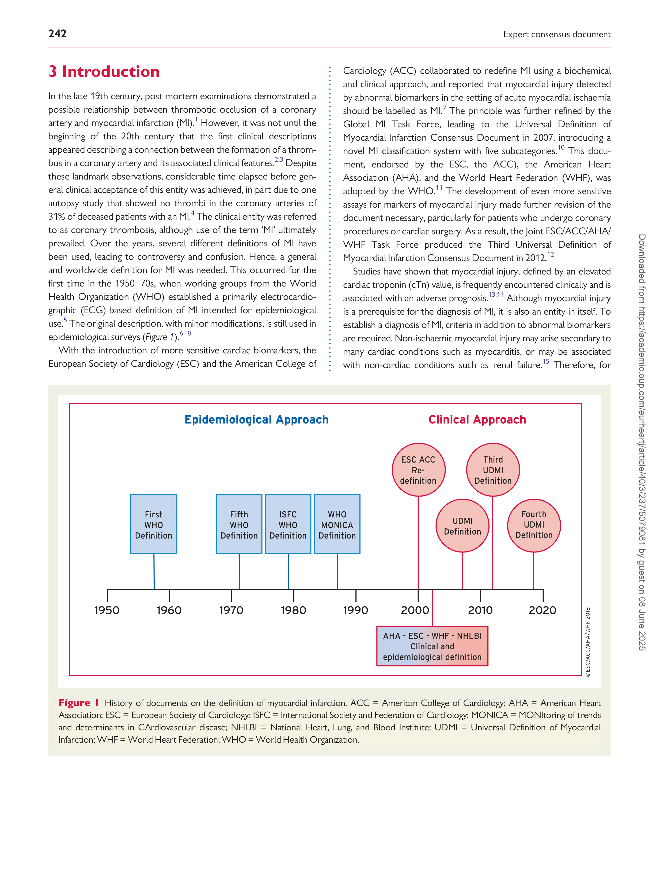
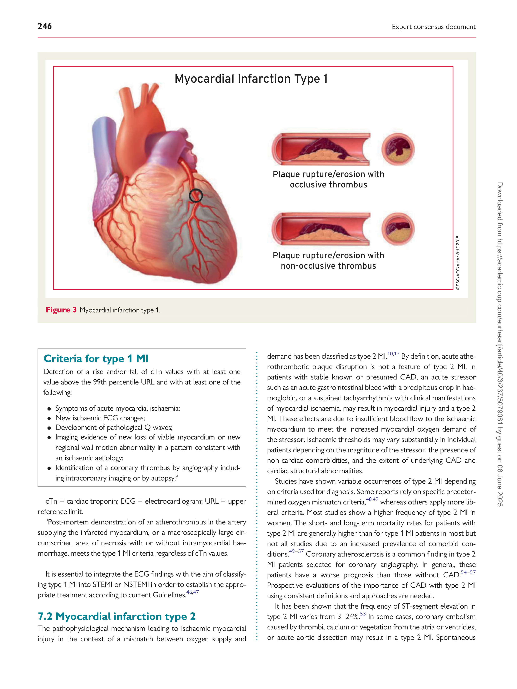
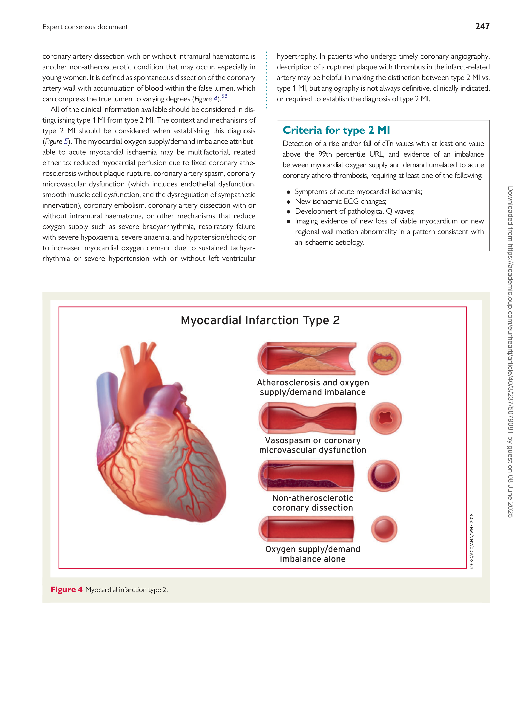
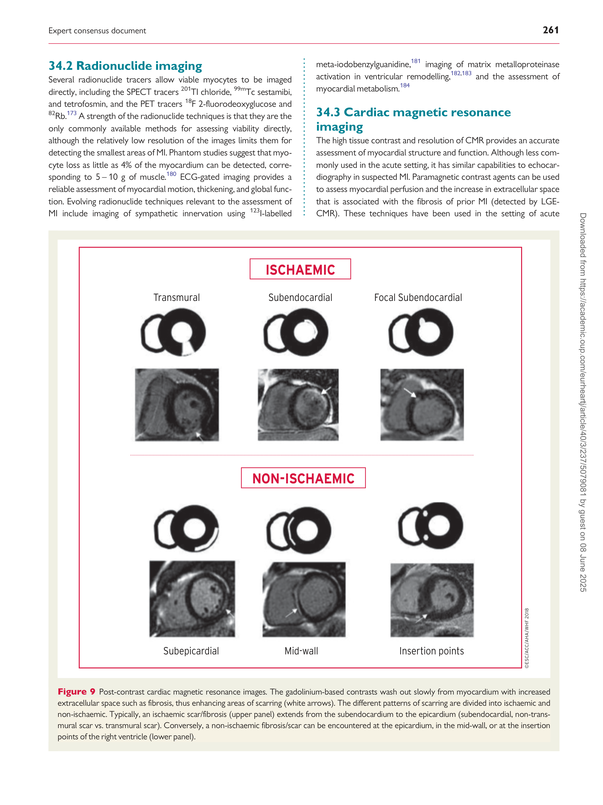

#### European Heart Journal (2019) 40, 237–269 EXPERT CONSENSUS DOCUMENT

doi:10.1093/eurheartj/ehy462
# Fourth universal definition of myocardial infarction (2018)
#### Kristian Thygesen* (Denmark), Joseph S. Alpert* (USA), Allan S. Jaffe (USA), Bernard R. Chaitman (USA), Jeroen J. Bax (The Netherlands), David A. Morrow (USA), Harvey D. White* (New Zealand): the Executive Group on behalf of the Joint European Society of Cardiology (ESC)/American College of Cardiology (ACC)/ American Heart Association (AHA)/World Heart Federation (WHF) Task Force for the Universal Definition of Myocardial Infarction Authors/Task Force Members/Chairpersons: Kristian Thygesen* (Denmark), Joseph S. Alpert* (USA), Allan S. Jaffe (USA), Bernard R. Chaitman (USA), Jeroen J. Bax (The Netherlands), David A. Morrow (USA), Harvey D. White* (New Zealand), Hans Mickley (Denmark), Filippo Crea (Italy), Frans Van de Werf (Belgium), Chiara Bucciarelli-Ducci (UK), Hugo A. Katus (Germany), Fausto J. Pinto (Portugal), Elliott M. Antman (USA), Christian W. Hamm (Germany), Raffaele De Caterina (Italy), James L. Januzzi Jr (USA), Fred S. Apple (USA), Maria Angeles Alonso Garcia (Spain), S. Richard Underwood (UK), John M. Canty Jr (USA), Alexander R. Lyon (UK), P. J. Devereaux (Canada), Jose Luis Zamorano (Spain), Bertil Lindahl (Sweden), William S. Weintraub (USA), L. Kristin Newby (USA), Renu Virmani (USA), Pascal Vranckx (Belgium), Don Cutlip (USA), Raymond J. Gibbons (USA), Sidney C. Smith (USA), Dan Atar (Norway), Russell V. Luepker (USA), Rose Marie Robertson (USA), Robert O. Bonow (USA), P. Gabriel Steg (France), Patrick T. O’Gara (USA), Keith A. A. Fox (UK)

- Corresponding authors. Kristian Thygesen, Department of Cardiology, Aarhus University Hospital, Palle Juul-Jensens Boulevard, DK-8200 Aarhus N, Denmark. Tel: þ45
[78452262, Fax: þ45 78452260, Email: kthygesen@oncable.dk; kristhyg@rm.dk. Joseph S. Alpert, Department of Medicine, University of Arizona College of Medicine, 1501 N.](mailto:)
[Campbell Ave., P.O. Box 245037, Tucson AZ 85724-5037, USA. Tel: þ1 5206262763, Email: jalpert@email.arizona.edu. Harvey D. White, Green Lane Cardiovascular Service,](mailto:)
[Auckland City Hospital, Private Bag 92024, 1030 Auckland, New Zealand. Tel: þ64 96309992, Fax: 00 64 9 6309915, Email: harveyw@adhb.govt.nz.](mailto:)

The content of this ESC/ACC/AHA/WHF Expert Consensus Document has been published for personal and educational use only. No commercial use is authorized. No part of
the ESC/ACC/AHA/WHF Expert Consensus Document may be translated or reproduced in any form without written permission from the ESC or ACC or AHA or WHF.
Permission can be obtained upon submission of a written request to Oxford University Press, the publisher of the European Heart Journal and the party authorized to handle
[such permissions on behalf of the ESC, ACC, AHA and WHF (journals.permissions@oxfordjournals.org).](mailto:)

Disclaimer. The ESC/ACC/AHA/WHF Expert Consensus Document represents the views of the ESC, ACC, AHA, and WHF and was produced after careful consideration of
the scientific and medical knowledge and the evidence available at the time of their publication. The ESC, ACC, AHA, and WHF are not responsible in the event of any contradiction, discrepancy, and/or ambiguity between the ESC/ACC/AHA/WHF Expert Consensus Document and any other official recommendations or Expert Consensus Document
issued by the relevant public health authorities, in particular in relation to good use of healthcare or therapeutic strategies. Health professionals are encouraged to take the ESC/
ACC/AHA/WHF Expert Consensus Document fully into account when exercising their clinical judgment, as well as in the determination and the implementation of preventive,
diagnostic, or therapeutic medical strategies; however, the ESC/ACC/AHA/WHF Expert Consensus Document does not override, in any way whatsoever, the individual responsibility of health professionals to make appropriate and accurate decisions in consideration of each patient’s health condition and in consultation with that patient and, where
appropriate and/or necessary, the patient’s caregiver. Nor does the ESC/ACC/AHA/WHF Expert Consensus Document exempt health professionals from taking into full and
careful consideration the relevant official updated recommendations or Expert Consensus Documents issued by the competent public health authorities, in order to manage
each patient’s case in light of the scientifically accepted data pursuant to their respective ethical and professional obligations. It is also the health professional’s responsibility to
verify the applicable rules and regulations relating to drugs and medical devices at the time of prescription.

This article has been co-published in European Heart Journal, Journal of the American College of Cardiology, Circulation, and Global Heart. All rights reserved.
V C 2018 European Society of Cardiology, American College of Cardiology, American Heart Association, Inc., and World Heart Foundation. The articles are identical except for
minor stylistic and spelling differences in keeping with each journal’s style. Any citation can be used when citing this article.

238 Expert consensus document

Document Reviewers: David Hasdai (CPG Review Co-ordinator) (Israel), Victor Aboyans (France),
Stephan Achenbach (Germany), Stefan Agewall (Norway), Thomas Alexander (India), Alvaro Avezum
(Brazil), Emanuele Barbato (Italy), Jean-Pierre Bassand (France), Eric Bates (USA), John A. Bittl (USA),
Gu¨ enter Breithardt (Germany), He´ctor Bueno (Spain), Raffaele Bugiardini (Italy), Mauricio G. Cohen
(USA), George Dangas (USA), James A. de Lemos (USA), Victoria Delgado (Netherlands), Gerasimos
Filippatos (Greece), Edward Fry (USA), Christopher B. Granger (USA), Sigrun Halvorsen (Norway), Mark
A. Hlatky (USA), Borja Ibanez (Spain), Stefan James (Sweden), Adnan Kastrati (Germany), Christophe
Leclercq (France), Kenneth W. Mahaffey (USA), Laxmi Mehta (USA), Christian Mu¨ ller (Switzerland),
Carlo Patrono (Italy), Massimo Francesco Piepoli (Italy), Daniel Pineiro (Argentina), Marco Roffi~
(Switzerland), Andrea Rubboli (Italy), Samin Sharma (USA), Iain A. Simpson (UK), Michael Tendera
(Poland), Marco Valgimigli (Switzerland), Allard C. van der Wal (Netherlands), Stephan Windecker
(Switzerland)

The disclosure forms of all experts involved in the development of this Expert Consensus Document are
[available on the ESC website www.escardio.org/guidelines](http://www.escardio.org/guidelines)

Online publish-ahead-of-print 25 August 2018

...................................................................................................................................................................................................

Keywords Expert Consensus Document - Myocardial infarction - Type 1 MI - Type 2 MI - Type 3 MI - Type 4a
MI          - Type 4b MI          - Type 4c MI          - Type 5 MI          - Cardiac troponin          - High sensitivity cardiac troponin          Myocardial injury            - Prior myocardial infarction            - Silent myocardial infarction            - Recurrent myocardial
infarction             - Re-infarction             - Cardiac procedural myocardial injury             - Takotsubo syndrome             - Myocardial infarction with non-obstructive coronary arteries (MINOCA)

12 Myocardial infarction associated with coronary artery bypass

grafting (type 5 myocardial infarction) . . . . . . . . . . . . . . . . . . . . . . . . . . . . . . 251

13 Other definitions of myocardial infarction related to percutaneous

coronary intervention or coronary artery bypass grafting . . . . . . . . . . . 252

14 Recurrent myocardial infarction . . . . . . . . . . . . . . . . . . . . . . . . . . . . . . . . 252

15 Re-infarction . . . . . . . . . . . . . . . . . . . . . . . . . . . . . . . . . . . . . . . . . . . . . . . . . . 252

16 Myocardial injury and infarction associated with cardiac

procedures other than revascularization . . . . . . . . . . . . . . . . . . . . . . . . . . . 252

17 Myocardial injury and infarction associated with

non-cardiac procedures . . . . . . . . . . . . . . . . . . . . . . . . . . . . . . . . . . . . . . . . . . . 252

18 Myocardial injury or infarction associated with heart failure . . . . . . 253

19 Takotsubo syndrome . . . . . . . . . . . . . . . . . . . . . . . . . . . . . . . . . . . . . . . . . . 253

20 Myocardial infarction with non-obstructive coronary arteries . . . . 254

21 Myocardial injury and/or infarction associated with

kidney disease . . . . . . . . . . . . . . . . . . . . . . . . . . . . . . . . . . . . . . . . . . . . . . . . . . . . 254

22 Myocardial injury and/or infarction in critically ill patients . . . . . . . . 254

23 Biochemical approach for diagnosing myocardial injury

and infarction . . . . . . . . . . . . . . . . . . . . . . . . . . . . . . . . . . . . . . . . . . . . . . . . . . . . . 254

24 Analytical issues of cardiac troponins . . . . . . . . . . . . . . . . . . . . . . . . . . . 256

25 The 99th percentile upper reference limit . . . . . . . . . . . . . . . . . . . . . . . 256

26 Operationalizing criteria for myocardial injury and infarction . . . . . 256

27 Electrocardiographic detection of myocardial infarction . . . . . . . . . 257

28 Application of supplemental electrocardiogram leads . . . . . . . . . . . . 258

29 Electrocardiographic detection of myocardial injury . . . . . . . . . . . . . 259

## Table of contents

Abbreviations and acronyms . . . . . . . . . . . . . . . . . . . . . . . . . . . . . . . . . . . . . . 239

1 What is new in the Universal Definition of Myocardial

Infarction? . . . . . . . . . . . . . . . . . . . . . . . . . . . . . . . . . . . . . . . . . . . . . . . . . . . . . . . . 240

2 Universal definitions of myocardial injury and myocardial

infarction: summary . . . . . . . . . . . . . . . . . . . . . . . . . . . . . . . . . . . . . . . . . . . . . . . 241

3 Introduction . . . . . . . . . . . . . . . . . . . . . . . . . . . . . . . . . . . . . . . . . . . . . . . . . . . . 242

4 Pathological characteristics of myocardial ischaemia and

infarction . . . . . . . . . . . . . . . . . . . . . . . . . . . . . . . . . . . . . . . . . . . . . . . . . . . . . . . . . 243

5 Biomarker detection of myocardial injury and infarction . . . . . . . . . . 243

6 Clinical presentations of myocardial infarction . . . . . . . . . . . . . . . . . . . . 245

7 Clinical classification of myocardial infarction . . . . . . . . . . . . . . . . . . . . . 245

7.1 Myocardial infarction type 1 . . . . . . . . . . . . . . . . . . . . . . . . . . . . . . . . . 245

7.2 Myocardial infarction type 2 . . . . . . . . . . . . . . . . . . . . . . . . . . . . . . . . . 246

7.3 Myocardial infarction type 2 and myocardial injury . . . . . . . . . . . . 248

7.4 Myocardial Infarction type 3 . . . . . . . . . . . . . . . . . . . . . . . . . . . . . . . . . 248

8 Coronary procedure-related myocardial injury . . . . . . . . . . . . . . . . . . . 249

9 Myocardial infarction associated with percutaneous coronary

intervention (type 4a myocardial infarction) . . . . . . . . . . . . . . . . . . . . . . . . 250

10 Stent/scaffold thrombosis associated with percutaneous

coronary intervention (type 4b myocardial infarction) . . . . . . . . . . . . . . 251

11 Restenosis associated with percutaneous coronary intervention

(type 4c myocardial infarction) . . . . . . . . . . . . . . . . . . . . . . . . . . . . . . . . . . . . 251

Expert consensus document 239

30 Prior or silent/unrecognized myocardial infarction . . . . . . . . . . . . . . . 259

31 Conditions that confound the electrocardiographic diagnosis

of myocardial infarction . . . . . . . . . . . . . . . . . . . . . . . . . . . . . . . . . . . . . . . . . . . 259

32 Conduction disturbances and pacemakers . . . . . . . . . . . . . . . . . . . . . . 260

33 Atrial fibrillation . . . . . . . . . . . . . . . . . . . . . . . . . . . . . . . . . . . . . . . . . . . . . . . 260

34 Imaging techniques . . . . . . . . . . . . . . . . . . . . . . . . . . . . . . . . . . . . . . . . . . . . . 260

34.1 Echocardiography . . . . . . . . . . . . . . . . . . . . . . . . . . . . . . . . . . . . . . . . . 260

34.2 Radionuclide imaging . . . . . . . . . . . . . . . . . . . . . . . . . . . . . . . . . . . . . . 261

34.3 Cardiac magnetic resonance imaging . . . . . . . . . . . . . . . . . . . . . . . 261

34.4 Computed tomographic coronary angiography . . . . . . . . . . . . . 262

35 Applying imaging in acute myocardial infarction . . . . . . . . . . . . . . . . . 262

36 Applying imaging in late presentation of myocardial infarction . . . . 262

37 Regulatory perspective on myocardial infarction in

clinical trials . . . . . . . . . . . . . . . . . . . . . . . . . . . . . . . . . . . . . . . . . . . . . . . . . . . . . . 262

38 Silent/unrecognized myocardial infarction in epidemiological

studies and quality programmes . . . . . . . . . . . . . . . . . . . . . . . . . . . . . . . . . . . 263

39 Individual and public implications of the myocardial

infarction definition . . . . . . . . . . . . . . . . . . . . . . . . . . . . . . . . . . . . . . . . . . . . . . . 263

40 Global perspectives of the definition of myocardial infarction . . . . 263

41 Using the Universal Definition of Myocardial Infarction in the

healthcare system . . . . . . . . . . . . . . . . . . . . . . . . . . . . . . . . . . . . . . . . . . . . . . . . 263

42 Appendix . . . . . . . . . . . . . . . . . . . . . . . . . . . . . . . . . . . . . . . . . . . . . . . . . . . . . 264

43 Acknowledgements . . . . . . . . . . . . . . . . . . . . . . . . . . . . . . . . . . . . . . . . . . . . 264

44 References . . . . . . . . . . . . . . . . . . . . . . . . . . . . . . . . . . . . . . . . . . . . . . . . . . . . 264
## Abbreviations and acronyms

ACC American College of Cardiology
ACS Acute coronary syndrome

AHA American Heart Association

ARC-2 Academic Research Consortium-2

AUC Area under the curve

CAD Coronary artery disease
CABG Coronary artery bypass grafting
CKD Chronic kidney disease

CK-MB Creatine kinase MB isoform

CMR Cardiac magnetic resonance
CTCA Computed tomographic coronary angiography

cTnI Cardiac troponin I
cTnT Cardiac troponin T
CT Computed tomography
CV Coefficient of variation
EF Ejection fraction
ECG Electrocardiogram or electrocardiographic

HF Heart failure

hs-cTn High-sensitivity cardiac troponin
IFCC International Federation of Clinical Chemistry and
Laboratory Medicine
ISFC International Society and Federation of Cardiology
LAD Left anterior descending artery

LBBB Left bundle branch block;

LoD Limit of detection

LGE Late gadolinium enhancement
LGE-CMR Late gadolinium enhancement cardiac magnetic

resonance

LV Left ventricular

LVH Left ventricular hypertrophy
MI Myocardial infarction
MINOCA Myocardial infarction with non-obstructive coronary

arteries

MONICA MONItoring of trends and determinants in

CArdiovascular disease

MPS Myocardial perfusion scintigraphy
NHLBI National Heart, Lung, and Blood Institute
NSTEMI Non-ST-elevation myocardial infarction
PET Positron emission tomography
PCI Percutaneous coronary intervention

POC Point of care

RBBB Right bundle branch block
SPECT Single photon emission computed tomography
STEMI ST-elevation myocardial infarction
ST-T ST-segment–T wave
TIMI Thrombolysis in Myocardial Infarction
TTS Takotsubo syndrome
UDMI Universal Definition of Myocardial Infarction
URL Upper reference limit

WHF World Heart Federation

WHO World Health Organization

34.1 Echocardiography . . . . . . . . . . . . . . . . . . . . . . . . . . . . . . . . . . . . . . . . . 260

34.2 Radionuclide imaging . . . . . . . . . . . . . . . . . . . . . . . . . . . . . . . . . . . . . . 261

34.3 Cardiac magnetic resonance imaging . . . . . . . . . . . . . . . . . . . . . . . 261

34.4 Computed tomographic coronary angiography . . . . . . . . . . . . . 262

35 Applying imaging in acute myocardial infarction . . . . . . . . . . . . . . . . . 262

36 Applying imaging in late presentation of myocardial infarction . . . . 262

37 Regulatory perspective on myocardial infarction in

clinical trials . . . . . . . . . . . . . . . . . . . . . . . . . . . . . . . . . . . . . . . . . . . . . . . . . . . . . . 262

38 Silent/unrecognized myocardial infarction in epidemiological

studies and quality programmes . . . . . . . . . . . . . . . . . . . . . . . . . . . . . . . . . . . 263

39 Individual and public implications of the myocardial

infarction definition . . . . . . . . . . . . . . . . . . . . . . . . . . . . . . . . . . . . . . . . . . . . . . . 263

40 Global perspectives of the definition of myocardial infarction . . . . 263

41 Using the Universal Definition of Myocardial Infarction in the

healthcare system . . . . . . . . . . . . . . . . . . . . . . . . . . . . . . . . . . . . . . . . . . . . . . . . 263

42 Appendix . . . . . . . . . . . . . . . . . . . . . . . . . . . . . . . . . . . . . . . . . . . . . . . . . . . . . 264

43 Acknowledgements . . . . . . . . . . . . . . . . . . . . . . . . . . . . . . . . . . . . . . . . . . . . 264

44 References . . . . . . . . . . . . . . . . . . . . . . . . . . . . . . . . . . . . . . . . . . . . . . . . . . . . 264

## Abbreviations and acronyms

ACC American College of Cardiology
ACS Acute coronary syndrome

AHA American Heart Association

ARC-2 Academic Research Consortium-2

AUC Area under the curve

CAD Coronary artery disease
CABG Coronary artery bypass grafting
CKD Chronic kidney disease

CK-MB Creatine kinase MB isoform

CMR Cardiac magnetic resonance
CTCA Computed tomographic coronary angiography
cTn Cardiac troponin

240 Expert consensus document
## 1 What is new in the Universal Definition of Myocardial Infarction?

Expert consensus document 241
## 2 Universal definitions of myocardial injury and myocardial infarction: summary

242 Expert consensus document

## 3 Introduction

In the late 19th century, post-mortem examinations demonstrated a
possible relationship between thrombotic occlusion of a coronary
artery and myocardial infarction (MI). [1] However, it was not until the
beginning of the 20th century that the first clinical descriptions
appeared describing a connection between the formation of a thrombus in a coronary artery and its associated clinical features. [2][,][3] Despite
these landmark observations, considerable time elapsed before general clinical acceptance of this entity was achieved, in part due to one
autopsy study that showed no thrombi in the coronary arteries of
31% of deceased patients with an MI. [4] The clinical entity was referred
to as coronary thrombosis, although use of the term ‘MI’ ultimately
prevailed. Over the years, several different definitions of MI have
been used, leading to controversy and confusion. Hence, a general

and worldwide definition for MI was needed. This occurred for the

first time in the 1950–70s, when working groups from the World
Health Organization (WHO) established a primarily electrocardiographic (ECG)-based definition of MI intended for epidemiological
use. [5] The original description, with minor modifications, is still used in
epidemiological surveys (Figure 1). [6][–][8]

With the introduction of more sensitive cardiac biomarkers, the

Cardiology (ACC) collaborated to redefine MI using a biochemical
and clinical approach, and reported that myocardial injury detected
by abnormal biomarkers in the setting of acute myocardial ischaemia
should be labelled as MI. [9] The principle was further refined by the
Global MI Task Force, leading to the Universal Definition of
Myocardial Infarction Consensus Document in 2007, introducing a
novel MI classification system with five subcategories. [10] This document, endorsed by the ESC, the ACC), the American Heart
Association (AHA), and the World Heart Federation (WHF), was
adopted by the WHO. [11] The development of even more sensitive
assays for markers of myocardial injury made further revision of the
document necessary, particularly for patients who undergo coronary
procedures or cardiac surgery. As a result, the Joint ESC/ACC/AHA/
WHF Task Force produced the Third Universal Definition of
Myocardial Infarction Consensus Document in 2012. [12]

Studies have shown that myocardial injury, defined by an elevated
cardiac troponin (cTn) value, is frequently encountered clinically and is
associated with an adverse prognosis. [13][,][14] Although myocardial injury
is a prerequisite for the diagnosis of MI, it is also an entity in itself. To
establish a diagnosis of MI, criteria in addition to abnormal biomarkers
are required. Non-ischaemic myocardial injury may arise secondary to
many cardiac conditions such as myocarditis, or may be associated
with non-cardiac conditions such as renal failure. [15] Therefore, for

Expert consensus document 243

patients with increased cTn values, clinicians must distinguish whether
patients have suffered a non-ischaemic myocardial injury or one of the
MI subtypes. If there is no evidence to support the presence of myocardial ischaemia, a diagnosis of myocardial injury should be made.
This diagnosis can be changed if subsequent evaluation indicates criteria for MI. The current Fourth Universal Definition of Myocardial
Infarction Consensus Document reflects these considerations through
adhering to the clinical approach of the definition of MI.

Clinical criteria for MI

The clinical definition of MI denotes the presence of acute myocardial injury detected by abnormal cardiac biomarkers in the setting of evidence of acute myocardial ischaemia.

reported to occur following injury to non-cardiac tissues. The situation is more complex for cTnT. Biochemical data indicate that injured
skeletal muscle expresses proteins that are detected by the cTnT
assay, leading to some situations where elevations of cTnT could
emanate from skeletal muscle. [23][–][27] Recent data suggest that the frequency of such elevations in the absence of ischaemic heart disease
may be higher than originally thought. [28][,][29] cTnI and cTnT are the preferred biomarkers for the evaluation of myocardial injury, [12][,][21][,][22][,][30]

and high-sensitivity (hs)-cTn assays are recommended for routine
clinical use. [22] Other biomarkers, e.g. creatine kinase MB isoform
(CK-MB), are less sensitive and less specific. [31] Myocardial injury is
defined as being present when blood levels of cTn are increased
above the 99th percentile upper reference limit (URL). [12][,][21][,][22][,][30] The
injury may be acute, as evidenced by a newly detected dynamic rising
and/or falling pattern of cTn values above the 99th percentile URL,

Criteria for myocardial injury

Detection of an elevated cTn value above the 99th percentile
URL is defined as myocardial injury. The injury is considered

acute if there is a rise and/or fall of cTn values.

or chronic, in the setting of persistently elevated cTn levels.
Although elevated cTn values reflect injury to myocardial cells,
they do not indicate the underlying pathophysiological mechanisms,
and can arise following preload-induced mechanical stretch or physiological stresses in otherwise normal hearts. [32][–][34] Various causes
have been suggested for the release of structural proteins from the
myocardium, including normal turnover of myocardial cells, apoptosis, cellular release of cTn degradation products, increased cellular
wall permeability, the formation and release of membranous blebs,
and myocyte necrosis. [27][,][35] Yet, it is not clinically possible to distinguish which increases of cTn levels are due to which mechanisms. [36]

However, regardless of the mechanism, acute myocardial injury,
when associated with a rising and/or falling pattern of cTn values with
at least one value above the 99th percentile URL and caused by myocardial ischaemia, is designated as an acute MI. [12][,][21][,][22][,][30] Histological
evidence of myocardial injury with myocyte death can be detected in

clinical conditions associated with non-ischaemic mechanisms of
myocardial injury as well [37][,][38] (Figure 2).
Myocardial ischaemic or non-ischaemic conditions associated with
increased cTn values are presented in Table 1. The complexity of clinical circumstances may sometimes make it difficult to discriminate
specific individual mechanism(s) of myocardial injury. In this situation,
the multifactorial contributions resulting in myocardial injury should
be described in the patient record.

Clinical criteria for MI

The clinical definition of MI denotes the presence of acute myocardial injury detected by abnormal cardiac biomarkers in the setting of evidence of acute myocardial ischaemia.

## 4 Pathological characteristics of myocardial ischaemia and infarction

MI is defined pathologically as myocardial cell death due to prolonged
ischaemia. Diminished cellular glycogen, and relaxed myofibrils and
sarcolemmal disruption, are the first ultrastructural changes and are
seen as early as 10–15 min after the onset of ischaemia. [16]

Mitochondrial abnormalities are observed as early as 10 min after
coronary occlusion by electron microscopy and are progressive. [17] It
can take hours before myocyte necrosis can be identified by post
mortem examination in humans; this is in contrast to animal models,

in which biochemical evidence of myocardial cell death due to apoptosis can be detected within 10 min of induced myocardial ischaemia
in association with myocyte death. [15] Experimentally, necrosis progresses from the subendocardium to the subepicardium over several
hours. The time course may be prolonged by increased collateral
flow, reduced determinants of myocardial oxygen consumption, and
intermittent occlusion/reperfusion, which can precondition the
heart. [18] Timely implementation of reperfusion therapy, when appropriate, reduces ischaemic injury of the myocardium. [19][,][20]
## 5 Biomarker detection of myocardial injury and infarction

Cardiac troponin I (cTnI) and T (cTnT) are components of the contractile apparatus of myocardial cells and are expressed almost exclusively in the heart. [21][,][22] Increases in cTnI values have not been

244 Expert consensus document

Expert consensus document 245

rest, or an ischaemic equivalent such as dyspnoea or fatigue. Often,
the discomfort is diffuse; not localized, nor positional, nor affected by
movement of the region. However, these symptoms are not specific
for myocardial ischaemia and can be observed in other conditions
such as gastrointestinal, neurological, pulmonary, or musculoskeletal
complaints. MI may occur with atypical symptoms such as palpitations
or cardiac arrest, or even without symptoms. [12] Very brief episodes

of ischaemia too short to cause necrosis can also cause cTn release

and elevations. The involved myocytes can subsequently die due to
apoptosis. [42]

If myocardial ischaemia is present clinically or detected by ECG
changes together with myocardial injury, manifested by a rising and/
or falling pattern of cTn values, a diagnosis of acute MI is appropriate.
If myocardial ischaemia is not present clinically, then elevated cTn levels may be indicative of acute myocardial injury if the pattern of values
is rising and/or falling, or related to more chronic ongoing injury if the
pattern is unchanging. [14] Similar considerations are relevant when
evaluating events that are potentially related to procedures that may
cause myocardial injury and/or MI. Additional evaluations may lead to
a need for the initial diagnosis to be revised.
Patients with suspected acute coronary syndrome (ACS) that are
ruled out for MI with normal cardiac biomarker values (<_ 99th percentile URL) may have unstable angina or an alternative diagnosis.
These patients should be evaluated and treated accordingly. [11][,][43]
## 7 Clinical classification of myocardial infarction

For the sake of immediate treatment strategies such as reperfusion
therapy, it is usual practice to designate MI in patients with chest discomfort or other ischaemic symptoms, who develop new STsegment elevations in two contiguous leads or new bundle branch
blocks with ischaemic repolarization patterns as an ST-elevation MI
(STEMI) (see section 27). In contrast, patients without ST-segment
elevation at presentation are usually designated non-ST-elevation MI
(NSTEMI). The categories of patients with STEMI, NSTEMI, or unstable angina are customarily included in the concept of ACS. In addition
to these categories, MI may be classified into various types based on
pathological, clinical, and prognostic differences, along with different

treatment strategies.

7.1 Myocardial infarction type 1
MI caused by atherothrombotic coronary artery disease (CAD) and
usually precipitated by atherosclerotic plaque disruption (rupture or
erosion) is designated as a type 1 MI. The relative burden of atherosclerosis and thrombosis in the culprit lesion varies greatly, and the
dynamic thrombotic component may lead to distal coronary embolization resulting in myocyte necrosis. [44][,][45] Plaque rupture may
not only be complicated by intraluminal thrombosis but also by
haemorrhage into the plaque through the disrupted surface
(Figure 3). [44][,][45]

## 6 Clinical presentations of myocardial infarction

Onset of myocardial ischaemia is the initial step in the development
of MI and results from an imbalance between oxygen supply and
demand. Myocardial ischaemia in a clinical setting can most often be
identified from the patient’s history and from the ECG. Possible
ischaemic symptoms include various combinations of chest, upper
extremity, mandibular, or epigastric discomfort during exertion or at

246 Expert consensus document

demand has been classified as type 2 MI. [10][,][12] By definition, acute atherothrombotic plaque disruption is not a feature of type 2 MI. In
patients with stable known or presumed CAD, an acute stressor
such as an acute gastrointestinal bleed with a precipitous drop in haemoglobin, or a sustained tachyarrhythmia with clinical manifestations
of myocardial ischaemia, may result in myocardial injury and a type 2

MI. These effects are due to insufficient blood flow to the ischaemic

myocardium to meet the increased myocardial oxygen demand of
the stressor. Ischaemic thresholds may vary substantially in individual
patients depending on the magnitude of the stressor, the presence of
non-cardiac comorbidities, and the extent of underlying CAD and

cardiac structural abnormalities.

Studies have shown variable occurrences of type 2 MI depending
on criteria used for diagnosis. Some reports rely on specific predetermined oxygen mismatch criteria, [48][,][49] whereas others apply more liberal criteria. Most studies show a higher frequency of type 2 MI in
women. The short- and long-term mortality rates for patients with
type 2 MI are generally higher than for type 1 MI patients in most but
not all studies due to an increased prevalence of comorbid conditions. [49][–][57] Coronary atherosclerosis is a common finding in type 2
MI patients selected for coronary angiography. In general, these
patients have a worse prognosis than those without CAD. [54][–][57]

Prospective evaluations of the importance of CAD with type 2 MI
using consistent definitions and approaches are needed.
It has been shown that the frequency of ST-segment elevation in
type 2 MI varies from 3–24%. [53] In some cases, coronary embolism
caused by thrombi, calcium or vegetation from the atria or ventricles,
or acute aortic dissection may result in a type 2 MI. Spontaneous

Criteria for type 1 MI

Detection of a rise and/or fall of cTn values with at least one

value above the 99th percentile URL and with at least one of the
following:

 - [Symptoms of acute myocardial ischaemia;]

 - [New ischaemic ECG changes;]

 - [Development of pathological Q waves;]

 - [Imaging evidence of new loss of viable myocardium or new]

regional wall motion abnormality in a pattern consistent with
an ischaemic aetiology;

 - [Identification of a coronary thrombus by angiography includ-]
ing intracoronary imaging or by autopsy. [a]

cTn = cardiac troponin; ECG = electrocardiogram; URL = upper

reference limit.

a Post-mortem demonstration of an atherothrombus in the artery
supplying the infarcted myocardium, or a macroscopically large circumscribed area of necrosis with or without intramyocardial haemorrhage, meets the type 1 MI criteria regardless of cTn values.

It is essential to integrate the ECG findings with the aim of classifying type 1 MI into STEMI or NSTEMI in order to establish the appropriate treatment according to current Guidelines. [46][,][47]

7.2 Myocardial infarction type 2
The pathophysiological mechanism leading to ischaemic myocardial
injury in the context of a mismatch between oxygen supply and

Expert consensus document 247

coronary artery dissection with or without intramural haematoma is
another non-atherosclerotic condition that may occur, especially in
young women. It is defined as spontaneous dissection of the coronary
artery wall with accumulation of blood within the false lumen, which
can compress the true lumen to varying degrees (Figure 4). [58]

All of the clinical information available should be considered in dis
tinguishing type 1 MI from type 2 MI. The context and mechanisms of
type 2 MI should be considered when establishing this diagnosis
(Figure 5). The myocardial oxygen supply/demand imbalance attributable to acute myocardial ischaemia may be multifactorial, related
either to: reduced myocardial perfusion due to fixed coronary atherosclerosis without plaque rupture, coronary artery spasm, coronary
microvascular dysfunction (which includes endothelial dysfunction,
smooth muscle cell dysfunction, and the dysregulation of sympathetic
innervation), coronary embolism, coronary artery dissection with or

without intramural haematoma, or other mechanisms that reduce

oxygen supply such as severe bradyarrhythmia, respiratory failure
with severe hypoxaemia, severe anaemia, and hypotension/shock; or
to increased myocardial oxygen demand due to sustained tachyarrhythmia or severe hypertension with or without left ventricular

hypertrophy. In patients who undergo timely coronary angiography,
description of a ruptured plaque with thrombus in the infarct-related
artery may be helpful in making the distinction between type 2 MI vs.
type 1 MI, but angiography is not always definitive, clinically indicated,
or required to establish the diagnosis of type 2 MI.

Criteria for type 2 MI

Detection of a rise and/or fall of cTn values with at least one value

above the 99th percentile URL, and evidence of an imbalance
between myocardial oxygen supply and demand unrelated to acute
coronary athero-thrombosis, requiring at least one of the following:

 - [Symptoms of acute myocardial ischaemia;]

 - [New ischaemic ECG changes;]

 - [Development of pathological Q waves;]

 - [Imaging evidence of new loss of viable myocardium or new]

regional wall motion abnormality in a pattern consistent with
an ischaemic aetiology.

248 Expert consensus document

It appears advisable in the acute setting to treat the underlying
ischaemic imbalance of oxygen supply and demand. This treatment
may include volume adjustment, blood pressure management, administration of blood products, heart-rate control, and respiratory support. [47][,][48] Depending on the clinical situation, coronary evaluations
may be indicated to assess the likelihood of CAD. If it is present, the
MI Guidelines may be applied in accordance with the ECG findings of
STEMI or NSTEMI. [46][,][47] However, if CAD is absent, the benefits of

cardiovascular risk reduction strategies with type 2 MI remain

uncertain.

7.3 Myocardial infarction type 2 and
myocardial injury
Type 2 MI and myocardial injury are frequently encountered in clinical practice and both are related to a poor outcome. [13][,][14][,][49][,][51][,][56]

A conceptual model to facilitate the clinical distinction between acute
ischaemic myocardial injury with or without an acute atherothrombotic event (type 1 or type 2 MI) vs. conditions without acute ischaemic myocardial injury is displayed in Figure 6. Acute MI requires a
rising and/or falling pattern of cTn values. Acute myocardial injury

Type 2 MI and non-ischaemic myocardial injury may coexist. It should
be recognized that some disease entities may be on both sides of the
diagram, e. g. acute heart failure that may occur in the context of
acute myocardial ischaemia. Nevertheless, abnormal cTn values in
the setting of acute and/or chronic heart failure are often better categorized as a myocardial injury condition. Few studies have compared
the incidence and clinical features of type 2 MI vs. myocardial injury
without acute myocardial ischaemia.

7.4 Myocardial infarction type 3

The detection of cardiac biomarkers in the blood is fundamental for
establishing the diagnosis of MI. [10][,][12] However, patients can manifest a
typical presentation of myocardial ischaemia/infarction, including presumed new ischaemic ECG changes or ventricular fibrillation, and die
before it is possible to obtain blood for cardiac biomarker determination; or the patient may succumb soon after the onset of symptoms
before an elevation of biomarker values has occurred. Such patients
are designated as having a type 3 MI, when suspicion for an acute
myocardial ischaemic event is high, even when cardiac biomarker evidence of MI is lacking. [10][,][12] This category allows the separation of fatal
MI events from the much larger group of sudden death episodes that
may be cardiac (non-ischaemic) or non-cardiac in origin. When a

Expert consensus document 249

type 3 MI is diagnosed and a subsequent autopsy reveals recent evi
dence of an MI, with a fresh or recent thrombus in the infarct-related

artery, the type 3 MI should be reclassified to a type 1 MI. Original
investigations addressing the incidence of type 3 MI are sparse, but a
study showed an annual incidence below 10/100 000 person-years
and a frequency of 3 – 4% among all types of MI. [60]

Criteria for type 3 MI

Patients who suffer cardiac death, with symptoms suggestive of
myocardial ischaemia accompanied by presumed new ischaemic
ECG changes or ventricular fibrillation, but die before blood samples for biomarkers can be obtained, or before increases in cardiac biomarkers can be identified, or MI is detected by autopsy

examination.

## 8 Coronary procedure-related myocardial injury

Cardiac procedural myocardial injury related to coronary revascularization procedures, whether percutaneous coronary intervention
(PCI) or coronary artery bypass grafting (CABG), may be temporally
related to the procedure itself, reflecting periprocedural issues, or
may occur later reflecting complications of a device, such as early or
late stent thrombosis or in-stent restenosis for PCI, or graft occlusion
or stenosis with CABG. Late gadolinium enhancement (LGE) cardiac
magnetic resonance (CMR) allows assessment of procedural myocardial injury. [61][–][63] When quantifying procedural injury using LGE-CMR
before and shortly after PCI or CABG, it was found that 32% of
patients had evidence of procedural myocardial injury. [63] Furthermore,
it has been shown that patients with elevation of cTnI values after PCI

Criteria for type 3 MI

Patients who suffer cardiac death, with symptoms suggestive of
myocardial ischaemia accompanied by presumed new ischaemic
ECG changes or ventricular fibrillation, but die before blood samples for biomarkers can be obtained, or before increases in cardiac biomarkers can be identified, or MI is detected by autopsy

examination.

250 Expert consensus document

or after CABG have evidence of procedural myocardial injury on
CMR imaging. [61][,][62] For that reason, increased cTn values detected following a coronary revascularization procedure may reflect procedural
myocardial injury. Of importance, if the baseline value before the procedure is above the 99th percentile URL, it is essential that cTn levels
are stable prior to the evaluation in order to reliably establish the presence of acute procedural myocardial injury. It is not possible to determine, when intervening in a patient with an acute MI event resulting in
an increased cTn level, how much of any given increase is related to
the MI and how much is due to the procedure.

Criteria for cardiac procedural myocardial injury

Cardiac procedural myocardial injury is arbitrarily defined by
increases of cTn values (> 99th percentile URL) in patients with
normal baseline values (<_ 99th percentile URL) or a rise of cTn
values > 20% of the baseline value when it is above the 99th percentile URL but it is stable or falling.

A large proportion of patients have abnormal values of cTn after
PCI, ranging from �20 – 40% in stable CAD to 40 – 50% in MI. [64] The

normal baseline values or, in patients with elevated pre-procedure
cTn in whom the cTn levels are stable (<_ 20% variation) or falling, the
post-procedure cTn must rise > 20% to an absolute value more than
five times the 99th percentile URL. In addition, there should be evidence of new myocardial ischaemia, either from ECG changes, imaging evidence, or from procedure-related complications associated
with reduced coronary blood flow such as coronary dissection,
occlusion of a major epicardial artery or a side branch occlusion/
thrombus, disruption of collateral flow, slow flow or no-reflow, or
distal embolization. The use of hs-cTn assays to diagnose type 4a MI
(and type 5 MI) is an area of active research. Many hs-cTn assays are
available, which have wide dynamic ranges. Different criteria may be
required for different assays. However, it has recently been shown
that the optimal hs-cTnT thresholds to predict cardiovascular events
at 30 days and 1 year were very close to the five-fold increase suggested by the Third Universal Definition of Myocardial infarction. [12][,][66][,][67] These criteria are therefore retained because of a lack of

new scientific evidence that identifies superior criteria for defining
this MI subtype. Other criteria that meet the definition of type 4a MI,
regardless of hs-cTn or cTn values, are the development of new
pathological Q waves or autopsy evidence of recent procedurerelated thrombus in the culprit artery.

Criteria for PCI-related MI � 48 h
after the index procedure
(type 4a MI)

Coronary intervention-related MI is arbitrarily defined by an elevation of cTn values more than five times the 99th percentile
URL in patients with normal baseline values. In patients with elevated pre-procedure cTn in whom the cTn level are stable
(<_ 20% variation) or falling, the post-procedure cTn must rise by

 - 20%. However, the absolute post-procedural value must still be
at least five times the 99th percentile URL. In addition, one of the
following elements is required:

 - [New ischaemic ECG changes;]

 - [Development of new pathological Q waves;] [a]

 - [Imaging evidence of new loss of viable myocardium or new]

regional wall motion abnormality in a pattern consistent with
an ischaemic aetiology;

 - [Angiographic findings consistent with a procedural flow-limit-]

ing complication such as coronary dissection, occlusion of a
major epicardial artery or a side branch occlusion/thrombus,
disruption of collateral flow, or distal embolization. [b]

a Isolated development of new pathological Q waves meets the
type 4a MI criteria if cTn values are elevated and rising but less
than five times the 99th percentile URL.
b Post-mortem demonstration of a procedure-related thrombus
in the culprit artery, or a macroscopically large circumscribed
area of necrosis with or without intra-myocardial haemorrhage
meets the type 4a MI criteria.

Criteria for cardiac procedural myocardial injury

Cardiac procedural myocardial injury is arbitrarily defined by
increases of cTn values (> 99th percentile URL) in patients with
normal baseline values (<_ 99th percentile URL) or a rise of cTn
values > 20% of the baseline value when it is above the 99th percentile URL but it is stable or falling.

A large proportion of patients have abnormal values of cTn after
PCI, ranging from �20 – 40% in stable CAD to 40 – 50% in MI. [64] The
occurrence of procedural myocardial injury can be detected by the
measurement of cTn before the procedure and repeated 3 – 6 h
later. Where the second value is rising, further sampling should be
performed to document the peak cTn value. Increasing levels after
the procedure can only be attributed with certainty to procedural
myocardial injury when the pre-procedural cTn values are normal
(<_ 99th percentile URL), or if they are stable or falling. For patients
that present with an ACS and undergo a prompt coronary revascularization procedure resulting in only a single pre-procedural baseline
value that is normal or mildly elevated, followed by subsequent postprocedural values that continue to increase, the post-procedural

increase should be attributed to the index event. Recent data corrob
orate the importance of elevated pre-procedure cTn values as a
prognostic marker in patients that have values that rise after the procedure. [65] To diagnose procedural myocardial injury in the clinical setting of only a single pre-procedural cTn value, the cardiac Tn values
would need to be stable or falling post-procedure, followed by a subsequent increase that exceeds the 99th percentile URL, and if the

value has not returned to baseline, the increase should be > 20%

with an absolute value > the 99th percentile URL.

## 9 Myocardial infarction associated with percutaneous coronary intervention (type 4a myocardial infarction)

Stand-alone post-procedural increases of cTn values are sufficient to
establish a diagnosis of procedural myocardial injury but not for the
diagnosis of type 4a MI. Type 4a MI requires an elevation of cTn values greater than five times the 99th percentile URL in patients with

Expert consensus document 251

## 10 Stent/scaffold thrombosis associated with percutaneous coronary intervention (type 4b myocardial infarction)

A subcategory of PCI-related MI is stent/scaffold thrombosis, type 4b
MI, as documented by angiography or autopsy using the same criteria
utilized for type 1 MI. It is important to indicate the time of the occurrence of the stent/scaffold thrombosis in relation to the timing of the
PCI procedure. The following temporal categories are suggested:
acute, 0–24 h; subacute, > 24 h to 30 days; late, > 30 days to 1 year;
and very late > 1 year after stent/scaffold implantation. [68]
## 11 Restenosis associated with percutaneous coronary intervention (type 4c myocardial infarction)

Occasionally MI occurs and—at angiography, in-stent restenosis, or

especially cTn appear robust for the detection of procedural myocardial injury and also, in the presence of new myocardial ischaemia, for
the detection of type 5 MI, a specific cut-off value for all procedures
and all cTn assays is difficult to define. However, in order to ensure
consistency with the analogous standards of the preceding definition
of type 5 MI [12] and because of the lack of new scientific evidence that
identifies superior criteria for defining this MI subtype, it is suggested
that a cTn value > 10 times the 99th percentile URL is applied as the
cut-off point during the first 48 h following CABG, occurring from a
normal baseline cTn value (<_ 99th percentile URL), for diagnosing
type 5 MI. It is important that the post-procedural elevation of cTn
values is accompanied by ECG, angiographic, or imaging evidence of
new myocardial ischaemia/new loss of myocardial viability. [71] The
higher cut-off of MI after CABG than after PCI (10 times vs. 5 times
the 99th percentile URL) has been arbitrarily selected due to the
occurrence of more unavoidable myocardial injury during surgery
than during PCI.
It should be recognized that ST-segment deviation and T wave
changes are common after CABG due to epicardial injury, and are
not reliable indicators of myocardial ischaemia in this setting.
However, ST-segment elevation with reciprocal ST-segment depression or other specific ECG patterns may be a more reliable finding of
a potential ischaemic event.

Criteria for CABG-related MI � 48 h
after the index procedure (type 5 MI)

CABG-related MI is arbitrarily defined as elevation of cTn values

 - 10 times the 99th percentile URL in patients with normal baseline cTn values. In patients with elevated pre-procedure cTn in
whom cTn levels are stable (<_ 20% variation) or falling, the postprocedure cTn must rise by > 20%. However, the absolute postprocedural value still must be > 10 times the 99th percentile
URL. In addition, one of the following elements is required:

 - [Development of new pathological Q waves;] [a]

 - [Angiographic documented new graft occlusion or new native]

coronary artery occlusion;

 - [Imaging evidence of new loss of viable myocardium or new]

regional wall motion abnormality in a pattern consistent with
an ischaemic aetiology.
a Isolated development of new pathological Q waves meets the
type 5 MI criteria if cTn values are elevated and rising but < 10
times the 99th percentile URL.

Marked isolated elevation of cTn values within the 48 h postoperative period, even in the absence of ECG/angiographic or other
imaging evidence of MI, indicates prognostically significant cardiac
procedural myocardial injury. [72] The presence of significant procedural myocardial injury in patients with operative problems (e.g. difficulty coming off bypass, technically difficult anastomoses in a heavily
calcified aorta, of perioperative evidence of myocardial ischaemia,
etc.) should prompt clinical review of the procedure and/or consideration of additional diagnostic testing for possible type 5 MI.

A subcategory of PCI-related MI is stent/scaffold thrombosis, type 4b
MI, as documented by angiography or autopsy using the same criteria
utilized for type 1 MI. It is important to indicate the time of the occurrence of the stent/scaffold thrombosis in relation to the timing of the
PCI procedure. The following temporal categories are suggested:
acute, 0–24 h; subacute, > 24 h to 30 days; late, > 30 days to 1 year;
and very late > 1 year after stent/scaffold implantation. [68]

## 11 Restenosis associated with percutaneous coronary intervention (type 4c myocardial infarction)

Occasionally MI occurs and—at angiography, in-stent restenosis, or
restenosis following balloon angioplasty in the infarct territory—is
the only angiographic explanation since no other culprit lesion or
thrombus can be identified. This PCI-related MI type is designated as
type 4c MI, defined as focal or diffuse restenosis, or a complex lesion
associated with a rise and/or fall of cTn values above the 99th percentile URL applying, the same criteria utilized for type 1 MI.

## 12 Myocardial infarction associated with coronary artery bypass grafting (type 5 myocardial infarction)

Numerous factors can lead to procedural myocardial injury during a
CABG procedure. Many of them are related to the details of the cardiac preservation, the extent of the direct traumatic injury to the
myocardium, as well as any potential ischaemic injury. For that reason, increases in cTn values should be expected after all CABG procedures, [69][,][70] which need to be taken into account when comparing
the extent of procedural myocardial injury after cardiac surgery with
that associated with less invasive approaches. Depending on whether
it is off-pump or on-pump surgery, procedural myocardial injury is
observed among 32 – 44% of CABG patients when quantified by
LGE-CMR. [61][,][63] The area under the curve (AUC) and routine cTn
sampling has demonstrated an excellent linear relationship with the
mass of the new injury as defined by LGE-CMR. AUC for CK-MB is
also good, although clearly inferior to cTnI. [69] However, these relationships vary depending on the nature of the procedure, the nature
of the cardioplegia, and the specific assay used to measure cTn. Very
high cTn values are most often associated with coronary arteryrelated events. [61][,][63][,][69] Thus, although cardiac biomarkers and

252 Expert consensus document

## 13 Other definitions of myocardial infarction related to percutaneous coronary intervention or coronary artery bypass grafting

There is no universal consensus on the cTn or hs-cTn cut-off points
that clearly distinguish cardiac procedural myocardial injury from MI.
The distinction is made on the basis of an injury created by a flowlimiting complication during the procedure that results in sufficient
myocardial ischaemia to generate a procedure-related MI. The size of
the insult will determine the magnitude of the cTn release. Various
groups have used multiples of the 99th percentile URL and set
thresholds to diagnose periprocedural MIs for clinical trials. [68][,][73]

Unless a standard assay is used for all analyses, given the heterogeneity of cTn assays, this approach could lead to very different values
depending on the assay used locally. The Academic Research
Consortium-2 (ARC-2) suggests a post-procedural cTn value >_ 35
times the 99th percentile URL for both PCI and CABG in patients
that have a normal baseline cTn value or in patients with elevated
pre-procedure cTn values in whom the cTn levels are stable or falling.
ARC-2 proposes that one ancillary criterion be required in addition
to the >_ 35 cTn rise to fulfill the definition of periprocedural MI. The
ancillary criteria are one or more of the following: new significant Q
waves (or equivalent), flow-limiting angiographic complications in a
major epicardial vessel or > 1.5 mm diameter branch, or a substantial
new loss of viable myocardium on echocardiography related to the
procedure. [68] Furthermore, ARC-2 has defined stand-alone criteria
for significant procedural myocardial injury if the rise in cTn is >_ 70
times the 99th percentile URL (where the baseline is lower than the
URL, elevated and stable, or falling). [68]
## 14 Recurrent myocardial infarction

Incident MI is defined as the individual’s first MI. When features of MI

occur in the first 28 days after an incident event, the second event is
not counted as a new MI for epidemiological purposes. If characteristics of MI occur after 28 days following an incident MI, it is considered
to be a recurrent MI. [11]
## 15 Re-infarction

The term re-infarction is used clinically for an acute MI that occurs
within 28 days of an incident or recurrent MI. [11] The ECG diagnosis of
suspected re-infarction following the initial MI may be confounded by
the initial evolutionary ECG changes. Re-infarction should be considered when ST-elevation >_ 1 mm recurs or new pathognomonic Q
waves appear in at least two contiguous leads, particularly when associated with ischaemic symptoms. However, re-elevation of the STsegment can also be seen in threatened myocardial rupture or in
cases of pericarditis, and should lead to additional diagnostic

evaluation.

In patients where re-infarction is suspected from clinical signs or

is recommended. A second sample should be obtained 3–6 h later or
earlier with more sensitive cTn assays. If the cTn concentration is elevated, but stable or decreasing at the time of suspected re-infarction,
the diagnosis of re-infarction requires a > 20% increase of the cTn
value in the second sample. [74] If the initial cTn concentration is normal, the criteria for new acute MI apply. [12]
## 16 Myocardial injury and infarction associated with cardiac procedures other than revascularization

Cardiac procedures such as transcatheter valve interventions may
cause myocardial injury, both by direct trauma to the myocardium
and by creating regional ischaemia secondary to coronary obstruction or embolization. Ablation of arrhythmias involves controlled
procedural myocardial injury by application of warming or cooling of
the tissue. The extent of procedural myocardial injury can be
assessed by serial cTn measurements. Increases of cTn values in this
context should be considered as a procedural myocardial injury and

not labelled as an MI unless the biomarker criteria and one of the

ancillary criteria for acute myocardial ischaemia listed for type 5 MI
are present. [75][,][76]
## 17 Myocardial injury and infarction associated with non-cardiac procedures

Perioperative MI is one of the most important complications in major
non-cardiac surgery and it is associated with a poor prognosis. [77][,][78]

Most patients who have a perioperative MI will not experience
ischaemic symptoms due to anaesthesia, sedation, or pain relieving
medications. Nevertheless, asymptomatic perioperative MI is as
strongly associated with 30 day mortality as symptomatic MI. [77][,][78]

Knowledge about hs-cTn values at baseline can help to identify
patients having chronic cTn elevation before surgery, as well as those
at increased risk during and after the procedure. [79][,][80] Measurement of
hs-cTn in post-operative samples reveals that as many as 35% of
patients have levels above the 99th percentile URL, and 17% have an
elevation and a rising pattern of values indicative of evolving myocardial injury. [81] Those with a rising pattern of elevated hs-cTn values are
at particular risk; the greater the rise, the greater the risk. [82][,][83]

The pathophysiological mechanism of perioperative MI is subject
to debate. It is recognized that the perioperative period is characterized by increased cardiac metabolic demand that may lead to MI in
patients with otherwise stable CAD. [84][,][85] Thus, an angiographic investigation has identified demand myocardial ischaemia as the predominant aetiology of perioperative MI, [84][,][85] which together with a rise
and/or fall of cTn values indicates type 2 MI. However, other angiographic studies have detected coronary plaque rupture in �50–60%
of patients with perioperative MI, [86][,][87] which qualifies as type 1 MI. On
the other hand, perioperative myocardial injury without ancillary
ischaemic evidence indicative of MI is a common complication after

There is no universal consensus on the cTn or hs-cTn cut-off points
that clearly distinguish cardiac procedural myocardial injury from MI.
The distinction is made on the basis of an injury created by a flowlimiting complication during the procedure that results in sufficient
myocardial ischaemia to generate a procedure-related MI. The size of
the insult will determine the magnitude of the cTn release. Various
groups have used multiples of the 99th percentile URL and set
thresholds to diagnose periprocedural MIs for clinical trials. [68][,][73]

Unless a standard assay is used for all analyses, given the heterogeneity of cTn assays, this approach could lead to very different values
depending on the assay used locally. The Academic Research
Consortium-2 (ARC-2) suggests a post-procedural cTn value >_ 35
times the 99th percentile URL for both PCI and CABG in patients
that have a normal baseline cTn value or in patients with elevated
pre-procedure cTn values in whom the cTn levels are stable or falling.
ARC-2 proposes that one ancillary criterion be required in addition
to the >_ 35 cTn rise to fulfill the definition of periprocedural MI. The
ancillary criteria are one or more of the following: new significant Q
waves (or equivalent), flow-limiting angiographic complications in a
major epicardial vessel or > 1.5 mm diameter branch, or a substantial
new loss of viable myocardium on echocardiography related to the
procedure. [68] Furthermore, ARC-2 has defined stand-alone criteria
for significant procedural myocardial injury if the rise in cTn is >_ 70
times the 99th percentile URL (where the baseline is lower than the
URL, elevated and stable, or falling). [68]

## 14 Recurrent myocardial infarction

Incident MI is defined as the individual’s first MI. When features of MI

occur in the first 28 days after an incident event, the second event is
not counted as a new MI for epidemiological purposes. If characteristics of MI occur after 28 days following an incident MI, it is considered
to be a recurrent MI. [11]

## 15 Re-infarction

The term re-infarction is used clinically for an acute MI that occurs
within 28 days of an incident or recurrent MI. [11] The ECG diagnosis of
suspected re-infarction following the initial MI may be confounded by
the initial evolutionary ECG changes. Re-infarction should be considered when ST-elevation >_ 1 mm recurs or new pathognomonic Q
waves appear in at least two contiguous leads, particularly when associated with ischaemic symptoms. However, re-elevation of the STsegment can also be seen in threatened myocardial rupture or in
cases of pericarditis, and should lead to additional diagnostic

evaluation.

In patients where re-infarction is suspected from clinical signs or
symptoms following the initial MI, an immediate measurement of cTn

Expert consensus document 253

non-cardiac surgery that is associated with substantial short- and
long-term mortality on a level with perioperative MI. [83]

Post-operative cTn surveillance is recommended for high-risk individuals. In order to properly interpret the aetiology of elevated postoperative values, a baseline pre-operative value is necessary to deter
mine whether the increase is acute or more chronic. However, a

diagnosis of MI still requires, in addition to an increase of cTn values,
evidence of myocardial ischaemia that may be evident from the periand post-operative period, e.g. ST-segment changes on telemetry/
ECG, repeated episodes of hypoxia, hypotension, tachycardia, or
imaging evidence of MI. In the absence of evidence for acute myocardial ischaemia, a diagnosis of acute myocardial injury is more appropriate. Ongoing research suggests the possibility that interventions
may be helpful in this clinical situation.
## 18 Myocardial injury or infarction associated with heart failure

Depending on the assay used, detectable to clearly elevated cTn values being indicative of myocardial injury may be seen in patients with
heart failure (HF), both with reduced ejection fraction (EF) and with
preserved EF. [88] Using hs-cTn assays, measurable hs-cTn concentrations may be present in nearly all patients with HF, with a significant
percentage exceeding the 99th percentile URL, particularly in those
patients with more severe HF syndromes, such as in acutely decompensated HF. [87]

Beyond type 1 MI, multiple mechanisms have been proposed to
explain measurable to pathologically elevated cTn concentrations in
patients with HF. [88][,][89] For example, type 2 MI may result from
increased transmural pressure, small-vessel coronary obstruction,
endothelial dysfunction, anaemia, or hypotension. Besides type 1 MI
or type 2 MI, cardiomyocyte apoptosis and autophagy due to wall
stretch have been experimentally demonstrated. Direct cellular toxicity related to inflammation, circulating neurohormones, and infiltrative processes may present with HF and abnormal cTn
measurements indicating myocardial injury. Finally, exocytosis of the
early releasable cytosolic troponin pool into the blood stream from
stressed cardiomyocytes has also been suggested as a cause of elevated cTn values. [89]

In the context of an acutely decompensated HF presentation, cTn
should always be promptly measured and the ECG recorded, with
the goal of identifying or excluding myocardial ischaemia as the precipitant. In this setting, elevated cTn values should be interpreted
with a high level of suspicion for type 1 MI if a significant rise and/or
fall of the marker is seen, especially if it is accompanied by chest discomfort or other symptoms suggestive of myocardial ischaemia, and/
or if new ischaemic ECG changes or loss of myocardial function on
non-invasive testing are found. Shortness of breath, the cardinal
symptom of acutely decompensated HF, may be an ischaemic equivalent, but in the absence of corroborating evidence for a coronary
mechanism, caution is advised in its interpretation. Coronary artery
anatomy may be known and this knowledge may be used to interpret

abnormal cTn results. However, further information—such as renal

CMR—is often required to better understand the cause of deviant

cTn values.
## 19 Takotsubo syndrome

Takotsubo syndrome (TTS) can mimic MI and is found in �1 – 2% of
patients presenting with suspected STEMI. [90] The onset of TTS is
often triggered by intense emotional or physical stresses, such as
bereavement. Over 90% of patients are post-menopausal women.
Cardiovascular complications occur in �50% of patients presenting
with TTS, and the inpatient mortality is similar to STEMI (4 – 5%) due
to cardiogenic shock, ventricular rupture, or malignant arrhythmias. [90]

TTS usually presents similar to ACS. ST-segment elevation is frequent (44%), but the extent of the ST-segment elevation is usually
widespread across the lateral and precordial leads, beyond that of a
single coronary artery distribution. ST-segment depression occurs in
< 10% of patients and after 12 – 24 h, deep, symmetric T wave inversion and QTc prolongation are typically observed. [91][,][92]

There are usually transient elevations in cTn levels (> 95% of
cases), but the peak cTn values observed are modest, and contrast
with the large territory of ECG changes or left ventricular (LV) dysfunction. The rise and fall in cTn levels support an acute myocardial
injury, secondary to the high catecholamine surges that are known to
trigger cTn release from cardiomyocytes. Coronary vasospasm, high
myocardial strain hypercontractility, or high ventricular afterload may
also contribute to myocardial ischaemia. The diagnosis of TTS should
be suspected when the clinical manifestations and ECG abnormalities
are out of proportion to the degree of elevation of cTn values, and

when the distribution of the LV wall motion abnormalities does not

correlate with a single coronary artery distribution. However, coronary angiography and ventriculography are often needed to secure
the diagnosis.
In most cases, the coronary arteries are angiographically normal,
and where CAD is present (�15% cases) it is not sufficient to explain
the observed pattern of regional wall motion abnormalities. Left ventriculography during catheterization and/or echocardiography may
show a variety of LV regional wall motion abnormalities including apical (82% of patients), mid-ventricular (14.6%), basal (2.2%), or focal
(1.5%) akinesis or hypokinesis in a circumferential pattern involving
more than one coronary artery territory. Evidence of myocardial
oedema is often seen on CMR imaging during the acute phase but
LGE is usually absent. The recovery time for LV function varies from
hours to several weeks. [93] Cardiac function may not return to normal,
with persisting abnormalities of diastolic function, myocardial reserve
during exercise, or rhythm disturbances at long-term follow-up in
10 – 15% of patients. In the absence of recovery of regional wall

motion abnormalities, LGE-CMR is recommended to exclude MI

with spontaneous recanalization.
The distinction between MI and TTS can be challenging, particularly when concurrent CAD is present (15% in the International
Takotsubo Registry). [91] Two additional features that are helpful in distinguishing TTS from acute MI are QTc prolongation > 500 ms
during the acute phase and the recovery of LV function over

2 – 4 weeks. There are rare cases described where MI and TTS

Post-operative cTn surveillance is recommended for high-risk individuals. In order to properly interpret the aetiology of elevated postoperative values, a baseline pre-operative value is necessary to deter
mine whether the increase is acute or more chronic. However, a

diagnosis of MI still requires, in addition to an increase of cTn values,
evidence of myocardial ischaemia that may be evident from the periand post-operative period, e.g. ST-segment changes on telemetry/
ECG, repeated episodes of hypoxia, hypotension, tachycardia, or
imaging evidence of MI. In the absence of evidence for acute myocardial ischaemia, a diagnosis of acute myocardial injury is more appropriate. Ongoing research suggests the possibility that interventions
may be helpful in this clinical situation.

## 18 Myocardial injury or infarction associated with heart failure

Depending on the assay used, detectable to clearly elevated cTn values being indicative of myocardial injury may be seen in patients with
heart failure (HF), both with reduced ejection fraction (EF) and with
preserved EF. [88] Using hs-cTn assays, measurable hs-cTn concentrations may be present in nearly all patients with HF, with a significant
percentage exceeding the 99th percentile URL, particularly in those
patients with more severe HF syndromes, such as in acutely decompensated HF. [87]

Beyond type 1 MI, multiple mechanisms have been proposed to
explain measurable to pathologically elevated cTn concentrations in
patients with HF. [88][,][89] For example, type 2 MI may result from
increased transmural pressure, small-vessel coronary obstruction,
endothelial dysfunction, anaemia, or hypotension. Besides type 1 MI
or type 2 MI, cardiomyocyte apoptosis and autophagy due to wall
stretch have been experimentally demonstrated. Direct cellular toxicity related to inflammation, circulating neurohormones, and infiltrative processes may present with HF and abnormal cTn
measurements indicating myocardial injury. Finally, exocytosis of the
early releasable cytosolic troponin pool into the blood stream from
stressed cardiomyocytes has also been suggested as a cause of elevated cTn values. [89]

In the context of an acutely decompensated HF presentation, cTn
should always be promptly measured and the ECG recorded, with
the goal of identifying or excluding myocardial ischaemia as the precipitant. In this setting, elevated cTn values should be interpreted
with a high level of suspicion for type 1 MI if a significant rise and/or
fall of the marker is seen, especially if it is accompanied by chest discomfort or other symptoms suggestive of myocardial ischaemia, and/
or if new ischaemic ECG changes or loss of myocardial function on
non-invasive testing are found. Shortness of breath, the cardinal
symptom of acutely decompensated HF, may be an ischaemic equivalent, but in the absence of corroborating evidence for a coronary
mechanism, caution is advised in its interpretation. Coronary artery
anatomy may be known and this knowledge may be used to interpret

abnormal cTn results. However, further information—such as renal

function, myocardial perfusion studies, coronary angiography, or

254 Expert consensus document

coexist, e.g. MI-induced TTS or TTS with secondary plaque rupture,
but this occurs where the acute regional wall motion abnormalities
are more extensive than the culprit coronary artery territory, and fulfil the pattern and definition of TTS. [94]
## 20 Myocardial infarction with non-obstructive coronary arteries

It is increasingly recognized that there is a group of MI patients with
no angiographic obstructive CAD (>_ 50% diameter stenosis in a
major epicardial vessel), and the term myocardial infarction with nonobstructive coronary arteries (MINOCA) has been coined for this
entity. [95][,][96] The diagnosis of MINOCA, like the diagnosis of MI, indicates that there is an ischaemic mechanism responsible for the myocyte injury (i.e. non-ischaemic causes such as myocarditis have been
excluded). Furthermore, the diagnosis of MINOCA necessitates that
obstructive CAD has not been inadvertently overlooked (e.g. spontaneous coronary artery dissection). The prevalence of MINOCA is
estimated to be 6 – 8% among patients diagnosed with MI and more
common in women than men, as well as in patients presenting with
NSTEMI compared with those presenting with STEMI. [96][–][98]

Atherosclerotic plaque disruption and coronary thrombosis may be
a cause of MINOCA, i.e. type 1 MI. However, coronary spasm and
spontaneous coronary dissection may be involved as well, i.e. type 2
MI, along with other possible causes. Additional coronary imaging
and functional testing methods may be useful to elucidate the mechanisms of ischaemia in MINOCA. [46]
## 21 Myocardial injury and/or infarction associated with kidney disease

Many patients with chronic kidney disease (CKD) have elevation of
cTn values. [99][,][100] With hs-cTn assays, the majority of patients with
end-stage renal disease will have elevation of hs-cTn values above the
99th percentile URL. [99][,][101] This is particularly the case for hs-cTnT,
which is more often elevated compared with hs-cTnI. [99][,][102] It has
been shown using hs-cTn assays that renal dysfunction is commonly
associated with cardiovascular abnormalities. [102][–][104] In autopsy studies, elevation of cTn values was invariably associated with evidence of
myocardial injury. [15] Recently, a minor effect on renal clearance of
cTn has been shown when levels are low, but not in response to
acute episodes of myocardial injury. [105] The mechanisms include
increased ventricular pressure, small-vessel coronary obstruction,
anaemia, hypotension, and possibly direct toxic effects on the myocardium associated with the uraemic state. [89] Cardiomyocyte apoptosis and autophagy due to acute wall stretch have been demonstrated
experimentally. [18] Thus, baseline elevation of cTn values is common,
and because they reflect myocardial injury, such elevation is highly

Diagnosing MI in patients with CKD and elevated cTn levels may
be difficult if symptoms or ECG changes indicating myocardial ischaemia are absent. However, studies suggest that serial changes in cTn
levels are equally effective in diagnosing MI in patients with CKD and
in those with normal renal function. [106] If the level of elevated cTn val
ues is unchanging, and the timing of the event makes a rising and/or
falling pattern unlikely, the elevated level, even if substantial, is likely a
reflection of chronic myocardial injury. This does not imply that these
patients are free of CAD, since renal dysfunction and CAD are correlated. However, if a rising and/or falling pattern is present then the
aetiology of the abnormal cTn values could be acute volume overload, congestive HF, or MI. If a rising and falling pattern is seen, and it
is accompanied by ischaemic symptoms, new ischaemic ECG
changes, or loss of viable myocardium on imaging, a diagnosis of acute
MI is likely. There are no data to suggest that different criteria for the
cTn decision levels are needed for these patients. At times, additional
imaging studies may be necessary to determine the appropriate diagnosis. It should be noted that if CKD patients present late after the
onset of chest pain, it may be difficult to observe a rise and/or fall of
cTn values in the short-term, particularly when the baseline value is
elevated. Such a situation should not obviate the diagnosis of MI
when the clinical evidence is strong.
## 22 Myocardial injury and/or infarction in critically ill patients

Elevations of cTn values are common in patients in the intensive care
unit and are associated with adverse prognosis regardless of the
underlying disease state. [107][,][108] Some elevation of cTn values may
reflect type 2 MI due to underlying CAD and increased myocardial
oxygen demand, [109] whereas in other patients, type 1 MI may occur
because of plaque disruption leading to thrombosis in a coronary
artery. However, other patients may have elevated cTn values and
marked decreases in EF due to sepsis caused by endotoxin, with
myocardial function recovering completely with normal EF once the
sepsis is treated. It is frequently challenging for the clinician caring for
a critically ill patient with a severe single organ or multiorgan pathological condition to decide on a plan of action when the patient has
elevated cTn values. If and when the patient recovers from the critical
illness, clinical judgement should be employed to decide whether,

and to what extent, further evaluation for CAD or structural heart
disease is indicated. [110]
## 23 Biochemical approach for diagnosing myocardial injury and infarction

cTnI and cTnT are the preferred biomarkers recommended to
both rule in and rule out myocardial injury, and thus to define MI and
each specific subtype of MI. [12][,][22][,][23][,][31] Detection of a rise and/or fall of
cTn values is essential, and a key early component along with other

## 20 Myocardial infarction with non-obstructive coronary arteries

It is increasingly recognized that there is a group of MI patients with
no angiographic obstructive CAD (>_ 50% diameter stenosis in a
major epicardial vessel), and the term myocardial infarction with nonobstructive coronary arteries (MINOCA) has been coined for this
entity. [95][,][96] The diagnosis of MINOCA, like the diagnosis of MI, indicates that there is an ischaemic mechanism responsible for the myocyte injury (i.e. non-ischaemic causes such as myocarditis have been
excluded). Furthermore, the diagnosis of MINOCA necessitates that
obstructive CAD has not been inadvertently overlooked (e.g. spontaneous coronary artery dissection). The prevalence of MINOCA is
estimated to be 6 – 8% among patients diagnosed with MI and more
common in women than men, as well as in patients presenting with
NSTEMI compared with those presenting with STEMI. [96][–][98]

Atherosclerotic plaque disruption and coronary thrombosis may be
a cause of MINOCA, i.e. type 1 MI. However, coronary spasm and
spontaneous coronary dissection may be involved as well, i.e. type 2
MI, along with other possible causes. Additional coronary imaging
and functional testing methods may be useful to elucidate the mechanisms of ischaemia in MINOCA. [46]

## 21 Myocardial injury and/or infarction associated with kidney disease

Many patients with chronic kidney disease (CKD) have elevation of
cTn values. [99][,][100] With hs-cTn assays, the majority of patients with
end-stage renal disease will have elevation of hs-cTn values above the
99th percentile URL. [99][,][101] This is particularly the case for hs-cTnT,
which is more often elevated compared with hs-cTnI. [99][,][102] It has
been shown using hs-cTn assays that renal dysfunction is commonly
associated with cardiovascular abnormalities. [102][–][104] In autopsy studies, elevation of cTn values was invariably associated with evidence of
myocardial injury. [15] Recently, a minor effect on renal clearance of
cTn has been shown when levels are low, but not in response to
acute episodes of myocardial injury. [105] The mechanisms include
increased ventricular pressure, small-vessel coronary obstruction,
anaemia, hypotension, and possibly direct toxic effects on the myocardium associated with the uraemic state. [89] Cardiomyocyte apoptosis and autophagy due to acute wall stretch have been demonstrated
experimentally. [18] Thus, baseline elevation of cTn values is common,
and because they reflect myocardial injury, such elevation is highly
prognostic over time. [99]

Expert consensus document 255

elements of the clinical evaluation to establish the diagnosis of acute
MI. Criteria for determining a pathological rise between two serial
cTn values are assay-dependent and continue to evolve. An idealized
view of troponin kinetics in patients with acute MI is shown in
Figure 7.
It should be appreciated that because biomarker release is substantially dependent on blood flow, [111][,][112] there is significant variability in the time to peak value (velocity), the time when a normal value
may become greater than the 99th percentile URL, or when a changing pattern of values can be observed. The ability to define a changing
pattern will also depend on timing. For example, around peak values,
it may be difficult to observe a changing pattern of values. Similarly,
the downslope of the time–concentration curve is much slower than
the upslope. These issues need to be taken into account when defining whether or not a changing pattern is present. In addition, it is
important to make sure that a given change is greater than can be
anticipated by variability alone. This is defined for conventional cTn

deviation around the measurement of the individual assay at relevant
values. [12][,][22] For hs-cTn assays, biological variation also needs to be
considered. In most studies, conjoint analytical and biological variation is in the range of 50 – 60%.
For that reason, this percentage has been suggested for use when
initial baseline values are <_ the 99th percentile URL. [23][,][31][,][113]

However, for individuals with an initial value greater than the 99th
percentile URL, a lesser degree of change during serial measurements
is necessary to achieve improved clinical sensitivity (as compared
with individuals with initial values <_ the 99th percentile URL). Thus,
an expert consensus group has recommended serial changes > 20%
be used in this situation. [22] Absolute changes are assay dependent but
appear superior to relative per cent changes with hs-cTn assays, [114]

and in some studies this is especially the case when the initial value is
increased. [115] The use of a fixed absolute value change criteria translates into a smaller percentage or relative change as absolute values
rise, and therefore provides greater sensitivity. The use of a changing
pattern is important in allowing clinicians to differentiate an acute

256 Expert consensus document

from a chronic cTn increase above the 99th percentile URL. [113][–][115]

Using criteria less than conjoint analytical and biological variation will
reduce the clinical specificity of hs-cTn assays. [113][,][116] An imprecision
of <_ 10% coefficient of variation (CV) at the 99th percentile URL is
also mandatory for hs-cTn assays. [31] The use of non-hs-cTn assays
that do not have imprecision (<_ 10% CV at the 99th percentile URL)
makes the determination of a significant serial change more difficult
but does not cause false positive results. Assays with CVs between
10 – 20% are acceptable for clinical use. However, assays with CVs >
20% at the 99th percentile URL should not be used. [117]

If a cTn assay is not available, the best alternative is CK-MB measured by a mass assay. As with cTn, an increased CK-MB value is
defined as a measurement above the 99th percentile URL, which is
designated as the decision level for the diagnosis of MI. Sex-specific
CK-MB values should be employed. [118]
## 24 Analytical issues of cardiac troponins

The analytical sensitivity [limit of detection (LoD)] of cTnI and cTnT
assays varies 10-fold. [31][,][119] Because assays are not standardized, values
from one assay cannot be directly compared with those from
another assay. Furthermore, values may be different between assay
generations [120] and changes can even occur when the same assay
reagents are measured on different instruments. [121] Thus, clinicians
must learn about their local assay and should look for reliable information, e.g. available on the International Federation of Clinical
[Chemistry and Laboratory Medicine (IFCC) website (http://www.](http://www.ifcc.org/executive-board-and-council/eb-task-forces/task-force-on-clinical-applications-of-cardiac-bio-markers-tf-cb/)
[ifcc.org/executive-board-and-council/eb-task-forces/task-force-on-cli](http://www.ifcc.org/executive-board-and-council/eb-task-forces/task-force-on-clinical-applications-of-cardiac-bio-markers-tf-cb/)
[nical-applications-of-cardiac-bio-markers-tf-cb/), when](http://www.ifcc.org/executive-board-and-council/eb-task-forces/task-force-on-clinical-applications-of-cardiac-bio-markers-tf-cb/) they have
questions concerning analytical issues. The current guidelines accommodate all assays, whether hs-cTn, contemporary (conventional)
cTn, or point of care (POC) cTn. While hs-cTn assays are able to
measure relatively low values and document small increases above
the 99th percentile URL, many contemporary and POC cTn assays
may not detect small increasing values within the reference interval
or slightly above the 99th percentile URL, leading to substantial differences in the frequency of events based solely on the cTn assay used.
These differences are amplified when multiples of the 99th percentile
URL are used. At present, IFCC guidelines support the concept that
hs-cTn assays are differentiated from contemporary or POC cTn
assays by their ability to measure cTn values above the assay’s LoD in
>_ 50% of healthy individuals. [31][,][118][,][119][,][122] This provides a rough estimate of assay sensitivity. It is recommended that values for cTn assays
be reported as whole numbers in nanograms per litre to avoid interpretation problems associated with multiple zeros and decimal points
that can often result in confusion. [31] Clinicians should avoid mixing
the units from contemporary assays with those from hs-cTn assays.
All assays, including cTn assays, have some analytical problems resulting in false positive and false negative results, but these are uncommon (< 0.5%). [22] These problems are less common with hs-cTn
assays. [23]

Conjoint biological and analytical variation of hs-cTn assays is in
the range of 50–60%. [123] When values are elevated, analytical varia
tion is less and a value of 20% can be used to determine that values

be difficult to observe over short periods of time in those who
present early after the onset of symptoms of acute MI, those who
present late and are on the downslope of the time-concentration
curve, and those who have values near peak where they may be transitioning from a rising to a falling pattern. [113][,][123]
## 25 The 99th percentile upper reference limit

The 99th percentile URL is designated as the decision level for the
presence of myocardial injury and must be determined for each specific assay with quality control materials used at the URL to validate
appropriate assay imprecision. The cTn assay 99th percentile URL
values used in clinical practice and research can be found both in
manufacturers’ package inserts, in peer-reviewed publications, and
on the IFCC website. [118][–][120] Clinicians should be aware that for all

cTn assays, including hs-cTn assays, there is still no expert opinion or
consensus about specific criteria for how the 99th percentile URL
should be defined. [124] We endorse IFCC guidelines on the technical
issues related to hs-cTn assays, including how studies should be configured to determine 99th percentile URLs. [119] The guidelines include
the clinical or surrogate biomarker screening that may be needed to
better define the 99th percentile URL and the statistical methods
that can be applied, but do not include a requirement for cardiac
imaging. [119] Screening of apparently healthy subjects with imaging has
been shown to lower the observed 99th percentile URL value, but is
not a practical standard for the in vitro diagnostic industry to
use. [124][,][125] Thus, there is the possibility of false negative values using
the manufacturer’s reported 99th percentile URL values. hs-cTn
assays demonstrate shifts to higher values for the 99th percentile
URL in association with comorbidities and age over > 60
years. [101][,][125][–][127] However, at present, age-dependent cut-off points
are not recommended for clinical use. Clinicians should rely instead
on changing values during serial measurements of cTn for the diagnosis of acute myocardial injury, including MI. Significantly lower values
are observed among women compared with men, and therefore sexspecific 99th percentile URLs are recommended for hs-cTn
assays. [31][,][118][–][120] For some hs-cTn assays, sex-specific cut-off values
have been reported to improve diagnostic and prognostic information in patients with possible acute MI. [128][,][129] However, there is controversy as to whether this approach provides valuable additional
information for all hs-cTn assays. [130]
## 26 Operationalizing criteria for myocardial injury and infarction

Blood samples for the measurement of cTn should be drawn on first
assessment (designated as 0 h) and repeated 3 – 6 h later, or earlier
with hs-cTn assays. The sampling interval will impact the clinical cutoff at baseline and what is determined to be a pathological rise and/or
fall of the biomarker. Sampling beyond 6 h may be required if further
ischaemic episodes occur, or in high-risk patients. To establish the
diagnosis of an acute MI, a rise and/or fall in cTn values with at least
one value above the 99th percentile URL is required, coupled with a
high clinical and/or ECG likelihood of myocardial ischaemia. hs-cTn

Using criteria less than conjoint analytical and biological variation will
reduce the clinical specificity of hs-cTn assays. [113][,][116] An imprecision
of <_ 10% coefficient of variation (CV) at the 99th percentile URL is
also mandatory for hs-cTn assays. [31] The use of non-hs-cTn assays
that do not have imprecision (<_ 10% CV at the 99th percentile URL)
makes the determination of a significant serial change more difficult
but does not cause false positive results. Assays with CVs between
10 – 20% are acceptable for clinical use. However, assays with CVs >
20% at the 99th percentile URL should not be used. [117]

If a cTn assay is not available, the best alternative is CK-MB measured by a mass assay. As with cTn, an increased CK-MB value is
defined as a measurement above the 99th percentile URL, which is
designated as the decision level for the diagnosis of MI. Sex-specific
CK-MB values should be employed. [118]

## 24 Analytical issues of cardiac troponins

The analytical sensitivity [limit of detection (LoD)] of cTnI and cTnT
assays varies 10-fold. [31][,][119] Because assays are not standardized, values
from one assay cannot be directly compared with those from
another assay. Furthermore, values may be different between assay
generations [120] and changes can even occur when the same assay
reagents are measured on different instruments. [121] Thus, clinicians
must learn about their local assay and should look for reliable information, e.g. available on the International Federation of Clinical
[Chemistry and Laboratory Medicine (IFCC) website (http://www.](http://www.ifcc.org/executive-board-and-council/eb-task-forces/task-force-on-clinical-applications-of-cardiac-bio-markers-tf-cb/)
[ifcc.org/executive-board-and-council/eb-task-forces/task-force-on-cli](http://www.ifcc.org/executive-board-and-council/eb-task-forces/task-force-on-clinical-applications-of-cardiac-bio-markers-tf-cb/)
[nical-applications-of-cardiac-bio-markers-tf-cb/), when](http://www.ifcc.org/executive-board-and-council/eb-task-forces/task-force-on-clinical-applications-of-cardiac-bio-markers-tf-cb/) they have
questions concerning analytical issues. The current guidelines accommodate all assays, whether hs-cTn, contemporary (conventional)
cTn, or point of care (POC) cTn. While hs-cTn assays are able to
measure relatively low values and document small increases above
the 99th percentile URL, many contemporary and POC cTn assays
may not detect small increasing values within the reference interval
or slightly above the 99th percentile URL, leading to substantial differences in the frequency of events based solely on the cTn assay used.
These differences are amplified when multiples of the 99th percentile
URL are used. At present, IFCC guidelines support the concept that
hs-cTn assays are differentiated from contemporary or POC cTn
assays by their ability to measure cTn values above the assay’s LoD in
>_ 50% of healthy individuals. [31][,][118][,][119][,][122] This provides a rough estimate of assay sensitivity. It is recommended that values for cTn assays
be reported as whole numbers in nanograms per litre to avoid interpretation problems associated with multiple zeros and decimal points
that can often result in confusion. [31] Clinicians should avoid mixing
the units from contemporary assays with those from hs-cTn assays.
All assays, including cTn assays, have some analytical problems resulting in false positive and false negative results, but these are uncommon (< 0.5%). [22] These problems are less common with hs-cTn
assays. [23]

Conjoint biological and analytical variation of hs-cTn assays is in
the range of 50–60%. [123] When values are elevated, analytical varia
tion is less and a value of 20% can be used to determine that values

are stable in the proper clinical context. For example, changes may

Expert consensus document 257

assays shorten the time to diagnosis in many patients to within 3 h of
onset of symptoms, but there are still some patients who may rule in
late (at 6 h). [131] Furthermore, some patients with acute myocardial
injury presenting late after the onset of acute MI (> 12 – 18 h) and
who are on the downslope of the time-concentration curve may
require longer periods of time for a changing pattern to be
detected. [131] In addition, it should be noted that with the implementation of cTn and hs-cTn assays, the frequency of unstable angina will
decrease and the diagnosis of NSTEMI will increase. [132][,][133] The magnitude of these changes using hs-cTn assays have been reported in the
range of 18 – 30%. [134] Assuming proper timing of symptoms, acute
ischaemia should result in a change in hs-cTn; however, there may be
patients in whom it is difficult to ascertain the timing of symptom
onset. Thus, despite typical chest discomfort, these patients may have
hs-cTn values that are not elevated. Other patients with symptoms
suggestive of unstable angina may have increased hs-cTn values as a
result of structural heart disease with or without acute myocardial
ischaemia. This latter group may be particularly difficult to distinguish
from patients presenting with late NSTEMI with a slow decline in troponin values that can be observed in late presenters. [131] Finally, some
patients may manifest a changing pattern of troponin values with a
magnitude that does not exceed the delta suggested for diagnosis or
who fail to manifest a value greater than the 99th percentile URL.
This is a group of patients that deserves close scrutiny because they
may be at high risk. The triage of these patients can only be accomplished based on clinical evaluation.
Strategies employing either very low levels of hs-cTn on presentation or the lack of any change and persistently normal hs-cTn values
over a 1 – 2 h period after presentation have been advocated to
exclude acute myocardial injury, and MI as well. A single sample rule
out strategy using a very low value (in many cases the LoD of the
assay) has high sensitivity for myocardial injury and therefore high
negative predictive value to exclude MI. [135] This strategy should not
be used in those who present early, i.e. < 2 h after the onset of chest
discomfort. Some studies indicate that the single sample approach
provides optimal sensitivity and negative predictive accuracy in
patients otherwise at low risk and those with a normal ECG. [136][–][138]

However, one concern about very short rule out periods is that the
precision of the assays may not permit small differences to be distinguished. [139][–][142] These criteria have not, and should not, be applied to
patients with hs-cTn elevations.
The clinical specificity and positive predictive value of such 1–2 h
sampling approaches for ruling in MI are limited by the substantial
proportion of individuals who meet the proposed biomarker criteria
with diagnoses other than MI. [136][,][141] Thus, the use of a rapid rule in/
out MI protocol does not absolve the clinician from considering
other causes of acute myocardial injury. [142] In addition, considering a
broader population of patients—inclusive of those who present
atypically, those with end-stage renal disease, and the critically ill—
the cut-off points to be used will likely need to be altered. [139] Such
patients have been excluded from the majority of emergency department evaluation studies. [108][,][136][,][142]

The demonstration of a rising and/or falling pattern is needed to
distinguish acute injury from chronic conditions associated with

structural heart disease that can have chronic increases of cTn values.
For example, patients with renal failure [99][,][143][,][144] or LV hypertrophy [145]

can be marked but do not change acutely during serial sampling.
However, a falling pattern may take longer to be observed in patients
with a high pre-test risk of MI who present late after symptom
onset. [146] These patients who have cTn values on the downslope of
the time–concentration curve have a slow decline in values (Figure 7).
Thus, detecting a changing pattern over short periods of time may be
difficult. [117] Depending on the extent of myocardial injury, cTn values
may remain above the 99th percentile URL for a longer period of
time. [22][,][23] An increased cTn value above the 99th percentile URL,
with or without a dynamic change of values, or in the absence of clinical evidence of ischaemia, should prompt a search for other diagnoses associated with myocardial injury, as shown in Table 1.
## 27 Electrocardiographic detection of myocardial infarction

The ECG is an integral part of the diagnostic workup of patients with
suspected MI, and should be acquired and interpreted promptly (i.e.
target within 10 min) after first medical contact. [47][,][147] Pre-hospital
ECGs reduce the time to diagnosis and treatment, and can facilitate
the triage of STEMI patients to hospitals with PCI capability if within
the recommended time interval (120 min from STEMI diagnosis). [46][,][148]

Acute myocardial ischaemia is often associated with dynamic changes
in ECG waveform and serial ECG acquisition can provide critical information, particularly if the ECG at initial presentation is non-diagnostic.
Recording several standard ECGs with fixed electrode positions at

15 – 30 min intervals for the initial 1 – 2 h, or the use of continuous

computer-assisted 12-lead ECG recording (if available) to detect
dynamic ECG changes, is reasonable for patients with persistent or
recurrent symptoms or an initial non-diagnostic ECG. [149] Serial or continuous ECG recordings may be helpful in determining reperfusion or
reocclusion status. Reperfusion is usually associated with a large and
prompt reduction in ST-segment elevation.
More profound ST-segment shifts or T wave inversions involving
multiple leads/territories are associated with a greater degree of
myocardial ischaemia, and a worse prognosis. For example, STsegment depression >_ 1 mm in six leads, which may be associated
with ST-segment elevation in leads aVR or lead V 1 and haemodynamic compromise, is suggestive evidence of multivessel disease or
left main disease. Pathologic Q waves increase the prognostic risk.
Other ECG signs associated with acute myocardial ischaemia include
cardiac arrhythmias, intraventricular bundle branch blocks, atrioventricular conduction delays, and loss of precordial R wave amplitude, a
less specific finding. The ECG by itself is often insufficient to diagnose
acute myocardial ischaemia or infarction, since ST deviation may be
observed in other conditions, such as acute pericarditis, LV hypertrophy (LVH), left bundle branch block (LBBB), Brugada syndrome, TTS,
and early repolarization patterns. [150] A prior ECG is often helpful in
distinguishing a new from a chronic finding, but should not delay the

decision for treatment.

Prolonged new convex ST-segment elevation, particularly when
associated with reciprocal ST-segment depression, usually reflects
acute coronary occlusion and results in myocardial injury with
necrosis. Reciprocal changes can help to differentiate STEMI from
pericarditis or early repolarization changes. As in cardiomyopathy, Q
waves may also occur due to myocardial fibrosis in the absence of

258 Expert consensus document

CAD. Some of the earlier manifestations of myocardial ischaemia are
typical T wave and ST-segment changes. Increased hyperacute T
wave amplitude, with prominent symmetrical T waves in at least two
contiguous leads, is an early sign that may precede the elevation of
the ST-segment. In general, the development of new Q waves indicates myocardial necrosis, which starts minutes/hours after the myocardial insult. Transient Q waves may be observed during an episode
of acute ischaemia or (rarely) during acute MI with successful reperfusion. Table 2 lists ST-segment–T wave (ST-T) criteria suggestive of
acute myocardial ischaemia that may or may not lead to MI. The
J-point (junction between QRS termination and ST-segment onset) is
used to determine the magnitude of the ST-segment shift with the

onset of the QRS serving as the reference point. In patients with a
stable baseline, the TP segment (isoelectric interval) is a more accurate method to assess the magnitude of ST-segment shift, and in distinguishing pericarditis (PTa depression) from acute myocardial
ischaemia. Tachycardia and baseline shift are common in the acute
setting and can make this determination difficult. Therefore, QRS
onset is recommended as the reference point for J-point determination (Figure 8).
New, or presumed new, J-point elevation >_ 1 mm (1 mm = 0.1
mV) is required in all leads other than V 2 and V 3 as an ischaemic
response. In healthy men under age 40, J-point elevation can be as
much as 2.5 mm in leads V 2 or V 3, but it decreases with increasing
age. Sex differences require different cut-off points for women, since
J-point elevation in healthy women in leads V 2 and V 3 is less than in
men. [5] The criteria in Table 2 require that the ST shift be present in
two or more contiguous leads. For example, >_ 2 mm of ST-elevation
in lead V 2 and >_ 1 mm in lead V 1 would meet the criteria of two

abnormal contiguous leads in a man >_40 years old. However, >_ 1
mm and < 2 mm of ST-elevation, seen only in leads V 2 –V 3 in men (or
< 1.5 mm in women), may represent a normal finding.
It should be noted that lesser degrees of ST displacement or T
wave inversion than those described in Table 2 can also represent an
acute myocardial ischaemic response. In patients with known or high
likelihood of CAD, the clinical presentation is critical to enhance the
specificity of these findings.
Absence of ST-elevation in the precordial leads, tall, prominent,
symmetrical T waves in the precordial leads, upsloping ST-segment
depression > 1 mm at the J-point in the precordial leads, and in most
cases ST-segment elevation (> 1 mm) in lead aVR or the symmetrical,
often deep (> 2 mm), T wave inversions in the anterior precordial
leads are associated with significant left anterior descending artery
(LAD) occlusion. [151][–][153] ST-elevation in lead aVR > 1 mm may
accompany anterior or inferior STEMI, and is associated with
increased 30 day mortality in patients with acute MI. [154] Pulmonary
embolism, intracranial processes, electrolyte abnormalities, hypothermia, or perimyocarditis may also result in ST-T abnormalities and
should be considered in the differential diagnosis.
The ECG diagnosis of atrial infarction should be suspected in the
context of ventricular infarction (particularly when the right ventricle
is involved) if small, transient elevations and reciprocal depressions of
the PR (PTa) segment are noted associated with changes in configura
tion of the P wave.
## 28 Application of supplemental electrocardiogram leads

Supplemental leads, as well as serial ECG recordings, should be
deployed with a very low threshold in patients who present with
ischaemic chest pain and a non-diagnostic initial ECG. [155][,][156] ECG evidence of myocardial ischaemia in the distribution of a left circumflex
artery is often overlooked. Isolated ST-segment depression >_ 0.5

|1 2|Col2|Col3|Col4|Col5|Col6|Col7|Col8|Col9|Col10|Col11|Col12|Col13|Col14|Col15|Col16|Col17|Col18|Col19|Col20|Col21|Col22|Col23|Col24|Col25|Col26|Col27|Col28|Col29|Col30|Col31|Col32|Col33|Col34|Col35|Col36|Col37|Col38|Col39|Col40|Col41|Col42|
|---|---|---|---|---|---|---|---|---|---|---|---|---|---|---|---|---|---|---|---|---|---|---|---|---|---|---|---|---|---|---|---|---|---|---|---|---|---|---|---|---|---|
|1 2||||||||||||||||||||||||||||||||||||||||||
|1 2||||||||||||||||||||||||||||||||||||||||||
|1 2||||||||||||||||||||||||||||||||||||||||||
|1 2||||||||||||||||||||||||||||||||||||||||||
|1 2||||||||||||||||||||||||||||||||||||||||||
|1 2|||||||||||||1|||||||||||||||||||||||||||||
|1 2||||||||||||||||||||||||||||||||||||||||||
|1 2||||||||||||||||||||||||||||||||||||||||||
|1 2||||||||||||||||||||||||||||||||||||||||||
|1 2||||||||||||||||||||||||||||||||||||||||||
|1 2||||||||||||||||||||||||||||||||||||||||||
|1 2||||||||||||||||2||||||||||||||||||||||||||
|1 2||||||||||||||||||||||||||||||||||||||||||

Expert consensus document 259

mm in leads V 1 –V 3 may indicate left circumflex occlusion and can
best be captured using posterior leads at the fifth intercostal space
(V 7 at the left posterior axillary line, V 8 at the left mid-scapular line,
and V 9 at the left paraspinal border). Recording of these leads is
strongly recommended in patients with high clinical suspicion of
acute circumflex occlusion (e.g. initial ECG non-diagnostic or STsegment depression in leads V 1– V 3 ). [156] A cut-off point of 0.5 mm STelevation is recommended in leads V 7 –V 9 ; specificity is increased at a
cut-off point >_ 1 mm ST-elevation and this cut-off point should be
used in men < 40 years old. ST-segment depression in leads V 1 –V 3
may be suggestive of inferobasal myocardial ischaemia (previously
termed posterior infarction), especially when the terminal T wave is
positive (ST-elevation equivalent); however, this is non-specific.
In patients with inferior and suspected right ventricular infarction,
leads aVR or V 1 may exhibit ST-segment elevation >_ 1 mm. The early
recording of right precordial leads V 3 R and V 4 R should be performed,
since ST-elevation >_ 0.5 mm (>_ 1 mm in men < 30 years old) provides supportive criteria for the diagnosis. [157] Changes in right precordial leads may be transient, and an absence of ECG changes in leads
V 3 R and V 4 R does not exclude right ventricular infarction. Myocardial
imaging can be helpful in this clinical setting.
## 29 Electrocardiographic detection of myocardial injury

It is not possible to initially distinguish ECG manifestations of acute or
chronic myocardial injury from acute myocardial ischaemia. Rapidly
developing dynamic ECG changes that temporally match the clinical
presentation may be helpful in diagnosing a symptomatic patient with
elevated cTn values as having acute myocardial ischaemia resulting in
MI. However, ECG abnormalities are also common in patients who
have myocardial injury, e.g. myocarditis or TTS. [158][–][160]
## 30 Prior or silent/unrecognized myocardial infarction

Q wave criteria associated with MI and an increased relative risk of

death are illustrated in Table 3, and are contained in Q wave coding
algorithms such as the Minnesota Code and the WHO MONItoring
of trends and determinants in CArdiovascular disease (MONICA)
code. [11][,][161][,][162]

The specificity of the ECG diagnosis for MI is greatest when Q
waves occur in several leads or lead groupings, or are > 0.04 s. When
the Q waves are associated with ST deviations or T wave changes in
the same leads, the likelihood of MI is increased; for example, minor
Q waves >_ 0.02 s and < 0.03 s that are >_ 1 mm deep are suggestive
of prior MI if accompanied by inverted T waves in the same lead
group. Non-invasive imaging techniques also provide important supportive evidence of prior MI. In the absence of non-ischaemic causes,
regional myocardial thinning, scar or reduced wall motion shown by
echocardiography, myocardial perfusion scintigraphy (MPS) with single photon emission computed tomography (SPECT) or positron
emission tomography (PET), or magnetic resonance imaging provide
strong evidence for prior MI, particularly when ECG criteria are
equivocal.

Asymptomatic patients who develop new Q wave criteria for MI
detected during routine ECG follow-up, or reveal evidence of MI by
cardiac imaging that cannot be directly attributed to an interim coronary revascularization procedure or an ACS admission, should be
termed ‘silent or unrecognized MI’. In studies where serial ECG analysis was applied, silent or unrecognized Q wave MI accounted for
9–37% of all non-fatal MI events and was associated with a significantly increased mortality risk. [163][,][164] Improper lead placement, QRS
abnormalities, or technical errors (e.g. lead reversal) may result in the
appearance of new Q waves or QS complexes, as compared with a
prior tracing. Thus, the diagnosis of a new silent Q wave MI should be
confirmed by a repeat ECG recording with correct lead placement,
focused questioning about potential interim ischaemic symptoms, or
by an imaging study. Imaging techniques are useful if there is abnormal
myocardial motion, thickening, or thinning in the region of interest,
but the absence of these does not exclude MI. [165]

Criteria for prior or silent/unrecognized
MI

Any one of the following criteria meets the diagnosis for prior or
silent/unrecognized MI:

 - [Pathological Q waves as described in][ Table][ 3][, with or without]

symptoms, in the absence of non-ischaemic causes;

 - [Imaging evidence of loss of viable myocardium in a pattern]

consistent with ischaemic aetiology;

 - [Pathological findings of a prior MI.]
## 31 Conditions that confound the electrocardiographic diagnosis of myocardial infarction

A QS complex in lead V 1 is normal. A Q wave < 0.03 s and < 0.25 of
the R wave amplitude in lead III is normal if the frontal QRS axis is
between -30 [�] and 0 [�] . A Q wave may also be normal in aVL if the

260 Expert consensus document

frontal QRS axis is between 60–90 [�] . Septal Q waves are small, nonpathological Q waves < 0.03 s and < 0.25 of the R-wave amplitude in
leads I, aVL, aVF, and V 4 –V 6 . Pre-excitation, cardiomyopathy, TTS,
cardiac amyloidosis, LBBB, left anterior hemiblock, LVH, right ventricular hypertrophy, myocarditis, acute cor pulmonale, or hyperkalaemia may be associated with Q waves or QS complexes in the

absence of MI. Clinicians should be aware of confounders to the

ECG diagnosis of myocardial ischaemia, since ST-T wave abnormalities are commonly observed with different pathological cardiac conditions, such as pre-excitation, pericarditis, and cardiomyopathy.
## 32 Conduction disturbances and pacemakers

The diagnosis of MI is more difficult in the presence of conduction
disturbances, related in part to ST-T wave changes caused by the

conduction disturbance and the fact that the conduction disturbance
itself may be heart-rate dependent. [166][,][167] Comparison to a preadmission ECG may be helpful in determining if the conduction
defect or ST-T wave changes are new, as long as it does not delay
time to treatment. Ischaemic symptoms, and presumed new LBBB or
right bundle branch block (RBBB) that is not rate-related, are associated with an adverse prognosis. In patients with LBBB, ST-segment
elevation >_ 1 mm concordant with the QRS complex in any lead may
be an indicator of acute myocardial ischaemia. Similar findings can be
useful in detecting ECG evidence for acute myocardial ischaemia in
patients with right ventricular paced rhythms. [167] Recording an ECG
trace with the pacemaker temporarily switched off may also be useful
in patients who are not pacemaker dependent, but careful interpretation of repolarization is needed due to the possible presence of
stimulation-induced changes (electrical memory). The ECG diagnosis
of acute myocardial ischaemia in patients with biventricular pacing is
more difficult. In patients with RBBB, new or presumed new STsegment elevation >_ 1 mm, or ST-segment or T wave abnormalities
(excluding leads V 1 –V 4 ) (Table 2), may indicate acute myocardial
ischaemia. New, or presumed new, RBBB without associated STsegment or T wave changes is associated with thrombolysis in myocardial infarction (TIMI) 0–2 flow in as many as 66% of patients (compared with > 90% in those with ST-segment or T wave changes). [168]
## 33 Atrial fibrillation

In patients with atrial fibrillation and rapid ventricular rate or paroxysmal supraventricular tachycardia, ST-segment depression or T wave
inversion may occur in the absence of CAD. [169][,][170] The causes are
not completely understood. Cardiac memory, an electrical remodelling phenomenon characterized by marked diffuse T wave inversions
following periods of abnormal ventricular activation, which may also
be caused by transient rate-related conduction disturbances or pacing, may explain these findings. In some patients, the tachycardia may
result in an insufficient increase in coronary flow to match myocardial
oxygen demand, resulting in cellular hypoxia and abnormal repolarization. [171][,][172] For these reasons, a patient with new-onset atrial fibril

depression should not automatically be classified as type 2 MI without
additional information. In this clinical setting, signs of overt ischaemic
symptoms, the timing of symptoms relative to atrial fibrillation onset,
a changing pattern of cTn, and imaging and/or angiographic findings
may be helpful in establishing the diagnosis. However, in the absence
of evidence for myocardial ischaemia, the aetiology of the elevated
cTn values should be attributed to myocardial injury.
## 34 Imaging techniques

Non-invasive imaging plays many roles in patients with known or suspected MI, but this section concerns only its role in the diagnosis and
characterization of myocardial injury and MI. The underlying rationale
is that regional myocardial hypoperfusion and ischaemia lead to a cascade of events including myocardial dysfunction, cell death, and healing by fibrosis. Important imaging parameters are therefore
myocardial perfusion, myocyte viability, myocardial thickness, thickening and motion, and the effects of myocyte loss on the kinetics of
paramagnetic or radio-opaque contrast agents indicating myocardial

fibrosis or scar.

Commonly used imaging techniques in acute and prior MI are
echocardiography, MPS using SPECT or PET, CMR, and possibly
computed tomography (CT). [173] There is considerable overlap in
their capabilities and each of the techniques can assess myocardial
viability, perfusion, and function to a greater or lesser extent. Only
the radionuclide techniques provide a direct assessment of myocyte
viability because of the inherent properties of the tracers used.
Other techniques provide indirect assessments of myocardial viability, such as the contractile response to dobutamine by echocardiography, or increased extracellular space secondary to myocyte loss by

CMR or CT.

34.1 Echocardiography
The strength of echocardiography is the combined assessment of cardiac structure and function, in particular myocardial thickness, thickening/thinning, and motion. Regional wall motion abnormalities
induced by ischaemia can be detected by echocardiography almost
immediately after onset when > 20% transmural myocardial thickness is affected. [174][–][176] These abnormalities, when new and without

alternative aetiology, support the diagnosis of MI when cTn values
show a rising and/or falling pattern. Echocardiography also allows
detection of non-coronary cardiac pathologies known to cause chest
pain, e.g. acute pericarditis, severe aortic stenosis, and hypertrophic
cardiomyopathy among others. The technique is useful in diagnosing
mechanical complications in patients with MI and haemodynamic
compromise (shock), or other potentially fatal entities such as acute
aortic dissection or massive pulmonary embolism where the clinical
presentation might be similar to that seen with acute MI.
Intravenous echocardiographic contrast agents can improve visualization of the endocardial border, and can be used to assess myocardial perfusion and microvascular obstruction. Tissue Doppler and
strain imaging permit the quantification of global and regional function. [177][,][178] Intravascular echocardiographic contrast agents that are
targeted at specific molecular processes have been developed, but
these techniques have not yet been applied in the setting of MI. [179]

## 32 Conduction disturbances and pacemakers

The diagnosis of MI is more difficult in the presence of conduction
disturbances, related in part to ST-T wave changes caused by the

conduction disturbance and the fact that the conduction disturbance
itself may be heart-rate dependent. [166][,][167] Comparison to a preadmission ECG may be helpful in determining if the conduction
defect or ST-T wave changes are new, as long as it does not delay
time to treatment. Ischaemic symptoms, and presumed new LBBB or
right bundle branch block (RBBB) that is not rate-related, are associated with an adverse prognosis. In patients with LBBB, ST-segment
elevation >_ 1 mm concordant with the QRS complex in any lead may
be an indicator of acute myocardial ischaemia. Similar findings can be
useful in detecting ECG evidence for acute myocardial ischaemia in
patients with right ventricular paced rhythms. [167] Recording an ECG
trace with the pacemaker temporarily switched off may also be useful
in patients who are not pacemaker dependent, but careful interpretation of repolarization is needed due to the possible presence of
stimulation-induced changes (electrical memory). The ECG diagnosis
of acute myocardial ischaemia in patients with biventricular pacing is
more difficult. In patients with RBBB, new or presumed new STsegment elevation >_ 1 mm, or ST-segment or T wave abnormalities
(excluding leads V 1 –V 4 ) (Table 2), may indicate acute myocardial
ischaemia. New, or presumed new, RBBB without associated STsegment or T wave changes is associated with thrombolysis in myocardial infarction (TIMI) 0–2 flow in as many as 66% of patients (compared with > 90% in those with ST-segment or T wave changes). [168]

## 33 Atrial fibrillation

In patients with atrial fibrillation and rapid ventricular rate or paroxysmal supraventricular tachycardia, ST-segment depression or T wave
inversion may occur in the absence of CAD. [169][,][170] The causes are
not completely understood. Cardiac memory, an electrical remodelling phenomenon characterized by marked diffuse T wave inversions
following periods of abnormal ventricular activation, which may also
be caused by transient rate-related conduction disturbances or pacing, may explain these findings. In some patients, the tachycardia may
result in an insufficient increase in coronary flow to match myocardial
oxygen demand, resulting in cellular hypoxia and abnormal repolarization. [171][,][172] For these reasons, a patient with new-onset atrial fibrillation, elevated baseline cTn concentration, and new ST-segment

Expert consensus document 261

34.2 Radionuclide imaging
Several radionuclide tracers allow viable myocytes to be imaged
directly, including the SPECT tracers [201] TI chloride, [99m] Tc sestamibi,
and tetrofosmin, and the PET tracers [18] F 2-fluorodeoxyglucose and
82 Rb. 173 A strength of the radionuclide techniques is that they are the
only commonly available methods for assessing viability directly,
although the relatively low resolution of the images limits them for
detecting the smallest areas of MI. Phantom studies suggest that myocyte loss as little as 4% of the myocardium can be detected, corresponding to 5 – 10 g of muscle. [180] ECG-gated imaging provides a
reliable assessment of myocardial motion, thickening, and global function. Evolving radionuclide techniques relevant to the assessment of

meta-iodobenzylguanidine, [181] imaging of matrix metalloproteinase
activation in ventricular remodelling, [182][,][183] and the assessment of
myocardial metabolism. [184]

34.3 Cardiac magnetic resonance
imaging
The high tissue contrast and resolution of CMR provides an accurate
assessment of myocardial structure and function. Although less commonly used in the acute setting, it has similar capabilities to echocardiography in suspected MI. Paramagnetic contrast agents can be used
to assess myocardial perfusion and the increase in extracellular space
that is associated with the fibrosis of prior MI (detected by LGECMR). These techniques have been used in the setting of acute

262 Expert consensus document

MI [185][,][186] and localized delay in contrast enhancement is able to
detect even small areas of subendocardial MI, thought to be as little
as 1 g. [187] CMR also has the ability to identify the presence and extent
of myocardial oedema/inflammation, allowing the distinction of acute
vs. chronic myocardial injury. The patterns of LGE when reflecting
ischaemic and non-ischaemic myocardial injury are shown in Figure 9.
The gadolinium-based contrasts wash out slowly from myocardium with increased extracellular space such as fibrosis, thus enhancing areas of scarring (white arrows). The different patterns of scarring
are divided into ischaemic and non-ischaemic. Typically, an ischaemic
scar/fibrosis (upper panel) extends from the subendocardium to the
epicardium (subendocardial, non-transmural scar vs. transmural
scar). Conversely, a non-ischaemic fibrosis/scar can be encountered
at the epicardium, in the mid-wall, or at the insertion points of the
right ventricle (lower panel).

34.4 Computed tomographic coronary
angiography
Infarcted myocardium is initially visible as a focal area of decreased LV
myocardial enhancement, but later imaging shows hyperenhancement as with LGE-CMR. [188] This finding is clinically relevant
because contrast-enhanced CT may be performed for suspected pulmonary embolism and aortic dissection, conditions with clinical features that overlap with those of acute MI, but the technique is not
used routinely. Similarly, CT assessment of myocardial perfusion is
technically feasible but not widely applied. [189] CT coronary angiography (CTCA) may be used to diagnose CAD in patients with an ACS
in the emergency department or chest pain unit, particularly in lowto intermediate-risk patients with normal cTn at presentation. [189][–][193]

The only randomized trial in these patients that included both hs-cTn
and CTCA found that imaging did not reduce the length of stay in
hospital, but it did decrease subsequent outpatient testing and
costs. [189] A diagnosis of MI cannot be established based on a CTCA

scan alone.
## 35 Applying imaging in acute myocardial infarction

Imaging techniques can be useful in the diagnosis of acute MI because
of the ability to detect wall motion abnormalities or loss of viable
myocardium in the presence of elevated cardiac biomarker values.
Demonstration of new loss of myocardial viability in the absence of
non-ischaemic causes supports the diagnosis of MI. Normal function
practically excludes significant MI, but a small MI cannot be ruled
out. [194] Thus, imaging techniques are useful for early triage and discharge of patients with suspected MI. However, if biomarkers have
been measured at appropriate times and are normal, this excludes
acute MI and takes precedence over the imaging criteria.
Abnormal regional myocardial motion and thickening may be
caused by acute MI, or by one or more of several other conditions
including prior infarction, acute ischaemia, stunning, or hibernation.
Non-ischaemic conditions such as cardiomyopathy, and inflammatory
or infiltrative diseases, can also lead to regional loss of viable myocardium or functional abnormality. Therefore, the positive predictive

be excluded, and unless a new abnormality is detected or can be presumed to have arisen in the setting of other features of acute MI.
In the setting of acute MI, CMR can also be used to assess the presence and extent of myocardium at risk (myocardial oedema), myocardial salvage, microvascular obstruction, intramyocardial
haemorrhage, and infarct size, all markers of myocardial injury that
have prognostic value. [190] In patients with possible acute MI but unobstructed coronary arteries, CMR can help to diagnose alternative
conditions such as myocarditis, TTS, embolic infarction, or MI with
spontaneous recanalization. [189]
## 36 Applying imaging in late presentation of myocardial infarction

In the case of late presentation after suspected MI, the presence of a
regional abnormality of myocardial motion, thickening, thinning, or
scar in the absence of a non-ischaemic cause provides supportive evidence of past MI. The resolution and specificity of CMR for the detection of myocardial scarring has made this a valuable technique. In
particular, the ability to distinguish between subendocardial and
other patterns of scars helps to differentiate between ischaemic heart
disease and other myocardial pathologies. Imaging techniques are
also useful for risk stratification after a definitive diagnosis of MI.
## 37 Regulatory perspective on myocardial infarction in clinical trials

In drug and device development programmes, MI may be an entry criterion or be used as an efficacy endpoint, commonly as a component
of the primary endpoint, as well as a safety endpoint of interest in
drug development programmes. [195][,][196] A universal definition of MI is
of great benefit for clinical studies, since it will allow a standardized
approach for meaningful interpretation and comparison across different trials, or the pooling of results for the detection of safety signals.
For the harmonization of the MI definition it is important to standardize the reporting of MI events by clinical events committees. This
would allow a more optimal comparison of MI rates among drug and

device trials.

One cannot presume that values from one cTn assay are equivalent to those of another. These differences are amplified when multiples of the values are used. This could affect results, especially in trials
that compare strategies such as PCI and CABG. The use of one single
assay and/or a central core laboratory within a trial could help to
decrease this variability, and might be particularly relevant in decreasing variability in trials of a drug or intervention in which cTn concentration is a principal safety endpoint. However, the uniform use of a
single assay is generally not feasible in trials with follow-up post-discharge, since recurrent ischaemic events may occur in different hospitals using different cTn assays. In clinical trials, a standardized
approach to establish the 99th percentile URL for a particular assay
should be established. One approach in large multicentre trials is to
use the manufacturer’s recommended 99th percentile URL for a

34.4 Computed tomographic coronary
angiography
Infarcted myocardium is initially visible as a focal area of decreased LV
myocardial enhancement, but later imaging shows hyperenhancement as with LGE-CMR. [188] This finding is clinically relevant
because contrast-enhanced CT may be performed for suspected pulmonary embolism and aortic dissection, conditions with clinical features that overlap with those of acute MI, but the technique is not
used routinely. Similarly, CT assessment of myocardial perfusion is
technically feasible but not widely applied. [189] CT coronary angiography (CTCA) may be used to diagnose CAD in patients with an ACS
in the emergency department or chest pain unit, particularly in lowto intermediate-risk patients with normal cTn at presentation. [189][–][193]

The only randomized trial in these patients that included both hs-cTn
and CTCA found that imaging did not reduce the length of stay in
hospital, but it did decrease subsequent outpatient testing and
costs. [189] A diagnosis of MI cannot be established based on a CTCA

scan alone.

## 35 Applying imaging in acute myocardial infarction

Imaging techniques can be useful in the diagnosis of acute MI because
of the ability to detect wall motion abnormalities or loss of viable
myocardium in the presence of elevated cardiac biomarker values.
Demonstration of new loss of myocardial viability in the absence of
non-ischaemic causes supports the diagnosis of MI. Normal function
practically excludes significant MI, but a small MI cannot be ruled
out. [194] Thus, imaging techniques are useful for early triage and discharge of patients with suspected MI. However, if biomarkers have
been measured at appropriate times and are normal, this excludes
acute MI and takes precedence over the imaging criteria.
Abnormal regional myocardial motion and thickening may be
caused by acute MI, or by one or more of several other conditions
including prior infarction, acute ischaemia, stunning, or hibernation.
Non-ischaemic conditions such as cardiomyopathy, and inflammatory
or infiltrative diseases, can also lead to regional loss of viable myocardium or functional abnormality. Therefore, the positive predictive
value of imaging for acute MI is not high unless these conditions can

Expert consensus document 263

particular assay to reduce site-to-site variability in the selection of the
MI decision cut-off point.
Multiples for hs-cTn vs. conventional cTn could have markedly different prognostic implications. The assay types should be reported
when possible. Multiples of the 99th percentile URL should be indicated and reported, both for those with cardiac procedural myocardial injury and those diagnosed with types 4a and 5 MI. Cumulative
frequency distribution of peak cTn measurements for MI endpoint
assessments by treatment group should also be provided. This will
facilitate the comparison of trials and meta-analyses.
## 38 Silent/unrecognized myocardial infarction in epidemiological studies and quality programmes

ECG monitoring for unrecognized or silent Q wave MI is usually
acquired annually in epidemiological studies and clinical trials that
assess cardiovascular endpoints. These events are associated with
adverse outcomes. [197] There is no firm consensus on how frequently
to monitor for ECG evidence of silent Q wave MI or whether surveil
lance for silent MI events should be routinely implemented. Serial
monitoring of patients who have had a symptomatic Q wave MI event
revealed Q wave regression in a substantial number of patients. [198]

An annual ECG is reasonable in clinical trials to monitor for silent Q

wave MI events if the study population is expected to have an accel
erated rate of atherosclerotic events. The review should consider

the baseline tracing, interim event ECG tracings, and protocolmandated annual tracings, along with the review of imaging studies if

available.
## 39 Individual and public implications of the myocardial infarction definition

Revision of the definition of MI has a number of implications for individuals, health professionals, and society at large. A tentative or final
diagnosis is the basis for advice about further diagnostic testing, lifestyle changes, treatment, and prognosis for the patient. The aggregate
of patients with a particular diagnosis is the basis for healthcare planning, and policy and resource allocation.
One of the goals of good clinical practice is to reach a definitive
and specific diagnosis, which is supported by current scientific knowledge. The approach to the definition of myocardial injury and MI outlined in this document meets this goal. In general, the conceptual
meaning of the term myocardial infarction has not changed, although
new sensitive methods have been developed to diagnose this entity.
Thus, the diagnosis of an acute MI is a clinical diagnosis based on
patient symptoms, ECG changes, and highly sensitive biochemical
markers, as well as information gleaned from various imaging
techniques.
It should be appreciated that the universal definition of MI may be

respect to psychological status, life and health insurance, and professional career, as well as driving and pilot licences. The diagnosis is also
associated with societal implications with regards to diagnosis-related
coding, hospital reimbursement, public health statistics, sick leave,
and disability attestation. In order to meet these challenges, physicians must be adequately informed of the diagnostic criteria. Hence,
educational materials will need to be created and treatment guidelines must be appropriately adapted.
## 40 Global perspectives of the definition of myocardial infarction

Cardiovascular disease is a global health problem and prevalence is
increasing in the developing world. Understanding the burden and
effects of CAD in populations is of critical importance. Changing clinical definitions, criteria, and biomarkers add challenges to our understanding and ability to improve the health of the public. For clinicians,
the definition of MI has important and immediate therapeutic implications. For epidemiologists, the data are often retrospective, so consistent case definitions are critical for comparisons and trend analysis.
The standards described in this report are suitable for epidemiology
studies and for international classification of diseases. [199] However, to

analyse trends over time, it is important to have consistent definitions
and to quantify adjustments when biomarkers or other diagnostic
methods change, [200] considering that the advent of cTn has dramatically increased the number of diagnosable MIs for
epidemiologists. [11][,][201]

In countries with limited economic resources, cardiac biomarkers

and imaging techniques may not be available except in a few centres,
and even the option of ECG recordings may be lacking. The WHO

recommends the use of the ESC/ACC/AHA/WHF Universal

Definition of MI in countries without resource constraints, but rec
ommends more flexible standards in resource-constrained locations.

Thus, when the only information available is the clinical history and

ECG, and when data on cardiac biomarkers are not available or

incomplete, the diagnosis of MI can be confirmed by the development
of pathological Q waves. [11]
## 41 Using the Universal Definition of Myocardial Infarction in the healthcare system

Arriving at a diagnosis of MI using the criteria set forth in this document requires the integration of clinical findings, patterns on the
ECG, laboratory data, observations from imaging procedures, and on
occasion pathological findings, all viewed in the context of the time
horizon over which the suspected event unfolds. Contemporary
healthcare systems are increasingly using electronic medical records

where medical information is entered, curated, and available for

retrieval at a later date. This evolution offers the advantages of a
modern electronic database that is useful for a variety of purposes,
including scientific discovery and quality improvement in clinical care,
but carries with it the challenges of sifting through variable locations
and formats where key data elements for confirming a diagnosis of MI

## 38 Silent/unrecognized myocardial infarction in epidemiological studies and quality programmes

ECG monitoring for unrecognized or silent Q wave MI is usually
acquired annually in epidemiological studies and clinical trials that
assess cardiovascular endpoints. These events are associated with
adverse outcomes. [197] There is no firm consensus on how frequently
to monitor for ECG evidence of silent Q wave MI or whether surveil
lance for silent MI events should be routinely implemented. Serial
monitoring of patients who have had a symptomatic Q wave MI event
revealed Q wave regression in a substantial number of patients. [198]

An annual ECG is reasonable in clinical trials to monitor for silent Q

wave MI events if the study population is expected to have an accel
erated rate of atherosclerotic events. The review should consider

the baseline tracing, interim event ECG tracings, and protocolmandated annual tracings, along with the review of imaging studies if

available.

## 39 Individual and public implications of the myocardial infarction definition

Revision of the definition of MI has a number of implications for individuals, health professionals, and society at large. A tentative or final
diagnosis is the basis for advice about further diagnostic testing, lifestyle changes, treatment, and prognosis for the patient. The aggregate
of patients with a particular diagnosis is the basis for healthcare planning, and policy and resource allocation.
One of the goals of good clinical practice is to reach a definitive
and specific diagnosis, which is supported by current scientific knowledge. The approach to the definition of myocardial injury and MI outlined in this document meets this goal. In general, the conceptual
meaning of the term myocardial infarction has not changed, although
new sensitive methods have been developed to diagnose this entity.
Thus, the diagnosis of an acute MI is a clinical diagnosis based on
patient symptoms, ECG changes, and highly sensitive biochemical
markers, as well as information gleaned from various imaging
techniques.
It should be appreciated that the universal definition of MI may be
associated with consequences for patients and their families with

264 Expert consensus document

are located. Also, use of the electronic medical record as an epidemiological and research tool of the future is likely to require efforts
to verify the accuracy of an acute MI diagnosis, rather than accepting
the coded diagnoses used for administrative and billing purposes.
Such an effort to create a computable phenotype of MI (further categorized as types 1 – 5 MI) will require input from informaticians and
experts in implementation science to translate the recommendations
from this Universal Definition of MI into the routine practice of
healthcare delivery and documentation.
Given the evolution of biomarker assays used to support the diagnosis of MI, it is important that a consistent approach be used in the
construction of the computable phenotype of MI so as to reliably
make comparisons across institutions and track epidemiological
trends. Ideally, the information provided should include the assay
used to make the diagnosis of MI, the 99th percentile of the URL, and
the full sequence of values obtained to discern a rise and fall in biomarker levels. [196]
## 42 Appendix

Approved by the ESC Committee for Practice Guidelines
(CPG) on behalf of the ESC Board 2016–2018.

ESC National Cardiac Societies actively involved in the review
process of the Fourth Universal Definition of Myocardial

Infarction:

Algeria: Algerian Society of Cardiology, Mohamed Chettibi;
Armenia: Armenian Cardiologists Association, Hamlet
Hayrapetyan; Austria: Austrian Society of Cardiology, Franz Xaver
Roithinger; Azerbaijan: Azerbaijan Society of Cardiology, Farid
Aliyev; Belarus: Belorussian Scientific Society of Cardiologists,
Volha Sujayeva; Belgium: Belgian Society of Cardiology, Marc J.
Claeys; Bosnia and Herzegovina: Association of Cardiologists of
Bosnia and Herzegovina, Elnur Smaji�c; Czech Republic: Czech
Society of Cardiology, Petr Kala; Denmark: Danish Society of
Cardiology, Kasper Karmak Iversen; Egypt: Egyptian Society of
Cardiology, Ehab El Hefny; Estonia: Estonian Society of Cardiology,
Toomas Marandi; Finland: Finnish Cardiac Society, Pekka Porela;
The Former Yugoslav Republic of Macedonia: Macedonian
FYR Society of Cardiology, Slobodan Antov; France: French Society
of Cardiology, Martine Gilard; Germany: German Cardiac Society,
Stefan Blankenberg; Greece: Hellenic Society of Cardiology, Periklis
Davlouros; Iceland: Icelandic Society of Cardiology, Thorarinn
Gudnason; Israel: Israel Heart Society, Ronny Alcalai; Italy: Italian
Federation of Cardiology, Furio Colivicchi; Kosovo: Kosovo Society
of Cardiology, Shpend Elezi; Kyrgyzstan: Kyrgyz Society of
Cardiology, Gulmira Baitova, Latvia: Latvian Society of Cardiology,
Ilja Zakke; Lithuania: Lithuanian Society of Cardiology, Olivija
Gustiene; Luxembourg: Luxembourg Society of Cardiology, Jean
Beissel; Malta: Maltese Cardiac Society, Philip Dingli; Moldova:
Moldavian Society of Cardiology, Aurel Grosu; The Netherlands:
Netherlands Society of Cardiology, Peter Damman; Norway:
Norwegian Society of Cardiology, Vibeke Juliebø; Poland: Polish
Cardiac Society, Jacek Legutko; Portugal: Portuguese Society of
Cardiology, Jo€ao Morais; Romania: Romanian Society of

Society of Cardiology, Alexey Yakovlev; San Marino: San Marino
Society of Cardiology, Marco Zavatta; Serbia: Cardiology Society of
Serbia, Milan Nedeljkovic; Slovenia: Slovenian Society of
Cardiology, Peter Radsel; Spain: Spanish Society of Cardiology,
Alessandro Sionis; Sweden: Swedish Society of Cardiology, Tomas
Jemberg; Switzerland: Swiss Society of Cardiology, Christian
Mu¨ller; Tunisia: Tunisian Society of Cardiology and Cardio-Vascular
Surgery, Leila Abid; Turkey: Turkish Society of Cardiology, Adnan
Abaci; Ukraine: Ukrainian Association of Cardiology, Alexandr
Parkhomenko; United Kingdom: British Cardiovascular Society,

Simon Corbett.

Approved by the ACC Clinical Policy Approval Committee.

Approved by the AHA Science Advisory and Coordinating

Committee.

Approved by the WHF Board.

43 Acknowledgements

We are indebted to Karen A. Hicks for valuable advice.

44 References

1. Hammer A. Ein Fall von thrombotischem Verschlusse einer der Kranzarterien des

Herzens. Wien Med Wschr 1878;28:97–102.

2. Obraztzow VP, Straschesko ND. Zur Kenntnis der Thrombose der

Koronararterien des Herzens. Z Klin Med 1910;71:116–132.

3. Herrick JB. Clinical features of sudden obstruction of the coronary arteries. JAMA
1912;59:2015–2022.

4. Friedberg CK, Horn H. Acute myocardial infarction not due to coronary artery
occlusion. JAMA 1939;112:1675–1679.
5. World Health Organization. Working Group on the Establishment of Ischemic
Heart Disease Registers. Report of the Fifth Working Group, Copenhagen. In:
Report No. Eur 8201 (5). Geneva: World Health Organization; 1971.
6. Report of the Joint International Society and Federation of Cardiology/World
Health Organization task force on standardization of clinical nomenclature.
Nomenclature and criteria for diagnosis of ischemic heart disease. Circulation
1979;59:607–609.

7. Tunstall-Pedoe H, Kuulasmaa K, Amouyel P, Arveiler D, Rajakangas AM, Pajak A.
Myocardial infarction and coronary deaths in the World Health Organization
MONICA Project. Registration procedures, event rates, and case-fatality rates in
38 populations from 21 countries in four continents. Circulation 1994;90:583–612.
8. Luepker RV, Apple FS, Christenson RH, Crow RS, Fortmann SP, Goff D,
Goldberg RJ, Hand MM, Jaffe AS, Julian DG, Levy D, Manolio T, Mendis S, Mensah
G, Pajak A, Prineas RJ, Reddy KS, Roger VL, Rosamond WD, Shahar E, Sharrett
AR, Sorlie P, Tunstall-Pedoe H. Case definitions for acute coronary heart disease
in epidemiology and clinical research studies: A statement from the AHA Council
on Epidemiology and Prevention; AHA Statistics Committee; World Heart
Federation Council on Epidemiology and Prevention; the European Society of
Cardiology Working Group on Epidemiology and Prevention; Centers for Disease
Control and Prevention; and the National Heart, Lung, and Blood Institute.
Circulation 2003;108:2543–2549.

9. The Joint European Society of Cardiology/American College of Cardiology
Committee. Myocardial infarction redefined—a consensus document of the Joint
European Society of Cardiology/American College of Cardiology Committee for
the Redefinition of Myocardial Infarction. Eur Heart J 2000;21:1502–1513; J Am
Coll Cardiol 2000;36:959–969.

10. Thygesen K, Alpert JS, White HD; Joint ESC/ACC/AHA/WHF Task Force for
the Redefinition of Myocardial Infarction. Universal definition of myocardial
infarction. Eur Heart J 2007;28:2525–2538; Circulation 2007;116:2634–2653; J Am
Coll Cardiol 2007;50:2173–2195.

11. Mendis S, Thygesen K, Kuulasmaa K, Giampaoli S, M€aho¨nen M, Ngu Blackett K,
Lisheng L; Writing group on behalf of the participating experts of the WHO consultation for revision of WHO definition of myocardial infarction. World Health
Organization definition of myocardial infarction: 2008-09 revision. Int J Epidemiol
2011;40:139–146.

12. Thygesen K, Alpert JS, Jaffe AS, Simoons ML, Chaitman BR, White HD; Writing
Group on the Joint ESC/ACC/AHA/WHF Task Force for the Universal
Definition of Myocardial Infarction. Third universal definition of myocardial

## 42 Appendix

Approved by the ESC Committee for Practice Guidelines
(CPG) on behalf of the ESC Board 2016–2018.

ESC National Cardiac Societies actively involved in the review
process of the Fourth Universal Definition of Myocardial

Infarction:

Algeria: Algerian Society of Cardiology, Mohamed Chettibi;
Armenia: Armenian Cardiologists Association, Hamlet
Hayrapetyan; Austria: Austrian Society of Cardiology, Franz Xaver
Roithinger; Azerbaijan: Azerbaijan Society of Cardiology, Farid
Aliyev; Belarus: Belorussian Scientific Society of Cardiologists,
Volha Sujayeva; Belgium: Belgian Society of Cardiology, Marc J.
Claeys; Bosnia and Herzegovina: Association of Cardiologists of
Bosnia and Herzegovina, Elnur Smaji�c; Czech Republic: Czech
Society of Cardiology, Petr Kala; Denmark: Danish Society of
Cardiology, Kasper Karmak Iversen; Egypt: Egyptian Society of
Cardiology, Ehab El Hefny; Estonia: Estonian Society of Cardiology,
Toomas Marandi; Finland: Finnish Cardiac Society, Pekka Porela;
The Former Yugoslav Republic of Macedonia: Macedonian
FYR Society of Cardiology, Slobodan Antov; France: French Society
of Cardiology, Martine Gilard; Germany: German Cardiac Society,
Stefan Blankenberg; Greece: Hellenic Society of Cardiology, Periklis
Davlouros; Iceland: Icelandic Society of Cardiology, Thorarinn
Gudnason; Israel: Israel Heart Society, Ronny Alcalai; Italy: Italian
Federation of Cardiology, Furio Colivicchi; Kosovo: Kosovo Society
of Cardiology, Shpend Elezi; Kyrgyzstan: Kyrgyz Society of
Cardiology, Gulmira Baitova, Latvia: Latvian Society of Cardiology,
Ilja Zakke; Lithuania: Lithuanian Society of Cardiology, Olivija
Gustiene; Luxembourg: Luxembourg Society of Cardiology, Jean
Beissel; Malta: Maltese Cardiac Society, Philip Dingli; Moldova:
Moldavian Society of Cardiology, Aurel Grosu; The Netherlands:
Netherlands Society of Cardiology, Peter Damman; Norway:
Norwegian Society of Cardiology, Vibeke Juliebø; Poland: Polish
Cardiac Society, Jacek Legutko; Portugal: Portuguese Society of
Cardiology, Jo€ao Morais; Romania: Romanian Society of
Cardiology, Gabriel Tatu-Chitoiu; Russian Federation: Russian

Expert consensus document 265

infarction. Eur Heart J 2012;33:2551–2567; Circulation 2012;126:2020–2035;
J Am Coll Cardiol 2012;60:1581–1598.
13. Sarkisian L, Saaby L, Poulsen TS, Gerke O, Jangaard N, Hosbond S, Diederichsen
ACP, Thygesen K, Mickley H. Clinical characteristics and outcomes of patients
with myocardial infarction, myocardial injury, and nonelevated troponins. Am J
Med 2016;129:446e.5–446e.21.

14. Sarkisian L, Saaby L, Poulsen TS, Gerke O, Hosbond S, Jangaard N, Diederichsen
ACP, Thygesen K, Mickley H. Prognostic impact of myocardial injury related to
various cardiac and noncardiac conditions. Am J Med 2016;129:506–514.
15. Ooi DS, Isotalo PA, Veinot JP. Correlation of antemortem serum creatine kinase,
creatine kinase-MB, troponin I, and troponin T with cardiac pathology. Clin Chem
2000;46:338–344.

16. Jennings RB, Ganote CE. Structural changes in myocardium during acute ischemia. Circ Res 1974;35:156–172.

17. Virmani R, Forman MB, Kolodgie FD. Myocardial reperfusion injury.
Histopathological effects of perfluorochemical. Circulation 1990;81:IV57–IV68.
18. Reimer KA, Jennings RB, Tatum AH. Pathobiology of acute myocardial ischemia:
Metabolic, functional and ultrastructural studies. Am J Cardiol 1983;52:72A–81A.
19. Ib�a~nez B, Heusch G, Ovize M, Van de Werf F. Evolving therapies for myocardial
ischemia/reperfusion injury. J Am Coll Cardiol 2015;65:1454–1471.
20. Montecucco F, Carbone F, Schindler TH. Pathophysiology of ST-segment elevation myocardial infarction: Novel mechanisms and treatments. Eur Heart J
2016;37:1268–1283.

21. Thygesen K, Mair J, Katus H, Plebani M, Venge P, Collinson P, Lindahl B,
Giannitsis E, Hasin Y, Galvani M, Tubaro M, Alpert JS, Biasucci LM, Koenig W,
Mueller CH, Huber K, Hamm C, Jaffe AS; The Study Group on Biomarkers in
Cardiology of the ESC Working Group on Acute Cardiac Care.
Recommendations for the use of cardiac troponin measurement in acute cardiac
care. Eur Heart J 2010;31:2197–2204.
22. Thygesen K, Mair J, Giannitsis E, Mueller C, Lindahl B, Blankenberg S, Huber K,
Plebani M, Biasucci LM. Tubaro M, Collinson P, Venge P, Hasin Y, Galvani M,
Koenig W, Hamm C, Alpert JS, Katus H, Jaffe AS; Study Group on Biomarkers in
Cardiology of the ESC Working Group on Acute Cardiac Care. How to use
high-sensitivity cardiac troponins in acute cardiac care. Eur Heart J
2012;33:2252–2257.

23. Rittoo D, Jones A, Lecky B, Neithercut D. Elevation of cardiac troponin T, but
not cardiac troponin I, in patients with neuromuscular diseases: Implications for
the diagnosis of myocardial infarction. J Am Coll Cardiol 2014;63:2411–2420.
24. Jaffe AS, Vasile VC, Milone M, Saenger AK, Olson KN, Apple FS. Diseased skeletal muscle: A noncardiac source of increased circulating concentrations of cardiac troponin T. J Am Coll Cardiol 2011;58:1819–1824.
25. Wens SCA, Schaaf GJ, Michels M, Kruijshaar ME, van Gestel TJM, In ‘t Groen S,
Pijnenburg J, Dekkers DHW, Demmers JAA, Verdijk LB, Brusse E, van Schaik
RHN, van der Ploeg AT, van Doorn PA, Pijnappel WWMP. Elevated plasma cardiac troponin T levels caused by skeletal muscle damage in Pompe disease. Circ
Cardiovasc Genet 2016;9:6–13.

26. Mair J, Lindahl B, Mu¨ller C, Giannitsis E, Huber K, Mo¨ckel M, Plebani M,
Thygesen K, Jaffe AS. What to do when you question cardiac troponin values.
Eur Heart J Acute Cardiovasc Care; doi: 10.1177/2048872617708973. Published
online ahead of print 1 May 2017.
27. Mair J, Lindahl B, Hammarsten O, Mu¨ller C, Giannitsis E, Huber K, Mo¨ckel M,
Plebani M, Thygesen K, Jaffe AS; European Society of Cardiology (ESC) Study
Group on Biomarkers in Cardiology of the Acute Cardiovascular Care
Association (ACCA). How is cardiac troponin released from injured myocardium? Eur Heart J Acute Cardiovasc Care; doi: 10.1177/2048872617748553.
Published ahead of print 1 December 2017.
28. Vestergaard KR, Jespersen CB, Arnadottir A, Soletormos G, Schou M, Steffensen
R, Goetze JP, Kjoller E, Iversen KK. Prevalence and significance of troponin elevations in patients without acute coronary disease. Int J Cardiol 2016;222:819–825.
29. Schmid J, Liesinger L, Birner-Gruenberger R, Stojakovic T, Scharnagl H,
Dieplinger B, Asslaber M, Radl R, Beer M, Polacin M, Mair J, Szolar D, Berghold
A, Quasthoff S, Binder JS. Rainer PP. Elevated cardiac troponin T in skeletal myopathies. J Am Cardiol Coll 2018;71:1540–1549.
30. Apple FS, Jaffe AS, Collinson P, Mockel M, Ordonez-Llanos J, Lindahl B, Hollander J,
Plebani M, Than M, Chan MH; on behalf of the International Federation of Clinical

Chemistry (IFCC) Task Force on Clinical Applications of Cardiac Bio-Markers.
IFCC educational materials on selected analytical and clinical applications of high
sensitivity cardiac troponin assays. Clin Biochem 2015;48:201–203.
31. Goodman SG, Steg PG, Eagle KA, Fox KA, Lopez-Send� on J, Montalescot G,�
Budaj A, Kennelly BM, Gore JM, Allegrone J, Granger CB, Gurfinkel EP; GRACE
Investigators. The diagnostic and prognostic impact of the redefinition of acute
myocardial infarction: Lessons from the Global Registry of Acute Coronary
Events (GRACE). Am Heart J 2006;151:654–660.

33. Turer AT, Addo TA, Martin JL, Sabatine MS, Lewis GD, Gerszten RE, Keeley EC,
Cigarroa JE, Lange RA, Hillis LD, de Lemos JA. Myocardial ischemia induced by
rapid atrial pacing causes troponin T release detectable by a highly sensitive
assay: Insights from a coronary sinus sampling study. J Am Coll Cardiol
2011;57:2398–2405.

34. Siriwardena M, Campbell V, Richards AM, Pemberton CJ. Cardiac biomarker
responses to dobutamine stress echocardiography in healthy volunteers and
patients with coronary artery disease. Clin Chem 2012;58:1492–1494.
35. White HD. Pathobiology of troponin elevations: Do elevations occur with myocardial ischemia as well as necrosis? J Am Coll Cardiol 2011;57:2406–2408.
36. Jaffe AS, Wu AH. Troponin release—reversible or irreversible injury? Should we
care? Clin Chem 2012;58:148–150.

37. Eggers KM, Lindahl B. Application of cardiac troponin in cardiovascular diseases
other than acute coronary syndrome. Clin Chem 2017;63:223–235.
38. Giannitsis E, Katus HA. Cardiac troponin level elevations not related to acute
coronary syndromes. Nat Rev Cardiol 2013;10:623–634.
39. Agewall S, Giannitsis E, Jernberg T, Katus H. Troponin elevation in coronary vs.
non-coronary disease. Eur Heart J 2011;32:404–411.
40. Kelley WE, Januzzi JL, Christenson RH. Increases of cardiac troponin in conditions other than acute coronary syndrome and heart failure. Clin Chem
2009;55:2098–2112.

41. Jeremias A, Gibson CM. Alternative causes for elevated cardiac troponin levels
when acute coronary syndromes are excluded. Ann Intern Med
2005;142:786–791.

42. Weil BR, Young RF, Shen X, Suzuki G, Qu J, Malhotra S, Canty JM Jr. Brief myocardial ischemia produces cardiac troponin I release and focal myocyte apoptosis
in the absence of pathological infarction in swine. JACC Basic Transl Sci
2017;2:105–114.

43. Braunwald E, Morrow DA. Unstable angina: Is it time for a requiem? Circulation
2013;127:2452–2457.

44. Bentzon JF, Otsuka F, Virmani R, Falk E. Mechanisms of plaque formation and
rupture. Circ Res 2014;114:1852–1866.
45. Falk E, Nakano M, Bentzon JF, Finn AV, Virmani R. Update on acute coronary
syndromes: The pathologists’ view. Eur Heart J 2013;34:719–728.
46. Ibanez B, James S, Agewall S, Antunes MJ, Bucciarelli-Ducci C, Bueno H, Caforio
ALP, Crea F, Goudevenos JA, Halvorsen S, Hindricks G, Kastrati A, Lenzen MJ,
Prescott E, Roffi M, Valgimigli M, Varenhorst C, Vranckx P, Widimsk�y P. 2017
ESC Guidelines for the management of acute myocardial infarction in patients
presenting with ST-segment elevation. Eur Heart J 2018;39:119–177.
47. Roffi M, Patrono C, Collet JP, Mueller C, Valgimigli M, Andreotti F, Bax JJ, Borger
MA, Brotons C, Chew DP, Gencer B, Hasenfuss G, Kjeldsen K, Lancellotti P,
Landmesser U, da Mehilli J, Mukherjee D, Storey RF, Windecker S. 2015 ESC
Guidelines for the management of acute coronary syndromes in patients presenting without persistent ST-segment elevation. Eur Heart J 2016;37:267–315.
48. Saaby L, Poulsen TS, Hosbond S, Larsen TB, Pyndt Diederichsen AC, Hallas J,
Thygesen K, Mickley H. Classification of myocardial infarction: Frequency and
features of type 2 myocardial infarction. Am J Med 2013;126:789–797.
49. Cediel G, Gonzalez-del-Hoyo M, Carrasquer A, Sanchez R, Boque´ C, Bardaj�ı A.
Outcomes with type 2 myocardial infarction compared with non-ischemic myocardial injury. Heart 2017;103:616–622.
50. Baron T, Hambraeus K, Sundstro¨m J, Erlinge D, Jernberg T, Lindahl B; TOTALAMI study group. Type 2 myocardial infarction in clinical practice. Heart
2015;101:101–106.

51. Shah AS, McAllister DA, Mills R, Lee KK, Churchhouse AM, Fleming KM, Layden
E, Anand A, Fersia O, Joshi NV, Walker S, Jaffe AS, Fox KA, Newby DE, Mills
NL. Sensitive troponin assay and the classification of myocardial infarction. Am J
Med 2015;128:493–501.

52. Gupta S, Vaidya SR, Arora S, Bahekar A, Devarapally SR. Type 2 versus type 1
myocardial infarction: A comparison of clinical characteristics and outcomes with
a meta-analysis of observational studies. Cardiovasc Diagn Ther 2017;7:348–358.
53. Sandoval Y, Thygesen K. Myocardial infarction type 2 and myocardial injury. Clin
Chem 2017;63:101–107.

54. Saaby L, Poulsen TS, Diederichsen ACP, Hosbond S, Larsen TB, Schmidt H,
Gerke O, Hallas J, Thygesen K, Mickley H. Mortality rate in type 2 myocardial
infarction: Observations from an unselected hospital cohort. Am J Med
2014;127:295–302.

55. Lambrecht S, Sarkisian L, Saaby L, Poulsen TS, Gerke O, Hosbond S,
Diederichsen ACP, Thygesen K, Mickley H. Different causes of death in patients
with myocardial infarction type 1, type 2 and myocardial injury. Am J Med
2018;131:548–554.

56. Chapman AR, Shah ASV, Lee KK, Anand A, Francis O, Adamson P, McAllister
DA, Strachan F, Newby DE, Mills NL. Long term outcomes in patients with
type 2 myocardial infarction and myocardial injury. Circulation 2018;137:

1236–1245.

57. Neumann JT, So¨rensen NA, Ru¨bsamen N, Ojeda F, Renne T, Qaderi V, Teltrop
E, Kramer S, Quantius L, Zeller T, Karakas M, Blankenberg S, Westermann D.

266 Expert consensus document

Discrimination of patients with type 2 myocardial infarction. Eur Heart J 2017;

38:3514–3520.

58. Saw J, Mancini GB, Humphries KH. Contemporary review on spontaneous coronary artery dissection. J Am Coll Cardiol 2016;68:297–312.
59. Januzzi JL, Sandoval Y. The many faces of type 2 myocardial infarction. J Am
Cardiol Coll 2017;70:1569–1572.

60. Jangaard N, Sarkisian L, Saaby L, Mikkelsen S, Lassen AM, Marcussen N,
Thomsen JL, Diederichsen A, Thygesen K, Mickley H. Incidence, frequency and
clinical characteristics of type 3 myocardial infarction in clinical practice. Am J
Med 2017;130:862.e9–862.e14.

61. Selvanayagam JB, Petersen SE, Francis JM, Robson MD, Kardos A, Neubauer S,
Taggart DP. Effects of off-pump versus on-pump coronary surgery on reversible
and irreversible myocardial injury: A randomized trial using cardiovascular magnetic resonance imaging and biochemical markers. Circulation 2004;109:345–350.
62. Selvanayagam JB, Porto I, Channon K, Petersen SE, Francis JM, Neubauer S,
Banning AP. Troponin elevation after percutaneous coronary intervention
directly represents the extent of irreversible myocardial injury: Insights from cardiovascular magnetic resonance imaging. Circulation 2005;111:1027–1032.
63. Rahimi K, Banning AP, Cheng AS, Pegg TJ, Karamitsos TD, Channon KM, Darby
S, Taggart DP, Neubauer S, Selvanayagam JB. Prognostic value of coronary
revascularisation-related myocardial injury: A cardiac magnetic resonance imaging
study. Heart 2009;95:1937–1943.
64. Tricoci P. Consensus or controversy?: Evolution of criteria for myocardial infarction after percutaneous coronary intervention. Clin Chem 2017;63:82–90.
65. Ndrepepa G, Colleran R, Braun S, Cassese S, Hieber J, Fusaro M, Kufner S, Ott I,
Byrne RA, Husser O, Hengstenberg C, Laugwitz KL, Schunkert H, Kastrati A.
High-sensitivity troponin T and mortality after elective percutaneous coronary
intervention. J Am Coll Cardiol 2016;68:2259–2268.
66. Zeitouni M, Silvain J, Guedeney P, Kerneis M, Yan Y, Overtchouk P, Barthelemy
O, Hauguel-Moreau M, Choussat R, Helft G, Le Feuvre C, Collet JP, Montalescot
G; ACTION Study Group. Periprocedural myocardial infarction and injury in
elective coronary stenting. Eur Heart J 2018;39:1100–1109.
67. Thygesen K, Jaffe AS. The prognostic impact of periprocedural myocardial infarction and injury. Eur Heart J 2018;39:1110–1112.
68. Garcia-Garcia HM, McFadden EP, Farb A, Mehran R, Stone GW, Spertus J,
Onuma Y, Morel MA, van Es GA, Zuckerman B, Fearon WF, Taggart D,
Kappetein AP, Krucoff MW, Vranckx P, Windecker S, Cutlip D, Serruys PW.
Standardized endpoint definitions for coronary intervention trials: The Academic
Research Consortium-2 Consensus Document. Eur Heart J 2018;39:2192–2207;
Circulation 2018;137:2635–2650.

69. Pegg TJ, Maunsell Z, Karamitsos TD, Taylor RP, James T, Francis JM, Taggart DP,
White H, Neubauer S, Selvanayagam JB. Utility of cardiac biomarkers for the
diagnosis of type V myocardial infarction after coronary artery bypass grafting:
Insights from serial cardiac MRI. Heart 2011;97:810–816.
70. Jørgensen PH, Nybo M, Jensen MK, Mortensen PE, Poulsen TS, Diederichsen
ACP, Mickley H. Optimal cut-off value for cardiac troponin I in ruling out type 5
myocardial infarction. Interact Cardiovasc Thorac Surg 2014;18:544–550.
71. Wang TK, Stewart RA, Ramanathan T, Kang N, Gamble G, White HD. Diagnosis
of MI after CABG with high-sensitivity troponin T and new ECG or echocardiogram changes: Relationship with mortality and validation of the universal definition of MI. Eur Heart J Acute Cardiovasc Care 2013;2:323–333.
72. Thielmann M, Sharma V, Al-Attar N, Bulluck H, Bisleri G, Bunge JJH, Czerny M,
Ferdinandy P, Frey UH, Heusch G, Holfeld J, Kleinbongard P, Kunst G, Lang I,
Lentini S, Madonna R, Meybohm P, Muneretto C, Obadia JF, Perrino C, Prunier
F, Sluijter JPG, Van Laake LW, Sousa-Uva M, Hausenloy DJ. ESC Joint Working
Groups on Cardiovascular Surgery and the Cellular Biology of the Heart
Position Paper: Peri-operative myocardial injury and infarction in patients undergoing coronary artery bypass graft surgery. Eur Heart J 2017;38:2392–2411.
73. Moussa ID, Klein LW, Shah B, Mehran R, Mack MJ, Brilakis ES, Reilly JP, Zoghbi
G, Holper E, Stone GW. Consideration of a new definition of clinically relevant
myocardial infarction after coronary revascularization: An expert consensus
document from the Society for Cardiovascular Angiography and Interventions
(SCAI). J Am Coll Cardiol 2013;62:1563–1570.
74. Apple FS, Murakami MM. Cardiac troponin and creatine kinase MB monitoring
during in-hospital myocardial reinfarction. Clin Chem 2005;51:460–463.
75. Sinning JM, Hammerstingl C, Schueler R, Neugebauer A, Keul S, Ghanem A,
Mellert F, Schiller W, Mu¨ller C, Vasa-Nicotera M, Zur B, Welz A, Grube E,

Nickenig G, Werner N. The prognostic value of acute and chronic troponin elevation after transcatheter aortic valve implantation. EuroIntervention
2016;11:1522–1529.

76. Wang TKM, Stewart RAH, Ramanathan T, Choi D, Gamble G, Ruygrok PN,
White HD. Diagnosis of myocardial infarction and prognostic utility of highsensitivity troponin T after isolated aortic valve replacement. Clin Trials Regul Sci
Cardiol 2016;16:1–5.

Yusuf S; POISE (PeriOperative ISchemic Evaluation) Investigators. Characteristics
and short-term prognosis of perioperative myocardial infarction in patients
undergoing noncardiac surgery: A cohort study. Ann Intern Med
2011;154:523–528.

78. The Vascular Events in Noncardiac Surgery Patients Cohort Evaluation (VISION)
Study Investigators. Association between postoperative troponin levels and 30day mortality among patients undergoing noncardiac surgery. JAMA
2012;307:2295–2304.

79. Nagele P, Brown F, Gage BF, Gibson DW, Miller JP, Jaffe AS, Apple FS, Scott
MG. High-sensitivity cardiac troponin T in prediction and diagnosis of myocardial
infarction and long-term mortality after noncardiac surgery. Am Heart J
2013;166:325–332.

80. Weber M, Luchner A, Manfred S, Mueller C, Liebetrau C, Schlitt A, Apostolovic
S, Jankovic R, Bankovic D, Jovic M, Mitrovic V, Nef H, Mollmann H, Hamm CW.
Incremental value of high-sensitive troponin T in addition to the revised cardiac
index for perioperative risk stratification in non-cardiac surgery. Eur Heart J
2013;34:853–862.

81. Kavsak PA, Walsh M, Srinathan S, Thorlacius L, Buse GL, Botto F, Pettit S,

McQueen MJ, Hill SA, Thomas S, Mrkobrada M, Alonso-Coello P, Berwanger O,
Biccard BM, Cembrowski G, Chan MT, Chow CK, de Miguel A, Garcia M,
Graham MM, Jacka MJ, Kueh JH, Li SC, Lit LC, Mart�ınez-Br�u C, Naidoo P, Nagele
P, Pearse RM, Rodseth RN, Sessler DI, Sigamani A, Szczeklik W, Tiboni M, Villar
JC, Wang CY, Xavier D, Devereaux PJ. High sensitivity troponin T concentrations in patients undergoing noncardiac surgery: A prospective cohort study. Clin
Biochem 2011;44:1021–1024.

82. Devereaux PJ, Biccard BM, Sigamani A, Xavier D, Chan MTV, Srinathan SK,
Walsh M, Abraham V, Pearse R, Wang CY, Sessler DI, Kurz A, Szczeklik W,
Berwanger O, Villar JC, Malaga G, Garg AX, Chow CK, Ackland G, Patel A,
Borges FK, Belley-Cote EP, Duceppe E, Spence J, Tandon V, Williams C,
Sapsford RJ, Polanczyk CA, Tiboni M, Alonso-Coello P, Faruqui A, Heels-Ansdell
D, Lamy A, Whitlock R, LeManach Y, Roshanov PS, McGillion M, Kavsak P,
McQueen MJ, Thabane L, Rodseth RN, Buse GAL, Bhandari M, Garutti I, Jacka
MJ, Schu¨nemann HJ, Cortes OL, Coriat P, Dvirnik N, Botto F, Pettit S, Jaffe AS,
Guyatt GH. Association of postoperative high-sensitivity troponin levels with
myocardial injury and 30-day mortality among patients undergoing noncardiac
surgery. JAMA 2017;317:1642–1651.
83. Puelacher C, Lurati Buse G, Seeberger D, Sazgary L, Marbot S, Lampart A,
Espinola J, Kindler C, Hammerer A, Seeberger E, Strebel I, Wildi K, Twerenbold
R, du Fay de Lavallaz J, Steiner L, Gurke L, Breidthardt T, Rentsch K, Buser A,
Gualandro DM, Osswald S, Mueller C. Perioperative myocardial injury after noncardiac surgery: Incidence, mortality, and characterization. Circulation
2018;137:1221–1232.

84. Duvall WL, Sealove B, Pungoti C, Katz D, Moreno P, Kim M. Angiographic investigation of the pathophysiology of perioperative myocardial infarction. Catheter
Cardiovasc Interv 2012;80:768–776.

85. Landesberg G, Beattie WS, Mosseri M, Jaffe AS, Alpert JS. Perioperative myocardial infarction. Circulation 2009;119:2936–2944.

86. Hanson I, Kahn J, Dixon S, Goldstein J. Angiographic and clinical characteristics
of type 1 versus type 2 perioperative myocardial infarction. Catheter Cardiovasc
Interv 2013;82:622–628.

87. Gualandro DM, Campos CA, Calderaro D, Yu PC, Marques AC, Pastana AF,
Lemos PA, Caramelli B. Coronary plaque rupture in patients with myocardial
infarction after noncardiac surgery: Frequent and dangerous. Atherosclerosis
2012;222:191–195.

88. Kociol RD, Pang PS, Gheorghiade M, Fonarow GC, O’Connor CM, Felker GM.
Troponin elevation in heart failure prevalence, mechanisms, and clinical implications. J Am Coll Cardiol 2010;56:1071–1078.
89. Januzzi JL Jr, Filippatos G, Nieminen M, Gheorghiade M. Troponin elevation in
patients with heart failure: on behalf of the third Universal Definition of
Myocardial Infarction Global Task Force: Heart Failure Section. Eur Heart J
2012;33:2265–2271.

90. Lyon AR, Bossone E, Schneider B, Sechtem U, Citro R, Underwood SR,
Sheppard MN, Figtree GA, Parodi G, Akashi YJ, Ruschitzka F, Filippatos G,
Mebazaa A, Omerovic E. Current state of knowledge on Takotsubo syndrome: A
Position Statement from the Taskforce on Takotsubo Syndrome of the Heart Failure
Association of the European Society of Cardiology. Eur J Heart Fail 2016;18:8–27.
91. Templin C, Ghadri JR, Diekmann J, Napp LC, Bataiosu DR, Jaguszewski M,
Cammann VL, Sarcon A, Geyer V, Neumann CA, Seifert B, Hellermann J,
Schwyzer M, Eisenhardt K, Jenewein J, Franke J, Katus HA, Burgdorf C, Schunkert
H, Moeller C, Thiele H, Bauersachs J, Tscho¨pe C, Schultheiss HP, Laney CA,
Rajan L, Michels G, Pfister R, Ukena C, Bo¨hm M, Erbel R, Cuneo A, Kuck KH,
Jacobshagen C, Hasenfuss G, Karakas M, Koenig W, Rottbauer W, Said SM,
Braun-Dullaeus RC, Cuculi F, Banning A, Fischer TA, Vasankari T, Airaksinen KE,
Fijalkowski M, Rynkiewicz A, Pawlak M, Opolski G, Dworakowski R, MacCarthy
P, Kaiser C, Osswald S, Galiuto L, Crea F, Dichtl W, Franz WM, Empen K, Felix
SB, Delmas C, Lairez O, Erne P, Bax JJ, Ford I, Ruschitzka F, Prasad A, Lu¨scher

Expert consensus document 267

TF. Clinical features and outcomes of takotsubo (stress) cardiomyopathy. N Engl
J Med 2015;373:929–938.
92. Medeiros K, O’Connor MJ, Baicu CF, Fitzgibbons TP, Shaw P, Tighe DA, Zile MR,
Aurigemma GP. Systolic and diastolic mechanics in stress cardiomyopathy.
Circulation 2014;129:1659–1667.

93. Sharkey SW, Lesser JR, Zenovich AG, Maron MS, Lindberg J, Longe TF, Maron
BJ. Acute and reversible cardiomyopathy provoked by stress in women from the
United States. Circulation 2005;111:472–479.

94. Redfors B, Ra˚munddal T, Shao Y, Omerovic E. Takotsubo triggered by acute
myocardial infarction: A common but overlooked syndrome? J Geriatr Cardiol
2014;11:171–173.

95. Agewall S, Beltrame JF, Reynolds HR, Niessner A, Rosano G, Caforio AL, De
Caterina R, Zimarino M, Roffi M, Kjeldsen K, Atar D, Kaski JC, Sechtem U,
Tornvall P; Working Group on Cardiovascular Pharmacotherapy. ESC Working
Group position paper on myocardial infarction with non-obstructive coronary
arteries. Eur Heart J 2017;38:143–153.
96. Lindahl B, Baron T, Erlinge D, Hadziosmanovic N, Nordenskjo¨ld AM, Gard A,
Jernberg T. Medical therapy for secondary prevention and long-term outcome in
patients with myocardial infarction with nonobstructive coronary artery disease.
Circulation 2017;135:1481–1489.

97. Pasupathy S, Air T, Dreyer RP, Tavella R, Beltrame JF. Systematic review of
patients presenting with suspected myocardial infarction and nonobstructive coronary arteries. Circulation 2015;131:861–870.
98. Smilowitz NR, Mahajan AM, Roe MT, Hellkamp AS, Chiswell K, Gulati M,
Reynolds HR. Mortality of myocardial infarction by sex, age, and obstructive coronary artery disease status in the ACTION Registry-GWTG (Acute Coronary
Treatment and Intervention Outcomes Network Registry-Get With the
Guidelines). Circ Cardiovasc Qual Outcomes 2017;10:e003443.
99. Jacobs LH, van de Kerkhof J, Mingels AM, Kleijnen VW, van der Sande FM,
Wodzig WK, Kooman JP, van Dieijen-Visser MP. Haemodialysis patients longitudinally assessed by highly sensitive cardiac troponin T and commercial cardiac
troponin T and cardiac troponin I assays. Ann Clin Biochem 2009;46:283–290.
100. Unger ED, Dubin RF, Deo R, Daruwalla V, Friedman JL, Medina C, Beussink L,
Freed BH, Shah SJ. Association of chronic kidney disease with abnormal cardiac
mechanics and adverse outcomes in patients with heart failure and preserved
ejection fraction. Eur J Heart Fail 2016;18:103–112.
101. Twerenbold R, Wildi K, Jaeger C, Gimenez MR, Reiter M, Reichlin T,
Walukiewicz A, Gugala M, Krivoshei L, Marti N, Moreno Weidmann Z,
Hillinger P, Puelacher C, Rentsch K, Honegger U, Schumacher C, Zurbriggen F,
Freese M, Stelzig C, Campodarve I, Bassetti S, Osswald S, Mueller C. Optimal
cutoff levels of more sensitive cardiac troponin assays for the early diagnosis of
myocardial infarction in patients with renal dysfunction. Circulation
2015;131:2041–2050.

102. deFilippi C, Seliger SL, Kelley W, Duh SH, Hise M, Christenson RH, Wolf M,
Gaggin H, Januzzi J. Interpreting cardiac troponin results from high-sensitivity
assays in chronic kidney disease without acute coronary syndrome. Clin Chem
2012;58:1342–1351.

103. Michos ED, Wilson LM, Yeh HC, Berger Z, Suarez-Cuervo C, Stacy SR, Bass
EB. Prognostic value of cardiac troponin in patients with chronic kidney disease
without suspected acute coronary syndrome: A systematic review and metaanalysis. Ann Intern Med 2014;161:491–501.
104. Parikh RH, Seliger SL, deFilippi CR. Use and interpretation of high sensitivity
cardiac troponins in patients with chronic kidney disease with and without
acute myocardial infarction. Clin Biochem 2015;48:247–253.
105. Friden V, Starnberg K, Muslimovic A, Ricksten SE, Bjurman C, Forsgard N,
Wickman A, Hammarsten O. Clearance of cardiac troponin T with and without
kidney function. Clin Biochem 2017;50:468–474.
106. Stacy SR, Suarez-Cuervo C, Berger Z, Wilson LM, Yeh HC, Bass EB, Michos
ED. Role of troponin in patients with chronic kidney disease and suspected
acute coronary syndrome: A systematic review. Ann Intern Med
2014;161:502–512.

107. Guest TM, Ramanathan AV, Tuteur PG, Schechtman KB, Ladenson JH, Jaffe AS.
Myocardial injury in critically ill medical patients: A surprisingly frequent complication. JAMA 1995;273:1945–1949.
108. Babuin L, Vasile VC, Rio Perez JA, Alegria JR, Chai HS, Afessa B, Jaffe AS. Elevated
cardiac troponin is an independent risk factor for short- and long-term mortality
in medical intensive care unit patients. Crit Care Med 2008;36:759–765.
109. Landesberg G, Vesselov Y, Einav S, Goodman S, Sprung CL, Weissman C.
Myocardial ischemia, cardiac troponin, and long-term survival of high-cardiac
risk critically ill intensive care unit patients. Crit Care Med 2005;33:1281–1287.
110. Thygesen K, Alpert JS, Jaffe AS, White HD. Diagnostic application of the universal definition of myocardial infarction in the intensive care unit. Curr Opin Crit
Care 2008;14:543–548.

111. Vatner SF, Baig H, Manders WT, Maroko PR. The effects of coronary artery
reperfusion on myocardial infarct size calculated from creatine kinase. J Clin

112. Starnberg K, Jeppsson A, Lindahl B, Hammarsten O. Revision of the troponin T
release mechanism from damaged human myocardium. Clin Chem
2014;60:1098–1104.

113. Jaffe AS, Moeckel M, Giannitsis E, Huber K, Mair J, Mueller C, Plebani M,
Thygesen K, Lindahl B. In search for the Holy Grail: Suggestions for studies to
define delta changes to diagnose or exclude acute myocardial infarction: A position paper from the study group on biomarkers of the Acute Cardiovascular
Care Association. Eur Heart J Acute Cardiovasc Care 2014;3:313–316.
114. Reichlin T, Irfan A, Twerenbold R, Reiter M, Hochholzer W, Burkhalter H,

Bassetti S, Steuer S, Winkler K, Peter F, Meissner J, Haaf P, Potocki M, Drexler
B, Osswald S, Mueller C. Utility of absolute and relative changes in cardiac troponin concentrations in the early diagnosis of acute myocardial infarction.
Circulation 2011;124:136–145.

115. Mueller M, Biener M, Vafaie M, Doerr S, Keller T, Blankenberg S, Katus HA,
Giannitsis E. Absolute and relative kinetic changes of high-sensitivity cardiac troponin T in acute coronary syndrome and in patients with increased troponin in
the absence of acute coronary syndrome. Clin Chem 2012;58:209–218.
116. Keller T, Zeller T, Ojeda F, Tzikas S, Lillpopp L, Sinning C, Wild P, Genth-Zotz
S, Warnholtz A, Giannitsis E, Mockel M, Bickel C, Peetz D, Lackner K, Baldus S,

Munzel T, Blankenberg S. Serial changes in highly sensitive troponin I assay and
early diagnosis of myocardial infarction. JAMA 2011;306:2684–2693.
117. Jaffe AS, Apple FS, Morrow DA, Lindahl B, Katus HA. Being rational about
(im)precision: A statement from the Biochemistry Subcommittee of the Joint
European Society of Cardiology/American College of Cardiology Foundation/

American Heart Association/World Heart Federation Task force for the defini
tion of myocardial infarction. Clin Chem 2010;56:941–943.
118. Sandoval Y, Apple FS. The global need to define normality: The 99 [th] percentile
value of cardiac troponin. Clin Chem 2013;60:455–462.
119. Apple FS, Sandoval Y, Jaffe AS, Ordonez-Llanos J; IFCC Task Force on Clinical
Applications of Cardiac Bio-Markers. Cardiac troponin assays: Guide to understanding analytical characteristics and their impact on clinical care. Clin Chem
2017;63:73–81.

120. Giannitsis E, Kurz K, Hallermayer K, Jarausch J, Jaffe AS, Katus HA. Analytical
validation of a high-sensitivity cardiac troponin T assay. Clin Chem
2010;56:254–261.

121. Frankenstein L, Wu AHB, Hallermayer K, Wians FH, Giannitsis E, Katus HA.
Biological variation and reference change value of high-sensitivity troponin T in
healthy individuals during short and intermediate follow-up periods. Clin Chem
2011;57:1068–1071.

122. Apple FS, Ler R, Murakami MM. Determination of 19 cardiac troponin I and T
assay 99th percentile values from a common presumably healthy population.
Clin Chem 2012;58:1574–1581.

123. Wu AHB, Christenson RH, Greene DN, Jaffe AS, Kavsak PA, Ordonez-Llanos J,
Apple FS. Clinical laboratory practice recommendations for the use of cardiac
troponin in acute coronary syndrome: Expert opinion from the Academy of the
American Association for Clinical Chemistry and the Task Force on Clinical
Applications of Cardiac Bio-Markers of the International Federation of Clinical
Chemistry and Laboratory Medicine. Clin Chem 2018;64:645–655.
124. Collinson PO, Heung YM, Gaze D, Boa F, Senior R, Christenson R, Apple FS.
Influence of population selection on the 99th percentile reference value for cardiac troponin assays. Clin Chem 2012;58:219–225.
125. McKie PM, Heublein DM, Scott CG, Gantzer ML, Mehta RA, Rodeheffer RJ,
Redfield MM, Burnett JC Jr, Jaffe AS. Defining high-sensitivity cardiac troponin
concentrations in the community. Clin Chem 2013;59:1099–1107.
126. Olivieri F, Galeazzi R, Giavarina D, Testa R, Abbatecola AM, Ceka A,

Tamburrini P, Busco F, Lazzarini R, Monti D, Franceschi C, Procopio AD,
Antonicelli R. Aged-related increase of high sensitive troponin T and its implication in acute myocardial infarction diagnosis of elderly patients. Mech Ageing Dev
2012;133:300–305.

127. Reiter M, Twerenbold R, Reichlin T, Haaf P, Peter F, Meissner J, Hochholzer W,
Stelzig C, Freese M, Heinisch C, Breidthardt T, Freidank H, Winkler K,
Campodarve I, Gea J, Mueller C. Early diagnosis of acute myocardial infarction
in the elderly using more sensitive cardiac troponin assays. Eur Heart J
2011;32:1379–1389.

128. Shah AS, Griffiths M, Lee KK, McAllister DA, Hunter AL, Ferry AV, Cruikshank
A, Reid A, Stoddart M, Strachan F, Walker S, Collinson PO, Apple FS, Gray AJ,
Fox KA, Newby DE, Mills NL. High sensitivity cardiac troponin and the underdiagnosis of myocardial infarction in women: Prospective cohort study. BMJ
2015;350:g7873.
129. Eggers KM, Johnston N, James S, Lindahl B, Venge P. Cardiac troponin I levels in
patients with non-ST-elevation acute coronary syndrome-the importance of
gender. Am Heart J 2014;168:317.e1–324.e1.
130. Balmelli C, Meune C, Twerenbold R, Reichlin T, Rieder S, Drexler B, Rubini

MG, Mosimann T, Reiter M, Haaf P, Mueller M, Ernst S, Ballarino P, Alafify AA,
Zellweger C, Wildi K, Moehring B, Vilaplana C, Bernhard D, Merk S, Ebmeyer
S, Freidank H, Osswald S, Mueller C. Comparison of the performances of

268 Expert consensus document

cardiac troponins, including sensitive assays, and copeptin in the diagnostic of
acute myocardial infarction and long-term prognosis between women and men.
Am Heart J 2013;166:30–37.
131. Bjurman C, Larsson M, Johanson P, Petzold M, Lindahl B, Fu ML, Hammarsten
O. Small changes in troponin T levels are common in patients with non-ST segment elevation myocardial infarction and are linked to higher mortality. J Am
Coll Cardiol 2013;62:1231–1238.

132. D’Souza M, Sarkisian L, Saaby L, Poulsen TS, Gerke O, Larsen TB, Diederichsen
ACP, Jangaard N, Diederichsen SZ, Hosbond S, Hove J, Thygesen K, Mickley H.
Diagnosis of unstable angina pectoris has declined markedly with the advent of
more sensitive troponin assays. Am J Med 2015;128:852–860.
133. Reichlin T, Twerenbold R, Reiter M, Steuer S, Bassetti S, Balmelli C, Winkler K,

Kurz S, Stelzig C, Freese M, Drexler B, Haaf P, Zellweger C, Osswald S, Mueller
C. Introduction of high-sensitivity troponin assays: Impact on myocardial infarction incidence and prognosis. Am J Med 2012;125:1205–1213.
134. Sandoval Y, Apple FS, Smith SW. High-sensitivity cardiac troponin assays and
unstable angina. Eur Heart J Acute Cardiovasc Care 2018;7:120–128.
135. Morrow DA. Clinician’s guide to early rule-out strategies with high-sensitivity
cardiac troponin. Circulation 2017;135:1612–1616.
136. Twerenbold R, Boeddinghaus J, Nestelberger T, Wildi K, Rubini Gimenez M,
Badertscher P, Mueller C. Clinical use of high-sensitivity cardiac troponin in
patients with suspected myocardial infarction. J Am Coll Cardiol
2017;70:996–1012.

137. Cullen L, Mueller C, Parsonage WA, Wildi K, Greenslade JH, Twerenbold R,
Aldous S, Meller B, Tate JR, Reichlin T, Hammett CJ, Zellweger C, Ungerer JPJ,
Rubini Gimenez M, Troughton R, Murray K, Brown AFT, Mueller M, George P,
Mosimann T, Flaws DF, Reiter M, Lamanna A, Haaf P, Pemberton CJ, Richards
AM, Chu K, Reid CM, Peacock WF, Jaffe AS, Florkowski C, Deely JM, Than M.
Validation of high-sensitivity troponin I in a 2-hour diagnostic strategy to assess
30-day outcomes in emergency department patients with possible acute coronary syndrome. J Am Coll Cardiol 2013;62:1242–1249.
138. Pickering JW, Than MP, Cullen L, Aldous S, Ter Avest E, Body R, Carlton EW,
Collinson P, Dupuy AM, Ekelund U, Eggers KM, Florkowski CM, Freund Y,
George P, Goodacre S, Greenslade JH, Jaffe AS, Lord SJ, Mokhtari A, Mueller C,
Munro A, Mustapha S, Parsonage W, Peacock WF, Pemberton C, Richards AM,
Sanchis J, Staub LP, Troughton R, Twerenbold R, Wildi K, Young J. Rapid ruleout of acute myocardial infarction with a single high-sensitivity cardiac troponin
T measurement below the limit of detection: A collaborative meta-analysis. Ann
Intern Med 2017;166:715–724.

139. Mueller C, Giannitsis E, Mo¨ckel M, Huber K, Mair J, Plebani M, Thygesen K, Jaffe
AS, Lindahl B; Biomarker Study Group of the ESC Acute Cardiovascular Care
Association. Rapid rule out of acute myocardial infarction: Novel biomarkerbased strategies. Eur Heart J Acute Cardiovasc Care 2017;6:218–222.
140. Boeddinghaus J, Nestelberger T, Twerenbold R, Wildi K, Badertscher P, Cupa J,
Burge T, Machler P, Corbiere S, Grimm K, Rubini Gimenez M, Puelacher C,
Shrestha S, Flores Widmer D, Fuhrmann J, Hillinger P, Sabti Z, Honegger U,
Schaerli N, Kozhuharov N, Rentsch K, Miro O, Lopez Barbeito B, MartinSanchez FJ, Rodriguez-Adrada E, Morawiec B, Kawecki D, Ganovska E, Parenica
J, Lohrmann J, Kloos W, Buser A, Geigy N, Keller DI, Osswald S, Reichlin T,
Muller C. Direct comparison of 4 very early rule-out strategies for acute myocardial infarction using high-sensitivity cardiac troponin I. Circulation
2017;135:1597–1611.

141. Mo¨ckel M, Giannitsis E, Mueller C, Huber K, Jaffe AS, Mair J, Plebani M,
Thygesen K, Lindahl B; Biomarker Study Group of the European Society of
Cardiology Acute Cardiovascular Care Association. Rule-in of acute myocardial
infarction: Focus on troponin. Eur Heart J Acute Cardiovasc Care 2017;6:212–217.
142. Jaffe AS, White H. Ruling-in myocardial injury and ruling-out myocardial infarction with the European Society of Cardiology (ESC) 1-hour algorithm.
Circulation 2016;134:1542–1545.

143. Sandoval Y, Herzog CA, Love SA, Cao J, Hu Y, Wu AHB, Gilbertson D,
Brunelli SM, Young A, Ler R, Apple FS. Prognostic value of serial changes in
high-sensitivity cardiac troponin I and T over 3 months using reference change
values in hemodialysis patients. Clin Chem 2016;62:631–638.
144. DeFilippi CF, Herzog CA. Interpreting cardiac biomarkers in the setting of
chronic kidney disease. Clin Chem 2017;63:59–65.
145. Neeland IJ, Drazner MH, Berry JD, Ayers CR, deFilippi C, Seliger SL, Nambi V,
McGuire DK, Omland T, de Lemos JA. Biomarkers of chronic cardiac injury and
hemodynamic stress identify a malignant phenotype of left ventricular hypertrophy in the general population. J Am Coll Cardiol 2013;61:187–195.
146. Biner M, Mueller M, Vafaie M, Jaffe AS, Widera C, Katus HA, Giannitsis E.
Diagnostic performance of rising, falling, or rising and falling kinetic changes of
high-sensitivity cardiac troponin T in an unselected emergency department population. Eur Heart J Acute Cardiovasc Care 2013;2:314–322.
147. Amsterdam EA, Wenger NK, Brindis RG, Casey DE Jr, Ganiats TG, Holmes DR
Jr, Jaffe AS, Jneid H, Kelly RF, Kontos MC, Levine GN, Liebson PR, Mukherjee

guideline for the management of patients with non-ST-elevation acute coronary
syndromes. J Am Coll Cardiol 2014;64:e139–e228.
148. Bagai A, Jollis JG, Dauerman HL, Peng SA, Rokos IC, Bates ER, French WJ,
Granger CB, Roe MT. Emergency department bypass for ST-segment-elevation
myocardial infarction patients identified with a prehospital electrocardiogram.
Circulation 2013;128:352–359.

149. Scirica BM, Morrow DA, Budaj A, Dalby AJ, Mohanavelu S, Qin J, Aroesty J,
Hedgepeth CM, Stone PH, Braunwald E. Ischemia detected on continuous electrocardiography after acute coronary syndrome. J Am Coll Cardiol
2009;53:1411–1421.

150. Wang K, Asinger RW, Marriott HJ. ST-segment elevation in conditions other
than acute myocardial infarction. N Engl J Med 2003;349:2128–2135.
151. de Winter RJ, Verouden NJW, Wellens HJJ, Wilde AAM. A new ECG sign of
proximal LAD occlusion. N Engl J Med 2008;359:2071–2073.
152. de Winter RW, Adams R, Verouden NJW, de Winter RJ. Precordial junctional
ST-segment depression with tall symmetric T-waves signifying proximal LAD
occlusion, case reports of STEMI equivalence. J Electrocardiol 2016;49:76–80.
153. de Zwaan C, B€ar FWHM, Wellens HJJ. Characteristic electrocardiographic pattern indicating a critical stenosis high in left anterior descending coronary artery
in patients admitted because of impending myocardial infarction. Am Heart J
1982;103:730–736.

154. Wong CK, Gao W, Stewart RA, Benatar J, French JK, Aylward PE, White HD;
HERO-2 Investigators. aVR ST elevation: An important but neglected sign in ST
elevation acute myocardial infarction. Eur Heart J 2010;31:1845–1853.
155. Matetzky S, Freimark D, Feinberg MS, Novikov I, Rath S, Rabinowitz B,
Kaplinsky E, Hod H. Acute myocardial infarction with isolated ST-segment elevation in posterior chest leads V 7-9 : “Hidden” ST-segment elevations revealing
acute posterior infarction. J Am Coll Cardiol 1999;34:748–753.
156. Wong CK, White HD. Patients with circumflex occlusions miss out on reperfusion: How to recognize and manage them. Curr Opin Cardiol 2012;27:327–330.
157. Lopez-Sendon J, Coma-Canella I, Alcasena S, Seoane J, Gamallo C.
Electrocardiographic findings in acute right ventricular infarction: Sensitivity and
specificity of electrocardiographic alterations in right precordial leads V 4 R, V 3 R,
V 1, V 2 and V 3 . J Am Coll Cardiol 1985;6:1273–1279.
158. Deluigi CC, Ong P, Hill S, Wagner A, Kispert E, Klingel K, Kandolf R, Sechtem
U, Mahrholdt H. ECG findings in comparison to cardiovascular MR imaging in
viral myocarditis. Int J Cardiol 2013;165:100–106.
159. Biagini E, Pazzi C, Olivotto I, Musumeci B, Limongelli G, Boriani G, Pacileo G,
Mastromarino V, Reggiani MLB, Lorenzini M, Lai F, Berardini A, Mingardi F,
Rosmini S, Resciniti E, Borghi C, Autore C, Cecchi F, Rapezzi C. Usefulness of
electrocardiographic patterns at presentation to predict long-term risk of cardiac death in patients with hypertrophic cardiomyopathy. Am J Cardiol
2016;118:432–439.

160. Guerra F, Rrapaj E, Pongetti G, Fabbrizioli A, Pelizzoni V, Giannini I, Aschieri D,
Costantini C, Capucci A. Differences and similarities of repolarization patterns
during hospitalization for takotsubo cardiomyopathy and acute coronary syndrome. Am J Cardiol 2013;112:1720–1724.
161. Savage RM, Wagner GS, Ideker RE, Podolsky SA, Hackel DB. Correlation of
postmortem anatomic findings with electrocardiographic changes in patients
with myocardial infarction: Retrospective study of patients with typical anterior
and posterior infarcts. Circulation 1977;55:279–285.
162. Horan LG, Flowers NC, Johnson JC. Significance of the diagnostic Q wave of
myocardial infarction. Circulation 1971;43:428–436.
163. Chaitman BR, Hardison RM, Adler D, Gebhart S, Grogan M, Ocampo S, Sopko
G, Ramires JA, Schneider D, Frye RL; Bypass Angioplasty Revascularization
Investigation 2 Diabetes (BARI 2D) Study Group. The Bypass Angioplasty
Revascularization Investigation 2 Diabetes randomized trial of different treatment strategies in type 2 diabetes mellitus with stable ischemic heart disease.
Circulation 2009;120:2529–2540.

164. Burgess DC, Hunt D, Zannino D, Williamson E, Davis TME, Laakso M,
Kesaniemi YA, Zhang J, Sy RW, Lehto S, Mann S, Keech AC. Incidence and predictors of silent myocardial infarction in type 2 diabetes and the effect of fenofibrate: An analysis from the Fenofibrate Intervention and Event Lowering in
Diabetes (FIELD) study. Eur Heart J 2010;31:92–99.
165. Kwong RY, Sattar H, Wu H, Vorobiof G, Gandla V, Steel K, Siu S, Brown KA.
Incidence and prognostic implication of unrecognized myocardial scar characterized by cardiac magnetic resonance in diabetic patients without clinical evidence of myocardial infarction. Circulation 2008;118:1011–1020.
166. Sgarbossa EB, Pinsky SL, Barbagelata A, Underwood DA, Gates KB, Topol EJ,
Califf RM, Wagner GS; GUSTO-1 (Global Utilization of Streptokinase and
Tissue Plasminogen Activator for Occluded Coronary Arteries) Investigators.
Electrocardiographic diagnosis of evolving acute myocardial infarction in the
presence of left bundle branch block. N Engl J Med 1996;334:481–487.
167. Cai Q, Mehta N, Sgarbossa EB, Pinski SL, Wagner GS, Califf RM, Barbagelata A.
The left bundle-branch block puzzle in the 2013 ST-elevation myocardial infarction guideline: From falsely declaring emergency to denying reperfusion in a

Expert consensus document 269

high-risk population. Are the Sgarbossa Criteria ready for prime time? Am Heart J
2013;166:409–413.
168. Widimsky P, Roh�ac F, St�asek J, Kala P, Rokyta R, Kuzmanov B, Jakl M, Poloczek M,
Kanovsky J, Bernat I, Hlinomaz O, Belohl�avek J, Kr�al A, Mr�azek V, Grigorov V,
Djambazov S, Petr R, Knot J, B�ılkov�a D, Fischerov�a M, Vondr�ak K, Maly M,
Lorencov�a A. Primary angioplasty in acute myocardial infarction with right bundle
branch block: Should new onset right bundle branch block be added to future
guidelines as an indication for reperfusion therapy? Eur Heart J 2012;33:86–95.
169. Brandt RR, Hammill SC, Higano ST. Electrocardiographic diagnosis of acute
myocardial infarction during ventricular pacing. Circulation 1998;97:2274–2275.
170. Pradhan R, Chaudhary A, Donato AA. Predictive accuracy of ST depression
during rapid atrial fibrillation on the presence of obstructive coronary artery
disease. Am J Emerg Med 2012;30:1042–1047.
171. Androulakis A, Aznaouridis KA, Aggeli CJ, Roussakis GN, Michaelides AP, Kartalis
AN, Stougiannos PN, Dilaveris PE, Misovoulos PI, Stefanadis CI, Kallikazaros IE.
Transient ST-segment depression during paroxysms of atrial fibrillation in otherwise normal individuals. J Am Coll Cardiol 2007;50:1909–1911.
172. Vakil K, Gandhi S, Abidi KS, Tholakanahalli V, Sharma A, Zaharova M, Madlon
Kay R. Deep T-wave inversions: Cardiac ischemia or memory? J Cardiovasc Dis
2014;2:116–119.

173. Stillman AE, Oudkerk M, Bluemke D, Bremerich J, Esteves FP, Garcia EV,
Gutberlet M, Hundley WG, Jerosch-Herold M, Kuijpers D, Kwong RK, Nagel E,
Lerakis S, Oshinski J, Paul JF, Underwood R, Wintersperger BJ, Rees MR.
Assessment of acute myocardial infarction: Current status and recommendations from the North American Society for Cardiovascular Imaging and the
European Society of Cardiac Radiology. Int J Cardiovasc Imaging 2011;27:7–24.
174. Scirica BM. Acute coronary syndrome: Emerging tools for diagnosis and risk
assessment. J Am Coll Cardiol 2010;55:1403–1415.
175. Kontos MC, Diercks DB, Kirk JD. Emergency department and office-based evaluation of patients with chest pain. Mayo Clin Proc 2010;85:284–299.
176. Lewis WR. Echocardiography in the evaluation of patients in chest pain units.
Cardiol Clin 2005;23:531–539.

177. Flachskampf FA, Schmid M, Rost C, Achenbach S, de Maria AN, Daniel WG.
Cardiac imaging after myocardial infarction. Eur Heart J 2011;32:272–283.
178. Zamorano J, Wallbridge DR, Ge J, Drozd J, Nesser J, Erbel R. Non-invasive
assessment of cardiac physiology by tissue Doppler echocardiography. Eur
Heart J 1997;18:330–339.
179. Kaul S, Miller JG, Grayburn PA, Hashimoto S, Hibberd M, Holland MR, Houle
HC, Klein AL, Knoll P, Lang RM, Lindner JR, McCulloch ML, Metz S, Mor-Avi V,
Pearlman AS, Pellikka PA, DeMars Plambeck N, Prater D, Porter TR, Sahn DJ,
Thomas JD, Thomenius KE, Weissman NJ. A suggested roadmap for cardiovascular ultrasound research for the future. J Am Soc Echocardiogr
2011;24:455–464.

180. O’Connor MK, Hammell T, Gibbons RJ. In vitro validation of a simple tomographic technique for estimation of percentage myocardium at risk using
methoxyisobutyl isonitrile technetium 99m (sestamibi). Eur J Nucl Med
1990;17:69–76.

181. Carrio I, Cowie MR, Yamazaki J, Udelson J, Camici PG. Cardiac sympathetic
imaging with mIBG in heart failure. JACC Cardiovasc Imaging 2010;3:92–100.
182. Nahrendorf M, Sosnovik DE, French BA, Swirski FK, Bengel F, Sadeghi MM,
Lindner JR, Wu JC, Kraitchman DL, Fayad ZA, Sinusas AJ. Multimodality cardiovascular molecular imaging, Part II. Circ Cardiovasc Imaging 2009;2:56–70.
183. Kramer CM, Sinusas AJ, Sosnovik DE, French BA, Bengel FM. Multimodality
imaging of myocardial injury and remodelling. J Nucl Med 2010;51:107S–121S.
184. Taegtmeyer H. Tracing cardiac metabolism in vivo: One substrate at a time.
J Nucl Med 2010;51:80S–87S.
185. Kim HW, Faraneh-Far A, Kim RJ. Cardiovascular magnetic resonance in patients
with myocardial infarction. J Am Coll Cardiol 2009;55:1–16.
186. Beek AM, van Rossum AC. Cardiovascular magnetic resonance imaging in
patients with acute myocardial infarction. Heart 2010;96:237–243.
187. Locca D, Bucciarelli-Ducci C, Ferrante G, La Manna A, Keenan NG, Grasso A,

Barlis P, del Furia F, Prasad SK, Kaski JC, Pennell DJ, di Mario C. New universal

188. Schuleri KH, George RT, Lardo AC. Assessment of coronary blood flow with
computed tomography and magnetic resonance imaging. J Nucl Cardiol
2010;17:582–590.

189. Dedic A, Lubbers MM, Schaap J, Lammers J, Lamfers EJ, Rensing BJ, Braam RL,
Nathoe HM, Post JC, Nielen T, Beelen D, le Cocq d’Armandville MC, Rood PP,
Schultz CJ, Moelker A, Ouhlous M, Boersma E, Nieman K. Coronary CT
angiography for suspected ACS in the era of high-sensitivity troponins:
Randomized multicenter study. J Am Coll Cardiol 2016;67:16–26.
190. Eitel I, de Waha S, Wo¨hrle J, Fuernau G, Lurz P, Pauschinger M, Desch S,
Schuler G, Thiele H. Comprehensive prognosis assessment by CMR imaging
after ST-segment elevation myocardial infarction. J Am Coll Cardiol
2014;64:1217–1226.

191. Hoffmann U, Truong QA, Schoenfeld DA, Chou ET, Woodard PK, Nagurney
JT, Pope JH, Hauser TH, White CS, Weiner SG, Kalanjian S, Mullins ME, Mikati
I, Peacock WF, Zakroysky P, Hayden D, Goehler A, Lee H, Gazelle GS, Wiviott
SD, Fleg JL, Udelson JE; ROMICAT-II Investigators. Coronary CT angiography
versus standard evaluation in acute chest pain. N Engl J Med 2012;367:299–308.
192. Puchner SB, Liu T, Mayrhofer T, Truong QA, Lee H, Fleg JL, Nagurney JT,
Udelson JE, Hoffmann U, Ferencik M. High-risk plaque detected on coronary
CT angiography predicts acute coronary syndromes independent of significant
stenosis in acute chest pain: Results from the ROMICAT-II trial. J Am Coll
Cardiol 2014;64:684–692.

193. Ferencik M, Liu T, Mayrhofer T, Puchner SB, Lu MT, Maurovich-Horvat P, Pope
JH, Truong QA, Udelson JE, Peacock WF, White CS, Woodard PK, Fleg JL,
Nagurney JT, Januzzi JL, Hoffmann U. hs-Troponin I followed by CT angiography improves acute coronary syndrome risk stratification accuracy and workup in acute chest pain patients: Results from ROMICAT II Trial. JACC Cardiovasc
Imaging 2015;8:1272–1281.
194. Amsterdam EA, Kirk JD, Bluemke DA, Diercks D, Farkouh ME, Garvey JL,
Kontos MC, McCord J, Miller TD, Morise A, Newby LK, Ruberg FL, Scordo KA,
Thompson PD. Testing of low-risk patients presenting to the emergency
department with chest pain: A scientific statement from the American Heart
Association. Circulation 2010;122:1756–1776.

195. European Medicines Agency/Committee for Medicinal Products for Human Use
(CHMP). Reflection paper on assessment of cardiovascular safety profile of
[medical products. EMA/CHMP/50549/2015. http://www.ema.europa.eu/docs/](http://www.ema.europa.eu/docs/en_GB/document_library/Scientific_guideline/2016/03/WC500203804.pdf)
[en_GB/document_library/Scientific_guideline/2016/03/WC500203804.pdf](http://www.ema.europa.eu/docs/en_GB/document_library/Scientific_guideline/2016/03/WC500203804.pdf) (25
Feb 2016).
196. Hicks KA, Mahaffey KW, Mehran R, Nissen SE, Wiviott SD, Dunn B, Solomon
SD, Marler JR, Teerlink JR, Farb A, Morrow DA, Targum SL, Sila CA, Hai MTT,
Jaff MR, Joffe HV, Cutlip DE, Desai AS, Lewis EF, Gibson CM, Landray MJ,
Lincoff AM, White CJ, Brooks SS, Rosenfield K, Domanski MJ, Lansky AJ,
McMurray JJV, Tcheng JE, Steinhubl SR, Burton P, Mauri L, O’Connor CM,
Pfeffer MA, Hung HMJ, Stockbridge NL, Chaitman BR, Temple RJ; Standardized
Data Collection for Cardiovascular Trials Initiative (SCTI). 2017 Cardiovascular
and stroke endpoint definitions for clinical trials. Circulation 2018;137:961–972;
J Am Coll Cardiol 2018;71:1021–1034.
197. Leening MJ, Elias-Smale SE, Felix JF, Kors JA, Deckers JW, Hofman A, Stricker
BH, Witteman JC. Unrecognised myocardial infarction and long-term risk of
heart failure in the elderly: The Rotterdam Study. Heart 2010;96:1458–1462.
198. Karnegis JN, Matts J, Tuna N. Development and evolution of electrocardiographic Minnesota Q-QS codes in patients with acute myocardial infarction. Am
Heart J 1985;110:452–459.
199. Goyal A, Gluckman TJ, Tcheng JE. What’s in a Name? The New ICD-10 (10th

Revision of the International Statistical Classification of Diseases and Related

Health Problems) codes and type 2 myocardial infarction. Circulation
2017;136:1180–1182.

200. Rosamond W, Chambless L, Heiss G, Mosley T, Coresh J, Whitsel E,
Wagenknecht L, Ni H, Folsom A. Twenty-two year trends in incidence of myocardial infarction, CHD mortality, and case-fatality in 4 US communities, 19872008. Circulation 2012;125:1848–1857.

201. Luepker R, Duval S, Jacobs D, Smith L, Berger A. The effect of changing diagnostic algorithms on acute myocardial infarction rates. Ann Epidemiol
2011;21:824–829.

