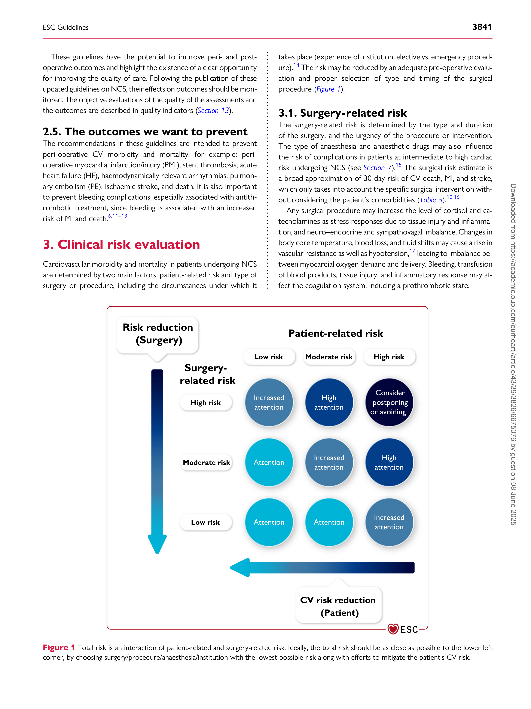
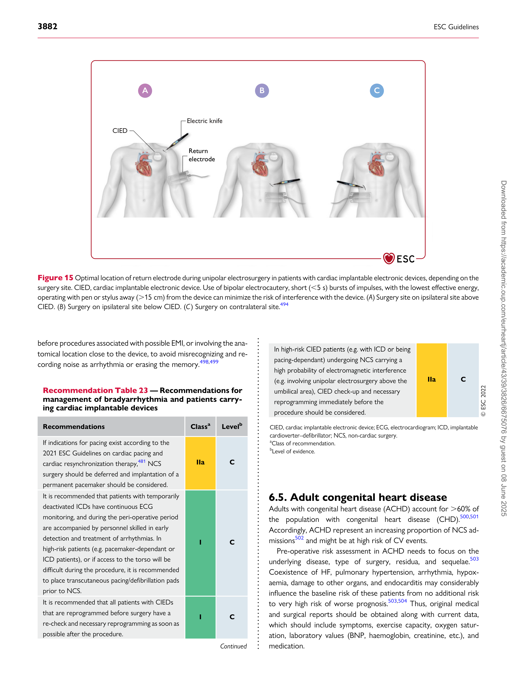
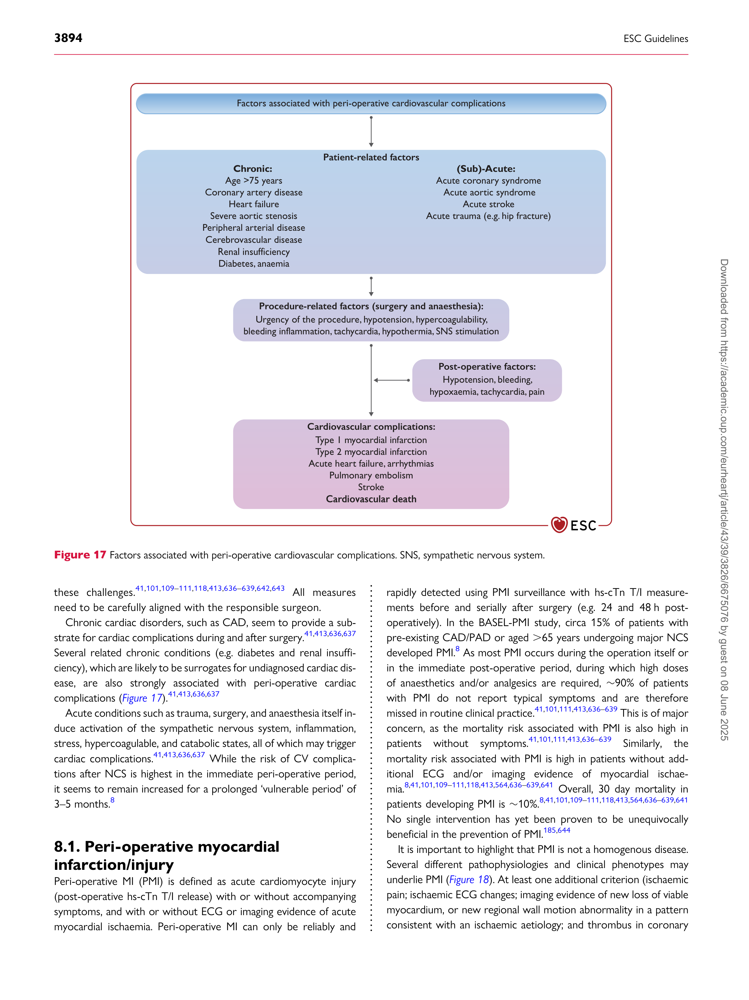

European Heart Journal (2022) 43, 3826–3924
[https://doi.org/10.1093/eurheartj/ehac270](https://doi.org/10.1093/eurheartj/ehac270)

#### ESC GUIDELINES

# 2022 ESC Guidelines on cardiovascular assessment and management of patients undergoing non-cardiac surgery
## Developed by the task force for cardiovascular assessment and management of patients undergoing non-cardiac surgery of the European Society of Cardiology (ESC) Endorsed by the European Society of Anaesthesiology and Intensive Care (ESAIC)
#### Authors/Task Force Members: Sigrun Halvorsen *† (Chairperson) (Norway), Julinda Mehilli *† (Chairperson) (Germany), Salvatore Cassese ** (Task Force Coordinator) (Germany), Trygve S. Hall [**] (Task Force Coordinator) (Norway), Magdy Abdelhamid (Egypt), Emanuele Barbato (Italy/Belgium), Stefan De Hert [1] (Belgium), Ingrid de Laval (Sweden), Tobias Geisler (Germany), Lynne Hinterbuchner (Austria), Borja Ibanez (Spain), Radosław Lenarczyk (Poland), Ulrich R. Mansmann (Germany), Paul McGreavy (United Kingdom), Christian Mueller (Switzerland), Claudio Muneretto (Italy), Alexander Niessner (Austria), Tatjana S. Potpara (Serbia), Arsen Ristić (Serbia), L. Elif Sade (United States of America/Turkey), Henrik Schirmer (Norway), Stefanie Schüpke (Germany), Henrik Sillesen (Denmark), Helge Skulstad (Norway), Lucia Torracca (Italy), Oktay Tutarel (Germany), Peter Van Der Meer (Netherlands), Wojtek Wojakowski (Poland), Kai Zacharowski [1] (Germany), and ESC Scientific Document Group

- Corresponding authors: Sigrun Halvorsen, Department of Cardiology, Oslo University Hospital Ulleval, Oslo, Norway, and University of Oslo, Oslo, Norway. Tel.: +47 91317460.
[E-mail: sigrun.halvorsen@medisin.uio.no.](mailto:sigrun.halvorsen@medisin.uio.no)

Julinda Mehilli, Department: Medizinische Klinik I, Landshut-Achdorf Hospital, Landshut, Germany, Klinikum der Universität München, Ludwig-Maximilians-Universität and German Centre
[for Cardiovascular Research (DZHK), partner site Munich Heart Alliance, Munich, Germany. Tel.: +49 871 4042782. E-mail: Julinda.mehilli@lakumed.de](mailto:Julinda.mehilli@lakumed.de)

- The two chairpersons contributed equally to the document and are joint corresponding authors.

** The two Task Force Coordinators contributed equally to the document

Author/Task Force Member affiliations: listed in author information.

1 Representing the European Society of Anaesthesiology and Intensive Care (ESAIC)

ESC Clinical Practice Guidelines (CPG) Committee listed in the Appendix.

ESC subspecialty communities having participated in the development of this document:

Associations: Association for Acute CardioVascular Care (ACVC), Association of Cardiovascular Nursing & Allied Professions (ACNAP), European Association of Cardiovascular
Imaging (EACVI), European Association of Percutaneous Cardiovascular Interventions (EAPCI), European Heart Rhythm Association (EHRA), and Heart Failure Association (HFA).

Councils: Council of Cardio-Oncology and Council on Valvular Heart Disease.

Working Groups: Adult Congenital Heart Disease, Aorta and Peripheral Vascular Diseases, Cardiovascular Pharmacotherapy, Cardiovascular Surgery, and Thrombosis.

Patient Forum

The content of these European Society of Cardiology (ESC) Guidelines has been published for personal and educational use only. No commercial use is authorized. No part of the ESC
Guidelines may be translated or reproduced in any form without written permission from the ESC. Permission can be obtained upon submission of a written request to Oxford University
[Press, the publisher of the European Heart Journal, and the party authorized to handle such permissions on behalf of the ESC (journals.permissions@oup.com).](mailto:journals.permissions@oup.com)

ESC Guidelines 3827

Document-Reviewers: Juhani Knuuti, (CPG Review Coordinator) (Finland), Steen Dalby Kristensen, (CPG
Review Coordinator) (Denmark), Victor Aboyans (France), Ingo Ahrens (Germany), Sotiris Antoniou (United
Kingdom), Riccardo Asteggiano (Italy), Dan Atar (Norway), Andreas Baumbach (United Kingdom),
Helmut Baumgartner (Germany), Michael Böhm (Germany), Michael A. Borger (Germany), Hector Bueno
(Spain), Jelena Čelutkienė (Lithuania), Alaide Chieffo (Italy), Maya Cikes (Croatia), Harald Darius (Germany),
Victoria Delgado (Spain), Philip J. Devereaux (Canada), David Duncker (Germany), Volkmar Falk (Germany),
Laurent Fauchier (France), Gilbert Habib (France), David Hasdai (Israel), Kurt Huber (Austria), Bernard Iung
(France), Tiny Jaarsma (Sweden), Aleksandra Konradi (Russian Federation), Konstantinos C. Koskinas
(Switzerland), Dipak Kotecha (United Kingdom), Ulf Landmesser (Germany), Basil S. Lewis (Israel), Ales Linhart
(Czech Republic), Maja-Lisa Løchen (Norway), Michael Maeng (Denmark), Stéphane Manzo-Silberman (France),
Richard Mindham (United Kingdom), Lis Neubeck (United Kingdom), Jens Cosedis Nielsen (Denmark),
Steffen E. Petersen (United Kingdom), Eva Prescott (Denmark), Amina Rakisheva (Kazakhstan), Antti Saraste
(Finland), Dirk Sibbing (Germany), Jolanta Siller-Matula (Austria), Marta Sitges (Spain), Ivan Stankovic (Serbia),
Rob F. Storey (United Kingdom), Jurrien ten Berg (Netherlands), Matthias Thielmann (Germany), and
Rhian M. Touyz (Canada/United Kingdom)

All experts involved in the development of these guidelines have submitted declarations of interest. These have
been compiled in a report and simultaneously published in a supplementary document to the guidelines. The
[report is also available on the ESC website www.escardio.org/Guidelines](https://www.escardio.org/Guidelines)

See the European Heart Journal online for supplementary data that include background information and
detailed discussion of the data that have provided the basis of the guidelines.

Click here to access the corresponding ESC CardioMed chapters.

### Table of contents

1. Preamble ........................................................................................................ 3832

2. Introduction ................................................................................................. 3834

2.1. What is new ........................................................................................ 3834

2.2. The magnitude of the problem ................................................... 3839

2.3. Change in demographics ................................................................ 3840

2.4. Purpose .................................................................................................. 3840

2.5. The outcomes we want to prevent .......................................... 3841

3. Clinical risk evaluation .............................................................................. 3841

3.1. Surgery-related risk .......................................................................... 3841

3.1.1. Timing of surgery ...................................................................... 3842

3.2. Type of surgical approach ............................................................. 3842

3.2.1. Laparoscopy ................................................................................ 3842

3.2.1.1. Vascular and endovascular procedures ................... 3843

3.2.1.2. Video-assisted non-cardiac surgery ........................... 3843

3.3. Patient-related risk ............................................................................ 3843

3.3.1. Initial assessment ....................................................................... 3843

3.3.1.1. Patients aged,65 years without a history of

cardiovascular disease or cardiovascular risk factors ........ 3843

3.3.1.2. Patients aged ≥65 years or with cardiovascular risk

factors .................................................................................................... 3843

3.3.1.3. Patients with established cardiovascular disease . 3844

3.3.2. Patients with murmurs, chest pain, dyspnoea, or

peripheral oedema ............................................................................... 3845

3.3.2.1. Murmurs ............................................................................... 3845

3.3.2.2. Chest pain ............................................................................ 3845

3.3.2.3. Dyspnoea .............................................................................. 3845

Disclaimer: The ESC Guidelines represent the views of the ESC and were produced after careful consideration of the scientific and medical knowledge and the evidence available at the
time of their publication. The ESC is not responsible in the event of any contradiction, discrepancy, and/or ambiguity between the ESC Guidelines and any other official recommendations
or guidelines issued by the relevant public health authorities, particularly in relation to good use of health care or therapeutic strategies. Health professionals are encouraged to take the
ESC Guidelines fully into account when exercising their clinical judgment, and in the determination and the implementation of preventive, diagnostic, or therapeutic medical strategies;
however, the ESC Guidelines do not override, in any way whatsoever, the individual responsibility of health professionals to make appropriate and accurate decisions in consideration of
each patient’s health condition and in consultation with that patient and, where appropriate and/or necessary, the patient’s caregiver. The ESC Guidelines do not exempt health professionals from taking into full and careful consideration the relevant official updated recommendations or guidelines issued by the competent public health authorities, in order to manage
each patient’s case in light of the scientifically accepted data pursuant to their respective ethical and professional obligations. It is also the health professional’s responsibility to verify the
applicable rules and regulations relating to drugs and medical devices at the time of prescription.

[© The European Society of Cardiology 2022. All rights reserved. For permissions please e-mail: journals.permissions@oup.com](mailto:journals.permissions@oup.com)

3828 ESC Guidelines

3.3.2.4. Peripheral oedema ........................................................... 3845

3.4. Timing of adequate risk evaluation ............................................ 3846

3.5. Avoidance or allowance for surgery in the individual patient 3846

3.6. The patient perspective .................................................................. 3846

4. Pre-operative assessment tools ........................................................... 3847

4.1. Risk scores ............................................................................................ 3847

4.1.1. General risk calculators .......................................................... 3847

4.1.2. Frailty .............................................................................................. 3849

4.2. Functional capacity ............................................................................ 3849

4.3. Electrocardiography ......................................................................... 3850

4.4. Biomarkers ........................................................................................... 3850

4.5. Non-invasive and invasive procedures ..................................... 3851

4.5.1. Resting transthoracic echocardiography ......................... 3851

4.5.2. Stress tests ................................................................................... 3852

4.5.2.1. Exercise stress test ........................................................... 3852

4.5.2.2. Stress imaging ..................................................................... 3852

4.5.3. Angiography ................................................................................ 3853

4.5.3.1. Coronary computed tomography angiography ... 3853

4.5.3.2. Invasive coronary angiography .................................... 3853

5. General risk-reduction strategies ........................................................ 3854

5.1. Cardiovascular risk factors and lifestyle interventions ...... 3854

5.2. Pharmacological ................................................................................. 3854

5.2.1. Beta-blockers .............................................................................. 3854

5.2.2. Amiodarone ................................................................................ 3855

5.2.3. Statins ............................................................................................ 3855

5.2.4. Renin–angiotensin–aldosterone system inhibitors ..... 3855

5.2.5. Calcium channel blockers ...................................................... 3855

5.2.6. Alpha-2 receptor agonists .................................................... 3856

5.2.7. Diuretics ....................................................................................... 3856

5.2.8. Ivabradine ..................................................................................... 3856

5.2.9. Sodium–glucose co-transporter-2 inhibitors ................ 3856

5.3. Peri-operative handling of antithrombotic agents ............... 3857

5.3.1. Antiplatelets ................................................................................ 3857

5.3.1.1. Single antiplatelet therapy ............................................. 3857

5.3.1.2. Dual antiplatelet therapy ............................................... 3860

5.3.1.3. De-escalation of antiplatelet effect ............................ 3862

5.3.1.4. Platelet function guided peri-operative

management of antiplatelet therapy ......................................... 3862

5.3.2. Oral anticoagulants .................................................................. 3863

5.3.2.1. Vitamin K antagonists ...................................................... 3863

5.3.2.1.1. Vitamin K antagonists in patients with

mechanical heart valves ............................................................. 3863

5.3.2.1.2. Vitamin K antagonists for atrial fibrillation/

venous thromboembolism ....................................................... 3864

5.3.2.1.3. Restarting vitamin K antagonists after invasive

procedures or surgery ............................................................... 3864

5.3.2.1.4. Reversal of vitamin K antagonists ...................... 3864

5.3.2.2. Non-vitamin K antagonist oral anticoagulants ...... 3864

5.3.2.2.1. Unplanned surgery in patients on non-vitamin

K antagonist oral anticoagulants and reversal for

emergency procedures .............................................................. 3864

5.3.2.2.2. Planned interventions in patients on non
vitamin K oral anticoagulants .................................................. 3866

5.3.2.2.3. Bridging ......................................................................... 3866

5.3.2.2.4. Laboratory testing before surgery .................... 3866
5.3.2.2.5. Considerations for specific procedures .......... 3867

5.3.2.2.6. When to restart non-vitamin K antagonist oral

anticoagulants after interventions ......................................... 3868

5.3.2.3. Combination therapy (antiplatelet and

anticoagulant) ...................................................................................... 3868

5.4. Peri-operative thromboprophylaxis .......................................... 3869

5.5. Patient blood management ........................................................... 3869

5.5.1. Pre-operative anaemia—diagnosis and treatment ..... 3870

5.5.2. Bleeding and reduction of iatrogenic diagnostic/

surgery-related blood loss ................................................................ 3870

5.5.3. Optimal blood component use with patient-centred

clinical decision support ..................................................................... 3871
6. Specific diseases .......................................................................................... 3871

6.1. Coronary artery disease ................................................................. 3871

6.1.1. Risk for patients with coronary artery disease ............ 3871

6.1.2. Pre-operative risk assessment and management ........ 3872

6.1.3. Revascularization strategies .................................................. 3872

6.1.3.1. Chronic coronary syndromes ...................................... 3872

6.1.3.2. Acute coronary syndromes .......................................... 3872

6.2. Chronic heart failure ........................................................................ 3874

6.2.1. Risk for patients with heart failure .................................... 3874

6.2.2. Pre- and post-operative management strategies ........ 3874

6.2.3. Hypertrophic obstructive cardiomyopathy ................... 3875

6.2.4. Patients with ventricular assist devices undergoing

non-cardiac surgery .............................................................................. 3875

6.3. Valvular heart disease ...................................................................... 3875

6.3.1. Risk for patients with valvular heart disease ................. 3875

6.3.2. Pre-operative management strategies and risk
reduction strategy ................................................................................. 3876

6.3.2.1. Aortic valve stenosis ........................................................ 3876

6.3.2.2. Mitral valve stenosis ......................................................... 3877

6.3.2.3. Aortic valve regurgitation .............................................. 3878

6.3.2.4. Mitral valve regurgitation ............................................... 3878

6.3.2.5. Patients with prosthetic valve(s) ................................ 3878

6.3.2.6. Prophylaxis of infective endocarditis ........................ 3878

6.4. Known or newly diagnosed arrhythmias ................................ 3879

6.4.1. Peri-operative management—general measures ........ 3879

6.4.2. Supraventricular arrhythmias ............................................... 3879
6.4.3. Atrial fibrillation/flutter ........................................................... 3879

6.4.4. Ventricular arrhythmias ......................................................... 3879

6.4.5. Bradyarrhythmias ...................................................................... 3881

6.4.6. Management of patients with cardiac implantable

electronic devices .................................................................................. 3881

6.5. Adult congenital heart disease ..................................................... 3882

6.6. Pericardial diseases ........................................................................... 3883

6.7. Pulmonary disease and pulmonary arterial hypertension 3884

6.7.1. Pulmonary disease .................................................................... 3884

6.7.2. Pulmonary arterial hypertension ........................................ 3884

6.8. Arterial hypertension ....................................................................... 3885

6.9. Peripheral artery disease ................................................................ 3886

6.9.1. Peripheral artery disease and non-vascular non-cardiac

surgery ....................................................................................................... 3886

6.9.2. Peripheral artery disease and vascular non-cardiac

surgery ....................................................................................................... 3886

6.10. Cerebrovascular disease .............................................................. 3887

6.11. Renal disease ..................................................................................... 3887

6.12. Obesity ................................................................................................ 3888

ESC Guidelines 3829

6.13. Diabetes .............................................................................................. 3889

6.14. Cancer ................................................................................................. 3889

6.15. Coronavirus disease 2019 ........................................................... 3889

7. Peri-operative monitoring and anaesthesia .................................... 3890

7.1. Peri-operative monitoring ............................................................. 3890

7.2. Anaesthesia .......................................................................................... 3891

7.2.1. Intra-operative haemodynamics ......................................... 3891

7.2.2. Choice of anaesthetic agent ................................................. 3892

7.3. Locoregional techniques ................................................................ 3892

7.4. Peri-operative goal-directed haemodynamic therapy ....... 3893

7.5. Post-operative management ......................................................... 3893

8. Peri-operative cardiovascular complications .................................. 3893

8.1. Peri-operative myocardial infarction/injury ............................ 3894

8.2. Spontaneous myocardial infarction (after day 2) ................ 3897

8.3. Takotsubo syndrome ....................................................................... 3897

8.4. Acute heart failure ............................................................................ 3897

8.5. Venous thromboembolism ........................................................... 3897

8.6. Atrial fibrillation and other relevant arrhythmias ................ 3897
8.6.1. Prevention of post-operative atrial fibrillation ............. 3897
8.6.2. Management of post-operative atrial fibrillation ......... 3898

8.6.2.1. Rate and/or rhythm control ......................................... 3898
8.6.2.2. Prevention of atrial fibrillation-related

thromboembolic complications .................................................. 3899

8.7. Peri-operative stroke ....................................................................... 3899

9. Key messages ............................................................................................... 3900

10. Gaps in evidence ...................................................................................... 3900

11. Sex differences ......................................................................................... 3901

12. ‘What to do’ and ‘what not to do’ messages from the

Guidelines ........................................................................................................... 3901

13. Quality indicators .................................................................................... 3906

14. Central illustration .................................................................................. 3906

15. Supplementary data ................................................................................ 3907

16. Data availability statement ................................................................... 3907

17. Author information ................................................................................ 3907

18. Appendix ..................................................................................................... 3907

19. References .................................................................................................. 3908
### Tables of Recommendations

Recommendation Table 1 — Recommendations for selection of

surgical approach and impact on risk ..................................................... 3843

Recommendation Table 2 — Recommendations for all patients

scheduled for non-cardiac surgery .......................................................... 3845

Recommendation Table 3 — Recommendations for patients

aged,65 years without signs, symptoms, or history of

cardiovascular disease ................................................................................... 3845

Recommendation Table 4 — Recommendations for

pre-operative assessment in patients with previously unknown

murmur, angina, dyspnoea, or peripheral oedema .......................... 3845

Recommendation Table 5 — Recommendations for patient

information ........................................................................................................ 3847

Recommendation Table 6 — Recommendations for

pre-operative assessment of frailty and functional capacity ......... 3849

Recommendation Table 7 — Recommendations for

—
pre-operative risk assessment electrocardiography and

biomarkers ......................................................................................................... 3851

Recommendation Table 8 — Recommendations for

transthoracic echocardiography ............................................................... 3852

Recommendation Table 9 — Recommendations for stress imaging 3853

Recommendation Table 10 — Recommendations for coronary

angiography ........................................................................................................ 3853

Recommendation Table 11 — Recommendations for lifestyle and

cardiovascular risk factors ........................................................................... 3854

Recommendation Table 12 — Recommendations for

pharmacological treatment ......................................................................... 3856

Recommendation Table 13 — Recommendations for use of

antiplatelet therapy in patients undergoing non-cardiac surgery 3862

Recommendation Table 14 — Recommendations for

interruption and resumption of anticoagulants in patients

undergoing non-cardiac surgery ............................................................... 3868

Recommendation Table 15 — Recommendations for

thromboprophylaxis ...................................................................................... 3869

Recommendation Table 16 — Recommendations for intra- and

post-operative complications associated with anaemia ................. 3870

Recommendation Table 17 — Recommendations for intra- and

post-operative complications associated with blood loss ............. 3871

Recommendation Table 18 — Recommendations for intra- and

post-operative complications associated with allogeneic blood

transfusion .......................................................................................................... 3871

Recommendation Table 19 — Recommendations for the timing

of non-cardiac surgery and revascularization in patients with

known coronary artery disease ................................................................ 3874

Recommendation Table 20 — Recommendations for

management of heart failure in patients undergoing non-cardiac

surgery ................................................................................................................. 3875

Recommendation Table 21 — Recommendations for

management of valvular heart disease in patients undergoing

non-cardiac surgery ........................................................................................ 3878

Recommendation Table 22 — Recommendations

for management of known or newly diagnosed arrhythmias ...... 3880

Recommendation Table 23 — Recommendations for

management of bradyarrhythmia and patients carrying cardiac

implantable devices ........................................................................................ 3882

Recommendation Table 24 — Recommendations for

management of patients with adult congenital heart disease

undergoing non-cardiac surgery ............................................................... 3883

Recommendation Table 25 — Recommendations for pericardial

diseases ................................................................................................................ 3884

Recommendation Table 26 — Recommendations for patients

with pulmonary arterial hypertension undergoing non-cardiac

surgery ................................................................................................................. 3885

Recommendation Table 27 — Recommendations for

pre-operative management of hypertension ...................................... 3886

Recommendation Table 28 — Recommendations for

management of patients with peripheral artery disease

and/or abdominal aortic aneurysm undergoing non-cardiac

surgery ......................................................................................................... 3887

Recommendation Table 29 — Recommendations for

management of patients with suspected or established carotid

artery disease undergoing non-cardiac surgery ................................. 3887

Recommendation Table 30 — Recommendations for

management of patients with renal disease undergoing

non-cardiac surgery ........................................................................................ 3888

Recommendation Table 31 — Recommendations for

management of patients with obesity undergoing non-cardiac

surgery ................................................................................................................. 3888

3830 ESC Guidelines

Recommendation Table 32 — Recommendations for

management of patients with diabetes mellitus undergoing

non-cardiac surgery ........................................................................................ 3889

Recommendation Table 33 — Recommendations for

peri-operative monitoring and anaesthesia ......................................... 3893

Recommendation Table 34 — Recommendations for

peri-operative cardiovascular complications ....................................... 3899
### List of tables

Table 1 Classes of recommendations .................................................... 3833

Table 2 Levels of evidence .......................................................................... 3833

Table 3 New concepts and sections in the current guidelines ... 3834

Table 4 What is new ..................................................................................... 3834

Table 4A New recommendations ........................................................... 3834

Table 4B Revised recommendations ...................................................... 3838

Table 5 Surgical risk estimate according to type of surgery or

intervention ....................................................................................................... 3842

Table 6 Risk score calculators ................................................................... 3848

Table 7 Pharmacokinetic and pharmacodynamic characteristics of

antiplatelets ........................................................................................................ 3857

Table 8 Pharmacokinetic and pharmacodynamic characteristics of

oral anticoagulants .......................................................................................... 3858

Table 9 Bleeding risk according to type of non-cardiac surgery 3858

Table 10 Laboratory parameters for the diagnosis of absolute
iron-deficiency anaemia ................................................................................ 3870

Table 11 Peri-operative approach to patients with ventricular

assist devices undergoing non-cardiac surgery ................................... 3875

Table 12 Peri-operative management of patients with arrhythmias 3880
Table 13 Risk stratification for non-cardiac surgery in adults with

congenital heart disease ............................................................................... 3883

Table 14 Patient-related and surgery-related factors to be

considered when assessing peri-operative risk in patients with

pulmonary arterial hypertension .............................................................. 3885
Table 15 Factors that could influence peri-operative risk during

cancer surgery and preventive strategies ............................................. 3890
### List of figures

Figure 1 Total risk is an interaction of patient-related and

surgery-related risk ........................................................................................ 3841

Figure 2 Pre-operative assessment before non-cardiac surgery 3844

Figure 3 Examples of questions and concerns expressed by

patients ................................................................................................................ 3847

Figure 4 Recommended measurements to assess and detect the

risk of post-operative cardiac complications ...................................... 3850

Figure 5 Recommendations for management of antiplatelet

therapy in patients undergoing non-cardiac surgery ....................... 3859

Figure 6 P2Y 12 inhibitor interruption after percutaneous

coronary intervention before elective non-cardiac surgery ......... 3860

Figure 7 Bridging with intravenous antiplatelet agents. ASA,

acetylsalicylic acid; FU, follow-up; LD, loading dose; NCS,

non-cardiac surgery; o.d., once a day ...................................................... 3861

Figure 8 Recommendations for management of oral

anticoagulation therapy in patients undergoing non-cardiac

surgery ................................................................................................................. 3863

Figure 9 Peri-operative management of non-vitamin K antagonist

oral anticoagulant according to the periprocedural risk of bleeding 3865

Figure 10 Timing of last non-vitamin K antagonist oral anticoagulant

dose before elective NCS according to renal function ...................... 3866

Figure 11 Suggested strategy for potential reversal of non-vitamin

K oral anticoagulants effect ........................................................................ 3867

Figure 12 Management of patients with acute or chronic coronary

syndrome scheduled for non-cardiac surgery .................................... 3873

Figure 13 Management of patients with severe aortic valve

stenosis scheduled for non-cardiac surgery ........................................ 3876

Figure 14 Management of patients with secondary mitral valve

regurgitation scheduled for non-cardiac surgery .............................. 3877

Figure 15 Optimal location of return electrode during unipolar

electrosurgery in patients with cardiac implantable electronic

devices, depending on the surgery site .................................................. 3882

Figure 16 Pathophysiological approach to address intra-operative

hypotension ....................................................................................................... 3892

Figure 17 Factors associated with peri-operative cardiovascular

complications. SNS, sympathetic nervous system ............................ 3894

Figure 18 Differential diagnosis of elevated post-operative cardiac

troponin concentrations .............................................................................. 3895

Figure 19 Systematic work-up (aetiology) and therapy of

peri-operative myocardial infarction/injury .......................................... 3896

Figure 20 Prevention and management of post-operative atrial
fibrillation ............................................................................................................ 3898

Figure 21 Central illustration: the complex interplay between the

intrinsic risk of surgery and the patient risk of peri-operative

cardiovascular complications ..................................................................... 3906
### Abbreviations and acronyms

AAA Abdominal aortic aneurysm
AAD Antiarrhythmic drug
ACEI Angiotensin-converting-enzyme

inhibitor

ACHD Adults with congenital heart disease
ACS Acute coronary syndrome
ACS NSQIP American College of Surgery National
Surgical Quality Improvement Program
AF Atrial fibrillation
AKI Acute kidney injury
aPTT Activated partial thromboplastin time
AR Aortic valve regurgitation
ARB Angiotensin receptor blocker
ARNI Angiotensin receptor neprilysin inhibitor

AS Aortic valve stenosis

ASA Acetylsalicylic acid
ASA–PS American Society of Anesthesiology
Physical Status

ASCVD Atherosclerotic cardiovascular disease

AUB-HAS2 American University of Beirut
(AUB)-HAS2

AUC Area under curve

AVR Aortic valve replacement
BAV Balloon aortic valvuloplasty

BCSH British Committee for Standards in

Haematology
b.i.d. Bis in die (twice a day)
BTKi Bruton tyrosine kinase inhibitors
BMI Body mass index

ESC Guidelines 3831

BMS Bare metal stent

BNP B-type natriuretic peptide
BP Blood pressure
b.p.m. Beats per minute
BSA Body surface area
CABG Coronary artery bypass graft
CAD Coronary artery disease
CARP Coronary Artery Revascularization
Prophylaxis (trial)
CAS Carotid artery stenting
CASS Coronary Artery Surgery Study

CCB Calcium channel blocker

CCS Chronic coronary syndrome
CCTA Coronary computed tomography
angiography
CEA Carotid endarterectomy
CHA 2 DS 2 -VASc Congestive heart failure, hypertension,
age ≥75 years, diabetes mellitus, stroke,

–
vascular disease, age 65 74 years, sex
category (female)
CI Confidence interval
CIED Cardiac implantable electronic device

CK Creatinine kinase

CKD Chronic kidney disease
CKD-EPI Chronic Kidney Disease Epidemiology

Collaboration

C [max] Maximum serum concentration

CMR Cardiac magnetic resonance

COAPT Cardiovascular Outcomes Assessment

of the MitraClip Percutaneous Therapy

for Heart Failure Patients with

Functional Mitral Regurgitation (trial)
COPD Chronic obstructive pulmonary disease
CORIDA Per-procedural Concentration of Direct
Oral Anticoagulants (trial)
Coronary CTA VISION Coronary Computed Tomographic
Angiography and Vascular Events in
Noncardiac Surgery Patients Cohort
Evaluation (trial)

COVID-19 Coronavirus disease 2019

CPET Cardiopulmonary exercise testing
CRF Cardiorespiratory fitness
CRT Cardiac resynchronization therapy
CT Computed tomography
cTn T/I Cardiac troponin T/I

CTO Chronic total occlusion

CV Cardiovascular

CVD Cardiovascular disease

DAPT Dual antiplatelet therapy
DASI Duke Activity Status Index
DES Drug-eluting stent

DM Diabetes mellitus

DSE Dobutamine stress echocardiography

dTT Diluted thrombin time

EACTS European Association for
Cardio-Thoracic Surgery
ECG Electrocardiographic/electrocardiogram

EDKA Euglycaemic diabetic ketoacidosis
eGFR Estimated glomerular filtration rate
EMI Electromagnetic interference

EORP EURObservational Research

Programme
ESA European Society of Anaesthesiology
ESC European Society of Cardiology
ESH European Society of Hypertension
ESTS European Society of Thoracic
Surgeons
ESVS European Society for Vascular Surgery
EuSOS European Surgical Outcomes Study
EVAR Endovascular abdominal aortic aneurysm

repair
FDA US Food and Drug Administration
FFR Fractional flow reserve

FIIa Factor IIa

FOCUS Focused cardiac ultrasound

FXa Factor Xa

GDMT Guideline-directed medical therapy
GFR Glomerular filtration rate
HbA1c Glycated haemoglobin

HF Heart failure

HIP-ATTACK HIP Fracture Accelerated Surgical
TreaTment And Care tracK (trial)

HR Hazard ratio

hs-cTn High-sensitivity cardiac troponin

i.v. Intravenous

ICA Invasive coronary angiography
ICD Implantable cardioverter–defibrillator

ICU Intensive care unit

ID Iron deficiency

IHD Ischaemic heart disease

INR International normalized ratio

ISCHEMIA International Study of Comparative

Health Effectiveness with Medical and

Invasive Approaches (trial)

iwFR Instantaneous wave-free ratio

KDIGO Kidney Disease: Improving Global

Outcomes

LD Loading dose
LMWH Low molecular weight heparin
LOAD Lowering the Risk of Operative
Complications Using Atorvastatin
Loading Dose (trial)

LoE Level of evidence

LV Left ventricular

LVEF Left ventricular ejection fraction
LVESD Left ventricular end-systolic diameter
LVESDi Left ventricular end-systolic dimension

index

MACE Major adverse cardiovascular event
MET Metabolic equivalent

METS Measurement of Exercise Tolerance

before Surgery (trial)

MHV Mechanical heart valve

MI Myocardial infarction

3832 ESC Guidelines

MINS Myocardial injury following non-cardiac

surgery
MR Mitral valve regurgitation

MS Mitral valve stenosis

NCS Non-cardiac surgery
NOAC Non-vitamin K antagonist oral
anticoagulant
NSAID Non-steroidal anti-inflammatory drug
NSTE-ACS Non-ST-segment elevation acute
coronary syndrome
NT-proBNP N-terminal pro-B-type natriuretic
peptide

NYHA New York Heart Association

OAC Oral anticoagulant
o.d. Omnie die (once a day)

OR Odds ratio

OSA Obstructive sleep apnoea
PA Pulmonary artery
PAD Peripheral artery disease
PAH Pulmonary arterial hypertension
PAUSE Perioperative Anticoagulant Use for
Surgery Evaluation (trial)
PBM Patient Blood Management
PCC Prothrombin complex concentrate
PCI Percutaneous coronary intervention
PE Pulmonary embolism
PMC Percutaneous mitral commissurotomy
PMI Peri-operative myocardial infarction/

injury
POISE PeriOperative ISchemic Evaluation Trial
PPC Prothrombin complex concentrate

PT Prothrombin time

PVC Premature ventricular contractions

QI Quality indicator
RAAS Renin−angiotensin−aldosterone system

RBC Red blood cell

RCRI Revised Cardiac Risk Index

RCT Randomized controlled trial

RF Radiofrequency
rHuEPO Recombinant human erythropoietin

RR Relative risk

RV Right ventricular
SAPT Single antiplatelet therapy
SARS-CoV-2 Severe acute respiratory syndrome

coronavirus 2

SAVR Surgical aortic valve replacement

SCD Sudden cardiac death

SGLT-2 Sodium–glucose co-transporter-2
SORT Surgical Outcome Risk Tool
SPAP Systolic pulmonary artery pressure
STEMI ST-segment elevation myocardial

infarction

SVT Supraventricular tachycardia
TAVI Transcatheter aortic valve implantation
TEE Transoesophageal echocardiography
TEER Transcatheter edge-to-edge repair

TIA Transient ischaemic attack

TTE Transthoracic echocardiography
UFH Unfractionated heparin
ULN Upper limit of normal

VAD Ventricular assist device

VATS Video-assisted thoracic surgery
VEGFi Vascular endothelial grow factor

inhibitor

VF Ventricular fibrillation

VHD Valvular heart disease

VISION Vascular Events in Noncardiac Surgery
Patients Cohort Evaluation (trial)
VKA Vitamin K antagonist
VKORC1 Vitamin K epoxide reductase complex 1
VO 2 Oxygen consumption
VT Ventricular tachycardia

VTE Venous thromboembolism

WHA World Health Assembly

WPW Wolff–Parkinson–White
### 1. Preamble

Guidelines summarize and evaluate available evidence, with the aim

of assisting health professionals in proposing the best management
strategies for an individual patient with a given condition.

Guidelines and their recommendations should facilitate decision
making of health professionals in their daily practice. Guidelines,
however, are not a substitute for the patient’s relationship with their
practitioner. The final decisions concerning an individual patient must
be made by the responsible health professional(s), based on what
they consider to be the most appropriate in the circumstances.
These decisions are made in consultation with the patient and care
giver as appropriate.
Guidelines are intended for use by health professionals. To en
sure that all users have access to the most recent recommenda
tions, the European Society of Cardiology (ESC) makes its
guidelines freely available. The ESC warns readers that the technical
language may be misinterpreted and declines any responsibility in
this respect.
Many guidelines have been issued in recent years by the ESC.
Because of their impact on clinical practice, quality criteria for the development of guidelines have been established in order to make all
decisions transparent to the user. The recommendations for formulating and issuing ESC Guidelines can be found on the ESC website
[(https://www.escardio.org/Guidelines). The ESC Guidelines re-](https://www.escardio.org/Guidelines)
present the official position of the ESC on a given topic and are regularly updated.
In addition to the publication of Clinical Practice Guidelines, the
ESC carries out the EURObservational Research Programme of
international registries of cardiovascular diseases and interventions, which are essential to assess diagnostic/therapeutic processes, use of resources, and adherence to guidelines. These
registries aim to provide a better understanding of medical practice in Europe and around the world, and are based on high-quality
data collected during routine clinical practice. Furthermore, the
ESC develops sets of quality indicators (QIs)—which are tools
to evaluate the level of implementation of the guidelines and
may be used by the ESC, hospitals, healthcare providers, and

ESC Guidelines 3833

professionals to measure clinical practice, and in educational programmes—alongside the key messages from the guidelines, to improve quality of care and clinical outcomes.
The members of this Task Force were selected by the ESC to represent professionals involved with the medical care of patients with
this pathology. The selection procedure aimed to ensure that there is
a representative mix of members, predominantly from across the
whole of the ESC region and from relevant ESC Subspecialty
Communities. Consideration was given to diversity and inclusion,
notably with respect to gender and country of origin. A critical evaluation of diagnostic and therapeutic procedures was performed, including assessment of the risk–benefit ratio. The level of evidence
and the strength of the recommendation of particular management

Table 1 Classes of recommendations

options were weighed and scored according to pre-defined scales, as
outlined below. The Task Force followed the ESC voting procedures.
All recommendations subject to a vote achieved at least 75% among
voting members.
The experts of the writing and reviewing panels provided declaration of interest forms for all relationships that might be perceived as
real or potential sources of conflicts of interest. Their declarations of
interest were reviewed according to the ESC declaration of interest
[rules and can be found on the ESC website (http://www.escardio.org/](http://www.escardio.org/Guidelines)
[Guidelines) and have been compiled in a report and simultaneously](http://www.escardio.org/Guidelines)
published in a supplementary document to the guidelines. This process ensures transparency and prevents potential biases in the development and review processes. Any changes in declarations of

Table 2 Levels of evidence

3834 ESC Guidelines

interest that arose during the writing period were notified to the
ESC and updated. The Task Force received its entire financial support from the ESC without any involvement from the healthcare
industry.
The ESC CPG Committee supervises and coordinates the preparation of new guidelines. The Committee is also responsible for the
approval process of these guidelines. The ESC Guidelines undergo
extensive review by the CPG Committee and external experts, including a mix of members from across the whole of the ESC region
and from relevant ESC Subspecialty Communities and National
Cardiac Societies. After appropriate revisions, the guidelines are
signed-off by all the experts involved in the Task Force. The finalized
document is signed-off by the CPG Committee for publication in the
European Heart Journal. The guidelines are developed after careful
consideration of the scientific and medical knowledge and the evidence available at the time of their writing.
The task of developing the ESC Guidelines also includes creating
educational tools and implementating programmes for the recommendations, including condensed pocket guidelines versions, summary slides, summary cards for non-specialists, and an electronic
version for digital applications (smartphones, etc.). These versions
are abridged and thus, for more detailed information, the user should
always access the full text version of the guidelines, which is
freely available via the ESC website and the European Heart Journal.
The National Cardiac Societies of the ESC are encouraged to
endorse, adopt, translate, and implement all ESC Guidelines.
Implementation programmes are needed because it has been shown
that the outcome of disease may be favourably influenced by the
thorough application of clinical recommendations.
Health professionals are encouraged to take the ESC Guidelines
fully into account when exercising their clinical judgment, and in determining and implementing preventive, diagnostic, or therapeutic
medical strategies. However, the ESC Guidelines do not override,
in any way whatsoever, the individual responsibility of health professionals to make appropriate and accurate decisions in considering
each patient’s health condition and in consulting with that patient
or the patient’s caregiver where appropriate and/or necessary. It is
also the health professional’s responsibility to verify the rules and
regulations applicable in each country to drugs and devices at the
time of prescription and, where appropriate, to respect the ethical
rules of their profession.
Off-label use of medication may be presented in these guidelines
if a sufficient level of evidence shows that it can be considered medically appropriate to a given condition and if patients could benefit
from the recommended therapy. However, the final decisions concerning an individual patient must be made by the responsible health
professional, giving special consideration to:

(a) the specific situation of the patient. In this respect, it is specified
that, unless otherwise provided for by national regulations, off
label use of medication should be limited to situations where it

is in the patient’s interest to do so, with regard to the quality,
safety, and efficacy of care, and only after the patient has been
informed and provided consent;
(b) and country-specific health regulations, indications by governmental drug regulatory agencies, and the ethical rules to which
health professionals are subject, where applicable.

### 2. Introduction

2.1. What is new

Table 3 New concepts and sections in the current
guidelines

A new flowchart for general assessment of patients before NCS.

A new section on pre-operative assessment of patients with newly

detected murmurs, dyspnoea, oedema, or angina.

A new section on the patient perspective.

A new section on assessment of frailty.

A revised and expanded focus on use of biomarkers in NCS

A revised and expanded section on peri-operative management of

antiplatelet therapy.

A revised and expanded section on peri-operative management of

oral anticoagulants.

A new section on peri-operative thromboprophylaxis.

A dedicated section on patient blood management.

A new section on management of cardiovascular risk in patients with

cancer undergoing NCS.

A small section on NCS in patients with recent COVID-19.

A new section on diagnosis and management of post-operative

complications during NCS.

COVID-19, coronavirus 2019; NCS, non-cardiac surgery

Table 4 What is new

Table 4A New recommendations

|In all patients scheduled for NCS, an accurate history, and clinical examination are recommended.|I|
|---|---|
|It is recommended to perform a pre-operative risk assessment, ideally at the same time as the NCS is proposed.|I|
|If time allows, it is recommended to optimize guideline-recommended treatment of CVD and CV risk factors before NCS.|I|
|Endovascular or video-assisted procedures should be considered for patients with high CV risk undergoing vascular or pulmonary surgery.|IIa|

|In patients with a family history of genetic cardiomyopathy, it is recommended to perform an ECG and TTE before NCS, regardless of age and symptoms.|I|
|---|---|
|In patients aged 45–65 years without signs, symptoms, or history of CVD, ECG and biomarkers should be considered before high-risk NCS.|IIa|

Continued

ESC Guidelines 3835

CCTA should be considered to rule out CAD in patients with

suspected CCS or biomarker-negative NSTE-ACS in case of

low-to-intermediate clinical likelihood of CAD, or in patients

unsuitable for non-invasive functional testing undergoing

non-urgent, intermediate-, and high-risk NCS.

IIa

|Smoking cessation .4 weeks before NCS is recommended to reduce post-operative complications and mortality.|I|
|---|---|
|Control of CV risk factors—including blood pressure, dyslipidaemia, and diabetes—is recommended before NCS.|I|

|Pharmacological treatment|Col2|
|---|---|
|For patients on diuretics to treat hypertension, transient discontinuation of diuretics on the day of NCS should be considered.|IIa|
|It should be considered to interrupt SGLT-2 inhibitor therapy for at least 3 days before intermediate- or high-risk NCS.|IIa|

|In patients with a newly detected murmur and symptoms or signs of CVD, TTE is recommended before NCS.|I|
|---|---|
|In patients with a newly detected murmur suggesting clinically significant pathology, TTE is recommended before high-risk NCS.|I|
|In patients with a newly detected murmur, but without other signs or symptoms of CVD, TTE should be considered before moderate and high-risk NCS.|IIa|
|If a patient scheduled for elective NCS has chest pain or other symptoms suggestive of undetected CAD, further diagnostic work-up before NCS is recommended.|I|
|If a patient in need of acute NCS also has chest pain or other symptoms suggestive of undetected CAD, a multidisciplinary assessment approach is recommended to choose the treatment with lowest total risk for the patient.|I|
|In patients with dyspnoea and/or peripheral oedema, an ECG and an NT-proBNP/BNP test is indicated before NCS, unless there is a certain non-cardiac explanation.|I|
|In patients with dyspnoea and/or peripheral oedema and elevated NT-proBNP/BNP, TTE is recommended before NCS.|I|

|Antiplatelets|Col2|
|---|---|
|For patients undergoing high bleeding risk surgery (e.g. intracranial, spinal neurosurgery, or vitreoretinal eye surgery), it is recommended to interrupt aspirin for at least 7 days pre-operatively.|I|
|In high-risk patients with a recent PCI (e.g. STEMI patients or high-risk NSTE-ACS patients), a DAPT duration of at least 3 months should be considered before time-sensitive NCS.|IIa|

|Patient information|Col2|
|---|---|
|It is recommended to give patients individualized instructions for pre-operative and post-operative changes in medication, in verbal and written formats with clear and concise directions.|I|
|It should be considered to set up a structured information list (e.g. a checklist to help with common issues) for patients with CVD or at high risk of CV complications scheduled for NCS.|IIa|

|In patients aged ≥70 years, being scheduled to undergo intermediate- or high-risk NCS, frailty screening should be considered using a validated screening tool.|IIa|
|---|---|
|Adjusting risk assessments according to self-reported ability to climb two flights of stairs should be considered in patients referred for intermediate- or high-risk NCS.|IIa|

|When an urgent surgical intervention is required, it is recommended that NOAC therapy is immediately interrupted.|I|
|---|---|
|In non-minor bleeding risk procedures in patients using a NOAC, it is recommended to use an interruption regimen based on the NOAC compound, renal function, and bleeding risk.|I|
|In minor bleeding risk surgery and other procedures where bleeding can easily be controlled, it is recommended to perform surgery without interruption of OAC therapy.|I|
|In patients using NOACs, it is recommended that minor bleeding risk procedures are performed at trough levels (typically 12–24 h after last intake).|I|
|LMWH is recommended, as an alternative to UFH, for bridging in patients with MHVs and high surgical risk.|I|
|For patients with mechanical prosthetic heart valves undergoing NCS, bridging with UFH or LMWH should be considered if OAC interruption is needed and patients have: (i) mechanical AVR and any thromboembolic risk factor; (ii) old-generation mechanical AVR; or (iii) mechanical mitral or tricuspid valve replacement.|IIa|
|Idarucizumab should be considered in patients on dabigatran and requiring urgent surgical intervention with intermediate to high bleeding risk.|IIa|
|For interventions with a very high risk of bleeding, such as spinal or epidural anaesthesia, interruption of NOACs for up to five half-lives and re-initiation after 24 h should be considered.|IIa|

Continued

|Transthoracic echocardiography|Col2|
|---|---|
|TTE is recommended in patients with poor functional capacity and/or high NT-proBNP/BNP, or if murmurs are detected before high-risk NCS, in order to undertake risk-reduction strategies.|I|
|TTE should be considered in patients with suspected new CVD or unexplained signs or symptoms before high-risk NCS.|IIa|
|TTE may be considered in patients with poor functional capacity, abnormal ECG, high NT-proBNP/BNP, or ≥1 clinical risk factor before intermediate-risk NCS.|IIb|
|To avoid delaying surgery, a FOCUS exam performed by trained specialists may be considered as an alternative to TTE for pre-operative triage.|IIb|

IIa

Continued

Stress imaging should be considered before high-risk NCS in

asymptomatic patients with poor functional capacity, and

previous PCI or CABG.

3836 ESC Guidelines

Pre-operative evaluation of patients with an indication for PCI

by an expert team (surgeon and cardiologist) should be

considered before elective NCS.

IIa

|In patients with HF undergoing NCS, it is recommended to regularly assess volume status and signs of organ perfusion.|I|
|---|---|
|A multidisciplinary team including VAD specialists is recommended for peri-operative management of patients with HF receiving mechanical circulatory support.|I|

|Valvular heart disease|Col2|
|---|---|
|In patients with symptomatic severe AR or asymptomatic severe AR and LVESD .50 mm or LVESDi (LVESD/BSA) .25 mm/m2 (in patients with small body size) or resting LVEF ≤50%, valve surgery is recommended prior to elective intermediate- or high-risk NCS.|I|
|In patients with moderate-to-severe rheumatic MS and symptoms or SPAP .50 mmHg, valve intervention (PMC or surgery) is recommended before elective intermediate- or high-risk NCS.|I|
|In asymptomatic patients with severe AS who are scheduled for elective high-risk NCS, AVR (SAVR or TAVI) should be considered after Heart Team discussion.|IIa|
|In patients with symptomatic severe primary MR or asymptomatic severe primary MR with LV dysfunction (LVESD ≥40 mm and/or LVEF ≤60%), valve intervention (surgical or transcatheter) should be considered prior to intermediate- or high-risk NCS, if time allows.|IIa|
|In patients with severe secondary MR who remain symptomatic despite guideline-directed medical therapy (including CRT if indicated), valve intervention (transcatheter or surgical) should be considered before NCS, in eligible patients with an acceptable procedural risk.|IIa|
|In patients with severe symptomatic AS in need of time-sensitive NCS or in whom the TAVI and SAVR are unfeasible, BAV may be considered before NCS as a bridge to definitive aortic valve repair.|IIb|

|Arrhythmias|Col2|
|---|---|
|In AF patients with acute or worsening haemodynamic instability undergoing NCS, emergency electrical cardioversion is recommended.|I|
|In patients with symptomatic, monomorphic, sustained VT associated with myocardial scar, recurring despite optimal medical therapy, ablation of arrhythmia is recommended before elective NCS.|I|
|It is recommended that all patients with CIEDs that are reprogrammed before surgery have a re-check and necessary reprogramming as soon as possible after the procedure.|I|
|If indications for pacing exist according to the 2021 ESC Guidelines on cardiac pacing and cardiac resynchronization therapy, NCS surgery should be deferred and implantation of a permanent pacemaker should be considered.|IIa|

Continued

|When specific reversal agents are unavailable, PCC or activated PCC should be considered for reversing NOAC effects.|IIa|
|---|---|
|If an urgent surgical intervention is required, specific coagulation tests and assessment of NOAC plasma levels should be considered to interpret routine coagulation tests and waning of anticoagulant effect.|IIa|
|If bleeding risk with resumption of full-dose anticoagulation outweighs the risk of thromboembolic events, postponing therapeutic anticoagulation 48–72 h after the procedure may be considered, using post-operative thromboprophylaxis until resumption of full OAC dose is deemed safe.|IIb|
|Bridging of OAC therapy is not recommended in patients with low/moderate thrombotic risk undergoing NCS.|III|
|Use of reduced-dose NOAC to attenuate the risk of post-operative bleeding is not recommended.|III|

|Thromboprophylaxis|Col2|
|---|---|
|It is recommended that decisions about peri-operative thromboprophylaxis in NCS are based on individual and procedure-specific risk factors.|I|
|If thromboprophylaxis is deemed necessary, it is recommended to choose the type and duration of thromboprophylaxis (LMWH, NOAC, or fondaparinux) according to type of NCS, duration of immobilization, and patient-related factors.|I|
|In patients with a low bleeding risk, peri-operative thromboprophylaxis should be considered for a duration of up to 14 or 35 days, for total knee or hip arthroplasty, respectively.|IIa|
|NOACs in thromboprophylaxis dose may be considered as alternative treatments to LMWH after total knee and hip arthroplasty.|IIb|

|It is recommended to measure haemoglobin pre-operatively in patients scheduled for intermediate- to high-risk NCS.|I|
|---|---|
|It is recommended to treat anaemia in advance of NCS in order to reduce the need for RBC transfusion during NCS.|I|
|In patients undergoing surgery with expected blood loss of ≥500 mL, use of washed cell salvage is recommended.|I|
|It is recommended to use point-of-care diagnostics for guidance of blood component therapy, when available.|I|
|The use of an algorithm to diagnose and treat anaemic patients before NCS should be considered.|IIa|
|In patients undergoing NCS and experiencing major bleeding, administration of tranexamic acid should be immediately considered.|IIa|
|Use of closed-loop arterial blood sampling systems should be considered to avoid blood loss.|IIa|
|Application of meticulous haemostasis should be considered a routine procedure.|IIa|
|A feedback/monitoring programme or clinical decision support system should be considered to be assessed before blood transfusion.|IIa|
|Before allogenic blood transfusion, it should be considered to obtain an extensive consent about risks associated with transfusion.|IIa|

Continued

ESC Guidelines 3837

A pre-operative assessment for concomitant cardiac

conditions is recommended in patients with diabetes with

suspected or known CAD, and those with autonomic

neuropathy, retinopathy, or renal disease and scheduled to

undergo intermediate- or high-risk NCS.

I

|Ablation should be considered in symptomatic patients with recurrent or persistent SVT, despite treatment, prior to high-risk, non-urgent NCS.|IIa|
|---|---|
|In high-risk CIED patients (e.g. with ICD or being pacing-dependant) undergoing NCS carrying a high probability of electromagnetic interference (e.g. involving unipolar electrosurgery above the umbilical area), CIED check-up and necessary reprogramming immediately before the procedure should be considered.|IIa|

It is recommended to avoid post-operative acute pain. I

|Adult congenital heart disease|Col2|
|---|---|
|In patients with ACHD, a consultation with an ACHD specialist I is recommended before intermediate- or high-risk surgery.|In patients with ACHD, a consultation with an ACHD specialist I is recommended before intermediate- or high-risk surgery.|
|In patients with ACHD, it is recommended that intermediate- and high-risk elective surgery is performed in a centre with experience in the care of ACHD patients.|I|

|Pericardial diseases|Col2|
|---|---|
|In patients with acute pericarditis, deferring elective NCS until complete resolution of the underlying process should be considered.|IIa|
|Avoiding elective NCS procedures under general anaesthesia until colchicine or the immunosuppressive treatment course for pericardial disease is completed may be considered.|IIb|

Inodilator drugs (dobutamine, milrinone, levosimendan),

which increase cardiac output and lower pulmonary vascular

resistance, should be considered peri-operatively according to

the haemodynamic status of the patient.

IIa

Routine referral for cardiac work-up, coronary angiography, or

CPET prior to elective surgery for PAD or AAA is not

recommended.

III

|Renal disease|Col2|
|---|---|
|In patients with known risk factors (age .65 years, BMI .30, diabetes, hypertension, hyperlipidaemia, CV disease, or smoking) undergoing intermediate- or high-risk NCS, it is recommended to screen for pre-operative renal disease by measuring serum creatinine and GFR.|I|
|In patients with renal disease requiring peri-operative contrast-enhanced radiography, balanced hydration with i.v. isotonic fluids, the use of a minimal volume of contrast media, and the use of low-osmolar or iso-osmolar contrast media should be considered.|IIa|
|If a cystatin C measurement assay is available, cystatin C measurement should be considered in patients with impaired eGFR (,45–59 mL/min/1.73 m2) to confirm kidney disease.|IIa|

|Obesity|Col2|
|---|---|
|It is recommended to assess cardiorespiratory fitness to estimate peri-operative CV risk in obese patients, with particular attention to those undergoing intermediate- and high-risk NCS.|I|
|In patients at high risk of obesity hypoventilation syndrome, additional specialist investigation before major elective NCS should be considered.|IIa|

Continued

|Perioperative cardiovascular complications—Section 8|8|
|---|---|
|It is recommended to have high awareness of peri-operative CV complications combined with surveillance for PMI in patients undergoing intermediate- or high-risk NCS.|I|
|Systematic PMI work-up is recommended to identify the underlying pathophysiology and to define therapy.|I|
|It is recommended to treat post-operative STEMI, NSTE-ACS, acute HF, and tachyarrhythmias in accordance with guidelines for the non-surgical setting, after interdisciplinary discussion with the surgeon about bleeding risk.|I|
|In patients with post-operative PE of high or intermediate clinical probability, initiation of anticoagulation is recommended without delay, while diagnostic work-up is in progress, if bleeding risk is low.|I|
|Post-operative oral anticoagulation for PE is recommended to be administered for a period of at least 3 months.|I|
|In patients with a post-operative indication for OAC, NOACs are generally recommended over VKA.|I|
|In patients with post-operative AF after NCS, long-term OAC therapy should be considered in all patients at risk of stroke, considering the anticipated net clinical benefit of OAC therapy, and informed patient preferences.|IIa|
|In patients with MINS and at low risk of bleeding, treatment with dabigatran 110 mg orally b.i.d. may be considered from about 1 week after NCS.|IIb|
|Routine use of beta-blocker for the prevention of post- operative AF in patients undergoing NCS is not recommended.|III|

AAA, abdominal aortic aneurysm; ACHD, adults with congenital heart disease; AF, atrial
fibrillation; AR, aortic valve regurgitation; AS, aortic valve stenosis; AVR, aortic valve
replacement; BAV, balloon aortic valvuloplasty; b.i.d., twice a day; BMI, body mass index;
BNP, B-type natriuretic peptide; BSA, body surface area; CABG, coronary artery bypass
graft; CAD, coronary artery disease; CCS, chronic coronary syndrome; CCTA, coronary
computed tomography angiography; CIED, cardiac implantable electronic device; CPET,
cardiopulmonary exercise testing; CRT, cardiac resynchronization therapy; CV,
cardiovascular; CVD, cardiovascular disease; DAPT, dual antiplatelet therapy; ECG,
electrocardiogram; eGFR, estimated glomerular filtration rate; ESC, European Society of
Cardiology; FOCUS, focused cardiac ultrasound; GFR, glomerular filtration rate; HF,
heart failure; i.v., intravenous; LMWH, low molecular weight heparin; LV, left ventricular;
LVEF, left ventricular ejection fraction; LVESD, left ventricular end-systolic diameter;
LVESDi, left ventricular end-systolic dimension index; MHV, mechanical heart valve;
MINS, myocardial injury following non-cardiac surgery; MR, mitral valve regurgitation; MS,
mitral valve stenosis; NCS, non-cardiac surgery; NOAC, non-vitamin K antagonist oral
anticoagulant; NSTE-ACS, non-ST-segment elevation acute coronary syndrome;
NT-proBNP, N-terminal pro-B-type natriuretic peptide; OAC, oral anticoagulant; PAD,
peripheral artery disease; PCC, prothrombin complex concentrate; PCI, percutaneous
coronary intervention; PE, pulmonary embolism; PMC, percutaneous mitral
commissurotomy; PMI, peri-operative myocardial infarction/injury; RBC, red blood cell;
SAVR, surgical aortic valve replacement; SGLT-2, sodium–glucose co-transporter-2;
SPAP, systolic pulmonary artery pressure; STEMI, ST-segment elevation myocardial
infarction; SVT, supraventricular tachycardia; TAVI, transcatheter aortic valve
implantation; TTE, transthoracic echocardiography; UFH, unfractionated heparin; VAD,
ventricular assist device; VKA, vitamin K antagonist; VT, ventricular tachycardia.

3838 ESC Guidelines

Table 4B Revised recommendations

|Pre-operative ECG is recommended for patients who have risk factor(s) and are scheduled for intermediate- or high-risk surgery.|I|In patients who have known CVD or CV risk factors (including age ≥65 years), or symptoms or signs suggestive of CVD it is recommended to obtain a pre-operative 12-lead ECG before intermediate- or high-risk NCS.|I|
|---|---|---|---|
|Assessment of cardiac troponins in high-risk patients, both before and 48–72 h after major surgery, may be considered.|IIb|In patients who have known CVD, CV risk factors (including age ≥65 years), or symptoms suggestive of CVD, it is recommended to measure hs-cTn T or hs-cTn I before intermediate- and high-risk NCS, and at 24 h and 48 h afterwards.|I|
|NT-proBNP and BNP measurements may be considered for obtaining independent prognostic information for peri- operative and late cardiac events in high-risk patients.|IIb|In patients who have known CVD, CV risk factors (including age ≥65 years), or symptoms suggestive of CVD, it should be considered to measure BNP or NT-proBNP before intermediate- and high-risk NCS.|IIa|
|Universal pre-operative routine biomarker sampling for risk stratification and to prevent cardiac events is not recommended.|III|In low-risk patients undergoing low- and intermediate-risk NCS, it is not recommended to routinely obtain pre-operative ECG, hs-cTn T/I, or BNP/NT-proBNP concentrations.|III|

Coronary angiography

Pre-operative ICA is not recommended in cardiac-stable patients

III
patients undergoing low- or intermediate-risk NCS.

Pre-operative ICA is not recommended in cardiac-stable patients III Routine pre-operative ICA is not recommended in stable CCS

undergoing low-risk surgery. patients undergoing low- or intermediate-risk NCS.

Transient discontinuation of ACEIs or ARBs before NCS in

IIa
NCS should be considered to prevent peri-operative hypotension.

Transient discontinuation of ACEIs or ARBs before NCS in IIa In patients without HF, withholding RAAS inhibitors on the day of

hypertensive patients should be considered. NCS should be considered to prevent peri-operative hypotension.

Antiplatelets

|Consideration should be given to performing non-urgent NCS in patients who have had recent DES implantation no sooner than 12 months following the intervention. This delay may be reduced to 6 months for the new-generation DES.|IIa|It is recommended to delay elective NCS until 6 months after elective PCI and 12 months after an ACS.|I|
|---|---|---|---|
|It is recommended that aspirin be continued for 4 weeks after BMS implantation and for 3–12 months after DES implantation, unless the risk of life-threatening surgical bleeding on aspirin is unacceptably high.|I|After elective PCI, it is recommended to delay time-sensitive NCS until a minimum of 1 month of DAPT treatment has been given.|I|
|Continuation of aspirin, in patients previously thus treated, may be considered in the peri-operative period, and should be based on an individual decision that depends on the peri- operative bleeding risk, weighed against the risk of thrombotic complications.|IIb|In patients with a previous PCI, it is recommended to continue aspirin peri-operatively if the bleeding risk allows.|I|
|Discontinuation of aspirin therapy, in patients previously treated with it, should be considered in those in whom haemostasis is anticipated to be difficult to control during surgery.|IIa|In patients without a history of PCI, interruption of aspirin at least 3 days before NCS may be considered if the bleeding risk outweighs the ischaemic risk, to reduce the risk of bleeding.|IIb|
|In patients treated with P2Y inhibitors, who need to undergo 12 surgery, postponing surgery for at least 5 days after cessation of ticagrelor and clopidogrel—and for 7 days in the case of prasugrel —if clinically feasible, should be considered unless the patient is at high risk of an ischaemic event.|IIa|If interruption of P2Y inhibitor is indicated, it is recommended to 12 withhold ticagrelor for 3–5 days, clopidogrel for 5 days, and prasugrel for 7 days prior to NCS.|I|

If PCI is indicated before semi-urgent surgery, the use of

new-generation DES, BMS or even balloon angioplasty is

recommended.

If PCI is indicated before NCS, the use of new-generation DES is
I recommended over BMS and balloon angioplasty. I

Continued

ESC Guidelines 3839

Arrhythmias

Patients with ICDs, whose devices have been pre-operatively

deactivated, should be on continuous cardiac monitor throughout

the period of deactivation. External defibrillation equipment
should be readily available. I

It is recommended that patients with temporarily deactivated ICDs

have continuous ECG monitoring, and during the peri-operative

period are accompanied by personnel skilled in early detection and

treatment of arrhythmias. In high-risk patients (e.g.

pacemaker-dependant or ICD patients), or if access to the torso

will be difficult during the procedure, it is recommended to place
transcutaneous pacing/defibrillation pads prior to NCS.

I

|Hypertension|Col2|Col3|Col4|
|---|---|---|---|
|Large peri-operative fluctuations in blood pressure in hypertensive patients should be avoided.|IIa|In patients with chronic hypertension undergoing elective NCS, it is recommended to avoid large peri-operative fluctuations in blood pressure, particularly hypotension, during the peri-operative period.|I|
|Clinicians may consider not deferring NCS in patients with grade 1 or 2 hypertension (systolic blood pressure,180 mmHg; diastolic blood pressure,110 mmHg).|IIb|It is not recommended to defer NCS in patients with stage 1 or 2 hypertension.|III|

Peripheral artery disease

Patients with PAD should be clinically assessed for ischaemic heart

In patients with poor functional capacity or with significant risk

disease and, if more than two clinical risk factors are present, they
should be considered for pre-operative stress or imaging testing. IIa

Diabetes mellitus

In patients at high surgical risk, clinicians should consider screening

for elevated HbA1c before major surgery and improving

pre-operative glucose control. IIa

factors or symptoms (such as moderate-to-severe angina pectoris,
decompensated HF, valvular disease and significant arrhythmia),

referral for cardiac work-up and optimization is recommended

prior to elective surgery for PAD or AAA.

In patients with diabetes or disturbed glucose metabolism, a

pre-operative HbA1c test is recommended, if this measurement

has not been performed in the previous 3 months. In case of

HbA1c ≥8.5% (≥69 mmol/mol), elective NCS should be

postponed, if safe and practical.

I

I

|Peri-operative monitoring and anaesthesia—Section 7|Col2|Col3|Col4|
|---|---|---|---|
|Patients with high cardiac and surgical risk should be considered for goal-directed therapy.|IIa|In order to preserve optimal CV stability, it is recommended to apply goal-directed haemodynamic therapy in patients undergoing high-risk NCS.|I|
|Avoiding arterial hypotension (mean arterial pressure ,60 mmHg) for prolonged cumulative periods (.30 min) may be considered.|IIb|In order to minimize the risk of post-operative organ dysfunction, it is recommended to avoid an intra-operative mean arterial pressure decrease of .20% from baseline values or,60– 70 mmHg for ≥10 min.|I|
|Avoiding non-steroidal anti- inflammatory drugs (especially cyclo-oxygenase-2 inhibitors) as the first-line analgesics in patients with IHD or stroke may be considered.|IIb|Non-aspirin NSAIDs are not recommended as first-line analgesics in patients with established or high risk of CVD.|III|

AAA, abdominal aortic aneurysm; ACEI, angiotensin-converting-enzyme inhibitor; ARB, angiotensin receptor blocker; BNP, B-type natriuretic peptide; BMS, bare metal stent; CCS,
chronic coronary syndrome; CV, cardiovascular; CVD, cardiovascular disease; DAPT, dual antiplatelet therapy; DES, drug-eluting stent; ECG, electrocardiogram; HbA1c, glycated
haemoglobin A1c; HF, heart failure; hs-cTn, high-sensitivity cardiac troponin; ICA, invasive coronary angiography; ICD, implantable cardioverter–defibrillator; IHD, ischaemic heart
disease; NCS, non-cardiac surgery; NSAID, non-steroidal anti-inflammatory drug; NT-proBNP, N-terminal pro-B-type natriuretic peptide; PAD, peripheral artery disease; PCI,
percutaneous coronary intervention; RAAS, renin−angiotensin−aldosterone system.

2.2. The magnitude of the problem
The annual volume of major surgery worldwide is estimated to be
more than 300 million patients (about 5% of the world population),
which is a 34% increase from 2004 to 2012. [1][,][2] Nearly 74% of these
operations are performed in countries spending substantial amounts
on health care. When applied to European Union countries, which

had an overall population of 448 million in 2020 (27 countries),
this figure translates into a crude estimate of nearly 22 million major
procedures annually. [2]

Nearly 85% of major operations are non-cardiac surgical procedures. [3] In a recent report from the USA National Inpatient Sample
database, nearly half of adults aged ≥45 years undergoing major non
3840 ESC Guidelines

cardiac surgery (NCS) presented with at least two cardiovascular
(CV) risk factors, 18% had coronary artery disease (CAD), 4.7%
had a history of stroke, and 7.7% had a modified Revised Cardiac
Risk Index (RCRI) score ≥3 (range 0–6) in 2012–13. These prevalence rates show a substantial increase compared with the equivalent
rates in 2008–09. [4] In a large registry including 37 915 consecutive patients undergoing percutaneous coronary interventions (PCIs) with
drug-eluting stent (DES), the rates of NCS after PCI were 11%
and 24%, 1 and 3 years after PCI respectively. The cut-off ages at
which NCS was more likely to occur within 1 and 3 years of PCI
were 62 and 73 years respectively. [5]

The prevalence of comorbidities, the clinical condition of patients
before surgery, and the urgency, magnitude, type, and duration of the
surgical procedure determine the risk of peri-operative complications. In a recent cohort study of 40 000 patients aged ≥45 years
undergoing inpatient NCS, one of seven experienced a major cardiac
or cerebrovascular complication at 30 days. [6] Cardiovascular complications can particularly occur in patients with documented or asymptomatic coronary heart disease, left ventricular (LV) dysfunction,
valvular heart disease (VHD), and arrhythmias, who undergo surgical
procedures that are associated with prolonged haemodynamic and
cardiac stress. In the case of peri-operative myocardial ischaemia,
three mechanisms are important: (i) oxygen supply–demand mismatch on the background of coronary artery stenosis that may become flow-limiting by peri-operative haemodynamic fluctuations;
(ii) acute coronary syndrome (ACS) due to stress-induced erosion
or rupture of a vulnerable atherosclerotic plaque in combination
with pro-inflammatory and hypercoagulable states induced by surgery, and the haemodynamic distress resulting from fluid shifts and
anaesthesia; and (iii) surgery-associated bleeding risk requiring interruption of antiplatelet therapies, which might lead to stent thrombosis among patients undergoing NCS after recent coronary stent
placement. Left ventricular dysfunction and arrhythmias may occur
for various reasons at all ages. Because the prevalence of CAD,
VHD, heart failure, and arrhythmias increases with age, perioperative CV mortality and morbidity are predominantly an issue
in the adult population undergoing major NCS.
In Europe, recent systematic data on the annual number and type
of operations, and on patient outcomes are unfortunately lacking.
Additionally, data definitions vary, as do data quantity and quality.
Based on the estimates outlined above, nearly 6.6 million procedures
are performed annually in European patients with CAD, peripheral
artery disease (PAD), and cerebrovascular disease who are at high
risk of CV complications. In a 7 day cohort study, the European
Surgical Outcomes Study (EuSOS) group investigated the outcomes
of NCS in 498 hospitals across 27 European nations and the UK; up
to 8% of patients undergoing NCS required critical care admission,

–
while in-hospital mortality ranged 1.4 21.5% (mean 4.0%), depending on safety precautions. [7] In a recent prospective study of 2265
high-risk patients undergoing NCS in Switzerland, one out of five developed major adverse events within 365 days. [8] When applied to the
population in European Union countries, these figures translate into
at least 660 000 major cardiac or cerebrovascular complications occurring annually due to NCS procedures.

The 2022 ESC Guidelines on cardiovascular assessment and man
agement of patients undergoing NCS focus on the pre-operative CV
risk assessment and peri-operative management of patients in whom

cardiovascular disease (CVD) is a potential source of complications
during NCS.

2.3. Change in demographics
Within the next 30 years, the ageing of the population will have a major impact on peri-operative patient management. Patients undergoing
NCS are older than the rest of the population. Furthermore, it is estimated that by 2030, one-fifth of individuals aged .75 years will
undergo surgery each year. In addition, between 2018 and 2050, the

–
number of people in Europe aged 75 84 years is projected to increase
by ≏60%. The total number of surgical procedures may increase even
faster because of the greater need for interventions with increasing
age. Demographics of patients undergoing surgery show trends towards increasing numbers of elderly patients and increasing numbers
of patients with comorbidities, particularly CVDs. Thus, adults aged
≥75 years have a greater risk of peri-operative major adverse cardiovascular events (MACEs) (9.5% vs. 4.8% for younger adults [P,
0.001]). [9] However, age per se seems to be responsible for a small increase in the risk of complications; greater risks are associated with urgency and significant CV, pulmonary, and renal disease.

2.4. Purpose
As many years have passed and new evidence has become available since
the publication of the 2014 ESC/European Society of Anaethesiology
(ESA) Guidelines on non-cardiac surgery: cardiovascular assessment
and management, [10] the ESC has decided to revise the guidelines on
NCS. These new guidelines are based on the 2014 edition, but all sec
tions have been revised or rewritten, and several new sections have

been added. Some of the old recommendations are unchanged or

have been revised, and new recommendations have been added.

These guidelines are intended for physicians, healthcare workers,
and collaborators involved in the pre-operative, operative, and postoperative care of patients undergoing NCS. The objective is to endorse a standardized and evidence-based approach to peri-operative
CV management. The guidelines recommend a stepwise evaluation
of the patient that integrates clinical risk factors and test results
with the estimated stress of the planned surgical procedure and
the risks involved with the discontinuation of drugs. This results in
an individualized risk assessment, with the opportunity of initiating
medical therapy, coronary interventions, and specific surgical and anaesthetic techniques, or withholding medical therapy, in order to optimize the patient’s peri-operative condition. Further, it should be
discussed in which institutions (specialized small hospital vs. tertiary
care) the NCS will be performed. It is important that patients’ values
and preferences with respect to the benefits and risks of surgery are
taken into consideration, and that patients are involved in the decisions. This is particularly important when it comes to decisions about
undergoing elective surgery or not, the timing of surgery, and choice
of surgical and anaesthetic techniques.
Compared with non-surgical settings, randomized controlled trials
(RCTs) are scarce in this field. However, since the publication of the
2014 ESC/ESA Guidelines on non-cardiac surgery: cardiovascular assessment and management there has been a significant increase in
RCTs that are relevant in this setting. When no trials are available
on a specific CV management regimen in the surgical setting, data
from the non-surgical setting may be extrapolated and similar re
commendations made, but with different levels of evidence.

ESC Guidelines 3841

These guidelines have the potential to improve peri- and postoperative outcomes and highlight the existence of a clear opportunity
for improving the quality of care. Following the publication of these
updated guidelines on NCS, their effects on outcomes should be monitored. The objective evaluations of the quality of the assessments and
the outcomes are described in quality indicators (Section 13).

2.5. The outcomes we want to prevent
The recommendations in these guidelines are intended to prevent
peri-operative CV morbidity and mortality, for example: perioperative myocardial infarction/injury (PMI), stent thrombosis, acute
heart failure (HF), haemodynamically relevant arrhythmias, pulmonary embolism (PE), ischaemic stroke, and death. It is also important
to prevent bleeding complications, especially associated with antithrombotic treatment, since bleeding is associated with an increased
risk of MI and death. [6][,][11][–][13]
### 3. Clinical risk evaluation

Cardiovascular morbidity and mortality in patients undergoing NCS
are determined by two main factors: patient-related risk and type of
surgery or procedure, including the circumstances under which it

takes place (experience of institution, elective vs. emergency procedure). [14] The risk may be reduced by an adequate pre-operative evaluation and proper selection of type and timing of the surgical
procedure (Figure 1).

3.1. Surgery-related risk
The surgery-related risk is determined by the type and duration
of the surgery, and the urgency of the procedure or intervention.
The type of anaesthesia and anaesthetic drugs may also influence
the risk of complications in patients at intermediate to high cardiac
risk undergoing NCS (see Section 7). [15] The surgical risk estimate is
a broad approximation of 30 day risk of CV death, MI, and stroke,
which only takes into account the specific surgical intervention without considering the patient’s comorbidities (Table 5). [10][,][16]

Any surgical procedure may increase the level of cortisol and catecholamines as stress responses due to tissue injury and inflamma
–
tion, and neuro endocrine and sympathovagal imbalance. Changes in
body core temperature, blood loss, and fluid shifts may cause a rise in
vascular resistance as well as hypotension, [17] leading to imbalance between myocardial oxygen demand and delivery. Bleeding, transfusion
of blood products, tissue injury, and inflammatory response may affect the coagulation system, inducing a prothrombotic state.

Figure 1 Total risk is an interaction of patient-related and surgery-related risk. Ideally, the total risk should be as close as possible to the lower left
corner, by choosing surgery/procedure/anaesthesia/institution with the lowest possible risk along with efforts to mitigate the patient’s CV risk.

3842 ESC Guidelines

Table 5 Surgical risk estimate according to type of surgery or intervention

|Low surgical risk (,1%)|Intermediate surgical risk (1–5%)|High surgical risk (.5%)|
|---|---|---|
|• Breast • Dental • Endocrine: thyroid • Eye • Gynaecological: minor • Orthopaedic minor (meniscectomy) • Reconstructive • Superficial surgery • Urological minor: (transurethral resection of the prostate) • VATS minor lung resection|• Carotid asymptomatic (CEA or CAS) • Carotid symptomatic (CEA) • Endovascular aortic aneurysm repair • Head or neck surgery • Intraperitoneal: splenectomy, hiatal hernia repair, cholecystectomy • Intrathoracic: non-major • Neurological or orthopaedic: major (hip and spine surgery) • Peripheral arterial angioplasty • Renal transplants • Urological or gynaecological: major|• Adrenal resection • Aortic and major vascular surgery • Carotid symptomatic (CAS) • Duodenal-pancreatic surgery • Liver resection, bile duct surgery • Oesophagectomy • Open lower limb revascularization for acute limb ischaemia or amputation • Pneumonectomy (VATS or open surgery) • Pulmonary or liver transplant • Repair of perforated bowel • Total cystectomy|

CAS, carotid artery stenting; CEA, carotid endarterectomy; CV, cardiovascular; MI, myocardial infarction; VATS, video-assisted thoracic surgery.
Surgical risk estimate is a broad approximation of 30 day risk of CV death, MI, and stroke that takes into account only the specific surgical intervention, without considering the patient’s

comorbidities.
Adapted from data in Glance et al., Muller et al., Bendixen et al., and Falcoz et al. [18][–][23]

3.1.1. Timing of surgery
In general, acute procedures carry a higher risk of complications than
elective procedures. Uniform timing definitions are unfeasible, as the
time spans may vary between diseases. These guidelines use the timing definitions below.
Immediate: surgery/intervention should be performed without
any delay to save life or organ function.
Urgent: surgery/intervention should be performed without unnecessary delay to save life, limb, or organ function.
Time-sensitive: surgery/intervention should be performed as
soon as possible as there is a time-dependent risk of losing limb or
organ function, or increased risk of complications. Cancer surgery
is typically time-sensitive, as is carotid surgery to prevent stroke in
a symptomatic case. The time window for time-sensitive surgery
will vary depending on the underlying disease.
Elective: surgery/intervention can be performed electively (not
further defined) without significant risk of losing limb, or organ function, or increased risks of complications.
Many factors affect outcomes when comparing acute or timesensitive vs. elective surgery: the general condition of the patient
vs. the stage of the acute illness, and how far it has progressed.
The best interests of the patient should be considered before
deciding on treatment, informed consent to management should
be obtained, if at all possible, and decisions should be clearly
recorded. [24]

The degree of urgency should also be considered (i.e. does
the procedure need to be performed outside working hours
or can it wait until the next day?). In general, competences
and supportive functions are not always present in the evenings
or during the night; thus, an overall evaluation of what best
serves the patient is necessary. The optimal timing of NCS
should be discussed within the multidisciplinary team, including

an anaesthesiologist, in order to achieve optimized anaesthesia
for each patient (see Section 7).

3.2. Type of surgical approach
New surgical techniques have been introduced to replace open surgery and to reduce the overall risk for the patient.

3.2.1. Laparoscopy
Laparoscopic procedures, compared with open surgical procedures,
have the advantage of causing less tissue trauma and intestinal paralysis,
resulting in less incisional pain, better post-operative pulmonary function, significantly fewer wall complications, and diminished postoperative fluid shifts related to bowel paralysis. [25] However, the pneumoperitoneum required for these procedures results in elevated
intra-abdominal pressure and a reduction in venous return. Typical
physiological sequelae are secondary to increased intra-abdominal
pressure and absorption of the gaseous medium used for insufflation.
While healthy individuals on controlled ventilation typically tolerate pneumoperitoneum, patients with CVD, some types of adults
with congenital heart disease (ACHD), and obese patients may experience adverse consequences. [26] Pneumoperitoneum and
Trendelenburg position result in increased mean arterial pressure,
central venous pressure, mean pulmonary artery pressure, pulmonary capillary wedge pressure, and systemic vascular resistance impairing cardiac function. [27][,][28] Therefore, compared with open
surgery, the CV risk in patients with CVD is not necessarily reduced
in patients undergoing laparoscopy, and both should be evaluated in
the same way. This is especially true in patients undergoing interventions for morbid obesity, but also in other types of surgery, considering the risk of conversion to an open procedure. [29][,][30] Superior
short-term outcomes of laparoscopic vs. open procedures have
been reported, depending on type of surgery, operator experience,

ESC Guidelines 3843

and hospital volume; however, few studies provide direct measures
of cardiac complications. [31][–][33] The benefit of laparoscopic procedures is probably greater in elderly patients, with reduced length
of hospital stay, intra-operative blood loss, incidence of postoperative pneumonia, time to return of normal bowel function, incidence of post-operative cardiac complications, and wound
infections. [34]

3.2.1.1. Vascular and endovascular procedures
Endovascular abdominal aortic aneurysm repair (EVAR) is a procedure using femoral artery access only, and is therefore associated with lower operative mortality and morbidity than open
repair. It minimizes the surgical risk in simultaneous surgery for
the treatment of abdominal aortic aneurysm (AAA) and a noncardiac disorder, and shortens the time delay from the treatment
of AAA and the non-cardiac disorder in patients undergoing twophase surgery. [35][–][37] The early gain in mortality from EVAR procedures is lost after 3–4 years, compared with open surgical treatment, due to general morbidity (especially CV mortality) of
AAA patients.
Various vascular and non-vascular NCS procedures bear different
operative risks. While aortic and infra-inguinal vascular surgical
procedures are both regarded as high-risk procedures, their risk
can be modified by adequate peri-operative measures. [38] For
patients undergoing treatment of femoropopliteal artery disease,
an endovascular-first approach may be advisable in case of additional
significant comorbidity. A meta-analysis of studies comparing open
surgery with PCI for the treatment of femoropopliteal arterial disease showed that femoral bypass surgery was associated with higher

–
morbidity (odds ratio [OR] 2.93; 95% confidence interval [CI], 1.34
6.41) but similar mortality at 30 days compared with endovascular
treatment. [39]

3.2.1.2. Video-assisted non-cardiac surgery
Video-assisted thoracic surgery (VATS) is supported by a trial
showing fewer peri-operative complications and a better quality
of life in the first year following surgery for stage 1 lung cancer compared with anterolateral thoracotomy. [20] Also, a large propensity
matched study conducted by the European Society of Thoracic
Surgeons (ESTS) showed fewer post-operative complications following VATS compared with open thoracotomy. [21] Overall, the
benefits seem greatest in patients with reduced functional lung

capacity.

Recommendation Table 1 — Recommendations for
selection of surgical approach and impact on risk

3.3. Patient-related risk

3.3.1. Initial assessment

Patient-related risk is determined by patient’s age, the presence or
absence of CV risk factors (e.g. smoking, hypertension, diabetes, dyslipidaemia, family disposition) [40] or established CV disease, and
comorbidities. [41]

Identification of patients at risk of CV complications is of paramount importance to choice of therapy when non-surgical options
are available, or when the type of surgery or anaesthesia impacts
the risk of complications. When emergency surgery is needed, the
evaluation must necessarily be limited; however, most clinical circumstances allow a systematic approach.
As an initial assessment, it is recommended that all patients scheduled for NCS are evaluated by accurate history and physical examination, with special emphasis on CV risk factors, established CV
disease, and comorbidities. [40] It is also recommended to measure

standard laboratory tests (e.g. haemoglobin and renal function) in all
patients undergoing intermediate- to high-risk surgery. Based on this
information, further assessment of patient-related risk can proceed
depending on the surgery-related risk, as shown in Figure 2. It is recommended to perform an electrocardiogram (ECG), assess the functional
capacity, and/or measure biomarkers (cardiac troponins and/or
N-terminal pro-B-type natriuretic peptide [NT-proBNP]/B-type natriuretic peptide [BNP]) depending on the patient-related and
surgery-related risk (Figure 2). Detailed information on available tools
for risk assessment, their prognostic ability, and indications to perform
them is given in Section 4. More details on pre-operative management
of patients with specific CV diseases are given in Section 6.

3.3.1.1. Patients aged,65 years without a history of
cardiovascular disease or cardiovascular risk factors
Patients aged,65 years without signs, symptoms, or history of CVD
or CV risk factors are considered to be of low risk, and can proceed
to low- and moderate-risk surgery without additional pre-operative
risk assessment. [41] Before high-risk surgery, ECG and biomarkers
should be considered (see Sections 4.3 and 4.4). [42]

Patients without signs or symptoms of CVD, but with a family history of genetic cardiomyopathy (i.e. dilatated, hypertrophic, arrhythmic, or restrictive cardiomyopathy, or LV non-compaction) should
be evaluated with an ECG and an echocardiographic examination
to rule out the presence of the disease, irrespective of the age. [43]

No specific data are available in the literature regarding risk of family
members without the phenotype; however, they are at risk of developing the disease, which may be subclinical at the time of the NCS. [43]

3.3.1.2. Patients aged ≥65 years or with cardiovascular risk
factors
Patients who are aged ≥65 years and patients with risk factors for
CVD—such as hypertension, dyslipidaemia, or smoking—have an
increased risk of having undetected CVD. The SCORE2 riskprediction tool can be used to estimate their 10 year CVD risk
outside the setting of NCS. [40] Patients who are aged ≥65 years
and patients with risk factors for CVD also have an increased
risk of peri-operative complications during NCS. [41][,][44] These
patients need additional assessment before intermediate- and
high-risk surgery (Figure 2) and optimal treatment of risk factors.

|Recommendations|Classa|Levelb|
|---|---|---|
|Endovascular or video-assisted procedures should be considered for patients with high CV risk undergoing vascular or pulmonary surgery.21,35–39|IIa|B|

CV, cardiovascular.

a Class of recommendation.
b Level of evidence.

3844 ESC Guidelines

Figure 2 Pre-operative assessment before non-cardiac surgery. CV, cardiovascular; CVD, cardiovascular disease; ECG, electrocardiogram; N, no; NCS,
non-cardiac surgery. Y, yes; [a] CV risk factors: hypertension, smoking, dyslipidaemia, diabetes, family history of CVD. [b] Biomarkers: hs-cTn T/I (Class I) and/
or BNP/NT-proBNP (Class IIa). If pathological, consult a cardiologist. [c] Functional capacity based on Duke Activity Status Index (DASI) or the ability to
climb two flights of stairs. [d] For diagnostic and therapeutic efforts to be considered, see Section 6. [e] Close follow-up after intervention and subsequent
management of heart disease are advised.

This is also the case for patients with other diseases known to be
associated with a high risk of concomitant undetected or known
CVD (Sections 6.8 and 6.11–6.14).

3.3.1.3. Patients with established cardiovascular disease

The surgical procedure has the potential to aggravate the disease
and increase morbidity and mortality in patients with established

CVD. This may be preventable by implementing appropriate CV
risk stratification prior to NCS and individually tailoring
peri-operative therapy to reduce the risk. [45] If time allows, it is
also recommended to optimize guideline-recommended treat
ment of the disease before NCS. See Section 6 for a detailed

discussion of risk assessment and management of patients with

known CVD.

ESC Guidelines 3845

Recommendation Table 2 — Recommendations for
all patients scheduled for non-cardiac surgery

|Recommendations|Classa|Levelb|
|---|---|---|
|In all patients scheduled for NCS, an accurate history and clinical examination are recommended.|I|C|
|It is recommended to perform a pre-operative risk assessment, ideally at the same time as the NCS is proposed.46–53|I|B|
|If time allows, it is recommended to optimize guideline-recommended treatment of CVD and CV risk factors before NCS.|I|C|

CV, cardiovascular; CVD, cardiovascular disease; NCS, non-cardiac surgery.
a Class of recommendation.
b Level of evidence.

Recommendation Table 3 — Recommendations for
patients aged,65 years without signs, symptoms, or
history of cardiovascular disease

|Recommendations|Classa|Levelb|
|---|---|---|
|In patients with a family history of genetic cardiomyopathy, it is recommended to perform an ECG and TTE before NCS, regardless of age and symptoms.|I|C|
|In patients aged 45–65 years without signs, symptoms, or history of CVD, ECG and biomarkers should be considered before high-risk NCS.|IIa|C|

ECG, electrocardiogram; NCS, non-cardiac surgery; TTE, transthoracic
echocardiography.
a Class of recommendation.
b Level of evidence.

3.3.2. Patients with murmurs, chest pain, dyspnoea,
or peripheral oedema

Patients without known CVD and scheduled for elective or acute

NCS are often referred to a cardiologist because of symptoms or
signs that may be caused by CVD. Murmurs, chest pain, dyspnoea,
and oedema may suggest severe CVD, but may also be caused by
non-cardiac disease. Thus, the medical history, family history, and
risk factors have to be obtained and considered. The patient’s physical capacity should be assessed. The need for further evaluation of
the patient should be decided according to the risk of the planned
procedure or surgery.

3.3.2.1. Murmurs

In a patient with a heart murmur, but without any symptoms of CVD,
the value of performing an echocardiogram is not well-established
and consensus is missing. [54][–][56] However, if a heart murmur suggesting
clinically significant pathology is present before high-risk NCS, it is recommended to perform an echocardiogram, even in patients without any symptoms of CVD. Old age or increased NT-proBNP may

increase the pre-test probability of haemodynamically significant
but asymptomatic valvular disease. If the patient with the murmur
also has symptoms of CVD, an echocardiogram is indicated before
all NCS. The pre-operative setting is challenging, as the need for
NCS and the risk of CVD have to be considered as independent factors. Thus, an echocardiogram may be useful in risk stratification for
some patients, but whether it would improve outcome is uncertain.
It is important to bear in mind that the time delay when performing
additional but unnecessary examinations may worsen the patient’s
prognosis. [57] It has also been discussed that a focused cardiac ultrasound (FOCUS) could replace auscultation in general in the preoperative evaluation of patients. [58] While cardiac auscultation has severe limitations, [59][,][60] the value of performing a FOCUS as a standard
pre-operative evaluation remains uncertain. Cardiac auscultation
should not be replaced by FOCUS.

3.3.2.2. Chest pain
Patients scheduled for NCS may also present with previously unrecognized symptoms suggestive of CAD. The disease leading to the
need for NCS may aggravate a subclinical CAD, or the patient may
have a concomitant undetected CAD. In an elective setting, if the
symptoms are suggestive of CAD, the guidelines for CAD patients
in the non-surgical setting should be followed (see Sections 4.5.3
and 6.1.2). If immediate, urgent, or time-sensitive NCS is needed,
the time for and access to adequate diagnostic tools may be limited.
However, ECG and troponins can be used to detect or exclude ACS
(see Sections 4.3 and 4.4).

3.3.2.3. Dyspnoea
Dyspnoea is a symptom of a wide range of diseases and conditions. In
a large series of patients, self-reported dyspnoea identified a subgroup of otherwise asymptomatic patients at increased risk of death
from CVD and any cause. [61] In the diagnostic work-up to find the reason for dyspnoea, spirometry, D-dimer, NT-proBNP/BNP, arterial
blood gases, and transthoracic echocardiography (TTE) have diagnostic utility [61] but limited specificity. If NT-proBNP/BNP is elevated,
an echocardiogram should be performed. If NT-proBNP/BNP is not
elevated, other reasons for dyspnoea should be explored.

3.3.2.4. Peripheral oedema
Increased hydrostatic pressure leading to oedema is a feature of a
wide range of CV diseases, but an upright position is also a common
cause of oedema. There is a spectrum of other diseases that can result in peripheral oedema not listed here.

Recommendation Table 4 — Recommendations for
pre-operative assessment in patients with previously
unknown murmur, angina, dyspnoea, or peripheral
oedema

Recommendations Class [a] Level [b]

In patients with a newly detected murmur and

symptoms or signs of CVD, TTE is recommended

before NCS.

I C

Continued

3846 ESC Guidelines

|In patients with a newly detected murmur suggesting clinically significant pathology, TTE is recommended before high-risk NCS.|I|C|
|---|---|---|
|In patients with a newly detected murmur, but without other signs or symptoms of CVD, TTE should be considered before moderate-risk NCS.|IIa|C|

|Previously unknown angina|Col2|Col3|
|---|---|---|
|If a patient scheduled for elective NCS has chest pain or other symptoms suggestive of undetected CAD, further diagnostic work-up before NCS is recommended.|I|C|
|If a patient in need of acute NCS also has chest pain or other symptoms suggestive of undetected CAD, a multidisciplinary assessment approach is recommended to choose the treatment with lowest total risk for the patient.|I|C|

|Dyspnoea and/or peripheral oedema|Col2|Col3|
|---|---|---|
|In patients with dyspnoea and/or peripheral oedema, an ECG and an NT-proBNP/BNP test is indicated before NCS, unless there is a certain non-cardiac explanation.|I|C|
|In patients with dyspnoea and/or peripheral oedema and elevated NT-proBNP/BNP, TTE is recommended before NCS.c|I|C|

BNP, B-type natriuretic peptide; CAD, coronary artery disease; CVD, cardiovascular
disease; ECG, electrocardiogram; NCS, non-cardiac surgery; NT-proBNP, N-terminal
pro-B-type natriuretic peptide; TTE, transthoracic echocardiography.
a Class of recommendation.
b Level of evidence.

c If BNP/NT-proBNP testing is unavailable, TTE should be considered.

3.4. Timing of adequate risk evaluation
Pre-operative CV assessment should be performed prior to surgery,
ideally at the time when the decision for NCS has been made.
Accurate estimates of the risks and benefits of surgery is a prerequisite
for informed decision-making by both physicians and patients about the
appropriateness of surgery. These estimates should also help in guiding
surgical (endovascular/endoscopic vs. open approach) and monitoring
(intermediate care, screening for CV complications) approaches, and
help to detect an unexpectedly high CV risk. [47] Therefore, the prognostic value of pre-operative CV risk assessment is much higher in elective
vs. immediate or urgent surgery. Explicit communication of perioperative CV risk, on the basis of the expected event rates, [47] and risk
communication tools such as the A to Z Inventory of Decision Aids
[(https://decisionaid.ohri.ca/AZinvent.php) are recommended.](https://decisionaid.ohri.ca/AZinvent.php)

3.5. Avoidance or allowance for surgery
in the individual patient
In the clinical setting it can be difficult to decide whether CVD represents a contraindication to NCS. In general, the risk for the patient if
not operated on must be considerably higher than the risk of the
treatment. Ideally, an unstable cardiac patient should be stabilized before NCS, but waiting can be detrimental for acute surgical disease.
No definite list can be made for which cardiac disease is a clear contraindication to NCS, but in patients with severe HF (New York Heart

Association [NYHA] class IV), cardiogenic shock, severe pulmonary
hypertension, or patients with severe frailty (see Section 4.1.2 for
frailty assessment), high-risk NCS should probably be avoided. Life expectancy and quality of life should also be taken into consideration.

However, the decision should be made after discussions between

the surgeon, anaesthesiologist, cardiologist, and also a geriatrician
for elderly patients, along with the patient and relatives.

3.6. The patient perspective
Patients with established CVD may face concerns about their underlying disease and current CV medication, co-ordination between the
surgical team and their cardiologist (examples provided in Figure 3),
and the potential excessive risk compared with the expected outcome of the surgery. Time should be allowed to address concerns
and to provide evidence-based information on the risk–benefit
trade-offs and the surgical treatment options (including non-surgical
or ‘do nothing’ alternatives) to ensure informed consent, and to allow patients to engage in shared decision-making with the aim of supporting the best decision. The team needs to understand the
patient’s concerns and expectations about the treatment and shortand long-term goals, as the risk-benefits of the intervention may not
be aligned with patient preferences and wishes. Communicating in
plain language (oral and written) and targeting communication to
fit the individual level of health literacy is pivotal. Several studies
have indicated a relatively high prevalence of limited health literacy
in patients with CVD (e.g. with HF), [62] and limited health literacy is
associated with adverse outcomes. [63] An example of a patient information sheet to be used in the communication with patients is given
[in the Supplementary data, Table S1.](http://academic.oup.com/eurheartj/article-lookup/doi/10.1093/eurheartj/ehac270#supplementary-data)
Recent systematic reviews and meta-analyses have focused on
shared decision-making in the field of surgery across disease
areas. [64][–][67] In general, shared decision-making positively impacts decisional conflicts, knowledge gained, satisfaction, and decisional anxiety (although cultural variations may exist). [67] In the breast cancer/
endocrine and urology specialties, decision-making and communication aids appear to be effective methods for supporting patients’ involvement in decision-making when undergoing elective surgery.
Moreover, educational information, provided through interactive
multimedia, computer, or on DVD, used prior to the surgical consultation could enhance the decision-making process in addition to
face-to-face communication. [66]

In Europe, the prevalence of pre-operative anxiety among patients
undergoing surgical procedures varies from 27–80%. [68] Although a
certain level of anxiety in patients must be expected, peri-operative
anxiety is associated with worse surgical outcomes and longer recovery, [69][–][72] which highlights the importance of pre-surgical assessment
and, in some patients, treatment of anxiety. Factors associated with
pre-operative anxiety are complex and include, among others, age,
sex, educational level, type of surgery, and fear of post-operative
complications or the outcome. [68] Psychological reactions in patients

–
undergoing high- or medium high-risk procedures and/or patients
with previous negative experiences of NCS may warrant particular
attention. Concerns and fears expressed by patients and relatives
should be taken seriously. A number of reviews and meta-analyses
have summarized the effects of interventions on surgical outcomes in
abdominal, cardiac, and orthopaedic surgery, which may also be applicable to patients with CV conditions in these settings. [73][–][75]

ESC Guidelines 3847

Recommendation Table 5 — Recommendations for
patient information

### 4. Pre-operative assessment tools

4.1. Risk scores

4.1.1. General risk calculators

Several risk indices have been developed based on multivariable analyses
of observational data and have been validated during the last decade
(Table 6). [47][,][49][,][76] Most risk calculators integrate both patient-related
and surgery-related risk factors, but none of them include biomarkers
among their variables. Calculators for most of the commonly used risk
indices are available online (Table 6). The risk calculators can be used in
addition, or as an alternative, to the assessment of surgery-related and
patient-related risk factors described in Section 3.3. The Task Force
decided against recommending one specific risk score. The Task Force
also decided that the selection criteria for further pre-operative testing
should be clinical criteria, and not based on a specific score.

|Recommendations|Classa|Levelb|
|---|---|---|
|It is recommended to give patients individualized instructions for pre-operative and post-operative changes in medication, in verbal and written formats with clear and concise directions.|I|C|
|It should be considered to set up a structured information list (e.g. a check list to help with common issues) for patients with CVD or at high risk of CV complications scheduled for NCS.|IIa|C|

CV, cardiovascular; CVD, cardiovascular disease; NCS, non-cardiac surgery.
a Class of recommendation.
b Level of evidence.

Figure 3 Examples of questions and concerns expressed by patients.

3848 ESC Guidelines

Table 6 Risk score calculators

|Col1|Revised Cardiac Risk Index (RCRI) (1999)a|Surgical Risk Calculator (2011)|The American College of Surgery National Surgical Quality Improvement Program (ACS NSQIP) (2013)|Surgical Outcome Risk Tool (SORT) (2014)|The American University of Beirut (AUB)-HAS2 Cardiovascular Risk Index (2019)b|
|---|---|---|---|---|---|
|Variables|Ischaemic heart disease Cerebrovascular disease History of congestive heart failure Insulin therapy for diabetes Serum creatinine level ≥2 mg/dL High-risk surgery (each assigned 1 point)|Age ASA–PS grade Pre-operative dependent functional status Creatinine .1.5 mg/dL Type of surgery|Age Sex Functional status Emergency case ASA class Current steroid use Ascites within 30 days Systemic sepsis within 48 h Ventilator dependence Disseminated cancer Diabetes Hypertension on treatment Congestive HF Dyspnoea Current smoker History of severe COPD Dialysis Acute renal failure Body mass index Surgery code|ASA–PS grade Urgency of surgery High-risk surgical specialty Surgical severity (from minor to complex major) Cancer Age ≥65 years or over|History of Heart disease Symptoms of Heart disease (angina or dyspnoea) Age ≥75 years Anaemia (haemoglobin ,12 g/dL) Vascular Surgery Emergency Surgery (2 H, 2 A and 2 S) (each assigned 1 point)|
|Score range|Score 1; risk 6.0% (4.9–7.4) Score 2; risk 10.1% (8.1–10.6) Score ≥3; risk 15% (11.1–20.0)|Absolute risk: 0–100%|Absolute risk: 0–100%|Absolute risk: 0–100%|Low risk (score 0–1); (0.3 and 1.6%)c Intermediate risk (score 2– 3); (7.1 and 17%)c High risk (score .3); (.17%)c|
|Outcome|30 day MI, cardiac arrest, death|Intra-operative and 30 day MI or cardiac arrest|Serious complications and any complications at 30 days|30 day mortality|30 day death, MI, or stroke|
|Derivation population|1422|211 410|1 414 006|11 219|3284|
|Validation population|Externally validated in various surgical populations|257 385|Externally validated in various surgical populations|22 631|1 167 414|
|Model performance (AUC)|0.68–0.76|0.81–0.85|0.73|0.81–0.92|0.82|
|Interactive calculator|https://www.mdcalc. com/revised-cardiac- risk-index-pre- operative-risk|http://www. surgicalriskcalculator. com/miorcardiacarrest|https://riskcalculator.facs. org|http://www. sortsurgery. com||

AUC, area under curve; ASA–PS, American Society of Anesthesiology Physical Status; COPD, chronic obstructive pulmonary disease; HF, heart failure; MI, myocardial infarction; RCRI,

Revised Cardiac Risk Index.

a The RCRI was updated January 2019.
b Dakik et al. 2019, 2020, and 2022, and Msheik et al. 49–51,81

c The percentages relate to general surgeries. 50

The RCRI estimates the risk of 30 day mortality, MI, or
cardiac arrest, and is based on six variables. [46][,][47] It has been
validated in several countries and is easy to use. [47] A score of
0 indicates a 4% risk of 30 day mortality, MI, or cardiac arrest; a

score of 1 indicates a 6% risk; a score of 2, 10%; and a score of
≥3, 15%. [47]

The American College of Surgery National Surgical Quality
Improvement Program (ACS NSQIP) developed an interactive risk

ESC Guidelines 3849

calculator providing an estimate of the absolute 30 day probability of
serious complications and any complications compared with the
average patient. [76] Evaluated in the US surgical database, the ACS
NSQIP model performed better than the RCRI, but an external validation in the Philippines found both to have excellent discriminative
abilities for predicting any MACE. [48] The RCRI can be used without a
web connection, whereas the ACS NSQIP is procedure-specific and
is only available on the web. For clinical use, the RCRI is more accessible, but the ACS NSQIP offers procedure-specific absolute risk estimates, which are valuable in patient-guided decision-making. In
vascular surgery, both risk calculators have shown moderate accur
–
acy with an area under curve (AUC) of 0.64 (95% CI, 0.57 0.70) for

–
ACS NSQIP and 0.60 (95% CI, 0.54 0.65) for RCRI, due to underestimation of the risk of MI. [76a] Attempts to generate procedurespecific vascular calculators have not given better predictions in validation cohorts. [77]

The Surgical Outcome Risk Tool (SORT) estimates 30 day mortality after NCS based on the American Society of Anesthesiologists

–
Physical Status (ASA PS) grade, urgency of surgery, surgical speciality
and severity, cancer, and age ≥65 years. In the validation study, combining subjective assessment with the SORT was significantly better
than using either alone. [78][,][79] The Surgical Risk Calculator is another
tool that predicts intra-operative and 30 day risk of MI or cardiac ar
–
rest based on age, ASA PS grade, pre-operative dependent functional status, creatinine, and type of surgery. [80]

The American University of Beirut (AUB)-HAS2 Cardiovascular
Risk Index is the most recently developed index to assess 30 day
event risk (death, MI, or stroke), and stratifies patients undergoing

– –
NCS into low (score 0 1), intermediate (score 2 3), and high risk
(score .3) based on six data elements (see Table 6); scores .3 denote a post-operative event rate of .10%. [49] The AUB-HAS2 Index
has been tested in a broad spectrum of surgical subpopulations and
demonstrated superior discriminatory power compared with the
commonly utilized RCRI (Table 6). [50][,][51][,][81]

There is significant variability in the predicted risk of cardiac complications using different risk-prediction tools; none can be disqualified with current evidence. [82]

4.1.2. Frailty
Frailty is an age-related, multidimensional state of decreased physiological reserve that results in diminished resiliency, loss of adaptive
capacity, and increased vulnerability to stressors. [83][,][84] The perioperative evaluation of elderly patients (.70 years) who require
elective intermediate- or high-risk NCS should include frailty screening, which has proven to be an excellent predictor of unfavourable
health outcomes in the older surgical population.
Frailty has a relevant impact on mortality and MI risk but does not
add to risk estimation derived from the ACS NSQIP calculator, as

frailty is associated with variables already in the main model. By adding six variables, the ACS NSQIP predicts the risk of post-operative
delirium, functional decline, need of a new mobility aid, or pressure
ulcer. [85] The use of this broader-inclusive score identifies cases that
profit the most by involving a geriatrician in the pre- and postoperative team. [86][,][87] A measure of frailty informs the patient and surgeon about further life expectancy and the chance of post-operative
delirium, dependency of mobility support, and need of nursing home
or other care support after planned surgery.

Of the available screening tools for frailty, the Frailty Index and the
Frail Phenotype are the most commonly recommended. [88][,][89] Of note,
the Frailty Index includes cognitive testing, while both scores assess
physical function. [90][,][91] A simpler approach is offered by the Clinical
Frailty Scale, which relies on information from the history taking. The
Clinical Frailty Scale has been validated against the Frailty Index. [88] For
cognitive screening to incorporate with the Frailty Index, Mini-Cog [©]

is a simple and fast screening tool validated for pre-operative screening [92] [(Supplementary data, Figure S1, and Tables S2 and S3).](http://academic.oup.com/eurheartj/article-lookup/doi/10.1093/eurheartj/ehac270#supplementary-data)
Once a diagnosis of frailty is confirmed, the prognosis of a frail patient
can be improved by shared decision-making between at least a treating
physician (e.g. surgeon), anaesthesiologist, geriatrician, the patient, and
the patient’s relatives. During the shared decision-making process, a
careful discussion with a frail patient about goals of care could help
them to have realistic expectations and make better informed decisions
before surgery. After a shared decision to go ahead with a planned NCS,

—
multimodal pre-habilitation programmes including exercise, nutrition,

—
and psychological interventions could potentially improve the perioperative prognosis of frail patients by an individualized approach
tailored to the patient’s baseline functional status, comorbidities, and
cognitive/psychological function. [90]

4.2. Functional capacity
Quantifying functional capacity has been a pivotal step in preoperative cardiac risk assessment. [10] Although the validity of
interview-based assessment of functional capacity has been questioned, [93] a recent large prospective cohort study of high-risk patients
undergoing NCS found self-reported inability to climb two flights of
stairs added incremental value to the 30 day cardiac event rate when
added to the RCRI. [94]

Metabolic equivalents (METs),4 have long been considered to
indicate poor functional capacity; however, studies using METs
have been based on subjective interviews and not shown proven value. In the Measurement of Exercise Tolerance before Surgery
[(METS) study, the Duke Activity Status Index (DASI) (https://www.](https://www.mdcalc.com/duke-activity-status-index-dasi#evidence)
[mdcalc.com/duke-activity-status-index-dasi#evidence) had a more](https://www.mdcalc.com/duke-activity-status-index-dasi#evidence)
precise estimation of cardiac risk than subjectively assessed functional capacity, improving risk estimation using RCRI. [95] A DASI score
,34 was associated with increased odds of 30 day death or MI. [96]

From the DASI score, METs can be calculated as VO 2 max (maximal
oxygen consumption)/3.5; where VO 2 max (mL/kg/min) = 0.43 ×
DASI + 9.6. Furthermore, cardiopulmonary exercise testing
(CPET) did not predict 30 day mortality, post-operative MI, or cardiac arrest. [94][,][95] It should be noted that a relatively low number of primary outcome events limited the statistical power of the analysis.

Recommendation Table 6 — Recommendations for
pre-operative assessment of frailty and functional
capacity

|Recommendations|Classa|Levelb|
|---|---|---|
|In patients aged ≥70 years and scheduled to undergo intermediate- or high-risk NCS, frailty screening should be considered using a validated screening tool.84–87,90,91|IIa|B|

Continued

3850 ESC Guidelines

NCS, non-cardiac surgery.
a Class of recommendation.
b Level of evidence.

4.3. Electrocardiography
The 12-lead ECG is a widely available, simple, and inexpensive tool
that is able to semi-quantitatively assess cardiac risk (e.g. Q waves indicative of previous MI), and detect unknown CV conditions requiring therapy (e.g. atrial fibrillation [AF] or AV-block). [97][–][99] It is
recommended to obtain a pre-operative 12-lead ECG in patients
who are aged ≥65 years or have known CVD, CV risk factors, or

symptoms suggestive of cardiac disorders, and scheduled to undergo
intermediate- or high-risk surgery. It is not recommended to routinely obtain a pre-operative ECG in low-risk patients undergoing lowrisk NCS. [100]

Comparison with previous ECG recordings is helpful whenever
relevant abnormalities are identified. Pre-operative recording of
ECG also enables identification of intra- and post-operative ECG
changes.

4.4. Biomarkers

As the peri-operative risk for cardiac complications depends on the
presence and extent of cardiac disease, widely available and simple
biomarkers that detect and quantify essential prognostic aspects of
cardiac involvement may aid in the evaluation. High-sensitivity cardiac
troponin T/I (Hs-cTn T/I) quantifies myocardial injury, and BNP and
NT-proBNP quantify haemodynamic cardiac wall stress (Figure 4).

Figure 4 Recommended measurements to assess and detect the risk of post-operative cardiac complications. ECG, electrocardiogram; hs-cTn, highsensitivity cardiac troponin; PMI, peri-operative myocardial infarction/injury; ULN, upper limit of normal. In patients scheduled to undergo intermediate- or
high-risk surgery, pre-operative risk assessment is complemented by ECG, hs-cTn, and BNP/NT-proBNP. An absolute increase in hs-cTn concentration of
more than the ULN on days 1 or 2 after surgery compared to the pre-operative level is defined as PMI. [109][–][111] In the absence of a pre-operative hs-cTn T/I
concentration, a very high hs-cTn T/I concentration on day 1 (e.g. more than five-times the ULN) or a relevant change from day 1 to day 2 (absolute increase
or decrease more than the ULN vs. day 1) would also achieve a reliable diagnosis of PMI. Detection of PMI should trigger ECG recording and detailed clinical
evaluation for PMI work-up and therapy. The differential diagnosis of PMI according to the fourth universal definition of MI is discussed in Section 8. The ESC
0/1/2 h algorithm has not been validated for the peri-operative setting and cannot be used here.

ESC Guidelines 3851

Both Hs-cTn T/I and BNP/NT-proBNP complement clinical assessment and ECG in risk prediction. [9][,][52][,][53][,][101][–][103] Hs-cTn T/I and, to a
lesser extent, BNP/NT-proBNP concentrations are higher in patients with stress-induced myocardial ischaemia vs. those without,
and very low hs-cTn T/I concentrations achieve a very high negative
predictive value to rule out myocardial ischaemia. [104][–][107]

Several large prospective studies have shown that both hs-cTn T/I
and BNP/NT-proBNP have high and incremental prognostic value
for peri-operative cardiac complications, including CV death, cardiac
arrest, acute HF, and tachyarrhythmias. In a cohort of nearly 1000
subjects undergoing major elective NCS, individuals with preoperative hs-cTn T concentrations of .14 ng/L had an in-hospital
mortality of 6.9% vs. 1.2% in patients with hs-cTn T concentrations
≤14 ng/L (P, 0.001; AUC 0.81). [53] In a large prospective cohort
study including 10 402 patients from 16 centres, NT-proBNP improved risk predication beyond the RCRI. [52] Among 1923 patients
undergoing NCS, NT-proBNP outperformed both RCRI and echocardiographic parameters in the prediction of peri-operative CV
events. [103] Overall, hs-cTn T/I and BNP/NT-proBNP seem to have
comparable accuracy in the prediction of cardiac complications. [52][,][53][,][98][–][103][,][108] However, Hs-cTn T/I has four advantages over
BNP/NT-proBNP: (i) it is more widely available; (ii) it is less expensive; (iii) if normal, it enables acute MI to be ruled out in the preceding
days; and (iv) availability of pre-operative hs-cTn T/I concentration
enables accurate diagnosis of PMI on Day 1 after surgery. [109][–][111]

See Section 8 for more details on diagnosis and treatment of PMI.
B-type natriuretic peptide/NT-proBNP has two advantages. First,
if elevated, evidence from randomized controlled screening studies
performed outside the peri-operative setting has supported the con
                                         cept that BNP/NT-proBNP-triggered cardiac work-up and intensifi
cation of therapy improve outcomes. [112][,][113] Second, HF is a
frequently undiagnosed condition in the elderly population most often undergoing NCS. [47][,][114] Interpreting BNP/NT-proBNP concentrations as quantitative markers of HF with evolving rule-in cut-offs
may facilitate detection of HF, optimal intra-operative monitoring,
and initiation or optimization of HF therapy after surgery. [114]

To date, there is insufficient evidence in support of other CV biomarkers for this specific indication. [115][,][116]

Recommendation Table 7 — Recommendations for

—
pre-operative risk assessment electrocardiography
and biomarkers

|In patients who have known CVD, CV risk factors (including age ≥65 years), or symptoms suggestive of CVD, it should be considered to measure BNP or NT-proBNP before intermediate- and high-risk NCS.52,104,112–114|IIa|B|
|---|---|---|
|In low-risk patients undergoing low- and intermediate-risk NCS, it is not recommended to routinely obtain pre-operative ECG, hs-cTn T/I, or BNP/NT-proBNP concentrations.109,111,117–119|III|B|

|Recommendations|Classa|Levelb|
|---|---|---|
|In patients who have known CVD or CV risk factors (including age ≥65 years), or symptoms or signs suggestive of CVD it is recommended to obtain a pre-operative 12-lead ECG before intermediate- and high-risk NCS.97–99|I|C|
|In patients who have known CVD, CV risk factors (including age ≥65 years), or symptoms suggestive of CVD it is recommended to measure hs-cTn T or hs-cTn I before intermediate- and high-risk NCS, and at 24 h and 48 h afterwards.53,105–107,109–111,117|I|B|

Continued

BNP, B-type natriuretic peptide; CV, cardiovascular; CVD, cardiovascular disease; ECG,
electrocardiogram; hs-cTn I, high-sensitivity cardiac troponin; hs-cTn T, high-sensitivity
cardiac troponin T; NCS, non-cardiac surgery; NT-proBNP, N-terminal pro-BNP; ULN,
upper limit of normal.
Abnormal ECG: pathological Q wave, ST-T wave changes, non-sinus rhythm, left bundle
branch block. Abnormal pre-operative hs-cTn T/I: more than ULN. Age, sex, and known
cardiac disease should also be considered when interpreting the pre-operative
concentration. [98]

Abnormal BNP: ≥35 pg/mL; abnormal NT-proBNP: ≥125 pg/mL. BNP/NT-proBNP
should be interpreted as quantitative markers of heart failure, and also take into
account age, sex, obesity, and known cardiac disease. [52][,][114] Please note that age, renal
dysfunction, and obesity are important confounders in the age group in which
measurement of BNP/NT-proBNP is recommended, while sex has less impact.
a Class of recommendation.
b Level of evidence.

4.5. Non-invasive and invasive

procedures
4.5.1. Resting transthoracic echocardiography
In large retrospective cohorts, routine pre-operative TTE before
high-risk NCS did not reduce the risk of post-operative MACE or
provide more information than clinical risk models. [120][–][122] Poor
exercise tolerance, abnormal ECG, suspected new or significant
CVDs without follow-up within the last 90 days, unexplained
dyspnoea, or coexisting clinical risk factors are appropriate
indications for TTE. [123][,][124] Pre-operative TTE provides information on three main risk markers for post-operative cardiac events:
LV dysfunction, VHDs, and cardiomyopathies. Left ventricular
systolic dysfunction is an important predictor of post-operative
HF. [125] However, low ventricular ejection fraction is a
borderline independent predictor of major post-operative CV
complications. [126][–][128]

Pre-operative FOCUS examination—with a hand-held ultrasound
device for the assessment of murmurs, haemodynamic instability,

—
ventricular function, and dyspnea may impact patient management
by improving the diagnostic accuracy of clinical assessment, and help
to triage candidates for standard TTE, plan surgery and anaesthesia
technique, and with post-operative monitoring. [129][–][131] However,
current evidence remains mostly confined to uncontrolled or retrospective observational studies with no clear benefits on the outcome,
despite a favourable impact on peri-operative management. [130][,][132] In
a multicentre randomized trial, preliminary results showed that preoperative FOCUS significantly reduced all-cause mortality. [133]

Notably, because of the lack of spectral Doppler capabilities, the
FOCUS examination is only accurate for assessing main structural

and functional abnormalities.

Patients with diastolic dysfunction are usually old, more hypertensive, obese, diabetic, and likely to have AF or chronic renal disease.
Several studies with different clinical end-points have underlined

3852 ESC Guidelines

the association of diastolic dysfunction with post-operative adverse
events, including pulmonary oedema, AF, and mortality. [134][–][138] A
meta-analysis including 3876 patients undergoing NCS found preoperative diastolic dysfunction to be an independent risk factor for
pulmonary oedema, congestive HF, and MI after surgery. [139]

However, a recent retrospective study, including 7312 patients,
showed no association between the degree of diastolic
dysfunction and in-hospital mortality or hospital length of stay in
NCS patients. [140] Awareness of diastolic dysfunction or high LV filling
pressure (e.g. pulmonary hypertension, left atrial volume, E/e [′] ratio)

seems necessary to optimize peri-operative patient management;
however, evidence does not support screening for diastolic
dysfunction.

Recommendation Table 8 — Recommendations for
transthoracic echocardiography

|Recommendations|Classa|Levelb|
|---|---|---|
|TTE is recommended in patients with poor functional capacityc and/or high NT-proBNP/ BNP,d or if murmurs are detected before high-risk NCS, in order to undertake risk-reduction strategies.121,124,127,141–143|I|B|
|TTE should be considered in patients with suspected new CVD or unexplained signs or symptoms before high-risk NCS.59,124,125|IIa|B|
|TTE may be considered in patients with poor functional capacity, abnormal ECG, high NT-proBNP/BNP,d or ≥1 clinical risk factor before intermediate-risk NCS.126–128|IIb|B|
|To avoid delaying surgery, a FOCUS exam performed by trained specialists may be considered as an alternative to TTE for pre-operative triage.129,130,132,133,144|IIb|B|
|Routine pre-operative evaluation of LV function is not recommended.122,145|III|C|

BNP, B-type natriuretic peptide; CVD, cardiovascular disease; ECG, electrocardiogram;
FOCUS, focused cardiac ultrasound; LV, left ventricular; NCS, non-cardiac surgery;
NT-proBNP, N-terminal pro-B-type natriuretic peptide; TTE, transthoracic
echocardiography.
a Class of recommendation.
b Level of evidence.

c
See Section 4.2.
d ≥125 pg/mL/35 pg/mL.

4.5.2. Stress tests

4.5.2.1. Exercise stress test

Physical exercise, using a treadmill or bicycle ergometer, provides an
estimate of functional capacity, evaluates blood pressure (BP) and
heart rate response, and detects myocardial ischaemia through

–
pathological ST-segment changes with poor sensitivity (61 73%)
and specificity (60–80%). [146] An exercise stress test alone should
only be considered a valuable alternative to diagnose obstructive
CAD if non-invasive imaging tests are unavailable. [146] An exercise
stress test is of no diagnostic value in patients with pre-existing
ST-segment abnormalities (i.e. left bundle branch block, paced

rhythm, Wolff–Parkinson–White [WPW] syndrome, ≥0.1 mV
ST-segment depression on resting ECG, or taking digitalis). In addition, an exercise test is unsuitable for patients with limited exercise
capacity, owing to their inability to reach their target heart rate.
Therefore, an exercise stress test alone should only be considered
a valuable alternative to diagnose obstructive CAD if non-invasive
imaging tests are unavailable, or for assessing functional capacity
when clinical history is ambiguous. [146]

4.5.2.2. Stress imaging
The use of stress imaging is appropriate for risk assessment in patients with clinical risk factors and poor functional capacity. [147][,][148]

The choice of the test is driven by local expertise. Selection, optimal,
and safe performance of stress imaging should comply with related
guidelines and recommendations. [146][,][148][,][149] Stress imaging is not recommended in patients undergoing urgent surgery or with an unstable clinical condition. Evidence on the role of stress imaging for
peri-operative risk prediction and patient management is largely
based on inducible ischaemia by pharmacological stress testing, although no evidence indicates the superiority of pharmacological
stress to exercise stress imaging in patients who are able to perform
an adequate level of physical exercise. Several studies and
meta-analyses have consistently defined clinical utility of pharmacological stress imaging for peri-operative risk assessment in patients
undergoing NCS. [150][–][154] Although RCTs related to post-operative
outcome are lacking, there are large-scale prospective studies showing a risk-adjusted association of stress imaging results with perioperative cardiac complications. [155][–][157]

Studies and meta-analyses have demonstrated similar prognostic
value of stress echocardiography and myocardial perfusion imaging
for peri-operative risk assessment with slightly higher negative predictive value of stress echocardiography, [152] but the overall accuracy
varies with ischaemic heart disease (IHD) prevalence. [151] A
moderate-to-large perfusion defect on either test is highly sensitive
for post-operative cardiac events. [152][,][158] Normal stress imaging exams without resting abnormalities have high negative predictive value. [159][,][160] However, positive predictive value of stress imaging for
peri-operative cardiac events is relatively low and requires confirmation by other tests. [150][,][152][,][161]

In a recent retrospective study including 4494 patients, dobutamine stress echocardiography (DSE) provided modest incremental
predictive value for peri-operative CV complications over clinical
variables and was found to be useful as part of a stepwise approach
in the risk stratification of patients undergoing intermediate- to highrisk NCS. [157] The strongest predictors of post-operative adverse
events determined so far are significant ischaemia (more than four
ventricular segments) during DSE, ischaemic threshold (60% of agepredicted maximal heart rate), and a history of congestive HF. [162][,][163]

A negative DSE without resting wall motion abnormality has excellent negative predictive value, even when target heart rate cannot
be achieved despite an aggressive DSE regimen. [164] In asymptomatic
patients if functional capacity is unknown, stress echocardiography
also enables dynamic evaluation of LV systolic and diastolic function;
valvular diseases such as aortic valve stenosis (AS), mitral valve stenosis (MS), and hypertrophic obstructive cardiomyopathy; and pulmonary hypertension 165 However, the role of DSE for risk

ESC Guidelines 3853

estimation in non-ischaemic heart diseases before NCS has yet to be

studied.

Myocardial perfusion imaging is particularly suitable if patients have
poor acoustic windows for DSE. Meta-analyses of patients undergoing major NCS have demonstrated that, compared with fixed defects, reversible perfusion defects were associated with higher risk

of cardiac death or non-fatal MI. The risk of cardiac events correlates

with the extent of reversible perfusion abnormalities (severe: .20%
of myocardium). Normal myocardial perfusion imaging in high-risk
patients identifies a low-risk subgroup comparable with those without clinical risk factors for adverse cardiac outcomes. [154][,][159][,][160]

Stress cardiac magnetic resonance (CMR) imaging and late gado
linium enhancement are also accurate tools for detection of IHD
and prognostication. [166]

Recommendation Table 9 — Recommendations for
stress imaging

|Recommendations|Classa|Levelb|
|---|---|---|
|Stress imaging is recommended before high-risk elective NCS in patients with poor functional capacityc and high likelihood of CADd or high clinical risk.e,146,156–158|I|B|
|Stress imaging should be considered before high-risk NCS in asymptomatic patients with poor functional capacity,d and previous PCI or CABG.147|IIa|C|
|Stress imaging may be considered before intermediate-risk NCS when ischaemia is of concern in patients with clinical risk factors and poor functional capacity.d,152,157,158|IIb|B|
|Stress imaging is not recommended routinely before NCS.|III|C|

CABG, coronary artery bypass graft; CAD, coronary artery disease; ECG,
electrocardiogram; LV, left ventricular; NCS, non-cardiac surgery; PCI, percutaneous
coronary intervention.
a Class of recommendation.
b Level of evidence.

c Physical capacity based on Duke Activity Status Index (DASI) or inability to climb two
flights of stairs.
d Pre-test probability .15% based on age, sex, and nature of symptoms, or two or more
risk factors for CVD (dyslipidaemia, diabetes, hypertension, smoking, family history of
CVD), or resting ECG changes (Q wave or ST-segment/T wave changes), or LV
dysfunction suggestive of CAD. [146]

e One or more clinical risk factor according to the Revised Cardiac Risk Index (ischaemic
heart disease, cerebrovascular disease, history of congestive heart failure, serum
creatinine level .2 mg/dL, diabetes requiring insulin therapy). [46][,][47]

4.5.3. Angiography
4.5.3.1. Coronary computed tomography angiography
Coronary computed tomography angiography (CCTA) is recommended as an initial test for diagnosing CAD in stable patients
with a low clinical likelihood or no previous diagnosis of CAD, and
characteristics associated with a high likelihood of good image quality. [146] In addition, CCTA is recommended as an alternative to invasive coronary angiography (ICA) for excluding non-ST-segment
elevation acute coronary syndrome (NSTE-ACS) when there is
low-to-intermediate likelihood of CAD, and when cardiac troponin
and/or ECG are normal or inconclusive. [98] The practical utility of
CCTA is reduced when a high coronary calcium score is present. [167]

In patients undergoing NCS, the role of pre-operative CCTA to
rule out CAD has been investigated in small- to medium-sized observational studies. The Coronary Computed Tomographic
Angiography and Vascular Events in Noncardiac Surgery Patients
Cohort Evaluation (Coronary CTA VISION) trial prospectively investigated the incremental predictive value of CCTA over RCRI in
955 patients with a history of or risk factors for CAD, or a history
of congestive HF undergoing NCS. [168] Coronary computed tomography angiography improved the risk estimation for the primary outcome of post-operative CV death and non-fatal MI within 30 days,
although CCTA was associated with more than five times inappropriate risk overestimations among patients not experiencing the primary outcome. The predictive value of CCTA further improved
when associated with non-invasive functional testing, such as myocardial perfusion imaging, with a positive and negative predictive va
– –
lue of 50% (95% CI, 21 79) and 100% (95% CI, 79 100),
respectively. [161]

Coronary computed tomography angiography associated with
additional functional assessment of coronary stenosis with fractional
flow reserve (FFR) with computed tomography (CT) was able to
identify functionally severe coronary stenosis in 57% of the asymptomatic patients with no history of cardiac disease undergoing carotid endarterectomy (CEA). [169] In 135 asymptomatic patients with
no history of cardiac disease undergoing peripheral vascular surgery,
pre-operative FFR with CT facilitated the identification of functionally severe coronary stenosis in 53% of the patients. These patients
benefited from further revascularization, with a 1 year lower rate
of CV death and MI. [170]

4.5.3.2. Invasive coronary angiography
There is a lack of information from RCTs relating to the usefulness of
ICA in patients scheduled for NCS. Adopting an ICA assessment may
also cause an unnecessary and unpredictable delay in an already
planned surgical intervention, and adding an independent procedural
risk to the overall risk. Despite the fact that CAD may be present in a
significant number of patients requiring NCS, indications for preoperative coronary angiography and revascularization are similar to
angiography indications in the non-surgical setting. [98][,][146][,][171]

Pre-operative treatment of patients with myocardial ischaemia, either medically or with intervention, is recommended.

Recommendation Table 10 — Recommendations for
coronary angiography

|Recommendations|Classa|Levelb|
|---|---|---|
|It is recommended to use the same indications for ICA and revascularization pre-operatively as in the non-surgical setting.98,146|I|C|
|CCTA should be considered to rule out CAD in patients with suspected CCS or biomarker-negative NSTE-ACS in case of low-to-intermediate clinical likelihood of CAD, or in patients unsuitable for non-invasive functional testing undergoing non-urgent, intermediate-, and high-risk NCS.|IIa|C|

Continued

3854 ESC Guidelines

|Pre-operative ICA may be considered in stable CCS patients undergoing elective surgical CEA.172|IIb|B|
|---|---|---|
|Routine pre-operative ICA is not recommended in stable CCS patients undergoing low- or intermediate-risk NCS.|III|C|

CAD, coronary artery disease; CCS, chronic coronary syndrome; CCTA, coronary
computed tomography angiography; CEA, carotid endarterectomy; ICA, invasive
coronary angiography; NCS, non-cardiac surgery; NSTE-ACS, non-ST-segment
elevation acute coronary syndrome.
a Class of recommendation.
b Level of evidence.
### 5. General risk-reduction strategies

5.1. Cardiovascular risk factors and

lifestyle interventions
Control of CV risk factors—including BP, dyslipidaemia, and diabetes

—
is important before NCS. For pre-operative management of BP
and diabetes, see Sections 6.8 and 6.13, respectively.
While lifestyle modifications before intervention reduce the risk of
several peri-operative complications, the impact on CV complications has not been adequately explored. Of the lifestyle changes recommended before surgery, smoking cessation is the best
documented in RCTs. Smoking has been associated with a higher
rate of post-operative complications at 30 days. [173][,][174] Reviews of
RCTs have shown an effect of smoking cessation up to 6 months
post-operatively, with a clear reduction in any post-operative com
–
plications by hazard ratio (HR) 0.42 (95% CI, 0.27 0.65), particularly

–
wound infections (HR, 0.43; 95% CI, 0.21 0.85). [173][,][175] Regarding
timing of cessation, reviews of observational studies have shown consistent associations with better surgical outcome for cessation .4
weeks before surgery, with each additional week resulting in a further improvement of 19%. [176][–][178]

Pre-operative exercise programmes have only been tested in small
RCTs, and recent reviews have shown a relative risk (RR) reduction

–
in post-operative complications of 67% (RR, 0.33; 95% CI, 0.17
0.61). [179] Referral to a pre-operative exercise programme may be
considered for patients scheduled for major or complex elective surgery. [176][,][179][,][180] Weight reduction of obese patients immediately prior
to surgery is not recommended.

Recommendation Table 11 — Recommendations for
lifestyle and cardiovascular risk factors

5.2. Pharmacological

5.2.1. Beta-blockers

Beta-blockers reduce myocardial oxygen consumption by reducing

contractile force and heart rate. Beta-blockers are also effective anti
arrhythmic agents. In addition, some beta-blockers such as metoprolol have an effect on acute inflammatory responses by inhibiting
neutrophil hyperactivation in acute settings. [184] These properties
mean that beta-blockers have been some of the most frequently
tested cardioprotective agents in patients undergoing NCS. Several
RCTs have evaluated the effects of peri-operative beta-blockade
on clinical end-points in patients with different risk profiles (see
[Supplementary data, Section 3.1.1.). Type, dosing and titration, timing](http://academic.oup.com/eurheartj/article-lookup/doi/10.1093/eurheartj/ehac270#supplementary-data)
of initiation, duration of beta-blocker therapy, type of surgery, and
risk profile of subjects significantly differ between studies, making
comparisons complex.
The question about pre-surgery initiation of beta-blockers has been
a matter of intense controversy (see Supplementary data, Section
3.1.1.1). The largest and latest trial on the topic, the Perioperative
Ischemic Evaluation (POISE-1) trial, enrolled 8351 patients with or

at risk of atherosclerotic disease, and not on beta-blockers before

NCS. Patients were randomized to extended-release metoprolol succinate 200 mg daily or placebo [185] Treatment was initiated 2–4 h
before surgery and maintained for 30 days. The primary outcome
(composite of CV death, non-fatal MI, and non-fatal cardiac arrest)
was significantly lower in the metoprolol arm (5.8% vs. 6.9% [P =
0.04]). Metoprolol was associated with significant reductions in MIs,
coronary revascularizations, and AF. However, the incidences of allcause death, stroke, and clinically significant hypotension or bradycardia were significantly higher in the metoprolol arm. Post hoc analysis
showed that hypotension carried the greatest attributable risk of
death and stroke [186] The high dose of extended metoprolol might
have played a role in the adverse events seen at follow-up.
Several meta-analyses, systematic reviews, and observational stud[ies have also been reported (see Supplementary data, Table S4).](http://academic.oup.com/eurheartj/article-lookup/doi/10.1093/eurheartj/ehac270#supplementary-data) [187][–]

189 Overall, initiation of beta-blockers before NCS was not associated with a net clinical benefit in most analyses, but they might
be beneficial in patients with high CV risk profiles or who are undergoing high-risk surgical interventions (including vascular interventions). [188][,][190][–][192] When oral beta-blockade is initiated in CAD
patients who undergo NCS, the use of atenolol or bisoprolol as a
first choice may be considered. [190][,][193][–][195]

In patients who are on chronic beta-blocker therapy before
surgery, it is recommended to maintain these in the peri-operative
period. Increased mortality following pre-operative beta-blocker
withdrawal has been reported in five observational studies. [190][,][196][–][199]

Interruption of this therapy for .2 days post-operatively may double
the risk of AF. [200]

Post-operative tachycardia should initially lead to treatment of the

—
underlying cause such as hypovolaemia, pain, blood loss, or infection—rather than simply increasing the beta-blocker dose. When
beta-blockers are indicated, the optimal duration of the perioperative beta-blockade cannot be derived from randomized trials.
According to a meta-analysis of RCTs including 14 967 patients,
beta-blockers can reduce the risk of post-operative AF after
NCS; [201] however, this comes at the cost of an increased risk of
bradycardia, hypotension, and stroke. [187]

|Recommendations|Classa|Levelb|
|---|---|---|
|Smoking cessation .4 weeks before NCS is recommended to reduce post-operative complications and mortality.181,182|I|B|
|Control of CV risk factors—including blood pressure, dyslipidaemia, and diabetes—is recommended before NCS.173,176–178,183|I|B|

CV, cardiovascular; NCS, non-cardiac surgery.
a Class of recommendation.
b Level of evidence.

ESC Guidelines 3855

The ultra-short-acting beta-blockers esmolol and landiolol have
the theoretical advantages of very fast onset of effects and short halflives. Notably, landiolol may lower BP to a lower extent than
esmolol. Evidence of prevention of AF with landiolol after NCS is

less robust and inconsistent than in the context of cardiac surgery. [202][–][205] The timing of the initiation of beta-blockers to prevent
AF remains unclear, with most prophylactic regimens using shortacting agents being started intra-operatively. [187]

5.2.2. Amiodarone

Amiodarone is the most frequently used agent for prevention of
post-operative AF, [206] with a risk reduction of 58% in NCS in a
meta-analysis evaluating different antiarrhythmic drugs (AADs), but
may induce relevant non-cardiac side effects. [201] In another
meta-analysis, amiodarone (oral or intravenous [i.v.]) and betablockers were equally effective in reducing post-operative AF. [207] In
another prospective RCT, a combination of beta-blocker plus amiodarone outperformed beta-blockers alone in reducing postoperative AF. [208] It should be noted that the two latter studies
were undertaken in patients undergoing cardiac surgery.
Overall, while preventive amiodarone seems to reduce the incidence of AF, the clinical benefits associated with its routine use are

unclear.

5.2.3. Statins

Despite the wide-ranging use of statins in patients undergoing surgery, RCTs assessing the effects of initiating statin therapy during
the peri-operative period are scarce. This should be viewed separately from patients already on statin therapy. The long-term use of
statins in patients with CVD or high risk of CVD is well-established. [40]

Observational data suggest a potential benefit of statins in the
peri-operative phase. In a large, retrospective, and observational cohort, which included 180 000 veterans undergoing NCS, the use of
statins on the day of or the day after surgery was associated with a
reduction in mortality (RR, 0.82; 95% CI, 0.75–0.89). [209] Similar results were seen in a retrospective cohort study using hospital discharge and pharmacy records. [210] Although both studies used
propensity matching to reduce bias, these analyses are prone to confounding, especially when discharge and pharmacy records are used.
As such, RCTs give a more reliable effect estimation, for example: the
Lowering the Risk of Operative Complications Using Atorvastatin
Loading Dose (LOAD) trial studied 648 statin-naïve patients, of
whom 24% had a history of CVD and 49% had diabetes. [211] In this
randomized, placebo-controlled trial, patients received a loading
dose of atorvastatin 80 mg within 18 h before surgery followed by
40 mg daily for 7 days. Use of atorvastatin did not reduce the risk
of major events (all-cause mortality, non-fatal MI, or stroke at 30
days [HR, 0.87; 95% CI, 0.60–1.26; P = 0.46]). However, the trial
was underpowered to draw definite conclusions. In addition, several
meta-analyses have shown ambiguous results and most studies are of
a limited size with less than 100 patients. [212][,][213]

Therefore, routine peri-operative initiation of statin therapy is
not recommended. However, in patients in whom statin use is already indicated, treatment should be considered peri-operatively,
particularly in patients scheduled for high-risk surgery (e.g. vascular
surgery).

5.2.4. Renin–angiotensin–aldosterone system
inhibitors

– –
Data on peri-operative use of renin angiotensin aldosterone system
(RAAS) inhibitors are inconclusive. The majority of studies suggest
that continued use of RAAS inhibitors is associated with a higher
risk of peri-operative hypotension and, as a consequence, higher
use of vasopressors and inotropes. Furthermore, intra-operative
hypotension and its duration is associated with end-organ damage,
including kidney injury, myocardial damage, and stroke. [214] In a small
trial of 275 subjects, randomized to either continuation of their
angiotensin-converting-enzyme inhibitors (ACEIs) or omission of
the final pre-operative ACEI dose, patients randomized to omission
of the last dose before surgery experienced intra-operative hypotension less frequently (76/137 [55%] vs. 95/138 [69%]) and vasopressor
use was less likely. [215] On the other hand, post-operative hypertension was more frequent in the omission group. Furthermore, in an
observational cohort study consisting of 4802 patients undergoing
NCS and using an ACEI or angiotensin receptor blocker (ARB), discontinuation of these drugs in the 24 h before surgery was associated
with a lower risk of intra-operative hypotension (adjusted RR, 0.80;
95% CI, 0.72–0.93; P, 0.001), and associated with a reduction in the
composite end-point consisting of all-cause mortality, stroke, and MI
(adjusted RR, 0.82; 95% CI, 0.70–0.96; P = 0.01); [216] 8% of the patients in this cohort were diagnosed with HF, in whom RAAS inhibitors are the cornerstone of medical therapy. A systematic review,
including nine studies (five RCTs and four cohort studies), revealed
that withholding ACEI/ARB on the morning of surgery was not associated with mortality or MACE; [217] however, it did confirm that withholding therapy was associated with less intra-operative hypotension

–
(OR, 0.63; 95% CI, 0.47 0.85). If an ACEI/ARB is withheld prior to
NCS, it should be restarted as soon as possible in order to prevent
unintended long-term omission. No data on peri-operative effects of
angiotensin receptor neprilysin inhibitors (ARNI) exist, but hypotension is more common compared with patients on ACEI. [218]

–
Some important RCTs in this field are ongoing: the impact of renin
angiotensin system inhibitors continuation vs. discontinuation on outcome after major surgery trial STOPorNOT [219] (NCT03374449),
and the POISE-3 trial (NCT03505723) are both assessing a
hypotension-avoidance strategy vs. a hypertension-avoidance strategy
on the risk of vascular death and major vascular events in patients who
are followed for 30 days after NCS.

5.2.5. Calcium channel blockers

The effects of calcium channel blockers (CCBs) on the balance between myocardial oxygen supply and demand makes them theoretically suitable for risk-reduction strategies. The relevance of
randomized trials assessing the peri-operative effects of CCBs is
limited by their small size, lack of risk stratification, and the absence
of systematic reporting of cardiac death and MI. A meta-analysis
pooled 11 randomized trials totalling 1007 patients. [220] Treatment
with CCBs significantly reduced the number of episodes of
myocardial ischaemia and supraventricular tachycardia (SVT) in the
pooled analyses. However, the decrease in mortality and MI reached
statistical significance only when both end-points were combined
(RR, 0.35; 95% CI, 0.08–0.83; P = 0.02). In contrast, a matched casecontrol study of 1000 patients undergoing acute or elective

3856 ESC Guidelines

aortic aneurysm surgery suggested that dihydropyridine use was independently associated with an increased incidence of peri-operative
mortality. [221] These observational data may be biased by the
indications for the use of CCBs. In patients already on CCBs,
particularly in those with vasospastic angina, it is recommended to
continue CCBs during the peri-operative period, but withholding
the dose on the day of surgery in order to avoid post-operative
hypotension.

5.2.6. Alpha-2 receptor agonists
Alpha-2 receptor agonists reduce post-ganglionic noradrenaline
output and might therefore reduce catecholamine surge during
surgery. The European Mivazerol trial randomized 1897 patients
with IHD who underwent intermediate- or high-risk NCS. [222]

Mivazerol did not decrease the incidence of death or MI in the

whole population. However, it did decrease the incidence of death
in a subpopulation of 904 patients undergoing vascular surgery. [222]

The international Peri-Operative ISchemic Evaluation 2 (POISE-2)
trial randomized 10 010 patients undergoing NCS to clonidine
or placebo. [223] Clonidine did not reduce the rate of death or nonfatal MI in general or in patients undergoing vascular surgery (RR,
1.08; 95% Cl, 0.93–1.26; P = 0.29), but it did increase the risk

–
of clinically important hypotension (RR, 1.32; 95% Cl, 1.24 1.40;
P, 0.001) and non-fatal cardiac arrest (RR, 3.20; 95% Cl, 1.17–
8.73; P = 0.02).

5.2.7. Diuretics

Diuretics are frequently used in patients with hypertension or HF. In
general, therapy for treatment of hypertension should be continued
to the day of surgery and resumed orally when possible. However,
the benefit for continuing diuretics as antihypertensive therapy is unclear, and alternative antihypertensive agents may be considered. In
HF, the dosage of diuretics should be adjusted well in advance for
an optimal fluid balance before surgery, and to avoid fluid retention
or dehydration.
The possibility of electrolyte disturbance should be considered in
any patient receiving diuretics. Hypokalaemia is reported to occur in
up to 36% of patients undergoing surgery (mostly NCS). [224][,][225]

Special attention should be given to patients prone to developing arrhythmias. Any electrolyte disturbance, especially hypokalemia and
hypomagnesaemia, should be corrected in due time before surgery.
Acute pre-operative repletion in asymptomatic patients may be associated with more risks than benefits; thus, minor asymptomatic
electrolyte disturbances should not delay acute surgery.
In the peri-operative period, volume status in patients with HF
should be carefully monitored and optimized by loop diuretics or
fluids. However, retrospective data suggest that intra-operative prescription of diuretics may increase the risk of acute kidney injury
(AKI) after NCS. [226]

5.2.8. Ivabradine

Heart rate is an independent and modifiable risk factor for periprocedural MI (and maybe death) after NCS. Ivabradine is a negative
chronotropic agent without associated hypotensive effect, and is

therefore a possible alternative to beta-blockers. However, there
are few studies about the value of ivabradine for high-risk patients
undergoing NCS. [227] The small (78 patients) PeRi-OperaTivE
CardioproTection With Ivabradine in Non-cardiac Surgery
(PROTECTIN) (NCT04436016) trial is ongoing.

5.2.9. Sodium–glucose co-transporter-2 inhibitors
The use of sodium–glucose co-transporter-2 (SGLT-2) inhibitors is
increasing, due to proven CV benefits for patients with type-2 diabetes mellitus (DM) and a beneficial effect on outcomes for patients
with HF and renal insufficiency. Euglycaemic diabetic ketoacidosis
(EDKA) is a rare but serious complication. While the incidence
was not significantly increased with SGLT-2 inhibitors in RCTs, several case reports indicate that EDKA may occasionally occur after
(non-cardiac) surgery in patients on SGLT-2 inhibitors. [228] A systematic review indicated that precipitating factors include diabetes medication changes, diet modifications, and intercurrent illnesses. [229] The
US Food and Drug Administration (FDA) recommends interrupting

–
SGLT-2 inhibitor therapy for at least 3 4 days before scheduled surgery and to be vigilant for symptoms related to EDKA, prompting

measurement of ketones.

Recommendation Table 12 — Recommendations for
pharmacological treatment

Recommendations Class [a] Level [b]

|In patients with an indication for statins, it should be considered to initiate statins peri-operatively.|IIa|C|
|---|---|---|
|Pre-operative initiation of beta-blockers in advancec of high-risk NCS may be considered in patients who have two or more clinical risk factors,d in order to reduce the incidence of peri-operative myocardial infarction.188,190–192|IIb|A|
|Pre-operative initiation of beta-blocker in advance of NCS may be considered in patients who have known CAD or myocardial ischaemia.e,230–232|IIb|B|
|Routine initiation of beta-blocker peri-operatively is not recommended.185,187,189,233,234|III|A|

|Peri-operative continuation of beta-blockers is recommended in patients currently receiving this medication.190,196–199|I|B|
|---|---|---|
|In patients already on statins, it is recommended to continue statins during the peri-operative period.235|I|B|
|In patients with stable HF, peri-operative continuation of RAAS inhibitors may be considered.|IIb|C|

Continued

ESC Guidelines 3857

|In patients without HF, withholding RAAS inhibitors on the day of NCS should be considered to prevent peri-operative hypotension.215,216|IIa|B|
|---|---|---|
|For patients on diuretics to treat hypertension, transient discontinuation of diuretics on the day of NCS should be considered.236|IIa|B|
|It should be considered to interrupt SGLT-2 inhibitor therapy for at least 3 days before intermediate- and high-risk NCS.|IIa|C|

b.p.m., beats per minute; CAD, coronary artery disease; HF, heart failure; NCS,
non-cardiac surgery; RAAS, renin–angiotensin–aldosterone system; RCRI, Revised
Cardiac Risk Index; SGLT-2, sodium-glucose co-transporter 2.
a Class of recommendation.
b Level of evidence.

c Ideally at least 1 week before surgery, starting with a low dose with dose titration for
target heart rate. [185][,][197][,][230][,][237] The target is a resting heart rate 60–70 b.p.m. [191] with a
systolic blood pressure .100 mmHg. [230][,][238]

d Ischaemic heart disease, cerebrovascular disease, renal insufficiency, or diabetes
mellitus, according to the RCRI score. [239]

e Treatment should ideally be initiated between 30 and (at least) 2 days before surgery,
starting at a low dose, and should be continued post-operatively. [197][,][230][,][237]

5.3. Peri-operative handling of
antithrombotic agents
Management of patients taking antithrombotic agents and needing surgery or an invasive procedure should consider patient- and
procedure-related risk of bleeding and thrombosis. Furthermore, the
pharmacokinetic and pharmacodynamic characteristics of the

antithrombotic drugs in use must be considered (Tables 7 and 8). The
risk of bleeding associated with different types of interventions is shown
in Table 9. Risk estimation and decision-making in patients requiring
long-term antithrombotic therapy is challenging, since relevant associations exist between peri-operative antithrombotic management, bleeding, thrombotic events (MI and stroke), and mortality. [6][,][11][–][13] Thus,
interdisciplinary risk assessment ahead of the intervention is crucial, in order to classify the patient-related ischaemic and bleeding
risks (e.g. cardiologist, neurologist, vascular specialist, and haematologist), and the surgical risk (surgeon and anaesthesiologist).
Information on timing of intervention by indicated duration of antithrombotic therapy should be communicated with the patient
and treating general physician.

5.3.1. Antiplatelets
5.3.1.1. Single antiplatelet therapy
In patients taking aspirin for primary prevention, the risk of ischaemic
events is low and aspirin can be withdrawn prior to NCS. Permanent
discontinuation should be considered post-operatively in low- and
moderate-risk atherosclerotic cardiovascular disease (ASCVD) risk
patients and/or in patients with high bleeding risk based on
negative/neutral trials and the recommendations for primary preven
tion of CVD in the 2021 ESC Guidelines on cardiovascular disease
prevention in clinical practice. [40][,][241]

Due to the better risk–benefit ratio, aspirin has an established role for
the long-term prevention of new cardiovascular events in patients with
established CVD. [242] ThePOISE-2 trial isthelargest, randomized,placebocontrolled trial of peri-operative aspirin in patients undergoing NCS. [243]

Table 7 Pharmacokinetic and pharmacodynamic characteristics of antiplatelets

|Col1|ASA|Clopidogrel|Prasugrel|Ticagrelor|Cangrelor|Eptifibatide|Tirofiban|
|---|---|---|---|---|---|---|---|
|Target (type of blockade)|COX-1 (irreversible)|P2Y 12 (irreversible)|P2Y 12 (irreversible)|P2Y 12 (reversible)|P2Y 12 (reversible)|GPIIB/IIIa (reversible)|GPIIB/IIIa (reversible)|
|Application|Oral|Oral|Oral|Oral|i.v.|i.v.|i.v.|
|Time to C max|0.5–1.0 h|2 h (after 600 mg LD)a|0.5 h (after 60 mg LD)a|0.5 h (after 180 mg LD)a|2 min|5 min|5 min|
|Prodrug|No|Yes|Yes|No|No|No|No|
|Bioavailability (%)|≏50|≏50|80|36|100|100|100|
|Drug interactions|NSAIDs (in particular ibuprofen + naproxen)|CYP3A4, CYP3A5, or CYP2C19 inhibitors or inducers|CYP3A4/A5 and CYP2B6 inhibitor|CYP3A4 inducers or inhibitors|None|None|None|
|Plasma half-life|20 min|0.5–1 h (active metabolite)|0.5–1 h (active metabolite)|6–12 h|3–6 min|2.5–2.8 h|1.2–2 h|
|Duration of action after last dose|7–10 days|3–10 daysb|7–10 daysb|3–5 days|1–2 h|4 h|8 h|
|Renal clearance of the active metabolite (%)|NR|NR|NR|NR|58|≏50|65|
|Dose regimen|o.d.|o.d.|o.d.|b.i.d.|Bolus, infusion|Bolus, infusion|Bolus, infusion|

ASA, acetylsalicylic acid; b.i.d., twice a day; C max, maximum serum concentration; i.v., intravenous; LD, loading dose; NR, non-relevant; o.d., once a day.
a Time to C max for may be delayed by 8 h or more following a dose of opiate.
b Depending on response status.

3858 ESC Guidelines

Table 8 Pharmacokinetic and pharmacodynamic characteristics of oral anticoagulants

|Col1|Warfarin|Phenprocoumon|Apixaban|Dabigatran|Edoxaban|Rivaroxaban|
|---|---|---|---|---|---|---|
|Target (type of blockade)|VKORC1|VKORC1|FXa|FIIa|FXa|FXa|
|Application|Oral|Oral|Oral|Oral|Oral|Oral|
|Time to C max|2–6 h|1.52 h + 1.52|3–4 h|1.25–3 h|1–2 h|2–4 h|
|Prodrug|No|No|No|Yes|No|No|
|Bioavailability (%)|.95|100|50|6.5|62|80–100|
|Drug interactions|CYP2C9, CYP2C19, CYP2C8, CYP2C18, CYP1A2, CYP3A4, vitamin K|CYP2C9, CYP2C8, vitamin K|CYP3A4 inhibitors or inductors, P-glycoprotein inhibitors or inductors|P-glycoprotein inhibitors or inductors|P-glycoprotein inhibitors|CYP3A4 inhibitors or inductors, P-glycoprotein inhibitors or inductors|
|Plasma half-life|36–48 h|≏100 h|12 h|12–14 h|6–11 h|7–11 h (11–13 h in the elderly)|
|Duration of action after last dose|≏5 days|≏7 days|24 h|24 h|24 h|24 h|
|Renal clearance of the active metabolite (%)|Non-renal|Non-renal|27|85|37–50|33|
|Dose regimen|Adjusted according to INR|Adjusted according to INR|b.i.d.|b.i.d.|o.d.|o.d./b.i.d.|

b.i.d., twice a day; C max, maximum serum concentration; FIIa, factor IIa; FXa, factor Xa; INR, International normalized ratio; LD, loading dose; NOAC, non-vitamin K antagonist oral
anticoagulant; o.d., once a day; VKORC1, vitamin K epoxide reductase complex 1.

Table 9 Bleeding risk according to type of non-cardiac surgery

|Surgery with minor bleeding risk|Surgery with low bleeding risk (infrequent or with low clinical impact)|Surgery with high bleeding risk (frequent or with significant clinical impact)|
|---|---|---|
|• Cataract or glaucoma procedure • Dental procedures: extractions (1–3 teeth), periodontal surgery, implant positioning, endodontic (root canal) procedures, subgingival scaling/cleaning • Endoscopy without biopsy or resection • Superficial surgery (e.g. abscess incision, small skin excisions/ biopsy)|• Abdominal surgery: cholecystectomy, hernia repair, colon resection • Breast surgery • Complex dental procedures (multiple tooth extractions) • Endoscopy with simple biopsy • Gastroscopy or colonoscopy with simple biopsy • Large-bore needles procedures (e.g. bone marrow or lymph node biopsy) • Non-cataract ophthalmic surgery • Small orthopaedic surgery (foot, hand arthroscopy)|• Abdominal surgery with liver biopsy, extracorporeal shockwave lithotripsy • Extensive cancer surgery (e.g. pancreas, liver) • Neuraxial (spinal or epidural) anaesthesia • Neurosurgery (intracranial, spinal) • Major orthopaedic surgery • Procedures with vascular organ biopsy (kidney or prostate) • Reconstructive plastic surgery • Specific interventions (colon polypectomy, lumbar puncture, endovascular aneurysm repair) • Thoracic surgery, lung resection surgery • Urological surgery (prostatectomy, bladder tumour resection) • Vascular surgery (e.g. AAA repair, vascular bypass)|

AAA, abdominal aortic aneurysm.
Adapted from Steffel et al. [240]

ESC Guidelines 3859

Figure 5 Recommendations for management of antiplatelet therapy in patients undergoing non-cardiac surgery. ACS, acute coronary syndrome;
DAPT, dual antiplatelet therapy; GPI, glycoprotein IIb/IIIa inhibitors; PCI, percutaneous coronary intervention; N, no; NCS, non-cardiac surgery.
Y, yes; [a] High risk of peri-operative stent thrombosis defined by at least one of the following: history of stent thrombosis under antiplatelet therapy,
reduced left ventricular ejection fraction (,40%), poorly controlled diabetes, severely impaired renal function/haemodialysis, recent complex PCI (i.e.
severely calcified lesion, left main PCI, chronic total occlusion, bifurcational/crush technique, bypass graft PCI), or stent malapposition/residual dissection.
b Timing of resumption after interdisciplinary risk assessment as soon as possible (within 48 h) after surgery. c For dosing, see Figure 7.

The trial randomized 10 010 patients undergoing NCS with established CVD, or who were at increased CV risk, to aspirin or placebo.
Patients were stratified according to whether they had not been taking aspirin before the study or were already on aspirin; 33% of the
patients had known vascular disease (23% CAD, 9% PAD, and 5%
stroke). Aspirin did not reduce the rates of death or non-fatal MI
at 30 days (7.0% vs. 7.1% in the placebo group [HR, 0.99; 95% CI,
0.86–1.15; P = 0.92]). Major bleeding was more common in the aspirin group than in the placebo group (4.6% vs. 3.8% [HR, 1.23; 95%
CI, 1.01–1.49; P = 0.04]). The primary outcome results were similar,
irrespective of whether or not patients had been taking aspirin before the study, and were also similar in patients with and without

vascular disease.

In a post hoc analysis of 470 patients (,5%) who had undergone
previous PCI, aspirin use was associated with a significant reduction
in death or MI (HR, 0.50; 95% CI, 0.26–0.95; P = 0.036) and MI alone
(HR, 0.44; 95% CI, 0.22–0.87; P = 0.021), while the risk of major or
life-threatening bleeding was not significantly increased in this setting. [244] Although the analysis carries several limitations, it supports

the perception that the ischaemic benefit of peri-operative aspirin
use outweighs the bleeding risk in patients with previous PCI.
Thus, among patients with previous PCI, in the absence of a very
high bleeding risk, low-dose aspirin should be continued during the
peri-operative period.
In patients undergoing transcatheter aortic valve implantation
(TAVI) who have no other indication for oral anticoagulant (OAC)
therapy, low-dose aspirin has been recommended as standard therapy by recent guidelines based on an RCT. [245][,][246] There are no randomized data available assessing the withdrawal vs. continuation of
aspirin in patients after TAVI on aspirin alone undergoing NCS.
If the bleeding risk outweighs the potential CV benefit, aspirin
should be discontinued. For patients with high peri-operative bleeding risk (e.g. undergoing spinal surgery or certain neurosurgical or
ophthalmological operations) aspirin should be discontinued for at
least 7 days.
On rare occasions, chronic coronary syndrome (CCS) patients
might be on clopidogrel monotherapy due to the results of recent
trials [247] and the recommendations of the 2020 ESC Guidelines for

3860 ESC Guidelines

Figure 6 P2Y 12 inhibitor interruption after percutaneous coronary intervention before elective non-cardiac surgery. LoE, level of evidence; MI, myocardial infarction; N, no; PCI, percutaneous coronary intervention. Y, yes; [a] Availability of 24 h cath-lab service is suggested in case of major surgery within 6
months in non-ACS/non-high-risk patients and within 12 months in ACS/high-risk patients. [b] High risk of peri-operative stent thrombosis defined by at
least one of the following: history of recurrent MI, history of stent thrombosis under antiplatelet therapy, reduced left ventricular ejection fraction
(,40%), poorly controlled diabetes, severely impaired renal function/haemodialysis, recent complex PCI (i.e. severely calcified lesion, left main PCI, chronic
total occlusion, bifurcational/crush technique, bypass graft PCI), stent malapposition/residual dissection. [c] Class III LoE C. [d] Class IIa LoE B [250][,][265][,][ 266][,][267] .
e,146, 271,273,274, 275, 276,277,278, 280, 281, 98
Class I LoE A 268 . f Class III LoE B 269 . g Class IIb LoE B 270 . h Class IIa LoE B 272 . i Class I LoE A 279 .

the management of acute coronary syndromes in patients presenting
without persistent ST-segment elevation; [98] therefore, periprocedural management of clopidogrel-based single antiplatelet therapy
(SAPT) is required. Consensus has been reached that a short interruption of P2Y 12 inhibitor monotherapy is recommended in patients
at high risk of bleeding.
Patients treated with P2Y 12 inhibitor monotherapy as part of a deescalation strategy after PCI/ACS, or due to a recent stroke, PAD, or
aspirin intolerance, might require peri-operative management of this
monotherapy. [248][–][250] A careful interdisciplinary evaluation of perioperative bleeding vs. ischaemic risk is warranted in these situations,
and individual decisions based on the peri-operative bleeding and ischaemic risk (e.g. surgery under P2Y 12 monotherapy, switching to aspirin, short interruption, or bridging in the peri-operative phase) may
be applicable, although evidence for these different regimens is

missing. It should be recognized that the effects of ticagrelor or clopidogrel monotherapy on haemostasis are considerably less than
when they are combined with aspirin.

5.3.1.2. Dual antiplatelet therapy
P2Y 12 inhibitors in addition to aspirin are recommended for patients
after PCI. [98][,][146] The frequency of major NCS in the first year after PCI
is ≏4%; most frequently orthopaedic, abdominal, and vascular surgery. [251] Other observational data report cumulative incidences of
NCS after PCI for 30 days, 6 months, and 1 year of 1%, 5%, and
9%, respectively. [252]

—
Observational studies have reported a substantial rate of MACE

—
including cardiac death, MI, and stent thrombosis ranging between
2–8% [251][,][253][,][254] in PCI patients undergoing NCS, with a more than
two-fold increased risk compared with non-stented patients. [255][,][256]

ESC Guidelines 3861

Figure 7 Bridging with intravenous antiplatelet agents. ASA, acetylsalicylic acid; FU, follow-up; LD, loading dose; NCS, non-cardiac surgery; o.d., once a
day. [a] Tirofiban: 0.1 µg/kg/min; if creatinine clearance,50 mL/min, adjust to 0.05 µg/kg/min. Eptifibatide: 2.0 µ/kg/min; if creatinine clearance is,50 mL/
min, adjust to 1.0 µg/kg/min. [b] Until oral P2Y 12 inhibitor therapy is possible. [c] Initiate within 72 h from P2Y 12 inhibitor discontinuation at a dose of 0.75 μg/
kg/min for a minimum of 48 h and a maximum of 7 days.

The proportion of risk attributable to underlying CVD or stent implantation remains uncertain. [254] Risk factors for MACE after NCS
are: time from PCI to surgery, with the highest risk in the first month;
primary PCI for ST-segment elevation myocardial infarction (STEMI);
dual antiplatelet therapy (DAPT) interruptions/discontinuation; and
lesion characteristics, including ostial and distal lesions. [252][,][257][–][259]

Urgency of surgery is a further risk factor. The ESC/ESA classification
of NCS is a validated tool with which to predict the impact of the
type of surgery on MACE. [16]

A meta-analysis of observational data indicated that discontinuation of clopidogrel for at least 5 days reduced the risk of reoperation for major bleeding by 50%, without increasing the risk
of MACE or death. [260] Other observational data indicate an increase
in MACE with brief DAPT interruptions. [261] However, these nonrandomized data may have been biased by the type and urgency of
surgery. [260] Of note, the prognosis of stent thrombosis appears to

be worse than for de novo coronary occlusion (and depends on
the site of stent deployment), and premature interruption of
DAPT in patients with recent coronary stent implantation is the
strongest predictor for stent thrombosis.
The preferred management of patients on DAPT due to PCI is to
delay elective NCS until completion of the full course of DAPT
(6 months after elective PCI and 12 months after ACS). [98][,][146]

However, several recent trials have indicated that shortening
DAPT duration to 1–3 months after implantation of modern DES
is associated with acceptable rates of MACE and stent thrombosis
in low- and moderate-risk patients. Based on these newer data, it
is recommended to delay time-sensitive NCS until a minimum of
1 month of DAPT treatment has been effectuated. In high-risk CV
patients, for example due to an ACS, a DAPT duration of at least

3 months should be considered before time-sensitive NCS.

See Figure 5 for the recommended duration of DAPT before

3862 ESC Guidelines

time-sensitive NCS. Once the P2Y 12 inhibitor has been discontinued,

surgery should be performed while the patient is still on aspirin.
Indications for long-term DAPT have recently emerged.
Long-term DAPT (beyond 1 year) with clopidogrel, prasugrel, or ticagrelor in addition to aspirin should be considered in patients with
high ischaemic risk, and may be considered in patients with moderate
ischaemic risk, both in the absence of increased risk of major or lifethreatening bleeding. [98] When NCS is required, discontinuation of
P2Y 12 inhibitors is recommended for 3–7 days (depending on the
P2Y 12 inhibitor) for these additional indications for DAPT.

5.3.1.3. De-escalation of antiplatelet effect
The management of antiplatelet therapy in patients who have undergone recent PCI and are scheduled for NCS should be discussed by
the surgeon and cardiologist, so that the balance between the risk
of life-threatening surgical bleeding on antiplatelet therapy—best

—
understood by the surgeon and the risk of life-threatening stent
thrombosis due to premature DAPT discontinuation—best understood by the cardiologist—can be considered (Figure 5 and Figure 6).
An increased risk of MACE as a consequence of (major) bleeding
also needs to be taken into consideration when balancing risk.
When time-sensitive surgery cannot be postponed and be per
formed with the recommended DAPT on board, de-escalation or

shortening of DAPT is recommended. This may encompass either
a switch from the more potent P2Y 12 inhibitors prasugrel or ticagrelor to clopidogrel, or cessation of aspirin and use of prasugrel or ticagrelor monotherapy. If neither of these options is deemed to be
sufficient, premature discontinuation of the P2Y 12 inhibitor may
be considered. If discontinuation is required, ticagrelor needs to be
withheld for 3–5 days, clopidogrel for 5 days, and prasugrel for 7
days prior to surgery. [262][–][264]

Whenever possible, in patients with an indication for DAPT, surgery should be performed without discontinuation of aspirin. Aspirin
might be discontinued as a last measure only with very high bleeding
risk and a comparably low ischaemic risk. However, such surgical
procedures should be performed in hospitals where 24/7 catheterization laboratories are available so as to treat patients immediately
in case of peri-operative ischaemic events.
Although generally not recommended, bridging with i.v. compounds (eptifibatide/tirofiban or cangrelor) might be applicable in
rare cases when DAPT cannot be interrupted before NCS (e.g. in patients with very high risk of stent thrombosis, history of recurrent MI,
recent PCI) (see Figure 5 and Figure 7). [282]

For patients receiving antiplatelet therapy, who have excessive or
life-threatening peri-operative bleeding, transfusion of platelets is recommended as a bail-out strategy. However, ticagrelor and its active
metabolite may also inhibit aggregation of transfused platelets.
Experimental data indicate that administration of albumin binds ticagrelor and reduces its inhibitory effect on platelet aggregation. [283] A
monoclonal antibody fragment (PB2452) for neutralizing ticagrelor is
in development but is not yet clinically available. [284]

5.3.1.4. Platelet function guided peri-operative management of
antiplatelet therapy
Platelet function testing has several theoretical advantages in the
peri-operative setting, including: (i) the identification of patients on
antiplatelet therapy who are at increased risk of surgery-related

bleeding; (ii) individualized timing of elective surgery after antiplatelet
therapy cessation; and (iii) guiding therapy in bleeding complications. [285][–][287] However, neither the optimal assay nor a universal cutoff value associated with bleeding has been defined and validated in
patients undergoing NCS.

Recommendation Table 13 — Recommendations for
use of antiplatelet therapy in patients undergoing noncardiac surgery

|Recommendations|Classa|Levelb|
|---|---|---|
|It is recommended to delay elective NCS until 6 months after elective PCI and 12 months after an ACS.264,271|I|A|
|After elective PCI, it is recommended to delay time-sensitive NCS until a minimum of 1 month of DAPT treatment has been given.266,271,288,289|I|B|
|In patients with a recent PCI scheduled for NCS, it is recommended that management of antiplatelet therapy is discussed between the surgeon, anaesthesiologist, and cardiologist.|I|C|
|In high-risk patients with a recent PCI (e.g. STEMI patients or high-risk NSTE-ACS patients), a DAPT duration of at least 3 months should be considered before time-sensitive NCS.|IIa|C|

In patients with a previous PCI, it is recommended

to continue aspirin peri-operatively if the bleeding
risk allows. [244]

I B

|If interruption of P2Y inhibitor is indicated, it is 12 recommended to withhold ticagrelor for 3–5 days, clopidogrel for 5 days, and prasugrel for 7 days prior to NCS.262–264|I|B|
|---|---|---|
|For patients undergoing high bleeding risk surgery (e.g. intracranial, spinal neurosurgery, or vitreoretinal eye surgery), it is recommended to interrupt aspirin for at least 7 days pre-operatively.|I|C|
|In patients without a history of PCI, interruption of aspirin at least 3 days before NCS may be considered if the bleeding risk outweighs the ischaemic risk, to reduce the risk of bleeding.243|IIb|B|

If antiplatelet therapy has been interrupted before

a surgical procedure, it is recommended to restart

therapy as soon as possible (within 48 h)

post-surgery, according to interdisciplinary risk

I C

assessment.

ACS, acute coronary syndrome; DAPT, dual antiplatelet therapy; NCS, non-cardiac
surgery; NSTE-ACS, non-ST-segment elevation acute coronary syndrome; PCI,
percutaneous coronary intervention; STEMI, ST-segment elevation myocardial

infarction.

a Class of recommendation.
b Level of evidence.

ESC Guidelines 3863

5.3.2. Oral anticoagulants
Approximately one in four patients taking anticoagulant therapy will
require a surgical or invasive procedure within 2 years. [290]

Peri-operative management of oral anticoagulant (OAC) therapy depends on surgery- and patient-related factors and the specific OAC
agent (vitamin K antagonist [VKA] or a non-vitamin K antagonist oral
anticoagulant [NOAC]). See Figure 8 for a summary of recommendations for the management of OACs in patients undergoing NCS.
Surgery-related factors include urgency of the intervention and
the procedure-related bleeding risk (reflecting both the risk of bleeding occurrence and the risk of adverse outcome if bleeding occurs)
(see Table 8). Procedures where mechanical compression is unfeasible carry a high risk of serious bleeding complications.
Patient-related factors include age, individual thrombotic risk,
history of bleeding complications, renal function, concomitant

5.3.2.1.1. Vitamin K antagonists in patients with mechanical heart
valves. Maintenance of therapeutic international normalized ratio
(INR) is crucial for patients with mechanical heart valves (MHVs).

medication, comorbidity, etc. Patients requiring a reversal agent
need careful monitoring of haemostatic parameters and evaluation of thrombotic and bleeding risk in the peri-operative
phase, as reversal might be insufficient or prothrombotic rebound might occur. In the latter case, an interdisciplinary decision should be made with regard to early resumption of
anticoagulation treatment.

5.3.2.1. Vitamin K antagonists

–
Three drugs are currently used: warfarin (half-life 36 48 h), acenocoumarol (half-life 12 h), and phenprocoumon (half-life 100 h).

Figure 8 Recommendations for management of oral anticoagulation therapy in patients undergoing non-cardiac surgery. CHA 2 DS 2 -VASc, congestive
heart failure, hypertension, age ≥75 years, diabetes mellitus, stroke, vascular disease, age 65–74 years, sex category (female); N, no; NCS, non-cardiac
surgery; NOAC, non-vitamin K antagonist oral anticoagulant; VKA, vitamin K antagonist; VTE, venous thromboembolism. Y, yes; [a] Mechanical aortic valve
replacement (AVR) and any thromboembolic risk factor (atrial fibrillation, previous thromboembolism, severe left ventricular dysfunction, hypercoagulable state), or older-generation mechanical AVR, or a mechanical mitral valve replacement. [b] Recent stroke,3 months, high risk of VTE recurrences (e.g.
antithrombin 3 deficiency or protein C and/or S deficiency), left ventricular apex thrombus, atrial fibrillation with a very high stroke risk. [c] Bridging with
unfractionated heparin or low molecular weight heparin. [d] E.g. .3 months after stroke/VTE. [e] For NOAC management during NCS, see Figures 9 and 10.

3864 ESC Guidelines

Minor surgical procedures and procedures where bleeding is easily
controlled can be performed without VKA interruption. The INR

should be monitored and maintained at the lower level of the thera
peutic range. Major surgical procedures needing INR ≤1.5 require
VKA interruption, and heparin bridging should be considered.
However, the evidence to support bridging therapy is limited and derived from cohort studies with poor or no comparator groups. [291]

Furthermore, the current-generation mechanical prosthetic valves
in the aortic position are associated with a lower risk of thromboembolism compared with the older ones. [291] Randomized controlled
trials of bridging vs. no bridging therapy for patients with AF who do
not have an MHV have shown higher risk of bleeding without a
change in incidence of thromboembolic events, and increasing concerns have been raised that bridging therapy exposes patients to
higher bleeding risks without reducing the risk of thromboembolism. [292][,][293] The recently published PERI-OP trial compared bridging
therapy vs. placebo in patients with either an MHV, AF, or atrial flutter who required interruption of OAC therapy for surgery, and
found no significant benefit for post-operative dalteparin bridging
to prevent major thromboembolism. [294] The results were consistent
for the AF (n = 1166) and MHVs groups (n = 350). Therefore, in patients with MHVs with a low risk of thromboembolism (e.g. mechanical bileaflet aortic valve in patients with sinus rhythm), bridging may
not be needed. In patients with MHVs with a high risk of thromboembolism (mechanical aortic valve replacement [AVR] and any
thromboembolic risk factor, or an older-generation mechanical
AVR, or a mechanical mitral or tricuspid valve replacement), bridging
with heparin should be considered during the peri-operative time
interval when the INR is subtherapeutic (Figure 8). In all situations,
the risks of bleeding should be weighed against the benefits of
thromboembolism prevention.
Intravenous unfractionated heparin (UFH) is the only heparin treatment approved for bridging in patients with MHVs. Subcutaneous low
molecular weight heparin (LMWH), although used off-label, has supplanted the use of UFH as a bridging therapy, owing to the lower incidence of thrombocytopenia, greater convenience, more predictable
dose–response relationship, and significant cost saving resulting from
outpatient administration. A meta-analysis of nine studies of 1042 pa
tients with MHVs showed no differences between LMWH and UFH in
the risks of thromboembolic events or major bleeding events. [295]

When LMWH is used, it should be given at a therapeutic dose twice
a day and adjusted for renal impairment, when applicable. Anti-factor

–
Xa (FXa) activity monitoring with target levels from 0.5 1.0 U/mL may
be useful when the dosage may be difficult to determine (e.g. in patients with renal dysfunction or obesity). Vitamin K antagonist bridging
[strategies are shown in Supplementary data, Figure S2.](http://academic.oup.com/eurheartj/article-lookup/doi/10.1093/eurheartj/ehac270#supplementary-data)

5.3.2.1.2. Vitamin K antagonists for atrial fibrillation/venous
thromboembolism. In patients using VKA for AF or venous
thromboembolism (VTE), invasive procedures with a low bleeding
risk can be performed without VKA interruption. [296][–][299] The INR

should be monitored and maintained at the lower level of the thera
peutic range. When interruption is necessary due to high bleeding
risk procedures, the BRIDGE trial in AF patients showed that 3–5
days of warfarin interruption without bridging was superior to heparin
bridging, having the same incidence of arterial and venous thromboembolism and significantly lower incidence of major bleeding. [292]

Bridging therapy may be considered for patients with a high
thrombotic risk (i.e. AF with CHA 2 DS 2 -VASc (congestive heart failure, hypertension, age ≥75 years, diabetes mellitus, stroke, vascular
disease, age 65–74 years, sex category [female]) score .6, recent
cardioembolic stroke,3 months, or high risk of VTE recurrence,
weighing the risk of bleeding against the risk of thromboembolism [291][,][294][,][300] [(see Supplementary data, Figure S3).](http://academic.oup.com/eurheartj/article-lookup/doi/10.1093/eurheartj/ehac270#supplementary-data)

5.3.2.1.3. Restarting vitamin K antagonists after invasive procedures or surgery. Patients who have interrupted VKA treatment before surgery should restart the OAC 12–24 h after the invasive
procedure, if the bleeding is well-controlled and gastric and intestinal
reabsorption have been re-established. The restarting dose should
be the maintenance dose plus a boosting dose of 50% for 2 days.
Patients managed with bridging therapy should start LMWH or
UFH together with VKA 24 h after surgery, if the bleeding is wellcontrolled and maintained, until the INR has reached the therapeutic
range. In patients undergoing surgery with a high bleeding risk, therapeutic dose LMWH should be delayed for 48–72 h after haemostasis

has been secured.

5.3.2.1.4. Reversal of vitamin K antagonists. Reversal of VKA can
be managed with vitamin K, prothrombin complex concentrates

–
(PPCs), and plasma administration. Vitamin K (from 2 10 mg depending on the INR value) can be used orally, with a predictable
reduction in INR in 18–24 h or i.v. (in 25–50 mL normal saline
over 15–30 min) for more rapid INR reduction (4–6 h). It should
be noted that coagulation factors can still be below normal despite
INR normalization, which means that bleeding risk might not yet
be normalized. In patients needing reversal for immediate major surgery, PPCs or plasma should be used. Four-factor PPCs are the preferred option [301] and are dosed on the basis of INR and body weight
(INR 2–4 at 25 U/kg, INR 4–6 at 35 U/kg, INR .6 at 50 U/kg, with a
maximum dose of 5000 U at 100 kg of body weight). When fourfactor PPCs are unavailable, three-factor PPCs or plasma may be
used. Patients requiring a reversal agent need careful monitoring of
haemostatic parameters and evaluation of thrombotic and bleeding
risks in the peri-operative phase, as reversal might be insufficient
or a prothrombotic rebound might occur. In the latter case, an interdisciplinary decision should be made with regard to early resumption
of anticoagulation treatment.

5.3.2.2. Non-vitamin K antagonist oral anticoagulants
Four drugs are currently used: dabigatran (factor IIa inhibitor), apixaban, rivaroxaban, and edoxaban (FXa inhibitors). The pharmacokinetic and pharmacodynamic characteristics of these drugs are shown

in Table 8.

5.3.2.2.1. Unplanned surgery in patients on non-vitamin K antagonist oral anticoagulants and reversal for emergency procedures.
When an urgent surgical intervention is required, it is recommended
that NOAC therapy is immediately interrupted. Peri-operative management of NOAC therapy in specific procedural settings and suggested strategies for potential reversal of NOAC anticoagulant
effect are shown in Figures 9–11 [99][,][240][,][302] [(see Supplementary data,](http://academic.oup.com/eurheartj/article-lookup/doi/10.1093/eurheartj/ehac270#supplementary-data)
[Table S5).](http://academic.oup.com/eurheartj/article-lookup/doi/10.1093/eurheartj/ehac270#supplementary-data)

ESC Guidelines 3865

Figure 9 Peri-operative management of non-vitamin K antagonist oral anticoagulant according to the periprocedural risk of bleeding. NCS, non-cardiac surgery; NOAC, non-vitamin K antagonist oral anticoagulant. [a] In patients/circumstances favouring NOAC accumulation (e.g. renal dysfunction, older age, concomitant medication), the NOAC should be paused 12–24 h earlier. [b] In patients on rivaroxaban or edoxaban taking the dose in the evening, the evening dose may be
skipped. [c] NOACs have predictable weaning of the anticoagulant effect. Owing to the increase in bleeding risk associated with bridging, it is generally not recommended to use bridging in patients taking NOACs. Very few circumstances when bridging with heparin may be considered in patients taking a NOAC
include high thromboembolic risk conditions, such as: 1) patients with a recent (within 3 months) thromboembolic event (stroke, systemic embolism, or
VTE); 2) patients who experienced a thromboembolic event during previous interruption of NOAC therapy.

Whereas the open-label prospective trial testing the specific reversal agent idarucizumab in patients on dabigatran enrolled participants experiencing acute major bleeding or requiring urgent surgical
intervention, [303] the trial with the reversal agent andexanet alpha for
FXa inhibitors included only patients with acute major bleeding under therapy, but not those requiring urgent surgery. [304] However,
the off-label use of andexanet alpha in life-threatening situations requiring an immediate intervention may be considered, bearing in
mind that andexanet alpha non-specifically binds all FXa inhibitors,
which may have important implications for further treatment, including the administration of UFH or LMWH. [240] When specific reversal

agents are unavailable, prothrombin complex concentrate (PCC) or
activated PCC should be considered, although there is a lack of evidence on their efficacy and safety for emergency procedures in patients taking a NOAC. [290][,][305] Performing immediate or urgent
surgery under general rather than spinal anaesthesia is prudent, in order to reduce the risk of epidural haematoma.
Prior to unplanned surgery, the full panel of coagulation blood
[tests (see Supplementary data, Table S6) should be obtained in order](http://academic.oup.com/eurheartj/article-lookup/doi/10.1093/eurheartj/ehac270#supplementary-data)
to assess the patient’s coagulation status. The indication for reversal
(and/or non-specific haemostatic) agents is primarily governed by the
patient’s clinical presentation, but initial assessment of coagulation

3866 ESC Guidelines

Figure 10 Timing of last non-vitamin K antagonist oral anticoagulant dose before elective NCS according to renal function. GFR, glomerular filtration rate;
LMWH, low molecular weight heparin; NCS, non-cardiac surgery; NOAC, non-vitamin K antagonist oral anticoagulant; UFH, unfractionated heparin.

status may have important implications for treatment in the next few
hours or days. Specific coagulation tests such as diluted thrombin
time (dTT) or ecarin clotting assay for dabigatran and antiFXa
chromogenic assays for FXa inhibitors, and the assessment of
NOAC plasma levels, may help in interpreting routine coagulation
tests and waning of anticoagulant effect. [240]

5.3.2.2.2. Planned interventions in patients on non-vitamin K oral
anticoagulants. Invasive surgical interventions may require temporary discontinuation of NOAC therapy, while many less-invasive procedures with a relatively low risk of bleeding may be performed under
minimally interrupted or uninterrupted NOAC therapy (Figure 9). [240]

5.3.2.2.3. Bridging. In patients taking a NOAC, peri-operative bridging using heparin or LMWH was associated with increased risk of
bleeding without reduction in thromboembolic events. [290][,][306][–][308]

Therefore, when NOAC interruption is required for surgery, bridging

is not recommended, except in a few high thrombotic risk circumstances (see Figure 9). However, post-operative thromboprophylaxis
with LMWH should be considered in patients in whom NOAC therapy cannot be quickly restarted. In patients receiving bridging with
LMWH, monitoring of antiFXa activity and dose adjustment to a tar
–
get level of 0.5 1.0 U/mL may be considered.

5.3.2.2.4. Laboratory testing before surgery. Pre-operative assessment of anticoagulation status in patients on a NOAC undergoing
planned surgery provides a direct assessment of residual drug concentration. Shorter NOAC interruption time intervals in patients
undergoing low-risk procedures may result in mildly or moderately
elevated NOAC levels, as seen in the Perioperative Anticoagulant
Use for Surgery Evaluation (PAUSE) trial, [309] whereas creatinine clearance,50 mL/min, standard NOAC dose (compared with reduced
dose), body weight,70 kg, and female sex were associated with elevated NOAC levels among patients undergoing high-risk surgery.

ESC Guidelines 3867

Figure 11 Suggested strategy for potential reversal of non-vitamin K oral anticoagulants effect. aPTT, activated partial thromboplastin time; dTT, diluted
thrombin time; FXa, factor Xa; N, no; NOAC, non-vitamin K antagonist oral anticoagulant; PT, prothrombin time; UFH, unfractionated heparin. Y, yes;
a Conditions that are potentially life-threatening or that may threaten the survival of limb or organ. b Conditions that can be managed and procedure delayed for several days. [c] .24 h in case of significantly reduced renal function (i.e. eGFR,50 mL/min). [d] If specific reversal agent is unavailable, consider
non-specific haemostatic agents (prothrombin complex concentrate [PCC] or activated PCC [aPCCs]). Idarucizumab has only been tested in patients
undergoing urgent surgery. Andexanet has not been tested in patients requiring urgent surgery. Andexanet binds all FXa inhibitors (including UFH) nonspecifically. [e] Upon re-check.

The use of amiodarone, verapamil, or diltiazem was also associated with
elevated pre-operative NOAC levels in the prospective Per-procedural
Concentration of Direct Oral Anticoagulants (CORIDA) trial. [310]

Importantly, elevated NOAC levels were not found to be independently associated with bleeding complications. [309][,][310]

The evidence base for modifying the duration of pre-operative
NOAC interruption time intervals according to residual NOAC plasma levels is unavailable, and ‘safe’ plasma levels of NOACs for different procedures are largely unknown. The time-based NOAC
interruption (Figure 9) appears safe in most patients undergoing surgery. [311][,][312] When NOACs are interrupted for .72 h, the likelihood
of any residual NOAC plasma levels is very low. [309][,][310]

5.3.2.2.5. Considerations for specific procedures. Before interven
—
tions that carry a very high risk of bleeding such as spinal or epidural

–
anaesthesia, or lumbar puncture requiring intact haemostasis- interruption of NOACs for up to five half-lives (i.e. 3 days for FXa inhibitors or
4–5 days for dabigatran) should be considered, whereas NOACs can
usually be restarted 24 h after the intervention. [313][,][314]

Dental procedures are generally considered to be associated with
minor bleeding risk, and adequate local haemostasis is usually easily
achieved. Hence, most dental procedures can be performed in an
outpatient setting, with uninterrupted NOAC (or a single skipped
dose) and using specific local haemostatic measures (such as the application of oxidized cellulose or absorbable gelatine sponge, sutures,

3868 ESC Guidelines

tranexamic acid mouthwash or compressive gauze). Most professional statements on dental surgery advise uninterrupted NOAC,
but these recommendations are mostly based on expert consensus,
while some studies are currently ongoing. [315][–][317]

5.3.2.2.6. When to restart non-vitamin K antagonist oral anticoagulants after interventions. In general, NOAC can be restarted
6–8 h after interventions with rapid and complete haemostasis.
When the bleeding risk with full-dose anticoagulation resumption
outweighs the risk of thromboembolic events, therapeutic anticoagulation may be postponed to .48–72 h after the procedure,
using prophylactic post-operative thromboprophylaxis until the
resumption of full-dose NOAC is deemed safe (Figure 9). [240]

Post-operative heparin administration should also be considered in patients unable to take oral therapy. Off-label use of reduced-dose
NOACs to attenuate the risk of post-operative bleeding is not recommended, as there is no evidence informing such an approach.

5.3.2.3. Combination therapy (antiplatelet and anticoagulant)
In general, according to the 2020 ESC Guidelines for the diagnosis
and management of atrial fibrillation developed in collaboration
with the European Association for Cardio-Thoracic Surgery
(EACTS), dual antithrombotic therapy should be adopted in most
patients with AF and a recent PCI. [99] Elective surgery should be postponed until the period when antiplatelet therapy can be safely discontinued in combination therapy (6 months after elective PCI or
12 months after ACS). [268] Peri-operative handling of NOACs should
follow the above recommendations (Figures 9 and 10). In urgent/
emergency surgery with high bleeding risk, operative measures to reduce bleeding and/or reversal strategies of anticoagulation might be
applied. In patients receiving combination therapy for other indications (e.g. TAVI and AF), according to recent trial results, antiplatelet
therapy can be safely discontinued before NCS. [318] In patients receiving low-dose OACs as part of a vascular protection strategy, rivaroxaban should be paused for at least 24 h before surgery and resumed
according to the post-operative bleeding risk.

Recommendation Table 14 — Recommendations for
interruption and resumption of anticoagulants in patients undergoing non-cardiac surgery

Recommendations Class [a] Level [b]

|In non-minor bleeding risk procedures in patients using a NOAC, it is recommended to use an interruption regimen based on the NOAC compound, renal function, and bleeding risk.310,311|I|B|
|---|---|---|
|For interventions with a very high risk of bleeding, such as spinal or epidural anaesthesia, interruption of NOACs for up to five half-lives and re-initiation after 24 h should be considered.|IIa|C|
|When specific reversal agents are unavailable, PCC or activated PCC should be considered for reversing NOAC effects.|IIa|C|
|If an urgent surgical intervention is required, specific coagulation tests and assessment of NOAC plasma levels should be considered to interpret routine coagulation tests and waning of anticoagulant effect.|IIa|C|

|Continuation of medication|Col2|Col3|
|---|---|---|
|In minor bleeding risk surgery and other procedures where bleeding can be easily controlled, it is recommended to perform surgery without interruption of OAC therapy.240,296–299|I|B|
|LMWH is recommended, as an alternative to UFH, for bridging in patients with MHVs and high surgical risk.295|I|B|
|In patients using NOACs, it is recommended that minor bleeding risk procedures are performed at trough levels (typically 12–24 h after last intake).|I|C|
|For patients with mechanical prosthetic heart valves undergoing NCS, bridging with UFH or LMWH should be considered if OAC interruption is needed and patients have: (i) mechanical AVR and any thromboembolic risk factor; (ii) old-generation mechanical AVR; or (iii) mechanical mitral or tricuspid valve replacement.|IIa|C|
|Bridging of OAC therapy is not recommended in patients with low/moderate thrombotic risk undergoing NCS.290,292,293,306–308,311|III|B|

|Start/resumption of medication|Col2|Col3|
|---|---|---|
|If bleeding risk with resumption of full-dose anticoagulation outweighs the risk of thromboembolic events, postponing therapeutic anticoagulation 48–72 h after the procedure may be considered, using post-operative thromboprophylaxis until resumption of full OAC dose is deemed safe.|IIb|C|
|Use of reduced-dose NOAC to attenuate the risk of post-operative bleeding is not recommended.|III|C|

AVR, aortic valve replacement; OAC, oral anticoagulant; LMWH, low molecular weight
heparin; MHV, mechanical heart valve; NCS, non-cardiac surgery; NOAC, non-vitamin
K oral anticoagulant; PCC, prothrombin complex concentrate; UFH, unfractionated
heparin.
a Class of recommendation.
b Level of evidence.

|When an urgent surgical intervention is required, it is recommended that NOAC therapy is immediately interrupted.|I|C|
|---|---|---|
|Idarucizumab should be considered in patients on dabigatran and requiring urgent surgical intervention with intermediate to high bleeding risk.303|IIa|B|

Continued

ESC Guidelines 3869

5.4. Peri-operative thromboprophylaxis
Trends show that the case-fatality of peri-operative VTE has declined
over the past few decades. [319][,][320] Its causal relationship with preventable mortality has been challenged by a recent meta-analysis. [321]

Thus, peri-operative VTE should be regarded as a marker of increased mortality risk rather than a causal factor. Careful preoperative assessment is essential to identify patients with increased
VTE risk who might benefit from peri-operative thromboprophylaxis. Procedure-related (e.g. type of surgery and likelihood of postoperative immobilization) and patient-related factors contribute to
the risk of VTE. For non-orthopaedic surgical patients at low risk
of VTE, mechanical methods of VTE prophylaxis (graduated compression stockings, intermittent pneumatic compression, or venous
foot pump) rather than pharmacologic prophylaxis or no prophylaxis
are recommended. Patients with CV disease (e.g. patients with recent MI or HF) have increased risk of peri-operative VTE. [322] The
Caprini score has been developed for risk stratification, [323] and vali[dated in different surgical settings (see Supplementary data,](http://academic.oup.com/eurheartj/article-lookup/doi/10.1093/eurheartj/ehac270#supplementary-data)
[Table S7).](http://academic.oup.com/eurheartj/article-lookup/doi/10.1093/eurheartj/ehac270#supplementary-data) [324][–][327]

Thromboprophylaxis should be considered for patients with
moderate (i.e. 5–8 points) and high scores (i.e. ≥9 points).
Thromboprophylaxis should be initiated during the hospital stay until
12 h before NCS and continued post-operatively based on individual
risk assessment for bleeding. In most cases, thromboprophylaxis
should be continued until the patient becomes fully mobilized or until
hospital discharge (usually up to 10 days). Extended pharmacological
VTE prophylaxis beyond discharge is not routinely recommended in

                                         most non-orthopaedic surgical patients. Although there are insuffi
cient data regarding thromboprophylaxis after cancer surgery (particularly major abdominal and/or pelvic surgery for cancer), the
consensus is to extend treatment duration with preferred use of
LMWH for 3–4 weeks. Decisions on prophylaxis in populations
for which the Caprini score has not been validated (such as orthopaedic surgery) should be based on individual and procedure-specific
risk factors. Among those, a previous VTE is the strongest risk pre[dictor (see Supplementary data, Table S7).](http://academic.oup.com/eurheartj/article-lookup/doi/10.1093/eurheartj/ehac270#supplementary-data) [328] For special situations
and populations (e.g. neurosurgery, elderly, obese), please refer to
available specific practice guidelines. [329][–][332]

Large phase 3 and phase 4 studies comparing NOACs with
LMWH have shown similar results regarding efficacy and safety after
major orthopaedic surgery. [333] The usual time period for thromboprophylaxis after total knee and hip arthroplasty was up to 14 days
and 35 days in RCTs, respectively, [334][–][339] but large-scale data suggest
safety of foreshortening the duration restricted to the hospital stay
after fast-track surgery. [340] Recent practice guidelines and a
meta-analysis suggest a rationale for the use of aspirin as thromboprophylaxis in modern elective total hip and knee arthroplasty. [341][,][342]

However, there is a need for more adequately powered clinical trials
with appropriate end-points comparing aspirin with other pharmacological methods. Aspirin should not be used as the sole initial agent
for VTE prophylaxis, but switching to aspirin following a short course
(e.g. 5 days) of rivaroxaban may be suitable for selected low-risk patients. [343] It is recommended to implement patient care programmes

—
including post-operative mobilization, electronic prophylaxis recommendations, and teaching sessions regarding daily use of thromboprophylaxis—as these have been shown to be beneficial in
reducing the risk of post-operative VTE complications. [344]

Recommendation Table 15 — Recommendations for
thromboprophylaxis

|Recommendations|Classa|Levelb|
|---|---|---|
|It is recommended that decisions about peri-operative thromboprophylaxis in NCS are based on individual and procedure-specific risk factors.328,332|I|A|
|If thromboprophylaxis is deemed necessary, it is recommended to choose the type and duration of thromboprophylaxis (LMWH, NOAC, or fondaparinux) according to type of NCS, duration of immobilization, and patient-related factors.328,332|I|A|
|In patients with a low bleeding risk, peri-operative thromboprophylaxis should be considered for a duration of up to 14 or 35 days, for total knee or hip arthroplasty, respectively.334–337|IIa|A|
|NOACs in thromboprophylaxis dose may be considered as alternative treatments to LMWH after total knee and hip arthroplasty.333|IIb|A|

LMWH, low molecular weight heparin; NCS, non-cardiac surgery; NOAC, non-vitamin
K oral anticoagulant.
a Class of recommendation.
b Level of evidence.

5.5. Patient blood management
Major surgery is associated with a high risk of peri-operative blood
loss. Preferred treatment of acute anaemia related to peri-operative
blood loss is transfusion of allogenic blood products. However, a
large body of evidence indicates that inappropriate transfusion of
red blood cells (RBCs) may be associated with inherent complications and impaired surgical outcome. Therefore, it is important to
identify at-risk patients pre-operatively and manage peri-operative
bleeding in any patients undergoing major surgery.
A hallmark study including .200 000 major surgical patients
showed that even mild anaemia significantly increased the risk of

—
morbidity including respiratory, urinary, wound, septic, and

—
thromboembolic complications and mortality across all age
groups. [345] Moreover, Baron and colleagues analysed .39 000 surgical patients and showed that anaemia was significantly associated
with increased mortality rate, hospital length of stay, and postoperative admission to intensive care. [346] Up to 48% of surgical
patients suffer from anaemia, and therefore anaemia should be considered to be a risk factor any time during hospitalization. [347] Von
Heymann and colleagues analysed 4494 cardiac surgical patients
and showed that pre-operative anaemia and intra-operative transfusion were independently associated with decreased long-term
survival. [348] In addition, long-term survival was decreased by 50% in
anaemic patients receiving blood transfusion compared with those

without blood transfusion.

Anaemia may contribute to myocardial ischaemia, particularly if
CAD is present. Iron deficiency (ID) is the underlying cause of anaemia in ≏50% of all cases. [347] It was recently shown that ID was associated with increased risk of 90 day mortality both in patients with

– –
(4 14%) and without (2 5%) anaemia. [349] In addition, the incidence

3870 ESC Guidelines

of serious adverse events, major cardiac and cerebrovascular events,
allogenic blood transfusion requirements, and length of stay were increased in patients with ID.
Based on the possibility of preserving the patients’ own blood
resources and to enable safe handling of donor blood, the
World Health Assembly (WHA) has endorsed the Patient
Blood Management (PBM) approach (WHA63.12). Patient Blood
Management is a patient-centred and multidisciplinary approach to
manage anaemia, minimize iatrogenic blood loss and bleeding, and
harness tolerance to anaemia in an effort to improve patient outcome. [350][–][355] A comprehensive PBM programme addressing all three
PBM pillars was associated with reduced transfusion need of RBC
units, and lower complication and mortality rates. [350]

—
5.5.1. Pre-operative anaemia diagnosis and

treatment

A serum ferritin level,30 ng/mL, transferrin saturation,20%, and/
or microcytic hypochromic red cells (mean corpuscular volume
,80 fl, mean corpuscular haemoglobin,27 g/dL) are indicative of
ID. In the presence of inflammation or transferrin saturation
,20%, a ferritin level of,100 ng/mL points to functional ID (iron
sequestration) (Table 10).
Apart from compromised bone marrow function, most types of
anaemia are correctable within a period of 2–4 weeks. Oral and
i.v. iron therapy can be used to treat ID. Intravenous iron products
consist of an iron core embedded in a carbohydrate shell, which influences the stability of the drug, for example: iron sucrose comprises a less stable shell, allowing a maximum dose of 200 mg per
infusion, whereas ferric carboxymaltose, ferric derisomaltose, and
ferumoxytol have a stable shell associated with slow iron release
and allowing a higher dose. Administration of i.v. iron has been
shown to effectively reverse anaemia in ID patients. [356][,][357]

Intravenous iron is efficacious and safe [359] and should be used in
patients in whom oral iron is not tolerated, or if surgery is planned
in short notice after the diagnosis of ID. A prospective observational
study of 1728 major surgical patients showed that the prevalence of
ID was 50%, 46.3%, and 52.7% in patients with haemoglobin,8.0,
8.0–8.9, and 9.0–9.9 g/dL, respectively. [357] Furthermore, all iron supplemented iron-deficient anaemic patients required fewer RBC
transfusions during the post-operative period, and a reduced
intra-operative transfusion rate was observed if iron was supplemented .7 days before surgery. In addition, the length of stay was

Table 10 Laboratory parameters for the diagnosis of
absolute iron-deficiency anaemia

|Parameter|Normal|Iron deficiency|
|---|---|---|
|Mean corpuscular haemoglobin (g/dL)|28–33|,27|
|Mean cellular volume (fL)|80–96|,80|
|Transferrin saturation (%)|16–45|,20|
|Ferritin (ng/mL)|18–360|,30a|
|Reticulocytes haemoglobin (ng/mL)|18–360|,30|

a In cases of chronic kidney disease, chronic heart failure or infections, iron deficiency is
diagnosed with ferritin level,100 ng/mL or transferrin saturation,20%. [358]

significantly reduced by 2.8 days for iron supplemented patients. In
the recent PREVENTT trial studying patients with anaemia undergoing major abdominal surgery, pre-operative iron transfusion failed to
improve outcomes; [360] however, due to a fault in the study design, all
anaemic patients received i.v. iron but not all (≏50–70%) were suffering from ID.
Recombinant human erythropoietin (rHuEPO) has frequently
been used together with iron supplementation to increase preoperative haemoglobin concentrations. A recent Cochrane review
found that the administration of rHuEPO + iron to anaemic patients
prior to NCS, compared with control treatment, reduced the need
for RBC transfusion and increased the haemoglobin concentration
pre-operatively; however, there were no important differences in
the risk of adverse events or mortality within 30 days, or in length
of hospital stay. [361] Well-designed, adequately powered RCTs are required to more precisely estimate the impact of this combined

treatment.

Pre-operative management of patients with anaemia can be simplified by making use of standard operating procedures or algorithms in
which thresholds for diagnosis and treatment are depicted. [362] An example of such an algorithm can be found in the PBM programme [363]

[(see Supplementary data, Figure S4) and in the British Committee for](http://academic.oup.com/eurheartj/article-lookup/doi/10.1093/eurheartj/ehac270#supplementary-data)
Standards in Haematology (BCSH) Guidelines on the Identification
and Management of Pre-Operative Anaemia. [364]

Recommendation Table 16 — Recommendations for
intra- and post-operative complications associated
with anaemia

|Recommendations|Classa|Levelb|
|---|---|---|
|It is recommended to measure haemoglobin pre-operatively in patients scheduled for intermediate- to high-risk NCS.350,354|I|B|
|It is recommended to treat anaemia in advance of NCS, in order to reduce the need for RBC transfusion during NCS.357,361|I|A|
|The use of an algorithm to diagnose and treat anaemic patients before NCS should be considered.|IIa|C|

5.5.2. Bleeding and reduction of iatrogenic
diagnostic/surgery-related blood loss
Blood loss associated with laboratory testing can either cause or aggravate hospital-acquired anaemia, which is associated with increased length of stay and complications. In 1867 patients
undergoing cardiac surgery, an average of 115 tests per patient
were performed, with a cumulative median volume of 454 mL. [365]

A reduction in blood drawn for laboratory analyses can be achieved
by lowering the frequency of sampling and using paediatric-size collection tube sizes, for example. To decrease blood loss, blood-saving
bundles could be used (e.g. a closed-loop arterial blood sampling system, smaller sampling tubes, reduction of frequency of blood

NCS, non-cardiac surgery; RBC, red blood cell.
a Class of recommendation.
b Level of evidence.

ESC Guidelines 3871

drawings, and sample numbers). Such a strategy decreased mean
blood loss per intensive care unit (ICU) day from 43.3 mL to
15.0 mL (P, 0.001), [366] mainly due to the introduction of
closed-loop arterial blood sampling systems. In addition, units of
transfused RBCs per 100 observation days decreased from 7 to
2.3 (P, 0.001). [366]

A reduction in surgery-related blood loss starts from the preoperative stage, with appropriate cessation strategies for anticoagulation and antiplatelet therapy. Intra-operative approaches to avoid
blood loss include: (i) advanced anaesthetic; (ii) advanced surgical
techniques with meticulous haemostasis, such as minimally invasive
surgery and laparoscopic surgery; (iii) judicious use of diathermy dissection; (iv) physician’s mindfulness regarding limiting blood loss; and
(v) application of topical haemostatic agents. [367][–][369]

Adequate coagulation management to minimize blood loss needs
to be a pre-condition before RBC transfusion is considered. In this
respect, the use of a coagulation algorithm is recommended, [370][,][371]

encompassing pre-operative assessment, [372] and ensuring basic conditions for haemostasis, reversal of anticoagulants, point-of-care
diagnostics in bleeding patients, and optimized coagulation management with the use of clotting factor concentrates. [373][,][374]

Tranexamic acid is an antifibrinolytic agent that is widely used for
prophylaxis and treatment of bleeding caused by hyperfibrinolysis. A
meta-analysis including 129 trials encompassing more than 10 000
patients to assess the effect of tranexamic acid on blood transfusion
showed that administration of tranexamic acid reduced allogeneic
blood transfusion by 38% (P, 0.001). [375] In the recent POISE-3
study, 9535 patients undergoing NCS were randomized to tranexamic acid (1 g i.v. bolus) or placebo at the start and end of surgery.
The incidence of the primary efficacy outcome (composite bleeding
outcome) at 30 days was significantly lower with tranexamic acid

–
than with placebo (HR, 0.76; 95% CI, 0.67 0.87). [376] With respect
to the primary safety outcome (composite CV outcome), the results
did not meet the non-inferiority criteria (HR, 1.02; 95% CI,
0.92–1.14; P = 0.04 for non-inferiority).
The use of (washed) cell recovery is highly recommended in surgical settings where blood loss is routinely or anticipated to be
.500 mL, as it reduces the rate of exposure to allogeneic RBCs,
risk of infection, and length of stay. A meta-analysis including 47 trials
encompassing 3433 patients of all surgical disciplines showed that the
use of washed cell salvage reduced the rate of exposure to allogeneic
RBC transfusion by 39% (P, 0.001), risk of infection by 28% (P =
0.03), and length of stay by 2.31 days (P, 0.001). [377]

Recommendation Table 17 — Recommendations for
intra- and post-operative complications associated
with blood loss

|In patients undergoing NCS and experiencing major bleeding, administration of tranexamic acid should be immediately considered.375,376,384–386|IIa|A|
|---|---|---|
|Use of closed-loop arterial blood sampling systems should be considered to avoid blood loss.366,378,387,388|IIa|B|
|Application of meticulous haemostasis should be considered a routine procedure.350,389|IIa|B|

NCS, non-cardiac surgery.
a Class of recommendation.
b Level of evidence.

5.5.3. Optimal blood component use with
patient-centred clinical decision support
In order to optimize utilization of allogeneic blood products and to
ensure guideline-adherent transfusion strategies, computerized
physician order-entry systems should be considered. [390][,][391] For example, Kaserer and colleagues evaluated the effectiveness of a monitoring and feedback programme and compared transfusion rates of
.210 000 patients before and after implementation; [392] overall,
transfusion of RBCs was reduced by 40%.
Informed consent should be obtained from patients prior to transfusion of allogeneic blood products. It is necessary to effectively communicate the risks and benefits of the various potential interventions
to the patient. It may further be recommended that any transfusion
of allogeneic blood products should be mentioned in the discharge
summary. In addition, the patient’s own preferences and values
should be considered when developing a medical plan.

Recommendation Table 18 — Recommendations for
intra- and post-operative complications associated
with allogeneic blood transfusion

|Recommendations|Classa|Levelb|
|---|---|---|
|A feedback/monitoring programme or clinical decision support system should be considered to be assessed before blood transfusion.392–396|IIa|B|
|Before allogenic blood transfusion, it should be considered to obtain an extensive consent about risks asssociated with transfusion.|IIa|C|

a Class of recommendation.
b Level of evidence.
### 6. Specific diseases

|Recommendations|Classa|Levelb|
|---|---|---|
|In patients undergoing surgery with expected blood loss of ≥500 mL, use of washed cell salvage is recommended.377,378|I|A|
|It is recommended to use point-of-care diagnostics for guidance of blood component therapy, when available.370,379–383|I|A|

Continued

Patients with CVD have an increased risk of peri-operative CV complications. [45] Both the risk of complications and the peri-operative
management depend on the specific type of CVD.

6.1. Coronary artery disease
6.1.1. Risk for patients with coronary artery disease
The peri-operative risk of CV complications for patients with established CAD depends on the baseline CV risk, type of surgery, and

3872 ESC Guidelines

degree of urgency of the NCS. Older patients have a higher risk than
younger patients, and patients with a recent ACS have a higher risk
than those with CCS. The presence of comorbidities may also influ
ence the risk.

6.1.2. Pre-operative risk assessment and
management
The diagnostic evaluation and pre-operative management of patients
with CCS undergoing NCS are outlined in Section 4. In particular, the

value of CCTA and ICA are discussed in Sections 4.5.3.1. and 4.5.3.2.

In patients in need of immediate NCS, the operation must be performed without further delay and the time for pre-operative assess
ment is limited.

In patients scheduled for elective NCS who present with an ACS,
the management of ACS should follow the guidelines for ACS patients in the non-surgical setting. [98][,][171] In such settings, it would be
reasonable to consider treating the culprit lesion only before NCS.
Potential changes in timing of surgery and the peri-operative management (e.g. type of surgery, anaesthesia, medical therapy, and perioperative monitoring) should be considered.
In patients with known CAD, it is recommended to collect information regarding previous invasive and non-invasive diagnostic examinations, and therapeutic interventions for CAD, within a
sufficient time interval before the NCS, ideally at the time the proposal for NCS is made.

6.1.3. Revascularization strategies
The indication for coronary revascularization depends on the clinical
presentation of CAD (ACS vs. CCS), urgency, and cardiac risk of
NCS. In general, there is clear evidence that routine revascularization
improves outcomes in ACS patients and less support for such a strategy in patients with CCS. The process of decision-making related to
revascularization in CCS should be individualized, in order to prioritize revascularization in case of involvement of a significant amount of
ischaemic myocardium or refractory symptoms, while medical management is a valuable option in patients with less relevant CAD

manifestations.

6.1.3.1. Chronic coronary syndromes
The rationale for coronary revascularization before NCS is to prevent peri-operative myocardial ischaemia leading to acute MI,
haemodynamic instability, and arrhythmia. Data from autopsy studies
following fatal peri-operative MI showed that more than two-thirds
of the patients had significant left main or three-vessel disease. [397] A
retrospective registry based on the Coronary Artery Surgery Study
(CASS) study found that coronary artery bypass graft (CABG) reduced the risk of peri-operative mortality and MI in patients undergoing major NCS, particularly in subjects with three-vessel disease
and reduced left ventricular ejection fraction (LVEF). [398] However,
the evidence in support of routine prophylactic revascularization before NCS is based on relatively small clinical trials and retrospective
registries unrepresentative of current clinical practice.
In the Coronary Artery Revascularization Prophylaxis (CARP)
trial, 510 patients with CCS were randomized to either optimal medical therapy or coronary revascularization (surgical or percutaneous)
before major vascular surgery. [399] In this study, patients receiving coronary revascularization compared with those who were medically

treated did not differ in terms of acute MI after 30 days (8.4% vs.
8.4%, respectively) and mortality after 2.7 years (22% vs. 23%, respectively). Of note, this study excluded patients with significant
left main disease, while one-third of the patients presented with
three-vessel disease. [399] In another randomized trial, 426 patients

without evidence of CAD and scheduled for CEA were randomized

to either routine coronary angiography with provisional revascularization before CEA or CEA without previous coronary angiography.
There were no significant differences between the treatment groups
in all-cause mortality, acute MI, and stroke at 30 days. [172] A subsequent meta-analysis including 3949 patients showed no clinical benefit associated with routine prophylactic revascularization before
NCS. [400] A recent retrospective analysis on 4414 patients undergoing
total joint arthroplasty found that the risk of adverse CV events was
increased in patients with CAD, regardless of coronary revascularization before surgery. However, in patients receiving coronary re
vascularization, the risk of adverse CV events decreased, as the

interval between revascularization and total joint arthroplasty was
.2 years. [401]

The lack of evidence in support of routine prophylactic revascularization in CCS does not preclude a decision-process based on
individual risk–benefit assessment in patients with a significant
amount of ischaemic myocardium (as in the case of left main
disease) and/or with refractory symptoms. The International Study
of Comparative Health Effectiveness with Medical and Invasive
Approaches (ISCHEMIA) trial randomized 5179 patients with stable
CAD and moderate or severe ischaemia to an initial invasive strategy
(consisting of angiography plus revascularization, as appropriate) or
to an initial strategy of medical therapy alone, with bail-out angiography if medical therapy failed. [402] This trial did not find a significant
difference in the primary composite end-point of death and MI between treatment groups. Interestingly, these neutral results were inapplicable to patients with severe left main disease, since these
patients were excluded after a pre-randomization CCTA. It has
yet to be demonstrated whether CCTA represents a valuable tool
with which to select patients with stable CAD and/or moderate
or severe ischaemia who might benefit from an initial invasive
strategy. A large angiography-based registry of 9016 CCS patients
with high-risk coronary anatomy (three-vessel disease with ≥70%
stenosis in all three epicardial vessels or left main disease ≥50%
stenosis) showed improved outcomes (all-cause mortality or MI) in
patients undergoing revascularization (both for PCI or CABG)
vs. conservative medical therapy (HR, 0.62; 95% CI, 0.58–0.66; P,
0.001). [403]

The 2018 ESC/EACTS Guidelines on myocardial revascularization and the 2019 ESC Guidelines for the diagnosis and management of chronic coronary syndromes generally apply to this
population of patients, as long as the NCS can be postponed
long enough to allow safe discontinuation of DAPT. [146][,][404]

Similarly, the choice between PCI and CABG should follow the
general rules outlined in the above-mentioned guidelines. [268][,][404]

The use of intravascular imaging for planning and optimization of
PCI is encouraged. [405][,][406]

6.1.3.2. Acute coronary syndromes
There are no trials specifically addressing the strategy of revascularization in ACS patients scheduled for NCS. High- and very high-risk

ESC Guidelines 3873

Figure 12 Management of patients with acute or chronic coronary syndrome scheduled for non-cardiac surgery. ACS, acute coronary syndrome; BNP,
B-type natriuretic peptide; CABG, coronary artery bypass graft; CAD, coronary artery disease; CCS, chronic coronary syndrome; ECG, electrocardiogram; FFR, fractional flow reserve; hs-cTn, high-sensitivity cardiac troponin; ICA, invasive coronary angiography; iwFR, instantaneous wave-free ratio;
N, no; NCS, non-cardiac surgery; NT-proBNP, N-terminal proBNP; PCI, percutaneous coronary intervention; TTE, transthoracic echocardiography.
Y, yes; The figure provides a schematic representation of diagnostic tools and therapy to be implemented according to surgical risk and underlying cardiac
condition. [a] Biomarkers: hs-cTn T/I (Class I) + BNP/NT-proBNP (Class IIa). [b] Functional capacity based on Duke Activity Status Index (DASI) or the ability
to climb two flights of stairs. [c] ICA + PCI/CABG on a case-by-case basis according to the Heart Team.

patients should be treated according to the 2020 ESC Guidelines for
the management of acute coronary syndromes in patients presenting
without persistent ST-segment elevation, [98] with an early (,24 h) or
immediate (,2 h) invasive strategy, respectively. In low-risk groups

amenable to a selective invasive strategy, the decision-making should
be consistent with the approach for CCS patients.
In a post hoc analyses of the HIP-ATTACK (HIP Fracture
Accelerated Surgical TreaTment And Care tracK) trial, patients

3874 ESC Guidelines

with increased baseline troponin before randomization showed
lower risk of mortality with accelerated surgery (within 6 h
from the diagnosis) vs. standard of care (HR, 0.38; 95% CI,
0.21–0.66). [57]

The selection of the type of revascularization (PCI or CABG)
should be based on the coronary anatomy and complexity of atherosclerosis, and the presence of diabetes. [268][,][404] When PCI is chosen, the use of a DES is recommended. [407] In case of a

life-threatening clinical condition requiring undeferrable NCS and
concomitant ACS-STEMI with an indication for coronary revascularization, a minimalistic approach with plain balloon angioplasty
and delayed stenting might be considered. [408][,][409] Figure 12 shows
a summary of diagnostic and therapeutic pathways in patients

with CAD scheduled for NCS.

Recommendation Table 19 — Recommendations for
the timing of non-cardiac surgery and revascularization in patients with known coronary artery disease

Recommendations Class [a] Level [b]

|If PCI is indicated before NCS, the use of new-generation DES is recommended over BMS and balloon angioplasty.268|I|A|
|---|---|---|
|Pre-operative evaluation of patients with an indication for PCI by an expert team (surgeon and cardiologist) should be considered before elective NCS.|IIa|C|
|Myocardial revascularization before high-risk elective NCS may be considered, depending on the amount of ischaemic myocardium, refractory symptoms, and findings at coronary angiography (as in the case of left main disease).399,402,403|IIb|B|
|Routine myocardial revascularization before low- and intermediate-risk NCS in patients with CCS is not recommended.399,400|III|B|

|Patients with ACS|Col2|Col3|
|---|---|---|
|If NCS can safely be postponed (e.g. at least 3 months), it is recommended that patients with ACS being scheduled for NCS undergo diagnostic and therapeutic interventions as recommended for ACS patients in general.98,268|I|A|
|In the unlikely combination of a life-threatening clinical condition requiring urgent NCS, and NSTE-ACS with an indication for revascularization, the priorities for surgery on a case-by-case basis should be considered by the expert team.268|IIa|C|

ACS, acute coronary syndrome; BMS, bare metal stent; CAD, coronary artery disease;
CCS, chronic coronary syndrome; DES, drug-eluting stent; NCS, non-cardiac surgery;
NSTE-ACS, non-ST-segment elevation acute coronary syndrome; PCI, percutaneous
coronary intervention.
a Class of recommendation.
b Level of evidence.

6.2. Chronic heart failure

6.2.1. Risk for patients with heart failure
Heart failure is an established risk factor for post-operative mortality
across a broad range of surgical specialties. [410][–][412] Several tools for
risk calculations in patients undergoing NCS include HF as a predictor of adverse post-operative events. [411][,][413]

The risk of adverse post-operative events associated with HF depends on whether the LV systolic function is preserved or reduced,
on the haemodynamic compensation, and on the presence of symptoms. [414][,][415] In patients undergoing NCS, there is a risk of acute decompensated HF, with rapid onset or worsening of symptoms and/
or signs of HF, precipitated by fluid accumulation and/or comorbid
conditions. [412]

Patients with peri-operative acute or chronic HF are at increased
risk of mortality during NCS. In a recently published analysis of 21
560 996 hospitalizations for NCS, the presence of any diagnosis of
HF was associated with significantly higher in-hospital all-cause mortality compared with absence of HF (4.8% vs. 0.78%; adjusted OR,

–
2.15; 95% CI, 2.09 2.22). [416] Among patients with a chronic HF diagnosis, peri-operative mortality was greater in those with acute exacerbation of chronic HF compared to those with compensated
chronic HF. In a recent large-scale cohort study of individuals undergoing ambulatory surgery, the crude 90 day mortality was 2.0%
among patients with HF and 0.4% among patients without HF. [417]

The crude risk of 30 day post-operative complications was 5.7%
and 2.7%, respectively. Of note, the risk of mortality progressively increased with decreasing systolic function. It is not recommended to
perform elective NCS in patients with decompensated HF.
The value of pre-operative assessment of LV function with
TTE and measurement of natriuretic peptides (BNP or
NT-proBNP) is discussed in Section 4.4. The TTE should not be older
than 6 months, or performed just before NCS in the case of clinical

worsening.

6.2.2. Pre- and post-operative management
strategies
In order to reduce the risk of acute decompensation and the risk of
mortality, optimal guideline-directed medical treatment of HF before
scheduled NCS is recommended. [412] Special attention should be given to the fluid balance, since high-volume infusion is often needed
in the peri-operative period. Invasive monitoring of the arterial
pressure aiming to obtain oximetric and metabolic parameters
during NCS is frequently needed for intermediate- to high-risk
NCS among HF patients. Furthermore, dynamic variables derived
from the arterial pressure waveform (cardiac output, pulse
pressure variation, stroke volume variation) are useful for guiding
protocolled goal-directed therapy. Use of more invasive tools,
such as right heart catheterization or transoesophageal echocardiography (TEE), might be considered on an individual patient level (see
Section 7.1).
Baseline medication should be continued throughout the perioperative period, in accordance with the recommendations provided in Section 5.2. It is recommended to perform ECG, measure
biomarkers of myocardial injury (cTn T/I), and perform echocardiography to tailor the optimal treatment strategy in patients with acute
decompensated HF post-operatively.

ESC Guidelines 3875

Table 11 Peri-operative approach to patients with ventricular assist devices undergoing non-cardiac surgery

|Pre-operative|Intra-operative|Post-operative|
|---|---|---|
|• Multidisciplinary team identified (primary surgical and anaesthesia teams, cardiac surgery, HF cardiologist, VAD personnel) • Pre-operative medical optimization when possible or necessary • Physical examination focused on the sequelae of HF • Baseline ECG, echocardiogram, and laboratory values • Manage pacemaker/ICD settings when indicated • CT examination to evaluate possible driveline interference with the operative field • Hold, bridge, or reverse anticoagulation when indicated, after VAD team consultation|• Standard American Society of Anesthesiologists monitors • Cerebral tissue oxygenation, processed electroencephalogram, arterial line with ultrasound guidance, central venous catheter if fluid shifts are expected, PA catheter only if severe pulmonary hypertension, TEE available • Monitor VAD control console • External defibrillator pads in place • Optimize pre-load, support RV function, avoid increase in afterload • Gradual peritoneal insufflations and position changes|• Standard post-anaesthesia care unit unless ICU is otherwise indicated • Extubation criteria are unchanged • Avoid hypoventilation, optimize oxygenation • Resume heparin infusion when post-op bleeding risk is acceptable|

CT, computed tomography; ECG, electrocardiogram; HF, heart failure; ICU, intensive care unit; PA, pulmonary artery; RV, right ventricular; TEE, transoesophageal echocardiography;
VAD, ventricular assist device.
Adapted from Roberts et al. [421]

The management of patients with cardiac implantable electronic
devices (CIEDs) undergoing NCS is discussed in Section 6.4.5.
In patients with resynchronization devices (cardiac resynchronization therapy [CRT]), it is recommended to keep the device on to
provide better haemodynamic stability.

6.2.3. Hypertrophic obstructive cardiomyopathy
Patients with hypertrophic cardiomyopathy with LV outflow tract
obstruction (HOCM) have an increased risk of complications during NCS and require additional attention. [418] It is recommended to
perform TTE before NCS in order to determine the extent of the
hypertrophy, obstruction, and diastolic function. [419] Avoidance of
prolonged pre-operative fasting and dehydration is important to

maintain stroke volume and reduce the risk of increased obstruc
tion. Furthermore, it is important to avoid vasodilating anaesthetic
agents and maintain neutral fluid balance during the peri-operative

–
period. The heart rate should be kept low (60 65 beats per
minute [b.p.m.]) and AF should be avoided. Medication used
to treat LV outflow tract obstruction should remain on board
during NCS.

6.2.4. Patients with ventricular assist devices

undergoing non-cardiac surgery
Ventricular assist devices (VADs) play an important role in the treatment of patients with end-stage HF who require a bridge to heart
transplantation or as a permanent destination therapy. As the number of patients receiving VAD as destination therapy increases, [420][,][421]

the need for NCS in this specific subset of patients is expected to increase in years to come. Non-cardiac surgery should be performed
in surgical centres that have access to VAD teams (Table 11).

Recommendation Table 20 — Recommendations for
management of heart failure in patients undergoing
non-cardiac surgery

|Recommendations|Classa|Levelb|
|---|---|---|
|In patients with suspected or known HF scheduled for high-risk NCS, it is recommended to evaluate LV function with echocardiography and measurement of NT-proBNP/BNP levels, unless this has recently been performed.112,113,422,423|I|B|
|It is recommended that patients with HF undergoing NCS receive optimal medical treatment according to current ESC guidelines.412|I|A|
|In patients with HF undergoing NCS, it is recommended to regularly assess volume status and signs of organ perfusion.|I|C|
|A multidisciplinary team including VAD specialists is recommended for peri-operative management of patients with HF receiving mechanical circulatory support.|I|C|

BNP, B-type natriuretic peptide; ESC, European Society of Cardiology; HF, heart failure;
LV, left ventricular; MCS, mechanical circulatory support; NCS, non-cardiac surgery;
NT-proBNP, N-terminal pro-B-type natriuretic peptide; VAD, ventricular assist device.
a Class of recommendation.
b Level of evidence.

6.3. Valvular heart disease

6.3.1. Risk for patients with valvular heart disease
Valvular heart disease increases the risk of peri-operative CV
complications during NCS. The magnitude of risk is highly

3876 ESC Guidelines

Figure 13 Management of patients with severe aortic valve stenosis scheduled for non-cardiac surgery. BAV, balloon aortic valvuloplasty; ECG, electrocardiogram; LV, left ventricular; LVEF, left ventricular ejection fraction; N, no; NCS, non-cardiac surgery; SAVR, surgical aortic valve replacement; TAVI,
transcatheter aortic valve implantation; TTE, transthoracic echocardiography; TEE, transoesophageal echocardiography. Y, yes; The figure provides a
schematic representation of diagnostic assessment or therapy to be implemented according to surgical risk and underlying cardiac condition. [a] This applies
to treatment of complications (e.g. atrial fibrillation, heart failure). No medical therapy is recommended for aortic stenosis per se.

variable and depends on the severity of VHD and type of NCS.
It is particularly increased in patients with obstructive valve
pathology, for example symptomatic AS or MS, where perioperative volume shifts and arrhythmia may lead to rapid
decompensation. [424]

6.3.2. Pre-operative management strategies and
risk-reduction strategy
Clinical and echocardiographic evaluation is recommended in all patients with known or suspected VHD who are scheduled for elective
intermediate-or-high-risk NCS. Patients in whom mild-to-moderate
VHD was diagnosed .1 year earlier should have clinical and echocardiographic re-assessment. Heart team discussion may be helpful
in patients with significant VHD. The risks of valvular intervention

and the risk of NCS-related complications should be estimated
and communicated to the patient and the surgical team.

6.3.2.1. Aortic valve stenosis

The peri-operative risk associated with AS during NCS depends
upon the presence of symptoms, stenosis severity, and coexisting
cardiac disease (e.g. CAD, mitral insufficiency, or reduced LVEF).
Severe symptomatic AS is a significant risk factor for post-operative
MI and HF, and a predictor for 30 day and long-term mortality after
NCS. [425][,][426] Careful peri-operative management is essential in pa
                                         tients undergoing intermediate- and high-risk NCS, albeit the signifi
cance of AS in patients undergoing low-risk NCS might have been
overemphasized in studies that pre-date the more recent advances
in anaesthesia, surgical techniques, and post-operative management.

ESC Guidelines 3877

Figure 14 Management of patients with secondary mitral valve regurgitation scheduled for non-cardiac surgery. ECG, electrocardiogram; GDMT,
guideline-directed medical therapy; N, no; NCS, non-cardiac surgery; TTE, transthoracic echocardiography; TEE, transoesophageal echocardiography;
TEER, transcatheter edge-to-edge repair. Y, yes; [a] Coronary angiography + PCI/CABG on a case-by-case according to the expert team.

Aortic valve replacement has been associated with reduced in-hospital
and 30 day mortality and morbidity among patients with AS undergoing intermediate- to high-risk NCS. [425][,][426] However, the decision regarding the timing of AVR in relation to NCS should be weighted
according to the baseline risk profile and the risk associated with the
NCS. The choice of surgical aortic valve replacement (SAVR) vs.
TAVI should follow the 2021 ESC/EACTS Guidelines for the management of valvular heart disease [245] and patient’s informed preference
(Figure 13).
In patients with severe symptomatic AS, in whom NCS can be deferred, aortic valve intervention (SAVR or TAVI) is recommended
before NCS. In patients requiring time-sensitive NCS, TAVI is a reasonable option. [427] In patients with severe symptomatic AS in need of

time-sensitive NCS in whom TAVI or SAVR are unfeasible, balloon

aortic valvuloplasty (BAV) may be considered before NCS as a bridge
to definitive aortic valve repair. Asymptomatic patients with severe

AS and normal LVEF can safely undergo low- to intermediate-risk
NCS, unless the NCS is associated with large volume shifts. [245][,][428]

6.3.2.2. Mitral valve stenosis

Non-cardiac surgery can be performed with a relatively low risk of
complications in patients with mild MS (valve area .1.5 cm [2] ) and
in asymptomatic patients with moderate-to-severe MS (valve area
≤1.5 cm [2] ) and systolic pulmonary artery pressure (SPAP)
,50 mmHg on echocardiography. [429] As transmitral gradients are
flow-sensitive, tachycardia and fluid overload can cause pulmonary
oedema during NCS. In this regard, arterial vasodilators should be
avoided and surveillance for peri-operative AF is of paramount importance. Management of anticoagulation for patients with high
thrombotic risk is discussed in Section 5.3.2. In asymptomatic patients
with moderate-to-severe MS and SPAP .50 mmHg, and in symptomatic patients, the peri-operative risk of CV events is increased.

3878 ESC Guidelines

In this case, a percutaneous mitral commissurotomy (PMC) should
be considered before high-risk NCS. Otherwise, a multidisciplinary
team should manage patients with moderate-to-severe MS who
are ineligible for PMC, and NCS should be performed only if necessary. Intermediate-risk NCS may be performed in asymptomatic patients with severe MS with appropriate intra-operative and
post-operative haemodynamic monitoring, if valve morphology is un
suitable for PMC.

6.3.2.3. Aortic valve regurgitation
In patients with mild-to-moderate aortic valve regurgitation (AR),
NCS can be performed without additional risk. Patients with severe

AR in whom valvular intervention is needed should be treated be
fore intermediate-or-high-risk elective NCS (see Recommendation
Table 21 and the 2021 ESC/EACTS Guidelines for the management
of valvular heart disease). [245]

6.3.2.4. Mitral valve regurgitation
In patients with severe symptomatic mitral valve regurgitation (MR),
the type of valve disease (primary or secondary) and LV function
should be assessed. Patients with secondary MR, especially of
ischaemic aetiology, are at increased risk of CV complications
during NCS. [430] Patients with severe symptomatic MR fulfilling the

intervention criteria should be referred for valve treatment

before intermediate- or high-risk elective NCS. In case of
symptomatic moderate-to-severe secondary MR, patients meeting
the Cardiovascular Outcomes Assessment of the MitraClip
Percutaneous Therapy for Heart Failure Patients With Functional
Mitral Regurgitation (COAPT) criteria should be considered
for transcatheter edge-to-edge treatment before NCS
(Figure 14). [245][,][431] In patients with severe primary MR with symptoms
or asymptomatic with LV dysfunction, valve repair is the recommended therapy (see Recommendation Table 21 and the 2021 ESC/
EACTS Guidelines for the management of valvular heart disease [245] ).
In patients with reduced LVEF and concomitant AR or MR,
intra-operative haemodynamic monitoring, heart rate control, and
careful fluid balance are crucial to avoid haemodynamic deterioration, especially during high-risk surgery.

Recommendation Table 21 — Recommendations for
management of valvular heart disease in patients
undergoing non-cardiac surgery

|In asymptomatic patients with severe AS who are scheduled for elective high-risk NCS, AVR (SAVR or TAVI) should be considered after Heart Team discussion.|IIa|C|
|---|---|---|
|In patients with severe symptomatic AS in need of time-sensitive NCS or in whom the TAVI and SAVR are unfeasible, BAV may be considered before NCS as a bridge to definitive aortic valve repair.|IIb|C|

In patients with symptomatic severe AR or

asymptomatic severe AR and LVESD .50 mm or

LVESDi (LVESD/BSA) .25 mm/m [2] (in patients

with small body size) or resting LVEF ≤50%, valve

surgery is recommended prior to elective

intermediate- or high-risk NCS.

In patients with moderate-to-severe rheumatic

MS and symptoms or SPAP .50 mmHg, valve

intervention (PMC or surgery) is recommended

before elective intermediate- or high-risk NCS.

I C

I C

|Mitral valve regurgitation|Col2|Col3|
|---|---|---|
|In patients with symptomatic severe primary MR or asymptomatic severe primary MR with LV dysfunction (LVESD ≥40 mm and/or LVEF ≤60%), valve intervention (surgical or transcatheter) should be considered prior to intermediate- or high-risk NCS, if time allows.|IIa|C|
|In patients with severe secondary MR who remain symptomatic despite guideline-directed medical therapy (including CRT if indicated), valve intervention (transcatheter or surgical) should be considered before NCS, in eligible patients with an acceptable procedural risk.|IIa|C|

|Recommendations|Classa|Levelb|
|---|---|---|
|Clinical and echocardiographic evaluation (if not recently performed) is recommended in all patients with known or suspected VHD who are scheduled for elective intermediate- or high-risk NCS.|I|C|

I C

Continued

AS, aortic valve stenosis; AR, aortic valve regurgitation; AVR, aortic valve replacement;
BAV, balloon aortic valvuloplasty; BSA, body surface area; CRT, cardiac
resynchronization therapy; LV, left ventricular; LVEF, left ventricular ejection fraction;
LVESD, left ventricular end-systolic diameter; LVESDi, left ventricular end-systolic
dimension index; MR, mitral valve regurgitation; MS, mitral stenosis; NCS, non-cardiac
surgery; PMC, percutaneous mitral commissurotomy; SAVR, surgical aortic valve
replacement; SPAP, systolic pulmonary artery pressure; TAVI, transcatheter aortic
valve implantation; VHD, valvular heart disease.
a Class of recommendation.
b Level of evidence.

6.3.2.5. Patients with prosthetic valve(s)
Patients who have undergone previous surgical correction of VHD
and have a prosthetic valve can undergo NCS provided that there
is no evidence of valve dysfunction. In current practice, the main
problem is the need for a modification of the anticoagulation regimen
in the peri-operative period; this is discussed in detail in Section 5.3.

6.3.2.6. Prophylaxis of infective endocarditis
Prophylaxis against infective endocarditis in patients requiring NCS
should be consistent with the 2015 ESC Guidelines for the management of infective endocarditis. [432]

AVR (SAVR or TAVI) is recommended in

symptomatic patients with severe AS who are

scheduled for elective intermediate- or high-risk

NCS.

ESC Guidelines 3879

6.4. Known or newly diagnosed
arrhythmias
Arrhythmias pose a significant burden to patients undergoing NCS,
contributing to excessive morbidity and mortality. [433][,][434]

—
6.4.1. Peri-operative management general

measures

—
Arrhythmias namely, supraventricular tachycardia (SVT) and ven
—
tricular tachycardia (VT) may accompany acute surgical illness, but
should not defer urgent surgical procedures, unless the arrhythmia
is life-threatening. All patients with known arrhythmia undergoing
elective surgery should have a 12-lead ECG performed preoperatively and undergo a cardiology check-up. Prevention of potential arrhythmic triggers is crucial: electrolyte and acid-base imbalance,
myocardial ischaemia (also caused by excessive blood loss and anaemia), and large volume shifts, which can provoke subsequent autonomic hyperactivity, should be avoided in the pre-, intra-, and
post-operative periods. Patients with a systolic HF should receive optimal treatment, as such therapy reduces the risk of total mortality
and sudden cardiac death (SCD). [435] Patients already taking AADs
should generally not stop taking these drugs. Patients at high-risk of
malignant arrhythmias should have continuous ECG monitoring
through the whole peri-operative period, with particular emphasis
placed on patients who have had implantable cardioverter–defibrillators (ICDs) deactivated during NCS.

6.4.2. Supraventricular arrhythmias
Supraventricular arrhythmias do not usually cause deferral of surgery. In rare cases, presence of pre-excitation and AF conducted rapidly over an accessory pathway flag a patient at risk of SCD and may
indicate the need for ablation, if surgery is not emergent.
Supraventricular premature beats usually do not require therapy.
Identification and correction of potential triggers (electrolyte and
acid-base imbalance, volume overload, etc.) are highly recommended. Peri-operative SVT typically responds well to vagal manoeuvres, or to a bolus of adenosine if unsuccessful. If SVT persists
or reoccurs, i.v. beta-blockers, verapamil, or diltiazem can be used
for rhythm conversion or temporal slowing of atrioventricular conduction. [436] Prompt cardioversion should be performed in rare cases
of haemodynamically unstable SVT. If prophylactic therapy is needed
to prevent recurrent SVT, beta-blockers or non-dihydropyridine
CCBs (verapamil, diltiazem) can be used, and flecainide/propafenone
or amiodarone can be considered if ineffective. Rarely, when SVT
recurs despite therapy or becomes incessant, ablation should be
considered in patients undergoing high-risk, non-emergent surgery. Recently published results of an RCT confirmed the superiority of radiofrequency (RF) ablation over AADs for persistent
atrioventricular nodal re-entry tachycardia. Large registries and
meta-analyses have demonstrated efficacy and safety of RF ablation in WPW syndrome and other SVTs, with a single-procedure
success rate of .90. [437][–][441]

6.4.3. Atrial fibrillation/flutter
The majority of patients with AF receive lifelong OAC therapy for
the prevention of stroke and systemic embolism, [99] and the perioperative management of OAC therapy will depend on the type

of surgery (see Section 5.3.2). [99][,][240] Sometimes AF is asymptomatic [442]

and may be first detected on admission for surgery, or may first occur
in the pre-operative period. The initial management of newly diagnosed
AF includes prevention of thromboembolism, and symptom control,
and should not be deferred awaiting consultation with a cardiologist. [99]

In patients with newly diagnosed AF who require systemic OAC therapy for stroke prevention, the choice of anticoagulant in the preoperative period depends on the type of surgery (see Section 5.3.2).
Optimal rate control (i.e. resting heart rate,110 b.p.m.) [99] is mandatory in all patients with AF, whereas rhythm control (i.e. achieving
and maintenance of sinus rhythm) in the pre-operative period may
be considered only if symptoms persist despite optimal rate control.
Rate control can be achieved using beta-blockers or nondihydropyridine CCBs (verapamil, diltiazem). Amiodarone can be
used as first-line therapy in patients with HF, whereas digoxin is usually ineffective in high adrenergic conditions such as surgery.
Pharmacological cardioversion of symptomatic recent-onset AF
can be attempted using flecainide or propafenone; in patients without significant LV hypertrophy, LV systolic dysfunction, or IHD,
the use of flecainide or propafenone results in prompt (3–5 h) and
safe restoration of sinus rhythm in .50% of patients. Intravenous
amiodarone administration has a limited and delayed effect but can
slow the heart rate within 12 h; i.v. vernakalant is the most rapidly
cardioverting drug, including patients with mild HF and/or
IHD. [99][,][443] Dofetilide is not used in Europe, and ibutilide is effective
to convert atrial flutter to sinus rhythm. [99][,][444] In patients with AF
and haemodynamic instability, emergency cardioversion (most commonly electrical direct current cardioversion) is indicated. [99]

Alternatively, pharmacological cardioversion using i.v. AADs should
be attempted, if consistent with the patient’s clinical status.
Systemic OAC therapy to prevent thromboembolic events should
be started as soon as possible. [99] Post-operative AF is discussed in

Section 8.6.

Management of atrial flutter follows the same principles as AF with
respect to OAC therapy. Rate control is usually an initial approach in
patients with atrial flutter; [436] however, drugs that slow atrioventricular conduction (digoxin, beta-blockers, or non-dihydropyridine
CCBs) are usually less effective than in AF. In patients with a high ventricular rate, electrical cardioversion is frequently needed. [445][–][448]

Amiodarone may be an alternative used to control rate, especially
in HF or critically compromised patients. [449] Dofetilide and ibutilide
are effective in converting atrial flutter to sinus rhythm, whereas class
IA and IC drugs and amiodarone are less efficient and should not be
used. [450][–][453]

6.4.4. Ventricular arrhythmias
Premature ventricular contractions (PVC) and non-sustained VT are
frequent in the general population and patients undergoing NCS.
Specific clinical features have been suggested as predictors of increasing incidence of PVC. [454] These arrhythmias have historically been
considered benign; however, recent studies have suggested that
they may be associated with an adverse outcome, even in patients
with apparently normal hearts, especially if frequent (e.g. .10–
20%). [455][–][459] In patients with heart disease, the prognostic impact
of PVC and non-sustained VT depends on type and extent of
heart damage. [460][–][466] In patients undergoing urgent NCS, they
do not require treatment unless frequent and symptomatic.

3880 ESC Guidelines

Table 12 Peri-operative management of patients with arrhythmias

|Type of arrhythmia|SVT|Idiopathic VT in structurally/functionally normal heart|VT in structural heart disease|
|---|---|---|---|
|Diagnostics|• ECG + TTEa|• ECG + TTE|• ECG + TTE + biomarkersb • + Coronary angiography • + Cardiac CT/MRI|
|Acute management|• Vagal manoeuvres • I.v. adenosine, beta-blocker, CCB • Electrical cardioversion if unstable|• Vagal manoeuvres • I.v. beta-blockers/ verapamil • Electrical cardioversion if unstable|• Treatment of underlying heart disease • I.v. beta-blocker (uptitration), amiodarone • Electrical cardioversion if unstable|
|Prevention of recurrence|• Per oral beta-blocker, CCB • Catheter ablation if recurrent despite OMT (only before high-risk NCS)|• No treatment or • Per oral beta-blocker, CCB, class I AAD • Catheter ablation in case of recurrence despite AADs or drug-intolerance before high-risk NCS|• Per oral beta-blocker, amiodarone • Catheter ablation if recurrent despite OMT|

AAD, antiarrhythmic drug; CCB, calcium channel blocker; CT, computer tomography; ECG, electrocardiogram; MRI, magnetic resonance imaging; NCS, non-cardiac surgery; OMT,
optimal medical therapy; SVT, supraventricular tachycardia; TTE, transthoracic echocardiography; VT, ventricular tachycardia.
a Before high-risk surgery.
b High-sensitivity cardiac troponin T/I, and/or BNP/ N-terminal pro-BNP.

If haemodynamically compromising, up-titration of beta-blockers is recommended; amiodarone (300 mg i.v. bolus) should be considered if
beta-blockers are not tolerated or contraindicated. [467] Further diagnostics to rule out significant heart disease is necessary in patients
awaiting elective NCS, especially if frequent, complex (non-sustained
VT), symptomatic, or in those with a positive family history of SCD.
Polymorphic VT and ventricular fibrillation (VF) can be provoked
by ischaemia, electrolyte imbalance, or may be manifestations of primary electrical disease, such as long-QT or Brugada syndrome.
Monomorphic VT is often associated with the presence of scarred
myocardium. Hence, peri-operative VT or VF in a patient awaiting
surgery should lead to a diagnostic work-up to exclude severe ventricular dysfunction (see Section 4.5.1), and to rule out CAD requiring
prompt revascularization (see Section 6.1) and other potential causes
of arrhythmia (primary electrical disease, dyselectrolytaemia).
Monomorphic VT in patients without overt structural or electrical
heart disease (idiopathic VT, most commonly arising from outflow
tract) is associated with good prognosis and may be left untreated
or, if symptomatic, may be treated with beta-blockers, verapamil,
or sodium channel blockers. Patients with haemodynamically compromising VT should undergo electrical cardioversion (after i.v. sedation, if conscious) and VF should be terminated with prompt
defibrillation. Recurrent VT and VF in the setting of acute ischaemia
may be effectively treated with beta-blockers and amiodarone, and
myocardial revascularization in case of obstructive CAD. [468]

Up-titration of beta-blockers to the maximal tolerated doses can
prevent arrhythmia recurrence. [469]

Haemodynamically stable, sustained VT should be cardioverted as
a first-line treatment; i.v. procainamide or flecainide may be considered in patients without HF or myocardial ischaemia. In cases in
which these drugs are unavailable, i.v. amiodarone can be used. In selected cases, when monomorphic VT recurs in patients with scarred

myocardium with no reversible causes, despite optimal therapy, invasive electrophysiological study and ablation should be performed
pre-operatively, if NCS can be deferred. After extensive endocardial
VT ablation, treatment with an OAC for a limited period of time
might be reasonable. [470][,][471] A summary of diagnostic and therapeutic
pathways in patients with SVT or VT is shown in Table 12.

Recommendation Table 22 — Recommendations
for management of known or newly diagnosed
arrhythmias

Recommendations Class [a] Level [b]

|In patients with SVT controlled by medication, it is recommended that AADs are continued during the peri-operative period.|I|C|
|---|---|---|
|Ablation should be considered in symptomatic patients with recurrent or persistent SVT, despite treatment, prior to high-risk, non-urgent NCS.437–441|IIa|B|

|In AF patients with acute or worsening haemodynamic instability undergoing NCS, emergency electrical cardioversion is recommended.99,472,473|I|B|
|---|---|---|
|In AF patients with haemodynamic instability, amiodarone may be considered for acute control of heart rate.99|IIb|B|

Continued

ESC Guidelines 3881

|In patients with symptomatic, monomorphic, sustained VT associated with myocardial scar, recurring despite optimal medical therapy, ablation of arrhythmia is recommended before elective NCS.474–480|I|B|
|---|---|---|
|It is not recommended to initiate treatment of asymptomatic PVC during NCS.|III|C|

AAD, antiarrhythmic drug; AF, atrial fibrillation; NCS, non-cardiac surgery; PVC,
premature ventricular contractions; SVT, supraventricular tachycardia; VT, ventricular
tachycardia.
a Class of recommendation.
b Level of evidence.

6.4.5. Bradyarrhythmias
Temporary cardiac pacing during the peri-operative period should
be limited to patients undergoing urgent NCS, if bradycardia is
haemodynamically compromising despite i.v. chronotropic drugs,
or provokes episodes of ventricular tachyarrhythmia. [481] In patients
undergoing elective NCS, surgery should be deferred if possible,
and permanent pacemaker should be implanted, if indications for pacing are fulfilled. [481] Prophylactic pacing in the settings of asymptomatic bifascicular block, with or without first-degree atrioventricular
block, is generally not indicated, and chronotropic drugs (atropine,
isoprenaline, adrenaline, or, alternatively, aminophylline, dopamine,
or glucagon in beta-blocker or CCB overdosing) are usually effective.
Patients with bifascicular bundle branch block or prolonged
His-ventricular interval are at an increased risk of developing complete heart block. [482][,][483] Equipment needed to perform emergent
transcutaneous pacing and personnel able to perform such a procedure should be immediately available during NCS in patients with bifascicular block; alternatively, a permanent pacemaker may be
implanted. [481]

6.4.6. Management of patients with cardiac
implantable electronic devices
Patients with CIEDs can undergo NCS, pending adequate perioperative device management. A pre-operative check should have
been performed at least once within the 12 months preceding surgery for pacemaker patients and within 6 months for patients with
ICD, in the absence of any malfunction (remote monitoring can
also be used for check-ups). [484][,][485] In pacing-dependent patients, patients with biventricular pacing for CRT, and ICD-recipients undergoing elective NCS associated with risk of electromagnetic
interference (EMI) (e.g. involving the use of unipolar electrocoagulation, especially above the umbilicus), CIED check and reprogramming
should be performed immediately before surgery. In pacemakerdependent patients, devices should be reprogrammed to nonsensing or asynchronous pacing mode to protect against inhibition
of the pacemaker. This can be performed in the majority of pacemaker models by placing a magnet over the pacemaker can. [486][,][487]

However, magnet mode in modern pacemakers, except Medtronic
and Sorin/Livanova/Microport, is programmable and may not be
asynchronous pacing; thus, magnet application is not a universal remedy against EMI-induced malfunction. Furthermore, asynchronous

pacing may lead to pacing on the T wave, which can provoke VT/
VF. However, the risk of clinically significant EMI is low [487][–][489] and
a practical solution would be to monitor the patient via plethysmography or an arterial line, and limit the use of electrocautery if pauses
occur during ECG monitoring.
Patients with leadless pacemakers may safely undergo surgery,
with precautions similar to patients with conventional pacemakers,
avoiding EMI and after reprogramming the pacemaker into nonsensing mode in pacing-dependent patients (due to its intracardiac

location and lack of a Hall-effect sensor/reed switch, this device can
not be temporarily reprogrammed to an asynchronous mode with a
magnet applied over the body of the pacemaker). [490][,][491]

In patients with ICDs undergoing NCS with anticipated risk of EMI,
arrhythmia detection or antiarrhythmic therapies through the device
should be switched off before NCS, [492] or a magnet should be put
over the device. [488][,][489][,][492] All modern ICDs will respond to magnet
application by inhibiting antitachycardia therapy, while the brady pacing is left intact. Deactivation by programming mandates telemetry
and cardioversion equipment until reactivation, which may be impractical. Furthermore, there is a risk that the patient is discharged
without the device being reactivated. These factors would favour
the use of a magnet instead of deactivation. In some patients where
the device is inaccessible for magnet application, a magnet cannot be
used and reprogramming is mandatory. From this point onwards,
throughout the whole procedure until reactivation of the ICD, the
patient should have continuous ECG monitoring, and personnel
skilled in early detection of arrhythmias, defibrillation, and cardiopulmonary resuscitation manoeuvres should be present. As soon as
possible after NCS, it is recommended that the ICD is checked
and therapies switched on. [485]

Patients with subcutaneous ICD can undergo surgery after switching off the antiarrhythmic therapy or magnet application; however, if
thoracic surgery is planned, especially with a median sternotomy, the
surgeon should be aware of the presence of the ICD and the
course of the subcutaneous electrode. This can prevent mechanical
damage of the lead, the direct use of electrocautery on the electrode,
or the placement of sternal wires in close proximity to the sensing
electrodes. [493]

In pacing-dependent patients, patients with CRT, and ICD patients, EMI with the device should be avoided (e.g. with electrocautery). Use of bipolar electrocautery, short bursts of impulses
limited to several seconds (,5 s), with the lowest effective energy,
and operating with a pen or stylus away from the device (.15 cm)

can minimize the risk of interference with the device. In the case

of unipolar electrocoagulation, the electrosurgical unit should be
connected in a way that keeps the current circuit away from the

CIED can and electrodes. However, the manufacturer’s recommen
dations should be considered (usually recommending placement of
the indifferent electrode on the opposite site of the body to the
one operated on, but possibly close to the surgical site, on a wellvascularized, muscular area). Consequently, the indifferent return
pad should be placed as far away from the CIED as possible, keeping
the surgical site between the CIED and the return electrode
(Figure 15). [494][–][497]

In patients with implantable loop recorders (especially those not
undergoing remote monitoring and regular downloads of the
CIED memory), the device memory download is to be considered

3882 ESC Guidelines

Figure 15 Optimal location of return electrode during unipolar electrosurgery in patients with cardiac implantable electronic devices, depending on the
surgery site. CIED, cardiac implantable electronic device. Use of bipolar electrocautery, short (,5 s) bursts of impulses, with the lowest effective energy,
operating with pen or stylus away (.15 cm) from the device can minimize the risk of interference with the device. (A) Surgery site on ipsilateral site above
CIED. (B) Surgery on ipsilateral site below CIED. (C) Surgery on contralateral site. [494]

before procedures associated with possible EMI, or involving the anatomical location close to the device, to avoid misrecognizing and recording noise as arrhythmia or erasing the memory. [498][,][499]

Recommendation Table 23 — Recommendations for
management of bradyarrhythmia and patients carrying cardiac implantable devices

|Recommendations|Classa|Levelb|
|---|---|---|
|If indications for pacing exist according to the 2021 ESC Guidelines on cardiac pacing and cardiac resynchronization therapy,481 NCS surgery should be deferred and implantation of a permanent pacemaker should be considered.|IIa|C|
|It is recommended that patients with temporarily deactivated ICDs have continuous ECG monitoring, and during the peri-operative period are accompanied by personnel skilled in early detection and treatment of arrhythmias. In high-risk patients (e.g. pacemaker-dependant or ICD patients), or if access to the torso will be difficult during the procedure, it is recommended to place transcutaneous pacing/defibrillation pads prior to NCS.|I|C|
|It is recommended that all patients with CIEDs that are reprogrammed before surgery have a re-check and necessary reprogramming as soon as possible after the procedure.|I|C|

Continued

CIED, cardiac implantable electronic device; ECG, electrocardiogram; ICD, implantable
cardioverter–defibrillator; NCS, non-cardiac surgery.
a Class of recommendation.
b Level of evidence.

6.5. Adult congenital heart disease
Adults with congenital heart disease (ACHD) account for .60% of
the population with congenital heart disease (CHD). [500][,][501]

Accordingly, ACHD represent an increasing proportion of NCS admissions [502] and might be at high risk of CV events.
Pre-operative risk assessment in ACHD needs to focus on the
underlying disease, type of surgery, residua, and sequelae. [503]

Coexistence of HF, pulmonary hypertension, arrhythmia, hypoxaemia, damage to other organs, and endocarditis may considerably
influence the baseline risk of these patients from no additional risk
to very high risk of worse prognosis. [503][,][504] Thus, original medical
and surgical reports should be obtained along with current data,
which should include symptoms, exercise capacity, oxygen saturation, laboratory values (BNP, haemoglobin, creatinine, etc.), and

medication.

ESC Guidelines 3883

Table 13 Risk stratification for non-cardiac surgery
in adults with congenital heart disease

|Minor risk|Patients with small, uncorrected defects, and no need for medication or any other treatment Patients with successfully corrected CHD with no symptoms, no relevant residua, and no need for medication|
|---|---|
|Intermediate risk|Patients with corrected or uncorrected conditions with residual haemodynamic abnormality, with or without medication|
|Severe risk|Patients with uncorrected cyanotic heart disease, pulmonary hypertension, other complex CHD, ventricular dysfunction requiring medication, and patients listed for heart transplantation|

CHD, congenital heart disease.

In a recent report, absolute mortality in ACHD patients undergoing NCS exceeded 4%. [502] Mortality and peri-operative morbidity
were greater in ACHD compared with a matched comparison cohort, and patients with severe ACHD had the highest mortality
rate. It is well known that patients with pulmonary hypertension
and with Eisenmenger syndrome have a higher risk of complications. [505] A large registry confirmed these findings: patients with severe CHD had an increased risk of 30 day mortality, overall
mortality, and reintubation, while patients with intermediate CHD
had a moderate increase in overall mortality and risk of reintubation. [506] Based on this study and recent guidelines, [503] the classification
in Table 13 is proposed for risk stratification.
A consultation by an ACHD specialist is necessary, especially in pa
tients with intermediate or severe ACHD scheduled for

intermediate- or high-risk NCS. It is recommended that elective surgery in intermediate- and severe-risk ACHD patients should take
place in centres experienced in the management of ACHD patients.
It is generally recommended to perform the least invasive procedures and anaesthesia with as low an impact on haemodynamics as
possible.
Optimal peri-operative care in ACHD undergoing NCS starts
with a proper pre-operative evaluation. Adults with congenital heart
disease can present with multiorgan involvement (kidneys, liver, lung,
and endocrine system), which should be considered during the diagnostic work-up. [503] In many cases, patients with ACHD have a lifelong
indication for OAC therapy or antithrombotic treatment, mainly due
to arrhythmias or increased thromboembolic risk associated with
specific ACHD. Oral anticoagulant therapy in the peri-operative
phase should be re-evaluated on a case-by-case basis. The
CHA 2 DS 2 -VASc score has not been validated in ACHD patients
and should not be used in this group.
Continuous haemodynamic monitoring can be necessary in patients with ACHD and should include invasive BP monitoring, especially in cases with ACHD of moderate or severe complexity. It is
worth mentioning that, according to the type of ACHD or surgery
(e.g. coarctation of the aorta or following a Blalock-Taussig shunt),
the location of the arterial line for continuous BP and gas exchange
monitoring requires careful attention. In patients with persistent

right-to-left shunts, air filters must be used for venous access.
Ventilator management and extubation can be complicated by the
presence of restrictive lung disease. [507] Antibiotic prophylaxis for
endocarditis should be given according to the 2015 ESC Guidelines
for the management of infective endocarditis. [432] Furthermore, postoperative care in an ICU with experience in handling ACHD patients
is often necessary.
A prolonged monitoring period in this setting should be considered, with a special focus on arrhythmias and an optimal volume
management, as it has been shown that up to 50% of adverse events
were attributable to lapses in the post-operative monitoring and
care. [508] Two groups at special risk are patients with chronic cyanosis
and those after the Fontan procedure. Chronic cyanosis is associated
with multiorgan involvement. Furthermore, bleeding risk is higher
due to multiple collaterals, platelet dysfunction, and alterations in
the coagulation cascade. [509] In patients with Eisenmenger syndrome,
conditions that increase pulmonary vascular resistance such as hypothermia, metabolic acidosis, hypercapnia, and hypovolaemia must be
avoided. [509] This is also true for patients after the Fontan procedure,
where venous return relies on low pulmonary pressures. If
intra-abdominal pressure rises too high in these patients, venous return is drastically reduced, with a subsequent drop in cardiac output.
These haemodynamic aspects should be carefully considered in cases
of laparoscopic or open NCS.

Recommendation Table 24 — Recommendations for
management of patients with adult congenital heart
disease undergoing non-cardiac surgery

|Recommendations|Classa|Levelb|
|---|---|---|
|In patients with ACHD, a consultation with an ACHD specialist is recommended before intermediate- or high-risk surgery.|I|C|
|In patients with ACHD, it is recommended that intermediate- and high-risk elective surgery is performed in a centre with experience in the care of ACHD patients.|I|C|

ACHD, adults with congenital heart disease.
a Class of recommendation.
b Level of evidence.

6.6. Pericardial diseases

Active pericardial disease is infrequent at the time of NCS, but potentially life-threatening. The clarification of underlying aetiology is
of utmost importance for peri-operative management (viral or bacterial infection, malignant, systemic autoimmune, metabolic, or autoreactive disease). The treatment of these conditions should follow
the recommendations provided in the 2015 ESC Guidelines for
the diagnosis and management of pericardial diseases. [510]

Acute pericarditis is a clear indication to postpone an elective surgical procedure. However, in cases of undeferrable NCS, attention is
required regarding drug-to-drug interactions. The frequently used
colchicine is predominantly metabolized through the liver, while re
–
nal excretion accounts for only 10 20%. Colchicine may increase

3884 ESC Guidelines

sensitivity to central nervous system depressants and exert a respira
                                         tory depressant effect. [511] Adverse events of peri-operative signifi
cance include diarrhoea, worsening renal failure, and, very rarely,
bone marrow suppression, hepatotoxicity, paralysis, convulsions,
and cardiopulmonary collapse. Immunosuppressive drugs such as
steroids and interleukin-1 receptor antagonist agents suppress the
immune system, and may increase the risk of infection and delay
wound healing in the peri-operative phase. [511]

Imminent cardiac tamponade is an absolute contraindication for all
surgical procedures, especially when a general anaesthesia is required. [510][,][512] Before NCS, pericardial effusion should first be percutaneously drained, under local anaesthesia. In cases of small or
moderate chronic pericardial effusion and constrictive pericarditis,
attention should be paid to take measurements to increase cardiac
pre-load. The pre-load should be optimized peri-operatively with
i.v. fluids prior to general anaesthetic induction to facilitate ventricular filling. Manipulation and medication diminishing venous return to
the heart should be avoided or minimized. Positive pressure ventilation might cause a dramatic decline in pre-load and should be
avoided. If spontaneous breathing is not possible, ventilation with
minimal inspiratory pressures (low tidal volumes, high respiratory
rate) should be considered. Anaesthetics that minimize changes in
heart rate, systemic vascular resistance, venous return, and myocardial contractility should be selected. [189] Ketamine, a sympathetic
stimulant that preserves spontaneous ventilation, is the drug of first
choice. Combinations of opiates, benzodiazepines, and nitric oxide,
with or without low doses of volatile anaesthetics, are acceptable

for maintenance of anaesthesia. Muscle relaxants with minimal circu
latory effects should be preferred, although the modest increase in
heart rate observed with administration of pancuronium is also
acceptable.

Recommendation Table 25 — Recommendations for
pericardial diseases

|Recommendations|Classa|Levelb|
|---|---|---|
|In patients with acute pericarditis, deferring elective NCS until complete resolution of the underlying process should be considered.|IIa|C|
|Avoiding elective NCS procedures under general anaesthesia until colchicine or the immunosuppressive treatment course for pericardial disease is completed may be considered.|IIb|C|

NCS, non-cardiac surgery.
a Class of recommendation.
b Level of evidence.

6.7. Pulmonary disease and pulmonary
arterial hypertension
The coexistence of pulmonary disease in cardiac patients undergoing
NCS may increase the operative risk. Pre-existing pulmonary disease
has a significant impact on peri-operative risk, but the most common

effect is an increase in the risk of post-operative pulmonary complications. These complications particularly occur after abdominal or
thoracic surgery, and the risk seems to be increased in smokers.
Certain respiratory conditions are associated with CV pathology
and may require special cardiac risk assessment and management,
in addition to dealing with the pulmonary disease per se. Three
such conditions are chronic obstructive pulmonary disease
(COPD), obesity hypoventilation syndrome, and pulmonary arterial
hypertension (PAH).

6.7.1. Pulmonary disease
Chronic obstructive pulmonary disease is as a major cause of morbidity and mortality. [513] Although patients with COPD have an in
creased risk of CVD, there is no evidence that COPD is related to

a higher risk of peri-operative cardiac complications. However,
post-operative pulmonary complications result in significant mortality and morbidity. Pre-operative evaluation, using specific postoperative pulmonary complication tools, can be used to stratify
at-risk patients and enable optimal pre-operative and perioperative management. [514] In patients with COPD undergoing
NCS, the pre-operative treatment goals are to optimize pulmonary function and minimize post-operative respiratory complications; this includes using the pre-operative period for education,
including possible cessation of smoking (2 months before surgery),
instruction concerning chest physiotherapy and lung expansion
manoeuvres, muscular endurance training, and re-nutrition if required. Beta-adrenergic agonists and anticholinergic agents should
be continued until the day of surgery in all symptomatic COPD patients with bronchial hyper-reactivity. In some cases, short-term
systemic/inhaled steroids may be considered. Where there is active pulmonary infection, appropriate antibiotics should be administered for at least 10 days and, if possible, elective NCS should
be deferred. [515]

Obesity hypoventilation syndrome is defined as the triad of obesity, daytime hypoventilation, and sleep-disordered breathing.
Although distinct from simple obesity and sleep apnoea, it is estimated that 90% patients with obesity hypoventilation syndrome
also have obstructive sleep apnoea (OSA). The prevalence of obesity
hypoventilation syndrome is 0.15–3% of adults and 7–22% in patients
undergoing bariatric surgery. [516] Obesity hypoventilation syndrome is
associated with even higher morbidity, including HF (and
obesity-related cardiomyopathy), angina pectoris, pulmonary hyper
–
tension (30 88%) and cor pulmonale, and increased peri-operative
mortality. [516] Patients at high risk of obesity hypoventilation syndrome who are undergoing NCS should be referred for additional
specialist investigation of sleep-disordered breathing and pulmonary
hypertension, with pre-operative initiation of appropriate
positive airway pressure therapy, and planning of peri-operative
techniques (anaesthetic and surgical) and post-operative positive airway pressure management within an appropriate monitored
environment. [516][,][517]

6.7.2. Pulmonary arterial hypertension
Pulmonary arterial hypertension is associated with increased
morbidity and mortality in patients undergoing NCS. [518]

ESC Guidelines 3885

Table 14 Patient-related and surgery-related factors to be considered when assessing peri-operative
risk in patients with pulmonary arterial hypertension

Recommendation Table 26 — Recommendations for
patients with pulmonary arterial hypertension undergoing non-cardiac surgery

|Patient-related peri-operative risk factors in patients with PAH|Surgery-related peri-operative risk factors in patients with PAH|
|---|---|
|• Functional class .II • Reduced six-minute walk distance • Coronary heart disease • Previous pulmonary embolism • Chronic renal insufficiency • Severe right ventricular dysfunction|• Emergency surgery • Duration of anaesthesia .3 h • Intra-operative requirement for vasopressors|

PAH, pulmonary arterial hypertension.
Adapted from Olsson et al. [522]

A meticulous pre-operative diagnostic work-up in this subset of
patients should include assessment of functional status and severity of disease, in addition to comorbidities and the type of
NCS. Echocardiography and right heart catheterization (if clinically indicated) are key components in the pre-operative work-up.
The morbidity and mortality associated with PAH derive from
the haemodynamic response of the right ventricle to acute increases in afterload. [519]

In patients with severe PAH, peri-operative mortality ranging
between 3–18% has been reported, depending on the
severity of the underlying disease, and the nature and urgency of
the surgical procedure. Emergency procedures are also associated
with a high risk of complications. [520][,][521] Patient-related and
surgery-related factors should be considered when assessing perioperative risk in patients with PAH (Table 14). [522] Owing to the
potential for anaesthesia and surgery to be complicated by acute
right HF and pulmonary hypertensive crisis, elective NCS in patients with PAH should be adequately discussed in a multidisciplinary team. Ideally, patients with PAH undergoing NCS should have
optimal medical treatment before surgery and be managed in a
centre experienced in PAH. Patients scheduled for NCS should
be discussed by a pneumologist, cardiologist, surgeon, and an
anaesthesiologist. [523] The management of patients with PAH in
the peri-operative setting should follow the recommendations
provided in the 2022 ESC/ERS Guidelines for the diagnosis and
treatment of pulmonary hypertension. [524]

Several novel therapies aimed at reducing pulmonary pressures
are used pre-operatively in patients undergoing NCS. Of these
therapies, endothelin receptor antagonists, phosphodiesterase
inhibitors, and prostacyclin analogues are the most used. [525]

This medication should be continued during the peri-operative
phase because therapy disruption may lead to a critical rebound
of the PAH. Inhaled nitric oxide allows selective pulmonary vasodilatation with rapidity of action and it can be given to patients

|Recommendations|Classa|Levelb|
|---|---|---|
|It is recommended to continue chronic therapy for PAH in the peri-operative phase of NCS.|I|C|
|It is recommended that haemodynamic monitoring of patients with severe PAH continues for at least 24 h in the post-operative period.|I|C|
|In the case of progression of right HF in the post-operative period in patients with PAH, it is recommended that the diuretic dose be optimized and, if necessary, i.v. prostacyclin analogues be initiated under the guidance of a physician experienced in the management of PAH.|I|C|
|Inodilator drugs (dobutamine, milrinone, levosimendan), which increase cardiac output and lower pulmonary vascular resistance, should be considered peri-operatively according to the haemodynamic status of the patient.|IIa|C|

HF, heart failure; i.v., intravenous; NCS, non-cardiac surgery; PAH, pulmonary arterial
hypertension.
a Class of recommendation.
b Level of evidence.

who develop worsening pulmonary hypertension postoperatively to maintain right ventricular (RV) function and
haemodynamic stability. [526]

6.8. Arterial hypertension
The prevalence of arterial hypertension in adults in Europe is
≏30–45%. [527] Of these patients,,40% have well-controlled BP
(,140/90 mmHg). A large observational study has shown that patients with untreated hypertension 1 month before surgery had a
69% increased risk of 90 day post-operative mortality. [183] Further,
overall CV risk assessment, including the search for hypertensionmediated organ damage, is of paramount importance in hypertensive patients, and mandatory when there is newly detected BP
elevation. [528]

Postponing surgery is usually not advised in patients with grade
1 or 2 hypertension. In contrast, in subjects with a systolic BP
≥180 mmHg and/or diastolic BP ≥110 mmHg, deferring the
intervention until BP is under control is advisable, except for
emergency surgery. [236][,][527][,][529][,][530] It also seems important to avoid
large peri-operative BP fluctuations. In a recent randomized trial
among patients undergoing abdominal surgery, an individualized
intra-operative treatment strategy with systolic BP values kept
within a 10% difference from the pre-operative office measurement resulted in a reduced risk of post-operative organ dysfunction. [528] In a meta-analysis including 130 862 patients undergoing
surgery, intra-operative hypotension was associated with

3886 ESC Guidelines

–
increased risk of morbidity (OR, 2.08; 95% CI, 1.56 2.77), mortal
–
ity (OR, 1.94; 95% CI, 1.32 2.84), cardiac complications (OR,

– –
2.44; 95% CI, 1.52 3.93), and AKI (OR, 2.68; 95% CI, 1.31
5.55). [531] In patients with hypertension, hypoperfusion may occur
at higher BP levels and peri-operative BP control should be tailored to pre-operative levels. [528]

In patients referred for elective NCS, control of BP should be
prioritized, especially in patients with systolic BP .160 mmHg.
The management of patients with hypertension in the pre-operative
setting should follow the recommendation provided in the 2018
ESC/European Society of Hypertension (ESH) Guidelines for the
management of arterial hypertension. [529] These guidelines advocate
an approach using RAAS inhibitors (in patients aged,70 years) or
CCBs (in patients aged .70 years) as single therapy in moderate
hypertension and both in combination where dual therapy is
needed, adding a diuretic and an aldosterone antagonist if additional medication is needed for adequate control. Beta-blockers are restricted to patients where it is specifically indicated. [529] In patients
with hypertension and a clear indication for beta-blocker, third
—
generation beta-blockers such as carvedilol, celiprolol, labetolol,
and nebivolol—have superior antihypertensive effects compared

with other beta-blockers and fewer adverse effects, but there
are no RCTs reporting outcomes in hypertensive patients. [529] In
a large observational study, a beta-blocker prescription prior to
NCS was associated with lower 30 day mortality in patients with
three or four cardiac risk factors. [188] However, for patients with
no cardiac risk factors, the risk of death was significantly increased
with beta-blockers. [188][,][532]

Most patients with stage 3 hypertension on the day of surgery
will be classified as hypertensive urgencies. In these cases, the
2018 ESC/ESH Guidelines for the management of arterial hyper
tension recommend ACEIs, CCBs, or diuretics. Neither ACEIs

nor diuretics are recommended on the day of surgery. The use
of CCBs is supported by a meta-analysis of 11 studies of CCBs during NCS. [220] Further, a study of 989 well-controlled patients with
hypertension without hypertension-related organ damage, testing
the use of fast-acting nasal nifedipine when stage 3 hypertension
(systolic BP .180 and/or diastolic BP .110 mmHg) was diagnosed
the day of NCS, found no difference in outcome between administration of nifedipine and surgery on the same day compared with
deferral for hypertension control before resuming surgery. [533]

Immediate nifedipine treatment was associated with shorter hospital stays. As this was the first study testing the need for deferral
of stage 3 hypertension, it challenged the need for this practice. For
patients with hypertensive emergencies (systolic BP .180 and/or
diastolic BP .110 mmHg and organ damage), the 2018 ESC/ESH
Guidelines for the management of arterial hypertension recommend labetolol, nitroglycerin, nitroprusside, etc., according to
the affected organ. [529]

The timing of administration of the antihypertensive drugs, and
their continuation or discontinuation in the peri-operative period

is discussed in Section 5.2.

|Recommendations|Classa|Levelb|
|---|---|---|
|In patients with chronic hypertension undergoing elective NCS, it is recommended to avoid large peri-operative fluctuations in blood pressure, particularly hypotension, during the peri-operative period.528,531|I|A|
|It is recommended to perform pre-operative screening for hypertension-mediated organ damage and CV risk factors in newly diagnosed hypertensive patients who are scheduled for elective high-risk NCS.|I|C|
|It is not recommended to defer NCS in patients with stage 1 or 2 hypertension.|III|C|

CV, cardiovascular; NCS, non-cardiac surgery.
a Class of recommendation.
b Level of evidence.

6.9. Peripheral artery disease
Patients with peripheral artery disease (PAD) usually have advanced
atherosclerotic disease affecting multiple vascular beds in varying degrees and have a worse prognosis compared with patients without
PAD. [534][–][538] Patients with PAD generally differ in their risk profiles, according to whether they undergo vascular or non-vascular NCS.

6.9.1. Peripheral artery disease and non-vascular
non-cardiac surgery
Decisions on pre-operative treatment of pre-existing PAD and AAA
in patients scheduled for non-vascular NCS should be made on an
individual basis, taking into account symptoms and risks of surgery.
Non-cardiac surgery should be prioritized in patients needing revascularization for PAD, but careful peri-operative monitoring of deterioration in lower extremity perfusion is warranted, particularly in
those patients with chronic limb-threatening ischaemia (e.g. peripheral BP of ≤50–70 mmHg in the foot joint and ≤30–50 mmHg in
the toes). [539] For patients with AAA, pain control is essential to
ensure stable BP, minimizing rupture risk. Patients with large AAA
(i.e. .5 cm in diameter for women and .5.5 cm for men) should
be evaluated for aortic aneurysm repair (preferably EVAR) [540][–][542]

before non-vascular NCS is planned, particularly in the case of
malignant tumours, depending on the stage of malignant disease.

6.9.2. Peripheral artery disease and vascular
non-cardiac surgery
The 2017 ESC Guidelines on the diagnosis and treatment of peripheral arterial diseases [535] and the European Society for Vascular
Surgery (ESVS) 2019 Clinical Practice Guidelines on the management
of abdominal aorto-iliac artery aneurysms [35] provide detailed evidence
and recommendations on the screening of patients before vascular

Recommendation Table 27 — Recommendations for
pre-operative management of hypertension

ESC Guidelines 3887

NCS and their treatment modality selection. Notably, there is randomized evidence against prophylactic coronary revascularization before major vascular surgery in CCS patients due to lack of benefit
in improvement of peri-operative and long-term outcomes (2.7 years
mean follow-up). [399] Assessment of functional capacity might offer
guidance to select candidates for cardiac assessment prior to major
NCS, although severe walking impairment may challenge this test.
The previously established risk predictive model to detect mortality
in patients undergoing elective AAA repair may be helpful. [543]

Low-dose rivaroxaban plus aspirin initiated within 10 days after a lower limb revascularization procedure reduces post-operative thrombotic events (acute limb ischaemia, amputation, MI, ischaemic
stroke, and CV death) in patients undergoing lower limb revascularization, whether it is carried out using an endovascular or open surgical approach. [544] Handling of other co-drugs should follow the

recommendations detailed in Section 5.2.

Recommendation Table 28 — Recommendations for
management of patients with peripheral artery disease and/or abdominal aortic aneurysm undergoing
non-cardiac surgery

debate. Importantly, the purpose of carotid revascularization in this
setting is more the long-term prevention of stroke than perioperative stroke risk reduction; therefore, if carotid revascularization
is indicated, this may be performed before or after the planned NCS.
Independent of the revascularization strategy, patients with carotid
artery stenosis benefit from aggressive CV risk-factor modification
to prevent peri-operative myocardial ischaemia.

Recommendation Table 29 — Recommendations for
management of patients with suspected or established
carotid artery disease undergoing non-cardiac surgery

|Recommendations|Classa|Levelb|
|---|---|---|
|Pre-operative carotid artery and cerebral imaging is recommended in patients with a history of TIA or stroke in the previous 6 months and who have not undergone ipsilateral revascularization.|I|C|
|For patients with carotid artery disease undergoing NCS, the same indications for carotid revascularization should be considered as for other patients with carotid stenosis.|IIa|C|
|Pre-operative carotid artery imaging is not recommended routinely in patients undergoing NCS.|III|C|

|Recommendations|Classa|Levelb|
|---|---|---|
|In patients with poor functional capacity or significant risk factors or symptoms (such as moderate-to-severe angina pectoris, decompensated HF, valvular disease, and significant arrhythmia), referral for cardiac work-up and optimization is recommended prior to elective surgery for PAD or AAA.|I|C|
|Routine referral for cardiac work-up, coronary angiography, or CPET prior to elective surgery for PAD or AAA is not recommended.|III|C|

AAA, abdominal aortic aneurysm; CPET, cardiopulmonary exercise testing; HF, heart
failure; PAD, peripheral artery disease.
a Class of recommendation.
b Level of evidence.

6.10. Cerebrovascular disease

Patients undergoing NCS should be questioned about previous neurological symptoms, and those with symptoms suggestive of transient ischaemic attack (TIA) or stroke in the preceding 6 months should
undergo pre-operative neurological consultation and neurovascular and
brain imaging, if appropriate. In the absence of dedicated studies addressingthisissue,thecriteriaforcarotidrevascularizationinsymptomaticand
asymptomatic patients is described in detail in the 2017 ESC Guidelines
on the diagnosis and treatment of peripheral arterial diseases, in collaboration with the ESVS; these guidelines should also guide the management
of patients with carotid disease who are undergoing NCS. [535]

In patients with symptomatic carotid disease, the benefit of carotid
revascularization is particularly high in patients with recent (,3
months) TIA or stroke, and ≥70% carotid artery stenosis. Thus, carotid revascularization should be performed first and elective NCS
should be postponed. [545]

The question as to whether patients with severe asymptomatic carotid occlusive disease who are undergoing elective major NCS require pre-operative carotid revascularization remains a matter of

NCS, non-cardiac surgery; TIA, transient ischaemic attack.
a Class of recommendation.
b Level of evidence.

6.11. Renal disease

Renal disease is associated with several cardiac comorbidities, including
hypertension, HF, CAD, and arrhythmias. [546] Consistently, renal disease
portends a significant increase in the post-operative risk of CV events,
including MI, stroke, and progression of HF in patients undergoing NCS.
For this reason, most risk indices for the quantification of pre-operative
risk in patients undergoing NCS include renal function.
Chronic kidney disease (CKD) is defined as impaired kidney function or raised proteinuria, confirmed on two or more occasions at
least 3 months apart. The kidney function can be assessed through
the estimated glomerular filtration rate (eGFR) calculated using the
Chronic Kidney Disease Epidemiology Collaboration (CKD-EPI) formula, including sex, age, ethnic origin, and serum creatinine concentration. A cut-off glomerular filtration rate (GFR) value,60 mL/min/
1.73 m [2] significantly correlates with MACEs. Identification of cardiac
patients at risk of worsening of renal function in the peri-operative
phase of NCS is of paramount importance, in order to initiate supportive measures such as maintenance of adequate intravascular volume for renal perfusion and use of vasopressors. [547]

Patients with cardiac comorbidities are prone to develop AKI after
major NCS, due to worsening of haemodynamic status associated
with fluids or blood loss, and withdrawal or continuation of
cardio-active therapies. The peri-operative management of patients
undergoing NCS and treated with cardio-active drugs has been discussed in Section 5.2. Acute kidney injury reduces long-term survival
in patients with normal baseline renal function. [548] Of interest,
≏30–40% of all cases of AKI occur after surgery and the incidence

–
of post-operative AKI ranges 18 47%. Risk factors for the development of post-operative AKI following NCS include cardiac

3888 ESC Guidelines

(decompensated or chronic HF, hypertension, cardio-active drugs)
and non-cardiac triggers (age, sex, emergent, and/or intraperitoneal surgery, mild pre-operative renal insufficiency, pre-operative
creatinine elevation, CKD, and DM). [549][,][550] The combination of a
low cardiac output/high venous pressure and/or the administration
of iodinated contrast media during diagnostic and operative procedures represent the most frequent causes of AKI in hospitalized cardiac patients, regardless of pre-existing impaired renal function.
Contrast-induced AKI is defined as a rise in serum creatinine of
44 mmol/L (0.5 mg/dL) or a 25% relative rise from baseline at 48 h

–
(or 5 10% at 12 h) following contrast administration. It occurs in
up to 15% of patients with CKD who are undergoing radiographic
procedures. [551] Although most cases of contrast-induced AKI are
self-limiting, with renal function returning to normal within 7 days

–
of the procedure, these patients occasionally (0.5 12% of cases) develop overt renal failure associated with increased morbidity and
mortality. To reduce the risk of contrast-induced AKI in subjects requiring contrast-enhanced radiography, the Kidney Disease:
Improving Global Outcomes (KDIGO) Clinical Practice Guidelines
recommend: pre-operative hydration with i.v. isotonic fluids; the

use of the minimum volume of contrast media; and the use of low
osmolar or iso-osmolar contrast media, regardless of pre-existing renal disease. [547] In the post-operative phase, kidney function should be
monitored by applying established AKI scoring systems to raise
awareness and enable early intervention. [552]

Recommendation Table 30 — Recommendations for
management of patients with renal disease undergoing
non-cardiac surgery

second leading cause of preventable death following tobacco
use. [558] Obesity is defined as a body mass index (BMI) of ≥30 kg/m [2],
morbid obesity as a BMI ≥35 kg/m [2], and super-morbid obesity as a
BMI ≥50 kg/m [2] . Obese individuals have a higher prevalence of CV
risk factors and a higher risk of death, [559] and are a population who
are at increased risk of adverse events in the case of surgical procedures. There are specific recommendations for the pre-operative
risk assessment of obese patients undergoing NCS, regardless of the
presence of pre-existing cardiac conditions. [560] However, while obesity accelerates the propensity for CVD, it seems that many types of
CVD may have a better prognosis in the overweight population compared with their leaner counterparts, a phenomenon that is known as
the ‘obesity paradox’. [561][,][562] Similarly, in cases of NCS, mildly obese patients present lower mortality risk compared with underweight and
normal weight patients, both post-operatively and at long-term
follow-up. [563] This finding may be related to the lower prevalence of
PMI in mildly obese patients undergoing NCS. [564]

It has been suggested that cardiorespiratory fitness (CRF), rather
than BMI, should be used to assess CV risk in obese patients. While
the classification based on BMI is simple, highly reproducible, and
widely adopted in clinical practice, it does not reflect fat distribution
and body composition. Cardiorespiratory fitness refers to the ability
of the circulatory and respiratory systems to supply oxygen to skeletal muscles during sustained physical activity, which is of paramount
importance, especially in patients with cardiac diseases. The primary
measure of CRF is VO 2 max. [565] A cohort study of nearly 10 000 patients with CAD followed for almost 15 years showed that those
with relatively good CRF had favourable prognosis regardless of
body composition; [566] however, a lower CRF was found to be a
major predictor of mortality, regardless of BMI. [561][,][567] Whether
specific optimization and/or treatment strategies might have a
positive impact on the outcome of obese patients with preexisting or newly diagnosed cardiac comorbidities and scheduled
for NCS is a matter of ongoing controversy. Studies assessing
the effect of weight loss interventions (low-energy diets with or
without an exercise component) on clinical outcomes in patients
undergoing NCS found inconsistent results in terms of perioperative morbidity or mortality. [568][,][569]

Recommendation Table 31 — Recommendations for
management of patients with obesity undergoing noncardiac surgery

|Recommendations|Classa|Levelb|
|---|---|---|
|In patients with renal disease requiring peri-operative contrast-enhanced radiography, balanced hydration with i.v. isotonic fluids, the use of a minimal volume of contrast media, and the use of low-osmolar or iso-osmolar contrast media should be considered.547,553–555|IIa|B|
|In patients with known risk factors (age .65 years, BMI .30 kg/m2, diabetes, hypertension, hyperlipidaemia, CV disease, or smoking) undergoing intermediate- or high-risk NCS, it is recommended to screen for pre-operative renal disease by measuring serum creatinine and GFR.|I|C|
|If a cystatin C measurement assay is available, cystatin C measurement should be considered in patients with impaired eGFR (,45–59 mL/min/ 1.73 m2) to confirm kidney disease.556|IIa|C|

BMI, body mass index; CV, cardiovascular; eGFR, estimated glomerular filtration rate;
GFR, glomerular filtration rate; i.v., intravenous; NCS, non-cardiac surgery.
a Class of recommendation.
b Level of evidence.

6.12. Obesity
The prevalence of people being overweight and having obesity is
reaching epidemic proportions in Western countries [557] and is the

|Recommendations|Classa|Levelb|
|---|---|---|
|It is recommended to assess cardiorespiratory fitness to estimate peri-operative CV risk in obese patients, with particular attention to those undergoing intermediate- and high-risk NCS.565,570|I|B|
|In patients at high risk of obesity hypoventilation syndrome, additional specialist investigation before major elective NCS should be considered.516|IIa|C|

CV, cardiovascular; NCS, non-cardiac surgery.
a Class of recommendation.
b Level of evidence.

ESC Guidelines 3889

6.13. Diabetes

Due to the progressive ageing of the population undergoing surgical procedures and the increasing prevalence of obesity worldwide, the prevalence of diabetes among patients undergoing
NCS is expected to increase in years to come. [4][,][571] Several
studies have demonstrated that diabetic patients undergoing
NCS have a higher prevalence of CAD than non-diabetic patients.
Furthermore, patients with diabetes are more likely to have silent
ischaemia because of altered neural pain pathways in the heart. [572]

For this reason, patients with diabetes appear to have a greater
risk of post-operative myocardial ischaemia. Different reasons exist behind the relation between DM and increased peri-operative
mortality in patients undergoing NCS. First, patients with diabetes
are known to have more comorbidity and/or advanced CAD at

the time of intervention. Second, diabetes is a clear risk factor

for stroke. Diabetes is associated with post-operative congestive
HF and wound infections. Many patients with diabetes have impaired renal function. The presence or a new diagnosis of impaired
glucose metabolism in patients scheduled for NCS should follow
the recommendations provided for the general population in
the 2019 ESC Guidelines on diabetes, pre-diabetes, and cardiovascular diseases, [573] including increased awareness regarding possible subclinical organ damage.
The glycated haemoglobin (HbA1c) test should be performed in
all patients with diabetes or impaired glucose metabolism scheduled
for NCS, if this measurement has not been performed in the previous 3 months. There is evidence to support that pre-admission optimal treatment of hyperglycaemia in patients scheduled for elective
NCS is effective in reducing the post-operative risk of CV events, including MI, stroke, and progression of HF. [574] In contrast, no clear association has been shown between intra-operative blood glucose
levels and the subsequent risk of surgical site infection, MI, stroke,
and death in patients undergoing NCS. [575] The risk of acidosis associated with metformin use is also debated. [576] Nevertheless, repeated
blood glucose monitoring on the day of surgery is recommended,
with a general consensus to maintain peri-operative glucose levels
,10.0 mmol/L without causing hypoglycaemia (target level 5.6–
10.0 mmol/L). This can be achieved either with subcutaneous doses
of rapid-acting insulin analogues or with i.v. insulin. [577] Handling
of SGLT2 inhibitors in relation to surgery has been discussed in

Section 5.2.

Recommendation Table 32 — Recommendations for
management of patients with diabetes mellitus undergoing non-cardiac surgery

|Recommendations|Classa|Levelb|
|---|---|---|
|In patients with diabetes or disturbed glucose metabolism, a pre-operative HbA1c test is recommended, if this measurement has been not performed in the previous 3 months. In case of HbA1c ≥8.5% (≥69 mmol/mol), elective NCS should be postponed, if safe and practical.578–581|I|B|

Continued

CAD, coronary artery disease; HbA1c, glycated haemoglobin; NCS, non-cardiac

surgery.
a Class of recommendation.
b Level of evidence.

6.14. Cancer

Due to their generally older age, cancer patients have a high prevalence of CV risk factors and CVD, being a population at increased
risk of adverse events in cases of NCS. It is therefore important to
optimize treatment of CV risk factors and known CVD before
NCS, following the general and disease-specific recommendations
provided in other sections of these guidelines. Furthermore, NCS
may be particularly challenging in cancer patients because of previous
administration of potentially cardiotoxic chemotherapy or fibrosis
due to previous radiation. For example, the widely used anthracyclines have a dose-dependent relation with the incidence of HF
and the use of trastuzumab can lead to important cardiotoxicity
and should be taken into account in the pre-operative assessment.
Furthermore, radiation therapy to areas that included the heart
may lead to premature CAD and VHD; previous thoracic radiotherapy may predispose younger patients to heart disease who would
otherwise not have an elevated risk. Post-operative AF is frequently
observed in patients undergoing cancer surgery, with the highest incidence reported for lung surgery. Patients with cancer are at elevated risk of thrombosis due to both the disease itself and patientand treatment-related factors. In a small study of patients undergoing
planned open surgery for abdominal or pelvic cancer, enoxaparin
prophylaxis for 4 weeks compared with 1 week reduced the incidence of thrombosis (4.8% in the enoxaparin group vs.12.0% in
the placebo group; P = 0.02). [582] Although later studies have shown
somewhat conflicting results, the consensus is to recommend extending thromboprophylaxis after major abdominal and/or pelvic

–
surgery for cancer to 4 5 weeks, with preferred use of LMWH. [583]

A summary of patient-related and cancer therapy-related factors
that could influence peri-operative risk is shown in Table 15.

Further information is available in the 2022 ESC Guidelines on cardio-oncology. [584]

6.15. Coronavirus disease 2019

Coronavirus disease 2019 (COVID-19) is an infectious disease
caused by the severe acute respiratory syndrome coronavirus 2
(SARS-CoV-2). In a recent observational study, among 140 231 patients scheduled for NCS, 2.2% of patients had a pre-operative diagnosis of SARS-CoV-2 infection. [585] Patients undergoing surgery with
peri-operative or recent SARS-CoV-2 appear to be at increased risk
of post-operative VTE and mortality compared with patients with no
history of SARS-CoV-2 infection. [586] Furthermore, the possible myocardial injury associated with COVID-19 infection might increase the

3890 ESC Guidelines

Table 15 Factors that could influence peri-operative risk during cancer surgery and preventive strategies

|Col1|Factors that could influence peri-operative risk during cancer surgery|Preventive strategies|
|---|---|---|
|• Patient-related factors|• Lifestyle risk factors—smoking, obesity, sedentary lifestyle • Poorly controlled CV risk factors—hypertension, diabetes • Pre-existing CVD, including cancer therapy-related cardiovascular toxicity • Cardiac medication increasing peri-operative bleeding risk (e.g. antiplatelets and anticoagulants) • Historical primary malignancy • Current cancer type, stage, and location • Arrhythmias (due to myocardial cancer invasion, induced QT-prolongation, AF, or imbalance of autonomic nervous system)|• Optimal management of CV risk factors and CVD • Optimize preventive strategies with respect to VTE and arterial thromboembolic events • ECG monitoring for arrhythmias • Correction of all proarrhythmic conditions|
|• Neoadjuvant cancer therapy|• Previous cardiotoxic cancer treatments (especially anthracycline chemotherapy and/or trastuzumab; immune checkpoint inhibitors, VEGFi, fluoropyrimidine and thoracic radiotherapy) • Cancer treatments increasing peri-operative bleeding risk (e.g. antiangiogenics, BTKi) • Cancer treatments increasing risk of arrhythmias|• Ensure optimal CV monitoring of neoadjuvant therapy • Optimize preventive strategies with respect to VTE and arterial thromboembolic events|

AF, atrial fibrillation; BTKi, Bruton tyrosine kinase inhibitors; CV, cardiovascular; CVD, cardiovascular disease; ECG, electrocardiogram; VEGFi, vascular endothelial grow factor inhibitor;
VTE, venous thromboembolism.

intrinsic peri-operative risk of adverse cardiac events associated with
surgical procedures. [587][,][588]

To date, there is no specific CV screening to be performed after
COVID-19 infection in patients scheduled for NCS. The preoperative evaluation of CV risk associated with NCS in this specific
subset of patients should incorporate, beyond the general risk assessment outlined in these guidelines, the severity of COVID-19 disease, history of CV complications during COVID-19 infection, and
functional capacity after recovery. This information is deemed of importance to further optimize timing of surgery and the treatment of
COVID-19-associated cardiovascular conditions affecting the perioperative risk of NCS. [589]

The optimal timing of NCS in patients with a history of COVID-19
infection is largely unknown. Generally, elective NCS should be postponed until complete recovery and optimization of coexisting comorbidities. Registry data of patients undergoing NCS after
COVID-19 infection report increased risks of mortality and morbidity up to 7 weeks post-COVID diagnosis. [586] Another study has reported greater risk of post-operative complications up to 8 weeks
post-diagnosis. [590] However, it should be noted that almost all available data come from study periods with zero to low prevalence of
vaccination, and no robust data exist on patients recovering from

the more recent Delta and Omicron variants.

A joint statement on elective surgery and anaesthesia for patients
after COVID-19 infection from the American Society of
Anaesthesiologists and Anaesthesia Patient Safety Foundation [591]

suggests delaying elective surgery for 7 weeks after a SARS-CoV-2
infection in unvaccinated patients who are asymptomatic at the

time of surgery. The clinical course of COVID-19 infection, presence
and intensity of cardiopulmonary symptoms during the acute and
late phases, and pre-existing comorbidities should be taken into consideration. In addition, persistence of COVID-19 symptoms—such

—
as fatigue, shortness of breath, and chest discomfort should be given attention, as this condition is associated with higher postoperative mortality independent of the timing of COVID-19 diagnosis. [588][,][589] The evidence is currently insufficient to make recommen
dations for those who become infected after vaccination.
### 7. Peri-operative monitoring and anaesthesia

7.1. Peri-operative monitoring
Despite the absence of prospective RCTs investigating the prognostic relevance of peri-operative monitoring, previous evidence clearly
indicates that the routine use of monitoring improves safety of surgical procedures. Mandatory intra-operative monitoring of the CV
and respiratory systems, temperature, neuromuscular transmission,
and depth of anaesthesia is recommended. [592][,][593]

Routine CV monitoring includes ECG, automated non-invasive BP
measurement at regular intervals, and peripheral oxygen saturation
with pulse oximetry. Near-infrared spectroscopy has recently been
introduced to assess regional tissue perfusion and oxygenation. In selected cases, more invasive monitoring techniques can be applied

such as continuous arterial BP measurement via an arterial catheter

and monitoring of cardiac output. Mean arterial pressure and heart

ESC Guidelines 3891

rate remain stable, even with variation of up to 30% of total blood
volume. [594] Right heart catheterization can be used to continuously
measure central venous pressure and/or pulmonary artery pressure,
pulmonary artery wedge pressure (as a reflection of LV diastolic
pressure), and cardiac output. However, these are static variables
that do not reliably reflect the CV filling status, and have been shown
to accurately guide fluid therapy in 50% of patients. [595]

While routine use of pulmonary catheterization is discouraged
during NCS, using dynamic variables, such as stroke volume variation
or pulse pressure variation, has become the gold standard. In addition, TEE is increasingly being used as an intra-operative monitoring
technique in major surgery in cardiac compromised patients and during cardiac surgery. Decisions on the extent of peri-operative monitoring and implementation of specific strategies during NCS should
always be based on an individual patient-directed assessment, taking
into consideration the severity of surgery and the patient’s physical
condition. Basic peri-operative monitoring of the respiratory system
consists of pulse oximetry and capnography; both methods are noninvasive and easily applicable. Pulse oximetry enables in vivo measurement of arterial oxygen saturation, and capnometry measures endtidal carbon dioxide concentration during inspiration and expiration;
these monitors also provide information about the global haemodynamic status.
Patients, independent of the anaesthetic technique and information provided by the different monitoring systems, must be regularly
controlled. [596] In addition, blood loss and urine output should be
checked, when appropriate, and overall clinical status. [597] Special attention is required for the activation and setting of audible alarms,
as inadequate use or failure to respond to intra-operative alarms
may result in patient hazard and undesirable outcomes. [598]

7.2. Anaesthesia

The decision on the optimal peri-operative strategy should be based
on close exchange of clinical information between anaesthesiologists,
cardiologists, surgeons, and other relevant specialists. In addition, it is
mandatory that any proposed strategy is presented to and discussed
with the patient. An informed discussion with the patient describing
the planned patient pathway and expectations during the pre-, peri-,
and post-operative phases of care, and what to expect from staff and
surroundings, should be given using a clear, concise, and simple description. The ESA published Pre-operative evaluation of adults
undergoing elective noncardiac surgery: updated Guideline from
the European Society of Anaesthesiology in 2018. [560] This current
section focuses on issues that are specifically important to patients
with CV risk factors and diseases, taking into account the most recent developments in peri-operative management of these patients.

7.2.1. Intra-operative haemodynamics
Most anaesthetic techniques reduce sympathetic tone, leading to a
decrease in venous return due to increased compliance of the venous system, vasodilatation, and decreased BP. Therefore, maintenance of adequate organ flow and perfusion pressure is of key
importance in anaesthesiological management, especially in the
CV-compromised patient. The importance of keeping stable perioperative haemodynamics has been recognized for many years. [599]

In the past few years, several studies have focused on the relationship between intra-operative hypotension and post-operative

patient outcome. A recent systematic review identified 42 studies
looking at associations between various absolute and relative
intra-operative hypotension definitions and post-operative adverse
outcomes after NCS. [214] The reported associations suggest that organ injury (myocardial injury, stroke, AKI) might occur when the
mean arterial pressure decreases to,80 mmHg for ≥10 min, and
that this risk increases with BP becoming progressively lower.
However, most of the included studies had a retrospective observational design with a large variability in patient characteristics. In addition, the definitions of intra-operative hypotension varied widely
across included studies. A recent study on the incidence of
intra-operative hypotension as a function of the chosen cut-off definition described 48 different definitions of intra-operative hypotension. When applying these definitions to a cohort of 15 509
consecutive adult patients undergoing NCS under general anaesthesia, any episode of systolic BP,80 mmHg was found in 41% of the
patients, and 93% of the patients had at least one episode of systolic

BP .20% below baseline. The relation between threshold values

from the literature and incidence of intra-operative hypotension
showed a sigmoidal shaped cumulative incidence curve, with
intra-operative hypotension occurrence frequencies varying from
5–99%. [600] It seems that no universal target BP to define
intra-operative hypotension can currently be defined. In addition,
in studies on intra-operative hypotension, both the threshold to define hypotension and the method chosen to model intra-operative
hypotension affected the association of intra-operative hypotension
with outcome. [601] As a consequence, different studies on
intra-operative hypotension are uncomparable and clinical conclusions on reported results remain hazardous. A recent expert consensus statement concluded that intra-operative mean arterial
pressures,60–70 mmHg are associated with myocardial injury,
AKI, and death. These complications are a function of hypotension
severity and duration. [602] It remains to be established whether correction of intra-operative hypotension is also associated with improved
post-operative outcome. To date, only one study has specifically addressed the question of whether an individualized BP management
strategy reduces post-operative complications in a multicentre RCT
including 292 patients. An individualized management strategy of targeting a systolic BP within 10% of the patient’s normal resting value resulted in significantly lower rates of post-operative organ dysfunction
compared with standard practice (38.1% vs. 51.7%, respectively). [528]

These findings support the benefits of personalizing care, especially
in surgical patients at high-risk of cardiac complications. It is important
to underscore the importance of a physiopathological approach in understanding the underlying mechanisms of intra-operative hypotension, taking into account the extent and severity of the patient’s
comorbidities; only then will a tailored treatment targeting the cause
of intra-operative hypotension be possible (Figure 16).
The severity of intra-operative hypotension is defined both by the
threshold decrease from baseline and the duration of the hypotensive episode. The underlying mechanisms for intra-operative hypotension need to be identified: sympathicolysis with vasodilation,
hypovolaemia, or other more complex causes such as peri-operative
myocardial failure. Once the underlying mechanisms are identified, a
targeted therapeutic strategy can be applied. This includes considering
whether administration of specific chronic vasoactive medication such
as ACEIs or ARBs should be interrupted 24 h prior to surgery. [216]

3892 ESC Guidelines

Figure 16 Pathophysiological approach to address intra-operative hypotension. [a] E.g. peri-operative myocardial failure.

A detailed analysis of the strategies for the different chronic CV
medication is discussed in Section 5. Of note, post-operative outcome is not only negatively influenced by the occurrence of
intra-operative hypotension, but also by hypotensive events during
the initial four post-operative days. [603] For adult non-cardiac surgical patients, there is insufficient evidence to recommend a general
upper limit of arterial pressure at which therapy should be initiated, although pressures .160 mmHg have been associated
with myocardial injury and MI. [602]

Intra-operative tachycardia may adversely affect the myocardial oxygen balance and thus result in peri-operative myocardial
injury. A retrospective analysis of 41 140 patients found that a
heart rate ≥90 b.p.m. was associated with an increased risk of
myocardial injury. [604] These findings were similar to observations
in the Vascular Events in Noncardiac Surgery Patients Cohort
Evaluation (VISION) trial. [605] An analysis of high-risk surgical patients found that an HR .87 b.p.m., recorded at rest before
pre-operative cardiopulmonary exercise testing, was strongly associated with distinct CV phenotypes, which may explain the unintended, adverse consequences of non-personalized treatments
aimed at reducing intra-operative tachycardia in isolation from other
haemodynamic factors. [606] Finally, a recent study evaluated the association between intra-operative tachycardia and a composite of
post-operative myocardial injury and all-cause mortality. The major
finding of this study was the lack of an association between
intra-operative heart rate .90 b.p.m. and the composite outcome;
HR .80 b.p.m. or .100 b.p.m. were also not associated with the
composite outcome. [607] Taken together, the assumed association
between intra-operative tachycardia and adverse peri-operative outcome remains a subject of ongoing controversy. However, it seems

advisable to consider intra-operative tachycardia as an indicator of
haemodynamic impairment.

7.2.2. Choice of anaesthetic agent
The choice of the anaesthetic agent has been considered to be of little importance in terms of patient outcome, provided that vital functions are adequately supported. Evidence from surgical myocardial

revascularization studies indicates that a volatile vs. i.v. anaesthetic

regimen is associated with less post-operative troponin release without impact on clinical outcomes. [599][,][608] A recent large multicentre
randomized trial found a neutral effect on 12 month mortality associated with volatile vs. i.v. anaesthetic regimen. [609] In NCS, incidence
of post-operative cardiac events is not influenced by the choice of a
volatile or an i.v. anaesthetic regimen. [610]

7.3. Locoregional techniques
The analgesic effects of neuraxial analgesia are well-established. The
main peri-operative indications for epidural analgesia include major
open abdominal surgery and thoracotomy. Possible additional benefits of epidural analgesia, such as accelerated recovery and decreased
post-operative complications, remain a matter of debate. [611][,][612]

Neuraxial analgesia may induce sympathetic blockade. When reaching the thoracic dermatome level 4, a reduction in cardiac sympathetic
drive may occur, with subsequent reduction in myocardial contractility, heart rate, and change in cardiac loading conditions. There are no
studies specifically investigating the changes in outcomes related to
neuraxial anaesthetic techniques in patients with cardiac disease.
Cardiac patients often take various types of drugs that interfere
with coagulation; therefore, care should be taken to ensure sufficient
coagulation ability when neuraxial blocks are applied. [613]

ESC Guidelines 3893

Current research is focusing on alternatives for neuraxial analgesia
with similar effects on peri-operative pain control in patients with
cardiac comorbidities undergoing NCS; these include alternative analgesic techniques such as i.v. analgesia, continuous wound infiltration, paravertebral bloc, and selective nerve blocks.

7.4. Peri-operative goal-directed
haemodynamic therapy
Goal-directed therapy aims to optimize CV performance, in order to
achieve normal or even supranormal oxygen delivery to tissues, by
optimizing pre-load and inotropic function using pre-defined haemodynamic targets. In contrast to clinical signs or arterial
pressure-orientated standard therapy, goal-directed therapy is based
on flow or fluid responsiveness of haemodynamic variables, such as
stroke volume, response to fluid challenges, stroke volume or pulse
pressure variation, or similar optimization of cardiac output.
Goal-directed therapy was initially based on the use of a pulmonary
artery catheter. Less-invasive techniques have recently been developed, including: transoesophageal Doppler, transpulmonary dilution
techniques, and advanced pressure waveform analysis. Early goaldirected fluid therapy—in the right patient cohort and with a clearly
defined protocol—has been shown to decrease post-operative mortality and morbidity. [614][–][618]

7.5. Post-operative management
Several studies have demonstrated that it is possible to stratify the
risk of post-operative complications and mortality with a simple surgical Apgar score. This post-event stratification might enable patients
to be redirected to higher-intensity care units. The importance of
such risk stratification is underscored by the results of the EuSOS
group. In this 7 day cohort study, 46 539 consecutive adult NCS patients in 498 hospitals across 28 European nations were included:
1855 patients (4%) died before hospital discharge and 1358 (73%)
of those patients were not admitted to critical care at any stage after
surgery. [7] This concept of failure-to-rescue has gained a lot of attention in peri-operative medicine in the last few years and strategies
have been proposed to address this issue. [619][–][622]

–
Severe post-operative pain occurs in 5 10% of patients, increases
sympathetic drive, and delays recovery. [623][,][624] A recent study demonstrated that time-weighted average pain scores within 72 h after surgery were significantly associated with myocardial injury in patients
undergoing NCS; [625] this finding underscores the importance of effective post-operative analgesia to reduce post-operative CV risk.
The place of non-steroidal anti-inflammatory drugs (NSAIDs) in
the treatment of post-operative pain in cardiac patients undergoing
NCS is a point of debate. Diclofenac has been shown to carry the
highest CV risk of any of the non-selective NSAIDs. [626][,][627] The CV
risk of ibuprofen seems to be comparable with that of celecoxib. [628]

Naproxen has a better CV safety profile than diclofenac and ibuprofen. [629][,][630] One randomized trial found that parecoxib and valdecoxib
did not increase thromboembolic events in patients undergoing
NCS. A meta-analysis of 32 randomized trials did not find an increased CV risk when comparing parecoxib/valdecoxib with placebo, [631] and a single-centre observational study with .10 000
patients undergoing arthroplasty found no association between

NSAID use and post-operative MI. [632] In contrast, another
meta-analysis of three randomized trials including 2604 major surgery patients detected a 2.3-fold increase in MACEs in the group
with COX-2 inhibitors. In a position paper, The ESC Working
Group on Cardiovascular Pharmacotherapy advises that non-aspirin
NSAIDs should generally not be used in patients with established or
at high risk of CVD. [633]

Recommendation Table 33 — Recommendations for
peri-operative monitoring and anaesthesia

|Recommendations|Classa|Levelb|
|---|---|---|
|In order to preserve optimal CV stability, it is recommended to apply goal-directed haemodynamic therapy in patients undergoing high-risk NCS.614–618|I|A|
|It is recommended to avoid post-operative acute pain.614|I|B|
|In order to minimize the risk of post-operative organ dysfunction, it is recommended to avoid an intra-operative mean arterial pressure decrease of .20% from baseline values or,60–70 mmHg for ≥10 min.214,600–602,634|I|B|
|Non-aspirin NSAIDs are not recommended as first-line analgesics in patients with established or high risk of CVD.633,635|III|B|

CV, cardiovascular; CVD, cardiovascular disease; NCS, non-cardiac surgery; NSAID,
non-steroidal anti-inflammatory drug.
a Class of recommendation.
b Level of evidence.
### 8. Peri-operative cardiovascular complications

Specific challenges apply to detecting CV complications that occur
peri-operatively. First, due to anaesthesia and analgesia, PMI, which
is the most common CV complication, is largely asymptomatic in
≏90% of patients and is therefore missed in routine clinical practice in the absence of surveillance for PMI. [41][,][101][,][111][,][413][,][636][–][641]

Second, post-operative pain, nausea, surgical wounds, and drains
may interfere with the early identification of acute cardiac disorders, such as PMI, Takotsubo syndrome, tachyarrhythmias, and
acute HF. Third, cardiologists are usually not directly involved in
post-operative care; therefore, the early detection and early treatment of cardiac complications is performed by non-cardiologists,
sometimes with little training in the early detection of acute cardiac disorders. Given the relatively high prevalence of cardiac complications, their high morbidity and mortality, and the availability of
effective therapy, high awareness combined with surveillance for
PMI in high-risk patients (known CAD, PAD, insulin-dependent
DM, or symptoms suggestive of cardiac disorders) undergoing
intermediate- or high-risk NCS is recommended to overcome

3894 ESC Guidelines

Figure 17 Factors associated with peri-operative cardiovascular complications. SNS, sympathetic nervous system.

these challenges. [41][,][101][,][109][–][111][,][118][,][413][,][636][–][639][,][642][,][643] All measures
need to be carefully aligned with the responsible surgeon.
Chronic cardiac disorders, such as CAD, seem to provide a substrate for cardiac complications during and after surgery. [41][,][413][,][636][,][637]

                                         Several related chronic conditions (e.g. diabetes and renal insuffi
ciency), which are likely to be surrogates for undiagnosed cardiac disease, are also strongly associated with peri-operative cardiac
complications (Figure 17). [41][,][413][,][636][,][637]

Acute conditions such as trauma, surgery, and anaesthesia itself induce activation of the sympathetic nervous system, inflammation,
stress, hypercoagulable, and catabolic states, all of which may trigger
cardiac complications. [41][,][413][,][636][,][637] While the risk of CV complications after NCS is highest in the immediate peri-operative period,
it seems to remain increased for a prolonged ‘vulnerable period’ of
3–5 months. [8]

8.1. Peri-operative myocardial
infarction/injury
Peri-operative MI (PMI) is defined as acute cardiomyocyte injury
(post-operative hs-cTn T/I release) with or without accompanying
symptoms, and with or without ECG or imaging evidence of acute
myocardial ischaemia. Peri-operative MI can only be reliably and

rapidly detected using PMI surveillance with hs-cTn T/I measurements before and serially after surgery (e.g. 24 and 48 h postoperatively). In the BASEL-PMI study, circa 15% of patients with
pre-existing CAD/PAD or aged .65 years undergoing major NCS
developed PMI. [8] As most PMI occurs during the operation itself or
in the immediate post-operative period, during which high doses
of anaesthetics and/or analgesics are required, ≏90% of patients
with PMI do not report typical symptoms and are therefore
missed in routine clinical practice. [41][,][101][,][111][,][413][,][636][–][639] This is of major
concern, as the mortality risk associated with PMI is also high in
patients without symptoms. [41][,][101][,][111][,][413][,][636][–][639] Similarly, the
mortality risk associated with PMI is high in patients without additional ECG and/or imaging evidence of myocardial ischaemia. [8][,][41][,][101][,][109][–][111][,][118][,][413][,][564][,][636][–][639][,][641] Overall, 30 day mortality in
patients developing PMI is ≏10%. [8][,][41][,][101][,][109][–][111][,][118][,][413][,][564][,][636][–][639][,][641]

No single intervention has yet been proven to be unequivocally
beneficial in the prevention of PMI. [185][,][644]

It is important to highlight that PMI is not a homogenous disease.
Several different pathophysiologies and clinical phenotypes may
underlie PMI (Figure 18). At least one additional criterion (ischaemic
pain; ischaemic ECG changes; imaging evidence of new loss of viable
myocardium, or new regional wall motion abnormality in a pattern
consistent with an ischaemic aetiology; and thrombus in coronary

ESC Guidelines 3895

Figure 18 Differential diagnosis of elevated post-operative cardiac troponin concentrations. CK, creatinine kinase; cTn l, cardiac troponin I; cTn T,
cardiac troponin T; MI, myocardial infarction; PMI, peri-operative myocardial infarction/injury. Please be aware that the accuracy of physicians’ judgement
in the classification of type-1 vs. type-2 MI in the peri-operative setting may be lower vs. the non-operative setting. [647]

angiography) is required for patients with PMI to also meet the definition of peri-operative myocardial infarction, according to the
fourth universal definition. [643] Because is often initially unclear
whether the patient will end up fulfilling the criteria for perioperative myocardial infarction, the broad term PMI is preferred in
the initial assessment. In order to properly interpret the aetiology
of elevated post-operative hs-cTn T/I concentrations, a baseline preoperative concentration is necessary to determine whether the increase is acute or chronic (see Section 4). [643] To identify the underlying pathophysiology and define causal therapy, systematic
work-up and early differentiation of primarily non-cardiac causes

—
(e.g. severe sepsis, PE) vs. the different cardiac causes including

—
type-1 MI, type-2 MI, tachyarrhythmia, and acute HF is of major importance (Figures 18 and 19). Transthoracic echocardiography is
helpful in the work-up of most patients with PMI.
The term myocardial injury following NCS (MINS) has been used
for a selected subset of patients with cardiac PMI, in whom cardiomyocyte injury was deemed most likely due to CAD with myocardial

ischaemia (i.e. secondary to supply–demand mismatch or thrombosis), in the absence of an atypical surgical physiological stress,
and no evidence of a cardiac non-CAD aetiology, e.g. rapid AF, acute
HF). [101][,][109][,][638][,][641][,][642][,][645][,][646] In approximately half of all patients with
PMI, the underlying pathophysiology cannot be reliably ascertained
based on the commonly available documentation and is assumed
to be likely type-2 MI due to undocumented or relative hypotension,
but may also include missed type-1 MI, or missed PE in cases in which
CT angiography has not yet been performed post-operatively. [110][,][647]

It is therefore important to highlight that PMI surveillance also facilitates the detection of primarily non-cardiac disorders with immediate therapeutic consequences, such as PE, that would otherwise have

been missed.

The prevalence of PMI depends on patient-related, proceduralrelated, and post-operative factors, and the required minimum extent
of acute myocardial injury, quantified by absolute increase in
hs-cTn T/I (e.g. the 99 [th] percentile ULN) above the pre-operative
hs-cTn T/I concentration. [8][,][41][,][101][,][109][–][111][,][118][,][413][,][564][,][636][–][639][,][641][,][648]

3896 ESC Guidelines

Figure 19 Systematic work-up (aetiology) and therapy of peri-operative myocardial infarction/injury. CCTA, coronary computed tomography angiography; ECG, electrocardiogram; Hb, haemoglobin; ICA, invasive coronary angiography; MI, myocardial infarction; N, no; ST, ST-segment. Y, yes;
Most patients with type-2 MI and silent type-1 MI should be scheduled for stress imaging or CCTA/ICA as outpatients after discharge, depending on
symptoms prior to or after surgery and known CAD. [a] Or active bleeding. [b] Or other type-2 MI trigger such as hypoxaemia, tachycardia, hypertension.
c Dual antiplatelet therapy after coronary stenting. d Possibly in combination with dabigatran 110 mg b.i.d.

An absolute increase in more than the ULN above pre-operative
concentrations has consistently been shown to be associated with
a relevant increase in 30 day and long-term mortality, and other nonfatal post-operative cardiac complications, and can easily be
determined for each hs-cTn T/I assay. This threshold is therefore
recommended for clinical use. [8][,][41][,][101][,][109][–][111][,][118][,][413][,][564][,][636][–][639][,][641][,][648]

However, further studies are warranted regarding optimal thresholds. Emerging data suggest that surveillance for PMI is
cost-effective. [117][,][119]

Identification of the most likely pathophysiology is critical for selection of the most appropriate therapy. Evidence from a large singlecentre retrospective cohort suggests that involvement of a cardiologist in the work-up and therapy of these patients was associated with

lower mortality. [649] Mortality substantially differs among the different
phenotypes: 30 day all-cause mortality and the composite of 30 day
CV death, life-threatening arrhythmia, acute MI occurring after day 3,
and cardiac decompensation are highest in patients with acute HF
and primarily extra-cardiac PMI, such as severe sepsis or PE, intermediate for type-1 MI and tachyarrhythmias, and modestly elevated
in likely type-2 MI. [110] Type-2 MI patients are usually treated as for
type-1 MI, although the evidence for this is limited.
In a randomized, placebo-controlled trial, 1754 patients (mean age
70 years) who had developed MINS after NCS (mainly orthopaedic,
general, and vascular surgery) were randomly assigned (1:1) to receive dabigatran 110 mg orally b.i.d. or matched placebo within 35
days of MINS; [650] 60% of patients were already on aspirin or a

ESC Guidelines 3897

P2Y 12 inhibitor. The median peak measured hs-cTn concentration
associated with the diagnosis of MINS was 82 ng/L. More than
90% of MINS events occurred without a clinical symptom or sign
of cardiac ischaemia. Dabigatran/placebo was initiated a median of
6 days after the operation and the average time on study drug was
≏9 months. Among patients with MINS randomly assigned to receive dabigatran (n = 877) or placebo (n = 877), the composite pri
—
mary efficacy outcome of a major vascular complication including
vascular mortality, MI, non-haemorrhagic stroke, peripheral arterial
thrombosis, amputation, and symptomatic VTE—occurred in fewer
patients randomized to dabigatran than placebo (97 [11%] of 877 patients assigned to dabigatran vs. 133 [15%] of 877 patients assigned
to placebo; HR, 0.72; 95% CI, 0.55–0.93; P = 0.0115). There was
no increase in major bleeding. Based on these data, in patients with
MINS and at low risk of bleeding, initiation of dabigatran 110 mg orally b.i.d. may be considered about 1 week after NCS.

8.2. Spontaneous myocardial infarction
(after day 2)
The incidence of post-operative spontaneous MI after day 2 seems to be

–
about 0.5% within 30 days, and 1 2% within 365 days for patients undergoing major NCS with established CAD, PAD, or aged .65 years. [8]

In the immediate post-operative period (,5 days), bleeding is a major concern and limits the use of antiplatelet and anticoagulant therapy, depending on the site and extent of surgery. Otherwise, the
same principles as for MI therapy should generally be applied following the recommendations of speciality guidelines. [98][,][171]

8.3. Takotsubo syndrome
The incidence of peri-operative Takotsubo syndrome remains unknown, as none of the studies with PMI screening used echocardiography in all patients during PMI work-up. Increased awareness in the
non-operative setting has led to a substantial increase in the detection of Takotsubo syndrome, and the use of TTE in the work-up
of PMI is strongly encouraged. Anecdotal evidence suggests that it
is likely that the incidence is also higher than expected in the perioperative setting. [8][,][41][,][101][,][109][–][111][,][118][,][413][,][564][,][636][–][639][,][641][,][644]

8.4. Acute heart failure

The incidence of post-operative acute HF seems to be 1–2% within

–
30 days and 4 6% within 365 days in patients with established CAD,
PAD, or aged .65 years undergoing major NCS. [8] Pre-existing diagnosed or undiagnosed chronic HF and volume loading in the perioperative and post-operative periods are important contributors.
In the absence of studies specifically investigating acute HF postoperatively, the general principles of acute HF diagnostic work-up
and therapy should be applied. [651]

8.5. Venous thromboembolism

The incidence of VTE in the peri-operative phase is currently unknown and likely underreported due to the lack of systematic
screening methods and the limited validity of diagnostic tools (e.g.
D-dimer, typical pain symptoms) in this setting. It is associated
with high peri-operative mortality (≏17%). [322] Risk factors for postoperative VTE/PE include type of surgery (e.g. high-risk hip arthroplasty, open prostatectomy, open surgery for malignancy), acute

renal insufficiency, MI, and post-operative infection. [322]

Stratification of the extent of embolism (e.g. massive, submassive,
and subsegmental; high risk, intermediate high/low risk, and low
risk) is important to predict mortality and guide therapeutic strategy. [652] Pulmonary embolism should be suspected in patients with
PMI without a clear cause. Close haemodynamic monitoring and
monitoring of RV function (echocardiography, CT) is essential to determine which PE patients require aggressive therapy. There is currently a lack of evidence regarding adequate antithrombotic therapy
in patients with post-operative PE, since recent major surgery or
trauma was a contraindication in previous trials of thrombolytic or
anticoagulant therapy. [653] Small case series support the use of systemic thrombolysis, surgical thrombectomy, [654] or catheter-directed
therapies in massive PE. In general, anticoagulation, preferably
LMWH or fondaparinux, should be initiated as early as possible. [652]

Oral anticoalgulant therapy, preferably NOAC due to the lower
bleeding risk, should be initiated, depending on post-operative renal
function and bleeding risk, as early as possible for at least 3
months. [652]

Rescue thrombolytic therapy is recommended for patients with
PE and haemodynamic deterioration on anticoagulation treatment
in the post-operative phase, if possible, according to bleeding
risk. [652] As an alternative to thrombolytic therapy for massive PE, surgical embolectomy or percutaneous catheter-directed treatment
should be considered for patients with haemodynamic deterioration
on anticoagulation treatment, particularly in patients with high bleeding risk.

8.6. Atrial fibrillation and other relevant
arrhythmias
Post-operative AF is defined as new-onset AF in the immediate post
–
operative period; its incidence ranges between 2 30%, with peak incidence 2–4 days post-operatively. [655][,][656]

–
Although many post-operative AF episodes are self terminating
and some are asymptomatic, post-operative AF has been associated
with a four- to five-fold risk of AF recurrence in the 5 years following
cardiac surgery, while the risk of recurrence after NCS is less well described. [656][–][660] Importantly, post-operative AF is a risk factor for
stroke, MI, and death compared with non-post-operative AF patients. [656][,][658][,][661] Post-operative AF may also lead to haemodynamic
instability, prolonged hospital stay, infections, renal complications,
bleeding, increased in-hospital death, and greater healthcare
costs. [662][–][664] The essential principles of the prevention and management of post-operative AF are outlined in Figure 20.

8.6.1. Prevention of post-operative atrial
fibrillation
Pre-operative use of beta-blockers is associated with reduced incidence of post-operative AF, [204][,][665][–][667] but not major adverse
events such as death, stroke, or AKI. [668] Importantly, in a large
RCT, peri-operative metoprolol was associated with increased
mortality risk. [185] In a meta-analysis, amiodarone (oral or i.v.)
was equally effective in reducing post-operative AF as betablockers, [207] whereas their combination was better than betablockers alone. [208] Lower cumulative doses of amiodarone
(,3000 mg) may be effective, with fewer adverse events. [669][–][671]

3898 ESC Guidelines

Figure 20 Prevention and management of post-operative atrial fibrillation. AAD, antiarrhythmic drug; AF, atrial fibrillation; b.p.m., beats per minute;
CCB, calcium channel blocker; HR, heart rate; LVEF, left ventricular ejection fraction. N, no; Y, yes. [a] Depending on the CHA 2 DS 2 VASC-score, and postoperative bleeding risk. [b] In the acute post-operative phase, unless blood pressure is high, combination of low-dose beta-blocker and loading with digoxin is
preferred to avoid hypotension. [c] Should include a cardiology visit before month 3. Adapted from the 2020 ESC Guidelines on the Diagnosis and
Management of Atrial Fibrillation. [99]

Data for other interventions—such as statins, [672][,][673] magnesium, [674]

sotalol, [666] colchicine, [675] or corticosteroids [676] —are not robust. [677][,][678]

8.6.2. Management of post-operative atrial
fibrillation
8.6.2.1. Rate and/or rhythm control
In haemodynamically unstable patients with post-operative AF, an
emergent electrical or possibly pharmacological (i.e. i.v. administration of amiodarone [666] or vernakalant, [679] if consistent with the clinical
situation) cardioversion is indicated. [99] In haemodynamically stable

patients with post-operative AF, ensuring optimal ventricular rate
control during the arrhythmia is mandatory (using, for example betablockers or verapamil, as needed). As post-operative AF is often self
–
terminating, non emergent cardioversion may not be needed. If
performed in patients with AF lasting ≥48 h, non-emergency cardioversion of post-operative AF should follow the principles of pericardioversion thromboprophylaxis (that is, can be performed only
after the left atrial thrombosis is excluded by TEE or postponed
for 3 weeks of therapeutic OAC therapy). Of note, a RCT of patients
with post-operative AF after cardiac surgery showed no net clinical

ESC Guidelines 3899

advantage of rhythm (i.e. achieving and maintenance of sinus rhythm)
vs. rate control strategy. [680] Therefore, rate or rhythm control treatment decisions in patients with haemodynamically stable postoperative AF should be based on patient’s symptoms and shared informed treatment decision-making. [99]

8.6.2.2. Prevention of atrial fibrillation-related thromboembolic
complications
In all patients with post-operative AF, it should be considered to initiate therapeutic anticoagulation as soon as possible during inhospital treatment, depending on the individual stroke risk
(CHA 2 DS 2 -VASc) and the bleeding risk after surgery. In a large
meta-analysis, patients with post-operative AF had 62% higher risk
of early stroke and 37% higher risk of long-term stroke compared
with patients without post-operative AF (long-term stroke rates
were 2.4% in post-operative AF vs. 0.4% in patients without AF),
and a 44% and 37% higher risk of early and long-term mortality, respectively. [661] Importantly, post-operative AF was more strongly associated with the long-term stroke risk in patients undergoing NCS

–
(HR, 2.00; 95% CI, 1.70 2.35) than in patients undergoing cardiac
surgery (HR, 1.20; 95% CI, 1.07–1.34; P, 0.0001). [661]

Evidence on the effects of long-term OAC therapy for the prevention of stroke or systemic embolism in patients with postoperative AF is from observational studies. [664][,][681][–][685] In a recent
study, post-operative AF following NCS was associated with similar long-term thromboembolic risk as common, non-surgical AF,
and OAC use was associated with comparable lower risk of
thromboembolism and all–cause mortality in both groups (mean
CHA 2 DS 2 -VASc-score 3.0 + 1.7). [686]

Based on the available evidence, long-term OAC should be considered in all patients with post-operative AF at risk of stroke. If anticoagulation is parenterally initiated, LMWH or fondaparinux is
recommended (over UFH) for most patients. Non-vitamin K antagonist oral anticoagulants should be preferred over VKA for longterm treatment. Re-evaluation of the continuation of OAC may be
performed after a period of 3 months. A small RCT (ASPIRE-AF;
NCT03968393) on the optimal long-term OAC use among NCS patients developing post-operative AF is ongoing.

8.7. Peri-operative stroke
With respect to NCS, peri-operative stroke has been reported in
0.08–0.70% of patients undergoing general surgery, 0.2–0.9% of pa
–
tients requiring orthopaedic surgery, 0.6 0.9% of lung operations,
and 0.8–3.0% of surgeries involving the peripheral vasculature. [687][,][688]

The associated mortality ranges from 18–26%. [687][,][688] A more recent
analysis of 523 059 patients undergoing NCS reported a lower incidence of peri-operative stroke (0.1%), although the occurrence of
this adverse event was associated with an eight-fold increase in perioperative mortality within 30 days, corresponding to an absolute risk
increase of .20%. [689] Peri-operative stroke is mainly ischaemic or
cardioembolic, and AF is often the leading underlying condition.
Triggers include withdrawal of anticoagulation and the hypercoagulable state related to surgery. Additional aetiologies include atheroembolism, originating from the aorta or the supra-aortic vessels,
and local atherothrombosis in the presence of intracranial small ves
—
sel disease. Hypoperfusion related to peri-operative arterial

—
hypotension and/or severe stenosis of the cervicocranial vessels
is an unusual cause of peri-operative stroke. [690] Rarely, peri-operative
stroke may be due to air, fat, or paradoxical embolisms.
In an attempt to attenuate the risk of peri-operative stroke, antiplatelet/anticoagulant treatments should be continued whenever
possible throughout the peri-operative period. Alternatively, the
period of drug withdrawal should be kept as short as possible, while
weighting thromboembolic and haemorrhagic risks (see Section 5.2).
Adequate selection of the anaesthetic technique (regional vs. neuraxial vs. general anaesthesia), prevention and treatment of AF, euglycaemic control (avoiding both hyperglycaemia and hypoglycaemia), and
meticulous peri-operative control of BP may all contribute to reducing the risk of peri-operative stroke.
If post-operative stroke occurs, it must trigger immediate action:
angio-CT and neurology/neurosurgical consultation with the goal
to restore flow in the case of acute thrombotic occlusion.

Recommendation Table 34 — Recommendations for
peri-operative cardiovascular complications

|Recommendations|Classa|Levelb|
|---|---|---|
|It is recommended to have high awareness of peri-operative CV complications, combined with surveillance for PMI in patients undergoing intermediate- or high-risk NCS.41,101,109– 111,118,413,636–639|I|B|
|Systematic PMI work-up is recommended to identify the underlying pathophysiology and define therapy.41,101,109–111,118,413,636–639|I|B|
|It is recommended to treat post-operative STEMI, NSTE-ACS, acute HF, and tachyarrhythmias in accordance with guidelines for the non-surgical setting, after interdisciplinary discussion with the surgeon about bleeding risk.98,99,171,651,652|I|C|
|In patients with post-operative PE of high or intermediate clinical probability, initiation of anticoagulation is recommended without delay, while diagnostic work-up is in progress, if bleeding risk is low.650,652|I|C|
|Post-operative oral anticoagulation for PE is recommended to be administered for a period of at least 3 months.99,650|I|C|
|In patients with a post-operative indication for OAC, NOAC is generally recommended over VKA.99|I|A|
|In patients with post-operative AF after NCS, long-term OAC therapy should be considered in all patients at risk of stroke, considering the anticipated net clinical benefit of OAC therapy, and informed patient preferences.99,682,683,685,686|IIa|B|
|In patients with MINS and at low risk of bleeding, treatment with dabigatran 110 mg orally b.i.d. may be considered from ≏1 week after NCS.650|IIb|B|

Continued

3900 ESC Guidelines

AF, atrial fibrillation; b.i.d., twice a day; CV, cardiovascular; HF, heart failure; MI,
myocardial infarction; MINS, myocardial injury following non-cardiac surgery; NCS,
non-cardiac surgery; NOAC, non-vitamin K antagonist oral anticoagulant; NSTE-ACS,
non-ST-elevation acute coronary syndrome; OAC, oral anticoagulant; PE, pulmonary
embolism; PMI, peri-operative myocardial infarction/injury; STEMI, ST-segment
elevation myocardial infarction; VKA, vitamin K antagonist.
a Class of recommendation.
b Level of evidence.
### 9. Key messages

- The occurrence of CV complications in the peri-operative phase
of NCS has a dramatic impact on prognosis.

- The risk of CV complications in patients undergoing NCS is determined by patient-related factors, type of surgery or procedure, and
the circumstances under which surgery takes place (elective vs. emergency procedure; local or tertiary hospital).

Specific patient-related risk factors may be reduced by adequate
pre-operative risk assessment and initiation of effective risk-reduction

strategies.

The quantification of surgical risk as low, intermediate, and high is
helpful in identifying the group of patients who should most benefit
from preventive, diagnostic, and therapeutic approaches to con
comitant CV conditions.

- Proper selection of type and timing of the surgical procedure may
reduce the risk of complications.

- It is important that patients’ values, quality of life, and preferences
regarding the benefits and risks of surgery are taken into consideration, and that well-informed patients are involved in the decisions.
Risk should be communicated to the patient in absolute terms (e.g.
1 out of 100).

- Clinical examination, patient-reported functional capacity, and
non-invasive tests represent the cornerstone of pre-operative car
diac assessment.

- Instrumental and functional cardiac examination tools should be

selected in view of the surgical risk, relative diagnostic proficiency,

and healthcare resource utilization and costs.

- The peri-operative evaluation of elderly patients who require
elective major NCS should include frailty screening, which has proven to be an excellent predictor of unfavourable health outcomes
in the older surgical population.

- Treatment of pre-existing or newly diagnosed CV conditions (e.g.
coronary and peripheral vascular disease, rhythm disorders, and
HF) should be individualized according to the pre-operative risk
of NCS, and considering the recommendations of speciality
guidelines.

- A multidisciplinary approach to evaluate whether the treatment

of concomitant cardiac conditions before scheduled NCS im
proves peri-operative safety without unnecessary delay is
encouraged.

- Efficient peri-operative management of antithrombotic therapies
in patients scheduled for NCS aims to offer the potential benefit
of preventing thrombotic events without excessive bleeding
complications.

- It is important to clearly and concisely communicate with patients,
with simple verbal and written instructions, about changes in medication in the pre- and post-operative phases.

- Management in the peri-operative phase of NCS aims to avoid
haemodynamic imbalance, while ensuring sufficient cardioprotec
tive action.

- Healthcare providers are recommended to have high awareness of
peri-operative CV complications combined with surveillance for
PMI in high-risk patients undergoing intermediate- or high-risk

NCS.

- Routine assessment of treatment quality through specific indicators is important to document and measure the success of preventive and therapeutic strategies in patients undergoing NCS.
### 10. Gaps in evidence

- The age cut-off for individuals (considered to be cardiovascularly
healthy) benefiting from risk stratification work-out before NCS

needs to be evaluated.

- Further studies are needed to characterize outcome differences in

NCS between men and women, and between different countries,

in order to individualize peri-operative management and improve
patient safety.

- Evidence on the additive value of cardiac biomarkers, hand-held

ultrasound, problem FOCUS, and stress echocardiography for cardiac risk stratification of patients scheduled for NCS presenting
with previously unknown cardiac murmur, dyspnoea, oedema,
and chest pain is still lacking. The impact of FOCUS on outcomes
of urgent or time-sensitive surgery needs further investigation.

- The impact of stress imaging (echocardiography or MRI) before
NCS on reduction of peri-operative CV complications in non
ischaemic heart diseases needs further research.

- The role of right heart catheterization in patients with advanced
HF or patients with severe pulmonary hypertension undergoing

NCS is unknown.

- It is unknown whether artificial intelligence-based systems facilitate
prompt detection and response to imminent adverse events in
high-risk cardiac patients undergoing high-risk NCS.

- Systematic and structured research to investigate pathophysiology, causes, and time distribution of serious peri-operative arrhythmic events among patients undergoing NCS is still needed.

- Strategies for timing of pre-operative CIED control dependent on
device type, urgency, and type of NCS, and risk of EMI during NCS
need to be developed to ensure maximal patient safety.

- Benefit of routine myocardial revascularization of high-risk CCS
patients (except left main or three-vessel CAD, reduced LV function) before elective intermediate- and high-risk NCS is not

well-established.

- More evidence regarding the need for bridging of anticoagulation
in patients with MHVs is needed.

- There is a lack of evidence regarding the optimal strategies before
emergent or time-sensitive NCS for patients on antithrombotic
treatment at high risk of thromboembolic events, including the:
(i) use of extracorporeal haemoperfusion or NOAC antidotes
(ongoing trial NCT04233073); (ii) use of albumin, extracorporeal
haemoperfusion, or PB2452-specific antidote to antagonized ticagrelor (ongoing trial NCT04286438 for PB2452); and (iii)

ESC Guidelines 3901

premature cessation or bridging during interruption of oral
P2Y12-receptor inhibitors (glycoprotein IIb/IIIa receptor inhibitors
or cangrelor).

- There is lack of well-powered studies to evaluate the role of platelet function testing to guide the strategy for treatment of NCS patients on antiplatelet therapy.

Evidence regarding the need for and benefit of anticoagulation in
NCS patients with post-operative AF is still lacking (ongoing
ASPIRE-AF trial: NCT03968393).

- Prophylactic strategies to reduce the incidence of post-operative
AF in NCS patients additional to beta-blocker maintenance in patients already on this treatment need to be evaluated.

- The optimal cardiac work-up and therapy for patients with PMI
within and outside hospital settings need to be evaluated.

- Studies are needed to investigate the impact of the treatment of
peri-operative hypotension on post-operative outcomes, the use
of new HF drug classes (SGLT2 inhibitors and vericiguat), and
the use of NSAIDs as a temporary treatment for acute post
operative pain.

- Prospective studies are needed to investigate the incremental value
of anaemia algorithms and blood-sparing strategies (use of bloodsparing blood tubes) to reduce the risk of anaemia-associated adverse outcomes among CV patients undergoing NCS.
### 11. Sex differences

Sex and gender may significantly affect the management and outcomes of patients with specific diseases undergoing NCS. There
are sex- and gender-dependent clinical phenotypes of comorbidities
and risk factors, which may have an impact on peri-operative morbidity and mortality. However, there is a paucity of data specifically
addressing the interplay between sex, age, and comorbidities in pa
tients scheduled for NCS.

The pre-operative assessment before NCS might take sex into
consideration, since the age-adjusted incidence of CVD is lower in

women than men, and the risk of undetected disease could therefore
be lower in women. However, no data exist on sex-specific assess
ment strategies.
The in-hospital mortality during surgery was recently reported to
be lower in women than men. [41][,][691] In contrast, among 609 735 pa
tients who underwent elective NCS between 2009 and 2016, the

odds of post-operative 90 day mortality were higher among women
with HF than men with HF. [692] Further studies are needed to provide

more information about outcome differences between men and wo
men in NCS.

Some studies have reported a higher risk of bleeding in women
than men, but other studies could not confirm this. No trials have
systematically investigated the impact of sex differences regarding efficacy and safety of continuation vs. interruption of antithrombotic
therapy in patients undergoing NCS.
The prevalence of anaemia in women of reproductive age is as high
as 30% (WHO Global Anaemia estimates), [693] resulting in millions of
women undergoing surgery every year despite pre-operative anaemia.

Furthermore, since women have lower blood volumes and lower

haemoglobin values than men, but face the same surgical blood loss
as men, they are exposed to far higher risk of post-operative complications. Also, higher transfusion rates and volumes have been reported in women compared with men in elective surgery. [694] It is
therefore of particular importance that clinicians follow the Patient
Blood Management program in women undergoing NCS. Other sexrelated differences in physiology, and pharmacokinetics and pharmacodynamics of anaesthetic drugs may influence the anaesthesia plan,
pain management, post-operative recovery, and patient satisfaction.
Sex differences regarding presentation, electrophysiological substrate, complications, or long-term outcomes have been reported
in patients undergoing CIED implantation, [695][,][696] and female sex is
a well-known risk factor for stroke in patients with AF. [697]

However, no specific data exist that suggest sex differences in risk
profile or outcomes of patients with CIEDs or arrhythmias who
undergo NCS.

### 12. ‘What to do’ and ‘what not to do’ messages from the Guidelines

Recommendations Class [a] Level [b]

Recommendations for clinical risk evaluation

|In all patients scheduled for NCS, an accurate history and clinical examination are recommended.|I|C|
|---|---|---|
|It is recommended to perform a pre-operative risk assessment, ideally at the same time as the NCS is proposed.|I|B|
|If time allows, it is recommended to optimize guideline-recommended treatment of CVD and CV risk factors before NCS.|I|C|
|In patients with a family history of genetic cardiomyopathy, it is recommended to perform an ECG and TTE before NCS, regardless of age and symptoms.|I|C|
|In patients with a newly detected murmur and symptoms or signs of CVD, TTE is recommended before NCS.|I|C|
|In patients with a newly detected murmur suggesting clinically significant pathology, TTE is recommended before high-risk NCS.|I|C|

Continued

3902 ESC Guidelines

|If a patient scheduled for elective NCS has chest pain or other symptoms suggestive of undetected CAD, further diagnostic work-up before NCS is recommended.|I|C|
|---|---|---|
|If a patient in need of acute NCS also has chest pain or other symptoms suggestive of undetected CAD, a multidisciplinary assessment approach is recommended to choose the treatment with lowest total risk for the patient.|I|C|
|In patients with dyspnoea and/or peripheral oedema, an ECG and an NT-proBNP/BNP test is indicated before NCS, unless there is a certain non-cardiac explanation.|I|C|
|In patients with dyspnoea and/or peripheral oedema and elevated NT-proBNP/BNP, TTE is recommended before NCS.|I|C|

Recommendations for patient information

It is recommended to give patients individualized instructions for pre-operative and post-operative changes in medication, in verbal and I C

written formats with clear and concise directions.

Recommendations for use of risk assessment tools

|In patients who have known CVD or CV risk factors (including age ≥65 years), or symptoms or signs suggestive of CVD it is recommended to obtain a pre-operative 12-lead ECG before intermediate- and high-risk NCS.|I|C|
|---|---|---|
|In patients who have known CVD, CV risk factors (including age ≥65 years), or symptoms suggestive of CVD it is recommended to measure hs-cTn T or hs-cTn I before intermediate- and high-risk NCS, and at 24 h and 48 h afterwards.|I|B|
|TTE is recommended in patients with poor functional capacity and/or high NT-proBNP/BNP, or if murmurs are detected before high-risk NCS, in order to undertake risk-reduction strategies.|I|B|
|Stress imaging is recommended before high-risk elective NCS in patients with poor functional capacity and high likelihood of CAD or high clinical risk.|I|B|
|It is recommended to use the same indications for ICA and revascularization pre-operatively as in the non-surgical setting.|I|C|
|In low-risk patients undergoing low- and intermediate-risk NCS, it is not recommended to routinely obtain pre-operative ECG, hs-cTn T/I, or BNP/NT-proBNP concentrations.|III|B|
|Routine pre-operative evaluation of LV function is not recommended.|III|C|
|Stress imaging is not recommended routinely before NCS.|III|C|
|Routine pre-operative ICA is not recommended in stable CCS patients undergoing low- and intermediate-risk NCS.|III|C|

Recommendations for CV risk factors and lifestyle interventions

|Smoking cessation .4 weeks before NCS is recommended to reduce post-operative complications and mortality.|I|B|
|---|---|---|
|Control of CV risk factors—including blood pressure, dyslipidaemia, and diabetes—is recommended before NCS.|I|B|

|Peri-operative continuation of beta-blockers is recommended in patients currently receiving this medication.|I|B|
|---|---|---|
|Routine initiation of beta-blocker peri-operatively is not recommended.|III|A|

Statins

In patients already on statins, it is recommended to continue statins during the peri-operative period. I B

|It is recommended to delay elective NCS until 6 months after elective PCI and 12 months after an ACS.|I|A|
|---|---|---|
|After elective PCI, it is recommended to delay time-sensitive NCS until a minimum of 1 month of DAPT treatment has been given.|I|B|
|In patients with a recent PCI scheduled for NCS, it is recommended that management of antiplatelet therapy is discussed between the surgeon, anaesthesiologist, and cardiologist.|I|C|

Continued

ESC Guidelines 3903

|In patients with a previous PCI, it is recommended to continue aspirin peri-operatively if the bleeding risk allows.|I|B|
|---|---|---|
|If interruption of P2Y inhibitor is indicated, it is recommended to withhold ticagrelor for 3–5 days, clopidogrel for 5 days, and prasugrel 12 for 7 days prior to NCS.|I|B|
|For patients undergoing high bleeding risk surgery (e.g. intracranial, spinal neurosurgery, or vitroretinal eye surgery), it is recommended to interrupt aspirin for at least 7 days pre-operatively.|I|C|
|If antiplatelet therapy has been interrupted before a surgical procedure, it is recommended to restart therapy as soon as possible (within 48 h) post-surgery, according to interdisciplinary risk assessment.|I|C|

Oral anticoagulants

|When an urgent surgical intervention is required, it is recommended that NOAC therapy is immediately interrupted.|I|C|
|---|---|---|
|In minor bleeding risk surgery and other procedures where bleeding can easily be controlled, it is recommended to perform surgery without interruption of OAC therapy.|I|B|
|In non-minor bleeding risk procedures in patients using a NOAC, it is recommended to use an interruption regimen based on the NOAC compound, renal function, and bleeding risk.|I|B|
|In patients using NOACs, it is recommended that minor bleeding risk procedures are performed at trough levels (typically 12–24 h after last intake).|I|C|
|LMWH is recommended, as an alternative to UFH, for bridging in patients with MHVs and high surgical risk.|I|B|
|Bridging of OAC therapy is not recommended in patients with low/moderate thrombotic risk undergoing NCS.|III|B|
|Use of reduced-dose NOAC to attenuate the risk of post-operative bleeding is not recommended.|III|C|

Recommendations for peri-operative thromboprophylaxis

|It is recommended that decisions about peri-operative thromboprophylaxis in NCS are based on individual and procedure-specific risk factors.|I|A|
|---|---|---|
|If thromboprophylaxis is deemed necessary, it is recommended to choose the type and duration of thromboprophylaxis (LMWH, NOAC, or fondaparinux) according to type of NCS, duration of immobilization, and patient-related factors.|I|A|

Recommendations for patient blood management in NCS

|It is recommended to measure haemoglobin pre-operatively in patients scheduled for intermediate- to high-risk NCS.|I|B|
|---|---|---|
|It is recommended to treat anaemia in advance of NCS in order to reduce the need for RBC transfusion during NCS.|I|A|
|In patients undergoing surgery with expected blood loss of ≥500 mL, use of washed cell salvage is recommended.|I|A|
|It is recommended to use point-of-care diagnostics for guidance of blood component therapy, when available.|I|A|

|If PCI is indicated before NCS, the use of new-generation DES is recommended over BMS and balloon angioplasty.|I|A|
|---|---|---|
|If NCS can safely be postponed (e.g. at least 3 months), it is recommended that patients with ACS being scheduled for NCS undergo diagnostic and therapeutic interventions as recommended for ACS patients in general.|I|A|
|Routine myocardial revascularization before low- and intermediate-risk NCS in patients with CCS is not recommended.|III|B|

B) Patients with heart failure

|In patients with suspected or known HF scheduled for high-risk NCS, it is recommended to evaluate LV function with echocardiography and measurement of NT-proBNP/BNP levels, unless this has recently been performed.|I|B|
|---|---|---|
|It is recommended that patients with HF undergoing NCS receive optimal medical treatment according to current ESC Guidelines.|I|A|
|In patients with HF undergoing NCS, it is recommended to regularly assess volume status and signs of organ perfusion.|I|C|

Continued

3904 ESC Guidelines

A multidisciplinary team including VAD specialists is recommended for peri-operative management of patients with HF receiving I C

mechanical circulatory support.

C) Patients with VHD

|Clinical and echocardiographic evaluation (if not recently performed) is recommended in all patients with known or suspected VHD who are scheduled for elective intermediate- or high-risk NCS.|I|C|
|---|---|---|
|AVR (SAVR or TAVI) is recommended in symptomatic patients with severe AS who are scheduled for elective intermediate- or high-risk NCS.|I|C|
|In patients with symptomatic severe AR or asymptomatic severe AR and LVESD .50 mm or LVESDi (LVESD/BSA) .25 mm/m2 (in patients with small body size) or resting LVEF ≤50%, valve surgery is recommended prior to elective intermediate- or high-risk NCS.|I|C|
|In patients with moderate-to-severe rheumatic MS and symptoms or SPAP .50 mmHg, valve intervention (percutaneous mitral commissurotomy or surgery) is recommended before elective intermediate- or high-risk NCS.|I|C|

D) Patients with ACHD

|In patients with ACHD, a consultation with an ACHD specialist is recommended before intermediate- or high-risk surgery.|I|C|
|---|---|---|
|In patients with ACHD, it is recommended that intermediate- and high-risk elective surgery is performed in a centre with experience in the care of ACHD patients.|I|C|

E) Patients with arrhythmias

|In patients with SVT controlled by medication, it is recommended that AADs are continued during the peri-operative period.|I|C|
|---|---|---|
|In AF patients with acute or worsening haemodynamic instability undergoing NCS, emergency electrical cardioversion is recommended.|I|B|
|In patients with symptomatic, monomorphic, and sustained VT associated with myocardial scar, recurring despite optimal medical therapy, ablation of arrhythmia is recommended before elective NCS.|I|B|
|It is recommended that patients with temporarily deactivated ICDs have continuous ECG monitoring, and during the peri-operative period are accompanied by personnel skilled in early detection and treatment of arrhythmias. In high-risk patients (e.g. pacemaker-dependant or ICD patients), or if access to the torso will be difficult during the procedure, it is recommended to place transcutaneous pacing/defibrillation pads prior to NCS.|I|C|
|It is recommended that all patients with CIEDs that are reprogrammed before surgery have a re-check and necessary reprogramming as soon as possible after the procedure.|I|C|
|It is not recommended to initiate treatment of asymptomatic PVC during NCS.|III|C|

F) Patients with pulmonary hypertension

|It is recommended to continue chronic therapy for PAH in the peri-operative phase of NCS.|I|C|
|---|---|---|
|It is recommended that haemodynamic monitoring of patients with severe PAH continues for at least 24 h in the post-operative period.|I|C|
|In the case of progression of right HF in the post-operative period in patients with PAH, it is recommended that the diuretic dose be optimized and, if necessary, i.v. prostacyclin analogues be initiated under the guidance of a physician experienced in the management of PAH.|I|C|

G) Patients with hypertension

|In patients with chronic hypertension undergoing elective NCS, it is recommended to avoid large peri-operative fluctuations in blood pressure, particularly hypotension, during the peri-operative period.|I|A|
|---|---|---|
|It is recommended to perform pre-operative screening for hypertension-mediated organ damage and CV risk factors in newly diagnosed hypertensive patients who are scheduled for elective high-risk NCS.|I|C|
|It is not recommended to defer NCS in patients with stage 1 or 2 hypertension.|III|C|

|H) Patients with PAD|Col2|Col3|
|---|---|---|
|In patients with poor functional capacity or with significant risk factors or symptoms (such as moderate-to-severe angina pectoris, decompensated HF, valvular disease and significant arrhythmia), referral for cardiac work-up and optimization is recommended prior to elective surgery for PAD or AAA.|I|C|
|Routine referral for cardiac work-up, coronary angiography, or CPET prior to elective surgery for PAD or AAA is not recommended.|III|C|

Continued

ESC Guidelines 3905

I) Patients with cerebrovascular disease

|Pre-operative carotid artery and cerebral imaging is recommended in patients with a history of TIA or stroke in the previous 6 months and who have not undergone ipsilateral revascularization.|I|C|
|---|---|---|
|Pre-operative routine carotid artery imaging is not recommended in patients undergoing NCS.|III|C|

J) Patients with renal disease

In patients with known risk factors (age .65 years, BMI .30 kg/m [2], diabetes, hypertension, hyperlipidaemia, CV disease, or smoking)

undergoing intermediate- or high-risk NCS, it is recommended to screen for pre-operative renal disease by measuring serum creatinine

and GFR.

K) Patients with obesity

I C

It is recommended to assess cardiorespiratory fitness to estimate peri-operative CV risk in obese patients, with particular attention to I B
those undergoing intermediate- and high-risk NCS.

L) Patients with diabetes mellitus

|A pre-operative assessment for concomitant cardiac conditions is recommended in patients with diabetes with suspected or known CAD, and those with autonomic neuropathy, retinopathy, or renal disease and scheduled to undergo intermediate- and high-risk NCS.|I|C|
|---|---|---|
|In patients with diabetes or disturbed glucose metabolism, a pre-operative HbA1c is recommended, if this measurement has been not performed in the previous 3 months. In case of HbA1c ≥8.5% (≥69 mmol/mol), elective NCS should be postponed, if safe and practical.|I|B|

Recommendations for peri-operative monitoring and anaesthesia

|In order to preserve optimal CV stability, it is recommended to apply goal-directed haemodynamic therapy in patients undergoing high-risk NCS.|I|A|
|---|---|---|
|It is recommended to avoid post-operative acute pain.|I|B|
|In order to minimize the risk of post-operative organ dysfunction, it is recommended to avoid an intra-operative mean arterial pressure decrease of .20% from baseline values or,60–70 mmHg for ≥10 min.|I|B|
|Non-aspirin NSAIDs are not recommended as first-line analgesics in patients with established or high risk of CVD.|III|B|

Recommendations for treatment of post-operative cardiovascular complications

|It is recommended to have high awareness of peri-operative CV complications, combined with surveillance for PMI in patients undergoing intermediate- or high-risk NCS.|I|B|
|---|---|---|
|Systematic PMI work-up is recommended to identify the underlying pathophysiology and define therapy.|I|B|
|It is recommended to treat post-operative STEMI, NSTE-ACS, acute HF, and tachyarrhythmias in accordance with guidelines for the non-surgical setting, after interdisciplinary discussion with the surgeon about bleeding risk.|I|C|
|In patients with post-operative PE of high or intermediate clinical probability, initiation of anticoagulation is recommended without delay, while diagnostic work-up is in progress, if bleeding risk is low.|I|C|
|Post-operative oral anticoagulation for PE is recommended to be administered for a period of at least 3 months.|I|C|
|In patients with a post-operative indication for OAC, NOAC is generally recommended over VKA.|I|A|
|Routine use of beta-blocker for the prevention of post-operative AF in patients undergoing NCS is not recommended.|III|B|

AAA, abdominal aortic aneurysm; AAD, antiarrhythmic drug; ACHD, adults with congenital heart disease; ACS, acute coronary syndrome; AF, atrial fibrillation; AR, aortic valve
regurgitation; AS, aortic valve stenosis; AVR, aortic valve replacement; BMI, body mass index; BNP, B-type natriuretic peptide; BMS, bare metal stent; BSA, body surface area; CAD,
coronary artery disease; CCS, chronic coronary syndrome; CIED, cardiac implantable electronic device; CPET, cardiopulmonary exercise testing; CV, cardiovascular; CVD,
cardiovascular disease; DAPT, dual antiplatelet therapy; DES, drug-eluting stent; ECG, electrocardiogram; ESC, European Society of Cardiology; GFR, glomerular filtration rate;
HbA1c, glycated haemoglobin; HF, heart failure; hs-cTn, high-sensitivity cardiac troponin; ICA, invasive coronary angiography; ICD, implantable cardioverter–defibrillator; LMWH,
low molecular weight heparin; LV, left ventricular; LVEF, left ventricular ejection fraction; LVESD, left ventricular end-systolic diameter; LVESDi, left ventricular end-systolic
dimension index; MHV, mechanical heart valve; MS, mitral valve stenosis; NCS, non-cardiac surgery; NOAC, non-vitamin K antagonist oral anticoagulant; NSAID, non-steroidal
anti-inflammatory drug; NSTE-ACS, non-ST-segment elevation acute coronary syndrome; NT-proBNP, N-terminal pro-B-type natriuretic peptide; OAC, oral anticoagulant; PAD,
peripheral artery disease; PAH, pulmonary arterial hypertension; PCI, percutaneous coronary intervention; PE, pulmonary embolism; PMI, peri-operative myocardial infarction/injury;
PVC, premature ventricular contractions; RBC, red blood cell; SAVR, surgical aortic valve replacement; SPAP, systolic pulmonary artery pressure; STEMI, ST-segment elevation
myocardial infarction; SVT, supraventricular tachycardia; TAVI, transcatheter aortic valve implantation; TIA, transient ischaemic attack; TTE, transthoracic echocardiography; UFH,
unfractionated heparin; VAD, ventricular assist device; VHD, valvular heart disease; VKA, vitamin K antagonist; VT, ventricular tachycardia.

3906 ESC Guidelines

### 13. Quality indicators

Quality indicators (QIs) are tools that may be used to evaluate care
quality, including structural, process, and outcomes of care. [698] They
may also serve as a mechanism for enhancing adherence to guideline
recommendations, through associated quality improvement initiatives and the benchmarking of care providers. [699][,][700] As such, the
role of QIs in improving care and outcomes for CV disease is increasingly being recognized by healthcare authorities, professional organizations, payers, and the public. [698]

The ESC understands the need for measuring and reporting quality

and outcomes of CV care and has established methods for the devel
opment of the ESC QIs for the quantification of care and outcomes for
CV diseases. [698] To date, the ESC has developed QI suites for a number
of CV diseases [701][–][703] and embedded these in respective ESC Clinical
Practice Guidelines (2020 ESC Guidelines for the diagnosis and management of atrial fibrillation; 2021 ESC Guidelines for the diagnosis
and treatment of acute and chronic heart failure; and 2021 ESC

Guidelines on cardiac pacing and cardiac resynchronization therapy). [99][,][412][,][481][,][704] Furthermore, the ESC aims to integrate its QIs with
clinical registries such as the EURObservational Research Programme
(EORP) and the European Unified Registries On Heart Care

Evaluation and Randomized Trials (EuroHeart) project [705] to provide
‘real-world’ data about the patterns and outcomes of care for CV disease across Europe.
In parallel with the writing of this Clinical Practice Guideline document, a process has been initiated to develop QIs for patients undergoing NCS using the ESC methodology and through collaboration
with patient representatives and domain experts. Such QIs may be
used for evaluation of the quality of care for this group of patients
and enable capture of important aspects of care delivery. The QIs,
alongside their measurement specifications and development process, will be published in a separate paper.
### 14. Central illustration

There is a complex interplay between the intrinsic risk of surgery and
the patient-related risk of peri-operative CV complications. This latter risk depends on the baseline general and CV status of patients
scheduled for NCS. For each patient, the proper quantification and
communication of the surgical risk require close cooperation between cardiologists, surgeons, anaesthesiologists, general practitioners, and other healthcare providers (Figure 21).

Figure 21 Central illustration: the complex interplay between the intrinsic risk of surgery and the patient risk of peri-operative cardiovascular
complications.

ESC Guidelines 3907

### 15. Supplementary data

[Supplementary data is available at European Heart Journal online.](http://academic.oup.com/eurheartj/article-lookup/doi/10.1093/eurheartj/ehac270#supplementary-data)
### 16. Data availability statement

No new data were generated or analysed in support of this research.
### 17. Author information

Author/Task Force Member Affiliations: Salvatore
Cassese, Klinik für Herz- und Kreislauferkrankungen, Deutsches
Herzzentrum München, Munich, Germany; Trygve S. Hall,
Department of Cardiology, Oslo University Hospital, Ullevål, Oslo,
Norway; Magdy Abdelhamid, Cardiology Department, Faculty
of Medicine, Kase Al Ainy, Cairo University, Cairo, Egypt;
Emanuele Barbato, Advanced Biomedical Sciences, University
Federico II, Naples, Italy, Cardiovascular Center Aalst, OLV
Hospital, Aalst, Belgium; Stefan De Hert, Department of
Anesthesiology and Perioperative Medicine, Ghent University
Hospital/Ghent University, Ghent, Belgium; Tobias Geisler,
Department of Cardiology and Angiology, University Hospital
Tübingen, Tübingen, Germany; Lynne Hinterbuchner,
Department of Cardiology, Clinic of Internal Medicine II,
Paracelsus Medical University of Salzburg, Salzburg, Austria; Borja
Ibanez, Clinical Research Department, Centro Nacional de
Investigaciones Cardiovasculares (CNIC), Madrid, Spain,
Cardiology Department, Fundación Jiménez Díaz Hospital, Madrid,
Spain, CIBERCV Centro Investigacion Biomedica en Red, Madrid,
Spain; Ingrid de Laval (Sweden), ESC Patient Forum, Sophia
Antipolis, France; Radosław Lenarczyk, Department of
Cardiology, Congenital Heart Diseases and Electrotherapy, The
Medical University of Silesia, Division of Medical Sciences in

Zabrze, Zabrze, Poland, Silesian Center for Heart Disease, Zabrze,

Poland; Ulrich R. Mansmann, Institute for Medical Data

Processing, Biometry, and Epidemiology, Ludwig-Maximilian’s
University, Munich, Germany; Paul McGreavy (United Kingdom),
ESC Patient Forum, Sophia Antipolis, France; Christian Mueller,
Cardiovascular Research Institute Basel, University Heart Center,
University Hospital Basel, Basel, Switzerland, University of Basel,

Basel, Switzerland; Claudio Muneretto, Cardiothoracic,

University of Brescia Italy, Brescia, Italy; Alexander Niessner,
Department of Internal Medicine II, Division of Cardiology, Medical
University of Vienna, Vienna, Austria; Tatjana S. Potpara,
School of Medicine, Belgrade University, Belgrade, Serbia,
Cardiology Clinic, University Clinical Center of Serbia, Belgrade,
Serbia; Arsen D. Ristić, Faculty of Medicine, Belgrade University,
Belgrade, Serbia, Department of Cardiology, University Clinical
Center of Serbia, Belgrade, Serbia; L. Elif Sade, Heart and
Vascular Institute, University of Pittsburgh Medical Center,
Pittsburgh, PA, United States of America, Cardiology, University of
Baskent, Ankara, Turkey; Henrik Schirmer, Department of
Cardiology, Akershus University Hospital, Lørenskog, Norway,
Institute of Clinical Medicine, Campus Ahus, University of Oslo,
Lørenskog, Norway; Stefanie Schüpke, ISAResearch Center,
Deutsches Herzzentrum München, Munich, Germany, Heart

Alliance, DZHK (German Center for Cardiovascular Research),
Munich, Germany; Henrik Sillesen, Vascular Surgery,
Rigshospitalet, University of Copenhagen, Copenhagen, Denmark,
Clinical Medicine, University of Copenhagen, Copenhagen,
Denmark; Helge Skulstad, Department of Cardiology, Clinic of
heart-, lung- and vessel disease, Oslo University Hospital, Oslo,
Norway, Institute of Clinical Medicine, University of Oslo, Oslo,
Norway; Lucia Torracca, Cardiac Surgery, IRCCS Humanitas
Research Hospital, Milano, Italy; Oktay Tutarel, Department of
Congenital Heart Disease and Paediatric Cardiology, German
Heart Centre Munich, TUM School of Medicine, Technical

University of Munich, Munich, Germany, DZHK (German Centre
for Cardiovascular Research), partner site Munich Heart Alliance,
Munich, Germany; Peter Van der Meer, Cardiology, University
Medical Center Groningen, Groningen, Netherlands; Wojtek
Wojakowski, Division of Cardiology and Structural Heart
Diseases, Medical University of Silesia, Katowice, Poland; and Kai
Zacharowski, Anaesthesiology, Intensive Care Medicine & Pain
Therapy, University Hospital Frankfurt, Goethe University,
Frankfurt, Germany.
### 18. Appendix

ESC Scientific Document Group: includes Document

Reviewers and ESC National Cardiac Societies.

Document Reviewers: Juhani Knuuti (CPG Review
Coordinator) (Finland), Steen Dalby Kristensen (CPG Review
Coordinator) (Denmark), Victor Aboyans (France), Ingo Ahrens
(Germany), Sotiris Antoniou (United Kingdom), Riccardo
Asteggiano (Italy), Dan Atar (Norway), Andreas Baumbach (United
Kingdom), Helmut Baumgartner (Germany), Michael Böhm
(Germany), Michael A. Borger (Germany), Hector Bueno (Spain),
Jelena Čelutkienė (Lithuania), Alaide Chieffo (Italy), Maya Cikes
(Croatia), Harald Darius (Germany), Victoria Delgado (Spain),
Philip J. Devereaux (Canada), David Duncker (Germany), Volkmar
Falk (Germany), Laurent Fauchier (France), Gilbert Habib (France),
David Hasdai (Israel), Kurt Huber (Austria), Bernard Iung (France),
Tiny Jaarsma (Sweden), Aleksandra Konradi (Russian Federation),
Konstantinos C. Koskinas (Switzerland), Dipak Kotecha (United
Kingdom), Ulf Landmesser (Germany), Basil S. Lewis (Israel), Ales
Linhart (Czech Republic), Maja-Lisa Løchen (Norway), Michael
Maeng (Denmark), Stéphane Manzo-Silberman (France), Richard
Mindham (United Kingdom), Lis Neubeck (United Kingdom), Jens
Cosedis Nielsen (Denmark), Steffen E. Petersen (United Kingdom),
Eva Prescott (Denmark), Amina Rakisheva (Kazakhstan), Antti
Saraste (Finland), Dirk Sibbing (Germany), Jolanta M. Siller-Matula
(Austria), Marta Sitges (Spain), Ivan Stankovic (Serbia), Rob
F. Storey (United Kingdom), Jurrien ten Berg (Netherlands),
Matthias Thielmann (Germany), and Rhian M. Touyz (Canada/
United Kingdom).
ESC National Cardiac Societies actively involved in the review process of the 2022 ESC Guidelines on assessment and management of patients undergoing non-cardiac surgery
Algeria: Algerian Society of Cardiology, Mohammed Amine
Bouzid; Armenia: Armenian Cardiologists Association, Hamayak
Sisakian; Austria: Austrian Society of Cardiology, Bernhard

3908 ESC Guidelines

Metzler; Belarus: Belorussian Scientific Society of Cardiologists,
Vadim Shumavets; Belgium: Belgian Society of Cardiology, Agnès
Pasquet; Bosnia and Herzegovina: Association of Cardiologists
of Bosnia and Herzegovina, Elnur Smajic; Bulgaria: Bulgarian
Society of Cardiology, Maria Milanova; Croatia: Croatian Cardiac
Society, Boško Skorić; Cyprus: Cyprus Society of Cardiology,
Maria Karakyriou; Czechia: Czech Society of Cardiology, Hana
Skalicka; Denmark: Danish Society of Cardiology, Michael Maeng;
Egypt: Egyptian Society of Cardiology, Bassem Abd Elhamid;
Estonia: Estonian Society of Cardiology, Arno Ruusalepp;
Finland: Finnish Cardiac Society, Kati Valtola; France: French
Society of Cardiology, Ariel Cohen; Georgia: Georgian Society of
Cardiology, Archil Chukhrukidze; Germany: German Cardiac
Society, Ilka Ott; Greece: Hellenic Society of Cardiology, Nikos
Kafkas; Hungary: Hungarian Society of Cardiology, Zoltán Járai;
Iceland: Icelandic Society of Cardiology, Thórdís Jóna
Hrafnkelsdóttir; Ireland: Irish Cardiac Society, Patricia Campbell;
Israel: Israel Heart Society, Alon Eisen; Italy: Italian Federation of
Cardiology, Stefano Urbinati; Kazakhstan: Association of
Cardiologists of Kazakhstan, Nazipa Aidargaliyeva; Kosovo
(Republic of): Kosovo Society of Cardiology, Arlind Batalli;
Kyrgyzstan: Kyrgyz Society of Cardiology, Olga Lunegova;
Latvia: Latvian Society of Cardiology, Andrejs Erglis; Lebanon:
Lebanese Society of Cardiology, Georges Saade; Lithuania:
Lithuanian Society of Cardiology, Andrius Macas; Luxembourg:
Luxembourg Society of Cardiology, Cristiana Banu; Malta: Maltese
Cardiac Society, Tiziana Felice; Moldova: Moldavian Society
of Cardiology, Aurel Grosu; Montenegro: Montenegro Society
of Cardiology, Mihailo Vukmirovic; Morocco: Moroccan
Society of Cardiology, Aida Soufiani; Netherlands: Netherlands
Society of Cardiology, Eric Dubois; North Macedonia: North
Macedonian Society of Cardiology, Hristo Pejkov; Norway:
Norwegian Society of Cardiology, Erlend Aune; Poland: Polish
Cardiac Society, Stanisław Bartuś; Portugal: Portuguese Society
of Cardiology, Mário Santos; Romania: Romanian Society of
Cardiology, Elisabeta Badila; Russian Federation: Russian
Society of Cardiology, Olga Irtyuga; San Marino: San Marino
Society of Cardiology, Luca Bertelli; Serbia: Cardiology Society of
Serbia, Branko Beleslin; Slovakia: Slovak Society of Cardiology,
Martin Dúbrava; Slovenia: Slovenian Society of Cardiology, Zlatko
Fras; Spain: Spanish Society of Cardiology, José Luis Ferreiro;
Sweden: Swedish Society of Cardiology, Claes Held;
Switzerland: Swiss Society of Cardiology, Philippe Meyer;
Syrian Arab Republic: Syrian Cardiovascular Association, Walid
Bsata; Tunisia: Tunisian Society of Cardiology and
Cardio-Vascular Surgery, Afef Ben Halima; Turkey: Turkish
Society of Cardiology, Murat Biteker, United Kingdom of

Great Britain and Northern Ireland: British Cardiovascular

Society, Andrew Archbold; Ukraine: Ukrainian Association of
Cardiology, Maksym Sokolov; and Uzbekistan: Association of
Cardiologists of Uzbekistan, Nodir Zakirov.
ESC Clinical Practice Guidelines (CPG) Committee:
Colin Baigent (Chairperson) (United Kingdom), Magdy Abdelhamid
(Egypt), Victor Aboyans (France), Sotiris Antoniou (United
Kingdom), Elena Arbelo (Spain), Riccardo Asteggiano (Italy),
Andreas Baumbach (United Kingdom), Michael A. Borger
(Germany), Jelena Čelutkienė (Lithuania), Maja Cikes (Croatia),

Jean-Philippe Collet (France), Volkmar Falk (Germany), Laurent
Fauchier (France), Chris P. Gale (United Kingdom), Sigrun
Halvorsen (Norway), Bernard Iung (France), Tiny Jaarsma
(Sweden), Aleksandra Konradi (Russian Federation), Konstantinos
C. Koskinas (Switzerland), Dipak Kotecha (United Kingdom), Ulf
Landmesser (Germany), Basil S. Lewis (Israel), Ales Linhart (Czech
Republic), Maja-Lisa Løchen (Norway), Richard Mindham (United
Kingdom), Jens Cosedis Nielsen (Denmark), Steffen E. Petersen
(United Kingdom), Eva Prescott (Denmark), Amina Rakisheva
(Kazakhstan), Marta Sitges (Spain), and Rhian M. Touyz (Canada
/United Kingdom).
### 19. References

1. Weiser TG, Regenbogen SE, Thompson KD, Haynes AB, Lipsitz SR, Berry WR,
et al. An estimation of the global volume of surgery: a modelling strategy based
on available data. Lancet 2008;372:139–144.

2. Weiser TG, Haynes AB, Molina G, Lipsitz SR, Esquivel MM, Uribe-Leitz T, et al.
Estimate of the global volume of surgery in 2012: an assessment supporting improved health outcomes. Lancet 2015;385:S11.
[3. Eurostat. EU population in 2020: almost 448 million. https://ec.europa.eu/eurostat/](https://ec.europa.eu/eurostat/documents/2995521/11081093/3-10072020-AP-EN.pdf/d2f799bf-4412-05cc-a357-7b49b93615f1)
[documents/2995521/11081093/3-10072020-AP-EN.pdf/d2f799bf-4412-05cc-](https://ec.europa.eu/eurostat/documents/2995521/11081093/3-10072020-AP-EN.pdf/d2f799bf-4412-05cc-a357-7b49b93615f1)
[a357-7b49b93615f1 (31 March 2022).](https://ec.europa.eu/eurostat/documents/2995521/11081093/3-10072020-AP-EN.pdf/d2f799bf-4412-05cc-a357-7b49b93615f1)
4. Smilowitz NR, Gupta N, Guo Y, Beckman JA, Bangalore S, Berger JS. Trends in cardiovascular risk factor and disease prevalence in patients undergoing non-cardiac
surgery. Heart 2018;104:1180–1186.
5. Lee OH, Hong SJ, Ahn CM, Kim JS, Kim BK, Ko YG, et al. The incidence of noncardiac surgery in patients treated with drug-eluting stents according to age.
J Invasive Cardiol 2019;31:E9–E14.
6. Vascular Events in Noncardiac Surgery Patients Cohort Evaluation Study
Investigators, Spence J, LeManach Y, Chan MTV, Wang CY, Sigamani A, et al.
Association between complications and death within 30 days after noncardiac surgery. CMAJ 2019;191:E830–E837.
7. Pearse RM, Moreno RP, Bauer P, Pelosi P, Metnitz P, Spies C, et al. Mortality after
surgery in Europe: a 7 day cohort study. Lancet 2012;380:1059–1065.
8. Sazgary L, Puelacher C, Lurati Buse G, Glarner N, Lampart A, Bolliger D, et al.
Incidence of major adverse cardiac events following non-cardiac surgery. Eur
Heart J Acute Cardiovasc Care 2020;10:550–558.
9. Smilowitz NR, Berger JS. Perioperative cardiovascular risk assessment and management for noncardiac surgery: a review. JAMA 2020;324:279–290.
10. Kristensen SD, Knuuti J, Saraste A, Anker S, Botker HE, Hert SD, et al. 2014 ESC/
ESA Guidelines on non-cardiac surgery: cardiovascular assessment and management: the Joint Task Force on non-cardiac surgery: cardiovascular assessment
and management of the European Society of Cardiology (ESC) and the
European Society of Anaesthesiology (ESA). Eur Heart J 2014;35:2383–2431.
11. Kamel H, Johnston SC, Kirkham JC, Turner CG, Kizer JR, Devereux RB, et al.
Association between major perioperative hemorrhage and stroke or Q-wave myocardial infarction. Circulation 2012;126:207–212.

12. CRASH-2 Trial Collaborators, Shakur H, Roberts I, Bautista R, Caballero J, Coats T,
et al. Effects of tranexamic acid on death, vascular occlusive events, and blood transfusion in trauma patients with significant haemorrhage (CRASH-2): a randomised,
placebo-controlled trial. Lancet 2010;376:23–32.
13. Kougias P, Sharath S, Barshes NR, Chen M, Mills JL, Sr. Effect of postoperative anemia and baseline cardiac risk on serious adverse outcomes after major vascular
interventions. J Vasc Surg 2017;66:1836–1843.
14. Cohn SL. The cardiac consult for patients undergoing non-cardiac surgery. Heart
2016;102:1322–1332.

15. Guay J, Choi P, Suresh S, Albert N, Kopp S, Pace NL. Neuraxial blockade for the
prevention of postoperative mortality and major morbidity: an overview of
Cochrane systematic reviews. Cochrane Database Syst Rev 2014:2014:CD010108.
16. Norderud K, Egholm G, Thim T, Olesen KKW, Madsen M, Jensen LO, et al.
Validation of the European Society of Cardiology and European Society of
Anaesthesiology non-cardiac surgery risk score in patients treated with coronary
drug-eluting stent implantation. Eur Heart J Qual Care Clin Outcomes 2019;5:22–27.
17. Mangano DT. Perioperative medicine: NHLBI working group deliberations and recommendations. J Cardiothorac Vasc Anesth 2004;18:1–6.
18. Glance LG, Lustik SJ, Hannan EL, Osler TM, Mukamel DB, Qian F, et al. The Surgical
Mortality Probability Model: derivation and validation of a simple risk prediction
rule for noncardiac surgery. Ann Surg 2012;255:696–702.

ESC Guidelines 3909

19. Muller MD, Lyrer P, Brown MM, Bonati LH. Carotid artery stenting versus endarterectomy for treatment of carotid artery stenosis. Cochrane Database Syst Rev
2020;2:CD000515.

20. Bendixen M, Jørgensen OD, Kronborg C, Andersen C, Licht PB. Postoperative pain
and quality of life after lobectomy via video-assisted thoracoscopic surgery or anterolateral thoracotomy for early stage lung cancer: a randomised controlled trial.
Lancet Oncol 2016;17:836–844.

21. Falcoz PE, Puyraveau M, Thomas PA, Decaluwe H, Hürtgen M, Petersen RH, et al.
Video-assisted thoracoscopic surgery versus open lobectomy for primary
non-small-cell lung cancer: a propensity-matched analysis of outcome from the
European Society of Thoracic Surgeon database. Eur J Cardiothorac Surg 2016;49:

602–609.
22. Martin D, Mantziari S, Demartines N, Hubner M, Study Group ESA. Defining major
surgery: a Delphi consensus among European Surgical Association (ESA) members.
World J Surg 2020;44:2211–2219.
23. Bolliger M, Kroehnert JA, Molineus F, Kandioler D, Schindl M, Riss P. Experiences
with the standardized classification of surgical complications (Clavien-Dindo) in
general surgery patients. Eur Surg 2018;50:256–261.
24. Bjorck M, Earnshaw JJ, Acosta S, Bastos Goncalves F, Cochennec F, Debus ES, et al.
Editor’s choice – European Society for Vascular Surgery (ESVS) 2020 Clinical
Practice Guidelines on the management of acute limb ischaemia. Eur J Vasc
Endovasc Surg 2020;59:173–218.
25. Holte K, Kehlet H. Postoperative ileus: a preventable event. Br J Surg 2000;87:

1480–1493.

26. Popescu WM, Bell R, Duffy AJ, Katz KH, Perrino AC. A pilot study of patients with
clinically severe obesity undergoing laparoscopic surgery: evidence for impaired
cardiac performance. J Cardiothorac Vasc Anesth 2011;25:943–949.
27. Lestar M, Gunnarsson L, Lagerstrand L, Wiklund P, Odeberg-Wernerman S.
Hemodynamic perturbations during robot-assisted laparoscopic radical prostatectomy in 45° Trendelenburg position. Anesth Analg 2011;113:1069–1075.
28. Hirvonen EA, Nuutinen LS, Kauko M. Hemodynamic changes due to
Trendelenburg positioning and pneumoperitoneum during laparoscopic hysterectomy. Acta Anaesthesiol Scand 1995;39:949–955.
29. Nguyen NT, Wolfe BM. The physiologic effects of pneumoperitoneum in the morbidly obese. Ann Surg 2005;241:219–226.
30. Keus F, Gooszen HG, van Laarhoven CJ. Open, small-incision, or laparoscopic
cholecystectomy for patients with symptomatic cholecystolithiasis. An overview
of Cochrane Hepato-Biliary Group reviews. Cochrane Database Syst Rev 2010;

2010:CD008318.

31. Mamidanna R, Burns EM, Bottle A, Aylin P, Stonell C, Hanna GB, et al. Reduced risk
of medical morbidity and mortality in patients selected for laparoscopic colorectal
resection in England: a population-based study. Arch Surg 2012;147:219–227.
32. Cirocchi R, Farinella E, Trastulli S, Sciannameo F, Audisio RA. Elective sigmoid colectomy for diverticular disease. Laparoscopic vs open surgery: a systematic review.
Colorectal Dis 2012;14:671–683.

33. Murr MM, Martin T, Haines K, Torrella T, Dragotti R, Kandil A, et al. A state-wide
review of contemporary outcomes of gastric bypass in Florida: does provider volume impact outcomes? Ann Surg 2007;245:699–706.
34. Grailey K, Markar SR, Karthikesalingam A, Aboud R, Ziprin P, Faiz O. Laparoscopic
versus open colorectal resection in the elderly population. Surg Endosc 2013;27:

19–30.

35. Wanhainen A, Verzini F, Van Herzeele I, Allaire E, Bown M, Cohnert T, et al.

Editor’s choice – European Society for Vascular Surgery (ESVS) 2019 Clinical
Practice Guidelines on the management of abdominal aorto-iliac artery aneurysms.
Eur J Vasc Endovasc Surg 2019;57:8–93.
36. Powell JT, Sweeting MJ, Ulug P, Blankensteijn JD, Lederle FA, Becquemin JP, et al.
Meta-analysis of individual-patient data from EVAR-1, DREAM, OVER and ACE
trials comparing outcomes of endovascular or open repair for abdominal aortic aneurysm over 5 years. Br J Surg 2017;104:166–178.
37. Lederle FA, Kyriakides TC, Stroupe KT, Freischlag JA, Padberg FT, Jr., Matsumura JS,
et al. Open versus endovascular repair of abdominal aortic aneurysm. N Engl J Med
2019;380:2126–2135.

38. Bauer SM, Cayne NS, Veith FJ. New developments in the preoperative evaluation
and perioperative management of coronary artery disease in patients undergoing
vascular surgery. J Vasc Surg 2010;51:242–251.
39. Antoniou GA, Chalmers N, Georgiadis GS, Lazarides MK, Antoniou SA,
Serracino-Inglott F, et al. A meta-analysis of endovascular versus surgical reconstruction of femoropopliteal arterial disease. J Vasc Surg 2013;57:242–253.
40. Visseren FLJ, Mach F, Smulders YM, Carballo D, Koskinas KC, Back M, et al. 2021
ESC Guidelines on cardiovascular disease prevention in clinical practice. Eur Heart J
2021;42:3227–3337.

41. Botto F, Alonso-Coello P, Chan MT, Villar JC, Xavier D, Srinathan S, et al.
Myocardial injury after noncardiac surgery: a large, international, prospective cohort study establishing diagnostic criteria, characteristics, predictors, and 30-day
outcomes. Anesthesiology 2014;120:564–578.

42. Noordzij PG, Boersma E, Bax JJ, Feringa HH, Schreiner F, Schouten O, et al.
Prognostic value of routine preoperative electrocardiography in patients undergoing noncardiac surgery. Am J Cardiol 2006;97:1103–1106.
43. Chivulescu M, Lie Ø, Popescu BA, Skulstad H, Edvardsen T, Jurcut RO, et al. High
penetrance and similar disease progression in probands and in family members with
arrhythmogenic cardiomyopathy. Eur Heart J 2020;41:1401–1410.
44. Hallqvist L, Granath F, Bell M. Myocardial infarction after noncardiac surgery in
Sweden: a national, retrospective observational cohort study. Br J Anaesth 2020;

125:47–54.

45. Chaudhry W, Cohen MC. Cardiac screening in the noncardiac surgery patient. Surg
Clin North Am 2017;97:717–732.

46. Ford MK, Beattie WS, Wijeysundera DN. Systematic review: prediction of perioperative cardiac complications and mortality by the Revised Cardiac Risk Index.
Ann Intern Med 2010;152:26–35.

47. Duceppe E, Parlow J, MacDonald P, Lyons K, McMullen M, Srinathan S, et al.
Canadian Cardiovascular Society guidelines on perioperative cardiac risk assessment and management for patients who undergo noncardiac surgery. Can J
Cardiol 2017;33:17–32.

48. Yap MKC, Ang KF, Gonzales-Porciuncula LA, Esposo E. Validation of the American
College of Surgeons Risk Calculator for preoperative risk stratification. Heart Asia
2018;10:e010993.

49. Dakik HA, Chehab O, Eldirani M, Sbeity E, Karam C, Abou Hassan O, et al. A new
index for pre-operative cardiovascular evaluation. J Am Coll Cardiol 2019;73:

3067–3078.

50. Dakik HA, Sbaity E, Msheik A, Kaspar C, Eldirani M, Chehab O, et al. AUB-HAS2
Cardiovascular Risk Index: performance in surgical subpopulations and comparison
to the Revised Cardiac Risk Index. J Am Heart Assoc 2020;9:e016228.
51. Dakik HA, Eldirani M, Kaspar C, Chehab O, Msheik A, Makki M, et al. Prospective
validation of the AUB-HAS2 Cardiovascular Risk Index. Eur Heart J Qual Care Clin
Outcomes 2022;8:96–97.

52. Duceppe E, Patel A, Chan MTV, Berwanger O, Ackland G, Kavsak PA, et al.
Preoperative N-terminal pro-B-type natriuretic peptide and cardiovascular events
after noncardiac surgery: a cohort study. Ann Intern Med 2020;172:96–104.
53. Weber M, Luchner A, Seeberger M, Mueller C, Liebetrau C, Schlitt A, et al.
Incremental value of high-sensitive troponin T in addition to the revised cardiac index for peri-operative risk stratification in non-cardiac surgery. Eur Heart J 2013;34:

853–862.

54. Kueh SH, Pasley T, Wheeler M, Pemberton J. The not so innocent heart murmur: a
5-year experience. Intern Med J 2017;47:199–205.
55. Douglas PS, Garcia MJ, Haines DE, Lai WW, Manning WJ, Patel AR, et al. ACCF/
ASE/AHA/ASNC/HFSA/HRS/SCAI/SCCM/SCCT/SCMR 2011 Appropriate Use
Criteria for Echocardiography. A Report of the American College of Cardiology
Foundation Appropriate Use Criteria Task Force, American Society of
Echocardiography, American Heart Association, American Society of Nuclear
Cardiology, Heart Failure Society of America, Heart Rhythm Society, Society for
Cardiovascular Angiography and Interventions, Society of Critical Care Medicine,
Society of Cardiovascular Computed Tomography, Society for Cardiovascular
Magnetic Resonance American College of Chest Physicians. J Am Soc Echocardiogr
2011;24:229–267.

56. Friedman JM, Couso R, Kitchens M, Vakhshori V, Hillin CD, Wu CH, et al. Benign
heart murmurs as a predictor for complications following total joint arthroplasty.
J Orthop 2017;14:470–474.
57. Hip Attack Investigators. Accelerated surgery versus standard care in hip fracture
(HIP ATTACK): an international, randomised, controlled trial. Lancet 2020;395:

698–708.

58. Cowie B. The preoperative patient with a systolic murmur. Anesth Pain Med 2015;5:

e32105.

59. Attenhofer Jost CH, Turina J, Mayer K, Seifert B, Amann FW, Buechi M, et al.
Echocardiography in the evaluation of systolic murmurs of unknown cause. Am J
Med 2000;108:614–620.

60. Kobal SL, Trento L, Baharami S, Tolstrup K, Naqvi TZ, Cercek B, et al. Comparison
of effectiveness of hand-carried ultrasound to bedside cardiovascular physical
examination. Am J Cardiol 2005;96:1002–1006.
61. Abidov A, Rozanski A, Hachamovitch R, Hayes SW, Aboul-Enein F, Cohen I, et al.
Prognostic significance of dyspnea in patients referred for cardiac stress testing.
N Engl J Med 2005;353:1889–1898.
62. Cajita MI, Cajita TR, Han HR. Health literacy and heart failure: a systematic review.
J Cardiovasc Nurs 2016;31:121–130.
63. Magnani JW, Mujahid MS, Aronow HD, Cene CW, Dickson VV, Havranek E, et al.
Health literacy and cardiovascular disease. Fundamental relevance to primary and
secondary prevention: a scientific statement from the American Heart
Association. Circulation 2018;138:e48–e74.

64. Shinkunas LA, Klipowicz CJ, Carlisle EM. Shared decision making in surgery: a scoping review of patient and surgeon preferences. BMC Med Inform Decis Mak 2020;20:

190.

3910 ESC Guidelines

65. de Mik SML, Stubenrouch FE, Balm R, Ubbink DT. Systematic review of shared
decision-making in surgery. Br J Surg 2018;105:1721–1730.
66. Pham C, Lizarondo L, Karnon J, Aromataris E, Munn Z, Gibb C, et al. Strategies for
implementing shared decision making in elective surgery by health care practitioners: a systematic review. J Eval Clin Pract 2020;26:582–601.
67. Niburski K, Guadagno E, Abbasgholizadeh-Rahimi S, Poenaru D. Shared decision
making in surgery: a meta-analysis of existing literature. Patient 2020;13:667–681.
68. Abate SM, Cheko YA, Basu B. Global prevalence and determinants of preoperative
anxiety among surgical patients: a systematic review and meta-analysis. Int J Surg
Open 2020;25:6–16.
69. Takagi H, Ando T, Umemoto T, Group ALICE. Perioperative depression or anxiety
and postoperative mortality in cardiac surgery: a systematic review and
meta-analysis. Heart Vessels 2017;32:1458–1468.
70. Tully PJ, Baker RA. Depression, anxiety, and cardiac morbidity outcomes after coronary artery bypass surgery: a contemporary and practical review. J Geriatr Cardiol
2012;9:197–208.

71. Rosenberger PH, Jokl P, Ickovics J. Psychosocial factors and surgical outcomes: an
evidence-based literature review. J Am Acad Orthop Surg 2006;14:397–405.
72. Theunissen M, Peters ML, Bruce J, Gramke HF, Marcus MA. Preoperative anxiety
and catastrophizing: a systematic review and meta-analysis of the association
with chronic postsurgical pain. Clin J Pain 2012;28:819–841.
73. Szeverenyi C, Kekecs Z, Johnson A, Elkins G, Csernatony Z, Varga K. The use of
adjunct psychosocial interventions can decrease postoperative pain and improve
the quality of clinical care in orthopedic surgery: a systematic review and
meta-analysis of randomized controlled trials. J Pain 2018;19:1231–1252.
74. Villa G, Lanini I, Amass T, Bocciero V, Scire Calabrisotto C, Chelazzi C, et al. Effects

of psychological interventions on anxiety and pain in patients undergoing major
elective abdominal surgery: a systematic review. Perioper Med (Lond) 2020;9:38.
75. Richards SH, Anderson L, Jenkinson CE, Whalley B, Rees K, Davies P, et al.
Psychological interventions for coronary heart disease. Cochrane Database Syst
Rev 2017;4:CD002902.

76. Bilimoria KY, Liu Y, Paruch JL, Zhou L, Kmiecik TE, Ko CY, et al. Development and
evaluation of the universal ACS NSQIP surgical risk calculator: a decision aid and
informed consent tool for patients and surgeons. J Am Coll Surg 2013;217:833–
842.e831–833.

76a. Fronczek J, Polok K, Devereaux PJ, et al. External validation of the Revised Cardiac
Risk Index and National Surgical Quality Improvement Program Myocardial
Infarction and Cardiac Arrest calculator in noncardiac vascular surgery. Br J
[Anaesth. 2019;123(4):421–429. doi:10.1016/j.bja.2019.05.02.](https://doi.org/10.1016/j.bja.2019.05.02)
77. Bertges DJ, Goodney PP, Zhao Y, Schanzer A, Nolan BW, Likosky DS, et al. The
Vascular Study Group of New England Cardiac Risk Index (VSG-CRI) predicts cardiac complications more accurately than the Revised Cardiac Risk Index in vascular
surgery patients. J Vasc Surg 2010;52:674–683.683.e1–683.e3.
78. Protopapa KL, Simpson JC, Smith NC, Moonesinghe SR. Development and validation of the Surgical Outcome Risk Tool (SORT). Br J Surg 2014;101:1774–1783.
79. Wong DJN, Harris S, Sahni A, Bedford JR, Cortes L, Shawyer R, et al. Developing
and validating subjective and objective risk-assessment measures for predicting
mortality after major surgery: an international prospective cohort study. PLoS
Med 2020;17:e1003253.

80. Gupta PK, Gupta H, Sundaram A, Kaushik M, Fang X, Miller WJ, et al. Development
and validation of a risk calculator for prediction of cardiac risk after surgery.
Circulation 2011;124:381–387.

81. Msheik A, Kaspar C, Mailhac A, Hoballah JJ, Tamim H, Dakik HA. Performance of
the AUB-HAS2 Cardiovascular Risk Index in vascular surgery patients. Vasc Med
2021;26:535–541.

82. Glance LG, Faden E, Dutton RP, Lustik SJ, Li Y, Eaton MP, et al. Impact of the choice
of risk model for identifying low-risk patients using the 2014 American College of
Cardiology/American Heart Association Perioperative Guidelines. Anesthesiology
2018;129:889–900.

83. Robinson TN, Walston JD, Brummel NE, Deiner S, Brown C, Kennedy M, et al.
Frailty for surgeons: review of a National Institute on Aging Conference on frailty
for specialists. J Am Coll Surg 2015;221:1083–1092.
84. Richter D, Guasti L, Walker D, Lambrinou E, Lionis C, Abreu A, et al. Frailty in cardiology: definition, assessment and clinical implications for general cardiology.
A consensus document of the Council for Cardiology Practice (CCP), Association
for Acute Cardio Vascular Care (ACVC), Association of Cardiovascular Nursing
and Allied Professions (ACNAP), European Association of Preventive Cardiology
(EAPC), European Heart Rhythm Association (EHRA), Council on Valvular Heart
Diseases (VHD), Council on Hypertension (CHT), Council of Cardio-Oncology
(CCO), Working Group (WG) Aorta and Peripheral Vascular Diseases, WG
e-Cardiology, WG Thrombosis, of the European Society of Cardiology, European
Primary Care Cardiology Society (EPCCS). Eur J Prev Cardiol 2022;29:216–227.
85. Hornor MA, Ma M, Zhou L, Cohen ME, Rosenthal RA, Russell MM, et al. Enhancing
the American College of Surgeons NSQIP Surgical Risk Calculator to predict geriatric outcomes. J Am Coll Surg 2020;230:88–100 e101.

86. Tjeertes EKM, van Fessem JMK, Mattace-Raso FUS, Hoofwijk AGM, Stolker RJ.
Hoeks SE. Influence of frailty on outcome in older patients undergoing non-cardiac
surgery – a systematic review and meta-analysis. Aging Dis 2020;11:1276–1290.
87. Mosquera C, Spaniolas K, Fitzgerald TL. Impact of frailty on surgical outcomes: the
right patient for the right procedure. Surgery 2016;160:272–280.
88. Rockwood K, Song X, MacKnight C, Bergman H, Hogan DB, McDowell I, et al. A
global clinical measure of fitness and frailty in elderly people. CMAJ 2005;173:

489–495.

89. Fried LP, Tangen CM, Walston J, Newman AB, Hirsch C, Gottdiener J, et al. Frailty
in older adults: evidence for a phenotype. J Gerontol A Biol Sci Med Sci 2001;56:

M146–M156.

90. Alvarez-Nebreda ML, Bentov N, Urman RD, Setia S, Huang JC, Pfeifer K, et al.
Recommendations for preoperative management of frailty from the Society for
Perioperative Assessment and Quality Improvement (SPAQI). J Clin Anesth 2018;

47:33–42.

91. Grigoryan KV, Javedan H, Rudolph JL. Orthogeriatric care models and outcomes in
hip fracture patients: a systematic review and meta-analysis. J Orthop Trauma 2014;

28:e49–e55.

92. Borson S, Scanlan JM, Chen P, Ganguli M. The Mini-Cog as a screen for dementia:
validation in a population-based sample. J Am Geriatr Soc 2003;51:1451–1454.
93. Biccard BM. Relationship between the inability to climb two flights of stairs and outcome after major non-cardiac surgery: implications for the pre-operative assessment of functional capacity. Anaesthesia 2005;60:588–593.
94. Lurati Buse GAL, Puelacher C, Menosi Gualandro D, Genini AS, Hidvegi R, Bolliger
D, et al. Association between self-reported functional capacity and major adverse
cardiac events in patients at elevated risk undergoing noncardiac surgery: a prospective diagnostic cohort study. Br J Anaesth 2020;126:102–110.
95. Wijeysundera DN, Pearse RM, Shulman MA, Abbott TEF, Torres E, Ambosta A,
et al. Assessment of functional capacity before major non-cardiac surgery: an international, prospective cohort study. Lancet 2018;391:2631–2640.
96. Wijeysundera DN, Beattie WS, Hillis GS, Abbott TEF, Shulman MA, Ackland GL,
et al. Integration of the Duke Activity Status Index into preoperative risk evaluation:
a multicentre prospective cohort study. Br J Anaesth 2020;124:261–270.
97. Jeger RV, Probst C, Arsenic R, Lippuner T, Pfisterer ME, Seeberger MD, et al.
Long-term prognostic value of the preoperative 12-lead electrocardiogram before
major noncardiac surgery in coronary artery disease. Am Heart J 2006;151:508–513.
98. Collet JP, Thiele H, Barbato E, Barthelemy O, Bauersachs J, Bhatt DL, et al. 2020
ESC Guidelines for the management of acute coronary syndromes in patients presenting without persistent ST-segment elevation. Eur Heart J 2021;42:1289–1367.
99. Hindricks G, Potpara T, Dagres N, Arbelo E, Bax JJ, Blomstrom-Lundqvist C, et al.
2020 ESC Guidelines for the diagnosis and management of atrial fibrillation developed in collaboration with the European Association for Cardio-Thoracic Surgery
(EACTS). Eur Heart J 2021;42:373–498.
100. Ganguli I, Lupo C, Mainor AJ, Raymond S, Wang Q, Orav EJ, et al. Prevalence and
cost of care cascades after low-value preoperative electrocardiogram for cataract
surgery in fee-for-service medicare beneficiaries. JAMA Intern Med 2019;179:

1211–1219.

101. Gualandro DM, Puelacher C, LuratiBuse G, Lampart A, Strunz C, Cardozo FA, et al.
Comparison of high-sensitivity cardiac troponin I and T for the prediction of cardiac
complications after non-cardiac surgery. Am Heart J 2018;203:67–73.
102. Humble CAS, Huang S, Jammer I, Bjork J, Chew MS. Prognostic performance of
preoperative cardiac troponin and perioperative changes in cardiac troponin for
the prediction of major adverse cardiac events and mortality in noncardiac surgery:
a systematic review and meta-analysis. PLoS One 2019;14:e0215094.
103. Park SJ, Choi JH, Cho SJ, Chang SA, Choi JO, Lee SC, et al. Comparison of transthoracic echocardiography with N-terminal pro-brain natriuretic peptide as a
tool for risk stratification of patients undergoing major noncardiac surgery.
Korean Circ J 2011;41:505–511.
104. Lee G, Sou SM, Twerenbold R, Reichlin T, Oshima S, Hochgruber T, et al. B-type
natriuretic peptide and clinical judgment in the detection of exercise-induced myocardial ischemia. Am J Med 2014;127:427–435.
105. Walter J, de Lavallaz J dF, Koechlin L, Zimmermann T, Boeddinghaus J, Honegger U,
et al. Using high-sensitivity cardiac troponin for the exclusion of inducible myocardial
ischemia in symptomatic patients: a cohort study. Ann Intern Med 2020;172:175–185.
106. Walter JE, Honegger U, Puelacher C, Mueller D, Wagener M, Schaerli N, et al.
Prospective validation of a biomarker-based rule out strategy for functionally relevant coronary artery disease. Clin Chem 2018;64:386–395.
107. Mueller D, Puelacher C, Honegger U, Walter JE, Badertscher P, Schaerli N, et al.
Direct comparison of cardiac troponin T and I using a uniform and a sex-specific
approach in the detection of functionally relevant coronary artery disease. Clin
Chem 2018;64:1596–1606.

108. Ackland GL, Abbott TEF, Cain D, Edwards MR, Sultan P, Karmali SN, et al.
Preoperative systemic inflammation and perioperative myocardial injury: prospective observational multicentre cohort study of patients undergoing non-cardiac surgery. Br J Anaesth 2019;122:180–187.

ESC Guidelines 3911

109. Writing Committee for the Vision Study Investigators, Devereaux PJ, Biccard BM,
Sigamani A, Xavier D, Chan MTV, et al. Association of postoperative high-sensitivity
troponin levels with myocardial injury and 30-day mortality among patients undergoing noncardiac surgery. JAMA 2017;317:1642–1651.
110. Puelacher C, Gualandro DM, Lurati Buse G, Bolliger D, Marbot S, Kindler C, et al.
Etiology of peri-operative myocardial infarction/injury after noncardiac surgery and
associated outcome. J Am Coll Cardiol 2020;76:1910–1912.
111. Puelacher C, Lurati Buse G, Seeberger D, Sazgary L, Marbot S, Lampart A, et al.
Perioperative myocardial injury after noncardiac surgery: incidence, mortality,
and characterization. Circulation 2018;137:1221–1232.

112. Huelsmann M, Neuhold S, Resl M, Strunk G, Brath H, Francesconi C, et al.

PONTIAC (NT-proBNP selected prevention of cardiac events in a population of
diabetic patients without a history of cardiac disease): a prospective randomized
controlled trial. J Am Coll Cardiol 2013;62:1365–1372.
113. Ledwidge M, Gallagher J, Conlon C, Tallon E, O’Connell E, Dawkins I, et al.
Natriuretic peptide-based screening and collaborative care for heart failure: the
STOP-HF randomized trial. JAMA 2013;310:66–74.
114. Mueller C, McDonald K, de Boer RA, Maisel A, Cleland JGF, Kozhuharov N, et al.
Heart Failure Association of the European Society of Cardiology practical guidance
on the use of natriuretic peptide concentrations. Eur J Heart Fail 2019;21:715–731.
115. De Hert SG, Lurati Buse GA. Cardiac biomarkers for the prediction and detection
of adverse cardiac events after noncardiac surgery: a narrative review. Anesth Analg
2020;131:187–195.

116. Mauermann E, Bolliger D, Seeberger E, Puelacher C, Corbiere S, Filipovic M, et al.
Incremental value of preoperative copeptin for predicting myocardial injury. Anesth
Analg 2016;123:1363–1371.
117. Buse GL, Manns B, Lamy A, Guyatt G, Polanczyk CA, Chan MTV, et al. Troponin T
monitoring to detect myocardial injury after noncardiac surgery: a costconsequence analysis. Can J Surg 2018;61:185–194.
118. Vascular Events In Noncardiac Surgery Patients Cohort Evaluation Study
Investigators, Devereaux PJ, Chan MT, Alonso-Coello P, Walsh M, Berwanger O,
et al. Association between postoperative troponin levels and 30-day mortality
among patients undergoing noncardiac surgery. JAMA 2012;307:2295–2304.
119. Mantha S, Foss J, Ellis JE, Roizen MF. Intense cardiac troponin surveillance for longterm benefits is cost-effective in patients undergoing open abdominal aortic surgery: a decision analysis model. Anesth Analg 2007;105:1346–1356.
120. Levitan EB, Graham LA, Valle JA, Richman JS, Hollis R, Holcomb CN, et al.
Pre-operative echocardiography among patients with coronary artery disease in
the United States Veterans Affairs healthcare system: a retrospective cohort study.
BMC Cardiovasc Disord 2016;16:173.

121. Chang HY, Chang WT, Liu YW. Application of transthoracic echocardiography in
patients receiving intermediate- or high-risk noncardiac surgery. PLoS One 2019;14:

e0215854.

122. Wijeysundera DN, Beattie WS, Karkouti K, Neuman MD, Austin PC, Laupacis A.
Association of echocardiography before major elective non-cardiac surgery with
postoperative survival and length of hospital stay: population based cohort study.
BMJ 2011;342:d3695.
123. Faris JG, Hartley K, Fuller CM, Langston RB, Royse CF, Veltman MG. Audit of cardiac pathology detection using a criteria-based perioperative echocardiography
service. Anaesth Intensive Care 2012;40:702–709.

124. Steeds RP, Garbi M, Cardim N, Kasprzak JD, Sade E, Nihoyannopoulos P, et al.
EACVI appropriateness criteria for the use of transthoracic echocardiography in
adults: a report of literature and current practice review. Eur Heart J Cardiovasc
Imaging 2017;18:1191–1204.
125. Kertai MD, Boersma E, Bax JJ, Heijenbrok-Kal MH, Hunink MG, L’Talien G J, et al. A
meta-analysis comparing the prognostic accuracy of six diagnostic tests for predicting perioperative cardiac risk in patients undergoing major vascular surgery. Heart
2003;89:1327–1334.

126. Halm EA, Browner WS, Tubau JF, Tateo IM, Mangano DT. Echocardiography for
assessing cardiac risk in patients having noncardiac surgery. Study of
Perioperative Ischemia Research Group. Ann Intern Med 1996;125:433–441.
127. Rohde LE, Polanczyk CA, Goldman L, Cook EF, Lee RT, Lee TH. Usefulness of
transthoracic echocardiography as a tool for risk stratification of patients undergoing major noncardiac surgery. Am J Cardiol 2001;87:505–509.
128. Galasko GI, Barnes SC, Collinson P, Lahiri A, Senior R. What is the most cost
effective strategy to screen for left ventricular systolic dysfunction: natriuretic peptides, the electrocardiogram, hand-held echocardiography, traditional echocardiography, or their combination? Eur Heart J 2006;27:193–200.
129. Cardim N, Dalen H, Voigt JU, Ionescu A, Price S, Neskovic AN, et al. The use of
handheld ultrasound devices: a position statement of the European Association
of Cardiovascular Imaging (2018 update). Eur Heart J Cardiovasc Imaging 2019;20:

245–252.

130. Canty DJ, Royse CF, Kilpatrick D, Bowman L, Royse AG. The impact of focused
transthoracic echocardiography in the pre-operative clinic. Anaesthesia 2012;67:

618–625.

131. Heiberg J, El-Ansary D, Canty DJ, Royse AG, Royse CF. Focused echocardiography:
a systematic review of diagnostic and clinical decision-making in anaesthesia and
critical care. Anaesthesia 2016;71:1091–1100.

132. Canty DJ, Royse CF. Audit of anaesthetist-performed echocardiography on perioperative management decisions for non-cardiac surgery. Br J Anaesth 2009;103:

352–358.

133. Canty DJ, Heiberg J, Yang Y, Royse AG, Margale S, Nanjappa N, et al. One-year results of the pilot multicentre randomised trial of preoperative focused cardiac ultrasound in hip fracture surgery. Anaesth Intensive Care 2019;47:207–208.
134. Matyal R, Hess PE, Subramaniam B, Mitchell J, Panzica PJ, Pomposelli F, et al.
Perioperative diastolic dysfunction during vascular surgery and its association
with postoperative outcome. J Vasc Surg 2009;50:70–76.
135. Saito S, Takagi A, Kurokawa F, Ashihara K, Hagiwara N. Usefulness of tissue
Doppler echocardiography to predict perioperative cardiac events in patients
undergoing noncardiac surgery. Heart Vessels 2012;27:594–602.
136. Higashi M, Yamaura K, Ikeda M, Shimauchi T, Saiki H, Hoka S. Diastolic dysfunction
of the left ventricle is associated with pulmonary edema after renal transplantation.
Acta Anaesthesiol Scand 2013;57:1154–1160.

137. Brecher O, Gulati H, Roistacher N, Zhang H, Shi W, Thaler HT, et al. Preoperative
echocardiographic indices of diastolic dysfunction and brain natriuretic peptide in
predicting postoperative atrial fibrillation after noncardiac surgery. Anesth Analg
2017;124:1099–1104.

138. Zhou Y, Liu L, Cheng T, Wang DX, Yang HY, Zhang BW, et al. Grade 3 echocardiographic diastolic dysfunction is associated with increased risk of major adverse
cardiovascular events after surgery: a retrospective cohort study. Anesth Analg
2019;129:651–658.

139. Fayad A, Ansari MT, Yang H, Ruddy T, Wells GA. Perioperative diastolic dysfunction in patients undergoing noncardiac surgery is an independent risk factor for cardiovascular events: a systematic review and meta-analysis. Anesthesiology 2016;125:

72–91.

140. Willingham M, Ayoubi SA, Doan M, Wingert T, Scovotti J, Howard-Quijano K, et al.
Preoperative diastolic dysfunction and postoperative outcomes after noncardiac
surgery. J Cardiothorac Vasc Anesth 2020;34:679–686.
141. Sougawa H, Ino Y, Kitabata H, Tanimoto T, Takahata M, Shimamura K, et al. Impact
of left ventricular ejection fraction and preoperative hemoglobin level on perioperative adverse cardiovascular events in noncardiac surgery. Heart Vessels
2021;36:1317–1326.

142. Hreybe H, Zahid M, Sonel A, Good CB, Shaver J, Saba S. Noncardiac surgery and
the risk of death and other cardiovascular events in patients with hypertrophic cardiomyopathy. Clin Cardiol 2006;29:65–68.
143. Kertai MD, Bountioukos M, Boersma E, Bax JJ, Thomson IR, Sozzi F, et al. Aortic
stenosis: an underestimated risk factor for perioperative complications in patients
undergoing noncardiac surgery. Am J Med 2004;116:8–13.
144. Marbach JA, Almufleh A, Di Santo P, Jung R, Simard T, McInnes M, et al.
Comparative accuracy of focused cardiac ultrasonography and clinical examination
for left ventricular dysfunction and valvular heart disease: a systematic review and
meta-analysis. Ann Intern Med 2019;171:264–272.
145. Lurati Buse GAL, Puelacher C, Gualandro DM, Kilinc D, Glarner N, Hidvegi R, et al.
Adherence to the European Society of Cardiology/European Society of
Anaesthesiology recommendations on preoperative cardiac testing and association
with positive results and cardiac events: a cohort study. Br J Anaesth 2021;127:

376–385.

146. Knuuti J, Wijns W, Saraste A, Capodanno D, Barbato E, Funck-Brentano C, et al.
2019 ESC Guidelines for the diagnosis and management of chronic coronary syndromes. Eur Heart J 2020;41:407–477.
147. Wolk MJ, Bailey SR, Doherty JU, Douglas PS, Hendel RC, Kramer CM, et al. ACCF/
AHA/ASE/ASNC/HFSA/HRS/SCAI/SCCT/SCMR/STS 2013 multimodality appropriate use criteria for the detection and risk assessment of stable ischemic heart
disease: a report of the American College of Cardiology Foundation Appropriate
Use Criteria Task Force, American Heart Association, American Society of
Echocardiography, American Society of Nuclear Cardiology, Heart Failure
Society of America, Heart Rhythm Society, Society for Cardiovascular
Angiography and Interventions, Society of Cardiovascular Computed
Tomography, Society for Cardiovascular Magnetic Resonance, and Society of
Thoracic Surgeons. J Am Coll Cardiol 2014;63:380–406.
148. Pellikka PA, Arruda-Olson A, Chaudhry FA, Chen MH, Marshall JE, Porter TR, et al.
Guidelines for performance, interpretation, and application of stress echocardiography in ischemic heart disease: from the American Society of Echocardiography.
J Am Soc Echocardiogr 2020;33:1–41.e8.
149. Koh AS, Flores JL, Keng FY, Tan RS, Chua TS. Correlation between clinical outcomes and appropriateness grading for referral to myocardial perfusion imaging
for preoperative evaluation prior to non-cardiac surgery. J Nucl Cardiol 2012;19:

277–284.

150. Nguyen P, Plotkin J, Fishbein TM, Laurin JM, Satoskar R, Shetty K, et al. Dobutamine
stress echocardiography in patients undergoing orthotopic liver transplantation: a

3912 ESC Guidelines

pooled analysis of accuracy, perioperative and long term cardiovascular prognosis.
Int J Cardiovasc Imaging 2013;29:1741–1748.
151. Shaw LJ, Eagle KA, Gersh BJ, Miller DD. Meta-analysis of intravenous
dipyridamole-thallium-201 imaging (1985 to 1994) and dobutamine echocardiography (1991 to 1994) for risk stratification before vascular surgery. J Am Coll
Cardiol 1996;27:787–798.

152. Beattie WS, Abdelnaem E, Wijeysundera DN, Buckley DN. A meta-analytic comparison of preoperative stress echocardiography and nuclear scintigraphy imaging.
Anesth Analg 2006;102:8–16.
153. Bach DS, Eagle KA. Dobutamine stress echocardiography. Stressing the indications
for preoperative testing. Circulation 1997;95:8–10.
154. Etchells E, Meade M, Tomlinson G, Cook D. Semiquantitative dipyridamole myocardial stress perfusion imaging for cardiac risk assessment before noncardiac vascular surgery: a meta-analysis. J Vasc Surg 2002;36:534–540.
155. Ballal RS, Kapadia S, Secknus MA, Rubin D, Arheart K, Marwick TH. Prognosis of
patients with vascular disease after clinical evaluation and dobutamine stress echocardiography. Am Heart J 1999;137:469–475.
156. Boersma E, Poldermans D, Bax JJ, Steyerberg EW, Thomson IR, Banga JD, et al.
Predictors of cardiac events after major vascular surgery: role of clinical characteristics, dobutamine echocardiography, and beta-blocker therapy. JAMA 2001;285:

1865–1873.

157. Cullen MW, McCully RB, Widmer RJ, Schroeder DR, Salonen BR, Raslau D, et al.
Preoperative dobutamine stress echocardiography and clinical factors for assessment of cardiac risk after noncardiac surgery. J Am Soc Echocardiogr 2020;33:

423–432.

158. Van Damme H, Pierard L, Gillain D, Benoit T, Rigo P, Limet R. Cardiac risk assessment before vascular surgery: a prospective study comparing clinical evaluation, dobutamine stress echocardiography, and dobutamine Tc-99m sestamibi
tomoscintigraphy. Cardiovasc Surg 1997;5:54–64.
159. Metz LD, Beattie M, Hom R, Redberg RF, Grady D, Fleischmann KE. The prognostic
value of normal exercise myocardial perfusion imaging and exercise echocardiography: a meta-analysis. J Am Coll Cardiol 2007;49:227–237.
160. Cohen MC, Siewers AE, Dickens JD, Jr., Hill T, Muller JE. Perioperative and longterm prognostic value of dipyridamole Tc-99m sestamibi myocardial tomography
in patients evaluated for elective vascular surgery. J Nucl Cardiol 2003;10:464–472.
161. Dowsley TF, Sheth T, Chow BJW. Complementary pre-operative risk assessment
using coronary computed tomography angiography and nuclear myocardial perfusion imaging in non-cardiac surgery: a VISION-CTA sub-study. J Nucl Cardiol 2020;

27:1331–1337.

162. Das MK, Pellikka PA, Mahoney DW, Roger VL, Oh JK, McCully RB, et al.
Assessment of cardiac risk before nonvascular surgery: dobutamine stress echocardiography in 530 patients. J Am Coll Cardiol 2000;35:1647–1653.
163. Torres MR, Short L, Baglin T, Case C, Gibbs H, Marwick TH. Usefulness of clinical
risk markers and ischemic threshold to stratify risk in patients undergoing major
noncardiac surgery. Am J Cardiol 2002;90:238–242.
164. Labib SB, Goldstein M, Kinnunen PM, Schick EC. Cardiac events in patients with
negative maximal versus negative submaximal dobutamine echocardiograms
undergoing noncardiac surgery: importance of resting wall motion abnormalities.
J Am Coll Cardiol 2004;44:82–87.
165. Lancellotti P, Pellikka PA, Budts W, Chaudhry FA, Donal E, Dulgheru R, et al. The
clinical use of stress echocardiography in non-ischaemic heart disease: recommendations from the European Association of Cardiovascular Imaging and the
American Society of Echocardiography. Eur Heart J Cardiovasc Imaging 2016;17:

1191–1229.

166. Nandalur KR, Dwamena BA, Choudhri AF, Nandalur MR, Carlos RC. Diagnostic
performance of stress cardiac magnetic resonance imaging in the detection of coronary artery disease: a meta-analysis. J Am Coll Cardiol 2007;50:1343–1353.
167. Vavere AL, Arbab-Zadeh A, Rochitte CE, Dewey M, Niinuma H, Gottlieb I, et al.
Coronary artery stenoses: accuracy of 64-detector row CT angiography in segments with mild, moderate, or severe calcification – a subanalysis of the
CORE-64 trial. Radiology 2011;261:100–108.
168. Sheth T, Chan M, Butler C, Chow B, Tandon V, Nagele P, et al. Prognostic capabilities of coronary computed tomographic angiography before non-cardiac surgery:
prospective cohort study. BMJ 2015;350:h1907.
169. Krievins D, Zellans E, Latkovskis G, Jegere S, Kumsars I, Kaufmanis K, et al. Diagnosis
and management of silent coronary ischemia in patients undergoing carotid endarterectomy. J Vasc Surg 2021;73:533–541.
170. Krievins D, Zellans E, Latkovskis G, Erglis A, Zvaigzne L, Kumsars I, et al.
Pre-operative diagnosis of silent coronary ischaemia may reduce post-operative
death and myocardial infarction and improve survival of patients undergoing lower
extremity surgical revascularisation. Eur J Vasc Endovasc Surg 2020;60:411–420.
171. Ibanez B, James S, Agewall S, Antunes MJ, Bucciarelli-Ducci C, Bueno H, et al. 2017
ESC Guidelines for the management of acute myocardial infarction in patients presenting with ST-segment elevation: the Task Force for the management of acute

myocardial infarction in patients presenting with ST-segment elevation of the
European Society of Cardiology (ESC). Eur Heart J 2018;39:119–177.
172. Illuminati G, Ricco JB, Greco C, Mangieri E, Calio F, Ceccanei G, et al. Systematic
preoperative coronary angiography and stenting improves postoperative results
of carotid endarterectomy in patients with asymptomatic coronary artery disease:
a randomised controlled trial. Eur J Vasc Endovasc Surg 2010;39:139–145.
173. Sorensen LT. Wound healing and infection in surgery. The clinical impact of smoking and smoking cessation: a systematic review and meta-analysis. Arch Surg 2012;

147:373–383.

174. Gourgiotis S, Aloizos S, Aravosita P, Mystakelli C, Isaia EC, Gakis C, et al. The effects
of tobacco smoking on the incidence and risk of intraoperative and postoperative
complications in adults. Surgeon 2011;9:225–232.
[175. World Health Organization. WHO Tobacco and postsurgical outcomes. https://](https://apps.who.int/iris/rest/bitstreams/1265388/retrieve)
[apps.who.int/iris/rest/bitstreams/1265388/retrieve.](https://apps.who.int/iris/rest/bitstreams/1265388/retrieve)
176. Mills E, Eyawo O, Lockhart I, Kelly S, Wu P, Ebbert JO. Smoking cessation reduces
postoperative complications: a systematic review and meta-analysis. Am J Med
2011;124:144–154.e8.

177. Lee SM, Landry J, Jones PM, Buhrmann O, Morley-Forster P. Long-term quit rates
after a perioperative smoking cessation randomized controlled trial. Anesth Analg
2015;120:582–587.

178. Wong J, Abrishami A, Riazi S, Siddiqui N, You-Ten E, Korman J, et al. A perioperative smoking cessation intervention with varenicline, counseling, and fax referral to
a telephone quitline versus a brief intervention: a randomized controlled trial.
Anesth Analg 2017;125:571–579.
179. Cavalheri V, Granger C. Preoperative exercise training for patients with non-small
cell lung cancer. Cochrane Database Syst Rev 2017;6:CD012020.
180. Tew GA, Ayyash R, Durrand J, Danjoux GR. Clinical guideline and recommendations on pre-operative exercise training in patients awaiting major non-cardiac surgery. Anaesthesia 2018;73:750–768.
181. Musallam KM, Rosendaal FR, Zaatari G, Soweid A, Hoballah JJ, Sfeir PM, et al.
Smoking and the risk of mortality and vascular and respiratory events in patients
undergoing major surgery. JAMA Surg 2013;148:755–762.
182. Turan A, Mascha EJ, Roberman D, Turner PL, You J, Kurz A, et al. Smoking and perioperative outcomes. Anesthesiology 2011;114:837–846.
183. Im C, Oh TK, Song IA. Association between use of preoperative antihypertensive
medication and 90-day mortality after noncardiac surgery: a retrospective cohort
study. Am J Hypertens 2020;33:534–542.
184. Clemente-Moragon A, Gomez M, Villena-Gutierrez R, Lalama DV, Garcia-Prieto J,
Martinez F, et al. Metoprolol exerts a non-class effect against ischaemia-reperfusion
injury by abrogating exacerbated inflammation. Eur Heart J 2020;41:4425–4440.
185. Poise Study Group, Devereaux PJ, Yang H, Yusuf S, Guyatt G, Leslie K, et al. Effects
of extended-release metoprolol succinate in patients undergoing non-cardiac surgery (POISE trial): a randomised controlled trial. Lancet 2008;371:1839–1847.
186. Alonso-Coello P, Paniagua P, Mizera R, Devereaux PJ. Should physicians initiate
beta-blocker therapy in patients undergoing non-cardiac surgery? Insights from
the POISE trial. Pol Arch Med Wewn 2008;118:616–618.

187. Blessberger H, Lewis SR, Pritchard MW, Fawcett LJ, Domanovits H, Schlager O,
et al. Perioperative beta-blockers for preventing surgery-related mortality and
morbidity in adults undergoing non-cardiac surgery. Cochrane Database Syst Rev
2019;9:CD013438.

188. Friedell ML, Van Way CW, 3rd, Freyberg RW, Almenoff PL. Beta-blockade and operative mortality in noncardiac surgery: harmful or helpful? JAMA Surg 2015;150:

658–663.

189. Wijeysundera DN, Duncan D, Nkonde-Price C, Virani SS, Washam JB, Fleischmann
KE, et al. Perioperative beta blockade in noncardiac surgery: a systematic review for
the 2014 ACC/AHA guideline on perioperative cardiovascular evaluation and management of patients undergoing noncardiac surgery: a report of the American
College of Cardiology/American Heart Association Task Force on practice guidelines. J Am Coll Cardiol 2014;64:2406–2425.
190. London MJ, Hur K, Schwartz GG, Henderson WG. Association of perioperative
beta-blockade with mortality and cardiovascular morbidity following major noncardiac surgery. JAMA 2013;309:1704–1713.
191. Angeli F, Verdecchia P, Karthikeyan G, Mazzotta G, Gentile G, Reboldi G.
ß-Blockers reduce mortality in patients undergoing high-risk non-cardiac surgery.
Am J Cardiovasc Drugs 2010;10:247–259.
192. Lindenauer PK, Pekow P, Wang K, Mamidi DK, Gutierrez B, Benjamin EM.
Perioperative beta-blocker therapy and mortality after major noncardiac surgery.
N Engl J Med 2005;353:349–361.
193. Wallace AW, Au S, Cason BA. Perioperative beta-blockade: atenolol is associated
with reduced mortality when compared to metoprolol. Anesthesiology 2011;114:

824–836.

194. Redelmeier D, Scales D, Kopp A. Beta blockers for elective surgery in elderly patients: population based, retrospective cohort study. BMJ 2005;331:932.
195. Ashes C, Judelman S, Wijeysundera DN, Tait G, Mazer CD, Hare GM, et al.
Selective beta1-antagonism with bisoprolol is associated with fewer postoperative

ESC Guidelines 3913

strokes than atenolol or metoprolol: a single-center cohort study of 44,092 consecutive patients. Anesthesiology 2013;119:777–787.
196. Shammash JB, Trost JC, Gold JM, Berlin JA, Golden MA, Kimmel SE. Perioperative
beta-blocker withdrawal and mortality in vascular surgical patients. Am Heart J

2001;141:148–153.

197. Wallace AW, Au S, Cason BA. Association of the pattern of use of perioperative
beta-blockade and postoperative mortality. Anesthesiology 2010;113:794–805.
198. Kwon S, Thompson R, Florence M, Maier R, McIntyre L, Rogers T, et al.
Beta-blocker continuation after noncardiac surgery: a report from the surgical
care and outcomes assessment program. Arch Surg 2012;147:467–473.
199. Kertai MD, Cooter M, Pollard RJ, Buhrman W, Aronson S, Mathew JP, et al. Is
Compliance With Surgical Care Improvement Project Cardiac (SCIP-Card-2) measures for perioperative beta-blockers associated with reduced incidence of mortality and cardiovascular-related critical quality indicators after noncardiac surgery?
Anesth Analg 2018;126:1829–1838.
200. Longrois D, Couffignal C, Ait-Hamou N, Amour J, Cholley B, Dilly M, et al.
Indispensable optimisation de la réintroduction des bêtabloquants après chirurgie
cardiaque. Résultats de l’étude Bêtabloquants Avant et Après Chirurgie Cardiaque
(BBAACC). Anesthésie & Réanimation 2015;1:A248.
201. Oesterle A, Weber B, Tung R, Choudhry NK, Singh JP, Upadhyay GA. Preventing
postoperative atrial fibrillation after noncardiac surgery: a meta-analysis. Am J Med
2018;131:795–804 e795.

202. Aoki Y, Kawasaki Y, Ide K, Shimizu Y, Sato S, Yokoyama J. Landiolol hydrochloride
for prevention of atrial fibrillation during esophagectomy: a randomized controlled
trial. JA Clin Rep 2020;6:34.
203. Aoyama H, Otsuka Y, Aoyama Y. Landiolol infusion during general anesthesia does
not prevent postoperative atrial fibrillation in patients undergoing lung resection.
Gen Thorac Cardiovasc Surg 2016;64:735–741.
204. Ojima T, Nakamori M, Nakamura M, Katsuda M, Hayata K, Kato T, et al.
Randomized clinical trial of landiolol hydrochloride for the prevention of atrial fibrillation and postoperative complications after oesophagectomy for cancer. Br J
Surg 2017;104:1003–1009.
205. Horikoshi Y, Goyagi T, Kudo R, Kodama S, Horiguchi T, Nishikawa T. The suppressive effects of landiolol administration on the occurrence of postoperative atrial fibrillation and tachycardia, and plasma IL-6 elevation in patients undergoing
esophageal surgery: a randomized controlled clinical trial. J Clin Anesth 2017;38:

111–116.

206. O’Brien B, Burrage PS, Ngai JY, Prutkin JM, Huang CC, Xu X, et al. Society of
Cardiovascular Anesthesiologists/European Association of Cardiothoracic
Anaesthetists Practice Advisory for the management of perioperative atrial fibrillation in patients undergoing cardiac surgery. J Cardiothorac Vasc Anesth 2019;33:

12–26.

207. Zhu J, Wang C, Gao D, Zhang C, Zhang Y, Lu Y, et al. Meta-analysis of amiodarone
versus beta-blocker as a prophylactic therapy against atrial fibrillation following cardiac surgery. Intern Med J 2012;42:1078–1087.
208. Auer J, Weber T, Berent R, Puschmann R, Hartl P, Ng CK, et al. A comparison between oral antiarrhythmic drugs in the prevention of atrial fibrillation after cardiac
surgery: the pilot Study of Prevention of Postoperative Atrial Fibrillation (SPPAF), a
randomized, placebo-controlled trial. Am Heart J 2004;147:636–643.
209. London MJ, Schwartz GG, Hur K, Henderson WG. Association of perioperative
statin use with mortality and morbidity after major noncardiac surgery. JAMA
Intern Med 2017;177:231–242.

210. Lindenauer PK, Pekow P, Wang K, Gutierrez B, Benjamin EM. Lipid-lowering therapy and in-hospital mortality following major noncardiac surgery. JAMA 2004;291:

2092–2099.

211. Berwanger O, de Barros ESPG, Barbosa RR, Precoma DB, Figueiredo EL, Hajjar LA,
et al. Atorvastatin for high-risk statin-naive patients undergoing noncardiac surgery:
the Lowering the Risk of Operative Complications Using Atorvastatin Loading
Dose (LOAD) randomized trial. Am Heart J 2017;184:88–96.
212. Sanders RD, Nicholson A, Lewis SR, Smith AF, Alderson P. Perioperative statin
therapy for improving outcomes during and after noncardiac vascular surgery.
Cochrane Database Syst Rev 2013;7:CD009971.
213. Putzu A, de Carvalho ESC, de Almeida JP, Belletti A, Cassina T, Landoni G, et al.
Perioperative statin therapy in cardiac and non-cardiac surgery: a systematic review
and meta-analysis of randomized controlled trials. Ann Intensive Care 2018;8:95.
214. Wesselink EM, Kappen TH, Torn HM, Slooter AJC, van Klei WA. Intraoperative
hypotension and the risk of postoperative adverse outcomes: a systematic review.
Br J Anaesth 2018;121:706–721.
215. Shiffermiller JF, Monson BJ, Vokoun CW, Beachy MW, Smith MP, Sullivan JN, et al.
Prospective Randomized Evaluation of Preoperative Angiotensin-Converting
Enzyme Inhibition (PREOP-ACEI). J Hosp Med 2018;13:661–667.
216. Roshanov PS, Rochwerg B, Patel A, Salehian O, Duceppe E, Belley-Cote EP, et al.
Withholding versus continuing angiotensin-converting enzyme inhibitors or angiotensin II receptor blockers before noncardiac surgery: an analysis of the Vascular

events In noncardiac Surgery patIents cOhort evaluatioN Prospective Cohort.
Anesthesiology 2017;126:16–27.
217. Hollmann C, Fernandes NL, Biccard BM. A systematic review of outcomes associated with withholding or continuing angiotensin-converting enzyme inhibitors
and angiotensin receptor blockers before noncardiac surgery. Anesth Analg 2018;

127:678–687.

218. McMurray JJ, Packer M, Desai AS, Gong J, Lefkowitz MP, Rizkala AR, et al.
Angiotensin-neprilysin inhibition versus enalapril in heart failure. N Engl J Med

2014;371:993–1004.

219. Legrand M, Futier E, Leone M, Deniau B, Mebazaa A, Plaud B, et al. Impact of
renin-angiotensin system inhibitors continuation versus discontinuation on outcome after major surgery: protocol of a multicenter randomized, controlled trial
(STOP-or-NOT trial). Trials 2019;20:1–7.
220. Wijeysundera DN, Beattie WS. Calcium channel blockers for reducing cardiac
morbidity after noncardiac surgery: a meta-analysis. Anesth Analg 2003;97:

634–641.

221. Kertai MD, Westerhout CM, Varga KS, Acsady G, Gal J. Dihydropiridine calciumchannel blockers and perioperative mortality in aortic aneurysm surgery. Br J

Anaesth 2008;101:458–465.

222. Oliver MF, Goldman L, Julian DG, Holme I. Effect of mivazerol on perioperative cardiac complications during non-cardiac surgery in patients with coronary heart disease: the European Mivazerol Trial (EMIT). Anesthesiology 1999;91:951–961.
223. Devereaux PJ, Sessler DI, Leslie K, Kurz A, Mrkobrada M, Alonso-Coello P, et al.
Clonidine in patients undergoing noncardiac surgery. N Engl J Med 2014;370:

1504–1513.

224. Hager B, Betschart M, Krapf R. Effect of postoperative intravenous loop diuretic on
renal function after major surgery. Schweiz Med Wochenschr 1996;126:666–673.
225. Arora P, Pourafkari L, Visnjevac O, Anand EJ, Porhomayon J, Nader ND.
Preoperative serum potassium predicts the clinical outcome after non-cardiac surgery. Clin Chem Lab Med 2017;55:145–153.
226. Tagawa M, Ogata A, Hamano T. Pre- and/or intra-operative prescription of diuretics, but not renin-angiotensin-system inhibitors, is significantly associated with
acute kidney injury after non-cardiac surgery: a retrospective cohort study. PLoS

One 2015;10:e0132507.

227. Lo Sapio P, Gensini GF, Bevilacqua S, Chiti E, Paperetti L, Pratesi C, et al. The role of
ivabradine in the incidence of perioperative coronary complications in patients
undergoing vascular surgery. Int J Cardiol 2013;168:4352–4353.
228. Thiruvenkatarajan V, Meyer EJ, Nanjappa N, Van Wijk RM, Jesudason D.
Perioperative diabetic ketoacidosis associated with sodium-glucose
co-transporter-2 inhibitors: a systematic review. Br J Anaesth 2019;123:27–36.
229. Patoulias D, Manafis A, Mitas C, Avranas K, Lales G, Zografou I, et al.
Sodium-glucose cotransporter 2 inhibitors and the risk of diabetic ketoacidosis;
from pathophysiology to clinical practice. Cardiovasc Hematol Disord Drug Targets

2018;18:139–146.

230. Mangano DT, Layug EL, Wallace A, Tateo I. Effect of atenolol on mortality and cardiovascular morbidity after noncardiac surgery. Multicenter Study of Perioperative
Ischemia Research Group. N Engl J Med 1996;335:1713–1720.
231. McGory ML, Maggard MA, Ko CY. A meta-analysis of perioperative beta blockade:
what is the actual risk reduction? Surgery 2005;138:171–179.
232. Wallace A, Layug B, Tateo I, Li J, Hollenberg M, Browner W, et al. Prophylactic atenolol reduces postoperative myocardial ischemia. McSPI Research Group.
Anesthesiology 1998;88:7–17.
233. Bouri S, Shun-Shin MJ, Cole GD, Mayet J, Francis DP. Meta-analysis of secure randomised controlled trials of beta-blockade to prevent perioperative death in noncardiac surgery. Heart 2014;100:456–464.
234. Hajibandeh S, Hajibandeh S, Antoniou SA, Torella F, Antoniou GA. Effect of betablockers on perioperative outcomes in vascular and endovascular surgery: a systematic review and meta-analysis. Br J Anaesth 2017;118:11–21.
235. Xia J, Qu Y, Yin C, Xu D. Preoperative rosuvastatin protects patients with coronary
artery disease undergoing noncardiac surgery. Cardiology 2015;131:30–37.
236. McEvoy MD, Gupta R, Koepke EJ, Feldheiser A, Michard F, Levett D, et al.
Perioperative Quality Initiative Consensus Statement on postoperative blood pressure, risk and outcomes for elective surgery. Br J Anaesth 2019;122:575–586.
237. Ellenberger C, Tait G, Beattie WS. Chronic beta blockade is associated with a better outcome after elective noncardiac surgery than acute beta blockade: a singlecenter propensity-matched cohort study. Anesthesiology 2011;114:817–823.
238. Zaugg M, Bestmann L, Wacker J, Lucchinetti E, Boltres A, Schulz C, et al. Adrenergic
receptor genotype but not perioperative bisoprolol therapy may determine cardiovascular outcome in at-risk patients undergoing surgery with spinal block: the
Swiss Beta Blocker in Spinal Anesthesia (BBSA) study: a double-blinded, placebocontrolled, multicenter trial with 1-year follow-up. Anesthesiology 2007;107:33–44.
239. Faloye AO, Gebre MA, Bechtel AJ. Predicting cardiac risk in noncardiac surgery: a
narrative review. J Anesth 2021;35:122–129.

3914 ESC Guidelines

240. Steffel J, Collins R, Antz M, Cornu P, Desteghe L, Haeusler KG, et al. 2021 European
Heart Rhythm Association Practical Guide on the use of non-vitamin k antagonist
oral anticoagulants in patients with atrial fibrillation. Europace 2021;23:1612–1676.
241. Zheng SL, Roddick AJ. Association of aspirin use for primary prevention with cardiovascular events and bleeding events: a systematic review and meta-analysis.
JAMA 2019;321:277–287.
242. Piepoli MF, Hoes AW, Agewall S, Albus C, Brotons C, Catapano AL, et al. 2016
European Guidelines on cardiovascular disease prevention in clinical practice: the
Sixth Joint Task Force of the European Society of Cardiology and Other
Societies on Cardiovascular Disease Prevention in Clinical Practice (constituted
by representatives of 10 societies and by invited experts) developed with the special contribution of the European Association for Cardiovascular Prevention &
Rehabilitation (EACPR). Eur Heart J 2016;37:2315–2381.
243. Devereaux PJ, Mrkobrada M, Sessler DI, Leslie K, Alonso-Coello P, Kurz A, et al.
Aspirin in patients undergoing noncardiac surgery. N Engl J Med 2014;370:

1494–1503.

244. Graham MM, Sessler DI, Parlow JL, Biccard BM, Guyatt G, Leslie K, et al. Aspirin in
patients with previous percutaneous coronary intervention undergoing noncardiac
surgery. Ann Intern Med 2018;168:237–244.
245. Vahanian A, Beyersdorf F, Praz F, Milojevic M, Baldus S, Bauersachs J, et al. 2021
ESC/EACTS Guidelines for the management of valvular heart disease. Eur Heart J

2022;43:561–632.

246. Brouwer J, Nijenhuis VJ, Delewi R, Hermanides RS, Holvoet W, Dubois CLF, et al.
Aspirin with or without clopidogrel after transcatheter aortic-valve implantation. N
Engl J Med 2020;383:1447–1457.
247. Koo BK, Kang J, Park KW, Rhee TM, Yang HM, Won KB, et al. Aspirin versus clopidogrel for chronic maintenance monotherapy after percutaneous coronary intervention (HOST-EXAM): an investigator-initiated, prospective, randomised,
open-label, multicentre trial. Lancet 2021;397:2487–2496.
248. Mehran R, Baber U, Sharma SK, Cohen DJ, Angiolillo DJ, Briguori C, et al. Ticagrelor
with or without aspirin in high-risk patients after PCI. N Engl J Med 2019;381:

2032–2042.

249. Vranckx P, Valgimigli M, Juni P, Hamm C, Steg PG, Heg D, et al. Ticagrelor plus aspirin for 1 month, followed by ticagrelor monotherapy for 23 months vs aspirin
plus clopidogrel or ticagrelor for 12 months, followed by aspirin monotherapy
for 12 months after implantation of a drug-eluting stent: a multicentre, open-label,
randomised superiority trial. Lancet 2018;392:940–949.
250. Watanabe H, Domei T, Morimoto T, Natsuaki M, Shiomi H, Toyota T, et al. Effect
of 1-month dual antiplatelet therapy followed by clopidogrel vs 12-month dual antiplatelet therapy on cardiovascular and bleeding events in patients receiving PCI: the
STOPDAPT-2 randomized clinical trial. JAMA 2019;321:2414–2427.
251. Berger PB, Kleiman NS, Pencina MJ, Hsieh WH, Steinhubl SR, Jeremias A, et al.
Frequency of major noncardiac surgery and subsequent adverse events in the
year after drug-eluting stent placement results from the EVENT (Evaluation of
Drug-Eluting Stents and Ischemic Events) Registry. JACC Cardiovasc Interv 2010;3:

920–927.

252. Saia F, Belotti LMB, Guastaroba P, Berardini A, Rossini R, Musumeci G, et al. Risk of

adverse cardiac and bleeding events following cardiac and noncardiac surgery in patients with coronary stent: how important is the interplay between stent type and
time from stenting to surgery? Circ Cardiovasc Qual Outcomes 2016;9:39–47.
253. Huber KC, Evans MA, Bresnahan JF, Gibbons RJ, Holmes DR, Jr. Outcome of noncardiac operations in patients with severe coronary artery disease successfully treated preoperatively with coronary angioplasty. Mayo Clin Proc 1992;67:15–21.
254. Egholm G, Kristensen SD, Thim T, Olesen KK, Madsen M, Jensen SE, et al. Risk associated with surgery within 12 months after coronary drug-eluting stent implantation. J Am Coll Cardiol 2016;68:2622–2632.
255. Holcomb CN, Graham LA, Richman JS, Itani KMF, Maddox TM, Hawn MT. The incremental risk of coronary stents on postoperative adverse events: a matched cohort study. Ann Surg 2016;263:924–930.
256. Mahmoud KD, Sanon S, Habermann EB, Lennon RJ, Thomsen KM, Wood DL, et al.
Perioperative cardiovascular risk of prior coronary stent implantation among patients undergoing noncardiac surgery. J Am Coll Cardiol 2016;67:1038–1049.
257. Holcomb CN, Hollis RH, Graham LA, Richman JS, Valle JA, Itani KM, et al.
Association of coronary stent indication with postoperative outcomes following
noncardiac surgery. JAMA Surg 2016;151:462.
258. Rodriguez A, Guilera N, Mases A, Sierra P, Oliva JC, Colilles C, et al. Management of
antiplatelet therapy in patients with coronary stents undergoing noncardiac surgery: association with adverse events. Br J Anaesth 2018;120:67–76.
259. Armstrong EJ, Graham L, Waldo SW, Valle JA, Maddox TM, Hawn MT. Patient and
lesion-specific characteristics predict risk of major adverse cardiovascular events
among patients with previous percutaneous coronary intervention undergoing
noncardiac surgery. Catheter Cardiovasc Interv 2017;89:617–627.
260. Siller-Matula JM, Petre A, Delle-Karth G, Huber K, Ay C, Lordkipanidze M, et al.
Impact of preoperative use of P2Y12 receptor inhibitors on clinical outcomes in

cardiac and non-cardiac surgery: a systematic review and meta-analysis. Eur Heart
J Acute Cardiovasc Care 2017;6:753–770.
261. Mehran R, Baber U, Steg PG, Ariti C, Weisz G, Witzenbichler B, et al. Cessation of
dual antiplatelet treatment and cardiac events after percutaneous coronary intervention (PARIS): 2 year results from a prospective observational study. Lancet

2013;382:1714–1722.

262. So DYF, Wells GA, Lordkipanidze M, Ruel M, Perrault LP, Yeong Chong A, et al. A
randomized study of early vs. delayed coronary artery bypass surgery among patients with acute coronary syndromes treated with ticagrelor: the RAPID CABG
study. [http://clinicaltrialresults.org/wp-content/uploads/2021/11/So_RAPID_](http://clinicaltrialresults.org/wp-content/uploads/2021/11/So_RAPID_CABG.pdf)
[CABG.pdf.](http://clinicaltrialresults.org/wp-content/uploads/2021/11/So_RAPID_CABG.pdf)
263. Gurbel PA, Bliden KP, Butler K, Tantry US, Gesheff T, Wei C, et al. Randomized
double-blind assessment of the ONSET and OFFSET of the antiplatelet effects of
ticagrelor versus clopidogrel in patients with stable coronary artery disease: the
ONSET/OFFSET study. Circulation 2009;120:2577–2585.
264. Valgimigli M, Bueno H, Byrne RA, Collet JP, Costa F, Jeppsson A, et al. 2017 ESC
focused update on dual antiplatelet therapy in coronary artery disease developed
in collaboration with EACTS: the Task Force for dual antiplatelet therapy in coronary artery disease of the European Society of Cardiology (ESC) and of the
European Association for Cardio-Thoracic Surgery (EACTS). Eur Heart J 2018;

39:213–260.

265. Valgimigli M, Frigoli E, Heg D, Tijssen J, Juni P, Vranckx P, et al. Dual antiplatelet therapy after PCI in patients at high bleeding risk. N Engl J Med 2021;385:1643–1655.
266. Urban P, Meredith IT, Abizaid A, Pocock SJ, Carrie D, Naber C, et al. Polymer-free
drug-coated coronary stents in patients at high bleeding risk. N Engl J Med 2015;

373:2038–2047.

267. Windecker S, Latib A, Kedhi E, Kirtane AJ, Kandzari DE, Mehran R, et al.
Polymer-based or polymer-free stents in patients at high bleeding risk. N Engl J

Med 2020;382:1208–1218.

268. Neumann FJ, Sousa-Uva M, Ahlsson A, Alfonso F, Banning AP, Benedetto U, et al.
2018 ESC/EACTS Guidelines on myocardial revascularization. Eur Heart J 2019;40:

87–165.

269. Watanabe H, Morimoto T, Natsuaki M, Yamamoto K, Obayashi Y, Ogita M, et al.
Comparison of Clopidogrel Monotherapy After 1 to 2 Months of Dual Antiplatelet
Therapy with 12 Months of Dual Antiplatelet Therapy in Patients With Acute
Coronary Syndrome: The STOPDAPT-2 ACS Randomized Clinical Trial. JAMA

Cardiol 2022;7:407–417.

270. Kim BK, Hong MK, Shin DH, Nam CM, Kim JS, Ko YG, et al. A new strategy for
discontinuation of dual antiplatelet therapy: the RESET Trial (REal Safety and
Efficacy of 3-month dual antiplatelet Therapy following Endeavor
zotarolimus-eluting stent implantation). J Am Coll Cardiol 2012;60:1340–1348.
271. Feres F, Costa RA, Abizaid A, Leon MB, Marin-Neto JA, Botelho RV, et al. Three vs
twelve months of dual antiplatelet therapy after zotarolimus-eluting stents: the
OPTIMIZE randomized trial. JAMA 2013;310:2510–2522.
272. Schulz-Schupke S, Byrne RA, Ten Berg JM, Neumann FJ, Han Y, Adriaenssens T,
et al. ISAR-SAFE: a randomized, double-blind, placebo-controlled trial of 6 vs. 12
months of clopidogrel therapy after drug-eluting stenting. Eur Heart J 2015;36:

1252–1263.

273. Gwon HC, Hahn JY, Park KW, Song YB, Chae IH, Lim DS, et al. Six-month versus
12-month dual antiplatelet therapy after implantation of drug-eluting stents: the
Efficacy of Xience/Promus Versus Cypher to Reduce Late Loss After Stenting
(EXCELLENT) randomized, multicenter study. Circulation 2012;125:505–513.
274. Valgimigli M, Campo G, Monti M, Vranckx P, Percoco G, Tumscitz C, et al. Shortversus long-term duration of dual-antiplatelet therapy after coronary stenting: a

randomized multicenter trial. Circulation 2012;125:2015–2026.

275. Han Y, Xu B, Xu K, Guan C, Jing Q, Zheng Q, et al. Six versus 12 months of dual
antiplatelet therapy after implantation of biodegradable polymer sirolimus-eluting
stent: randomized substudy of the I-LOVE-IT 2 Trial. Circ Cardiovasc Interv 2016;

9:e003145.

276. Hong SJ, Shin DH, Kim JS, Kim BK, Ko YG, Choi D, et al. 6-Month versus 12-month
dual-antiplatelet therapy following long everolimus-eluting stent implantation: the
IVUS-XPL randomized clinical trial. JACC Cardiovasc Interv 2016;9:1438–1446.
277. Hahn JY, Song YB, Oh JH, Cho DK, Lee JB, Doh JH, et al. 6-month versus 12-month
or longer dual antiplatelet therapy after percutaneous coronary intervention in patients with acute coronary syndrome (SMART-DATE): a randomised, open-label,
non-inferiority trial. Lancet 2018;391:1274–1284.
278. Kedhi E, Fabris E, van der Ent M, Buszman P, von Birgelen C, Roolvink V, et al. Six
months versus 12 months dual antiplatelet therapy after drug-eluting stent implantation in ST-elevation myocardial infarction (DAPT-STEMI): randomised, multicentre, non-inferiority trial. BMJ 2018;363:k3793.
279. Wallentin L, Becker RC, Budaj A, Cannon CP, Emanuelsson H, Held C, et al.
Ticagrelor versus clopidogrel in patients with acute coronary syndromes. N Engl
J Med 2009;361:1045–1057.

ESC Guidelines 3915

280. Wiviott SD, Braunwald E, McCabe CH, Montalescot G, Ruzyllo W, Gottlieb S, et al.
Prasugrel versus clopidogrel in patients with acute coronary syndromes. N Engl J
Med 2007;357:2001–2015.

281. Yusuf S, Zhao F, Mehta SR, Chrolavicius S, Tognoni G, Fox KK, et al. Effects of clopidogrel in addition to aspirin in patients with acute coronary syndromes without
ST-segment elevation. N Engl J Med 2001;345:494–502.
282. Sullivan AE, Nanna MG, Wang TY, Bhatt DL, Angiolillo DJ, Mehran R, et al. Bridging
antiplatelet therapy after percutaneous coronary intervention: JACC review topic
of the week. J Am Coll Cardiol 2021;78:1550–1563.
283. Angheloiu GO, Gugiu GB, Ruse C, Pandey R, Dasari RR, Whatling C. Ticagrelor removal from human blood. JACC Basic Transl Sci 2017;2:135–145.
284. Bhatt DL, Pollack CV, Weitz JI, Jennings LK, Xu S, Arnold SE, et al. Antibody-based
ticagrelor reversal agent in healthy volunteers. N Engl J Med 2019;380:1825–1833.
285. Mahla E, Metzler H, Bornemann-Cimenti H, Prueller F, Raggam R, Pregartner G,
et al. Platelet inhibition and bleeding in patients undergoing non-cardiac surgery
—the BIANCA Observational Study. Thromb Haemost 2018;118:864–872.
286. Mahla E, Tantry US, Pruller F, Gurbel PA. Is there a role for preoperative platelet
function testing in patients undergoing cardiac surgery during antiplatelet therapy?

Circulation 2018;138:2145–2159.

287. Mahla E, Suarez TA, Bliden KP, Rehak P, Metzler H, Sequeira AJ, et al. Platelet function measurement-based strategy to reduce bleeding and waiting time in
clopidogrel-treated patients undergoing coronary artery bypass graft surgery: the
timing based on platelet function strategy to reduce clopidogrel-associated bleeding related to CABG (TARGET-CABG) study. Circ Cardiovasc Interv 2012;5:

261–269.

288. Windecker S, Lopes RD, Massaro T, Jones-Burton C, Granger CB, Aronson R, et al.
Antithrombotic therapy in patients with atrial fibrillation and acute coronary syndrome treated medically or with percutaneous coronary intervention or undergoing elective percutaneous coronary intervention: insights from the AUGUSTUS
trial. Circulation 2019;140:1921–1932.

289. Genereux P, Rutledge DR, Palmerini T, Caixeta A, Kedhi E, Hermiller JB, et al. Stent
thrombosis and dual antiplatelet therapy interruption with everolimus-eluting
stents: insights from the Xience V Coronary Stent System Trials. Circ Cardiovasc
Interv 2015;8:e001362.

290. Beyer-Westendorf J, Gelbricht V, Forster K, Ebertz F, Kohler C, Werth S, et al.
Peri-interventional management of novel oral anticoagulants in daily care: results
from the prospective Dresden NOAC registry. Eur Heart J 2014;35:1888–1896.
291. Otto CM, Nishimura RA, Bonow RO, Carabello BA, Erwin JP, 3rd, Gentile F, et al.
2020 ACC/AHA Guideline for the management of patients with valvular heart disease. Executive summary: a report of the American College of Cardiology/
American Heart Association Joint Committee on Clinical Practice Guidelines.

Circulation 2021;143:e35–e71.

292. Douketis JD, Spyropoulos AC, Kaatz S, Becker RC, Caprini JA, Dunn AS, et al.
Perioperative bridging anticoagulation in patients with atrial fibrillation. N Engl J
Med 2015;373:823–833.

293. Kuo HC, Liu FL, Chen JT, Cherng YG, Tam KW, Tai YH. Thromboembolic and
bleeding risk of periprocedural bridging anticoagulation: a systematic review and
meta-analysis. Clin Cardiol 2020;43:441–449.
294. Kovacs MJ, Wells PS, Anderson DR, Lazo-Langner A, Kearon C, Bates SM, et al.
Postoperative low molecular weight heparin bridging treatment for patients at
high risk of arterial thromboembolism (PERIOP2): double blind randomised controlled trial. BMJ 2021;373:n1205.
295. Caldeira D, David C, Santos AT, Costa J, Pinto FJ, Ferreira JJ. Efficacy and safety of
low molecular weight heparin in patients with mechanical heart valves: systematic
review and meta-analysis. J Thromb Haemost 2014;12:650–659.
296. Birnie DH, Healey JS, Wells GA, Verma A, Tang AS, Krahn AD, et al. Pacemaker or
defibrillator surgery without interruption of anticoagulation. N Engl J Med 2013;

368:2084–2093.

297. Sant’anna RT, Leiria TL, Nascimento T, Sant’anna JR, Kalil RA, Lima GG, et al.
Meta-analysis of continuous oral anticoagulants versus heparin bridging in patients
undergoing CIED surgery: reappraisal after the BRUISE study. Pacing Clin
Electrophysiol 2015;38:417–423.
298. Eichhorn W, Barsukov E, Al-Dam A, Gröbe A, Smeets R, Eichhorn M, et al.

Postoperative bleeding risk for cutaneous surgery in the head and neck region
with continued phenprocoumon therapy. J Cranio-Maxillofac Surg 2014;42:

608–611.

299. Nandoe Tewarie RDS, Bartels RHMA. The perioperative use of oral anticoagulants
during surgical procedures for carpal tunnel syndrome. A preliminary study. Acta
Neurochirurgica 2010;152:1211–1213.
300. Doherty JU, Gluckman TJ, Hucker WJ, Januzzi JL, Jr., Ortel TL, Saxonhouse SJ, et al.
2017 ACC Expert Consensus Decision Pathway for periprocedural management
of anticoagulation in patients with nonvalvular atrial fibrillation: a report of the
American College of Cardiology Clinical Expert Consensus Document Task
Force. J Am Coll Cardiol 2017;69:871–898.

301. Chai-Adisaksopha C, Hillis C, Siegal DM, Movilla R, Heddle N, Iorio A, et al.
Prothrombin complex concentrates versus fresh frozen plasma for warfarin reversal: a systematic review and meta-analysis. Thromb Haemost 2016;116:879–890.
302. Levy JH, Ageno W, Chan NC, Crowther M, Verhamme P, Weitz JI, et al. When and
how to use antidotes for the reversal of direct oral anticoagulants: guidance from
the SSC of the ISTH. J Thromb Haemost 2016;14:623–627.
303. Pollack CV, Jr., Reilly PA, van Ryn J, Eikelboom JW, Glund S, Bernstein RA, et al.
Idarucizumab for dabigatran reversal - full cohort analysis. N Engl J Med 2017;

377:431–441.

304. Connolly SJ, Crowther M, Eikelboom JW, Gibson CM, Curnutte JT, Lawrence JH,
et al. Full study report of andexanet alfa for bleeding associated with factor Xa inhibitors. N Engl J Med 2019;380:1326–1335.
305. Majeed A, Ågren A, Holmström M, Bruzelius M, Chaireti R, Odeberg J, et al.
Management of rivaroxaban- or apixaban-associated major bleeding with prothrombin complex concentrates: a cohort study. Blood 2017;130:1706–1712.
306. Healey JS, Eikelboom J, Douketis J, Wallentin L, Oldgren J, Yang S, et al.
Periprocedural bleeding and thromboembolic events with dabigatran compared
with warfarin: results from the Randomized Evaluation of Long-Term
Anticoagulation Therapy (RE-LY) Randomized Trial. Circulation 2012;126:

343–348.

307. Garcia D, Alexander JH, Wallentin L, Wojdyla DM, Thomas L, Hanna M, et al.
Management and clinical outcomes in patients treated with apixaban vs warfarin
undergoing procedures. Blood 2014;124:3692–3698.
308. Sherwood MW, Douketis JD, Patel MR, Piccini JP, Hellkamp AS, Lokhnygina Y, et al.
Outcomes of temporary interruption of rivaroxaban compared with warfarin in
patients with nonvalvular atrial fibrillation: results from the rivaroxaban once daily,
oral, direct factor Xa inhibition compared with vitamin K antagonism for prevention of stroke and embolism trial in atrial fibrillation (ROCKET AF). Circulation
2014;129:1850–1859.

309. Shaw JR, Li N, Vanassche T, Coppens M, Spyropoulos AC, Syed S, et al. Predictors
of preprocedural direct oral anticoagulant levels in patients having an elective surgery or procedure. Blood Advances 2020;4:3520–3527.
310. Godier A, Dincq AS, Martin AC, Radu A, Leblanc I, Antona M, et al. Predictors of
pre-procedural concentrations of direct oral anticoagulants: a prospective multicentre study. Eur Heart J 2017;38:2431–2439.
311. Douketis JD, Spyropoulos AC, Duncan J, Carrier M, Le Gal G, Tafur AJ, et al.
Perioperative management of patients with atrial fibrillation receiving a direct
oral anticoagulant. JAMA Intern Med 2019;179:1469–1478.
312. Colonna P, von Heymann C, Santamaria A, Saxena M, Vanassche T, Wolpert D,
et al. Routine clinical practice in the periprocedural management of edoxaban therapy is associated with low risk of bleeding and thromboembolic complications: the
prospective, observational, and multinational EMIT-AF/VTE study. Clin Cardiol
2020;43:769–780.

313. Albaladejo P, Pernod G, Godier A, de Maistre E, Rosencher N, Mas JL, et al.
Management of bleeding and emergency invasive procedures in patients on dabigatran: updated guidelines from the French Working Group on Perioperative
Haemostasis (GIHP) – September 2016. Anaesth Crit Care Pain Med 2018;37:

391–399.

314. Narouze S, Benzon HT, Provenzano DA, Buvanendran A, De Andres J, Deer TR,
et al. Interventional spine and pain procedures in patients on antiplatelet and anticoagulant medications: guidelines from the American Society of Regional
Anesthesia and Pain Medicine, the European Society of Regional Anaesthesia and
Pain Therapy, the American Academy of Pain Medicine, the International
Neuromodulation Society, the North American Neuromodulation Society, and
the World Institute of Pain. Reg Anesth Pain Med 2015;40:182–212.
315. Johnston S. An evidence summary of the management of patients taking direct oral
anticoagulants (DOACs) undergoing dental surgery. Int J Oral Maxillofac Surg 2016;

45:618–630.

316. Sivolella S, De Biagi M, Brunello G, Berengo M, Pengo V. Managing dentoalveolar
surgical procedures in patients taking new oral anticoagulants. Odontology 2015;

103:258–263.

317. Ockerman A, Vanhaverbeke M, Miclotte I, Belmans A, Vanassche T, Politis C, et al.

Tranexamic acid to reduce bleeding after dental extraction in patients treated with
non-vitamin K oral anticoagulants: design and rationale of the EXTRACT-NOAC
trial. Br J Oral Maxillofac Surg 2019;57:1107–1112.
318. Nijenhuis VJ, Brouwer J, Delewi R, Hermanides RS, Holvoet W, Dubois CLF, et al.
Anticoagulation with or without clopidogrel after transcatheter aortic-valve implantation. N Engl J Med 2020;382:1696–1707.
319. Xu K, Chan NC, Ibrahim Q, Kruger P, Sinha S, Bhagirath V, et al. Reduction in mortality following elective major hip and knee surgery: a systematic review and
meta-analysis. Thromb Haemost 2019;119:668–674.
320. Smilowitz NR, Gupta N, Guo Y, Maldonado TS, Eikelboom JW, Goldhaber SZ, et al.
Trends in perioperative venous thromboembolism associated with major noncardiac surgery. TH Open 2017;1:e82–e91.

3916 ESC Guidelines

321. Klemen ND, Feingold PL, Hashimoto B, Wang M, Kleyman S, Brackett A, et al.
Mortality risk associated with venous thromboembolism: a systematic review
and Bayesian meta-analysis. Lancet Haematol 2020;7:e583–e593.
322. Gangireddy C, Rectenwald JR, Upchurch GR, Wakefield TW, Khuri S, Henderson
WG, et al. Risk factors and clinical impact of postoperative symptomatic venous
thromboembolism. J Vasc Surg 2007;45:335–341; discussion 341–332.
323. Caprini JA. Risk assessment as a guide for the prevention of the many faces of venous thromboembolism. Am J Surg 2010;199:S3–S10.
324. Obi AT, Pannucci CJ, Nackashi A, Abdullah N, Alvarez R, Bahl V, et al. Validation of
the Caprini venous thromboembolism risk assessment model in critically ill surgical
patients. JAMA Surg 2015;150:941–948.
325. Lobastov K, Barinov V, Schastlivtsev I, Laberko L, Rodoman G, Boyarintsev V.
Validation of the Caprini risk assessment model for venous thromboembolism in
high-risk surgical patients in the background of standard prophylaxis. J Vasc Surg
Venous Lymphat Disord 2016;4:153–160.
326. Hachey KJ, Hewes PD, Porter LP, Ridyard DG, Rosenkranz P, McAneny D, et al.
Caprini venous thromboembolism risk assessment permits selection for postdischarge prophylactic anticoagulation in patients with resectable lung cancer.
J Thorac Cardiovasc Surg 2016;151:37–44 e31.
327. Sterbling HM, Rosen AK, Hachey KJ, Vellanki NS, Hewes PD, Rao SR, et al. Caprini
risk model decreases venous thromboembolism rates in thoracic surgery cancer
patients. Ann Thorac Surg 2018;105:879–885.
328. Falck-Ytter Y, Francis CW, Johanson NA, Curley C, Dahl OE, Schulman S, et al.
Prevention of VTE in orthopedic surgery patients: antithrombotic therapy and prevention of thrombosis, 9th ed: American College of Chest Physicians
Evidence-Based Clinical Practice Guidelines. Chest 2012;141:e278S–e325S.

329. Faraoni D, Comes RF, Geerts W, Wiles MD, ESA VTE Guidelines Task Force.

European guidelines on perioperative venous thromboembolism prophylaxis:
neurosurgery. Eur J Anaesthesiol 2018;35:90–95.
330. Kozek-Langenecker S, Fenger-Eriksen C, Thienpont E, Barauskas G, ESA VTE
Guidelines Task Force. European guidelines on perioperative venous thromboembolism prophylaxis: surgery in the elderly. Eur J Anaesthesiol 2018;35:116–122.
331. Venclauskas L, Maleckas A, Arcelus JI, ESA VTE Guidelines Task Force. European
guidelines on perioperative venous thromboembolism prophylaxis: surgery in the
obese patient. Eur J Anaesthesiol 2018;35:147–153.
332. Afshari A, Ageno W, Ahmed A, Duranteau J, Faraoni D, Kozek-Langenecker S, et al.
European guidelines on perioperative venous thromboembolism prophylaxis: executive summary. Eur J Anaesthesiol 2018;35:77–83.
333. Cimminiello C, Prandoni P, Agnelli G, Di Minno G, Polo Friz H, Scaglione F, et al.
Thromboprophylaxis with enoxaparin and direct oral anticoagulants in major
orthopedic surgery and acutely ill medical patients: a meta-analysis. Intern Emerg
Med 2017;12:1291–1305.

334. Lassen MR, Gallus A, Raskob GE, Pineo G, Chen D, Ramirez LM, et al. Apixaban
versus enoxaparin for thromboprophylaxis after hip replacement. N Engl J Med
2010;363:2487–2498.

335. Lassen MR, Raskob GE, Gallus A, Pineo G, Chen D, Portman RJ. Apixaban or enoxaparin for thromboprophylaxis after knee replacement. N Engl J Med 2009;361:

594–604.

336. Lassen MR, Ageno W, Borris LC, Lieberman JR, Rosencher N, Bandel TJ, et al.
Rivaroxaban versus enoxaparin for thromboprophylaxis after total knee arthroplasty. N Engl J Med 2008;358:2776–2786.
337. Eriksson BI, Borris LC, Friedman RJ, Haas S, Huisman MV, Kakkar AK, et al.
Rivaroxaban versus enoxaparin for thromboprophylaxis after hip arthroplasty. N
Engl J Med 2008;358:2765–2775.
338. Friedman RJ, Dahl OE, Rosencher N, Caprini JA, Kurth AA, Francis CW, et al.
Dabigatran versus enoxaparin for prevention of venous thromboembolism after
hip or knee arthroplasty: a pooled analysis of three trials. Thromb Res 2010;126:

175–182.

339. Kawai Y, Fuji T, Fujita S, Kimura T, Ibusuki K, Abe K, et al. Edoxaban versus enoxaparin for the prevention of venous thromboembolism after total knee or hip arthroplasty: pooled analysis of coagulation biomarkers and primary efficacy and
safety endpoints from two phase 3 trials. Thromb J 2016;14:48.
340. Petersen PB, Kehlet H, Jorgensen CC. Lundbeck Foundation Centre for Fast-track,
Hip, Group KRC. Safety of in-hospital only thromboprophylaxis after fast-track total hip and knee arthroplasty: a prospective follow-up study in 17,582 procedures.
Thromb Haemost 2018;118:2152–2161.

341. Wilson DG, Poole WE, Chauhan SK, Rogers BA. Systematic review of aspirin for
thromboprophylaxis in modern elective total hip and knee arthroplasty. Bone
Joint J 2016;98-B:1056–1061.
342. Jenny JY, Pabinger I, Samama CM, ESA VTE Guidelines Task Force. European guidelines on perioperative venous thromboembolism prophylaxis: aspirin. Eur J
Anaesthesiol 2018;35:123–129.

343. Anderson DR, Dunbar M, Murnaghan J, Kahn SR, Gross P, Forsythe M, et al. Aspirin
or rivaroxaban for VTE prophylaxis after hip or knee arthroplasty. N Engl J Med
2018;378:699–707.

344. Cassidy MR, Rosenkranz P, McAneny D. Reducing postoperative venous thromboembolism complications with a standardized risk-stratified prophylaxis protocol
and mobilization program. J Am Coll Surg 2014;218:1095–1104.
345. Musallam KM, Tamim HM, Richards T, Spahn DR, Rosendaal FR, Habbal A, et al.
Preoperative anaemia and postoperative outcomes in non-cardiac surgery: a retrospective cohort study. Lancet 2011;378:1396–1407.
346. Baron DM, Franchini M, Goobie SM, Javidroozi M, Klein AA, Lasocki S, et al. Patient
blood management during the COVID-19 pandemic: a narrative review.
Anaesthesia 2020;75:1105–1113.

347. Munoz M, Gomez-Ramirez S, Campos A, Ruiz J, Liumbruno GM. Pre-operative anaemia: prevalence, consequences and approaches to management. Blood Transfus
2015;13:370–379.

348. von Heymann C, Kaufner L, Sander M, Spies C, Schmidt K, Gombotz H, et al. Does
the severity of preoperative anemia or blood transfusion have a stronger impact on
long-term survival after cardiac surgery? J Thorac Cardiovasc Surg 2016;152:

1412–1420.
349. Rossler J, Schoenrath F, Seifert B, Kaserer A, Spahn GH, Falk V, et al. Iron deficiency
is associated with higher mortality in patients undergoing cardiac surgery: a prospective study. Br J Anaesth 2020;124:25–34.
350. Althoff FC, Neb H, Herrmann E, Trentino KM, Vernich L, Fullenbach C, et al.

Multimodal patient blood management program based on a three-pillar strategy:
a systematic review and meta-analysis. Ann Surg 2019;269:794–804.
351. Meybohm P, Herrmann E, Steinbicker AU, Wittmann M, Gruenewald M, Fischer D,
et al. Patient blood management is associated with a substantial reduction of red
blood cell utilization and safe for patient’s outcome: a prospective, multicenter cohort study with a noninferiority design. Ann Surg 2016;264:203–211.
352. Frew N, Alexander D, Hood J, Acornley A. Impact of a blood management protocol on transfusion rates and outcomes following total hip and knee arthroplasty.
Ann R Coll Surg Engl 2016;98:380–386.
353. Leahy MF, Hofmann A, Towler S, Trentino KM, Burrows SA, Swain SG, et al.
Improved outcomes and reduced costs associated with a health-system-wide patient blood management program: a retrospective observational study in four major adult tertiary-care hospitals. Transfusion 2017;57:1347–1358.
354. So-Osman C, Nelissen R, Koopman-van GA, Kluyver E, Pöll R, Onstenk R, et al.
Patient blood management in elective total hip- and knee-replacement surgery
(Part 1): a randomized controlled trial on erythropoietin and blood salvage as transfusion alternatives using a restrictive transfusion policy in erythropoietin-eligible patients. Anesthesiology 2014;120:839–851.
355. Theusinger OM, Kind SL, Seifert B, Borgeat l, Gerber C, Spahn DR. Patient blood
management in orthopaedic surgery: a four-year follow-up of transfusion requirements and blood loss from 2008 to 2011 at the Balgrist University Hospital in
Zurich, Switzerland. Blood Transfus 2014;12:195–203.
356. Froessler B, Palm P, Weber I, Hodyl NA, Singh R, Murphy EM. The important role
for intravenous iron in perioperative patient blood management in major abdominal surgery: a randomized controlled trial. Ann Surg 2016;264:41–46.
357. Triphaus C, Judd L, Glaser P, Goehring MH, Schmitt E, Westphal S, et al.
Effectiveness of preoperative iron supplementation in major surgical patients
with iron deficiency: a prospective observational study. Ann Surg 2021;274:

e212–e219.

358. Cappellini MD, Comin-Colet J, de Francisco A, Dignass A, Doehner W, Lam CS,
et al. Iron deficiency across chronic inflammatory conditions: international expert
opinion on definition, diagnosis, and management. Am J Hematol 2017;92:

1068–1078.

359. Auerbach M, Macdougall IC. Safety of intravenous iron formulations: facts and folklore. Blood Transfus 2014;12:296–300.
360. Richards T, Baikady RR, Clevenger B, Butcher A, Abeysiri S, Chau M, et al.
Preoperative intravenous iron to treat anaemia before major abdominal surgery
(PREVENTT): a randomised, double-blind, controlled trial. Lancet 2020;396:

1353–1361.

361. Kaufner L, von Heymann C, Henkelmann A, Pace NL, Weibel S, Kranke P, et al.
Erythropoietin plus iron versus control treatment including placebo or iron for preoperative anaemic adults undergoing non-cardiac surgery. Cochrane Database Syst
Rev 2020;8:CD012451.

362. Munoz M, Acheson AG, Auerbach M, Besser M, Habler O, Kehlet H, et al.

International consensus statement on the peri-operative management of anaemia
and iron deficiency. Anaesthesia 2017;72:233–247.
[363. World Health Assembly. Availability, safety and quality of blood products. http://](http://apps.who.int/gb/ebwha/pdf_files/WHA63/A63_R12-en.pdf)
[apps.who.int/gb/ebwha/pdf_files/WHA63/A63_R12-en.pdf (27 October 2017).](http://apps.who.int/gb/ebwha/pdf_files/WHA63/A63_R12-en.pdf)
364. Kotze A, Harris A, Baker C, Iqbal T, Lavies N, Richards T, et al. British Committee
for Standards in Haematology Guidelines on the identification and management of
pre-operative anaemia. Br J Haematol 2015;171:322–331.
365. Koch CG, Reineks EZ, Tang AS, Hixson ED, Phillips S, Sabik JF, 3rd, et al.
Contemporary bloodletting in cardiac surgical care. Ann Thorac Surg 2015;99:

779–784.

ESC Guidelines 3917

366. Riessen R, Behmenburg M, Blumenstock G, Guenon D, Enkel S, Schafer R, et al. A
simple “blood-saving bundle” reduces diagnostic blood loss and the transfusion rate
in mechanically ventilated patients. PLoS One 2015;10:e0138879.
367. Shander A, Kaplan LJ, Harris MT, Gross I, Nagarsheth NP, Nemeth J, et al. Topical
hemostatic therapy in surgery: bridging the knowledge and practice gap. J Am Coll
Surg 2014;219:570–579.e574.
368. Menkis AH, Martin J, Cheng DC, Fitzgerald DC, Freedman JJ, Gao C, et al. Drug,
devices, technologies, and techniques for blood management in minimally invasive
and conventional cardiothoracic surgery: a consensus statement from the
International Society for Minimally Invasive Cardiothoracic Surgery (ISMICS)
2011. Innovations (Phila) 2012;7:229–241.
369. Anastasiadis K, Murkin J, Antonitsis P, Bauer A, Ranucci M, Gygax E, et al. Use of
minimal invasive extracorporeal circulation in cardiac surgery: principles, definitions
and potential benefits. A position paper from the Minimal invasive Extra-Corporeal
Technologies international Society (MiECTiS). Interact Cardiovasc Thorac Surg 2016;

22:647–662.

370. Weber CF, Görlinger K, Meininger D, Herrmann E, Bingold T, Moritz A, et al.
Point-of-care testing: a prospective, randomized clinical trial of efficacy in coagulopathic cardiac surgery patients. Anesthesiology 2012;117:531–547.
371. Weber CF, Zacharowski K, Meybohm P, Adam EH, Hofer S, Brün K, et al.
Hemotherapy algorithms for coagulopathic cardiac surgery patients. Clin Lab
2014;60:1059–1063.

372. Muñoz M, Gómez-Ramírez S, Kozek-Langeneker S. Pre-operative haematological
assessment in patients scheduled for major surgery. Anaesthesia 2016;71 Suppl

1:19–28.

373. Kozek-Langenecker SA, Afshari A, Albaladejo P, Santullano CA, De Robertis E,
Filipescu DC, et al. Management of severe perioperative bleeding: guidelines
from the European Society of Anaesthesiology. Eur J Anaesthesiol 2013;30:

270–382.

374. Meybohm P, Zacharowski K, Weber CF. Point-of-care coagulation management in
intensive care medicine. Crit Care 2013;17:218.

375. Ker K, Edwards P, Perel P, Shakur H, Roberts I. Effect of tranexamic acid on surgical
bleeding: systematic review and cumulative meta-analysis. BMJ 2012;344:e3054.
376. Devereaux PJ, Marcucci M, Painter TW, Conen D, Lomivorotov V, Sessler DI, et al.
Tranexamic acid in patients undergoing noncardiac surgery. N Engl J Med 2022.
377. Meybohm P, Choorapoikayil S, Wessels A, Herrmann E, Zacharowski K, Spahn DR.
Washed cell salvage in surgical patients: a review and meta-analysis of prospective
randomized trials under PRISMA. Medicine (Baltimore) 2016;95:e4490.
378. Santos AA, Silva JP, Silva Lda F, Sousa AG, Piotto RF, Baumgratz JF. Therapeutic options to minimize allogeneic blood transfusions and their adverse effects in cardiac
surgery: a systematic review. Rev Bras Cir Cardiovasc 2014;29:606–621.
379. Haensig M, Kempfert J, Kempfert PM, Girdauskas E, Borger MA, Lehmann S.
Thrombelastometry guided blood-component therapy after cardiac surgery: a randomized study. BMC Anesthesiol 2019;19:201.
380. Dias JD, Sauaia A, Achneck HE, Hartmann J, Moore EE. Thromboelastographyguided therapy improves patient blood management and certain clinical outcomes
in elective cardiac and liver surgery and emergency resuscitation: a systematic review and analysis. J Thromb Haemost 2019;17:984–994.
381. Chutipongtanate A, Yasaeng C, Virankabutra T, Chutipongtanate S. Systematic
comparison of four point-of-care methods versus the reference laboratory measurement of hemoglobin in the surgical ICU setting: a cross-sectional method comparison study. BMC Anesthesiol 2020;20:92.
382. Terada R, Ikeda T, Mori Y, Yamazaki S, Kashiwabara K, Yamauchi H, et al.

Comparison of two point of care whole blood coagulation analysis devices and
conventional coagulation tests as a predicting tool of perioperative bleeding in adult
cardiac surgery – a pilot prospective observational study in Japan. Transfusion 2019;

59:3525–3535.

383. Cohen J, Scorer T, Wright Z, Stewart IJ, Sosnov J, Pidcoke H, et al. A prospective
evaluation of thromboelastometry (ROTEM) to identify acute traumatic coagulopathy and predict massive transfusion in military trauma patients in Afghanistan.
Transfusion 2019;59:1601–1607.
384. Yates J, Perelman I, Khair S, Taylor J, Lampron J, Tinmouth A, et al. Exclusion criteria
and adverse events in perioperative trials of tranexamic acid: a systematic review
and meta-analysis. Transfusion 2019;59:806–824.
385. CRASH-2 trial Collaborators. Effects of tranexamic acid on death, disability, vascular occlusive events and other morbidities in patients with acute traumatic brain injury (CRASH-3): a randomised, placebo-controlled trial. Lancet 2019;394:

1713–1723.

386. HALT-IT Trial Collaborators. Effects of a high-dose 24-h infusion of tranexamic
acid on death and thromboembolic events in patients with acute gastrointestinal
bleeding (HALT-IT): an international randomised, double-blind, placebo-controlled
trial. Lancet 2020;395:1927–1936.

387. Mukhopadhyay A, Yip HS, Prabhuswamy D, Chan YH, Phua J, Lim TK, et al. The use
of a blood conservation device to reduce red blood cell transfusion requirements: a
before and after study. Crit Care 2010;14:R7.

388. Peruzzi WT, Parker MA, Lichtenthal PR, Cochran-Zull C, Toth B, Blake M. A clinical

evaluation of a blood conservation device in medical intensive care unit patients.
Crit Care Med 1993;21:501–506.

389. Kataife ED, Said S, Braun J, Roche TR, Rossler J, Kaserer A, et al. The Haemostasis
Traffic Light, a user-centred coagulation management tool for acute bleeding situations: a simulation-based randomised dual-centre trial. Anaesthesia 2021;76:

902–910.

390. Goodnough LT, Shieh L, Hadhazy E, Cheng N, Khari P, Maggio P. Improved blood
utilization using real-time clinical decision support. Transfusion 2014;54:1358–1365.
391. Oliver JC, Griffin RL, Hannon T, Marques MB. The success of our patient blood
management program depended on an institution-wide change in transfusion practices. Transfusion 2014;54:2617–2624.
392. Kaserer A, Rössler J, Braun J, Farokhzad F, Pape HC, Dutkowski P, et al. Impact of a
patient blood management monitoring and feedback programme on allogeneic
blood transfusions and related costs. Anaesthesia 2019;74:1534–1541.

393. Sardar M, Azharuddin M, Subedi A, Ghatage P, Du D, Szallasi A. Improving blood
transfusion practices in a community hospital setting: our experience with real-time
clinical decision support. Med Sci (Basel) 2018;6.
394. Jenkins I, Doucet JJ, Clay B, Kopko P, Fipps D, Hemmen E, et al. Transfusing wisely:
clinical decision support improves blood transfusion practices. Jt Comm J Qual
Patient Saf 2017;43:389–395.
395. Staples S, Salisbury RA, King AJ, Polzella P, Bakhishli G, Staves J, et al. How do we use
electronic clinical decision support and feedback to promote good transfusion
practice. Transfusion 2020;60:1658–1665.
396. Derzon JH, Clarke N, Alford A, Gross I, Shander A, Thurer R. Restrictive transfusion strategy and clinical decision support practices for reducing RBC transfusion
overuse. Am J Clin Pathol 2019;152:544–557.
397. Dawood MM, Gutpa DK, Southern J, Walia A, Atkinson JB, Eagle KA. Pathology of
fatal perioperative myocardial infarction: implications regarding pathophysiology
and prevention. Int J Cardiol 1996;57:37–44.
398. Eagle KA, Rihal CS, Mickel MC, Holmes DR, Foster ED, Gersh BJ. Cardiac risk of
noncardiac surgery: influence of coronary disease and type of surgery in 3368 operations. CASS Investigators and University of Michigan Heart Care Program.
Coronary Artery Surgery Study. Circulation 1997;96:1882–1887.
399. McFalls EO, Ward HB, Moritz TE, Goldman S, Krupski WC, Littooy F, et al.
Coronary-artery revascularization before elective major vascular surgery. N Engl
J Med 2004;351:2795–2804.
400. Wong EY, Lawrence HP, Wong DT. The effects of prophylactic coronary revascularization or medical management on patient outcomes after noncardiac surgery –
a meta-analysis. Can J Anaesth 2007;54:705–717.
401. Feng B, Lin J, Jin J, Qian W, Cao S, Weng X. The effect of previous coronary artery
revascularization on the adverse cardiac events ninety days after total joint arthroplasty. J Arthroplasty 2018;33:235–240.
402. Maron DJ, Hochman JS, Reynolds HR, Bangalore S, O’Brien SM, Boden WE, et al.
Initial invasive or conservative strategy for stable coronary disease. N Engl J Med

2020;382:1395–1407.

403. Bainey KR, Alemayehu W, Welsh RC, Kumar A, King SB, 3rd, Kirtane AJ. Long-term
clinical outcomes following revascularization in high-risk coronary anatomy patients with stable ischemic heart disease. J Am Heart Assoc 2021;10:e018104.
404. Windecker S, Neumann FJ, Juni P, Sousa-Uva M, Falk V. Considerations for the
choice between coronary artery bypass grafting and percutaneous coronary intervention as revascularization strategies in major categories of patients with stable
multivessel coronary artery disease: an accompanying article of the task force of
the 2018 ESC/EACTS guidelines on myocardial revascularization. Eur Heart J
2019;40:204–212.

405. Raber L, Mintz GS, Koskinas KC, Johnson TW, Holm NR, Onuma Y, et al. Clinical
use of intracoronary imaging. Part 1: guidance and optimization of coronary interventions. An expert consensus document of the European Association of

Percutaneous Cardiovascular Interventions. EuroIntervention 2018;14:656–677.

406. Johnson TW, Raber L, Di Mario C, Bourantas CV, Jia H, Mattesini A, et al. Clinical
use of intracoronary imaging. Part 2: acute coronary syndromes, ambiguous coronary angiography findings, and guiding interventional decision-making: an expert consensus document of the European Association of Percutaneous Cardiovascular

Interventions. EuroIntervention 2019;15:434–451.

407. Richardt G, Abdelghani M, Allali A, Toelg R, Abdellaoui M, Krackhardt F, et al.
Polymer-free drug-coated vs. bare-metal coronary stents in patients undergoing
non-cardiac surgery: a subgroup analysis of the LEADERS FREE trial. Clin Res
Cardiol 2021;110:162–171.

408. Cassese S, Belle L, Ndrepepa G, Bosson JL, Fusaro M, Lonborg J, et al. Deferred vs
immediate stenting in primary percutaneous coronary intervention: a collaborative
meta-analysis of randomized trials with cardiac magnetic resonance imaging data.
Can J Cardiol 2018;34:1573–1580.
409. Belle L, Motreff P, Mangin L, Range G, Marcaggi X, Marie A, et al. Comparison of
immediate with delayed stenting using the minimalist immediate mechanical

3918 ESC Guidelines

intervention approach in acute ST-segment-elevation myocardial infarction: the
MIMI Study. Circ Cardiovasc Interv 2016;9:e003388.
410. Hammill BG, Curtis LH, Bennett-Guerrero E, O’Connor CM, Jollis JG, Schulman
KA, et al. Impact of heart failure on patients undergoing major noncardiac surgery.
Anesthesiology 2008;108:559–567.
411. Goldman L, Caldera DL, Nussbaum SR, Southwick FS, Krogstad D, Murray B, et al.
Multifactorial index of cardiac risk in noncardiac surgical procedures. N Engl J Med
1977;297:845–850.

412. McDonagh TA, Metra M, Adamo M, Gardner RS, Baumbach A, Bohm M, et al. 2021
ESC Guidelines for the diagnosis and treatment of acute and chronic heart failure.
Eur Heart J 2021;42:3599–3726.
413. Lee TH, Marcantonio ER, Mangione CM, Thomas EJ, Polanczyk CA, Cook EF, et al.
Derivation and prospective validation of a simple index for prediction of cardiac risk
of major noncardiac surgery. Circulation 1999;100:1043–1049.
414. Flu WJ, van Kuijk JP, Hoeks SE, Kuiper R, Schouten O, Goei D, et al. Prognostic implications of asymptomatic left ventricular dysfunction in patients undergoing vascular surgery. Anesthesiology 2010;112:1316–1324.
415. Cohn SL. Preoperative evaluation for noncardiac surgery. Ann Intern Med 2016;

165:ITC81–ITC96.

416. Smilowitz NR, Banco D, Katz SD, Beckman JA, Berger JS. Association between
heart failure and perioperative outcomes in patients undergoing non-cardiac surgery. Eur Heart J Qual Care Clin Outcomes 2021;7:68–75.
417. Lerman BJ, Popat RA, Assimes TL, Heidenreich PA, Wren SM. Association between
heart failure and postoperative mortality among patients undergoing ambulatory
noncardiac surgery. JAMA Surg 2019;154:907–914.
418. Dhillon A, Khanna A, Randhawa MS, Cywinski J, Saager L, Thamilarasan M, et al.
Perioperative outcomes of patients with hypertrophic cardiomyopathy undergoing
non-cardiac surgery. Heart 2016;102:1627–1632.
419. Nagueh SF, Bierig SM, Budoff MJ, Desai M, Dilsizian V, Eidem B, et al. American
Society of Echocardiography clinical recommendations for multimodality cardiovascular imaging of patients with hypertrophic cardiomyopathy. Endorsed by the
American Society of Nuclear Cardiology, Society for Cardiovascular Magnetic
Resonance, and Society of Cardiovascular Computed Tomography. J Am Soc
Echocardiogr 2011;24:473–498.
420. Kormos RL, Cowger J, Pagani FD, Teuteberg JJ, Goldstein DJ, Jacobs JP, et al. The
Society of Thoracic Surgeons Intermacs database annual report: evolving indications, outcomes, and scientific partnerships. J Heart Lung Transplant 2019;38:

114–126.

421. Roberts SM, Hovord DG, Kodavatiganti R, Sathishkumar S. Ventricular assist devices and non-cardiac surgery. BMC Anesthesiol 2015;15:185.
422. Rodseth RN, Biccard BM, Le Manach Y, Sessler DI, Lurati Buse GA, Thabane L, et al.

The prognostic value of pre-operative and post-operative B-type natriuretic peptides in patients undergoing noncardiac surgery: B-type natriuretic peptide and
N-terminal fragment of pro-B-type natriuretic peptide: a systematic review and individual patient data meta-analysis. J Am Coll Cardiol 2014;63:170–180.
423. Karthikeyan G, Moncur RA, Levine O, Heels-Ansdell D, Chan MT, Alonso-Coello P,
et al. Is a pre-operative brain natriuretic peptide or N-terminal pro-B-type natriuretic peptide measurement an independent predictor of adverse cardiovascular
outcomes within 30 days of noncardiac surgery? A systematic review and
meta-analysis of observational studies. J Am Coll Cardiol 2009;54:1599–1606.
424. Agarwal S, Rajamanickam A, Bajaj NS, Griffin BP, Catacutan T, Svensson LG, et al.
Impact of aortic stenosis on postoperative outcomes after noncardiac surgeries.
Circ Cardiovasc Qual Outcomes 2013;6:193–200.
425. Taniguchi T, Morimoto T, Shiomi H, Ando K, Shirai S, Kanamori N, et al. Elective
non-cardiac surgery in patients with severe aortic stenosis – observations from
the CURRENT AS Registry. Circ J 2020;84:1173–1182.
426. Luis SA, Dohaei A, Chandrashekar P, Scott CG, Padang R, Lokineni S, et al. Impact
of aortic valve replacement for severe aortic stenosis on perioperative outcomes
following major noncardiac surgery. Mayo Clin Proc 2020;95:727–737.
427. Okuno T, Yahagi K, Horiuchi Y, Sato Y, Tanaka T, Koseki K, et al. The role of transcatheter aortic valve replacement in the patients with severe aortic stenosis requiring major non-cardiac surgery. Cardiovasc Interv Ther 2019;34:345–351.
428. Calleja AM, Dommaraju S, Gaddam R, Cha S, Khandheria BK, Chaliki HP. Cardiac
risk in patients aged .75 years with asymptomatic, severe aortic stenosis undergoing noncardiac surgery. Am J Cardiol 2010;105:1159–1163.
429. Sohrabi B, Kazemi B, Mehryar A, Teimouri-Dereshki A, Toufan M, Aslanabadi N.
Correlation between pulmonary artery pressure measured by echocardiography
and right heart catheterization in patients with rheumatic mitral valve stenosis (a
prospective study). Echocardiography 2016;33:7–13.
430. Bajaj NS, Agarwal S, Rajamanickam A, Parashar A, Poddar KL, Griffin BP, et al.
Impact of severe mitral regurgitation on postoperative outcomes after noncardiac
surgery. Am J Med 2013;126:529–535.
431. Stone GW, Lindenfeld J, Abraham WT, Kar S, Lim DS, Mishell JM, et al.
Transcatheter mitral-valve repair in patients with heart failure. N Engl J Med
2018;379:2307–2318.

432. Habib G, Lancellotti P, Antunes MJ, Bongiorni MG, Casalta JP, Del Zotti F, et al.
2015 ESC Guidelines for the management of infective endocarditis: the Task
Force for the Management of Infective Endocarditis of the European Society of
Cardiology (ESC). Endorsed by: European Association for Cardio-Thoracic
Surgery (EACTS), the European Association of Nuclear Medicine (EANM). Eur
Heart J 2015;36:3075–3128.
433. Polanczyk CA, Goldman L, Marcantonio ER, Orav EJ, Lee TH. Supraventricular arrhythmia in patients having noncardiac surgery: clinical correlates and effect on
length of stay. Ann Intern Med 1998;129:279–285.
434. van Diepen S, Bakal JA, McAlister FA, Ezekowitz JA. Mortality and readmission of
patients with heart failure, atrial fibrillation, or coronary artery disease undergoing
noncardiac surgery: an analysis of 38 047 patients. Circulation 2011;124:289–296.
435. Alberte C, Zipes DP. Use of nonantiarrhythmic drugs for prevention of sudden cardiac death. J Cardiovasc Electrophysiol 2003;14:S87–S95.
436. Brugada J, Katritsis DG, Arbelo E, Arribas F, Bax JJ, Blomstrom-Lundqvist C, et al.
2019 ESC Guidelines for the management of patients with supraventricular tachycardia. Eur Heart J 2020;41:655–720.
437. Calkins H, Yong P, Miller JM, Olshansky B, Carlson M, Saul JP, et al. Catheter ablation of accessory pathways, atrioventricular nodal reentrant tachycardia, and the
atrioventricular junction: final results of a prospective, multicenter clinical trial.
The Atakr Multicenter Investigators Group. Circulation 1999;99:262–270.
438. Chen SA, Chiang CE, Yang CJ, Cheng CC, Wu TJ, Wang SP, et al. Sustained atrial
tachycardia in adult patients. Electrophysiological characteristics, pharmacological
response, possible mechanisms, and effects of radiofrequency ablation. Circulation
1994;90:1262–1278.

439. Katritsis DG, Zografos T, Katritsis GD, Giazitzoglou E, Vachliotis V, Paxinos G, et al.
Catheter ablation vs. antiarrhythmic drug therapy in patients with symptomatic
atrioventricular nodal re-entrant tachycardia: a randomized, controlled trial.
Europace 2017;19:602–606.
440. Pappone C, Vicedomini G, Manguso F, Saviano M, Baldi M, Pappone A, et al.
Wolff-Parkinson-White syndrome in the era of catheter ablation: insights from a
registry study of 2169 patients. Circulation 2014;130:811–819.
441. Spector P, Reynolds MR, Calkins H, Sondhi M, Xu Y, Martin A, et al. Meta-analysis of
ablation of atrial flutter and supraventricular tachycardia. Am J Cardiol 2009;104:

671–677.

442. Potpara TS, Polovina MM, Marinkovic JM, Lip GY. A comparison of clinical characteristics and long-term prognosis in asymptomatic and symptomatic patients with
first-diagnosed atrial fibrillation: the Belgrade Atrial Fibrillation Study. Int J Cardiol
2013;168:4744–4749.

443. Mujovic N, Dobrev D, Marinkovic M, Russo V, Potpara TS. The role of amiodarone
in contemporary management of complex cardiac arrhythmias. Pharmacol Res
2020;151:104521.

444. Dan GA, Martinez-Rubio A, Agewall S, Boriani G, Borggrefe M, Gaita F, et al.
Antiarrhythmic drugs-clinical use and clinical decision making: a consensus document from the European Heart Rhythm Association (EHRA) and European
Society of Cardiology (ESC) Working Group on Cardiovascular Pharmacology, endorsed by the Heart Rhythm Society (HRS), Asia-Pacific Heart Rhythm Society
(APHRS) and International Society of Cardiovascular Pharmacotherapy (ISCP).
Europace 2018;20:731–732an.
445. Ellenbogen KA, Dias VC, Plumb VJ, Heywood JT, Mirvis DM. A placebo-controlled

trial of continuous intravenous diltiazem infusion for 24-hour heart rate control

during atrial fibrillation and atrial flutter: a multicenter study. J Am Coll Cardiol
1991;18:891–897.

446. Phillips BG, Gandhi AJ, Sanoski CA, Just VL, Bauman JL. Comparison of intravenous
diltiazem and verapamil for the acute treatment of atrial fibrillation and atrial flutter.
Pharmacotherapy 1997;17:1238–1245.
447. Platia EV, Michelson EL, Porterfield JK, Das G. Esmolol versus verapamil in the acute
treatment of atrial fibrillation or atrial flutter. Am J Cardiol 1989;63:925–929.
448. Sethi NJ, Nielsen EE, Safi S, Feinberg J, Gluud C, Jakobsen JC. Digoxin for atrial fibrillation and atrial flutter: a systematic review with meta-analysis and trial sequential
analysis of randomised clinical trials. PLoS One 2018;13:e0193924.
449. Karth GD, Geppert A, Neunteufl T, Priglinger U, Haumer M, Gschwandtner M,
et al. Amiodarone versus diltiazem for rate control in critically ill patients with atrial
tachyarrhythmias. Crit Care Med 2001;29:1149–1153.
450. Vos MA, Golitsyn SR, Stangl K, Ruda MY, Van Wijk LV, Harry JD, et al. Superiority of
ibutilide (a new class III agent) over DL-sotalol in converting atrial flutter and atrial
fibrillation. The Ibutilide/Sotalol Comparator Study Group. Heart 1998;79:

568–575.
451. Singh S, Zoble RG, Yellen L, Brodsky MA, Feld GK, Berk M, et al. Efficacy and safety
of oral dofetilide in converting to and maintaining sinus rhythm in patients with
chronic atrial fibrillation or atrial flutter: the symptomatic atrial fibrillation investigative research on dofetilide (SAFIRE-D) study. Circulation 2000;102:2385–2390.
452. Volgman AS, Carberry PA, Stambler B, Lewis WR, Dunn GH, Perry KT, et al.
Conversion efficacy and safety of intravenous ibutilide compared with intravenous

ESC Guidelines 3919

procainamide in patients with atrial flutter or fibrillation. J Am Coll Cardiol 1998;31:

1414–1419.

453. Bianconi L, Castro A, Dinelli M, Alboni P, Pappalardo A, Richiardi E, et al.
Comparison of intravenously administered dofetilide versus amiodarone in the
acute termination of atrial fibrillation and flutter. A multicentre, randomized,
double-blind, placebo-controlled study. Eur Heart J 2000;21:1265–1273.
454. Kerola T, Dewland TA, Vittinghoff E, Heckbert SR, Stein PK, Marcus GM.
Modifiable predictors of ventricular ectopy in the community. J Am Heart Assoc

2018;7:e010078.

455. Yang J, Dudum R, Mandyam MC, Marcus GM. Characteristics of unselected highburden premature ventricular contraction patients. Pacing Clin Electrophysiol

2014;37:1671–1680.

456. Parreira L, Marinheiro R, Amador P, Mesquita D, Farinha J, Lopes A, et al. Frequent
premature ventricular contractions. Association of burden and complexity with
prognosis according to the presence of structural heart disease. Ann Noninvasive
Electrocardiol 2021;26:e12800.

457. Agarwal V, Vittinghoff E, Whitman IR, Dewland TA, Dukes JW, Marcus GM.
Relation between ventricular premature complexes and incident heart failure.
Am J Cardiol 2017;119:1238–1242.
458. Dukes JW, Dewland TA, Vittinghoff E, Mandyam MC, Heckbert SR, Siscovick DS,
et al. Ventricular ectopy as a predictor of heart failure and death. J Am Coll Cardiol
2015;66:101–109.

459. Marcus GM. Evaluation and management of premature ventricular complexes.
Circulation 2020;141:1404–1418.

460. Mukharji J, Rude RE, Poole WK, Gustafson N, Thomas LJ, Jr., Strauss HW, et al. Risk
factors for sudden death after acute myocardial infarction: two-year follow-up. Am J
Cardiol 1984;54:31–36.

461. Chen J, Johnson G, Hellkamp AS, Anderson J, Mark DB, Lee KL, et al. Rapid-rate
nonsustained ventricular tachycardia found on implantable cardioverterdefibrillator interrogation: relationship to outcomes in the SCD-HeFT (Sudden
Cardiac Death in Heart Failure Trial). J Am Coll Cardiol 2013;61:2161–2168.
462. Makimoto H, Zielke S, Clasen L, Lin T, Gerguri S, Muller P, et al. Clinical significance
of precedent asymptomatic non-sustained ventricular tachycardias on subsequent
ICD interventions and heart failure hospitalization in primary prevention ICD patients. Eur J Med Res 2020;25:5.
463. Sanchez Munoz JJ, Garcia-Alberola A, Martinez-Sanchez J, Penafiel-Verdu P,
Caro-Martinez C, Manzano-Fernandez S, et al. Premature ventricular complexes
as a trigger for ventricular fibrillation. Rev Esp Cardiol 2010;63:798–801.
464. Kakishita M, Kurita T, Matsuo K, Taguchi A, Suyama K, Shimizu W, et al. Mode of
onset of ventricular fibrillation in patients with Brugada syndrome detected by implantable cardioverter defibrillator therapy. J Am Coll Cardiol 2000;36:1646–1653.
465. Srivathsan K, Gami AS, Ackerman MJ, Asirvatham SJ. Treatment of ventricular fibrillation in a patient with prior diagnosis of long QT syndrome: importance of precise electrophysiologic diagnosis to successfully ablate the trigger. Heart Rhythm

2007;4:1090–1093.

466. Almendral J, Villacastin JP, Arenal A, Tercedor L, Merino JL, Delcan JL. Evidence favoring the hypothesis that ventricular arrhythmias have prognostic significance in
left ventricular hypertrophy secondary to systemic hypertension. Am J Cardiol
1995;76:60D–63D.

467. Priori SG, Blomstrom-Lundqvist C, Mazzanti A, Blom N, Borggrefe M, Camm J, et al.
2015 ESC Guidelines for the management of patients with ventricular arrhythmias
and the prevention of sudden cardiac death: the Task Force for the Management of
Patients with Ventricular Arrhythmias and the Prevention of Sudden Cardiac Death
of the European Society of Cardiology (ESC). Endorsed by: Association for
European Paediatric and Congenital Cardiology (AEPC). Eur Heart J 2015;36:

2793–2867.

468. Connolly SJ, Dorian P, Roberts RS, Gent M, Bailin S, Fain ES, et al. Comparison of
beta-blockers, amiodarone plus beta-blockers, or sotalol for prevention of shocks
from implantable cardioverter defibrillators: the OPTIC Study: a randomized trial.
JAMA 2006;295:165–171.
469. Brodine WN, Tung RT, Lee JK, Hockstad ES, Moss AJ, Zareba W, et al. Effects of
beta-blockers on implantable cardioverter defibrillator therapy and survival in the
patients with ischemic cardiomyopathy (from the Multicenter Automatic
Defibrillator Implantation Trial-II). Am J Cardiol 2005;96:691–695.
470. Tilz RR, Lenarczyk R, Scherr D, Haugaa KH, Iliodromitis K, Purerfellner H, et al.
Management of ventricular tachycardia in the ablation era: results of the
European Heart Rhythm Association Survey. Europace 2018;20:209–213.
471. Cronin EM, Bogun FM, Maury P, Peichl P, Chen M, Namboodiri N, et al. 2019 HRS/
EHRA/APHRS/LAHRS expert consensus statement on catheter ablation of ventricular arrhythmias. Europace 2019;21:1143–1144.
472. Scheuermeyer FX, Grafstein E, Stenstrom R, Innes G, Heslop C, MacPhee J, et al.
Thirty-day and 1-year outcomes of emergency department patients with atrial fibrillation and no acute underlying medical cause. Ann Emerg Med 2012;60:

755–765.e752.

473. Bonfanti L, Annovi A, Sanchis-Gomar F, Saccenti C, Meschi T, Ticinesi A, et al.
Effectiveness and safety of electrical cardioversion for acute-onset atrial fibrillation
in the emergency department: a real-world 10-year single center experience. Clin
Exp Emerg Med 2019;6:64–69.
474. Kheiri B, Barbarawi M, Zayed Y, Hicks M, Osman M, Rashdan L, et al.
Antiarrhythmic drugs or catheter ablation in the management of ventricular tachyarrhythmias in patients with implantable cardioverter-defibrillators: a systematic review and meta-analysis of randomized controlled trials. Circ Arrhythm
Electrophysiol 2019;12:e007600.
475. Santangeli P, Muser D, Maeda S, Filtz A, Zado ES, Frankel DS, et al. Comparative
effectiveness of antiarrhythmic drugs and catheter ablation for the prevention of
recurrent ventricular tachycardia in patients with implantable cardioverterdefibrillators: a systematic review and meta-analysis of randomized controlled
trials. Heart Rhythm 2016;13:1552–1559.
476. Martinez BK, Baker WL, Konopka A, Giannelli D, Coleman CI, Kluger J, et al.
Systematic review and meta-analysis of catheter ablation of ventricular tachycardia
in ischemic heart disease. Heart Rhythm 2020;17:e206–e219.
477. Reddy VY, Reynolds MR, Neuzil P, Richardson AW, Taborsky M, Jongnarangsin K,
et al. Prophylactic catheter ablation for the prevention of defibrillator therapy. N
Engl J Med 2007;357:2657–2665.
478. Sapp JL, Wells GA, Parkash R, Stevenson WG, Blier L, Sarrazin JF, et al. Ventricular
tachycardia ablation versus escalation of antiarrhythmic drugs. N Engl J Med 2016;

375:111–121.

479. Kuck KH, Schaumann A, Eckardt L, Willems S, Ventura R, Delacretaz E, et al.
Catheter ablation of stable ventricular tachycardia before defibrillator implantation
in patients with coronary heart disease (VTACH): a multicentre randomised controlled trial. Lancet 2010;375:31–40.

480. Briceno DF, Gupta T, Romero J, Kolte D, Khera S, Villablanca PA, et al. Catheter
ablation of ventricular tachycardia in nonischemic cardiomyopathy: a propensity
score-matched analysis of in-hospital outcomes in the United States. J Cardiovasc
Electrophysiol 2018;29:771–779.
481. Glikson M, Nielsen JC, Kronborg MB, Michowitz Y, Auricchio A, Barbash IM, et al.
2021 ESC Guidelines on cardiac pacing and cardiac resynchronization therapy. Eur
Heart J 2021;42:3427–3520.
482. Marti-Almor J, Cladellas M, Bazan V, Delclos J, Altaba C, Guijo MA, et al. Novel predictors of progression of atrioventricular block in patients with chronic bifascicular
block. Rev Esp Cardiol 2010;63:400–408.
483. Santini M, Castro A, Giada F, Ricci R, Inama G, Gaggioli G, et al. Prevention of syncope through permanent cardiac pacing in patients with bifascicular block and syncope of unexplained origin: the PRESS study. Circ Arrhythm Electrophysiol 2013;6:

101–107.

484. Stone ME, Salter B, Fischer A. Perioperative management of patients with cardiac
implantable electronic devices. Br J Anaesth 2011;107:i16–i26.
485. Cardiac implantable electronic device management (corrected). Anesthesiology
2020;132:225–252.

486. Gifford J, Larimer K, Thomas C, May P. ICD-ON Registry for perioperative management of CIEDs: most require no change. Pacing Clin Electrophysiol 2017;40:

128–134.

487. Mahlow WJ, Craft RM, Misulia NL, Cox JW, Jr., Hirsh JB, Snider CC, et al. A perioperative management algorithm for cardiac rhythm management devices: the
PACED-OP protocol. Pacing Clin Electrophysiol 2013;36:238–248.
488. Neubauer H, Wellmann M, Herzog-Niescery J, Wutzler A, Weber TP, Mugge A,
et al. Comparison of perioperative strategies in ICD patients: the perioperative
ICD management study (PIM study). Pacing Clin Electrophysiol 2018;41:1536–1542.
489. Feldman JB, Stone ME. Anesthesia teams managing pacemakers and ICDs for the
perioperative period: enhanced patient safety and improved workflows. Curr
Opin Anaesthesiol 2020;33:441–447.
490. Mickus GJ, Soliman GI, Reed RR, Martin AK. Perioperative management of a leadless pacemaker: the paucity of evidence-based guidelines. J Cardiothorac Vasc Anesth
2016;30:1594–1598.

491. Karuppiah S, Prielipp R, Banik RK. Anesthetic consideration for patients with micra
leadless pacemaker. Ann Card Anaesth 2020;23:493–495.
492. Gifford J, Larimer K, Thomas C, May P, Stanhope S, Gami A. Randomized controlled trial of perioperative ICD management: magnet application versus reprogramming. Pacing Clin Electrophysiol 2014;37:1219–1224.
493. Winter J, Kohlmeier A, Shin DI, O’Connor S. Subcutaneous implantable
cardioverter-defibrillators and sternal wires: a cautionary tale. Circ Arrhythm
Electrophysiol 2014;7:986–987.
494. Schulman PM, Treggiari MM, Yanez ND, Henrikson CA, Jessel PM, Dewland TA,
et al. Electromagnetic interference with protocolized electrosurgery dispersive
electrode positioning in patients with implantable cardioverter defibrillators.
Anesthesiology 2019;130:530–540.
495. Baeg MK, Kim SW, Ko SH, Lee YB, Hwang S, Lee BW, et al. Endoscopic electrosurgery in patients with cardiac implantable electronic devices. Clin Endosc 2016;49:

176–181.

3920 ESC Guidelines

496. Mangar D, Atlas GM, Kane PB. Electrocautery-induced pacemaker malfunction during surgery. Can J Anaesth 1991;38:616–618.
497. Rozner MA. Review of electrical interference in implanted cardiac devices. Pacing
Clin Electrophysiol 2003;26:923–925.
498. de Cock CC, Spruijt HJ, van Campen LM, Plu AW, Visser CA. Electromagnetic
interference of an implantable loop recorder by commonly encountered electronic
devices. Pacing Clin Electrophysiol 2000;23:1516–1518.
499. Suarez-Fuster L, Oh C, Baranchuk A. Transcutaneous electrical nerve stimulation

electromagnetic interference in an implantable loop recorder. J Arrhythm 2018;

34:96–97.

500. Gilboa SM, Salemi JL, Nembhard WN, Fixler DE, Correa A. Mortality resulting from
congenital heart disease among children and adults in the United States, 1999 to

2006. Circulation 2010;122:2254–2263.

501. Marelli AJ, Ionescu-Ittu R, Mackie AS, Guo L, Dendukuri N, Kaouache M. Lifetime
prevalence of congenital heart disease in the general population from 2000 to 2010.

Circulation 2014;130:749–756.

502. Maxwell BG, Wong JK, Kin C, Lobato RL. Perioperative outcomes of major noncardiac surgery in adults with congenital heart disease. Anesthesiology 2013;119:

762–769.

503. Baumgartner H, De Backer J, Babu-Narayan SV, Budts W, Chessa M, Diller GP, et al.
2020 ESC Guidelines for the management of adult congenital heart disease. Eur
Heart J 2021;42:563–645.
504. Regitz-Zagrosek V, Roos-Hesselink JW, Bauersachs J, Blomström-Lundqvist C,
Cífková R, De Bonis M, et al. 2018 ESC Guidelines for the management of cardiovascular diseases during pregnancy. Eur Heart J 2018;39:3165–3241.
505. Ammash NM, Connolly HM, Abel MD, Warnes CA. Noncardiac surgery in
Eisenmenger syndrome. J Am Coll Cardiol 1999;33:222–227.
506. Faraoni D, Zurakowski D, Vo D, Goobie SM, Yuki K, Brown ML, et al.

Post-operative outcomes in children with and without congenital heart disease
undergoing noncardiac surgery. J Am Coll Cardiol 2016;67:793–801.
507. Alonso-Gonzalez R, Borgia F, Diller GP, Inuzuka R, Kempny A, Martinez-Naharro
A, et al. Abnormal lung function in adults with congenital heart disease: prevalence,
relation to cardiac anatomy, and association with survival. Circulation 2013;127:

882–890.

508. Maxwell BG, Posner KL, Wong JK, Oakes DA, Kelly NE, Domino KB, et al. Factors
contributing to adverse perioperative events in adults with congenital heart disease:
a structured analysis of cases from the closed claims project. Congenit Heart Dis

2015;10:21–29.

509. Lui GK, Saidi A, Bhatt AB, Burchill LJ, Deen JF, Earing MG, et al. Diagnosis and management of noncardiac complications in adults with congenital heart disease: a scientific statement from the American Heart Association. Circulation 2017;136:

e348–e392.

510. Adler Y, Charron P, Imazio M, Badano L, Baron-Esquivias G, Bogaert J, et al. 2015
ESC Guidelines for the diagnosis and management of pericardial diseases: the Task
Force for the Diagnosis and Management of Pericardial Diseases of the European
Society of Cardiology (ESC). Endorsed by: the European Association for
Cardio-Thoracic Surgery (EACTS). Eur Heart J 2015;36:2921–2964.
511. Tuck BC, Townsley MM. Clinical update in pericardial diseases. J Cardiothorac Vasc

Anesth 2019;33:184–199.

512. Ristic AD, Imazio M, Adler Y, Anastasakis A, Badano LP, Brucato A, et al. Triage
strategy for urgent management of cardiac tamponade: a position statement of
the European Society of Cardiology Working Group on Myocardial and
Pericardial Diseases. Eur Heart J 2014;35:2279–2284.
513. Sin DD, Wu L, Man SF. The relationship between reduced lung function and cardiovascular mortality: a population-based study and a systematic review of the lit
erature. Chest 2005;127:1952–1959.

514. Canet J, Gallart L, Gomar C, Paluzie G, Valles J, Castillo J, et al. Prediction of postoperative pulmonary complications in a population-based surgical cohort.
Anesthesiology 2010;113:1338–1350.
515. Edrich T, Sadovnikoff N. Anesthesia for patients with severe chronic obstructive
pulmonary disease. Curr Opin Anaesthesiol 2010;23:18–24.
516. Chau EH, Lam D, Wong J, Mokhlesi B, Chung F. Obesity hypoventilation syndrome:
a review of epidemiology, pathophysiology, and perioperative considerations.
Anesthesiology 2012;117:188–205.
517. Kaw R, Gali B, Collop NA. Perioperative care of patients with obstructive sleep apnea. Curr Treat Options Neurol 2011;13:496–507.
518. Galie N, Humbert M, Vachiery JL, Gibbs S, Lang I, Torbicki A, et al. 2015 ESC/ERS
Guidelines for the diagnosis and treatment of pulmonary hypertension: the Joint
Task Force for the Diagnosis and Treatment of Pulmonary Hypertension of the
European Society of Cardiology (ESC) and the European Respiratory Society
(ERS). Endorsed by: Association for European Paediatric and Congenital
Cardiology (AEPC), International Society for Heart and Lung Transplantation
(ISHLT). Eur Heart J 2016;37:67–119.

519. Bowker D, Banks D. Pulmonary hypertension in noncardiac surgical patients. In:
Kaplan JA Cronin B and Maus TM, editors. Essentials of Cardiac Anesthesia for
Noncardiac Surgery. Philadelphia, PA: Elsevier; 2019. p138–164.
520. Meyer S, McLaughlin VV, Seyfarth HJ, Bull TM, Vizza CD, Gomberg-Maitland M,
et al. Outcomes of noncardiac, nonobstetric surgery in patients with PAH: an international prospective survey. Eur Respir J 2013;41:1302–1307.
521. Price LC, Montani D, Jais X, Dick JR, Simonneau G, Sitbon O, et al.
Noncardiothoracic nonobstetric surgery in mild-to-moderate pulmonary hypertension. Eur Respir J 2010;35:1294–1302.
522. Olsson KM, Halank M, Egenlauf B, Fistera D, Gall H, Kaehler C, et al.
Decompensated right heart failure, intensive care and perioperative management
in patients with pulmonary hypertension: updated recommendations from the
Cologne Consensus Conference 2018. Int J Cardiol 2018;272S:46–52.
523. Pilkington SA, Taboada D, Martinez G. Pulmonary hypertension and its management in patients undergoing non-cardiac surgery. Anaesthesia 2015;70:56–70.
524. ESC. 2022 ESC/ERS Guidelines for the diagnosis and treatment of pulmonary
hypertension. Eur Heart J 2022;43:3618–3731.
525. Thunberg CA, Gaitan BD, Grewal A, Ramakrishna H, Stansbury LG, Grigore AM.
Pulmonary hypertension in patients undergoing cardiac surgery: pathophysiology,
perioperative management, and outcomes. J Cardiothorac Vasc Anesth 2013;27:

551–572.

526. Hayward CS, Kelly RP, Macdonald PS. Inhaled nitric oxide in cardiology practice.
Cardiovasc Res 1999;43:628–638.

527. Chow CK, Teo KK, Rangarajan S, Islam S, Gupta R, Avezum A, et al. Prevalence,
awareness, treatment, and control of hypertension in rural and urban communities
in high-, middle-, and low-income countries. JAMA 2013;310:959–968.
528. Futier E, Lefrant JY, Guinot PG, Godet T, Lorne E, Cuvillon P, et al. Effect of individualized vs standard blood pressure management strategies on postoperative organ dysfunction among high-risk patients undergoing major surgery: a randomized
clinical trial. JAMA 2017;318:1346–1357.
529. Williams B, Mancia G, Spiering W, Agabiti Rosei E, Azizi M, Burnier M, et al. 2018
ESC/ESH Guidelines for the management of arterial hypertension. Eur Heart J 2018;

39:3021–3104.

530. Howell SJ, Sear JW, Foex P. Hypertension, hypertensive heart disease and perioperative cardiac risk. Br J Anaesth 2004;92:570–583.
531. Messina A, Robba C, Calabro L, Zambelli D, Iannuzzi F, Molinari E, et al. Association
between perioperative fluid administration and postoperative outcomes: a 20-year
systematic review and a meta-analysis of randomized goal-directed trials in major
visceral/noncardiac surgery. Crit Care 2021;25:43.
532. Jorgensen ME, Hlatky MA, Kober L, Sanders RD, Torp-Pedersen C, Gislason GH,
et al. Beta-blocker-associated risks in patients with uncomplicated hypertension
undergoing noncardiac surgery. JAMA Intern Med 2015;175:1923–1931.
533. Weksler N, Klein M, Szendro G, Rozentsveig V, Schily M, Brill S, et al. The dilemma
of immediate preoperative hypertension: to treat and operate, or to postpone surgery? J Clin Anesth 2003;15:179–183.
534. Perk J, De Backer G, Gohlke H, Graham I, Reiner Z, Verschuren M, et al. European
Guidelines on cardiovascular disease prevention in clinical practice (version 2012).
The Fifth Joint Task Force of the European Society of Cardiology and Other
Societies on Cardiovascular Disease Prevention in Clinical Practice (constituted
by representatives of nine societies and by invited experts). Eur Heart J 2012;33:

1635–1701.

535. Aboyans V, Ricco JB, Bartelink MEL, Bjorck M, Brodmann M, Cohnert T, et al. 2017
ESC Guidelines on the Diagnosis and Treatment of Peripheral Arterial Diseases, in
collaboration with the European Society for Vascular Surgery (ESVS). Document
covering atherosclerotic disease of extracranial carotid and vertebral, mesenteric,
renal, upper and lower extremity arteries. Endorsed by: the European Stroke
Organization (ESO). The Task Force for the Diagnosis and Treatment of
Peripheral Arterial Diseases of the European Society of Cardiology (ESC) and of
the European Society for Vascular Surgery (ESVS). Eur Heart J 2018;39:763–816.
536. Bonaca MP, Nault P, Giugliano RP, Keech AC, Pineda AL, Kanevsky E, et al.
Low-density lipoprotein cholesterol lowering with evolocumab and outcomes in
patients with peripheral artery disease: insights from the FOURIER Trial (Further
Cardiovascular Outcomes Research With PCSK9 Inhibition in Subjects With
Elevated Risk). Circulation 2018;137:338–350.
537. Anand SS, Bosch J, Eikelboom JW, Connolly SJ, Diaz R, Widimsky P, et al.
Rivaroxaban with or without aspirin in patients with stable peripheral or carotid
artery disease: an international, randomised, double-blind, placebo-controlled trial.

Lancet 2018;391:219–229.

538. Ashton CM, Petersen NJ, Wray NP, Kiefe CI, Dunn JK, Wu L, et al. The incidence of
perioperative myocardial infarction in men undergoing noncardiac surgery. Ann
Intern Med 1993;118:504–510.

539. Conte MS, Bradbury AW, Kolh P, White JV, Dick F, Fitridge R, et al. Global vascular
guidelines on the management of chronic limb-threatening ischemia. Eur J Vasc
Endovasc Surg 2019;58:S1–S109.e33.

ESC Guidelines 3921

540. Brown LC, Powell JT, Thompson SG, Epstein DM, Sculpher MJ, Greenhalgh RM.
The UK EndoVascular Aneurysm Repair (EVAR) trials: randomised trials of
EVAR versus standard therapy. Health Technol Assess 2012;16:1–218.
541. Paravastu SC, Jayarajasingam R, Cottam R, Palfreyman SJ, Michaels JA, Thomas SM.
Endovascular repair of abdominal aortic aneurysm. Cochrane Database Syst Rev
[2014:CD004178. doi:10.1002/14651858.CD004178.pub2.](https://doi.org/10.1002/14651858.CD004178.pub2)
542. Stather PW, Sidloff D, Dattani N, Choke E, Bown MJ, Sayers RD. Systematic review
and meta-analysis of the early and late outcomes of open and endovascular repair
of abdominal aortic aneurysm. Br J Surg 2013;100:863–872.
543. Eslami MH, Rybin DV, Doros G, Siracuse JJ, Farber A. External validation of Vascular
Study Group of New England risk predictive model of mortality after elective abdominal aorta aneurysm repair in the Vascular Quality Initiative and comparison
against established models. J Vasc Surg 2018;67:143–150.
544. Bonaca MP, Bauersachs RM, Anand SS, Debus ES, Nehler MR, Patel MR, et al.

Rivaroxaban in peripheral artery disease after revascularization. N Engl J Med
2020;382:1994–2004.

545. Cutlip DE, Pinto DS. Extracranial carotid disease revascularization. Circulation 2012;

126:2636–2644.

546. Herzog CA, Asinger RW, Berger AK, Charytan DM, Diez J, Hart RG, et al.
Cardiovascular disease in chronic kidney disease. A clinical update from Kidney
Disease: Improving Global Outcomes (KDIGO). Kidney Int 2011;80:572–586.
547. Section 3: Prevention and Treatment of AKI. Kidney Int Suppl (2011) 2012;2:37–68.
548. Romagnoli S, Ricci Z, Ronco C. Perioperative acute kidney injury: prevention, early
recognition, and supportive measures. Nephron 2018;140:105–110.
549. Kheterpal S, Tremper KK, Heung M, Rosenberg AL, Englesbe M, Shanks AM, et al.
Development and validation of an acute kidney injury risk index for patients undergoing general surgery: results from a national data set. Anesthesiology 2009;110:

505–515.

550. Rebholz CM, Inker LA, Chen Y, Liang M, Foster MC, Eckfeldt JH, et al. Risk of ESRD
and mortality associated with change in filtration markers. Am J Kidney Dis 2017;70:

551–560.

551. McCullough PA, Choi JP, Feghali GA, Schussler JM, Stoler RM, Vallabahn RC, et al.
Contrast-induced acute kidney injury. J Am Coll Cardiol 2016;68:1465–1473.
552. Section 2: AKI Definition. Kidney Int Suppl (2011) 2012;2:19–36.
553. Goren O, Matot I. Perioperative acute kidney injury. Br J Anaesth 2015;115:ii3–ii14.
554. Zealley I, Wang H, Donnan PT, Bell S. Exposure to contrast media in the perioperative period confers no additional risk of acute kidney injury in surgical patients.
Nephrol Dial Transplant 2018;33:1751–1756.
555. STARSurg Collaborative. Perioperative intravenous contrast administration and
the incidence of acute kidney injury after major gastrointestinal surgery: prospective, multicentre cohort study. Br J Surg 2020;107:1023–1032.
556. Meersch M, Schmidt C, Zarbock A. Patient with chronic renal failure undergoing
surgery. Curr Opin Anaesthesiol 2016;29:413–420.
557. NCD Risk Factor Collaboration. Worldwide trends in body-mass index, underweight, overweight, and obesity from 1975 to 2016: a pooled analysis of 2416
population-based measurement studies in 128.9 million children, adolescents,
and adults. Lancet 2017;390:2627–2642.

558. Lavie CJ, Arena R, Alpert MA, Milani RV, Ventura HO. Management of cardiovascular diseases in patients with obesity. Nat Rev Cardiol 2018;15:45–56.
559. Ortega FB, Lavie CJ, Blair SN. Obesity and cardiovascular disease. Circ Res 2016;

118:1752–1770.

560. De Hert S, Staender S, Fritsch G, Hinkelbein J, Afshari A, Bettelli G, et al.
Pre-operative evaluation of adults undergoing elective noncardiac surgery: updated
guideline from the European Society of Anaesthesiology. Eur J Anaesthesiol 2018;35:

407–465.

561. Lavie CJ, De Schutter A, Parto P, Jahangir E, Kokkinos P, Ortega FB, et al. Obesity
and prevalence of cardiovascular diseases and prognosis – the obesity paradox updated. Prog Cardiovasc Dis 2016;58:537–547.
562. Elagizi A, Kachur S, Lavie CJ, Carbone S, Pandey A, Ortega FB, et al. An overview
and update on obesity and the obesity paradox in cardiovascular diseases. Prog
Cardiovasc Dis 2018;61:142–150.

563. Valentijn TM, Galal W, Tjeertes EK, Hoeks SE, Verhagen HJ, Stolker RJ. The obesity
paradox in the surgical population. Surgeon 2013;11:169–176.
564. Hidvegi R, Puelacher C, Gualandro DM, Lampart A, Lurati Buse G,
Hammerer-Lerchner A, et al. Obesity paradox and perioperative myocardial infarction/injury in non-cardiac surgery. Clin Res Cardiol 2020;109:1140–1147.
565. Ross R, Blair SN, Arena R, Church TS, Despres JP, Franklin BA, et al. Importance of
assessing cardiorespiratory fitness in clinical practice: a case for fitness as a clinical
vital sign: a scientific statement from the American Heart Association. Circulation
2016;134:e653–e699.

566. McAuley PA, Artero EG, Sui X, Lee DC, Church TS, Lavie CJ, et al. The obesity
paradox, cardiorespiratory fitness, and coronary heart disease. Mayo Clin Proc
2012;87:443–451.
567. Pedersen BK. Body mass index-independent effect of fitness and physical activity
for all-cause mortality. Scand J Med Sci Sports 2007;17:196–204.

568. Roman M, Monaghan A, Serraino GF, Miller D, Pathak S, Lai F, et al. Meta-analysis of
the influence of lifestyle changes for preoperative weight loss on surgical outcomes.
Br J Surg 2019;106:181–189.
569. McCullough PA, Gallagher MJ, Dejong AT, Sandberg KR, Trivax JE, Alexander D,
et al. Cardiorespiratory fitness and short-term complications after bariatric surgery. Chest 2006;130:517–525.
570. Smith TB, Stonell C, Purkayastha S, Paraskevas P. Cardiopulmonary exercise testing
as a risk assessment method in non cardio-pulmonary surgery: a systematic review.
Anaesthesia 2009;64:883–893.

571. Emerging Risk Factors Collaboration, Sarwar N, Gao P, Seshasai SR, Gobin R,
Kaptoge S, et al. Diabetes mellitus, fasting blood glucose concentration, and risk
of vascular disease: a collaborative meta-analysis of 102 prospective studies.
Lancet 2010;375:2215–2222.

572. Kadoi Y. Anesthetic considerations in diabetic patients. Part II: intraoperative and
postoperative management of patients with diabetes mellitus. J Anesth 2010;24:

748–756.

573. Cosentino F, Grant PJ, Aboyans V, Bailey CJ, Ceriello A, Delgado V, et al. 2019 ESC
Guidelines on diabetes, pre-diabetes, and cardiovascular diseases developed in collaboration with the EASD. Eur Heart J 2020;41:255–323.
574. American Diabetes Association. 15. Diabetes care in the hospital: standards of
medical care in diabetes - 2020. Diabetes Care 2021;44:S211–S220.

575. Shah NJ, Leis A, Kheterpal S, Englesbe MJ, Kumar SS. Association of intraoperative
hyperglycemia and postoperative outcomes in patients undergoing non-cardiac
surgery: a multicenter retrospective study. BMC Anesthesiol 2020;20:106.
576. Aharaz A, Pottegard A, Henriksen DP, Hallas J, Beck-Nielsen H, Lassen AT. Risk of
lactic acidosis in type 2 diabetes patients using metformin: a case control study. PLoS
One 2018;13:e0196122.

577. Vogt AP, Bally L. Perioperative glucose management: current status and future directions. Best Pract Res Clin Anaesthesiol 2020;34:213–224.

578. Pasquel FJ, Gomez-Huelgas R, Anzola I, Oyedokun F, Haw JS, Vellanki P, et al.
Predictive value of admission hemoglobin A1c on inpatient glycemic control and
response to insulin therapy in medicine and surgery patients with type 2 diabetes.
Diabetes Care 2015;38:e202–e203.

579. Carpenter DL, Gregg SR, Xu K, Buchman TG, Coopersmith CM. Prevalence and
impact of unknown diabetes in the ICU. Crit Care Med 2015;43:e541–e550.
580. van den Boom W, Schroeder RA, Manning MW, Setji TL, Fiestan GO, Dunson DB.
Effect of A1C and glucose on postoperative mortality in noncardiac and cardiac
surgeries. Diabetes Care 2018;41:782–788.
581. Dhatariya K, Levy N, Kilvert A, Watson B, Cousins D, Flanagan D, et al. NHS
Diabetes guideline for the perioperative management of the adult patient with diabetes. Diabet Med 2012;29:420–433.

582. Bergqvist D, Agnelli G, Cohen AT, Eldor A, Nilsson PE, Le Moigne-Amrani A, et al.
Duration of prophylaxis against venous thromboembolism with enoxaparin after
surgery for cancer. N Engl J Med 2002;346:975–980.
583. Kirschner M, do OHN, Parmentier S, Hart C, Henze L, Bisping G, et al. Primary
thromboprophylaxis in patients with malignancies: Daily Practice recommendations by the Hemostasis Working Party of the German Society of Hematology
and Medical Oncology (DGHO), the Society of Thrombosis and Hemostasis
Research (GTH), and the Austrian Society of Hematology and Oncology
(OGHO). Cancers (Basel) 2021;13:2905.
584. ESC. 2022 ESC Guidelines on cardio-oncology. Eur Heart J 2022;XX:XX–XX.
585. COVIDSurg Collaborative, GlobalSurg Collaborative. Timing of surgery following
SARS-CoV-2 infection: an international prospective cohort study. Anaesthesia
2021;76:748–758.

586. COVIDSurg Collaborative, GlobalSurg Collaborative. SARS-CoV-2 infection and
venous thromboembolism after surgery: an international prospective cohort study.
Anaesthesia 2022;77:28–39.

587. Guzik TJ, Mohiddin SA, Dimarco A, Patel V, Savvatis K, Marelli-Berg FM, et al.
COVID-19 and the cardiovascular system: implications for risk assessment, diagnosis, and treatment options. Cardiovasc Res 2020;116:1666–1687.
588. Puntmann VO, Carerj ML, Wieters I, Fahim M, Arendt C, Hoffmann J, et al.
Outcomes of cardiovascular magnetic resonance imaging in patients recently recovered from coronavirus disease 2019 (COVID-19). JAMA Cardiol 2020;5:

1265–1273.

589. Rohatgi N, Smilowitz NR, Reejhsinghani R. Perioperative cardiovascular considerations prior to elective noncardiac surgery in patients with a history of COVID-19.
JAMA Surg 2022;157:187–188.
590. Deng JZ, Chan JS, Potter AL, Chen YW, Sandhu HS, Panda N, et al. The risk of postoperative complications after major elective surgery in active or resolved
COVID-19 in the United States. Ann Surg 2022;275:242–246.
591. Anesthesia Patient Safety Foundation. American Society of Anesthesiologists and
Anesthesia Patient Safety Foundation Joint Statement on Elective Surgery and
[Anesthesia for Patients after COVID-19 Infection. https://www.apsf.org/news-](https://www.apsf.org/news-updates/asa-and-apsf-joint-statement-on-elective-surgery-and-anesthesia-for-patients-after-covid-19-infection/)
[updates/asa-and-apsf-joint-statement-on-elective-surgery-and-anesthesia-for-](https://www.apsf.org/news-updates/asa-and-apsf-joint-statement-on-elective-surgery-and-anesthesia-for-patients-after-covid-19-infection/)
[patients-after-covid-19-infection/ (30 March 2022).](https://www.apsf.org/news-updates/asa-and-apsf-joint-statement-on-elective-surgery-and-anesthesia-for-patients-after-covid-19-infection/)

3922 ESC Guidelines

592. Mellin-Olsen J, Staender S, Whitaker DK, Smith AF. The Helsinki Declaration on
patient safety in anaesthesiology. Eur J Anaesthesiol 2010;27:592–597.
593. De Hert S. Perioperative monitoring: anaesthesiology. In: Camm AJ Lüscher TF
Maurer G and Serruys PW, editors. ESC CardioMed. 3rd ed. Oxford: Oxford
University Press; 2018. p2683–2686.
594. Hamilton-Davies C, Mythen MG, Salmon JB, Jacobson D, Shukla A, Webb AR.
Comparison of commonly used clinical indicators of hypovolaemia with gastrointestinal tonometry. Intensive Care Med 1997;23:276–281.
595. Marik PE, Cavallazzi R. Does the central venous pressure predict fluid responsiveness? An updated meta-analysis and a plea for some common sense. Crit Care Med

2013;41:1774–1781.

596. Gaba DM. Improving anesthesiologists’ performance by simulating reality.
Anesthesiology 1992;76:491–494.
597. Runciman WB. Commentary on equipment recommendations. Eur J Anaesthesiol
Suppl 1993;7:16–18.
598. Block FE, Jr., Nuutinen L, Ballast B. Optimization of alarms: a study on alarm limits,
alarm sounds, and false alarms, intended to reduce annoyance. J Clin Monit Comput
1999;15:75–83.

599. De Hert S, Moerman A. Anesthetic preconditioning: have we found the holy grail of
perioperative cardioprotection? J Cardiothorac Vasc Anesth 2018;32:1135–1136.
600. Bijker JB, van Klei WA, Kappen TH, van Wolfswinkel L, Moons KG, Kalkman CJ.
Incidence of intraoperative hypotension as a function of the chosen definition: literature definitions applied to a retrospective cohort using automated data collection. Anesthesiology 2007;107:213–220.
601. Vernooij LM, van Klei WA, Machina M, Pasma W, Beattie WS, Peelen LM. Different
methods of modelling intraoperative hypotension and their association with postoperative complications in patients undergoing non-cardiac surgery. Br J Anaesth

2018;120:1080–1089.

602. Sessler DI, Bloomstone JA, Aronson S, Berry C, Gan TJ, Kellum JA, et al.
Perioperative Quality Initiative consensus statement on intraoperative blood pressure, risk and outcomes for elective surgery. Br J Anaesth 2019;122:563–574.
603. Sessler DI, Meyhoff CS, Zimmerman NM, Mao G, Leslie K, Vasquez SM, et al.
Period-dependent associations between hypotension during and for four days after
noncardiac surgery and a composite of myocardial infarction and death: a substudy
of the POISE-2 trial. Anesthesiology 2018;128:317–327.
604. Ladha KS, Beattie WS, Tait G, Wijeysundera DN. Association between preoperative ambulatory heart rate and postoperative myocardial injury: a retrospective cohort study. Br J Anaesth 2018;121:722–729.
605. Abbott TE, Ackland GL, Archbold RA, Wragg A, Kam E, Ahmad T, et al.
Preoperative heart rate and myocardial injury after non-cardiac surgery: results
of a predefined secondary analysis of the VISION study. Br J Anaesth 2016;117:

172–181.

606. Abbott TEF, Minto G, Lee AM, Pearse RM, Ackland GL., POM-HR, POMO-O and

OPTIMISE study groups. Elevated preoperative heart rate is associated with cardiopulmonary and autonomic impairment in high-risk surgical patients. Br J Anaesth
2017;119:87–94.

607. Ruetzler K, Yilmaz HO, Turan A, Zimmerman NM, Mao G, Hung MH, et al.
Intra-operative tachycardia is not associated with a composite of myocardial injury
and mortality after noncardiac surgery: a retrospective cohort analysis. Eur J

Anaesthesiol 2019;36:105–113.

608. Straarup TS, Hausenloy DJ, Rolighed Larsen JK. Cardiac troponins and volatile
anaesthetics in coronary artery bypass graft surgery: a systematic review,
meta-analysis and trial sequential analysis. Eur J Anaesthesiol 2016;33:396–407.
609. Landoni G, Lomivorotov VV, Nigro Neto C, Monaco F, Pasyuga VV, Bradic N, et al.
Volatile anesthetics versus total intravenous anesthesia for cardiac surgery. N Engl J
Med 2019;380:1214–1225.

610. Lurati Buse GA, Schumacher P, Seeberger E, Studer W, Schuman RM, Fassl J, et al.
Randomized comparison of sevoflurane versus propofol to reduce perioperative
myocardial ischemia in patients undergoing noncardiac surgery. Circulation 2012;

126:2696–2704.

611. Rodgers A, Walker N, Schug S, McKee A, Kehlet H, van Zundert A, et al. Reduction
of postoperative mortality and morbidity with epidural or spinal anaesthesia: results from overview of randomised trials. BMJ 2000;321:1493.
612. Bos EME, Hollmann MW, Lirk P. Safety and efficacy of epidural analgesia. Curr Opin

Anaesthesiol 2017;30:736–742.

613. Gogarten W, Vandermeulen E, Van Aken H, Kozek S, Llau JV, Samama CM, et al.
Regional anaesthesia and antithrombotic agents: recommendations of the
European Society of Anaesthesiology. Eur J Anaesthesiol 2010;27:999–1015.
614. Hamilton MA, Cecconi M, Rhodes A. A systematic review and meta-analysis on the
use of preemptive hemodynamic intervention to improve postoperative outcomes
in moderate and high-risk surgical patients. Anesth Analg 2011;112:1392–1402.
615. Grocott MP, Dushianthan A, Hamilton MA, Mythen MG, Harrison D, Rowan K,
et al. Perioperative increase in global blood flow to explicit defined goals and outcomes following surgery. Cochrane Database Syst Rev 2012;11:CD004082.

616. Cecconi M, Corredor C, Arulkumaran N, Abuella G, Ball J, Grounds RM, et al.
Clinical review: goal-directed therapy – what is the evidence in surgical patients?
The effect on different risk groups. Crit Care 2013;17:209.
617. Arulkumaran N, Corredor C, Hamilton MA, Ball J, Grounds RM, Rhodes A, et al.
Cardiac complications associated with goal-directed therapy in high-risk surgical
patients: a meta-analysis. Br J Anaesth 2014;112:648–659.
618. Nicklas JY, Diener O, Leistenschneider M, Sellhorn C, Schon G, Winkler M, et al.
Personalised haemodynamic management targeting baseline cardiac index in highrisk patients undergoing major abdominal surgery: a randomised single-centre clinical trial. Br J Anaesth 2020;125:122–132.
619. Taenzer AH, Pyke JB, McGrath SP. A review of current and emerging approaches to
address failure-to-rescue. Anesthesiology 2011;115:421–431.
620. Pyke J, Taenzer AH, Renaud CE, McGrath SP. Developing a continuous monitoring
infrastructure for detection of inpatient deterioration. Jt Comm J Qual Patient Saf
2012;38:428–431.

621. McGrath SP, Taenzer AH, Karon N, Blike G. Surveillance monitoring management
for general care units: strategy, design, and implementation. Jt Comm J Qual Patient
Saf 2016;42:293–302.
622. Taenzer AH, Spence BC. The afferent limb of rapid response systems: continuous
monitoring on general care units. Crit Care Clin 2018;34:189–198.
623. Liu SS, Wu CL. The effect of analgesic technique on postoperative patient-reported
outcomes including analgesia: a systematic review. Anesth Analg 2007;105:789–808.
624. White PF, Kehlet H. Postoperative pain management and patient outcome: time to
return to work!. Anesth Analg 2007;104:487–489.
625. Turan A, Leung S, Bajracharya GR, Babazade R, Barnes T, Schacham YN, et al. Acute
postoperative pain is associated with myocardial injury after noncardiac surgery.
Anesth Analg 2020;131:822–829.
626. Olsen AM, Fosbol EL, Lindhardsen J, Folke F, Charlot M, Selmer C, et al. Long-term
cardiovascular risk of nonsteroidal anti-inflammatory drug use according to time
passed after first-time myocardial infarction: a nationwide cohort study.
Circulation 2012;126:1955–1963.

627. Schmidt M, Sorensen HT, Pedersen L. Diclofenac use and cardiovascular risks: ser
ies of nationwide cohort studies. BMJ 2018;362:k3426.
628. Farkouh ME, Greenberg BP. An evidence-based review of the cardiovascular risks
of nonsteroidal anti-inflammatory drugs. Am J Cardiol 2009;103:1227–1237.
629. Ray WA, Varas-Lorenzo C, Chung CP, Castellsague J, Murray KT, Stein CM, et al.
Cardiovascular risks of nonsteroidal antiinflammatory drugs in patients after hospitalization for serious coronary heart disease. Circ Cardiovasc Qual Outcomes 2009;2:

155–163.

630. Antman EM, Bennett JS, Daugherty A, Furberg C, Roberts H, Taubert KA, et al. Use
of nonsteroidal antiinflammatory drugs: an update for clinicians: a scientific statement from the American Heart Association. Circulation 2007;115:1634–1642.

631. Schug SA, Joshi GP, Camu F, Pan S, Cheung R. Cardiovascular safety of the
cyclooxygenase-2 selective inhibitors parecoxib and valdecoxib in the postoperative setting: an analysis of integrated data. Anesth Analg 2009;108:299–307.
632. Liu SS, Bae JJ, Bieltz M, Ma Y, Memtsoudis S. Association of perioperative use of
nonsteroidal anti-inflammatory drugs with postoperative myocardial infarction
after total joint replacement. Reg Anesth Pain Med 2012;37:45–50.
633. Schmidt M, Lamberts M, Olsen AM, Fosboll E, Niessner A, Tamargo J, et al.
Cardiovascular safety of non-aspirin non-steroidal anti-inflammatory drugs: review
and position paper by the working group for Cardiovascular Pharmacotherapy of
the European Society of Cardiology. Eur Heart J 2016;37:1015–1023.
634. Gregory A, Stapelfeldt WH, Khanna AK, Smischney NJ, Boero IJ, Chen Q, et al.
Intraoperative hypotension is associated with adverse clinical outcomes after noncardiac surgery. Anesth Analg 2021;132:1654–1665.
635. Aldington S, Shirtcliffe P, Weatherall M, Beasley R. Increased risk of cardiovascular
events with parecoxib/valdecoxib: a systematic review and meta-analysis. N Z Med J
2005;118:U1755.

636. Devereaux PJ, Sessler DI. Cardiac complications in patients undergoing major noncardiac surgery. N Engl J Med 2015;373:2258–2269.
637. Sabate S, Mases A, Guilera N, Canet J, Castillo J, Orrego C, et al. Incidence and predictors of major perioperative adverse cardiac and cerebrovascular events in noncardiac surgery. Br J Anaesth 2011;107:879–890.
638. Smilowitz NR, Redel-Traub G, Hausvater A, Armanious A, Nicholson J, Puelacher
C, et al. Myocardial injury after noncardiac surgery: a systematic review and
meta-analysis. Cardiol Rev 2019;27:267–273.
639. Smilowitz NR, Gupta N, Guo Y, Berger JS, Bangalore S. Perioperative acute myocardial infarction associated with non-cardiac surgery. Eur Heart J 2017;38:

2409–2417.

640. Master AM, Dack S, Jaffe HL. Postoperative coronary artery occlusion. JAMA 1938;

110:1415–1418.

641. Devereaux PJ, Xavier D, Pogue J, Guyatt G, Sigamani A, Garutti I, et al.
Characteristics and short-term prognosis of perioperative myocardial infarction
in patients undergoing noncardiac surgery: a cohort study. Ann Intern Med 2011;

154:523–528.

ESC Guidelines 3923

642. Borges FK, Devereaux PJ. Physicians should obtain perioperative cardiac troponin
measurements in at-risk patients undergoing noncardiac surgery. Clin Chem 2021;

67:50–53.

643. Thygesen K, Alpert JS, Jaffe AS, Chaitman BR, Bax JJ, Morrow DA, et al. Fourth
Universal Definition of Myocardial Infarction (2018). Circulation 2018;138:

e618–e651.

644. Toda H, Nakamura K, Shimizu K, Ejiri K, Iwano T, Miyoshi T, et al. Effects of bisoprolol transdermal patches for prevention of perioperative myocardial injury in
high-risk patients undergoing non-cardiac surgery: multicenter randomized controlled study. Circ J 2020;84:642–649.
645. Devereaux PJ, Szczeklik W. Myocardial injury after non-cardiac surgery: diagnosis
and management. Eur Heart J 2020;41:3083–3091.
646. Ruetzler K, Smilowitz NR, Berger JS, Devereaux PJ, Maron BA, Newby LK, et al.
Diagnosis and management of patients with myocardial injury after noncardiac surgery: A scientific statement from the American Heart Association. Circulation 2021;

144:e287–e305.

647. Borges FK, Sheth T, Patel A, Marcucci M, Yung T, Langer T, et al. Accuracy of physicians in differentiating type 1 and type 2 myocardial infarction based on clinical
information. CJC Open 2020;2:577–584.
648. Gualandro DM, Puelacher C, Lurati Buse G, Glarner N, Cardozo FA, Vogt R, et al.
Incidence and outcomes of perioperative myocardial infarction/injury diagnosed by
high-sensitivity cardiac troponin I. Clin Res Cardiol 2021;110:1450–1463.
649. Park J, Oh AR, Kwon JH, Kim S, Kim J, Yang K, et al. Association between cardiologist
evaluation and mortality in myocardial injury after non-cardiac surgery. Heart 2021.
650. Devereaux PJ, Duceppe E, Guyatt G, Tandon V, Rodseth R, Biccard BM, et al.
Dabigatran in patients with myocardial injury after non-cardiac surgery (MANAGE):
an international, randomised, placebo-controlled trial. Lancet 2018;391:2325–2334.
651. Ponikowski P, Voors AA, Anker SD, Bueno H, Cleland JGF, Coats AJS, et al. 2016
ESC Guidelines for the diagnosis and treatment of acute and chronic heart failure:
the Task Force for the diagnosis and treatment of acute and chronic heart failure of
the European Society of Cardiology (ESC) developed with the special contribution
of the Heart Failure Association (HFA) of the ESC. Eur Heart J 2016;37:2129–2200.
652. Konstantinides SV, Meyer G, Becattini C, Bueno H, Geersing GJ, Harjola VP, et al.
2019 ESC Guidelines for the diagnosis and management of acute pulmonary embolism developed in collaboration with the European Respiratory Society (ERS).
Eur Heart J 2020;41:543–603.
653. Marti C, John G, Konstantinides S, Combescure C, Sanchez O, Lankeit M, et al.
Systemic thrombolytic therapy for acute pulmonary embolism: a systematic review
and meta-analysis. Eur Heart J 2015;36:605–614.
654. Neely RC, Byrne JG, Gosev I, Cohn LH, Javed Q, Rawn JD, et al. Surgical embolectomy for acute massive and submassive pulmonary embolism in a series of 115 patients. Ann Thorac Surg 2015;100:1245–1251; discussion 1251–1242.
655. Conen D, Alonso-Coello P, Douketis J, Chan MTV, Kurz A, Sigamani A, et al. Risk of
stroke and other adverse outcomes in patients with perioperative atrial fibrillation
1 year after non-cardiac surgery. Eur Heart J 2020;41:645–651.
656. AlTurki A, Marafi M, Proietti R, Cardinale D, Blackwell R, Dorian P, et al. Major adverse cardiovascular events associated with postoperative atrial fibrillation after
noncardiac surgery: a systematic review and meta-analysis. Circ Arrhythm
Electrophysiol 2020;13:e007437.
657. Chebbout R, Heywood EG, Drake TM, Wild JRL, Lee J, Wilson M, et al. A systematic review of the incidence of and risk factors for postoperative atrial fibrillation
following general surgery. Anaesthesia 2018;73:490–498.
658. Albini A, Malavasi VL, Vitolo M, Imberti JF, Marietta M, Lip GYH, et al. Long-term
outcomes of postoperative atrial fibrillation following non cardiac surgery: a systematic review and metanalysis. Eur J Intern Med 2021;85:27–33.
659. Hyun J, Cho MS, Nam GB, Kim M, Do U, Kim J, et al. Natural course of new-onset
postoperative atrial fibrillation after noncardiac surgery. J Am Heart Assoc 2021;10:

e018548.
660. Heywood EG, Drake TM, Bradburn M, Lee J, Wilson MJ, Lee MJ. Atrial fibrillation
after gastrointestinal surgery: incidence and associated risk factors. J Surg Res 2019;

238:23–28.

661. Lin MH, Kamel H, Singer DE, Wu YL, Lee M, Ovbiagele B. Perioperative/postoperative atrial fibrillation and risk of subsequent stroke and/or mortality. Stroke

2019;50:1364–1371.
662. Dobrev D, Aguilar M, Heijman J, Guichard JB, Nattel S. Postoperative atrial fibrillation:
mechanisms, manifestations and management. Nat Rev Cardiol 2019;16:417–436.
663. Mathew JP, Fontes ML, Tudor IC, Ramsay J, Duke P, Mazer CD, et al. A multicenter
risk index for atrial fibrillation after cardiac surgery. JAMA 2004;291:1720–1729.
664. Villareal RP, Hariharan R, Liu BC, Kar B, Lee VV, Elayda M, et al. Postoperative atrial
fibrillation and mortality after coronary artery bypass surgery. J Am Coll Cardiol
2004;43:742–748.

665. Cardinale D, Sandri MT, Colombo A, Salvatici M, Tedeschi I, Bacchiani G, et al.
Prevention of atrial fibrillation in high-risk patients undergoing lung cancer surgery:
the PRESAGE Trial. Ann Surg 2016;264:244–251.

666. Arsenault KA, Yusuf AM, Crystal E, Healey JS, Morillo CA, Nair GM, et al.
Interventions for preventing post-operative atrial fibrillation in patients undergoing
heart surgery. Cochrane Database Syst Rev 2013; 2013:CD003611.
667. Ozaydin M, Icli A, Yucel H, Akcay S, Peker O, Erdogan D, et al. Metoprolol vs. carvedilol or carvedilol plus N-acetyl cysteine on post-operative atrial fibrillation: a
randomized, double-blind, placebo-controlled study. Eur Heart J 2013;34:597–604.
668. O’Neal JB, Billings F, Liu X, Shotwell MS, Liang Y, Shah AS, et al. Effect of preoperative beta-blocker use on outcomes following cardiac surgery. Am J Cardiol 2017;

120:1293–1297.

669. Buckley MS, Nolan PE, Jr., Slack MK, Tisdale JE, Hilleman DE, Copeland JG.
Amiodarone prophylaxis for atrial fibrillation after cardiac surgery: meta-analysis
of dose response and timing of initiation. Pharmacotherapy 2007;27:360–368.
670. Riber LP, Christensen TD, Jensen HK, Hoejsgaard A, Pilegaard HK. Amiodarone
significantly decreases atrial fibrillation in patients undergoing surgery for lung cancer. Ann Thorac Surg 2012;94:339–344; discussion 345–336.
671. Tisdale JE, Wroblewski HA, Wall DS, Rieger KM, Hammoud ZT, Young JV, et al. A
randomized trial evaluating amiodarone for prevention of atrial fibrillation after pulmonary resection. Ann Thorac Surg 2009;88:886–893; discussion 894–885.
672. Yuan X, Du J, Liu Q, Zhang L. Defining the role of perioperative statin treatment in
patients after cardiac surgery: a meta-analysis and systematic review of 20 randomized controlled trials. Int J Cardiol 2017;228:958–966.
673. Zheng Z, Jayaram R, Jiang L, Emberson J, Zhao Y, Li Q, et al. Perioperative rosuvastatin in cardiac surgery. N Engl J Med 2016;374:1744–1753.
674. Fairley JL, Zhang L, Glassford NJ, Bellomo R. Magnesium status and magnesium
therapy in cardiac surgery: a systematic review and meta-analysis focusing on arrhythmia prevention. J Crit Care 2017;42:69–77.
675. Tabbalat RA, Hamad NM, Alhaddad IA, Hammoudeh A, Akasheh BF, Khader Y.
Effect of ColchiciNe on the InciDence of atrial fibrillation in open heart surgery patients: END-AF trial. Am Heart J 2016;178:102–107.
676. Wang W, Mei YQ, Yuan XH, Feng XD. Clinical efficacy of epicardial application of
drug-releasing hydrogels to prevent postoperative atrial fibrillation. J Thorac
Cardiovasc Surg 2016;151:80–85.
677. Dieleman JM, Nierich AP, Rosseel PM, van der Maaten JM, Hofland J, Diephuis JC,
et al. Intraoperative high-dose dexamethasone for cardiac surgery: a randomized
controlled trial. JAMA 2012;308:1761–1767.
678. Whitlock RP, Devereaux PJ, Teoh KH, Lamy A, Vincent J, Pogue J, et al.
Methylprednisolone in patients undergoing cardiopulmonary bypass (SIRS): a randomised, double-blind, placebo-controlled trial. Lancet 2015;386:1243–1253.
679. Kowey PR, Dorian P, Mitchell LB, Pratt CM, Roy D, Schwartz PJ, et al. Vernakalant
hydrochloride for the rapid conversion of atrial fibrillation after cardiac surgery: a
randomized, double-blind, placebo-controlled trial. Circ Arrhythm Electrophysiol

2009;2:652–659.

680. Gillinov AM, Bagiella E, Moskowitz AJ, Raiten JM, Groh MA, Bowdish ME, et al. Rate
control versus rhythm control for atrial fibrillation after cardiac surgery. N Engl J

Med 2016;374:1911–1921.

681. Saxena A, Dinh DT, Smith JA, Shardey GC, Reid CM, Newcomb AE. Usefulness of
postoperative atrial fibrillation as an independent predictor for worse early and late
outcomes after isolated coronary artery bypass grafting (multicenter Australian
study of 19,497 patients). Am J Cardiol 2012;109:219–225.
682. Gialdini G, Nearing K, Bhave PD, Bonuccelli U, Iadecola C, Healey JS, et al.
Perioperative atrial fibrillation and the long-term risk of ischemic stroke. JAMA

2014;312:616–622.
683. Horwich P, Buth KJ, Legare JF. New onset postoperative atrial fibrillation is associated with a long-term risk for stroke and death following cardiac surgery.
J Card Surg 2013;28:8–13.
684. Ahlsson A, Fengsrud E, Bodin L, Englund A. Postoperative atrial fibrillation in patients undergoing aortocoronary bypass surgery carries an eightfold risk of future
atrial fibrillation and a doubled cardiovascular mortality. Eur J Cardiothorac Surg

2010;37:1353–1359.

685. Butt JH, Xian Y, Peterson ED, Olsen PS, Rorth R, Gundlund A, et al. Long-term
thromboembolic risk in patients with postoperative atrial fibrillation after coronary
artery bypass graft surgery and patients with nonvalvular atrial fibrillation. JAMA

Cardiol 2018;3:417–424.

686. Butt JH, Olesen JB, Havers-Borgersen E, Gundlund A, Andersson C, Gislason GH,
et al. Risk of thromboembolism associated with atrial fibrillation following noncardiac surgery. J Am Coll Cardiol 2018;72:2027–2036.
687. Selim M. Perioperative stroke. N Engl J Med 2007;356:706–713.
688. Macellari F, Paciaroni M, Agnelli G, Caso V. Perioperative stroke risk in nonvascular
surgery. Cerebrovasc Dis 2012;34:175–181.
689. Mashour GA, Shanks AM, Kheterpal S. Perioperative stroke and associated mortality after noncardiac, nonneurologic surgery. Anesthesiology 2011;114:1289–1296.
690. Ng JL, Chan MT, Gelb AW. Perioperative stroke in noncardiac, nonneurosurgical
surgery. Anesthesiology 2011;115:879–890.

3924 ESC Guidelines

691. Walicka M, Tuszynska A, Chlebus M, Sanchak Y, Sliwczynski A, Brzozowska M, et al.
Predictors of in-hospital mortality in surgical wards: a multivariable retrospective
cohort analysis of 2,800,069 hospitalizations. World J Surg 2021;45:480–487.
692. Mattingly AS, Lerman BJ, Popat R, Wren SM. Association of sex with postoperative
mortality among patients with heart failure who underwent elective noncardiac operations. JAMA Netw Open 2019;2:e1914420.
693. World Health Organization. Prevalence of anaemia in women of reproductive age
(aged 15–49) (%). In: Global Health Observatory. Geneva: World Health Organiziation;
[2022. https://www.who.int/data/gho/data/indicators/indicator-details/GHO/prevalence-](https://www.who.int/data/gho/data/indicators/indicator-details/GHO/prevalence-of-anaemia-in-women-of-reproductive-age-(-))
[of-anaemia-in-women-of-reproductive-age-(-)](https://www.who.int/data/gho/data/indicators/indicator-details/GHO/prevalence-of-anaemia-in-women-of-reproductive-age-(-))
694. Gombotz H, Schreier G, Neubauer S, Kastner P, Hofmann A. Gender disparities in
red blood cell transfusion in elective surgery: a post hoc multicentre cohort study.
BMJ Open 2016;6:e012210.
695. Riesenhuber M, Spannbauer A, Rauscha F, Schmidinger H, Boszotta A, Pezawas T,
et al. Sex differences and long-term outcome in patients with pacemakers. Front
Cardiovasc Med 2020;7:569060.

696. Varma N, Mittal S, Prillinger JB, Snell J, Dalal N, Piccini JP. Survival in women versus
men following implantation of pacemakers, defibrillators, and cardiac resynchronization therapy devices in a large, nationwide cohort. J Am Heart Assoc 2017;6:e005031.
697. Fang MC, Singer DE, Chang Y, Hylek EM, Henault LE, Jensvold NG, et al. Gender
differences in the risk of ischemic stroke and peripheral embolism in atrial fibrillation: the AnTicoagulation and Risk factors In Atrial fibrillation (ATRIA) study.
Circulation 2005;112:1687–1691.

698. Aktaa S, Batra G, Wallentin L, Baigent C, Erlinge D, James S, et al. European Society
of Cardiology methodology for the development of quality indicators for the quantification of cardiovascular care and outcomes. Eur Heart J Qual Care Clin Outcomes
2022;8:4–13.

699. Minchin M, Roland M, Richardson J, Rowark S, Guthrie B. Quality of care in the United
Kingdom after removal of financial incentives. N Engl J Med 2018;379:948–957.
700. Song Z, Ji Y, Safran DG, Chernew ME. Health care spending, utilization, and quality
8 years into global payment. N Engl J Med 2019;381:252–263.
701. Arbelo E, Aktaa S, Bollmann A, D’Avila A, Drossart I, Dwight J, et al. Quality indicators for the care and outcomes of adults with atrial fibrillation. Europace 2021;23:

494–495.

702. Schiele F, Aktaa S, Rossello X, Ahrens I, Claeys MJ, Collet JP, et al. 2020 Update of
the quality indicators for acute myocardial infarction: a position paper of the
Association for Acute Cardiovascular Care: the study group for quality indicators
from the ACVC and the NSTE-ACS guideline group. Eur Heart J Acute Cardiovasc
Care 2021;10:224–233.

703. Aktaa S, Abdin A, Arbelo E, Burri H, Vernooy K, Blomstrom-Lundqvist C, et al.
European Society of Cardiology Quality Indicators for the care and outcomes of
cardiac pacing: developed by the Working Group for Cardiac Pacing Quality
Indicators in collaboration with the European Heart Rhythm Association of the
European Society of Cardiology. Europace 2022;24:165–172.
704. Corrigendum to: 2020 ESC Guidelines for the management of acute coronary syndromes in patients presenting without persistent ST-segment elevation: the Task
Force for the management of acute coronary syndromes in patients presenting
without persistent ST-segment elevation of the European Society of Cardiology
(ESC). Eur Heart J 2021;42:2298.
705. Batra G, Aktaa S, Wallentin L, Maggioni AP, Wilkinson C, Casadei B, et al.
Methodology for the development of international clinical data standards for common cardiovascular conditions: European Unified Registries for Heart Care
Evaluation and Randomised Trials (EuroHeart). Eur Heart J Qual Care Clin
Outcomes 2021:qcab052.

