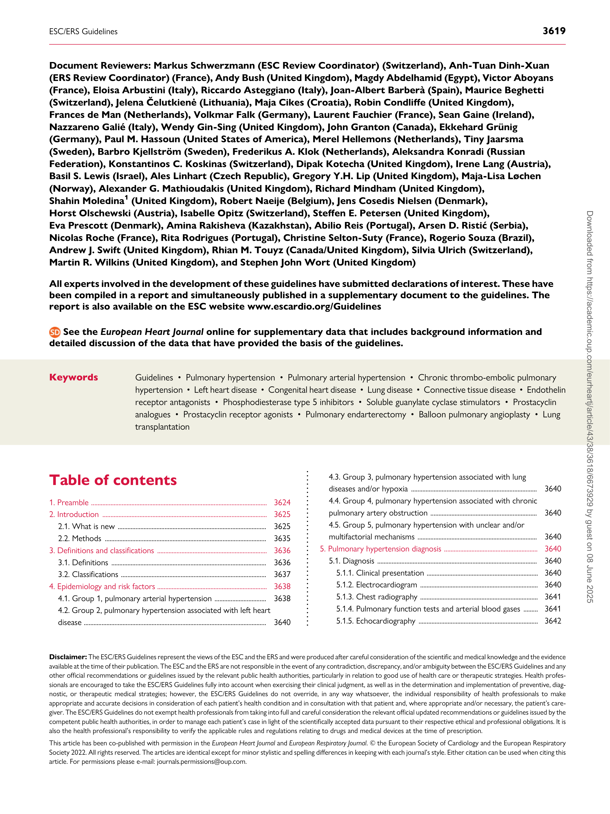
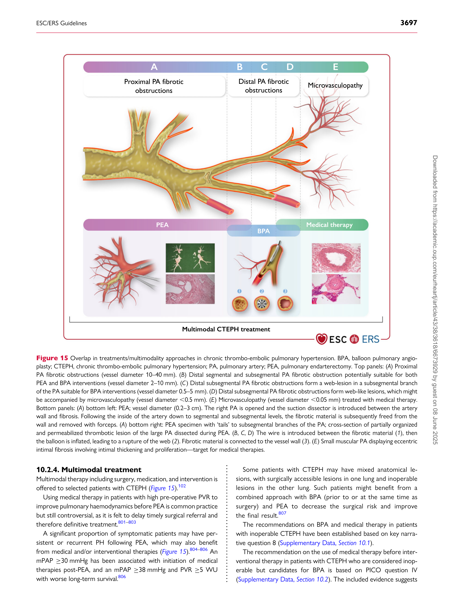

European Heart Journal (2022) 43, 3618–3731
[https://doi.org/10.1093/eurheartj/ehac237](https://doi.org/10.1093/eurheartj/ehac237)

#### ESC/ERS GUIDELINES

# 2022 ESC/ERS Guidelines for the diagnosis and treatment of pulmonary hypertension
## Developed by the task force for the diagnosis and treatment of pulmonary hypertension of the European Society of Cardiology (ESC) and the European Respiratory Society (ERS). Endorsed by the International Society for Heart and Lung Transplantation (ISHLT) and the European Reference Network on rare respiratory diseases (ERN-LUNG).
#### Authors/Task Force Members: Marc Humbert (France), Gabor Kovacs (Austria), Marius M. Hoeper (Germany), Roberto Badagliacca (Italy), Rolf M.F. Berger (Netherlands), Margarita Brida (Croatia), Jørn Carlsen (Denmark), Andrew J.S. Coats (United Kingdom), Pilar Escribano-Subias (Spain), Pisana Ferrari (Italy), Diogenes S. Ferreira (Brazil), Hossein Ardeschir Ghofrani (Germany), George Giannakoulas (Greece), David G. Kiely (United Kingdom), Eckhard Mayer (Germany), Gergely Meszaros (Hungary), Blin Nagavci (Germany), Karen M. Olsson (Germany), Joanna Pepke-Zaba (United Kingdom), Jennifer K. Quint (United Kingdom), Göran Rådegran (Sweden), Gerald Simonneau (France), Olivier Sitbon (France), Thomy Tonia (Switzerland), Mark Toshner (United Kingdom), Jean-Luc Vachiery (Belgium), Anton Vonk Noordegraaf (Netherlands), Marion Delcroix *† (ERS Chairperson) (Belgium), Stephan Rosenkranz *† (ESC Chairperson) (Germany), and ESC/ERS Scientific Document Group

- Corresponding authors: Stephan Rosenkranz, Clinic III for Internal Medicine (Department of Cardiology, Pulmonology and Intensive Care Medicine), and Cologne Cardiovascular
[Research Center (CCRC), Heart Center at the University Hospital Cologne, Kerpener Str. 62, 50937 Köln, Germany. Tel.: +49-221-478-32356. Email: stephan.rosenkranz@uk-](mailto:stephan.rosenkranz@uk-koeln.de)
[koeln.de; and](mailto:stephan.rosenkranz@uk-koeln.de)

Marion Delcroix, Clinical Department of Respiratory Diseases, Centre of Pulmonary Vascular Diseases, University Hospitals of Leuven, Herestraat 49, 3000 Leuven, Belgium. Tel.: +32 16
[346813. Email: marion.delcroix@uzleuven.be](mailto:marion.delcroix@uzleuven.be)

- The two chairpersons contributed equally to the document and are joint corresponding authors.

Author/Task Force Member affiliations are listed in author information.

1 Representing the Association for European Paediatric and Congenital Cardiology (AEPC)

ESC Clinical Practice Guidelines (CPG) Committee: listed in the Appendix.

ESC subspecialty communities having participated in the development of this document:

Associations: Association of Cardiovascular Nursing & Allied Professions (ACNAP), European Association of Cardiovascular Imaging (EACVI), and Heart Failure Association (HFA).

Councils: Council on Cardiovascular Genomics.

Working Groups: Adult Congenital Heart Disease, Pulmonary Circulation and Right Ventricular Function, Thrombosis.

Patient Forum

The content of these European Society of Cardiology (ESC)/European Respiratory Society (ERS) Guidelines has been published for personal and educational use only. No commercial use
is authorized. No part of the ESC/ERS Guidelines may be translated or reproduced in any form without written permission from the ESC and the ERS. Permission can be obtained upon
[submission of a written request to Oxford University Press, the publisher of the European Heart Journal, and the party authorized to handle such permissions on behalf of the ESC (journals.](mailto:journals.permissions@oup.com)
[permissions@oup.com).](mailto:journals.permissions@oup.com)

ESC/ERS Guidelines 3619

Document Reviewers: Markus Schwerzmann (ESC Review Coordinator) (Switzerland), Anh-Tuan Dinh-Xuan
(ERS Review Coordinator) (France), Andy Bush (United Kingdom), Magdy Abdelhamid (Egypt), Victor Aboyans
(France), Eloisa Arbustini (Italy), Riccardo Asteggiano (Italy), Joan-Albert Barberà (Spain), Maurice Beghetti
(Switzerland), Jelena Čelutkienė (Lithuania), Maja Cikes (Croatia), Robin Condliffe (United Kingdom),
Frances de Man (Netherlands), Volkmar Falk (Germany), Laurent Fauchier (France), Sean Gaine (Ireland),
Nazzareno Galié (Italy), Wendy Gin-Sing (United Kingdom), John Granton (Canada), Ekkehard Grünig
(Germany), Paul M. Hassoun (United States of America), Merel Hellemons (Netherlands), Tiny Jaarsma
(Sweden), Barbro Kjellström (Sweden), Frederikus A. Klok (Netherlands), Aleksandra Konradi (Russian
Federation), Konstantinos C. Koskinas (Switzerland), Dipak Kotecha (United Kingdom), Irene Lang (Austria),
Basil S. Lewis (Israel), Ales Linhart (Czech Republic), Gregory Y.H. Lip (United Kingdom), Maja-Lisa Løchen
(Norway), Alexander G. Mathioudakis (United Kingdom), Richard Mindham (United Kingdom),
Shahin Moledina [1] (United Kingdom), Robert Naeije (Belgium), Jens Cosedis Nielsen (Denmark),
Horst Olschewski (Austria), Isabelle Opitz (Switzerland), Steffen E. Petersen (United Kingdom),
Eva Prescott (Denmark), Amina Rakisheva (Kazakhstan), Abilio Reis (Portugal), Arsen D. Ristić (Serbia),
Nicolas Roche (France), Rita Rodrigues (Portugal), Christine Selton-Suty (France), Rogerio Souza (Brazil),
Andrew J. Swift (United Kingdom), Rhian M. Touyz (Canada/United Kingdom), Silvia Ulrich (Switzerland),
Martin R. Wilkins (United Kingdom), and Stephen John Wort (United Kingdom)

All experts involved in the development of these guidelines have submitted declarations of interest. These have
been compiled in a report and simultaneously published in a supplementary document to the guidelines. The
[report is also available on the ESC website www.escardio.org/Guidelines](https://www.escardio.org/Guidelines)

See the European Heart Journal online for supplementary data that includes background information and
detailed discussion of the data that have provided the basis of the guidelines.

### Table of contents

1. Preamble ............................................................................................................. 3624

2. Introduction ...................................................................................................... 3625

2.1. What is new ............................................................................................ 3625

2.2. Methods .................................................................................................... 3635

3. Definitions and classifications .................................................................... 3636
3.1. Definitions ................................................................................................ 3636
3.2. Classifications .......................................................................................... 3637

4. Epidemiology and risk factors .................................................................... 3638

4.1. Group 1, pulmonary arterial hypertension ................................ 3638

4.2. Group 2, pulmonary hypertension associated with left heart

disease ................................................................................................................. 3640

4.3. Group 3, pulmonary hypertension associated with lung

diseases and/or hypoxia .............................................................................. 3640

4.4. Group 4, pulmonary hypertension associated with chronic

pulmonary artery obstruction .................................................................. 3640

4.5. Group 5, pulmonary hypertension with unclear and/or

multifactorial mechanisms .......................................................................... 3640

5. Pulmonary hypertension diagnosis .......................................................... 3640

5.1. Diagnosis ................................................................................................... 3640

5.1.1. Clinical presentation ..................................................................... 3640

5.1.2. Electrocardiogram ......................................................................... 3640

5.1.3. Chest radiography ......................................................................... 3641

5.1.4. Pulmonary function tests and arterial blood gases ......... 3641

5.1.5. Echocardiography .......................................................................... 3642

Disclaimer: The ESC/ERS Guidelines represent the views of the ESC and the ERS and were produced after careful consideration of the scientific and medical knowledge and the evidence
available at the time of their publication. The ESC and the ERS are not responsible in the event of any contradiction, discrepancy, and/or ambiguity between the ESC/ERS Guidelines and any
other official recommendations or guidelines issued by the relevant public health authorities, particularly in relation to good use of health care or therapeutic strategies. Health professionals are encouraged to take the ESC/ERS Guidelines fully into account when exercising their clinical judgment, as well as in the determination and implementation of preventive, diagnostic, or therapeutic medical strategies; however, the ESC/ERS Guidelines do not override, in any way whatsoever, the individual responsibility of health professionals to make
appropriate and accurate decisions in consideration of each patient’s health condition and in consultation with that patient and, where appropriate and/or necessary, the patient’s caregiver. The ESC/ERS Guidelines do not exempt health professionals from taking into full and careful consideration the relevant official updated recommendations or guidelines issued by the
competent public health authorities, in order to manage each patient’s case in light of the scientifically accepted data pursuant to their respective ethical and professional obligations. It is
also the health professional’s responsibility to verify the applicable rules and regulations relating to drugs and medical devices at the time of prescription.

This article has been co-published with permission in the European Heart Journal and European Respiratory Journal. © the European Society of Cardiology and the European Respiratory
Society 2022. All rights reserved. The articles are identical except for minor stylistic and spelling differences in keeping with each journal’s style. Either citation can be used when citing this
[article. For permissions please e-mail: journals.permissions@oup.com.](mailto:journals.permissions@oup.com)

3620 ESC/ERS Guidelines

5.1.6. Ventilation/perfusion lung scan ................................................ 3643

5.1.7. Non-contrast and contrast-enhanced chest computed

tomography examinations, and digital subtraction

angiography ................................................................................................... 3644

5.1.8. Cardiac magnetic resonance imaging .................................... 3645

5.1.9. Blood tests and immunology .................................................... 3646

5.1.10. Abdominal ultrasound ............................................................... 3646

5.1.11. Cardiopulmonary exercise testing ....................................... 3646

5.1.12. Right heart catheterization, vasoreactivity, exercise, and
fluid challenge .............................................................................................. 3646

5.1.12.1. Right heart catheterization ............................................. 3646

5.1.12.2. Vasoreactivity testing ........................................................ 3647

5.1.12.3. Exercise right heart catheterization ........................... 3647

5.1.12.4. Fluid challenge ...................................................................... 3647

5.1.13. Genetic counselling and testing ............................................ 3648

5.2. Diagnostic algorithm ............................................................................ 3648

5.2.1 Step 1 (suspicion) ........................................................................... 3648

5.2.2. Step 2 (detection) ......................................................................... 3648
5.2.3. Step 3 (confirmation) ................................................................... 3650

5.3. Screening and early detection .......................................................... 3652

5.3.1. Systemic sclerosis .......................................................................... 3653

5.3.2. BMPR2 mutation carriers ........................................................... 3653

5.3.3. Portal hypertension ...................................................................... 3653

5.3.4. Pulmonary embolism ................................................................... 3653

6. Pulmonary arterial hypertension (group 1) ......................................... 3655

6.1. Clinical characteristics ......................................................................... 3655

6.2. Severity and risk assessment ............................................................ 3655

6.2.1. Clinical parameters ....................................................................... 3655

6.2.2. Imaging ................................................................................................ 3656

6.2.2.1. Echocardiography .................................................................. 3656

6.2.2.2. Cardiac magnetic resonance imaging ........................... 3656

6.2.3. Haemodynamics ............................................................................. 3656

6.2.4. Exercise capacity ............................................................................ 3657

6.2.5. Biochemical markers .................................................................... 3658

6.2.6. Patient-reported outcome measures ................................... 3658

6.2.7. Comprehensive prognostic evaluation, risk assessment,

and treatment goals .................................................................................. 3659

6.3. Therapy ..................................................................................................... 3660

6.3.1. General measures .......................................................................... 3660

6.3.1.1. Physical activity and supervised rehabilitation .......... 3660

6.3.1.2. Anticoagulation ...................................................................... 3660

6.3.1.3. Diuretics .................................................................................... 3661

6.3.1.4. Oxygen ...................................................................................... 3661

6.3.1.5. Cardiovascular drugs ........................................................... 3661

6.3.1.6. Anaemia and iron status .................................................... 3661

6.3.1.7. Vaccination ............................................................................... 3661

6.3.1.8. Psychosocial support ........................................................... 3661

6.3.1.9. Adherence to treatments .................................................. 3661

6.3.2. Special circumstances ................................................................... 3662

6.3.2.1. Pregnancy and birth control ............................................. 3662

6.3.2.1.1. Pregnancy ......................................................................... 3662

6.3.2.1.2. Contraception ................................................................ 3662

6.3.2.2. Surgical procedures .............................................................. 3662

6.3.2.3. Travel and altitude ................................................................ 3662

6.3.3. Pulmonary arterial hypertension therapies ........................ 3663

6.3.3.1. Calcium channel blockers .................................................. 3663

6.3.3.2. Endothelin receptor antagonists .................................... 3664

6.3.3.2.1. Ambrisentan ................................................................... 3665

6.3.3.2.2. Bosentan ........................................................................... 3665

6.3.3.2.3. Macitentan ....................................................................... 3666

6.3.3.3. Phosphodiesterase 5 inhibitors and guanylate cyclase

stimulators ............................................................................................... 3666

6.3.3.3.1. Sildenafil ............................................................................ 3667
6.3.3.3.2. Tadalafil ............................................................................. 3667

6.3.3.3.3. Riociguat ........................................................................... 3667

6.3.3.4. Prostacyclin analogues and prostacyclin receptor

agonists ...................................................................................................... 3667

6.3.3.4.1. Epoprostenol .................................................................. 3667

6.3.3.4.2. Iloprost .............................................................................. 3667

6.3.3.4.3. Treprostinil ...................................................................... 3667

6.3.3.4.4. Beraprost ......................................................................... 3667

6.3.3.4.5. Selexipag ........................................................................... 3667

6.3.4. Treatment strategies for patients with idiopathic,

heritable, drug-associated, or connective tissue disease
associated pulmonary arterial hypertension .................................. 3667

6.3.4.1. Initial treatment decision in patients without

cardiopulmonary comorbidities ...................................................... 3668

6.3.4.2. Treatment decisions during follow-up in patients

without cardiopulmonary comorbidities .................................... 3669

6.3.4.3. Pulmonary arterial hypertension with

cardiopulmonary comorbidities ...................................................... 3670

6.3.5. Drug interactions ........................................................................... 3671

6.3.6. Interventional therapy ................................................................. 3671

6.3.6.1. Balloon atrial septostomy and Potts shunt ................ 3671

6.3.6.2. Pulmonary artery denervation ........................................ 3671

6.3.7. Advanced right ventricular failure .......................................... 3672

6.3.7.1. Intensive care unit management ..................................... 3672

6.3.7.2. Mechanical circulatory support ....................................... 3672

–
6.3.8. Lung and heart lung transplantation ..................................... 3672

6.3.9. Evidence-based treatment algorithm .................................... 3673

6.3.10. Diagnosis and treatment of pulmonary arterial

hypertension complications ................................................................... 3673

6.3.10.1. Arrhythmias .......................................................................... 3673

6.3.10.2. Haemoptysis ......................................................................... 3673

6.3.10.3. Mechanical complications ................................................ 3673

6.3.11. End-of-life care and ethical issues ........................................ 3674

6.3.12. New drugs in advanced clinical development (phase 3

studies) ........................................................................................................... 3674
7. Specific pulmonary arterial hypertension subsets ............................ 3674

7.1. Pulmonary arterial hypertension associated with drugs and

toxins ................................................................................................................... 3674

7.2. Pulmonary arterial hypertension associated with connective

tissue disease .................................................................................................... 3675

7.2.1. Epidemiology and diagnosis ....................................................... 3675

7.2.2. Therapy .............................................................................................. 3675

7.3. Pulmonary arterial hypertension associated with human
immunodeficiency virus infection ............................................................ 3676

7.3.1. Diagnosis ........................................................................................... 3676

7.3.2. Therapy .............................................................................................. 3676

7.4. Pulmonary arterial hypertension associated with portal

hypertension .................................................................................................... 3677

7.4.1. Diagnosis ........................................................................................... 3677

7.4.2. Therapy .............................................................................................. 3677

7.4.2.1. Liver transplantation ............................................................ 3677

7.5. Pulmonary arterial hypertension associated with adult

congenital heart disease .............................................................................. 3678

7.5.1. Diagnosis and risk assessment ................................................. 3678

7.5.2. Therapy .............................................................................................. 3679

7.6. Pulmonary arterial hypertension associated with

schistosomiasis ................................................................................................ 3680

ESC/ERS Guidelines 3621

7.7. Pulmonary arterial hypertension with signs of venous/

capillary involvement .................................................................................... 3680

7.7.1. Diagnosis ........................................................................................... 3681

7.7.2. Therapy .............................................................................................. 3681

7.8. Paediatric pulmonary hypertension ............................................... 3681
7.8.1. Epidemiology and classification ................................................ 3681

7.8.2. Diagnosis and risk assessment ................................................. 3683

7.8.3. Therapy .............................................................................................. 3683

8. Pulmonary hypertension associated with left heart disease

(group 2) .................................................................................................................. 3685
8.1. Definition, prognosis, and pathophysiology ............................... 3685

8.2. Diagnosis ................................................................................................... 3687

8.2.1. Diagnosis and control of the underlying left

heart disease ................................................................................................ 3687

8.2.2. Evaluation of pulmonary hypertension and patient

phenotyping .................................................................................................. 3687

8.2.3. Invasive assessment of haemodynamics ............................... 3687

8.3. Therapy ..................................................................................................... 3688

8.3.1. Pulmonary hypertension associated with left-sided heart

failure ............................................................................................................... 3688

8.3.1.1. Heart failure with reduced ejection fraction ............. 3688

8.3.1.2. Heart failure with preserved ejection fraction ......... 3688

8.3.1.3. Interatrial shunt devices ..................................................... 3689

8.3.1.4. Remote pulmonary arterial pressure monitoring in

heart failure ............................................................................................. 3689

8.3.2. Pulmonary hypertension associated with valvular heart

disease ............................................................................................................. 3689

8.3.2.1. Mitral valve disease ............................................................... 3689

8.3.2.2. Aortic stenosis ....................................................................... 3689

8.3.2.3. Tricuspid regurgitation ........................................................ 3689

8.3.3. Recommendations on the use of drugs approved for

PAH in PH-LHD ......................................................................................... 3689

9. Pulmonary hypertension associated with lung diseases and/or

hypoxia (group 3) ................................................................................................ 3690

9.1. Diagnosis ................................................................................................... 3692

9.2. Therapy ..................................................................................................... 3692

9.2.1. Pulmonary hypertension associated with chronic

obstructive pulmonary disease or emphysema ............................ 3692

9.2.2. Pulmonary hypertension associated with interstitial lung

disease ............................................................................................................. 3692

9.2.3. Recommendations on the use of drugs approved for

PAH in PH associated with lung disease .......................................... 3693

10. Chronic thrombo-embolic pulmonary hypertension (group 4) 3693

10.1. Diagnosis ................................................................................................ 3694

10.2. Therapy ................................................................................................... 3695

10.2.1. Surgical treatment ....................................................................... 3695

10.2.2. Medical therapy ............................................................................ 3695

10.2.3. Interventional treatment .......................................................... 3696

10.2.4. Multimodal treatment ............................................................... 3697

10.2.5. Follow-up ........................................................................................ 3698

10.3. Chronic thrombo-embolic pulmonary hypertension team

and experience criteria ................................................................................ 3698

11. Pulmonary hypertension with unclear and/or multifactorial

mechanisms (group 5) ....................................................................................... 3699

11.1. Haematological disorders ................................................................ 3699

11.2. Systemic disorders ............................................................................. 3700

11.3. Metabolic disorders ........................................................................... 3700

11.4. Chronic kidney failure ...................................................................... 3700

11.5. Pulmonary tumour thrombotic microangiopathy ................ 3700

11.6. Fibrosing mediastinitis ....................................................................... 3700

12. Definition of a pulmonary hypertension centre ............................. 3701

12.1. Facilities and skills required for a pulmonary hypertension

centre .................................................................................................................. 3702

12.2. European Reference Network ..................................................... 3702

12.3. Patient associations and patient empowerment ................... 3702

13. Key messages ................................................................................................. 3703

14. Gaps in evidence ........................................................................................... 3703

14.1. Pulmonary arterial hypertension (group 1) ............................. 3703

14.2. Pulmonary hypertension associated with left heart disease

(group 2) ............................................................................................................ 3703

14.3. Pulmonary hypertension associated with lung diseases and/

or hypoxia (group 3) .................................................................................... 3704

14.4. Chronic thrombo-embolic pulmonary hypertension

(group 4) ............................................................................................................ 3704

14.5. Pulmonary hypertension with unclear and/or multifactorial

mechanisms (group 5) ................................................................................. 3704

15. ‘What to do’ and ‘What not to do’ messages from

the Guidelines ....................................................................................................... 3704

16. Quality indicators ......................................................................................... 3710

17. Supplementary data ..................................................................................... 3711

18. Data availability statement ....................................................................... 3711

19. Author information ..................................................................................... 3711

20. Appendix .......................................................................................................... 3711

21. References ....................................................................................................... 3712
### Tables of Recommendations

Recommendation Table 1 — Recommendations for right heart

catheterization and vasoreactivity testing ............................................ 3648

Recommendation Table 2 — Recommendations for diagnostic

strategy ................................................................................................................ 3652

Recommendation Table 3 — Recommendations for screening

and improved detection of pulmonary arterial hypertension and

chronic thrombo-embolic pulmonary hypertension ....................... 3654

Recommendation Table 4 — Recommendations for evaluating

the disease severity and risk of death in patients with pulmonary

arterial hypertension ..................................................................................... 3660

Recommendation Table 5 — Recommendations for general

measures and special circumstances ....................................................... 3662

Recommendation Table 6 — Recommendations for women of

childbearing potential .................................................................................... 3663

Recommendation Table 7 — Recommendations for the

treatment of vasoreactive patients with idiopathic, heritable, or

drug-associated pulmonary arterial hypertension ............................ 3664

Recommendation Table 8 — Recommendations for the treatment

of non-vasoreactive patients with idiopathic, heritable, or

drug-associated pulmonary arterial hypertension who present
without cardiopulmonary comorbidities [a] ................................................... 3668

Recommendation Table 9 — Recommendations for initial oral

drug combination therapy for patients with idiopathic, heritable,

or drug-associated pulmonary arterial hypertension without

cardiopulmonary comorbidities ................................................................ 3669

Recommendation Table 10 — Recommendations for sequential

drug combination therapy for patients with idiopathic, heritable,

or drug-associated pulmonary arterial hypertension ...................... 3670

Recommendation Table 11 — Recommendations for the

treatment of non-vasoreactive patients with idiopathic, heritable,

or drug-associated pulmonary arterial hypertension who present
with cardiopulmonary comorbidities [a] .................................................... 3671

3622 ESC/ERS Guidelines

Recommendation Table 12 — Recommendations for intensive

care management for pulmonary arterial hypertension ..................... 3672

Recommendation Table 13 — Recommendations for lung

transplantation ................................................................................................. 3673

Recommendation Table 14 — Recommendations for pulmonary

arterial hypertension associated with drugs or toxins ................... 3674

Recommendation Table 15 — Recommendations for pulmonary

arterial hypertension associated with connective tissue disease 3675

Recommendation Table 16 — Recommendations for pulmonary
arterial hypertension associated with human immunodeficiency

virus infection ................................................................................................... 3676

Recommendation Table 17 — Recommendations for pulmonary

arterial hypertension associated with portal hypertension .......... 3677

Recommendation Table 18 — Recommendations for shunt

closure in patients with pulmonary–systemic flow ratio .1.5:1

based on calculated pulmonary vascular resistance ......................... 3680

Recommendation Table 19 — Recommendations for pulmonary

arterial hypertension associated with adult congenital heart disease 3680

Recommendation Table 20 — Recommendations for pulmonary

arterial hypertension with signs of venous/capillary involvement 3681

Recommendation Table 21 — Recommendations for paediatric

pulmonary hypertension .............................................................................. 3685

Recommendation Table 22 — Recommendations for pulmonary

hypertension associated with left heart disease ................................ 3690

Recommendation Table 23 — Recommendations for pulmonary

hypertension associated with lung disease and/or hypoxia .......... 3693

Recommendation Table 24 — Recommendations for chronic

thrombo-embolic pulmonary hypertension and chronic thrombo
embolic pulmonary disease without pulmonary hypertension ........ 3698

Recommendation Table 25 — Recommendations for pulmonary

hypertension centres ..................................................................................... 3702
### List of tables

Table 1 Strength of the recommendations according to GRADE 3635
Table 2 Quality of evidence grades and their definitions .............. 3635

Table 3 Classes of recommendations .................................................... 3636

Table 4 Levels of evidence .......................................................................... 3636

Table 5 Haemodynamic definitions of pulmonary hypertension 3637
Table 6 Clinical classification of pulmonary hypertension ............ 3638

Table 7 Drugs and toxins associated with pulmonary arterial

hypertension ..................................................................................................... 3640

Table 8 Electrocardiogram abnormalities in patients with

pulmonary hypertension .............................................................................. 3643

Table 9 Radiographic signs of pulmonary hypertension and

concomitant abnormalities ......................................................................... 3643

Table 10 Additional echocardiographic signs suggestive of

pulmonary hypertension .............................................................................. 3645

Table 11 Haemodynamic measures obtained during right heart

catheterization .................................................................................................. 3646

Table 12 Route of administration, half-life, dosages, and duration

of administration of the recommended test compounds for

vasoreactivity testing in pulmonary arterial hypertension ............. 3647

Table 13 Phenotypic features associated with pulmonary arterial

hypertension mutations ............................................................................... 3649

Table 14 Characteristic diagnostic features of patients with

different forms of pulmonary hypertension ........................................ 3651
Table 15 World Health Organization classification of functional

status of patients with pulmonary hypertension ............................... 3656

Table 16 Comprehensive risk assessment in pulmonary arterial

hypertension (three-strata model) .......................................................... 3657

Table 17 Suggested assessment and timing for the follow-up of

patients with pulmonary arterial hypertension .................................. 3658
Table 18 Variables used to calculate the simplified four-strata

risk-assessment tool ....................................................................................... 3659

Table 19 Dosing of pulmonary arterial hypertension medication

in adults ............................................................................................................... 3664

Table 20 Criteria for lung transplantation and listing in patients

with pulmonary arterial hypertension ................................................... 3672
Table 21 Clinical classification of pulmonary arterial hypertension

associated with congenital heart disease .............................................. 3678

Table 22 Use of pulmonary arterial hypertension therapies in

children ................................................................................................................ 3684

Table 23 Patient phenotyping and likelihood for left heart disease

as cause of pulmonary hypertension ...................................................... 3688

Table 24 Pulmonary hypertension with unclear and/or

multifactorial mechanisms ........................................................................... 3699
### List of figures

Figure 1 Central illustration ........................................................................ 3639

Figure 2 Symptoms in patients with pulmonary hypertension ... 3641

Figure 3 Clinical signs in patients with pulmonary hypertension 3642

Figure 4 Transthoracic echocardiographic parameters in the

assessment of pulmonary hypertension ................................................ 3644

Figure 5 Echocardiographic probability of pulmonary

hypertension and recommendations for further assessment ...... 3645

Figure 6 Diagnostic algorithm of patients with unexplained

dyspnoea and/or suspected pulmonary hypertension .................... 3650

Figure 7 Pathophysiology and current therapeutic targets of

pulmonary arterial hypertension (group 1) ......................................... 3655

Figure 8 Vasoreactivity testing algorithm of patients with

presumed diagnosis of idiopathic, heritable, or drug-associated

pulmonary arterial hypertension .............................................................. 3665

Figure 9 Evidence-based pulmonary arterial hypertension

treatment algorithm for patients with idiopathic, heritable,

drug-associated, and connective tissue disease-associated

pulmonary arterial hypertension .............................................................. 3666

Figure 10 Neonatal and paediatric vs. adult pulmonary

hypertension ..................................................................................................... 3682

Figure 11 Pathophysiology of pulmonary hypertension associated

with left heart disease (group 2) .............................................................. 3686

Figure 12 Pathophysiology of pulmonary hypertension associated

with lung disease (group 3) ........................................................................ 3691

Figure 13 Diagnostic strategy in chronic thrombo-embolic

pulmonary hypertension .............................................................................. 3694

Figure 14 Management strategy in chronic thrombo-embolic

pulmonary hypertension .............................................................................. 3696

Figure 15 Overlap in treatments/multimodality approaches in

chronic thrombo-embolic pulmonary hypertension ....................... 3697

Figure 16 Pulmonary hypertension centre schematic ..................... 3701
### Abbreviations and acronyms

6MWD 6-minute walking distance
6MWT 6-minute walking test
ABG Arterial blood gas analysis
ACEi Angiotensin-converting enzyme inhibitor

ESC/ERS Guidelines 3623

ALAT Alanine aminotransferase

ARB Angiotensin receptor blocker
ARNI Angiotensin receptor–neprilysin inhibitor
ASAT Aspartate aminotransferase
ASIG Australian Scleroderma Interest Group
BNP Brain natriuretic peptide
BPA Balloon pulmonary angioplasty
BPD Bronchopulmonary dysplasia
CAMPHOR Cambridge Pulmonary Hypertension Outcome

Review

CCB Calcium channel blocker

CDH Congenital diaphragmatic hernia
cGMP Cyclic guanosine monophosphate
CHD Congenital heart disease
CI Cardiac index; Confidence interval
cMRI Cardiac magnetic resonance imaging
CO Cardiac output
COMPERA Comparative, Prospective Registry of Newly
Initiated Therapies for PH
COPD Chronic obstructive pulmonary disease
CpcPH Combined post- and pre-capillary pulmonary
hypertension
CPET Cardiopulmonary exercise testing
CPFE Combined pulmonary fibrosis and emphysema
CT Computed tomography

CTD Connective tissue disease

CTEPD Chronic thrombo-embolic pulmonary disease
CTEPH Chronic thrombo-embolic pulmonary
hypertension
CTPA Computed tomography pulmonary angiography
DECT Dual-energy computed tomography
DLCO Lung diffusion capacity for carbon monoxide
DPAH Drug- or toxin-associated pulmonary arterial
hypertension
dPAP Diastolic pulmonary arterial pressure
DPG Diastolic pressure gradient
DSA Digital subtraction angiography
ECG Electrocardiogram
ECMO Extracorporeal membrane oxygenation
EHJ European Heart Journal
EMA European Medicines Agency
EOV Exercise oscillatory ventilation
ERA Endothelin receptor antagonist
ERJ European Respiratory Journal
ERN European Reference Network
ERN-LUNG European Reference Network on rare
respiratory diseases
ERS European Respiratory Society
ESC European Society of Cardiology

EtD Evidence to Decision

FPHR French Pulmonary Hypertension Registry
FVC Forced vital capacity
GRADE Grading of Recommendations, Assessment,
Development, and Evaluations
HAART Highly active antiretroviral therapy
Hb Haemoglobin

HF Heart failure

HFpEF Heart failure with preserved ejection fraction
HIV Human immunodeficiency virus
HPAH Heritable pulmonary arterial hypertension
HPS Hepatopulmonary syndrome

HR Hazard ratio

HR-QoL Health-related quality of life

ICU Intensive care unit

IgG4 Immunogolobulin G4
ILD Interstitial lung disease
IPAH Idiopathic pulmonary arterial hypertension
IpcPH Isolated post-capillary pulmonary hypertension
IP receptor Prostacyclin I2 receptor
ISWT Incremental shuttle walking test

i.v. Intravenous

LA Left atrium/left atrial

LAS Lung allocation score

LHD Left heart disease

LTx Lung transplantation

LV Left ventricle/left ventricular

LVAD Left ventricular assist device

mPAP Mean pulmonary arterial pressure
MR Magnetic resonance
MRI Magnetic resonance imaging
NOAC Novel oral anticoagulant
NT-proBNP N-terminal pro-brain natriuretic peptide

OR Odds ratio

PA Pulmonary artery
PAC Pulmonary arterial compliance
PaCO 2 Partial pressure of arterial carbon dioxide
PADN Pulmonary artery denervation
PAH Pulmonary arterial hypertension
PAH-CTD Pulmonary arterial hypertension associated with

connective tissue disease

PAH-SSc Pulmonary arterial hypertension associated with
systemic sclerosis
PAH-SYMPACT Pulmonary Arterial Hypertension-Symptoms
and Impact
PaO 2 Partial pressure of arterial oxygen
PAP Pulmonary arterial pressure
PAVM Pulmonary arteriovenous malformation
PAWP Pulmonary arterial wedge pressure
PCH Pulmonary capillary haemangiomatosis
PDE5i Phosphodiesterase 5 inhibitor
PE Pulmonary embolism
PEA Pulmonary endarterectomy
PET Positron emission tomography
P ET CO 2 End-tidal partial pressure of carbon dioxide
PFT Pulmonary function test
PH Pulmonary hypertension
PH-LHD Pulmonary hypertension associated with left

heart disease

PICO Population, Intervention, Comparator, Outcome
PoPH Porto-pulmonary hypertension
PPHN Persistent pulmonary hypertension of the

newborn

PROM Patient-reported outcome measure
PVD Pulmonary vascular disease

3624 ESC/ERS Guidelines

PVOD Pulmonary veno-occlusive disease
PVR Pulmonary vascular resistance
PVRI Pulmonary vascular resistance index
QI Quality indicator
Qp/Qs Pulmonary blood flow/systemic blood flow
RA Right atrium/right atrial
RAP Right atrial pressure

RCT Randomized controlled trial

REVEAL Registry to Evaluate Early and Long-Term PAH
Disease Management
RHC Right heart catheterization

RR Relative risk

RV Right ventricle/right ventricular
RVEF Right ventricular ejection fraction
RV-FAC Right ventricular fractional area change
RVOT AT Right ventricular outflow tract acceleration time
SaO 2 Arterial oxygen saturation

s.c. Subcutaneous

SCD Sickle cell disease

sGC Soluble guanylate cyclase
SGLT-2i Sodium–glucose cotransporter-2 inhibitor
SLE Systemic lupus erythematosus
SPAHR Swedish Pulmonary Arterial Hypertension Registry
sPAP Systolic pulmonary arterial pressure
SPECT Single-photon emission computed tomography
SSc Systemic sclerosis

SV Stroke volume

SVI Stroke volume index

SvO 2 Mixed venous oxygen saturation
TAPSE Tricuspid annular plane systolic excursion
TGF-β Transforming growth factor-β
TPR Total pulmonary resistance
TR Tricuspid regurgitation
TRPG Tricuspid regurgitation pressure gradient
TRV Tricuspid regurgitation velocity
TSH Thyroid-stimulating hormone
V/Q Ventilation perfusion
VE/VCO 2 Ventilatory equivalent for carbon dioxide
VKA Vitamin K antagonist
VO 2 Oxygen uptake
VO 2 /HR Oxygen pulse

VTE Venous thrombo-embolism

WHO-FC World Health Organization functional class
WSPH World Symposium on Pulmonary Hypertension

WU Wood units
### 1. Preamble

Guidelines summarize and evaluate available evidence, with the aim of

assisting health professionals in proposing the best management strategies for an individual patient with a given condition. Guidelines and
their recommendations should facilitate decision-making of health
professionals in their daily practice. However, guidelines are not a

’                        substitute for the patient s relationship with their practitioner. The fi
nal decisions concerning an individual patient must be made by the responsible health professional(s), based on what they consider to be

the most appropriate in the circumstances. These decisions are
made in consultation with the patient and caregiver as appropriate.
Guidelines are intended for use by health professionals. To ensure that
all physicians have access to the most recent recommendations, both the
European Society of Cardiology (ESC) and European Respiratory Society
(ERS) make their guidelines freely available in their own journals. The ESC
and ERS warn non-medical readers that the technical language may be
misinterpreted and decline any responsibility in this respect.
Many Guidelines have been issued in recent years by the ESC and
ERS. Because of their impact on clinical practice, quality criteria for
the development of guidelines have been established in order to
make all decisions transparent to the user. The ERS and ESC guidance and procedure to formulate and issue clinical practice recom
mendations can be found on the societies’ relevant website or

[journal (https://www.escardio.org/Guidelines and https://openres.](https://www.escardio.org/Guidelines)
[ersjournals.com/content/8/1/00655-2021).](https://openres.ersjournals.com/content/8/1/00655-2021) The ESC and ERS
Guidelines represent the official position of the ESC and ERS on a given topic and are regularly updated.
The panel of experts of these specific guidelines comprised an
equal number of ERS and ESC members, including representatives
from relevant subspecialty groups involved in the medical care of patients with this pathology.
The experts of the writing and reviewing panels provided declaration of interest forms for all relationships that might be perceived
as real or potential sources of conflicts of interest. Their declarations
of interest were reviewed according to the ESC declaration of interest
[rules and can be found on the ESC website (http://www.escardio.org/](http://www.escardio.org/Guidelines)
[Guidelines). They have been compiled in a report and co-published in a](http://www.escardio.org/Guidelines)
supplementary document of the guidelines. This process ensures
transparency and prevents potential biases in the development and review processes. Any changes in declarations of interest that arose during the writing period were notified to the ESC and updated. The Task
Force received its entire financial support from the ESC and ERS without any involvement from the health care industry.
The ESC Clinical Practice Guidelines (CPG) Committee and the ERS
Guidelines Director reporting to the ERS Science Council supervise
and co-ordinate the preparation of new guidelines. These Guidelines
underwent extensive review by the ESC CPG Committee, the ERS
Guidelines Working Group, and external experts. The guidelines
were developed after careful consideration of the scientific and medical
knowledge and the evidence available at the time of drafting. After appropriate revisions, the guidelines were signed off by all the experts in
the Task Force. The finalized document was signed off by the ESC CPG
Committee and endorsed by the ERS Executive Committee before
being simultaneously published in the European Heart Journal (EHJ)
and the European Respiratory Journal (ERJ). The decision to publish the
guidelines in both journals was made to ensure adequate dissemination
of the recommendations in both the cardiology and respiratory fields.
The task of developing the ESC/ERS Guidelines also included creating educational tools and implementation programmes for the recommendations, including condensed pocket guidelines versions, summary
slides, a lay summary, and an electronic version for digital applications
(smartphones, etc.). These versions are abridged and thus, for more
detailed information, the user should always access the full-text version
of the guidelines, which is freely available via the ESC and ERS websites,
and hosted on the EHJ and ERJ websites. The National Cardiac
Societies of the ESC are encouraged to endorse, adopt, translate,

ESC/ERS Guidelines 3625

and implement all ESC Guidelines. Pulmonary national societies are
also encouraged to share these guidelines with their members and develop a summary or editorials in their own language, if appropriate.
Implementation programmes are needed because it has been shown
that the outcome of disease may be favourably influenced by the thorough application of clinical recommendations.
Health professionals are encouraged to take the ESC/ERS Guidelines
fully into account when exercising their clinical judgement, as well as in
determining and implementing preventive, diagnostic, or therapeutic
medical strategies. However, the ESC/ERS Guidelines do not override,
in any way, the individual responsibility of health professionals to make
appropriate and accurate decisions in considering each patient’s health
condition and in consulting with that patient or the patient’s caregiver
where appropriate and/or necessary. It is also the health professional’s
responsibility to verify the rules and regulations applicable to drugs and
devices at the time of prescription and, where appropriate, to respect
the ethical rules of their profession in each country.
Off-label use of medication may be presented in these guidelines if
a sufficient level of evidence shows that it can be considered medically appropriate to a given condition and if patients could benefit
from the recommended therapy. However, the final decisions concerning an individual patient must be made by the responsible health
professional, giving special consideration to:

- The specific situation of the patient. In this respect, it is specified
that, unless otherwise provided for by national regulations, off
label use of medication should be limited to situations where it

is in the patient’s interest to do so, with regards to the quality,
safety, and efficacy of care, and only after the patient has been fully
informed and provided consent.

Country-specific health regulations, indications by governmental
drug regulatory agencies, and the ethical rules to which health professionals are subject, where applicable.
### 2. Introduction

Pulmonary hypertension (PH) is a pathophysiological disorder that
may involve multiple clinical conditions and may be associated with a
variety of cardiovascular and respiratory diseases. The complexity of
managing PH requires a multifaceted, holistic, and multidisciplinary approach, with active involvement of patients with PH in partnership
with clinicians. Streamlining the care of patients with PH in daily clinical
practice is a challenging but essential requirement for effectively managing PH. In recent years, substantial progress has been made in detecting and managing PH, and new evidence has been timeously integrated
in this fourth edition of the ESC/ERS Guidelines for the diagnosis and
treatment of pulmonary hypertension. Reflecting the multidisciplinary
input into managing patients with PH and interpreting new evidence,
the Task Force included cardiologists and pneumologists, a thoracic
surgeon, methodologists, and patients. These comprehensive clinical
practice guidelines cover the whole spectrum of PH, with an emphasis
on diagnosing and treating pulmonary arterial hypertension (PAH) and
chronic thrombo-embolic pulmonary hypertension (CTEPH).

2.1. What is new

One of the most important proposals from the 6th World
Symposium on Pulmonary Hypertension (WSPH) was to reconsider

the haemodynamic definition of PH. [1] After careful evaluation, the
new definitions of PH have been endorsed and expanded in these
guidelines, including a revised cut-off level for pulmonary vascular resistance (PVR) and a definition of exercise PH.
The classification of PH has been updated, including repositioning
of vasoreactive patients with idiopathic pulmonary arterial hypertension (IPAH) and a revision of group 5 PH, including repositioning of
PH in lymphangioleiomyomatosis in group 3.
Concerning the diagnosis of PH, a new algorithm has been developed aiming at earlier detection of PH in the community. In addition,
expedited referral is recommended for high-risk or complex patients. Screening strategies are also proposed.
The risk-stratification table has been expanded to include additional
echocardiographic and cardiac magnetic resonance imaging (cMRI)
prognostic indicators. The recommendations for initial drug therapies
have been simplified, building on this revised, three-strata, multiparametric risk model to replace functional classification. At follow-up, a
four-strata risk-assessment tool is now proposed based on refined
cut-off levels for World Health Organization functional class
(WHO-FC), 6-minute walking distance (6MWD), and N-terminal
pro-brain natriuretic peptide (NT-proBNP), categorizing patients as

– –
low, intermediate low, intermediate high, or high risk.
The PAH treatment algorithm has been modified, highlighting the importance of cardiopulmonary comorbidities, risk assessment both at
diagnosis and follow-up, and the importance of combination therapies.
Treatment strategies during follow-up have been based on the fourstrata model intended to facilitate more granular decision-making.
The recommendations for managing PH associated with left heart disease (PH-LHD) and lung disease have been updated, including a new
haemodynamic definition of severe PH in patients with lung disease.
In group 4 PH, the term chronic thrombo-embolic pulmonary disease (CTEPD) with or without PH has been introduced, acknowledging the presence of similar symptoms, perfusion defects, and
organized fibrotic obstructions in patients with or without PH at
rest. Interventional treatment by balloon pulmonary angioplasty
(BPA) in combination with medical therapy has been upgraded in
the therapeutic algorithm of CTEPH.
New standards for PH centres have been presented and, for the
first time, patient representatives were actively involved in developing these guidelines.
Questions with direct consequences for clinical practitioners regarding each PH classification subgroup were selected and addressed, namely guidance on: initial treatment strategy for group 1 PH (Population,
Intervention, Control, Outcome [PICO] I); use of oral phosphodiesterase 5 inhibitors (PDE5is) for the treatment of group 2 PH (PICO II); use
of oral PDE5is for the treatment of group 3 PH (PICO III); and use of PH
drugs prior to BPA for the treatment of group 4 PH (PICO IV). These
questions were considered to be important because: most contemporary PH registries describe variable use of initial oral monotherapy and
combination therapy; large case series show widespread use of
PDE5is in group 2 PH, despite a class III recommendation in the 2015
ESC/ERS Guidelines for the diagnosis and treatment of pulmonary
hypertension; large case series show widespread use of PDE5is in group
3 PH, despite a class III recommendation in the 2015 ESC/ERS
Guidelines for the diagnosis and treatment of pulmonary hypertension;
and there is no clear guidance for therapy with PH drugs in patients with
inoperable CTEPH prior to BPA.

3626 ESC/ERS Guidelines

Selected revised recommendations (R) and new recommendations (N)

New or

revised

Recommendation in 2015 version Class [a] Recommendation in 2022 version Class [a]

Right heart catheterization and vasoreactivity testing – Recommendation Table 1

|N|Col2|Col3|It is recommended that RHC comprises a complete set of haemodynamics and is performed following standardized protocols|I|
|---|---|---|---|---|
|R|Adenosine should be considered for performing vasoreactivity testing as an alternative Inhaled iloprost may be considered for performing vasoreactivity testing as an alternative|IIa|Inhaled nitric oxide, inhaled iloprost, or i.v. epoprostenol are recommended for performing vasoreactivity testing|I|

|Diagnostic|strategy – Recommendation Table 2|Col3|Col4|Col5|
|---|---|---|---|---|
|N|||It is recommended to assign an echocardiographic probability of PH, based on an abnormal TRV and the presence of other echocardiographic signs suggestive of PH (see Table 10)|I|
|N|||It is recommended to maintain the current threshold for TRV (.2.8 m/s) for echocardiographic probability of PH according to the updated haemodynamic definition|I|
|N|||Based on the probability of PH by echocardiography, further testing should be considered in the clinical context (i.e. symptoms and risk factors or associated conditions for PAH/CTEPH)|IIa|
|N|||In symptomatic patients with intermediate echocardiographic probability of PH, CPET may be considered to further determine the likelihood of PH|IIb|

|N|Col2|Col3|In patients with SSc, an annual evaluation of the risk of having PAH is recommended|I|
|---|---|---|---|---|
|R|Resting echocardiography is recommended as a screening test in asymptomatic patients with SSc, followed by annual screening with echocardiography, DLCO, and biomarkers|I|In adult patients with SSc of .3 years’ disease duration, an FVC ≥40%, and a DLCO,60%, the DETECT algorithm is recommended to identify asymptomatic patients with PAH|I|
|N|||In patients with SSc, where breathlessness remains unexplained following non-invasive assessment, RHC is recommended to exclude PAH|I|
|N|||Assessing the risk of having PAH, based on an evaluation of breathlessness, in combination with echocardiogram or PFTs and BNP/NT-proBNP, should be considered in patients with SSc|IIa|
|N|||Policies to evaluate the risk of having PAH should be considered in hospitals managing patients with SSc|IIa|
|R|RHC is recommended in all cases of suspected PAH associated with CTD|I|In symptomatic patients with SSc, exercise echocardiography or CPET, or CMR may be considered to aid decisions to perform RHC|IIb|
|N|||In patients with CTD with overlap features of SSc, an annual evaluation of the risk of PAH may be considered|IIb|
|R|In PE survivors with exercise dyspnoea, CTEPH should be considered|IIa|In patients with persistent or new-onset dyspnoea or exercise limitation following PE, further diagnostic evaluation to assess for CTEPH/CTEPD is recommended|I|

Continued

ESC/ERS Guidelines 3627

|N|Col2|Col3|For symptomatic patients with mismatched perfusion lung defects beyond 3 months of anticoagulation for acute PE, referral to a PH/CTEPH centre is recommended after considering the results of echocardiography, BNP/NT-proBNP, and/or CPET|I|
|---|---|---|---|---|
|N|||Counselling regarding the risk of PAH, and annual screening is recommended for individuals who test positive for PAH-causing mutations and in first-degree relatives of patients with HPAH|I|
|N|||In patients referred for liver transplantation, echocardiography is recommended as a screening test for PH|I|
|N|||Further tests (echocardiography, BNP/NT-proBNP, PFTs, and/or CPET) should be considered in symptomatic patients with CTD, portal hypertension, or HIV to screen for PAH|IIa|

Evaluating the disease severity and risk of death in patients with pulmonary arterial hypertension – Recommendation Table 4

|N|Col2|Col3|For risk stratification at the time of diagnosis, the use of a three-strata model (low, intermediate, and high risk) is recommended, taking into account all available data including haemodynamics|I|
|---|---|---|---|---|
|N|||For risk stratification during follow-up, the use of a four-strata model (low, intermediate–low, intermediate– high, and high risk) based on WHO-FC, 6MWD, and BNP/NT-proBNP is recommended, with additional variables taken into account as necessary|I|
|R|Achievement/maintenance of an intermediate-risk profile should be considered an inadequate treatment response for most patients with PAH|IIa|In some PAH aetiologies and in patients with comorbidities, optimization of therapy should be considered on an individual basis while acknowledging that a low-risk profile is not always achievable|IIa|

General measures and special circumstances – Recommendation Table 5

|R|Supervised exercise training should be considered in physically deconditioned PAH patients under medical therapy|IIa|Supervised exercise training is recommended in patients with PAH under medical therapy|I|
|---|---|---|---|---|
|R|Immunization of PAH patients against influenza and pneumococcal infection is recommended|I|Immunization of patients with PAH against SARS-CoV-2, influenza, and Streptococcus pneumoniae is recommended|I|
|R|Correction of anaemia and/or iron status may be considered in PAH patients|IIb|In the presence of iron-deficiency anaemia, correction of iron status is recommended in patients with PAH|I|
|N|||In the absence of anaemia, iron repletion may be considered in patients with PAH with iron deficiency|IIb|
|R|Oral anticoagulant treatment may be considered in patients with IPAH, HPAH, and PAH due to use of anorexigens|IIb|Anticoagulation is not generally recommended in patients with PAH but may be considered on an individual basis|IIb|
|R|The use of angiotensin-converting enzyme inhibitors, angiotensin-2 receptor antagonists, beta-blockers, and ivabradine is not recommended in patients with PAH unless required by comorbidities (i.e. high blood pressure, coronary artery disease, or left HF)|III|The use of ACEis, ARBs, ARNIs, SGLT-2is, beta-blockers, or ivabradine is not recommended in patients with PAH unless required by comorbidities (i.e. high blood pressure, coronary artery disease, left HF, or arrhythmias)|III|
|R|In-flight O administration should be considered for 2 patients in WHO-FC III and IV and those with arterial blood O pressure consistently,8 kPa (60 mmHg) 2|IIa|In-flight O administration is recommended for patients 2 using oxygen or whose arterial blood oxygen pressure is ,8 kPa (60 mmHg) at sea level|I|
|R|In elective surgery, epidural rather than general anaesthesia should be preferred whenever possible|IIa|For interventions requiring anaesthesia, multidisciplinary consultation at a PH centre to assess risk and benefit should be considered|IIa|

Continued

3628 ESC/ERS Guidelines

Women of childbearing potential – Recommendation Table 6

|R|It is recommended that PAH patients avoid pregnancy|I|It is recommended that women of childbearing potential with PAH are counselled at the time of diagnosis about the risks and uncertainties associated with becoming pregnant; this should include advice against becoming pregnant, and referral for psychological support where needed|I|
|---|---|---|---|---|
|N|||It is recommended that women of childbearing potential with PAH be provided with clear contraceptive advice, considering the individual needs of the woman but recognizing that the implications of contraceptive failure are significant in PAH|I|
|N|||It is recommended that women with PAH who consider pregnancy or who become pregnant receive prompt counselling in an experienced PH centre to facilitate genetic counselling and shared decision-making, and to provide psychological support to the patients and their families where needed|I|
|N|||For women with PAH having termination of pregnancy, it is recommended that this be performed in PH centres, with psychological support provided to the patient and her family|I|
|N|||For women with PAH who desire to have children, where available, adoption and surrogacy with pre-conception genetic counselling may be considered|IIb|
|N|||As teratogenic potential has been reported in preclinical models for endothelin receptor antagonists and riociguat, these drugs are not recommended during pregnancy|III|

Treatment of vasoreactive patients with idiopathic, heritable, or drug-associated pulmonary arterial hypertension –

Recommendation Table 7

|R|Continuation of high doses of CCBs is recommended in patients with IPAH, HPAH, and DPAH in WHO-FC I or II with marked haemodynamic improvement (near normalization)|I|Continuing high doses of CCBs is recommended in patients with IPAH, HPAH, or DPAH in WHO-FC I or II with marked haemodynamic improvement (mPAP ,30 mmHg and PVR,4 WU)|I|
|---|---|---|---|---|
|N|||In patients with a positive vasoreactivity test but insufficient long-term response to CCBs who require additional PAH therapy, continuation of CCB therapy should be considered|IIa|

|N|Col2|Col3|In patients with IPAH/HPAH/DPAH who present at high risk of death, initial combination therapy with a PDE5i, an ERA, and i.v./s.c. prostacyclin analogues should be consideredc|IIa|
|---|---|---|---|---|
|N|||In patients with IPAH/HPAH/DPAH who present at intermediate–low risk of death while receiving ERA/ PDE5i therapy, the addition of selexipag should be considered|IIa|
|N|||In patients with IPAH/HPAH/DPAH who present at intermediate–high or high risk of death while receiving ERA/PDE5i therapy, the addition of i.v./s.c. prostacyclin analogues and referral for lung transplantation (LTx) evaluation should be considered|IIa|

Continued

ESC/ERS Guidelines 3629

N In patients with IPAH/HPAH/DPAH who present at

intermediate–low risk of death while receiving ERA/

IIb

PDE5i therapy, switching from PDE5i to riociguat may be

considered

|R|Ambrisentan + tadalafil|I|Initial combination therapy with ambrisentan and tadalafil is recommended|I|
|---|---|---|---|---|
|N|||Initial combination therapy with macitentan and tadalafil is recommended|I|
|R|Other ERA + PDE-5i|IIa|Initial combination therapy with other ERAs and PDE5is should be considered|IIa|
|N|||Initial combination therapy with macitentan, tadalafil, and selexipag is not recommended|III|

|N|Col2|Col3|It is recommended to base treatment escalations on risk assessment and general treatment strategies (see treatment algorithm)|I|
|---|---|---|---|---|
|R|Macitentan added to sildenafil|I|The addition of macitentan to PDE5is or oral/inhaled prostacyclin analogues is recommended to reduce the risk of morbidity/mortality events|I|
|N|||The addition of oral treprostinil to ERA or PDE5i/ riociguat monotherapy is recommended to reduce the risk of morbidity/mortality events|I|
|R|Bosentan added to sildenafil|IIb|The addition of bosentan to sildenafil is not recommended to reduce the risk of morbidity/mortality events|III|
|R|Riociguat added to bosentan|I|The addition of riociguat to bosentan should be considered to improve exercise capacity|IIa|

|N|Col2|Col3|In patients with IPAH/HPAH/DPAH and cardiopulmonary comorbidities, initial monotherapy with a PDE5i or an ERA should be considered|IIa|
|---|---|---|---|---|
|N|||In patients with IPAH/HPAH/DPAH with cardiopulmonary comorbidities who present at intermediate or high risk of death while receiving PDE5i or ERA monotherapy, additional PAH medication may be considered on an individual basis|IIb|

Efficacy of intensive care management for pulmonary arterial hypertension – Recommendation Table 12

|N|Col2|Col3|When managing patients with right HF in the ICU, it is recommended to involve physicians with expertise, treat causative factors, and use supportive measures including inotropes and vasopressors, fluid management, and PAH drugs as appropriate|I|
|---|---|---|---|---|
|N|||Mechanical circulatory support may be an option for selected patients as a bridge to transplantation or to recovery, and interhospital transfer should be considered if such resources are unavailable on site|IIa|

Continued

3630 ESC/ERS Guidelines

Lung transplantation – Recommendation Table 13

|R|Lung transplantation is recommended soon after inadequate clinical response on maximal medical therapy|I|It is recommended that potentially eligible candidates are referred for LTx evaluation when they have an inadequate response to oral combination therapy, indicated by an intermediate–high or high risk or by a REVEAL risk score .7|I|
|---|---|---|---|---|
|N|||It is recommended to list patients for LTx who present with a high risk of death or with a REVEAL risk score ≥10 despite receiving optimized medical therapy, including s.c. or i.v. prostacyclin analogues|I|

Pulmonary arterial hypertension associated with drugs or toxins – Recommendation Table 14

|N|Col2|Col3|It is recommended to make a diagnosis of drug- or toxin-associated PAH in patients who had relevant exposure and in whom other causes of PH have been excluded|I|
|---|---|---|---|---|
|N|||In patients with suspected drug- or toxin-associated PAH, it is recommended to discontinue the causative agent immediately whenever possible|I|
|N|||Immediate PAH therapy should be considered in patients who present with intermediate/high-risk PAH at diagnosis|IIa|
|N|||Patients with low-risk PAH should be re-evaluated 3–4 months after discontinuing the suspected drug or toxin, and PAH therapy may be considered when the haemodynamics have not normalized|IIb|

Pulmonary arterial hypertension associated with connective tissue disease – Recommendation Table 15

N In patients with PAH associated with CTD, treatment of

the underlying condition according to current guidelines

is recommended

|Pulmonary|arterial hypertension associated with human immu|unodeficien|ncy virus infection – Recommendation Table 16|Col5|
|---|---|---|---|---|
|N|||In patients with PAH associated with HIV infection, antiretroviral treatment according to current guidelines is recommended|I|
|N|||In patients with PAH associated with HIV infection, initial monotherapy should be considered, followed by sequential combination if necessary, taking into consideration comorbidities and drug–drug interactions|IIa|

Pulmonary arterial hypertension associated with portal hypertension – Recommendation Table 17

I

|R|Echocardiographic assessment for signs of PH is recommended in symptomatic patients with liver disease or portal hypertension and in all candidates for liver transplantation|I|Echocardiography is recommended in patients with liver disease or portal hypertension with signs or symptoms suggestive of PH, and as a screening tool in patients evaluated for liver transplantation or transjugular portosystemic shunt|I|
|---|---|---|---|---|
|R|It is recommended that the treatment algorithm for patients with other forms of PAH should be applied to patients with PAH associated with portal hypertension, taking into account the severity of liver disease|I|In patients with PAH associated with portal hypertension, initial monotherapy should be considered, followed by sequential combination if necessary, taking into consideration the underlying liver disease and indication for liver transplantation|IIa|
|R|Liver transplantation may be considered in selected patients responding well to PAH therapy|IIb|Liver transplantation should be considered on an individual basis in patients with PAH associated with portal hypertension, as long as PVR is normal or near normal with PAH therapy|IIa|

Continued

ESC/ERS Guidelines 3631

N Drugs approved for PAH are not recommended for

patients with portal hypertension and unclassified PH (i.e.

elevated mPAP, high CO, and a normal PVR)

III

|N|Col2|Col3|In patients with ASD, VSD, or PDA and a PVR,3 WU, shunt closure is recommended|I|
|---|---|---|---|---|
|N|||In patients with ASD, VSD, or PDA and a PVR of 3–5 WU, shunt closure should be considered|IIa|
|N|||In patients with ASD and a PVR .5 WU that declines to ,5 WU with PAH treatment, shunt closure may be considered|IIb|
|N|||In patients with VSD or PDA and a PVR .5 WU, shunt closure may be considered after careful evaluation in specialized centres|IIb|
|N|||In patients with ASD and a PVR .5 WU despite PAH treatment, shunt closure is not recommended|III|

Pulmonary arterial hypertension associated with adult congenital heart disease – Recommendation Table 19

|N|Col2|Col3|Risk assessment is recommended for patients with persistent PAH after defect closure|I|
|---|---|---|---|---|
|N|||Risk assessment should be considered in patients with Eisenmenger syndrome|IIa|
|R|Bosentan is recommended in WHO-FC III patients with Eisenmenger syndrome|I|Bosentan is recommended in symptomatic patients with Eisenmenger syndrome to improve exercise capacity|I|
|R|The use of supplemental iron treatment may be considered in patients with low ferritin plasma levels|IIb|Supplemental iron treatment should be considered in patients with iron deficiency|IIa|
|R|Combination drug therapy may be considered in patients with Eisenmenger syndrome|IIb|In patients with PAH after corrected adult CHD, initial oral combination therapy with drugs approved for PAH should be considered for patients at low and intermediate risk, while initial combination therapy including i.v./s.c. prostacyclin analogues should be considered for patients at high risk|IIa|
|R|Combination drug therapy may be considered in patients with Eisenmenger syndrome|IIb|In patients with adult CHD, including Eisenmenger syndrome, sequential combination therapy should be considered if patients do not meet treatment goals|IIa|
|N|||In women with Eisenmenger syndrome, pregnancy is not recommended|III|
|R|If symptoms of hyperviscosity are present, phlebotomy with isovolumic replacement should be considered, usually when the haematocrit is .65%|IIa|In patients with Eisenmenger syndrome, routine phlebotomy to lower elevated haematocrit is not recommended|III|

Pulmonary arterial hypertension with signs of venous/capillary involvement – Recommendation Table 20

|R|A combination of clinical findings, physical examination, bronchoscopy, and radiological findings is recommended to diagnose PVOD/PCH|I|A combination of clinical and radiological findings, ABG, PFTs, and genetic testing is recommended to diagnose PAH with signs of venous and/or capillary involvement (PVOD/PCH)|I|
|---|---|---|---|---|
|N|||In patients with PVOD/PCH, the use of drugs approved for PAH may be considered with careful monitoring of clinical symptoms and gas exchange|IIb|
|N|||Lung biopsy is not recommended to confirm a diagnosis of PVOD/PCH|III|

Paediatric pulmonary hypertension – Recommendation Table 21

N It is recommended to perform the diagnostic work-up,

including RHC and acute vasoreactivity testing, and treat

children with PH at centres with specific expertise in

paediatric PH

I

Continued

3632 ESC/ERS Guidelines

|R|A PH diagnostic algorithm work-up is recommended for diagnosis and definition of the specific aetiology group in paediatric PH patients|I|In children with PH, a comprehensive work-up for confirming diagnosis and specific aetiology is recommended (similar to that in adults, but adapted for age)|I|
|---|---|---|---|---|
|N|||For confirming PH diagnosis, RHC is recommended, preferably before initiating any PAH therapy|I|
|N|||In children with IPAH/HPAH, acute vasoreactivity testing is recommended to detect those who may benefit from calcium channel blocker therapy|I|
|N|||It is recommended to define a positive response to acute vasoreactivity testing in children similar to adults by a reduction of mPAP ≥10 mmHg to reach an absolute value of mPAP ≤40 mmHg, with an increased or unchanged CO|I|
|R|A PAH-specific therapeutic algorithm is recommended in paediatric PH patients|I|In children with PAH, a therapeutic strategy based on risk stratification and treatment response is recommended, extrapolated from that in adults but adapted for age|I|
|R|Specific paediatric determinants of risk should be considered|IIa|It is recommended to monitor the treatment response in children with PAH by serially assessing a panel of data derived from clinical assessment, echocardiographic evaluation, biochemical markers, and exercise tolerance tests|I|
|N|||Achieving and maintaining a low-risk profile should be considered as an adequate treatment response for children with PAH|IIa|
|N|||It is recommended to screen infants with bronchopulmonary dysplasia for PH|I|
|N|||In infants with (or at risk of) bronchopulmonary dysplasia and PH, treating lung disease, including hypoxia, aspiration, and structural airway disease, and optimizing respiratory support is recommended before initiating PAH therapy|I|
|N|||In neonates and infants, a diagnostic and therapeutic approach to PH distinct from that in older children and adults should be considered, given the frequent association with developmental vascular and parenchymal lung disease|IIa|

Pulmonary hypertension associated with left heart disease – Recommendation Table 22

|N|Col2|Col3|RHC is recommended for suspected PH in patients with LHD, if it aids management decisions|I|
|---|---|---|---|---|
|N|||RHC is recommended in patients with severe tricuspid regurgitation with or without LHD prior to surgical or interventional valve repair|I|
|R|Patients with PH-LHD and a severe pre-capillary component as indicated by a high DPG and/or high PVR should be referred to an expert PH centre for a complete diagnostic work-up and an individual treatment decision|IIa|For patients with LHD and suspected PH with features of a severe pre-capillary component and/or markers of RV dysfunction, referral to a PH centre for a complete diagnostic work-up is recommended|I|
|N|||In patients with LHD and CpcPH with a severe pre-capillary component (e.g. PVR .5 WU), an individualized approach to treatment is recommended|I|
|N|||When patients with PH and multiple risk factors for LHD, who have a normal PAWP at rest but an abnormal response to exercise or fluid challenge, are treated with PAH drugs, close monitoring is recommended|I|

Continued

ESC/ERS Guidelines 3633

N In patients with PH at RHC, a borderline PAWP (13–

15 mmHg) and features of HFpEF, additional testing with

exercise or fluid challenge may be considered to uncover

post-capillary PH

Pulmonary hypertension associated with lung disease and/or hypoxia – Recommendation Table 23

IIb

|R|Echocardiography is recommended for the non-invasive diagnostic assessment of suspected PH in patients with lung disease|I|If PH is suspected in patients with lung disease, it is recommended that echocardiographyd be performed and the results interpreted in conjunction with ABG, PFTs including DLCO, and CT imaging|I|
|---|---|---|---|---|
|R|Optimal treatment of the underlying lung disease, including long-term O therapy in patients with chronic 2 hypoxaemia, is recommended in patients with PH due to lung diseases|I|In patients with lung disease and suspected PH, it is recommended to optimize treatment of the underlying lung disease and, where indicated, hypoxaemia, sleep-disordered breathing, and/or alveolar hypoventilation|I|
|R|Referral to an expert centre is recommended in patients with echocardiographic signs of severe PH and/or severe right ventricular dysfunction|I|In patients with lung disease and suspected severe PH, or where there is uncertainty regarding the treatment of PH, referral to a PH centre is recommendede|I|
|N|||In patients with lung disease and severe PH, an individualized approach to treatment is recommended|I|
|N|||It is recommended to refer eligible patients with lung disease and PH for LTx evaluation|I|
|R|RHC is not recommended for suspected PH in patients with lung disease, unless therapeutic consequences are to be expected (e.g. LTx, alternative diagnoses such as PAH or CTEPH, and potential enrolment in a clinical trial)|III|In patients with lung disease and suspected PH, RHC is recommended if the results are expected to aid management decisions|I|
|N|||Inhaled treprostinil may be considered in patients with PH associated with ILD|IIb|
|N|||The use of ambrisentan is not recommended in patients with PH associated with IPF|III|
|N|||The use of riociguat is not recommended in patients with PH associated with IIP|III|

|R|Lifelong anticoagulation is recommended in all patients with CTEPH|I|Lifelong therapeutic doses of anticoagulation are recommended in all patients with CTEPH|I|
|---|---|---|---|---|
|N|||Antiphospholipid syndrome testing is recommended in patients with CTEPH|I|
|N|||In patients with CTEPH and antiphospholipid syndrome, anticoagulation with VKAs is recommended|I|
|R|It is recommended that all patients with CTEPH receive assessment of operability and decisions regarding other treatment strategies made by a multidisciplinary team of experts|I|It is recommended that all patients with CTEPH are reviewed by a CTEPH team for the assessment of multimodality management|I|
|R|Surgical PEA in deep hypothermia circulatory arrest is recommended for patients with CTEPH|I|PEA is recommended as the treatment of choice for patients with CTEPH and fibrotic obstructions within pulmonary arteries accessible by surgery|I|
|R|Interventional BPA may be considered in patients who are technically inoperable or carry an unfavourable risk:benefit ratio for PEA|IIb|BPA is recommended in patients who are technically inoperable or have residual PH after PEA and distal obstructions amenable to BPA|I|
|R|Riociguat is recommended in symptomatic patients who have been classified as having persistent/recurrent CTEPH after surgical treatment or inoperable CTEPH by a CTEPH team including at least one experienced PEA surgeon|I|Riociguat is recommended for symptomatic patients with inoperable CTEPH or persistent/recurrent PH after PEA|I|

Continued

3634 ESC/ERS Guidelines

|N|Col2|Col3|Long-term follow-up is recommended after PEA and BPA, as well as for patients with CTEPH established on medical therapy|I|
|---|---|---|---|---|
|N|||A multimodality approach should be considered for patients with persistent PH after PEA and for patients with inoperable CTEPH|IIa|
|N|||In patients with CTEPD without PH, long-term anticoagulant therapy should be considered on an individual basisf|IIa|
|N|||PEA or BPA should be considered in selected symptomatic patients with CTEPD without PH|IIa|
|N|||Treprostinil s.c. may be considered in patients in WHO-FC III–IV who have inoperable CTEPH or persistent/recurrent PH after PEA|IIb|
|R|Off-label use of drugs approved for PAH may be considered in symptomatic patients who have been classified as having inoperable CTEPH by a CTEPH team including at least one experienced PEA surgeon|IIb|Off-label use of drugs approved for PAH may be considered in symptomatic patients who have inoperable CTEPH|IIb|
|N|||In patients with inoperable CTEPH, a combination of sGC stimulator/PDE5i, ERA, or parenteral prostacyclin analogues may be considered|IIb|
|N|||BPA may be considered for technically operable patients with a high proportion of distal disease and an unfavourable risk:benefit ratio for PEA|IIb|

Pulmonary hypertension centres – Recommendation Table 25

|N|Col2|Col3|It is recommended that PH centres maintain a patient registry|I|
|---|---|---|---|---|
|N|||It is recommended that PH centres collaborate with patient associations|I|
|N|||Accreditation of the PH centres should be considered (e.g. https://ec.europa.eu/health/ern/assessment_en)|IIa|
|R|It should be considered that a referral centre follow at least 50 patients with PAH or CTEPH and should receive at least two new referrals per month with documented PAH or CTEPH|IIa|PH centres should follow-up a sufficient number of patients to maintain expertise (at least 50 patients with PAH or CTEPH and at least two new referrals per month with documented PAH or CTEPH) and consider establishing collaborations with high-volume centres|IIa|

6MWD, 6-minute walking distance; ABG, arterial blood gas analysis; ACEi, angiotensin-converting enzyme inhibitor; ARB, angiotensin receptor blocker; ARNI, angiotensin receptor–
neprilysin inhibitor; ASD, atrial septal defect; BNP, brain natriuretic peptide; BPA, balloon pulmonary angioplasty; CCB, calcium channel blocker; CHD, congenital heart disease; CI,
cardiac index; CMR, cardiac magnetic resonance; CO, cardiac output; CpcPH, combined post- and pre-capillary pulmonary hypertension; CPET, cardiopulmonary exercise testing;
CT, computed tomography; CTD, connective tissue disease; CTEPD, chronic thrombo-embolic pulmonary disease; CTEPH, chronic thrombo-embolic pulmonary hypertension;
DLCO, Lung diffusion capacity for carbon monoxide; DPAH, drug-associated pulmonary arterial hypertension; DPG, diastolic pressure gradient; ERA, endothelin receptor
antagonist; FVC, forced vital capacity; HF, heart failure; HFpEF, heart failure with preserved ejection fraction; HIV, human immunodeficiency virus; HPAH, heritable pulmonary
arterial hypertension; ICU, intensive care unit; IIP, idiopathic interstitial pneumonia; ILD, interstitial lung disease; IPAH, idiopathic pulmonary arterial hypertension; IPF, idiopathic
pulmonary fibrosis; i.v., intravenous; LHD, left heart disease; LTx, lung transplantation; mPAP, mean pulmonary arterial pressure; NT-proBNP, N-terminal pro-brain natriuretic
peptide; PAH, pulmonary arterial hypertension; PAP, pulmonary arterial pressure; PAWP, pulmonary arterial wedge pressure; PCH, pulmonary capillary haemangiomatosis; PDA,
patent ductus arteriosus; PDE5i, phosphodiesterase 5 inhibitor; PE, pulmonary embolism; PEA, pulmonary endarterectomy; PFTs, pulmonary function tests; PH, pulmonary
hypertension; PH-LHD, pulmonary hypertension associated with left heart disease; PVOD, pulmonary veno-occlusive disease; PVR, pulmonary vascular resistance; RAP, mean right
atrial pressure; RHC, right heart catheterization; RV, right ventricle; SARS-CoV-2, severe acute respiratory syndrome coronavirus-2; s.c., subcutaneous; sGC, soluble guanylate
cyclase; SGLT-2i, sodium–glucose cotransporter-2 inhibitor; SSc, systemic sclerosis; SVI, stroke volume index; TRV, tricuspid regurgitation velocity; VKA, vitamin K antagonist; VSD,
ventricular septal defect; VTE, venous thrombo-embolism; WHO-FC, World Health Organization functional class; WU, Wood units.
a Class of recommendation.
b Cardiopulmonary comorbidities are predominantly encountered in elderly patients and include risk factors for HFpEF, such as obesity, diabetes, coronary heart disease, a history of
hypertension, and/or a low DLCO.
c Initial triple-combination therapy including i.v./s.c. prostacyclin analogues may also be considered in patients presenting at intermediate risk but severe haemodynamic impairment (e.g.
RAP ≥20 mmHg, CI,2.0 L/min/m [2], SVI,31 mL/m [2], and/or PVR ≥12 WU).
d Assessments should ideally be made when the patient is clinically stable, as exacerbations can significantly raise PAP.
e This recommendation does not apply to patients with end-stage lung disease who are not considered candidates for LTx.
f Long-term anticoagulant therapy is recommended when the risk of PE recurrence is intermediate or high, or when there is no history of VTE.

ESC/ERS Guidelines 3635

New recommendations developed with GRADE Evidence to Decision framework

|GRADE|Col2|Col3|Col4|Col5|
|---|---|---|---|---|
|Recommendations|Quality of evidence|Strength of recommendation|Classa|Levelb|
|In patients with IPAH/HPAH/DPAH who present at low or intermediate risk of death, initial combination therapy with a PDE5i and an ERA is recommended|Low|Conditional|I|B|
|The use of PDE5i in patients with HFpEF and isolated post-capillary PH is not recommended|Low|Conditional|III|C|
|PDE5i may be considered in patients with severe PH associated with ILD (individual decision-making in PH centres)|Very low|Conditional|IIb|C|
|The use of PDE5i in patients with ILD and non-severe PH is not recommended|Very low|Conditional|III|C|
|In patients with CTEPH who are candidates for BPA, medical therapy should be considered prior to the intervention|Very low|Conditional|IIa|B|

BPA, balloon pulmonary angioplasty; CTEPH, chronic thrombo-embolic pulmonary hypertension; DPAH, drug-associated pulmonary arterial hypertension; ERA, endothelin receptor
antagonist; HPAH, heritable pulmonary arterial hypertension; HFpEF, heart failure with preserved ejection fraction; ILD, interstitial lung disease; IPAH, idiopathic pulmonary arterial
hypertension; PDE5i, phosphodiesterase 5 inhibitor; PH, pulmonary hypertension.
a Class of recommendation.
b Level of evidence.

2.2. Methods

Three main methodological approaches were used in these
guidelines, depending on the type of questions addressed:

(i) Four questions that were considered highly important were formulated in the PICO format, and assessed with full systematic
reviews and application of the Grading of Recommendations,
Assessment, Development, and Evaluations (GRADE) approach [2] and the Evidence to Decision (EtD) framework [3] (see
Supplementary [Data,](http://academic.oup.com/eurheartj/article-lookup/doi/10.1093/eurheartj/ehac237#supplementary-data) Section 2.1 for full methodology

Table 1 Strength of the recommendations according
to GRADE

description and supportive material). The resulting recommendations were rated as strong or conditional, based on four potential levels of evidence (high, moderate, low, or very low;
Tables 1 and 2). All Task Force members approved the recommendations. In addition, these recommendations were also presented and voted following the usual ESC approach.
(ii) Eight questions that were considered of key importance (key
narrative questions) were assessed with systematic literature
searches and application of the EtD framework. [6] The evidence grading was performed following the usual ESC
approach.
(iii) The remaining topics of interest were assessed using the process
commonly followed in ESC Guidelines. Structured literature
searches were undertaken and grading tables, as outlined in
Tables 3 and 4, were created to describe level of confidence in

Table 2 Quality of evidence grades and their
definitions [5]

|Recommendation strength|Rationale|
|---|---|
|Strong recommendation for|The panel is certain that the desirable outweigh the undesirable effects|
|Conditional recommendation for|The panel is less confident that the desirable outweigh the undesirable effects|
|Conditional recommendation against|The panel is less confident that the undesirable outweigh the desirable effects|
|Strong recommendation against|The panel is certain that the undesirable outweigh the desirable effects|
|No recommendation|The confidence in the results might be very low to make a recommendation, or the trade-offs between desirable and undesirable effects are finely balanced, or no data are available.|

Adapted from the ERS Handbook for Clinical Practice Guidelines. [4]

|Quality|Definition|
|---|---|
|High|We are very confident that the true effect lies close to that of the estimate of the effect|
|Moderate|We are moderately confident in the effect estimate: the true effect is likely to be close to the estimate of the effect, but there is a possibility that it is substantially different|
|Low|Our confidence in the effect estimate is limited: the true effect may be substantially different from the estimate of the effect|
|Very low|We have very little confidence in the effect estimate: the true effect is likely to be substantially different from the estimate of effect|

3636 ESC/ERS Guidelines

Table 3 Classes of recommendations

Table 4 Levels of evidence

the recommendation provided and the quality of evidence sup
porting the recommendation. The Task Force discussed each

draft recommendation during web-based conference calls dedicated to specific sections, followed by consensus modifications

and an online vote on each recommendation. Only recommen
dations that were supported by at least 75% of the Task Force

members were included in the guidelines. The recommendation

tables were colour-coded for ease of interpretation.

### 3. Definitions and classifications

3.1. Definitions
The definitions for PH are based on haemodynamic assessment by
right heart catheterization (RHC). Although haemodynamics represent the central element of characterizing PH, the final diagnosis
and classification should reflect the whole clinical context and consider the results of all investigations.

ESC/ERS Guidelines 3637

Pulmonary hypertension is defined by a mean pulmonary arterial
pressure (mPAP) .20 mmHg at rest (Table 5). This is supported
by studies assessing the upper limit of normal pulmonary arterial
pressure (PAP) in healthy subjects, [7][–][9] and by studies investigating
the prognostic relevance of increased PAP (key narrative question
[1, Supplementary Data, Section 3.1).](http://academic.oup.com/eurheartj/article-lookup/doi/10.1093/eurheartj/ehac237#supplementary-data) [10][–][12]

It is essential to include PVR and pulmonary arterial wedge pressure (PAWP) in the definition of pre-capillary PH, in order to discriminate elevated PAP due to pulmonary vascular disease (PVD)
from that due to left heart disease (LHD), elevated pulmonary blood
flow, or increased intrathoracic pressure (Table 5). Based on the
available data, the upper limit of normal PVR and the lowest prognostically relevant threshold of PVR is ≏2 Wood units (WU). [7][,][8][,][13][,][14]

Pulmonary vascular resistance depends on body surface area and
age, with elderly healthy subjects having higher values. The available
data on the best threshold for PAWP discriminating pre- and postcapillary PH are contradictory. Although the upper limit of normal
PAWP is considered to be 12 mmHg, [15] previous ESC/ERS
Guidelines for the diagnosis and treatment of PH, as well as the re
cent consensus recommendation of the ESC Heart Failure
Association, [16] suggest a higher threshold for the invasive diagnosis
of heart failure (HF) with preserved ejection fraction (HFpEF)
(PAWP ≥15 mmHg). In addition, almost all therapeutic studies of
PAH have used the PAWP ≤15 mmHg threshold. Therefore, it is recommended keeping PAWP ≤15 mmHg as the threshold for precapillary PH, while acknowledging that any PAWP threshold is arbitrary and that the patient phenotype, risk factors, and echocardiographic findings, including left atrial (LA) volume, need to be
considered when distinguishing pre- from post-capillary PH.
Patients with PAH are haemodynamically characterized by precapillary PH in the absence of other causes of pre-capillary PH,
such as CTEPH and PH associated with lung diseases. All PH groups

Table 5 Haemodynamic definitions of pulmonary
hypertension

|Definition|Haemodynamic characteristics|
|---|---|
|PH|mPAP .20 mmHg|
|Pre-capillary PH|mPAP .20 mmHg PAWP ≤15 mmHg PVR .2 WU|
|IpcPH|mPAP .20 mmHg PAWP .15 mmHg PVR ≤2 WU|
|CpcPH|mPAP .20 mmHg PAWP .15 mmHg PVR .2 WU|
|Exercise PH|mPAP/CO slope between rest and exercise .3 mmHg/L/min|

CO, cardiac output; CpcPH, combined post- and pre-capillary pulmonary hypertension;
IpcPH, isolated post-capillary pulmonary hypertension; mPAP, mean pulmonary arterial
pressure; PAWP, pulmonary arterial wedge pressure; PH, pulmonary hypertension;
PVR, pulmonary vascular resistance; WU, Wood units.
Some patients present with elevated mPAP (.20 mmHg) but low PVR (≤2 WU) and
low PAWP (≤15 mmHg); this haemodynamic condition may be described by the term
‘unclassified PH’ (see text for further details).

may comprise both pre- and post-capillary components contributing
to PAP elevation. In particular, older patients may present with several conditions predisposing them to PH. The primary classification
should be based on the presumed predominant cause of the pulmon
ary pressure increase.
Post-capillary PH is haemodynamically defined as mPAP
.20 mmHg and PAWP .15 mmHg. Pulmonary vascular resistance
is used to differentiate between patients with post-capillary PH who
have a significant pre-capillary component (PVR .2 WU—combined post- and pre-capillary PH [CpcPH]) and those who do not
(PVR ≤2 WU—isolated post-capillary PH [IpcPH]).
There are patients with elevated mPAP (.20 mmHg) but low
PVR (≤2 WU) and low PAWP (≤15 mmHg). These patients are frequently characterized by elevated pulmonary blood flow and, although they have PH, they do not fulfil the criteria of pre- or
post-capillary PH. This haemodynamic condition may be described
by the term ‘unclassified PH’. Patients with unclassified PH may present with congenital heart disease (CHD), liver disease, airway disease, lung disease, or hyperthyroidism explaining their mPAP
elevation. Clinical follow-up of these patients is generally recommended. In the case of elevated pulmonary blood flow, its aetiology
should be explored.
As the groups of PH according to clinical classification represent
different clinical conditions, there may be additional clinically relevant
haemodynamic thresholds (e.g. for PVR) for the individual PH groups
besides the general thresholds of the haemodynamic definition of
PH, which are discussed in the corresponding sections.
Exercise PH, defined by an mPAP/cardiac output (CO) slope
.3 mmHg/L/min between rest and exercise, [17] has been reintroduced. The mPAP/CO slope is strongly age dependent and its

–
upper limit of normal ranges from 1.6 3.3 mmHg/L/min in the supine
position. [17] An mPAP/CO slope .3 mmHg/L/min is not physiological
in subjects aged,60 years and may rarely be present in healthy subjects aged .60 years. [17] A pathological increase in pulmonary pressure during exercise is associated with impaired prognosis in
patients with exercise dyspnoea [18] and in several cardiovascular conditions. [19][–][22] Although an increased mPAP/CO slope defines an abnormal haemodynamic response to exercise, it does not allow for
differentiation between pre- and post-capillary causes. The PAWP/
CO slope with a threshold .2 mmHg/L/min may best differentiate
between pre- and post-capillary causes of exercise PH. [23][,][24]

3.2. Classifications
The basic structure of the classification from the 2015 ESC/ERS
Guidelines for the diagnosis and treatment of PH [25][,][26] and the
Proceedings of the 6th WSPH [1] has been kept (Table 6). The general
purpose of the clinical classification of PH remains to categorize clinical conditions associated with PH, based on similar pathophysiological mechanisms, clinical presentation, haemodynamic
characteristics, and therapeutic management (Figure 1). The main
changes are as follows:

(i) The subgroups ‘non-responders at vasoreactivity testing’ and
‘acute responders at vasoreactivity testing’ have been added
to IPAH as compared with the 2015 ESC/ERS Guidelines for
the diagnosis and treatment of PH. [25][,][26] In addition to patients
with IPAH, some patients with heritable PAH (HPAH) or

3638 ESC/ERS Guidelines

Table 6 Clinical classification of pulmonary
hypertension

GROUP 1 Pulmonary arterial hypertension (PAH)

1.1 Idiopathic

1.1.1 Non-responders at vasoreactivity testing

1.1.2 Acute responders at vasoreactivity testing

1.2 Heritable [a]

1.3 Associated with drugs and toxins [a]

1.4 Associated with:

1.4.1 Connective tissue disease

1.4.2 HIV infection

1.4.3 Portal hypertension

1.4.4 Congenital heart disease

1.4.5 Schistosomiasis

1.5 PAH with features of venous/capillary (PVOD/PCH) involvement

1.6 Persistent PH of the newborn

GROUP 2 PH associated with left heart disease

2.1 Heart failure:

2.1.1 with preserved ejection fraction

2.1.2 with reduced or mildly reduced ejection fraction [b]

2.2 Valvular heart disease

2.3 Congenital/acquired cardiovascular conditions leading to

post-capillary PH

GROUP 3 PH associated with lung diseases and/or hypoxia

3.1 Obstructive lung disease or emphysema

3.2 Restrictive lung disease

3.3 Lung disease with mixed restrictive/obstructive pattern

3.4 Hypoventilation syndromes

3.5 Hypoxia without lung disease (e.g. high altitude)

3.6 Developmental lung disorders

GROUP 4 PH associated with pulmonary artery obstructions

4.1 Chronic thrombo-embolic PH

4.2 Other pulmonary artery obstructions [c]

GROUP 5 PH with unclear and/or multifactorial mechanisms

5.1 Haematological disorders [d]

5.2 Systemic disorders [e]

5.3 Metabolic disorders [f]

5.4 Chronic renal failure with or without haemodialysis

5.5 Pulmonary tumour thrombotic microangiopathy

5.6 Fibrosing mediastinitis

HF, heart failure; HIV, human immunodeficiency virus; PAH, pulmonary arterial
hypertension; PCH, pulmonary capillary haemangiomatosis; PH, pulmonary
hypertension; PVOD, pulmonary veno-occlusive disease.
a Patients with heritable PAH or PAH associated with drugs and toxins might be acute
responders.
b Left ventricular ejection fraction for HF with reduced ejection fraction: ≤40%; for HF
with mildly reduced ejection fraction: 41–49%.
c Other causes of pulmonary artery obstructions include: sarcomas (high or
intermediate grade or angiosarcoma), other malignant tumours (e.g. renal carcinoma,
uterine carcinoma, germ-cell tumours of the testis), non-malignant tumours (e.g.
uterine leiomyoma), arteritis without connective tissue disease, congenital pulmonary
arterial stenoses, and hydatidosis.
d Including inherited and acquired chronic haemolytic anaemia and chronic
myeloproliferative disorders.
e Including sarcoidosis, pulmonary Langerhans’s cell histiocytosis, and neurofibromatosis
type 1.
f Including glycogen storage diseases and Gaucher disease.

drug- or toxin-associated PAH (DPAH) might be acute
responders.
(ii) The groups ‘PAH with features of venous/capillary (pulmonary
veno-occlusive disease/pulmonary capillary haemangiomatosis

[PVOD/PCH]) involvement’ and ‘persistent PH of the newborn (PPHN)’ have been included in group 1 (PAH) as compared with the 2015 ESC/ERS Guidelines for the diagnosis
and treatment of PH and in line with the Proceedings of the
6th WSPH. [1]

(iii) Instead of the general term ‘sleep-disordered breathing’, the
term ‘hypoventilation syndromes’ should be used within group

3 to describe conditions with increased risk of PH. Sole noctur
nal obstructive sleep apnoea is generally not a cause of PH, but
PH is frequent in patients with hypoventilation syndromes causing daytime hypercapnia.
### 4. Epidemiology and risk factors

Pulmonary hypertension is a major global health issue. All age groups
are affected. Present estimates suggest a PH prevalence of ≏1% of
the global population. Due to the presence of cardiac and pulmonary
causes of PH, prevalence is higher in individuals aged .65 years. [29]

Globally, LHD is the leading cause of PH. [29] Lung disease, especially
chronic obstructive pulmonary disease (COPD), is the second
most common cause. [29] In the UK, the observed PH prevalence
has doubled in the last 10 years and is currently 125 cases/million inhabitants. [30] Irrespective of the underlying condition, developing PH
is associated with worsening symptoms and increased mortality. [29]

In developing countries, CHD, some infectious diseases (schistosomiasis, human immunodeficiency virus [HIV]), and high altitude represent important but under-studied causes of PH. [29]

4.1. Group 1, pulmonary arterial
hypertension
Recent registry data from economically developed countries indicate
a PAH incidence and prevalence of ≏6 and 48–55 cases/million
adults, respectively. [31] It has been thought to predominantly affect
younger individuals, mostly females; [32][,][33] this is currently true for
HPAH, which affects twice as many females as males. However, recent data from the USA and Europe suggest that PAH is now frequently diagnosed in older patients (i.e. those aged ≥65 years,
who often present with cardiovascular comorbidities, resulting in a
more equal distribution between sexes). [32] In most PAH registries,

–
IPAH was the most common subtype (50 60% of all cases), followed
by PAH associated with connective tissue disease (CTD), CHD, and
portal hypertension (porto-pulmonary hypertension [PoPH]). [32]

A number of drugs and toxins are associated with the development of PAH. [1][,][34][–][45] The association between exposure to drugs
and toxins and PAH is classified as definite or possible, as proposed
at the 6th WSPH (Table 7). [1] There is a definite association with
drugs, with available data based on outbreaks, epidemiological casecontrol studies, or large multicentre series. A possible association is
suggested by multiple case series or cases with drugs with similar mechanisms of action. [1]

ESC/ERS Guidelines 3639

Figure 1 Central illustration. BPA, balloon pulmonary angioplasty; CCB, calcium channel blocker; CTEPH, chronic thrombo-embolic pulmonary hypertension; CpCPH, combined post- and pre-capillary pulmonary hypertension; IpcPH, isolated post-capillary pulmonary hypertension; LHD, left heart disease; PAH, pulmonary arterial hypertension; PEA, pulmonary endarterectomy; PH, pulmonary hypertension. [a] Treatment of heart failure according to the
ESC Guidelines for the diagnosis and treatment of acute and chronic heart failure. [27] Treatment of left-sided valvular heart disease according to the 2021
ESC/EACTS Guidelines for the management of valvular heart disease. [28]

3640 ESC/ERS Guidelines

Table 7 Drugs and toxins associated with pulmonary
arterial hypertension

|Definite association|Possible association|
|---|---|
|Aminorex Benfluorex Dasatinib Dexfenfluramine Fenfluramine Methamphetamines Toxic rapeseed oil|Alkylating agents (cyclophosphamide, mitomycin C)a Amphetamines Bosutinib Cocaine Diazoxide Direct-acting antiviral agents against hepatitis C virus (sofosbuvir) Indirubin (Chinese herb Qing-Dai) Interferon alpha and beta Leflunomide L-tryptophan Phenylpropanolamine Ponatinib Selective proteasome inhibitors (carfilzomib) Solvents (trichloroethylene)a St John’s Wort|

a Pulmonary veno-occlusive disease.

4.2. Group 2, pulmonary hypertension
associated with left heart disease

In 2013, the Global Burden of Disease Study reported 61.7 million
cases of HF worldwide, which represented almost a doubling since
1990. [46] In Europe and the USA, .80% of patients with HF are
aged ≥65 years. Post-capillary PH, either isolated or combined
with a pre-capillary component, is a frequent complication mainly
in HFpEF, affecting at least 50% of these patients. [47][,][48] The prevalence
of PH increases with severity of left-sided valvular diseases, and PH
can be found in 60–70% of patients with severe and symptomatic mitral valve disease [49] and in up to 50% of those with symptomatic aortic stenosis. [50]

4.3. Group 3, pulmonary hypertension
associated with lung diseases and/or
hypoxia
Mild PH is common in advanced parenchymal and interstitial lung disease. Studies have reported that ≏1–5% of patients with advanced
COPD with chronic respiratory failure or candidates for lung volume
reduction surgery or lung transplantation (LTx) have an mPAP .35–
40 mmHg. [51][,][52] In idiopathic pulmonary fibrosis, an mPAP
≥25 mmHg has been reported in 8–15% of patients upon initial

–
work-up, with greater prevalence in advanced (30 50%) and endstage (.60%) disease. [52] Hypoxia is a public health problem for the
estimated 120 million people living at altitudes .2500 m. Altitude
dwellers are at risk of developing PH and chronic mountain sickness.
However, it remains unclear to what extent PH and right HF are
public health problems in high-altitude communities; this should be
addressed with updated methodology and large-scale population
studies. [53]

4.4. Group 4, pulmonary hypertension
associated with chronic pulmonary
artery obstruction
The number of patients diagnosed with CTEPH is increasing, probably
due to a deeper understanding of the disease and more active screening
for this condition in patients who remain dyspnoeic after pulmonary
embolism (PE) or who have risk factors for developing CTEPH.
Registry data indicate a CTEPH incidence and prevalence of 2–6 and
26–38 cases/million adults, respectively. [31][,][54][,][55] Patients with chronic
thrombo-embolic pulmonary disease (CTEPD) without PH still represent a small proportion of the patients referred to CTEPH centres. [56]

4.5. Group 5, pulmonary hypertension
with unclear and/or multifactorial

mechanisms

Group 5 PH consists of a complex group of disorders that are associated with PH. [57] The cause is often multifactorial and can be secondary
to increased pre- and post-capillary pressure, as well as direct effects on
pulmonary vasculature. The incidence and prevalence of PH in most of
these disorders are unknown. However, high-quality registries have recently enabled estimation of PH prevalence in adult patients with sarcoidosis. [58][,][59] Studies suggest that PH can be common and its presence
is often associated with increased morbidity and mortality. [58][,][59]
### 5. Pulmonary hypertension diagnosis

5.1. Diagnosis
The diagnostic approach to PH is mainly focused on two tasks. The
primary goal is to raise early suspicion of PH and ensure fast-track
referral to PH centres in patients with a high likelihood of PAH,
CTEPH, or other forms of severe PH. The second objective is to
identify underlying diseases, especially LHD (group 2 PH) and lung
disease (group 3 PH), as well as comorbidities, to ensure proper classification, risk assessment, and treatment.

5.1.1. Clinical presentation
Symptoms of PH are mainly linked to right ventricle (RV) dysfunction, and typically associated with exercise in the earlier course of
the disease. [25][,][26] The cardinal symptom is dyspnoea on progressively
minor exertion. Other common symptoms are related to the stages
and severity of the disease, and are listed in Figure 2. [60][–][62] Potential
clinical signs and physical findings are summarized in Figure 3. [60][,][61]

Importantly, the physical examination may also be the key to identifying the underlying cause of PH (see Figure 3).

5.1.2. Electrocardiogram
Electrocardiogram (ECG) abnormalities (Table 8) may raise suspicion
of PH, deliver prognostic information, and detect arrhythmias and
signs of LHD. In adults with clinical suspicion of PH (e.g. unexplained
dyspnoea on exertion), right axis deviation has a high predictive value
for PH. [63] A normal ECG does not exclude the presence of PH, but a
normal ECG in combination with normal biomarkers (BNP/
NT-proBNP) is associated with a low likelihood of PH in patients referred for suspected PH or at risk of PH (i.e. after acute PE). [64][,][65]

ESC/ERS Guidelines 3641

Figure 2 Symptoms in patients with pulmonary hypertension. WHO-FC, World Health Organization functional class. [a] Thoracic compression syndromes are found in a minority of patients with PAH with pronounced dilation of the pulmonary artery, and may occur at any disease stage and
even in patients with otherwise mild functional impairment.

5.1.3. Chest radiography
Chest radiography presents abnormal findings in most patients with
PH; however, a normal chest X-ray does not exclude PH. [68]

Radiographic signs of PH include a characteristic configuration of
the cardiac silhouette due to right heart (right atrium [RA]/RV)
and PA enlargement, sometimes with pruning of the peripheral vessels. In addition, signs of the underlying cause of PH, such as LHD or
lung disease, may be found (Table 9). [25][,][26][,][60][,][69][,][70]

5.1.4. Pulmonary function tests and arterial blood

gases
Pulmonary function tests (PFTs) and analysis of arterial blood gas
(ABG) or arterialized capillary blood are necessary to distinguish between PH groups, assess comorbidities and the need for supplementary oxygen, and determine disease severity. The initial work-up of
patients with suspected PH should comprise forced spirometry,
body plethysmography, lung diffusion capacity for carbon monoxide
(DLCO), and ABG.

In patients with PAH, PFTs are usually normal or may show mild
restrictive, obstructive, or combined abnormalities. [71][,][72] More severe

PFT abnormalities are occasionally found in patients with PAH associated with CHD, [73] and those with group 3 PH. The DLCO may be
normal in patients with PAH, although it is usually mildly reduced. [71] A
severely reduced DLCO (,45% of the predicted value) in the pres
ence of otherwise normal PFTs can be found in PAH associated with

systemic sclerosis (SSc), PVOD, in PH group 3—associated with em
                                          physema, interstitial lung disease (ILD), or combined pulmonary fi
brosis and emphysema—and in some PAH phenotypes. [74] A low
DLCO is associated with a poor prognosis in several forms of
PH. [75][–][78]

Patients with PAH usually have normal or slightly reduced partial
pressure of arterial oxygen (PaO 2 ). Severe reduction of PaO 2 might
raise suspicion for patent foramen ovale, hepatic disease, other abnormalities with right-to-left shunt (e.g. septal defect), or

low-DLCO-associated conditions.

Partial pressure of arterial carbon dioxide (PaCO 2 ) is typically
lower than normal due to alveolar hyperventilation. [79] Low PaCO 2

3642 ESC/ERS Guidelines

Figure 3 Clinical signs in patients with pulmonary hypertension. CHD, congenital heart disease; CTEPH, chronic thrombo-embolic pulmonary hypertension; DVT, deep venous thrombosis; GORD, gastro-oesophageal reflux disease; HHT, hereditary haemorrhagic telangiectasia; PDA, patent ductus
arteriosus; PH, pulmonary hypertension; PVOD, pulmonary veno-occlusive disease; RV, right ventricle; SSc, systemic sclerosis.

at diagnosis and follow-up is common in PAH and associated with
unfavourable outcomes. [80] Elevated PaCO 2 is very unusual in PAH
and reflects alveolar hypoventilation, which in itself may be a cause
of PH. Overnight oximetry or polysomnography should be performed if there is suspicion of sleep-disordered breathing or
hypoventilation. [81]

5.1.5. Echocardiography
Independent of the underlying aetiology, PH leads to RV pressure
overload and dysfunction, which can be detected by echocardiography. [82][–][84] When performed accurately, echocardiography provides
comprehensive information on right and left heart morphology, RV
and LV function, and valvular abnormalities, and gives estimates of
haemodynamic parameters. Echocardiography is also a valuable

tool with which to detect the cause of suspected or confirmed
PH, particularly with respect to PH associated with LHD or CHD.
Yet, echocardiography alone is insufficient to confirm a diagnosis
of PH, which requires RHC.
Given the heterogeneous nature of PH and the peculiar geometry of the RV, there is no single echocardiographic parameter
that reliably informs about PH status and underlying aetiology.
Therefore, a comprehensive echocardiographic evaluation for suspected PH includes estimating the systolic pulmonary arterial
pressure (sPAP) and detecting additional signs suggestive of PH,
aiming at assigning an echocardiographic level of probability of
PH. Echocardiographic findings of PH, including estimating pressure and signs of RV overload and/or dysfunction, are summarized
in Figure 4.

ESC/ERS Guidelines 3643

Table 8 Electrocardiogram abnormalities in patients
with pulmonary hypertension

ECG, electrocardiogram; PH, pulmonary hypertension; QTc, corrected QT interval;
RV, right ventricular.
a Present in advanced PH.
b Patients with pulmonary arterial hypertension can present with a prolonged QTc
interval (although non-specific), which may reflect RV dysfunction and delayed
myocardial repolarization, and is an independent predictor of mortality. [67]

Table 9 Radiographic signs of pulmonary hypertension and concomitant abnormalities

|Signs of PH and concomitant abnormalities|Signs of left heart disease/ pulmonary congestion|Signs of lung disease|
|---|---|---|
|Right heart enlargement|Central air space opacification|Flattening of diaphragm (COPD/ emphysema)|
|PA enlargement (including aneurysmal dilatation)|Interlobular septal thickening ‘Kerley B’ lines|Hyperlucency (COPD/ emphysema)|
|Pruning of the peripheral vessels|Pleural effusions|Lung volume loss (fibrotic lung disease)|
|‘Water-bottle’ shape of cardiac silhouettea|Left atrial enlargement (including splayed carina) Left ventricular dilation|Reticular opacification (fibrotic lung disease)|

COPD, chronic obstructive pulmonary disease; PA, pulmonary artery; PH, pulmonary
hypertension.
a May be present in patients with PH with advanced right ventricular failure and
moderate pericardial effusion.

Estimates of sPAP are based on the peak tricuspid regurgitation
velocity (TRV) and the TRV-derived tricuspid regurgitation pressure

— —
gradient (TRPG) after excluding pulmonary stenosis taking into
account non-invasive estimates of RA pressure (RAP). Considering
the inaccuracies in estimating RAP and the amplification of measurement errors by using derived variables, [85][–][87] these guidelines

recommend using the peak TRV (and not the estimated sPAP) as
the key variable for assigning the echocardiographic probability of
PH. A peak TRV .2.8 m/s may suggest PH; however, the presence
or absence of PH cannot be reliably determined by TRV alone. [88]

Lowering the TRV threshold in view of the revised haemodynamic
definition of PH is not supported by available data (key narrative
[question 2, Supplementary Data, Section 5.1).](http://academic.oup.com/eurheartj/article-lookup/doi/10.1093/eurheartj/ehac237#supplementary-data) [89][–][92] Tricuspid regurgitation (TR) velocity may underestimate (e.g. in patients with severe
TR) [28] or overestimate (e.g. in patients with high CO in liver disease
or sickle cell disease [SCD], [93][,][94] misinterpretation of tricuspid valve
closure artefact for the TR jet, or incorrect assignment of a peak TRV
in the case of maximum velocity boundary artefacts) pressure gradients. Hence, additional variables related to RV morphology and function are used to define the echocardiographic probability of PH
(Table 10), [82][–][84][,][95] which may then be determined as low, intermediate, or high. When interpreted in a clinical context, this probability
can be used to decide the need for further investigation, including
cardiac catheterization in individual patients (Figure 5).
Echocardiographic measures of RV function include the tricuspid
annular plane systolic excursion (TAPSE), RV fractional area change
(RV-FAC), RV free-wall strain, and tricuspid annulus velocity (S [′]

wave) derived from tissue Doppler imaging, and potentially RV ejection fraction (RVEF) derived from 3D echocardiography.

—
Furthermore, the TAPSE/sPAP ratio representing a non-invasive
measure of RV–PA coupling [96] —may aid in diagnosing PH. [90][,][97][,][98]

The pattern of RV outflow tract (RVOT) blood flow (mid-systolic
‘notching’) may suggest pre-capillary PH. [99][,][100]

To separate between group 2 PH and other forms of PH, and to
assess the likelihood of left ventricle (LV) diastolic dysfunction, LA
size and signs of LV hypertrophy should always be measured, and
Doppler echocardiographic signs (e.g. E/A ratio, E/E [′] ) should be assessed even if the reliability of the latter is considered low. [16] To identify CHD, 2D Doppler and contrast examinations are helpful, but
transoesophageal contrast echocardiography or other imaging techniques (e.g. computer tomography [CT] angiography, cMRI) are
needed in some cases to detect or exclude sinus venosus atrial septal
defects, patent ductus arteriosus, and/or anomalous pulmonary venous return. [101] The clinical value of exercise Doppler echocardiography in identifying exercise PH remains uncertain because of the
lack of validated criteria and prospective confirmatory data. In
most cases, increases in sPAP during exercise are caused by diastolic
LV dysfunction. [16]

5.1.6. Ventilation/perfusion lung scan
A ventilation/perfusion (V/Q) lung scan (planar or single-photon
emission computed tomography [SPECT]) is recommended in the
diagnostic work-up of patients with suspected or newly diagnosed
PH, to rule out or detect signs of CTEPH. [102][,][103] The V/Q SPECT
is superior to planar imaging and is the methodology of choice; however, SPECT has been widely evaluated in assessing PE, but not to the
same degree in CTEPH. [68] In the absence of parenchymal lung disease, a normal perfusion scan excludes CTEPH with a negative predicted value of 98%. [104][,][105] In most patients with PAH, V/Q
scintigraphy is normal or shows a speckled pattern but no typical
perfusion defects characteristic of PE or CTEPH, whereas matched
V/Q defects may be found in patients with lung disease (i.e. group
3 PH). Non-matched perfusion defects similar to those seen in

3644 ESC/ERS Guidelines

Figure 4 Transthoracic echocardiographic parameters in the assessment of pulmonary hypertension. Ao, aorta; IVC, inferior vena cava; LA, left atrium;
LV, left ventricle; PH, pulmonary hypertension; RA, right atrium; RAP, right atrial pressure; RV, right ventricle; RVOT AT, right ventricular outflow tract
acceleration time; sPAP, systolic pulmonary artery pressure; TAPSE, tricuspid annular plane systolic excursion; TR, tricuspid regurgitation; TRV, tricuspid
regurgitation velocity. [a] Refers to collapse on inspiration.

–
CTEPH may be present in 7 10% of patients with PVOD/PCH or
PAH. [106][,][107] Deposition of the perfusion agent in extrapulmonary organs may hint to cardiac or pulmonary right-to-left shunting and has
been reported in CHD, hepato-pulmonary syndrome, and pulmonary arteriovenous malformations (PAVMs). [68]

5.1.7. Non-contrast and contrast-enhanced chest

computed tomography examinations, and digital
subtraction angiography
Computed tomography (CT) imaging may provide important information for patients with unexplained dyspnoea or suspected/confirmed PH. The CT signs suggesting the presence of PH include an
enlarged PA diameter, a PA-to-aorta ratio .0.9, and enlarged right
heart chambers. [68] A combination of three parameters (PA diameter
≥30 mm, RVOT wall thickness ≥6 mm, and septal deviation ≥140°

[or RV:LV ratio ≥1]) is highly predictive of PH. [108] Non-contrast
chest CT can help determine the cause of PH when there are

features of parenchymal lung disease, and may also point towards
the presence of PVOD/PCH by showing centrilobular ground-glass
opacities (which may also be found in PAH), septal lines, and
lymphadenopathy. [68]

Computed tomography pulmonary angiography (CTPA) is mainly
used to detect direct or indirect signs of CTEPH, such as filling defects (including thrombus adhering to the vascular wall), webs or
bands in the PAs, PA retraction/dilatation, mosaic perfusion, and enlarged bronchial arteries. Importantly, the diagnostic accuracy of
CTPA for CTEPH is limited (at the patient level, sensitivity and specificity are 76% and 96%, respectively), [109] but was reported to be
higher when modern, high-quality multi-detector CT scanners
were used and when interpreted by experienced readers. [109][,][110]

Computed tomography pulmonary angiography may also be used
to detect other cardiovascular abnormalities, including intracardiac
shunts, abnormal pulmonary venous return, patent ductus arterio
sus, and PAVMs.

ESC/ERS Guidelines 3645

Table 10 Additional echocardiographic signs suggestive of pulmonary hypertension

|A: The ventricles|B: Pulmonary artery|C: Inferior vena cava and RA|
|---|---|---|
|RV/LV basal diameter/ area ratio .1.0|RVOT AT ,105 ms and/or mid-systolic notching|IVC diameter .21 mm with decreased inspiratory collapse (,50% with a sniff or,20% with quiet inspiration)|
|Flattening of the interventricular septum (LVEI .1.1 in systole and/or diastole)|Early diastolic pulmonary regurgitation velocity .2.2 m/s|RA area (end-systole) .18 cm2|
|TAPSE/sPAP ratio ,0.55 mm/mmHg|PA diameter .AR diameter PA diameter .25 mm||

AR, aortic root; IVC, inferior vena cava; LV, left ventricle; LVEI, left ventricle eccentricity
index; PA, pulmonary artery; RA, right atrium; RV, right ventricle; RVOT AT, right
ventricular outflow tract acceleration time; sPAP, systolic pulmonary arterial
pressure; TAPSE, tricuspid annular plane systolic excursion; TRV, tricuspid
regurgitation velocity.
a Signs contributing to assessing the probability of PH in addition to TRV (see Figure 5).
Signs from at least two categories (A/B/C) must be present to alter the level of
echocardiographic probability of PH.

In patients presenting with a clinical picture of acute PE, chest CT
may be helpful in detecting signs of hitherto undetected CTEPH,
which may include the presence of the above CTEPH signs, and
RV hypertrophy as a sign for chronicity. [111][,][112] Detecting ‘acute on
chronic’ PE is important, as it may impact the management of patients with presumed acute PE.
Dual-energy CT (DECT) angiography and iodine subtraction mapping may provide additional diagnostic information by creating iodine
maps, [113] which reflect lung perfusion, thereby possibly increasing the
diagnostic accuracy for CTEPH. [114] Although increasingly used, the
diagnostic value of DECT in the work-up of patients with PH has

not been established.

Digital subtraction angiography (DSA) is mainly used to confirm
the diagnosis of CTEPH and to assess treatment options (i.e. operability or accessibility for BPA). Most centres use conventional
two- or three-planar DSA. However, C-arm CT imaging may provide a higher spatial resolution, potentially identifying more target
vessels for BPA and providing procedural guidance. [115][,][116]

5.1.8. Cardiac magnetic resonance imaging
Cardiac magnetic resonance imaging accurately and reproducibly assesses atrial and ventricular size, morphology, and function.
Additional information on RV/LV myocardial strain can be obtained
by applying tagging or by post-processing feature tracking. In addition, cMRI can be used to measure blood flow in the PA, aorta,
and vena cava, allowing for quantifying stroke volume (SV),

Figure 5 Echocardiographic probability of pulmonary hypertension and recommendations for further assessment. CPET, cardiopulmonary exercise
testing; CTEPH, chronic thrombo-embolic pulmonary hypertension; echo, echocardiography; LHD, left heart disease; N, no; PAH, pulmonary arterial
hypertension; PH, pulmonary hypertension; RHC, right heart catheterization; TRV, tricuspid regurgitation velocity; Y, yes. [a] Or unmeasurable. The
TRV threshold of 2.8 m/s was not changed according to the updated haemodynamic definition of PH. [b] Signs from at least two categories in Table 10
(A/B/C) must be present to alter the level of echocardiographic probability of PH. [c] Further testing may be necessary (e.g. imaging, CPET). [d] RHC should
be performed if useful information/a therapeutic consequence is anticipated (e.g. suspected PAH or CTEPH), and may not be indicated in patients without
risk factors or associated conditions for PAH or CTEPH (e.g. when mild PH and predominant LHD or lung disease are present).

3646 ESC/ERS Guidelines

intracardiac shunt, and retrograde flow. By combining contrast magnetic resonance (MR) angiography and pulmonary perfusion imaging
with late gadolinium-enhancement imaging of the myocardium, a
complete picture of the heart and pulmonary vasculature can be ob[tained (see Supplementary Data, Table S2 for cMRI indices and nor-](http://academic.oup.com/eurheartj/article-lookup/doi/10.1093/eurheartj/ehac237#supplementary-data)
mal values). A limitation is that there is no established method with
which to estimate PAP. Even though the cost and availability of the
technique precludes its use in the early diagnosis of PAH, it is sensitive in detecting early signs of PH and diagnosing CHD. [117]

5.1.9. Blood tests and immunology
The initial diagnostic assessment of patients with newly diagnosed
PH/PAH aims to identify comorbidities and possible causes or complications of PH. Laboratory tests that should be obtained at the time
of PH diagnosis include: blood counts (including haemoglobin [Hb]);
serum electrolytes (sodium, potassium); kidney function (creatinine,
calculation of estimated glomerular filtration rate, and urea); uric
acid; liver parameters (alanine aminotransferase, aspartate aminotransferase, and alkaline phosphatase, γ-glutamyl transpeptidase, bilirubin); iron status (serum iron, transferrin saturation, and ferritin);
and BNP or NT-proBNP. In addition, serological studies should include testing for hepatitis viruses and HIV. Basic immunology laboratory work-up is recommended, including screening tests for

anti-nuclear antibodies, anti-centromere antibodies, and anti-Ro.

Screening for biological markers of antiphospholipid syndrome is recommended in patients with CTEPH. Additional thrombophilia
screening is not generally recommended, unless therapeutic consequences are to be expected. [118] Pulmonary arterial hypertension
and other forms of severe PH can be associated with thyroid function disorders; hence, laboratory screening should include at least
thyroid-stimulating hormone.

5.1.10. Abdominal ultrasound

An abdominal ultrasound examination should be part of the comprehensive diagnostic work-up of patients with newly diagnosed PH,
particularly if liver disease is suspected. A major objective is to search
for liver disease and/or portal hypertension, or portocaval shunt
(Abernethy malformation). During the course of the disease, patients with PH may develop secondary organ dysfunction mainly affecting the liver and kidneys. [119] In these patients, abdominal
ultrasound is needed for differential diagnostic reasons and to assess
the extent of organ damage.

5.1.11. Cardiopulmonary exercise testing
Cardiopulmonary exercise testing (CPET) is a useful tool to assess
the underlying pathophysiologic mechanisms leading to exercise intolerance. Patients with PAH show a typical pattern, with a low endtidal partial pressure of carbon dioxide (P ET CO 2 ), high ventilatory
equivalent for carbon dioxide (VE/VCO 2 ), low oxygen pulse (VO 2 /
HR), and low peak oxygen uptake (VO 2 ). [120] These findings should
prompt consideration of PVD. In patients with LHD or COPD,
such a pattern may indicate an additional pulmonary vascular limitation. [121][,][122] In populations at risk of PAH, such as those with SSc, a
normal peak VO 2 seems to exclude the diagnosis of PAH. [123]

5.1.12. Right heart catheterization, vasoreactivity,
exercise, and fluid challenge
5.1.12.1. Right heart catheterization
Right heart catheterization is the gold standard for diagnosing and
classifying PH. Performing RHC requires expertise and meticulous
methodology following standardized protocols. In addition to diagnosing and classifying PH, clinical indications include haemodynamic
assessment of heart or LTx candidates [124] and evaluating congenital
cardiac shunts. Interpreting invasive haemodynamics should be
done in the context of the clinical picture and other diagnostic investigations. When performed in PH centres, the frequencies of serious
adverse events (1.1%) and procedure-related mortality (0.055%) are
low. [125] A known thrombus or tumour in the RV or RA, recently implanted (,1 month) pacemaker, mechanical right heart valve,
TriClip, and an acute infection are contraindications to RHC; the
risk:benefit ratio should be individually assessed before each examination and discussed with the patient. The most feared complication
of RHC is perforation of a PA.
The adequate preparation of patients for RHC is of major relevance. Pre-existing medical conditions should be optimally controlled
at the time of the examination (particularly blood pressure and volume control). In the supine position, the mid-thoracic level is recom
mended as the zero reference level, which is at the level of the LA in
most patients. [126]

For a complete assessment of cardiopulmonary haemodynamics,

all measures listed in Table 11 must be measured or calculated.

Table 11 Haemodynamic measures obtained during
right heart catheterization

|Measured variables|Normal value|
|---|---|
|Right atrial pressure, mean (RAP)|2–6 mmHg|
|Pulmonary artery pressure, systolic (sPAP)|15–30 mmHg|
|Pulmonary artery pressure, diastolic (dPAP)|4–12 mmHg|
|Pulmonary artery pressure, mean (mPAP)|8–20 mmHg|
|Pulmonary arterial wedge pressure, mean (PAWP)|≤15 mmHg|
|Cardiac output (CO)|4–8 L/min|
|Mixed venous oxygen saturation (SvO)a 2|65–80%|
|Arterial oxygen saturation (SaO) 2|95–100%|
|Systemic blood pressure|120/80 mmHg|

|Pulmonary vascular resistance (PVR)b|0.3–2.0 WU|
|---|---|
|Pulmonary vascular resistance index (PVRI)|3–3.5 WU·m2|
|Total pulmonary resistance (TPR)c|,3 WU|
|Cardiac index (CI)|2.5–4.0 L/min·m2|
|Stroke volume (SV)|60–100 mL|
|Stroke volume index (SVI)|33–47 mL/m2|
|Pulmonary arterial compliance (PAC)d|.2.3 mL/mmHg|

WU, Wood units.
a Derived from blood sample taken from the pulmonary artery; compartmental
oximetry to exclude an intracardiac shunt is recommended when SvO 2 .75%.
b PVR, (mPAP−PAWP)/CO.
c TPR, mPAP/CO.
d PAC, SV/(sPAP−dPAP).

ESC/ERS Guidelines 3647

Incomplete assessments must be avoided, as this may lead to misdiagnosis. As a minimum, mixed venous oxygen saturation (SvO 2 )
and arterial oxygen saturation (SaO 2 ) should be determined. A stepwise assessment of oxygen saturation should be performed in patients with SvO 2 .75% and whenever a left-to-right shunt is
suspected. Cardiac output (CO) should be assessed by the direct
Fick method or thermodilution (mean values of at least three measurements). The indirect Fick method is considered to be less reliable
than thermodilution; [127] however, thermodilution should not be used

in the presence of shunts. Pulmonary vascular resistance

−
([mPAP PAWP]/CO) should be calculated for each patient. All
pressure measurements, including PAWP, should be performed at
end expiration (without breath-holding manoeuvre). In patients
with large intrathoracic pressure changes during the respiratory cycle (i.e. COPD, obesity, during exercise), it is appropriate to average
over at least three to four respiratory cycles. If no reliable PAWP
curve can be obtained, or if the PAWP values are implausible, additional measurement of LV end-diastolic pressure should be considered to avoid misclassification. Saturations taken with the catheter in
the wedged position can confirm an accurate PAWP. [128]

5.1.12.2. Vasoreactivity testing
The purpose of vasoreactivity testing in PAH is to identify acute vasoresponders who may be candidates for treatment with high-dose calcium channel blockers (CCBs). Pulmonary vasoreactivity testing is
only recommended in patients with IPAH, HPAH, or DPAH.
Inhaled nitric oxide [129] or inhaled iloprost [130][,][131] are the recommended
test compounds for vasoreactivity testing (Table 12). There is similar
evidence for intravenous (i.v.) epoprostenol, but due to incremental
dose increases and repetitive measurements, testing takes much longer and is therefore less feasible. [129] Adenosine i.v. is no longer recommended due to frequent side effects. [132] A positive acute response is
defined as a reduction in mPAP by ≥10 mmHg to reach an absolute
value ≤40 mmHg, with increased or unchanged CO. [129] In patients
with PH-LHD, vasoreactivity testing is restricted to evaluating heart
transplantation candidacy (see Section 8.1), and in patients with PH
in the context of CHD with initial systemic-to-pulmonary shunting, vasoreactivity testing can be performed to evaluate the possibility of defect closure (see Section 7.5). [101]

5.1.12.3. Exercise right heart catheterization
Right heart catheterization is the gold standard method to assess cardiopulmonary haemodynamics during exercise and to define

exercise PH. [133] The main reason to perform exercise RHC is to investigate patients with unexplained dyspnoea and normal resting
haemodynamics in order to detect early PVD or left heart dysfunction. In addition, exercise haemodynamics may reveal important
prognostic and functional information in patients at risk of PAH
and CTEPH. [22][,][134][,][135] To maximize the amount of information, exer
cise RHC may be combined with CPET. According to the available
data and experience, exercise RHC is not associated with an additional risk of complications compared with resting RHC and
CPET. [133]

Incremental exercise tests (step or ramp protocol) with repeated
haemodynamic measurements provide the most clinical information
on pulmonary circulation. The minimally required haemodynamic

variables measured at each exercise level include mPAP, sPAP, dia
stolic PAP (dPAP), PAWP, CO, heart rate, and systemic blood pressure. In addition, RAP, SvO 2, and SaO 2 should at least be measured at

rest and peak exercise. Total pulmonary resistance (TPR), PVR, and
cardiac index (CI) should be calculated at each exercise level, as well
as arteriovenous difference in oxygen at peak exercise. The mPAP/
CO and PAWP/CO slopes should also be calculated. [136][,][137] In patients with early PVD, PVR may be normal or mildly elevated at
rest, but may change during exercise with a steep increase in
mPAP, reflected by an mPAP/CO slope .3 mmHg/L/min, while
the PAWP/CO slope usually remains,2 mmHg/L/min. Patients
with left heart dysfunction, such as those with HFpEF [23] and/or dynamic mitral regurgitation, [138] and a normal PAWP at rest, usually
show a steep increase in mPAP and PAWP (and mPAP/CO,
PAWP/CO slope) during exercise.
According to recent studies, a PAWP/CO slope .2 mmHg/L/min
may be helpful in recognizing an abnormal PAWP increase and,
therefore, a cardiac exercise limitation, especially in patients with
PAWP 12–15 mmHg at rest. [23][,][24][,][139] A PAWP cut-off of
.25 mmHg during supine exercise has been recommended for diagnosing HFpEF. [16] In patients with lung disease, increased intrathoracic
pressure may contribute to mPAP elevation; this is exaggerated during exercise and can be recognized by a concomitant increase in
RAP. [140] Some exercise haemodynamics are age dependent, with
healthy elderly subjects presenting with steeper mPAP/CO and
PAWP/CO slopes than healthy young individuals. [9][,][141]

5.1.12.4. Fluid challenge
Fluid challenge may reveal LV diastolic dysfunction in patients with
PAWP ≤15 mmHg, but a clinical phenotype suggestive of LHD.

Table 12 Route of administration, half-life, dosages, and duration of administration of the recommended test compounds for vasoreactivity testing in pulmonary arterial hypertension

|Compound|Route|Half-life|Dosage|Duration|
|---|---|---|---|---|
|Nitric oxide129|inh|15–30 s|10–20 p.p.m.|5–10 mina|
|Iloprost130,131|inh|30 min|5–10 µgb|10–15 minc|
|Epoprostenol129|i.v.|3 min|2–12 ng/kg/min|10 mind|

Inh, inhaled; i.v., intravenous.
a Measurement as a single step within the dose range.
b At mouth piece.
c Measurement as a single step, temporize full effect.
d Incremental increase in 2 ng/kg/min intervals, duration of 10 min at each step.

3648 ESC/ERS Guidelines

Most available data are derived from studies aiming to uncover
HFpEF (increase in PAWP) rather than identify group 2 PH (increase
in PAP; see Section 8.1). It is generally accepted that rapid infusion
(over 5–10 min) of ≏500 mL (7–10 mL/kg) of saline would be sufficient to detect an abnormal increase in PAWP to ≥18 mmHg (suggestive of HFpEF), [142] although validation and long-term evaluation of
these data are needed. [143] There are insufficient data on the haemodynamic response to fluid challenge in patients with PAH. Recent
data suggest that passive leg raise during RHC may also help to uncover occult HFpEF. [144]

Recommendation Table 1 — Recommendations for
right heart catheterization and vasoreactivity testing

Recommendations Class [a] Level [b]

|It is recommended that RHC is performed to confirm the diagnosis of PH (especially PAH or CTEPH) and to support treatment decisions25,26|I|B|
|---|---|---|
|In patients with suspected or known PH, it is recommended that RHC is performed in experienced centres125|I|C|
|It is recommended that RHC comprises a complete set of haemodynamics and is performed following standardized protocols25,26,145|I|C|

|Vasoreactivity testing is recommended in patients with I/H/DPAH to detect those who can be treated with high doses of a CCB129,146|I|B|
|---|---|---|
|It is recommended that vasoreactivity testing is performed at PH centres|I|C|
|It is recommended to consider a positive response to vasoreactivity testing by a reduction in mPAP ≥10 mmHg to reach an absolute value of mPAP ≤40 mmHg with an increased or unchanged COc129|I|C|
|Inhaled nitric oxide, inhaled iloprost, or i.v. epoprostenol are recommended for performing vasoreactivity testing129–132|I|C|
|Vasoreactivity testing, for identifying candidates for CCB therapy, is not recommended in patients with PAH other than I/H/DPAH, and in PH groups 2, 3, 4, and 5124,129|III|C|

CCB, calcium channel blocker; CO, cardiac output; CTEPH, chronic thrombo-embolic
pulmonary hypertension; I/H/DPAH, idiopathic, heritable, drug-associated pulmonary
arterial hypertension; i.v., intravenous; mPAP, mean pulmonary arterial pressure;
PAH, pulmonary arterial hypertension; PH, pulmonary hypertension; RHC, right

heart catheterization.

a Class of recommendation.
b Level of evidence.

c Testing should also be performed in patients with a baseline mPAP ≤40 mmHg, in
whom the same responder criteria apply.

5.1.13. Genetic counselling and testing
Mutations in PAH genes have been identified in familial PAH, IPAH,
PVOD/PCH, and anorexigen-associated PAH (Table 13). [148] The

screening recommendations herein specifically relate to patients
with an a priori diagnosis of PAH and not ‘at-risk’ populations being
screened for PAH (see Section 5.3). All patients with these conditions
should be informed about the possibility of a genetic condition and
that family members could carry a mutation that increases the risk
of PAH, allowing for screening and early diagnosis. [33][,][148] Even if genetic testing is not performed, family members should be made aware
of early signs and symptoms, to ensure that a timely and appropriate
diagnosis is made. [148]

Genetic counselling by appropriately trained PAH providers or geneticists should be performed prior to genetic testing, to address the
complex questions related to penetrance, genetically at-risk family
members, reproduction, genetic discrimination, and psychosocial issues. Careful genetic counselling with genetic counsellors or medical
geneticists is critical prior to genetic testing for asymptomatic family
members. [148]

If the familial mutation is known and an unaffected family member
tests negative for that mutation, the risk of PAH for that person is the
same as for the general population. [148]

Many of the less common mutations outlined have a potential additional set of syndromic features. These are summarized in Table 13
where specific clinical history, examination, and investigations are
suggested. In particular, clinicians should undertake a thorough history and examination, as syndromic PAH diagnoses may be missed
if not interrogated. For example, in one of the largest studies to
date, TBX4, ALK1, and ENG mutations were represented in the top
six most common genetic findings in adults with previously diagnosed
IPAH. [149] These findings have been confirmed and extended in international genetics consortia in 4241 patients with PAH. [150] It is therefore apparent that there is either phenotypic heterogeneity of these
syndromes or missed diagnostic features. As more genes associated
with PAH are discovered, it will become increasingly difficult to individually test for each. Next-generation sequencing has enabled the
development of gene panels to simultaneously interrogate several
genes. [151] It is, however, important to check the genes included in
the panel at the time of testing, since the composition changes as
genetic discoveries advance.

5.2. Diagnostic algorithm
A multistep, pragmatic approach to diagnosis should be considered
in patients with unexplained dyspnoea or symptoms/signs raising suspicion of PH. This strategy is depicted in detail in Figure 6 and
Table 14. The diagnostic algorithm does not address screening for
specific groups at risk of PH.

5.2.1 Step 1 (suspicion)
Patients with PH are likely to be seen by first-line physicians, mainly
general practitioners, for non-specific symptoms. Initial evaluation
should include a comprehensive medical (including familial) history,
thorough physical examination (including measurement of blood
pressure, heart rate, and pulse oximetry), blood test to determine
BNP/NT-proBNP, and resting ECG. This first step may raise a suspicion of a cardiac or respiratory disorder causing the symptoms.

5.2.2. Step 2 (detection)
The second step includes classical, non-invasive lung and cardiac testing. Among those tests, echocardiography is an important step in the

ESC/ERS Guidelines 3649

|Reference|152|149|149|153|154|155|149|156|149,157|158|159|160|160|149|
|---|---|---|---|---|---|---|---|---|---|---|---|---|---|---|
|Populations|Paediatric and adult|Adult|Adult|Adult|Adult|Adult|Paediatric and adult|Paediatric and adult|Paediatric and (less commonly) adult|Adult|Older-onset adult|Adult and paediatric|Adult and paediatric|Adult and paediatric|
|Investigations|No discriminative investigations described|No discriminative investigations described|No discriminative investigations described|No discriminative investigations described|No discriminative investigations described|No discriminative investigations described|No discriminative investigations described|Fasting triglyceride and leptin levels|Skeletal X-rays: pelvis, knees, and feet CT chest: diffuse parenchymal lung disease|Reduced DLCO CT chest: interlobular septal thickening and mediastinal lymphadenopathy, and centrilobular ground-glass nodular opacities|Possible reduced DLCO|Iron-deficiency anaemia Presence on imaging of pulmonary, hepatic, cerebral, or spinal arteriovenous malformations Invasive endoscopic assessment of gastrointestinal telangiectasia|Iron-deficiency anaemia Presence on imaging of pulmonary, hepatic, cerebral, or spinal arteriovenous malformations Invasive endoscopic assessment of gastrointestinal telangiectasia|Iron-deficiency anaemia Presence on imaging of pulmonary, hepatic, cerebral, or spinal arteriovenous malformations Invasive endoscopic assessment of gastrointestinal telangiectasia|
|Potential distinguishing clinical and examination features|No specific or diagnostic clinical features described|No specific or diagnostic clinical features described|No specific or diagnostic clinical features described|No specific or diagnostic clinical features described|No specific or diagnostic clinical features described|No specific or diagnostic clinical features described|No specific or diagnostic clinical features described|Deficiency of subcutaneous adipose tissue|Patellar aplasia Skeletal abnormalities, particularly pelvis, knees, and feet|Distal phalangeal clubbing|No specific or diagnostic clinical features described|Telangiectasia Abnormal blood vessel formation Visceral arteriovenous malformations Bleeding diathesis|Telangiectasia Abnormal blood vessel formation Visceral arteriovenous malformations Bleeding diathesis|Telangiectasia Abnormal blood vessel formation Visceral arteriovenous malformations Bleeding diathesis|
|Inheritance pattern|Autosomal dominant|Autosomal dominant|Autosomal dominant|Autosomal dominant|Autosomal dominant|Autosomal dominant|Autosomal dominant|Autosomal dominant|Autosomal dominant|Autosomal recessive|Autosomal dominant|Autosomal dominant|Autosomal dominant|Autosomal dominant|
|Putative molecular mechanism|Haploinsufficiency|Unknown|Unknown|Haploinsufficiency|Haploinsufficiency|Haploinsufficiency|Unknown|Gain of function; dominant negative|Unknown|Loss of function|Loss of function|Unknown|Haploinsufficiency|Haploinsufficiency|
|Pulmonary hypertension phenotypic association|Heritable and idiopathic PAH|Heritable and idiopathic PAH|Heritable and idiopathic PAH|Heritable and idiopathic PAH|Heritable and idiopathic PAH|Heritable and idiopathic PAH|Heritable and idiopathic PAH Congenital heart disease|Heritable and idiopathic PAH Lipodystrophy|Heritable and idiopathic PAH Small patella syndrome (ischiopatellar dysplasia) Parenchymal lung disease Bronchopulmonary dysplasia Persistent pulmonary hypertension of the neonate|Pulmonary veno-occlusive disease/pulmonary capillary haemangiomatosis|Heritable and idiopathic PAH|Heritable and idiopathic PAH Hereditary haemorrhagic telangiectasia|Heritable and idiopathic PAH Hereditary haemorrhagic telangiectasia|Heritable and idiopathic PAH Hereditary haemorrhagic telangiectasia|
|Gene|BMPR2|ATP13A3|AQP1|ABCC8|KCNK3|SMAD9|Sox17|CAV1|TBX4|EIF2AK4|KDR|ENG|ACVRL1|GDF2|

3650 ESC/ERS Guidelines

Figure 6 Diagnostic algorithm of patients with unexplained dyspnoea and/or suspected pulmonary hypertension. ABG, arterial blood gas analysis; BNP,
brain natriuretic peptide; CPET, cardiopulmonary exercise testing; CT, computed tomography; CTEPH, chronic thrombo-embolic pulmonary hypertension; ECG, electrocardiogram; HIV, human immunodeficiency virus; N, no; NT-proBNP, N-terminal pro-brain natriuretic peptide; PAH, pulmonary arterial hypertension; PE, pulmonary embolism; PFT, pulmonary function tests; PH, pulmonary hypertension; ReCo, recommendation; Y, yes. [a] Warning
signs include rapid progression of symptoms, severely reduced exercise capacity, pre-syncope or syncope on mild exertion, signs of right heart failure.
b Lung and heart assessment by specialist as per local practice. c As indicated; CT pulmonary angiography recommended if PH suspected. d Includes connective tissue disease (especially systemic sclerosis), portal hypertension, HIV infection, and family history of PAH. [e] History of PE, permanent intravascular
devices, inflammatory bowel diseases, essential thrombocythaemia, splenectomy, high-dose thyroid hormone replacement, and malignancy.

diagnostic algorithm (Figure 6), as it assigns a level of probability of
PH, irrespective of the cause. In addition, it is an important step in
identifying other cardiac disorders. Based on this initial assessment,
if causes other than PH are identified and/or in case of low probability of PH, patients should be managed accordingly.

5.2.3. Step 3 (confirmation)

Patients should be referred to a PH centre for further evaluation in

the following situations: (1) when an intermediate/high probability of

PH is established; (2) in the presence of risk factors for PAH, or a history of PE. A comprehensive work-up should be performed, with the
goal of establishing the differential diagnoses and distinguishing between the various causes of PH according to the current clinical classification. The PH centre is responsible for performing an invasive
assessment according to the clinical scenario.
At any time, warning signs must be recognized, as they are asso
ciated with worse outcomes and warrant immediate intervention.

Such warning signs include: rapidly evolving or severe symptoms

ESC/ERS Guidelines 3651

Table 14 Characteristic diagnostic features of patients with different forms of pulmonary hypertension

|Diagnostic tool|Characteristic findings/ features|Group 1 (PAH)|Group 2 (PH associated with left heart disease)|Group 3 (PH associated with lung disease)|Group 4 (PH associated with pulmonary artery obstructions)|
|---|---|---|---|---|---|
|5.1.1 Clinical presentation|Clinical features|Variable age, but young, female patients may be predominantly affected.a161 Clinical presentation depends on associated conditions and phenotype See Section 5.1.1|Mostly elderly patients, female predominance in case of HFpEF.161 History and clinical findings suggestive of LHD|Mostly elderly patients, male predominance.161 History and clinical findings suggestive of lung disease. Smoking history common|Variable age, but elderly male and female equally affected. History of VTE (CTEPH may occur in the absence of a VTE history). Risk factors for CTEPH See Section 10.1|
||Oxygen requirement for hypoxaemia|Uncommon, except for conditions with low DLCO or right-to-left shunting|Uncommon|Common, often profound hypoxaemia in severe PH|Uncommon; common in severe cases with predominantly distal pulmonary artery occlusions|
|5.1.3 Chest radiography||RA/RV/PA size ↑ Pruning of peripheral vessels|LA/LV size ↑ Cardiomegaly Occasional signs of congestion (interstitial oedema/Kerley lines, alveolar oedema, pleural effusion)|Signs of parenchymal lung disease|RA/RV/PA size ↑ Number and size of peripheral vessels ↓ Occasional signs of pulmonary infarction|
|5.1.4 Pulmonary function tests and ABG|Spirometry/PFT impairment|Normal or mildly impaired|Normal or mildly impaired|Abnormal as determined by the underlying lung disease|Normal or mildly impaired|
||DLCO|Normal or mild-to-moderately reduced (low DLCO in SSc-PAH, PVOD, and some IPAH phenotypes)|Normal or mild-to-moderately reduced, especially in HFpEF|Often very low (,45% predicted)|Normal or mild-to-moderately reduced|
||Arterial blood gas PaO 2 PaCO 2|Normal or reduced Reduced|Normal or reduced Usually normal|Reduced Reduced, normal, or increased|Normal or reduced Normal or reduced|
|5.1.5 Echocardiography||Signs of PH (increased sPAP, enlarged RA/RV) Congenital heart defects may be present See Section 5.1.5|Signs of LHD (HFrEF, HFpEF, valvular) and PH (increased sPAP, enlarged RA/RV) See Section 8|Signs of PH (increased sPAP, enlarged RA/RV) See Section 5.1.5|Signs of PH (increased sPAP, enlarged RA/RV) See Section 5.1.5|
|5.1.6 Lung scintigraphy|Planar – SPECT V/Q|Normal or matched|Normal or matched|Normal or matched|Mismatched perfusion defect|
|5.1.7 Chest CT||Signs of PH or PVOD See Section 5.1.7|Signs of LHD Pulmonary oedema Signs of PH|Signs of parenchymal lung disease Signs of PH|Intravascular filling defects, mosaic perfusion, enlarged bronchial arteries Signs of PH|
|5.1.11 Cardiopulmonary exercise testing||High VE/VCO slope 2 Low P CO, decreasing ET 2 during exercise No EOV|Mildly elevated VE/ VCO slope 2 Normal P CO, ET 2 increasing during|Mildly elevated VE/ VCO slope 2 Normal P CO, ET 2|High VE/VCO slope 2 Low P CO, ET 2 decreasing during|

Continued

3652 ESC/ERS Guidelines

|Col1|Col2|Col3|exercise EOV|increasing during exercise|exercise No EOV|
|---|---|---|---|---|---|
|5.1.12 Right heart catheterization||Pre-capillary PH|Post-capillary PH|Pre-capillary PH|Pre- (or post-) capillary PH|

ABG, arterial blood gas analysis; CT, computed tomography; CTEPH, chronic thrombo-embolic pulmonary hypertension; DLCO, Lung diffusion capacity for carbon monoxide; EOV,
exercise oscillatory ventilation; HFpEF, heart failure with preserved ejection fraction; HFrEF, heart failure with reduced ejection fraction; IPAH, idiopathic pulmonary arterial hypertension;
LA, left atrium; LHD, left heart disease; LV, left ventricle; PA, pulmonary artery; PaCO 2, partial pressure of arterial carbon dioxide; PAH, pulmonary arterial hypertension; PaO 2, partial
pressure of arterial oxygen; P ET CO 2, end-tidal partial pressure of carbon dioxide; PFT, pulmonary function test; PH, pulmonary hypertension; PVOD, pulmonary veno-occlusive disease;
RA, right atrium; RV, right ventricle; sPAP, systolic pulmonary arterial pressure; SPECT, single-photon emission computed tomography; SSc-PAH, systemic sclerosis-associated pulmonary
arterial hypertension; VE/VCO 2, ventilatory equivalent for carbon dioxide; V/Q, ventilation perfusion scintigraphy; VTE, venous thrombo-embolism.
↓, reduced; ↑, increased.
a However, it may affect individuals of all ages and sexes; diagnosis in males should not be delayed.

(WHO-FC III/IV), clinical signs of RV failure, syncope, signs of low CO
state, poorly tolerated arrhythmias, and compromised or deteriorated haemodynamic status (hypotension, tachycardia). Such cases
must be immediately managed as inpatients for initial work-up at a
nearby hospital or PH centre. The presence of RV dysfunction by
echocardiography, elevated levels of cardiac biomarkers, and/or
haemodynamic instability must prompt referral to a PH centre for

immediate assessment.

This diagnostic process emphasizes the importance of sufficient
awareness and collaboration between first-line, specialized medicine
and PH centres. Effective and rapid collaboration between each partner permits earlier diagnosis and management, and improves

outcomes.

Recommendation Table 2 — Recommendations for
diagnostic strategy

Recommendation Class [a] Level [b]

Echocardiography

|Ventilation/perfusion or perfusion lung scan is recommended in patients with unexplained PH to assess for CTEPH105|I|C|
|---|---|---|
|CT pulmonary angiography is recommended in the work-up of patients with suspected CTEPH104|I|C|
|Routine biochemistry, haematology, immunology, HIV testing, and thyroid function tests are recommended in all patients with PAH, to identify associated conditions|I|C|
|Abdominal ultrasound is recommended for the screening of portal hypertension164|I|C|
|Chest CT should be considered in all patients with PH|IIa|C|
|Digital subtraction angiography should be considered in the work-up of patients with CTEPH|IIa|C|

|Pulmonary function tests with DLCO are recommended in the initial evaluation of patients with PH78|I|C|
|---|---|---|
|Open or thoracoscopic lung biopsy is not recommended in patients with PAH|III|C|

CPET, cardiopulmonary exercise testing; CT, computed tomography; CTEPH, chronic
thrombo-embolic pulmonary hypertension; DLCO, Lung diffusion capacity for carbon
monoxide; HIV, human immunodeficiency virus; PAH, pulmonary arterial hypertension;
PH, pulmonary hypertension; TRV, tricuspid regurgitation velocity.
a Class of recommendation.
b Level of evidence.

5.3. Screening and early detection
Despite the advent of PAH therapies that prevent clinical worsening [166][–][168] and effective interventions for CTEPH, [102] the time from
symptom onset to PH diagnosis remains at .2 years, [169][,][170] with
most patients presenting with advanced disease. Decreasing the
time to diagnosis may reduce emotional uncertainty in patients, [171]

reduce the use of health care resources, and enable treatment at
an earlier stage when therapies may be more effective. [172]

A proposed multifaceted approach [172] to facilitate an earlier diagnosis includes: (1) screening asymptomatic, high-risk groups (with

|Echocardiography is recommended as the first-line, non-invasive, diagnostic investigation in I B suspected PH82,84,91|Col2|Col3|
|---|---|---|
|It is recommended to assign an echocardiographic probability of PH, based on an abnormal TRV and the presence of other echocardiographic signs suggestive of PH (see Table 10)91,92,162|I|B|
|It is recommended to maintain the current threshold for TRV (.2.8 m/s) for echocardiographic probability of PH according to the updated haemodynamic definition88|I|C|
|Based on the probability of PH by echocardiography, further testing should be considered in the clinical context (i.e. symptoms and risk factors or associated conditions for PAH/ CTEPH)92|IIa|B|
|In symptomatic patients with intermediate echocardiographic probability of PH, CPET may be considered to further determine the likelihood of PH123,163|IIb|C|

Continued

ESC/ERS Guidelines 3653

high prevalence or where the diagnosis significantly impacts the pro
–
posed intervention), including individuals with SSc (prevalence: 5
19%), [173][,][174] BMPR2 mutation carriers (14–42%), [33] first-degree relatives of patients with HPAH, [148] and patients undergoing assessment

–
for liver transplantation (2 9%); [175] (2) early detection of symptomatic patients in at-risk groups with conditions such as portal hypertension, [176] HIV infection (0.5%), [177] and non-SSc CTD, where the lower
prevalence rates do not support asymptomatic screening; and (3) applying population-based strategies by deploying early detection approaches in PE follow-up clinics, [178][,][179] breathlessness clinics, [172] or
in at-risk patients identified from their health care behaviour and/
or previous investigations. [180]

Screening can be defined as the systematic application of a test or
tests to identify at-risk, asymptomatic individuals. Screening approaches can also be extended to individuals who would not otherwise have sought medical attention on account of their symptoms, to
facilitate early detection. Tools used to screen for PH have primarily
been assessed, but not exclusively, in SSc, [172][,][174] and include blood
biomarkers (NT-proBNP), ECG, echocardiography (primarily using
estimates of sPAP at rest, but also exercise studies), [182] PFTs
(DLCO and forced vital capacity [FVC]/DLCO ratio), and exercise
testing including CPET (which has been used in combination with
screening algorithms to reduce the need for RHC). [123][,][163]

5.3.1. Systemic sclerosis
In SSc, the prevalence of PAH is 5–19%, [174] with an annual incidence
of developing PAH of 0.7–1.5%. [183][–][185] Evidence for the clinical value
of detecting PAH early in SSc was provided by a screening programme, [186] which showed less severe haemodynamic impairment
and better survival in screened patients compared with a contemporaneous, non-screened cohort, [187] providing a strong rationale
for screening for PAH in patients with SSc.
The diagnostic accuracy of echocardiography or other tests alone in
detecting PAH is suboptimal. [173] Several screening algorithms have been
studied using a combination of clinicalfeatures, echocardiography, PFTs,
and NT-proBNP to select patients with SSc for RHC (DETECT; [173]

Australian Scleroderma Interest Group [ASIG] [188] ). Such combined approaches have improved diagnostic accuracy compared with the use of
echocardiography, NT-proBNP, or PFTs alone, and are able to prevent

–
unnecessary RHC and identify patients with mPAP 21 24 mmHg. [189]

Therefore, a multimodal approach is warranted when screening patients with SSc for PAH; the echocardiographic assessment should follow the strategy described in Section 5.1.5.
Beyond initial screening, the frequency with which screening
should be undertaken in asymptomatic subjects with SSc is unclear.
A study from the Australian Scleroderma Study Cohort, where annual screening was recommended (some patients were screened
up to 10 times), noted that most patients were diagnosed with
PAH at their first screening; however, those diagnosed on subsequent screening had a lower mPAP, PVR, and WHO-FC, and better
survival than those diagnosed at first screening. [190] Based on current
evidence, annual screening for PAH in patients with SSc is sufficient.
Given the financial and emotional cost associated with regular
screening, stratifying subjects with SSc into those at highest and lowest risk of PAH would be desirable. Risk factors for PAH include: (1)
clinical and demographic factors (i.e. breathlessness, longer disease
duration, sicca symptoms, digital ulceration, older age, and male

sex); and (2) the results of investigations (e.g. positive
anti-centromere antibody profile, mild ILD, low DLCO, elevated
FVC/DLCO ratio, or elevated NT-proBNP). [174][,][191] A recent
meta-analysis showed that reduced digital capillary density, as assessed by video-capillaroscopy, or progression to a severe active/
late pattern of vascular involvement is also a risk factor for
PAH. [192] In addition to identifying patients at increased risk of PAH,
a simple prediction model integrating symptoms, DLCO, and
NT-proBNP identified subjects at very low probability of PAH
who could potentially avoid further specific testing for PH. [183]

Furthermore, CPET may help to identify patients with SSc with a
low risk of having PAH and thus to avoid unnecessary RHC. [123]

The recommendations on screening for PAH in SSc have been es[tablished based on key narrative question 3 (Supplementary Data,](http://academic.oup.com/eurheartj/article-lookup/doi/10.1093/eurheartj/ehac237#supplementary-data)
Section 5.2).

5.3.2. BMPR2 mutation carriers

In the evolving list of genes known to be associated with PAH, experience is largely restricted to BMPR2 mutation carriers who carry a lifetime risk of developing PAH of ≏20%, with penetrance higher in female
carriers (42%) compared with male carriers (14%). [33][,][148][,][193] There is
currently no accepted screening strategy for evaluating PAH in
BMPR2 mutation carriers. At present, based on expert consensus,
asymptomatic relatives who screen positive for PAH-causing mutations
are often offered yearly screening echocardiography. [25][,][26] The
DELPHI-2 study, which prospectively screened carriers and relatives,
recently demonstrated a 9.1% pick up over 47 + 27 months of
PAH, with 2/55 diagnosed at baseline and 3/55 at follow-up; this
equates to an incidence of 2.3%/year. [33] The screening schedule included ECG, NT-proBNP, DLCO, echocardiography, CPET, and optional RHC; however, none of the cases would have been picked up
by echocardiography alone. Screening programmes should adopt a
multimodal approach, although the optimal strategy and screening period remains undefined and will require multinational, multicentre study.

5.3.3. Portal hypertension
An estimated 1–2% of patients with liver disease and portal hypertension develop PoPH, [176][,][194] which is of particular relevance in patients
considered for transjugular portosystemic shunting or liver transplantation. In such patients, echocardiography is recommended to screen
for PAH, even in the absence of symptoms. By using echocardiography,
sPAP can be measured in ≏80% of patients with portal hypertension,
which aids decisions to perform RHC. In patients assessed for liver
transplantation, one study showed that an sPAP of .50 mmHg had
97% sensitivity and 77% specificity for detecting moderate-to-severe
PAH. [195] Other investigators have recommended RHC when sPAP is
.38 mmHg. [196] When screening for PoPH, it is advised to assess the
echocardiographic probability of PH (see Section 5.1.5). In agreement
with the International Liver Transplant Society, for patients awaiting liver transplantation, it is recommended to reassess for PAH annually,
although the optimal interval remains unclear. [175]

5.3.4. Pulmonary embolism
Chronic thrombo-embolic pulmonary hypertension is an uncommon
and under-diagnosed complication of acute PE. [112] The reported cumulative incidence of CTEPH after acute, symptomatic PE ranges
0.1–11.8%, depending on the collective investigated. [112][,][178][,][197][–][199] A

3654 ESC/ERS Guidelines

systematic review and meta-analysis reported a CTEPH incidence of
0.6% in all patients with acute PE, 3.2% in survivors, and 2.8% in
survivors without major comorbidities. [178] A multicentre, observational, screening study reported a CTEPH incidence of 3.7/1000
patient-years and a 2 year cumulative incidence of 0.79% following
acute PE. [200] A recent prospective observational study (FOCUS,
Follow-up After Acute Pulmonary Embolism) showed a cumulative
2 year incidence of 2.3% and 16.0% for CTEPH and post-PE impairment, respectively, which were both associated with a higher risk of
rehospitalization and death. [201] Due to insufficient awareness, some
patients may have a delayed diagnosis of CTEPH because they may
initially be misclassified as acute PE. [112] In this context, the current
guidelines do not recommend routine follow-up of patients with PE
by imaging methods of the pulmonary vascular tree, but suggest evaluating the index imaging test used to diagnose acute PE for signs of
CTEPH. Echocardiography is the preferred first-line diagnostic test
in patients with suspected CTEPH. [103]

Up to 50% of patients have persistent perfusion defects after an
acute PE; however, the clinical relevance is unclear. [202][–][204] All patients
in whom symptoms can be attributed to post-thrombotic deposits
within PAs are considered to have CTEPD, with or without PH. [54]

While persistent dyspnoea is common after acute PE, [205] the prevalence of CTEPD without PH is unknown and requires further study
(see Section 10.1). A study exploring screening for CTEPH following
acute PE identified, using echocardiography, a low yield of additional
CTEPH diagnoses in asymptomatic patients. [206] Current PE guidelines recommend that further diagnostic evaluation may be considered in asymptomatic patients with risk factors for CTEPH at 3–6
months’ follow-up. [103][,][207] Approaches to early detection of CTEPH
following acute PE are based on identifying patients at increased
risk. [208] In patients with persistent or new-onset dyspnoea after PE,
non-invasive approaches use echocardiography to assess for PH
and cross-sectional imaging to assess for persistent perfusion defects.
Limited data exist on strategies using DECT, CT lung subtraction iodine mapping, or 3D MR perfusion imaging. Scoring systems, including
the Leiden CTEPH rule-out criteria [206][,][209] can be used to inform diagnostic strategies. Cardiopulmonary exercise testing may identify
characteristic features of exercise limitation due to PVD, or suggest
an alternative diagnosis. The optimal timing for assessing symptoms
to aid early detection of CTEPH may be 3–6 months after acute
PE, coinciding with the routine evaluation of anticoagulant treatment,
but earlier assessment may be necessary in highly symptomatic or
deteriorating patients. [54][,][103]

Recommendation Table 3 — Recommendations for
screening and improved detection of pulmonary arterial hypertension and chronic thrombo-embolic pulmonary hypertension

Recommendations Class [a] Level [b]

|In adult patients with SSc with .3 years’ disease duration, an FVC ≥40%, and a DLCO ,60%, the DETECT algorithm is recommended to identify asymptomatic patients with PAH173,186|I|B|
|---|---|---|
|In patients with SSc, where breathlessness remains unexplained following non-invasive assessment, RHC is recommended to exclude PAH185–187|I|C|
|Assessing the risk of having PAH based on an evaluation of breathlessness, in combination with echocardiogram or PFTs and BNP/NT-proBNP, should be considered in patients with SSc172,173,186,188,190|IIa|B|
|Policies to evaluate the risk of having PAH should be considered in hospitals managing patients with SSc|IIa|C|
|In symptomatic patients with SSc, exercise echocardiography or CPET, or CMR may be considered to aid decisions to perform RHC|IIb|C|
|In patients with CTD with overlap features of SSc, an annual evaluation of the risk of PAH may be considered|IIb|C|

|CTEPH/CTEPD|Col2|Col3|
|---|---|---|
|In patients with persistent or new-onset dyspnoea or exercise limitation following PE, further diagnostic evaluation to assess for CTEPH/ CTEPD is recommended103|I|C|
|For symptomatic patients with mismatched perfusion lung defects beyond 3 months of anticoagulation for acute PE, referral to a PH/ CTEPH centre is recommended after considering the results of echocardiography, BNP/ NT-proBNP, and/or CPET203,206|I|C|

|Other|Col2|Col3|
|---|---|---|
|Counselling regarding the risk of PAH and annual screening are recommended in individuals who test positive for PAH-causing mutations and in first-degree relatives of patients with HPAH33|I|B|
|In patients referred for liver transplantation, echocardiography is recommended as a screening test for PH|I|C|
|Further tests (echocardiography, BNP/ NT-proBNP, PFTs, and/or CPET) should be considered in symptomatic patients with CTD, portal hypertension, or HIV to screen for PAH172|IIa|B|

In patients with SSc, an annual evaluation of the I B

risk of having PAH is recommended [183][,][186]

Continued

BNP, brain natriuretic peptide; CMR, cardiac magnetic resonance; CPET,
cardiopulmonary exercise testing; CTD, connective tissue disease; CTEPD, chronic
thrombo-embolic pulmonary disease; CTEPH, chronic thrombo-embolic pulmonary
hypertension; DLCO, Lung diffusion capacity for carbon monoxide; FVC, forced vital
capacity; HIV, human immunodeficiency virus; HPAH, heritable pulmonary arterial
hypertension; NT-proBNP, N-terminal pro-brain natriuretic peptide; PAH,
pulmonary arterial hypertension; PE, pulmonary embolism; PFT, pulmonary function
test; PH, pulmonary hypertension; RHC, right heart catheterization; SSc, systemic

sclerosis.

a Class of recommendation.
b Level of evidence.

ESC/ERS Guidelines 3655

### 6. Pulmonary arterial hypertension (group 1)

6.1. Clinical characteristics

The symptoms of PAH are non-specific and mainly related to progressive RV dysfunction (see Section 5.1.1) as a consequence of progressive pulmonary vasculopathy (Figure 7). The presentation of PAH
may be modified by diseases that are associated with PAH, as well as
comorbidities. More detailed descriptions of the individual PAH subsets are reported in Section 7.

6.2. Severity and risk assessment
6.2.1. Clinical parameters
Clinical assessment is a key part of evaluating patients with PAH, as it
provides valuable information for determining disease severity, improvement, deterioration, or stability. At follow-up, changes in
WHO-FC (Table 15), episodes of chest pain, arrhythmias, haemoptysis, syncope, and signs of right HF provide important information.
Physical examination should assess heart rate, rhythm, blood pressure, cyanosis, enlarged jugular veins, oedema, ascites, and pleural effusions. The WHO-FC is one of the strongest predictors of survival,

Figure 7 Pathophysiology and current therapeutic targets of pulmonary arterial hypertension (group 1). cAMP, cyclic adenosine monophosphate; (c)
GMP, (cyclic) guanosine monophosphate; GTP, guanosine-5 [′] -triphosphate; IP receptor, prostacyclin I2 receptor; NO, nitric oxide; PDE5, phosphodiesterase 5; sGC, soluble guanylate cyclase.

3656 ESC/ERS Guidelines

Table 15 World Health Organization classification of
functional status of patients with pulmonary
hypertension

|Class|Descriptiona|
|---|---|
|WHO-FC I|Patients with PH but without resulting limitation of physical activity. Ordinary physical activity does not cause undue dyspnoea or fatigue, chest pain, or near syncope|
|WHO-FC II|Patients with PH resulting in slight limitation of physical activity. They are comfortable at rest. Ordinary physical activity causes undue dyspnoea or fatigue, chest pain, or near syncope|
|WHO-FC III|Patients with PH resulting in marked limitation of physical activity. They are comfortable at rest. Less than ordinary activity causes undue dyspnoea or fatigue, chest pain, or near syncope|
|WHO-FC IV|Patients with PH with an inability to carry out any physical activity without symptoms. These patients manifest signs of right HF. Dyspnoea and/or fatigue may even be present at rest. Discomfort is increased by any physical activity|

PH, pulmonary hypertension; WHO-FC, World Health Organization functional class.
a Functional classification of PH modified after the New York Heart Association
functional classification according to the World Health Organization 1998. [147]

both at diagnosis and follow-up, [210][–][212] and worsening WHO-FC is
one of the most alarming indicators of disease progression, which
should trigger further investigations to identify the cause(s) of clinical
deterioration. [210][,][213][,][214]

6.2.2. Imaging
Imaging of the heart plays an essential role in the follow-up of patients with PAH. Several echocardiographic and cMRI parameters
have been proposed to monitor RV function during the course of
[PAH. Table S2 provides a list of imaging parameters and relative cut-](http://academic.oup.com/eurheartj/article-lookup/doi/10.1093/eurheartj/ehac237#supplementary-data)

off values associated with increased and decreased risk of adverse

events.

6.2.2.1. Echocardiography
Echocardiography is a widely available imaging modality and is readily
performed at the patient’s bedside. It is crucial that a high-quality
echocardiographic assessment by PH specialists is undertaken to reduce intraobserver and interobserver variability. Of note, estimated
sPAP at rest is not prognostic and irrelevant to therapeutic decisionmaking. [212][,][215][,][216] An increase in sPAP does not necessarily reflect
disease progression and a decrease in sPAP does not necessarily reflect improvement.
Despite the complex geometry of the right heart, echocardiographic surrogates of the true right heart dimensions, which include a description of RV and RA areas, and the LV eccentricity
index, provide useful clinical information in PAH. [217][,][218] Right ventricular dysfunction can be evaluated measuring fractional area
change, TAPSE, tissue Doppler, and 2D speckle tracking myocardial strain recording of RV free-wall motion, all of which represent
isovolumetric and ejection-phase indices of load-induced RV

pump failure. [219][–][224] The rationale for the reported measurements is strong, as RV systolic function metrics assess the adaptation of RV contractility to increased afterload, and increased
right heart dimension and inferior vena cava dilation reflect
failure of this mechanism, hence maladaptation. [225] Pericardial
effusion and tricuspid regurgitation (TR) grading further explore
RV overload and are of prognostic relevance in these patients. [218][,][226][–][228] All of these variables are physiologically interdependent and their combination provides additional
prognostic information over single measurements. [223]

Echocardiography also enables combined parameters to be mea
–
sured, such as the TAPSE/sPAP ratio, which is tightly linked to RV
PA coupling and predicts outcome. [96][,][97] Echocardiographic measurements of RV and RA sizes combined with LV eccentricity index are
crucial for assessing RV reverse remodelling as an emerging marker
of treatment efficacy. [220][,][229] Three-dimensional echocardiography
may achieve better estimation than standard 2D assessment, but underestimations of volumes and ejection fraction have been reported,
and technical issues are, as yet, unresolved. [230]

6.2.2.2. Cardiac magnetic resonance imaging
The role of cMRI in evaluating patients with PAH has been addressed
in several studies, and RV volumes, RVEF, and SV are essential prognostic determinants in PAH. [225][,][231][–][236] In patients with PAH, initial
cMRI measurements added prognostic value to current risk
scores. [231][,][232] In addition, risk assessment at 1 year of follow-up based
on cMRI was at least equal to risk assessment based on RHC. [237] The

cMRI risk-assessment variables based on the current literature are included in Table 16. [117][,][225][,][231][–][235][,][237] The stroke volume index (SVI)
cut-off levels are based on the consensus of the literature; [238] a

−
change of 10 mL in SV (LV end-diastolic volume LV end-systolic volume) during follow-up is considered clinically significant. [239] The value
of cMRI in the follow-up of patients has been shown in several stud
ies, and cMRI enables treatment effects to be monitored and treatment strategies adapted in time to prevent clinical failure. [240][–][242]

6.2.3. Haemodynamics
Cardiopulmonary haemodynamics assessed by RHC provide important prognostic information, both at the time of diagnosis and at
follow-up. [129][,][212][,][213][,][216][,][238][,][243][–][245][,][247][,][248] Currently available riskstratification tools include haemodynamic variables for prognostication: RAP and PVR in REVEAL risk scores, [213][,][249][,][250] and RAP, CI, and
SvO 2 in the ESC/ERS risk-stratification table. [25][,][26] The mPAP provides little prognostic information, except in acute vasodilator responders. [129] A recent study from France, which combined clinical
and haemodynamic parameters, found that WHO-FC, 6MWD,
RAP, and SVI (but not SV and SvO 2 ) were independent predictors
of outcome. [238]

To refine the risk-stratification table (Table 16), SVI criteria are
now added with the cut-off values of .38 mL/m [2] and,31 mL/m [2]

to determine low-risk and high-risk status, respectively. [238]

The optimal timing of follow-up RHC has not been determined.
While some centres regularly perform invasive follow-up assessments, others perform them as clinically indicated, and there is no
evidence that any of these strategies is associated with better outcomes (Table 17).

ESC/ERS Guidelines 3657

Table 16 Comprehensive risk assessment in pulmonary arterial hypertension (three-strata model)

Determinants of prognosis (estimated

1-year mortality)

Clinical observations and modifiable variables

Low risk

(,5%)

Intermediate risk

–
(5 20%)

High risk

(.20%)

|Signs of right HF|Absent|Absent|Present|
|---|---|---|---|
|Progression of symptoms and clinical manifestations|No|Slow|Rapid|
|Syncope|No|Occasional syncopea|Repeated syncopeb|
|WHO-FC|I, II|III|IV|
|6MWDc|.440 m|165–440 m|,165 m|
|CPET|Peak VO .15 mL/min/kg 2 (.65% pred.) VE/VCO slope,36 2|Peak VO 11–15 mL/min/kg 2 (35–65% pred.) VE/VCO slope 36–44 2|Peak VO,11 mL/min/kg 2 (,35% pred.) VE/VCO slope .44 2|
|Biomarkers: BNP or NT-proBNPd|BNP,50 ng/L NT-proBNP,300 ng/L|BNP 50–800 ng/L NT-proBNP 300–1100 ng/L|BNP .800 ng/L NT-proBNP .1100 ng/L|
|Echocardiography|RA area,18 cm2 TAPSE/sPAP .0.32 mm/mmHg No pericardial effusion|RA area 18–26 cm2 TAPSE/sPAP 0.19–0.32 mm/ mmHg Minimal pericardial effusion|RA area .26 cm2 TAPSE/sPAP,0.19 mm/mmHg Moderate or large pericardial effusion|
|cMRIe|RVEF .54% SVI .40 mL/m2 RVESVI,42 mL/m2|RVEF 37–54% SVI 26–40 mL/m2 RVESVI 42–54 mL/m2|RVEF,37% SVI,26 mL/m2 RVESVI .54 mL/m2|
|Haemodynamics|RAP,8 mmHg CI ≥2.5 L/min/m2 SVI .38 mL/m2 SvO .65% 2|RAP 8–14 mmHg CI 2.0–2.4 L/min/m2 SVI 31–38 mL/m2 SvO 60–65% 2|RAP .14 mmHg CI,2.0 L/min/m2 SVI,31 mL/m2 SvO,60% 2|

6MWD, 6-minute walking distance; BNP, brain natriuretic peptide; CI, cardiac index; cMRI, cardiac magnetic resonance imaging; CPET, cardiopulmonary exercise testing; HF, heart failure;
NT-proBNP, N-terminal pro-brain natriuretic peptide; PAH, pulmonary arterial hypertension; pred., predicted; RA, right atrium; RAP, right atrial pressure; sPAP, systolic pulmonary
arterial pressure; SvO 2, mixed venous oxygen saturation; RVESVI, right ventricular end-systolic volume index; RVEF, right ventricular ejection fraction; SVI, stroke volume index;
TAPSE, tricuspid annular plane systolic excursion; VE/VCO 2, ventilatory equivalents for carbon dioxide; VO 2, oxygen uptake; WHO-FC, World Health Organization functional class.
a Occasional syncope during heavy exercise or occasional orthostatic syncope in a stable patient.
b Repeated episodes of syncope even with little or regular physical activity.
c Observe that 6MWD is dependent upon age, height, and burden of comorbidities.
d To harmonize with the four-strata model shown in Table 18, the BNP and NT-proBNP cut-off levels have been updated from the 2015 version based on data from the REVEAL registry,
acknowledging that the European validation studies have used the original cut-off levels. [274][,][292][,][293][,][295][,][296][,][302]

e
cMRI parameters adapted from Section 6.2.2.2.

6.2.4. Exercise capacity
The 6-minute walking test (6MWT) is the most widely used measure
of exercise capacity in PH centres. The 6MWT is easy to perform,
inexpensive, and widely accepted by patients, health professionals,
and medicines agencies as an important and validated variable in
PH. As with all PH assessments, 6MWT results must always be interpreted in the clinical context. The 6MWD is influenced by factors
such as sex, age, height, weight, comorbidities, need for oxygen,
learning curve, and motivation. Test results are usually given in absolute distance (metres) rather than the percentage of predicted values. Change in 6MWD is one of the most commonly used
parameters in PAH clinical trials as a primary endpoint, key secondary endpoint, or component of clinical worsening. [251] A recent investigation showed that the best absolute-threshold values for 1 year
mortality and 1 year survival, respectively, were 165 m and 440 m,
respectively. [252] Improvements in 6MWD have had less predictive

value than deterioration on key clinical outcomes (mortality and survival). [250][,][252][,][253] These results are consistent with observations from
clinical trials and registries; [254][,][255] however, there is no single threshold that would apply to all patients. [256] Some studies have also suggested that adding SaO 2 measured by pulse oximetry and heart rate
responses may improve prognostic relevance. [246][,][257] Hypoxaemia observed during the 6MWT is associated with worse survival, but these
findings still await confirmation in large multicentre studies.
The incremental shuttle walking test (ISWT) is an alternative maximal test for assessing patients with PAH. The ISWT has a potential
advantage over the 6MWT in that it does not have a ceiling effect;
furthermore, it keeps the simplicity of a simple-to-perform field
test, in contrast to CPET. However, the ISWT experience in PAH
is currently limited. [258]

Cardiopulmonary exercise testing is a non-invasive method for assessing functional capacity and exercise limitation. It is usually

3658 ESC/ERS Guidelines

Table 17 Suggested assessment and timing for the follow-up of patients with pulmonary arterial hypertension

|Col1|At baseline|3–6 months after changes in therapya|Every 3–6 months in stable patientsa|In case of clinical worsening|
|---|---|---|---|---|
|Medical assessment (including WHO-FC)|||||
|6MWT|||||
|Blood test (including NT-proBNP)b,c|||||
|ECG|||||
|Echocardiography or cMRI|||||
|ABG or pulse oximetryd|||||
|Disease-specific HR-QoL|||||
|CPET|||||
|RHC|||||

6MWT, 6-minute walking test; ABG, arterial blood gas analysis; ALAT, alanine aminotransferase; ASAT, aspartate aminotransferase; BNP, brain natriuretic peptide; cMRI, cardiac magnetic
resonance imaging; CPET, cardiopulmonary exercise testing; ECG, electrocardiogram; HR-QoL, health-related quality of life; INR, international normalized ratio; NT-proBNP, N-terminal
pro-brain natriuretic peptide; PAH, pulmonary arterial hypertension; RHC, right heart catheterization; TSH, thyroid-stimulating hormone; WHO-FC, World Health Organization

functional class.

Green: is indicated; yellow: should be considered; orange: may be considered.
a Intervals to be adjusted according to patient needs, PAH aetiology, risk category, demographics, and comorbidities.
b Basic laboratory tests include blood count, INR (in patients receiving vitamin K antagonists), serum creatinine, sodium, potassium, ASAT/ALAT, bilirubin, and BNP/NT-proBNP.
c Extended laboratory tests (e.g. TSH, troponin, uric acid, iron status, etc.) according to clinical circumstances.
d ABG should be performed at baseline but may be replaced by pulse oximetry in stable patients at follow-up.

performed as a maximal exercise test, and is safe even in patients
with severe exercise limitation. [259][,][260] Most PH centres use an incre
mental ramp protocol, although the test has not yet been standardized for this patient population. Robust prognostic evidence for
peak VO 2 and VE/VCO 2 has been found in three studies, all powered
for multivariable analysis. [261][–][263] When associated with SVI, peak
VO 2 provided useful information to further stratify patients with
PAH at intermediate risk. [264] However, the added value of CPET

on top of common clinical and haemodynamic variables remains
largely unexplored.

6.2.5. Biochemical markers

Considerable efforts have been made to identify additional biomarkers of PVD, addressing prognosis, [265][–][272] diagnosis, and differentiation of PH subtypes, [270][,][273][–][276] as well as PAH treatment
response. [266] Emerging proteins related to PAH and vascular remodelling include bone morphogenetic proteins 9 and 10 and translationally controlled tumour protein. [270][,][277][,][278] Proteome-wide screening
in IPAH and HPAH identified a multimarker panel with prognostic
information in addition to the REVEAL risk score. [271] Another study
found that early development of SSc-associated PAH (PAH-SSc) was
predicted by high circulating levels of C-X-C motif chemokine 4 in
patients with SSc. [276] However, none of these biomarkers have
been introduced in clinical practice.
Thus, BNP and NT-proBNP remain the only biomarkers routinely
used in clinical practice at PH centres, correlating with myocardial
stress and providing prognostic information. [279] Brain natriuretic
peptide and NT-proBNP are not specific for PH, as they can be elevated in other forms of heart disease, exhibiting great variability. The
previously proposed cut-off levels of BNP (,50, 50–300, and

.300 ng/L) and NT-proBNP (,300, 300–1400, and .1400 ng/L)
for low, intermediate, and high risk, respectively, in the ESC/ERS
risk-assessment model at baseline and during follow-up are prognostic for long-term outcomes and can be used to predict response to
treatment. [266] Refined cut-off values for BNP (,50, 50–199, 200–
800, and .800 ng/L) and NT-pro-BNP (,300, 300–649, 650–
1100, and .1100 ng/L) for low, intermediate–low, intermediate–
high, and high risk, respectively, have recently been introduced as
part of a four-strata risk-assessment strategy (see Section 6.2.7). [280]

6.2.6. Patient-reported outcome measures
A patient-reported outcome measure (PROM) is a term for health
outcomes that are ‘self-reported’ by the patient. It is the patient’s experience of living with PH and its impact on them and their caregivers, including symptomatic, intellectual, psychosocial, spiritual,
and goal-orientated dimensions of the disease and its treatment.
Despite treatment advances improving survival, patients with PAH
present with a range of non-specific yet debilitating symptoms, which
affect health-related quality of life (HR-QoL). [281][,][282]

Patient-reported outcome measures remain an underused outcome measure. Tools validated in patients with PAH should be
used to assess HR-QoL [282][,][283] in individual patients. There has
been a reliance on generic PROMs, which have been studied in patients with PAH but may lack sensitivity to detect changes in
PAH. [284][,][285] To address this, a number of PH-specific HR-QoL instruments have been developed and validated (e.g. Cambridge
Pulmonary Hypertension Outcome Review [CAMPHOR], [286]

emPHasis-10, [282][,][287] Living with Pulmonary Hypertension, [288] and
Pulmonary Arterial Hypertension-Symptoms and Impact

[PAH-SYMPACT]). [289] These disease-specific PROMs track

ESC/ERS Guidelines 3659

Table 18 Variables used to calculate the simplified four-strata risk-assessment tool

|Determinants of prognosis|Low risk|Intermediate–low risk|Intermediate–high risk|High risk|
|---|---|---|---|---|
|Points assigned|1|2|3|4|
|WHO-FC|I or IIa|-|III|IV|
|6MWD, m|.440|320–440|165–319|,165|
|BNP or NT-proBNP,a ng/L|,50 ,300|50–199 300–649|200–800 650–1100|.800 .1100|

6MWD, 6-minute walking distance; BNP, brain natriuretic peptide; NT-proBNP, N-terminal pro-brain natriuretic peptide; WHO-FC, World Health Organization functional class.
Risk is calculated by dividing the sum of all grades by the number of variables and rounding to the next integer.
a WHO-FC I and II are assigned 1 point as both are associated with good long-term survival.

functional status, clinical deterioration, and prognosis in PAH, and are
more sensitive to the differences in the risk status than generic
PROMs. [290][,][291] In addition, HR-QoL scores provide independent
prognostic information. [287]

6.2.7. Comprehensive prognostic evaluation, risk
assessment, and treatment goals
In the 2015 ESC/ERS Guidelines for the diagnosis and treatment of
PH, risk assessment was based on a multiparametric approach using
a three-strata model to classify patients at low, intermediate, or high
risk of death. Originally, these strata were based on estimated 1 year
mortality rates of,5%, 5–10%, and .10%, respectively. [25][,][26] Since
then, registry data have shown that observed 1 year mortality rates
in the intermediate- and high-risk groups were sometimes higher
than predicted (i.e. up to 20% in the intermediate-risk group and
.20% in the high-risk group). These numbers have been updated accordingly in the revised three-strata risk model (Table 16). [292][–][294]

Several abbreviated approaches of the 2015 ESC/ERS riskstratification tool have been introduced and independently validated
using the Swedish Pulmonary Arterial Hypertension Registry
(SPAHR), [292] the Comparative, Prospective Registry of Newly
Initiated Therapies for PH (COMPERA), [293] and the French PH
Registry (FPHR). [295] Other risk-stratification tools have been developed from the US REVEAL, including the REVEAL 2.0 risk score calculator, and an abridged version (REVEAL Lite 2). [249][,][296] In all these
studies, WHO-FC, 6MWD, and BNP/NT-proBNP emerged as the
variables with the highest predictive value.

The main limitation of the 2015 ESC/ERS three-strata,
risk-assessment tool is that 60–70% of the patients are classified as
intermediate risk. [292][–][295][,][297][–][303] An initial attempt to substratify the
intermediate-risk group has been proposed, using a modified mean
score in the SPAHR equation (with low–intermediate, 1.5–1.99
and high–intermediate, 2.0–2.49 as cut-offs), where the high–intermediate group was associated with worse survival. [302] There have
also been attempts to further improve risk stratification by exploring
the additional value of new biomarkers, [304] or by measuring RV structure and function by echocardiography and cMRI. [231][,][305][,][306] Other
strategies have included incorporating renal function [307] or combining 6MWD with TAPSE/sPAP ratio; [96][,][97] however, all of these strategies have to be further validated.
Two recent registry studies have evaluated a four-strata,
risk-assessment tool based on refined cut-off levels for WHO-FC,

6MWD, and NT-proBNP (Table 18). [280][,][308] Patients were categorized

– –
as low, intermediate low, intermediate high, or high risk. Together,
these studies included .4000 patients with PAH and showed that
the four-strata model performed at least as well as the three-strata
model in predicting mortality. The four-strata model predicted survival in patients with IPAH, HPAH, DPAH, and PAH associated
with CTD (including the SSc subgroup), and in patients with PoPH.

–
The observed 1-year mortality rates in the four risk strata were 0
3%, 2–7%, 9–19%, and .20%, respectively. Compared with the

three-strata model, the four-strata model was more sensitive to

changes in risk from baseline to follow-up, and these changes were
associated with changes in the long-term mortality risk. The main advantage of the four-strata model over the three-strata model is better
discrimination within the intermediate-risk group, which helps guide
therapeutic decision-making (see Section 6.3.4). For these reasons,
the four-strata model is included in the updated treatment algorithm
(see Figure 9). However, the three-strata model is maintained for initial assessment, which should be comprehensive and include echocardiographic and haemodynamic variables, for which cut-off values for
the four-strata model have yet to be established.
Several studies have identified WHO-FC, 6MWD, and BNP/
NT-proBNP as the strongest prognostic predictors. [293][,][295][,][296] With
the abbreviated risk-assessment tools, missing values become an important limitation. REVEAL Lite 2 provides accurate prediction when
one key variable (WHO-FC, 6MWD, or BNP/NT-proBNP) is unavailable, but is no longer accurate when two of these variables are
missing. [293][,][296] The original three-strata SPAHR/COMPERA risk
tool was developed with at least two variables available, while the
four-strata model was developed and validated in patients for

whom all three variables were available. It is therefore recommended

to use at least these three variables for risk stratification. However,
two components may be used when variables are missing, especially
when a functional criterion (WHO-FC or 6MWD) is combined with
BNP or NT-proBNP. [296]

Collectively, the available studies support a risk-based,
goal-orientated treatment approach in patients with PAH, where
achieving and/or maintaining a low-risk status is favourable and re[commended (key narrative question 4, Supplementary Data,](http://academic.oup.com/eurheartj/article-lookup/doi/10.1093/eurheartj/ehac237#supplementary-data)
[Section 6.1).](http://academic.oup.com/eurheartj/article-lookup/doi/10.1093/eurheartj/ehac237#supplementary-data) [298][,][300][,][303][,][309][,][310] For risk stratification at diagnosis, use
of the three-strata model is recommended taking into account as
many factors as possible (Table 16), with a strong emphasis on disease
type, WHO-FC, 6MWD, BNP/NT-proBNP, and haemodynamics.

3660 ESC/ERS Guidelines

At follow-up, the four-strata model (Table 18) is recommended
as a basic risk-stratification tool, but additional variables should
be considered as needed, especially right heart imaging and
haemodynamics. At any stage, individual factors such as age,
sex, disease type, comorbidities, and kidney function should also

be considered.

Recommendation Table 4 — Recommendations for
evaluating the disease severity and risk of death in patients with pulmonary arterial hypertension

|Recommendations|Classa|Levelb|
|---|---|---|
|It is recommended to evaluate disease severity in patients with PAH with a panel of data derived from clinical assessment, exercise tests, biochemical markers, echocardiography, and haemodynamic evaluations212,213,216,249,292,293,295,296,302,307|I|B|
|Achieving and maintaining a low-risk profile on optimized medical therapy is recommended as a treatment goal in patients with PAH210,212,213,216,298,300,303,309,310|I|B|
|For risk stratification at the time of diagnosis, the use of a three-strata model (low, intermediate, and high risk) is recommended, taking into account all available data, including haemodynamics292,293,295|I|B|
|For risk stratification during follow-up, the use of a four-strata model (low, intermediate–low, intermediate–high, and high risk) based on WHO-FC, 6MWD, and BNP/NT-proBNP is recommended, with additional variables taken into account as necessary280,308|I|B|
|In some PAH aetiologies and patients with comorbidities, optimization of therapy should be considered on an individual basis, while acknowledging that a low-risk profile is not always achievable293,294,299,311|IIa|B|

6MWD, 6-minute walking distance; BNP, brain natriuretic peptide; NT-proBNP,
N-terminal pro-brain natriuretic peptide; PAH, pulmonary arterial hypertension;
WHO-FC, World Health Organization functional class.
a Class of recommendation.
b Level of evidence.

6.3. Therapy
According to the revised haemodynamic definition, PAH may be diagnosed in patients with mPAP .20 mmHg and PVR .2 WU. Yet,
the efficacy of drugs approved for PAH has only been demonstrated
in patients with mPAP ≥25 mmHg and PVR .3 WU (see
[Supplementary Data, Table S1). No data are available for the efficacy](http://academic.oup.com/eurheartj/article-lookup/doi/10.1093/eurheartj/ehac237#supplementary-data)
of drugs approved for PAH in patients whose mPAP is,25 mmHg
and whose PVR is,3 WU. Hence, for such patients, the efficacy of
drugs approved for PAH has not been established. The same is true
for patients with exercise PH, who, by definition, do not fulfil the
diagnostic criteria for PAH. Patients at high risk of developing

PAH, for instance patients with SSc or family members of patients

with HPAH, should be referred to a PH centre for individual

decision-making.

6.3.1. General measures

Managing patients with PAH requires a comprehensive treatment
strategy and multidisciplinary care. In addition to applying PAH drugs,
general measures and care in special situations represent integral
components of optimized patient care. In this context, the systemic
consequences of PH and right-sided HF, often contributing to disease burden, should be appropriately managed. [119]

6.3.1.1. Physical activity and supervised rehabilitation
The 2015 ESC/ERS Guidelines for the diagnosis and treatment of PH
suggested that patients with PAH should be encouraged to be active
within symptom limits. [25][,][26] Since then, additional studies have shown
the beneficial impact of exercise training on exercise capacity
(6MWD) and quality of life. [312][–][316] A large, randomized controlled
trial (RCT) in 11 centres across 10 European countries, including
116 patients with PAH/CTEPH on PAH drugs, showed a significant
improvement in 6MWD of 34.1 + 8.3 m, quality of life, WHO-FC,
and peak VO 2 compared with standard of care. [315] Since most of
the studies included patients who were stable on medical treatment,
patients with PAH should be treated with the best standard of
pharmacological treatment and be in a stable clinical condition before
embarking on a supervised rehabilitation programme. Establishing
specialized rehabilitation programmes for patients with PH would
further enhance patient access to this intervention. [317]

6.3.1.2. Anticoagulation
There are several reasons to consider anticoagulation in patients with
PAH. Histopathological specimens from PAH patients’ lungs have
shown in situ thrombosis of pulmonary vessels. Patients with CHD
or PA aneurysms may develop thrombosis of the central PAs.
Abnormalities in the coagulation and fibrinolytic system indicating a
pro-coagulant state have been reported in patients with PAH. [318]

Data from RCTs on anticoagulation in PAH are lacking, and registry data have yielded conflicting results. The largest registry analysis
so far suggested a potential survival benefit associated with anticoagulation in patients with IPAH, [319] but this finding was not confirmed
by others. [320] Two recent meta-analyses also concluded that using
anticoagulants may improve survival in patients with IPAH; [321][,][322]

however, none of the included studies were methodologically robust. Despite the lack of evidence, registry data obtained between
2007 and 2016 showed that anticoagulation was used in 43% of patients with IPAH. [293] In PAH associated with SSc, registry data and
meta-analyses uniformly indicated that anticoagulation may be harmful. [320][–][322] In CHD, there are also no RCTs on anticoagulation. There
is also no consensus about the use of anticoagulants in patients who
have permanent i.v. lines for therapy with prostacyclin analogues; this
is left to local centre practice.
As anticoagulation is associated with an increased bleeding risk,
and in the absence of robust data, no general recommendation has
been made for or against the use of anticoagulants in patients with
PAH.; therefore, individual decision-making is required.

ESC/ERS Guidelines 3661

6.3.1.3. Diuretics

Right HF is associated with systemic fluid retention, reduced renal
blood flow, and activation of the renin–angiotensin–aldosterone system. Increased right-sided filling pressures are transmitted to the renal veins, increasing interstitial and tubular hydrostatic pressure
within the encapsulated kidney, which decreases net glomerular filtration rate and oxygen delivery. [119]

Avoiding fluid retention is one of the key objectives in managing patients with PH. Once these patients develop signs of right-sided HF and
oedema, restricting fluid intake and using diuretics is recommended.
The three main classes of diuretics—loop diuretics, thiazides, and min
—
eralocorticoid receptor antagonists are used as monotherapy or in
combination, as determined by the patient’s clinical need and kidney
function. Patients requiring diuretic therapy should be advised to regularly monitor their body weight and to seek medical advice in case of
weight gain. Close collaboration between patients, PH centres, especially PH nurses, and primary care physicians plays a vital role. Kidney function and serum electrolytes should be regularly monitored, and
intravascular volume depletion must be avoided as it may cause a further decline in CO and systemic blood pressure. Physicians should
bear in mind that fluid retention and oedema may not necessarily signal
right-sided HF, but may also be a side effect of PAH therapy. [323]

6.3.1.4. Oxygen
Although oxygen administration reduces PVR and improves exercise
tolerance in patients with PAH, there are no data to suggest that longterm oxygen therapy has sustained benefits on the course of the disease. Most patients with PAH, except those with CHD and
pulmonary-to-systemic shunts, have minor degrees of arterial hypoxaemia at rest, unless they have a patent foramen ovale. Data show that
nocturnal oxygen therapy does not modify the natural history of advanced Eisenmenger syndrome. [324] In the absence of robust data on
the use of oxygen in patients with PAH, guidance is based on evidence
in patients with COPD; [325] when PaO 2 is,8 kPa (60 mmHg; alternatively, SaO 2,92%) on at least two occasions, patients are advised to
take oxygen to achieve a PaO 2 .8 kPa. Ambulatory oxygen may be
considered when there is evidence of symptomatic benefit and correctable desaturation on exercise. [326][,][327] Nocturnal oxygen therapy
should be considered in case of sleep-related desaturation. [328]

6.3.1.5. Cardiovascular drugs
No data from rigorous clinical trials are available on the usefulness
and safety of drugs that are effective in systemic hypertension or leftsided HF, such as angiotensin-converting enzyme inhibitors, angio
–
tensin receptor blockers (ARBs), angiotensin receptor neprilysin inhibitors (ARNIs), sodium–glucose cotransporter-2 inhibitors
(SGLT-2is), beta-blockers, or ivabradine in patients with PAH. In
this group of patients, these drugs may lead to potentially dangerous
drops in blood pressure, heart rate, or both. Likewise, the efficacy of
digoxin/digitoxin has not been documented in PAH, although these
drugs may be administered to slow ventricular rate in patients with
PAH who develop atrial tachyarrhythmias.

6.3.1.6. Anaemia and iron status

Iron deficiency is common in patients with PAH and is defined by serum ferritin,100 µg/L, or serum ferritin 100–299 µg/L and

transferrin saturation,20%. [329] The underlying pathological mechanisms are complex. [330][–][333] In patients with PAH, iron deficiency
is associated with impaired myocardial function, aggravated symptoms, and increased mortality risk. [333][,][334] Based on these data, regular
monitoring of iron status (serum iron, ferritin, transferrin saturation,
soluble transferrin receptors) is recommended in patients with PAH.
In patients with severe iron deficiency anaemia (Hb,7–8 g/dL),
i.v. supplementation is recommended. [335][–][337] Oral iron formulations
containing ferrous (Fe [2][+] ) sulfate, ferrous gluconate, and ferrous fumarate are often poorly tolerated, and drug efficacy may be impaired
in patients with PAH. [330][,][331] Ferric maltol is a new, orally available formulation of ferric (Fe [3][+] ) iron and maltol. One small, open-label study
suggested good tolerability and efficacy in patients with severe PH
with mild-to-moderate iron deficiency and anaemia. [338] In contrast,
two small, 12 week, randomized, cross-over trials studying iron sup
                                         plementation in PAH patients without anaemia provided no signifi
cant clinical benefit. [339] Randomized controlled trials comparing
oral and i.v. iron supplementation in patients with PAH are lacking.

6.3.1.7. Vaccination

As a general health care measure, it is recommended that patients
with PAH be vaccinated at least against influenza, Streptococcus pneumoniae, and SARS-CoV-2.

6.3.1.8. Psychosocial support
Receiving a diagnosis of PH—often after a substantial delay—and experiencing the physical limitations have a substantial impact on psychological, emotional, and social aspects of patients and their
families. Symptoms of depression and anxiety, as well as adjustment
disorders, have a high prevalence in patients with PAH. Pulmonary
arterial hypertension also has grave repercussions on ability to
work and income. [281][,][340][–][344]

Empathic and hopeful communication is essential for physicians
caring for patients with PAH. Awareness and knowledge about the
disease and its treatment options empower patients to engage in
shared decision-making. Adequate diagnostic screening tools are
the key to identifying patients in need of referral for psychological/
psychiatric support, including psychopharmacological medication, [345]

or social assistance. Patient support groups may play an important
role, and patients should be advised to join such groups. Given the
life-limiting character of PAH, advanced care planning with referral
to specialist palliative care services should be supported at the right
time. [346]

6.3.1.9. Adherence to treatments

Adhering to medical therapy is key to successfully managing PAH. In
general, factors that affect adherence are patient related (e.g. demographics, cognitive impairment, polypharmacy, adverse reactions/
side effects, psychological health, health literacy, patient understanding of the treatment rationale, and comorbidities), physician related
(expertise, awareness of guidelines, and multidisciplinary team approach), and health care system related (work setting, access to
treatments, and cost). [347]

Recent studies have indicated that adherence to drug therapy in
patients with PAH may be suboptimal. [348][,][349] Given the complexity
of PAH treatment, potential side effects, and risks associated with
treatment interruptions, adherence should be periodically

3662 ESC/ERS Guidelines

monitored by a member of the multidisciplinary team, to identify
non-adherence and any changes to the treatment regimen spontaneously triggered by patients or non-expert physicians. To promote
adherence, it is important to ensure that patients are involved in
care decisions and appropriately informed about treatment options
and rationale, expectations, side effects, and potential consequences
of non-adherence. Patients should be advised that any changes in
treatment should be made in cooperation with the PH centre.

6.3.2. Special circumstances
6.3.2.1. Pregnancy and birth control
6.3.2.1.1. Pregnancy. Historically, pregnancy in women with PAH

and other forms of severe PH has been associated with maternal

mortality rates of up to 56% and neonatal mortality rates of up to
13%. [350] With improved treatment of PAH and new approaches to
managing women during pregnancy and the peri-partum period, maternal mortality has declined but remains high, ranging 11–25%. [351][–][355]

For these reasons, previous ESC/ERS Guidelines for the diagnosis and
treatment of PH have recommended that patients with PAH should
avoid pregnancy. [25][,][26] However, there are reports of favourable pregnancy outcomes in women with PH, including, but not limited to, women with IPAH who respond to CCB therapy. [353][,][354][,][356][,][357]

Nonetheless, pregnancy remains associated with unforeseeable risks,
and may accelerate PH progression. [358] Women with PH can deteriorate at any time during or after pregnancy. Therefore, physicians
have a responsibility to inform patients about the risks of pregnancy,

so that women and their families can make informed decisions.

Women with poorly controlled disease, indicated by an
intermediate- or high-risk profile and signs of RV dysfunction, are
at high risk of adverse outcomes; in the event of pregnancy, they
should be carefully counselled and early termination should be advised. For patients with well-controlled disease, a low-risk profile,
and normal or near-normal resting haemodynamics who consider
becoming pregnant, individual counselling and shared decisionmaking are recommended. In such cases, alternatives such as adoption and surrogacy may also be explored. Pre-conception genetic
counselling should also be considered in HPAH.
Women with PH who become pregnant or present during pregnancy with newly diagnosed PAH should be treated, whenever possible, in centres with a multidisciplinary team experienced in
managing PH in pregnancy. If pregnancy is continued, PAH therapy
may have to be adjusted. It is recommended to stop endothelin receptor antagonists (ERAs), riociguat, and selexipag because of potential or unknown teratogenicity. [359] Despite limited evidence, CCBs,
PDE5is, and inhaled/i.v./subcutaneous (s.c.) prostacyclin analogues
are considered safe during pregnancy. [356][,][360]

Pregnancy in PH is a very sensitive topic and requires empathic
communication. Psychological support should be offered whenever

needed.

6.3.2.1.2. Contraception. Women with PH of childbearing potential should be provided with clear contraceptive advice, considering
the individual needs of the woman but recognizing that the implications of contraceptive failure are significant in PH. With appropriate
use, many forms of contraception, including oral contraceptives, are
highly effective. In patients treated with bosentan, reduced efficacy of

hormonal contraceptives should be carefully considered. [361] Using
hormonal implants or an intrauterine device are alternative options
with low failure rates. Surgical sterilization may be considered but is
associated with peri-operative risks. Emergency post-coital hormonal contraception is safe in PH.

6.3.2.2. Surgical procedures
Surgical procedures in patients with PH are associated with an elevated risk of right HF and death. In a prospective, multinational registry including 114 patients with PAH who underwent non-cardiac and
non-obstetric surgery, the peri-operative mortality rate was 2% in
elective procedures and 15% in emergency procedures. [362] The mortality risk was associated with the severity of PH. The decision to perform surgery should be made by a multidisciplinary team involving a
PH physician, and must be based on an individual risk:benefit assessment considering various factors, including indication, urgency, PH
severity, and patient preferences. Risk scores to predict the perioperative mortality risk have been developed but require further validation. [363] General recommendations cannot be made. The same is

true regarding the preferred mode of anaesthesia. Pre-operative optimization of PAH therapy should be attempted whenever possible
(see also the 2022 ESC Guidelines on cardiovascular assessment
and management of patients undergoing non-cardiac surgery). [364]

6.3.2.3. Travel and altitude

Hypobaric hypoxia may induce arterial hypoxaemia, additional hypoxic pulmonary vasoconstriction, and increased RV load in
PAH. [365][,][366] Cabin aircraft pressures are equivalent to altitudes up
to 2438 m, [367] at which the PaO 2 decreases to that of an inspired
O 2 fraction of 15.1% at sea level. [365] However, evidence suggests
that short-term (less than 1 day) normobaric hypoxia is generally
well tolerated in clinically stable patients with PAH. [365][,][368][–][372]

In-flight oxygen administration is advised for patients using oxygen
at sea level and for those with PaO 2,8 kPa (60 mmHg) or SaO 2
,92%. [25][,][26][,][325][,][369][,][372] An oxygen flow rate of 2 L/min will raise inspired oxygen pressure to values as at sea level, and patients already
using oxygen at sea level should increase their oxygen flow
rate. [25][,][26][,][373]

–
As the effects of moderate to long-term (hours days) hypoxia exposure in PAH remain largely unexplored, [374][,][375] patients should
avoid altitudes .1500 m without supplemental oxygen. [25][,][26][,][369]

However, patients with PAH who are not hypoxaemic at sea level
have tolerated day trips to 2500 m reasonably well. [376] Patients
should travel with written information about their disease, including
a medication list, bring extra doses of their medication, and be informed about local PH centres near their travel destination. [25][,][26]

Recommendation Table 5 — Recommendations for
general measures and special circumstances

Recommendations Class [a] Level [b]

Supervised exercise training is recommended in

patients with PAH under medical

therapy [314][,][315][,][317]

I A

Continued

ESC/ERS Guidelines 3663

|It is recommended to provide women of childbearing potential with PAH with clear contraceptive advice, considering the individual needs of the woman but recognizing that the implications of contraceptive failure are significant in PAH|I|C|
|---|---|---|
|It is recommended that women with PAH who consider pregnancy or who become pregnant receive prompt counselling in an experienced PH centre, to facilitate genetic counselling and shared decision-making, and to provide psychological support to the patients and their families where needed|I|C|
|For women with PAH having a termination of pregnancy, it is recommended that this be performed in PH centres, with psychological support provided to the patients and their families|I|C|
|For women with PAH who desire to have children, where available, adoption and surrogacy with pre- conception genetic counselling may be considered|IIb|C|
|As teratogenic potential has been reported in pre-clinical models for endothelin receptor antagonists and riociguat, these drugs are not recommended during pregnancy359,377|III|B|

|Psychosocial support is recommended in patients with PAH|I|C|
|---|---|---|
|Immunization of patients with PAH against SARS-CoV-2, influenza, and Streptococcus pneumoniae is recommended|I|C|
|Diuretic treatment is recommended in patients with PAH with signs of RV failure and fluid retention|I|C|
|Long-term oxygen therapy is recommended in patients with PAH whose arterial blood oxygen pressure is,8 kPa (60 mmHg)c|I|C|
|In the presence of iron-deficiency anaemia, correction of iron status is recommended in patients with PAH|I|C|
|In the absence of anaemia, iron repletion may be considered in patients with PAH with iron deficiency|IIb|C|
|Anticoagulation is not generally recommended in patients with PAH but may be considered on an individual basis|IIb|C|
|The use of ACEis, ARBs, ARNIs, SGLT-2is, beta-blockers, or ivabradine is not recommended in patients with PAH unless required by comorbidities (i.e. high blood pressure, coronary artery disease, left HF, or arrhythmias)|III|C|

|In-flight oxygen administration is recommended for patients using oxygen or whose arterial blood oxygen pressure is,8 kPa (60 mmHg) at sea level|I|C|
|---|---|---|
|For interventions requiring anaesthesia, multidisciplinary consultation at a PH centre to assess risk and benefit should be considered|IIa|C|

ACEi, angiotensin-converting enzyme inhibitor; ARB, angiotensin receptor blocker;
ARNI, angiotensin receptor–neprilysin inhibitor; HF, heart failure; PAH, pulmonary
arterial hypertension; PH, pulmonary hypertension; RV, right ventricle; SARS-CoV-2,
severe acute respiratory syndrome coronavirus-2; SGLT-2i, sodium–glucose
cotransporter-2 inhibitor.
a Class of recommendation.
b Level of evidence.

c Measured on at least two occasions.

Recommendation Table 6 — Recommendations for
women of childbearing potential

|Recommendations|Classa|Levelb|
|---|---|---|
|It is recommended that women of childbearing potential with PAH are counselled at the time of diagnosis about the risks and uncertainties associated with becoming pregnant; this should include advice against becoming pregnant, and referral for psychological support where needed|I|C|

Continued

PAH, pulmonary arterial hypertension; PH, pulmonary hypertension.
a Class of recommendation.
b Level of evidence.

6.3.3. Pulmonary arterial hypertension therapies
6.3.3.1. Calcium channel blockers

Patients with PAH who respond favourably to acute vasoreactivity
testing (Figure 8) may respond favourably to treatment with
CCBs. [129][,][146] Less than 10% of patients with IPAH, HPAH, or DPAH
are responders, while an acute vasodilator response does not predict
a favourable long-term response to CCBs in patients with other forms
of PAH. [129][,][146][,][378] The CCBs that have predominantly been used in
PAH are nifedipine, diltiazem, and amlodipine. [129][,][146] Amlodipine and
felodipine are increasingly being used in clinical practice due to their
long half-life and good tolerability. The daily doses that have shown efficacy in PAH are relatively high and they must be reached progressively (Table 19). The most common adverse events are systemic
hypotension and peripheral oedema.
Patients who meet the criteria for a positive acute vasodilator response and treated with CCBs should be closely followed for safety
and efficacy, with a complete reassessment after 3–6 months of therapy, including RHC. Additional acute vasoreactivity testing should be
performed at re-evaluation to detect persistent vasodilator response, supporting possible increases in CCB dosage. Patients with
a satisfactory chronic response present with WHO-FC I/II and
marked haemodynamic improvement (ideally, mPAP,30 mmHg
and PVR,4 WU) while on CCB therapy. In the absence of a satisfactory response, additional PAH therapy should be instituted. In
some cases, a combination of CCBs with approved PAH drugs is required because of clinical deterioration with CCB withdrawal

3664 ESC/ERS Guidelines

attempts. Patients who have not undergone a vasoreactivity study or
those with a negative test should not be started on CCBs because of
potentially severe side effects (e.g. severe hypotension, syncope, and
RV failure), unless prescribed at standard doses for other
indications. [379]

Recommendation Table 7 — Recommendations for
the treatment of vasoreactive patients with idiopathic, heritable, or drug-associated pulmonary arterial
hypertension

Nifedipine 10 mg t.i.d. 20–60 mg b.i.d. or t.i.d.

|Ambrisentan|5 mg o.d.|10 mg o.d.|
|---|---|---|
|Bosentan|62.5 mg b.i.d.|125 mg b.i.d.|
|Macitentan|10 mg o.d.|10 mg o.d.|

|Sildenafil|20 mg t.i.d.|20 mg t.i.d.c|
|---|---|---|
|Tadalafil|20 or 40 mg o.d.|40 mg o.d.|

|Beraprost sodium|20 µg t.i.d.|Maximum tolerated dose up to 40 µg t.i.d.|
|---|---|---|
|Beraprost extended release|60 µg b.i.d.|Maximum tolerated dose up to 180 µg b.i.d.|
|Treprostinil|0.25 mg b.i.d. or 0.125 mg t.i.d.|Maximum tolerated dose|

Riociguat [d] 1 mg t.i.d. 2.5 mg t.i.d.

|Iloproste|2.5 µg 6–9 times per day|5.0 µg 6–9 times per day|
|---|---|---|
|Treprostinile|18 µg 4 times per day|54–72 µg 4 times per day|

|Recommendations|Classa|Levelb|
|---|---|---|
|High doses of CCBs are recommended in patients with IPAH, HPAH, or DPAH who are responders to acute vasoreactivity testing|I|C|
|Close follow-up with complete reassessment after 3–4 months of therapy (including RHC) is recommended in patients with IPAH, HPAH, or DPAH treated with high doses of CCBs|I|C|
|Continuing high doses of CCBs is recommended in patients with IPAH, HPAH, or DPAH in WHO-FC I or II with marked haemodynamic improvement (mPAP,30 mmHg and PVR,4 WU)|I|C|
|Initiating PAH therapy is recommended in patients who remain in WHO-FC III or IV or those without marked haemodynamic improvement after high doses of CCBs|I|C|
|In patients with a positive vasoreactivity test but insufficient long-term response to CCBs who require additional PAH therapy, continuation of CCB therapy should be considered|IIa|C|
|CCBs are not recommended in patients without a vasoreactivity study or non-responders, unless prescribed for other indications (e.g. Raynaud’s phenomenon)|III|C|

CCB, calcium channel blocker; DPAH, drug-associated pulmonary arterial hypertension;
HPAH, heritable pulmonary arterial hypertension; IPAH, idiopathic pulmonary arterial
hypertension; mPAP, mean pulmonary arterial pressure; PAH, pulmonary arterial
hypertension; PVR, pulmonary vascular resistance; RHC, right heart catheterization;
WHO-FC, World Health Organization functional class; WU, Wood units.
a Class of recommendation.
b Level of evidence.

Table 19 Dosing of pulmonary arterial hypertension
medication in adults

|Epoprostenol i.v.|2 ng/kg/min|Determined by tolerability and effectiveness; typical dose range at 1 year is 16–30 ng/kg/min, with wide individual variability|
|---|---|---|
|Treprostinil s.c. or i.v.|1.25 ng/kg/ min|Determined by tolerability and effectiveness; typical dose range at 1 year is 25–60 ng/kg/min, with wide individual variability|

Starting

dose

Target dose

|Amlodipine|5 mg o.d.|15–30 mg o.d.a|
|---|---|---|
|Diltiazem|60 mg b.i.d.b|120–360 mg b.i.d.b|
|Felodipine|5 mg o.d.|15–30 mg o.d.a|

Continued

b.i.d., twice daily; i.v., intravenous; o.d., once daily; s.c., subcutaneous; t.i.d., three times
daily.
Dosages are those commonly used in clinical practice. This does not exclude the use of
alternative dosages.
a The daily dosages of amlodipine and felodipine can be administered in a single dose or

divided into two doses.
b There are different release formulations of diltiazem, some of which should be

administered o.d. or t.i.d.
c Sildenafil is approved at a dose of 20 mg t.i.d. but doses used in practice vary widely and
are sometimes higher.
d In patients at risk of systemic hypotension, riociguat may be started at 0.5 mg t.i.d.
e Doses provided are for nebulizers and may differ with the use of other formulations

and other inhalation devices.

6.3.3.2. Endothelin receptor antagonists
Binding of endothelin-1 to endothelin receptors A and B on PA
smooth-muscle cells promotes vasoconstriction and proliferation
(Figure 7). [380] Endothelin B receptors are mostly expressed on

ESC/ERS Guidelines 3665

Figure 8 Vasoreactivity testing algorithm of patients with presumed diagnosis of idiopathic, heritable, or drug-associated pulmonary arterial hypertension. BNP, brain natriuretic peptide; I/H/D-PAH, idiopathic, heritable, drug-associated pulmonary arterial hypertension; mPAP, mean pulmonary arterial
pressure; N, no; NT-proBNP, N-terminal pro-brain natriuretic peptide; PH, pulmonary hypertension; PVR, pulmonary vascular resistance; WHO-FC,
World Health Organization functional class; WU, Wood units; Y, yes. [a] Inhaled nitric oxide and inhaled iloprost are recommended; intravenous epoprostenol can be used if inhaled nitric oxide or inhaled iloprost are unavailable. [b] See text for details. [c] mPAP ≤30 mmHg and PVR ≤4 WU.

pulmonary endothelial cells, promoting vasodilation through accelerated production of prostacyclin and nitric oxide, and clearance of
endothelin-1. [380] Nevertheless, selective blocking of endothelin A receptors alone or non-selective blocking of both A and B receptors
has shown similar effectiveness in PAH. [380] Endothelial receptor antagonists have teratogenic effects and should not be used during
pregnancy. [381]

6.3.3.2.1. Ambrisentan. Ambrisentan is an oral ERA that preferentially blocks the endothelin A receptors. The approved dosages in
adults are 5 mg and 10 mg o.d. In patients with PAH, it has demonstrated efficacy for symptoms, exercise capacity, haemodynamics,
and time to clinical worsening. [382] An increased incidence of

peripheral oedema was reported with ambrisentan use, while there

was no increased incidence of abnormal liver function.

6.3.3.2.2. Bosentan. Bosentan is an oral, dual ERA that improves
exercise capacity, WHO-FC, haemodynamics, and time to clinical
worsening in patients with PAH. [383] The approved target dose in
adults is 125 mg b.i.d. Dose-dependent increases in liver transaminases can occur in ≏10% of treated patients (reversible after dose
reduction or discontinuation). [384] Thus, liver function testing should
be performed monthly in patients receiving bosentan. [384] Due to
pharmacokinetic interactions, bosentan may render hormonal contraceptives unreliable and lower serum levels of warfarin, sildenafil,
and tadalafil. [361][,][385][–][387]

3666 ESC/ERS Guidelines

Figure 9 Evidence-based pulmonary arterial hypertension treatment algorithm for patients with idiopathic, heritable, drug-associated, and connective
tissue disease-associated pulmonary arterial hypertension. DLCO, Lung diffusion capacity for carbon monoxide; ERA, endothelin receptor antagonist; I/
H/D-PAH, idiopathic, heritable, or drug-associated pulmonary arterial hypertension; i.v., intravenous; PAH-CTD, PAH associated with connective tissue
disease; PCA, prostacyclin analogue; PDE5i, phosphodiesterase 5 inhibitor; PH, pulmonary hypertension; PRA, prostacyclin receptor agonist; ReCo, recommendation; s.c., subcutaneous; sGCs, soluble guanylate cyclase stimulator. [a] Cardiopulmonary comorbidities are conditions associated with an increased risk of left ventricular diastolic dysfunction, and include obesity, hypertension, diabetes mellitus, and coronary heart disease; pulmonary
comorbidities may include signs of mild parenchymal lung disease and are often associated with a low DLCO (,45% of the predicted value).
b Intravenous epoprostenol or i.v./s.c. treprostinil.

6.3.3.2.3. Macitentan. Macitentan is an oral, dual ERA that has

been found to increase exercise capacity and reduce a composite
endpoint of clinical worsening in patients with PAH. [167] While no liver
toxicity has been shown, a reduction in Hb to ≤8 g/dL was observed
in 4.3% of patients receiving 10 mg of macitentan. [167]

6.3.3.3. Phosphodiesterase 5 inhibitors and guanylate cyclase
stimulators

Stimulating soluble guanylate cyclase (sGC) by nitric oxide results in
production of the intracellular second messenger cyclic guanosine
monophosphate (cGMP) (Figure 7). This pathway is controlled by a

ESC/ERS Guidelines 3667

negative feedback loop through degradation of cGMP via different
phosphodiesterases, among which subtype 5 (PDE5) is abundantly
expressed in the pulmonary vasculature. [388] Phosphodiesterase 5 in
hibitors and sGC stimulators must not be combined with each other
and with nitrates, as this can result in systemic hypotension. [389]

6.3.3.3.1. Sildenafil. Sildenafil is an orally active, potent, and selective inhibitor of PDE5. Several RCTs of patients with PAH treated
with sildenafil (with or without background therapy) have confirmed
favourable results on exercise capacity, symptoms, and/or haemodynamics. [390][–][392] The approved dose of sildenafil is 20 mg t.i.d.
Most side effects of sildenafil are mild to moderate and mainly related
to vasodilation (headache, flushing, and epistaxis).

6.3.3.3.2. Tadalafil. Tadalafil is a once-daily administered PDE5i. An
RCT of 406 patients with PAH (53% on background bosentan therapy) treated with tadalafil at doses up to 40 mg o.d. showed favourable results on exercise capacity, symptoms, haemodynamics, and
time to clinical worsening. [393] The side effect profile was similar to
that of sildenafil.

6.3.3.3.3. Riociguat. While PDE5is augment the nitric oxide–cGMP
pathway by slowing cGMP degradation, sGC stimulators enhance
cGMP production by directly stimulating the enzyme, both in the
presence and absence of endogenous nitric oxide. [394] An RCT of
443 patients with PAH (44% and 6% on background therapy with
ERAs or prostacyclin analogues, respectively) treated with riociguat
up to 2.5 mg t.i.d. showed favourable results on exercise capacity,
haemodynamics, WHO-FC, and time to clinical worsening. [395] The
side effect profile was similar to that of PDE5is.

6.3.3.4. Prostacyclin analogues and prostacyclin receptor agonists
The prostacyclin metabolic pathway (Figure 7) is dysregulated in patients with PAH, with less prostacyclin synthase expressed in PAs
and reduced prostacyclin urinary metabolites. [396] Prostacyclin analogues and prostacyclin receptor agonists induce potent vasodilation,
inhibit platelet aggregation, and also have both cytoprotective and
anti-proliferative activities. [397] The most common adverse events observed with these compounds are related to systemic vasodilation
and include headache, flushing, jaw pain, and diarrhoea.

–
6.3.3.4.1. Epoprostenol. Epoprostenol has a short half-life (3
5 min) and needs continuous i.v. administration via an infusion
pump and a permanent tunnelled catheter. A thermo-stable formulation is available to maintain stability up to 48 h. [398] Its efficacy has
been demonstrated in three unblinded RCTs in patients with IPAH
(WHO-FC III and IV) [399][,][400] and SSc-associated PAH. [401]

Epoprostenol improved symptoms, exercise capacity, haemodynamics, and mortality. [399] Long-term, persistent efficacy has also been
shown in IPAH, [212][,][245] as well as in other associated PAH conditions. [402][–][404] Serious adverse events related to the delivery system include pump malfunction, local site infection, catheter obstruction,
and sepsis. Recommendations for preventing central venous catheter bloodstream infections have been proposed. [405][,][406]

6.3.3.4.2. Iloprost. Iloprost is a prostacyclin analogue approved for
inhaled administration. Inhaled iloprost has been evaluated in one

RCT, in which six to nine repetitive iloprost inhalations were compared with placebo in treatment-naïve patients with PAH or
CTEPH. [407] The study showed an increase in exercise capacity and
improvement in symptoms, PVR, and clinical events in the iloprost
group compared with the placebo group.

6.3.3.4.3. Treprostinil. Treprostinil is available for s.c., i.v., inhaled,
and oral administration. Treprostinil s.c. improved exercise capacity,
haemodynamics, and symptoms in PAH. [408] Infusion-site pain was the

most common adverse effect, which led to treatment discontinuation in 8% of cases. [408] Based on its chemical stability, i.v. treprostinil
may also be administered via implantable pumps, improving convenience and likely decreasing the occurrence of line infections. [409][,][410]

Inhaled treprostinil improved the 6MWD, NT-proBNP, and quality of life measures in patients with PAH on background therapy with
either bosentan or sildenafil. [411] Inhaled treprostinil is not approved
in Europe.
Oral treprostinil has been evaluated in two RCTs of patients with
PAH on background therapy with bosentan and/or sildenafil. In both
trials, the primary endpoint—6MWD—did not reach statistical significance. [412][,][413] An additional RCT in treatment-naïve patients with
PAH showed improved 6MWD. [414] An event-driven RCT that enrolled 690 patients with PAH demonstrated that oral treprostinil reduced the risk of clinical worsening events in patients who were
receiving oral monotherapy with ERAs or PDE5is. [415] Oral treprostinil is not approved in Europe.

6.3.3.4.4. Beraprost. Beraprost is a chemically stable and orally active prostacyclin analogue. Two RCTs have shown a modest, shortterm improvement in exercise capacity in patients with PAH; [416][,][417]

however, there were no haemodynamic improvements or long-term
outcome benefits. Beraprost is not approved in Europe.

6.3.3.4.5. Selexipag. Selexipag is an orally available, selective, prostacyclin receptor agonist that is chemically distinct from prostacyclin,
with different pharmacology. In a pilot RCT in patients with PAH (receiving stable ERA and/or PDE5i therapy), selexipag reduced PVR
after 17 weeks. [418] An event-driven, phase 3 RCT that enrolled
1156 patients [419] showed that selexipag alone or on top of mono
or double therapy with an ERA and/or a PDE5i reduced the relative
risk of composite morbidity/mortality events by 40%. The most common side effects were headache, diarrhoea, nausea, and jaw pain.

6.3.4. Treatment strategies for patients with
idiopathic, heritable, drug-associated, or
connective tissue disease-associated pulmonary
arterial hypertension
Pulmonary arterial hypertension is a rare and life-threatening disease
and should be managed, where possible, at PH centres in close collaboration with the patient’s local physicians.
This section describes drug treatment and is focused on nonvasoreactive patients with IPAH/HPAH/DPAH and on patients
with PAH associated with connective tissue disease (PAH-CTD).
Information on the dosing of PAH medication is summarized in
Table 19. For other forms of PAH, treatment strategies have to be
modified (see Section 7). The approach to vasoreactive patients

with IPAH/HPAH/DPAH is described in Section 6.3.3.1.

3668 ESC/ERS Guidelines

In addition to targeted drug treatment, the comprehensive management of patients with PAH includes general measures that may
include supplementary oxygen, diuretics to optimize volume status,
psychosocial support, and standardized exercise training (Section
6.3.1). [315] Prior to the treatment decisions, patients and their next
of kin should be provided with appropriate and timely information
about the risks and benefits of the treatment options so they can
make the final, informed, and joint decision about the treatment
with the medical team. Treatment decisions in patients with IPAH/
HPAH/DPAH or PAH-CTD should be stratified according to the
presence or absence of cardiopulmonary comorbidities (Section
6.3.4.3) and according to disease severity assessed by risk stratification (Section 6.2.7).

6.3.4.1. Initial treatment decision in patients without
cardiopulmonary comorbidities
The initial treatment of patients with PAH should be based on a comprehensive, multiparameter risk assessment, considering disease
type and severity, comorbidities, access to therapies, economic aspects, and patient preference.
The following considerations predominantly apply to patients with
IPAH/HPAH/DPAH or PAH-CTD without cardiopulmonary comorbidities, as patients with comorbidities were under-represented
in the clinical studies addressing treatment strategies and combination therapy in patients with PAH. Treatment considerations for patients with PAH and cardiopulmonary comorbidities are summarized

in Section 6.3.4.3.

For patients presenting at low or intermediate risk, initial combination therapy with an ERA and a PDE5i is recommended. This approach was assessed in the AMBITION study, which compared
initial combination therapy using ambrisentan at a target dose of
10 mg o.d. and tadalafil at a target dose of 40 mg o.d. with initial
monotherapy with either drug. [166] AMBITION predominantly included patients with IPAH/HPAH/DPAH or PAH-CTD. The primary
endpoint was the time to first clinical failure event (a composite of
death, hospitalization for worsening PAH, disease progression, or
unsatisfactory long-term clinical response). The hazard ratio (HR)
for the primary endpoint in the combination-therapy group vs. the
pooled monotherapy group was 0.50 (95% confidence interval

[CI], 0.35–0.72; P, 0.001) and there were significant improvements
in 6MWD and NT-proBNP with initial combination therapy. At the
end of the study, 10% of the patients assigned to initial combination
therapy had died compared with 14% of the patients assigned to ini
–
tial monotherapy (HR 0.67; 95% CI, 0.42 1.08). [420]

In the TRITON study, treatment-naïve patients with PAH were
assigned to initial dual-combination therapy with macitentan and
tadalafil, or initial triple-combination therapy with macitentan
10 mg o.d., tadalafil at a target dose of 40 mg o.d., and selexipag
up to 1600 µg o.d. [421] TRITON predominantly included patients

with IPAH/HPAH/DPAH or PAH-CTD. At week 26, PVR was re
duced by 52% and 54%, with double- or triple-combination therapy, respectively, and 6MWD had increased by 55 m and 56 m,
respectively. The geometric means of the NT-proBNP ratio
from baseline to week 26 were 0.25 and 0.26, respectively.
Hence, TRITON did not show a benefit of oral triple- vs. oral
double-combination therapy but confirmed that substantial improvements in haemodynamics and exercise capacity can be

obtained with initial ERA/PDE5i combination therapy. Further
studies are needed to determine whether oral triple-combination
therapy impacts long-term outcomes.
Based on the evidence generated by these and other studies, [303][,][422][–][424] initial dual-combination therapy with an ERA and a
PDE5i is recommended for newly diagnosed patients who present
at low or intermediate risk. Initial oral triple-combination therapy
is not recommended, given the current lack of evidence supporting
this strategy. In patients presenting at high risk, initial triplecombination therapy including an i.v./s.c. prostacyclin analogue
should be considered. [426][,][427] While it is acknowledged that the evidence for this approach is limited to case series, there is consensus
that this strategy has the highest likelihood of success, especially in
view of registry data from France showing that initial triplecombination therapy including an i.v./s.c. prostacyclin analogue was
associated with better long-term survival than monotherapy or dualcombination therapy. [428] Initial triple-combination therapy including
an i.v./s.c. prostacyclin analogue should also be considered in patients
at intermediate risk presenting with severe haemodynamic impairment (e.g. RAP ≥20 mmHg, CI,2.0 L/min/m [2], SVI,31 mL/m [2],
and/or PVR ≥12 WU). [238][,][426]

The recommendations for initial oral double-combination therapy
[are based on PICO question I (Supplementary Data, Section 6.2).](http://academic.oup.com/eurheartj/article-lookup/doi/10.1093/eurheartj/ehac237#supplementary-data)
Although the quality of evidence is low, initial oral combination therapy with an ERA and a PDE5i achieves important targets in symptom
improvement (functional class), exercise capacity, cardiac biomarkers, and reduction of hospitalizations.

Recommendation Table 8 — Recommendations for
the treatment of non-vasoreactive patients with idiopathic, heritable, or drug-associated pulmonary arterial
hypertension who present without cardiopulmonary
comorbidities [a]

Recommendation Table 8A

Recommendations Class [b] Level [c]

In patients with IPAH/HPAH/DPAH who present

at high risk of death, initial combination therapy

with a PDE5i, an ERA, and i.v./s.c. prostacyclin

analogues should be considered [d]

IIa C

|In patients with IPAH/HPAH/DPAH who present at intermediate–low risk of death while receiving ERA/PDE5i therapy, the addition of selexipag should be considered419|IIa|B|
|---|---|---|
|In patients with IPAH/HPAH/DPAH who present at intermediate–high or high risk of death while receiving ERA/PDE5i therapy, the addition of i.v./ s.c. prostacyclin analogues and referral for LTx evaluation should be considered|IIa|C|
|In patients with IPAH/HPAH/DPAH who present at intermediate–low risk of death while receiving ERA/PDE5i therapy, switching from PDE5i to riociguat may be considered429|IIb|B|

ESC/ERS Guidelines 3669

Recommendation Table 8B

|Col1|GRADE|Col3|Col4|Col5|
|---|---|---|---|---|
|Recommendations|Quality of evidence|Strength of recommendation|Classa|Levelb|

I B

In patients with IPAH/

HPAH/DPAH who

present at low or

intermediate risk of

death, initial

combination therapy

with a PDE5i and an

ERA is

recommended [166]

Low Conditional

CI, cardiac index; DLCO, Lung diffusion capacity for carbon monoxide; DPAH,

drug-associated pulmonary arterial hypertension; ERA, endothelin receptor

antagonist; HFpEF, heart failure with preserved ejection fraction; HPAH, heritable

pulmonary arterial hypertension; IPAH, idiopathic pulmonary arterial hypertension;

i.v., intravenous; LTx, lung transplantation; PAH, pulmonary arterial hypertension;

PDE5i, phosphodiesterase 5 inhibitor; PVR, pulmonary vascular resistance; RAP, right

atrial pressure; s.c., subcutaneous; SVI, stroke volume index; WU, Wood units.
a Cardiopulmonary comorbidities are predominantly encountered in elderly patients

and include risk factors for HFpEF such as obesity, diabetes, coronary heart disease, a

history of hypertension, and/or a low DLCO.
b Class of recommendation.

c Level of evidence.
d Initial triple-combination therapy including i.v./s.c. prostacyclin analogues may also be

considered in patients presenting at intermediate risk but severe haemodynamic
impairment (e.g. RAP ≥20 mmHg, CI,2.0 L/min/m [2], SVI,31 mL/m [2], and/or PVR

≥12 WU).

Recommendation Table 9 — Recommendations for
initial oral drug combination therapy for patients
with idiopathic, heritable, or drug-associated pulmonary arterial hypertension without cardiopulmonary
comorbidities

|Recommendations|Classa|Levelb|
|---|---|---|
|Initial combination therapy with ambrisentan and tadalafil is recommended166,420,423|I|B|
|Initial combination therapy with macitentan and tadalafil is recommended421,430|I|B|
|Initial combination therapy with other ERAs and PDE5is should be considered430|IIa|B|
|Initial combination therapy with macitentan, tadalafil, and selexipag is not recommended421|III|B|

ERA, endothelin receptor antagonist; PDE5i, phosphodiesterase 5 inhibitor.
a Class of recommendation.
b Level of evidence.

6.3.4.2. Treatment decisions during follow-up in patients without
cardiopulmonary comorbidities
Patients with PAH require regular follow-up, including risk stratification and an assessment of patient concordance with therapy.

Patients who achieve a low-risk status have a much superior
long-term survival compared with patients with intermediateor high-risk status. [292][,][295][,][296] Achieving and maintaining a lowrisk profile is therefore a key objective in managing patients

with PAH.

Several clinical trials have assessed the safety and efficacy of sequential combination therapy in patients with PAH. SERAPHIN enrolled 742 patients with PAH, mostly with IPAH/HPAH/DPAH and
PAH-CTD, of whom 63.7% were receiving other PAH medication
at the time of enrolment, mostly sildenafil. [167] In the subgroup of patients with background PAH therapy, macitentan at a daily dose of
10 mg reduced the risk of clinical worsening events compared with

–
placebo (HR 0.62; 95% CI, 0.43 0.89). [167]

GRIPHON assessed the safety and efficacy of selexipag. [419] This
study enrolled 1156 patients with PAH, also mostly with IPAH/

HPAH/DPAH or PAH-CTD, who were treatment naïve or receiv
ing background therapy with an ERA, PDE5i, or a combination of
both. Selexipag at a dose of up to 1600 µg b.i.d. was associated
with a reduced risk of clinical worsening events independent of
the background medication. In patients receiving ERA/PDE5i combination therapy (n = 376), the risk of clinical worsening events was

–
lower with selexipag than with placebo (HR 0.63; 95% CI, 0.44
0.90). [431]

The effects of combination therapy on long-term survival in patients with PAH remain unclear. A 2016 meta-analysis demonstrated
that combination therapy (initial and sequential) was associated with
a significant risk reduction for clinical worsening (relative risk [RR]
0.65; 95% CI, 0.58–0.72; P, 0.0001); [432] however, all-cause mortality
was not improved (RR 0.86; 95% CI, 0.72–1.03; P = 0.09) and a substantial proportion of patients had clinical worsening events or died
despite receiving combination therapy. In addition, registry data
showed that the use of combination therapy increased since 2015
but there was no clear improvement in overall survival
rates. [428][,][433][,][434] These data were corroborated by a study showing
that less than half of patients receiving initial combination therapy

with an ERA and a PDE5i achieved and maintained a low-risk
profile. [422]

Switching from PDE5is to riociguat has also been investigated as
a treatment-escalation strategy. [429][,][435] REPLACE was a randomized, controlled, open-label study that enrolled patients on a
PDE5i-based therapy who were in WHO-FC III and had a
6MWD of 165–440 m. [429] The study predominantly included pa
tients with IPAH/HPAH/DPAH or PAH-CTD who were rando
mized to continue their PDE5i or to switch from a PDE5i to

riociguat up to 2.5 mg t.i.d. The study met its primary endpoint,
termed ‘clinical improvement’, which was a composite of prespecified improvements in 6MWD, WHO-FC, and NT-proBNP
at week 24. Clinical improvement at week 24 was demonstrated
in 41% of the patients who switched to riociguat and in 20% of
the patients who maintained their PDE5i (odds ratio [OR] 2.78;
95% CI, 1.53–5.06; P = 0.0007). In addition, fewer patients in the
riociguat group experienced a clinical worsening event (OR 0.10;
95% CI, 0.01–0.73; P = 0.0047).
Based on the evidence summarized above, the following recommendations for treatment decisions during follow-up are:

3670 ESC/ERS Guidelines

(i) In patients who achieve a low-risk status with their initial PAH
therapy, continuation of treatment is recommended.

–
(ii) In patients who are at intermediate low risk despite receiving
ERA/PDE5i therapy, adding selexipag should be considered to
reduce the risk of clinical worsening. In these patients, switching
from PDE5i to riociguat may also be considered.

–
(iii) In patients who are at intermediate high or high risk while receiving oral therapies, the addition of i.v. epoprostenol or i.v./
s.c. treprostinil and referral for LTx evaluation should be considered. [309][,][436] If adding i.v./s.c. prostacyclin analogues is unfeasible,
adding selexipag or switching from PDE5i to riociguat may be

considered.

Recommendation Table 10 — Recommendations for
sequential drug combination therapy for patients with
idiopathic, heritable, or drug-associated pulmonary
arterial hypertension

|The addition of tadalafil to bosentan may be considered to improve exercise capacity393|IIb|C|
|---|---|---|
|The addition of inhaled iloprost to bosentan may be considered to improve exercise capacity441,442|IIb|B|
|The addition of ambrisentan to sildenafil may be considered to improve exercise capacity443|IIb|C|
|The addition of bosentan to sildenafil may be considered to improve exercise capacity419,444|IIb|C|
|The addition of sildenafil to bosentan may be considered to improve exercise capacity444–446|IIb|C|
|Other sequential double- or triple-combination therapies may be considered to improve exercise capacity and/or alleviate PH symptoms|IIb|C|

It is recommended to base treatment escalations

on risk assessment and general treatment

strategies (see Figure 9)

I C

|The addition of macitentan to PDE5is or oral/ inhaled prostacyclin analogues is recommended to reduce the risk of morbidity/mortality events167,168,437|I|B|
|---|---|---|
|The addition of selexipag to ERAsc and/or PDE5is is recommended to reduce the risk of morbidity/ mortality events418,419|I|B|
|The addition of oral treprostinil to ERA or PDE5i/ riociguat monotherapy is recommended to reduce the risk of morbidity/mortality events412,413,415|I|B|
|The addition of bosentan to sildenafil is not recommended to reduce the risk of morbidity/ mortality events419a|III|B|

|The addition of sildenafil to epoprostenol is recommended to improve exercise capacity392,438|I|B|
|---|---|---|
|The addition of inhaled treprostinil to sildenafil or bosentan monotherapy should be considered to improve exercise capacity411,439|IIa|B|
|The addition of riociguat to bosentan should be considered to improve exercise capacity395,440|IIa|B|

Continued

Combining riociguat and PDE5is is not III B
recommended [d][ 389]

6MWD, 6-minute walking distance; ERA, endothelin receptor antagonist; PDE5i,
phosphodiesterase 5 inhibitor; PH, pulmonary hypertension.
a Class of recommendation.
b Level of evidence.

c ERAs used in the GRIPHON study were bosentan and ambrisentan.
d The PATENT plus study investigated the combination of sildenafil and riociguat;
however, combining riociguat with any PDE5i is contraindicated.

6.3.4.3. Pulmonary arterial hypertension with cardiopulmonary
comorbidities

Over the past decade, the demographics and characteristics of patients with IPAH have changed, especially in industrialized countries. [447] In several contemporary registries, the average age of
patients diagnosed with IPAH is ≏60 years or older. [161][,][295][,][299][,][447][,][448]

Many elderly patients have cardiopulmonary comorbidities, making the distinction from group 2 and group 3 PH challenging.
Among elderly patients diagnosed with IPAH, two main disease
phenotypes have emerged. One phenotype (herein called the
left heart phenotype) consists of elderly, mostly female patients
with risk factors for HFpEF (e.g. hypertension, obesity, diabetes,
or coronary heart disease) but pre-capillary PH rather than postcapillary PH; [449][,][450] ≏30% of these patients have a history of atrial
fibrillation. [161] The other phenotype (called the cardiopulmonary
phenotype) consists of elderly, predominantly male patients who
have a low DLCO (,45% of the predicted value), are often hypoxaemic, have a significant smoking history, and have risk factors for LHD. [77][,][78][,][161][,][451] In a cluster analysis of 841 newly
diagnosed patients with IPAH from the COMPERA registry,
12.6% had a classic phenotype of young, mostly female patients
without cardiopulmonary comorbidities, while 35.8% presented
with a left heart phenotype and 51.6% with a cardiopulmonary
phenotype. [161]

ESC/ERS Guidelines 3671

There are no evidence-based rules for determining a
patient’s phenotype. The AMBITION study used the presence
of more than three risk factors for LHD together with
certain haemodynamic criteria to exclude patients from the
primary analysis. [166] However, the COMPERA cluster analysis
mentioned above found that the presence of a single risk
factor may change the phenotype. [161] Pending further data, it is
the overall profile that should be used to determine a patient’s
phenotype.
Compared with patients without cardiopulmonary comorbidities,
patients with cardiopulmonary comorbidities respond less well to
PAH medication, are more likely to discontinue this medication
due to efficacy failure or lack of tolerability, are less likely to reach
a low-risk status, and have a higher mortality risk. While the
age-adjusted mortality of patients with the left heart phenotype
seems to be similar to that of patients with classical PAH, patients
with a cardiopulmonary phenotype and a low DLCO have a particularly high mortality risk. [77][,][78][,][161][,][450][,][451]

As patients with cardiopulmonary comorbidities were underrepresented in or excluded from PAH trials, no evidence-based
treatment recommendations can be made for this patient population. Registry data suggest that most physicians use PDE5is as primary treatment for these patients. Endothelin receptor
antagonists or PDE5i/ERA combinations are occasionally used,
but the drug discontinuation rate is higher than in patients with
classical PAH. [447][,][450] A subgroup analysis from AMBITION, which
assessed the response to PAH therapy in 105 patients who were
excluded from the primary analysis set because of a left heart

—
phenotype, found that these patients compared with patients

—
in the primary analysis set had less clinical improvement and a
higher likelihood of drug discontinuations due to safety and tolerability with both monotherapy and initial combination therapy. [449]

Data from the ASPIRE registry demonstrated that patients with
IPAH and a cardiopulmonary phenotype had less improvement
in exercise capacity and PROMs compared with patients with classical IPAH. [451]

In patients with a left heart phenotype, ERA therapy is
associated with an elevated risk of fluid retention. [449] Moreover,
in patients with a cardiopulmonary phenotype, PAH medication
may cause a decline in the peripheral oxygen saturation. [452]

There is little published experience on the use of prostacyclin analogues or prostacyclin receptor agonists in this patient
population. [453]

The lack of solid evidence for treating elderly patients with PAH
and cardiopulmonary comorbidities makes treatment recommendations challenging, and patients should be counselled accordingly.
In the absence of evidence on treatment strategies in these patients,
risk stratification is of limited usefulness in guiding therapeutic
[decision-making. Initial monotherapy (see Supplementary Data,](http://academic.oup.com/eurheartj/article-lookup/doi/10.1093/eurheartj/ehac237#supplementary-data)
[Table S3) is recommended for most of these patients, with](http://academic.oup.com/eurheartj/article-lookup/doi/10.1093/eurheartj/ehac237#supplementary-data)
PDE5is being the most widely used compounds according to registry data. [161] Further treatment decisions should be made on an in
dividual basis in collaboration with the PH centre and local

physicians.
The treatment algorithm for patients with PAH is shown in
Figure 9 and the accompanying section describing the treatment
algorithm.

PDE5i or ERA monotherapy, additional PAH

medication may be considered on an individual

basis

DPAH, drug-associated pulmonary arterial hypertension; ERA, endothelin receptor
antagonist; HPAH, heritable pulmonary arterial hypertension; IPAH, idiopathic
pulmonary arterial hypertension; PAH, pulmonary arterial hypertension; PDE5i,
phosphodiesterase 5 inhibitor.
a Cardiopulmonary comorbidities are predominantly encountered in elderly patients
and include risk factors for HFpEF such as obesity, diabetes, coronary heart disease, a
history of hypertension, and/or a low DLCO.
b Class of recommendation.

c Level of evidence.

6.3.5. Drug interactions
Among PAH drugs, clinically relevant pharmacokinetic interactions
are observed between bosentan and sildenafil (reduced sildenafil
plasma concentration [385] ), bosentan and hormonal contraceptives
(reduced contraception efficacy [361] ), and bosentan and vitamin K antagonists (VKAs) (potential need for VKA dose adjustment [386] ).
Additional pharmacokinetic interactions of potential clinical rele[vance are listed in Supplementary Data, Table S4.](http://academic.oup.com/eurheartj/article-lookup/doi/10.1093/eurheartj/ehac237#supplementary-data)

6.3.6. Interventional therapy
6.3.6.1. Balloon atrial septostomy and Potts shunt
Balloon atrial septostomy, [454][,][455] by creating an interatrial shunt, and
Potts shunt, [456][–][459] by connecting the left PA and descending aorta,
aim to decompress the right heart and increase systemic blood
flow, thereby improving systemic oxygen transport despite arterial
oxygen desaturation. As these procedures are complex and associated with high risk, including substantial procedure-related mortality, they are rarely performed in patients with PAH and may only be
considered in centres with experience in the techniques.

6.3.6.2. Pulmonary artery denervation
The rationale for performing a PA denervation (PADN) is based on
the increased sympathetic overdrive characterizing PAH, which is associated with poor outcome. [460][,][461] Although the contribution of this
mechanism to developing PAH is not completely understood, it is associated with vasoconstriction and vascular remodelling through a
baroreflex mediated by stretch receptors located at the bifurcation
of the PAs. [462][,][463] Applying radiofrequency at the latter acutely and

Recommendation Table 11 — Recommendations for
the treatment of non-vasoreactive patients with idiopathic, heritable, or drug-associated pulmonary arterial hypertension who present with cardiopulmonary
comorbidities [a]

Recommendations Class [b] Level [c]

In patients with IPAH/HPAH/DPAH and

cardiopulmonary comorbidities, initial

monotherapy with a PDE5i or an ERA should be

considered

IIa C

In patients with IPAH/HPAH/DPAH with

cardiopulmonary comorbidities who present at

intermediate or high risk of death while receiving

IIb C

3672 ESC/ERS Guidelines

chronically improves haemodynamic variables. [464] However, there is
little evidence yet from multicentre RCTs demonstrating a benefit
of PADN in patients already receiving recommended medical therapy.
A small multicentre study tested the feasibility of PADN using an intravascular ultrasound catheter in patients receiving dual or triple therapy
for PAH; [465] the procedure was safe and associated with a reduction in
PVR, and increases in 6MWD and daily activity. Although potentially
promising, PADN should be considered experimental.

6.3.7. Advanced right ventricular failure
6.3.7.1. Intensive care unit management
Patients with PH may require intensive care treatment for right HF,
comorbidities (including major surgery), or both. The mortality risk is
high in such patients, [466][,][467] and specialized centres should be involved whenever possible. In addition to basic intensive care unit
(ICU) standards, RV function in these patients should be carefully
monitored. Non-specific clinical signs of right HF with low CO include pale skin with peripheral cyanosis, hypotension, tachycardia,
declining urine output, and increasing lactate levels. Non-invasive
monitoring should include biomarkers (NT-proBNP and troponin)
and echocardiography. Minimum invasive monitoring consists of an
upper body central venous catheter to measure central venous pressure and central venous oxygen saturation, the latter reflecting CO.
Right heart catheterization or other forms of advanced haemodynamic assessment should be considered in patients with advanced
right HF or in complex situations. [468]

Treating right HF should focus on treatable triggers such as infection, arrhythmia, anaemia, and other comorbidities. Fluid management is of utmost importance in these patients, most of whom
require a negative fluid balance to reduce RV pre-load, thereby improving RV geometry and function. [468] Patients with a low CO may
benefit from treatment with inotropes; dobutamine and milrinone
are the most frequently used substances in this setting. Maintaining
the mean systemic blood pressure .60 mmHg is a key objective
when treating right HF, and patients with persistent hypotension
may require vasopressors such as norepinephrine or vasopressin.

Intubation and invasive mechanical ventilation should be avoided

whenever possible in patients with advanced RV failure because of
a high risk of further haemodynamic deterioration and death.
Pulmonary arterial hypertension medication should be considered
on an individual basis, taking into account underlying disease, comorbidities, and existing medication. In patients with newly diagnosed PAH presenting with low CO, combination therapy
including i.v./s.c. prostacyclin analogues should be considered. [426]

6.3.7.2. Mechanical circulatory support
In specialist centres, various forms of mechanical circulatory support
are available for managing RV failure, with veno-arterial extracorporeal membrane oxygenation (ECMO) being the most widely used approach. Mechanical circulatory support has become an established
bridging tool to transplantation in patients with irreversible right HF,
but is occasionally used as a bridge to recovery in patients with treatable causes and potentially reversible RV failure. [468] No general recommendations can be made regarding the indication for mechanical
circulatory support, which needs to be individualized, considering patient factors and local resources. [469][,][470] Long-term mechanical support

analogous to left ventricular assist devices (LVADs) is not yet available
for patients with PH and end-stage right HF.

Recommendation Table 12 — Recommendations for
intensive care management for pulmonary arterial
hypertension

|Recommendations|Classa|Levelb|
|---|---|---|
|When managing patients with right HF in the ICU, it is recommended to involve physicians with expertise, treat causative factors, and use supportive measures, including inotropes and vasopressors, fluid management, and PAH drugs, as appropriate|I|C|
|Mechanical circulatory support may be an option for selected patients as a bridge to transplantation or recovery, and interhospital transfer should be considered if such resources are unavailable on site|IIa|C|

HF, heart failure; ICU, intensive care unit; PAH, pulmonary arterial hypertension.
a Class of recommendation.
b Level of evidence.

–
6.3.8. Lung and heart lung transplantation
Lung transplantation remains an important treatment option for patients with PAH refractory to optimized medical therapy. In patients
with PAH, referral to an LTx centre should be considered early
(Table 20):

Table 20 Criteria for lung transplantation and listing
in patients with pulmonary arterial hypertension

ERS, European Respiratory Society; ESC, European Society of Cardiology; i.v.,
intravenous; LTx, lung transplantation; PAH, pulmonary arterial hypertension; PCH,
pulmonary capillary haemangiomatosis; PVOD, pulmonary veno-occlusive disease;
s.c., subcutaneous.

ESC/ERS Guidelines 3673

(1) when they present with an inadequate response to treatment
despite optimized combination therapy; (2) when they present
with an intermediate–high or high risk of death (i.e. 1-year mortality
.10% when estimated with established risk-stratification tools) [471]

(see Section 6.2.7), which exceeds the current mortality rate after
LTx; [472] (3) when patients have a disease variant that poorly responds
to medical therapy, such as PVOD or PCH.
Both heart–lung and bilateral LTx have been performed for PAH.
Currently, most patients receive bilateral LTx, while combined
heart–lung transplantation is reserved for patients who have additional non-correctable cardiac conditions. [473] With the introduction

of the lung allocation score (LAS), waiting list mortality has decreased
and the odds of receiving a donor organ have increased. [474] In some
countries, an ‘exceptional LAS’ can be obtained for patients with severe PH. Some other countries not using the LAS have successfully
implemented high-priority programmes for these patients. [475] The
patient and their next of kin should be fully engaged in the transplant
assessment process and informed of the risks and benefits, and the
final decision should be jointly made between the patient and medical
team (see Section 6.3.1.8). For patients with PAH who survive the
early post-transplant period, long-term outcomes are good. A study
found that for primary transplant patients with IPAH who survived
to 1 year, conditional median survival was 10.0 years. [476]

Recommendation Table 13 — Recommendations for
lung transplantation

|Recommendations|Classa|Levelb|
|---|---|---|
|It is recommended that potentially eligible candidates are referred for LTx evaluation when they have an inadequate response to oral combination therapy, indicated by an intermediate– high or high risk or by a REVEAL risk score .7|I|C|
|It is recommended to list patients for LTx who present with a high risk of death or with a REVEAL risk score ≥10 despite receiving optimized medical therapy including s.c. or i.v. prostacyclin analogues|I|C|

i.v., intravenous; LTx, lung transplantation; s.c., subcutaneous.
a Class of recommendation.
b Level of evidence.

6.3.9. Evidence-based treatment algorithm
A treatment algorithm for patients with IPAH/HPAH/DPAH or
PAH-CTD is shown in Figure 9. The evidence supporting this algorithm has mainly been generated in patients with IPAH/HPAH/
DPAH or PAH-CTD who present without cardiopulmonary co
morbidities. Patients with HIV-associated PAH, PoPH, and PAH as
sociated with congenital heart disease were not enrolled or
under-represented in most PAH therapy trials. Treatment recommendations for these patients are provided in Section 7.

6.3.10. Diagnosis and treatment of pulmonary
arterial hypertension complications
6.3.10.1. Arrhythmias
The most common types of arrhythmias observed in PAH are supraventricular, mainly atrial fibrillation and atrial flutter, while the

frequency of ventricular arrhythmias and bradyarrhythmias appears
to be considerably lower. [477][–][479] Of note, age is an independent
risk factor for atrial arrhythmias. In prospective studies, the incidence

–
of atrial arrhythmias was 3 25% over an observation time of 5 years
in cohorts primarily containing patients with IPAH. [479][–][481]

In the absence of specific evidence for PAH, managing anticoagulation in patients with PAH and atrial arrhythmia should follow the recommendations for patients with other cardiac conditions. [477]

Patients with PAH are especially sensitive to haemodynamic stress
during atrial arrhythmias due to tachycardia and loss of atrioventricular
synchrony. Maintaining sinus rhythm is an important treatment objective in these patients. New-onset arrhythmias frequently lead to clinical
deterioration and are associated with increased mortality. [481]

Observational studies have shown that a variety of rhythm control
strategies are feasible, including pharmacological cardioversion with
anti-arrhythmic drugs, electrical cardioversion, and invasive catheter
ablation procedures. To achieve or maintain a stable sinus rhythm,
prophylaxis with anti-arrhythmic drugs without negative inotropic effects, such as oral amiodarone, should be considered, even if specific
data regarding their efficacy are lacking. Low-dose beta-blockers
and/or digoxin may be used on an individual patient basis.
Catheter ablation is the preferred approach in managing atrial flutter and some other atrial tachycardias, although catheter ablation in
patients with PAH is often more technically challenging than in patients with a structurally normal right heart chamber. [482] The safety
and efficacy of ablation techniques for atrial fibrillation specifically
in the PAH population are uncertain, and it is possible that, due to
remodelling of the RA, non-pulmonary vein triggers may play a
more important role than in patients without PAH. [483]

6.3.10.2. Haemoptysis
Haemoptysis, ranging from mild to life-threatening, may occur in all
forms of PH but is particularly common in HPAH and PAH associated with CHD. Pulmonary bleeding frequently originates from enlarged bronchial arteries; [484][–][486] hence, the diagnostic evaluation of
patients with PAH and haemoptysis should include a
contrast-enhanced CT scan with an arterial phase. Even if the source
of bleeding cannot be determined, embolization of enlarged bronchial arteries is recommended in patients who present with
moderate-to-severe haemoptysis or recurrent episodes of mild
haemoptysis. Lung transplant should be considered in patients with
recurrent and severe haemoptysis despite optimized treatment.

6.3.10.3. Mechanical complications
Mechanical complications in patients with PAH usually arise from
progressive dilatation of the PA and include PA aneurysms, rupture,
and dissection, and compression of adjacent structures such as the
left main coronary artery, pulmonary veins, main bronchi, and recurrent laryngeal nerves. [487][–][492]

Pulmonary artery aneurysm was independently related to an increased risk of sudden cardiac death in one study. [492] Symptoms and
signs are non-specific; in most cases, patients are asymptomatic and
these complications are incidentally diagnosed. Pulmonary artery aneurysms are usually detected during echocardiography and best visualized
by contrast-enhanced CT or MRI. Treatment options for asymptomatic
PA aneurysm or PA dissection are not well defined. LTx has to be considered on an individual basis. [490][,][493]

3674 ESC/ERS Guidelines

For patients with left main coronary artery compression syndrome, percutaneous coronary stenting is an effective and safe treatment. [62] For patients with asymptomatic left main coronary artery
compression or non-severe compromise of its anatomy, evaluation
with intravascular ultrasound or coronary pressure wire may help
to avoid unnecessary interventions. [494]

6.3.11. End-of-life care and ethical issues

The clinical course of PAH may be characterized by progressive deterioration and occasional episodes of acute decompensation. Life
expectancy is difficult to predict, as patients may either die slowly because of progressive right HF or experience sudden death.
Patient-orientated care is essential in managing PAH. Information
about disease severity and possible prognosis should be provided at
initial diagnosis but empathic and hopeful communication, as well as
yielding hope, is essential, in line with Section 6.3.1.8. At the right
time, open and sensitive communication will enable advanced planning and discussion of a patient’s fears, concerns, and wishes, and
will ultimately contribute to making the final, well-informed, and joint

decision about treatment with the medical team.

Patients approaching end of life require frequent assessment of
their full needs by a multidisciplinary team. In advanced stages, recognizing that cardiopulmonary resuscitation in severe PAH has a poor
outcome may enable a do not resuscitate order; this may facilitate
patients being in their preferred place of care at end of life.
Attention should be given to controlling distressing symptoms and
prescribing appropriate drugs while withdrawing medication that is
no longer needed, which may include PAH medication.
Well-informed psychological, social, and spiritual support is also vital.
Specialist palliative care should be consulted for patients whose
needs are beyond the expertise of the PH team. [346]

6.3.12. New drugs in advanced clinical development
(phase 3 studies)
Pulmonary arterial hypertension remains an incurable condition with
a high mortality rate, despite use of PAH drugs mainly targeting imbalance of vasoactive factors. Novel agents, which are currently in
phase 3 development, are ralinepag and sotatercept. Ralinepag is
an orally available prostacyclin receptor agonist, which, in a phase
2 RCT that included 61 patients with PAH, improved PVR compared
with placebo after 22 weeks of therapy. [495] Sotatercept—a fusion
protein comprising the extracellular domain of the human activin receptor type IIA linked to the Fc domain of human immunoglobulin
G1—acts as a ligand trap for members of the transforming growth
factor (TGF)-β superfamily, thus restoring balance between growthpromoting and growth-inhibiting pathways. [496] In a phase 2 RCT that
included 106 patients with PAH treated over 24 weeks, s.c. sotatercept reduced PVR in patients receiving background PAH therapy; [496]

improvements were also observed in 6MWD and NT-proBNP. [496]
### 7. Specific pulmonary arterial hypertension subsets

7.1. Pulmonary arterial hypertension
associated with drugs and toxins
Several drugs and toxins are associated with developing PAH or
PVOD/PCH. Historically, certain appetite suppressants and toxic

rapeseed oil were the most prominent examples, whereas methamphetamines, interferons, and some tyrosine kinase inhibitors are
more common causes nowadays (Table 7). Pulmonary arterial hypertension is a rare complication in patients exposed to these drugs, and
many of these drugs have also been linked to other pulmonary complications such as parenchymal lung disease or pleural effusions.
These pulmonary complications may occur concurrently.
Methamphetamine-associated PAH has mainly been reported

from the USA, where some centres have found that 20–29% of their

otherwise idiopathic cases of PAH were associated with methamphetamine use. [497][,][498] Compared with patients with IPAH, those
with methamphetamine-associated PAH had more severe haemodynamic impairment and a higher mortality risk. [498] Alpha and beta
interferons have also been associated with developing PAH. [499] The
same is true of some tyrosine kinase inhibitors, especially dasatinib,
but also bosutinib and ponatinib. [40][,][500]

Drug- or toxin-induced PAH should always be considered in patients presenting with unexplained exertional dyspnoea or other
warning signs. The diagnostic approach should be the same as in
other forms of PH, and the diagnosis is usually made by excluding
other forms of PH in patients who have been exposed to drugs associated with developing PAH.
Treatment of DPAH follows the same basic principles as treating
other forms of PAH. Importantly, partial or full reversal of PAH has
been reported after discontinuing the causative agent, at least for interferons and dasatinib. [499][,][500] Hence, multidisciplinary management
of the patient should include discontinuing the presumed causative
agents once PAH is diagnosed (also see the 2022 ESC Guidelines
on Cardio-Oncology). [501] In patients with mild PH and a low-risk profile, discontinuing the trigger alone may be sufficient, and it is recommended that these patients be observed over 3–4 months before
considering PAH therapy. Pulmonary arterial hypertension therapy
should be initiated in patients who do not normalize their haemodynamics after withdrawing or in patients presenting with more advanced PAH at diagnosis. Unlike in other forms of PAH, de-escalation
of PAH therapy is often possible during the course of the disease. [500]

Physicians should bear in mind that DPAH may have features of
PVOD/PCH, especially in patients treated with alkylating agents
such as mitomycin C or cyclophosphamide. Health professional
awareness is essential in identifying cases of DPAH and reporting adverse effects of pharmaceutical products.

Recommendation Table 14 — Recommendations for
pulmonary arterial hypertension associated with
drugs or toxins

|Recommendations|Classa|Levelb|
|---|---|---|
|It is recommended to make a diagnosis of drug- or toxin-associated PAH in patients who had relevant exposure and in whom other causes of PH have been excluded|I|C|
|In patients with suspected drug- or toxin-associated PAH, it is recommended to immediately discontinue the causative agent whenever possible|I|C|

Continued

ESC/ERS Guidelines 3675

|Immediate PAH therapy should be considered in patients who present with intermediate-/high-risk PAH at diagnosis|IIa|C|
|---|---|---|
|Patients with low-risk PAH should be re-evaluated 3–4 months after discontinuing the suspected drug or toxin, and PAH therapy may be considered when the haemodynamics have not normalized|IIb|C|

PAH, pulmonary arterial hypertension; PH, pulmonary hypertension.
a Class of recommendation.
b Level of evidence.

7.2. Pulmonary arterial hypertension
associated with connective tissue disease

Pulmonary arterial hypertension is a well-known pulmonary vascular
complication of SSc, [173][,][502][–][504] systemic lupus erythematosus
(SLE), [505][–][507] mixed CTD, [506] and, rarely, dermatomyositis [508] and
Sjögren’s syndrome. [509] Conversely, the relationship between rheumatoid arthritis and PAH is not established. [510] After IPAH, PAH-CTD is
the second most prevalent type of PAH in western countries. [511]

Systemic sclerosis, particularly in its limited variant, represents the
main cause of PAH-CTD in Europe and the USA (SLE being more
common in Asia). [173][,][502][,][506] The prevalence of pre-capillary PH in large
cohorts of patients with SSc is 5–19%. [173][,][502] In these patients, PH may
occur in association with ILD [504][,][512] or as a result of PAH, [173][,][502][–][504][,][506]

sometimes with features of venous/capillary involvement. [504][,][513]

Moreover, group 2 PH-LHD is also common due to myocardial SSc
involvement. [504][,][514] Of note, patients with SLE may also present
with PAH, LHD, ILD, and CTEPH (mostly in the setting of antiphospholipid syndrome). It is therefore essential to carefully determine
which mechanism is operative in a given patient, since this will dictate

treatment in the context of a multifaceted disease.

Cluster analysis performed in patients with SSc has shown that
pre-capillary PH can be characterized into distinct clusters that differ
in prognosis. [503] One cluster, characterized by the presence of extensive ILD, and another by severely impaired haemodynamics carried a
dismal prognosis, while the two others showed either the absence of
ILD or the presence of limited ILD, with mild-to-moderate risk PAH
and a relatively favourable overall prognosis. [503]

7.2.1. Epidemiology and diagnosis
There is a strong female predominance in PAH-CTD (female/male
ratio 4:1), and mean age at diagnosis is commonly .50 years, especially in SSc. [173][,][502][–][511][,][513][,][515][,][516] In the setting of a CTD, patients may
present with concomitant disorders such as ILD, and have shorter
survival compared with patients with IPAH. [503] The unadjusted risk
of death for PAH-SSc compared with IPAH is 2.9, and the predictors
of outcome are broadly similar to those for IPAH. [516][,][517] Symptoms
and clinical presentation are also similar to IPAH, and some patients
thought to have IPAH can be identified as having an associated CTD
by careful clinical examination and immunological screening tests.
Chest CT is recommended for evaluating the presence of associated
ILD or PVOD/PCH. [504][,][513][,][515] An isolated reduction of DLCO is
common in PAH-CTD. [173][,][502][–][504]

Resting echocardiography combined with other tests is recommended as a screening test in asymptomatic patients with SSc, followed by annual assessments. Screening/early detection is discussed
in Section 5.3.1. In other CTDs, PH screening in the absence of suggestive symptoms is not recommended, while echocardiography
should be performed in the presence of symptoms. As in other forms
of PAH, RHC is recommended in all cases of suspected PAH-CTD to
confirm diagnosis, determine severity, and rule out LHD. [504]

7.2.2. Therapy
Drugs for PAH should be prescribed in PAH-CTD according to the
same treatment algorithm as in IPAH (Figure 9). Patients with
PAH-CTD have been included in most of the major RCTs for regulatory approval of PAH therapy. [518] Some aspects of PAH-CTD
treatment differ according to the associated CTD. [506]

Immunosuppressive therapy combining glucocorticosteroids and
cyclophosphamide may result in clinical improvement in patients
with SLE- or mixed CTD-associated PAH, [506] while it is not recommended in PAH-SSc. [519] Patients with SSc and other CTDs may have
ILD and/or HFpEF, which needs to be considered when initiating
PAH therapy. [504][,][515] In SSc, the long-term risk/benefit ratio of oral anticoagulation is unfavourable because of an increased risk of bleeding,
while VKAs are recommended in PAH-CTD with a thrombophilic
predisposition (e.g. antiphospholipid syndrome). [319]

Subgroup analyses of patients with PAH-SSc enrolled in RCTs performed with monotherapy or combination therapy of ERAs, PDE5is,
sGC stimulators, prostacyclin receptor agonists, epoprostenol, and
prostacyclin analogues have shown positive effects vs. placebo. [301][,][401][,][519][,][520] In some of these trials, the magnitude of the response in the PAH-CTD subgroup was lower than in the IPAH
subgroup. [519][,][520] Continuous i.v. epoprostenol therapy improved exercise capacity, symptoms, and haemodynamics in a 3-month RCT in
PAH-SSc. [401] However, a retrospective analysis showed a better effect of i.v. epoprostenol on survival in IPAH compared with
PAH-SSc. [521] The choice of PAH therapy in the context of SSc and
its systemic manifestations may consider other vascular damage
such as digital ulcers. [522]

Connective tissue disease should not be considered as an a priori
contraindication for LTx. [523] This has been extensively studied in SSc,
where a multidisciplinary approach optimizing SSc management before, during, and after surgery is recommended. [523] Indications and
contraindications for transplantation have to be adapted to the specificities of CTD, with a special focus on digestive (gastrooesophageal reflux disease and intestinal disease), cardiac, renal,
and cutaneous involvement. [523]

Recommendation Table 15 — Recommendations for
pulmonary arterial hypertension associated with connective tissue disease

|Recommendations|Classa|Levelb|
|---|---|---|
|In patients with PAH associated with CTD, treatment of the underlying condition according to current guidelines is recommended166,167,419,524|I|A|

Continued

3676 ESC/ERS Guidelines

PAH-CTD, pulmonary arterial hypertension associated with connective tissue disease;
IPAH, idiopathic pulmonary arterial hypertension.
a Class of recommendation.
b Level of evidence.

7.3. Pulmonary arterial hypertension
associated with human
immunodeficiency virus infection
The use of highly active antiretroviral therapy (HAART), and advances in managing opportunistic infections have contributed to increased life expectancy in patients with HIV. [525][,][526] Consequently,
the spectrum of complications has shifted towards other long-term
conditions, including PAH. Clinical and histopathological findings in
PAH associated with HIV infection (PAH-HIV) share many similarities with IPAH. [1][,][527] With the availability of HAART given in combination with PAH therapies, the prognosis of PAH-HIV has markedly
improved in recent years. [526][,][528] In addition, the incidence of
PAH-HIV has declined in parallel with the increasing availability of
HAART. [528] Taken together, these effects on survival and incidence
have resulted in a stable PAH prevalence in patients with HIV over
recent decades. A French population study indicated that the preva
lence of PAH in individuals with HIV infection was 0.46%, which is
very similar to the prevalence before the HAART era. [177]

The pathogenesis of PAH-HIV remains unclear. There is no evidence
of a direct role of HIV in the pathogenesis of PAH and, although present
in inflammatory cells in the lungs, the virus itself has never been found in
pulmonary vascular lesions of patients with PAH-HIV. [529] This suggests
that an indirect action of viral infection on inflammation and growth factors may act as a trigger in a predisposed patient.

7.3.1. Diagnosis
Pulmonary arterial hypertension associated with HIV shares a clinical
presentation with IPAH. Before the availability of HAART most patients were in WHO-FC III or IV at diagnosis. Nowadays, patients are
diagnosed with much less severe symptoms and haemodynamics.
Patients may present with other risk factors for PAH such as liver disease (chronic viral hepatitis B or C) or exposure to drugs or toxins.
Patients with PAH-HIV are more likely to be male and i.v. drug abusers. [403][,][526] There is no correlation between the severity of PAH and
the stage of HIV infection or the degree of immunodeficiency. [403][,][530]

Because of its low prevalence, asymptomatic patients with HIV
should not be screened for PAH. However, echocardiography
should be performed in patients with unexplained dyspnoea to detect HIV-related cardiovascular complications such as myocarditis,
cardiomyopathy, or PAH. Right heart catheterization is mandatory
to confirm the diagnosis of PAH-HIV and to rule out LHD. [527]

Pulmonary arterial hypertension is an independent risk factor for
death in patients with HIV. In the 1990s, before the availability of
HAART, patients with PAH-HIV had poor outcomes, with a 3 year
survival of,50%. [403] The overall survival has now improved and patients with PAH-HIV have a better prognosis than most patients with
other forms of PAH. [526]

7.3.2. Therapy
Current recommendations for the treatment of PAH-HIV are largely
based on data from IPAH. [25][,][26]

Treatment of PAH-HIV with HAART has improved functional status and survival in some retrospective studies. [525][,][526][,][531] The use of
HAART in PAH-HIV is therefore recommended, irrespective of viral

load and CD4+ cell count.

Anticoagulation is not recommended because of an increased risk
of bleeding and drug interactions. [319][,][527] Patients with PAH-HIV are
usually non-responders to acute vasoreactivity testing and therefore
should not receive CCBs. [378]

The prospective, open-label, BREATHE-4 study showed that bosentan markedly improved WHO-FC, exercise capacity, quality of
life, and haemodynamics after 16 weeks in patients with
PAH-HIV. [532] In a long-term, retrospective series, bosentan therapy
was associated with haemodynamic normalization in 10/59 patients. [533] Bosentan potentially interacts with antiretroviral drugs,
and close monitoring is required when combined with HAART.
Very few patients with PAH-HIV have been included in RCTs with
ambrisentan and macitentan, and no definite conclusion can be

drawn from those studies.

Positive effects of sildenafil and tadalafil in PAH-HIV have been established in case studies. [534][,][535] Interactions have been reported between PDE5is and protease inhibitors, resulting in major increases
in PDE5i concentrations; these drugs should be introduced at low
dosages with careful monitoring of potential side effects, including
hypotension. [536][,][537] There are no data on the use of the sGC stimulator riociguat in PAH-HIV.
Treatment with i.v. epoprostenol resulted in significant improvement in WHO-FC, exercise capacity, haemodynamics, and survival
in selected patients with PAH-HIV. [403][,][538] There are very few data
on the use of i.v. or s.c. treprostinil or inhaled iloprost in
PAH-HIV. [539][,][540]

There are no clinical trial data on the use of combination therapy
for PAH-HIV. Given the lack of supporting evidence and potential
safety concerns when PAH drugs are co-administered with antiretroviral drugs, initial monotherapy with PAH medication is recommended, followed by an individualized use of combination therapy in
patients who do not reach a low-risk profile.

Recommendation Table 16 — Recommendations for
pulmonary arterial hypertension associated with human immunodeficiency virus infection

|Recommendations|Classa|Levelb|
|---|---|---|
|In patients with PAH associated with HIV infection, antiretroviral treatment according to current guidelines is recommended541,542|I|A|
|In patients with PAH associated with HIV infection, initial monotherapy should be considered, followed by sequential combination if necessary, taking into consideration comorbidities and drug–drug interactions|IIa|C|

HIV, Human immunodeficiency virus; PAH, pulmonary arterial hypertension.
a Class of recommendation.
b Level of evidence.

ESC/ERS Guidelines 3677

7.4. Pulmonary arterial hypertension
associated with portal hypertension
Pulmonary arterial hypertension associated with portal hyperten
–
sion, commonly referred to as PoPH, develops in 2 6% of patients
with portal hypertension, with or without liver disease. In PAH regis
–
tries, PoPH represents 5 15% of the patients. [543][–][545] Rarely, some
patients with PoPH have portosystemic shunts in the absence of portal hypertension (congenital extrahepatic cavoportal shunts). [546]

However, PoPH is distinct from hepatopulmonary syndrome
(HPS), which is characterized by intrapulmonary vascular dilatations
and hypoxaemia. Of note, HPS and PoPH can occur sequentially or
concurrently in patients with portal hypertension. [547]

7.4.1. Diagnosis
The diagnosis of PoPH is based on the presence of otherwise unexplained pre-capillary PH in patients with portal hypertension or a portosystemic shunt. The diagnostic approach is the same as in other
patients with suspected or newly detected PH. Transthoracic echocardiography is usually the first non-invasive assessment in patients with
suspected PH, and echocardiography is also recommended as a screening tool in patients evaluated for liver transplantation. As patients with

liver disease often have an elevated CO, TRV tends to overestimate

PAP in these patients. Hence, RHC with comprehensive haemodynamic
assessment is essential to confirm the diagnosis of PH and to distinguish
PAH (with elevated PVR) from unclassified PH (with a normal PVR).

7.4.2. Therapy
Patients with unclassified PH (i.e. mPAP .20 mmHg, elevated CO,
and PVR ≤2.0 WU) should be regularly followed-up but should
not be treated with drugs approved for PAH.
In patients with an established diagnosis of PoPH, treatment
should follow the same general principles as in other patients with
PAH, taking into account the severity of underlying liver disease,
the indication for liver transplantation, and the potential effects of
PAH medication on gas exchange, which may deteriorate with vasodilators in patients with PoPH. [548][,][549] All drugs approved for PAH can
principally be used to treat patients with PoPH, bearing in mind that
these patients are usually excluded from registration studies.
Nevertheless, various case series support the use of approved
PAH medication in patients with PoPH. The largest series published
so far reported on 574 patients with PoPH treated with various PAH
drugs, mostly PDE5is or ERAs, alone and in combination. [545] Most pa
–
tients (56.8%) were in Child Pugh class A at the time of PAH diagnosis. At the first follow-up, which took place 4.5 months after
starting treatment, improvements were seen in haemodynamics,
WHO-FC, 6MWD, and BNP/NT-proBNP; survival at 5 years was
51%. In patients presenting with mild liver disease, the main causes
of death were PAH progression and malignancy, whereas complications of liver disease were the most common causes of death in patients with advanced liver disease. The 5 year survival of patients who
underwent liver transplantation (n = 63) was 81%.
The only RCT dedicated to the treatment of PoPH was PORTICO,
a 12 week study that randomized 85 patients to macitentan (n = 43)
or placebo (n = 42). [168] PORTICO met its primary endpoint, demonstrating a significant reduction in PVR from baseline (ratio of geometric mean 0.65; 95% CI, 0.59–0.72; P, 0.0001). There were, however,

no differences between the two treatment groups in secondary outcome measures, including WHO-FC, 6MWD, and NT-proBNP.

7.4.2.1. Liver transplantation
Porto-pulmonary hypertension is not per se an indication for liver
transplantation. Pulmonary arterial hypertension poses a major threat
to patients who undergo liver transplantation when indicated for the
severity of liver disease. In a historical series from the Mayo Clinic, severe PAH with mPAP ≥50 mmHg was associated with a 100% peri
–
operative mortality rate. In patients with mPAP 35 50 mmHg and
PVR .3.0 WU, mortality was still 50%. [550] In liver transplantation candidates with PAH, targeted medical therapy successfully improves
haemodynamics and establishes eligibility for transplantation. [545][,][551][–]

554 However, haemodynamic criteria for successful liver transplantation have not been firmly established. The International Liver
Transplant Society proposed haemodynamic targets of mPAP
,35 mmHg and PVR,5 WU, or mPAP ≥35 mmHg and PVR,3
WU in patients receiving PAH therapy, while acknowledging that
these criteria need to be further validated. [175] An mPAP ≥45 mmHg
is regarded as an absolute contraindication to liver transplantation. [175]

In patients with PoPH who successfully underwent liver transplantation, de-escalation or discontinuation of PAH medication is often feasible, but this has to be performed on an individual basis. [551][,][554]

Recommendation Table 17 — Recommendations for
pulmonary arterial hypertension associated with portal hypertension

|Recommendations|Classa|Levelb|
|---|---|---|
|Echocardiography is recommended in patients with liver disease or portal hypertension with signs or symptoms suggestive of PH, and as a screening tool in patients evaluated for liver transplantation or transjugular portosystemic shunt|I|C|
|It is recommended that patients with PAH associated with portal hypertension are referred to centres with expertise in managing both conditions|I|C|
|In patients with PAH associated with portal hypertension, initial monotherapy should be considered, followed by sequential combination if necessary, taking into consideration the underlying liver disease and indication for liver transplantation|IIa|C|
|Liver transplantation should be considered on an individual basis in patients with PAH associated with portal hypertension, as long as PVR is normal or near normal with PAH therapy|IIa|C|
|Drugs approved for PAH are not recommended for patients with portal hypertension and unclassified PH (i.e. elevated mPAP, high CO, and a normal PVR)|III|C|

mPAP, mean pulmonary arterial pressure; CO, cardiac output; PAH, pulmonary arterial
hypertension; PH, pulmonary hypertension; PVR, pulmonary vascular resistance.
a Class of recommendation.
b Level of evidence.

3678 ESC/ERS Guidelines

7.5. Pulmonary arterial hypertension
associated with adult congenital heart
disease

The presence of PH in adults with CHD has a negative impact on the

natural course of CHD, and worsens clinical status and overall outcome. [555] Pulmonary arterial hypertension associated with adult CHD
is included in group 1 of the PH clinical classification (Table 6) and represents a heterogeneous patient population. Post-capillary PH in adult
CHD (e.g. systolic or diastolic, systemic, ventricular dysfunction in combination with shunt lesions or complex adult CHD, and systemic atrioventricular valve dysfunction) should be excluded to determine further
management. A specific clinical classification (Table 21) is provided to
better characterize PAH associated with adult CHD. Some complex
CHDs are associated with congenital abnormalities of the pulmonary
vascular tree leading to segmental PH. In segmental PH, one or more,
but not all, segments of the lung(s) are hypertensive and each hypertensive area may present with PH of different severity, while other parts of
the lung vasculature may be hypoplastic. Pulmonary atresia with ventricular septal defect and systemic-to-pulmonary collaterals is the

Table 21 Clinical classification of pulmonary arterial
hypertension associated with congenital heart disease

(1) Eisenmenger syndrome

Includes all large intra- and extracardiac defects that begin as

systemic-to-pulmonary shunts and progress to severely elevated

PVR and to reverse (pulmonary-to-systemic) or bidirectional

shunting. Cyanosis, secondary erythrocytosis, and multiple organ

involvement are usually present. Closing the defects is

contraindicated.

(2) PAH associated with prevalent systemic-to-pulmonary shunts

   - Correctable [a]

   - Non-correctable

Include moderate-to-large defects. PVR is mildly to moderately

increased and systemic-to-pulmonary shunting is still prevalent,

whereas cyanosis at rest is not a feature.

(3) PAH with small/coincidental [b] defects

Markedly elevated PVR in the presence of cardiac defects considered

haemodynamically non-significant (usually ventricular septal defects

,1 cm and atrial septal defects,2 cm of effective diameter

assessed by echocardiography), which themselves do not account

for the development of elevated PVR. The clinical picture is very

similar to IPAH. Closing the defects is contraindicated.

(4) PAH after defect correction

Congenital heart disease is repaired, but PAH either persists

immediately after correction or recurs/develops months or years
after correction in the absence of significant, post-operative,

haemodynamic lesions.

IPAH, idiopathic pulmonary arterial hypertension; PAH, pulmonary arterial
hypertension; PVR, pulmonary vascular resistance.
a With surgery or intravascular percutaneous procedure, see also the Recommendation

Table 18 for shunt closure.
b The size applies to adult patients. However, also in adults, the simple diameter may be
insufficient for defining the haemodynamic relevance of the defect, and also the pressure
gradient, the shunt size and direction, and the pulmonary-to-systemic flows ratio should

be considered.

most frequent condition, but other complex CHDs may also lead to
segmental PH.

–
Approximately 3 7% of patients with adult CHD will eventually
develop PAH; it is more frequently encountered in females, and
the incidence depends on the underlying lesion and increases with
age and age at defect closure. [556] The estimated prevalence of PAH
in patients after correcting a simple cardiac defect is 3%. [557] The epidemiology of PAH associated with adult CHD is expected to change
due to advances in diagnostic and therapeutic paediatric cardiology,
resulting in fewer patients with simple adult CHD and more patients
with complex lesions and/or closed defects who develop PAH in
adulthood. [558]

The clinical presentation of Eisenmenger syndrome, an advanced
form of adult CHD-associated PAH, is characterized by the multiorgan
effects of chronic hypoxaemia, including cyanosis, and haematological
changes, including secondary erythrocytosis and thrombocytopenia;
the main symptoms are dyspnoea, fatigue, and syncope. Eisenmenger
syndrome may also present with haemoptysis, chest pain, cerebrovascular accidents, brain abscesses, coagulation abnormalities, and sudden
death. Patients with adult CHD and Down syndrome are at an increased risk of developing Eisenmenger syndrome.

7.5.1. Diagnosis and risk assessment
The diagnostic work-up of PAH associated with adult CHD should
be based on the presence of symptoms and includes medical history, physical examination, PFTs, ABG, imaging (especially echocardiography), and exercise and laboratory testing. Of note, standard
echocardiographic criteria for detecting PH may not be applicable
in complex adult CHD. [559] Right heart catheterization with compartmental oximetry for calculating pulmonary blood flow/systemic blood flow (Qp/Qs) is required to confirm PAH diagnosis and
guide therapeutic interventions. Thermodilution should be avoided
in the presence of intracardiac shunts, and direct Fick is the most
accurate method. Pulmonary vascular resistance may be overestimated due to erythrocytosis. [560] Interpreting invasive haemodynamics (see Section 5.1.12) should be made in the context of
multiparametric assessment of exercise capacity, laboratory testing, and imaging.

Predictors of worse outcomes in adult CHD-associated PAH are

WHO-FC III–IV, exercise intolerance assessed by 6MWD or peak
VO 2, history of hospitalization for right HF, biomarkers (NT-proBNP
.500 pg/mL, C-reactive protein .10 mg/mL, high serum creatinine,
and low albumin levels), iron deficiency, and echocardiographic indices
of RV dysfunction. [559][,][561] When compared with patients with IPAH, patients with Eisenmenger syndrome may have a relatively stable longterm clinical course. The right ventricle is unloaded by the right-to-left
shunt, sustaining CO at the expense of hypoxaemia and cyanosis.
However, due to immortal time bias, prognosis of Eisenmenger syndrome is not as favourable as previously thought. [562]

As in other forms of PAH, risk assessment is important to guide
therapy, and specific risk factors have been described in Eisenmenger
syndrome. A large multicentre study showed that mortality in adults
with Eisenmenger syndrome was predicted by the presence of pretricuspid shunt, advancing age, low rest oxygen saturation, absence of
sinus rhythm, and presence of pericardial effusion. [563]

ESC/ERS Guidelines 3679

7.5.2. Therapy
Outcomes in adult CHD-associated PAH have improved with the
availability of new PAH therapies, advances in surgical and perioperative management, and a team-based, multidisciplinary approach in PH centres. These patients should be managed by specialized health professionals. Patient education, behavioural
modifications, and social and psychological support are all important
aspects of management.
Shunt closure (surgical or interventional) may only be considered in patients with prevalent systemic-to-pulmonary shunting
without significantly increased PVR. Criteria for defect closure
based on Qp/Qs ratio and (baseline and/or after targeted PAH
treatment) PVR have been proposed by the 2020 ESC
Guidelines for the management of adult congenital heart disease. [101] Decisions on shunt closure should not be made on

haemodynamic numbers alone, and a multiparametric strategy

should be followed. For instance, shunt closure is not indicated

in the case of desaturation during exercise in the 6MWT or
CPET, or when there is secondary erythrocytosis suggesting dynamic reversal of shunt. There is no evidence for a long-term
benefit of a treat-and-repair approach in patients with adult
CHD-associated PAH with prevalent systemic-to-pulmonary
shunts; therefore, there is a need for future prospective studies. [564] Defect closure is contraindicated in all patients with
Eisenmenger syndrome, and may also adversely affect patients
with small/coincidental defects that behave similarly to IPAH. [565]

There are no prospective data available on the usefulness of vasoreactivity testing, balloon closure testing, or lung biopsy for assessing operability and normalization of PVR after closure. [566]

Patients with adult CHD-associated PAH may present with clinical
deterioration in different circumstances, such as arrhythmia, during
non-cardiac surgery requiring general anaesthesia, dehydration or
bleeding, thrombo-embolism, and lung infections. Surgeries should
be limited to those deemed essential, and performed in specialized
centres with anaesthetists experienced in adult CHD and PAH.
Endocarditis should be suspected in patients with sepsis, whereas a
cerebral abscess should be excluded in those with neurological
symptoms or new headache, especially in those with low oxygen saturations and complex anatomies. It is recommended to avoid

strenuous exercise, but mild and moderate activities seem to be
beneficial. [567] Patients should receive all recommended vaccinations
and endocarditis prophylaxis in the presence of cyanosis. Although
pregnant patients with left-to-right shunts and stable, well-controlled
PAH have tolerated pregnancy well under specialized care, pregnancy is still associated with both high maternal mortality and foetal
complications in Eisenmenger syndrome and should be discouraged
in this setting; [568][,][569] hence, effective contraception is highly recommended. Levonorgestrel-based, long-acting, reversible contraception implants or intrauterine devices have been recommended for
these patients. [570]

Secondary erythrocytosis is beneficial for adequate oxygen transport and delivery, and routine phlebotomy should be avoided whenever possible. Symptoms of hyperviscosity in the presence of
haematocrit .65% should be approached with appropriate hydration. Iron deficiency should be corrected. When i.v. iron supplementation is administered, special care should be taken to avoid air

emboli during administration. [571] Supplemental oxygen therapy has
not been shown to impact survival.
Oral anticoagulant treatment with VKAs may be considered in patients with large PA aneurysms with thrombus, atrial arrhythmias,
and previous thrombo-embolic events, but with low bleeding risk.
In patients with very high Hb levels (.20 mg/dL), standard inter
national normalized ratio measures are less accurate, and

citrate-adjusted blood bottles must be used. Regarding using novel
oral anticoagulants (NOACs), a large, nationwide, German, adult
CHD database (including 106 NOAC-treated patients with
Eisenmenger syndrome) showed that NOAC users had higher longterm risk of bleeding, major adverse cardiovascular events, and mortality compared with those on VKAs, suggesting that initiating
NOACs should be reserved for experienced adult CHD centres,
carefully weighing potential benefits and risks. [572][,][573]

Compared with other group 1 subgroups, limited data exist on the
use of drugs approved for PAH in patients with adult CHD-associated
PAH. Bosentan improved 6MWD and decreased PVR in patients with
Eisenmenger syndrome in WHO-FC III. [574] Patients with more complex lesions were less likely to respond to PAH therapies compared
with patients with simple lesions. An RCT investigating the efficacy of
macitentan found no effect on 6MWD in a mixed cohort of patients
with Eisenmenger syndrome (6MWD improved in both treatment
and placebo arms), although decreases in NT-proBNP and PVR
were noted in the macitentan arm. [575]

Experiences with other ERAs and PDE5is have shown favourable
functional and haemodynamic results in Eisenmenger syndrome. [576]

In a small, single-centre, pilot study, adding nebulized iloprost to a
background of oral PAH therapy failed to improve 6MWD in
Eisenmenger syndrome. [577] In case symptoms persist or in clinical deterioration, a sequential and symptom-orientated treatment strategy
is recommended in Eisenmenger syndrome, starting with an oral
ERA (or PDE5i) and escalating therapy. Should symptoms not adequately improve with oral therapies, i.v./s.c. options should be proactively considered. [578] There is a theoretical risk of paradoxical
embolism in right-to-left shunt lesions with the presence of a central
venous catheter for i.v. therapy; therefore, s.c. prostacyclin analogue
infusion may be considered.
The effect of PAH therapies in patients with prevalent
systemic-to-pulmonary shunts is less well established. Patients with

small/coincidental defects should be treated with PAH medication. [557] This is also the case for patients with PAH after defect correction who have increased mortality compared with those with
Eisenmenger syndrome. [579] These patients were included in major
RCTs with PAH therapies and should be evaluated based on comprehensive risk assessment (Table 16). [580] The effect of PAH therapies in patients with segmental PH remains a matter of debate. [101][,][581]

While some series have reported promising results, there have been
cases where therapies were not tolerated. [581] Similarly, using PAH
therapies in Fontan circulation has yielded conflicting results, and results of further studies are awaited. [582][–][584]

Heart–lung transplantation or LTx with heart surgery is an option
in highly selected cases not responsive to medical treatment; however, it is limited by organ availability and lesion complexity.
Mortality is high during the first year after surgery, especially after
heart–lung transplantation, but remains relatively low thereafter. [585]

3680 ESC/ERS Guidelines

Recommendation Table 18 — Recommendations for

–
shunt closure in patients with pulmonary systemic
flow ratio .1.5:1 based on calculated pulmonary vascular resistance

|Recommendations|Classa|Levelb|
|---|---|---|
|In patients with an ASD, VSD, or PDA and a PVR ,3 WU, shunt closure is recommended|I|C|
|In patients with an ASD, VSD, or PDA and a PVR of 3–5 WU, shunt closure should be considered|IIa|C|
|In patients with an ASD and a PVR .5 WU that declines to,5 WU with PAH treatment, shunt closure may be considered|IIb|C|
|In patients with a VSD or PDA and a PVR .5 WU, shunt closure may be considered after careful evaluation in specialized centres|IIb|C|
|In patients with an ASD and a PVR .5 WU despite PAH treatment, shunt closure is not recommended|III|C|

ASD, atrial septal defect; PAH, pulmonary arterial hypertension; PDA, patent ductus
arteriosus; PVR, pulmonary vascular resistance; VSD, ventricular septal defect; WU,

Wood units.

Decisions on shunt closure should not be made on haemodynamic numbers alone; a
multiparametric strategy should be followed (see Section 7.5.2).
a Class of recommendation.
b Level of evidence.

Recommendation Table 19 — Recommendations for
pulmonary arterial hypertension associated with adult
congenital heart disease

Recommendations Class [a] Level [b]

|In patients with PAH after corrected adult CHD, initial oral combination therapy with drugs approved for PAH should be considered for patients at low and intermediate risk, while initial combination therapy including i.v./s.c. prostacyclin analogues should be considered for patients at high risk|IIa|Cc|
|---|---|---|
|In patients with adult CHD, including Eisenmenger syndrome, sequential combination therapy should be considered if patients do not meet treatment goals|IIa|C|
|In the absence of significant haemoptysis, oral anticoagulant treatment may be considered in patients with Eisenmenger syndrome with pulmonary artery thrombosis|IIb|C|
|In women with Eisenmenger syndrome, pregnancy is not recommended|III|C|
|In patients with Eisenmenger syndrome, routine phlebotomy to lower elevated haematocrit is not recommended|III|C|

|Risk assessment is recommended for patients with persistent PAH after defect closure|I|C|
|---|---|---|
|Risk assessment should be considered in patients with Eisenmenger syndrome|IIa|C|

|Bosentan is recommended in symptomatic patients with Eisenmenger syndrome to improve exercise capacity574|I|B|
|---|---|---|
|In patients with Eisenmenger syndrome, the use of supplemental oxygen therapy should be considered in cases where it consistently increases arterial oxygen saturation and reduces symptoms|IIa|C|
|Supplemental iron treatment should be considered in patients with iron deficiency|IIa|C|
|In patients with adult CHD, including Eisenmenger syndrome, other ERAs, PDE5is, riociguat, prostacyclin analogues, and prostacyclin receptor agonists should be considered|IIa|C|

Continued

CHD, congenital heart disease; ERA, endothelin receptor antagonist; i.v., intravenous;
PAH, pulmonary arterial hypertension; PDE5i, phosphodiesterase 5 inhibitor; s.c.,

subcutaneous.

a Class of recommendation.
b Level of evidence.

c Level of evidence differs from the 2020 ESC Guidelines for the management of adult
congenital heart disease because the number of patients with adult CHD included in
the AMBITION study was very low.

7.6. Pulmonary arterial hypertension
associated with schistosomiasis

Schistosomiasis is one of the most common chronic infectious diseases worldwide, affecting around 200 million people. [586][,][587]

Schistosomiasis-associated PAH is present in 5% of patients with
the hepatosplenic form of the disease. [586] It is thus a leading cause
of PAH, especially in some regions of South America, Africa, and
Asia. Compared with patients with IPAH, patients with
schistosomiasis-associated PAH present with higher CO and lower
PVR, and have a better survival. [587] Registry data suggest that survival
in schistosomiasis-associated PAH has improved in recent years with
the use of PAH drugs. [588]

7.7. Pulmonary arterial hypertension
with signs of venous/capillary
involvement

The common risk factors, identical genetic substrate, and indistinguishable clinical presentations of PCH and PVOD necessitate their
consideration as a single disease belonging to the group 1 PH spectrum of diseases (PAH with signs of venous/capillary involvement). [1][,][425][,][589] In PVOD/PCH, post-capillary lesions affecting septal
veins and pre-septal venules consist of loose, fibrous remodelling
of the intima that may totally occlude the lumen. [1][,][425][,][589][,][590] These
changes are frequently associated with PCH consisting of capillary

ESC/ERS Guidelines 3681

ectasia and proliferation, with doubling and tripling of the alveolar
septal capillary layers that may be focally distributed within the alveolar interstitium. [425][,][590]

The proportion of patients with IPAH that fulfil the criteria for
PVOD/PCH is ≏10%, resulting in a lowest estimate of PVOD/PCH
incidence and prevalence of,1 case/million. [425] In contrast to
IPAH, there is a male predominance in PVOD/PCH and its prognosis is worse. [425][,][589][,][591] Familial PVOD/PCH typically occurs in the
young siblings of one generation, with unaffected and sometimes
consanguineous parents, indicating that the disease segregates as
a recessive trait. [158][,][425][,][591] Biallelic mutations in the EIF2AK4 gene
cause heritable PVOD/PCH. [158] In addition, PVOD/PCH can complicate the course of associated conditions, such as SSc, [425] or be
associated with exposure to environmental triggers, such as alkylating agents (cyclophosphamide, mitomycin C) [34] and solvents
(trichloroethylene). [38]

7.7.1. Diagnosis
Most patients complain of non-specific dyspnoea on exertion and fatigue. [590] Physical examination may reveal digital clubbing and bibasal
crackles on lung auscultation. [590] Pulmonary arterial hypertension
and PVOD/PCH share the same haemodynamic profile as precapillary PH. [590][,][591] The PAWP is not elevated because the pulmonary vascular changes occur in small venulae and capillaries, while the
LA filling pressure remains normal. [590][,][591] A diagnosis of PVOD/PCH
is based on the results of tests suggesting venous post-capillary involvement, chronic interstitial pulmonary oedema, and capillary
proliferation. [1][,][590][,][591] These tests include PFTs (decreased DLCO,
frequently,50% theoretical values), ABG (hypoxaemia), and
non-contrast chest CT (subpleural thickened septal lines, centrilobular ground-glass opacities, and mediastinal lymphadenopathy). [1][,][425][,][589][,][591][,][592] Importantly, these patients are at risk of
drug-induced pulmonary oedema with PAH therapy, a finding suggestive of PVOD/PCH. [425][,][591] Detecting biallelic EIF2AK4 mutations
is sufficient to confirm a diagnosis of heritable PVOD/
PCH. [158][,][591][,][592] Lung biopsy is hazardous in PH and is not recommended for diagnosing PVOD/PCH. [1][,][425]

7.7.2. Therapy
There is no established medical therapy for PVOD/PCH. [425]

Compared with IPAH, PVOD/PCH has a poor prognosis and limited
response to PAH therapy, with a risk of pulmonary oedema due to
pulmonary venous obstruction. [425][,][591] However, there are reports of
incomplete and transient clinical improvement in individual patients
with PVOD/PCH treated with PAH therapy, which should be
used with great caution in this setting. [425][,][591] Diuretics, oxygen
therapy, and slow titration of PAH therapy can be used on an individual basis. [425] Therefore, therapy for PVOD/PCH should be
undertaken at centres with extensive experience in managing
PH, and patients should be fully informed about the risks. [425]

Anecdotal reports suggest a potential benefit of immunomodulatory treatments, but this approach requires further study. [593]

The only curative therapy for PVOD/PCH is LTx, and eligible patients should be referred to a transplant centre for evaluation
upon diagnosis. [425][,][591] Pathological examination of the explanted
lungs will confirm the diagnosis. [590]

|Recommendations|Classa|Levelb|
|---|---|---|
|A combination of clinical and radiological findings, ABG, PFTs, and genetic testing is recommended to diagnose PAH with signs of venous and/or capillary involvement (PVOD/PCH)591|I|A|
|Identification of biallelic EIF2AK4 mutations is recommended to confirm a diagnosis of heritable PVOD/PCH158,591|I|A|
|Referral of eligible patients with PVOD/PCH to a transplant centre for evaluation is recommended as soon as the diagnosis is established|I|C|
|In patients with PVOD/PCH, the use of drugs approved for PAH may be considered with careful monitoring of clinical symptoms and gas exchange|IIb|C|
|Lung biopsy is not recommended to confirm a diagnosis of PVOD/PCH|III|C|

ABG, arterial blood gas analysis; PAH, pulmonary arterial hypertension; PCH,
pulmonary capillary haemangiomatosis; PFT, pulmonary function test; PVOD,
pulmonary veno-occlusive disease.
a Class of recommendation.
b Level of evidence.

7.8. Paediatric pulmonary hypertension
Pulmonary hypertension may present at all ages, including in infants
and children. Pulmonary hypertension in childhood shares many

common features with PH in adulthood; however, there are also im
portant differences, which concern epidemiology, aetiology, genetic
background, age-dependent diagnostic and treatment approaches,
and disease monitoring. An important and conceptually distinctive
feature of paediatric PH is injury to developing foetal, neonatal, or
paediatric lung circulation.

7.8.1. Epidemiology and classification
The reported annual incident rate for paediatric PH is 64/million children. [594] The distribution of the various aetiologies of PH in childhood differs from PH in adulthood. [594][–][596] Pulmonary arterial
hypertension is the most frequent type of PH in children, with the
vast majority (82%) of cases being infants with transient PAH (i.e.
PPHN or repairable cardiac shunt defects). Of the remaining children

with PAH, most have either IPAH, HPAH, or irreversible

CHD-associated PAH. The reported incidences of IPAH/HPAH
and (non-transient) CHD-associated PAH are 0.7 and 2.2/million
children, respectively, with a prevalence of 4.4 and 15.6/million children, respectively. [594] Other conditions associated with PAH
(Table 6) do occur in children but are rare.

–
Another significant proportion (34 49%) of children with non
transient PH are neonates and infants with PH associated with re
spiratory disease, especially developmental lung diseases, including
bronchopulmonary dysplasia (BPD), congenital diaphragmatic hernia
(CDH), and congenital pulmonary vascular abnormalities. [594][–][598]

These children form a prominent and distinctive group in paediatric
PH and are currently classified as PH group 3 associated with

Recommendation Table 20 — Recommendations for
pulmonary arterial hypertension with signs of venous/
capillary involvement

3682 ESC/ERS Guidelines

Figure 10 Neonatal and paediatric vs. adult pulmonary hypertension. ASD, atrial septal defect; AVT, acute vasoreactivity testing; CHD, congenital heart
disease; COPD, chronic obstructive pulmonary disease; CTEPH, chronic thrombo-embolic pulmonary hypertension; GORD, gastro-oesophageal reflux
disease; HPAH, heritable pulmonary arterial hypertension; ILD, interstitial lung disease; IPAH, idiopathic pulmonary arterial hypertension; MS, mitral stenosis; NO, nitric oxide; PAH, pulmonary arterial hypertension; PAH-CHD, PAH associated with congenital heart disease; PAH-CTD, PAH associated with
connective tissue disease; PAH-HIV, PAH associated with HIV infection; PH, pulmonary hypertension; PoPH, porto-pulmonary hypertension; PPHN,
persistent pulmonary hypertension of the newborn; PS, pulmonary arterial stenosis; PVS, pulmonary vein stenosis; RCT, randomized controlled trial;
RHC, right heart catheterization; VSD, ventricular septal defect. [a] In patients with idiopathic, heritable or drug-associated PAH. Pulmonary hypertension
in neonates and infants significantly differs in aetiology, pathophysiology, risk assessment, and treatment from older children and adults, while PH in older

children has more similarities with PH in adults.

[developmental lung disease (Table 6; Table S7). A significant and](http://academic.oup.com/eurheartj/article-lookup/doi/10.1093/eurheartj/ehac237#supplementary-data)
growing proportion of children with PH associated with respiratory
disease is made up of pre-term infants with BPD. Also, newly recog
—
nized genetic developmental lung disorders including alveolar capillary dysplasia, TBX4-mutation-related lung disorders, and surfactant
abnormalities—are currently classified in this category (Figure 10). [599]

Another distinctive feature of PH in children is the high burden of
genetic disorders. Childhood PH is often associated with chromo
–
somal, genetic, and syndromic anomalies (11 52%). Like in adults,
gene mutations implicated in the pathogenesis of HPAH are found
in 20–30% of sporadic cases, where paediatric HPAH seems to be
characterized by an enrichment in TBX4 and ACVRL1

ESC/ERS Guidelines 3683

variations. [600][,][601] Additionally, 17% of children with PAH have other
disorders known to be associated with PAH, including trisomy 21.
Finally, 23% of children with PAH have copy number variations not
previously associated with PH. [600][,][602][,][603]

Given the frequent association of paediatric PAH with chromosomal, genetic, and syndromic anomalies (for which the mechanistic
basis for PAH is generally uncertain), genetic testing may be considered for defining aetiology and comorbidities, stratifying risk, and
identifying family members at risk; however, this should be after
appropriate expert genetic counselling for the child and family (see
Section 5.1.13).
The clinical PH classification (Table 6) is also followed for paediatric PH. To improve applicability of this classification in infants and
children with PH, it has been adapted to give room to PH associated
with various congenital cardiovascular and pulmonary diseases or
[specific paediatric conditions (Tables S5–S8).](http://academic.oup.com/eurheartj/article-lookup/doi/10.1093/eurheartj/ehac237#supplementary-data) [599]

7.8.2. Diagnosis and risk assessment
Historically, the definition of PH in children aged .3 months has
been the same as in adults. The definition for PH has now been redefined to mPAP .20 mmHg in adults as well as in children. The im
–
pact of an mPAP 21 24 mmHg on outcomes in children is unknown.
However, in the interest of consistency and to facilitate transition
from paediatric to adult PH care, it is recommended that the updated
definition for PH also be followed in children. No treatment recom
–
mendations currently exist for this group of children (mPAP 21
24 mmHg).
Regarding the newly introduced criterion to include PVR .2 WU
to identify pre-capillary PH in adults, PVR had previously been included in the definition for PAH in children. In children, blood flows
are traditionally indexed assuming that systemic and pulmonary
blood flows change proportionally with body size, while the transpulmonary pressure gradient does not. Since blood flow is the denominator in the equation for calculating PVR, the need for indexing of
PVR in children is emphasized, and the criterion of pulmonary vascular resistance index (PVRI) ≥3 WU·m [2] in the definition for PAH in
children remains unchanged. [599]

Since the aetiology of paediatric PH is very diverse, a methodical
and comprehensive diagnostic approach is crucial to reach an accurate diagnosis and treatment plan. As in adults, IPAH is a diagnosis ‘per
exclusion’. A diagnostic work-up, similar to that in adults but customized for paediatric PH, is recommended. [599] Pre-term infants with
BPD should be screened for PH, since PH is prevalent in this population and seriously affects outcome. [604]

Also in children, RHC is the gold standard for definitively diagnosing
and establishing the nature of PH, and provides important data for
stratifying risk. [604a][,][605] To identify those suitable for high-dose CCB
treatment, acute vasoreactivity testing is recommended in children
with IPAH/HPAH. The criteria used in adults for a positive acute response have identified children who will show sustained benefit from
CCB therapy; however, these criteria do not define reversibility of
PAH or operability in children with CHD. Since RHC in children
with PH may be associated with major complications (in 1–3% of
cases, especially in young infants and those in worse clinical condition),
risks and benefits have to be balanced in the individual child. [605] Heart
catheterization in children with PAH should be exclusively performed

in experienced paediatric PH centres. Indications for repeated RHC in
children with PH are currently not well defined.
Treatment of children with PAH is based on risk stratification. [599]

Predictors of worse outcome in paediatric PAH are similar to those
in adults, and include clinical evidence of RV failure, progression of

–
symptoms, WHO-FC III IV, certain echocardiographic parameters
(e.g. TAPSE), and elevated serum NT-proBNP. A 6MWD,350 m
has also been suggested as a predictor of worse outcome in paediatric PH, but its value in young children is less established. Further prognosticators identified in paediatric PAH are failure to thrive and
haemodynamic variables, such as RAP .10 mmHg, the ratio of
mean pulmonary-to-systemic blood pressure .0.75, and PVRI
.20 WU·m [2] . [602][,][606][,][607] Paediatric risk-assessment tools based on

these parameters have been retrospectively validated in observational paediatric registries. [599][,][604a]

7.8.3. Therapy
The ultimate goal of treatment should be to improve survival and fa
cilitate normal childhood activities without limitations. In the absence

of RCTs in paediatric PAH, recommended treatment algorithms are
extrapolated from those in adults and enhanced with data from observational studies in children with PAH. [599]

Observational cohort studies support treatment algorithms designed for adults to be used for children (including the superiority
of combination therapy over monotherapy). [608] Drugs investigated
in children, with or without formal approval by the European
Medicines Agency (EMA) for treating children with PAH, are shown

in Table 22.

A paediatric treatment algorithm, derived from that for adults, is
based on risk stratification, recommending general measures, highdose CCB therapy for responders to acute vasoreactivity testing
(where close follow-up is mandatory, as some patients may fail longterm therapy), oral or inhaled combination therapy for children at
low risk, and combination therapy with i.v./s.c. prostacyclin analogues
for those at high risk. [599]

In the case of insufficient response to recommended drug therapy,
or when drugs are unavailable, a Potts shunt (a surgical or interventional connection between the left PA and the descending aorta),
BAS, or LTx may be considered in children with severe PH (see
Sections 6.3.6.1 and 6.3.8). [599] Reported clinical experience with
Potts shunts is limited to just over 100 patients, predominantly children, with a mortality of 12–25% and long-term clinical benefit in a
subset of children with long-term follow-up. [456][–][459]

Monitoring of treatment effect and disease course is pivotal in
managing all patients with PAH (adults and in children). In children
with PAH, clinical risk scores including WHO-FC, TAPSE, and serum
NT-proBNP are potential treatment targets for goal-orientated
treatment. [604a][,][609]

Contemporary treatment algorithms for infants with PPHN have
been proposed but are outside the scope of these guidelines. [610]

The recommendations discussed above apply to children with
PAH, whereas the specific group of infants with neonatal PVD, mostly classified as PH associated with developmental lung disease and
with heterogeneous aetiology, require a distinct and customized approach (Figure 10).
In pre-term infants with BPD and PH, the underlying lung disease
should primarily be treated. Frequently, these infants are additionally

3684 ESC/ERS Guidelines

Table 22 Use of pulmonary arterial hypertension therapies in children

|Drug|Paediatric study data|European Medicines Agency approval for use in children with PAH|Ref.|
|---|---|---|---|
|Phosphodiesterase 5 inhibitors (oral)|Phosphodiesterase 5 inhibitors (oral)|Phosphodiesterase 5 inhibitors (oral)||
|Sildenafil|RCT, open-label extension: tolerability, efficacy|Yes, for ≥1 year of age Recommended dosing: ,20 kg: 30 mg/day in 3 doses; ≥20 kg: 60 mg/ day in 3 doses Avoid higher dosing in children (.3 mg/kg/day)|613,614|
|Tadalafil|RCT, open-label: safety, tolerability, pharmacokinetics|No Suggested dosing: 0.5–1 mg/kg/day in one dose Max: 40 mg/day Evaluated only in children aged .3 years|615,616|

Endothelin receptor antagonists (oral)

|Bosentan|Open-label, uncontrolled: safety, tolerability, pharmacokinetics, efficacy|Yes, for ≥1 year of age Paediatric formulation Recommended dosing: 4 mg/kg/day in 2 doses Max: 250 mg/day|617–620|
|---|---|---|---|
|Ambrisentan|Open-label, uncontrolled: safety, tolerability, pharmacokinetics|Yes, for children aged .8 years Recommended dosing: 2.5–10 mg/day in one dose|621,622|
|Macitentan|Insufficient data in children Open-label, ongoing: efficacy, safety, pharmacokinetics in children aged 2–18 years|No||

Prostacyclin analogues (i.v./s.c.)

|Epoprostenol i.v.|Cohort studies, retrospective|No Suggested dosing: Starting dose: 1–2 ng/kg/min without a known maximum In children, a stable dose is usually 40–80 ng/kg/min Dose increases may be required|623–626|
|---|---|---|---|
|Treprostinil i.v./ s.c.|Cohort studies, retrospective: pharmacokinetics|No Suggested dosing: Starting dose: 2 ng/kg/min without a known maximum In children, a stable dose is usually 50–100 ng/kg/min Dose increases may be required|624,626,627|

Other

|Iloprost (inhaled)|Insufficient data in children Small case series, retrospective|No|Col4|
|---|---|---|---|
|Selexipag (oral)|Insufficient data in children Randomized, placebo-controlled, add-on, ongoing: safety, tolerability, pharmacokinetics in children aged 2–18 years|No||
|Riociguat (oral)|Insufficient data in children Open-label, ongoing: safety, tolerability, pharmacokinetics in children aged 6–18 years|No||

i.v., intravenous; PAH, pulmonary arterial hypertension; RCT, randomized controlled trial; s.c., subcutaneous.

ESC/ERS Guidelines 3685

treated with therapies for PAH, including sildenafil and bosentan;
however, these are not approved by the EMA for use in infants
with group 3 PH and developmental lung diseases (BPD, CDH).
Their effects on outcomes in this population are unclear, and data
enabling robust treatment recommendations are lacking. These children should be treated by multidisciplinary teams involving cardiologists, neonatologists, pulmonologists, and nutritionists. Pulmonary
hypertension in these infants may disappear with lung healing, although long-term cardiovascular sequelae have been reported. [611][,][612]

Recommendation Table 21 — Recommendations for
paediatric pulmonary hypertension

Recommendations Class [a] Level [b]

|It is recommended to perform the diagnostic work-up, including RHC and acute vasoreactivity testing, and treat children with PH at centres with specific expertise in paediatric PH|I|C|
|---|---|---|
|In children with PH, a comprehensive work-up for confirming diagnosis and specific aetiology is recommended (similar to that in adults, but adapted for age)|I|C|
|For confirming PH diagnosis, RHC is recommended, preferably before initiating any PAH therapy|I|C|
|In children with IPAH/HPAH, acute vasoreactivity testing is recommended to detect those who may benefit from CCB therapy|I|C|
|It is recommended to similarly define a positive response to acute vasoreactivity testing in children and adults by a reduction in mPAP ≥10 mmHg to reach an absolute value of mPAP ≤40 mmHg, with an increased or unchanged CO|I|C|
|In children with PAH, a therapeutic strategy based on risk stratification and treatment response is recommended, extrapolated from that in adults but adapted for age|I|C|
|It is recommended to monitor the treatment response in children with PAH by serially assessing a panel of data derived from clinical assessment, echocardiographic evaluation, biochemical markers, and exercise tolerance tests|I|C|
|Achieving and maintaining a low-risk profile should be considered as an adequate treatment response for children with PAH|IIa|C|

|It is recommended to screen infants with bronchopulmonary dysplasia for PH628,629|I|B|
|---|---|---|
|In infants with (or at risk of) bronchopulmonary dysplasia and PH, treating lung disease—including hypoxia, aspiration, and structural airway disease —and optimizing respiratory support is recommended before initiating PAH therapy630|I|B|

Continued

CCB, calcium channel blocker; CO, cardiac output; HPAH, heritable pulmonary arterial
hypertension; IPAH, idiopathic pulmonary arterial hypertension; mPAP, mean
pulmonary arterial pressure; PAH, pulmonary arterial hypertension; PH, pulmonary
hypertension; RHC, right heart catheterization.
a Class of recommendation.
b Level of evidence.
### 8. Pulmonary hypertension associated with left heart disease (group 2)

8.1. Definition, prognosis, and
pathophysiology
Among patients with LHD, PH and RV dysfunction are frequently
present and associated with high mortality. [47] This includes patients
with HF with reduced, mildly reduced, or preserved ejection fraction
(HFrEF, HFmrEF, or HFpEF), left-sided valvular heart disease, and
congenital/acquired cardiovascular conditions leading to postcapillary PH. [13][,][631][–][635] Arguably, PH-LHD represents the most prevalent form of PH, accounting for 65–80% of cases. [47]

Consistent with the general definitions of PH, PH-LHD (group 2
PH) is defined by an mPAP .20 mmHg and a PAWP .15 mmHg.
Within this haemodynamic condition of post-capillary PH, IpcPH is
defined by PVR ≤2 WU and CpcPH by PVR .2 WU (Table 5).
The diastolic pressure gradient (DPG) (calculated as the difference
between dPAP and PAWP) is no longer used to distinguish between
IpcPH and CpcPH because of conflicting data on prognostication in
LHD. [142]

Across the spectrum of LHD, increases in PAP and PVR are asso
ciated with an increased disease burden and a worse outcome. [13][,][631][,][633][,][635] In a large patient cohort—predominantly with
post-capillary PH—a PVR ≥2.2 WU was associated with adverse
outcomes and considered abnormal. [13] However, even within this

subgroup of patients with LHD and CpcPH, the risk of mortality increases with progressive elevation in PVR. In patients with advanced
HFrEF and those with HFpEF or valvular heart disease, a PVR
.5 WU carries additional prognostic information and is considered
clinically meaningful by physicians. [142][,][450][,][631][–][639] Elevated PVR also
appears to be associated with decreased survival in special situations,
such as in patients undergoing interventions for correcting valvular
heart disease, [634] heart transplantation, [142][,][633] or LVAD implantation. [142][,][637] Based on available data, a PVR .5 WU may indicate a
severe pre-capillary component, the presence of which may prompt
physicians to refer patients to PH centres for specialized care.
The prevalence of PH in patients with LHD is difficult to assess and
depends on the methodology of diagnostic testing (echocardiography or invasive haemodynamics), cut-off values used to define
PH, and populations studied. Observational studies suggest an esti
–
mated prevalence of PH of 40 72% in patients with HFrEF and
36–83% in those with HFpEF. [48][,][639][–][643] When PVR is used to define

3686 ESC/ERS Guidelines

Figure 11 Pathophysiology of pulmonary hypertension associated with left heart disease (group 2). CpcPH, combined post- and pre-capillary pulmonary hypertension; HFmrEF, heart failure with mildly reduced ejection fraction; HFpEF, heart failure with preserved ejection fraction; HFrEF, heart failure
with reduced ejection fraction; IpcPH, isolated post-capillary pulmonary hypertension; LA, left atrial; LHD, left heart disease; RV, right ventricle/right ventricular; PA, pulmonary artery; PH, pulmonary hypertension. [a] CpcPH is defined by post-capillary PH and PVR .2 WU; a PVR .5 WU may be considered
a severe pre-capillary component.

a pre-capillary component in patients with HF and post-capillary PH,
≏20–30% of patients are categorized as having CpcPH. [47][,][644][,][645] In
patients with valvular heart disease, echocardiographic studies have
shown that PH is present in up to 65% of patients with symptomatic
aortic stenosis, [646][–][651] while virtually all patients with severe mitral

valve stenosis develop PH, [652] which can also be found in most patients with significant degenerative or functional mitral regurgitation.
The pathophysiology of PH-LHD combines several mechanisms
(Figure 11): (1) an initial passive increase in LV filling pressures and
backward transmission into the pulmonary circulation; (2) PA

ESC/ERS Guidelines 3687

endothelial dysfunction (including vasoconstriction); (3) vascular remodelling (which may occur in both venules and/or arterioles); (4)
RV dilatation/dysfunction and functional TR; [653][–][656] and (5) altered
RV–PA coupling. [655][–][657] The haemodynamic profile of CpcPH vs.
IpcPH and elevated PVR reflects pulmonary vascular abnormalities,
which contribute to an increased RV afterload. Resulting dysfunction
of the RV is frequent and associated with a worse prognosis in patients with PH-LHD. In HFpEF, where RV dysfunction may occur
[via distinct mechanisms (Figure S1), deterioration of RV, but not LV](http://academic.oup.com/eurheartj/article-lookup/doi/10.1093/eurheartj/ehac237#supplementary-data)
systolic function, has been observed over time, and both prevalent
and incident RV dysfunction are predictors of mortality. [658]

The occurrence of PH in patients with LHD may also be due to
other causes, including undetected CTEPH or PAH. Further, respiratory comorbidities such as COPD and sleep apnoea are also common in patients with LHD and may contribute to PH and impact
prognosis. Patients with HFpEF and PH associated with HFpEF [75][,][76]

may also present with a low DLCO, which is an independent predictor of outcome. [75]

8.2. Diagnosis
In patients with LHD, symptoms (e.g. exertional dyspnoea) and physical signs of PH (e.g. peripheral oedema) frequently overlap with
those of the underlying left heart condition and are mostly nonspecific. However, while pulmonary congestion or pleural effusion
indicate LHD as the underlying cause of PH, other features may suggest the presence of relevant PH (see Section 5.1.1).
Routine diagnostic tests including BNP/NT-proBNP, ECG, and
echocardiography may show signs of underlying LHD, but may also
indicate PH. While BNP/NT-proBNP cannot discriminate between
left- or right-sided HF, ECG findings such as right axis deviation or
RV strain may suggest the presence of PH in patients with LHD.
Echocardiography can diagnose HFrEF and HFpEF; identify specific
cardiac conditions, including those with restrictive filling pattern;
and diagnose additional valvular heart disease; it may also detect elevated sPAP and other features of PH (RA area, PA enlargement, RV/
LV ratio, LV eccentricity index, RV forming the apex), leading to an
echocardiographic probability of PH (see Section 5.1.5). A stepwise,
composite echocardiographic score may discriminate pre- vs. postcapillary PH and predict PVD in patients with LHD. [659][,][660]

Additional information may be gathered from further testing, including biomarkers, imaging-derived markers of RV dysfunction, and
CPET-derived variables. [142]

Given the complexity and variability of cardiopulmonary haemodynamics in patients with LHD, the distinction between post- and
pre-capillary PH and the diagnosis of PH-LHD vs. other forms of
PH can be challenging. Diagnostic clues in the evaluation of suspected
PH in LHD include: (1) diagnosis and control of the underlying LHD;
(2) evaluation for PH and patient phenotyping; and (3) invasive
haemodynamic evaluation, when indicated.

8.2.1. Diagnosis and control of the underlying left
heart disease

Patients with suspected PH-LHD will have an established diagnosis of
LHD, such as HFrEF/HFmrEF, HFpEF, valvular heart disease, and/or
CHD. The distinction between PH associated with HFpEF and other
forms of PH (e.g. PAH, CTEPH) may be challenging, particularly given

the increased burden of cardiovascular comorbidities in real-world

PAH populations. [142][,][450][,][661] In this context, validated scores for
diagnosing HFpEF (HFA-PEFF, H2FPEF) [16][,][662][,][663] may be helpful for
detecting it as an underlying condition in PH, and the presence or ab
sence of risk factors for PAH or CTEPH should be determined.

Patients with signs of predominant RV strain and/or PH should be

further evaluated. Patients should be assessed or reassessed when

they are fully recompensated and in a clinically stable condition.

8.2.2. Evaluation of pulmonary hypertension and
patient phenotyping
Patients with LHD and suspected PH should be evaluated following
the diagnostic strategy for PH (see Section 5). This requires identifying clinical features and a multimodal approach using non-invasive
diagnostic tests such as echocardiography, ECG, and BNP/
NT-proBNP levels. In the presence of mild PH and predominant
LHD, no further testing may be necessary. Otherwise, CTEPH and
significant lung disease should be ruled out by V/Q scan and PFTs,
and additional cardiac imaging including cMRI may be considered in
selected cases. For phenotyping, a combination of variables may
help to determine the likelihood of LHD, and HFpEF in particular,
vs. other causes of PH (Table 23). Pulmonary hypertension associated with left heart disease is likely in the presence of known cardiac disease, multiple cardiovascular comorbidities/risk factors, atrial
fibrillation at diagnosis, and specific imaging findings (LV hypertrophy,
increased LA size, and reduced LA strain). Although exercise echocardiography has been proposed to uncover HFpEF, it is unable to
diagnose or classify PH in this context. A combination of clinical findings and phenotyping is required to decide about the need for further

invasive assessment.

8.2.3. Invasive assessment of haemodynamics
The decision to perform cardiac catheterization and to invasively assess cardiopulmonary haemodynamics should depend on the presence of an intermediate to high echocardiographic probability of
PH, and should be determined by the need to obtain relevant information for prognostication or management. In patients with a high

likelihood of LHD as the main cause of PH, or with established

underlying LHD and mild PH (Table 23), invasive assessment for
PH is usually not indicated. Indications for RHC in LHD include:
(1) suspected PAH or CTEPH; (2) suspected CpcPH with a severe
pre-capillary component, where further information will aid pheno[typing and treatment decisions (Figure S2); and (3) advanced HF and](http://academic.oup.com/eurheartj/article-lookup/doi/10.1093/eurheartj/ehac237#supplementary-data)
evaluation for heart transplantation. While several haemodynamic
measures (mPAP, PVR, pulmonary arterial compliance [PAC], transpulmonary pressure gradient, and DPG) are associated with outcomes in PH-LHD, [142][,][632][,][635] the most robust and consistent data

are available for PVR. Invasive assessment should be conducted in ex
perienced centres, when management of the underlying LHD has
been optimized and patients are in a clinically stable condition.
With respect to respiratory variations of intrathoracic pressures,
all pressure readings should be taken at end-expiration.
Additional testing during RHC may be useful for distinguishing between PAH and HFpEF, [18][,][23][,][664][–][669] and to uncover LHD in patients
with a high likelihood of PH-LHD and normal resting PAWP; [670][–][673]

both exercise testing and fluid challenge may be considered in special
situations (see Section 5.1.12). Conditions associated with reduced
LV diastolic compliance or valvular heart disease may be associated

3688 ESC/ERS Guidelines

Table 23 Patient phenotyping and likelihood for left heart disease as cause of pulmonary hypertension

|Feature|PH-LHD unlikely|Intermediate probability|PH-LHD likely|
|---|---|---|---|
|Age|,60 years|60–70 years|.70 years|
|Obesity, hypertension, dyslipidaemia, glucose intolerance/ diabetes|No factors|1–2 factors|.2 factors|
|Presence of known LHD|No|Yes|Yes|
|Previous cardiac intervention|No|No|Yes|
|Atrial fibrillation|No|Paroxysmal|Permanent/persistent|
|Structural LHD|No|No|Present|
|ECG|Normal or signs of RV strain|Mild LVH|LBBB or LVH|
|Echocardiography|No LA dilation E/e′,13|No LA dilation Grade,2 mitral flow|LA dilation (LAVI .34 mL/ m2) LVH Grade .2 mitral flow|
|CPET|High VE/VCO slope 2 No EOV|Elevated VE/VCO slope 2 EOV|Mildly elevated VE/VCO 2 slope EOV|
|cMRI|No left heart abnormalities||LVH LA dilation (strain or LA/RA .1)|

cMRI, cardiac magnetic resonance imaging; CPET, cardiopulmonary exercise testing; E/e’, ratio between early mitral inflow velocity and mitral annular early diastolic velocity; ECG,
electrocardiogram; EOV, exercise oscillatory ventilation; LA, left atrial; LAVI, left atrial volume index; LBBB, left bundle branch block; LHD, left heart disease; LVH, left ventricular
hypertrophy; PH, pulmonary hypertension; PH-LHD, left heart disease associated with pulmonary hypertension; RA, right atrium; RV, right ventricle; VE/VECO 2, ventilatory
equivalents for carbon dioxide.
Assigning the likelihood of LHD as a cause of PH. This assessment may help to decide which patients should undergo a full work-up, including invasive haemodynamic assessment (see
[Figure 11 and Figure S2).](http://academic.oup.com/eurheartj/article-lookup/doi/10.1093/eurheartj/ehac237#supplementary-data)

with a rapid increase in PAWP when challenged with increased systemic venous return. [674] While the upper limit of normal remains
controversial, [142][,][143][,][665][,][667] a PAWP cut-off of .18 mmHg has
been suggested to identify HFpEF as the underlying cause of PH, despite normal PAWP at baseline. [143] While this may help to classify PH,
therapeutic consequences of such testing remain to be determined.
As differentiating between severe PH associated with HFpEF and
IPAH with cardiac comorbidities is challenging, patients with an unclear diagnosis, particularly those with a predominant pre-capillary
component (e.g. PVR .5 WU), should be referred to a PH centre
for individualized management.

8.3. Therapy
The primary strategy in managing PH-LHD is optimizing treatment of
the underlying cardiac disease. Nevertheless, a pathophysiological sequence ranging from left-sided heart disease via pulmonary circulation to chronic right heart strain (at rest or exercise) is present in
many patients. [47] Since deterioration of RV function over time is associated with poor outcomes in HFpEF, [658] preserving RV function
should be considered an important treatment goal. Diuretics remain
the cornerstone of medical therapy in the presence of fluid retention

due to PH-LHD.

There is limited and conflicting evidence for the use of drugs approved for PAH in patients with group 2 PH. Some medications

may have variable and potentially detrimental effects in such patients
and are therefore not indicated in PH-LHD. Management strategies
for PH in various left heart aetiologies are described below.

8.3.1. Pulmonary hypertension associated with
left-sided heart failure

8.3.1.1. Heart failure with reduced ejection fraction
Patients with HFrEF or HFmrEF require guideline-directed treatment including established medical and interventional therapies. [27]

                                         In patients with advanced HFrEF, implanting an LVAD may signifi
cantly reduce or even normalize mPAP, [675] although this is not
achieved in all patients, [676] and an increased DPG emerged as a negative prognostic factor after LVAD implantation. [677] With regards to
PAH drugs, bosentan was assessed in an RCT of patients with PH
associated with HFrEF, [678] showing no efficacy but an increase in
adverse events compared with placebo, predominantly related to
fluid retention. Small studies have suggested that sildenafil
may improve haemodynamics and exercise capacity in PH and
HFrEF, [679][–][681] but RCTs are lacking.

8.3.1.2. Heart failure with preserved ejection fraction
In patients with HFpEF, blood pressure, volume load, and risk factors
should be controlled, which may lower filling pressures and PAP. [27]

Recently, the SGLT-2i empagliflozin improved outcomes in patients

ESC/ERS Guidelines 3689

with an LV ejection fraction of 40–60%. [682] Endothelin receptor antagonists have not proved successful in this population, as both bosentan [683] and macitentan [684] failed to show efficacy but rather led
to more adverse events (fluid retention) vs. placebo in patients
with HFpEF-associated PH and HF with ejection fraction
.35%-associated CpcPH, respectively. Phosphodiesterase 5 inhibitors were assessed in two small RCTs in patients with HFpEF and
PH with distinct haemodynamic characteristics. In patients with a
predominantly IpcPH profile, sildenafil had no effect on mPAP (primary endpoint) or other haemodynamic and clinical measures vs.
placebo. [685] In patients with a predominantly CpcPH profile, sildenafil
improved haemodynamics, RV function, and quality of life at 6 and 12
months vs. placebo. [686] Furthermore, retrospective analyses and
registry data suggested improvements in exercise capacity with
PDE5i therapy in patients with HFpEF-associated CpcPH and with
a severe pre-capillary component (PVR mostly .5 WU). [450][,][687]

8.3.1.3. Interatrial shunt devices

Recent data suggest that specific interventions may be considered in selected cases of HFpEF, such as interatrial shunt devices to unload the
left heart. While this was associated with short-term improvements
in pulmonary vascular function, [688] the long-term effect on the pulmonary circulation remains unknown. The recent REDUCE LAP-HF II trial
failed to show a reduction in HF events after placement of an atrial
shunt device in a population of HF patients with LVEF ≥40%, [689] with
worse outcomes in the presence of PVD. [690] In addition, a sustained increase in PA blood flow may be a matter of concern, as this may trigger
vascular remodelling in patients with pre-existing PH.

8.3.1.4. Remote pulmonary arterial pressure monitoring in heart
failure
The importance of decongestion in patients with HF is underscored
by the use of implantable pressure sensors, remotely monitoring
PAP as a surrogate of left-sided filling pressure. Pulmonary arterial
pressure-based adjustment of HF therapy substantially reduced HF
hospitalizations and improved outcomes in both patients with
HFpEF and HFrEF, [691][–][694] with adjustment of diuretic therapy being
the most prominent therapeutic consequence. Further strategies
to optimize management depending on the haemodynamic phenotype in PH-LHD remain to be established. In HFrEF, novel medical
therapies such as ARNIs and SGLT-2is reduced remotely monitored
PAP and diuretic use, [695][–][698] potentially providing opportunities to
further optimize PAP-guided HF therapy.

8.3.2. Pulmonary hypertension associated with
valvular heart disease

Pulmonary hypertension frequently occurs as a consequence of
valvular heart disease. While surgical or interventional approaches
for valvular repair improve cardiopulmonary haemodynamics by reducing PAWP and PAP and improving forward SV, [699] persistent PH
after correcting valvular heart disease is frequent and associated with
adverse outcomes. [634][,][700]

8.3.2.1. Mitral valve disease

Both mitral stenosis and regurgitation regularly lead to post-capillary
PH. Functional (secondary) mitral regurgitation occurs in both HFrEF
and HFpEF, and is an important contributor to PH in LHD. Reducing

mitral regurgitation according to the recommendations of the 2021
ESC/EACTS Guidelines for the management of valvular heart disease [28] has a crucial role in improving haemodynamics in patients
with HFrEF, as this reduces mPAP and PAWP and improves the
CI. [699] Nevertheless, registry data have demonstrated that even moderately elevated sPAP negatively impacts post-procedural outcomes
after catheter-based therapy. [700]

8.3.2.2. Aortic stenosis

In patients with aortic stenosis undergoing surgical or catheter-based
aortic valve repair, pre-interventional PH is associated with a higher
risk of in-hospital adverse events and adverse long-term outcomes. [646][–][651] Although post-procedural improvement in PH correlates with symptom relief and favourable outcomes, persistence of
PH is common, and even moderate PH is associated with a higher
all-cause mortality. [646][–][651]

Of note, medical therapy of PH post-valvular repair may be harmful. A randomized study of 231 patients with surgically corrected
valvular heart disease and persistent PH showed that sildenafil therapy vs. placebo was associated with worse outcome when compared
with placebo; [701] however, this study did not distinguish between different types of PH (pre-capillary, IpcPH, and CpcPH).

8.3.2.3. Tricuspid regurgitation
Severe TR is associated with volume overload, increased RV work
load, and maladaptive remodelling, leading to symptomatic right HF
and impaired survival. [702][,][703] While primary TR is relatively rare, functional TR may arise from annular dilation in the presence of both PH
and LHD. Transcatheter tricuspid valve interventions have recently
emerged, aiming at reducing TR and RV volume overload. Of note,
correcting TR in patients with PAH or PH in (non-valvular) LHD
with significantly elevated PVR and/or RV dysfunction must be consid
–
ered with great caution, as this may be hazardous. [704] Right ventricle
PA coupling is an independent predictor of all-cause mortality in such
patients. [705] Patient selection appears crucial, and a comprehensive
diagnostic approach integrating imaging modalities and invasive
haemodynamic assessment is necessary in the evaluation process
prior to tricuspid valve repair, particularly since echocardiography underestimates sPAP in the presence of severe TR.

8.3.3. Recommendations on the use of drugs
approved for PAH in PH-LHD
The recommendations on the use of drugs approved for PAH in patients with PH-LHD have been established based on key narrative
[question 5 (Supplementary Data, Section 8.3).](http://academic.oup.com/eurheartj/article-lookup/doi/10.1093/eurheartj/ehac237#supplementary-data)
The recommendations on the use of PDE5is in patients with
CpcPH associated with HFpEF are based on PICO question II
[(Supplementary Data, Section 8.4). Two RCTs that enrolled patients](http://academic.oup.com/eurheartj/article-lookup/doi/10.1093/eurheartj/ehac237#supplementary-data)
with HFpEF and PH were identified, but no study that specifically enrolled patients with HFpEF and CpcPH. Harmful effects cannot be ex
cluded, even if the available data from clinical studies, case series, and

registries suggest that PDE5is may be safely administered to patients
with HFpEF-associated CpcPH. As a result, a general recommendation
for or against the use of PDE5is in patients with HFpEF and CpcPH cannot be made. However, it is clinically relevant to make a recommendation against their use for patients with HFpEF and IpcPH.

3690 ESC/ERS Guidelines

Recommendation Table 22 — Recommendations for pulmonary hypertension associated with left heart disease

Recommendation Table 22A

|Recommendations|Classa|Levelb|
|---|---|---|
|In patients with LHD, optimizing treatment of the underlying condition is recommended before considering assessment of suspected PH27,28|I|A|
|RHC is recommended for suspected PH in patients with LHD, if it aids management decisions|I|C|
|RHC is recommended in patients with severe tricuspid regurgitation with or without LHD prior to surgical or interventional valve repair|I|C|
|For patients with LHD and suspected PH with features of a severe pre-capillary component and/or markers of RV dysfunction, referral to a PH centre for a complete diagnostic work-up is recommended29,47,142|I|C|
|In patients with LHD and CpcPH with a severe pre-capillary component (e.g. PVR .5 WU), an individualized approach to treatment is recommended|I|C|
|When patients with PH and multiple risk factors for LHD, who have a normal PAWP at rest but an abnormal response to exercise or fluid challenge, are treated with PAH drugs, close monitoring is recommended|I|C|
|In patients with PH at RHC, a borderline PAWP (13–15 mmHg) and features of HFpEF, additional testing with exercise or fluid challenge may be considered to uncover post-capillary PH133,143|IIb|C|
|Drugs approved for PAH are not recommended in PH-LHDc 631,678,683,684,701,706|III|A|

Recommendation Table 22B

|Col1|GRADE|Col3|Col4|Col5|
|---|---|---|---|---|
|Recommendations|Quality of evidence|Strength of recommendation|Classa|Levelb|
|No recommendation can be given for or against the use of PDE5is in patients with HFpEF and combined post- and pre-capillary PH|Low|None|–|–|
|The use of PDE5is in patients with HFpEF and isolated post-capillary PH is not recommended|Low|Conditional|III|C|

CpcPH, combined post- and pre-capillary PH; ERA, endothelin receptor antagonist; HF, heart failure; HFpEF, heart failure with preserved ejection fraction; HFrEF, heart failure with
reduced ejection fraction; LHD, left heart disease; PAH, pulmonary arterial hypertension; PAWP, pulmonary arterial wedge pressure; PDE5is, phosphodiesterase 5 inhibitors; PH,
pulmonary hypertension; PH-LHD, pulmonary hypertension associated with left heart disease; PVR, pulmonary vascular resistance; RHC, right heart catheterization; RV, right
ventricular; WU, Wood units.

a Class of recommendation.
b Level of evidence.
c Safety concerns have been identified when ERAs are used in patients with HF (HFpEF and HFrEF, with or without PH) and when sildenafil is used in patients with persistent PH after

correction of valvular heart disease.

### 9. Pulmonary hypertension associated with lung diseases and/ or hypoxia (group 3)

Pulmonary hypertension is frequently observed in patients with
COPD and/or emphysema, ILD, combined pulmonary fibrosis and
emphysema (CPFE), and hypoventilation syndromes. [52][,][165][,][707][,][708]

Pulmonary hypertension is uncommon in obstructive sleep apnoea
unless other conditions coexist, such as COPD or daytime hypoventilation. [709] At high altitude (.2500 m) hypoxia-induced PH is
thought to affect .5% of the population, the development of PH
being related to geography and genetic factors. [710]

A PH screening study performed on a large cohort of .100
patients with lymphangioleiomyomatosis confirmed that PH is

usually mild in that setting: from six patients (5.7%) presenting with pre-capillary PH, none had mPAP .30 mmHg and
PH was associated with PFT alteration, suggesting that the
rise in mPAP is associated with parenchymal involvement. [711]

Thus, PH in lymphangioleiomyomatosis is now classified in
group 3 PH. [1]

In patients with lung disease, PH is categorized as non-severe or
severe, depending on haemodynamic findings (Figure 12). In the
2015 ESC/ERS Guidelines for the diagnosis and treatment of
PH, severe PH was defined by mPAP .35 mmHg or mPAP
≥25 mmHg with CI,2.5 L/min/m [2] . [25][,][26] However, two recent

studies have demonstrated that a PVR .5 WU is a better thresh
old for predicting worse prognosis in patients with PH associated
with both COPD and ILD. [712][,][713] Based on these data, the current

guidelines used PVR to distinguish between non-severe PH (PVR

ESC/ERS Guidelines 3691

Figure 12 Pathophysiology of pulmonary hypertension associated with lung disease (group 3). COPD, chronic obstructive pulmonary disease; CPFE,
combined pulmonary fibrosis and emphysema; ILD, interstitial lung disease; PH, pulmonary hypertension; PVR, pulmonary vascular resistance; WU,
Wood units. Shown are underlying lung diseases (upper panel); contributing pathogenic pulmonary alterations of airways, parenchyma, and vessels
(middle panel); and the relation of airway/parenchymal remodelling and vascular remodelling to the degree of PH and its consequences for exercise
limitation (ventilatory vs. circulatory, lower panel).

≤5 WU) and severe PH (PVR .5 WU). Whereas non-severe PH
is common in advanced COPD and ILD defined by spirometric criteria, severe PH is uncommon, occurring in 1–5% of cases of
COPD and,10% of patients with advanced ILD, with limited
data in obesity hypoventilation syndrome. [714][,][715] Even non-severe
PH in lung disease negatively impacts symptoms and survival, and
is associated with increased hospitalization. [715][–][717] Patients with
lung disease and severe PH have a worse outcome than those
with non-severe PH, providing evidence that this distinction has
clinical significance. [51][,][712][,][713][,][718][,][719] It is noteworthy that developing severe PH is largely independent of spirometry but usually accompanied by hypoxaemia, low PaCO 2, and a significant reduction
in DLCO. [51][,][714][,][718][,][719]

Pulmonary hypertension presenting in patients with lung disease
may be due to a number of causes, including undiagnosed CTEPH
or PAH. [714][,][720] Cardiac comorbidities are also common in patients
with lung disease and may contribute to PH. A number of distinct
phenotypes of PH in patients with lung disease, including a pulmonary vascular phenotype, have been proposed. [51][,][720] The pulmonary
vascular phenotype is characterized by better preserved spirometry,
low DLCO, hypoxaemia, a range of parenchymal involvement on
lung imaging, and a circulatory limitation to exercise. [51][,][714][,][718][–][722]

Recent studies have shown that the clinical characteristics, disease
trajectory, response to treatment, [451][,][718][,][719] and histological correlates [723][,][724] of patients with severe PH and minor lung disease are different to those in patients with IPAH, including a poorer prognosis.

3692 ESC/ERS Guidelines

9.1. Diagnosis
In patients with lung disease, symptoms of PH, especially exertional
dyspnoea, overlap with those of the underlying condition. Physical
findings may also be non-specific, for example: ankle swelling is common during episodes of ventilatory failure in COPD, where activation of the renin–angiotensin–aldosterone system may cause fluid
retention, usually in the setting of preserved RV function.
Non-invasive tests—such as ECG showing right axis deviation or
RV strain, elevated levels of BNP/NT-proBNP, CPET, or features on

—
cross-sectional imaging may suggest the diagnosis of PH in patients
with lung disease. [725][,][726] Echocardiography remains the most widely
used non-invasive diagnostic tool for assessing PH; however, the accuracy of echocardiography in patients with advanced respiratory
diseases is low, with a TRV unmeasurable in .50% of patients in
some studies, and there is a tendency to overestimate PAP and misclassify patients with PH. [86][,][87][,][727] More recent data suggest that a
stepwise, composite, echocardiographic score can identify patients
with severe PH, with and without an estimate of TRV, using other echocardiographic features including RA area, RV:LV ratio, and LV eccentricity index. [728] Where PH is suspected, combining echocardiography
with a contrast-enhanced CT may aid diagnostic assessment and disease
classification. [108][,][729][–][731] Pulmonary artery enlargement, RV outflow
hypertrophy, and increased RV:LV ratio may suggest a diagnosis of
PH. [108] Ideally, assessments should be made or repeated when the patient is clinically stable, as exacerbations can significantly raise PAP.
Key parts of evaluating suspected PH in lung disease include integrating: (1) the presence or absence of risk factors for PAH, CTEPH, or
LHD; (2) clinical features, including disease trajectory (e.g. rapid recent
deterioration vs. gradual change over years, and oxygen requirements);
(3) PFTs, including DLCO and blood gas analysis; (4) NT-proBNP measurements, ECG, and echocardiography; and (5) cross-sectional imaging
with contrast-enhanced CT, SPECT, or V/Q lung scan and, in selected
cases, cMRI [732] to assess the need for RHC. Cardiopulmonary exercise
testing may be helpful in assessing ventilatory or cardiac limitation in patients with lung disease, [121][,][733] although data are limited regarding its
clinical use in identifying patients with PH in lung disease.
Indications for RHC in lung disease include assessment for surgical
treatments (selected patients considered for LTx and lung volume reduction surgery), suspected PAH or CTEPH, and where further information will aid phenotyping of disease and consideration of therapeutic
[interventions (Figure S3).](http://academic.oup.com/eurheartj/article-lookup/doi/10.1093/eurheartj/ehac237#supplementary-data) [712][,][718][,][734] Such testing should ideally be conducted in PH centres when patients are clinically stable and treatment
of underlying lung disease has been optimized. Consideration should be
given to how pressure measurements are made, due to the impact of
changing intrathoracic pressures on pulmonary haemodynamics during
the respiratory cycle (see Section 5.1.12). [735]

9.2. Therapy
The therapeutic approach to group 3 PH starts with optimizing the
treatment of the underlying lung disease, including supplementary oxygen and non-invasive ventilation, where indicated, as well as enrolment
into pulmonary rehabilitation programmes. [736] There is limited and conflicting evidence for the use of medication approved for PAH in patients
with group 3 PH, and these drugs may have variable and sometimes
detrimental effects on haemodynamics, exercise capacity, gas exchange,
and outcomes in this patient population. [181][,][737][–][740]

9.2.1. Pulmonary hypertension associated with
chronic obstructive pulmonary disease or
emphysema
Studies using drugs approved for PAH in patients with PH associated
with COPD or emphysema have yielded conflicting results and are
mostly limited by small sample size, short duration, and insufficient
haemodynamic characterization of PH. [739][,][741][,][742] In a 16 week RCT
of 28 patients with COPD and severe PH confirmed by RHC, sildenafil therapy resulted in statistically significant improvements in PVR
and quality of life. [743] Registry data identified that ≏30% of patients
with COPD and severe PH, predominantly treated with PDE5is,
had improved WHO-FC, 6MWD, and PVR vs. baseline, and those
with a treatment response had improved transplant-free survival. [51][,][718] However, in the absence of large randomized trials, the
evidence is insufficient to support the general use of medication approved for PAH in patients with COPD and PH. Patients with COPD
and suspected or confirmed severe PH should be referred to PH
centres for individual decision-making.

9.2.2. Pulmonary hypertension associated with
interstitial lung disease
Numerous phase 2 and phase 3 studies have investigated the use of
ERAs to treat ILD, all with negative results. [740][,][744][,][745] In addition, the
PDE5i sildenafil has been investigated in phase 3 trials of patients with
ILD, also with negative results. [746][,][747] Few data from RCTs are available
for patients with PH associated with ILD, and many of the studies performed for this indication [748][,][749] suffered from the same limitations as

the aforementioned studies in PH associated with COPD. In addition,

there were several adverse safety signals: ambrisentan was associated
with an increased risk of clinical worsening in patients with ILD with
and without PH, [740][,][750] while riociguat was associated with an increased
risk of clinical worsening events, including potential excess mortality, in
patients with PH associated with idiopathic interstitial pneumonia. [181]

In contrast, promising results have been obtained with the use of
inhaled treprostinil. A phase 3 RCT (INCREASE) examined inhaled
treprostinil at a target dose of 72 µg given four times daily in 326 patients with PH associated with ILD. [734][,][751] The PH diagnosis was confirmed by RHC within 1 year prior to enrolment. At week 16, the
placebo-corrected 6MWD improved by 31 m with inhaled treprostinil. There were also improvements in NT-proBNP and clinical worsening events, the latter driven by a lower proportion of patients
whose 6MWD declined by .15% from baseline.
Given the significant impact of even non-severe PH in patients
with lung disease, eligible patients should be referred for LTx evaluation. In patients with ILD and PH, inhaled treprostinil may be considered based on the findings from the INCREASE study, but
further data are needed, especially on long-term outcomes. The routine use of other medication approved for PAH is not recommended
in patients with ILD and non-severe PH. For patients with severe PH
and/or severe RV dysfunction, or where there is uncertainty regarding the treatment of PH, referral to a PH centre is recommended for
careful evaluation, to facilitate entry into RCTs, and consider PAH
[therapies on an individual basis (Figure S3). Registry data show that](http://academic.oup.com/eurheartj/article-lookup/doi/10.1093/eurheartj/ehac237#supplementary-data)
some patients with group 3 PH are being treated with PAH medication, predominantly PDE5is, [718][,][752][,][753] but it is unclear if and to what
extent these patients benefit from this treatment.

ESC/ERS Guidelines 3693

9.2.3. Recommendations on the use of drugs
approved for PAH in PH associated with lung disease
The recommendations on the use of drugs approved for PAH in pa
tients with PH associated with COPD and ILD have been established

[based on key narrative questions 6 and 7 (Supplementary Data,](http://academic.oup.com/eurheartj/article-lookup/doi/10.1093/eurheartj/ehac237#supplementary-data)

[Sections 9.1 and 9.2, respectively).](http://academic.oup.com/eurheartj/article-lookup/doi/10.1093/eurheartj/ehac237#supplementary-data)
The recommendations on the use of PDE5is in patients with severe PH associated with ILD are based on PICO question III

[(Supplementary Data, Section 9.3). There are no direct data from](http://academic.oup.com/eurheartj/article-lookup/doi/10.1093/eurheartj/ehac237#supplementary-data)
RCTs on the safety, tolerability, and efficacy of PDE5is in patients

with PH associated with ILD. The indirect data included in the

guidelines do not enable firm conclusions to be drawn. Given the
lack of robust evidence, the Task Force members felt unable to provide a recommendation for or against the use of PDE5is in patients
with ILD and severe PH, and recommend that these patients are referred to a PH centre for individualized decision-making.
### 10. Chronic thrombo-embolic pulmonary hypertension (group 4)

All patients whose symptoms can be attributed to
post-thrombo-embolic fibrotic obstructions within the PA are

Recommendation Table 23 — Recommendations for pulmonary hypertension associated with lung disease and/or
hypoxia

Recommendation Table 23A

|Recommendations|Classa|Levelb|
|---|---|---|
|If PH is suspected in patients with lung disease, it is recommended that echocardiographyc be performed and the results interpreted in conjunction with ABG, PFTs including DLCO, and CT imaging|I|C|
|In patients with lung disease and suspected PH, it is recommended to optimize treatment of the underlying lung disease and, where indicated, hypoxaemia, sleep-disordered breathing, and/or alveolar hypoventilation|I|C|
|In patients with lung disease and suspected severe PH, or where there is uncertainty regarding the treatment of PH, referral to a PH centre is recommendedd|I|C|
|In patients with lung disease and severe PH, an individualized approach to treatment is recommended|I|C|
|It is recommended to refer eligible patients with lung disease and PH for LTx evaluation|I|C|
|In patients with lung disease and suspected PH, RHC is recommended if the results are expected to aid management decisions|I|C|
|Inhaled treprostinil may be considered in patients with PH associated with ILD734|IIb|B|
|The use of ambrisentan is not recommended in patients with PH associated with IPF740|III|B|
|The use of riociguat is not recommended in patients with PH associated with IIP181|III|B|
|The use of PAH medication is not recommended in patients with lung disease and non-severe PHe|III|C|

Recommendation Table 23B

|Col1|GRADE|Col3|Col4|Col5|
|---|---|---|---|---|
|Recommendations|Quality of evidence|Strength of recommendation|Classa|Levelb|
|PDE5is may be considered in patients with severe PH associated with ILD (individual decision-making in PH centres)|Very low|Conditional|IIb|C|
|The use of PDE5is in patients with ILD and non-severe PH is not recommended|Very low|Conditional|III|C|

ABG, arterial blood gas analysis; CT, computed tomography; DLCO, Lung diffusion capacity for carbon monoxide; IIP, idiopathic interstitial pneumonia; IPF, idiopathic pulmonary
fibrosis; ILD, interstitial lung disease; LTx, lung transplantation; PAH, pulmonary arterial hypertension; PDE5i, phosphodiesterase 5 inhibitor; PFT, pulmonary function test; PH,
pulmonary hypertension; RHC, right heart catheterization.
a Class of recommendation.
b Level of evidence.
c Assessments should ideally be made when the patient is clinically stable, as exacerbations can significantly raise pulmonary artery pressure.
d This recommendation does not apply to patients with end-stage lung disease who are not considered candidates for LTx.
e This does not include inhaled treprostinil, which may be considered in patients with PH associated with ILD, irrespective of PH severity.

3694 ESC/ERS Guidelines

Figure 13 Diagnostic strategy in chronic thrombo-embolic pulmonary hypertension. CPET, cardiopulmonary exercise test; CTEPD, chronic thromboembolic pulmonary disease; CTEPH, chronic thrombo-embolic pulmonary hypertension; CTPA, computed tomography pulmonary angiography; DECT,
dual-energy computed tomography; DSA, digital subtraction angiography; MDT, multidisciplinary team; MRI, magnetic resonance imaging; N, no; PE, pulmonary embolism; P ET CO 2, end-tidal partial pressure of carbon dioxide; PH, pulmonary hypertension; ReCo, recommendation; RHC, right heart catheterization; sPAP, systolic pulmonary arterial pressure; V/Q, ventilation/perfusion; VE/VCO 2, ventilatory equivalents for carbon dioxide; VO 2 /HR, oxygen
pulse; VO 2, oxygen uptake; Y, yes. [a] CTEPH suspected from history of PE, including elevated sPAP on echocardiography and signs suggesting CTEPH on
CTPA performed at the time of the acute PE (Section 5.1.7). [b] Alternative perfusion imaging techniques—such as iodine subtraction mapping, DECT, and
MRI perfusion—are currently under evaluation. [c] Typical pattern, including low P ET CO 2, high VE/VCO 2, low VO 2 /HR, and low peak VO 2 (Section 5.1.11).
d Comprehensive work-up after 3 months of therapeutic anticoagulation or sooner in unstable or rapidly deteriorating patients. Ideally, CTPA, DSA, and
RHC are performed in CTEPH centres, but they are sometimes performed in PH centres, depending on the country and organization.

considered to have CTEPD with or without PH; CTEPH remains the
preferred term for patients with PH, as defined in Section 3.1
(Table 5). [54] Chronic thrombo-embolic pulmonary disease describes
symptomatic patients with mismatched perfusion defects on V/Q
scan and with signs of chronic, organized, fibrotic clots on CTPA or
DSA, such as ring-like stenoses, webs/slits, and chronic total occlusions
(pouch lesions or tapered lesions), after at least 3 months of therapeutic anticoagulation. Pulmonary hypertension in this setting is not only a
consequence of PA obstruction by organized fibrotic clots but can also
be related to the associated microvasculopathy. In those patients without PH at rest, breathlessness could be due to exercise PH (see

definition in Section 3.1, Table 5) and/or increased dead space ventilation. [54] Excluding ventilatory limitation, deconditioning and psychogenic
hyperventilation syndrome by CPET and LV myocardial or valvular disease by echocardiography is of upmost importance when making
therapeutic decisions in patients with CTEPD without PH.

10.1. Diagnosis
Chronic thrombo-embolic pulmonary hypertension is a common
and important cause of PH, with a distinct management strategy.
Thus, the possibility of CTEPH should be carefully considered in all
patients with PH (Figure 13). In the context of acute PE, CTEPH

ESC/ERS Guidelines 3695

should be considered: (1) if radiological signs (detailed in Section
5.1.7) suggest CTEPH on the CTPA performed to diagnose PE, [112]

and/or if estimated sPAP is .60 mmHg [112] on echocardiogram; (2)
when dyspnoea or functional limitations persist in the clinical course
post-PE; [754] and (3) in asymptomatic patients with risk factors for
CTEPH or a high CTEPH prediction score. [755] Clinical conditions
such as permanent intravascular devices (pacemaker, long-term central lines, ventriculoatrial shunts), inflammatory bowel diseases, essential thrombocythaemia, polycythaemia vera, splenectomy,
antiphospholipid syndrome, high-dose thyroid hormone replacement, and malignancy are risk factors for CTEPH. [54][,][103][,][756]

Alternative causes of PA obstructions (also included in group 4 of the
PH classification)—including PA sarcomas, other malignant tumours
(e.g. renal carcinoma, uterine carcinoma, and germ-cell tumours of
the testis), non-malignant tumours (e.g. uterine leiomyoma), arteriitis
without CTD, congenital or acquired PA stenoses, parasites (hydatid
cyst), and foreign-body embolism—have to be considered in the differential diagnosis of CTEPD. [757] They can be explored by specific additional imaging such as [18] F-2-fluoro-2-deoxy-D-glucose-positron emission
tomography (PET) scan, which can provide additional information
when PA sarcoma is suspected. [758]

Ventilation/perfusion scintigraphy [207] remains the most effective
tool in excluding CTEPD. Alternative perfusion imaging techniques

— —
such as iodine subtraction mapping, DECT, and MRI perfusion
have numerous theoretical advantages over V/Q but are more technically challenging and expensive, have limited availability, and currently lack multicentre validation.
Computed tomography pulmonary angiography with bi-planar reconstruction is broadly used for diagnosing CTEPD and assessing operability, but a negative CTPA, even if high quality, does not exclude
CTEPD, as distal disease can be missed. Digital subtraction angiography is still used to assess treatment options when CTPA is inconclusive. Selective segmental angiography, cone-beam CT, and area
detector CT allow for more accurate visualization of subsegmental
vasculature and are useful for procedural guidance for BPA. The benefits of the new technologies require validating in prospective trials
before being recommended for routine clinical use; a large,
European, multicentre study is currently ongoing. [759]

10.2. Therapy
The CTEPH treatment algorithm includes a multimodal approach of
combinations of pulmonary endarterectomy (PEA), BPA, and medical therapies to target the mixed anatomical lesions: proximal, distal,
and microvasculopathy, respectively (Figures 14 and 15).
General measures recommended for PAH also apply to CTEPH,
including supervised exercise training, which is effective and safe in
inoperable CTEPH patients, [760] as well as early after PEA. [761]

Lifelong therapeutic anticoagulation is recommended for patients
with CTEPH, as recurrent pulmonary thrombo-embolism accompanied
by insufficient clot resolution are key pathophysiological features of this
disease. There are no RCTs in CTEPH with any of the approved anticoagulants; however, despite this lack of evidence, VKAs are recommended by experts, and are most widely used as background therapy
for patients with CTEPH. More recently, NOACs have more frequently
been used as alternatives to VKAs, again, lacking evidence from RCTs. A
retrospective case series from the UK and a multicentre prospective
registry (EXPERT) showed comparable bleeding rates for VKAs and

NOACs in CTEPH, but recurrent venous thrombo-embolism rates
were higher in those receiving NOACs. [762][,][763] In patients with antiphospholipid syndrome (10% of the CTEPH population), VKAs are recommended. [103][,][764][,][765] Screening for antiphospholipid syndrome should be
performed at CTEPH diagnosis. In the absence of any evidence in favour
or against prolonged anticoagulation in patients with CTEPD without
PH, long-term anticoagulant therapy is based on individual decisionmaking. It is recommended when the risk of PE recurrence is intermediate or high, thereby following the 2019 ESC/ERS Guidelines for the diagnosis and management of acute pulmonary embolism (Table 11). [103]

10.2.1. Surgical treatment
Surgical PEA is the treatment of choice for patients with accessible
PA lesions. [102] As surgery may normalize pulmonary haemodynamics
(65% decrease in PVR) [766] and functional capacity, an expert multidisciplinary team including an experienced PEA surgeon (on-site or
closely collaborating) is mandatory for evaluating operability and deciding final treatment. [102]

Operability is based on team experience, accessibility of PA lesions, correlation between severity of PH and degree of PA obstructions, and comorbidities. [767] The surgical technique is complex but
well standardized with .30 years of experience. It consists of a complete bilateral endarterectomy of the PAs down to segmental and
subsegmental levels in phases of deep hypothermic circulatory arrest
(Figure 15). [767][,][768] In CTEPH centres, surgical outcomes are favourable, with peri-operative mortality rates,2.5% due to improved
management of cardiac and pulmonary complications and wellestablished use of ECMO. [768] Post-operative PH is frequently observed (≏25%), [766] but long-term outcomes after PEA surgery are
excellent regarding survival (averaging 90% at 3 years) and quality
of life, [769][–][771] even in patients with distal PA obstructions. [772] On
the other hand, patients with proximal operable disease declining
surgery have a poor long-term outcome, with a 5 year survival of
53% compared with 83% in patients undergoing PEA. [773]

Therefore, PEA should be offered to all operable patients with a favourable risk:benefit ratio, ideally during a personal consultation between the patient and the PEA surgeon. [102]

Selected symptomatic patients with CTEPD without PH can be
successfully treated by PEA, with clinical and haemodynamic improvements at rest and exercise. [135][,][774] Those patients would require
careful discussion to balance risk and benefit.

10.2.2. Medical therapy
To manage the microvascular component of CTEPH (Figure 15),
medical therapies have been used off-label based on uncontrolled
studies and/or regional approvals. Meanwhile, three RCTs have successfully been conducted. The first phase 3 RCT investigated the efficacy of riociguat in patients with inoperable CTEPH or those with
persistent/recurrent PH after PEA. [775] Riociguat, after 16 weeks of
therapy, improved 6MWD and reduced PVR by 31% compared
with placebo, and is approved for this indication. Treprostinil s.c.
was investigated in a phase 3 RCT, which showed improved
6MWD at week 24 in patients with inoperable CTEPH or those
with persistent/recurrent PH after PEA receiving a high dose compared with a low dose; [776] s.c. treprostinil is approved for this indication. In a phase 2 study including only patients with inoperable
CTEPH, macitentan 10 mg improved PVR and 6MWD vs. placebo

3696 ESC/ERS Guidelines

Figure 14 Management strategy in chronic thrombo-embolic pulmonary hypertension. BPA, balloon pulmonary angioplasty; CTEPD, chronic
thrombo-embolic pulmonary disease; CTEPH, chronic thrombo-embolic pulmonary hypertension; MDT, multidisciplinary team; N, no; PAH, pulmonary
arterial hypertension; PEA, pulmonary endarterectomy; PH, pulmonary hypertension; PVR, pulmonary vascular resistance; ReCo, recommendation; WU,
Wood units; Y, yes. [a] Selected symptomatic patients with CTEPD without PH can also be treated by PEA and BPA. [b] MDT meeting can be virtual.
c Treatment assessment may differ, depending on the level of expertise in PEA and BPA. d For inoperable patients with PVR .4 WU, medical therapy
should be considered prior to BPA; there are limited data on BPA as first-line therapy.

at 16 and 24 weeks, respectively. [777] A phase 3 RCT is ongoing to
evaluate the safety and efficacy of macitentan 75 mg in inoperable
or persistent/recurrent CTEPH (NCT04271475).

—
Other medical therapies PDE5is (e.g. sildenafil) and ERAs (e.g.

—
bosentan) have been used off-label, as their efficacy in inoperable
CTEPH has not been proven by RCTs or registry data. [769][,][778][,][779]

However, oral combination therapy, including PDE5is and ERAs, is
common practice in patients with CTEPH with severe haemodynamic compromise. [780]

10.2.3. Interventional treatment

Balloon pulmonary angioplasty (Figure 15) has become an established
treatment for selected patients with inoperable CTEPH or persistent/recurrent PH after PEA, improving haemodynamics (PVR decrease 49–66%), right heart function, and exercise capacity. [781][–][794]

Long-term outcomes are promising, but evidence is still scarce. [795]

A staged interventional procedure with a limited number of dilated PA segments per session is preferred. [102][,][788] The number of

sessions needed and haemodynamic results are dependent on experience. [781] While BPA is effective, it is associated with serious complications, which may be fatal. Procedural and post-interventional
complications include vascular injury due to wire perforation, and
lung injury with haemoptysis and/or hypoxia. [102][,][781][,][796][,][797] As with
all interventional procedures, a significant learning curve has been
shown, with reducing complication rates over time; [781] therefore,
this procedure should be performed in high-volume CTEPH centres.
As the rates of interventional complications can be reduced by medical pre-treatment, patients with a PVR .4 WU should be treated
before BPA (Figure 15). [798]

Selected symptomatic patients with CTEPD without PH and
segmental/subsegmental lesions can successfully be treated by BPA,
with clinical and haemodynamic improvements at rest and
exercise. [799]

Preliminary data on PADN point towards improved exercise capacity and pulmonary haemodynamics in patients with persistent PH
after PEA; [800] further confirmation is being awaited.

ESC/ERS Guidelines 3697

Figure 15 Overlap in treatments/multimodality approaches in chronic thrombo-embolic pulmonary hypertension. BPA, balloon pulmonary angioplasty; CTEPH, chronic thrombo-embolic pulmonary hypertension; PA, pulmonary artery; PEA, pulmonary endarterectomy. Top panels: (A) Proximal
PA fibrotic obstructions (vessel diameter 10–40 mm). (B) Distal segmental and subsegmental PA fibrotic obstruction potentially suitable for both
PEA and BPA interventions (vessel diameter 2–10 mm). (C) Distal subsegmental PA fibrotic obstructions form a web-lesion in a subsegmental branch
of the PA suitable for BPA interventions (vessel diameter 0.5–5 mm). (D) Distal subsegmental PA fibrotic obstructions form web-like lesions, which might
be accompanied by microvasculopathy (vessel diameter,0.5 mm). (E) Microvasculopathy (vessel diameter,0.05 mm) treated with medical therapy.
Bottom panels: (A) bottom left: PEA; vessel diameter (0.2–3 cm). The right PA is opened and the suction dissector is introduced between the artery
wall and fibrosis. Following the inside of the artery down to segmental and subsegmental levels, the fibrotic material is subsequently freed from the
wall and removed with forceps. (A) bottom right: PEA specimen with ‘tails’ to subsegmental branches of the PA; cross-section of partially organized
and permeabilized thrombotic lesion of the large PA dissected during PEA. (B, C, D) The wire is introduced between the fibrotic material (1), then
the balloon is inflated, leading to a rupture of the web (2). Fibrotic material is connected to the vessel wall (3). (E) Small muscular PA displaying eccentric
intimal fibrosis involving intimal thickening and proliferation—target for medical therapies.

10.2.4. Multimodal treatment

Multimodal therapy including surgery, medication, and intervention is
offered to selected patients with CTEPH (Figure 15). [102]

Using medical therapy in patients with high pre-operative PVR to
improve pulmonary haemodynamics before PEA is common practice
but still controversial, as it is felt to delay timely surgical referral and
therefore definitive treatment. [801][–][803]

A significant proportion of symptomatic patients may have persistent or recurrent PH following PEA, which may also benefit
from medical and/or interventional therapies (Figure 15). [804][–][806] An
mPAP ≥30 mmHg has been associated with initiation of medical
therapies post-PEA, and an mPAP ≥38 mmHg and PVR ≥5 WU
with worse long-term survival. [806]

Some patients with CTEPH may have mixed anatomical lesions, with surgically accessible lesions in one lung and inoperable
lesions in the other lung. Such patients might benefit from a
combined approach with BPA (prior to or at the same time as
surgery) and PEA to decrease the surgical risk and improve
the final result. [807]

The recommendations on BPA and medical therapy in patients
with inoperable CTEPH have been established based on key narra[tive question 8 (Supplementary Data, Section 10.1).](http://academic.oup.com/eurheartj/article-lookup/doi/10.1093/eurheartj/ehac237#supplementary-data)
The recommendation on the use of medical therapy before interventional therapy in patients with CTEPH who are considered inoperable but candidates for BPA is based on PICO question IV
[(Supplementary Data, Section 10.2). The included evidence suggests](http://academic.oup.com/eurheartj/article-lookup/doi/10.1093/eurheartj/ehac237#supplementary-data)

3698 ESC/ERS Guidelines

that pre-treatment improves pulmonary haemodynamics and safety
of the procedure. This is confirmed by the clinical experience of Task
Force members. However, due to the low certainty of the evidence,

the recommendation is conditional.

10.2.5. Follow-up
Regardless of the result of PEA/BPA, patients should be regularly
followed-up, including invasive assessment with RHC 3–6 months
after intervention, allowing for consideration of a multimodal treatment approach. After successful treatment, yearly non-invasive followup, including echocardiography and an evaluation of exercise capacity,
is indicated because recurrent PH has been described (Figure 14). [806]

Risk assessment with either the ESC/ERS or REVEAL risk score

developed for PAH has been validated in medically treated patients
with CTEPH, [300][,][808][,][809] but it is unknown if its use has any therapeutic
implication or affects outcome.
Therearenodataorconsensusonwhatisthetherapeutictargetafter
PEA/BPAormedicaltherapyinCTEPH.Mostexpertsacceptachievinga

–
good functional class (WHO-FC I II) and/or normalization or near

normalization of haemodynamics at rest, obtained at RHC 3–6 months
post-procedure (PEA or last BPA), and improvement in quality of life.

10.3. Chronic thrombo-embolic

pulmonary hypertension team and
experience criteria
To optimize patients’ outcomes, CTEPH centres should fulfil criteria
for a PH centre (Section 12) and have a CTEPH multidisciplinary team
consisting of a PEA surgeon, BPA interventionist, PH specialist, and
thoracic radiologist, trained in high-volume PEA and/or BPA centres.
The team should meet regularly to review new referrals and posttreatment follow-up cases. Ideally, CTEPH centres should have
PEA activities (.50/year) [810] and BPAs (.30 patients/year or
.100 procedures/year), [781] as these figures have been associated
with better outcome. The CTEPH centres should also manage medically treated patients. Based on regional requirements, these numbers may be adjusted for the country’s population, ideally
concentrating care and expertise in high-volume centres.

Recommendation Table 24 — Recommendations for chronic thrombo-embolic pulmonary hypertension and chronic
thrombo-embolic pulmonary disease without pulmonary hypertension

Recommendation Table 24A

Recommendations Class [a] Level [b]

CTEPH

|Lifelong, therapeutic doses of anticoagulation are recommended in all patients with CTEPH762|I|C|
|---|---|---|
|Antiphospholipid syndrome testing is recommended in patients with CTEPH|I|C|
|In patients with CTEPH and antiphospholipid syndrome, anticoagulation with VKAs is recommended103,764,765|I|C|
|It is recommended that all patients with CTEPH are reviewed by a CTEPH team for the assessment of multimodality management54|I|C|
|PEA is recommended as the treatment of choice for patients with CTEPH and fibrotic obstructions within pulmonary arteries accessible by surgery54,102|I|B|
|BPA is recommended in patients who are technically inoperable or have residual PH after PEA and distal obstructions amenable to BPA54,102,783,784,789,793,798,811|I|B|
|Riociguat is recommended for symptomatic patients with inoperable CTEPH or persistent/recurrent PH after PEA775|I|B|
|Long-term follow-up is recommended after PEA and BPA, as well as for patients with CTEPH established on medical therapy782,805,806,812|I|C|
|A multimodality approach should be considered for patients with persistent PH after PEA and for patients with inoperable CTEPH804,805,812|IIa|C|
|Treprostinil s.c. may be considered in patients in WHO-FC III–IV who have inoperable CTEPH or persistent/recurrent PH after PEA776|IIb|B|
|Off-label use of drugs approved for PAH may be considered in symptomatic patients who have inoperable CTEPH55,777–779,801|IIb|B|
|In patients with inoperable CTEPH, a combination of sGC stimulator/PDE5i, ERA,777 or parenteral prostacyclin analogues776 may be considered|IIb|C|
|BPA may be considered for technically operable patients with a high proportion of distal disease and an unfavourable risk:benefit ratio for PEA|IIb|C|

CTEPD without PH

|In patients with CTEPD without PH, long-term anticoagulant therapy should be considered on an individual basisc|IIa|C|
|---|---|---|
|PEA or BPA should be considered in selected symptomatic patients with CTEPD without PH|IIa|C|

ESC/ERS Guidelines 3699

Recommendation Table 24B

|Col1|GRADE|Col3|Col4|Col5|
|---|---|---|---|---|
|Recommendations|Quality of evidence|Strength of recommendation|Classa|Levelb|
|In patients with CTEPH who are candidates for BPA, medical therapy should be considered prior to the intervention798|Very low|Conditional|IIa|B|

BPA, balloon pulmonary angioplasty; CTEPD, chronic thrombo-embolic pulmonary disease; CTEPH, chronic thrombo-embolic pulmonary hypertension; ERA, endothelin receptor
antagonist; PAH, pulmonary arterial hypertension; PDE5i, phosphodiesterase 5 inhibitor; PEA, pulmonary endarterectomy; PE, pulmonary embolism; PH, pulmonary hypertension;
s.c., subcutaneous; sGC, soluble guanylate cyclase; VKA, vitamin K antagonist; WHO-FC, World Health Organization functional class.
a Class of recommendation.
b Level of evidence.
c Long-term anticoagulant therapy is recommended when the risk of PE recurrence is intermediate or high, 103 or when there is no history of venous thrombo-embolism.

### 11. Pulmonary hypertension with unclear and/or multifactorial mechanisms (group 5)

Pulmonary hypertension with unclear and/or multifactorial mechanisms (Table 24) includes several conditions that may be complicated
by complex and sometimes overlapping pulmonary vascular

Table 24 Pulmonary hypertension with unclear and/
or multifactorial mechanisms

involvement. Although group 5 PH represents less-studied forms
of PH, it constitutes a significant part of the worldwide burden
of PH. [1] Group 5 PH includes: haematological disorders, such as
SCD and chronic myeloproliferative neoplasms; systemic disorders, such as sarcoidosis; metabolic diseases, such as glycogen storage disease; and others, such as chronic renal failure, pulmonary
tumour thrombotic microangiopathy, and fibrosing mediastinitis.

A common feature of these diseases is that the mechanisms of

PH are poorly understood and contributing factors may include,
alone or in combination: hypoxic pulmonary vasoconstriction, pulmonary vascular remodelling, thrombosis, fibrotic destruction and/
or extrinsic compression of pulmonary vasculature, pulmonary
vasculitis, high-output cardiac failure, and left HF. These patients

need careful assessment and treatment should be directed to the

underlying condition.

11.1. Haematological disorders
In haemoglobinopathies and chronic haemolytic anaemias, including
SCD, PH has emerged as a major cause of morbidity and mortality.
The prevalence of PH confirmed by RHC was 6–10% in studies of
adult patients with stable SCD. [93][,][94][,][813] Patients with SCD with precapillary PH are more commonly homozygous for haemoglobin S,
while some have S-β0 thalassaemia (S-β0 thal) or haemoglobin
SCD. [814] Thrombotic lesions are a major component of PH related
to SCD, more frequently in haemoglobin SCD. [814] Patients with
PH and SCD should be followed by multidisciplinary SCD and PH
teams, since treatment of the anaemia is a key part of management. [814] There is a lack of data to support the use of PAH drugs
in patients with SCD-associated PH. In a study in patients with
SCD with TRV ≥2.7 m/s and a 6MWD of 150–500 m, sildenafil
showed no treatment effect on 6MWD, TRV, or NT-proBNP, but
appeared to increase hospitalization rates for pain. [815] Preliminary
evidence supports the short- and long-term benefits of chronic
blood-exchange transfusions in patients with pre-capillary PH complicating SCD. [816] Pre-capillary PH complicating SCD has an important impact on survival, with an overall death rate of 2.0–5.3% in
different populations with similar follow-up (26 months and 18
months, respectively). [94][,][817] In β-thalassaemia, invasive haemodynamic evaluation confirmed pre-capillary PH in 2.1% of cases, while a
post-capillary profile was found in 0.3%. [818] Potential treatment strategies are awaiting an enhanced understanding of the

|Disorders associated with pulmonary hypertension|Col2|
|---|---|
|1 Haematological disorders|Inherited and acquired chronic haemolytic anaemia • Sickle cell disease • β-thalassaemia • Spherocytosis • Stomatocytosis • Autoimmune disorders Chronic myeloproliferative disorders • Chronic myelogenous leukaemia • Polycythaemia vera • Idiopathic myelofibrosis • Essential thrombocytopenia • Others|
|2 Systemic disorders|Sarcoidosis Pulmonary Langerhans’s cell histiocytosis Neurofibromatosis type 1|
|3 Metabolic disorders|Glycogen storage disease Gaucher disease|
|4 Chronic renal failure with/ without haemodialysis||
|5 Pulmonary tumour thrombotic microangiopathy||
|6 Fibrosis mediastinitis||

3700 ESC/ERS Guidelines

pathophysiological mechanisms. In spherocytosis, splenectomy is a
risk factor for CTEPH. [819]

Multiple causes of PH have been described in patients with chronic
myeloproliferative disorders. [820] In chronic myelogenous leukaemia,
spleen enlargement and anaemia can give rise to hyperkinetic syndrome. Hepatosplenic enlargement can also cause PoPH. Cases of
potentially reversible DPAH have been described with dasatinib, bosutinib, and ponatinib. In polycythaemia vera and essential thrombocythaemia, there is an increased risk of venous thrombo-embolic
disease and CTEPH; moreover, a blood clot within the hepatic veins
can lead to Budd–Chiari syndrome and subsequent PoPH.
Pulmonary extramedullary haematopoiesis complicating idiopathic
or secondary myelofibrosis may also contribute to dyspnoea and PH.
Group 5 PH may be described in other haematological disorders,
such as common variable immunodeficiency; immunoglobulin G4
(IgG4)-related disease; Castleman disease; and polyneuropathy, organomegaly, endocrinopathy, monoclonal immunoglobulin, skin
changes (POEMS) syndrome. [821][–][823]

11.2. Systemic disorders

–
The reported prevalence of PH in patients with sarcoidosis is 6
20%. [824] The causes are multifactorial, including fibrosing lung disease,
granulomata in the PAs and/or pulmonary veins, fibrosing mediastinitis and/or extrinsic compression by lymph nodes, pulmonary vasculitis, CTEPH, and PoPH. [58][,][825] It is associated with significant
morbidity and increased mortality compared with sarcoidosis without PH. [58][,][825] In a registry, factors independently associated with outcomes included physiological (forced expiratory volume in 1 s/FVC
ratio and DLCO) and functional (6MWD) parameters. [58] In a large
study of severe, sarcoidosis-associated PH, PAH drugs improved
short-term pulmonary haemodynamics without improving
6MWD. [59] Small RCTs have suggested efficacy of PAH drugs in these
patients, which requires confirmation in larger studies. [826]

Corticosteroids or immunosuppressive therapy may improve
haemodynamics in selected patients with active granulomatous disease. Of note, when pulmonary vascular compression is suspected
(fibrosing mediastinitis and/or extrinsic compression by lymph
nodes), results from pulmonary angiography and PET scans provide
additional information justifying endovascular and/or antiinflammatory approaches. Long-term survival remains poor in
sarcoidosis-associated PH, which makes LTx a reasonable option

for selected severe cases.

In pulmonary Langerhans’s cell histiocytosis, diminished exercise
capacity does not appear to be due to ventilatory limitation but
may be related to pulmonary vascular dysfunction. In 29 patients
with PH associated with pulmonary Langerhans’s cell histiocytosis,
PAH drugs improved haemodynamics without worsening oxygen
levels. [827]

Pulmonary hypertension associated with neurofibromatosis type
1 is a rare but severe complication characterized by female predominance (female/male ratio 3.9:1). [828] Specific pulmonary vascular involvement exists in these patients, and despite a potential
short-term benefit of PAH drugs, prognosis remains poor, and
LTx should be considered in selected patients with severe disease.
In the presence of dyspnoea, screening for ILD by non-contrast
CT and for PH by echocardiography is required. [828]

11.3. Metabolic disorders

Glycogen storage diseases are caused by genetic alterations of glycogen metabolism, and PH case reports have been related to glycogen
storage disease type 1 and 2. [829] The occurrence of PH has predominantly been described in glycogen storage disease type 1, where it
may partly be due to vasoconstrictive amines such as serotonin.
Drugs for PAH have been used in some cases. [830]

Untreated patients with Gaucher disease may develop PH, which
is caused by a combination of factors, including asplenia, plugging of
the vasculature by abnormal macrophages, and pulmonary vascular
remodelling. Treatment with enzyme-replacement therapy may improve PH.

11.4. Chronic kidney failure
Although commonly recognized in chronic renal failure, the pathogenesis of PH remains poorly understood and PH is observed in patients prior to and while receiving different dialysis modalities. [831] A
recent RHC study of 3504 patients with chronic kidney disease
found that CpcPH was the most common phenotype, and the
phenotype with the highest mortality. [832] Post-capillary PH has
been described in 65% of patients receiving haemodialysis and 71%
of patients without kidney replacement. [833]

11.5. Pulmonary tumour thrombotic
microangiopathy
Pulmonary tumour thrombotic microangiopathy describes tumourcell microemboli with occlusive fibrointimal remodelling in small PAs,
pulmonary veins, and lymphatics. It is a rare cause of PH, which arises
due to multiple mechanisms, but probably remains under-diagnosed,
as evidenced by autopsy findings. [834] The disorder is associated with
carcinomas, notably gastric carcinoma. Progressive vessel occlusion
ultimately results in PH, which is often severe, of sudden onset, rapidly progressive, and accompanied by progressive hypoxaemia. Chest
CT may show patchy ground-glass and septal markings (masquerading as PVOD).

11.6. Fibrosing mediastinitis
Fibrosing mediastinitis is caused by fibrous tissue proliferating in the
mediastinum, encasing mediastinal viscera and compressing mediastinal
bronchovascular structures. [835] Pre- or post-capillary PH can complicate
the course of fibrosing mediastinitis due to extrinsic compression of the
PAs and/or pulmonary veins. Fibrosing mediastinitis can be idiopathic or
caused by irradiation, infection (tuberculosis, histoplasmosis), and systemic diseases, such as sarcoidosis and IgG4-related disease, a fibroinflammatory disease characterized by elevated serum IgG4 levels with
infiltration of IgG4+ plasma cells and severe fibrosis in affected tissues. [821] Treatment should be directed to the underlying condition.
No clear clinical improvement has been described with PAH drugs.
Surgical and endovascular procedures have been proposed to
de-obstruct or bypass the arterial and/or venous compressions.
In the absence of positive RCTs studying the use of PAH drugs for
treating group 5 PH, treating the underlying disorder remains the
standard of care. [836] Importantly, some of the diseases described in
Table 24 may have a pulmonary venous component that could be
made worse with PAH drugs, implying that off-label use of drugs approved for PAH should be considered with great caution, if at all.

ESC/ERS Guidelines 3701

Placebo-controlled, randomized trials are currently recruiting in
well-phenotyped subgroups of PH with unclear and/or multifactorial

mechanisms, such as sarcoidosis-associated PH.
### 12. Definition of a pulmonary hypertension centre

While PH is not an uncommon condition, severe forms of PH, es
pecially PAH and CTEPH, require highly specialized management.
Since medical centres with multidisciplinary teams and a high volume of patients generally offer best standard of care, which translates into better clinical outcomes, establishing PH centres is
clinically and economically highly desirable and is supported by

patient organizations and scientific societies. The purpose of a
PH centre is to: receive new referrals; assess and investigate the

cause of PH; carefully phenotype and routinely manage patients

with medical, interventional, and surgical approaches; work closely

with other health care providers to achieve the best outcomes for
patients; undertake audits (reporting patient case mix and quality

indicators); and be involved in clinical and translational research,

—
and education. The requirements comprising definition, multidisciplinary structure, number of cases, procedures, and staffing le
vels, as well as the skills and resources needed in a PH referral

centre—are described below and in Figure 16. Criteria for paediatric

and CTEPH centres are described elsewhere (Sections 7.8.3 and 10.3,
respectively).

Figure 16 Pulmonary hypertension centre schematic. CHD, congenital heart disease; ECMO, extracorporeal membrane oxygenation; GP, general
practitioner; MDT, multidisciplinary team; PH, pulmonary hypertension. [a] Number adapted according to specific country characteristics. [b] Case manager
can be a nurse specialist, social worker, physiotherapist, or administrative assistant in function of the centre organization. [c] Can be located in partner centres. Adapted from Biganzoli et al. [846]

3702 ESC/ERS Guidelines

12.1. Facilities and skills required for a
pulmonary hypertension centre
Pulmonary hypertension centres care for a sufficient number of patients on PH therapy, as well as new referrals, to warrant this status.
According to the 2015 ESC/ERS Guidelines for the diagnosis and
treatment of PH and the European Reference Network on rare respiratory diseases (ERN-LUNG) competency requirements, the
ideal number of patients seen by an adult centre each year is no fewer than 200, of which at least half have a final diagnosis of PAH; a PH
centre follows at least 50 patients with PAH or CTEPH and receives
at least two new referrals per month with documented PAH or
CTEPH. [25][,][26][,][837][–][839] These numbers can be adapted according to
specific country characteristics (small population, large geographical
area) provided that strong working collaborations are established
with high-volume centres. This is currently facilitated by the availability of secure virtual platforms (e.g. ERN clinical patient management
system). [840]

Proper training of staff members includes core competencies, such
as those outlined in the ERS Pulmonary Vascular Diseases Continuing
Professional Development framework, [841] and builds on entrustable
professional activities, described in the ESC Core Curriculum. [842]

Clinical, laboratory, and imaging facilities include: a ward where
health care providers have expertise in PH; a specialist outpatient
service; an intermediate/ICU; 24/7 emergency care; an interventional
radiology unit; diagnostic investigations, including echocardiography,
CT scanning, nuclear medicine, MRI, exercise tests, and PFTs; a cardiac catheterization laboratory; access to genetic counselling and
testing; and fast and easy access to cardiothoracic and vascular surgery. Key diagnostic procedures are performed in sufficient numbers
to guarantee expertise (e.g. ERN-LUNG requirements). [837] In analogy with the ‘advanced heart failure units’, [843] PH centres offer the
full range of PAH therapies available in their country (including i.v./
s.c. prostacyclin derivatives) and have early referral protocols to
CTEPH, LTx, and rehabilitation centres. Since evaluation and early
availability of new drugs and techniques are critical, PH centres participate in collaborative clinical research.
Regular multidisciplinary team meetings, including core members
and on-demand invited members (extended multidisciplinary team)
as needed (Figure 16), are required to establish and adapt individual
patient care pathways. Case management (co-ordination of individual patient pathways) should include administrative, social, and care
support. Remote accessibility of the PH centre by phone, mail, or
other is a vital part of the care. Strategies have to be implemented
in order to improve health literacy and shared decision-making,
with the support of dedicated patient decision tools. Transitioning
from a paediatric PH centre to an adult PH centre requires adequate
planning to prevent gaps in care. Involving national and/or international patient associations helps to design patient-centric care
and to spread medical knowledge among patients and their carers.
Pulmonary hypertension centres should record patients’ data
using local, national, or international patient registries, and be able
to report process indicators (compliance with diagnostic and treatment guidelines, including LTx) and outcome indicators, such as
WHO-FC, exercise capacity, haemodynamics, quality of life, complications, and survival. They should undergo regular audits to assess
the quality of delivered care.

|Recommendations|Classa|Levelb|
|---|---|---|
|It is recommended that PH centres provide care by a multidisciplinary team (cardiologist, pneumologist, rheumatologist, nurse specialist, radiologist, psychological and social work support, and appropriate on-call expertise)|I|C|
|It is recommended that PH centres have direct links and quick referral patterns to other services (such as genetic counselling, PEA/BPA, LTx, and adult congenital heart disease service)|I|C|
|It is recommended that PH centres maintain a patient registry|I|C|
|It is recommended that PH centres collaborate with patient associations|I|C|
|Accreditation of the PH centres should be considered (e.g. https://ec.europa.eu/health/ern/ assessment_en)|IIa|C|
|PH centres’ participation in collaborative clinical research should be considered|IIa|C|
|PH centres should follow-up a sufficient number of patients to maintain expertise (at least 50 patients with PAH or CTEPH and at least two new referrals per month with documented PAH or CTEPH), and consider establishing collaborations with high-volume centres|IIa|C|

BPA, balloon pulmonary angioplasty; CTEPH, chronic thrombo-embolic pulmonary
hypertension; LTx, lung transplantation; PAH, pulmonary arterial hypertension; PEA,
pulmonary endarterectomy; PH, pulmonary hypertension.
a Class of recommendation.
b Level of evidence.

12.2. European Reference Network
In 2017, the European Commission launched European Reference
Networks (ERNs) for rare diseases that included the ERN-LUNG
with a PH core network. European Reference Networks are patientcentred networks of commissioned centres offering guidance and
cross-border best standard of care in the European Union. The
PH network includes over 20 full members, contributing each year
≏1500 new patients with PAH or CTEPH. [844] It also includes UK
supporting centres, and affiliated partners (who do not necessarily
have to fulfil the minimum competency criteria of the ERN-LUNG
PH network). The ERN-LUNG requires and monitors standards

for these centres.

12.3. Patient associations and patient
empowerment
Pulmonary hypertension centres should inform patients about patient associations and encourage them to join such groups. Patient
associations are a valuable resource for managing patients, as they
provide educational and emotional support, and can have positive effects on coping, confidence, and outlook. [845] It is recommended that
PH centres collaborate with patient associations on initiatives to

Recommendation Table 25 — Recommendations for
pulmonary hypertension centres

ESC/ERS Guidelines 3703

empower patients and improve the patient experience, addressing
issues such as health literacy, digital skills, healthy lifestyles, mental
health, and self-management. Health care can be delivered more effectively and efficiently if patients are full partners in the process.
### 13. Key messages

(1) The haemodynamic definition of PH has been updated as
mPAP .20 mmHg. The definition of PAH also implies a PVR
.2 WU and PAWP ≤15 mmHg. These cut-off values better
reflect the limits of normal ranges, but do not yet translate
into new therapeutic recommendations, since the efficacy of

–
PAH therapy in patients with PVD and an mPAP 21
24 mmHg and/or PVR 2–3 WU is still unknown.
(2) The main diagnostic algorithm for PH has been simplified following a three-step approach, from suspicion by first-line physicians, detection by echocardiography, and confirmation with
RHC in PH centres. Warning signs associated with worse outcomes have been identified, which justify immediate referral
and management in PH centres.
(3) Screening strategies for PAH in patients with SSc and in those at
risk of HPAH are proposed based on the results of published
cohort studies. Their implementation may shorten the time
from symptom onset to diagnosis of PAH.
(4) An improved recognition of CT and echocardiographic signs of
CTEPH at the time of an acute PE event, together with a systematic follow-up of patients with acute PE, as indicated in
the 2019 ESC/ERS Guidelines for the diagnosis and management of acute pulmonary embolism, should help to remediate
the underdiagnosis of CTEPH.
(5) The three-strata risk-stratification assessment in PAH has been
refined after being validated in multiple registries. The MRI and
echocardiographic criteria have been added to the ESC/ERS table, refining non-invasive evaluation at diagnosis.
(6) A four-strata risk stratification, dividing the large, intermediate-risk
group into intermediate–low and intermediate–high risk, is proposed at follow-up.
(7) The treatment algorithm for PAH has been simplified, with a
clear focus on risk assessment, cardiopulmonary comorbidities,
and treatment goals. Initial combination therapy and treatment
escalation at follow-up when appropriate are current standards.
(8) The Task Force has attempted to close the gap between paediatric and adult PAH care, with therapeutic and follow-up strategies based on risk stratification and treatment response,
extrapolated from that in adults but adapted for age.
(9) The recommendations on sex-related issues in patients with
PAH, including pregnancy, have been updated, with information
and shared decision-making as key points.
(10) The recommendations for rehabilitation and exercise programmes in PH have been updated following the release of additional supportive evidence.
(11) For the first time, there is a recommendation for PH medical
therapy in group 3 PH, based on a single positive RCT in pa
tients with ILD.

(12) The concept of CTEPD with or without PH has been introduced, enabling further research on the natural history and
management in the absence of PH.

(13) The treatment algorithm for CTEPH has been modified, including multimodal therapy with surgery, PH drugs, and BPA.
### 14. Gaps in evidence

14.1. Pulmonary arterial hypertension
(group 1)

- The efficacy and safety of PAH drugs in group 1 patients with an
mPAP 21–24 mmHg, PVR 2–3 WU, and exercise PH has to be

established.

- The role of PAH drugs in different PAH subgroups, including
schistosomiasis-associated PAH, needs to be explored.

- Risk-stratification assessment in PAH needs to be further prospectively validated through goal-orientated outcome studies,
and optimized for patients with PAH and comorbidities.

- New PAH phenotypes observed in patients with significant cardiopulmonary comorbidities are common and should be the focus of

more research.

- The importance of PAH patient phenotypes and the relevance of
comorbidities on treatment goals and outcomes must be further

evaluated.

- The impact of PAH therapies and treatment strategies on survival

needs to be further assessed.

- Pulmonary arterial hypertension drugs targeting novel pathways
are emerging and the impact of add-on use of this medication

on outcomes has to be evaluated in RCTs.

- The role of RV imaging techniques (echocardiography, cMRI) in
diagnosing and stratifying risk in PAH needs to be further studied.
The proposed cut-off values for risk stratification need to be properly validated in multicentre studies.

- The role of CPET in the early diagnosis of PAH in populations at
risk of developing PAH, and in assessing prognosis in PAH on
top of clinical and haemodynamic data, needs further investigation.

- The role of exercise echocardiography and exercise RHC in patients at risk of developing PAH, with abnormal CPET but normal
rest echocardiogram, also needs further evaluation.

- The use of mechanical circulatory support, particularly in reversible PH or in patients with advanced right HF with an exit strategy
(such as LTx), has to be further studied.

- Differences in natural history and treatment response between
adults and children should be further investigated.

- Further studies are needed on the effects of PADN in PAH and in

other PH groups.

- The impact of centre volume, organization, and expertise on treatment outcome needs further investigation.

14.2. Pulmonary hypertension associated
with left heart disease (group 2)

- The management of patients with group 2 PH needs further study

with RCTs.

- Additional research is needed to facilitate non-invasive diagnosis of
HFpEF-associated PH and distinguishing it from PAH.

- The role of fluid challenge and exercise testing to reveal left HF

needs further validation.

3704 ESC/ERS Guidelines

- Further studies focusing on PDE5is in patients with HFpEF and a
CpcPH phenotype are needed and currently underway.

- The effects that new HF medication (ARNIs, SGLT-2is) has on PH,
through reverse remodelling of the LV, need further investigation.

14.3. Pulmonary hypertension associated
with lung diseases and/or hypoxia
(group 3)

- The management of patients with group 3 PH has to be further

studied in RCTs.

- Refining phenotypes will be crucial, as this will inform development

of trials.

- Clinical relevance and therapeutic implications of severe PH in lung
disease need to be investigated.

- Long-term data on the effects of inhaled treprostinil (and other
PAH drugs) in patients with PH associated with lung disease are

needed.

- The impact of the hypobaric and hypoxic environment of the .150
million people living at .2500 m altitude has tobe clarified, and studies
need to be performed to assess potential treatment strategies for PH.

14.4. Chronic thrombo-embolic
pulmonary hypertension (group 4)

- The differentiation between acute and chronic PE in imaging
(CTPA) has to be improved.

- In patients with suspected CTEPH, the diagnostic role of DECT or
iodine subtraction mapping vs. V/Q lung scintigraphy has to be

validated.

- The effect of drug therapy on the outcome of patients with

CTEPH needs to be established.

- The treatment goals in patients with CTEPH have to be clarified, as
it is still unclear if normalizing mPAP and PVR translates into improved outcomes.

- The role of BPA vs. PEA should be further clarified: which treatment in which patient? Are they equivalent for the treatment of
segmental/subsegmental disease?

- In inoperable CTEPH or persistent/recurrent PH after PEA, the
potential role of combination therapy of PH drugs must be

assessed.

- The role of medical treatments as bridges to interventional and operative treatments needs to be formally tested.

- Randomized controlled trials are needed to discriminate the ef
fects of PEA and early follow-up rehabilitation.

- The effect of PEA, BPA, and medical therapy on patients with

CTEPD without PH is not established.

14.5. Pulmonary hypertension with
unclear and/or multifactorial
mechanisms (group 5)

- Further research needs to inform management of group 5 PH,

such as SCD-associated PH and sarcoidosis-associated PH.

### 15. ‘What to do’ and ‘What not to do’ messages from the Guidelines

Recommendations Class [a] Level [b]

|It is recommended that RHC is performed to confirm the diagnosis of PH (especially PAH or CTEPH) and to support treatment decisions|I|B|
|---|---|---|
|In patients with suspected or known PH, it is recommended that RHC is performed in experienced centres|I|C|
|It is recommended that RHC comprises a complete set of haemodynamics and is performed following standardized protocols|I|C|

Vasoreactivity testing

|Vasoreactivity testing is recommended in patients with I/H/DPAH to detect those who can be treated with high doses of a CCB|I|B|
|---|---|---|
|It is recommended that vasoreactivity testing is performed at PH centres|I|C|
|It is recommended to consider a positive response to vasoreactivity testing by a reduction in mPAP ≥10 mmHg to reach an absolute value of mPAP ≤40 mmHg with an increased or unchanged COc|I|C|
|Inhaled nitric oxide, inhaled iloprost, or i.v. epoprostenol are recommended for performing vasoreactivity testing|I|C|
|Vasoreactivity testing, for identifying candidates for CCB therapy, is not recommended in patients with PAH other than I/H/DPAH and in PH groups 2, 3, 4, and 5|III|C|

Continued

ESC/ERS Guidelines 3705

|Echocardiography is recommended as the first-line, non-invasive, diagnostic investigation in suspected PH|I|B|
|---|---|---|
|It is recommended to assign an echocardiographic probability of PH, based on an abnormal TRV and the presence of other echocardiographic signs suggestive of PH (see Table 10)|I|B|
|It is recommended to maintain the current threshold for TRV (.2.8 m/s) for echocardiographic probability of PH according to the updated haemodynamic definition|I|C|

Imaging

|Ventilation/perfusion or perfusion lung scan is recommended in patients with unexplained PH to assess for CTEPH|I|C|
|---|---|---|
|CT pulmonary angiography is recommended in the work-up of patients with suspected CTEPH|I|C|
|Routine biochemistry, haematology, immunology, HIV testing, and thyroid function tests are recommended in all patients with PAH, to identify associated conditions|I|C|
|Abdominal ultrasound is recommended for the screening of portal hypertension|I|C|

Other diagnostic tests

|Pulmonary function tests with DLCO are recommended in the initial evaluation of patients with PH|I|C|
|---|---|---|
|Open or thoracoscopic lung biopsy is not recommended in patients with PAH|III|C|

|In patients with SSc, an annual evaluation of the risk of having PAH is recommended|I|B|
|---|---|---|
|In adult patients with SSc with .3 years’ disease duration, an FVC ≥40%, and a DLCO,60%, the DETECT algorithm is recommended to identify asymptomatic patients with PAH|I|B|
|In patients with SSc, where breathlessness remains unexplained following non-invasive assessment, RHC is recommended to exclude PAH|I|C|

CTEPH/CTEPD

|In patients with persistent or new-onset dyspnoea or exercise limitation following PE, further diagnostic evaluation to assess for CTEPH/CTEPD is recommended|I|C|
|---|---|---|
|For symptomatic patients with mismatched perfusion lung defects beyond 3 months of anticoagulation for acute PE, referral to a PH/ CTEPH centre is recommended after considering the results of echocardiography, BNP/NT-proBNP, and/or CPET|I|C|

Other

|Counselling regarding the risk of PAH and annual screening are recommended in individuals who test positive for PAH-causing mutations and in first-degree relatives of patients with HPAH|I|B|
|---|---|---|
|In patients referred for liver transplantation, echocardiography is recommended as a screening test for PH|I|C|

Recommendations for evaluating the disease severity and risk of death in patients with pulmonary arterial hypertension

|It is recommended to evaluate disease severity in patients with PAH with a panel of data derived from clinical assessment, exercise tests, biochemical markers, echocardiography, and haemodynamic evaluations|I|B|
|---|---|---|
|Achieving and maintaining a low-risk profile on optimized medical therapy is recommended as a treatment goal in patients with PAH|I|B|
|For risk stratification at the time of diagnosis, the use of a three-strata model (low, intermediate, and high risk) is recommended, taking into account all available data including haemodynamics|I|B|
|For risk stratification during follow-up, the use of a four-strata model (low, intermediate–low, intermediate–high, and high risk) based on WHO-FC, 6MWD, and BNP/NT-proBNP is recommended, with additional variables taken into account as necessary|I|B|

Continued

3706 ESC/ERS Guidelines

|Supervised exercise training is recommended in patients with PAH under medical therapy|I|A|
|---|---|---|
|Psychosocial support is recommended in patients with PAH|I|C|
|Immunization of patients with PAH against SARS-CoV-2, influenza, and Streptococcus pneumoniae is recommended|I|C|
|Diuretic treatment is recommended in patients with PAH with signs of RV failure and fluid retention|I|C|
|Long-term oxygen therapy is recommended in patients with PAH whose arterial blood oxygen pressure is,8 kPa (60 mmHg)d|I|C|
|In the presence of iron-deficiency anaemia, correction of iron status is recommended in patients with PAH|I|C|
|The use of ACEis, ARBs, ARNIs, SGLT-2is, beta-blockers, or ivabradine is not recommended in patients with PAH unless required by comorbidities (i.e. high blood pressure, coronary artery disease, left HF, or arrhythmias)|III|C|

Special circumstances

In-flight oxygen administration is recommended for patients using oxygen or whose arterial blood oxygen pressure is,8 kPa I C
(60 mmHg) at sea level

|Recommendations for women of childbearing potential|Col2|Col3|
|---|---|---|
|It is recommended that women of childbearing potential with PAH are counselled at the time of diagnosis about the risks and uncertainties associated with becoming pregnant; this should include advice against becoming pregnant, and referral for psychological support where needed|I|C|
|It is recommended to provide women of childbearing potential with PAH with clear contraceptive advice, considering the individual needs of the woman but recognizing that the implications of contraceptive failure are significant in PAH|I|C|
|It is recommended that women with PAH who consider pregnancy or who become pregnant receive prompt counselling in an experienced PH centre, to facilitate genetic counselling and shared decision-making, and to provide psychological support to the patients and their families where needed|I|C|
|For women with PAH having termination of pregnancy, it is recommended that this be performed in PH centres, with psychological support provided to the patients and their families|I|C|
|As teratogenic potential has been reported in pre-clinical models for endothelin receptor antagonists and riociguat, these drugs are not recommended during pregnancy|III|B|

|High doses of CCBs are recommended in patients with IPAH, HPAH, or DPAH who are responders to acute vasoreactivity testing|I|C|
|---|---|---|
|Close follow-up with complete reassessment after 3–4 months of therapy (including RHC) is recommended in patients with IPAH, HPAH, or DPAH treated with high doses of CCBs|I|C|
|Continuing high doses of CCBs is recommended in patients with IPAH, HPAH, or DPAH in WHO-FC I or II with marked haemodynamic improvement (mPAP,30 mmHg and PVR,4 WU)|I|C|
|Initiating PAH therapy is recommended in patients who remain in WHO-FC III or IV or those without marked haemodynamic improvement after high doses of CCBs|I|C|
|CCBs are not recommended in patients without a vasoreactivity study or non-responders, unless prescribed for other indications (e.g. Raynaud’s phenomenon)|III|C|

Recommendations for initial oral drug combination therapy for patients with idiopathic, heritable, or drug-associated pulmonary

arterial hypertension without cardiopulmonary comorbidities [e]

|Initial combination therapy with ambrisentan and tadalafil is recommended|I|B|
|---|---|---|
|Initial combination therapy with macitentan and tadalafil is recommended|I|B|
|Initial combination therapy with macitentan, tadalafil, and selexipag is not recommended|III|B|

Continued

ESC/ERS Guidelines 3707

It is recommended to base treatment escalations on risk assessment and general treatment strategies (see treatment algorithm) I C

Evidence from studies with a composite morbidity/mortality endpoint as the primary outcome measure

|The addition of macitentan to PDE5is or oral/inhaled prostacyclin analogues is recommended to reduce the risk of morbidity/mortality events|I|B|
|---|---|---|
|The addition of selexipag to ERAsf and/or PDE5is is recommended to reduce the risk of morbidity/mortality events|I|B|
|The addition of oral treprostinil to ERA or PDE5i/riociguat monotherapy is recommended to reduce the risk of morbidity/mortality events|I|B|
|The addition of bosentan to sildenafil is not recommended to reduce the risk of morbidity/mortality events|III|B|

Evidence from studies with change in 6MWD as the primary outcome measure

The addition of sildenafil to epoprostenol is recommended to improve exercise capacity I B

Evidence from studies with safety of combination therapy as primary outcome measure

Combining riociguat and PDE5is is not recommended [g] III B

Recommendations for intensive care management for pulmonary arterial hypertension

When managing patients with right HF in the ICU, it is recommended to involve physicians with expertise, treat causative factors, and I C

use supportive measures, including inotropes and vasopressors, fluid management, and PAH drugs, as appropriate

Recommendations for lung transplantation

|It is recommended that potentially eligible candidates are referred for LTx evaluation when they have an inadequate response to oral combination therapy, indicated by an intermediate–high or high risk or by a REVEAL risk score .7|I|C|
|---|---|---|
|It is recommended to list patients for LTx who present with a high risk of death or with a REVEAL risk score ≥10 despite receiving optimized medical therapy including s.c. or i.v. prostacyclin analogues|I|C|

Recommendations for pulmonary arterial hypertension associated with drugs or toxins

|It is recommended to make a diagnosis of drug- or toxin-associated PAH in patients who had relevant exposure and in whom other causes of PH have been excluded|I|C|
|---|---|---|
|In patients with suspected drug- or toxin-associated PAH, it is recommended to immediately discontinue the causative agent whenever possible|I|C|

Recommendations for pulmonary arterial hypertension associated with connective tissue disease

|In patients with PAH associated with CTD, treatment of the underlying condition according to current guidelines is recommended|I|A|
|---|---|---|
|In patients with PAH associated with CTD, the same treatment algorithm as for patients with IPAH is recommended|I|C|

Recommendations for pulmonary arterial hypertension associated with human immunodeficiency virus infection

In patients with PAH associated with HIV infection, antiretroviral treatment according to current guidelines is recommended I A

Recommendations for pulmonary arterial hypertension associated with portal hypertension

|Echocardiography is recommended in patients with liver disease or portal hypertension with signs or symptoms suggestive of PH, and as a screening tool in patients evaluated for liver transplantation or transjugular portosystemic shunt|I|C|
|---|---|---|
|It is recommended that patients with PAH associated with portal hypertension are referred to centres with expertise in managing both conditions|I|C|
|Drugs approved for PAH are not recommended for patients with portal hypertension and unclassified PH (i.e. elevated mPAP, high CO, and a normal PVR)|III|C|

Continued

3708 ESC/ERS Guidelines

|In patients with an ASD, VSD, or PDA and a PVR,3 WU, shunt closure is recommended|I|C|
|---|---|---|
|In patients with an ASD and a PVR .5 WU despite PAH treatment, shunt closure is not recommended|III|C|

Risk assessment is recommended for patients with persistent PAH after defect closure I C

Treatment

|Bosentan is recommended in symptomatic patients with Eisenmenger syndrome to improve exercise capacity|I|B|
|---|---|---|
|In women with Eisenmenger syndrome, pregnancy is not recommended|III|C|
|In patients with Eisenmenger syndrome, routine phlebotomy to lower elevated haematocrit is not recommended|III|C|

Recommendations for pulmonary arterial hypertension with signs of venous/capillary involvement

|A combination of clinical and radiological findings, ABG, PFTs, and genetic testing is recommended to diagnose PAH with signs of venous and/or capillary involvement (PVOD/PCH)|I|A|
|---|---|---|
|Identification of biallelic EIF2AK4 mutations is recommended to confirm a diagnosis of heritable PVOD/PCH|I|A|
|Referral of eligible patients with PVOD/PCH to a transplant centre for evaluation is recommended as soon as the diagnosis is established|I|C|
|Lung biopsy is not recommended to confirm a diagnosis of PVOD/PCH|III|C|

|It is recommended to perform the diagnostic work-up, including RHC and acute vasoreactivity testing, and treat children with PH at centres with specific expertise in paediatric PH|I|C|
|---|---|---|
|In children with PH, a comprehensive work-up for confirming diagnosis and specific aetiology is recommended (similar to that in adults, but adapted for age)|I|C|
|For confirming PH diagnosis, RHC is recommended, preferably before initiating any PAH therapy|I|C|
|In children with IPAH/HPAH, acute vasoreactivity testing is recommended to detect those who may benefit from CCB therapy|I|C|
|It is recommended to similarly define a positive response to acute vasoreactivity testing in children and adults by a reduction in mPAP ≥10 mmHg to reach an absolute value of mPAP ≤40 mmHg, with an increased or unchanged CO|I|C|
|In children with PAH, a therapeutic strategy based on risk stratification and treatment response is recommended, extrapolated from that in adults, but adapted for age|I|C|
|It is recommended to monitor the treatment response in children with PAH by serially assessing a panel of data derived from clinical assessment, echocardiographic evaluation, biochemical markers, and exercise tolerance tests|I|C|

Infants

|It is recommended to screen infants with bronchopulmonary dysplasia for PH|I|B|
|---|---|---|
|In infants with (or at risk of) bronchopulmonary dysplasia and PH, treating lung disease—including hypoxia, aspiration, and structural airway disease—and optimizing respiratory support is recommended before initiating PAH therapy|I|B|

Recommendations for pulmonary hypertension associated with left heart disease

|In patients with LHD, optimizing treatment of the underlying condition is recommended before considering assessment of suspected PH|I|A|
|---|---|---|
|RHC is recommended for suspected PH in patients with LHD, if it aids management decisions|I|C|

Continued

ESC/ERS Guidelines 3709

|RHC is recommended in patients with severe tricuspid regurgitation with or without LHD prior to surgical or interventional valve repair|I|C|
|---|---|---|
|For patients with LHD and suspected PH with features of a severe pre-capillary component and/or markers of RV dysfunction, referral to a PH centre for a complete diagnostic work-up is recommended|I|C|
|In patients with LHD and CpcPH with a severe pre-capillary component (e.g. PVR .5 WU), an individualized approach to treatment is recommended|I|C|
|When patients with PH and multiple risk factors for LHD, who have a normal PAWP at rest but an abnormal response to exercise or fluid challenge, are treated with PAH drugs, close monitoring is recommended|I|C|
|Drugs approved for PAH are not recommended in PH-LHDh|III|A|

Recommendations for pulmonary hypertension associated with lung disease and/or hypoxia

|If PH is suspected in patients with lung disease, it is recommended that echocardiographyi be performed and results interpreted in conjunction with ABG, PFTs including DLCO, and CT imaging|I|C|
|---|---|---|
|In patients with lung disease and suspected PH, it is recommended to optimize treatment of the underlying lung disease and, where indicated, hypoxaemia, sleep-disordered breathing, and/or alveolar hypoventilation|I|C|
|In patients with lung disease and suspected severe PH, or where there is uncertainty regarding the treatment of PH, referral to a PH centre is recommendedj|I|C|
|In patients with lung disease and severe PH, an individualized approach to treatment is recommended|I|C|
|It is recommended to refer eligible patients with lung disease and PH for LTx evaluation|I|C|
|In patients with lung disease and suspected PH, RHC is recommended if the results are expected to aid management decisions|I|C|
|The use of ambrisentan is not recommended in patients with PH associated with IPF|III|B|
|The use of riociguat is not recommended in patients with PH associated with IIP|III|B|
|The use of PAH medication is not recommended in patients with lung disease and non-severe PHk|III|C|

|Lifelong, therapeutic doses of anticoagulation are recommended in all patients with CTEPH|I|C|
|---|---|---|
|Antiphospholipid syndrome testing is recommended in patients with CTEPH|I|C|
|In patients with CTEPH and antiphospholipid syndrome, anticoagulation with VKAs is recommended|I|C|
|It is recommended that all patients with CTEPH are reviewed by a CTEPH team for the assessment of multimodality management|I|C|
|PEA is recommended as the treatment of choice for patients with CTEPH and fibrotic obstructions within pulmonary arteries accessible by surgery|I|B|
|BPA is recommended in patients who are technically inoperable or have residual PH after PEA and distal obstructions amenable to BPA|I|B|
|Riociguat is recommended for symptomatic patients with inoperable CTEPH or persistent/recurrent PH after PEA|I|B|
|Long-term follow-up is recommended after PEA and BPA, as well as for patients with CTEPH established on medical therapy|I|C|

Recommendations for pulmonary hypertension centres

|It is recommended that PH centres provide care by a multidisciplinary team (cardiologist, pneumologist, rheumatologist, nurse specialist, radiologist, psychological and social work support, appropriate on-call expertise)|I|C|
|---|---|---|
|It is recommended that PH centres have direct links and quick referral patterns to other services (such as genetic counselling, PEA/BPA, LTx, adult congenital heart disease service)|I|C|

Continued

3710 ESC/ERS Guidelines

|It is recommended that PH centres maintain a patient registry|I|C|
|---|---|---|
|It is recommended that PH centres collaborate with patient associations|I|C|

6MWD, 6-minute walking distance; ABG, arterial blood gas analysis; ACEi, angiotensin-converting enzyme inhibitor; ARB, angiotensin receptor blocker; ARNI, angiotensin receptor–
neprilysin inhibitor; ASD, atrial septal defect; BNP/NT-proBNP, brain natriuretic peptide/N-terminal pro-brain natriuretic peptide; BPA, balloon pulmonary angioplasty; CCB,
calcium channel blocker; CpcPH, combined post- and pre-capillary pulmonary hypertension; CPET, cardiopulmonary exercise testing; CT, computed tomography; CTD, connective
tissue disease; CTEPD, chronic thrombo-embolic pulmonary disease; CTEPH, chronic thrombo-embolic pulmonary hypertension; DLCO, Lung diffusion capacity for carbon
monoxide; DPAH, drug-associated pulmonary arterial hypertension; ERA, endothelin receptor antagonist; FVC, forced vital capacity; HF, heart failure; HFpEF, heart failure with
preserved ejection fraction; HIV, human immunodeficiency virus; HPAH, heritable pulmonary arterial hypertension; ICU, intensive care unit; I/H/DPAH, idiopathic, heritable,
drug-associated pulmonary arterial hypertension; IIP, idiopathic interstitial pneumonia; ILD, interstitial lung disease; IPAH, idiopathic pulmonary arterial hypertension; IPF, idiopathic
pulmonary fibrosis; i.v., intravenous; LHD, left heart disease; LTx, lung transplantation; mPAP, mean pulmonary arterial pressure; PAH, pulmonary arterial hypertension; PAWP,
pulmonary arterial wedge pressure; PCH, pulmonary capillary haemangiomatosis; PDA, patent ductus arteriosus; PDE5i, phosphodiesterase 5 inhibitor; PE, pulmonary embolism;
PEA, pulmonary endarterectomy; PFTs, pulmonary function tests; PH, pulmonary hypertension; PH-LHD, pulmonary hypertension associated with left heart disease; PVOD,
pulmonary veno-occlusive disease; PVR, pulmonary vascular resistance; RHC, right heart catheterization; RV, right ventricular; s.c., subcutaneous; SGLT-2i, sodium–glucose
cotransporter-2 inhibitor; SSc, systemic sclerosis; TRV, tricuspid regurgitation velocity; VKA, vitamin K antagonist; VSD, ventricular septal defect; WHO-FC, World Health
Organization functional class; WU, Wood units.
a Class of recommendation.
b Level of evidence.

c Testing should also be performed in patients with a baseline mPAP ≤40 mmHg, in whom the same responder criteria apply.
d Measured on at least two occasions.

e Cardiopulmonary comorbidities are predominantly encountered in elderly patients and include risk factors for HFpEF such as obesity, diabetes, coronary heart disease, a history of
hypertension, and/or a low DLCO.
f ERA used in the GRIPHON study were bosentan and ambrisentan.
g The PATENT plus study investigated the combination of sildenafil and riociguat; however, combining riociguat with any PDE5i is contraindicated.
h Safety concerns have been identified when ERAs are used in patients with HF (HFpEF and HFrEF, with or without PH) and when sildenafil is used in patients with persistent PH after

correction of valvular heart disease.
i Assessments should ideally be made when the patient is clinically stable, as exacerbations can significantly raise pulmonary artery pressure.
j This recommendation does not apply to patients with end-stage lung disease who are not considered candidates for LTx.
k This does not include inhaled treprostinil, which may be considered in patients with PH associated with ILD irrespective of PH severity.

‘What to do’ and ‘What not to do’ messages developed with GRADE Evidence to Decision framework

|GRADE|Col2|Col3|Col4|Col5|
|---|---|---|---|---|
|Recommendations|Quality of evidence|Strength of recommendation|Classa|Levelb|
|In patients with IPAH/HPAH/DPAH who present at low or intermediate risk of death, initial combination therapy with a PDE5i and an ERA is recommended|Low|Conditional|I|B|
|The use of PDE5i in patients with HFpEF and isolated post-capillary PH is not recommended|Low|Conditional|III|C|
|The use of PDE5i in patients with ILD and non-severe PH is not recommended|Very low|Conditional|III|C|

DPAH, drug-associated pulmonary arterial hypertension; ERA, endothelin receptor antagonist; HPAH, heritable pulmonary arterial hypertension; HFpEF, heart failure with preserved
ejection fraction; ILD, interstitial lung disease; PDE5i, phosphodiesterase 5 inhibitor; PH, pulmonary hypertension.
a Class of recommendation.
b Level of evidence.

### 16. Quality indicators

Quality indicators (QIs) are tools that may be used to evaluate care
quality, including structural, process, and outcomes of care. [847] They
may also serve as a mechanism for enhancing adherence to guideline
recommendations through associated quality-improvement initiatives and benchmarking of care providers. [848][,][849] As such, the role
of QIs in improving care and outcomes for cardiovascular disease
is increasingly being recognized by health care authorities, professional organizations, payers, and the public. [847]

The ESC understands the need for measuring and reporting quality and outcomes of cardiovascular care, and has established

methods for developing the ESC QIs for the quantification of care
and outcomes for cardiovascular diseases. [847] To date, the ESC has
developed QI suites for a number of cardiovascular diseases [850][–][852]

and embedded these in respective ESC Clinical Practice guidelines. [27][,][477][,][853][,][854] Furthermore, the ESC aims to integrate its QIs
with clinical registries such as the EurObservational Research
Programme and the European Unified Registries On Heart Care
Evaluation and Randomized Trials (EuroHeart) project [855] to provide
real-world data about the patterns and outcomes of care for cardiovascular disease across Europe.
In parallel with the writing of this Clinical Practice Guideline, a process has been initiated to develop QIs for patients with PH using the

ESC/ERS Guidelines 3711

ESC methodology and through collaboration with domain experts
and the Heart Failure Association of the ESC. Such QIs may be
used for evaluating the quality of care for patients with PH, and enable important aspects of care delivery to be captured. These QIs,
alongside their specifications and development process, will be published separately.
### 17. Supplementary data

[Supplementary data is available at European Heart Journal online in-](http://academic.oup.com/eurheartj/article-lookup/doi/10.1093/eurheartj/ehac237#supplementary-data)
cluding key narrative question (1-8) and PICO questions (I-IV).
### 18. Data availability statement

No new data were generated or analysed in support of this research.
### 19. Author information

Author/Task Force Member Affiliations: Marc Humbert*,
Faculty of Medicine, Université Paris-Saclay, Le Kremlin-Bicêtre,
France, Service de Pneumologie et Soins Intensifs Respiratoires,
Centre de Référence de l’Hypertension Pulmonaire, Hôpital
Bicêtre, Assistance Publique Hôpitaux de Paris, Le Kremlin-Bicêtre,
France, INSERM UMR_S 999, Hôpital Marie-Lannelongue, Le
Plessis-Robinson, France; Gabor Kovacs, University Clinic of
Internal Medicine, Division of Pulmonology, Medical University of
Graz, Graz, Austria, Ludwig Boltzmann Institute for Lung Vascular
Research, Graz, Austria; Marius M. Hoeper, Respiratory
Medicine, Hannover Medical School, Hanover, Germany,
Biomedical Research in End-stage and Obstructive Lung Disease
(BREATH), member of the German Centre of Lung Research
(DZL), Hanover, Germany; Roberto Badagliacca, Dipartimento
di Scienze Cliniche Internistiche, Anestesiologiche e Cardiovascolari,
Sapienza Università di Roma, Roma, Italy, Dipartimento
Cardio-Toraco-Vascolare e Chirurgia dei Trapianti d’Organo,
Policlinico Umberto I, Roma, Italy; Rolf M.F. Berger, Center for
Congenital Heart Diseases, Beatrix Children’s Hospital, Dept of
Paediatric Cardiology, University Medical Center Groningen,
University of Groningen, Groningen, Netherlands; Margarita
Brida, Department of Sports and Rehabilitation Medicine, Medical
Faculty University of Rijeka, Rijeka, Croatia, Adult Congenital Heart
Centre and National Centre for Pulmonary Hypertension, Royal
Brompton & Harefield Hospitals, Guys & St Thomas’s NHS Trust,
London, United Kingdom; Jørn Carlsen, Department of
Cardiology, Copenhagen University Hospital, Rigshospitalet,
Copenhagen, Denmark, Department of Clinical Medicine; Faculty of
Health and Medical Sciences, University of Copenhagen,
Copenhagen, Denmark; Andrew J.S. Coats, Faculty of Medicine,
University of Warwick, Coventry, United Kingdom, Faculty of
Medicine, Monash University Melbourne, Australia; Pilar
Escribano-Subias, Pulmonary Hypertension Unit, Cardiology
Department, Hospital Universitario 12 de Octubre, Madrid, Spain,
CIBER-CV (Centro de Investigaciones Biomédicas En Red de enfermedades CardioVasculares), Instituto de Salud Carlos III, Madrid,
Spain, Facultad de Medicina, Universidad Complutense, Madrid,
Spain; Pisana Ferrari (Italy), ESC Patient Forum, Sophia Antipolis,

France, AIPI, Associazione Italiana Ipertensione Polmonare, Bologna,
Italy; Diogenes S. Ferreira, Alergia e Imunologia, Hospital de

Clinicas, Universidade Federal do Parana, Curitiba, Brazil; Hossein

Ardeschir Ghofrani, Department of Internal Medicine,
University Hospital Giessen, Justus-Liebig University, Giessen,
Germany, Department of Pneumology, Kerckhoff Klinik, Bad
Nauheim, Germany, Department of Medicine, Imperial College
London, London, United Kingdom; George Giannakoulas,
Cardiology Department, Aristotle University of Thessaloniki,
AHEPA University Hospital, Thessaloniki, Greece; David G. Kiely,
Department of Infection, Immunity and Cardiovascular Disease,
University of Sheffield, Sheffield, United Kingdom, Sheffield
Pulmonary Vascular Disease Unit, Sheffield Teaching Hospitals NHS
Foundation Trust, Sheffield, United Kingdom, Insigneo Institute,
University of Sheffield, Sheffield, United Kingdom; Eckhard
Mayer, Thoracic Surgery, Kerckhoff Clinic, Bad Nauheim,
Germany; Gergely Meszaros (Hungary), ESC Patient Forum,
Sophia Antipolis, France, European Lung Foundation (ELF),
Sheffield, United Kingdom; Blin Nagavci, Institute for Evidence in
Medicine, Faculty of Medicine and Medical Center, University of
Freiburg, Freiburg, Germany; Karen M. Olsson, Clinic of
Respiratory Medicine, Hannover Medical School, member of the
German Center of Lung Research (DZL), Hannover, Germany;
Joanna Pepke-Zaba, Pulmonary Vascular Diseases Unit, Royal
Papworth Hospital, Cambridge, United Kingdom; Jennifer
K. Quint, NHLI, Imperial College London, London, United
Kingdom; Göran Rådegran, Department of Cardiology, Clinical
Sciences Lund, Faculty of Medicine, Lund, Sweden, The
Haemodynamic Lab, The Section for Heart Failure and Valvular
Disease, VO. Heart and Lung Medicine, Skåne University Hospital,
Lund, Sweden; Gerald Simonneau, Faculté Médecine, Université

Paris Saclay, Le Kremlin-Bicêtre, France, Centre de Référence de
l’Hypertension Pulmonaire, Hopital Marie-Lannelongue, Le
Plessis-Robinson, France; Olivier Sitbon, Faculty of Medicine,
Université Paris-Saclay, Le Kremlin-Bicêtre, France, Service de
Pneumologie et Soins Intensifs Respiratoires, Centre de Référence
de l’Hypertension Pulmonaire, Hôpital Bicêtre, Assistance Publique
Hôpitaux de Paris, Le Kremlin-Bicêtre, France, INSERM UMR_S
999, Hôpital Marie-Lannelongue, Le Plessis-Robinson, France;
Thomy Tonia, Institute of Social and Preventive Medicine,
University of Bern, Bern, Switzerland; Mark Toshner, Heart Lung
Research Institute, Dept of Medicine, University of Cambridge,
Cambridge, United Kingdom, Royal Papworth NHS Trust;
Jean-Luc Vachiery, Department of Cardiology, Pulmonary
Vascular Diseases and Heart Failure Clinic, HUB Hôpital Erasme,
Brussels, Belgium; and Anton Vonk Noordegraaf, Pulmonology,

Amsterdam UMC, Amsterdam, Netherlands.

 - Marc Humbert is supported by the Investissement d’Avenir programme managed by the French National Research Agency under
the grant contract ANR-18-RHUS-0006 (DESTINATION 2024).
### 20. Appendix

ESC/ERS Scientific Document Group
Includes Document Reviewers and ESC National Cardiac Societies.

3712 ESC/ERS Guidelines

Document Reviewers: Markus Schwerzmann (ESC Review
Coordinator) (Switzerland), Anh-Tuan Dinh-Xuan (ERS Review
Coordinator) (France), Andy Bush (United Kingdom), Magdy
Abdelhamid (Egypt), Victor Aboyans (France), Eloisa Arbustini (Italy),
Riccardo Asteggiano (Italy), Joan-Albert Barberà (Spain), Maurice
Beghetti (Switzerland), Jelena Čelutkienė (Lithuania), Maja Cikes
(Croatia), Robin Condliffe (United Kingdom), Frances de Man
(Netherlands), Volkmar Falk (Germany), Laurent Fauchier (France),
Sean Gaine (Ireland), Nazzareno Galié (Italy), Wendy Gin-Sing
(United Kingdom), John Granton (Canada), Ekkehard Grünig
(Germany), Paul M. Hassoun (United States of America), Merel
Hellemons (Netherlands), Tiny Jaarsma (Sweden), Barbro Kjellström
(Sweden), Frederikus A. Klok (Netherlands), Aleksandra Konradi
(Russian Federation), Konstantinos C. Koskinas (Switzerland), Dipak
Kotecha (United Kingdom), Irene Lang (Austria), Basil S. Lewis
(Israel), Ales Linhart (Czech Republic), Gregory Y.H. Lip (United
Kingdom), Maja-Lisa Løchen (Norway), Alexander G. Mathioudakis
(United Kingdom), Richard Mindham (United Kingdom), Shahin
Moledina (United Kingdom), Robert Naeije (Belgium), Jens Cosedis
Nielsen (Denmark), Horst Olschewski (Austria), Isabelle Opitz
(Switzerland), Steffen E. Petersen (United Kingdom), Eva Prescott
(Denmark), Amina Rakisheva (Kazakhstan), Abilio Reis (Portugal),
Arsen D. Ristić (Serbia), Nicolas Roche (France), Rita Rodrigues
(Portugal), Christine Selton-Suty (France), Rogerio Souza (Brazil),
Andrew J. Swift (United Kingdom), Rhian M. Touyz (Canada/United
Kingdom), Silvia Ulrich (Switzerland), Martin R. Wilkins (United
Kingdom), and Stephen John Wort (United Kingdom).

ESC National Cardiac Societies actively involved in the review
process of the 2022 ESC/ERS Guidelines for the diagnosis and treatment of pulmonary hypertension: Algeria: Algerian Society of
Cardiology, Messaad Krim; Armenia: Armenian Cardiologists
Association, Hamlet Hayrapetyan; Austria: Austrian Society of
Cardiology, Irene Lang; Azerbaijan: Azerbaijan Society of
Cardiology, Oktay Musayev; Belarus: Belorussian Scientific Society
of Cardiologists, Irina Lazareva; Bosnia and Herzegovina:
Association of Cardiologists of Bosnia and Herzegovina, Šekib
Sokolović; Bulgaria: Bulgarian Society of Cardiology, Vasil Velchev;
Croatia: Croatian Cardiac Society, Maja Cikes; Cyprus: Cyprus
Society of Cardiology, Ioannis Michaloliakos; Czechia: Czech Society
of Cardiology, Pavel Jansa; Denmark: Danish Society of Cardiology,
Søren Mellemkjær; Egypt: Egyptian Society of Cardiology, Ahmed
Hassan; Estonia: Estonian Society of Cardiology, Ly Anton;
Finland: Finnish Cardiac Society, Markku Pentikäinen; France:
French Society of Cardiology, Nicolas Meneveau; Georgia: Georgian
Society of Cardiology, Mikheil Tsverava; Germany: German Cardiac
Society, Mareike Lankeit; Greece: Hellenic Society of Cardiology,
Athanasios Manginas; Hungary: Hungarian Society of Cardiology,
Istvan Hizoh; Ireland: Irish Cardiac Society, Vincent Maher; Israel:
Israel Heart Society, Rafael Hirsch; Italy: Italian Federation of
Cardiology, Nazzareno Galié; Kazakhstan: Association of
Cardiologists of Kazakhstan, Murat A. Mukarov; Kosovo (Republic
of): Kosovo Society of Cardiology, Pranvera Ibrahimi; Kyrgyzstan:
Kyrgyz Society of Cardiology, Sooronbaev Talant, Latvia: Latvian
Society of Cardiology, Ainars Rudzitis; Lebanon: Lebanese Society
of Cardiology, Ghassan Kiwan; Lithuania: Lithuanian Society of
Cardiology, Lina Gumbienė; Luxembourg: Luxembourg Society of

Cardiology, Andrei Codreanu; Malta: Maltese Cardiac Society, Josef
Micallef; Moldova (Republic of): Moldavian Society of Cardiology,
Eleonora Vataman; Montenegro: Montenegro Society of
Cardiology, Nebojsa Bulatovic; Morocco: Moroccan Society of
Cardiology, Said Chraibi; Netherlands: Netherlands Society of
Cardiology, Marco C. Post; North Macedonia: North Macedonian
Society of Cardiology, Elizabeta Srbinovska Kostovska; Norway:
Norwegian Society of Cardiology, Arne Kristian Andreassen;
Poland: Polish Cardiac Society, Marcin Kurzyna; Portugal:
Portuguese Society of Cardiology, Rui Plácido; Romania: Romanian
Society of Cardiology, Ioan Mircea Coman; Russian Federation:
Russian Society of Cardiology, Oksana Vasiltseva; San Marino: San
Marino Society of Cardiology, Marco Zavatta; Serbia: Cardiology
Society of Serbia, Arsen D. Ristić; Slovakia: Slovak Society of
Cardiology, Iveta Šimkova; Slovenia: Slovenian Society of
Cardiology, Gregor Poglajen; Spain: Spanish Society of Cardiology,
María Lázaro Salvador; Sweden: Swedish Society of Cardiology,
Stefan Söderberg; Switzerland: Swiss Society of Cardiology, Silvia
Ulrich; Syrian Arab Republic: Syrian Cardiovascular Association,
Mhd Yassin Bani Marjeh; Tunisia: Tunisian Society of Cardiology
and Cardio-Vascular Surgery, Fatma Ouarda; Turkey: Turkish
Society of Cardiology, Bulent Mutlu; Ukraine: Ukrainian Association
of Cardiology, Yuriy Sirenko; United Kingdom of Great Britain
and Northern Ireland: British Cardiovascular Society, J. Gerry
Coghlan; and Uzbekistan: Association of Cardiologists of

Uzbekistan, Timur Abdullaev.

ESC Clinical Practice Guidelines (CPG) Committee: Colin
Baigent (Chairperson) (United Kingdom), Magdy Abdelhamid (Egypt),
Victor Aboyans (France), Sotiris Antoniou (United Kingdom), Elena
Arbelo (Spain), Riccardo Asteggiano (Italy), Andreas Baumbach
(United Kingdom), Michael A. Borger (Germany), Jelena Čelutkienė
(Lithuania), Maja Cikes (Croatia), Jean-Philippe Collet (France),
Volkmar Falk (Germany), Laurent Fauchier (France), Chris P. Gale
(United Kingdom), Sigrun Halvorsen (Norway), Bernard Iung
(France), Tiny Jaarsma (Sweden), Aleksandra Konradi (Russian
Federation), Konstantinos C. Koskinas (Switzerland), Dipak Kotecha
(United Kingdom), Ulf Landmesser (Germany), Basil S. Lewis (Israel),
Ales Linhart (Czech Republic), Maja-Lisa Løchen (Norway), Richard
Mindham (United Kingdom), Jens Cosedis Nielsen (Denmark),
Steffen E. Petersen (United Kingdom), Eva Prescott (Denmark),
Amina Rakisheva (Kazakhstan), Marta Sitges (Spain), and Rhian
M. Touyz (Canada/ United Kingdom).

Independent Research Methodologists: Rebecca L. Morgan
(United States of America) and Kapeena Sivakumaran (Canada).
### 21. References

1. Simonneau G, Montani D, Celermajer DS, Denton CP, Gatzoulis MA, Krowka M,
et al. Haemodynamic definitions and updated clinical classification of pulmonary
hypertension. Eur Respir J 2019;53:1801913.
2. Guyatt G, Oxman AD, Akl EA, Kunz R, Vist G, Brozek J, et al. GRADE guidelines:
1. Introduction-GRADE evidence profiles and summary of findings tables. J Clin
Epidemiol 2011;64:383–394.
3. Alonso-Coello P, Oxman AD, Moberg J, Brignardello-Petersen R, Akl EA, Davoli M,
et al. GRADE Evidence to Decision (EtD) frameworks: a systematic and transparent approach to making well informed healthcare choices. 2: Clinical practice guidelines. BMJ 2016;353:i2089.

ESC/ERS Guidelines 3713

4. Nagavci B, Tonia T, Roche N, Genton C, Vaccaro V, Humbert M, et al. European
Respiratory Society clinical practice guidelines: methodological guidance. ERJ Open
Res 2022;8:0655–2021.

5. Schünemann HB, Guyatt G, Oxman A. GRADE handbook for grading quality of evidence and strength of recommendations. The GRADE Working Group; 2013.
6. Miravitlles M, Tonia T, Rigau D, Roche N, Genton C, Vaccaro V, et al. New era for
European Respiratory Society clinical practice guidelines: joining efficiency and high
methodological standards. Eur Respir J 2018;51:1800221.
7. Kovacs G, Berghold A, Scheidl S, Olschewski H. Pulmonary arterial pressure during
rest and exercise in healthy subjects: a systematic review. Eur Respir J 2009;34:

888–894.

8. Kovacs G, Olschewski A, Berghold A, Olschewski H. Pulmonary vascular resistances during exercise in normal subjects: a systematic review. Eur Respir J 2012;

39:319–328.

9. Wolsk E, Bakkestrom R, Thomsen JH, Balling L, Andersen MJ, Dahl JS, et al. The influence of age on hemodynamic parameters during rest and exercise in healthy individuals. JACC Heart Fail 2017;5:337–346.
10. Maron BA, Hess E, Maddox TM, Opotowsky AR, Tedford RJ, Lahm T, et al.
Association of borderline pulmonary hypertension with mortality and hospitalization in a large patient cohort: insights from the Veterans Affairs Clinical
Assessment, Reporting, and Tracking program. Circulation 2016;133:1240–1248.
11. Douschan P, Kovacs G, Avian A, Foris V, Gruber F, Olschewski A, et al. Mild eleva
tion of pulmonary arterial pressure as a predictor of mortality. Am J Respir Crit Care
Med 2018;197:509–516.

12. Kolte D, Lakshmanan S, Jankowich MD, Brittain EL, Maron BA, Choudhary G. Mild
pulmonary hypertension is associated with increased mortality: a systematic review
and meta-analysis. J Am Heart Assoc 2018;7:e009729.
13. Maron BA, Brittain EL, Hess E, Waldo SW, Baron AE, Huang S, et al. Pulmonary
vascular resistance and clinical outcomes in patients with pulmonary hypertension:
a retrospective cohort study. Lancet Respir Med 2020;8:873–884.
14. Xanthouli P, Jordan S, Milde N, Marra A, Blank N, Egenlauf B, et al. Haemodynamic
phenotypes and survival in patients with systemic sclerosis: the impact of the new
definition of pulmonary arterial hypertension. Ann Rheum Dis 2020;79:370–378.
15. Paulus WJ, Tschope C, Sanderson JE, Rusconi C, Flachskampf FA, Rademakers FE,
et al. How to diagnose diastolic heart failure: a consensus statement on the diagnosis of heart failure with normal left ventricular ejection fraction by the Heart Failure
and Echocardiography Associations of the European Society of Cardiology. Eur
Heart J 2007;28:2539–2550.
16. Pieske B, Tschope C, de Boer RA, Fraser AG, Anker SD, Donal E, et al. How to
diagnose heart failure with preserved ejection fraction: the HFA-PEFF diagnostic algorithm: a consensus recommendation from the Heart Failure Association (HFA)
of the European Society of Cardiology (ESC). Eur Heart J 2019;40:3297–3317.
17. Zeder K, Banfi C, Steinrisser-Allex G, Maron BA, Humbert M, Lewis GD, et al.
Diagnostic, prognostic and differential-diagnostic relevance of pulmonary hemodynamics during exercise - a systematic review. Eur Respir J 2022;2:103181.
18. Ho JE, Zern EK, Lau ES, Wooster L, Bailey CS, Cunningham T, et al. Exercise pulmonary hypertension predicts clinical outcomes in patients with dyspnea on effort.
J Am Coll Cardiol 2020;75:17–26.
19. Stamm A, Saxer S, Lichtblau M, Hasler ED, Jordan S, Huber LC, et al. Exercise pulmonary haemodynamics predict outcome in patients with systemic sclerosis. Eur
Respir J 2016;48:1658–1667.
20. Hasler ED, Muller-Mottet S, Furian M, Saxer S, Huber LC, Maggiorini M, et al.
Pressure-flow during exercise catheterization predicts survival in pulmonary hyper
tension. Chest 2016;150:57–67.

21. Lewis GD, Murphy RM, Shah RV, Pappagianopoulos PP, Malhotra R, Bloch KD, et al.
Pulmonary vascular response patterns during exercise in left ventricular systolic
dysfunction predict exercise capacity and outcomes. Circ Heart Fail 2011;4:

276–285.

22. Zeder K, Avian A, Bachmaier G, Douschan P, Foris V, Sassmann T, et al. Exercise

pulmonary resistances predict long-term survival in systemic sclerosis. Chest

2021;159:781–790.

23. Eisman AS, Shah RV, Dhakal BP, Pappagianopoulos PP, Wooster L, Bailey C, et al.
Pulmonary capillary wedge pressure patterns during exercise predict exercise capacity and incident heart failure. Circ Heart Fail 2018;11:e004750.
24. Bentley RF, Barker M, Esfandiari S, Wright SP, Valle FH, Granton JT, et al. Normal
and abnormal relationships of pulmonary artery to wedge pressure during exercise.
J Am Heart Assoc 2020;9:e016339.
25. Galiè N, Humbert M, Vachiery JL, Gibbs S, Lang I, Torbicki A, et al. 2015 ESC/ERS
Guidelines for the diagnosis and treatment of pulmonary hypertension: The Joint
Task Force for the Diagnosis and Treatment of Pulmonary Hypertension of the
European Society of Cardiology (ESC) and the European Respiratory Society
(ERS): Endorsed by: Association for European Paediatric and Congenital
Cardiology (AEPC), International Society for Heart and Lung Transplantation
(ISHLT). Eur Respir J 2015;46:903–975.

26. Galiè N, Humbert M, Vachiery JL, Gibbs S, Lang I, Torbicki A, et al. 2015 ESC/ERS
Guidelines for the diagnosis and treatment of pulmonary hypertension: The Joint
Task Force for the Diagnosis and Treatment of Pulmonary Hypertension of the
European Society of Cardiology (ESC) and the European Respiratory Society
(ERS): Endorsed by: Association for European Paediatric and Congenital
Cardiology (AEPC), International Society for Heart and Lung Transplantation
(ISHLT). Eur Heart J 2016;37:67–119.
27. McDonagh TA, Metra M, Adamo M, Gardner RS, Baumbach A, Bohm M, et al. 2021
ESC Guidelines for the diagnosis and treatment of acute and chronic heart failure.
Eur Heart J 2021;42:3599–3726.
28. Vahanian A, Beyersdorf F, Praz F, Milojevic M, Baldus S, Bauersachs J, et al. 2021
ESC/EACTS Guidelines for the management of valvular heart disease. Eur Heart J
2022;43:561–632.

29. Hoeper MM, Humbert M, Souza R, Idrees M, Kawut SM, Sliwa-Hahnle K, et al. A
global view of pulmonary hypertension. Lancet Respir Med 2016;4:306–322.
30. NHS Digital. National Audit of Pulmonary Hypertension 10th Annual Report,
[Great Britain, 2018-19. https://digital.nhs.uk/data-and-information/publications/](https://digital.nhs.uk/data-and-information/publications/statistical/national-pulmonary-hypertension-audit/2019#)
[statistical/national-pulmonary-hypertension-audit/2019# (24 March 2022, date](https://digital.nhs.uk/data-and-information/publications/statistical/national-pulmonary-hypertension-audit/2019#)
last accessed 22 July 2022).
31. Leber L, Beaudet A, Muller A. Epidemiology of pulmonary arterial hypertension and
chronic thromboembolic pulmonary hypertension: identification of the most accurate estimates from a systematic literature review. Pulm Circ 2021;11:

2045894020977300.

32. Lau EMT, Giannoulatou E, Celermajer DS, Humbert M. Epidemiology and treatment of pulmonary arterial hypertension. Nat Rev Cardiol 2017;14:603–614.
33. Montani D, Girerd B, Jais X, Laveneziana P, Lau EMT, Bouchachi A, et al. Screening
for pulmonary arterial hypertension in adults carrying a BMPR2 mutation. The Eur
Respir J 2020;58:2004229.
34. Certain MC, Chaumais MC, Jais X, Savale L, Seferian A, Parent F, et al.
Characteristics and long-term outcomes of pulmonary venoocclusive disease induced by mitomycin C. Chest 2021;159:1197–1207.
35. Cornet L, Khouri C, Roustit M, Guignabert C, Chaumais MC, Humbert M, et al.
Pulmonary arterial hypertension associated with protein kinase inhibitors: a
pharmacovigilance-pharmacodynamic study. Eur Respir J 2019;53:1802472.
36. McGee M, Whitehead N, Martin J, Collins N. Drug-associated pulmonary arterial
hypertension. Clin Toxicol 2018;56:801–809.
37. McGregor PC, Boosalis V, Aragam J. Carfilzomib-induced pulmonary hypertension
with associated right ventricular dysfunction: A case report. SAGE Open Med Case
Rep 2021;9:2050313X21994031.
38. Montani D, Lau EM, Descatha A, Jais X, Savale L, Andujar P, et al. Occupational exposure to organic solvents: a risk factor for pulmonary veno-occlusive disease. Eur
Respir J 2015;46:1721–1731.
39. Savale L, Chaumais MC, Cottin V, Bergot E, Frachon I, Prevot G, et al. Pulmonary
hypertension associated with benfluorex exposure. Eur Respir J 2012;40:

1164–1172.

40. Weatherald J, Bondeelle L, Chaumais MC, Guignabert C, Savale L, Jais X, et al.
Pulmonary complications of Bcr-Abl tyrosine kinase inhibitors. Eur Respir J 2020;

56:2000279.

41. Philen RM, Posada M. Toxic oil syndrome and eosinophilia-myalgia syndrome: May
8–10, 1991, World Health Organization meeting report. Semin Arthritis Rheum
1993;23:104–124.

42. Hertzman PA, Clauw DJ, Kaufman LD, Varga J, Silver RM, Thacker HL, et al. The
eosinophilia-myalgia syndrome: status of 205 patients and results of treatment 2
years after onset. Ann Intern Med 1995;122:851–855.
43. Walker AM, Langleben D, Korelitz JJ, Rich S, Rubin LJ, Strom BL, et al. Temporal
trends and drug exposures in pulmonary hypertension: an American experience.
Am Heart J 2006;152:521–526.
44. Chen SC, Dastamani A, Pintus D, Yau D, Aftab S, Bath L, et al. Diazoxide-induced

pulmonary hypertension in hyperinsulinaemic hypoglycaemia: Recommendations
from a multicentre study in the UK. Clin Endocrinol (Oxf) 2019;91:770–775.
45. Timlin MR, Black AB, Delaney HM, Matos RI, Percival CS. Development of pulmonary hypertension during treatment with diazoxide: a case series and literature review. Pediatr Cardiol 2017;38:1247–1250.

46. Global Burden of Disease Study Collaborators. Global, regional, and national incidence, prevalence, and years lived with disability for 301 acute and chronic diseases
and injuries in 188 countries, 1990-2013: a systematic analysis for the Global
Burden of Disease Study 2013. Lancet 2015;386:743–800.
47. Rosenkranz S, Gibbs JS, Wachter R, De Marco T, Vonk-Noordegraaf A, Vachiery JL.
Left ventricular heart failure and pulmonary hypertension. Eur Heart J 2016;37:

942–954.
48. Lam CS, Roger VL, Rodeheffer RJ, Borlaug BA, Enders FT, Redfield MM. Pulmonary
hypertension in heart failure with preserved ejection fraction: a community-based
study. J Am Coll Cardiol 2009;53:1119–1126.
49. Tichelbacker T, Dumitrescu D, Gerhardt F, Stern D, Wissmuller M, Adam M, et al.

Pulmonary hypertension and valvular heart disease. Herz 2019;44:491–501.

3714 ESC/ERS Guidelines

50. Weber L, Rickli H, Haager PK, Joerg L, Weilenmann D, Brenner R, et al.
Haemodynamic mechanisms and long-term prognostic impact of pulmonary
hypertension in patients with severe aortic stenosis undergoing valve replacement.
Eur J Heart Fail 2019;21:172–181.
51. Hurdman J, Condliffe R, Elliot CA, Swift A, Rajaram S, Davies C, et al. Pulmonary
hypertension in COPD: results from the ASPIRE registry. Eur Respir J 2013;41:

1292–1301.

52. Nathan SD, Barbera JA, Gaine SP, Harari S, Martinez FJ, Olschewski H, et al.
Pulmonary hypertension in chronic lung disease and hypoxia. Eur Respir J 2019;

53:1801914.

53. Naeije R. Pulmonary hypertension at high altitude. Eur Respir J 2019;53:1900985.
54. Delcroix M, Torbicki A, Gopalan D, Sitbon O, Klok FA, Lang I, et al. ERS statement
on chronic thromboembolic pulmonary hypertension. Eur Respir J 2020;57:

2002828.

55. Kramm T, Wilkens H, Fuge J, Schäfers H-J, Guth S, Wiedenroth CB, et al. Incidence
and characteristics of chronic thromboembolic pulmonary hypertension in
Germany. Clinical research in cardiology: official journal of the German Cardiac
Society 1–6 (2018) doi:10.1007/s00392-018-1215-5.
56. Swietlik EM, Ruggiero A, Fletcher AJ, Taboada D, Knightbridge E, Harlow L, et al.
Limitations of resting haemodynamics in chronic thromboembolic disease without
pulmonary hypertension. Eur Respir J 2019;53:1801787.
57. Kalantari S, Gomberg-Maitland M. Group 5 pulmonary hypertension: the orphan’s
orphan disease. Cardiol Clin 2016;34:443–449.
58. Shlobin OA, Kouranos V, Barnett SD, Alhamad EH, Culver DA, Barney J, et al.
Physiological predictors of survival in patients with sarcoidosis-associated pulmonary hypertension: results from an international registry. Eur Respir J 2020;55:

1901747.

59. Boucly A, Cottin V, Nunes H, Jais X, Tazi A, Prevot G, et al. Management and longterm outcomes of sarcoidosis-associated pulmonary hypertension. Eur Respir J
2017;50:1700465.

60. Rich S, Dantzker DR, Ayres SM, Bergofsky EH, Brundage BH, Detre KM, et al.
Primary pulmonary hypertension. A national prospective study. Ann Intern Med
1987;107:216–223.

61. Jing ZC, Xu XQ, Han ZY, Wu Y, Deng KW, Wang H, et al. Registry and survival
study in Chinese patients with idiopathic and familial pulmonary arterial hypertension. Chest 2007;132:373–379.

62. Galiè N, Saia F, Palazzini M, Manes A, Russo V, Bacchi Reggiani ML, et al. Left main
coronary artery compression in patients with pulmonary arterial hypertension and
angina. J Am Coll Cardiol 2017;69:2808–2817.
63. Kovacs G, Avian A, Foris V, Tscherner M, Kqiku X, Douschan P, et al. Use of ECG
and other simple non-invasive tools to assess pulmonary hypertension. PLoS One
2016;11:e0168706.

64. Bonderman D, Wexberg P, Martischnig AM, Heinzl H, Lang MB, Sadushi R, et al. A
noninvasive algorithm to exclude pre-capillary pulmonary hypertension. Eur Respir J
2011;37:1096–1103.

65. Klok FA, Surie S, Kempf T, Eikenboom J, van Straalen JP, van Kralingen KW, et al. A
simple non-invasive diagnostic algorithm for ruling out chronic thromboembolic
pulmonary hypertension in patients after acute pulmonary embolism. Thromb
Res 2011;128:21–26.

66. Henkens IR, Mouchaers KT, Vonk-Noordegraaf A, Boonstra A, Swenne CA, Maan
AC, et al. Improved ECG detection of presence and severity of right ventricular
pressure load validated with cardiac magnetic resonance imaging. Am J Physiol
Heart Circ Physiol 2008;294:H2150–H2157.
67. Rich JD, Thenappan T, Freed B, Patel AR, Thisted RA, Childers R, et al. QTc prolongation is associated with impaired right ventricular function and predicts mortality in pulmonary hypertension. Int J Cardiol 2013;167:669–676.
68. Remy-Jardin M, Ryerson CJ, Schiebler ML, Leung ANC, Wild JM, Hoeper MM, et al.
Imaging of pulmonary hypertension in adults: a position paper from the Fleischner
Society. Eur Respir J 2021;57:2004455.
69. Ascha M, Renapurkar RD, Tonelli AR. A review of imaging modalities in pulmonary
hypertension. Ann Thorac Med 2017;12:61–73.
70. Hoeper MM, Bogaard HJ, Condliffe R, Frantz R, Khanna D, Kurzyna M, et al.
Definitions and diagnosis of pulmonary hypertension. J Am Coll Cardiol 2013;62:

D42–D50.

71. Sun XG, Hansen JE, Oudiz RJ, Wasserman K. Pulmonary function in primary pulmonary hypertension. J Am Coll Cardiol 2003;41:1028–1035.
72. Meyer FJ, Ewert R, Hoeper MM, Olschewski H, Behr J, Winkler J, et al. Peripheral
airway obstruction in primary pulmonary hypertension. Thorax 2002;57:473–476.
73. Alonso-Gonzalez R, Borgia F, Diller GP, Inuzuka R, Kempny A, Martinez-Naharro A,
et al. Abnormal lung function in adults with congenital heart disease: prevalence, relation to cardiac anatomy, and association with survival. Circulation 2013;127:882–890.
74. Hoeper MM, Dwivedi K, Pausch C, Lewis RA, Olsson KM, Huscher D, et al.
Phenotyping of idiopathic pulmonary arterial hypertension: a registry analysis. Lancet
Respir Med 2022. Jun 28:S2213-2600(22)00097-2. doi: 10.1016/S2213-2600(22)
00097-2. Epub ahead of print. PMID: 35777416

75. Hoeper MM, Meyer K, Rademacher J, Fuge J, Welte T, Olsson KM. Diffusion capacity and mortality in patients with pulmonary hypertension due to heart failure
with preserved ejection fraction. JACC Heart Fail 2016;4:441–449.
76. Olson TP, Johnson BD, Borlaug BA. Impaired pulmonary diffusion in heart failure
with preserved ejection fraction. JACC Heart Fail 2016;4:490–498.
77. Olsson KM, Fuge J, Meyer K, Welte T, Hoeper MM. More on idiopathic pulmonary
arterial hypertension with a low diffusing capacity. Eur Respir J 2017;50:1700354.
78. Trip P, Nossent EJ, de Man FS, van den Berk IA, Boonstra A, Groepenhoff H, et al.
Severely reduced diffusion capacity in idiopathic pulmonary arterial hypertension:
patient characteristics and treatment responses. Eur Respir J 2013;42:1575–1585.
79. Melot C, Naeije R. Pulmonary vascular diseases. Compr Physiol 2011;1:593–619.
80. Harbaum L, Fuge J, Kamp JC, Hennigs JK, Simon M, Sinning C, et al. Blood carbon
dioxide tension and risk in pulmonary arterial hypertension. Int J Cardiol 2020;318:

131–137.

81. Jilwan FN, Escourrou P, Garcia G, Jais X, Humbert M, Roisman G. High occurrence
of hypoxemic sleep respiratory disorders in precapillary pulmonary hypertension

and mechanisms. Chest 2013;143:47–55.
82. Rudski LG, Lai WW, Afilalo J, Hua L, Handschumacher MD, Chandrasekaran K,
et al. Guidelines for the echocardiographic assessment of the right heart in adults:
a report from the American Society of Echocardiography endorsed by the
European Association of Echocardiography, a registered branch of the European
Society of Cardiology, and the Canadian Society of Echocardiography. J Am Soc
Echocardiogr 2010;23:685–713.
83. Lang RM, Badano LP, Mor-Avi V, Afilalo J, Armstrong A, Ernande L, et al.
Recommendations for cardiac chamber quantification by echocardiography in adults:
an update from the American Society of Echocardiography and the European
Association of Cardiovascular Imaging. Eur Heart J Cardiovasc Imaging 2015;16:233–270.
84. Galderisi M, Cosyns B, Edvardsen T, Cardim N, Delgado V, Di Salvo G, et al.
Standardization of adult transthoracic echocardiography reporting in agreement
with recent chamber quantification, diastolic function, and heart valve disease recommendations: an expert consensus document of the European Association of
Cardiovascular Imaging. Eur Heart J Cardiovasc Imaging 2017;18:1301–1310.
85. Farber HW, Foreman AJ, Miller DP, McGoon MD. REVEAL Registry: correlation of
right heart catheterization and echocardiography in patients with pulmonary arterial hypertension. Congest Heart Fail 2011;17:56–64.
86. Arcasoy SM, Christie JD, Ferrari VA, Sutton MS, Zisman DA, Blumenthal NP, et al.
Echocardiographic assessment of pulmonary hypertension in patients with advanced lung disease. Am J Respir Crit Care Med 2003;167:735–740.
87. Fisher MR, Forfia PR, Chamera E, Housten-Harris T, Champion HC, Girgis RE, et al.
Accuracy of Doppler echocardiography in the hemodynamic assessment of pulmonary hypertension. Am J Respir Crit Care Med 2009;179:615–621

’
88. D Alto M, Di Maio M, Romeo E, Argiento P, Blasi E, Di Vilio A, et al.
Echocardiographic probability of pulmonary hypertension: a validation study.
[Eur Respir J. 2022;2102548. doi:10.1183/13993003.02548-2021. Epub ahead of](https://doi.org/10.1183/13993003.02548-2021)

print.
89. Jankowich M, Maron BA, Choudhary G. Mildly elevated pulmonary artery systolic
pressure on echocardiography: bridging the gap in current guidelines. Lancet
Respir Med 2021;9:1185–1191.
90. Huston JH, Maron BA, French J, Huang S, Thayer T, Farber-Eger EH, et al.
Association of mild echocardiographic pulmonary hypertension with mortality
and right ventricular function. JAMA Cardiol 2019;4:1112–1121.
91. Gall H, Yogeswaran A, Fuge J, Sommer N, Grimminger F, Seeger W, et al. Validity of
echocardiographic tricuspid regurgitation gradient to screen for new definition of
pulmonary hypertension. E Clin Med 2021;34:100822.
92. D’Alto M, Romeo E, Argiento P, D’Andrea A, Vanderpool R, Correra A, et al.
Accuracy and precision of echocardiography versus right heart catheterization
for the assessment of pulmonary hypertension. Int J Cardiol 2013;168:4058–4062.
93. Fonseca GH, Souza R, Salemi VM, Jardim CV, Gualandro SF. Pulmonary hypertension diagnosed by right heart catheterisation in sickle cell disease. Eur Respir J 2012;

39:112–118.

94. Parent F, Bachir D, Inamo J, Lionnet F, Driss F, Loko G, et al. A hemodynamic study
of pulmonary hypertension in sickle cell disease. N Engl J Med 2011;365:44–53.
95. Grunig E, Henn P, D’Andrea A, Claussen M, Ehlken N, Maier F, et al. Reference values for and determinants of right atrial area in healthy adults by 2-dimensional
echocardiography. Circ Cardiovasc Imaging 2013;6:117–124.
96. Tello K, Wan J, Dalmer A, Vanderpool R, Ghofrani HA, Naeije R, et al. Validation of
the tricuspid annular plane systolic excursion/systolic pulmonary artery pressure
ratio for the assessment of right ventricular-arterial coupling in severe pulmonary
hypertension. Circ Cardiovasc Imaging 2019;12:e009047.
97. Tello K, Axmann J, Ghofrani HA, Naeije R, Narcin N, Rieth A, et al. Relevance of the
TAPSE/PASP ratio in pulmonary arterial hypertension. Int J Cardiol 2018;266:

229–235.

98. Guazzi M, Dixon D, Labate V, Beussink-Nelson L, Bandera F, Cuttica MJ, et al. RV
contractile function and its coupling to pulmonary circulation in heart failure with

ESC/ERS Guidelines 3715

preserved ejection fraction: stratification of clinical phenotypes and outcomes.
JACC Cardiovasc Imaging 2017;10:1211–1221.
99. Arkles JS, Opotowsky AR, Ojeda J, Rogers F, Liu T, Prassana V, et al. Shape of the
right ventricular Doppler envelope predicts hemodynamics and right heart function
in pulmonary hypertension. Am J Respir Crit Care Med 2011;183:268–276.
100. Takahama H, McCully RB, Frantz RP, Kane GC. Unraveling the RV ejection Doppler
envelope: insight into pulmonary artery hemodynamics and disease severity. JACC
Cardiovasc Imaging 2017;10:1268–1277.
101. Baumgartner H, De Backer J, Babu-Narayan SV, Budts W, Chessa M, Diller GP, et al.
2020 ESC Guidelines for the management of adult congenital heart disease. Eur
Heart J 2021;42:563–645.
102. Kim NH, Delcroix M, Jais X, Madani MM, Matsubara H, Mayer E, et al. Chronic
thromboembolic pulmonary hypertension. Eur Respir J 2019;53:1801915.
103. Konstantinides SV, Meyer G, Becattini C, Fauueno H, Bueno H, Geersing GJ, et al.
2019 ESC Guidelines for the diagnosis and management of acute pulmonary embolism developed in collaboration with the European Respiratory Society (ERS).
Eur Heart J 2020;41:543–603.
104. He J, Fang W, Lv B, He JG, Xiong CM, Liu ZH, et al. Diagnosis of chronic thromboembolic pulmonary hypertension: comparison of ventilation/perfusion scanning
and multidetector computed tomography pulmonary angiography with pulmonary
angiography. Nucl Med Commun 2012;33:459–463.
105. Tunariu N, Gibbs SJ, Win Z, Gin-Sing W, Graham A, Gishen P, et al.
Ventilation-perfusion scintigraphy is more sensitive than multidetector CTPA in
detecting chronic thromboembolic pulmonary disease as a treatable cause of pulmonary hypertension. J Nucl Med 2007;48:680–684.
106. Giordano J, Khung S, Duhamel A, Hossein-Foucher C, Bellevre D, Lamblin N, et al.
Lung perfusion characteristics in pulmonary arterial hypertension (PAH) and peripheral forms of chronic thromboembolic pulmonary hypertension (pCTEPH):
dual-energy CT experience in 31 patients. Eur Radiol 2017;27:1631–1639.
107. Seferian A, Helal B, Jais X, Girerd B, Price LC, Gunther S, et al. Ventilation/perfusion
lung scan in pulmonary veno-occlusive disease. Eur Respir J 2012;40:75–83.
108. Swift AJ, Dwivedi K, Johns C, Garg P, Chin M, Currie BJ, et al. Diagnostic accuracy of
CT pulmonary angiography in suspected pulmonary hypertension. Eur Radiol 2020;

30:4918–4929.

109. Dong C, Zhou M, Liu D, Long X, Guo T, Kong X. Diagnostic accuracy of computed
tomography for chronic thromboembolic pulmonary hypertension: a systematic
review and meta-analysis. PLoS One 2015;10:e0126985.
110. Rajaram S, Swift AJ, Capener D, Telfer A, Davies C, Hill C, et al. Diagnostic accuracy
of contrast-enhanced MR angiography and unenhanced proton MR imaging compared with CT pulmonary angiography in chronic thromboembolic pulmonary
hypertension. Eur Radiol 2012;22:310–317.
111. Ende-Verhaar YM, Meijboom LJ, Kroft LJM, Beenen LFM, Boon GJAM, Middeldorp
S, et al. Usefulness of standard computed tomography pulmonary angiography performed for acute pulmonary embolism for identification of chronic thromboembolic pulmonary hypertension: results of the InShape III study. J Heart Lung
Transplant 2019;38:731–738.
112. Guerin L, Couturaud F, Parent F, Revel MP, Gillaizeau F, Planquette B, et al.
Prevalence of chronic thromboembolic pulmonary hypertension after acute pulmonary embolism. Prevalence of CTEPH after pulmonary embolism. Thromb

Haemost 2014;112:598–605.

113. Tamura M, Yamada Y, Kawakami T, Kataoka M, Iwabuchi Y, Sugiura H, et al.
Diagnostic accuracy of lung subtraction iodine mapping CT for the evaluation of
pulmonary perfusion in patients with chronic thromboembolic pulmonary hypertension: correlation with perfusion SPECT/CT. Int J Cardiol 2017;243:538–543.
114. Masy M, Giordano J, Petyt G, Hossein-Foucher C, Duhamel A, Kyheng M, et al.
Dual-energy CT (DECT) lung perfusion in pulmonary hypertension: concordance
rate with V/Q scintigraphy in diagnosing chronic thromboembolic pulmonary
hypertension (CTEPH). Eur Radiol 2018;28:5100–5110.
115. Hinrichs JB, Marquardt S, von Falck C, Hoeper MM, Olsson KM, Wacker FK, et al.
Comparison of C-arm computed tomography and digital subtraction angiography
in patients with chronic thromboembolic pulmonary hypertension. Cardiovasc

Intervent Radiol 2016;39:53–63.

116. Hinrichs JB, Renne J, Hoeper MM, Olsson KM, Wacker FK, Meyer BC. Balloon pulmonary angioplasty: applicability of C-Arm CT for procedure guidance. Eur Radiol
2016;26:4064–4071.

117. Swift AJ, Lu H, Uthoff J, Garg P, Cogliano M, Taylor J, et al. A machine learning cardiac magnetic resonance approach to extract disease features and automate pulmonary arterial hypertension diagnosis. Eur Heart J Cardiovasc Imaging 2021;22:

236–245.

118. Connors JM. Thrombophilia testing and venous thrombosis. N Engl J Med 2017;

377:2298.

119. Rosenkranz S, Howard LS, Gomberg-Maitland M, Hoeper MM. Systemic consequences of pulmonary hypertension and right-sided heart failure. Circulation
2020;141:678–693.

120. Sun XG, Hansen JE, Oudiz RJ, Wasserman K. Exercise pathophysiology in patients
with primary pulmonary hypertension. Circulation 2001;104:429–435.
121. Boerrigter BG, Bogaard HJ, Trip P, Groepenhoff H, Rietema H, Holverda S, et al.
Ventilatory and cardiocirculatory exercise profiles in COPD: the role of pulmonary
hypertension. Chest 2012;142:1166–1174.
122. Caravita S, Faini A, Deboeck G, Bondue A, Naeije R, Parati G, et al. Pulmonary
hypertension and ventilation during exercise: role of the pre-capillary component.
J Heart Lung Transplant 2017;36:754–762.
123. Dumitrescu D, Nagel C, Kovacs G, Bollmann T, Halank M, Winkler J, et al.
Cardiopulmonary exercise testing for detecting pulmonary arterial hypertension
in systemic sclerosis. Heart 2017;103:774–782.
124. Mehra MR, Canter CE, Hannan MM, Semigran MJ, Uber PA, Baran DA, et al. The
2016 International Society for Heart Lung Transplantation listing criteria for heart
transplantation: a 10-year update. J Heart Lung Transplant 2016;35:1–23.
125. Hoeper MM, Lee SH, Voswinckel R, Palazzini M, Jais X, Marinelli A, et al.
Complications of right heart catheterization procedures in patients with pulmonary hypertension in experienced centers. J Am Coll Cardiol 2006;48:2546–2552.
126. Kovacs G, Avian A, Olschewski A, Olschewski H. Zero reference level for right
heart catheterisation. Eur Respir J 2013;42:1586–1594.
127. Opotowsky AR, Hess E, Maron BA, Brittain EL, Baron AE, Maddox TM, et al.
Thermodilution vs estimated Fick cardiac output measurement in clinical practice:
an analysis of mortality from the Veterans Affairs Clinical Assessment, Reporting,
and Tracking (VA CART) Program and Vanderbilt University. JAMA Cardiol 2017;

2:1090–1099.

128. Viray MC, Bonno EL, Gabrielle ND, Maron BA, Atkins J, Amoroso NS, et al. Role of
pulmonary artery wedge pressure saturation during right heart catheterization: a
prospective study. Circ Heart Fail 2020;13:e007981.
129. Sitbon O, Humbert M, Jais X, Ioos V, Hamid AM, Provencher S, et al. Long-term
response to calcium channel blockers in idiopathic pulmonary arterial hypertension. Circulation 2005;111:3105–3111.

130. Hoeper MM, Olschewski H, Ghofrani HA, Wilkens H, Winkler J, Borst MM, et al. A
comparison of the acute hemodynamic effects of inhaled nitric oxide and aerosolized iloprost in primary pulmonary hypertension. German PPH study group. J Am
Coll Cardiol 2000;35:176–182.

131. Opitz CF, Wensel R, Bettmann M, Schaffarczyk R, Linscheid M, Hetzer R, et al.
Assessment of the vasodilator response in primary pulmonary hypertension.
Comparing prostacyclin and iloprost administered by either infusion or inhalation.
Eur Heart J 2003;24:356–365.
132. Jing ZC, Jiang X, Han ZY, Xu XQ, Wang Y, Wu Y, et al. Iloprost for pulmonary vasodilator testing in idiopathic pulmonary arterial hypertension. Eur Respir J 2009;33:

1354–1360.
133. Kovacs G, Herve P, Barbera JA, Chaouat A, Chemla D, Condliffe R, et al. An official
European Respiratory Society statement: pulmonary haemodynamics during exercise. Eur Respir J 2017;50:1700578.
134. Claeys M, Claessen G, La Gerche A, Petit T, Belge C, Meyns B, et al. Impaired cardiac reserve and abnormal vascular load limit exercise capacity in chronic thromboembolic disease. JACC Cardiovasc Imaging 2019;12:1444–1456.
135. Guth S, Wiedenroth CB, Rieth A, Richter MJ, Gruenig E, Ghofrani HA, et al.
Exercise right heart catheterization before and after pulmonary endarterectomy
in patients with chronic thromboembolic disease. Eur Respir J 2018;52:1800458.
136. Godinas L, Lau EM, Chemla D, Lador F, Savale L, Montani D, et al. Diagnostic concordance of different criteria for exercise pulmonary hypertension in subjects with
normal resting pulmonary artery pressure. Eur Respir J 2016;48:254–257.
137. Naeije R, Vanderpool R, Dhakal BP, Saggar R, Saggar R, Vachiery JL, et al.
Exercise-induced pulmonary hypertension: physiological basis and methodological
concerns. Am J Respir Crit Care Med 2013;187:576–583.
138. Nishimura RA, Otto CM, Bonow RO, Carabello BA, Erwin JP III, Guyton RA, et al.
2014 AHA/ACC guideline for the management of patients with valvular heart disease: a report of the American College of Cardiology/American Heart Association
Task Force on Practice Guidelines. J Thorac Cardiovasc Surg 2014;148:e1–e132.
139. Esfandiari S, Wright SP, Goodman JM, Sasson Z, Mak S. Pulmonary artery wedge
pressure relative to exercise work rate in older men and women. Med Sci Sports
Exerc 2017;49:1297–1304.

140. Boerrigter BG, Waxman AB, Westerhof N, Vonk-Noordegraaf A, Systrom DM.
Measuring central pulmonary pressures during exercise in COPD: how to cope
with respiratory effects. Eur Respir J 2014;43:1316–1325.
141. Andersen MJ, Wolsk E, Bakkestrom R, Thomsen JH, Balling L, Dahl JS, et al.
Hemodynamic response to rapid saline infusion compared with exercise in healthy
participants aged 20–80 years. J Cardiac Failure 2019;25:902–910.
142. Vachiery JL, Tedford RJ, Rosenkranz S, Palazzini M, Lang I, Guazzi M, et al.
Pulmonary hypertension due to left heart disease. Eur Respir J 2019;53:1801897.
143. D’Alto M, Romeo E, Argiento P, Motoji Y, Correra A, Di Marco GM, et al. Clinical
relevance of fluid challenge in patients evaluated for pulmonary hypertension. Chest
2017;151:119–126.

3716 ESC/ERS Guidelines

144. van de Bovenkamp AA, Wijkstra N, Oosterveer FPT, Vonk Noordegraaf A,
Bogaard HJ, van Rossum AC, et al. The value of passive leg raise during right heart
catheterization in diagnosing heart failure with preserved ejection fraction. Circ
Heart Fail 2022;15:e008935.

145. D’Alto M, Dimopoulos K, Coghlan JG, Kovacs G, Rosenkranz S, Naeije R. Right
heart catheterization for the diagnosis of pulmonary hypertension: controversies
and practical issues. Heart Fail Clin 2018;14:467–477.
146. Rich S, Kaufmann E, Levy PS. The effect of high doses of calcium-channel blockers
on survival in primary pulmonary hypertension. N Engl J Med 1992;327:76–81.
147. Barst RJ, McGoon M, Torbicki A, Sitbon O, Krowka MJ, Olschewski H, et al.
Diagnosis and differential assessment of pulmonary arterial hypertension. J Am
Coll Cardiol 2004;43:40S–47S.

148. Morrell NW, Aldred MA, Chung WK, Elliott CG, Nichols WC, Soubrier F, et al.
Genetics and genomics of pulmonary arterial hypertension. Eur Respir J 2019;53:

1801899.
149. Graf S, Haimel M, Bleda M, Hadinnapola C, Southgate L, Li W, et al. Identification of
rare sequence variation underlying heritable pulmonary arterial hypertension. Nat
Commun 2018;9:1416.

150. Zhu N, Swietlik EM, Welch CL, Pauciulo MW, Hagen JJ, Zhou X, et al. Rare variant
analysis of 4241 pulmonary arterial hypertension cases from an international consortium implicates FBLN2, PDGFD, and rare de novo variants in PAH. Genome Med
2021;13:80.

151. Song J, Eichstaedt CA, Viales RR, Benjamin N, Harutyunova S, Fischer C, et al.
Identification of genetic defects in pulmonary arterial hypertension by a new
gene panel diagnostic tool. Clin Sci (Lond) 2016;130:2043–2052.
152. International PPHC, Lane KB, Machado RD, Pauciulo MW, Thomson JR, Phillips JA
III, et al. Heterozygous germline mutations in BMPR2, encoding a TGF-beta receptor, cause familial primary pulmonary hypertension. Nat Genet 2000;26:81–84.
153. Bohnen MS, Ma L, Zhu N, Qi H, McClenaghan C, Gonzaga-Jauregui C, et al.
Loss-of-function ABCC8 mutations in pulmonary arterial hypertension. Circ
Genom Precis Med 2018;11:e002087.

154. Ma L, Roman-Campos D, Austin ED, Eyries M, Sampson KS, Soubrier F, et al. A novel channelopathy in pulmonary arterial hypertension. N Engl J Med 2013;369:

351–361.

155. Nasim MT, Ogo T, Ahmed M, Randall R, Chowdhury HM, Snape KM, et al.
Molecular genetic characterization of SMAD signaling molecules in pulmonary arterial hypertension. Hum Mutat 2011;32:1385–1389.
156. Garg A, Kircher M, Del Campo M, Amato RS, Agarwal AK, University of
Washington Center for Mendelian Genomics. Whole exome sequencing identifies
de novo heterozygous CAV1 mutations associated with a novel neonatal onset lipodystrophy syndrome. Am J Med Genet A 2015;167A:1796–1806.
157. Kerstjens-Frederikse WS, Bongers EM, Roofthooft MT, Leter EM, Douwes JM, Van
Dijk A, et al. TBX4 mutations (small patella syndrome) are associated with
childhood-onset pulmonary arterial hypertension. J Med Genet 2013;50:500–506.
158. Eyries M, Montani D, Girerd B, Perret C, Leroy A, Lonjou C, et al. EIF2AK4 mutations cause pulmonary veno-occlusive disease, a recessive form of pulmonary
hypertension. Nat Genet 2014;46:65–69.
159. Swietlik EM, Greene D, Zhu N, Megy K, Cogliano M, Rajaram S, et al. Bayesian inference associates rare KDR variants with specific phenotypes in pulmonary arterial
hypertension. Circ Genom Precis Med 2020;14:e003155.
160. Chida A, Shintani M, Yagi H, Fujiwara M, Kojima Y, Sato H, et al. Outcomes of childhood pulmonary arterial hypertension in BMPR2 and ALK1 mutation carriers. Am J
Cardiol 2012;110:586–593.

161. Hoeper MM, Pausch C, Grünig E, Klose H, Staehler G, Huscher D, et al. Idiopathic
pulmonary arterial hypertension phenotypes determined by cluster analysis from
the COMPERA registry. J Heart Lung Transpl 2020;39:1435–1444.
162. Badagliacca R, Poscia R, Pezzuto B, Papa S, Nona A, Mancone M, et al. Pulmonary
arterial dilatation in pulmonary hypertension: prevalence and prognostic relevance.
Cardiology 2012;121:76–82.
163. Santaniello A, Casella R, Vicenzi M, Rota I, Montanelli G, De Santis M, et al.

Cardiopulmonary exercise testing in a combined screening approach to individuate
pulmonary arterial hypertension in systemic sclerosis. Rheumatology 2020;59:

1581–1586.

164. Albrecht T, Blomley MJ, Cosgrove DO, Taylor-Robinson SD, Jayaram V, Eckersley
R, et al. Non-invasive diagnosis of hepatic cirrhosis by transit-time analysis of an
ultrasound contrast agent. Lancet 1999;353:1579–1583.
165. Cottin V, Le Pavec J, Prevot G, Mal H, Humbert M, Simonneau G, et al. Pulmonary
hypertension in patients with combined pulmonary fibrosis and emphysema syndrome. Eur Respir J 2010;35:105–111.
166. Galiè N, Barbera JA, Frost AE, Ghofrani HA, Hoeper MM, McLaughlin VV, et al.
Initial use of ambrisentan plus tadalafil in pulmonary arterial hypertension. N Engl
J Med 2015;373:834–844.
167. Pulido T, Adzerikho I, Channick RN, Delcroix M, Galiè N, Ghofrani HA, et al.

Macitentan and morbidity and mortality in pulmonary arterial hypertension. N
Engl J Med 2013;369:809–818.

168. Sitbon O, Bosch J, Cottreel E, Csonka D, de Groote P, Hoeper MM, et al.
Macitentan for the treatment of portopulmonary hypertension (PORTICO): a
multicentre, randomised, double-blind, placebo-controlled, phase 4 trial. Lancet
Respir Med 2019;7:594–604.
169. Armstrong I, Billings C, Kiely DG, Yorke J, Harries C, Clayton S, et al. The patient
experience of pulmonary hypertension: a large cross-sectional study of UK patients. BMC Pulm Med 2019;19:67.

170. Strange G, Gabbay E, Kermeen F, Williams T, Carrington M, Stewart S, et al. Time
from symptoms to definitive diagnosis of idiopathic pulmonary arterial hypertension: the delay study. Pulm Circ 2013;3:89–94.
171. Ivarsson B, Johansson A, Kjellstrom B. The odyssey from symptom to diagnosis of
pulmonary hypertension from the patients and spouses perspective. J Prim Care
Community Health 2021;12:21501327211029241. doi: 10.1177/

[21501327211029241](https://doi.org/10.1177/21501327211029241)

172. Kiely DG, Lawrie A, Humbert M. Screening strategies for pulmonary arterial hypertension. Eur Heart J Suppl 2019;21:K9–K20.
173. Coghlan JG, Denton CP, Grunig E, Bonderman D, Distler O, Khanna D, et al.
Evidence-based detection of pulmonary arterial hypertension in systemic sclerosis:
the DETECT study. Ann Rheum Dis 2014;73:1340–1349.
174. Weatherald J, Montani D, Jevnikar M, Jais X, Savale L, Humbert M. Screening for
pulmonary arterial hypertension in systemic sclerosis. Eur Respir Rev 2019;28:

190023.

175. Krowka MJ, Fallon MB, Kawut SM, Fuhrmann V, Heimbach JK, Ramsay MA, et al.
International Liver Transplant Society Practice Guidelines: diagnosis and management of hepatopulmonary syndrome and portopulmonary hypertension.
Transplantation 2016;100:1440–1452.
176. Mancuso L, Scordato F, Pieri M, Valerio E, Mancuso A. Management of portopulmonary hypertension: new perspectives. World J Gastroenterol 2013;19:

8252–8257.
177. Sitbon O, Lascoux-Combe C, Delfraissy JF, Yeni PG, Raffi F, De Zuttere D, et al.
Prevalence of HIV-related pulmonary arterial hypertension in the current antiretroviral therapy era. Am J Respir Crit Care Med 2008;177:108–113.
178. Ende-Verhaar YM, Cannegieter SC, Vonk Noordegraaf A, Delcroix M, Pruszczyk P,
Mairuhu AT, et al. Incidence of chronic thromboembolic pulmonary hypertension
after acute pulmonary embolism: a contemporary view of the published literature.
Eur Respir J 2017;49:1601792.
179. Ende-Verhaar YM, Huisman MV, Klok FA. To screen or not to screen for chronic

thromboembolic pulmonary hypertension after acute pulmonary embolism.
Thromb Res 2017;151:1–7.

180. Kiely DG, Doyle O, Drage E, Jenner H, Salvatelli V, Daniels FA, et al. Utilising artificial intelligence to determine patients at risk of a rare disease: idiopathic pulmonary arterial hypertension. Pulm Circ 2019;9:2045894019890549.
181. Nathan SD, Behr J, Collard HR, Cottin V, Hoeper MM, Martinez FJ, et al. Riociguat
for idiopathic interstitial pneumonia-associated pulmonary hypertension (RISE-IIP):
a randomised, placebo-controlled phase 2b study. Lancet Respir Med 2019;7:

780–790.

182. Nagel C, Henn P, Ehlken N, D’Andrea A, Blank N, Bossone E, et al. Stress Doppler
echocardiography for early detection of systemic sclerosis-associated pulmonary
arterial hypertension. Arthritis Res Ther 2015;17:165.
183. Semalulu T, Rudski L, Huynh T, Langleben D, Wang M, Canadian Scleroderma
Research Group, et al. An evidence-based strategy to screen for pulmonary arterial
hypertension in systemic sclerosis. Semin Arthritis Rheum 2020;50:1421–1427.
184. Vandecasteele E, Drieghe B, Melsens K, Thevissen K, De Pauw M, Deschepper E,
et al. Screening for pulmonary arterial hypertension in an unselected prospective
systemic sclerosis cohort. Eur Respir J 2017;49:1602275.
185. Coghlan JG, Wolf M, Distler O, Denton CP, Doelberg M, Harutyunova S, et al.
Incidence of pulmonary hypertension and determining factors in patients with systemic sclerosis. Eur Respir J 2018;51:1701197.
186. Hachulla E, Gressin V, Guillevin L, Carpentier P, Diot E, Sibilia J, et al. Early detection
of pulmonary arterial hypertension in systemic sclerosis: a French nationwide prospective multicenter study. Arthritis Rheum 2005;52:3792–3800.
187. Humbert M, Yaici A, de Groote P, Montani D, Sitbon O, Launay D, et al. Screening
for pulmonary arterial hypertension in patients with systemic sclerosis: clinical characteristics at diagnosis and long-term survival. Arthritis Rheum 2011;63:3522–3530.
188. Thakkar V, Stevens W, Prior D, Youssef P, Liew D, Gabbay E, et al. The inclusion of
N-terminal pro-brain natriuretic peptide in a sensitive screening strategy for systemic sclerosis-related pulmonary arterial hypertension: a cohort study. Arthritis
Res Ther 2013;15:R193.

189. Hao Y, Thakkar V, Stevens W, Morrisroe K, Prior D, Rabusa C, et al. A comparison
of the predictive accuracy of three screening models for pulmonary arterial hypertension in systemic sclerosis. Arthritis Res Ther 2015;17:7.
190. Morrisroe K, Stevens W, Sahhar J, Rabusa C, Nikpour M, Proudman S, et al.
Epidemiology and disease characteristics of systemic sclerosis-related pulmonary
arterial hypertension: results from a real-life screening programme. Arthritis Res
Ther 2017;19:42.

ESC/ERS Guidelines 3717

191. Morrisroe K, Huq M, Stevens W, Rabusa C, Proudman SM, Nikpour M, et al. Risk
factors for development of pulmonary arterial hypertension in Australian systemic
sclerosis patients: results from a large multicenter cohort study. BMC Pulm Med
2016;16:134.

192. Smith V, Vanhaecke A, Vandecasteele E, Guerra M, Paolino S, Melsens K, et al.

Nailfold videocapillaroscopy in systemic sclerosis-related pulmonary arterial hypertension: a systematic literature review. J Rheumatol 2020;47:888–895.
193. Larkin EK, Newman JH, Austin ED, Hemnes AR, Wheeler L, Robbins IM, et al.
Longitudinal analysis casts doubt on the presence of genetic anticipation in heritable
pulmonary arterial hypertension. Am J Respir Crit Care Med 2012;186:892–896.
194. Colle IO, Moreau R, Godinho E, Belghiti J, Ettori F, Cohen-Solal A, et al. Diagnosis of
portopulmonary hypertension in candidates for liver transplantation: a prospective
study. Hepatology 2003;37:401–409.
195. Kim WR, Krowka MJ, Plevak DJ, Lee J, Rettke SR, Frantz RP, et al. Accuracy of
Doppler echocardiography in the assessment of pulmonary hypertension in liver
transplant candidates. Liver Transpl 2000;6:453–458.
196. Raevens S, Colle I, Reyntjens K, Geerts A, Berrevoet F, Rogiers X, et al.
Echocardiography for the detection of portopulmonary hypertension in liver transplant candidates: an analysis of cutoff values. Liver Transpl 2013;19:602–610.
197. Golpe R, Perez-de-Llano LA, Castro-Anon O, Vazquez-Caruncho M,
Gonzalez-Juanatey C, Veres-Racamonde A, et al. Right ventricle dysfunction and
pulmonary hypertension in hemodynamically stable pulmonary embolism. Respir
Med 2010;104:1370–1376.

198. Pengo V, Lensing AW, Prins MH, Marchiori A, Davidson BL, Tiozzo F, et al.
Incidence of chronic thromboembolic pulmonary hypertension after pulmonary
embolism. N Engl J Med 2004;350:2257–2264.
199. Simonneau G, Hoeper MM. Evaluation of the incidence of rare diseases: difficulties
and uncertainties, the example of chronic thromboembolic pulmonary hypertension. Eur Respir J 2017;49:1602522.
200. Coquoz N, Weilenmann D, Stolz D, Popov V, Azzola A, Fellrath JM, et al.
Multicentre observational screening survey for the detection of CTEPH following
pulmonary embolism. Eur Respir J 2018;51:1702505.
201. Valerio LM, Mavromanoli AC, Barco S, Abele C, Becker D, Bruch L, et al.

FOCUS Investigators. Chronic thromboembolic pulmonary hypertension and
impairment after pulmonary embolism: the FOCUS study. Eur Heart J 2022;43:

3387–3398.

202. Nijkeuter M, Hovens MM, Davidson BL, Huisman MV. Resolution of thromboemboli in patients with acute pulmonary embolism: a systematic review. Chest 2006;

129:192–197.

203. Sanchez O, Helley D, Couchon S, Roux A, Delaval A, Trinquart L, et al. Perfusion
defects after pulmonary embolism: risk factors and clinical significance. J Thromb
Haemost 2010;8:1248–1255.

204. Wartski M, Collignon MA. Incomplete recovery of lung perfusion after 3 months in
patients with acute pulmonary embolism treated with antithrombotic agents.
THESEE Study Group. Tinzaparin ou heparin standard: evaluation dans l’Embolie
Pulmonaire study. J Nucl Med 2000;41:1043–1048.
205. Nilsson LT, Andersson T, Larsen F, Lang IM, Liv P, Soderberg S. Dyspnea after pulmonary embolism: a nation-wide population-based case-control study. Pulm Circ
2021;11:20458940211046831.

206. Boon G, Ende-Verhaar YM, Bavalia R, El Bouazzaoui LH, Delcroix M,

Dzikowska-Diduch O, et al. Non-invasive early exclusion of chronic thromboembolic pulmonary hypertension after acute pulmonary embolism: the InShape II
study. Thorax 2021;76:1002–1009.
207. Helmersen D, Provencher S, Hirsch AM, Van Dam A, Dennie C, de Perrot M, et al.

Diagnosis of chronic thromboembolic pulmonary hypertension: A Canadian
Thoracic Society clinical practice guideline update. Can J Respir Crit Care Sleep
Med 2019;3:177–198.

208. Delcroix M, Kerr K, Fedullo P. Chronic thromboembolic pulmonary hypertension.
Epidemiology and risk factors. Ann Am Thorac Soc 2016;13:S201–S206.
209. Klok FA, Tesche C, Rappold L, Dellas C, Hasenfuss G, Huisman MV, et al. External validation of a simple non-invasive algorithm to rule out chronic thromboembolic pulmonary hypertension after acute pulmonary embolism. Thromb Res 2015;135:796–801.
210. Barst RJ, Chung L, Zamanian RT, Turner M, McGoon MD. Functional class improvement and 3-year survival outcomes in patients with pulmonary arterial hypertension in the REVEAL Registry. Chest 2013;144:160–168.
211. Nickel N, Golpon H, Greer M, Knudsen L, Olsson K, Westerkamp V, et al. The
prognostic impact of follow-up assessments in patients with idiopathic pulmonary
arterial hypertension. Eur Respir J 2012;39:589–596.
212. Sitbon O, Humbert M, Nunes H, Parent F, Garcia G, Herve P, et al. Long-term intravenous epoprostenol infusion in primary pulmonary hypertension: prognostic factors and survival. J Am Coll Cardiol 2002;40:780–788.
213. Benza RL, Miller DP, Gomberg-Maitland M, Frantz RP, Foreman AJ, Coffey CS, et al.
Predicting survival in pulmonary arterial hypertension: insights from the Registry to
Evaluate Early and Long-Term Pulmonary Arterial Hypertension Disease
Management (REVEAL). Circulation 2010;122:164–172.

214. Humbert M, Sitbon O, Yaici A, Montani D, O’Callaghan DS, Jais X, et al. Survival in
incident and prevalent cohorts of patients with pulmonary arterial hypertension.
Eur Respir J 2010;36:549–555.
215. McLaughlin VV, Sitbon O, Badesch DB, Barst RJ, Black C, Galiè N, et al. Survival with
first-line bosentan in patients with primary pulmonary hypertension. Eur Respir J

2005;25:244–249.

216. Nickel N, Golpon H, Greer M, Knudsen L, Olsson K, Westerkamp V, et al. The
prognostic impact of follow-up assessments in patients with idiopathic pulmonary
arterial hypertension. Eur Respir J 2012;39:589–596.
217. Amsallem M, Sweatt AJ, Aymami MC, Kuznetsova T, Selej M, Lu H, et al. Right heart
end-systolic remodeling index strongly predicts outcomes in pulmonary arterial
hypertension: comparison with validated models. Circ Cardiovasc Imaging 2017;

10:e005771.

218. Raymond RJ, Hinderliter AL, Willis PW, Ralph D, Caldwell EJ, Williams W, et al.
Echocardiographic predictors of adverse outcomes in primary pulmonary hypertension. J Am Coll Cardiol 2002;39:1214–1219.
219. Badagliacca R, Papa S, Valli G, Pezzuto B, Poscia R, Manzi G, et al. Echocardiography
combined with cardiopulmonary exercise testing for the prediction of outcome in
idiopathic pulmonary arterial hypertension. Chest 2016;150:1313–1322.
220. Badagliacca R, Papa S, Manzi G, Miotti C, Luongo F, Sciomer S, et al. Usefulness of
adding echocardiography of the right heart to risk-assessment scores in
prostanoid-treated pulmonary arterial hypertension. JACC Cardiovasc Imaging

2020;13:2054–2056.

221. Ernande L, Cottin V, Leroux PY, Girerd N, Huez S, Mulliez A, et al. Right isovolumic
contraction velocity predicts survival in pulmonary hypertension. J Am Soc
Echocardiogr 2013;26:297–306.
222. Forfia PR, Fisher MR, Mathai SC, Housten-Harris T, Hemnes AR, Borlaug BA, et al.
Tricuspid annular displacement predicts survival in pulmonary hypertension. Am J
Respir Crit Care Med 2006;174:1034–1041.
223. Ghio S, Mercurio V, Fortuni F, Forfia PR, Gall H, Ghofrani A, et al. A comprehensive
echocardiographic method for risk stratification in pulmonary arterial hypertension. Eur Respir J 2020;56:2000513.
224. Sachdev A, Villarraga HR, Frantz RP, McGoon MD, Hsiao JF, Maalouf JF, et al. Right
ventricular strain for prediction of survival in patients with pulmonary arterial
hypertension. Chest 2011;139:1299–1309.
225. Vonk Noordegraaf A, Chin KM, Haddad F, Hassoun PM, Hemnes AR, Hopkins SR,
et al. Pathophysiology of the right ventricle and of the pulmonary circulation in pulmonary hypertension: an update. Eur Respir J 2019;53:1801900.
226. Batal O, Dardari Z, Costabile C, Gorcsan J, Arena VC, Mathier MA. Prognostic value of pericardial effusion on serial echocardiograms in pulmonary arterial hypertension. Echocardiography 2015;32:1471–1476.
227. Chen L, Larsen CM, Le RJ, Connolly HM, Pislaru SV, Murphy JG, et al. The prognostic significance of tricuspid valve regurgitation in pulmonary arterial hypertension.
Clin Respir J 2018;12:1572–1580.
228. Fenstad ER, Le RJ, Sinak LJ, Maradit-Kremers H, Ammash NM, Ayalew AM, et al.
Pericardial effusions in pulmonary arterial hypertension: characteristics, prognosis,
and role of drainage. Chest 2013;144:1530–1538.
229. Badagliacca R, Poscia R, Pezzuto B, Papa S, Reali M, Pesce F, et al. Prognostic relevance of right heart reverse remodeling in idiopathic pulmonary arterial hypertension. J Heart Lung Transpl 2018;37:195–205.
230. Badano LP, Addetia K, Pontone G, Torlasco C, Lang RM, Parati G, et al. Advanced
imaging of right ventricular anatomy and function. Heart 2020;106:1469–1476.
231. Lewis RA, Johns CS, Cogliano M, Capener D, Tubman E, Elliot CA, et al.
Identification of cardiac magnetic resonance imaging thresholds for risk stratification in pulmonary arterial hypertension. Am J Respir Crit Care Med 2020;201:

458–466.

232. Swift AJ, Capener D, Johns C, Hamilton N, Rothman A, Elliot C, et al. Magnetic resonance imaging in the prognostic evaluation of patients with pulmonary arterial
hypertension. Am J Respir Crit Care Med 2017;196:228–239.
233. van de Veerdonk MC, Kind T, Marcus JT, Mauritz GJ, Heymans MW, Bogaard HJ,
et al. Progressive right ventricular dysfunction in patients with pulmonary arterial
hypertension responding to therapy. J Am Coll Cardiol 2011;58:2511–2519.
234. van Wolferen SA, Marcus JT, Boonstra A, Marques KM, Bronzwaer JG,
Spreeuwenberg MD, et al. Prognostic value of right ventricular mass, volume,
and function in idiopathic pulmonary arterial hypertension. Eur Heart J 2007;28:

1250–1257.

235. Alabed S, Shahin Y, Garg P, Alandejani F, Johns CS, Lewis RA, et al. Cardiac-MRI
predicts clinical worsening and mortality in pulmonary arterial hypertension: a systematic review and meta-analysis. JACC Cardiovasc Imaging 2021;14:931–942.
236. Swift AJ, Wilson F, Cogliano M, Kendall L, Alandejani F, Alabed S, et al. Repeatability
and sensitivity to change of non-invasive end points in PAH: the RESPIRE study.

Thorax 2021;76:1032–1035.

237. van der Bruggen CE, Handoko ML, Bogaard HJ, Marcus JT, Oosterveer FPT,
Meijboom LJ, et al. The value of hemodynamic measurements or cardiac MRI in

3718 ESC/ERS Guidelines

the follow-up of patients with idiopathic pulmonary arterial hypertension. Chest

2021;159:1575–1585.

238. Weatherald J, Boucly A, Chemla D, Savale L, Peng M, Jevnikar M, et al. Prognostic
value of follow-up hemodynamic variables after initial management in pulmonary
arterial hypertension. Circulation 2018;137:693–704.
239. van Wolferen SA, van de Veerdonk MC, Mauritz GJ, Jacobs W, Marcus JT, Marques
KMJ, et al. Clinically significant change in stroke volume in pulmonary hypertension.

Chest 2011;139:1003–1009.

240. Huis In ‘t Veld AE, Van de Veerdonk MC, Spruijt O, Groeneveldt JA, Marcus JT,
Westerhof N, et al. EXPRESS: preserving right ventricular function in patients
with pulmonary arterial hypertension: single centre experience with a cardiac magnetic resonance imaging-guided treatment strategy. Pulm Circ 2019.
doi:10.1177/2045894018824553. Epub ahead of print.
241. van de Veerdonk MC, Huis In T Veld AE, Marcus JT, Westerhof N, Heymans MW,
Bogaard HJ, et al. Upfront combination therapy reduces right ventricular volumes in
pulmonary arterial hypertension. Eur Respir J 2017;49:1700007.
242. van de Veerdonk MC, Marcus JT, Westerhof N, de Man FS, Boonstra A, Heymans
MW, et al. Signs of right ventricular deterioration in clinically stable patients with
pulmonary arterial hypertension. Chest 2015;147:1063–1071.
243. D’Alonzo GE, Barst RJ, Ayres SM, Bergofsky EH, Brundage BH, Detre KM, et al.
Survival in patients with primary pulmonary hypertension. Results from a national
prospective registry. Ann Intern Med 1991;115:343–349.
244. Humbert M, Sitbon O, Chaouat A, Bertocchi M, Habib G, Gressin V, et al. Survival in

patients with idiopathic, familial, and anorexigen-associated pulmonary arterial
hypertension in the modern management era. Circulation 2010;122:156–163.
245. McLaughlin VV, Shillington A, Rich S. Survival in primary pulmonary hypertension:
the impact of epoprostenol therapy. Circulation 2002;106:1477–1482.
246. Provencher S, Chemla D, Herve P, Sitbon O, Humbert M, Simonneau G. Heart rate

responses during the 6-minute walk test in pulmonary arterial hypertension. Eur
Respir J 2006;27:114–120.
247. Sitbon O, Benza RL, Badesch DB, Barst RJ, Elliott CG, Gressin V, et al. Validation of
two predictive models for survival in pulmonary arterial hypertension. Eur Respir J

2015;46:152–164.

248. Thenappan T, Shah SJ, Rich S, Tian L, Archer SL, Gomberg-Maitland M. Survival in
pulmonary arterial hypertension: a reappraisal of the NIH risk stratification equation. Eur Respir J 2010;35:1079–1087.
249. Benza RL, Gomberg-Maitland M, Elliott CG, Farber HW, Foreman AJ, Frost AE,
et al. Predicting survival in patients with pulmonary arterial hypertension: the
REVEAL risk score calculator 2.0 and comparison with ESC/ERS-based risk assessment strategies. Chest 2019;156:323–337.
250. Benza RL, Gomberg-Maitland M, Miller DP, Frost A, Frantz RP, Foreman AJ, et al.
The REVEAL registry risk score calculator in patients newly diagnosed with pulmonary arterial hypertension. Chest 2012;141:354–362.
251. Savarese G, Paolillo S, Costanzo P, D’Amore C, Cecere M, Losco T, et al. Do

changes of 6-minute walk distance predict clinical events in patients with pulmonary
arterial hypertension? A meta-analysis of 22 randomized trials. J Am Coll Cardiol

2012;60:1192–1201.

252. Zelniker TA, Huscher D, Vonk-Noordegraaf A, Ewert R, Lange TJ, Klose H, et al.
The 6MWT as a prognostic tool in pulmonary arterial hypertension: results from
the COMPERA registry. Clin Res Cardiol 2018;107:460–470.
253. Farber HW, Miller DP, McGoon MD, Frost AE, Benton WW, Benza RL. Predicting
outcomes in pulmonary arterial hypertension based on the 6-minute walk distance.
J Heart Lung Transpl 2015;34:362–368.
254. Heresi GA, Rao Y. Follow-up functional class and 6-minute walk distance identify
long-term survival in pulmonary arterial hypertension. Lung 2020;198:933–938.
255. Souza R, Channick RN, Delcroix M, Galiè N, Ghofrani HA, Jansa P, et al. Association

between six-minute walk distance and long-term outcomes in patients with pulmonary arterial hypertension: data from the randomized SERAPHIN trial. PLoS

One 2018;13:e0193226.

256. Halliday SJ, Wang L, Yu C, Vickers BP, Newman JH, Fremont RD, et al. Six-minute
walk distance in healthy young adults. Respir Med 2020;165:105933.
257. Khirfan G, Naal T, Abuhalimeh B, Newman J, Heresi GA, Dweik RA, et al.

Hypoxemia in patients with idiopathic or heritable pulmonary arterial hyperten
sion. PLoS One 2018;13:e0191869.

258. Lewis RA, Billings CG, Hurdman JA, Smith IA, Austin M, Armstrong IJ, et al. Maximal
exercise testing using the incremental shuttle walking test can be used to riskstratify patients with pulmonary arterial hypertension. Ann Am Thorac Soc 2021;

18:34–43.

259. Laveneziana P, Di Paolo M, Palange P. The clinical value of cardiopulmonary exercise testing in the modern era. Eur Respir Rev 2021;30:200187.
260. Wensel R, Opitz CF, Anker SD, Winkler J, Hoffken G, Kleber FX, et al. Assessment
of survival in patients with primary pulmonary hypertension: importance of cardiopulmonary exercise testing. Circulation 2002;106:319–324.

261. Badagliacca R, Papa S, Poscia R, Valli G, Pezzuto B, Manzi G, et al. The added value of
cardiopulmonary exercise testing in the follow-up of pulmonary arterial hypertension. J Heart Lung Transpl 2019;38:306–314.
262. Deboeck G, Scoditti C, Huez S, Vachiery JL, Lamotte M, Sharples L, et al. Exercise
testing to predict outcome in idiopathic versus associated pulmonary arterial
hypertension. Eur Respir J 2012;40:1410–1419.
263. Wensel R, Francis DP, Meyer FJ, Opitz CF, Bruch L, Halank M, et al. Incremental
prognostic value of cardiopulmonary exercise testing and resting haemodynamics
in pulmonary arterial hypertension. Int J Cardiol 2013;167:1193–1198.
264. Badagliacca R, Rischard F, Giudice FL, Howard L, Papa S, Valli G, et al. Incremental
value of cardiopulmonary exercise testing in intermediate-risk pulmonary arterial
hypertension. J Heart Lung Transplant 2022;41:780–790.
265. Bouzina H, Rådegran G. Low plasma stem cell factor combined with high transforming growth factor-α identifies high-risk patients in pulmonary arterial hypertension. ERJ Open Res 2018;4:00035-02018.
266. Chin KM, Rubin LJ, Channick R, Di Scala L, Gaine S, Galiè N, et al. Association of
N-terminal pro brain natriuretic peptide and long-term outcome in patients with
pulmonary arterial hypertension: insights from the phase III GRIPHON study.
Circulation 2019;139:2440–2450.

267. Frantz RP, Farber HW, Badesch DB, Elliott CG, Frost AE, McGoon MD, et al.

Baseline and serial brain natriuretic peptide level predicts 5-year overall survival
in patients with pulmonary arterial hypertension: data from the REVEAL registry.

Chest 2018;154:126–135.

268. Harbaum L, Ghataorhe P, Wharton J, Jimenez B, Howard LSG, Gibbs JSR, et al.
Reduced plasma levels of small HDL particles transporting fibrinolytic proteins in
pulmonary arterial hypertension. Thorax 2019;74:380–389.
269. Naal T, Abuhalimeh B, Khirfan G, Dweik RA, Tang WHW, Tonelli AR. Serum chloride levels track with survival in patients with pulmonary arterial hypertension. Chest
2018;154:541–549.

270. Nikolic I, Yung LM, Yang P, Malhotra R, Paskin-Flerlage S, Dinter T, et al. Bone morphogenetic protein 9 is a mechanistic biomarker of portopulmonary hypertension.
Am J Respir Crit Care Med 2019;199:891–902.
271. Rhodes CJ, Wharton J, Ghataorhe P, Watson G, Girerd B, Howard LS, et al. Plasma
proteome analysis in patients with pulmonary arterial hypertension: an observational cohort study. Lancet Respir Med 2017;5:717–726.
272. Wetzl V, Tiede SL, Faerber L, Weissmann N, Schermuly RT, Ghofrani HA, et al.
Plasma MMP2/TIMP4 ratio at follow-up assessment predicts disease progression
of idiopathic pulmonary arterial hypertension. Lung 2017;195:489–496.
273. Arvidsson M, Ahmed A, Bouzina H, Rådegran G. Matrix metalloproteinase 7 in diagnosis and differentiation of pulmonary arterial hypertension. Pulm Circ 2019;9:

2045894019895414.

274. Kylhammar D, Hesselstrand R, Nielsen S, Scheele C, Radegran G. Angiogenic and
inflammatory biomarkers for screening and follow-up in patients with pulmonary
arterial hypertension. Scand J Rheumatol 2018;47:319–324.
275. Saleby J, Bouzina H, Ahmed S, Lundgren J, Radegran G. Plasma receptor tyrosine
kinase RET in pulmonary arterial hypertension diagnosis and differentiation. ERJ
Open Res 2019;5:00037–02019.
276. van Bon L, Affandi AJ, Broen J, Christmann RB, Marijnissen RJ, Stawski L, et al.
Proteome-wide analysis and CXCL4 as a biomarker in systemic sclerosis. N Engl
J Med 2014;370:433–443.
277. Ferrer E, Dunmore BJ, Hassan D, Ormiston ML, Moore S, Deighton J, et al. A potential role for exosomal translationally controlled tumor protein export in vascular remodeling in pulmonary arterial hypertension. Am J Respir Cell Mol Biol 2018;59:

467–478.

278. Lavoie JR, Ormiston ML, Perez-Iratxeta C, Courtman DW, Jiang B, Ferrer E, et al.
Proteomic analysis implicates translationally controlled tumor protein as a novel
mediator of occlusive vascular remodeling in pulmonary arterial hypertension.
Circulation 2014;129:2125–2135.

279. Warwick G, Thomas PS, Yates DH. Biomarkers in pulmonary hypertension. Eur
Respir J 2008;32:503–512.
280. Hoeper M, Pausch C, Olsson K, Huscher D, Pittrow D, Grünig E, et al. COMPERA
2.0: a refined 4-strata risk assessment model for pulmonary arterial hypertension.
Eur Respir J 2022;60:2102311.
281. Delcroix M, Howard L. Pulmonary arterial hypertension: the burden of disease and
impact on quality of life. Eur Respir Rev 2015;24:621–629.
282. Yorke J, Corris P, Gaine S, Gibbs JS, Kiely DG, Harries C, et al. emPHasis-10: development of a health-related quality of life measure in pulmonary hypertension. Eur
Respir J 2014;43:1106–1113.
283. McGoon MD, Ferrari P, Armstrong I, Denis M, Howard LS, Lowe G, et al. The importance of patient perspectives in pulmonary hypertension. Eur Respir J 2019;53:

1801919.

284. Twiss J, McKenna S, Ganderton L, Jenkins S, Ben-L’amri M, Gain K, et al.
Psychometric performance of the CAMPHOR and SF-36 in pulmonary hypertension. BMC Pulm Med 2013;13:45.

ESC/ERS Guidelines 3719

285. Chen H, De Marco T, Kobashigawa EA, Katz PP, Chang VW, Blanc PD.
Comparison of cardiac and pulmonary-specific quality-of-life measures in pulmonary arterial hypertension. Eur Respir J 2011;38:608–616.
286. McKenna SP, Doughty N, Meads DM, Doward LC, Pepke-Zaba J. The Cambridge
Pulmonary Hypertension Outcome Review (CAMPHOR): a measure of
health-related quality of life and quality of life for patients with pulmonary hypertension. Qual Life Res 2006;15:103–115.
287. Lewis RA, Armstrong I, Bergbaum C, Brewis MJ, Cannon J, Charalampopoulos A,
et al. EmPHasis-10 health-related quality of life score predicts outcomes in patients
with idiopathic and connective tissue disease-associated pulmonary arterial hypertension: results from a UK multicentre study. Eur Respir J 2021;57:2000124.
288. Bonner N, Abetz L, Meunier J, Sikirica M, Mathai SC. Development and validation of
the living with pulmonary hypertension questionnaire in pulmonary arterial hypertension patients. Health Qual Life Outcomes 2013;11:161.
289. McCollister D, Shaffer S, Badesch DB, Filusch A, Hunsche E, Schuler R, et al.

Development of the Pulmonary Arterial Hypertension-Symptoms and Impact
(PAH-SYMPACT®) questionnaire: a new patient-reported outcome instrument
for PAH. Respir Res 2016;17:72.
290. McCabe C, Bennett M, Doughty N, MacKenzie Ross R, Sharples L, Pepke-Zaba J.
Patient-reported outcomes assessed by the CAMPHOR questionnaire predict clinical deterioration in idiopathic pulmonary arterial hypertension and chronic
thromboembolic pulmonary hypertension. Chest 2013;144:522–530.
291. Min J, Badesch D, Chakinala M, Elwing J, Frantz R, Horn E, et al. Prediction of
health-related quality of life and hospitalization in pulmonary arterial hypertension:
the Pulmonary Hypertension Association Registry. Am J Respir Crit Care Med 2021;

203:761–764.

292. Kylhammar D, Kjellstrom B, Hjalmarsson C, Jansson K, Nisell M, Soderberg S, et al.
A comprehensive risk stratification at early follow-up determines prognosis in pulmonary arterial hypertension. Eur Heart J 2018;39:4175–4181.
293. Hoeper MM, Kramer T, Pan Z, Eichstaedt CA, Spiesshoefer J, Benjamin N, et al.
Mortality in pulmonary arterial hypertension: prediction by the 2015 European pulmonary hypertension guidelines risk stratification model. Eur Respir J 2017;50:

1700740.

294. Hjalmarsson C, Kjellström B, Jansson K, Nisell M, Kylhammar D, Kavianipour M,
et al. Early risk prediction in patients with idiopathic versus connective tissue
disease-associated pulmonary arterial hypertension: call for a refined assessment.
ERJ Open Res 2021;7:00854-02020.
295. Boucly A, Weatherald J, Savale L, Jais X, Cottin V, Prevot G, et al. Risk assessment,
prognosis and guideline implementation in pulmonary arterial hypertension. Eur
Respir J 2017;50:1700889.
296. Benza RL, Kanwar MK, Raina A, Scott JV, Zhao CL, Selej M, et al. Development and
validation of an abridged version of the REVEAL 2.0 risk score calculator, REVEAL
Lite 2, for use in patients with pulmonary arterial hypertension. Chest 2021;159:

337–346.

297. Bouzina H, Rådegran G, Butler O, Hesselstrand R, Hjalmarsson C, Holl K, et al.
Longitudinal changes in risk status in pulmonary arterial hypertension. ESC Heart

Fail 2021;8:680–690.

298. D’Alto M, Badagliacca R, Lo Giudice F, Argiento P, Casu G, Corda M, et al.
Hemodynamics and risk assessment 2 years after the initiation of upfront
ambrisentan–tadalafil in pulmonary arterial hypertension. J Heart Lung
Transpl 2020;39:1389–1397.
299. Hjalmarsson C, Rådegran G, Kylhammar D, Rundqvist B, Multing J, Nisell MD, et al.
Impact of age and comorbidity on risk stratification in idiopathic pulmonary arterial
hypertension. Eur Respir J 2018;51:1702310.
300. Humbert M, Farber HW, Ghofrani HA, Benza RL, Busse D, Meier C, et al. Risk as
sessment in pulmonary arterial hypertension and chronic thromboembolic pulmonary hypertension. Eur Respir J 2019;53:1802004.
301. Kuwana M, Blair C, Takahashi T, Langley J, Coghlan JG. Initial combination therapy
of ambrisentan and tadalafil in connective tissue disease-associated pulmonary arterial hypertension (CTD-PAH) in the modified intention-to-treat population of
the AMBITION study: post hoc analysis. Ann Rheum Dis 2020;79:626–634.
302. Kylhammar D, Hjalmarsson C, Hesselstrand R, Jansson K, Kavianipour M,
Kjellstrom B, et al. Predicting mortality during long-term follow-up in pulmonary
arterial hypertension. ERJ Open Res 2021;7:00837-02020.
303. Sitbon O, Chin KM, Channick RN, Benza RL, Di Scala L, Gaine S, et al. Risk assess
ment in pulmonary arterial hypertension: insights from the GRIPHON study. J
Heart Lung Transpl 2020;39:300–309.
304. Rhodes CJ, Wharton J, Swietlik EM, Harbaum L, Girerd B, Coghlan JG, et al. Using
the plasma proteome for risk stratifying patients with pulmonary arterial hypertension. Am J Respir Crit Care Med 2022;205:1102–1111.
305. Benza RL, Lohmueller LC, Kraisangka J, Kanwar M. Risk assessment in pulmonary
arterial hypertension patients: the long and short of it. Adv Pulm Hypertens 2018;

16:125–135.

306. Yogeswaran A, Richter MJ, Sommer N, Ghofrani HA, Seeger W, Tello K, et al.
Advanced risk stratification of intermediate risk group in pulmonary arterial hypertension. Pulm Circ 2020;10:2045894020961739.

307. Zelt JGE, Hossain A, Sun LY, Mehta S, Chandy G, Davies RA, et al. Incorporation of
renal function in mortality risk assessment for pulmonary arterial hypertension. J
Heart Lung Transplant 2020;39:675–685.
308. Boucly A, Weatherald J, Savale L, de Groote P, Cottin V, Prévot G, et al. External
validation of a refined 4-strata risk assessment score from the French pulmonary
hypertension registry. Eur Respir J 2022;59:2102419.
309. Olsson KM, Richter MJ, Kamp JC, Gall H, Heine A, Ghofrani HA, et al. Intravenous
treprostinil as an add-on therapy in patients with pulmonary arterial hypertension. J
Heart Lung Transplant 2019;38:748–756.
310. Tonelli AR, Sahay S, Gordon KW, Edwards LD, Allmon AG, Broderick M, et al.
Impact of inhaled treprostinil on risk stratification with noninvasive parameters: a
post hoc analysis of the TRIUMPH and BEAT studies. Pulm Circ 2020;10:

2045894020977025.

311. Weatherald J, Boucly A, Launay D, Cottin V, Prévot G, Bourlier D, et al.
Haemodynamics and serial risk assessment in systemic sclerosis associated pulmonary arterial hypertension. Eur Respir J 2018;52:1800678.
312. Chan L, Chin LMK, Kennedy M, Woolstenhulme JG, Nathan SD, Weinstein AA,
et al. Benefits of intensive treadmill exercise training on cardiorespiratory function
and quality of life in patients with pulmonary hypertension. Chest 2013;143:

333–343.

313. de Man FS, Handoko ML, Groepenhoff H, van ‘t Hul AJ, Abbink J, Koppers RJ, et al.
Effects of exercise training in patients with idiopathic pulmonary arterial hypertension. Eur Respir J 2009;34:669–675.
314. Ehlken N, Lichtblau M, Klose H, Weidenhammer J, Fischer C, Nechwatal R, et al.
Exercise training improves peak oxygen consumption and haemodynamics in patients with severe pulmonary arterial hypertension and inoperable chronic
thrombo-embolic pulmonary hypertension: a prospective, randomized, controlled
trial. Eur Heart J 2016;37:35–44.
315. Grunig E, MacKenzie A, Peacock AJ, Eichstaedt CA, Benjamin N, Nechwatal R, et al.
Standardized exercise training is feasible, safe, and effective in pulmonary arterial
and chronic thromboembolic pulmonary hypertension: results from a large
European multicentre randomized controlled trial. Eur Heart J 2021;42:2284–2295.
316. Mereles D, Ehlken N, Kreuscher S, Ghofrani S, Hoeper MM, Halank M, et al.
Exercise and respiratory training improve exercise capacity and quality of life in patients with severe chronic pulmonary hypertension. Circulation 2006;114:

1482–1489.

317. Grunig E, Eichstaedt C, Barbera JA, Benjamin N, Blanco I, Bossone E, et al. ERS
statement on exercise training and rehabilitation in patients with severe chronic
pulmonary hypertension. Eur Respir J 2019;53:1800332.
318. Johnson SR, Granton JT, Mehta S. Thrombotic arteriopathy and anticoagulation in
pulmonary hypertension. Chest 2006;130:545–552.
319. Olsson KM, Delcroix M, Ghofrani HA, Tiede H, Huscher D, Speich R, et al.
Anticoagulation and survival in pulmonary arterial hypertension: results from the
Comparative, Prospective Registry of Newly Initiated Therapies for Pulmonary
Hypertension (COMPERA). Circulation 2014;129:57–65.
320. Preston IR, Roberts KE, Miller DP, Sen GP, Selej M, Benton WW, et al. Effect of
warfarin treatment on survival of patients with pulmonary arterial hypertension
(PAH) in the Registry to Evaluate Early and Long-term PAH Disease
Management (REVEAL). Circulation 2015;132:2403–2411.
321. Khan MS, Usman MS, Siddiqi TJ, Khan SU, Murad MH, Mookadam F, et al. Is anticoagulation beneficial in pulmonary arterial hypertension? Circ Cardiovasc Qual
Outcomes 2018;11:e004757.

322. Wang P, Hu L, Yin Y, Yan D, Zheng H, Zhang J, et al. Can anticoagulants improve the
survival rate for patients with idiopathic pulmonary arterial hypertension? A systematic review and meta-analysis. Thromb Res 2020;196:251–256.
323. Stickel S, Gin-Sing W, Wagenaar M, Gibbs JSR. The practical management of fluid
retention in adults with right heart failure due to pulmonary arterial hypertension.
Eur Heart J Suppl 2019;21:K46–K53.
324. Sandoval J, Aguirre JS, Pulido T, Martinez-Guerra ML, Santos E, Alvarado P, et al.
Nocturnal oxygen therapy in patients with the Eisenmenger syndrome. Am J
Respir Crit Care Med 2001;164:1682–1687.
325. Weitzenblum E, Sautegeau A, Ehrhart M, Mammosser M, Pelletier A. Long-term
oxygen therapy can reverse the progression of pulmonary hypertension in patients
with chronic obstructive pulmonary disease. Am Rev Respir Dis 1985;131:493–498.
326. Ulrich S, Saxer S, Hasler ED, Schwarz EI, Schneider SR, Furian M, et al. Effect of

domiciliary oxygen therapy on exercise capacity and quality of life in patients
with pulmonary arterial or chronic thromboembolic pulmonary hypertension: a
randomised, placebo-controlled trial. Eur Respir J 2019;54:1900276.
327. Ulrich S, Hasler ED, Saxer S, Furian M, Muller-Mottet S, Keusch S, et al. Effect of

breathing oxygen-enriched air on exercise performance in patients with precapillary pulmonary hypertension: randomized, sham-controlled cross-over trial. Eur
Heart J 2017;38:1159–1168.

3720 ESC/ERS Guidelines

328. Adir Y, Humbert M, Chaouat A. Sleep-related breathing disorders and pulmonary
hypertension. Eur Respir J 2021;57:2002258.
329. McDonagh T, Damy T, Doehner W, Lam CSP, Sindone A, van der Meer P, et al.
Screening, diagnosis and treatment of iron deficiency in chronic heart failure: putting the 2016 European Society of Cardiology heart failure guidelines into clinical
practice. Eur J Heart Fail 2018;20:1664–1672.
330. Rhodes CJ, Howard LS, Busbridge M, Ashby D, Kondili E, Gibbs JS, et al. Iron deficiency and raised hepcidin in idiopathic pulmonary arterial hypertension: clinical
prevalence, outcomes, and mechanistic insights. J Am Coll Cardiol 2011;58:300–309.
331. Ruiter G, Lankhorst S, Boonstra A, Postmus PE, Zweegman S, Westerhof N, et al.
Iron deficiency is common in idiopathic pulmonary arterial hypertension. Eur Respir
J 2011;37:1386–1391.
332. Ruiter G, Lanser IJ, de Man FS, van der Laarse WJ, Wharton J, Wilkins MR, et al. Iron
deficiency in systemic sclerosis patients with and without pulmonary hypertension.
Rheumatology 2014;53:285–292.
333. Van De Bruaene A, Delcroix M, Pasquet A, De Backer J, De Pauw M, Naeije R, et al.
Iron deficiency is associated with adverse outcome in Eisenmenger patients. Eur
Heart J 2011;32:2790–2799.
334. Sonnweber T, Nairz M, Theurl I, Petzer V, Tymoszuk P, Haschka D, et al. The crucial impact of iron deficiency definition for the course of precapillary pulmonary
hypertension. PLoS One 2018;13:e0203396.
335. Ruiter G, Manders E, Happe CM, Schalij I, Groepenhoff H, Howard LS, et al.
Intravenous iron therapy in patients with idiopathic pulmonary arterial hypertension and iron deficiency. Pulm Circ 2015;5:466–472.
336. Viethen T, Gerhardt F, Dumitrescu D, Knoop-Busch S, Ten Freyhaus H, Rudolph
TK, et al. Ferric carboxymaltose improves exercise capacity and quality of life in patients with pulmonary arterial hypertension and iron deficiency: a pilot study. Int J
Cardiol 2014;175:233–239.

337. Kramer T, Wissmuller M, Natsina K, Gerhardt F, Ten Freyhaus H, Dumitrescu D,
et al. Ferric carboxymaltose in patients with pulmonary arterial hypertension and
iron deficiency: a long-term study. J Cachexia Sarcopenia Muscle 2021;12:

1501–1512.

338. Olsson KM, Fuge J, Brod T, Kamp JC, Schmitto J, Kempf T, et al. Oral iron supplementation with ferric maltol in patients with pulmonary hypertension. Eur Respir J
2020;56:2000616.

339. Howard LSGE, He J, Watson GMJ, Huang L, Wharton J, Luo Q, et al.
Supplementation with iron in pulmonary arterial hypertension. Two randomized
crossover trials. Ann Am Thorac Soc 2021;18:981–988.

340. Larisch A, Neeb C, de Zwaan M, Pabst C, Tiede H, Ghofrani A, et al. Mental distress

and wish for psychosomatic treatment of patients with pulmonary hypertension.
Psychother Psychosom Med Psychol 2014;64:384–389.
341. Olsson KM, Meltendorf T, Fuge J, Kamp JC, Park DH, Richter MJ, et al. Prevalence of
mental disorders and impact on quality of life in patients with pulmonary arterial
hypertension. Front Psychiatry 2021;31:667602.
342. Pfeuffer E, Krannich H, Halank M, Wilkens H, Kolb P, Jany B, et al. Anxiety, depression, and health-related QOL in patients diagnosed with PAH or CTEPH. Lung
2017;195:759–768.

343. Zhou X, Shi H, Yang Y, Zhang Z, Zhai Z, Wang C. Anxiety and depression in patients with pulmonary arterial hypertension and chronic thromboembolic pulmonary hypertension: results from a Chinese survey. Exp Ther Med 2020;19:

3124–3132.

344. Kingman M, Hinzmann B, Sweet O, Vachiery JL. Living with pulmonary hypertension: unique insights from an international ethnographic study. BMJ Open 2014;4:

e004735.

345. Harzheim D, Klose H, Pinado FP, Ehlken N, Nagel C, Fischer C, et al. Anxiety and
depression disorders in patients with pulmonary arterial hypertension and chronic
thromboembolic pulmonary hypertension. Respir Res 2013;14:104.
346. Anand V, Vallabhajosyula S, Cheungpasitporn W, Frantz RP, Cajigas HR, Strand JJ,
et al. Inpatient palliative care use in patients with pulmonary arterial hypertension:
temporal trends, predictors, and outcomes. Chest 2020;158:2568–2578.
347. Osterberg L, Blaschke T. Adherence to medication. N Engl J Med 2005;353:

487–497.

348. Kjellstrom B, Sandqvist A, Hjalmarsson C, Nisell M, Nasman P, Ivarsson B.
Adherence to disease-specific drug treatment among patients with pulmonary arterial hypertension or chronic thromboembolic pulmonary hypertension. ERJ Open
Res 2020;6:00299-02020.

349. Shah NB, Mitchell RE, Proctor ST, Choi L, DeClercq J, Jolly JA, et al. High rates of
medication adherence in patients with pulmonary arterial hypertension: an integrated specialty pharmacy approach. PLoS One 2019;14:e0217798.
350. Weiss BM, Zemp L, Seifert B, Hess OM. Outcome of pulmonary vascular disease in
pregnancy: a systematic overview from 1978 through 1996. J Am Coll Cardiol 1998;

31:1650–1657.

351. Bedard E, Dimopoulos K, Gatzoulis MA. Has there been any progress made on
pregnancy outcomes among women with pulmonary arterial hypertension? Eur
Heart J 2009;30:256–265.

352. Duarte AG, Thomas S, Safdar Z, Torres F, Pacheco LD, Feldman J, et al.
Management of pulmonary arterial hypertension during pregnancy: a retrospective,
multicenter experience. Chest 2013;143:1330–1336.
353. Jais X, Olsson KM, Barbera JA, Blanco I, Torbicki A, Peacock A, et al. Pregnancy outcomes in pulmonary arterial hypertension in the modern management era. Eur
Respir J 2012;40:881–885.
354. Kiely DG, Condliffe R, Webster V, Mills GH, Wrench I, Gandhi SV, et al. Improved
survival in pregnancy and pulmonary hypertension using a multiprofessional approach. BJOG 2010;117:565–574.
355. Luo J, Shi H, Xu L, Su W, Li J. Pregnancy outcomes in patients with pulmonary arterial hypertension: a retrospective study. Medicine 2020;99:e20285.
356. Kamp JC, von Kaisenberg C, Greve S, Winter L, Park DH, Fuge J, et al. Pregnancy in
pulmonary arterial hypertension: midterm outcomes of mothers and offspring. J
Heart Lung Transplant 2021;40:229–233.
357. Corbach N, Berlier C, Lichtblau M, Schwarz EI, Gautschi F, Groth A, et al. Favorable

pregnancy outcomes in women with well-controlled pulmonary arterial hypertension. Front Med (Lausanne) 2021;8:689764.
358. Bostock S, Sheares K, Cannon J, Taboada D, Pepke-Zaba J, Toshner M. The potential effects of pregnancy in a patient with idiopathic pulmonary arterial hypertension
responding to calcium channel blockade. Eur Respir J 2017;50:1701141.
359. de Raaf MA, Beekhuijzen M, Guignabert C, Vonk Noordegraaf A, Bogaard HJ.
Endothelin-1 receptor antagonists in fetal development and pulmonary arterial
hypertension. Reprod Toxicol 2015;56:45–51.
360. Dunn L, Greer R, Flenady V, Kumar S. Sildenafil in pregnancy: a systematic review of
maternal tolerance and obstetric and perinatal outcomes. Fetal Diagn Ther 2017;41:

81–88.

361. van Giersbergen PL, Halabi A, Dingemanse J. Pharmacokinetic interaction between
bosentan and the oral contraceptives norethisterone and ethinyl estradiol. Int J Clin

Pharmacol Ther 2006;44:113–118.

362. Meyer S, McLaughlin VV, Seyfarth HJ, Bull TM, Vizza CD, Gomberg-Maitland M,
et al. Outcomes of noncardiac, nonobstetric surgery in patients with PAH: an international prospective survey. Eur Respir J 2013;41:1302–1307.
363. Hassan HJ, Housten T, Balasubramanian A, Simpson CE, Damico RL, Mathai SC,
et al. A novel approach to perioperative risk assessment for patients with pulmonary hypertension. ERJ Open Res 2021;7:00257-02021.
364. Non-cardiac surgery: Halvorsen S, Mehilli J, Cassese S, Hall TS, Abdelhamid M,
Barbato E, et al. 2022 ESC Guidelines on cardiovascular assessment and manage[ment of patients undergoing non-cardiac surgery. Eur Heart J 2022. https://doi.](https://doi.org/10.1093/eurheartj/ehac270)
[org/10.1093/eurheartj/ehac270.](https://doi.org/10.1093/eurheartj/ehac270)
365. Burns RM, Peacock AJ, Johnson MK, Church AC. Hypoxaemia in patients with pulmonary arterial hypertension during simulated air travel. Respir Med 2013;107:

298–304.

366. Kylhammar D, Rådegran G. The principal pathways involved in the in vivo modulation of hypoxic pulmonary vasoconstriction, pulmonary arterial remodelling and
pulmonary hypertension. Acta Physiol 2017;219:728–756.
367. Code of Federal Regulations. Chapter I, Subchapter C, Part 25, Subpart D, Subjgrp Pressurization. Section 25.841 - Pressurized cabins. Washington, DC: US
Government Printing Office; 2012.
368. Groth A, Saxer S, Bader PR, Lichtblau M, Furian M, Schneider SR, et al. Acute hemo
dynamic changes by breathing hypoxic and hyperoxic gas mixtures in pulmonary
arterial and chronic thromboembolic pulmonary hypertension. Int J Cardiol 2018;

270:262–267.

369. Roubinian N, Elliott CG, Barnett CF, Blanc PD, Chen J, De Marco T, et al. Effects of

commercial air travel on patients with pulmonary hypertension air travel and pulmonary hypertension. Chest 2012;142:885–892.
370. Schneider SR, Mayer LC, Lichtblau M, Berlier C, Schwarz EI, Saxer S, et al. Effect of
normobaric hypoxia on exercise performance in pulmonary hypertension: rando
mized trial. Chest 2021;159:757–771.

371. Seccombe LM, Chow V, Zhao W, Lau EMT, Rogers PG, Ng ACC, et al. Right heart
function during simulated altitude in patients with pulmonary arterial hypertension.
Open Heart 2017;4:e000532.
372. Thamm M, Voswinckel R, Tiede H, Lendeckel F, Grimminger F, Seeger W, et al. Air
travel can be safe and well tolerated in patients with clinically stable pulmonary
hypertension. Pulm Circ 2011;1:239–243.
373. Cramer D, Ward S, Geddes D. Assessment of oxygen supplementation during air

travel. Thorax 1996;51:202–203.

374. Dubroff J, Melendres L, Lin Y, Beene DR, Ketai L. High geographic prevalence of
pulmonary artery hypertension: associations with ethnicity, drug use, and altitude.

Pulm Circ 2020;10:2045894019894534.

375. Fakhri S, Hannon K, Moulden K, Peterson R, Hountras P, Bull T, et al. Residence at

moderately high altitude and its relationship with WHO Group 1 pulmonary arterial hypertension symptom severity and clinical characteristics: the Pulmonary
Hypertension Association Registry. Pulm Circ 2020;10:2045894020964342.

ESC/ERS Guidelines 3721

376. Schneider SR, Mayer LC, Lichtblau M, Berlier C, Schwarz EI, Saxer S, et al. Effect of a
day-trip to altitude (2500 m) on exercise performance in pulmonary hypertension:
randomised crossover trial. ERJ Open Res 2021;7:00314-02021.
377. Makowski CT, Rissmiller RW, Bullington WM. Riociguat: a novel new drug for
treatment of pulmonary hypertension. Pharmacotherapy 2015;35:502–519.
378. Montani D, Savale L, Natali D, Jais X, Herve P, Garcia G, et al. Long-term response
to calcium-channel blockers in non-idiopathic pulmonary arterial hypertension. Eur
Heart J 2010;31:1898–1907.
379. Galiè N, Ussia G, Passarelli P, Parlangeli R, Branzi A, Magnani B. Role of pharmacologic tests in the treatment of primary pulmonary hypertension. Am J Cardiol 1995;

75:55A–62A.

380. Clozel M, Maresta A, Humbert M. Endothelin receptor antagonists. Handb Exp

Pharmacol 2013;218:199–227.

381. Xing J, Cao Y, Yu Y, Li H, Song Z, Yu H. In vitro micropatterned human pluripotent
stem cell test (microP-hPST) for morphometric-based teratogen screening. Sci Rep

2017;7:8491.

382. Galiè N, Olschewski H, Oudiz RJ, Torres F, Frost A, Ghofrani HA, et al.
Ambrisentan for the treatment of pulmonary arterial hypertension: results of the
ambrisentan in pulmonary arterial hypertension, randomized, double-blind,
placebo-controlled, multicenter, efficacy (ARIES) study 1 and 2. Circulation 2008;

117:3010–3019.

383. Rubin LJ, Badesch DB, Barst RJ, Galiè N, Black CM, Keogh A, et al. Bosentan therapy
for pulmonary arterial hypertension. N Engl J Med 2002;346:896–903.
384. Humbert M, Segal ES, Kiely DG, Carlsen J, Schwierin B, Hoeper MM. Results of
European post-marketing surveillance of bosentan in pulmonary hypertension.
Eur Respir J 2007;30:338–344.
385. Paul GA, Gibbs JS, Boobis AR, Abbas A, Wilkins MR. Bosentan decreases the plasma
concentration of sildenafil when coprescribed in pulmonary hypertension. Br J Clin

Pharmacol 2005;60:107–112.

386. Weber C, Banken L, Birnboeck H, Schulz R. Effect of the endothelin-receptor antagonist bosentan on the pharmacokinetics and pharmacodynamics of warfarin. J

Clin Pharmacol 1999;39:847–854.

387. Wrishko RE, Dingemanse J, Yu A, Darstein C, Phillips DL, Mitchell MI.
Pharmacokinetic interaction between tadalafil and bosentan in healthy male subjects. J Clin Pharmacol 2008;48:610–618.
388. Ghofrani HA, Osterloh IH, Grimminger F. Sildenafil: from angina to erectile dysfunction to pulmonary hypertension and beyond. Nat Rev Drug Discov 2006;5:

689–702.

389. Galiè N, Muller K, Scalise AV, Grunig E. PATENT PLUS: a blinded, randomised and
extension study of riociguat plus sildenafil in pulmonary arterial hypertension. Eur
Respir J 2015;45:1314–1322.
390. Galiè N, Ghofrani HA, Torbicki A, Barst RJ, Rubin LJ, Badesch D, et al. Sildenafil citrate therapy for pulmonary arterial hypertension. N Engl J Med 2005;353:

2148–2157.
391. Sastry BK, Narasimhan C, Reddy NK, Raju BS. Clinical efficacy of sildenafil in primary pulmonary hypertension: a randomized, placebo-controlled, double-blind,
crossover study. J Am Coll Cardiol 2004;43:1149–1153.
392. Simonneau G, Rubin LJ, Galiè N, Barst RJ, Fleming TR, Frost AE, et al. Addition of
sildenafil to long-term intravenous epoprostenol therapy in patients with pulmonary arterial hypertension: a randomized trial. Ann Intern Med 2008;149:521–530.
393. Galiè N, Brundage BH, Ghofrani HA, Oudiz RJ, Simonneau G, Safdar Z, et al.
Tadalafil therapy for pulmonary arterial hypertension. Circulation 2009;119:

2894–2903.

394. Schermuly RT, Janssen W, Weissmann N, Stasch JP, Grimminger F, Ghofrani HA.
Riociguat for the treatment of pulmonary hypertension. Expert Opin Investig
Drugs 2011;20:567–576.
395. Ghofrani HA, Galiè N, Grimminger F, Grunig E, Humbert M, Jing ZC, et al. Riociguat
for the treatment of pulmonary arterial hypertension. N Engl J Med 2013;369:

330–340.

396. Galiè N, Manes A, Branzi A. Prostanoids for pulmonary arterial hypertension. Am J
Respir Med 2003;2:123–137.
397. Jones DA, Benjamin CW, Linseman DA. Activation of thromboxane and prostacyclin receptors elicits opposing effects on vascular smooth muscle cell growth and
mitogen-activated protein kinase signaling cascades. Mol Pharmacol 1995;48:

890–896.

398. Sitbon O, Delcroix M, Bergot E, Boonstra AB, Granton J, Langleben D, et al.
EPITOME-2: An open-label study assessing the transition to a new formulation
of intravenous epoprostenol in patients with pulmonary arterial hypertension.
Am Heart J 2014;167:210–217.
399. Barst RJ, Rubin LJ, Long WA, McGoon MD, Rich S, Badesch DB, et al. A comparison
of continuous intravenous epoprostenol (prostacyclin) with conventional therapy
for primary pulmonary hypertension. The Primary Pulmonary Hypertension Study
Group. N Engl J Med 1996;334:296–302.

400. Rubin LJ, Mendoza J, Hood M, McGoon M, Barst R, Williams WB, et al. Treatment
of primary pulmonary hypertension with continuous intravenous prostacyclin
(epoprostenol). Results of a randomized trial. Ann Intern Med 1990;112:485–491.
401. Badesch DB, Tapson VF, McGoon MD, Brundage BH, Rubin LJ, Wigley FM, et al.
Continuous intravenous epoprostenol for pulmonary hypertension due to the
scleroderma spectrum of disease. A randomized, controlled trial. Ann Intern Med
2000;132:425–434.

402. Krowka MJ, Frantz RP, McGoon MD, Severson C, Plevak DJ, Wiesner RH.
Improvement in pulmonary hemodynamics during intravenous epoprostenol
(prostacyclin): a study of 15 patients with moderate to severe portopulmonary
hypertension. Hepatology 1999;30:641–648.
403. Nunes H, Humbert M, Sitbon O, Morse JH, Deng Z, Knowles JA, et al. Prognostic
factors for survival in human immunodeficiency virus-associated pulmonary arterial
hypertension. Am J Respir Crit Care Med 2003;167:1433–1439.
404. Rosenzweig EB, Kerstein D, Barst RJ. Long-term prostacyclin for pulmonary hypertension with associated congenital heart defects. Circulation 1999;99:1858–1865.
405. Boucly A, O’Connell C, Savale L, O’Callaghan DS, Jais X, Montani D, et al. Tunnelled
central venous line-associated infections in patients with pulmonary arterial hypertension treated with intravenous prostacyclin. Presse Med 2016;45:20–28.
406. Doran AK, Ivy DD, Barst RJ, Hill N, Murali S, Benza RL, et al. Guidelines for the prevention of central venous catheter-related blood stream infections with prostanoid
therapy for pulmonary arterial hypertension. Int J Clin Pract Suppl 2008;(160):5–9.
407. Olschewski H, Simonneau G, Galiè N, Higenbottam T, Naeije R, Rubin LJ, et al. Inhaled
iloprost for severe pulmonary hypertension. N Engl J Med 2002;347:322–329.
408. Simonneau G, Barst RJ, Galiè N, Naeije R, Rich S, Bourge RC, et al. Continuous subcutaneous infusion of treprostinil, a prostacyclin analogue, in patients with pulmonary arterial hypertension: a double-blind, randomized, placebo-controlled trial. Am J
Respir Crit Care Med 2002;165:800–804.
409. Bourge RC, Waxman AB, Gomberg-Maitland M, Shapiro SM, Tarver JH III, Zwicke
DL, et al. Treprostinil administered to treat pulmonary arterial hypertension using a
fully implantable programmable intravascular delivery system: results of the
DelIVery for PAH trial. Chest 2016;150:27–34.
410. Richter MJ, Harutyunova S, Bollmann T, Classen S, Gall H, Gerhardt Md F, et al.
Long-term safety and outcome of intravenous treprostinil via an implanted
pump in pulmonary hypertension. J Heart Lung Transplant 2018;37:1235–1244.
411. McLaughlin VV, Benza RL, Rubin LJ, Channick RN, Voswinckel R, Tapson VF, et al.
Addition of inhaled treprostinil to oral therapy for pulmonary arterial hypertension:
a randomized controlled clinical trial. J Am Coll Cardiol 2010;55:1915–1922.
412. Tapson VF, Jing ZC, Xu KF, Pan L, Feldman J, Kiely DG, et al. Oral treprostinil for the
treatment of pulmonary arterial hypertension in patients receiving background endothelin receptor antagonist and phosphodiesterase type 5 inhibitor therapy (the
FREEDOM-C2 study): a randomized controlled trial. Chest 2013;144:952–958.
413. Tapson VF, Torres F, Kermeen F, Keogh AM, Allen RP, Frantz RP, et al. Oral treprostinil for the treatment of pulmonary arterial hypertension in patients on background endothelin receptor antagonist and/or phosphodiesterase type 5 inhibitor
therapy (the FREEDOM-C study): a randomized controlled trial. Chest 2012;142:

1383–1390.
414. Jing ZC, Parikh K, Pulido T, Jerjes-Sanchez C, White RJ, Allen R, et al. Efficacy and
safety of oral treprostinil monotherapy for the treatment of pulmonary arterial
hypertension: a randomized, controlled trial. Circulation 2013;127:624–633.
415. White RJ, Jerjes-Sanchez C, Bohns Meyer GM, Pulido T, Sepulveda P, Wang KY,
et al. Combination therapy with oral treprostinil for pulmonary arterial hypertension. A double-blind placebo-controlled clinical trial. Am J Respir Crit Care Med 2020;

201:707–717.

416. Barst RJ, McGoon M, McLaughlin V, Tapson V, Rich S, Rubin L, et al. Beraprost therapy for pulmonary arterial hypertension. J Am Coll Cardiol 2003;41:2119–2125.
417. Galiè N, Humbert M, Vachiery JL, Vizza CD, Kneussl M, Manes A, et al. Effects of
beraprost sodium, an oral prostacyclin analogue, in patients with pulmonary arterial
hypertension: a randomized, double-blind, placebo-controlled trial. J Am Coll Cardiol
2002;39:1496–1502.

418. Simonneau G, Torbicki A, Hoeper MM, Delcroix M, Karlocai K, Galiè N, et al.
Selexipag: an oral, selective prostacyclin receptor agonist for the treatment of pulmonary arterial hypertension. Eur Respir J 2012;40:874–880.
419. Sitbon O, Channick R, Chin KM, Frey A, Gaine S, Galiè N, et al. Selexipag for the
treatment of pulmonary arterial hypertension. N Engl J Med 2015;373:2522–2533.
419a. McLaughlin V, Channick RN, Ghofrani H-A, Lemarié J-C, Naeije R, Packer M, et al.
Bosentan added to sildenafil therapy in patients with pulmonary arterial hypertension. Eur Respir J 2015;46:405–413.
420. Hoeper MM, McLaughlin VV, Barbera JA, Frost AE, Ghofrani HA, Peacock AJ, et al.
Initial combination therapy with ambrisentan and tadalafil and mortality in patients
with pulmonary arterial hypertension: a secondary analysis of the results from the
randomised, controlled AMBITION study. Lancet Respir Med 2016;4:894–901.
421. Chin KM, Sitbon O, Doelberg M, Feldman J, Gibbs JSR, Grunig E, et al. Three- versus
two-drug therapy for patients with newly diagnosed pulmonary arterial hypertension. J Am Coll Cardiol 2021;78:1393–1403.

3722 ESC/ERS Guidelines

422. Badagliacca R, D’Alto M, Ghio S, Argiento P, Bellomo V, Brunetti ND, et al. Risk
reduction and hemodynamics with initial combination therapy in pulmonary arterial hypertension. Am J Respir Crit Care Med 2021;203:484–492.
423. Hassoun PM, Zamanian RT, Damico R, Lechtzin N, Khair R, Kolb TM, et al.
Ambrisentan and tadalafil up-front combination therapy in scleroderma-associated
pulmonary arterial hypertension. Am J Respir Crit Care Med 2015;192:1102–1110.
424. Kirtania L, Maiti R, Srinivasan A, Mishra A. Effect of combination therapy of endothelin receptor antagonist and phosphodiesterase-5 inhibitor on clinical outcome and pulmonary haemodynamics in patients with pulmonary arterial
hypertension: a meta-analysis. Clin Drug Investig 2019;39:1031–1044.
425. Montani D, Lau EM, Dorfmuller P, Girerd B, Jais X, Savale L, et al. Pulmonary
veno-occlusive disease. Eur Respir J 2016;47:1518–1534.
426. Sitbon O, Jais X, Savale L, Cottin V, Bergot E, Macari EA, et al. Upfront triple combination therapy in pulmonary arterial hypertension: a pilot study. Eur Respir J 2014;

43:1691–1697.

427. D’Alto M, Badagliacca R, Argiento P, Romeo E, Farro A, Papa S, et al. Risk reduction
and right heart reverse remodeling by upfront triple combination therapy in pulmonary arterial hypertension. Chest 2020;157:376–383.
428. Boucly A, Savale L, Jais X, Bauer F, Bergot E, Bertoletti L, et al. Association between
initial treatment strategy and long-term survival in pulmonary arterial hypertension.
Am J Respir Crit Care Med 2021;204:842–854.
429. Hoeper MM, Al-Hiti H, Benza RL, Chang SA, Corris PA, Gibbs JSR, et al. Switching
to riociguat versus maintenance therapy with phosphodiesterase-5 inhibitors in patients with pulmonary arterial hypertension (REPLACE): a multicentre, open-label,
randomised controlled trial. Lancet Respir Med 2021;9:573–584.
430. Sitbon O, Cottin V, Canuet M, Clerson P, Gressin V, Perchenet L, et al. Initial combination therapy of macitentan and tadalafil in pulmonary arterial hypertension. Eur
[Respir J 2020;56:2000673. doi:10.1183/13993003.00673-2020.](https://doi.org/10.1183/13993003.00673-2020)
431. Coghlan JG, Channick R, Chin K, Di Scala L, Galiè N, Ghofrani HA, et al. Targeting
the prostacyclin pathway with selexipag in patients with pulmonary arterial hypertension receiving double combination therapy: insights from the randomized controlled GRIPHON study. Am J Cardiovasc Drugs 2018;18:37–47.
432. Lajoie AC, Lauziere G, Lega JC, Lacasse Y, Martin S, Simard S, et al. Combination
therapy versus monotherapy for pulmonary arterial hypertension: a meta-analysis.
Lancet Respir Med 2016;4:291–305.
433. Hoeper MM, Pausch C, Grunig E, Staehler G, Huscher D, Pittrow D, et al. Temporal
trends in pulmonary arterial hypertension: results from the COMPERA registry.
Eur Respir J 2022;59:2102024. doi:10.1183/13993003.02024-2021.
434. Zelt JGE, Sugarman J, Weatherald J, Partridge ACR, Liang JC, Swiston J, et al.
Mortality trends in pulmonary arterial hypertension in Canada: a temporal analysis
of survival per ESC/ERS Guideline Era. Eur Respir J 2022;59:2101552. doi:

10.1183/13993003.01552-2021.

435. Hoeper MM, Simonneau G, Corris PA, Ghofrani HA, Klinger JR, Langleben D, et al.
RESPITE: switching to riociguat in pulmonary arterial hypertension patients with
inadequate response to phosphodiesterase-5 inhibitors. Eur Respir J 2017;50:

1602425.

436. Bartolome SD, Sood N, Shah TG, Styrvoky K, Torres F, Chin KM. Mortality in patients with pulmonary arterial hypertension treated with continuous prostanoids.
Chest 2018;154:532–540.

437. Galiè N, Jansa P, Pulido T, Channick RN, Delcroix M, Ghofrani HA, et al. SERAPHIN
haemodynamic substudy: the effect of the dual endothelin receptor antagonist macitentan on haemodynamic parameters and NT-proBNP levels and their association with disease progression in patients with pulmonary arterial hypertension.
Eur Heart J 2017;38:1147–1155.
438. Simonneau G, Rubin LJ, Galiè N, Barst RJ, Fleming TR, Frost A, et al. Long-term sildenafil added to intravenous epoprostenol in patients with pulmonary arterial
hypertension. J Heart Lung Transplant 2014;33:689–697.
439. Benza RL, Seeger W, McLaughlin VV, Channick RN, Voswinckel R, Tapson VF, et al.
Long-term effects of inhaled treprostinil in patients with pulmonary arterial hypertension: the Treprostinil Sodium Inhalation Used in the Management of Pulmonary
Arterial Hypertension (TRIUMPH) study open-label extension. J Heart Lung
Transplant 2011;30:1327–1333.
440. Rubin LJ, Galiè N, Grimminger F, Grunig E, Humbert M, Jing ZC, et al. Riociguat for
the treatment of pulmonary arterial hypertension: a long-term extension study
(PATENT-2). Eur Respir J 2015;45:1303–1313.
441. Hoeper MM, Leuchte H, Halank M, Wilkens H, Meyer FJ, Seyfarth HJ, et al.
Combining inhaled iloprost with bosentan in patients with idiopathic pulmonary arterial hypertension. Eur Respir J 2006;28:691–694.
442. McLaughlin VV, Oudiz RJ, Frost A, Tapson VF, Murali S, Channick RN, et al.
Randomized study of adding inhaled iloprost to existing bosentan in pulmonary arterial hypertension. Am J Respir Crit Care Med 2006;174:1257–1263.
443. Badesch DB, Feldman J, Keogh A, Mathier MA, Oudiz RJ, Shapiro S, et al. ARIES-3:
ambrisentan therapy in a diverse population of patients with pulmonary hypertension. Cardiovasc Ther 2012;30:93–99.

444. Dardi F, Manes A, Palazzini M, Bachetti C, Mazzanti G, Rinaldi A, et al. Combining
bosentan and sildenafil in pulmonary arterial hypertension patients failing monotherapy: real-world insights. Eur Respir J 2015;46:414–421.
445. Iversen K, Jensen AS, Jensen TV, Vejlstrup NG, Sondergaard L. Combination therapy with bosentan and sildenafil in Eisenmenger syndrome: a randomized, placebocontrolled, double-blinded trial. Eur Heart J 2010;31:1124–1131.
446. Vizza CD, Jansa P, Teal S, Dombi T, Zhou D. Sildenafil dosed concomitantly with
bosentan for adult pulmonary arterial hypertension in a randomized controlled
trial. BMC Cardiovasc Disord 2017;17:239.

447. Hoeper MM, Huscher D, Ghofrani HA, Delcroix M, Distler O, Schweiger C, et al.
Elderly patients diagnosed with idiopathic pulmonary arterial hypertension: results
from the COMPERA registry. Int J Cardiol 2013;168:871–880.
448. Khou V, Anderson JJ, Strange G, Corrigan C, Collins N, Celermajer DS, et al.
Diagnostic delay in pulmonary arterial hypertension: insights from the Australian
and New Zealand pulmonary hypertension registry. Respirology 2020;25:863–871.
449. McLaughlin VV, Vachiery JL, Oudiz RJ, Rosenkranz S, Galiè N, Barbera JA, et al.
Patients with pulmonary arterial hypertension with and without cardiovascular
risk factors: results from the AMBITION trial. J Heart Lung Transplant 2019;38:

1286–1295.

450. Opitz CF, Hoeper MM, Gibbs JS, Kaemmerer H, Pepke-Zaba J, Coghlan JG, et al.
Pre-capillary, combined, and post-capillary pulmonary hypertension: a pathophysiological continuum. J Am Coll Cardiol 2016;68:368–378.
451. Lewis RA, Thompson AAR, Billings CG, Charalampopoulos A, Elliot CA, Hamilton
N, et al. Mild parenchymal lung disease and/or low diffusion capacity impacts survival and treatment response in patients diagnosed with idiopathic pulmonary arterial hypertension. Eur Respir J 2020;55:2000041.
452. Valentin S, Maurac A, Sitbon O, Beurnier A, Gomez E, Guillaumot A, et al.

Outcomes of patients with decreased arterial oxyhaemoglobin saturation on pulmonary arterial hypertension drugs. Eur Respir J 2021;58:2004066.
453. Rosenkranz S, Channick R, Chin KM, Jenner B, Gaine S, Galiè N, et al. The impact of
comorbidities on selexipag treatment effect in patients with pulmonary arterial
hypertension: insights from the GRIPHON study. Eur J Heart Fail 2022;24:205–214.
454. Khan MS, Memon MM, Amin E, Yamani N, Khan SU, Figueredo VM, et al. Use of
balloon atrial septostomy in patients with advanced pulmonary arterial hypertension: a systematic review and meta-analysis. Chest 2019;156:53–63.
455. Sandoval J, Gaspar J, Pulido T, Bautista E, Martinez-Guerra ML, Zeballos M, et al.
Graded balloon dilation atrial septostomy in severe primary pulmonary hypertension. A therapeutic alternative for patients nonresponsive to vasodilator treatment.
J Am Coll Cardiol 1998;32:297–304.
456. Aggarwal M, Grady RM, Choudhry S, Anwar S, Eghtesady P, Singh GK. Potts shunt
improves right ventricular function and coupling with pulmonary circulation in children with suprasystemic pulmonary arterial hypertension. Circ Cardiovasc Imaging

2018;11:e007964.

457. Baruteau AE, Belli E, Boudjemline Y, Laux D, Levy M, Simonneau G, et al. Palliative
Potts shunt for the treatment of children with drug-refractory pulmonary arterial
hypertension: updated data from the first 24 patients. Eur J Cardiothorac Surg 2015;

47:e105–e110.

458. Grady RM, Canter M, Shmalts A, Coleman R, Beghetti M, Berger RM, et al.
Pulmonary-to-systemic arterial shunt in children with severe pulmonary hypertension. J Am Coll Cardiol 2021;78:468–477.
459. Rosenzweig EB, Ankola A, Krishnan U, Middlesworth W, Bacha E, Bacchetta M. A
novel unidirectional-valved shunt approach for end-stage pulmonary arterial hypertension: early experience in adolescents and adults. J Thorac Cardiovasc Surg 2021;

161:1438–1446.e1432.
460. Ciarka A, Doan V, Velez-Roa S, Naeije R, van de Borne P. Prognostic significance of
sympathetic nervous system activation in pulmonary arterial hypertension. Am J
Respir Crit Care Med 2010;181:1269–1275.
461. Velez-Roa S, Ciarka A, Najem B, Vachiery JL, Naeije R, van de Borne P. Increased
sympathetic nerve activity in pulmonary artery hypertension. Circulation 2004;

110:1308–1312.

462. Juratsch CE, Jengo JA, Castagna J, Laks MM. Experimental pulmonary hypertension
produced by surgical and chemical denervation of the pulmonary vasculature. Chest
1980;77:525–530.

463. Rothman A, Jonas M, Castel D, Tzafriri AR, Traxler H, Shav D, et al. Pulmonary artery denervation using catheter-based ultrasonic energy. EuroIntervention 2019;15:

722–730.

464. Chen SL, Zhang FF, Xu J, Xie DJ, Zhou L, Nguyen T, et al. Pulmonary artery denervation to treat pulmonary arterial hypertension: the single-center, prospective,
first-in-man PADN-1 study (first-in-man pulmonary artery denervation for treatment of pulmonary artery hypertension). J Am Coll Cardiol 2013;62:1092–1100.
465. Rothman AMK, Vachiery JL, Howard LS, Mikhail GW, Lang IM, Jonas M, et al.
Intravascular ultrasound pulmonary artery denervation to treat pulmonary arterial
hypertension (TROPHY1): multicenter, early feasibility study. JACC Cardiovasc Interv
2020;13:989–999.

ESC/ERS Guidelines 3723

466. Sztrymf B, Souza R, Bertoletti L, Jais X, Sitbon O, Price LC, et al. Prognostic factors
of acute heart failure in patients with pulmonary arterial hypertension. Eur Respir J
2010;35:1286–1293.

467. Campo A, Mathai SC, Le Pavec J, Zaiman AL, Hummers LK, Boyce D, et al.
Outcomes of hospitalisation for right heart failure in pulmonary arterial hypertension. Eur Respir J 2011;38:359–367.
468. Hoeper MM, Benza RL, Corris P, de Perrot M, Fadel E, Keogh AM, et al. Intensive
care, right ventricular support and lung transplantation in patients with pulmonary
hypertension. Eur Respir J 2019;53:1801906.
469. Kapur NK, Esposito ML, Bader Y, Morine KJ, Kiernan MS, Pham DT, et al.
Mechanical circulatory support devices for acute right ventricular failure.
Circulation 2017;136:314–326.

470. Konstam MA, Kiernan MS, Bernstein D, Bozkurt B, Jacob M, Kapur NK, et al.
Evaluation and management of right-sided heart failure: a scientific statement
from the American Heart Association. Circulation 2018;137:e578–e622.
471. Olsson KM, Richter MJ, Kamp JC, Gall H, Ghofrani HA, Fuge J, et al. Refined risk
stratification in pulmonary arterial hypertension and timing of lung transplantation.
Eur Respir J 2022. doi:10.1183/13993003.03087-2021. Epub ahead of print.
472. Moser B, Jaksch P, Taghavi S, Murakozy G, Lang G, Hager H, et al. Lung transplantation for idiopathic pulmonary arterial hypertension on intraoperative and postoperatively prolonged extracorporeal membrane oxygenation provides optimally
controlled reperfusion and excellent outcome. Eur J Cardiothorac Surg 2018;53:

178–185.

473. Christie JD, Edwards LB, Kucheryavaya AY, Benden C, Dipchand AI, Dobbels F,
et al. The Registry of the International Society for Heart and Lung
Transplantation: 29th adult lung and heart-lung transplant report-2012. J Heart
Lung Transplant 2012;31:1073–1086.
474. Egan TM, Edwards LB. Effect of the lung allocation score on lung transplantation in
the United States. J Heart Lung Transplant 2016;35:433–439.
475. Savale L, Le Pavec J, Mercier O, Mussot S, Jais X, Fabre D, et al. Impact of highpriority allocation on lung and heart-lung transplantation for pulmonary hypertension. Ann Thorac Surg 2017;104:404–411.
476. Yusen RD, Edwards LB, Kucheryavaya AY, Benden C, Dipchand AI, Goldfarb SB,
et al. The Registry of the International Society for Heart and Lung
Transplantation: Thirty-second Official Adult Lung and Heart-Lung
Transplantation Report–2015; Focus Theme: Early Graft Failure. J Heart Lung
Transplant 2015;34:1264–1277.
477. Hindricks G, Potpara T, Dagres N, Arbelo E, Bax JJ, Blomstrom-Lundqvist C, et al.
2020 ESC Guidelines for the diagnosis and management of atrial fibrillation developed in collaboration with the European Association for Cardio-Thoracic Surgery
(EACTS): the Task Force for the diagnosis and management of atrial fibrillation of
the European Society of Cardiology (ESC) developed with the special contribution
of the European Heart Rhythm Association (EHRA) of the ESC. Eur Heart J 2021;

42:373–498.

478. Wanamaker B, Cascino T, McLaughlin V, Oral H, Latchamsetty R, Siontis KC. Atrial
arrhythmias in pulmonary hypertension: pathogenesis, prognosis and management.
Arrhythm Electrophysiol Rev 2018;7:43–48.
479. Andersen MO, Diederichsen SZ, Svendsen JH, Carlsen J. Assessment of cardiac arrhythmias using long-term continuous monitoring in patients with pulmonary
hypertension. Int J Cardiol 2021;334:110–115.
480. Olsson KM, Nickel NP, Tongers J, Hoeper MM. Atrial flutter and fibrillation in patients with pulmonary hypertension. Int J Cardiol 2013;167:2300–2305.
481. Wen L, Sun ML, An P, Jiang X, Sun K, Zheng L, et al. Frequency of supraventricular
arrhythmias in patients with idiopathic pulmonary arterial hypertension. Am J
Cardiol 2014;114:1420–1425.

482. Luesebrink U, Fischer D, Gezgin F, Duncker D, Koenig T, Oswald H, et al. Ablation
of typical right atrial flutter in patients with pulmonary hypertension. Heart Lung
Circ 2012;21:695–699.

483. Santangeli P, Zado ES, Hutchinson MD, Riley MP, Lin D, Frankel DS, et al.
Prevalence and distribution of focal triggers in persistent and long-standing persistent atrial fibrillation. Heart Rhythm 2016;13:374–382.
484. Ghigna MR, Guignabert C, Montani D, Girerd B, Jais X, Savale L, et al. BMPR2 mutation status influences bronchial vascular changes in pulmonary arterial hypertension. Eur Respir J 2016;48:1668–1681.
485. Rasciti E, Sverzellati N, Silva M, Casadei A, Attina D, Palazzini M, et al. Bronchial ar
tery embolization for the treatment of haemoptysis in pulmonary hypertension.
Radiol Med 2017;122:257–264.
486. Yang S, Wang J, Kuang T, Gong J, Ma Z, Shen YH, et al. Efficacy and safety of bronchial artery embolization on hemoptysis in chronic thromboembolic pulmonary
hypertension: a pilot prospective cohort study. Crit Care Med 2019;47:e182–e189.
487. Demerouti EA, Manginas AN, Athanassopoulos GD, Karatasakis GT.
Complications leading to sudden cardiac death in pulmonary arterial hypertension.
Respir Care 2013;58:1246–1254.
488. Kreibich M, Siepe M, Kroll J, Hohn R, Grohmann J, Beyersdorf F. Aneurysms of the
pulmonary artery. Circulation 2015;131:310–316.

489. Mak SM, Strickland N, Gopalan D. Complications of pulmonary hypertension: a pictorial review. Br J Radiol 2017;90:20160745.
490. Nuche J, Montero Cabezas JM, Alonso Charterina S, Escribano Subias P.
Management of incidentally diagnosed pulmonary artery dissection in patients
with pulmonary arterial hypertension. Eur J Cardiothorac Surg 2019;56:210–212.
491. Russo V, Zompatori M, Galiè N. Extensive right pulmonary artery dissection in a
young patient with chronic pulmonary hypertension. Heart 2012;98:265–266.
492. Zylkowska J, Kurzyna M, Florczyk M, Burakowska B, Grzegorczyk F, Burakowski J,
et al. Pulmonary artery dilatation correlates with the risk of unexpected death in
chronic arterial or thromboembolic pulmonary hypertension. Chest 2012;142:

1406–1416.

493. Florczyk M, Wieteska M, Kurzyna M, Gosciniak P, Pepke-Zaba J, Biederman A, et al.
Acute and chronic dissection of pulmonary artery: new challenges in pulmonary arterial hypertension? Pulm Circ 2018;8:2045893217749114.
494. Velazquez Martin M, Montero Cabezas JM, Huertas S, Nuche J, Albarran A, Delgado
JF, et al. Clinical relevance of adding intravascular ultrasound to coronary angiography for the diagnosis of extrinsic left main coronary artery compression by a pulmonary artery aneurysm in pulmonary hypertension. Catheter Cardiovasc Interv
2021;98:691–700.
495. Torres F, Farber H, Ristic A, McLaughlin V, Adams J, Zhang J, et al. Efficacy and safety
of ralinepag, a novel oral IP agonist, in PAH patients on mono or dual background
therapy: results from a phase 2 randomised, parallel group, placebo-controlled trial.
Eur Respir J 2019;54:1901030.
496. Humbert M, McLaughlin V, Gibbs JSR, Gomberg-Maitland M, Hoeper MM, Preston
IR, et al. Sotatercept for the treatment of pulmonary arterial hypertension. N Engl J
Med 2021;384:1204–1215.

497. Chin KM, Channick RN, Rubin LJ. Is methamphetamine use associated with idiopathic pulmonary arterial hypertension? Chest 2006;130:1657–1663.
498. Zamanian RT, Hedlin H, Greuenwald P, Wilson DM, Segal JI, Jorden M, et al.
Features and outcomes of methamphetamine-associated pulmonary arterial
hypertension. Am J Respir Crit Care Med 2018;197:788–800.
499. Savale L, Sattler C, Gunther S, Montani D, Chaumais MC, Perrin S, et al. Pulmonary
arterial hypertension in patients treated with interferon. Eur Respir J 2014;44:

1627–1634.

500. Weatherald J, Chaumais MC, Savale L, Jais X, Seferian A, Canuet M, et al. Long-term
outcomes of dasatinib-induced pulmonary arterial hypertension: a populationbased study. Eur Respir J 2017;50:1700217.
501. Cardio-Oncology: Lyon AR, López-Fernández T, Couch LS, Asteggiano R, Aznar
MC, Bergler-Klein J, et al. Guidelines on cardio-oncology. Eur Heart J 2022.
[https://doi.org/10.1093/eurheartj/ehac244.](https://doi.org/10.1093/eurheartj/ehac244)
502. Avouac J, Airo P, Meune C, Beretta L, Dieude P, Caramaschi P, et al. Prevalence of
pulmonary hypertension in systemic sclerosis in European Caucasians and metaanalysis of 5 studies. J Rheumatol 2010;37:2290–2298.
503. Launay D, Montani D, Hassoun PM, Cottin V, Le Pavec J, Clerson P, et al. Clinical
phenotypes and survival of pre-capillary pulmonary hypertension in systemic sclerosis. PLoS One 2018;13:e0197112.

504. Launay D, Sobanski V, Hachulla E, Humbert M. Pulmonary hypertension in systemic
sclerosis: different phenotypes. Eur Respir Rev 2017;26:170056.
505. Hachulla E, Jais X, Cinquetti G, Clerson P, Rottat L, Launay D, et al. Pulmonary arterial hypertension associated with systemic lupus erythematosus: results from the
French Pulmonary Hypertension Registry. Chest 2018;153:143–151.
506. Jais X, Launay D, Yaici A, Le Pavec J, Tcherakian C, Sitbon O, et al.
Immunosuppressive therapy in lupus- and mixed connective tissue
disease-associated pulmonary arterial hypertension: a retrospective analysis of
twenty-three cases. Arthritis Rheum 2008;58:521–531.
507. Qian J, Li M, Zhang X, Wang Q, Zhao J, Tian Z, et al. Long-term prognosis of patients with systemic lupus erythematosus-associated pulmonary arterial hypertension: CSTAR-PAH cohort study. Eur Respir J 2019;53:1800081.
508. Sanges S, Yelnik CM, Sitbon O, Benveniste O, Mariampillai K, Phillips-Houlbracq M,
et al. Pulmonary arterial hypertension in idiopathic inflammatory myopathies: data
from the French pulmonary hypertension registry and review of the literature.
Medicine (Baltimore) 2016;95:e4911.
509. Wang J, Li M, Wang Q, Zhang X, Qian J, Zhao J, et al. Pulmonary arterial hypertension associated with primary Sjogren’s syndrome: a multicentre cohort study from
China. Eur Respir J 2020;56:1902157.
510. Montani D, Henry J, O’Connell C, Jais X, Cottin V, Launay D, et al. Association between rheumatoid arthritis and pulmonary hypertension: data from the French
Pulmonary Hypertension Registry. Respiration 2018;95:244–250.
511. Humbert M, Sitbon O, Chaouat A, Bertocchi M, Habib G, Gressin V, et al.

Pulmonary arterial hypertension in France: results from a national registry. Am J
Respir Crit Care Med 2006;173:1023–1030.
512. Humbert M, Khaltaev N, Bousquet J, Souza R. Pulmonary hypertension: from an
orphan disease to a public health problem. Chest 2007;132:365–367.
513. Gunther S, Jais X, Maitre S, Berezne A, Dorfmuller P, Seferian A, et al. Computed
tomography findings of pulmonary venoocclusive disease in scleroderma patients

3724 ESC/ERS Guidelines

presenting with precapillary pulmonary hypertension. Arthritis Rheum 2012;64:

2995–3005.

514. Hsu S, Kokkonen-Simon KM, Kirk JA, Kolb TM, Damico RL, Mathai SC, et al. Right
ventricular myofilament functional differences in humans with systemic
sclerosis-associated versus idiopathic pulmonary arterial hypertension. Circulation

2018;137:2360–2370.

515. Chauvelot L, Gamondes D, Berthiller J, Nieves A, Renard S, Catella-Chatron J, et al.

Hemodynamic response to treatment and outcomes in pulmonary hypertension
associated with interstitial lung disease versus pulmonary arterial hypertension in
systemic sclerosis: data from a study identifying prognostic factors in pulmonary
hypertension associated with interstitial lung disease. Arthritis Rheum 2021;73:

295–304.

516. Launay D, Sitbon O, Hachulla E, Mouthon L, Gressin V, Rottat L, et al. Survival in
systemic sclerosis-associated pulmonary arterial hypertension in the modern management era. Ann Rheum Dis 2013;72:1940–1946.
517. Ramjug S, Hussain N, Hurdman J, Billings C, Charalampopoulos A, Elliot CA, et al.
Idiopathic and systemic sclerosis-associated pulmonary arterial hypertension: a
comparison of demographic, hemodynamic, and MRI characteristics and outcomes.

Chest 2017;152:92–102.
518. Pan J, Lei L, Zhao C. Comparison between the efficacy of combination therapy and
monotherapy in connective tissue disease associated pulmonary arterial hypertension: a systematic review and meta-analysis. Clin Exp Rheumatol 2018;36:

1095–1102.

519. Sanchez O, Sitbon O, Jais X, Simonneau G, Humbert M. Immunosuppressive therapy in connective tissue diseases-associated pulmonary arterial hypertension. Chest

2006;130:182–189.

520. Humbert M, Coghlan JG, Ghofrani HA, Grimminger F, He JG, Riemekasten G, et al.
Riociguat for the treatment of pulmonary arterial hypertension associated with

connective tissue disease: results from PATENT-1 and PATENT-2. Ann Rheum

Dis 2017;76:422–426.

521. Kawut SM, Taichman DB, Archer-Chicko CL, Palevsky HI, Kimmel SE.
Hemodynamics and survival in patients with pulmonary arterial hypertension related to systemic sclerosis. Chest 2003;123:344–350.
522. Trombetta AC, Pizzorni C, Ruaro B, Paolino S, Sulli A, Smith V, et al. Effects of longterm treatment with bosentan and iloprost on nailfold absolute capillary number,
fingertip blood perfusion, and clinical status in systemic sclerosis. J Rheumatol 2016;

43:2033–2041.

523. Pradere P, Tudorache I, Magnusson J, Savale L, Brugiere O, Douvry B, et al. Lung
transplantation for scleroderma lung disease: An international, multicenter, observational cohort study. J Heart Lung Transplant 2018;37:903–911.
524. Gaine S, Chin K, Coghlan G, Channick R, Di Scala L, Galiè N, et al. Selexipag for the
treatment of connective tissue disease-associated pulmonary arterial hypertension.
Eur Respir J 2017;50:1602493.
525. Barbaro G, Lucchini A, Pellicelli AM, Grisorio B, Giancaspro G, Fauarbarini G, et al.
Highly active antiretroviral therapy compared with HAART and bosentan in combination in patients with HIV-associated pulmonary hypertension. Heart 2006;92:

1164–1166.

526. Degano B, Guillaume M, Savale L, Montani D, Jais X, Yaici A, et al. HIV-associated
pulmonary arterial hypertension: survival and prognostic factors in the modern
therapeutic era. AIDS 2010;24:67–75.
527. Sitbon O. HIV-related pulmonary arterial hypertension: clinical presentation and
management. AIDS 2008;22:S55–S62.
528. Opravil M, Sereni D. Natural history of HIV-associated pulmonary arterial hypertension: trends in the HAART era. AIDS (London, England) 2008;22:S35–S40.
529. Humbert M, Monti G, Fartoukh M, Magnan A, Brenot F, Rain B, et al.
Platelet-derived growth factor expression in primary pulmonary hypertension:
comparison of HIV seropositive and HIV seronegative patients. Eur Respir J 1998;

11:554–559.

530. Mehta NJ, Khan IA, Mehta RN, Sepkowitz DA. HIV-related pulmonary hypertension: analytic review of 131 cases. Chest 2000;118:1133–1141.
531. Zuber JP, Calmy A, Evison JM, Hasse B, Schiffer V, Wagels T, et al. Pulmonary arterial hypertension related to HIV infection: improved hemodynamics and survival
associated with antiretroviral therapy. Clin Infect Dis 2004;38:1178–1185.
532. Sitbon O, Gressin V, Speich R, Macdonald PS, Opravil M, Cooper DA, et al.
Bosentan for the treatment of human immunodeficiency virus-associated pulmonary arterial hypertension. Am J Respir Crit Care Med 2004;170:1212–1217.
533. Degano B, Yaici A, Le Pavec J, Savale L, Jais X, Camara B, et al. Long-term effects of
bosentan in patients with HIV-associated pulmonary arterial hypertension. Eur
Respir J 2009;33:92–98.
534. Carlsen J, Kjeldsen K, Gerstoft J. Sildenafil as a successful treatment of otherwise
fatal HIV-related pulmonary hypertension. AIDS 2002;16:1568–1569.
535. Schumacher YO, Zdebik A, Huonker M, Kreisel W. Sildenafil in HIV-related pulmonary hypertension. AIDS 2001;15:1747–1748.

536. Muirhead GJ, Wulff MB, Fielding A, Kleinermans D, Buss N. Pharmacokinetic interactions between sildenafil and saquinavir/ritonavir. Br J Clin Pharmacol 2000;50:

99–107.

537. Garraffo R, Lavrut T, Ferrando S, Durant J, Rouyrre N, MacGregor TR, et al. Effect
of tipranavir/ritonavir combination on the pharmacokinetics of tadalafil in healthy
volunteers. J Clin Pharmacol 2011;51:1071–1078.
538. Aguilar RV, Farber HW. Epoprostenol (prostacyclin) therapy in HIV-associated pulmonary hypertension. Am J Respir Crit Care Med 2000;162:1846–1850.
539. Cea-Calvo L, Escribano Subias P, Tello de Menesses R, Lazaro Salvador M, Gomez

Sanchez MA, Delgado Jimenez JF, et al. Treatment of HIV-associated pulmonary
hypertension with treprostinil. Rev Esp Cardiol 2003;56:421–425.
540. Ghofrani HA, Friese G, Discher T, Olschewski H, Schermuly RT, Weissmann N,
et al. Inhaled iloprost is a potent acute pulmonary vasodilator in HIV-related severe
pulmonary hypertension. Eur Respir J 2004;23:321–326.
541. Bigna JJ, Sime PS, Koulla-Shiro S. HIV related pulmonary arterial hypertension: epidemiology in Africa, physiopathology, and role of antiretroviral treatment. AIDS Res
Ther 2015;12:36.

542. Ryom L, Cotter A, De Miguel R, Beguelin C, Podlekareva D, Arribas JR, et al. 2019
update of the European AIDS Clinical Society Guidelines for treatment of people
living with HIV version 10.0. HIV Med 2020;21:617–624.
543. Krowka MJ, Miller DP, Barst RJ, Taichman D, Dweik RA, Badesch DB, et al.
Portopulmonary hypertension: a report from the US-based REVEAL Registry.
Chest 2012;141:906–915.

544. Lazaro Salvador M, Quezada Loaiza CA, Rodriguez Padial L, Barbera JA,
Lopez-Meseguer M, Lopez-Reyes R, et al. Portopulmonary hypertension: prognosis
and management in the current treatment era - results from the REHAP registry.
Intern Med J 2021;51:355–365.
545. Savale L, Guimas M, Ebstein N, Fertin M, Jevnikar M, Renard S, et al.
Portopulmonary hypertension in the current era of pulmonary hypertension management. J Hepatol 2020;73:130–139.
546. Baiges A, Turon F, Simon-Talero M, Tasayco S, Bueno J, Zekrini K, et al. Congenital
extrahepatic portosystemic shunts (Abernethy malformation): an international observational study. Hepatology 2020;71:658–669.
547. Fussner LA, Iyer VN, Cartin-Ceba R, Lin G, Watt KD, Krowka MJ. Intrapulmonary
vascular dilatations are common in portopulmonary hypertension and may be associated with decreased survival. Liver Transpl 2015;21:1355–1364.
548. Hoeper MM, Halank M, Marx C, Hoeffken G, Seyfarth HJ, Schauer J, et al. Bosentan
therapy for portopulmonary hypertension. Eur Respir J 2005;25:502–508.
549. Olsson KM, Meyer K, Berliner D, Hoeper MM. Development of hepatopulmonary
syndrome during combination therapy for portopulmonary hypertension. Eur
Respir J 2019;53:1801880.
550. Krowka MJ, Plevak DJ, Findlay JY, Rosen CB, Wiesner RH, Krom RA. Pulmonary
hemodynamics and perioperative cardiopulmonary-related mortality in patients
with portopulmonary hypertension undergoing liver transplantation. Liver Transpl
2000;6:443–450.

551. Cartin-Ceba R, Burger C, Swanson K, Vargas H, Aqel B, Keaveny AP, et al. Clinical
outcomes after liver transplantation in patients with portopulmonary hypertension. Transplantation 2021;105:2283–2290.
552. Deroo R, Trepo E, Holvoet T, De Pauw M, Geerts A, Verhelst X, et al.
Vasomodulators and liver transplantation for portopulmonary hypertension: evidence from a systematic review and meta-analysis. Hepatology 2020;72:

1701–1716.

553. Sadd CJ, Osman F, Li Z, Chybowski A, Decker C, Henderson B, et al. Long-term
outcomes and survival in moderate-severe portopulmonary hypertension after liver transplant. Transplantation 2021;105:346–353.
554. Savale L, Sattler C, Coilly A, Conti F, Renard S, Francoz C, et al. Long-term outcome
in liver transplantation candidates with portopulmonary hypertension. Hepatology
2017;65:1683–1692.

555. Diller GP, Kempny A, Alonso-Gonzalez R, Swan L, Uebing A, Li W, et al. Survival
prospects and circumstances of death in contemporary adult congenital heart disease patients under follow-up at a large tertiary centre. Circulation 2015;132:

2118–2125.

556. van Riel AC, Schuuring MJ, van Hessen ID, Zwinderman AH, Cozijnsen L, Reichert
CL, et al. Contemporary prevalence of pulmonary arterial hypertension in adult
congenital heart disease following the updated clinical classification. Int J Cardiol
2014;174:299–305.

557. Lammers AE, Bauer LJ, Diller GP, Helm PC, Abdul-Khaliq H, Bauer UMM, et al.
Pulmonary hypertension after shunt closure in patients with simple congenital
heart defects. Int J Cardiol 2020;308:28–32.
558. Ntiloudi D, Zanos S, Gatzoulis MA, Karvounis H, Giannakoulas G. How to evaluate

patients with congenital heart disease-related pulmonary arterial hypertension.
Expert Rev Cardiovasc Ther 2019;17:11–18.
559. Dimopoulos K, Condliffe R, Tulloh RMR, Clift P, Alonso-Gonzalez R, Bedair R, et al.
Echocardiographic screening for pulmonary hypertension in congenital heart disease: JACC review topic of the week. J Am Coll Cardiol 2018;72:2778–2788.

ESC/ERS Guidelines 3725

560. Kempny A, Dimopoulos K, Fraisse A, Diller GP, Price LC, Rafiq I, et al. Blood viscosity and its relevance to the diagnosis and management of pulmonary hypertension. J Am Coll Cardiol 2019;73:2640–2642.
561. Arvanitaki A, Giannakoulas G, Baumgartner H, Lammers AE. Eisenmenger syndrome: diagnosis, prognosis and clinical management. Heart 2020;106:1638–1645.
562. Diller GP, Korten MA, Bauer UM, Miera O, Tutarel O, Kaemmerer H, et al. Current

therapy and outcome of Eisenmenger syndrome: data of the German National
Register for congenital heart defects. Eur Heart J 2016;37:1449–1455.
563. Kempny A, Hjortshoj CS, Gu H, Li W, Opotowsky AR, Landzberg MJ, et al.
Predictors of death in contemporary adult patients with Eisenmenger syndrome:
a multicenter study. Circulation 2017;135:1432–1440.
564. Arvind B, Relan J, Kothari SS. “Treat and repair” strategy for shunt lesions: a critical

review. Pulm Circ 2020;10:2045894020917885.

565. Brida M, Nashat H, Gatzoulis MA. Pulmonary arterial hypertension: closing the gap
in congenital heart disease. Curr Opin Pulm Med 2020;26:422–428.
566. van der Feen DE, Bartelds B, de Boer RA, Berger RMF. Assessment of reversibility in
pulmonary arterial hypertension and congenital heart disease. Heart 2019;105:

276–282.
567. Becker-Grunig T, Klose H, Ehlken N, Lichtblau M, Nagel C, Fischer C, et al. Efficacy
of exercise training in pulmonary arterial hypertension associated with congenital
heart disease. Int J Cardiol 2013;168:375–381.
568. Hartopo AB, Anggrahini DW, Nurdiati DS, Emoto N, Dinarti LK. Severe pulmonary hypertension and reduced right ventricle systolic function associated with maternal mortality in pregnant uncorrected congenital heart diseases. Pulm Circ 2019;

9:2045894019884516.

569. Li Q, Dimopoulos K, Liu T, Xu Z, Liu Q, Li Y, et al. Peripartum outcomes in a large
population of women with pulmonary arterial hypertension associated with congenital heart disease. Eur J Prev Cardiol 2019;26:1067–1076.
570. Regitz-Zagrosek V, Roos-Hesselink JW, Bauersachs J, Blomstrom-Lundqvist C,
Cifkova R, De Bonis M, et al. 2018 ESC Guidelines for the management of cardiovascular diseases during pregnancy. Eur Heart J 2018;39:3165–3241.
571. Blanche C, Alonso-Gonzalez R, Uribarri A, Kempny A, Swan L, Price L, et al. Use of
intravenous iron in cyanotic patients with congenital heart disease and/or pulmonary hypertension. Int J Cardiol 2018;267:79–83.
572. Bertoletti L, Mismetti V, Giannakoulas G. Use of anticoagulants in patients with pulmonary hypertension. Hamostaseologie 2020;40:348–355.
573. Freisinger E, Gerss J, Makowski L, Marschall U, Reinecke H, Baumgartner H, et al.
Current use and safety of novel oral anticoagulants in adults with congenital heart
disease: results of a nationwide analysis including more than 44 000 patients. Eur
Heart J 2020;41:4168–4177.
574. Galiè N, Beghetti M, Gatzoulis MA, Granton J, Berger RM, Lauer A, et al. Bosentan
therapy in patients with Eisenmenger syndrome: a multicenter, double-blind, randomized, placebo-controlled study. Circulation 2006;114:48–54.
575. Gatzoulis MA, Landzberg M, Beghetti M, Berger RM, Efficace M, Gesang S, et al.
Evaluation of Macitentan in patients with Eisenmenger syndrome. Circulation
2019;139:51–63.

576. Zuckerman WA, Leaderer D, Rowan CA, Mituniewicz JD, Rosenzweig EB.
Ambrisentan for pulmonary arterial hypertension due to congenital heart disease.
Am J Cardiol 2011;107:1381–1385.
577. Nashat H, Kempny A, Harries C, Dormand N, Alonso-Gonzalez R, Price LC, et al. A
single-centre, placebo-controlled, double-blind randomised cross-over study of
nebulised iloprost in patients with Eisenmenger syndrome: A pilot study. Int J

Cardiol 2020;299:131–135.

578. D’Alto M, Constantine A, Balint OH, Romeo E, Argiento P, Ablonczy L, et al. The
effects of parenteral prostacyclin therapy as add-on treatment to oral compounds
in Eisenmenger syndrome. Eur Respir J 2019;54:1901401.
579. Manes A, Palazzini M, Leci E, Bacchi Reggiani ML, Branzi A, Galiè N. Current era
survival of patients with pulmonary arterial hypertension associated with congenital
heart disease: a comparison between clinical subgroups. Eur Heart J 2014;35:

716–724.

580. Savale L, Manes A. Pulmonary arterial hypertension populations of special interest:
portopulmonary hypertension and pulmonary arterial hypertension associated
with congenital heart disease. Eur Heart J Suppl 2019;21:K37–K45.
581. Dimopoulos K, Diller GP, Opotowsky AR, D’Alto M, Gu H, Giannakoulas G, et al.
Definition and management of segmental pulmonary hypertension. J Am Heart

Assoc 2018;7:e008587.

582. Amedro P, Gavotto A, Abassi H, Picot MC, Matecki S, Malekzadeh-Milani S, et al.
Efficacy of phosphodiesterase type 5 inhibitors in univentricular congenital heart
disease: the SV-INHIBITION study design. ESC Heart Fail 2020;7:747–756.
583. Goldberg DJ, Zak V, Goldstein BH, Schumacher KR, Rhodes J, Penny DJ, et al.

Results of the FUEL Trial. Circulation 2020;141:641–651.

584. Ridderbos FS, Hagdorn QAJ, Berger RMF. Pulmonary vasodilator therapy as treatment for patients with a Fontan circulation: the Emperor’s new clothes? Pulm Circ

2018;8:2045894018811148.

585. Dimopoulos K, Muthiah K, Alonso-Gonzalez R, Banner NR, Wort SJ, Swan L, et al.
Heart or heart-lung transplantation for patients with congenital heart disease in
England. Heart 2019;105:596–602.
586. Lapa M, Dias B, Jardim C, Fernandes CJ, Dourado PM, Figueiredo M, et al.
Cardiopulmonary manifestations of hepatosplenic schistosomiasis. Circulation
2009;119:1518–1523.
587. Knafl D, Gerges C, King CH, Humbert M, Bustinduy AL. Schistosomiasis-associated
pulmonary arterial hypertension: a systematic review. Eur Respir Rev 2020;29:190089.
588. Fernandes CJC, Piloto B, Castro M, Gavilanes Oleas F, Alves JL Jr, Lopes Prada LF,
et al. Survival of patients with schistosomiasis-associated pulmonary arterial hypertension in the modern management era. Eur Respir J 2018;51:1800307.
589. Weatherald J, Dorfmuller P, Perros F, Ghigna MR, Girerd B, Humbert M, et al.
Pulmonarycapillaryhaemangiomatosis: a distinct entity? Eur Respir Rev 2020;29:190168.
590. Humbert M, Guignabert C, Bonnet S, Dorfmuller P, Klinger JR, Nicolls MR, et al.
Pathology and pathobiology of pulmonary hypertension: state of the art and research perspectives. Eur Respir J 2019;53:1801887.
591. Montani D, Girerd B, Jais X, Levy M, Amar D, Savale L, et al. Clinical phenotypes and
outcomes of heritable and sporadic pulmonary veno-occlusive disease: a
population-based study. Lancet Respir Med 2017;5:125–134.
592. Perez-Olivares C, Segura de la Cal T, Flox-Camacho A, Nuche J, Tenorio J, Martinez
Menaca A, et al. The role of cardiopulmonary exercise test in identifying pulmonary
veno-occlusive disease. Eur Respir J 2021;57:2100115.
593. Bergbaum C, Samaranayake CB, Pitcher A, Weingart E, Semple T, Kokosi M, et al. A
case series on the use of steroids and mycophenolate mofetil in idiopathic and heritable pulmonary veno-occlusive disease: is there a role for immunosuppression?
Eur Respir J 2021;57:2004354.
594. vanLoonRL,RoofthooftMT,HillegeHL,tenHarkelAD,vanOsch-GeversM,Delhaas
T, et al. Pediatric pulmonary hypertension in the Netherlands: epidemiology and characterization during the period 1991 to 2005. Circulation 2011;124:1755–1764.
595. del Cerro Marin MJ, Sabate Rotes A, Rodriguez Ogando A, Mendoza Soto A,
Quero Jimenez M, Gavilan Camacho JL, et al. Assessing pulmonary hypertensive
vascular disease in childhood. Data from the Spanish registry. Am J Respir Crit
Care Med 2014;190:1421–1429.

596. Li L, Jick S, Breitenstein S, Hernandez G, Michel A, Vizcaya D. Pulmonary arterial
hypertension in the USA: an epidemiological study in a large insured pediatric population. Pulm Circ 2017;7:126–136.

597. Berger RM, Beghetti M, Humpl T, Raskob GE, Ivy DD, Jing ZC, et al. Clinical features
of paediatric pulmonary hypertension: a registry study. Lancet 2012;379:537–546.
598. Abman SH, Mullen MP, Sleeper LA, Austin ED, Rosenzweig EB, Kinsella JP, et al.
Characterisation of paediatric pulmonary hypertensive vascular disease from the
PPHNet Registry. Eur Respir J 2021;59:2003337.
599. Rosenzweig EB, Abman SH, Adatia I, Beghetti M, Bonnet D, Haworth S, et al.
Paediatric pulmonary arterial hypertension: updates on definition, classification,
diagnostics and management. Eur Respir J 2019;53:1801916.
600. Haarman MG, Kerstjens-Frederikse WS, Vissia-Kazemier TR, Breeman KTN,
Timens W, Vos YJ, et al. The genetic epidemiology of pediatric pulmonary arterial
hypertension. J Pediatr 2020;225:65–73.e65.
601. Levy M, Eyries M, Szezepanski I, Ladouceur M, Nadaud S, Bonnet D, et al. Genetic
analyses in a cohort of children with pulmonary hypertension. Eur Respir J 2016;48:

1118–1126.

602. Mourani PM, Abman SH. Pulmonary hypertension and vascular abnormalities in
bronchopulmonary dysplasia. Clin Perinatol 2015;42:839–855.
603. van Loon RL, Roofthooft MT, van Osch-Gevers M, Delhaas T, Strengers JL, Blom
NA, et al. Clinical characterization of pediatric pulmonary hypertension: complex
presentation and diagnosis. J Pediatr 2009;155:176–182.e171.
604. Arjaans S, Zwart EAH, Ploegstra MJ, Bos AF, Kooi EMW, Hillege HL, et al.
Identification of gaps in the current knowledge on pulmonary hypertension in extremely preterm infants: a systematic review and meta-analysis. Paediatr Perinatal
Epidemiol 2018;32:258–267.
604a. Haarman MG, Do JM, Ploegstra MJ, Roofthooft MTR, Vissia-Kazemier TR, Hillege
HL, et al. The clinical value of proposed risk stratification tools in pediatric pulmonary arterial hypertension. Am J Respir Crit Care Med 2019;200:1312–1315.
605. Beghetti M, Schulze-Neick I, Berger RM, Ivy DD, Bonnet D, Weintraub RG, et al.
Haemodynamic characterisation and heart catheterisation complications in children
with pulmonary hypertension: insights from the Global TOPP Registry (tracking outcomes and practice in paediatric pulmonary hypertension). Int J Cardiol 2016;203:

325–330.

606. Ploegstra MJ, Zijlstra WMH, Douwes JM, Hillege HL, Berger RMF. Prognostic factors in pediatric pulmonary arterial hypertension: a systematic review and
meta-analysis. Int J Cardiol 2015;184:198–207.
607. Ivy DD, Rosenzweig EB, Lemarie JC, Brand M, Rosenberg D, Barst RJ. Long-term
outcomes in children with pulmonary arterial hypertension treated with bosentan
in real-world clinical settings. Am J Cardiol 2010;106:1332–1338.
608. Zijlstra WMH, Douwes JM, Rosenzweig EB, Schokker S, Krishnan U, Roofthooft
MTR, et al. Survival differences in pediatric pulmonary arterial hypertension: clues

3726 ESC/ERS Guidelines

to a better understanding of outcome and optimal treatment strategies. J Am Coll
Cardiol 2014;63:2159–2169.

609. Ploegstra MJ, Douwes JM, Roofthooft MT, Zijlstra WM, Hillege HL, Berger RM.
Identification of treatment goals in paediatric pulmonary arterial hypertension.
Eur Respir J 2014;44:1616–1626.
610. Singh Y, Lakshminrusimha S. Pathophysiology and management of persistent pulmonary hypertension of the newborn. Clin Perinatol 2021;48:595–618.
611. Arjaans S, Haarman MG, Roofthooft MTR, Fries MWF, Kooi EMW, Bos AF, et al.
Fate of pulmonary hypertension associated with bronchopulmonary dysplasia beyond 36 weeks postmenstrual age. Arch Dis Child Fetal Neonatal Ed 2021;106:

45–50.

612. Goss KN, Beshish AG, Barton GP, Haraldsdottir K, Levin TS, Tetri LH, et al. Early
pulmonary vascular disease in young adults born preterm. Am J Respir Crit Care Med
2018;198:1549–1558.

613. Barst RJ, Beghetti M, Pulido T, Layton G, Konourina I, Zhang M, et al. STARTS-2:
long-term survival with oral sildenafil monotherapy in treatment-naive pediatric
pulmonary arterial hypertension. Circulation 2014;129:1914–1923.
614. Barst RJ, Ivy DD, Gaitan G, Szatmari A, Rudzinski A, Garcia AE, et al. A randomized,
double-blind, placebo-controlled, dose-ranging study of oral sildenafil citrate in
treatment-naive children with pulmonary arterial hypertension. Circulation 2012;

125:324–334.
615. Ivy D, Bonnet D, Berger R, Meyer G, Baygani S, Li B. Efficacy and safety of tadalafil in
a pediatric population with pulmonary arterial hypertension: phase 3 randomized,
double-blind placebo-controlled study. Pulm Circ 2021;11:20458940211024955.
616. Small D, Ferguson-Sells L, Dahdah N, Bonnet D, Landry J, Li B. Pharmacokinetics
and safety of tadalafil in a paediatric population with pulmonary arterial hypertension: a multiple ascending-dose study. Br J Clin Pharmacol 2019;85:2302–2309.
617. Barst RJ, Ivy D, Dingemanse J, Widlitz A, Schmitt K, Doran A, et al.
Pharmacokinetics, safety, and efficacy of bosentan in pediatric patients with pulmonary arterial hypertension. Clin Pharmacol Ther 2003;73:372–382.
618. Beghetti M, Haworth SG, Bonnet D, Barst RJ, Acar P, Fraisse A, et al.
Pharmacokinetic and clinical profile of a novel formulation of bosentan in children
with pulmonary arterial hypertension: the FUTURE-1 study. Br J Clin Pharmacol
2009;68:948–955.

619. Berger RM, Haworth SG, Bonnet D, Dulac Y, Fraisse A, Galiè N, et al. FUTURE-2:
results from an open-label, long-term safety and tolerability extension study using
the pediatric FormUlation of bosenTan in pUlmonary arterial hypeRtEnsion. Int J
Cardiol 2016;202:52–58.

620. Berger RMF, Gehin M, Beghetti M, Ivy D, Kusic-Pajic A, Cornelisse P, et al. A bosentan pharmacokinetic study to investigate dosing regimens in paediatric patients with
pulmonary arterial hypertension: FUTURE-3. Br J Clin Pharmacol 2017;83:

1734–1744.

621. Ivy D, Beghetti M, Juaneda-Simian E, Miller D, Lukas M, Ioannou C, et al. A randomized study of safety and efficacy of two doses of ambrisentan to treat pulmonary
arterial hypertension in pediatric patients aged 8 years up to 18 years. J Pediatr
2020;5:100055.

622. Takatsuki S, Rosenzweig EB, Zuckerman W, Brady D, Calderbank M, Ivy DD.
Clinical safety, pharmacokinetics, and efficacy of ambrisentan therapy in children
with pulmonary arterial hypertension. Pediatr Pulmonol 2013;48:27–34.
623. Barst RJ, Maislin G, Fishman AP. Vasodilator therapy for primary pulmonary hypertension in children. Circulation 1999;99:1197–1208.

624. Hopper RK, Wang Y, DeMatteo V, Santo A, Kawut SM, Elci OU, et al. Right ventricular function mirrors clinical improvement with use of prostacyclin analogues
in pediatric pulmonary hypertension. Pulm Circ 2018;8:2045894018759247.
625. Lammers AE, Hislop AA, Flynn Y, Haworth SG. Epoprostenol treatment in children
with severe pulmonary hypertension. Heart 2007;93:739–743.
626. Douwes JM, Zijlstra WM, Rosenzweig EB, Ploegstra MJ, Krishnan US, Haarman MG,
et al. Parenteral prostanoids in pediatric pulmonary arterial hypertension: start
early, dose high, combine. Ann Am Thorac Soc 2022;19:227–237.
627. Tella JB, Kulik TJ, McSweeney JE, Sleeper LA, Lu M, Mullen MP. Prostanoids in pediatric pulmonary hypertension: clinical response, time-to-effect, and dose-response.
Pulm Circ 2020;10:2045894020944858.

628. Krishnan U, Feinstein JA, Adatia I, Austin ED, Mullen MP, Hopper RK, et al.
Evaluation and management of pulmonary hypertension in children with bronchopulmonary dysplasia. J Pediatr 2017;188:24–34.e21.
629. Vayalthrikkovil S, Vorhies E, Stritzke A, Bashir RA, Mohammad K, Kamaluddeen M,
et al. Prospective study of pulmonary hypertension in preterm infants with bronchopulmonary dysplasia. Pediatr Pulmonol 2019;54:171–178.
630. Abman SH, Collaco JM, Shepherd EG, Keszler M, Cuevas-Guaman M, Welty SE,
et al. Interdisciplinary care of children with severe bronchopulmonary dysplasia. J
Pediatr 2017;181:12–28.e11.

631. Bermejo J, Gonzalez-Mansilla A, Mombiela T, Fernandez AI, Martinez-Legazpi P,
Yotti R, et al. Persistent pulmonary hypertension in corrected valvular heart disease: hemodynamic insights and long-term survival. J Am Heart Assoc 2021;10:

e019949.

632. Caravita S, Dewachter C, Soranna D, D’Araujo SC, Khaldi A, Zambon A, et al.
Haemodynamics to predict outcome in pulmonary hypertension due to left heart
disease: a meta-analysis. Eur Respir J 2018;51:1702427.
633. Crawford TC, Leary PJ, Fraser CD III, Suarez-Pierre A, Magruder JT, Baumgartner
WA, et al. Impact of the new pulmonary hypertension definition on heart transplant outcomes: expanding the hemodynamic risk profile. Chest 2020;157:

151–161.

634. O’Sullivan CJ, Wenaweser P, Ceylan O, Rat-Wirtzler J, Stortecky S, Heg D, et al.
Effect of pulmonary hypertension hemodynamic presentation on clinical outcomes
in patients with severe symptomatic aortic valve stenosis undergoing transcatheter
aortic valve implantation: insights from the new proposed pulmonary hypertension
classification. Circ Cardiovasc Interv 2015;8:e002358.
635. Vanderpool RR, Saul M, Nouraie M, Gladwin MT, Simon MA. Association between
hemodynamic markers of pulmonary hypertension and outcomes in heart failure
with preserved ejection fraction. JAMA Cardiol 2018;3:298–306.
636. Murali S, Kormos RL, Uretsky BF, Schechter D, Reddy PS, Denys BG, et al.
Preoperative pulmonary hemodynamics and early mortality after orthotopic cardiac transplantation: the Pittsburgh experience. Am Heart J 1993;126:896–904.
637. Zimpfer D, Zrunek P, Roethy W, Czerny M, Schima H, Huber L, et al. Left ventricular assist devices decrease fixed pulmonary hypertension in cardiac transplant candidates. J Thorac Cardiovasc Surg 2007;133:689–695.
638. Al-Naamani N, Preston IR, Paulus JK, Hill NS, Roberts KE. Pulmonary arterial capacitance is an important predictor of mortality in heart failure with a preserved
ejection fraction. JACC Heart Fail 2015;3:467–474.
639. Miller WL, Grill DE, Borlaug BA. Clinical features, hemodynamics, and outcomes of
pulmonary hypertension due to chronic heart failure with reduced ejection fraction: pulmonary hypertension and heart failure. JACC Heart Fail 2013;1:290–299.
640. Leung CC, Moondra V, Catherwood E, Andrus BW. Prevalence and risk factors of
pulmonary hypertension in patients with elevated pulmonary venous pressure and
preserved ejection fraction. Am J Cardiol 2010;106:284–286.
641. Shah AM, Shah SJ, Anand IS, Sweitzer NK, O’Meara E, Heitner JF, et al. Cardiac
structure and function in heart failure with preserved ejection fraction: baseline
findings from the echocardiographic study of the Treatment of Preserved
Cardiac Function Heart Failure with an Aldosterone Antagonist trial. Circ Heart
Fail 2014;7:104–115.

642. Ghio S, Gavazzi A, Campana C, Inserra C, Klersy C, Sebastiani R, et al. Independent
and additive prognostic value of right ventricular systolic function and pulmonary
artery pressure in patients with chronic heart failure. J Am Coll Cardiol 2001;37:

183–188.

643. Tampakakis E, Leary PJ, Selby VN, De Marco T, Cappola TP, Felker GM, et al. The
diastolic pulmonary gradient does not predict survival in patients with pulmonary
hypertension due to left heart disease. JACC Heart Fail 2015;3:9–16.
644. Naeije R, Gerges M, Vachiery JL, Caravita S, Gerges C, Lang IM. Hemodynamic phenotyping of pulmonary hypertension in left heart failure. Circ Heart Fail 2017;10:

e004082.

645. Guazzi M, Naeije R. Pulmonary hypertension in heart failure: pathophysiology,
pathobiology, and emerging clinical perspectives. J Am Coll Cardiol 2017;69:

1718–1734.

646. Zlotnick DM, Ouellette ML, Malenka DJ, DeSimone JP, Leavitt BJ, Helm RE, et al.
Effect of preoperative pulmonary hypertension on outcomes in patients with severe aortic stenosis following surgical aortic valve replacement. Am J Cardiol
2013;112:1635–1640.

647. Melby SJ, Moon MR, Lindman BR, Bailey MS, Hill LL, Damiano RJ Jr. Impact of pulmonary hypertension on outcomes after aortic valve replacement for aortic valve
stenosis. J Thorac Cardiovasc Surg 2011;141:1424–1430.
648. Lucon A, Oger E, Bedossa M, Boulmier D, Verhoye JP, Eltchaninoff H, et al.
Prognostic implications of pulmonary hypertension in patients with severe aortic
stenosis undergoing transcatheter aortic valve implantation: study from the
FRANCE 2 Registry. Circ Cardiovasc Interv 2014;7:240–247.
649. Faggiano P, Antonini-Canterin F, Ribichini F, D’Aloia A, Ferrero V, Cervesato E,
et al. Pulmonary artery hypertension in adult patients with symptomatic valvular
aortic stenosis. Am J Cardiol 2000;85:204–208.
650. Zuern CS, Eick C, Rizas K, Stoleriu C, Woernle B, Wildhirt S, et al. Prognostic value
of mild-to-moderate pulmonary hypertension in patients with severe aortic valve
stenosis undergoing aortic valve replacement. Clin Res Cardiol 2012;101:81–88.
651. Roques F, Nashef SA, Michel P, Gauducheau E, de Vincentiis C, Baudet E, et al. Risk
factors and outcome in European cardiac surgery: analysis of the EuroSCORE
multinational database of 19030 patients. Eur J Cardiothorac Surg 1999;15:

816–822; discussion 822–813.

652. Chandrashekhar Y, Westaby S, Narula J. Mitral stenosis. Lancet 2009;374:

1271–1283.

653. Dreyfus GD, Martin RP, Chan KM, Dulguerov F, Alexandrescu C. Functional tricuspid regurgitation: a need to revise our understanding. J Am Coll Cardiol 2015;65:

2331–2336.

ESC/ERS Guidelines 3727

654. Muraru D, Parati G, Badano L. The importance and the challenges of predicting the
progression of functional tricuspid regurgitation. JACC Cardiovasc Imaging 2020;13:

1652–1654.

655. Andersen MJ, Hwang SJ, Kane GC, Melenovsky V, Olson TP, Fetterly K, et al.
Enhanced pulmonary vasodilator reserve and abnormal right ventricular: pulmonary artery coupling in heart failure with preserved ejection fraction. Circ Heart Fail
2015;8:542–550.

656. Tedford RJ, Hassoun PM, Mathai SC, Girgis RE, Russell SD, Thiemann DR, et al.
Pulmonary capillary wedge pressure augments right ventricular pulsatile loading.

Circulation 2012;125:289–297.

657. Bosch L, Lam CSP, Gong L, Chan SP, Sim D, Yeo D, et al. Right ventricular dysfunction in left-sided heart failure with preserved versus reduced ejection fraction. Eur J

Heart Fail 2017;19:1664–1671.

658. Obokata M, Reddy YNV, Melenovsky V, Pislaru S, Borlaug BA. Deterioration in
right ventricular structure and function over time in patients with heart failure
and preserved ejection fraction. Eur Heart J 2019;40:689–697.
659. D’Alto M, Romeo E, Argiento P, Pavelescu A, Melot C, D’Andrea A, et al.
Echocardiographic prediction of pre- versus postcapillary pulmonary hypertension.
J Am Soc Echocardiogr 2015;28:108–115.
660. D’Alto M, Romeo E, Argiento P, Pavelescu A, D’Andrea A, Di Marco GM, et al. A
simple echocardiographic score for the diagnosis of pulmonary vascular disease in
heart failure. J Cardiovasc Med 2017;18:237–243.
661. Hoeper MM, Lam CSP, Vachiery JL, Bauersachs J, Gerges C, Lang IM, et al.
Pulmonary hypertension in heart failure with preserved ejection fraction: a plea
for proper phenotyping and further research. Eur Heart J 2017;38:2869–2873.
662. Churchill TW, Li SX, Curreri L, Zern EK, Lau ES, Liu EE, et al. Evaluation of 2 ex
isting diagnostic scores for heart failure with preserved ejection fraction against a
comprehensively phenotyped cohort. Circulation 2021;143:289–291.
663. Reddy YNV, Carter RE, Obokata M, Redfield MM, Borlaug BA. A simple, evidencebased approach to help guide diagnosis of heart failure with preserved ejection

fraction. Circulation 2018;138:861–870.

664. Andersen MJ, Ersboll M, Bro-Jeppesen J, Gustafsson F, Hassager C, Kober L, et al.
Exercise hemodynamics in patients with and without diastolic dysfunction and preserved ejection fraction after myocardial infarction. Circ Heart Fail 2012;5:444–451.
665. Andersen MJ, Olson TP, Melenovsky V, Kane GC, Borlaug BA. Differential hemodynamic effects of exercise and volume expansion in people with and without heart
failure. Circ Heart Fail 2015;8:41–48.
666. Borlaug BA, Nishimura RA, Sorajja P, Lam CS, Redfield MM. Exercise hemodynamics enhance diagnosis of early heart failure with preserved ejection fraction. Circ

Heart Fail 2010;3:588–595.

667. Fujimoto N, Borlaug BA, Lewis GD, Hastings JL, Shafer KM, Bhella PS, et al.
Hemodynamic responses to rapid saline loading: the impact of age, sex, and heart

failure. Circulation 2013;127:55–62.

668. Ho JE, Zern EK, Wooster L, Bailey CS, Cunningham T, Eisman AS, et al. Differential
clinical profiles, exercise responses, and outcomes associated with existing HFpEF
definitions. Circulation 2019;140:353–365.
669. Baratto C, Caravita S, Soranna D, Faini A, Dewachter C, Zambon A, et al. Current

limitations of invasive exercise hemodynamics for the diagnosis of heart failure with
preserved ejection fraction. Circ Heart Fail 2021;14:e007555.
670. Fox BD, Shimony A, Langleben D, Hirsch A, Rudski L, Schlesinger R, et al. High
prevalence of occult left heart disease in scleroderma-pulmonary hypertension.
Eur Respir J 2013;42:1083–1091.
671. Lewis GD, Bossone E, Naeije R, Grunig E, Saggar R, Lancellotti P, et al. Pulmonary
vascular hemodynamic response to exercise in cardiopulmonary diseases.

Circulation 2013;128:1470–1479.

672. Maor E, Grossman Y, Balmor RG, Segel M, Fefer P, Ben-Zekry S, et al. Exercise
haemodynamics may unmask the diagnosis of diastolic dysfunction among patients
with pulmonary hypertension. Eur J Heart Fail 2015;17:151–158.
673. Robbins IM, Hemnes AR, Pugh ME, Brittain EL, Zhao DX, Piana RN, et al. High
prevalence of occult pulmonary venous hypertension revealed by fluid challenge
in pulmonary hypertension. Circ Heart Fail 2014;7:116–122.
674. Borlaug BA. Invasive assessment of pulmonary hypertension: time for a more fluid
approach? Circ Heart Fail 2014;7:2–4.
675. Selim AM, Wadhwani L, Burdorf A, Raichlin E, Lowes B, Zolty R. Left ventricular
assist devices in pulmonary hypertension group 2 with significantly elevated pulmonary vascular resistance: a bridge to cure. Heart Lung Circ 2019;28:946–952.
676. Al-Kindi SG, Farhoud M, Zacharias M, Ginwalla MB, ElAmm CA, Benatti RD, et al.

Left ventricular assist devices or inotropes for decreasing pulmonary vascular resistance in patients with pulmonary hypertension listed for heart transplantation.
J Card Fail 2017;23:209–215.
677. Imamura T, Chung B, Nguyen A, Rodgers D, Sayer G, Adatya S, et al. Decoupling
between diastolic pulmonary artery pressure and pulmonary capillary wedge pressure as a prognostic factor after continuous flow ventricular assist device implantation. Circ Heart Fail 2017;10:e003882.

678. Kaluski E, Cotter G, Leitman M, Milo-Cotter O, Krakover R, Kobrin I, et al. Clinical

and hemodynamic effects of bosentan dose optimization in symptomatic heart failure patients with severe systolic dysfunction, associated with secondary pulmonary
hypertension–a multi-center randomized study. Cardiology 2008;109:273–280.
679. Lewis GD, Shah R, Shahzad K, Camuso JM, Pappagianopoulos PP, Hung J, et al.
Sildenafil improves exercise capacity and quality of life in patients with systolic heart
failure and secondary pulmonary hypertension. Circulation 2007;116:1555–1562.
680. Dumitrescu D, Seck C, Mohle L, Erdmann E, Rosenkranz S. Therapeutic potential of
sildenafil in patients with heart failure and reactive pulmonary hypertension. Int J
Cardiol 2012;154:205–206.

681. Wu X, Yang T, Zhou Q, Li S, Huang L. Additional use of a phosphodiesterase 5 inhibitor in patients with pulmonary hypertension secondary to chronic systolic heart
failure: a meta-analysis. Eur J Heart Fail 2014;16:444–453.
682. Anker SD, Butler J, Filippatos G, Ferreira JP, Bocchi E, Bohm M, et al. Empagliflozin in
heart failure with a preserved ejection fraction. N Engl J Med 2021;385:1451–1461.
683. Koller B, Steringer-Mascherbauer R, Ebner CH, Weber T, Ammer M, Eichinger J,
et al. Pilot study of endothelin receptor blockade in heart failure with diastolic dysfunction and pulmonary hypertension (BADDHY-trial). Heart Lung Circ 2017;26:

433–441.
684. Vachiery JL, Delcroix M, Al-Hiti H, Efficace M, Hutyra M, Lack G, et al. Macitentan in
pulmonary hypertension due to left ventricular dysfunction. Eur Respir J 2018;51:

1701886.

685. Hoendermis ES, Liu LC, Hummel YM, van der Meer P, de Boer RA, Berger RM, et al.
Effects of sildenafil on invasive haemodynamics and exercise capacity in heart failure
patients with preserved ejection fraction and pulmonary hypertension: a randomized controlled trial. Eur Heart J 2015;36:2565–2573.
686. Guazzi M, Vicenzi M, Arena R, Guazzi MD. Pulmonary hypertension in heart failure
with preserved ejection fraction: a target of phosphodiesterase-5 inhibition in a
1-year study. Circulation 2011;124:164–174.
687. Kramer T, Dumitrescu D, Gerhardt F, Orlova K, Ten Freyhaus H, Hellmich M, et al.
Therapeutic potential of phosphodiesterase type 5 inhibitors in heart failure with
preserved ejection fraction and combined post- and pre-capillary pulmonary
hypertension. Int J Cardiol 2019;283:152–158.
688. Obokata M, Reddy YNV, Shah SJ, Kaye DM, Gustafsson F, Hasenfubeta G, et al.
Effects of interatrial shunt on pulmonary vascular function in heart failure with preserved ejection fraction. J Am Coll Cardiol 2019;74:2539–2550.
689. Shah SJ, Borlaug BA, Chung ES, Cutlip DE, Debonnaire P, Fail PS, et al. Atrial shunt
device for heart failure with preserved and mildly reduced ejection fraction
(REDUCE LAP-HF II): a randomised, multicentre, blinded, sham-controlled trial.
Lancet 2022;399:1130–1140.

690. Borlaug BA, Blair J, Bergmann MW, Bugger H, Burkhoff D, Bruch L, et al. Latent pulmonary vascular disease may alter the response to therapeutic atrial shunt device in
heart failure. Circulation 2022;145:1592–1604.

691. Abraham WT, Stevenson LW, Bourge RC, Lindenfeld JA, Bauman JG, Adamson PB,
et al. Sustained efficacy of pulmonary artery pressure to guide adjustment of chronic heart failure therapy: complete follow-up results from the CHAMPION randomised trial. Lancet 2016;387:453–461.

692. Angermann CE, Assmus B, Anker SD, Asselbergs FW, Brachmann J, Brett ME, et al.
Pulmonary artery pressure-guided therapy in ambulatory patients with symptomatic heart failure: the CardioMEMS European Monitoring Study for Heart Failure
(MEMS-HF). Eur J Heart Fail 2020;22:1891–1901.
693. Shavelle DM, Desai AS, Abraham WT, Bourge RC, Raval N, Rathman LD, et al.
Lower rates of heart failure and all-cause hospitalizations during pulmonary artery
pressure-guided therapy for ambulatory heart failure: one-year outcomes from the
CardioMEMS Post-Approval Study. Circ Heart Fail 2020;13:e006863.
694. Lindenfeld J, Zile MR, Desai AS, Bhatt K, Ducharme A, Horstmanshof D, et al.
Haemodynamic-guided management of heart failure (GUIDE-HF): a randomised
controlled trial. Lancet 2021;398:991–1001.

695. Nassif ME, Qintar M, Windsor SL, Jermyn R, Shavelle DM, Tang F, et al.
Empagliflozin effects on pulmonary artery pressure in patients with heart failure:
results from the EMBRACE-HF trial. Circulation 2021;143:1673–1686.

696. Tran JS, Havakuk O, McLeod JM, Hwang J, Kwong HY, Shavelle D, et al. Acute pulmonary pressure change after transition to sacubitril/valsartan in patients with
heart failure reduced ejection fraction. ESC Heart Fail 2021;8:1706–1710.
697. Vardeny O, Claggett B, Kachadourian J, Desai AS, Packer M, Rouleau J, et al.
Reduced loop diuretic use in patients taking sacubitril/valsartan compared with enalapril: the PARADIGM-HF trial. Eur J Heart Fail 2019;21:337–341.
698. Wachter R, Fonseca AF, Balas B, Kap E, Engelhard J, Schlienger R, et al. Real-world
treatment patterns of sacubitril/valsartan: a longitudinal cohort study in Germany.
Eur J Heart Fail 2019;21:588–597.
699. Gaemperli O, Moccetti M, Surder D, Biaggi P, Hurlimann D, Kretschmar O, et al.
Acute haemodynamic changes after percutaneous mitral valve repair: relation to
mid-term outcomes. Heart 2012;98:126–132.

700. Tigges E, Blankenberg S, von Bardeleben RS, Zurn C, Bekeredjian R, Ouarrak T,
et al. Implication of pulmonary hypertension in patients undergoing MitraClip

3728 ESC/ERS Guidelines

therapy: results from the German transcatheter mitral valve interventions (TRAMI)
registry. Eur J Heart Fail 2018;20:585–594.
701. Bermejo J, Yotti R, Garcia-Orta R, Sanchez-Fernandez PL, Castano M,
Segovia-Cubero J, et al. Sildenafil for improving outcomes in patients with corrected valvular heart disease and persistent pulmonary hypertension: a multicenter,
double-blind, randomized clinical trial. Eur Heart J 2018;39:1255–1264.
702. Chorin E, Rozenbaum Z, Topilsky Y, Konigstein M, Ziv-Baran T, Richert E, et al.
Tricuspid regurgitation and long-term clinical outcomes. Eur Heart J Cardiovasc
Imaging 2020;21:157–165.
703. Topilsky Y, Nkomo VT, Vatury O, Michelena HI, Letourneau T, Suri RM, et al.
Clinical outcome of isolated tricuspid regurgitation. JACC Cardiovasc Imaging
2014;7:1185–1194.

704. Lurz P, Orban M, Besler C, Braun D, Schlotter F, Noack T, et al. Clinical characteristics, diagnosis, and risk stratification of pulmonary hypertension in severe tricuspid
regurgitation and implications for transcatheter tricuspid valve repair. Eur Heart J
2020;41:2785–2795.

705. Brener MI, Lurz P, Hausleiter J, Rodes-Cabau J, Fam N, Kodali SK, et al. Right
ventricular-pulmonary arterial coupling and afterload reserve in patients undergoing transcatheter tricuspid valve repair. J Am Coll Cardiol 2022;79:448–461.
706. Cao JY, Wales KM, Cordina R, Lau EMT, Celermajer DS. Pulmonary vasodilator
therapies are of no benefit in pulmonary hypertension due to left heart disease:
A meta-analysis. Int J Cardiol 2018;273:213–220.
707. Kessler R, Faller M, Weitzenblum E, Chaouat A, Aykut A, Ducolone A, et al.
“Natural history” of pulmonary hypertension in a series of 131 patients with chronic obstructive lung disease. Am J Respir Crit Care Med 2001;164:219–224.
708. Oswald-Mammosser M, Weitzenblum E, Quoix E, Moser G, Chaouat A,

Charpentier C, et al. Prognostic factors in COPD patients receiving long-term oxygen therapy. Importance of pulmonary artery pressure. Chest 1995;107:

1193–1198.

709. Thurnheer R, Ulrich S, Bloch KE. Precapillary pulmonary hypertension and sleepdisordered breathing: is there a link? Respiration 2017;93:65–77.
710. Leon-Velarde F, Maggiorini M, Reeves JT, Aldashev A, Asmus I, Bernardi L, et al.
Consensus statement on chronic and subacute high altitude diseases. High Alt
Med Biol 2005;6:147–157.

711. Freitas CSG, Baldi BG, Jardim C, Araujo MS, Sobral JB, Heiden GI, et al. Pulmonary
hypertension in lymphangioleiomyomatosis: prevalence, severity and the role of
carbon monoxide diffusion capacity as a screening method. Orphanet J Rare Dis
2017;12:74.

712. Zeder K, Avian A, Bachmaier G, Douschan P, Foris V, Sassmann T, et al. Elevated

pulmonary vascular resistance predicts mortality in COPD patients. Eur Respir J
2021;58:2100944.

713. Olsson KM, Hoeper MM, Pausch C, Grunig E, Huscher D, Pittrow D, et al.
Pulmonary vascular resistance predicts mortality in patients with pulmonary hypertension associated with interstitial lung disease: results from the COMPERA registry. Eur Respir J 2021;58:2101483.
714. Chaouat A, Bugnet AS, Kadaoui N, Schott R, Enache I, Ducolone A, et al. Severe
pulmonary hypertension and chronic obstructive pulmonary disease. Am J Respir
Crit Care Med 2005;172:189–194.

715. Lettieri CJ, Nathan SD, Barnett SD, Ahmad S, Shorr AF. Prevalence and outcomes
of pulmonary arterial hypertension in advanced idiopathic pulmonary fibrosis. Chest
2006;129:746–752.

716. Medrek SK, Sharafkhaneh A, Spiegelman AM, Kak A, Pandit LM. Admission for
COPD exacerbation is associated with the clinical diagnosis of pulmonary hypertension: results from a Retrospective Longitudinal Study of a Veteran Population.
COPD 2017;14:484–489.

717. Kessler R, Faller M, Fourgaut G, Mennecier B, Weitzenblum E. Predictive factors of
hospitalization for acute exacerbation in a series of 64 patients with chronic obstructive pulmonary disease. Am J Respir Crit Care Med 1999;159:158–164.
718. Vizza CD, Hoeper MM, Huscher D, Pittrow D, Benjamin N, Olsson KM, et al.
Pulmonary hypertension in patients with COPD: results from COMPERA. Chest
2021;160:678–689.

719. Dauriat G, Reynaud-Gaubert M, Cottin V, Lamia B, Montani D, Canuet M, et al.
Severe pulmonary hypertension associated with chronic obstructive pulmonary
disease: a prospective French multicenter cohort. J Heart Lung Transplant 2021;

40:1009–1018.

720. Kovacs G, Agusti A, Barbera JA, Celli B, Criner G, Humbert M, et al. Pulmonary vascular involvement in COPD - is there a pulmonary vascular phenotype? Am J Respir
Crit Care Med 2018;198:1000–1011.

721. Andersen KH, Iversen M, Kjaergaard J, Mortensen J, Nielsen-Kudsk JE, Bendstrup E,
et al. Prevalence, predictors, and survival in pulmonary hypertension related to endstage chronic obstructive pulmonary disease. J Heart Lung Transplant 2012;31:

373–380.

722. Thabut G, Dauriat G, Stern JB, Logeart D, Levy A, Marrash-Chahla R, et al.
Pulmonary hemodynamics in advanced COPD candidates for lung volume reduction surgery or lung transplantation. Chest 2005;127:1531–1536.

723. Carlsen J, Hasseriis Andersen K, Boesgaard S, Iversen M, Steinbruchel D, Bogelund
Andersen C. Pulmonary arterial lesions in explanted lungs after transplantation correlate with severity of pulmonary hypertension in chronic obstructive pulmonary
disease. J Heart Lung Transplant 2013;32:347–354.
724. Bunel V, Guyard A, Dauriat G, Danel C, Montani D, Gauvain C, et al. Pulmonary
arterial histologic lesions in patients with COPD with severe pulmonary hyperten
sion. Chest 2019;156:33–44.

725. Kovacs G, Avian A, Douschan P, Foris V, Olschewski A, Olschewski H. Patients with

pulmonary arterial hypertension less represented in clinical trials - who are they
and how are they? Am J Respir Crit Care Med 2016;193:A3979.
726. Torres-Castro R, Gimeno-Santos E, Vilaro J, Roque-Figuls M, Moises J,
Vasconcello-Castillo L, et al. Effect of pulmonary hypertension on exercise tolerance in patients with COPD: a prognostic systematic review and meta-analysis.
Eur Respir Rev 2021;30:200321.
727. Nathan SD, Shlobin OA, Barnett SD, Saggar R, Belperio JA, Ross DJ, et al. Right ventricular systolic pressure by echocardiography as a predictor of pulmonary hypertension in idiopathic pulmonary fibrosis. Respir Med 2008;102:1305–1310.
728. Bax S, Bredy C, Kempny A, Dimopoulos K, Devaraj A, Walsh S, et al. A stepwise
composite echocardiographic score predicts severe pulmonary hypertension in patients with interstitial lung disease. ERJ Open Res 2018;4:00124-2017.
729. Bax S, Jacob J, Ahmed R, Bredy C, Dimopoulos K, Kempny A, et al. Right ventricular
to left ventricular ratio at CT pulmonary angiogram predicts mortality in interstitial
lung disease. Chest 2020;157:89–98.
730. Chin M, Johns C, Currie BJ, Weatherley N, Hill C, Elliot C, et al. Pulmonary artery
size in interstitial lung disease and pulmonary hypertension: association with interstitial lung disease severity and diagnostic utility. Front Cardiovasc Med 2018;5:53.
731. Kiely DG, Levin D, Hassoun P, Ivy DD, Jone PN, Bwika J, et al. Statement on imaging
and pulmonary hypertension from the Pulmonary Vascular Research Institute
(PVRI). Pulm Circ 2019;9:2045894019841990.
732. Johns CS, Rajaram S, Capener DA, Oram C, Elliot C, Condliffe R, et al. Non-invasive
methods for estimating mPAP in COPD using cardiovascular magnetic resonance
imaging. Eur Radiol 2018;28:1438–1448.
733. Pynnaert C, Lamotte M, Naeije R. Aerobic exercise capacity in COPD patients with
and without pulmonary hypertension. Respir Med 2010;104:121–126.
734. Waxman A, Restrepo-Jaramillo R, Thenappan T, Ravichandran A, Engel P, Bajwa A,
et al. Inhaled treprostinil in pulmonary hypertension due to interstitial lung disease.
N Engl J Med 2021;384:325–334.
735. Kovacs G, Avian A, Pienn M, Naeije R, Olschewski H. Reading pulmonary vascular
pressure tracings. How to handle the problems of zero leveling and respiratory
swings. Am J Respir Crit Care Med 2014;190:252–257.
736. Blanco I, Santos S, Gea J, Guell R, Torres F, Gimeno-Santos E, et al. Sildenafil to improve respiratory rehabilitation outcomes in COPD: a controlled trial. Eur Respir J

2013;42:982–992.

737. Ghofrani HA, Wiedemann R, Rose F, Schermuly RT, Olschewski H, Weissmann N,
et al. Sildenafil for treatment of lung fibrosis and pulmonary hypertension: a rando
mised controlled trial. Lancet 2002;360:895–900.

738. Olschewski H, Ghofrani HA, Walmrath D, Schermuly R, Temmesfeld-Wollbruck B,
Grimminger F, et al. Inhaled prostacyclin and iloprost in severe pulmonary hypertension secondary to lung fibrosis. Am J Respir Crit Care Med 1999;160:600–607.
739. Stolz D, Rasch H, Linka A, Di Valentino M, Meyer A, Brutsche M, et al. A randomised, controlled trial of bosentan in severe COPD. Eur Respir J 2008;32:619–628.
740. Raghu G, Behr J, Brown KK, Egan JJ, Kawut SM, Flaherty KR, et al. Treatment of idiopathic pulmonary fibrosis with ambrisentan: a parallel, randomized trial. Ann Intern

Med 2013;158:641–649.
741. Goudie AR, Lipworth BJ, Hopkinson PJ, Wei L, Struthers AD. Tadalafil in patients
with chronic obstructive pulmonary disease: a randomised, double-blind,
parallel-group, placebo-controlled trial. Lancet Respir Med 2014;2:293–300.
742. Lederer DJ, Bartels MN, Schluger NW, Brogan F, Jellen P, Thomashow BM, et al.
Sildenafil for chronic obstructive pulmonary disease: a randomized crossover trial.

COPD 2012;9:268–275.

743. Vitulo P, Stanziola A, Confalonieri M, Libertucci D, Oggionni T, Rottoli P, et al.
Sildenafil in severe pulmonary hypertension associated with chronic obstructive
pulmonary disease: A randomized controlled multicenter clinical trial. J Heart
Lung Transplant 2017;36:166–174.
744. King TE Jr, Behr J, Brown KK, du Bois RM, Lancaster L, de Andrade JA, et al.
BUILD-1: a randomized placebo-controlled trial of bosentan in idiopathic pulmonary fibrosis. Am J Respir Crit Care Med 2008;177:75–81.
745. King TE Jr, Brown KK, Raghu G, du Bois RM, Lynch DA, Martinez F, et al. BUILD-3: a
randomized, controlled trial of bosentan in idiopathic pulmonary fibrosis. Am J
Respir Crit Care Med 2011;184:92–99.
746. Idiopathic Pulmonary Fibrosis Clinical Research Network, Zisman DA, Schwarz M,
Anstrom KJ, Collard HR, Flaherty KR, et al. A controlled trial of sildenafil in advanced idiopathic pulmonary fibrosis. N Engl J Med 2010;363:620–628.

ESC/ERS Guidelines 3729

747. Kolb M, Raghu G, Wells AU, Behr J, Richeldi L, Schinzel B, et al. Nintedanib plus sildenafil in patients with idiopathic pulmonary fibrosis. N Engl J Med 2018;379:

1722–1731.
748. Corte TJ, Keir GJ, Dimopoulos K, Howard L, Corris PA, Parfitt L, et al. Bosentan in
pulmonary hypertension associated with fibrotic idiopathic interstitial pneumonia.
Am J Respir Crit Care Med 2014;190:208–217.
749. Han MK, Bach DS, Hagan PG, Yow E, Flaherty KR, Toews GB, et al. Sildenafil preserves exercise capacity in patients with idiopathic pulmonary fibrosis and rightsided ventricular dysfunction. Chest 2013;143:1699–1708.
750. Raghu G, Nathan SD, Behr J, Brown KK, Egan JJ, Kawut SM, et al. Pulmonary hypertension in idiopathic pulmonary fibrosis with mild-to-moderate restriction. Eur
Respir J 2015;46:1370–1377.
751. Nathan SD, Tapson VF, Elwing J, Rischard F, Mehta J, Shapiro S, et al. Efficacy of inhaled treprostinil on multiple disease progression events in patients with pulmonary hypertension due to parenchymal lung disease in the INCREASE trial. Am J
Respir Crit Care Med 2022;205:198–207.
752. Gall H, Felix JF, Schneck FK, Milger K, Sommer N, Voswinckel R, et al. The Giessen
pulmonary hypertension registry: survival in pulmonary hypertension subgroups. J
Heart Lung Transplant 2017;36:957–967.
753. Hoeper MM, Behr J, Held M, Grunig E, Vizza CD, Vonk-Noordegraaf A, et al.
Pulmonary hypertension in patients with chronic fibrosing idiopathic interstitial
pneumonias. PLoS One 2015;10:e0141911.
754. Klok FA, Delcroix M, Bogaard HJ. Chronic thromboembolic pulmonary hypertension from the perspective of patients with pulmonary embolism. J Thromb Haemost
2018;16:1040–1051.

755. Klok FA, Dzikowska-Diduch O, Kostrubiec M, Vliegen HW, Pruszczyk P, Hasenfuss
G, et al. Derivation of a clinical prediction score for chronic thromboembolic pulmonary hypertension after acute pulmonary embolism. J Thromb Haemost 2016;14:

121–128.

756. Bonderman D, Wilkens H, Wakounig S, Schafers HJ, Jansa P, Lindner J, et al. Risk
factors for chronic thromboembolic pulmonary hypertension. Eur Respir J 2009;

33:325–331.

757. Narechania S, Renapurkar R, Heresi GA. Mimickers of chronic thromboembolic
pulmonary hypertension on imaging tests: a review. Pulm Circ 2020;10:

2045894019882620.

758. Xi XY, Gao W, Gong JN, Guo XJ, Wu JY, Yang YH, et al. Value of (18)F-FDG PET/
CT in differentiating malignancy of pulmonary artery from pulmonary thromboembolism: a cohort study and literature review. Int J Cardiovasc Imaging 2019;35:

1395–1403.

759. Lasch F, Karch A, Koch A, Derlin T, Voskrebenzev A, Alsady TM, et al. Comparison
of MRI and VQ-SPECT as a screening test for patients with suspected CTEPH:
CHANGE-MRI study design and rationale. Front Cardiovasc Med 2020;7:51.
760. Nagel C, Prange F, Guth S, Herb J, Ehlken N, Fischer C, et al. Exercise training improves exercise capacity and quality of life in patients with inoperable or residual
chronic thromboembolic pulmonary hypertension. PLoS One 2012;7:e41603.
761. Nagel C, Nasereddin M, Benjamin N, Egenlauf B, Harutyunova S, Eichstaedt CA,
et al. Supervised exercise training in patients with chronic thromboembolic pulmonary hypertension as early follow-up treatment after pulmonary endarterectomy: a prospective cohort study. Respiration 2020;99:577–588.
762. Bunclark K, Newnham M, Chiu YD, Ruggiero A, Villar SS, Cannon JE, et al. A multicenter study of anticoagulation in operable chronic thromboembolic pulmonary
hypertension. J Thromb Haemost 2020;18:114–122.
763. Humbert MS, Simonneau G, Pittrow D, Delcroix M, Pepke-Zaba J, Langleben D,
et al. Oral anticoagulants (NOAC and VKA) in chronic thromboembolic pulmonary
hypertension. J Heart Lung Transplant 2022;41:716–721.
764. Ordi-Ros J, Saez-Comet L, Perez-Conesa M, Vidal X, Riera-Mestre A,
Castro-Salomo A, et al. Rivaroxaban versus vitamin K antagonist in antiphospholipid syndrome: a randomized noninferiority trial. Ann Intern Med 2019;171:

685–694.

765. Pengo V, Denas G, Zoppellaro G, Jose SP, Hoxha A, Ruffatti A, et al. Rivaroxaban vs
warfarin in high-risk patients with antiphospholipid syndrome. Blood 2018;132:

1365–1371.

766. Hsieh WC, Jansa P, Huang WC, Niznansky M, Omara M, Lindner J. Residual pulmonary hypertension after pulmonary endarterectomy: a meta-analysis. J Thorac
Cardiovasc Surg 2018;156:1275–1287.
767. Madani MM, Auger WR, Pretorius V, Sakakibara N, Kerr KM, Kim NH, et al.
Pulmonary endarterectomy: recent changes in a single institution’s experience of
more than 2,700 patients. Ann Thorac Surg 2012;94:97–103; discussion 103.
768. Lankeit M, Krieg V, Hobohm L, Kolmel S, Liebetrau C, Konstantinides S, et al.
Pulmonary endarterectomy in chronic thromboembolic pulmonary hypertension.
J Heart Lung Transplant 2018;37:250–258.
769. Delcroix M, Lang I, Pepke-Zaba J, Jansa P, D’Armini AM, Snijder R, et al. Long-term
outcome of patients with chronic thromboembolic pulmonary hypertension: results from an international prospective registry. Circulation 2016;133:859–871.

770. Newnham M, Bunclark K, Abraham N, Ali S, Amaral-Almeida L, Cannon JE, et al.
CAMPHOR score: patient-reported outcomes are improved by pulmonary endarterectomy in chronic thromboembolic pulmonary hypertension. Eur Respir J
2020;56:1902096.

771. Vuylsteke A, Sharples L, Charman G, Kneeshaw J, Tsui S, Dunning J, et al.
Circulatory arrest versus cerebral perfusion during pulmonary endarterectomy
surgery (PEACOG): a randomised controlled trial. Lancet 2011;378:1379–1387.
772. D’Armini AM, Morsolini M, Mattiucci G, Grazioli V, Pin M, Valentini A, et al.

Pulmonary endarterectomy for distal chronic thromboembolic pulmonary hypertension. J Thorac Cardiovasc Surg 2014;148:1005–1011.
773. Quadery SR, Swift AJ, Billings CG, Thompson AAR, Elliot CA, Hurdman J, et al. The
impact of patient choice on survival in chronic thromboembolic pulmonary hypertension. Eur Respir J 2018;52:1800589.
774. Taboada D, Pepke-Zaba J, Jenkins DP, Berman M, Treacy CM, Cannon JE, et al.
Outcome of pulmonary endarterectomy in symptomatic chronic thromboembolic
disease. Eur Respir J 2014;44:1635–1645.
775. Ghofrani HA, D’Armini AM, Grimminger F, Hoeper MM, Jansa P, Kim NH, et al.
Riociguat for the treatment of chronic thromboembolic pulmonary hypertension.
N Engl J Med 2013;369:319–329.
776. Sadushi-Kolici R, Jansa P, Kopec G, Torbicki A, Skoro-Sajer N, Campean IA, et al.
Subcutaneous treprostinil for the treatment of severe non-operable chronic
thromboembolic pulmonary hypertension (CTREPH): a double-blind, phase 3, randomised controlled trial. Lancet Respir Med 2019;7:239–248.
777. Ghofrani HA, Simonneau G, D’Armini AM, Fedullo P, Howard LS, Jais X, et al.
Macitentan for the treatment of inoperable chronic thromboembolic pulmonary
hypertension (MERIT-1): results from the multicentre, phase 2, randomised,
double-blind, placebo-controlled study. Lancet Respir Med 2017;5:785–794.
778. Jais X, D’Armini AM, Jansa P, Torbicki A, Delcroix M, Ghofrani HA, et al. Bosentan
for treatment of inoperable chronic thromboembolic pulmonary hypertension:
BENEFiT (Bosentan Effects in iNopErable Forms of chronIc Thromboembolic pulmonary hypertension), a randomized, placebo-controlled trial. J Am Coll Cardiol
2008;52:2127–2134.

779. Reichenberger F, Voswinckel R, Enke B, Rutsch M, El Fechtali E, Schmehl T, et al.
Long-term treatment with sildenafil in chronic thromboembolic pulmonary hypertension. Eur Respir J 2007;30:922–927.
780. Guth S, D’Armini AM, Delcroix M, Nakayama K, Fadel E, Hoole SP, et al. Current
strategies for managing chronic thromboembolic pulmonary hypertension: results
of the worldwide prospective CTEPH Registry. ERJ Open Res 2021;7:00850–02020.
781. Brenot P, Jais X, Taniguchi Y, Garcia Alonso C, Gerardin B, Mussot S, et al. French
experience of balloon pulmonary angioplasty for chronic thromboembolic pulmonary hypertension. Eur Respir J 2019;53:1802095.
782. Darocha S, Pietura R, Pietrasik A, Norwa J, Dobosiewicz A, Pilka M, et al.
Improvement in quality of life and hemodynamics in chronic thromboembolic pulmonary hypertension treated with balloon pulmonary angioplasty. Circ J 2017;81:

552–557.

783. Fukui S, Ogo T, Morita Y, Tsuji A, Tateishi E, Ozaki K, et al. Right ventricular reverse
remodelling after balloon pulmonary angioplasty. Eur Respir J 2014;43:1394–1402.
784. Kataoka M, Inami T, Hayashida K, Shimura N, Ishiguro H, Abe T, et al. Percutaneous
transluminal pulmonary angioplasty for the treatment of chronic thromboembolic
pulmonary hypertension. Circ Cardiovasc Interv 2012;5:756–762.
785. Kriechbaum SD, Wiedenroth CB, Peters K, Barde MA, Ajnwojner R, Wolter JS,
et al. Galectin-3, GDF-15, and sST2 for the assessment of disease severity and therapy response in patients suffering from inoperable chronic thromboembolic pulmonary hypertension. Biomarkers 2020;25:578–586.
786. Kriechbaum SD, Scherwitz L, Wiedenroth CB, Rudolph F, Wolter JS, Haas M, et al.
Mid-regional pro-atrial natriuretic peptide and copeptin as indicators of disease severity and therapy response in CTEPH. ERJ Open Res 2020;6:00356-02020.
787. Lang I, Meyer BC, Ogo T, Matsubara H, Kurzyna M, Ghofrani HA, et al. Balloon pulmonary angioplasty in chronic thromboembolic pulmonary hypertension. Eur
Respir Rev 2017;26:160119.
788. Mahmud E, Behnamfar O, Ang L, Patel MP, Poch D, Kim NH. Balloon pulmonary
angioplasty for chronic thromboembolic pulmonary hypertension. Interv Cardiol
Clin 2018;7:103–117.
789. Mizoguchi H, Ogawa A, Munemasa M, Mikouchi H, Ito H, Matsubara H. Refined balloon pulmonary angioplasty for inoperable patients with chronic thromboembolic
pulmonary hypertension. Circ Cardiovasc Interv 2012;5:748–755.
790. Ogawa A, Matsubara H. After the dawn-balloon pulmonary angioplasty for patients
with chronic thromboembolic pulmonary hypertension. Circ J 2018;82:1222–1230.
791. Olsson KM, Wiedenroth CB, Kamp JC, Breithecker A, Fuge J, Krombach GA, et al.
Balloon pulmonary angioplasty for inoperable patients with chronic thromboembolic pulmonary hypertension: the initial German experience. Eur Respir J

2017;49:1602409.

792. Roller FC, Kriechbaum S, Breithecker A, Liebetrau C, Haas M, Schneider C, et al.

Correlation of native T1 mapping with right ventricular function and pulmonary

3730 ESC/ERS Guidelines

haemodynamics in patients with chronic thromboembolic pulmonary hypertension
before and after balloon pulmonary angioplasty. Eur Radiol 2019;29:1565–1573.
793. Sugimura K, Fukumoto Y, Satoh K, Nochioka K, Miura Y, Aoki T, et al. Percutaneous
transluminal pulmonary angioplasty markedly improves pulmonary hemodynamics
and long-term prognosis in patients with chronic thromboembolic pulmonary
hypertension. Circ J 2012;76:485–488.
794. Ogawa A, Satoh T, Fukuda T, Sugimura K, Fukumoto Y, Emoto N, et al. Balloon pulmonary angioplasty for chronic thromboembolic pulmonary hypertension: results
of a multicenter registry. Circ Cardiovasc Qual Outcomes 2017;10:e004029.
795. Inami T, Kataoka M, Yanagisawa R, Ishiguro H, Shimura N, Fukuda K, et al.
Long-term outcomes after percutaneous transluminal pulmonary angioplasty for
chronic thromboembolic pulmonary hypertension. Circulation 2016;134:

2030–2032.

796. Ejiri K, Ogawa A, Fujii S, Ito H, Matsubara H. Vascular injury is a major cause of lung
injury after balloon pulmonary angioplasty in patients with chronic thromboembolic pulmonary hypertension. Circ Cardiovasc Interv 2018;11:e005884.
797. Shimokawahara H, Ogawa A, Mizoguchi H, Yagi H, Ikemiyagi H, Matsubara H.
Vessel stretching is a cause of lumen enlargement immediately after balloon pulmonary angioplasty: intravascular ultrasound analysis in patients with chronic
thromboembolic pulmonary hypertension. Circ Cardiovasc Interv 2018;11:e006010.
798. Jaïs X, Brenot P, Bouvaist H, Jevnikar M, Canuet M, Chabanne C, et al. Balloon pulmonary angioplasty versus riociguat for the treatment of inoperable chronic
thromboembolic pulmonary hypertension (RACE): a multicentre, phase 3, open-label, randomised controlled trial and ancillary follow-up study. Lancet Respir Med
2022. doi:10.1016/S2213-2600(22)00214-4.
799. Wiedenroth CB, Olsson KM, Guth S, Breithecker A, Haas M, Kamp JC, et al. Balloon
pulmonary angioplasty for inoperable patients with chronic thromboembolic disease. Pulm Circ 2018;8:2045893217753122.

800. Romanov A, Cherniavskiy A, Novikova N, Edemskiy A, Ponomarev D, Shabanov V,
et al. Pulmonary artery denervation for patients with residual pulmonary hypertension after pulmonary endarterectomy. J Am Coll Cardiol 2020;76:916–926.
801. Bresser P, Fedullo PF, Auger WR, Channick RN, Robbins IM, Kerr KM, et al.
Continuous intravenous epoprostenol for chronic thromboembolic pulmonary
hypertension. Eur Respir J 2004;23:595–600.
802. Nagaya N, Sasaki N, Ando M, Ogino H, Sakamaki F, Kyotani S, et al. Prostacyclin
therapy before pulmonary thromboendarterectomy in patients with chronic
thromboembolic pulmonary hypertension. Chest 2003;123:338–343.
803. Reesink HJ, Surie S, Kloek JJ, Tan HL, Tepaske R, Fedullo PF, et al. Bosentan as a
bridge to pulmonary endarterectomy for chronic thromboembolic pulmonary
hypertension. J Thorac Cardiovasc Surg 2010;139:85–91.
804. Araszkiewicz A, Darocha S, Pietrasik A, Pietura R, Jankiewicz S, Banaszkiewicz M,
et al. Balloon pulmonary angioplasty for the treatment of residual or recurrent pulmonary hypertension after pulmonary endarterectomy. Int J Cardiol 2019;278:

232–237.

805. Shimura N, Kataoka M, Inami T, Yanagisawa R, Ishiguro H, Kawakami T, et al.
Additional percutaneous transluminal pulmonary angioplasty for residual or recurrent pulmonary hypertension after pulmonary endarterectomy. Int J Cardiol 2015;

183:138–142.

806. Cannon JE, Su L, Kiely DG, Page K, Toshner M, Swietlik E, et al. Dynamic risk stratification of patient long-term outcome after pulmonary endarterectomy: results
From the UK National Cohort. Circulation 2016;133:1761–1771.

807. Wiedenroth CB, Liebetrau C, Breithecker A, Guth S, Lautze HJ, Ortmann E, et al.
Combined pulmonary endarterectomy and balloon pulmonary angioplasty in patients with chronic thromboembolic pulmonary hypertension. J Heart Lung
Transplant 2016;35:591–596.
808. Delcroix M, Staehler G, Gall H, Grunig E, Held M, Halank M, et al. Risk assessment in
medically treated chronic thromboembolic pulmonary hypertension patients. Eur
Respir J 2018;52:1800248.
809. Benza RL, Farber HW, Frost A, Grunig E, Hoeper MM, Busse D, et al. REVEAL risk
score in patients with chronic thromboembolic pulmonary hypertension receiving
riociguat. J Heart Lung Transplant 2018;37:836–843.
810. Mayer E, Jenkins D, Lindner J, D’Armini A, Kloek J, Meyns B, et al. Surgical management and outcome of patients with chronic thromboembolic pulmonary hypertension: results from an international prospective registry. J Thorac Cardiovasc Surg
2011;141:702–710.

811. Andreassen AK, Ragnarsson A, Gude E, Geiran O, Andersen R. Balloon pulmonary
angioplasty in patients with inoperable chronic thromboembolic pulmonary hypertension. Heart 2013;99:1415–1420.

812. Wiedenroth CB, Ghofrani HA, Adameit MSD, Breithecker A, Haas M, Kriechbaum

S, et al. Sequential treatment with riociguat and balloon pulmonary angioplasty for
patients with inoperable chronic thromboembolic pulmonary hypertension. Pulm
Circ 2018;8:2045894018783996.

813. Mehari A, Gladwin MT, Tian X, Machado RF, Kato GJ. Mortality in adults with sickle
cell disease and pulmonary hypertension. JAMA 2012;307:1254–1256.

814. Savale L, Habibi A, Lionnet F, Maitre B, Cottin V, Jais X, et al. Clinical phenotypes
and outcomes of precapillary pulmonary hypertension of sickle cell disease. Eur
Respir J 2019;54:1900585.
815. Machado RF, Barst RJ, Yovetich NA, Hassell KL, Kato GJ, Gordeuk VR, et al.
Hospitalization for pain in patients with sickle cell disease treated with sildenafil
for elevated TRV and low exercise capacity. Blood 2011;118:855–864.
816. Turpin M, Chantalat-Auger C, Parent F, Driss F, Lionnet F, Habibi A, et al. Chronic
blood exchange transfusions in the management of pre-capillary pulmonary hypertension complicating sickle cell disease. Eur Respir J 2018;52:1800272.
817. Gladwin MT, Sachdev V, Jison ML, Shizukuda Y, Plehn JF, Minter K, et al. Pulmonary
hypertension as a risk factor for death in patients with sickle cell disease. N Engl J
Med 2004;350:886–895.

818. Derchi G, Galanello R, Bina P, Cappellini MD, Piga A, Lai ME, et al. Prevalence and
risk factors for pulmonary arterial hypertension in a large group of beta-thalassemia
patients using right heart catheterization: a Webthal study. Circulation 2014;129:

338–345.

819. Jais X, Ioos V, Jardim C, Sitbon O, Parent F, Hamid A, et al. Splenectomy and chronic
thromboembolic pulmonary hypertension. Thorax 2005;60:1031–1034.
820. Adir Y, Humbert M. Pulmonary hypertension in patients with chronic myeloproliferative disorders. Eur Respir J 2010;35:1396–1406.
821. Takanashi S, Akiyama M, Suzuki K, Otomo K, Takeuchi T. IgG4-related fibrosing
mediastinitis diagnosed with computed tomography-guided percutaneous needle
biopsy: two case reports and a review of the literature. Medicine 2018;97:e10935.
822. Montani D, Achouh L, Marcelin AG, Viard JP, Hermine O, Canioni D, et al.
Reversibility of pulmonary arterial hypertension in HIV/HHV8-associated
Castleman’s disease. Eur Respir J 2005;26:969–972.
823. Jouve P, Humbert M, Chauveheid MP, Jais X, Papo T. POEMS syndrome-related
pulmonary hypertension is steroid-responsive. Respir Med 2007;101:353–355.
824. Savale L, Huitema M, Shlobin O, Kouranos V, Nathan SD, Nunes H, et al. WASOG

statement on the diagnosis and management of sarcoidosis-associated pulmonary
hypertension. Eur Respir Rev 2022;31:210165.
825. Bandyopadhyay D, Humbert M. An update on sarcoidosis-associated pulmonary
hypertension. Curr Opin Pulm Med 2020;26:582–590.
826. Baughman RP, Shlobin OA, Gupta R, Engel PJ, Stewart JI, Lower EE, et al. Riociguat
for sarcoidosis-associated pulmonary hypertension: results of a 1-year doubleblind, placebo-controlled trial. Chest 2022;161:448–457.
827. Le Pavec J, Lorillon G, Jais X, Tcherakian C, Feuillet S, Dorfmuller P, et al. Pulmonary
Langerhans cell histiocytosis-associated pulmonary hypertension: clinical characteristics and impact of pulmonary arterial hypertension therapies. Chest 2012;142:

1150–1157.

828. Jutant EM, Jais X, Girerd B, Savale L, Ghigna MR, Perros F, et al. Phenotype and outcomes of pulmonary hypertension associated with neurofibromatosis type 1. Am J
Respir Crit Care Med 2020;202:843–852.
829. Oliveros, E, Vaidya, A. Metabolic disorders of pulmonary hypertension. Adv Pulm
Hypertens 2021;20:35–39.
830. Humbert M, Labrune P, Simonneau G. Severe pulmonary arterial hypertension in
type 1 glycogen storage disease. Eur J Pediatr 2002;161:S93–S96.
831. Kawar B, Ellam T, Jackson C, Kiely DG. Pulmonary hypertension in renal disease:
epidemiology, potential mechanisms and implications. Am J Nephrol 2013;37:

281–290.

832. Edmonston DL, Parikh KS, Rajagopal S, Shaw LK, Abraham D, Grabner A, et al.
Pulmonary hypertension subtypes and mortality in CKD. Am J Kidney Dis 2020;

75:713–724.

833. Pabst S, Hammerstingl C, Hundt F, Gerhardt T, Grohe C, Nickenig G, et al.
Pulmonary hypertension in patients with chronic kidney disease on dialysis and
without dialysis: results of the PEPPER-study. PLoS One 2012;7:e35310.
834. Price LC, Seckl MJ, Dorfmuller P, Wort SJ. Tumoral pulmonary hypertension. Eur
Respir Rev 2019;28:180065.
835. Seferian A, Steriade A, Jais X, Planche O, Savale L, Parent F, et al. Pulmonary hypertension complicating fibrosing mediastinitis. Medicine 2015;94:e1800.
836. Baughman RP, Culver DA, Cordova FC, Padilla M, Gibson KF, Lower EE, et al.
Bosentan for sarcoidosis-associated pulmonary hypertension: a double-blind placebo controlled randomized trial. Chest 2014;145:810–817.

837. Humbert MG, Galié N, Meszaros G. Competency requirements for ERN-lung
[PH centres. https://ern-lung.eu/inhalt/wp-content/uploads/2020/10/PH-MCC.pdf.](https://ern-lung.eu/inhalt/wp-content/uploads/2020/10/PH-MCC.pdf)
(24 June 2022, date last accessed 22 July 2022).
838. Doyle-Cox C, Nicholson G, Stewart T, Gin-Sing W. Current organization of specialist pulmonary hypertension clinics: results of an international survey. Pulm Circ
2019;9:2045894019855611.

839. Saunders H, Helgeson SA, Abdelrahim A, Rottman-Pietrzak K, Reams V, Zeiger TK,
et al. Comparing diagnosis and treatment of pulmonary hypertension patients at a
pulmonary hypertension center versus community centers. Diseases 2022;10:5.
840. European Reference Network. Clinical Patient Management System (CPMS).
[https://ern-euro-nmd.eu/clinical-patient-management-system/ (24 March 2022,](https://ern-euro-nmd.eu/clinical-patient-management-system/)
date last accessed 22 July 2022).

ESC/ERS Guidelines 3731

[841. ERS. Continuing Professional Development - Pulmonary Vascular Diseases. https://](https://www.ersnet.org/wp-content/uploads/2021/02/Continuing-professional-development-Pulmonary-Vascular-Diseases.pdf)
[www.ersnet.org/wp-content/uploads/2021/02/Continuing-professional-development-](https://www.ersnet.org/wp-content/uploads/2021/02/Continuing-professional-development-Pulmonary-Vascular-Diseases.pdf)
[Pulmonary-Vascular-Diseases.pdf (24 March 2022, date last accessed 22 July 2022).](https://www.ersnet.org/wp-content/uploads/2021/02/Continuing-professional-development-Pulmonary-Vascular-Diseases.pdf)
842. Tanner FC, Brooks N, Fox KF, Goncalves L, Kearney P, Michalis L, et al. ESC core
curriculum for the cardiologist. Eur Heart J 2020;41:3605–3692.
843. Crespo-Leiro MG, Metra M, Lund LH, Milicic D, Costanzo MR, Filippatos G, et al.
Advanced heart failure: a position statement of the Heart Failure Association of the
European Society of Cardiology. Eur J Heart Fail 2018;20:1505–1535.
[844. Google Maps. ERN-LUNG reference centres. https://www.google.com/maps/d/](https://www.google.com/maps/d/viewer?mid&equals;1VVJW2YWYN1q6NYMWPdk78nltgTOptt4C&amp;ll&equals;50.878853000000014&percnt;2C4.6743529999999955&amp;z&equals;8)
[viewer?mid=1VVJW2YWYN1q6NYMWPdk78nltgTOptt4C&ll=50.](https://www.google.com/maps/d/viewer?mid&equals;1VVJW2YWYN1q6NYMWPdk78nltgTOptt4C&amp;ll&equals;50.878853000000014&percnt;2C4.6743529999999955&amp;z&equals;8)
[878853000000014%2C4.6743529999999955&z=8 (24 March 2022, date last](https://www.google.com/maps/d/viewer?mid&equals;1VVJW2YWYN1q6NYMWPdk78nltgTOptt4C&amp;ll&equals;50.878853000000014&percnt;2C4.6743529999999955&amp;z&equals;8)
accessed 22 July 2022).
845. Giri PC, Stevens GJ, Merrill-Henry J, Oyoyo U, Balasubramanian VP. Participation in
pulmonary hypertension support group improves patient-reported health quality
outcomes: a patient and caregiver survey. Pulm Circ 2021;11:20458940211013258.
846. Biganzoli L, Cardoso F, Beishon M, Cameron D, Cataliotti L, Coles CE, et al. The
requirements of a specialist breast centre. Breast 2020;51:65–84.
847. Aktaa S, Batra G, Wallentin L, Baigent C, Erlinge D, James S, et al. European Society
of Cardiology methodology for the development of quality indicators for the quantification of cardiovascular care and outcomes. Eur Heart J Qual Care Clin Outcomes
2022;8:4–13.

848. Minchin M, Roland M, Richardson J, Rowark S, Guthrie B. Quality of care in the UK
after removal of financial incentives. N Engl J Med 2018;379:948–957.
849. Song Z, Ji Y, Safran DG, Chernew ME. Health care spending, utilization, and quality
8 years into global payment. N Engl J Med 2019;381:252–263.

850. Arbelo E, Aktaa S, Bollmann A, D’Avila A, Drossart I, Dwight J, et al. Quality indicators for the care and outcomes of adults with atrial fibrillation. Europace 2021;23:

494–495.

851. Schiele F, Aktaa S, Rossello X, Ahrens I, Claeys MJ, Collet JP, et al. 2020 Update of
the quality indicators for acute myocardial infarction: a position paper of the
Association for Acute Cardiovascular Care: the study group for quality indicators
from the ACVC and the NSTE-ACS guideline group. Eur Heart J Acute Cardiovasc
Care 2021;10:224–233.

852. Aktaa S, Abdin A, Arbelo E, Burri H, Vernooy K, Blomstrom-Lundqvist C, et al.
European Society of Cardiology quality indicators for the care and outcomes of
cardiac pacing: developed by the Working Group for Cardiac Pacing Quality
Indicators in collaboration with the European Heart Rhythm Association of the
European Society of Cardiology. Europace 2022;24:165–172.
853. Glikson M, Nielsen JC, Kronborg MB, Michowitz Y, Auricchio A, Barbash IM, et al.
2021 ESC Guidelines on cardiac pacing and cardiac resynchronization therapy. Eur
Heart J 2021;42:3427–3520.
854. Collet JP, Thiele H, Barbato E, Barthelemy O, Bauersachs J, Bhatt DL, et al. 2020
ESC Guidelines for the management of acute coronary syndromes in patients
presenting without persistent ST-segment elevation. Eur Heart J 2021;42:

1289–1367.

855. Batra G, Aktaa S, Wallentin L, Maggioni AP, Wilkinson C, Casadei B, et al.
Methodology for the development of international clinical data standards for common cardiovascular conditions: European Unified Registries for Heart Care
Evaluation and Randomised Trials (EuroHeart). Eur Heart J Qual Care Clin
Outcomes 2021. doi:10.1093/ehjqcco/qcab052. Epub ahead of print.

