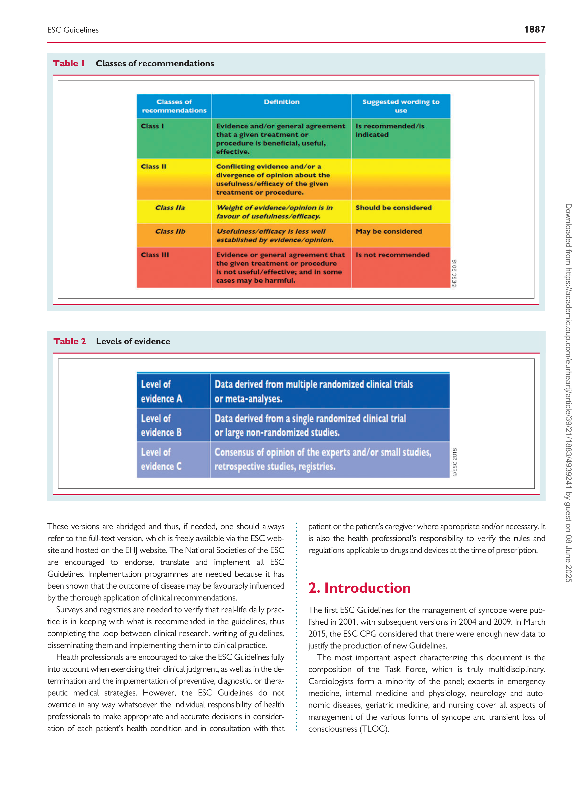
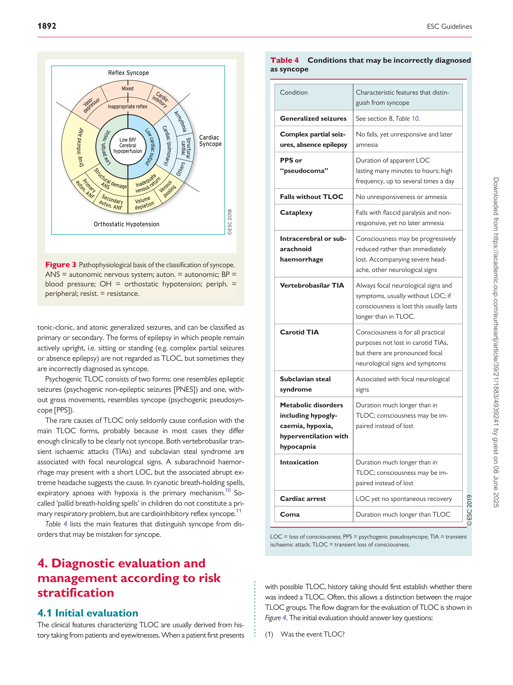
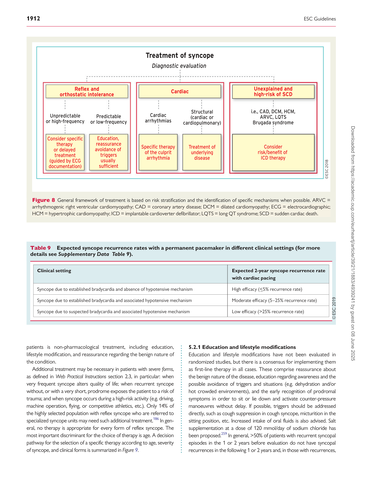

#### European Heart Journal (2018) 39, 1883–1948 ESC GUIDELINES

doi:10.1093/eurheartj/ehy037
# 2018 ESC Guidelines for the diagnosis and management of syncope
## The Task Force for the diagnosis and management of syncope of the European Society of Cardiology (ESC) Developed with the special contribution of the European Heart Rhythm Association (EHRA) Endorsed by: European Academy of Neurology (EAN), European Federation of Autonomic Societies (EFAS), European Federation of Internal Medicine (EFIM), European Union Geriatric Medicine Society (EUGMS), European Society of Emergency Medicine (EuSEM)
#### Authors/Task Force Members: Michele Brignole* (Chairperson) (Italy), Angel Moya* (Co-chairperson) (Spain), Frederik J. de Lange (The Netherlands), Jean-Claude Deharo (France), Perry M. Elliott (UK), Alessandra Fanciulli (Austria), Artur Fedorowski (Sweden), Raffaello Furlan (Italy), Rose Anne Kenny (Ireland), Alfonso Mart�ın (Spain), Vincent Probst (France), Matthew J. Reed (UK), Ciara P. Rice (Ireland), Richard Sutton (Monaco), Andrea Ungar (Italy), and J. Gert van Dijk (The Netherlands)

- Corresponding authors: Michele Brignole, Department of Cardiology, Ospedali Del Tigullio, Via Don Bobbio 25, IT-16033 Lavagna, (GE) Italy. Tel: þ39 0185 329 567,
[Fax: þ39 0185 306 506, Email: mbrignole@asl4.liguria.it; Angel Moya, Arrhythmia Unit, Hospital Vall d’Hebron, P Vall d’Hebron 119-129, ES-08035 Barcelona, Spain.](mailto:)
[Tel: þ34 93 2746166, Fax: þ34 93 2746002, Email: amoyamitjans@gmail.com.](mailto:)

ESC Committee for Practice Guidelines (CPG) and National Cardiac Societies document reviewers: listed in the Appendix.
1 Representing the European Academy of Neurology (EAN)
2 Representing the European Federation of Internal Medicine (EFIM)
3 Representing the European Society of Emergency Medicine (EuSEM)

ESC entities having participated in the development of this document:
Associations: European Heart Rhythm Association (EHRA)
Councils: Council on Cardiovascular Nursing and Allied Professions, Council for Cardiology Practice, Council on Cardiovascular Primary Care
Working Groups: Myocardial and Pericardial Diseases

The content of these European Society of Cardiology (ESC) Guidelines has been published for personal and educational use only. No commercial use is authorized. No part of the
ESC Guidelines may be translated or reproduced in any form without written permission from the ESC. Permission can be obtained upon submission of a written request to Oxford
[University Press, the publisher of the European Heart Journal and the party authorized to handle such permissions on behalf of the ESC (journals.permissions@oxfordjournals.org).](mailto:)

Disclaimer. The ESC Guidelines represent the views of the ESC and were produced after careful consideration of the scientific and medical knowledge and the evidence available
at the time of their publication. The ESC is not responsible in the event of any contradiction, discrepancy and/or ambiguity between the ESC Guidelines and any other official recommendations or guidelines issued by the relevant public health authorities, in particular in relation to good use of healthcare or therapeutic strategies. Health professionals are encouraged to take the ESC Guidelines fully into account when exercising their clinical judgment, as well as in the determination and the implementation of preventive, diagnostic or
therapeutic medical strategies; however, the ESC Guidelines do not override, in any way whatsoever, the individual responsibility of health professionals to make appropriate and
accurate decisions in consideration of each patient’s health condition and in consultation with that patient and, where appropriate and/or necessary, the patient’s caregiver. Nor do
the ESC Guidelines exempt health professionals from taking into full and careful consideration the relevant official updated recommendations or guidelines issued by the competent
public health authorities, in order to manage each patient’s case in light of the scientifically accepted data pursuant to their respective ethical and professional obligations. It is also the
health professional’s responsibility to verify the applicable rules and regulations relating to drugs and medical devices at the time of prescription.

V C The European Society of Cardiology 2018. All rights reserved. For permissions please email: journals.permissions@oxfordjournals.org

1884 ESC Guidelines

Document Reviewers: Adam Torbicki (CPG Review Coordinator) (Poland), Javier Moreno (CPG Review
Coordinator) (Spain), Victor Aboyans (France), Stefan Agewall (Norway), Riccardo Asteggiano (Italy),
Jean-Jacques Blanc (France), Natan Bornstein [1] (Israel), Serge Boveda (France), He´ctor Bueno (Spain),
Haran Burri (Switzerland), Antonio Coca (Spain), Jean-Philippe Collet (France), Giorgio Costantino [2]

(Italy), Ernesto D�ıaz-Infante (Spain), Victoria Delgado (The Netherlands), Faas Dolmans
(The Netherlands), Oliver Gaemperli (Switzerland), Jacek Gajek (Poland), Gerhard Hindricks (Germany),
Josef Kautzner (Czech Replublic), Juhani Knuuti (Finland), Piotr Kulakowski (Poland),
Ekaterini Lambrinou (Cyprus), Christophe Leclercq (France), Philippe Mabo (France), Carlos A. Morillo
(Canada), Massimo Francesco Piepoli (Italy), Marco Roffi (Switzerland), Win K. Shen (USA),
Iain A. Simpson (UK), Martin Stockburger (Germany), Peter Vanbrabant [3] (Belgium),
Stephan Windecker (Switzerland), and Jose Luis Zamorano (Spain)

The disclosure forms of all experts involved in the development of these Guidelines are available on the
[ESC website http://www.escardio.org/guidelines.](http://www.escardio.org/guidelines)

For the Supplementary Data which include background information and detailed discussion of the data
[that have provided the basis for the Guidelines see https://academic.oup.com/eurheartj/article-lookup/doi/](https://academic.oup.com/eurheartj/article-lookup/doi/10.1093/eurheartj/ehy037#supplementary-data)
[10.1093/eurheartj/ehy037#supplementary-data](https://academic.oup.com/eurheartj/article-lookup/doi/10.1093/eurheartj/ehy037#supplementary-data)

Click here to access the corresponding chapter in ESC CardioMed - Section 39 Syncope

Online publish-ahead-of-print 19 March 2018

...................................................................................................................................................................................................

Keywords Guidelines - Syncope - Transient loss of consciousness - Vasovagal syncope - Reflex
syncope           - Orthostatic hypotension           - Cardiac syncope           - Sudden cardiac death           - Electrophysiological
study            - Prolonged ECG monitoring            - Tilt testing            - Carotid sinus massage            - Cardiac pacing            - Implantable
cardioverter defibrillator             - Syncope unit             - Emergency department

### Table of Contents

1. Preamble . . . . . . . . . . . . . . . . . . . . . . . . . . . . . . . . . . . . . . . . . . . . . . . . . . . . . . 1886

2. Introduction . . . . . . . . . . . . . . . . . . . . . . . . . . . . . . . . . . . . . . . . . . . . . . . . . . . 1887

2.1 What is new in the 2018 version? . . . . . . . . . . . . . . . . . . . . . . . . . . . 1889

3. Definitions, classification, and pathophysiology . . . . . . . . . . . . . . . . . . 1889

3.1 Definitions. . . . . . . . . . . . . . . . . . . . . . . . . . . . . . . . . . . . . . . . . . . . . . . . . 1889

3.2 Classification and pathophysiology of syncope and transient

loss of consciousness . . . . . . . . . . . . . . . . . . . . . . . . . . . . . . . . . . . . . . . . . . 1890

3.2.1 Syncope. . . . . . . . . . . . . . . . . . . . . . . . . . . . . . . . . . . . . . . . . . . . . . 1890

3.2.2 Non-syncopal forms of (real or apparent) transient

loss of consciousness. . . . . . . . . . . . . . . . . . . . . . . . . . . . . . . . . . . . . . . 1890

4. Diagnostic evaluation and management according to

risk stratification . . . . . . . . . . . . . . . . . . . . . . . . . . . . . . . . . . . . . . . . . . . . . . . . . 1892

4.1 Initial evaluation. . . . . . . . . . . . . . . . . . . . . . . . . . . . . . . . . . . . . . . . . . . . 1892

4.1.1 Diagnosis of syncope. . . . . . . . . . . . . . . . . . . . . . . . . . . . . . . . . . 1893

4.1.2 Management of syncope in the emergency department

based on risk stratification . . . . . . . . . . . . . . . . . . . . . . . . . . . . . . . . . . 1895

4.2 Diagnostic tests . . . . . . . . . . . . . . . . . . . . . . . . . . . . . . . . . . . . . . . . . . . . 1900

4.2.1 Carotid sinus massage. . . . . . . . . . . . . . . . . . . . . . . . . . . . . . . . . 1900

4.2.2 Orthostatic challenge . . . . . . . . . . . . . . . . . . . . . . . . . . . . . . . . . 1901

4.2.2.1 Active standing . . . . . . . . . . . . . . . . . . . . . . . . . . . . . . . . 1901

4.2.2.2 Tilt testing. . . . . . . . . . . . . . . . . . . . . . . . . . . . . . . . . . . . . 1903

4.2.3 Basic autonomic function tests. . . . . . . . . . . . . . . . . . . . . . . . . 1904

4.2.3.1 Valsalva manoeuvre. . . . . . . . . . . . . . . . . . . . . . . . . . . . 1904

4.2.3.2 Deep breathing. . . . . . . . . . . . . . . . . . . . . . . . . . . . . . . . 1904

4.2.3.3 Other autonomic function tests . . . . . . . . . . . . . . . . 1904

4.2.3.4 Twenty-four-hour ambulatory and home

blood pressure monitoring. . . . . . . . . . . . . . . . . . . . . . . . . . . . 1904

4.2.4 Electrocardiographic monitoring (non-invasive

and invasive) . . . . . . . . . . . . . . . . . . . . . . . . . . . . . . . . . . . . . . . . . . . . . . 1905

4.2.4.1 In-hospital monitoring . . . . . . . . . . . . . . . . . . . . . . . . . 1905

4.2.4.2 Holter monitoring . . . . . . . . . . . . . . . . . . . . . . . . . . . . . 1905

4.2.4.3 Prospective external event recorders. . . . . . . . . . . 1905

4.2.4.4 Smartphone applications. . . . . . . . . . . . . . . . . . . . . . . 1906

4.2.4.5 External loop recorders. . . . . . . . . . . . . . . . . . . . . . . . 1906

4.2.4.6 Remote (at home) telemetry. . . . . . . . . . . . . . . . . . . 1906

4.2.4.7 Implantable loop recorders . . . . . . . . . . . . . . . . . . . . 1906

4.2.4.8 Diagnostic criteria . . . . . . . . . . . . . . . . . . . . . . . . . . . . . 1906

4.2.5 Video recording in suspected syncope . . . . . . . . . . . . . . . . . 1907

4.2.5.1 In-hospital video recording. . . . . . . . . . . . . . . . . . . . . 1907

4.2.5.2 Home video recording. . . . . . . . . . . . . . . . . . . . . . . . . 1908

4.2.6 Electrophysiological study. . . . . . . . . . . . . . . . . . . . . . . . . . . . . 1908

4.2.6.1 Asymptomatic sinus bradycardia – suspected

sinus arrest causing syncope . . . . . . . . . . . . . . . . . . . . . . . . . . . 1908

4.2.6.2 Syncope in bifascicular bundle branch block

(impending high-degree atrioventricular block) . . . . . . . . . 1908

4.2.6.3 Suspected tachycardia . . . . . . . . . . . . . . . . . . . . . . . . . . 1908

4.2.7 Endogenous adenosine and other biomarkers. . . . . . . . . . 1909

4.2.7.1 Adenosine (triphosphate) test and plasma

concentration. . . . . . . . . . . . . . . . . . . . . . . . . . . . . . . . . . . . . . . . . 1909

4.2.7.2 Cardiovascular biomarkers. . . . . . . . . . . . . . . . . . . . . . 1910

4.2.7.3 Immunological biomarkers. . . . . . . . . . . . . . . . . . . . . . 1910

4.2.8 Echocardiography . . . . . . . . . . . . . . . . . . . . . . . . . . . . . . . . . . . . 1910

4.2.8.1 Exercise stress echocardiography . . . . . . . . . . . . . . . 1910

4.2.9 Exercise stress testing. . . . . . . . . . . . . . . . . . . . . . . . . . . . . . . . . 1911

4.2.10 Coronary angiography . . . . . . . . . . . . . . . . . . . . . . . . . . . . . . . . 1911

5. Treatment. . . . . . . . . . . . . . . . . . . . . . . . . . . . . . . . . . . . . . . . . . . . . . . . . . . . . 1911

ESC Guidelines 1885

5.1 General principles of treatment of syncope. . . . . . . . . . . . . . . . . . 1911

5.2 Treatment of reflex syncope. . . . . . . . . . . . . . . . . . . . . . . . . . . . . . . . 1911

5.2.1 Education and lifestyle modifications. . . . . . . . . . . . . . . . . . . 1912

5.2.2 Discontinuation/reduction of hypotensive therapy . . . . . 1913

5.2.3 Physical counter-pressure manoeuvres . . . . . . . . . . . . . . . . 1914

5.2.4 Tilt training . . . . . . . . . . . . . . . . . . . . . . . . . . . . . . . . . . . . . . . . . . . 1914

5.2.5 Pharmacological therapy . . . . . . . . . . . . . . . . . . . . . . . . . . . . . . 1914

5.2.5.1 Fludrocortisone . . . . . . . . . . . . . . . . . . . . . . . . . . . . . . . . 1914

5.2.5.2 Alpha-agonists. . . . . . . . . . . . . . . . . . . . . . . . . . . . . . . . . . 1914

5.2.5.3 Beta-blockers . . . . . . . . . . . . . . . . . . . . . . . . . . . . . . . . . . 1915

5.2.5.4 Other drugs. . . . . . . . . . . . . . . . . . . . . . . . . . . . . . . . . . . . 1915

5.2.5.5 Emerging new therapies in specific subgroups . . . . 1915

5.2.6 Cardiac pacing. . . . . . . . . . . . . . . . . . . . . . . . . . . . . . . . . . . . . . . . 1915

5.2.6.1 Evidence from trials in suspected or

certain reflex syncope and electrocardiogram
documented asystole. . . . . . . . . . . . . . . . . . . . . . . . . . . . . . . . . . 1915

5.2.6.2 Evidence from trials in patients with carotid

sinus syndrome. . . . . . . . . . . . . . . . . . . . . . . . . . . . . . . . . . . . . . . . 1915

5.2.6.3 Evidence from trials in patients with tilt-induced

vasovagal syncope . . . . . . . . . . . . . . . . . . . . . . . . . . . . . . . . . . . . . 1916

5.2.6.4 Evidence from trials in patients with

adenosine-sensitive syncope . . . . . . . . . . . . . . . . . . . . . . . . . . . 1917

5.2.6.5 Choice of pacing mode . . . . . . . . . . . . . . . . . . . . . . . . . 1917

5.2.6.6 Selection of patients for pacing and

proposed algorithm . . . . . . . . . . . . . . . . . . . . . . . . . . . . . . . . . . . 1917

5.3 Treatment of orthostatic hypotension and orthostatic intolerance

syndromes . . . . . . . . . . . . . . . . . . . . . . . . . . . . . . . . . . . . . . . . . . . . . . . . . . . . 1919

5.3.1 Education and lifestyle measures. . . . . . . . . . . . . . . . . . . . . . . 1919

5.3.2 Adequate hydration and salt intake . . . . . . . . . . . . . . . . . . . . 1919

5.3.3 Discontinuation/reduction of vasoactive drugs . . . . . . . . . 1919

5.3.4 Counter-pressure manoeuvres. . . . . . . . . . . . . . . . . . . . . . . . 1920

5.3.5 Abdominal binders and/or support stockings. . . . . . . . . . . 1920

5.3.6 Head-up tilt sleeping . . . . . . . . . . . . . . . . . . . . . . . . . . . . . . . . . . 1920

5.3.7 Midodrine . . . . . . . . . . . . . . . . . . . . . . . . . . . . . . . . . . . . . . . . . . . . 1920

5.3.8 Fludrocortisone . . . . . . . . . . . . . . . . . . . . . . . . . . . . . . . . . . . . . . 1920

5.3.9 Additional therapies . . . . . . . . . . . . . . . . . . . . . . . . . . . . . . . . . . 1920

5.3.10 Emerging new pharmacological therapy in specific

subgroups . . . . . . . . . . . . . . . . . . . . . . . . . . . . . . . . . . . . . . . . . . . . . . . . . 1920

5.4 Cardiac arrhythmias as the primary cause . . . . . . . . . . . . . . . . . . . 1921

5.4.1 Syncope due to intrinsic sinoatrial or atrioventricular

conduction system disease . . . . . . . . . . . . . . . . . . . . . . . . . . . . . . . . . 1921

5.4.1.1 Sinus node disease. . . . . . . . . . . . . . . . . . . . . . . . . . . . . . 1921

5.4.1.2 Atrioventricular conduction system disease. . . . . . 1921

5.4.1.3 Bundle branch block and unexplained syncope. . . 1922

5.4.2 Syncope due to intrinsic cardiac tachyarrhythmias . . . . . . 1922

5.4.2.1 Paroxysmal supraventricular tachycardia. . . . . . . . . 1923

5.4.2.2 Paroxysmal ventricular tachycardia . . . . . . . . . . . . . . 1923

5.5 Treatment of syncope secondary to structural cardiac,

cardiopulmonary, and great vessel disease . . . . . . . . . . . . . . . . . . . . . . 1925

5.6 Treatment of unexplained syncope in patients at high risk of

sudden cardiac death . . . . . . . . . . . . . . . . . . . . . . . . . . . . . . . . . . . . . . . . . . 1925

5.6.1 Definition . . . . . . . . . . . . . . . . . . . . . . . . . . . . . . . . . . . . . . . . . . . . 1925

5.6.2 Left ventricular systolic dysfunction. . . . . . . . . . . . . . . . . . . . 1925

5.6.3 Hypertrophic cardiomyopathy . . . . . . . . . . . . . . . . . . . . . . . . 1926

5.6.4 Arrhythmogenic right ventricular cardiomyopathy. . . . . . 1926

5.6.5.1 Long QT syndrome. . . . . . . . . . . . . . . . . . . . . . . . . . . . . 1926

5.6.5.2 Brugada syndrome. . . . . . . . . . . . . . . . . . . . . . . . . . . . . . 1926

5.6.5.3 Other forms . . . . . . . . . . . . . . . . . . . . . . . . . . . . . . . . . . . 1927

6. Special issues . . . . . . . . . . . . . . . . . . . . . . . . . . . . . . . . . . . . . . . . . . . . . . . . . . 1927

6.1 Syncope in patients with comorbidity and frailty . . . . . . . . . . . . . 1927

6.1.1 Comorbidity and polypharmacy . . . . . . . . . . . . . . . . . . . . . . . 1927

6.1.2 Falls . . . . . . . . . . . . . . . . . . . . . . . . . . . . . . . . . . . . . . . . . . . . . . . . . . 1928

6.1.3 Cognitive assessment and physical performance tests. . . 1928

6.2 Syncope in paediatric patients. . . . . . . . . . . . . . . . . . . . . . . . . . . . . . . 1929

6.2.1 Diagnostic evaluation . . . . . . . . . . . . . . . . . . . . . . . . . . . . . . . . . 1929

6.2.2 Therapy. . . . . . . . . . . . . . . . . . . . . . . . . . . . . . . . . . . . . . . . . . . . . . 1929

7. Psychogenic transient loss of consciousness and its evaluation. . . . 1929

7.1 Diagnosis . . . . . . . . . . . . . . . . . . . . . . . . . . . . . . . . . . . . . . . . . . . . . . . . . . 1929

7.1.1 Historical criteria for attacks. . . . . . . . . . . . . . . . . . . . . . . . . . . 1929

7.1.2 Documentation of key features during an attack. . . . . . . . 1929

7.1.2.1 Management of psychogenic pseudosyncope . . . . 1930

8. Neurological causes and mimics of syncope . . . . . . . . . . . . . . . . . . . . . 1930

8.1 Clinical conditions. . . . . . . . . . . . . . . . . . . . . . . . . . . . . . . . . . . . . . . . . . 1930

8.1.1 Autonomic failure . . . . . . . . . . . . . . . . . . . . . . . . . . . . . . . . . . . . 1930

8.1.2 Epilepsy and ictal asystole . . . . . . . . . . . . . . . . . . . . . . . . . . . . . 1930

8.1.3 Cerebrovascular disorders . . . . . . . . . . . . . . . . . . . . . . . . . . . . 1930

8.1.4 Migraine. . . . . . . . . . . . . . . . . . . . . . . . . . . . . . . . . . . . . . . . . . . . . . 1931

8.1.5 Cataplexy . . . . . . . . . . . . . . . . . . . . . . . . . . . . . . . . . . . . . . . . . . . . 1932

8.1.6 Drop attacks . . . . . . . . . . . . . . . . . . . . . . . . . . . . . . . . . . . . . . . . . 1932

8.2 Neurological tests. . . . . . . . . . . . . . . . . . . . . . . . . . . . . . . . . . . . . . . . . . 1932

8.2.1 Electroencephalography . . . . . . . . . . . . . . . . . . . . . . . . . . . . . . 1932

8.2.2 Brain computed tomography and magnetic

resonance imaging . . . . . . . . . . . . . . . . . . . . . . . . . . . . . . . . . . . . . . . . . 1932

8.2.3 Neurovascular studies . . . . . . . . . . . . . . . . . . . . . . . . . . . . . . . . 1932

8.2.4 Blood tests . . . . . . . . . . . . . . . . . . . . . . . . . . . . . . . . . . . . . . . . . . . 1932

9. Organizational aspects . . . . . . . . . . . . . . . . . . . . . . . . . . . . . . . . . . . . . . . . . 1932

9.1 Syncope (transient loss of consciousness) management unit. . 1932

9.1.1 Definition of a syncope unit . . . . . . . . . . . . . . . . . . . . . . . . . . . 1933

9.1.2 Definition of syncope specialist . . . . . . . . . . . . . . . . . . . . . . . . 1934

9.1.3 Goal of a syncope unit . . . . . . . . . . . . . . . . . . . . . . . . . . . . . . . . 1934

9.1.4 Model of a syncope unit. . . . . . . . . . . . . . . . . . . . . . . . . . . . . . . 1934

9.1.5 Access and referrals to a syncope unit . . . . . . . . . . . . . . . . . 1935

9.1.6 Outcomes and quality indicators . . . . . . . . . . . . . . . . . . . . . . 1935

9.2 The clinical nurse specialist in the syncope unit. . . . . . . . . . . . . . . 1935

9.2.1 Definition . . . . . . . . . . . . . . . . . . . . . . . . . . . . . . . . . . . . . . . . . . . . 1935

9.2.2 Role and skills of the clinical nurse specialist . . . . . . . . . . . . 1935

10. Key messages. . . . . . . . . . . . . . . . . . . . . . . . . . . . . . . . . . . . . . . . . . . . . . . . . 1936

11. Gaps in evidence and areas for future research. . . . . . . . . . . . . . . . . 1937

12. ‘What to do’ and ‘what not to do’ messages from the

Guidelines . . . . . . . . . . . . . . . . . . . . . . . . . . . . . . . . . . . . . . . . . . . . . . . . . . . . . . . 1938

13. Supplementary Data and Web Practical Instructions. . . . . . . . . . . . 1940

14. Appendix . . . . . . . . . . . . . . . . . . . . . . . . . . . . . . . . . . . . . . . . . . . . . . . . . . . . 1940

15. References . . . . . . . . . . . . . . . . . . . . . . . . . . . . . . . . . . . . . . . . . . . . . . . . . . . 1941
### Abbreviations and acronyms

ABPM Ambulatory blood pressure monitoring
AF Atrial fibrillation
ARVC Arrhythmogenic right ventricular cardiomyopathy
ATP Adenosine triphosphate

5.2.1 Education and lifestyle modifications. . . . . . . . . . . . . . . . . . . 1912

5.2.2 Discontinuation/reduction of hypotensive therapy . . . . . 1913

5.2.3 Physical counter-pressure manoeuvres . . . . . . . . . . . . . . . . 1914

5.2.4 Tilt training . . . . . . . . . . . . . . . . . . . . . . . . . . . . . . . . . . . . . . . . . . . 1914

5.2.5 Pharmacological therapy . . . . . . . . . . . . . . . . . . . . . . . . . . . . . . 1914

5.2.5.1 Fludrocortisone . . . . . . . . . . . . . . . . . . . . . . . . . . . . . . . . 1914

5.2.5.2 Alpha-agonists. . . . . . . . . . . . . . . . . . . . . . . . . . . . . . . . . . 1914

5.2.5.3 Beta-blockers . . . . . . . . . . . . . . . . . . . . . . . . . . . . . . . . . . 1915

5.2.5.4 Other drugs. . . . . . . . . . . . . . . . . . . . . . . . . . . . . . . . . . . . 1915

5.2.5.5 Emerging new therapies in specific subgroups . . . . 1915

5.2.6 Cardiac pacing. . . . . . . . . . . . . . . . . . . . . . . . . . . . . . . . . . . . . . . . 1915

5.2.6.1 Evidence from trials in suspected or

certain reflex syncope and electrocardiogram
documented asystole. . . . . . . . . . . . . . . . . . . . . . . . . . . . . . . . . . 1915

5.2.6.2 Evidence from trials in patients with carotid

sinus syndrome. . . . . . . . . . . . . . . . . . . . . . . . . . . . . . . . . . . . . . . . 1915

5.2.6.3 Evidence from trials in patients with tilt-induced

vasovagal syncope . . . . . . . . . . . . . . . . . . . . . . . . . . . . . . . . . . . . . 1916

5.2.6.4 Evidence from trials in patients with

adenosine-sensitive syncope . . . . . . . . . . . . . . . . . . . . . . . . . . . 1917

5.2.6.5 Choice of pacing mode . . . . . . . . . . . . . . . . . . . . . . . . . 1917

5.2.6.6 Selection of patients for pacing and

proposed algorithm . . . . . . . . . . . . . . . . . . . . . . . . . . . . . . . . . . . 1917

5.3 Treatment of orthostatic hypotension and orthostatic intolerance

syndromes . . . . . . . . . . . . . . . . . . . . . . . . . . . . . . . . . . . . . . . . . . . . . . . . . . . . 1919

5.3.1 Education and lifestyle measures. . . . . . . . . . . . . . . . . . . . . . . 1919

5.3.2 Adequate hydration and salt intake . . . . . . . . . . . . . . . . . . . . 1919

5.3.3 Discontinuation/reduction of vasoactive drugs . . . . . . . . . 1919

5.3.4 Counter-pressure manoeuvres. . . . . . . . . . . . . . . . . . . . . . . . 1920

5.3.5 Abdominal binders and/or support stockings. . . . . . . . . . . 1920

5.3.6 Head-up tilt sleeping . . . . . . . . . . . . . . . . . . . . . . . . . . . . . . . . . . 1920

5.3.7 Midodrine . . . . . . . . . . . . . . . . . . . . . . . . . . . . . . . . . . . . . . . . . . . . 1920

5.3.8 Fludrocortisone . . . . . . . . . . . . . . . . . . . . . . . . . . . . . . . . . . . . . . 1920

5.3.9 Additional therapies . . . . . . . . . . . . . . . . . . . . . . . . . . . . . . . . . . 1920

5.3.10 Emerging new pharmacological therapy in specific

subgroups . . . . . . . . . . . . . . . . . . . . . . . . . . . . . . . . . . . . . . . . . . . . . . . . . 1920

5.4 Cardiac arrhythmias as the primary cause . . . . . . . . . . . . . . . . . . . 1921

5.4.1 Syncope due to intrinsic sinoatrial or atrioventricular

conduction system disease . . . . . . . . . . . . . . . . . . . . . . . . . . . . . . . . . 1921

5.4.1.1 Sinus node disease. . . . . . . . . . . . . . . . . . . . . . . . . . . . . . 1921

5.4.1.2 Atrioventricular conduction system disease. . . . . . 1921

5.4.1.3 Bundle branch block and unexplained syncope. . . 1922

5.4.2 Syncope due to intrinsic cardiac tachyarrhythmias . . . . . . 1922

5.4.2.1 Paroxysmal supraventricular tachycardia. . . . . . . . . 1923

5.4.2.2 Paroxysmal ventricular tachycardia . . . . . . . . . . . . . . 1923

5.5 Treatment of syncope secondary to structural cardiac,

cardiopulmonary, and great vessel disease . . . . . . . . . . . . . . . . . . . . . . 1925

5.6 Treatment of unexplained syncope in patients at high risk of

sudden cardiac death . . . . . . . . . . . . . . . . . . . . . . . . . . . . . . . . . . . . . . . . . . 1925

5.6.1 Definition . . . . . . . . . . . . . . . . . . . . . . . . . . . . . . . . . . . . . . . . . . . . 1925

5.6.2 Left ventricular systolic dysfunction. . . . . . . . . . . . . . . . . . . . 1925

5.6.3 Hypertrophic cardiomyopathy . . . . . . . . . . . . . . . . . . . . . . . . 1926

5.6.4 Arrhythmogenic right ventricular cardiomyopathy. . . . . . 1926

5.6.5 Patients with inheritable arrhythmogenic disorders. . . . . 1926

1886 ESC Guidelines

AV Atrioventricular

AVID Antiarrhythmics versus Implantable
Defibrillators trial

BBB Bundle branch block

BNP B-type natriuretic peptide
BP Blood pressure
b.p.m. Beats per minute
CI Confidence interval
CI-CSS Cardioinhibitory carotid sinus syndrome

CPG Committee for Practice Guidelines

CRT-D Cardiac resynchronization therapy defibrillator
CSM Carotid sinus massage
CSS Carotid sinus syndrome
DCM Dilated cardiomyopathy
DDD-PM Dual chamber pacemaker
ECG Electrocardiogram/electrocardiographic
ED Emergency department
EEG Electroencephalogram
EFAS European Federation of Autonomic Societies
EFIM European Federation of Internal Medicine
EHRA European Heart Rhythm Association
ENS European Neurological Society
EPS Electrophysiological study
ESC European Society of Cardiology
EUGMS European Union Geriatric Medicine Society
EuSEM European Society of Emergency Medicine
HBPM Home blood pressure monitoring
HCM Hypertrophic cardiomyopathy

HR Heart rate

ICD Implantable cardioverter defibrillator
ILR Implantable loop recorder
ISSUE International Study on Syncope of Unknown Etiology
L-DOPA L-3,4-dihydroxyphenylalanine

LOC Loss of consciousness

LQTS Long QT syndrome
LVEF Left ventricular ejection fraction
MRI Magnetic resonance imaging

NYHA New York Heart Association

OH Orthostatic hypotension
PC-Trial Physical Counterpressure Manoeuvres Trial
PCM Physical counter-pressure manoeuvres
PNES Psychogenic non-epileptic seizures
POST Prevention of Syncope Trial
POTS Postural orthostatic tachycardia syndrome
PPS Psychogenic pseudosyncope

RCT Randomized controlled trial

SCD Sudden cardiac death

SNRT Sinus node recovery time
SU Syncope unit
SUP Syncope Unit Project
SVT Supraventricular tachycardia

TIA Transient ischaemic attack

t.i.d. Ter in die (three times daily)

TLOC Transient loss of consciousness

TNG Trinitroglycerin
VA Ventricular arrhythmia

VF Ventricular fibrillation
VT Ventricular tachycardia
VVS Vasovagal syncope
### 1. Preamble

Guidelines summarize and evaluate available evidence with the aim of

assisting health professionals in selecting the best management strategies for an individual patient with a given condition. Guidelines and
their recommendations should facilitate decision making of health professionals in their daily practice. However, the final decisions concerning
an individual patient must be made by the responsible health professional(s) in consultation with the patient and caregiver as appropriate.
A great number of guidelines have been issued in recent years by
the European Society of Cardiology (ESC), as well as by other societies and organisations. Because of the impact on clinical practice,
quality criteria for the development of guidelines have been established in order to make all decisions transparent to the user. The recommendations for formulating and issuing ESC Guidelines can be
[found on the ESC website (http://www.escardio.org/Guidelines-&-](http://www.escardio.org/Guidelines-&-Education/Clinical-Practice-Guidelines/Guidelines-development/Writing-ESC-Guidelines)
[Education/Clinical-Practice-Guidelines/Guidelines-development/Writ](http://www.escardio.org/Guidelines-&-Education/Clinical-Practice-Guidelines/Guidelines-development/Writing-ESC-Guidelines)
[ing-ESC-Guidelines). ESC Guidelines represent the official position of](http://www.escardio.org/Guidelines-&-Education/Clinical-Practice-Guidelines/Guidelines-development/Writing-ESC-Guidelines)
the ESC on a given topic and are regularly updated.
Members of this Task Force were selected by the ESC, including
representation from its relevant ESC sub-specialty groups, in order
to represent professionals involved with the medical care of patients
with this pathology. Selected experts in the field undertook a comprehensive review of the published evidence for management of a
given condition according to ESC Committee for Practice Guidelines
(CPG) policy. A critical evaluation of diagnostic and therapeutic procedures was performed, including assessment of the risk–benefit
ratio. The level of evidence and the strength of the recommendation
of particular management options were weighed and graded according to predefined scales, as outlined in Tables 1 and 2.
The experts of the writing and reviewing panels provided declaration of interest forms for all relationships that might be perceived as
real or potential sources of conflicts of interest. These forms were
[compiled into one file and can be found on the ESC website (http://](http://www.escardio.org/guidelines)
[www.escardio.org/guidelines). Any changes in declarations of interest](http://www.escardio.org/guidelines)
that arise during the writing period were notified to the ESC and
updated. The Task Force received its entire financial support from
the ESC without any involvement from the healthcare industry.
The ESC CPG supervises and coordinates the preparation of new
Guidelines. The Committee is also responsible for the endorsement
process of these Guidelines. The ESC Guidelines undergo extensive
review by the CPG and external experts. After appropriate revisions
the Guidelines are approved by all the experts involved in the Task
Force. The finalized document is approved by the CPG for publication in the European Heart Journal. The Guidelines were developed
after careful consideration of the scientific and medical knowledge
and the evidence available at the time of their dating.
The task of developing ESC Guidelines also includes the creation of
educational tools and implementation programmes for the recommendations including condensed pocket guideline versions, summary slides,
booklets with essential messages, summary cards for non-specialists
and an electronic version for digital applications (smartphones, etc.).

ESC Guidelines 1887

These versions are abridged and thus, if needed, one should always
refer to the full-text version, which is freely available via the ESC website and hosted on the EHJ website. The National Societies of the ESC
are encouraged to endorse, translate and implement all ESC
Guidelines. Implementation programmes are needed because it has
been shown that the outcome of disease may be favourably influenced
by the thorough application of clinical recommendations.
Surveys and registries are needed to verify that real-life daily practice is in keeping with what is recommended in the guidelines, thus
completing the loop between clinical research, writing of guidelines,
disseminating them and implementing them into clinical practice.
Health professionals are encouraged to take the ESC Guidelines fully
into account when exercising their clinical judgment, as well as in the determination and the implementation of preventive, diagnostic, or therapeutic medical strategies. However, the ESC Guidelines do not
override in any way whatsoever the individual responsibility of health

patient or the patient’s caregiver where appropriate and/or necessary. It
is also the health professional’s responsibility to verify the rules and
regulations applicable to drugs and devices at the time of prescription.
### 2. Introduction

The first ESC Guidelines for the management of syncope were published in 2001, with subsequent versions in 2004 and 2009. In March
2015, the ESC CPG considered that there were enough new data to
justify the production of new Guidelines.
The most important aspect characterizing this document is the
composition of the Task Force, which is truly multidisciplinary.
Cardiologists form a minority of the panel; experts in emergency
medicine, internal medicine and physiology, neurology and autonomic diseases, geriatric medicine, and nursing cover all aspects of
management of the various forms of syncope and transient loss of
consciousness (TLOC).

1888 ESC Guidelines

Compared with the previous versions of these Guidelines, the
[2018 document contains Supplementary Data as an integral part.](https://academic.oup.com/eurheartj/article-lookup/doi/10.1093/eurheartj/ehy037#supplementary-data)
While the print text mainly aims to give formal evidence-based recommendations according to the standardized rules of the ESC, this
new web-only feature allows expansion of the content to practical
issues, and aims to fill the gap between the best available scientific evidence and the need for dissemination of these concepts into clinical
practice (‘We have the knowledge, we need to teach it’). Thanks to the
[Supplementary Data further explanation on specific points is given,](https://academic.oup.com/eurheartj/article-lookup/doi/10.1093/eurheartj/ehy037#supplementary-data)
[and thanks to the Web Practical Instructions advice is given on how](https://academic.oup.com/eurheartj/article-lookup/doi/10.1093/eurheartj/ehy071)
to evaluate patients with loss of consciousness (LOC), and how to
perform and interpret tests properly; whenever possible, we provide

The document aims to be patient-orientated and focused on therapy, and to reduce the risk of recurrence and the life-threatening
consequences of syncope recurrence. For this purpose, even in the
absence of strong evidence from trials, we give as much advice as
possible on the most appropriate therapy based on the practical expertise of the members of the Task Force (‘Our patients seek solutions,
not only explanations’). When possible, we provide therapeutic and
decision-making algorithms.
Finally, we recognize that one major challenge in syncope management is the reduction of inappropriate admissions and inappropriate
use of tests while maintaining the safety of the patient. We give strong
focus to pathways and organizational issues (‘We have the knowledge;
we need to apply it’). In particular, we propose a care pathway for the

ESC Guidelines 1889

management of patients with TLOC from their arrival in the emergency department (ED), and give practical instructions on how to set
up outpatient syncope clinics (syncope units) aimed at reducing hospitalization, under- and misdiagnoses, and costs.

2.1 What is new in the 2018 version?

The changes in recommendations made in the 2018 version compared with the 2009 version, the new recommendations, and the
most important new/revised concepts are summarized in Figure 1.
### 3. Definitions, classification, and pathophysiology

3.1 Definitions

 - [Syncope][ is defined as TLOC due to cerebral hypoperfusion, char-]
acterized by a rapid onset, short duration, and spontaneous complete recovery.

Syncope shares many clinical features with other disorders; it

 - [TLOC][ is defined as a state of real or apparent LOC with loss of]
awareness, characterized by amnesia for the period of unconsciousness, abnormal motor control, loss of responsiveness, and
a short duration.

The two main groups of TLOC are ‘TLOC due to head trauma’
and ‘non-traumatic TLOC’ (Figure 2). Traumatic TLOC will not be

considered further in this document, so TLOC will be used to mean

non-traumatic TLOC.

The clinical features characterizing TLOC are usually derived from history taking from patients and eyewitnesses. Specific characteristics that
[aid diagnosis are outlined in section 3 of the Web Practical Instructions.](https://academic.oup.com/eurheartj/article-lookup/doi/10.1093/eurheartj/ehy071)
TLOC groups are defined using pathophysiology: the qualifying criterion for syncope is cerebral hypoperfusion; for epileptic seizures, it
is abnormal excessive brain activity; and for psychogenic TLOC it is
the psychological process of conversion. The syncope definition rests
on pathophysiology because no set of clinical features encompasses
all forms of syncope while also excluding all epileptic seizures and
psychogenic TLOC events.

 - [The adjective][ presyncope][ is used to indicate symptoms and signs]
that occur before unconsciousness in syncope. Note that the
noun presyncope is often used to describe a state that resembles
the prodrome of syncope, but which is not followed by LOC.

2.1 What is new in the 2018 version?

The changes in recommendations made in the 2018 version compared with the 2009 version, the new recommendations, and the
most important new/revised concepts are summarized in Figure 1.

### 3. Definitions, classification, and pathophysiology

3.1 Definitions

- [Syncope][ is defined as TLOC due to cerebral hypoperfusion, char-]
acterized by a rapid onset, short duration, and spontaneous complete recovery.

Syncope shares many clinical features with other disorders; it
therefore presents in many differential diagnoses. This group of dis
orders is labelled TLOC.

1890 ESC Guidelines

A variety of terms are used that generally do not match the definitions
in this document closely enough to be used as synonyms of the defined
terms. For example, a ‘faint’ approximately conforms to syncope but
emphasizes vasovagal syncope (VVS) over other forms. A glossary of un
[certain terms is shown in section 1 of the Web Practical Instructions.](https://academic.oup.com/eurheartj/article-lookup/doi/10.1093/eurheartj/ehy071)

3.2 Classification and pathophysiology of
syncope and transient loss of
consciousness

3.2.1 Syncope
Table 3 provides a classification of the principal causes of syncope,
emphasizing groups of disorders with common pathophysiology,
presentation, and risk. Clinical features, epidemiology, prognosis, impact on quality of life, and economic issues are shown in section 2 of

[the Web Practical Instructions.](https://academic.oup.com/eurheartj/article-lookup/doi/10.1093/eurheartj/ehy071)

The pathophysiological classification centres on a fall in systemic
blood pressure (BP) with a decrease in global cerebral blood flow as
the defining characteristic of syncope. Figure 3 shows low BP and global cerebral hypoperfusion as the central final common pathway of
syncope. A sudden cessation of cerebral blood flow for as short as
6–8 s can cause complete LOC. A systolic BP of 50–60 mmHg at
heart level, i.e. 30–45 mmHg at brain level in the upright position, will
cause LOC. [8][,][9]

Systemic BP is the product of cardiac output and total peripheral
resistance; a fall in either can cause syncope. However, in syncope,
both mechanisms often act together to a varying degree.
There are three primary causes of a low total peripheral resistance. The first is decreased reflex activity causing vasodilatation

‘vasodepressive type’ of reflex syncope, seen in the outer ring in
Figure 3. The second is a functional impairment, and the third a structural impairment of the autonomic nervous system, with druginduced, primary, and secondary autonomic failure in the outer ring.
In autonomic failure, there is insufficient sympathetic vasoconstriction
in response to the upright position.
There are four primary causes of low cardiac output. The first is
a reflex bradycardia, known as cardioinhibitory reflex syncope.
The second concerns cardiovascular causes: arrhythmia, structural disease including pulmonary embolism, and pulmonary
hypertension. The third is inadequate venous return due to volume depletion or venous pooling. Finally, chronotropic and inotropic incompetence through autonomic failure may impair
cardiac output.
Note that these primary mechanisms may interact in different
ways: firstly, venous pooling and inadequate venous return is also a
factor that can trigger an inappropriate reflex in orthostatic reflex
syncope; secondly, a low total peripheral resistance may cause venous pooling of blood below the diaphragm, in turn decreasing venous
return and consequently cardiac output.
The three main groups of syncope, i.e. reflex, cardiovascular, and
secondary to orthostatic hypotension (OH), are shown outside the
rings in Figure 3. Both reflex syncope and OH span the two main
pathophysiological mechanisms.

3.2.2 Non-syncopal forms of (real or apparent) transient

loss of consciousness

Only those forms of epilepsy in which normal motor control is lost,
so patients may fall, are included in Figure 2. These are tonic, clonic,

ESC Guidelines 1891

1892 ESC Guidelines

tonic-clonic, and atonic generalized seizures, and can be classified as
primary or secondary. The forms of epilepsy in which people remain
actively upright, i.e. sitting or standing (e.g. complex partial seizures
or absence epilepsy) are not regarded as TLOC, but sometimes they
are incorrectly diagnosed as syncope.
Psychogenic TLOC consists of two forms: one resembles epileptic
seizures (psychogenic non-epileptic seizures [PNES]) and one, without gross movements, resembles syncope (psychogenic pseudosyncope [PPS]).
The rare causes of TLOC only seldomly cause confusion with the
main TLOC forms, probably because in most cases they differ
enough clinically to be clearly not syncope. Both vertebrobasilar transient ischaemic attacks (TIAs) and subclavian steal syndrome are
associated with focal neurological signs. A subarachnoid haemorrhage may present with a short LOC, but the associated abrupt extreme headache suggests the cause. In cyanotic breath-holding spells,
expiratory apnoea with hypoxia is the primary mechanism. [10] Socalled ‘pallid breath-holding spells’ in children do not constitute a primary respiratory problem, but are cardioinhibitory reflex syncope. [11]

Table 4 lists the main features that distinguish syncope from disorders that may be mistaken for syncope.
### 4. Diagnostic evaluation and management according to risk stratification

4.1 Initial evaluation

The clinical features characterizing TLOC are usually derived from history taking from patients and eyewitnesses. When a patient first presents

|Condition|Characteristic features that distin- guish from syncope|
|---|---|
|Generalized seizures|See section 8, Table 10.|
|Complex partial seiz- ures, absence epilepsy|No falls, yet unresponsive and later amnesia|
|PPS or “pseudocoma”|Duration of apparent LOC lasting many minutes to hours; high frequency, up to several times a day|
|Falls without TLOC|No unresponsiveness or amnesia|
|Cataplexy|Falls with flaccid paralysis and non- responsive, yet no later amnesia|
|Intracerebral or sub- arachnoid haemorrhage|Consciousness may be progressively reduced rather than immediately lost. Accompanying severe head- ache, other neurological signs|
|Vertebrobasilar TIA|Always focal neurological signs and symptoms, usually without LOC; if consciousness is lost this usually lasts longer than in TLOC.|
|Carotid TIA|Consciousness is for all practical purposes not lost in carotid TIAs, but there are pronounced focal neurological signs and symptoms|
|Subclavian steal syndrome|Associated with focal neurological signs|
|Metabolic disorders including hypogly- caemia, hypoxia, hyperventilation with hypocapnia|Duration much longer than in TLOC; consciousness may be im- paired instead of lost|
|Intoxication|Duration much longer than in TLOC; consciousness may be im- paired instead of lost|
|Cardiac arrest|LOC yet no spontaneous recovery|
|Coma|Duration much longer than TLOC|

with possible TLOC, history taking should first establish whether there
was indeed a TLOC. Often, this allows a distinction between the major
TLOC groups. The flow diagram for the evaluation of TLOC is shown in
Figure 4. The initial evaluation should answer key questions:

(1) Was the event TLOC?

ESC Guidelines 1893

(2) In case of TLOC, is it of syncopal or non-syncopal origin?

(3) In case of suspected syncope, is there a clear aetiological diagnosis

(see section 4.1.1)?

(4) Is there evidence to suggest a high risk of cardiovascular events or

death (see section 4.1.2)?

TLOC has four specific characteristics: short duration, abnormal motor control, loss of responsiveness, and amnesia for
the period of LOC (for an explanation of the clinical features of

[TLOC see Web Table 4 in section 4.1 of the Web Practical](https://academic.oup.com/eurheartj/article-lookup/doi/10.1093/eurheartj/ehy071)

[Instructions).](https://academic.oup.com/eurheartj/article-lookup/doi/10.1093/eurheartj/ehy071)
TLOC is probably syncope when: (i) there are signs and symptoms
specific for reflex syncope, syncope due to OH, or cardiac syncope,
and (ii) signs and symptoms specific for other forms of TLOC (head
trauma, epileptic seizures, psychogenic TLOC, and/or rare causes)
are absent. Practical instructions for history taking are given in sec
[tions 3 and 4 of the Web Practical Instructions.](https://academic.oup.com/eurheartj/article-lookup/doi/10.1093/eurheartj/ehy071)

approximately 60% of cases. [12] For non-syncopal TLOC, refer to sec
tions 7 and 8.

4.1.1 Diagnosis of syncope
The starting point of the diagnostic evaluation of TLOC of suspected
syncopal nature is the initial syncope evaluation, which consists of:

 - [Careful history taking concerning present and previous attacks, as]
well as eyewitness accounts, in person or through a telephone

interview.

 - [Physical] examination, including supine and standing BP

measurements.

 - [Electrocardiogram (ECG).]

Based on these findings, additional examinations may be performed when needed (see section 4.2):

 - [Immediate ECG monitoring when there is a suspicion of arrhyth-]

mic syncope.

 - [Echocardiogram when there is previous known heart disease,]
data suggestive of structural heart disease, or syncope secondary
to cardiovascular cause.

1894 ESC Guidelines

- [Carotid sinus massage (CSM) in patients aged >40 years.]

- [Head-up tilt testing when there is suspicion of syncope due to]
OH or reflex syncope.

- [Blood tests when clinically indicated, e.g. haematocrit or haemo-]
globin when haemorrhage is suspected, oxygen saturation and
blood gas analysis when hypoxia is suspected, troponin when cardiac ischaemia-related syncope is suspected, or D-dimer when

Even if there is no independent gold/reference standard to diagnose syncope, there is strong consensus that the initial evaluation may lead to certain or highly likely diagnosis when the
diagnostic criteria listed in the table of recommendations are

met.

|Recommendations|Classa|Levelb|
|---|---|---|
|Reflex syncope and OH|Reflex syncope and OH|Reflex syncope and OH|
|VVS is highly probable if syncope is precipitated by pain, fear, or standing, and is associated with typical progressive prodrome (pallor, sweating, and/or nausea).8,13–17|I|C|
|Situational reflex syncope is highly probable if syncope occurs during or immediately after specific triggers, listed in Table 3.8,13–17|I|C|
|Syncope due to OH is confirmed when syncope occurs while standing and there is concomitant significant OH.18–24|I|C|
|In the absence of the above criteria, reflex syncope and OH should be considered likely when the features that suggest reflex syncope or OH are present and the features that suggest cardiac syncope are absent (see Table 5).|IIa|C|
|Cardiac syncope|Cardiac syncope|Cardiac syncope|
|Arrhythmic syncope is highly probable when the ECG shows25–39: • Persistent sinus bradycardia <40 b.p.m. or sinus pauses >3 s in awake state and in absence of physical training; • Mobitz II second- and third-degree AV block; • Alternating left and right BBB; • VT or rapid paroxysmal SVT; • Non-sustained episodes of polymorphic VT and long or short QT interval; or • Pacemaker or ICD malfunction with cardiac pauses.|I|C|
|Cardiac ischaemia-related syncope is confirmed when syncope presents with evidence of acute myocardial ischaemia with or without myocardial infarction.25–39|I|C|
|Syncope due to structural cardiopulmonary disorders is highly probable when syncope presents in patients with prolapsing atrial myxoma, left atrial ball thrombus, severe aortic stenosis, pulmonary embolus, or acute aortic dissection.|I|C|
|Additional advice and clinical perspectives The initial syncope evaluation, as described in this document, can define the cause of syncope in most patients. Strict adherence to the above defin- itions of VVS and situational reflex syncope, and of syncope due to OH, can be considered certain or highly likely irrespective of the presence of any other abnormal finding. In young subjects with unexplained syncope and no history of cardiac disease, no family history of sudden death, no su- pine syncope or syncope during sleep or exercise, no unusual triggers, and a normal ECG, the chance of cardiac syncope is very low. SCD rates in subjects <35 years amount to 1 – 3/100 000.|Additional advice and clinical perspectives The initial syncope evaluation, as described in this document, can define the cause of syncope in most patients. Strict adherence to the above defin- itions of VVS and situational reflex syncope, and of syncope due to OH, can be considered certain or highly likely irrespective of the presence of any other abnormal finding. In young subjects with unexplained syncope and no history of cardiac disease, no family history of sudden death, no su- pine syncope or syncope during sleep or exercise, no unusual triggers, and a normal ECG, the chance of cardiac syncope is very low. SCD rates in subjects <35 years amount to 1 – 3/100 000.|Additional advice and clinical perspectives The initial syncope evaluation, as described in this document, can define the cause of syncope in most patients. Strict adherence to the above defin- itions of VVS and situational reflex syncope, and of syncope due to OH, can be considered certain or highly likely irrespective of the presence of any other abnormal finding. In young subjects with unexplained syncope and no history of cardiac disease, no family history of sudden death, no su- pine syncope or syncope during sleep or exercise, no unusual triggers, and a normal ECG, the chance of cardiac syncope is very low. SCD rates in subjects <35 years amount to 1 – 3/100 000.|

ESC Guidelines 1895

When a diagnosis is nearly certain or highly likely, no further evaluation is needed, and treatment—if any—can be planned. In other
cases, the initial evaluation may suggest a diagnosis when the features
listed in Table 5 are present, or otherwise is unable to suggest any
diagnosis.

4.1.2 Management of syncope in the emergency
department based on risk stratification
The management of TLOC of suspected syncopal nature in the ED
should answer the following three key questions:

(1) Is there a serious underlying cause that can be identified?

(2) What is the risk of a serious outcome?

(3) Should the patient be admitted to hospital?

Figure 5 shows a flow chart for the management and risk stratification of patients referred to the ED for TLOC suspected to be syncope (modified from Casagranda et al. [40] ).

Question 1: Is there a serious underlying cause that can be
identified in the ED?
Normally the presenting complaint of syncope can be established.
The primary aim for an ED clinician is then to establish an underlying
diagnosis, especially those associated with the potential for rapid clinical deterioration. [41][,][42] It is the acute underlying disease that most frequently determines short-term adverse events rather than the
syncope itself. [43] Subsequent management will focus on treating this
underlying cause (Figure 5). Many (40–45%) non-cardiovascular and
some cardiovascular life-threatening underlying conditions are obvious in the ED. [44] Table 6 lists high-risk features that suggest the presence of a serious underlying cause and low-risk features that suggest
a benign underlying cause.

Question 2: What is the risk of a serious outcome?
High-risk features are shown in Table 6, and how to use this risk profile to guide subsequent management and disposition is shown in
Figure 6.
Risk stratification is important, for two reasons:

(1) To recognize patients with a likely low-risk condition able to be dis
charged with adequate patient education.

(2) To recognize patients with a likely high-risk cardiovascular condition

requiring urgent investigation. This may require admission.

High-risk patients are more likely to have cardiac syncope.
Structural heart disease [25][–][27][,][31][,][35][,][36][,][45] and primary electrical disease [46]

are major risk factors for sudden cardiac death (SCD) and overall
mortality in patients with syncope. Low-risk patients are more likely
to have reflex syncope and have an excellent prognosis. [47] OH is
associated with a two-fold higher risk of death owing to the severity
of comorbidities compared with the general population. [48]

Question 3: Should the patient be admitted to hospital?
Approximately 50% of patients who present to the ED with
syncope are admitted (although the rate varies between 12–86%)
[(see Supplementary Data Table 4). The use of clinical decision rules and](https://academic.oup.com/eurheartj/article-lookup/doi/10.1093/eurheartj/ehy037#supplementary-data)
standardized protocols has not changed this rate significantly. The composite estimate of outcomes is that in the next 7–30 days, only 0.8%

die and 6.9% have a non-fatal severe outcome whilst in the ED, while

[another 3.6% have a post-ED serious outcome (see Supplementary](https://academic.oup.com/eurheartj/article-lookup/doi/10.1093/eurheartj/ehy037#supplementary-data)
[Data Table 4). Unnecessary admission in low-risk patients can be harm-](https://academic.oup.com/eurheartj/article-lookup/doi/10.1093/eurheartj/ehy037#supplementary-data)
ful. [87] Whereas it is crucial to identify these high-risk patients to ensure
early, rapid, and intensive investigation, not all patients at high risk need
hospitalization. [80]

1896 ESC Guidelines

|Recommendations|Classa|Levelb|
|---|---|---|
|It is recommended that patients with low-risk features, likely to have reflex or situational syncope, or syncope due to OH, are discharged from the ED.27,35,36,49–54,58,62,69|I|B|
|It is recommended that patients with high-risk features receive an early intensive and prompt evaluation in a syncope unit or in an ED observation unit (if available), or are hospitalized.26,27,35,36,44–46,50,55–57,59,60,70–76|I|B|
|It is recommended that patients who have neither high- nor low-risk features are observed in the ED or in a syncope unit instead of being hospitalized.40,63–65,77|I|B|
|Risk stratification scores may be considered for risk stratification in the ED.78–86|IIb|B|
|Additional advice and clinical perspectives • In the ED, presyncope should be managed with the same accuracy as syncope as it carries the same prognosis.66–68 • Diagnostic radiology and laboratory tests such as chest X-ray, brain computed tomography, routine blood haematology, biochemistry, and D-dimer and cardiac markers have a low diagnostic yield, impact on risk stratification of patients with syncope, and should not routinely be used unless specifically suggested by clinical evaluation. • Around 10% of patients with syncope in the ED will suffer from a serious outcome within 7–30 days of their visit, with just under half occurring after their stay in the ED (see Supplementary Data Table 4). It is crucial to identify these high-risk patients to ensure early, rapid, and intensive investigation. • As syncope units are both effective and efficient, this early, rapid, and intensive investigation can be performed on an outpatient basis (either in a syncope unit or an ED observation unit) in most cases. Only patients with a risk of a short-term serious outcome should be considered for hospital admission. • To reduce inappropriate admissions, patients who have a cardiac device and syncope should undergo prompt device interrogation. • Risk stratification scores perform no better than good clinical judgement and should not be used alone to perform risk stratification in the ED.|Additional advice and clinical perspectives • In the ED, presyncope should be managed with the same accuracy as syncope as it carries the same prognosis.66–68 • Diagnostic radiology and laboratory tests such as chest X-ray, brain computed tomography, routine blood haematology, biochemistry, and D-dimer and cardiac markers have a low diagnostic yield, impact on risk stratification of patients with syncope, and should not routinely be used unless specifically suggested by clinical evaluation. • Around 10% of patients with syncope in the ED will suffer from a serious outcome within 7–30 days of their visit, with just under half occurring after their stay in the ED (see Supplementary Data Table 4). It is crucial to identify these high-risk patients to ensure early, rapid, and intensive investigation. • As syncope units are both effective and efficient, this early, rapid, and intensive investigation can be performed on an outpatient basis (either in a syncope unit or an ED observation unit) in most cases. Only patients with a risk of a short-term serious outcome should be considered for hospital admission. • To reduce inappropriate admissions, patients who have a cardiac device and syncope should undergo prompt device interrogation. • Risk stratification scores perform no better than good clinical judgement and should not be used alone to perform risk stratification in the ED.|Additional advice and clinical perspectives • In the ED, presyncope should be managed with the same accuracy as syncope as it carries the same prognosis.66–68 • Diagnostic radiology and laboratory tests such as chest X-ray, brain computed tomography, routine blood haematology, biochemistry, and D-dimer and cardiac markers have a low diagnostic yield, impact on risk stratification of patients with syncope, and should not routinely be used unless specifically suggested by clinical evaluation. • Around 10% of patients with syncope in the ED will suffer from a serious outcome within 7–30 days of their visit, with just under half occurring after their stay in the ED (see Supplementary Data Table 4). It is crucial to identify these high-risk patients to ensure early, rapid, and intensive investigation. • As syncope units are both effective and efficient, this early, rapid, and intensive investigation can be performed on an outpatient basis (either in a syncope unit or an ED observation unit) in most cases. Only patients with a risk of a short-term serious outcome should be considered for hospital admission. • To reduce inappropriate admissions, patients who have a cardiac device and syncope should undergo prompt device interrogation. • Risk stratification scores perform no better than good clinical judgement and should not be used alone to perform risk stratification in the ED.|

ESC Guidelines 1897

1898 ESC Guidelines

ESC Guidelines 1899

The diagnostic tests, procedures, and interventions that may require admission in patients with high-risk features are listed in Table 7.
Furthermore, this Task Force believes that the implementation
of novel care pathways and organizational approaches, such as ED observation units and syncope in- and outpatient units (Figure 6),

offer safe and effective alternatives to admission in the cases
listed in Table 7. Based on a consensus document, [40] a single-centre

<_48 h coupled with fast-tracking to a syncope unit reduced the admission rate to 29%. [77] Among patients not admitted, 20% were discharged after a short observation in the ED, 20% were fast-tracked to
the syncope unit, and 31% were discharged directly from the ED. [77]

Risk stratification scores: There are several ED syncope clinical
decision rules that aim to stratify patients with syncope based on
[medical history, examination, and ECG findings (see Supplementary](https://academic.oup.com/eurheartj/article-lookup/doi/10.1093/eurheartj/ehy037#supplementary-data)

1900 ESC Guidelines

|Favour initial management in ED observation unit and/or fast-track to syncope unit|Favour admission to hospital|
|---|---|
|High-risk features AND: • Stable, known structural heart disease • Severe chronic disease • Syncope during exertion • Syncope while supine or sitting • Syncope without prodrome • Palpitations at the time of syncope • Inadequate sinus bradycardia or sinoatrial block • Suspected device malfunction or inappropriate intervention • Pre-excited QRS complex • SVT or paroxysmal atrial fibrillation • ECG suggesting an inheritable arrhythmogenic disorders • ECG suggesting ARVC|High-risk features AND: • Any potentially severe coexisting disease that requires admission • Injury caused by syncope • Need of further urgent evaluation and treatment if it cannot be achieved in another way (i.e. observation unit), e.g. ECG monitoring, echocardiography, stress test, electrophysiological study, angiography, device malfunction, etc. • Need for treatment of syncope|

[Data Table 3).](https://academic.oup.com/eurheartj/article-lookup/doi/10.1093/eurheartj/ehy037#supplementary-data) [26][,][34][–][36][,][44][,][88] None of these rules are used widely in EDs
due to poor sensitivity and specificity reported from external validation, or due to a lack of external validation. [70][,][78][–][85] Syncope clinical
decision rules perform no better than clinician judgment at predicting
short-term serious outcomes. [86] Clinical decision rules can predict
poor outcomes, but most syncope deaths and many poor outcomes
are associated with underlying illness rather than syncope per se, [58]

particularly in the long term. [56]

Even if the quality of evidence is moderate, there is strong consensus from several studies that currently available risk stratification scores have not shown better sensitivity, specificity, or
prognostic yield compared with clinical judgment in predicting
short-term serious outcomes after syncope. Therefore, they
should not be used alone to perform risk stratification in

the ED.

4.2 Diagnostic tests
4.2.1 Carotid sinus massage
A ventricular pause lasting >3 s and/or a fall in systolic BP of >50
mmHg is known as carotid sinus hypersensitivity. Carotid sinus
hypersensitivity is a common finding in older men without syncope; abnormal responses are frequently observed (<_40%) in
patients without syncope, especially if they are older and affected
by cardiovascular disease. [89] Carotid sinus hypersensitivity is
exceptional in patients <40 years of age. [90] The specificity of the
test increases if spontaneous syncope is reproduced during CSM.
Syncope was induced in only 5% of asymptomatic persons aged

syndrome (CSS) requires the reproduction of spontaneous symptoms and, in addition, that patients have syncope of unknown origin compatible with a reflex mechanism. In such circumstances,
CSM usually shows a period of asystole >6 s. [91] The prevalence of
CSS, as defined here, was 8.8% when CSM was performed after
the initial evaluation in 1855 consecutive patients >40 years of
age with syncope compatible with a reflex mechanism. [92][,][93] In a
multicentre study [94] aimed at validation of the 2009 ESC

Guidelines, CSM was indicated after initial evaluation in 73% of

700 patients and was diagnostic in 12%. The precise methodology

[and results of CSM are shown in section 5 of the Web Practical](https://academic.oup.com/eurheartj/article-lookup/doi/10.1093/eurheartj/ehy071)

[Instructions.](https://academic.oup.com/eurheartj/article-lookup/doi/10.1093/eurheartj/ehy071)

The main complications of CSM are neurological. When pooling
the data from four studies [90][,][95][–][97] in which 8720 patients were analysed, TIAs or strokes were observed in 21 (0.24%).
The relationship between abnormal response to CSM and
spontaneous syncope is a crucial point that has been studied using
two methods. The first was a pre-post comparison of the recurrence rate of syncope after pacing. Non-randomized studies demonstrated fewer recurrences at follow-up in paced patients than in
those without pacing. These results were confirmed in two
randomized trials. [98][,][99] The second method was to analyse the
occurrence of asystolic episodes registered in patients with a cardioinhibitory response to CSM using an implanted device.
Recordings of long pauses were very common in the two trials
that employed this method. [100][,][101] These results suggest that a
positive response to CSM, reproducing symptoms, in patients
with syncope is highly predictive of the occurrence of spontaneous asystolic episodes.

particularly in the long term. [56]

Even if the quality of evidence is moderate, there is strong consensus from several studies that currently available risk stratification scores have not shown better sensitivity, specificity, or
prognostic yield compared with clinical judgment in predicting
short-term serious outcomes after syncope. Therefore, they
should not be used alone to perform risk stratification in

the ED.

4.2 Diagnostic tests
4.2.1 Carotid sinus massage
A ventricular pause lasting >3 s and/or a fall in systolic BP of >50
mmHg is known as carotid sinus hypersensitivity. Carotid sinus
hypersensitivity is a common finding in older men without syncope; abnormal responses are frequently observed (<_40%) in
patients without syncope, especially if they are older and affected
by cardiovascular disease. [89] Carotid sinus hypersensitivity is
exceptional in patients <40 years of age. [90] The specificity of the
test increases if spontaneous syncope is reproduced during CSM.
Syncope was induced in only 5% of asymptomatic persons aged
>65 years. [89] For the above reasons, the diagnosis of carotid sinus

ESC Guidelines 1901

There is strong consensus that the diagnosis of CSS requires
both the reproduction of spontaneous symptoms during CSM
and clinical features of spontaneous syncope compatible with
a reflex mechanism. The quality of evidence is moderate and is
given by studies of ECG correlation between CSM and sponta

neous events, and indirectly by studies of efficacy of cardiac
pacing. Further research is likely to have an important impact
on our confidence in the estimation of effect and may change

the estimate.

|Recommendations|Classa|Levelb|
|---|---|---|
|Indications|Indications|Indications|
|CSM is indicated in patients >40 years of age with syncope of unknown origin compatible with a reflex mechanism.92–94|I|B|
|Diagnostic criteria|Diagnostic criteria|Diagnostic criteria|
|CSS is confirmed if CSM causes bradycardia (asystole) and/or hypotension that reproduce spontaneous symptoms, and patients have clinical features compatible with a reflex mechanism of syncope.89,90,92,93,98–102|I|B|
|Additional advice and clinical perspectives • History of syncope and its reproduction by CSM defines CSS; positive CSM without a history of syncope defines carotid sinus hypersensitiv- ity.89,90,92,93 Carotid sinus hypersensitivity in patients with unexplained syncope may be a non-specific finding because it is present in <_40% of older populations and should be used with caution for diagnosis of the mechanism of syncope. • CSM should be performed with the patient in the supine and upright positions, and with continuous beat-to-beat BP monitoring. This may be more readily performed in the tilt laboratory.90 • Although neurological complications are very rare,90,95–97 the risk of provocation of TIA with the massage suggests that CSM should be under- taken with caution in patients with previous TIA, stroke, or known carotid stenosis >70%.|Additional advice and clinical perspectives • History of syncope and its reproduction by CSM defines CSS; positive CSM without a history of syncope defines carotid sinus hypersensitiv- ity.89,90,92,93 Carotid sinus hypersensitivity in patients with unexplained syncope may be a non-specific finding because it is present in <_40% of older populations and should be used with caution for diagnosis of the mechanism of syncope. • CSM should be performed with the patient in the supine and upright positions, and with continuous beat-to-beat BP monitoring. This may be more readily performed in the tilt laboratory.90 • Although neurological complications are very rare,90,95–97 the risk of provocation of TIA with the massage suggests that CSM should be under- taken with caution in patients with previous TIA, stroke, or known carotid stenosis >70%.|Additional advice and clinical perspectives • History of syncope and its reproduction by CSM defines CSS; positive CSM without a history of syncope defines carotid sinus hypersensitiv- ity.89,90,92,93 Carotid sinus hypersensitivity in patients with unexplained syncope may be a non-specific finding because it is present in <_40% of older populations and should be used with caution for diagnosis of the mechanism of syncope. • CSM should be performed with the patient in the supine and upright positions, and with continuous beat-to-beat BP monitoring. This may be more readily performed in the tilt laboratory.90 • Although neurological complications are very rare,90,95–97 the risk of provocation of TIA with the massage suggests that CSM should be under- taken with caution in patients with previous TIA, stroke, or known carotid stenosis >70%.|

4.2.2 Orthostatic challenge
Changing from the supine to the upright position produces a displacement of blood from the thorax to the lower limbs and abdominal cavity that leads to a decrease in venous return and cardiac
output. In the absence of compensatory mechanisms, a fall in BP may
lead to syncope. [20][,][103][,][104] The diagnostic criteria for OH have been
defined by consensus. [6]

Currently, there are three methods for assessing the response to
change in posture from supine to erect [20][,][103][,][104] : active standing (see
section 4.2.2.1), head-up tilt (see section 4.2.2.2), and 24-h ambulatory BP monitoring (ABPM) (see section 4.2.3.4).

4.2.2.1 Active standing

Indications: This test is used to diagnose different types of ortho[static intolerance (see Web Practical Instructions Web Table 1). A](https://academic.oup.com/eurheartj/article-lookup/doi/10.1093/eurheartj/ehy071)
sphygmomanometer is adequate for routine clinical testing for classical OH and delayed OH because of its ubiquity and simplicity.
Automatic arm-cuff devices, which are programmed to repeat and
confirm measurements when discrepant values are recorded, are at

a disadvantage due to the rapidly falling BP during OH. With a sphygmomanometer, more than four measurements per minute cannot

be obtained without venous obstruction in the arm. When more fre
quent readings are required, as for initial OH, continuous beat-tobeat non-invasive BP measurement is needed. [20][,][103][,][104]

Diagnostic criteria: Abnormal BP fall is defined as a progressive
and sustained fall in systolic BP from baseline value >_20 mmHg or
diastolic BP >_10 mmHg, or a decrease in systolic BP to <90
mmHg. This definition of OH differs from the 2011 consensus [6] in
adding the 90 mmHg threshold. This Task Force believes that an
absolute threshold of 90 mmHg of systolic BP is useful, especially
in patients with a supine BP <110 mmHg. An isolated diastolic BP
drop is very rare and its clinical relevance for OH diagnosis is limited. Orthostatic heart rate (HR) increase is blunted or absent

[usually not >10 beats per minute (b.p.m.)] in patients with neurogenic OH, but increases or even exaggerates with anaemia or
hypovolaemia. The probability that syncope and orthostatic complaints are due to OH can be assessed using the information given

in Table 8.

1902 ESC Guidelines

|Col1|Col2|History of syncope and orthostatic complaints|Col4|
|---|---|---|---|
|||Highly suggestive of OH: syncope and pre- syncope are present during standing, absent while lying, and less severe or absent while sit- ting; a predilection for the morning; sitting or lying down must help; complaints may get worse immediately after exercise, after meals or in high temperatures; no “autonomic activation”|Possibly due to OH: not all of the features highly suggestive of OH are present|
|Supine and standing BP measurement|Symptomatic abnormal BP fall|Syncope is due to OH (Class I)|Syncope is likely due to OH (Class IIa)|
|Supine and standing BP measurement|Asymptomatic abnormal BP fall|Syncope is likely due to OH (Class IIa)|Syncope may be due to OH (Class IIb)|
|Supine and standing BP measurement|No abnormal BP drop|Unproven|Unproven|

|Recommendations|Classa|Levelb|
|---|---|---|
|Indications|Indications|Indications|
|Intermittent determination by sphygmomanometer of BP and HR while supine and during active standing for 3 min are indi- cated at initial syncope evaluation.20,103,104|I|C|
|Continuous beat-to-beat non-invasive BP and HR measurement may be preferred when short-lived BP variations are sus- pected, such as in initial OH.20,103,104|IIb|C|
|Diagnostic criteria|Diagnostic criteria|Diagnostic criteria|
|Syncope due to OH is confirmed when there is a fall in systolic BP from baseline value >_20 mmHg or diastolic BP >_10 mmHg, or a decrease in systolic BP to <90 mmHg that reproduces spontaneous symptoms.6,20,103,104|I|C|
|Syncope due to OH should be considered likely when there is an asymptomatic fall in systolic BP from baseline value >_20 mmHg or diastolic BP >_10 mmHg, or a decrease in systolic BP to <90 mmHg, and symptoms (from history) are consistent with OH.6,20,103,104|IIa|C|
|Syncope due to OH should be considered likely when there is a symptomatic fall in systolic BP from baseline value >_20 mmHg or diastolic BP >_10 mmHg, or a decrease in systolic BP to <90 mmHg, and not all of the features (from history) are suggestive of OH.6,20,103,104|IIa|C|
|POTS should be considered likely when there is an orthostatic HR increase (>30 b.p.m. or to >120 b.p.m. within 10 min of active standing) in the absence of OH that reproduces spontaneous symptoms.6,20,103,104|IIa|C|
|Syncope due to OH may be considered possible when there is an asymptomatic fall in systolic BP from baseline value >_20 mmHg or diastolic BP >_10 mmHg, or a decrease in systolic BP to <90 mmHg, and symptoms (from history) are less consis- tent with OH.6,20,103,104|IIb|C|

ESC Guidelines 1903

4.2.2.2 Tilt testing
Since its introduction in 1986, [105] many protocols have been reported
with variations in the initial stabilization phase, duration, tilt angle,
type of support, and pharmacological provocation. The most commonly used are the trinitroglycerin (TNG) test using 300–400 mg of
sublingual TNG after a 20-min unmedicated phase, [106][,][107] and the
low-dose intravenous isoproterenol test, which uses incremental
doses to increase average HR by about 20–25% over baseline (usually <_3 mg/min). [108][,][109] In a recent systematic literature review, [110] the
overall positivity rate in patients with syncope was 66% for the TNG
protocol and 61% for the isoproterenol protocol; the respective positivity rate in subjects without syncope (controls) ranged from
11–14%; and the test differentiated patients with syncope from controls with an odds ratio of 12. The methodology and classification of
[responses are described in section 6 of the Web Practical Instructions.](https://academic.oup.com/eurheartj/article-lookup/doi/10.1093/eurheartj/ehy071)
Adding video recording to a tilt table permits objective and repeated
review of clinical signs in relation to BP and HR, and helps to assess
the relative contribution of bradycardia and hypotension to syncope
[(see section 5.2.6.3 and the explanatory video in Web Practical](https://academic.oup.com/eurheartj/article-lookup/doi/10.1093/eurheartj/ehy071#supplementary-data)
[Instructions section 6.3.15), and to distinguish between VVS and PPS](https://academic.oup.com/eurheartj/article-lookup/doi/10.1093/eurheartj/ehy071#supplementary-data)
(see section 4.2.5).
The clinical situation corresponding to tilt-induced syncope is that

considered: (i) to confirm a diagnosis of reflex syncope in patients in
whom this diagnosis was suspected but not confirmed by initial evaluation [105][–][109][,][111], and (ii) for the assessment of autonomic
failure, especially for the reproduction of delayed OH (which could not
be detected by active standing because of its delayed onset) [23][,][24][,][112][,][113]

and postural orthostatic tachycardia syndrome (POTS). [114] Tilt testing
may be helpful in separating syncope from PPS. [115][–][117]

Tilt testing has limited value in assessing treatment efficacy. [118]

However, tilt testing is widely accepted as a useful tool to demonstrate susceptibility of the patient to reflex syncope, especially a
hypotensive (vasodepressive) tendency, and thereby to initiate treatment (e.g. physical manoeuvres, see section 5). [119][–][121]

The endpoint of tilt testing is the reproduction of
symptoms along with the characteristic circulatory pattern of
the indication mentioned above, namely the induction of reflex hypotension/bradycardia, OH, POTS, or PPS. The typical tilt test result
[patterns are shown in the Web Practical Instructions section 6.](https://academic.oup.com/eurheartj/article-lookup/doi/10.1093/eurheartj/ehy071)

Interpretation of tilt testing results in patients with reflex syncope:
Some studies [122][,][123] compared the response to tilt testing with spontaneous syncope recorded by an implantable loop recorder (ILR). While
a positive cardioinhibitory response to tilt testing predicts, with a high
probability, an asystolic spontaneous syncope, the presence of a

|Recommendations|Classa|Levelb|
|---|---|---|
|Indications|Indications|Indications|
|Tilt testing should be considered in patients with suspected reflex syncope, OH, POTS, or PPS.23,24,105–109,111–117|IIa|B|
|Tilt testing may be considered to educate patients to recognize symptoms and learn physical manoeuvres.119–121|IIb|B|
|Diagnostic criteria|Diagnostic criteria|Diagnostic criteria|
|Reflex syncope, OH, POTS, or PPS should be considered likely if tilt testing reproduces symptoms along with the charac- teristic circulatory pattern of these conditions.23,24,105–109,111–117|IIa|B|
|Additional advice and clinical perspectives • A negative tilt table response does not exclude a diagnosis of reflex syncope. • While sensitivity and specificity are at acceptable levels when measured in patients with VVS and healthy controls, in usual clinical settings of syncope of uncertain origin tilt testing suggests the presence of a hypotensive susceptibility, which may exist not only in reflex syncope but also with other causes of syncope including some forms of cardiac syncope. The concept of hypotensive susceptibility rather than diagnosis has important practical utility, because the presence or absence of hypotensive susceptibility plays a major role in guiding pacemaker therapy in patients affected by reflex syncope and in the management of hypotensive therapies, which are frequently present in the elderly with syncope (see sections 5.1 and 5.2). • A positive cardioinhibitory response to tilt testing predicts, with high probability, asystolic spontaneous syncope; this finding is relevant for thera- peutic implications when cardiac pacing is considered (see section 5.2.6). Conversely, the presence of a positive vasodepressor, a mixed response, or even a negative response does not exclude the presence of asystole during spontaneous syncope.122,123 • Tilt testing may be helpful in separating syncope with abnormal movements from epilepsy.137 • Tilt testing may have value in distinguishing syncope from falls.23 • Tilt testing may be helpful in separating syncope from PPS. In suspected PPS, the tilt test should preferably be performed together with EEG mon- itoring; a normal EEG helps to confirm the diagnosis.116,117 In the absence of an EEG, a video recording will be helpful in confirming the diagnosis. • Tilt testing should not be used to assess the efficacy of a drug treatment.118|Additional advice and clinical perspectives • A negative tilt table response does not exclude a diagnosis of reflex syncope. • While sensitivity and specificity are at acceptable levels when measured in patients with VVS and healthy controls, in usual clinical settings of syncope of uncertain origin tilt testing suggests the presence of a hypotensive susceptibility, which may exist not only in reflex syncope but also with other causes of syncope including some forms of cardiac syncope. The concept of hypotensive susceptibility rather than diagnosis has important practical utility, because the presence or absence of hypotensive susceptibility plays a major role in guiding pacemaker therapy in patients affected by reflex syncope and in the management of hypotensive therapies, which are frequently present in the elderly with syncope (see sections 5.1 and 5.2). • A positive cardioinhibitory response to tilt testing predicts, with high probability, asystolic spontaneous syncope; this finding is relevant for thera- peutic implications when cardiac pacing is considered (see section 5.2.6). Conversely, the presence of a positive vasodepressor, a mixed response, or even a negative response does not exclude the presence of asystole during spontaneous syncope.122,123 • Tilt testing may be helpful in separating syncope with abnormal movements from epilepsy.137 • Tilt testing may have value in distinguishing syncope from falls.23 • Tilt testing may be helpful in separating syncope from PPS. In suspected PPS, the tilt test should preferably be performed together with EEG mon- itoring; a normal EEG helps to confirm the diagnosis.116,117 In the absence of an EEG, a video recording will be helpful in confirming the diagnosis. • Tilt testing should not be used to assess the efficacy of a drug treatment.118|Additional advice and clinical perspectives • A negative tilt table response does not exclude a diagnosis of reflex syncope. • While sensitivity and specificity are at acceptable levels when measured in patients with VVS and healthy controls, in usual clinical settings of syncope of uncertain origin tilt testing suggests the presence of a hypotensive susceptibility, which may exist not only in reflex syncope but also with other causes of syncope including some forms of cardiac syncope. The concept of hypotensive susceptibility rather than diagnosis has important practical utility, because the presence or absence of hypotensive susceptibility plays a major role in guiding pacemaker therapy in patients affected by reflex syncope and in the management of hypotensive therapies, which are frequently present in the elderly with syncope (see sections 5.1 and 5.2). • A positive cardioinhibitory response to tilt testing predicts, with high probability, asystolic spontaneous syncope; this finding is relevant for thera- peutic implications when cardiac pacing is considered (see section 5.2.6). Conversely, the presence of a positive vasodepressor, a mixed response, or even a negative response does not exclude the presence of asystole during spontaneous syncope.122,123 • Tilt testing may be helpful in separating syncope with abnormal movements from epilepsy.137 • Tilt testing may have value in distinguishing syncope from falls.23 • Tilt testing may be helpful in separating syncope from PPS. In suspected PPS, the tilt test should preferably be performed together with EEG mon- itoring; a normal EEG helps to confirm the diagnosis.116,117 In the absence of an EEG, a video recording will be helpful in confirming the diagnosis. • Tilt testing should not be used to assess the efficacy of a drug treatment.118|

1904 ESC Guidelines

VVS. This concept has practical implications for therapy (see sections 5.1 and 5.2).

4.2.3 Basic autonomic function tests

Autonomic function assessment helps to identify autonomic failure as
the underlying cause of syncope.

4.2.3.1 Valsalva manoeuvre

The methodology of the Valsalva manoeuvre is described in section

[7.1.1 of the Web Practical Instructions and in Web Video 2. There is](https://academic.oup.com/eurheartj/article-lookup/doi/10.1093/eurheartj/ehy071)

strong evidence that the absence of a BP overshoot and an absence
of a HR increase during the Valsalva is pathognomonic for neurogenic
OH, occurring in primary and secondary autonomic failure, and the
degree of hypotension and/or lack of compensation during forced
expiration usually correlate with the degree of autonomic dysfunction and related symptoms. [138][–][143] In contrast, a pronounced BP fall
beyond what is normally expected during forced expiration, but a
normal chronotropic response during the manoeuvre, may occur in
patients with suspected situational syncope, i.e. syncope occurring
during some forms of situational syncope, e.g. coughing, brass instrument playing, singing, and weightlifting. [144]

4.2.3.2 Deep breathing
The methodology of the deep-breathing test is described in section
[7.1.2 of the Web Practical Instructions. Under physiological conditions,](https://academic.oup.com/eurheartj/article-lookup/doi/10.1093/eurheartj/ehy071)
HR rises during inspiration and falls during expiration. HR variability
during deep breathing (also called the expiratory/inspiratory index or
E/I index) is >_15 b.p.m. in healthy individuals aged >50 years. [145]

There is strong consensus that blunted or abolished variation is suggestive of parasympathetic dysfunction. [142][,][143][,][146][,][147]

4.2.3.3 Other autonomic function tests
Further tests to evaluate cardiovascular sympathetic function include
calculation of the 30:15 ratio, the cold pressure test, the sustained
hand grip test, and mental arithmetic. There is weak evidence that
these tests may be useful. [13][,][142][,][143][,][147]

4.2.3.4 Twenty-four-hour ambulatory and home blood pressure

monitoring
Twenty-four-hour ABPM and home BP monitoring (HBPM) are
increasingly used to diagnose and monitor the treatment of hypertension. [148] There is strong evidence that OH is frequently associated with
a nocturnal ‘non-dipping’ or even ‘reverse-dipping’ BP pattern in
patients with autonomic failure, with relevant therapeutic and prognostic implications [140][,][148][–][151] [(see Web Practical Instructions section 7.1.3). In](https://academic.oup.com/eurheartj/article-lookup/doi/10.1093/eurheartj/ehy071)
these patients, ABPM allows the assessment of nocturnal hypertension,
postprandial hypotension, and exercise- and drug-induced hypotension, as well as monitoring for side effects of antihypotensive regimens
and pointing to additional disorders such as sleep apnoea. [152] There is
weak evidence that ABPM may also detect the degree of OH in daily
life better than single office BP measurements. [153]

HBPM may be used to investigate the cause of orthostatic intolerance, i.e. to clarify whether symptoms are due to OH or to other
causes, such as vertigo or motor imbalance in Parkinson’s disease or
multiple system atrophy. The evidence is weak. Finally, HBPM can be
used to clarify that BP is not low during episodes of PPS. [154]

positive vasodepressor, mixed response, or even a negative response,
does not exclude the presence of asystole during spontaneous
syncope. [122][,][123]

Tilt testing has an acceptable sensitivity [124] and specificity [106][,][124][,][125] when these are calculated in patients with true VVS
or without a history of syncope. However, there is an inability to
apply the test to populations with syncope of uncertain cause
where it is hoped that tilt testing might prove decisive. In these
clinical settings, tilt testing fails to deliver (Figure 7). Indeed, tilt
testing was positive in 51–56% of patients with atypical clinical features suggesting a reflex mechanism, [106][,][124][–][128] in 30–36% with
unexplained syncope after full investigation, [124][,][129] and in 45–47%
with true cardiac arrhythmic syncope. [130][,][131] In other words, tilt
testing offers little diagnostic value in patients for whom it is most
needed. In these patients, a positive tilt test reveals a susceptibility
to orthostatic stress. [132] This hypotensive susceptibility plays a role in
causing syncope irrespective of the aetiology and mechanism of
syncope. For example, in arrhythmic syncope caused by paroxysmal atrial tachyarrhythmias, the mechanism is a combination of
onset of the arrhythmia itself and hypotensive susceptibility,
corroborated by positive tilt testing. [130][,][131] Similarly, multifactorial
mechanisms are likely in other types of cardiac syncope, e.g. aortic
stenosis, [133] hypertrophic cardiomyopathy (HCM), [134] and
sick sinus syndrome. [135][,][136] The presence or absence of susceptibility explains the occurrence of syncope in some and not in
others affected by the same severity of arrhythmia or structural
defect. Tilt testing should now be considered a means of
exposing a hypotensive tendency rather than being diagnostic of

ESC Guidelines 1905

|Recommendations|Classa|Levelb|
|---|---|---|
|Valsalva manoeuvre|Valsalva manoeuvre|Valsalva manoeuvre|
|Valsalva manoeuvre should be considered for the assessment of autonomic function in patients with suspected neurogenic OH.138–143|IIa|B|
|Valsalva manoeuvre may be considered for confirming the hypotensive tendency induced by some forms of situational syn- cope, e.g. coughing, brass instrument playing, singing, and weightlifting.144|IIb|C|
|Deep-breathing test|Deep-breathing test|Deep-breathing test|
|Deep-breathing tests should be considered for the assessment of autonomic function in patients with suspected neurogenic OH.142,143,146,147|IIa|B|
|Other autonomic function tests|Other autonomic function tests|Other autonomic function tests|
|Other autonomic function tests (30:15 ratio, cold pressure test, sustained hand grip test, and mental arithmetic test) may be considered for the assessment of autonomic function in patients with suspected neurogenic OH.13,142,143,147|IIb|C|
|ABPM|ABPM|ABPM|
|ABPM is recommended to detect nocturnal hypertension in patients with autonomic failure.140,148–151|I|B|
|ABPM should be considered to detect and monitor the degree of OH and supine hypertension in daily life in patients with autonomic failure.152,153|IIa|C|
|ABPM and HBPM may be considered to detect whether BP is abnormally low during episodes suggestive of orthostatic intolerance.|IIb|C|
|Additional advice and clinical perspectives • Whenever possible, reproduction of the trigger situation (e.g. coughing, swallowing, laughing, bass instrument playing, weightlifting) under beat- to-beat non-invasive HR and BP measurement should be performed in patients with suspected situational syncope. • The effects of age and sex should be considered when interpreting autonomic function tests.145,155–157 • Compliance with autonomic function tests may be limited in patients with dementia. Patients with tremor or Parkinsonism may not succeed in performing the sustained hand grip test. The cold pressure test may be uncomfortable in patients with Raynaud’s phenomena.147|Additional advice and clinical perspectives • Whenever possible, reproduction of the trigger situation (e.g. coughing, swallowing, laughing, bass instrument playing, weightlifting) under beat- to-beat non-invasive HR and BP measurement should be performed in patients with suspected situational syncope. • The effects of age and sex should be considered when interpreting autonomic function tests.145,155–157 • Compliance with autonomic function tests may be limited in patients with dementia. Patients with tremor or Parkinsonism may not succeed in performing the sustained hand grip test. The cold pressure test may be uncomfortable in patients with Raynaud’s phenomena.147|Additional advice and clinical perspectives • Whenever possible, reproduction of the trigger situation (e.g. coughing, swallowing, laughing, bass instrument playing, weightlifting) under beat- to-beat non-invasive HR and BP measurement should be performed in patients with suspected situational syncope. • The effects of age and sex should be considered when interpreting autonomic function tests.145,155–157 • Compliance with autonomic function tests may be limited in patients with dementia. Patients with tremor or Parkinsonism may not succeed in performing the sustained hand grip test. The cold pressure test may be uncomfortable in patients with Raynaud’s phenomena.147|

4.2.4 Electrocardiographic monitoring (non-invasive and
invasive)
The role of ECG monitoring cannot be defined in isolation. As a rule,
ECG monitoring is indicated only when there is a high pre-test probability of identifying an arrhythmia associated with syncope, such as

those listed in Table 5.

4.2.4.1 In-hospital monitoring
In-hospital monitoring (in bed or by telemetry) is warranted in
patients with high-risk clinical features (defined in Table 6) suggesting
arrhythmic syncope, especially if the monitoring is applied immediately after syncope. Although the diagnostic yield of ECG monitoring
varies from 1.9–17.6%, [158][–][160] it is justified by the need to avoid

4.2.4.2 Holter monitoring
Since, in most patients, symptoms do not recur during monitoring, the
true yield of Holter monitoring in syncope may be as low as 1–2% in
an unselected population. In 15% of patients, symptoms were not associated with arrhythmia. [161] Thus, in these patients, a rhythm disturbance
could potentially be excluded as a cause of syncope. Holter monitoring
in syncope is inexpensive in terms of set-up costs, but expensive in
terms of cost per diagnosis. [162] Holter monitoring in syncope may be of
more value if symptoms are frequent. Daily single or multiple episodes
of LOC might increase the potential for symptom–ECG correlation.

4.2.4.3 Prospective external event recorders
Event recorders are external devices that are applied by the patient
when symptoms occur. Whereas these recorders can be useful in

1906 ESC Guidelines

the investigation of palpitations, [163] they have a marginal role in the
evaluation of syncope.

4.2.4.4 Smartphone applications
Because up to now smartphone applications have recorded real-time
ECG, their current role in syncope is limited for the same reason as
for prospective event recorders. [164][,][165] However, home video
records are very useful in all forms of TLOC (see section 4.2.5.2).

4.2.4.5 External loop recorders
In general, external loop recorders have a higher diagnostic yield than
Holter monitoring. [162] External loop recorders can be useful in
patients with relatively frequent syncope episodes. [166][–][168] In a recent
multicentre international registry, the diagnostic yield in syncope was
24.5%, with the most common finding being bradyarrhythmias; the
stronger predictor for diagnostic findings was early monitoring after
the index event. [166]

4.2.4.6 Remote (at home) telemetry
Most recently, external and implantable device systems have been
developed that provide continuous ECG recording or 24-h loop
memory with wireless transmission (real time) to a service centre.
Some recent studies have shown that implementing remote monitoring increases the diagnostic yield and achieves diagnosis earlier than
without remote monitoring. [169][–][171]

4.2.4.7 Implantable loop recorders
In a meta-analysis of five randomized controlled trials (RCTs), [172][–][176]

660 patients with unexplained syncope were randomized to a conventional strategy consisting of an external loop recorder, tilt testing,
and an electrophysiological study (EPS), or to prolonged monitoring
with an ILR. The results showed that initial implantation of an ILR in
the workup provided a 3.7 [95% confidence interval (CI) 2.7–5.0]
increased relative probability of a diagnosis compared with the con[ventional strategy (see Supplementary Data Table 5). ILR was more](https://academic.oup.com/eurheartj/article-lookup/doi/10.1093/eurheartj/ehy037#supplementary-data)
cost-effective than a conventional strategy. [172][,][173][,][177][,][178]

In pooled data from nine studies [179] performed in 506
patients with unexplained syncope at the end of complete negative work-up, a correlation between syncope and ECG was
found in 176 patients (35%); of these, 56% had asystole (or
bradycardia in a few cases) at the time of the recorded event,
11% had tachycardia, and 33% had no arrhythmia. Presyncope
was much less likely to be associated with an arrhythmia than
syncope. Similar findings were subsequently observed with ILR
use expanded in an early phase of evaluation in patients with
recurrent syncope of uncertain origin, in the absence of highrisk criteria and structural heart disease, [176][,][180][–][183] and in suspected reflex syncope. [184][–][186] In particular, an asystolic pause

4.2.4.4 Smartphone applications
Because up to now smartphone applications have recorded real-time
ECG, their current role in syncope is limited for the same reason as
for prospective event recorders. [164][,][165] However, home video
records are very useful in all forms of TLOC (see section 4.2.5.2).

4.2.4.5 External loop recorders
In general, external loop recorders have a higher diagnostic yield than
Holter monitoring. [162] External loop recorders can be useful in
patients with relatively frequent syncope episodes. [166][–][168] In a recent
multicentre international registry, the diagnostic yield in syncope was
24.5%, with the most common finding being bradyarrhythmias; the
stronger predictor for diagnostic findings was early monitoring after
the index event. [166]

4.2.4.6 Remote (at home) telemetry
Most recently, external and implantable device systems have been
developed that provide continuous ECG recording or 24-h loop
memory with wireless transmission (real time) to a service centre.
Some recent studies have shown that implementing remote monitoring increases the diagnostic yield and achieves diagnosis earlier than
without remote monitoring. [169][–][171]

4.2.4.7 Implantable loop recorders
In a meta-analysis of five randomized controlled trials (RCTs), [172][–][176]

660 patients with unexplained syncope were randomized to a conventional strategy consisting of an external loop recorder, tilt testing,
and an electrophysiological study (EPS), or to prolonged monitoring
with an ILR. The results showed that initial implantation of an ILR in
the workup provided a 3.7 [95% confidence interval (CI) 2.7–5.0]
increased relative probability of a diagnosis compared with the con[ventional strategy (see Supplementary Data Table 5). ILR was more](https://academic.oup.com/eurheartj/article-lookup/doi/10.1093/eurheartj/ehy037#supplementary-data)
cost-effective than a conventional strategy. [172][,][173][,][177][,][178]

In pooled data from nine studies [179] performed in 506
patients with unexplained syncope at the end of complete negative work-up, a correlation between syncope and ECG was
found in 176 patients (35%); of these, 56% had asystole (or
bradycardia in a few cases) at the time of the recorded event,
11% had tachycardia, and 33% had no arrhythmia. Presyncope
was much less likely to be associated with an arrhythmia than
syncope. Similar findings were subsequently observed with ILR
use expanded in an early phase of evaluation in patients with
recurrent syncope of uncertain origin, in the absence of highrisk criteria and structural heart disease, [176][,][180][–][183] and in suspected reflex syncope. [184][–][186] In particular, an asystolic pause
was present during syncope in about 50% of these patients.

There are several areas of interest other than unexplained syncope in which ILRs have been investigated:

 - [Patients with bundle branch block (BBB) in whom paroxysmal]
atrioventricular (AV) block is likely despite negative complete
EPS: an arrhythmia was observed in 41% of these patients (being
paroxysmal AV block in 70%) under ILR observation, based on
pooled data from three studies [174][,][187][,][188] [(see Supplementary Data](https://academic.oup.com/eurheartj/article-lookup/doi/10.1093/eurheartj/ehy037#supplementary-data)
[Table 6).](https://academic.oup.com/eurheartj/article-lookup/doi/10.1093/eurheartj/ehy037#supplementary-data)

 - [Patients in whom epilepsy was suspected but the treatment has]
proven ineffective: in pooled data, an attack could have
been documented by ILR in 62% of patients, with an arrhythmic
cause being responsible in 26% [137][,][189][–][191] [(see Supplementary Data](https://academic.oup.com/eurheartj/article-lookup/doi/10.1093/eurheartj/ehy037#supplementary-data)
[Table 7).](https://academic.oup.com/eurheartj/article-lookup/doi/10.1093/eurheartj/ehy037#supplementary-data)

 - [Patients with unexplained falls: in pooled data, an attack could]
have been documented by ILR in 70% of patients, with an
arrhythmic cause being responsible in 14% [191][–][194] (see
[Supplementary Data Table 8).](https://academic.oup.com/eurheartj/article-lookup/doi/10.1093/eurheartj/ehy037#supplementary-data)

 - [Patients with HCM, arrhythmogenic right ventricular cardiomy-]
opathy (ARVC), or primary electrical diseases (see section 5.4).

4.2.4.8 Diagnostic criteria
The gold standard for the diagnosis of arrhythmic syncope is when
there is a correlation between the symptoms and an ECG recording. [195][,][196] The presence of asymptomatic significant arrhythmias—
defined as prolonged asystole (>_3 s), rapid supraventricular
tachycardias (SVTs) (i.e. >160 b.p.m. for >32 beats), or ventricular
tachycardias (VTs)—has been considered by several authors to be a
diagnostic finding. [185][,][188][,][197][–][199] On the other hand, although the
absence of documentation of an arrhythmia during a syncopal episode cannot be considered to be a specific diagnosis, it allows the
exclusion of an arrhythmia as the mechanism of the syncope. Most
evidence in support of the above diagnostic criteria is indirectly based
on the benefit of specific therapies guided by ECG monitoring in preventing syncopal recurrences. [172][,][184][–][186][,][188][,][200]

Even if the quality of evidence is moderate, there is strong consensus based on evidence from several controlled trials that a
correlation between symptoms and a documented arrhythmia,
or the presence of some asymptomatic significant arrhythmias
(defined above), is diagnostic of the cause of syncope and specific treatment must be prescribed.

The principal limitation of any ECG monitoring device is the
inability to record BP together with ECG. In reflex syncope, the
documentation of bradycardia/asystole during a syncopal episode
does not rule out the possibility that a hidden hypotensive reflex
is the principal cause for syncope, and that bradycardia/asystole is
a secondary late event. This issue has important implications for
therapy (see section 5). A classification of ECG recordings with
[their probable related pathophysiology is available in Web Table 6](https://academic.oup.com/eurheartj/article-lookup/doi/10.1093/eurheartj/ehy071)

[and Web Practical Instructions section 8.](https://academic.oup.com/eurheartj/article-lookup/doi/10.1093/eurheartj/ehy071)

ESC Guidelines 1907

|Recommendations|Classa|Levelb|
|---|---|---|
|Indications|Indications|Indications|
|Immediate in-hospital monitoring (in bed or by telemetry) is indicated in high-risk patients (defined in Table 6).|I|C|
|Holter monitoring should be considered in patients who have frequent syncope or presyncope (>_1 episode per week).161|IIa|B|
|External loop recorders should be considered, early after the index event, in patients who have an inter-symptom interval <_4 weeks.162,166,168,201|IIa|B|
|ILR is indicated in an early phase of evaluation in patients with recurrent syncope of uncertain origin, absence of high-risk criteria (listed in Table 6), and a high likelihood of recurrence within the battery life of the device.175,176,181–184,202, Supplementary Data Table 5|I|A|
|ILR is indicated in patients with high-risk criteria (listed in Table 6) in whom a comprehensive evaluation did not demon- strate a cause of syncope or lead to a specific treatment, and who do not have conventional indications for primary preven- tion ICD or pacemaker indication.174,180,187,188,195, Supplementary Data Tables 5 and 6|I|A|
|ILR should be considered in patients with suspected or certain reflex syncope presenting with frequent or severe syncopal episodes.184–186|IIa|B|
|ILR may be considered in patients in whom epilepsy was suspected but the treatment has proven ineffective.137,189–191, Supplementary Data Table 7|IIb|B|
|ILR may be considered in patients with unexplained falls.191–194, Supplementary Data Table 8|IIb|B|
|Diagnostic criteria|Diagnostic criteria|Diagnostic criteria|
|Arrhythmic syncope is confirmed when a correlation between syncope and an arrhythmia (bradyarrhythmia or tachyar- rhythmia) is detected.172,184–186,188,200|I|B|
|In the absence of syncope, arrhythmic syncope should be considered likely when periods of Mobitz II second- or third- degree AV block or a ventricular pause >3 s (with the possible exception of young trained persons, during sleep or rate- controlled atrial fibrillation), or rapid prolonged paroxysmal SVT or VT are detected.185,188,197–199|IIa|C|
|Additional advice and clinical perspectives • Be aware that the pre-test selection of the patients influences the subsequent findings. Include patients with a high likelihood of arrhythmic events. The duration (and technology) of monitoring should be selected according to the risk and the predicted recurrence rate of syncope.158–160,183 • Exclude patients with a clear indication for ICD, pacemaker, or other treatments independent of a definite diagnosis of the cause of syncope. • Include patients with a high probability of recurrence of syncope in a reasonable time. Owing to the unpredictability of syncope recurrence, be prepared to wait up to 4 years or more before obtaining such a correlation.203 • In the absence of a documented arrhythmia, presyncope cannot be considered a surrogate for syncope, whereas the documentation of a signifi- cant arrhythmia at the time of presyncope can be considered a diagnostic finding.199 • The absence of arrhythmia during syncope excludes arrhythmic syncope.|Additional advice and clinical perspectives • Be aware that the pre-test selection of the patients influences the subsequent findings. Include patients with a high likelihood of arrhythmic events. The duration (and technology) of monitoring should be selected according to the risk and the predicted recurrence rate of syncope.158–160,183 • Exclude patients with a clear indication for ICD, pacemaker, or other treatments independent of a definite diagnosis of the cause of syncope. • Include patients with a high probability of recurrence of syncope in a reasonable time. Owing to the unpredictability of syncope recurrence, be prepared to wait up to 4 years or more before obtaining such a correlation.203 • In the absence of a documented arrhythmia, presyncope cannot be considered a surrogate for syncope, whereas the documentation of a signifi- cant arrhythmia at the time of presyncope can be considered a diagnostic finding.199 • The absence of arrhythmia during syncope excludes arrhythmic syncope.|Additional advice and clinical perspectives • Be aware that the pre-test selection of the patients influences the subsequent findings. Include patients with a high likelihood of arrhythmic events. The duration (and technology) of monitoring should be selected according to the risk and the predicted recurrence rate of syncope.158–160,183 • Exclude patients with a clear indication for ICD, pacemaker, or other treatments independent of a definite diagnosis of the cause of syncope. • Include patients with a high probability of recurrence of syncope in a reasonable time. Owing to the unpredictability of syncope recurrence, be prepared to wait up to 4 years or more before obtaining such a correlation.203 • In the absence of a documented arrhythmia, presyncope cannot be considered a surrogate for syncope, whereas the documentation of a signifi- cant arrhythmia at the time of presyncope can be considered a diagnostic finding.199 • The absence of arrhythmia during syncope excludes arrhythmic syncope.|

4.2.5 Video recording in suspected syncope
4.2.5.1 In-hospital video recording
For PNES, a video-electroencephalogram (EEG) forms the highest
level of diagnostic probability. [204] For syncope and PPS, video can play
a similar, probably underused, role (see section 7). Adding video

relation to BP and HR objectively and repeatedly, thus helping to distinguish VVS from PPS. This approach has revealed new pathophysiological insights in syncope. [9] Attaching the camera to the tilt table
allows detailed study of the face and head, which is useful when
assessing the start and end of LOC. [9][,][205] Video recording of tiltinduced PPS [116] ensures that apparent TLOC occurs while BP and HR

1908 ESC Guidelines

are not low; adding an EEG increases the diagnostic probability of
PPS even further. The method has been proven to show the combined presence of VVS and PPS. [117]

4.2.5.2 Home video recording
Home video records (by means of smartphone technology) are very
useful in all forms of TLOC to allow signs of an attack to be studied.
Patients and their relatives should be urged to record attacks, if possible, in cases of diagnostic uncertainty. In epilepsy, advances are made
towards prolonged video and EEG recording in patients’
homes. [206][,][207] For syncope or PPS, experience suggests that the chances of obtaining a video record are higher for PPS than for syncope,
which is probably the effect of a high frequency and long duration of
attacks in PPS. It is rare for the beginning of events to be recorded. [206]

Home video records allow complex events such as syncope-induced
epileptic seizures to be diagnosed. [208]

|Recommendations|Classa|Levelb|
|---|---|---|
|Home video recordings of spontaneous events should be considered. Physicians should encourage patients and their rel- atives to obtain home video recordings of spontaneous events.206,208|IIa|C|
|Adding video recording to tilt testing may be considered in order to increase the reliability of clinical observation of induced events.9,116,117,205|IIb|C|

4.2.6 Electrophysiological study

Indications: In an overview of eight studies, including 625 patients
with syncope undergoing EPS, [209] positive results occurred predominantly in patients with structural heart disease. In recent years, the
development of powerful non-invasive methods, i.e. prolonged ECG
monitoring, showing a higher diagnostic value, has decreased the
importance of EPS as a diagnostic test. In clinical practice, registry data
show that approximately 3% of patients with unexplained syncope
evaluated by cardiologists undergo EPS and even fewer if they are
evaluated by other specialists. [71] Nevertheless, EPS remains useful for
diagnosis in the following specific clinical situations: asymptomatic
sinus bradycardia (suspected sinus arrest causing syncope), bifascicular BBB (impending high-degree AV block), and suspected
tachycardia.

Diagnostic criteria: 4.2.6.1 Asymptomatic sinus bradycardia: suspected sinus arrest causing syncope
The pre-test probability of bradycardia-related syncope is relatively

sinoatrial block, usually documented by 12-lead ECG or ECG monitoring. The prognostic value of a prolonged sinus node recovery time
(SNRT) is not well defined. An abnormal response is defined as >_1.6
or 2 s for SNRT, or >_525 ms for corrected SNRT. [210] One observatio
nal study showed a relationship between the presence of prolonged
SNRT at EPS and the effect of pacing on symptoms. [211] Another small
prospective study showed that a corrected SNRT >_800 ms had an
eight-fold higher risk of syncope than a SNRT below this value. [212]

4.2.6.2 Syncope in bifascicular bundle branch block (impending highdegree atrioventricular block)
Patients with bifascicular block and syncope are at higher risk of developing high-degree AV block. [213] A prolonged HV interval >_70 ms, or
induction of second- or third-degree AV block by pacing or by pharmacological stress (ajmaline, procainamide, or disopyramide), identifies a group at higher risk of developing AV block. By combining the
above-mentioned parts of the electrophysiological protocol, a positive
EPS yielded a positive predictive value as high as >_80% for the identification of patients who will develop AV block in old studies. [214][–][216]

This finding has been indirectly confirmed by recent studies that
showed a significant reduction in syncopal recurrences in patients
with prolonged HV implanted with a pacemaker compared with a
control group of untreated patients with a negative EPS [188], or with a
control group who received an empiric pacemaker. [217] These results
justify an upgrade of the recommendation for EPS-guided therapy (i.e.
cardiac pacing) in patients with a positive EPS from class IIa to class I.

Even if the quality of evidence is moderate, there is strong consensus that a positive EPS indicates that the likely mechanism
of syncope is paroxysmal AV block.
Conversely, approximately one-third of patients with a negative EPS in
whom an ILR was implanted developed intermittent or permanent AV
block on follow-up. [187] Thus, EPS has a low negative predictive value.
Mortality is high in patients with syncope and BBB. However, neither
syncope nor prolonged H-V interval were associated with a higher risk
of death, and pacemaker therapy did not decrease this risk. [213]

4.2.6.3 Suspected tachycardia
In patients with syncope preceded by a sudden onset of brief palpitations suggesting SVT or VT, an EPS may be indicated to assess the
exact mechanism, especially when a curative catheter ablation proce
dure is considered to be beneficial.

In patients with a previous myocardial infarction and preserved left
ventricular ejection fraction (LVEF), induction of sustained monomorphic VT is strongly predictive of the cause of syncope, [218]

whereas the induction of ventricular fibrillation (VF) is considered a
non-specific finding. [37] The absence of induction of ventricular
arrhythmias identifies a group at lower risk of arrhythmic syncope. [219]

The role of EPS and the use of pharmacological challenge by
class I antiarrhythmic drugs in patients with syncope and suspected Brugada syndrome is controversial. In a recent meta-analysis, [220] the risk of arrhythmic events was slightly increased in
patients with a history of unexplained syncope or a spontaneous
type 1 pattern, and who had induction of VT or VF with one or

two extra stimuli. However, the absence of induction in such indi
viduals does not necessarily preclude arrhythmia risk, particularly
in patients with high-risk features.

4.2.5.2 Home video recording
Home video records (by means of smartphone technology) are very
useful in all forms of TLOC to allow signs of an attack to be studied.
Patients and their relatives should be urged to record attacks, if possible, in cases of diagnostic uncertainty. In epilepsy, advances are made
towards prolonged video and EEG recording in patients’
homes. [206][,][207] For syncope or PPS, experience suggests that the chances of obtaining a video record are higher for PPS than for syncope,
which is probably the effect of a high frequency and long duration of
attacks in PPS. It is rare for the beginning of events to be recorded. [206]

Home video records allow complex events such as syncope-induced
epileptic seizures to be diagnosed. [208]

4.2.6 Electrophysiological study

Indications: In an overview of eight studies, including 625 patients
with syncope undergoing EPS, [209] positive results occurred predominantly in patients with structural heart disease. In recent years, the
development of powerful non-invasive methods, i.e. prolonged ECG
monitoring, showing a higher diagnostic value, has decreased the
importance of EPS as a diagnostic test. In clinical practice, registry data
show that approximately 3% of patients with unexplained syncope
evaluated by cardiologists undergo EPS and even fewer if they are
evaluated by other specialists. [71] Nevertheless, EPS remains useful for
diagnosis in the following specific clinical situations: asymptomatic
sinus bradycardia (suspected sinus arrest causing syncope), bifascicular BBB (impending high-degree AV block), and suspected
tachycardia.

Diagnostic criteria: 4.2.6.1 Asymptomatic sinus bradycardia: suspected sinus arrest causing syncope
The pre-test probability of bradycardia-related syncope is relatively
high when there is asymptomatic sinus bradycardia (<50 b.p.m.) or

ESC Guidelines 1909

|Recommendations|Classa|Levelb|
|---|---|---|
|Indications|Indications|Indications|
|In patients with syncope and previous myocardial infarction, or other scar-related conditions, EPS is indicated when syn- cope remains unexplained after non-invasive evaluation.218|I|B|
|In patients with syncope and bifascicular BBB, EPS should be considered when syncope remains unexplained after non-inva- sive evaluation.188,214–217,221|IIa|B|
|In patients with syncope and asymptomatic sinus bradycardia, EPS may be considered in a few instances when non-invasive tests (e.g. ECG monitoring) have failed to show a correlation between syncope and bradycardia.210–212|IIb|B|
|In patients with syncope preceded by sudden and brief palpitations, EPS may be considered when syncope remains unex- plained after non-invasive evaluation.|IIb|C|
|EPS-guided therapy|EPS-guided therapy|EPS-guided therapy|
|In patients with unexplained syncope and bifascicular BBB, a pacemaker is indicated in the presence of either a baseline H-V interval of >_70 ms, second- or third-degree His-Purkinje block during incremental atrial pacing, or with pharmacological challenge.188,214–217,221|I|B|
|In patients with unexplained syncope and previous myocardial infarction, or other scar-related conditions, it is recom- mended that induction of sustained monomorphic VT is managed according to the current ESC Guidelines for VA.46|I|B|
|In patients without structural heart disease with syncope preceded by sudden and brief palpitations, it is recommended that the induction of rapid SVT or VT, which reproduce hypotensive or spontaneous symptoms, is managed with appropriate therapy according to the current ESC Guidelines.46,222|I|C|
|In patients with syncope and asymptomatic sinus bradycardia, a pacemaker should be considered if a prolonged corrected SNRT is present.210–212|IIa|B|
|Additional advice and clinical perspectives • In general, whereas a positive EPS predicts the cause of syncope, a negative study is unable to exclude an arrhythmic syncope and further evalua- tion is warranted. • The induction of polymorphic VT or VF in patients with ischaemic cardiomyopathy or DCM cannot be considered a diagnostic finding of the cause of syncope. • EPS is generally not useful in patients with syncope, normal ECG, no heart disease, and no palpitations.|Additional advice and clinical perspectives • In general, whereas a positive EPS predicts the cause of syncope, a negative study is unable to exclude an arrhythmic syncope and further evalua- tion is warranted. • The induction of polymorphic VT or VF in patients with ischaemic cardiomyopathy or DCM cannot be considered a diagnostic finding of the cause of syncope. • EPS is generally not useful in patients with syncope, normal ECG, no heart disease, and no palpitations.|Additional advice and clinical perspectives • In general, whereas a positive EPS predicts the cause of syncope, a negative study is unable to exclude an arrhythmic syncope and further evalua- tion is warranted. • The induction of polymorphic VT or VF in patients with ischaemic cardiomyopathy or DCM cannot be considered a diagnostic finding of the cause of syncope. • EPS is generally not useful in patients with syncope, normal ECG, no heart disease, and no palpitations.|

4.2.7 Endogenous adenosine and other biomarkers
Established cardiac biomarkers such as troponin and B-type natriuretic peptide have been used to distinguish cardiac from non-cardiac
syncope and identify structural heart disease. [223][–][225]

4.2.7.1 Adenosine (triphosphate) test and plasma concentration
The purinergic signalling system, including adenosine and its
receptors, has been proposed to be involved in unexplained
syncope without prodrome. [4][,][226] A low plasma adenosine level is
associated with paroxysmal AV block or CSS, whereas a high

and VVS. In parallel, the adenosine/adenosine triphosphate
(ATP) provocation test has been performed to demonstrate the
utility of adenosine sensitivity and paroxysmal cardioinhibitory
propensity for the selection of appropriate pacemaker candidates. [4][,][227][,][228] The test requires rapid (<2 s) injection of a 20 mg
bolus of ATP/adenosine during ECG monitoring. The induction of
AV block with ventricular asystole lasting >6 s, or the induction
of AV block lasting >10 s, is considered abnormal. ATP testing
was positive in most patients with syncope of unknown origin
(especially syncope without prodrome and without structural
heart disease [4] ) but not in controls, suggesting that paroxysmal AV

1910 ESC Guidelines

block could be the cause of unexplained syncope. Although cardiac pacing may lead to substantial reduction of syncopal attacks
in elderly patients with unexplained syncope and a positive ATP
test, [229] previous studies showed no correlation between
AV block induced by ATP and ECG findings (documented by ILR)
during spontaneous syncope. [122][,][123][,][227] Thus, the low predictive
value of the test does not support its routine use in selecting
patients for cardiac pacing, but rather its positivity suggests that
it can be used to confirm the suspicion of asystolic syncope
by means of prolonged ECG monitoring. The role of endogenous
adenosine release in triggering a special form of asystolic
syncope (so-called adenosine-sensitive syncope) remains under

investigation.

4.2.7.2 Cardiovascular biomarkers

Some cardiovascular biomarkers are increased in autonomic dysfunction underlying syncope, such as elevated copeptin (vasopressin),
endothelin-1, and N-terminal pro-B-type natriuretic peptide in
OH, [113][,][230][,][231] whereas atrial natriuretic peptide may be reduced in
POTS. [113] At present, the use of cardiovascular biomarkers in the
diagnosis of syncope awaits more evidence and verification in independent cohorts.

4.2.7.3 Immunological biomarkers
Autoantibodies against adrenergic receptors in OH and POTS have
been reported, but further studies are needed. [232][–][234]

4.2.8 Echocardiography
For patients with suspected heart disease, echocardiography serves
to confirm or refute the suspicions in equal proportions and plays an
important role in risk stratification. [235][,][236] Echocardiography identifies
the cause of syncope in very few patients when no more tests are
needed (i.e. severe aortic stenosis, obstructive cardiac tumours or
thrombi, pericardial tamponade, or aortic dissection). [237][–][239] In a literature review, right and left atrial myxoma presented with syncope
in <20% of cases. [240][–][244]

4.2.8.1 Exercise stress echocardiography
Upright or semi-supine exercise stress echocardiography to detect
provocable left ventricular outflow tract obstruction should be considered in patients with HCM that complain of exertional or postural
syncope, particularly when it recurs during similar circumstances (e.g.
when rushing upstairs or straining). A gradient of >_50 mmHg is usually considered to be the threshold at which left ventricular outflow
tract obstruction becomes haemodynamically important. [245][–][249]

|Recommendations|Classa|Levelb|
|---|---|---|
|Indications|Indications|Indications|
|Echocardiography is indicated for diagnosis and risk stratification in patients with suspected structural heart disease.235,236|I|B|
|Two-dimensional and Doppler echocardiography during exercise in the standing, sitting, or semi-supine position to detect provocable left ventricular outflow tract obstruction is indicated in patients with HCM, a history of syncope, and a resting or provoked peak instantaneous left ventricular outflow tract gradient <50 mmHg.245–249|I|B|
|Diagnostic criteria|Diagnostic criteria|Diagnostic criteria|
|Aortic stenosis, obstructive cardiac tumours or thrombi, pericardial tamponade, and aortic dissection are the most prob- able causes of syncope when the electrocardiogram shows the typical features of these conditions.237–244|I|C|
|Additional advice and clinical perspectives • For patients without suspected cardiac disease after history taking, physical examination, and electrocardiography, the electrocardiogram does not provide additional useful information, suggesting that syncope alone is not an indication for echocardiography. • Computed tomography or MRI should be considered in selected patients presenting with syncope of suspected cardiac structural origin when echocardiography is not diagnostic.|Additional advice and clinical perspectives • For patients without suspected cardiac disease after history taking, physical examination, and electrocardiography, the electrocardiogram does not provide additional useful information, suggesting that syncope alone is not an indication for echocardiography. • Computed tomography or MRI should be considered in selected patients presenting with syncope of suspected cardiac structural origin when echocardiography is not diagnostic.|Additional advice and clinical perspectives • For patients without suspected cardiac disease after history taking, physical examination, and electrocardiography, the electrocardiogram does not provide additional useful information, suggesting that syncope alone is not an indication for echocardiography. • Computed tomography or MRI should be considered in selected patients presenting with syncope of suspected cardiac structural origin when echocardiography is not diagnostic.|

ESC Guidelines 1911

4.2.9 Exercise stress testing
Exercise-induced syncope is infrequent, and the literature is limited to case reports. Exercise testing should be performed in
patients who have experienced episodes of syncope during or
shortly after exertion. Syncope can occur during or immediately
after exercise. These two situations should be considered separately. Indeed, syncope occurring during exercise is likely due to
cardiac causes (even though some case reports have shown that it
might be a manifestation of an exaggerated reflex vasodilatation),
whereas syncope occurring after exercise is almost invariably due
to a reflex mechanism. [250][–][252] Tachycardia-related exerciseinduced second- and third-degree AV block has been shown to be
located distal to the AV node [253] and predicts progression to permanent AV block. [254][,][255] A resting ECG frequently shows intraventricular conduction abnormalities, [253][,][254] but cases with a normal
resting ECG have also been described. [256][,][257] There are no data
supporting an indication for exercise testing in a general population with syncope.

|Recommendations|Classa|Levelb|
|---|---|---|
|Indications|Indications|Indications|
|In patients with syncope, the same indica- tions for coronary angiography should be considered as in patients without syncope.258|IIa|C|
|Additional advice and clinical perspectives Angiography alone is not diagnostic of the cause of syncope.|Additional advice and clinical perspectives Angiography alone is not diagnostic of the cause of syncope.|Additional advice and clinical perspectives Angiography alone is not diagnostic of the cause of syncope.|

### 5. Treatment

5.1 General principles of treatment of

syncope
The general framework of treatment is based on risk stratification
and the identification of specific mechanisms when possible (Figure 8).
The following three general principles should be considered:

 - [The efficacy of therapy aimed at preventing syncope recurrence]
is largely determined by the mechanism of syncope rather than
its aetiology. Bradycardia is a frequent mechanism of syncope.
Cardiac pacing is the most powerful therapy for bradycardia but
its efficacy is less if hypotension coexists (see Table 9 and
[Supplementary Data Table 9). The treatment of syncope due to a](https://academic.oup.com/eurheartj/article-lookup/doi/10.1093/eurheartj/ehy037#supplementary-data)
hypotensive reflex or to OH is more challenging because specific
therapies are less effective.

 - [Often, therapy to prevent recurrence differs from that for the]
underlying disease. The management of patients at high risk of
SCD requires careful assessment of the individual patient’s risk
(see section 5.5).

 - [Syncopal recurrences often decrease spontaneously after medical]
assessment, even in the absence of a specific therapy; in general,
syncope recurs in <50% of patients within 1–2 years (see
[Supplementary Data Table 10). The decrease seems to be more](https://academic.oup.com/eurheartj/article-lookup/doi/10.1093/eurheartj/ehy037#supplementary-data)
evident when there is a lack of a clear anatomical substrate for

syncope, such as in the case of reflex syncope and unexplained
syncope. The reason for this decrease is not known. Several
potential clinical, statistical, and psychological explanations have
[been provided and all probably play a role (see Supplementary](https://academic.oup.com/eurheartj/article-lookup/doi/10.1093/eurheartj/ehy037#supplementary-data)
[Data Table 10). Whatever the reason, the possibility of spontane-](https://academic.oup.com/eurheartj/article-lookup/doi/10.1093/eurheartj/ehy037#supplementary-data)
ous improvement has major practical importance for treatment
that can be postponed in low-risk conditions. The consequence
of the spontaneous decrease is that any therapy for syncope prevention appears to be more effective than it actually is, which
makes the results of observational data on therapy questionable
in the absence of a control group.

5.2 Treatment of reflex syncope
Despite its benign course, recurrent and unpredictable reflex syncope may be disabling. The cornerstone of management of these

|Recommendations|Classa|Levelb|
|---|---|---|
|Indications|Indications|Indications|
|Exercise testing is indicated in patients who experience syncope during or shortly after exertion.|I|C|
|Diagnostic criteria|Diagnostic criteria|Diagnostic criteria|
|Syncope due to second- or third-degree AV block is confirmed when the AV block develops during exercise, even without syncope.253–257|I|C|
|Reflex syncope is confirmed when syncope is reproduced immediately after exercise in the presence of severe hypotension.250–252|I|C|
|Additional advice and clinical perspectives There are no data supporting routine exercise testing in patients with syncope.|Additional advice and clinical perspectives There are no data supporting routine exercise testing in patients with syncope.|Additional advice and clinical perspectives There are no data supporting routine exercise testing in patients with syncope.|

4.2.10 Coronary angiography
In patients presenting with syncope and obstructive coronary artery
disease, percutaneous coronary intervention is not associated with a
significant reduction in readmission for syncope. [258] Angiography
alone is not diagnostic of the cause of syncope. Therefore, cardiac
catheterization techniques should be carried out in suspected myo
cardial ischaemia or infarction with the same indications as for

patients without syncope.

1912 ESC Guidelines

|Clinical setting|Expected 2-year syncope recurrence rate with cardiac pacing|
|---|---|
|Syncope due to established bradycardia and absence of hypotensive mechanism|High efficacy (<_5% recurrence rate)|
|Syncope due to established bradycardia and associated hypotensive mechanism|Moderate efficacy (5–25% recurrence rate)|
|Syncope due to suspected bradycardia and associated hypotensive mechanism|Low efficacy (>25% recurrence rate)|

patients is non-pharmacological treatment, including education,
lifestyle modification, and reassurance regarding the benign nature of

the condition.

Additional treatment may be necessary in patients with severe forms,
[as defined in Web Practical Instructions section 2.3, in particular: when](https://academic.oup.com/eurheartj/article-lookup/doi/10.1093/eurheartj/ehy071)
very frequent syncope alters quality of life; when recurrent syncope
without, or with a very short, prodrome exposes the patient to a risk of
trauma; and when syncope occurs during a high-risk activity (e.g. driving,
machine operation, flying, or competitive athletics, etc.). Only 14% of
the highly selected population with reflex syncope who are referred to
specialized syncope units may need such additional treatment. [186] In general, no therapy is appropriate for every form of reflex syncope. The
most important discriminant for the choice of therapy is age. A decision
pathway for the selection of a specific therapy according to age, severity

5.2.1 Education and lifestyle modifications
Education and lifestyle modifications have not been evaluated in
randomized studies, but there is a consensus for implementing them
as first-line therapy in all cases. These comprise reassurance about
the benign nature of the disease, education regarding awareness and the
possible avoidance of triggers and situations (e.g. dehydration and/or
hot crowded environments), and the early recognition of prodromal
symptoms in order to sit or lie down and activate counter-pressure
manoeuvres without delay. If possible, triggers should be addressed
directly, such as cough suppression in cough syncope, micturition in the
sitting position, etc. Increased intake of oral fluids is also advised. Salt
supplementation at a dose of 120 mmol/day of sodium chloride has
been proposed. [259] In general, >50% of patients with recurrent syncopal
episodes in the 1 or 2 years before evaluation do not have syncopal
recurrences in the following 1 or 2 years and, in those with recurrences,

ESC Guidelines 1913

the burden of syncope decreases by >70% compared with the
preceding period. The effect of education and reassurance is
probably the most likely reason for the decrease in syncope
[(see Supplementary Data Table 10). An example of a patient instruction](https://academic.oup.com/eurheartj/article-lookup/doi/10.1093/eurheartj/ehy037#supplementary-data)
[sheet can be found in the Web Practical Instructions section 9.1: European](https://academic.oup.com/eurheartj/article-lookup/doi/10.1093/eurheartj/ehy071)
Society of Cardiology information sheet for patients affected by reflex

Despite the lack of controlled studies, there is strong consensus
that education and lifestyle modifications have a high impact
in reducing recurrence of syncope.

5.2.2 Discontinuation/reduction of hypotensive therapy
Careful avoidance of agents that lower BP, i.e. any antihypertensive agents, nitrates, diuretics, neuroleptic antidepressants, or

1914 ESC Guidelines

dopaminergic drugs, is key in the prevention of recurrence of syncope. In a small randomized trial [260] performed in 58 patients
(mean age 74 ± 11 years) affected by vasodepressor reflex syncope diagnosed by tilt testing or CSM, who were taking on average
2.5 hypotensive drugs, discontinuation or reduction of the vasoactive therapy caused a reduction of the rate of the primary combined endpoint of syncope, presyncope, and adverse events from
50 to 19% (hazard ratio 0.37) compared with a control group who
continued hypotensive therapy during a follow-up of 9 months. In
the Systolic Blood Pressure Intervention Trial, [261] patients at high
cardiovascular risk who were already using antihypertensive drugs
targeting a systolic BP of 120 mmHg had an approximately twofold risk of syncope vs. the control group targeting a systolic BP of
140 mmHg. In a short-term randomized trial [262] conducted in 32
patients affected by CSS, withdrawal of vasodilator therapy
reduced the magnitude of the vasodepressor reflex induced by

CSM.

There is moderate evidence that discontinuation/reduction of
hypotensive therapy targeting a systolic BP of 140 mmHg
should be effective in reducing syncopal recurrences in patients
with hypotensive susceptibility. Further research is likely to
have an important impact on our confidence in the estimate.

5.2.3 Physical counter-pressure manoeuvres
Isometric muscle contractions increase cardiac output and arterial BP
during the phase of impending reflex syncope. Three clinical studies [119][,][120][,][263] and one prospective multicentre randomized trial [121]

assessed the effectiveness of physical counter-pressure manoeuvres
(PCM) of the legs or arms and showed that they allowed the patient
to avoid or delay losing consciousness in most cases. In the Physical
Counterpressure Manoeuvres Trial (PC-Trial), [121] 223 patients aged
38 ± 15 years with recurrent reflex syncope and recognizable prodromal symptoms were randomized to receive standardized conventional therapy alone or conventional therapy plus training in PCM.
Actuarial recurrence-free survival was better in the PCM group
(log-rank P=0.018), resulting in a relative risk reduction of 39% (95%
CI 11–53). No adverse events were reported. A limitation of this
treatment is that it cannot be used in patients with short or absent
prodrome and that PCM are less effective in patients older than 60
years. [264] An instruction sheet on how to perform PCM can be found

[in the Web Practical Instructions section 9.2.](https://academic.oup.com/eurheartj/article-lookup/doi/10.1093/eurheartj/ehy071)

There is moderate evidence that PCM is effective in reducing
syncopal recurrences in patients <60 years old with longlasting recognizable prodromal symptoms.

5.2.4 Tilt training
In highly motivated young patients with recurrent vasovagal symptoms triggered by orthostatic stress, the prescription of progressively
prolonged periods of enforced upright posture (so-called tilt training)
has been proposed to reduce syncope recurrence. [265] While some
studies suggested modest benefit with outpatient tilt training, [266][,][267]

most controlled trials reported no significant effect. [268][–][272]

Moreover, this treatment is hampered by the low compliance of

There is sufficient evidence from multiple trials that tilt training has little efficacy in reducing recurrence of syncope in
young patients with long-lasting recognizable prodromal symptoms. Further research is unlikely to have an important impact
on our confidence in the estimate.

5.2.5 Pharmacological therapy
Pharmacological therapy may be considered in patients who have
recurrent syncope despite education and lifestyle modifications
including training in PCM. Many drugs have been tested in the treatment of reflex syncope, for the most part with disappointing results.
While results have been satisfactory in uncontrolled trials or shortterm controlled trials, several long-term placebo-controlled prospective trials have not shown a benefit of the active drug over placebo,
with some exceptions.

5.2.5.1 Fludrocortisone

Fludrocortisone, by increasing renal sodium reabsorption and
expanding plasma volume, may counteract the physiological cascade
leading to the orthostatic vasovagal reflex. [273] The mechanism of
action can be compared with that of saline infusion, which has also
proved effective in acute tilt test studies. [274] The Prevention of
Syncope Trial (POST) 2 [275] enrolled 210 young (median age 30 years)
patients with low–normal values of arterial BP and without comorbidities, and randomized them to receive fludrocortisone (titrated at
a dosage of 0.05–0.2 mg once per day) or placebo. The primary endpoint showed only a marginal non-significant reduction in syncope in
the fludrocortisone group compared with the placebo group (hazard
ratio 0.69, 95% CI 0.46–1.03; P=0.069), which became more significant when the analysis was restricted to patients who achieved 0.2
mg/day dose stabilization at 2 weeks. The clinical benefit of fludrocortisone therapy was modest: at 12 months, 44% of patients in the fludrocortisone arm continued to suffer syncope, a rate only slightly
lower than the 60.5% rate observed in the placebo arm. In the meantime, a similar number of patients discontinued fludrocortisone therapy owing to side effects, thus equating the benefit/risk ratio.
Fludrocortisone should not be used in patients with hypertension or

heart failure. Fludrocortisone was ineffective in a small randomized
double-blind trial in children. [276]

There is moderate evidence that fludrocortisone may be effective in reducing syncopal recurrences in young patients with
lownormal values of arterial BP and without comorbidities.
Further research is likely to have an important impact on our
confidence in the estimate of effect.

5.2.5.2 Alpha-agonists
As failure to achieve proper vasoconstriction of the peripheral vessels is common in reflex syncope, alpha-agonist vasoconstrictors (etilefrine and midodrine) have been used. Etilefrine has been studied in
a large randomized placebo-controlled double-blind trial. [277] During
follow-up, patients treated twice daily with etilefrine 25 mg or placebo showed no difference in the frequency of syncope or the time
to recurrence. Midodrine [usually 2.5–10 mg, three times daily (t.i.d)]
has proved effective in small studies but none satisfied the criteria of
a pivotal clinical trial. A recent systematic review of these trials [278]

There is moderate evidence that discontinuation/reduction of
hypotensive therapy targeting a systolic BP of 140 mmHg
should be effective in reducing syncopal recurrences in patients
with hypotensive susceptibility. Further research is likely to
have an important impact on our confidence in the estimate.

5.2.3 Physical counter-pressure manoeuvres
Isometric muscle contractions increase cardiac output and arterial BP
during the phase of impending reflex syncope. Three clinical studies [119][,][120][,][263] and one prospective multicentre randomized trial [121]

assessed the effectiveness of physical counter-pressure manoeuvres
(PCM) of the legs or arms and showed that they allowed the patient
to avoid or delay losing consciousness in most cases. In the Physical
Counterpressure Manoeuvres Trial (PC-Trial), [121] 223 patients aged
38 ± 15 years with recurrent reflex syncope and recognizable prodromal symptoms were randomized to receive standardized conventional therapy alone or conventional therapy plus training in PCM.
Actuarial recurrence-free survival was better in the PCM group
(log-rank P=0.018), resulting in a relative risk reduction of 39% (95%
CI 11–53). No adverse events were reported. A limitation of this
treatment is that it cannot be used in patients with short or absent
prodrome and that PCM are less effective in patients older than 60
years. [264] An instruction sheet on how to perform PCM can be found

[in the Web Practical Instructions section 9.2.](https://academic.oup.com/eurheartj/article-lookup/doi/10.1093/eurheartj/ehy071)

There is moderate evidence that PCM is effective in reducing
syncopal recurrences in patients <60 years old with longlasting recognizable prodromal symptoms.

5.2.4 Tilt training
In highly motivated young patients with recurrent vasovagal symptoms triggered by orthostatic stress, the prescription of progressively
prolonged periods of enforced upright posture (so-called tilt training)
has been proposed to reduce syncope recurrence. [265] While some
studies suggested modest benefit with outpatient tilt training, [266][,][267]

most controlled trials reported no significant effect. [268][–][272]

Moreover, this treatment is hampered by the low compliance of
patients in continuing the training programme for a long period.

ESC Guidelines 1915

showed that the confidence in estimates was moderate because of

imprecision and publication bias. The most frequent side effects that
led to discontinuation of midodrine were supine hypertension, pilomotor reactions, and urinary problems (urinary retention, hesitancy,
or urgency). The major limitation of midodrine is frequent dosing,
which limits long-term compliance. Overall, these data suggest that
chronic pharmacological treatment with alpha-agonists alone may be
of little use in reflex syncope and that long-term treatment cannot be
advised for occasional symptoms.

There are contrasting results from multiple trials that alphaagonists may be effective in reducing syncopal recurrences in
patients with the orthostatic form of VVS. Further research is
likely to have an important impact on our confidence in the

estimate.

5.2.5.3 Beta-blockers

Beta-blockers have been presumed to lessen the degree of ventricular mechanoreceptor activation owing to their negative inotropic
effect in reflex syncope. This theory has not been supported by the

outcome of clinical trials. Beta-blockers failed to be effective in VVS
in two randomized double-blind controlled trials. [279][,][280] A rationale

for the use of beta-blockers in other forms of neutrally-mediated syncope is lacking. It should be emphasized that beta-blockers may
enhance bradycardia in CSS.

There is sufficient evidence from multiple trials that betablockers are not appropriate in reducing syncopal recurrences.
Desirable and undesirable effects are closely balanced.

5.2.5.4 Other drugs
Paroxetine, a selective serotonin reuptake inhibitor, was effective in
one placebo-controlled trial, which included highly symptomatic
patients from one institution. [281] This finding has not been confirmed
in other studies and has no experimental support. Conversely,
human studies with different subtypes of serotonin-receptor antagonists demonstrated a decreased tolerance to tilt. [1][,][282] In a small
randomized trial, benzodiazepine was as effective as metoprolol. [283]

A somatostatin analogue (octreotide) [284] was used in a few patients
affected by orthostatic intolerance and its effect cannot be properly

evaluated.

5.2.5.5 Emerging new therapies in specific subgroups
Low-adenosine phenotype. In a series of case reports, theophylline
appeared effective in patients with recurrent sudden onset (pre)syncope who presented with the common biological characteristic of
low circulating adenosine levels. [285][,][286] Theophylline is a non-selective
adenosine receptor antagonist that is potentially effective when
adenosine is suspected to be involved in the mechanism of syncope.
An intra-patient comparison between a period with and a period
without theophylline therapy, with the support of prolonged ECG
monitoring, showed that symptoms disappeared and the number of
prolonged asystolic pauses was impressively reduced from a median
of 1.11 per month during 13 months of no treatment to 0 per month
during 20 months of theophylline treatment.
Low-norepinephrine phenotype. A mismatch between sympathetic

orthostatic VVS. [287] Norepinephrine transport inhibitors (reboxetine
and sibutramine) lead to a selective increase in sympathetic tone during stress by inhibiting the reuptake of norepinephrine in sympathetic
neuronal synapses. In double-blind, randomized, crossover fashion,
reboxetine and sibutramine block or attenuate the vasovagal reflex
during tilt testing. [288] In an open-label prospective clinical study in
seven very symptomatic patients who had not responded to any previous treatment, sibutramine achieved 94% suppression of syncopal
episodes at 6 months. [289]

Ganglionic plexus ablation. Radiofrequency ablation of vagal ganglia
located close to the sinus node and AV node was reported to abolish
the vagal efferent output during VVS in some observational studies
and case reports. [290][,][291] However, owing to a weak rationale, small
populations, weak documentation of follow-up results, procedural
risks, and lack of control groups, the current evidence is insufficient
to confirm the efficacy of vagal ganglia ablation.

5.2.6 Cardiac pacing
Permanent pacemaker therapy may be effective if asystole is a dominant feature of reflex syncope. Establishing a relationship between
symptoms and bradycardia should be the goal of the clinical evaluation of patients with syncope and a normal baseline ECG. The efficacy
of pacing depends on the clinical setting. A comparative table of
[results in different settings is reported in the Supplementary Data](https://academic.oup.com/eurheartj/article-lookup/doi/10.1093/eurheartj/ehy037#supplementary-data)
[Table 9. Figure 10 summarizes the recommended indication for](https://academic.oup.com/eurheartj/article-lookup/doi/10.1093/eurheartj/ehy037#supplementary-data)

pacing.

5.2.6.1 Evidence from trials in suspected or certain reflex syncope and
electrocardiogram-documented asystole
In two observational studies, cardiac pacing reduced syncope burden
in patients with documented asystolic syncope by 92 [184] and 83%, [200]

but did not prevent all syncopal events. In the randomized
double-blind Third International Study on Syncope of Uncertain
Etiology (ISSUE)-3 trial, [185] 77 patients who had documentation, by
means of ILR, of syncope with >_3-s asystole or >_6-s asystole without
syncope were randomly assigned to receive either dual-chamber pacing with rate drop response or sensing only. During follow-up, the 2year estimated rate of syncope recurrence was 57% with pacemaker
off and 25% with pacemaker on (log-rank P¼0.039). The risk of
recurrence was reduced by 57%. In the ILR subgroup of the multicentre Syncope Unit Project (SUP) 2 study, [292] the estimated rates of
syncope recurrence with pacing were 11% at 1 year, 24% at 2 years,
and 24% at 3 years, and were significantly lower than the corresponding rates observed in untreated control patients. The above evidence
supports a class IIa recommendation

There is sufficient evidence that dual-chamber cardiac pacing
should be considered to reduce recurrence of syncope when
the correlation between symptoms and ECG is established in
patients �40 years of age with the clinical features of those in

the ISSUE studies.

5.2.6.2 Evidence from trials in patients with carotid sinus syndrome
The evidence supporting the benefit of cardiac pacing in patients
affected by cardioinhibitory CSS is limited to a few small controlled
trials and retrospective observational studies. In a review [293] including

There are contrasting results from multiple trials that alphaagonists may be effective in reducing syncopal recurrences in
patients with the orthostatic form of VVS. Further research is
likely to have an important impact on our confidence in the

estimate.

5.2.5.3 Beta-blockers

Beta-blockers have been presumed to lessen the degree of ventricular mechanoreceptor activation owing to their negative inotropic
effect in reflex syncope. This theory has not been supported by the

outcome of clinical trials. Beta-blockers failed to be effective in VVS
in two randomized double-blind controlled trials. [279][,][280] A rationale

for the use of beta-blockers in other forms of neutrally-mediated syncope is lacking. It should be emphasized that beta-blockers may
enhance bradycardia in CSS.

There is sufficient evidence from multiple trials that betablockers are not appropriate in reducing syncopal recurrences.
Desirable and undesirable effects are closely balanced.

5.2.5.4 Other drugs
Paroxetine, a selective serotonin reuptake inhibitor, was effective in
one placebo-controlled trial, which included highly symptomatic
patients from one institution. [281] This finding has not been confirmed
in other studies and has no experimental support. Conversely,
human studies with different subtypes of serotonin-receptor antagonists demonstrated a decreased tolerance to tilt. [1][,][282] In a small
randomized trial, benzodiazepine was as effective as metoprolol. [283]

A somatostatin analogue (octreotide) [284] was used in a few patients
affected by orthostatic intolerance and its effect cannot be properly

evaluated.

5.2.5.5 Emerging new therapies in specific subgroups
Low-adenosine phenotype. In a series of case reports, theophylline
appeared effective in patients with recurrent sudden onset (pre)syncope who presented with the common biological characteristic of
low circulating adenosine levels. [285][,][286] Theophylline is a non-selective
adenosine receptor antagonist that is potentially effective when
adenosine is suspected to be involved in the mechanism of syncope.
An intra-patient comparison between a period with and a period
without theophylline therapy, with the support of prolonged ECG
monitoring, showed that symptoms disappeared and the number of
prolonged asystolic pauses was impressively reduced from a median
of 1.11 per month during 13 months of no treatment to 0 per month
during 20 months of theophylline treatment.
Low-norepinephrine phenotype. A mismatch between sympathetic
nerve activity and norepinephrine spillover is present in patients with

1916 ESC Guidelines

12 studies for a total of 601 paced and 305 unpaced patients, the syncopal recurrence rate during follow-up ranged from 0–20% with pacing, whereas the recurrence of syncope was always higher in
untreated patients, who showed a rate between 20–60%. In a metaanalysis of the three studies [293] with a control group of untreated
patients, syncope recurred in 9% of 85 paced patients and in 38% of
91 controls (relative risk 0.24, 95% CI 0.12–0.48). In a single-centre
registry of 169 consecutive patients treated with pacemakers, the
actuarial estimate of syncopal recurrence was 7% at 1 year, 16% at
3 years, and 20% at 5 years. [90] In the CSS subgroup of the multicentre
SUP 2 study, [292] the estimated syncope recurrence rates with pacing
were 9% at 1 year, 18% at 2 years, and 20% at 3 years, and were significantly lower than the corresponding rates observed in untreated
controls, which were 21%, 33%, and 43%, respectively. Given the
similar outcome of patients with reflex spontaneous asystolic pauses
and those with CSS, this Task Force voted to downgrade the recommendation for pacing in patients with CSS from class I (as in the 2013
ESC Pacing Guidelines [294] ) to class IIa.

Despite the lack of large RCTs, there is sufficient evidence that
dual-chamber cardiac pacing should be considered to reduce
syncopal recurrences in patients affected by dominant cardioinhibitory CSS.

Two variables are well known to hamper the efficacy of pacing therapy in CSS: the mixed forms [93][,][98] [(see also Web Practical Instructions](https://academic.oup.com/eurheartj/article-lookup/doi/10.1093/eurheartj/ehy071)
section 5) and the association with positivity of tilt testing. Patients
who have positive tilt tests have a three-fold greater probability of
syncope recurrence after dual chamber pacing than those with negative tilt tests [293][,][295] ; thus, when tilt testing is positive, caution must be

5.2.6.3 Evidence from trials in patients with tilt-induced vasovagal

syncope
Effectiveness of pacing in patients with tilt-induced VVS has been
studied in five multicentre RCTs. [296][–][300] When combining the results
of these trials, 318 patients were evaluated; syncope recurred in 21%
of the paced patients and in 44% of unpaced patients (P < 0.001). A
meta-analysis of all studies suggested a non-significant 17% reduction
in syncope from the double-blind studies, and an 84% reduction in
the studies where the control group did not receive a pacemaker. [301]

In general, pacing was ineffective in trials that enrolled patients without an asystolic tilt response. [299][,][300] All of these studies have limitations, and a direct comparison is somewhat difficult because of
important differences in study design, largely focused on patient
selection. Overall, in typical vasovagal populations, pacing seems to
have marginal efficacy.
The rationale for the efficacy of cardiac pacing is that the cardioinhibitory reflex is dominant in some patients, as there is no role for
pacing in the preventing vasodilatation and hypotension. In a substudy
of the ISSUE-3 trial, [302] an asystolic response during tilt testing predicted a similar asystolic form during spontaneous ILR-documented
syncope, with a positive predictive value of 86%. In the tilt subgroup
of the SUP 2 study, [292] among 38 patients with dominant cardioinhibitory reflex (with a mean asystolic pause of 22 ± 16 s) the estimated
rates of syncope recurrence with pacing were 3% at 1 year, 17% at 2
years, and 23% at 3 years; these figures were significantly lower than
the corresponding rates observed in untreated controls, and were
similar to those observed in patients with CSS or with ECGdocumented asystole. In a recent multicentre crossover RCT performed in 46 patients aged >40 years, affected by severely recurrent
(>5 episodes during life) cardioinhibitory VVS, [303] during 24-month
follow-up, syncope recurred in 4 (9%) patients treated with a dual

Despite the lack of large RCTs, there is sufficient evidence that
dual-chamber cardiac pacing should be considered to reduce
syncopal recurrences in patients affected by dominant cardioinhibitory CSS.

Two variables are well known to hamper the efficacy of pacing therapy in CSS: the mixed forms [93][,][98] [(see also Web Practical Instructions](https://academic.oup.com/eurheartj/article-lookup/doi/10.1093/eurheartj/ehy071)
section 5) and the association with positivity of tilt testing. Patients
who have positive tilt tests have a three-fold greater probability of
syncope recurrence after dual chamber pacing than those with negative tilt tests [293][,][295] ; thus, when tilt testing is positive, caution must be
recommended over pacemaker implantation.

ESC Guidelines 1917

chamber pacemaker with closed-loop stimulation compared with 21
(46%) patients who had received a sham pacemaker programmed off
(P=0.0001).
Adding video recording to tilt testing, Saal et al. [205] recently
showed, in patients with asystole, that asystole occurred 3 s
before syncope or later in one-third of patients, in whom cardioinhibition was too late to have primarily caused syncope; in the other
two-thirds of asystolic tilt responses, the cause must have been
mainly cardioinhibition or a combination of cardioinhibition and
vasodepression.
The clinical presentation is probably as important as tilt test
positivity when selecting patients who can benefit from cardiac
pacing. The SUP 2 study population was characterized by higher
mean age, history of recurrent syncope beginning in middle or
older age, and frequent injuries, probably due to presentation
without warning. [292]

Owing to the contrasting results of the randomized trials, the
estimated benefit of dual-chamber pacing in cardioinhibitory
tilt-positive patients is weak. Divergence of opinion exists
among experts. Further research is very likely to have an
important impact on recommendations. Conversely, there is
strong consensus that pacing cannot be offered to patients
with non-cardioinhibitory tilt-positive response, and further
tests (e.g. ILR) are warranted to document the mechanism of
the spontaneous reflex.

5.2.6.4 Evidence from trials in patients with adenosine-sensitive syncope
Under this term, classified as a non-classical form of reflex syncope in Table 3, different clinical conditions are included, which
have a supposed role of adenosine in the genesis of syncope in

common.

A new clinical entity, called idiopathic AV block, has recently
been described in patients with a long history of syncope and in
whom paroxysmal AV block could be recorded at the time of syncope recurrence. [5] These patients had an otherwise normal heart
and no sign of conduction disease on ECG and EPS; they had very
low plasma adenosine levels and a high induction rate of transient
complete heart block during exogenous injections of adenosine.
No syncope recurrence was observed after permanent cardiac
pacing over very long periods of follow-up and there was no per
manent AV block.

Similarly, the entity of ‘low-adenosine syncope’ has recently
been described in patients who have an otherwise unexplained
syncope with sudden onset without prodrome, a normal heart,
and normal ECG. [4] The clinical, laboratory, and biological features
of these patients are similar to those observed in patients
affected by idiopathic paroxysmal AV block. Unlike in VVS, tilt
testing is usually negative. [4][,][226] No syncope recurrence was
observed after permanent cardiac pacing in 10 patients who had
ECG documentation of asystolic pause due to sinus arrest or AV
block. [286]

In a small multicentre trial [227] performed in 80 highly selected elderly patients with unexplained unpredictable syncope who had a pos

dual-chamber cardiac pacing significantly reduced the 2-year syncope
recurrence rate from 69% in the control group to 23% in the active

group.

There is weak evidence that dual-chamber cardiac pacing
may be useful in reducing recurrences of syncope in patients
with the clinical features of adenosine-sensitive syncope.
The documentation of possible bradyarrhythmia in spontaneous syncope remains the preferred eligibility criterion for

pacing.

5.2.6.5 Choice of pacing mode
In CSS, a few small controlled studies [304][,][305] and one registry [306]

showed that dual-chamber pacing is better than the single chamber
ventricular mode in counteracting BP fall during CSM and in preventing symptom recurrences. Even if the quality of evidence is weak,
dual-chamber pacing is widely preferred in clinical practice.
In patients with VVS, dual-chamber pacing was used mostly with
a rate drop response feature that instituted rapid dual-chamber
pacing if the device detected a rapid decrease in HR. A comparison between dual-chamber closed-loop stimulation and conventional dual-chamber pacing has been performed by means of a
crossover design in two small studies; these studies showed fewer
syncope recurrences with closed-loop stimulation, both in the
acute setting during repeated tilt testing [307] and during 18-month
clinical follow-up. [308]

5.2.6.6 Selection of patients for pacing and proposed algorithm
The fact that pacing is effective does not mean that it is always necessary. In patients with reflex syncope, cardiac pacing should be the last
choice and should only be considered in highly selected patients, i.e.
those >_40 years of age (mostly >60 years), affected by severe forms
of reflex syncope with frequent recurrences associated with a
high risk of injury, often due to the lack of prodrome. [186] While there
is growing scepticism over the diagnostic accuracy of tilt testing for
syncope diagnosis, emerging evidence supports the use of tilt testing
for the assessment of reflex hypotensive susceptibility [132], which may be
considered to identify patients with an associated hypotensive
response who would be less likely to respond to permanent cardiac
pacing (see section 4.2.2.2). In a meta-analysis [309] of individual patient
data from four studies performed in patients with asystolic reflex
syncope documented by an ILR, the estimated 3-year recurrence
rate of syncope was 2% (95% CI ± 4%) in tilt-negative patients and
33% (95% CI ± 20%) in tilt-positive patients; a positive tilt test
response was the only significant predictor of syncope recurrence
with a hazard ratio of 4.3. Patients with hypotensive susceptibility
should need measures directed to counteract hypotensive susceptibility in addition to cardiac pacing, e.g. the discontinuation/reduction
of hypotensive drugs and the administration of fludrocortisone or

midodrine.

The algorithm shown in Figure 11 has recently been prospectively
validated in a multicentre pragmatic study, which showed a low
recurrence rate of syncope with pacing of 9% at 1 year and 15% at 2
years, significantly lower than the 22% and 37%, respectively,
observed in unpaced controls. [186]

Owing to the contrasting results of the randomized trials, the
estimated benefit of dual-chamber pacing in cardioinhibitory
tilt-positive patients is weak. Divergence of opinion exists
among experts. Further research is very likely to have an
important impact on recommendations. Conversely, there is
strong consensus that pacing cannot be offered to patients
with non-cardioinhibitory tilt-positive response, and further
tests (e.g. ILR) are warranted to document the mechanism of
the spontaneous reflex.

5.2.6.4 Evidence from trials in patients with adenosine-sensitive syncope
Under this term, classified as a non-classical form of reflex syncope in Table 3, different clinical conditions are included, which
have a supposed role of adenosine in the genesis of syncope in

common.

A new clinical entity, called idiopathic AV block, has recently
been described in patients with a long history of syncope and in
whom paroxysmal AV block could be recorded at the time of syncope recurrence. [5] These patients had an otherwise normal heart
and no sign of conduction disease on ECG and EPS; they had very
low plasma adenosine levels and a high induction rate of transient
complete heart block during exogenous injections of adenosine.
No syncope recurrence was observed after permanent cardiac
pacing over very long periods of follow-up and there was no per
manent AV block.

Similarly, the entity of ‘low-adenosine syncope’ has recently
been described in patients who have an otherwise unexplained
syncope with sudden onset without prodrome, a normal heart,
and normal ECG. [4] The clinical, laboratory, and biological features
of these patients are similar to those observed in patients
affected by idiopathic paroxysmal AV block. Unlike in VVS, tilt
testing is usually negative. [4][,][226] No syncope recurrence was
observed after permanent cardiac pacing in 10 patients who had
ECG documentation of asystolic pause due to sinus arrest or AV
block. [286]

In a small multicentre trial [227] performed in 80 highly selected elderly patients with unexplained unpredictable syncope who had a positive response to intravenous injection of a bolus of 20 mg of ATP,

1918 ESC Guidelines

|Recommendations|Classa|Levelb|
|---|---|---|
|Education and lifestyle modifications|Education and lifestyle modifications|Education and lifestyle modifications|
|Explanation of the diagnosis, the provision of reassurance, and explanation of the risk of recurrence and the avoidance of triggers and situations are indicated in all patients. Supplementary Data Table 10|I|B|
|Discontinuation/reduction of hypotensive therapy|Discontinuation/reduction of hypotensive therapy|Discontinuation/reduction of hypotensive therapy|
|Modification or discontinuation of hypotensive drug regimen should be considered in patients with vasodepressor syncope, if possible.260–262|IIa|B|
|Physical manoeuvres|Physical manoeuvres|Physical manoeuvres|
|Isometric PCM should be considered in patients with prodromes who are <60 years of age.119–121,263,264|IIa|B|
|Tilt training may be considered for the education of young patients.265–272|IIb|B|
|Pharmacological therapy|Pharmacological therapy|Pharmacological therapy|
|Fludrocortisone may be considered in young patients with the orthostatic form of VVS, low–normal values of arterial BP, and the absence of contraindication to the drug.275|IIb|B|
|Midodrine may be considered in patients with the orthostatic form of VVS.278|IIb|B|
|Beta-adrenergic blocking drugs are not indicated.279,280|III|A|
|Cardiac pacing|Cardiac pacing|Cardiac pacing|
|Cardiac pacing should be considered to reduce syncopal recurrences in patients aged >40 years, with spontaneous docu- mented symptomatic asystolic pause(s) >3 s or asymptomatic pause(s) >6 s due to sinus arrest, AV block, or the combina- tion of the two.184,185,200,292|IIa|B|
|Cardiac pacing should be considered to reduce syncope recurrence in patients with cardioinhibitory carotid sinus syn- drome who are >40 years with recurrent frequent unpredictable syncope.90,292,293|IIa|B|
|Cardiac pacing may be considered to reduce syncope recurrences in patients with tilt-induced asystolic response who are >40 years with recurrent frequent unpredictable syncope.292,297,298,303|IIb|B|
|Cardiac pacing may be considered to reduce syncope recurrences in patients with the clinical features of adenosine-sensi- tive syncope.5,227,286|IIb|B|
|Cardiac pacing is not indicated in the absence of a documented cardioinhibitory reflex.299,300|III|B|
|Additional advice and clinical perspectives • In general, no therapy can completely prevent syncope recurrence during long-term follow-up. A decrease of the syncope burden is a reasonable goal of therapy. • The fact that pacing may be effective does not mean that it is also always necessary. It must be emphasized that the decision to implant a pace- maker needs to be made in the clinical context of a benign condition that frequently affects young patients. Thus, cardiac pacing should be limited to a highly selected small proportion of patients affected by severe reflex syncope. Patients suitable for cardiac pacing are older with a history of recurrent syncope beginning in middle or older age and with frequent injuries, probably due to presentation without warning. Syncope recur- rence is still expected to occur despite cardiac pacing in a minority of patients. • Tilt test response is the strongest predictor of pacemaker efficacy.309 Patients with a negative tilt test response will have a risk of syncope recur- rence of as low as that observed in patients paced for intrinsic AV block. Further research is very unlikely to change the confidence in the esti- mate of effect. On the contrary, patients with a positive tilt test response will have a higher risk of recurrence of syncope with a large confidence range, which makes any estimate of the benefit of pacing uncertain. Further research is warranted.|Additional advice and clinical perspectives • In general, no therapy can completely prevent syncope recurrence during long-term follow-up. A decrease of the syncope burden is a reasonable goal of therapy. • The fact that pacing may be effective does not mean that it is also always necessary. It must be emphasized that the decision to implant a pace- maker needs to be made in the clinical context of a benign condition that frequently affects young patients. Thus, cardiac pacing should be limited to a highly selected small proportion of patients affected by severe reflex syncope. Patients suitable for cardiac pacing are older with a history of recurrent syncope beginning in middle or older age and with frequent injuries, probably due to presentation without warning. Syncope recur- rence is still expected to occur despite cardiac pacing in a minority of patients. • Tilt test response is the strongest predictor of pacemaker efficacy.309 Patients with a negative tilt test response will have a risk of syncope recur- rence of as low as that observed in patients paced for intrinsic AV block. Further research is very unlikely to change the confidence in the esti- mate of effect. On the contrary, patients with a positive tilt test response will have a higher risk of recurrence of syncope with a large confidence range, which makes any estimate of the benefit of pacing uncertain. Further research is warranted.|Additional advice and clinical perspectives • In general, no therapy can completely prevent syncope recurrence during long-term follow-up. A decrease of the syncope burden is a reasonable goal of therapy. • The fact that pacing may be effective does not mean that it is also always necessary. It must be emphasized that the decision to implant a pace- maker needs to be made in the clinical context of a benign condition that frequently affects young patients. Thus, cardiac pacing should be limited to a highly selected small proportion of patients affected by severe reflex syncope. Patients suitable for cardiac pacing are older with a history of recurrent syncope beginning in middle or older age and with frequent injuries, probably due to presentation without warning. Syncope recur- rence is still expected to occur despite cardiac pacing in a minority of patients. • Tilt test response is the strongest predictor of pacemaker efficacy.309 Patients with a negative tilt test response will have a risk of syncope recur- rence of as low as that observed in patients paced for intrinsic AV block. Further research is very unlikely to change the confidence in the esti- mate of effect. On the contrary, patients with a positive tilt test response will have a higher risk of recurrence of syncope with a large confidence range, which makes any estimate of the benefit of pacing uncertain. Further research is warranted.|

ESC Guidelines 1919

5.3 Treatment of orthostatic hypotension
and orthostatic intolerance syndromes
Current management strategies for OH are summarized in Figure 12.

5.3.1 Education and lifestyle measures
Education regarding the nature of the condition in conjunction with the
lifestyle advice outlined in section 5.2.1 can markedly improve orthostatic symptoms, even though the rise in BP is relatively small (10–15
mmHg); raising standing BP to just within the autoregulatory zone can
make a substantial functional difference. Ambulatory BP recordings may
be helpful in identifying abnormal diurnal patterns. These recordings may
also help identify supine or nocturnal hypertension in treated patients.

5.3.2 Adequate hydration and salt intake
The expansion of extracellular volume is an important goal. In the
absence of hypertension, patients should be instructed to have a sufficient

chloride. [310] Rapid ingestion of cool water is reported to be effective in
combating orthostatic intolerance and postprandial hypotension. [311]

5.3.3 Discontinuation/reduction of vasoactive drugs

Several studies that have evaluated the association of vasoactive

drugs (i.e. any antihypertensive agents, nitrates, diuretics, neuroleptic
antidepressants, or dopaminergic drugs) with OH and falls
have yielded contrasting results. [312] However, intensely prescribed
antihypertensive therapy can increase the risk of OH. Intensive antihypertensive treatment can be defined as higher doses of antihypertensive medications, an increased number of antihypertensive
drugs, or lowering BP to a target <140/90 mmHg. The total
number of BP-lowering medications [313] or the use of three or more
antihypertensive drugs may be a significant predictor of OH. [314]

Angiotensin-converting enzyme inhibitors, angiotensin receptors
blockers, and calcium channel blockers are less likely to be associated
with OH compared with beta-blockers and thiazide diuretics. [315][–][318]

5.3.1 Education and lifestyle measures
Education regarding the nature of the condition in conjunction with the
lifestyle advice outlined in section 5.2.1 can markedly improve orthostatic symptoms, even though the rise in BP is relatively small (10–15
mmHg); raising standing BP to just within the autoregulatory zone can
make a substantial functional difference. Ambulatory BP recordings may
be helpful in identifying abnormal diurnal patterns. These recordings may
also help identify supine or nocturnal hypertension in treated patients.

5.3.2 Adequate hydration and salt intake
The expansion of extracellular volume is an important goal. In the
absence of hypertension, patients should be instructed to have a sufficient
salt and water intake, targeting 2–3 L of fluids per day and 10 g of sodium

1920 ESC Guidelines

The principal treatment strategy in drug-induced autonomic
failure is eliminating the offending agent. The quality of evidence is moderate. Longer-term future RCTs are likely to have

2
an important impact on determining the net risk benefit ratio
of the withdrawal of culprit medications.

5.3.4 Counter-pressure manoeuvres
PCM such as leg crossing and squatting should be encouraged in
patients with warning symptoms who are able to perform them. [319]

5.3.5 Abdominal binders and/or support stockings
Gravitational venous pooling in older patients can be treated with
abdominal binders or compression stockings. [23][,][320][,][321]

5.3.6 Head-up tilt sleeping
Sleeping with the head of the bed elevated (>10 degrees) prevents
nocturnal polyuria, maintains a more favourable distribution of body
fluids, and ameliorates nocturnal hypertension. [104][,][322][,][323]

5.3.7 Midodrine

The alpha-agonist midodrine is a useful addition to first-line treatment
in patients with chronic autonomic failure. It cannot be regarded as a
cure, nor is it helpful in all affected patients, but it is very useful in

some. There is no doubt that midodrine increases BP both in the

supine and upright posture, and ameliorates the symptoms of OH.
Midodrine (2.5–10 mg t.i.d) was shown to be effective in three
randomized placebo-controlled trials. [324][–][326]

The desirable effects of midodrine outweigh the undesirable
effects. The quality of evidence is moderate and further research

5.3.8 Fludrocortisone

Fludrocortisone (0.1–0.3 mg once daily) is a mineralocorticoid that
stimulates renal sodium retention and expands fluid volume. [327] The

evidence in favour of fludrocortisone is from two small observational

studies (in combination with head-up sleeping) and one double-blind
trial in 60 patients; the observational studies showed haemodynamic
benefit and, in the trial, treated patients were less symptomatic with
higher BP. [322][,][327][,][328]

The desirable effects of fludrocortisone outweigh the undesirable
effects. The quality of evidence is moderate and further research
is likely to have an important impact on the estimate of benefit.

5.3.9 Additional therapies
Additional and less frequently used treatments, alone or in combination, include desmopressin in patients with nocturnal polyuria,
octreotide in postprandial hypotension, erythropoietin in anaemia,
pyridostigmine, the use of walking sticks, frequent small meals, and
the judicious exercise of leg and abdominal muscles, especially swimming. Their efficacy is less established. [104]

5.3.10 Emerging new pharmacological therapy in specific
subgroups
Droxidopa, a precursor of norepinephrine, is a centrally and peripherally acting alpha/beta-agonist approved by the US Food and Drug
Administration for the treatment of symptomatic neurogenic OH.
Droxidopa has recently been investigated for the treatment of neurogenic OH in four short-term RCTs [329][–][332] with a total of 485
patients. They showed a modest increase in standing systolic BP and
the symptom benefit of droxidopa over placebo regarding some
items of quality of life after 2 weeks of treatment, but its benefit was

5.3.4 Counter-pressure manoeuvres
PCM such as leg crossing and squatting should be encouraged in
patients with warning symptoms who are able to perform them. [319]

5.3.5 Abdominal binders and/or support stockings
Gravitational venous pooling in older patients can be treated with
abdominal binders or compression stockings. [23][,][320][,][321]

5.3.6 Head-up tilt sleeping
Sleeping with the head of the bed elevated (>10 degrees) prevents
nocturnal polyuria, maintains a more favourable distribution of body
fluids, and ameliorates nocturnal hypertension. [104][,][322][,][323]

5.3.7 Midodrine

The alpha-agonist midodrine is a useful addition to first-line treatment
in patients with chronic autonomic failure. It cannot be regarded as a
cure, nor is it helpful in all affected patients, but it is very useful in

some. There is no doubt that midodrine increases BP both in the

supine and upright posture, and ameliorates the symptoms of OH.
Midodrine (2.5–10 mg t.i.d) was shown to be effective in three
randomized placebo-controlled trials. [324][–][326]

The desirable effects of midodrine outweigh the undesirable
effects. The quality of evidence is moderate and further research
is likely to have an important impact on the estimate of benefit.

ESC Guidelines 1921

5.4.1.1 Sinus node disease

In general, cardiac pacemaker therapy is indicated and has proved

effective in intrinsic sinus node disease when intermittent sinus arrest

or sinoatrial block has been demonstrated to account for syncope by
means of ECG documentation during spontaneous syncope. [334][–][338]

A frequent situation is that of patients who have prolonged sinus
pause following the termination of tachycardia in bradycardia-tachycardia syndrome due to the abnormally prolonged time
needed for the recovery of automaticity by a diseased sinus node.
Permanent pacing does not affect survival.

When the correlation between symptoms and ECG is established, there is general consensus that cardiac pacing is effective and useful for symptom relief.
In the absence of the above situations, despite adequate pacing, syncope recurs in approximately 15–28% of patients at 5 years [339][–][341]

[(see Supplementary Data Table 9). This is due to the frequent associa-](https://academic.oup.com/eurheartj/article-lookup/doi/10.1093/eurheartj/ehy037#supplementary-data)
tion of a vasodepressor reflex mechanism with sinus node disease. In
patients with sinus node disease and syncope, carotid sinus hypersensitivity and a positive response to tilt are present in <_50% of patients.
Thus, an increased susceptibility to neurally mediated bradycardia/
hypotension is often the cause of syncope. [135][,][136] A reflex mechanism
of syncope fits well with the unpredictable natural history of syncope
recurrence. Physicians should be aware that effectiveness of therapy is
not well documented in such cases. From a practical perspective, cardiac pacing may be a reasonable solution in patients affected by sinus
node disease, who have had documentation of an asymptomatic ventricular pause >3 s (with exceptions for young trained persons, during
sleep, and medicated patients), when a competitive diagnosis, i.e.
hypotension, can be ruled out. [294] An abnormal SNRT enhances the
probability of efficacy of cardiac pacing (see section 4.2.6.1). [210][–][212]

When the correlation between symptoms and ECG is not
established, cardiac pacing may be reasonable in patients with
intrinsic sinus node disease, syncope, and documentation of
asymptomatic pause(s).
The elimination of drugs that may exacerbate or unmask an underlying susceptibility to bradycardia is an important element in preventing
syncope recurrence. Percutaneous cardiac ablative techniques for
the control of atrial tachyarrhythmia have become of increasing
importance in selected patients with the bradycardia-tachycardia
form of sick sinus syndrome, but are infrequently used for the prevention of syncope.

5.4.1.2 Atrioventricular conduction system disease
Cardiac pacing is the treatment of syncope associated with symptomatic AV block (Figure 13). Although formal RCTs of pacing in thirdor second-degree type 2 AV block have not been performed, some
observational studies suggest that pacing is highly effective in preventing syncope recurrences when AV block is documented. Langenfeld
et al. [341] observed a decline in the rate of syncope from 44 to 3.4%
over 5-year follow-up in 115 patients paced for AV block; the recurrence rate was 7% in the subgroup with syncope before pacemaker
implantation. More recently, Sud et al. [200] reported no syncope recurrence, and Aste et al. [255] reported a recurrence of 1% at 5 years after
pacemaker implantation among 73 patients with documented

|Recommendations|Classa|Levelb|
|---|---|---|
|Explanation of the diagnosis, the provision of reassurance, and explanation of the risk of recurrence and the avoidance of triggers and situations are indicated in all patients.|I|C|
|Adequate hydration and salt intake are indicated.310,311|I|C|
|Modification or discontinuation of hypoten- sive drug regimens should be considered.312–318|IIa|B|
|Isometric PCM should be considered.319|IIa|C|
|Abdominal binders and/or support stockings to reduce venous pooling should be considered.23,320,321|IIa|B|
|Head-up tilt sleeping (>10 degrees) to increase fluid volume should be considered.104,322,323|IIa|C|
|Midodrine should be considered if symp- toms persist.324–326|IIa|B|
|Fludrocortisone should be considered if symptoms persist.322,327,328|IIa|C|
|Additional advice and clinical perspectives • In individuals with established OH and risk factors for falls, aggressive BP-lowering treatment should be avoided; their treatment targets should be revised to a systolic BP value of 140–150 mmHg and medication withdrawal should be considered. • The BP-lowering agents (angiotensin-converting enzyme inhibitors, angiotensin receptor blockers, and calcium channel blockers) should be used preferentially, especially among patients at high risk of falls, as diuretics and beta-blockers are associated with OH and falls and should be avoided in at-risk individuals.|Additional advice and clinical perspectives • In individuals with established OH and risk factors for falls, aggressive BP-lowering treatment should be avoided; their treatment targets should be revised to a systolic BP value of 140–150 mmHg and medication withdrawal should be considered. • The BP-lowering agents (angiotensin-converting enzyme inhibitors, angiotensin receptor blockers, and calcium channel blockers) should be used preferentially, especially among patients at high risk of falls, as diuretics and beta-blockers are associated with OH and falls and should be avoided in at-risk individuals.|Additional advice and clinical perspectives • In individuals with established OH and risk factors for falls, aggressive BP-lowering treatment should be avoided; their treatment targets should be revised to a systolic BP value of 140–150 mmHg and medication withdrawal should be considered. • The BP-lowering agents (angiotensin-converting enzyme inhibitors, angiotensin receptor blockers, and calcium channel blockers) should be used preferentially, especially among patients at high risk of falls, as diuretics and beta-blockers are associated with OH and falls and should be avoided in at-risk individuals.|

lost after 8 weeks. [333] Thus, current evidence is insufficient to confirm

the efficacy of droxidopa for long-term use.

5.4 Cardiac arrhythmias as the primary

cause

5.4.1 Syncope due to intrinsic sinoatrial or
atrioventricular conduction system disease
Current management strategies in patients with syncope due to
intrinsic cardiac bradycardia are summarized in Figure 13.

1922 ESC Guidelines

[persistent or intermittent documented AV block (see Supplementary](https://academic.oup.com/eurheartj/article-lookup/doi/10.1093/eurheartj/ehy037#supplementary-data)
[Data Table 9).](https://academic.oup.com/eurheartj/article-lookup/doi/10.1093/eurheartj/ehy037#supplementary-data)

5.4.1.3 Bundle branch block and unexplained syncope
The presence of bifascicular BBB suggests that the cause of syncope
may be complete heart block. Nevertheless, less than half of the
patients with bifascicular BBB and syncope will have a final diagnosis
of AV block, a similar percentage will have a final diagnosis of reflex
syncope, and, in approximately 15%, the cause will remain unexplained at the end of a complete workup. [342] In addition, among
patients receiving an ILR, approximately half remained free of syncope for >2 years after the implantation. [187][,][188][,][342][,][343] Conversely,
implantation of a pacemaker without documentation of AV block
(empirical pacing) exposed patients to the risk of recurrence of syncope in about one-quarter of cases during long-term follow-up and
was unnecessary in another half. [217][,][344] Thus, only one in four pacemakers will finally be appropriate. Finally, pacemaker treatment has
not been proven to have a survival benefit. The above considerations
justify a class IIb indication in the ESC Guidelines on pacing. [294]

—
To overcome the above problems, ESC Guidelines on pacing [294]
in patients with LVEF >35%—recommend a strategy of EPS followed
by ILR if the EPS findings are unremarkable. With this strategy, a pacemaker was implanted in approximately half of the patients and these
patients had syncope recurrence after pacemaker implantation in
0–7% of cases [188][,][217] . This strategy was safe; however, this Task Force
recognizes that in the ‘real world’, an empirical pacemaker may be
acceptable in selected patients at high risk of traumatic recurrence

Even if the quality of evidence is moderate, there is strong consensus that in patients with bifascicular BBB with a positive EPS
or documentation of paroxysmal AV block during prolonged
ECG monitoring, cardiac pacing is highly effective in preventing
syncope recurrence. The evidence of efficacy of empirical pacing strategy is weak and the estimate of benefit is uncertain.
Although syncope is not associated with an increased incidence of sudden death in patients with preserved cardiac function, a high incidence
of total deaths (about one-third sudden) was observed in patients with
BBB and heart failure, previous myocardial infarction, or low ejection
fraction. [345][–][347] Indeed, the high total and sudden mortality seems to be
mainly related to underlying structural heart disease and ventricular
tachyarrhythmias. In this latter situation, syncope is a risk factor, rather
than the cause, of death. [218] Unfortunately, ventricular programmed
stimulation does not seem to identify these patients correctly, and the
finding of inducible ventricular arrhythmia (VA) should therefore be
interpreted with caution. [345][,][346] Therefore, an implantable cardioverter
defibrillator (ICD) or a cardiac resynchronization therapy defibrillator is
indicated in patients with BBB, congestive heart failure, or previous
myocardial infarction and depressed systolic function for the prevention of SCD, but may be unable to prevent the recurrence of syncope,
which is often due to non-arrhythmic causes such as OH or vasodepressor reflex. The strategy for the management of patients with unexplained syncope and BBB is summarized in Figure 14.

5.4.2 Syncope due to intrinsic cardiac tachyarrhythmias
Current management strategies in patients with syncope due to
intrinsic cardiac tachyarrhythmia are summarized in Figure 15.

ESC Guidelines 1923

5.4.2.1 Paroxysmal supraventricular tachycardia
In patients with paroxysmal AV nodal re-entrant tachycardia, AV reentrant tachycardia, typical atrial flutter, and ectopic tachycardia
associated with syncope, catheter ablation is the first-choice treatment. In these patients, the role of drug therapy is limited to being a
bridge to ablation or being used when ablation has failed. In patients
with syncope associated with atrial fibrillation or atypical left atrial

5.4.2.2 Paroxysmal ventricular tachycardia
Syncope due to torsade de pointes is not uncommon and is, in its
acquired form, the result of drugs that prolong the QT interval.
Treatment is the immediate discontinuation of the suspected drug.
Catheter ablation or drug therapy is recommended in patients
with syncope due to VT in the presence or absence of structural
heart disease in order to prevent syncope recurrence (Figure 15).
Detailed guidelines regarding antiarrhythmic drug usage in patients

1924 ESC Guidelines

with VT can be found in the 2015 ESC Guidelines for VA and the prevention of SCD. [46]

An ICD is indicated in patients with syncope and depressed cardiac
function, and VT or VF without correctable cause. Although ICD
may not prevent syncope recurrence in these patients, [31][,][348] it is indicated to reduce the risk of SCD (refer to the 2015 ESC Guidelines

patients with syncope and previous myocardial infarction who have
VT induced during EPS [346] (see section 4.2.6).
In patients with preserved systolic function, the indication for ICD
is weaker because trials have not addressed this specific issue.
However, when VT causes syncope, this Task Force believes that an
ICD is warranted if catheter ablation and pharmacological therapy
have failed or could not be performed (Figure 15).

|Recommendations|Classa|Levelb|
|---|---|---|
|Bradycardia (intrinsic)|Bradycardia (intrinsic)|Bradycardia (intrinsic)|
|Cardiac pacing is indicated when there is an established relationship between syncope and symptomatic bradycardia due to: • Sick sinus syndrome.210–212,334–338 • Intrinsic AV block.200,255,341|||
|Cardiac pacing is indicated when there is an established relationship between syncope and symptomatic bradycardia due to: • Sick sinus syndrome.210–212,334–338 • Intrinsic AV block.200,255,341|I|B|
|Cardiac pacing is indicated when there is an established relationship between syncope and symptomatic bradycardia due to: • Sick sinus syndrome.210–212,334–338 • Intrinsic AV block.200,255,341|I|B|
|Cardiac pacing is indicated in patients with intermittent/paroxysmal intrinsic third- or second-degree AV block (including AF with slow ventricular conduction), although there is no documentation of a correlation between symptoms and ECGs.|I|C|
|Cardiac pacing should be considered when the relationship between syncope and asymptomatic sinus node dysfunction is less established.135,136,210–212,339,340|IIa|C|
|Cardiac pacing is not indicated in patients when there are reversible causes for bradycardia.|III|C|
|Bifascicular BBB|Bifascicular BBB|Bifascicular BBB|
|Cardiac pacing is indicated in patients with syncope, BBB, and a positive EPS or ILR-documented AV block.188,217|I|B|
|Cardiac pacing may be considered in patients with unexplained syncope and bifascicular BBB.217,255,344|IIb|B|
|Tachycardia|Tachycardia|Tachycardia|
|Catheter ablation is indicated in patients with syncope due to SVT or VT in order to prevent syncope recurrence.46|I|B|
|An ICD is indicated in patients with syncope due to VT and an ejection fraction <_35%.46|I|A|
|An ICD is indicated in patients with syncope and previous myocardial infarction who have VT induced during EPS.218|I|C|
|An ICD should be considered in patients with an ejection fraction >35% with recurrent syncope due to VT when catheter ablation and pharmacological therapy have failed or could not be performed.46|IIa|C|
|Antiarrhythmic drug therapy, including rate-control drugs, should be considered in patients with syncope due to SVT or VT.|IIa|C|
|Additional advice and clinical perspectives • The major factors predicting the efficacy of pacing in preventing syncope recurrence are an established relationship between symptoms and bra- dycardia and the absence of associated hypotensive susceptibility (Table 8 and Supplementary Data Table 9). When this relationship is less estab- lished, or some hypotensive mechanism is present, syncope can recur in a minority of patients. • Pacing is not indicated in unexplained syncope without evidence of any conduction disturbance. • Less than half of the patients with bifascicular BBB and syncope have a final diagnosis of cardiac syncope, albeit the probability is different among the types of BBB. We recommend conducting any useful investigation (e.g. CSM, EPS, or ILR) to provoke/document the mechanism of syncope before deciding to implant a pacemaker or selecting the correct therapy. • Elderly patients with bifascicular BBB and unexplained syncope after a reasonable workup might benefit from empirical pacemaker implantation, especially if syncope is unpredictable (with no or short prodromes) or has occurred in the supine position or during effort. • When indicated, ICD prevents SCD but it may be unable to prevent syncope due to VT recurrence.31,348 Thus, when syncope is due to VT (including when the diagnosis is established by the induction of VT during EPS), catheter ablation should be always attempted when feasible in addition to ICD implantation.|Additional advice and clinical perspectives • The major factors predicting the efficacy of pacing in preventing syncope recurrence are an established relationship between symptoms and bra- dycardia and the absence of associated hypotensive susceptibility (Table 8 and Supplementary Data Table 9). When this relationship is less estab- lished, or some hypotensive mechanism is present, syncope can recur in a minority of patients. • Pacing is not indicated in unexplained syncope without evidence of any conduction disturbance. • Less than half of the patients with bifascicular BBB and syncope have a final diagnosis of cardiac syncope, albeit the probability is different among the types of BBB. We recommend conducting any useful investigation (e.g. CSM, EPS, or ILR) to provoke/document the mechanism of syncope before deciding to implant a pacemaker or selecting the correct therapy. • Elderly patients with bifascicular BBB and unexplained syncope after a reasonable workup might benefit from empirical pacemaker implantation, especially if syncope is unpredictable (with no or short prodromes) or has occurred in the supine position or during effort. • When indicated, ICD prevents SCD but it may be unable to prevent syncope due to VT recurrence.31,348 Thus, when syncope is due to VT (including when the diagnosis is established by the induction of VT during EPS), catheter ablation should be always attempted when feasible in addition to ICD implantation.|Additional advice and clinical perspectives • The major factors predicting the efficacy of pacing in preventing syncope recurrence are an established relationship between symptoms and bra- dycardia and the absence of associated hypotensive susceptibility (Table 8 and Supplementary Data Table 9). When this relationship is less estab- lished, or some hypotensive mechanism is present, syncope can recur in a minority of patients. • Pacing is not indicated in unexplained syncope without evidence of any conduction disturbance. • Less than half of the patients with bifascicular BBB and syncope have a final diagnosis of cardiac syncope, albeit the probability is different among the types of BBB. We recommend conducting any useful investigation (e.g. CSM, EPS, or ILR) to provoke/document the mechanism of syncope before deciding to implant a pacemaker or selecting the correct therapy. • Elderly patients with bifascicular BBB and unexplained syncope after a reasonable workup might benefit from empirical pacemaker implantation, especially if syncope is unpredictable (with no or short prodromes) or has occurred in the supine position or during effort. • When indicated, ICD prevents SCD but it may be unable to prevent syncope due to VT recurrence.31,348 Thus, when syncope is due to VT (including when the diagnosis is established by the induction of VT during EPS), catheter ablation should be always attempted when feasible in addition to ICD implantation.|

ESC Guidelines 1925

5.5 Treatment of syncope secondary to
structural cardiac, cardiopulmonary, and
great vessel disease
Cardiac syncope is diagnosed when syncope presents in patients with
severe aortic stenosis, acute myocardial infarction/ischaemia, HCM,
cardiac masses (atrial myxoma, ball thrombus, etc.), pericardial disease/tamponade, congenital anomalies of the coronary arteries, prosthetic valve dysfunction, pulmonary embolus, acute aortic dissection,
and pulmonary hypertension (see section 4.1.1). Structural cardiac or
cardiopulmonary disease can be present in some patients with syncope, and its incidence increases in older patients. The mere presence
cope; in others, such as those with inferior myocardial infarction or
aortic stenosis, the underlying cardiac disease may play a role in triggering or potentiating a reflex mechanism, and—finally—the underlying cardiac disease may be the substrate for conduction disturbances,
supraventricular arrhythmia, or VA that causes syncope.

Even in the absence of specific trials, there is strong consensus
that with syncope secondary to structural cardiac disease, the
goal of treatment is not only to prevent syncopal recurrence, but
to treat the underlying disease and decrease the risk of death.

5.6 Treatment of unexplained syncope in
patients at high risk of sudden cardiac
death

The underlying clinical situation is that of a patient being evaluated for
ICD implantation because they are affected by syncope(s) supposedly
due to transient self-terminating ventricular tachyarrhythmias (fast VT or
VF), which have not yet been documented because of their short duration. [349] Syncope due to documented VT/VF is outside the scope of this
section; please refer to section 5.4.2. General guidance may be sought in
the 2015 ESC Guidelines for VA and the prevention of SCD. [46]

5.6.1 Definition

In general, a history of syncope in patients with structural heart
disease or inheritable arrhythmia syndromes is associated with a
two- to four-fold increased risk of death, [348][,][350][–][353] but varies
between specific conditions. [354][–][356] Moreover, there have been
very few studies on ICDs in patients with syncope associated with
left ventricular dysfunction, [31][,][348] cardiomyopathy, or inheritable
arrhythmia syndromes. [357] In these Guidelines, we complement
previous ESC Guidelines for VA and the prevention of SCD [46] by
providing a precise definition of unexplained syncope, and making
recommendations for its investigation and management in different clinical settings.

 - [For this section,][ ‘unexplained syncope][‘ is defined as syncope that]
does not meet any class I diagnostic criterion defined in the
tables of recommendations in section 4. In the presence of clinical features described in this section, unexplained syncope is considered a ‘suspected arrhythmic syncope’.

When the mechanism of syncope is non-arrhythmic, the management of patients at high risk of SCD is the same as for patients with
out syncope.

5.6.2 Left ventricular systolic dysfunction

The benefit of an ICD to reduce the risk of death is established. Thus,

patients with unexplained syncope who have an established ICD indication per current Guidelines [46] must receive an ICD before, and
independently of, the evaluation of the mechanism of syncope, even if
the mechanism of syncope is unknown or uncertain at the end of a
complete workup. While this strategy may help to prolong life,
patients often remain at risk of recurrent syncope, implying a need
for precise identification of the mechanism of syncope and specific
treatment when possible.
Few data exist concerning the prevalence and the prognostic implications of unexplained syncope in unselected patients with left ventricular dysfunction or non-ischaemic dilated cardiomyopathy with

|Recommendations|Classb|Levelc|
|---|---|---|
|ICD therapy is recommended to reduce SCD in patients with symptomatic heart fail- ure (NYHA class II–III) and LVEF <_35% after >_3 months of optimal medical therapy, who are expected to survive >_1 year with good functional status.46|I|A|
|An ICD should be considered in patients with unexplained syncopea with systolic impairment, but without a current indication for ICD, to reduce the risk of sudden death.27,28,359,360|IIa|C|
|Instead of an ICD, an ILR may be considered in patients with recurrent episodes of unex- plained syncopea with systolic impairment, but without a current indication for ICD.|IIb|C|
|Additional advice and clinical perspectives • The presence of syncope increases mortality regardless of its cause.348 Thus, syncope is a risk factor for life-threatening events. • The decision to implant an ICD or to complete the investigation (e.g. ILR implantation) in patients with unex- plained syncope depends on a global clinical evaluation of the patient’s conditions, the potential benefit and harm of such therapy, and the presence of other risk factors for SCD.|Additional advice and clinical perspectives • The presence of syncope increases mortality regardless of its cause.348 Thus, syncope is a risk factor for life-threatening events. • The decision to implant an ICD or to complete the investigation (e.g. ILR implantation) in patients with unex- plained syncope depends on a global clinical evaluation of the patient’s conditions, the potential benefit and harm of such therapy, and the presence of other risk factors for SCD.|Additional advice and clinical perspectives • The presence of syncope increases mortality regardless of its cause.348 Thus, syncope is a risk factor for life-threatening events. • The decision to implant an ICD or to complete the investigation (e.g. ILR implantation) in patients with unex- plained syncope depends on a global clinical evaluation of the patient’s conditions, the potential benefit and harm of such therapy, and the presence of other risk factors for SCD.|

1926 ESC Guidelines

less severe systolic impairment who do not meet the current indication for ICD. [358] Data from observational studies in selected cohorts

show a high rate of occurrence of ventricular arrhythmias, ICD discharge, and death in patients with a history of unexplained syncope
but, owing to a lack of control groups, are unable to show the benefit
of an ICD. [27][,][28][,][359][,][360] This Task Force believes that an ICD should be

considered in patients with unexplained syncope with systolic impair
ment but without a current indication for ICD to reduce the risk of

sudden death.

5.6.3 Hypertrophic cardiomyopathy
Unexplained syncope is an independent predictor for SCD and
appropriate ICD discharge. In a systematic review, the average hazard ratio of unexplained syncope (irrespective of definition) was 2.68
(95% CI 0.97–4.38). [361] In the largest multicentre study to date
(>3600 patients with HCM), syncope was an independent predictor
of the composite of SCD and ICD discharge (hazard ratio 2.05, 95%
CI 1.48–2.82). [350] A prophylactic ICD is appropriate in individuals
with other features indicative of a high risk of SCD that are used to
estimate the 5-year risk of SCD using the HCM Risk-SCD model [245] ;
they include: age, family history of SCD, maximum left ventricular

wall thickness, left atrial diameter, and non-sustained VT.

5.6.4 Arrhythmogenic right ventricular
cardiomyopathy
Although limited and diverse, current data suggest that unexplained syncope is a marker of arrhythmic risk in patients with ARVC. [46][,][351][,][362][,][363]

The decision to implant an ICD should take into account the other
known risk factors for arrhythmic events [46] : frequent non-sustained VT,
family history of premature sudden death, extensive right ventricular
disease, marked QRS prolongation, late gadolinium enhancement on
magnetic resonance imaging (MRI) (including left ventricular involvement), left ventricular dysfunction, and VT induction during EPS. [46]

|Recommendations|Classb|Levelc|
|---|---|---|
|ICD implantation may be considered in patients with ARVC and a history of unex- plained syncope.a,46|IIb|C|
|Instead of an ICD, an ILR should be consid- ered in patients with recurrent episodes of unexplained syncope who are at low risk of SCD, based on a multiparametric analysis that takes into account the other known risk factors for SCD.|IIa|C|

|Recommendations|Classb|Levelc|
|---|---|---|
|It is recommended that decisions for ICD implantation in patients with unexplained syncopea are made according to the ESC HCM Risk-SCD score.d,245|I|B|
|Instead of an ICD, an ILR should be consid- ered in patients with recurrent episodes of unexplained syncopea who are at low risk of SCD, according to the HCM Risk-SCD score.d,245|IIa|C|
|Additional advice and clinical perspectives The decision to implant an ICD or to complete the investigation (e.g. ILR implantation) in patients with unexplained syncope depends on a global clinical evaluation of the patient’s condition, the potential benefit and harm of such therapy, and the presence of other risk factors for SCD.|Additional advice and clinical perspectives The decision to implant an ICD or to complete the investigation (e.g. ILR implantation) in patients with unexplained syncope depends on a global clinical evaluation of the patient’s condition, the potential benefit and harm of such therapy, and the presence of other risk factors for SCD.|Additional advice and clinical perspectives The decision to implant an ICD or to complete the investigation (e.g. ILR implantation) in patients with unexplained syncope depends on a global clinical evaluation of the patient’s condition, the potential benefit and harm of such therapy, and the presence of other risk factors for SCD.|

5.6.5 Patients with inheritable arrhythmogenic disorders
5.6.5.1 Long QT syndrome
Syncopal events in long QT syndrome (LQTS) are associated with an
increased risk of subsequent cardiac arrest. The annual rate of SCD in
patients with untreated LQTS is around 0.9% overall and 5% for those
with syncope. [352][,][364] Beta-blocker therapy substantially reduces the risk
of syncope and SCD, but presentation with cardiac arrest and recurrent syncope during beta-blocker therapy is associated with the same
risk of fatal events as in untreated patients. [46] For this reason, ICD treatment should be considered in patients with LQTS and recurrent unexplained syncope despite beta-blocker therapy, especially in cases of
good treatment compliance, in the absence of precipitating factors,
and in LQT2 and LQT3 syndromes. Left cardiac sympathetic denervation should also be considered in this situation, particularly in LQT1. [46]

5.6.5.2 Brugada syndrome
A history of syncope may increase the risk of arrhythmic events up to
two- to three-fold compared with that in asymptomatic patients. In
the largest registry (1029 patients), the incidence of arrhythmic events

ESC Guidelines 1927

(sustained VT or VF, appropriate ICD therapy, or sudden death) in
patients with Brugada syndrome was 7.7% per year in those with a
history of sudden cardiac arrest, 1.9% per year with syncope, and
0.5% per year in asymptomatic patients. [353] However, in a second
study, the rate of appropriate ICD shocks was similar in asymptomatic
patients and in those with syncope, a difference possibly explained by
patient selection and a high rate of non-arrhythmic syncope. [355]

risk factors for arrhythmic events, including spontaneous type 1 Brugada
ECG pattern, family history of sudden death, VF inducibility with one or
two ventricular premature beats during EPS, fractionated QRS, early
repolarization in the peripheral leads, increased T peak– T end interval, and
long PR interval. [220][,][367][–][371] A drug-induced type 1 ECG pattern has a
lower risk of sudden death than a spontaneous type 1 response.

|Recommendations|Classb|Levelc|
|---|---|---|
|ICD implantation should be considered in patients with a spontaneous diagnostic type 1 ECG pattern and a history of unexplained syncope.a,46,353,355,365,366|IIa|C|
|Instead of an ICD, an ILR should be consid- ered in patients with recurrent episodes of unexplained syncopea who are at low risk of SCD, based on a multiparametric analysis that takes into account the other known risk factors for SCD.|IIa|C|

|Recommendations|Classb|Levelc|
|---|---|---|
|ICD implantation in addition to beta-blockers should be considered in LQTS patients who experience unexplained syncopea while receiving an adequate dose of beta-blockers.46|IIa|B|
|Left cardiac sympathetic denervation should be considered in patients with symptomatic LQTS when: (1) beta-blockers are not effective, not tol- erated, or are contraindicated; (2) ICD therapy is contraindicated or refused; or (3) when patients on beta-blockers with an ICD experience multiple shocks.46|IIa|C|
|Instead of an ICD, an ILR should be consid- ered in patients with recurrent episodes of unexplained syncopea who are at low risk of SCD based on a multiparametric analysis that takes into account the other known risk factors for SCD.|IIa|C|
|Additional advice Beta-blockers are recommended in all patients with a clinical diagno- sis of LQTS, with the possible exception of those with LQTS3 form.|Additional advice Beta-blockers are recommended in all patients with a clinical diagno- sis of LQTS, with the possible exception of those with LQTS3 form.|Additional advice Beta-blockers are recommended in all patients with a clinical diagno- sis of LQTS, with the possible exception of those with LQTS3 form.|

On balance, this Task Force believes that it is reasonable to consider an ICD in the case of unexplained syncope. New studies [356][,][365]

published after the 2015 ESC Guidelines for VA and the prevention of
SCD [46] showed that non-arrhythmic syncope is frequent in Brugada
syndrome and appears to be more benign; thus, ICD should be
avoided in patients with non-arrhythmic syncope that is established
according to the definition reported in this section. ILR is increasingly
used in doubtful cases to exclude a VA as the cause of syncope. [365][,][366]

The final decision to implant an ICD in patients with Brugada syndrome and unexplained syncope should also take into account other

5.6.5.3 Other forms
Due to a lack of studies examining unexplained syncope in other forms
of inheritable arrhythmic diseases such as catecholaminergic polymorphic VT, early repolarization syndrome, and short QT syndrome, this
Task Force is unable to give specific recommendations for the investigation and treatment of unexplained syncope. For further information
refer to the 2015 ESC Guidelines for VA and the prevention of SCD. [46]
### 6. Special issues

6.1 Syncope in patients with comorbidity
and frailty
The approach to the assessment and management of an older patient
with syncope is similar to that of other age groups; however, there
are a number of additional features pertinent to age-related comorbidity and frailty that warrant special attention. [372][–][374]

6.1.1 Comorbidity and polypharmacy
Comorbidity influences the diagnosis of syncope and management
decisions. [33][,][375] Older patients frequently have abnormal findings on
more than one investigation and may have more than one possible
cause of syncope. [372][,][374][,][376] Conversely, coincidental findings of

1928 ESC Guidelines

cardiovascular diagnoses such as aortic stenosis or atrial fibrillation [377]

may not necessarily be the attributable cause of events. [378][–][380]

The prescription of polypharmacy, cardiovascular medications, and
psychotropic (neuroleptics and antidepressants) and dopaminergic
drugs also increases the risk of syncope and falls. [381][–][385] Conversely,
the discontinuation or reduction of hypotensive therapy reduces such
risk. [260] Negative dromotropic and chronotropic medications should
be carefully evaluated in older patients presenting with syncope or falls.
Focal neurological events can occasionally occur due to hypotension and syncope, even in patients without significant carotid artery
stenosis (so called ‘hypotensive TIA’). Although these neurological
events occur in only 6% of patients with recurrent syncope, their misdiagnosis is particularly important because they may lead to a lowering
of BP with antihypertensive medications (e.g. if focal neurology is mistakenly attributed to vascular pathology rather than hypotension), and
to a further increase of the risk of syncope and neurologic events. [386]

Despite the lack of large controlled trials and an overall mod

may not necessarily be the attributable cause of events. [378][–][380]

The prescription of polypharmacy, cardiovascular medications, and
psychotropic (neuroleptics and antidepressants) and dopaminergic
drugs also increases the risk of syncope and falls. [381][–][385] Conversely,
the discontinuation or reduction of hypotensive therapy reduces such
risk. [260] Negative dromotropic and chronotropic medications should
be carefully evaluated in older patients presenting with syncope or falls.
Focal neurological events can occasionally occur due to hypotension and syncope, even in patients without significant carotid artery
stenosis (so called ‘hypotensive TIA’). Although these neurological
events occur in only 6% of patients with recurrent syncope, their misdiagnosis is particularly important because they may lead to a lowering
of BP with antihypertensive medications (e.g. if focal neurology is mistakenly attributed to vascular pathology rather than hypotension), and
to a further increase of the risk of syncope and neurologic events. [386]

Despite the lack of large controlled trials and an overall modest quality of studies, there is strong consensus that reduction
or discontinuation of hypotensive drugs and psychotropic drugs
clearly outweighs the undesirable effects (e.g. complications)
of high BP. Further research is likely to have an important
impact on our confidence in the estimate of effect.

6.1.3 Cognitive assessment and physical performance tests
Age-related memory impairment or more established forms of cognitive impairment are frequently associated with poor recall and
therefore the lack of an accurate history of events. In such circumstances, details of prodromal symptoms, whether or not LOC
occurred, and symptoms after the event may be unreliable. [373][,][389][,][391][–][394] Cognitive assessment to inform the accuracy of
historical data, and general physical assessment to identify comorbid
disorders that influence diagnosis and response to treatments (such
as Parkinson’s disease, gait and balance abnormalities, previous
stroke, and polyneuropathies, etc.), are recommended.

Despite the lack of large controlled trials and an overall modest
quality of studies, there is strong consensus that the assessment
of older patients with syncope or unexplained falls may require
cognitive assessment and physical performance tests in addition
to syncope evaluation. Further research is likely to have an
important impact on our confidence in the estimate of effect.

6.1.2 Falls

Syncopal events may be unwitnessed in over half of older patients
meaning that collateral histories may not available, which makes discrimination between falls and syncope challenging. [387] If unwitnessed falls are
not due to mechanical slips or trips (i.e. are unexplained or nonaccidental), it is likely that the patient experienced a syncopal event and
displayed lack of awareness for LOC (Figure 16). [388][,][389] Management of
falls in such circumstances is the same as that for syncope. [191][,][194][,][390]

Despite the lack of controlled trials and an overall modest
quality of studies, there is strong consensus that the management of unexplained falls should be the same as that for unexplained syncope.

|Recommendations|Classa|Levelb|
|---|---|---|
|Multifactorial evaluation and intervention is recommended in older patients because more than one possible cause for syncope and unex- plained fall may be present.33,372–374,376–380|I|B|
|Cognitive assessment and physical perform- ance tests are indicated in older patients with syncope or unexplained fall.373,389,391–394|I|C|
|Modification or discontinuation of possible culprit medications, particularly hypotensive drugs and psychotropic drugs, should be considered in older patients with syncope or unexplained fall.260,381–385|IIa|B|
|In patients with unexplained fall, the same assessment as for unexplained syncope should be considered.191,194,387–390|IIa|C|
|Additional advice and clinical perspectives • In some frail elderly patients, the rigour of assessment will depend on compliance with tests and on prognosis. Otherwise, the evalu- ation of mobile, non-frail, cognitively normal older adults must be performed as for younger individuals.393,395 • Orthostatic BP measurements, CSM, and tilt testing are well tol- erated, even in the frail elderly with cognitive impairment.96,396,397 • Not infrequently, patients who present with unexplained falls— although orthostatic BP measurements, CSM, and tilt testing repro- duce syncope—may deny TLOC, thus demonstrating amnesia for TLOC.388,389 • Failure of orthostatic BP to stabilize is present in up to 40% of community-dwelling people >80 years of age when BP is meas- ured using phasic BP technology.398 Such failure of systolic BP to stabilize is a risk factor for subsequent falls and syncope. • In the absence of a witness account, the differential diagnosis between falls, epilepsy, TIA, and syncope may be difficult.|Additional advice and clinical perspectives • In some frail elderly patients, the rigour of assessment will depend on compliance with tests and on prognosis. Otherwise, the evalu- ation of mobile, non-frail, cognitively normal older adults must be performed as for younger individuals.393,395 • Orthostatic BP measurements, CSM, and tilt testing are well tol- erated, even in the frail elderly with cognitive impairment.96,396,397 • Not infrequently, patients who present with unexplained falls— although orthostatic BP measurements, CSM, and tilt testing repro- duce syncope—may deny TLOC, thus demonstrating amnesia for TLOC.388,389 • Failure of orthostatic BP to stabilize is present in up to 40% of community-dwelling people >80 years of age when BP is meas- ured using phasic BP technology.398 Such failure of systolic BP to stabilize is a risk factor for subsequent falls and syncope. • In the absence of a witness account, the differential diagnosis between falls, epilepsy, TIA, and syncope may be difficult.|Additional advice and clinical perspectives • In some frail elderly patients, the rigour of assessment will depend on compliance with tests and on prognosis. Otherwise, the evalu- ation of mobile, non-frail, cognitively normal older adults must be performed as for younger individuals.393,395 • Orthostatic BP measurements, CSM, and tilt testing are well tol- erated, even in the frail elderly with cognitive impairment.96,396,397 • Not infrequently, patients who present with unexplained falls— although orthostatic BP measurements, CSM, and tilt testing repro- duce syncope—may deny TLOC, thus demonstrating amnesia for TLOC.388,389 • Failure of orthostatic BP to stabilize is present in up to 40% of community-dwelling people >80 years of age when BP is meas- ured using phasic BP technology.398 Such failure of systolic BP to stabilize is a risk factor for subsequent falls and syncope. • In the absence of a witness account, the differential diagnosis between falls, epilepsy, TIA, and syncope may be difficult.|

ESC Guidelines 1929

6.2 Syncope in paediatric patients
6.2.1 Diagnostic evaluation
Diagnostic evaluation in paediatric patients is similar to that in adults.
Two specific conditions [399] occur in early childhood:

 - [Infantile reflex syncopal attacks (also called pallid breath-holding]
spells or reflex anoxic seizures), elicited by a brief unpleasant
stimulus, caused by vagally mediated cardiac inhibition.

 - [Cyanotic breath-holding spells, characterized by stopping]
breathing during crying, leading to cyanosis and usually
TLOC.

Careful taking of personal and family history and a standard
ECG are the most important methods of distinguishing benign
reflex syncope (also including reflex anoxic seizure or breathholding spells) from other causes. If the family history is positive,
genetic causes of electrical disease of the heart should be considered first. Some children with reflex syncope also have a positive
family history. [400] Tilt testing seems to have high false-negative and
false-positive rates and should be used with caution for the primary identification of reflex syncope. Since tilt protocols commonly used in adults may lack specificity in teenagers, in one study,
a shorter tilt test duration of 10 min at 60 or 70 degrees was used
and showed a specificity of >85%. [401]

In young patients, syncope can rarely be the initial manifestation of
unusual but life-threatening conditions such as LQTS, Kearns–Sayre
syndrome (external ophthalmoplegia and progressive heart block),
Brugada syndrome, catecholaminergic polymorphic VT,
Wolff-Parkinson-White syndrome, ARVC, HCM, pulmonary arterial
hypertension, myocarditis, arrhythmia after repaired congenital heart
disease, and anomalous origin of a coronary artery.
Some aspects of the history can suggest a cardiac origin, and
should prompt cardiac evaluation.

 - [Family history: premature SCD at age <40 years and/or familial]

heart disease.

 - [Known or suspected heart disease.]

 - [Event triggers: loud noise, fright, and/or extreme emotional]

stress.

 - [Syncope during exercise, including swimming.]

 - [Syncope without prodromes, while supine or sleeping, or pre-]
ceded by chest pain or palpitations.

6.2.2. Therapy
The therapeutic approach is the same as in adults. However, it should
be stressed that the effectiveness of pharmacological agents and tilt
training for recurrent reflex syncope is undetermined in the absence
of well-designed paediatric trials. Furthermore, even in the presence
of VVS with prolonged asystole, pacemakers should be avoided due
to the relatively transient and benign nature of the syndrome. [402]

In summary, the key points for the evaluation of syncope in paedi
atrics are as follows:

 - [Syncope in childhood is common, the majority being of reflex]
origin, with only a minority having a potentially life-threatening

cause.

 - [Discriminating benign from serious causes is made primarily by]

 - [Children with a history suggesting VVS, a normal ECG, and no]
family history of arrhythmia should not undergo further cardiac
investigations.

 - [The cornerstone of therapy for young patients with reflex syn-]
cope includes education and reassurance.
### 7. Psychogenic transient loss of consciousness and its evaluation

In psychogenic TLOC there is no gross somatic brain dysfunction,
but the attacks fulfil the criteria for TLOC (see section 3.1). There
are two types: PPS and PNES. In PPS movements are absent, so
PPS resembles syncope or longer-lasting LOC, whereas in PNES
impressive limb movements mean the attacks resemble epileptic
seizures. PPS and PNES differ pathophysiologically from the
TLOC forms that they resemble: in PPS, BP and HR are normal or
high rather than low, and the EEG is normal instead of showing
the slowing or flattening typical of syncope; in contrast to epileptic
seizures, the EEG in PNES shows no epileptiform brain activity
during an attack. [9][,][116]

The frequency of PPS and PNES probably depends on the
setting. The rate of PPS varies from 1% of patients referred to
general syncope clinics [94] to 8% of patients referred to specialist
neurological clinics, [116] but PPS is probably insufficiently
recognized. [154]

7.1 Diagnosis

7.1.1 Historical criteria for attacks

The presence of a psychological trauma is not a prerequisite for a
diagnosis of conversion. The diagnosis of PPS rests on positive clues
taken from the patient’s history and from documenting normal EEG
results, HR, or BP during an attack. History taking in PPS usually
reveals a combination of the following features [116][,][154][,][403] :

(1) In most cases, the duration of PPS is as short as in syncope, but a

much longer duration is a useful diagnostic finding: patients may lie

immobile on the floor for 15–30 min.

(2) The eyes are usually open in epileptic seizures and syncope but are

usually closed in psychogenic TLOC.

(3) The attack frequency is high, with several attacks occurring over a

week or in a day.

(4) There is usually no recognisable trigger, and no sweating, pallor, or

nausea beforehand.

(5) Injury does not exclude PNES or PPS.

These features should occur together in most attacks. The presence of another pattern of features suggesting a true syncope type,
usually VVS, does not argue against a diagnosis of PPS.

7.1.2 Documentation of key features during an attack
The following features are relevant during an attack:

 - [Video recording or clinical observation, including provocation of]
an attack during tilt testing. Primary features: sleep-like body position with closed eyes and lack of response to speech or touch, if

- [Infantile reflex syncopal attacks (also called pallid breath-holding]
spells or reflex anoxic seizures), elicited by a brief unpleasant
stimulus, caused by vagally mediated cardiac inhibition.

- [Cyanotic breath-holding spells, characterized by stopping]
breathing during crying, leading to cyanosis and usually
TLOC.

Careful taking of personal and family history and a standard
ECG are the most important methods of distinguishing benign
reflex syncope (also including reflex anoxic seizure or breathholding spells) from other causes. If the family history is positive,
genetic causes of electrical disease of the heart should be considered first. Some children with reflex syncope also have a positive
family history. [400] Tilt testing seems to have high false-negative and
false-positive rates and should be used with caution for the primary identification of reflex syncope. Since tilt protocols commonly used in adults may lack specificity in teenagers, in one study,
a shorter tilt test duration of 10 min at 60 or 70 degrees was used
and showed a specificity of >85%. [401]

In young patients, syncope can rarely be the initial manifestation of
unusual but life-threatening conditions such as LQTS, Kearns–Sayre
syndrome (external ophthalmoplegia and progressive heart block),
Brugada syndrome, catecholaminergic polymorphic VT,
Wolff-Parkinson-White syndrome, ARVC, HCM, pulmonary arterial
hypertension, myocarditis, arrhythmia after repaired congenital heart
disease, and anomalous origin of a coronary artery.
Some aspects of the history can suggest a cardiac origin, and
should prompt cardiac evaluation.

- [Family history: premature SCD at age <40 years and/or familial]

heart disease.

- [Known or suspected heart disease.]

- [Event triggers: loud noise, fright, and/or extreme emotional]

stress.

- [Syncope during exercise, including swimming.]

- [Syncope without prodromes, while supine or sleeping, or pre-]
ceded by chest pain or palpitations.

6.2.2. Therapy
The therapeutic approach is the same as in adults. However, it should
be stressed that the effectiveness of pharmacological agents and tilt
training for recurrent reflex syncope is undetermined in the absence
of well-designed paediatric trials. Furthermore, even in the presence
of VVS with prolonged asystole, pacemakers should be avoided due
to the relatively transient and benign nature of the syndrome. [402]

In summary, the key points for the evaluation of syncope in paedi
atrics are as follows:

- [Syncope in childhood is common, the majority being of reflex]
origin, with only a minority having a potentially life-threatening

cause.

- [Discriminating benign from serious causes is made primarily by]
history, physical examination, and ECG results.

1930 ESC Guidelines

tested. Secondary features: subtle signs incompatible with LOC
such as eyelid flicker, eyeball movements, swallowing, intact
muscle tone, normal movements absent in true unconsciousness,
and resistance to eye opening.

- [BP: normal or elevated during TLOC.]

- [EEG: normal waking eye-closed EEG pattern, i.e. usually with]
alpha activity, during TLOC.

The gold standard for PPS is documenting an attack with a home
video recorder or with a tilt testing during which BP, HR, and EEG
are normal. [116][,][204][,][404] The gold standard for PNES is documenting an
attack with video-EEG monitoring. [204][,][404]

7.1.2.1 Management of psychogenic pseudosyncope
Announcing a psychological diagnosis to patients may be considered
difficult, but is necessary for reasons of honesty and as the first step of
treatment. [404] It should be done by the somatic specialist who diagnoses

[116][,][404] Important aspects are to assure patients that they are taken
seriously and that attacks are as involuntary as syncope or an epileptic
seizure. Acceptance of the diagnosis by patients may be critical for therapy. In one observational study, [405] communicating and explaining the
diagnosis resulted in an immediate reduction of attack frequency, with
39% of patients being asymptomatic during a mean follow-up period of
[4 years. Some advice on how to inform the patient is provided in Web](https://academic.oup.com/eurheartj/article-lookup/doi/10.1093/eurheartj/ehy071)
[Practical Instructions section 10: European Society of Cardiology information](https://academic.oup.com/eurheartj/article-lookup/doi/10.1093/eurheartj/ehy071)
sheet for patients affected by psychogenic pseudosyncope.
Cognitive behavioural therapy is the usual treatment of PNES and
PPS, if attacks remain present after explanation. One pilot randomized treatment trial, conducted in PNES, [406] showed that psychological therapy provided more attack reduction than no treatment or
treatment with sertraline. There are currently no trials on PPS.

### 8. Neurological causes and mimics of syncope

This section discusses neurological disorders causing syncope or
resembling it, and tests to be performed in patients with syncope.

8.1 Clinical conditions

8.1.1 Autonomic failure

Neurological evaluation should be considered in OH due to autonomic failure. Warning signs are early impotence, disturbed micturition, hyposmia, rapid eye movement, sleep behaviour
disorders, [408][,][409] Parkinsonism, ataxia, cognitive impairment, and sensory deficits. A multidisciplinary approach may be required in secondary autonomic failure and in drug-induced OH, depending on the
underlying disease.

8.1.2 Epilepsy and ictal asystole
Table 10 provides a number of clues that aid the differentiation of
syncope from epileptic seizures. [9][,][50][,][410][,][411] Epilepsy and syncope
may evoke one another on rare occasions, resulting in epileptic
seizures triggering syncope as well as syncope triggering an epileptic seizure. The first form concerns ictal asystole. Whereas approximately 90% of all epileptic seizures are accompanied by
tachycardia, ictal bradycardia and asystole occur in 0.3–0.5% of
seizures. [412][,][413] Bradycardia precedes asystole and AV block may
occur, resembling the ECG pattern of reflex syncope. [412][,][414]

Epileptic asystole occurs during partial complex seizures, not during generalized seizures. Epileptic asystole occurs in only a fraction
of the seizures of one person, and then occurs after a variable
interval of 5–100 s from seizure onset. [415][,][416] If asystole lasts for
more than about 8 s, syncope ensues. [416] A typical history is for a
partial complex seizure to progress as usual for that patient, and
then the patient suddenly falls flaccidly, with or without brief myoclonic jerking. [416][,][417] Ictal bradycardia, asystole, and ictal AV block
are likely self-terminating, [412] and are due to vagal activation
brought about by the seizure. Cessation of cortical activity due to
syncopal cerebral hypoperfusion will end the seizure. Therapy
requires anti-epileptic drugs and possibly a pacemaker. [418]

Ictal asystole is probably not involved in sudden death in epilepsy,
as this typically occurs in patients after unwitnessed nocturnal
generalized tonic-clonic seizures, i.e. another type of epilepsy. [414][,][419] Note that most cases of sudden cardiac arrest in
patients with epilepsy are due to cardiovascular disease and not to
ictal asystole. [420]

The second form concerns a syncopal epileptic seizure.
Hypoxia can trigger epileptic seizures. [208][,][421] Such syncopal epileptic seizures have been described in infants with reflex syncope
or cyanotic breath-holding spells. A typical syncopal spell
suddenly transforms into prolonged clonic movements that
last for minutes; note that shorter epileptic seizures may remain

unnoticed.

8.1.3 Cerebrovascular disorders

In general, a TIA concerns a focal neurological deficit without LOC,
and syncope the opposite. Subclavian steal refers to the rerouting of
blood flow to the arm through the vertebral artery due to proximal

The gold standard for PPS is documenting an attack with a home
video recorder or with a tilt testing during which BP, HR, and EEG
are normal. [116][,][204][,][404] The gold standard for PNES is documenting an
attack with video-EEG monitoring. [204][,][404]

7.1.2.1 Management of psychogenic pseudosyncope
Announcing a psychological diagnosis to patients may be considered
difficult, but is necessary for reasons of honesty and as the first step of
treatment. [404] It should be done by the somatic specialist who diagnoses
PPS. [116][,][404] Important aspects are to assure patients that they are taken
seriously and that attacks are as involuntary as syncope or an epileptic
seizure. Acceptance of the diagnosis by patients may be critical for therapy. In one observational study, [405] communicating and explaining the
diagnosis resulted in an immediate reduction of attack frequency, with
39% of patients being asymptomatic during a mean follow-up period of
[4 years. Some advice on how to inform the patient is provided in Web](https://academic.oup.com/eurheartj/article-lookup/doi/10.1093/eurheartj/ehy071)
[Practical Instructions section 10: European Society of Cardiology information](https://academic.oup.com/eurheartj/article-lookup/doi/10.1093/eurheartj/ehy071)
sheet for patients affected by psychogenic pseudosyncope.
Cognitive behavioural therapy is the usual treatment of PNES and
PPS, if attacks remain present after explanation. One pilot randomized treatment trial, conducted in PNES, [406] showed that psychological therapy provided more attack reduction than no treatment or
treatment with sertraline. There are currently no trials on PPS.

|Recommendations|Classa|Levelb|
|---|---|---|
|Diagnosis|Diagnosis|Diagnosis|
|The recording of spontaneous attacks with a video by an eyewitness should be consid- ered for diagnosis of PPS.116,154|IIa|C|
|Tilt testing, preferably with concurrent EEG recording and video monitoring, may be considered for diagnosis of PPS.116,403,407|IIb|C|
|Management|Management|Management|
|Doctors who diagnose PPS should present the diagnosis of PPS to the patient.116,404|IIa|C|
|Cognitive behavioural therapy may be con- sidered in the treatment of PPS if attacks persist after explanation.|IIb|C|

ESC Guidelines 1931

|Clinical feature|Syncope|Epileptic seizures|
|---|---|---|
|Useful features|Useful features|Useful features|
|Presence of trigger|Very often|Rare|
|Nature of trigger|Differs between types: pain, standing, emo- tions for VVS; specific trigger for situational syncope; standing for OH|Flashing lights is best known; also range of rare triggers|
|Prodromes|Often presyncope (autonomic activation in reflex syncope, light-headedness in OH, palpi- tations in cardiac syncope)|Epileptic aura: repetitive, specific for each patient. Includes de´ja vu. Rising sensation in the abdomen (epigastric aura) and/or an unusual unpleasant smell|
|Detailed characteristics of myoclonus|• <10, irregular in amplitude, asynchronous, asymmetrical • Starts after the onset of LOC|• 20–100, synchronous, symmetrical, hemilateral • The onset mostly coincides with LOC • Clear long-lasting automatisms as chewing or lip smacking at the mouth|
|Tongue bite|Rare, tip of tongue|Side of tongue (rarely bilateral)|
|Duration of restoration of consciousness|10–30 seconds|May be many minutes|
|Confusion after attack|No understanding of situation for <10 seconds in most syncope, full alertness and awareness afterwards|Memory deficit, i.e. repeated questions without imprinting for many minutes|
|Features of limited utility|Features of limited utility|Features of limited utility|
|Incontinence|Not uncommon|Common|
|Presence of myoclonus (see below for nature of myoclonus)|Very often|60%, dependent on accuracy of observation|
|Eyes open during LOC|Frequent|Nearly always|
|Fatigue and sleep afterwards|Common, particularly in children|Very common|
|Blue face|Rare|Fairly often|
|LOC = loss of consciousness; OH = orthostatic hypotension; VVS = vasovagal syncope.|LOC = loss of consciousness; OH = orthostatic hypotension; VVS = vasovagal syncope.|LOC = loss of consciousness; OH = orthostatic hypotension; VVS = vasovagal syncope.|

stenosis or occlusion of the subclavian artery. A TIA may occur when
flow through the vertebral artery cannot supply both the arm and
part of the brain during forceful use of the arm. Steal most often
affects the left side. When detected with ultrasound, steal is asymptomatic in 64% of cases. [422] A TIA is likely due to steal only when it is
vertebrobasilar (see below) and associated with exercise of one arm.
There are no reliable reports of isolated LOC without focal neurological symptoms and signs in subclavian steal.
A TIA related to a carotid artery does not usually cause TLOC. An
exception concerns orthostatic TIAs, concerning a combination of
multiple stenoses of cerebral arteries and OH. This may rarely result

A TIA of the vertebrobasilar system can cause LOC, but there are
always focal signs, usually limb weakness, gait and limb ataxia, vertigo,
diplopia, nystagmus, dysarthria, and oropharyngeal dysfunction.
Fewer than 1% of patients with vertebrobasilar ischaemia present
with a single presenting symptom. [425]

8.1.4 Migraine
Syncope, presumable VVS, and orthostatic intolerance occur more
often in patients with migraine, who have a higher lifetime prevalence
of syncope and often frequent syncope. [426] In migraineurs, syncope
and migraine attacks rarely occur simultaneously.

1932 ESC Guidelines

8.1.5 Cataplexy
Cataplexy concerns paresis or paralysis triggered by emotions, usually laughter, but also by a range of other triggers. [427] Patients are conscious even when considered unconscious by eyewitnesses, and
there is no amnesia. Cataplexy is a key feature of narcolepsy; other
cardinal symptoms are excessive daytime sleepiness, sleep-onset
paralysis, and hypnagogic hallucinations. Cataplexy may be mistaken
for syncope, but also for PPS: a partial awareness of events may be
present in PPS, and the falls of cataplexy are partly controlled because
paralysis need not be immediately complete.

8.1.6 Drop attacks
The term drop attacks is confusing as it is variably used for
Menie`re’s disease, atonic epileptic seizures, and unexplained
falls. [387] A specific condition also labelled drop attacks concerns
middle-aged women (rarely men) who suddenly find themselves
falling. [428] They usually remember hitting the floor and can stand

up immediately afterwards.

8.2.3 Neurovascular studies

No studies suggest that carotid Doppler ultrasonography is valuable
in patients with typical syncope.

8.2.4 Blood tests

An acute or subacute onset of multidomain autonomic failure suggests a paraneoplastic or autoimmune cause. Screening for specific
paraneoplastic antibodies is recommended: the most common paraneoplastic antibodies are anti-Hu, while others are anti-Purkinje cell
cytoplasmic autoantibody type 2 and anti-collapsin response mediator protein 5. [431] Seropositivity for any of the above-mentioned antibodies may therefore prompt further investigation for occult
malignancy (e.g. whole-body fluorodeoxyglucose-positron emission
tomography). [432]

Seropositivity for antiganglionic acetylcholine receptor
antibodies is the serological hallmark of autoimmune autonomic
ganglionopathy. [433][,][434]

|Recommendations|Classa|Levelb|
|---|---|---|
|Neurological evaluation is indicated when syncope is due to autonomic fail- ure to evaluate the underlying disease.|I|C|
|Neurological evaluation is indicated in patients in whom TLOC is suspected to be epilepsy.|I|C|

8.2 Neurological tests
A schematic comprehensive figure of neurological tests used for
autonomic failure is shown in Figure 17.

8.2.1 Electroencephalography
The results of interictal EEGs are normal in syncope. [410][,][430] An interictal normal EEG cannot rule out epilepsy and the EEG in epilepsy
must always be interpreted in a clinical context. An EEG is not recommended when syncope is the most likely cause of TLOC, but it is
when epilepsy is the likely cause or when clinical data are equivocal.
The EEG is also useful to establish PPS, if recorded during a provoked

attack.

8.2.2 Brain computed tomography and magnetic
resonance imaging
Computed tomography and MRI in uncomplicated syncope should
be avoided. If neurological examination points out Parkinsonism,
ataxia, or cognitive impairment, MRI is recommended. In cases of
contraindication for MRI, computed tomography is recommended to

exclude brain lesions.

|Recommendations|Classa|Levelb|
|---|---|---|
|Brain MRI is recommended if neurological examination indicates Parkinsonism, ataxia, or cognitive impairment.|I|C|
|Screening for paraneoplastic antibodies and antiganglionic acetylcholine receptor anti- bodies is recommended in cases of acute or subacute onset of multidomain autonomic failure.432,433|I|B|
|EEG, ultrasound of neck arteries, and com- puted tomography or magnetic resonance imaging of the brain are not indicated in patients with syncope.178,435–440|III|B|
|Additional advice and clinical perspectives Seropositivity for any paraneoplastic antibody or for antigan- glionic acetylcholine receptor antibodies should prompt further investigations for occult malignancy.|Additional advice and clinical perspectives Seropositivity for any paraneoplastic antibody or for antigan- glionic acetylcholine receptor antibodies should prompt further investigations for occult malignancy.|Additional advice and clinical perspectives Seropositivity for any paraneoplastic antibody or for antigan- glionic acetylcholine receptor antibodies should prompt further investigations for occult malignancy.|

### 9. Organizational aspects

9.1 Syncope (transient loss of
consciousness) management unit
Since the publication of the 2009 ECS Guidelines, the EHRA Task
Force has published a further position statement on the rationale and
requirement for syncope units. [63] The position paper offers a pragmatic approach to the rationale and requirement for a syncope unit.
It is addressed to physicians and others in administration who are

ESC Guidelines 1933

interested in establishing a syncope unit in their hospital so that they
can meet the standards proposed by the ESC, the EHRA, and the
Heart Rhythm Society. The following is the context and evidence for

9.1.1 Definition of a syncope unit
A syncope unit is a facility featuring a standardized approach to the
diagnosis and management of TLOC and related symptoms, with
dedicated staff and access to appropriate diagnostics and therapies.

1934 ESC Guidelines

9.1.2 Definition of syncope specialist
The syncope specialist is defined as one who has responsibility for
the comprehensive management of the patient from risk stratification
to diagnosis, therapy, and follow-up, through a standardized protocol.
A syncope specialist is a physician who has sufficient knowledge of
historical clues and physical findings to recognize all major forms of
TLOC, including mimics, as well as syndromes of orthostatic

intolerance.

9.1.3 Goal of a syncope unit
Although the benefit of a syncope unit or a syncope specialist in the

scientific or economic scrutiny, the consensus is that a dedicated
service (a syncope unit) affords better management of TLOC, from
risk stratification to diagnosis, therapy, and follow-up, and better education and training of stakeholders. Further research is likely to have
an important impact on our confidence in the estimate of effect.

9.1.4 Model of a syncope unit
The syncope unit should provide minimum core treatments for
reflex syncope and OH, and treatments or preferential access for
cardiac syncope, falls, psychogenic syncope, and epilepsy (Table 12).
The tests and assessments available in the syncope unit are detailed

in Table 13.

ESC Guidelines 1935

|Initial assessment|Col2|
|---|---|
|History and physical evaluation including 3-min orthostatic BP measurementa 12-lead standard ECG|History and physical evaluation including 3-min orthostatic BP measurementa 12-lead standard ECG|
|Subsequent tests and assessments (only when indicated)|Subsequent tests and assessments (only when indicated)|
|Blood tests|Electrolytes, haemoglobin, troponin, B-type natriuretic peptide, glucose, D-dimer, haemogas anal- ysis/oxygen saturation|
|Provocative tests|CSM, tilt testing|
|Monitoring|External loop recording, implantable loop recording, ambulatory 1–7 days ECG monitoring, 24–48-hour BP monitoring|
|Autonomic function tests|Standing test, Valsalva manoeuvre, deep-breathing test, cold pressor test, and/or established pro- cedures for access to other autonomic function tests|
|Cardiac evaluation|Established procedures for access to echocardiogram, stress test, electrophysiological study, cor- onary angiography|
|Neurological evaluation|Established procedures for access to neurological tests (computed tomography, magnetic reso- nance imaging, EEG, video-EEG)|
|Geriatric evaluation|Established procedures for access to fall risk assessment (cognitive, gait and balance, visual, envi- ronmental) and for gait and balance retraining|
|Psychological or psychiatric evaluation|Established procedures for access to psychological or psychiatric consultancy (mental health problem or psychogenic syncope)|

9.1.5 Access and referrals to a syncope unit
Referral can be direct from family practitioners, EDs, in-hospital and
out-hospital services, or self-referral from the patient. Fast-track
access with a separate waiting list and scheduled follow-up visits is
recommended. In particular, patients at low/intermediate risk admitted to the ED should benefit from such fast-track facilities (so-called
protected discharge or advanced access with an appointment for
early assessment) to reduce hospitalization rates, directly from the
ED or after a short stay in the short observation unit of the ED (see
section 4.1.2).

9.1.6 Outcomes and quality indicators
The EHRA Task Force [63] has developed the following preliminary
quality indicators, based on consensus, as a rough guide for

practitioners:

(1) Absolute rate of undiagnosed TLOC should be reduced by 20%;

(2) Less than 20% of low-/intermediate-risk TLOC patients should be

admitted from the ED;

(3) The syncope unit should have a 20% reduction in costs relative

to usual practice and improved outcomes (i.e. <5% readmissions

for syncope and <20% of paced patients with recurrence at

9.2 The clinical nurse specialist in the
syncope unit

9.2.1 Definition

The syncope unit clinical nurse specialist is defined as an experienced
practitioner who has sufficient knowledge of history features and
physical findings to recognize all major forms of TLOC, as well as syndromes of orthostatic intolerance. The clinical nurse specialist should
work in close collaboration with the syncope specialist. The core
competencies of the clinical nurse specialist include a specialized clinical focus, patient advocacy, education and training, auditing, research,
and inter- and intradisciplinary consultations.

9.2.2 Role and skills of the clinical nurse specialist
The clinical nurse specialist should be skilled in the performance and
interpretation of structured history taking, 12-lead ECG and routine
blood test results, tilt testing, active stand tests, autonomic function
tests, ECG monitoring (Holter and/or external loop recorder),
ABPM, ILR monitoring, and subsequent triaging of patients and monitoring responses to therapy. Other skills will depend on the service
model, e.g. pacemaker interrogation. The clinical nurse specialist may
have responsibility for follow-up clinics for cardiovascular risk factor
management, autonomic function testing and monitoring, management (including education in PCM) of VVS and OH, and follow-up

9.1.6 Outcomes and quality indicators
The EHRA Task Force [63] has developed the following preliminary
quality indicators, based on consensus, as a rough guide for

practitioners:

(1) Absolute rate of undiagnosed TLOC should be reduced by 20%;

(2) Less than 20% of low-/intermediate-risk TLOC patients should be

admitted from the ED;

(3) The syncope unit should have a 20% reduction in costs relative

to usual practice and improved outcomes (i.e. <5% readmissions

for syncope and <20% of paced patients with recurrence at

1 year).

1936 ESC Guidelines

|Procedure or test|Syncope unit physician|Syncope unit staff|Non-syncope unit personnel|
|---|---|---|---|
|History taking|X|||
|Structured history taking (e.g. application of software technologies and algorithms)||X||
|12-lead ECG||X||
|Blood tests||X||
|Echocardiogram and imaging|||X|
|CSM|X|||
|Active standing test||X||
|Tilt testing|(X)a|X||
|Basic autonomic function test||X||
|ECG monitoring (Holter, external loop recorder): administration and interpretation|X|X||
|ILR|X|(X)b||
|Remote monitoring||X||
|Other cardiac tests (stress test, EPS, angiograms)|||X|
|Neurological tests (computed tomography, magnetic resonance imaging, EEG, video-EEG)|||X|
|Pacemaker and ICD implantation, catheter ablation|||X|
|Patient education, biofeedback training,c and instruction sheet on PCM|X|X||
|Final report and clinic note|X|||
|Communication with patients, referring physicians, and stakeholders.|X|X||
|Follow-up|X|X||

of external and internal loop and Holter monitors and ABPM [63]

(Table 14).
The clinical nurse specialist should be key in developing and delivering communication strategies and processes for the syncope unit
for all stakeholders—patients and practitioners—and play a pivotal
role in education and training together with the syncope specialist.
The clinical nurse specialist should be involved in regular auditing and
[collection of data to inform quality indicators. See the video in Web](https://academic.oup.com/eurheartj/article-lookup/doi/10.1093/eurheartj/ehy071#supplementary-data)

[Practical Instructions section 11.](https://academic.oup.com/eurheartj/article-lookup/doi/10.1093/eurheartj/ehy071#supplementary-data)

Although the skill mix of a clinical nurse specialist has not been
exposed to rigorous scientific or economic scrutiny, the consensus is that the clinical nurse specialist should have the necessary skills to deliver assessment and treatment for syncope and
TLOC. Further research is required to establish the benefits.

### 10. Key messages

The ESC Task Force has selected 19 simple rules to guide the diagnosis and management of syncope patients with TLOC according to the
2018 ESC Guidelines on syncope:

Diagnosis: initial evaluation

(1) At the initial evaluation answer the following four key questions:

� Was the event TLOC?

� In cases of TLOC, are they of syncopal or non-syncopal origin?

� In cases of suspected syncope, is there a clear aetiological diagnosis?

� Is there evidence to suggest a high risk of cardiovascular events or

death?

(2) At the evaluation of TLOC in the ED, answer the following three

key questions:

� Is there a serious underlying cause that can be identified?

(Table 14).
The clinical nurse specialist should be key in developing and delivering communication strategies and processes for the syncope unit
for all stakeholders—patients and practitioners—and play a pivotal
role in education and training together with the syncope specialist.
The clinical nurse specialist should be involved in regular auditing and
[collection of data to inform quality indicators. See the video in Web](https://academic.oup.com/eurheartj/article-lookup/doi/10.1093/eurheartj/ehy071#supplementary-data)

[Practical Instructions section 11.](https://academic.oup.com/eurheartj/article-lookup/doi/10.1093/eurheartj/ehy071#supplementary-data)

Although the skill mix of a clinical nurse specialist has not been
exposed to rigorous scientific or economic scrutiny, the consensus is that the clinical nurse specialist should have the necessary skills to deliver assessment and treatment for syncope and
TLOC. Further research is required to establish the benefits.

ESC Guidelines 1937

� If the cause is uncertain, what is the risk of a serious outcome?

� Should the patient be admitted to hospital?

(3) In all patients, perform a complete history taking, physical examina
tion (including standing BP measurement), and standard ECG.

(4) Perform immediate ECG monitoring (in bed or telemetry) in high
risk patients when there is a suspicion of arrhythmic syncope.

(5) Perform an echocardiogram when there is previous known heart

disease, or data suggestive of structural heart disease or syncope

secondary to cardiovascular cause.

(6) Perform CSM in patients >40 years of age with syncope of unknown

origin compatible with a reflex mechanism.

(7) Perform tilt testing in cases where there is suspicion of syncope due

to reflex or an orthostatic cause.

(8) Perform blood tests when clinically indicated, e.g. haematocrit and

cell blood count when haemorrhage is suspected, oxygen saturation

and blood gas analysis when hypoxic syndromes are suspected, tro
ponin when cardiac ischaemia-related syncope is suspected, and D
dimer when pulmonary embolism is suspected, etc.

Diagnosis: subsequent investigations

9. Perform prolonged ECG monitoring (external or implantable) in

patients with recurrent severe unexplained syncope who have all of

the following three features:

� Clinical or ECG features suggesting arrhythmic syncope.

� A high probability of recurrence of syncope in a reasonable time.

� Who may benefit from a specific therapy if a cause for syncope is

found.

10. Perform EPS in patients with unexplained syncope and bifascicular

BBB (impending high-degree AV block) or suspected tachycardia.

11. Perform an exercise stress test in patients who experience syncope

during or shortly after exertion.

12. Consider basic autonomic function tests (Valsalva manoeuvre and

deep-breathing test) and ABPM for the assessment of autonomic

function in patients with suspected neurogenic OH.

13. Consider video recording (at home or in hospital) of TLOC sus
pected to be of non-syncopal nature.

Treatment

14. To all patients with reflex syncope and OH, explain the diagnosis,

reassure, explain the risk of recurrence, and give advice on how to

avoid triggers and situations. These measures are the cornerstone of

treatment and have a high impact in reducing the recurrence of

syncope.

15. In patients with severe forms of reflex syncope, select one or more of

the following additional specific treatments according to the clinical

features:

� Midodrine or fludrocortisone in young patients with low BP

phenotype.

� Counter-pressure manoeuvres (including tilt training if needed) in

young patients with prodromes.

� ILR-guided management strategy in selected patients without

or with short prodromes.

� Discontinuation/reduction of hypotensive therapy targeting a

systolic BP of 140 mmHg in old hypertensive patients.

� Pacemaker implantation in old patients with dominant

16. In patients with OH, select one or more of the following additional

specific treatments according to clinical severity:

� Education regarding lifestyle manoeuvres.

� Adequate hydration and salt intake.

� Discontinuation/reduction of hypotensive therapy.

� Counter-pressure manoeuvres.

� Abdominal binders and/or support stockings.

� Head-up tilt sleeping.

� Midodrine or fludrocortisone.

17. Ensure that all patients with cardiac syncope receive the specific ther
apy of the culprit arrhythmia and/or of the underlying disease.

18. Balance the benefits and harm of ICD implantation in patients with

unexplained syncope at high risk of SCD (e.g. those affected by left

ventricle systolic dysfunction, HCM, ARVC, or inheritable arrhyth
mogenic disorders). In this situation, unexplained syncope is defined as

syncope that does not meet any class I diagnostic criterion defined in

the tables of recommendations of the 2018 ESC Guidelines on syn
cope and is considered a suspected arrhythmic syncope.

19. Re-evaluate the diagnostic process and consider alternative therapies

if the above rules fail or are not applicable to an individual patient.

Bear in mind that Guidelines are only advisory. Even though they are

based on the best available scientific evidence, treatment should be

tailored to an individual patient’s need.
### 11. Gaps in evidence and areas for future research

Clinicians responsible for managing patients with TLOC must frequently make treatment decisions without adequate evidence or a
consensus of expert opinion. The following is a short list of selected,

common issues that deserve to be addressed in future clinical

research.

Diagnosis: the gap between the best
available scientific evidence and the need
for the dissemination of these concepts
into clinical practice
There is wide variation in the practice of syncope evaluation, and
wide variation in the adoption of recommendations from published guidelines. The absence of a systematic approach to TLOC
incurs higher health and social care costs, unnecessary hospitalizations and diagnostic procedures, prolongation of hospital stays,
lower diagnostic rates, and higher rates of misdiagnoses and symp
tom recurrence.

Therefore, there is a need for:

1) Large clinical studies that assess the diagnostic yield and compliance of a

guideline-based standardized systematic approach

Despite the recommendation from the ESC Guidelines on syncope,

syncope units are not widely established in clinical practice. Barriers to

establishing a syncope unit include lack of resources, lack of trained

dedicated staff, and complex presentations to multiple settings, necessi
tating involvement from multiple disciplines. The evidence for the use
fulness of syncope units is controversial.

Diagnosis: subsequent investigations

9. Perform prolonged ECG monitoring (external or implantable) in

patients with recurrent severe unexplained syncope who have all of

the following three features:

� Clinical or ECG features suggesting arrhythmic syncope.

� A high probability of recurrence of syncope in a reasonable time.

� Who may benefit from a specific therapy if a cause for syncope is

found.

10. Perform EPS in patients with unexplained syncope and bifascicular

BBB (impending high-degree AV block) or suspected tachycardia.

11. Perform an exercise stress test in patients who experience syncope

during or shortly after exertion.

12. Consider basic autonomic function tests (Valsalva manoeuvre and

deep-breathing test) and ABPM for the assessment of autonomic

function in patients with suspected neurogenic OH.

13. Consider video recording (at home or in hospital) of TLOC sus
pected to be of non-syncopal nature.

Treatment

14. To all patients with reflex syncope and OH, explain the diagnosis,

reassure, explain the risk of recurrence, and give advice on how to

avoid triggers and situations. These measures are the cornerstone of

treatment and have a high impact in reducing the recurrence of

syncope.

15. In patients with severe forms of reflex syncope, select one or more of

the following additional specific treatments according to the clinical

features:

� Midodrine or fludrocortisone in young patients with low BP

phenotype.

� Counter-pressure manoeuvres (including tilt training if needed) in

young patients with prodromes.

� ILR-guided management strategy in selected patients without

or with short prodromes.

� Discontinuation/reduction of hypotensive therapy targeting a

systolic BP of 140 mmHg in old hypertensive patients.

� Pacemaker implantation in old patients with dominant

cardioinhibitory forms.

1938 ESC Guidelines

Therefore, there is a need for:

Large clinical studies that test the superiority of management in a dedicated

syncope facility vs. conventional management

Diagnosis: the need for new diagnostic
tests and devices

BP recording is crucial for the majority of clinical TLOC situations
and will yield important information for the treatment of syncope.
Unfortunately, current long-term BP (or surrogate) recording systems are not optimal for diagnostic use in the syncope evaluation

Therefore, there is a need for:

3) Development and validation of new diagnostic multiparametric devices that

can record heart rhythm and BP (and possibly other physiological parameters

such as cerebral saturation or EEG) at the time of a syncopal event.

Treatment: lack of evidence of efficacy of
most available therapies
Only a few small RCTs have been conducted on treatment of syncope.
In addition, syncopal recurrences are unpredictable and often decrease
spontaneously after medical assessment, even in the absence of a specific
therapy. The consequence of the spontaneous decrease is that any therapy for syncope prevention appears to be more effective than it actually
is, making the results of observational data on therapy questionable in
the absence of a control group. No therapy can be effective for all

Therefore, there is strong urgent need for RCTs on the efficacy of:

4) Pharmacological therapies targeted to specific subgroups of reflex syncope.

5) Pacemaker therapy targeted to specific subgroups of cardioinhibitory reflex

syncope.

6) Pharmacological therapies of OH-mediated syncope.

7) ICD therapy targeted to specific subgroups of patients with unexplained syn
cope at risk of SCD.

Treatment: the need for new therapies
There is a need to move towards personalized medicine. Improving
our knowledge of the biochemical mechanisms underlying specific
forms of reflex syncope will allow the development of new therapies
in such specific settings. For example, a low adenosine phenotype
and a low norepinephrine phenotype have been recently identified.

Therefore, there is a need for:

8) Randomized clinical trials on the efficacy of theophylline (and other xantine

antagonists) for low adenosine syncope and norepinephrine transport inhibi
tors for low epinephrine syncope.

Syncope is a transient phenomenon. The ideal therapy should be
one that is administered only when needed.

Therefore, there is a need for:

9) Randomized clinical trials of on-demand administration of specific therapy

based on specific sensors similar to adrenalin injectors in asthma or nasal

spray for paroxysmal SVT.

2) Large clinical studies that test the superiority of management in a dedicated

syncope facility vs. conventional management

Diagnosis: the need for new diagnostic
tests and devices

BP recording is crucial for the majority of clinical TLOC situations
and will yield important information for the treatment of syncope.
Unfortunately, current long-term BP (or surrogate) recording systems are not optimal for diagnostic use in the syncope evaluation

setting.

Therefore, there is a need for:

3) Development and validation of new diagnostic multiparametric devices that

can record heart rhythm and BP (and possibly other physiological parameters

such as cerebral saturation or EEG) at the time of a syncopal event.

Treatment: lack of evidence of efficacy of
most available therapies
Only a few small RCTs have been conducted on treatment of syncope.
In addition, syncopal recurrences are unpredictable and often decrease
spontaneously after medical assessment, even in the absence of a specific
therapy. The consequence of the spontaneous decrease is that any therapy for syncope prevention appears to be more effective than it actually
is, making the results of observational data on therapy questionable in
the absence of a control group. No therapy can be effective for all
patients. Any therapy should be assessed in homogeneous subgroups.

### 12. ‘What to do’ and ‘what not to do’ messages from the Guidelines

|Recommendations|Class|Level|
|---|---|---|
|Diagnostic criteria with initial evaluation|Diagnostic criteria with initial evaluation|Diagnostic criteria with initial evaluation|
|VVS is highly probable if syncope is precipitated by pain, fear, or standing, and is associated with typical progressive pro- drome (pallor, sweating, and/or nausea).8,13–17|I|C|
|Situational reflex syncope is highly probable if syncope occurs during or immediately after specific triggers listed in Table 3.8,13–17|I|C|
|Syncope due to OH is confirmed when syncope occurs while standing and there is concomitant OH.18–24|I|C|
|Arrhythmic syncope is highly probable when the ECG shows25–39: • Persistent sinus bradycardia <40 b.p.m. or sinus pauses >3 s in the awake state and in the absence of physical training. • Mobitz II second- and third-degree AV block. • Alternating left and right BBB. • VT or rapid paroxysmal SVT. • Non-sustained episodes of polymorphic VT and long or short QT interval. • Pacemaker or ICD malfunction with cardiac pauses.|I|C|

ESC Guidelines 1939

|Management of syncope in the ED|Col2|Col3|
|---|---|---|
|It is recommended that patients with low-risk features, likely to have reflex or situational syncope or syncope due to OH, are discharged from the ED.27,35,36,49–54,58,62,69|I|B|
|It is recommended that patients with high-risk features receive an early intensive prompt evaluation in a syncope unit or in an ED observation unit (if available), or are hospitalized.26,27,35,36,44–46,50,55–57,59,60,70–76|I|B|
|It is recommended that patients who have neither high- nor low-risk features are observed in the ED or in a syncope unit instead of being hospitalized.40,63–65,77|I|B|
|CSM|CSM|CSM|
|CSM is indicated in patients >40 years of age with syncope of unknown origin compatible with a reflex mechanism.92–94|I|B|
|CSS is confirmed if CSM causes bradycardia (asystole) and/or hypotension that reproduces spontaneous symptoms, and patients have clinical features compatible with a reflex mechanism of syncope.89,90,92,93,98–102|I|B|
|Active standing|Active standing|Active standing|
|Intermittent determination by sphygmomanometer of BP and HR while supine and during active standing for 3 min are indi- cated at initial syncope evaluation.20,103,104|I|C|
|Syncope due to OH is confirmed when there is a fall in systolic BP from a baseline value >_20 mmHg, diastolic BP >_10 mmHg, or a decrease in systolic BP to <90 mmHg that reproduces spontaneous symptoms.6,20,103,104|I|C|
|ECG monitoring|ECG monitoring|ECG monitoring|
|Immediate in-hospital monitoring (in bed or by telemetry) is indicated in high-risk patients (defined in Table 6).|I|C|
|ILR is indicated in an early phase of evaluation in patients with recurrent syncope of uncertain origin, absence of high-risk criteria (listed in Table 6), and a high likelihood of recurrence within the battery life of the device.175,176,181–184,202, Supplementary Data Table 5|I|A|
|ILR is indicated in high-risk (criteria listed in Table 6) patients in whom a comprehensive evaluation did not demonstrate a cause of syncope or lead to a specific treatment, and who do not have conventional indications for primary prevention ICD or pacemaker indication.174,180,187,188,195, Supplementary Data Tables 5 and 6|I|A|
|Arrhythmic syncope is confirmed when a correlation between syncope and an arrhythmia (bradyarrhythmia or tachyar- rhythmia) is detected.172,184–186,188,200|I|B|
|EPS|EPS|EPS|
|In patients with syncope and previous myocardial infarction or other scar-related conditions, EPS is indicated when syncope remains unexplained after non-invasive evaluation.218|I|B|
|In patients with unexplained syncope and bifascicular BBB, a pacemaker is indicated in the presence of either a baseline H-V interval of >_70 ms, second- or third-degree His-Purkinje block during incremental atrial pacing, or with pharmacological challenge.188,214–217,221|I|B|
|In patients with unexplained syncope and previous myocardial infarction or other scar-related conditions, it is recom- mended that induction of sustained monomorphic VT is managed according to the current ESC Guidelines for VA.46|I|B|
|In patients without structural heart disease with syncope preceded by sudden and brief palpitations, it is recommended that the induction of rapid SVT or VT, which reproduces hypotensive or spontaneous symptoms, is managed with appropriate therapy according to the current ESC Guidelines.46,222|I|C|
|Echocardiography|Echocardiography|Echocardiography|
|Echocardiography is indicated for diagnosis and risk stratification in patients with suspected structural heart disease.235,236|I|B|
|Exercise testing|Exercise testing|Exercise testing|
|Exercise testing is indicated in patients who experience syncope during or shortly after exertion.|I|C|
|Syncope due to second- or third-degree AV block is confirmed when the AV block develops during exercise, even without syncope.253–257|I|C|
|Reflex syncope is confirmed when syncope is reproduced immediately after exercise in the presence of severe hypotension.250–252|I|C|

Continued

1940 ESC Guidelines

|Treatment of reflex syncope|Col2|Col3|
|---|---|---|
|Explanation of the diagnosis, provision of reassurance, and explanation of the risk of recurrence and the avoidance of trig- gers and situations are indicated in all patients. Supplementary Data Table 10|I|B|
|Beta-adrenergic blocking drugs are not indicated.279,280|III|A|
|Cardiac pacing is not indicated in the absence of a documented cardioinhibitory reflex.299,300|III|B|
|Treatment of OH|Treatment of OH|Treatment of OH|
|Explanation of the diagnosis, provision of reassurance, and explanation of the risk of recurrence and the avoidance of trig- gers and situations are indicated in all patients.|I|C|
|Adequate hydration and salt intake are indicated.310,311|I|C|
|Treatment of syncope due to cardiac arrhythmias|Treatment of syncope due to cardiac arrhythmias|Treatment of syncope due to cardiac arrhythmias|
|Cardiac pacing is indicated when there is an established relationship between syncope and symptomatic bradycardia.200,210–212,255,334–338,341|I|B|
|Cardiac pacing is indicated in patients with intermittent/paroxysmal intrinsic third- or second-degree AV block (including AF with slow ventricular conduction), although there is no documentation of a correlation between symptoms and ECG.|I|C|
|Cardiac pacing is not indicated in patients when there are reversible causes for bradycardia.|III|C|
|Cardiac pacing is indicated in patients with syncope, BBB, and a positive EPS or ILR-documented AV block.188,217|I|B|
|Catheter ablation is indicated in patients with syncope due to SVT or VT in order to prevent syncope recurrence.|I|C|
|An ICD is indicated in patients with syncope due to VT and ejection fraction <_35%.46|I|A|
|An ICD is indicated in patients with syncope and previous myocardial infarction who have VT induced during EPS.218|I|C|
|ICD indications in patients with unexplained syncope and left ventricular systolic dysfunction|ICD indications in patients with unexplained syncope and left ventricular systolic dysfunction|ICD indications in patients with unexplained syncope and left ventricular systolic dysfunction|
|ICD therapy is recommended to reduce SCD in patients with symptomatic heart failure (NYHA class II–III) and LVEF <_35% after >_3 months of optimal medical therapy, who are expected to survive for >_1 year with good functional status.46 systolic dysfunction|I|A|
|Syncope in patients with comorbidity and frailty|Syncope in patients with comorbidity and frailty|Syncope in patients with comorbidity and frailty|
|A multifactorial evaluation and intervention is recommended in older patients because more than one possible cause for syncope and unexplained fall may be present.33,372–374,376–380|I|B|
|Neurological evaluation|Neurological evaluation|Neurological evaluation|
|Neurological evaluation is indicated when syncope is suspected to be epilepsy or due to autonomic failure to evaluate the underlying disease.|I|C|

### 13. Supplementary Data and Web Practical Instructions

[Supplementary Data with additional Web Tables complementing the](https://academic.oup.com/eurheartj/article-lookup/doi/10.1093/eurheartj/ehy037#supplementary-data)

[full text, and an additional Web Practical Instructions document—](https://academic.oup.com/eurheartj/article-lookup/doi/10.1093/eurheartj/ehy071)

with a glossary containing definitions of syncope and related concepts
with tracings, videos, flow charts, and checklists—are available on the
[European Heart Journal website and via the ESC Website at www.](http://www.escardio.org/guidelines)
[escardio.org/guidelines.](http://www.escardio.org/guidelines)

### 14. Appendix

ESC Committee for Practice Guidelines (CPG): Stephan
Windecker (Chairperson) (Switzerland), Victor Aboyans (France),
Stefan Agewall (Norway), Emanuele Barbato (Italy), He´ctor Bueno
(Spain), Antonio Coca (Spain), Jean-Philippe Collet (France), Ioan
Mircea Coman (Romania), Veronica Dean (France), Victoria Delgado
(The Netherlands), Donna Fitzsimons (UK), Oliver Gaemperli
(Switzerland), Gerhard Hindricks (Germany), Bernard Iung
(France), Peter Ju¨ni (Canada), Hugo Albert Katus (Germany), Juhani

ESC Guidelines 1941

Knuuti (Finland), Patrizio Lancellotti (Belgium), Christophe
Leclercq (France), Theresa McDonagh (UK), Massimo Francesco
Piepoli (Italy), Piotr Ponikowski (Poland), Dimitrios J. Richter (Greece),
Marco Roffi (Switzerland), Evgeny Shlyakhto (Russia), Miguel SousaUva (Portugal), Iain A. Simpson (UK), Jose Luis Zamorano (Spain).

ESC National Cardiac Societies actively involved in the review
process of the 2018 ESC Guidelines for the diagnosis and
management of syncope:

Austria: Austrian Society of Cardiology, Franz Xaver Roithinger;
Belarus: Belorussian Scientific Society of Cardiologists, Alexandr
Chasnoits; Belgium: Belgian Society of Cardiology, Yves
Vandekerckhove; Bulgaria: Bulgarian Society of Cardiology, Vasil B.
Traykov; Croatia: Croatian Cardiac Society, Davor Puljevic;
Cyprus: Cyprus Society of Cardiology, Elias Papasavvas; Czech
Republic: Czech Society of Cardiology, Josef Kautzner; Denmark:
Danish Society of Cardiology, Henning Mølgaard; Egypt: Egyptian
Society of Cardiology, Mostafa Nawar; Finland: Finnish Cardiac
Society, Hannu Parikka; The Former Yugoslav Republic of
Macedonia: Macedonian FYR Society of Cardiology, Marija Vavlukis;
France: French Society of Cardiology, Olivier Piot; Georgia:
Georgian Society of Cardiology, Kakhaber Etsadashvili; Germany:
German Cardiac Society, Thomas Klingenheben; Greece: Hellenic
Society of Cardiology, Spyridon Deftereos; Hungary: Hungarian
Society of Cardiology, L�aszlo S� �aghy; Iceland: Icelandic Society of
Cardiology, Kristjan Gudmundsson; Israel: Israel Heart Society, Roy
Beinart; Italy: Italian Federation of Cardiology, Antonio Raviele;
Kazakhstan: Association of Cardiologists of Kazakhstan, Ayan
Abdrakhmanov; Kyrgyzstan: Kyrgyz Society of Cardiology, Erkin
Mirrakhimov, Latvia: Latvian Society of Cardiology, Oskars Kalejs;
Libya: Libyan Cardiac Society, Hisham A. Benlamin; Lithuania:
Lithuanian Society of Cardiology, Aras Puodziukynas; Luxembourg:
Luxembourg Society of Cardiology, Carlo Dimmer; Malta: Maltese
Cardiac Society, Mark A. Sammut; Moldova: Moldavian Society of
Cardiology, Aurica Raducan; Montenegro: Montenegro Society
of Cardiology, Mihailo Vukmirovi�c; Morocco: Moroccan Society of
Cardiology, Salima Abdelali; The Netherlands: Netherlands
Society of Cardiology, Martin E.W. Hemels; Norway: Norwegian
Society of Cardiology, Kristina H. Haugaa; Poland: Polish Cardiac
Society, Rafał Baranowski; Portugal: Portuguese Society of
Cardiology, Pedro Silva Cunha; Romania: Romanian Society of
Cardiology, Gheorghe-Andrei Dan; Russian Federation: Russian
Society of Cardiology, Tatyana Tyurina; San Marino: San Marino
Society of Cardiology, Luca Bertelli; Slovakia: Slovak Society of
Cardiology, Peter Mitro; Spain: Spanish Society of Cardiology,
Ignacio Fern�andez Lozano; Sweden: Swedish Society of Cardiology,
Lennart Bergfeldt; Switzerland: Swiss Society of Cardiology, Stefan
Osswald; Tunisia: Tunisian Society of Cardiology and CardioVascular Surgery, Ben Halima Afef;Cardiology, H. Murat Ozdem€ �ır; Turkey:United Turkish Society ofKingdom: British
Cardiovascular Society, P. Boon Lim.

15. References

1. Mosqueda-Garcia R, Furlan R, Tank J, Fernandez-Violante R. The elusive pathophysiology of neurally mediated syncope. Circulation 2000;102:2898–2906.
2. Morillo CA, Eckberg DL, Ellenbogen KA, Beightol LA, Hoag JB, Tahvanainen
KU, Kuusela TA, Diedrich AM. Vagal and sympathetic mechanisms in patients

3. Alboni P, Alboni M. Vasovagal syncope. Heidelberg: Springer; 2015. p3–17.
4. Deharo JC, Guieu R, Mechulan A, Peyrouse E, Kipson N, Ruf J, Gerolami V,
Devoto G, Marre V, Brignole M. Syncope without prodromes in patients with
normal heart and normal electrocardiogram: a distinct entity. J Am Coll Cardiol
2013;62:1075–1080.

5. Brignole M, Deharo JC, De Roy L, Menozzi C, Blommaert D, Dabiri L, Ruf J,
Guieu R. Syncope due to idiopathic paroxysmal atrioventricular block: longterm follow-up of a distinct form of atrioventricular block. J Am Coll Cardiol
2011;58:167–173.

6. Freeman R, Wieling W, Axelrod FB, Benditt DG, Benarroch E, Biaggioni I,
Cheshire WP, Chelimsky T, Cortelli P, Gibbons CH, Goldstein DS, Hainsworth
R, Hilz MJ, Jacob G, Kaufmann H, Jordan J, Lipsitz LA, Levine BD, Low PA,
Mathias C, Raj SR, Robertson D, Sandroni P, Schatz I, Schondorff R, Stewart JM,
van Dijk JG. Consensus statement on the definition of orthostatic hypotension,
neurally mediated syncope and the postural tachycardia syndrome. Clin Auton
Res 2011;21:69–72.

7. Fedorowski A, Melander O. Syndromes of orthostatic intolerance: a hidden
danger. J Intern Med 2013;273:322–335.
8. Wieling W, Thijs RD, van Dijk N, Wilde AA, Benditt DG, van Dijk JG.
Symptoms and signs of syncope: a review of the link between physiology and
clinical clues. Brain 2009;132:2630–2642.

9. van Dijk JG, Thijs RD, van Zwet E, Tannemaat MR, van Niekerk J, Benditt DG,
Wieling W. The semiology of tilt-induced reflex syncope in relation to electroencephalographic changes. Brain 2014;137:576–585.
10. Breningstall GN. Breath-holding spells. Pediatr Neurol 1996;14:91–97.
11. Stephenson JBP. Fits and faints. London: Mac Keith Press; 1990, 202 pages.
12. van Dijk N, Boer KR, Colman N, Bakker A, Stam J, van Grieken JJ, Wilde AA,
Linzer M, Reitsma JB, Wieling W. High diagnostic yield and accuracy of history,
physical examination, and ECG in patients with transient loss of consciousness in
FAST: the Fainting Assessment study. J Cardiovasc Electrophysiol 2008;19:48–55.
13. Stephenson J. Chapter 7 - Anoxic seizures or syncope. Fits and faints. Oxford:
Blackwell Scientific Publications; 1990. p41–57.
14. van Dijk JG, Sheldon R. Is there any point to vasovagal syncope? Clin Auton Res
2008;18:167–169.

15. Alboni P, Alboni M, Bertorelle G. The origin of vasovagal syncope: to protect
the heart or to escape predation? Clin Auton Res 2008;18:170–178.
16. Ganzeboom KS, Colman N, Reitsma JB, Shen WK, Wieling W. Prevalence and
triggers of syncope in medical students. Am J Cardiol 2003;91:1006–1008, A8.
17. Serletis A, Rose S, Sheldon AG, Sheldon RS. Vasovagal syncope in medical students and their first-degree relatives. Eur Heart J 2006;27:1965–1970.
18. Shibao C, Lipsitz LA, Biaggioni I. ASH position paper: evaluation and treatment
of orthostatic hypotension. J Clin Hypertens (Greenwich) 2013;15:147–153.
19. Mathias CJ, Mallipeddi R, Bleasdale-Barr K. Symptoms associated with orthostatic hypotension in pure autonomic failure and multiple system atrophy.
J Neurol 1999;246:893–898.
20. Naschitz JE, Rosner I. Orthostatic hypotension: framework of the syndrome.
Postgrad Med J 2007;83:568–574.
21. Consensus statement on the definition of orthostatic hypotension, pure autonomic failure, and multiple system atrophy. J Neurol Sci 1996;144:218–219.
22. Wieling W, Krediet CT, van Dijk N, Linzer M, Tschakovsky ME. Initial orthostatic hypotension: review of a forgotten condition. Clin Sci (Lond)
2007;112:157–165.

23. Podoleanu C, Maggi R, Brignole M, Croci F, Incze A, Solano A, Puggioni E,
Carasca E. Lower limb and abdominal compression bandages prevent progressive orthostatic hypotension in elderly persons: a randomized single-blind controlled study. J Am Coll Cardiol 2006;48:1425–1432.
24. Gibbons CH, Freeman R. Delayed orthostatic hypotension: a frequent cause of
orthostatic intolerance. Neurology 2006;67:28–32.
25. Sarasin FP, Hanusa BH, Perneger T, Louis-Simonet M, Rajeswaran A, Kapoor
WN. A risk score to predict arrhythmias in patients with unexplained syncope.
Acad Emerg Med 2003;10:1312–1317.
26. Quinn J, McDermott D, Stiell I, Kohn M, Wells G. Prospective validation of the
San Francisco Syncope Rule to predict patients with serious outcomes. Ann
Emerg Med 2006;47:448–454.
27. Middlekauff HR, Stevenson WG, Stevenson LW, Saxon LA. Syncope in
advanced heart failure: high risk of sudden death regardless of origin of syncope.
J Am Coll Cardiol 1993;21:110–116.
28. Brembilla-Perrot B, Suty-Selton C, Beurrier D, Houriez P, Nippert M, de la
Chaise AT, Louis P, Claudon O, Andronache M, Abdelaal A, Sadoul N, Juilliere
Y. Differences in mechanisms and outcomes of syncope in patients with coronary disease or idiopathic left ventricular dysfunction as assessed by electrophysiologic testing. J Am Coll Cardiol 2004;44:594–601.
29. Steinberg JS, Beckman K, Greene HL, Marinchak R, Klein RC, Greer SG,
Ehlert F, Foster P, Menchavez E, Raitt M, Wathen MS, Morris M, Hallstrom A.

Follow-up of patients with unexplained syncope and inducible ventricular
tachyarrhythmias: analysis of the AVID registry and an AVID substudy.

ESC National Cardiac Societies actively involved in the review
process of the 2018 ESC Guidelines for the diagnosis and
management of syncope:

Austria: Austrian Society of Cardiology, Franz Xaver Roithinger;
Belarus: Belorussian Scientific Society of Cardiologists, Alexandr
Chasnoits; Belgium: Belgian Society of Cardiology, Yves
Vandekerckhove; Bulgaria: Bulgarian Society of Cardiology, Vasil B.
Traykov; Croatia: Croatian Cardiac Society, Davor Puljevic;
Cyprus: Cyprus Society of Cardiology, Elias Papasavvas; Czech
Republic: Czech Society of Cardiology, Josef Kautzner; Denmark:
Danish Society of Cardiology, Henning Mølgaard; Egypt: Egyptian
Society of Cardiology, Mostafa Nawar; Finland: Finnish Cardiac
Society, Hannu Parikka; The Former Yugoslav Republic of
Macedonia: Macedonian FYR Society of Cardiology, Marija Vavlukis;
France: French Society of Cardiology, Olivier Piot; Georgia:
Georgian Society of Cardiology, Kakhaber Etsadashvili; Germany:
German Cardiac Society, Thomas Klingenheben; Greece: Hellenic
Society of Cardiology, Spyridon Deftereos; Hungary: Hungarian
Society of Cardiology, L�aszlo S� �aghy; Iceland: Icelandic Society of
Cardiology, Kristjan Gudmundsson; Israel: Israel Heart Society, Roy
Beinart; Italy: Italian Federation of Cardiology, Antonio Raviele;
Kazakhstan: Association of Cardiologists of Kazakhstan, Ayan
Abdrakhmanov; Kyrgyzstan: Kyrgyz Society of Cardiology, Erkin
Mirrakhimov, Latvia: Latvian Society of Cardiology, Oskars Kalejs;
Libya: Libyan Cardiac Society, Hisham A. Benlamin; Lithuania:
Lithuanian Society of Cardiology, Aras Puodziukynas; Luxembourg:
Luxembourg Society of Cardiology, Carlo Dimmer; Malta: Maltese
Cardiac Society, Mark A. Sammut; Moldova: Moldavian Society of
Cardiology, Aurica Raducan; Montenegro: Montenegro Society
of Cardiology, Mihailo Vukmirovi�c; Morocco: Moroccan Society of
Cardiology, Salima Abdelali; The Netherlands: Netherlands
Society of Cardiology, Martin E.W. Hemels; Norway: Norwegian
Society of Cardiology, Kristina H. Haugaa; Poland: Polish Cardiac
Society, Rafał Baranowski; Portugal: Portuguese Society of
Cardiology, Pedro Silva Cunha; Romania: Romanian Society of
Cardiology, Gheorghe-Andrei Dan; Russian Federation: Russian
Society of Cardiology, Tatyana Tyurina; San Marino: San Marino
Society of Cardiology, Luca Bertelli; Slovakia: Slovak Society of
Cardiology, Peter Mitro; Spain: Spanish Society of Cardiology,
Ignacio Fern�andez Lozano; Sweden: Swedish Society of Cardiology,
Lennart Bergfeldt; Switzerland: Swiss Society of Cardiology, Stefan
Osswald; Tunisia: Tunisian Society of Cardiology and CardioVascular Surgery, Ben Halima Afef;Cardiology, H. Murat Ozdem€ �ır; Turkey:United Turkish Society ofKingdom: British
Cardiovascular Society, P. Boon Lim.

15. References

1. Mosqueda-Garcia R, Furlan R, Tank J, Fernandez-Violante R. The elusive pathophysiology of neurally mediated syncope. Circulation 2000;102:2898–2906.
2. Morillo CA, Eckberg DL, Ellenbogen KA, Beightol LA, Hoag JB, Tahvanainen
KU, Kuusela TA, Diedrich AM. Vagal and sympathetic mechanisms in patients
with orthostatic vasovagal syncope. Circulation 1997;96:2509–2513.

1942 ESC Guidelines

Antiarrhythmics Versus Implantable Defibrillators. J Cardiovasc Electrophysiol
2001;12:996–1001.

30. Pezawas T, Stix G, Kastner J, Wolzt M, Mayer C, Moertl D, Schmidinger H.
Unexplained syncope in patients with structural heart disease and no documented ventricular arrhythmias: value of electrophysiologically guided implantable cardioverter defibrillator therapy. Europace 2003;5:305–312.
31. Olshansky B, Poole JE, Johnson G, Anderson J, Hellkamp AS, Packer D, Mark
DB, Lee KL, Bardy GH, SCD-HeFT Investigators. Syncope predicts the outcome of cardiomyopathy patients: analysis of the SCD-HeFT study. J Am Coll
Cardiol 2008;51:1277–1282.

32. Goldberger JJ, Cain ME, Hohnloser SH, Kadish AH, Knight BP, Lauer MS, Maron
BJ, Page RL, Passman RS, Siscovick D, Siscovick D, Stevenson WG, Zipes DP,
American Heart Association, American College of Cardiology Foundation,
Heart Rhythm Society. American Heart Association/American College of
Cardiology Foundation/Heart Rhythm Society scientific statement on noninvasive risk stratification techniques for identifying patients at risk for sudden car
diac death: a scientific statement from the American Heart Association Council

on Clinical Cardiology Committee on Electrocardiography and Arrhythmias
and Council on Epidemiology and Prevention. Circulation 2008;118:1497–1518.
33. Del Rosso A, Alboni P, Brignole M, Menozzi C, Raviele A. Relation of clinical
presentation of syncope to the age of patients. Am J Cardiol
2005;96:1431–1435.

34. Martin TP, Hanusa BH, Kapoor WN. Risk stratification of patients with syncope.
Ann Emerg Med 1997;29:459–466.
35. Colivicchi F, Ammirati F, Melina D, Guido V, Imperoli G, Santini M, OESIL
(Osservatorio Epidemiologico sulla Sincope nel Lazio) Study Investigators.
Development and prospective validation of a risk stratification system for
patients with syncope in the emergency department: the OESIL risk score. Eur
Heart J 2003;24:811–819.
36. Del Rosso A, Ungar A, Maggi R, Giada F, Petix NR, De Santo T, Menozzi C,
Brignole M. Clinical predictors of cardiac syncope at initial evaluation in patients
referred urgently to a general hospital: the EGSYS score. Heart
2008;94:1620–1626.

37. Mittal S, Hao SC, Iwai S, Stein KM, Markowitz SM, Slotwiner DJ, Lerman BB.
Significance of inducible ventricular fibrillation in patients with coronary artery
disease and unexplained syncope. J Am Coll Cardiol 2001;38:371–376.
38. Alboni P, Brignole M, Menozzi C, Raviele A, Del Rosso A, Dinelli M, Solano A,
Bottoni N. Diagnostic value of history in patients with syncope with or without
heart disease. J Am Coll Cardiol 2001;37:1921–1928.
39. Berecki-Gisolf J, Sheldon A, Wieling W, van Dijk N, Costantino G, Furlan R,
Shen WK, Sheldon R. Identifying cardiac syncope based on clinical history: a
literature-based model tested in four independent datasets. PLoS One
2013;8:e75255.

40. Casagranda I, Brignole M, Cencetti S, Cervellin G, Costantino G, Furlan R,
Mossini G, Numeroso F, Pesenti Campagnoni M, Pinna Parpaglia P, Rafanelli M,
Ungar A. Management of transient loss of consciousness of suspected syncopal
cause, after the initial evaluation in the Emergency Department. Emergency Care
J 2016;12:25–27.
41. Crane SD. Risk stratification of patients with syncope in an accident and emergency department. Emerg Med J 2002;19:23–27.
42. Sheldon R, Rose S, Ritchie D, Connolly SJ, Koshman ML, Lee MA, Frenneaux M,
Fisher M, Murphy W. Historical criteria that distinguish syncope from seizures.
J Am Coll Cardiol 2002;40:142–148.
43. Numeroso F, Mossini G, Giovanelli M, Lippi G, Cervellin G. Short-term prognosis and current management of syncopal patients at intermediate risk: results
from the IRiS (Intermediate-Risk Syncope) study. Acad Emerg Med
2016;23:941–948.

44. Reed MJ, Newby DE, Coull AJ, Prescott RJ, Jacques KG, Gray AJ. The ROSE
(Risk Stratification Of Syncope in the Emergency department) study. J Am Coll
Cardiol 2010;55:713–721.

45. Martin GJ, Adams SL, Martin HG, Mathews J, Zull D, Scanlon PJ. Prospective
evaluation of syncope. Ann Emerg Med 1984;13:499–504.
46. Priori SG, Blomstrom-Lundqvist C, Mazzanti A, Blom N, Borggrefe M, Camm J,
Elliott PM, Fitzsimons D, Hatala R, Hindricks G, Kirchhof P, Kjeldsen K, Kuck
KH, Hernandez-Madrid A, Nikolaou N, Norekval TM, Spaulding C, Van
Veldhuisen DJ. 2015 ESC Guidelines for the management of patients with ventricular arrhythmias and the prevention of sudden cardiac death: The Task
Force for the Management of Patients with Ventricular Arrhythmias and the
Prevention of Sudden Cardiac Death of the European Society of Cardiology
(ESC). Endorsed by: Association for European Paediatric and Congenital
Cardiology (AEPC). Eur Heart J 2015;36:2793–2867.
47. Soteriades ES, Evans JC, Larson MG, Chen MH, Chen L, Benjamin EJ, Levy D.
Incidence and prognosis of syncope. N Engl J Med 2002;347:878–885.
48. Ricci F, Fedorowski A, Radico F, Romanello M, Tatasciore A, Di Nicola M,

orthostatic hypotension: a meta-analysis of prospective observational studies.
Eur Heart J 2015;36:1609–1617.
49. Calkins H, Shyr Y, Frumin H, Schork A, Morady F. The value of the
clinical history in the differentiation of syncope due to ventricular
tachycardia, atrioventricular block, and neurocardiogenic syncope. Am J Med
1995;98:365–373.

50. Sheldon R, Rose S, Connolly S, Ritchie D, Koshman ML, Frenneaux M.
Diagnostic criteria for vasovagal syncope based on a quantitative history. Eur
Heart J 2006;27:344–350.
51. Lipsitz LA. Syncope in the elderly patient. Hosp Pract (Off Ed) 1986;21:33–44.
52. Dermksian G, Lamb LE. Syncope in a population of healthy young adults; incidence, mechanisms, and significance. J Am Med Assoc 1958;168:1200–1207.
53. Brignole M, Oddone D, Cogorno S, Menozzi C, Gianfranchi L, Bertulla A. Longterm outcome in symptomatic carotid sinus hypersensitivity. Am Heart J
1992;123:687–692.

54. Jamjoom AA, Nikkar-Esfahani A, Fitzgerald JE. Operating theatre related
syncope in medical students: a cross sectional study. BMC Med Educ 2009;9:14.
55. Quinn JV, Stiell IG, McDermott DA, Sellers KL, Kohn MA, Wells GA.
Derivation of the San Francisco Syncope Rule to predict patients with shortterm serious outcomes. Ann Emerg Med 2004;43:224–232.
56. Costantino G, Perego F, Dipaola F, Borella M, Galli A, Cantoni G, Dell’Orto S,
Dassi S, Filardo N, Duca PG, Montano N, Furlan R, STePS Investigators. Shortand long-term prognosis of syncope, risk factors, and role of hospital admission:
results from the STePS (Short-Term Prognosis of Syncope) study. J Am Coll
Cardiol 2008;51:276–283.

57. Colman N, Bakker A, Linzer M, Reitsma JB, Wieling W, Wilde AA. Value of
history-taking in syncope patients: in whom to suspect long QT syndrome?
Europace 2009;11:937–943.
58. Kapoor WN, Peterson J, Wieand HS, Karpf M. Diagnostic and prognostic implications of recurrences in patients with syncope. Am J Med 1987;83:700–708.
59. Oh JH, Hanusa BH, Kapoor WN. Do symptoms predict cardiac arrhythmias
and mortality in patients with syncope? Arch Intern Med 1999;159:375–380.
60. Grossman SA, Fischer C, Lipsitz LA, Mottley L, Sands K, Thompson S,
Zimetbaum P, Shapiro NI. Predicting adverse outcomes in syncope. J Emerg
Med 2007;33:233–239.

61. Surawicz B, Childers R, Deal BJ, Gettes LS, Bailey JJ, Gorgels A, Hancock EW,
Josephson M, Kligfield P, Kors JA, Macfarlane P, Mason JW, Mirvis DM, Okin P,
Pahlm O, Rautaharju PM, van Herpen G, Wagner GS, Wellens H, American
Heart Association Electrocardiography and Arrhythmias Committee, Council
on Clinical Cardiology, American College of Cardiology Foundation, Heart
Rhythm Society. AHA/ACCF/HRS recommendations for the standardization
and interpretation of the electrocardiogram: part III: intraventricular conduction

disturbances: a scientific statement from the American Heart Association

Electrocardiography and Arrhythmias Committee, Council on Clinical
Cardiology; the American College of Cardiology Foundation; and the Heart
Rhythm Society. Endorsed by the International Society for Computerized
Electrocardiology. J Am Coll Cardiol 2009;53:976–981.
62. Costantino G, Sun BC, Barbic F, Bossi I, Casazza G, Dipaola F, McDermott D,
Quinn J, Reed MJ, Sheldon RS, Solbiati M, Thiruganasambandamoorthy V,
Beach D, Bodemer N, Brignole M, Casagranda I, Del Rosso A, Duca P,
Falavigna G, Grossman SA, Ippoliti R, Krahn AD, Montano N, Morillo CA,
Olshansky B, Raj SR, Ruwald MH, Sarasin FP, Shen WK, Stiell I, Ungar A, Gert
van Dijk J, van Dijk N, Wieling W, Furlan R. Syncope clinical management in
the emergency department: a consensus from the first international workshop on syncope risk stratification in the emergency department. Eur Heart J
2016;37:1493–1498.

63. Kenny RA, Brignole M, Dan GA, Deharo JC, van Dijk JG, Doherty C, Hamdan
M, Moya A, Parry SW, Sutton R, Ungar A, Wieling W. Syncope Unit: rationale
and requirement–the European Heart Rhythm Association position statement
endorsed by the Heart Rhythm Society. Europace 2015;17:1325–1340.
64. Sun BC, McCreath H, Liang LJ, Bohan S, Baugh C, Ragsdale L, Henderson SO,
Clark C, Bastani A, Keeler E, An R, Mangione CM. Randomized clinical trial of
an emergency department observation syncope protocol versus routine inpatient admission. Ann Emerg Med 2014;64:167–175.
65. Shen WK, Decker WW, Smars PA, Goyal DG, Walker AE, Hodge DO, Trusty
JM, Brekke KM, Jahangir A, Brady PA, Munger TM, Gersh BJ, Hammill SC, Frye
RL. Syncope Evaluation in the Emergency Department Study (SEEDS): a multidisciplinary approach to syncope management. Circulation 2004;110:3636–3645.
66. Thiruganasambandamoorthy V, Stiell IG, Wells GA, Vaidyanathan A, Mukarram
M, Taljaard M. Outcomes in presyncope patients: a prospective cohort study.
Ann Emerg Med 2015;65:268–276.e6.
67. Greve Y, Geier F, Popp S, Bertsch T, Singler K, Meier F, Smolarsky A, Mang H,
Muller C, Christ M. The prevalence and prognostic significance of near syncope
and syncope: a prospective study of 395 cases in an emergency department
(the SPEED study). Dtsch Arztebl Int 2014;111:197–204.

ESC Guidelines 1943

68. Krahn AD, Klein GJ, Yee R, Skanes AC, REVEAL Investigators. Predictive value
of presyncope in patients monitored for assessment of syncope. Am Heart J
2001;141:817–821.

69. Huff JS, Decker WW, Quinn JV, Perron AD, Napoli AM, Peeters S, Jagoda AS,
American College of Emergency Physicians. Clinical policy: critical issues in the
evaluation and management of adult patients presenting to the emergency
department with syncope. Ann Emerg Med 2007;49:431–444.
70. Thiruganasambandamoorthy V, Hess EP, Alreesi A, Perry JJ, Wells GA, Stiell IG.
External validation of the San Francisco Syncope Rule in the Canadian setting.
Ann Emerg Med 2010;55:464–472.
71. Brignole M, Menozzi C, Bartoletti A, Giada F, Lagi A, Ungar A, Ponassi I, Mussi
C, Maggi R, Re G, Furlan R, Rovelli G, Ponzi P, Scivales A. A new management
of syncope: prospective systematic guideline-based evaluation of patients
referred urgently to general hospitals. Eur Heart J 2006;27:76–82.
72. Del Greco M, Cozzio S, Scillieri M, Caprari F, Scivales A, Disertori M.
Diagnostic pathway of syncope and analysis of the impact of guidelines in a district general hospital. The ECSIT study (epidemiology and costs of syncope in
Trento). Ital Heart J 2003;4:99–106.
73. McCarthy F, McMahon CG, Geary U, Plunkett PK, Kenny RA, Cunningham CJ,
European Society of Cardiology. Management of syncope in the Emergency
Department: a single hospital observational case series based on the application of
European Society of Cardiology Guidelines. Europace 2009;11:216–224.
74. Numeroso F, Mossini G, Spaggiari E, Cervellin G. Syncope in the emergency
department of a large northern Italian hospital: incidence, efficacy of a shortstay observation ward and validation of the OESIL risk score. Emerg Med J
2010;27:653–658.

75. Lin M, Wolfe RE, Shapiro NI, Novack V, Lior Y, Grossman SA. Observation vs
admission in syncope: can we predict short length of stays? Am J Emerg Med
2015;33:1684–1686.

76. Grossman AM, Volz KA, Shapiro NI, Salem R, Sanchez LD, Smulowitz P,
Grossman SA. Comparison of 1-day emergency department observation and
inpatient ward for 1-day admissions in syncope patients. J Emerg Med
2016;50:217–222.

77. Ungar A, Tesi F, Chisciotti VM, Pepe G, Vanni S, Grifoni S, Balzi D, Rafanelli M,
Marchionni N, Brignole M. Assessment of a structured management pathway
for patients referred to the Emergency Department for syncope: results in a
tertiary hospital. Europace 2016;18:457–462.
78. Serrano LA, Hess EP, Bellolio MF, Murad MH, Montori VM, Erwin PJ, Decker
WW. Accuracy and quality of clinical decision rules for syncope in the emergency department: a systematic review and meta-analysis. Ann Emerg Med
2010;56:362–373.e1.

79. Dipaola F, Costantino G, Perego F, Borella M, Galli A, Cantoni G, Barbic F,
Casella F, Duca PG, Furlan R, STePS investigators. San Francisco Syncope Rule,
Osservatorio Epidemiologico sulla Sincope nel Lazio risk score, and clinical
judgment in the assessment of short-term outcome of syncope. Am J Emerg
Med 2010;28:432–439.

80. Sheldon RS, Morillo CA, Krahn AD, O’Neill B, Thiruganasambandamoorthy V,
Parkash R, Talajic M, Tu JV, Seifer C, Johnstone D, Leather R. Standardized
approaches to the investigation of syncope: Canadian Cardiovascular Society
position paper. Can J Cardiol 2011;27:246–253.
81. Perego F, Costantino G, Dipaola F, Scannella E, Borella M, Galli A, Barbic F,
Casella F, Solbiati M, Angaroni L, Duca P, Furlan R. Predictors of hospital admission after syncope: relationships with clinical risk scores. Int J Cardiol
2012;161:182–183.

82. Schladenhaufen R, Feilinger S, Pollack M, Benenson R, Kusmiesz AL. Application
of San Francisco Syncope Rule in elderly ED patients. Am J Emerg Med
2008;26:773–778.

83. Sun BC, Mangione CM, Merchant G, Weiss T, Shlamovitz GZ, Zargaraff G,
Shiraga S, Hoffman JR, Mower WR. External validation of the San Francisco
Syncope Rule. Ann Emerg Med 2007;49:420–427, 427.e1–4.
84. Reed MJ, Henderson SS, Newby DE, Gray AJ. One-year prognosis after syncope and the failure of the ROSE decision instrument to predict one-year
adverse events. Ann Emerg Med 2011;58:250–256.
85. Birnbaum A, Esses D, Bijur P, Wollowitz A, Gallagher EJ. Failure to validate the
San Francisco Syncope Rule in an independent emergency department population. Ann Emerg Med 2008;52:151–159.
86. Costantino G, Casazza G, Reed M, Bossi I, Sun B, Del Rosso A, Ungar A,
Grossman S, D’Ascenzo F, Quinn J, McDermott D, Sheldon R, Furlan R.
Syncope risk stratification tools vs clinical judgment: an individual patient data
meta-analysis. Am J Med 2014;127:1126.e13–25.
87. Canzoniero JV, Afshar E, Hedian H, Koch C, Morgan DJ. Unnecessary hospitalization and related harm for patients with low-risk syncope. JAMA Intern Med
2015;175:1065–1067.

88. Thiruganasambandamoorthy V, Kwong K, Wells GA, Sivilotti ML, Mukarram M,

Canadian Syncope Risk Score to predict serious adverse events after emergency department assessment of syncope. CMAJ 2016;188:E289–E298.
89. Kerr SR, Pearce MS, Brayne C, Davis RJ, Kenny RA. Carotid sinus hypersensitivity in asymptomatic older persons: implications for diagnosis of syncope and
falls. Arch Intern Med 2006;166:515–520.

90. Puggioni E, Guiducci V, Brignole M, Menozzi C, Oddone D, Donateo P, Croci F,
Solano A, Lolli G, Tomasi C, Bottoni N. Results and complications of the carotid sinus massage performed according to the “method of symptoms”. Am J
Cardiol 2002;89:599–601.

91. Wieling W, Krediet CT, Solari D, de Lange FJ, van Dijk N, Thijs RD, van Dijk
JG, Brignole M, Jardine DL. At the heart of the arterial baroreflex: a physiological basis for a new classification of carotid sinus hypersensitivity. J Intern Med
2013;273:345–358.

92. Solari D, Maggi R, Oddone D, Solano A, Croci F, Donateo P, Brignole M.
Clinical context and outcome of carotid sinus syndrome diagnosed by means of
the ‘method of symptoms’. Europace 2014;16:928–934.
93. Solari D, Maggi R, Oddone D, Solano A, Croci F, Donateo P, Wieling W,
Brignole M. Assessment of the vasodepressor reflex in carotid sinus syndrome.
Circ Arrhythm Electrophysiol 2014;7:505–510.
94. Brignole M, Ungar A, Casagranda I, Gulizia M, Lunati M, Ammirati F, Del Rosso
A, Sasdelli M, Santini M, Maggi R, Vitale E, Morrione A, Francese GM, Vecchi
MR, Giada F, Syncope Unit Project (SUP) investigators. Prospective multicentre
systematic guideline-based management of patients referred to the Syncope
Units of general hospitals. Europace 2010;12:109–118.
95. Munro NC, McIntosh S, Lawson J, Morley CA, Sutton R, Kenny RA. Incidence
of complications after carotid sinus massage in older patients with syncope.
J Am Geriatr Soc 1994;42:1248–1251.
96. Ungar A, Rivasi G, Rafanelli M, Toffanello G, Mussi C, Ceccofiglio A, McDonagh
R, Drumm B, Marchionni N, Alboni P, Kenny RA. Safety and tolerability of Tilt
Testing and Carotid Sinus Massage in the octogenarians. Age Ageing
2016;45:242–248.

97. Davies AJ, Kenny RA. Frequency of neurologic complications following carotid
sinus massage. Am J Cardiol 1998;81:1256–1257.
98. Brignole M, Menozzi C, Lolli G, Bottoni N, Gaggioli G. Long-term outcome of
paced and nonpaced patients with severe carotid sinus syndrome. Am J Cardiol
1992;69:1039–1043.

99. Claesson JE, Kristensson BE, Edvardsson N, Wahrborg P. Less syncope and
milder symptoms in patients treated with pacing for induced cardioinhibitory
carotid sinus syndrome: a randomized study. Europace 2007;9:932–936.
100. Menozzi C, Brignole M, Lolli G, Bottoni N, Oddone D, Gianfranchi L, Gaggioli
G. Follow-up of asystolic episodes in patients with cardioinhibitory, neurally
mediated syncope and VVI pacemaker. Am J Cardiol 1993;72:1152–1155.
101. Maggi R, Menozzi C, Brignole M, Podoleanu C, Iori M, Sutton R, Moya A, Giada
F, Orazi S, Grovale N. Cardioinhibitory carotid sinus hypersensitivity predicts
an asystolic mechanism of spontaneous neurally mediated syncope. Europace
2007;9:563–567.

102. Thomas JE. Hyperactive carotid sinus reflex and carotid sinus syncope. Mayo
Clin Proc 1969;44:127–139.

103. Smit AA, Halliwill JR, Low PA, Wieling W. Pathophysiological basis of orthostatic hypotension in autonomic failure. J Physiol 1999;519:1–10.
104. Ricci F, De Caterina R, Fedorowski A. Orthostatic hypotension: epidemiology,
prognosis, and treatment. J Am Coll Cardiol 2015;66:848–860.
105. Kenny RA, Ingram A, Bayliss J, Sutton R. Head-up tilt: a useful test for investigating unexplained syncope. Lancet 1986;1:1352–1355.
106. Bartoletti A, Alboni P, Ammirati F, Brignole M, Del Rosso A, Foglia Manzillo G,
Menozzi C, Raviele A, Sutton R. ‘The Italian Protocol‘: a simplified head-up tilt
testing potentiated with oral nitroglycerin to assess patients with unexplained
syncope. Europace 2000;2:339–342.
107. Kenny RA, O’Shea D, Parry SW. The Newcastle protocols for head-up tilt table
testing in the diagnosis of vasovagal syncope, carotid sinus hypersensitivity, and
related disorders. Heart 2000;83:564–569.

108. Benditt DG, Ferguson DW, Grubb BP, Kapoor WN, Kugler J, Lerman BB, Maloney
JD, Raviele A, Ross B, Sutton R, Wolk MJ, Wood DL. Tilt table testing for assessing
syncope. American College of Cardiology. J Am Coll Cardiol 1996;28:263–275.
109. Morillo CA, Klein GJ, Zandri S, Yee R. Diagnostic accuracy of a low-dose isoproterenol head-up tilt protocol. Am Heart J 1995;129:901–906.
110. Forleo C, Guida P, Iacoviello M, Resta M, Monitillo F, Sorrentino S, Favale S.

Head-up tilt testing for diagnosing vasovagal syncope: a meta-analysis. Int J
Cardiol 2013;168:27–35.

111. Parry SW, Gray JC, Newton JL, Reeve P, O’Shea D, Kenny RA. ‘Front-loaded‘
head-up tilt table testing: validation of a rapid first line nitrate-provoked tilt protocol for the diagnosis of vasovagal syncope. Age Ageing 2008;37:411–415.
112. Verheyden B, Gisolf J, Beckers F, Karemaker JM, Wesseling KH, Aubert AE,
Wieling W. Impact of age on the vasovagal response provoked by sublingual
nitroglycerine in routine tilt testing. Clin Sci (Lond) 2007;113:329–337.

1944 ESC Guidelines

113. Nilsson D, Sutton R, Tas W, Burri P, Melander O, Fedorowski A. Orthostatic

changes in hemodynamics and cardiovascular biomarkers in dysautonomic
patients. PLoS One 2015;10:e0128962.
114. Low PA, Sandroni P, Joyner M, Shen WK. Postural tachycardia syndrome
(POTS). J Cardiovasc Electrophysiol 2009;20:352–358.
115. Petersen ME, Williams TR, Sutton R. Psychogenic syncope diagnosed by prolonged head-up tilt testing. QJM 1995;88:209–213.
116. Tannemaat MR, van Niekerk J, Reijntjes RH, Thijs RD, Sutton R, van Dijk JG.
The semiology of tilt-induced psychogenic pseudosyncope. Neurology
2013;81:752–758.

117. Blad H, Lamberts RJ, van Dijk GJ, Thijs RD. Tilt-induced vasovagal syncope and
psychogenic pseudosyncope: Overlapping clinical entities. Neurology
2015;85:2006–2010.

118. Moya A, Permanyer-Miralda G, Sagrista-Sauleda J, Carne X, Rius T, Mont L,
Soler-Soler J. Limitations of head-up tilt test for evaluating the efficacy of therapeutic interventions in patients with vasovagal syncope: results of a controlled
study of etilefrine versus placebo. J Am Coll Cardiol 1995;25:65–69.
119. Brignole M, Croci F, Menozzi C, Solano A, Donateo P, Oddone D, Puggioni E,
Lolli G. Isometric arm counter-pressure maneuvers to abort impending vasovagal syncope. J Am Coll Cardiol 2002;40:2053–2059.
120. Krediet CT, van Dijk N, Linzer M, van Lieshout JJ, Wieling W. Management of
vasovagal syncope: controlling or aborting faints by leg crossing and muscle
tensing. Circulation 2002;106:1684–1689.
121. van Dijk N, Quartieri F, Blanc JJ, Garcia-Civera R, Brignole M, Moya A, Wieling
W, PCTrial Investigators. Effectiveness of physical counterpressure maneuvers
in preventing vasovagal syncope: the Physical Counterpressure Manoeuvres
Trial (PC-Trial). J Am Coll Cardiol 2006;48:1652–1657.
122. Deharo JC, Jego C, Lanteaume A, Djiane P. An implantable loop recorder study
of highly symptomatic vasovagal patients: the heart rhythm observed during a
spontaneous syncope is identical to the recurrent syncope but not correlated
with the head-up tilt test or adenosine triphosphate test. J Am Coll Cardiol
2006;47:587–593.

123. Brignole M, Sutton R, Menozzi C, Garcia-Civera R, Moya A, Wieling W,
Andresen D, Benditt DG, Grovale N, De Santo T, Vardas P, International Study
on Syncope of Uncertain Etiology 2 (ISSUE 2) Group. Lack of correlation
between the responses to tilt testing and adenosine triphosphate test and the
mechanism of spontaneous neurally mediated syncope. Eur Heart J
2006;27:2232–2239.

124. Flevari P, Leftheriotis D, Komborozos C, Fountoulaki K, Dagres N, Theodorakis
G, Kremastinos D. Recurrent vasovagal syncope: comparison between clomipramine and nitroglycerin as drug challenges during head-up tilt testing. Eur Heart
J 2009;30:2249–2253.
125. Petersen ME, Williams TR, Gordon C, Chamberlain-Webber R, Sutton R. The

normal response to prolonged passive head up tilt testing. Heart
2000;84:509–514.

126. Furukawa T, Maggi R, Solano A, Croci F, Brignole M. Effect of clinical triggers
on positive responses to tilt-table testing potentiated with nitroglycerin or clomipramine. Am J Cardiol 2011;107:1693–1697.
127. Petix NR, Del Rosso A, Furlan R, Guarnaccia V, Zipoli A. Nitrate-potentiated
head-up tilt testing (HUT) has a low diagnostic yield in patients with likely vasovagal syncope. Pacing Clin Electrophysiol 2014;37:164–172.
128. Raviele A, Menozzi C, Brignole M, Gasparini G, Alboni P, Musso G, Lolli G,
Oddone D, Dinelli M, Mureddu R. Value of head-up tilt testing potentiated with
sublingual nitroglycerin to assess the origin of unexplained syncope. Am J Cardiol
1995;76:267–272.

129. Ungar A, Sgobino P, Russo V, Vitale E, Sutton R, Melissano D, Beiras X, Bottoni
N, Ebert HH, Gulizia M, Jorfida M, Moya A, Andresen D, Grovale N, Brignole
M, International Study on Syncope of Uncertain Etiology 3 (ISSUE-3)
Investigators. Diagnosis of neurally mediated syncope at initial evaluation and
with tilt table testing compared with that revealed by prolonged ECG monitoring. An analysis from the Third International Study on Syncope of Uncertain
Etiology (ISSUE-3). Heart 2013;99:1825–1831.
130. Brignole M, Gianfranchi L, Menozzi C, Raviele A, Oddone D, Lolli G, Bottoni N.
Role of autonomic reflexes in syncope associated with paroxysmal atrial fibrillation. J Am Coll Cardiol 1993;22:1123–1129.
131. Leitch JW, Klein GJ, Yee R, Leather RA, Kim YH. Syncope associated with
supraventricular tachycardia. An expression of tachycardia rate or vasomotor
response? Circulation 1992;85:1064–1071.
132. Sutton R, Brignole M. Twenty-eight years of research permit reinterpretation of
tilt-testing: hypotensive susceptibility rather than diagnosis. Eur Heart J
2014;35:2211–2212.

133. Taneja I, Marney A, Robertson D. Aortic stenosis and autonomic dysfunction:
co-conspirators in syncope. Am J Med Sci 2004;327:281–283.
134. Thomson HL, Morris-Thurgood J, Atherton J, Frenneaux M. Reduced cardiopulmonary baroreflex sensitivity in patients with hypertrophic cardiomyopathy.

135. Brignole M, Menozzi C, Gianfranchi L, Oddone D, Lolli G, Bertulla A. Neurally
mediated syncope detected by carotid sinus massage and head-up tilt test in
sick sinus syndrome. Am J Cardiol 1991;68:1032–1036.
136. Alboni P, Menozzi C, Brignole M, Paparella N, Lolli G, Oddone D, Dinelli M. An
abnormal neural reflex plays a role in causing syncope in sinus bradycardia. J Am
Coll Cardiol 1993;22:1130–1134.

137. Zaidi A, Clough P, Cooper P, Scheepers B, Fitzpatrick AP. Misdiagnosis of epilepsy: many seizure-like attacks have a cardiovascular cause. J Am Coll Cardiol
2000;36:181–184.

138. Goldstein DS, Pechnik S, Holmes C, Eldadah B, Sharabi Y. Association between

supine hypertension and orthostatic hypotension in autonomic failure.
Hypertension 2003;42:136–142.
139. Novak P. Assessment of sympathetic index from the Valsalva maneuver.
Neurology 2011;76:2010–2016.
140. Fanciulli A, Strano S, Ndayisaba JP, Goebel G, Gioffre L, Rizzo M, Colosimo C,
Caltagirone C, Poewe W, Wenning GK, Pontieri FE. Detecting nocturnal hypertension in Parkinson’s disease and multiple system atrophy: proposal of a
decision-support algorithm. J Neurol 2014;261:1291–1299.
141. Jones PK, Gibbons CH. The role of autonomic testing in syncope. Auton
Neurosci 2014;184:40–45.

142. Baschieri F, Calandra-Buonaura G, Doria A, Mastrolilli F, Palareti A, Barletta G,

Solieri L, Guaraldi P, Martinelli P, Cortelli P. Cardiovascular autonomic testing performed with a new integrated instrumental approach is useful in differentiating
MSA-P from PD at an early stage. Parkinsonism Relat Disord 2015;21:477–482.
143. Rocchi C, Pierantozzi M, Galati S, Chiaravalloti A, Pisani V, Prosperetti C,
Lauretti B, Stampanoni Bassi M, Olivola E, Schillaci O, Stefani A. Autonomic

function tests and MIBG in Parkinson’s disease: correlation to disease duration

and motor symptoms. CNS Neurosci Ther 2015;21:727–732.
144. Kim AJ, Frishman WH. Laughter-induced syncope. Cardiol Rev
2012;20:194–196.

145. Ndayisaba JP, Fanciulli A, Granata R, Duerr S, Hintringer F, Goebel G, Krismer
F, Wenning GK. Sex and age effects on cardiovascular autonomic function in
healthy adults. Clin Auton Res 2015;25:317–326.
146. Bonuccelli U, Lucetti C, Del Dotto P, Ceravolo R, Gambaccini G, Bernardini S,

Rossi G, Piaggesi A. Orthostatic hypotension in de novo Parkinson disease. Arch
Neurol 2003;60:1400–1404.

147. Struhal W, Javor A, Brunner C, Benesch T, Schmidt V, Vosko MR, Ransmayr G.
The phoenix from the ashes: cardiovascular autonomic dysfunction in behavioral variant of frontotemporal dementia. J Alzheimers Dis 2014;42:1041–1046.
148. Parati G, Stergiou G, O’Brien E, Asmar R, Beilin L, Bilo G, Clement D, de la
Sierra A, de Leeuw P, Dolan E, Fagard R, Graves J, Head GA, Imai Y, Kario K,
Lurbe E, Mallion JM, Mancia G, Mengden T, Myers M, Ogedegbe G, Ohkubo T,
Omboni S, Palatini P, Redon J, Ruilope LM, Shennan A, Staessen JA,
vanMontfrans G, Verdecchia P, Waeber B, Wang J, Zanchetti A, Zhang Y,
European Society of Hypertension Working Group on Blood Pressure
Monitoring and Cardiovascular Variability. European Society of Hypertension
practice guidelines for ambulatory blood pressure monitoring. J Hypertens
2014;32:1359–1366.

149. Schmidt C, Berg D, Herting, Prieur S, Junghanns S, Schweitzer K, Globas C,
Schols L, Reichmann H, Ziemssen T. Loss of nocturnal blood pressure fall in
various extrapyramidal syndromes. Mov Disord 2009;24:2136–2142.
150. Voichanski S, Grossman C, Leibowitz A, Peleg E, Koren-Morag N, Sharabi Y,
Shamiss A, Grossman E. Orthostatic hypotension is associated with nocturnal
change in systolic blood pressure. Am J Hypertens 2012;25:159–164.
151. Fanciulli A, Strano S, Colosimo C, Caltagirone C, Spalletta G, Pontieri FE. The
potential prognostic role of cardiovascular autonomic failure in alpha-synucleinopathies. Eur J Neurol 2013;20:231–235.
152. Stuebner E, Vichayanrat E, Low DA, Mathias CJ, Isenmann S, Haensch CA.
Twenty-four hour non-invasive ambulatory blood pressure and heart rate monitoring in Parkinson’s disease. Front Neurol 2013;4:49.
153. Norcliffe-Kaufmann L, Kaufmann H. Is ambulatory blood pressure monitoring
useful in patients with chronic autonomic failure? Clin Auton Res
2014;24:189–192.

154. Tannemaat MR, Thijs RD, van Dijk JG. Managing psychogenic pseudosyncope:
facts and experiences. Cardiol J 2014;21:658–664.
155. Braune S, Auer A, Schulte-Monting J, Schwerbrock S, Lucking CH.
Cardiovascular parameters: sensitivity to detect autonomic dysfunction and
influence of age and sex in normal subjects. Clin Auton Res 1996;6:3–15.
156. Low PA, Denq JC, Opfer-Gehrking TL, Dyck PJ, O’Brien PC, Slezak JM. Effect
of age and gender on sudomotor and cardiovagal function and blood pressure
response to tilt in normal subjects. Muscle Nerve 1997;20:1561–1568.
157. Barnett SR, Morin RJ, Kiely DK, Gagnon M, Azhar G, Knight EL, Nelson JC,
Lipsitz LA. Effects of age and gender on autonomic control of blood pressure
dynamics. Hypertension 1999;33:1195–1200.
158. Chiu DT, Shapiro NI, Sun BC, Mottley JL, Grossman SA. Are echocardiography,
telemetry, ambulatory electrocardiography monitoring, and cardiac enzymes in

ESC Guidelines 1945

emergency department patients presenting with syncope useful tests? A preliminary investigation. J Emerg Med 2014;47:113–118.
159. Benezet-Mazuecos J, Ibanez B, Rubio JM, Navarro F, Martin E, Romero J, Farre J.
Utility of in-hospital cardiac remote telemetry in patients with unexplained syncope. Europace 2007;9:1196–1201.
160. Croci F, Brignole M, Alboni P, Menozzi C, Raviele A, Del Rosso A, Dinelli M,
Solano A, Bottoni N, Donateo P. The application of a standardized strategy of
evaluation in patients with syncope referred to three syncope units. Europace
2002;4:351–355.

161. Bass EB, Curtiss EI, Arena VC, Hanusa BH, Cecchetti A, Karpf M, Kapoor WN.
The duration of Holter monitoring in patients with syncope. Is 24 hours
enough? Arch Intern Med 1990;150:1073–1078.
162. Rockx MA, Hoch JS, Klein GJ, Yee R, Skanes AC, Gula LJ, Krahn AD. Is ambulatory monitoring for “community-acquired” syncope economically attractive? A
cost-effectiveness analysis of a randomized trial of external loop recorders versus Holter monitoring. Am Heart J 2005;150:1065.
163. Kinlay S, Leitch JW, Neil A, Chapman BL, Hardy DB, Fletcher PJ. Cardiac event
recorders yield more diagnoses and are more cost-effective than 48-hour
Holter monitoring in patients with palpitations. A controlled clinical trial. Ann
Intern Med 1996;124:16–20.

164. Bruining N, Caiani E, Chronaki C, Guzik P, van der Velde E, Task Force of the
e-Cardiology Working. Acquisition and analysis of cardiovascular signals on
smartphones: potential, pitfalls and perspectives: by the Task Force of the eCardiology Working Group of European Society of Cardiology. Eur J Prev
Cardiol 2014;21:4–13.

165. Waks JW, Fein AS, Das S. Wide complex tachycardia recorded with a smartphone cardiac rhythm monitor. JAMA Intern Med 2015;175:437–439.
166. Locati ET, Moya A, Oliveira M, Tanner H, Willems R, Lunati M, Brignole M.
External prolonged electrocardiogram monitoring in unexplained syncope and
palpitations: results of the SYNARR-Flash study. Europace 2016;18:1265–1272.
167. Linzer M, Pritchett EL, Pontinen M, McCarthy E, Divine GW. Incremental diagnostic yield of loop electrocardiographic recorders in unexplained syncope. Am
J Cardiol 1990;66:214–219.
168. Schuchert A, Maas R, Kretzschmar C, Behrens G, Kratzmann I, Meinertz T.

Diagnostic yield of external electrocardiographic loop recorders in patients
with recurrent syncope and negative tilt table test. Pacing Clin Electrophysiol
2003;26:1837–1840.
169. Drak-Hern�andez Y, Toquero-Ramos J, Fern�andez JM, Pe´rez-Pereira E, CastroUrda V, Fern�andez-Lozano I. Effectiveness and safety of remote monitoring of
patients with an implantable loop recorder. Rev Esp Cardiol (Engl Ed)
2013;66:943–948.

170. Furukawa T, Maggi R, Bertolone C, Ammirati F, Santini M, Ricci R, Giada F,
Brignole M. Effectiveness of remote monitoring in the management of syncope
and palpitations. Europace 2011;13:431–437.
171. Rothman SA, Laughlin JC, Seltzer J, Walia JS, Baman RI, Siouffi SY, Sangrigoli
RM, Kowey PR. The diagnosis of cardiac arrhythmias: a prospective multicenter randomized study comparing mobile cardiac outpatient telemetry versus
standard loop event monitoring. J Cardiovasc Electrophysiol 2007;18:241–247.
172. Farwell DJ, Freemantle N, Sulke N. The clinical impact of implantable loop
recorders in patients with syncope. Eur Heart J 2006;27:351–356.
173. Krahn AD, Klein GJ, Yee R, Skanes AC. Randomized assessment of syncope
trial: conventional diagnostic testing versus a prolonged monitoring strategy.
Circulation 2001;104:46–51.

174. Da Costa A, Defaye P, Romeyer-Bouchard C, Roche F, Dauphinot V, Deharo
JC, Jacon P, Lamaison D, Bathelemy JC, Isaaz K, Laurent G. Clinical impact of
the implantable loop recorder in patients with isolated syncope, bundle branch
block and negative workup: a randomized multicentre prospective study. Arch
Cardiovasc Dis 2013;106:146–154.

175. Podoleanu C, DaCosta A, Defaye P, Taieb J, Galley D, Bru P, Maury P, Mabo P,
Boveda S, Cellarier G, Anselme F, Kouakam C, Delarche N, Deharo JC, FRESH
investigators. Early use of an implantable loop recorder in syncope evaluation: a
randomized study in the context of the French healthcare system (FRESH
study). Arch Cardiovasc Dis 2014;107:546–552.
176. Sulke N, Sugihara C, Hong P, Patel N, Freemantle N. The benefit of a remotely
monitored implantable loop recorder as a first line investigation in unexplained
syncope: the EaSyAS II trial. Europace 2016;18:912–918.
177. Edvardsson N, Garutti C, Rieger G, Linker NJ, PICTURE Study Investigators.
Unexplained syncope: implications of age and gender on patient characteristics
and evaluation, the diagnostic yield of an implantable loop recorder, and the
subsequent treatment. Clin Cardiol 2014;37:618–625.
178. Edvardsson N, Wolff C, Tsintzos S, Rieger G, Linker NJ. Costs of unstructured
investigation of unexplained syncope: insights from a micro-costing analysis of
the observational PICTURE registry. Europace 2015;17:1141–1148.
179. Brignole M, Vardas P, Hoffman E, Huikuri H, Moya A, Ricci R, Sulke N, Wieling
W, Auricchio A, Lip GY, Almendral J, Kirchhof P, Aliot E, Gasparini M,

Documents Committee. Indications for the use of diagnostic implantable and
external ECG loop recorders. Europace 2009;11:671–687.
180. Menozzi C, Brignole M, Garcia-Civera R, Moya A, Botto G, Tercedor L,
Migliorini R, Navarro X, International Study on Syncope of Uncertain Etiology
(ISSUE) Investigators. Mechanism of syncope in patients with heart disease and
negative electrophysiologic test. Circulation 2002;105:2741–2745.
181. Linker NJ, Voulgaraki D, Garutti C, Rieger G, Edvardsson N, PICTURE Study
Investigators. Early versus delayed implantation of a loop recorder in patients
with unexplained syncope–effects on care pathway and diagnostic yield. Int J
Cardiol 2013;170:146–151.

182. Edvardsson N, Frykman V, van Mechelen R, Mitro P, Mohii-Oskarsson A,
Pasquie JL, Ramanna H, Schwertfeger F, Ventura R, Voulgaraki D, Garutti C,
Stolt P, Linker NJ, PICTURE Study Investigators. Use of an implantable loop
recorder to increase the diagnostic yield in unexplained syncope: results from
the PICTURE registry. Europace 2011;13:262–269.
183. Lacunza-Ruiz FJ, Moya-Mitjans A, Martinez-Alday J, Baron-Esquivias G, RuizGranell R, Rivas-Gandara N, Gonzalez-Enriquez S, Leal-del-Ojo J, ArcochaTorres MF, Perez-Villacastin J, Garcia-Heil N, Garcia-Alberola A. Implantable
loop recorder allows an etiologic diagnosis in one-third of patients. Results of
the Spanish reveal registry. Circ J 2013;77:2535–2541.
184. Brignole M, Sutton R, Menozzi C, Garcia-Civera R, Moya A, Wieling W,
Andresen D, Benditt DG, Vardas P, International Study on Syncope of
Uncertain Etiology 2 (ISSUE 2) Group. Early application of an implantable loop
recorder allows effective specific therapy in patients with recurrent suspected
neurally mediated syncope. Eur Heart J 2006;27:1085–1092.
185. Brignole M, Menozzi C, Moya A, Andresen D, Blanc JJ, Krahn AD, Wieling W,
Beiras X, Deharo JC, Russo V, Tomaino M, Sutton R, International Study on
Syncope of Uncertain Etiology 3 (ISSUE-3) Investigators. Pacemaker therapy in
patients with neurally mediated syncope and documented asystole: Third
International Study on Syncope of Uncertain Etiology (ISSUE-3): a randomized
trial. Circulation 2012;125:2566–2571.

186. Brignole M, Ammirati F, Arabia F, Quartieri F, Tomaino M, Ungar A, Lunati M,
Russo V, Del Rosso A, Gaggioli G, Syncope Unit Project (SUP) Two
Investigators. Assessment of a standardized algorithm for cardiac pacing in older
patients affected by severe unpredictable reflex syncopes. Eur Heart J
2015;36:1529–1535.

187. Brignole M, Menozzi C, Moya A, Garcia-Civera R, Mont L, Alvarez M, Errazquin
F, Beiras J, Bottoni N, Donateo P, International Study on Syncope of Uncertain
Etiology (ISSUE) Investigators. Mechanism of syncope in patients with bundle
branch block and negative electrophysiological test. Circulation
2001;104:2045–2050.

188. Moya A, Garcia-Civera R, Croci F, Menozzi C, Brugada J, Ammirati F, Del
Rosso A, Bellver-Navarro A, Garcia-Sacristan J, Bortnik M, Mont L, Ruiz-Granell
R, Navarro X, Bradycardia detection in Bundle Branch Block (B4) study.
Diagnosis, management, and outcomes of patients with syncope and bundle
branch block. Eur Heart J 2011;32:1535–1541.
189. Ho RT, Wicks T, Wyeth D, Nei M. Generalized tonic-clonic seizures detected
by implantable loop recorder devices: diagnosing more than cardiac arrhythmias. Heart Rhythm 2006;3:857–861.
190. Petkar S, Hamid T, Iddon P, Clifford A, Rice N, Claire R, McKee D, Curtis N,

Cooper PN, Fitzpatrick AP. Prolonged implantable electrocardiographic monitoring indicates a high rate of misdiagnosis of epilepsy–REVISE study. Europace
2012;14:1653–1660.

191. Maggi R, Rafanelli M, Ceccofiglio A, Solari D, Brignole M, Ungar A. Additional
diagnostic value of implantable loop recorder in patients with initial diagnosis of
real or apparent transient loss of consciousness of uncertain origin. Europace
2014;16:1226–1230.

192. Armstrong VL, Lawson J, Kamper AM, Newton J, Kenny RA. The use of an
implantable loop recorder in the investigation of unexplained syncope in older
people. Age Ageing 2003;32:185–188.
193. Ryan DJ, Nick S, Colette SM, Roseanne K. Carotid sinus syndrome, should we
pace? A multicentre, randomised control trial (Safepace 2). Heart
2010;96:347–351.

194. Bhangu J, McMahon CG, Hall P, Bennett K, Rice C, Crean P, Sutton R, Kenny
RA. Long-term cardiac monitoring in older adults with unexplained falls and
syncope. Heart 2016;102:681–686.
195. Krahn AD, Klein GJ, Norris C, Yee R. The etiology of syncope in patients
with negative tilt table and electrophysiological testing. Circulation
1995;92:1819–1824.

196. Krahn AD, Klein GJ, Yee R, Takle-Newhouse T, Norris C. Use of an extended
monitoring strategy in patients with problematic syncope. Reveal Investigators.
Circulation 1999;99:406–410.

197. Krahn AD, Klein GJ, Yee R, Skanes AC. Detection of asymptomatic arrhythmias
in unexplained syncope. Am Heart J 2004;148:326–332.
198. Ermis C, Zhu AX, Pham S, Li JM, Guerrero M, Vrudney A, Hiltner L, Lu F,
Sakaguchi S, Lurie KG, Benditt DG. Comparison of automatic and patient
1946 ESC Guidelines

activated arrhythmia recordings by implantable loop recorders in the evaluation
of syncope. Am J Cardiol 2003;92:815–819.
199. Moya A, Brignole M, Sutton R, Menozzi C, Garcia-Civera R, Wieling W,
Andresen D, Benditt DG, Garcia-Sacristan JF, Beiras X, Grovale N, Vardas P,
International Study on Syncope of Uncertain Etiology 2 (ISSUE 2)
Group. Reproducibility of electrocardiographic findings in patients with
suspected reflex neurally-mediated syncope. Am J Cardiol
2008;102:1518–1523.

200. Sud S, Klein GJ, Skanes AC, Gula LJ, Yee R, Krahn AD. Implications of mechanism of bradycardia on response to pacing in patients with unexplained syncope. Europace 2007;9:312–318.
201. Olmos C, Franco E, Suarez-Barrientos A, Fortuny E, Martin-Garcia A, Viliani D,
Macaya C, Perez de Isla L. Wearable wireless remote monitoring system: an
alternative for prolonged electrocardiographic monitoring. Int J Cardiol
2014;172:e43–44.

202. Moya A, Brignole M, Menozzi C, Garcia-Civera R, Tognarini S, Mont L, Botto
G, Giada F, Cornacchia D, International Study on Syncope of
Uncertain Etiology (ISSUE) Investigators. Mechanism of syncope in patients
with isolated syncope and in patients with tilt-positive syncope. Circulation
2001;104:1261–1267.

203. Furukawa T, Maggi R, Bertolone C, Fontana D, Brignole M. Additional diagnostic
value of very prolonged observation by implantable loop recorder in patients
with unexplained syncope. J Cardiovasc Electrophysiol 2012;23:67–71.
204. LaFrance WC Jr, Baker GA, Duncan R, Goldstein LH, Reuber M. Minimum
requirements for the diagnosis of psychogenic nonepileptic seizures: a staged
approach: a report from the International League Against Epilepsy Nonepileptic
Seizures Task Force. Epilepsia 2013;54:2005–2018.
205. Saal DP, Thijs RD, van Zwet EW, Bootsma M, Brignole M, Benditt DG, van Dijk
JG. Temporal relationship of asystole to onset of transient loss of consciousness
in tilt-induced reflex syncope. JACC: Clinical Electrophysiology 2017;3:1592–1598.
206. Whittaker RG. Video telemetry: current concepts and recent advances. Pract
Neurol 2015;15:445–450.

207. Goodwin E, Kandler RH, Alix JJ. The value of home video with ambulatory
EEG: a prospective service review. Seizure 2014;23:480–482.
208. Stephenson J, Breningstall G, Steer C, Kirkpatrick M, Horrocks I, Nechay A,
Zuberi S. Anoxic-epileptic seizures: home video recordings of epileptic seizures
induced by syncopes. Epileptic Disord 2004;6:15–19.
209. Linzer M, Yang EH, Estes NA III, Wang P, Vorperian VR, Kapoor WN.
Diagnosing syncope. Part 2: Unexplained syncope. Clinical Efficacy Assessment
Project of the American College of Physicians. Ann Intern Med 1997;127:76–86.
210. Dhingra RC. Sinus node dysfunction. Pacing Clin Electrophysiol
1983;6:1062–1069.

211. Gann D, Tolentino A, Samet P. Electrophysiologic evaluation of elderly patients
with sinus bradycardia: a long-term follow-up study. Ann Intern Med
1979;90:24–29.

212. Menozzi C, Brignole M, Alboni P, Boni L, Paparella N, Gaggioli G, Lolli G. The
natural course of untreated sick sinus syndrome and identification of the variables predictive of unfavorable outcome. Am J Cardiol 1998;82:1205–1209.
213. McAnulty JH, Rahimtoola SH, Murphy E, DeMots H, Ritzmann L, Kanarek PE,
Kauffman S. Natural history of “high-risk” bundle-branch block: final report of a
prospective study. N Engl J Med 1982;307:137–143.
214. Gronda M, Magnani A, Occhetta E, Sauro G, D’Aulerio M, Carfora A, Rossi P.
Electrophysiological study of atrio-ventricular block and ventricular conduction
defects. Prognostic and therapeutical implications. G Ital Cardiol
1984;14:768–773.

215. Bergfeldt L, Edvardsson N, Rosenqvist M, Vallin H, Edhag O. Atrioventricular
block progression in patients with bifascicular block assessed by repeated electrocardiography and a bradycardia-detecting pacemaker. Am J Cardiol
1994;74:1129–1132.

216. Kaul U, Dev V, Narula J, Malhotra AK, Talwar KK, Bhatia ML. Evaluation of
patients with bundle branch block and “unexplained” syncope: a study based
on comprehensive electrophysiologic testing and ajmaline stress. Pacing Clin
Electrophysiol 1988;11:289–297.
217. Kalscheur MM, Donateo P, Wenzke KE, Aste M, Oddone D, Solano A, Maggi R,
Croci F, Page RL, Brignole M, Hamdan MH. Long-term outcome of patients
with bifascicular block and unexplained syncope following cardiac pacing. Pacing
Clin Electrophysiol 2016;39:1126–1131.
218. Olshansky B, Hahn EA, Hartz VL, Prater SP, Mason JW. Clinical significance of
syncope in the electrophysiologic study versus electrocardiographic monitoring
(ESVEM) trial. The ESVEM Investigators. Am Heart J 1999;137:878–886.
219. Link MS, Kim KM, Homoud MK, Estes NA III, Wang PJ. Long-term outcome of
patients with syncope associated with coronary artery disease and a nondiagnostic electrophysiologic evaluation. Am J Cardiol 1999;83:1334–1337.
220. Sroubek J, Probst V, Mazzanti A, Delise P, Hevia JC, Ohkubo K, Zorzi A,
Champagne J, Kostopoulou A, Yin X, Napolitano C, Milan DJ, Wilde A, Sacher

Antzelevitch C, Allocca G, Priori SG, Lubitz SA. Programmed ventricular stimulation for risk stratification in the Brugada syndrome: a pooled analysis.
Circulation 2016;133:622–630.

221. Scheinman MM, Peters RW, Suave MJ, Desai J, Abbott JA, Cogan J, Wohl B,
Williams K. Value of the H-Q interval in patients with bundle branch block and
the role of prophylactic permanent pacing. Am J Cardiol 1982;50:1316–1322.
222. Blomstro¨m-Lundqvist C, Scheinman MM, Aliot EM, Alpert JS, Calkins H, Camm
AJ, Campbell WB, Haines DE, Kuck KH, Lerman BB, Miller DD, Shaeffer CW Jr,
Stevenson WG, Tomaselli GF, Antman EM, Smith SC Jr, Alpert JS, Faxon DP,
Fuster V, Gibbons RJ, Gregoratos G, Hiratzka LF, Hunt SA, Jacobs AK, Russell
RO Jr, Priori SG, Blanc JJ, Budaj A, Burgos EF, Cowie M, Deckers JW, Garcia
MA, Klein WW, Lekakis J, Lindahl B, Mazzotta G, Morais JC, Oto A, Smiseth O,
Trappe HJ, American College of Cardiology, American Heart Association Task
Force on Practice Guidelines, European Society of Cardiology Committee for
Practice Guidelines, Writing Committee to Develop Guidelines for the management of Patients With Supraventricular Arrhythmias. ACC/AHA/ESC guidelines
for the management of patients with supraventricular arrhythmias–executive
summary: a report of the American College of Cardiology/American Heart
Association Task Force on Practice Guidelines and the European Society of
Cardiology Committee for Practice Guidelines (Writing Committee to
Develop Guidelines for the Management of Patients With Supraventricular
Arrhythmias). Circulation 2003;108:1871–1909.
223. Pfister R, Hagemeister J, Esser S, Hellmich M, Erdmann E, Schneider CA. NTpro-BNP for diagnostic and prognostic evaluation in patients hospitalized for
syncope. Int J Cardiol 2012;155:268–272.
224. Costantino G, Solbiati M, Casazza G, Bonzi M, Vago T, Montano N,
McDermott D, Quinn J, Furlan R. Usefulness of N-terminal pro-B-type natriuretic Peptide increase as a marker for cardiac arrhythmia in patients with syncope. Am J Cardiol 2014;113:98–102.
225. Thiruganasambandamoorthy V, Ramaekers R, Rahman MO, Stiell IG, Sikora L,
Kelly SL, Christ M, Claret PG, Reed MJ. Prognostic value of cardiac biomarkers
in the risk stratification of syncope: a systematic review. Intern Emerg Med
2015;10:1003–1014.

226. Guieu R, Deharo JC, Ruf J, Mottola G, Kipson N, Bruzzese L, Gerolami V,
Franceschi F, Ungar A, Tomaino M, Iori M, Brignole M. Adenosine and
clinical forms of neurally-mediated syncope. J Am Coll Cardiol
2015;66:204–205.

227. Flammang D, Church TR, De Roy L, Blanc JJ, Leroy J, Mairesse GH, Otmani A,
Graux PJ, Frank R, Purnode P, ATP Multicenter Study. Treatment of unexplained syncope: a multicenter, randomized trial of cardiac pacing guided by
adenosine 5’-triphosphate testing. Circulation 2012;125:31–36.
228. Brignole M, Gaggioli G, Menozzi C, Gianfranchi L, Bartoletti A, Bottoni N, Lolli
G, Oddone D, Del Rosso A, Pellinghelli G. Adenosine-induced atrioventricular
block in patients with unexplained syncope: the diagnostic value of ATP testing.
Circulation 1997;96:3921–3927.

229. Donateo P, Brignole M, Menozzi C, Bottoni N, Alboni P, Dinelli M, Del Rosso
A, Croci F, Oddone D, Solano A, Puggioni E. Mechanism of syncope in patients
with positive adenosine triphosphate tests. J Am Coll Cardiol 2003;41:93–98.
230. Krishnan B, Patarroyo-Aponte M, Duprez D, Pritzker M, Missov E, Benditt DG.
Orthostatic hypotension of unknown cause: unanticipated association with elevated circulating N-terminal brain natriuretic peptide (NT-proBNP). Heart
Rhythm 2015;12:1287–1294.
231. Fedorowski A, Burri P, Struck J, Juul-Moller S, Melander O. Novel cardiovascular biomarkers in unexplained syncopal attacks: the SYSTEMA cohort. J Intern
Med 2013;273:359–367.

232. Li H, Kem DC, Reim S, Khan M, Vanderlinde-Wood M, Zillner C, Collier D,

Liles C, Hill MA, Cunningham MW, Aston CE, Yu X. Agonistic autoantibodies
as vasodilators in orthostatic hypotension: a new mechanism. Hypertension
2012;59:402–408.

233. Li H, Yu X, Liles C, Khan M, Vanderlinde-Wood M, Galloway A, Zillner C,
Benbrook A, Reim S, Collier D, Hill MA, Raj SR, Okamoto LE, Cunningham
MW, Aston CE, Kem DC. Autoimmune basis for postural tachycardia syndrome. J Am Heart Assoc 2014;3:e000755.
234. Fedorowski A, Li H, Yu X, Koelsch KA, Harris VM, Liles C, Murphy TA, Quadri
SMS, Scofield RH, Sutton R, Melander O, Kem DC. Antiadrenergic autoimmunity in postural tachycardia syndrome. Europace 2017;19:1211–1219.
235. Recchia D, Barzilai B. Echocardiography in the evaluation of patients with syncope. J Gen Intern Med 1995;10:649–655.
236. Sarasin FP, Junod AF, Carballo D, Slama S, Unger PF, Louis-Simonet M. Role of
echocardiography in the evaluation of syncope: a prospective study. Heart
2002;88:363–367.

237. Hoegholm A, Clementsen P, Mortensen SA. Syncope due to right atrial thromboembolism: diagnostic importance of two-dimensional echocardiography. Acta
Cardiol 1987;42:469–473.

238. Omran H, Fehske W, Rabahieh R, Hagendorff A, Pizzulli L, Zirbes M, Luderitz
B. Valvular aortic stenosis: risk of syncope. J Heart Valve Dis 1996;5:31–34.

ESC Guidelines 1947

239. Bogaert AM, De Scheerder I, Colardyn F. Successful treatment of aortic rupture
presenting as a syncope: the role of echocardiography in diagnosis. Int J Cardiol
1987;16:212–214.

240. Acikel M, Yekeler I, Ates A, Erkut B. A giant left atrial myxoma: an unusual
cause of syncope and cerebral emboli. Int J Cardiol 2004;94:325–326.
241. Nogueira DC, Bontempo D, Menardi AC, Vicente WV, Ribeiro PJ, Evora PR.
Left atrial myxoma as the cause of syncope in an adolescent. Arq Bras Cardiol
2003;81:206–209, 202–205.

242. Sinha AK, Singh BP. LA myxoma presenting as recurrent syncope. Indian Heart J
2013;65:643.

243. Rahman MS, Michael H. A rare presentation of chest pain and syncope: massive
right atrial myxoma. Postgrad Med J 2012;88:671–672.
244. Han H, Li Y, Guo S, Yu X. Right atrial myxoma-induced syncope. Postgrad Med J
2011;87:438–439.

245. Elliott PM, Anastasakis A, Borger MA, Borggrefe M, Cecchi F, Charron P,
Hagege AA, Lafont A, Limongelli G, Mahrholdt H, McKenna WJ, Mogensen J,
Nihoyannopoulos P, Nistri S, Pieper PG, Pieske B, Rapezzi C, Rutten FH,
Tillmanns C, Watkins H. 2014 ESC Guidelines on diagnosis and management of
hypertrophic cardiomyopathy: the Task Force for the Diagnosis and
Management of Hypertrophic Cardiomyopathy of the European Society of
Cardiology (ESC). Eur Heart J 2014;35:2733–2779.
246. Maron MS, Olivotto I, Zenovich AG, Link MS, Pandian NG, Kuvin JT, Nistri S,
Cecchi F, Udelson JE, Maron BJ. Hypertrophic cardiomyopathy is predominantly a
disease of left ventricular outflow tract obstruction. Circulation 2006;114:2232–2239.

247. Shah JS, Esteban MT, Thaman R, Sharma R, Mist B, Pantazis A, Ward D, Kohli
SK, Page SP, Demetrescu C, Sevdalis E, Keren A, Pellerin D, McKenna WJ,

Elliott PM. Prevalence of exercise-induced left ventricular outflow tract

obstruction in symptomatic patients with non-obstructive hypertrophic cardiomyopathy. Heart 2008;94:1288–1294.
248. Dimitrow PP, Bober M, Michalowska J, Sorysz D. Left ventricular outflow tract
gradient provoked by upright position or exercise in treated patients with
hypertrophic cardiomyopathy without obstruction at rest. Echocardiography
2009;26:513–520.

249. Marwick TH, Nakatani S, Haluska B, Thomas JD, Lever HM. Provocation of
latent left ventricular outflow tract gradients with amyl nitrite and exercise in
hypertrophic cardiomyopathy. Am J Cardiol 1995;75:805–809.
250. Sneddon JF, Scalia G, Ward DE, McKenna WJ, Camm AJ, Frenneaux MP.
Exercise induced vasodepressor syncope. Br Heart J 1994;71:554–557.
251. Sakaguchi S, Shultz JJ, Remole SC, Adler SW, Lurie KG, Benditt DG. Syncope
associated with exercise, a manifestation of neurally mediated syncope. Am J
Cardiol 1995;75:476–481.

252. Colivicchi F, Ammirati F, Biffi A, Verdile L, Pelliccia A, Santini M. Exercise
related syncope in young competitive athletes without evidence of structural
heart disease. Clinical presentation and long-term outcome. Eur Heart J
2002;23:1125–1130.

253. Woelfel AK, Simpson RJ Jr, Gettes LS, Foster JR. Exercise-induced distal atrioventricular block. J Am Coll Cardiol 1983;2:578–581.
254. Byrne JM, Marais HJ, Cheek GA. Exercise-induced complete heart block in a
patient with chronic bifascicular block. J Electrocardiol 1994;27:339–342.
255. Aste M, Oddone D, Donateo P, Solano A, Maggi R, Croci F, Solari D, Brignole
M. Syncope in patients paced for atrioventricular block. Europace
2016;18:1735–1739.

256. Sumiyoshi M, Nakata Y, Yasuda M, Tokano T, Ogura S, Nakazato Y, Yamaguchi
H. Clinical and electrophysiologic features of exercise-induced atrioventricular
block. Am Heart J 1996;132:1277–1281.
257. Wissocq L, Ennezat PV, Mouquet F. Exercise-induced high-degree atrioventricular block. Arch Cardiovasc Dis 2009;102:733–735.

258. Anderson LL, Dai D, Miller AL, Roe MT, Messenger JC, Wang TY.
Percutaneous coronary intervention for older adults who present with syncope
and coronary artery disease? Insights from the National Cardiovascular Data
Registry. Am Heart J 2016;176:1–9.
259. El-Sayed H, Hainsworth R. Salt supplement increases plasma volume and
orthostatic tolerance in patients with unexplained syncope. Heart
1996;75:134–140.

260. Solari D, Tesi F, Unterhuber M, Gaggioli G, Ungar A, Tomaino M, Brignole M.
Stop vasodepressor drugs in reflex syncope: a randomised controlled trial.
Heart 2017;103:449–455.

261. SPRINT Research Group, Wright JT Jr, Williamson JD, Whelton PK, Snyder JK,
Sink KM, Rocco MV, Reboussin DM, Rahman M, Oparil S, Lewis CE, Kimmel
PL, Johnson KC, Goff DC Jr, Fine LJ, Cutler JA, Cushman WC, Cheung AK,

Ambrosius WT. A Randomized Trial of Intensive versus Standard Blood
Pressure Control. N Engl J Med 2015;373:2103–2116.
262. Brignole M, Menozzi C, Gaggioli G, Musso G, Foglia-Manzillo G, Mascioli G,
Fradella G, Bottoni N, Mureddu R. Effects of long-term vasodilator therapy in

263. Kim KH, Cho JG, Lee KO, Seo TJ, Shon CY, Lim SY, Yun KH, Sohn IS, Hong YJ,
Park HW, Kim JH, Kim W, Ahn YK, Jeong MH, Park JC, Kang JC. Usefulness of
physical maneuvers for prevention of vasovagal syncope. Circ J
2005;69:1084–1088.

264. Tomaino M, Romeo C, Vitale E, Kus T, Moya A, van Dijk N, Giuli S, D’Ippolito
G, Gentili A, Sutton R, International Study on Syncope of Uncertain Etiology 3
(ISSUE 3) Investigators. Physical counter-pressure manoeuvres in preventing
syncopal recurrence in patients older than 40 years with recurrent neurally
mediated syncope: a controlled study from the Third International Study on
Syncope of Uncertain Etiology (ISSUE-3)†. Europace 2014;16:1515–1520.
265. Reybrouck T, Heidbuchel H, Van De Werf F, Ector H. Long-term follow-up
results of tilt training therapy in patients with recurrent neurocardiogenic syncope. Pacing Clin Electrophysiol 2002;25:1441–1446.
266. Zeng H, Ge K, Zhang W, Wang G, Guo L. The effect of orthostatic training in
the prevention of vasovagal syncope and its influencing factors. Int Heart J
2008;49:707–712.

267. Jang WJ, Yim HR, Lee SH, Park SJ, Kim JS, On YK. Prognosis after tilt training in
patients with recurrent vasovagal syncope. Int J Cardiol 2013;168:4264–4265.
268. Foglia-Manzillo G, Giada F, Gaggioli G, Bartoletti A, Lolli G, Dinelli M, Del
Rosso A, Santarone M, Raviele A, Brignole M. Efficacy of tilt training in the
treatment of neurally mediated syncope. A randomized study. Europace
2004;6:199–204.

269. Kinay O, Yazici M, Nazli C, Acar G, Gedikli O, Altinbas A, Kahraman H, Dogan
A, Ozaydin M, Tuzun N, Ergene O. Tilt training for recurrent neurocardiogenic
syncope: effectiveness, patient compliance, and scheduling the frequency of
training sessions. Jpn Heart J 2004;45:833–843.
270. On YK, Park J, Huh J, Kim JS. Is home orthostatic self-training effective in preventing neurally mediated syncope? Pacing Clin Electrophysiol 2007;30:638–643.
271. Duygu H, Zoghi M, Turk U, Akyuz S, Ozerkan F, Akilli A, Erturk U, Onder R,
Akin M. The role of tilt training in preventing recurrent syncope in patients
with vasovagal syncope: a prospective and randomized study. Pacing Clin
Electrophysiol 2008;31:592–596.
272. Tan MP, Newton JL, Chadwick TJ, Gray JC, Nath S, Parry SW. Home orthostatic training in vasovagal syncope modifies autonomic tone: results of a
randomized, placebo-controlled pilot study. Europace 2010;12:240–246.
273. Verheyden B, Liu J, van Dijk N, Westerhof BE, Reybrouck T, Aubert AE,
Wieling W. Steep fall in cardiac output is main determinant of hypotension during drug-free and nitroglycerine-induced orthostatic vasovagal syncope. Heart
Rhythm 2008;5:1695–1701.
274. Burklow TR, Moak JP, Bailey JJ, Makhlouf FT. Neurally mediated cardiac syncope: autonomic modulation after normal saline infusion. J Am Coll Cardiol
1999;33:2059–2066.

275. Sheldon R, Raj SR, Rose MS, Morillo CA, Krahn AD, Medina E, Talajic M, Kus T,
Seifer CM, Lelonek M, Klingenheben T, Parkash R, Ritchie D, McRae M, POST 2
Investigators. Fludrocortisone for the prevention of vasovagal syncope: a
randomized, placebo-controlled trial. J Am Coll Cardiol 2016;68:1–9.
276. Salim MA, Di Sessa TG. Effectiveness of fludrocortisone and salt in preventing
syncope recurrence in children: a double-blind, placebo-controlled, randomized
trial. J Am Coll Cardiol 2005;45:484–488.
277. Raviele A, Brignole M, Sutton R, Alboni P, Giani P, Menozzi C, Moya A. Effect
of etilefrine in preventing syncopal recurrence in patients with vasovagal syncope: a double-blind, randomized, placebo-controlled trial. The Vasovagal
Syncope International Study. Circulation 1999;99:1452–1457.
278. Izcovich A, Gonzalez Malla C, Manzotti M, Catalano HN, Guyatt G. Midodrine
for orthostatic hypotension and recurrent reflex syncope: a systematic review.
Neurology 2014;83:1170–1177.
279. Madrid AH, Ortega J, Rebollo JG, Manzano JG, Segovia JG, Sanchez A, Pena
G, Moro C. Lack of efficacy of atenolol for the prevention of neurally mediated syncope in a highly symptomatic population: a prospective, doubleblind, randomized and placebo-controlled study. J Am Coll Cardiol
2001;37:554–559.

280. Sheldon R, Connolly S, Rose S, Klingenheben T, Krahn A, Morillo C, Talajic M,
Ku T, Fouad-Tarazi F, Ritchie D, Koshman ML, POST Investigators. Prevention
of Syncope Trial (POST): a randomized, placebo-controlled study of metoprolol in the prevention of vasovagal syncope. Circulation 2006;113:1164–1170.
281. Di Girolamo E, Di Iorio C, Sabatini P, Leonzio L, Barbone C, Barsotti A. Effects

of paroxetine hydrochloride, a selective serotonin reuptake inhibitor, on refractory vasovagal syncope: a randomized, double-blind, placebo-controlled study.
J Am Coll Cardiol 1999;33:1227–1230.
282. Theodorakis GN, Markianos M, Zarvalis E, Livanis EG, Flevari P, Kremastinos

DT. Provocation of neurocardiogenic syncope by clomipramine administration
during the head-up tilt test in vasovagal syndrome. J Am Coll Cardiol
2000;36:174–178.

283. Marquez MF, Urias-Medina K, Gomez-Flores J, Sobrino A, Sotomayor-Gonzalez
A, Gonzalez-Hermosillo A, Cardenas M. [Comparison of metoprolol vs

1948 ESC Guidelines

clonazepam as a first treatment choice among patients with neurocardiogenic
syncope]. Gac Med Mex 2008;144:503–507.
284. Kanjwal K, Saeed B, Karabin B, Kanjwal Y, Grubb BP. Use of octreotide in the
treatment of refractory orthostatic intolerance. Am J Ther 2012;19:7–10.
285. Brignole M, Solari D, Iori M, Bottoni N, Guieu R, Deharo JC. Efficacy of theophylline in patients affected by low adenosine syncope. Heart Rhythm
2016;13:1151–1154.

286. Brignole M, Guieu R, Tomaino M, Iori M, Ungar A, Bertolone C, Unterhuber M,
Bottoni N, Tesi F, Claude Deharo J. Mechanism of syncope without prodromes
with normal heart and normal electrocardiogram. Heart Rhythm
2017;14:234–239.

287. Vaddadi G, Guo L, Esler M, Socratous F, Schlaich M, Chopra R, Eikelis N,
Lambert G, Trauer T, Lambert E. Recurrent postural vasovagal syncope: sympathetic nervous system phenotypes. Circ Arrhythm Electrophysiol 2011;4:711–718.
288. Schroeder C, Birkenfeld AL, Mayer AF, Tank J, Diedrich A, Luft FC, Jordan J.
Norepinephrine transporter inhibition prevents tilt-induced pre-syncope. J Am
Coll Cardiol 2006;48:516–522.

289. Sheldon RS, Ritchie D, McRae M, Raj S. Norepinephrine transport inhibition for
treatment of vasovagal syncope. J Cardiovasc Electrophysiol 2013;24:799–803.
290. Pachon JC, Pachon EI, Cunha Pachon MZ, Lobo TJ, Pachon JC, Santillana TG.
Catheter ablation of severe neurally meditated reflex (neurocardiogenic or vasovagal) syncope: cardioneuroablation long-term results. Europace
291. Aksu2011;13T,:1231–1242.Gu¨ler TE, Bozyel S, Ozcan€ KS, Yalin K, Mutluer FO.
Cardioneuroablation in the treatment of neurally mediated reflex syncope: a
review of the current literature. Turk Kardiyol Dern Ars 2017;45:33–41.
292. Brignole M, Arabia F, Ammirati F, Tomaino M, Quartieri F, Rafanelli M, Del
Rosso A, Rita Vecchi M, Russo V, Gaggioli G, Syncope Unit Project 2 (SUP 2)
investigators. Standardized algorithm for cardiac pacing in older patients
affected by severe unpredictable reflex syncope: 3-year insights from the
Syncope Unit Project 2 (SUP 2) study. Europace 2016;18:1427–1433.
293. Brignole M, Menozzi C. The natural history of carotid sinus syncope and the
effect of cardiac pacing. Europace 2011;13:462–464.
294. Brignole M, Auricchio A, Baron-Esquivias G, Bordachar P, Boriani G, Breithardt
OA, Cleland J, Deharo JC, Delgado V, Elliott PM, Gorenek B, Israel CW,
Leclercq C, Linde C, Mont L, Padeletti L, Sutton R, Vardas PE. 2013 ESC
Guidelines on cardiac pacing and cardiac resynchronization therapy: the Task
Force on cardiac pacing and resynchronization therapy of the European Society
of Cardiology (ESC). Developed in collaboration with the European Heart
Rhythm Association (EHRA). Eur Heart J 2013;34:2281–2329.
295. Gaggioli G, Brignole M, Menozzi C, Devoto G, Oddone D, Gianfranchi L,
Gostoli E, Bottoni N, Lolli G. A positive response to head-up tilt testing predicts syncopal recurrence in carotid sinus syndrome patients with permanent
pacemakers. Am J Cardiol 1995;76:720–722.
296. Connolly SJ, Sheldon R, Roberts RS, Gent M. The North American Vasovagal
Pacemaker Study (VPS). A randomized trial of permanent cardiac pacing for the
prevention of vasovagal syncope. J Am Coll Cardiol 1999;33:16–20.
297. Sutton R, Brignole M, Menozzi C, Raviele A, Alboni P, Giani P, Moya A. Dualchamber pacing in the treatment of neurally mediated tilt-positive cardioinhibitory syncope: pacemaker versus no therapy: a multicenter randomized study.
The Vasovagal Syncope International Study (VASIS) Investigators. Circulation
2000;102:294–299.

298. Ammirati F, Colivicchi F, Santini M, Syncope Diagnosis and Treatment Study
Investigators. Permanent cardiac pacing versus medical treatment for the prevention of recurrent vasovagal syncope: a multicenter, randomized, controlled
trial. Circulation 2001;104:52–57.

299. Connolly SJ, Sheldon R, Thorpe KE, Roberts RS, Ellenbogen KA, Wilkoff BL,
Morillo C, Gent M, VPS II Investigators. Pacemaker therapy for prevention of
syncope in patients with recurrent severe vasovagal syncope: Second Vasovagal
Pacemaker Study (VPS II): a randomized trial. JAMA 2003;289:2224–2229.
300. Raviele A, Giada F, Menozzi C, Speca G, Orazi S, Gasparini G, Sutton R,
Brignole M, Vasovagal Syncope and Pacing Trial Investigators. A randomized,
double-blind, placebo-controlled study of permanent cardiac pacing for the
treatment of recurrent tilt-induced vasovagal syncope. The Vasovagal Syncope
and Pacing Trial (SYNPACE). Eur Heart J 2004;25:1741–1748.
301. Sud S, Massel D, Klein GJ, Leong-Sit P, Yee R, Skanes AC, Gula LJ, Krahn AD.
The expectation effect and cardiac pacing for refractory vasovagal syncope. Am
J Med 2007;120:54–62.
302. Brignole M, Donateo P, Tomaino M, Massa R, Iori M, Beiras X, Moya A, Kus T,
Deharo JC, Giuli S, Gentili A, Sutton R, International Study on Syncope of
Uncertain Etiology 3 (ISSUE-3) Investigators. Benefit of pacemaker therapy in
patients with presumed neurally mediated syncope and documented asystole is
greater when tilt test is negative: an analysis from the third International Study
on Syncope of Uncertain Etiology (ISSUE-3). Circ Arrhythm Electrophysiol

303. Baron-Esquivias G, Morillo CA, Moya-Mitjans A, Martinez-Alday J, Ruiz-Granell
R, Lacunza-Ruiz J, Garcia-Civera R, Gutierrez-Carretero E, Romero-Garrido R.
Dual-chamber pacing with closed loop stimulation in recurrent reflex vasovagal
syncope: the SPAIN Study. J Am Coll Cardiol 2017;70:1720–1728.
304. Madigan NP, Flaker GC, Curtis JJ, Reid J, Mueller KJ, Murphy TJ. Carotid sinus
hypersensitivity: beneficial effects of dual-chamber pacing. Am J Cardiol
1984;53:1034–1040.

305. Brignole M, Sartore B, Barra M, Menozzi C, Lolli G. Is DDD superior to VVI
pacing in mixed carotid sinus syndrome? An acute and medium-term study.
Pacing Clin Electrophysiol 1988;11:1902–1910.
306. Sutton R. Pacing in patients with carotid sinus and vasovagal syndromes. Pacing
Clin Electrophysiol 1989;12:1260–1263.
307. Palmisano P, Dell’Era G, Russo V, Zaccaria M, Mangia R, Bortnik M, De Vecchi
F, Giubertoni A, Patti F, Magnani A, Nigro G, Rago A, Occhetta E, Accogli M.
Effects of closed-loop stimulation vs. DDD pacing on haemodynamic variations
and occurrence of syncope induced by head-up tilt test in older patients with
refrac\tory cardioinhibitory vasovagal syncope: the Tilt test-Induced REsponse
in Closed-loop Stimulation multicentre, prospective, single blind, randomized
study. Europace; doi:10.1093/europace/eux015. Published online ahead of print
12 April 2017.
308. Russo V, Rago A, Papa AA, Golino P, Calabro R, Russo MG, Nigro G.
The effect of dual-chamber closed-loop stimulation on syncope recurrence
in healthy patients with tilt-induced vasovagal cardioinhibitory syncope: a
prospective, randomised, single-blind, crossover study. Heart 2013;99:

1609–1613.

309. Brignole M, Deharo JC, Menozzi C, Moya A, Sutton R, Tomaino M, Ungar A.
The benefit of pacemaker therapy in patients with neurally-mediated syncope
and documented asystole: a meta-analysis of implantable loop recorder studies.
Europace; doi:10.1093/europace/eux321. Published online ahead of print 15

December 2017.

310. Claydon VE, Hainsworth R. Salt supplementation improves orthostatic cerebral
and peripheral vascular control in patients with syncope. Hypertension
2004;43:809–813.

311. Schroeder C, Bush VE, Norcliffe LJ, Luft FC, Tank J, Jordan J, Hainsworth R.
Water drinking acutely improves orthostatic tolerance in healthy subjects.
Circulation 2002;106:2806–2811.

312. Zia A, Kamaruzzaman SB, Tan MP. Blood pressure lowering therapy in older
people: does it really cause postural hypotension or falls? Postgrad Med
2015;127:186–193.

313. Verwoert GC, Mattace-Raso FU, Hofman A, Heeringa J, Stricker BH, Breteler
MM, Witteman JC. Orthostatic hypotension and risk of cardiovascular disease
in elderly people: the Rotterdam study. J Am Geriatr Soc 2008;56:1816–1820.
314. Kamaruzzaman S, Watt H, Carson C, Ebrahim S. The association between

orthostatic hypotension and medication use in the British Women’s Heart and
Health Study. Age Ageing 2010;39:51–56.
315. Valbusa F, Labat C, Salvi P, Vivian ME, Hanon O, Benetos A, PARTAGE investi
gators. Orthostatic hypotension in very old individuals living in nursing homes:
the PARTAGE study. J Hypertens 2012;30:53–60.
316. Romero-Ortuno R, O’Connell MD, Finucane C, Soraghan C, Fan CW, Kenny
RA. Insights into the clinical management of the syndrome of supine
hypertension–orthostatic hypotension (SH-OH): the Irish Longitudinal Study
on Ageing (TILDA). BMC Geriatr 2013;13:73.
317. Canney M, O’Connell MD, Murphy CM, O’Leary N, Little MA, O’Seaghdha CM,
Kenny RA. Single agent antihypertensive therapy and orthostatic blood pressure
behaviour in older adults using beat-to-beat measurements: the Irish
Longitudinal Study on Ageing. PLoS One 2016;11:e0146156.
318. Fogari R, Zoppi A, Mugellini A, Corradi L, Lazzari P, Preti P, Derosa G. Efficacy
and safety of two treatment combinations of hypertension in very elderly
patients. Arch Gerontol Geriatr 2009;48:401–405.
319. van Lieshout JJ, ten Harkel AD, Wieling W. Physical manoeuvres for combating
orthostatic dizziness in autonomic failure. Lancet 1992;339:897–898.

320. Smit AA, Wieling W, Fujimura J, Denq JC, Opfer-Gehrking TL, Akarriou M,
Karemaker JM, Low PA. Use of lower abdominal compression to combat
orthostatic hypotension in patients with autonomic dysfunction. Clin Auton Res
2004;14:167–175.

321. Fanciulli A, Goebel G, Metzler B, Sprenger F, Poewe W, Wenning GK, Seppi K.
Elastic abdominal binders attenuate orthostatic hypotension in Parkinson’s disease. Mov Dis Clin Practice 2015;3:156–160.

322. Ten Harkel AD, Van Lieshout JJ, Wieling W. Treatment of orthostatic hypotension with sleeping in the head-up tilt position, alone and in combination with
fludrocortisone. J Intern Med 1992;232:139–145.
323. Omboni S, Smit AA, van Lieshout JJ, Settels JJ, Langewouters GJ, Wieling W.
Mechanisms underlying the impairment in orthostatic tolerance after nocturnal
recumbency in patients with autonomic failure. Clin Sci (Lond) 2001;101:

609–618.

ESC Guidelines 1948a

324. Jankovic J, Gilden JL, Hiner BC, Kaufmann H, Brown DC, Coghlan CH, Rubin M,
Fouad-Tarazi FM. Neurogenic orthostatic hypotension: a double-blind, placebocontrolled study with midodrine. Am J Med 1993;95:38–48.
325. Low PA, Gilden JL, Freeman R, Sheng KN, McElligott MA. Efficacy of
midodrine vs placebo in neurogenic orthostatic hypotension. A randomized,
double-blind multicenter study. Midodrine Study Group. JAMA 1997;277:

1046–1051.

326. Wright RA, Kaufmann HC, Perera R, Opfer-Gehrking TL, McElligott MA, Sheng
KN, Low PA. A double-blind, dose-response study of midodrine in neurogenic
orthostatic hypotension. Neurology 1998;51:120–124.
327. van Lieshout JJ, ten Harkel AD, Wieling W. Fludrocortisone and sleeping in the
head-up position limit the postural decrease in cardiac output in autonomic failure. Clin Auton Res 2000;10:35–42.

328. Finke J, Sagemuller I. [Fludrocortisone in the treatment of orthostatic hypotension: ophthalmodynamography during standing(author’s transl)]. Dtsch Med
Wochenschr 1975;100:1790–1792.

329. Kaufmann H, Freeman R, Biaggioni I, Low P, Pedder S, Hewitt LA, Mauney J,
Feirtag M, Mathias CJ, NOH301 Investigators. Droxidopa for neurogenic orthostatic hypotension: a randomized, placebo-controlled, phase 3 trial. Neurology
2014;83:328–335.

330. Hauser RA, Isaacson S, Lisk JP, Hewitt LA, Rowse G. Droxidopa for the shortterm treatment of symptomatic neurogenic orthostatic hypotension in
Parkinson’s disease (nOH306B). Mov Disord 2015;30:646–654.
331. Biaggioni I, Freeman R, Mathias CJ, Low P, Hewitt LA, Kaufmann H, Droxidopa
302 Investigators. Randomized withdrawal study of patients with symptomatic
neurogenic orthostatic hypotension responsive to droxidopa. Hypertension
2015;65:101–107.

332. Hauser RA, Hewitt LA, Isaacson S. Droxidopa in patients with neurogenic
orthostatic hypotension associated with Parkinson’s disease (NOH306A).
J Parkinsons Dis 2014;4:57–65.
333. Elgebaly A, Abdelazeim B, Mattar O, Gadelkarim M, Salah R, Negida A. Metaanalysis of the safety and efficacy of droxidopa for neurogenic orthostatic hypotension. Clin Auton Res 2016;26:171–180.

334. Alboni P, Menozzi C, Brignole M, Paparella N, Gaggioli G, Lolli G, Cappato R.
Effects of permanent pacemaker and oral theophylline in sick sinus syndrome
the THEOPACE study: a randomized controlled trial. Circulation
1997;96:260–266.

335. Breivik K, Ohm OJ, Segadal L. Sick sinus syndrome treated with permanent
pacemaker in 109 patients. A follow-up study. Acta Med Scand
1979;206:153–159.

336. Hartel G, Talvensaari T. Treatment of sinoatrial syndrome with permanent cardiac pacing in 90 patients. Acta Med Scand 1975;198:341–347.

337. Rasmussen K. Chronic sinus node disease: natural course and indications for

pacing. Eur Heart J 1981;2:455–459.
338. Sasaki Y, Shimotori M, Akahane K, Yonekura H, Hirano K, Endoh R, Koike S,

Kawa S, Furuta S, Homma T. Long-term follow-up of patients with sick sinus
syndrome: a comparison of clinical aspects among unpaced, ventricular inhibited
paced, and physiologically paced groups. Pacing Clin Electrophysiol
1988;11:1575–1583.

339. Sgarbossa EB, Pinski SL, Jaeger FJ, Trohman RG, Maloney JD. Incidence and predictors of syncope in paced patients with sick sinus syndrome. Pacing Clin
Electrophysiol 1992;15:2055–2060.
340. Ng Kam Chuen MJ, Kirkfeldt RE, Andersen HR, Nielsen JC. Syncope in paced
patients with sick sinus syndrome from the DANPACE trial: incidence, predictors and prognostic implication. Heart 2014;100:842–847.
341. Langenfeld H, Grimm W, Maisch B, Kochsiek K. Course of symptoms and spontaneous ECG in pacemaker patients: a 5-year follow-up study. Pacing Clin
Electrophysiol 1988;11:2198–2206.
342. Donateo P, Brignole M, Alboni P, Menozzi C, Raviele A, Del Rosso A, Dinelli
M, Solano A, Bottoni N, Croci F. A standardized conventional evaluation of the

mechanism of syncope in patients with bundle branch block. Europace
2002;4:357–360.

343. Azocar D, Ruiz-Granell R, Ferrero A, Martinez-Brotons A, Izquierdo M,
Dominguez E, Palau P, Morell S, Garcia-Civera R. Syncope and bundle branch
block. Diagnostic yield of a stepped use of electrophysiology study and implantable loop recorders. Rev Esp Cardiol 2011;64:213–219.
344. Santini M, Castro A, Giada F, Ricci R, Inama G, Gaggioli G, Calo L, Orazi S,
Viscusi M, Chiodi L, Bartoletti A, Foglia-Manzillo G, Ammirati F, Loricchio ML,
Pedrinazzi C, Turreni F, Gasparini G, Accardi F, Raciti G, Raviele A. Prevention
of syncope through permanent cardiac pacing in patients with bifascicular block
and syncope of unexplained origin: the PRESS study. Circ Arrhythm Electrophysiol
2013;6:101–107.

345. Englund A, Bergfeldt L, Rehnqvist N, Astrom H, Rosenqvist M. Diagnostic value
of programmed ventricular stimulation in patients with bifascicular block: a prospective study of patients with and without syncope. J Am Coll Cardiol

346. Morady F, Higgins J, Peters RW, Schwartz AB, Shen EN, Bhandari A, Scheinman
MM, Sauve MJ. Electrophysiologic testing in bundle branch block and unexplained syncope. Am J Cardiol 1984;54:587–591.
347. Tabrizi F, Rosenqvist M, Bergfeldt L, Englund A. Long-term prognosis in patients
with bifascicular block–the predictive value of noninvasive and invasive assessment. J Intern Med 2006;260:31–38.
348. Ruwald MH, Okumura K, Kimura T, Aonuma K, Shoda M, Kutyifa V, Ruwald
AC, McNitt S, Zareba W, Moss AJ. Syncope in high-risk cardiomyopathy
patients with implantable defibrillators: frequency, risk factors, mechanisms, and
association with mortality: results from the multicenter automatic defibrillator
implantation trial-reduce inappropriate therapy (MADIT-RIT) study. Circulation
2014;129:545–552.

349. Sacher F, Probst V, Maury P, Babuty D, Mansourati J, Komatsu Y, Marquie C,
Rosa A, Diallo A, Cassagneau R, Loizeau C, Martins R, Field ME, Derval N,
Miyazaki S, Denis A, Nogami A, Ritter P, Gourraud JB, Ploux S, Rollin A,
Zemmoura A, Lamaison D, Bordachar P, Pierre B, Jais P, Pasquie JL, Hocini M,
Legal F, Defaye P, Boveda S, Iesaka Y, Mabo P, Haissaguerre M. Outcome after
implantation of a cardioverter-defibrillator in patients with Brugada syndrome: a
multicenter study-part 2. Circulation 2013;128:1739–1747.
350. O’Mahony C, Jichi F, Pavlou M, Monserrat L, Anastasakis A, Rapezzi C, Biagini E,
Gimeno JR, Limongelli G, McKenna WJ, Omar RZ, Elliott PM, Hypertrophic
Cardiomyopathy Outcomes Investigators. A novel clinical risk prediction model
for sudden cardiac death in hypertrophic cardiomyopathy (HCM risk-SCD). Eur
Heart J 2014;35:2010–2020.
351. Corrado D, Calkins H, Link MS, Leoni L, Favale S, Bevilacqua M, Basso C, Ward
D, Boriani G, Ricci R, Piccini JP, Dalal D, Santini M, Buja G, Iliceto S, Estes NA
III, Wichter T, McKenna WJ, Thiene G, Marcus FI. Prophylactic implantable
defibrillator in patients with arrhythmogenic right ventricular cardiomyopathy/
dysplasia and no prior ventricular fibrillation or sustained ventricular tachycardia. Circulation 2010;122:1144–1152.

352. Liu JF, Jons C, Moss AJ, McNitt S, Peterson DR, Qi M, Zareba W, Robinson JL,
Barsheshet A, Ackerman MJ, Benhorin J, Kaufman ES, Locati EH, Napolitano C,
Priori SG, Schwartz PJ, Towbin J, Vincent M, Zhang L, Goldenberg I,
International Long QT Syndrome Registry. Risk factors for recurrent syncope
and subsequent fatal or near-fatal events in children and adolescents with long
QT syndrome. J Am Coll Cardiol 2011;57:941–950.
353. Probst V, Veltmann C, Eckardt L, Meregalli PG, Gaita F, Tan HL, Babuty D,
Sacher F, Giustetto C, Schulze-Bahr E, Borggrefe M, Haissaguerre M, Mabo P,
Le Marec H, Wolpert C, Wilde AA. Long-term prognosis of patients diagnosed
with Brugada syndrome: Results from the FINGER Brugada Syndrome Registry.
Circulation 2010;121:635–643.

354. Spirito P, Autore C, Rapezzi C, Bernabo P, Badagliacca R, Maron MS,
Bongioanni S, Coccolo F, Estes NA, Barilla CS, Biagini E, Quarta G, Conte MR,
Bruzzi P, Maron BJ. Syncope and risk of sudden death in hypertrophic cardiomyopathy. Circulation 2009;119:1703–1710.
355. Conte G, Sieira J, Ciconte G, de Asmundis C, Chierchia GB, Baltogiannis G, Di
Giovanni G, La Meir M, Wellens F, Czapla J, Wauters K, Levinstein M, Saitoh Y,
Irfan G, Julia J, Pappaert G, Brugada P. Implantable cardioverter-defibrillator
therapy in Brugada syndrome: a 20-year single-center experience. J Am Coll
Cardiol 2015;65:879–888.

356. Olde Nordkamp LR, Vink AS, Wilde AA, de Lange FJ, de Jong JS, Wieling W,
van Dijk N, Tan HL. Syncope in Brugada syndrome: prevalence, clinical significance, and clues from history taking to distinguish arrhythmic from nonarrhythmic causes. Heart Rhythm 2015;12:367–375.
357. Olde Nordkamp LR, Wilde AA, Tijssen JG, Knops RE, van Dessel PF, de Groot
JR. The ICD for primary prevention in patients with inherited cardiac diseases:
indications, use, and outcome: a comparison with secondary prevention. Circ
Arrhythm Electrophysiol 2013;6:91–100.
358. Spezzacatene A, Sinagra G, Merlo M, Barbati G, Graw SL, Brun F, Slavov D, Di
Lenarda A, Salcedo EE, Towbin JA, Saffitz JE, Marcus FI, Zareba W, Taylor MR,
Mestroni L, Familial Cardiomyopathy Registry. Arrhythmogenic Phenotype in
Dilated Cardiomyopathy: Natural History and Predictors of Life-Threatening
Arrhythmias. J Am Heart Assoc 2015;4:e002149.
359. Russo AM, Verdino R, Schorr C, Nicholas M, Dias D, Hsia H, Callans D,

Marchlinski FE. Occurrence of implantable defibrillator events in patients with
syncope and nonischemic dilated cardiomyopathy. Am J Cardiol
2001;88:1444–1446, A1449.

360. Phang RS, Kang D, Tighiouart H, Estes NA III, Link MS. High risk of ventricular
arrhythmias in patients with nonischemic dilated cardiomyopathy presenting
with syncope. Am J Cardiol 2006;97:416–420.
361. Christiaans I, van Engelen K, van Langen IM, Birnie E, Bonsel GJ, Elliott PM,
Wilde AA. Risk stratification for sudden cardiac death in hypertrophic cardiomyopathy: systematic review of clinical risk markers. Europace
2010;12:313–321.

362. Corrado D, Wichter T, Link MS, Hauer R, Marchlinski F, Anastasakis A, Bauce

B, Basso C, Brunckhorst C, Tsatsopoulou A, Tandri H, Paul M, Schmied C,

1948b ESC Guidelines

Pelliccia A, Duru F, Protonotarios N, Estes NA III, McKenna WJ, Thiene G,
Marcus FI, Calkins H. Treatment of arrhythmogenic right ventricular cardiomyopathy/dysplasia: an international task force consensus statement. Eur Heart J
2015;36:3227–3237.

363. Bhonsale A, James CA, Tichnell C, Murray B, Gagarin D, Philips B, Dalal D,
Tedford R, Russell SD, Abraham T, Tandri H, Judge DP, Calkins H. Incidence
and predictors of implantable cardioverter-defibrillator therapy in patients with
arrhythmogenic right ventricular dysplasia/cardiomyopathy undergoing implantable cardioverter-defibrillator implantation for primary prevention. J Am Coll
Cardiol 2011;58:1485–1496.

364. Jons C, Moss AJ, Goldenberg I, Liu J, McNitt S, Zareba W, Qi M, Robinson JL.
Risk of fatal arrhythmic events in long QT syndrome patients after syncope.
J Am Coll Cardiol 2010;55:783–788.
365. Giustetto C, Cerrato N, Ruffino E, Gribaudo E, Scrocco C, Barbonaglia L,
Bianchi F, Bortnik M, Rossetti G, Carvalho P, Riccardi R, Castagno D,
Anselmino M, Bergamasco L, Gaita F. Etiological diagnosis, prognostic significance and role of electrophysiological study in patients with Brugada ECG and
syncope. Int J Cardiol 2017;241:188–193.
366. Kubala M, Aissou L, Traulle S, Gugenheim AL, Hermida JS. Use of implantable
loop recorders in patients with Brugada syndrome and suspected risk of ventricular arrhythmia. Europace 2012;14:898–902.
367. Delise P, Allocca G, Marras E, Giustetto C, Gaita F, Sciarra L, Calo L,

Proclemer A, Marziali M, Rebellato L, Berton G, Coro L, Sitta N. Risk stratifica
tion in individuals with the Brugada type 1 ECG pattern without previous cardiac arrest: usefulness of a combined clinical and electrophysiologic approach.
Eur Heart J 2011;32:169–176.
368. Maury P, Rollin A, Sacher F, Gourraud JB, Raczka F, Pasquie JL, Duparc A,
Mondoly P, Cardin C, Delay M, Derval N, Chatel S, Bongard V, Sadron M,
Denis A, Davy JM, Hocini M, Jais P, Jesel L, Haissaguerre M, Probst V.
Prevalence and prognostic role of various conduction disturbances in patients
with the Brugada syndrome. Am J Cardiol 2013;112:1384–1389.
369. Maury P, Sacher F, Gourraud JB, Pasquie JL, Raczka F, Bongard V, Duparc A,
Mondoly P, Sadron M, Chatel S, Derval N, Denis A, Cardin C, Davy JM, Hocini
M, Jais P, Jesel L, Carrie D, Galinier M, Haissaguerre M, Probst V, Rollin A.
Increased Tpeak-Tend interval is highly and independently related to arrhythmic
events in Brugada syndrome. Heart Rhythm 2015;12:2469–2476.
370. Morita H, Kusano KF, Miura D, Nagase S, Nakamura K, Morita ST, Ohe T,
Zipes DP, Wu J. Fragmented QRS as a marker of conduction abnormality and a
predictor of prognosis of Brugada syndrome. Circulation 2008;118:1697–1704.
371. Priori SG, Gasparini M, Napolitano C, Della Bella P, Ottonelli AG, Sassone B,
Giordano U, Pappone C, Mascioli G, Rossetti G, De Nardis R, Colombo M.
Risk stratification in Brugada syndrome: results of the PRELUDE (PRogrammed
ELectrical stimUlation preDictive valuE) registry. J Am Coll Cardiol
2012;59:37–45.

372. McIntosh SJ, Lawson J, Kenny RA. Clinical characteristics of vasodepressor, cardioinhibitory, and mixed carotid sinus syndrome in the elderly. Am J Med
1993;95:203–208.

373. Ungar A, Mussi C, Del Rosso A, Noro G, Abete P, Ghirelli L, Cellai T, Landi A,
Salvioli G, Rengo F, Marchionni N, Masotti G, Italian Group for the Study of
Syncope in the Elderly. Diagnosis and characteristics of syncope in older
patients referred to geriatric departments. J Am Geriatr Soc 2006;54:1531–1536.
374. Galizia G, Abete P, Mussi C, Noro G, Morrione A, Langellotto A, Landi A,
Cacciatore F, Masotti G, Rengo F, Marchionni N, Ungar A. Role of early symptoms in assessment of syncope in elderly people: results from the Italian group
for the study of syncope in the elderly. J Am Geriatr Soc 2009;57:18–23.
375. Romme JJ, van Dijk N, Boer KR, Dekker LR, Stam J, Reitsma JB, Wieling W.
Influence of age and gender on the occurrence and presentation of reflex syncope. Clin Auton Res 2008;18:127–133.
376. Bhangu JS, King-Kallimanis B, Cunningham C, Kenny RA. The relationship
between syncope, depression and anti-depressant use in older adults. Age
Ageing 2014;43:502–509.
377. Jansen S, Frewen J, Finucane C, de Rooij SE, van der Velde N, Kenny RA. AF is
associated with self-reported syncope and falls in a general population cohort.
Age Ageing 2015;44:598–603.
378. Jansen S, Kenny RA, de Rooij SE, van der Velde N. Self-reported cardiovascular
conditions are associated with falls and syncope in community-dwelling older
adults. Age Ageing 2015;44:525–529.
379. Aronow WS. Heart disease and aging. Med Clin North Am 2006;90:849–862.
380. Jansen S, Bhangu J, de Rooij S, Daams J, Kenny RA, van der Velde N. The
Association of Cardiovascular Disorders and Falls: a systematic review. J Am
Med Dir Assoc 2016;17:193–199.

381. van der Velde N, van den Meiracker AH, Pols HA, Stricker BH, van der

Cammen TJ. Withdrawal of fall-risk-increasing drugs in older persons: effect on
tilt-table test outcomes. J Am Geriatr Soc 2007;55:734–739.
382. Ruwald MH, Hansen ML, Lamberts M, Hansen CM, Nume AK, Vinther M,

predictors, and the impact of co-morbidity and polypharmacy on the risk of
recurrent syncope in patients <85 versus >/=85 years of age. Am J Cardiol
2013;112:1610–1615.

383. Mossello E, Pieraccioli M, Nesti N, Bulgaresi M, Lorenzi C, Caleri V, Tonon E,
Cavallini MC, Baroncini C, Di Bari M, Baldasseroni S, Cantini C, Biagini CA,
Marchionni N, Ungar A. Effects of low blood pressure in cognitively impaired
elderly patients treated with antihypertensive drugs. JAMA Intern Med
2015;175:578–585.

384. McLachlan CY, Yi M, Ling A, Jardine DL. Adverse drug events are a major cause
of acute medical admission. Intern Med J 2014;44:633–638.
385. Ungar A, Mussi C, Ceccofiglio A, Bellelli G, Nicosia F, Bo M, Riccio D, Martone
AM, Guadagno L, Noro G, Ghidoni G, Rafanelli M, Marchionni N, Abete P.
Etiology of syncope and unexplained falls in elderly adults with Dementia:
Syncope and Dementia (SYD) study. J Am Geriatr Soc 2016;64:1567–1573.
386. Ryan DJ, Harbison JA, Meaney JF, Rice CP, King-Kallimanis B, Kenny RA.
Syncope causes transient focal neurological symptoms. QJM 2015;108:711–718.
387. Parry SW, Kenny RA. Drop attacks in older adults: systematic assessment has a
high diagnostic yield. J Am Geriatr Soc 2005;53:74–78.
388. Parry SW, Steen IN, Baptist M, Kenny RA. Amnesia for loss of consciousness in
carotid sinus syndrome: implications for presentation with falls. J Am Coll Cardiol
2005;45:1840–1843.

389. O’Dwyer C, Bennett K, Langan Y, Fan CW, Kenny RA. Amnesia for loss of consciousness is common in vasovagal syncope. Europace 2011;13:1040–1045.
390. Rafanelli M, Ruffolo E, Chisciotti VM, Brunetti MA, Ceccofiglio A, Tesi F,
Morrione A, Marchionni N, Ungar A. Clinical aspects and diagnostic relevance
of neuroautonomic evaluation in patients with unexplained falls. Aging Clin Exp
Res 2014;26:33–37.

391. Shaw FE, Bond J, Richardson DA, Dawson P, Steen IN, McKeith IG, Kenny RA.
Multifactorial intervention after a fall in older people with cognitive impairment
and dementia presenting to the accident and emergency department: randomised controlled trial. BMJ 2003;326:73.
392. Frewen J, Finucane C, Savva GM, Boyle G, Kenny RA. Orthostatic hypotension
is associated with lower cognitive performance in adults aged 50 plus with
supine hypertension. J Gerontol A Biol Sci Med Sci 2014;69:878–885.
393. Robertson DA, Savva GM, Coen RF, Kenny RA. Cognitive function in the prefrailty and frailty syndrome. J Am Geriatr Soc 2014;62:2118–2124.
394. Frewen J, King-Kallimanis B, Boyle G, Kenny RA. Recent syncope and unexplained falls are associated with poor cognitive performance. Age Ageing
2015;44:282–286.

395. Robertson DA, Savva GM, Kenny RA. Frailty and cognitive impairment–a review of
the evidence and causal mechanisms. Ageing Res Rev 2013;12:840–851.
396. Kenny RA, Richardson DA, Steen N, Bexton RS, Shaw FE, Bond J. Carotid sinus
syndrome: a modifiable risk factor for nonaccidental falls in older adults (SAFE
PACE). J Am Coll Cardiol 2001;38:1491–1496.
397. Ungar A, Galizia G, Morrione A, Mussi C, Noro G, Ghirelli L, Masotti G, Rengo
F, Marchionni N, Abete P. Two-year morbidity and mortality in elderly patients
with syncope. Age Ageing 2011;40:696–702.
398. Finucane C, O’Connell MD, Fan CW, Savva GM, Soraghan CJ, Nolan H, Cronin
H, Kenny RA. Age-related normative changes in phasic orthostatic blood pressure in a large population study: findings from The Irish Longitudinal Study on
Ageing (TILDA). Circulation 2014;130:1780–1789.
399. DiMario FJ Jr. Prospective study of children with cyanotic and pallid breathholding spells. Pediatrics 2001;107:265–269.
400. Vlahos AP, Kolettis TM. Family history of children and adolescents with neurocardiogenic syncope. Pediatr Cardiol 2008;29:227.
401. Vlahos AP, Tzoufi M, Katsouras CS, Barka T, Sionti I, Michalis LK, Siamopoulou
A, Kolettis TM. Provocation of neurocardiogenic syncope during head-up tilt
testing in children: comparison between isoproterenol and nitroglycerin.
Pediatrics 2007;119:e419–425.

402. McLeod KA, Wilson N, Hewitt J, Norrie J, Stephenson JB. Cardiac pacing for
severe childhood neurally mediated syncope with reflex anoxic seizures. Heart
1999;82:721–725.

403. Raj V, Rowe AA, Fleisch SB, Paranjape SY, Arain AM, Nicolson SE. Psychogenic
pseudosyncope: diagnosis and management. Auton Neurosci 2014;184:66–72.
404. LaFrance WC Jr, Reuber M, Goldstein LH. Management of psychogenic nonepileptic seizures. Epilepsia 2013;54:53–67.
405. Saal DP, Overdijk MJ, Thijs RD, van Vliet IM, van Dijk JG. Long-term follow-up
of psychogenic pseudosyncope. Neurology 2016;87:2214–2219.
406. LaFrance WC Jr, Baird GL, Barry JJ, Blum AS, Frank Webb A, Keitner GI,
Machan JT, Miller I, Szaflarski JP, NES Treatment Trial (NEST-T) Consortium.
Multicenter pilot treatment trial for psychogenic nonepileptic seizures: a
randomized clinical trial. JAMA Psychiatry 2014;71:997–1005.
407. Benbadis SR, Chichkova R. Psychogenic pseudosyncope: an underestimated and
provable diagnosis. Epilepsy Behav 2006;9:106–110.
408. Jecmenica-Lukic M, Poewe W, Tolosa E, Wenning GK. Premotor signs and
symptoms of multiple system atrophy. Lancet Neurol 2012;11:361–368.

ESC Guidelines 1948c

409. Siderowf A, Lang AE. Premotor Parkinson’s disease: concepts and definitions.
Mov Disord 2012;27:608–616.

410. Hoefnagels WA, Padberg GW, Overweg J, van der Velde EA, Roos RA.
Transient loss of consciousness: the value of the history for distinguishing seizure from syncope. J Neurol 1991;238:39–43.
411. Benbadis SR, Wolgamuth BR, Goren H, Brener S, Fouad-Tarazi F. Value of
tongue biting in the diagnosis of seizures. Arch Intern Med 1995;155:2346–2349.
412. van der Lende M, Surges R, Sander JW, Thijs RD. Cardiac arrhythmias during or
after epileptic seizures. J Neurol Neurosurg Psychiatry 2016;87:69–74.
413. Rugg-Gunn FJ, Simister RJ, Squirrell M, Holdright DR, Duncan JS. Cardiac
arrhythmias in focal epilepsy: a prospective long-term study. Lancet
2004;364:2212–2219.

414. Benditt DG, van Dijk G, Thijs RD. Ictal asystole: life-threatening vagal storm or
a benign seizure self-termination mechanism? Circ Arrhythm Electrophysiol
2015;8:11–14.

415. Rocamora R, Kurthen M, Lickfett L, Von Oertzen J, Elger CE. Cardiac asystole in
epilepsy: clinical and neurophysiologic features. Epilepsia 2003;44:179–185.
416. Schuele SU, Bermeo AC, Alexopoulos AV, Locatelli ER, Burgess RC, Dinner
DS, Foldvary-Schaefer N. Video-electrographic and clinical features in patients
with ictal asystole. Neurology 2007;69:434–441.
417. Ghearing GR, Munger TM, Jaffe AS, Benarroch EE, Britton JW. Clinical cues for
detecting ictal asystole. Clin Auton Res 2007;17:221–226.
418. Bestawros M, Darbar D, Arain A, Abou-Khalil B, Plummer D, Dupont WD, Raj
SR. Ictal asystole and ictal syncope: insights into clinical management. Circ
Arrhythm Electrophysiol 2015;8:159–164.
419. Lamberts RJ, Thijs RD, Laffan A, Langan Y, Sander JW. Sudden unexpected
death in epilepsy: people with nocturnal seizures may be at highest risk.
Epilepsia 2012;53:253–257.
420. Lamberts RJ, Blom MT, Wassenaar M, Bardai A, Leijten FS, de Haan GJ, Sander
JW, Thijs RD, Tan HL. Sudden cardiac arrest in people with epilepsy in the
community: Circumstances and risk factors. Neurology 2015;85:212–218.
421. Horrocks IA, Nechay A, Stephenson JB, Zuberi SM. Anoxic-epileptic seizures:
observational study of epileptic seizures induced by syncopes. Arch Dis Child
2005;90:1283–1287.

422. Hennerici M, Klemm C, Rautenberg W. The subclavian steal phenomenon: a common vascular disorder with rare neurologic deficits. Neurology 1988;38:669–673.
423. Melgar MA, Weinand ME. Thyrocervical trunk-external carotid artery bypass
for positional cerebral ischemia due to common carotid artery occlusion.
Report of three cases. Neurosurg Focus 2003;14:e7.
424. Dobkin BH. Orthostatic hypotension as a risk factor for symptomatic occlusive
cerebrovascular disease. Neurology 1989;39:30–34.

426. Thijs RD, Kruit MC, van Buchem MA, Ferrari MD, Launer LJ, van Dijk JG.
Syncope in migraine: the population-based CAMERA study. Neurology
2006;66:1034–1037.

427. Overeem S, van Nues SJ, van der Zande WL, Donjacour CE, van Mierlo P, Lammers
GJ. The clinical features of cataplexy: a questionnaire study in narcolepsy patients
with and without hypocretin-1 deficiency. Sleep Med 2011;12:12–18.
428. Stevens DL, Matthews WB. Cryptogenic drop attacks: an affliction of women.
Br Med J 1973;1:439–442.
429. Fanciulli A, Indelicato E, Wenning GK. Autonomic history taking and key symptoms: where is the autonomic disease? In: A Fanciulli et al (eds). Bedside Approach
to Autonomic Disorders A Clinical Tutor. Cham: Springer Verlag; 2017, 15–36.
430. Abubakr A, Wambacq I. The diagnostic value of EEGs in patients with syncope.
Epilepsy Behav 2005;6:433–434.
431. Freeman R. Clinical practice. Neurogenic orthostatic hypotension. N Engl J Med
2008;358:615–624.

432. Lucchinetti CF, Kimmel DW, Lennon VA. Paraneoplastic and oncologic profiles
of patients seropositive for type 1 antineuronal nuclear autoantibodies.
Neurology 1998;50:652–657.
433. Vernino S, Low PA, Fealey RD, Stewart JD, Farrugia G, Lennon VA.
Autoantibodies to ganglionic acetylcholine receptors in autoimmune autonomic
neuropathies. N Engl J Med 2000;343:847–855.
434. McKeon A, Lennon VA, Lachance DH, Fealey RD, Pittock SJ. Ganglionic acetylcholine receptor autoantibody: oncological, neurological, and serological
accompaniments. Arch Neurol 2009;66:735–741.
435. Dantas FG, Cavalcanti AP, Rodrigues Maciel BD, Ribeiro CD, Napy Charara
GC, Lopes JM, Martins Filho PF, Junior LA. The role of EEG in patients with syncope. J Clin Neurophysiol 2012;29:55–57.
436. Kapoor WN, Karpf M, Maher Y, Miller RA, Levey GS. Syncope of unknown origin. The need for a more cost-effective approach to its diagnosis evaluation.
JAMA 1982;247:2687–2691.
437. Farwell DJ, Sulke AN. Does the use of a syncope diagnostic protocol
improve the investigation and management of syncope? Heart 2004;90:

52–58.

438. Mendu ML, McAvay G, Lampert R, Stoehr J, Tinetti ME. Yield of diagnostic tests
in evaluating syncopal episodes in older patients. Arch Intern Med
2009;169:1299–1305.

439. Schnipper JL, Ackerman RH, Krier JB, Honour M. Diagnostic yield and utility of
neurovascular ultrasonography in the evaluation of patients with syncope. Mayo
Clin Proc 2005;80:480–488.

440. Kadian-Dodov D, Papolos A, Olin JW. Diagnostic utility of carotid artery duplex
ultrasonography in the evaluation of syncope: a good test ordered for the
wrong reason. Eur Heart J Cardiovasc Imaging 2015;16:621–625.

