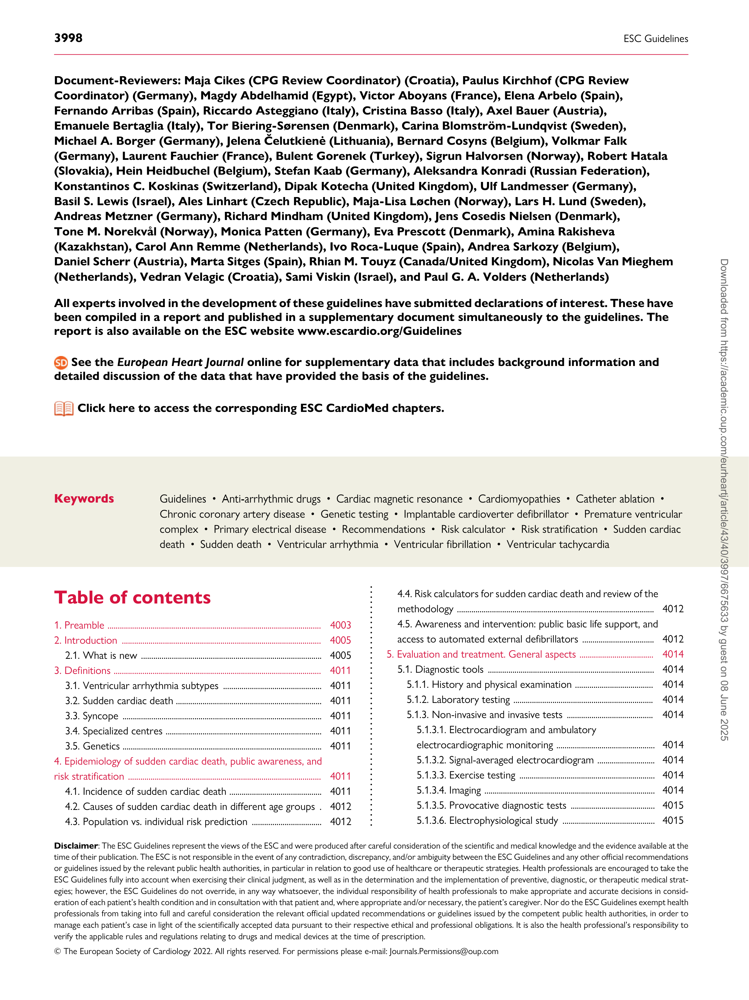
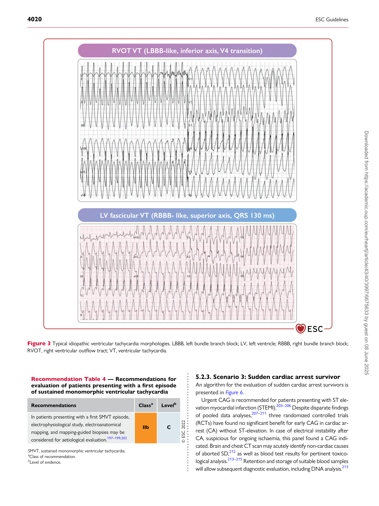
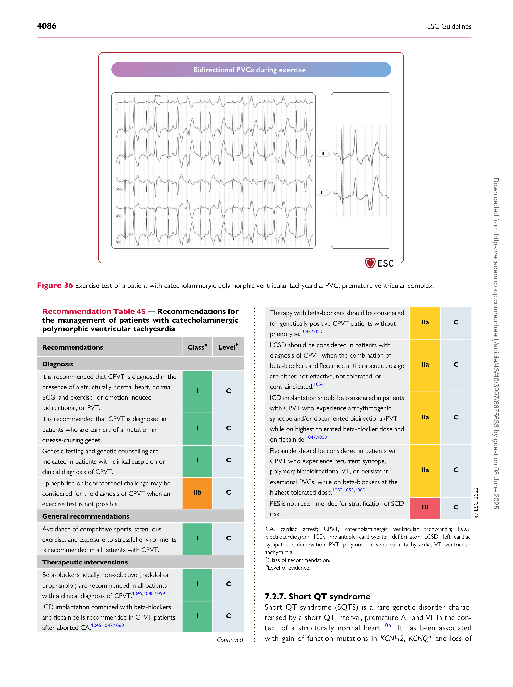
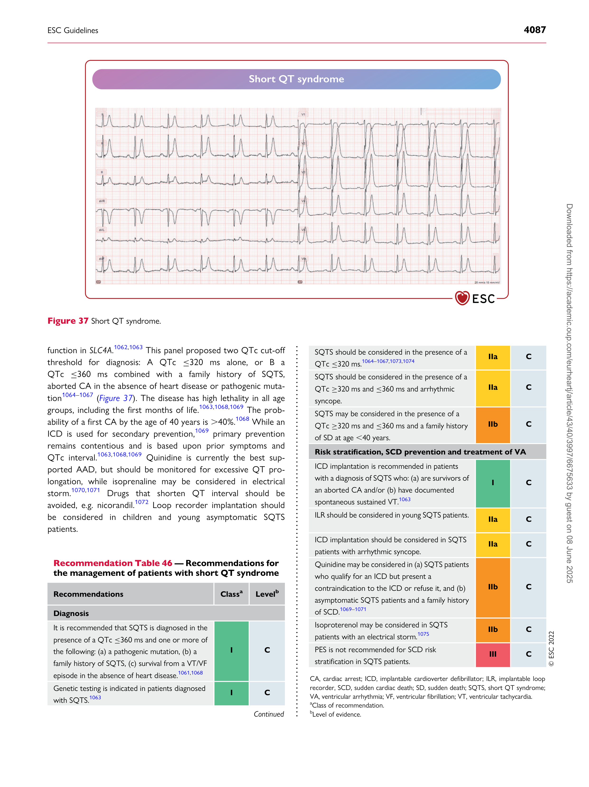

European Heart Journal (2022) 43, 3997–4126
[https://doi.org/10.1093/eurheartj/ehac262](https://doi.org/10.1093/eurheartj/ehac262)

#### ESC GUIDELINES

# 2022 ESC Guidelines for the management of patients with ventricular arrhythmias and the prevention of sudden cardiac death
## Developed by the task force for the management of patients with ventricular arrhythmias and the prevention of sudden cardiac death of the European Society of Cardiology (ESC) Endorsed by the Association for European Paediatric and Congenital Cardiology (AEPC)
#### Authors/Task Force Members: Katja Zeppenfeld [*][†] (Chairperson) (Netherlands), Jacob Tfelt-Hansen *† (Chairperson) (Denmark), Marta de Riva ** (Task Force Coordinator) (Netherlands), Bo Gregers Winkel [**] (Task Force Coordinator) (Denmark), Elijah R. Behr (United Kingdom), Nico A. Blom [1] (Netherlands), Philippe Charron (France), Domenico Corrado (Italy), Nikolaos Dagres (Germany), Christian de Chillou (France), Lars Eckardt (Germany), Tim Friede (Germany), Kristina H. Haugaa (Norway), Mélèze Hocini (France), Pier D. Lambiase (United Kingdom), Eloi Marijon (France), Jose L. Merino (Spain), Petr Peichl (Czech Republic), Silvia G. Priori (Italy), Tobias Reichlin (Switzerland), Jeanette Schulz-Menger (Germany), Christian Sticherling (Switzerland), Stylianos Tzeis (Greece), Axel Verstrael (Belgium), Maurizio Volterrani (Italy), and ESC Scientific Document Group

- Corresponding authors: Katja Zeppenfeld, Department of Cardiology, Leiden University Medical Centre, Albinusdreef 2, 2333 ZA Leiden, Netherlands. Tel +31 715262020, E-mail:
[K.Zeppenfeld@LUMC.nl](mailto:K.Zeppenfeld@LUMC.nl)

Jacob Tfelt-Hansen, The Department of Cardiology, The Heart Centre, Copenhagen University Hospital, Rigshospitalet, Blegdamsvej 9, 2100, Copenhagen, Denmark. Tel +45 61360399,
[E-mail: jacob.tfelt@regionh.dk](mailto:jacob.tfelt@regionh.dk)

- The two chairpersons contributed equally to the document and are joint corresponding authors.

** The two task force Coordinators contributed equally to the document.

Author/task force Member affiliations are listed in Author information.

1 Representing the Association for European Paediatric and Congenital Cardiology (AEPC).

ESC Clinical Practice Guidelines (CPG) Committee: listed in the Appendix.

ESC subspecialty communities having participated in the development of this document:

Associations: Association for Acute CardioVascular Care (ACVC), Association of Cardiovascular Nursing & Allied Professions (ACNAP), European Association of Cardiovascular
Imaging (EACVI), European Association of Percutaneous Cardiovascular Interventions (EAPCI), European Heart Rhythm Association (EHRA), Heart Failure Association (HFA).

Working Groups: Cardiac Cellular Electrophysiology, Myocardial and Pericardial Diseases.

Patient Forum

The content of these European Society of Cardiology (ESC) Guidelines has been published for personal and educational use only. No commercial use is authorized. No part of the ESC
Guidelines may be translated or reproduced in any form without written permission from the ESC. Permission can be obtained upon submission of a written request to Oxford University
[Press, the publisher of the European Heart Journal and the party authorized to handle such permissions on behalf of the ESC (Journals.Permissions@oup.com).](mailto:Journals.Permissions@oup.com)

3998 ESC Guidelines

Document-Reviewers: Maja Cikes (CPG Review Coordinator) (Croatia), Paulus Kirchhof (CPG Review
Coordinator) (Germany), Magdy Abdelhamid (Egypt), Victor Aboyans (France), Elena Arbelo (Spain),
Fernando Arribas (Spain), Riccardo Asteggiano (Italy), Cristina Basso (Italy), Axel Bauer (Austria),
Emanuele Bertaglia (Italy), Tor Biering-Sørensen (Denmark), Carina Blomström-Lundqvist (Sweden),
Michael A. Borger (Germany), Jelena Čelutkienė (Lithuania), Bernard Cosyns (Belgium), Volkmar Falk
(Germany), Laurent Fauchier (France), Bulent Gorenek (Turkey), Sigrun Halvorsen (Norway), Robert Hatala
(Slovakia), Hein Heidbuchel (Belgium), Stefan Kaab (Germany), Aleksandra Konradi (Russian Federation),
Konstantinos C. Koskinas (Switzerland), Dipak Kotecha (United Kingdom), Ulf Landmesser (Germany),
Basil S. Lewis (Israel), Ales Linhart (Czech Republic), Maja-Lisa Løchen (Norway), Lars H. Lund (Sweden),
Andreas Metzner (Germany), Richard Mindham (United Kingdom), Jens Cosedis Nielsen (Denmark),
Tone M. Norekvål (Norway), Monica Patten (Germany), Eva Prescott (Denmark), Amina Rakisheva
(Kazakhstan), Carol Ann Remme (Netherlands), Ivo Roca-Luque (Spain), Andrea Sarkozy (Belgium),
Daniel Scherr (Austria), Marta Sitges (Spain), Rhian M. Touyz (Canada/United Kingdom), Nicolas Van Mieghem
(Netherlands), Vedran Velagic (Croatia), Sami Viskin (Israel), and Paul G. A. Volders (Netherlands)

All experts involved in the development of these guidelines have submitted declarations of interest. These have
been compiled in a report and published in a supplementary document simultaneously to the guidelines. The
[report is also available on the ESC website www.escardio.org/Guidelines](https://www.escardio.org/Guidelines)

See the European Heart Journal online for supplementary data that includes background information and
detailed discussion of the data that have provided the basis of the guidelines.

Click here to access the corresponding ESC CardioMed chapters.

### Table of contents

1. Preamble ........................................................................................................ 4003

2. Introduction ................................................................................................. 4005

2.1. What is new ........................................................................................ 4005

3. Definitions ..................................................................................................... 4011

3.1. Ventricular arrhythmia subtypes ................................................ 4011

3.2. Sudden cardiac death ....................................................................... 4011

3.3. Syncope ................................................................................................. 4011

3.4. Specialized centres ............................................................................ 4011

3.5. Genetics ................................................................................................. 4011

4. Epidemiology of sudden cardiac death, public awareness, and
risk stratification .............................................................................................. 4011

4.1. Incidence of sudden cardiac death ............................................. 4011

4.2. Causes of sudden cardiac death in different age groups . 4012

4.3. Population vs. individual risk prediction .................................. 4012

4.4. Risk calculators for sudden cardiac death and review of the

methodology ................................................................................................ 4012

4.5. Awareness and intervention: public basic life support, and
access to automated external defibrillators ................................... 4012

5. Evaluation and treatment. General aspects .................................... 4014

5.1. Diagnostic tools ................................................................................. 4014

5.1.1. History and physical examination ...................................... 4014

5.1.2. Laboratory testing .................................................................... 4014

5.1.3. Non-invasive and invasive tests .......................................... 4014

5.1.3.1. Electrocardiogram and ambulatory

electrocardiographic monitoring ................................................ 4014

5.1.3.2. Signal-averaged electrocardiogram ............................ 4014

5.1.3.3. Exercise testing .................................................................. 4014

5.1.3.4. Imaging ................................................................................... 4014

5.1.3.5. Provocative diagnostic tests ......................................... 4015

5.1.3.6. Electrophysiological study ............................................. 4015

Disclaimer: The ESC Guidelines represent the views of the ESC and were produced after careful consideration of the scientific and medical knowledge and the evidence available at the
time of their publication. The ESC is not responsible in the event of any contradiction, discrepancy, and/or ambiguity between the ESC Guidelines and any other official recommendations
or guidelines issued by the relevant public health authorities, in particular in relation to good use of healthcare or therapeutic strategies. Health professionals are encouraged to take the
ESC Guidelines fully into account when exercising their clinical judgment, as well as in the determination and the implementation of preventive, diagnostic, or therapeutic medical strategies; however, the ESC Guidelines do not override, in any way whatsoever, the individual responsibility of health professionals to make appropriate and accurate decisions in consideration of each patient’s health condition and in consultation with that patient and, where appropriate and/or necessary, the patient’s caregiver. Nor do the ESC Guidelines exempt health
professionals from taking into full and careful consideration the relevant official updated recommendations or guidelines issued by the competent public health authorities, in order to
manage each patient’s case in light of the scientifically accepted data pursuant to their respective ethical and professional obligations. It is also the health professional’s responsibility to
verify the applicable rules and regulations relating to drugs and medical devices at the time of prescription.

[© The European Society of Cardiology 2022. All rights reserved. For permissions please e-mail: Journals.Permissions@oup.com](mailto:Journals.Permissions@oup.com)

ESC Guidelines 3999

5.1.4. Genetic testing ........................................................................... 4015
5.2. Diagnostic evaluation at first presentation with

ventricular arrhythmia in patients without known cardiac

disease .................................................................................................... 4018

5.2.1. Scenario 1: Incidental finding of a non-sustained

ventricular tachycardia ........................................................................ 4018

5.2.2. Scenario 2: First presentation of sustained

monomorphic ventricular tachycardia ......................................... 4018

5.2.3. Scenario 3: Sudden cardiac arrest survivor ................... 4020

5.2.4. Scenario 4: Sudden death victim ........................................ 4023

5.2.5. Scenario 5: Relatives of sudden arrhythmic death

syndrome decedents ........................................................................... 4024

6. Therapies for ventricular arrhythmias. General aspects ........... 4027

6.1. Acute management .......................................................................... 4027

6.1.1. Treatment of reversible causes .......................................... 4027

6.1.2. Acute management of sustained monomorphic

ventricular tachycardia ........................................................................ 4029

6.1.3. Management of electrical storm and incessant

ventricular tachycardia ........................................................................ 4030

6.2. Long-term management ................................................................. 4034

6.2.1. Pharmacotherapy ...................................................................... 4034

6.2.2. Device therapy ........................................................................... 4038
6.2.2.1. Implantable cardioverter defibrillator ....................... 4038

6.2.2.2. Adding cardiac resynchronization therapy ............. 4040
6.2.2.3. Wearable cardioverter defibrillator .......................... 4040

6.2.3. Special aspects of device therapy ...................................... 4041

6.2.3.1. Optimization of device programming ...................... 4041

6.2.3.2. Concomitant treatment to avoid inappropriate
implantable cardioverter defibrillator therapy ..................... 4041

6.2.3.3. Psychosocial impact of implantable cardioverter
defibrillator treatment .................................................................... 4042

6.2.3.4. Patients with left ventricular assist devices ............ 4042

6.2.3.5. Complications of devices ............................................... 4042

6.2.3.6. End-of-life issues ................................................................ 4043

6.2.4. Interventional therapy ............................................................ 4043

6.2.4.1. Catheter ablation .............................................................. 4043

6.2.4.1.1. Patients with structural heart disease ............. 4043

6.2.4.1.2. Patients without apparent structural heart

disease ............................................................................................... 4044

6.2.4.2. Autonomic modulation .................................................. 4044

7. Diagnostic evaluation, management, and risk
stratification according to clinical presentation and known (likely)

disease .................................................................................................................. 4044

7.1. Specific structural heart diseases ................................................ 4044

7.1.1. Coronary artery disease ........................................................ 4044

7.1.1.1. Acute coronary syndromes and vasospasm .......... 4044

7.1.1.1.1. Acute coronary syndromes ................................. 4044

7.1.1.1.2. Vasospasm ................................................................... 4045

7.1.1.2. Early after myocardial infarction ................................. 4046

7.1.1.3. Chronic coronary artery disease ................................ 4046

7.1.1.3.1. Primary prevention of sudden cardiac death in

patients with reduced ejection fraction ............................. 4046

7.1.1.3.2. Primary prevention of sudden cardiac death in

patients with preserved or mildly reduced ejection

fraction ............................................................................................. 4047

7.1.1.3.3. Secondary prevention of sudden cardiac

death .................................................................................................. 4047

7.1.1.3.4. Management of patients with

haemodynamically tolerated ventricular tachycardia and

preserved and mildly reduced ejection fraction ............. 4048

7.1.1.3.5. Management of recurrent ventricular
tachycardia in implantable cardioverter defibrillator

carriers .............................................................................................. 4049

7.1.1.4. Coronary anomalies ......................................................... 4049

7.1.2. Idiopathic premature ventricular complexes/

ventricular tachycardia and premature ventricular complex
induced cardiomyopathy ................................................................... 4050

7.1.2.1. Idiopathic premature ventricular complexes/

ventricular tachycardia .................................................................... 4050

7.1.2.2. Premature ventricular complex-induced/
aggravated cardiomyopathy .......................................................... 4052

7.1.3. Cardiomyopathies .................................................................... 4054

7.1.3.1. Dilated cardiomyopathy and hypokinetic non
dilated cardiomyopathy .................................................................. 4054
7.1.3.1.1. Diagnostic evaluation and risk stratification .. 4054

7.1.3.1.2. Primary prevention of sudden cardiac death 4055

7.1.3.1.3. Secondary prevention of sudden cardiac death

and management of ventricular arrhythmias ................... 4057

7.1.3.2. Arrhythmogenic right ventricular

cardiomyopathy ................................................................................. 4058
7.1.3.2.1. Risk stratification ....................................................... 4058

7.1.3.2.2. Treatment .................................................................... 4060

7.1.3.3. Hypertrophic cardiomyopathy .................................... 4060
7.1.3.3.1. Risk stratification and primary prevention of

sudden cardiac death .................................................................. 4061

7.1.3.3.2. Treatment to prevent ventricular arrhythmia

recurrence ....................................................................................... 4062

7.1.3.4. Left ventricular non-compaction ................................ 4063

7.1.3.5. Restrictive cardiomyopathy .......................................... 4063

7.1.3.6. Neuromuscular disorders ............................................. 4063

7.1.4. Inflammatory cardiac diseases ............................................. 4066

7.1.4.1. Myocarditis ........................................................................... 4066

7.1.4.2. Cardiac sarcoidosis ........................................................... 4067

7.1.4.3. Chagas’ cardiomyopathy ................................................ 4068

7.1.5. Valvular heart disease ............................................................. 4070

7.1.6. Congenital heart disease ........................................................ 4071

7.2. Primary electrical disease ............................................................... 4073
7.2.1. Idiopathic ventricular fibrillation ......................................... 4073

7.2.2. Long QT syndrome (including acquired long QT

syndrome) ................................................................................................ 4074

7.2.3. Andersen–Tawil syndrome Type 1 .................................. 4079

7.2.4. Brugada syndrome ................................................................... 4079

7.2.5. Early repolarization syndromes .......................................... 4081

7.2.6. Catecholaminergic polymorphic ventricular

tachycardia ............................................................................................... 4084

7.2.7. Short QT syndrome ................................................................ 4086

8. Special aspects in selected populations ............................................ 4088

8.1. Pregnant patients and peri-partum cardiomyopathy ......... 4088

8.1.1. Electrocardioversion and implantable cardioverter
defibrillator therapy in pregnancy .................................................. 4088

8.1.2. Pharmacological treatment ................................................... 4088

8.1.3. Catheter ablation ...................................................................... 4088

8.2. Heart transplantation ...................................................................... 4089

8.3. Sudden cardiac death in athletes ................................................ 4089

4000 ESC Guidelines

8.4. Wolff–Parkinson–White syndrome .......................................... 4090

8.5. Prevention of sudden cardiac death in the elderly ............. 4090

9. Key messages ............................................................................................... 4090

9.1. General aspects .................................................................................. 4090

9.2. Structural heart disease .................................................................. 4090

9.3. Primary electrical disease ............................................................... 4091

10. Gaps in evidence ...................................................................................... 4091

10.1. General aspects ............................................................................... 4091

10.2. Structural heart disease—general ........................................... 4091

10.3. Idiopathic premature ventricular complexes/ventricular

tachycardia .................................................................................................... 4091

10.4. Coronary artery disease .............................................................. 4091

10.5. Cardiomyopathies .......................................................................... 4091

10.6. Valvular heart disease ................................................................... 4091

10.7. Congenital heart disease .............................................................. 4091

10.8. Primary electrical disease ............................................................ 4091

11. ‘What to do’ and ‘what not to do’ messages from the

Guidelines ........................................................................................................... 4092

12. Quality indicators .................................................................................... 4099

13. Supplementary data ................................................................................ 4099

14. Data availability statement ................................................................... 4099

15. Author information ................................................................................ 4099

16. Appendix ..................................................................................................... 4100

17. References .................................................................................................. 4101
### Tables of Recommendations

Recommendation Table 1 — Recommendations for public

basic life support and access to automated external
defibrillators ............................................................................................ 4014

Recommendation Table 2 — Recommendations for genetic

testing ................................................................................................................... 4018

Recommendation Table 3 — Recommendations for evaluation

of patients presenting with newly documented ventricular

arrhythmia .......................................................................................................... 4018

Recommendation Table 4 — Recommendations for evaluation of

patients presenting with a first episode of sustained

monomorphic ventricular tachycardia ................................................... 4020

Recommendation Table 5 — Recommendations for evaluation of

sudden cardiac arrest survivors ................................................................ 4022

Recommendation Table 6 — Recommendations for evaluation of

sudden death victims ..................................................................................... 4023

Recommendation Table 7 — Recommendations for evaluation of

relatives of sudden arrhythmic death syndrome decedents ........ 4027

Recommendation Table 8 — Recommendations for treatment of

reversible conditions ...................................................................................... 4029

Recommendation Table 9 — Recommendations for the acute

management of sustained ventricular tachycardia and electrical

storm .................................................................................................................... 4033

Recommendation Table 10 — Recommendations for treatment

with heart failure medication ..................................................................... 4034

Recommendation Table 11 — Recommendations for implantable
cardioverter defibrillator implantation (general aspects) .............. 4040

Recommendation Table 12 — Recommendations for secondary

prevention of sudden cardiac death ....................................................... 4040

Recommendation Table 13 — Recommendations for

subcutaneous implantable cardioverter defibrillator ....................... 4040

Recommendation Table 14 — Recommendations for adding

cardiac resynchronization therapy to implantable cardioverter
defibrillator ........................................................................................................ 4040

Recommendation Table 15 — Recommendations for wearable

cardioverter defibrillator .............................................................................. 4040

Recommendation Table 16 — Recommendations for

optimization of device programming ..................................................... 4041

Recommendation Table 17 — Recommendations for

concomitant treatment to avoid inappropriate implantable
cardioverter defibrillator therapy ............................................................ 4042

Recommendation Table 18 — Recommendations for

psychosocial management after implantable cardioverter
defibrillator implantation ............................................................................. 4042

Recommendation Table 19 — Recommendations for implantable
cardioverter defibrillator implantation in left ventricular assist

device recipients .............................................................................................. 4042

Recommendation Table 20 — Recommendations for prevention
of implantable cardioverter defibrillator complications ................. 4043

Recommendation Table 21 — Recommendations for end-of-life

issues in implantable cardioverter defibrillator carriers ................. 4043

Recommendation Table 22 — Recommendations for treatment

of ventricular arrhythmias in acute coronary syndrome and

vasospasm .......................................................................................................... 4046

Recommendation Table 23 — Recommendations for risk

stratification and treatment of ventricular arrhythmias early after

myocardial infarction ..................................................................................... 4046

Recommendation Table 24 — Recommendations for risk

stratification, sudden cardiac death prevention, and treatment of

ventricular arrhythmias in chronic coronary artery disease ......... 4047

Recommendation Table 25 — Recommendations for sudden

cardiac death prevention in patients with coronary anomalies ....... 4050

Recommendation Table 26 — Recommendations for the

management of patients with idiopathic premature ventricular

complexes/ventricular tachycardia .......................................................... 4052

Recommendation Table 27 — Recommendations for the

management of patients with premature ventricular

complex-induced or premature ventricular complex-aggravated

cardiomyopathy ............................................................................................................. 4053

Recommendation Table 28 — Recommendations for risk

stratification, sudden cardiac death prevention, and treatment

of ventricular arrhythmias in dilated cardiomyopathy/

hypokinetic non-dilated cardiomyopathy ...................................... 4057

Recommendation Table 29 — Recommendations for diagnostic,
risk stratification, sudden cardiac death prevention, and

treatment of ventricular arrhythmias in arrhythmogenic right

ventricular cardiomyopathy ........................................................................ 4060

Recommendation Table 30 — Recommendations for risk

stratification, sudden cardiac death prevention, and treatment of

ventricular arrhythmias in hypertropic cardiomyopathy ............... 4062

Recommendation Table 31 — Recommendations for implantable
cardioverter defibrillator implantation in left ventricular

non-compaction .............................................................................................. 4063

Recommendation Table 32 — Recommendations for implantable
cardioverter defibrillator implantation in patients with cardiac

amyloidosis ......................................................................................................... 4063

Recommendation Table 33 — Recommendations for risk

stratification, sudden cardiac death prevention, and treatment of

ventricular arrhythmias in neuromuscular diseases ......................... 4065

ESC Guidelines 4001

Recommendation Table 34 — Recommendations for sudden

cardiac death prevention and treatment of ventricular

arrhythmias in myocarditis .......................................................................... 4066

Recommendation Table 35 — Recommendations for risk

stratification, sudden cardiac death prevention, and treatment of

ventricular arrhythmias in cardiac sarcoidosis .................................... 4067

Recommendation Table 36 — Recommendations for the

treatment of ventricular arrhythmias in Chagas’

cardiomyopathy ....................................................................................... 4070

Recommendation Table 37 — Recommendations for sudden

cardiac death prevention and treatment of ventricular

arrhythmias in valvular heart disease ...................................................... 4070

Recommendation Table 38 — Recommendations for risk

stratification and primary prevention of sudden cardiac death in

congenital heart disease ............................................................................... 4072

Recommendation Table 39 — Recommendations for secondary

prevention of sudden cardiac death and treatment of ventricular

arrhythmia in congenital heart disease .................................................. 4072

Recommendation Table 40 — Recommendations for the

management of patients with idiopathic ventricular fibrillation .. 4073

Recommendation Table 41 — Recommendations for the

management of patients with long QT syndrome ........................... 4077

Recommendation Table 42 — Recommendations for

management of patients with Andersen–Tawil syndrome ........... 4079

Recommendation Table 43 — Recommendations for

management of patients with Brugada syndrome ............................ 4080

Recommendation Table 44 — Recommendations for the

management of patients with early repolarization pattern/

syndrome ............................................................................................................ 4083

Recommendation Table 45 — Recommendations for the

management of patients with catecholaminergic polymorphic

ventricular tachycardia .................................................................................. 4086

Recommendation Table 46 — Recommendations for the

management of patients with short QT syndrome ......................... 4087

Recommendation Table 47 — Recommendations for the

prevention of sudden cardiac death and management of

ventricular arrhythmia during pregnancy .............................................. 4088

Recommendation Table 48 — Recommendations for the

prevention of sudden cardiac death before and after heart

transplantation ................................................................................................. 4089

Recommendation Table 49 — Recommendations for risk

stratification and prevention of sudden cardiac death in athletes 4089

Recommendation Table 50 — Recommendations for implantable
cardioverter defibrillator implantation in the elderly ...................... 4090
### List of tables

Table 1 Classes of recommendations .................................................... 4003

Table 2 Levels of evidence .......................................................................... 4004

Table 3 New sections and concepts ...................................................... 4005

Table 4 New recommendations in 2022 ............................................. 4005

Table 5 Changes in recommendations since 2015 ........................... 4010

Table 6 Intravenous provocative diagnostic tests ............................. 4016

Table 7 Genetic tests and suggested work-up of probands and

relatives with primary electrical diseases .............................................. 4017

Table 8 Anti-arrhythmic drugs (acute and chronic treatment) .. 4035

Table 9 Summary of the recommendations for the treatment of

patients with frequent idiopathic premature ventricular

complexes/ventricular tachycardia or premature ventricular

complex-induced cardiomyopathy .......................................................... 4051
Table 10 Modified long QT syndrome diagnostic score ...................... 4076
### List of figures

Figure 1 Central figure .................................................................................. 4013

Figure 2 Algorithm for the evaluation of patients presenting with
an incidental finding of non-sustained ventricular tachycardia .... 4019

Figure 4 Algorithm for the evaluation of patients presenting with a
first sustained monomorphic ventricular tachycardia episode .... 4021

Figure 3 Typical idiopathic ventricular tachycardia morphologies 4020

Figure 5 Bundle branch re-entrant ventricular tachycardia .......... 4022

Figure 6 Part One. Algorithm for the evaluation of sudden cardiac

arrest survivors ................................................................................................ 4024

Figure 6 Part Two. Algorithm for the evaluation of sudden cardiac

arrest survivors ................................................................................................ 4025

Figure 7 Algorithm for the evaluation of sudden death victims . 4026

Figure 8 Algorithm for the evaluation of relatives of unexplained

sudden death decedents .............................................................................. 4028

Figure 9 Algorithm for the acute management of regular wide

QRS complex tachycardia ........................................................................... 4029

Figure 10 Repetitive runs of ventricular tachycardia interrupted

by occasional sinus beats ............................................................................. 4030

Figure 11 Part One. Management of patients with electrical
storm or repeated implantable cardioverter defibrillator

discharges ......................................................................................................... 4031

Figure 11 Part Two.Management of patients with electrical
storm or repeated implantable cardioverter defibrillator

discharges ................................................................................................... 4032

Figure 11 Part Three. Management of patients with electrical
storm or repeated implantable cardioverter defibrillator

discharges ........................................................................................................... 4033

Figure 12 Algorithm for evaluation before initiation and follow-up

of patients requiring sodium channel blocking agents .................... 4038

Figure 13 Algorithm for evaluation before initiation and follow-up

of patients requiring drugs associated with QT prolongation .... 4039

Figure 14 Algorithm for the prevention and management of

ventricular arrhythmias in ST-elevation myocardial infarction ......... 4045
Figure 15 Algorithm for risk stratification and primary prevention

of sudden cardiac death in patients with chronic coronary artery

disease and reduced ejection fraction .................................................... 4048

Figure 16 Algorithm for the management of sustained

monomorphic ventricular tachycardia in patients with chronic

coronary artery disease ................................................................................ 4049

Figure 17 Algorithm for the management of patients with

idiopathic premature ventricular complexes/ventricular

tachycardia and non-apparent structural heart disease ................. 4051

Figure 18 Algorithm for the management of patients with

premature ventricular complex-induced/-aggravated

cardiomyopathy ............................................................................................... 4053
Figure 19 Algorithm for risk stratification and primary prevention

of sudden cardiac death in patients with dilated cardiomyopathy/

hypokinetic non-dilated cardiomyopathy ............................................. 4055

4002 ESC Guidelines

Figure 20 Typical features of dilated cardiomyopathy associated

with lamin A/C gene mutation with ventricular arrhythmias ...... 4056

Figure 21 Typical features of arrhythmogenic right

ventricular cardiomyopathy associated with ventricular

arrhythmias ................................................................................................ 4059

Figure 22 Typical features of hypertrophic cardiomyopathy

associated with sustained monomorphic ventricular

tachycardia ................................................................................................. 4061
Figure 23 Algorithm for risk stratification, sudden cardiac death

prevention, and treatment of ventricular arrhythmia in myotonic

dystrophy .......................................................................................................................... 4064

Figure 24 Algorithm for sudden cardiac death prevention and

treatment of ventricular arrhythmia in patients with cardiac

sarcoidosis .......................................................................................................... 4068

Figure 25 Typical features of cardiac sarcoidosis associated with

sustained monomorphic ventricular tachycardia .............................. 4069

Figure 26 Algorithm for the management of sustained ventricular

arrhythmia in patients with congenital heart disease ...................... 4071

Figure 27 Algorithm for the management of patients with
idiopathic ventricular fibrillation ............................................................... 4074
Figure 28 Idiopathic ventricular fibrillation triggered by

short-coupled premature ventricular complexes ............................. 4075

Figure 29 Long QT syndrome electrocardiograms and

torsade-de-pointes ventricular tachycardia ......................................... 4076

Figure 30 Brisk standing electrocardiogram changes and T wave

alternans in Long QT syndrome patients ............................................. 4077

Figure 31 Algorithm for the management of patients with long

QT syndrome ................................................................................................... 4078

Figure 32 Typical examples of (A) Brugada type 1

electrocardiogram, and (B) early repolarization pattern

electrocardiogram ........................................................................................... 4080

Figure 33 Part One. Algorithm for the management of patients

with Brugada pattern electrocardiogram ............................................. 4082

Figure 33 Part Two. Algorithm for the management of patients

with Brugada pattern electrocardiogram ............................................. 4083

Figure 34 Management of patients with early repolarization

pattern/syndrome ........................................................................................... 4084

Figure 35 Management of patients with catecholaminergic

polymorphic ventricular tachycardia ...................................................... 4085

Figure 36 Exercise test of a patient with catecholaminergic

polymorphic ventricular tachycardia ...................................................... 4086

Figure 37 Short QT syndrome ................................................................. 4087
### Abbreviations and acronyms

AAD Anti-arrhythmic drug
ACE-I Angiotensin-converting enzyme inhibitor
ACS Acute coronary syndrome
AED Automated external defibrillator
AF Atrial fibrillation

AH Atrial–His interval

ALS Advanced life support
ARB Angiotensin receptor blocker
ARNI Angiotensin receptor neprilysin inhibitor
ARVC Arrhythmogenic right ventricular cardiomyopathy
ATP Anti-tachycardia pacing

AV Atrioventricular

AVRT AV re-entry tachycardia

BBR-VT Bundle branch re-entrant ventricular tachycardia
BrS Brugada syndrome

CA Cardiac arrest

cAMP Cyclic adenosine monophosphate
CAD Coronary artery disease
CAG Coronary angiogram

CCB Calcium channel blocker

CHD Congenital heart disease
CIED Cardiac implantable electronic devices
CMR Cardiac magnetic resonance
CPR Cardiopulmonary resuscitation
CPVT Catecholaminergic polymorphic ventricular tachycardia
CRT Cardiac resynchronization therapy
CT/CTA Computed tomography/Computed tomography
angiography
DCM Dilated cardiomyopathy
DNA Deoxyribonucleic acid
ECG Electrocardiogram
EF Ejection fraction
ERP Early repolarization pattern
ERS Early repolarization syndrome
FBI Fast, broad, irregular
HCM Hypertrophic cardiomyopathy
HFrEF Heart failure with reduced ejection fraction
HNDCM Hypokinetic non-dilated cardiomyopathy
HTX Heart transplantation

HV His–ventricular interval

ICD Implantable cardioverter defibrillator
ILR Implantable loop recorder
IVF Idiopathic ventricular fibrillation

LBBB Left bundle branch block

LCSD Left cardiac sympathetic denervation
LGE Late gadolinium enhancement

LMNA Lamin A/C

LQTS Long QT syndrome

LV Left ventricular

LVAD Left ventricular assist device

LVEF Left ventricular ejection fraction
LVH Left ventricular hypertrophy
LVNC Left ventricular non-compaction
LVOT Left ventricle outflow tract
MI Myocardial infarction
MRA Mineralocorticoid receptor antagonist
MVP Mitral valve prolapse
MVT Monomorphic ventricular tachycardia
NSVT Non-sustained ventricular tachycardia

NYHA New York Heart Association

OHCA Out-of-hospital cardiac arrest
OMT Optimal medical treatment
PCI Percutaneous coronary intervention
PCR Polymerase chain reaction
PES Programmed electrical stimulation
PET-CT Positron emission tomography computed
tomography
PPCM Peri-partum cardiomyopathy
PVC Premature ventricular complex
PVT Polymorphic ventricular tachycardia
QI Quality indicators
RBBB Right bundle branch block

ESC Guidelines 4003

RCM Restrictive cardiomyopathy

RCT Randomized control trial

RV Right ventricular
RVOT Right ventricle outflow tract
SADS Sudden arrhythmic death syndrome
SaECG Signal-averaged ECG

SCA Sudden cardiac arrest

SCD Sudden cardiac death

SD Sudden death

SGLT2 Sodium–glucose co-transporter 2

SHD Structural heart disease

S-ICD Subcutaneous implantable cardioverter
defibrillator
SMVT Sustained monomorphic ventricular tachycardia
SPTV Sustained polymorphic ventricular tachycardia
SQTS Short QT syndrome
STEMI ST elevation myocardial infarction
SVT Supraventricular tachycardia
TAVI Transcatheter aortic valve implantation
TdP Torsades de pointes
TOF Tetralogy of Fallot
VA Ventricular arrhythmia
VF Ventricular fibrillation
VT Ventricular tachycardia
WCD Wearable cardioverter defibrillator

WPW Wolff–Parkinson–White
### 1. Preamble

Guidelines summarize and evaluate available evidence with the aim of

assisting health professionals in proposing the best management
strategies for an individual patient with a given condition.

Table 1 Classes of recommendations

Guidelines and their recommendations should facilitate decision

making of health professionals in their daily practice. However, guidelines are not a substitute for the patient’s relationship with their practitioner. The final decisions concerning an individual patient must be
made by the responsible health professional(s), based on what they
consider to be the most appropriate in the circumstances. These decisions are made in consultation with the patient and caregiver as

appropriate.
Guidelines are intended for use by health professionals. To ensure

that all users have access to the most recent recommendations, the

ESC makes its guidelines freely available. The ESC warns readers that
the technical language may be misinterpreted and declines any responsibility in this respect.
A great number of guidelines have been issued in recent years by
the ESC. Because of their impact on clinical practice, quality criteria
for the development of guidelines have been established to make all
decisions transparent to the user. The recommendations for formulating and issuing ESC Guidelines can be found on the ESC website
[(https://www.escardio.org/Guidelines). The ESC Guidelines re-](https://www.escardio.org/Guidelines)
present the official position of the ESC on a given topic and are regularly updated.
In addition to the publication of Clinical Practice Guidelines, the
ESC carries out the EURObservational Research Programme of
international registries of cardiovascular diseases and interventions
that are essential to assess diagnostic/therapeutic processes, use of
resources, and adherence to guidelines. These registries aim at providing a better understanding of medical practice in Europe and
around the world, based on high-quality data collected during routine clinical practice.
Furthermore, the ESC develops sets of quality indicators (QIs),
which are tools to evaluate the level of implementation of the guidelines and may be used by the ESC, hospitals, healthcare providers,
and professionals to measure clinical practice, and in educational

4004 ESC Guidelines

Table 2 Levels of evidence

programmes, alongside the key messages from the guidelines, to improve quality of care and clinical outcomes.
The Members of this task force were selected by the ESC to represent professionals involved with the medical care of patients
with this pathology. The selection procedure aimed to ensure that
there is a representative mix of members predominantly from across
the whole of the ESC region and from relevant ESC Subspecialty
Communities. Consideration was given to diversity and inclusion,
notably with respect to gender and country of origin. A critical evaluation of diagnostic and therapeutic procedures was performed, including assessment of the risk–benefit ratio. The level of evidence
and the strength of the recommendation of particular management
options were weighed and scored according to predefined scales, as
outlined below. The task force followed the ESC voting procedures.
All recommendations subject to a vote achieved at least 75% among
voting members.
The experts of the writing and reviewing panels provided declaration of interest forms for all relationships that might be perceived as
real or potential sources of conflicts of interest. Their declarations of
interest were reviewed according to the ESC declaration of interest
[rules and can be found on the ESC website (http://www.escardio.org/](http://www.escardio.org/Guidelines)
[Guidelines) and have been compiled in a report and published in a](http://www.escardio.org/Guidelines)
supplementary document simultaneously to the guidelines.
This process ensures transparency and prevents potential biases in
the development and review processes. Any changes in declarations of
interest that arise during the writing period were notified to the ESC
and updated. The task force received its entire financial support from
the ESC without any involvement from the healthcare industry.
The ESC CPG Committee supervises and coordinates the preparation of new guidelines. The Committee is also responsible for the
approval process of these guidelines. The ESC Guidelines undergo
extensive review by the CPG Committee and external experts, including a mix of members from across the whole of the ESC region
and from relevant ESC Subspecialty Communities and National
Cardiac Societies. After appropriate revisions, the guidelines are
signed off by all the experts involved in the task force. The finalized
document is signed off by the CPG Committee for publication in the

European Heart Journal. The guidelines were developed after careful
consideration of the scientific and medical knowledge and the evidence available at the time of their writing.
The task of developing ESC Guidelines also includes the creation
of educational tools and implementation programmes for the recommendations, including condensed pocket guideline versions,
summary slides, summary cards for non-specialists, and an electronic
version for digital applications (smartphones, etc.). These versions
are abridged and thus, for more detailed information, the user
should always access the full-text version of the guidelines, which
is freely available via the ESC website and the European Heart
Journal. The National Cardiac Societies of the ESC are encouraged
to endorse, adopt, translate, and implement all ESC Guidelines.
Implementation programmes are needed because it has been shown
that the outcome of disease may be favourably influenced by the
thorough application of clinical recommendations.
Health professionals are encouraged to take the ESC Guidelines
fully into account when exercising their clinical judgement, as well
as in the determination and the implementation of preventive,
diagnostic, or therapeutic medical strategies. However, the ESC
Guidelines do not override in any way whatsoever the individual responsibility of health professionals to make appropriate and accurate
decisions in consideration of each patient‘s health condition and in
consultation with that patient or the patient’s caregiver where appropriate and/or necessary. It is also the health professional’s responsibility to verify the rules and regulations applicable in each
country to drugs and devices at the time of prescription and, where
appropriate, to respect the ethical rules of their profession.
Off-label use of medication may be presented in this guideline if
sufficient level of evidence shows that it can be considered medically
appropriate to a given condition and if patients could benefit from
the recommended therapy. However, the final decisions concerning
an individual patient must be made by the responsible health professional giving special consideration to:

(1) the specific situation of the patient. In this respect, it is specified
that, unless otherwise provided for by national regulations, off
ESC Guidelines 4005

label use of medication should be limited to situations where it is

in the patient’s interest to do so, with regard to the quality,
safety, and efficacy of care, and only after the patient has been
informed and has provided consent;
(2) country-specific health regulations, indications by governmental
drug regulatory agencies, and the ethical rules to which health
professionals are subject, where applicable.
### 2. Introduction

This document presents an update of the 2015 ESC Guidelines
for the management of patients with ventricular arrhythmias (VA)
and the prevention of sudden cardiac death (SCD). New insights
into the epidemiology of SCD, new evidence on genetics, imaging,
and clinical findings for risk stratification for VA and SCD, and advances in diagnostic evaluation and therapeutic strategies made this
revision necessary. The committee was composed of 25 members
including 23 expert physicians, one methodologist, and one patient
representative. Experts were selected to cover all areas of VA and
SCD as well as subspecialties of cardiology with the assistance of related ESC working groups.
All 25 members of the task force committee approved the guideline recommendations after an anonymous voting process.
Ninety-nine peer reviewers reviewed the document. A systematic
literature survey was conducted, after instructions by the methodologist in the group, that led to the incorporation of 1155 references,
of which 485 were selected to support the recommendations and
[further specified in the table of evidence (Supplementary data).](http://academic.oup.com/eurheartj/article-lookup/doi/10.1093/eurheartj/ehac262#supplementary-data)

2.1. What is new

The diagnostic and management parts of the guidelines have been
adapted to facilitate their use in everyday clinical decision-making.
The first general part has new sections on diagnostic evaluation,
including pharmacologic provocative tests, genetic testing, and a systematic work-up of probands and relatives with primary electrical
diseases. Comprehensive flowcharts and recommendations for the
diagnostic evaluation at first presentation with a VA of patients without a previously known cardiac disease are provided for five frequently encountered clinical scenarios. Practical recommendations
for optimization of implantable cardioverter defibrillator (ICD) programming and algorithms for management of patients experiencing
regular wide complex tachycardia and electrical storm are presented
(Table 3).

Table 3 New sections and concepts

|It is recommended that public-access defibrillation be available at sites where cardiac arrest is more likely to occur.a|I|
|---|---|
|Prompt CPR by bystanders is recommended at OHCA.|I|
|It is recommended to promote community training in basic life support to increase bystander CPR rate and AED use.|I|
|Mobile phone-based alerting of basic life support-trained bystander volunteers to assist nearby OHCA victims should be considered.|IIa|

|Treatment of VA. General aspects|Col2|
|---|---|
|DC cardioversion is recommended as the first-line treatment for patients presenting with tolerated SMVT provided that the anaesthetic/sedation risk is low.|I|
|Optimal medical treatment including ACE-I/ARB/ARNIs, MRAs, beta-blockers, and SGLT2 inhibitors is indicated in all heart failure patients with reduced EF.|I|
|Implantation of a cardioverter defibrillator is only recommended in patients who have an expectation of good-quality survival .1 year.|I|
|In patients presenting with a haemodynamically tolerated SMVT and known or suspected SHD, intravenous procainamide should be considered.|IIa|
|In patients presenting with a haemodynamically tolerated SMVT in the absence of an established diagnosis, intravenous amiodarone may be considered.|IIb|
|In patients with SMVT or SPVT/VF triggered by a PVC with similar morphology and an indication for ICD, catheter ablation may be considered when an ICD is not available, contraindicated for concurrent medical reasons, or declined by the patient.|IIb|
|The WCD may be considered in the early phase after MI in selected patients.|IIb|

Table 4 New recommendations in 2022

Recommendations Class

|Coronary artery disease|Col2|
|---|---|
|In patients with CAD and recurrent, symptomatic SMVT, or ICD shocks for SMVT despite chronic amiodarone therapy, catheter ablation is recommended in preference to escalating AAD therapy.|I|
|Cardiac stress imaging during physical exercise is recommended in addition to cardiopulmonary exercise test after surgery in patients with anomalous aortic origin of a coronary artery with a history of aborted CA.|I|
|In SCA survivors with coronary artery spasm, implantation of an ICD should be considered.|IIa|
|ICD therapy should be considered in patients with CAD, NYHA class I, and LVEF ≤30% despite ≥3 months of OMT.|IIa|
|ICD implantation should be considered in patients with CAD, LVEF ≤40% despite ≥3 months of OMT and NSVT, if they are inducible for SMVT by PES.|IIa|

Continued

|New sections and concepts|Section|
|---|---|
|Provocative diagnostic tests|5.1.3.5|
|Genetic testing|5.1.4|
|Diagnostic evaluation at first presentation with VA in patients without known cardiac disease|5.2|
|Management of patients with electrical storm|6.1.3|
|Special aspects of device therapy|6.2.3|

4006 ESC Guidelines

|In patients with CAD and haemodynamically well-tolerated SMVT and LVEF ≥40%, catheter ablation in experienced centres should be considered as an alternative to ICD therapy, provided that established endpoints have been reached.b|IIa|
|---|---|
|Catheter ablation should be considered in patients with CAD and recurrent, symptomatic SMVT, or ICD shocks for SMVT despite beta-blocker or sotalol treatment.|IIa|

|Genetic testing (including at least LMNA, PLN, RBM20, and FLNC genes) should be considered for risk stratification in patients with apparently sporadic DCM/HNDCM, who present at young age or with signs suspicious for an inherited aetiology.|IIa|
|---|---|
|ICD implantation should be considered in DCM/HNDCM patients with an LVEF,50% and ≥2 risk factors (syncope, LGE on CMR, inducible SMVT at PES, pathogenic mutations in LMNA, PLN, FLNC, and RBM20 genes).|IIa|
|ICD implantation should be considered in patients with DCM/ HNDCM and haemodynamically tolerated SMVT.|IIa|
|In a first-degree relative of a patient with apparently sporadic DCM/HNDCM, an ECG, and an echocardiogram may be considered.|IIb|
|Participation in high-intensity exercise including competitive sports is not recommended for individuals with DCM/ HNDCM and a LMNA mutation.|III|

|In patients with suspected ARVC, CMR is recommended.|I|
|---|---|
|In patients with a suspected or definite diagnosis of ARVC, genetic counselling and testing are recommended.|I|
|ICD implantation should be considered in symptomaticd patients with definite ARVC, moderate right or left ventricular dysfunction, and either NSVT or inducibility of SMVT at PES.|IIa|
|In ARVC patients with indication for ICDs, a device with the capability of ATP programming for SMVT up to high rates should be considered.|IIa|
|Avoidance of high-intensitye exercise may be considered in carriers of ARVC-related pathogenic mutations and no phenotype.|IIb|
|Beta-blocker therapy may be considered in all patients with a definite diagnosis of ARVC.|IIb|
|In patients with ARVC and symptoms highly suspicious for VA, PES may be considered for risk stratification.|IIb|

|Catheter ablation as first-line treatment is recommended for symptomatic idiopathic VT/PVCs from the RVOT or the left fascicles.|I|
|---|---|
|Beta-blockers or non-dihydropyridine CCBs are indicated in symptomatic patients with idiopathic VT/PVCs from an origin other than the RVOT or the left fascicles.|I|
|In patients with PVCs/VT and a presentation not typical for an idiopathic origin,c CMR should be considered, despite a normal echocardiogram.|IIa|
|Beta-blockers, non-dihydropyridine CCBs or flecainide should be considered when catheter ablation is not available, not desired, or is particularly risky in symptomatic patients with idiopathic VT/PVCs from the RVOT or the left fascicles.|IIa|
|Catheter ablation or flecainide should be considered in symptomatic patients with idiopathic VT/PVCs from an origin other than the RVOT or the left fascicles.|IIa|
|In patients with an unexplained reduced EF and a PVC burden of at least 10%, PVC-induced cardiomyopathy should be considered.|IIa|
|In patients with suspected PVC-induced cardiomyopathy, CMR should be considered.|IIa|
|In non-responders to CRT with frequent, predominately monomorphic PVCs limiting optimal biventricular pacing despite pharmacological therapy, catheter ablation or AADs should be considered.|IIa|
|Catheter ablation may be considered for idiopathic VT/PVCs in asymptomatic patients with repeatedly more than 20% of PVCs per day at follow-up.|IIb|
|Amiodarone as a first-line treatment is not recommended in patients with idiopathic VTs/PVCs.|III|

|DCM/HNDCM|Col2|
|---|---|
|Genetic testing (including at least LMNA, PLN, RBM20, and FLNC genes) is recommended in patients with DCM/HNDCM and AV conduction delay at,50 years, or who have a family history of DCM/HNDCM or SCD in a first-degree relative (at age,50 years).|I|
|In a first-degree relative of a DCM/HNDCM patient, an ECG, and an echocardiogram are recommended if: • the index patient was diagnosed,50 years of age or has clinical features suggestive of an inherited cause, or • there is a family history of DCM/HNDCM, or premature unexpected SD.|I|
|CMR with LGE should be considered in DCM/HNDCM patients for assessing the aetiology and the risk of VA/SCD.|IIa|

Continued

|CMR with LGE is recommended in HCM patients for diagnostic work-up.|I|
|---|---|
|Genetic counselling and testing are recommended in HCM patients.|I|
|In a first-degree relative of a patient with HCM, ECG, and echocardiogram are recommended.|I|
|ICD implantation should be considered in HCM patients aged 16 years or more with an intermediate 5-year risk of SCD (≥4 to,6%)f, and with (a) significant LGE at CMR (usually ≥15% of LV mass); or (b) LVEF,50%; or (c) abnormal blood pressure response during exercise testg; or (d) LV apical aneurysm; or (e) presence of sarcomeric pathogenic mutation.|IIa|
|In children,16 years of age with HCM and an estimated 5-year risk of SD ≥6% (based on HCM Risk-Kids scoreh), ICD implantation should be considered.|IIa|
|In patients with HCM presenting with haemodynamically tolerated SMVT, ICD implantation should be considered.|IIa|

Continued

ESC Guidelines 4007

|In patients with HCM and recurrent, symptomatic VA, or recurrent symptomatic ICD therapy, AAD treatment should be considered.|IIa|
|---|---|
|Participation in high-intensity exercise may be considered for asymptomatic adult HCM patients without risk markers.|IIb|
|ICD implantation may be considered in HCM patients aged 16 years or more with a low estimated 5-year risk of SCD (,4%),f and with (a) significant LGE at CMR (usually ≥15% of LV mass); or (b) LVEF, 50%; or (c) LV apical aneurysm.|IIb|
|Catheter ablation in specialized centres may be considered in selected patients with HCM and recurrent, symptomatic SMVT, or ICD shocks for SMVT, in whom AADs are ineffective, contraindicated, or not tolerated.|IIb|

|LVNC and RCM|Col2|
|---|---|
|In patients with an LVNC cardiomyopathy phenotype based on CMR or echocardiography, implantation of an ICD for primary prevention of SCD should be considered to follow DCM/ HNDCM recommendations.|IIa|
|An ICD should be considered in patients with light-chain amyloidosis or transthyretin-associated cardiac amyloidosis and haemodynamically not-tolerated VT.|IIa|

|In patients with haemodynamically not-tolerated sustained VT or VF during the acute phase of myocarditis, ICD implantation before hospital discharge should be considered.|IIa|
|---|---|
|In post-myocarditis patients with recurrent, symptomatic VT, AAD treatment should be considered.|IIa|
|Catheter ablation, performed in specialized centres, should be considered in post-myocarditis patients with recurrent, symptomatic SMVT, or ICD shocks for SMVT in whom AADs are ineffective, not tolerated, or not desired.|IIa|
|In patients with haemodynamically tolerated SMVT occurring in the chronic phase of myocarditis, ICD implantation should be considered.|IIa|
|In patients with cardiac sarcoidosis who have an LVEF .35% but significant LGE at CMR after resolution of acute inflammation, ICD implantation should be considered.|IIa|
|In patients with cardiac sarcoidosis who have an LVEF 35–50% and minor LGE at CMR, after resolution of acute inflammation, PES for risk stratification should be considered.|IIa|
|In patients with cardiac sarcoidosis, LVEF 35–50%, and inducible SMVT at PES, ICD implantation should be considered.|IIa|
|In patients with cardiac sarcoidosis and recurrent, symptomatic VA, AAD treatment should be considered.|IIa|
|Amiodarone should be considered to reduce arrhythmia burden in patients with Chagas’ cardiomyopathy who present with symptomatic PVCs or VT.|IIa|
|In patients with Chagas’ cardiomyopathy and recurrent, symptomatic SMVT, or ICD shocks for SMVT in whom AADs are ineffective, contraindicated, or not tolerated, catheter ablation in specialized centres should be considered.|IIa|
|In patients with haemodynamically well-tolerated SMVT occurring in the chronic phase of myocarditis, preserved LV function and a limited scar amenable to ablation, catheter ablation may be considered as an alternative to ICD therapy, after discussion with the patient and provided that established endpoints have been reached.b|IIb|
|Catheter ablation, in specialized centres, may be considered in cardiac sarcoidosis ICD recipients with recurrent, symptomatic SMVT, or ICD shocks for SMVT, in whom AADs are ineffective, contraindicated, or not tolerated.|IIb|

|Congenital heart disease|Col2|
|---|---|
|In patients with CHD presenting with sustained VAs, evaluation for residual lesions or new structural abnormalities is recommended.|I|
|In selected patients with CHD (including atrial baffle repair for transposition of the great arteries, Fontan operation, and Ebstein anomaly) presenting with CA, evaluation and treatment of SVT with rapid ventricular conduction should be considered.|IIa|
|In patients with repaired TOF undergoing surgical or transcutaneous pulmonary valve replacement, pre-operative catheter mapping and transection of VT-related anatomical isthmuses before or during the intervention may be considered.|IIb|

Continued

|Neuromuscular diseases|Col2|
|---|---|
|Invasive electrophysiological evaluation is recommended in patients with myotonic dystrophy and palpitations or syncope suggestive of VA or surviving a CA.|I|
|ICD implantation is recommended in patients with myotonic dystrophy and SMVT or aborted CA not caused by BBR-VT.|I|
|Invasive electrophysiological evaluation should be considered in patients with myotonic dystrophy and a sudden increase in the PR interval or QRS duration.|IIa|
|Invasive electrophysiological evaluation should be considered in patients with myotonic dystrophy and a PR interval ≥240 ms or QRS duration ≥120 ms or who are older than 40 years and have supraventricular arrhythmias, or who are older than 40 years and have significant LGE on CMR|IIa|
|In myotonic dystrophy patients without AV conduction delay and a syncope highly suspicious for VA, ICD implantation should be considered.|IIa|
|In myotonic dystrophy patients with palpitations highly suspicious for VA and induction of a non-BBR-VT, ICD implantation should be considered.|IIa|
|In patients with limb-girdle type 1B or Emery–Dreifuss muscular dystrophies and indication for pacing, ICD implantation should be considered.|IIa|
|Implantation of an ICD may be considered in patients with Duchenne/Becker muscular dystrophy and significant LGE at CMR.|IIb|
|Implantation of an ICD over a permanent pacemaker may be considered in myotonic dystrophy patients with additional risk factorsi for VA and SCD.|IIb|
|In patients with myotonic dystrophy, serial electrophysiological evaluation of AV conduction and arrhythmia induction is not recommended without arrhythmia suspicion or progression of ECG conduction disorders.|III|

Continued

4008 ESC Guidelines

In patients with repaired TOF with a preserved biventricular

function and symptomatic SMVT, catheter ablation or

concomitant surgical ablation performed in specialized centres

may be considered as an alternative to ICD therapy.

IIb

|Beta-blockers and/or flecainide with or without acetazolamide should be considered in patients with Andersen–Tawil syndrome to treat VA.|IIa|
|---|---|
|An ILR should be considered in patients with Andersen–Tawil syndrome and unexplained syncope.|IIa|
|ICD implantation may be considered in patients with Andersen–Tawil syndrome who have a history of unexplained syncope or suffer from tolerated sustained VT.|IIb|

|Idiopathic VF|Col2|
|---|---|
|It is recommended that idiopathic VF is diagnosed in a SCA survivor, preferably with documentation of VF, after exclusion of an underlying structural, channelopathic, metabolic, or toxicological aetiology.|I|
|Isoproterenol infusion, verapamil, or quinidine for acute treatment of an electrical storm or recurrent ICD discharges should be considered in idiopathic VF.|IIa|
|Quinidine should be considered for chronic therapy to suppress an electrical storm or recurrent ICD discharges in idiopathic VF.|IIa|
|Clinical testing (history, ECG, and high precordial lead ECG, exercise test, echocardiogram) of first-degree family members of idiopathic VF patients may be considered.|IIb|
|In idiopathic VF patients, genetic testing of genes related to channelopathy and cardiomyopathy may be considered.|IIb|

|Genetic testing for SCN5A gene is recommended for probands with BrS.|I|
|---|---|
|BrS should be considered in patients with no other heart disease and induced type 1 Brugada pattern who have at least one of the following: • Arrhythmic syncope or nocturnal agonal respiration • A family history of BrS • A family history of SD (,45 years old) with a negative autopsy and circumstance suspicious for BrS.|IIa|
|Implantation of a loop recorder should be considered in BrS patients with an unexplained syncope.|IIa|
|BrS may be considered as a diagnosis in patients with no other heart disease who exhibit an induced type 1 Brugada ECG.|IIb|
|PES may be considered in asymptomatic patients with a spontaneous type I BrS ECG.|IIb|
|Sodium channel blocker test is not recommended in patients with a prior type I Brugada pattern.|III|
|Catheter ablation in asymptomatic BrS patients is not recommended.|III|

|In patients with clinically diagnosed LQTS, genetic testing, and genetic counselling are recommended.|I|
|---|---|
|Beta-blockers, ideally non-selective beta-blockers (nadolol or propranolol), are recommended in LQTS patients with documented QT interval prolongation, to reduce risk of arrhythmic events.|I|
|Mexiletine is indicated in LQT3 patients with a prolonged QT interval.|I|
|In LQTS, it should be considered to calculate the arrhythmic risk before initiation of therapy based on the genotype and the duration of QTc interval.|IIa|
|ICD implantation may be considered in asymptomatic LQTS patients with high-risk profile (according to the 1-2-3 LQTS Risk calculator) in addition to genotype-specific medical therapies (mexiletine in LQT3 patients).|IIb|
|Routine diagnostic testing with epinephrine challenge is not recommended in LQTS.|III|

|Genetic testing is recommended in patients with suspected Andersen–Tawil syndrome.|I|
|---|---|
|ICD implantation is recommended in patients with Andersen– Tawil syndrome after aborted CA or not-tolerated sustained VT.|I|
|Andersen–Tawil syndrome should be considered in patients without SHD who present with at least two of the following: • Prominent U waves with or without prolongation of the QT interval • Bidirectional and/or polymorphic PVCs/VT • Dysmorphic features • Periodic paralysis • KCNJ2 pathogenic loss of function mutation.|IIa|

Continued

|It is recommended that the ERP is diagnosed as J-point elevation of ≥1 mm in two adjacent inferior and/or lateral ECG leads.|I|
|---|---|
|It is recommended that the ERS is diagnosed in a patient resuscitated from unexplained VF/PVT in the presence of ERP.|I|
|ICD implantation is recommended in patients with a diagnosis of ERS who have survived a CA.|I|
|In a SCD victim with a negative autopsy and medical chart review, and an ante-mortem ECG demonstrating the ERP, the diagnosis of ERS should be considered.|IIa|
|First-degree relatives of ERS patients should be considered for clinical evaluation for ERP with additional high-risk features.j|IIa|
|ILR should be considered in individuals with ERP and at least one risk featurek or arrhythmic syncope.|IIa|
|Isoproterenol infusion should be considered for ERS patients with electrical storm.|IIa|
|Quinidine in addition to an ICD should be considered for recurrent VF in ERS patients.|IIa|
|PVC ablation should be considered in ERS patients with recurrent VF episodes triggered by a similar PVC non-responsive to medical treatment.|IIa|
|Genetic testing in ERS patients may be considered.|IIb|
|ICD implantation or quinidine may be considered in individuals with ERP and arrhythmic syncope and additional risk features.k|IIb|

Continued

ESC Guidelines 4009

|ICD implantation or quinidine may be considered in asymptomatic individuals who demonstrate a high-risk ERPj in the presence of a family history of unexplained juvenile SD.|IIb|
|---|---|
|Clinical evaluation is not recommended routinely in asymptomatic subjects with ERP.|III|
|ICD implantation is not recommended in asymptomatic patients with an isolated ERP.|III|

|In selected transplanted patients with cardiac allograft vasculopathy or treated rejection, ICD implantation may be considered.|IIb|
|---|---|
|In elderly patients in whom a benefit from the defibrillator is not expected due to the patient’s age and comorbidities, omission of ICD implantation for primary prevention may be considered.|IIb|

|Genetic testing and genetic counselling are indicated in patients with clinical suspicion or clinical diagnosis of CPVT.|I|
|---|---|
|Beta-blockers, ideally non-selective (nadolol or propranolol) are recommended in all patients with a clinical diagnosis of CPVT.|I|
|Epinephrine or isoproterenol challenge may be considered for the diagnosis of CPVT when an exercise test is not possible.|IIb|

|Genetic testing is indicated in patients diagnosed with SQTS.|I|
|---|---|
|SQTS should be considered in the presence of a QTc ≤320 ms.|IIa|
|SQTS should be considered in the presence of a QTc ≥320 ms and ≤360 ms and arrhythmic syncope.|IIa|
|ILR should be considered in young SQTS patients.|IIa|
|ICD implantation should be considered in SQTS patients with arrhythmic syncope.|IIa|
|SQTS may be considered in the presence of a QTc ≥320 ms and ≤360 ms and a family history of SD at age,40 years.|IIb|
|Quinidine may be considered in (a) SQTS patients who qualify for an ICD but present a contraindication to the ICD or refuse it, and (b) asymptomatic SQTS patients and a family history of SCD.|IIb|
|Isoproterenol may be considered in SQTS patients with an electrical storm.|IIb|

AAD, anti-arrhythmic drug; ACE-Is, angiotensin-converting enzyme inhibitors; AED,
automated external defibrillator; ARBs, angiotensin receptor blockers; ARNIs,
angiotensin receptor neprilysin inhibitors; ARVC, arrhythmogenic right ventricular
cardiomyopathy; ATP, anti-tachycardia pacing; AV, atrioventricular; BBR-VT, bundle
branch re-entry; BrS, Brugada syndrome; CA, cardiac arrest; CAD, coronary artery
disease; CCB, calcium channel blocker; CHD, congenital heart disease; CMR, cardiac
magnetic resonance; CPR, cardiopulmonary resuscitation; CPVT, catecholaminergic
polymorphic ventricular tachycardia; CRT, cardiac resynchronization therapy; DC,
direct current; DCM, dilated cardiomyopathy; ECG, electrocardiogram; EF, ejection
fraction; ERP, early repolarization pattern; ERS, early repolarization syndrome; HCM,
hypertrophic cardiomyopathy; HNDCM, hypokinetic non-dilated cardiomyopathy;
ICD, implantable cardioverter defibrillator; ILR, implantable loop recorder; LGE, late
gadolinium enhancement; LMNA, lamin A/C; LQTS, long QT syndrome; LV, left
ventricular; LVEF, left ventricular ejection fraction; LVNC, left ventricular
non-compaction; MI, myocardial infarction; MRAs, mineralocorticoid receptor
antagonists; NSVT, non-sustained ventricular tachycardia; NYHA, New York Heart
Association; OHCA, out-of-hospital cardiac arrest; OMT, optimal medical therapy;
PES, programmed electrical stimulation; PVC, premature ventricular complex; RCM,
restrictive cardiomyopathy; RVOT, right ventricular outflow tract; SCA, sudden
cardiac arrest; SCD, sudden cardiac death; SD, sudden death; SGLT2,

sodium–glucose co-transporter 2; SHD, structural heart disease; SMVT, sustained
monomorphic ventricular tachycardia; SPVT, sustained polymorphic ventricular
tachycardia; SQTS, short QT syndrome; SVT, supraventricular tachycardia; TOF,
tetralogy of Fallot; VA, ventricular arrhythmia; VF, ventricular fibrillation; VT,
ventricular tachycardia; WCD, wearable cardioverter defibrillator.
a Shopping malls, stadiums, public transport stations, casinos.
b VT non-inducibility and elimination of electrograms consistent with conduction delay.
c Including but not limited to older age, right bundle branch block (RBBB) morphology,
SMVT consistent with re-entry.
d Presyncope or palpitations suggestive of VA.
e The 2020 ESC Guidelines on sports cardiology and exercise in patients with
cardiovascular disease. [4]

f [Based on the HCM Risk SCD: https://doc2do.com/hcm/webHCM.html](https://doc2do.com/hcm/webHCM.html)
g Defined as a failure to increase systolic pressure by at least 20 mmHg from rest to peak
exercise, or a fall of .20 mmHg from peak pressure.
h [Based on the HCM Kid Risk score: https://hcmriskkids.org](https://hcmriskkids.org)
i Factors favouring ICD implantation: Age, 5,6,11 CTG expansion, 6–9,13,16 SD or family history
of SD, [5] ECG conduction abnormalities, [16] PR prolongation, [13] LBBB, [5] atrial arrhythmias, [6][,][16]

non-sustained VT, [5] LV dysfunction, [17] structural abnormalities in CMR. [14][,][15][,][18]

j ERP high risk features: J waves . 2 mm, dynamic changes in J point and ST morphology.
k High-risk ERP: family history of unexplained SD,40 years, family history of ERS.

The second part of the guidelines is structured according to
disease-specific management, providing a link to the updated

[ESC CardioMed chapter for additional content. Risk stratifi-](https://doi.org/10.1093/med/9780198784906.001.0001)
cation, SCD prevention, treatment of VA, and management of
family members are addressed in a systematic fashion. Indications
for cardiac magnetic resonance (CMR) imaging, genetic testing,
and updated indications for catheter ablation of ventricular arrhythmias are presented. Flowcharts summarizing the workflow
for diagnostic and treatment are provided for the disease entities.
The colour-coding of the flowcharts reflects the class of recommendation according to this guideline and other ESC Guidelines. [1][–][3]

|Selected populations|Col2|
|---|---|
|It is recommended that athletes diagnosed with a cardiovascular disease associated with SCD are managed according to current guidelines for sports eligibility.|I|
|Continuation of beta-blockers should be considered during pregnancy in women with ARVC.|IIa|
|Oral metoprolol, propranolol, or verapamil should be considered for long-term management of idiopathic sustained VT during pregnancy.|IIa|
|Catheter ablation using non-fluoroscopic mapping systems should be considered, preferably after the first trimester, in women with highly symptomatic recurrent SMVT refractory or who are intolerant to AADs.|IIa|

Continued

4010 ESC Guidelines

Table 5 Changes in recommendations since 2015

|Col1|Class|Col3|
|---|---|---|
||2015|2022|

Coronary artery disease

|In patients after repair of TOF without arrhythmia symptoms, but with a combination of other risk factors,a electrophysiologic evaluation, including PES, may be considered.|IIa|IIb|
|---|---|---|
|In patients with CHD and recurrent, symptomatic SMVT, or ICD shocks for SMVT not manageable by medical therapy or ICD reprogramming, catheter ablation performed in specialized centres should be considered.|I|IIa|

|In patients with syncope and previous STEMI, PES is indicated when syncope remains unexplained after non-invasive evaluation.|IIa|I|
|---|---|---|
|Intravenous amiodarone treatment should be considered for patients with recurrent PVT/VF during the acute phase of ACS.|I|IIa|
|In patients with CAD eligible for ICD implantation, catheter ablation may be considered just before (or immediately after) ICD implantation to decrease subsequent VT burden and ICD shocks.|IIa|IIb|

In patients with a cardiomyopathy suspected to be

caused by frequent and predominately monomorphic

PVCs, catheter ablation is recommended.

IIa I

|ICD implantation is recommended in patients with LQTS who are symptomaticb while receiving beta-blockers and genotype-specific therapies.|IIa|I|
|---|---|---|
|ICD implantation should be considered in patients with CPVT who experience arrhythmic syncope and/ or documented bidirectional/PVT while on the highest tolerated beta-blocker dose and on flecainide.|I|IIa|
|Pre-participation cardiovascular evaluation of competitive athletes should be considered.|I|IIa|
|Catheter ablation of triggering PVCs and/or RVOT epicardial substrate should be considered in BrS patients with recurrent appropriate ICD shocks refractory to drug therapy.|IIb|IIa|
|LCSD should be considered in patients with diagnosis of CPVT when the combination of beta-blockers and flecainide at therapeutic dosage are either not effective, not tolerated, or contraindicated.|IIb|IIa|

|DCM/HNDCM|Col2|Col3|
|---|---|---|
|ICD implantation should be considered in patients with DCM/HNDCM, symptomatic heart failure (NYHA class II–III) and LVEF ≤35% after ≥3 months of OMT.|I|IIa|
|Catheter ablation in specialized centres should be considered in patients with DCM/HNDCM and recurrent, symptomatic SMVT, or ICD shocks for SMVT, in whom AADs are ineffective, contraindicated, or not tolerated.|IIb|IIa|

|ICD implantation should be considered in patients with definite ARVC and an arrhythmic syncope.|IIb|IIa|
|---|---|---|
|ICD implantation should be considered in patients with definite ARVC and severe RV or LV systolic dysfunction.|IIb|IIa|

AAD, anti-arrhythmic drug; ACS, acute coronary syndrome; ARVC, arrhythmogenic
right ventricular cardiomyopathy; AV, atrioventricular; BrS, Brugada syndrome; CA,
cardiac arrest; CAD, coronary artery disease; CHD, congenital heart disease; CPVT,
catecholaminergic polymorphic ventricular tachycardia; DCM, dilated
cardiomyopathy; HNDCM, hypokinetic non-dilated cardiomyopathy; ICD,
implantable cardioverter defibrillator; LCSD, left cardiac sympathetic denervation;
LQTS, long QT syndrome; LV, left ventricle; LVEF, left ventricular ejection fraction;
NYHA, New York Heart Association; OMT, optimal medical treatment; PES,
programmed electrical stimulation; PVC, premature ventricular complex; PVT,
polymorphic ventricular tachycardia; RV, right ventricle; RVOT, right ventricular
outflow tract; SMVT, sustained monomorphic ventricular tachycardia; STEMI, ST
elevation myocardial infarction; TdP, torsade de pointes; TOF, tetralogy of Fallot; VF,
ventricular fibrillation; VT, ventricular tachycardia.
a Other risk factors include moderate RV or LV dysfunction, extensive RV scarring on
CMR, QRS duration ≥180 ms, and severe QRS fragmentation.
b Arrhythmic syncope or haemodynamically not-tolerated VA.

Another novel concept of this document is the table of evidence
[(see Supplementary data). The trials and studies that have been](http://academic.oup.com/eurheartj/article-lookup/doi/10.1093/eurheartj/ehac262#supplementary-data)
selected to support a recommendation are systematically de
scribed in the table of evidence after careful review of the available

data and the applied methodology, prioritizing papers published

after 2015. Recommendations with level of evidence C that are

not accompanied by a reference are supported by this panel of experts. To assist physicians in their daily clinical practice, diagnostic
and therapeutic procedures with promising usefulness, typically
classified as class IIb, but for which evidence is limited and difficult

to collect in the near future, the related recommendations are

not only described in the narratives but are listed in the table of

recommendation.

|Inflammatory diseases|Col2|Col3|
|---|---|---|
|In patients with haemodynamically not-tolerated SMVT occurring in the chronic phase of myocarditis, ICD implantation is recommended.|IIa|I|
|ICD implantation is recommended in patients with cardiac sarcoidosis who have an LVEF ≤35%.|IIb|I|
|ICD implantation is recommended in patients with cardiac sarcoidosis who (1) have documented sustained VT, or (2) aborted CA.|IIb|I|
|In patients with cardiac sarcoidosis who have an indication for permanent cardiac pacing related to high-degree AV block, ICD implantation should be considered, regardless of LVEF.|IIb|IIa|
|In patients with Chagas’ cardiomyopathy and symptomatic VT in whom AADs (amiodarone and beta-blockers) are ineffective or not tolerated, ICD implantation may be considered.|IIa|IIb|

Continued

ESC Guidelines 4011

### 3. Definitions

3.1. Ventricular arrhythmia subtypes
Premature ventricular complex (PVC): Premature occurrence of an abnormal QRS complex (duration typically ≥120 ms, corresponding
T-wave typically broad and in the opposite direction of the major
QRS deflection, no preceding P-wave).
Unifocal or monomorphic PVCs: PVCs with a single QRS morphology.
Multifocal, multiform, or polymorphic PVCs: PVCs with different QRS
morphologies.
Short-coupled PVC: A PVC that interrupts the T-wave of the preceding conducted beat.
Ventricular tachycardia (VT): ≥3 consecutive beats with a rate
.100 b.p.m. originating from the ventricles, independent from atrial
and atrioventricular (AV) nodal conduction.
Non-sustained ventricular tachycardia (NSVT): Run of consecutive
ventricular beats persisting for 3 beats to 30 s.
Monomorphic ventricular tachycardia (MVT): Same QRS morphology from beat to beat.
Polymorphic ventricular tachycardia (PVT): Continually changing QRS
morphology.
Sustained monomorphic/polymorphic ventricular tachycardia (SMVT/
SPVT): Continuous VT for at least 30 s, or which requires an interven
tion for termination.

Bidirectional ventricular tachycardia: Beat to beat alternation of the
frontal QRS axis (e.g. in catecholaminergic polymorphic ventricular
tachycardia [CPVT], Andersen–Tawil, digoxin toxicity, acute
myocarditis).
Torsades de pointes ventricular tachycardia (TdP): Subtype of a polymorphic VT in the context of QT prolongation with continually
changing QRS complexes that appear to spiral around the baseline
of the electrocardiogram (ECG) lead in a sinusoidal pattern.
Ventricular fibrillation (VF): A chaotic rhythm with undulations that
are irregular in timing and morphology, without discrete QRS complexes on the surface ECG.
Electrical storm: VA that occurs 3 or more times within 24 h (separated by at least 5 min), each requiring termination by an

intervention.

Incessant VT: Continuous sustained VT that recurs promptly despite repeated intervention for termination over several hours.

3.2. Sudden cardiac death

Sudden cardiac arrest (SCA): Sudden cessation of normal cardiac activity with haemodynamic collapse.
Sudden cardiac death (SCD): Sudden natural death presumed to be
of cardiac cause that occurs within 1 h of onset of symptoms in witnessed cases, and within 24 h of last being seen alive when it is unwitnessed. SCD in autopsied cases is defined as the natural unexpected

death of unknown or cardiac cause.

Sudden unexplained death: Unexplained sudden death occurring in
an individual older than 1 year.
Sudden infant death syndrome (SIDS): Unexplained sudden death
occurring in an individual younger than 1 year with negative pathological and toxicological assessment and negative forensic examin
ation of the circumstances of death.

Sudden arrhythmic death syndrome (SADS): Unexplained sudden
death occurring in an individual older than 1 year with negative
pathological and toxicological assessment. Note: Synonymous with

‘ ’
autopsy-negative sudden unexplained death .

3.3. Syncope
Unexplained syncope: Transient loss of consciousness due to cerebral
hypoperfusion, characterized by a rapid onset, short duration, and
spontaneous complete recovery, but unexplained after conventional
workup. Work-up and differential diagnosis are provided in the 2018
ESC Guidelines for the diagnosis and management of syncope. [1]

Arrhythmic syncope: as above, but highly suspicious for intermittent
bradycardia, rapid supraventricular tachycardia (SVT), or VA.

3.4. Specialized centres
Multidisciplinary teams: A multidisciplinary team across specialties is
characterized by open communication, positive management and
leadership, appropriate resources, and a mix of skills.
Decision-making should be shared in the team.
Specialized centre for catheter ablation of VA: Patient and procedural
complexity vary widely. Some patients require a more experienced
operator and a centre with more capabilities, which is more likely
in patients with a non-ischaemic aetiology. A specialized centre has
at least one operator with appropriate experience in interventions
that may be required for a successful procedure (e.g. percutaneous
epicardial access). The centre performs catheter ablation of VT in
structural heart disease (SHD) on a regular basis. In addition, the centre has the required resources to manage medical conditions, comorbidities, and potential complications in patients undergoing
complex VA ablation; this includes interventional cardiology expertise, acute placement of mechanical circulatory assist devices, and cardiothoracic surgical back-up. Considering the variable availability
across European countries, it is preferable to treat complex patients
in the most experienced centre within reasonable distance.

3.5. Genetics

Pathogenic variant and likely pathogenic variant: The American College
of Medical Genetics has provided a framework for the interpretation
of disease causation by genetic variants standardized into classes. The
genetic variants most likely to cause an associated disease are termed
V, ‘pathogenic’, and IV, ‘likely pathogenic’.

Mutation: This term is used in this document to mean a Class IV or

V variant.

Variant of uncertain significance: A change in a gene’s deoxyribonucleic acid (DNA) sequence that has an unknown effect on a per
son’s health.
### 4. Epidemiology of sudden cardiac death, public awareness, and risk stratification

4.1. Incidence of sudden cardiac death

SCD accounts for approximately 50% of all cardiovascular deaths,
with up to 50% being the first manifestation of cardiac disease. [19][–][24]

Ideally, cases suspicious of SCD should be identified from multiple

4012 ESC Guidelines

sources and undergo autopsy, which is required to reliably exclude
non-cardiac causes of sudden death (SD).
The incidence of SCD increases markedly with age. With a very
low incidence during infancy and childhood (1 per 100 000 personyears), [25][–][27] the incidence is approximately 50 per 100 000 personyears in middle-aged individuals (in the fifth to sixth decades of
life). [28][–][30] In the eighth decade of life, it reaches an annual incidence
of at least 200 per 100 000 person-years. [20] At any age, males have
higher SCD rates compared with females, even after adjustment
for risk factors of coronary artery disease (CAD). [24][,][31][–][33] Ethnic
background also seems to have large effects. [34][,][35] It is estimated
that 10–20% of all deaths in Europe are SCD. [36][,][37] Approximately
300 000 people in Europe have out-of-hospital cardiac arrest
(OHCA) treated by emergency medical systems every year. [38][,][39]

In the Western world, the epidemiology of SCD is closely related
to CAD, which is responsible for up to 75–80% of SCD cases. [40]

While the prevalence of CAD has not decreased, there has been a
significant decline in mortality due to CAD. Reports show that the
incidence of SCD is declining, [40][–][42] but the risk of SCD as a proportion of the overall cardiovascular deaths may have increased. [43][,][44]

Although regular physical activity benefits cardiovascular health,
sport, particularly when practiced vigorously, has been shown to
be associated with SCD during or shortly after exercise in selected
populations. [45][–][51] Reports have suggested that the majority of sportsrelated SCD occurs in a recreational [52][,][53] rather than competitive
setting, especially among middle-aged male participants, suggesting
that CAD is the most common underlying cause. [46][,][54][,][55]

4.2. Causes of sudden cardiac death in
different age groups
Cardiac diseases associated with SCD vary depending on the individual’s age. In the young there is a predominance of primary electric
diseases and cardiomyopathies, as well as myocarditis, and coronary
anomalies. [25][,][27][,][56][–][61] However, half of SCD cases during the fourth
decade are related to CAD, especially acute coronary syndrome
(ACS). [62][,][63]

In older populations, chronic structural diseases predominate
(CAD either through acute coronary events or chronic coronary
stenoses, valvular heart diseases, and heart failure), while potentially
inherited electrical diseases or structural non-ischaemic diseases may
cause more than 50% of SCD in individuals under the age of 50
years. [27]

Age distribution at presentation with ventricular arrhythmias and
sudden cardiac death, dominant arrhythmia subtypes, triggers, genetic factors, and gender associated with increased risk for ventricular
arrhythmias in selected primary electrical and structural heart diseases are presented in Figure 1.

4.3. Population vs. individual risk
prediction
In the general population (individuals without known heart disease),

                                         the most effective approach for preventing SCD resides in quantifi
cation of the individual risk of developing CAD based on risk score
charts. [64][,][65] Several studies have provided evidence that there is a
genetic predisposition to die suddenly during acute ischaemia. [66][–][70]

The goal would be to identify the relatively small, high-risk subgroups

from the general population at risk of SCD as their first cardiac event.
Models for novel SCD risk stratification in the general population
have recently been proposed. [71][–][73] There are no clear data supporting the benefit of mass screening programs in the general population
for preventing SCD. [74][–][76]

For decades, investigators have envisioned a broad range of ‘indicators’ for SCD, especially occurring in the setting of CAD. Several
non-invasive markers of risk have been proposed (including late potentials, heart rate variability, periodic repolarization dynamics, and
baroreflex sensitivity). [77] Despite the promising outcomes of initial
studies, however, these ‘predictors’ have not yet influenced clinical
practice. Left ventricular ejection fraction (LVEF) is only used, often
in combination with New York Heart Association (NYHA) class, for
primary prevention indication of an ICD in the setting of chronic
CAD and dilated cardiomyopathy (DCM). Risk stratification schemes
and calculators have been developed for inheritable arrhythmogenic
diseases, such as hypertrophic cardiomyopathy (HCM), arrhythmogenic right ventricular cardiomyopathy (ARVC), and lamin A/C
(LMNA) cardiomyopathy. [78][–][82]

What is considered low, intermediate, or high risk will depend on
the type of event (e.g. fatal or not) and the risk of an event in the
background population. For instance, mortality depends on age,
sex, and other risk factors including comorbidities. The situation is
further complicated when considering a specific type of death, e.g.
SCD. Then non-SCD deaths are competing events (or competing
risks) to SCD in the sense that their occurrence prevents the observation of SCD, and may make interventions to prevent SCD, such as
an ICD, of limited benefit.

4.4. Risk calculators for sudden cardiac
death and review of the methodology
A number of risk calculators for SCD have been proposed for adult
and paediatric populations. [80][,][81][,][83][–][85] The field of prediction modelling
has evolved over the past decades, establishing standards for the development, validation (internal and external), and reporting of prediction models in SCD. [86][,][87] In addition to discrimination measures

such as the c-index, measures of calibration such as the calibration

slope have recently received more attention because it is not only
important to distinguish patients with higher risks from those with
lower risks but also to obtain a robust quantification of the risk itself
from the risk calculators. [88] Typical shortcomings in the development

and validation of risk calculators include, but are not limited to, the

use of historic samples not representative of contemporary patient
cohorts, missing values, composite outcomes with composite events
of different clinical importance, lack of external validation, and missing calibration. In this document different cut-off for 5 years risk of
SCD/VA is used for indication of ICD. Each cut-off was chosen by
the original authors and the task force group considering the competing risk, the outcome measured (SCD vs VA) and the robustness

of each risk calculator.

4.5. Awareness and intervention: public
basic life support, and access to
automated external defibrillators
Survival rate remains strikingly low after OHCA, [89][–][95] although major
regional disparities have been described. [96] Early implementation of

ESC Guidelines 4013

Figure 1 Central figure. Genetic risk for VA/SCD, typical triggers for VA/SCD, age at presentation with VA/SCD, sex predominance, and typical VA
(PVT/VF vs. MVT) in different diseases associated with VA/SCD. ACS, acute coronary syndrome; ARVC, arrhythmogenic right ventricular cardiomyopathy; BrS, Brugada syndrome; CAD, coronary artery disease; CPVT, catecholaminergic polymorphic ventricular tachycardia; DCM, dilated cardiomyopathy; HCM, hypertrophic cardiomyopathy; LQT, long QT syndrome; MVT, monomorphic ventricular tachycardia; PVT, polymorphic ventricular
tachycardia; rTOF, repaired tetralogy of Fallot; SCD, sudden cardiac death; VA, ventricular arrhythmia; VF, ventricular fibrillation.

resuscitative interventions, especially prior to emergency medical
system arrival, has been identified as key elements to improve survival. [95][,][97] Bystander cardiopulmonary resuscitation (CPR) and use
of public automated external defibrillators (AEDs) have demonstrated improvement of neurological and functional outcome as
well as survival of OHCA patients. Data support the need for

increased availability of public access defibrillators and community
training in basic life support, [89][–][95] preferably initiated in childhood
and repetitive. [98][–][100] Finally, dispatch of basic life support-trained volunteers, through specific mobile apps networks, has been shown to
increase the rate of bystander-initiated CPR, and as a result, greatly
reduces the resuscitation-free interval and improves the outcome of

4014 ESC Guidelines

OHCA victims. [101][–][103] Education of public officials and community
members regarding the importance of increasing rates of bystander
CPR and promoting the use of early defibrillation by lay and professional rescuers is critical to increasing survival rates.

Recommendation Table 1 — Recommendations for
public basic life support and access to automated external defibrillators

|Recommendations|Classa|Levelb|
|---|---|---|
|It is recommended that public access defibrillation be available at sites where cardiac arrest is more likely to occur.c,90–92|I|B|
|Prompt CPR by bystanders is recommended at OHCA.93–95|I|B|
|It is recommended to promote community training in basic life support to increase bystander CPR rate and AED use.93,97,104|I|B|
|Mobile phone-based alerting of basic life support-trained bystander volunteers to assist nearby OHCA victims should be considered.101–103,105|IIa|B|

AED, automated external defibrillator; CPR, cardiopulmonary resuscitation; OHCA,
out-of-hospital cardiac arrest.
a Class of recommendation.
b Level of evidence.

c Shopping centres, stadiums, public transport stations, casinos.
### 5. Evaluation and treatment. General aspects

5.1. Diagnostic tools
5.1.1. History and physical examination
History should focus on ‘red flags’, including features of arrhythmic
syncope, e.g. absence of vagal prodrome, and family history of premature or SCD including, e.g. drowning or car accident in long QT
syndrome (LQTS), and CPVT. [1][,][106] Subtle features to suggest inherited causes include a family history of epilepsy, sudden infant death
syndrome, deafness (LQTS), heart failure, or pacemaker implantation
at,50 years old. Features of diseases related to pro-arrhythmic conditions include mid-systolic click in mitral valve prolapse (MVP) and
outflow tract murmurs with Valsalva in HCM. Specific skin features
may be relevant, e.g. Lupus pernio, erythema nodosum in sarcoidosis,
angiokeratoma in Fabry’s disease, xanthelasma/xanthoma, and palmoplantar keratosis in ARVC.

5.1.2. Laboratory testing
Natriuretic peptides (b-type-natriuretic peptide, or N-terminal
pro-b-type-natriuretic peptide) may have a role in the identification
of individuals at increased risk of SCD in the general population [107][,][108]

or in patients with CAD. [109] There is not sufficient evidence to use

b-type-natriuretic peptide as a method to select the need for an
ICD. [110][,][111]

5.1.3. Non-invasive and invasive tests

5.1.3.1. Electrocardiogram and ambulatory electrocardiographic
monitoring [2]

The 12-lead ECG is an important tool for the diagnosis of underlying
disease, for risk stratification in selected populations, and for the
diagnosis of the VA subtype, if captured. Documentation of arrhythmias related to symptoms is clinically pivotal but may be challenging
with sporadic events. The type of ECG-monitoring device and the recording time should therefore match the frequency of clinical events.
Monitoring over a period of 24–48 h (typically ‘Holter recording’) is
appropriate for daily arrhythmias, [112] while intermittent monitoring
over a longer period, with patient-activated ECG recorders (or
mobile-health/smartphones), should be preferred for infrequent
events. [113] Implantable loop recorders (ILR) can be useful in diagnosing arrhythmias in patients with potentially life-threatening symptoms, such as unexplained syncope. [114]

5.1.3.2. Signal-averaged electrocardiogram
Signal-averaged electrocardiogram (SaECG) can detect very low
amplitude signals (‘late potentials’) in the terminal QRS segment [115]

using three time-domain measurements: QRS duration, low-amplitude
(,40 µV) signal duration and root mean square voltage of terminal
40 ms QRS. [112] Abnormalities in the SaECG can also be assessed by
frequency-domain analysis. [112] SaECG can contribute to the diagnosis of ARVC. [116]

5.1.3.3. Exercise testing
Exercise testing is useful for the diagnosis and for evaluating response
to therapy in patients with suspected/proven adrenergic-dependent
rhythm disturbances, such as exercise-induced idiopathic MVT, PVT,
or bidirectional VT in CPVT. [117][,][118] The 4-minute recovery QTc after
exercise testing can contribute to the diagnosis LQTS. [119]

5.1.3.4. Imaging
Imaging is crucial to assess cardiac function and detect cardiomyopathies ( [ESC CardioMed chapter 10).](https://doi.org/10.1093/med/9780198784906.003.0112) [120] A negative imaging
study supports primary electrical disease in a patient with VA.
Echocardiography is a readily available and first-line diagnostic and risk
stratification tool for valve diseases, CAD and DCM, HCM, ARVC, [121]

and left ventricular non-compaction (LVNC). Echocardiographic strainrate imaging allows differentiation between active and passive movement of myocardial segments and early detection of myocardial dysfunction. Wall motion abnormalities can indicate previous infarcts,
cardiomyopathies, or inflammatory disease. Global longitudinal strain
is a robust measure of left ventricular (LV) function and can detect subtle changes in LV function while LVEF is still preserved. [122] Strain imaging
can assess mechanical dispersion reflecting inhomogeneous contraction
that could be associated with increased risk of VA. [122][–][125]

CMR currently provides the most accurate and reproducible measurement of atrial, biventricular global and regional systolic function,
and can detect myocardial oedema, fibrosis, infiltration, and

ESC Guidelines 4015

perfusion defects ( [ESC CardioMed chapter 11.4).](https://doi.org/10.1093/med/9780198784906.003.0106) [126] CMR is
more sensitive than echocardiography to diagnose ARVC, [127] is diagnostic in LVNC, and can detect apical aneurysms in HCM. Fibrosis
detection by late gadolinium enhancement (LGE) contributes to
VA risk stratification in HCM, [128] DCM, [129] and potentially in mitral
valve prolapse arrhythmic syndrome. [130][,][131] Novel myocardial mapping techniques can detect diffuse fibrosis and can suggest the aetiology of left ventricular hypertrophy (LVH) for specific therapy
guiding, e.g. Fabry disease and amyloidosis. The prognostic value re
mains to be evaluated.

Cardiac imaging by computed tomography (CT) has the advantage
of a high spatial resolution ( [ESC CardioMed chapter 12.1).](https://doi.org/10.1093/med/9780198784906.003.0112) [132]

ECG synchronization, additional breath-hold sequences, and betablocker to lower the heart rate improve the quality. Radiation
exposure is in the range of an invasive coronary angiogram
(CAG). Coronary computed tomography angiography (CTA) is
the preferred method to rule out coronary artery stenosis
in patients with low probability of CAD. [133][,][134] The quality of
almost all image modalities is influenced by the presence of frequent

PVCs.

5.1.3.5. Provocative diagnostic tests
These are summarized in Table 6. Common tests performed are sodium channel blocker testing for Brugada syndrome (BrS) and adenosine test to exclude latent pre-excitation. [135][,][136] Epinephrine
challenge may be useful in CPVT when exercise cannot be performed. Epinephrine test is not recommended for LQTS due to
the high false positive rate and utility of exercise testing. [137]

Coronary vasospasm as a cause of VF in the absence of obstructive
coronary diseases/cardiomyopathy can be tested with incremental
intracoronary doses of acetylcholine/ergonovine.

5.1.3.6. Electrophysiological study
Electrophysiological studies including measurement of baseline inter
– –
vals (e.g. atrial His interval [AH] and His ventricular interval [HV]),
programmed electrical stimulation (PES), and electroanatomical
mapping can be used for diagnostic purposes and to guide therapy. [145][–][150] The yield of PES varies with the underlying cardiac condition and its severity, the presence or absence of spontaneous VT,
concomitant drug therapy, stimulation protocol, and site(s) of stimulation. Typical protocols include stimulation from 2 right ventricular

–
(RV) sites with 2 3 basic drive cycle lengths, introduction of 3 extrastimuli, and isoprenaline administration. [148][,][151][,][152]

In the current era, PES is mainly employed to confirm the diagnosis
of VT and induce mappable VAs with non-inducibility being an ablation endpoint. Patients with heart failure and LVEF ≤35% generally
will have an indication for an ICD; therefore, VT/VF induction before

implantation is not necessary. In patients with SHD and mildly reduced or preserved LVEF who present with unexplained syncope, induction of SMVT with PES can be helpful to identify the underlying
cause and to predict subsequent events. [146][,][153] PVT/VF induction in
SHD is in general considered as a non-specific finding. [154][–][156]

In primary electrical diseases, PES is not of prognostic value, although there is some evidence to consider its use in BrS. [127]

Invasive electrophysiological evaluation can have important clinical
implications in patients with myotonic dystrophy. [157]

With advances in high-density mapping, voltage mapping, conduction/repolarisation metrics, and electrogram fractionation can
be employed to identify ablation targets, or to diagnose
cardiomyopathic disease. Endocardial mapping may be helpful in
the differentiation of ARVC from benign outflow tract VT and for
targeting biopsy in suspected myocarditis, ARVC, and sarcoidosis
cases. [158][–][162]

5.1.4. Genetic testing
Massive parallel or next-generation sequencing has led to increasing
availability of genetic testing at reduced cost. Most diagnostic cardiac
genetic testing employs large gene panels determined by associations
with disease generated by prior research, i.e. candidate genes. [163]

Many previous gene associations have, however, been challenged
for their diagnostic utility. Therefore, it is not recommended to include questionable genes in routine diagnostic panels. [164][–][168]

Genome-wide association studies have identified that common genetic variation single nucleotide polymorphisms can cause or modify
phenotypes in BrS, LQTS, HCM, and DCM. Polygenic risk scores,
measures derived from the cumulative effects of these single nucleotide polymorphisms, may therefore play a role in diagnosis and prognostication in these conditions in the future. [168][–][173]

Sequencing produces digital data that require subsequent bioinformatic analysis, permitting accurate ascertainment of most
DNA alterations affecting the coding frame of each gene. [174] The
most common findings are single nucleotide variants causing simple
amino acid substitutions (missense), premature terminations, or splicing abnormalities. Insertions and/or deletions are rarer. The clinical
importance of most non-coding variants is still to be
determined. [174][,][175]

A framework for the interpretation of disease causation by genetic
variants has standardized adjudication into five classes: V ‘pathogenic’; IV ‘likely pathogenic’; III ‘variant of uncertain significance’; II ‘likely
benign’; and I ‘benign’. A combination of evidence is employed: gene–
disease association; presence of a variant in healthy and/or diseased
populations; in silico data; in vitro and in vivo functional data; and family
segregation data. [176]

A mutation (Class IV or V variant) can be used immediately either
for confirmation of diagnosis in probands (the first affected family
member), or for initial diagnosis of relatives and may help to guide
therapy and/or prognosis. Periodic reassessment of all class IV and
III variants is indicated. [176]

Pre-implantation genetic testing is an early form of pre-natal genetic diagnosis. Genetic diagnoses of in vitro fertilized embryos are
identified by biopsies, thereby allowing transfer of genetically normal
embryos into the uterus. If the technique is available, it is important
to provide information to patients with monogenic heart diseases in
child-bearing age. The legislation for pre-implantation genetic testing
varies in different countries and strategies differ.
Genetic and clinical testing should be undertaken only by multidisciplinary teams including professionals with skills to counsel on the
implications and the uncertainty of results and experienced cardiologists able to direct testing to the correct phenotype. [135][,][177][–][179] A
negative result does not exclude a diagnosis and should not be
used for this purpose. A framework for genetic and other clinical
diagnostic tests for primary electrical diseases based on evidence
where available has been provided in Table 7.

4016 ESC Guidelines

|Ref|136,138,139|140|141|142|
|---|---|---|---|---|
|Location|Cath lab or outpatient testing location with full resuscitation equipment.|Same as ajmaline.|Same as ajmaline.|Cath lab.|
|Observation times|30 min if negative test; 4 h if positive test.|4 h if negative test; 24 h if positive test.|30 min.|Normal post-procedure observational time.|
|Criteria to stop test, counselling and management|VT/VF, Type 1 BrS ECG, PVCs, QRS widening .150%. If VT/VF, administer iv isoprenaline, iv sodium bicarbonate.|Same as ajmaline.|≥ Systolic blood pressure 200 mmHg, non-sustained VT or PVT, .10 PVCs /min, T-wave alternans, or patient intolerance. If symptoms persist after discontinuation, iv metoprolol 2.5–5 mg over 1 min.|Temporary wire for back-up pacing. Risk of cardiogenic shock.|
|Contraindications|Type I BrS ECG, HF. Precaution if evidence of conduction disease (consider temporary pacing wire).|Same as ajmaline.|QTc prolongation ≥480 ms.|Left main stenosis .50%, 3-vessel disease, 2-vessel disease with total occlusion, NYHA III/IV HF, renal failure, severe bronchial asthma.|
|Positive test|BrS type 1 ECG.|Same as ajmaline.|≥3 beats of PVT or bidirectional VT.|Coronary artery spasm visualized during procedure.|
|Protocols Dose/infusion rate/duration|1 mg/kg over 5–10 min (maximum dose 100 mg) or 1 mg/kg at 10 mg/min. Record in standard and high precordial leads over 30 min.|2 mg/kg over 10 min (maximum dose 150 mg). Record in standard and high precordial leads over 30 min.|Rest 10 min. Start at 0.025 µg/ kg/ min for 10 min increase sequentially to 0.05, 0.1 and 0.2 µg/ kg/min in 5 min steps.|Intracoronary injection: RCA: 20 and 50 µg. LCA: 20, 50, and 100 µg over 20 s. .3-min intervals between injections. Maximal dose of 50 µg in the RCA and 100 µg in the LCA.|
|Indication|Family history of BrS or SADS. Resuscitated CA without SHD.|Same as ajmaline.|CPVT and resuscitated CA with or without SHD when exercise test not feasible. Family history of SADS.|Suspicion of coronary vasospasm.|
|Diagnostic test|Ajmaline|Flecainide|Epinephrine|Acetylcholine|

ESC Guidelines 4017

|143|144|
|---|---|
|Cath lab.|Same as ajmaline.|
|Same as acetylcholine.|5 min.|
|Temporary wire should be placed for back-up pacing. Risk of cardiogenic shock.|Side effects: Bronchospasm, bradycardia, asystole, AF, seizure. Antagonist: theophylline.|
|Left main stenosis .50%, 3-vessel disease, 2-vessel disease with total occlusion, NYHA III/V HF, renal failure.|Asthma, sinus node disease, allergy to adenosine.|
|Same as acetylcholine|Identification of accessory pathway.|
|Intracoronary stepwise injection: RCA (20–60 mg) LCA (20–60 mg) over a period of 2–5 min.|6, 12, 18 mg boluses up to maximum dose 24 mg or until AV block or pre-excitation occurs.|
|Same as acetylcholine.|Exclude latent pre-excitation.|
|Ergonovine|Adenosine|

|ERS|Class IIb|ECG|Holter Echocardiography|1–3 years dependent on level of risk|ECG Echocardiogram|1–3 years dependent on level of risk|Discharge|
|---|---|---|---|---|---|---|---|
|Idiopathic VF|Class IIb|See Section 5.2.3, scenario 3|||ECG and high precordial lead ECGs Exercise test Echocardiogram182|ECG and high precordial lead ECGs Exercise test Echocardiogram182|ECG and high precordial lead ECGs Exercise test Echocardiogram182|
|CPVT|Class Ia|Exercise test|Exclude phenocopyb/SHD|Exclude phenocopyb/SHD|ECG Exercise test From birth|ECG Exercise test From birth|ECG Exercise test From birth|
|BrS|Class I|ECG and high precordial lead ECG Sodium channel blockers provocative testc|Exclude phenocopyb|Exclude phenocopyb|ECG and high precordial lead ECGs: start at 10 years Sodium channel blockers provocative testc: start .16 years unless clinically indicated180,181|ECG and high precordial lead ECGs: start at 10 years Sodium channel blockers provocative testc: start .16 years unless clinically indicated180,181|ECG and high precordial lead ECGs: start at 10 years Sodium channel blockers provocative testc: start .16 years unless clinically indicated180,181|
|LQTS|Class Ia|ECG Exercise test|Exclude acquired LQTS|Exclude acquired LQTS|ECG Exercise test (when feasible) From birth|ECG Exercise test (when feasible) From birth|ECG Exercise test (when feasible) From birth|
||Genetic test|Cornerstone for diagnosis|Other tests/processes|||Positive phenotype and/or Class IV/V variant|Negative phenotype and no Class IV/V variant|
|||Initial clinical test|Initial clinical test|Follow-up|Clinical screening|Follow-up|Follow-up|
|||Proband|Proband|Proband|Relatives|Relatives|Relatives|

4018 ESC Guidelines

Recommendation Table 2 — Recommendations for
genetic testing

(usually,300 ms, average 245 + 28, in one series) may identify patients at higher risk of SCD. [186][,][187] Resting 12-lead ECG is a first-line
evaluation and may show signs of SHD or primary electrical diseases
( [ESC CardioMed chapter 8.6).](https://doi.org/10.1093/med/9780198784906.003.0074) [188] Echocardiography is the firstline imaging modality that provides important information about cardiac function and potential SHD ( [ESC CardioMed 10.3, 10.10,](https://doi.org/10.1093/med/9780198784906.003.0085)
[10.12).](https://doi.org/10.1093/med/9780198784906.003.0094) [120][,][189][,][190] Holter monitoring is useful to assess the frequency
of NSVT and related PVCs ( [ESC CardioMed chapter 8.9).](https://doi.org/10.1093/med/9780198784906.003.0798_update_001) [191] In
addition, an at least 3-lead Holter (V1, two inferior leads) may give a
first estimate if NSVT/PVC are unifocal or multifocal and of the
NSVT site(s) of origin. The latter is important if the NSVT has not
been previously documented on a 12-lead ECG. [192]

An exercise test can be helpful to capture the 12-lead ECG of
NSVT and to identify exercise-induced arrhythmias. Increasing arrhythmias with exercise, not suggestive of idiopathic origin, should
raise suspicion of SHD and may necessitate advice to refrain from
physical exercise until diagnosis and initiation of appropriate treatment. Underlying significant CAD should be ruled out according to
the patient’s pre-test probability.
CMR should be considered when cardiomyopathies or inflammatory diseases are suspected on initial evaluation ( ESC
[CardioMed chapter 10.4).](https://doi.org/10.1093/med/9780198784906.003.0086_update_001) [193] In addition, CMR can identify areas of
fibrosis as substrates of NSVT. [129]

Recommendation Table 3 — Recommendations for
evaluation of patients presenting with newly documented ventricular arrhythmia

|Recommendations|Classa|Levelb|
|---|---|---|
|Genetic testing is recommended when a condition is diagnosed in a living or deceased individual with a likely genetic basis and a risk of VA and SCD.56,183|I|B|
|When a putative causative variant is first identified, evaluation for pathogenicity is recommended using an internationally accepted framework.176|I|C|
|When a Class IV or Class V variant has been identified in a living or deceased individual with a condition that carries a risk of VA and SCD, genetic testing of first-degree and symptomatic relatives and obligate carriers is recommended.|I|C|
|It is recommended that genetic testing and counselling on its potential consequences should be undertaken by an expert multidisciplinary team.179|I|C|
|It is recommended that Class III (variants of uncertain significance) and Class IV variants should be evaluated for segregation in families where possible, and the variant re-evaluated periodically.|I|C|
|It is not recommended to undertake genetic testing in index patients with insufficient evidence of a genetic disease.|III|C|

SCD, sudden cardiac death; VA, ventricular arrhythmia.
a Class of recommendation.
b Level of evidence.

5.2. Diagnostic evaluation at first
presentation with ventricular
arrhythmia in patients without known
cardiac disease

VA and (aborted) SCD are common first manifestations of a previously not known cardiac condition. A comprehensive diagnostic
evaluation is provided for five frequently encountered scenarios.

5.2.1. Scenario 1: Incidental finding of a
non-sustained ventricular tachycardia
An algorithm for the evaluation of patients presenting with an incidental finding of NSVT is presented in Figure 2.
Incidental NSVT is a common finding during routine cardiological
evaluation (e.g. for non-cardiac diseases, pre-initiation of oncological
treatments, pre-participation in sports) and monitoring before induction of anaesthesia/sedation for non-cardiac procedures. [184]

Patients with incidentally found NSVT require further evaluation.
A recent syncope suspicious for cardiac origin is a high-risk symptom
and may prompt admission to hospital. [1][,][185] The morphology of
NSVT (polymorphic or monomorphic) is important to assess.
Typical MVT morphologies (Figure 3) can suggest an idiopathic origin
with favourable prognosis. In contrast, short-coupled PVC initiating
non-sustained PVT or monomorphic NSVT with short cycle length

|Recommendations|Classa|Levelb|
|---|---|---|
|In patients with newly documented VA (frequent PVCs, NSVT, SMVT), a baseline 12-lead ECG, recording of the VA on 12-lead ECG, whenever possible, and an echocardiogram are recommended as first-line evaluation.|I|C|
|In patients with newly documented VA (frequent PVCs, NSVT, SMVT) and suspicion of SHD other than CAD after initial evaluation, a CMR should be considered.194,195|IIa|B|
|In patients with an incidental finding of a NSVT, a ≥24 h Holter ECG should be considered.|IIa|C|

CAD, coronary artery disease; CMR, cardiac magnetic resonance; ECG,
electrocardiogram; NSVT, non-sustained ventricular tachycardia, PVCs, premature
ventricular contractions; SHD, structural heart disease; SMVT, sustained

monomorphic ventricular tachycardia; VA, ventricular arrhythmia.
a Class of recommendation.
b Level of evidence.

5.2.2. Scenario 2: First presentation of sustained
monomorphic ventricular tachycardia
An algorithm for the evaluation of patients presenting with a first
SMVT episode is presented in Figure 4.
The majority of patients presenting with SMVT have
underlying SHD. SMVT in SHD is mainly due to scar-related
re-entry and only occasionally due to re-entry involving a
diseased conduction system or due to focal sources.

ESC Guidelines 4019

Figure 2 Algorithm for the evaluation of patients presenting with an incidental finding of non-sustained ventricular tachycardia. CAD, coronary artery
disease; CMR, cardiac magnetic resonance; ECG, electrocardiogram; N, No; NSVT, non-sustained ventricular tachycardia; PVC, premature ventricular complex; SCD, sudden cardiac death; SHD, structural heart disease; Y, Yes. [a] ECG morphology suggestive of RVOT or fascicular origin, negative family history,
normal 12-lead ECG, and echocardiogram. [b] e.g. atrioventricular conduction abnormalities, Q waves, broad QRS complex, ST/T waves deviations, abnormally
high or low voltages. Ventricular dysfunction/dilatation/hypertrophy/wall thinning, wall motion abnormalities, multitopic PVCs/NSVTs/increasing ventricular
arrhythmia (VA) burden with exercise. [c] e.g. Brugada pattern, long/short QT, polymorphic/bidirectional VA with exercise. [d] Diagnostic test to exclude CAD
according to patient profile and symptoms. [e] Consider re-evaluation in case of new symptoms or changes in patient clinical condition.

The diagnosis of the underlying aetiology and identification of
patients with idiopathic VT is important. Initial evaluation includes a comprehensive clinical and family history, 12-lead
ECG, and echocardiography. Recording of the 12-lead VT ECG
is indicated as it provides important information on the VT
site of origin. Specific VT morphologies (e.g. right ventricular
outflow tract [RVOT] or fascicular origin) (Figure 3) in the absence of a family history for cardiomyopathies and without evidence for SHD are suggestive for idiopathic VTs. [196] Atypical
ECG morphologies and uncommon clinical presentations should
raise suspicions for underlying SHD even if baseline ECG and
echocardiogram are normal. In this scenario, additional evaluation with CMR should be considered. [194] Bundle branch re
entrant ventricular tachycardia (BBR-VT), resembling bundle
branch block configuration on the ECG, is a feature of

conduction impairment, e.g. in DCM, myotonic dystrophy, and
post-cardiac valve surgery (Figure 5).
If initial evaluation raises suspicion of underlying CAD, a CAG can
exclude significant CAD. If ECG and echocardiography are suggestive
for a cardiomyopathy, CMR provides important diagnostic information on scar distribution and tissue characteristics (Section 5.1.3.4).

When non-invasive evaluation is inconclusive, electroanatomical

mapping and PES may be considered for the differential diagnosis between idiopathic VT and early ARVC. [197] Electroanatomical mappingguided biopsy can be of value to provide a tissue diagnosis for ARVC
and inflammatory diseases with a focal distribution (e.g. cardiac sarcoidosis). [198][,][199] In cases of suspected inflammatory diseases, positron emission tomography CT (PET-CT), autoimmune serology,
and biopsies of affected tissue are part of the diagnostic
evaluation. [200][,][201]

4020 ESC Guidelines

Figure 3 Typical idiopathic ventricular tachycardia morphologies. LBBB, left bundle branch block; LV, left ventricle; RBBB, right bundle branch block;
RVOT, right ventricular outflow tract; VT, ventricular tachycardia.

Recommendation Table 4 — Recommendations for
evaluation of patients presenting with a first episode
of sustained monomorphic ventricular tachycardia

5.2.3. Scenario 3: Sudden cardiac arrest survivor

An algorithm for the evaluation of sudden cardiac arrest survivors is
presented in Figure 6.
Urgent CAG is recommended for patients presenting with ST elevation myocardial infarction (STEMI). [203][–][206] Despite disparate findings
of pooled data analyses, [207][–][211] three randomized controlled trials
(RCTs) have found no significant benefit for early CAG in cardiac arrest (CA) without ST-elevation. In case of electrical instability after
CA, suspicious for ongoing ischaemia, this panel found a CAG indicated. Brain and chest CT scan may acutely identify non-cardiac causes
of aborted SD, [212] as well as blood test results for pertinent toxicological analysis. [213][–][215] Retention and storage of suitable blood samples
will allow subsequent diagnostic evaluation, including DNA analysis. [213]

|Recommendations|Classa|Levelb|
|---|---|---|
|In patients presenting with a first SMVT episode, electrophysiological study, electroanatomical mapping, and mapping-guided biopsies may be considered for aetiological evaluation.197–199,202|IIb|C|

SMVT, sustained monomorphic ventricular tachycardia.
a Class of recommendation.
b Level of evidence.

ESC Guidelines 4021

Figure 4 Algorithm for the evaluation of patients presenting with a first sustained monomorphic ventricular tachycardia episode. ARVC, arrhythmogenic RV cardiomyopathy; CAD, coronary artery disease; CAG, coronary angiography; CMR, cardiac magnetic resonance; ECG, electrocardiogram; EP,
electrophysiological; LV, left ventricular; N, No; PET-CT, positron emission tomography and computed tomography; PVC, premature ventricular complex; RV, right ventricular; SCD, sudden cardiac death; SHD, structural heart disease; SMVT, sustained monomorphic ventricular tachycardia; VT, ventricular tachycardia; Y, Yes. [a] ECG morphology suggestive of RV outflow tract or fascicular origin, negative family history, normal 12-lead ECG, and
echocardiogram. [b] e.g. Q waves, QRS fragmentation, ST/T abnormalities, wall motion abnormalities in coronary territories. [c] e.g. atrioventricular (AV)
conduction abnormalities, Q waves, broad QRS complex, T-wave inversion, abnormally high or low voltages. Ventricular dysfunction/dilatation/hypertrophy/wall thinning/wall motion abnormalities/diffuse hypokinesia. [d] Diagnostic test to exclude CAD according to patient profile and symptoms.
e According to revised task force criteria. 116 f e.g. AV conduction abnormalities, abnormally high or low voltages, broad QRS, ST/T wave deviations, LV
dilatation and dysfunction, late gadolinium enhancement with non-ischaemic distribution. [g] e.g. AV conduction abnormalities, broad QRS, ST/T deviations,
multifocal PVCs, inflammatory hyperaemia and oedema, fibrosis, LV and RV systolic dysfunction, pericardial effusion.

4022 ESC Guidelines

Figure 5 Bundle branch re-entrant ventricular tachycardia. BBR-VT, bundle branch re-entrant ventricular tachycardia; ECG, electrocardiogram.

Any ECG tracing from emergency services, as well as recordings
from interrogation of cardiovascular implantable electronic devices
(CIEDs) can also contribute to diagnosis. [216][–][219] The resting 12-lead
ECG (including high precordial lead) [220] is fundamental and should
be repeated regularly during recovery. Continuous heart rhythm
monitoring is recommended until definite treatment. [221][,][222]

Echocardiography may allow early diagnosis to identify any structural
abnormality. [222][,][223] Coronary imaging will be important to exclude
CAD, dissection, or anomalies. [62][,][224] Coronary optical coherence
tomography and/or intravascular ultrasound may be helpful to
characterize stenosis/plaque stability and underlying mechanism of
stenosis. [225] CMR has repeatedly been shown to provide significant incremental diagnostic value, in particular for concealed cardiomyopathy. [131][,][226][–][228] Primary electrical diseases may be uncovered by
provocative manoeuvres such as sodium channel blocker challenge, [136][,][229][–][231] lying to standing ECGs, [232][,][233] adenosine challenge, [144][,][234] epinephrine challenge, [141][,][152][,][235][–][239] ergonovine/
acetylcholine, [222][,][240] mental stress, [241][,][242] and exercise
testing. [116][,][117][,][119][,][232][,][243] Electrophysiological study and electroanatomic mapping may be useful to provide patient-specific insights

into the mechanism of CA and to offer therapeutic options in
some patients. [244][–][248] Genetic testing may identify a molecular
cause of SCA by identifying pathogenic mutations in genes associated with specific phenotypes. [213][,][249][,][250]

Recommendation Table 5 — Recommendations for

evaluation of sudden cardiac arrest survivors

Recommendations Class [a] Level [b]

|The investigation of a SCA survivor without obvious extra-cardiac cause is recommended to be overseen by a multidisciplinary team.177,251–256|I|B|
|---|---|---|
|In electrically unstable patients after SCA, with suspicion of ongoing myocardial ischaemia, a coronary angiogram is indicated.|I|C|

Continued

ESC Guidelines 4023

suspected to be inherited, with a reported combined diagnostic yield
of genetic and clinical evaluation of 18–53%. [252][,][266][,][271] Post-mortem
genetic testing on the deceased, targeted to the cause of death, identified mutations in around one-third of cases. [56][,][266][,][269]

Recommendation Table 6 — Recommendations for

evaluation of sudden death victims

|In SCA survivors, brain/chest CT scan should be considered when patient characteristics, ECG, and echocardiography are not consistent with a cardiac cause.212,257|IIa|C|
|---|---|---|
|In SCA survivors, collection of blood samples at presentation is recommended for potential toxicology and genetic testing.56,214|I|B|
|Retrieval of recordings from CIEDs and wearable monitors is recommended for all SCA survivors.217,218|I|B|
|In SCA survivors, repeated 12-lead ECGs during stable rhythm (including high precordial lead ECG), as well as continuous cardiac monitoring, are recommended.220,222|I|B|
|Echocardiography is recommended for evaluation of cardiac structure and function in all SCA survivors.|I|C|
|Coronary imaging and CMR with LGE are recommended for evaluation of cardiac structure and function in all SCA survivors without a clear underlying cause.62,222,223,226|I|B|
|Sodium channel blocker test and exercise testing is recommended in SCA survivors without a clear underlying cause.117,222,258–260|I|B|
|In SCA survivors, ergonovine, acetylcholine, or hyperventilation testing may be considered for the diagnosis of coronary vasospasm.240,261|IIb|B|

CIEDs, cardiac insertable electronic devices; CMR, cardiac magnetic resonance; CT,
computed tomography; ECG, electrocardiogram; LGE, late gadolinium enhancement;
SCA, sudden cardiac arrest.

a Class of recommendation.
b Level of evidence.

5.2.4. Scenario 4: Sudden death victim

An algorithm for the evaluation of SD victims is presented in Figure 7.
Potential genetic cardiac disease can be identified in 25–49% of
cases of SCD in the young (,50 years of age). This may also affect
relatives of the deceased. [25][,][56][,][59] To find the cause of death, it is important to collect all available data on prior symptoms, comorbidities, and family history. [25][,][56][,][215][,][262][,][263]

The main role of autopsy in SD is to establish the cause of death.
An expert cardiac pathologist alters the initial diagnosis in 41% of
cases, highlighting the need for expert evaluation. [263][–][265] Inherited
cardiac diseases identified at autopsy include cardiomyopathies
(HCM, DCM, ARVC) and premature CAD. [25][,][27][,][56][,][266] A toxicology
screen can reveal drug overdose or polypharmacy in 31–56% of
young SD cases. [267][,][268] In autopsy-negative cases with negative toxicology, the term sudden arrhythmic death syndrome (SADS) may be
applied and primary electrical diseases are potential
causes. [56][,][183][,][223][,][253] Retaining tissue for DNA extraction is important
for post-mortem genetic analysis, where the yield can be as high as
one out of three. [183][,][269][,][270]

Clinical evaluation of first-degree relatives is important if the cause
of death after autopsy is unknown (Section 5.2.5, scenario 5) or

|Recommendations|Classa|Levelb|
|---|---|---|
|Investigation of unexpected SD, especially in case of suspicion of inherited disease, should be made a public health priority.20,25,56|I|B|
|In cases of SD, it is recommended to collect a detailed description of circumstances of death, symptoms prior to death, the family history, and to review prior medical files.25,56|I|B|
|A comprehensive autopsy is recommended, ideally, in all cases of unexpected SD, and always in those,50 years of age.183,264,265,267,269,270|I|B|
|In cases of SCD, it is recommended to retain samples suitable for DNA extraction and consult a cardiac pathologist when an inherited cause is suspected or the cause of death unexplained.264,265|I|B|
|Toxicology screens are recommended in SD cases with uncertain cause of death.267,268|I|B|
|For SCD where the cause is known or suspected to be heritable, genetic testing targeted to the cause is recommended.56,266,269|I|B|
|Following SADS, post-mortem genetic testing targeted to primary electrical disease is recommended when the decedent is young (,50) and/or the circumstances and/or family history support a primary electrical disease.56,183,223|I|B|
|When an autopsy diagnoses possible heritable cardiac disease, it is recommended to refer first-degree relatives for cardiac assessment in a specialized clinic.271,272|I|B|
|In non-autopsied cases of SD where inherited cardiac disease is suspected, it is recommended to refer first-degree relatives for cardiac assessment in a specialized clinic.223,253,273|I|B|
|Following SADS, post-mortem genetic testing in the decedent for additional genes may be considered.|IIb|C|
|Following SADS, hypothesis-free post-mortem genetic testing using exome or genome sequencing is not recommended.274,275|III|B|

DNA, deoxyribonucleic acid; SADS, sudden arrhythmic death syndrome; SCD, sudden
cardiac death; SD, sudden death.

a Class of recommendation.
b Level of evidence.

4024 ESC Guidelines

5.2.5. Scenario 5: Relatives of sudden arrhythmic
death syndrome decedents
An algorithm for the evaluation of relatives of SADS decedents is
presented in Figure 8.
Studies evaluating families of SADS decedents have identified underlying genetic heart disease in relatives that is pre
sumed to be the cause of death in the absence of other

findings. The overall diagnostic yield ranged from 18 to 53%,

depending on population and clinical investigative protocols. [276] Aetiologies included LQTS, BrS, CPVT, and other disorders, such as cardiomyopathy. [276] All study protocols relied
upon a similar initial approach of evaluating the decedent’s
pathological reports, medical history, and circumstances of
death, and then offering clinical evaluation to relatives with a minimum of personal history, family history, physical examination,
ECG and exercise test, and echocardiography. [223][,][252][,][253][,][277][–][282]

Figure 6 Part One. Algorithm for the evaluation of sudden cardiac arrest survivors.

ESC Guidelines 4025

Figure 6 Part Two. Algorithm for the evaluation of sudden cardiac arrest survivors. AF, atrial fibrillation; CAD, coronary artery disease; CAG, coronary angiogram; CMR, cardiac magnetic resonance; CT, computed tomography; ECG, electrocardiogram; LGE, late gadolinium enhancement; N, No;
SCA, sudden cardiac arrest; SHD, structural heart disease; SMVT, sustained monomorphic ventricular tachycardia; STEMI, ST elevation myocardial infarction; VF, ventricular fibrillation; Y, Yes. [a] The 2017 ESC Guidelines for the management of acute myocardial infarction in patients presenting with
ST-segment elevation. [3][ b] Rule out SHD according to patient age and characteristics; QT duration needs to be reassessed several days after arrest.
c Consider cardiac CT/CAG depending on patient characteristics and clinical context. d Left ventricular function on echocardiogram needs to be reassessed
several days after arrest to exclude stunning as cause of systolic dysfunction. [e] In case of high clinical suspicion (typical symptoms and transient ST elevation
during monitoring), it can be considered to test for coronary vasospasm earlier.

4026 ESC Guidelines

Figure 7 Algorithm for the evaluation of sudden death victims. SADS, sudden arrhythmic death syndrome; SCD, sudden cardiac death; SD, sudden
death. [a] Autopsy is recommended, ideally in all cases of unexpected SD and always in those under 50 years. Autopsy should include full macroscopic
examination and histopathology of all organs. The heart should ideally be examined by an expert cardiac pathologist. Samples suitable for DNA extraction
should be retained when inherited causes or unexplained death are suspected. [b] Based on all circumstances, this includes negative autopsies, autopsies with
uncertain findings, non-ischaemic cardiomyopathies, coronary artery disease where familial hypercholesterolaemia is suspected and thoracic aortic dissections. [c] After informed consent of relatives.

ESC Guidelines 4027

Where they diverged was the frequency of usage of additional
tests such as high-lead ECGs, Holter monitoring, signal-averaged
ECG, CMR, and provocative testing. [135] Sodium channel blocker
drug challenge and high-lead ECGs systematically performed in
SADS relatives provided a yield of 28% BrS diagnoses in one
study [281] ; however, there are concerns about false positives. [139]

Furthermore, epinephrine challenge has not been studied systematically in SADS families but, in the opinion of this panel,
may be of utility in CPVT-suspected patients who are unable
to exercise. [137]

Recent data indicated at least a 13% genetic yield in SADS
cases. [135][,][178][,][183][,][276][,][283] Routine follow-up of families without a diagnosis yields little in new diagnoses, [284] although children of decedents
may be followed for age-penetrant disease until adulthood. [181]

If an autopsy is ambiguous, or if an autopsy was not undertaken in
a young SCD case with family or personal history suspicious for inherited heart disease, then the yield of familial evaluation was similar
to that in clear SADS cases. [223][,][253][,][271]

Recommendation Table 7 — Recommendations for
evaluation of relatives of sudden arrhythmic death
syndrome decedents

|Ambulatory cardiac rhythm monitoring and CMR may be considered in relatives of SADS decedents.223,253,277,281|IIb|C|
|---|---|---|
|Pharmacological testing including epinephrine challenge (if exercise testing is impractical) and sodium channel blocker challenge may be considered in first-degree relatives of SADS decedents with normal baseline testing.223,281|IIb|B|
|In SADS families without a diagnosis after clinical evaluation, follow-up is not recommended for asymptomatic adults who can be discharged with advice to return if they develop symptoms or if the family history changes.181,284|III|C|

|Recommendations|Classa|Levelb|
|---|---|---|
|Familial evaluation of SADS decedents is recommended: • for first-degree relatives • for relatives who must carry a mutation based on analysis of the family history • for relatives with suspicious symptoms • when the decedent’s age is,50 years, or if there is other circumstantial data or family history to suggest heritable disease.223,252,253,277,281|I|B|
|Familial evaluation of SADS decedents is recommended to include genetic testing when post-mortem genetic testing in a SADS decedent detects a pathogenic mutation.183,253,277,281|I|B|
|Baseline familial evaluation of SADS decedents is recommended to include taking a medical history and performing physical examination, standard and high precordial lead ECG, echocardiography, and exercise testing.223,252,253,277,281|I|B|
|In SADS families without a diagnosis after clinical evaluation, follow-up is recommended for children of decedents until they reach adulthood.181,284|I|C|
|Pharmacological testing with a sodium channel blocker should be considered in relatives of SADS decedents who are 16 years or older when baseline testing and/or proband findings increase the suspicion of BrS.277,281|IIa|B|

Continued

BrS, Brugada syndrome; CMR, cardiac magnetic resonance; ECG, electrocardiogram;
SADS, sudden arrhythmic death syndrome.
a Class of recommendation.
b Level of evidence.
### 6. Therapies for ventricular arrhythmias. General aspects

6.1. Acute management

6.1.1. Treatment of reversible causes
Reversible causes may account for up to 50% of SCA. [285][,][286] However,
most of the time it is difficult to determine the exact underlying cause of
SCA and whether it is reversible. A comprehensive evaluation of patients with SCA is mandatory if the underlying cardiac disease is unknown or disease progression is suspected (Section 5.2.3, scenario 3).
Electrolyte imbalances, such as hypokalaemia, may trigger VA, and a rapid rise in extracellular potassium may lead to asystole. [287][–][289] Other factors such as bradycardia, ischaemia, coronary spasm, thrombosis, fever,
acute starvation, and dieting may contribute to the occurrence of VA.
290–292 Acute correction of these reversible factors is recommended.

Drug-induced arrhythmias should be suspected in patients being
treated with agents known to alter the electrical properties of the heart
(e.g. inducing QRS and/or QT prolongation) or causing electrolyte abnormalities (e.g. thiazide and loop diuretics). When drug-induced arrhythmias are presumed, any offending drug needs to be withdrawn
and substances that are known to prolong QT (e.g. sotalol) should
be avoided. [293][,][294] Hypomagnesaemia and/or hypokalaemia may be associated with Torsades de pointes (TdP). Intravenous magnesium is an
effective therapy for TdP even in the absence of hypomagnesaemia. [295]

In refractory cases of recurrent TdP in the setting of acquired long QT,
the arrhythmia can be suppressed by increasing the underlying heart
rate using isoproterenol (isoprenaline) or transvenous pacing.
Patients who survive SCA in the context of a presumed reversible
cause may have a high mortality rate. [286] In a recent large observational
study [296] on survivors of SCA attributed to a reversible and correctable
cause, subsequent ICD implantation was associated with lower all-cause
mortality except for aborted CA occurring in the presence of acute
myocardial infarction (MI). Thus, the need for prophylactic ICD implantation should be considered based on the underlying cardiac disease and
an individual evaluation of the future risk of life-threatening VA.

4028 ESC Guidelines

Figure 8 Algorithm for the evaluation of relatives of unexplained sudden death decedents. CMR, cardiac magnetic resonance; ECG, electrocardiogram;
N, No; SADS, sudden arrhythmic death syndrome; SCD, sudden cardiac death; Y, Yes. [a] Over 16 years old + any suspicions for Brugada syndrome on
tests or decedent circumstances of death. [b] If exercise is not feasible. [c] Re-evaluate if change in family history or new symptoms.

ESC Guidelines 4029

Recommendation Table 8 — Recommendations for

treatment of reversible conditions

|Recommendations|Classa|Levelb|
|---|---|---|
|Withdrawal of offending agents is recommended whenever drug-induced VAs are suspected.293,294,297|I|B|
|Investigation for reversible causes (e.g. electrolyte imbalances, ischaemia, hypoxaemia, fever)c is recommended in patients with VA.292,298|I|C|
|Despite a possible correctable cause for the presenting VA, the need for ICD implantation should be considered based on an individual evaluation of the risk of subsequent VA/ SCD.286,296,299|IIa|C|

ICD, implantable cardioverter defibrillator; SCD, sudden cardiac death; VA, ventricular
arrhythmia.
a Class of recommendation.
b Level of evidence.

c List not exhaustive.

6.1.2. Acute management of sustained
monomorphic ventricular tachycardia
Patients presenting with SMVT should be treated according to symptoms and aetiology (Figure 9). Patients presenting with haemodynamic instability require immediate synchronized cardioversion. If
synchronization is not possible, an unsynchronized shock should
be used. Cardioversion is not indicated in patients with repetitive
NSVTs (Figure 10). Documentation of any haemodynamically tolerated wide QRS tachycardia on 12-lead ECG is important.
Administration of adenosine [300] or vagal manoeuvres with continuous
recording of 12-lead ECG should be considered if supraventricular
tachycardia (SVT) is likely. Intravenous adenosine may also terminate
specific VT subtypes. Such a response supports cyclic adenosine
monophosphate (cAMP)-mediated triggered activity as an underlying
VT mechanism. [301] Pre-excited atrial fibrillation (AF) can be recognized by the ‘FBI’ (fast, broad, irregular) ECG pattern. It may mimic
VT, and intravenous administration of drugs that slow AV conduction,

such as adenosine, beta-blockers, and amiodarone, should be
avoided. [302] Prompt termination of SMVT is recommended even for
tolerated SMVT, as rapid haemodynamical deterioration may occur.

Figure 9 Algorithm for the acute management of regular wide QRS complex tachycardia. ALS, advanced life support; ECG, electrocardiogram; N, No;
SVT, supraventricular tachycardia; VT, ventricular tachycardia; Y, Yes. [a] Besides SVT, adenosine may also terminate idiopathic VT, which then indicates
triggered activity as the mechanism underlying the arrhythmia. [b] Benefit of cardioversion should be weighed against risks related to anaesthesia/sedation.
c Considering limited availability of the other anti-arrhythmic drugs.

4030 ESC Guidelines

Figure 10 Repetitive runs of ventricular tachycardia interrupted by occasional sinus beats. VT, ventricular tachycardia.

Termination can be achieved with electrical cardioversion, anti
arrhythmic medications, or pacing techniques. All anti-arrhythmic
drugs (AADs) may lead to hypotension, but the individual risk of
anaesthesia/sedation required for cardioversion also needs to be
considered. For pharmacological termination of a haemodynamically tolerated VT of unknown aetiology, intravenous procainamide
or amiodarone can be used. In the PROCAMIO trial, [303] procainamide therapy was associated with a higher proportion of tachycardia termination and fewer major cardiac adverse events than
amiodarone. Intravenous procainamide should not be used in patients with severe heart failure, acute MI, and end-stage renal disease.
Administration of other AADs (ajmaline, sotalol, and flecainide) [304][,][305]

may be considered in patients without significant heart disease, but
the risk of adverse events should be carefully weighed. Availability
of AADs has to be taken into account, e.g. procainamide is not available in many European countries. In patients with an ICD, manual

overdrive pacing may terminate those VTs with a cycle length under
the programmed ICD detection rate. In case of a known idiopathic VT
(Figure 4), treatment with beta-blockers (for RVOT VT) [306] or verapamil (for fascicular VT) [307] is recommended for acute conversion.
Although verapamil may terminate other types of idiopathic VT, [307]

important adverse effects such as severe hypotension may occur.
If the VT aetiology is uncertain, intravenous administration of verapamil is not recommended. [308][,][309] A comprehensive evaluation of
patients presenting with SMVT is mandatory if the underlying
cardiac disease is unknown or disease progression is suspected
(Section 5.2.2, scenario 2).

6.1.3. Management of electrical storm and incessant
ventricular tachycardia
An electrical storm is common in ICD patients and has been defined
as three or more episodes of sustained VA occurring within 24 h,

ESC Guidelines 4031

requiring either anti-tachycardia pacing (ATP) or cardioversion/
defibrillation, with each event separated by at least 5 min. [310][–][312]

Patients who experience an electrical storm are prone to psychological disorders, heart failure decompensation, and increased mortality. [313][,][314] The severity of an electrical storm can range from
recurrent asymptomatic VT episodes terminated by ATP to a lifethreatening electrical instability with VA that recurs frequently after

multiple shocks. Frequent ICD shocks can also be inappropriately delivered (Figure 11).
In cases of inappropriate ICD shocks (e.g. due to SVTs or lead defects) or unnecessary ICD therapy (e.g. for NSVT or for repetitive VTs
that terminate and restart spontaneously), disabling of ICD therapies is
recommended. If an electrophysiology specialist or programmer is not
available, the ICD can be disabled by placing a magnet over the device.

Figure 11 Part One. Management of patients with electrical storm or repeated implantable cardioverter defibrillator discharges.

4032 ESC Guidelines

In case of haemodynamic instability at initial evaluation, institution
of advanced life support (ALS) is recommended. [315] Reversible conditions contributing to initiation and perpetuation of VA need to be
corrected (see Section 6.1.1). Further management depends on the
type of VA and the underlying aetiology. [312][,][316] A multifaceted approach is often required for management, consisting of ICD reprogramming when appropriate, AAD therapy, sedation, catheter
ablation, autonomic modulation, and mechanical circulatory support.
Elevated sympathetic tone needs to be addressed. For patients
with recurrent ICD shocks, sedation is indicated to alleviate psychological distress and decrease pro-arrhythmogenic sympathetic tone.
Initial treatment with beta-blockers, preferably non-selective betablockers like propranolol, which was superior to metoprolol in
one study, [317] combined with amiodarone [318] is most commonly
used. In patients with recurrent haemodynamically not-tolerated
VTs resistant to amiodarone, landiolol (ultra-short-acting
β1-selective blocker) was found to be effective for arrhythmia

suppression in two smaller studies. [319][,][320] Administration of other
AADs such as procainamide, [321] lidocaine, [322] or quinidine [296][,][297] depends on the specific situation, type of VA, and underlying aetiology.
When electrical storm remains intractable, with multiple shocks in a
few hours, despite available anti-arrhythmic therapies, deep sedation/intubation should be considered, along with mechanical ventilation. [325] If beta-blocker treatment is insufficient or not tolerated to
decrease sympathetic tone, selected patients may benefit from autonomic modulation, i.e. percutaneous ganglionic stellate blockade, [326]

thoracic epidural anaesthesia, [327] or left cardiac sympathetic
denervation. [328]

The most common arrhythmia underlying electrical storm is

SMVT associated with SHD that is amenable to catheter ablation. [313][,][329] Successful ablation was associated with a significant reduction in VT and electrical storm recurrence and improved
long-term survival in retrospective analyses. [330][,][331] In patients with incessant slow MVT, catheter ablation is preferred over AAD therapy,

Figure 11 Part Two.Management of patients with electrical storm or repeated implantable cardioverter defibrillator discharges.

ESC Guidelines 4033

Figure 11 Part Three. Management of patients with electrical storm or repeated implantable cardioverter defibrillator discharges. AAD, antiarrhythmic drug; AF, atrial fibrillation, ALS, Advanced life support; CPVT, catecholaminergic polymorphic ventricular tachycardia; ERS, early repolarization
syndrome; ICD, implantable cardioverter defibrillator; N, No; PVC, premature ventricular complex; STEMI, ST-elevation myocardial infarction; SVT, supraventricular tachycardia; VA, ventricular arrhythmia; VF, ventricular fibrillation; Y, Yes. [a] Special aspects of device therapy section. [b] No data on effect of
quinidine on PVC-triggered polymorphic VAs in patients with cardiomyopathies. [c] High VA burden refers to a clinical scenario of very frequent VA episodes requiring ICD shocks, when only short periods of stable rhythm can be achieved. Low VA burden refers to a clinical scenario of repeated ATPs/ICD
shocks followed by stable rhythm. [d] If bradycardia or post-extrasystolic pauses facilitate initiation of PVT/VF. [e] Overdrive pacing (by pacing with a slightly
higher rate than the baseline rhythm) can be useful to temporarily suppress slow recurrent/incessant VT.

which may only further slow VT. Catheter ablation should also
be considered in patients with recurrent symptomatic episodes
of PVT or VF triggered by a similar PVC. [221][,][332][–][334] Institution
of mechanical circulatory support may be considered for
haemodynamic stabilization, when conventional therapy fails,
and to provide circulatory support during ablation. [335] In a recent
meta-analysis [336] including 2465 patients, a substantially lower
mortality was observed with prophylactic mechanical circulatory
support treatment among patients suffering from electrical storm
or high-risk PAINESD score. [337] In contrast, rescue use of mechanical circulatory support during ablation was associated with a
high mortality rate. [338] In patients with electrical storm due to recurrent PVT/VF, the underlying aetiology determines further
management (Figure 11).

Recommendation Table 9 — Recommendations for
the acute management of sustained ventricular tachycardia and electrical storm

Recommendations Class [a] Level [b]

|DC cardioversion is recommended as the first-line treatment for patients with haemodynamically not-tolerated SMVT.303,339|I|B|
|---|---|---|
|DC cardioversion is recommended as the first-line treatment for patients presenting with tolerated SMVT provided that the anaesthetic/ sedation risk is low.|I|C|

Continued

4034 ESC Guidelines

|In patients presenting with a haemodynamically tolerated idiopathic VT, treatment with intravenous beta-blocker (RVOT VT) or verapamil (fascicular VT) is recommended.306,307|I|C|
|---|---|---|
|In patients presenting with a regular haemodynamically tolerated wide QRS complex tachycardia suspected for SVT, administration of adenosine or vagal manoeuvres should be considered.300|IIa|C|
|In patients presenting with a haemodynamically tolerated SMVT and known or suspected SHD, intravenous procainamide should be considered.303|IIa|B|
|In patients presenting with a haemodynamically tolerated SMVT in the absence of an established diagnosis, intravenous amiodarone may be considered.303|IIb|B|
|In patients presenting with a haemodynamically tolerated SMVT in the absence of significant SHD, flecainide, ajmaline, or sotalol may be considered.304,305|IIb|C|
|Intravenous verapamil is not recommended in broad QRS complex tachycardia of unknown mechanism.308,309|III|B|

|Management of electrical storm|Col2|Col3|
|---|---|---|
|Mild to moderate sedation is recommended in patients with electrical storm to alleviate psychological distress and reduce sympathetic tone.|I|C|
|Antiarrhythmic therapy with beta-blockers (non-selective preferred) in combination with intravenous amiodarone is recommended in patients with SHD and electrical storm unless contraindicated.317,318|I|B|
|Intravenous magnesium with supplementation of potassium is recommended in patients with TdP.295|I|C|
|Isoproterenol or transvenous pacing to increase heart rate is recommended in patients with acquired LQT syndrome and recurrent TdP despite correction of precipitating conditions and magnesium.|I|C|
|Catheter ablation is recommended in patients presenting with incessant VT or electrical storm due to SMVT refractory to AADs.330,331|I|B|
|Deep sedation/intubation should be considered in patients with an intractable electrical storm refractory to drug treatment.325|IIa|C|
|Catheter ablation should be considered in patients with recurrent episodes of PVT/VF triggered by a similar PVC, non-responsive to medical treatment or coronary revascularization.221,332,333|IIa|C|
|Quinidine may be considered in patients with CAD and electrical storm due to recurrent PVT when other AAD therapy fails.323,324|IIb|C|

Continued

|Autonomic modulation may be considered in patients with electrical storm refractory to drug treatment and in whom catheter ablation is ineffective or not possible.326,328,340|IIb|C|
|---|---|---|
|Institution of mechanical circulatory support may be considered in the management of drug-refractory electrical storm and cardiogenic shock.335|IIb|C|

|Recommendations|Classa|Levelb|
|---|---|---|
|Optimal medical treatment including ACE-I/ARB/ ARNIs, MRAs, beta-blockers, and SGLT2 inhibitors is indicated in all heart failure patients with reduced EF.343–347|I|A|

ACE-I, angiotensin-converting enzyme inhibitor; ARB, angiotensin receptor blocker;
ARNIs, angiotensin receptor neprilysin inhibitor; EF, ejection fraction; MRA,
mineralocorticoid receptor antagonists; SGLT2, sodium–glucose co-transporter 2.
a Class of recommendation.
b Level of evidence.

AADs have an important role as adjunctive therapy in the management of VA, especially in symptomatic patients (Table 8). Until now,
no AAD except for beta-blockers has demonstrated reduction in allcause mortality. Each drug has a significant potential for causing adverse
events, including pro-arrhythmia. For example, numerous AADs, as
well as a large number of drugs with other therapeutic indications,
[can prolong the QT interval (http://www.crediblemeds.org) and](http://www.crediblemeds.org)
provoke TdP, have negative chronotropic effects, may deteriorate
heart failure, and cause bradycardia. Several drugs increase the
[risk of VA in patients with BrS (http://www.brugadadrugs.org).](http://www.brugadadrugs.org)

AAD, anti-arrhythmic drug; CAD, coronary artery disease; DC, direct current; LQT,
long QT; PVC, premature ventricular complex; PVT, polymorphic VT; RVOT, right
ventricular outflow tract; SHD, structural heart disease; SMVT, sustained
monomorphic ventricular tachycardia; SVT, supraventricular tachycardia; TdP,
Torsades de pointes; VF, ventricular fibrillation; VT, ventricular tachycardia.
a Class of recommendation.
b Level of evidence.

6.2. Long-term management
6.2.1. Pharmacotherapy
Optimal medical treatment of the underlying cardiac disease, including
the maximal tolerated doses of heart failure medication, is mandatory. [341]

In patients with heart failure with reduced ejection fraction
(HfrEF), the 2021 ESC Guidelines for the diagnosis and treatment
of acute and chronic heart failure recommend angiotensinconverting enzyme inhibitor (ACE-I)/angiotensin receptor blocker
(ARB)/angiotensin receptor neprilysin inhibitors (ARNIs), mineralo
–
corticoid receptor antagonists (MRAs), beta-blockers, and sodium
glucose co-transporter 2 (SGLT2) inhibitors to reduce mortality
due to heart failure and SCD. [342]

Recommendation Table 10 — Recommendations for

treatment with heart failure medication

ESC Guidelines 4035

Table 8 Anti-arrhythmic drugs (acute and chronic treatment)

|Anti-arrhythmic drug|Effects on ECG|Indications (specific indication)|Oral dose per day (i.v. dose)|Side effects|Contraindications, precautions, other considerations|
|---|---|---|---|---|---|
|Amiodarone|Decreases sinus node frequency, prolongs QT intervala|PVC, VT, VF|200–400 mg Loading dose: 600–1200 mg/ 24 h 8–10 days. (Loading dose: 5 mg/kg in 20 min–2 h, 2–3 times in 24 h, then 600–1200 mg/ 24 h 8–10 days)|Cardiac: Bradycardia, TdP (infrequent) Extracardiac: Photosensitivity, corneal deposits, hypothyroidism, hyperthyroidism, pulmonary toxicity, hepatotoxicity, polyneuropathy, skin discoloration|Precautions: Sinus node dysfunction, severe AV conduction disturbances, hyperthyroidism Other considerations: Can be used in patients with heart failure. Increases the risk of myopathy when used with statins|
|Adenosine|Transitory AV block|Regular wide complex tachycardia of unknown origin (outflow tract VT)|No oral use (6–18 mg bolus)|Chest pain, flushing, bronchoconstriction|Contraindications: Severe asthma, pre-excited AF Other considerations: Antagonist: theophylline|
|Ajmaline|Prolongs QRS duration and QT intervala|VT (unmasking BrS ECG)|No oral use (1 mg/kg over 5–10 min (maximum dose 100 mg) or 1 mg/kg at 10 mg/min)|Cardiac: VF (rare in suspected BrS), occasional TdP, negative inotrope Extracardiac: Cholestatic jaundice, headache, nausea, thrombocytopenia|Contraindications: BrS ECG type I, QT prolongation|
|Beta-blocker|Decreases sinus node frequency, prolongs PR interval, shortens QT interval|PVC, VT (LQTS, CPVT)|Various (various)|Cardiac: Bradycardia, AV block, hypotension, negative inotrope Extracardiac: Fatigue, bronchospasm, sexual disturbances, depression, cold extremities|Contraindications: Severe sinus node dysfunction, severe AV conduction disturbances, decompensated heart failure, coronary vasospasm, severe asthma, BrS|
|Landiolol (Ultra-short acting β1-selective blocker)|See beta-blocker|VT, electrical storm|No oral use 100 µg/kg bolus in 1 min, infusion 10–40 µg/kg/min (max 80 µg/kg/ min; max 24 h total dose 57.6 mg/kg/day)|See beta-blocker|Contraindications: See beta-blocker. Bradycardia, hypotension Other considerations: Limited experience with its use beyond 24 h|
|Nadolol (Non-selective β1β2 blocker)|See beta-blocker|PVC, VT (LQTS, CPVT)|40–120 mg|See beta-blocker|Contraindications: See beta-blocker Other considerations: Plasma half-life 20–24 h|
|Propranolol (Non-selective β1β2 blocker)|See beta-blocker|PVC, VT (electrical storm, LQTS, CPVT)|80–320 mg (160 mg/24 h)|See beta-blocker|Contraindications: See beta-blocker|
|Disopyramide|Increases sinus node frequency and prolongs PR interval, QRS duration, and QT intervala|PVC, VT|250–750 mg|Cardiac: Negative inotrope, AV block, pro-arrhythmia (MVT, occasional TdP)|Contraindications: Severe sinus node dysfunction, severe AV conduction disturbances, severe intraventricular|

Continued

4036 ESC Guidelines

|Col1|Col2|Col3|Col4|Extracardiac: Anticholinergic effects|conduction disturbances, prior MI, significant SHD, hypotension Other considerations: Reduces LV outflow tract obstruction and symptoms in HCM|
|---|---|---|---|---|---|
|Flecainide|Prolongs PR interval, QRS duration, and QT intervala|PVC, VT (unmasking BrS ECGb)|200–400 mg (1–2 mg/kg over 10 min)|Cardiac: Pro-arrhythmia (MVT, occasional TdP), negative inotrope, sinus bradycardia, AV block, 1:1 AV conduction during flutter Extracardiac: Central nervous system effects (e.g. drowsiness, diplopia, headache)|Contraindications: Prior MI, significant SHD, BrS, severe sinus node dysfunction, severe AV or intraventricular conduction disturbances, inherited LQTS (other than LQTS3), severe kidney disease (CrCl ,35 mL/min/1.73 m2) Other considerations: Discontinue if QRS widening .25% or bundle branch block|
|Isoproterenol|Increases sinus node frequency, shortens QT interval|(Electrical storm in BrS, idiopathic VF, and ERS, TdP, beta-blocker overdose; acquired LQTS)|No oral use (0.5–10 µg/min)|Cardiac: Sinus tachycardia, vasodilation Extracardiac: Headache, sweating, tremor|Contraindications: ACS, LQTS Other considerations: Short plasma half time (2 min)|
|Lidocaine|No significant effects|(VT/VF associated with ACS)|No oral use (50–200 mg bolus, then 2–4 mg/min)|Cardiac: Sinoatrial arrest Extracardiac: Central nervous system effects (e.g. drowsiness, dizziness)|Precautions: Reduced dose with reduced liver blood flow (e.g. shock, β-blockade, severe heart failure) Other considerations: More effective with high potassium level. Few haemodynamic side effects|
|Mexiletine|No significant effects|PVC, VT (LQT3)|600–1200 mg Loading dose: 400 mg initially followed by 600 mg in the first 24 h|Cardiac: Sinus bradycardia in sinus node dysfunction, hypotension Extracardiac: Central nervous system effects (e.g. tremor, dysarthria, dizziness), gastrointestinal complaints|Contraindications: Sinus node dysfunction, severe AV conduction disturbances, severe heart failure|
|Procainamide|Prolongs PR interval, QRS duration, and QT intervala|VT|(100 mg bolus, can be repeated after 5 min if no effect, max 500– 750 mg [max 50 mg/min]. Then, 2–6 mg/min)|Cardiac: Sinus bradycardia, hypotension, TdP Extracardiac: Rash, myalgia, vasculitis, systemic lupus, agranulocytosis|Contraindications: Severe sinus node dysfunction, severe AV conduction disturbances, severe intraventricular conduction disturbances, severe LV dysfunction hypotension, BrS|
|Propafenone|Prolongs PR interval, QRS duration, and QT intervala|PVC, VT|450–900 mg|Cardiac: Sinus bradycardia, AV block, negative inotrope, pro-arrhythmia (MVT, occasional TdP) Extracardiac: Gastrointestinal disturbances, headache, dry mouth|Contraindications: Prior MI, significant SHD, BrS, severe sinus node dysfunction, severe AV or intraventricular conduction disturbances, LQTS, significant renal or liver disease Other considerations: Discontinue if QRS widening .25% or bundle branch block|

Continued

ESC Guidelines 4037

|Quinidine|Increases sinus node frequency and prolongs PR interval, QRS duration, and QT intervala|(VFc, BrS, SQTS)|600–1600 mg Loading dose: Start 200 mg every 3 h until effect, max. 3 g in first 24 h|Cardiac: Hypotension, TdPd Extracardiac: Gastrointestinal disturbances, auditory and visual disturbances, confusion, leukopenia, haemolytic anaemia, thrombocytopenia, anaphylaxis|Contraindications: Severe sinus node dysfunction, severe AV or intraventricular conduction disturbances, previous MI, significant SHD, hypotension, LQTS|
|---|---|---|---|---|---|
|Ranolazine|Decreases sinus node frequency, prolongs QT intervala|VT (LQTS3)|750–2000 mg|Cardiac: Sinus bradycardia, hypotension Extracardiac: Dizziness, nausea, constipation, gastrointestinal disturbance, headache, rash|Contraindications: Severe sinus node dysfunction, severe heart failure, LQTS (other than LQTS3) Precautions: Concomitant treatments associated with QT interval prolongation|
|Sotalol|Decreases sinus node frequency, prolongs QT intervala|VT|160–640 mg (0.5–1.5 mg/kg in 10 min. If necessary, can be repeated after 6 h)|See beta-blockers, TdPd (.2% of patients, close monitoring of QT interval and CrCl)|Contraindications: Severe sinus node dysfunction, severe AV conduction disturbances, severe heart failure with reduced LVEF, significant LVH, CrCl,30 ml/min, coronary vasospasm, LQTS Precautions: Concomitant treatments associated with QT interval prolongation, hypokalaemia Other considerations: Potassium channel blocker effects require higher dose than beta-blocker effects|
|Verapamil|Prolongs PR interval|(LV fascicular tachycardia)|120–480 mg (5–10 mg in slow bolus. If necessary, can be repeated in 30 min)|Cardiac: Sinus bradycardia in sinus node dysfunction, AV block, negative inotrope, hypotension Extracardiac: Gastrointestinal disturbances, peripheral oedema, flushing|Contraindications: Heart failure with reduced LVEF, severe sinus node dysfunction, and severe AV conduction disturbances, VT of unknown origin, ACS, WPW syndrome Other considerations: Increase the risk of myopathy when used with statins|

ACS, acute coronary syndrome; AF, atrial fibrillation; AV, atrioventricular; BrS, Brugada syndrome; CPVT, catecholaminergic polymorphic ventricular tachycardia; CrCl, creatinine
clearance; ECG, electrocardiogram; ERS, early repolarization syndrome; HCM, hypertrophic cardiomyopathy; LQTS, long QT syndrome; LV, left ventricular; LVEF, left ventricular
ejection fraction; LVH, left ventricular hypertrophy; MI, myocardial infarction; MVT, monomorphic ventricular tachycardia; PVC, premature ventricular complex; SHD, structural
heart disease; SQTS, short QT syndrome; TdP, torsades de pointes; VF, ventricular fibrillation; VT, ventricular tachycardia; WPW, Wolff–Parkinson–White.
a Precaution with concomitant conditions or drugs that prolong QT interval. Should be discontinued if QTc .500 ms. See Figure 13 Algorithm for evaluation before initiation and
follow-up of patients requiring drugs associated with QT prolongation.
b If ajmaline not available.
c Subacute MI, multifocal ectopic Purkinje-related premature contractions, ERS, idiopathic VF.
d Proarrhythmic side effects require strong indication in patients without ICD.

4038 ESC Guidelines

Figure 12 Algorithm for evaluation before initiation and follow-up of patients requiring sodium channel blocking agents. AV, atrioventricular; BBB, bundle branch block; ECG, electrocardiogram; LV, left ventricular; MI, myocardial infarction; N, No; Y, Yes. [a] [http://www.brugadadrugs.org.](http://www.brugadadrugs.org) [b] Flecainide, encainide.
c Co-administration of drugs with AV nodal blocking effect in patients with atrial fibrillation or atrial flutter. d In implantable cardioverter defibrillator carriers, a
higher risk of drug-induced pro-arrhythmia might be accepted. [e] According to the 2020 ESC Guidelines for the diagnosis and management of atrial fibrillation. [348]

f A ΔQRS .25% is not an absolute cut-off value but dependent on QRS width before drug initiation and individualized patient risk–benefit considerations.

Modification of risk factors, when possible, is important for prevention of
pro-arrhythmia. In patients who require a potentially arrhythmiainducing drug, regular ECG and other tests according to the patient’s
profile and AAD characteristics are recommended (Figures 12 and 13).

6.2.2. Device therapy
6.2.2.1. Implantable cardioverter defibrillator
ICD is an integral part of treating patients surviving a CA due to a VA
or those deemed to be at high risk thereof. Drawbacks are the high
up-front device costs, device-associated complications, and the relatively high number-to-treat needed to prevent one SCD in primary

prevention.
A patient-level meta-analysis of the three early ICD trials [349][–][351]

comparing ICD to medical therapy for secondary prevention of
SCD demonstrated a 28% mortality reduction (HR 0.72; 95% CI
0.6–0.87; P = 0.0006) almost entirely due to reduction of arrhythmic
death (HR 0.5; 95% CI 0.37–0.67; P, 0.0001) in the ICD group. [352]

Therefore, the use of an ICD for secondary prevention of SCD
that occurred in the absence of reversible causes is widely accepted.
Several randomized controlled trials [353][–][356] have established the

role of the ICD for primary prevention of SCD in heart failure patients with an LVEF ≤35%. The reported mortality reduction has recently been supported by two large contemporary prospective
registries enrolling more than 5000 patients. [357][,][358] In the
EU-CERT-ICD trial, primary prevention ICD implantation was associated with a 27% lower mortality with similar results in CAD and
DCM. [357] Results of the DANISH trial, however, indicate that the
mortality benefit may be less clear in contemporary patients with
non-ischaemic heart failure (see Section 7.1.3.1). [359]

In the work-up for ICD therapy, it is of paramount importance to
consider the patient’s life expectancy, quality of life, and comorbidities,
and to reassess and discuss these issues with the patient at the time of
generator change. There is evidence that patients with end-stage renal
disease, with diabetes, and elderly patients benefit less or not at all from

ESC Guidelines 4039

Figure 13 Algorithm for evaluation before initiation and follow-up of patients requiring drugs associated with QT prolongation. ECG, electrocardiogram; LV, left ventricular; N, No; Y, Yes. [a] [http://www.crediblemeds.org.](http://www.crediblemeds.org) [b] If strong indication and no alternative treatment, consult a specialist. [c] According
to the 2020 ESC Guidelines for the diagnosis and management of atrial fibrillation. [348]

a primary prevention ICD. [357][,][360][–][362] Women have been underrepresented in all primary prevention trials and data suggest that they may
benefit less. [361] In general, the SCD risk needs to be weighed against
the individual’s competing risk of a non-arrhythmic death. [363][,][364]

In the context of patient-centred medicine, physicians and healthcare professionals should engage ICD candidates and recipients in a
joint decision process. Communication of relevant information, ensuring a good understanding of the benefits, risks, and potential consequences of different options, to enable the patient to partake in
decision-making is mandatory. This shared decision-making process
should discuss the different scenarios including primary prevention
ICD implantation, consideration of ICD generator replacement,
and end-of-life care. Importantly, the perception of ‘good quality of
life’ depends on numerous factors that are weighed differently by
people with different cultural, religious, and socioeconomic backgrounds. Although clinical prediction scores, such as the
MADIT-ICD benefit score, [365] may provide helpful additional information, clinical decision-making should not only rely on such scores.

Complications of ICD therapy include inappropriate therapies,
lead fractures, and device-related infections. A subcutaneous implantable cardioverter defibrillator (S-ICD) has been introduced to address problems related to transvenous leads. S-ICD has no

intravascular lead and therefore cannot deliver ATP. In the

PRAETORIAN trial, 849 patients with an ICD but no pacing indication were randomized to an S-ICD or a transvenous ICD. [366] Over a

mean follow-up of 49 months, non-inferiority was shown for the primary endpoint of device-related complications and inappropriate
shocks. The rate of inappropriate shocks was 9.7% in the S-ICD

–
group and 7.3% in the ICD group (HR 1.43; 95% CI 0.89 2.30)
and the rate of device related complications was 5.9% in the S-ICD

–
and 9.8% in the ICD group (HR 0.69; 95% CI 0.44 1.09). There
was also no difference in the secondary endpoint of death and appropriate shocks, but the trial had not been powered to show noninferiority for this secondary endpoint. Of note, more than 80% of
the included patients were in NYHA class I and II and the included
patients were younger than in prior ICD trials.

4040 ESC Guidelines

Recommendation Table 11 — Recommendations for
implantable cardioverter defibrillator implantation
(general aspects)

6.2.2.2. Adding cardiac resynchronization therapy [2]

Cardiac resynchronization therapy (CRT) does reduce mortality in
heart failure, [367] and careful evaluation of the potential benefit of
CRT in patients with ICD indication before implantation is mandatory. [2] The role of the addition of a defibrillator is less well established. [368][,][369] The ongoing randomized controlled RESET-CRT trial
aims to determine the impact of CRT-defibrillator on overall mortality and SCD in heart failure patients with a CRT indication.

Recommendation Table 14 — Recommendations for
adding cardiac resynchronization therapy to implantable cardioverter defibrillator

|Recommendations|Classa|Levelb|
|---|---|---|
|Implantation of a cardioverter defibrillator is only recommended in patients who have an expectation of good quality survival .1 year.|I|C|
|It is not recommended to implant an ICD in patients with incessant VAs until the VA is controlled.|III|C|

ICD, implantable cardioverter defibrillator; VA, ventricular arrhythmia.
a Class of recommendation.
b Level of evidence.

Recommendation Table 12 — Recommendations for
secondary prevention of sudden cardiac death*

|Recommendations|Classa|Levelb|
|---|---|---|
|When an ICD is indicated, it is recommended to evaluate whether the patient could benefit from CRT-defibrillator.367|I|C|

|Recommendations|Classa|Levelb|
|---|---|---|
|ICD implantation is recommended in patients with documented VF or haemodynamically not-tolerated VT in the absence of reversible causes.349–352|I|A|
|In patients with VT/VF, an indication for ICD, and no contraindication for amiodarone, amiodarone may be considered when an ICD is not available, contraindicated for concurrent medical reasons, or declined by the patient.|IIb|C|
|In patients with SMVT or SPVT/VF triggered by a PVC with similar morphology and an indication for ICD, catheter ablation may be considered when an ICD is not available, contraindicated for concurrent medical reasons, or declined by the patient.|IIb|C|

ICD, implantable cardioverter defibrillator; PVC, premature ventricular complex;
SMVT, sustained monomorphic VT; SPVT, sustained polymorphic VT; VF, ventricular
fibrillation; VT, ventricular tachycardia.
*For primary prevention and specific aspects of secondary prevention, go to Section 7.
a Class of recommendation.
b Level of evidence.

Recommendation Table 13 — Recommendations for
subcutaneous implantable cardioverter defibrillator

CRT, cardiac resynchronization therapy; ICD, implantable cardioverter defibrillator.
a Class of recommendation.
b Level of evidence.

6.2.2.3. Wearable cardioverter defibrillator
The wearable cardioverter defibrillator (WCD) is an external defibrillator that has been shown to successfully detect and treat VT and
VF. [370] It is therefore suitable for patients who are at risk but temporarily not candidates for an ICD owing, for example, to extraction of
an infected device and subsequent antibiotic treatment. [371] An unsolved problem is the protection of patients in the early phase (40
days) after an MI. The VEST trial enrolled 2302 patients with acute
MI and an LVEF ≤35% and randomized them early in a 2:1 fashion
to receive a WCD or not under guideline-directed optimal medical
treatment (OMT). [372] After a follow-up of 90 days there was no difference in the primary endpoint of arrhythmic death (1.6 vs. 2.4%; RR
0.67; 95% CI 0.37–1.21; P = 0.18). Concern was raised regarding the

–
low median wear time of 18 h (IQR 3.8 22.7). The median wear time

–
was higher (23.4 h, IQR 22.2 23.8) in a recent multicentre registry
after structured patient education. [371] However, based on the avail
able data, the task force does not recommend routine use of the

WCD in the early post-MI phase. Nevertheless, the use of the device
may be considered in selected post-MI patients deemed to be at high

risk for SCD.

Data on the benefit of the WCD for primary prevention of SCD in
other clinical situations (e.g. acute myocarditis, primary prevention
indication during pregnancy) are sparse and no recommendations
can be currently made.

Recommendation Table 15 — Recommendations for
wearable cardioverter defibrillator

|Recommendations|Classa|Levelb|
|---|---|---|
|Subcutaneous defibrillator should be considered as an alternative to transvenous defibrillator in patients with an indication for an ICD when pacing therapy for bradycardia, cardiac resynchronization, or ATP is not needed.366|IIa|B|

ATP, anti-tachycardia pacing; ICD, implantable cardioverter defibrillator.
a Class of recommendation.
b Level of evidence.

|Recommendations|Classa|Levelb|
|---|---|---|
|The WCD should be considered for adult patients with a secondary prevention ICD indication, who are temporarily not candidates for ICD implantation.|IIa|C|

Continued

ESC Guidelines 4041

ICD, implantable cardioverter defibrillator; WCD, wearable cardioverter defibrillator.
a Class of recommendation.
b Level of evidence.

6.2.3. Special aspects of device therapy
6.2.3.1. Optimization of device programming
Optimization of ICD programming is essential to minimize the burden of ICD therapy and to improve patient outcome. [373][–][375] Detailed
recommendations are available in expert consensus papers. [376][,][377]

Bradycardia mode should be customized to prevent unnecessary
RV pacing, thus reducing heart failure hospitalizations and all-cause
mortality [378][–][380] ( [ESC CardioMed chapter 43.21).](https://doi.org/10.1093/med/9780198784906.003.0562) [381] A tachycardia detection programming strategy incorporating prolonged settings and high rate thresholds (≥188 b.p.m. Advance III trial, [382] ≥200
MADIT-RIT [383] ) reduces ICD therapies and all-cause mortality without increasing the risk of syncope. [373][,][382][,][383] The evidence is stronger
for primary prevention compared to secondary prevention indications [382] ( [ESC CardioMed chapter 43.21).](https://doi.org/10.1093/med/9780198784906.003.0562) [381] Consistent use
of SVT/VT discriminators even in rates up to 230 b.p.m. is recommended in ICD recipients without complete heart block to reduce
inappropriate therapies. [383][–][385] Proper atrial sensing is a prerequisite
for activation of dual-chamber discriminators [376] ( ESC
[CardioMed chapter 43.21).](https://doi.org/10.1093/med/9780198784906.003.0562) [381] In general, a multi-zone detection programming is favoured to enable tailored use of detection and therapy
settings at different tachycardia rates. [383][,][386] A single-zone programming with a high cut-off rate may be considered in patients with a
high likelihood of VF only (e.g. primary electrical diseases). [387] In subcutaneous ICDs, a dual-zone configuration should be adopted.
Standardized programming including a lower ‘conditional shock’
zone with activated discrimination algorithms and a higher ‘shock
zone’ based on rate criteria only has been shown to reduce inappropriate shock rates without compromising patient safety. [388][–][390]

Systematic use of ATP before shock delivery, also for very fast ventricular tachyarrhythmias, has been shown to reduce shock therapy
without increase in arrhythmic syncope. [375][,][384][,][391] Burst ATP is preferred over ramp due to increased efficacy in first tachycardia termination. [392] Incorporation of remote monitoring into follow-up
practice of ICD recipients should be promoted to optimize surveillance of device integrity, to enable prompt detection and management of actionable events, and to prevent occurrence of
inappropriate shocks [393][–][396] ( [ESC CardioMed chapter 43.](https://doi.org/10.1093/med/9780198784906.003.0562)
[21).](https://doi.org/10.1093/med/9780198784906.003.0562) [381] The proposed recommendations for optimal device programming are applicable to the majority of ICD recipients.
Customization may be needed in individual patients.

Recommendation Table 16 — Recommendations for
optimization of device programming

|In single- or dual-chamber ICD patients without bradycardia pacing indications, it is recommended to minimize ventricular pacing.378–380|I|A|
|---|---|---|
|Programming of prolonged detection settings is indicated (duration criteria of at least 6–12 s or 30 intervals).373,382,383|I|A|
|It is recommended to program the slowest tachycardia therapy zone limit ≥188 b.p.m. in primary prevention ICD patients.382,383|I|A|
|In patients with SHD, programming of at least one ATP therapy is recommended in all tachyarrhythmias zones.375,384,391|I|A|
|It is recommended to program algorithms for SVT vs. VT discrimination for tachycardias with rates up to 230 b.p.m.383–385|I|B|
|It is recommended to activate lead failure alerts.397–399|I|B|
|Remote monitoring is recommended to reduce the incidence of inappropriate shocks.395|I|B|
|Programming of burst ATP as first attempt is recommended over ramp ATP.392|I|B|
|For S-ICDs, a dual detection zone configuration is recommended with activation of discrimination algorithm in the lower conditional shock zone.388–390|I|B|
|For routine ICD programming, activation of more than one tachycardia detection zone should be considered.383,386|IIa|B|

ATP, anti-tachycardia pacing; ICD, implantable cardioverter defibrillator; SHD,
structural heart disease; S-ICD, subcutaneous ICD; SVT, supraventricular tachycardia;
VT, ventricular tachycardia.
a Class of recommendation.
b Level of evidence.

6.2.3.2. Concomitant treatment to avoid inappropriate
implantable cardioverter defibrillator therapy
Apart from optimization of device programming, pharmacological
and/or invasive management may prevent inappropriate ICD
therapy. Beta-blockers (carvedilol superior to metoprolol in
MADIT-CRT) should be titrated to the maximal tolerated dose
in heart failure patients to reduce the risk of inappropriate therapy. [400] In patients with inappropriate therapies due to recurrent
SVT, catheter ablation should be first-line treatment, given its high
success and low complication rate. [302][,][401][–][403] In case of AF-related
inappropriate therapies, unresponsive to optimized pharmacological rate control treatment, individualized treatment strategy
(rate vs. rhythm) dependent on patient characteristics is suggested. [348] In patients with early AF, adoption of a rhythm control
strategy improved patient outcome in the EAST-AFNET 4 trial. [404]

In CRT-defibrillator patients, AV node ablation has been associated with reduced inappropriate ICD shocks and lower hospitalization rates compared to drug treatment [405] ( ESC
[CardioMed chapter 41.14).](https://doi.org/10.1093/med/9780198784906.003.0507_update_001) [406]

|Recommendations|Classa|Levelb|
|---|---|---|
|Optimization of ICD programming is indicated to avoid inappropriate and unnecessary therapies and to reduce mortality.373–375|I|A|

Continued

4042 ESC Guidelines

Recommendation Table 17 — Recommendations for
concomitant treatment to avoid inappropriate implantable cardioverter defibrillator therapy

|Recommendations|Classa|Levelb|
|---|---|---|
|Catheter ablation is recommended for ICD patients with recurrent SVT resulting in inappropriate ICD therapies.401,402|I|C|
|Pharmacological treatment or catheter ablation is recommended in patients with AF-related inappropriate ICD therapies despite optimal ICD programming.401,405,407|I|C|

AF, atrial fibrillation; ICD, implantable cardioverter defibrillator; SVT, supraventricular
tachycardia.
a Class of recommendation.
b Level of evidence.

6.2.3.3. Psychosocial impact of implantable cardioverter
defibrillator treatment
Almost 20% of ICD recipients suffer from anxiety and depression
that are associated with increased mortality. [408][–][411] In ICD patients,
psychological distress is mainly caused by the concern of potentially
receiving ICD shocks rather than by having experienced an ICD
shock. [412][,][413] Thus, assessment of ICD concerns is recommended

in all ICD patients before ICD shocks occur. Systematic screening
of ICD patients for psychological distress is feasible with the use of
specific questionnaires. [413][–][416]

A significant proportion of ICD patients with clinically relevant
symptoms of anxiety and depression remains undertreated. [417]

Communication with all ICD recipients is needed to clarify misconceptions about the device function, to discuss concerns about sexual
functioning, driving restrictions, and to recommend an action plan in
case of shock therapy. [418][,][419] Referral to mental health professionals
may be needed for specific interventions. [418][,][420] Cognitive behavioural therapy intervention may also be provided by trained cardiac
nurses to alleviate anxiety. [421] Web-based interventions may also
prove useful in improving psychosocial well-being in ICD patients
with increased psychosocial distress. [422]

Recommendation Table 18 — Recommendations for
psychosocial management after implantable cardioverter defibrillator implantation

6.2.3.4. Patients with left ventricular assist devices
VAs are common among left ventricular assist device (LVAD) carriers. [425][–][428] VAs are usually well-tolerated, as LVADs maintain adequate cardiac output and prevent circulatory collapse. [429]

However, sustained untreated VAs may lead to circulatory collapse
even in the presence of an LVAD, especially early after device implantation and in patients with higher pulmonary vascular resistance. [430] VAs pre- and post-LVAD implantation are associated with
an increased risk of cardiovascular and all-cause mortality, while
ICD can significantly reduce sustained VA. [425][,][426][,][431][–][434] These data
support ICD implantation for secondary prevention in LVAD recipients with symptomatic VA.
Observational studies in patients with previous-generation, pulsatile LVADs reported a longer survival with ICD [435][–][437] ( ESC
[CardioMed chapter 37.32).](https://doi.org/10.1093/med/9780198784906.003.0432) [438]

Recent registries enrolling continuous-flow LVAD carriers have
questioned ICD mortality reduction, but available data are inconsistent. [425][,][426][,][428][,][439][,][440] An analysis of the INTERMACS registry, enrolling the largest continuous-flow LVAD cohort, showed that ICD
presence was not associated with prolonged survival. [428] The lack
of documented survival benefit among continuous-flow LVAD carriers, in conjunction with the likelihood of VA tolerance and the associated risks of ICD placement in these patients (risk of infection,
device interaction), favours an individualized approach.

Recommendation Table 19 — Recommendations for
implantable cardioverter defibrillator implantation in
left ventricular assist device recipients

|Recommendations|Classa|Levelb|
|---|---|---|
|ICD implantation should be considered in LVAD recipients with symptomatic sustained VAs.425,431|IIa|B|

ICD, implantable cardioverter defibrillator; LVAD, left ventricular assist devices; VA,
ventricular arrhythmia.
a Class of recommendation.
b Level of evidence.

6.2.3.5. Complications of devices
Prevention of ICD complications is important to reduce associated
morbidity, mortality, and financial burden. During implantation of devices, antibiotic prophylaxis, peri-procedural patient preparation,
and appropriate surgical technique should be implemented to prevent device infections and formation of pocket haematoma. [441][–][443]

Cephalic or axillary vein access is preferred over the subclavian
vein route to reduce the risk of pneumothorax and lead failure. [444][–][446] Proper selection of ICD systems is important.
Single-chamber ICDs are recommended in primary prevention patients without atrial or AV sequential pacing indications. This reduces
peri-procedural complications and generator replacements as compared to dual-chamber ICDs. This approach does not increase the
risk of inappropriate shocks if optimal device programming is
used. [447][–][450] Routine use of single-coil defibrillator leads is favoured
due to reduced risk of complications during lead removal without associated differences in shock efficacy. [451][,][452] Use of dual-coil leads can
be considered in clinical settings where a higher defibrillator threshold is suspected, e.g. HCM, right-sided implantations. [453][,][454]

|Recommendations|Classa|Levelb|
|---|---|---|
|Assessment of psychological status and treatment of distress is recommended in ICD patients.421–423|I|C|
|Communication between patient and physician/ healthcare professional is recommended to address ICD-related concerns and to discuss quality-of-life issues before ICD implantation and during disease progression.412,424|I|C|

ICD, implantable cardioverter defibrillator.
a Class of recommendation.
b Level of evidence.

ESC Guidelines 4043

Recommendation Table 20 — Recommendations for
prevention of implantable cardioverter defibrillator
complications

|Recommendations|Classa|Levelb|
|---|---|---|
|Single-chamber ICD is recommended over dual-chamber ICD in primary prevention patients without current or expected indication for atrial or AV sequential pacing due to a lower risk of device-related complications.447,448,450|I|A|
|The use of single-coil leads over dual-coil ICD leads should be considered due to lower complication rate during transvenous lead extraction.451|IIa|C|

AV, atrioventricular; ICD, implantable cardioverter defibrillator.
a Class of recommendation.
b Level of evidence.

6.2.3.6. End-of-life issues
Patients with active ICDs experience a considerable rate of shocks in
the last phase of life. [455] In terminally ill patients and at the end of life,
healthcare professionals can facilitate a decision by the patient and
the patient’s family by explaining in a sensitive and understandable
manner the benefits and burdens of continued ICD therapy. [456]

Patients should be informed about the options of ICD deactivation.
In general, deactivation of anti-bradycardia therapy is discouraged to
avoid quality-of-life impairment, and in some countries deactivation
in pacemaker-dependent patients may be prohibited by law. [457]

Deactivation should be discussed before device implantation and
when there is significant deterioration of the patient’s health status.
Despite an increasing trend to address and perform device deactiva
tion after careful consideration, current rates are still low and improved patient care is needed. [458][,][459]

Recommendation Table 21 — Recommendations for
end-of-life issues in implantable cardioverter defibrillator carriers

|Recommendations|Classa|Levelb|
|---|---|---|
|Informed discussion with patient and family about ICD deactivation options and shared decision-making is indicated prior to implantation and in case of significant health status deterioration.458|I|C|

ICD, implantable cardioverter defibrillator.
a Class of recommendation.
b Level of evidence.

6.2.4. Interventional therapy
6.2.4.1. Catheter ablation

6.2.4.1.1. Patients with structural heart disease. In patients with
SHD, SMVTs are primarily due to a scar-related re-entrant
mechanism. [460][–][465]

Because of a higher risk of SCD, an ICD implantation is usually
recommended in patients with sustained VAs associated with

SHD. [466][–][468] However, ICDs do not prevent VA, and many of these
patients will experience symptomatic VT/VF recurrences resulting in
syncope or ICD shocks and may require additional treatment. [330][,][383][,][419][,][469][–][471]

In patients with SHD, the choice of anti-arrhythmic agents is mostly limited to beta-blockers, sotalol, and amiodarone to help control
VT/VF recurrences, and this treatment is frequently hampered by
side effects. [318][,][472]

Owing to advances made over the last three decades, catheter
ablation has become increasingly important for the management
of scar-related VTs. [473] Since the early 1990s, catheter ablation of
BBR-VT has been very successful [474][–][477] and is considered as firstline therapy [466][,][467] (Figure 5). Subsequently, catheter ablation has
been shown to be very effective in controlling incessant VTs or
electrical storms [330][,][331] and in reducing subsequent VT burden.
Many observational studies have shown a positive effect of VT ablation on clinical outcome in terms of VT recurrences. [478][–][483] In patients with CAD, three randomized trials [471][,][484][,][485] have reported
that catheter ablation, compared to conventional treatment, decreases the likelihood of subsequent ICD shocks and prevents recurrent VT episodes.
The critical part of re-entrant VT circuits, referred to as the ‘protected VT isthmus’, is the primary target for ablation, [460][,][486] but it is
very challenging to unmask in haemodynamically not-tolerated
VT. [487][,][488] Due to the high likelihood of multiple re-entry circuits in
a scar and difficulties in identifying critical isthmuses, the ablation
strategy has gradually evolved over the years towards more extended ablation of the arrhythmogenic substrate. [489][–][492] Special attention should be paid to cases of PVT/VF initiated by similar
PVCs, where the triggering PVC (often related to the Purkinje network) should be targeted for ablation. [221][,][332][,][333][,][493]

The electrophysiological characteristics of VT circuits depend on
the underlying SHD. Thus, post-infarct VTs are mainly related to
an endocardial VT circuit (amenable to endocardial ablation), while
the location of re-entrant VT circuits is more variable in patients
with cardiomyopathies. [494][–][496] Here, intramural and/or epicardial involvement are more common. This significantly contributes to the

difference in the clinical outcomes of VT ablation in relation to the

underlying heart disease with a better outcome in CAD as compared
to non-ischaemic aetiologies. [497][–][499]

Effective ablation requires durable ablation lesions to arrhythmogenic tissue. In some cases, such as intramural VTs, difficulties remain
in achieving this objective with current catheters, regardless of the
approach (endocardial/epicardial). [500] To improve the formation of
myocardial lesions, new catheter-based techniques are being evaluated (e.g. bipolar/needle ablation, transcoronary alcohol ablation), [501][–][506] as well as radiotherapy ablation [507][,][508] or surgical
ablation, [509] which are currently bailout treatments.
When planning VT ablation, it is important to collect all available
information about the arrhythmogenic substrate, especially to identify scars (using CMR or CT scan), [510][–][514] and to help determine the

exit site of VAs with the 12-lead ECG documentation of clinical VTs

or PVCs that induce PVT/VF.

The mean long-term success rate of VT ablation varies from
30% to 70%, depending on the underlying SHD. [481][,][515][–][518]

Peri-procedural complications, in particular stroke, cardiac tamponade, or death, may occur. [519][–][522]

4044 ESC Guidelines

6.2.4.1.2. Patients without apparent structural heart disease.
‘Idiopathic VTs’ is the term for VTs that are not associated with
SHD or a genetic arrhythmic syndrome. Most idiopathic VTs are
mediated by triggered activity, but a re-entrant mechanism (involving
the LV Purkinje network) explains verapamil-sensitive fascicular
VTs. [523] Three important key features distinguish idiopathic VTs
from VTs associated with SHD. First, idiopathic VTs mostly originate
from a single site and specific region of the heart (namely the right or
left ventricular outflow tracts, [524][,][525] along the valve annuli, [526][–][528]

papillary muscle, [529] or the LV Purkinje network). [523] Second, no detectable scar is found in idiopathic VTs. [530] Finally, idiopathic VTs have
a benign prognosis so that ICD implantation is generally not
recommended. [466]

The earliest site of activation during VT is the ablation target for
focal sources, while abnormal Purkinje tissue (with diastolic activity
during VT) is the ablation target of left fascicular VTs. [531][,][532]

Catheter ablation is curative in most idiopathic VT patients and
peri-procedural complications are rare. [533][–][537]

6.2.4.2. Autonomic modulation

The role of the autonomic nervous system in promoting arrhythmias
has long been recognized, leading to the concept of Coumel’s triangle
of arrhythmogenesis. [538]

Sympathetic activation has been demonstrated as playing a key
role in inducing VAs in some entities, such as congenital LQTS and
CPVT, [539][,][540] and left cardiac sympathetic denervation was shown
to be associated with a decrease in the frequency of arrhythmogenic syncope in congenital LQTS. [541][,][542] The efficacy of cardiac
sympathetic blockade by different approaches (thoracic epidural
anaesthesia, percutaneous stellate ganglion anaesthesia, or surgical
stellate ganglion resection) in reducing the arrhythmia burden in
refractory VT/VF has been recognized in several small observational studies. [326][,][328][,][340] Further studies are needed to assess which patients may benefit from a modulation of the autonomic nervous
system to better control VT/VF.
### 7. Diagnostic evaluation, management, and risk stratification according to clinical presentation and known (likely) disease

7.1. Specific structural heart diseases
7.1.1. Coronary artery disease
7.1.1.1. Acute coronary syndromes and vasospasm
7.1.1.1.1. Acute coronary syndromes. SCD is a major cause of
mortality in ACS, mostly caused by sustained VAs, in particular
VF. The majority of studies have reported on patients with

–
STEMI. Of patients with STEMI, 4 12% develop VA within the
first 48 h after the onset of symptoms. [69][,][543][,][544] Pre-reperfusion
VAs are more common than reperfusion-induced or postreperfusion arrhythmias in STEMI. [545] Haemodynamic instability,
cardiogenic shock, LVEF, 40%, and the sum of ST-segment deviations in all leads are independent predictors of VA both in

STEMI and non-STEMI. [69][,][546] In addition, an early repolarization
pattern has been associated with increased risk of VAs and
SCD in ACS. [547]

Prevention of ventricular arrhythmias in ST elevation myocardial
infarction
Urgent reperfusion is the most important therapy, [292][,][548] as acute
ischaemia triggers arrhythmias. Beta-blocker treatment is also
recommended to prevent VA. [3][,][549] In a recent randomized trial of patients with STEMI, early intravenous metoprolol before percutaneous coronary intervention reduced the incidence of arrhythmias
in the acute phase and was not associated with an increase in adverse
events. [550] Prophylactic treatment with AADs has not proven beneficial, and may even be harmful. [322] Correction of electrolyte imbalances is strongly recommended. [289]

Management of sustained ventricular tachycardia and ventricular
fibrillation in acute coronary syndrome
Electrical cardioversion or defibrillation is the intervention of
choice to acutely terminate VAs in ACS patients (Figure 14). [205][,][339]

Recurrent sustained VT, especially when polymorphic, or recurrent
VF can indicate incomplete reperfusion or recurrence of acute ischaemia. In this case, immediate coronary angiography is indicated. [3]

For recurrent PVT degenerating into VF, beta-blockers are recommended. [551][,][552] In addition, deep sedation may be helpful to reduce
episodes of VT or VF. [553] Intravenous amiodarone should be considered to acutely suppress recurrent haemodynamically relevant VAs,
although there is a paucity of controlled studies for amiodarone during STEMI [554] and the evidence in this setting is mainly extrapolated
from studies of OHCA. [555] If treatment with beta-blockers and amiodarone is not effective, lidocaine may be considered. [322] The use of
other AADs in ACS is not recommended. [549][,][556] In haemodynamically unstable patients with refractory VA, mechanical circulatory support may be considered. [336][,][557] For VA in the context of relative
bradycardia or pause-related, pacing may be effective to prevent

re-initiation.

The prognostic significance of early ventricular arrhythmias
Early VAs are defined as VT/VF occurring within 48 h after a
STEMI. In the contemporary percutaneous coronary intervention
(PCI)-based revascularization era, almost all VA occur within the first
24 h. [558] Early VA have been associated with an up to six-fold increase
in in-hospital mortality, whereas long-term prognosis seems not to
be significantly affected. [543][,][559][,][560] In a prospective cohort study, patients with VF during the acute STEMI phase had low and very similar
incidence of late SCD as compared with VF-free patients during
5-year observation. [560] Of note, early monomorphic VT was associated with significantly higher incidence of adequate ICD interventions compared with early VF, and was an independent predictor

                                         of death during long-term follow-up. [561] Thus, the prognostic signifi
cance of VT and VF occurring in the acute phase of MI may be different. The impact of VA occurring late after reperfusion (.48 h) on

late SCD is less clear.
Podolecki et al. [559] recently demonstrated that long-term all-cause
mortality after STEMI was predicted by VA occurring late after reperfusion (.48 h after reperfusion), while early reperfusion VAs
did not affect 5-year outcome. Further studies are required to clarify

ESC Guidelines 4045

Figure 14 Algorithm for the prevention and management of ventricular arrhythmias in ST-elevation myocardial infarction. CAG, coronary angiogram; PCI,
percutaneous coronary intervention; STEMI, ST-elevation myocardial infarction; VA, ventricular arrhythmias. [a] The 2017 ESC Guidelines for the management of
acute myocardial infarction in patients presenting with ST-segment elevation. [3][ b] Intravenous beta-blockers must be avoided in patients with hypotension, acute
heart failure, AV block or severe bradycardia. [c] Flowchart for the management of electrical storm. [d] If similar PVC triggers recurrent polymorphic VA.

the impact of VA occurring .48 h after STEMI on late SCD in con- 7.1.1.1.2. Vasospasm. Coronary artery spasms might have an imtemporary patients undergoing acute PCI. portant role in the pathogenesis of VA. The long-term prognosis

4046 ESC Guidelines

Recommendation Table 22 — Recommendations for
treatment of ventricular arrhythmias in acute coronary syndrome and vasospasm

Recommendations Class [a] Level [b]

|Intravenous beta-blocker treatment is indicated for patients with recurrent PVT/VF during STEMI unless contraindicated.551,552|I|B|
|---|---|---|
|Intravenous amiodarone treatment should be considered for patients with recurrent PVT/VF during the acute phase of ACS.552,554,555|IIa|C|
|Intravenous lidocaine may be considered for the treatment of recurrent PVT/VF not responding to beta-blockers or amiodarone, or if amiodarone is contraindicated during the acute phase of ACS.554|IIb|C|
|Prophylactic treatment with AADs (other than beta-blockers) is not recommended in ACS.322|III|B|

In SCA survivors with coronary artery

spasm, implantation of an ICD should be

IIa C

considered. [562][–][564]

AAD, anti-arrhythmic drug; ACS, acute coronary syndrome; ICD, implantable cardioverter
defibrillator; PVT, polymorphic ventricular tachycardia; SCA, sudden cardiac arrest;
STEMI, ST elevation myocardial infarction; VA, ventricular arrhythmia; VF,
ventricular fibrillation.
a Class of recommendation.
b Level of evidence.

of patients with variant angina who survive a CA is worse than in
other patients with variant angina. [562][,][563] In a recent multicentre
European survey, [564] patients with life-threatening VAs secondary
to coronary vasospasm were at high risk for recurrence, especially
when insufficient medical therapy was administered. While calcium
channel blockers (CCB) are capable of suppressing episodes, betablockers may trigger VAs. As medical intervention and multiple vasodilator drugs may not be sufficiently protective, placement of an ICD
should still be considered in SCA survivors with variant angina.

7.1.1.2. Early after myocardial infarction
The first weeks after a STEMI carry the highest risk both for allcause death and for SCD, particularly in patients with reduced
LVEF. [565][,][566] For this reason, early assessment of LVEF, i.e. before
discharge, is recommended. [567][,][568] Early routine prophylactic ICD
implantation in the first 40 days after MI did not reduce mortality
in post-MI patients with reduced LVEF in two randomized trials
(DINAMIT and IRIS), [569][,][570] and is therefore not recommended.
Early assessment by further non-invasive tests, apart from LVEF
measurement, has also not proven to be useful for risk stratification with regard to SCD. [571] Limited evidence suggests that invasive
risk stratification by PES in the early post-MI phase may be helpful
for identification of high-risk patients with reduced LVEF. [572]

However, the utility of this approach has not been confirmed so

far in randomized studies. The PROTECT-ICD randomized trial

(NCT03588286) is currently examining whether PES may guide
the decision on ICD implantation in patients with reduced EF in
the early phase after STEMI.

                                         Reverse remodelling following an MI is associated with signifi
cantly lower rates of death, SCA, and other adverse clinical outcomes. [573][,][574] Therefore, assessment of the indication for

prophylactic ICD implantation, usually performed by repeat echocardiography, should take place in the post-remodelling phase of
the MI after the first 6 weeks in patients with a pre-discharge
LVEF ≤40%. Reassessment of the LVEF before 6 weeks following
MI may not discriminate between myocardial stunning and
remodelling.
In the early post-MI phase, electrical storm and/or recurrent
episodes of PVT or VF are immediately life-threatening conditions. In this setting, it is important to exclude ischaemia as
the triggering factor for the arrhythmias. If medical treatment
is not sufficient to suppress the arrhythmic episodes, catheter
ablation is potentially effective particularly if the episodes are focally triggered by similar PVCs. [332][,][575] If PVT recurs despite betablocker and amiodarone treatment, suppression by quinidine
therapy has been reported. [323]

Recommendation Table 23 — Recommendations for
risk stratification and treatment of ventricular arrhythmias early after myocardial infarction

Recommendations Class [a] Level [b]

|Early (before discharge) assessment of LVEF is recommended in all patients with acute MI.567,568|I|B|
|---|---|---|
|In patients with pre-discharge LVEF ≤40%, re-evaluation of LVEF 6–12 weeks after MI is recommended to assess the potential need for primary prevention ICD implantation.568,573,574|I|C|

Catheter ablation should be considered in patients

with recurrent episodes of PVT/VF triggered by a

similar PVC non-responsive to medical treatment

or coronary revascularization in the subacute

IIa C

phase of MI. [332]

ICD, implantable cardioverter defibrillator; LVEF, left ventricular ejection fraction; MI,
myocardial infarction; PVC, premature ventricular complex; PVT, polymorphic
ventricular tachycardia; VA, ventricular arrhythmia; VF, ventricular fibrillation.
a Class of recommendation.
b Level of evidence.

7.1.1.3. Chronic coronary artery disease
7.1.1.3.1. Primary prevention of sudden cardiac death in patients
with reduced ejection fraction. Forty days after STEMI, approximately 5% of patients will have an LVEF ≤35%. [576] These patients
are at risk for SCD. Therefore, in patients with LVEF ≤35% and

ESC Guidelines 4047

heart failure symptoms NYHA class II and III, primary preventive
ICD implantation is recommended. [356] ICD implantation should
also be considered for asymptomatic patients with an EF ≤30%. [354]

In this population, mortality reduction by an ICD has been
demonstrated in four RCTs. [353][–][356] In patients with CAD, a
reduced LVEF (≤40%), and asymptomatic NSVT, inducibility by
PES identifies patients who benefit from an ICD, independent
from NYHA class. [355]

Since the publication of the aforementioned trials, early revascularization strategies and modern heart failure medication have reduced the overall risk of SCD in heart failure patients. [577] Although
total mortality has been reduced, the relative reduction by the
ICD is a consistent 27%, which has been corroborated in two

recent large prospective registry studies enrolling 2327 European
patients between 2014 and 2018 (EU-CERT-ICD) [357] and 2610
Swedish patients enrolled between 2000 and 2016 (SwedeHF
registry). [358]

Recommendation Table 24 — Recommendations for
risk stratification, sudden cardiac death prevention,
and treatment of ventricular arrhythmias in chronic
coronary artery disease

Recommendations Class [a] Level [b]

|The addition of oral amiodarone or beta-blocker replacement by sotalol should be considered in patients with CAD with recurrent, symptomatic SMVT, or ICD shocks for SMVT while on beta-blocker treatment.318,581|IIa|B|
|---|---|---|
|In patients with CAD and haemodynamically well-tolerated SMVT and LVEF ≥40%, catheter ablationinexperiencedcentresshouldbeconsidered as an alternative to ICD therapy, provided that established endpoints have been reached.c,480,580|IIa|C|
|ICD implantation should be considered in patients with a haemodynamically tolerated SMVT and an LVEF ≥40% if VT ablation fails, is not available, or is not desired.|IIa|C|
|Catheter ablation should be considered in patients with CAD and recurrent, symptomatic SMVT, or ICD shocks for SMVT despite beta-blockers or sotalol treatment.471|IIa|C|
|In patients with CAD eligible for ICD implantation, catheter ablation may be considered just before (or immediately after) ICD implantation to decrease subsequent VT burden and ICD shocks.484,485,582,583|IIb|B|

|In patients with syncope and previous STEMI, PES is indicated when syncope remains unexplained after non-invasive evaluation.146,584|I|C|
|---|---|---|
|ICD therapy is recommended in patients with CAD, symptomatic heart failure (NYHA class II–III), and LVEF ≤35% despite ≥3 months of OMT.354,356|I|A|
|ICD therapy should be considered in patients with CAD, NYHA class I, and LVEF ≤30% despite ≥3 months of OMT.354|IIa|B|
|ICD implantation should be considered in patients with CAD, LVEF ≤40% despite ≥3 months of OMT, and NSVT, if they are inducible for SMVT by PES.355|IIa|B|
|In patients with CAD, prophylactic treatment with AADs other than beta-blockers is not recommended.556,578,579|III|A|

|ICD implantation is recommended in patients without ongoing ischaemia with documented VF or haemodynamically not-tolerated VT occurring later than 48 h after MI.349–351|I|A|
|---|---|---|
|In patients with CAD and recurrent, symptomatic SMVT, or ICD shocks for SMVT despite chronic amiodarone therapy, catheter ablation is recommended in preference to escalating AAD therapy.471|I|B|

Continued

AAD, anti-arrhythmic drug; CAD, coronary artery disease; ICD, implantable
cardioverter defibrillator; LVEF, left ventricular ejection fraction; MI, myocardial
infarction; NSVT, non-sustained ventricular tachycardia; NYHA, New York Heart
Association; OMT, optimal medical therapy; PES, programmed electrical stimulation;
SCD, sudden cardiac death; SMVT, sustained monomorphic ventricular tachycardia;
STEMI, ST elevation myocardial infarction; VA, ventricular arrhythmia; VF, ventricular
fibrillation; VT, ventricular tachycardia.
a Class of recommendation.
b Level of evidence.

c VT non-inducibility and elimination of electrograms consistent with conduction delay.

7.1.1.3.2. Primary prevention of sudden cardiac death in patients with
preserved or mildly reduced ejection fraction. There are no data supporting primary prophylactic ICD implantation in post-infarct patients with preserved or mildly reduced LVEF. These patients are
heterogeneous with regard to their potential arrhythmic substrate,
and efforts are under way to identify those with the highest risk
for SCD. PES is recommended in post-infarct patients in whom syncope remains unexplained after non-invasive evaluation to guide patient management (Figure 15). [146]

In the PRESERVE-EF study, 41 of 575 post-infarct patients with an
LVEF ≥40% and one non-invasive ECG risk factor more than 40 days
post-MI were inducible for VT/VF during PES and received an ICD. [151]

During the 32-month follow-up period, no SCD occurred and 9 of
37 ICD patients received an appropriate ICD therapy. However,
the role of appropriate ICD treatment as surrogate for SCD in patients with preserved LVEF is unknown, and randomized trials are
needed. Prophylactic treatment with AADs other than beta-blockers
is not indicated regardless of the LVEF. [556][,][578][,][579]

7.1.1.3.3. Secondary prevention of sudden cardiac death. The
three pivotal secondary prevention ICD trials enrolled 1866 patients between 1990 and 1997. [349][–][351] A patient-level

4048 ESC Guidelines

Figure 15 Algorithm for risk stratification and primary prevention of sudden cardiac death in patients with chronic coronary artery disease and reduced
ejection fraction. CAD, coronary artery disease; ICD, implantable cardioverter defibrillator; ILR, implantable loop recorder; LVEF, left ventricular ejection
fraction; MI, myocardial infarction; N, No; NSVT, non-sustained ventricular tachycardia; NYHA, New York Heart Association; PES, programmed electrical
stimulation; SMVT, sustained monomorphic ventricular tachycardia; Y, Yes. [a] The 2018 ESC Guidelines for the diagnosis and management of syncope. [1]

meta-analysis demonstrated a 28% mortality reduction (HR 0.72;
95% CI 0.60–0.87; P = 0.0006) almost entirely due to reduction
of arrhythmic death (HR 0.50; 95% CI 0.37–0.67; P, 0.0001) in
the ICD group. [352] This translates to an extension of survival of
4.4 months over a mean follow-up of 6 years by the ICD.
Around 80% of the study population suffered from CAD.
Patients with well-tolerated SMVT were excluded from secondary
prevention trials (Figure 16).

7.1.1.3.4. Management of patients with haemodynamically tolerated ventricular tachycardia and preserved and mildly reduced
ejection fraction. With the better understanding of the mechanisms
of VT after MI, as well as improved ablation and imaging technologies,
catheter ablation has become an option for the treatment of haemodynamically well-tolerated VT in selected post-MI patients with preserved or mildly reduced EF, even without ICD back-up. One small
monocentric retrospective trial studied patients with CAD, LVEF
.40%, and haemodynamically tolerated VT who underwent catheter ablation as first-line therapy. [580] The investigators could abolish

90% of the clinical and 58% of all inducible VTs. Subsequently, 42% of
the patients received an ICD. After a mean follow-up of 3.8 years,
42% of the patients died irrespective of the presence or absence
of an ICD (P = 0.47).
A larger multicentre retrospective study looked at 166 patients
with an LVEF .30% presenting with well-tolerated SMVT, which
were treated by catheter ablation only, and compared the outcome to a control group of 378 patients implanted with an
ICD. [480] Of the 166 patients undergoing ablation as first therapy,

55% suffered from CAD. The mean LVEF was 50%, and after a

mean follow-up of 32 months, overall mortality did not differ between the groups (12%).
These data suggest that either ICD implantation or ablation in experienced centres should be considered in patients with a preserved
or mildly reduced EF presenting with haemodynamically tolerated
SMVT. Of note, although ICDs have been commonly implanted in
this population, the secondary preventive ICD trials failed to show
a survival benefit in patients with an LVEF ≥35%. [352] Although
SMVT is rarely caused by ischaemia and revascularization alone

ESC Guidelines 4049

Figure 16 Algorithm for the management of sustained monomorphic ventricular tachycardia in patients with chronic coronary artery disease. CAD,
coronary artery disease; ICD, implantable cardioverter defibrillator; LVEF, left ventricular ejection fraction; N, No; SMVT, sustained monomorphic ventricular tachycardia; Y, Yes. [a] Incessant ventricular tachycardia in monitor zone: consider catheter ablation. [b] If catheter ablation is not available, not successful or not desired by the patient. [c] To reduce ICD shocks.

                                         does not prevent VT recurrence, exclusion or treatment of signifi

cant CAD before catheter ablation is reasonable.

7.1.1.3.5. Management of recurrent ventricular tachycardia in implantable cardioverter defibrillator carriers. Frequent, symptomatic VT in ICD recipients should be treated medically with either
amiodarone or sotalol. [318][,][581] In patients with CAD in whom SMVT

recurs while on amiodarone treatment, catheter ablation is recom
mended over escalation of AAD therapy. In the VANISH trial, the
composite endpoint of death, VT storm, and appropriate ICD therapy was reached significantly less often in the ablation group as compared to the escalated amiodarone-therapy group over a mean

–
follow-up of 28 months (59% vs. 68.5%; HR 0.72; 95% CI 0.53
0.98; P = 0.04). [471] The ongoing VANISH2 trial (ClinicalTrials.gov
Identifier: NCT02830360) addresses the question of whether catheter ablation as first-line treatment is superior to AAD therapy in
post-MI patients with SMVT.
Preventive VT ablation after a first documented SMVT, which was
followed by ICD implantation, reduced neither mortality nor hospitalizations for arrhythmia or worsening heart failure when compared
to a deferred ablation strategy only after the third ICD shock. [582]

However, in patients who present with a first VT episode and in
whom an ICD is indicated, catheter ablation performed immediately
before or shortly after ICD implantation may be considered to decrease subsequent VT and ICD shocks. [484][,][485][,][583]

7.1.1.4. Coronary anomalies
Anomalous aortic origin of a coronary artery, either the left or
the right, arising from the opposite sinus of Valsalva, is associated
with an increased risk of SCD, especially in individuals,35 years
during or following vigorous exercise. [585] Anomalous aortic origin
of the left coronary artery is less common but more malignant
than anomalous aortic origin of the right coronary artery. Other

risk factors for SCD are interarterial course between the aorta

and pulmonary artery, slit-like shaped orifice, high orifice, acuteangle take-off, and intramural course and its length. [585][,][586]

Indications for surgical intervention, especially in asymptomatic patients, are based on the evaluation of high-risk anatomy by CTA and
the assessment of exercise-induced ischaemia using advanced imaging modalities. [586][–][588] Cardiac stress imaging is also indicated to
evaluate exercise-induced ischaemia after surgical intervention, especially in patients with an aborted CA. [588]

4050 ESC Guidelines

Recommendation Table 25 — Recommendations for
sudden cardiac death prevention in patients with coronary anomalies

Recommendations Class [a] Level [b]

|Cardiac stress imaging during physical exercise is recommended in addition to cardiopulmonary exercise test in patients with anomalous aortic origin of a coronary artery with an interarterial course to confirm/exclude myocardial ischaemia.587|I|C|
|---|---|---|
|Cardiac stress imaging during physical exercise is recommended in addition to cardiopulmonary exercise test after surgery in patients with anomalous aortic origin of a coronary artery with a history of aborted CA.|I|C|

|Treatment|Col2|Col3|
|---|---|---|
|Surgery is recommended in patients with anomalous aortic origin of a coronary artery with CA, syncope suspected to be due to VAs, or angina when other causes have been excluded.585,586,588|I|C|
|Surgery should be considered in asymptomatic patients with anomalous aortic origin of a coronary artery and evidence of myocardial ischaemia or abnormal aortic origin of the left coronary artery with high-risk anatomy.c,585,586,588|IIa|C|

CA, cardiac arrest; VA, ventricular arrhythmia.
a Class of recommendation.
b Level of evidence.
c High-risk anatomy is defined as interarterial course, slit-like shaped orifice, high orifice,
acute-angle take-off, and intramural course and its length.

7.1.2. Idiopathic premature ventricular complexes/
ventricular tachycardia and premature ventricular
complex-induced cardiomyopathy

7.1.2.1. Idiopathic premature ventricular complexes/ventricular
tachycardia

PVCs/VT in patients without SHD are defined as idiopathic
(Figure 17). In patients with presumed idiopathic PVCs/VT based
on a negative history and normal physical examination, 12-lead
ECG and transthoracic echocardiography are important first diagnostic steps to exclude underlying SHD. Twenty-four-hour ECG
Holter monitoring is usually performed to determine the PVC burden.
Multiform PVCs at prolonged ECG monitoring and subtle changes on
ECG or echocardiography need to be recognized. [589] CMR should be
performed whenever ECG and echocardiography are inconclusive to
rule out SHD, or the clinical presentation raises suspicion for SHD. [590][,][591]

Patients need to be treated when PVCs/VT are symptomatic or

associated with deterioration of cardiac function. The clinical course

and responses to different treatments have been mostly studied in
those originating from the RVOT or the left fascicles.

Several drugs have been used to treat idiopathic PVCs/VT.

Recommendations are based on small or non-controlled series.

Beta-blockers and CCBs are the most-studied drugs and both have
been shown to be effective at arrhythmia suppression. [304] The evidence for flecainide is scarce. [592] In case of a higher burden of
PVCs with higher heart rate or during exercise, beta-blockers should
be preferred. [593] If there is not such a correlation, the use of flecainide
or CCB drugs have been associated with more effective PVC suppression. Beta-blockers should also be selected when a focal triggered activity mechanism is suspected. CCB should be the drug of
choice for fascicular PVC/VT. Although data are lacking, betablockers or CCBs are considered first choice for PVCs with an origin
outside the RVOT or the left fascicles because flecainide may have
proarrhythmic side effects. Amiodarone is associated with severe
systemic toxicity and should be used only if ablation or other drugs
fail or cannot be used. [594] A summary of the recommendations for the
treatment of idiopathic PVCs/VT and PVC-induced or aggravated
cardiomyopathy with AADs is provided in Table 9.
A high success rate of catheter ablation of idiopathic PVCs/VT has
been reported with rare complications, particularly for the RVOT
and fascicular types. [535] In a randomized study including patients
with RVOT PVCs, ablation was superior to AAD therapy for
arrhythmia suppression with no differences in complications. [595]

Ablation is therefore recommended as the first-line therapy for

RVOT and fascicular PVCs/VT. The available information for other

forms of idiopathic PVCs/VT is limited and mostly restricted to the
acute success of ablation, which, in general, is lower and associated
with more recurrences than for RVOT and fascicular PVCs/VT. [540]

In addition, access to and ablation at specific locations (e.g. sinus of
Valsalva, LV summit) may increase the risk for procedural complications. Therefore, when the 12-lead ECG is highly suspicious of a

PVC/VT source outside the RVOT or left fascicles, the level of rec
ommendation for ablation is lower.

In general, treatment of children should be similar to that of adults.
However, ablation should be deferred in young and small children due
to the risk of complications and the relatively larger size of the ablation
lesion as compared to the child’s heart. [596][,][597] Verapamil is not recommended as the first-line therapy in children,1 year old because it has
been associated with hypotension in some case reports. [542] Of note, all
reported patients had either heart failure, overdosing of verapamil, or
other concurrent AADs at the time verapamil was given. [598]

Patients may present with asymptomatic frequent PVCs/VTs.
Only a minority of patients with .1000 PVCs per day will develop
ventricular dysfunction after 5 years follow-up. [599] A PVC burden
of 10% seems to be the minimal threshold for development of LV
dysfunction, with higher risk when the PVC burden is
.20%. [535][,][600][,][601] Regular assessment of LVEF in this setting is therefore indicated. To date, there are no data supporting the benefit of
arrhythmia treatment for asymptomatic patients with preserved
ventricular function. In addition, PVC burden often decreases spontaneously over time, particularly in children. [599][,][602] In selected patients, e.g. patients who do not want to be followed, catheter
ablation may be considered. In patients with PVC burden, 10%, reevaluation may be appropriate in case of development of new symptoms or change in patient condition.

ESC Guidelines 4051

Figure 17 Algorithm for the management of patients with idiopathic premature ventricular complexes/ventricular tachycardia and non-apparent structural heart disease. CCB, calcium channel blocker; CMR, cardiac magnetic resonance; ECG, electrocardiogram; LVEF, left ventricular ejection fraction; N, No;
PVC, premature ventricular complex; RVOT, right ventricular outflow tract; SHD, structural heart disease; VT, ventricular tachycardia; Y, Yes. [a] Non-apparent
SHD is defined by lack of significant abnormalities in physical examination, basal ECG, and echocardiogram. [b] Atypical presentation: e.g. older age, right bundle
branch block morphology, sustained monomorphic VT consistent with re-entry. [c] Symptoms should be relevant and related to PVC/VT. [d] Origin suspected by
ECG or confirmed during electrophysiological evaluation. [e] Consider re-evaluation in case of new symptoms or changes in patient clinical condition.

Table 9 Summary of the recommendations for the treatment of patients with frequent idiopathic premature ventricular complexes/ventricular tachycardia or premature ventricular complex-induced cardiomyopathy

|Col1|Ablation|Beta-blocker|CCB|Flecainide|Amiodarone|
|---|---|---|---|---|---|
|RVOT/fascicular PVC/VT: Symptomatic, normal LV function|Class I|Class IIa|Class IIa|Class IIa|Class III|
|PVC/VT other than RVOT/fascicular: Symptomatic, normal LV function|Class IIa|Class I|Class I|Class IIa|Class III|
|RVOT/fascicular PVC/VT: LV dysfunction|Class I|Class IIa|Class IIIa|Class IIab|Class IIa|
|PVC/VT other than RVOT/fascicular: LV dysfunction|Class I|Class IIa|Class IIIa|Class IIab|Class IIa|
|PVC: Burden .20%, asymptomatic, normal LV function|Class IIb||||Class III|

CCB, calcium channel blocker; LV, left ventricular; PVC, premature ventricular complex; RVOT, right ventricular outflow tract; VT, ventricular tachycardia.
a Intravenous calcium channel blockers.
b In selected patients (only moderate LV dysfunction).

4052 ESC Guidelines

Recommendation Table 26 — Recommendations for
the management of patients with idiopathic premature ventricular complexes/ventricular tachycardia

Recommendations Class [a] Level [b]

|Regular assessment of ventricular function of patients with PVC burden .10% and normal ventricular function is indicated.602,603|I|C|
|---|---|---|
|In patients with PVCs/VT and a presentation not typical for an idiopathic origin,c CMR should be considered, despite a normal echocardiogram.195|IIa|C|

|Treatment|Col2|Col3|
|---|---|---|
|Catheter ablation as first-line treatment is recommended for symptomatic idiopathic VT/ PVCs from the RVOT or the left fascicles.d,535,595,596,604|I|B|
|Beta-blockers or non-dihydropyridine CCBs are indicated in symptomatic patients with idiopathic VT/PVCs from an origin other than the RVOT or the left fascicles.304,593|I|C|
|Beta-blockers, non-dihydropyridine CCBs, or flecainide should be considered when catheter ablation is not available, desired, or is particularly risky in symptomatic patients with idiopathic VT/ PVCs from the RVOT or the left fascicles.304,592,593|IIa|B|
|Catheter ablation or flecainide should be considered in symptomatic patients with idiopathic VT/PVCs from an origin other than the RVOT or the left fascicles.535,604,605|IIa|C|
|Catheter ablation may be considered for idiopathic VT/PVCs in asymptomatic patients with repeatedly more than 20% of PVCs per day at follow-up.535,600,601|IIb|B|
|Catheter ablation of idiopathic VT/PVCs is not recommended in children,5 years of age or ,10 kg weight except when previous medical therapy fails or when VT is not haemodynamically tolerated.597|III|C|
|Amiodarone as a first-line treatment is not recommended in patients with idiopathic VTs/ PVCs.594|III|C|
|Verapamil is not recommended in children,1 year of age with PVC/VT, particularly if they have signs of heart failure or concurrent use of other AADs.606|III|C|

AAD, anti-arrhythmic drug; CCB, calcium channel blocker; CMR, cardiac magnetic
resonance; PVC, premature ventricular complex; RVOT, right ventricular outflow tract;
SMVT, sustained monomorphic ventricular tachycardia; VT, ventricular tachycardia.
a Class of recommendation.
b Level of evidence.

c Including but not limited to older age, right bundle branch block (RBBB) morphology,
SMVT consistent with re-entry.
d Level of evidence C for VT/PVCs from left fascicles.

7.1.2.2. Premature ventricular complex-induced/-aggravated
cardiomyopathy
The importance of PVC-induced cardiomyopathy as a secondary and reversible cause of LV dysfunction in patients without
SHD has been recognized. [607][,][608] The patient’s medical and
family history, 12-lead ECG, Holter-ECG, and echocardiography form the cornerstones of the evaluation of patients
with suspected PVC-induced cardiomyopathy (Figure 18).
PVC burden has been shown to be the strongest independent
predictor of PVC-induced cardiomyopathy in several studies. [600][,][609][–][611] Day-by-day fluctuations of PVC burden have
been reported in patients undergoing 14-day monitoring, but
most data are based on 24-h registrations. [611] A PVC burden of
at least 10% appears to be the minimal threshold for development of PVC-induced cardiomyopathy, and the risk increases further with a PVC burden .20%. [600][,][611] In patients with a PVC
burden,10%, other cardiomyopathy aetiologies should be suspected and further diagnostic work-up undertaken. In such patients, Holter-ECG should be repeated to assess fluctuations in
PVC burden. Factors predicting adverse LV remodelling in patients with frequent PVCs include superior PVC axis, epicardial
origin, NSVT, shorter coupling interval, and male gender. [535][,][611][–][613]

Frequent PVCs can also aggravate LV dysfunction in patients with
SHD. In such cases, LV dysfunction can either be a direct consequence of PVCs as in PVC-induced cardiomyopathy, or due to the
limiting effect of PVCs on optimal biventricular pacing in CRT pa
tients. Parameters such as smaller LV end diastolic diameter and

shorter intrinsic QRS duration might help to distinguish
PVC-induced cardiomyopathy from PVC-aggravated cardiomyopathy. [614] CMR should be considered for patients suspected to have
PVC-induced cardiomyopathy to exclude subtle forms of SHD. [590][,][615]

In a patient with frequent PVCs, the presence of LGE suggests SHD
with frequent PVCs rather than PVC-induced cardiomyopathy, in
which LGE is mostly absent. Given that PVCs with a RBBB morphology
have been reported to show a stronger association with LGE, [616] those
patients should be particularly considered for CMR.
The diagnosis of PVC-induced cardiomyopathy vs. PVC-aggravated
cardiomyopathy can be confirmed only after LVEF improvement/normalization (reverse remodelling) following suppression of the PVCs.
Catheter ablation of the PVCs is very efficient, with reported success rates of 75–90%, and is considered first-line treatment for
PVC-induced cardiomyopathy. [535][,][600][,][609][,][610][,][612][,][617][–][620] Factors affecting acute ablation success and clinical outcome include the site
of origin of PVCs (highest for outflow tract PVCs), the number of
PVC morphologies, and the absence of LGE on CMR. [535][,][610][,][614] In patients with SHD, catheter ablation of frequent monomorphic PVCs
has also been shown to improve LVEF in patients with both CAD and
cardiomyopathies with and without CRT. [609][,][617][,][621][–][623] Similarly, the
use of anti-arrhythmic medications for PVC suppression has been
shown to improve LVEF. In one RCT, amiodarone resulted in a better PVC suppression and a higher LVEF improvement compared to
placebo. [624] Sodium channel blockers can also effectively suppress
PVCs. [625] In one study, flecainide reduced the PVC burden from
36% to 10% and resulted in LVEF increase from 37% to 49%. [626]

ESC Guidelines 4053

Figure 18 Algorithm for the management of patients with premature ventricular complex-induced/-aggravated cardiomyopathy. AAD, anti-arrhythmic
drug; CAD, coronary artery disease; CMR, cardiac magnetic resonance; LGE, late gadolinium enhancement; LV, left ventricular; LVEF, left ventricular ejection fraction; N, No; PVC, premature ventricular complex; SHD, structural heart disease; Y, Yes.

While flecainide have a more favourable adverse effect profile regarding organ toxicity, increased mortality has previously been
shown in patients with MI. [556] For selected patients with suspected
PVC-induced cardiomyopathy and PVC-aggravated cardiomyopathy,
flecainide can still be considered, particularly if an ICD is in place
(Table 9).
A rare monogenetic cause of PVC-induced cardiomyopathy, referred to as multifocal ectopic Purkinje-related premature contractions, has been reported. It is characterized by a DCM phenotype
and the presence of numerous PVCs with RBBB and/or left bundle
branch block (LBBB) morphologies and an increased risk of SCD. [627]

Pathogenic mutations in the SCN5A gene lead to a gain of function
of the sodium channel responsible for hyperexcitability of the fascicular Purkinje system. [627][,][628] Limited data suggest that patients with
multifocal ectopic Purkinje-related premature contractions do not
respond to beta-blockers but might benefit from therapy with flecainide, quinidine, or amiodarone. [627][–][631]

|In patients with an unexplained reduced EF and a PVC burden of at least 10%, PVC-induced cardiomyopathy should be considered.600,609,610|IIa|C|
|---|---|---|
|In patients with suspected PVC-induced cardiomyopathy, CMR should be considered.590,615|IIa|B|

In patients with a cardiomyopathy suspected to be

caused by frequent and predominately

monomorphic PVCs, catheter ablation is
recommended. [535][,][600][,][609][,][612][,][617][,][618][,][620]

Recommendation Table 27 — Recommendations for
the management of patients with premature ventricular
complex-induced or premature ventricular complexaggravated cardiomyopathy

Recommendation Class [a] Level [b]

I C

Continued

4054 ESC Guidelines

|In patients with a cardiomyopathy suspected to be caused by frequent and predominately monomorphic PVCs, treatment with AADsc should be considered if catheter ablation is not desired, suspected to be high-risk, or unsuccessful.624,626|IIa|C|
|---|---|---|
|In patients with SHD in whom predominately monomorphic frequent PVCs are suspected to be contributing to the cardiomyopathy, AAD (amiodarone) treatment or catheter ablation should be considered. 617,621,622,624|IIa|B|
|In non-responders to CRT with frequent, predominately monomorphic PVCs limiting optimal biventricular pacing despite pharmacological therapy, catheter ablation or AADs should be considered.623|IIa|C|

AAD, anti-arrhythmic drug; CMR, cardiac magnetic resonance; CRT, cardiac
resynchronization therapy; EF, ejection fraction; ICD, implantable cardioverter
defibrillator; LV, left ventricular; PVC, premature ventricular complex; SHD,

structural heart disease.

a Class of recommendation.
b Level of evidence.

c Flecainide only in selected patients (ICD recipients, only moderate LV dysfunction).

7.1.3. Cardiomyopathies
7.1.3.1. Dilated cardiomyopathy and hypokinetic non-dilated
cardiomyopathy
DCM is characterized by LV dilatation and systolic dysfunction unexplained by CAD or abnormal loading conditions. [632] The true prevalence is difficult to estimate. Older studies reported a prevalence of 1
in 2700 individuals. [633]

Historic data in adults with DCM showed a 1-year mortality of
20–25% and a 50% survival at 5 years. [634] Recent trials of DCM patients with systolic heart failure and OMT report 5-year mortality
rates in the range of 21–28%. [356][,][359] SCD occurs in up to 12% of patients with DCM and still accounts for 25–35% of all deaths. [359][,][634][,][635]

In children, the annual incidence of DCM is 0.57 cases per
100 000. [636] The prognosis in children is poor, with a 5-year incidence
of heart transplantation or heart failure-related death of 40%.
However, in contrast to adults, the incidence of SCD in paediatric
DCM patients is much lower, with a 5-year incidence of 2.4–3% as
reported in two large paediatric cardiomyopathy registries from
the United States and Australia. [637][,][638]

Causes of DCM can be genetic or acquired. [639] Genetic predisposition
may also interact with extrinsic factors such as in peri-partum, alcoholic,
or chemotherapy-related cardiomyopathies. [639] The phenotype, particularly of genetic aetiologies, can change over time and/or may not

meet standard disease criteria at the time of disease manifestation. As

a consequence, a new category of a hypokinetic non-dilated cardiomyopathy (HNDCM) has been proposed. [639]

7.1.3.1.1. Diagnostic evaluation and risk stratification. An algorithm for risk stratification and primary prevention of SCD in patients with DCM/HNDCM is presented in Figure 19.
Careful diagnostic work-up, including genetic testing and CMR,
should be considered to identify the underlying cause for
aetiology-oriented risk stratification and treatment. [341][,][639]

Pathogenic mutations are identified in 25–55% of DCM patients, [634][,][639][,][640] most often with autosomal dominant inherit
ance. Truncated mutations in the titin gene (TTN) are most
frequently found, followed by LMNA, sarcomeric, and desmosomal mutations. Mutations in genes such as LMNA, PLN,
RBM20, and FLNC are associated with a higher risk of VA and
SCD. [641][–][645] Carriers of desmosomal and LMNA variants experienced the highest rate of VA/SCD, which was independent of the
LVEF in one series. [645]

The yield of genetic testing is particularly high in DCM patients with
familial forms of DCM or SCD in a first-degree relative at younger age.
An inherited DCM is also more likely in patients who present at young
age or with signs suspicious for a specific aetiology (e.g. prolonged AV
conduction for LMNA) (Figure 20). [634][,][639][,][640][,][646] First-degree relatives
of DCM/HNDCM patients should undergo clinical diagnostic evaluation, especially if an inherited cause is suspected.
Discrimination between high- and low-risk patients for SCD
remains challenging. Beyond LVEF and NYHA class, [357][,][359][,][635][,][647][–][650]

recent data suggest that both genetic and CMR findings can contribute to risk stratification. A meta-analysis of 29 studies combining
2948 patients studied the role of CMR in patients with DCM. [129]

LGE was significantly associated with the arrhythmic endpoint,
even when including only studies that performed multivariate analysis
(HR 6.7; P, 0.001). Interestingly, the association between LGE and
the arrhythmic endpoint remained significant among patients with
mean LVEF .35%. Similarly, a recent study of 1020 consecutive pa
tients with DCM and CMR observed that LGE and LVEF were both

risk markers for all-cause mortality and cardiac death, but only LGE
was significantly associated with SCD risk. [651]

SCD risk stratification has been refined in the subgroup of patients
with LMNA mutations, which represent 5–10% of all DCM patients.
LMNA mutations are associated with early atrial and ventricular arrhythmias, premature conduction disease, a high risk of SCD, and
progression to end-stage heart failure. [80][,][642][,][652][,][653] In a multicentre
registry of 269 LMNA mutation carriers, NSVT, LVEF,45% at first
evaluation, male sex, and non-missense mutations were identified as
independent risk factors for VA. [652] VA occurred only in persons with
at least two of these risk factors. The risk stratification was subsequently externally validated. [653] Another study, which involved 589
LMNA mutation carriers, identified AV block as an additional predict[or. Recently a risk calculator has been developed (https://lmna-risk-](https://lmna-risk-vta.fr/)
[vta.fr/) to predict the risk of life-threatening VA (C-index of 0.776](https://lmna-risk-vta.fr/)

–

[95% CI: 0.711 0.842]). [80] In patients with a 5-year estimated risk
≥10% and a manifest cardiac phenotype (NSVT, LVEF, 50%, or
AV conduction delay), a primary prevention ICD implantation should
be considered to avoid potential over-implantation in mutation carriers
without a cardiac phenotype. In LMNA mutation carriers with a DCM
phenotype, high-intensity exercise has been associated with a high risk
of SCD and impaired LVEF and is therefore not recommended. [654][,][655]

A risk score for VA prediction has been recently proposed for patients with DCM or ARVC related to the p.Arg14del mutation in the
PLN gene. [656] Validation studies are needed before it can be recom
mended for clinical use.

Beyond genetics and CMR, additional SCD predictors have been
suggested, often derived from small cohorts with no or few replication studies. An unexplained syncope requires further evaluation and
PES may determine the underlying cause. The risk for arrhythmic

ESC Guidelines 4055

Figure 19 Algorithm for risk stratification and primary prevention of sudden cardiac death in patients with dilated cardiomyopathy/hypokinetic nondilated cardiomyopathy. AV, atrioventricular; CMR, cardiac magnetic resonance; DCM, dilated cardiomyopathy; HNDCM, hypokinetic non-dilated cardiomyopathy; ICD, implantable cardioverter defibrillator; ILR, implantable loop recorder; LMNA: lamin A/C gene; LVEF, left ventricular ejection fraction;
N, No; NSVT, non-sustained ventricular tachycardia; PES, programmed electrical stimulation; SCD, sudden cardiac death; SMVT, sustained monomorphic
ventricular tachycardia; VA, ventricular arrhythmias; Y, Yes. [a] Risk factors: unexplained syncope, pathogenic variants in PLN, FLNC, or RBM20, LGE on
CMR, inducible SMVT at PES. [b] The 2018 ESC Guidelines for the diagnosis and management of syncope. [1]

events in DCM patients with a low LVEF and an unexplained syncope
was similar to those with prior CA [657] and high, independent from
the outcome of PES. [148] However, data in DCM patients with a mildly
reduced EF suggest an incremental value of PES. Among DCM patients with an EF ≥40% and an unexplained syncope, who underwent
ICD implantation after a positive PES, 80% had appropriate ICD
therapy during follow-up. No SCD or symptomatic VA occurred
in non-inducible patients. [146]

7.1.3.1.2. Primary prevention of sudden cardiac death. In patients
with DCM/HNDCM, OMT according to current 2021 ESC

Guidelines for the diagnosis and treatment of acute and chronic
heart failure is mandatory. [342] Re-evaluation of cardiac function and
clinical status after 3 months’ OMT is required before primary prevention ICD implantation. LV function is more likely to improve in
DCM caused by myocarditis or TTN mutations.
The efficacy of primary prevention ICDs in DCM patients with
HFrEF has been addressed in six RCTs. [635]

Five studies were published between 2002 and 2005 (CAT,
AMIOVIRT, DEFINITE, COMPANION, and SCD-HeFT). The
first three were smaller studies enrolling only DCM patients,
whereas SCD-HeFT and COMPANION were larger and

4056 ESC Guidelines

Figure 20 Typical features of dilated cardiomyopathy associated with lamin A/C gene mutation with ventricular arrhythmias. AV, atrioventricular; CMR,
cardiac magnetic resonance; ECG, electrocardiogram; LGE, late gadolinium enhancement; LV, left ventricle; RBBB, right bundle branch block; VT, ventricular tachycardia.

included patients with CAD and DCM. The COMPANION study
differed from the others as it compared CRT-defibrillator,
CRT-pacemaker, and OMT. A meta-analysis of the five trials
(1854 patients with DCM) demonstrated a 31% reduction in allcause mortality with ICD relative to medical therapy (RR 0.69

[95% CI 0.55, 0.87], P, 0.002). [658] This effect persisted when

COMPANION was excluded.

More recently, the DANISH trial enrolled 1116 symptomatic patients
(NYHA class II or III) with non-ischaemic systolic heart failure (LVEF ≤
35%). Patients were randomized to ICD or no ICD after OMT. [359] No
reduction in the primary endpoint of all-cause death for patients

randomized to ICD therapy (HR 0.87; 95% CI 0.68–1.12; P = 0.28)
was observed, despite a significant reduction in SCD in the ICD group
(HR 0.50; 95% CI 0.31–0.82; P = 0.005). Potential explanations are the
low SCD rate in the trial (4.3% in the ICD group and 8.2% in the control
group), the excellent medical treatment (.90% of patients on ACE inhibitors and beta-blockers, .50% on MRA), and the high prevalence
(58%) of CRT. A meta-analysis of all six primary prevention trials still demonstrated a reduction, although lower, in overall mortality with ICD
therapy (RR 0.76; 95% CI 0.65–0.91; P = 0.002). [635] In a sensitivity analysis, the benefit of ICD therapy was maintained after the removal of any
single study from the pooled analysis.

ESC Guidelines 4057

The results of the DANISH trial emphasize the need for further
refining the indication for primary prevention ICDs in contemporary DCM patients. Age and comorbidity need to be considered. [635]

                                         In the DANISH trial, ICD implantation was associated with a signifi
cantly lower rate of death in younger patients. [359] A further analysis
of the DANISH data [647] showed an association between reduced

all-cause mortality and ICDs in patients ≤70 years of age (HR,
0.70; 95% CI 0.51–0.96; P = 0.03), but not in patients .70 years
of age.
Prospective studies evaluating the benefit of ICDs in DCM/
HNDCM patients with intermediate LV dysfunction, but with
risk factors that have been associated with VA and SCD (including
LGE on CMR, pathogenic mutations in PLN, FLNC, RBM20, unexplained syncope, and inducibility of SMVT), are lacking. [129][,][641][,][643][,][644][,][659][–][662] Given the limitation of LVEF as the only
risk marker in DCM/HNDCM, this panel of experts shares the
opinion that in the presence of a combination of risk markers an

ICD should be considered.

7.1.3.1.3. Secondary prevention of sudden cardiac death and
management of ventricular arrhythmias. Three randomized trials
(AVID, CASH, and CIDS) have compared ICD therapy and medical
treatment for secondary prevention in patients after aborted CA or
not-tolerated VT. [349][,][351][,][352] The three trials enrolled a total of 1963

patients, of whom only 292 (14.8%) had non-ischaemic aetiologies. A
significant reduction in death from any cause in patients with ICDs
was demonstrated, which was almost entirely due to a 50% reduction in arrhythmic death. [352] In the subgroup of patients with cardiomyopathies there was a similar but non-significant trend in the
reduction of death. [352] RCTs have excluded patients with haemodynamically tolerated VT. In DCM patients the VT substrate is less
well defined, and disease progression needs to be considered.
Therefore, despite the lack of data, this panel of experts shares the
opinion that an ICD should also be considered in DCM patients
with haemodynamically tolerated VT.
Optimization of ICD programming (see Section 6.2.3.1) can reduce ICD shocks delivered in response to VT, but additional therapy
to reduce symptomatic VA episodes is often required. In the OPTIC
trial, 412 patients with ICD implantation within 21 days of VT/VF
were randomized to amiodarone plus beta-blockers, sotalol alone,
or beta-blocker alone. ICD shock rates after one year were 10.3%,
24.3%, and 38.5%, respectively. The higher efficacy of amiodarone
plus beta-blockers compared to sotalol needs to be weighed against
the higher rate of medication-related adverse events on an individual
basis. [318] Although only limited data are available, sodium channel
blockers may control VT in SHD and may be beneficial in ICD recipients without advanced heart failure. The majority of SMVT is due
to scar-related re-entry, which can be targeted by catheter ablation.
Acute ablation outcome has been reported to be similar for CAD
and DCM. [497][,][663] However, VT recurrence rates are usually higher
in DCM patients (VT-free survival 40.5% in DCM vs. 57% in CAD
at 1 year). [497] After multiple procedures in 36% of the patients, long
term freedom of VT could be achieved in 69% of cases in a retro
spective, single-centre cohort of 282 patients treated between
1999 and 2014. [664]

–
Epicardial ablation is needed in 27 30% of the procedures. [497][,][664]

Outcome is particularly poor, and bailout strategies (transcoronary

ethanol ablation, bipolar ablation, surgical ablation) may be required in patients with pathogenic mutations (LMNA gene) and
in those with deep intramural, anteroseptal substrate locations. [499][,][665][,][666] Considering the complexity of the ablation procedure, DCM patients should therefore be treated only in
specialized centres.

Recommendation Table 28 — Recommendations
for risk stratification, sudden cardiac death prevention, and treatment of ventricular arrhythmias in
dilated cardiomyopathy/hypokinetic non-dilated
cardiomyopathy

Recommendation Class [a] Level [b]

|Genetic testing (including at least LMNA, PLN, RBM20, and FLNC genes) is recommended in patients with DCM/HNDCM and AV conduction delay at,50 years, or who have a family history of DCM/HNDCM or SCD in a first-degree relative (at age,50 years).641–645|I|B|
|---|---|---|
|CMR with LGE should be considered in DCM/ HNDCM patients for assessing the aetiology and the risk of VA/SCD.129,651,667|IIa|B|
|Genetic testing (including at least LMNA, PLN, RBM20, and FLNC genes) should be considered for risk stratification in patients with apparently sporadic DCM/HNDCM, who present at young age, or with signs suspicious for an inherited aetiology.641–645|IIa|C|
|Participation in high-intensity exercise including competitive sports is not recommended for individuals with DCM/HNDCM and a LMNA mutation.655|III|C|

|ICD implantation should be considered in patients with DCM/HNDCM, symptomatic heart failure (NYHA class II–III), and LVEF ≤35% after ≥3 months of OMT.357,359,635,650|IIa|A|
|---|---|---|
|ICD implantation should be considered in DCM/ HNDCM patients with a pathogenic mutation in LMNA gene, if the estimated 5-year risk of life-threatening VA is ≥10%c and in the presence of NSVT or LVEF, 50% or AV conduction delay.80,652,653|IIa|B|
|ICD implantation should be considered in DCM/ HNDCM patients with a LVEF,50% and ≥2 risk factors (syncope, LGE on CMR, inducible SMVT at PES, pathogenic mutations in LMNA,d PLN, FLNC, and RBM20 genes).|IIa|C|
|In DCM/HNDM patients, electrophysiological evaluation should be considered when syncope remains unexplained after non-invasive evaluation.661,668|IIa|C|

Continued

4058 ESC Guidelines

|ICD implantation is recommended in patients with DCM/HNDCM, who survive SCA due to VT/ VF or experience haemodynamically not-tolerated SMVT.349,351,352|I|B|
|---|---|---|
|Catheter ablation in specialized centres should be considered in patients with DCM/HNDCM and recurrent, symptomatic SMVT or ICD shocks for SMVT, in whom AADs are ineffective, contraindicated, or not tolerated.481,497,664,669|IIa|C|
|The addition of oral amiodarone or replacement of beta-blockers by sotalol should be considered in patients with DCM/HNDCM and an ICD who experience recurrent, symptomatic VA despite optimal device programming and beta-blocker treatment.318|IIa|B|
|ICD implantation should be considered in patients with DCM/HNDCM and haemodynamically tolerated SMVT.|IIa|C|

|DCM/HNDCM|Col2|Col3|
|---|---|---|
|In a first-degree relative of a DCM/HNDCM patient, an ECG and an echocardiogram are recommended if: •theindexpatientwasdiagnosed,50yearsofageor hasclinicalfeaturessuggestiveofaninheritedcause,or • there is family history of DCM/HNDCM, or premature unexpected SD.646|I|C|
|In a first-degree relative of a patient with apparently sporadic DCM/HNDCM, an ECG and an echocardiogram may be considered.646|IIb|C|

AAD, anti-arrhythmic drug; AV, atrioventricular; CMR, cardiac magnetic resonance; DCM,
dilated cardiomyopathy; ECG, electrocardiogram; HNDCM, hypokinetic non-dilated
cardiomyopathy; ICD, implantable cardioverter defibrillator; LGE, late gadolinium
enhancement; LVEF, left ventricular ejection fraction; NSVT, non-sustained ventricular
tachycardia; NYHA, New York Heart Association; OMT, optimal medical therapy; PES,
programmed electrical stimulation; SCA, sudden cardiac arrest; SCD, sudden cardiac
death; SD, sudden death; SMVT, sustained monomorphic ventricular tachycardia; VA,
ventricular arrhythmia; VF, ventricular fibrillation; VT, ventricular tachycardia.
a Class of recommendation.
b Level of evidence.

c [Based on the risk calculator https://lmna-risk-vta.fr/](https://lmna-risk-vta.fr/)
d See specific recommendations for LMNA.

7.1.3.2. Arrhythmogenic right ventricular cardiomyopathy
ARVC is an inherited disease characterized by fibrofatty myocardial
replacement. [670] The prevalence ranges from 1:1000 to 1:5000 individuals, with male predominance among probands. [671] Patients with
SCD/VF at first presentation are typically younger (median age 23

–

[range 13 57]) compared to those who present with a SMVT

–
(median age 36 years [range 14 78]). [672]

ARVC is caused by pathogenic mutations in desmosomal genes
and less commonly in non-desmosomal genes. Genetic testing is indicated and identification of a mutation (in up to 73% of probands) is
a major criterion for the diagnosis. [116][,][671] In 4–16% compound/
digenic mutations are found, which have been associated with an increased risk of VA at younger age. [672][,][673] The disease penetrance in

–
first-degree relatives is 28 58%, [674][,][675] supporting regular clinical

evaluation of relatives.

ARVC is characterized by a predominant RV involvement. The
2010 revised international diagnostic task force criteria are based
on a multiparametric strategy [116] (Figure 21). Tissue characterization
by CMR was not included. However, RV fatty infiltration and LV LGE
are frequently observed (in 29–53% and 35.5–45% of probands, respectively) and may be present before patients meet major task force
imaging criteria. [676][–][678] Both wall motion alterations and pre-/
post-contrast signal abnormalities have been suggested to enhance the diagnostic accuracy of CMR for ARVC. [679] The identifi
cation of biventricular and left-dominant involvement in ARVC
patients [680][,][681] has recently led to the proposed term ‘arrhythmo
’
genic cardiomyopathy . [682]

Restriction from high-intensity exercise is regarded as a preventive
tool in clinically affected ARVC patients to reduce the risk of VAs and
disease progression. [683][–][685] Whether sport restriction is beneficial in
all mutation carriers without disease expression has not been evaluated in prospective cohorts, but avoidance of competitive, highintensity exercise seems to be reasonable. [686][,][687] SCD and VA occur
disproportionately during exercise in affected patients, and
high-dose isoproterenol infusion may provoke PVT in .90% of
ARVC patients, supporting the role of sympathetic stimulation for
arrhythmogeneity. [152][,][688][,][689] Whether beta-blockers can prevent
spontaneous VA is, however, unclear. Limited data suggest a potential beneficial role of atenolol. [690]

7.1.3.2.1. Risk stratification. In ARVC patients not implanted with

–
ICDs, CA occurs in 4.6 6.1%, while 23% of patients experience a

–
non-fatal SMVT during an average follow-up of 8 11 years. [691][–][694]

Whether a SMVT is acutely life-threatening depends on the VT cycle
length, cardiac function, and the circumstances under which VT occurs. Among definite/probable ARVC patients considered at high risk

–
for VA, 23 48% will experience appropriate ICD intervention during

–
a mean follow-up of 4.7 years. In 16 19% of cases, ICD intervention
is triggered by fast VT ≥250 b.p.m. or VF, which is considered as surrogate for a life-threatening event. [695][–][698] In a large cohort of 864
ARVC patients (38.8% with a prior VA), 43% had VT/VF during a median follow-up of 5.75 years, but only 10.8% a potentially lifethreatening event. Thus, in 3 out of 4 ARVC patients, ICD therapy
is appropriate but may not be considered acutely life-saving. This is
relevant because risk prediction algorithms and models are based
on combined arrhythmic endpoints, which are often equated with
ICD indications to prevent SCD. This is particularly important for
the young ARVC patients with a lifetime risk of ICD-related
complications. [695][,][699]

Randomized studies of ICD therapy for secondary prevention are
lacking, but the high rates of appropriate ICD therapy triggered by
fast VT/VF episodes in patients implanted after CA or haemodynamically poorly tolerated VT strongly suggest a survival benefit from
ICD. [700] In patients who present with a haemodynamically tolerated
VT, the survival benefit from ICD is less clear. [691][,][700][–][702] Identification
of ARVC patients at risk for SCD is difficult, and the evidence supporting risk factors for life-threatening VAs is limited. Arrhythmic
syncope was a predictor for subsequent events in most series of patients with definitive ARVC (pooled HR 3.67; CI 2.75–
4.9) [81][,][696][,][701][,][703] and, in these patients, an ICD should be considered.
RV and LV dysfunction have been associated with a higher arrhythmic risk. [675][,][704] Cut-off values are difficult to determine but, in

ESC Guidelines 4059

Figure 21 Typical features of arrhythmogenic right ventricular cardiomyopathy associated with ventricular arrhythmias. CMR, cardiac magnetic
resonance; ECG, electrocardiogram; LBBB, left bundle branch block; RV, right ventricle; VT, ventricular tachycardia.

patients with severe RV dysfunction (RV fractional area change ≤17%
or RV ejection fraction ≤35%), an ICD should be considered.
Likewise, ARVC patients with significant LV involvement (LVEF
≤ 35%) should be treated according to the current DCM recommendation regarding ICD implantation. There are conflicting data
on the independent predictive value of NSVT for subsequent sustained arrhythmic events. [695][,][696][,][701] Likewise, the role of PES in risk
stratification, particularly in asymptomatic patients, is not well defined. [695][,][696][,][705] In one series including mainly symptomatic patients,
both NSVT and a positive PES independently predicted arrhythmic
events, while others report a low diagnostic accuracy. [696] Risk prediction based on a single parameter does not consider the potential

combined effect and interactions between factors. Therefore,

although supporting data are lacking, this panel of experts supports
that an ICD should be considered [706] in symptomatic ARVC patients
with moderate RV (,40%) and/or LV dysfunction (,45%) and who
have either NSVT or have SMVT inducible at PES. An internally validated risk model has recently been developed from 528 patients
with definite ARVC and no prior VA, including age, sex, arrhythmic
syncope, NSVT, PVC burden, leads with T-wave inversion and RV
ejection fraction, to predict any sustained VA (c-index 0.77). [81] In addition, a prediction model for specifically life-threatening VA has been
promoted based on 864 ARVC patients, with predictors including
male sex, age, 24 h PVC count, and leads with T-wave inversion
(c-index 0.74). [702] However, validation studies are needed before these

risk models can be recommended for clinical use.

4060 ESC Guidelines

7.1.3.2.2. Treatment. Up to 97.4% of all VA episodes in ARVC ICD
recipients are SMVT. The very high termination rate by ATP (92% of
all episodes) independent from VT cycle length strongly supports devices with the capability for ATP. [698] S-ICDs reduce lead-related
complications and have been proven to effectively shock terminate
VA in small cohorts of ARVC patients during short-term
follow-up. [707]

Additional treatment to supress VA is often required. Although
not confirmed by clinical data, beta-blockers are recommended as
first-line therapy in symptomatic patients.
Data on AADs to prevent VT recurrence are limited to small observational studies and registries. In general, AAD therapy has limited
efficacy. Although sotalol was effective to prevent inducibility of
VT, [708] it did not supress clinically relevant arrhythmias. [690][,][708]

Treatment with amiodarone or class 1 drugs was associated with a
trend to lower VT recurrence as compared with sotalol. [709] The addition of flecainide to beta-blockers/sotalol was beneficial in a small cohort. [710] Catheter ablation provides an alternative. Endocardial and
adjuvant epicardial substrate ablation, if needed, has been associated
with promising VT-free survival. Potential procedural risks, drug side
effects, and the patient’s preference need to be taken into
consideration. [482]

Recommendation Table 29 — Recommendations for
diagnostic, risk stratification, sudden cardiac death
prevention, and treatment of ventricular arrhythmias
in arrhythmogenic right ventricular cardiomyopathy

Recommendations Class [a] Level [b]

|either NSVT or inducibility of SMVT at PES.695,696,701,703,705|Col2|Col3|
|---|---|---|
|In patients with ARVC and symptoms highly suspicious for VA, PES may be considered for risk stratification.695,705|IIb|C|

|ICD implantation is recommended in ARVC patients with haemodynamically not-tolerated VT or VF.700|I|C|
|---|---|---|
|In patients with ARVC and non-sustained or sustained VAs, beta-blocker therapy is recommended.|I|C|
|In patients with ARVC and recurrent, symptomatic SMVT or ICD shocks for SMVT despite beta-blockers, catheter ablation in specialized centres should be considered.482,709,714|IIa|C|
|In ARVC patients with indication for ICDs, a device with the capability of ATP programming for SMVT up to high rates should be considered.698|IIa|B|
|ICD implantation should be considered in ARVC patients with a haemodynamically tolerated SMVT.692|IIa|C|
|In patients with ARVC and recurrent, symptomatic VT despite beta-blockers, AAD treatment should be considered.709,710|IIa|C|

In a first-degree relative of a patient with ARVC, I C

ECG and echocardiogram are recommended. [675]

|In patients with suspected ARVC, CMR is recommended.676–678|I|B|
|---|---|---|
|In patients with a suspected or definite diagnosis of ARVC, genetic counselling and testing are recommended.672,673|I|B|
|Avoidance of high-intensity exercise is recommended in patients with a definite diagnosis of ARVC.683–685|I|B|
|Avoidance of high-intensityc exercise may be considered in carriers of ARVC-related pathogenic mutations and no phenotype.683,687|IIb|C|
|Beta-blocker therapy may be considered in all patients with a definite diagnosis of ARVC.|IIb|C|

|ICD implantation should be considered in patients with definite ARVC and an arrhythmic syncope.696,701,711–713|IIa|B|
|---|---|---|
|ICD implantation should be considered in patients with definite ARVC and severe RV or LV systolic dysfunction.675,691|IIa|C|
|ICD implantation should be considered in symptomaticd patients with definite ARVC, moderate right or left ventricular dysfunction, and|IIa|C|

Continued

AAD, anti-arrhythmic drug; ARVC, arrhythmogenic right ventricular cardiomyopathy;
ATP, anti-tachycardia pacing; CMR, cardiac magnetic resonance; ECG,
electrocardiogram; ICD, implantable cardioverter defibrillator; LV, left ventricle;
NSVT, non-sustained ventricular tachycardia; PES, programmed electrical stimulation;
RV, right ventricle; SCD, sudden cardiac death; SMVT, sustained monomorphic
ventricular tachycardia; VA, ventricular arrhythmia; VT, ventricular tachycardia.
a Class of recommendation.
b Level of evidence.

c The 2020 ESC Guidelines on sports cardiology and exercise in patients with
cardiovascular disease. [4]

d Presyncope or palpitations suggestive of VA.

7.1.3.3. Hypertrophic cardiomyopathy
HCM is characterized by increased LV wall thickness not explained
by abnormal loading conditions (such as hypertension or valvular disease). [128][,][715] Because the natural history and management differs according to the underlying aetiology of LVH, diagnostic work-up is of
paramount importance (see Section 7.1.3.5) and includes CMR and
genetic testing. [716][–][725] HCM is usually caused by a mutation with
autosomal dominant inheritance, supporting cardiac screening in
first-degree relatives, in parallel with genetic testing in the index patient. A sarcomeric gene mutation is identified in 30–60%, most frequently in patients who are younger at diagnosis or with a family
history of HCM. [646][,][722]

The estimated prevalence of HCM in adults is 1 in 500. [726] In children, the prevalence is much lower.

ESC Guidelines 4061

Annual mortality related to HCM is 1–2% in most studies with
contemporary management strategies, [128][,][715] and may be as low
as 0.5%. [727] The annual rate of SCD or appropriate ICD therapy
is about 0.8% but is largely dependent on age and risk profile. [85][,][728][–][730] HCM patients are at risk for heart failure, AF, and
stroke. [128][,][715] Most HCM-related deaths at age ≤60 years occur
suddenly, while older patients die more often of stroke or heart
failure. [731] SCD is often related to VA, which can be a consequence
of ischaemia, left ventricle outflow tract (LVOT) obstruction, or
supraventricular arrhythmias. SCD may also be triggered by exercise, and participation in competitive sport has been discouraged. [732] However, recent data suggest that even vigorous

exercise in HCM patients without risk markers may not be associated with VA. [733][,][734]

7.1.3.3.1. Risk stratification and primary prevention of sudden cardiac death. In primary prevention, the challenge remains to identify
the relatively small group of patients with the highest risk of SCD.
NSVT is identified on continuous (24/48h) ambulatory ECG monitor
–
ing in 20 25% of patients. [128][,][715] Its prevalence increases with age
and correlates with LV wall thickness and LGE on CMR. [716][–][721][,][735]

The prognostic value of NSVT for SCD is more important in young
patients (,30 years). [735] The relation between the duration, frequency, or rate of NSVT and HCM prognosis remains unclear. [735]

Figure 22 Typical features of hypertrophic cardiomyopathy associated with sustained monomorphic ventricular tachycardia. CMR, cardiac
magnetic resonance; ECG, electrocardiogram; LGE, late gadolinium enhancement; LV, left ventricular; RBBB, right bundle branch block; VT,
ventricular tachycardia.

4062 ESC Guidelines

Documented NSVT during exercise test is very rare, but was associated with a higher risk of SCD. [732] Additional risk factors have been
identified and a 5-year SCD risk stratification score based on seven
factors (age, LV wall thickness, LA size, LVOT gradient, NSVT, unexplained syncope, and family history of SCD) has been developed [85]

[(HCM Risk-SCD: https://doc2do.com/hcm/webHCM.html) and ex-](https://doc2do.com/hcm/webHCM.html)
ternally validated. [85][,][728][,][729] The calculator is not intended for use in
elite athletes, or in individuals with metabolic or infiltrative diseases,
or after myectomy or alcohol septal ablation. [85]

Additional factors not captured by the Risk-SCD model should
also be considered in patients with intermediate or low calculated
risk, including LV systolic dysfunction, apical aneurysm, extensive
LGE on CMR, and presence of single or multiple sarcomeric mutations (Figure 22). [716][,][717][,][722][,][736][–][739] Extensive LGE on CMR defined
as ≥15% of LV mass has been suggested as good predictor of
SCD in adults. However, thresholds may be difficult to use because
LGE quantification is dependent on CMR acquisition, type, and

amount of contrast.

Periodic reassessment is mandatory as part of the longitudinal
evaluation of patients. VA induced by PES is considered non-specific,
although conflicting results have been reported. [740][,][741]

In children few data on primary prevention were available until the
recent development of scores and related risk calculators. [83][,][84] The
HCM Risk-Kids score [84] has been developed and externally validated [742] specifically in children with HCM (1–16 years of age) and
includes unexplained syncope, maximal LV wall thickness, large left
[atrial diameter, low LVOT gradient, and NSVT (https://hcmriskkids.](https://hcmriskkids.org)
[org). In contrast to adults, including age and family history of SCD](https://hcmriskkids.org)
did not improve the performance of the paediatric model. Patients
with prior VF or sustained VT, known inborn errors of metabolism,
and syndromic causes of HCM were excluded. The predictive value
of LGE in children is less defined, although preliminary data were
reported. [743]

7.1.3.3.2. Treatment to prevent ventricular arrhythmia recurrence. Patients surviving a CA due to VT/VF or haemodynamically
not-tolerated VT remain at high risk for future life-threatening VA,
and will benefit from ICD therapy. [128][,][744][–][746]

There are no RCTs in HCM or cohort studies supporting a
significant role of drugs to prevent SCD. [128][,][715][,][747] Amiodarone
may reduce VA but with conflicting results regarding SCD prevention. [747][,][748] Disopyramide and beta-blockers are efficient to control
symptoms and LVOT obstruction, but there is no evidence that
they reduce the risk of SCD. [128][,][715] Similarly, surgical myectomy or

alcohol ablation are not recommended with the aim to reduce risk
of SCD in patients with LVOT obstruction. [128][,][715] Following ICD implantation for primary or secondary prevention, the most common
documented VA subtype is SMVT, and ATP is successful in 69–76.5%
of all episodes. [749][–][751] Although data on drug efficacy are lacking,
AADs (beta-blockers, amiodarone, sotalol, sodium channel blockers)
should be considered in HCM patients with symptomatic VA.
Catheter ablation may also be considered in highly selected HCM pa
tients with SMVT, in whom AADs are ineffective, contraindicated or

not tolerated, as outcome after ablation is inferior compared to
other non-ischaemic aetiologies. [752][–][754]

Recommendation Table 30 — Recommendations for
risk stratification, sudden cardiac death prevention,
and treatment of ventricular arrhythmias in hypertropic cardiomyopathy

Recommendation Class [a] Level [b]

|CMR with LGE is recommended in HCM patients for diagnostic work-up.716–718|I|B|
|---|---|---|
|Genetic counselling and testing are recommended in HCM patients.721–725|I|B|
|Participation in high-intensity exercise may be considered for asymptomatic adult HCM patients without risk markers.733|IIb|C|

|It is recommended that the 5-year risk of SCD is assessed at first evaluation and at 1–3-year intervals, or when there is a change in clinical status.|I|C|
|---|---|---|
|ICD implantation should be considered in patients aged 16 years or more with an estimated 5-year risk of SD ≥6%.c,85,728,729|IIa|B|
|ICD implantation should be considered in HCM patients aged 16 years or more with an intermediate 5-year risk of SCD (≥4 to,6%)c and with (a) significant LGE at CMR (usually ≥15% of LV mass); or (b) LVEF, 50%; or (c) abnormal blood pressure response during exercise testd; or (d) LV apical aneurysm; or (e) presence of sarcomeric pathogenic mutation.716,717,722,736–739|IIa|B|
|In children less than 16 years of age with HCM and an estimated 5-year risk of SD ≥6% (based on HCM Risk-Kids scoree), ICD implantation should be considered.84,742|IIa|B|
|ICD implantation may be considered in HCM patients aged 16 years or more with an estimated 5-year risk of SCD of ≥4 to,6%.c,85,728,729|IIb|B|
|ICD implantation may be considered in HCM patients aged 16 years or more with a low estimated 5-year risk of SCD (,4%)c and with (a) significant LGE at CMR (usually ≥15% of LV mass); or (b) LVEF, 50%; or (c) LV apical aneurysm.716,717,722,736–739|IIb|B|

|ICD implantation is recommended in HCM patients with haemodynamically not-tolerated VT or VF.744–746|I|B|
|---|---|---|
|In patients with HCM presenting with haemodynamically tolerated SMVT, ICD implantation should be considered.|IIa|C|
|In patients with HCM and recurrent, symptomatic VA, or recurrent ICD therapy, AAD treatment should be considered.|IIa|C|

Continued

ESC Guidelines 4063

Catheter ablation in specialized centres may be

considered in selected patients with HCM and

recurrent, symptomatic SMVT or ICD shocks for

SMVT, in whom AAD are ineffective,

contraindicated, or not tolerated. [753][,][754]

IIb C

In a first-degree relative of a patient with HCM, I C

ECG and echocardiogram are recommended.

AAD, anti-arrhythmic drug; CMR, cardiac magnetic resonance; ECG,
electrocardiogram; HCM, hypertrophic cardiomyopathy; ICD, implantable
cardioverter defibrillator; LGE, late gadolinium enhancement; LV, left ventricle; LVEF,
left ventricular ejection fraction; SCD, sudden cardiac death; SD, sudden death;
SMVT, sustained monomorphic ventricular tachycardia; VA, ventricular arrhythmia;
VF, ventricular fibrillation; VT, ventricular tachycardia.
a Class of recommendation.
b Level of evidence.

c [Based on the HCM Risk-SCD: https://doc2do.com/hcm/webHCM.html](https://doc2do.com/hcm/webHCM.html)
d Defined as a failure to increase systolic pressure by at least 20 mmHg from rest to peak
exercise, or a fall of .20 mmHg from peak pressure.
e [Based on the HCM kid risk score: https://hcmriskkids.org](https://hcmriskkids.org)

7.1.3.4. Left ventricular non-compaction
LVNC comprises a heterogeneous group of diseases. The diagnosis is
challenging, and various diagnostic criteria have been proposed. The
yield of genetic tests in index patients is low. [755]

The morphological phenotype of non-compaction based on imaging parameters may also appear in a healthy population. [756]

A meta-analysis including 2501 LVNC patients revealed a risk of
cardiovascular mortality similar to that of DCM patients, with no relation to the extent of trabeculation. [757] CMR-based detection of fo
cal fibrosis using LGE in LVNC with preserved ejection was
associated with serious cardiac events (aborted death, ICD therapy,
heart transplantation [HTX]/LVAD) in another meta-analysis including 574 patients (OR 6.1; CI 2.1–17.5; P, 0.001). [758] A combination
of CMR criteria with systematic genotyping may overcome current
uncertainties regarding risk stratification. [759]

Recommendation Table 31 — Recommendations for
implantable cardioverter defibrillator implantation in
left ventricular non-compaction

Heart failure is one of the leading symptoms in primary and secondary RCM. [760]

In Fabry disease the majority of the reported cardiovascular
deaths have been categorized as SCD in a recent systematic review
of 13 studies including 4185 patients. [761] Higher age, male gender,
LVH, LGE, and NSVT have been identified as potential risk factors
associated with SCD events. However, SCD rates were reported
in only 11 of the studies, including 623 patients. The retrospective,
observational nature of most of these small, single-centre studies
and the low absolute number of cardiovascular deaths (36/623)
and SCD (30/623) do not currently allow guidance for primary prevention ICD implantation. [761]

Amyloidosis can be caused by different misfolded precursor proteins leading to deposits in tissue and organs. Cardiac amyloidosis is
mainly related to light-chain amyloid or transthyretin amyloid. The
latter can be subdivided into wild-type, also called senile amyloid,
more often complicated by AV conduction delay and atrial arrhythmias, and amyloid due to pathogenic mutations in the TTR gene.
Disease manifestation depends on the mutation. Despite advances
in the treatment of amyloid light-chain amyloidosis, outcome is still
poor in patients with manifest cardiac involvement. [762] Causes of
death are progressive heart failure, autonomic dysfunction, and
electromechanical dissociation. [762][,][763] The benefit of primary prevention ICD implantation in patients with cardiac amyloidosis is uncertain. Currently, an ICD should be considered in patients with
haemodynamically not-tolerated VT after careful discussion of
the competing risks of non-arrhythmic death and non-cardiac

death.

Recommendation Table 32 — Recommendations for
implantable cardioverter defibrillator implantation in
patients with cardiac amyloidosis

|Recommendations|Classa|Levelb|
|---|---|---|
|An ICD should be considered in patients with light-chain amyloidosis or transthyretin-associated cardiac amyloidosis and haemodynamically not-tolerated VT.|IIa|C|

|Recommendations|Classa|Levelb|
|---|---|---|
|In patients with a LVNC cardiomyopathy phenotype based on CMR or echocardiography, implantation of an ICD for primary prevention of SCD should be considered to follow DCM/ HNDCM recommendations.|IIa|C|

CMR, cardiac magnetic resonance; DCM, dilated cardiomyopathy; HNDCM,
hypokinetic non-dilated cardiomyopathy; ICD, implantable cardioverter defibrillator;
LVNC, left ventricular non-compaction; SCD, sudden cardiac death.
a Class of recommendation.
b Level of evidence.

7.1.3.5. Restrictive cardiomyopathy
The phenotype of restrictive cardiomyopathy (RCM) is rare and can
be the consequence of different aetiologies, including infiltrative dis
–
orders (e.g. amyloidosis) and storage disease (e.g. Andersen Fabry
disease), the identification of which is crucial for guiding therapy.

ICD, implantable cardioverter defibrillator; VT, ventricular tachycardia.
a Class of recommendation.
b Level of evidence.

7.1.3.6. Neuromuscular disorders

An algorithm for risk stratification, SCD prevention, and treatment
of VAs in myotonic dystrophy is presented in Figure 23.
Arrhythmias are common and often the first manifestation of
neuromuscular disorders. [764] Myotonic dystrophy is the most common
muscular dystrophy in the adult population (prevalence 1 in 8000).
Myotonic dystrophy is the consequence of trinucleotide repeat expansion in the end of DMPK gene, which results in mis-splicing of SCN5A
and cardiac conduction system delays and arrhythmia. Duchenne dystrophy also has a high incidence (1 in 3500 male births). As most patients die before the age of 20, it is rarely seen in adulthood. Other
neuromuscular disorders, such as Becker (1 in 100000 male births)
and facioscapulohumeral (1 in 100000) dystrophies, are less common.
Most of these disorders are associated with conduction and rhythm

4064 ESC Guidelines

Figure 23 Algorithm for risk stratification, sudden cardiac death prevention, and treatment of ventricular arrhythmia in myotonic dystrophy. AV, atrioventricular; BBR-VT, bundle branch re-entrant ventricular tachycardia; CMR, cardiac magnetic resonance; EP, invasive electrophysiological evaluation; HV,
His-to-ventricle interval; ICD, implantable cardioverter defibrillation; LGE, late gadolinium enhancement; N, No; VT, ventricular tachycardia, Y, Yes. [a] Syncope
or palpitations highly suspicious of arrhythmic origin. [b] Spontaneous AV block: third or advanced second-degree AV block. [c] Factors favouring ICD implantation:
age, [5][,][6][,][11] CTG expansion, [6][–][9][,][13][,][16] sudden death (SD) orfamily history of SD, [5] ECG conduction abnormalities, [16] PRprolongation, [13] left bundle branch block, [5] atrial
arrhythmias, [6][,][16] non-sustained VT, [5] LV dysfunction, [17] significant LGE in CMR. [14][,][15][,][18][ d] Further management according to outcome of EP evaluation.

disturbances, some life-threatening, and with mechanisms amenable to
specific anti-arrhythmic therapy. [17] Anti-arrhythmic therapy should be
considered, as muscular function and life expectancy are often only
moderately limited. [765] It is generally recommended to treat patients

with neuromuscular diseases who have survived a CA or have VAs

or ventricular dysfunction in the same way as patients without extracardiac manifestations. However, the benefit of ICD implantation
should be balanced with the overall prognosis in some subtypes,
such as Duchenne dystrophy.
Symptoms may be the result of bradycardia or tachyarrhythmias and invasive electrophysiological evaluation is warranted

unless a cause, such as AV block, has been clinically documented. [153] Sudden increase of PR interval and QRS duration have

been associated with AV block and SCD in myotonic dystrophy
despite the absence of symptoms, and electrophysiological evaluation should be considered. [766][,][767] An HV interval ≥70 ms should

prompt pacemaker implantation regardless of symptoms.
Induction of BBR-VT in a symptomatic patient strongly supports
BBR-VT ( [ESC CardioMed chapter 42.5)](https://doi.org/10.1093/med/9780198784906.003.0537) [768] as an underlying
cause of symptoms, and ablation of the right bundle branch is recommended. [153] Following bundle branch ablation, the risk of AV
block at follow-up is considered particularly high due to

ESC Guidelines 4065

–
progressive His Purkinje disease, and a pacemaker should be implanted. Prolonged PR or QRS intervals, [13][,][16][,][80] concurrent atrial
arrhythmias, [6][,][16][,][80] and LGE at CMR [14][,][15][,][18] in patients older than
40 years have all been associated with AV block and SCD at
follow-up in myotonic dystrophy. Accordingly, pacemaker implantation may be considered even in the absence of symptoms.
Although data are lacking, implantation of an ICD rather than a
pacemaker may be preferred in myotonic dystrophy patients,
with additional risk factors for VA and SCD (Figure 23).
Permanent pacemaker implantation may also be considered in
patients with Kearns–Sayre syndrome, Emery–Dreiffus, or
limb–girdle muscular dystrophy with any degree of AV block because of the substantial risk of rapid progression to total block.
In patients with limb–girdle type 1B or Emery–Dreifuss muscular
dystrophies who have an indication for pacing or significant LGE
on CMR, ICD implantation should be considered. [769]

Implantation of an ICD rather than a pacemaker may be also considered in patients with Duchenne/Becker, when there is significant
LGE on CMR. [770][,][771] However, the general prognosis of these diseases should be taken into consideration. In patients who have survived a CA due to a SMVT, implantation of an ICD is recommended
when other than BBR-VTs (e.g. scar-related VTs) are inducible or if
VT is not inducible. Myotonic dystrophy patients with a syncope likely due to a VA, even if not inducible, and those with palpitations and
induction of a non-BBR-VT are considered at risk for arrhythmic

SCD, and ICDs should be considered.

Due to the progressive nature, annual follow-up with an ECG is
recommended, even in the concealed phase of the disease when patients are asymptomatic and the ECG is normal. [6][,][13] Due to slow progression and the fact that significant changes are often reflected on
the surface ECG, serial electrophysiological evaluation to assess
AV conduction and arrhythmia induction is not recommended in patients without arrhythmia suspicion or progression of ECG conduction disorders. [767][,][772]

Recommendation Table 33 — Recommendations for
risk stratification, sudden cardiac death prevention,
and treatment of ventricular arrhythmias in neuromuscular diseases

Recommendations Class [a] Level [b]

General recommendations

|ICD implantation is recommended in patients with myotonic dystrophy and SMVT or aborted CA not caused by BBR-VT.766|I|C|
|---|---|---|
|Invasive electrophysiological evaluation should be considered in patients with myotonic dystrophy and a sudden increase in the PR interval or QRS duration.766,767|IIa|B|
|Invasive electrophysiological evaluation should be considered in patients with myotonic dystrophy and a PR interval ≥240 ms or QRS duration ≥120 ms or who are older than 40 years and have supraventricular arrhythmiasc or who are older than 40 years and have significant LGE on CMR.c,5,14,16,766|IIa|B|
|In myotonic dystrophy patients without AV conduction delay and a syncope highly suspicious for VA, ICD implantation should be considered.766|IIa|C|
|In myotonic dystrophy patients with palpitations highly suspicious for VA and induction of a non-BBR-VT, ICD implantation should be considered.766|IIa|C|
|In patients with limb–girdle type 1B or Emery– Dreifuss muscular dystrophies and indication for pacing, ICD implantation should be considered.769|IIa|C|
|Implantation of an ICD may be considered in patients with Duchenne/Becker muscular dystrophy and significant LGE at CMR.770,771|IIb|C|
|Implantation of an ICD over a permanent pacemaker may be considered in myotonic dystrophy patients with additional risk factorsd for VAs and SCD.|IIb|C|
|In myotonic dystrophy patients, serial electrophysiological evaluation of AV conduction and arrhythmia induction is not recommended without arrhythmia suspicion or progression of ECG conduction disorders.772|III|C|

|In symptomatic patients with BBR-VT, catheter ablation is recommended.e,153,474,475,477|I|C|
|---|---|---|
|In patients with myotonic dystrophy undergoing ablation for BBR-VT, pacemaker/ICD implantation is recommended.153|I|C|

|Annual follow-up with at least a 12-lead ECG is recommended in patients with muscular dystrophies, even in the concealed phase of the disease.6,13|I|C|
|---|---|---|
|It is recommended that patients with neuromuscular disorders who have VAs or ventricular dysfunction are treated in the same way for arrhythmia as patients without neuromuscular disorders.17,765|I|C|

Invasive electrophysiological evaluation is

recommended in patients with myotonic

dystrophy and palpitations or syncope suggestive

of VA or surviving a CA. [153]

I C

Continued

AV, atrioventricular; BBR-VT, bundle branch re-entrant ventricular tachycardia; CA,
cardiac arrest; CMR, cardiac magnetic resonance; ECG, electrocardiogram; ICD,
implantable cardioverter defibrillator; LBBB, left bundle branch block; LGE, late
gadolinium enhancement; LV, left ventricular; SCD, sudden cardiac death; SD, sudden
death; SHD, structural heart disease; SMVT, sustained monomorphic ventricular
tachycardia; VA, ventricular arrhythmia; VT, ventricular tachycardia.
a Class of recommendation.
b Level of evidence.

c Level of evidence C.
d Factors favouring ICD implantation: Age, 5,6,11 CTG expansion, 6–9,13,16 SD or family
history of SD, [5] ECG conduction abnormalities, [16] PR prolongation, [13] LBBB, [5] atrial
arrhythmias, [6][,][16] non-sustained VT, [5] LV dysfunction, [17] structural abnormalities in
CMR. [14][,][15][,][18]

e In other cardiac conditions (e.g. aortic valve replacement) with BBR-VT, catheter

ablation is also recommended.

4066 ESC Guidelines

7.1.4. Inflammatory cardiac diseases
Cardiac inflammation has been associated with altered myocardial
electrical properties and arrhythmias, and has been reported in various cardiomyopathies such as, obviously, myocarditis, but also inherited cardiomyopathies or after MI. [773][,][774]

Inflammatory cardiomyopathies are characterized by myocardial
inflammation (i.e. myocarditis) as the primary cause of cardiac damage, whereas secondary myocardial inflammations are caused by an
initial myocardial pathology. [775][,][776]

Myocarditis, sarcoidosis, and Chagas’ disease are among the major
entities within inflammatory cardiomyopathies.

7.1.4.1. Myocarditis
The diagnosis of myocarditis can be challenging. There is no pathognomonic clinical presentation of this disease, [777] with cardiac manifestations ranging from subtle symptoms to severe heart failure,
complete AV block, and SCD. [778] In young people, it is estimated
that 2–12% of SCD are related to myocarditis. [779][–][781]

Myocarditis is diagnosed on endomyocardial biopsy by established
histological, immunological, and immunohistochemical criteria, as
well as polymerase chain reaction (PCR) to detect viral genomes. [782][,][783] This implies that endomyocardial biopsy, although not
widely used, is the diagnostic gold standard for myocarditis. [778][,][784]

In current practice, the diagnosis of myocarditis relies on clinical
presentation, elevated troponin level, ECG changes, evidence of LV
dysfunction, absence of significant CAD or valvular heart disease,
and suggestive findings on CMR or PET-CT.
In the context of suspected or confirmed acute myocarditis, patients with a life-threatening presentation (fulminant myocarditis,
sustained VAs, or complete AV block) are to be referred to a specialized centre. [785][,][786] A specialized centre must have the capacity to
perform cardiac catheterization, endomyocardial biopsies, use
mechanical circulatory support devices, and manage complex VAs.
Sustained VAs may occur in acute myocarditis. In a large series of
patients, [786] in-hospital VF or CA was reported in 2.5% of cases. In
another series of acute myocarditis in children, [787] sustained tachyarrhythmias were reported in 11.5% of patients, with VAs accounting
for most cases (79.5%). Tachyarrhythmias were associated with a
2.3-fold increased risk of death. [787] Giant cell myocarditis, although
rare, has a higher risk of life-threatening VAs, which are seen in
14% of giant cell myocarditis patients on initial presentation, and
then develop as refractory arrhythmias in more than half of the patients during the course of the disease. [788][,][789]

The management of acute myocarditis depends on clinical presentation, viral PCR from myocardial biopsies, and histological findings.
In patients with suspected myocarditis who present with mild heart

failure, it is recommended to avoid exercise and use beta-blockers
and ACE inhibitors. [790] Patients with VAs or AV block must be admit
ted to the hospital and continuously monitored.
Treatment of arrhythmias in patients with inflammatory heart disease does not differ from generally accepted clinical principles.
Symptomatic VAs may require AADs such as amiodarone and/or
beta-blockers. [791][–][793] Of note, in a retrospective observational study,
patients with sustained VAs during the acute phase of myocarditis
(LVEF 53 + 10%) had a high risk (45% at 3 years) of VT/VF recurrences during follow-up. [794]

Myocarditis may resolve without sequelae, recur, or become
chronic. Thus, myocarditis is often considered a precursor of

DCM. [795] Development of DCM has been observed in 21% of patients with acute myocarditis over a mean follow-up period of 3
years. [796] The exact proportion of chronic DCM consecutive to
the progression of acute myocarditis remains unknown, but myocarditis has been identified as the cause of DCM in up to 12% of cases in
a large retrospective study. [797] In patients with SMVT of unclear aetiology, myocarditis should be suspected especially when CMR reveals
subepicardial and/or intramural abnormal fibrotic myocardial tissue.
The presence of LGE at CMR has also been associated with the late
occurrence of VAs in patients with endomyocardial biopsy-proven
viral myocarditis. [798][–][800]

The management of documented VAs in chronic myocarditis is
similar to that of patients with DCM, including ICD implantation

and the use of AADs. Catheter ablation can be effective to treat

SMVT, the arrhythmogenic substrate of which is often found on
the epicardium of the lateral/basal left ventricle. [752][,][801][–][803] In one
publication, [802] non-inducibility of VT after catheter ablation led to
avoidance of ICD implantation in one-third of patients, with subsequently no VT recurrence during follow-up.

Recommendation Table 34 — Recommendations for
sudden cardiac death prevention and treatment of
ventricular arrhythmias in myocarditis

Recommendations Class [a] Level [b]

In confirmed or clinically suspected acute

myocarditis, it is recommended that patients who

present with life-threatening VAs are referred to a

specialized centre. [786][,][804]

I C

|In patients with haemodynamically not-tolerated SMVT occurring in the chronic phase of myocarditis, an ICD implantation is recommended.794,805|I|C|
|---|---|---|
|In patients with haemodynamically not-tolerated sustained VT or VF during the acute phase of myocarditis, ICD implantation before hospital discharge should be considered.788,794,806|IIa|C|
|AADs should be considered (preferably amiodarone and beta-blockers) in patients with symptomatic non-sustained or sustained VAs during the acute phase of myocarditis.|IIa|C|
|In post-myocarditis patients with recurrent, symptomatic VT, AAD treatment should be considered.|IIa|C|
|Catheter ablation, performed in specialized centres, should be considered in post-myocarditis patients with recurrent, symptomatic SMVT or ICD shocks for SMVT in whom AADs are ineffective, not tolerated, or not desired.752,801,802|IIa|C|
|In patients with haemodynamically tolerated SMVT occurring in the chronic phase of myocarditis, ICD implantation should be considered.|IIa|C|

Continued

ESC Guidelines 4067

AAD, anti-arrhythmic drug; ICD, implantable cardioverter defibrillator; LV, left
ventricular; SCD, sudden cardiac death; SMVT, sustained monomorphic ventricular
tachycardia; VA, ventricular arrhythmia; VF, ventricular fibrillation; VT, ventricular
tachycardia.
a Class of recommendation.
b Level of evidence.

c VT non-inducibility and elimination of electrograms consistent with conduction delay.

7.1.4.2. Cardiac sarcoidosis

Sarcoidosis is a multisystem inflammatory disease of unknown cause,
with a genetic predisposition, [807] characterized by the accumulation
of T lymphocytes, mononuclear phagocytes, and non-caseating
granulomas leading to tissue scarring. [808] Although lung involvement
is most frequent, any organ can be affected. It is estimated that 5% of
patients with sarcoidosis have symptoms indicative of cardiac involvement. However, using advanced cardiac imaging modalities
(CMR/PET-CT), subclinical cardiac sarcoidosis is increasingly diagnosed. [808][–][811]

The diagnosis of cardiac sarcoidosis is challenging. It can mimic the
ARVC phenotype in the event of a predominant RV involvement [810]

or the heart is the only organ affected by sarcoidosis (so-called ‘isolated cardiac sarcoidosis’). [812] Cardiac electroanatomical voltage
mapping may help in the differential diagnosis between isolated cardiac sarcoidosis and ARVC. [813] The three usual cardiac manifestations

of cardiac sarcoidosis are LV dysfunction, AV conduction abnormalities, and VAs. Complete AV block develops primarily during the
acute inflammatory phase as opposed to sustained VT, which frequently develops in the advanced stage of the disease (Figure 24). [814]

In addition to isolated cardiac sarcoidosis, [812] three independent

factors have been found associated with an adverse outcome and,
particularly, the risk of VAs: (i) an LVEF,35% [812] ; (ii) documentation
of high-degree AV block [815][,][816] ; and (iii) presence of RV or LV scarring
at CMR (Figure 25). [817][–][821] However, VAs and SCD may occur in patients with a mildly reduced or normal LVEF. PES, [822][–][825] PET-CT, [826]

and LGE-CMR help stratify the risk of VAs in such patients. [827] In a
series of 120 patients with biopsy-proven extracardiac sarcoidosis
and preserved LV/RV systolic function, VT inducibility at PES was
low (6%) but associated with the composite endpoint of VAs and
SCD, which occurred in 3 patients, all with abnormal PET or CMR
(P = 0.009). [825] In a cohort of 66 asymptomatic patients with biopsyproven extracardiac sarcoidosis and abnormal PET-CT or CMR, 8
(11%) were inducible at PES and 6 of 8 had VA or died during followup, compared to 1 of 68 non-inducible patients (P, 0.0001). Of
note, inducible patients had a lower LVEF at PES, which further deteriorated at 2-year follow-up. [823]

The benefit of ICDs, both for primary and secondary prevention, has
been reported. [828][–][832] Data support the use of ICDs for primary prevention of SCD in patients with LVEF ≤35%. [812][,][830] In addition,

whatever the LVEF, ICD should also be considered in patients with
anindication for permanent cardiacpacingor the presence of significant
scaratCMR. [833][,][834] Indeed,asshownintworecent meta-analyses, [821][,][832]

the occurrence of VA is higher in patients with complete AV block (OR
= 2.19; P, 0.01), and the presence of scar at CMR is associated with a
higher risk of the composite endpoint of ventricular arrhythmic events
and mortality (OR = 10.74; P, 0.00001). A widely accepted definition
of significant LGE is not available. LGE in ≥9/29 segments (17 LV and 12
RV segments) and LGE affecting ≥22% of the LV mass have been associated with arrhythmic endpoints. [820][,][827][,][835]

Corticosteroid therapy is a mainstay of cardiac sarcoidosis

treatment, but the effect of this treatment on the occurrence of
VAs has only been ascertained from observational studies. [836][–][838]

Obviously, based upon pathophysiology of the disease, inflammation plays a role in the development of ventricular scar in patients

with cardiac sarcoidosis. However, so far there is no evidence that
VAs are directly triggered by active inflammation itself. Indeed, a
scar-related intramural or epicardial substrate (with a predilection
in peri-valvular regions) explains most VTs in patients with cardiac
sarcoidosis. [839] The VT substrate was more likely located in segments with scar transmurality at CMR and a lower degree of inflammation on PET-scan. [840] Catheter ablation may help to
prevent VT, [839][,][841][,][842] in particular if AAD treatment fails, [837] but
VT recurrences are still frequent, [752][,][839] in particular if catheter ablation is performed during active inflammation, with AADs continued in many patients. [839][,][843]

Recommendation Table 35 — Recommendations for
risk stratification, sudden cardiac death prevention,
and treatment of ventricular arrhythmias in cardiac
sarcoidosis

Recommendations Class [a] Level [b]

|ICD implantation is recommended in patients with cardiac sarcoidosis who have a LVEF ≤35%.812,828–830,832|I|B|
|---|---|---|
|In patients with cardiac sarcoidosis who have an indication for permanent cardiac pacing related to high-degree AV block, ICD implantation should be considered, regardless of LVEF.816|IIa|C|
|In patients with cardiac sarcoidosis who have a LVEF .35% but significant LGE at CMR after resolution of acute inflammation, ICD implantation should be considered.817–819,821,833,834|IIa|B|
|In patients with cardiac sarcoidosis who have a LVEF 35–50% and minor LGE at CMR, after resolution of acute inflammation, PES for risk stratification should be considered.|IIa|C|
|In patients with cardiac sarcoidosis, LVEF 35–50% and inducible SMVT at PES, ICD implantation should be considered.823–825|IIa|C|

Continued

4068 ESC Guidelines

|ICD implantation is recommended in patients with cardiac sarcoidosis who (1) have documented sustained VT, or (2) aborted CA.812,828–830,832|I|B|
|---|---|---|
|In patients with cardiac sarcoidosis and recurrent, symptomatic VA, AAD treatment should be considered.|IIa|C|
|Catheter ablation, in specialized centres, may be considered in cardiac sarcoidosis ICD-recipients with recurrent, symptomatic SMVT or ICD shocks for SMVT, in whom AADs are ineffective, contraindicated, or not tolerated.839,841,842|IIb|C|

AAD, anti-arrhythmic drug; AV, atrio-ventricular; CA, cardiac arrest; CMR, cardiac
magnetic resonance; ICD, implantable cardioverter defibrillator; LGE, late gadolinium
enhancement; LVEF, left ventricular ejection fraction; PES, programmed electrical
stimulation; SCD, sudden cardiac death; SMVT, sustained monomorphic VT; AV,
ventricular arrhythmia; VT, ventricular tachycardia.
a Class of recommendation.
b Level of evidence.

7.1.4.3. Chagas’ cardiomyopathy
Chagas’ disease, a myocardial disease caused by the parasite
Trypanosoma cruzi, is the most common cause of non-ischaemic cardiomyopathy in Latin America. After the incubation period, the vast
majority of infected persons have minor or no symptoms, and very
few (,1%) develop acute myocarditis. [845] However, people are in
–
fected for life, and years to decades after the initial infection 20
30% of them will develop cardiomyopathy, [846] which can lead to
heart failure, heart block and atrial and ventricular arrhythmias.
SCD, particularly due to VF, is the most common cause of death
in patients with Chagas’ cardiomyopathy. [847][,][848] A risk score developed by Rassi et al. [849] as well as the presence of myocardial fibrosis
at LGE-CMR [850] are useful in assessing the risk of death in Chagas’ disease patients. However, whether such risk stratification can translate
into clinical benefit through ICD treatment needs to be assessed in
prospective trials, also considering the high annual mortality in
Chagas patients with ICDs. [851]

Although ICD implantation may seem reasonable for the secondary prevention of SCD in patients with Chagas’ cardiomyopathy,
there are controversial studies [851][–][856] about the benefits and risks

Figure 24 Algorithm for sudden cardiac death prevention and treatment of ventricular arrhythmia in patients with cardiac sarcoidosis. ICD, implantable
cardioverter defibrillator; LGE, late gadolinium enhancement; LVEF, left ventricular ejection fraction; N, No; PES, programmed electrical stimulation;
SMVT, sustained monomorphic ventricular tachycardia; VA, ventricular arrhythmia; VT, ventricular tachycardia; Y, Yes. [a] LGE affecting ≥9/22 segments
or ≥22% of the LV mass has been associated with arrhythmic endpoints.

ESC Guidelines 4069

Figure 25 Typical features of cardiac sarcoidosis associated with sustained monomorphic ventricular tachycardia. CMR, cardiac magnetic resonance;
ECG, electrocardiogram; LBBB, left bundle branch block; LGE, late gadolinium enhancement; LV, left ventricle; PET-CT, positron emission tomography
CT; RV, right ventricle; RVOT, right ventricular outflow tract; VT, ventricular tachycardia. [a] Note the prominent R [′] in V1 to V3, a pattern frequently found
in cardiac sarcoidosis with RV involvement. [844]

of ICD implantation in these patients. Indeed, a meta-analysis of observational studies found no benefit of ICD (n = 483) vs. amiodarone
(n = 115) for the secondary prevention of SCD in patients with
Chagas’ disease as all-cause annual mortality rates were comparable
in both groups (9.7% and 9.6%, respectively). [856] Another
meta-analysis found a 4.7% annual incidence of inappropriate shocks

and a high 9.0% annual mortality rate in 1041 ICD patients with
Chagas’ disease. [851]

Amiodarone [857] and catheter ablation [858][–][860] have been successful
ly used to control recurrent VAs in some patients. As with various
forms of myocarditis, the arrhythmogenic substrate is often found
at the epicardium in Chagas’ cardiomyopathy.

4070 ESC Guidelines

Recommendation Table 36 — Recommendations
for the treatment of ventricular arrhythmias in
Chagas’ cardiomyopathy

|Recommendations|Classa|Levelb|
|---|---|---|
|Amiodarone should be considered to reduce arrhythmia burden in patients with Chagas’ cardiomyopathy who present with symptomatic PVCs or VT.857|IIa|C|
|In patients with Chagas’ cardiomyopathy and recurrent, symptomatic SMVT or ICD shocks for SMVT in whom AADs are ineffective, contraindicated, or not tolerated, catheter ablation in specialized centres should be considered.859,860|IIa|C|
|In patients with Chagas’ cardiomyopathy and symptomatic VT in whom AADs (amiodarone and beta-blockers) are ineffective or not tolerated, ICD implantation may be considered.851,854–856|IIb|C|

AAD, anti-arrhythmic drug; ICD, implantable cardioverter defibrillator; PVCs,
premature ventricular complexes; SMVT, sustained monomorphic ventricular
tachycardia; VT, ventricular tachycardia.

7.1.5. Valvular heart disease

Valvular heart diseases predispose to SCD both in the preoperative period and after valvular surgery. In old cohorts of symptomatic, non-operated patients with severe aortic stenosis or severe mitral regurgitation, the incidence of SCD was 50–60%. In
these studies, the rate of SCD secondary to VA was not
specified. [861][,][862]

Rates of SCD in patients with prosthetic valves range from 15%
to 30%, with an estimated annual risk of 0.2–0.9%. [863] In a large series of 1533 patients who underwent aortic or mitral valve replacement, 6% of deaths were caused by arrhythmias. [864] A recent
report of 3726 patients undergoing transcatheter aortic valve implantation (TAVI) showed 5.6% SCD during 22 months of followup, emphasizing the remaining SCD risk also after valve
replacement. [865]

Small observational studies have shown that patients with residual
LV dysfunction after valvular surgery who undergo ICD implantation
have appropriate therapy and mortality rates similar to patients with
ischaemic or dilated cardiomyopathy. [866][–][868] ICD implantation in
these patients should therefore follow DCM/HNDCM

recommendations.

In patients after TAVI, SCD has been associated with the presence of new-onset conduction disturbances (LBBB, QRS .
160 ms) and reduced LVEF ≤40%. [865] SCD in these patients may
be the consequence of advanced AV block, and permanent pacing
indication should follow the 2021 ESC Guidelines on cardiac pacing
and cardiac resynchronization therapy. [2] The role of ICD implantation for prevention of SCD after TAVI is less clear. Two recent
retrospective analyses including a total of 203 patients in whom

the LVEF remained ≤35% did not show survival benefit from
ICD implantation, probably related to the high competing risk of

death from heart failure and relevant comorbidities in this
population. [869][,][870]

In patients presenting with SMVT after aortic valve replacement,
PES is indicated because of the high probability of BBR-VT as the

—
underlying mechanism an arrhythmia that is potentially curable
with catheter ablation. [871][,][872]

–
SCD has been reported to occur in 0.2 0.4% of patients with MVP
per year. [873][,][874] However, the total number of patients dying suddenly with this condition is most likely underestimated, considering that
it is a common valve variant with an estimated prevalence of 2–3% in
the general population. [875]

Using rigorous criteria for morphologic diagnosis (i.e. myxomatous mitral valve) at post-mortem, MVP has been associated with
7% of all cases of juvenile SCD in the Registry of the Veneto region
of Italy. [228] Recent pathological and clinical studies on SCD victims
with MVP or patients with MVP and major VAs have provided insights into the potential VA substrate. [130][,][228][,][876][–][880] In particular,
myocardial fibrosis affecting both the infero-basal LV free wall and
the papillary muscles has been recognized in pathological and
LGE-CMR studies. [228] The scarring process has been related to
mechanical stretch secondary to the excessive mobility of the mitral
valve apparatus due to mitral valvular disjunction and posterior systolic curling. [876] This indicates a promising role of CMR for arrhythmic risk stratification beyond traditional electrophysiological

markers.

Proposed criteria for an ‘arrhythmic MVP syndrome’ that have
been associated with an increased risk for SCD include: young
adults (most often women), QTc prolongation and/or negative
T-wave in inferior ECG leads, mitral annular disjunction, bi-leaflet
involvement on echocardiography, frequent PVCs, or nonsustained PVT on Holter monitoring and/or exercise testing. [130][,][228][,][876][–][880] Reduced LVEF and/or myocardial fibrosis on
CMR may add to the risk profile. These data are mainly derived
from small retrospective series of SCD survivors and post-mortem
studies. Therefore, identification of the small subgroup of patients
at risk of SCD remains challenging. [228][,][874] Robust data to support
recommendations for risk stratification of SCD in patients with

MVP are not available.

Recommendation Table 37 — Recommendations for
sudden cardiac death prevention and treatment of
ventricular arrhythmias in valvular heart disease

|Recommendations|Classa|Levelb|
|---|---|---|
|PES with standby catheter ablation is recommended in patients with aortic valve disease and SMVT to identify and ablate BBR-VT, especially if it occurs following a valve intervention.871,872,881|I|C|

Continued

ESC Guidelines 4071

BBR-VT, bundle branch re-entrant ventricular tachycardia; DCM, dilated
cardiomyopathy; HNDCM, hypokinetic non-dilated cardiomyopathy; ICD,
implantable cardioverter defibrillator; LV, left ventricular; PES, programmed electrical
stimulation; SMVT, sustained monomorphic ventricular tachycardia.
a Class of recommendation.
b Level of evidence.

7.1.6. Congenital heart disease
Advances in surgical repair and medical treatment have improved the
long-term prognosis of children born with congenital heart disease
(CHD). More than 90% now survive to adulthood, [882] and consequently
the prevalence of adult CHD has steadily increased. [883] With fewer patients dying from peri-operative events and early heart failure, SCD has
become a leading cause of death in adults with repaired CHD. [884] The

combination of surgical incisions, myocardial scar and residual or new
anatomical abnormalities form the substrate for VAs (Figure 26).
Risk stratification for SCD in CHD patients and no documented
sustained VA remains difficult due to a mixed patient population,
the absence of RCTs, and relatively small observational studies. In patients with biventricular physiology and a systemic LV, the standard
criterion of an LVEF ≤35% is used for patient selection for primary
prevention ICD implantation. [885][,][886] For patients with unexplained
syncope, severe arrhythmia symptoms such as palpitations or presyncope and NSVT, PES should be considered. [887] In asymptomatic
patients with tetralogy of Fallot (TOF) but other indicators for a
VA substrate, electrophysiological evaluation may refine risk stratification. [888] The surgical era and the techniques used affect the VA sub
strate and occurrence of VAs and should be considered. The use of a

transannular patch repair in TOF patients, for example, was found to
be associated with a lower risk for VA. [889] The benefit of primary prevention ICD therapy in patients with single or systemic RVs is less
well established and requires consideration of disease- and patientspecific factors. [890][,][891]

Figure 26 Algorithm for the management of sustained ventricular arrhythmia in patients with congenital heart disease. CHD, congenital heart disease;
ICD, implantable cardioverter defibrillator; N, No; TOF, tetralogy of Fallot; VA, ventricular arrhythmia; VT, ventricular tachycardia; Y, Yes. [a] Data derived
from patients with TOF and related lesions. [b] In TOF, anti-arrhythmic drug failure is not required.

4072 ESC Guidelines

In CHD patients with sustained VA or CA survivors, a comprehensive evaluation of inciting factors, including cardiac imaging (particularly CMR) and haemodynamic assessment, is important
(Figure 26). [892] If pre-existing or new anatomical abnormalities requiring intervention are detected, the treatment plan should consider
pre- or intra-operative mapping and transection of the VT substrate,
because accessibility might be impaired post-operatively. [888][,][893][,][894]

Pre-operative evaluation and intervention are especially important
in TOF patients undergoing surgical pulmonary re-valving. In selected
patients with CHD (including those with atrial baffle repair for transposition of the great arteries, Fontan operation and Ebstein anomaly), evaluation and treatment of SVT (such as intra-atrial
re-entrant tachycardias or AV re-entrant tachycardias) with rapid
ventricular conduction should also be considered. [890][,][895][,][896]

In the absence of identifiable reversible factors, ICD implantation
for secondary prevention of SCD is recommended. [349][,][350] While
transvenous ICD systems have been most frequently used and
have the advantage of anti-tachycardia and anti-bradycardia pacing,
subcutaneous ICDs may be an alternative in selected patients with

limited venous access to the ventricle or with intracardiac shunts.

In CHD patients, MVT most often arises from re-entrant tachycardias using anatomical isthmuses bounded by valves, patch material, and surgical incisions. Early mapping and ablation studies,
particularly in TOF patients, identified critical anatomical isthmuses
of reproducible anatomical location. [897][,][898] Following this concept,

those anatomical isthmuses can be reconstructed and transected

in sinus rhythm during catheter ablation procedures using electroanatomical mapping systems, achieving acute success rates of
80%. [888][,][899][–][901] The use of conduction block across anatomical isth
muses as a procedural endpoint, in addition to non-inducibility of VT,
has further improved long-term ablation outcomes. [888][,][899]

Accordingly, catheter ablation is recommended in particular in
TOF patients with recurrent SMVT. Due to the complexity of
CHD patients as well as the VT substrate, those procedures should
be performed in centres with expertise in catheter ablation of CHD
patients. Catheter ablation may be considered in lieu of ICD implantation in selected TOF patients with SMVT and preserved biventricular function, provided the combined procedural endpoint of
non-inducibility and conduction block across the anatomical isthmus
can be reached. [888][,][899]

Recommendation Table 38 — Recommendations for
risk stratification and primary prevention of sudden
cardiac death in congenital heart disease

|In patients with CHD with presumed arrhythmic syncope and with either at least moderate ventricular dysfunction or inducible SMVT on PES, ICD implantation should be considered.887,889,902|IIa|C|
|---|---|---|
|In patients with advanced single ventricle or systemic RV dysfunction with additional risk factors,c ICD implantation may be considered.890,891|IIb|C|

|Tetralogy of Fallot|Col2|Col3|
|---|---|---|
|In patients after repair of TOF with arrhythmia symptoms and NSVT, electrophysiologic evaluation including PES should be considered.889,903–905|IIa|C|
|In patients after repair of TOF with arrhythmia symptoms and a positive PES, or a combination of other risk factorsd and a positive PES, ICD implantation should be considered.|IIa|C|
|In patients after repair of TOF without arrhythmia symptoms, but with a combination of other risk factors,d electrophysiologic evaluation, including PES, may be considered.|IIb|C|
|In patients with repaired TOF undergoing surgical or transcutaneous pulmonary valve replacement, pre-operative catheter mapping and transection of VT-related anatomical isthmuses before or during the intervention may be considered.894|IIb|C|

AV, atrioventricular; CHD, congenital heart disease; CMR, cardiac magnetic resonance;
EF, ejection fraction; ICD, implantable cardioverter defibrillator; LV, left valve; NSVT,
non-sustained monomorphic ventricular tachycarda; NYHA, New York Heart
Association; OMT, optimal medical treatment; PES, programmed electrical stimulation;
RV, right ventricular; SCD, sudden cardiac death; SMVT, sustained monomorphic
ventricular tachycarda; TOF, tetralogy of Fallot; VT, ventricular tachycardia.
a Class of recommendation.
b Level of evidence.
c Data are sparse and risk factors may be lesion-specific, including non-sustained VT,
NYHA II/III, severe AV valve regurgitation, and wide QRS ≥140 ms (transposition of
the great arteries).
d Other risk factors include moderate RV or LV dysfunction, extensive RV scarring on
CMR, [906][,][907] QRS duration ≥180 ms [886][,][908] and severe QRS fragmentation. [909][,][910]

Recommendation Table 39 — Recommendations for
secondary prevention of sudden cardiac death and
treatment of ventricular arrhythmia in congenital
heart disease

Recommendations Class [a] Level [b]

I C

Continued

In adults with CHD with biventricular physiology

and a left systemic ventricle presenting with

symptomatic heart failure (NYHA II/III) and EF

≤35% despite ≥3 months of OMT, ICD

implantation is indicated. [885][,][886]

I C

Continued

In patients with CHD with not tolerated VT/

aborted CA due to VF, ICD implantation is

indicated after exclusion of reversible

causes. [349][,][350]

ESC Guidelines 4073

Isoproterenol, verapamil, or quinidine have been employed for acute
treatment of recurrent ICD discharges or electrical
storm. [912][,][913][,][918][,][922][–][926] In several small studies, quinidine was highly
effective in reducing or even preventing arrhythmia inducibility during programmed stimulation. [923][,][924][,][926] Moreover, a retrospective
study in 46 patients showed a reduction of mean ICD shocks from
7.5 per patient over 2.9 years to 0.9 shocks per patient over 3.7
years, with a decrease in ventricular storms from 36 to 3 after quinidine initiation. [922] In patients with recurrent episodes of VF triggered
by a similar PVC unresponsive to medical treatment, catheter ablation has shown success (Figure 28). [186][,][221][,][333][,][493][,][927][–][930] PVCs most
commonly originate from the Purkinje system and can be eliminated
with a high acute success rate of 87–100%. [186][,][221][,][333][,][493][,][927][–][930]

Detailed electroanatomic mapping may also reveal localized structural alterations (62.5% in one study). [248]

Recommendation Table 40 — Recommendations for
the management of patients with idiopathic ventricular fibrillation

Recommendations Class [a] Level [b]

|In patients with CHD and recurrent, symptomatic SMVT or ICD shocks for SMVT not manageable by medical therapy or ICD reprogramming, catheter ablation performed in specialized centres should be considered.c 899–901|IIa|C|
|---|---|---|
|In selected patients with CHD (including atrial baffle repair for transposition of the great arteries, Fontan operation and Ebstein anomaly) presenting with CA, evaluation and treatment of SVT with rapid ventricular conduction should be considered.890,895|IIa|C|

|Tetralogy of Fallot|Col2|Col3|
|---|---|---|
|In patients with repaired TOF who present with SMVT or recurrent, symptomatic appropriate ICD therapy for SMVT, catheter ablation performed in specialized centres is recommended.899–901|I|C|
|In patients with repaired TOF with SMVT who are undergoing surgical or transcutaneous pulmonary valve replacement, pre-operative catheter mapping and transection of VT-related anatomical isthmuses before or during the intervention should be considered.888,893,894|IIa|C|
|In patients with repaired TOF with a preserved biventricular function and symptomatic SMVT, catheter ablation or concomitant surgical ablation performed in specialized centres may be considered as an alternative to ICD therapy.899,901|IIb|C|

CA, cardiac arrest; CHD, congenital heart disease; ICD, implantable cardioverter
defibrillator; SCD, sudden cardiac death; SMVT, sustained monomorphic ventricular
tachycardia; SVT, supraventricular tachycardia; TOF, tetralogy of Fallot; VA,
ventricular arrhythmia; VF, ventricular fibrillation; VT, ventricular tachycardia.
a Class of recommendation.
b Level of evidence.
c Specific recommendations for TOF (Class I-B).

7.2. Primary electrical disease
7.2.1. Idiopathic ventricular fibrillation
The diagnosis of idiopathic ventricular fibrillation (IVF) is made in
SCA survivors, preferably with documented VF, after exclusion of
structural, channelopathic, metabolic, or toxicological aetiologies. [135][,][222][,][911][–][913] Diagnostic tests include blood chemistry, ECG (including high lead), cardiac CT/coronary angiography, telemetry/
Holter, exercise stress test, echocardiogram, sodium-channel blocker testing and CMR (see Section 5.2.3, scenario 3). [135][,][222][,][911] Genetic
testing for channelopathy and cardiomyopathy genes may be considered with a mutation yield of 3–17%. [249][,][914][,][915] Clinical evaluation of
first-degree family members may be considered, but the diagnostic
yield is low. In particular the significance of detected early repolarization pattern (ERP) in asymptomatic relatives is uncertain. [182][,][916]

In IVF patients, ICD implantation reduces the risk of arrhythmic
death by up to 68% compared to amiodarone [352][,][917][–][921]

(Figure 27). In observational studies with a mean follow-up of 5–6

–
years, 21.0 29.6% of IVF patients experienced an arrhythmic recur
–
rence, corresponding to an annual ICD shock rate of 3.6 5.7%,
whereas 4.5–17.5% experienced inappropriate shocks. [919][–][921]

|It is recommended that idiopathic VF is diagnosed in a SCA survivor, preferably with documentation of VF, after exclusion of an underlying structural, channelopathic, metabolic, or toxicological aetiology.222,911|I|B|
|---|---|---|
|Clinical testing (history, ECG and high precordial lead ECG, exercise test, echocardiogram) of first-degree family members of idiopathic VF patients may be considered.222,278,916|IIb|B|
|In idiopathic VF patients, genetic testing of genes related to channelopathy and cardiomyopathy may be considered.249,278,914,915|IIb|B|

|ICD implantation is recommended in idiopathic VF.352,917–919|I|B|
|---|---|---|
|Isoproterenol infusion, verapamil, or quinidine for acute treatment of an electrical storm or recurrent ICD discharges should be considered in idiopathic VF.912,913,918,922–924,926|IIa|C|
|Quinidine should be considered for chronic therapy to suppress an electrical storm or recurrent ICD discharges in idiopathic VF.923,924|IIa|B|
|Catheter ablation by experienced electrophysiologists should be considered in idiopathic VF patients with recurrent episodes of VF triggered by a similar PVC non-responsive to medical treatment.927–930|IIa|C|

ECG, electrocardiogram; ICD, implantable cardioverter defibrillator; PVC, premature
ventricular complex; SCA, sudden cardiac arrest; SCD, sudden cardiac death; VA,
ventricular arrhythmia; VF, ventricular fibrillation.
a Class of recommendation.
b Level of evidence.

4074 ESC Guidelines

Figure 27 Algorithm for the management of patients with idiopathic ventricular fibrillation. ICD, implantable cardioverter defibrillator; PVC, premature
ventricular complex.

7.2.2. Long QT syndrome (including acquired long
QT syndrome)
LQTS is characterized by a prolonged QT interval and VAs mainly
triggered by adrenergic activation. The mean age at presentation is
14 years. The annual rate of SCD in asymptomatic patients with untreated LQTS has been estimated to be less than 0.5%, [82] while it increases to around 5% in those with history of syncope. [931]

Rare variants in 17 genes [932] have been associated with LQTS.
However, the causality for several of the identified genes has been
questioned. [166] The undisputed genes are those causing LQT1, LQT2
and LQTS3: KCNQ1, KCNH2 and SCN5A, respectively, with genespecific triggers being exercise (LQTS1), emotional stress (LQTS2)
and sleep (LQTS3). Genetic screening identifies a mutation in 75% of
LQTS cases and three main genes account for 90% of positively genotyped cases. [178] The subtypes of LQTS may be grouped as follows:

(1) Autosomal-dominant LQTS (prevalence: 1 in 2500) without

extra-cardiac manifestation.

(2) Autosomal-dominant LQTS with extra-cardiac manifestation,

comprising:

–
(a) Andersen Tawil Syndrome (LQT7), increasingly considered
its own entity. [933][,][934]

(b) Timothy Syndrome (LQT8), characterized by prolonged
QT, syndactyly, cardiac malformations, autism spectrum disorder and dysmorphism. [935]

(3) Autosomal-recessive LQTS (Jervell and Lange–Nielsen
Syndrome), combining extreme QT prolongation with congenital deafness. [936]

This panel of experts has confirmed the diagnostic criteria proposed in the previous version of the guidelines: a QTc ≥480 ms or
a LQTS risk score .3 [937] (Table 10) for clinical diagnosis (Figures
29 and 30). In the presence of arrhythmic syncope or CA, a QTc
≥460 ms is sufficient to consider a diagnosis of LQTS. A challenge
for the clinician is establishing the duration of the QT interval in patients with broad QRS complexes (e.g. in the presence of ventricular
pacing or ventricular conduction defects). In this setting, a formula
has been proposed that adjusts QT by QRS duration. [938] While
measuring the QT, the patient moving briskly from recumbent to

ESC Guidelines 4075

Figure 28 Idiopathic ventricular fibrillation triggered by short-coupled premature ventricular complexes. ECG, electrocardiogram; PVC, premature
ventricular complex; VF, ventricular fibrillation.

orthostatic position may be helpful for the diagnosis of LQTS. [232][,][939]

Epinephrine challenge is not recommended as a routine diagnostic
tool, as reproducibility is modest. [137] Patients with a clinical diagnosis
of LQTS are recommended to undergo genetic counselling and testing in specialized centres to receive genotype-specific management
and permit identification of relatives at risk. Relatives with a mutation
but without QT prolongation still receive a diagnosis of LQTS, as
they are at risk of experiencing VA, although less frequently than
phenotype-positive patients. [940]

All LQTS patients receive advice on avoidance of hypokalaemia, QT-prolonging medications and genotype-specific triggers. [941][–][943] Beta-blockers are also recommended in all LQTS
patients. Non-selective beta-blockers nadolol and propranolol

have greater efficacy in reducing arrhythmic risk. [940][,][944][–][946]

Clinical, electrocardiographic and genetic parameters should be
considered for the individual risk estimation. [82] Recently, risk
stratification based on QT interval duration and genotype has
been integrated in a LQTS calculator (the 1-2-3 LQTS Risk
calculator). [947]

The utility of genetic testing is exemplified by the need to avoid
genotype-specific risks and by the use of mexiletine as a genotypespecific treatment for LQT3, which reduces the length of QT interval
and the number of arrhythmic events. [948] It should be noted that different mutations in SCN5A show different responses to mexiletine.
For example, selected mutations identified in patients not responding to mexiletine showed a distinctive electrophysiological profile

4076 ESC Guidelines

Table 10 Modified long QT syndrome diagnostic
score [243]

|Findings|Col2|Col3|Points|
|---|---|---|---|
|ECG|QTc|≥480 ms|3.5|
|ECG|QTc|=460–479 ms|2|
|ECG|QTc|=450–459 ms (in males)|1|
|ECG|QTc|≥480 ms during 4th minute of recovery from exercise stress test|1|
|ECG|Torsade de pointes|Torsade de pointes|2|
|ECG|T wave alternans|T wave alternans|1|
|ECG|Notched T wave in 3 leads|Notched T wave in 3 leads|1|
|ECG|Low heart rate for age|Low heart rate for age|0.5|
|Clinical history|Syncope|With stress|2|
|Clinical history|Syncope|Without stress|1|
|Family history|Family member(s) with definite LQTS|Family member(s) with definite LQTS|1|
|Family history|Unexplained SCD at age,30 years in first-degree family|Unexplained SCD at age,30 years in first-degree family|0.5|
|Genetic finding|Pathogenic mutation|Pathogenic mutation|3.5|

ECG, electrocardiogram; LQTS, long QT syndrome; SCD, sudden cardiac death.
Diagnosis of LQTS with a score .3.

when studied in vitro. [949][,][950] Additionally, in the case of mutations that
cause overlapping syndromes, mexiletine does not induce ST segment elevation, while flecainide has been reported to do so. [951]

Given the uncertain role of beta-blockers in LQT3, there are no in
dications on whether mexiletine should be administered as a

stand-alone therapy or in combination with beta-blockers.
Considering that some mutations may not respond to mexiletine,
it is advisable to perform oral testing to verify that the QTc shortens
40 ms before prescribing chronic treatment. [948]

Survivors of a CA have a high risk of recurrences, even on betablockers (14% within 5 years on therapy), supporting the use of
ICD in CA survivors. [952] Moreover, ICD implantation is indicated
when a patient experiences syncope and/or VA despite optimal
pharmacological therapy, as syncopal events are associated with
increased risk of CA. [953][,][954] Women with LQTS, particularly
LQT2, have an increased risk of arrhythmia both during pregnancy
and especially first year post-partum. [955] Silent carriers of mutations present a low, but not negligible, risk of cardiac events, and
the use of beta-blockers should be considered in this group of
patients. [956]

Left cardiac sympathetic denervation (LCSD) is recommended for
symptomatic patients despite beta-blockers when ICD is contraindicated or declined, or for an ICD carrier who experiences multiple
shocks while on beta-blockers. This is supported by the evidence
that LCSD, especially when performed with a video-assisted technique, is safe and effective, [957] well-tolerated by patients [958] and
does not have a negative impact on cardiovascular performance. [959]

However, because complications do occur and half of the patients
experience breakthrough events after the procedure, LCSD is not
an alternative to ICD for high-risk patients. [960] Prophylactic ICD

Figure 29 Long QT syndrome electrocardiograms and torsade-de-pointes ventricular tachycardia. (A) ECG characteristics in the three major LQTS
phenotypes. (B) Example of Torsade-de-pointes in a male patient with a SCN5A (c.1238C.A, p.A413E) mutation. LQT, Long QT.

ESC Guidelines 4077

Figure 30 Brisk standing electrocardiogram changes and T wave alternans in Long QT syndrome patients. (A) ECG changes during brisk standing test in
a male LQTS patient with KCNH2 (p.S818L) mutation, increased heart rate is associated with less adaptation of QT interval. (B) T wave alternans in a male
patient with CACNA1C (p.G406R) mutation.

therapy in addition to OMT may be considered in asymptomatic
LQTS patients identified with high-risk according to the 1-2-3
LQTS Risk calculator. [947] PES is not useful for risk stratification in
LQTS. [961]

Figure 31 illustrates the algorithm for the management of patients
with long QT syndrome.

Recommendation Table 41 — Recommendations for
the management of patients with long QT syndrome

Recommendations Class [a] Level [b]

Routine diagnostic testing with epinephrine III C
challenge is not recommended in LQTS. [137]

|The following is recommended in LQTS: • Avoid QT-prolonging drugs.c • Avoid and correct electrolyte abnormalities. • Avoid genotype-specific triggers for arrhythmias.943|I|C|
|---|---|---|
|Beta-blockers, ideally non-selective beta-blockers (nadolol or propranolol), are recommended in LQTS patients with documented QT interval prolongation, to reduce risk of arrhythmic events.940,945,946|I|B|
|Mexiletine is indicated in LQT3 patients with a prolonged QT interval.948|I|C|
|Beta-blockers should be considered in patients with a pathogenic mutation and a normal QTc interval.82|IIa|B|

|It is recommended that LQTS is diagnosed with either QTc ≥480 ms in repeated 12-lead ECGs with or without symptoms or LQTS diagnostic score .3.|I|C|
|---|---|---|
|In patients with clinically diagnosed LQTS, genetic testing and genetic counselling are recommended.|I|C|
|It is recommended that LQTS is diagnosed in the presence of a pathogenic mutation, irrespective of the QT duration.|I|C|
|The LQTS diagnosis should be considered in the presence of a QTc ≥460 ms and,480 ms in repeated 12-lead ECGs in patients with an arrhythmic syncope in the absence of secondary causes for QT prolongation.952,962,963|IIa|C|

Continued

|ICD implantation in addition to beta-blockers is recommended in LQTS patients with CA.952,953,962,963|I|B|
|---|---|---|
|ICD implantation is recommended in patients with LQTS who are symptomaticd while receiving beta-blockers and genotype-specific therapies.|I|C|

Continued

4078 ESC Guidelines

|LCSD is indicated in patients with symptomaticd LQTS when: (a) ICD therapy is contraindicated or declined; (b) patient is on beta-blockers and genotype-specific drugs with an ICD and experiences multiple shocks or syncope due to VA.541,957–959|I|C|
|---|---|---|
|Either ICD implantation or LCSD should be considered in patients with symptomaticd LQTS, when beta-blockers and genotype-specific therapies are not tolerated or contraindicated at the therapeutic dose.|IIa|C|
|In LQTS, it should be considered to calculate the arrhythmic risk before initiation of therapy based on the genotype and the duration of QTc interval.940|IIa|C|

Continued

|ICD implantation may be considered in asymptomatic LQTS patients with high-risk profile (according to the 1-2-3 LQTS Risk calculator) in addition to genotype-specific medical therapies (mexiletine in LQT3 patients).82,940,947,948|IIb|B|
|---|---|---|
|Invasive electrophysiologic study is not recommended in LQTS.961|III|C|

CA, cardiac arrest; ECG, electrocardiogram; ICD, implantable cardioverter defibrillator;
LCSD, left cardiac sympathetic denervation; LQTS, long QT syndrome; SCD, sudden
cardiac death; VA, ventricular arrhythmia.
a Class of recommendation.
b Level of evidence.

c [http://www.crediblemeds.org](http://www.crediblemeds.org)
d Arrhythmic syncope or haemodynamically non-tolerated VA.

Figure 31 Algorithm for the management of patients with long QT syndrome. ICD, implantable cardioverter defibrillator; LCSD, left cardiac sympathetic denervation; LQT, long QT; N, No; VA, ventricular arrhythmia; Y, Yes. [a] [General recommendations: avoidance of QT-prolonging drugs (http://www.](http://www.crediblemeds.org)
[crediblemeds.org), correction of electrolyte abnormalities (hypokalaemia, hypomagnesaemia, and hypocalcaemia), avoidance of genotype-specific triggers](http://www.crediblemeds.org)
for arrhythmias (strenuous swimming in LQT1, exposure to loud noises in LQT2). [b] Preferred beta-blockers: nadolol and propranolol.

ESC Guidelines 4079

7.2.3. Andersen–Tawil syndrome Type 1
Andersen–Tawil syndrome Type 1, also classified as LQT7, is a rare disease (1:1 000000) characterized by three main symptoms: frequent VA
(e.g. bidirectional VT), dysmorphologies and periodic paralysis. [964][–][967]

The inward rectifier current (I K1 ) decreased by KCNJ2 loss of function
mutation [968] causes an increase in U wave amplitude rather than QT
prolongation. [964][,][967][–][970] Syncope or documented VT is associated with
life-threatening VA, and a study found a 5-year probability of 7.9%
of life-threatening VA. [967] In patients with sustained haemodynamically not-tolerated VT or CA, an ICD is recommended. [964][,][967]

Flecainide and/or beta-blockers seem to reduce VA, [964][,][970][,][971]

whereas amiodarone may be proarrhythmic and should only be
used with an ICD. [967] In patients with syncope despite medical therapy, an ICD or ILR should be discussed. [967]

Recommendation Table 42 — Recommendations for
management of patients with Andersen–Tawil
syndrome

Recommendations Class [a] Level [b]

|Genetic testing is recommended in patients with suspected Andersen–Tawil syndrome.964,967|I|C|
|---|---|---|
|Andersen–Tawil syndrome should be considered in patients without SHD who present with at least two of the following: • Prominent U waves with or without prolongation of the QT interval • Bidirectional and/or polymorphic PVCs/VT • Dysmorphic features • Periodic paralysis • KCNJ2 pathogenic loss of function mutation.964,965,967,968,972|IIa|C|

|ICD implantation is recommended in patients with Andersen–Tawil syndrome after aborted CA or not-tolerated sustained VT.964,967|I|C|
|---|---|---|
|Beta-blockers and/or flecainide with or without acetazolamide should be considered in patients with Andersen–Tawil syndrome to treat VA.964,970|IIa|C|
|An ILR should be considered in patients with Andersen–Tawil syndrome and unexplained syncope.|IIa|C|
|ICD implantation may be considered in patients with Andersen–Tawil syndrome who have a history of unexplained syncope or suffer from tolerated sustained VT.967|IIb|C|

CA, cardiac arrest; ICD, implantable cardioverter defibrillator; ILR, implantable loop
recorder; PVCs, premature ventricular complexes; SCD, sudden cardiac death; SHD,
structural heart disease; VA, ventricular arrhythmia; VT, ventricular tachycardia.
a Class of recommendation.
b Level of evidence.

7.2.4. Brugada syndrome
The type 1 Brugada ECG pattern is characterized by J point elevation

of .2 mV with coved ST elevation and T wave inversion in at least

one right precordial ECG lead, V1 or V2, positioned in the second,
third or fourth intercostal spaces (Figure 32). It may occur either
spontaneously or be induced by exposure to sodium channelblocking drugs or fever. [135][,][231][,][973][–][978] It is mandatory to exclude
other conditions that may explain the type 1 pattern, so-called
phenocopies. [979]

BrS is diagnosed in patients without other heart disease and a
spontaneous type 1 pattern, regardless of symptoms, due to its
rarity in the general population and association with
risk. [231][,][979][,][980] The type 1 pattern may also be induced by administration of a sodium channel-blocking drug as a diagnostic test in
patients suspected to have concealed BrS but without a spontaneous type 1 ECG. [135][,][136][,][231][,][387][,][973][,][978][,][981][–][985] However, provocation with drug or fever is less specific than previously thought,
with 2–4% prevalence in healthy subjects and higher prevalence
in patients with AV nodal reentry tachycardia or an accessory
pathway in one study. [977][,][978][,][986] In the opinion of this panel of experts, an induced type 1 ECG pattern therefore requires other
clinical features, such as documented PVT/VF, arrhythmic syncope, or relevant family history.
The yield of genetic testing in BrS patients is approximately 20%,
with the SCN5A gene the only gene with evidence of association
for clinical testing purposes. [164][,][980] Phenotype and genotype mismatch is seen in SCN5A families, which is explained by variable effects
of mutation severity and a polygenic risk score derived from
genome-wide association studies. [170][,][979][,][987] Recent data also support
a potential for prognostication. [988][,][989]

Psychotropic drugs, selected AADs, anaesthetic agents, cocaine,
excessive alcohol intake and fever are potential triggers to exacerbate the type 1 pattern and trigger VF. [231][,][297] The risk of recurrent
VF among patients presenting with CA is 48% at 10 years. ICD implantation is therefore indicated in symptomatic BrS patients who
are survivors of CA or have documented spontaneous sustained
VA (Figure 33). [980][,][990][–][994] Approximately one-third of BrS patients
present with syncope. [995] The risk of arrhythmic events in BrS patients with unexplained syncope is 4 times higher than the risk in
asymptomatic patients. [155][,][990][–][992][,][994][,][996] Detailed patient history, including absence of prodrome or specific triggers, is essential for distinguishing arrhythmic from non-arrhythmic syncope. Nonetheless,
the aetiology of syncope is difficult to determine in up to 30% of
BrS patients. In small studies, arrhythmia detected by ILR changed

–
clinical management in 20 36% of the BrS patients with unexplained
syncope. [997][–][999]

Asymptomatic patients represent a majority of newly diagnosed
BrS patients with an incidence of arrhythmic events of 0.5% per
year. [1000][,][1001] Their risk stratification remains challenging. A spontaneous type 1 ECG pattern, as well as other ECG markers such as
early repolarization pattern and QRS fragmentation, have been associated with higher risk. [980][,][992][,][1002][,][1003] Some have been incorporated into risk scores, although their utility in intermediate-risk
patients remains low. [1004][,][1005] Electrophysiological studies remain
controversial. A multicentre pooled analysis showed that

4080 ESC Guidelines

Figure 32 Typical examples of (A) Brugada type 1 electrocardiogram, and (B) early repolarization pattern electrocardiogram. ECG, Electrocardiogram.

induction of sustained VA during electrophysiological studies was
associated with a higher future risk of VA. [155] Inducibility, however, was associated with a potentially clinically actionable result
only in asymptomatic patients with a spontaneous type 1 Brugada
pattern ECG.
In case of recurrent ICD shocks for VF, quinidine or catheter ablation have been successful in reducing shock frequency. [922][,][1006][,][1007]

Isoproterenol infusion can suppress electrical storm. [1008] In several
small studies, quinidine was effective in reducing or even preventing
arrhythmia inducibility during programmed stimulation. [922][,][1006][,][1007]

However, adverse effects of quinidine can occur in up to 37% of patients, and quinidine is inaccessible in many countries. Cilostazol
(phosphodiesterase-3 inhibitor) can be an alternative to quinidine. [1008] Electrophysiological mapping data linked to histopathological studies suggest that an abnormal fibrotic arrhythmogenic
substrate in the epicardial RVOT is responsible for the ST-segment
elevation in the right precordial leads and VF occurrence in BrS patients. [1009] Ablation of these abnormal areas can markedly suppress
recurrent VF and normalize the ECG in .75% of patients. [1009][–][1015]

In patients with recurrent episodes of VF triggered by a similar
PVC non-responsive to medical treatment, catheter ablation may
target the PVC, which most commonly originates from the RVOT
or Purkinje system. [1013] However, data regarding the long-term
follow-up after ablation are limited, with neither trial data nor evidence for ablation in asymptomatic patients.

Recommendation Table 43 — Recommendations for
management of patients with Brugada syndrome

Recommendations Class [a] Level [b]

|It is recommended that BrS is diagnosed in patients with no other heart disease and a spontaneous type 1 Brugada ECG pattern.974–976|I|C|
|---|---|---|
|It is recommended that BrS is diagnosed in patients with no other heart disease who have survived a CA due to VF or PVT and exhibit a type 1 Brugada ECG induced by sodium channel blocker challenge or during fever.135,136,975,981,982|I|C|
|Genetic testing for SCN5A gene is recommended for probands with BrS.164,1016|I|C|
|BrS should be considered in patients with no other heart disease and induced type 1 Brugada pattern who have at least one of: • Arrhythmic syncope or nocturnal agonal respiration • A family history of BrS • A family history of SD (,45 years old) with a negative autopsy and circumstance suspicious for BrS.|IIa|C|

Continued

ESC Guidelines 4081

|BrS may be considered as a diagnosis in patients with no other heart disease who exhibit an induced type 1 Brugada ECG.136,973,975,978,984,985|IIb|C|
|---|---|---|
|Sodium channel blocker test is not recommended in patients with a prior type I Brugada pattern.|III|C|

The following is recommended in all patients with

BrS:

(a) Avoidance of drugs that may induce

ST-segment elevation in right precordial

[leads (http://www.brugadadrugs.org).](http://www.brugadadrugs.org)

(b) Avoidance of cocaine, cannabis, and excessive

alcohol intake.

(c) Treatment of fever with antipyretic drugs.

I C

7.2.5. Early repolarization syndromes
Early repolarization syndrome (ERS) is diagnosed in a patient
resuscitated from PVT or VF without any heart disease and
the early repolarization pattern (ERP); J-point elevation
≥1 mm in ≥2 adjacent inferior and/or lateral ECG leads
(Figure 32). [135][,][231][,][1017][–][1019] However, ERP is most often a benign
finding and the prevalence of ERP has been reported as 5.8% in
adults and is more common in young males and athletes. [135][,][231][,][1017][–][1021] Nonetheless, ERP is over-represented in
relatives of SADS cases [282][,][1022] and of CA survivors. [182][,][916] The
diagnostic yield and utility of genetic testing is low. [1023][–][1025]

High-risk ECG features have been proposed to increase likelihood of ERS: prominent J-waves ≥2 mm, dynamic changes in
J-point elevation (.0.1 mV) and J-waves associated with a horizontal or descending ST-segment (Figure 34). [231][,][1026][,][1027] ERP
with a horizontal ST-segment was associated with arrhythmic
risk in an elderly and IVF population. [1027] Nonetheless, ERS survivors and relatives of SADS cases also exhibit a higher prevalence of the ascending/upsloping ST segment than
controls. [282][,][1018] At least 40% of ERS patients with VF have subsequent episodes, with 27% suffering multiple episodes. [231][,][1028][,][1029] Isoproterenol infusion is effective in acute
suppression of recurrent ICD discharges and electrical
storm. [1030][–][1032] AADs that block the transient outward potassium current can prevent VF. [922][,][1030][,][1033] A retrospective multicentre study showed a reduction of recurrent VF after initiation
of quinidine. [1030] Phosphodiesterase-3 inhibitors such as cilostazol and milrinone also reduced the recurrence of VF. [1032]

Ablation of a PVC trigger, usually from the Purkinje system,
has an acute success rate of 87–100% and may be effective in
preventing recurrence in patients with drug-refractory
VF. [1010][,][1017] Detailed electroanatomic mapping may reveal localized structural alterations in 39% of ERS patients. [1010] Ablation
of these areas successfully suppressed electrical storm and
may be a therapeutic option in experienced centres. Whether
catheter ablation improves long-term outcomes is currently

unknown.

Data for risk stratification of patients with suspected ERS without prior CA are unavailable. In individuals with ERP and unexplained syncope, this panel has recommended that follow-up
with an ILR should be considered. As the prognosis of asymptomatic subjects with ERP is good, ICD therapy is usually not indicated. [1034][–][1036] If, however, there is a high-risk ERP and a strong
family history of unexplained juvenile SD, then ICD implantation
or quinidine may be considered.

|ICD implantation is recommended in patients with BrS who: (a) Are survivors of an aborted CA and/or (b) Have documented spontaneous sustained VT.980,990–992|I|C|
|---|---|---|
|ICD implantation should be considered in patients with type 1 Brugada pattern and an arrhythmic syncope.990,992,996|IIa|C|
|Implantation of a loop recorder should be considered in BrS patients with an unexplained syncope.997,999|IIa|C|
|Quinidine should be considered in patients with BrS who qualify for an ICD but have a contraindication, decline, or have recurrent ICD shocks.922,1006,1007|IIa|C|
|Isoproterenol infusion should be considered in BrS patients suffering electrical storm.1008|IIa|C|
|Catheter ablation of triggering PVCs and/or RVOT epicardial substrate should be considered in BrS patients with recurrent appropriate ICD shocks refractory to drug therapy.1010–1015|IIa|C|
|PES may be considered in asymptomatic patients with a spontaneous type I BrS ECG.155|IIb|B|
|ICD implantation may be considered in selected asymptomatic BrS patients with inducible VF during PES using up to 2 extra stimuli.155|IIb|C|
|Catheter ablation in asymptomatic BrS patients is not recommended.|III|C|

BrS, Brugada syndrome; CA, cardiac arrest; ECG, electrocardiogram; ICD, implantable
cardioverter defibrillator; PES, programmed electrical stimulation; PVCs, premature
ventricular complexes; PVT, polymorphic ventricular tachycardia; RVOT, right
ventricular outflow tract; SCD, sudden cardiac death; SD, sudden death; VA,
ventricular arrhythmia; VF, ventricular fibrillation.
a Class of recommendation.
b Level of evidence.

4082 ESC Guidelines

Figure 33 Part One. Algorithm for the management of patients with Brugada pattern electrocardiogram.

ESC Guidelines 4083

Figure 33 Part Two. Algorithm for the management of patients with Brugada pattern electrocardiogram. BrS, Brugada syndrome; CA, cardiac arrest;
ECG, electrocardiogram; ICD, implantable cardioverter defibrillator; ILR, implantable loop recorder; N, No; SADS, sudden arrhythmic death syndrome;
VA, ventricular arrhythmia; Y, Yes. [a] Echo, CMR, cardiac CT, CAG indicated according to patient clinical presentation and risk factors. [b] General recom[mendations: avoidance of drugs that may induce ST-segmentation elevation in right precordial leads (http://www.brugadadrugs.org), avoidance of cocaine](http://www.brugadadrugs.org)
and excessive alcohol intake, treatment of fever with antipyretic drugs.

Recommendation Table 44 — Recommendations for
the management of patients with early repolarization
pattern/syndrome

Recommendations Class [a] Level [b]

|Genetic testing in ERS patients may be considered.1023,1025|IIb|C|
|---|---|---|
|Clinical evaluation is not recommended routinely in asymptomatic subjects with ERP.1038,1039|III|C|

|It is recommended that the ERP is diagnosed as J-point elevation of ≥1 mm in two adjacent inferior and/or lateral ECG leads.1017,1018|I|C|
|---|---|---|
|It is recommended that the ERS is diagnosed in a patient resuscitated from unexplained VF/PVT in the presence of ERP.1017,1018|I|C|
|In an SCD victim with a negative autopsy and medical chart review, and an ante-mortem ECG demonstrating the ERP, the diagnosis of ERS should be considered.1017,1018|IIa|C|
|First-degree relatives of ERS patients should be considered for clinical evaluation for ERP with additional high-risk features.c,1022,1037|IIa|B|

Continued

|ICD implantation is recommended in patients with a diagnosis of ERS who have survived a CA.1017|I|B|
|---|---|---|
|Isoproterenol infusion should be considered for ERS patients with electrical storm.1017,1030–1032|IIa|B|
|Quinidine in addition to an ICD should be considered for recurrent VF in ERS patients.922,1030,1033|IIa|B|
|ILR should be considered in individuals with ERP and at least one risk featured or arrhythmic syncope.1020|IIa|C|
|PVC ablation should be considered in ERS patients with recurrent VF episodes triggered by a similar PVC non-responsive to medical treatment.1010|IIa|C|
|ICD implantation or quinidine may be considered in individuals with ERP and arrhythmic syncope and additional risk features.d,1030,1033|IIb|C|

Continued

4084 ESC Guidelines

|ICD implantation or quinidine may be considered in asymptomatic individuals who demonstrate a high-risk ERPc in the presence of a family history of unexplained juvenile SD.1030,1033|IIb|C|
|---|---|---|
|ICD implantation is not recommended in asymptomatic patients with an isolated ERP.1034,1035,1040|III|C|

CA, cardiac arrest; ECG, electrocardiogram; ERP, early repolarization pattern; ERS,
early repolarization syndrome; ICD, implantable cardioverter defibrillator; ILR,
implantable loop recorder; PVC, premature ventricular complexes; PVT, ventricular
tachycardia; SCD, sudden cardiac death; SD, sudden death; VA, ventricular
arrhythmia; VF, ventricular fibrillation.
a Class of recommendation.
b Level of evidence.

c ERP high-risk features: J waves .2 mm, dynamic changes in J point and ST
morphology. [1020][,][1041]

d High-risk ERP: family history of unexplained SD,40 years, family history of ERS.

7.2.6. Catecholaminergic polymorphic ventricular
tachycardia
CPVT is a heritable disorder characterized by catecholamine
induced bidirectional VT and PVT in the absence of SHD or ischaemia.
The disease has an estimated prevalence of 1 in 10000 (Figure 35). [135]

There are two main genetic types: a dominant disorder due to mutations in the gene encoding for the cardiac ryanodine receptor
(RYR2) and a recessive disorder caused by mutations in the cardiac
calsequestrin gene (CASQ2). [135][,][178] Mutations in TRDN and
CALM1-3 have been identified in patients with atypical forms of catecholaminergic VAs. [1042] At the present time, however, it is unclear
whether they are distinct arrhythmic entities. [1043] Patients with

–
KCNJ2 mutations causing Andersen Tawil syndrome type 1 may
sometimes exhibit bidirectional and PVT, but are distinguished by
their syndromic associations. [1044]

Figure 34 Management of patients with early repolarization pattern/syndrome. ERP, early repolarization pattern; ERS, early repolarization syndrome;
ICD, implantable cardioverter defibrillator; ILR, implantable loop recorder; N, No; PVC, premature ventricular complex; SD, sudden death; Y, Yes. [a] ERP
high risk features: J waves .2 mm, dynamic changes in ST morphology.

ESC Guidelines 4085

Figure 35 Management of patients with catecholaminergic polymorphic ventricular tachycardia. CPVT, catecholaminergic polymorphic ventricular
tachycardia; ICD, implantable cardioverter defibrillator; LCSD, left cardiac sympathetic denervation; PVC, premature ventricular complex; VA, ventricular
arrhythmia; VT, ventricular tachycardia. [a] General recommendations: avoidance of competitive sports, avoidance of strenuous exercise, avoidance of
stressful environments. [b] Preferred beta-blockers: nadolol, propranolol.

The clinical manifestations of CPVT usually occur in the first
decade of life prompted by physical activity or emotional
stress. [1045] Most CPVT patients have normal ECG and echocardiogram. Nonetheless, some patients present mild ECG abnormalities, such as sinus bradycardia and prominent U waves. Exercise
stress test is the most important diagnostic test, because it elicits
the distinguishing bidirectional or PVT that establish the diagnosis
(Figure 36). [135] A diagnosis can also be made in the presence of a
mutation in genes associated with CPVT. Epinephrine or isoproterenol challenge may be considered when exercise stress testing is not feasible. [1046]

Diagnosis in childhood, the lack of beta-blocker therapy, and complex arrhythmias during the exercise stress test on a full dose of betablockers are independent predictors for arrhythmic events. [1047]

Exercise restriction and beta-blockers without intrinsic sympathomimetic activity are the first-line therapy for CPVT patients. [135]

Non-selective beta-blockers such as nadolol and propranolol are
preferred. [1048][,][1049] This panel has confirmed the indication to treat
genetically positive family members with beta-blockers, even in the
absence of documented exercise- or stress-induced VAs. [1047][,][1050]

Data suggest that flecainide significantly reduces the VA burden in
CPVT patients and should be considered in addition to beta-blockers
when control of arrhythmias is incomplete. [1051][–][1053] In selected

patients who show intolerance to beta-blocker therapy, pharmacological therapy with flecainide alone is an option. [1054]

Maximal protection with beta-blockers, flecainide and ICD is indi
cated in survivors of a CA. An ICD should also be considered in

CPVT patients with breakthrough VA on beta-blockers and flecainide. [135] The ICD should, however, be programmed with long delays
and high rates before defibrillation, because initiating bidirectional VT
responds less effectively to defibrillation than subsequent PVT/VF,
and painful shocks can trigger further and incessant arrhythmias. [1055]

LCSD has been proposed as an additional therapy in patients in
whom pharmacological treatment is not effective or feasible.
Although LCSD reduces the recurrence of major cardiac events in
previously symptomatic patients, one-third of patients still suffer recurrences of arrhythmia. [1056] Therefore, LCSD has not been considered to be a replacement for ICD therapy but a complementary
therapy in symptomatic patients.
A recent systematic review of 53 studies including CPVT patients
with an ICD concluded that secondary prevention patients managed
with OMT, LCSD and exercise restriction could reduce ICD use. [1057]

This observation was supported by a subsequent multicentric investigation showing that all the three SCD observed occurred in patients
with an ICD. [1058] At present it seems premature, on the base of this evidence, to demote ICD implant in survivors of CA with CPVT. [1057]

4086 ESC Guidelines

Figure 36 Exercise test of a patient with catecholaminergic polymorphic ventricular tachycardia. PVC, premature ventricular complex.

Recommendation Table 45 — Recommendations for
the management of patients with catecholaminergic
polymorphic ventricular tachycardia

Recommendations Class [a] Level [b]

|It is recommended that CPVT is diagnosed in the presence of a structurally normal heart, normal ECG, and exercise- or emotion-induced bidirectional, or PVT.|I|C|
|---|---|---|
|It is recommended that CPVT is diagnosed in patients who are carriers of a mutation in disease-causing genes.|I|C|
|Genetic testing and genetic counselling are indicated in patients with clinical suspicion or clinical diagnosis of CPVT.|I|C|
|Epinephrine or isoproterenol challenge may be considered for the diagnosis of CPVT when an exercise test is not possible.|IIb|C|

|Therapy with beta-blockers should be considered for genetically positive CPVT patients without phenotype.1047,1050|IIa|C|
|---|---|---|
|LCSD should be considered in patients with diagnosis of CPVT when the combination of beta-blockers and flecainide at therapeutic dosage are either not effective, not tolerated, or contraindicated.1056|IIa|C|
|ICD implantation should be considered in patients with CPVT who experience arrhythmogenic syncope and/or documented bidirectional/PVT while on highest tolerated beta-blocker dose and on flecainide.1047,1050|IIa|C|
|Flecainide should be considered in patients with CPVT who experience recurrent syncope, polymorphic/bidirectional VT, or persistent exertional PVCs, while on beta-blockers at the highest tolerated dose.1052,1053,1060|IIa|C|
|PES is not recommended for stratification of SCD risk.|III|C|

CA, cardiac arrest; CPVT, catecholaminergic ventricular tachycardia; ECG,
electrocardiogram; ICD, implantable cardioverter defibrillator; LCSD, left cardiac
sympathetic denervation; PVT, polymorphic ventricular tachycardia; VT, ventricular
tachycardia.
a Class of recommendation.
b Level of evidence.

7.2.7. Short QT syndrome
Short QT syndrome (SQTS) is a rare genetic disorder characterised by a short QT interval, premature AF and VF in the context of a structurally normal heart. [1061] It has been associated
with gain of function mutations in KCNH2, KCNQ1 and loss of

|Therapeutic interventions|Col2|Col3|
|---|---|---|
|Beta-blockers, ideally non-selective (nadolol or propranolol) are recommended in all patients with a clinical diagnosis of CPVT.1045,1048,1059|I|C|
|ICD implantation combined with beta-blockers and flecainide is recommended in CPVT patients after aborted CA.1045,1047,1060|I|C|

Continued

ESC Guidelines 4087

Figure 37 Short QT syndrome.

function in SLC4A. [1062][,][1063] This panel proposed two QTc cut-off
threshold for diagnosis: A QTc ≤320 ms alone, or B a
QTc ≤360 ms combined with a family history of SQTS,
aborted CA in the absence of heart disease or pathogenic mutation [1064][–][1067] (Figure 37). The disease has high lethality in all age
groups, including the first months of life. [1063][,][1068][,][1069] The probability of a first CA by the age of 40 years is .40%. [1068] While an
ICD is used for secondary prevention, [1069] primary prevention
remains contentious and is based upon prior symptoms and
QTc interval. [1063][,][1068][,][1069] Quinidine is currently the best supported AAD, but should be monitored for excessive QT prolongation, while isoprenaline may be considered in electrical
storm. [1070][,][1071] Drugs that shorten QT interval should be
avoided, e.g. nicorandil. [1072] Loop recorder implantation should
be considered in children and young asymptomatic SQTS

patients.

Recommendation Table 46 — Recommendations for
the management of patients with short QT syndrome

Recommendations Class [a] Level [b]

Diagnosis

|SQTS should be considered in the presence of a QTc ≤320 ms.1064–1067,1073,1074|IIa|C|
|---|---|---|
|SQTS should be considered in the presence of a QTc ≥320 ms and ≤360 ms and arrhythmic syncope.|IIa|C|
|SQTS may be considered in the presence of a QTc ≥320 ms and ≤360 ms and a family history of SD at age,40 years.|IIb|C|

|ICD implantation is recommended in patients with a diagnosis of SQTS who: (a) are survivors of an aborted CA and/or (b) have documented spontaneous sustained VT.1063|I|C|
|---|---|---|
|ILR should be considered in young SQTS patients.|IIa|C|
|ICD implantation should be considered in SQTS patients with arrhythmic syncope.|IIa|C|
|Quinidine may be considered in (a) SQTS patients who qualify for an ICD but present a contraindication to the ICD or refuse it, and (b) asymptomatic SQTS patients and a family history of SCD.1069–1071|IIb|C|
|Isoproterenol may be considered in SQTS patients with an electrical storm.1075|IIb|C|
|PES is not recommended for SCD risk stratification in SQTS patients.|III|C|

|It is recommended that SQTS is diagnosed in the presence of a QTc ≤360 ms and one or more of the following: (a) a pathogenic mutation, (b) a I C family history of SQTS, (c) survival from a VT/VF episode in the absence of heart disease.1061,1068|Col2|Col3|
|---|---|---|
|Genetic testing is indicated in patients diagnosed with SQTS.1063|I|C|

Continued

CA, cardiac arrest; ICD, implantable cardioverter defibrillator; ILR, implantable loop
recorder, SCD, sudden cardiac death; SD, sudden death; SQTS, short QT syndrome;
VA, ventricular arrhythmia; VF, ventricular fibrillation; VT, ventricular tachycardia.
a Class of recommendation.
b Level of evidence.

4088 ESC Guidelines

### 8. Special aspects in selected populations

8.1. Pregnant patients and peri-partum
cardiomyopathy
Pregnancy and the post-partum period contribute a significant risk in
women with arrhythmic heart disease and is covered in the 2018
ESC Guidelines for the management of cardiovascular diseases during
pregnancy. [1076][–][1080] New-onset VT may present during pregnancy and
risk of recurrent VT is higher in patients with previous VT and SHD. [1081]

Peri-partum cardiomyopathy (PPCM) should be ruled out in the case
of new-onset VT during the last 6 weeks of pregnancy or in the early
post-partum period. [1082] A genetic contribution may be present in up
to 20% of patients with PPCM (in particular titin-truncating variants) [1083] and future studies should reveal if genetic testing plays a
role in PPCM patients with a positive family history.

8.1.1. Electrocardioversion and implantable
cardioverter defibrillator therapy in pregnancy
Cardioversion seems safe in all phases of pregnancy and case reports
show neither compromise in fetal blood flow nor initiation of preterm labour. [1084] Foetal heart rate should be routinely controlled
after cardioversion. [1085] If an ICD is indicated, ICD implantation
should be performed beyond 8 weeks of gestation with radiation
protection by experienced operator teams. [1086] Echocardiographic
guidance or a 3D mapping system may be helpful in ICD implantation
to avoid radiation. [1087][,][1088] In pregnant patients with existing ICD,
routine ICD interrogation is recommended prior to delivery. In patients with PPCM, thresholds for early ICD implantations are higher
than in other conditions because of a high rate of spontaneous recovery after delivery. [1089] WCD have been suggested to temporarily
prevent SCD during the first 3–6 months after diagnosis of PPCM
with LVEF ≤35%, while awaiting recovery. [1090][,][1091]

8.1.2. Pharmacological treatment
Pharmacological treatment of arrhythmias and heart failure in pregnant
women should follow treatment in non-pregnant patients with avoidance of drugs contraindicated in pregnancy, such as ACE inhibitors,
ARB inhibitors/ARNI and renin inhibitors. [1080][,][1082][,][1092][,][1093] The first trimester is associated with the greatest teratogenic risk. Start of pharmacological therapy is advised to begin at the latest possible point in the
pregnancy and with the lowest effective dose. Drug exposure in the second and third trimestera may confer adverse effects on foetal growth
and development as well as increasing the risk of pro-arrhythmia.
It is recommended to check drugs and safety data before initiation of
a new drug during pregnancy, according to the 2018 ESC Guidelines for
the management of cardiovascular diseases during pregnancy. [1080] From

this list, AADs can be summarized as followed:

- Well tolerated: sotalol, oral verapamil

- Use only if potential benefit outweighs potential risk: bisoprolol, carvedilol, digoxin, diltiazem (possible teratogenic effects), disopyramide (uterine contractions), flecainide, lidocaine,
metoprolol, nadolol, propranolol, verapamil IV, quinidine

- Inadequate data: Ivabradine, mexiletine, proprafenone,

vernakalant

- Contraindicated: amiodarone, atenolol, dronedarone.

In LQTS (LQT2 in particular), risk of cardiac events increases substantially in the post-partum period (up to one year after delivery). [1094] Therefore, it is important to continue beta-blocker
therapy throughout pregnancy and post-partum. [955][,][1094][,][1095]

Continuation of beta-blocker treatment is recommended in LQTS
and CPVT [1096] and should be considered in ARVC. [1097][–][1099] No additional risk by pregnancy is known in women with BrS [1100][,][1101]

( [ESC CardioMed chapter 53.6).](https://doi.org/10.1093/med/9780198784906.003.0692) [1102]

In patients with PPCM, use of bromocriptine as disease-specific
therapy in addition to standard heart failure therapy has shown
promising results in two clinical trials. [1103][,][1104]

8.1.3. Catheter ablation

In planned pregnancies, symptomatic tachyarrhythmia should be
treated by catheter ablation before pregnancy. If catheter ablation
is indicated in a pregnant patient, one should avoid the procedure
in the first trimester, and electroanatomical mapping-guided procedures should be preferred. [1105][,][1106]

Recommendation Table 47 — Recommendations for
the prevention of sudden cardiac death and management of ventricular arrhythmia during pregnancy

Recommendations Class [a] Level [b]

|During pregnancy, electrical cardioversion is recommended for sustained VT.1084|I|C|
|---|---|---|
|For acute conversion of haemodynamically tolerated SMVT during pregnancy, a beta-blocker, sotalol, flecainide, procainamide, or overdrive ventricular pacing should be considered.|IIa|C|

|Long-term management of VA|Col2|Col3|
|---|---|---|
|If ICD implantation is indicated during pregnancy, implantation is recommended with optimal radiation protection.1087,1107|I|C|
|Continuation of beta-blockers is recommended during pregnancy and post-partum in women with LQTS or CPVT.955,1094–1096|I|C|
|Continuation of beta-blockers should be considered during pregnancy in women with ARVC.1097–1099|IIa|C|
|Oral metoprolol, propranolol, or verapamil should be considered for long-term management of idiopathic sustained VT during pregnancy.|IIa|C|
|Catheter ablation using non-fluoroscopic mapping systems should be considered, preferably after the first trimester, in women with highly symptomatic recurrent SMVT refractory or who are intolerant to AADs.1105|IIa|C|

AAD, anti-arrhythmic drug; ARVC, arrhythmogenic right ventricular cardiomyopathy;
CPVT, catecholaminergic polymorphic ventricular tachycardia; ICD, implantable
cardioverter defibrillator; LQTS, long QT syndrome; SMVT, sustained monomorphic
VT; VA, ventricular arrhythmia; VT, ventricular tachycardia.
a Class of recommendation.
b Level of evidence.

ESC Guidelines 4089

8.2. Heart transplantation
Patients listed for HTX are exposed to an SCD risk and have a high
incidence of VA. Data from large registries suggest a survival benefit
from ICDs. [1108][–][1111] The only randomized study including patients
listed for HTX was prematurely stopped because of low enrolment. [1112] There are no data regarding the role of WCD in patients
listed for HTX. The median expected time on the waiting list, 8–16
months, needs to be considered. [1108][,][1110] However, this panel shares
the opinion that a WCD may be an alternative for an ICD in selected
patients waiting for HTX. [371][,][1113]

In post-HTX patients, SCD is responsible for around 10% of
deaths. [1114][,][1115] Transplant rejection and allograft vasculopathy are
associated with SCD [1114][,][1116][,][1117] ; therefore, ICD implantation may
be appropriate in selected high-risk patients. [1118]

Recommendation Table 48 — Recommendations for
the prevention of sudden cardiac death before and
after heart transplantation

Recommendations Class [a] Level [b]

it is unfeasible as a routine test in mass screening. More cardiovascular diseases are identified by serial (annual) evaluations of
adolescent athletes. [1129][,][1131] The prevalence of false-positive results strongly depends on the criteria used to define an ECG
as ‘abnormal’. [1132][,][1133] Additional tests, such as echocardiography, 24-hour Holter monitoring, stress testing, and CMR, are
requested for athletes who had positive findings at the initial
evaluation. Athletes diagnosed with clinically relevant cardiovascular disease are managed according to available ESC
Guidelines. [4][,][1134][–][1136]

In middle-aged/senior athletes, the most common cause of
SCD is CAD. [1125][,][1137] Before engaging in a vigorous physical
activity, asymptomatic middle-aged/senior athletes should be
evaluated using risk score systems such as the ESC
SCORE2. [4][,][65]

Excellent rates of survival with favourable neurological outcome
after CA has been reported in sports centres equipped with
AED. [1137][,][1138] This justifies the efforts for implementing emergency
programs for SCD prevention, with distribution of AED in sports
arenas and training of coaches and staff to perform CPR and
defibrillation. [1139]

Recommendation Table 49 — Recommendations for
risk stratification and prevention of sudden cardiac
death in athletes

|In patients awaiting heart transplantation, ICD implantation for primary prevention should be considered.1108,1111,1112|IIa|C|
|---|---|---|
|In patients awaiting heart transplantation, WCD may be considered.1109,1113,1119|IIb|C|

In selected transplanted patients with cardiac

allograft vasculopathy or treated rejection, ICD
implantation may be considered. [1114][,][1116]

IIb C

ICD, implantable cardioverter defibrillator; WCD, wearable cardioverter defibrillator.
a Class of recommendation.
b Level of evidence.

8.3. Sudden cardiac death in athletes
The incidence of SCD in athletes increases with age. [4][,][1120] In apparently healthy athletes (.35 years), the estimated incidence of SCD
ranges from 2 to 6.3 per 100 000 participant-years. In comparison,
in young competitive athletes (≤35 years) the incidence of fatal

–
events is significantly lower, 0.4 3 per 100 000 participantyears. [46][,][47][,][1120] Women athletes are at low risk of SCD; on average,
1 in 14 SCD in athletes occurs in women. [1121]

Pre-participation cardiovascular evaluation offers the potential
to identify athletes at-risk for cardiovascular disease before onset of symptoms. [1122][–][1126] The evaluation protocol needs to be
adapted to the age of the athlete to account for age-specific cardiovascular disease. [1125] Pre-participation evaluation, including
medical history, physical examination, and ECG, appears effective in identifying cardiovascular disease in young athletes (≤35
years of age) by identification of relevant symptoms (e.g. exertional syncope) or ECG abnormalities consistent with inheritable
cardiomyopathies or channelopathies. [1127][–][1130] Although echocardiography can increase the sensitivity of screening for SHD,

|Recommendations|Classa|Levelb|
|---|---|---|
|In athletes with positive medical history, abnormal physical examination, or ECG alterations, further investigations including echocardiography and/or CMR to confirm (or exclude) an underlying disease are recommended.1123,1133,1135|I|C|
|It is recommended that athletes diagnosed with a cardiovascular disease associated with SCD are managed according to current guidelines for sports eligibility.|I|C|
|It is recommended that staff at sporting facilities are trained in CPR and in the use of AED.93,1137|I|C|
|Pre-participation cardiovascular evaluation of competitive athletes should be considered.46,1122,1123,1127|IIa|C|
|It should be considered that cardiovascular evaluation of young (,35 years) competitive athletes includes history, physical examination, and 12-lead ECG.1123,1126,1130,1140|IIa|C|
|The cardiovascular risk of middle-aged and elderly individuals should be evaluated before engaging in strenuous sports through established scores such as the SCORE2 risk chart.46,1141,1142|IIa|C|

AED, automated external defibrillator; CMR, cardiac magnetic resonance; CPR,
cardiopulmonary resuscitation; ECG, electrocardiogram; SCD, sudden cardiac death.
a Class of recommendation.
b Level of evidence.

4090 ESC Guidelines

8.4. Wolff–Parkinson–White syndrome
In patients with Wolff–Parkinson–White (WPW) syndrome, the
most common arrhythmia is AV re-entry tachycardia (AVRT;

–
80%), followed by AF (20 30%). SCD secondary to pre-excited AF
resulting in VF is the most feared manifestation of WPW syndrome.
The risk of CA/VF in untreated WPW patients has been estimated at
0.9–2.4 per 1000 person-year. [1143][,][1144] The management of WPW
patients has recently been reviewed in the 2019 ESC Guidelines
for the management of patients with SVT [302] and updated with a particular focus on athletes in 2020. [1145] In patients with ventricular
pre-excitation and symptomatic AVRT, catheter ablation is recommended (class I). In asymptomatic patients with ventricular
pre-excitation, both invasive (class IIa) and non-invasive (class IIb)
assessment are options for risk stratification for SCD. While catheter ablation is recommended for asymptomatic accessory pathways
with high-risk features (class I), clinical follow-up (class IIa), or catheter ablations (class IIb) are options based on informed patient

choice. This decision should take into account the location of the ac
cessory pathway, the local ablation experience and the fact that
symptomatic arrhythmias will frequently develop during followup. [1146] For the paediatric population, SVT due to WPW can usually
be managed pharmacologically, and accessory pathways often lose
antegrade conduction in the first years of life. [1147] In children with
asymptomatic accessory pathways, risk stratification is not recommend before the age of 8 years. [1148]

8.5. Prevention of sudden cardiac death

in the elderly
Age is a strong risk factor for death. In several studies, advanced
age was one of the factors associated with a reduced expected
benefit from ICD treatment. In patients with ischaemic cardiomyopathy enrolled in MADIT-II trial, a risk scheme composed of 5
clinical factors including age .70 years was predictive of the absence of long-term benefit conferred by the ICD. [1149] In a recent
analysis of ICD patients enrolled in four MADIT studies, age,75
years was a predictor of VT/VF whereas age ≥75 years was a predictor of non-arrhythmic mortality. [365] Consistently, in the recent
randomized DANISH trial in patients with non-ischaemic heart

failure, the association between the ICD and survival decreased

linearly with increasing age, while an age cut-off at ≤70 years
yielded the highest survival. [647] Contemporary non-randomized
data corroborate these findings. In the EU-CERT-ICD prospective cohort study in patients with CAD or cardiomyopathies
with indication for primary prevention ICD implantation, no
ICD benefit was observed in patients aged ≥75 years. [357] In contrast, there was a significant survival benefit in patients aged
,75 years. Further retrospective data are in line with this
observation. [1150]

Biological age may vary in part according to comorbidities.
Indeed, comorbidities significantly influence survival of ICD recipients and a high comorbidity index is associated with less survival
gain in primary or secondary prevention ICD patients. [1149][,][1151]

Therefore, a simple age cut-off cannot guide the decision on ICD
implantation adequately and the ICD indication in elderly patients
should be based on a personalized assessment considering the

overall condition and comorbidities.

|Recommendations|Classa|Levelb|
|---|---|---|
|In elderly patients in whom a benefit from the defibrillator is not expected due to the patient’s age and comorbidities, omission of ICD implantation for primary prevention may be considered.647,1150,1152|IIb|B|

Increased availability of public access defibrillators and community
training in basic life support are key elements to improve survival of
out-of-hospital cardiac arrest victims.

- Risk calculators for SCD and VA implemented in clinical practice
need to meet agreed high standards for the development, external
validation, and reporting of prediction models.

- Patients with genetic cardiomyopathies and arrhythmia syndromes
require genetic testing as a routine part of their care.

- Genetic testing and counselling require access to an expert multidisciplinary team.

- A systematic workup of cardiac arrest survivors requires a multimodal approach.

- A comprehensive autopsy is recommended in all cases of sudden
death under 50 years and is desirable in all sudden death victims.

- Clinical and genetic evaluation of SADS decedents and their families leads to a diagnosis of genetic heart disease in a substantial
proportion of families.

- An electrical storm refractory to drug treatment requires the availability of advanced catheter ablation techniques, mechanical circulatory support, and autonomic modulation.

When considering ICD therapy benefit, competing risk factors for
non-arrhythmic death and the patient’s wishes and quality of life

need to be taken into account.

9.2. Structural heart disease

- Catheter ablation is recommended in CAD patients with recurrent
symptomatic SMVT despite chronic amiodarone therapy.

- Catheter ablation is the first-line treatment for PVC-induced
cardiomyopathy.

- In HNDCM/DCM patients, indication for primary prevention
ICD implantation should not be restricted to an LVEF ≤35%.
Additional risk factors (e.g. CMR and genetics) are important to

consider.

- Patients with an LMNA mutation require specific risk stratification

for SCD.

- ARVC patients have a high rate of appropriate ICD interventions
which may not necessarily be classified as lifesaving.

Recommendation Table 50 — Recommendations for
implantable cardioverter defibrillator implantation in
the elderly

ICD, implantable cardioverter defibrillator.
a Class of recommendation.
b Level of evidence.
### 9. Key messages

9.1. General aspects

ESC Guidelines 4091

- A validated risk calculator (HCM Risk-Kids score) is useful to assess
the risk for SCD in HCM patients younger than 16 years.

- Myotonic dystrophy patients with palpitations suspected of arrhythmia, syncope or aborted sudden death need to be evaluated
by invasive electrophysiological study.

- In patients with repaired tetralogy of Fallot and monomorphic VT,
catheter ablation is the preferred treatment.

9.3. Primary electrical disease

- Nadolol or propranolol are the preferred beta-blockers in LQTS
and CPVT patients.

- In asymptomatic LQTS patients the arrhythmic risk (1-2-3 Risk calculator) may be useful to calculate.

- A type 1 Brugada ECG pattern provoked by sodium channel
blocker test in the absence of other findings does not diagnose

the BrS.

- SCD risk stratification in asymptomatic BrS patients with a spontaneous type 1 pattern remains controversial.

- Routine catheter ablation is not recommended in asymptomatic
BrS patients.

- The diagnosis of idiopathic VF requires exclusion of an
underlying structural, channelopathic, or metabolic
aetiology.

ERP can be a benign finding and is distinct from ERS.

- Left cardiac denervation plays an important role in the management of CPVT and LQTS patients.
### 10. Gaps in evidence

10.1. General aspects

- Accurate screening tests to detect heart conditions associated
with SCD in asymptomatic individuals in the general population
are required.

- In patients with SHD, the optimal time interval between repeated
non-invasive and invasive prognostic tests, in case of a negative

test, is unknown.

- Improved assessment of genetic variants of uncertain significance
and likely pathogenic variants is needed.

- The utility of polygenic risk scores in patients at risk of SCD re
quires investigation.

10.2. Structural heart disease—general

The long-term safety and efficacy of S-ICDs is unknown.

- The role of primary preventive ICD therapy in patients with SHD
and mildly reduced or preserved ejection fraction has not been
studied systematically.

- The optimal techniques to undertake VT substrate mapping and

ablation in SHD remain to be determined.

- The role of ICD implantation in end-stage heart failure patients
supported by current-generation, continuous-flow LVADs is

unclear.

10.3. Idiopathic premature ventricular
complexes/ventricular tachycardia

- The beneficial role of catheter ablation or anti-arrhythmic drug
treatment in patients with asymptomatic, frequent PVCs and pre
served cardiac function needs to be determined.

10.4. Coronary artery disease

- It is unknown which patients with chronic CAD and severely impaired LVEF are at low risk for SCD.

- The role of LGE-CMR for risk stratification for SCD in chronic

CAD is unclear.

- RCTs are needed to determine the role of ICDs after successful

VT ablation in chronic CAD with mildly reduced or preserved

LVEF.

10.5. Cardiomyopathies

- It is unknown if PVC-induced cardiomyopathy is a diagnosis on its
own or if an underlying predisposition is needed.

The predictive value of LGE-CMR findings (e.g. pattern and
amount of LGE) for individual risk stratification for SCD in patients

with cardiac sarcoidosis, HCM, and DCM/HNDC is unclear.

- Studies are needed to determine the role of PES in patients with
cardiac sarcoidosis and DCM/HNDC who have a mildly reduced
or preserved cardiac function and LGE on CMR.

- Prospective data on the association between intensity and duration of exercise and manifestation and severity of the phenotype
in healthy ARVC mutation carriers are lacking.

- The beneficial role of ICDs after successful ablation in ARVC patients who present with haemodynamically tolerated VT needs

to be studied.

- Data on clinical outcome, predictors for arrhythmic events, and indication for treatment, including ICD therapy, in patients with biventricular and left-dominant arrhythmogenic cardiomyopathy are
required.

10.6. Valvular heart disease

- There is a lack of knowledge to identify patients with MVP at risk

for VA and SCD.

10.7. Congenital heart disease

- There is a lack of knowledge regarding the absolute risk for VA and
SCD in CHD that have undergone repair with contemporary surgical approaches.

10.8. Primary electrical disease

- Robust evidence is required to support the prophylactic use of the
ICD on top of medical therapy with beta-blockers and genespecific therapy in LQTS patients.

- More data are required to determine the role of LCSD and ICD in
high-risk LQTS patients who do not tolerate medical therapy.

4092 ESC Guidelines

Improved diagnostic and risk stratification tools for asymptomatic
Brugada patients and suspected early repolarization syndrome are

needed.

- The role of endo-epicardial mapping to identify localized structural
alterations potentially related to IVF and targeted catheter ablation

needs to be further studied.

Long-term data are required on the efficacy of the ICD vs. no ICD

in CPVT survivors of cardiac arrest.

- It is poorly understood why women are at low risk of
sport-related SCD.

### 11. ‘What to do’ and ‘what not to do’ messages from the Guidelines

Recommendations Class [a] Level [b]

Recommendations for public basic life support and access to automated external defibrillator

|It is recommended that public access defibrillation be available at sites where cardiac arrest is more likely to occur.c|I|B|
|---|---|---|
|Prompt CPR by bystanders is recommended at OHCA.|I|B|
|It is recommended to promote community training in basic life support to increase bystander CPR rate and AED use.|I|B|

Recommendations for genetic testing

|Genetic testing is recommended when a condition is diagnosed in a living or deceased individual with a likely genetic basis and a risk of VA and SCD.|I|B|
|---|---|---|
|When a putative causative variant is first identified, evaluation for pathogenicity is recommended using an internationally accepted framework.|I|C|
|When a Class IV or Class V variant has been identified in a living or deceased individual with a condition that carries a risk of VA and SCD, genetic testing of first-degree and symptomatic relatives and obligate carriers is recommended.|I|C|
|It is recommended that genetic testing and counselling on its potential consequences should be undertaken by an expert multidisciplinary team.|I|C|
|It is recommended that Class III variants (of uncertain significance) and Class IV variants should be evaluated for segregation in families where possible, and the variant re-evaluated periodically.|I|C|
|It is not recommended to undertake genetic testing in index patients with insufficient evidence of a genetic disease.|III|C|

Recommendations for evaluation of patients presenting with newly documented ventricular arrhythmia

In patients with newly documented VA (frequent PVCs, NSVT, SMVT), a baseline 12-lead ECG, recording of the VA on 12-lead ECG, I C
whenever possible, and an echocardiogram are recommended as first-line evaluation.

Recommendations for evaluation of sudden cardiac arrest survivors

|The investigation of a SCA survivor without obvious extra-cardiac cause is recommended to be overseen by a multidisciplinary team.|I|B|
|---|---|---|
|In electrically unstable patients after SCA, with suspicion of ongoing myocardial ischaemia, a coronary angiogram is indicated.|I|C|
|In SCA survivors, collection of blood samples at presentation is recommended for potential toxicology and genetic testing.|I|B|
|Retrieval of recordings from CIEDs and wearable monitors is recommended for all SCA survivors.|I|B|
|In SCA survivors, repeated 12-lead ECGs during stable rhythm (including high precordial lead ECG) as well as continuous cardiac monitoring are recommended.|I|B|
|Echocardiography is recommended for evaluation of cardiac structure and function in all SCA survivors.|I|C|
|Coronary imaging and CMR with LGE are recommended for evaluation of cardiac structure and function in all SCA survivors without a clear underlying cause.|I|B|
|Sodium channel blocker test and exercise testing is recommended in SCA survivors without a clear underlying cause.|I|B|

Continued

ESC Guidelines 4093

Recommendations for evaluation of sudden death victims

|Investigation of unexpected SD, especially in case of suspicion of inherited disease, should be made a public health priority.|I|B|
|---|---|---|
|In cases of SD, it is recommended to collect a detailed description of circumstances of death, symptoms prior to death, the family history, and to review prior medical files.|I|B|
|A comprehensive autopsy is recommended, ideally, in all cases of unexpected SD, and always in those under 50 years of age.|I|B|
|In cases of SCD, it is recommended to retain samples suitable for DNA extraction and consult a cardiac pathologist when an inherited cause is suspected or the cause of death unexplained.|I|B|
|Toxicology screens are recommended in SD cases with uncertain cause of death.|I|B|
|For SCD where the cause is known or suspected to be heritable, genetic testing targeted to the cause is recommended.|I|B|
|Following SADS, post-mortem genetic testing targeted to primary electrical disease is recommended when the decedent is young (,50 years of age) and/or the circumstances and/or family history support a primary electrical disease.|I|B|
|When an autopsy diagnoses possible heritable cardiac disease, it is recommended to refer first-degree relatives for cardiac assessment in a specialized clinic.|I|B|
|In non-autopsied cases of SD where inherited cardiac disease is suspected, it is recommended to refer first-degree relatives for cardiac assessment in a specialized clinic.|I|B|

Recommendations for evaluation of relatives of sudden arrhythmic death syndrome decedents

|Following SADS, hypothesis-free post-mortem genetic testing using exome or genome sequencing is not recommended.|III|B|
|---|---|---|
|Familial evaluation of SADS decedents is recommended: • for first-degree relatives • for relatives who must carry a mutation based on analysis of the family history • for relatives with suspicious symptoms • when the decedent’s age is,50 years or if there are other circumstantial data or family history to suggest heritable disease.|I|B|
|Familial evaluation of SADS decedents is recommended to include genetic testing when post-mortem genetic testing in a SADS decedent detects a pathogenic mutation.|I|B|
|Baseline familial evaluation of SADS decedents is recommended to include taking a medical history and performing physical examination, standard- and high-precordial lead ECG, echocardiography, and exercise testing.|I|B|
|In SADS families without a diagnosis after clinical evaluation, follow-up is recommended for children of decedents until they reach adulthood.|I|C|
|In SADS families without a diagnosis after clinical evaluation, follow-up is not recommended for asymptomatic adults who can be discharged with advice to return if they develop symptoms or if the family history changes.|III|C|

Recommendations for treatment of reversible conditions

|Withdrawal of offending agents is recommended whenever drug-induced VA are suspected.|I|B|
|---|---|---|
|Investigation for reversible causes (e.g. electrolyte imbalances, ischaemia, hypoxaemia, fever)d is recommended in patients with VA.|I|C|

Recommendations for the acute treatment of sustained ventricular tachycardia and electrical storm

|DC cardioversion is recommended as the first-line treatment for patients with haemodynamically not-tolerated SMVT.|I|B|
|---|---|---|
|DC cardioversion is recommended as the first-line treatment for patients presenting with tolerated SMVT provided that the anaesthetic/sedation risk is low.|I|C|
|In patients presenting with a haemodynamically tolerated idiopathic VT, treatment with intravenous beta-blocker (RVOT VT) or verapamil (fascicular VT) is recommended.|I|C|
|Intravenous verapamil is not recommended in broad QRS complex tachycardia of unknown mechanism.|III|B|
|Mild to moderate sedation is recommended in patients with electrical storm to alleviate psychological distress and reduce sympathetic tone.|I|C|
|Antiarrhythmic therapy with beta-blockers (non-selective preferred) in combination with intravenous amiodarone is recommended in patients with SHD and electrical storm unless contraindicated.|I|B|

Continued

4094 ESC Guidelines

|Intravenous magnesium with supplementation of potassium is recommended in patients with TdP.|I|C|
|---|---|---|
|Isoproterenol or transvenous pacing to increase heart rate is recommended in patients with acquired LQT syndrome and recurrent TdP despite correction of precipitating conditions and magnesium.|I|C|
|Catheter ablation is recommended in patients presenting with incessant VT or electrical storm due to SMVT refractory to AADs.|I|B|

Recommendations for treatment with heart failure medication

Optimal medical treatment including ACE-I/ARB/ARNIs, MRAs, beta-blockers, and SGLT2 inhibitors is indicated in all heart failure I A

patients with reduced EF.

Recommendations for implantable cardioverter defibrillation implantation (general aspects)

|Implantation of a cardioverter defibrillator is only recommended in patients who have an expectation of good quality survival .1 year.|I|C|
|---|---|---|
|It is not recommended to implant an ICD in patients with incessant VAs until the VA is controlled.|III|C|

Recommendations for secondary prevention of sudden cardiac death

ICD implantation is recommended in patients with documented VF or haemodynamically not-tolerated VT in the absence of reversible I A

causes.

Recommendations for adding cardiac resynchronization therapy to implantable cardioverter defibrillator

When an ICD is indicated, it is recommended to evaluate whether the patient could benefit from CRT-defibrillator. I C

Recommendations for optimization of device programming

|Optimization of ICD programming is indicated to avoid inappropriate and unnecessary therapies and to reduce mortality.|I|A|
|---|---|---|
|In single- or dual-chamber ICD patients without bradycardia pacing indications, it is recommended to minimize ventricular pacing.|I|A|
|Programming of prolonged detection settings is indicated (duration criteria of at least 6–12 s or 30 intervals).|I|A|
|It is recommended to program the slowest tachycardia therapy zone limit ≥188 b.p.m. in primary prevention ICD patients.|I|A|
|In patients with SHD, programming of at least one ATP therapy is recommended in all tachyarrhythmias zones.|I|A|
|It is recommended to program algorithms for SVT vs. VT discrimination for tachycardias with rates up to 230 b.p.m.|I|B|
|It is recommended to activate lead failure alerts.|I|B|
|Remote monitoring is recommended to reduce the incidence of inappropriate shocks.|I|B|
|Programming of burst ATP as a first attempt is recommended over ramp ATP.|I|B|
|For S-ICDs, a dual detection zone configuration is recommended with activation of discrimination algorithm in the lower conditional shock zone|I|B|

Recommendations for concomitant treatment to avoid inappropriate implantable cardioverter defibrillator therapy

|Catheter ablation is recommended for ICD patients with recurrent SVT resulting in inappropriate ICD therapies.|I|C|
|---|---|---|
|Pharmacological treatment or catheter ablation is recommended in patients with AF-related inappropriate ICD therapies despite optimal ICD programming.|I|C|

Recommendation for psychosocial management after implantable cardioverter defibrillator implantation

|Assessment of psychological status and treatment of distress is recommended in ICD patients.|I|C|
|---|---|---|
|Communication between patient and physician/healthcare professional is recommended to address ICD-related concerns and to discuss quality-of-life issues before ICD implantation and during disease progression.|I|C|

Continued

ESC Guidelines 4095

Recommendations for prevention of implantable cardioverter defibrillator complications

Single-chamber ICD is recommended over dual-chamber ICD in primary prevention patients without current or expected indication I A

for atrial or AV sequential pacing due to a lower risk of device-related complications.

Recommendations for end-of-life issues in implantable cardioverter defibrillator carriers

Informed discussion with patient and family about ICD deactivation options and shared decision-making is indicated prior to I C
implantation and in case of significant health status deterioration.

Recommendations for treatment of ventricular arrhythmia in acute coronary syndrome and vasospasm

|Intravenous beta-blocker treatment is indicated for patients with recurrent PVT/VF during STEMI unless contraindicated.|I|B|
|---|---|---|
|Prophylactic treatment with AADs (other than beta-blockers) is not recommended in ACS.|III|B|

Recommendations for risk stratification and treatment of ventricular arrhythmia early after myocardial infarction

|Early (before discharge) assessment of LVEF is recommended in all patients with acute MI.|I|B|
|---|---|---|
|In patients with pre-discharge LVEF ≤40%, re-evaluation of LVEF 6–12 weeks after MI is recommended to assess the potential need for primary prevention ICD implantation.|I|C|

|In patients with syncope and previous STEMI, PES is indicated when syncope remains unexplained after non-invasive evaluation.|I|C|
|---|---|---|
|ICD therapy is recommended in patients with CAD, symptomatic heart failure (NYHA class II–III), and LVEF ≤35% despite ≥3 months of OMT.|I|A|
|In patients with CAD, prophylactic treatment with AADs other than beta-blockers is not recommended.|III|A|
|ICD implantation is recommended in patients without ongoing ischaemia with documented VF or haemodynamically not-tolerated VT occurring later than 48 h after MI.|I|A|
|In patients with CAD and recurrent, symptomatic SMVT or ICD shocks for SMVT despite chronic amiodarone therapy, catheter ablation is recommended in preference to escalating AAD therapy.|I|B|

Recommendations for sudden cardiac death prevention in patients with coronary anomalies

|Cardiac stress imaging during physical exercise is recommended in addition to cardiopulmonary exercise test in patients with anomalous aortic origin of a coronary artery with an interarterial course to confirm/exclude myocardial ischaemia.|I|C|
|---|---|---|
|Cardiac stress imaging during physical exercise is recommended in addition to cardiopulmonary exercise test after surgery in patients with anomalous aortic origin of a coronary artery with a history of aborted CA.|I|C|
|Surgery is recommended in patients with anomalous aortic origin of a coronary artery with CA, syncope suspected to be due to VAs or angina when other causes have been excluded.|I|C|

Recommendations for the management of patients with idiopathic premature ventricular complexes/ventricular tachycardia

|Regular assessment of ventricular function of patients with PVC burden .10% and normal ventricular function is indicated.|I|C|
|---|---|---|
|Catheter ablation as first-line treatment is recommended for symptomatic idiopathic VT/PVCs from the RVOT or the left fascicles.e|I|B|
|Beta-blockers or non-dihydropyridine CCB are indicated in symptomatic patients with idiopathic VT/PVCs from an origin other than the RVOT or the left fascicles.|I|C|
|Catheter ablation is not recommended in children,5 years of age or,10 kg weight except when previous medical therapy fails or when VT is not haemodynamically tolerated.|III|C|
|Amiodarone as a first-line treatment is not recommended in patients with idiopathic VTs/PVCs.|III|C|
|Verapamil is not recommended in children,1 year of age with PVC/VT, particularly if they have signs of heart failure or concurrent use of other AADs.|III|C|

Recommendations for the management of patients with premature ventricular complex-induced or aggravated cardiomyopathy

In patients with a cardiomyopathy suspected to be caused by frequent and predominately monomorphic PVCs, catheter ablation is I C

recommended.

Continued

4096 ESC Guidelines

|Genetic testing (including at least LMNA, PLN, RBM20, and FLNC genes) is recommended in patients with DCM/HNDCM and AV conduction delay at,50 years, or who have a family history of DCM/HNDCM or SCD in a first-degree relative (at age,50 years).|I|B|
|---|---|---|
|Participation in high-intensity exercise including competitive sports is not recommended for individuals with DCM/HNDCM and a LMNA mutation.|III|C|
|ICD implantation is recommended in patients with DCM/HNDCM, who survive SCA due to VT/VF or experience haemodynamically not-tolerated SMVT.|I|B|
|In a first-degree relative of a DCM/HNDCM patient, an ECG, and an echocardiogram are recommended if: • the index patient was diagnosed,50 years of age or has clinical features suggestive of an inherited cause, or • there is family history of DCM/HNDCM, or premature unexpected SD.|I|C|

|In patients with suspected ARVC, CMR is recommended.|I|B|
|---|---|---|
|In patients with a suspected or definite diagnosis of ARVC, genetic counselling and testing are recommended.|I|B|
|Avoidance of high-intensity exercise is recommended in patients with a definite diagnosis of ARVC.|I|B|
|ICD implantation is recommended in ARVC patients with haemodynamically not-tolerated VT or VF.|I|C|
|In patients with ARVC and non-sustained or sustained VAs, beta-blocker therapy is recommended.|I|C|
|In a first-degree relative of a patient with ARVC, ECG, and echocardiogram are recommended.|I|C|

|CMR with LGE is recommended in HCM patients for diagnostic work-up.|I|B|
|---|---|---|
|Genetic counselling and testing are recommended in HCM patients.|I|B|
|It is recommended that the 5-year risk of SCD is assessed at first evaluation and at 1–3-year intervals or when there is a change in clinical status.|I|C|
|ICD implantation is recommended in HCM patients with haemodynamically not-tolerated VT or VF.|I|B|
|In a first-degree relative of a patient with HCM, ECG, and echocardiogram are recommended.|I|C|

|Annual follow-up with at least a 12-lead ECG is recommended in patients with muscular dystrophies, even in the concealed phase of the disease.|I|C|
|---|---|---|
|It is recommended that patients with neuromuscular disorders who have VAs or ventricular dysfunction are treated in the same way for arrhythmia as patients without neuromuscular disorders.|I|C|
|Invasive electrophysiological evaluation is recommended in patients with myotonic dystrophy and palpitations or syncope suggestive of VA, VT, or surviving a CA.|I|C|
|ICD implantation is recommended in patients with myotonic dystrophy and SMVT or aborted CA not caused by BBR-VT.|I|C|
|In myotonic dystrophy patients, serial electrophysiological evaluation of AV conduction and arrhythmia induction is not recommended without arrhythmia suspicion or progression of ECG conduction disorders.|III|C|
|In symptomatic patients with BBR-VT, catheter ablation is recommended.|I|C|
|In patients with myotonic dystrophy undergoing ablation for BBR-VT, pacemaker/ICD implantation is recommended.|I|C|

Continued

ESC Guidelines 4097

Recommendations for sudden cardiac death prevention, and treatment of ventricular arrhythmia in myocarditis

|In confirmed or clinically suspected acute myocarditis, it is recommended that patients who present with life-threatening VA are referred to a specialized centre.|I|C|
|---|---|---|
|In patients with haemodynamically not-tolerated SMVT occurring in the chronic phase of myocarditis, an ICD implantation is recommended.|I|C|

|ICD implantation is recommended in patients with cardiac sarcoidosis who have an LVEF ≤35%.|I|B|
|---|---|---|
|ICD implantation is recommended in patients with cardiac sarcoidosis who (a) have documented sustained VT, or (2) aborted CA.|I|B|

Recommendations for sudden cardiac death prevention, and treatment of ventricular arrhythmia in valvular heart disease

|PES with standby catheter ablation is recommended in patients with aortic valve disease and SMVT to identify and ablate BBR-VT, especially if it occurs following a valve intervention.|I|C|
|---|---|---|
|In patients with valvular heart disease and persistent LV dysfunction after surgical correction (if possible) it is recommended that ICD implantation for primary prevention follows DCM/HNDCM recommendations.|I|C|

Recommendations for sudden cardiac death prevention, and treatment of ventricular arrhythmia in congenital heart disease

|In adults with CHD with biventricular physiology and a left systemic ventricle presenting with symptomatic heart failure (NYHA II/III) and EF ≤35% despite ≥3 months of OMT, ICD implantation is indicated.|I|C|
|---|---|---|
|In patients with CHD presenting with sustained VAs, evaluation for residual or new anatomical abnormalities is recommended.|I|B|
|In patients with CHD with not-tolerated VT/aborted CA due to VF, ICD implantation is indicated after exclusion of reversible causes.|I|C|
|In patients with repaired TOF who present with SMVT or recurrent, symptomatic appropriate ICD therapy for SMVT, catheter ablation performed in specialized centres is recommended.|I|C|

Recommendations for management of patients with idiopathic ventricular fibrillation

|It is recommended that idiopathic VF is diagnosed in a SCA survivor, preferably with documentation of VF, after exclusion of an underlying structural, channelopathic, metabolic, or toxicological aetiology.|I|B|
|---|---|---|
|ICD implantation is recommended in idiopathic VF.|I|B|

Recommendations for management of patients with long QT syndrome

|It is recommended that LQTS is diagnosed with either QTc ≥480 ms in repeated 12-lead ECGs with or without symptoms or LQTS diagnostic score .3.|I|C|
|---|---|---|
|In patients with clinically diagnosed long QT syndrome, genetic testing, and genetic counselling are recommended.|I|C|
|It is recommended that LQTS is diagnosed in the presence of a pathogenic mutation, irrespective of the QT duration.|I|C|
|Routine diagnostic testing with epinephrine challenge is not recommended in LQTS.|III|C|
|The following is recommended in LQTS: • Avoid QT-prolonging drugs.f • Avoid and correct electrolyte abnormalities. • Avoid genotype-specific triggers for arrhythmias.|I|C|
|Beta-blockers, ideally non-selective beta-blockers (nadolol or propranolol), are recommended in LQTS patients with documented QT interval prolongation, to reduce risk of arrhythmic events.|I|B|
|Mexiletine is indicated in LQT3 patients with a prolonged QT interval.|I|C|
|ICD implantation in addition to beta-blockers is recommended in LQTS patients with CA.|I|B|
|ICD implantation is recommended in patients with LQTS who are symptomaticg while receiving beta-blockers and genotype-specific therapies.|I|C|

Continued

4098 ESC Guidelines

|LCSD is indicated in patients with symptomaticg LQTS when: (a) ICD therapy is contraindicated or declined; (b) patient is on beta-blockers and genotype-specific therapies with an ICD and experiences multiple shocks or syncope due to VA.|I|C|
|---|---|---|
|Invasive electrophysiologic study is not recommended in LQTS.|III|C|

–
Recommendations for management of patients with Andersen Tawil syndrome

|Genetic testing is recommended in patients with suspected Andersen–Tawil syndrome.|I|C|
|---|---|---|
|ICD implantation is recommended in patients with Andersen–Tawil syndrome after aborted CA not tolerated sustained VT.|I|C|

Recommendations for management of patients with Brugada syndrome

|It is recommended that BrS is diagnosed in patients with no other heart disease and a spontaneous type 1 Brugada ECG pattern.|I|C|
|---|---|---|
|It is recommended that BrS is diagnosed in patients with no other heart disease who have survived a CA due to VF or PVT and exhibit a type 1 Brugada ECG induced by sodium channel blocker challenge or during fever.|I|C|
|Genetic testing for SCN5A gene is recommended for probands with BrS.|I|C|
|Sodium channel blocker test is not recommended in patients with a prior type I Brugada pattern.|III|C|
|The following is recommended in all patients with BrS: (a) Avoidance of drugs that may induce ST-segment elevation in right precordial leads (http://www.brugadadrugs.org). (b) Avoidance of cocaine, cannabis, and excessive alcohol intake. (c) Treatment of fever with antipyretic drugs.|I|C|
|ICD implantation is recommended in patients with BrS who: (a) Are survivors of an aborted CA, and/or (b) Have documented spontaneous sustained VT.|I|C|
|Catheter ablation in asymptomatic BrS patients is not recommended.|III|C|

Recommendations for management of patients with early repolarizaton pattern/syndrome

|It is recommended that the ERP is diagnosed as J-point elevation of ≥1 mm in two adjacent inferior and/or lateral ECG leads.|I|C|
|---|---|---|
|It is recommended that the ERS is diagnosed in a patient resuscitated from unexplained VF/PVT in the presence of ERP.|I|C|
|Clinical evaluation is not recommended routinely in asymptomatic subjects with ERP.|III|C|
|ICD implantation is recommended in patients with a diagnosis of ERS who have survived a CA.|I|B|
|ICD implantation is not recommended in asymptomatic patients with an isolated ERP.|III|C|

Recommendations for management of patients with catecholaminergic polymorphic ventricular tachycardia

|It is recommended that CPVT is diagnosed in the presence of a structurally normal heart, normal ECG, and exercise- or emotion-induced bidirectional or PVT.|I|C|
|---|---|---|
|It is recommended that CPVT is diagnosed in patients who are carriers of a mutation in disease-causing genes.|I|C|
|Genetic testing and genetic counselling are indicated in patients with clinical suspicion or clinical diagnosis of CPVT.|I|C|
|Avoidance of competitive sports, strenuous exercise, and exposure to stressful environments is recommended in all patients with CPVT.|I|C|
|Beta-blockers, ideally non-selective (nadolol or propranolol), are recommended in all patients with a clinical diagnosis of CPVT.|I|C|
|ICD implantation combined with beta-blockers and flecainide is recommended in CPVT patients after aborted CA.|I|C|
|PES is not recommended for stratification of SCD risk.|III|C|

Continued

ESC Guidelines 4099

Recommendations for management of patients with short QT syndrome

|It is recommended that SQTS is diagnosed in the presence of a QTc ≤360 ms and one or more of the following: (a) a pathogenic mutation, (b) a family history of SQTS, (c) survival from a VT/VF episode in the absence of heart disease.|I|C|
|---|---|---|
|Genetic testing is indicated in patients diagnosed with SQTS.|I|C|
|ICD implantation is recommended in patients with a diagnosis of SQTS who: (a) are survivors of an aborted CA, and/or (b) have documented spontaneous sustained VT.|I|C|
|PES is not recommended for SCD risk stratification in SQTS patients.|III|C|

Recommendations for the prevention of sudden cardiac death and management of ventricular arrhythmia during pregnancy

|During pregnancy, electrical cardioversion is recommended for sustained VT.|I|C|
|---|---|---|
|If ICD implantation is indicated during pregnancy, implantation is recommended with optimal radiation protection.|I|C|
|Continuation of beta-blockers is recommended during pregnancy and post-partum in patients with LQTS or CPVT.|I|C|

Recommendations for risk stratification and prevention of sudden cardiac death in athletes

|In athletes with positive medical history, abnormal physical examination, or ECG alterations, further investigations including echocardiography and/or CMR to confirm (or exclude) an underlying disease are recommended.|I|C|
|---|---|---|
|It is recommended that athletes diagnosed with a cardiovascular disease associated with SCD are managed according to current guidelines for sports eligibility.|I|C|
|It is recommended that staff at sporting facilities are trained in CPR and in the use of AED.|I|C|

AAD, anti-arrhythmic drug; ACE-I, angiotensin-converting-enzyme inhibitor; AED, automated external defibrillator; ARB, angiotensin receptor blockers; ARNIs, angiotensin receptor
neprilysin inhibitor; ARVC, arrhythmogenic right ventricular cardiomyopathy; ATP, anti-tachycardia pacing; AV, atrioventricular; BBR-VT, bundle branch re-entry;
BrS, Brugada syndrome; CA, cardiac arrest; CAD, coronary artery disease; CCB, calcium channel blocker; CHD, congenital heart disease; CIED, cardiac implantable electronic
devices; CMR, cardiac magnetic resonance; CPR, cardiopulmonary resuscitation; CPVT, catecholaminergic polymorphic ventricular tachycardia; CRT, cardiac resynchronization
therapy; DC, direct current; DCM, dilated cardiomyopathy; ECG, electrocardiogram; EF, ejection fraction; ERP, early repolarization pattern; ERS, early repolarization syndrome;
HCM, hypertrophic cardiomyopathy; HNDCM, hypokinetic non-dilated cardiomyopathy; ICD, implantable cardioverter defibrillator; CAD, coronary artery disease; ILR, implantable
loop recorder; LCSD, left cardiac sympathetic denervation; LGE, late gadolinium enhancement; LQTS, long QT syndrome; LV, left ventricular; LVEF, left ventricular ejection fraction;
MRA, mineralocorticoid receptor antagonist; NSVT, non-sustained ventricular tachycardia; NYHA, New York Heart Association; OHCA, out-of-hospital cardiac arrest; OMT,
optimal medical therapy; PES, programmed electrical stimulation; PVC, premature ventricular complex; PVT, polymorphic ventricular tachycardia; RVOT, right ventricular outflow
tract; SADS, sudden arrhythmic death syndrome; SCA, sudden cardiac arrest; SCD, sudden cardiac death; SD, sudden death; SGLT2, sodium–glucose co-transporter 2; SHD,
structural heart disease; SMVT, sustained monomorphic ventricular tachycardia; SQT, short QT syndrome; STEMI, ST-elevation myocardial infarction; SVT, supraventricular
tachycardia; VA, ventricular arrhythmia; VF, ventricular fibrillation; VT, ventricular tachycardia.
a Class of recommendation.
b Level of evidence.

c Shopping malls, stadiums, public transport stations, casinos.
d List not exhaustive.

e LOE C for VT/PVCs from left fascicles.
f [http://www.crediblemeds.org](http://www.crediblemeds.org)
g Arrhythmic syncope or haemodynamically non-tolerated VA

### 12. Quality indicators

Quality indicators (QIs) are tools that may be used to evaluate care quality, including structural aspects, process, and outcomes of care. [1153] They
serve as a mechanism for enhancing adherence to guideline recommendations, through associated quality improvement initiatives and the
benchmarking of care providers. [1154][,][1155] As such, the role of QIs in improving care and outcomes is increasingly recognized by healthcare authorities, professional organizations, payers, and the public. [1153]

The ESC understands the need for measuring and reporting quality and outcomes of cardiovascular care, and has established methods for the development of the ESC QIs for the quantification of
care and outcomes for cardiovascular disease. [1153] In parallel with
the writing of this Clinical Practice Guideline document, a process
has been initiated to develop QIs for patients with, or at risk of,
VA or SCD using the ESC methodology and through the collaboration with domain experts and the European Heart Rhythm

Association. These QIs, alongside their specifications and development process, will be published separately.
### 13. Supplementary data

[Supplementary data is available at European Heart Journal online.](http://academic.oup.com/eurheartj/article-lookup/doi/10.1093/eurheartj/ehac262#supplementary-data)
### 14. Data availability statement

No new data were generated or analysed in support of this research.
### 15. Author information

Author/task force Member Affiliations:
Marta de Riva, Cardiology, Leiden University Medical Centre,
Leiden, Netherlands; Bo Gregers Winkel, Cardiology,

4100 ESC Guidelines

Rigshospitalet, Copenhagen, Denmark, European Reference
Networks for rare, low prevalence and complex diseases of the
heart, ERN-GUARD HEART; Elijah R. Behr, Cardiovascular
Clinical Academic Group, Cardiology Section, St George’s,
University of London, London, United Kingdom, Department of
Cardiology, St George’s University Hospitals NHS Foundation
Trust, London, United Kingdom, and Cardiology, Mayo Clinic
Healthcare, London, United Kingdom; Nico A. Blom, Paediatric
Cardiology, Leiden University Medical Centre, Leiden,
Netherlands, and Paediatric Cardiology, Amsterdam University
Medical Center, Amsterdam, Netherlands; Philippe Charron,
APHP, Centre de Référence des Maladies Cardiaques Héréditaires
ou Rares, Hôpital Pitié-Salpêtrière, Paris, France, UMR_S 1166, and

ICAN Institute for Cardiometabolism, and Nutrition, Sorbonne

Université, Paris, France, and European Reference Networks for
rare, low prevalence and complex diseases of the heart,

ERN-Guard HEART, Paris, France; Domenico Corrado,

Department of Cardiac, Thoracic and Vascular Sciences and Public
Health, University of Padova, Padova, Italy; Nikolaos Dagres,
Department of Electrophysiology, Heart Center Leipzig at
University of Leipzig, Leipzig, Germany; Christian de Chillou,
Department of Cardiology, CHRU-Nancy, Nancy, France, and
IADI, INSERM U1254, Université de Lorraine, Nancy, France; Lars
Eckardt, Department of Cardiology II—Electrophysiology,
University Hospital Münster, Münster, Germany; Tim Friede,
Department of Medical Statistics, University Medical Center
Goettingen, Goettingen, Germany, and Partner Site Goettingen,
DZHK (German Center for Cardiovascular Research), Goettingen,
Germany; Kristina H. Haugaa, Department of Cardiology, Oslo
University Hospital, Rikshospitalet, Oslo, Norway, and Faculty of
Medicine, University of Oslo, Oslo, Norway; Mélèze Hocini,
Cardiology Department, Liryc Institute, Pessac, France, Hopital
Cardiologique du Haut Lévêque, Pessac, France, and Université de

Bordeaux, Bordeaux, France; Pier D. Lambiase, Institute of

Cardiovascular Science, University College, London, United
Kingdom, Barts Heart Centre, St Bartholomews Hospital, London,
United Kingdom, and Heart, Vascular and Thoracic Institute,
Cleveland Clinic, London, United Kingdom; Eloi Marijon,
Cardiology Department, European Georges Pompidou Hospital,
Paris, France; Jose L. Merino, Arrhythmia and Electrophysiology
Robotic Unit, La Paz University Hospital, Universidad Autonoma,
IdiPaz, Madrid, Spain, Cardiology Department, Hospital Ruber Juan
Bravo, Madrid, Spain, and Cardiac Electrophysiology, Hospital
Viamed Santa Elena, Madrid, Spain; Petr Peichl, Cardiology
Department, IKEM, Prague, Czech Republic; Silvia G. Priori,
Molecular Medicine Department, University of Pavia, Pavia, Italy,
Molecular Cardiology Department, Istituti Clinici Scientifici
Maugeri SpA SB, Pavia, Italy, and Molecular Cardiology
Department, Centro Nacional de Investigaciones Cardiovasculares
Carlos III (CNIC), Madrid, Spain, European Reference Networks
for rare, low prevalence and complex diseases of the heart, ERNGUARD HEART; Tobias Reichlin, Department of Cardiology,

—
Inselspital University Hospital Bern, University of Bern, Bern,
Switzerland; Jeanette Schulz-Menger, Cardiology, ECRC,
Charité—Universitätsmedizin Berlin, corporate member of Freie

Universität Berlin and Humboldt-Universität zu Berlin, Berlin,

Germany, Cardiology, Helios Clinics Berlin-Buch, Berlin, Germany,

and DZHK Partnersite Berlin, Charité, Berlin, Germany; Christian
Sticherling, Department of Cardiology, University Hospital Basel,
University of Basel, Basel, Switzerland; Stylianos Tzeis, Cardiology
Department, Mitera Hospital, Hygeia Group, Athens, Greece; Axel
Verstrael (Belgium), ESC Patient Forum, Sophia Antipolis, France;
and Maurizio Volterrani, Department of Cardiology, IRCCS San
Raffaele Roma, Rome, Italy, and Professor of Exercise Science and
Medicine, San Raffaele Telematic University of Rome, Rome.
### 16. Appendix

ESC Scientific Document Group

Includes Document Reviewers and ESC National Cardiac

Societies.

Document Reviewers: Maja Cikes (CPG Review Coordinator)
(Croatia), Paulus Kirchhof (CPG Review Coordinator) (Germany),
Magdy Abdelhamid (Egypt), Victor Aboyans (France), Elena Arbelo
(Spain), Fernando Arribas (Spain), Riccardo Asteggiano (Italy), Cristina
Basso (Italy), Axel Bauer (Austria), Emanuele Bertaglia (Italy), Tor
Biering-Sørensen (Denmark), Carina Blomström-Lundqvist (Sweden),
Michael A. Borger (Germany), Jelena Čelutkienė (Lithuania), Bernard
Cosyns (Belgium), Volkmar Falk (Germany), Laurent Fauchier
(France), Bulent Gorenek (Turkey), Sigrun Halvorsen (Norway),
Robert Hatala (Slovakia), Hein Heidbuchel (Belgium), Stefan Kaab
(Germany), Aleksandra Konradi (Russian Federation), Konstantinos
C. Koskinas (Switzerland), Dipak Kotecha (United Kingdom), Ulf
Landmesser (Germany), Basil S. Lewis (Israel), Ales Linhart (Czech
Republic), Maja-Lisa Løchen (Norway), Lars H. Lund (Sweden),
Andreas Metzner (Germany), Richard Mindham (United Kingdom),
Jens Cosedis Nielsen (Denmark), Tone M. Norekvål (Norway),
Monica Patten (Germany), Eva Prescott (Denmark), Amina Rakisheva
(Kazakhstan), Carol Ann Remme (Netherlands), Ivo Roca-Luque
(Spain), Andrea Sarkozy (Belgium), Daniel Scherr (Austria), Marta
Sitges (Spain), Rhian M. Touyz (Canada/United Kingdom), Nicolas Van
Mieghem (Netherlands), Vedran Velagic (Croatia), Sami Viskin (Israel),
and Paul G. A. Volders (Netherlands).
ESC National Cardiac Societies actively involved in the review process of the 2022 ESC Guidelines for the management of patients with ventricular arrhythmias and the prevention of sudden

cardiac death.

Algeria: Algerian Society of Cardiology, Brahim Kichou; Armenia:
Armenian Cardiologists Association, Mihran Martirosyan; Austria:
Austrian Society of Cardiology, Daniel Scherr; Azerbaijan:
Azerbaijan Society of Cardiology, Farid Aliyev; Belgium: Belgian
Society of Cardiology, Rik Willems; Bosnia and Herzegovina:
Association of Cardiologists of Bosnia and Herzegovina, Nabil Naser;
Bulgaria: Bulgarian Society of Cardiology, Tchavdar Shalganov;
Croatia: Croatian Cardiac Society, Davor Milicic; Cyprus: Cyprus
Society of Cardiology, Theodoros Christophides; Czech Republic:
Czech Society of Cardiology, Josef Kautzner; Denmark: Danish
Society of Cardiology, Jim Hansen; Egypt: Egyptian Society of
Cardiology, Lamyaa Allam; Estonia: Estonian Society of Cardiology,
Priit Kampus; Finland: Finnish Cardiac Society, Juhani Junttila;
France: French Society of Cardiology, Christophe Leclercq;
Georgia: Georgian Society of Cardiology, Kakhaber Etsadashvili;
Germany: German Cardiac Society, Daniel Steven; Greece:
Hellenic Society of Cardiology, Konstantinos Gatzoulis; Hungary:

ESC Guidelines 4101

Hungarian Society of Cardiology, László Gellér; Iceland: Icelandic
Society of Cardiology, David O. Arnar; Ireland: Irish Cardiac Society,
Joseph Galvin, European Reference Networks for rare, low prevalence
and complex diseases of the heart, ERN-GUARD HEART; Israel: Israel
Heart Society, Moti Haim; Italy: Italian Federation of Cardiology, Carlo
Pappone; Kosovo (Republic of): Kosovo Society of Cardiology,
Shpend Elezi; Kyrgyzstan: Kyrgyz Society of Cardiology, Alina
Kerimkulova; Latvia: Latvian Society of Cardiology, Oskars Kalejs;
Lebanon: Lebanese Society of Cardiology, Ali Rabah; Lithuania:
Lithuanian Society of Cardiology, Aras Puodziukynas; Luxembourg:
Luxembourg Society of Cardiology, Carlo Dimmer; Malta: Maltese
Cardiac Society, Mark Adrian Sammut; Moldova (Republic of):
Moldavian Society of Cardiology, Lilia David; Montenegro:
Montenegro Society of Cardiology, Aneta Boskovic; Morocco:
Moroccan Society of Cardiology, Abdelhamid Moustaghfir;
Netherlands: Netherlands Society of Cardiology, Alexander
H. Maass; North Macedonia: North Macedonian Society of
Cardiology, Lidija Poposka; Norway: Norwegian Society of
Cardiology, Ole Christian Mjolstad; Poland: Polish Cardiac Society,
Przemysław Mitkowski; Portugal: Portuguese Society of Cardiology,
Leonor Parreira; Romania: Romanian Society of Cardiology, Dragos
Cozma; Russian Federation: Russian Society of Cardiology, Elena
Golukhova; San Marino: San Marino Society of Cardiology,
Roberto Bini; Serbia: Cardiology Society of Serbia, Sinisa Stojkovic;
Slovakia: Slovak Society of Cardiology, Peter Hlivak; Slovenia:
Slovenian Society of Cardiology, Andrej Pernat; Spain: Spanish
Society of Cardiology, Nicasio Perez Castellano; Sweden: Swedish
Society of Cardiology, Pyotr G. Platonov; Switzerland: Swiss
Society of Cardiology, Firat Duru; Syrian Arab Republic: Syrian

Cardiovascular Association, Ahmad Rasheed Al Saadi; Tunisia:

Tunisian Society of Cardiology and Cardio-Vascular Surgery, Sana
Ouali; Turkey: Turkish Society of Cardiology, Sabri Demircan;
Ukraine: Ukrainian Association of Cardiology, Oleg Sychov; and
United Kingdom of Great Britain and Northern Ireland:
British Cardiovascular Society, Alistair Slade.
ESC Clinical Practice Guidelines (CPG) Committee:
Colin Baigent (Chairperson) (United Kingdom), Magdy Abdelhamid
(Egypt), Victor Aboyans (France), Sotiris Antoniou (United
Kingdom), Elena Arbelo (Spain), Riccardo Asteggiano (Italy), Andreas
Baumbach (United Kingdom), Michael A. Borger (Germany), Jelena
Čelutkienė (Lithuania), Maja Cikes (Croatia), Jean-Philippe Collet
(France), Volkmar Falk (Germany), Laurent Fauchier (France), Chris
P. Gale (United Kingdom), Sigrun Halvorsen (Norway), Bernard Iung
(France), Tiny Jaarsma (Sweden), Aleksandra Konradi (Russian
Federation), Konstantinos C. Koskinas (Switzerland), Dipak Kotecha
(United Kingdom), Ulf Landmesser (Germany), Basil S. Lewis (Israel),
Ales Linhart (Czech Republic), Maja-Lisa Løchen (Norway), Richard
Mindham (United Kingdom), Jens Cosedis Nielsen (Denmark),
Steffen E. Petersen (United Kingdom), Eva Prescott (Denmark),
Amina Rakisheva (Kazakhstan), Marta Sitges (Spain), and Rhian
M. Touyz (Canada/United Kingdom).
### 17. References

1. Brignole M, Moya A, de Lange FJ, Deharo J-C, Elliott PM, Fanciulli A, et al. 2018 ESC
Guidelines for the diagnosis and management of syncope. Eur Heart J 2018;39:

1883–1948.

2. Glikson M, Nielsen JC, Kronborg MB, Michowitz Y, Auricchio A, Barbash IM, et al.
2021 ESC Guidelines on cardiac pacing and cardiac resynchronization therapy. Eur
Heart J 2021;42:3427–3520.
3. Ibanez B, James S, Agewall S, Antunes MJ, Bucciarelli-Ducci C, Bueno H, et al. 2017
ESC Guidelines for the management of acute myocardial infarction in patients presenting with ST-segment elevation: the task force for the management of acute
myocardial infarction in patients presenting with ST-segment elevation of the
European Society of Cardiology (ESC). Eur Heart J 2018;39:119–177.
4. Pelliccia A, Sharma S, Gati S, Bäck M, Börjesson M, Caselli S, et al. 2020 ESC
Guidelines on sports cardiology and exercise in patients with cardiovascular disease. Eur Heart J 2021;42:17–96.
5. Wahbi K, Babuty D, Probst V, Wissocque L, Labombarda F, Porcher R, et al.
Incidence and predictors of sudden death, major conduction defects and sustained
ventricular tachyarrhythmias in 1388 patients with myotonic dystrophy type 1. Eur
Heart J 2017;38:751–758.
6. Bucci E, Testa M, Licchelli L, Frattari A, El Halabieh NA, Gabriele E, et al. A 34-year
longitudinal study on long-term cardiac outcomes in DM1 patients with normal
ECG at baseline at an Italian clinical centre. J Neurol 2018;265:885–895.
7. Chong-Nguyen C, Wahbi K, Algalarrondo V, Bécane HM, Radvanyi-Hoffman H,
Arnaud P, et al. Association between mutation size and cardiac involvement in

myotonic dystrophy type 1: an analysis of the DM1-heart registry. Circ Cardiovasc
Genet 2017;10:e001526.

8. Sabovic M, Medica I, Logar N, Mandić E, Zidar J, Peterlin B. Relation of CTG expansion and clinical variables to electrocardiogram conduction abnormalities and sudden death in patients with myotonic dystrophy. Neuromuscul Disord 2003;13:

822–826.

9. Clarke NR, Kelion AD, Nixon J, Hilton-Jones D, Forfar JC. Does
cytosine-thymine-guanine (CTG) expansion size predict cardiac events and electrocardiographic progression in myotonic dystrophy? Heart 2001;86:411–416.
10. Melacini P, Villanova C, Menegazzo E, Novelli G, Danieli G, Rizzoli G, et al.
Correlation between cardiac involvement and CTG trinucleotide repeat length
in myotonic dystrophy. J Am Coll Cardiol 1995;25:239–245.
11. Lazarus A, Varin J, Ounnoughene Z, Radvanyi H, Junien C, Coste J, et al.
Relationships among electrophysiological findings and clinical status, heart function,
and extent of DNA mutation in myotonic dystrophy. Circulation 1999;99:

1041–1046.

12. Sansone VA, Brigonzi E, Schoser B, Villani S, Gaeta M, De Ambroggi G, et al. The
frequency and severity of cardiac involvement in myotonic dystrophy type 2
(DM2): long-term outcomes. Int J Cardiol 2013;168:1147–1153.
13. Breton R, Mathieu J. Usefulness of clinical and electrocardiographic data for predicting adverse cardiac events in patients with myotonic dystrophy. Can J Cardiol
2009;25:e23–e27.

14. Hermans MCE, Faber CG, Bekkers SCAM, de Die-Smulders CEM, Gerrits MM,

Merkies ISJ, et al. Structural and functional cardiac changes in myotonic dystrophy
type1: a cardiovascular magnetic resonance study. J Cardiovasc Magn Reson 2012;14:48.
15. Schmacht L, Traber J, Grieben U, Utz W, Dieringer MA, Kellman P, et al. Cardiac
involvement in myotonic dystrophy type 2 patients with preserved ejection fraction: detection by cardiovascular magnetic resonance. Circ Cardiovasc Imaging
2016;9:e004615.

16. Groh WJ, Groh MR, Saha C, Kincaid JC, Simmons Z, Ciafaloni E, et al.
Electrocardiographic abnormalities and sudden death in myotonic dystrophy
type 1. N Engl J Med 2008;358:2688–2697.
17. Bhakta D, Groh MR, Shen C, Pascuzzi RM, Groh WJ. Increased mortality with left
ventricular systolic dysfunction and heart failure in adults with myotonic dystrophy
type 1. Am Heart J 2010;160:1137–1141.
18. Petri H, Ahtarovski KA, Vejlstrup N, Vissing J, Witting N, Køber L, et al. Myocardial
fibrosis in patients with myotonic dystrophy type 1: a cardiovascular magnetic resonance study. J Cardiovasc Magn Reson 2014;16:59.
19. Myerburg RJ, Junttila MJ. Sudden cardiac death caused by coronary heart disease.
Circulation 2012;125:1043–1052.

20. Stecker EC, Reinier K, Marijon E, Narayanan K, Teodorescu C, Uy-Evanado A, et al.
Public health burden of sudden cardiac death in the United States. Circ Arrhythm
Electrophysiol 2014;7:212–217.
21. Chen LY, Sotoodehnia N, Bůžková P, Lopez FL, Yee LM, Heckbert SR, et al. Atrial
fibrillation and the risk of sudden cardiac death: the atherosclerosis risk in communities study and cardiovascular health study. JAMA Intern Med 2013;173:29–35.
22. Marijon E, Uy-Evanado A, Dumas F, Karam N, Reinier K, Teodorescu C, et al.
Warning symptoms are associated with survival from sudden cardiac arrest. Ann
Intern Med 2016;164:23–29.

23. Glinge C, Jabbari R, Risgaard B, Lynge TH, Engstrøm T, Albert CM, et al. Symptoms
before sudden arrhythmic death syndrome: a nationwide study among the young in
Denmark. J Cardiovasc Electrophysiol 2015;26:761–767.
24. Ågesen FN, Lynge TH, Blanche P, Banner J, Prescott E, Jabbari R, et al. Temporal
trends and sex differences in sudden cardiac death in the Copenhagen City
Heart Study. Heart 2021;107:1303–1309.

4102 ESC Guidelines

25. Winkel BG, Holst AG, Theilade J, Kristensen IB, Thomsen JL, Ottesen GL, et al.
Nationwide study of sudden cardiac death in persons aged 1–35 years. Eur Heart
J 2011;32:983–990.
26. Pilmer CM, Kirsh JA, Hildebrandt D, Krahn AD, Gow RM. Sudden cardiac death in
children and adolescents between 1 and 19 years of age. Heart Rhythm 2014;11:

239–245.

27. Risgaard B, Winkel BG, Jabbari R, Behr ER, Ingemann-Hansen O, Thomsen JL, et al.
Burden of sudden cardiac death in persons aged 1 to 49 years: nationwide study in
Denmark. Circ Arrhythm Electrophysiol 2014;7:205–211.
28. Fishman GI, Chugh SS, DiMarco JP, Albert CM, Anderson ME, Bonow RO, et al.
Sudden cardiac death prediction and prevention report from a national heart,
lung, and blood institute and heart rhythm society workshop. Circulation 2010;

122:2335–2348.

29. Wong CX, Brown A, Lau DH, Chugh SS, Albert CM, Kalman JM, et al. Epidemiology
of sudden cardiac death: global and regional perspectives. Heart Lung Circ 2019;28:

6–14.

30. Bougouin W, Lamhaut L, Marijon E, Jost D, Dumas F, Deye N, et al. Characteristics
and prognosis of sudden cardiac death in Greater Paris: population-based approach
from the Paris Sudden Death Expertise Center (Paris-SDEC). Intensive Care Med
2014;40:846–854.

31. Deo R, Albert CM. Epidemiology and genetics of sudden cardiac death. Circulation
2012;125:620–637.

32. Gerber Y, Jacobsen SJ, Frye RL, Weston SA, Killian JM, Roger VL. Secular trends in
deaths from cardiovascular diseases: a 25-year community study. Circulation 2006;

113:2285–2292.

33. Krahn AD, Connolly SJ, Roberts RS, Gent M, ATMA Investigators. Diminishing proportional risk of sudden death with advancing age: implications for prevention of
sudden death. Am Heart J 2004;147:837–840.
34. Becker LB, Han BH, Meyer PM, Wright FA, Rhodes KV, Smith DW, et al. Racial differences in the incidence of cardiac arrest and subsequent survival. The CPR
Chicago Project. N Engl J Med 1993;329:600–606.
35. Zhao D, Post WS, Blasco-Colmenares E, Cheng A, Zhang Y, Deo R, et al. Racial
differences in sudden cardiac death. Circulation 2019;139:1688–1697.

36. de Vreede-Swagemakers JJ, Gorgels AP, Dubois-Arbouw WI, van Ree JW, Daemen
MJ, Houben LG, et al. Out-of-hospital cardiac arrest in the 1990’s: a populationbased study in the Maastricht area on incidence, characteristics and survival. J Am
Coll Cardiol 1997;30:1500–1505.

37. Lynge TH, Risgaard B, Banner J, Nielsen JL, Jespersen T, Stampe NK, et al.
Nationwide burden of sudden cardiac death: a study of 54,028 deaths in
Denmark. Heart Rhythm 2021;18:1657–1665.
38. Atwood C, Eisenberg MS, Herlitz J, Rea TD. Incidence of EMS-treated
out-of-hospital cardiac arrest in Europe. Resuscitation 2005;67:75–80.
39. Empana J-P, Blom MT, Böttiger BW, Dagres N, Dekker JM, Gislason G, et al.

Determinants of occurrence and survival after sudden cardiac arrest—a

European perspective: The ESCAPE-NET project. Resuscitation 2018;124:7–13.
40. Fox CS, Evans JC, Larson MG, Kannel WB, Levy D. Temporal trends in coronary
heart disease mortality and sudden cardiac death from 1950 to 1999: the
Framingham Heart Study. Circulation 2004;110:522–527.
41. Niemeijer MN, van den Berg ME, Leening MJG, Hofman A, Franco OH, Deckers
JW, et al. Declining incidence of sudden cardiac death from 1990–2010 in a general
middle-aged and elderly population: the Rotterdam Study. Heart Rhythm 2015;12:

123–129.

42. Lynge TH, Nielsen JL, Blanche P, Gislason G, Torp-Pedersen C, Winkel BG, et al.
Decline in incidence of sudden cardiac death in the young: a 10-year nationwide
study of 8756 deaths in Denmark. Europace 2019;21:909–917.
43. Zheng ZJ, Croft JB, Giles WH, Mensah GA. Sudden cardiac death in the United
States, 1989 to 1998. Circulation 2001;104:2158–2163.

44. Dudas K, Lappas G, Stewart S, Rosengren A. Trends in out-of-hospital deaths due
to coronary heart disease in Sweden (1991 to 2006). Circulation 2011;123:46–52.
45. Harmon KG, Asif IM, Maleszewski JJ, Owens DS, Prutkin JM, Salerno JC, et al.
Incidence, cause, and comparative frequency of sudden cardiac death in national
collegiate athletic association athletes: a decade in review. Circulation 2015;132:

10–19.

46. Risgaard B, Winkel BG, Jabbari R, Glinge C, Ingemann-Hansen O, Thomsen JL, et al.
Sports-related sudden cardiac death in a competitive and a noncompetitive athlete
population aged 12 to 49 years: data from an unselected nationwide study in
Denmark. Heart Rhythm 2014;11:1673–1681.
47. Holst AG, Winkel BG, Theilade J, Kristensen IB, Thomsen JL, Ottesen GL, et al.
Incidence and etiology of sports-related sudden cardiac death in Denmark—implications for preparticipation screening. Heart Rhythm 2010;7:1365–1371.
48. Maron BJ, Doerer JJ, Haas TS, Tierney DM, Mueller FO. Sudden deaths in young
competitive athletes: analysis of 1866 deaths in the United States, 1980–2006.
Circulation 2009;119:1085–1092.

49. Corrado D, Basso C, Thiene G. Sudden cardiac death in athletes: what is the role of

screening? Curr Opin Cardiol 2012;27:41–48.

50. Albert CM, Mittleman MA, Chae CU, Lee IM, Hennekens CH, Manson JE.
Triggering of sudden death from cardiac causes by vigorous exertion. N Engl J

Med 2000;343:1355–1361.

51. Siscovick DS, Weiss NS, Fletcher RH, Lasky T. The incidence of primary cardiac arrest during vigorous exercise. N Engl J Med 1984;311:874–877.
52. Marijon E, Tafflet M, Celermajer DS, Dumas F, Perier M-C, Mustafic H, et al.
Sports-related sudden death in the general population. Circulation 2011;124:

672–681.

53. Heidbuchel H, Willems R, Jordaens L, Olshansky B, Carre F, Lozano IF, et al.
Intensive recreational athletes in the prospective multinational ICD sports safety
registry: results from the European cohort. Eur J Prev Cardiol 2019;26:764–775.
54. Marijon E, Bougouin W, Périer M-C, Celermajer DS, Jouven X. Incidence of sportsrelated sudden death in France by specific sports and sex. JAMA 2013;310:642–643.
55. Marijon E, Uy-Evanado A, Reinier K, Teodorescu C, Narayanan K, Jouven X, et al.
Sudden cardiac arrest during sports activity in middle age. Circulation 2015;131:

1384–1391.
56. Bagnall RD, Weintraub RG, Ingles J, Duflou J, Yeates L, Lam L, et al. A prospective
study of sudden cardiac death among children and young adults. N Engl J Med 2016;

374:2441–2452.

57. Wisten A, Forsberg H, Krantz P, Messner T. Sudden cardiac death in 15-35-year
olds in Sweden during 1992-99. J Intern Med 2002;252:529–536.
58. Chugh SS, Jui J, Gunson K, Stecker EC, John BT, Thompson B, et al. Current burden
of sudden cardiac death: multiple source surveillance versus retrospective death
certificate-based review in a large US. community. J Am Coll Cardiol 2004;44:

1268–1275.

59. Winkel BG, Risgaard B, Sadjadieh G, Bundgaard H, Haunsø S, Tfelt-Hansen J.
Sudden cardiac death in children (1–18 years): symptoms and causes of death in
a nationwide setting. Eur Heart J 2014;35:868–875.
60. Byrne R, Constant O, Smyth Y, Callagy G, Nash P, Daly K, et al. Multiple source
surveillance incidence and aetiology of out-of-hospital sudden cardiac death in a
rural population in the West of Ireland. Eur Heart J 2008;29:1418–1423.
61. Eckart RE, Shry EA, Burke AP, McNear JA, Appel DA, Castillo-Rojas LM, et al.
Sudden death in young adults an autopsy-based series of a population undergoing
active surveillance. J Am Coll Cardiol 2011;58:1254–1261.
62. Waldmann V, Karam N, Bougouin W, Sharifzadehgan A, Dumas F, Narayanan K,
et al. Burden of coronary artery disease as a cause of sudden cardiac arrest in
the young. J Am Coll Cardiol 2019;73:2118–2120.
63. Waldmann V, Karam N, Rischard J, Bougouin W, Sharifzadehgan A, Dumas F, et al.
Low rates of immediate coronary angiography among young adults resuscitated

from sudden cardiac arrest. Resuscitation 2020;147:34–42.

64. Lloyd-Jones DM, Wilson PWF, Larson MG, Beiser A, Leip EP, D’Agostino RB, et al.
Framingham risk score and prediction of lifetime risk for coronary heart disease.
Am J Cardiol 2004;94:20–24.
65. Visseren FLJ, Mach F, Smulders YM, Carballo D, Koskinas KC, Bäck M, et al. 2021
ESC Guidelines on cardiovascular disease prevention in clinical practice. Eur Heart J

2021;42:3227–3337.

66. Jouven X, Desnos M, Guerot C, Ducimetière P. Predicting sudden death in the
population: the Paris Prospective Study I. Circulation 1999;99:1978–1983.
67. Dekker LRC, Bezzina CR, Henriques JPS, Tanck MW, Koch KT, Alings MW, et al.
Familial sudden death is an important risk factor for primary ventricular fibrillation:
a case-control study in acute myocardial infarction patients. Circulation 2006;114:

1140–1145.

68. Kaikkonen KS, Kortelainen M-L, Linna E, Huikuri HV. Family history and the risk of
sudden cardiac death as a manifestation of an acute coronary event. Circulation

2006;114:1462–1467.

69. Jabbari R, Engstrøm T, Glinge C, Risgaard B, Jabbari J, Winkel BG, et al. Incidence
and risk factors of ventricular fibrillation before primary angioplasty in patients
with first ST-elevation myocardial infarction: a nationwide study in Denmark. J

Am Heart Assoc 2015;4:e001399.

70. Friedlander Y, Siscovick DS, Weinmann S, Austin MA, Psaty BM, Lemaitre RN, et al.
Family history as a risk factor for primary cardiac arrest. Circulation 1998;97:

155–160.

71. Deo R, Norby FL, Katz R, Sotoodehnia N, Adabag S, DeFilippi CR, et al.
Development and validation of a sudden cardiac death prediction model for the
general population. Circulation 2016;134:806–816.
72. Aro AL, Reinier K, Rusinaru C, Uy-Evanado A, Darouian N, Phan D, et al. Electrical
risk score beyond the left ventricular ejection fraction: prediction of sudden cardiac
death in the Oregon Sudden Unexpected Death Study and the Atherosclerosis
Risk in Communities Study. Eur Heart J 2017;38:3017–3025.
73. Waks JW, Sitlani CM, Soliman EZ, Kabir M, Ghafoori E, Biggs ML, et al. Global electric heterogeneity risk score for prediction of sudden cardiac death in the general
population: the Atherosclerosis Risk in Communities (ARIC) and Cardiovascular
Health (CHS) studies. Circulation 2016;133:2222–2234.

ESC Guidelines 4103

74. Yoshinaga M, Ushinohama H, Sato S, Tauchi N, Horigome H, Takahashi H, et al.
Electrocardiographic screening of 1-month-old infants for identifying prolonged
QT intervals. Circ Arrhythm Electrophysiol 2013;6:932–938.
75. Yoshinaga M, Kucho Y, Sarantuya J, Ninomiya Y, Horigome H, Ushinohama H, et al.
Genetic characteristics of children and adolescents with long-QT syndrome diagnosed by school-based electrocardiographic screening programs. Circ Arrhythm
Electrophysiol 2014;7:107–112.
76. Jørgensen T, Jacobsen RK, Toft U, Aadahl M, Glümer C, Pisinger C. Effect of screening and lifestyle counselling on incidence of ischaemic heart disease in general population: Inter99 randomised trial. BMJ 2014;348:g3617.
77. Boas R, Sappler N, von Stülpnagel L, Klemm M, Dixen U, Thune JJ, et al. Periodic
repolarization dynamics identifies ICD-responders in non-ischemic cardiomyopathy: a DANISH substudy. Circulation 2022;145:754–764.
78. Spirito P, Bellone P, Harris KM, Bernabo P, Bruzzi P, Maron BJ. Magnitude of left
ventricular hypertrophy and risk of sudden death in hypertrophic cardiomyopathy.
N Engl J Med 2000;342:1778–1785.
79. Barsheshet A, Goldenberg I, O-Uchi J, Moss AJ, Jons C, Shimizu W, et al. Mutations
in cytoplasmic loops of the KCNQ1 channel and the risk of life-threatening events:
implications for mutation-specific response to β-blocker therapy in type 1 long-QT
syndrome. Circulation 2012;125:1988–1996.
80. Wahbi K, Ben Yaou R, Gandjbakhch E, Anselme F, Gossios T, Lakdawala NK, et al.
Development and validation of a new risk prediction score for life-threatening ventricular tachyarrhythmias in laminopathies. Circulation 2019;140:293–302.
81. Cadrin-Tourigny J, Bosman LP, Nozza A, Wang W, Tadros R, Bhonsale A, et al. A
new prediction model for ventricular arrhythmias in arrhythmogenic right ventricular cardiomyopathy. Eur Heart J 2019;40:1850–1858.
82. Priori SG, Schwartz PJ, Napolitano C, Bloise R, Ronchetti E, Grillo M, et al. Risk
stratification in the long-QT syndrome. N Engl J Med 2003;348:1866–1874.
83. Miron A, Lafreniere-Roula M, Steve Fan C-P, Armstrong KR, Dragulescu A, Papaz
T, et al. A validated model for sudden cardiac death risk prediction in pediatric
hypertrophic cardiomyopathy. Circulation 2020;142:217–229.
84. Norrish G, Ding T, Field E, Ziólkowska L, Olivotto I, Limongelli G, et al.
Development of a novel risk prediction model for sudden cardiac death in childhood hypertrophic cardiomyopathy (HCM risk-kids). JAMA Cardiol 2019;4:

918–927.

85. O’Mahony C, Jichi F, Pavlou M, Monserrat L, Anastasakis A, Rapezzi C, et al. A novel
clinical risk prediction model for sudden cardiac death in hypertrophic cardiomyopathy (HCM risk-SCD). Eur Heart J 2014;35:2010–2020.
86. Steyerberg EW, Vergouwe Y. Towards better clinical prediction models: seven
steps for development and an ABCD for validation. Eur Heart J 2014;35:

1925–1931.

87. Collins GS, Reitsma JB, Altman DG, Moons KGM, TRIPOD Group. Transparent reporting of a multivariable prediction model for individual prognosis or diagnosis
(TRIPOD): the TRIPOD statement. Circulation 2015;131:211–219.
88. Alba AC, Agoritsas T, Walsh M, Hanna S, Iorio A, Devereaux PJ, et al.
Discrimination and calibration of clinical prediction models: users’ guides to the
medical literature. JAMA 2017;318:1377–1384.
89. Yan S, Gan Y, Jiang N, Wang R, Chen Y, Luo Z, et al. The global survival rate among
adult out-of-hospital cardiac arrest patients who received cardiopulmonary resuscitation: a systematic review and meta-analysis. Crit Care 2020;24:61.
90. Hallstrom AP, Ornato JP, Weisfeldt M, Travers A, Christenson J, McBurnie MA,
et al. Public-access defibrillation and survival after out-of-hospital cardiac arrest.
N Engl J Med 2004;351:637–646.
91. Nakashima T, Noguchi T, Tahara Y, Nishimura K, Yasuda S, Onozuka D, et al.
Public-access defibrillation and neurological outcomes in patients with
out-of-hospital cardiac arrest in Japan: a population-based cohort study. Lancet

2019;394:2255–2262.

92. Pollack RA, Brown SP, Rea T, Aufderheide T, Barbic D, Buick JE, et al. Impact of
bystander automated external defibrillator use on survival and functional outcomes
in shockable observed public cardiac arrests. Circulation 2018;137:2104–2113.
93. Kragholm K, Wissenberg M, Mortensen RN, Hansen SM, Malta Hansen C,
Thorsteinsson K, et al. Bystander efforts and 1-year outcomes in out-of-hospital
cardiac arrest. N Engl J Med 2017;376:1737–1747.
94. Kitamura T, Kiyohara K, Sakai T, Matsuyama T, Hatakeyama T, Shimamoto T, et al.
Public-access defibrillation and out-of-hospital cardiac arrest in Japan. N Engl J Med
2016;375:1649–1659.

95. Hasselqvist-Ax I, Riva G, Herlitz J, Rosenqvist M, Hollenberg J, Nordberg P, et al.
Early cardiopulmonary resuscitation in out-of-hospital cardiac arrest. N Engl J
Med 2015;372:2307–2315.

96. Marijon E, Bougouin W, Celermajer DS, Perier M-C, Benameur N, Lamhaut L, et al.
Major regional disparities in outcomes after sudden cardiac arrest during sports.
Eur Heart J 2013;34:3632–3640.
97. Karam N, Narayanan K, Bougouin W, Benameur N, Beganton F, Jost D, et al. Major
regional differences in Automated External Defibrillator placement and Basic Life

Support training in France: further needs for coordinated implementation.
Resuscitation 2017;118:49–54.

98. Mpotos N, De Wever B, Cleymans N, Raemaekers J, Loeys T, Herregods L, et al.
Repetitive sessions of formative self-testing to refresh CPR skills: a randomised
non-inferiority trial. Resuscitation 2014;85:1282–1286.
99. Gundry JW, Comess KA, DeRook FA, Jorgenson D, Bardy GH. Comparison of naive sixth-grade children with trained professionals in the use of an automated external defibrillator. Circulation 1999;100:1703–1707.
100. Blewer AL, Putt ME, Becker LB, Riegel BJ, Li J, Leary M, et al. Video-only cardiopulmonary resuscitation education for high-risk families before hospital discharge: a
multicenter pragmatic trial. Circ Cardiovasc Qual Outcomes 2016;9:740–748.
101. Ringh M, Rosenqvist M, Hollenberg J, Jonsson M, Fredman D, Nordberg P, et al.
Mobile-phone dispatch of laypersons for CPR in out-of-hospital cardiac arrest. N
Engl J Med 2015;372:2316–2325.
102. Stroop R, Kerner T, Strickmann B, Hensel M. Mobile phone-based alerting of
CPR-trained volunteers simultaneously with the ambulance can reduce the
resuscitation-free interval and improve outcome after out-of-hospital cardiac arrest: a German, population-based cohort study. Resuscitation 2020;147:57–64.
103. Lee SY, Shin SD, Lee YJ, Song KJ, Hong KJ, Ro YS, et al. Text message alert system
and resuscitation outcomes after out-of-hospital cardiac arrest: a before-and-after
population-based study. Resuscitation 2019;138:198–207.
104. Fordyce CB, Hansen CM, Kragholm K, Dupre ME, Jollis JG, Roettig ML, et al.
Association of public health initiatives with outcomes for out-of-hospital cardiac arrest at home and in public locations. JAMA Cardiol 2017;2:1226–1235.
105. Andelius L, Malta Hansen C, Lippert FK, Karlsson L, Torp-Pedersen C, Kjær Ersbøll
A, et al. Smartphone activation of citizen responders to facilitate defibrillation in
out-of-hospital cardiac arrest. J Am Coll Cardiol 2020;76:43–53.
106. Ranthe MF, Winkel BG, Andersen EW, Risgaard B, Wohlfahrt J, Bundgaard H, et al.
Risk of cardiovascular disease in family members of young sudden cardiac death victims. Eur Heart J 2013;34:503–511.
107. Patton KK, Sotoodehnia N, DeFilippi C, Siscovick DS, Gottdiener JS, Kronmal RA.
N-terminal pro-B-type natriuretic peptide is associated with sudden cardiac death
risk: the Cardiovascular Health Study. Heart Rhythm 2011;8:228–233.
108. Everett BM, Moorthy MV, Tikkanen JT, Cook NR, Albert CM. Markers of myocardial stress, myocardial injury, and subclinical inflammation and the risk of sudden
death. Circulation 2020;142:1148–1158.

109. Berger R, Huelsman M, Strecker K, Bojic A, Moser P, Stanek B, et al. B-type natriuretic peptide predicts sudden death in patients with chronic heart failure.

Circulation 2002;105:2392–2397.

110. Scott PA, Barry J, Roberts PR, Morgan JM. Brain natriuretic peptide for the prediction of sudden cardiac death and ventricular arrhythmias: a meta-analysis. Eur J
Heart Fail 2009;11:958–966.

111. Ahmad T, Fiuzat M, Neely B, Neely ML, Pencina MJ, Kraus WE, et al. Biomarkers of
myocardial stress and fibrosis as predictors of mode of death in patients with
chronic heart failure. JACC Heart Fail 2014;2:260–268.
112. Goldberger JJ, Cain ME, Hohnloser SH, Kadish AH, Knight BP, Lauer MS, et al.
American Heart Association/American College of Cardiology Foundation/Heart
Rhythm Society scientific statement on noninvasive risk stratification techniques
for identifying patients at risk for sudden cardiac death: a scientific statement
from the American Heart Association Council on Clinical Cardiology
Committee on Electrocardiography and Arrhythmias and Council on
Epidemiology and Prevention. Circulation 2008;118:1497–1518.
113. Varma N, Cygankiewicz I, Turakhia MP, Heidbuchel H, Hu Y-F, Chen LY, et al. 2021
ISHNE/HRS/EHRA/APHRS expert collaborative statement on mHealth in arrhythmia management: digital medical tools for heart rhythm professionals: from the
international society for holter and noninvasive electrocardiology/heart rhythm society/European heart rhythm association/Asia-Pacific heart rhythm society. Circ
Arrhythm Electrophysiol 2021;14:e009204.
114. Solbiati M, Casazza G, Dipaola F, Barbic F, Caldato M, Montano N, et al. The diagnostic yield of implantable loop recorders in unexplained syncope: a systematic review and meta-analysis. Int J Cardiol 2017;231:170–176.
115. Gatzoulis KA, Arsenos P, Trachanas K, Dilaveris P, Antoniou C, Tsiachris D, et al.

Signal-averaged electrocardiography: past, present, and future. J Arrhythmia 2018;

34:222–229.

116. Marcus FI, McKenna WJ, Sherrill D, Basso C, Bauce B, Bluemke DA, et al. Diagnosis
of arrhythmogenic right ventricular cardiomyopathy/dysplasia: proposed modification of the task force criteria. Eur Heart J 2010;31:806–814.
117. Giudicessi JR, Ackerman MJ. Exercise testing oversights underlie missed and delayed
diagnosis of catecholaminergic polymorphic ventricular tachycardia in young sudden cardiac arrest survivors. Heart Rhythm 2019;16:1232–1239.
118. Roston TM, Kallas D, Davies B, Franciosi S, De Souza AM, Laksman ZW, et al. Burst

exercise testing can unmask arrhythmias in patients with incompletely penetrant
catecholaminergic polymorphic ventricular tachycardia. JACC Clin Electrophysiol
2021;7:437–441.

4104 ESC Guidelines

119. Sy RW, van der Werf C, Chattha IS, Chockalingam P, Adler A, Healey JS, et al.
Derivation and validation of a simple exercise-based algorithm for prediction of
genetic testing in relatives of LQTS probands. Circulation 2011;124:2187–2194.
120. Binder T. Transthoracic echocardiography and the standard examination of
specific cardiac structures. ESC CardioMed. 3rd ed. Oxford University Press;
2022. p425–431.
121. Haugaa KH, Basso C, Badano LP, Bucciarelli-Ducci C, Cardim N, Gaemperli O, et al.
Comprehensive multi-modality imaging approach in arrhythmogenic cardiomyopathy—an expert consensus document of the European Association of
Cardiovascular Imaging. Eur Heart J Cardiovasc Imaging 2017;18:237–253.
122. Haugaa KH, Grenne BL, Eek CH, Ersboll M, Valeur N, Svendsen JH, et al. Strain
echocardiography improves risk prediction of ventricular arrhythmias after myocardial infarction. JACC Cardiovasc Imaging 2013;6:841–850.
123. Haugaa KH, Hasselberg NE, Edvardsen T. Mechanical dispersion by strain echocardiography: a predictor of ventricular arrhythmias in subjects with lamin A/C mutations. JACC Cardiovasc Imaging 2015;8:104–106.
124. Ersboll M, Valeur N, Andersen MJ, Mogensen UM, Vinther M, Svendsen JH, et al.
Early echocardiographic deformation analysis for the prediction of sudden cardiac
death and life-threatening arrhythmias after myocardial infarction. JACC Cardiovasc
Imaging 2013;6:851–860.
125. Biering-Sørensen T, Knappe D, Pouleur A-C, Claggett B, Wang PJ, Moss AJ, et al.
Regional longitudinal deformation improves prediction of ventricular tachyarrhythmias in patients with heart failure with reduced ejection fraction: a MADIT-CRT
substudy (Multicenter Automatic Defibrillator Implantation Trial-Cardiac
Resynchronization Therapy). Circ Cardiovasc Imaging 2017;10:e005096.
126. Garg R, Friedrich MG. Cardiomyopathies. ESC CardioMed. 3rd ed. Oxford
University Press; 2022, p510–515.
127. Borgquist R, Haugaa KH, Gilljam T, Bundgaard H, Hansen J, Eschen O, et al. The
diagnostic performance of imaging methods in ARVC using the 2010 task force criteria. Eur Heart J Cardiovasc Imaging 2014;15:1219–1225.
128. Elliott PM, Anastasakis A, Borger MA, Borggrefe M, Cecchi F, Charron P, et al. 2014
ESC Guidelines on diagnosis and management of hypertrophic cardiomyopathy:
the task force for the Diagnosis and Management of Hypertrophic
Cardiomyopathy of the European Society of Cardiology (ESC). Eur Heart J 2014;

35:2733–2779.

129. Di Marco A, Anguera I, Schmitt M, Klem I, Neilan TG, White JA, et al. Late gadolinium enhancement and the risk for ventricular arrhythmias or sudden death in dilated cardiomyopathy: systematic review and meta-analysis. JACC Heart Fail 2017;5:

28–38.

130. Dejgaard LA, Skjølsvik ET, Lie ØH, Ribe M, Stokke MK, Hegbom F, et al. The mitral
annulus disjunction arrhythmic syndrome. J Am Coll Cardiol 2018;72:1600–1609.
131. Basso C, Iliceto S, Thiene G, Perazzolo Marra M. Mitral valve prolapse, ventricular
arrhythmias, and sudden death. Circulation 2019;140:952–964.
132. Achenbach S. Technology of cardiac computed tomography. ESC CardioMed. 3rd
ed. Oxford University Press; 2022, p537–541.
133. Meijboom WB, van Mieghem CAG, Mollet NR, Pugliese F, Weustink AC, van Pelt
N, et al. 64-Slice computed tomography coronary angiography in patients with high,
intermediate, or low pretest probability of significant coronary artery disease. J Am
Coll Cardiol 2007;50:1469–1475.

134. Douglas PS, Hoffmann U, Patel MR, Mark DB, Al-Khalidi HR, Cavanaugh B, et al.
Outcomes of anatomical versus functional testing for coronary artery disease. N
Engl J Med 2015;372:1291–1300.
135. Priori SG, Wilde AA, Horie M, Cho Y, Behr ER, Berul C, et al. Executive summary:
HRS/EHRA/APHRS expert consensus statement on the diagnosis and management
of patients with inherited primary arrhythmia syndromes. Europace 2013;15:

1389–1406.

136. Govindan M, Batchvarov VN, Raju H, Shanmugam N, Bizrah M, Bastiaenen R, et al.
Utility of high and standard right precordial leads during ajmaline testing for the
diagnosis of Brugada syndrome. Heart 2010;96:1904–1908.
137. Churet M, Luttoo K, Hocini M, Haïssaguerre M, Sacher F, Duchateau J. Diagnostic
reproducibility of epinephrine drug challenge interpretation in suspected long QT
syndrome. J Cardiovasc Electrophysiol 2019;30:896–901.
138. Rolf S. The ajmaline challenge in Brugada syndrome: diagnostic impact, safety, and
recommended protocol. Eur Heart J 2003;24:1104–1112.
139. Tadros R, Nannenberg EA, Lieve KV, Škorić-Milosavljević D, Lahrouchi N, Lekanne
Deprez RH, et al. Yield and pitfalls of ajmaline testing in the evaluation of unexplained cardiac arrest and sudden unexplained death: single-center experience
with 482 families. JACC Clin Electrophysiol 2017;3:1400–1408.
140. Meregalli PG, Ruijter JM, Hofman N, Bezzina CR, Wilde AAM, Tan HL. Diagnostic
value of flecainide testing in unmasking SCN5A-related Brugada syndrome.
J Cardiovasc Electrophysiol 2006;17:857–864.
141. Krahn AD, Healey JS, Chauhan VS, Birnie DH, Champagne J, Sanatani S, et al.
Epinephrine infusion in the evaluation of unexplained cardiac arrest and familial sudden death: from the cardiac arrest survivors with preserved Ejection Fraction
Registry. Circ Arrhythm Electrophysiol 2012;5:933–940.

142. Sueda S, Kohno H, Ochi T, Uraoka T. Overview of the acetylcholine spasm provocation test. Clin Cardiol 2015;38:430–438.

143. Takagi Y, Yasuda S, Takahashi J, Tsunoda R, Ogata Y, Seki A, et al. Clinical implications of provocation tests for coronary artery spasm: safety, arrhythmic complications, and prognostic impact: multicentre registry study of the Japanese Coronary
Spasm Association. Eur Heart J 2013;34:258–267.
144. Garratt CJ, Antoniou A, Griffith MJ, Ward DE, Camm AJ. Use of intravenous adenosine in sinus rhythm as a diagnostic test for latent preexcitation. Am J Cardiol
1990;65:868–873.

145. Bourke JP, Richards DA, Ross DL, Wallace EM, McGuire MA, Uther JB. Routine
programmed electrical stimulation in survivors of acute myocardial infarction for
prediction of spontaneous ventricular tachyarrhythmias during follow-up: results,
optimal stimulation protocol and cost-effective screening. J Am Coll Cardiol 1991;

18:780–788.

146. Gatzoulis KA, Tsiachris D, Arsenos P, Archontakis S, Dilaveris P, Vouliotis A, et al.

Prognostic value of programmed ventricular stimulation for sudden death in selected high risk patients with structural heart disease and preserved systolic function. Int J Cardiol 2014;176:1449–1451.
147. Gatzoulis KA, Vouliotis A-I, Tsiachris D, Salourou M, Archontakis S, Dilaveris P,

et al. Primary prevention of sudden cardiac death in a nonischemic dilated cardiomyopathy population: reappraisal of the role of programmed ventricular stimulation. Circ Arrhythm Electrophysiol 2013;6:504–512.
148. Brilakis ES, Shen WK, Hammill SC, Hodge DO, Rea RF, Lexvold NY, et al. Role of
programmed ventricular stimulation and implantable cardioverter defibrillators in
patients with idiopathic dilated cardiomyopathy and syncope. Pacing Clin
Electrophysiol 2001;24:1623–1630.
149. Brembilla-Perrot B, Suty-Selton C, Beurrier D, Houriez P, Nippert M, de la Chaise
AT, et al. Differences in mechanisms and outcomes of syncope in patients with coronary disease or idiopathic left ventricular dysfunction as assessed by electrophysiologic testing. J Am Coll Cardiol 2004;44:594–601.
150. Schmitt C, Barthel P, Ndrepepa G, Schreieck J, Plewan A, Schömig A, et al. Value of
programmed ventricular stimulation for prophylactic internal cardioverterdefibrillator implantation in postinfarction patients preselected by noninvasive
risk stratifiers. J Am Coll Cardiol 2001;37:1901–1907.
151. Gatzoulis KA, Tsiachris D, Arsenos P, Antoniou C-K, Dilaveris P, Sideris S, et al.
Arrhythmic risk stratification in post-myocardial infarction patients with preserved
ejection fraction: the PRESERVE EF study. Eur Heart J 2019;40:2940–2949.
152. Denis A, Sacher F, Derval N, Lim HS, Cochet H, Shah AJ, et al. Diagnostic value of
isoproterenol testing in arrhythmogenic right ventricular cardiomyopathy. Circ
Arrhythm Electrophysiol 2014;7:590–597.
153. Merino JL, Carmona JR, Fernández-Lozano I, Peinado R, Basterra N, Sobrino JA.
Mechanisms of sustained ventricular tachycardia in myotonic dystrophy: implications for catheter ablation. Circulation 1998;98:541–546.

154. Pezawas T, Stix G, Kastner J, Wolzt M, Mayer C, Moertl D, et al. Unexplained syncope in patients with structural heart disease and no documented ventricular arrhythmias: value of electrophysiologically guided implantable cardioverter
defibrillator therapy. Europace 2003;5:305–312.
155. Sroubek J, Probst V, Mazzanti A, Delise P, Hevia JC, Ohkubo K, et al. Programmed
ventricular stimulation for risk stratification in the Brugada syndrome: a pooled analysis. Circulation 2016;133:622–630.
156. Nayyar S, Downar E, Bhaskaran AP, Massé S, Nanthakumar K. Signature signal
strategy: electrogram-based ventricular tachycardia mapping. Heart Rhythm 2020;

17:2000–2009.

157. Lazarus A, Varin J, Babuty D, Anselme F, Coste J, Duboc D. Long-term follow-up of
arrhythmias in patients with myotonic dystrophy treated by pacing: a multicenter
diagnostic pacemaker study. J Am Coll Cardiol 2002;40:1645–1652.
158. Tandri H, Asimaki A, Abraham T, Dalal D, Tops L, Jain R, et al. Prolonged RV endocardial activation duration: a novel marker of arrhythmogenic right ventricular dysplasia/cardiomyopathy. Heart Rhythm 2009;6:769–775.
159. Gomes J, Finlay M, Ahmed AK, Ciaccio EJ, Asimaki A, Saffitz JE, et al.
Electrophysiological abnormalities precede overt structural changes in arrhythmogenic right ventricular cardiomyopathy due to mutations in desmoplakin-A combined murine and human study. Eur Heart J 2012;33:1942–1953.
160. Orini M, Graham AJ, Srinivasan NT, Campos FO, Hanson BM, Chow A, et al.
Evaluation of the reentry vulnerability index to predict ventricular tachycardia circuits using high-density contact mapping. Heart Rhythm 2020;17:576–583.
161. Jackson N, Gizurarson S, Viswanathan K, King B, Massé S, Kusha M, et al.
Decrement evoked potential mapping: basis of a mechanistic strategy for ventricular tachycardia ablation. Circ Arrhythm Electrophysiol 2015;8:1433–1442.
162. Avella A, d’Amati G, Pappalardo A, Re F, Silenzi PF, Laurenzi F, et al. Diagnostic value of endomyocardial biopsy guided by electroanatomic voltage mapping in arrhythmogenic right ventricular cardiomyopathy/dysplasia. J Cardiovasc
Electrophysiol 2008;19:1127–1134.
163. Wilde AAM, Behr ER. Genetic testing for inherited cardiac disease. Nat Rev Cardiol
2013;10:571–583.

ESC Guidelines 4105

164. Hosseini SM, Kim R, Udupa S, Costain G, Jobling R, Liston E, et al. Reappraisal of
reported genes for sudden arrhythmic death: evidence-based evaluation of gene
validity for Brugada syndrome. Circulation 2018;138:1195–1205.
165. Ingles J, Goldstein J, Thaxton C, Caleshu C, Corty EW, Crowley SB, et al. Evaluating
the clinical validity of hypertrophic cardiomyopathy genes. Circ Genom Precis Med
2019;12:e002460.

166. Adler A, Novelli V, Amin AS, Abiusi E, Care M, Nannenberg EA, et al. An international, multicentered, evidence-based reappraisal of genes reported to cause
congenital long QT syndrome. Circulation 2020;141:418–428.
167. Risgaard B, Jabbari R, Refsgaard L, Holst AG, Haunsø S, Sadjadieh A, et al. High
prevalence of genetic variants previously associated with Brugada syndrome in
new exome data. Clin Genet 2013;84:489–495.

168. James CA, Jongbloed JDH, Hershberger RE, Morales A, Judge DP, Syrris P, et al. An
international evidence based reappraisal of genes associated with arrhythmogenic
right ventricular cardiomyopathy (ARVC) using the ClinGen framework. Circ
Genom Precis Med 2021;14:e003273.

169. Lahrouchi N, Tadros R, Crotti L, Mizusawa Y, Postema PG, Beekman L, et al.

Transethnic genome-wide association study provides insights in the genetic architecture and heritability of long QT syndrome. Circulation 2020;142:324–338.
170. Wijeyeratne YD, Tanck MW, Mizusawa Y, Batchvarov V, Barc J, Crotti L, et al.
SCN5A mutation type and a genetic risk score associate variably with Brugada syndrome phenotype in SCN5A families. Circ Genom Precis Med 2020;13:e002911.
171. Harper AR, Goel A, Grace C, Thomson KL, Petersen SE, Xu X, et al. Common genetic variants and modifiable risk factors underpin hypertrophic cardiomyopathy
susceptibility and expressivity. Nat Genet 2021;53:135–142.
172. Tadros R, Francis C, Xu X, Vermeer AMC, Harper AR, Huurman R, et al. Shared
genetic pathways contribute to risk of hypertrophic and dilated cardiomyopathies
with opposite directions of effect. Nat Genet 2021;53:128–134.
173. Tadros R, Tan HL, ESCAPE-NET Investigators, El Mathari S, Kors JA, Postema PG,
et al. Predicting cardiac electrical response to sodium-channel blockade and
Brugada syndrome using polygenic risk scores. Eur Heart J 2019;40:3097–3107.
174. Ware JS, Roberts AM, Cook SA. Next generation sequencing for clinical diagnostics
and personalised medicine: implications for the next generation cardiologist. Heart

2012;98:276–281.

175. Ashar FN, Mitchell RN, Albert CM, Newton-Cheh C, Brody JA, Müller-Nurasyid M,
et al. A comprehensive evaluation of the genetic architecture of sudden cardiac arrest. Eur Heart J 2018;39:3961–3969.
176. Richards S, Aziz N, Bale S, Bick D, Das S, Gastier-Foster J, et al. Standards and guidelines for the interpretation of sequence variants: a joint consensus recommendation of the American College of Medical Genetics and Genomics and the
Association for Molecular Pathology. Genet Med 2015;17:405–424.
177. Ingles J, Lind JM, Phongsavan P, Semsarian C. Psychosocial impact of specialized cardiac genetic clinics for hypertrophic cardiomyopathy. Genet Med 2008;10:117–120.
178. Ackerman MJ, Priori SG, Willems S, Berul C, Brugada R, Calkins H, et al. HRS/EHRA
expert consensus statement on the state of genetic testing for the channelopathies
and cardiomyopathies: this document was developed as a partnership between the
Heart Rhythm Society (HRS) and the European Heart Rhythm Association
(EHRA). Europace 2011;13:1077–1109.
179. Conte G, Wilde A, Behr ER, Scherr D, Lenarczyk R, Gandjbachkh E, et al.
Importance of dedicated units for the management of patients with inherited arrhythmia syndromes. Circ Genom Precis Med 2021;14:e003313.
180. Minier M, Probst V, Berthome P, Tixier R, Briand J, Geoffroy O, et al. Age at diagnosis of Brugada syndrome: influence on clinical characteristics and risk of arrhythmia. Heart Rhythm 2020;17:743–749.
181. Wong LCH, Roses-Noguer F, Till JA, Behr ER. Cardiac evaluation of pediatric relatives in sudden arrhythmic death syndrome: a 2-center experience. Circ
Arrhythm Electrophysiol 2014;7:800–806.
182. Mellor GJ, Blom LJ, Groeneveld SA, Winkel BG, Ensam B, Bargehr J, et al. Familial
evaluation in idiopathic ventricular fibrillation: diagnostic yield and significance of J
Wave Syndromes. Circ Arrhythm Electrophysiol 2021;14:e009089.
183. Lahrouchi N, Raju H, Lodder EM, Papatheodorou E, Ware JS, Papadakis M, et al.
Utility of post-mortem genetic testing in cases of sudden arrhythmic death syndrome. J Am Coll Cardiol 2017;69:2134–2145.
184. Faber TS, Gradinger R, Treusch S, Morkel C, Brachmann J, Bode C, et al. Incidence
of ventricular tachyarrhythmias during permanent pacemaker therapy in low-risk
patients results from the German multicentre EVENTS study. Eur Heart J 2007;

28:2238–2242.

185. Middlekauff HR, Stevenson WG, Stevenson LW, Saxon LA. Syncope in advanced
heart failure: high risk of sudden death regardless of origin of syncope. J Am Coll
Cardiol 1993;21:110–116.

186. Noda T, Shimizu W, Taguchi A, Aiba T, Satomi K, Suyama K, et al. Malignant entity
of idiopathic ventricular fibrillation and polymorphic ventricular tachycardia initiated by premature extrasystoles originating from the right ventricular outflow
tract. J Am Coll Cardiol 2005;46:1288–1294.

187. Belhassen B, Viskin S. Idiopathic ventricular tachycardia and fibrillation. J Cardiovasc
Electrophysiol 1993;4:356–368.
188. Zareba W, Platonov P. ECG patterns related to arrhythmias and sudden death:
channelopathies, early repolarization, and pre-excitation. ESC CardioMed. 3rd
ed. Oxford University Press; 2022, p382–389.
189. Voigt J-U. Left ventricular function, heart failure, and resynchronization therapy.
ESC CardioMed. 3rd ed. Oxford University Press; 2022, p450–454.
190. Edvardsen T. Cardiomyopathies, myocarditis, and the transplanted heart. ESC
CardioMed. 3rd ed. Oxford University Press; 2022, p456–460.
191. Cygankiewicz I. Ambulatory ECG monitoring. ESC CardioMed. 3rd ed. Oxford
University Press; 2022, p393–400.
192. Gray B, Kirby A, Kabunga P, Freedman SB, Yeates L, Kanthan A, et al. Twelve-lead
ambulatory electrocardiographic monitoring in Brugada syndrome: potential diagnostic and prognostic implications. Heart Rhythm 2017;14:866–874.
193. Karogiannis N, Senior R. Stress echocardiography. ESC CardioMed. 3rd ed. Oxford
University Press; 2022, p431–434.
194. Nucifora G, Muser D, Masci PG, Barison A, Rebellato L, Piccoli G, et al. Prevalence

and prognostic value of concealed structural abnormalities in patients with apparently idiopathic ventricular arrhythmias of left versus right ventricular origin: a magnetic resonance imaging study. Circ Arrhythm Electrophysiol 2014;7:456–462.
195. Muser D, Nucifora G, Muser D, Nucifora G, Pieroni M, Castro SA, et al. Prognostic
value of nonischemic ringlike left ventricular scar in patients with apparently idiopathic nonsustained ventricular arrhythmias. Circulation 2021;143:1359–1373.
196. Josephson ME, Callans DJ. Using the twelve-lead electrocardiogram to localize the
site of origin of ventricular tachycardia. Heart Rhythm 2005;2:443–446.
197. Corrado D, Basso C, Leoni L, Tokajuk B, Bauce B, Frigo G, et al. Three-dimensional
electroanatomic voltage mapping increases accuracy of diagnosing arrhythmogenic
right ventricular cardiomyopathy/dysplasia. Circulation 2005;111:3042–3050.
198. Casella M, Dello Russo A, Bergonti M, Catto V, Conte E, Sommariva E, et al.
Diagnostic yield of electroanatomic voltage mapping in guiding endomyocardial biopsies. Circulation 2020;142:1249–1260.
199. Haanschoten DM, Adiyaman A, ‘t Hart NA, Jager PL, Elvan A. Value of 3D mappingguided endomyocardial biopsy in cardiac sarcoidosis: case series and narrative review on the value of electro-anatomic mapping-guided endomyocardial biopsies.
Eur J Clin Invest 2021;51:e13497.
200. Tung R, Bauer B, Schelbert H, Lynch JP, Auerbach M, Gupta P, et al. Incidence of
abnormal positron emission tomography in patients with unexplained cardiomyopathy and ventricular arrhythmias: the potential role of occult inflammation in arrhythmogenesis. Heart Rhythm 2015;12:2488–2498.
201. Palmisano A, Vignale D, Peretto G, Busnardo E, Calcagno C, Campochiaro C, et al.
Hybrid FDG-PET/MR or FDG-PET/CT to detect disease activity in patients with
persisting arrhythmias after myocarditis. JACC Cardiovasc Imaging 2021;14:

288–292.

202. Venlet J, Piers SRD, Jongbloed JDH, Androulakis AFA, Naruse Y, den Uijl DW, et al.
Isolated subepicardial right ventricular outflow tract scar in athletes with ventricular tachycardia. J Am Coll Cardiol 2017;69:497–507.
203. Geri G, Dumas F, Bougouin W, Varenne O, Daviaud F, Pène F, et al. Immediate percutaneous coronary intervention is associated with improved short- and long-term
survival after out-of-hospital cardiac arrest. Circ Cardiovasc Interv 2015;8:e002303.
204. Vyas A, Chan PS, Cram P, Nallamothu BK, McNally B, Girotra S. Early coronary
angiography and survival after out-of-hospital cardiac arrest. Circ Cardiovasc Interv
2015;8:e002321.

205. Kalarus Z, Svendsen JH, Capodanno D, Dan G-A, De Maria E, Gorenek B, et al.
Cardiac arrhythmias in the emergency settings of acute coronary syndrome and revascularization: an European Heart Rhythm Association (EHRA) consensus document, endorsed by the European Association of Percutaneous Cardiovascular
Interventions (EAPCI), and European Acute Cardiovascular Care Association
(ACCA). Europace 2019;21:1603–1604.
206. Noc M, Fajadet J, Lassen JF, Kala P, MacCarthy P, Olivecrona GK, et al. Invasive coronary treatment strategies for out-of-hospital cardiac arrest: a consensus statement from the European association for percutaneous cardiovascular
interventions (EAPCI)/stent for life (SFL) groups. EuroIntervention 2014;10:31–37.
207. Verma BR, Sharma V, Shekhar S, Kaur M, Khubber S, Bansal A, et al. Coronary angiography in patients with out-of-hospital cardiac arrest without ST-segment elevation: a systematic review and meta-analysis. JACC Cardiovasc Interv 2020;13:

2193–2205.

208. Barbarawi M, Zayed Y, Kheiri B, Barbarawi O, Al-Abdouh A, Dhillon H, et al.
Optimal timing of coronary intervention in patients resuscitated from cardiac arrest without ST-segment elevation myocardial infarction (NSTEMI): a systematic
review and meta-analysis. Resuscitation 2019;144:137–144.
209. Meng-Chang Y, Meng-Jun W, Xiao-Yan X, Peng KL, Peng YG, RuRong W.
Coronary angiography or not after cardiac arrest without ST segment elevation:
a systematic review and meta-analysis. Medicine (Baltimore) 2020;99:e22197.
210. Khan MS, Shah SMM, Mubashir A, Khan AR, Fatima K, Schenone AL, et al. Early coronary angiography in patients resuscitated from out of hospital cardiac arrest

4106 ESC Guidelines

without ST-segment elevation: a systematic review and meta-analysis. Resuscitation
2017;121:127–134.

211. Welsford M, Bossard M, Shortt C, Pritchard J, Natarajan MK, Belley-Côté EP. Does
early coronary angiography improve survival after out-of-hospital cardiac arrest? A
systematic review with meta-analysis. Can J Cardiol 2018;34:180–194.
212. Chelly J, Mongardon N, Dumas F, Varenne O, Spaulding C, Vignaux O, et al. Benefit
of an early and systematic imaging procedure after cardiac arrest: insights from the
PROCAT (Parisian Region Out of Hospital Cardiac Arrest) registry. Resuscitation
2012;83:1444–1450.

213. Stiles MK, Wilde AAM, Abrams DJ, Ackerman MJ, Albert CM, Behr ER, et al. 2020
APHRS/HRS expert consensus statement on the investigation of decedents with
sudden unexplained death and patients with sudden cardiac arrest, and of their
families. Heart Rhythm 2021;18:e1–e50.
214. Tseng ZH, Olgin JE, Vittinghoff E, Ursell PC, Kim AS, Sporer K, et al. Prospective
countywide surveillance and autopsy characterization of sudden cardiac death:
POST SCD study. Circulation 2018;137:2689–2700.
215. Fellmann F, van El CG, Charron P, Michaud K, Howard HC, Boers SN, et al.

European recommendations integrating genetic testing into multidisciplinary management of sudden cardiac death. Eur J Hum Genet 2019;27:1763–1773.
216. Yamamoto T, Takayama M, Sato N, Yodogawa K, Iwasaki Y-K, Kato K, et al.
Inappropriate analyses of automated external defibrillators used during in-hospital
ventricular fibrillation. Circ J 2008;72:679–681.
217. Sweeney MO, Ruetz LL, Belk P, Mullen TJ, Johnson JW, Sheldon T. Bradycardia
pacing-induced short-long-short sequences at the onset of ventricular tachyarrhythmias: a possible mechanism of proarrhythmia? J Am Coll Cardiol 2007;50:

614–622.

218. Tseng ZH, Hayward RM, Clark NM, Mulvanny CG, Colburn BJ, Ursell PC, et al.
Sudden death in patients with cardiac implantable electronic devices. JAMA Intern

Med 2015;175:1342–1350.

219. Lacour P, Buschmann C, Storm C, Nee J, Parwani AS, Huemer M, et al. Cardiac implantable electronic device interrogation at forensic autopsy: an underestimated resource? Circulation 2018;137:2730–2740.
220. Curcio A, Mazzanti A, Bloise R, Monteforte N, Indolfi C, Priori SG, et al. Clinical
presentation and outcome of Brugada syndrome diagnosed with the new 2013 criteria. J Cardiovasc Electrophysiol 2016;27:937–943.
221. Haïssaguerre M, Shah DC, Jaïs P, Shoda M, Kautzner J, Arentz T, et al. Role of
Purkinje conducting system in triggering of idiopathic ventricular fibrillation.
Lancet 2002;359:677–678.

222. Krahn AD, Healey JS, Chauhan V, Birnie DH, Simpson CS, Champagne J, et al.
Systematic assessment of patients with unexplained cardiac arrest: cardiac arrest
survivors with preserved ejection fraction registry (CASPER). Circulation 2009;

120:278–285.

223. van der Werf C, Hofman N, Tan HL, van Dessel PF, Alders M, van der Wal AC, et al.

Diagnostic yield in sudden unexplained death and aborted cardiac arrest in the
young: the experience of a tertiary referral center in The Netherlands. Heart
Rhythm 2010;7:1383–1389.
224. Eckart RE, Scoville SL, Campbell CL, Shry EA, Stajduhar KC, Potter RN, et al.
Sudden death in young adults: a 25-year review of autopsies in military recruits.
Ann Intern Med 2004;141:829–834.

225. Kunadian V, Chieffo A, Camici PG, Berry C, Escaned J, Maas AHEM, et al. An EAPCI
expert consensus document on ischaemia with non-obstructive coronary arteries
in collaboration with European Society of Cardiology Working Group on
Coronary Pathophysiology & Microcirculation Endorsed by Coronary
Vasomotor Disorders International Study Group. Eur Heart J 2020;41:3504–3520.
226. Rodrigues P, Joshi A, Williams H, Westwood M, Petersen SE, Zemrak F, et al.
Diagnosis and prognosis in sudden cardiac arrest survivors without coronary artery
disease: utility of a clinical approach using cardiac magnetic resonance imaging. Circ
Cardiovasc Imaging 2017;10:e006709.
227. White JA, Fine NM, Gula L, Yee R, Skanes A, Klein G, et al. Utility of cardiovascular
magnetic resonance in identifying substrate for malignant ventricular arrhythmias.
Circ Cardiovasc Imaging 2012;5:12–20.
228. Basso C, Perazzolo Marra M, Rizzo S, De Lazzari M, Giorgi B, Cipriani A, et al.
Arrhythmic mitral valve prolapse and sudden cardiac death. Circulation 2015;132:

556–566.

229. Obeyesekere MN, Klein GJ, Modi S, Leong-Sit P, Gula LJ, Yee R, et al. How to perform and interpret provocative testing for the diagnosis of Brugada syndrome,
long-QT syndrome, and catecholaminergic polymorphic ventricular tachycardia.
Circ Arrhythm Electrophysiol 2011;4:958–964.
230. Cheung CC, Mellor G, Deyell MW, Ensam B, Batchvarov V, Papadakis M, et al.
Comparison of ajmaline and procainamide provocation tests in the diagnosis of
Brugada syndrome. JACC Clin Electrophysiol 2019;5:504–512.
231. Antzelevitch C, Yan G-X, Ackerman MJ, Borggrefe M, Corrado D, Guo J, et al.
J-Wave syndromes expert consensus conference report: emerging concepts and
gaps in knowledge. Europace 2017;19:665–694.

232. Adler A, van der Werf C, Postema PG, Rosso R, Bhuiyan ZA, Kalman JM, et al. The
phenomenon of ‘QT stunning’: the abnormal QT prolongation provoked by standing persists even as the heart rate returns to normal in patients with long QT syndrome. Heart Rhythm 2012;9:901–908.
233. Dionne A, Fournier A, Dahdah N, Abrams D, Khairy P, Abadir S. Dynamic QT
interval changes from supine to standing in healthy children. Can J Cardiol 2018;

34:66–72.

234. Foo FS, Stiles MK, Heaven D. Unmasking latent preexcitation of a right-sided accessory pathway with intravenous adenosine after unexplained sudden cardiac arrest. J
Arrhythm 2020;36:939–941.
235. Marjamaa A, Hiippala A, Arrhenius B, Lahtinen AM, Kontula K, Toivonen L, et al.
Intravenous epinephrine infusion test in diagnosis of catecholaminergic polymorphic ventricular tachycardia. J Cardiovasc Electrophysiol 2012;23:194–199.
236. Ackerman MJ, Khositseth A, Tester DJ, Hejlik JB, Shen W-K, Porter CJ.
Epinephrine-induced QT interval prolongation: a gene-specific paradoxical response in congenital long QT syndrome. Mayo Clin Proc 2002;77:413–421.
237. Shimizu W, Noda T, Takaki H, Nagaya N, Satomi K, Kurita T, et al. Diagnostic value
of epinephrine test for genotyping LQT1, LQT2, and LQT3 forms of congenital
long QT syndrome. Heart Rhythm 2004;1:276–283.
238. Magnano AR, Talathoti N, Hallur R, Bloomfield DM, Garan H. Sympathomimetic
infusion and cardiac repolarization: the normative effects of epinephrine and isoproterenol in healthy subjects. J Cardiovasc Electrophysiol 2006;17:983–989.
239. Vyas H, Hejlik J, Ackerman MJ. Epinephrine QT stress testing in the evaluation of
congenital long-QT syndrome: diagnostic accuracy of the paradoxical QT response. Circulation 2006;113:1385–1392.
240. Waldmann V, Bougouin W, Karam N, Narayanan K, Sharifzadehgan A, Spaulding C,
et al. Coronary vasospasm-related sudden cardiac arrest in the community. J Am
Coll Cardiol 2018;72:814–815.

241. Etienne P, Huchet F, Gaborit N, Barc J, Thollet A, Kyndt F, et al. Mental stress test: a
rapid, simple, and efficient test to unmask long QT syndrome. Europace 2018;20:

2014–2020.

242. Kop WJ, Krantz DS, Nearing BD, Gottdiener JS, Quigley JF, O’Callahan M, et al.
Effects of acute mental stress and exercise on T-wave alternans in patients with implantable cardioverter defibrillators and controls. Circulation 2004;109:1864–1869.
243. Schwartz PJ, Lia C. QTc behavior during exercise and genetic testing for the
long-QT syndrome. Circulation 2011;124:2181–2184.
244. Wang YS, Scheinman MM, Chien WW, Cohen TJ, Lesh MD, Griffin JC. Patients
with supraventricular tachycardia presenting with aborted sudden death: incidence,
mechanism and long-term follow-up. J Am Coll Cardiol 1991;18:1711–1719.
245. Roberts JD, Gollob MH, Young C, Connors SP, Gray C, Wilton SB, et al. Bundle
branch re-entrant ventricular tachycardia: novel genetic mechanisms in a lifethreatening arrhythmia. JACC Clin Electrophysiol 2017;3:276–288.
246. Santangeli P, Hamilton-Craig C, Dello Russo A, Pieroni M, Casella M, Pelargonio G,
et al. Imaging of scar in patients with ventricular arrhythmias of right ventricular origin: cardiac magnetic resonance versus electroanatomic mapping. J Cardiovasc
Electrophysiol 2011;22:1359–1366.
247. Haïssaguerre M, Duchateau J, Dubois R, Hocini M, Cheniti G, Sacher F, et al.
Idiopathic ventricular fibrillation: role of Purkinje system and microstructural myocardial abnormalities. JACC Clin Electrophysiol 2020;6:591–608.
248. Haïssaguerre M, Hocini M, Cheniti G, Duchateau J, Sacher F, Puyo S, et al. Localized
structural alterations underlying a subset of unexplained sudden cardiac death. Circ
Arrhythm Electrophysiol 2018;11:e006120.
249. Mellor G, Laksman ZWM, Tadros R, Roberts JD, Gerull B, Simpson CS, et al.
Genetic testing in the evaluation of unexplained cardiac arrest: from the
CASPER (Cardiac Arrest Survivors With Preserved Ejection Fraction Registry).
Circ Cardiovasc Genet 2017;10:e001686.

250. Burns C, Bagnall RD, Lam L, Semsarian C, Ingles J. Multiple gene variants in hypertrophic cardiomyopathy in the era of next-generation sequencing. Circ Cardiovasc
Genet 2017;10:e001666.

251. Karam N, Jabre P, Narayanan K, Sharifzadehgan A, Perier M-C, Tennenbaum J, et al.
Psychological support and medical screening of first-degree relatives of sudden cardiac arrest victims. JACC Clin Electrophysiol 2020;6:586–587.
252. Behr E, Wood DA, Wright M, Syrris P, Sheppard MN, Casey A, et al. Cardiological
assessment of first-degree relatives in sudden arrhythmic death syndrome. Lancet
2003;362:1457–1459.

253. Tan HL, Hofman N, van Langen IM, van der Wal AC, Wilde AAM. Sudden unexplained death: heritability and diagnostic yield of cardiological and genetic examination in surviving relatives. Circulation 2005;112:207–213.
254. Lemkes JS, Janssens GN, van der Hoeven NW, Jewbali LSD, Dubois EA, Meuwissen
M, et al. Coronary angiography after cardiac arrest without ST-segment elevation.
N Engl J Med 2019;380:1397–1407.
255. Kern KB, Radsel P, Jentzer JC, Seder DB, Lee KS, Lotun K, et al. Randomized pilot
clinical trial of early coronary angiography versus no early coronary angiography
after cardiac arrest without ST-segment elevation: the PEARL study. Circulation
2020;142:2002–2012.

ESC Guidelines 4107

256. Desch S, Freund A, Akin I, Behnes M, Preusch MR, Zelniker TA, et al. Angiography
after out-of-hospital cardiac arrest without ST-segment elevation. N Engl J Med
2021;385:2544–2553.

257. Arnaout M, Mongardon N, Deye N, Legriel S, Dumas F, Sauneuf B, et al.
Out-of-hospital cardiac arrest from brain cause: epidemiology, clinical features,
and outcome in a multicenter cohort. Crit Care Med 2015;43:453–460.

258. Horner JM, Horner MM, Ackerman MJ. The diagnostic utility of recovery phase
QTc during treadmill exercise stress testing in the evaluation of long QT syndrome.
Heart Rhythm 2011;8:1698–1704.
259. Perrin MJ, Angaran P, Laksman Z, Zhang H, Porepa LF, Rutberg J, et al. Exercise testing in asymptomatic gene carriers exposes a latent electrical substrate of arrhythmogenic right ventricular cardiomyopathy. J Am Coll Cardiol 2013;62:1772–1779.
260. Waldmann V, Bougouin W, Karam N, Dumas F, Sharifzadehgan A, Gandjbakhch E,
et al. Characteristics and clinical assessment of unexplained sudden cardiac arrest in
the real-world setting: focus on idiopathic ventricular fibrillation. Eur Heart J 2018;

39:1981–1987.

261. Nakao K, Ohgushi M, Yoshimura M, Morooka K, Okumura K, Ogawa H, et al.
Hyperventilation as a specific test for diagnosis of coronary artery spasm. Am J
Cardiol 1997;80:545–549.

262. Behr ER, Casey A, Sheppard M, Wright M, Bowker TJ, Davies MJ, et al. Sudden arrhythmic death syndrome: a national survey of sudden unexplained cardiac death.
Heart 2007;93:601–605.

263. Basso C, Aguilera B, Banner J, Cohle S, d’Amati G, de Gouveia RH, et al. Guidelines
for autopsy investigation of sudden cardiac death: 2017 update from the
Association for European Cardiovascular Pathology. Virchows Arch 2017;471:

691–705.

264. de Noronha SV, Behr ER, Papadakis M, Ohta-Ogo K, Banya W, Wells J, et al. The
importance of specialist cardiac histopathological examination in the investigation
of young sudden cardiac deaths. Europace 2014;16:899–907.
265. Gulino SP, Burns K, Gunther WM, MacLeod H. Improving forensic pathologic investigation of sudden death in the young. Acad Forensic Pathol 2018;8:347–391.
266. Hansen BL, Jacobsen EM, Kjerrumgaard A, Tfelt-Hansen J, Winkel BG, Bundgaard
H, et al. Diagnostic yield in victims of sudden cardiac death and their relatives.
Europace 2020;22:964–971.
267. Bjune T, Risgaard B, Kruckow L, Glinge C, Ingemann-Hansen O, Leth PM, et al.
Post-mortem toxicology in young sudden cardiac death victims: a nationwide cohort study. Europace 2018;20:614–621.
268. Allan KS, Morrison LJ, Pinter A, Tu JV, Dorian P, Rescu Epistry Investigators.
‘Presumed cardiac’ arrest in children and young adults: a misnomer? Resuscitation
2017;117:73–79.

269. Lahrouchi N, Raju H, Lodder EM, Papatheodorou S, Miles C, Ware JS, et al. The
yield of postmortem genetic testing in sudden death cases with structural findings
at autopsy. Eur J Hum Genet 2020;28:17–22.
270. Tester DJ, Medeiros-Domingo A, Will ML, Haglund CM, Ackerman MJ. Cardiac
channel molecular autopsy: insights from 173 consecutive cases of autopsynegative sudden unexplained death referred for postmortem genetic testing.
Mayo Clin Proc 2012;87:524–539.
271. Papadakis M, Raju H, Behr ER, De Noronha SV, Spath N, Kouloubinis A, et al.
Sudden cardiac death with autopsy findings of uncertain significance: potential
for erroneous interpretation. Circ Arrhythm Electrophysiol 2013;6:588–596.
272. Jacobsen EM, Hansen BL, Kjerrumgaard A, Tfelt-Hansen J, Hassager C, Kjaergaard J,
et al. Diagnostic yield and long-term outcome of nonischemic sudden cardiac arrest
survivors and their relatives: results from a tertiary referral center. Heart Rhythm
2020;17:1679–1686.

273. Kjerrumgaard A, Jacobsen EM, Hansen BL, Tfelt-Hansen J, Winkel BG, Christensen
AH, et al. Diagnostic findings and follow-up outcomes in relatives to young nonautopsied sudden death victims. Int J Cardiol 2020;318:61–66.
274. Shanks GW, Tester DJ, Ackerman JP, Simpson MA, Behr ER, White SM, et al.
Importance of variant interpretation in whole-exome molecular autopsy:
population-based case series. Circulation 2018;137:2705–2715.
275. Narula N, Tester DJ, Paulmichl A, Maleszewski JJ, Ackerman MJ. Post-mortem
Whole exome sequencing with gene-specific analysis for autopsy-negative sudden
unexplained death in the young: a case series. Pediatr Cardiol 2015;36:768–778.
276. Miles CJ, Behr ER. The role of genetic testing in unexplained sudden death. Transl
Res 2016;168:59–73.

277. Behr ER, Dalageorgou C, Christiansen M, Syrris P, Hughes S, Tome Esteban MT,
et al. Sudden arrhythmic death syndrome: familial evaluation identifies inheritable
heart disease in the majority of families. Eur Heart J 2008;29:1670–1680.
278. Kumar S, Peters S, Thompson T, Morgan N, Maccicoca I, Trainer A, et al. Familial
cardiological and targeted genetic evaluation: low yield in sudden unexplained death
and high yield in unexplained cardiac arrest syndromes. Heart Rhythm 2013;10:

1653–1660.

279. McGorrian C, Constant O, Harper N, O’Donnell C, Codd M, Keelan E, et al.
Family-based cardiac screening in relatives of victims of sudden arrhythmic death
syndrome. Europace 2013;15:1050–1058.

280. Mellor G, Raju H, de Noronha SV, Papadakis M, Sharma S, Behr ER, et al. Clinical
characteristics and circumstances of death in the sudden arrhythmic death syndrome. Circ Arrhythm Electrophysiol 2014;7:1078–1083.
281. Papadakis M, Papatheodorou E, Mellor G, Raju H, Bastiaenen R, Wijeyeratne Y,
et al. The diagnostic yield of Brugada syndrome after sudden death with normal autopsy. J Am Coll Cardiol 2018;71:1204–1214.
282. Mellor G, Nelson CP, Robb C, Raju H, Wijeyeratne Y, Hengstenberg C, et al. The
prevalence and significance of the early repolarization pattern in sudden arrhythmic
death syndrome families. Circ Arrhythm Electrophysiol 2016;9:e003960.
283. Nunn LM, Lopes LR, Syrris P, Murphy C, Plagnol V, Firman E, et al. Diagnostic yield
of molecular autopsy in patients with sudden arrhythmic death syndrome using targeted exome sequencing. Europace 2016;18:888–896.
284. van der Werf C, Stiekema L, Tan HL, Hofman N, Alders M, van der Wal AC, et al.
Low rate of cardiac events in first-degree relatives of diagnosis-negative young sudden unexplained death syndrome victims during follow-up. Heart Rhythm 2014;11:

1728–1732.

285. Madhavan M, Friedman PA, Lennon RJ, Prasad A, White RD, Sriram CS, et al.
Implantable cardioverter-defibrillator therapy in patients with ventricular fibrillation out of hospital cardiac arrest secondary to acute coronary syndrome. J Am

Heart Assoc 2015;4:e001255.

286. Wyse DG, Friedman PL, Brodsky MA, Beckman KJ, Carlson MD, Curtis AB, et al.
Life-threatening ventricular arrhythmias due to transient or correctable causes:
high risk for death in follow-up. J Am Coll Cardiol 2001;38:1718–1724.
287. Goyal A, Spertus JA, Gosch K, Venkitachalam L, Jones PG, Van den Berghe G, et al.
Serum potassium levels and mortality in acute myocardial infarction. JAMA 2012;

307:157–164.

288. Hoppe LK, Muhlack DC, Koenig W, Carr PR, Brenner H, Schöttker B. Association
of abnormal serum potassium levels with arrhythmias and cardiovascular mortality:
a systematic review and meta-analysis of observational studies. Cardiovasc Drugs

Ther 2018;32:197–212.

289. Ravn Jacobsen M, Jabbari R, Glinge C, Kjær Stampe N, Butt JH, Blanche P, et al.
Potassium disturbances and risk of ventricular fibrillation among patients with
ST-segment-elevation myocardial infarction. J Am Heart Assoc 2020;9:e014160.
290. Ahmed W, Flynn MA, Alpert MA. Cardiovascular complications of weight reduction diets. Am J Med Sci 2001;321:280–284.
291. Stephenson V. In pharmacy nursing—a dynamic new field. Nurs RSA 1988;3:51–53.
292. Dumas F, Cariou A, Manzo-Silberman S, Grimaldi D, Vivien B, Rosencher J, et al.
Immediate percutaneous coronary intervention is associated with better survival
after out-of-hospital cardiac arrest: insights from the PROCAT (Parisian Region
Out of hospital Cardiac ArresT) registry. Circ Cardiovasc Interv 2010;3:200–207.
293. Gibbs C, Thalamus J, Heldal K, Holla ØL, Haugaa KH, Hysing J. Predictors of mortality in high-risk patients with QT prolongation in a community hospital. Europace

2018;20:f99–f107.

294. Simpson TF, Salazar JW, Vittinghoff E, Probert J, Iwahashi A, Olgin JE, et al.
Association of QT-prolonging medications with risk of autopsy-defined causes of
sudden death. JAMA Intern Med 2020;180:698–706.
295. Tzivoni D, Banai S, Schuger C, Benhorin J, Keren A, Gottlieb S, et al. Treatment of
torsade de pointes with magnesium sulfate. Circulation 1988;77:392–397.
296. Ladejobi A, Pasupula DK, Adhikari S, Javed A, Durrani AF, Patil S, et al. Implantable
defibrillator therapy in cardiac arrest survivors with a reversible cause. Circ Arrhythm
Electrophysiol 2018;11:e005940.
297. Postema PG, Wolpert C, Amin AS, Probst V, Borggrefe M, Roden DM, et al. Drugs
and Brugada syndrome patients: review of the literature, recommendations, and an
[up-to-date website (www.brugadadrugs.org). Heart Rhythm 2009;6:1335–1341.](https://www.brugadadrugs.org)
298. Schupp T, Behnes M, von Zworowsky M, Kim S-H, Weidner K, Rusnak J, et al.
Hypokalemia but not hyperkalemia is associated with recurrences of ventricular tachyarrhythmias in ICD recipients. Clin Lab 2020;66.
299. Gupta A, Pasupula DK, Bhonsale A, Kancharla K, Wang NC, Adelstein E, et al.
Implantable cardioverter-defibrillator therapy in device recipients who survived a
cardiac arrest associated with a reversible cause. J Cardiovasc Electrophysiol 2018;

29:1413–1417.

300. Marill KA, Wolfram S, Desouza IS, Nishijima DK, Kay D, Setnik GS, et al. Adenosine
for wide-complex tachycardia: efficacy and safety. Crit Care Med 2009;37:

2512–2518.

301. Lerman BB, Belardinelli L, West GA, Berne RM, DiMarco JP. Adenosine-sensitive
ventricular tachycardia: evidence suggesting cyclic AMP-mediated triggered activity.
Circulation 1986;74:270–280.

302. Brugada J, Katritsis DG, Arbelo E, Arribas F, Bax JJ, Blomström-Lundqvist C, et al.
2019 ESC Guidelines for the management of patients with supraventricular
tachycardiaThe task force for the management of patients with supraventricular
tachycardia of the European Society of Cardiology (ESC). Eur Heart J 2020;41:

655–720.

303. Ortiz M, Martín A, Arribas F, Coll-Vinent B, Del Arco C, Peinado R, et al.

Randomized comparison of intravenous procainamide vs. intravenous amiodarone

4108 ESC Guidelines

for the acute treatment of tolerated wide QRS tachycardia: the PROCAMIO study.
Eur Heart J 2017;38:1329–1335.
304. Gill JS, Mehta D, Ward DE, Camm AJ. Efficacy of flecainide, sotalol, and verapamil in
the treatment of right ventricular tachycardia in patients without overt cardiac abnormality. Br Heart J 1992;68:392–397.
305. Manz M, Mletzko R, Jung W, Lüderitz B. Electrophysiological and haemodynamic
effects of lidocaine and ajmaline in the management of sustained ventricular tachycardia. Eur Heart J 1992;13:1123–1128.
306. Buxton AE, Marchlinski FE, Doherty JU, Cassidy DM, Vassallo JA, Flores BT, et al.
Repetitive, monomorphic ventricular tachycardia: clinical and electrophysiologic
characteristics in patients with and patients without organic heart disease. Am J

Cardiol 1984;54:997–1002.
307. Griffith MJ, Garratt CJ, Rowland E, Ward DE, Camm AJ. Effects of intravenous adenosine on verapamil-sensitive ‘idiopathic’ ventricular tachycardia. Am J Cardiol

1994;73:759–764.

308. Buxton AE, Marchlinski FE, Doherty JU, Flores B, Josephson ME. Hazards of intravenous verapamil for sustained ventricular tachycardia. Am J Cardiol 1987;59:

1107–1110.

309. Rankin AC, Rae AP, Cobbe SM. Misuse of intravenous verapamil in patients with
ventricular tachycardia. Lancet 1987;2:472–474.
310. Pedersen CT, Kay GN, Kalman J, Borggrefe M, Della-Bella P, Dickfeld T, et al.
EHRA/HRS/APHRS expert consensus on ventricular arrhythmias. Europace 2014;

16:1257–1283.

311. Cronin EM, Bogun FM, Maury P, Peichl P, Chen M, Namboodiri N, et al. 2019 HRS/
EHRA/APHRS/LAHRS expert consensus statement on catheter ablation of ventricular arrhythmias. Europace 2019;21:1143–1144.
312. Kowlgi GN, Cha Y-M. Management of ventricular electrical storm: a contemporary
appraisal. Europace 2020;22:1768–1780.
313. Guerra F, Shkoza M, Scappini L, Flori M, Capucci A. Role of electrical storm as a
mortality and morbidity risk factor and its clinical predictors: a meta-analysis.
Europace 2014;16:347–353.
314. Noda T, Kurita T, Nitta T, Chiba Y, Furushima H, Matsumoto N, et al. Significant
impact of electrical storm on mortality in patients with structural heart disease
and an implantable cardiac defibrillator. Int J Cardiol 2018;255:85–91.
315. Soar J, Maconochie I, Wyckoff MH, Olasveengen TM, Singletary EM, Greif R, et al.
2019 International consensus on cardiopulmonary resuscitation and emergency
cardiovascular care science with treatment recommendations: summary from
the basic life support; advanced life support; pediatric life support; neonatal life support; education, implementation, and teams; and first aid task forces. Circulation

2019;140:e826–e880.
316. Eifling M, Razavi M, Massumi A. The evaluation and management of electrical storm.
Tex Heart Inst J 2011;38:111–121.
317. Chatzidou S, Kontogiannis C, Tsilimigras DI, Georgiopoulos G, Kosmopoulos M,
Papadopoulou E, et al. Propranolol versus metoprolol for treatment of electrical
storm in patients with implantable cardioverter-defibrillator. J Am Coll Cardiol

2018;71:1897–1906.

318. Connolly SJ, Dorian P, Roberts RS, Gent M, Bailin S, Fain ES, et al. Comparison of
beta-blockers, amiodarone plus beta-blockers, or sotalol for prevention of shocks
from implantable cardioverter defibrillators: the OPTIC Study: a randomized trial.
JAMA 2006;295:165–171.
319. Shiga T, Ikeda T, Shimizu W, Kinugawa K, Sakamoto A, Nagai R, et al. Efficacy and
safety of landiolol in patients with ventricular tachyarrhythmias with or without renal impairment – subanalysis of the J-Land II study. Circ Rep 2020;2:440–445.
320. Kanamori K, Aoyagi T, Mikamo T, Tsutsui K, Kunishima T, Inaba H, et al. Successful
treatment of refractory electrical storm with landiolol after more than 100 electrical defibrillations. Int Heart J 2015;56:555–557.
321. Gorgels AP, van den Dool A, Hofs A, Mulleneers R, Smeets JL, Vos MA, et al.
Comparison of procainamide and lidocaine in terminating sustained monomorphic
ventricular tachycardia. Am J Cardiol 1996;78:43–46.
322. Martí-Carvajal AJ, Simancas-Racines D, Anand V, Bangdiwala S. Prophylactic lidocaine for myocardial infarction. Cochrane Database Syst Rev 2015;2015:CD008553.
323. Viskin S, Chorin E, Viskin D, Hochstadt A, Halkin A, Tovia-Brodie O, et al.

Quinidine-responsive polymorphic ventricular tachycardia in patients with coronary heart disease. Circulation 2019;139:2304–2314.
324. Viskin S, Hochstadt A, Chorin E, Viskin D, Havakuk O, Khoury S, et al.
Quinidine-responsive out-of-hospital polymorphic ventricular tachycardia in patients with coronary heart disease. Europace 2020;22:265–273.
325. Martins RP, Urien J-M, Barbarot N, Rieul G, Sellal J-M, Borella L, et al. Effectiveness
of deep sedation for patients with intractable electrical storm refractory to antiarrhythmic drugs. Circulation 2020;142:1599–1601.
326. Fudim M, Boortz-Marx R, Ganesh A, Waldron NH, Qadri YJ, Patel CB, et al. Stellate
ganglion blockade for the treatment of refractory ventricular arrhythmias: a systematic review and meta-analysis. J Cardiovasc Electrophysiol 2017;28:1460–1467.

327. Do DH, Bradfield J, Ajijola OA, Vaseghi M, Le J, Rahman S, et al. Thoracic epidural
anesthesia can be effective for the short-term management of ventricular tachycardia storm. J Am Heart Assoc 2017;6:e007080.
328. Vaseghi M, Barwad P, Malavassi Corrales FJ, Tandri H, Mathuria N, Shah R, et al.
Cardiac sympathetic denervation for refractory ventricular arrhythmias. J Am Coll
Cardiol 2017;69:3070–3080.

329. Gatzoulis KA, Andrikopoulos GK, Apostolopoulos T, Sotiropoulos E, Zervopoulos
G, Antoniou J, et al. Electrical storm is an independent predictor of adverse longterm outcome in the era of implantable defibrillator therapy. Europace 2005;7:

184–192.

330. Carbucicchio C, Santamaria M, Trevisi N, Maccabelli G, Giraldi F, Fassini G, et al.

Catheter ablation for the treatment of electrical storm in patients with implantable
cardioverter-defibrillators: short- and long-term outcomes in a prospective singlecenter study. Circulation 2008;117:462–469.
331. Vergara P, Tung R, Vaseghi M, Brombin C, Frankel DS, Di Biase L, et al. Successful
ventricular tachycardia ablation in patients with electrical storm reduces recurrences and improves survival. Heart Rhythm 2018;15:48–55.
332. Komatsu Y, Hocini M, Nogami A, Maury P, Peichl P, Iwasaki Y, et al. Catheter ablation of refractory ventricular fibrillation storm after myocardial infarction: a multicenter study. Circulation 2019;139:2315–2325.
333. Knecht S, Sacher F, Wright M, Hocini M, Nogami A, Arentz T, et al. Long-term
follow-up of idiopathic ventricular fibrillation ablation: a multicenter study. J Am
Coll Cardiol 2009;54:522–528.

334. Peichl P, Cihák R, Kozeluhová M, Wichterle D, Vancura V, Kautzner J. Catheter ablation of arrhythmic storm triggered by monomorphic ectopic beats in patients
with coronary artery disease. J Interv Card Electrophysiol 2010;27:51–59.
335. Le Pennec-Prigent S, Flecher E, Auffret V, Leurent G, Daubert J-C, Leclercq C, et al.
Effectiveness of extracorporeal life support for patients with cardiogenic shock due
to intractable arrhythmic storm. Crit Care Med 2017;45:e281–e289.
336. Mariani S, Napp LC, Lo Coco V, Delnoij TSR, Luermans JGLM, Ter Bekke RMA,
et al. Mechanical circulatory support for life-threatening arrhythmia: a systematic
review. Int J Cardiol 2020;308:42–49.
337. Muser D, Liang JJ, Castro SA, Hayashi T, Enriquez A, Troutman GS, et al. Outcomes
with prophylactic use of percutaneous left ventricular assist devices in high-risk patients undergoing catheter ablation of scar-related ventricular tachycardia: a
propensity-score matched analysis. Heart Rhythm 2018;15:1500–1506.
338. Mathuria N, Wu G, Rojas-Delgado F, Shuraih M, Razavi M, Civitello A, et al.
Outcomes of pre-emptive and rescue use of percutaneous left ventricular assist device in patients with structural heart disease undergoing catheter ablation of ventricular tachycardia. J Interv Card Electrophysiol 2017;48:27–34.
339. Patel KK, Spertus JA, Khariton Y, Tang Y, Curtis LH, Chan PS, et al. Association between prompt defibrillation and epinephrine treatment with long-term survival
after in-hospital cardiac arrest. Circulation 2018;137:2041–2051.
340. Vaseghi M, Gima J, Kanaan C, Ajijola OA, Marmureanu A, Mahajan A, et al. Cardiac
sympathetic denervation in patients with refractory ventricular arrhythmias or
electrical storm: Intermediate and long-term follow-up. Heart Rhythm 2014;11:

360–366.

341. Ponikowski P, Voors AA, Anker SD, Bueno H, Cleland JGF, Coats AJS, et al. 2016
ESC Guidelines for the diagnosis and treatment of acute and chronic heart failure:
the task force for the diagnosis and treatment of acute and chronic heart failure of
the European Society of Cardiology (ESC) Developed with the special contribution
of the Heart Failure Association (HFA) of the ESC. Eur Heart J 2016;37:2129–2200.
342. McDonagh TA, Metra M, Adamo M, Gardner RS, Baumbach A, Böhm M, et al. 2021
ESC Guidelines for the diagnosis and treatment of acute and chronic heart failure.
Eur Heart J 2021;42:3599–3726.
343. AlJaroudi WA, Refaat MM, Habib RH, Al-Shaar L, Singh M, Gutmann R, et al. Effect
of angiotensin-converting enzyme inhibitors and receptor blockers on appropriate
implantable cardiac defibrillator shock in patients with severe systolic heart failure
(from the GRADE Multicenter Study). Am J Cardiol 2015;115:924–931.
344. Pitt B, Remme W, Zannad F, Neaton J, Martinez F, Roniker B, et al. Eplerenone, a
selective aldosterone blocker, in patients with left ventricular dysfunction after
myocardial infarction. N Engl J Med 2003;348:1309–1321.
345. McMurray JJV, Packer M, Desai AS, Gong J, Lefkowitz MP, Rizkala AR, et al.
Angiotensin-neprilysin inhibition versus enalapril in heart failure. N Engl J Med
2014;371:993–1004.

346. Packer M, Anker SD, Butler J, Filippatos G, Pocock SJ, Carson P, et al.
Cardiovascular and renal outcomes with empagliflozin in heart failure. N Engl J
Med 2020;383:1413–1424.

347. Desai AS, McMurray JJV, Packer M, Swedberg K, Rouleau JL, Chen F, et al. Effect of
the angiotensin-receptor-neprilysin inhibitor LCZ696 compared with enalapril on
mode of death in heart failure patients. Eur Heart J 2015;36:1990–1997.
348. Hindricks G, Potpara T, Dagres N, Arbelo E, Bax JJ, Blomström-Lundqvist C, et al.
2020 ESC Guidelines for the diagnosis and management of atrial fibrillation developed in collaboration with the European Association for Cardio-Thoracic Surgery
(EACTS): The task force for the diagnosis and management of atrial fibrillation of

ESC Guidelines 4109

the European Society of Cardiology (ESC) Developed with the special contribution
of the European Heart Rhythm Association (EHRA) of the ESC. Eur Heart J 2021;

42:373–498.

349. Connolly SJ, Gent M, Roberts RS, Dorian P, Roy D, Sheldon RS, et al. Canadian implantable defibrillator study (CIDS): a randomized trial of the implantable cardioverter defibrillator against amiodarone. Circulation 2000;101:1297–1302.
350. Antiarrhythmics versus Implantable Defibrillators (AVID) Investigators. A comparison of antiarrhythmic-drug therapy with implantable defibrillators in patients resuscitated from near-fatal ventricular arrhythmias. N Engl J Med 1997;337:1576–1583.
351. Kuck KH, Cappato R, Siebels J, Rüppel R. Randomized comparison of antiarrhythmic drug therapy with implantable defibrillators in patients resuscitated from cardiac arrest: the Cardiac Arrest Study Hamburg (CASH). Circulation 2000;102:

748–754.

352. Connolly SJ, Hallstrom AP, Cappato R, Schron EB, Kuck KH, Zipes DP, et al.
Meta-analysis of the implantable cardioverter defibrillator secondary prevention
trials. AVID, CASH and CIDS studies. Antiarrhythmics vs Implantable
Defibrillator study. Cardiac Arrest Study Hamburg. Canadian Implantable
Defibrillator Study. Eur Heart J 2000;21:2071–2078.
353. Moss AJ, Hall WJ, Cannom DS, Daubert JP, Higgins SL, Klein H, et al. Improved survival with an implanted defibrillator in patients with coronary disease at high risk for
ventricular arrhythmia. N Engl J Med 1996;335:1933–1940.
354. Moss AJ, Zareba W, Hall WJ, Klein H, Wilber DJ, Cannom DS, et al. Prophylactic
implantation of a defibrillator in patients with myocardial infarction and reduced
ejection fraction. N Engl J Med 2002;346:877–883.
355. Buxton AE, Lee KL, Fisher JD, Josephson ME, Prystowsky EN, Hafley G. A randomized study of the prevention of sudden death in patients with coronary artery disease. Multicenter Unsustained Tachycardia Trial Investigators. N Engl J Med 1999;

341:1882–1890.

356. Bardy GH, Lee KL, Mark DB, Poole JE, Packer DL, Boineau R, et al. Amiodarone or
an implantable cardioverter-defibrillator for congestive heart failure. N Engl J Med
2005;352:225–237.

357. Zabel M, Willems R, Lubinski A, Bauer A, Brugada J, Conen D, et al. Clinical effectiveness of primary prevention implantable cardioverter-defibrillators: results of the
EU-CERT-ICD controlled multicentre cohort study. Eur Heart J 2020;41:

3437–3447.

358. Schrage B, Uijl A, Benson L, Westermann D, Ståhlberg M, Stolfo D, et al.
Association between use of primary-prevention implantable cardioverterdefibrillators and mortality in patients with heart failure: a prospective propensity
score-matched analysis from the Swedish Heart Failure Registry. Circulation 2019;

140:1530–1539.
359. Køber L, Thune JJ, Nielsen JC, Haarbo J, Videbæk L, Korup E, et al. Defibrillator implantation in patients with nonischemic systolic heart failure. N Engl J Med 2016;

375:1221–1230.

360. Jukema JW, Timal RJ, Rotmans JI, Hensen LCR, Buiten MS, de Bie MK, et al.
Prophylactic use of implantable cardioverter-defibrillators in the prevention of sudden cardiac death in dialysis patients. Circulation 2019;139:2628–2638.
361. Sticherling C, Arendacka B, Svendsen JH, Wijers S, Friede T, Stockinger J, et al. Sex
differences in outcomes of primary prevention implantable cardioverterdefibrillator therapy: combined registry data from eleven European countries.
Europace 2018;20:963–970.
362. Junttila MJ, Pelli A, Kenttä TV, Friede T, Willems R, Bergau L, et al. Appropriate
shocks and mortality in patients with versus without diabetes with prophylactic implantable cardioverter defibrillators. Diabetes Care 2020;43:196–200.
363. Koller MT, Schaer B, Wolbers M, Sticherling C, Bucher HC, Osswald S. Death without prior appropriate implantable cardioverter-defibrillator therapy: a competing
risk study. Circulation 2008;117:1918–1926.
364. Cleland JGF, Halliday BP, Prasad SK. Selecting patients with nonischemic dilated cardiomyopathy for ICDs: myocardial function, fibrosis, and what’s attached? J Am Coll
Cardiol 2017;70:1228–1231.

365. Younis A, Goldberger JJ, Kutyifa V, Zareba W, Polonsky B, Klein H, et al. Predicted
benefit of an implantable cardioverter-defibrillator: the MADIT-ICD benefit score.
Eur Heart J 2021;42:1676–1684.
366. Knops RE, Olde Nordkamp LRA, Delnoy P-PHM, Boersma LVA, Kuschyk J,
El-Chami MF, et al. Subcutaneous or transvenous defibrillator therapy. N Engl J
Med 2020;383:526–536.

367. Cleland JGF, Daubert J-C, Erdmann E, Freemantle N, Gras D, Kappenberger L, et al.
The effect of cardiac resynchronization on morbidity and mortality in heart failure.
N Engl J Med 2005;352:1539–1549.
368. Bristow MR, Saxon LA, Boehmer J, Krueger S, Kass DA, De Marco T, et al.
Cardiac-resynchronization therapy with or without an implantable defibrillator in
advanced chronic heart failure. N Engl J Med 2004;350:2140–2150.
369. Moss AJ, Hall WJ, Cannom DS, Klein H, Brown MW, Daubert JP, et al.
Cardiac-resynchronization therapy for the prevention of heart-failure events. N
Engl J Med 2009;361:1329–1338.

370. Masri A, Altibi AM, Erqou S, Zmaili MA, Saleh A, Al-Adham R, et al. Wearable
cardioverter-defibrillator therapy for the prevention of sudden cardiac death: a systematic review and meta-analysis. JACC Clin Electrophysiol 2019;5:152–161.
371. Garcia R, Combes N, Defaye P, Narayanan K, Guedon-Moreau L, Boveda S, et al.
Wearable cardioverter-defibrillator in patients with a transient risk of sudden cardiac death: the WEARIT-France cohort study. Europace 2021;23:73–81.
372. Olgin JE, Pletcher MJ, Vittinghoff E, Wranicz J, Malik R, Morin DP, et al. Wearable
cardioverter-defibrillator after myocardial infarction. N Engl J Med 2018;379:

1205–1215.

373. Scott PA, Silberbauer J, McDonagh TA, Murgatroyd FD. Impact of prolonged implantable cardioverter-defibrillator arrhythmia detection times on outcomes: a
meta-analysis. Heart Rhythm 2014;11:828–835.
374. Tan VH, Wilton SB, Kuriachan V, Sumner GL, Exner DV. Impact of programming
strategies aimed at reducing nonessential implantable cardioverter defibrillator
therapies on mortality: a systematic review and meta-analysis. Circ Arrhythm
Electrophysiol 2014;7:164–170.
375. Saeed M, Hanna I, Robotis D, Styperek R, Polosajian L, Khan A, et al. Programming
implantable cardioverter-defibrillators in patients with primary prevention indication to prolong time to first shock: results from the PROVIDE study. J Cardiovasc
Electrophysiol 2014;25:52–59.
376. Wilkoff BL, Fauchier L, Stiles MK, Morillo CA, Al-Khatib SM, Almendral J, et al. 2015
HRS/EHRA/APHRS/SOLAECE expert consensus statement on optimal implantable cardioverter-defibrillator programming and testing. Europace 2016;18:

159–183.
377. Stiles MK, Fauchier L, Morillo CA, Wilkoff BL, ESC Scientific Document Group.
2019 HRS/EHRA/APHRS/LAHRS focused update to 2015 expert consensus statement on optimal implantable cardioverter-defibrillator programming and testing.
Europace 2019;21:1442–1443.
378. Barsheshet A, Moss AJ, McNitt S, Jons C, Glikson M, Klein HU, et al. Long-term implications of cumulative right ventricular pacing among patients with an implantable
cardioverter-defibrillator. Heart Rhythm 2011;8:212–218.
379. Wilkoff BL, Cook JR, Epstein AE, Greene HL, Hallstrom AP, Hsia H, et al.
Dual-chamber pacing or ventricular backup pacing in patients with an implantable
defibrillator: the Dual Chamber and VVI Implantable Defibrillator (DAVID) Trial.
JAMA 2002;288:3115–3123.
380. Olshansky B, Day JD, Moore S, Gering L, Rosenbaum M, McGuire M, et al. Is dualchamber programming inferior to single-chamber programming in an implantable
cardioverter-defibrillator? Results of the INTRINSIC RV (Inhibition of
Unnecessary RV Pacing With AVSH in ICDs) study. Circulation 2007;115:9–16.
381. Hindricks G, Kühl M, Dagres N. The implantable cardioverter defibrillator, conclusions on sudden cardiac death, and future perspective. ESC CardioMed. 3rd ed.
Oxford University Press; 2022, p2370–2376.
382. Gasparini M, Proclemer A, Klersy C, Kloppe A, Ferrer JBM, Hersi A, et al. Effect of
long-detection interval vs standard-detection interval for implantable cardioverterdefibrillators on antitachycardia pacing and shock delivery: the ADVANCE III randomized clinical trial. JAMA 2013;309:1903–1911.
383. Moss AJ, Schuger C, Beck CA, Brown MW, Cannom DS, Daubert JP, et al.
Reduction in inappropriate therapy and mortality through ICD programming. N
Engl J Med 2012;367:2275–2283.
384. Wilkoff BL, Ousdigian KT, Sterns LD, Wang ZJ, Wilson RD, Morgan JM, et al. A
comparison of empiric to physician-tailored programming of implantable
cardioverter-defibrillators: results from the prospective randomized multicenter
EMPIRIC trial. J Am Coll Cardiol 2006;48:330–339.
385. Wilkoff BL, Williamson BD, Stern RS, Moore SL, Lu F, Lee SW, et al. Strategic programming of detection and therapy parameters in implantable cardioverterdefibrillators reduces shocks in primary prevention patients: results from the
PREPARE (Primary Prevention Parameters Evaluation) study. J Am Coll Cardiol
2008;52:541–550.

386. Gilliam FR, Hayes DL, Boehmer JP, Day J, Heidenreich PA, Seth M, et al. Real world
evaluation of dual-zone ICD and CRT-D programming compared to single-zone
programming: the ALTITUDE REDUCES study. J Cardiovasc Electrophysiol 2011;

22:1023–1029.

387. Hernandez-Ojeda J, Arbelo E, Borras R, Berne P, Tolosana JM, Gomez-Juanatey A,
et al. Patients with Brugada syndrome and implanted cardioverter-defibrillators:
long-term follow-up. J Am Coll Cardiol 2017;70:1991–2002.
388. Gold MR, Weiss R, Theuns DAMJ, Smith W, Leon A, Knight BP, et al. Use of a discrimination algorithm to reduce inappropriate shocks with a subcutaneous implantable cardioverter-defibrillator. Heart Rhythm 2014;11:1352–1358.
389. Mesquita J, Cavaco D, Ferreira A, Lopes N, Santos PG, Carvalho MS, et al.
Effectiveness of subcutaneous implantable cardioverter-defibrillators and determinants of inappropriate shock delivery. Int J Cardiol 2017;232:176–180.
390. Gold MR, Lambiase PD, El-Chami MF, Knops RE, Aasbo JD, Bongiorni MG, et al.
Primary results from the understanding outcomes with the S-ICD in primary prevention patients with low ejection fraction (UNTOUCHED) trial. Circulation 2021;

143:7–17.

4110 ESC Guidelines

391. Wathen MS, DeGroot PJ, Sweeney MO, Stark AJ, Otterness MF, Adkisson WO,
et al. Prospective randomized multicenter trial of empirical antitachycardia pacing
versus shocks for spontaneous rapid ventricular tachycardia in patients with implantable cardioverter-defibrillators: Pacing Fast Ventricular Tachycardia Reduces
Shock Therapies (PainFREE Rx II) trial results. Circulation 2004;110:2591–2596.
392. Gulizia MM, Piraino L, Scherillo M, Puntrello C, Vasco C, Scianaro MC, et al. A ran
domized study to compare ramp versus burst antitachycardia pacing therapies to
treat fast ventricular tachyarrhythmias in patients with implantable cardioverter defibrillators: the PITAGORA ICD trial. Circ Arrhythm Electrophysiol 2009;2:146–153.
393. Saxon LA, Hayes DL, Gilliam FR, Heidenreich PA, Day J, Seth M, et al. Long-term
outcome after ICD and CRT implantation and influence of remote device followup: the ALTITUDE survival study. Circulation 2010;122:2359–2367.
394. Varma N, Piccini JP, Snell J, Fischer A, Dalal N, Mittal S. The relationship between
level of adherence to automatic wireless remote monitoring and survival in pacemaker and defibrillator patients. J Am Coll Cardiol 2015;65:2601–2610.
395. Guédon-Moreau L, Kouakam C, Klug D, Marquié C, Brigadeau F, Boulé S, et al.
Decreased delivery of inappropriate shocks achieved by remote monitoring of
ICD: a substudy of the ECOST trial. J Cardiovasc Electrophysiol 2014;25:763–770.
396. Varma N, Michalski J, Epstein AE, Schweikert R. Automatic remote monitoring of
implantable cardioverter-defibrillator lead and generator performance: the
Lumos-T Safely RedUceS RouTine Office Device Follow-Up (TRUST) trial. Circ
Arrhythm Electrophysiol 2010;3:428–436.
397. Ploux S, Swerdlow CD, Strik M, Welte N, Klotz N, Ritter P, et al. Towards eradi
cation of inappropriate therapies for ICD lead failure by combining comprehensive
remote monitoring and lead noise alerts. J Cardiovasc Electrophysiol 2018;29:

1125–1134.

398. Ellenbogen KA, Gunderson BD, Stromberg KD, Swerdlow CD. Performance of
Lead Integrity Alert to assist in the clinical diagnosis of implantable cardioverter defibrillator lead failures: analysis of different implantable cardioverter defibrillator
leads. Circ Arrhythm Electrophysiol 2013;6:1169–1177.
399. Swerdlow CD, Gunderson BD, Ousdigian KT, Abeyratne A, Sachanandani H,
Ellenbogen KA. Downloadable software algorithm reduces inappropriate shocks
caused by implantable cardioverter-defibrillator lead fractures: a prospective study.
Circulation 2010;122:1449–1455.

400. Ruwald MH, Abu-Zeitone A, Jons C, Ruwald A-C, McNitt S, Kutyifa V, et al. Impact
of carvedilol and metoprolol on inappropriate implantable cardioverterdefibrillator therapy: the MADIT-CRT trial (Multicenter Automatic Defibrillator
Implantation With Cardiac Resynchronization Therapy). J Am Coll Cardiol 2013;

62:1343–1350.

401. Miyazaki S, Taniguchi H, Kusa S, Komatsu Y, Ichihara N, Takagi T, et al. Catheter
ablation of atrial tachyarrhythmias causing inappropriate implantable cardioverterdefibrillator shocks. Europace 2015;17:289–294.
402. Mainigi SK, Almuti K, Figueredo VM, Guttenplan NA, Aouthmany A, Smukler J, et al.
Usefulness of radiofrequency ablation of supraventricular tachycardia to decrease
inappropriate shocks from implantable cardioverter-defibrillators. Am J Cardiol
2012;109:231–237.

403. Kosiuk J, Nedios S, Darma A, Rolf S, Richter S, Arya A, et al. Impact of single atrial
fibrillation catheter ablation on implantable cardioverter defibrillator therapies in
patients with ischaemic and non-ischaemic cardiomyopathies. Europace 2014;16:

1322–1326.

404. Kirchhof P, Camm AJ, Goette A, Brandes A, Eckardt L, Elvan A, et al. Early rhythmcontrol therapy in patients with atrial fibrillation. N Engl J Med 2020;383:

1305–1316.

405. Gasparini M, Kloppe A, Lunati M, Anselme F, Landolina M, Martinez-Ferrer JB, et al.
Atrioventricular junction ablation in patients with atrial fibrillation treated with cardiac resynchronization therapy: positive impact on ventricular arrhythmias, implantable cardioverter-defibrillator therapies and hospitalizations: atrioventricular
junction ablation in CRT patients with AF. Eur J Heart Fail 2018;20:1472–1481.
406. Gasparini M, Galimberti P. Rate control: ablation and device therapy (ablate and
pace). ESC CardioMed. 3rd ed. Oxford University Press; 2022, p2159–2162.
407. Kitamura T, Fukamizu S, Kawamura I, Hojo R, Aoyama Y, Komiyama K, et al.
Long-term efficacy of catheter ablation for paroxysmal atrial fibrillation in patients
with Brugada syndrome and an implantable cardioverter-defibrillator to prevent inappropriate shock therapy. Heart Rhythm 2016;13:1455–1459.
408. Magyar-Russell G, Thombs BD, Cai JX, Baveja T, Kuhl EA, Singh PP, et al. The prevalence of anxiety and depression in adults with implantable cardioverter defibrillators: a systematic review. J Psychosom Res 2011;71:223–231.
409. Tzeis S, Kolb C, Baumert J, Reents T, Zrenner B, Deisenhofer I, et al. Effect of depression on mortality in implantable cardioverter defibrillator recipients—findings
from the prospective LICAD study. Pacing Clin Electrophysiol 2011;34:991–997.
410. Andersen CM, Theuns DAMJ, Johansen JB, Pedersen SS. Anxiety, depression, ventricular arrhythmias and mortality in patients with an implantable cardioverter defibrillator: 7 years’ follow-up of the MIDAS cohort. Gen Hosp Psychiatry 2020;66:

154–160.

411. Berg SK, Thygesen LC, Svendsen JH, Christensen AV, Zwisler A-D. Anxiety predicts mortality in ICD patients: results from the cross-sectional national
CopenHeartICD survey with register follow-up. Pacing Clin Electrophysiol 2014;

37:1641–1650.

412. Thylén I, Moser DK, Strömberg A, Dekker RA, Chung ML. Concerns about implantable cardioverter-defibrillator shocks mediate the relationship between actual
shocks and psychological distress. Europace 2016;18:828–835.
413. Pedersen SS, van Domburg RT, Theuns DAMJ, Jordaens L, Erdman RAM. Concerns
about the implantable cardioverter defibrillator: a determinant of anxiety and depressive symptoms independent of experienced shocks. Am Heart J 2005;149:

664–669.

414. Frizelle DJ, Lewin B, Kaye G, Moniz-Cook ED. Development of a measure of the
concerns held by people with implanted cardioverter defibrillators: the ICDC. Br
J Health Psychol 2006;11:293–301.
415. Zigmond AS, Snaith RP. The hospital anxiety and depression scale. Acta Psychiatr

Scand 1983;67:361–370.

416. Frydensberg VS, Johansen JB, Möller S, Riahi S, Wehberg S, Haarbo J, et al. Anxiety
and depression symptoms in Danish patients with an implantable cardioverterdefibrillator: prevalence and association with indication and sex up to 2 years of
follow-up (data from the national DEFIB-WOMEN study). Europace 2020;22:

1830–1840.

417. Hoogwegt MT, Kupper N, Theuns DAMJ, Zijlstra WP, Jordaens L, Pedersen SS.
Undertreatment of anxiety and depression in patients with an implantable
cardioverter-defibrillator: impact on health status. Health Psychol 2012;31:

745–753.

418. Lane DA, Aguinaga L, Blomström-Lundqvist C, Boriani G, Dan G-A, Hills MT, et al.
Cardiac tachyarrhythmias and patient values and preferences for their management: the European Heart Rhythm Association (EHRA) consensus document endorsed by the Heart Rhythm Society (HRS), Asia Pacific Heart Rhythm Society
(APHRS), and Sociedad Latinoamericana de Estimulación Cardíaca y
Electrofisiología (SOLEACE). Europace 2015;17:1747–1769.
419. Dunbar SB, Dougherty CM, Sears SF, Carroll DL, Goldstein NE, Mark DB, et al.
Educational and psychological interventions to improve outcomes for recipients
of implantable cardioverter defibrillators and their families: a scientific statement

from the American Heart Association. Circulation 2012;126:2146–2172.

420. Sears SF, Sowell LDV, Kuhl EA, Kovacs AH, Serber ER, Handberg E, et al. The ICD
shock and stress management program: a randomized trial of psychosocial treatment to optimize quality of life in ICD patients. Pacing Clin Electrophysiol 2007;

30:858–864.

421. Berg SK, Rasmussen TB, Herning M, Svendsen JH, Christensen AV, Thygesen LC.
Cognitive behavioural therapy significantly reduces anxiety in patients with implanted cardioverter defibrillator compared with usual care: findings from the
Screen-ICD randomised controlled trial. Eur J Prev Cardiol 2020;27:258–268.
422. Schulz SM, Ritter O, Zniva R, Nordbeck P, Wacker C, Jack M, et al. Efficacy of a
web-based intervention for improving psychosocial well-being in patients with implantable cardioverter-defibrillators: the randomized controlled ICD-FORUM trial.
Eur Heart J 2020;41:1203–1211.
423. van den Broek KC, Tekle FB, Habibović M, Alings M, van der Voort PH, Denollet J.
Emotional distress, positive affect, and mortality in patients with an implantable cardioverter defibrillator. Int J Cardiol 2013;165:327–332.
424. Hauptman PJ, Chibnall JT, Guild C, Armbrecht ES. Patient perceptions, physician
communication, and the implantable cardioverter-defibrillator. JAMA Intern Med

2013;173:571–577.

425. Cikes M, Jakus N, Claggett B, Brugts JJ, Timmermans P, Pouleur A-C, et al. Cardiac
implantable electronic devices with a defibrillator component and all-cause mortality in left ventricular assist device carriers: results from the PCHF-VAD registry. Eur
J Heart Fail 2019;21:1129–1141.
426. Galand V, Flécher E, Auffret V, Boulé S, Vincentelli A, Dambrin C, et al. Predictors
and clinical impact of late ventricular arrhythmias in patients with continuous-flow
left ventricular assist devices. JACC Clin Electrophysiol 2018;4:1166–1175.
427. Nakahara S, Chien C, Gelow J, Dalouk K, Henrikson CA, Mudd J, et al. Ventricular
arrhythmias after left ventricular assist device. Circ Arrhythm Electrophysiol 2013;6:

648–654.

428. Clerkin KJ, Topkara VK, Demmer RT, Dizon JM, Yuzefpolskaya M, Fried JA, et al.
Implantable cardioverter-defibrillators in patients with a continuous-flow left ventricular assist device: an analysis of the INTERMACS registry. JACC Heart Fail 2017;

5:916–926.

429. Oz MC, Rose EA, Slater J, Kuiper JJ, Catanese KA, Levin HR. Malignant ventricular
arrhythmias are well tolerated in patients receiving long-term left ventricular assist
devices. J Am Coll Cardiol 1994;24:1688–1691.
430. Potapov EV, Antonides C, Crespo-Leiro MG, Combes A, Färber G, Hannan MM,
et al. 2019 EACTS Expert Consensus on long-term mechanical circulatory support.
Eur J Cardiothorac Surg 56:230–270.

ESC Guidelines 4111

431. Makki N, Mesubi O, Steyers C, Olshansky B, Abraham WT. Meta-analysis of the
relation of ventricular arrhythmias to all-cause mortality after implantation of a
left ventricular assist device. Am J Cardiol 2015;116:1385–1390.
432. Yoruk A, Sherazi S, Massey HT, Kutyifa V, McNitt S, Hallinan W, et al. Predictors
and clinical relevance of ventricular tachyarrhythmias in ambulatory patients with
a continuous flow left ventricular assist device. Heart Rhythm 2016;13:1052–1056.
433. Bedi M, Kormos R, Winowich S, McNamara DM, Mathier MA, Murali S. Ventricular

arrhythmias during left ventricular assist device support. Am J Cardiol 2007;99:

1151–1153.

434. Brenyo A, Rao M, Koneru S, Hallinan W, Shah S, Massey HT, et al. Risk of mortality
for ventricular arrhythmia in ambulatory LVAD patients. J Cardiovasc Electrophysiol

2012;23:515–520.

435. Vakil K, Kazmirczak F, Sathnur N, Adabag S, Cantillon DJ, Kiehl EL, et al. Implantable
cardioverter-defibrillator use in patients with left ventricular assist devices: a systematic review and meta-analysis. JACC Heart Fail 2016;4:772–779.
436. Refaat MM, Tanaka T, Kormos RL, McNamara D, Teuteberg J, Winowich S, et al.
Survival benefit of implantable cardioverter-defibrillators in left ventricular assist
device-supported heart failure patients. J Card Fail 2012;18:140–145.
437. Cantillon DJ, Tarakji KG, Kumbhani DJ, Smedira NG, Starling RC, Wilkoff BL.
Improved survival among ventricular assist device recipients with a concomitant implantable cardioverter-defibrillator. Heart Rhythm 2010;7:466–471.
438. Joyce E, Starling RC. HFrEF other treatment: ventricular assist devices. ESC
CardioMed. 3rd ed. Oxford University Press; 2022, p1884–1889.
439. Younes A, Al-Kindi SG, Alajaji W, Mackall JA, Oliveira GH. Presence of implantable
cardioverter-defibrillators and wait-list mortality of patients supported with left
ventricular assist devices as bridge to heart transplantation. Int J Cardiol 2017;

231:211–215.

440. Agrawal S, Garg L, Nanda S, Sharma A, Bhatia N, Manda Y, et al. The role of implantable cardioverter-defibrillators in patients with continuous flow left ventricular assist devices – a meta-analysis. Int J Cardiol 2016;222:379–384.
441. Blomström-Lundqvist C, Traykov V, Erba PA, Burri H, Nielsen JC, Bongiorni MG,
et al. European Heart Rhythm Association (EHRA) international consensus document on how to prevent, diagnose, and treat cardiac implantable electronic device
infections-endorsed by the Heart Rhythm Society (HRS), the Asia Pacific Heart
Rhythm Society (APHRS), the Latin American Heart Rhythm Society (LAHRS),
International Society for Cardiovascular Infectious Diseases (ISCVID) and the
European Society of Clinical Microbiology and Infectious Diseases (ESCMID) in collaboration with the European Association for Cardio-Thoracic Surgery (EACTS).
Europace 2020;22:515–549.
442. Burri H, Starck C, Auricchio A, Biffi M, Burri M, D’Avila A, et al. EHRA expert consensus statement and practical guide on optimal implantation technique for conventional pacemakers and implantable cardioverter-defibrillators: endorsed by
the Heart Rhythm Society (HRS), the Asia Pacific Heart Rhythm Society
(APHRS), and the Latin-American Heart Rhythm Society (LAHRS). Europace

2021;23:983–1008.

443. Tarakji KG, Mittal S, Kennergren C, Corey R, Poole JE, Schloss E, et al. Antibacterial
envelope to prevent cardiac implantable device infection. N Engl J Med 2019;380:

1895–1905.

444. Atti V, Turagam MK, Garg J, Koerber S, Angirekula A, Gopinathannair R, et al.
Subclavian and axillary vein access versus cephalic vein cutdown for cardiac implantable electronic device implantation: a meta-analysis. JACC Clin Electrophysiol 2020;6:

661–671.

445. Benz AP, Vamos M, Erath JW, Hohnloser SH. Cephalic vs. subclavian lead implantation in cardiac implantable electronic devices: a systematic review and
meta-analysis. Europace 2019;21:121–129.
446. Chan N-Y, Kwong N-P, Cheong A-P. Venous access and long-term pacemaker lead
failure: comparing contrast-guided axillary vein puncture with subclavian puncture
and cephalic cutdown. Europace 2017;19:1193–1197.
447. Defaye P, Boveda S, Klug D, Beganton F, Piot O, Narayanan K, et al. Dual- vs. singlechamber defibrillators for primary prevention of sudden cardiac death: long-term
follow-up of the Défibrillateur Automatique Implantable-Prévention Primaire
registry. Europace 2017;19:1478–1484.
448. Dewland TA, Pellegrini CN, Wang Y, Marcus GM, Keung E, Varosy PD.
Dual-chamber implantable cardioverter-defibrillator selection is associated with increased complication rates and mortality among patients enrolled in the NCDR implantable cardioverter-defibrillator registry. J Am Coll Cardiol 2011;58:1007–1013.
449. Friedman PA, Bradley D, Koestler C, Slusser J, Hodge D, Bailey K, et al. A prospective randomized trial of single- or dual-chamber implantable cardioverterdefibrillators to minimize inappropriate shock risk in primary sudden cardiac death
prevention. Europace 2014;16:1460–1468.
450. Chen B-W, Liu Q, Wang X, Dang A-M. Are dual-chamber implantable
cardioverter-defibrillators really better than single-chamber ones? A systematic review and meta-analysis. J Interv Card Electrophysiol 2014;39:273–280.

451. Epstein LM, Love CJ, Wilkoff BL, Chung MK, Hackler JW, Bongiorni MG, et al.
Superior vena cava defibrillator coils make transvenous lead extraction more challenging and riskier. J Am Coll Cardiol 2013;61:987–989.
452. Larsen JM, Hjortshøj SP, Nielsen JC, Johansen JB, Petersen HH, Haarbo J, et al.
Single-coil and dual-coil defibrillator leads and association with clinical outcomes
in a complete Danish nationwide ICD cohort. Heart Rhythm 2016;13:706–712.
453. Kumar KR, Mandleywala SN, Madias C, Weinstock J, Rowin EJ, Maron BJ, et al.
Single coil implantable cardioverter defibrillator leads in patients with hypertrophic
cardiomyopathy. Am J Cardiol 2020;125:1896–1900.
454. Friedman PA, Rasmussen MJ, Grice S, Trusty J, Glikson M, Stanton MS. Defibrillation
thresholds are increased by right-sided implantation of totally transvenous implantable cardioverter defibrillators. Pacing Clin Electrophysiol 1999;22:1186–1192.
455. Stoevelaar R, Brinkman-Stoppelenburg A, Bhagwandien RE, van Bruchem-Visser
RL, Theuns DA, van der Heide A, et al. The incidence and impact of implantable
cardioverter defibrillator shocks in the last phase of life: an integrated review.
Eur J Cardiovasc Nurs 2018;17:477–485.
456. Kapa S, Mueller PS, Hayes DL, Asirvatham SJ. Perspectives on withdrawing pacemaker and implantable cardioverter-defibrillator therapies at end of life: results
of a survey of medical and legal professionals and patients. Mayo Clin Proc 2010;

85:981–990.

457. Padeletti L, Arnar DO, Boncinelli L, Brachman J, Camm JA, Daubert JC, et al. EHRA
Expert Consensus Statement on the management of cardiovascular implantable
electronic devices in patients nearing end of life or requesting withdrawal of therapy. Europace 2010;12:1480–1489.
458. Stoevelaar R, Brinkman-Stoppelenburg A, van Driel AG, Theuns DA, Bhagwandien
RE, van Bruchem-Visser RL, et al. Trends in time in the management of the implantable cardioverter defibrillator in the last phase of life: a retrospective study of medical records. Eur J Cardiovasc Nurs 2019;18:449–457.
459. Kirkpatrick JN, Gottlieb M, Sehgal P, Patel R, Verdino RJ. Deactivation of implantable cardioverter defibrillators in terminal illness and end of life care. Am J Cardiol
2012;109:91–94.

460. Stevenson WG, Khan H, Sager P, Saxon LA, Middlekauff HR, Natterson PD, et al.
Identification of reentry circuit sites during catheter mapping and radiofrequency
ablation of ventricular tachycardia late after myocardial infarction. Circulation
1993;88:1647–1670.

461. de Bakker JM, van Capelle FJ, Janse MJ, Tasseron S, Vermeulen JT, de Jonge N, et al.
Slow conduction in the infarcted human heart. “Zigzag” course of activation.
Circulation 1993;88:915–926.

462. de Chillou C, Lacroix D, Klug D, Magnin-Poull I, Marquié C, Messier M, et al. Isthmus
characteristics of reentrant ventricular tachycardia after myocardial infarction.
Circulation 2002;105:726–731.

463. Hsia HH, Callans DJ, Marchlinski FE. Characterization of endocardial electrophysiological substrate in patients with nonischemic cardiomyopathy and monomorphic
ventricular tachycardia. Circulation 2003;108:704–710.
464. Soejima K, Stevenson WG, Sapp JL, Selwyn AP, Couper G, Epstein LM. Endocardial
and epicardial radiofrequency ablation of ventricular tachycardia associated with dilated cardiomyopathy. J Am Coll Cardiol 2004;43:1834–1842.
465. Miljoen H, State S, Dechillou C, Magninpoull I, Dotto P, Andronache M, et al.
Electroanatomic mapping characteristics of ventricular tachycardia in patients
with arrhythmogenic right ventricular cardiomyopathy/dysplasia. Europace 2005;

7:516–524.

466. Priori SG, Blomström-Lundqvist C, Mazzanti A, Blom N, Borggrefe M, Camm J, et al.
2015 ESC Guidelines for the management of patients with ventricular arrhythmias
and the prevention of sudden cardiac death: The task force for the Management of
Patients with Ventricular Arrhythmias and the Prevention of Sudden Cardiac Death
of the European Society of Cardiology (ESC). Endorsed by: Association for
European Paediatric and Congenital Cardiology (AEPC). Eur Heart J 2015;36:

2793–2867.

467. Al-Khatib SM, Stevenson WG, Ackerman MJ, Bryant WJ, Callans DJ, Curtis AB, et al.
2017 AHA/ACC/HRS Guideline for management of patients with ventricular arrhythmias and the prevention of sudden cardiac death: executive summary. J Am
Coll Cardiol 2018;72:1677–1749.

468. Towbin JA, McKenna WJ, Abrams DJ, Ackerman MJ, Calkins H, Darrieux FCC, et al.
2019 HRS expert consensus statement on evaluation, risk stratification, and management of arrhythmogenic cardiomyopathy: executive summary. Heart Rhythm
2019;16:e373–e407.

469. Moss AJ, Greenberg H, Case RB, Zareba W, Hall WJ, Brown MW, et al. Long-term
clinical course of patients after termination of ventricular tachyarrhythmia by an implanted defibrillator. Circulation 2004;110:3760–3765.
470. Poole JE, Johnson GW, Hellkamp AS, Anderson J, Callans DJ, Raitt MH, et al.
Prognostic importance of defibrillator shocks in patients with heart failure. N
Engl J Med 2008;359:1009–1017.
471. Sapp JL, Wells GA, Parkash R, Stevenson WG, Blier L, Sarrazin J-F, et al. Ventricular
tachycardia ablation versus escalation of antiarrhythmic drugs. N Engl J Med 2016;

375:111–121.

4112 ESC Guidelines

472. Piccini JP, Berger JS, O’Connor CM. Amiodarone for the prevention of sudden cardiac death: a meta-analysis of randomized controlled trials. Eur Heart J 2009;30:

1245–1253.

473. Palaniswamy C, Kolte D, Harikrishnan P, Khera S, Aronow WS, Mujib M, et al.
Catheter ablation of postinfarction ventricular tachycardia: ten-year trends in utilization, in-hospital complications, and in-hospital mortality in the United States.
Heart Rhythm 2014;11:2056–2063.
474. Caceres J, Jazayeri M, McKinnie J, Avitall B, Denker ST, Tchou P, et al. Sustained bundle branch reentry as a mechanism of clinical tachycardia. Circulation 1989;79:

256–270.

475. Blanck Z, Dhala A, Deshpande S, Sra J, Jazayeri M, Akhtar M. Bundle branch reentrant ventricular tachycardia: cumulative experience in 48 patients. J Cardiovasc
Electrophysiol 1993;4:253–262.
476. Chen H, Shi L, Yang B, Ju W, Zhang F, Yang G, et al. Electrophysiological characteristics of bundle branch reentry ventricular tachycardia in patients without structural
heart disease. Circ Arrhythm Electrophysiol 2018;11:e006049.
477. Pathak RK, Fahed J, Santangeli P, Hyman MC, Liang JJ, Kubala M, et al. Long-term
outcome of catheter ablation for treatment of bundle branch re-entrant tachycardia. JACC Clin Electrophysiol 2018;4:331–338.
478. Stevenson WG, Wilber DJ, Natale A, Jackman WM, Marchlinski FE, Talbert T, et al.
Irrigated radiofrequency catheter ablation guided by electroanatomic mapping for
recurrent ventricular tachycardia after myocardial infarction: the multicenter thermocool ventricular tachycardia ablation trial. Circulation 2008;118:2773–2782.
479. Della Bella P, Baratto F, Tsiachris D, Trevisi N, Vergara P, Bisceglia C, et al.
Management of ventricular tachycardia in the setting of a dedicated unit for the
treatment of complex ventricular arrhythmias: long-term outcome after ablation.
Circulation 2013;127:1359–1368.

480. Maury P, Baratto F, Zeppenfeld K, Klein G, Delacretaz E, Sacher F, et al.
Radio-frequency ablation as primary management of well-tolerated sustained
monomorphic ventricular tachycardia in patients with structural heart disease
and left ventricular ejection fraction over 30%. Eur Heart J 2014;35:1479–1485.
481. Tung R, Vaseghi M, Frankel DS, Vergara P, Di Biase L, Nagashima K, et al. Freedom
from recurrent ventricular tachycardia after catheter ablation is associated with improved survival in patients with structural heart disease: an International VT
Ablation Center Collaborative Group study. Heart Rhythm 2015;12:1997–2007.
482. Santangeli P, Zado ES, Supple GE, Haqqani HM, Garcia FC, Tschabrunn CM, et al.
Long-term outcome with catheter ablation of ventricular tachycardia in patients
with arrhythmogenic right ventricular cardiomyopathy. Circ Arrhythm
Electrophysiol 2015;8:1413–1421.
483. Marchlinski FE, Haffajee CI, Beshai JF, Dickfeld T-ML, Gonzalez MD, Hsia HH, et al.
Long-term success of irrigated radiofrequency catheter ablation of sustained ventricular tachycardia. J Am Coll Cardiol 2016;67:674–683.
484. Reddy VY, Reynolds MR, Neuzil P, Richardson AW, Taborsky M, Jongnarangsin K,
et al. Prophylactic catheter ablation for the prevention of defibrillator therapy. N
Engl J Med 2007;357:2657–2665.
485. Kuck K-H, Schaumann A, Eckardt L, Willems S, Ventura R, Delacrétaz E, et al.
Catheter ablation of stable ventricular tachycardia before defibrillator implantation
in patients with coronary heart disease (VTACH): a multicentre randomised controlled trial. Lancet 2010;375:31–40.

486. Anter E, Kleber AG, Rottmann M, Leshem E, Barkagan M, Tschabrunn CM, et al.
Infarct-related ventricular tachycardia. JACC Clin Electrophysiol 2018;4:1033–1048.
487. Marchlinski FE, Callans DJ, Gottlieb CD, Zado E. Linear ablation lesions for control
of unmappable ventricular tachycardia in patients with ischemic and nonischemic
cardiomyopathy. Circulation 2000;101:1288–1296.
488. de Chillou C, Groben L, Magnin-Poull I, Andronache M, Abbas MM, Zhang N, et al.
Localizing the critical isthmus of postinfarct ventricular tachycardia: the value of
pace-mapping during sinus rhythm. Heart Rhythm 2014;11:175–181.
489. Jaïs P, Maury P, Khairy P, Sacher F, Nault I, Komatsu Y, et al. Elimination of local abnormal ventricular activities: a new end point for substrate modification in patients
with scar-related ventricular tachycardia. Circulation 2012;125:2184–2196.
490. Berruezo A, Fernandez-Armenta J. Lines, circles, channels, and clouds: looking for
the best design for substrate-guided ablation of ventricular tachycardia. Europace
2014;16:943–945.

491. Di Biase L, Burkhardt JD, Lakkireddy D, Carbucicchio C, Mohanty S, Mohanty P,
et al. Ablation of stable VTs versus substrate ablation in ischemic cardiomyopathy.
J Am Coll Cardiol 2015;66:2872–2882.
492. Berruezo A, Fernández-Armenta J, Andreu D, Penela D, Herczku C, Evertz R, et al.
Scar dechanneling: new method for scar-related left ventricular tachycardia substrate ablation. Circ Arrhythm Electrophysiol 2015;8:326–336.
493. Haïssaguerre M, Shoda M, Jaïs P, Nogami A, Shah DC, Kautzner J, et al. Mapping and
ablation of idiopathic ventricular fibrillation. Circulation 2002;106:962–967.
494. Shirai Y, Liang JJ, Santangeli P, Arkles JS, Schaller RD, Supple GE, et al. Comparison
of the ventricular tachycardia circuit between patients with ischemic and nonischemic cardiomyopathies: detailed characterization by entrainment. Circ Arrhythm
Electrophysiol 2019;12:e007249.

495. Bhaskaran A, Tung R, Stevenson WG, Kumar S. Catheter ablation of VT in nonischaemic cardiomyopathies: endocardial, epicardial and intramural approaches.
Heart Lung Circ 2019;28:84–101.
496. Tung R, Raiman M, Liao H, Zhan X, Chung FP, Nagel R, et al. Simultaneous endocardial and epicardial delineation of 3D reentrant ventricular tachycardia. J Am Coll
Cardiol 2020;75:884–897.

497. Dinov B, Fiedler L, Schönbauer R, Bollmann A, Rolf S, Piorkowski C, et al.

Outcomes in catheter ablation of ventricular tachycardia in dilated nonischemic
cardiomyopathy compared with ischemic cardiomyopathy: results from the
Prospective Heart Centre of Leipzig VT (HELP-VT) Study. Circulation 2014;129:

728–736.

498. Proietti R, Essebag V, Beardsall J, Hache P, Pantano A, Wulffhart Z, et al.
Substrate-guided ablation of haemodynamically tolerated and untolerated ventricular tachycardia in patients with structural heart disease: effect of cardiomyopathy type and acute success on long-term outcome. Europace 2015;17:461–467.
499. Ebert M, Richter S, Dinov B, Zeppenfeld K, Hindricks G. Evaluation and management of ventricular tachycardia in patients with dilated cardiomyopathy. Heart
Rhythm 2019;16:624–631.
500. Proietti R, Lichelli L, Lellouche N, Dhanjal T. The challenge of optimising ablation
lesions in catheter ablation of ventricular tachycardia. J Arrhythmia 2021;37:

140–147.

501. Tokuda M, Sobieszczyk P, Eisenhauer AC, Kojodjojo P, Inada K, Koplan BA, et al.
Transcoronary ethanol ablation for recurrent ventricular tachycardia after failed
catheter ablation: an update. Circ Arrhythm Electrophysiol 2011;4:889–896.
502. Kreidieh B, Rodríguez-Mañero M, Schurmann P, Ibarra-Cortez SH, Dave AS,
Valderrábano M. Retrograde coronary venous ethanol infusion for ablation of refractory ventricular tachycardia. Circ Arrhythm Electrophysiol 2016;9:e004352.
503. Nguyen DT, Tzou WS, Sandhu A, Gianni C, Anter E, Tung R, et al. Prospective multicenter experience with cooled radiofrequency ablation using high impedance irrigant to target deep myocardial substrate refractory to standard ablation. JACC Clin
Electrophysiol 2018;4:1176–1185.
504. Stevenson WG, Tedrow UB, Reddy V, AbdelWahab A, Dukkipati S, John RM, et al.
Infusion needle radiofrequency ablation for treatment of refractory ventricular arrhythmias. J Am Coll Cardiol 2019;73:1413–1425.
505. Igarashi M, Nogami A, Fukamizu S, Sekiguchi Y, Nitta J, Sakamoto N, et al. Acute and
long-term results of bipolar radiofrequency catheter ablation of refractory ventricular arrhythmias of deep intramural origin. Heart Rhythm 2020;17:1500–1507.
506. Della Bella P, Peretto G, Paglino G, Bisceglia C, Radinovic A, Sala S, et al. Bipolar
radiofrequency ablation for ventricular tachycardias originating from the interventricular septum: safety and efficacy in a pilot cohort study. Heart Rhythm 2020;17:

2111–2118.

507. Cuculich PS, Schill MR, Kashani R, Mutic S, Lang A, Cooper D, et al. Noninvasive
cardiac radiation for ablation of ventricular tachycardia. N Engl J Med 2017;377:

2325–2336.

508. Robinson CG, Samson PP, Moore KMS, Hugo GD, Knutson N, Mutic S, et al. Phase
I/II trial of electrophysiology-guided noninvasive cardiac radioablation for ventricular tachycardia. Circulation 2019;139:313–321.
509. Anter E, Hutchinson MD, Deo R, Haqqani HM, Callans DJ, Gerstenfeld EP, et al.
Surgical ablation of refractory ventricular tachycardia in patients with nonischemic
cardiomyopathy. Circ Arrhythm Electrophysiol 2011;4:494–500.
510. Fernández-Armenta J, Berruezo A, Andreu D, Camara O, Silva E, Serra L, et al.
Three-dimensional architecture of scar and conducting channels based on high
resolution ce-CMR: insights for ventricular tachycardia ablation. Circ Arrhythm
Electrophysiol 2013;6:528–537.
511. Mahida S, Sacher F, Dubois R, Sermesant M, Bogun F, Haïssaguerre M, et al. Cardiac
imaging in patients with ventricular tachycardia. Circulation 2017;136:2491–2507.
512. Andreu D, Penela D, Acosta J, Fernández-Armenta J, Perea RJ, Soto-Iglesias D, et al.
Cardiac magnetic resonance–aided scar dechanneling: influence on acute and longterm outcomes. Heart Rhythm 2017;14:1121–1128.
513. Kuo L, Liang JJ, Nazarian S, Marchlinski FE. Multimodality imaging to guide ventricular tachycardia ablation in patients with non-ischaemic cardiomyopathy. Arrhythm
Electrophysiol Rev 2020;8:255–264.
514. Roca-Luque I, Van Breukelen A, Alarcon F, Garre P, Tolosana JM, Borras R, et al.
Ventricular scar channel entrances identified by new wideband cardiac magnetic
resonance sequence to guide ventricular tachycardia ablation in patients with cardiac defibrillators. Europace 2020;22:598–606.
515. Betensky BP, Marchlinski FE. Outcomes of catheter ablation of ventricular tachycardia in the setting of structural heart disease. Curr Cardiol Rep 2016;18:68.
516. Dukkipati SR, Koruth JS, Choudry S, Miller MA, Whang W, Reddy VY. Catheter ablation of ventricular tachycardia in structural heart disease. J Am Coll Cardiol 2017;

70:2924–2941.

517. Zeppenfeld K. Ventricular tachycardia ablation in nonischemic cardiomyopathy.
JACC Clin Electrophysiol 2018;4:1123–1140.
518. Guandalini GS, Liang JJ, Marchlinski FE. Ventricular tachycardia ablation. JACC Clin
Electrophysiol 2019;5:1363–1383.

ESC Guidelines 4113

519. Peichl P, Wichterle D, Pavlu L, Cihak R, Aldhoon B, Kautzner J. Complications of
catheter ablation of ventricular tachycardia: a single-center experience. Circ
Arrhythm Electrophysiol 2014;7:684–690.
520. Katz DF, Turakhia MP, Sauer WH, Tzou WS, Heath RR, Zipse MM, et al. Safety of
ventricular tachycardia ablation in clinical practice: findings from 9699 hospital discharge records. Circ Arrhythm Electrophysiol 2015;8:362–370.
521. Cheung JW, Yeo I, Ip JE, Thomas G, Liu CF, Markowitz SM, et al. Outcomes, costs,
and 30-day readmissions after catheter ablation of myocardial infarct–associated
ventricular tachycardia in the real world: nationwide readmissions database 2010
to 2015. Circ Arrhythm Electrophysiol 2018;11:e006754.
522. Hendriks AA, Akca F, Dabiri Abkenari L, Khan M, Bhagwandien R, Yap S-C, et al.
Safety and clinical outcome of catheter ablation of ventricular arrhythmias using
contact force sensing: consecutive case series. J Cardiovasc Electrophysiol 2015;26:

1224–1229.

523. Nogami A. Purkinje-related arrhythmias part I: monomorphic ventricular tachycardias. Pacing Clin Electrophysiol 2011;34:624–650.
524. Lerman BB. Mechanism, diagnosis, and treatment of outflow tract tachycardia. Nat
Rev Cardiol 2015;12:597–608.

525. Kobayashi Y. Idiopathic ventricular premature contraction and ventricular tachycardia: distribution of the origin, diagnostic algorithm, and catheter ablation. J
Nippon Med Sch 2018;85:87–94.
526. Tada H, Ito S, Naito S, Kurosaki K, Kubota S, Sugiyasu A, et al. Idiopathic ventricular
arrhythmia arising from the mitral annulus: a distinct subgroup of idiopathic ventricular arrhythmias. J Am Coll Cardiol 2005;45:877–886.
527. Wasmer K, Köbe J, Dechering DG, Bittner A, Pott C, Mönnig G, et al. Ventricular
arrhythmias from the mitral annulus: patient characteristics, electrophysiological
findings, ablation, and prognosis. Heart Rhythm 2013;10:783–788.
528. Tada H, Tadokoro K, Ito S, Naito S, Hashimoto T, Kaseno K, et al. Idiopathic ventricular arrhythmias originating from the tricuspid annulus: prevalence, electrocardiographic characteristics, and results of radiofrequency catheter ablation. Heart
Rhythm 2007;4:7–16.
529. Yamada T, Doppalapudi H, McElderry HT, Okada T, Murakami Y, Inden Y, et al.
Electrocardiographic and electrophysiological characteristics in idiopathic ventricular arrhythmias originating from the papillary muscles in the left ventricle: relevance
for catheter ablation. Circ Arrhythm Electrophysiol 2010;3:324–331.
530. Macias C, Nakamura K, Tung R, Boyle NG, Kalyanam S, Bradfield JS. Importance of
delayed enhanced cardiac MRI in idiopathic RVOT-VT: differentiating mimics including early stage ARVC and cardiac sarcoidosis. J Atr Fibrillation 2014;7:1097.
531. Heeger C-H, Hayashi K, Kuck K-H, Ouyang F. Catheter ablation of idiopathic ventricular arrhythmias arising from the cardiac outflow tracts—recent insights and
techniques for the successful treatment of common and challenging cases. Circ J
2016;80:1073–1086.

532. Pathak RK, Ariyarathna N, Garcia FC, Sanders P, Marchlinski FE. Catheter ablation
of idiopathic ventricular arrhythmias. Heart Lung Circ 2019;28:102–109.
533. Yamada T, McElderry HT, Doppalapudi H, Murakami Y, Yoshida Y, Yoshida N, et al.
Idiopathic ventricular arrhythmias originating from the aortic root prevalence, electrocardiographic and electrophysiologic characteristics, and results of radiofrequency catheter ablation. J Am Coll Cardiol 2008;52:139–147.
534. Van Herendael H, Garcia F, Lin D, Riley M, Bala R, Cooper J, et al. Idiopathic right
ventricular arrhythmias not arising from the outflow tract: prevalence, electrocardiographic characteristics, and outcome of catheter ablation. Heart Rhythm 2011;8:

511–518.

535. Latchamsetty R, Yokokawa M, Morady F, Kim HM, Mathew S, Tilz R, et al.
Multicenter outcomes for catheter ablation of idiopathic premature ventricular
complexes. JACC Clin Electrophysiol 2015;1:116–123.
536. Liu Y, Fang Z, Yang B, Kojodjojo P, Chen H, Ju W, et al. Catheter ablation of fascicular ventricular tachycardia: long-term clinical outcomes and mechanisms of recurrence. Circ Arrhythm Electrophysiol 2015;8:1443–1451.
537. Hayashi T, Liang JJ, Shirai Y, Kuo L, Muser D, Kubala M, et al. Trends in successful
ablation sites and outcomes of ablation for idiopathic outflow tract ventricular arrhythmias. JACC Clin Electrophysiol 2020;6:221–230.
538. Farré J, Wellens HJ. Philippe Coumel: a founding father of modern arrhythmology.
Europace 2004;6:464–465.
539. Neira V, Enriquez A, Simpson C, Baranchuk A. Update on long QT syndrome. J
Cardiovasc Electrophysiol 2019;30:3068–3078.
540. Winbo A, Paterson DJ. The brain-heart connection in sympathetically triggered inherited arrhythmia syndromes. Heart Lung Circ 2020;29:529–537.
541. Schwartz PJ, Priori SG, Cerrone M, Spazzolini C, Odero A, Napolitano C, et al. Left
cardiac sympathetic denervation in the management of high-risk patients affected
by the long-QT syndrome. Circulation 2004;109:1826–1833.
542. Surman TL, Stuklis RG, Chan JC. Thoracoscopic sympathectomy for long QT syndrome. Literature review and case study. Heart Lung Circ 2019;28:486–494.
543. Orvin K, Eisen A, Goldenberg I, Gottlieb S, Kornowski R, Matetzky S, et al.
Outcome of contemporary acute coronary syndrome complicated by ventricular
tachyarrhythmias. Europace 2016;18:219–226.

544. Demirel F, Rasoul S, Elvan A, Ottervanger JP, Dambrink J-HE, Gosselink ATM, et al.
Impact of out-of-hospital cardiac arrest due to ventricular fibrillation in patients
with ST-elevation myocardial infarction admitted for primary percutaneous coronary intervention: Impact of ventricular fibrillation in STEMI patients. Eur Heart J
Acute Cardiovasc Care 2015;4:16–23.

545. Mehta RH, Starr AZ, Lopes RD, Hochman JS, Widimsky P, Pieper KS, et al.
Incidence of and outcomes associated with ventricular tachycardia or fibrillation
in patients undergoing primary percutaneous coronary intervention. JAMA 2009;

301:1779–1789.
546. Demidova MM, Carlson J, Erlinge D, Platonov PG. Predictors of ventricular fibrillation at reperfusion in patients with acute ST-elevation myocardial infarction treated
by primary percutaneous coronary intervention. Am J Cardiol 2015;115:417–422.
547. Cheng Y-J, Li Z-Y, Yao F-J, Xu X-J, Ji C-C, Chen X-M, et al. Early repolarization is
associated with a significantly increased risk of ventricular arrhythmias and sudden
cardiac death in patients with structural heart diseases. Heart Rhythm 2017;14:

1157–1164.

548. Dumas F, Bougouin W, Geri G, Lamhaut L, Rosencher J, Pène F, et al. Emergency
percutaneous coronary intervention in post-cardiac arrest patients without
ST-segment elevation pattern: insights from the PROCAT II registry. JACC
Cardiovasc Interv 2016;9:1011–1018.

549. Chatterjee S, Chaudhuri D, Vedanthan R, Fuster V, Ibanez B, Bangalore S, et al. Early
intravenous beta-blockers in patients with acute coronary syndrome–a
meta-analysis of randomized trials. Int J Cardiol 2013;168:915–921.
550. Roolvink V, Ibáñez B, Ottervanger JP, Pizarro G, van Royen N, Mateos A, et al. Early
intravenous beta-blockers in patients with ST-segment elevation myocardial infarction before primary percutaneous coronary intervention. J Am Coll Cardiol 2016;67:

2705–2715.

551. Piccini JP, Hranitzky PM, Kilaru R, Rouleau J-L, White HD, Aylward PE, et al.
Relation of mortality to failure to prescribe beta blockers acutely in patients with
sustained ventricular tachycardia and ventricular fibrillation following acute myocardial infarction (from the VALsartan In Acute myocardial iNfarcTion trial

[VALIANT] Registry). Am J Cardiol 2008;102:1427–1432.
552. Nademanee K, Taylor R, Bailey WE, Rieders DE, Kosar EM. Treating electrical
storm: sympathetic blockade versus advanced cardiac life support-guided therapy.
Circulation 2000;102:742–747.

553. Bundgaard JS, Jacobsen PK, Grand J, Lindholm MG, Hassager C, Pehrson S, et al.
Deep sedation as temporary bridge to definitive treatment of ventricular arrhythmia storm. Eur Heart J Acute Cardiovasc Care 2020;9:657–664.
554. Piccini JP, Schulte PJ, Pieper KS, Mehta RH, White HD, Van de Werf F, et al.
Antiarrhythmic drug therapy for sustained ventricular arrhythmias complicating
acute myocardial infarction. Crit Care Med 2011;39:78–83.
555. Dorian P, Cass D, Schwartz B, Cooper R, Gelaznikas R, Barr A. Amiodarone as
compared with lidocaine for shock-resistant ventricular fibrillation. N Engl J Med
2002;346:884–890.

556. Echt DS, Liebson PR, Mitchell LB, Peters RW, Obias-Manno D, Barker AH, et al.
Mortality and morbidity in patients receiving encainide, flecainide, or placebo.
The Cardiac Arrhythmia Suppression Trial. N Engl J Med 1991;324:781–788.
557. Baudry G, Sonneville R, Waintraub X, Lebreton G, Deguillard C, Mertens E, et al.
Extracorporeal membrane oxygenation to support life-threatening drug-refractory
electrical storm. Crit Care Med 2020;48:e856–e863.

558. Demidova MM, Smith JG, Höijer C-J, Holmqvist F, Erlinge D, Platonov PG.
Prognostic impact of early ventricular fibrillation in patients with ST-elevation myocardial infarction treated with primary PCI. Eur Heart J Acute Cardiovasc Care 2012;

1:302–311.

559. Podolecki T, Lenarczyk R, Kowalczyk J, Jedrzejczyk-Patej E, Chodor P, Mazurek M,
et al. Prognostic significance of complex ventricular arrhythmias complicating
ST-segment elevation myocardial infarction. Am J Cardiol 2018;121:805–809.
560. Bougouin W, Marijon E, Puymirat E, Defaye P, Celermajer DS, Le Heuzey J-Y, et al.
Incidence of sudden cardiac death after ventricular fibrillation complicating acute
myocardial infarction: a 5-year cause-of-death analysis of the FAST-MI 2005 registry. Eur Heart J 2014;35:116–122.
561. Liang JJ, Hodge DO, Mehta RA, Russo AM, Prasad A, Cha Y-M. Outcomes in patients with sustained ventricular tachyarrhythmias occurring within 48 h of acute
myocardial infarction: when is ICD appropriate? Europace 2014;16:1759–1766.
562. Ahn J-M, Lee KH, Yoo S-Y, Cho Y-R, Suh J, Shin E-S, et al. Prognosis of variant angina
manifesting as aborted sudden cardiac death. J Am Coll Cardiol 2016;68:137–145.
563. Sueda S, Kohno H. Optimal medications and appropriate implantable cardioverterdefibrillator shocks in aborted sudden cardiac death due to coronary spasm. Intern
Med 2018;57:1361–1369.

564. Rodríguez-Mañero M, Oloriz T, le Polain de Waroux J-B, Burri H, Kreidieh B, de
Asmundis C, et al. Long-term prognosis of patients with life-threatening ventricular
arrhythmias induced by coronary artery spasm. Europace 2018;20:851–858.
565. Solomon SD, Zelenkofske S, McMurray JJV, Finn PV, Velazquez E, Ertl G, et al.
Sudden death in patients with myocardial infarction and left ventricular dysfunction,
heart failure, or both. N Engl J Med 2005;352:2581–2588.

4114 ESC Guidelines

566. Busk M, Maeng M, Kristensen SD, Thuesen L, Krusell LR, Mortensen LS, et al.
Timing, causes, and predictors of death after three years’ follow-up in the
Danish Multicenter Randomized Study of Fibrinolysis versus Primary Angioplasty
in Acute Myocardial Infarction (DANAMI-2) trial. Am J Cardiol 2009;104:210–215.
567. St John Sutton M, Pfeffer MA, Plappert T, Rouleau JL, Moyé LA, Dagenais GR, et al.
Quantitative two-dimensional echocardiographic measurements are major predictors of adverse cardiovascular events after acute myocardial infarction. The protective effects of captopril. Circulation 1994;89:68–75.
568. Søholm H, Lønborg J, Andersen MJ, Vejlstrup N, Engstrøm T, Møller JE, et al.
Repeated echocardiography after first ever ST-segment elevation myocardial infarction treated with primary percutaneous coronary intervention–is it necessary?
Eur Heart J Acute Cardiovasc Care 2015;4:528–536.
569. Steinbeck G, Andresen D, Seidl K, Brachmann J, Hoffmann E, Wojciechowski D,
et al. Defibrillator implantation early after myocardial infarction. N Engl J Med
2009;361:1427–1436.

570. Hohnloser SH, Kuck KH, Dorian P, Roberts RS, Hampton JR, Hatala R, et al.
Prophylactic use of an implantable cardioverter-defibrillator after acute myocardial
infarction. N Engl J Med 2004;351:2481–2488.
571. Exner DV, Kavanagh KM, Slawnych MP, Mitchell LB, Ramadan D, Aggarwal SG, et al.
Noninvasive risk assessment early after a myocardial infarction the REFINE study. J
Am Coll Cardiol 2007;50:2275–2284.

572. Zaman S, Narayan A, Thiagalingam A, Sivagangabalan G, Thomas S, Ross DL, et al.
Long-term arrhythmia-free survival in patients with severe left ventricular dysfunction and no inducible ventricular tachycardia after myocardial infarction. Circulation
2014;129:848–854.

573. Daubert MA, White JA, Al-Khalidi HR, Velazquez EJ, Rao SV, Crowley AL, et al.
Cardiac remodeling after large ST-elevation myocardial infarction in the current
therapeutic era. Am Heart J 2020;223:87–97.
574. Chew DS, Heikki H, Schmidt G, Kavanagh KM, Dommasch M, Bloch Thomsen PE,
et al. Change in left ventricular ejection fraction following first myocardial infarction
and outcome. JACC Clin Electrophysiol 2018;4:672–682.
575. Bänsch D, Oyang F, Antz M, Arentz T, Weber R, Val-Mejias JE, et al. Successful catheter ablation of electrical storm after myocardial infarction. Circulation 2003;108:

3011–3016.

576. Altmann DR, Mutschelknauss M, Ehl N, Koller M, Schaer B, Jörg L, et al. Prevalence
of severely impaired left ventricular ejection fraction after reperfused ST-elevation
myocardial infarction. Swiss Med Wkly 2013;143:w13869.
577. Shen L, Jhund PS, Petrie MC, Claggett BL, Barlera S, Cleland JGF, et al. Declining risk
of sudden death in heart failure. N Engl J Med 2017;377:41–51.
578. Cairns JA, Connolly SJ, Roberts R, Gent M. Randomised trial of outcome after myocardial infarction in patients with frequent or repetitive ventricular premature depolarisations: CAMIAT. Canadian Amiodarone Myocardial Infarction Arrhythmia
Trial Investigators. Lancet 1997;349:675–682.
579. Julian DG, Camm AJ, Frangin G, Janse MJ, Munoz A, Schwartz PJ, et al. Randomised
trial of effect of amiodarone on mortality in patients with left-ventricular dysfunction after recent myocardial infarction: EMIAT. European Myocardial Infarct
Amiodarone Trial Investigators. Lancet 1997;349:667–674.
580. Clemens M, Peichl P, Wichterle D, Pavlů L, Čihák R, Aldhoon B, et al. Catheter ablation of ventricular tachycardia as the first-line therapy in patients with coronary
artery disease and preserved left ventricular systolic function: long-term results:
VT ablation in patients with preserved LV function. J Cardiovasc Electrophysiol
2015;26:1105–1110.
581. Pacifico A, Hohnloser SH, Williams JH, Tao B, Saksena S, Henry PD, et al.
Prevention of implantable-defibrillator shocks by treatment with sotalol. D,

L -Sotalol Implantable Cardioverter-Defibrillator Study Group. N Engl J Med 1999;

340:1855–1862.

582. Willems S, Tilz RR, Steven D, Kääb S, Wegscheider K, Gellér L, et al. Preventive or
deferred ablation of ventricular tachycardia in patients with ischemic cardiomyopathy and implantable defibrillator (BERLIN VT): a multicenter randomized trial.
Circulation 2020;141:1057–1067.

583. Kuck K-H, Tilz RR, Deneke T, Hoffmann BA, Ventura R, Hansen PS, et al. Impact of
substrate modification by catheter ablation on implantable cardioverter–defibrillator interventions in patients with unstable ventricular arrhythmias and coronary artery disease: results from the multicenter randomized controlled SMS (substrate
modification study). Circ Arrhythm Electrophysiol 2017;10:e004422.
584. Olshansky B, Hahn EA, Hartz VL, Prater SP, Mason JW. Clinical significance of syncope in the electrophysiologic study versus electrocardiographic monitoring
(ESVEM) trial. The ESVEM Investigators. Am Heart J 1999;137:878–886.
585. Molossi S, Agrawal H, Mery CM, Krishnamurthy R, Masand P, Sexson Tejtel SK,
et al. Outcomes in anomalous aortic origin of a coronary artery following a prospective standardized approach. Circ Cardiovasc Interv 2020;13:e008445.
586. Krasuski RA, Magyar D, Hart S, Kalahasti V, Lorber R, Hobbs R, et al. Long-term
outcome and impact of surgery on adults with coronary arteries originating from
the opposite coronary cusp. Circulation 2011;123:154–162.

587. Jegatheeswaran A, Devlin PJ, McCrindle BW, Williams WG, Jacobs ML, Blackstone
EH, et al. Features associated with myocardial ischemia in anomalous aortic origin
of a coronary artery: a congenital heart surgeons’ society study. J Thorac Cardiovasc
Surg 2019;158:822–834.
588. Jegatheeswaran A, Devlin PJ, Williams WG, Brothers JA, Jacobs ML, DeCampli
WM, et al. Outcomes after anomalous aortic origin of a coronary artery repair:
a congenital heart surgeons’ society study. J Thorac Cardiovasc Surg 2020;160:

757–771.

589. Hoffmayer KS, Bhave PD, Marcus GM, James CA, Tichnell C, Chopra N, et al. An
electrocardiographic scoring system for distinguishing right ventricular outflow
tract arrhythmias in patients with arrhythmogenic right ventricular cardiomyopathy
from idiopathic ventricular tachycardia. Heart Rhythm 2013;10:477–482.
590. Yokokawa M, Siontis KC, Kim HM, Stojanovska J, Latchamsetty R, Crawford T, et al.
Value of cardiac magnetic resonance imaging and programmed ventricular stimulation in patients with frequent premature ventricular complexes undergoing radiofrequency ablation. Heart Rhythm 2017;14:1695–1701.
591. Muser D, Santangeli P, Castro SA, Casado Arroyo R, Maeda S, Benhayon DA, et al.
Risk stratification of patients with apparently idiopathic premature ventricular contractions: a multicenter international CMR registry. JACC Clin Electrophysiol 2020;6:

722–735.

592. Kjekshus J, Bathen J, Orning OM, Storstein L. A double-blind, crossover comparison
of flecainide acetate and disopyramide phosphate in the treatment of ventricular
premature complexes. Am J Cardiol 1984;53:72B–78B.
593. Hamon D, Swid MA, Rajendran PS, Liu A, Boyle NG, Shivkumar K, et al. Premature
ventricular contraction diurnal profiles predict distinct clinical characteristics and
beta-blocker responses. J Cardiovasc Electrophysiol 2019;30:836–843.
594. Primeau R, Agha A, Giorgi C, Shenasa M, Nadeau R. Long term efficacy and toxicity
of amiodarone in the treatment of refractory cardiac arrhythmias. Can J Cardiol

1989;5:98–104.

595. Ling Z, Liu Z, Su L, Zipunnikov V, Wu J, Du H, et al. Radiofrequency ablation versus
antiarrhythmic medication for treatment of ventricular premature beats from the
right ventricular outflow tract: prospective randomized study. Circ Arrhythm
Electrophysiol 2014;7:237–243.
596. Baksiene D, Sileikiene R, Sileikis V, Kazakevicius T, Zabiela V, Zebiene M, et al.

Idiopathic ventricular tachycardia in children: curative therapy with radiofrequency
ablation. Medicina (Kaunas) 2007;43:803–807.
597. Blaufox AD, Felix GL, Saul JP, Pediatric Catheter Ablation Registry. Radiofrequency
catheter ablation in infants,/=18 months old: when is it done and how do they
fare?: Short-term data from the pediatric ablation registry. Circulation 2001;104:

2803–2808.

598. Lapage MJ, Bradley DJ, Dick M. Verapamil in infants: an exaggerated fear? Pediatr

Cardiol 2013;34:1532–1534.

599. Lee AKY, Andrade J, Hawkins NM, Alexander G, Bennett MT, Chakrabarti S, et al.
Outcomes of untreated frequent premature ventricular complexes with normal

left ventricular function. Heart 2019;105:1408–1413.

600. Baman TS, Lange DC, Ilg KJ, Gupta SK, Liu T-Y, Alguire C, et al. Relationship between burden of premature ventricular complexes and left ventricular function.
Heart Rhythm 2010;7:865–869.
601. van Huls van Taxis CFB, Piers SRD, de Riva Silva M, Dekkers OM, Pijnappels DA,
Schalij MJ, et al. Fatigue as presenting symptom and a high burden of premature ventricular contractions are independently associated with increased ventricular wall
stress in patients with normal left ventricular function. Circ Arrhythm
Electrophysiol 2015;8:1452–1459.
602. Sharma N, Cortez D, Imundo JR. High burden of premature ventricular contractions in structurally normal hearts: to worry or not in pediatric patients? Ann

Noninvasive Electrocardiol 2019;24:e12663.

603. Niwano S, Wakisaka Y, Niwano H, Fukaya H, Kurokawa S, Kiryu M, et al. Prognostic
significance of frequent premature ventricular contractions originating from the
ventricular outflow tract in patients with normal left ventricular function. Heart

2009;95:1230–1237.

604. Krittayaphong R, Sriratanasathavorn C, Dumavibhat C, Pumprueg S, Boonyapisit
W, Pooranawattanakul S, et al. Electrocardiographic predictors of long-term outcomes after radiofrequency ablation in patients with right-ventricular outflow tract
tachycardia. Europace 2006;8:601–606.
605. Komatsu Y, Nogami A, Kurosaki K, Morishima I, Masuda K, Ozawa T, et al.
Fascicular ventricular tachycardia originating from papillary muscles: Purkinje network involvement in the reentrant circuit. Circ Arrhythm Electrophysiol 2017;10:

e004549.

606. Kirk CR, Gibbs JL, Thomas R, Radley-Smith R, Qureshi SA. Cardiovascular collapse
after verapamil in supraventricular tachycardia. Arch Dis Child 1987;62:1265–1266.
607. Duffee DF, Shen WK, Smith HC. Suppression of frequent premature ventricular
contractions and improvement of left ventricular function in patients with presumed idiopathic dilated cardiomyopathy. Mayo Clin Proc 1998;73:430–433.

ESC Guidelines 4115

608. Chugh SS, Shen WK, Luria DM, Smith HC. First evidence of premature ventricular
complex-induced cardiomyopathy: a potentially reversible cause of heart failure. J
Cardiovasc Electrophysiol 2000;11:328–329.
609. Penela D, Van Huls Van Taxis C, Van Huls Vans Taxis C, Aguinaga L,
Fernández-Armenta J, Mont L, et al. Neurohormonal, structural, and functional recovery pattern after premature ventricular complex ablation is independent of
structural heart disease status in patients with depressed left ventricular ejection
fraction: a prospective multicenter study. J Am Coll Cardiol 2013;62:1195–1202.
610. Penela D, Acosta J, Aguinaga L, Tercedor L, Ordoñez A, Fernández-Armenta J, et al.
Ablation of frequent PVC in patients meeting criteria for primary prevention ICD
implant: safety of withholding the implant. Heart Rhythm 2015;12:2434–2442.
611. Voskoboinik A, Hadjis A, Alhede C, Im SI, Park H, Moss J, et al. Predictors of adverse
outcome in patients with frequent premature ventricular complexes: the ABC-VT
risk score. Heart Rhythm 2020;17:1066–1074.
612. Lee A, Denman R, Haqqani HM. Ventricular ectopy in the context of left ventricular
systolic dysfunction: risk factors and outcomes following catheter ablation. Heart
Lung Circ 2019;28:379–388.
613. Sadron Blaye-Felice M, Hamon D, Sacher F, Pascale P, Rollin A, Duparc A, et al.
Premature ventricular contraction-induced cardiomyopathy: related clinical and
electrophysiologic parameters. Heart Rhythm 2016;13:103–110.
614. Penela D, Fernández-Armenta J, Aguinaga L, Tercedor L, Ordoñez A, Bisbal F, et al.
Clinical recognition of pure premature ventricular complex-induced cardiomyopathy at presentation. Heart Rhythm 2017;14:1864–1870.
615. Aquaro GD, Pingitore A, Strata E, Di Bella G, Molinaro S, Lombardi M. Cardiac
magnetic resonance predicts outcome in patients with premature ventricular complexes of left bundle branch block morphology. J Am Coll Cardiol 2010;56:

1235–1243.

616. Oebel S, Dinov B, Arya A, Hilbert S, Sommer P, Bollmann A, et al. ECG morphology
of premature ventricular contractions predicts the presence of myocardial fibrotic
substrate on cardiac magnetic resonance imaging in patients undergoing ablation. J
Cardiovasc Electrophysiol 2017;28:1316–1323.
617. Mountantonakis SE, Frankel DS, Gerstenfeld EP, Dixit S, Lin D, Hutchinson MD,
et al. Reversal of outflow tract ventricular premature depolarization–induced cardiomyopathy with ablation: effect of residual arrhythmia burden and preexisting
cardiomyopathy on outcome. Heart Rhythm 2011;8:1608–1614.
618. Zang M, Zhang T, Mao J, Zhou S, He B. Beneficial effects of catheter ablation of frequent premature ventricular complexes on left ventricular function. Heart 2014;

100:787–793.

619. Wijnmaalen AP, Delgado V, Schalij MJ, van Huls van Taxis CFB, Holman ER, Bax JJ,
et al. Beneficial effects of catheter ablation on left ventricular and right ventricular
function in patients with frequent premature ventricular contractions and preserved ejection fraction. Heart 2010;96:1275–1280.
620. Bogun F, Crawford T, Reich S, Koelling TM, Armstrong W, Good E, et al.
Radiofrequency ablation of frequent, idiopathic premature ventricular complexes:
comparison with a control group without intervention. Heart Rhythm 2007;4:

863–867.

621. Sarrazin J-F, Labounty T, Kuhne M, Crawford T, Armstrong WF, Desjardins B, et al.
Impact of radiofrequency ablation of frequent post-infarction premature ventricular complexes on left ventricular ejection fraction. Heart Rhythm 2009;6:

1543–1549.

622. El Kadri M, Yokokawa M, Labounty T, Mueller G, Crawford T, Good E, et al. Effect
of ablation of frequent premature ventricular complexes on left ventricular function in patients with nonischemic cardiomyopathy. Heart Rhythm 2015;12:

706–713.

623. Lakkireddy D, Di Biase L, Ryschon K, Biria M, Swarup V, Reddy YM, et al.
Radiofrequency ablation of premature ventricular ectopy improves the efficacy
of cardiac resynchronization therapy in nonresponders. J Am Coll Cardiol 2012;

60:1531–1539.

624. Singh SN, Fletcher RD, Fisher SG, Singh BN, Lewis HD, Deedwania PC, et al.
Amiodarone in patients with congestive heart failure and asymptomatic ventricular
arrhythmia. Survival trial of antiarrhythmic therapy in congestive heart failure. N
Engl J Med 1995;333:77–82.
625. Zhong L, Lee Y-H, Huang X-M, Asirvatham SJ, Shen W-K, Friedman PA, et al.
Relative efficacy of catheter ablation vs antiarrhythmic drugs in treating premature
ventricular contractions: a single-center retrospective study. Heart Rhythm 2014;

11:187–193.

626. Hyman MC, Mustin D, Supple G, Schaller RD, Santangeli P, Arkles J, et al. Class IC
antiarrhythmic drugs for suspected premature ventricular contraction-induced cardiomyopathy. Heart Rhythm 2018;15:159–163.
627. Laurent G, Saal S, Amarouch MY, Béziau DM, Marsman RFJ, Faivre L, et al. Multifocal
ectopic Purkinje-related premature contractions: a new SCN5A-related cardiac
channelopathy. J Am Coll Cardiol 2012;60:144–156.
628. Calloe K, Broendberg AK, Christensen AH, Pedersen LN, Olesen MS, de Los
Angeles Tejada M, et al. Multifocal atrial and ventricular premature contractions

with an increased risk of dilated cardiomyopathy caused by a Nav1.5
gain-of-function mutation (G213D). Int J Cardiol 2018;257:160–167.
629. Mann SA, Castro ML, Ohanian M, Guo G, Zodgekar P, Sheu A, et al. R222Q
SCN5A mutation is associated with reversible ventricular ectopy and dilated cardiomyopathy. J Am Coll Cardiol 2012;60:1566–1573.
630. Beckermann TM, McLeod K, Murday V, Potet F, George AL. Novel SCN5A mutation in amiodarone-responsive multifocal ventricular ectopy-associated cardiomyopathy. Heart Rhythm 2014;11:1446–1453.
631. Doisne N, Waldmann V, Redheuil A, Waintraub X, Fressart V, Ader F, et al. A novel

gain-of-function mutation in SCN5A responsible for multifocal ectopic
Purkinje-related premature contractions. Hum Mutat 2020;41:850–859.
632. Elliott P, Andersson B, Arbustini E, Bilinska Z, Cecchi F, Charron P, et al.
Classification of the cardiomyopathies: a position statement from the European
Society Of Cardiology Working Group on Myocardial and Pericardial Diseases.
Eur Heart J 2008;29:270–276.
633. Codd MB, Sugrue DD, Gersh BJ, Melton LJ. Epidemiology of idiopathic dilated and
hypertrophic cardiomyopathy. A population-based study in Olmsted County,
Minnesota, 1975–1984. Circulation 1989;80:564–572.

634. Weintraub RG, Semsarian C, Macdonald P. Dilated cardiomyopathy. Lancet 2017;

390:400–414.

635. Beggs SAS, Jhund PS, Jackson CE, McMurray JJV, Gardner RS. Non-ischaemic cardiomyopathy, sudden death and implantable defibrillators: a review and
meta-analysis. Heart 2018;104:144–150.
636. Towbin JA, Lowe AM, Colan SD, Sleeper LA, Orav EJ, Clunie S, et al. Incidence,
causes, and outcomes of dilated cardiomyopathy in children. JAMA 2006;296:

1867–1876.

637. Pahl E, Sleeper LA, Canter CE, Hsu DT, Lu M, Webber SA, et al. Incidence of and
risk factors for sudden cardiac death in children with dilated cardiomyopathy: a report from the Pediatric Cardiomyopathy Registry. J Am Coll Cardiol 2012;59:

607–615.

638. Bharucha T, Lee KJ, Daubeney PEF, Nugent AW, Turner C, Sholler GF, et al.
Sudden death in childhood cardiomyopathy: results from a long-term national
population-based study. J Am Coll Cardiol 2015;65:2302–2310.
639. Pinto YM, Elliott PM, Arbustini E, Adler Y, Anastasakis A, Böhm M, et al. Proposal
for a revised definition of dilated cardiomyopathy, hypokinetic non-dilated cardiomyopathy, and its implications for clinical practice: a position statement of the ESC
working group on myocardial and pericardial diseases. Eur Heart J 2016;37:

1850–1858.

640. Asselbergs FW, Sammani A, Elliott P, Gimeno JR, Tavazzi L, Tendera M, et al.
Differences between familial and sporadic dilated cardiomyopathy: ESC EORP
Cardiomyopathy & Myocarditis registry. ESC Heart Fail 2021;8:95–105.
641. Ader F, De Groote P, Réant P, Rooryck-Thambo C, Dupin-Deguine D, Rambaud C,
et al. FLNC pathogenic variants in patients with cardiomyopathies: prevalence and
genotype-phenotype correlations. Clin Genet 2019;96:317–329.
642. Kayvanpour E, Sedaghat-Hamedani F, Amr A, Lai A, Haas J, Holzer DB, et al.
Genotype-phenotype associations in dilated cardiomyopathy: meta-analysis on
more than 8000 individuals. Clin Res Cardiol 2017;106:127–139.

643. Ortiz-Genga MF, Cuenca S, Dal Ferro M, Zorio E, Salgado-Aranda R, Climent V,
et al. Truncating FLNC mutations are associated with high-risk dilated and arrhythmogenic cardiomyopathies. J Am Coll Cardiol 2016;68:2440–2451.
644. van den Hoogenhof MMG, Beqqali A, Amin AS, van der Made I, Aufiero S, Khan
MAF, et al. RBM20 mutations induce an arrhythmogenic dilated cardiomyopathy
related to disturbed calcium handling. Circulation 2018;138:1330–1342.
645. Gigli M, Merlo M, Graw SL, Barbati G, Rowland TJ, Slavov DB, et al. Genetic risk of
arrhythmic phenotypes in patients with dilated cardiomyopathy. J Am Coll Cardiol
2019;74:1480–1490.

646. Heliö T, Elliott P, Koskenvuo JW, Gimeno JR, Tavazzi L, Tendera M, et al. ESC EORP
cardiomyopathy registry: real-life practice of genetic counselling and testing in adult
cardiomyopathy patients. ESC Heart Fail 2020;7:3013–3021.
647. Elming MB, Nielsen JC, Haarbo J, Videbæk L, Korup E, Signorovitch J, et al. Age and
outcomes of primary prevention implantable cardioverter-defibrillators in patients
with nonischemic systolic heart failure. Circulation 2017;136:1772–1780.
648. Kristensen SL, Levy WC, Shadman R, Nielsen JC, Haarbo J, Videbæk L, et al. Risk
models for prediction of implantable cardioverter-defibrillator benefit. JACC
Heart Fail 2019;7:717–724.

649. Wolff G, Lin Y, Karathanos A, Brockmeyer M, Wolters S, Nowak B, et al.
Implantable cardioverter/defibrillators for primary prevention in dilated cardiomyopathy post-DANISH: an updated meta-analysis and systematic review of randomized controlled trials. Clin Res Cardiol 2017;106:501–513.

650. Kadish A, Dyer A, Daubert JP, Quigg R, Estes NAM, Anderson KP, et al.
Prophylactic defibrillator implantation in patients with nonischemic dilated cardiomyopathy. N Engl J Med 2004;350:2151–2158.
651. Klem I, Klein M, Khan M, Yang EY, Nabi F, Ivanov A, et al. Relationship of LVEF and
myocardial scar to long-term mortality risk and mode of death in patients with nonischemic cardiomyopathy. Circulation 2021;143:1343–1358.

4116 ESC Guidelines

652. van Rijsingen IAW, Arbustini E, Elliott PM, Mogensen J, Hermans-van Ast JF, van der
Kooi AJ, et al. Risk factors for malignant ventricular arrhythmias in lamin a/c mutation carriers a European cohort study. J Am Coll Cardiol 2012;59:493–500.
653. Thuillot M, Maupain C, Gandjbakhch E, Waintraub X, Hidden-Lucet F, Isnard R,
et al. External validation of risk factors for malignant ventricular arrhythmias in lamin A/C mutation carriers. Eur J Heart Fail 2019;21:253–254.
654. Pasotti M, Klersy C, Pilotto A, Marziliano N, Rapezzi C, Serio A, et al. Long-term
outcome and risk stratification in dilated cardiolaminopathies. J Am Coll Cardiol

2008;52:1250–1260.

655. Skjølsvik ET, Hasselberg NE, Dejgaard LA, Lie ØH, Andersen K, Holm T, et al.
Exercise is associated with impaired left ventricular systolic function in patients
with lamin A/C genotype. J Am Heart Assoc 2020;9:e012937.
656. Verstraelen TE, van Lint FHM, Bosman LP, de Brouwer R, Proost VM, Abeln BGS,

et al. Prediction of ventricular arrhythmia in phospholamban p.Arg14del mutation
carriers-reaching the frontiers of individual risk prediction. Eur Heart J 2021;42:

2842–2850.

657. Knight BP, Goyal R, Pelosi F, Flemming M, Horwood L, Morady F, et al. Outcome of
patients with nonischemic dilated cardiomyopathy and unexplained syncope treated with an implantable defibrillator. J Am Coll Cardiol 1999;33:1964–1970.
658. Desai AS, Fang JC, Maisel WH, Baughman KL. Implantable defibrillators for the prevention of mortality in patients with nonischemic cardiomyopathy: a meta-analysis
of randomized controlled trials. JAMA 2004;292:2874–2879.
659. Merlo M, Gentile P, Artico J, Cannatà A, Paldino A, De Angelis G, et al. Arrhythmic
risk stratification in patients with dilated cardiomyopathy and intermediate left ventricular dysfunction. J Cardiovasc Med (Hagerstown) 2019;20:343–350.
660. Zecchin M, Di Lenarda A, Gregori D, Merlo M, Pivetta A, Vitrella G, et al. Are nonsustained ventricular tachycardias predictive of major arrhythmias in patients with
dilated cardiomyopathy on optimal medical treatment? Pacing Clin Electro 2008;31:

290–299.
661. Link MS, Costeas XF, Griffith JL, Colburn CD, Estes NA, Wang PJ. High incidence of
appropriate implantable cardioverter-defibrillator therapy in patients with syncope
of unknown etiology and inducible ventricular arrhythmias. J Am Coll Cardiol 1997;

29:370–375.

662. Di Marco A, Brown PF, Bradley J, Nucifora G, Claver E, de Frutos F, et al. Improved
risk stratification for ventricular arrhythmias and sudden death in patients with nonischemic dilated cardiomyopathy. J Am Coll Cardiol 2021;77:2890–2905.
663. Kumar S, Romero J, Mehta NK, Fujii A, Kapur S, Baldinger SH, et al. Long-term outcomes after catheter ablation of ventricular tachycardia in patients with and without structural heart disease. Heart Rhythm 2016;13:1957–1963.
664. Muser D, Santangeli P, Castro SA, Pathak RK, Liang JJ, Hayashi T, et al. Long-term
outcome after catheter ablation of ventricular tachycardia in patients with nonischemic dilated cardiomyopathy. Circ Arrhythm Electrophysiol 2016;9:e004328.
665. Kumar S, Androulakis AFA, Sellal J-M, Maury P, Gandjbakhch E, Waintraub X, et al.
Multicenter experience with catheter ablation for ventricular tachycardia in lamin
A/C cardiomyopathy. Circ Arrhythm Electrophysiol 2016;9:e004357.
666. Oloriz T, Silberbauer J, Maccabelli G, Mizuno H, Baratto F, Kirubakaran S, et al.
Catheter ablation of ventricular arrhythmia in nonischemic cardiomyopathy: anteroseptal versus inferolateral scar sub-types. Circ Arrhythm Electrophysiol 2014;7:

414–423.

667. Francone M. Role of cardiac magnetic resonance in the evaluation of dilated cardiomyopathy: diagnostic contribution and prognostic significance. ISRN Radiol 2014;

2014:365404.

668. Goldberger JJ, Subačius H, Patel T, Cunnane R, Kadish AH. Sudden cardiac death
risk stratification in patients with nonischemic dilated cardiomyopathy. J Am Coll
Cardiol 2014;63:1879–1889.

669. Ebert M, Wijnmaalen AP, de Riva M, Trines SA, Androulakis AFA, Glashan CA, et al.
Prevalence and prognostic impact of pathogenic variants in patients with dilated
cardiomyopathy referred for ventricular tachycardia ablation. JACC Clin
Electrophysiol 2020;6:1103–1114.
670. Corrado D, Link MS, Calkins H. Arrhythmogenic right ventricular cardiomyopathy.
N Engl J Med 2017;376:1489–1490.
671. Quarta G, Muir A, Pantazis A, Syrris P, Gehmlich K, Garcia-Pavia P, et al. Familial
evaluation in arrhythmogenic right ventricular cardiomyopathy: impact of genetics
and revised task force criteria. Circulation 2011;123:2701–2709.

672. Bhonsale A, Groeneweg JA, James CA, Dooijes D, Tichnell C, Jongbloed JDH, et al.
Impact of genotype on clinical course in arrhythmogenic right ventricular dysplasia/
cardiomyopathy-associated mutation carriers. Eur Heart J 2015;36:847–855.
673. Rigato I, Bauce B, Rampazzo A, Zorzi A, Pilichou K, Mazzotti E, et al. Compound and
digenic heterozygosity predicts lifetime arrhythmic outcome and sudden cardiac
death in desmosomal gene-related arrhythmogenic right ventricular cardiomyopathy. Circ Cardiovasc Genet 2013;6:533–542.
674. te Riele ASJM, James CA, Groeneweg JA, Sawant AC, Kammers K, Murray B, et al.
Approach to family screening in arrhythmogenic right ventricular dysplasia/cardiomyopathy. Eur Heart J 2016;37:755–763.

675. Chivulescu M, Lie ØH, Popescu BA, Skulstad H, Edvardsen T, Jurcut RO, et al. High
penetrance and similar disease progression in probands and in family members with
arrhythmogenic cardiomyopathy. Eur Heart J 2020;41:1401–1410.
676. Rastegar N, Te Riele ASJM, James CA, Bhonsale A, Murray B, Tichnell C, et al.
Fibrofatty changes: incidence at cardiac MR imaging in patients with arrhythmogenic
right ventricular dysplasia/cardiomyopathy. Radiology 2016;280:405–412.
677. Aquaro GD, Barison A, Todiere G, Grigoratos C, Ait Ali L, Di Bella G, et al.
Usefulness of combined functional assessment by cardiac magnetic resonance
and tissue characterization versus task force criteria for diagnosis of arrhythmogenic right ventricular cardiomyopathy. Am J Cardiol 2016;118:1730–1736.
678. te Riele ASJM, Bhonsale A, James CA, Rastegar N, Murray B, Burt JR, et al.
Incremental value of cardiac magnetic resonance imaging in arrhythmic risk stratification of arrhythmogenic right ventricular dysplasia/cardiomyopathy-associated
desmosomal mutation carriers. J Am Coll Cardiol 2013;62:1761–1769.
679. Corrado D, van Tintelen PJ, McKenna WJ, Hauer RNW, Anastastakis A, Asimaki A,
et al. Arrhythmogenic right ventricular cardiomyopathy: evaluation of the current
diagnostic criteria and differential diagnosis. Eur Heart J 2020;41:1414–1429.
680. Sen-Chowdhry S, Syrris P, Ward D, Asimaki A, Sevdalis E, McKenna WJ. Clinical
and genetic characterization of families with arrhythmogenic right ventricular dysplasia/cardiomyopathy provides novel insights into patterns of disease expression.
Circulation 2007;115:1710–1720.

681. Cipriani A, Bauce B, De Lazzari M, Rigato I, Bariani R, Meneghin S, et al.
Arrhythmogenic right ventricular cardiomyopathy: characterization of left ventricular phenotype and differential diagnosis with dilated cardiomyopathy. J Am
Heart Assoc 2020;9:e014628.

682. Corrado D, Perazzolo Marra M, Zorzi A, Beffagna G, Cipriani A, Lazzari MD, et al.
Diagnosis of arrhythmogenic cardiomyopathy: the Padua criteria. Int J Cardiol 2020;

319:106–114.

683. Saberniak J, Hasselberg NE, Borgquist R, Platonov PG, Sarvari SI, Smith H, et al.
Vigorous physical activity impairs myocardial function in patients with arrhythmogenic right ventricular cardiomyopathy and in mutation positive family members.
Eur J Heart Fail 2014;16:1337–1344.
684. Lie ØH, Dejgaard LA, Saberniak J, Rootwelt C, Stokke MK, Edvardsen T, et al.
Harmful effects of exercise intensity and exercise duration in patients with arrhythmogenic cardiomyopathy. JACC Clin Electrophysiol 2018;4:744–753.
685. James CA, Bhonsale A, Tichnell C, Murray B, Russell SD, Tandri H, et al. Exercise
increases age-related penetrance and arrhythmic risk in arrhythmogenic right ventricular dysplasia/cardiomyopathy-associated desmosomal mutation carriers. J Am
Coll Cardiol 2013;62:1290–1297.

686. Ruwald A-C, Marcus F, Estes NAM, Link M, McNitt S, Polonsky B, et al. Association
of competitive and recreational sport participation with cardiac events in patients
with arrhythmogenic right ventricular cardiomyopathy: results from the North
American multidisciplinary study of arrhythmogenic right ventricular cardiomyopathy. Eur Heart J 2015;36:1735–1743.
687. Sawant AC, te Riele ASJM, Tichnell C, Murray B, Bhonsale A, Tandri H, et al. Safety

of American Heart Association-recommended minimum exercise for desmosomal

mutation carriers. Heart Rhythm 2016;13:199–207.
688. Thiene G, Nava A, Corrado D, Rossi L, Pennelli N. Right ventricular cardiomyopathy and sudden death in young people. N Engl J Med 1988;318:129–133.
689. Finocchiaro G, Papadakis M, Robertus J-L, Dhutia H, Steriotis AK, Tome M, et al.
Etiology of sudden death in sports: insights from a United Kingdom Regional
Registry. J Am Coll Cardiol 2016;67:2108–2115.
690. Marcus GM, Glidden DV, Polonsky B, Zareba W, Smith LM, Cannom DS, et al.
Efficacy of antiarrhythmic drugs in arrhythmogenic right ventricular cardiomyopathy: a report from the North American ARVC Registry. J Am Coll Cardiol 2009;

54:609–615.

691. Hulot J-S, Jouven X, Empana J-P, Frank R, Fontaine G. Natural history and risk stratification of arrhythmogenic right ventricular dysplasia/cardiomyopathy. Circulation
2004;110:1879–1884.

692. Wang W, Cadrin-Tourigny J, Bhonsale A, Tichnell C, Murray B, Monfredi O, et al.
Arrhythmic outcome of arrhythmogenic right ventricular cardiomyopathy patients
without implantable defibrillators. J Cardiovasc Electrophysiol 2018;29:1396–1402.
693. Pinamonti B, Dragos AM, Pyxaras SA, Merlo M, Pivetta A, Barbati G, et al.
Prognostic predictors in arrhythmogenic right ventricular cardiomyopathy: results
from a 10-year registry. Eur Heart J 2011;32:1105–1113.
694. Brun F, Groeneweg JA, Gear K, Sinagra G, van der Heijden J, Mestroni L, et al. Risk
stratification in arrhythmic right ventricular cardiomyopathy without implantable
cardioverter-defibrillators. JACC Clin Electrophysiol 2016;2:558–564.
695. Bhonsale A, James CA, Tichnell C, Murray B, Gagarin D, Philips B, et al. Incidence
and predictors of implantable cardioverter-defibrillator therapy in patients with arrhythmogenic right ventricular dysplasia/cardiomyopathy undergoing implantable
cardioverter-defibrillator implantation for primary prevention. J Am Coll Cardiol
2011;58:1485–1496.

696. Corrado D, Calkins H, Link MS, Leoni L, Favale S, Bevilacqua M, et al. Prophylactic
implantable defibrillator in patients with arrhythmogenic right ventricular

ESC Guidelines 4117

cardiomyopathy/dysplasia and no prior ventricular fibrillation or sustained ventricular tachycardia. Circulation 2010;122:1144–1152.
697. Platonov PG, Haugaa KH, Bundgaard H, Svensson A, Gilljam T, Hansen J, et al.
Primary prevention of sudden cardiac death with implantable cardioverterdefibrillator therapy in patients with arrhythmogenic right ventricular cardiomyopathy. Am J Cardiol 2019;123:1156–1162.
698. Link MS, Laidlaw D, Polonsky B, Zareba W, McNitt S, Gear K, et al. Ventricular arrhythmias in the North American multidisciplinary study of ARVC: predictors,
characteristics, and treatment. J Am Coll Cardiol 2014;64:119–125.
699. Schinkel AFL. Implantable cardioverter defibrillators in arrhythmogenic right ventricular dysplasia/cardiomyopathy: patient outcomes, incidence of appropriate
and inappropriate interventions, and complications. Circ Arrhythm Electrophysiol
2013;6:562–568.

700. Corrado D, Leoni L, Link MS, Della Bella P, Gaita F, Curnis A, et al. Implantable
cardioverter-defibrillator therapy for prevention of sudden death in patients
with arrhythmogenic right ventricular cardiomyopathy/dysplasia. Circulation 2003;

108:3084–3091.

701. Mazzanti A, Ng K, Faragli A, Maragna R, Chiodaroli E, Orphanou N, et al.
Arrhythmogenic right ventricular cardiomyopathy: clinical course and predictors
of arrhythmic risk. J Am Coll Cardiol 2016;68:2540–2550.
702. Cadrin-Tourigny J, Bosman LP, Wang W, Tadros R, Bhonsale A, Bourfiss M, et al.
Sudden cardiac death prediction in arrhythmogenic right ventricular cardiomyopathy: a multinational collaboration. Circ Arrhythm Electrophysiol 2021;14:e008509.
703. Bosman LP, Sammani A, James CA, Cadrin-Tourigny J, Calkins H, van Tintelen JP,
et al. Predicting arrhythmic risk in arrhythmogenic right ventricular cardiomyopathy: a systematic review and meta-analysis. Heart Rhythm 2018;15:1097–1107.
704. Saguner AM, Vecchiati A, Baldinger SH, Rüeger S, Medeiros-Domingo A,
Mueller-Burri AS, et al. Different prognostic value of functional right ventricular
parameters in arrhythmogenic right ventricular cardiomyopathy/dysplasia. Circ
Cardiovasc Imaging 2014;7:230–239.
705. Saguner AM, Medeiros-Domingo A, Schwyzer MA, On C-J, Haegeli LM, Wolber T,
et al. Usefulness of inducible ventricular tachycardia to predict long-term adverse
outcomes in arrhythmogenic right ventricular cardiomyopathy. Am J Cardiol
2013;111:250–257.

706. Orgeron GM, Te Riele A, Tichnell C, Wang W, Murray B, Bhonsale A, et al.

Performance of the 2015 international task force consensus statement risk strati
fication algorithm for implantable cardioverter-defibrillator placement in arrhythmogenic right ventricular dysplasia/cardiomyopathy. Circ Arrhythm Electrophysiol
2018;11:e005593.

707. Orgeron GM, James CA, Te Riele A, Tichnell C, Murray B, Bhonsale A, et al.
Implantable cardioverter-defibrillator therapy in arrhythmogenic right ventricular
dysplasia/cardiomyopathy: predictors of appropriate therapy, outcomes, and complications. J Am Heart Assoc 2017;6:e006242.
708. Wichter T, Borggrefe M, Haverkamp W, Chen X, Breithardt G. Efficacy of antiarrhythmic drugs in patients with arrhythmogenic right ventricular disease. Results in
patients with inducible and noninducible ventricular tachycardia. Circulation 1992;

86:29–37.

709. Mahida S, Venlet J, Saguner AM, Kumar S, Baldinger SH, AbdelWahab A, et al.
Ablation compared with drug therapy for recurrent ventricular tachycardia in arrhythmogenic right ventricular cardiomyopathy: results from a multicenter study.
Heart Rhythm 2019;16:536–543.
710. Ermakov S, Gerstenfeld EP, Svetlichnaya Y, Scheinman MM. Use of flecainide in
combination antiarrhythmic therapy in patients with arrhythmogenic right ventricular cardiomyopathy. Heart Rhythm 2017;14:564–569.
711. Canpolat U, Kabakçi G, Aytemir K, Dural M, Şahiner L, Yorgun H, et al. Fragmented
QRS complex predicts the arrhythmic events in patients with arrhythmogenic right
ventricular cardiomyopathy/dysplasia: frQRS and outcomes in ARVC/D. J
Cardiovasc Electrophysiol 2013;24:1260–1266.
712. Martin A, Crawford J, Skinner JR, Smith W. High arrhythmic burden but low mortality during long-term follow-up in arrhythmogenic right ventricular cardiomyopathy. Heart Lung Circ 2016;25:275–281.
713. Santangeli P, Dello Russo A, Pieroni M, Casella M, Di Biase L, Burkhardt JD, et al.
Fragmented and delayed electrograms within fibrofatty scar predict arrhythmic
events in arrhythmogenic right ventricular cardiomyopathy: Results from a prospective risk stratification study. Heart Rhythm 2012;9:1200–1206.
714. Berruezo A, Fernández-Armenta J, Mont L, Zeljko H, Andreu D, Herczku C, et al.
Combined endocardial and epicardial catheter ablation in arrhythmogenic right
ventricular dysplasia incorporating scar dechanneling technique. Circ Arrhythm
Electrophysiol 2012;5:111–121.
715. Ommen SR, Mital S, Burke MA, Day SM, Deswal A, Elliott P, et al. 2020 AHA/ACC
guideline for the diagnosis and treatment of patients with hypertrophic cardiomyopathy: executive summary: a report of the American College of Cardiology/
American Heart Association Joint Committee on Clinical Practice Guidelines.

Circulation 2020;142:e533–e557.

716. Chan RH, Maron BJ, Olivotto I, Pencina MJ, Assenza GE, Haas T, et al. Prognostic
value of quantitative contrast-enhanced cardiovascular magnetic resonance for the
evaluation of sudden death risk in patients with hypertrophic cardiomyopathy.

Circulation 2014;130:484–495.
717. He D, Ye M, Zhang L, Jiang B. Prognostic significance of late gadolinium enhancement on cardiac magnetic resonance in patients with hypertrophic cardiomyopathy. Heart Lung 2018;47:122–126.
718. Weissler-Snir A, Dorian P, Rakowski H, Care M, Spears D. Primary prevention implantable cardioverter-defibrillators in hypertrophic cardiomyopathy—are there
predictors of appropriate therapy? Heart Rhythm 2021;18:63–70.
719. Khanna S, Wen I, Bhat A, Chen HHL, Gan GCH, Pathan F, et al. The role of multi
modality imaging in the diagnosis of cardiac amyloidosis: a focused update. Front

Cardiovasc Med 2020;7:590557.

720. Pradella S, Grazzini G, De Amicis C, Letteriello M, Acquafresca M, Miele V. Cardiac
magnetic resonance in hypertrophic and dilated cardiomyopathies. Radiol Med

2020;125:1056–1071.

721. Rosmini S, Biagini E, O’Mahony C, Bulluck H, Ruozi N, Lopes LR, et al. Relationship
between aetiology and left ventricular systolic dysfunction in hypertrophic cardiomyopathy. Heart 2017;103:300–306.
722. Ho CY, Day SM, Ashley EA, Michels M, Pereira AC, Jacoby D, et al. Genotype and
lifetime burden of disease in hypertrophic cardiomyopathy: insights from the
Sarcomeric Human Cardiomyopathy Registry (SHaRe). Circulation 2018;138:

1387–1398.

723. Kim HY, Park JE, Lee S-C, Jeon E-S, On YK, Kim SM, et al. Genotype-related clinical
characteristics and myocardial fibrosis and their association with prognosis in
hypertrophic cardiomyopathy. J Clin Med 2020;9:1671.
724. Maron BJ, Maron MS, Semsarian C. Double or compound sarcomere mutations in
hypertrophic cardiomyopathy: a potential link to sudden death in the absence of
conventional risk factors. Heart Rhythm 2012;9:57–63.
725. Wang J, Wang Y, Zou Y, Sun K, Wang Z, Ding H, et al. Malignant effects of multiple
rare variants in sarcomere genes on the prognosis of patients with hypertrophic
cardiomyopathy. Eur J Heart Fail 2014;16:950–957.
726. Semsarian C, Ingles J, Maron MS, Maron BJ. New perspectives on the prevalence of
hypertrophic cardiomyopathy. J Am Coll Cardiol 2015;65:1249–1254.
727. Maron BJ, Rowin EJ, Casey SA, Link MS, Lesser JR, Chan RHM, et al. Hypertrophic
cardiomyopathy in adulthood associated with low cardiovascular mortality with
contemporary management strategies. J Am Coll Cardiol 2015;65:1915–1928.
728. O’Mahony C, Jichi F, Ommen SR, Christiaans I, Arbustini E, Garcia-Pavia P, et al.
International External Validation Study of the 2014 European Society of
Cardiology Guidelines on Sudden Cardiac Death Prevention in Hypertrophic
Cardiomyopathy (EVIDENCE-HCM). Circulation 2018;137:1015–1023.
729. Vriesendorp PA, Schinkel AFL, Liebregts M, Theuns DAMJ, van Cleemput J, ten
Cate FJ, et al. Validation of the 2014 European Society of Cardiology guidelines
risk prediction model for the primary prevention of sudden cardiac death in hypertrophic cardiomyopathy. Circ Arrhythm Electrophysiol 2015;8:829–835.
730. Lorenzini M, Anastasiou Z, O’Mahony C, Guttman OP, Gimeno JR, Monserrat L,
et al. Mortality among referral patients with hypertrophic cardiomyopathy vs the
general European population. JAMA Cardiol 2020;5:73–80.
731. Maron BJ, Rowin EJ, Casey SA, Haas TS, Chan RHM, Udelson JE, et al. Risk stratification and outcome of patients with hypertrophic cardiomyopathy .=60 years
of age. Circulation 2013;127:585–593.
732. Gimeno JR, Tomé-Esteban M, Lofiego C, Hurtado J, Pantazis A, Mist B, et al.
Exercise-induced ventricular arrhythmias and risk of sudden cardiac death in patients with hypertrophic cardiomyopathy. Eur Heart J 2009;30:2599–2605.
733. Pelliccia A, Lemme E, Maestrini V, Di Paolo FM, Pisicchio C, Di Gioia G, et al. Does

sport participation worsen the clinical course of hypertrophic cardiomyopathy?
Clinical outcome of hypertrophic cardiomyopathy in athletes. Circulation 2018;

137:531–533.

734. Dejgaard LA, Haland TF, Lie OH, Ribe M, Bjune T, Leren IS, et al. Vigorous exercise
in patients with hypertrophic cardiomyopathy. Int J Cardiol 2018;250:157–163.
735. Monserrat L, Elliott PM, Gimeno JR, Sharma S, Penas-Lado M, McKenna WJ.
Non-sustained ventricular tachycardia in hypertrophic cardiomyopathy: an independent marker of sudden death risk in young patients. J Am Coll Cardiol 2003;

42:873–879.

736. Rowin EJ, Maron BJ, Carrick RT, Patel PP, Koethe B, Wells S, et al. Outcomes in
patients with hypertrophic cardiomyopathy and left ventricular systolic dysfunction. J Am Coll Cardiol 2020;75:3033–3043.
737. Rowin EJ, Maron BJ, Haas TS, Garberich RF, Wang W, Link MS, et al. Hypertrophic
cardiomyopathy with left ventricular apical aneurysm: implications for risk stratification and management. J Am Coll Cardiol 2017;69:761–773.
738. Sadoul N, Prasad K, Elliott PM, Bannerjee S, Frenneaux MP, McKenna WJ.
Prospective prognostic assessment of blood pressure response during exercise
in patients with hypertrophic cardiomyopathy. Circulation 1997;96:2987–2991.

4118 ESC Guidelines

739. Elliott PM, Poloniecki J, Dickie S, Sharma S, Monserrat L, Varnava A, et al. Sudden
death in hypertrophic cardiomyopathy: identification of high risk patients. J Am Coll

Cardiol 2000;36:2212–2218.

740. Behr ER, Elliott P, McKenna WJ. Role of invasive EP testing in the evaluation and
management of hypertrophic cardiomyopathy. Card Electrophysiol Rev 2002;6:

482–486.

741. Gatzoulis KA, Georgopoulos S, Antoniou C-K, Anastasakis A, Dilaveris P, Arsenos
P, et al. Programmed ventricular stimulation predicts arrhythmic events and survival
in hypertrophic cardiomyopathy. Int J Cardiol 2018;254:175–181.
742. Norrish G, Qu C, Field E, Cervi E, Khraiche D, Klaassen S, et al. External validation

of the HCM Risk-Kids model for predicting sudden cardiac death in childhood
hypertrophic cardiomyopathy. Eur J Prev Cardiol 2022;29:678–686.
743. Petryka-Mazurkiewicz J, Ziolkowska L, Kowalczyk-Domagala M, Mazurkiewicz L,
Boruc A, Spiewak M, et al. LGE for risk stratification in primary prevention in children with HCM. JACC Cardiovasc Imaging 2020;13:2684–2686.
744. Elliott PM, Sharma S, Varnava A, Poloniecki J, Rowland E, McKenna WJ. Survival
after cardiac arrest or sustained ventricular tachycardia in patients with hypertrophic cardiomyopathy. J Am Coll Cardiol 1999;33:1596–1601.
745. Cecchi F, Maron BJ, Epstein SE. Long-term outcome of patients with hypertrophic
cardiomyopathy successfully resuscitated after cardiac arrest. J Am Coll Cardiol

1989;13:1283–1288.

746. Maron BJ, Spirito P, Shen W-K, Haas TS, Formisano F, Link MS, et al. Implantable
cardioverter-defibrillators and prevention of sudden cardiac death in hypertrophic
cardiomyopathy. JAMA 2007;298:405–412.
747. Melacini P, Maron BJ, Bobbo F, Basso C, Tokajuk B, Zucchetto M, et al. Evidence
that pharmacological strategies lack efficacy for the prevention of sudden death
in hypertrophic cardiomyopathy. Heart 2007;93:708–710.
748. McKenna WJ, Oakley CM, Krikler DM, Goodwin JF. Improved survival with amiodarone in patients with hypertrophic cardiomyopathy and ventricular tachycardia.
Br Heart J 1985;53:412–416.
749. Link MS, Bockstall K, Weinstock J, Alsheikh-Ali AA, Semsarian C, Estes NAM, et al.

Ventricular tachyarrhythmias in patients with hypertrophic cardiomyopathy and
defibrillators: triggers, treatment, and implications. J Cardiovasc Electrophysiol

2017;28:531–537.

750. Dallaglio PD, di Marco A, Moreno Weidmann Z, Perez L, Alzueta J, García-Alberola
A, et al. Antitachycardia pacing for shock prevention in patients with hypertrophic
cardiomyopathy and ventricular tachycardia. Heart Rhythm 2020;17:1084–1091.
751. Adduci C, Semprini L, Palano F, Musumeci MB, Volpe M, Autore C, et al. Safety and
efficacy of anti-tachycardia pacing in patients with hypertrophic cardiomyopathy
implanted with an ICD. Pacing Clin Electrophysiol 2019;42:610–616.
752. Vaseghi M, Hu TY, Tung R, Vergara P, Frankel DS, Di Biase L, et al. Outcomes of
catheter ablation of ventricular tachycardia based on etiology in nonischemic heart
disease: an international ventricular tachycardia ablation center collaborative study.
JACC Clin Electrophysiol 2018;4:1141–1150.
753. Igarashi M, Nogami A, Kurosaki K, Hanaki Y, Komatsu Y, Fukamizu S, et al.
Radiofrequency catheter ablation of ventricular tachycardia in patients with hypertrophic cardiomyopathy and apical aneurysm. JACC Clin Electrophysiol 2018;4:

339–350.

754. Dukkipati SR, d’Avila A, Soejima K, Bala R, Inada K, Singh S, et al. Long-term outcomes of combined epicardial and endocardial ablation of monomorphic ventricular tachycardia related to hypertrophic cardiomyopathy. Circ Arrhythm Electrophysiol

2011;4:185–194.

755. Ross SB, Singer ES, Driscoll E, Nowak N, Yeates L, Puranik R, et al. Genetic architecture of left ventricular noncompaction in adults. Hum Genome Var 2020;7:33.
756. Weir-McCall JR, Yeap PM, Papagiorcopulo C, Fitzgerald K, Gandy SJ, Lambert M,
et al. Left ventricular noncompaction: anatomical phenotype or distinct cardiomyopathy? J Am Coll Cardiol 2016;68:2157–2165.
757. Aung N, Doimo S, Ricci F, Sanghvi MM, Pedrosa C, Woodbridge SP, et al.
Prognostic significance of left ventricular noncompaction: systematic review and
meta-analysis of observational studies. Circ Cardiovasc Imaging 2020;13:e009712.
758. Grigoratos C, Barison A, Ivanov A, Andreini D, Amzulescu M-S, Mazurkiewicz L,
et al. Meta-analysis of the prognostic role of late gadolinium enhancement and global systolic impairment in left ventricular noncompaction. JACC Cardiovasc Imaging

2019;12:2141–2151.

759. Richard P, Ader F, Roux M, Donal E, Eicher J-C, Aoutil N, et al. Targeted panel sequencing in adult patients with left ventricular non-compaction reveals a large genetic heterogeneity. Clin Genet 2019;95:356–367.
760. Seferović PM, Polovina M, Bauersachs J, Arad M, Gal TB, Lund LH, et al. Heart failure in cardiomyopathies: a position paper from the Heart Failure Association of the
European Society of Cardiology. Eur J Heart Fail 2019;21:553–576.
761. Baig S, Edward NC, Kotecha D, Liu B, Nordin S, Kozor R, et al. Ventricular arrhythmia and sudden cardiac death in Fabry disease: a systematic review of risk factors in
clinical practice. Europace 2018;20:f153–f161.

762. Sperry BW, Ikram A, Hachamovitch R, Valent J, Vranian MN, Phelan D, et al. Efficacy
of chemotherapy for light-chain amyloidosis in patients presenting with symptomatic heart failure. J Am Coll Cardiol 2016;67:2941–2948.
763. Kristen AV, Dengler TJ, Hegenbart U, Schonland SO, Goldschmidt H, Sack F-U,
et al. Prophylactic implantation of cardioverter-defibrillator in patients with severe
cardiac amyloidosis and high risk for sudden cardiac death. Heart Rhythm 2008;5:

235–240.

764. Merino JL, Peinado R. Arrhythmias associated with neuromuscular disorders. Card
Electrophysiol Rev 2002;6:132–135.
765. Punnoose AR, Kaltman JR, Pastor W, McCarter R, He J, Spurney CF. Cardiac disease burden and risk of mortality in hospitalized muscular dystrophy patients.

Pediatr Cardiol 2016;37:1290–1296.

766. Wahbi K, Meune C, Porcher R, Bécane HM, Lazarus A, Laforêt P, et al.

Electrophysiological study with prophylactic pacing and survival in adults with myotonic dystrophy and conduction system disease. JAMA 2012;307:1292–1301.
767. Lallemand B, Clementy N, Bernard-Brunet A, Pierre B, Corcia P, Fauchier L, et al.
The evolution of infrahissian conduction time in myotonic dystrophy patients: clinical implications. Heart 2012;98:291–296.
768. Nogami A. Bundle branch reentry tachycardia. ESC CardioMed. 3rd ed. Oxford
University Press; 2022, pp. 2270–2275.
769. Sanna T, Dello Russo A, Toniolo D, Vytopil M, Pelargonio G, De Martino G, et al.
Cardiac features of Emery-Dreifuss muscular dystrophy caused by lamin A/C gene
mutations. Eur Heart J 2003;24:2227–2236.
770. Menon SC, Etheridge SP, Liesemer KN, Williams RV, Bardsley T, Heywood MC,
et al. Predictive value of myocardial delayed enhancement in Duchenne muscular
dystrophy. Pediatr Cardiol 2014;35:1279–1285.
771. Florian A, Ludwig A, Engelen M, Waltenberger J, Rösch S, Sechtem U, et al. Left ventricular systolic function and the pattern of late-gadolinium-enhancement independently and additively predict adverse cardiac events in muscular dystrophy
patients. J Cardiovasc Magn Reson 2014;16:81.
772. Prystowsky EN, Pritchett EL, Roses AD, Gallagher J. The natural history of conduction system disease in myotonic muscular dystrophy as determined by serial electrophysiologic studies. Circulation 1979;60:1360–1364.
773. Trachtenberg BH, Hare JM. Inflammatory cardiomyopathic syndromes. Circ Res

2017;121:803–818.

774. Hulsmans M, Clauss S, Xiao L, Aguirre AD, King KR, Hanley A, et al. Macrophages

facilitate electrical conduction in the heart. Cell 2017;169:510–522.

775. Youker KA, Assad-Kottner C, Cordero-Reyes AM, Trevino AR, Flores-Arredondo
JH, Barrios R, et al. High proportion of patients with end-stage heart failure regardless of aetiology demonstrates anti-cardiac antibody deposition in failing myocardium: humoral activation, a potential contributor of disease progression. Eur
Heart J 2014;35:1061–1068.
776. Adamo L, Rocha-Resende C, Prabhu SD, Mann DL. Reappraising the role of inflam
mation in heart failure. Nat Rev Cardiol 2020;17:269–285.

777. Sagar S, Liu PP, Cooper LT. Myocarditis. Lancet 2012;379:738–747.
778. Ammirati E, Cipriani M, Moro C, Raineri C, Pini D, Sormani P, et al. Clinical presentation and outcome in a contemporary cohort of patients with acute myocarditis: multicenter Lombardy registry. Circulation 2018;138:1088–1099.
779. Fabre A. Sudden adult death syndrome and other non-ischaemic causes of sudden

cardiac death. Heart 2005;92:316–320.

780. Lynge TH, Nielsen TS, Gregers Winkel B, Tfelt-Hansen J, Banner J. Sudden cardiac
death caused by myocarditis in persons aged 1–49 years: a nationwide study of 14

294 deaths in Denmark. Forensic Sci Res 2019;4:247–256.

781. Maron BJ, Udelson JE, Bonow RO, Nishimura RA, Ackerman MJ, Estes NAM, et al.
Eligibility and disqualification recommendations for competitive athletes with cardiovascular abnormalities: task force 3: hypertrophic cardiomyopathy, arrhythmogenic right ventricular cardiomyopathy and other cardiomyopathies, and
myocarditis. J Am Coll Cardiol 2015;66:2362–2371.
782. Kindermann I, Barth C, Mahfoud F, Ukena C, Lenski M, Yilmaz A, et al. Update on
myocarditis. J Am Coll Cardiol 2012;59:779–792.
783. Caforio ALP, Pankuweit S, Arbustini E, Basso C, Gimeno-Blanes J, Felix SB, et al.
Current state of knowledge on aetiology, diagnosis, management, and therapy of
myocarditis: a position statement of the European Society of Cardiology
Working Group on Myocardial and Pericardial Diseases. Eur Heart J 2013;34:

2636–2648.

784. Singh V, Mendirichaga R, Savani GT, Rodriguez A, Blumer V, Elmariah S, et al.
Comparison of utilization trends, indications, and complications of endomyocardial
biopsy in native versus donor hearts (from the Nationwide Inpatient Sample 2002
to 2014). Am J Cardiol 2018;121:356–363.
785. Aoyama N, Izumi T, Hiramori K, Isobe M, Kawana M, Hiroe M, et al. National survey
of fulminant myocarditis in Japan: therapeutic guidelines and long-term prognosis of
using percutaneous cardiopulmonary support for fulminant myocarditis (special report from a scientific committee). Circ J 2002;66:133–144.

ESC Guidelines 4119

786. Shah Z, Mohammed M, Vuddanda V, Ansari MW, Masoomi R, Gupta K. National
trends, gender, management, and outcomes of patients hospitalized for myocarditis. Am J Cardiol 2019;124:131–136.
787. Anderson BR, Silver ES, Richmond ME, Liberman L. Usefulness of arrhythmias as
predictors of death and resource utilization in children with myocarditis. Am J

Cardiol 2014;114:1400–1405.

788. Kandolin R, Lehtonen J, Salmenkivi K, Räisänen-Sokolowski A, Lommi J, Kupari M.
Diagnosis, treatment, and outcome of giant-cell myocarditis in the era of combined
immunosuppression. Circ Heart Fail 2013;6:15–22.
789. Cooper LT, Berry GJ, Shabetai R. Idiopathic giant-cell myocarditis—natural history
and treatment. N Engl J Med 1997;336:1860–1866.
790. McMurray JJV, Adamopoulos S, Anker SD, Auricchio A, Böhm M, Dickstein K, et al.
ESC Guidelines for the diagnosis and treatment of acute and chronic heart failure
2012: the task force for the Diagnosis and Treatment of Acute and Chronic Heart
Failure 2012 of the European Society of Cardiology. Developed in collaboration
with the Heart Failure Association (HFA) of the ESC. Eur Heart J 2012;33:

1787–1847.

791. Blauwet LA, Cooper LT. Myocarditis. Prog Cardiovasc Dis 2010;52:274–288.
792. JCS Joint Working Group. Guidelines for diagnosis and treatment of myocarditis
(JCS 2009): digest version. Circ J 2011;75:734–743.
793. Ali-Ahmed F, Dalgaard F, Al-Khatib SM. Sudden cardiac death in patients with myocarditis: Evaluation, risk stratification, and management. Am Heart J 2020;220:

29–40.

794. Rosier L, Zouaghi A, Barré V, Martins R, Probst V, Marijon E, et al. High risk of sustained ventricular arrhythmia recurrence after acute myocarditis. J Clin Med 2020;9:

E848.

795. Maron BJ, Towbin JA, Thiene G, Antzelevitch C, Corrado D, Arnett D, et al.
Contemporary definitions and classification of the cardiomyopathies: an
American Heart Association Scientific Statement from the Council on Clinical
Cardiology, Heart Failure and Transplantation Committee; Quality of Care and
Outcomes Research and Functional Genomics and Translational Biology
Interdisciplinary Working Groups; and Council on Epidemiology and Prevention.

Circulation 2006;113:1807–1816.

796. D’Ambrosio A, Patti G, Manzoli A, Sinagra G, Di Lenarda A, Silvestri F, et al. The fate
of acute myocarditis between spontaneous improvement and evolution to dilated
cardiomyopathy: a review. Heart 2001;85:499–504.
797. Kasper EK, Agema WRP, Hutchins GM, Deckers JW, Hare JM, Baughman KL. The
causes of dilated cardiomyopathy: a clinicopathologic review of 673 consecutive patients. J Am Coll Cardiol 1994;23:586–590.
798. Grün S, Schumm J, Greulich S, Wagner A, Schneider S, Bruder O, et al. Long-term
follow-up of biopsy-proven viral myocarditis. J Am Coll Cardiol 2012;59:1604–1615.
799. Bennett MK, Gilotra NA, Harrington C, Rao S, Dunn JM, Freitag TB, et al. Evaluation
of the role of endomyocardial biopsy in 851 patients with unexplained heart failure
from 2000–2009. Circ Heart Fail 2013;6:676–684.

800. Schumm J, Greulich S, Wagner A, Grün S, Ong P, Bentz K, et al. Cardiovascular
magnetic resonance risk stratification in patients with clinically suspected myocarditis. J Cardiovasc Magn Reson 2014;16:14.
801. Russo AD, Casella M, Pieroni M, Pelargonio G, Bartoletti S, Santangeli P, et al.
Drug-refractory ventricular tachycardias after myocarditis: endocardial and epicardial radiofrequency catheter ablation. Circ Arrhythm Electrophysiol 2012;5:492–498.
802. Maccabelli G, Tsiachris D, Silberbauer J, Esposito A, Bisceglia C, Baratto F, et al.
Imaging and epicardial substrate ablation of ventricular tachycardia in patients
late after myocarditis. Europace 2014;16:1363–1372.
803. Berte B, Sacher F, Cochet H, Mahida S, Yamashita S, Lim H, et al. Postmyocarditis
ventricular tachycardia in patients with epicardial-only scar: a specific entity requiring a specific approach: epicardial-only VT ablation. J Cardiovasc Electrophysiol 2015;

26:42–50.

804. Maleszewski JJ, Orellana VM, Hodge DO, Kuhl U, Schultheiss H-P, Cooper LT.
Long-term risk of recurrence, morbidity and mortality in giant cell myocarditis.
Am J Cardiol 2015;115:1733–1738.
805. El-Assaad I, Al-Kindi SG, Oliveira GH, Boyle GJ, Aziz PF. Implantable cardioverterdefibrillator and wait-list outcomes in pediatric patients awaiting heart transplantation. Heart Rhythm 2015;12:2443–2448.
806. Ekström K, Lehtonen J, Kandolin R, Räisänen-Sokolowski A, Salmenkivi K, Kupari M.
Long-term outcome and its predictors in giant cell myocarditis: giant cell myocarditis. Eur J Heart Fail 2016;18:1452–1458.
807. Rybicki BA, Iannuzzi MC, Frederick MM, Thompson BW, Rossman MD, Bresnitz
EA, et al. Familial aggregation of sarcoidosis. A case-control etiologic study of sarcoidosis (ACCESS). Am J Respir Crit Care Med 2001;164:2085–2091.
808. Muchtar E, Blauwet LA, Gertz MA. Restrictive cardiomyopathy: genetics, pathogenesis, clinical manifestations, diagnosis, and therapy. Circ Res 2017;121:819–837.
809. Birnie DH, Sauer WH, Bogun F, Cooper JM, Culver DA, Duvernoy CS, et al. HRS
expert consensus statement on the diagnosis and management of arrhythmias associated with cardiac sarcoidosis. Heart Rhythm 2014;11:1304–1323.

810. Birnie DH, Kandolin R, Nery PB, Kupari M. Cardiac manifestations of sarcoidosis:
diagnosis and management. Eur Heart J 2016;38:2663–2670.
811. Trivieri MG, Spagnolo P, Birnie D, Liu P, Drake W, Kovacic JC, et al. Challenges in
cardiac and pulmonary sarcoidosis: JACC state-of-the-art review. J Am Coll Cardiol
2020;76:1878–1901.

812. Kandolin R, Lehtonen J, Airaksinen J, Vihinen T, Miettinen H, Ylitalo K, et al. Cardiac
sarcoidosis: epidemiology, characteristics, and outcome over 25 years in a nationwide study. Circulation 2015;131:624–632.
813. Hoogendoorn JC, Sramko M, Venlet J, Siontis KC, Kumar S, Singh R, et al.
Electroanatomical voltage mapping to distinguish right-sided cardiac sarcoidosis
from arrhythmogenic right ventricular cardiomyopathy. JACC Clin Electrophysiol
2020;6:696–707.

814. Banba K, Kusano KF, Nakamura K, Morita H, Ogawa A, Ohtsuka F, et al.
Relationship between arrhythmogenesis and disease activity in cardiac sarcoidosis.
Heart Rhythm 2007;4:1292–1299.
815. Takaya Y, Kusano KF, Nakamura K, Ito H. Outcomes in patients with high-degree
atrioventricular block as the initial manifestation of cardiac sarcoidosis. Am J Cardiol
2015;115:505–509.

816. Nordenswan H-K, Lehtonen J, Ekström K, Kandolin R, Simonen P, Mäyränpää M,
et al. Outcome of cardiac sarcoidosis presenting with high-grade atrioventricular
block. Circ Arrhythm Electrophysiol 2018;11.
817. Greulich S, Deluigi CC, Gloekler S, Wahl A, Zürn C, Kramer U, et al. CMR imaging
predicts death and other adverse events in suspected cardiac sarcoidosis. JACC
Cardiovasc Imaging 2013;6:501–511.
818. Nadel J, Lancefield T, Voskoboinik A, Taylor AJ. Late gadolinium enhancement identified with cardiac magnetic resonance imaging in sarcoidosis patients is associated
with long-term ventricular arrhythmia and sudden cardiac death. Eur Heart J
Cardiovasc Imaging 2015;16:631–641.
819. Murtagh G, Laffin LJ, Beshai JF, Maffessanti F, Bonham CA, Patel AV, et al. Prognosis
of myocardial damage in sarcoidosis patients with preserved left ventricular ejection fraction: risk stratification using cardiovascular magnetic resonance. Circ
Cardiovasc Imaging 2016;9:e003738.
820. Ekström K, Lehtonen J, Hänninen H, Kandolin R, Kivistö S, Kupari M. Magnetic resonance imaging as a predictor of survival free of life-threatening arrhythmias and
transplantation in cardiac sarcoidosis. J Am Heart Assoc 2016;5:e003040.
821. Coleman GC, Shaw PW, Balfour PC, Gonzalez JA, Kramer CM, Patel AR, et al.
Prognostic value of myocardial scarring on CMR in patients with cardiac sarcoidosis. JACC Cardiovasc Imaging 2017;10:411–420.
822. Aizer A, Stern EH, Gomes JA, Teirstein AS, Eckart RE, Mehta D. Usefulness of programmed ventricular stimulation in predicting future arrhythmic events in patients
with cardiac sarcoidosis. Am J Cardiol 2005;96:276–282.
823. Mehta D, Mori N, Goldbarg SH, Lubitz S, Wisnivesky JP, Teirstein A. Primary prevention of sudden cardiac death in silent cardiac sarcoidosis: role of programmed
ventricular stimulation. Circ Arrhythm Electrophysiol 2011;4:43–48.
824. Okada DR, Smith J, Derakhshan A, Gowani Z, Zimmerman SL, Misra S, et al.
Electrophysiology study for risk stratification in patients with cardiac sarcoidosis
and abnormal cardiac imaging. Int J Cardiol Heart Vasc 2019;23:100342.
825. Zipse MM, Tzou WS, Schuller JL, Aleong RG, Varosy PD, Tompkins C, et al.
Electrophysiologic testing for diagnostic evaluation and risk stratification in patients
with suspected cardiac sarcoidosis with preserved left and right ventricular systolic
function. J Cardiovasc Electrophysiol 2019;30:1939–1948.
826. Blankstein R, Osborne M, Naya M, Waller A, Kim CK, Murthy VL, et al. Cardiac
positron emission tomography enhances prognostic assessments of patients with
suspected cardiac sarcoidosis. J Am Coll Cardiol 2014;63:329–336.
827. Crawford T, Mueller G, Sarsam S, Prasitdumrong H, Chaiyen N, Gu X, et al.
Magnetic resonance imaging for identifying patients with cardiac sarcoidosis and
preserved or mildly reduced left ventricular function at risk of ventricular arrhythmias. Circ Arrhythm Electrophysiol 2014;7:1109–1115.
828. Schuller JL, Zipse M, Crawford T, Bogun F, Beshai J, Patel AR, et al. Implantable cardioverter defibrillator therapy in patients with cardiac sarcoidosis. J Cardiovasc
Electrophysiol 2012;23:925–929.
829. Betensky BP, Tschabrunn CM, Zado ES, Goldberg LR, Marchlinski FE, Garcia FC,
et al. Long-term follow-up of patients with cardiac sarcoidosis and implantable
cardioverter-defibrillators. Heart Rhythm 2012;9:884–891.
830. Kron J, Sauer W, Schuller J, Bogun F, Crawford T, Sarsam S, et al. Efficacy and safety
of implantable cardiac defibrillators for treatment of ventricular arrhythmias in patients with cardiac sarcoidosis. EP Europace 2013;15:347–354.
831. Mohsen A, Jimenez A, Hood RE, Dickfeld T, Saliaris A, Shorofsky S, et al. Cardiac
sarcoidosis: electrophysiological outcomes on long-term follow-up and the role
of the implantable cardioverter-defibrillator. J Cardiovasc Electrophysiol 2014;25:

171–176.

832. Azoulay L-D, Waintraub X, Haroche J, Amoura Z, Cohen Aubart F. Factors associated with implantable cardioverter defibrillators appropriate therapy in cardiac
sarcoidosis: a meta-analysis: implantable cardioverter defibrillators in cardiac sarcoidosis. Sarcoidosis Vasc Diffuse Lung Dis 2020;37:17–23.

4120 ESC Guidelines

833. Smedema J-P, van Geuns R-J, Ector J, Heidbuchel H, Ainslie G, Crijns HJGM. Right
ventricular involvement and the extent of left ventricular enhancement with magnetic resonance predict adverse outcome in pulmonary sarcoidosis. ESC Heart Fail
2018;5:157–171.

834. Velangi PS, Chen K-HA, Kazmirczak F, Okasha O, von Wald L, Roukoz H, et al.
Right ventricular abnormalities on cardiovascular magnetic resonance imaging in
patients with sarcoidosis. JACC Cardiovasc Imaging 2020;13:1395–1405.
835. Ise T, Hasegawa T, Morita Y, Yamada N, Funada A, Takahama H, et al. Extensive late
gadolinium enhancement on cardiovascular magnetic resonance predicts adverse
outcomes and lack of improvement in LV function after steroid therapy in cardiac
sarcoidosis. Heart 2014;100:1165–1172.

836. Yodogawa K, Seino Y, Ohara T, Takayama H, Katoh T, Mizuno K. Effect of corticosteroid therapy on ventricular arrhythmias in patients with cardiac sarcoidosis: effect of corticosteroid therapy. Ann Noninvasive Electrocardiol 2011;16:140–147.
837. Naruse Y, Sekiguchi Y, Nogami A, Okada H, Yamauchi Y, Machino T, et al.
Systematic treatment approach to ventricular tachycardia in cardiac sarcoidosis.
Circ Arrhythm Electrophysiol 2014;7:407–413.
838. Segawa M, Fukuda K, Nakano M, Kondo M, Satake H, Hirano M, et al. Time course
and factors correlating with ventricular tachyarrhythmias after introduction of steroid therapy in cardiac sarcoidosis. Circ Arrhythm Electrophysiol 2016;9:e003353.
839. Kumar S, Barbhaiya C, Nagashima K, Choi E-K, Epstein LM, John RM, et al.
Ventricular tachycardia in cardiac sarcoidosis: characterization of ventricular substrate and outcomes of catheter ablation. Circ Arrhythm Electrophysiol 2015;8:

87–93.

840. Muser D, Santangeli P, Liang JJ, Castro SA, Magnani S, Hayashi T, et al.
Characterization of the electroanatomic substrate in cardiac sarcoidosis. JACC
Clin Electrophysiol 2018;4:291–303.
841. Jefic D, Joel B, Good E, Morady F, Rosman H, Knight B, et al. Role of radiofrequency
catheter ablation of ventricular tachycardia in cardiac sarcoidosis: report from a
multicenter registry. Heart Rhythm 2009;6:189–195.
842. Papageorgiou N, Providência R, Bronis K, Dechering DG, Srinivasan N, Eckardt L,
et al. Catheter ablation for ventricular tachycardia in patients with cardiac sarcoidosis: a systematic review. EP Europace 2018;20:682–691.
843. Siontis KC, Santangeli P, Muser D, Marchlinski FE, Zeppenfeld K, Hoogendoorn JC,
et al. Outcomes associated with catheter ablation of ventricular tachycardia in patients with cardiac sarcoidosis. JAMA Cardiol 2022;7:175.
844. Hoogendoorn JC, Venlet J, Out YNJ, Man S, Kumar S, Sramko M, et al. The precordial R’ wave: a novel discriminator between cardiac sarcoidosis and arrhythmogenic
right ventricular cardiomyopathy in patients presenting with ventricular tachycardia. Heart Rhythm 2021;18:1539–1547.
845. Bern C. Chagas’ disease. N Engl J Med 2015;373:456–466.
846. Bocchi EA, Bestetti RB, Scanavacca MI, Cunha Neto E, Issa VS. Chronic chagas heart
disease management. J Am Coll Cardiol 2017;70:1510–1524.
847. Nunes MCP, Dones W, Morillo CA, Encina JJ, Ribeiro AL. Chagas disease. J Am Coll
Cardiol 2013;62:767–776.

848. Nunes MCP, Beaton A, Acquatella H, Bern C, Bolger AF, Echeverría LE, et al.
Chagas cardiomyopathy: an update of current clinical knowledge and management:
a scientific statement from the American heart association. Circulation 2018;138:

e169–e209.

849. Rassi A, Rassi A, Little WC, Xavier SS, Rassi SG, Rassi AG, et al. Development and
validation of a risk score for predicting death in Chagas’ heart disease. N Engl J Med
2006;355:799–808.

850. Senra T, Ianni BM, Costa ACP, Mady C, Martinelli-Filho M, Kalil-Filho R, et al.
Long-term prognostic value of myocardial fibrosis in patients with chagas cardiomyopathy. J Am Coll Cardiol 2018;72:2577–2587.
851. Rassi FM, Minohara L, Rassi A, Correia LCL, Marin-Neto JA, Rassi A, et al.
Systematic review and meta-analysis of clinical outcome after implantable
cardioverter-defibrillator therapy in patients with chagas heart disease. JACC Clin
Electrophysiol 2019;5:1213–1223.
852. Cardinalli-Neto A, Bestetti RB, Cordeiro JA, Rodrigues VC. Predictors of all-cause
mortality for patients with chronic Chagas’ heart disease receiving implantable cardioverter defibrillator therapy. J Cardiovasc Electrophysiol 2007;18:1236–1240.
853. Muratore CA, Batista Sa LA, Chiale PA, Eloy R, Tentori MC, Escudero J, et al.
Implantable cardioverter defibrillators and chagas’ disease: results of the ICD registry Latin America. Europace 2008;11:164–168.
854. Martinelli M, de Siqueira SF, Sternick EB, Rassi A, Costa R, Ramires JAF, et al.
Long-term follow-up of implantable cardioverter-defibrillator for secondary prevention in chagas’ heart disease. Am J Cardiol 2012;110:1040–1045.
855. Gali WL, Sarabanda AV, Baggio JM, Ferreira LG, Gomes GG, Marin-Neto JA, et al.
Implantable cardioverter-defibrillators for treatment of sustained ventricular arrhythmias in patients with chagas’ heart disease: comparison with a control group
treated with amiodarone alone. Europace 2014;16:674–680.
856. Carmo AAL, de Sousa MR, Agudelo JF, Boersma E, Rocha MOC, Ribeiro ALP, et al.
Implantable cardioverter-defibrillator in chagas heart disease: a systematic review
and meta-analysis of observational studies. Int J Cardiol 2018;267:88–93.

857. Stein C, Migliavaca CB, Colpani V, da Rosa PR, Sganzerla D, Giordani NE, et al.
Amiodarone for arrhythmia in patients with chagas disease: a systematic review
and individual patient data meta-analysis. PLoS Negl Trop Dis 2018;12:e0006742.
858. Sosa E, Scanavacca M, D’Avila A, Piccioni J, Sanchez O, Velarde JL, et al. Endocardial
and epicardial ablation guided by nonsurgical transthoracic epicardial mapping to
treat recurrent ventricular tachycardia. J Cardiovasc Electrophysiol 1998;9:229–239.
859. Soto-Becerra R, Bazan V, Bautista W, Malavassi F, Altamar J, Ramirez JD, et al.
Ventricular tachycardia in the setting of chagasic cardiomyopathy: use of voltage
mapping to characterize endoepicardial nonischemic scar distribution. Circ
Arrhythm Electrophysiol 2017;10:e004950.
860. Pisani CF, Romero J, Lara S, Hardy C, Chokr M, Sacilotto L, et al. Efficacy and safety
of combined endocardial/epicardial catheter ablation for ventricular tachycardia in
chagas disease: a randomized controlled study. Heart Rhythm 2020;17:1510–1518.
861. Chizner MA, Pearle DL, deLeon AC. The natural history of aortic stenosis in adults.
Am Heart J 1980;99:419–424.
862. Delahaye JP, Gare JP, Viguier E, Delahaye F, De Gevigney G, Milon H. Natural history of severe mitral regurgitation. Eur Heart J 1991;12:5–9.
863. Groves P. Valve disease: surgery of valve disease: late results and late complications.
Heart 2001;86:715–721.

864. Blackstone EH, Kirklin JW. Death and other time-related events after valve replacement. Circulation 1985;72:753–767.

865. Urena M, Webb JG, Eltchaninoff H, Muñoz-García AJ, Bouleti C, Tamburino C, et al.
Late cardiac death in patients undergoing transcatheter aortic valve replacement:
incidence and predictors of advanced heart failure and sudden cardiac death.
J Am Coll Cardiol 2015;65:437–448.
866. Yang F, Shah B, Iwai S, Markowitz SM, Lerman BB, Stein KM. ICD implantation and
arrhythmia-free survival in patients with depressed LV function following surgery
for valvular heart disease. Pacing Clin Electrophysiol 2008;31:1419–1424.
867. Valles AG, Khawaja FJ, Gersh BJ, Enriquez-Sarano M, Friedman PA, Park SJ, et al.
Implantable cardioverter defibrillators in patients with valvular cardiomyopathy.
J Cardiovasc Electrophysiol 2012;23:1326–1332.
868. Rodríguez-Mañero M, Barrio-López MT, Assi EA, Expósito-García V,
Bertomeu-González V, Sánchez-Gómez JM, et al. Primary prevention of sudden
death in patients with valvular cardiomyopathy. Rev Esp Cardiol (Engl Ed) 2016;

69:272–278.

869. Fischer-Rasokat U, Renker M, Liebetrau C, Weferling M, Rolf A, Hain A, et al.
Long-term survival in patients with or without implantable cardioverter defibrillator after transcatheter aortic valve implantation. J Clin Med 2021;10:2929.
870. Nies RJ, Frerker C, Adam M, Kuhn E, Mauri V, Nettersheim FS, et al. Is there a benefit of ICD treatment in patients with persistent severely reduced systolic left ventricular function after TAVI? Clin Res Cardiol 2022;111:492–501.

871. Eckart RE, Hruczkowski TW, Tedrow UB, Koplan BA, Epstein LM, Stevenson WG.
Sustained ventricular tachycardia associated with corrective valve surgery.
Circulation 2007;116:2005–2011.

872. Liang JJ, Castro SA, Muser D, Briceno DF, Shirai Y, Enriquez A, et al.
Electrophysiologic substrate, safety, procedural approaches, and outcomes of catheter ablation for ventricular tachycardia in patients after aortic valve replacement.
JACC Clin Electrophysiol 2019;5:28–38.
873. Delling FN, Vasan RS. Epidemiology and pathophysiology of mitral valve prolapse:
new insights into disease progression, genetics, and molecular basis. Circulation
2014;129:2158–2170.

874. Nalliah CJ, Mahajan R, Elliott AD, Haqqani H, Lau DH, Vohra JK, et al. Mitral valve
prolapse and sudden cardiac death: a systematic review and meta-analysis. Heart
2019;105:144–151.

875. Nishimura RA, McGoon MD, Shub C, Miller FA, Ilstrup DM, Tajik AJ.
Echocardiographically documented mitral-valve prolapse. Long-term follow-up of
237 patients. N Engl J Med 1985;313:1305–1309.
876. Perazzolo Marra M, Basso C, De Lazzari M, Rizzo S, Cipriani A, Giorgi B, et al.
Morphofunctional abnormalities of mitral annulus and arrhythmic mitral valve prolapse. Circ Cardiovasc Imaging 2016;9:e005030.
877. Sriram CS, Syed FF, Ferguson ME, Johnson JN, Enriquez-Sarano M, Cetta F, et al.
Malignant bileaflet mitral valve prolapse syndrome in patients with otherwise idiopathic out-of-hospital cardiac arrest. J Am Coll Cardiol 2013;62:222–230.
878. Kitkungvan D, Nabi F, Kim RJ, Bonow RO, Khan MA, Xu J, et al. Myocardial fibrosis
in patients with primary mitral regurgitation with and without prolapse. J Am Coll
Cardiol 2018;72:823–834.

879. Nordhues BD, Siontis KC, Scott CG, Nkomo VT, Ackerman MJ, Asirvatham SJ,
et al. Bileaflet mitral valve prolapse and risk of ventricular dysrhythmias and death.
J Cardiovasc Electrophysiol 2016;27:463–468.
880. Essayagh B, Sabbag A, Antoine C, Benfari G, Yang L-T, Maalouf J, et al. Presentation
and outcome of arrhythmic mitral valve prolapse. J Am Coll Cardiol 2020;76:

637–649.

881. Narasimhan C, Jazayeri MR, Sra J, Dhala A, Deshpande S, Biehl M, et al. Ventricular
tachycardia in valvular heart disease: facilitation of sustained bundle-branch reentry
by valve surgery. Circulation 1997;96:4307–4313.

ESC Guidelines 4121

882. Moons P, Bovijn L, Budts W, Belmans A, Gewillig M. Temporal trends in survival to
adulthood among patients born with congenital heart disease from 1970 to 1992 in
Belgium. Circulation 2010;122:2264–2272.
883. Marelli AJ, Ionescu-Ittu R, Mackie AS, Guo L, Dendukuri N, Kaouache M. Lifetime
prevalence of congenital heart disease in the general population from 2000 to 2010.
Circulation 2014;130:749–756.

884. Koyak Z, Harris L, de Groot JR, Silversides CK, Oechslin EN, Bouma BJ, et al.
Sudden cardiac death in adult congenital heart disease. Circulation 2012;126:

1944–1954.

885. Gallego P, Gonzalez AE, Sanchez-Recalde A, Peinado R, Polo L, Gomez-Rubin C,
et al. Incidence and predictors of sudden cardiac arrest in adults with congenital
heart defects repaired before adult life. Am J Cardiol 2012;110:109–117.
886. Ghai A, Silversides C, Harris L, Webb GD, Siu SC, Therrien J. Left ventricular dysfunction is a risk factor for sudden cardiac death in adults late after repair of tetralogy of Fallot. J Am Coll Cardiol 2002;40:1675–1680.
887. Khairy P, Landzberg MJ, Gatzoulis MA, Lucron H, Lambert J, Marçon F, et al. Value
of programmed ventricular stimulation after tetralogy of fallot repair: a multicenter
study. Circulation 2004;109:1994–2000.
888. Kapel GFL, Sacher F, Dekkers OM, Watanabe M, Blom NA, Thambo J-B, et al.
Arrhythmogenic anatomical isthmuses identified by electroanatomical mapping
are the substrate for ventricular tachycardia in repaired tetralogy of Fallot. Eur
Heart J 2017;38:268–276.
889. Atallah J, Gonzalez Corcia MC, Walsh EP. Participating members of the pediatric
and congenital electrophysiology society. Ventricular arrhythmia and lifethreatening events in patients with repaired tetralogy of Fallot. Am J Cardiol 2020;

132:126–132.

890. Kammeraad JAE, van Deurzen CHM, Sreeram N, Bink-Boelkens MTE, Ottenkamp
J, Helbing WA, et al. Predictors of sudden cardiac death after Mustard or Senning
repair for transposition of the great arteries. J Am Coll Cardiol 2004;44:1095–1102.
891. Schwerzmann M, Salehian O, Harris L, Siu SC, Williams WG, Webb GD, et al.

Ventricular arrhythmias and sudden death in adults after a Mustard operation
for transposition of the great arteries. Eur Heart J 2009;30:1873–1879.
892. Miyazaki A, Sakaguchi H, Ohuchi H, Matsuoka M, Komori A, Yamamoto T, et al.
Efficacy of hemodynamic-based management of tachyarrhythmia after repair of tetralogy of Fallot. Circ J 2012;76:2855–2862.
893. Harrison DA, Harris L, Siu SC, MacLoghlin CJ, Connelly MS, Webb GD, et al.
Sustained ventricular tachycardia in adult patients late after repair of tetralogy of
Fallot. J Am Coll Cardiol 1997;30:1368–1373.
894. Sabate Rotes A, Connolly HM, Warnes CA, Ammash NM, Phillips SD, Dearani JA,
et al. Ventricular arrhythmia risk stratification in patients with tetralogy of Fallot at
the time of pulmonary valve replacement. Circ Arrhythm Electrophysiol 2015;8:

110–116.

895. Khairy P, Harris L, Landzberg MJ, Fernandes SM, Barlow A, Mercier L-A, et al.
Sudden death and defibrillators in transposition of the great arteries with
intra-atrial baffles: a multicenter study. Circ Arrhythm Electrophysiol 2008;1:250–257.
896. Roca-Luque I, Rivas Gándara N, Dos Subirà L, Francisco Pascual J, Pérez-Rodon J,
Pijuan Domenech A, et al. Intra-atrial re-entrant tachycardia in patients with congenital heart disease: factors associated with disease severity. Europace 2018;20:

1343–1351.

897. Zeppenfeld K, Schalij MJ, Bartelings MM, Tedrow UB, Koplan BA, Soejima K, et al.
Catheter ablation of ventricular tachycardia after repair of congenital heart disease:
electroanatomic identification of the critical right ventricular isthmus. Circulation
2007;116:2241–2252.

898. Kriebel T, Saul JP, Schneider H, Sigler M, Paul T. Noncontact mapping and radiofrequency catheter ablation of fast and hemodynamically unstable ventricular tachycardia after surgical repair of tetralogy of Fallot. J Am Coll Cardiol 2007;50:

2162–2168.

899. van Zyl M, Kapa S, Padmanabhan D, Chen FC, Mulpuru SK, Packer DL, et al.
Mechanism and outcomes of catheter ablation for ventricular tachycardia in adults
with repaired congenital heart disease. Heart Rhythm 2016;13:1449–1454.
900. Laredo M, Frank R, Waintraub X, Gandjbakhch E, Iserin L, Hascoët S, et al. Ten-year
outcomes of monomorphic ventricular tachycardia catheter ablation in repaired
tetralogy of Fallot. Arch Cardiovasc Dis 2017;110:292–302.
901. Kapel GFL, Reichlin T, Wijnmaalen AP, Piers SRD, Holman ER, Tedrow UB, et al.
Re-entry using anatomically determined isthmuses: a curable ventricular tachycardia in repaired congenital heart disease. Circ Arrhythm Electrophysiol 2015;8:

102–109.

902. Bokma JP, de Wilde KC, Vliegen HW, van Dijk AP, van Melle JP, Meijboom FJ, et al.
Value of cardiovascular magnetic resonance imaging in noninvasive risk stratification in tetralogy of Fallot. JAMA Cardiol 2017;2:678–683.
903. Koyak Z, de Groot JR, Bouma BJ, Van Gelder IC, Budts W, Zwinderman AH, et al.
Symptomatic but not asymptomatic non-sustained ventricular tachycardia is associated with appropriate implantable cardioverter therapy in tetralogy of Fallot. Int J
Cardiol 2013;167:1532–1535.

904. Khairy P, Harris L, Landzberg MJ, Viswanathan S, Barlow A, Gatzoulis MA, et al.
Implantable cardioverter-defibrillators in tetralogy of Fallot. Circulation 2008;117:

363–370.

905. Koyak Z, de Groot JR, Van Gelder IC, Bouma BJ, van Dessel PFHM, Budts W, et al.
Implantable cardioverter defibrillator therapy in adults with congenital heart disease: who is at risk of shocks? Circ Arrhythm Electrophysiol 2012;5:101–110.
906. Cochet H, Iriart X, Allain-Nicolaï A, Camaioni C, Sridi S, Nivet H, et al. Focal scar
and diffuse myocardial fibrosis are independent imaging markers in repaired tetralogy of Fallot. Eur Heart J Cardiovasc Imaging 2019;20:990–1003.
907. Babu-Narayan SV, Kilner PJ, Li W, Moon JC, Goktekin O, Davlouros PA, et al.
Ventricular fibrosis suggested by cardiovascular magnetic resonance in adults
with repaired tetralogy of fallot and its relationship to adverse markers of clinical
outcome. Circulation 2006;113:405–413.

908. Gatzoulis MA, Balaji S, Webber SA, Siu SC, Hokanson JS, Poile C, et al. Risk factors
for arrhythmia and sudden cardiac death late after repair of tetralogy of Fallot: a
multicentre study. Lancet 2000;356:975–981.
909. Bokma JP, Winter MM, Vehmeijer JT, Vliegen HW, van Dijk AP, van Melle JP, et al.
QRS fragmentation is superior to QRS duration in predicting mortality in adults
with tetralogy of Fallot. Heart 2017;103:666–671.
910. Egbe AC, Kothapalli S, Borlaug BA, Ammash NM, Najam M, Bajwa N, et al.
Mechanism and risk factors for death in adults with tetralogy of Fallot. Am J
Cardiol 2019;124:803–807.

911. Survivors of out-of-hospital cardiac arrest with apparently normal heart. Need for
definition and standardized clinical evaluation. Consensus statement of the joint
steering committees of the unexplained cardiac arrest registry of Europe and of
the idiopathic ventricular fibrillation registry of the United States. Circulation
1997;95:265–272.

912. Leenhardt A, Glaser E, Burguera M, Nürnberg M, Maison-Blanche P, Coumel P.
Short-coupled variant of torsade de pointes. A new electrocardiographic entity
in the spectrum of idiopathic ventricular tachyarrhythmias. Circulation 1994;89:

206–215.
913. Eisenberg SJ, Scheinman MM, Dullet NK, Finkbeiner WE, Griffin JC, Eldar M, et al.
Sudden cardiac death and polymorphous ventricular tachycardia in patients with
normal QT intervals and normal systolic cardiac function. Am J Cardiol 1995;75:

687–692.

914. Asatryan B, Schaller A, Seiler J, Servatius H, Noti F, Baldinger SH, et al. Usefulness of
genetic testing in sudden cardiac arrest survivors with or without previous clinical
evidence of heart disease. Am J Cardiol 2019;123:2031–2038.
915. Visser M, Dooijes D, van der Smagt JJ, van der Heijden JF, Doevendans PA, Loh P,
et al. Next-generation sequencing of a large gene panel in patients initially diagnosed
with idiopathic ventricular fibrillation. Heart Rhythm 2017;14:1035–1040.
916. Honarbakhsh S, Srinivasan N, Kirkby C, Firman E, Tobin L, Finlay M, et al.
Medium-term outcomes of idiopathic ventricular fibrillation survivors and family
screening: a multicentre experience. Europace 2017;19:1874–1880.
917. Meissner MD, Lehmann MH, Steinman RT, Mosteller RD, Akhtar M, Calkins H, et al.
Ventricular fibrillation in patients without significant structural heart disease: a multicenter experience with implantable cardioverter-defibrillator therapy. J Am Coll
Cardiol 1993;21:1406–1412.

918. Conte G, Caputo ML, Regoli F, Marcon S, Klersy C, Adjibodou B, et al. True idiopathic ventricular fibrillation in out-of-hospital cardiac arrest survivors in the Swiss
Canton Ticino: prevalence, clinical features, and long-term follow-up. Europace
2017;19:259–266.

919. Stampe NK, Jespersen CB, Glinge C, Bundgaard H, Tfelt-Hansen J, Winkel BG.
Clinical characteristics and risk factors of arrhythmia during follow-up of patients
with idiopathic ventricular fibrillation. J Cardiovasc Electrophysiol 2020;31:

2677–2686.

920. Conte G, Belhassen B, Lambiase P, Ciconte G, de Asmundis C, Arbelo E, et al.
Out-of-hospital cardiac arrest due to idiopathic ventricular fibrillation in patients
with normal electrocardiograms: results from a multicentre long-term registry.
Europace 2019;21:1670–1677.
921. Blom LJ, Visser M, Christiaans I, Scholten MF, Bootsma M, van den Berg MP, et al.
Incidence and predictors of implantable cardioverter-defibrillator therapy and its
complications in idiopathic ventricular fibrillation patients. Europace 2019;21:

1519–1526.

922. Malhi N, Cheung CC, Deif B, Roberts JD, Gula LJ, Green MS, et al. Challenge and
impact of quinidine access in sudden death syndromes: a national experience.
JACC Clin Electrophysiol 2019;5:376–382.
923. Belhassen B, Glick A, Viskin S. Excellent long-term reproducibility of the electrophysiologic efficacy of quinidine in patients with idiopathic ventricular fibrillation
and Brugada syndrome. Pacing Clin Electrophysiol 2009;32:294–301.
924. Belhassen B, Shapira I, Shoshani D, Paredes A, Miller H, Laniado S. Idiopathic ventricular fibrillation: inducibility and beneficial effects of class I antiarrhythmic agents.
Circulation 1987;75:809–816.
925. Viskin S, Belhassen B. Idiopathic ventricular fibrillation. Am Heart J 1990;120:

661–671.

4122 ESC Guidelines

926. Belhassen B, Viskin S, Fish R, Glick A, Setbon I, Eldar M. Effects of

electrophysiologic-guided therapy with Class IA antiarrhythmic drugs on the longterm outcome of patients with idiopathic ventricular fibrillation with or without the
Brugada syndrome. J Cardiovasc Electrophysiol 1999;10:1301–1312.
927. Sadek MM, Benhayon D, Sureddi R, Chik W, Santangeli P, Supple GE, et al.
Idiopathic ventricular arrhythmias originating from the moderator band: electrocardiographic characteristics and treatment by catheter ablation. Heart Rhythm
2015;12:67–75.

928. Van Herendael H, Zado ES, Haqqani H, Tschabrunn CM, Callans DJ, Frankel DS,
et al. Catheter ablation of ventricular fibrillation: importance of left ventricular outflow tract and papillary muscle triggers. Heart Rhythm 2014;11:566–573.
929. Santoro F, Di Biase L, Hranitzky P, Sanchez JE, Santangeli P, Perini AP, et al.
Ventricular fibrillation triggered by PVCs from papillary muscles: clinical features
and ablation. J Cardiovasc Electrophysiol 2014;25:1158–1164.
930. Nakamura T, Schaeffer B, Tanigawa S, Muthalaly RG, John RM, Michaud GF, et al.
Catheter ablation of polymorphic ventricular tachycardia/fibrillation in patients
with and without structural heart disease. Heart Rhythm 2019;16:1021–1027.
931. Moss AJ, Schwartz PJ, Crampton RS, Tzivoni D, Locati EH, MacCluer J, et al. The
long QT syndrome. Prospective longitudinal study of 328 families. Circulation

1991;84:1136–1144.

932. Schwartz PJ, Ackerman MJ, Antzelevitch C, Bezzina CR, Borggrefe M, Cuneo BF,
et al. Inherited cardiac arrhythmias. Nat Rev Dis Primers 2020;6:58.
933. Andersen ED, Krasilnikoff PA, Overvad H. Intermittent muscular weakness, extra
systoles, and multiple developmental anomalies. A new syndrome? Acta Paediatr

Scand 1971;60:559–564.

934. Tawil R, Ptacek LJ, Pavlakis SG, DeVivo DC, Penn AS, Ozdemir C, et al. Andersen’s
syndrome: potassium-sensitive periodic paralysis, ventricular ectopy, and dysmorphic features. Ann Neurol 1994;35:326–330.
935. Splawski I, Timothy KW, Decher N, Kumar P, Sachse FB, Beggs AH, et al. Severe
arrhythmia disorder caused by cardiac L-type calcium channel mutations. Proc

Natl Acad Sci U S A 2005;102:8089–8096; discussion 8086–8088.

936. Jervell A, Lange-Nielsen F. Congenital deaf-mutism, functional heart disease with
prolongation of the Q-T interval and sudden death. Am Heart J 1957;54:59–68.
937. Schwartz PJ, Moss AJ, Vincent GM, Crampton RS. Diagnostic criteria for the long
QT syndrome. An update. Circulation 1993;88:782–784.
938. Rautaharju PM, Zhang Z-M, Prineas R, Heiss G. Assessment of prolonged QT and
JT intervals in ventricular conduction defects. Am J Cardiol 2004;93:1017–1021.
939. Viskin S, Postema PG, Bhuiyan ZA, Rosso R, Kalman JM, Vohra JK, et al. The response of the QT interval to the brief tachycardia provoked by standing: a bedside
test for diagnosing long QT syndrome. J Am Coll Cardiol 2010;55:1955–1961.
940. Mazzanti A, Maragna R, Vacanti G, Monteforte N, Bloise R, Marino M, et al.
Interplay between genetic substrate, QTc duration, and arrhythmia risk in patients
with long QT syndrome. J Am Coll Cardiol 2018;71:1663–1671.
941. Behr ER, Roden D. Drug-induced arrhythmia: pharmacogenomic prescribing? Eur
Heart J 2013;34:89–95.
942. Weeke PE, Kellemann JS, Jespersen CB, Theilade J, Kanters JK, Hansen MS, et al.
Long-term proarrhythmic pharmacotherapy among patients with congenital long
QT syndrome and risk of arrhythmia and mortality. Eur Heart J 2019;40:

3110–3117.

943. Schwartz PJ, Priori SG, Spazzolini C, Moss AJ, Vincent GM, Napolitano C, et al.
Genotype-phenotype correlation in the long-QT syndrome: gene-specific triggers
for life-threatening arrhythmias. Circulation 2001;103:89–95.
944. Chockalingam P, Crotti L, Girardengo G, Johnson JN, Harris KM, van der Heijden JF,
et al. Not all beta-blockers are equal in the management of long QT syndrome
types 1 and 2: higher recurrence of events under metoprolol. J Am Coll Cardiol

2012;60:2092–2099.

945. Ahn J, Kim HJ, Choi J-I, Lee KN, Shim J, Ahn HS, et al. Effectiveness of beta-blockers
depending on the genotype of congenital long-QT syndrome: a meta-analysis. PLoS

One 2017;12:e0185680.

946. Priori SG, Napolitano C, Schwartz PJ, Grillo M, Bloise R, Ronchetti E, et al.
Association of long QT syndrome loci and cardiac events among patients treated
with beta-blockers. JAMA 2004;292:1341–1344.
947. Mazzanti A, Trancuccio A, Kukavica D, Pagan E, Wang M, Mohsin M, et al.
Independent validation and clinical implications of the risk prediction model for
long QT syndrome (1-2-3-LQTS-Risk). Europace 2021;24:697–698.
948. Mazzanti A, Maragna R, Faragli A, Monteforte N, Bloise R, Memmi M, et al.
Gene-specific therapy with mexiletine reduces arrhythmic events in patients
with long QT syndrome type 3. J Am Coll Cardiol 2016;67:1053–1058.
949. Ruan Y, Liu N, Bloise R, Napolitano C, Priori SG. Gating properties of SCN5A mutations and the response to mexiletine in long-QT syndrome type 3 patients.

Circulation 2007;116:1137–1144.

950. Zhu W, Mazzanti A, Voelker TL, Hou P, Moreno JD, Angsutararux P, et al.
Predicting patient response to the antiarrhythmic mexiletine based on genetic vari
ation. Circ Res 2019;124:539–552.

951. Priori SG, Napolitano C, Schwartz PJ, Bloise R, Crotti L, Ronchetti E. The elusive
link between LQT3 and Brugada syndrome: the role of flecainide challenge.
Circulation 2000;102:945–947.

952. Moss AJ, Zareba W, Hall WJ, Schwartz PJ, Crampton RS, Benhorin J, et al.
Effectiveness and limitations of beta-blocker therapy in congenital long-QT syndrome. Circulation 2000;101:616–623.

953. Jons C, Moss AJ, Goldenberg I, Liu J, McNitt S, Zareba W, et al. Risk of fatal arrhythmic events in long QT syndrome patients after syncope. J Am Coll Cardiol 2010;55:

783–788.

954. Liu JF, Jons C, Moss AJ, McNitt S, Peterson DR, Qi M, et al. Risk factors for recurrent
syncope and subsequent fatal or near-fatal events in children and adolescents with
long QT syndrome. J Am Coll Cardiol 2011;57:941–950.
955. Seth R, Moss AJ, McNitt S, Zareba W, Andrews ML, Qi M, et al. Long QT syndrome
and pregnancy. J Am Coll Cardiol 2007;49:1092–1098.
956. Goldenberg I, Horr S, Moss AJ, Lopes CM, Barsheshet A, McNitt S, et al. Risk for
life-threatening cardiac events in patients with genotype-confirmed long-QT syndrome and normal-range corrected QT intervals. J Am Coll Cardiol 2011;57:51–59.
957. Jang SY, Cho Y, Kim NK, Kim C-Y, Sohn J, Roh J-H, et al. Video-assisted thoracoscopic left cardiac sympathetic denervation in patients with hereditary ventricular
arrhythmias. Pacing Clin Electrophysiol 2017;40:232–241.
958. Waddell-Smith KE, Ertresvaag KN, Li J, Chaudhuri K, Crawford JR, Hamill JK, et al.
Physical and psychological consequences of left cardiac sympathetic denervation in
long-QT syndrome and catecholaminergic polymorphic ventricular tachycardia.
Circ Arrhythm Electrophysiol 2015;8:1151–1158.
959. Anderson HN, Bos JM, Rohatgi RK, Ackerman MJ. The effect of left cardiac sympathetic denervation on exercise in patients with long QT syndrome. JACC Clin
Electrophysiol 2019;5:1084–1090.
960. Bos JM, Bos KM, Johnson JN, Moir C, Ackerman MJ. Left cardiac sympathetic denervation in long QT syndrome: analysis of therapeutic nonresponders. Circ
Arrhythm Electrophysiol 2013;6:705–711.
961. Bhandari AK, Shapiro WA, Morady F, Shen EN, Mason J, Scheinman MM.
Electrophysiologic testing in patients with the long QT syndrome. Circulation
1985;71:63–71.

962. Zareba W, Moss AJ, Daubert JP, Hall WJ, Robinson JL, Andrews M. Implantable cardioverter defibrillator in high-risk long QT syndrome patients. J Cardiovasc
Electrophysiol 2003;14:337–341.
963. Schwartz PJ, Spazzolini C, Priori SG, Crotti L, Vicentini A, Landolina M, et al. Who
are the long-QT syndrome patients who receive an implantable cardioverterdefibrillator and what happens to them?: Data from the European long-QT syndrome implantable cardioverter-defibrillator (LQTS ICD) registry. Circulation
2010;122:1272–1282.

964. Delannoy E, Sacher F, Maury P, Mabo P, Mansourati J, Magnin I, et al. Cardiac characteristics and long-term outcome in Andersen-Tawil syndrome patients related to
KCNJ2 mutation. Europace 2013;15:1805–1811.
965. Inoue YY, Aiba T, Kawata H, Sakaguchi T, Mitsuma W, Morita H, et al. Different
responses to exercise between Andersen-Tawil syndrome and catecholaminergic
polymorphic ventricular tachycardia. Europace 2018;20:1675–1682.
966. Krych M, Biernacka EK, Ponińska J, Kukla P, Filipecki A, Gajda R, et al.
Andersen-Tawil syndrome: clinical presentation and predictors of symptomatic arrhythmias—possible role of polymorphisms K897T in KCNH2 and H558R in
SCN5A gene. J Cardiol 2017;70:504–510.
967. Mazzanti A, Guz D, Trancuccio A, Pagan E, Kukavica D, Chargeishvili T, et al.
Natural history and risk stratification in Andersen-Tawil syndrome type 1. J Am
Coll Cardiol 2020;75:1772–1784.

968. Zhang L, Benson DW, Tristani-Firouzi M, Ptacek LJ, Tawil R, Schwartz PJ, et al.
Electrocardiographic features in Andersen-Tawil syndrome patients with KCNJ2
mutations: characteristic T-U-wave patterns predict the KCNJ2 genotype.
Circulation 2005;111:2720–2726.

969. Horigome H, Ishikawa Y, Kokubun N, Yoshinaga M, Sumitomo N, Lin L, et al.
Multivariate analysis of TU wave complex on electrocardiogram in
Andersen-Tawil syndrome with KCNJ2 mutations. Ann Noninvasive Electrocardiol
2020;25:e12721.
970. Miyamoto K, Aiba T, Kimura H, Hayashi H, Ohno S, Yasuoka C, et al. Efficacy and
safety of flecainide for ventricular arrhythmias in patients with Andersen-Tawil syndrome with KCNJ2 mutations. Heart Rhythm 2015;12:596–603.
971. Radwański PB, Greer-Short A, Poelzing S. Inhibition of Na+ channels ameliorates
arrhythmias in a drug-induced model of Andersen-Tawil syndrome. Heart Rhythm
2013;10:255–263.

972. Tristani-Firouzi M, Jensen JL, Donaldson MR, Sansone V, Meola G, Hahn A, et al.
Functional and clinical characterization of KCNJ2 mutations associated with
LQT7 (Andersen syndrome). J Clin Invest 2002;110:381–388.
973. Antzelevitch C, Brugada P, Borggrefe M, Brugada J, Brugada R, Corrado D, et al.
Brugada syndrome: report of the second consensus conference: endorsed by the
Heart Rhythm Society and the European Heart Rhythm Association. Circulation
2005;111:659–670.

ESC Guidelines 4123

974. Savastano S, Rordorf R, Vicentini A, Petracci B, Taravelli E, Castelletti S, et al. A

comprehensive electrocardiographic, molecular, and echocardiographic study of
Brugada syndrome: validation of the 2013 diagnostic criteria. Heart Rhythm 2014;

11:1176–1183.

975. Richter S, Sarkozy A, Paparella G, Henkens S, Boussy T, Chierchia G-B, et al.
Number of electrocardiogram leads displaying the diagnostic coved-type pattern
in Brugada syndrome: a diagnostic consensus criterion to be revised. Eur Heart J
2010;31:1357–1364.

976. Veltmann C, Papavassiliu T, Konrad T, Doesch C, Kuschyk J, Streitner F, et al.
Insights into the location of type I ECG in patients with Brugada syndrome: correlation of ECG and cardiovascular magnetic resonance imaging. Heart Rhythm 2012;

9:414–421.
977. Adler A, Rosso R, Chorin E, Havakuk O, Antzelevitch C, Viskin S. Risk stratification
in Brugada syndrome: clinical characteristics, electrocardiographic parameters, and
auxiliary testing. Heart Rhythm 2016;13:299–310.
978. Hasdemir C, Payzin S, Kocabas U, Sahin H, Yildirim N, Alp A, et al. High prevalence
of concealed Brugada syndrome in patients with atrioventricular nodal reentrant
tachycardia. Heart Rhythm 2015;12:1584–1594.
979. Behr ER, Ben-Haim Y, Ackerman MJ, Krahn AD, Wilde AAM. Brugada syndrome
and reduced right ventricular outflow tract conduction reserve: a final common
pathway? Eur Heart J 2021;42:1073–1081.
980. Probst V, Veltmann C, Eckardt L, Meregalli PG, Gaita F, Tan HL, et al. Long-term
prognosis of patients diagnosed with Brugada syndrome: results from the
FINGER Brugada syndrome registry. Circulation 2010;121:635–643.
981. Amin AS, Meregalli PG, Bardai A, Wilde AAM, Tan HL. Fever increases the risk for
cardiac arrest in the Brugada syndrome. Ann Intern Med 2008;149:216–218.
982. Adler A, Topaz G, Heller K, Zeltser D, Ohayon T, Rozovski U, et al. Fever-induced
Brugada pattern: how common is it and what does it mean? Heart Rhythm 2013;10:

1375–1382.

983. Priori SG, Napolitano C, Gasparini M, Pappone C, Della Bella P, Giordano U, et al.
Natural history of Brugada syndrome: insights for risk stratification and management. Circulation 2002;105:1342–1347.

984. Rizzo A, Borio G, Sieira J, Van Dooren S, Overeinder I, Bala G, et al. Ajmaline testing
and the Brugada syndrome. Am J Cardiol 2020;135:91–98.
985. Poli S, Toniolo M, Maiani M, Zanuttini D, Rebellato L, Vendramin I, et al.

Management of untreatable ventricular arrhythmias during pharmacologic challenges with sodium channel blockers for suspected Brugada syndrome. Europace
2018;20:234–242.

986. Hasdemir C, Juang JJ-M, Kose S, Kocabas U, Orman MN, Payzin S, et al. Coexistence
of atrioventricular accessory pathways and drug-induced type 1 Brugada pattern.
Pacing Clin Electrophysiol 2018;41:1078–1092.
987. Probst V, Wilde AAM, Barc J, Sacher F, Babuty D, Mabo P, et al. SCN5A mutations
and the role of genetic background in the pathophysiology of Brugada syndrome.
Circ Cardiovasc Genet 2009;2:552–557.

988. Meregalli PG, Tan HL, Probst V, Koopmann TT, Tanck MW, Bhuiyan ZA, et al. Type
of SCN5A mutation determines clinical severity and degree of conduction slowing
in loss-of-function sodium channelopathies. Heart Rhythm 2009;6:341–348.
989. Ishikawa T, Kimoto H, Mishima H, Yamagata K, Ogata S, Aizawa Y, et al. Functionally
validated SCN5A variants allow interpretation of pathogenicity and prediction of
lethal events in Brugada syndrome. Eur Heart J 2021;42:2854–2863.
990. Gehi AK, Duong TD, Metz LD, Gomes JA, Mehta D. Risk stratification of individuals
with the Brugada electrocardiogram: a meta-analysis. J Cardiovasc Electrophysiol
2006;17:577–583.
991. McNamara DA, Goldberger JJ, Berendsen MA, Huffman MD. Implantable defibrillators versus medical therapy for cardiac channelopathies. Cochrane Database Syst
Rev 2015;2015:CD011168.

992. Priori SG, Gasparini M, Napolitano C, Della Bella P, Ottonelli AG, Sassone B, et al.
Risk stratification in Brugada syndrome: results of the PRELUDE (PRogrammed
ELectrical stimUlation preDictive valuE) registry. J Am Coll Cardiol 2012;59:37–45.
993. Dereci A, Yap S-C, Schinkel AFL. Meta-analysis of clinical outcome after implantable
cardioverter-defibrillator implantation in patients with Brugada syndrome. JACC
Clin Electrophysiol 2019;5:141–148.
994. Conte G, Sieira J, Ciconte G, de Asmundis C, Chierchia G-B, Baltogiannis G, et al.
Implantable cardioverter-defibrillator therapy in Brugada syndrome: a 20-year
single-center experience. J Am Coll Cardiol 2015;65:879–888.
995. Mascia G, Della Bona R, Ameri P, Canepa M, Porto I, Brignole M. Brugada syndrome
and syncope: a systematic review. J Cardiovasc Electrophysiol 2020;31:3334–3338.
996. Subramanian M, Prabhu MA, Harikrishnan MS, Shekhar SS, Pai PG, Natarajan K. The
utility of exercise testing in risk stratification of asymptomatic patients with type 1
Brugada pattern. J Cardiovasc Electrophysiol 2017;28:677–683.
997. Kubala M, Aïssou L, Traullé S, Gugenheim A-L, Hermida J-S. Use of implantable loop
recorders in patients with Brugada syndrome and suspected risk of ventricular arrhythmia. Europace 2012;14:898–902.
998. Sakhi R, Assaf A, Theuns DAMJ, Verhagen JMA, Szili-Torok T, Roos-Hesselink JW,
et al. Outcome of insertable cardiac monitors in symptomatic patients with

Brugada syndrome at low risk of sudden cardiac death. Cardiology 2020;145:

413–420.

999. Scrocco C, Ben-Haim Y, Devine B, Tome-Esteban M, Papadakis M, Sharma S, et al.
Role of subcutaneous implantable loop recorder for the diagnosis of arrhythmias in
Brugada syndrome: a United Kingdom single-center experience. Heart Rhythm
2022;19:70–78.
1000. Sieira J, Brugada P. Brugada syndrome: defining the risk in asymptomatic patients.
Arrhythm Electrophysiol Rev 2016;5:164–169.
1001. Nishizaki M, Sakurada H, Yamawake N, Ueda-Tatsumoto A, Hiraoka M. Low risk

for arrhythmic events in asymptomatic patients with drug-induced type 1 ECG.
Do patients with drug-induced Brugada type ECG have poor prognosis? (Con).
Circ J 2010;74:2464–2473.
1002. Conte G, de Asmundis C, Sieira J, Ciconte G, Di Giovanni G, Chierchia G-B, et al.
Prevalence and clinical impact of early repolarization pattern and
QRS-fragmentation in high-risk patients with Brugada syndrome. Circ J 2016;80:

2109–2116.

1003. Kataoka N, Mizumaki K, Nakatani Y, Sakamoto T, Yamaguchi Y, Tsujino Y, et al.
Paced QRS fragmentation is associated with spontaneous ventricular fibrillation
in patients with Brugada syndrome. Heart Rhythm 2016;13:1497–1503.
1004. Probst V, Goronflot T, Anys S, Tixier R, Briand J, Berthome P, et al. Robustness
and relevance of predictive score in sudden cardiac death for patients with
Brugada syndrome. Eur Heart J 2021;42:1687–1695.
1005. Honarbakhsh S, Providencia R, Garcia-Hernandez J, Martin CA, Hunter RJ, Lim
WY, et al. A primary prevention clinical risk score model for patients with
Brugada syndrome (BRUGADA-RISK). JACC Clin Electrophysiol 2021;7:210–222.
1006. Andorin A, Gourraud J-B, Mansourati J, Fouchard S, le Marec H, Maury P, et al. The
QUIDAM study: hydroquinidine therapy for the management of Brugada syndrome patients at high arrhythmic risk. Heart Rhythm 2017;14:1147–1154.
1007. Belhassen B, Rahkovich M, Michowitz Y, Glick A, Viskin S. Management of Brugada
syndrome: thirty-three-year experience using electrophysiologically guided therapy with class 1A antiarrhythmic drugs. Circ Arrhythm Electrophysiol 2015;8:

1393–1402.

1008. Ohgo T, Okamura H, Noda T, Satomi K, Suyama K, Kurita T, et al. Acute and
chronic management in patients with Brugada syndrome associated with electrical
storm of ventricular fibrillation. Heart Rhythm 2007;4:695–700.
1009. Nademanee K, Raju H, de Noronha SV, Papadakis M, Robinson L, Rothery S, et al.
Fibrosis, connexin-43, and conduction abnormalities in the Brugada syndrome.
J Am Coll Cardiol 2015;66:1976–1986.
1010. Nademanee K, Haissaguerre M, Hocini M, Nogami A, Cheniti G, Duchateau J, et al.
Mapping and ablation of ventricular fibrillation associated with early repolarization
syndrome. Circulation 2019;140:1477–1490.
1011. Nademanee K, Veerakul G, Chandanamattha P, Chaothawee L, Ariyachaipanich
A, Jirasirirojanakorn K, et al. Prevention of ventricular fibrillation episodes in
Brugada syndrome by catheter ablation over the anterior right ventricular outflow
tract epicardium. Circulation 2011;123:1270–1279.
1012. Zhang P, Tung R, Zhang Z, Sheng X, Liu Q, Jiang R, et al. Characterization of the
epicardial substrate for catheter ablation of Brugada syndrome. Heart Rhythm

2016;13:2151–2158.

1013. Haïssaguerre M, Extramiana F, Hocini M, Cauchemez B, Jaïs P, Cabrera JA, et al.
Mapping and ablation of ventricular fibrillation associated with long-QT and
Brugada syndromes. Circulation 2003;108:925–928.
1014. Brugada J, Pappone C, Berruezo A, Vicedomini G, Manguso F, Ciconte G, et al.
Brugada syndrome phenotype elimination by epicardial substrate ablation. Circ
Arrhythm Electrophysiol 2015;8:1373–1381.
1015. Pappone C, Brugada J, Vicedomini G, Ciconte G, Manguso F, Saviano M, et al.
Electrical substrate elimination in 135 consecutive patients with Brugada syndrome. Circ Arrhythm Electrophysiol 2017;10:e005053.
1016. Yamagata K, Horie M, Aiba T, Ogawa S, Aizawa Y, Ohe T, et al.
Genotype-phenotype correlation of SCN5A mutation for the clinical and electrocardiographic characteristics of probands with Brugada syndrome: a Japanese
multicenter registry. Circulation 2017;135:2255–2270.
1017. Haïssaguerre M, Derval N, Sacher F, Jesel L, Deisenhofer I, de Roy L, et al. Sudden
cardiac arrest associated with early repolarization. N Engl J Med 2008;358:

2016–2023.

1018. Rosso R, Kogan E, Belhassen B, Rozovski U, Scheinman MM, Zeltser D, et al.
J-point elevation in survivors of primary ventricular fibrillation and matched control subjects: incidence and clinical significance. J Am Coll Cardiol 2008;52:

1231–1238.

1019. Macfarlane PW, Antzelevitch C, Haissaguerre M, Huikuri HV, Potse M, Rosso R,
et al. The early repolarization pattern: a consensus paper. J Am Coll Cardiol 2015;

66:470–477.

1020. Tikkanen JT, Anttonen O, Junttila MJ, Aro AL, Kerola T, Rissanen HA, et al.
Long-term outcome associated with early repolarization on electrocardiography.
N Engl J Med 2009;361:2529–2537.

4124 ESC Guidelines

1021. Sinner MF, Reinhard W, Müller M, Beckmann B-M, Martens E, Perz S, et al.

Association of early repolarization pattern on ECG with risk of cardiac and allcause mortality: a population-based prospective cohort study (MONICA/
KORA). PLoS Med 2010;7:e1000314.
1022. Nunn LM, Bhar-Amato J, Lowe MD, Macfarlane PW, Rogers P, McKenna WJ, et al.
Prevalence of J-point elevation in sudden arrhythmic death syndrome families.
J Am Coll Cardiol 2011;58:286–290.
1023. Watanabe H, Nogami A, Ohkubo K, Kawata H, Hayashi Y, Ishikawa T, et al.
Electrocardiographic characteristics and SCN5A mutations in idiopathic ventricular fibrillation associated with early repolarization. Circ Arrhythm Electrophysiol

2011;4:874–881.

1024. Chauveau S, Janin A, Till M, Morel E, Chevalier P, Millat G. Early repolarization syndrome caused by de novo duplication of KCND3 detected by next-generation sequencing. HeartRhythm Case Rep 2017;3:574–578.
1025. Takayama K, Ohno S, Ding W-G, Ashihara T, Fukumoto D, Wada Y, et al. A de
novo gain-of-function KCND3 mutation in early repolarization syndrome.
Heart Rhythm 2019;16:1698–1706.
1026. Rosso R, Glikson E, Belhassen B, Katz A, Halkin A, Steinvil A, et al. Distinguishing
‘benign’ from ‘malignant early repolarization’: the value of the ST-segment morphology. Heart Rhythm 2012;9:225–229.
1027. Tikkanen JT, Junttila MJ, Anttonen O, Aro AL, Luttinen S, Kerola T, et al. Early repolarization: electrocardiographic phenotypes associated with favorable long
term outcome. Circulation 2011;123:2666–2673.

1028. Nademanee K, Veerakul G, Mower M, Likittanasombat K, Krittayapong R,
Bhuripanyo K, et al. Defibrillator versus beta-blockers for unexplained Death in
Thailand (DEBUT): a randomized clinical trial. Circulation 2003;107:2221–2226.
1029. Brugada J, Brugada R, Brugada P. Pharmacological and device approach to therapy
of inherited cardiac diseases associated with cardiac arrhythmias and sudden
death. J Electrocardiol 2000;33:41–47.
1030. Haïssaguerre M, Sacher F, Nogami A, Komiya N, Bernard A, Probst V, et al.
Characteristics of recurrent ventricular fibrillation associated with inferolateral
early repolarization role of drug therapy. J Am Coll Cardiol 2009;53:612–619.
1031. Aizawa Y, Chinushi M, Hasegawa K, Naiki N, Horie M, Kaneko Y, et al. Electrical
storm in idiopathic ventricular fibrillation is associated with early repolarization.
J Am Coll Cardiol 2013;62:1015–1019.
1032. Patocskai B, Barajas-Martinez H, Hu D, Gurabi Z, Koncz I, Antzelevitch C. Cellular
and ionic mechanisms underlying the effects of cilostazol, milrinone, and isoproterenol to suppress arrhythmogenesis in an experimental model of early repolarization syndrome. Heart Rhythm 2016;13:1326–1334.
1033. Nam G-B, Kim Y-H, Antzelevitch C. Augmentation of J waves and electrical
storms in patients with early repolarization. N Engl J Med 2008;358:2078–2079.
1034. Rodríguez-Capitán J, Fernández-Meseguer A, García-Pinilla JM, Calvo-Bonacho E,
Jiménez-Navarro M, García-Margallo T, et al. Frequency of different electrocardiographic abnormalities in a large cohort of Spanish workers. Europace 2017;

19:1855–1863.

1035. Sun G-Z, Ye N, Chen Y-T, Zhou Y, Li Z, Sun Y-X. Early repolarization pattern in
the general population: prevalence and associated factors. Int J Cardiol 2017;230:

614–618.

1036. Wu S-H, Lin X-X, Cheng Y-J, Qiang C-C, Zhang J. Early repolarization pattern and
risk for arrhythmia death: a meta-analysis. J Am Coll Cardiol 2013;61:645–650.
1037. Malhi N, So PP, Cheung CC, Laksman ZWM, Healey JS, Chauhan VS, et al. Early
repolarization pattern inheritance in the cardiac arrest survivors with preserved
ejection fraction registry (CASPER). JACC Clin Electrophysiol 2018;4:1473–1479.
1038. Sinner MF, Porthan K, Noseworthy PA, Havulinna AS, Tikkanen JT,
Müller-Nurasyid M, et al. A meta-analysis of genome-wide association studies of
the electrocardiographic early repolarization pattern. Heart Rhythm 2012;9:

1627–1634.

1039. Adhikarla C, Boga M, Wood AD, Froelicher VF. Natural history of the electrocardiographic pattern of early repolarization in ambulatory patients. Am J Cardiol

2011;108:1831–1835.

1040. Mahida S, Derval N, Sacher F, Leenhardt A, Deisenhofer I, Babuty D, et al. Role of
electrophysiological studies in predicting risk of ventricular arrhythmia in early repolarization syndrome. J Am Coll Cardiol 2015;65:151–159.
1041. Aizawa Y, Sato A, Watanabe H, Chinushi M, Furushima H, Horie M, et al.
Dynamicity of the J-wave in idiopathic ventricular fibrillation with a special reference to pause-dependent augmentation of the J-wave. J Am Coll Cardiol 2012;59:

1948–1953.

1042. Priori SG, Mazzanti A, Santiago DJ, Kukavica D, Trancuccio A, Kovacic JC.
Precision medicine in catecholaminergic polymorphic ventricular tachycardia:
JACC focus seminar 5/5. J Am Coll Cardiol 2021;77:2592–2612.
1043. Bezzina CR, Lahrouchi N, Priori SG. Genetics of sudden cardiac death. Circ Res

2015;116:1919–1936.

1044. Kimura H, Zhou J, Kawamura M, Itoh H, Mizusawa Y, Ding W-G, et al. Phenotype
variability in patients carrying KCNJ2 mutations. Circ Cardiovasc Genet 2012;5:

344–353.

1045. Priori SG, Napolitano C, Memmi M, Colombi B, Drago F, Gasparini M, et al.
Clinical and molecular characterization of patients with catecholaminergic polymorphic ventricular tachycardia. Circulation 2002;106:69–74.
1046. Krahn AD, Gollob M, Yee R, Gula LJ, Skanes AC, Walker BD, et al. Diagnosis of
unexplained cardiac arrest: role of adrenaline and procainamide infusion.
Circulation 2005;112:2228–2234.

1047. Hayashi M, Denjoy I, Extramiana F, Maltret A, Buisson NR, Lupoglazoff J-M, et al.
Incidence and risk factors of arrhythmic events in catecholaminergic polymorphic
ventricular tachycardia. Circulation 2009;119:2426–2434.
1048. Leren IS, Saberniak J, Majid E, Haland TF, Edvardsen T, Haugaa KH. Nadolol decreases the incidence and severity of ventricular arrhythmias during exercise
stress testing compared with β1-selective β-blockers in patients with catecholaminergic polymorphic ventricular tachycardia. Heart Rhythm 2016;13:433–440.
1049. Peltenburg PJ, Kallas D, Bos JM, Lieve KVV, Franciosi S, Roston TM, et al. An international multicenter cohort study on β-blockers for the treatment of symptomatic children with catecholaminergic polymorphic ventricular tachycardia.
Circulation 2022;145:333–344.

1050. van der Werf C, Nederend I, Hofman N, van Geloven N, Ebink C, Frohn-Mulder

IME, et al. Familial evaluation in catecholaminergic polymorphic ventricular tachycardia: disease penetrance and expression in cardiac ryanodine receptor
mutation-carrying relatives. Circ Arrhythm Electrophysiol 2012;5:748–756.
1051. Watanabe H, Chopra N, Laver D, Hwang HS, Davies SS, Roach DE, et al.
Flecainide prevents catecholaminergic polymorphic ventricular tachycardia in
mice and humans. Nat Med 2009;15:380–383.
1052. Wang G, Zhao N, Zhong S, Wang Y, Li J. Safety and efficacy of flecainide for patients with catecholaminergic polymorphic ventricular tachycardia: a systematic
review and meta-analysis. Medicine (Baltimore) 2019;98:e16961.
1053. van der Werf C, Kannankeril PJ, Sacher F, Krahn AD, Viskin S, Leenhardt A, et al.
Flecainide therapy reduces exercise-induced ventricular arrhythmias in patients
with catecholaminergic polymorphic ventricular tachycardia. J Am Coll Cardiol
2011;57:2244–2254.
1054. Padfield GJ, AlAhmari L, Lieve KVV, AlAhmari T, Roston TM, Wilde AA, et al.
Flecainide monotherapy is an option for selected patients with catecholaminergic
polymorphic ventricular tachycardia intolerant of β-blockade. Heart Rhythm 2016;

13:609–613.
1055. Roses-Noguer F, Jarman JWE, Clague JR, Till J. Outcomes of defibrillator therapy
in catecholaminergic polymorphic ventricular tachycardia. Heart Rhythm 2014;11:

58–66.

1056. De Ferrari GM, Dusi V, Spazzolini C, Bos JM, Abrams DJ, Berul CI, et al. Clinical
management of catecholaminergic polymorphic ventricular tachycardia: the role
of left cardiac sympathetic denervation. Circulation 2015;131:2185–2193.
1057. Roston TM, Jones K, Hawkins NM, Bos JM, Schwartz PJ, Perry F, et al. Implantable
cardioverter-defibrillator use in catecholaminergic polymorphic ventricular tachycardia: a systematic review. Heart Rhythm 2018;15:1791–1799.
1058. van der Werf C, Lieve KV, Bos JM, Lane CM, Denjoy I, Roses-Noguer F, et al.
Implantable cardioverter-defibrillators in previously undiagnosed patients with catecholaminergic polymorphic ventricular tachycardia resuscitated from sudden
cardiac arrest. Eur Heart J 2019;40:2953–2961.
1059. Leenhardt A, Lucet V, Denjoy I, Grau F, Ngoc DD, Coumel P. Catecholaminergic
polymorphic ventricular tachycardia in children. A 7-year follow-up of 21 patients.
Circulation 1995;91:1512–1519.
1060. Kannankeril PJ, Moore JP, Cerrone M, Priori SG, Kertesz NJ, Ro PS, et al. Efficacy of
flecainide in the treatment of catecholaminergic polymorphic ventricular tachycardia: a randomized clinical trial. JAMA Cardiol 2017;2:759–766.
1061. Gollob MH, Redpath CJ, Roberts JD. The short QT syndrome: proposed diagnostic criteria. J Am Coll Cardiol 2011;57:802–812.
1062. Thorsen K, Dam VS, Kjaer-Sorensen K, Pedersen LN, Skeberdis VA, Jurevičius J,
et al. Loss-of-activity-mutation in the cardiac chloride-bicarbonate exchanger
AE3 causes short QT syndrome. Nat Commun 2017;8:1696.
1063. Mazzanti A, Kanthan A, Monteforte N, Memmi M, Bloise R, Novelli V, et al. Novel

insight into the natural history of short QT syndrome. J Am Coll Cardiol 2014;63:

1300–1308.

1064. Dhutia H, Malhotra A, Parpia S, Gabus V, Finocchiaro G, Mellor G, et al. The
prevalence and significance of a short QT interval in 18 825 low-risk individuals
including athletes. Br J Sports Med 2016;50:124–129.
1065. Gallagher MM, Magliano G, Yap YG, Padula M, Morgia V, Postorino C, et al.
Distribution and prognostic significance of QT intervals in the lowest half centile
in 12,012 apparently healthy persons. Am J Cardiol 2006;98:933–935.
1066. Anttonen O, Junttila MJ, Rissanen H, Reunanen A, Viitasalo M, Huikuri HV.
Prevalence and prognostic significance of short QT interval in a middle-aged
Finnish population. Circulation 2007;116:714–720.
1067. Kobza R, Roos M, Niggli B, Abächerli R, Lupi GA, Frey F, et al. Prevalence of long
and short QT in a young population of 41,767 predominantly male Swiss conscripts. Heart Rhythm 2009;6:652–657.
1068. Giustetto C, Schimpf R, Mazzanti A, Scrocco C, Maury P, Anttonen O, et al.
Long-term follow-up of patients with short QT syndrome. J Am Coll Cardiol
2011;58:587–595.

ESC Guidelines 4125

1069. El-Battrawy I, Besler J, Liebe V, Schimpf R, Tülümen E, Rudic B, et al. Long-term
follow-up of patients with short QT syndrome: clinical profile and outcome. J
Am Heart Assoc 2018;7:e010073.

1070. Mazzanti A, Maragna R, Vacanti G, Kostopoulou A, Marino M, Monteforte N, et al.
Hydroquinidine prevents life-threatening arrhythmic events in patients with short
QT syndrome. J Am Coll Cardiol 2017;70:3010–3015.
1071. El-Battrawy I, Besler J, Li X, Lan H, Zhao Z, Liebe V, et al. Impact of antiarrhythmic
drugs on the outcome of short QT syndrome. Front Pharmacol 2019;10:771.
1072. Malik M. Drug-induced QT/QTc interval shortening: lessons from drug-induced
QT/QTc prolongation. Drug Saf 2016;39:647–659.
1073. Giustetto C, Scrocco C, Schimpf R, Maury P, Mazzanti A, Levetto M, et al.
Usefulness of exercise test in the diagnosis of short QT syndrome. Europace
2015;17:628–634.

1074. Mason JW, Ramseth DJ, Chanter DO, Moon TE, Goodman DB, Mendzelevski B.
Electrocardiographic reference ranges derived from 79,743 ambulatory subjects. J
Electrocardiol 2007;40:228–234.

1075. Bun S-S, Maury P, Giustetto C, Deharo J-C. Electrical storm in short-QT syndrome successfully treated with Isoproterenol. J Cardiovasc Electrophysiol 2012;

23:1028–1030.

1076. Siu SC, Sermer M, Colman JM, Alvarez AN, Mercier LA, Morton BC, et al.
Prospective multicenter study of pregnancy outcomes in women with heart disease. Circulation 2001;104:515–521.

1077. Drenthen W, Pieper PG, Roos-Hesselink JW, van Lottum WA, Voors AA, Mulder
BJM, et al. Outcome of pregnancy in women with congenital heart disease: a literature review. J Am Coll Cardiol 2007;49:2303–2311.
1078. Roos-Hesselink JW, Ruys TPE, Stein JI, Thilén U, Webb GD, Niwa K, et al.
Outcome of pregnancy in patients with structural or ischaemic heart disease: results of a registry of the European Society of Cardiology. Eur Heart J 2013;34:

657–665.

1079. Linde C, Bongiorni MG, Birgersdotter-Green U, Curtis AB, Deisenhofer I,
Furokawa T, et al. Sex differences in cardiac arrhythmia: a consensus document
of the European Heart Rhythm Association, endorsed by the Heart Rhythm
Society and Asia Pacific Heart Rhythm Society. Europace 2018;20:1565–1565ao.
1080. Regitz-Zagrosek V, Roos-Hesselink JW, Bauersachs J, Blomström-Lundqvist C,
Cífková R, De Bonis M, et al. 2018 ESC Guidelines for the management of cardiovascular diseases during pregnancy. Eur Heart J 2018;39:3165–3241.
1081. Silversides CK, Harris L, Haberer K, Sermer M, Colman JM, Siu SC. Recurrence
rates of arrhythmias during pregnancy in women with previous tachyarrhythmia
and impact on fetal and neonatal outcomes. Am J Cardiol 2006;97:1206–1212.
1082. Sliwa K, Mebazaa A, Hilfiker-Kleiner D, Petrie MC, Maggioni AP, Laroche C, et al.
Clinical characteristics of patients from the worldwide registry on peripartum cardiomyopathy (PPCM): EURObservational Research Programme in conjunction
with the Heart Failure Association of the European Society of Cardiology Study
Group on PPCM. Eur J Heart Fail 2017;19:1131–1141.
1083. Ware JS, Li J, Mazaika E, Yasso CM, DeSouza T, Cappola TP, et al. Shared genetic
predisposition in peripartum and dilated cardiomyopathies. N Engl J Med 2016;

374:233–241.

1084. Wang Y-C, Chen C-H, Su H-Y, Yu M-H. The impact of maternal cardioversion on
fetal haemodynamics. Eur J Obstet Gynecol Reprod Biol 2006;126:268–269.
1085. Barnes EJ, Eben F, Patterson D. Direct current cardioversion during pregnancy
should be performed with facilities available for fetal monitoring and emergency
caesarean section. BJOG 2002;109:1406–1407.
1086. Miyoshi T, Kamiya CA, Katsuragi S, Ueda H, Kobayashi Y, Horiuchi C, et al. Safety
and efficacy of implantable cardioverter-defibrillator during pregnancy and after
delivery. Circ J 2013;77:1166–1170.
1087. Abello M, Peinado R, Merino JL, Gnoatto M, Mateos M, Silvestre J, et al.
Cardioverter defibrillator implantation in a pregnant woman guided with transesophageal echocardiography. Pacing Clin Electrophysiol 2003;26:1913–1914.
1088. Hartz J, Clark BC, Ito S, Sherwin ED, Berul CI. Transvenous nonfluoroscopic pacemaker implantation during pregnancy guided by 3-dimensional electroanatomic
mapping. HeartRhythm Case Rep 2017;3:490–492.
1089. Bauersachs J, König T, van der Meer P, Petrie MC, Hilfiker-Kleiner D, Mbakwem A,
et al. Pathophysiology, diagnosis and management of peripartum cardiomyopathy:
a position statement from the Heart Failure Association of the European Society
of Cardiology Study Group on peripartum cardiomyopathy. Eur J Heart Fail 2019;

21:827–843.

1090. Duncker D, König T, Hohmann S, Bauersachs J, Veltmann C. Avoiding untimely
implantable cardioverter/defibrillator implantation by intensified heart failure
therapy optimization supported by the wearable cardioverter/defibrillator-the
PROLONG study. J Am Heart Assoc 2017;6:e004512.
1091. Duncker D, Westenfeld R, Konrad T, Pfeffer T, Correia de Freitas CA, Pfister R,
et al. Risk for life-threatening arrhythmia in newly diagnosed peripartum cardiomyopathy with low ejection fraction: a German multi-centre analysis. Clin Res
Cardiol 2017;106:582–589.

1092. Jeejeebhoy FM, Zelop CM, Lipman S, Carvalho B, Joglar J, Mhyre JM, et al. Cardiac
arrest in pregnancy: a scientific statement from the American heart association.
Circulation 2015;132:1747–1773.

1093. European Society of Gynecology (ESG), Association for European Paediatric
Cardiology (AEPC), German Society for Gender Medicine (DGesGM),
Regitz-Zagrosek V, Blomstrom Lundqvist C, Borghi C, et al. ESC Guidelines on
the management of cardiovascular diseases during pregnancy: the task force on
the Management of Cardiovascular Diseases during Pregnancy of the European
Society of Cardiology (ESC). Eur Heart J 2011;32:3147–3197.
1094. Rashba EJ, Zareba W, Moss AJ, Hall WJ, Robinson J, Locati EH, et al. Influence of
pregnancy on the risk for cardiac events in patients with hereditary long QT syndrome. LQTS investigators. Circulation 1998;97:451–456.
1095. Ishibashi K, Aiba T, Kamiya C, Miyazaki A, Sakaguchi H, Wada M, et al. Arrhythmia
risk and β-blocker therapy in pregnant women with long QT syndrome. Heart
2017;103:1374–1379.

1096. Cheung CC, Lieve KV, Roston TM, van der Ree MH, Deyell MW, Andrade JG,
et al. Pregnancy in catecholaminergic polymorphic ventricular tachycardia. JACC
Clin Electrophysiol 2019;5:387–394.
1097. Wu L, Liang E, Fan S, Zheng L, Hu F, Liu S, et al. Effect of pregnancy in arrhythmogenic right ventricular cardiomyopathy. Am J Cardiol 2020;125:613–617.
1098. Bauce B, Daliento L, Frigo G, Russo G, Nava A. Pregnancy in women with arrhythmogenic right ventricular cardiomyopathy/dysplasia. Eur J Obstet Gynecol Reprod
Biol 2006;127:186–189.

1099. Gandjbakhch E, Varlet E, Duthoit G, Fressart V, Charron P, Himbert C, et al.
Pregnancy and newborn outcomes in arrhythmogenic right ventricular cardiomyopathy/dysplasia. Int J Cardiol 2018;258:172–178.
1100. Rodríguez-Mañero M, Casado-Arroyo R, Sarkozy A, Leysen E, Sieira JA, Namdar
M, et al. The clinical significance of pregnancy in Brugada syndrome. Rev Esp Cardiol
(Engl Ed) 2014;67:176–180.
1101. Benito B, Berruezo A. Brugada syndrome and pregnancy: delving into the role of
sex hormones in ion channelopathies. Rev Esp Cardiol (Engl Ed) 2014;67:165–167.
1102. Ostrowska B, Kommata B, Malmborg H, Lundqvist CB. Arrhythmias in pregnancy.
ESC CardioMed. 3rd ed. Oxford University Press; 2022, p2868–2870.
1103. Sliwa K, Blauwet L, Tibazarwa K, Libhaber E, Smedema J-P, Becker A, et al.
Evaluation of bromocriptine in the treatment of acute severe peripartum cardiomyopathy: a proof-of-concept pilot study. Circulation 2010;121:1465–1473.
1104. Hilfiker-Kleiner D, Haghikia A, Berliner D, Vogel-Claussen J, Schwab J, Franke A,
et al. Bromocriptine for the treatment of peripartum cardiomyopathy: a multicentre randomized study. Eur Heart J 2017;38:2671–2679.
1105. Driver K, Chisholm CA, Darby AE, Malhotra R, Dimarco JP, Ferguson JD.
Catheter ablation of arrhythmia during pregnancy. J Cardiovasc Electrophysiol
2015;26:698–702.

1106. Wang Z, Chen YW, Jiang YH, Sun LP, Chen XJ, Tao HL, et al. Electrophysiological
characteristics and therapeutic efficacy of radiofrequency ablation of focal atrial
tachycardia originating from the right atrial appendage during pregnancy.
Zhonghua Xin Xue Guan Bing Za Zhi 2020;48:859–865.
1107. Tuzcu V, Kilinc OU. Implantable cardioverter defibrillator implantation without
using fluoroscopy in a pregnant patient. Pacing Clin Electrophysiol 2012;35:

e265–266.

1108. Fröhlich GM, Holzmeister J, Hübler M, Hübler S, Wolfrum M, Enseleit F, et al.
Prophylactic implantable cardioverter defibrillator treatment in patients with endstage heart failure awaiting heart transplantation. Heart 2013;99:1158–1165.
1109. Sandner SE, Wieselthaler G, Zuckermann A, Taghavi S, Schmidinger H, Pacher R,
et al. Survival benefit of the implantable cardioverter-defibrillator in patients on
the waiting list for cardiac transplantation. Circulation 2001;104:I171–176.
1110. Algalarrondo V, Perault R, Bories M-C, Narayanan K, Garcia R, Combes N, et al.
Prophylactic implantable cardioverter defibrillators for primary prevention: From
implantation to heart transplantation. Arch Cardiovasc Dis 2018;111:758–765.
1111. Cantero-Pérez EM, Sobrino-Márquez JM, Grande-Trillo A, Lage-Gallé E,
Rangel-Sousa D, Esteve-Ruiz IM, et al. Implantable cardioverter defibrillator for
primary prevention in patients with severe ventricular dysfunction awaiting heart
transplantation. Transplant Proc 2013;45:3659–3661.
1112. Pezawas T, Grimm M, Ristl R, Kivaranovic D, Moser FT, Laufer G, et al. Primary
preventive cardioverter-defibrillator implantation (Pro-ICD) in patients awaiting
heart transplantation. A prospective, randomized, controlled 12-year follow-up
study. Transpl Int 2015;28:34–41.
1113. Kao AC, Krause SW, Handa R, Karia D, Reyes G, Bianco NR, et al. Wearable defibrillator use in heart failure (WIF): results of a prospective registry. BMC
Cardiovasc Disord 2012;12:123.

1114. Alba AC, Foroutan F, Hing NKVNF, Fan C-PS, Manlhiot C, Ross HJ. Incidence and
predictors of sudden cardiac death after heart transplantation: a systematic review and meta-analysis. Clin Transplant 2018;32:e13206.
1115. Vakil K, Taimeh Z, Sharma A, Abidi KS, Colvin M, Luepker R, et al. Incidence, predictors, and temporal trends of sudden cardiac death after heart transplantation.
Heart Rhythm 2014;11:1684–1690.
1116. Alba AC, Fan C-PS, Manlhiot C, Dipchand AI, Stehlik J, Ross HJ. The evolving risk
of sudden cardiac death after heart transplant. An analysis of the ISHLT thoracic
transplant registry. Clin Transplant 2019;33:e13490.
1117. Eskander MA, Adler E, Hoffmayer KS. Arrhythmias and sudden cardiac death in
post-cardiac transplant patients. Curr Opin Cardiol 2020;35:308–311.

4126 ESC Guidelines

1118. Tsai VW, Cooper J, Garan H, Natale A, Ptaszek LM, Ellinor PT, et al. The efficacy
of implantable cardioverter-defibrillators in heart transplant recipients: results
from a multicenter registry. Circ Heart Fail 2009;2:197–201.
1119. Klein HU, Meltendorf U. Bridging a temporary high risk of sudden arrhythmic
death. Experience with the wearable cardioverter defibrillator. PACE 2010;33:

353–367.

1120. Corrado D, Zorzi A. Sudden death in athletes. Int J Cardiol 2017;237:67–70.
1121. Rajan D, Garcia R, Svane J, Tfelt-Hansen J. Risk of sports-related sudden cardiac
death in women. Eur Heart J 2021;43:1198–1206.
1122. Corrado D, Basso C, Schiavon M, Thiene G. Screening for hypertrophic cardiomyopathy in young athletes. N Engl J Med 1998;339:364–369.
1123. Malhotra A, Dhutia H, Finocchiaro G, Gati S, Beasley I, Clift P, et al. Outcomes of
cardiac screening in adolescent soccer players. N Engl J Med 2018;379:524–534.
1124. Corrado D, Pelliccia A, Bjørnstad HH, Vanhees L, Biffi A, Borjesson M, et al.
Cardiovascular pre-participation screening of young competitive athletes for prevention of sudden death: proposal for a common European protocol. Consensus
Statement of the Study Group of Sport Cardiology of the Working Group of
Cardiac Rehabilitation and Exercise Physiology and the Working Group of
Myocardial and Pericardial Diseases of the European Society of Cardiology. Eur
Heart J 2005;26:516–524.
1125. Corrado D, Schmied C, Basso C, Borjesson M, Schiavon M, Pelliccia A, et al. Risk of
sports: do we need a pre-participation screening for competitive and leisure athletes? Eur Heart J 2011;32:934–944.
1126. Baggish AL, Hutter AM, Wang F, Yared K, Weiner RB, Kupperman E, et al.
Cardiovascular screening in college athletes with and without electrocardiography: a cross-sectional study. Ann Intern Med 2010;152:269–275.
1127. Corrado D, Basso C, Pavei A, Michieli P, Schiavon M, Thiene G. Trends in sudden

cardiovascular death in young competitive athletes after implementation of a preparticipation screening program. JAMA 2006;296:1593–1601.
1128. Sharma S, Estes NAM, Vetter VL, Corrado D. Clinical decisions. Cardiac screening
before participation in sports. N Engl J Med 2013;369:2049–2053.
1129. Sarto P, Zorzi A, Merlo L, Vessella T, Pegoraro C, Giorgiano F, et al. Serial versus
single cardiovascular screening of adolescent athletes. Circulation 2021;143:

1729–1731.

1130. Steinvil A, Chundadze T, Zeltser D, Rogowski O, Halkin A, Galily Y, et al.
Mandatory electrocardiographic screening of athletes to reduce their risk for sudden death proven fact or wishful thinking? J Am Coll Cardiol 2011;57:1291–1296.
1131. Corrado D, Pelliccia A, Heidbuchel H, Sharma S, Link M, Basso C, et al.

Recommendations for interpretation of 12-lead electrocardiogram in the athlete.
Eur Heart J 2010;31:243–259.
1132. Sharma S, Drezner JA, Baggish A, Papadakis M, Wilson MG, Prutkin JM, et al.
International recommendations for electrocardiographic interpretation in athletes. Eur Heart J 2018;39:1466–1480.
1133. Crescenzi C, Zorzi A, Vessella T, Martino A, Panattoni G, Cipriani A, et al.
Predictors of left ventricular scar using cardiac magnetic resonance in athletes
with apparently idiopathic ventricular arrhythmias. J Am Heart Assoc 2021;10:

e018206.

1134. Piepoli MF, Hoes AW, Agewall S, Albus C, Brotons C, Catapano AL, et al. 2016
European Guidelines on cardiovascular disease prevention in clinical practice:
The Sixth Joint task force of the European Society of Cardiology and Other
Societies on Cardiovascular Disease Prevention in Clinical Practice (constituted
by representatives of 10 societies and by invited experts) Developed with the special contribution of the European Association for Cardiovascular Prevention &
Rehabilitation (EACPR). Eur Heart J 2016;37:2315–2381.
1135. Rizzo M, Spataro A, Cecchetelli C, Quaranta F, Livrieri S, Sperandii F, et al.
Structural cardiac disease diagnosed by echocardiography in asymptomatic young
male soccer players: implications for pre-participation screening. Br J Sports Med
2012;46:371–373.

1136. Heidbuchel H, Arbelo E, D’Ascenzi F, Borjesson M, Boveda S, Castelletti S, et al.
Recommendations for participation in leisure-time physical activity and competitive sports of patients with arrhythmias and potentially arrhythmogenic conditions. Part 2: ventricular arrhythmias, channelopathies, and implantable
defibrillators. Europace 2021;23:147–148.
1137. Drezner JA, Peterson DF, Siebert DM, Thomas LC, Lopez-Anderson M, Suchsland
MZ, et al. Survival after exercise-related sudden cardiac arrest in young athletes:
can we do better? Sports Health 2019;11:91–98.
1138. Drezner JA, Rogers KJ, Horneff JG. Automated external defibrillator use at NCAA
Division II and III universities. Br J Sports Med 2011;45:1174–1178.
1139. Borjesson M, Serratosa L, Carre F, Corrado D, Drezner J, Dugmore DL, et al.
Consensus document regarding cardiovascular safety at sports arenas: position

stand from the European Association of Cardiovascular Prevention and
Rehabilitation (EACPR), section of Sports Cardiology. Eur Heart J 2011;32:

2119–2124.

1140. Drezner JA, Owens DS, Prutkin JM, Salerno JC, Harmon KG, Prosise S, et al.
Electrocardiographic Screening in National Collegiate Athletic Association
Athletes. Am J Cardiol 2016;118:754–759.
1141. Erbel R, Möhlenkamp S, Moebus S, Schmermund A, Lehmann N, Stang A, et al.
Coronary risk stratification, discrimination, and reclassification improvement
based on quantification of subclinical coronary atherosclerosis: the Heinz
Nixdorf Recall study. J Am Coll Cardiol 2010;56:1397–1406.
1142. Yeboah J, McClelland RL, Polonsky TS, Burke GL, Sibley CT, O’Leary D, et al.
Comparison of novel risk markers for improvement in cardiovascular risk assessment in intermediate-risk individuals. JAMA 2012;308:788–795.
1143. Pappone C, Vicedomini G, Manguso F, Saviano M, Baldi M, Pappone A, et al.
Wolff-Parkinson-White syndrome in the era of catheter ablation: insights from
a registry study of 2169 patients. Circulation 2014;130:811–819.
1144. Obeyesekere MN, Leong-Sit P, Massel D, Manlucu J, Modi S, Krahn AD, et al. Risk
of arrhythmia and sudden death in patients with asymptomatic preexcitation: a
meta-analysis. Circulation 2012;125:2308–2315.
1145. Heidbuchel H, Adami PE, Antz M, Braunschweig F, Delise P, Scherr D, et al.
Recommendations for participation in leisure-time physical activity and competitive sports in patients with arrhythmias and potentially arrhythmogenic conditions: part 1: supraventricular arrhythmias. A position statement of the Section
of Sports Cardiology and Exercise from the European Association of
Preventive Cardiology (EAPC) and the European Heart Rhythm Association
(EHRA), both associations of the European Society of Cardiology. Eur J Prev
Cardiol 2020;28:1539–1551.

1146. Pappone C, Santinelli V, Manguso F, Augello G, Santinelli O, Vicedomini G, et al. A
randomized study of prophylactic catheter ablation in asymptomatic patients with
the Wolff-Parkinson-White syndrome. N Engl J Med 2003;349:1803–1811.
1147. Perry JC, Garson A. Supraventricular tachycardia due to Wolff-Parkinson-White
syndrome in children: early disappearance and late recurrence. J Am Coll Cardiol
1990;16:1215–1220.

1148. Pediatric and Congenital Electrophysiology Society (PACES), Heart Rhythm
Society (HRS), American College of Cardiology Foundation (ACCF), American
Heart Association (AHA), American Academy of Pediatrics (AAP), Canadian
Heart Rhythm Society (CHRS), et al. PACES/HRS expert consensus statement
on the management of the asymptomatic young patient with a
Wolff-Parkinson-White (WPW, ventricular preexcitation) electrocardiographic
pattern: developed in partnership between the Pediatric and Congenital
Electrophysiology Society (PACES) and the Heart Rhythm Society (HRS).
Endorsed by the governing bodies of PACES, HRS, the American College of
Cardiology Foundation (ACCF), the American Heart Association (AHA), the
American Academy of Pediatrics (AAP), and the Canadian Heart Rhythm
Society (CHRS). Heart Rhythm 2012;9:1006–1024.
1149. Barsheshet A, Moss AJ, Huang DT, McNitt S, Zareba W, Goldenberg I.
Applicability of a risk score for prediction of the long-term (8-year) benefit of
the implantable cardioverter-defibrillator. J Am Coll Cardiol 2012;59:2075–2079.
1150. Expósito V, Rodríguez-Mañero M, González-Enríquez S, Arias MA,
Sánchez-Gómez JM, Andrés La Huerta A, et al. Primary prevention implantable
cardioverter-defibrillator and cardiac resynchronization therapy-defibrillator in
elderly patients: results of a Spanish multicentre study. Europace 2016;18:

1203–1210.

1151. Alhakak A, Østergaard L, Butt JH, Vinther M, Philbert BT, Jacobsen PK, et al.
Cause-specific death and risk factors of one-year mortality after implantable
cardioverter-defibrillator implantation: a nationwide study. Eur Heart J Qual
Care Clin Outcomes 2022;8:39–49.

1152. Poupin P, Bouleti C, Degand B, Paccalin M, Le Gal F, Bureau M-L, et al. Prognostic
value of Charlson Comorbidity Index in the elderly with a cardioverter defibrillator implantation. Int J Cardiol 2020;314:64–69.
1153. Aktaa S, Batra G, Wallentin L, Baigent C, Erlinge D, James S, et al. European society
of cardiology methodology for the development of quality indicators for the quantification of cardiovascular care and outcomes. Eur Heart J Qual Care Clin Outcomes
2022;8:4–13.

1154. Minchin M, Roland M, Richardson J, Rowark S, Guthrie B. Quality of care in the
United Kingdom after removal of financial incentives. N Engl J Med 2018;379:

948–957.

1155. Song Z, Ji Y, Safran DG, Chernew ME. Health care spending, utilization, and quality
8 years into global payment. N Engl J Med 2019;381:252–263.

